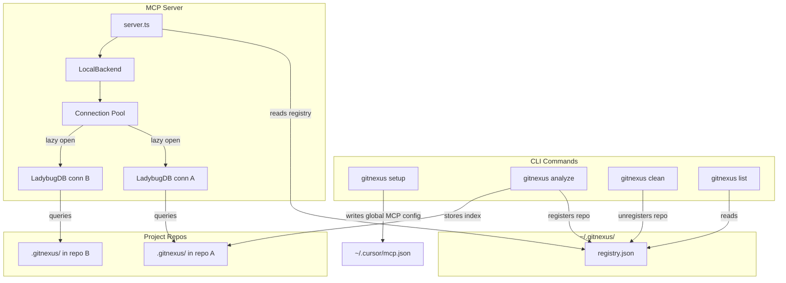
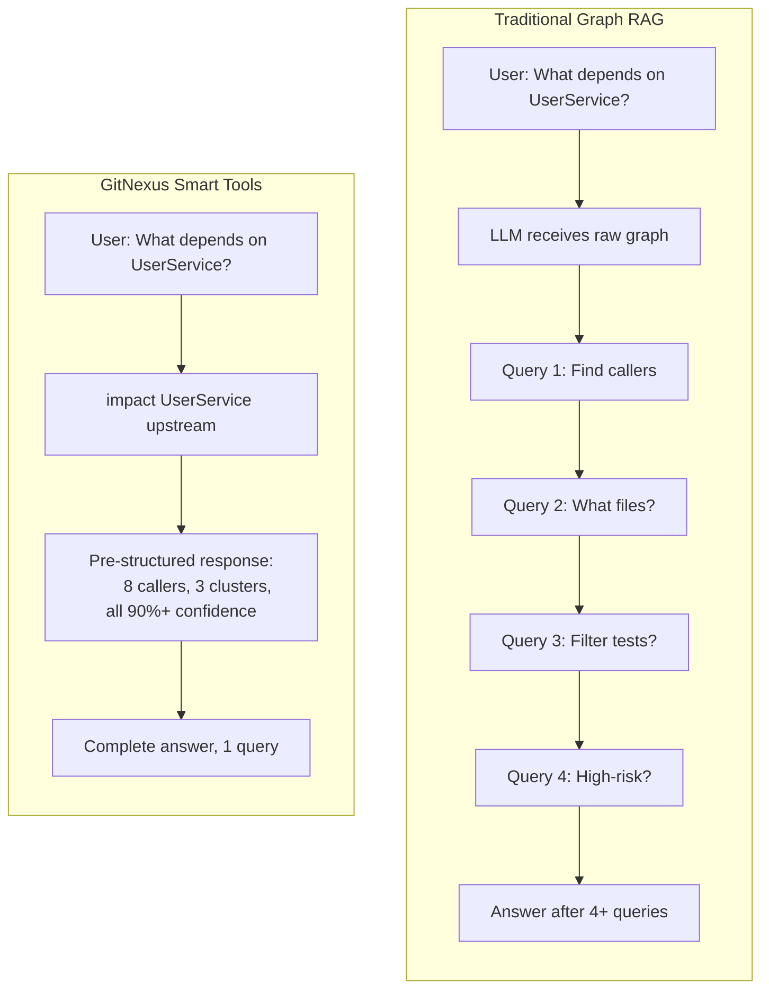
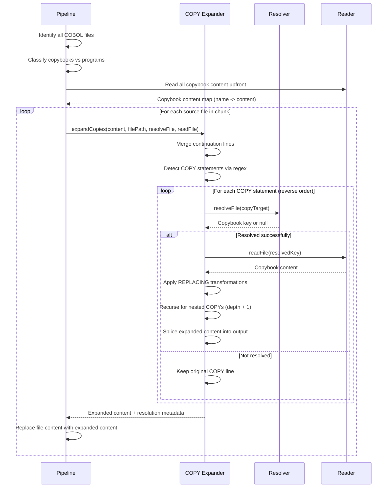
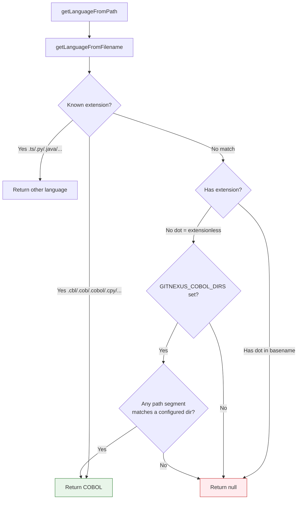
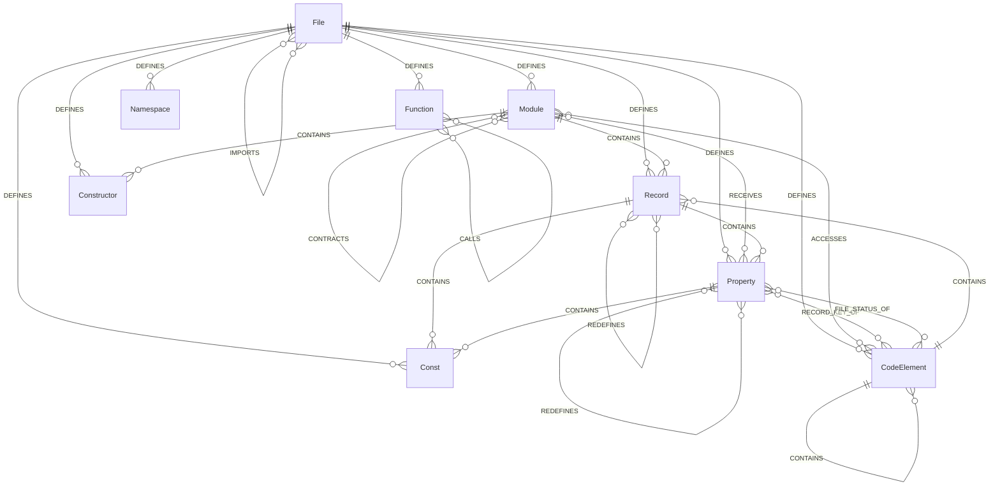
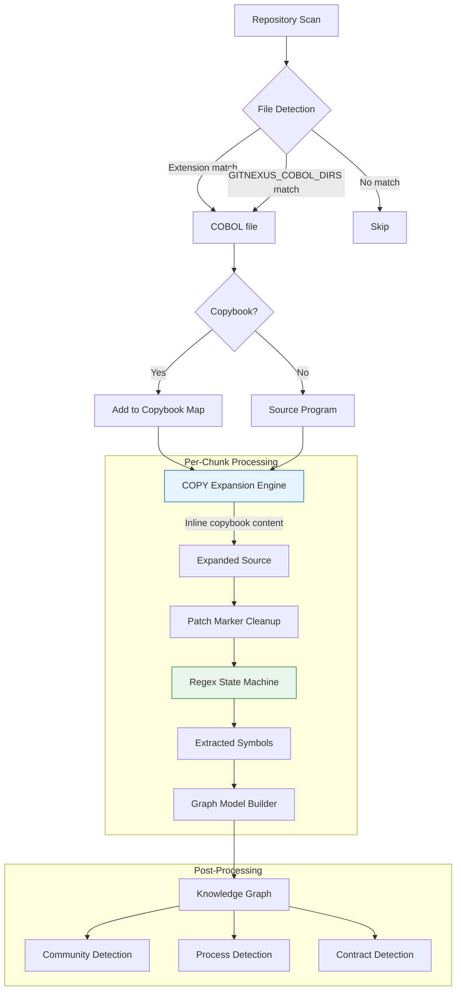
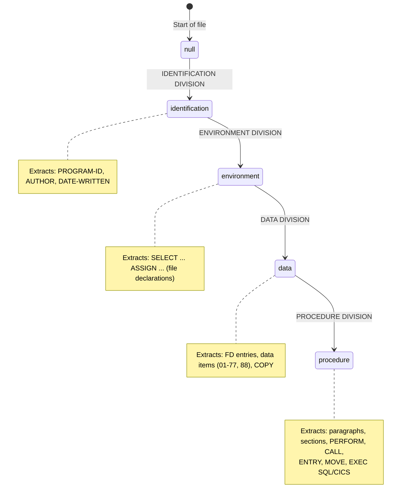
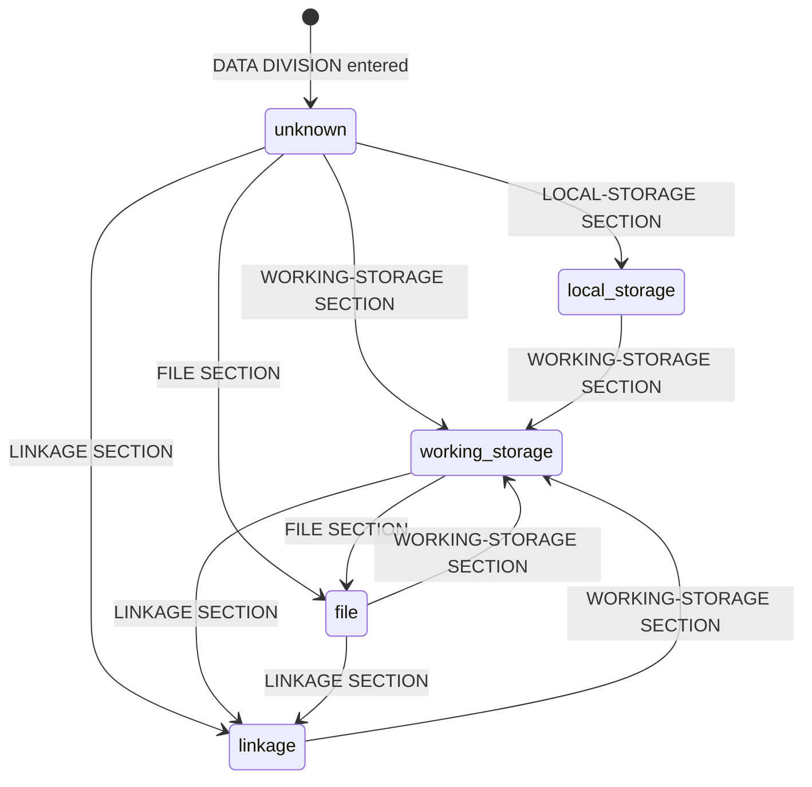

# KNOWLEDGE EXTRACT: knowledge_gitnexus
> **Extracted on:** 2026-03-30 11:09:54
> **Source:** knowledge_gitnexus

---

## File: `.cursorrules`
```
# Deprecated for Cursor Agent Mode

Use **`.cursor/index.mdc`** (`alwaysApply: true`) for project rules. See [AGENTS.md](../bmad_repo/agents.md).

This file is kept only as a breadcrumb for older workflows.
```

## File: `.git-blame-ignore-revs`
```
# Prettier initial formatting (2026-03-28)
afcc3d1523f99c77ff67c4fd1af12334660113f6

# ESLint unused import removal (2026-03-28)
1491826bc8da5436d3b1eb092d9274f2c9f028a7
```

## File: `.gitattributes`
```
* text=auto eol=lf
.husky/* text eol=lf
```

## File: `.gitignore`
```
# Dependencies
node_modules/

# Build output
dist/

# TypeScript build info
*.tsbuildinfo

# IDE
.vscode/
.idea/
*.swp
*.swo

# OS
.DS_Store
Thumbs.db

.claude/settings.local.json

# Environment variables
.env
.env.local
.env.*.local

# Logs
*.log
npm-debug.log*

# Testing
coverage/

# Misc
*.local
HANDOFF.md
HANDOFF*.md

.vercel


.env*.local
.gitnexus
.claude/settings.local.json

# Claude Code worktrees
.claude/worktrees/

# Claude code skills
.claude/skills/generated/

# Assets (screenshots, images)
assets/

# Generated files (should not be indexed)
repomix-output*

# Playwright artifacts
gitnexus-web/playwright-report/
gitnexus-web/test-results/

# Python test artifacts
eval/.coverage
eval/.hypothesis/

# Design docs (local only)
docs/plans/

gitnexus/test/fixtures/mini-repo/*.md
gitnexus/test/fixtures/mini-repo/.claude
gitnexus/test/fixtures/mini-repo/.gitignore

# Ignore csharp generated obj and bin folders
gitnexus/test/fixtures/lang-resolution/**/obj
gitnexus/test/fixtures/lang-resolution/**/bin
GitNexus.sln
# Git worktrees
.worktrees/

/github/scripts/triage/__pycache__/

.claude-flow/

.claude/agents/
.claude/commands/
.claude/helpers
.claude/skills/
!.claude/skills/gitnexus/

.history/

.swarm/

local_docs/
```

## File: `.mcp.json`
```json
{
  "mcpServers": {
    "gitnexus": {
      "type": "stdio",
      "command": "npx",
      "args": ["-y", "gitnexus@latest", "mcp"]
    }
  }
}
```

## File: `.prettierignore`
```
dist/
coverage/
gitnexus/vendor/
gitnexus/test/fixtures/
gitnexus-web/playwright-report/
gitnexus-web/test-results/
*.d.ts
*.snap
*.wasm
*.md
.gitnexus/
.vercel/
.claude-flow/
.swarm/
assets/
repomix-output*
```

## File: `.prettierrc`
```
{
  "semi": true,
  "singleQuote": true,
  "trailingComma": "all",
  "printWidth": 100,
  "tabWidth": 2,
  "endOfLine": "lf",
  "plugins": ["prettier-plugin-tailwindcss"],
  "tailwindStylesheet": "./gitnexus-web/src/index.css"
}
```

## File: `.windsurfrules`
```
# AI Agent Rules

Follow .gitnexus/RULES.md for all project context and coding guidelines.

This project uses GitNexus MCP for code intelligence. See .gitnexus/RULES.md for available tools and best practices.
```

## File: `AGENTS.md`
```markdown
<!-- version: 1.2.0 -->
<!--
  Metadata: version, last reviewed, scope, model policy, reference docs, changelog.
  Last updated: 2026-03-22
-->

Last reviewed: 2026-03-24

**Project:** GitNexus · **Environment:** dev · **Maintainer:** repository maintainers (see GitHub)

This file uses a standard agent header (version, scope, model policy, reference docs, changelog), adapted for this **TypeScript/JavaScript monorepo**.

## Scope

| | |
|--|--|
| **Reads** | Repository tree as needed for the task: `gitnexus/`, `gitnexus-web/`, `eval/`, plugin packages, `.github/`, `.gitnexus/` when present, and docs. |
| **Writes** | Only paths required for the requested change; keep diffs minimal. Update lockfiles when dependencies change. |
| **Executes** | `npm`, `npx`, `node` under `gitnexus/` and `gitnexus-web/`; `uv run` for Python under `eval/` when applicable; shell utilities for documented CI/dev workflows. |
| **Off-limits** | User secrets (e.g. real `.env`), production deployment credentials, unrelated repositories, destructive git history operations without explicit human confirmation. |

## Model Configuration

- **Primary:** Pin in **Cursor** (Settings → model). Use a **named** model (e.g. GPT-5.2, Claude Sonnet 4.x). Avoid relying on **Auto** when reproducibility or audit trail matters.
- **Fallback:** As configured in Cursor or your organization (do not encode `latest` or wildcards in automation configs).
- **Notes:** The open-source GitNexus CLI indexer does not call an LLM. Optional Nexus AI in the web UI uses end-user provider keys and models.

## Execution Sequence (complex tasks)

Long sessions dilute instructions. For **multi-step** work, state up front:

1. Which rules in this file and **[GUARDRAILS.md](../../../core/security/QUARANTINE/incoming/UPDATE/knowledge_gitnexus/GUARDRAILS.md)** apply (and any relevant Signs).
2. Current **Scope** boundaries (Reads / Writes / Off-limits).
3. Which **validation commands** you will run (e.g. `cd gitnexus && npm test`, `npx tsc --noEmit`).

On very long threads, the human may add *“Remember: apply all AGENTS.md rules”* to re-weight rule tokens against context dilution.

## Claude Code hooks

Hooks enforce gates that prompts cannot. In **Claude Code**, **PreToolUse** hooks can block tools such as `git_commit` until checks pass. Adapt to this repo: e.g. `cd gitnexus && npm test` before commit.

## Context budget (Cursor / standards)

Generic “core standards” playbooks are often long and stack-specific. For this monorepo, commands and gotchas live under **Cursor Cloud specific instructions** below and in **[CONTRIBUTING.md](CONTRIBUTING.md)**. If always-on rules grow, split domain rules into **`.cursor/rules/*.mdc`** (globs). **Cursor:** project-wide rules live in **`.cursor/index.mdc`** (YAML frontmatter with `alwaysApply: true`). **Claude Code:** optionally load a **`STANDARDS.md`** only when needed (e.g. *“When writing new code, read STANDARDS.md”*) to save context.

## Reference Documentation

- **This repository:** **[ARCHITECTURE.md](ARCHITECTURE.md)**, **[CONTRIBUTING.md](CONTRIBUTING.md)**, **[GUARDRAILS.md](../../../core/security/QUARANTINE/incoming/UPDATE/knowledge_gitnexus/GUARDRAILS.md)**.
- **Cursor:** `.cursor/index.mdc` (always-on rules); optional `.cursor/rules/*.mdc` (glob-scoped). Legacy `.cursorrules` is deprecated — see `.cursor/index.mdc`.
- **Optional local files:** `NOTES.md` (short vendor-neutral project snapshot). For handoffs, keep notes local (e.g., a scratch file outside the repo) rather than committing `HANDOFF.md`.
- **GitNexus:** skills under `.claude/skills/gitnexus/`; machine-oriented rules in the `gitnexus:start` … `gitnexus:end` block below.

## Changelog

| Date | Version | Change |
|------|---------|--------|
| 2026-03-24 | 1.2.0 | Fixed gitnexus:start block duplication (was inlined in Reference Docs bullet). |
| 2026-03-23 | 1.1.0 | Updated agent instructions (sections, references, Cursor layout). |
| 2026-03-22 | 1.0.0 | Added structured agent header and changelog. |

---

<!-- gitnexus:start -->
# GitNexus — Code Intelligence

This project is indexed by GitNexus as **GitNexus**. Use the GitNexus MCP tools to understand code, assess impact, and navigate safely. For current symbol stats, run `npx gitnexus analyze` and inspect `.gitnexus/meta.json`.

> If any GitNexus tool warns the index is stale, run `npx gitnexus analyze` in terminal first.

## Always Do

- **MUST run impact analysis before editing any symbol.** Before modifying a function, class, or method, run `gitnexus_impact({target: "symbolName", direction: "upstream"})` and report the blast radius (direct callers, affected processes, risk level) to the user.
- **MUST run `gitnexus_detect_changes()` before committing** to verify your changes only affect expected symbols and execution flows.
- **MUST warn the user** if impact analysis returns HIGH or CRITICAL risk before proceeding with edits.
- When exploring unfamiliar code, use `gitnexus_query({query: "concept"})` to find execution flows instead of grepping. It returns process-grouped results ranked by relevance.
- When you need full context on a specific symbol — callers, callees, which execution flows it participates in — use `gitnexus_context({name: "symbolName"})`.

## When Debugging

1. `gitnexus_query({query: "<error or symptom>"})` — find execution flows related to the issue
2. `gitnexus_context({name: "<suspect function>"})` — see all callers, callees, and process participation
3. `READ gitnexus://repo/GitNexus/process/{processName}` — trace the full execution flow step by step
4. For regressions: `gitnexus_detect_changes({scope: "compare", base_ref: "main"})` — see what your branch changed

## When Refactoring

- **Renaming**: MUST use `gitnexus_rename({symbol_name: "old", new_name: "new", dry_run: true})` first. Review the preview — graph edits are safe, text_search edits need manual review. Then run with `dry_run: false`.
- **Extracting/Splitting**: MUST run `gitnexus_context({name: "target"})` to see all incoming/outgoing refs, then `gitnexus_impact({target: "target", direction: "upstream"})` to find all external callers before moving code.
- After any refactor: run `gitnexus_detect_changes({scope: "all"})` to verify only expected files changed.

## Never Do

- NEVER edit a function, class, or method without first running `gitnexus_impact` on it.
- NEVER ignore HIGH or CRITICAL risk warnings from impact analysis.
- NEVER rename symbols with find-and-replace — use `gitnexus_rename` which understands the call graph.
- NEVER commit changes without running `gitnexus_detect_changes()` to check affected scope.

## Tools Quick Reference

| Tool | When to use | Command |
|------|-------------|---------|
| `query` | Find code by concept | `gitnexus_query({query: "auth validation"})` |
| `context` | 360-degree view of one symbol | `gitnexus_context({name: "validateUser"})` |
| `impact` | Blast radius before editing | `gitnexus_impact({target: "X", direction: "upstream"})` |
| `detect_changes` | Pre-commit scope check | `gitnexus_detect_changes({scope: "staged"})` |
| `rename` | Safe multi-file rename | `gitnexus_rename({symbol_name: "old", new_name: "new", dry_run: true})` |
| `cypher` | Custom graph queries | `gitnexus_cypher({query: "MATCH ..."})` |

## Impact Risk Levels

| Depth | Meaning | Action |
|-------|---------|--------|
| d=1 | WILL BREAK — direct callers/importers | MUST update these |
| d=2 | LIKELY AFFECTED — indirect deps | Should test |
| d=3 | MAY NEED TESTING — transitive | Test if critical path |

## Resources

| Resource | Use for |
|----------|---------|
| `gitnexus://repo/GitNexus/context` | Codebase overview, check index freshness |
| `gitnexus://repo/GitNexus/clusters` | All functional areas |
| `gitnexus://repo/GitNexus/processes` | All execution flows |
| `gitnexus://repo/GitNexus/process/{name}` | Step-by-step execution trace |

## Self-Check Before Finishing

Before completing any code modification task, verify:
1. `gitnexus_impact` was run for all modified symbols
2. No HIGH/CRITICAL risk warnings were ignored
3. `gitnexus_detect_changes()` confirms changes match expected scope
4. All d=1 (WILL BREAK) dependents were updated

## Keeping the Index Fresh

After committing code changes, the GitNexus index becomes stale. Re-run analyze to update it:

```bash
npx gitnexus analyze
```

If the index previously included embeddings, preserve them by adding `--embeddings`:

```bash
npx gitnexus analyze --embeddings
```

To check whether embeddings exist, inspect `.gitnexus/meta.json` — the `stats.embeddings` field shows the count (0 means no embeddings). **Running analyze without `--embeddings` will delete any previously generated embeddings.**

> Claude Code users: A PostToolUse hook handles this automatically after `git commit` and `git merge`.

## CLI

| Task | Read this skill file |
|------|---------------------|
| Understand architecture / "How does X work?" | `.claude/skills/gitnexus/gitnexus-exploring/SKILL.md` |
| Blast radius / "What breaks if I change X?" | `.claude/skills/gitnexus/gitnexus-impact-analysis/SKILL.md` |
| Trace bugs / "Why is X failing?" | `.claude/skills/gitnexus/gitnexus-debugging/SKILL.md` |
| Rename / extract / split / refactor | `.claude/skills/gitnexus/gitnexus-refactoring/SKILL.md` |
| Tools, resources, schema reference | `.claude/skills/gitnexus/gitnexus-guide/SKILL.md` |
| Index, status, clean, wiki CLI commands | `.claude/skills/gitnexus/gitnexus-cli/SKILL.md` |

<!-- gitnexus:end -->

## Cursor Cloud specific instructions

### Repository structure

This is a monorepo with two main products and supporting config packages:

| Component | Path | Purpose |
|-----------|------|---------|
| **GitNexus CLI/Core** | `gitnexus/` | Main product — TypeScript CLI, indexing pipeline, MCP server. Published to npm. |
| **GitNexus Web UI** | `gitnexus-web/` | React/Vite browser app — graph explorer + AI chat. Runs entirely in WASM. |
| Claude Plugin | `gitnexus-claude-plugin/` | Static config for Claude marketplace (no build). |
| Cursor Integration | `gitnexus-cursor-integration/` | Static config for Cursor editor (no build). |
| SWE-bench Eval | `eval/` | Python evaluation harness (optional; needs Docker + LLM API keys). |

### Running services

- **CLI/Core**: `cd gitnexus && npm run dev` (tsx watch mode) or `npm run build && node dist/cli/index.js <command>`
- **Web UI**: `cd gitnexus-web && npm run dev` (Vite on port 5173)
- **Backend mode**: `cd <indexed-repo> && node /workspace/gitnexus/dist/cli/index.js serve` (HTTP API on port 3741 by default)

### Testing

**CLI / Core (`gitnexus/`)**
- **Unit tests**: `cd gitnexus && npm test` (vitest, ~2000 tests)
- **Integration tests**: `cd gitnexus && npm run test:integration` (vitest, ~1850 tests). Two LadybugDB file-locking tests (`lbug-core-adapter`, `search-core`) may fail in containerized environments due to `/tmp` locking limitations — this is a known environment issue, not a code bug.
- **TypeScript check**: `cd gitnexus && npx tsc --noEmit`

**Web UI (`gitnexus-web/`)**
- **Unit tests**: `cd gitnexus-web && npm test` (vitest, ~200 tests)
- **E2E tests**: `cd gitnexus-web && E2E=1 npx playwright test` (Playwright, 5 tests — requires `gitnexus serve` + `npm run dev` running)
- **TypeScript check**: `cd gitnexus-web && npx tsc -b --noEmit`

No separate lint command is configured; TypeScript strict checking serves as the primary static analysis.

### Gotchas

- `npm install` in `gitnexus/` triggers `prepare` (builds via `tsc`) and `postinstall` (patches tree-sitter-swift). Native tree-sitter bindings require `python3`, `make`, and `g++` to be present.
- `tree-sitter-kotlin` and `tree-sitter-swift` are optional dependencies — install warnings for these are expected and non-blocking.
- The Web UI uses `vite-plugin-wasm` and requires `Cross-Origin-Opener-Policy`/`Cross-Origin-Embedder-Policy` headers for `SharedArrayBuffer` (handled automatically by Vite dev server).
- There is no ESLint/Prettier configuration in this repo.
```

## File: `ARCHITECTURE.md`
```markdown
# Architecture — GitNexus

This repository is a **monorepo** with two main products: the **CLI / MCP package** (`gitnexus/`) and the **browser UI** (`gitnexus-web/`). Supporting folders ship editor integrations and plugins without changing the core graph engine.

## Repository layout

| Path | Role |
|------|------|
| `gitnexus/` | Published npm package `gitnexus`: CLI, MCP server (stdio), local HTTP API for bridge mode, ingestion pipeline, LadybugDB graph, embeddings (optional). |
| `gitnexus-web/` | Vite + React UI: in-browser indexing (WASM), graph visualization, optional connection to `gitnexus serve`. |
| `.claude/`, `gitnexus-claude-plugin/`, `gitnexus-cursor-integration/` | Packaged **skills** and plugin metadata so agents discover the same workflows as documented in `AGENTS.md`. |
| `eval/` | Evaluation harnesses and docs for benchmarking tool usage. |
| `.github/` | CI workflows (quality, unit, integration, E2E) and composite actions. |

## End-to-end flow: index → graph → tools

1. **Ingestion** (`gitnexus analyze`)  
   - Entry: `gitnexus/src/cli/analyze.ts` → `runPipelineFromRepo` in `gitnexus/src/core/ingestion/pipeline.ts`.  
   - Walks the git working tree, parses supported languages via **Tree-sitter**, resolves imports/calls/inheritance, detects **communities** and **processes** (execution flows), and builds an in-memory **knowledge graph** (`gitnexus/src/core/graph/`).  
   - Output is loaded into **LadybugDB** under **`.gitnexus/`** at the repo root (`lbug/`, `meta.json`, etc.). Optional **FTS** indexes and **embeddings** attach to the same store.  
   - The repo is registered in **`~/.gitnexus/registry.json`** so MCP can find it from any working directory.

2. **Persistence & metadata**  
   - `gitnexus/src/storage/repo-manager.ts` — paths, registry, cleanup of legacy Kuzu artifacts.  
   - `gitnexus/src/core/lbug/lbug-adapter.ts` — graph load, queries, embedding restore batches.

3. **Query & agents**  
   - **MCP (stdio):** `gitnexus/src/cli/mcp.ts` → `startMCPServer` → `LocalBackend` (`gitnexus/src/mcp/local/local-backend.ts`) opens registered repos and serves **tools** from `gitnexus/src/mcp/tools.ts` and **resources** from `gitnexus/src/mcp/resources.ts`.  
   - **Bridge HTTP:** `gitnexus/src/cli/serve.ts` → Express app in `gitnexus/src/server/api.ts` (CORS-limited) exposes REST + MCP-over-HTTP for the web UI.  
   - **CLI tools (no MCP):** `gitnexus query`, `context`, `impact`, `cypher` in `gitnexus/src/cli/tool.ts` call the same backend for scripts and CI.

4. **Staleness**  
   - `gitnexus/src/mcp/staleness.ts` compares indexed `lastCommit` to `HEAD` and surfaces hints when the graph is behind git.

## MCP tools (summary)

| Tool | Purpose |
|------|---------|
| `list_repos` | Discover indexed repositories when more than one is registered. |
| `query` | Natural-language / keyword search over the graph (hybrid BM25 + optional vectors). |
| `cypher` | Ad hoc **Cypher** against the schema (see resource `gitnexus://repo/{name}/schema`). |
| `context` | Callers, callees, processes for one symbol (with disambiguation). |
| `impact` | Blast radius (upstream/downstream) with depth and risk summary. |
| `detect_changes` | Map git diffs to affected symbols and processes. |
| `rename` | Graph-assisted rename with `dry_run` preview (`graph` vs `text_search` confidence). |

## Where to change what

| If you are changing… | Start in… |
|----------------------|-----------|
| CLI commands / flags | `gitnexus/src/cli/` (`index.ts`, per-command modules). |
| Parsing or graph construction | `gitnexus/src/core/ingestion/` (pipeline, processors, resolvers, type-extractors). |
| Graph schema / DB access | `gitnexus/src/core/lbug/` (`schema.ts`, `lbug-adapter.ts`), `gitnexus/src/mcp/core/lbug-adapter.ts` if MCP-specific. |
| MCP protocol, tools, resources | `gitnexus/src/mcp/server.ts`, `tools.ts`, `resources.ts`. |
| Search ranking | `gitnexus/src/core/search/` (BM25, hybrid fusion). |
| Embeddings | `gitnexus/src/core/embeddings/`, phases in `analyze.ts`. |
| Wiki generation | `gitnexus/src/core/wiki/`. |
| Web UI behavior | `gitnexus-web/src/` (components, workers, graph client). |
| CI | `.github/workflows/*.yml`, `.github/actions/setup-gitnexus/`. |

## Related docs

- [RUNBOOK.md](../../../core/security/QUARANTINE/incoming/UPDATE/knowledge_gitnexus/RUNBOOK.md) — operational commands and recovery.  
- [GUARDRAILS.md](../../../core/security/QUARANTINE/incoming/UPDATE/knowledge_gitnexus/GUARDRAILS.md) — safety boundaries for humans and agents.  
- [TESTING.md](../bmad_repo/testing.md) — how to run tests.  
- `AGENTS.md` / `CLAUDE.md` — agent workflows and tool usage expectations for **this** repo when indexed by GitNexus.
```

## File: `CHANGELOG.md`
```markdown
# Changelog

All notable changes to GitNexus will be documented in this file.

## [Unreleased]

### Changed
- Migrated from KuzuDB to LadybugDB v0.15 (`@ladybugdb/core`, `@ladybugdb/wasm-core`)
- Renamed all internal paths from `kuzu` to `lbug` (storage: `.gitnexus/kuzu` → `.gitnexus/lbug`)
- Added automatic cleanup of stale KuzuDB index files
- LadybugDB v0.15 requires explicit VECTOR extension loading for semantic search

## [1.4.0] - 2026-03-13

### Added

- **Language-aware symbol resolution engine** with 3-tier resolver: exact FQN → scope-walk → guarded fuzzy fallback that refuses ambiguous matches (#238) — @magyargergo
- **Method Resolution Order (MRO)** with 5 language-specific strategies: C++ leftmost-base, C#/Java class-over-interface, Python C3 linearization, Rust qualified syntax, default BFS (#238) — @magyargergo
- **Constructor & struct literal resolution** across all languages — `new Foo()`, `User{...}`, C# primary constructors, target-typed new (#238) — @magyargergo
- **Receiver-constrained resolution** using per-file TypeEnv — disambiguates `user.save()` vs `repo.save()` via `ownerId` matching (#238) — @magyargergo
- **Heritage & ownership edges** — HAS_METHOD, OVERRIDES, Go struct embedding, Swift extension heritage, method signatures (`parameterCount`, `returnType`) (#238) — @magyargergo
- **Language-specific resolver directory** (`resolvers/`) — extracted JVM, Go, C#, PHP, Rust resolvers from monolithic import-processor (#238) — @magyargergo
- **Type extractor directory** (`type-extractors/`) — per-language type binding extraction with `Record<SupportedLanguages, Handler>` + `satisfies` dispatch (#238) — @magyargergo
- **Export detection dispatch table** — compile-time exhaustive `Record` + `satisfies` pattern replacing switch/if chains (#238) — @magyargergo
- **Language config module** (`language-config.ts`) — centralized tsconfig, go.mod, composer.json, .csproj, Swift package config loaders (#238) — @magyargergo
- **Optional skill generation** via `npx gitnexus analyze --skills` — generates AI agent skills from KuzuDB knowledge graph (#171) — @zander-raycraft
- **First-class C# support** — sibling-based modifier scanning, record/delegate/property/field/event declaration types (#163, #170, #178 via #237) — @Alice523, @benny-yamagata, @jnMetaCode
- **C/C++ support fixes** — `.h` → C++ mapping, static-linkage export detection, qualified/parenthesized declarators, 48 entry point patterns (#163, #227 via #237) — @Alice523, @bitgineer
- **Rust support fixes** — sibling-based `visibility_modifier` scanning for `pub` detection (#227 via #237) — @bitgineer
- **Adaptive tree-sitter buffer sizing** — `Math.min(Math.max(contentLength * 2, 512KB), 32MB)` (#216 via #237) — @JasonOA888
- **Call expression matching** in tree-sitter queries (#234 via #237) — @ex-nihilo-jg
- **DeepSeek model configurations** (#217) — @JasonOA888
- 282+ new unit tests, 178 integration resolver tests across 9 languages, 53 test files, 1146 total tests passing

### Fixed

- Skip unavailable native Swift parsers in sequential ingestion (#188) — @Gujiassh
- Heritage heuristic language-gated — no longer applies class/interface rules to wrong languages (#238) — @magyargergo
- C# `base_list` distinguishes EXTENDS vs IMPLEMENTS via symbol table + `I[A-Z]` heuristic (#238) — @magyargergo
- Go `qualified_type` (`models.User`) correctly unwrapped in TypeEnv (#238) — @magyargergo
- Global tier no longer blocks resolution when kind/arity filtering can narrow to 1 candidate (#238) — @magyargergo

### Changed

- `import-processor.ts` reduced from 1412 → 711 lines (50% reduction) via resolver and config extraction (#238) — @magyargergo
- `type-env.ts` reduced from 635 → ~125 lines via type-extractor extraction (#238) — @magyargergo
- CI/CD workflows hardened with security fixes and fork PR support (#222, #225) — @magyargergo

## [1.3.11] - 2026-03-08

### Security

- Fix FTS Cypher injection by escaping backslashes in search queries (#209) — @magyargergo

### Added

- Auto-reindex hook that runs `gitnexus analyze` after commits and merges, with automatic embeddings preservation (#205) — @L1nusB
- 968 integration tests (up from ~840) covering unhappy paths across search, enrichment, CLI, pipeline, worker pool, and KuzuDB (#209) — @magyargergo
- Coverage auto-ratcheting so thresholds bump automatically on CI (#209) — @magyargergo
- Rich CI PR report with coverage bars, test counts, and threshold tracking (#209) — @magyargergo
- Modular CI workflow architecture with separate unit-test, integration-test, and orchestrator jobs (#209) — @magyargergo

### Fixed

- KuzuDB native addon crashes on Linux/macOS by running integration tests in isolated vitest processes with `--pool=forks` (#209) — @magyargergo
- Worker pool `MODULE_NOT_FOUND` crash when script path is invalid (#209) — @magyargergo

### Changed

- Added macOS to the cross-platform CI test matrix (#208) — @magyargergo

## [1.3.10] - 2026-03-07

### Security

- **MCP transport buffer cap**: Added 10 MB `MAX_BUFFER_SIZE` limit to prevent out-of-memory attacks via oversized `Content-Length` headers or unbounded newline-delimited input
- **Content-Length validation**: Reject `Content-Length` values exceeding the buffer cap before allocating memory
- **Stack overflow prevention**: Replaced recursive `readNewlineMessage` with iterative loop to prevent stack overflow from consecutive empty lines
- **Ambiguous prefix hardening**: Tightened `looksLikeContentLength` to require 14+ bytes before matching, preventing false framing detection on short input
- **Closed transport guard**: `send()` now rejects with a clear error when called after `close()`, with proper write-error propagation

### Added

- **Dual-framing MCP transport** (`CompatibleStdioServerTransport`): Auto-detects Content-Length (Codex/OpenCode) and newline-delimited JSON (Cursor/Claude Code) framing on the first message, responds in the same format (#207)
- **Lazy CLI module loading**: All CLI subcommands now use `createLazyAction()` to defer heavy imports (tree-sitter, ONNX, KuzuDB) until invocation, significantly improving `gitnexus mcp` startup time (#207)
- **Type-safe lazy actions**: `createLazyAction` uses constrained generics to validate export names against module types at compile time
- **Regression test suite**: 13 unit tests covering transport framing, security hardening, buffer limits, and lazy action loading

### Fixed

- **CALLS edge sourceId alignment**: `findEnclosingFunctionId` now generates IDs with `:startLine` suffix matching node creation format, fixing process detector finding 0 entry points (#194)
- **LRU cache zero maxSize crash**: Guard `createASTCache` against `maxSize=0` when repos have no parseable files (#144)

### Changed

- Transport constructor accepts `NodeJS.ReadableStream` / `NodeJS.WritableStream` (widened from concrete `ReadStream`/`WriteStream`)
- `processReadBuffer` simplified to break on first error instead of stale-buffer retry loop

## [1.3.9] - 2026-03-06

### Fixed

- Aligned CALLS edge sourceId with node ID format in parse worker (#194)

## [1.3.8] - 2026-03-05

### Fixed

- Force-exit after analyze to prevent KuzuDB native cleanup hang (#192)
```

## File: `CLAUDE.md`
```markdown
<!-- version: 1.2.0 -->
<!--
  Metadata: version, last reviewed, scope, model policy, reference docs, changelog.
  Last updated: 2026-03-22
-->

Last reviewed: 2026-03-24

**Project:** GitNexus · **Environment:** dev · **Maintainer:** repository maintainers (see GitHub)

Follow **AGENTS.md** for the canonical rules; this file adds Claude Code–specific deltas. Cursor-specific notes live only in `AGENTS.md`.

## Scope

See the **Scope** table in [AGENTS.md](../bmad_repo/agents.md) for read/write/execute/off-limits boundaries. Cursor-specific workflow notes also live only in AGENTS.md.

## Model Configuration

- **Primary:** Pin per **Claude Code** / Anthropic org policy (explicit model id). Do not rely on an unversioned `latest` alias for governed workflows.
- **Fallback:** As configured in Claude Code (organization default or user override).
- **Notes:** The GitNexus CLI analyzer does not call an LLM.

## Execution Sequence (complex tasks)

Same discipline as [AGENTS.md](../bmad_repo/agents.md): before large multi-step work, state which **AGENTS.md** / **GUARDRAILS.md** rules apply, current **Scope**, and planned validation commands (`npm test`, `tsc`, etc.). When pausing, summarize progress in the chat or a **local** scratch file (do not add `HANDOFF.md` to the repo), then `/clear` and resume with that summary.

## Claude Code hooks

Prefer **PreToolUse** hooks for hard gates (e.g. tests before `git_commit`). Adapt hook commands to `gitnexus/` npm scripts.

## Context budget

If always-on instructions grow, load deep conventions via conditional reads (e.g. *“When writing new code, read STANDARDS.md”*) instead of pasting long blocks here. In Cursor, prefer `.cursor/index.mdc` plus optional `.cursor/rules/*.mdc` globs (see [AGENTS.md](../bmad_repo/agents.md) § Context budget).

## Reference Documentation

- **This repository:** [AGENTS.md](../bmad_repo/agents.md) (Cursor + monorepo notes), [ARCHITECTURE.md](ARCHITECTURE.md), [CONTRIBUTING.md](CONTRIBUTING.md), [GUARDRAILS.md](../../../core/security/QUARANTINE/incoming/UPDATE/knowledge_gitnexus/GUARDRAILS.md).
- **GitNexus:** `.claude/skills/gitnexus/`; MCP and indexed-repo rules live only in [AGENTS.md](../bmad_repo/agents.md) (`gitnexus:start` … `gitnexus:end`). See **GitNexus rules** below.

## Changelog

| Date | Version | Change |
|------|---------|--------|
| 2026-03-24 | 1.2.0 | Removed duplicated gitnexus:start block and scope table; replaced with pointers to AGENTS.md. |
| 2026-03-23 | 1.1.0 | Updated agent instructions to match AGENTS.md. |
| 2026-03-22 | 1.0.0 | Added structured header and changelog. |

---

## GitNexus rules

GitNexus MCP rules are in the `<!-- gitnexus:start -->` … `<!-- gitnexus:end -->` block in **[AGENTS.md](../bmad_repo/agents.md)** — load that section when working with MCP tools or the graph index.
```

## File: `compound-engineering.local.md`
```markdown
---
review_agents: [kieran-typescript-reviewer, pattern-recognition-specialist, architecture-strategist, data-integrity-guardian, security-sentinel, performance-oracle, code-simplicity-reviewer]
plan_review_agents: [kieran-typescript-reviewer, architecture-strategist, code-simplicity-reviewer]
voltagent_agents: [voltagent-lang:typescript-pro, voltagent-qa-sec:security-auditor, voltagent-data-ai:database-optimizer]
---

# Review Context

## Project Overview
GitNexus is a code intelligence tool that builds a knowledge graph from source code using tree-sitter AST parsing across 12 languages and KuzuDB for graph storage. Two packages: `gitnexus/` (CLI/MCP, TypeScript) and `gitnexus-web/` (browser).

## Cross-Language Pattern Consistency (pattern-recognition-specialist)
- 12 language-specific type extractors in `gitnexus/src/core/ingestion/type-extractors/` must follow identical patterns for: async unwrapping, constructor binding, namespace handling, nullable type stripping, for-loop element typing.
- Past bugs: C#/Rust missing `await_expression` unwrapping that TypeScript handled correctly; PHP backslash namespace splitting inconsistent with other languages' `::` / `.` splitting.
- When reviewing type extractor changes, verify the same pattern exists in ALL applicable language files — asymmetry is the #1 source of bugs.

## Data Integrity (data-integrity-guardian)
- KuzuDB graph operations: schema in `gitnexus/src/core/kuzu/schema.ts`, adapter in `kuzu-adapter.ts`.
- The ingestion pipeline writes symbols and relationships to the graph — changes to node/relation schemas or the ingestion pipeline can corrupt the index.
- Known issue: KuzuDB `close()` hangs on Linux due to C++ destructor — use `detachKuzu()` pattern.
- `lbug-adapter.ts` fallback path needs quote/newline escaping for Cypher injection prevention.

## Security (security-sentinel)
- Cypher query construction in `lbug-adapter.ts` and `kuzu-adapter.ts` — watch for injection via unescaped user-provided symbol names.
- CLI accepts `--repo` parameter and file paths — validate against path traversal.
- MCP server exposes tools to external AI agents — all tool inputs are untrusted.

## Performance (performance-oracle)
- Tree-sitter buffer size is adaptive (512KB–32MB) via `getTreeSitterBufferSize()` in `constants.ts`.
- The ingestion pipeline processes entire repositories — O(n) per file with potential O(n²) in cross-file resolution.
- KuzuDB batch inserts vs individual inserts matter for large repos.

## Architecture (architecture-strategist)
- Ingestion pipeline phases: structure → parsing → imports → calls → heritage → processes → type resolution.
- Shared modules: `export-detection.ts`, `constants.ts`, `utils.ts` — changes here have wide blast radius.
- `gitnexus-web` package drifts behind CLI — flag if a change should be mirrored.

## Voltagent Supplementary Agents

Invoke these via the Agent tool alongside `/ce:review` for deeper specialist analysis. These cover gaps that compound-engineering agents don't:

### voltagent-lang:typescript-pro
**When:** Changes touch type-resolution logic, generics, conditional types, or complex type-level programming in `type-env.ts`, `type-extractors/*.ts`, or `types.ts`.
**Why:** The type resolution system uses advanced TypeScript patterns (discriminated unions, mapped types, recursive generics) that benefit from deep TS type-system review beyond what kieran-typescript-reviewer covers.

### voltagent-qa-sec:security-auditor
**When:** Changes touch MCP tool handlers, Cypher query construction, CLI argument parsing, or any code that processes external input.
**Why:** GitNexus is an MCP server — all tool inputs come from untrusted AI agents. Systematic OWASP-level audit catches injection vectors that spot-checking misses. Past finding: `lbug-adapter.ts` fallback path had unescaped newlines in Cypher queries.

### voltagent-data-ai:database-optimizer
**When:** Changes touch `kuzu-adapter.ts`, `schema.ts`, `lbug-adapter.ts`, or any Cypher query construction/execution.
**Why:** No CE agent specializes in graph database optimization. KuzuDB batch insert patterns, index usage, and query planning directly affect analysis speed on large repos.

## Review Tooling
- Use `gitnexus_impact()` before approving changes to any symbol — check d=1 (WILL BREAK) callers.
- Use `gitnexus_detect_changes({scope: "compare", base_ref: "main"})` to map PR diffs to affected execution flows.
- Use claude-mem to surface past architectural decisions relevant to the code under review.
```

## File: `CONTRIBUTING.md`
```markdown
# Contributing to GitNexus

How to propose changes, run checks locally, and open pull requests.

## License

This project uses the [PolyForm Noncommercial License 1.0.0](https://polyformproject.org/licenses/noncommercial/1.0.0/). By contributing, you agree your contributions are licensed under the same terms unless stated otherwise.

## Where to discuss

- **Issues & feature ideas:** use [GitHub Issues](https://github.com/abhigyanpatwari/GitNexus/issues) for the upstream repo, or your fork’s tracker if you work from a fork.
- **Community:** see the Discord link in the root [README.md](README.md).

## Development setup

1. Clone the repository.
2. **CLI / MCP package:** `cd gitnexus && npm install && npm run build`
3. **Web UI (if needed):** `cd gitnexus-web && npm install`
4. Run tests as described in [TESTING.md](../bmad_repo/testing.md).

## Branch and pull requests

- Use short-lived branches off the default branch of the repo you are targeting.
- Prefer **conventional commits** (short prefix + description), for example:

  ```text
  feat: add graph export option
  fix: correct MCP tool schema for query
  test: cover cluster merge edge case
  docs: clarify analyze flags
  ```

- **PR title:** `[area] Short description` (e.g. `[cli] Fix index refresh race`).
- **PR description:** what changed, why, how to verify (commands), and any risk or rollback notes.

## Before you open a PR

- [ ] Tests pass for the packages you touched (`gitnexus` and/or `gitnexus-web`).
- [ ] Typecheck passes: `npx tsc --noEmit` in `gitnexus/` and `npx tsc -b --noEmit` in `gitnexus-web/`.
- [ ] No secrets, tokens, or machine-specific paths committed.
- [ ] Documentation updated if behavior or public CLI/MCP contract changes.
- [ ] Pre-commit hook runs clean (`.husky/pre-commit` — typecheck + unit tests for staged packages).

## Code review

Maintainers may request changes for correctness, tests, performance, or consistency with existing patterns. Keeping diffs focused makes review faster.

## AI-assisted contributions

If you use coding agents, follow project context files (e.g. `AGENTS.md`, `CLAUDE.md`) and avoid drive-by refactors unrelated to the issue. Prefer incremental, test-backed changes.
```

## File: `eslint.config.mjs`
```
import tsPlugin from '@typescript-eslint/eslint-plugin';
import tsParser from '@typescript-eslint/parser';
import unusedImports from 'eslint-plugin-unused-imports';
import reactHooks from 'eslint-plugin-react-hooks';
import prettierConfig from 'eslint-config-prettier';

export default [
  // Global ignores
  {
    ignores: [
      '**/dist/**',
      '**/node_modules/**',
      '**/coverage/**',
      'gitnexus/vendor/**',
      'gitnexus-web/src/vendor/**',
      'gitnexus/test/fixtures/**',
      'gitnexus-web/playwright-report/**',
      'gitnexus-web/test-results/**',
      '**/*.d.ts',
      '.claude/**',
      '.history/**',
    ],
  },

  // Base TypeScript config for all packages
  {
    files: ['**/*.{ts,tsx}'],
    languageOptions: {
      parser: tsParser,
      parserOptions: {
        ecmaVersion: 2022,
        sourceType: 'module',
      },
    },
    plugins: {
      '@typescript-eslint': tsPlugin,
      'unused-imports': unusedImports,
    },
    rules: {
      // Unused imports — auto-fixable
      'unused-imports/no-unused-imports': 'error',
      'unused-imports/no-unused-vars': [
        'warn',
        { vars: 'all', varsIgnorePattern: '^_', args: 'after-used', argsIgnorePattern: '^_' },
      ],

      // TypeScript quality
      '@typescript-eslint/no-unused-vars': 'off', // handled by unused-imports plugin
      'no-unused-vars': 'off', // handled by unused-imports plugin
      '@typescript-eslint/no-explicit-any': 'warn',
      '@typescript-eslint/no-non-null-assertion': 'warn',

      // General quality
      'no-debugger': 'error',
      'prefer-const': 'error',
      'no-var': 'error',
      eqeqeq: ['error', 'always', { null: 'ignore' }],
    },
  },

  // CLI package — allow console.log (it's a CLI tool)
  {
    files: ['gitnexus/src/cli/**/*.ts', 'gitnexus/src/server/**/*.ts'],
    rules: {
      'no-console': 'off',
    },
  },

  // React-specific rules for gitnexus-web
  {
    files: ['gitnexus-web/src/**/*.{ts,tsx}'],
    plugins: {
      'react-hooks': reactHooks,
    },
    rules: {
      'react-hooks/rules-of-hooks': 'error',
      'react-hooks/exhaustive-deps': 'warn',
    },
  },

  // Disable formatting rules (prettier handles those)
  prettierConfig,
];
```

## File: `GUARDRAILS.md`
```markdown
# Guardrails — GitNexus (repo + agents)

Rules for **human contributors** and **AI agents** working on this codebase or publishing artifacts. These complement `AGENTS.md` / `CLAUDE.md` (which focus on GitNexus-in-GitNexus workflows).

## Scope (typical agent session)

When automating changes in this repository, treat scope as **least privilege**:

- **Read:** Source, tests, docs, public config as needed for the task.  
- **Write:** Only files required for the requested fix or feature; avoid unrelated formatting or refactors.  
- **Execute:** Tests, typecheck, and documented CLI commands; do not run destructive commands on user data outside the repo without explicit approval.  
- **Off-limits:** Other people’s machines, production deployments you don’t own, and credentials you didn’t receive permission to use.

Adjust explicitly if the maintainer defines a different scope for a task.

---

## Non-negotiables

1. **Never commit secrets** — API keys, tokens, `.env` with real values, private URLs, or session cookies. Use `.env.example` with placeholders only.  
2. **Never rename symbols with blind find-and-replace** when working in a GitNexus-indexed project — use the **`rename` MCP tool** with **`dry_run: true` first**, then review `graph` vs `text_search` edits. (There is no separate `gitnexus rename` CLI; renaming goes through MCP or editor integration.)  
3. **Run impact analysis before editing shared symbols** — use **`impact`** (upstream) for functions/classes/methods others call; do not ignore **HIGH** / **CRITICAL** risk without maintainer sign-off.  
4. **Prefer `detect_changes` before commit** — confirm diffs map to expected symbols/processes when the graph is available.  
5. **Preserve embeddings** — if `.gitnexus/meta.json` shows embeddings, run `npx gitnexus analyze --embeddings` when refreshing the index; plain `analyze` can drop them.

---

## Signs (recurring failure patterns)

Use this format: **Trigger → Instruction → Reason**.  
Append new Signs here when the same mistake repeats (e.g. CI broken twice the same way).

### Sign: Stale graph after edits

- **Trigger:** MCP or resources warn the index is behind `HEAD`, or code search doesn’t match latest commit.  
- **Instruction:** Run `npx gitnexus analyze` from the repo root (plus `--embeddings` if the project used them).  
- **Reason:** Tools query LadybugDB built at last analyze; git changes are invisible until re-indexed.

### Sign: Embeddings vanished after analyze

- **Trigger:** Semantic search quality drops; `stats.embeddings` in `.gitnexus/meta.json` is 0 after a refresh.  
- **Instruction:** Re-run `npx gitnexus analyze --embeddings` and confirm `meta.json` reflects stored embeddings.  
- **Reason:** Embedding generation is opt-in; analyze without the flag does not preserve prior vectors.

### Sign: MCP lists no repos

- **Trigger:** MCP stderr says no indexed repos.  
- **Instruction:** Run `npx gitnexus analyze` in the target repository; verify `npx gitnexus list` shows it.  
- **Reason:** The MCP server discovers repos via `~/.gitnexus/registry.json`, populated by analyze.

### Sign: Wrong repo in multi-repo setups

- **Trigger:** Query/impact results clearly belong to another project.  
- **Instruction:** Call `list_repos`, then pass **`repo`** on subsequent tools (or use per-workspace MCP config).  
- **Reason:** Default target may be ambiguous when multiple repos are registered.

### Sign: LadybugDB lock / “database busy”

- **Trigger:** Errors opening `.gitnexus/lbug` while MCP and analyze both run.  
- **Instruction:** Stop overlapping processes; one writer at a time. Retry analyze or restart MCP.  
- **Reason:** Embedded DB expects single-process ownership of the store.

---

## Publishing & supply chain

- **npm:** Do not publish from unreviewed automation; follow maintainer release process. Bump version intentionally; tag releases to match `package.json`.  
- **Dependencies:** Prefer minimal, auditable changes to `package.json`; run tests and CI after lockfile updates.  
- **License:** This project ships under **PolyForm Noncommercial 1.0.0** — do not relicense or imply a different license in docs or metadata without maintainer approval.

---

## Escalation

Stop and ask a **human maintainer** when:

- Impact analysis shows **HIGH** / **CRITICAL** risk and the task still requires the change.  
- You need to alter **CI**, **release**, or **security-sensitive** config.  
- Requirements conflict (e.g. “speed up analyze” vs “must keep all embeddings on huge repo”).  
- You are unsure whether data loss is acceptable (`clean`, forced migrations, schema changes).

---

## Related docs

- [ARCHITECTURE.md](ARCHITECTURE.md) — components and data flow.  
- [RUNBOOK.md](../../../core/security/QUARANTINE/incoming/UPDATE/knowledge_gitnexus/RUNBOOK.md) — commands for recovery.  
- [CONTRIBUTING.md](CONTRIBUTING.md) — PR and commit expectations.
```

## File: `LICENSE`
```
PolyForm Noncommercial License 1.0.0

<https://polyformproject.org/licenses/noncommercial/1.0.0>

## Acceptance

In order to get any license under these terms, you must agree to them as both strict obligations and conditions to all your licenses.

## Copyright License

The licensor grants you a copyright license for the software to do everything you might do with the software that would otherwise infringe the licensor's copyright in it for any permitted purpose.  However, you may only distribute the software according to [Distribution License](#distribution-license) and make changes or new works based on the software according to [Changes and New Works License](#changes-and-new-works-license).

## Distribution License

The licensor grants you an additional copyright license to distribute copies of the software.  Your license to distribute covers distributing the software with changes and new works permitted by [Changes and New Works License](#changes-and-new-works-license).

## Notices

You must ensure that anyone who gets a copy of any part of the software from you also gets a copy of these terms or the URL for them above, as well as copies of any plain-text lines beginning with `Required Notice:` that the licensor provided with the software.  For example:

> Required Notice: Copyright Abhigyan Patwari (https://github.com/abhigyanpatwari/GitNexus)

## Changes and New Works License

The licensor grants you an additional copyright license to make changes and new works based on the software for any permitted purpose.

## Patent License

The licensor grants you a patent license for the software that covers patent claims the licensor can license, or becomes able to license, that you would infringe by using the software.

## Noncommercial Purposes

Any noncommercial purpose is a permitted purpose.

## Personal Uses

Personal use for research, experiment, and testing for the benefit of public knowledge, personal study, private entertainment, hobby projects, amateur pursuits, or religious observance, without any anticipated commercial application, is use for a permitted purpose.

## Noncommercial Organizations

Use by any charitable organization, educational institution, public research organization, public safety or health organization, environmental protection organization, or government institution is use for a permitted purpose regardless of the source of funding or obligations resulting from the funding.

## Fair Use

You may have "fair use" rights for the software under the law. These terms do not limit them.

## No Other Rights

These terms do not allow you to sublicense or transfer any of your licenses to anyone else, or prevent the licensor from granting licenses to anyone else.  These terms do not imply any other licenses.

## Patent Defense

If you make any written claim that the software infringes or contributes to infringement of any patent, your patent license for the software granted under these terms ends immediately. If your company makes such a claim, your patent license ends immediately for work on behalf of your company.

## Violations

The first time you are notified in writing that you have violated any of these terms, or done anything with the software not covered by your licenses, your licenses can nonetheless continue if you come into full compliance with these terms, and take practical steps to correct past violations, within 32 days of receiving notice.  Otherwise, all your licenses end immediately.

## No Liability

***As far as the law allows, the software comes as is, without any warranty or condition, and the licensor will not be liable to you for any damages arising out of these terms or the use or nature of the software, under any kind of legal claim.***

## Definitions

The **licensor** is the individual or entity offering these terms, and the **software** is the software the licensor makes available under these terms.

**You** refers to the individual or entity agreeing to these terms.

**Your company** is any legal entity, sole proprietorship, or other kind of organization that you work for, plus all organizations that have control over, are under the control of, or are under common control with that organization.  **Control** means ownership of substantially all the assets of an entity, or the power to direct its management and policies by vote, contract, or otherwise.  Control can be direct or indirect.

**Your licenses** are all the licenses granted to you for the software under these terms.

**Use** means anything you do with the software requiring one of your licenses.
```

## File: `llms.txt`
```
GitNexus monorepo (CLI + web UI)

# Core docs (read first for any contribution)
- AGENTS.md — canonical agent instructions, GitNexus MCP tool reference
- GUARDRAILS.md — non-negotiables and escalation triggers

# Operational (read when running commands or debugging)
- RUNBOOK.md — copy-paste commands for common workflows
- TESTING.md — test commands for both packages
- CONTRIBUTING.md — contribution workflow and PR conventions

# Architecture (read for design context)
- ARCHITECTURE.md — system overview, data flow, component relationships

# Key directories
- gitnexus/ (CLI/core, MCP server — TypeScript)
- gitnexus-web/ (web UI — React/Vite/WASM)
- eval/ (SWE-bench evaluation harness — Python)
- gitnexus-claude-plugin/ (Claude marketplace config)
- gitnexus-cursor-integration/ (Cursor integration config)
```

## File: `package.json`
```json
{
  "name": "gitnexus-monorepo",
  "private": true,
  "scripts": {
    "prepare": "husky",
    "format": "prettier --write .",
    "format:check": "prettier --check .",
    "lint": "eslint .",
    "lint:fix": "eslint --fix ."
  },
  "devDependencies": {
    "@typescript-eslint/eslint-plugin": "^8.57.2",
    "@typescript-eslint/parser": "^8.57.2",
    "eslint": "^9.39.4",
    "eslint-config-prettier": "^10.1.8",
    "eslint-plugin-react-hooks": "^7.0.1",
    "eslint-plugin-unused-imports": "^4.4.1",
    "husky": "^9.1.7",
    "lint-staged": "^15.5.0",
    "prettier": "^3.8.0",
    "prettier-plugin-tailwindcss": "^0.7.0"
  },
  "lint-staged": {
    "*.{ts,tsx}": [
      "eslint --fix",
      "prettier --write"
    ],
    "*.{js,jsx,mjs,json,css,yml,yaml}": "prettier --write"
  }
}
```

## File: `README.md`
```markdown
# GitNexus
⚠️ Important Notice:** GitNexus has NO official cryptocurrency, token, or coin. Any token/coin using the GitNexus name on Pump.fun or any other platform is **not affiliated with, endorsed by, or created by** this project or its maintainers. Do not purchase any cryptocurrency claiming association with GitNexus.

<div align="center">

  <a href="https://trendshift.io/repositories/19809" target="_blank">
    
  </a>

  <h2>Join the official Discord to discuss ideas, issues etc!</h2>

  <a href="https://discord.gg/AAsRVT6fGb">
    
  </a>
  <a href="https://www.npmjs.com/package/gitnexus">
    
  </a>
  <a href="https://polyformproject.org/licenses/noncommercial/1.0.0/">
    
  </a>

  <p><strong>Enterprise (SaaS & Self-hosted)</strong> - <a href="https://akonlabs.com">akonlabs.com</a></p>

</div>

**Building nervous system for agent context.**

Indexes any codebase into a knowledge graph — every dependency, call chain, cluster, and execution flow — then exposes it through smart tools so AI agents never miss code.


https://github.com/user-attachments/assets/172685ba-8e54-4ea7-9ad1-e31a3398da72


> *Like DeepWiki, but deeper.* DeepWiki helps you *understand* code. GitNexus lets you *analyze* it — because a knowledge graph tracks every relationship, not just descriptions.

**TL;DR:** The **Web UI** is a quick way to chat with any repo. The **CLI + MCP** is how you make your AI agent actually reliable — it gives Cursor, Claude Code, Codex, and friends a deep architectural view of your codebase so they stop missing dependencies, breaking call chains, and shipping blind edits. Even smaller models get full architectural clarity, making it compete with goliath models.

---

## Star History

[](https://www.star-history.com/#abhigyanpatwari/GitNexus&type=date&legend=top-left)


## Two Ways to Use GitNexus

|                   | **CLI + MCP**                                            | **Web UI**                                             |
| ----------------- | -------------------------------------------------------------- | ------------------------------------------------------------ |
| **What**    | Index repos locally, connect AI agents via MCP                 | Visual graph explorer + AI chat in browser                   |
| **For**     | Daily development with Cursor, Claude Code, Codex, Windsurf, OpenCode | Quick exploration, demos, one-off analysis                   |
| **Scale**   | Full repos, any size                                           | Limited by browser memory (~5k files), or unlimited via backend mode |
| **Install** | `npm install -g gitnexus`                                    | No install —[gitnexus.vercel.app](https://gitnexus.vercel.app) |
| **Storage** | LadybugDB native (fast, persistent)                               | LadybugDB WASM (in-memory, per session)                         |
| **Parsing** | Tree-sitter native bindings                                    | Tree-sitter WASM                                             |
| **Privacy** | Everything local, no network                                   | Everything in-browser, no server                             |

> **Bridge mode:** `gitnexus serve` connects the two — the web UI auto-detects the local server and can browse all your CLI-indexed repos without re-uploading or re-indexing.

---

## Enterprise

GitNexus is available as an **enterprise offering** - either as a fully managed **SaaS** or a **self-hosted** deployment. Also available for **commercial use** of the OSS version with proper licensing.

Enterprise includes:
- **PR Review** - automated blast radius analysis on pull requests
- **Auto-updating Code Wiki** - always up-to-date documentation (Code Wiki is also available in OSS)
- **Auto-reindexing** - knowledge graph stays fresh automatically
- **Multi-repo support** - unified graph across repositories
- **OCaml support** - additional language coverage
- **Priority feature/language support** - request new languages or features

**Upcoming:**
- Auto regression forensics
- End-to-end test generation

👉 Learn more at [akonlabs.com](https://akonlabs.com)

💬 For commercial licensing or enterprise inquiries, ping us on [Discord](https://discord.gg/AAsRVT6fGb) or drop an email at founders@akonlabs.com

---

## Development

- [ARCHITECTURE.md](ARCHITECTURE.md) — packages, index → graph → MCP flow, where to change code
- [RUNBOOK.md](../../../core/security/QUARANTINE/incoming/UPDATE/knowledge_gitnexus/RUNBOOK.md) — analyze, embeddings, stale index, MCP recovery, CI snippets
- [GUARDRAILS.md](../../../core/security/QUARANTINE/incoming/UPDATE/knowledge_gitnexus/GUARDRAILS.md) — safety rules and operational “Signs” for contributors and agents
- [CONTRIBUTING.md](CONTRIBUTING.md) — license, setup, commits, and pull requests
- [TESTING.md](../bmad_repo/testing.md) — test commands for `gitnexus` and `gitnexus-web`

## CLI + MCP (recommended)

The CLI indexes your repository and runs an MCP server that gives AI agents deep codebase awareness.

### Quick Start

```bash
# Index your repo (run from repo root)
npx gitnexus analyze
```

That's it. This indexes the codebase, installs agent skills, registers Claude Code hooks, and creates `AGENTS.md` / `CLAUDE.md` context files — all in one command.

To configure MCP for your editor, run `npx gitnexus setup` once — or set it up manually below.

### MCP Setup

`gitnexus setup` auto-detects your editors and writes the correct global MCP config. You only need to run it once.

### Editor Support

| Editor                | MCP | Skills | Hooks (auto-augment) | Support        |
| --------------------- | --- | ------ | -------------------- | -------------- |
| **Claude Code** | Yes | Yes    | Yes (PreToolUse + PostToolUse) | **Full** |
| **Cursor**      | Yes | Yes    | —                   | MCP + Skills   |
| **Codex**       | Yes | Yes    | —                   | MCP + Skills   |
| **Windsurf**    | Yes | —     | —                   | MCP            |
| **OpenCode**    | Yes | Yes    | —                   | MCP + Skills   |
| **Codex**       | Yes | —     | —                   | MCP            |

> **Claude Code** gets the deepest integration: MCP tools + agent skills + PreToolUse hooks that enrich searches with graph context + PostToolUse hooks that auto-reindex after commits.

## Community Integrations

Built by the community — not officially maintained, but worth checking out.

| Project | Author | Description |
|---------|--------|-------------|
| [pi-gitnexus](https://github.com/tintinweb/pi-gitnexus) | [@tintinweb](https://github.com/tintinweb) | GitNexus plugin for [pi](https://pi.dev) — `pi install npm:pi-gitnexus` |
| [gitnexus-stable-ops](https://github.com/ShunsukeHayashi/gitnexus-stable-ops) | [@ShunsukeHayashi](https://github.com/ShunsukeHayashi) | Stable ops & deployment workflows (Miyabi ecosystem) |

> Have a project built on GitNexus? Open a PR to add it here!

If you prefer manual configuration:

**Claude Code** (full support — MCP + skills + hooks):

```bash
# macOS / Linux
claude mcp add gitnexus -- npx -y gitnexus@latest mcp

# Windows
claude mcp add gitnexus -- cmd /c npx -y gitnexus@latest mcp
```

**Codex** (full support — MCP + skills):

```bash
codex mcp add gitnexus -- npx -y gitnexus@latest mcp
```

**Cursor** (`~/.cursor/mcp.json` — global, works for all projects):

```json
{
  "mcpServers": {
    "gitnexus": {
      "command": "npx",
      "args": ["-y", "gitnexus@latest", "mcp"]
    }
  }
}
```

**OpenCode** (`~/.config/opencode/config.json`):

```json
{
  "mcp": {
    "gitnexus": {
      "type": "local",
      "command": ["gitnexus", "mcp"]
    }
  }
}
```

**Codex** (`~/.codex/config.toml` for system scope, or `.codex/config.toml` for project scope):

```toml
[mcp_servers.gitnexus]
command = "npx"
args = ["-y", "gitnexus@latest", "mcp"]
```

### CLI Commands

```bash
gitnexus setup                   # Configure MCP for your editors (one-time)
gitnexus analyze [path]          # Index a repository (or update stale index)
gitnexus analyze --force         # Force full re-index
gitnexus analyze --skills        # Generate repo-specific skill files from detected communities
gitnexus analyze --skip-embeddings  # Skip embedding generation (faster)
gitnexus analyze --skip-agents-md  # Preserve custom AGENTS.md/CLAUDE.md gitnexus section edits
gitnexus analyze --embeddings    # Enable embedding generation (slower, better search)
gitnexus analyze --verbose       # Log skipped files when parsers are unavailable
gitnexus mcp                     # Start MCP server (stdio) — serves all indexed repos
gitnexus serve                   # Start local HTTP server (multi-repo) for web UI connection
gitnexus list                    # List all indexed repositories
gitnexus status                  # Show index status for current repo
gitnexus clean                   # Delete index for current repo
gitnexus clean --all --force     # Delete all indexes
gitnexus wiki [path]             # Generate repository wiki from knowledge graph
gitnexus wiki --model <model>    # Wiki with custom LLM model (default: gpt-4o-mini)
gitnexus wiki --base-url <url>   # Wiki with custom LLM API base URL
```

### What Your AI Agent Gets

**7 tools** exposed via MCP:

| Tool               | What It Does                                                      | `repo` Param |
| ------------------ | ----------------------------------------------------------------- | -------------- |
| `list_repos`     | Discover all indexed repositories                                 | —             |
| `query`          | Process-grouped hybrid search (BM25 + semantic + RRF)             | Optional       |
| `context`        | 360-degree symbol view — categorized refs, process participation | Optional       |
| `impact`         | Blast radius analysis with depth grouping and confidence          | Optional       |
| `detect_changes` | Git-diff impact — maps changed lines to affected processes       | Optional       |
| `rename`         | Multi-file coordinated rename with graph + text search            | Optional       |
| `cypher`         | Raw Cypher graph queries                                          | Optional       |

> When only one repo is indexed, the `repo` parameter is optional. With multiple repos, specify which one: `query({query: "auth", repo: "my-app"})`.

**Resources** for instant context:

| Resource                                  | Purpose                                              |
| ----------------------------------------- | ---------------------------------------------------- |
| `gitnexus://repos`                      | List all indexed repositories (read this first)      |
| `gitnexus://repo/{name}/context`        | Codebase stats, staleness check, and available tools |
| `gitnexus://repo/{name}/clusters`       | All functional clusters with cohesion scores         |
| `gitnexus://repo/{name}/cluster/{name}` | Cluster members and details                          |
| `gitnexus://repo/{name}/processes`      | All execution flows                                  |
| `gitnexus://repo/{name}/process/{name}` | Full process trace with steps                        |
| `gitnexus://repo/{name}/schema`         | Graph schema for Cypher queries                      |

**2 MCP prompts** for guided workflows:

| Prompt            | What It Does                                                              |
| ----------------- | ------------------------------------------------------------------------- |
| `detect_impact` | Pre-commit change analysis — scope, affected processes, risk level       |
| `generate_map`  | Architecture documentation from the knowledge graph with mermaid diagrams |

**4 agent skills** installed to `.claude/skills/` automatically:

- **Exploring** — Navigate unfamiliar code using the knowledge graph
- **Debugging** — Trace bugs through call chains
- **Impact Analysis** — Analyze blast radius before changes
- **Refactoring** — Plan safe refactors using dependency mapping

**Repo-specific skills** generated with `--skills`:

When you run `gitnexus analyze --skills`, GitNexus detects the functional areas of your codebase (via Leiden community detection) and generates a `SKILL.md` file for each one under `.claude/skills/generated/`. Each skill describes a module's key files, entry points, execution flows, and cross-area connections — so your AI agent gets targeted context for the exact area of code you're working in. Skills are regenerated on each `--skills` run to stay current with the codebase.

---

## Multi-Repo MCP Architecture

GitNexus uses a **global registry** so one MCP server can serve multiple indexed repos. No per-project MCP config needed — set it up once and it works everywhere.



**How it works:** Each `gitnexus analyze` stores the index in `.gitnexus/` inside the repo (portable, gitignored) and registers a pointer in `~/.gitnexus/registry.json`. When an AI agent starts, the MCP server reads the registry and can serve any indexed repo. LadybugDB connections are opened lazily on first query and evicted after 5 minutes of inactivity (max 5 concurrent). If only one repo is indexed, the `repo` parameter is optional on all tools — agents don't need to change anything.

---

## Web UI (browser-based)

A fully client-side graph explorer and AI chat. No server, no install — your code never leaves the browser.

**Try it now:** [gitnexus.vercel.app](https://gitnexus.vercel.app) — drag & drop a ZIP and start exploring.


Or run locally:

```bash
git clone https://github.com/abhigyanpatwari/gitnexus.git
cd gitnexus/gitnexus-web
npm install
npm run dev
```

The web UI uses the same indexing pipeline as the CLI but runs entirely in WebAssembly (Tree-sitter WASM, LadybugDB WASM, in-browser embeddings). It's great for quick exploration but limited by browser memory for larger repos.

**Local Backend Mode:** Run `gitnexus serve` and open the web UI locally — it auto-detects the server and shows all your indexed repos, with full AI chat support. No need to re-upload or re-index. The agent's tools (Cypher queries, search, code navigation) route through the backend HTTP API automatically.

---

## The Problem GitNexus Solves

Tools like **Cursor**, **Claude Code**, **Codex**, **Cline**, **Roo Code**, and **Windsurf** are powerful — but they don't truly know your codebase structure.

**What happens:**

1. AI edits `UserService.validate()`
2. Doesn't know 47 functions depend on its return type
3. **Breaking changes ship**

### Traditional Graph RAG vs GitNexus

Traditional approaches give the LLM raw graph edges and hope it explores enough. GitNexus **precomputes structure at index time** — clustering, tracing, scoring — so tools return complete context in one call:



**Core innovation: Precomputed Relational Intelligence**

- **Reliability** — LLM can't miss context, it's already in the tool response
- **Token efficiency** — No 10-query chains to understand one function
- **Model democratization** — Smaller LLMs work because tools do the heavy lifting

---

## How It Works

GitNexus builds a complete knowledge graph of your codebase through a multi-phase indexing pipeline:

1. **Structure** — Walks the file tree and maps folder/file relationships
2. **Parsing** — Extracts functions, classes, methods, and interfaces using Tree-sitter ASTs
3. **Resolution** — Resolves imports, function calls, heritage, constructor inference, and `self`/`this` receiver types across files with language-aware logic
4. **Clustering** — Groups related symbols into functional communities
5. **Processes** — Traces execution flows from entry points through call chains
6. **Search** — Builds hybrid search indexes for fast retrieval

### Supported Languages

| Language | Imports | Named Bindings | Exports | Heritage | Type Annotations | Constructor Inference | Config | Frameworks | Entry Points |
|----------|---------|----------------|---------|----------|-----------------|---------------------|--------|------------|-------------|
| TypeScript | ✓ | ✓ | ✓ | ✓ | ✓ | ✓ | ✓ | ✓ | ✓ |
| JavaScript | ✓ | ✓ | ✓ | ✓ | — | ✓ | ✓ | ✓ | ✓ |
| Python | ✓ | ✓ | ✓ | ✓ | ✓ | ✓ | ✓ | ✓ | ✓ |
| Java | ✓ | ✓ | ✓ | ✓ | ✓ | ✓ | — | ✓ | ✓ |
| Kotlin | ✓ | ✓ | ✓ | ✓ | ✓ | ✓ | — | ✓ | ✓ |
| C# | ✓ | ✓ | ✓ | ✓ | ✓ | ✓ | ✓ | ✓ | ✓ |
| Go | ✓ | — | ✓ | ✓ | ✓ | ✓ | ✓ | ✓ | ✓ |
| Rust | ✓ | ✓ | ✓ | ✓ | ✓ | ✓ | — | ✓ | ✓ |
| PHP | ✓ | ✓ | ✓ | — | ✓ | ✓ | ✓ | ✓ | ✓ |
| Ruby | ✓ | — | ✓ | ✓ | — | ✓ | — | ✓ | ✓ |
| Swift | — | — | ✓ | ✓ | ✓ | ✓ | ✓ | ✓ | ✓ |
| C | — | — | ✓ | — | ✓ | ✓ | — | ✓ | ✓ |
| C++ | — | — | ✓ | ✓ | ✓ | ✓ | — | ✓ | ✓ |
| Dart | ✓ | — | ✓ | ✓ | ✓ | ✓ | — | ✓ | ✓ |

**Imports** — cross-file import resolution · **Named Bindings** — `import { X as Y }` / re-export tracking · **Exports** — public/exported symbol detection · **Heritage** — class inheritance, interfaces, mixins · **Type Annotations** — explicit type extraction for receiver resolution · **Constructor Inference** — infer receiver type from constructor calls (`self`/`this` resolution included for all languages) · **Config** — language toolchain config parsing (tsconfig, go.mod, etc.) · **Frameworks** — AST-based framework pattern detection · **Entry Points** — entry point scoring heuristics

---

## Tool Examples

### Impact Analysis

```
impact({target: "UserService", direction: "upstream", minConfidence: 0.8})

TARGET: Class UserService (src/services/user.ts)

UPSTREAM (what depends on this):
  Depth 1 (WILL BREAK):
    handleLogin [CALLS 90%] -> src/api/auth.ts:45
    handleRegister [CALLS 90%] -> src/api/auth.ts:78
    UserController [CALLS 85%] -> src/controllers/user.ts:12
  Depth 2 (LIKELY AFFECTED):
    authRouter [IMPORTS] -> src/routes/auth.ts
```

Options: `maxDepth`, `minConfidence`, `relationTypes` (`CALLS`, `IMPORTS`, `EXTENDS`, `IMPLEMENTS`), `includeTests`

### Process-Grouped Search

```
query({query: "authentication middleware"})

processes:
  - summary: "LoginFlow"
    priority: 0.042
    symbol_count: 4
    process_type: cross_community
    step_count: 7

process_symbols:
  - name: validateUser
    type: Function
    filePath: src/auth/validate.ts
    process_id: proc_login
    step_index: 2

definitions:
  - name: AuthConfig
    type: Interface
    filePath: src/types/auth.ts
```

### Context (360-degree Symbol View)

```
context({name: "validateUser"})

symbol:
  uid: "Function:validateUser"
  kind: Function
  filePath: src/auth/validate.ts
  startLine: 15

incoming:
  calls: [handleLogin, handleRegister, UserController]
  imports: [authRouter]

outgoing:
  calls: [checkPassword, createSession]

processes:
  - name: LoginFlow (step 2/7)
  - name: RegistrationFlow (step 3/5)
```

### Detect Changes (Pre-Commit)

```
detect_changes({scope: "all"})

summary:
  changed_count: 12
  affected_count: 3
  changed_files: 4
  risk_level: medium

changed_symbols: [validateUser, AuthService, ...]
affected_processes: [LoginFlow, RegistrationFlow, ...]
```

### Rename (Multi-File)

```
rename({symbol_name: "validateUser", new_name: "verifyUser", dry_run: true})

status: success
files_affected: 5
total_edits: 8
graph_edits: 6     (high confidence)
text_search_edits: 2  (review carefully)
changes: [...]
```

### Cypher Queries

```cypher
-- Find what calls auth functions with high confidence
MATCH (c:Community {heuristicLabel: 'Authentication'})<-[:CodeRelation {type: 'MEMBER_OF'}]-(fn)
MATCH (caller)-[r:CodeRelation {type: 'CALLS'}]->(fn)
WHERE r.confidence > 0.8
RETURN caller.name, fn.name, r.confidence
ORDER BY r.confidence DESC
```

---

## Wiki Generation

Generate LLM-powered documentation from your knowledge graph:

```bash
# Requires an LLM API key (OPENAI_API_KEY, etc.)
gitnexus wiki

# Use a custom model or provider
gitnexus wiki --model gpt-4o
gitnexus wiki --base-url https://api.anthropic.com/v1

# Force full regeneration
gitnexus wiki --force
```

The wiki generator reads the indexed graph structure, groups files into modules via LLM, generates per-module documentation pages, and creates an overview page — all with cross-references to the knowledge graph.

---

## Tech Stack

| Layer                     | CLI                                   | Web                                     |
| ------------------------- | ------------------------------------- | --------------------------------------- |
| **Runtime**         | Node.js (native)                      | Browser (WASM)                          |
| **Parsing**         | Tree-sitter native bindings           | Tree-sitter WASM                        |
| **Database**        | LadybugDB native                         | LadybugDB WASM                             |
| **Embeddings**      | HuggingFace transformers.js (GPU/CPU) | transformers.js (WebGPU/WASM)           |
| **Search**          | BM25 + semantic + RRF                 | BM25 + semantic + RRF                   |
| **Agent Interface** | MCP (stdio)                           | LangChain ReAct agent                   |
| **Visualization**   | —                                    | Sigma.js + Graphology (WebGL)           |
| **Frontend**        | —                                    | React 18, TypeScript, Vite, Tailwind v4 |
| **Clustering**      | Graphology                            | Graphology                              |
| **Concurrency**     | Worker threads + async                | Web Workers + Comlink                   |

---

## Roadmap

### Actively Building

- [ ] **LLM Cluster Enrichment** — Semantic cluster names via LLM API
- [ ] **AST Decorator Detection** — Parse @Controller, @Get, etc.
- [ ] **Incremental Indexing** — Only re-index changed files

### Recently Completed

- [X] Constructor-Inferred Type Resolution, `self`/`this` Receiver Mapping
- [X] Wiki Generation, Multi-File Rename, Git-Diff Impact Analysis
- [X] Process-Grouped Search, 360-Degree Context, Claude Code Hooks
- [X] Multi-Repo MCP, Zero-Config Setup, 14 Language Support
- [X] Community Detection, Process Detection, Confidence Scoring
- [X] Hybrid Search, Vector Index

---

## Security & Privacy

- **CLI**: Everything runs locally on your machine. No network calls. Index stored in `.gitnexus/` (gitignored). Global registry at `~/.gitnexus/` stores only paths and metadata.
- **Web**: Everything runs in your browser. No code uploaded to any server. API keys stored in localStorage only.
- Open source — audit the code yourself.

---

## Acknowledgments

- [Tree-sitter](https://tree-sitter.github.io/) — AST parsing
- [LadybugDB](https://ladybugdb.com/) — Embedded graph database with vector support (formerly KuzuDB)
- [Sigma.js](https://www.sigmajs.org/) — WebGL graph rendering
- [transformers.js](https://huggingface.co/docs/transformers.js) — Browser ML
- [Graphology](https://graphology.github.io/) — Graph data structures
- [MCP](https://modelcontextprotocol.io/) — Model Context Protocol
```

## File: `RUNBOOK.md`
```markdown
# Runbook — GitNexus

Short, copy-paste operations for **local development**, **MCP**, and **CI**. Commands assume a Unix shell; on Windows use Git Bash or equivalent paths.

## Prerequisites

- **Node.js** ≥ 20 (`gitnexus-web/package.json` `engines`).  
- **Git** (analyze requires a git repository).  
- From repo root, install and build the CLI package:

```bash
cd gitnexus
npm install
npm run build
```

Use `npx gitnexus …` from any path after global/published install, or `node dist/cli/index.js …` when developing from `gitnexus/` with a local build.

---

## Index out of date / “stale” tools

**Symptom:** MCP or resources warn the index is behind `HEAD`, or results don’t reflect recent commits.

**Fix (from the target repo root):**

```bash
npx gitnexus analyze
```

**Force full rebuild** (same commit but suspect corruption or changed ignore rules):

```bash
npx gitnexus analyze --force
```

**Check status:**

```bash
npx gitnexus status
```

**List what MCP knows about:**

```bash
npx gitnexus list
```

---

## Embeddings

**First time with vectors** (slower, more disk/RAM):

```bash
npx gitnexus analyze --embeddings
```

**Important:** If you already had embeddings, **always** pass `--embeddings` on later analyzes, or they can be dropped. See `stats.embeddings` in `.gitnexus/meta.json` (0 means none).

**Large repos:** Analyze may skip or limit embedding work when node counts are very high; watch CLI output.

---

## MCP: no repos / empty tools

**Symptom:** `GitNexus: No indexed repos yet` on stderr when starting MCP.

**Fix:** In each project you want indexed:

```bash
cd /path/to/repo
npx gitnexus analyze
```

Restart the editor MCP session if needed. The server **refreshes the registry lazily**; new analyzes are picked up without necessarily reinstalling MCP.

**Symptom:** Wrong repo when multiple are indexed — pass `repo` on tools or use `list_repos` first.

---

## Clean slate (corrupt or huge `.gitnexus`)

**Current repo only** (prompts for confirmation):

```bash
npx gitnexus clean
```

**Skip confirmation:**

```bash
npx gitnexus clean --force
```

**All registered repos:**

```bash
npx gitnexus clean --all --force
```

Then re-run `npx gitnexus analyze` (and `--embeddings` if you need vectors).

---

## Local bridge for the web UI

```bash
cd gitnexus
npx gitnexus serve
# default http://127.0.0.1:4747 — see serve --help for port/host
```

Use when the browser UI should talk to **local** indexed repos instead of WASM-only mode.

---

## CLI equivalents of MCP tools

Useful for debugging without an editor:

```bash
cd gitnexus
npx gitnexus query "authentication flow" --repo MyRepo
npx gitnexus context SomeSymbol --repo MyRepo
npx gitnexus impact SomeSymbol --direction upstream --repo MyRepo
npx gitnexus cypher "MATCH (n) RETURN count(n) LIMIT 1" --repo MyRepo
```

---

## CI failures (contributors)

Orchestrator: `.github/workflows/ci.yml`.

| Job | Typical local repro |
|-----|---------------------|
| **quality** | `cd gitnexus && npx tsc --noEmit` |
| **unit-tests** | `cd gitnexus && npx vitest run test/unit` |
| **integration** | `cd gitnexus && npx vitest run test/integration` (see workflow matrix for groups) |
| **e2e** | Triggered when `gitnexus-web/` changes; `cd gitnexus-web && E2E=1 npx playwright test` (requires `gitnexus serve` + `npm run dev`) |

**Note:** Pushes that touch only certain markdown paths may be skipped by `paths-ignore` in CI — see workflow file for exact patterns.

---

## Memory / analyze crashes

Analyze re-execs Node with a **large old-space heap** when needed (`analyze.ts`). If you still OOM on huge repos, close other processes, avoid `--embeddings` for a first pass, or analyze a smaller path if supported by your workflow.

---

## LadybugDB / lock errors

Only one process should open a repo’s `.gitnexus/lbug` store at a time. If MCP and a second `analyze` run conflict, stop one process, then retry `analyze` or restart MCP.

---

## Where to dig deeper

- Architecture overview: [ARCHITECTURE.md](ARCHITECTURE.md)  
- Agent safety rules: [GUARDRAILS.md](../../../core/security/QUARANTINE/incoming/UPDATE/knowledge_gitnexus/GUARDRAILS.md)  
- Tests: [TESTING.md](../bmad_repo/testing.md)
```

## File: `swift-ingestion-gaps.md`
```markdown
# Swift Ingestion Gaps

Tracks missing Swift features in the GitNexus ingestion pipeline. Organized by priority.

## 🔴 High Priority

### Type Inference

| Gap | Description | Impact |
|-----|-------------|--------|
| `if let` / `guard let` inside for-loop bodies | Type-env binds the variable correctly but call-processor's re-parse path doesn't propagate for-loop element bindings to receiver resolution | Calls inside `for item in collection` are unresolved |
| `while let` binding | `while let x = iter.next()` not in `DECLARATION_NODE_TYPES` | Uncommon but valid Swift pattern |

### Call Resolution

| Gap | Description | Impact |
|-----|-------------|--------|
| `await expr` / `try expr` as call wrappers | `await_expression` and `try_expression` wrap `call_expression` — call extraction queries match but the outer wrapper can interfere with receiver resolution in some paths | Most cases work via `unwrapSwiftExpression` but edge cases remain |
| Multi-hop chains | `a.b.c()` — only single-hop `receiver.method()` resolved | Common in UIKit/SwiftUI code |
| Trailing closures | `items.map { $0.save() }` — `$0` type not inferrable | Functional-style Swift code |

## 🟡 Medium Priority

### Symbol Extraction

| Gap | Description | Impact |
|-----|-------------|--------|
| Enum `case` as callable | `MyEnum.case` calls are member-form, not caught by constructor fallback | Enum-heavy code (Result, State enums) |
| Subscript declarations | `subscript(i:) -> T` not captured | Protocol conformance tracking |
| Operator overloads | `static func + (lhs:, rhs:)` not captured | Mathematical types |
| `deinit` | `deinit {}` not captured | Minor — rarely called explicitly |
| Macro declarations | `@macro` / `#macro` (Swift 5.9+) not captured | Swift macro ecosystem is growing |

### Heritage / Inheritance

| Gap | Description | Impact |
|-----|-------------|--------|
| Multiple inheritance specifiers | `class Foo: Bar, P1, P2` — only first specifier captured | Missing protocol conformance edges |
| Generic constraints | `class Foo<T: Equatable>` — bounds not tracked | Advanced generics |
| Conditional conformance | `extension Array: P where Element: Q` — `where` clause not processed | Cross-platform code |
| Protocol composition | `typealias Codable = Encodable & Decodable` — not expanded | Type alias resolution |

### Export / Visibility

| Gap | Description | Impact |
|-----|-------------|--------|
| Nested function declarations | Inner `func` marked as exported — should be private | Conservative resolution still correct (over-exports) |

### Module / Import

| Gap | Description | Impact |
|-----|-------------|--------|
| `@testable import` | Test target imports treated as opaque | Test file cross-references |
| Cross-package SPM imports | External package symbols not resolved | Only affects multi-package repos |
| `@_exported import` | Module re-exports not tracked | Framework wrapper patterns |

## 🟢 Low Priority

### Type Inference

| Gap | Description | Impact |
|-----|-------------|--------|
| `switch` / `case` pattern binding | `case let x as Foo:` not tracked | Enum pattern matching |
| Tuple destructuring | `let (a, b) = fn()` not handled | Uncommon pattern |
| `@Environment` / `@EnvironmentObject` | SwiftUI dependency injection — no AST representation | Would need heuristic resolution |
| `@Query` (SwiftData) | Property wrapper types not inferrable from AST | SwiftData-specific |
| `#if canImport(...)` | Conditional compilation not evaluated | Cross-platform projects |

## ✅ Resolved

| Gap | Resolution | Commit |
|-----|-----------|--------|
| Cross-chunk implicit imports | `addSwiftImplicitImports` now uses `allFileList` instead of chunk-only `files` | `956dfd0` |
| `private(set)` false positive | Regex excludes `private(set)` / `fileprivate(set)` from unexported check | `0a3cdce` |
| `if let` / `guard let` binding | `extractIfGuardBinding` handles optional bindings | `16b1a63` |
| `await` / `try` unwrapping | `unwrapSwiftExpression` strips wrappers before RHS analysis | `16b1a63` |
| For-loop element type extraction | `extractForLoopBinding` + `extractSwiftElementTypeFromTypeNode` + type_annotation population in type-env | `956dfd0` |
| `self` / `super` resolution | `lookupInEnv` handles `self`/`super` via AST walk | `16b1a63` |
| Optional chaining `obj?.method()` | Handled via `optional_chaining_expression` | `16b1a63` |
| Multi-inheritance specifiers | First specifier captured via `inheritance_specifier` query | `16b1a63` |
```

## File: `TESTING.md`
```markdown
# Testing — GitNexus

How we structure tests and which commands to run locally and in CI.

## Packages

| Package        | Path           | Runner   | Notes                          |
| -------------- | -------------- | -------- | ------------------------------ |
| CLI + MCP core | `gitnexus/`    | Vitest   | Primary test surface in CI     |
| Web UI         | `gitnexus-web/`| Vitest   | Unit/component tests           |
| Web UI E2E     | `gitnexus-web/`| Playwright | Run when changing UI flows   |

## Commands (local)

From repository root, unless noted:

**`gitnexus` (CLI / library)**

```bash
cd gitnexus
npm install
npm run build
npm test                    # unit: vitest run test/unit
npm run test:integration    # integration suite
npm run test:all
npm run test:coverage
npx tsc --noEmit            # typecheck (matches CI)
```

**`gitnexus-web`**

```bash
cd gitnexus-web
npm install
npm test                    # unit tests (vitest)
npx tsc -b --noEmit         # typecheck (matches CI)
npm run test:coverage
npm run test:e2e            # Playwright (requires gitnexus serve + npm run dev)
```

## Pre-commit hook

A husky pre-commit hook (`.husky/pre-commit`) runs automatically on every `git commit`:

- **`gitnexus-web/` files staged** → `tsc -b --noEmit` + `vitest run`
- **`gitnexus/` files staged** → `tsc --noEmit` + `vitest run --project default`

Skip with `git commit --no-verify` (use sparingly).

## Test categories

- **Unit** — Pure logic, parsers, graph/query helpers; fast; no network.
- **Integration** — Real combinations (filesystem, MCP wiring, larger pipelines) as already organized under `gitnexus/test/integration`.
- **Eval-style / golden sets** — For agent- or classification-style behavior, keep labeled inputs and expected outputs (JSON or table-driven tests) and run them in CI when relevant.
- **E2E (web)** — Critical user paths only; prefer `data-testid` attributes for stable selectors. Tests run against real backend (`gitnexus serve`) and Vite dev server.

## Performance metrics (targets)

Set targets to match team expectations, then tune to this repo’s CI reality:

| Metric              | Target (initial) | Notes                                      |
| ------------------- | ---------------- | ------------------------------------------ |
| Unit coverage       | Align with CI    | CI runs Vitest with coverage in `gitnexus` |
| Unit wall time      | Fast PR feedback | Use `vitest run test/unit` for tight loop  |
| Integration duration| &lt; few minutes | Guard heavy tests with env flags if needed |

## Regression testing

Re-run the full relevant suite when:

- Prompt or agent-behavior documentation changes (if tests encode behavior)
- Model or embedding-related code paths change
- Graph schema, query contracts, or MCP tool shapes change
- Dependencies with parsing or runtime impact upgrade

## CI integration

GitHub Actions (`.github/workflows/ci.yml`) orchestrate:

- **`ci-quality.yml`** — `tsc --noEmit` for `gitnexus/` + `tsc -b --noEmit` for `gitnexus-web/`
- **`ci-tests.yml`** — `vitest run` with coverage (ubuntu) + cross-platform (macOS, Windows)
- **`ci-e2e.yml`** — Playwright E2E tests, gated on `gitnexus-web/**` changes

Local checks before pushing:

```bash
cd gitnexus && npx tsc --noEmit && npm test
cd ../gitnexus-web && npx tsc -b --noEmit && npm test
```

Or rely on the pre-commit hook which runs these automatically for staged files.

## User acceptance / beta (optional)

For staged releases or UI betas: deploy to a staging environment, collect structured feedback, watch errors and latency, then iterate before a wider release.
```

## File: `type-resolution-roadmap.md`
```markdown
# Type Resolution Roadmap

This roadmap describes the evolution of GitNexus's type-resolution layer from a receiver-disambiguation aid into a production-grade static-analysis foundation.

---

## Principles

- **stay conservative** — prefer missing a binding over introducing a misleading one
- **prefer explainable inference over clever but brittle inference**
- **limit performance overhead during ingestion**
- **keep per-language extractors explicit rather than over-generic**
- **separate "better receiver resolution" from "compiler-grade typing"**

The goal is not to build a compiler. The goal is to support high-value static analysis for call graphs, impact analysis, context gathering, and downstream graph features.

---

## Delivered Phases

### Phase 7: Cross-Scope and Return-Aware Propagation ✅

**Shipped in** `feat/phase7-type-resolution`.

- `ReturnTypeLookup` interface threading return-type knowledge into TypeEnv
- Iterable call-expression support across 7 languages (Go, TS, Python, Rust, Java, Kotlin, C#)
- PHP class-level `@var` property typing for `$this->property` foreach (Strategy C)
- `pendingCallResults` infrastructure (Tier 2b loop + `PendingAssignment` union) — activated by Phase 9

### Phase 8: Field and Property Type Resolution ✅

**Shipped in** `feat/phase8-field-property-type-resolution`.

- SymbolTable `fieldByOwner` index — O(1) field lookup by `ownerNodeId\0fieldName`
- `HAS_PROPERTY` edge type + `declaredType` on Property symbols
- Deep chain resolution up to 3 levels (`user.address.city.getName()`) across 10 languages
- Mixed field+method chains via unified `MixedChainStep[]` (`svc.getUser().address.save()`)
- Type-preserving stdlib passthroughs (`unwrap`, `clone`, `expect`, etc.)
- `ACCESSES` edge type — read/write field access tracking across 12 languages
- C++ `field_declaration` capture, `field_expression` receiver support
- Rust unit struct instantiation, Ruby YARD `@return` for `attr_accessor`

### Phase 9 + 9C: Return-Type-Aware Variable Binding ✅

**Shipped in** `feat/phase9-call-result-binding` (PR #379).

- Simple call-result binding: `const user = getUser(); user.save()` across 11 languages
- Unified fixpoint loop replacing sequential Tier 2b/2a — handles 4 binding kinds (`callResult`, `copy`, `fieldAccess`, `methodCallResult`) at arbitrary depth
- Field access binding: `const addr = user.address` resolves via `lookupFieldByOwner` + `declaredType`
- Method-call-result binding: `const city = addr.getCity()` resolves via `lookupFuzzyCallable` filtered by `ownerId`
- Fixpoint iterates until stable (max 10 iterations), enabling chains like `getUser() → .address → .getCity() → city.save()`
- Reverse-order copy chains now resolve (`const b = a; const a: User = x` → both resolve)

### Milestone D — Completeness ✅

**Shipped in** `feat/type-resolution-milestone-d` (PR #387). Consolidated original Phases 10–13 into 3 balanced phases.

#### Phase A: Fixpoint Completeness ✅

- Post-fixpoint for-loop replay (ex-9B): `pendingForLoops` collection + replay after fixpoint resolves iterable types
- Object destructuring via `fieldAccess` items (TS/JS `object_pattern`, Rust `struct_pattern`) — no new `destructure` PendingAssignment variant needed
- Extracted `resolveFixpointBindings()` helper with exhaustive switch + `classDefCache` memoization

#### Phase B: Inheritance & Receivers ✅

- `BuildTypeEnvOptions` interface replacing positional params for `buildTypeEnv`
- Heritage pre-pass constructing `parentMap` from tree-sitter query matches (not graph edges — heritage-processor runs in parallel)
- MRO-aware `walkParentChain()` (depth 5, cycle-safe BFS) for `resolveFieldType` and `resolveMethodReturnType`
- `this`/`self`/`$this`/`Me` receiver substitution via `substituteThisReceiver` hook
- Go `inc_statement`/`dec_statement` write-access queries

#### Phase C: Branch-Sensitive Narrowing ✅

- Null-check narrowing (`!= null`, `!== undefined`, `is not null`) via position-indexed `patternOverrides`
- Supported for TS, Kotlin, C# — renamed `PATTERN_BRANCH_TYPES` → `NARROWING_BRANCH_TYPES`
- Bug fix: Kotlin narrowing required 3 fixes in `jvm.ts` (AST node type `equality_expression`, anonymous `null` node, `nullable_type` parameter fallback)

#### Deferred from Milestone D

- **Type predicates (13A):** Cross-function analysis for niche TS `x is User` feature — deferred
- **Swift parity (11D):** tree-sitter-swift Node 22 issues — all Swift work consolidated to Phase S
- **Positional destructuring (12C):** Python/Kotlin/C#/C++ tuple-position-to-field mapping — deferred
- **Discriminated union narrowing (13C):** Needs tagged union metadata not in SymbolTable — deferred

#### Integration Test Coverage

17 fixture directories, 23 describe blocks, 705 lines of test code covering all 11 languages:
- Grandparent MRO (depth-2 C→B→A): TS, JS, Kotlin, C#, C++, Java, PHP, Python, Ruby
- Object destructuring: TS, JS
- Struct destructuring: Rust
- Post-fixpoint for-loop replay: TS, JS
- Go inc/dec write access
- Null-check narrowing: TS, C#, Kotlin

---

## Open Phases

### Phase P: Polymorphism & Overloading

**Plan:** `docs/plans/2026-03-19-feat-polymorphism-overloading-type-resolution-plan.md`

Four incremental phases:
1. **Parameter type metadata** — extend `SymbolDefinition` with `parameterTypes: string[]` extracted during parsing — **DELIVERED**
2. **Overload disambiguation** — filter overloaded methods by argument literal types at call sites — **DELIVERED** (Java, Kotlin, C#, C++, TypeScript)
3. **Constructor-visible virtual dispatch** — `Base b = new Derived(); b.method()` resolves to `Derived#method` when constructor type is a known subclass — **DELIVERED** (Java, C#, TS, C++, Kotlin via `detectConstructorType` hook, C++ smart pointers via `make_shared`/`make_unique`)
4. **Optional parameter arity resolution** — calls with omitted optional/default args now resolve via `requiredParameterCount` range check — **DELIVERED** (TS, Python, Kotlin, C#, C++, PHP, Ruby)
5. **Covariant return type awareness** — prefer child's return type over inherited definition

Languages benefiting: Java, Kotlin, C#, C++, TypeScript (overloading). All OOP languages (virtual dispatch).

**Impact: High | Effort: High** (P.1–P.4 delivered; P.5 covariant return types remains open)

---

### Phase S: Swift Parity

**Blocked on** tree-sitter-swift Node 22 compatibility.

- For-loop element binding (from Phase 10)
- Assignment chains: copy, callResult, fieldAccess, methodCallResult (from Phase 11D)
- `guard let` narrowing (from Phase 13B) — uses scopeEnv path, not `patternOverrides`

**Impact: Medium | Effort: Medium**

---

### Phase 14: Cross-File Binding Propagation ✅

**Shipped in** `feat/phase14-cross-file-binding-propagation`.

Three enrichment mechanisms:
- **E1:** `seedCrossFileReceiverTypes` — pre-seeds `receiverTypeName` for single-hop imported receivers (zero re-parse)
- **E2:** `ExportedTypeMap` seeded into `importedBindings` for re-resolution pass
- **E3:** `buildImportedReturnTypes` — cross-file return types for imported callables (local-first, SymbolTable takes precedence)

Architecture:
- Topological import ordering via Kahn's BFS (`topologicalLevelSort`, returns `{ levels, cycleCount }`)
- Cycle-safe: files in cycles grouped in final level, no cross-cycle propagation
- `runCrossFileBindingPropagation()` extracted as standalone pipeline phase
- `synthesizeWildcardImportBindings()` expands whole-module imports (Go/Ruby/C/C++/Swift) into per-symbol namedImportMap entries from graph-exported symbols — runs before Phase 14
- Worker path: `buildExportedTypeMapFromGraph` collects Tier 0 (annotated) exports only
- Sequential path: `collectExportedBindings` captures full fixpoint-inferred exports

**Per-language Phase 14 coverage:**
| Language | namedImportMap | ExportedTypeMap (E1/E2) | E3 (importedReturnTypes) | Benefit |
|----------|:-:|:-:|:-:|---|
| TypeScript | Full (named imports) | File-scope vars | Full | **High** |
| JavaScript | Full (named imports) | File-scope vars | Full | **High** |
| Python | from-imports | File-scope vars | Full | **High** |
| Kotlin | Top-level fns | Top-level props | Full | **High** |
| Rust | use clauses | Limited | Full | **High** |
| Go | Synthesized¹ | Exported symbols | Full | **Medium** |
| Ruby | Synthesized¹ | Exported symbols | Full | **Medium** |
| C/C++ | Synthesized¹ | Exported symbols | Full | **Medium** |
| Swift | Synthesized¹ | Exported symbols | Full | **Low** (Phase S blocked) |
| PHP | use classes | Inert (class-scope) | Inert (no fn imports) | **Marginal** |
| Java | Classes + static methods | Inert (no file-scope) | Via SymbolTable | **Medium** |
| C# | Alias + `using static` | Inert (no file-scope) | Via SymbolTable | **Medium** |

¹ Whole-module import languages: namedImportMap entries synthesized from graph-exported symbols via `synthesizeWildcardImportBindings()` (capped at 1000 per file)

**Named binding extraction details:**
- Java: `import static X.Y.method` now captured (static modifier detection). Ambiguous static imports (same method from multiple classes) fall through to Tier 2a for arity narrowing.
- C#: `using static NS.Type;` now captured (last segment as class binding). Non-alias `using NS;` remains unsupported (namespace import requires type inference).

**Resolved limitations (this PR):**
- ~~Worker path vs sequential path quality split~~ — workers now return file-scope TypeEnv bindings; main thread merges fixpoint-inferred exports into ExportedTypeMap (filtered by graph `isExported`)
- ~~`lookupRawReturnType` no cross-file fallback~~ — separate `importedRawReturnTypes` map stores raw declared types (e.g., `User[]`) for for-loop element extraction via `extractElementTypeFromString`
- ~~C++ header method declarations~~ — tree-sitter query fix: `field_identifier` added to declaration pattern alongside `identifier`, plus pointer/reference return type variants

**Impact: High | Effort: High** — delivered

---

## Dependency Graph

```
Milestone D (Phases A, B, C) ✅ ──┐
                                   ├──→ Phase 14 (cross-file) ✅
Phase P (polymorphism) ───────────┤
                                   │
Phase S (Swift parity) ───────────┘

Phase P.1–P.4 are delivered. P.5 (covariant return types) remains open.
Phase P and Phase S are independent of each other and Phase 14.
Phase 14 is delivered. Remaining open: Phase P.5, Phase S.
```

---

## Language-Specific Gaps (remaining)

### Swift
- For-loop element binding → Phase S
- Assignment chains (copy, callResult, fieldAccess, methodCallResult) → Phase S
- `guard let` narrowing → Phase S

### Kotlin
- ~~Virtual dispatch: `Dog()` uses `call_expression` (no `new` keyword)~~ — **RESOLVED** via `detectConstructorType` hook

### All languages
- ~~Cross-file binding propagation → Phase 14~~ — **DELIVERED** for all 13 languages via two mechanisms: (1) named import extraction (TS/JS/Python/Kotlin/Rust/PHP/Java/C#), (2) wildcard import synthesis from graph-exported symbols (Go/Ruby/C/C++/Swift). Remaining gap: C# non-alias `using NS;` (namespace import, requires type inference).

---

## Milestones

### Milestone A — Inference Expansion ✅ (Phase 7)

Loop inference, `ReturnTypeLookup`, PHP Strategy C.

### Milestone B — Structural Member Typing ✅ (Phase 8)

Field/property maps, deep chains, mixed chains, stdlib passthroughs.

### Milestone C — Static-Analysis Foundation ✅ (Phase 9 + 9C)

Unified fixpoint loop, call-result binding, field access binding, method-call-result binding, arbitrary-depth chain propagation.

### Milestone D — Completeness ✅ (Phases A, B, C)

Consolidated Phases 10–13 into 3 balanced phases. Loop-fixpoint bridge, MRO-aware inheritance walking, `this`/`self` resolution, object/struct destructuring, null-check narrowing. Kotlin null-check bug fix. Full 11-language integration test coverage.

### Milestone E — Cross-Boundary ✅ (Phase 14)

Export-type index, cross-file binding propagation. Full coverage for TS/JS/Python/Kotlin. Marginal for PHP. Inert for Java/C#/Go/Ruby/C/C++ (relies on Phase 9 SymbolTable).

### Milestone P — Polymorphism & Overloading (Phase P)

Parameter type metadata, overload disambiguation, constructor-visible virtual dispatch (including Kotlin `detectConstructorType` and C++ smart pointer factories), optional parameter arity resolution, covariant return types (open).

### Milestone S — Swift Parity (Phase S)

For-loop binding, assignment chains, `guard let` narrowing. Blocked on tree-sitter-swift Node 22.

---

## Open Design Questions

| # | Question | Status |
|---|----------|--------|
| 1 | Where should field-type metadata live? | ✅ Resolved: `fieldByOwner` index in SymbolTable |
| 2 | How should ambiguity be represented? | ✅ Resolved: keep `undefined`. Conservative approach proven through 9 phases. |
| 3 | How much receiver context for return types? | ✅ Resolved: Phase 9C `resolveMethodReturnType` filters by `ownerId`. |
| 4 | How much branch sensitivity? | ✅ Resolved: type predicates + null checks only. No control-flow graph. (Phase 13) |
| 5 | Field typing and chain typing — one phase or two? | ✅ Resolved: incremental delivery within phases (Phase 8/8A precedent). |
| 6 | Phase 9B vs Phase 10? | ✅ Resolved: Phase 10 supersedes 9B via post-fixpoint replay. |

---

## What "Production-Grade" Means Here

For GitNexus, production-grade does **not** mean replacing a language compiler. The target:

- Strong receiver-constrained call resolution across common language idioms
- Reliable handling of typed loops, constructors, and common patterns
- Return-type propagation for service/repository code
- Field/property knowledge for chained-member analysis
- Inheritance-aware lookups
- Conservative behavior under ambiguity
- Predictable performance during indexing

That supports: better call graphs, more accurate impact analysis, stronger AI context assembly, more trustworthy graph traversal.

---

## Summary

**Complete:** Phases 7, 8, 9, 9C, Milestone D (A, B, C) — explicit types, constructor inference, loop inference, field/property resolution, deep chains, mixed chains, stdlib passthroughs, comment-based types, unified fixpoint with 4 binding kinds, arbitrary-depth chain propagation, MRO-aware inheritance walking, this/self resolution, object/struct destructuring, null-check narrowing — across 11 languages with full integration test coverage.

**Next:** Phase 14 (cross-file binding propagation) — the architectural capstone. Phase S (Swift parity) is independent and unblocked once tree-sitter-swift Node 22 is resolved.
```

## File: `type-resolution-system.md`
```markdown
# Type Resolution System

GitNexus's type resolution system maps variables to likely declared types across the supported languages so the ingestion pipeline can perform **receiver-constrained call resolution**.

When the code contains a call such as `user.save()`, the resolver tries to determine that `user` is a `User`, allowing call resolution to prefer `User#save` over unrelated methods such as `Repo#save`.

This system is designed to be:

- **Conservative** — it prefers missing a binding over introducing a misleading one
- **Walk + fixpoint** — bindings are collected during a single AST walk, then a unified fixpoint loop iterates over pending assignments (copy, callResult, fieldAccess, methodCallResult) until no new bindings are produced
- **Scope-aware** — function-local bindings are isolated from file-level bindings
- **Per-file with cross-file seeding** — the environment is built for one file at a time, but Phase 14 seeds upstream bindings (imported types, return types) into the file scope before the fixpoint for all 13 languages

It is **not** a full compiler type checker. Its job is to recover enough type information to improve call-edge accuracy during ingestion.

---

## Purpose in the Pipeline

Type resolution sits between parsing and call resolution.

```text
parse-worker.ts
     │
     ▼
buildTypeEnv(tree, language, symbolTable?)
     │
     ├──► TypeEnvironment.lookup(varName, callNode)
     │         │
     │         ▼
     │    call-processor.ts
     │    - resolves receiver type for method calls
     │    - filters candidates by receiver match
     │    - verifies deferred constructor / initializer bindings
     │
     └──► discarded after file processing
```

The `TypeEnvironment` is built once per file. `call-processor.ts` then uses `lookup()` to determine receiver types and narrow candidate symbols from the `SymbolTable`.

---

## Architecture

```text
                                 ┌──────────────────────┐
                                 │     type-env.ts      │
                                 │                      │
                                 │  buildTypeEnv()      │
                                 │  - Single AST walk   │
                                 │  - Scope tracking    │
                                 │  - Tier orchestration│
                                 └──────────┬───────────┘
                                            │ dispatches to
                    ┌───────────────────────┬┴┬────────────────────────┐
                    │                       │ │                        │
          ┌─────────▼──────────┐  ┌─────────▼─▼─────────┐  ┌──────────▼─────────┐
          │   shared.ts        │  │  <language>.ts      │  │    types.ts        │
          │                    │  │                      │  │                    │
          │  Container table   │  │  Per-language        │  │  Extractor         │
          │  Type helpers      │  │  extractors          │  │  interface defs    │
          │  Generic helpers   │  │  (shared + per-lang) │  │                    │
          └────────────────────┘  └──────────────────────┘  └────────────────────┘
```

### Main files

| File | Purpose |
|------|---------|
| `type-env.ts` | Core engine. Walks the AST once, tracks scopes, collects bindings, and exposes `buildTypeEnv()` plus the `TypeEnvironment` interface. |
| `types.ts` | TypeScript interfaces for extractor hooks such as `TypeBindingExtractor`, `ForLoopExtractor`, and `PatternBindingExtractor`. |
| `shared.ts` | Language-agnostic helpers such as `extractSimpleTypeName`, `extractElementTypeFromString`, `resolveIterableElementType`, `CONTAINER_DESCRIPTORS`, and `TYPED_PARAMETER_TYPES`. |
| `index.ts` | Dispatch map from `SupportedLanguages` to `LanguageTypeConfig`. |
| `typescript.ts` | TypeScript and JavaScript extractors, including JSDoc support. |
| `jvm.ts` | Java and Kotlin extractors. |
| `csharp.ts` | C# extractors. |
| `go.ts` | Go extractors, including range semantics. |
| `rust.ts` | Rust extractors, including `if let`, match-related handling, and `Self` resolution. |
| `python.ts` | Python extractors, including `match` / `case` handling. |
| `php.ts` | PHP extractors, including PHPDoc support. |
| `ruby.ts` | Ruby extractors, including YARD support. |
| `swift.ts` | Swift extractors. Currently the most minimal configuration. |
| `c-cpp.ts` | Shared C / C++ extractors. |

---

## Supported Languages

The current type-resolution layer supports **13 languages**:

- TypeScript
- JavaScript
- Python
- Java
- Kotlin
- C#
- Go
- Rust
- PHP
- Ruby
- Swift
- C
- C++

Not all languages have the same level of coverage. Swift remains the most minimal. C and some C++ cases naturally benefit less from receiver typing than object-oriented languages.

---

## Design Constraints

The type resolution layer is intentionally narrower than a compiler-grade type system.

It does:

- resolve variable types from declarations, parameters, initializers, loops, and selected pattern constructs
- normalize common wrappers such as nullable types and generic containers
- improve receiver matching during call resolution
- verify some ambiguous initializer bindings against the `SymbolTable`

It does not:

- perform full semantic type checking
- guarantee resolution for every ambiguous construct

It now does (Phase 14):

- run a unified fixpoint loop per file for copy/callResult/fieldAccess/methodCallResult chains
- propagate inferred bindings across files for all 13 supported languages:
  - **Named import extraction** (TS/JS/Python/Kotlin/Rust/PHP/Java/C#): per-symbol bindings extracted from import AST nodes
  - **Wildcard import synthesis** (Go/Ruby/C/C++/Swift): namedImportMap entries synthesized from graph-exported symbols via `synthesizeWildcardImportBindings()`, enabling cross-file propagation for whole-module-import languages
- seed imported bindings into file scope after walk, before fixpoint (local declarations always win)

---

## TypeEnvironment Model

`buildTypeEnv()` returns a `TypeEnvironment` that contains:

- scoped bindings collected from the current file
- deferred constructor / initializer binding candidates
- lookup helpers used by call resolution
- pattern override data for branch-local narrowing where supported

### Scope model

The environment is scope-aware so identical variable names in different functions do not collide.

```text
File scope ('')
├── config → Config
├── users → Map
│
├── processUsers@100
│   ├── user → User
│   └── alias → User
│
└── processRepos@200
    └── repo → Repo
```

### Scope keys

- `''` for file scope
- `functionName@startIndex` for function-local scope

These scope keys are also used later when verifying deferred bindings in call processing, so any future change to scope-key format must stay consistent across both layers.

---

## Lookup Semantics

`TypeEnvironment.lookup()` resolves types in this effective order:

1. special receivers
   - `this`, `self`, `$this` → enclosing class
   - `super`, `base`, `parent` → parent class
2. position-indexed pattern overrides
3. function-local scope
4. file-level scope

Special receivers are handled as a dedicated fast path rather than ordinary lexical bindings.

---

## Resolution Tiers

Bindings are collected during the same AST walk. Higher-confidence sources win over weaker inference.

### Tier 0: Explicit Type Annotations

Direct extraction from AST type nodes.

```typescript
// TypeScript
const user: User = getUser()

// Java
User user = getUser()

// Go
var user User

// Rust
let user: User = get_user()

// Python
user: User = get_user()
```

`extractDeclaration()` reads the declaration type node and normalizes it through `extractSimpleTypeName()`.

Parameters are handled separately by `extractParameter()` using the same normalization logic. The shared `TYPED_PARAMETER_TYPES` set controls which AST node types are treated as typed parameters.

### Tier 0b: For-Loop Element Type Resolution

Also referred to as **Tier 1c** in Phase 6 PR and test naming.

For-each style loops often introduce a variable with no explicit type. In those cases, the resolver derives the loop variable type from the iterable's container type.

```csharp
foreach (var user in users) { user.Save(); }

// TypeScript
for (const user of users) { user.save(); }

// Rust
for user in users { user.save(); }
```

This is handled by `resolveIterableElementType()` through a three-step cascade:

1. **Declaration type nodes**  
   Uses raw type annotation nodes when available, including cases such as `User[]` or `List[User]`.

2. **Scope environment string**  
   Uses `extractElementTypeFromString()` to parse a stored type string.

3. **AST walk fallback**  
   Walks upward to enclosing declarations or parameters when needed.

### Tier 0c: Pattern Binding

Pattern-matching constructs may introduce a new variable or temporarily narrow an existing one.

```csharp
if (obj is User user) { user.Save(); }

// Java
if (obj instanceof User user) { user.save(); }

// Rust
if let Some(user) = opt { user.save(); }

// Python
match obj:
    case User() as user:
        user.save()
```

Binding behavior depends on the language:

- **first-writer-wins** is used by default
- **position-indexed branch overrides** are used where branch-local narrowing must not leak between branches, most notably Kotlin

### Tier 1: Initializer / Constructor Inference

When there is no explicit annotation, the resolver can infer a type from the initializer.

```typescript
const user = new User()

// C#
var user = new User()

// Kotlin
val user = User()

// Go
user := User{}
ptr := &User{}
user2 := new(User)

// Ruby
user = User.new
```

Some languages can identify constructor-like syntax directly. Others need validation through the `SymbolTable`, because syntax alone cannot always distinguish `User()` from `getUser()`.

In those cases the system records an unverified binding candidate and later validates it against known class / struct symbols.

### Tier 2: Assignment Chain Propagation

Bindings can propagate through simple identifier assignments.

```typescript
const user: User = getUser()
const alias = user
const other = alias
```

This is handled after the main walk through a unified fixpoint loop over all pending assignments (copy, callResult, fieldAccess, methodCallResult). The loop iterates until no new bindings are produced (max 10 iterations), enabling arbitrary-depth mixed chains and reverse-order resolution:

```typescript
const b = a              // iteration 2: b → User (a now resolved)
const a: User = getUser()  // iteration 1: a → User
```

Both `a` and `b` resolve correctly. The fixpoint also handles chains mixing field access and method calls:

```typescript
const user = getUser()       // callResult → User
const addr = user.address    // fieldAccess → Address
const city = addr.getCity()  // methodCallResult → City
```

---

## Container Type Descriptors

`CONTAINER_DESCRIPTORS` defines the type-parameter semantics for common containers.

That allows the resolver to distinguish key-yielding methods from value-yielding methods instead of always assuming the last generic argument.

```typescript
for (const key of map.keys()) { ... }    // key → string
for (const val of map.values()) { ... }  // val → User
```

Unknown containers fall back to heuristics, keeping the system conservative rather than fully semantic.

### Examples of descriptor-driven behavior

- `Map<K, V>` / `Dictionary<K, V>` / similar key-value containers
- `List<T>` / `Array<T>` / `Vec<T>` / `Set<T>` / similar single-element containers
- method-aware yield selection such as `.keys()`, `.values()`, `.keySet()`, `.Values`

---

## Comment-Based Types

For less strictly typed ecosystems, the resolver can fall back to documentation-based type information.

Supported comment systems:

- **JSDoc** for JavaScript / TypeScript
- **PHPDoc** for PHP
- **YARD** for Ruby

These are used conservatively and only when AST-level type information is missing or insufficient.

---

## SymbolTable Interaction

Although the environment is built per file, it may consult the global `SymbolTable` in specific validation paths.

This is important for languages where constructor-like syntax is ambiguous. A binding candidate such as `val user = User()` may need confirmation that `User` is a class-like symbol rather than an ordinary function.

This means the system is still **per-file in binding construction**, but not completely isolated from project-wide symbol knowledge.

---

## Deferred Binding Verification in Call Processing

A key detail is that some initializer bindings are not fully resolved inside `TypeEnv` itself.

`call-processor.ts` later verifies deferred bindings and may infer receiver types from:

- validated class / struct constructor candidates
- uniquely resolved function or method calls that expose a usable return type

So return-type-aware receiver inference already exists in a constrained downstream form today. Phase 7.3 extended this by threading `ReturnTypeLookup` into `TypeEnv` via `ForLoopExtractorContext`, enabling for-loop call-expression iterables (e.g., `for (const u of getUsers())`) to resolve element types in 7 languages (TS/JS, Java, Kotlin, C#, Go, Rust, Python, PHP). Phase 9 activated simple call-result binding (`var x = f()`) across all 11 supported languages (Swift excluded). Phase 9C replaced the sequential Tier 2b/2a with a unified fixpoint loop that handles four binding kinds — `callResult`, `copy`, `fieldAccess`, and `methodCallResult` — iterating until no new bindings are produced. This enables arbitrary-depth mixed chains like `const user = getUser(); const addr = user.address; const city = addr.getCity(); city.save()`.

---

## Language Feature Matrix

| Feature | TS | JS | Java | Kotlin | C# | Go | Rust | Python | PHP | Ruby | Swift | C++ | C | Dart |
|---------|:--:|:--:|:----:|:------:|:--:|:--:|:----:|:------:|:---:|:----:|:-----:|:---:|:-:|:----:|
| Declarations | Yes | Yes | Yes | Yes | Yes | Yes | Yes | Yes | Yes | Yes | Yes | Yes | Yes | Yes |
| Parameters | Yes | Yes | Yes | Yes | Yes | Yes | Yes | Yes | Yes | Yes | Yes | Yes | Yes | Yes |
| Initializer / constructor inference | Yes | Yes | Yes | Yes | Yes | Yes | Yes | Yes | Yes | Yes | Yes | Yes | Yes | Yes |
| Constructor binding scan | Yes | Yes | Yes | Yes | Yes | Yes | Yes | Yes | Yes | Yes | Yes | Yes | Yes | Yes |
| For-loop element types | Yes | Yes | Yes | Yes | Yes | Yes | Yes | Yes | Yes | Yes | Yes††† | Yes | Yes | Yes |
| Pattern binding | Yes | Yes | Yes | Yes | No | Yes | Yes | No | No | No | Partial‡‡‡ | No | No | No |
| Assignment chains | Yes | Yes | Yes | Yes | Yes | Yes | Yes | Yes | Yes | No | Yes | Yes | Yes | Yes |
| Field/property type resolution | Yes | No† | Yes | Yes | Yes | Yes | Yes | Yes* | Yes | YARD | No | Yes | No‡ | No |
| Comment-based types | JSDoc | JSDoc | No | No | No | No | No | No | PHPDoc | YARD | No | No | No | No |
| Return type extraction | JSDoc | JSDoc | No | No | No | No | No | No | PHPDoc | YARD | No | No | No | No |
| Call-result variable binding | Yes | Yes | Yes | Yes | Yes | Yes | Yes | Yes | Yes | Yes¶ | Yes††† | Yes | No | Yes |
| Field access binding | Yes | No† | Yes | Yes | Yes | Yes | Yes | No‖ | Yes | N/A | Yes††† | Yes | No | Yes |
| Method-call-result binding | Yes | Yes | Yes | Yes | Yes | Yes | Yes | Yes | Yes | Yes¶ | Yes††† | Yes | No | Yes |
| Write access (ACCESSES write) | Yes | Yes | Yes | Yes | Yes | Yes | Yes | Yes | Yes§ | Yes | Yes | Yes | No | Yes |
| Parameter types extracted | Yes** | No | Yes | Yes | Yes | Yes | Yes | Partial†† | No | No | No | Yes | No | No |
| Method overload disambiguation | Yes** | No | Yes | Yes | Yes | No | No | No | No | No | No | Yes | No | No |
| Constructor-visible virtual dispatch | Yes | No | Yes | Yes‡‡ | Yes | No | No | No | No | No | No | Yes§§ | No | Yes |
| Optional parameter arity resolution | Yes | No | No | Yes | Yes | No | No | Yes | Yes | Yes | No | Yes | No | No |
| Cross-file binding propagation | Yes | Yes | Yes‖‖ | Yes | Yes¶¶ | Yes*** | Yes | Yes | Partial | Yes*** | Yes*** | Yes*** | Yes*** | Yes*** |

\* Python class-level annotated attributes (`address: Address`) now resolve `declaredType` correctly. The `self.x` instance attribute pattern is not yet supported.

† JS field topology is captured (`field_definition` → `HAS_PROPERTY` edges) but `declaredType` is never set — JS has no AST type annotations. Disambiguation via `lookupFieldByOwner` requires `declaredType`. JSDoc `@type` support is a Phase 9 candidate.

‡ C has no `@definition.property` query pattern. Struct member fields are not captured. C++ captures class/struct member fields via `field_declaration`.

¶ Ruby call-result and method-call-result binding work via `call`/`method_call` nodes. Ruby uses method calls for both field access and method calls — there is no separate field access node type.

‖ Python class-level annotated attributes (`address: Address`) have `declaredType`, but `self.x` instance attributes do not. Field access binding only works for class-level annotated fields.

**Note on `this`/`self`/`$this` receivers:** Field access and method-call-result binding with `this`/`self`/`$this` as the receiver do not resolve in the fixpoint loop because these keywords are not stored in `scopeEnv`. They are resolved on-demand at call sites via `findEnclosingClassName()` AST walk. This is consistent across all languages and not a regression.

§ PHP write access covers instance property writes (`$obj->field = value`) and static property writes (`ClassName::$field = value`). Nullsafe writes (`$obj?->field = value`) are not tracked because this is invalid PHP syntax — null-safe member access on the left-hand side of assignment is a parse error.

\*\* TS: `parameterTypes` populated with `inferLiteralType` for overload disambiguation. TS overloads share one implementation body (generateId collision), but disambiguation selects the correct candidate.

†† Python: parameter types extracted only with PEP 3107 type annotations (`def f(x: int)`).

‡‡ Kotlin virtual dispatch supported via `detectConstructorType` hook — detects `Dog()` constructor calls (no `new` keyword) by verifying callee against `ClassNameLookup`.

§§ C++ smart pointer virtual dispatch supported for `make_shared<T>()`/`make_unique<T>()` factory patterns. Raw pointer `new` also supported.

‖‖ Java: `import static X.Y.method` now captured. Ambiguous static imports (same name from multiple classes) fall through to Tier 2a for arity narrowing. Non-static lowercase imports still skipped (package imports).

¶¶ C#: `using static NS.Type;` now captured (last segment as class binding). Non-alias `using NS;` still unsupported — namespace imports can't be reduced to per-symbol bindings without type inference.

††† Swift: `extractPendingAssignment` handles `callResult`, `methodCallResult`, `fieldAccess`, and `copy` bindings. `if let` / `guard let` optional bindings supported via `extractIfGuardBinding`. `await` / `try` expression wrappers are unwrapped before RHS analysis. For-loop element type extraction supports `[User]` array sugar and `Array<User>` generics. See `swift-ingestion-gaps.md` for remaining limitations.

‡‡‡ Swift: `if let` / `guard let` optional bindings supported. `while let`, `switch` / `case` pattern matching, and tuple destructuring not yet implemented.

\*\*\* Whole-module-import languages (Go, Ruby, C/C++, Swift): namedImportMap entries synthesized from graph-exported symbols via `synthesizeWildcardImportBindings()`. Not from import AST node extraction.

---

## Current Strengths

The current system provides strong value for call resolution because it combines:

- explicit annotation extraction across 13 languages
- generic-aware loop element typing (including call-expression iterables)
- initializer-based inference with SymbolTable validation
- selected pattern-based narrowing
- scope-aware lookups
- comment-based fallbacks for dynamic ecosystems (JSDoc, PHPDoc, YARD)
- constrained return-type-aware receiver inference in call processing
- deep field/property chains up to 3 levels across 9 languages
- ACCESSES edge emission for field read access (via chain walking) and field write access (via assignment capture) across 12 languages
- mixed field+method chain resolution (e.g. `svc.getUser().address.save()`)
- type-preserving stdlib passthrough for `unwrap()`, `clone()`, `expect()`, etc.
- method overload disambiguation via argument literal types (Java, Kotlin, C#, C++)
- constructor-visible virtual dispatch for same-file subclasses (Java, C#, TypeScript, C++, Kotlin)
- optional/default parameter arity resolution — calls with omitted optional args still resolve (TS, Python, Kotlin, C#, C++, PHP, Ruby)
- cross-file binding propagation across all 13 languages — named import extraction for languages with per-symbol imports, wildcard import synthesis for whole-module-import languages (Go, Ruby, C/C++, Swift)

This is enough to materially improve call-edge precision even without implementing a full static type system.

---

## Current Limitations

Important gaps still remain:

- no general cross-file propagation of inferred bindings
- `this`/`self`/`$this` receivers are not resolved in the fixpoint loop (resolved on-demand at call sites via AST walk instead)
- limited branch-sensitive narrowing outside selected pattern constructs
- limited Swift support compared with other languages (see `swift-ingestion-gaps.md`)
- no complete destructuring-based field typing
- no MRO/inheritance walking for field lookups (`lookupFieldByOwner` is direct-only)
- for-loop variables bound at walk time cannot see fixpoint-resolved types (Phase 9B gap)
- overloaded same-file methods share a graph node ID (generateId collision) — CALLS edges deduplicate to one per callee name

---

## Contributor Notes

When modifying this system, treat the following as load-bearing invariants:

1. **Conservatism matters more than recall**  
   A missed binding is usually safer than a misleading receiver type.

2. **Scope-key format is shared behavior**  
   If scope keys change, constructor-binding verification and any downstream lookup using those keys must change in sync.

3. **Tier naming may differ across code and PR discussions**  
   For-loop element inference may appear as "Tier 0b" in documentation and "Tier 1c" in Phase 6 PR / test naming.

4. **Comment-based types are fallback signals, not primary truth**  
   They should remain lower-trust than explicit AST-derived types.

5. **Return-type-aware inference already exists in constrained form**  
   Future roadmap work should extend and generalize it rather than reintroduce it from scratch.
```

## File: `docs/code-indexing/cobol/copy-expansion.md`
```markdown
# COBOL COPY Expansion

The COPY statement is COBOL's include mechanism -- analogous to `#include` in C or `import` in modern languages. GitNexus expands COPY statements **before** regex extraction so that symbols defined inside copybooks (data items, paragraphs, etc.) are visible in the program's extracted graph.

## Supported Syntax

### Basic COPY

```cobol
COPY CPSESP.
COPY "WORKGRID.CPY".
```

Inlines the content of the named copybook, replacing the COPY line(s).

### COPY with REPLACING

```cobol
COPY CPSESP REPLACING "ANAZI-KEY" BY "LK-KEY".
COPY CPSESP REPLACING LEADING "ESP-" BY "LK-ESP-"
                       LEADING "KPSESPL" BY "LK-KPSESPL".
COPY LINKAGE REPLACING TRAILING "-IN" BY "-OUT".
```

Three REPLACING types are supported:

| Type         | Syntax                               | Behavior                                | Example                          |
| ------------ | ------------------------------------ | --------------------------------------- | -------------------------------- |
| **EXACT**    | `REPLACING "OLD" BY "NEW"`           | Replace exact identifier matches        | `ANAZI-KEY` becomes `LK-KEY`     |
| **LEADING**  | `REPLACING LEADING "PFX-" BY "NEW-"` | Replace prefix on all COBOL identifiers | `ESP-NAME` becomes `LK-ESP-NAME` |
| **TRAILING** | `REPLACING TRAILING "-IN" BY "-OUT"` | Replace suffix on all COBOL identifiers | `DATA-IN` becomes `DATA-OUT`     |

Multiple REPLACING clauses can appear in a single COPY statement. They are applied in order to each COBOL identifier in the copybook content.

### Multi-Line COPY

COPY statements can span multiple lines (standard COBOL continuation rules apply):

```cobol
       COPY CPSESP REPLACING
      -    LEADING "ESP-" BY "LK-ESP-"
      -    LEADING "KPSESPL" BY "LK-KPSESPL".
```

Continuation lines (indicator `-` in column 7) are merged before COPY statement scanning.

## Expansion Flow



The return type `CopyExpansionResult` contains `expandedContent` and `copyResolutions`. The `expansionDepth` field has been removed from the return type (it was unused by callers).

COPY statement line numbers in `CopyResolution` are 1-based (consistent with the preprocessor's line numbering). The splice operation that replaces COPY lines with expanded content adjusts for 0-based array indexing internally.

## Cycle Detection

Circular COPY references (e.g., copybook A includes copybook B which includes copybook A) are detected and handled:

1. Each expansion chain maintains a `visited` set of resolved copybook paths
2. If a copybook path is already in the visited set, the expansion is skipped
3. A `warnedCircular` set (internal to `expandCopies()`, not a parameter) deduplicates warning messages within a single file expansion

Known circular copybooks in PROJECT-NAME: `ANAZI`, `ANDIP`, `QDIPE` (self-referential includes).

## Max Depth

Nested COPY expansion is limited to **10 levels** (`DEFAULT_MAX_DEPTH`). If a COPY chain exceeds this depth, a warning is logged and the remaining COPY statements are left unexpanded.

## Max Total Expansions

A breadth amplification guard caps the total number of COPY expansions across all branches within a single file to **500** (`MAX_TOTAL_EXPANSIONS`). This prevents exponential blowup from diamond-shaped COPY graphs where N copybooks each include N other copybooks. Once the limit is reached, further COPY statements in that file are left unexpanded and a single warning is logged.

## REPLACING Application Detail

The REPLACING engine works by scanning all COBOL identifiers (matching `\b[A-Z][A-Z0-9-]*\b`) in the copybook content and applying each replacement rule:

```
Original copybook content:
       05  ESP-NAME          PIC X(30).
       05  ESP-CODE          PIC X(10).
       05  KPSESPL-FLAG      PIC X(01).

After REPLACING LEADING "ESP-" BY "LK-ESP-" LEADING "KPSESPL" BY "LK-KPSESPL":
       05  LK-ESP-NAME       PIC X(30).
       05  LK-ESP-CODE       PIC X(10).
       05  LK-KPSESPL-FLAG   PIC X(01).
```

For LEADING replacements, the engine checks if each identifier starts with the `from` prefix (case-insensitive) and replaces only the prefix portion, preserving the rest of the identifier.

For TRAILING replacements, the same logic applies to suffixes.

For EXACT replacements, only identifiers that match the `from` value exactly (case-insensitive) are replaced.

## Copybook Resolution

The resolver tries multiple strategies to match a COPY target name to a copybook file:

1. **Exact match**: `COPY CPSESP` resolves to copybook named `CPSESP`
2. **Strip extension**: `COPY WORKGRID.CPY` strips `.CPY` and resolves to `WORKGRID`
3. **Add extension**: `COPY CPSESP` tries `CPSESP.CPY` and `CPSESP.COPY`

If no match is found, the COPY statement is left in place (unexpanded) and a resolution record with `resolvedPath: null` is created.

## Pipeline Integration

The expansion runs **per chunk**, after file content is read but before dispatch to worker threads:

1. All copybook files are read upfront (they are typically small, collectively under 100MB)
2. Per chunk, the copybook map is merged with chunk content (in case a chunk contains copybooks)
3. Only programs (not copybooks themselves) undergo expansion
4. The expanded content replaces the original content in-place before worker dispatch

## Inline Comment Handling

The copy expander's `stripInlineComment()` helper is quote-aware: pipe characters (`|`) inside single- or double-quoted strings are preserved. This matches the same quote-aware logic used by the preprocessor.

## Source Files

- `gitnexus/src/core/ingestion/cobol-copy-expander.ts` -- `expandCopies()`, `parseReplacingClause()`, `applyReplacing()`
- `gitnexus/src/core/ingestion/pipeline.ts` -- `expandCobolCopies()`, copybook map construction, chunk integration
```

## File: `docs/code-indexing/cobol/deep-indexing.md`
```markdown
# COBOL Deep Indexing

Beyond basic symbol extraction (program name, paragraphs, CALL, PERFORM, COPY), GitNexus performs deep indexing of COBOL-specific constructs: data items, EXEC SQL/CICS blocks, file declarations, FD entries, ENTRY points, and MOVE statements.

## Data Items

### Level Numbers

| Level Range | Meaning | Graph Node Type |
|-------------|---------|-----------------|
| 01 | Record (group item) | `Record` |
| 02-49 | Elementary/group items | `Property` |
| 66 | RENAMES | `Property` |
| 77 | Independent item | `Property` |
| 88 | Condition name | `Const` |

FILLER items are skipped (no useful name for the graph).

### Clauses Parsed

The `parseDataItemClauses()` function extracts these clauses from the trailing text of a data item declaration:

| Clause | Pattern | Example |
|--------|---------|---------|
| `PIC` / `PICTURE` | `\bPIC(?:TURE)?\s+(?:IS\s+)?(\S+)` | `PIC X(30)`, `PICTURE IS 9(5)V99` |
| `USAGE` | `\bUSAGE\s+(?:IS\s+)?(COMP\|BINARY\|...)` | `USAGE IS COMP-3`, `BINARY` |
| `REDEFINES` | `\bREDEFINES\s+([A-Z][A-Z0-9-]+)` | `REDEFINES WK-DATE-NUM` |
| `OCCURS` | `\bOCCURS\s+(\d+)` | `OCCURS 12 TIMES` |

Standalone COMP variants (without the `USAGE` keyword) are also detected: `COMP`, `COMP-1` through `COMP-6`, `COMP-X`, `BINARY`, `PACKED-DECIMAL`.

### Data Hierarchy

Data items form a hierarchical structure based on level numbers. The extractor uses a **stack algorithm**:

```
Processing order:
  01 WK-RECORD          -> push {01, WK-RECORD}   -> parent: Module
  05 WK-NAME            -> push {05, WK-NAME}     -> parent: WK-RECORD (01 < 05)
  10 WK-FIRST           -> push {10, WK-FIRST}    -> parent: WK-NAME (05 < 10)
  10 WK-LAST            -> pop WK-FIRST, push      -> parent: WK-NAME (05 < 10)
  05 WK-CODE            -> pop WK-LAST, WK-NAME    -> parent: WK-RECORD (01 < 05)
  88 WK-ACTIVE          -> (88 handled separately)  -> parent: WK-CODE
```

The stack maintains items where each entry's level is strictly less than the next. When a new item arrives with a level <= the top of stack, items are popped until the stack top has a smaller level. A `CONTAINS` edge is created from the stack top to the new item.

For 88-level condition names, the parent is the immediately preceding non-88 data item (found by scanning backwards).

### Annotated Example

```cobol
       01  WK-EMPLOYEE.
           05  WK-EMP-ID          PIC 9(6).
           05  WK-EMP-NAME        PIC X(30).
           05  WK-EMP-STATUS      PIC X(01).
               88  WK-ACTIVE      VALUE "A".
               88  WK-INACTIVE    VALUE "I".
           05  WK-SALARY          PIC 9(7)V99 COMP-3.
           05  WK-DEPT            PIC X(04) OCCURS 3 TIMES.
```

Produces:
- `Record` node: `WK-EMPLOYEE` (level 01, section: working-storage)
- `Property` nodes: `WK-EMP-ID`, `WK-EMP-NAME`, `WK-EMP-STATUS`, `WK-SALARY`, `WK-DEPT`
- `Const` nodes: `WK-ACTIVE` (values: `A`), `WK-INACTIVE` (values: `I`)
- `CONTAINS` edges: `WK-EMPLOYEE -> WK-EMP-ID`, `WK-EMPLOYEE -> WK-EMP-NAME`, etc.
- `CONTAINS` edges: `WK-EMP-STATUS -> WK-ACTIVE`, `WK-EMP-STATUS -> WK-INACTIVE`

### Data Item Cap

A maximum of **500 data items per file** (`MAX_DATA_ITEMS_PER_FILE`) are processed. Some COBOL programs (especially after COPY expansion) can have 10,000+ data items, which would cause graph bloat and push the V8 relationship Map past its 16.7M entry limit across thousands of files.

The cap applies after extraction: the first 500 items in source order are kept. Since 01-level records appear first, critical top-level structure is preserved.

## EXEC SQL

EXEC SQL blocks are accumulated across lines between `EXEC SQL` and `END-EXEC`, then parsed as a unit.

### Operation Classification

The first SQL keyword determines the operation:

| First Keyword | Operation |
|---------------|-----------|
| `SELECT` | SELECT |
| `INSERT` | INSERT |
| `UPDATE` | UPDATE |
| `DELETE` | DELETE |
| `DECLARE` | DECLARE |
| `OPEN` | OPEN |
| `CLOSE` | CLOSE |
| `FETCH` | FETCH |
| *(anything else)* | OTHER |

### Table Extraction

Tables are extracted from SQL clauses:

| Clause Pattern | Example |
|----------------|---------|
| `FROM <table>` | `SELECT * FROM EMPLOYEES` |
| `INSERT INTO <table>` | `INSERT INTO EMPLOYEES` |
| `UPDATE <table>` | `UPDATE EMPLOYEES SET ...` |
| `JOIN <table>` | `LEFT JOIN DEPARTMENTS ON ...` |

Note: The `INTO` pattern is restricted to `INSERT INTO` to avoid false positives from `FETCH ... INTO :host-var` and `SELECT ... INTO :host-var` statements, where `INTO` introduces host variables rather than table names.

### Cursor Detection

```cobol
           EXEC SQL
               DECLARE C-EMPLOYEES CURSOR FOR
               SELECT EMP-ID, EMP-NAME FROM EMPLOYEES
               WHERE DEPT = :WK-DEPT
           END-EXEC
```

Extracts: cursor `C-EMPLOYEES`, table `EMPLOYEES`, host variable `WK-DEPT`.

### Host Variables

Host variables are COBOL variables referenced in SQL with a `:` prefix. The colon is stripped:

```sql
WHERE EMP-ID = :WK-EMP-ID AND DEPT = :WK-DEPT
```

Extracts: `WK-EMP-ID`, `WK-DEPT`.

### Graph Output

- `CodeElement` node per table, with description `sql-table op:{OP}`
- `CodeElement` node per cursor, with description `sql-cursor`
- `ACCESSES` edge from Module to each CodeElement
- Deduplication: if the same table appears in multiple SQL blocks, only one node is created

## EXEC CICS

EXEC CICS blocks are accumulated and parsed similarly to SQL blocks.

### Command Detection

Two-word commands are detected first (matched against the block start):

```
SEND MAP, RECEIVE MAP, SEND TEXT, SEND CONTROL, READ NEXT, READ PREV
```

If no two-word command matches, the first word is used (e.g., `LINK`, `XCTL`, `RETURN`, `READ`, `WRITE`).

### Extraction

| Element | Pattern | Example |
|---------|---------|---------|
| MAP name | `MAP('name')` or `MAP("name")` | `EXEC CICS SEND MAP('EMPMENU')` |
| PROGRAM name | `PROGRAM('name')` or `PROGRAM("name")` | `EXEC CICS LINK PROGRAM('BGTABUP')` |
| TRANSID | `TRANSID('name')` or `TRANSID("name")` | `EXEC CICS START TRANSID('EMP1')` |

### Graph Output

- MAP: `CodeElement` node with description `cics-map cmd:{CMD}` + `ACCESSES` edge from Module
- PROGRAM: `CALLS` edge (cross-program call via CICS LINK/XCTL)
- TRANSID: `CodeElement` node with description `cics-transid cmd:{CMD}` + `ACCESSES` edge from Module

### Annotated Example

```cobol
           EXEC CICS
               SEND MAP('EMPMENU')
               MAPSET('EMPSET')
               FROM(WK-MAP-DATA)
               ERASE
           END-EXEC
```

Produces:
- `CodeElement` node: `EMPMENU` (description: `cics-map cmd:SEND MAP`)
- `ACCESSES` edge: Module -> `EMPMENU`

## File Declarations

SELECT statements in the INPUT-OUTPUT SECTION are accumulated across multiple lines (until a period terminator) and parsed for:

| Clause | Pattern | Example |
|--------|---------|---------|
| SELECT | `SELECT <name>` | `SELECT MASTER-FILE` |
| ASSIGN | `ASSIGN TO <file>` | `ASSIGN TO "MASTER.DAT"` |
| ORGANIZATION | `ORGANIZATION IS <type>` | `ORGANIZATION IS INDEXED` |
| ACCESS | `ACCESS MODE IS <mode>` | `ACCESS MODE IS DYNAMIC` |
| RECORD KEY | `RECORD KEY IS <field>` | `RECORD KEY IS WK-EMP-ID` |
| FILE STATUS | `FILE STATUS IS <field>` | `FILE STATUS IS WK-FILE-STATUS` |

### Graph Output

- `CodeElement` node with description containing all parsed clauses (e.g., `select org:INDEXED access:DYNAMIC key:WK-EMP-ID status:WK-FILE-STATUS assign:MASTER.DAT`)
- `RECORD_KEY_OF` edge: from Property node to CodeElement (confidence 0.8)
- `FILE_STATUS_OF` edge: from Property node to CodeElement (confidence 0.8)

## FD Entries

FD (File Description) entries associate a file name with its record layout:

```cobol
       FD  MASTER-FILE.
       01  MASTER-RECORD.
           05  MR-EMP-ID       PIC 9(6).
           05  MR-EMP-NAME     PIC X(30).
```

The extractor tracks `pendingFdName` state: when an `FD` line is seen, the next 01-level data item becomes its record.

### Graph Output

- `CodeElement` node with description `fd record:{recordName}`
- `CONTAINS` edge: FD CodeElement -> Record node
- `CONTAINS` edge: SELECT CodeElement -> FD CodeElement (linking file declaration to file description)

## ENTRY Points

The `ENTRY` statement defines additional entry points into a COBOL program (in addition to the main program entry):

```cobol
       ENTRY "SUBPROG" USING WK-PARAM-1 WK-PARAM-2.
```

### Graph Output

- `Constructor` node with description `entry params:{param1},{param2}` (or just `entry` if no parameters)
- `CONTAINS` edge: Module -> Constructor
- Symbol table entry (so the entry point is discoverable by name)

## PROCEDURE DIVISION USING

```cobol
       PROCEDURE DIVISION USING WK-INPUT-REC WK-OUTPUT-REC.
```

The USING clause identifies parameters received by the program from its caller.

### Graph Output

- `RECEIVES` edge: Module -> Property (for each parameter name, confidence 0.8)

## MOVE Statements

MOVE statements produce `ACCESSES` edges in the graph:

```cobol
       MOVE WK-NAME TO OUT-NAME.
       MOVE CORRESPONDING WK-INPUT TO WK-OUTPUT.
       MOVE CORR WK-IN TO WK-OUT.
```

### Extraction Details

- Source and target identifiers are captured
- `CORRESPONDING` and its abbreviation `CORR` are both recognized (bulk field-by-field move)
- Figurative constants (SPACES, ZEROS, LOW-VALUES, HIGH-VALUES, QUOTES, ALL) are skipped
- The enclosing paragraph (`caller`) is tracked for context

### MOVE CORRESPONDING / CORR Edge Reasons

MOVE CORRESPONDING (and CORR) produces distinct edge reasons to differentiate from simple MOVE:

| Edge | Reason (simple MOVE) | Reason (CORRESPONDING/CORR) |
|------|---------------------|-----------------------------|
| Read (source) | `cobol-move-read` | `cobol-move-corresponding-read` |
| Write (target) | `cobol-move-write` | `cobol-move-corresponding-write` |

This distinction allows queries to find bulk field-by-field moves separately from simple variable assignments.

## GO TO DEPENDING ON

The `GO TO` statement with multiple targets and a `DEPENDING ON` clause is a computed branch:

```cobol
       GO TO PARA-1 PARA-2 PARA-3
           DEPENDING ON WK-SELECTOR.
```

All target paragraph names are extracted and emitted as separate `gotos` entries. Each target produces a `CALLS` edge in the graph (same semantics as PERFORM). The `DEPENDING ON` variable is not currently tracked as a data-flow dependency.

## SORT INPUT/OUTPUT PROCEDURE

SORT and MERGE statements can specify procedural entry points instead of file-based I/O:

```cobol
       SORT SORT-FILE ON ASCENDING KEY SORT-KEY
           INPUT PROCEDURE IS PREPARE-INPUT
           OUTPUT PROCEDURE IS FORMAT-OUTPUT.
```

`INPUT PROCEDURE IS` and `OUTPUT PROCEDURE IS` targets are extracted as control-flow targets (same as PERFORM). They produce `performs` entries and corresponding `CALLS` edges in the graph.

## Fixed-Format Literal Continuation

In fixed-format COBOL, string literals can span multiple lines using the continuation indicator (`-` in column 7). When a continuation line starts with a quote character, the extractor joins it with the predecessor by removing the trailing quote from the previous line and the opening quote from the continuation:

```
Line N:          MOVE "THIS IS A LONG STRI
Line N+1 (cont): -    "NG VALUE" TO WK-FIELD.
Merged:          MOVE "THIS IS A LONG STRING VALUE" TO WK-FIELD.
```

The trailing `"` on line N and the opening `"` on line N+1 are both removed, producing a seamless literal. If no matching quote is found on the predecessor line, the continuation is appended as-is.

## Source Files

- `gitnexus/src/core/ingestion/cobol-preprocessor.ts` -- All extraction logic, clause parsers, EXEC block parsers
- `gitnexus/src/core/ingestion/workers/parse-worker.ts` -- `processCobolRegexOnly()`, graph node/edge emission
- `gitnexus/src/core/ingestion/parsing-processor.ts` -- Sequential fallback with same `MAX_DATA_ITEMS_PER_FILE` cap
```

## File: `docs/code-indexing/cobol/file-detection.md`
```markdown
# COBOL File Detection

GitNexus detects COBOL files through two mechanisms: extension-based mapping and directory-based override for extensionless files. This document covers both, plus the copybook/program classification logic.

## Extension Mapping

### Program Extensions

| Extension | Type |
|-----------|------|
| `.cbl` | COBOL program |
| `.cob` | COBOL program |
| `.cobol` | COBOL program |

### Copybook Extensions

| Extension | Type | Notes |
|-----------|------|-------|
| `.cpy` | Copybook | Standard |
| `.copy` | Copybook | Standard |
| `.gnm` / `.GNM` | Copybook | Enterprise (GnuCOBOL naming) |
| `.fd` / `.FD` | Copybook | File Description fragment |
| `.wrk` / `.WRK` | Copybook | Working-Storage fragment |
| `.sel` / `.SEL` | Copybook | SELECT clause fragment |
| `.open` / `.OPEN` | Copybook | File OPEN fragment |
| `.close` / `.CLOSE` | Copybook | File CLOSE fragment |
| `.ini` / `.INI` | Copybook | Initialization fragment |
| `.def` / `.DEF` | Copybook | Definition fragment |

All extension matching is case-sensitive in `getLanguageFromFilename` (the extensions above are matched as written, including uppercase variants like `.GNM`).

## Extensionless File Detection: `GITNEXUS_COBOL_DIRS`

Many enterprise COBOL repositories use extensionless files -- the filename alone identifies the program (e.g., `s/BGTABFL` is the source for program `BGTABFL`). GitNexus handles this via the `GITNEXUS_COBOL_DIRS` environment variable.

### Configuration

Set `GITNEXUS_COBOL_DIRS` to a comma-separated list of directory names:

```bash
# Files in s/, c/, and wfproc/ directories (at any depth) are treated as COBOL
export GITNEXUS_COBOL_DIRS=s,c,wfproc
```

The matching is **case-insensitive** and checks all path segments:

- `/repo/s/BGTABFL` -- matches segment `s` -- COBOL
- `/repo/src/c/CPSESP` -- matches segment `c` -- COBOL
- `/repo/wfproc/WF001` -- matches segment `wfproc` -- COBOL
- `/repo/docs/README` -- no matching segment -- skipped

### Decision Tree



### Implementation Detail

The `GITNEXUS_COBOL_DIRS` value is parsed once (on first call) and cached in a `Set<string>`:

```typescript
// From gitnexus/src/core/ingestion/utils.ts
const getCobolDirs = (): Set<string> => {
  if (_cobolDirs) return _cobolDirs;
  const raw = process.env.GITNEXUS_COBOL_DIRS;
  _cobolDirs = raw
    ? new Set(raw.split(',').map(d => d.trim().toLowerCase()))
    : new Set();
  return _cobolDirs;
};
```

The path segment check splits the full path on `/` and tests each segment against the cached set.

## Copybook vs Program Classification

After a file is identified as COBOL, it must be classified as either a **program** (to be parsed for symbols) or a **copybook** (to be loaded into the copybook map for COPY expansion).

### Classification Rules

A COBOL file is classified as a **copybook** if ANY of these conditions is true:

1. It has a recognized copybook extension (`.cpy`, `.copy`, `.gnm`, `.fd`, `.wrk`, `.sel`, `.open`, `.close`, `.ini`, `.def`)
2. It is an extensionless file whose path contains a directory segment matching one of: `c`, `copy`, `copybooks`, `copylib`, `cpy`

A file is classified as a **program** if:

1. It has a program extension (`.cbl`, `.cob`, `.cobol`), OR
2. It is extensionless and does NOT match any copybook directory pattern

### Copybook Name Resolution

Copybook names are derived from the filename:

- Strip the extension (if any)
- Convert to uppercase

Examples:
- `c/CPSESP` -- name: `CPSESP`
- `copy/workgrid.cpy` -- name: `WORKGRID`
- `c/ANAZI.GNM` -- name: `ANAZI`

This name is used to resolve `COPY CPSESP.` statements during expansion.

## Source Files

- `gitnexus/src/core/ingestion/utils.ts` -- `getLanguageFromPath()`, `getLanguageFromFilename()`, `getCobolDirs()`
- `gitnexus/src/core/ingestion/pipeline.ts` -- `isCobolCopybook()`, `getCopybookName()`, `COPYBOOK_EXTENSIONS`, `COBOL_PROGRAM_EXTENSIONS`
```

## File: `docs/code-indexing/cobol/graph-model.md`
```markdown
# COBOL Graph Model

This document describes the graph nodes and edges that GitNexus creates for COBOL codebases. The COBOL graph model is richer than most tree-sitter languages because it captures domain-specific constructs: file declarations, FD entries, data hierarchies, SQL tables, CICS maps, and cross-program contracts.

## Entity-Relationship Diagram



## Node Types

| Node Type | COBOL Concept | Created From | Example |
|-----------|--------------|--------------|---------|
| `Module` | PROGRAM-ID | `PROGRAM-ID. BGTABFL` | Name: `BGTABFL`, description may include author and date |
| `Function` | Paragraph | `PROCESS-RECORD.` at column 8 | Name: `PROCESS-RECORD` |
| `Namespace` | Procedure section | `MAIN-LOGIC SECTION.` at column 8 | Name: `MAIN-LOGIC` |
| `Record` | 01-level data item | `01 WK-EMPLOYEE.` | Description: `level:01 section:working-storage` |
| `Property` | 02-49/66/77 data item | `05 WK-NAME PIC X(30).` | Description: `level:05 pic:X(30) section:working-storage` |
| `Const` | 88-level condition | `88 WK-ACTIVE VALUE "A".` | Description: `level:88 values:A` |
| `CodeElement` | SELECT, FD, SQL table, CICS map, cursor, transid | Various | Description varies by subtype |
| `Constructor` | ENTRY point | `ENTRY "SUBPROG" USING WK-DATA` | Description: `entry params:WK-DATA` |

### CodeElement Subtypes

CodeElement is used for multiple COBOL constructs, distinguished by their description prefix:

| Subtype | ID Pattern | Description Format | Example |
|---------|-----------|-------------------|---------|
| File SELECT | `CodeElement:{path}:SELECT:{name}` | `select org:INDEXED access:DYNAMIC ...` | `SELECT MASTER-FILE` |
| FD entry | `CodeElement:{path}:FD:{name}` | `fd record:{recordName}` | `FD MASTER-FILE` |
| SQL table | `CodeElement:{path}:sql-table:{name}` | `sql-table op:SELECT` | Table `EMPLOYEES` |
| SQL cursor | `CodeElement:{path}:sql-cursor:{name}` | `sql-cursor` | Cursor `C-EMPLOYEES` |
| CICS map | `CodeElement:{path}:cics-map:{name}` | `cics-map cmd:SEND MAP` | Map `EMPMENU` |
| CICS transid | `CodeElement:{path}:cics-transid:{name}` | `cics-transid cmd:START` | Transid `EMP1` |

## Edge Types

| Edge Type | Source | Target | Created By | Confidence | Example |
|-----------|--------|--------|-----------|------------|---------|
| `DEFINES` | File | any node | File defines its symbols | 1.0 | File -> Module `BGTABFL` |
| `CALLS` | Function | Function | `PERFORM X [THRU Y]` | (via call-processor) | `PROCESS-RECORD` -> `CALC-TAX` |
| `CALLS` | Module | Module | `CALL "BGTABUP"` | (via call-processor) | `BGTABFL` -> `BGTABUP` |
| `CALLS` | Module | Module | `EXEC CICS LINK PROGRAM('X')` | (via call-processor) | `BGTABFL` -> `BGTABUP` |
| `IMPORTS` | File | File | `COPY copybook` | (via import-processor) | Source file -> Copybook file |
| `CONTAINS` | Module | Record | Data hierarchy root | 1.0 | `BGTABFL` -> `WK-EMPLOYEE` |
| `CONTAINS` | Record | Property | Data hierarchy | 1.0 | `WK-EMPLOYEE` -> `WK-NAME` |
| `CONTAINS` | Property | Property | Nested data items | 1.0 | `WK-ADDRESS` -> `WK-CITY` |
| `CONTAINS` | Record/Property | Const | 88-level parent | 1.0 | `WK-STATUS` -> `WK-ACTIVE` |
| `CONTAINS` | CodeElement (FD) | Record | FD record link | 1.0 | `FD:MASTER-FILE` -> `MASTER-RECORD` |
| `CONTAINS` | CodeElement (SELECT) | CodeElement (FD) | SELECT-FD link | 0.9 | `SELECT:MASTER-FILE` -> `FD:MASTER-FILE` |
| `CONTAINS` | Module | Constructor | ENTRY in module | 1.0 | `BGTABFL` -> `SUBPROG` |
| `REDEFINES` | Record | Record | `01 X REDEFINES Y` | 1.0 | `WK-DATE-NUM` -> `WK-DATE-ALPHA` |
| `REDEFINES` | Property | Property | `05 X REDEFINES Y` | 1.0 | `WK-CODE-NUM` -> `WK-CODE-ALPHA` |
| `RECORD_KEY_OF` | Property | CodeElement (SELECT) | `RECORD KEY IS field` | 0.8 | `WK-EMP-ID` -> `SELECT:MASTER-FILE` |
| `FILE_STATUS_OF` | Property | CodeElement (SELECT) | `FILE STATUS IS field` | 0.8 | `WK-FS` -> `SELECT:MASTER-FILE` |
| `ACCESSES` | Module | CodeElement | EXEC SQL/CICS | 0.9 | `BGTABFL` -> `sql-table:EMPLOYEES` |
| `RECEIVES` | Module | Property | `PROCEDURE USING` | 0.8 | `BGTABFL` -> `WK-INPUT-REC` |
| `CONTRACTS` | Module | Module | Shared copybook detection | 0.9 | `BGTABFL` -> `BGTABUP` (via `CPSESP`) |

## Full Annotated Example

Given this COBOL program:

```cobol
       IDENTIFICATION DIVISION.
       PROGRAM-ID. EMPMAINT.
       AUTHOR. Development Team.

       ENVIRONMENT DIVISION.
       INPUT-OUTPUT SECTION.
       FILE-CONTROL.
           SELECT EMP-FILE
               ASSIGN TO "EMPLOYEE.DAT"
               ORGANIZATION IS INDEXED
               ACCESS MODE IS DYNAMIC
               RECORD KEY IS EMP-ID
               FILE STATUS IS WS-FILE-STATUS.

       DATA DIVISION.
       FILE SECTION.
       FD  EMP-FILE.
       01  EMP-RECORD.
           05  EMP-ID             PIC 9(6).
           05  EMP-NAME           PIC X(30).

       WORKING-STORAGE SECTION.
       01  WS-FLAGS.
           05  WS-FILE-STATUS     PIC X(02).
           05  WS-EOF-FLAG        PIC X(01).
               88  WS-EOF         VALUE "Y".

       LINKAGE SECTION.
       01  LK-SEARCH-KEY          PIC 9(6).

       PROCEDURE DIVISION USING LK-SEARCH-KEY.
       MAIN-LOGIC SECTION.
       MAIN-START.
           PERFORM OPEN-FILE
           PERFORM PROCESS-RECORDS
           PERFORM CLOSE-FILE
           STOP RUN.

       OPEN-FILE.
           OPEN I-O EMP-FILE.

       PROCESS-RECORDS.
           MOVE LK-SEARCH-KEY TO EMP-ID
           EXEC SQL
               SELECT EMP_SALARY INTO :WS-SALARY
               FROM EMPLOYEES
               WHERE EMP_ID = :EMP-ID
           END-EXEC
           CALL "EMPREPORT".

       CLOSE-FILE.
           CLOSE EMP-FILE.
```

The graph produced contains:

**Nodes:**
- `Module`: EMPMAINT (description: `author:Development Team`)
- `Namespace`: MAIN-LOGIC
- `Function`: MAIN-START, OPEN-FILE, PROCESS-RECORDS, CLOSE-FILE
- `Record`: EMP-RECORD, WS-FLAGS, LK-SEARCH-KEY
- `Property`: EMP-ID, EMP-NAME, WS-FILE-STATUS, WS-EOF-FLAG
- `Const`: WS-EOF (values: Y)
- `CodeElement`: SELECT:EMP-FILE, FD:EMP-FILE, sql-table:EMPLOYEES
- (COPY imports, if any, would produce File IMPORTS edges)

**Edges:**
- `DEFINES`: File -> all nodes
- `CONTAINS`: EMPMAINT -> EMP-RECORD, EMPMAINT -> WS-FLAGS, EMPMAINT -> LK-SEARCH-KEY
- `CONTAINS`: EMP-RECORD -> EMP-ID, EMP-RECORD -> EMP-NAME
- `CONTAINS`: WS-FLAGS -> WS-FILE-STATUS, WS-FLAGS -> WS-EOF-FLAG
- `CONTAINS`: WS-EOF-FLAG -> WS-EOF
- `CONTAINS`: FD:EMP-FILE -> EMP-RECORD
- `CONTAINS`: SELECT:EMP-FILE -> FD:EMP-FILE
- `CALLS`: MAIN-START -> OPEN-FILE, MAIN-START -> PROCESS-RECORDS, MAIN-START -> CLOSE-FILE
- `CALLS`: EMPMAINT -> EMPREPORT (external CALL)
- `ACCESSES`: EMPMAINT -> sql-table:EMPLOYEES
- `RECEIVES`: EMPMAINT -> LK-SEARCH-KEY (PROCEDURE USING)
- `RECORD_KEY_OF`: EMP-ID -> SELECT:EMP-FILE
- `FILE_STATUS_OF`: WS-FILE-STATUS -> SELECT:EMP-FILE

## How COBOL Differs from Tree-Sitter Languages

| Aspect | COBOL | Tree-Sitter Languages |
|--------|-------|----------------------|
| Node variety | 8 types (Module, Function, Namespace, Record, Property, Const, CodeElement, Constructor) | Typically 4-6 (Function, Class, Method, Interface, Module, Const) |
| Domain edges | RECORD_KEY_OF, FILE_STATUS_OF, ACCESSES, RECEIVES, CONTRACTS, REDEFINES | Primarily CALLS, IMPORTS, EXTENDS, IMPLEMENTS |
| Data hierarchy | Deep CONTAINS chains (01 -> 05 -> 10 -> 88) | Flat class members |
| Cross-program calls | CALL "name" + CICS LINK PROGRAM | Import-based resolution |
| Contract detection | Shared COPY copybook between caller/callee | Not applicable |
| Metadata | AUTHOR, DATE-WRITTEN on Module | JSDoc/docstring (not indexed) |

## Source Files

- `gitnexus/src/core/ingestion/workers/parse-worker.ts` -- `processCobolRegexOnly()`, node/edge emission logic
- `gitnexus/src/core/ingestion/pipeline.ts` -- `detectCrossProgamContracts()` for CONTRACTS edges
- `gitnexus/src/core/ingestion/cobol-preprocessor.ts` -- `CobolRegexResults` interface (all extracted data)
```

## File: `docs/code-indexing/cobol/performance.md`
```markdown
# COBOL Performance and Tuning

This document covers real-world benchmarks, worker pool configuration, memory management, known limitations, and troubleshooting for COBOL indexing.

## PROJECT-NAME Benchmark

The PROJECT-NAME project is a large Italian payroll system written in COBOL. It serves as the primary benchmark for COBOL indexing performance.

### Input

| Metric                      | Value                                                                        |
| --------------------------- | ---------------------------------------------------------------------------- |
| Paths scanned               | 14,217                                                                       |
| Parseable files             | 13,129                                                                       |
| Total source size           | 224 MB                                                                       |
| Chunks                      | 12 (at 20 MB budget)                                                         |
| Copybooks loaded            | 2,976                                                                        |
| Copybooks used in expansion | 2,955                                                                        |
| Key directories             | `s/` (7773 programs), `c/` (3036 copybooks), `wfproc/` (1973 workflow files) |

### Output

| Metric                 | Value  |
| ---------------------- | ------ |
| Graph nodes            | 2.79M  |
| Graph edges            | 5.67M  |
| Clusters (communities) | 16,679 |
| Execution flows        | 300    |

### Timing

| Phase                           | Duration          |
| ------------------------------- | ----------------- |
| Total                           | ~251s             |
| KuzuDB write                    | 132s              |
| Full-text search indexing       | 6.7s              |
| Regex extraction (avg per file) | ~1ms              |
| COPY expansion + deep indexing  | Remainder (~112s) |

### Indexing Command

```bash
cd /path/to/PROJECT-NAME
GITNEXUS_COBOL_DIRS=s,c,wfproc GITNEXUS_VERBOSE=1 node --max-old-space-size=8192 \
  /path/to/gitnexus/dist/cli/index.js analyze --force
```

## Open-Source Benchmarks

### CardDemo (AWS)

| Metric | Value |
| ------ | ----- |
| Graph nodes | 12,323 |
| Graph edges | 8,893 |
| Total time | 7.4s |

### ACAS

| Metric | Value |
| ------ | ----- |
| Graph nodes | 14,016 |
| Graph edges | 15,452 |
| Total time | 9.3s |

### Micro-Benchmark (Single-File Extraction)

| Metric | Value |
| ------ | ----- |
| Per-iteration | 0.65ms |
| Throughput | ~382K lines/sec |

## Worker Pool Tuning

### Sub-Batch Size

The worker pool splits each worker's chunk into sub-batches to bound peak memory per `postMessage` serialization. COBOL repos use a smaller sub-batch size than the default:

| Parameter             | Default     | COBOL Mode          |
| --------------------- | ----------- | ------------------- |
| Sub-batch size        | 1,500 files | 200 files           |
| Per sub-batch timeout | 120s        | 120s (configurable) |

**Why 200?** COBOL regex extraction + preprocessing takes ~1ms per file on average, but with COPY expansion and deep indexing the effective time is ~150ms per file. At sub-batch size 1500, that would be ~225s per sub-batch, exceeding the 120s timeout.

COBOL mode is activated automatically when `GITNEXUS_COBOL_DIRS` is set:

```typescript
// From pipeline.ts
const cobolSubBatch = process.env.GITNEXUS_COBOL_DIRS ? 200 : undefined;
workerPool = createWorkerPool(workerUrl, undefined, cobolSubBatch);
```

### Worker Count

Workers default to `min(8, cpus - 1)`. For COBOL repos, this is usually sufficient since regex extraction is CPU-bound but fast. The bottleneck is typically KuzuDB write, not extraction.

### Timeout Configuration

| Environment Variable                 | Default         | Purpose                                             |
| ------------------------------------ | --------------- | --------------------------------------------------- |
| `GITNEXUS_WORKER_TIMEOUT_MS`         | 120,000 (2 min) | Per sub-batch processing timeout                    |
| `GITNEXUS_WORKER_STARTUP_TIMEOUT_MS` | 60,000 (1 min)  | Worker initialization timeout (tree-sitter loading) |

For COBOL-only repos, worker startup is faster because tree-sitter native modules are loaded lazily (skipped entirely if only COBOL files are present).

## Data Item Cap

### Configuration

```typescript
const MAX_DATA_ITEMS_PER_FILE = 500;
```

This constant appears in both `parse-worker.ts` (worker path) and `parsing-processor.ts` (sequential fallback).

### Rationale

Some COBOL programs, especially after COPY expansion, can have 10,000+ data items. At that scale:

- The in-memory relationship Map (for CONTAINS, REDEFINES, etc.) approaches the V8 16.7M entry limit across thousands of files
- KuzuDB write time increases linearly with edge count
- Most deep-nested items (level 20+) are rarely queried individually

### Impact

The cap truncates data items beyond the 500th in source order. Since 01-level Records appear first in COBOL source, the cap preserves:

- All 01-level record definitions
- The most important 02-49 level items (those closest to the record root)
- 88-level conditions associated with early items

To increase the cap for specific needs, modify the `MAX_DATA_ITEMS_PER_FILE` constant in both files.

## Memory Management

### COPY Expansion Breadth Guard

A per-file `MAX_TOTAL_EXPANSIONS = 500` limit prevents exponential blowup from diamond-shaped COPY graphs (e.g., N copybooks each containing N COPY statements). Once the limit is reached, further COPY statements in that file are left unexpanded. See [copy-expansion.md](copy-expansion.md) for details.

### COPY Expansion Memory

All copybook content is loaded upfront into a Map before chunk processing begins. For PROJECT-NAME:

- 2,976 copybooks, typically under 100MB total
- The Map is shared (read-only) across chunk iterations
- Per-chunk, the copybook map is merged with chunk file content (in case a chunk contains copybooks not in the pre-loaded set)
- After all chunks are processed, the copybook map is freed (`cobolCopybookContents = undefined`)

### Chunk Budget

Source files are grouped into chunks of max 20MB (`CHUNK_BYTE_BUDGET`). Each chunk's lifecycle:

1. Read file content into memory
2. Expand COPY statements (mutates content in-place)
3. Dispatch to workers for extraction
4. Workers return serialized results
5. Merge results into graph
6. Chunk content goes out of scope (GC reclaims)

This ensures only ~20MB of source + ~200-400MB of working memory (ASTs, extracted records, serialization) is active at any time.

### Shared Warning Deduplication

The `warnedCircular` set (used by the COPY expansion engine) is shared across all files in a chunk. This prevents the same circular copybook warning (e.g., `ANAZI includes itself`) from being logged thousands of times.

## Known Limitations

| Limitation                               | Impact                                                                                                          | Workaround                                                 |
| ---------------------------------------- | --------------------------------------------------------------------------------------------------------------- | ---------------------------------------------------------- |
| tree-sitter-cobol hangs on ~5% of files  | Cannot use tree-sitter for COBOL                                                                                | Regex-only extraction (current approach)                   |
| Data item cap (500/file)                 | May miss deeply nested items in large programs                                                                  | Increase `MAX_DATA_ITEMS_PER_FILE` in source               |
| Circular copybooks (ANAZI, ANDIP, QDIPE) | Self-referential includes cannot be expanded                                                                    | Detected and skipped with warning                          |
| wfproc/ files may not be pure COBOL      | Workflow files may produce extraction noise                                                                     | Exclude `wfproc` from `GITNEXUS_COBOL_DIRS` if problematic |
| No MOVE DATA_FLOW edges yet              | Data flow between variables not in graph                                                                        | Reserved for future release                                |
| Continuation line handling               | Some complex multi-line continuations (especially in string literals spanning 3+ lines) may not merge correctly | Known edge case; affects <0.1% of lines                    |
| Single-line EXEC blocks                  | `EXEC SQL SELECT ... END-EXEC` on one line is handled, but pathological nesting is not                          | Extremely rare in practice                                 |
| Extension case sensitivity               | `.GNM` and `.gnm` are matched differently                                                                       | Use the exact case from the codebase                       |

## Troubleshooting

### "COPY expansion failed"

```
[pipeline] COPY expansion failed for s/BGTABFL: Cannot read properties of null
```

**Cause:** A copybook referenced by a COPY statement cannot be found.

**Fix:**

1. Verify `GITNEXUS_COBOL_DIRS` includes the directory containing copybooks (typically `c`)
2. Check that copybook filenames match the COPY target (case-insensitive, after stripping extensions)
3. Ensure copybook files are not in `.gitignore`

### Worker sub-batch timeout

```
Worker 3 sub-batch timed out after 120s (chunk: 200 items)
```

**Cause:** A sub-batch took longer than the timeout. Typically happens when one file is extremely large (50,000+ lines after COPY expansion).

**Fix:** Increase the timeout:

```bash
GITNEXUS_WORKER_TIMEOUT_MS=300000 gitnexus analyze
```

### Memory errors (heap out of memory)

```
FATAL ERROR: CALL_AND_RETRY_LAST Allocation failed - JavaScript heap out of memory
```

**Fix:** Increase Node.js heap size:

```bash
node --max-old-space-size=16384 /path/to/gitnexus/dist/cli/index.js analyze
```

For very large repos (>500MB source), consider `--max-old-space-size=32768`.

### Concurrent analyze corruption

**Rule:** Only ONE `gitnexus analyze` process should run at a time per repository. Concurrent writes to KuzuDB corrupt the database.

If corruption occurs:

```bash
# Remove the KuzuDB directory and re-index
rm -rf .gitnexus/kuzu
gitnexus analyze --force
```

### Slow KuzuDB write phase

The KuzuDB write phase (132s for PROJECT-NAME) is the bottleneck for large COBOL repos. This is proportional to the number of nodes and edges being written. Reducing `MAX_DATA_ITEMS_PER_FILE` or excluding non-essential directories from `GITNEXUS_COBOL_DIRS` can help.

### Verbose output

Enable verbose logging to see per-phase timing and statistics:

```bash
GITNEXUS_VERBOSE=1 gitnexus analyze
```

This outputs:

- Scan statistics (paths, parseable files, chunk count)
- Worker pool configuration (worker count, sub-batch size)
- COPY expansion statistics (copybooks loaded, files expanded)
- Community and process detection results
- Contract detection results

## Source Files

- `gitnexus/src/core/ingestion/workers/worker-pool.ts` -- `DEFAULT_SUB_BATCH_SIZE`, `SUB_BATCH_TIMEOUT_MS`, `WORKER_STARTUP_TIMEOUT_MS`
- `gitnexus/src/core/ingestion/pipeline.ts` -- `CHUNK_BYTE_BUDGET`, COBOL sub-batch configuration, chunk lifecycle
- `gitnexus/src/core/ingestion/workers/parse-worker.ts` -- `MAX_DATA_ITEMS_PER_FILE`, `processCobolRegexOnly()`
- `gitnexus/src/core/ingestion/parsing-processor.ts` -- Sequential fallback `MAX_DATA_ITEMS_PER_FILE`
```

## File: `docs/code-indexing/cobol/README.md`
```markdown
# COBOL Code Indexing

GitNexus indexes COBOL codebases using a **regex-only extraction** strategy, bypassing tree-sitter entirely. This document explains why, how the pipeline works, and links to detailed sub-documents.

## Why Regex-Only?

The tree-sitter-cobol grammar (v0.0.1) has three critical limitations that make it unusable for production indexing:

| Issue | Impact | Severity |
|-------|--------|----------|
| External scanner hangs on ~5% of files | No timeout mechanism exists for the C scanner; the process blocks indefinitely | **Blocking** |
| Only ~15% of paragraph headers detected | Most procedure-division paragraphs are invisible to the grammar | High |
| Patch markers in cols 1-6 cause parse errors | Enterprise COBOL uses non-standard sequence area content (e.g., `mzADD`, `estero`, `#FIX`) | High |

Because the external scanner hang cannot be interrupted (there is no `setTimeoutMicros` equivalent for tree-sitter), using tree-sitter-cobol would hang the indexing pipeline on a non-trivial fraction of real-world files.

The regex-only approach provides:

- **Speed**: ~1ms per file average extraction time
- **Reliability**: zero hangs, zero crashes across 13,000+ files
- **Coverage**: captures all critical symbols -- program name, paragraphs, sections, CALL, PERFORM, COPY, data items (01-77, 88-level), file declarations, FD entries, EXEC SQL/CICS blocks, ENTRY points, and MOVE statements

## Architecture



## COBOL vs Tree-Sitter Languages

| Feature | COBOL (Regex) | Tree-Sitter Languages |
|---------|--------------|----------------------|
| Parser | Single-pass regex state machine | tree-sitter grammar + queries |
| Speed | ~1ms/file | ~5ms/file |
| AST available | No | Yes |
| COPY expansion | Yes (pre-processing step) | N/A |
| Deep indexing | Data items, SQL, CICS, FD, ENTRY | Type annotations, generics, etc. |
| Call extraction | PERFORM (intra-file) + CALL (cross-program) | AST-based call site detection |
| Import extraction | COPY statements | `import`/`require`/`use`/`#include` |
| Coverage | All critical symbols | Language-dependent query coverage |
| Failure mode | Never hangs | External scanner can hang (COBOL only) |

## Sub-Documents

| Document | Description |
|----------|-------------|
| [File Detection](./file-detection.md) | Extension mapping, `GITNEXUS_COBOL_DIRS`, copybook classification |
| [COPY Expansion](./copy-expansion.md) | Copybook inlining, REPLACING transformations, cycle detection |
| [Regex Extraction](./regex-extraction.md) | State machine, regex patterns, line processing |
| [Deep Indexing](./deep-indexing.md) | Data items, EXEC SQL/CICS, file declarations, FD, ENTRY, MOVE |
| [Graph Model](./graph-model.md) | COBOL-specific node types, edge types, full annotated example |
| [Performance](../../../core/security/QUARANTINE/incoming/UPDATE/knowledge_gitnexus/docs/code_indexing/cobol/performance.md) | Benchmarks, worker pool tuning, caps, troubleshooting |

## Key Source Files

| File | Purpose |
|------|---------|
| `gitnexus/src/core/ingestion/cobol-preprocessor.ts` | Patch marker cleanup + regex extraction engine |
| `gitnexus/src/core/ingestion/cobol-copy-expander.ts` | COPY statement expansion with REPLACING |
| `gitnexus/src/core/ingestion/utils.ts` | `getLanguageFromPath`, `getLanguageFromFilename` |
| `gitnexus/src/core/ingestion/pipeline.ts` | `isCobolCopybook`, `expandCobolCopies`, `detectCrossProgamContracts` |
| `gitnexus/src/core/ingestion/workers/parse-worker.ts` | `processCobolRegexOnly` -- graph model builder |
| `gitnexus/src/core/ingestion/workers/worker-pool.ts` | Configurable sub-batch size for COBOL |
```

## File: `docs/code-indexing/cobol/regex-extraction.md`
```markdown
# COBOL Regex Extraction

The `extractCobolSymbolsWithRegex()` function in `cobol-preprocessor.ts` performs single-pass, state-machine-driven extraction of all COBOL symbols. This document describes the state machine, line processing flow, and every regex pattern used.

## State Machine: Division Tracking

The extractor tracks which COBOL division is currently being processed. Division transitions are detected by the `RE_DIVISION` pattern.



## State Machine: Data Section Tracking

Within the DATA DIVISION, a secondary state machine tracks the current section to tag data items with their origin.



Within the ENVIRONMENT DIVISION, the `currentEnvSection` tracks whether we are in `INPUT-OUTPUT` or `CONFIGURATION` section. SELECT statement accumulation only occurs in `INPUT-OUTPUT`.

## Line Processing Flow

Each raw source line goes through this pipeline:

```
Raw line
  |
  v
Length < 7? ---------> Skip (flush pending if any)
  |
  v
Indicator col 7
  |
  +-- '*' or '/' -----> Comment: skip entirely
  |
  +-- '-' ------------> Continuation: append to pending line
  |
  +-- other ----------> Normal: flush pending, strip inline comments (|),
                        buffer as new pending logical line
```

After all lines are processed, the final pending line is flushed, along with any accumulated SELECT statement, SORT/MERGE accumulator, and any open EXEC block (truncated file without `END-EXEC`).

### Inline Comment Stripping

Enterprise COBOL (particularly Italian dialect) uses the pipe character `|` as an inline comment marker. The `stripInlineComment()` helper is **quote-aware**: it tracks whether the scan position is inside a single- or double-quoted string and only treats `|` as a comment marker when outside quotes. Pipe characters inside string literals are preserved.

Free-format `*>` inline comment stripping uses the same quote-aware approach: the scanner walks character by character, toggling quote state, and only recognizes `*>` as a comment marker when not inside a quoted string.

### Patch Marker Handling

The `preprocessCobolSource()` function (run before extraction in the worker) replaces non-standard content in columns 1-6. Standard COBOL expects spaces or digit sequence numbers in this area. If any letter or `#` character is found, the entire sequence area is replaced with 6 spaces:

```
Before: mzADD MOVE WK-AMT TO WK-TOTAL
After:        MOVE WK-AMT TO WK-TOTAL
```

This preserves exact line count for position mapping.

## Regex Pattern Reference

All patterns are compiled once as module-level constants and reused across calls.

### Division and Section Detection

| Constant | Pattern | Purpose | Example Match |
|----------|---------|---------|---------------|
| `RE_DIVISION` | `\b(IDENTIFICATION\|ENVIRONMENT\|DATA\|PROCEDURE)\s+DIVISION\b` | Division boundary | `PROCEDURE DIVISION` |
| `RE_SECTION` | `\b(WORKING-STORAGE\|LINKAGE\|FILE\|LOCAL-STORAGE\|INPUT-OUTPUT\|CONFIGURATION)\s+SECTION\b` | Section boundary | `WORKING-STORAGE SECTION` |

### IDENTIFICATION DIVISION

| Constant | Pattern | Purpose | Example Match |
|----------|---------|---------|---------------|
| `RE_PROGRAM_ID` | `\bPROGRAM-ID\.\s*([A-Z][A-Z0-9-]*)` | Program name | `PROGRAM-ID. BGTABFL` |
| `RE_AUTHOR` | `^\s+AUTHOR\.\s*(.+)` | Author metadata | `AUTHOR. D. Smith` |
| `RE_DATE_WRITTEN` | `^\s+DATE-WRITTEN\.\s*(.+)` | Date metadata | `DATE-WRITTEN. 2024-01-15` |

### ENVIRONMENT DIVISION

| Constant | Pattern | Purpose | Example Match |
|----------|---------|---------|---------------|
| `RE_SELECT_START` | `\bSELECT\s+(?:OPTIONAL\s+)?([A-Z][A-Z0-9-]+)` | File SELECT start (with optional `SELECT OPTIONAL` support) | `SELECT MASTER-FILE`, `SELECT OPTIONAL TRANS-FILE` |

SELECT statements are accumulated across multiple lines until a period terminator is found, then parsed for ASSIGN, ORGANIZATION, ACCESS, RECORD KEY, and FILE STATUS clauses.

### DATA DIVISION

| Constant | Pattern | Purpose | Example Match |
|----------|---------|---------|---------------|
| `RE_FD` | `^\s+FD\s+([A-Z][A-Z0-9-]+)` | File description | `FD MASTER-FILE` |
| `RE_DATA_ITEM` | `^\s+(\d{1,2})\s+([A-Z][A-Z0-9-]+)\s*(.*)` | Data item (01-77) | `05 WK-NAME PIC X(30)` |
| `RE_ANONYMOUS_REDEFINES` | `^\s+(\d{1,2})\s+REDEFINES\s+([A-Z][A-Z0-9-]+)` | Anonymous REDEFINES | `01 REDEFINES WK-REC` |
| `RE_88_LEVEL` | `^\s+88\s+([A-Z][A-Z0-9-]+)\s+VALUES?\s+(?:ARE\s+)?(.+)` | Condition name | `88 WK-ACTIVE VALUE "Y"` |

The trailing clauses of `RE_DATA_ITEM` are parsed by `parseDataItemClauses()` for PIC, USAGE, OCCURS, and REDEFINES.

### PROCEDURE DIVISION

| Constant | Pattern | Purpose | Example Match |
|----------|---------|---------|---------------|
| `RE_PROC_SECTION` | `^       ([A-Z][A-Z0-9-]+)\s+SECTION\.\s*$` | Procedure section header | `       MAIN-LOGIC SECTION.` |
| `RE_PROC_PARAGRAPH` | `^       ([A-Z][A-Z0-9-]+)\.\s*$` | Paragraph header | `       PROCESS-RECORD.` |
| `RE_PERFORM` | `\bPERFORM\s+([A-Z][A-Z0-9-]+)(?:\s+THRU\s+([A-Z][A-Z0-9-]+))?` | PERFORM call | `PERFORM CALC-TAX THRU CALC-TAX-EXIT` |
| `RE_PROC_USING` | `\bPROCEDURE\s+DIVISION\s+USING\s+([\s\S]*?)(?:\.\|$)` | USING parameters | `PROCEDURE DIVISION USING WK-PARAM` |
| `RE_ENTRY` | `\bENTRY\s+"([^"]+)"(?:\s+USING\s+([\s\S]*?))?(?:\.\|$)` | ENTRY point | `ENTRY "SUBPROG" USING WK-DATA` |
| `RE_MOVE` | `\bMOVE\s+((?:CORRESPONDING\|CORR)\s+)?([A-Z][A-Z0-9-]+)\s+TO\s+(.+)` | MOVE statement (supports CORR abbreviation and multi-target) | `MOVE WK-NAME TO OUT-NAME`, `MOVE CORR WK-IN TO WK-OUT` |

The USING parameter list (`RE_PROC_USING`) is split on `\bRETURNING\b` before tokenization -- any RETURNING clause and everything after it is excluded from the parameter list (`.split(/\bRETURNING\b/i)[0]`).

Note: `RE_PROC_SECTION` and `RE_PROC_PARAGRAPH` require exactly 7 spaces of leading indentation (COBOL area A starting at column 8). This is the standard COBOL paragraph indentation.

### All-Division Patterns

These patterns are checked regardless of current division:

| Constant | Pattern | Purpose | Example Match |
|----------|---------|---------|---------------|
| `RE_CALL` | `\bCALL\s+"([^"]+)"` | External program call | `CALL "BGTABUP"` |
| `RE_COPY_UNQUOTED` | `\bCOPY\s+([A-Z][A-Z0-9-]+)(?:\s\|\.)` | COPY (unquoted) | `COPY CPSESP.` |
| `RE_COPY_QUOTED` | `\bCOPY\s+"([^"]+)"(?:\s\|\.)` | COPY (quoted) | `COPY "WORKGRID.CPY".` |

### SORT/MERGE Support

| Constant | Purpose |
|----------|---------|
| `SORT_CLAUSE_NOISE` | Set of SORT/MERGE clause keywords filtered from USING/GIVING file lists: `ON`, `ASCENDING`, `DESCENDING`, `KEY`, `WITH`, `DUPLICATES`, `IN`, `ORDER`, `COLLATING`, `SEQUENCE`, `IS`, `THROUGH`, `THRU`, `INPUT`, `OUTPUT`, `PROCEDURE` |

SORT and MERGE statements are accumulated across multiple lines (like SELECT) until a period terminator is found, then parsed for USING/GIVING file lists and INPUT/OUTPUT PROCEDURE targets. The `flushSort()` helper encapsulates the flush-and-parse logic, mirroring the existing `flushSelect()` pattern. Both helpers are called at EOF to handle truncated files.

### GO TO Multi-Target

`RE_GOTO` captures all paragraph names in a `GO TO` statement, including the multi-target form `GO TO p1 p2 p3 DEPENDING ON x`. The captured group contains all target names (space-separated), which are split into individual targets. Each target produces a separate `gotos` entry.

### PROGRAM-ID Detection

PROGRAM-ID is detected regardless of the current division state. This handles sibling programs that appear after `END PROGRAM` and omit the `IDENTIFICATION DIVISION` header -- the extractor will still capture the PROGRAM-ID and push a new program boundary.

### EXEC Block Patterns

| Constant | Pattern | Purpose | Example Match |
|----------|---------|---------|---------------|
| `RE_EXEC_SQL_START` | `\bEXEC\s+SQL\b` | Start of EXEC SQL block | `EXEC SQL` |
| `RE_EXEC_CICS_START` | `\bEXEC\s+CICS\b` | Start of EXEC CICS block | `EXEC CICS` |
| `RE_END_EXEC` | `\bEND-EXEC\b` | End of EXEC block | `END-EXEC` |

EXEC blocks accumulate all lines between `EXEC SQL/CICS` and `END-EXEC`, then delegate to `parseExecSqlBlock()` or `parseExecCicsBlock()` for detailed extraction.

## Excluded Paragraph Names

The following names are excluded from paragraph detection to avoid false positives from division/section headers:

```
DECLARATIVES, END, PROCEDURE, IDENTIFICATION,
ENVIRONMENT, DATA, WORKING-STORAGE, LINKAGE,
FILE, LOCAL-STORAGE, COMMUNICATION, REPORT,
SCREEN, INPUT-OUTPUT, CONFIGURATION
```

Additionally, paragraph candidates containing `DIVISION` or `SECTION` as substrings are excluded.

## MOVE Skip List (Figurative Constants)

MOVE statements where the source is a figurative constant are skipped:

```
SPACES, ZEROS, ZEROES, LOW-VALUES, LOW-VALUE,
HIGH-VALUES, HIGH-VALUE, QUOTES, QUOTE, ALL
```

## Source Files

- `gitnexus/src/core/ingestion/cobol-preprocessor.ts` -- `preprocessCobolSource()`, `extractCobolSymbolsWithRegex()`, all regex constants
```

## File: `docs/plans/2026-03-26-feat-cobol-full-language-coverage-plan.md`
```markdown
---
title: "feat: Complete COBOL language feature coverage for maximum knowledge graph value"
type: feat
status: active
date: 2026-03-26
origin: Feature audit from v3-integration-architect agent (session 8642401e)
---

## Enhancement Summary

**Deepened on:** 2026-03-26
**Research agents used:** COBOL expert (Phase 1+2), graph value analyst, codebase explorer
**Sections enhanced:** Phase 1 (5 features), Phase 2 (4 features), graph value ranking

### Key Improvements from Research
1. **CALL USING** is the #1 highest-value edge type (9.2/10) — fixes ~40% of missing caller references
2. **EXEC DLI** requires dual-interface support (EXEC DLI + CBLTDLI CALL) for full IMS coverage
3. **DECLARATIVES** is lowest-risk Phase 2 item — existing section/paragraph detection already captures structure
4. **SET TO TRUE** accounts for 80-90% of all SET statements — prioritize this form
5. **INSPECT** needs multi-line accumulator (like SORT) — can span 5+ continuation lines
6. **Graph value ranking**: cobol-call-using (9.2) > cobol-error-handler (9.0) > dli-gu (8.2) > cobol-string (6.2)

### New Edge Cases Discovered
- CALL USING supports mixed modes: `USING BY REFERENCE WS-A BY CONTENT WS-B BY VALUE WS-C`
- CALL USING `ADDRESS OF` and `OMITTED` must be filtered from parameter lists
- EXEC DLI can have multiple SEGMENT levels in hierarchical retrieval (use matchAll)
- DECLARATIVES can have multiple USE sections (one per file + catch-all for INPUT/OUTPUT/I-O/EXTEND)
- INSPECT TALLYING can have multiple counters in a single statement
- STRING/UNSTRING can span multiple lines (need accumulator pattern)

---

# Complete COBOL Language Feature Coverage

## Overview

Implement the remaining 25 unhandled COBOL language features and fix 10 partial features to achieve ~95% coverage (up from 71.9%). The goal is to build the richest possible knowledge graph from COBOL codebases, enabling a future `modernize` MCP command (out of scope for this plan) that would use the graph to assist with COBOL-to-modern-language migration.

## Problem Statement

The COBOL processor currently handles 54 of 89 applicable language features (71.9%). The 25 unhandled features represent real data loss in the knowledge graph:
- **Cross-program data flow** is invisible (CALL ... USING parameters not extracted)
- **IMS/DB programs** produce empty graphs (EXEC DLI not recognized)
- **String transformation logic** is invisible (STRING/UNSTRING/INSPECT not tracked)
- **SQL copybook dependencies** are missing (EXEC SQL INCLUDE not mapped)
- **Error handling flows** are lost (DECLARATIVES/USE AFTER not captured)

## Proposed Solution

Implement features in 4 phases, ordered by graph value density (edges created per LOC of implementation). Each phase is independently shippable and testable.

## Technical Approach

### Phase 1: High-Value Data Flow Edges (~150 LOC, ~8 new edge types)

The highest-ROI features: they create new ACCESSES and IMPORTS edges that directly improve impact analysis.

**Critical research finding**: Multi-line statement accumulation is the dominant challenge. CALL USING, STRING/UNSTRING, and multi-line data item clauses all span multiple lines in production COBOL. The free-format path processes each line independently — these features need statement accumulators (like SORT/SELECT) or the free-format path needs multi-line awareness. Estimated LOC increased from 110 to 150 to account for accumulator infrastructure.

#### 1.1 EXEC SQL INCLUDE -> IMPORTS edges
- **File:** `cobol-preprocessor.ts` (parseExecSqlBlock)
- **What:** Detect `INCLUDE` as the operation, extract member name, emit as a `copies[]` entry
- **Graph:** IMPORTS edge from File to included copybook/SQLCA with reason `sql-include`
- **Tests:** Unit test for `EXEC SQL INCLUDE SQLCA END-EXEC` and `EXEC SQL INCLUDE CUSTCOPY END-EXEC`

**Research insights (EXEC SQL INCLUDE):**
- DB2 member names can contain underscores: `EXEC SQL INCLUDE CUST_TBL_DCL END-EXEC` — regex must use `[A-Z][A-Z0-9_-]+`
- Quoted literal form: `EXEC SQL INCLUDE 'DBRMLIB.MEMBER' END-EXEC` (z/OS PDS qualified name)
- SQLCA/SQLDA are DB2 builtins — won't resolve to repo files. Emit unresolved IMPORTS edge (still valuable)
- No REPLACING support on EXEC SQL INCLUDE (unlike COPY)
- Add `INCLUDE` to `OP_MAP` in `parseExecSqlBlock`; extract member via `RE_SQL_INCLUDE = /^INCLUDE\s+(?:'([^']+)'|"([^"]+)"|([A-Z][A-Z0-9_-]+))/i`

#### 1.2 CALL ... USING parameter extraction -> ACCESSES edges (Graph value: 9.2/10)
- **File:** `cobol-preprocessor.ts` (processLogicalLine CALL section)
- **What:** After capturing CALL target, scan for USING clause. Extract parameter names (reuse USING_KEYWORDS filter). Store as `calls[].parameters: string[]`
- **Interface:** Add `parameters?: string[]` to calls array type in CobolRegexResults
- **File:** `cobol-processor.ts` (CALL edge block)
- **Graph:** For each USING parameter, create ACCESSES edge from caller to data item Property node with reason `cobol-call-using`
- **Tests:** `CALL 'AUDITLOG' USING CUST-ID WS-AMOUNT` -> 2 ACCESSES edges

**Research insights (CALL USING forms):**
- Mixed modes: `CALL 'PGM' USING BY REFERENCE WS-A BY CONTENT WS-B BY VALUE WS-C`
- Pointer passing: `CALL 'PGM' USING ADDRESS OF WS-A`
- Placeholder: `CALL 'PGM' USING OMITTED WS-B`
- Filter keywords: add `ADDRESS`, `OMITTED`, `LENGTH` to USING_KEYWORDS (already has BY/VALUE/REFERENCE/CONTENT)
- **Impact tool enhancement:** CALL-USING edges enable BFS traversal through parameter data flow — single most impactful edge type for COBOL impact analysis

#### 1.3 STRING/UNSTRING data flow -> ACCESSES edges
- **File:** `cobol-preprocessor.ts` (new section in extractProcedure)
- **What:** Accumulate multi-line STRING/UNSTRING until period or END-STRING/END-UNSTRING. Extract sources and INTO targets.
- **Interface:** Add `strings: Array<{ sources: string[]; target: string; type: 'string' | 'unstring'; line: number; caller: string | null }>` to CobolRegexResults
- **Graph:** read-ACCESSES on sources, write-ACCESSES on INTO target with reason `cobol-string-read` / `cobol-string-write`
- **Tests:** 2 unit tests + integration test assertions

**Research insights (STRING/UNSTRING):**
- **Needs statement accumulator** — STRING/UNSTRING always span multiple lines in production
- Terminate accumulation at: period, END-STRING/END-UNSTRING, or start of next COBOL verb
- STRING sources: identifiers before each `DELIMITED BY`. Filter: STRING, DELIMITED, BY, SIZE, ALL, INTO, WITH, POINTER, ON, OVERFLOW, NOT, END-STRING
- UNSTRING: source is first identifier after UNSTRING; INTO targets are identifiers after INTO. Filter: DELIMITER, IN, COUNT, TALLYING, OR
- WITH POINTER field is both read AND written (starting position updated)
- TALLYING IN / COUNT IN fields are write targets
- Literal sources (`'text'`) must be filtered — quote-aware tokenization needed
- **Edge case**: STRING terminated by next verb, not period — existing fixture has `STRING ... DISPLAY` without period between them

#### 1.4 OCCURS DEPENDING ON -> ACCESSES edge
- **File:** `cobol-preprocessor.ts` (parseDataItemClauses)
- **What:** Extend OCCURS regex to capture DEPENDING ON field, KEY fields, and INDEXED BY names
- **Interface:** Add `dependingOn?: string`, `occursMax?: number`, `occursKeys?: Array<{direction: string; fields: string[]}>`, `indexedBy?: string[]` to data items
- **Graph:** ACCESSES edge from table item to controlling field with reason `cobol-depends-on`
- **Tests:** `05 WS-TABLE OCCURS 100 DEPENDING ON WS-COUNT` -> edge

**Research insights (OCCURS):**
- IBM allows `OCCURS 0 TO n DEPENDING ON` (zero minimum) and `OCCURS UNBOUNDED DEPENDING ON` (V6.4)
- Subscripted controlling fields: `DEPENDING ON WS-COUNT(WS-IDX)` — strip subscripts before storing
- **Pre-existing gap**: Multi-line data item clauses without continuation indicator are NOT captured. `05 WS-TABLE\n    OCCURS 100\n    DEPENDING ON WS-COUNT.` — the current RE_DATA_ITEM only gets the first line, `rest` is empty. Fixing properly requires a data item accumulator (like SELECT). **Defer full fix to Phase 3; implement same-line capture now.**
- KEY IS fields: `ASCENDING KEY IS WS-KEY-1 WS-KEY-2` — capture for SEARCH ALL resolution
- INDEXED BY: `INDEXED BY IDX-1 IDX-2` — capture for SET/SEARCH context

#### 1.5 VALUE clause for standard data items
- **File:** `cobol-preprocessor.ts` (parseDataItemClauses)
- **What:** Extract VALUE using a pragmatic function that handles quoted strings, numerics, figurative constants, hex/national literals
- **Interface:** Already exists as `values?: string[]` on data items (currently only populated for 88-level)
- **Graph:** Stored in Property node description (no new edges)
- **Tests:** `01 WS-STATUS PIC X VALUE 'A'` -> values: ['A']

**Research insights (VALUE forms):**
- Hex literals: `VALUE X'F1F2F3F4'`, National: `VALUE N'text'`, DBCS: `VALUE G'text'`
- Figurative constants: SPACES, ZEROS, ZEROES, LOW-VALUES, HIGH-VALUES, QUOTES, NULL, NULLS
- ALL literal: `VALUE ALL '*'`
- Numeric with sign/decimal: `VALUE -123.45`, `VALUE +1`
- `VALUE IS` optional — both `VALUE 'A'` and `VALUE IS 'A'` valid
- **Decimal vs period ambiguity**: `VALUE 100.` — is `.` decimal or terminator? `parseDataItemClauses` already strips trailing period, so this is handled
- IBM V6.4: floating-point `VALUE 1.0E5` — extend numeric regex if needed
- Implementation: use a pragmatic `extractValue(rest)` function, not a single complex regex

### Phase 2: EXEC DLI + DECLARATIVES (~90 LOC, ~4 new edge types)

IMS/DB support and error handling flows.

#### 2.1 EXEC DLI (IMS/DB) -> ACCESSES edges (Graph value: 8.2/10)
- **File:** `cobol-preprocessor.ts` (processLogicalLine — add RE_EXEC_DLI_START check alongside SQL/CICS)
- **What:** Accumulate EXEC DLI blocks like EXEC SQL. Parse DLI verbs (GU, GN, GNP, GHU, GHN, GHNP, ISRT, DLET, REPL, CHKP, SCHD, TERM). Extract segment name, PCB number, INTO/FROM areas, WHERE fields, PSB name.
- **Interface:** Add `execDliBlocks: Array<{ line: number; verb: string; pcbNumber?: number; segmentName?: string; intoField?: string; fromField?: string; whereField?: string; psbName?: string }>` to CobolRegexResults
- **Graph:** CodeElement node + ACCESSES edge to `<ims>:<segmentName>` Record node with reason `dli-{verb}`; ACCESSES edges to INTO/FROM data areas; PSB ACCESSES for SCHD
- **Tests:** `EXEC DLI GU USING PCB(1) SEGMENT(CUSTOMER) INTO(WS-CUST) END-EXEC`

**Research insights (dual IMS interface):**
- **EXEC DLI**: Embedded command interface for CICS-DL/I programs only
- **CBLTDLI CALL**: Batch interface via `CALL 'CBLTDLI' USING function-code PCB io-area SSA1..SSA15`
- CBLTDLI is already captured as a CALL to 'CBLTDLI' — enrich with USING parameter semantics later
- Multiple SEGMENT levels in hierarchical retrieval — use `matchAll` on segment regex
- DLI verbs: GU (most common), GN, GNP, GHU, GHN, GHNP, ISRT, REPL, DLET, CHKP, SCHD, TERM, ROLL, ROLB
- **Edge case**: DLET/REPL have no SEGMENT clause (operate on current position)
- **Recommended order**: Implement AFTER DECLARATIVES and SET (lower risk, higher frequency)

#### 2.2 DECLARATIVES / USE AFTER STANDARD EXCEPTION (Graph value: 9.0/10)
- **File:** `cobol-preprocessor.ts` (processLogicalLine — detect DECLARATIVES keyword, track USE AFTER blocks)
- **What:** When `DECLARATIVES.` is encountered, switch to declaratives mode. Extract USE statements binding sections to files/modes.
- **Interface:** Add `declaratives: Array<{ sectionName: string; useType: 'error' | 'debug' | 'label' | 'reporting'; target: string; line: number }>` to CobolRegexResults
- **Graph:** ACCESSES edge from declarative Namespace to file Record with reason `cobol-declarative-error-handler`
- **Tests:** Unit test with DECLARATIVES section, integration test for error flow

**Research insights (DECLARATIVES syntax):**
- `USE AFTER STANDARD {EXCEPTION|ERROR} ON {file-name|INPUT|OUTPUT|I-O|EXTEND}`
- EXCEPTION and ERROR are synonymous; STANDARD is optional in IBM dialects
- Multiple USE sections allowed (one per file + catch-all for I/O modes)
- `END DECLARATIVES.` must NOT reset PROCEDURE DIVISION state
- `DECLARATIVES` is already in EXCLUDED_PARA_NAMES — no false paragraph risk
- Existing section/paragraph detection already captures structural elements — just need USE binding
- **Lowest risk Phase 2 item** — implement first

#### 2.3 SET statement -> ACCESSES edges
- **File:** `cobol-preprocessor.ts` (extractProcedure — new RE_SET regex)
- **Interface:** Add `sets: Array<{ targets: string[]; form: 'to-true'|'to-value'|'up-by'|'down-by'|'address-of'|'to-null'|'to-entry'; value?: string; entryTarget?: string; entryIsLiteral?: boolean; line: number; caller: string | null }>` to CobolRegexResults
- **Graph:** ACCESSES write edge with reason `cobol-set-condition` (TO TRUE), `cobol-set-index` (TO/UP/DOWN), `cobol-set-address` (ADDRESS OF). SET ENTRY with literal -> CALLS edge.
- **Tests:** `SET WS-EOF TO TRUE`, `SET IDX-1 TO 5`, `SET IDX-1 UP BY 1`

**Research insights (SET forms by frequency):**
- `SET condition TO TRUE` — 80-90% of all SET usage. Multiple targets: `SET COND-A COND-B TO TRUE`
- `SET index TO/UP BY/DOWN BY` — ~8%. Multiple indices: `SET IDX-1 IDX-2 UP BY 1`
- `SET pointer TO ADDRESS OF data-item` / `SET ADDRESS OF data-item TO pointer` — ~2%
- `SET proc-ptr TO ENTRY "PROGNAME"` — rare but creates CALLS edge (like dynamic CALL)
- Filter OF/IN qualifiers: `SET COND-A OF WS-RECORD TO TRUE` (strip OF WS-RECORD)
- **Prioritize**: SET TO TRUE alone covers 80-90% — implement this form first

#### 2.4 INSPECT -> ACCESSES edges
- **File:** `cobol-preprocessor.ts` (extractProcedure — new `inspectAccum` accumulator like SORT)
- **What:** Accumulate multi-line INSPECT until period. Extract inspected field + tally counters.
- **Interface:** Add `inspects: Array<{ inspectedField: string; counters: string[]; form: 'tallying'|'replacing'|'converting'|'tallying-replacing'; line: number; caller: string | null }>` to CobolRegexResults
- **Graph:** ACCESSES read on inspected field always; write if REPLACING/CONVERTING. Write edges for tally counters. Reason: `cobol-inspect-read`/`cobol-inspect-write`/`cobol-inspect-tally`
- **Tests:** `INSPECT WS-FIELD TALLYING WS-COUNT FOR ALL 'A'` -> read on WS-FIELD, write on WS-COUNT

**Research insights (INSPECT forms by frequency):**
- REPLACING (~60%): `INSPECT WS-STR REPLACING ALL 'A' BY 'B'`
- TALLYING (~25%): `INSPECT WS-STR TALLYING WS-CNT FOR ALL 'A'` — multiple counters possible
- CONVERTING (~10%): `INSPECT WS-STR CONVERTING 'abc' TO 'ABC'`
- Combined (~5%): TALLYING + REPLACING in single statement
- **Needs multi-line accumulator** — INSPECT frequently spans 3-5 lines in production
- Extract tally counters with `([A-Z][A-Z0-9-]+)\s+FOR\b` matchAll pattern
- Filter figurative constants (SPACES, ZEROS) using existing MOVE_SKIP set

### Phase 3: Completeness Fixes (~60 LOC)

Fix the 10 partial features and small gaps.

#### 3.1 CALL ... RETURNING extraction
- Extend RE_CALL processing to capture RETURNING target after the USING clause
- Store as `calls[].returning?: string`
- Graph: ACCESSES write edge with reason `cobol-call-returning`

#### 3.2 SELECT OPTIONAL flag preservation
- Store `isOptional: boolean` in FileDeclaration interface
- Include in Record node description

#### 3.3 ALTERNATE RECORD KEY extraction
- Add regex in parseSelectStatement: `/\bALTERNATE\s+RECORD\s+KEY\s+(?:IS\s+)?([A-Z][A-Z0-9-]+)/i`
- Store as `alternateKeys?: string[]`

#### 3.4 COMMON attribute on nested programs
- Extend RE_PROGRAM_ID: `/\bPROGRAM-ID\.\s*([A-Z][A-Z0-9-]+)(?:\s+IS\s+COMMON)?/i`
- Store `isCommon: boolean` on Module node
- Affects cross-program CALL resolution scope

#### 3.5 IS EXTERNAL / IS GLOBAL as first-class properties
- Change from usage string hack to proper boolean fields on data items
- Add `isExternal?: boolean`, `isGlobal?: boolean` to data item interface

#### 3.6 AUTHOR / DATE-WRITTEN mapped to Module node
- Already extracted as programMetadata — map to Module node properties
- `graph.addNode({ ..., properties: { ..., author, dateWritten } })`

#### 3.7 REPLACE statement
- Track REPLACE / REPLACE OFF state in preprocessor
- Apply text substitutions during preprocessing (before regex extraction)
- Complex: requires careful scoping rules

### Phase 4: Niche Features (~30 LOC)

Low-priority but nice for completeness.

#### 4.1 INITIALIZE statement -> write ACCESSES
- `/\bINITIALIZE\s+([A-Z][A-Z0-9-]+)/i`
- ACCESSES write edge with reason `cobol-initialize`

#### 4.2 Remaining IDENTIFICATION DIVISION paragraphs
- DATE-COMPILED, INSTALLATION, SECURITY, REMARKS
- Map to Module node description properties

#### 4.3 EXEC SQL INCLUDE -> IMPORTS edge (expansion)
- For EXEC SQL INCLUDE inside EXEC blocks that reference copybooks containing SQL
- Create IMPORTS edge similar to COPY

## Acceptance Criteria

### Functional Requirements

- [ ] Phase 1: All 5 features implemented with unit + integration tests
- [ ] Phase 2: All 4 features implemented with unit + integration tests
- [ ] Phase 3: All 7 partial features fixed
- [ ] Phase 4: At least 2 of 3 niche features implemented
- [ ] All existing 145 tests continue to pass
- [ ] TypeScript compiles cleanly

### Non-Functional Requirements

- [ ] No performance regression: CardDemo benchmark stays under 8s
- [ ] No file exceeds 1500 LOC (preprocessor currently 1326)
- [ ] ACAS benchmark shows increased node/edge counts (more data extracted)
- [ ] CardDemo benchmark shows increased edge counts (CALL USING, STRING, etc.)

### Quality Gates

- [ ] Each phase has its own commit
- [ ] Integration test assertions updated with exact counts per phase
- [ ] Benchmark run after each phase to track graph growth

## Dependencies & Risks

### Dependencies
- None. All changes are additive to existing COBOL processor code.
- No LanguageProvider changes needed.
- No graph schema changes needed (all new constructs map to existing node labels + edge types).

### Risks
- **preprocessor.ts size**: Currently 1326 LOC. Phase 1+2 adds ~200 LOC -> 1526 LOC. May need to extract helpers into a separate `cobol-data-flow.ts` module if it exceeds 1500.
- **REPLACE statement** (Phase 3.7) is the most complex feature — requires tracking text substitution state across logical lines. Consider deferring to a separate PR if it takes >100 LOC.
- **EXEC DLI** (Phase 2.1) is only testable against IMS codebases. Need fixture data or synthetic test cases.

## Graph Value Ranking by MCP Tool Impact

Research agent analyzed all 5 MCP tools (query, context, impact, detect_changes, rename) against planned edge types:

| Edge Type | QUERY | CONTEXT | IMPACT | DETECT | RENAME | **Overall** |
|-----------|-------|---------|--------|--------|--------|-------------|
| `cobol-call-using` | 4/5 | 5/5 | 5/5 | 4/5 | 4/5 | **9.2/10** |
| `cobol-error-handler` | 5/5 | 4/5 | 5/5 | 5/5 | 2/5 | **9.0/10** |
| `dli-*` (IMS verbs) | 4/5 | 4/5 | 5/5 | 4/5 | 2/5 | **8.2/10** |
| `cobol-string-*` | 4/5 | 3/5 | 3/5 | 3/5 | 2/5 | **6.2/10** |

**Key finding**: `cobol-call-using` alone would fix ~40% of missing caller references in COBOL graphs.

## Future Considerations

This plan provides the graph data foundation for a future `modernize` MCP command (out of scope) that would:
- Use CALL USING edges to map data contracts between programs
- Use STRING/UNSTRING edges to identify data transformation logic
- Use EXEC SQL/DLI edges to map database access patterns
- Use DECLARATIVES to understand error handling architecture
- Use the complete knowledge graph to generate migration plans

**MCP tool enhancements needed** (after this plan ships):
- Add `cobol-call-using`, `cobol-error-handler`, `dli-*` to IMPACT tool's default `relationTypes` for COBOL repos
- Add confidence floors for new edge types in `IMPACT_RELATION_CONFIDENCE`
- Register new edge types in `VALID_RELATION_TYPES` set (`local-backend.ts:52`)

## Sources & References

### Internal References
- Feature audit: session 8642401e (COBOL expert agent, 123 features audited)
- Prior plans: `docs/plans/2026-03-25-feat-cobol-100-percent-feature-coverage-plan.md`
- Architecture: `docs/code-indexing/cobol/` (7 documentation files)

### External References
- COBOL features reference: mainframestechhelp.com/tutorials/cobol/features.htm
- COBOL-85 standard: ISO/IEC 1989:1985
- IBM Enterprise COBOL reference
```

## File: `eval/.env.example`
```
# ─── GitNexus SWE-bench Eval — API Keys ───
# Copy this file to .env and fill in the keys you have.
# You only need keys for the models you plan to test.

# OpenRouter (covers Claude, MiniMax, GLM, and 200+ other models)
# Get yours at: https://openrouter.ai/keys
OPENROUTER_API_KEY=

# Anthropic (direct — optional if using OpenRouter)
# Get yours at: https://console.anthropic.com/
ANTHROPIC_API_KEY=

# ZhipuAI / GLM (direct — optional if using OpenRouter)
# Get yours at: https://open.bigmodel.cn/
ZHIPUAI_API_KEY=

# MiniMax (direct — optional if using OpenRouter)
MINIMAX_API_KEY=

# ─── Optional ───

# Cost tracking: set to "ignore_errors" if litellm can't find pricing for a model
# MSWEA_COST_TRACKING=ignore_errors
```

## File: `eval/.gitignore`
```
# Evaluation results (large, should not be committed)
results/
*.traj.json
preds.json

# Python
__pycache__/
*.pyc
*.egg-info/
.eggs/
dist/
build/

# Environment
.env
.venv/
```

## File: `eval/constants.py`
```python
DEBUG_ENV_VAR = "GITNEXUS_EVAL_DEBUG"

# GitNexus eval-server health checks
EVAL_SERVER_HEALTH_RETRIES = 30
EVAL_SERVER_HEALTH_INTERVAL_SECONDS = 0.5
EVAL_SERVER_HEALTH_TIMEOUT_SECONDS = 3

# MCP bridge timeouts
MCP_FIND_GITNEXUS_TIMEOUT_SECONDS = 15
MCP_FIND_GITNEXUS_FALLBACK_TIMEOUT_SECONDS = 10
MCP_READ_TIMEOUT_SECONDS = 30
MCP_STOP_WAIT_SECONDS = 5

# Agent defaults
AUGMENT_TIMEOUT_SECONDS = 5.0
```

## File: `eval/pyproject.toml`
```
[project]
name = "gitnexus-swebench-eval"
version = "0.1.0"
description = "SWE-bench evaluation harness with GitNexus code intelligence integration"
readme = "README.md"
requires-python = ">=3.11"
dependencies = [
    "mini-swe-agent>=2.0.0",
    "litellm>=1.50.0,!=1.82.7,!=1.82.8",
    "datasets>=3.0.0",
    "typer>=0.12.0",
    "rich>=13.0.0",
    "pyyaml>=6.0",
    "pandas>=2.0.0",
    "tabulate>=0.9.0",
    "python-dotenv>=1.0.0",
]

[project.optional-dependencies]
dev = [
    "pytest>=8.0.0",
    "ruff>=0.5.0",
    "hypothesis>=6.88.0",
    "coverage>=7.6.0",
]

[project.scripts]
gitnexus-eval = "run_eval:app"
gitnexus-eval-analyze = "analysis.analyze_results:app"

[build-system]
requires = ["hatchling"]
build-backend = "hatchling.build"

[tool.hatch.build.targets.wheel]
packages = ["agents", "environments", "analysis", "bridge", "utils"]
extra-files = ["run_eval.py", "tool_registry.py", "constants.py"]

[tool.ruff]
line-length = 120
target-version = "py311"
```

## File: `eval/README.md`
```markdown
# GitNexus SWE-bench Evaluation Harness

Evaluate whether GitNexus code intelligence improves AI agent performance on real software engineering tasks. Runs SWE-bench instances across multiple models and compares baseline (no graph) vs GitNexus-enhanced configurations.

## What This Tests

**Hypothesis**: Giving AI agents structural code intelligence (call graphs, execution flows, blast radius analysis) improves their ability to resolve real GitHub issues — measured by resolve rate, cost, and efficiency.

**Evaluation modes:**

| Mode | What the agent gets |
|------|-------------------|
| `baseline` | Standard bash tools (grep, find, cat, sed) — control group |
| `native` | Baseline + explicit GitNexus tools via eval-server (~100ms) |
| `native_augment` | Native tools + grep results automatically enriched with graph context (**recommended**) |

> **Recommended**: Use `native_augment` mode. It mirrors the Claude Code model — the agent gets both explicit GitNexus tools (fast bash commands) AND automatic enrichment of grep results with callers, callees, and execution flows. The agent decides when to use explicit tools vs rely on enriched search output.

**Models supported:**

- Claude 3.5 Haiku, Claude Sonnet 4, Claude Opus 4
- MiniMax M1 2.5
- GLM 4.7, GLM 5
- Any model supported by litellm (add a YAML config)

## Prerequisites

- Python 3.11+
- Docker (for SWE-bench containers)
- Node.js 18+ (for GitNexus)
- API keys for your chosen models

## Setup

```bash
cd eval

# Install dependencies
pip install -e .

# Set up API keys — copy the template and fill in your keys
cp .env.example .env
# Then edit .env and paste your key(s)
```

All models are routed through **OpenRouter** by default, so a single `OPENROUTER_API_KEY` is all you need. To use provider APIs directly (Anthropic, ZhipuAI, etc.), edit the model YAML in `configs/models/` and set the corresponding key in `.env`.

```bash
# Pull SWE-bench Docker images (pulled on-demand, but you can pre-pull)
docker pull swebench/sweb.eval.x86_64.django_1776_django-16527:latest
```

### Debug logging

Set `GITNEXUS_EVAL_DEBUG=1` to include full Python tracebacks in run summaries and logs. By default, errors are sanitized to avoid leaking host paths or stack traces.

## Quick Start

### Debug a single instance

```bash
# Fastest way to verify everything works
python run_eval.py debug -m claude-haiku -i django__django-16527 --subset lite
```

### Run a single configuration

```bash
# 5 instances, Claude Sonnet, native_augment mode (default)
python run_eval.py single -m claude-sonnet --subset lite --slice 0:5

# Baseline comparison (no GitNexus)
python run_eval.py single -m claude-sonnet --mode baseline --subset lite --slice 0:5

# Full Lite benchmark, 4 parallel workers
python run_eval.py single -m claude-sonnet --subset lite -w 4
```

### Run the full matrix

```bash
# All models x all modes
python run_eval.py matrix --subset lite -w 4

# Key comparison: baseline vs native_augment
python run_eval.py matrix -m claude-sonnet -m claude-haiku --modes baseline --modes native_augment --subset lite --slice 0:50
```

### Analyze results

```bash
# Summary table
python -m analysis.analyze_results results/

# Compare modes for a specific model
python -m analysis.analyze_results compare-modes results/ -m claude-sonnet

# GitNexus tool usage analysis
python -m analysis.analyze_results gitnexus-usage results/

# Export as CSV for further analysis
python -m analysis.analyze_results summary results/ --format csv > results.csv

# Run official SWE-bench test evaluation
python -m analysis.analyze_results summary results/ --swebench-eval
```

### List available configurations

```bash
python run_eval.py list-configs
```

## Architecture

```
eval/
  run_eval.py              # Main entry point (single, matrix, debug commands)
  agents/
    gitnexus_agent.py      # GitNexusAgent: extends DefaultAgent with augmentation + metrics
  environments/
    gitnexus_docker.py     # Docker env with GitNexus + eval-server + standalone tool scripts
  bridge/
    gitnexus_tools.sh      # Bash wrappers (legacy — now standalone scripts are installed directly)
    mcp_bridge.py          # Legacy MCP bridge (kept for reference)
  prompts/
    system_baseline.jinja          # System: persona + format rules
    instance_baseline.jinja        # Instance: task + workflow
    system_native.jinja            # System: + GitNexus tool reference
    instance_native.jinja          # Instance: + GitNexus debugging workflow
    system_native_augment.jinja    # System: + GitNexus tools + grep enrichment docs
    instance_native_augment.jinja  # Instance: + GitNexus workflow + risk assessment
  configs/
    models/                # Per-model YAML configs
    modes/                 # Per-mode YAML configs (baseline, native, native_augment)
  analysis/
    analyze_results.py     # Post-run comparative analysis
  results/                 # Output directory (gitignored)
```

## How It Works

### Template structure

mini-swe-agent requires two Jinja templates:
- **system_template** → system message: persona, format rules, tool reference (static)
- **instance_template** → first user message: task, workflow, rules, examples (contains `{{task}}`)

Each mode has a `system_{mode}.jinja` + `instance_{mode}.jinja` pair. The agent loads both automatically based on the configured mode.

### Per-instance flow

1. Docker container starts with SWE-bench instance (repo at specific commit)
2. **GitNexus setup**: Node.js + gitnexus installed, `gitnexus analyze` runs (or restores from cache)
3. **Eval-server starts**: `gitnexus eval-server` daemon (persistent HTTP server, keeps LadybugDB warm)
4. **Standalone tool scripts installed** in `/usr/local/bin/` — works with `subprocess.run` (no `.bashrc` needed)
5. Agent runs with the configured model + system prompt + GitNexus tools
6. Agent's patch is extracted as a git diff
7. Metrics collected: cost, tokens, tool calls, GitNexus usage, augmentation stats

### Tool architecture

```
Agent → bash command → /usr/local/bin/gitnexus-query
  → curl localhost:4848/tool/query     (fast path: eval-server, ~100ms)
  → npx gitnexus query                 (fallback: cold CLI, ~5-10s)
```

Each tool script in `/usr/local/bin/` is standalone — no sourcing, no env inheritance needed. This is critical because mini-swe-agent runs every command via `subprocess.run` in a fresh subshell.

### Eval-server

The eval-server is a lightweight HTTP daemon that:
- Keeps LadybugDB warm in memory (no cold start per tool call)
- Returns LLM-friendly text (not raw JSON — saves tokens)
- Includes next-step hints to guide tool chaining (query → context → impact → fix)
- Auto-shuts down after idle timeout

### Index caching

SWE-bench repos repeat (Django has 200+ instances at different commits). The harness caches GitNexus indexes per `(repo, commit)` hash in `~/.gitnexus-eval-cache/` to avoid redundant re-indexing.

### Grep augmentation (native_augment mode)

When the agent runs `grep` or `rg`, the observation is post-processed: the agent class calls `gitnexus-augment` on the search pattern and appends `[GitNexus]` annotations showing callers, callees, and execution flows for matched symbols. This mirrors the Claude Code / Cursor hook integration.

## Adding Models

Create a YAML file in `configs/models/`:

```yaml
# configs/models/my-model.yaml
model:
  model_name: "openrouter/provider/model-name"
  cost_tracking: "ignore_errors"  # if not in litellm's cost DB
  model_kwargs:
    max_tokens: 8192
    temperature: 0
```

The model name follows [litellm conventions](https://docs.litellm.ai/docs/providers).

## Metrics Collected

| Metric | Description |
|--------|-------------|
| Patch Rate | % of instances where agent produced a patch |
| Resolve Rate | % of instances where patch passes tests (requires --swebench-eval) |
| Total Cost | API cost across all instances |
| Avg Cost/Instance | Cost efficiency |
| API Calls | Number of LLM calls |
| GN Tool Calls | How many GitNexus tools the agent used |
| Augment Hits | How many grep/find results got enriched |
| Augment Hit Rate | % of search commands that got useful enrichment |
```

## File: `eval/run_eval.py`
```python
#!/usr/bin/env python3
"""
GitNexus SWE-bench Evaluation Runner

Main entry point for running SWE-bench evaluations with and without GitNexus.
Supports running a single configuration or a full matrix of models x modes.

Usage:
    # Single run (default: native_augment mode — GitNexus tools + grep enrichment)
    python run_eval.py single -m claude-sonnet --subset lite --slice 0:5

    # Baseline comparison (no GitNexus)
    python run_eval.py single -m claude-sonnet --mode baseline --subset lite --slice 0:5

    # Matrix run (all models x all modes)
    python run_eval.py matrix --subset lite --slice 0:50 --workers 4

    # Single instance for debugging
    python run_eval.py debug -m claude-haiku -i django__django-16527
"""

import concurrent.futures
import json
import logging
import os
import threading
import time
from itertools import product
from pathlib import Path
from typing import Any

import typer
import yaml
from rich.console import Console
from rich.live import Live
from rich.table import Table

from utils.errors import is_debug_enabled, log_safe_exception

# Load .env file from eval/ directory
_env_file = Path(__file__).parent / ".env"
if _env_file.exists():
    for line in _env_file.read_text().splitlines():
        line = line.strip()
        if not line or line.startswith("#"):
            continue
        if "=" in line:
            key, _, value = line.partition("=")
            key, value = key.strip(), value.strip()
            if value and key not in os.environ:  # Don't override existing env vars
                os.environ[key] = value

logger = logging.getLogger("gitnexus_eval")
console = Console()
app = typer.Typer(rich_markup_mode="rich", add_completion=False)

# Directory paths
EVAL_DIR = Path(__file__).parent
CONFIGS_DIR = EVAL_DIR / "configs"
MODELS_DIR = CONFIGS_DIR / "models"
MODES_DIR = CONFIGS_DIR / "modes"
DEFAULT_OUTPUT_DIR = EVAL_DIR / "results"

# Available models and modes (discovered from config files)
AVAILABLE_MODELS = sorted([p.stem for p in MODELS_DIR.glob("*.yaml")])
AVAILABLE_MODES = sorted([p.stem for p in MODES_DIR.glob("*.yaml")])

# SWE-bench dataset mapping (same as mini-swe-agent)
DATASET_MAPPING = {
    "full": "princeton-nlp/SWE-Bench",
    "verified": "princeton-nlp/SWE-Bench_Verified",
    "lite": "princeton-nlp/SWE-Bench_Lite",
}

_output_lock = threading.Lock()


def load_yaml_config(path: Path) -> dict:
    """Load a YAML config file."""
    with open(path) as f:
        return yaml.safe_load(f) or {}


def merge_configs(*configs: dict) -> dict:
    """Recursively merge multiple config dicts (later values win)."""
    result = {}
    for config in configs:
        for key, value in config.items():
            if key in result and isinstance(result[key], dict) and isinstance(value, dict):
                result[key] = merge_configs(result[key], value)
            else:
                result[key] = value
    return result


def build_config(model_name: str, mode_name: str) -> dict:
    """Build a complete config from model + mode YAML files."""
    model_file = MODELS_DIR / f"{model_name}.yaml"
    mode_file = MODES_DIR / f"{mode_name}.yaml"

    if not model_file.exists():
        raise FileNotFoundError(f"Model config not found: {model_file}")
    if not mode_file.exists():
        raise FileNotFoundError(f"Mode config not found: {mode_file}")

    model_config = load_yaml_config(model_file)
    mode_config = load_yaml_config(mode_file)

    return merge_configs(mode_config, model_config)


def load_instances(subset: str, split: str, slice_spec: str = "", filter_spec: str = "") -> list[dict]:
    """Load SWE-bench instances."""
    from datasets import load_dataset
    import re

    dataset_path = DATASET_MAPPING.get(subset, subset)
    logger.info(f"Loading dataset: {dataset_path}, split: {split}")
    instances = list(load_dataset(dataset_path, split=split))

    if filter_spec:
        instances = [i for i in instances if re.match(filter_spec, i["instance_id"])]

    if slice_spec:
        values = [int(x) if x else None for x in slice_spec.split(":")]
        instances = instances[slice(*values)]

    logger.info(f"Loaded {len(instances)} instances")
    return instances


def get_swebench_docker_image(instance: dict) -> str:
    """Get Docker image name for a SWE-bench instance."""
    image_name = instance.get("image_name")
    if image_name is None:
        iid = instance["instance_id"]
        id_docker = iid.replace("__", "_1776_")
        image_name = f"docker.io/swebench/sweb.eval.x86_64.{id_docker}:latest".lower()
    return image_name


def _build_model(config: dict):
    """Construct the model from config."""
    from minisweagent.models import get_model

    return get_model(config=config.get("model", {}))


def _build_environment(config: dict, instance: dict):
    """Construct the environment for the instance."""
    env_config = dict(config.get("environment", {}))
    env_class_name = env_config.pop("environment_class", "docker")

    if env_class_name == "eval.environments.gitnexus_docker.GitNexusDockerEnvironment":
        from environments.gitnexus_docker import GitNexusDockerEnvironment

        env_config["image"] = get_swebench_docker_image(instance)
        return GitNexusDockerEnvironment(**env_config)

    from minisweagent.environments.docker import DockerEnvironment

    return DockerEnvironment(image=get_swebench_docker_image(instance), **env_config)


def _build_agent(config: dict, model, env, instance_dir: Path, instance_id: str):
    """Construct the GitNexus agent with trajectory output configured."""
    from agents.gitnexus_agent import GitNexusAgent

    agent_config = dict(config.get("agent", {}))
    agent_config.pop("agent_class", "eval.agents.gitnexus_agent.GitNexusAgent")
    traj_path = instance_dir / f"{instance_id}.traj.json"
    agent_config["output_path"] = traj_path
    return GitNexusAgent(model, env, **agent_config)


def _extract_submission(env, info: dict, run_id: str) -> str:
    """Pull the git diff patch from the container, falling back to the agent submission."""
    try:
        patch_output = env.execute({"command": "cd /testbed && git diff"})
        return patch_output.get("output", "").strip()
    except Exception as patch_err:
        logger.warning(f"[{run_id}] Failed to extract patch: {patch_err}")
        return info.get("submission", "")


def _record_failure(run_id: str, instance_id: str, result: dict, error: Exception):
    sanitized = log_safe_exception(
        logger,
        f"[{run_id}] Error on {instance_id}",
        error,
        include_debug=is_debug_enabled(),
    )
    result["exit_status"] = sanitized["error_type"]
    result["error_type"] = sanitized["error_type"]
    result["error_message"] = sanitized["error_message"]
    result["error"] = sanitized["error_message"]
    if "error_detail_debug" in sanitized:
        result["error_detail_debug"] = sanitized["error_detail_debug"]


def process_instance(
    instance: dict,
    config: dict,
    output_dir: Path,
    model_name: str,
    mode_name: str,
) -> dict:
    """
    Process a single SWE-bench instance with the given config.
    Returns result dict with instance_id, exit_status, submission, metrics.
    """
    instance_id = instance["instance_id"]
    run_id = f"{model_name}_{mode_name}"
    instance_dir = output_dir / run_id / instance_id
    instance_dir.mkdir(parents=True, exist_ok=True)

    result = {
        "instance_id": instance_id,
        "model": model_name,
        "mode": mode_name,
        "exit_status": None,
        "submission": "",
        "cost": 0.0,
        "n_calls": 0,
        "gitnexus_metrics": {},
    }

    agent = None
    env = None

    try:
        model = _build_model(config)
        env = _build_environment(config, instance)
        agent = _build_agent(config, model, env, instance_dir, instance_id)

        # Run
        logger.info(f"[{run_id}] Starting {instance_id}")
        info = agent.run(instance["problem_statement"])

        result["exit_status"] = info.get("exit_status")
        result["cost"] = agent.cost
        result["n_calls"] = agent.n_calls
        result["gitnexus_metrics"] = agent.gitnexus_metrics.to_dict()

        # Extract git diff patch from the container (SWE-bench needs the model_patch)
        result["submission"] = _extract_submission(env, info, run_id)

    except Exception as e:
        _record_failure(run_id, instance_id, result, e)

    finally:
        if agent:
            agent.save(
                instance_dir / f"{instance_id}.traj.json",
                {"instance_id": instance_id, "run_id": run_id},
            )

        # Update predictions file
        _update_preds(output_dir / run_id / "preds.json", instance_id, model_name, result)

    return result


def _update_preds(preds_path: Path, instance_id: str, model_name: str, result: dict):
    """Thread-safe update of predictions file."""
    with _output_lock:
        preds_path.parent.mkdir(parents=True, exist_ok=True)
        data = {}
        if preds_path.exists():
            data = json.loads(preds_path.read_text())
        data[instance_id] = {
            "model_name_or_path": model_name,
            "instance_id": instance_id,
            "model_patch": result.get("submission", ""),
        }
        preds_path.write_text(json.dumps(data, indent=2))


def run_configuration(
    model_name: str,
    mode_name: str,
    instances: list[dict],
    output_dir: Path,
    workers: int = 1,
    redo_existing: bool = False,
) -> list[dict]:
    """Run a single (model, mode) configuration across all instances."""
    config = build_config(model_name, mode_name)
    run_id = f"{model_name}_{mode_name}"
    run_dir = output_dir / run_id

    # Skip existing instances
    if not redo_existing and (run_dir / "preds.json").exists():
        existing = set(json.loads((run_dir / "preds.json").read_text()).keys())
        instances = [i for i in instances if i["instance_id"] not in existing]
        if not instances:
            logger.info(f"[{run_id}] All instances already completed, skipping")
            return []

    console.print(f"  [bold]{run_id}[/bold]: {len(instances)} instances, {workers} workers")

    results = []

    if workers <= 1:
        for instance in instances:
            result = process_instance(instance, config, output_dir, model_name, mode_name)
            results.append(result)
    else:
        with concurrent.futures.ThreadPoolExecutor(max_workers=workers) as executor:
            futures = {
                executor.submit(
                    process_instance, instance, config, output_dir, model_name, mode_name
                ): instance["instance_id"]
                for instance in instances
            }
            for future in concurrent.futures.as_completed(futures):
                try:
                    results.append(future.result())
                except Exception as e:
                    iid = futures[future]
                    log_safe_exception(
                        logger,
                        f"[{run_id}] Uncaught error for {iid}",
                        e,
                        include_debug=is_debug_enabled(),
                    )

    # Save run summary
    summary = {
        "run_id": run_id,
        "model": model_name,
        "mode": mode_name,
        "config": config,
        "total_instances": len(results),
        "completed": sum(1 for r in results if r["exit_status"] not in [None, "error"]),
        "total_cost": sum(r.get("cost", 0) for r in results),
        "total_api_calls": sum(r.get("n_calls", 0) for r in results),
        "results": results,
    }
    (run_dir / "summary.json").mkdir(parents=True, exist_ok=True) if not run_dir.exists() else None
    run_dir.mkdir(parents=True, exist_ok=True)
    (run_dir / "summary.json").write_text(json.dumps(summary, indent=2, default=str))

    return results


# ─── CLI Commands ───────────────────────────────────────────────────────────


@app.command()
def single(
    model: str = typer.Option(..., "-m", "--model", help=f"Model config name. Available: {', '.join(AVAILABLE_MODELS)}"),
    mode: str = typer.Option("native_augment", "--mode", help=f"Evaluation mode. Available: {', '.join(AVAILABLE_MODES)}"),
    subset: str = typer.Option("lite", "--subset", help="SWE-bench subset: lite, verified, full"),
    split: str = typer.Option("dev", "--split", help="Dataset split"),
    slice_spec: str = typer.Option("", "--slice", help="Slice spec (e.g., '0:5')"),
    filter_spec: str = typer.Option("", "--filter", help="Filter instance IDs by regex"),
    workers: int = typer.Option(1, "-w", "--workers", help="Parallel workers"),
    output: str = typer.Option(str(DEFAULT_OUTPUT_DIR), "-o", "--output", help="Output directory"),
    redo: bool = typer.Option(False, "--redo", help="Redo existing instances"),
):
    """Run a single (model, mode) configuration on SWE-bench."""
    output_dir = Path(output)
    instances = load_instances(subset, split, slice_spec, filter_spec)

    console.print(f"\n[bold]Running evaluation:[/bold] {model} + {mode}")
    console.print(f"  Instances: {len(instances)}")
    console.print(f"  Output: {output_dir}\n")

    results = run_configuration(model, mode, instances, output_dir, workers, redo)

    # Print summary
    _print_summary(results, model, mode)


@app.command()
def matrix(
    models: list[str] = typer.Option(AVAILABLE_MODELS, "-m", "--models", help="Models to evaluate (comma-separated or repeated)"),
    modes: list[str] = typer.Option(AVAILABLE_MODES, "--modes", help="Modes to evaluate"),
    subset: str = typer.Option("lite", "--subset", help="SWE-bench subset"),
    split: str = typer.Option("dev", "--split", help="Dataset split"),
    slice_spec: str = typer.Option("", "--slice", help="Slice spec"),
    filter_spec: str = typer.Option("", "--filter", help="Filter instances by regex"),
    workers: int = typer.Option(1, "-w", "--workers", help="Parallel workers per config"),
    output: str = typer.Option(str(DEFAULT_OUTPUT_DIR), "-o", "--output", help="Output directory"),
    redo: bool = typer.Option(False, "--redo", help="Redo existing instances"),
):
    """Run the full evaluation matrix: all models x all modes."""
    output_dir = Path(output)
    instances = load_instances(subset, split, slice_spec, filter_spec)

    combos = list(product(models, modes))
    console.print(f"\n[bold]Matrix evaluation:[/bold] {len(models)} models x {len(modes)} modes = {len(combos)} configs")
    console.print(f"  Models: {', '.join(models)}")
    console.print(f"  Modes: {', '.join(modes)}")
    console.print(f"  Instances per config: {len(instances)}")
    console.print(f"  Total runs: {len(combos) * len(instances)}")
    console.print(f"  Output: {output_dir}\n")

    all_results = {}
    for model_name, mode_name in combos:
        run_id = f"{model_name}_{mode_name}"
        console.print(f"\n[bold cyan]━━━ {run_id} ━━━[/bold cyan]")
        results = run_configuration(model_name, mode_name, instances, output_dir, workers, redo)
        all_results[run_id] = results

    # Print comparative summary
    _print_matrix_summary(all_results)

    # Save master summary
    master = {
        "timestamp": time.time(),
        "models": models,
        "modes": modes,
        "subset": subset,
        "n_instances": len(instances),
        "runs": {
            run_id: {
                "total": len(results),
                "cost": sum(r.get("cost", 0) for r in results),
                "api_calls": sum(r.get("n_calls", 0) for r in results),
            }
            for run_id, results in all_results.items()
        },
    }
    output_dir.mkdir(parents=True, exist_ok=True)
    (output_dir / "matrix_summary.json").write_text(json.dumps(master, indent=2, default=str))
    console.print(f"\n[green]Results saved to {output_dir}[/green]")


@app.command()
def debug(
    model: str = typer.Option("claude-haiku", "-m", "--model", help="Model config name"),
    mode: str = typer.Option("native_augment", "--mode", help="Evaluation mode"),
    instance_id: str = typer.Option(..., "-i", "--instance", help="SWE-bench instance ID"),
    subset: str = typer.Option("lite", "--subset", help="SWE-bench subset"),
    split: str = typer.Option("dev", "--split"),
    output: str = typer.Option(str(DEFAULT_OUTPUT_DIR / "debug"), "-o", "--output"),
):
    """Debug a single SWE-bench instance."""
    from datasets import load_dataset

    dataset_path = DATASET_MAPPING.get(subset, subset)
    instances = {inst["instance_id"]: inst for inst in load_dataset(dataset_path, split=split)}

    if instance_id not in instances:
        console.print(f"[red]Instance '{instance_id}' not found in {subset}/{split}[/red]")
        raise typer.Exit(1)

    instance = instances[instance_id]
    config = build_config(model, mode)
    output_dir = Path(output)

    console.print(f"\n[bold]Debug run:[/bold] {model} + {mode}")
    console.print(f"  Instance: {instance_id}")
    console.print(f"  Problem: {instance['problem_statement'][:200]}...\n")

    result = process_instance(instance, config, output_dir, model, mode)
    _print_summary([result], model, mode)


@app.command()
def list_configs():
    """List available model and mode configurations."""
    console.print("\n[bold]Available Models:[/bold]")
    for name in AVAILABLE_MODELS:
        config = load_yaml_config(MODELS_DIR / f"{name}.yaml")
        model_name = config.get("model", {}).get("model_name", "unknown")
        console.print(f"  {name:<20} {model_name}")

    console.print("\n[bold]Available Modes:[/bold]")
    for name in AVAILABLE_MODES:
        config = load_yaml_config(MODES_DIR / f"{name}.yaml")
        gn_mode = config.get("agent", {}).get("gitnexus_mode", "baseline")
        console.print(f"  {name:<20} gitnexus_mode={gn_mode}")

    console.print(f"\n[bold]Matrix:[/bold] {len(AVAILABLE_MODELS)} models x {len(AVAILABLE_MODES)} modes = {len(AVAILABLE_MODELS) * len(AVAILABLE_MODES)} configurations")


# ─── Summary Output ────────────────────────────────────────────────────────


def _print_summary(results: list[dict], model: str, mode: str):
    """Print a summary table for a single run."""
    if not results:
        console.print("[yellow]No results to display[/yellow]")
        return

    table = Table(title=f"{model} + {mode}")
    table.add_column("Metric", style="bold")
    table.add_column("Value")

    total = len(results)
    completed = sum(1 for r in results if r.get("submission"))
    total_cost = sum(r.get("cost", 0) for r in results)
    total_calls = sum(r.get("n_calls", 0) for r in results)

    table.add_row("Instances", str(total))
    table.add_row("Completed", f"{completed}/{total}")
    table.add_row("Total Cost", f"${total_cost:.4f}")
    table.add_row("Total API Calls", str(total_calls))
    table.add_row("Avg Cost/Instance", f"${total_cost / max(total, 1):.4f}")
    table.add_row("Avg Calls/Instance", f"{total_calls / max(total, 1):.1f}")

    # GitNexus-specific metrics
    gn_tool_calls = sum(
        r.get("gitnexus_metrics", {}).get("total_tool_calls", 0) for r in results
    )
    gn_augment_hits = sum(
        r.get("gitnexus_metrics", {}).get("augmentation_hits", 0) for r in results
    )
    if gn_tool_calls > 0:
        table.add_row("GitNexus Tool Calls", str(gn_tool_calls))
    if gn_augment_hits > 0:
        table.add_row("Augmentation Hits", str(gn_augment_hits))

    console.print(table)


def _print_matrix_summary(all_results: dict[str, list[dict]]):
    """Print a comparative matrix summary."""
    table = Table(title="Evaluation Matrix Summary")
    table.add_column("Configuration", style="bold")
    table.add_column("Instances")
    table.add_column("Completed")
    table.add_column("Cost")
    table.add_column("API Calls")
    table.add_column("GN Tools")

    for run_id, results in sorted(all_results.items()):
        total = len(results)
        completed = sum(1 for r in results if r.get("submission"))
        cost = sum(r.get("cost", 0) for r in results)
        calls = sum(r.get("n_calls", 0) for r in results)
        gn_calls = sum(r.get("gitnexus_metrics", {}).get("total_tool_calls", 0) for r in results)

        table.add_row(
            run_id,
            str(total),
            f"{completed}/{total}",
            f"${cost:.2f}",
            str(calls),
            str(gn_calls) if gn_calls > 0 else "-",
        )

    console.print(table)


if __name__ == "__main__":
    logging.basicConfig(level=logging.INFO, format="%(asctime)s [%(name)s] %(message)s")
    app()
```

## File: `eval/tool_registry.py`
```python
from __future__ import annotations

from dataclasses import dataclass
from typing import Dict, Tuple


@dataclass(frozen=True)
class ToolScriptSpec:
    key: str
    bin_name: str
    endpoint: str | None
    payload_builder: str
    fallback: str
    header: str | None = None


TOOL_METRIC_KEYS: Tuple[str, ...] = ("query", "context", "impact", "cypher", "overview")

TOOL_SPECS: Dict[str, ToolScriptSpec] = {
    "query": ToolScriptSpec(
        key="query",
        bin_name="gitnexus-query",
        endpoint="/tool/query",
        payload_builder=r'''query="$1"; task_ctx="${2:-}"; goal="${3:-}"
[ -z "$query" ] && echo "Usage: gitnexus-query <query> [task_context] [goal]" && exit 1
payload="{\"query\": \"$query\""
[ -n "$task_ctx" ] && payload="$payload, \"task_context\": \"$task_ctx\""
[ -n "$goal" ] && payload="$payload, \"goal\": \"$goal\""
payload="$payload}"''',
        fallback='cd /testbed && npx gitnexus query "$query" 2>&1',
    ),
    "context": ToolScriptSpec(
        key="context",
        bin_name="gitnexus-context",
        endpoint="/tool/context",
        payload_builder=r'''name="$1"; file_path="${2:-}"
[ -z "$name" ] && echo "Usage: gitnexus-context <symbol_name> [file_path]" && exit 1
payload="{\"name\": \"$name\""
[ -n "$file_path" ] && payload="$payload, \"file_path\": \"$file_path\""
payload="$payload}"''',
        fallback='cd /testbed && npx gitnexus context "$name" 2>&1',
    ),
    "impact": ToolScriptSpec(
        key="impact",
        bin_name="gitnexus-impact",
        endpoint="/tool/impact",
        payload_builder=r'''target="$1"; direction="${2:-upstream}"
[ -z "$target" ] && echo "Usage: gitnexus-impact <symbol_name> [upstream|downstream]" && exit 1
payload="{\"target\": \"$target\", \"direction\": \"$direction\"}"''',
        fallback='cd /testbed && npx gitnexus impact "$target" --direction "$direction" 2>&1',
    ),
    "cypher": ToolScriptSpec(
        key="cypher",
        bin_name="gitnexus-cypher",
        endpoint="/tool/cypher",
        payload_builder=r'''query="$1"
[ -z "$query" ] && echo "Usage: gitnexus-cypher <cypher_query>" && exit 1
payload="{\"query\": \"$query\"}"''',
        fallback='cd /testbed && npx gitnexus cypher "$query" 2>&1',
    ),
    "overview": ToolScriptSpec(
        key="overview",
        bin_name="gitnexus-overview",
        endpoint="/tool/list_repos",
        header='echo "=== Code Knowledge Graph Overview ==="',
        payload_builder='payload="{}"',
        fallback='cd /testbed && npx gitnexus list 2>&1',
    ),
    "augment": ToolScriptSpec(
        key="augment",
        bin_name="gitnexus-augment",
        endpoint=None,
        payload_builder="",
        fallback='cd /testbed && npx gitnexus augment "$1" 2>&1 || true',
    ),
}

BINARIES_BY_KEY: Dict[str, str] = {spec.key: spec.bin_name for spec in TOOL_SPECS.values()}
ENDPOINTS_BY_KEY: Dict[str, str | None] = {spec.key: spec.endpoint for spec in TOOL_SPECS.values()}
```

## File: `eval/uv.lock`
```
version = 1
revision = 3
requires-python = ">=3.11"
resolution-markers = [
    "python_full_version >= '3.14' and sys_platform == 'win32'",
    "python_full_version >= '3.14' and sys_platform == 'emscripten'",
    "python_full_version >= '3.14' and sys_platform != 'emscripten' and sys_platform != 'win32'",
    "python_full_version < '3.14' and sys_platform == 'win32'",
    "python_full_version < '3.14' and sys_platform == 'emscripten'",
    "python_full_version < '3.14' and sys_platform != 'emscripten' and sys_platform != 'win32'",
]

[[package]]
name = "aiohappyeyeballs"
version = "2.6.1"
source = { registry = "https://pypi.org/simple" }
sdist = { url = "https://files.pythonhosted.org/packages/26/30/f84a107a9c4331c14b2b586036f40965c128aa4fee4dda5d3d51cb14ad54/aiohappyeyeballs-2.6.1.tar.gz", hash = "sha256:c3f9d0113123803ccadfdf3f0faa505bc78e6a72d1cc4806cbd719826e943558", size = 22760, upload-time = "2025-03-12T01:42:48.764Z" }
wheels = [
    { url = "https://files.pythonhosted.org/packages/0f/15/5bf3b99495fb160b63f95972b81750f18f7f4e02ad051373b669d17d44f2/aiohappyeyeballs-2.6.1-py3-none-any.whl", hash = "sha256:f349ba8f4b75cb25c99c5c2d84e997e485204d2902a9597802b0371f09331fb8", size = 15265, upload-time = "2025-03-12T01:42:47.083Z" },
]

[[package]]
name = "aiohttp"
version = "3.13.3"
source = { registry = "https://pypi.org/simple" }
dependencies = [
    { name = "aiohappyeyeballs" },
    { name = "aiosignal" },
    { name = "attrs" },
    { name = "frozenlist" },
    { name = "multidict" },
    { name = "propcache" },
    { name = "yarl" },
]
sdist = { url = "https://files.pythonhosted.org/packages/50/42/32cf8e7704ceb4481406eb87161349abb46a57fee3f008ba9cb610968646/aiohttp-3.13.3.tar.gz", hash = "sha256:a949eee43d3782f2daae4f4a2819b2cb9b0c5d3b7f7a927067cc84dafdbb9f88", size = 7844556, upload-time = "2026-01-03T17:33:05.204Z" }
wheels = [
    { url = "https://files.pythonhosted.org/packages/f1/4c/a164164834f03924d9a29dc3acd9e7ee58f95857e0b467f6d04298594ebb/aiohttp-3.13.3-cp311-cp311-macosx_10_9_universal2.whl", hash = "sha256:5b6073099fb654e0a068ae678b10feff95c5cae95bbfcbfa7af669d361a8aa6b", size = 746051, upload-time = "2026-01-03T17:29:43.287Z" },
    { url = "https://files.pythonhosted.org/packages/82/71/d5c31390d18d4f58115037c432b7e0348c60f6f53b727cad33172144a112/aiohttp-3.13.3-cp311-cp311-macosx_10_9_x86_64.whl", hash = "sha256:1cb93e166e6c28716c8c6aeb5f99dfb6d5ccf482d29fe9bf9a794110e6d0ab64", size = 499234, upload-time = "2026-01-03T17:29:44.822Z" },
    { url = "https://files.pythonhosted.org/packages/0e/c9/741f8ac91e14b1d2e7100690425a5b2b919a87a5075406582991fb7de920/aiohttp-3.13.3-cp311-cp311-macosx_11_0_arm64.whl", hash = "sha256:28e027cf2f6b641693a09f631759b4d9ce9165099d2b5d92af9bd4e197690eea", size = 494979, upload-time = "2026-01-03T17:29:46.405Z" },
    { url = "https://files.pythonhosted.org/packages/75/b5/31d4d2e802dfd59f74ed47eba48869c1c21552c586d5e81a9d0d5c2ad640/aiohttp-3.13.3-cp311-cp311-manylinux2014_aarch64.manylinux_2_17_aarch64.manylinux_2_28_aarch64.whl", hash = "sha256:3b61b7169ababd7802f9568ed96142616a9118dd2be0d1866e920e77ec8fa92a", size = 1748297, upload-time = "2026-01-03T17:29:48.083Z" },
    { url = "https://files.pythonhosted.org/packages/1a/3e/eefad0ad42959f226bb79664826883f2687d602a9ae2941a18e0484a74d3/aiohttp-3.13.3-cp311-cp311-manylinux2014_armv7l.manylinux_2_17_armv7l.manylinux_2_31_armv7l.whl", hash = "sha256:80dd4c21b0f6237676449c6baaa1039abae86b91636b6c91a7f8e61c87f89540", size = 1707172, upload-time = "2026-01-03T17:29:49.648Z" },
    { url = "https://files.pythonhosted.org/packages/c5/3a/54a64299fac2891c346cdcf2aa6803f994a2e4beeaf2e5a09dcc54acc842/aiohttp-3.13.3-cp311-cp311-manylinux2014_ppc64le.manylinux_2_17_ppc64le.manylinux_2_28_ppc64le.whl", hash = "sha256:65d2ccb7eabee90ce0503c17716fc77226be026dcc3e65cce859a30db715025b", size = 1805405, upload-time = "2026-01-03T17:29:51.244Z" },
    { url = "https://files.pythonhosted.org/packages/6c/70/ddc1b7169cf64075e864f64595a14b147a895a868394a48f6a8031979038/aiohttp-3.13.3-cp311-cp311-manylinux2014_s390x.manylinux_2_17_s390x.manylinux_2_28_s390x.whl", hash = "sha256:5b179331a481cb5529fca8b432d8d3c7001cb217513c94cd72d668d1248688a3", size = 1899449, upload-time = "2026-01-03T17:29:53.938Z" },
    { url = "https://files.pythonhosted.org/packages/a1/7e/6815aab7d3a56610891c76ef79095677b8b5be6646aaf00f69b221765021/aiohttp-3.13.3-cp311-cp311-manylinux2014_x86_64.manylinux_2_17_x86_64.manylinux_2_28_x86_64.whl", hash = "sha256:9d4c940f02f49483b18b079d1c27ab948721852b281f8b015c058100e9421dd1", size = 1748444, upload-time = "2026-01-03T17:29:55.484Z" },
    { url = "https://files.pythonhosted.org/packages/6b/f2/073b145c4100da5511f457dc0f7558e99b2987cf72600d42b559db856fbc/aiohttp-3.13.3-cp311-cp311-manylinux_2_31_riscv64.manylinux_2_39_riscv64.whl", hash = "sha256:f9444f105664c4ce47a2a7171a2418bce5b7bae45fb610f4e2c36045d85911d3", size = 1606038, upload-time = "2026-01-03T17:29:57.179Z" },
    { url = "https://files.pythonhosted.org/packages/0a/c1/778d011920cae03ae01424ec202c513dc69243cf2db303965615b81deeea/aiohttp-3.13.3-cp311-cp311-musllinux_1_2_aarch64.whl", hash = "sha256:694976222c711d1d00ba131904beb60534f93966562f64440d0c9d41b8cdb440", size = 1724156, upload-time = "2026-01-03T17:29:58.914Z" },
    { url = "https://files.pythonhosted.org/packages/0e/cb/3419eabf4ec1e9ec6f242c32b689248365a1cf621891f6f0386632525494/aiohttp-3.13.3-cp311-cp311-musllinux_1_2_armv7l.whl", hash = "sha256:f33ed1a2bf1997a36661874b017f5c4b760f41266341af36febaf271d179f6d7", size = 1722340, upload-time = "2026-01-03T17:30:01.962Z" },
    { url = "https://files.pythonhosted.org/packages/7a/e5/76cf77bdbc435bf233c1f114edad39ed4177ccbfab7c329482b179cff4f4/aiohttp-3.13.3-cp311-cp311-musllinux_1_2_ppc64le.whl", hash = "sha256:e636b3c5f61da31a92bf0d91da83e58fdfa96f178ba682f11d24f31944cdd28c", size = 1783041, upload-time = "2026-01-03T17:30:03.609Z" },
    { url = "https://files.pythonhosted.org/packages/9d/d4/dd1ca234c794fd29c057ce8c0566b8ef7fd6a51069de5f06fa84b9a1971c/aiohttp-3.13.3-cp311-cp311-musllinux_1_2_riscv64.whl", hash = "sha256:5d2d94f1f5fcbe40838ac51a6ab5704a6f9ea42e72ceda48de5e6b898521da51", size = 1596024, upload-time = "2026-01-03T17:30:05.132Z" },
    { url = "https://files.pythonhosted.org/packages/55/58/4345b5f26661a6180afa686c473620c30a66afdf120ed3dd545bbc809e85/aiohttp-3.13.3-cp311-cp311-musllinux_1_2_s390x.whl", hash = "sha256:2be0e9ccf23e8a94f6f0650ce06042cefc6ac703d0d7ab6c7a917289f2539ad4", size = 1804590, upload-time = "2026-01-03T17:30:07.135Z" },
    { url = "https://files.pythonhosted.org/packages/7b/06/05950619af6c2df7e0a431d889ba2813c9f0129cec76f663e547a5ad56f2/aiohttp-3.13.3-cp311-cp311-musllinux_1_2_x86_64.whl", hash = "sha256:9af5e68ee47d6534d36791bbe9b646d2a7c7deb6fc24d7943628edfbb3581f29", size = 1740355, upload-time = "2026-01-03T17:30:09.083Z" },
    { url = "https://files.pythonhosted.org/packages/3e/80/958f16de79ba0422d7c1e284b2abd0c84bc03394fbe631d0a39ffa10e1eb/aiohttp-3.13.3-cp311-cp311-win32.whl", hash = "sha256:a2212ad43c0833a873d0fb3c63fa1bacedd4cf6af2fee62bf4b739ceec3ab239", size = 433701, upload-time = "2026-01-03T17:30:10.869Z" },
    { url = "https://files.pythonhosted.org/packages/dc/f2/27cdf04c9851712d6c1b99df6821a6623c3c9e55956d4b1e318c337b5a48/aiohttp-3.13.3-cp311-cp311-win_amd64.whl", hash = "sha256:642f752c3eb117b105acbd87e2c143de710987e09860d674e068c4c2c441034f", size = 457678, upload-time = "2026-01-03T17:30:12.719Z" },
    { url = "https://files.pythonhosted.org/packages/a0/be/4fc11f202955a69e0db803a12a062b8379c970c7c84f4882b6da17337cc1/aiohttp-3.13.3-cp312-cp312-macosx_10_13_universal2.whl", hash = "sha256:b903a4dfee7d347e2d87697d0713be59e0b87925be030c9178c5faa58ea58d5c", size = 739732, upload-time = "2026-01-03T17:30:14.23Z" },
    { url = "https://files.pythonhosted.org/packages/97/2c/621d5b851f94fa0bb7430d6089b3aa970a9d9b75196bc93bb624b0db237a/aiohttp-3.13.3-cp312-cp312-macosx_10_13_x86_64.whl", hash = "sha256:a45530014d7a1e09f4a55f4f43097ba0fd155089372e105e4bff4ca76cb1b168", size = 494293, upload-time = "2026-01-03T17:30:15.96Z" },
    { url = "https://files.pythonhosted.org/packages/5d/43/4be01406b78e1be8320bb8316dc9c42dbab553d281c40364e0f862d5661c/aiohttp-3.13.3-cp312-cp312-macosx_11_0_arm64.whl", hash = "sha256:27234ef6d85c914f9efeb77ff616dbf4ad2380be0cda40b4db086ffc7ddd1b7d", size = 493533, upload-time = "2026-01-03T17:30:17.431Z" },
    { url = "https://files.pythonhosted.org/packages/8d/a8/5a35dc56a06a2c90d4742cbf35294396907027f80eea696637945a106f25/aiohttp-3.13.3-cp312-cp312-manylinux2014_aarch64.manylinux_2_17_aarch64.manylinux_2_28_aarch64.whl", hash = "sha256:d32764c6c9aafb7fb55366a224756387cd50bfa720f32b88e0e6fa45b27dcf29", size = 1737839, upload-time = "2026-01-03T17:30:19.422Z" },
    { url = "https://files.pythonhosted.org/packages/bf/62/4b9eeb331da56530bf2e198a297e5303e1c1ebdceeb00fe9b568a65c5a0c/aiohttp-3.13.3-cp312-cp312-manylinux2014_armv7l.manylinux_2_17_armv7l.manylinux_2_31_armv7l.whl", hash = "sha256:b1a6102b4d3ebc07dad44fbf07b45bb600300f15b552ddf1851b5390202ea2e3", size = 1703932, upload-time = "2026-01-03T17:30:21.756Z" },
    { url = "https://files.pythonhosted.org/packages/7c/f6/af16887b5d419e6a367095994c0b1332d154f647e7dc2bd50e61876e8e3d/aiohttp-3.13.3-cp312-cp312-manylinux2014_ppc64le.manylinux_2_17_ppc64le.manylinux_2_28_ppc64le.whl", hash = "sha256:c014c7ea7fb775dd015b2d3137378b7be0249a448a1612268b5a90c2d81de04d", size = 1771906, upload-time = "2026-01-03T17:30:23.932Z" },
    { url = "https://files.pythonhosted.org/packages/ce/83/397c634b1bcc24292fa1e0c7822800f9f6569e32934bdeef09dae7992dfb/aiohttp-3.13.3-cp312-cp312-manylinux2014_s390x.manylinux_2_17_s390x.manylinux_2_28_s390x.whl", hash = "sha256:2b8d8ddba8f95ba17582226f80e2de99c7a7948e66490ef8d947e272a93e9463", size = 1871020, upload-time = "2026-01-03T17:30:26Z" },
    { url = "https://files.pythonhosted.org/packages/86/f6/a62cbbf13f0ac80a70f71b1672feba90fdb21fd7abd8dbf25c0105fb6fa3/aiohttp-3.13.3-cp312-cp312-manylinux2014_x86_64.manylinux_2_17_x86_64.manylinux_2_28_x86_64.whl", hash = "sha256:9ae8dd55c8e6c4257eae3a20fd2c8f41edaea5992ed67156642493b8daf3cecc", size = 1755181, upload-time = "2026-01-03T17:30:27.554Z" },
    { url = "https://files.pythonhosted.org/packages/0a/87/20a35ad487efdd3fba93d5843efdfaa62d2f1479eaafa7453398a44faf13/aiohttp-3.13.3-cp312-cp312-manylinux_2_31_riscv64.manylinux_2_39_riscv64.whl", hash = "sha256:01ad2529d4b5035578f5081606a465f3b814c542882804e2e8cda61adf5c71bf", size = 1561794, upload-time = "2026-01-03T17:30:29.254Z" },
    { url = "https://files.pythonhosted.org/packages/de/95/8fd69a66682012f6716e1bc09ef8a1a2a91922c5725cb904689f112309c4/aiohttp-3.13.3-cp312-cp312-musllinux_1_2_aarch64.whl", hash = "sha256:bb4f7475e359992b580559e008c598091c45b5088f28614e855e42d39c2f1033", size = 1697900, upload-time = "2026-01-03T17:30:31.033Z" },
    { url = "https://files.pythonhosted.org/packages/e5/66/7b94b3b5ba70e955ff597672dad1691333080e37f50280178967aff68657/aiohttp-3.13.3-cp312-cp312-musllinux_1_2_armv7l.whl", hash = "sha256:c19b90316ad3b24c69cd78d5c9b4f3aa4497643685901185b65166293d36a00f", size = 1728239, upload-time = "2026-01-03T17:30:32.703Z" },
    { url = "https://files.pythonhosted.org/packages/47/71/6f72f77f9f7d74719692ab65a2a0252584bf8d5f301e2ecb4c0da734530a/aiohttp-3.13.3-cp312-cp312-musllinux_1_2_ppc64le.whl", hash = "sha256:96d604498a7c782cb15a51c406acaea70d8c027ee6b90c569baa6e7b93073679", size = 1740527, upload-time = "2026-01-03T17:30:34.695Z" },
    { url = "https://files.pythonhosted.org/packages/fa/b4/75ec16cbbd5c01bdaf4a05b19e103e78d7ce1ef7c80867eb0ace42ff4488/aiohttp-3.13.3-cp312-cp312-musllinux_1_2_riscv64.whl", hash = "sha256:084911a532763e9d3dd95adf78a78f4096cd5f58cdc18e6fdbc1b58417a45423", size = 1554489, upload-time = "2026-01-03T17:30:36.864Z" },
    { url = "https://files.pythonhosted.org/packages/52/8f/bc518c0eea29f8406dcf7ed1f96c9b48e3bc3995a96159b3fc11f9e08321/aiohttp-3.13.3-cp312-cp312-musllinux_1_2_s390x.whl", hash = "sha256:7a4a94eb787e606d0a09404b9c38c113d3b099d508021faa615d70a0131907ce", size = 1767852, upload-time = "2026-01-03T17:30:39.433Z" },
    { url = "https://files.pythonhosted.org/packages/9d/f2/a07a75173124f31f11ea6f863dc44e6f09afe2bca45dd4e64979490deab1/aiohttp-3.13.3-cp312-cp312-musllinux_1_2_x86_64.whl", hash = "sha256:87797e645d9d8e222e04160ee32aa06bc5c163e8499f24db719e7852ec23093a", size = 1722379, upload-time = "2026-01-03T17:30:41.081Z" },
    { url = "https://files.pythonhosted.org/packages/3c/4a/1a3fee7c21350cac78e5c5cef711bac1b94feca07399f3d406972e2d8fcd/aiohttp-3.13.3-cp312-cp312-win32.whl", hash = "sha256:b04be762396457bef43f3597c991e192ee7da460a4953d7e647ee4b1c28e7046", size = 428253, upload-time = "2026-01-03T17:30:42.644Z" },
    { url = "https://files.pythonhosted.org/packages/d9/b7/76175c7cb4eb73d91ad63c34e29fc4f77c9386bba4a65b53ba8e05ee3c39/aiohttp-3.13.3-cp312-cp312-win_amd64.whl", hash = "sha256:e3531d63d3bdfa7e3ac5e9b27b2dd7ec9df3206a98e0b3445fa906f233264c57", size = 455407, upload-time = "2026-01-03T17:30:44.195Z" },
    { url = "https://files.pythonhosted.org/packages/97/8a/12ca489246ca1faaf5432844adbfce7ff2cc4997733e0af120869345643a/aiohttp-3.13.3-cp313-cp313-macosx_10_13_universal2.whl", hash = "sha256:5dff64413671b0d3e7d5918ea490bdccb97a4ad29b3f311ed423200b2203e01c", size = 734190, upload-time = "2026-01-03T17:30:45.832Z" },
    { url = "https://files.pythonhosted.org/packages/32/08/de43984c74ed1fca5c014808963cc83cb00d7bb06af228f132d33862ca76/aiohttp-3.13.3-cp313-cp313-macosx_10_13_x86_64.whl", hash = "sha256:87b9aab6d6ed88235aa2970294f496ff1a1f9adcd724d800e9b952395a80ffd9", size = 491783, upload-time = "2026-01-03T17:30:47.466Z" },
    { url = "https://files.pythonhosted.org/packages/17/f8/8dd2cf6112a5a76f81f81a5130c57ca829d101ad583ce57f889179accdda/aiohttp-3.13.3-cp313-cp313-macosx_11_0_arm64.whl", hash = "sha256:425c126c0dc43861e22cb1c14ba4c8e45d09516d0a3ae0a3f7494b79f5f233a3", size = 490704, upload-time = "2026-01-03T17:30:49.373Z" },
    { url = "https://files.pythonhosted.org/packages/6d/40/a46b03ca03936f832bc7eaa47cfbb1ad012ba1be4790122ee4f4f8cba074/aiohttp-3.13.3-cp313-cp313-manylinux2014_aarch64.manylinux_2_17_aarch64.manylinux_2_28_aarch64.whl", hash = "sha256:7f9120f7093c2a32d9647abcaf21e6ad275b4fbec5b55969f978b1a97c7c86bf", size = 1720652, upload-time = "2026-01-03T17:30:50.974Z" },
    { url = "https://files.pythonhosted.org/packages/f7/7e/917fe18e3607af92657e4285498f500dca797ff8c918bd7d90b05abf6c2a/aiohttp-3.13.3-cp313-cp313-manylinux2014_armv7l.manylinux_2_17_armv7l.manylinux_2_31_armv7l.whl", hash = "sha256:697753042d57f4bf7122cab985bf15d0cef23c770864580f5af4f52023a56bd6", size = 1692014, upload-time = "2026-01-03T17:30:52.729Z" },
    { url = "https://files.pythonhosted.org/packages/71/b6/cefa4cbc00d315d68973b671cf105b21a609c12b82d52e5d0c9ae61d2a09/aiohttp-3.13.3-cp313-cp313-manylinux2014_ppc64le.manylinux_2_17_ppc64le.manylinux_2_28_ppc64le.whl", hash = "sha256:6de499a1a44e7de70735d0b39f67c8f25eb3d91eb3103be99ca0fa882cdd987d", size = 1759777, upload-time = "2026-01-03T17:30:54.537Z" },
    { url = "https://files.pythonhosted.org/packages/fb/e3/e06ee07b45e59e6d81498b591fc589629be1553abb2a82ce33efe2a7b068/aiohttp-3.13.3-cp313-cp313-manylinux2014_s390x.manylinux_2_17_s390x.manylinux_2_28_s390x.whl", hash = "sha256:37239e9f9a7ea9ac5bf6b92b0260b01f8a22281996da609206a84df860bc1261", size = 1861276, upload-time = "2026-01-03T17:30:56.512Z" },
    { url = "https://files.pythonhosted.org/packages/7c/24/75d274228acf35ceeb2850b8ce04de9dd7355ff7a0b49d607ee60c29c518/aiohttp-3.13.3-cp313-cp313-manylinux2014_x86_64.manylinux_2_17_x86_64.manylinux_2_28_x86_64.whl", hash = "sha256:f76c1e3fe7d7c8afad7ed193f89a292e1999608170dcc9751a7462a87dfd5bc0", size = 1743131, upload-time = "2026-01-03T17:30:58.256Z" },
    { url = "https://files.pythonhosted.org/packages/04/98/3d21dde21889b17ca2eea54fdcff21b27b93f45b7bb94ca029c31ab59dc3/aiohttp-3.13.3-cp313-cp313-manylinux_2_31_riscv64.manylinux_2_39_riscv64.whl", hash = "sha256:fc290605db2a917f6e81b0e1e0796469871f5af381ce15c604a3c5c7e51cb730", size = 1556863, upload-time = "2026-01-03T17:31:00.445Z" },
    { url = "https://files.pythonhosted.org/packages/9e/84/da0c3ab1192eaf64782b03971ab4055b475d0db07b17eff925e8c93b3aa5/aiohttp-3.13.3-cp313-cp313-musllinux_1_2_aarch64.whl", hash = "sha256:4021b51936308aeea0367b8f006dc999ca02bc118a0cc78c303f50a2ff6afb91", size = 1682793, upload-time = "2026-01-03T17:31:03.024Z" },
    { url = "https://files.pythonhosted.org/packages/ff/0f/5802ada182f575afa02cbd0ec5180d7e13a402afb7c2c03a9aa5e5d49060/aiohttp-3.13.3-cp313-cp313-musllinux_1_2_armv7l.whl", hash = "sha256:49a03727c1bba9a97d3e93c9f93ca03a57300f484b6e935463099841261195d3", size = 1716676, upload-time = "2026-01-03T17:31:04.842Z" },
    { url = "https://files.pythonhosted.org/packages/3f/8c/714d53bd8b5a4560667f7bbbb06b20c2382f9c7847d198370ec6526af39c/aiohttp-3.13.3-cp313-cp313-musllinux_1_2_ppc64le.whl", hash = "sha256:3d9908a48eb7416dc1f4524e69f1d32e5d90e3981e4e37eb0aa1cd18f9cfa2a4", size = 1733217, upload-time = "2026-01-03T17:31:06.868Z" },
    { url = "https://files.pythonhosted.org/packages/7d/79/e2176f46d2e963facea939f5be2d26368ce543622be6f00a12844d3c991f/aiohttp-3.13.3-cp313-cp313-musllinux_1_2_riscv64.whl", hash = "sha256:2712039939ec963c237286113c68dbad80a82a4281543f3abf766d9d73228998", size = 1552303, upload-time = "2026-01-03T17:31:08.958Z" },
    { url = "https://files.pythonhosted.org/packages/ab/6a/28ed4dea1759916090587d1fe57087b03e6c784a642b85ef48217b0277ae/aiohttp-3.13.3-cp313-cp313-musllinux_1_2_s390x.whl", hash = "sha256:7bfdc049127717581866fa4708791220970ce291c23e28ccf3922c700740fdc0", size = 1763673, upload-time = "2026-01-03T17:31:10.676Z" },
    { url = "https://files.pythonhosted.org/packages/e8/35/4a3daeb8b9fab49240d21c04d50732313295e4bd813a465d840236dd0ce1/aiohttp-3.13.3-cp313-cp313-musllinux_1_2_x86_64.whl", hash = "sha256:8057c98e0c8472d8846b9c79f56766bcc57e3e8ac7bfd510482332366c56c591", size = 1721120, upload-time = "2026-01-03T17:31:12.575Z" },
    { url = "https://files.pythonhosted.org/packages/bc/9f/d643bb3c5fb99547323e635e251c609fbbc660d983144cfebec529e09264/aiohttp-3.13.3-cp313-cp313-win32.whl", hash = "sha256:1449ceddcdbcf2e0446957863af03ebaaa03f94c090f945411b61269e2cb5daf", size = 427383, upload-time = "2026-01-03T17:31:14.382Z" },
    { url = "https://files.pythonhosted.org/packages/4e/f1/ab0395f8a79933577cdd996dd2f9aa6014af9535f65dddcf88204682fe62/aiohttp-3.13.3-cp313-cp313-win_amd64.whl", hash = "sha256:693781c45a4033d31d4187d2436f5ac701e7bbfe5df40d917736108c1cc7436e", size = 453899, upload-time = "2026-01-03T17:31:15.958Z" },
    { url = "https://files.pythonhosted.org/packages/99/36/5b6514a9f5d66f4e2597e40dea2e3db271e023eb7a5d22defe96ba560996/aiohttp-3.13.3-cp314-cp314-macosx_10_13_universal2.whl", hash = "sha256:ea37047c6b367fd4bd632bff8077449b8fa034b69e812a18e0132a00fae6e808", size = 737238, upload-time = "2026-01-03T17:31:17.909Z" },
    { url = "https://files.pythonhosted.org/packages/f7/49/459327f0d5bcd8c6c9ca69e60fdeebc3622861e696490d8674a6d0cb90a6/aiohttp-3.13.3-cp314-cp314-macosx_10_13_x86_64.whl", hash = "sha256:6fc0e2337d1a4c3e6acafda6a78a39d4c14caea625124817420abceed36e2415", size = 492292, upload-time = "2026-01-03T17:31:19.919Z" },
    { url = "https://files.pythonhosted.org/packages/e8/0b/b97660c5fd05d3495b4eb27f2d0ef18dc1dc4eff7511a9bf371397ff0264/aiohttp-3.13.3-cp314-cp314-macosx_11_0_arm64.whl", hash = "sha256:c685f2d80bb67ca8c3837823ad76196b3694b0159d232206d1e461d3d434666f", size = 493021, upload-time = "2026-01-03T17:31:21.636Z" },
    { url = "https://files.pythonhosted.org/packages/54/d4/438efabdf74e30aeceb890c3290bbaa449780583b1270b00661126b8aae4/aiohttp-3.13.3-cp314-cp314-manylinux2014_aarch64.manylinux_2_17_aarch64.manylinux_2_28_aarch64.whl", hash = "sha256:48e377758516d262bde50c2584fc6c578af272559c409eecbdd2bae1601184d6", size = 1717263, upload-time = "2026-01-03T17:31:23.296Z" },
    { url = "https://files.pythonhosted.org/packages/71/f2/7bddc7fd612367d1459c5bcf598a9e8f7092d6580d98de0e057eb42697ad/aiohttp-3.13.3-cp314-cp314-manylinux2014_armv7l.manylinux_2_17_armv7l.manylinux_2_31_armv7l.whl", hash = "sha256:34749271508078b261c4abb1767d42b8d0c0cc9449c73a4df494777dc55f0687", size = 1669107, upload-time = "2026-01-03T17:31:25.334Z" },
    { url = "https://files.pythonhosted.org/packages/00/5a/1aeaecca40e22560f97610a329e0e5efef5e0b5afdf9f857f0d93839ab2e/aiohttp-3.13.3-cp314-cp314-manylinux2014_ppc64le.manylinux_2_17_ppc64le.manylinux_2_28_ppc64le.whl", hash = "sha256:82611aeec80eb144416956ec85b6ca45a64d76429c1ed46ae1b5f86c6e0c9a26", size = 1760196, upload-time = "2026-01-03T17:31:27.394Z" },
    { url = "https://files.pythonhosted.org/packages/f8/f8/0ff6992bea7bd560fc510ea1c815f87eedd745fe035589c71ce05612a19a/aiohttp-3.13.3-cp314-cp314-manylinux2014_s390x.manylinux_2_17_s390x.manylinux_2_28_s390x.whl", hash = "sha256:2fff83cfc93f18f215896e3a190e8e5cb413ce01553901aca925176e7568963a", size = 1843591, upload-time = "2026-01-03T17:31:29.238Z" },
    { url = "https://files.pythonhosted.org/packages/e3/d1/e30e537a15f53485b61f5be525f2157da719819e8377298502aebac45536/aiohttp-3.13.3-cp314-cp314-manylinux2014_x86_64.manylinux_2_17_x86_64.manylinux_2_28_x86_64.whl", hash = "sha256:bbe7d4cecacb439e2e2a8a1a7b935c25b812af7a5fd26503a66dadf428e79ec1", size = 1720277, upload-time = "2026-01-03T17:31:31.053Z" },
    { url = "https://files.pythonhosted.org/packages/84/45/23f4c451d8192f553d38d838831ebbc156907ea6e05557f39563101b7717/aiohttp-3.13.3-cp314-cp314-manylinux_2_31_riscv64.manylinux_2_39_riscv64.whl", hash = "sha256:b928f30fe49574253644b1ca44b1b8adbd903aa0da4b9054a6c20fc7f4092a25", size = 1548575, upload-time = "2026-01-03T17:31:32.87Z" },
    { url = "https://files.pythonhosted.org/packages/6a/ed/0a42b127a43712eda7807e7892c083eadfaf8429ca8fb619662a530a3aab/aiohttp-3.13.3-cp314-cp314-musllinux_1_2_aarch64.whl", hash = "sha256:7b5e8fe4de30df199155baaf64f2fcd604f4c678ed20910db8e2c66dc4b11603", size = 1679455, upload-time = "2026-01-03T17:31:34.76Z" },
    { url = "https://files.pythonhosted.org/packages/2e/b5/c05f0c2b4b4fe2c9d55e73b6d3ed4fd6c9dc2684b1d81cbdf77e7fad9adb/aiohttp-3.13.3-cp314-cp314-musllinux_1_2_armv7l.whl", hash = "sha256:8542f41a62bcc58fc7f11cf7c90e0ec324ce44950003feb70640fc2a9092c32a", size = 1687417, upload-time = "2026-01-03T17:31:36.699Z" },
    { url = "https://files.pythonhosted.org/packages/c9/6b/915bc5dad66aef602b9e459b5a973529304d4e89ca86999d9d75d80cbd0b/aiohttp-3.13.3-cp314-cp314-musllinux_1_2_ppc64le.whl", hash = "sha256:5e1d8c8b8f1d91cd08d8f4a3c2b067bfca6ec043d3ff36de0f3a715feeedf926", size = 1729968, upload-time = "2026-01-03T17:31:38.622Z" },
    { url = "https://files.pythonhosted.org/packages/11/3b/e84581290a9520024a08640b63d07673057aec5ca548177a82026187ba73/aiohttp-3.13.3-cp314-cp314-musllinux_1_2_riscv64.whl", hash = "sha256:90455115e5da1c3c51ab619ac57f877da8fd6d73c05aacd125c5ae9819582aba", size = 1545690, upload-time = "2026-01-03T17:31:40.57Z" },
    { url = "https://files.pythonhosted.org/packages/f5/04/0c3655a566c43fd647c81b895dfe361b9f9ad6d58c19309d45cff52d6c3b/aiohttp-3.13.3-cp314-cp314-musllinux_1_2_s390x.whl", hash = "sha256:042e9e0bcb5fba81886c8b4fbb9a09d6b8a00245fd8d88e4d989c1f96c74164c", size = 1746390, upload-time = "2026-01-03T17:31:42.857Z" },
    { url = "https://files.pythonhosted.org/packages/1f/53/71165b26978f719c3419381514c9690bd5980e764a09440a10bb816ea4ab/aiohttp-3.13.3-cp314-cp314-musllinux_1_2_x86_64.whl", hash = "sha256:2eb752b102b12a76ca02dff751a801f028b4ffbbc478840b473597fc91a9ed43", size = 1702188, upload-time = "2026-01-03T17:31:44.984Z" },
    { url = "https://files.pythonhosted.org/packages/29/a7/cbe6c9e8e136314fa1980da388a59d2f35f35395948a08b6747baebb6aa6/aiohttp-3.13.3-cp314-cp314-win32.whl", hash = "sha256:b556c85915d8efaed322bf1bdae9486aa0f3f764195a0fb6ee962e5c71ef5ce1", size = 433126, upload-time = "2026-01-03T17:31:47.463Z" },
    { url = "https://files.pythonhosted.org/packages/de/56/982704adea7d3b16614fc5936014e9af85c0e34b58f9046655817f04306e/aiohttp-3.13.3-cp314-cp314-win_amd64.whl", hash = "sha256:9bf9f7a65e7aa20dd764151fb3d616c81088f91f8df39c3893a536e279b4b984", size = 459128, upload-time = "2026-01-03T17:31:49.2Z" },
    { url = "https://files.pythonhosted.org/packages/6c/2a/3c79b638a9c3d4658d345339d22070241ea341ed4e07b5ac60fb0f418003/aiohttp-3.13.3-cp314-cp314t-macosx_10_13_universal2.whl", hash = "sha256:05861afbbec40650d8a07ea324367cb93e9e8cc7762e04dd4405df99fa65159c", size = 769512, upload-time = "2026-01-03T17:31:51.134Z" },
    { url = "https://files.pythonhosted.org/packages/29/b9/3e5014d46c0ab0db8707e0ac2711ed28c4da0218c358a4e7c17bae0d8722/aiohttp-3.13.3-cp314-cp314t-macosx_10_13_x86_64.whl", hash = "sha256:2fc82186fadc4a8316768d61f3722c230e2c1dcab4200d52d2ebdf2482e47592", size = 506444, upload-time = "2026-01-03T17:31:52.85Z" },
    { url = "https://files.pythonhosted.org/packages/90/03/c1d4ef9a054e151cd7839cdc497f2638f00b93cbe8043983986630d7a80c/aiohttp-3.13.3-cp314-cp314t-macosx_11_0_arm64.whl", hash = "sha256:0add0900ff220d1d5c5ebbf99ed88b0c1bbf87aa7e4262300ed1376a6b13414f", size = 510798, upload-time = "2026-01-03T17:31:54.91Z" },
    { url = "https://files.pythonhosted.org/packages/ea/76/8c1e5abbfe8e127c893fe7ead569148a4d5a799f7cf958d8c09f3eedf097/aiohttp-3.13.3-cp314-cp314t-manylinux2014_aarch64.manylinux_2_17_aarch64.manylinux_2_28_aarch64.whl", hash = "sha256:568f416a4072fbfae453dcf9a99194bbb8bdeab718e08ee13dfa2ba0e4bebf29", size = 1868835, upload-time = "2026-01-03T17:31:56.733Z" },
    { url = "https://files.pythonhosted.org/packages/8e/ac/984c5a6f74c363b01ff97adc96a3976d9c98940b8969a1881575b279ac5d/aiohttp-3.13.3-cp314-cp314t-manylinux2014_armv7l.manylinux_2_17_armv7l.manylinux_2_31_armv7l.whl", hash = "sha256:add1da70de90a2569c5e15249ff76a631ccacfe198375eead4aadf3b8dc849dc", size = 1720486, upload-time = "2026-01-03T17:31:58.65Z" },
    { url = "https://files.pythonhosted.org/packages/b2/9a/b7039c5f099c4eb632138728828b33428585031a1e658d693d41d07d89d1/aiohttp-3.13.3-cp314-cp314t-manylinux2014_ppc64le.manylinux_2_17_ppc64le.manylinux_2_28_ppc64le.whl", hash = "sha256:10b47b7ba335d2e9b1239fa571131a87e2d8ec96b333e68b2a305e7a98b0bae2", size = 1847951, upload-time = "2026-01-03T17:32:00.989Z" },
    { url = "https://files.pythonhosted.org/packages/3c/02/3bec2b9a1ba3c19ff89a43a19324202b8eb187ca1e928d8bdac9bbdddebd/aiohttp-3.13.3-cp314-cp314t-manylinux2014_s390x.manylinux_2_17_s390x.manylinux_2_28_s390x.whl", hash = "sha256:3dd4dce1c718e38081c8f35f323209d4c1df7d4db4bab1b5c88a6b4d12b74587", size = 1941001, upload-time = "2026-01-03T17:32:03.122Z" },
    { url = "https://files.pythonhosted.org/packages/37/df/d879401cedeef27ac4717f6426c8c36c3091c6e9f08a9178cc87549c537f/aiohttp-3.13.3-cp314-cp314t-manylinux2014_x86_64.manylinux_2_17_x86_64.manylinux_2_28_x86_64.whl", hash = "sha256:34bac00a67a812570d4a460447e1e9e06fae622946955f939051e7cc895cfab8", size = 1797246, upload-time = "2026-01-03T17:32:05.255Z" },
    { url = "https://files.pythonhosted.org/packages/8d/15/be122de1f67e6953add23335c8ece6d314ab67c8bebb3f181063010795a7/aiohttp-3.13.3-cp314-cp314t-manylinux_2_31_riscv64.manylinux_2_39_riscv64.whl", hash = "sha256:a19884d2ee70b06d9204b2727a7b9f983d0c684c650254679e716b0b77920632", size = 1627131, upload-time = "2026-01-03T17:32:07.607Z" },
    { url = "https://files.pythonhosted.org/packages/12/12/70eedcac9134cfa3219ab7af31ea56bc877395b1ac30d65b1bc4b27d0438/aiohttp-3.13.3-cp314-cp314t-musllinux_1_2_aarch64.whl", hash = "sha256:5f8ca7f2bb6ba8348a3614c7918cc4bb73268c5ac2a207576b7afea19d3d9f64", size = 1795196, upload-time = "2026-01-03T17:32:09.59Z" },
    { url = "https://files.pythonhosted.org/packages/32/11/b30e1b1cd1f3054af86ebe60df96989c6a414dd87e27ad16950eee420bea/aiohttp-3.13.3-cp314-cp314t-musllinux_1_2_armv7l.whl", hash = "sha256:b0d95340658b9d2f11d9697f59b3814a9d3bb4b7a7c20b131df4bcef464037c0", size = 1782841, upload-time = "2026-01-03T17:32:11.445Z" },
    { url = "https://files.pythonhosted.org/packages/88/0d/d98a9367b38912384a17e287850f5695c528cff0f14f791ce8ee2e4f7796/aiohttp-3.13.3-cp314-cp314t-musllinux_1_2_ppc64le.whl", hash = "sha256:a1e53262fd202e4b40b70c3aff944a8155059beedc8a89bba9dc1f9ef06a1b56", size = 1795193, upload-time = "2026-01-03T17:32:13.705Z" },
    { url = "https://files.pythonhosted.org/packages/43/a5/a2dfd1f5ff5581632c7f6a30e1744deda03808974f94f6534241ef60c751/aiohttp-3.13.3-cp314-cp314t-musllinux_1_2_riscv64.whl", hash = "sha256:d60ac9663f44168038586cab2157e122e46bdef09e9368b37f2d82d354c23f72", size = 1621979, upload-time = "2026-01-03T17:32:15.965Z" },
    { url = "https://files.pythonhosted.org/packages/fa/f0/12973c382ae7c1cccbc4417e129c5bf54c374dfb85af70893646e1f0e749/aiohttp-3.13.3-cp314-cp314t-musllinux_1_2_s390x.whl", hash = "sha256:90751b8eed69435bac9ff4e3d2f6b3af1f57e37ecb0fbeee59c0174c9e2d41df", size = 1822193, upload-time = "2026-01-03T17:32:18.219Z" },
    { url = "https://files.pythonhosted.org/packages/3c/5f/24155e30ba7f8c96918af1350eb0663e2430aad9e001c0489d89cd708ab1/aiohttp-3.13.3-cp314-cp314t-musllinux_1_2_x86_64.whl", hash = "sha256:fc353029f176fd2b3ec6cfc71be166aba1936fe5d73dd1992ce289ca6647a9aa", size = 1769801, upload-time = "2026-01-03T17:32:20.25Z" },
    { url = "https://files.pythonhosted.org/packages/eb/f8/7314031ff5c10e6ece114da79b338ec17eeff3a079e53151f7e9f43c4723/aiohttp-3.13.3-cp314-cp314t-win32.whl", hash = "sha256:2e41b18a58da1e474a057b3d35248d8320029f61d70a37629535b16a0c8f3767", size = 466523, upload-time = "2026-01-03T17:32:22.215Z" },
    { url = "https://files.pythonhosted.org/packages/b4/63/278a98c715ae467624eafe375542d8ba9b4383a016df8fdefe0ae28382a7/aiohttp-3.13.3-cp314-cp314t-win_amd64.whl", hash = "sha256:44531a36aa2264a1860089ffd4dce7baf875ee5a6079d5fb42e261c704ef7344", size = 499694, upload-time = "2026-01-03T17:32:24.546Z" },
]

[[package]]
name = "aiosignal"
version = "1.4.0"
source = { registry = "https://pypi.org/simple" }
dependencies = [
    { name = "frozenlist" },
    { name = "typing-extensions", marker = "python_full_version < '3.13'" },
]
sdist = { url = "https://files.pythonhosted.org/packages/61/62/06741b579156360248d1ec624842ad0edf697050bbaf7c3e46394e106ad1/aiosignal-1.4.0.tar.gz", hash = "sha256:f47eecd9468083c2029cc99945502cb7708b082c232f9aca65da147157b251c7", size = 25007, upload-time = "2025-07-03T22:54:43.528Z" }
wheels = [
    { url = "https://files.pythonhosted.org/packages/fb/76/641ae371508676492379f16e2fa48f4e2c11741bd63c48be4b12a6b09cba/aiosignal-1.4.0-py3-none-any.whl", hash = "sha256:053243f8b92b990551949e63930a839ff0cf0b0ebbe0597b0f3fb19e1a0fe82e", size = 7490, upload-time = "2025-07-03T22:54:42.156Z" },
]

[[package]]
name = "annotated-doc"
version = "0.0.4"
source = { registry = "https://pypi.org/simple" }
sdist = { url = "https://files.pythonhosted.org/packages/57/ba/046ceea27344560984e26a590f90bc7f4a75b06701f653222458922b558c/annotated_doc-0.0.4.tar.gz", hash = "sha256:fbcda96e87e9c92ad167c2e53839e57503ecfda18804ea28102353485033faa4", size = 7288, upload-time = "2025-11-10T22:07:42.062Z" }
wheels = [
    { url = "https://files.pythonhosted.org/packages/1e/d3/26bf1008eb3d2daa8ef4cacc7f3bfdc11818d111f7e2d0201bc6e3b49d45/annotated_doc-0.0.4-py3-none-any.whl", hash = "sha256:571ac1dc6991c450b25a9c2d84a3705e2ae7a53467b5d111c24fa8baabbed320", size = 5303, upload-time = "2025-11-10T22:07:40.673Z" },
]

[[package]]
name = "annotated-types"
version = "0.7.0"
source = { registry = "https://pypi.org/simple" }
sdist = { url = "https://files.pythonhosted.org/packages/ee/67/531ea369ba64dcff5ec9c3402f9f51bf748cec26dde048a2f973a4eea7f5/annotated_types-0.7.0.tar.gz", hash = "sha256:aff07c09a53a08bc8cfccb9c85b05f1aa9a2a6f23728d790723543408344ce89", size = 16081, upload-time = "2024-05-20T21:33:25.928Z" }
wheels = [
    { url = "https://files.pythonhosted.org/packages/78/b6/6307fbef88d9b5ee7421e68d78a9f162e0da4900bc5f5793f6d3d0e34fb8/annotated_types-0.7.0-py3-none-any.whl", hash = "sha256:1f02e8b43a8fbbc3f3e0d4f0f4bfc8131bcb4eebe8849b8e5c773f3a1c582a53", size = 13643, upload-time = "2024-05-20T21:33:24.1Z" },
]

[[package]]
name = "anyio"
version = "4.12.1"
source = { registry = "https://pypi.org/simple" }
dependencies = [
    { name = "idna" },
    { name = "typing-extensions", marker = "python_full_version < '3.13'" },
]
sdist = { url = "https://files.pythonhosted.org/packages/96/f0/5eb65b2bb0d09ac6776f2eb54adee6abe8228ea05b20a5ad0e4945de8aac/anyio-4.12.1.tar.gz", hash = "sha256:41cfcc3a4c85d3f05c932da7c26d0201ac36f72abd4435ba90d0464a3ffed703", size = 228685, upload-time = "2026-01-06T11:45:21.246Z" }
wheels = [
    { url = "https://files.pythonhosted.org/packages/38/0e/27be9fdef66e72d64c0cdc3cc2823101b80585f8119b5c112c2e8f5f7dab/anyio-4.12.1-py3-none-any.whl", hash = "sha256:d405828884fc140aa80a3c667b8beed277f1dfedec42ba031bd6ac3db606ab6c", size = 113592, upload-time = "2026-01-06T11:45:19.497Z" },
]

[[package]]
name = "attrs"
version = "26.1.0"
source = { registry = "https://pypi.org/simple" }
sdist = { url = "https://files.pythonhosted.org/packages/9a/8e/82a0fe20a541c03148528be8cac2408564a6c9a0cc7e9171802bc1d26985/attrs-26.1.0.tar.gz", hash = "sha256:d03ceb89cb322a8fd706d4fb91940737b6642aa36998fe130a9bc96c985eff32", size = 952055, upload-time = "2026-03-19T14:22:25.026Z" }
wheels = [
    { url = "https://files.pythonhosted.org/packages/64/b4/17d4b0b2a2dc85a6df63d1157e028ed19f90d4cd97c36717afef2bc2f395/attrs-26.1.0-py3-none-any.whl", hash = "sha256:c647aa4a12dfbad9333ca4e71fe62ddc36f4e63b2d260a37a8b83d2f043ac309", size = 67548, upload-time = "2026-03-19T14:22:23.645Z" },
]

[[package]]
name = "certifi"
version = "2026.2.25"
source = { registry = "https://pypi.org/simple" }
sdist = { url = "https://files.pythonhosted.org/packages/af/2d/7bf41579a8986e348fa033a31cdd0e4121114f6bce2457e8876010b092dd/certifi-2026.2.25.tar.gz", hash = "sha256:e887ab5cee78ea814d3472169153c2d12cd43b14bd03329a39a9c6e2e80bfba7", size = 155029, upload-time = "2026-02-25T02:54:17.342Z" }
wheels = [
    { url = "https://files.pythonhosted.org/packages/9a/3c/c17fb3ca2d9c3acff52e30b309f538586f9f5b9c9cf454f3845fc9af4881/certifi-2026.2.25-py3-none-any.whl", hash = "sha256:027692e4402ad994f1c42e52a4997a9763c646b73e4096e4d5d6db8af1d6f0fa", size = 153684, upload-time = "2026-02-25T02:54:15.766Z" },
]

[[package]]
name = "charset-normalizer"
version = "3.4.6"
source = { registry = "https://pypi.org/simple" }
sdist = { url = "https://files.pythonhosted.org/packages/7b/60/e3bec1881450851b087e301bedc3daa9377a4d45f1c26aa90b0b235e38aa/charset_normalizer-3.4.6.tar.gz", hash = "sha256:1ae6b62897110aa7c79ea2f5dd38d1abca6db663687c0b1ad9aed6f6bae3d9d6", size = 143363, upload-time = "2026-03-15T18:53:25.478Z" }
wheels = [
    { url = "https://files.pythonhosted.org/packages/62/28/ff6f234e628a2de61c458be2779cb182bc03f6eec12200d4a525bbfc9741/charset_normalizer-3.4.6-cp311-cp311-macosx_10_9_universal2.whl", hash = "sha256:82060f995ab5003a2d6e0f4ad29065b7672b6593c8c63559beefe5b443242c3e", size = 293582, upload-time = "2026-03-15T18:50:25.454Z" },
    { url = "https://files.pythonhosted.org/packages/1c/b7/b1a117e5385cbdb3205f6055403c2a2a220c5ea80b8716c324eaf75c5c95/charset_normalizer-3.4.6-cp311-cp311-manylinux2014_aarch64.manylinux_2_17_aarch64.manylinux_2_28_aarch64.whl", hash = "sha256:60c74963d8350241a79cb8feea80e54d518f72c26db618862a8f53e5023deaf9", size = 197240, upload-time = "2026-03-15T18:50:27.196Z" },
    { url = "https://files.pythonhosted.org/packages/a1/5f/2574f0f09f3c3bc1b2f992e20bce6546cb1f17e111c5be07308dc5427956/charset_normalizer-3.4.6-cp311-cp311-manylinux2014_ppc64le.manylinux_2_17_ppc64le.manylinux_2_28_ppc64le.whl", hash = "sha256:f6e4333fb15c83f7d1482a76d45a0818897b3d33f00efd215528ff7c51b8e35d", size = 217363, upload-time = "2026-03-15T18:50:28.601Z" },
    { url = "https://files.pythonhosted.org/packages/4a/d1/0ae20ad77bc949ddd39b51bf383b6ca932f2916074c95cad34ae465ab71f/charset_normalizer-3.4.6-cp311-cp311-manylinux2014_s390x.manylinux_2_17_s390x.manylinux_2_28_s390x.whl", hash = "sha256:bc72863f4d9aba2e8fd9085e63548a324ba706d2ea2c83b260da08a59b9482de", size = 212994, upload-time = "2026-03-15T18:50:30.102Z" },
    { url = "https://files.pythonhosted.org/packages/60/ac/3233d262a310c1b12633536a07cde5ddd16985e6e7e238e9f3f9423d8eb9/charset_normalizer-3.4.6-cp311-cp311-manylinux2014_x86_64.manylinux_2_17_x86_64.manylinux_2_28_x86_64.whl", hash = "sha256:9cc4fc6c196d6a8b76629a70ddfcd4635a6898756e2d9cac5565cf0654605d73", size = 204697, upload-time = "2026-03-15T18:50:31.654Z" },
    { url = "https://files.pythonhosted.org/packages/25/3c/8a18fc411f085b82303cfb7154eed5bd49c77035eb7608d049468b53f87c/charset_normalizer-3.4.6-cp311-cp311-manylinux_2_31_armv7l.whl", hash = "sha256:0c173ce3a681f309f31b87125fecec7a5d1347261ea11ebbb856fa6006b23c8c", size = 191673, upload-time = "2026-03-15T18:50:33.433Z" },
    { url = "https://files.pythonhosted.org/packages/ff/a7/11cfe61d6c5c5c7438d6ba40919d0306ed83c9ab957f3d4da2277ff67836/charset_normalizer-3.4.6-cp311-cp311-manylinux_2_31_riscv64.manylinux_2_39_riscv64.whl", hash = "sha256:c907cdc8109f6c619e6254212e794d6548373cc40e1ec75e6e3823d9135d29cc", size = 201120, upload-time = "2026-03-15T18:50:35.105Z" },
    { url = "https://files.pythonhosted.org/packages/b5/10/cf491fa1abd47c02f69687046b896c950b92b6cd7337a27e6548adbec8e4/charset_normalizer-3.4.6-cp311-cp311-musllinux_1_2_aarch64.whl", hash = "sha256:404a1e552cf5b675a87f0651f8b79f5f1e6fd100ee88dc612f89aa16abd4486f", size = 200911, upload-time = "2026-03-15T18:50:36.819Z" },
    { url = "https://files.pythonhosted.org/packages/28/70/039796160b48b18ed466fde0af84c1b090c4e288fae26cd674ad04a2d703/charset_normalizer-3.4.6-cp311-cp311-musllinux_1_2_armv7l.whl", hash = "sha256:e3c701e954abf6fc03a49f7c579cc80c2c6cc52525340ca3186c41d3f33482ef", size = 192516, upload-time = "2026-03-15T18:50:38.228Z" },
    { url = "https://files.pythonhosted.org/packages/ff/34/c56f3223393d6ff3124b9e78f7de738047c2d6bc40a4f16ac0c9d7a1cb3c/charset_normalizer-3.4.6-cp311-cp311-musllinux_1_2_ppc64le.whl", hash = "sha256:7a6967aaf043bceabab5412ed6bd6bd26603dae84d5cb75bf8d9a74a4959d398", size = 218795, upload-time = "2026-03-15T18:50:39.664Z" },
    { url = "https://files.pythonhosted.org/packages/e8/3b/ce2d4f86c5282191a041fdc5a4ce18f1c6bd40a5bd1f74cf8625f08d51c1/charset_normalizer-3.4.6-cp311-cp311-musllinux_1_2_riscv64.whl", hash = "sha256:5feb91325bbceade6afab43eb3b508c63ee53579fe896c77137ded51c6b6958e", size = 201833, upload-time = "2026-03-15T18:50:41.552Z" },
    { url = "https://files.pythonhosted.org/packages/3b/9b/b6a9f76b0fd7c5b5ec58b228ff7e85095370282150f0bd50b3126f5506d6/charset_normalizer-3.4.6-cp311-cp311-musllinux_1_2_s390x.whl", hash = "sha256:f820f24b09e3e779fe84c3c456cb4108a7aa639b0d1f02c28046e11bfcd088ed", size = 213920, upload-time = "2026-03-15T18:50:43.33Z" },
    { url = "https://files.pythonhosted.org/packages/ae/98/7bc23513a33d8172365ed30ee3a3b3fe1ece14a395e5fc94129541fc6003/charset_normalizer-3.4.6-cp311-cp311-musllinux_1_2_x86_64.whl", hash = "sha256:b35b200d6a71b9839a46b9b7fff66b6638bb52fc9658aa58796b0326595d3021", size = 206951, upload-time = "2026-03-15T18:50:44.789Z" },
    { url = "https://files.pythonhosted.org/packages/32/73/c0b86f3d1458468e11aec870e6b3feac931facbe105a894b552b0e518e79/charset_normalizer-3.4.6-cp311-cp311-win32.whl", hash = "sha256:9ca4c0b502ab399ef89248a2c84c54954f77a070f28e546a85e91da627d1301e", size = 143703, upload-time = "2026-03-15T18:50:46.103Z" },
    { url = "https://files.pythonhosted.org/packages/c6/e3/76f2facfe8eddee0bbd38d2594e709033338eae44ebf1738bcefe0a06185/charset_normalizer-3.4.6-cp311-cp311-win_amd64.whl", hash = "sha256:a9e68c9d88823b274cf1e72f28cb5dc89c990edf430b0bfd3e2fb0785bfeabf4", size = 153857, upload-time = "2026-03-15T18:50:47.563Z" },
    { url = "https://files.pythonhosted.org/packages/e2/dc/9abe19c9b27e6cd3636036b9d1b387b78c40dedbf0b47f9366737684b4b0/charset_normalizer-3.4.6-cp311-cp311-win_arm64.whl", hash = "sha256:97d0235baafca5f2b09cf332cc275f021e694e8362c6bb9c96fc9a0eb74fc316", size = 142751, upload-time = "2026-03-15T18:50:49.234Z" },
    { url = "https://files.pythonhosted.org/packages/e5/62/c0815c992c9545347aeea7859b50dc9044d147e2e7278329c6e02ac9a616/charset_normalizer-3.4.6-cp312-cp312-macosx_10_13_universal2.whl", hash = "sha256:2ef7fedc7a6ecbe99969cd09632516738a97eeb8bd7258bf8a0f23114c057dab", size = 295154, upload-time = "2026-03-15T18:50:50.88Z" },
    { url = "https://files.pythonhosted.org/packages/a8/37/bdca6613c2e3c58c7421891d80cc3efa1d32e882f7c4a7ee6039c3fc951a/charset_normalizer-3.4.6-cp312-cp312-manylinux2014_aarch64.manylinux_2_17_aarch64.manylinux_2_28_aarch64.whl", hash = "sha256:a4ea868bc28109052790eb2b52a9ab33f3aa7adc02f96673526ff47419490e21", size = 199191, upload-time = "2026-03-15T18:50:52.658Z" },
    { url = "https://files.pythonhosted.org/packages/6c/92/9934d1bbd69f7f398b38c5dae1cbf9cc672e7c34a4adf7b17c0a9c17d15d/charset_normalizer-3.4.6-cp312-cp312-manylinux2014_ppc64le.manylinux_2_17_ppc64le.manylinux_2_28_ppc64le.whl", hash = "sha256:836ab36280f21fc1a03c99cd05c6b7af70d2697e374c7af0b61ed271401a72a2", size = 218674, upload-time = "2026-03-15T18:50:54.102Z" },
    { url = "https://files.pythonhosted.org/packages/af/90/25f6ab406659286be929fd89ab0e78e38aa183fc374e03aa3c12d730af8a/charset_normalizer-3.4.6-cp312-cp312-manylinux2014_s390x.manylinux_2_17_s390x.manylinux_2_28_s390x.whl", hash = "sha256:f1ce721c8a7dfec21fcbdfe04e8f68174183cf4e8188e0645e92aa23985c57ff", size = 215259, upload-time = "2026-03-15T18:50:55.616Z" },
    { url = "https://files.pythonhosted.org/packages/4e/ef/79a463eb0fff7f96afa04c1d4c51f8fc85426f918db467854bfb6a569ce3/charset_normalizer-3.4.6-cp312-cp312-manylinux2014_x86_64.manylinux_2_17_x86_64.manylinux_2_28_x86_64.whl", hash = "sha256:0e28d62a8fc7a1fa411c43bd65e346f3bce9716dc51b897fbe930c5987b402d5", size = 207276, upload-time = "2026-03-15T18:50:57.054Z" },
    { url = "https://files.pythonhosted.org/packages/f7/72/d0426afec4b71dc159fa6b4e68f868cd5a3ecd918fec5813a15d292a7d10/charset_normalizer-3.4.6-cp312-cp312-manylinux_2_31_armv7l.whl", hash = "sha256:530d548084c4a9f7a16ed4a294d459b4f229db50df689bfe92027452452943a0", size = 195161, upload-time = "2026-03-15T18:50:58.686Z" },
    { url = "https://files.pythonhosted.org/packages/bf/18/c82b06a68bfcb6ce55e508225d210c7e6a4ea122bfc0748892f3dc4e8e11/charset_normalizer-3.4.6-cp312-cp312-manylinux_2_31_riscv64.manylinux_2_39_riscv64.whl", hash = "sha256:30f445ae60aad5e1f8bdbb3108e39f6fbc09f4ea16c815c66578878325f8f15a", size = 203452, upload-time = "2026-03-15T18:51:00.196Z" },
    { url = "https://files.pythonhosted.org/packages/44/d6/0c25979b92f8adafdbb946160348d8d44aa60ce99afdc27df524379875cb/charset_normalizer-3.4.6-cp312-cp312-musllinux_1_2_aarch64.whl", hash = "sha256:ac2393c73378fea4e52aa56285a3d64be50f1a12395afef9cce47772f60334c2", size = 202272, upload-time = "2026-03-15T18:51:01.703Z" },
    { url = "https://files.pythonhosted.org/packages/2e/3d/7fea3e8fe84136bebbac715dd1221cc25c173c57a699c030ab9b8900cbb7/charset_normalizer-3.4.6-cp312-cp312-musllinux_1_2_armv7l.whl", hash = "sha256:90ca27cd8da8118b18a52d5f547859cc1f8354a00cd1e8e5120df3e30d6279e5", size = 195622, upload-time = "2026-03-15T18:51:03.526Z" },
    { url = "https://files.pythonhosted.org/packages/57/8a/d6f7fd5cb96c58ef2f681424fbca01264461336d2a7fc875e4446b1f1346/charset_normalizer-3.4.6-cp312-cp312-musllinux_1_2_ppc64le.whl", hash = "sha256:8e5a94886bedca0f9b78fecd6afb6629142fd2605aa70a125d49f4edc6037ee6", size = 220056, upload-time = "2026-03-15T18:51:05.269Z" },
    { url = "https://files.pythonhosted.org/packages/16/50/478cdda782c8c9c3fb5da3cc72dd7f331f031e7f1363a893cdd6ca0f8de0/charset_normalizer-3.4.6-cp312-cp312-musllinux_1_2_riscv64.whl", hash = "sha256:695f5c2823691a25f17bc5d5ffe79fa90972cc34b002ac6c843bb8a1720e950d", size = 203751, upload-time = "2026-03-15T18:51:06.858Z" },
    { url = "https://files.pythonhosted.org/packages/75/fc/cc2fcac943939c8e4d8791abfa139f685e5150cae9f94b60f12520feaa9b/charset_normalizer-3.4.6-cp312-cp312-musllinux_1_2_s390x.whl", hash = "sha256:231d4da14bcd9301310faf492051bee27df11f2bc7549bc0bb41fef11b82daa2", size = 216563, upload-time = "2026-03-15T18:51:08.564Z" },
    { url = "https://files.pythonhosted.org/packages/a8/b7/a4add1d9a5f68f3d037261aecca83abdb0ab15960a3591d340e829b37298/charset_normalizer-3.4.6-cp312-cp312-musllinux_1_2_x86_64.whl", hash = "sha256:a056d1ad2633548ca18ffa2f85c202cfb48b68615129143915b8dc72a806a923", size = 209265, upload-time = "2026-03-15T18:51:10.312Z" },
    { url = "https://files.pythonhosted.org/packages/6c/18/c094561b5d64a24277707698e54b7f67bd17a4f857bbfbb1072bba07c8bf/charset_normalizer-3.4.6-cp312-cp312-win32.whl", hash = "sha256:c2274ca724536f173122f36c98ce188fd24ce3dad886ec2b7af859518ce008a4", size = 144229, upload-time = "2026-03-15T18:51:11.694Z" },
    { url = "https://files.pythonhosted.org/packages/ab/20/0567efb3a8fd481b8f34f739ebddc098ed062a59fed41a8d193a61939e8f/charset_normalizer-3.4.6-cp312-cp312-win_amd64.whl", hash = "sha256:c8ae56368f8cc97c7e40a7ee18e1cedaf8e780cd8bc5ed5ac8b81f238614facb", size = 154277, upload-time = "2026-03-15T18:51:13.004Z" },
    { url = "https://files.pythonhosted.org/packages/15/57/28d79b44b51933119e21f65479d0864a8d5893e494cf5daab15df0247c17/charset_normalizer-3.4.6-cp312-cp312-win_arm64.whl", hash = "sha256:899d28f422116b08be5118ef350c292b36fc15ec2daeb9ea987c89281c7bb5c4", size = 142817, upload-time = "2026-03-15T18:51:14.408Z" },
    { url = "https://files.pythonhosted.org/packages/1e/1d/4fdabeef4e231153b6ed7567602f3b68265ec4e5b76d6024cf647d43d981/charset_normalizer-3.4.6-cp313-cp313-macosx_10_13_universal2.whl", hash = "sha256:11afb56037cbc4b1555a34dd69151e8e069bee82e613a73bef6e714ce733585f", size = 294823, upload-time = "2026-03-15T18:51:15.755Z" },
    { url = "https://files.pythonhosted.org/packages/47/7b/20e809b89c69d37be748d98e84dce6820bf663cf19cf6b942c951a3e8f41/charset_normalizer-3.4.6-cp313-cp313-manylinux2014_aarch64.manylinux_2_17_aarch64.manylinux_2_28_aarch64.whl", hash = "sha256:423fb7e748a08f854a08a222b983f4df1912b1daedce51a72bd24fe8f26a1843", size = 198527, upload-time = "2026-03-15T18:51:17.177Z" },
    { url = "https://files.pythonhosted.org/packages/37/a6/4f8d27527d59c039dce6f7622593cdcd3d70a8504d87d09eb11e9fdc6062/charset_normalizer-3.4.6-cp313-cp313-manylinux2014_ppc64le.manylinux_2_17_ppc64le.manylinux_2_28_ppc64le.whl", hash = "sha256:d73beaac5e90173ac3deb9928a74763a6d230f494e4bfb422c217a0ad8e629bf", size = 218388, upload-time = "2026-03-15T18:51:18.934Z" },
    { url = "https://files.pythonhosted.org/packages/f6/9b/4770ccb3e491a9bacf1c46cc8b812214fe367c86a96353ccc6daf87b01ec/charset_normalizer-3.4.6-cp313-cp313-manylinux2014_s390x.manylinux_2_17_s390x.manylinux_2_28_s390x.whl", hash = "sha256:d60377dce4511655582e300dc1e5a5f24ba0cb229005a1d5c8d0cb72bb758ab8", size = 214563, upload-time = "2026-03-15T18:51:20.374Z" },
    { url = "https://files.pythonhosted.org/packages/2b/58/a199d245894b12db0b957d627516c78e055adc3a0d978bc7f65ddaf7c399/charset_normalizer-3.4.6-cp313-cp313-manylinux2014_x86_64.manylinux_2_17_x86_64.manylinux_2_28_x86_64.whl", hash = "sha256:530e8cebeea0d76bdcf93357aa5e41336f48c3dc709ac52da2bb167c5b8271d9", size = 206587, upload-time = "2026-03-15T18:51:21.807Z" },
    { url = "https://files.pythonhosted.org/packages/7e/70/3def227f1ec56f5c69dfc8392b8bd63b11a18ca8178d9211d7cc5e5e4f27/charset_normalizer-3.4.6-cp313-cp313-manylinux_2_31_armv7l.whl", hash = "sha256:a26611d9987b230566f24a0a125f17fe0de6a6aff9f25c9f564aaa2721a5fb88", size = 194724, upload-time = "2026-03-15T18:51:23.508Z" },
    { url = "https://files.pythonhosted.org/packages/58/ab/9318352e220c05efd31c2779a23b50969dc94b985a2efa643ed9077bfca5/charset_normalizer-3.4.6-cp313-cp313-manylinux_2_31_riscv64.manylinux_2_39_riscv64.whl", hash = "sha256:34315ff4fc374b285ad7f4a0bf7dcbfe769e1b104230d40f49f700d4ab6bbd84", size = 202956, upload-time = "2026-03-15T18:51:25.239Z" },
    { url = "https://files.pythonhosted.org/packages/75/13/f3550a3ac25b70f87ac98c40d3199a8503676c2f1620efbf8d42095cfc40/charset_normalizer-3.4.6-cp313-cp313-musllinux_1_2_aarch64.whl", hash = "sha256:5f8ddd609f9e1af8c7bd6e2aca279c931aefecd148a14402d4e368f3171769fd", size = 201923, upload-time = "2026-03-15T18:51:26.682Z" },
    { url = "https://files.pythonhosted.org/packages/1b/db/c5c643b912740b45e8eec21de1bbab8e7fc085944d37e1e709d3dcd9d72f/charset_normalizer-3.4.6-cp313-cp313-musllinux_1_2_armv7l.whl", hash = "sha256:80d0a5615143c0b3225e5e3ef22c8d5d51f3f72ce0ea6fb84c943546c7b25b6c", size = 195366, upload-time = "2026-03-15T18:51:28.129Z" },
    { url = "https://files.pythonhosted.org/packages/5a/67/3b1c62744f9b2448443e0eb160d8b001c849ec3fef591e012eda6484787c/charset_normalizer-3.4.6-cp313-cp313-musllinux_1_2_ppc64le.whl", hash = "sha256:92734d4d8d187a354a556626c221cd1a892a4e0802ccb2af432a1d85ec012194", size = 219752, upload-time = "2026-03-15T18:51:29.556Z" },
    { url = "https://files.pythonhosted.org/packages/f6/98/32ffbaf7f0366ffb0445930b87d103f6b406bc2c271563644bde8a2b1093/charset_normalizer-3.4.6-cp313-cp313-musllinux_1_2_riscv64.whl", hash = "sha256:613f19aa6e082cf96e17e3ffd89383343d0d589abda756b7764cf78361fd41dc", size = 203296, upload-time = "2026-03-15T18:51:30.921Z" },
    { url = "https://files.pythonhosted.org/packages/41/12/5d308c1bbe60cabb0c5ef511574a647067e2a1f631bc8634fcafaccd8293/charset_normalizer-3.4.6-cp313-cp313-musllinux_1_2_s390x.whl", hash = "sha256:2b1a63e8224e401cafe7739f77efd3f9e7f5f2026bda4aead8e59afab537784f", size = 215956, upload-time = "2026-03-15T18:51:32.399Z" },
    { url = "https://files.pythonhosted.org/packages/53/e9/5f85f6c5e20669dbe56b165c67b0260547dea97dba7e187938833d791687/charset_normalizer-3.4.6-cp313-cp313-musllinux_1_2_x86_64.whl", hash = "sha256:6cceb5473417d28edd20c6c984ab6fee6c6267d38d906823ebfe20b03d607dc2", size = 208652, upload-time = "2026-03-15T18:51:34.214Z" },
    { url = "https://files.pythonhosted.org/packages/f1/11/897052ea6af56df3eef3ca94edafee410ca699ca0c7b87960ad19932c55e/charset_normalizer-3.4.6-cp313-cp313-win32.whl", hash = "sha256:d7de2637729c67d67cf87614b566626057e95c303bc0a55ffe391f5205e7003d", size = 143940, upload-time = "2026-03-15T18:51:36.15Z" },
    { url = "https://files.pythonhosted.org/packages/a1/5c/724b6b363603e419829f561c854b87ed7c7e31231a7908708ac086cdf3e2/charset_normalizer-3.4.6-cp313-cp313-win_amd64.whl", hash = "sha256:572d7c822caf521f0525ba1bce1a622a0b85cf47ffbdae6c9c19e3b5ac3c4389", size = 154101, upload-time = "2026-03-15T18:51:37.876Z" },
    { url = "https://files.pythonhosted.org/packages/01/a5/7abf15b4c0968e47020f9ca0935fb3274deb87cb288cd187cad92e8cdffd/charset_normalizer-3.4.6-cp313-cp313-win_arm64.whl", hash = "sha256:a4474d924a47185a06411e0064b803c68be044be2d60e50e8bddcc2649957c1f", size = 143109, upload-time = "2026-03-15T18:51:39.565Z" },
    { url = "https://files.pythonhosted.org/packages/25/6f/ffe1e1259f384594063ea1869bfb6be5cdb8bc81020fc36c3636bc8302a1/charset_normalizer-3.4.6-cp314-cp314-macosx_10_15_universal2.whl", hash = "sha256:9cc6e6d9e571d2f863fa77700701dae73ed5f78881efc8b3f9a4398772ff53e8", size = 294458, upload-time = "2026-03-15T18:51:41.134Z" },
    { url = "https://files.pythonhosted.org/packages/56/60/09bb6c13a8c1016c2ed5c6a6488e4ffef506461aa5161662bd7636936fb1/charset_normalizer-3.4.6-cp314-cp314-manylinux2014_aarch64.manylinux_2_17_aarch64.manylinux_2_28_aarch64.whl", hash = "sha256:ef5960d965e67165d75b7c7ffc60a83ec5abfc5c11b764ec13ea54fbef8b4421", size = 199277, upload-time = "2026-03-15T18:51:42.953Z" },
    { url = "https://files.pythonhosted.org/packages/00/50/dcfbb72a5138bbefdc3332e8d81a23494bf67998b4b100703fd15fa52d81/charset_normalizer-3.4.6-cp314-cp314-manylinux2014_ppc64le.manylinux_2_17_ppc64le.manylinux_2_28_ppc64le.whl", hash = "sha256:b3694e3f87f8ac7ce279d4355645b3c878d24d1424581b46282f24b92f5a4ae2", size = 218758, upload-time = "2026-03-15T18:51:44.339Z" },
    { url = "https://files.pythonhosted.org/packages/03/b3/d79a9a191bb75f5aa81f3aaaa387ef29ce7cb7a9e5074ba8ea095cc073c2/charset_normalizer-3.4.6-cp314-cp314-manylinux2014_s390x.manylinux_2_17_s390x.manylinux_2_28_s390x.whl", hash = "sha256:5d11595abf8dd942a77883a39d81433739b287b6aa71620f15164f8096221b30", size = 215299, upload-time = "2026-03-15T18:51:45.871Z" },
    { url = "https://files.pythonhosted.org/packages/76/7e/bc8911719f7084f72fd545f647601ea3532363927f807d296a8c88a62c0d/charset_normalizer-3.4.6-cp314-cp314-manylinux2014_x86_64.manylinux_2_17_x86_64.manylinux_2_28_x86_64.whl", hash = "sha256:7bda6eebafd42133efdca535b04ccb338ab29467b3f7bf79569883676fc628db", size = 206811, upload-time = "2026-03-15T18:51:47.308Z" },
    { url = "https://files.pythonhosted.org/packages/e2/40/c430b969d41dda0c465aa36cc7c2c068afb67177bef50905ac371b28ccc7/charset_normalizer-3.4.6-cp314-cp314-manylinux_2_31_armv7l.whl", hash = "sha256:bbc8c8650c6e51041ad1be191742b8b421d05bbd3410f43fa2a00c8db87678e8", size = 193706, upload-time = "2026-03-15T18:51:48.849Z" },
    { url = "https://files.pythonhosted.org/packages/48/15/e35e0590af254f7df984de1323640ef375df5761f615b6225ba8deb9799a/charset_normalizer-3.4.6-cp314-cp314-manylinux_2_31_riscv64.manylinux_2_39_riscv64.whl", hash = "sha256:22c6f0c2fbc31e76c3b8a86fba1a56eda6166e238c29cdd3d14befdb4a4e4815", size = 202706, upload-time = "2026-03-15T18:51:50.257Z" },
    { url = "https://files.pythonhosted.org/packages/5e/bd/f736f7b9cc5e93a18b794a50346bb16fbfd6b37f99e8f306f7951d27c17c/charset_normalizer-3.4.6-cp314-cp314-musllinux_1_2_aarch64.whl", hash = "sha256:7edbed096e4a4798710ed6bc75dcaa2a21b68b6c356553ac4823c3658d53743a", size = 202497, upload-time = "2026-03-15T18:51:52.012Z" },
    { url = "https://files.pythonhosted.org/packages/9d/ba/2cc9e3e7dfdf7760a6ed8da7446d22536f3d0ce114ac63dee2a5a3599e62/charset_normalizer-3.4.6-cp314-cp314-musllinux_1_2_armv7l.whl", hash = "sha256:7f9019c9cb613f084481bd6a100b12e1547cf2efe362d873c2e31e4035a6fa43", size = 193511, upload-time = "2026-03-15T18:51:53.723Z" },
    { url = "https://files.pythonhosted.org/packages/9e/cb/5be49b5f776e5613be07298c80e1b02a2d900f7a7de807230595c85a8b2e/charset_normalizer-3.4.6-cp314-cp314-musllinux_1_2_ppc64le.whl", hash = "sha256:58c948d0d086229efc484fe2f30c2d382c86720f55cd9bc33591774348ad44e0", size = 220133, upload-time = "2026-03-15T18:51:55.333Z" },
    { url = "https://files.pythonhosted.org/packages/83/43/99f1b5dad345accb322c80c7821071554f791a95ee50c1c90041c157ae99/charset_normalizer-3.4.6-cp314-cp314-musllinux_1_2_riscv64.whl", hash = "sha256:419a9d91bd238052642a51938af8ac05da5b3343becde08d5cdeab9046df9ee1", size = 203035, upload-time = "2026-03-15T18:51:56.736Z" },
    { url = "https://files.pythonhosted.org/packages/87/9a/62c2cb6a531483b55dddff1a68b3d891a8b498f3ca555fbcf2978e804d9d/charset_normalizer-3.4.6-cp314-cp314-musllinux_1_2_s390x.whl", hash = "sha256:5273b9f0b5835ff0350c0828faea623c68bfa65b792720c453e22b25cc72930f", size = 216321, upload-time = "2026-03-15T18:51:58.17Z" },
    { url = "https://files.pythonhosted.org/packages/6e/79/94a010ff81e3aec7c293eb82c28f930918e517bc144c9906a060844462eb/charset_normalizer-3.4.6-cp314-cp314-musllinux_1_2_x86_64.whl", hash = "sha256:0e901eb1049fdb80f5bd11ed5ea1e498ec423102f7a9b9e4645d5b8204ff2815", size = 208973, upload-time = "2026-03-15T18:51:59.998Z" },
    { url = "https://files.pythonhosted.org/packages/2a/57/4ecff6d4ec8585342f0c71bc03efaa99cb7468f7c91a57b105bcd561cea8/charset_normalizer-3.4.6-cp314-cp314-win32.whl", hash = "sha256:b4ff1d35e8c5bd078be89349b6f3a845128e685e751b6ea1169cf2160b344c4d", size = 144610, upload-time = "2026-03-15T18:52:02.213Z" },
    { url = "https://files.pythonhosted.org/packages/80/94/8434a02d9d7f168c25767c64671fead8d599744a05d6a6c877144c754246/charset_normalizer-3.4.6-cp314-cp314-win_amd64.whl", hash = "sha256:74119174722c4349af9708993118581686f343adc1c8c9c007d59be90d077f3f", size = 154962, upload-time = "2026-03-15T18:52:03.658Z" },
    { url = "https://files.pythonhosted.org/packages/46/4c/48f2cdbfd923026503dfd67ccea45c94fd8fe988d9056b468579c66ed62b/charset_normalizer-3.4.6-cp314-cp314-win_arm64.whl", hash = "sha256:e5bcc1a1ae744e0bb59641171ae53743760130600da8db48cbb6e4918e186e4e", size = 143595, upload-time = "2026-03-15T18:52:05.123Z" },
    { url = "https://files.pythonhosted.org/packages/31/93/8878be7569f87b14f1d52032946131bcb6ebbd8af3e20446bc04053dc3f1/charset_normalizer-3.4.6-cp314-cp314t-macosx_10_15_universal2.whl", hash = "sha256:ad8faf8df23f0378c6d527d8b0b15ea4a2e23c89376877c598c4870d1b2c7866", size = 314828, upload-time = "2026-03-15T18:52:06.831Z" },
    { url = "https://files.pythonhosted.org/packages/06/b6/fae511ca98aac69ecc35cde828b0a3d146325dd03d99655ad38fc2cc3293/charset_normalizer-3.4.6-cp314-cp314t-manylinux2014_aarch64.manylinux_2_17_aarch64.manylinux_2_28_aarch64.whl", hash = "sha256:f5ea69428fa1b49573eef0cc44a1d43bebd45ad0c611eb7d7eac760c7ae771bc", size = 208138, upload-time = "2026-03-15T18:52:08.239Z" },
    { url = "https://files.pythonhosted.org/packages/54/57/64caf6e1bf07274a1e0b7c160a55ee9e8c9ec32c46846ce59b9c333f7008/charset_normalizer-3.4.6-cp314-cp314t-manylinux2014_ppc64le.manylinux_2_17_ppc64le.manylinux_2_28_ppc64le.whl", hash = "sha256:06a7e86163334edfc5d20fe104db92fcd666e5a5df0977cb5680a506fe26cc8e", size = 224679, upload-time = "2026-03-15T18:52:10.043Z" },
    { url = "https://files.pythonhosted.org/packages/aa/cb/9ff5a25b9273ef160861b41f6937f86fae18b0792fe0a8e75e06acb08f1d/charset_normalizer-3.4.6-cp314-cp314t-manylinux2014_s390x.manylinux_2_17_s390x.manylinux_2_28_s390x.whl", hash = "sha256:e1f6e2f00a6b8edb562826e4632e26d063ac10307e80f7461f7de3ad8ef3f077", size = 223475, upload-time = "2026-03-15T18:52:11.854Z" },
    { url = "https://files.pythonhosted.org/packages/fc/97/440635fc093b8d7347502a377031f9605a1039c958f3cd18dcacffb37743/charset_normalizer-3.4.6-cp314-cp314t-manylinux2014_x86_64.manylinux_2_17_x86_64.manylinux_2_28_x86_64.whl", hash = "sha256:95b52c68d64c1878818687a473a10547b3292e82b6f6fe483808fb1468e2f52f", size = 215230, upload-time = "2026-03-15T18:52:13.325Z" },
    { url = "https://files.pythonhosted.org/packages/cd/24/afff630feb571a13f07c8539fbb502d2ab494019492aaffc78ef41f1d1d0/charset_normalizer-3.4.6-cp314-cp314t-manylinux_2_31_armv7l.whl", hash = "sha256:7504e9b7dc05f99a9bbb4525c67a2c155073b44d720470a148b34166a69c054e", size = 199045, upload-time = "2026-03-15T18:52:14.752Z" },
    { url = "https://files.pythonhosted.org/packages/e5/17/d1399ecdaf7e0498c327433e7eefdd862b41236a7e484355b8e0e5ebd64b/charset_normalizer-3.4.6-cp314-cp314t-manylinux_2_31_riscv64.manylinux_2_39_riscv64.whl", hash = "sha256:172985e4ff804a7ad08eebec0a1640ece87ba5041d565fff23c8f99c1f389484", size = 211658, upload-time = "2026-03-15T18:52:16.278Z" },
    { url = "https://files.pythonhosted.org/packages/b5/38/16baa0affb957b3d880e5ac2144caf3f9d7de7bc4a91842e447fbb5e8b67/charset_normalizer-3.4.6-cp314-cp314t-musllinux_1_2_aarch64.whl", hash = "sha256:4be9f4830ba8741527693848403e2c457c16e499100963ec711b1c6f2049b7c7", size = 210769, upload-time = "2026-03-15T18:52:17.782Z" },
    { url = "https://files.pythonhosted.org/packages/05/34/c531bc6ac4c21da9ddfddb3107be2287188b3ea4b53b70fc58f2a77ac8d8/charset_normalizer-3.4.6-cp314-cp314t-musllinux_1_2_armv7l.whl", hash = "sha256:79090741d842f564b1b2827c0b82d846405b744d31e84f18d7a7b41c20e473ff", size = 201328, upload-time = "2026-03-15T18:52:19.553Z" },
    { url = "https://files.pythonhosted.org/packages/fa/73/a5a1e9ca5f234519c1953608a03fe109c306b97fdfb25f09182babad51a7/charset_normalizer-3.4.6-cp314-cp314t-musllinux_1_2_ppc64le.whl", hash = "sha256:87725cfb1a4f1f8c2fc9890ae2f42094120f4b44db9360be5d99a4c6b0e03a9e", size = 225302, upload-time = "2026-03-15T18:52:21.043Z" },
    { url = "https://files.pythonhosted.org/packages/ba/f6/cd782923d112d296294dea4bcc7af5a7ae0f86ab79f8fefbda5526b6cfc0/charset_normalizer-3.4.6-cp314-cp314t-musllinux_1_2_riscv64.whl", hash = "sha256:fcce033e4021347d80ed9c66dcf1e7b1546319834b74445f561d2e2221de5659", size = 211127, upload-time = "2026-03-15T18:52:22.491Z" },
    { url = "https://files.pythonhosted.org/packages/0e/c5/0b6898950627af7d6103a449b22320372c24c6feda91aa24e201a478d161/charset_normalizer-3.4.6-cp314-cp314t-musllinux_1_2_s390x.whl", hash = "sha256:ca0276464d148c72defa8bb4390cce01b4a0e425f3b50d1435aa6d7a18107602", size = 222840, upload-time = "2026-03-15T18:52:24.113Z" },
    { url = "https://files.pythonhosted.org/packages/7d/25/c4bba773bef442cbdc06111d40daa3de5050a676fa26e85090fc54dd12f0/charset_normalizer-3.4.6-cp314-cp314t-musllinux_1_2_x86_64.whl", hash = "sha256:197c1a244a274bb016dd8b79204850144ef77fe81c5b797dc389327adb552407", size = 216890, upload-time = "2026-03-15T18:52:25.541Z" },
    { url = "https://files.pythonhosted.org/packages/35/1a/05dacadb0978da72ee287b0143097db12f2e7e8d3ffc4647da07a383b0b7/charset_normalizer-3.4.6-cp314-cp314t-win32.whl", hash = "sha256:2a24157fa36980478dd1770b585c0f30d19e18f4fb0c47c13aa568f871718579", size = 155379, upload-time = "2026-03-15T18:52:27.05Z" },
    { url = "https://files.pythonhosted.org/packages/5d/7a/d269d834cb3a76291651256f3b9a5945e81d0a49ab9f4a498964e83c0416/charset_normalizer-3.4.6-cp314-cp314t-win_amd64.whl", hash = "sha256:cd5e2801c89992ed8c0a3f0293ae83c159a60d9a5d685005383ef4caca77f2c4", size = 169043, upload-time = "2026-03-15T18:52:28.502Z" },
    { url = "https://files.pythonhosted.org/packages/23/06/28b29fba521a37a8932c6a84192175c34d49f84a6d4773fa63d05f9aff22/charset_normalizer-3.4.6-cp314-cp314t-win_arm64.whl", hash = "sha256:47955475ac79cc504ef2704b192364e51d0d473ad452caedd0002605f780101c", size = 148523, upload-time = "2026-03-15T18:52:29.956Z" },
    { url = "https://files.pythonhosted.org/packages/2a/68/687187c7e26cb24ccbd88e5069f5ef00eba804d36dde11d99aad0838ab45/charset_normalizer-3.4.6-py3-none-any.whl", hash = "sha256:947cf925bc916d90adba35a64c82aace04fa39b46b52d4630ece166655905a69", size = 61455, upload-time = "2026-03-15T18:53:23.833Z" },
]

[[package]]
name = "click"
version = "8.3.1"
source = { registry = "https://pypi.org/simple" }
dependencies = [
    { name = "colorama", marker = "sys_platform == 'win32'" },
]
sdist = { url = "https://files.pythonhosted.org/packages/3d/fa/656b739db8587d7b5dfa22e22ed02566950fbfbcdc20311993483657a5c0/click-8.3.1.tar.gz", hash = "sha256:12ff4785d337a1bb490bb7e9c2b1ee5da3112e94a8622f26a6c77f5d2fc6842a", size = 295065, upload-time = "2025-11-15T20:45:42.706Z" }
wheels = [
    { url = "https://files.pythonhosted.org/packages/98/78/01c019cdb5d6498122777c1a43056ebb3ebfeef2076d9d026bfe15583b2b/click-8.3.1-py3-none-any.whl", hash = "sha256:981153a64e25f12d547d3426c367a4857371575ee7ad18df2a6183ab0545b2a6", size = 108274, upload-time = "2025-11-15T20:45:41.139Z" },
]

[[package]]
name = "colorama"
version = "0.4.6"
source = { registry = "https://pypi.org/simple" }
sdist = { url = "https://files.pythonhosted.org/packages/d8/53/6f443c9a4a8358a93a6792e2acffb9d9d5cb0a5cfd8802644b7b1c9a02e4/colorama-0.4.6.tar.gz", hash = "sha256:08695f5cb7ed6e0531a20572697297273c47b8cae5a63ffc6d6ed5c201be6e44", size = 27697, upload-time = "2022-10-25T02:36:22.414Z" }
wheels = [
    { url = "https://files.pythonhosted.org/packages/d1/d6/3965ed04c63042e047cb6a3e6ed1a63a35087b6a609aa3a15ed8ac56c221/colorama-0.4.6-py2.py3-none-any.whl", hash = "sha256:4f1d9991f5acc0ca119f9d443620b77f9d6b33703e51011c16baf57afb285fc6", size = 25335, upload-time = "2022-10-25T02:36:20.889Z" },
]

[[package]]
name = "coverage"
version = "7.13.5"
source = { registry = "https://pypi.org/simple" }
sdist = { url = "https://files.pythonhosted.org/packages/9d/e0/70553e3000e345daff267cec284ce4cbf3fc141b6da229ac52775b5428f1/coverage-7.13.5.tar.gz", hash = "sha256:c81f6515c4c40141f83f502b07bbfa5c240ba25bbe73da7b33f1e5b6120ff179", size = 915967, upload-time = "2026-03-17T10:33:18.341Z" }
wheels = [
    { url = "https://files.pythonhosted.org/packages/4b/37/d24c8f8220ff07b839b2c043ea4903a33b0f455abe673ae3c03bbdb7f212/coverage-7.13.5-cp311-cp311-macosx_10_9_x86_64.whl", hash = "sha256:66a80c616f80181f4d643b0f9e709d97bcea413ecd9631e1dedc7401c8e6695d", size = 219381, upload-time = "2026-03-17T10:30:14.68Z" },
    { url = "https://files.pythonhosted.org/packages/35/8b/cd129b0ca4afe886a6ce9d183c44d8301acbd4ef248622e7c49a23145605/coverage-7.13.5-cp311-cp311-macosx_11_0_arm64.whl", hash = "sha256:145ede53ccbafb297c1c9287f788d1bc3efd6c900da23bf6931b09eafc931587", size = 219880, upload-time = "2026-03-17T10:30:16.231Z" },
    { url = "https://files.pythonhosted.org/packages/55/2f/e0e5b237bffdb5d6c530ce87cc1d413a5b7d7dfd60fb067ad6d254c35c76/coverage-7.13.5-cp311-cp311-manylinux1_i686.manylinux_2_28_i686.manylinux_2_5_i686.whl", hash = "sha256:0672854dc733c342fa3e957e0605256d2bf5934feeac328da9e0b5449634a642", size = 250303, upload-time = "2026-03-17T10:30:17.748Z" },
    { url = "https://files.pythonhosted.org/packages/92/be/b1afb692be85b947f3401375851484496134c5554e67e822c35f28bf2fbc/coverage-7.13.5-cp311-cp311-manylinux1_x86_64.manylinux_2_28_x86_64.manylinux_2_5_x86_64.whl", hash = "sha256:ec10e2a42b41c923c2209b846126c6582db5e43a33157e9870ba9fb70dc7854b", size = 252218, upload-time = "2026-03-17T10:30:19.804Z" },
    { url = "https://files.pythonhosted.org/packages/da/69/2f47bb6fa1b8d1e3e5d0c4be8ccb4313c63d742476a619418f85740d597b/coverage-7.13.5-cp311-cp311-manylinux2014_aarch64.manylinux_2_17_aarch64.manylinux_2_28_aarch64.whl", hash = "sha256:be3d4bbad9d4b037791794ddeedd7d64a56f5933a2c1373e18e9e568b9141686", size = 254326, upload-time = "2026-03-17T10:30:21.321Z" },
    { url = "https://files.pythonhosted.org/packages/d5/d0/79db81da58965bd29dabc8f4ad2a2af70611a57cba9d1ec006f072f30a54/coverage-7.13.5-cp311-cp311-manylinux2014_ppc64le.manylinux_2_17_ppc64le.manylinux_2_28_ppc64le.whl", hash = "sha256:4d2afbc5cc54d286bfb54541aa50b64cdb07a718227168c87b9e2fb8f25e1743", size = 256267, upload-time = "2026-03-17T10:30:23.094Z" },
    { url = "https://files.pythonhosted.org/packages/e5/32/d0d7cc8168f91ddab44c0ce4806b969df5f5fdfdbb568eaca2dbc2a04936/coverage-7.13.5-cp311-cp311-manylinux_2_31_riscv64.manylinux_2_39_riscv64.whl", hash = "sha256:3ad050321264c49c2fa67bb599100456fc51d004b82534f379d16445da40fb75", size = 250430, upload-time = "2026-03-17T10:30:25.311Z" },
    { url = "https://files.pythonhosted.org/packages/4d/06/a055311d891ddbe231cd69fdd20ea4be6e3603ffebddf8704b8ca8e10a3c/coverage-7.13.5-cp311-cp311-musllinux_1_2_aarch64.whl", hash = "sha256:7300c8a6d13335b29bb76d7651c66af6bd8658517c43499f110ddc6717bfc209", size = 252017, upload-time = "2026-03-17T10:30:27.284Z" },
    { url = "https://files.pythonhosted.org/packages/d6/f6/d0fd2d21e29a657b5f77a2fe7082e1568158340dceb941954f776dce1b7b/coverage-7.13.5-cp311-cp311-musllinux_1_2_i686.whl", hash = "sha256:eb07647a5738b89baab047f14edd18ded523de60f3b30e75c2acc826f79c839a", size = 250080, upload-time = "2026-03-17T10:30:29.481Z" },
    { url = "https://files.pythonhosted.org/packages/4e/ab/0d7fb2efc2e9a5eb7ddcc6e722f834a69b454b7e6e5888c3a8567ecffb31/coverage-7.13.5-cp311-cp311-musllinux_1_2_ppc64le.whl", hash = "sha256:9adb6688e3b53adffefd4a52d72cbd8b02602bfb8f74dcd862337182fd4d1a4e", size = 253843, upload-time = "2026-03-17T10:30:31.301Z" },
    { url = "https://files.pythonhosted.org/packages/ba/6f/7467b917bbf5408610178f62a49c0ed4377bb16c1657f689cc61470da8ce/coverage-7.13.5-cp311-cp311-musllinux_1_2_riscv64.whl", hash = "sha256:7c8d4bc913dd70b93488d6c496c77f3aff5ea99a07e36a18f865bca55adef8bd", size = 249802, upload-time = "2026-03-17T10:30:33.358Z" },
    { url = "https://files.pythonhosted.org/packages/75/2c/1172fb689df92135f5bfbbd69fc83017a76d24ea2e2f3a1154007e2fb9f8/coverage-7.13.5-cp311-cp311-musllinux_1_2_x86_64.whl", hash = "sha256:0e3c426ffc4cd952f54ee9ffbdd10345709ecc78a3ecfd796a57236bfad0b9b8", size = 250707, upload-time = "2026-03-17T10:30:35.2Z" },
    { url = "https://files.pythonhosted.org/packages/67/21/9ac389377380a07884e3b48ba7a620fcd9dbfaf1d40565facdc6b36ec9ef/coverage-7.13.5-cp311-cp311-win32.whl", hash = "sha256:259b69bb83ad9894c4b25be2528139eecba9a82646ebdda2d9db1ba28424a6bf", size = 221880, upload-time = "2026-03-17T10:30:36.775Z" },
    { url = "https://files.pythonhosted.org/packages/af/7f/4cd8a92531253f9d7c1bbecd9fa1b472907fb54446ca768c59b531248dc5/coverage-7.13.5-cp311-cp311-win_amd64.whl", hash = "sha256:258354455f4e86e3e9d0d17571d522e13b4e1e19bf0f8596bcf9476d61e7d8a9", size = 222816, upload-time = "2026-03-17T10:30:38.891Z" },
    { url = "https://files.pythonhosted.org/packages/12/a6/1d3f6155fb0010ca68eba7fe48ca6c9da7385058b77a95848710ecf189b1/coverage-7.13.5-cp311-cp311-win_arm64.whl", hash = "sha256:bff95879c33ec8da99fc9b6fe345ddb5be6414b41d6d1ad1c8f188d26f36e028", size = 221483, upload-time = "2026-03-17T10:30:40.463Z" },
    { url = "https://files.pythonhosted.org/packages/a0/c3/a396306ba7db865bf96fc1fb3b7fd29bcbf3d829df642e77b13555163cd6/coverage-7.13.5-cp312-cp312-macosx_10_13_x86_64.whl", hash = "sha256:460cf0114c5016fa841214ff5564aa4864f11948da9440bc97e21ad1f4ba1e01", size = 219554, upload-time = "2026-03-17T10:30:42.208Z" },
    { url = "https://files.pythonhosted.org/packages/a6/16/a68a19e5384e93f811dccc51034b1fd0b865841c390e3c931dcc4699e035/coverage-7.13.5-cp312-cp312-macosx_11_0_arm64.whl", hash = "sha256:0e223ce4b4ed47f065bfb123687686512e37629be25cc63728557ae7db261422", size = 219908, upload-time = "2026-03-17T10:30:43.906Z" },
    { url = "https://files.pythonhosted.org/packages/29/72/20b917c6793af3a5ceb7fb9c50033f3ec7865f2911a1416b34a7cfa0813b/coverage-7.13.5-cp312-cp312-manylinux1_i686.manylinux_2_28_i686.manylinux_2_5_i686.whl", hash = "sha256:6e3370441f4513c6252bf042b9c36d22491142385049243253c7e48398a15a9f", size = 251419, upload-time = "2026-03-17T10:30:45.545Z" },
    { url = "https://files.pythonhosted.org/packages/8c/49/cd14b789536ac6a4778c453c6a2338bc0a2fb60c5a5a41b4008328b9acc1/coverage-7.13.5-cp312-cp312-manylinux1_x86_64.manylinux_2_28_x86_64.manylinux_2_5_x86_64.whl", hash = "sha256:03ccc709a17a1de074fb1d11f217342fb0d2b1582ed544f554fc9fc3f07e95f5", size = 254159, upload-time = "2026-03-17T10:30:47.204Z" },
    { url = "https://files.pythonhosted.org/packages/9d/00/7b0edcfe64e2ed4c0340dac14a52ad0f4c9bd0b8b5e531af7d55b703db7c/coverage-7.13.5-cp312-cp312-manylinux2014_aarch64.manylinux_2_17_aarch64.manylinux_2_28_aarch64.whl", hash = "sha256:3f4818d065964db3c1c66dc0fbdac5ac692ecbc875555e13374fdbe7eedb4376", size = 255270, upload-time = "2026-03-17T10:30:48.812Z" },
    { url = "https://files.pythonhosted.org/packages/93/89/7ffc4ba0f5d0a55c1e84ea7cee39c9fc06af7b170513d83fbf3bbefce280/coverage-7.13.5-cp312-cp312-manylinux2014_ppc64le.manylinux_2_17_ppc64le.manylinux_2_28_ppc64le.whl", hash = "sha256:012d5319e66e9d5a218834642d6c35d265515a62f01157a45bcc036ecf947256", size = 257538, upload-time = "2026-03-17T10:30:50.77Z" },
    { url = "https://files.pythonhosted.org/packages/81/bd/73ddf85f93f7e6fa83e77ccecb6162d9415c79007b4bc124008a4995e4a7/coverage-7.13.5-cp312-cp312-manylinux_2_31_riscv64.manylinux_2_39_riscv64.whl", hash = "sha256:8dd02af98971bdb956363e4827d34425cb3df19ee550ef92855b0acb9c7ce51c", size = 251821, upload-time = "2026-03-17T10:30:52.5Z" },
    { url = "https://files.pythonhosted.org/packages/a0/81/278aff4e8dec4926a0bcb9486320752811f543a3ce5b602cc7a29978d073/coverage-7.13.5-cp312-cp312-musllinux_1_2_aarch64.whl", hash = "sha256:f08fd75c50a760c7eb068ae823777268daaf16a80b918fa58eea888f8e3919f5", size = 253191, upload-time = "2026-03-17T10:30:54.543Z" },
    { url = "https://files.pythonhosted.org/packages/70/ee/fe1621488e2e0a58d7e94c4800f0d96f79671553488d401a612bebae324b/coverage-7.13.5-cp312-cp312-musllinux_1_2_i686.whl", hash = "sha256:843ea8643cf967d1ac7e8ecd4bb00c99135adf4816c0c0593fdcc47b597fcf09", size = 251337, upload-time = "2026-03-17T10:30:56.663Z" },
    { url = "https://files.pythonhosted.org/packages/37/a6/f79fb37aa104b562207cc23cb5711ab6793608e246cae1e93f26b2236ed9/coverage-7.13.5-cp312-cp312-musllinux_1_2_ppc64le.whl", hash = "sha256:9d44d7aa963820b1b971dbecd90bfe5fe8f81cff79787eb6cca15750bd2f79b9", size = 255404, upload-time = "2026-03-17T10:30:58.427Z" },
    { url = "https://files.pythonhosted.org/packages/75/f0/ed15262a58ec81ce457ceb717b7f78752a1713556b19081b76e90896e8d4/coverage-7.13.5-cp312-cp312-musllinux_1_2_riscv64.whl", hash = "sha256:7132bed4bd7b836200c591410ae7d97bf7ae8be6fc87d160b2bd881df929e7bf", size = 250903, upload-time = "2026-03-17T10:31:00.093Z" },
    { url = "https://files.pythonhosted.org/packages/0f/e9/9129958f20e7e9d4d56d51d42ccf708d15cac355ff4ac6e736e97a9393d2/coverage-7.13.5-cp312-cp312-musllinux_1_2_x86_64.whl", hash = "sha256:a698e363641b98843c517817db75373c83254781426e94ada3197cabbc2c919c", size = 252780, upload-time = "2026-03-17T10:31:01.916Z" },
    { url = "https://files.pythonhosted.org/packages/a4/d7/0ad9b15812d81272db94379fe4c6df8fd17781cc7671fdfa30c76ba5ff7b/coverage-7.13.5-cp312-cp312-win32.whl", hash = "sha256:bdba0a6b8812e8c7df002d908a9a2ea3c36e92611b5708633c50869e6d922fdf", size = 222093, upload-time = "2026-03-17T10:31:03.642Z" },
    { url = "https://files.pythonhosted.org/packages/29/3d/821a9a5799fac2556bcf0bd37a70d1d11fa9e49784b6d22e92e8b2f85f18/coverage-7.13.5-cp312-cp312-win_amd64.whl", hash = "sha256:d2c87e0c473a10bffe991502eac389220533024c8082ec1ce849f4218dded810", size = 222900, upload-time = "2026-03-17T10:31:05.651Z" },
    { url = "https://files.pythonhosted.org/packages/d4/fa/2238c2ad08e35cf4f020ea721f717e09ec3152aea75d191a7faf3ef009a8/coverage-7.13.5-cp312-cp312-win_arm64.whl", hash = "sha256:bf69236a9a81bdca3bff53796237aab096cdbf8d78a66ad61e992d9dac7eb2de", size = 221515, upload-time = "2026-03-17T10:31:07.293Z" },
    { url = "https://files.pythonhosted.org/packages/74/8c/74fedc9663dcf168b0a059d4ea756ecae4da77a489048f94b5f512a8d0b3/coverage-7.13.5-cp313-cp313-macosx_10_13_x86_64.whl", hash = "sha256:5ec4af212df513e399cf11610cc27063f1586419e814755ab362e50a85ea69c1", size = 219576, upload-time = "2026-03-17T10:31:09.045Z" },
    { url = "https://files.pythonhosted.org/packages/0c/c9/44fb661c55062f0818a6ffd2685c67aa30816200d5f2817543717d4b92eb/coverage-7.13.5-cp313-cp313-macosx_11_0_arm64.whl", hash = "sha256:941617e518602e2d64942c88ec8499f7fbd49d3f6c4327d3a71d43a1973032f3", size = 219942, upload-time = "2026-03-17T10:31:10.708Z" },
    { url = "https://files.pythonhosted.org/packages/5f/13/93419671cee82b780bab7ea96b67c8ef448f5f295f36bf5031154ec9a790/coverage-7.13.5-cp313-cp313-manylinux1_i686.manylinux_2_28_i686.manylinux_2_5_i686.whl", hash = "sha256:da305e9937617ee95c2e39d8ff9f040e0487cbf1ac174f777ed5eddd7a7c1f26", size = 250935, upload-time = "2026-03-17T10:31:12.392Z" },
    { url = "https://files.pythonhosted.org/packages/ac/68/1666e3a4462f8202d836920114fa7a5ee9275d1fa45366d336c551a162dd/coverage-7.13.5-cp313-cp313-manylinux1_x86_64.manylinux_2_28_x86_64.manylinux_2_5_x86_64.whl", hash = "sha256:78e696e1cc714e57e8b25760b33a8b1026b7048d270140d25dafe1b0a1ee05a3", size = 253541, upload-time = "2026-03-17T10:31:14.247Z" },
    { url = "https://files.pythonhosted.org/packages/4e/5e/3ee3b835647be646dcf3c65a7c6c18f87c27326a858f72ab22c12730773d/coverage-7.13.5-cp313-cp313-manylinux2014_aarch64.manylinux_2_17_aarch64.manylinux_2_28_aarch64.whl", hash = "sha256:02ca0eed225b2ff301c474aeeeae27d26e2537942aa0f87491d3e147e784a82b", size = 254780, upload-time = "2026-03-17T10:31:16.193Z" },
    { url = "https://files.pythonhosted.org/packages/44/b3/cb5bd1a04cfcc49ede6cd8409d80bee17661167686741e041abc7ee1b9a9/coverage-7.13.5-cp313-cp313-manylinux2014_ppc64le.manylinux_2_17_ppc64le.manylinux_2_28_ppc64le.whl", hash = "sha256:04690832cbea4e4663d9149e05dba142546ca05cb1848816760e7f58285c970a", size = 256912, upload-time = "2026-03-17T10:31:17.89Z" },
    { url = "https://files.pythonhosted.org/packages/1b/66/c1dceb7b9714473800b075f5c8a84f4588f887a90eb8645282031676e242/coverage-7.13.5-cp313-cp313-manylinux_2_31_riscv64.manylinux_2_39_riscv64.whl", hash = "sha256:0590e44dd2745c696a778f7bab6aa95256de2cbc8b8cff4f7db8ff09813d6969", size = 251165, upload-time = "2026-03-17T10:31:19.605Z" },
    { url = "https://files.pythonhosted.org/packages/b7/62/5502b73b97aa2e53ea22a39cf8649ff44827bef76d90bf638777daa27a9d/coverage-7.13.5-cp313-cp313-musllinux_1_2_aarch64.whl", hash = "sha256:d7cfad2d6d81dd298ab6b89fe72c3b7b05ec7544bdda3b707ddaecff8d25c161", size = 252908, upload-time = "2026-03-17T10:31:21.312Z" },
    { url = "https://files.pythonhosted.org/packages/7d/37/7792c2d69854397ca77a55c4646e5897c467928b0e27f2d235d83b5d08c6/coverage-7.13.5-cp313-cp313-musllinux_1_2_i686.whl", hash = "sha256:e092b9499de38ae0fbfbc603a74660eb6ff3e869e507b50d85a13b6db9863e15", size = 250873, upload-time = "2026-03-17T10:31:23.565Z" },
    { url = "https://files.pythonhosted.org/packages/a3/23/bc866fb6163be52a8a9e5d708ba0d3b1283c12158cefca0a8bbb6e247a43/coverage-7.13.5-cp313-cp313-musllinux_1_2_ppc64le.whl", hash = "sha256:48c39bc4a04d983a54a705a6389512883d4a3b9862991b3617d547940e9f52b1", size = 255030, upload-time = "2026-03-17T10:31:25.58Z" },
    { url = "https://files.pythonhosted.org/packages/7d/8b/ef67e1c222ef49860701d346b8bbb70881bef283bd5f6cbba68a39a086c7/coverage-7.13.5-cp313-cp313-musllinux_1_2_riscv64.whl", hash = "sha256:2d3807015f138ffea1ed9afeeb8624fd781703f2858b62a8dd8da5a0994c57b6", size = 250694, upload-time = "2026-03-17T10:31:27.316Z" },
    { url = "https://files.pythonhosted.org/packages/46/0d/866d1f74f0acddbb906db212e096dee77a8e2158ca5e6bb44729f9d93298/coverage-7.13.5-cp313-cp313-musllinux_1_2_x86_64.whl", hash = "sha256:ee2aa19e03161671ec964004fb74b2257805d9710bf14a5c704558b9d8dbaf17", size = 252469, upload-time = "2026-03-17T10:31:29.472Z" },
    { url = "https://files.pythonhosted.org/packages/7a/f5/be742fec31118f02ce42b21c6af187ad6a344fed546b56ca60caacc6a9a0/coverage-7.13.5-cp313-cp313-win32.whl", hash = "sha256:ce1998c0483007608c8382f4ff50164bfc5bd07a2246dd272aa4043b75e61e85", size = 222112, upload-time = "2026-03-17T10:31:31.526Z" },
    { url = "https://files.pythonhosted.org/packages/66/40/7732d648ab9d069a46e686043241f01206348e2bbf128daea85be4d6414b/coverage-7.13.5-cp313-cp313-win_amd64.whl", hash = "sha256:631efb83f01569670a5e866ceb80fe483e7c159fac6f167e6571522636104a0b", size = 222923, upload-time = "2026-03-17T10:31:33.633Z" },
    { url = "https://files.pythonhosted.org/packages/48/af/fea819c12a095781f6ccd504890aaddaf88b8fab263c4940e82c7b770124/coverage-7.13.5-cp313-cp313-win_arm64.whl", hash = "sha256:f4cd16206ad171cbc2470dbea9103cf9a7607d5fe8c242fdf1edf36174020664", size = 221540, upload-time = "2026-03-17T10:31:35.445Z" },
    { url = "https://files.pythonhosted.org/packages/23/d2/17879af479df7fbbd44bd528a31692a48f6b25055d16482fdf5cdb633805/coverage-7.13.5-cp313-cp313t-macosx_10_13_x86_64.whl", hash = "sha256:0428cbef5783ad91fe240f673cc1f76b25e74bbfe1a13115e4aa30d3f538162d", size = 220262, upload-time = "2026-03-17T10:31:37.184Z" },
    { url = "https://files.pythonhosted.org/packages/5b/4c/d20e554f988c8f91d6a02c5118f9abbbf73a8768a3048cb4962230d5743f/coverage-7.13.5-cp313-cp313t-macosx_11_0_arm64.whl", hash = "sha256:e0b216a19534b2427cc201a26c25da4a48633f29a487c61258643e89d28200c0", size = 220617, upload-time = "2026-03-17T10:31:39.245Z" },
    { url = "https://files.pythonhosted.org/packages/29/9c/f9f5277b95184f764b24e7231e166dfdb5780a46d408a2ac665969416d61/coverage-7.13.5-cp313-cp313t-manylinux1_i686.manylinux_2_28_i686.manylinux_2_5_i686.whl", hash = "sha256:972a9cd27894afe4bc2b1480107054e062df08e671df7c2f18c205e805ccd806", size = 261912, upload-time = "2026-03-17T10:31:41.324Z" },
    { url = "https://files.pythonhosted.org/packages/d5/f6/7f1ab39393eeb50cfe4747ae8ef0e4fc564b989225aa1152e13a180d74f8/coverage-7.13.5-cp313-cp313t-manylinux1_x86_64.manylinux_2_28_x86_64.manylinux_2_5_x86_64.whl", hash = "sha256:4b59148601efcd2bac8c4dbf1f0ad6391693ccf7a74b8205781751637076aee3", size = 263987, upload-time = "2026-03-17T10:31:43.724Z" },
    { url = "https://files.pythonhosted.org/packages/a0/d7/62c084fb489ed9c6fbdf57e006752e7c516ea46fd690e5ed8b8617c7d52e/coverage-7.13.5-cp313-cp313t-manylinux2014_aarch64.manylinux_2_17_aarch64.manylinux_2_28_aarch64.whl", hash = "sha256:505d7083c8b0c87a8fa8c07370c285847c1f77739b22e299ad75a6af6c32c5c9", size = 266416, upload-time = "2026-03-17T10:31:45.769Z" },
    { url = "https://files.pythonhosted.org/packages/a9/f6/df63d8660e1a0bff6125947afda112a0502736f470d62ca68b288ea762d8/coverage-7.13.5-cp313-cp313t-manylinux2014_ppc64le.manylinux_2_17_ppc64le.manylinux_2_28_ppc64le.whl", hash = "sha256:60365289c3741e4db327e7baff2a4aaacf22f788e80fa4683393891b70a89fbd", size = 267558, upload-time = "2026-03-17T10:31:48.293Z" },
    { url = "https://files.pythonhosted.org/packages/5b/02/353ca81d36779bd108f6d384425f7139ac3c58c750dcfaafe5d0bee6436b/coverage-7.13.5-cp313-cp313t-manylinux_2_31_riscv64.manylinux_2_39_riscv64.whl", hash = "sha256:1b88c69c8ef5d4b6fe7dea66d6636056a0f6a7527c440e890cf9259011f5e606", size = 261163, upload-time = "2026-03-17T10:31:50.125Z" },
    { url = "https://files.pythonhosted.org/packages/2c/16/2e79106d5749bcaf3aee6d309123548e3276517cd7851faa8da213bc61bf/coverage-7.13.5-cp313-cp313t-musllinux_1_2_aarch64.whl", hash = "sha256:5b13955d31d1633cf9376908089b7cebe7d15ddad7aeaabcbe969a595a97e95e", size = 263981, upload-time = "2026-03-17T10:31:51.961Z" },
    { url = "https://files.pythonhosted.org/packages/29/c7/c29e0c59ffa6942030ae6f50b88ae49988e7e8da06de7ecdbf49c6d4feae/coverage-7.13.5-cp313-cp313t-musllinux_1_2_i686.whl", hash = "sha256:f70c9ab2595c56f81a89620e22899eea8b212a4041bd728ac6f4a28bf5d3ddd0", size = 261604, upload-time = "2026-03-17T10:31:53.872Z" },
    { url = "https://files.pythonhosted.org/packages/40/48/097cdc3db342f34006a308ab41c3a7c11c3f0d84750d340f45d88a782e00/coverage-7.13.5-cp313-cp313t-musllinux_1_2_ppc64le.whl", hash = "sha256:084b84a8c63e8d6fc7e3931b316a9bcafca1458d753c539db82d31ed20091a87", size = 265321, upload-time = "2026-03-17T10:31:55.997Z" },
    { url = "https://files.pythonhosted.org/packages/bb/1f/4994af354689e14fd03a75f8ec85a9a68d94e0188bbdab3fc1516b55e512/coverage-7.13.5-cp313-cp313t-musllinux_1_2_riscv64.whl", hash = "sha256:ad14385487393e386e2ea988b09d62dd42c397662ac2dabc3832d71253eee479", size = 260502, upload-time = "2026-03-17T10:31:58.308Z" },
    { url = "https://files.pythonhosted.org/packages/22/c6/9bb9ef55903e628033560885f5c31aa227e46878118b63ab15dc7ba87797/coverage-7.13.5-cp313-cp313t-musllinux_1_2_x86_64.whl", hash = "sha256:7f2c47b36fe7709a6e83bfadf4eefb90bd25fbe4014d715224c4316f808e59a2", size = 262688, upload-time = "2026-03-17T10:32:00.141Z" },
    { url = "https://files.pythonhosted.org/packages/14/4f/f5df9007e50b15e53e01edea486814783a7f019893733d9e4d6caad75557/coverage-7.13.5-cp313-cp313t-win32.whl", hash = "sha256:67e9bc5449801fad0e5dff329499fb090ba4c5800b86805c80617b4e29809b2a", size = 222788, upload-time = "2026-03-17T10:32:02.246Z" },
    { url = "https://files.pythonhosted.org/packages/e1/98/aa7fccaa97d0f3192bec013c4e6fd6d294a6ed44b640e6bb61f479e00ed5/coverage-7.13.5-cp313-cp313t-win_amd64.whl", hash = "sha256:da86cdcf10d2519e10cabb8ac2de03da1bcb6e4853790b7fbd48523332e3a819", size = 223851, upload-time = "2026-03-17T10:32:04.416Z" },
    { url = "https://files.pythonhosted.org/packages/3d/8b/e5c469f7352651e5f013198e9e21f97510b23de957dd06a84071683b4b60/coverage-7.13.5-cp313-cp313t-win_arm64.whl", hash = "sha256:0ecf12ecb326fe2c339d93fc131816f3a7367d223db37817208905c89bded911", size = 222104, upload-time = "2026-03-17T10:32:06.65Z" },
    { url = "https://files.pythonhosted.org/packages/8e/77/39703f0d1d4b478bfd30191d3c14f53caf596fac00efb3f8f6ee23646439/coverage-7.13.5-cp314-cp314-macosx_10_15_x86_64.whl", hash = "sha256:fbabfaceaeb587e16f7008f7795cd80d20ec548dc7f94fbb0d4ec2e038ce563f", size = 219621, upload-time = "2026-03-17T10:32:08.589Z" },
    { url = "https://files.pythonhosted.org/packages/e2/3e/51dff36d99ae14639a133d9b164d63e628532e2974d8b1edb99dd1ebc733/coverage-7.13.5-cp314-cp314-macosx_11_0_arm64.whl", hash = "sha256:9bb2a28101a443669a423b665939381084412b81c3f8c0fcfbac57f4e30b5b8e", size = 219953, upload-time = "2026-03-17T10:32:10.507Z" },
    { url = "https://files.pythonhosted.org/packages/6a/6c/1f1917b01eb647c2f2adc9962bd66c79eb978951cab61bdc1acab3290c07/coverage-7.13.5-cp314-cp314-manylinux1_i686.manylinux_2_28_i686.manylinux_2_5_i686.whl", hash = "sha256:bd3a2fbc1c6cccb3c5106140d87cc6a8715110373ef42b63cf5aea29df8c217a", size = 250992, upload-time = "2026-03-17T10:32:12.41Z" },
    { url = "https://files.pythonhosted.org/packages/22/e5/06b1f88f42a5a99df42ce61208bdec3bddb3d261412874280a19796fc09c/coverage-7.13.5-cp314-cp314-manylinux1_x86_64.manylinux_2_28_x86_64.manylinux_2_5_x86_64.whl", hash = "sha256:6c36ddb64ed9d7e496028d1d00dfec3e428e0aabf4006583bb1839958d280510", size = 253503, upload-time = "2026-03-17T10:32:14.449Z" },
    { url = "https://files.pythonhosted.org/packages/80/28/2a148a51e5907e504fa7b85490277734e6771d8844ebcc48764a15e28155/coverage-7.13.5-cp314-cp314-manylinux2014_aarch64.manylinux_2_17_aarch64.manylinux_2_28_aarch64.whl", hash = "sha256:380e8e9084d8eb38db3a9176a1a4f3c0082c3806fa0dc882d1d87abc3c789247", size = 254852, upload-time = "2026-03-17T10:32:16.56Z" },
    { url = "https://files.pythonhosted.org/packages/61/77/50e8d3d85cc0b7ebe09f30f151d670e302c7ff4a1bf6243f71dd8b0981fa/coverage-7.13.5-cp314-cp314-manylinux2014_ppc64le.manylinux_2_17_ppc64le.manylinux_2_28_ppc64le.whl", hash = "sha256:e808af52a0513762df4d945ea164a24b37f2f518cbe97e03deaa0ee66139b4d6", size = 257161, upload-time = "2026-03-17T10:32:19.004Z" },
    { url = "https://files.pythonhosted.org/packages/3b/c4/b5fd1d4b7bf8d0e75d997afd3925c59ba629fc8616f1b3aae7605132e256/coverage-7.13.5-cp314-cp314-manylinux_2_31_riscv64.manylinux_2_39_riscv64.whl", hash = "sha256:e301d30dd7e95ae068671d746ba8c34e945a82682e62918e41b2679acd2051a0", size = 251021, upload-time = "2026-03-17T10:32:21.344Z" },
    { url = "https://files.pythonhosted.org/packages/f8/66/6ea21f910e92d69ef0b1c3346ea5922a51bad4446c9126db2ae96ee24c4c/coverage-7.13.5-cp314-cp314-musllinux_1_2_aarch64.whl", hash = "sha256:800bc829053c80d240a687ceeb927a94fd108bbdc68dfbe505d0d75ab578a882", size = 252858, upload-time = "2026-03-17T10:32:23.506Z" },
    { url = "https://files.pythonhosted.org/packages/9e/ea/879c83cb5d61aa2a35fb80e72715e92672daef8191b84911a643f533840c/coverage-7.13.5-cp314-cp314-musllinux_1_2_i686.whl", hash = "sha256:0b67af5492adb31940ee418a5a655c28e48165da5afab8c7fa6fd72a142f8740", size = 250823, upload-time = "2026-03-17T10:32:25.516Z" },
    { url = "https://files.pythonhosted.org/packages/8a/fb/616d95d3adb88b9803b275580bdeee8bd1b69a886d057652521f83d7322f/coverage-7.13.5-cp314-cp314-musllinux_1_2_ppc64le.whl", hash = "sha256:c9136ff29c3a91e25b1d1552b5308e53a1e0653a23e53b6366d7c2dcbbaf8a16", size = 255099, upload-time = "2026-03-17T10:32:27.944Z" },
    { url = "https://files.pythonhosted.org/packages/1c/93/25e6917c90ec1c9a56b0b26f6cad6408e5f13bb6b35d484a0d75c9cf000d/coverage-7.13.5-cp314-cp314-musllinux_1_2_riscv64.whl", hash = "sha256:cff784eef7f0b8f6cb28804fbddcfa99f89efe4cc35fb5627e3ac58f91ed3ac0", size = 250638, upload-time = "2026-03-17T10:32:29.914Z" },
    { url = "https://files.pythonhosted.org/packages/fc/7b/dc1776b0464145a929deed214aef9fb1493f159b59ff3c7eeeedf91eddd0/coverage-7.13.5-cp314-cp314-musllinux_1_2_x86_64.whl", hash = "sha256:68a4953be99b17ac3c23b6efbc8a38330d99680c9458927491d18700ef23ded0", size = 252295, upload-time = "2026-03-17T10:32:31.981Z" },
    { url = "https://files.pythonhosted.org/packages/ea/fb/99cbbc56a26e07762a2740713f3c8f9f3f3106e3a3dd8cc4474954bccd34/coverage-7.13.5-cp314-cp314-win32.whl", hash = "sha256:35a31f2b1578185fbe6aa2e74cea1b1d0bbf4c552774247d9160d29b80ed56cc", size = 222360, upload-time = "2026-03-17T10:32:34.233Z" },
    { url = "https://files.pythonhosted.org/packages/8d/b7/4758d4f73fb536347cc5e4ad63662f9d60ba9118cb6785e9616b2ce5d7fa/coverage-7.13.5-cp314-cp314-win_amd64.whl", hash = "sha256:2aa055ae1857258f9e0045be26a6d62bdb47a72448b62d7b55f4820f361a2633", size = 223174, upload-time = "2026-03-17T10:32:36.369Z" },
    { url = "https://files.pythonhosted.org/packages/2c/f2/24d84e1dfe70f8ac9fdf30d338239860d0d1d5da0bda528959d0ebc9da28/coverage-7.13.5-cp314-cp314-win_arm64.whl", hash = "sha256:1b11eef33edeae9d142f9b4358edb76273b3bfd30bc3df9a4f95d0e49caf94e8", size = 221739, upload-time = "2026-03-17T10:32:38.736Z" },
    { url = "https://files.pythonhosted.org/packages/60/5b/4a168591057b3668c2428bff25dd3ebc21b629d666d90bcdfa0217940e84/coverage-7.13.5-cp314-cp314t-macosx_10_15_x86_64.whl", hash = "sha256:10a0c37f0b646eaff7cce1874c31d1f1ccb297688d4c747291f4f4c70741cc8b", size = 220351, upload-time = "2026-03-17T10:32:41.196Z" },
    { url = "https://files.pythonhosted.org/packages/f5/21/1fd5c4dbfe4a58b6b99649125635df46decdfd4a784c3cd6d410d303e370/coverage-7.13.5-cp314-cp314t-macosx_11_0_arm64.whl", hash = "sha256:b5db73ba3c41c7008037fa731ad5459fc3944cb7452fc0aa9f822ad3533c583c", size = 220612, upload-time = "2026-03-17T10:32:43.204Z" },
    { url = "https://files.pythonhosted.org/packages/d6/fe/2a924b3055a5e7e4512655a9d4609781b0d62334fa0140c3e742926834e2/coverage-7.13.5-cp314-cp314t-manylinux1_i686.manylinux_2_28_i686.manylinux_2_5_i686.whl", hash = "sha256:750db93a81e3e5a9831b534be7b1229df848b2e125a604fe6651e48aa070e5f9", size = 261985, upload-time = "2026-03-17T10:32:45.514Z" },
    { url = "https://files.pythonhosted.org/packages/d7/0d/c8928f2bd518c45990fe1a2ab8db42e914ef9b726c975facc4282578c3eb/coverage-7.13.5-cp314-cp314t-manylinux1_x86_64.manylinux_2_28_x86_64.manylinux_2_5_x86_64.whl", hash = "sha256:9ddb4f4a5479f2539644be484da179b653273bca1a323947d48ab107b3ed1f29", size = 264107, upload-time = "2026-03-17T10:32:47.971Z" },
    { url = "https://files.pythonhosted.org/packages/ef/ae/4ae35bbd9a0af9d820362751f0766582833c211224b38665c0f8de3d487f/coverage-7.13.5-cp314-cp314t-manylinux2014_aarch64.manylinux_2_17_aarch64.manylinux_2_28_aarch64.whl", hash = "sha256:d8a7a2049c14f413163e2bdabd37e41179b1d1ccb10ffc6ccc4b7a718429c607", size = 266513, upload-time = "2026-03-17T10:32:50.1Z" },
    { url = "https://files.pythonhosted.org/packages/9c/20/d326174c55af36f74eac6ae781612d9492f060ce8244b570bb9d50d9d609/coverage-7.13.5-cp314-cp314t-manylinux2014_ppc64le.manylinux_2_17_ppc64le.manylinux_2_28_ppc64le.whl", hash = "sha256:e1c85e0b6c05c592ea6d8768a66a254bfb3874b53774b12d4c89c481eb78cb90", size = 267650, upload-time = "2026-03-17T10:32:52.391Z" },
    { url = "https://files.pythonhosted.org/packages/7a/5e/31484d62cbd0eabd3412e30d74386ece4a0837d4f6c3040a653878bfc019/coverage-7.13.5-cp314-cp314t-manylinux_2_31_riscv64.manylinux_2_39_riscv64.whl", hash = "sha256:777c4d1eff1b67876139d24288aaf1817f6c03d6bae9c5cc8d27b83bcfe38fe3", size = 261089, upload-time = "2026-03-17T10:32:54.544Z" },
    { url = "https://files.pythonhosted.org/packages/e9/d8/49a72d6de146eebb0b7e48cc0f4bc2c0dd858e3d4790ab2b39a2872b62bd/coverage-7.13.5-cp314-cp314t-musllinux_1_2_aarch64.whl", hash = "sha256:6697e29b93707167687543480a40f0db8f356e86d9f67ddf2e37e2dfd91a9dab", size = 263982, upload-time = "2026-03-17T10:32:56.803Z" },
    { url = "https://files.pythonhosted.org/packages/06/3b/0351f1bd566e6e4dd39e978efe7958bde1d32f879e85589de147654f57bb/coverage-7.13.5-cp314-cp314t-musllinux_1_2_i686.whl", hash = "sha256:8fdf453a942c3e4d99bd80088141c4c6960bb232c409d9c3558e2dbaa3998562", size = 261579, upload-time = "2026-03-17T10:32:59.466Z" },
    { url = "https://files.pythonhosted.org/packages/5d/ce/796a2a2f4017f554d7810f5c573449b35b1e46788424a548d4d19201b222/coverage-7.13.5-cp314-cp314t-musllinux_1_2_ppc64le.whl", hash = "sha256:32ca0c0114c9834a43f045a87dcebd69d108d8ffb666957ea65aa132f50332e2", size = 265316, upload-time = "2026-03-17T10:33:01.847Z" },
    { url = "https://files.pythonhosted.org/packages/3d/16/d5ae91455541d1a78bc90abf495be600588aff8f6db5c8b0dae739fa39c9/coverage-7.13.5-cp314-cp314t-musllinux_1_2_riscv64.whl", hash = "sha256:8769751c10f339021e2638cd354e13adeac54004d1941119b2c96fe5276d45ea", size = 260427, upload-time = "2026-03-17T10:33:03.945Z" },
    { url = "https://files.pythonhosted.org/packages/48/11/07f413dba62db21fb3fad5d0de013a50e073cc4e2dc4306e770360f6dfc8/coverage-7.13.5-cp314-cp314t-musllinux_1_2_x86_64.whl", hash = "sha256:cec2d83125531bd153175354055cdb7a09987af08a9430bd173c937c6d0fba2a", size = 262745, upload-time = "2026-03-17T10:33:06.285Z" },
    { url = "https://files.pythonhosted.org/packages/91/15/d792371332eb4663115becf4bad47e047d16234b1aff687b1b18c58d60ae/coverage-7.13.5-cp314-cp314t-win32.whl", hash = "sha256:0cd9ed7a8b181775459296e402ca4fb27db1279740a24e93b3b41942ebe4b215", size = 223146, upload-time = "2026-03-17T10:33:08.756Z" },
    { url = "https://files.pythonhosted.org/packages/db/51/37221f59a111dca5e85be7dbf09696323b5b9f13ff65e0641d535ed06ea8/coverage-7.13.5-cp314-cp314t-win_amd64.whl", hash = "sha256:301e3b7dfefecaca37c9f1aa6f0049b7d4ab8dd933742b607765d757aca77d43", size = 224254, upload-time = "2026-03-17T10:33:11.174Z" },
    { url = "https://files.pythonhosted.org/packages/54/83/6acacc889de8987441aa7d5adfbdbf33d288dad28704a67e574f1df9bcbb/coverage-7.13.5-cp314-cp314t-win_arm64.whl", hash = "sha256:9dacc2ad679b292709e0f5fc1ac74a6d4d5562e424058962c7bb0c658ad25e45", size = 222276, upload-time = "2026-03-17T10:33:13.466Z" },
    { url = "https://files.pythonhosted.org/packages/9e/ee/a4cf96b8ce1e566ed238f0659ac2d3f007ed1d14b181bcb684e19561a69a/coverage-7.13.5-py3-none-any.whl", hash = "sha256:34b02417cf070e173989b3db962f7ed56d2f644307b2cf9d5a0f258e13084a61", size = 211346, upload-time = "2026-03-17T10:33:15.691Z" },
]

[[package]]
name = "datasets"
version = "4.8.3"
source = { registry = "https://pypi.org/simple" }
dependencies = [
    { name = "dill" },
    { name = "filelock" },
    { name = "fsspec", extra = ["http"] },
    { name = "httpx" },
    { name = "huggingface-hub" },
    { name = "multiprocess" },
    { name = "numpy" },
    { name = "packaging" },
    { name = "pandas" },
    { name = "pyarrow" },
    { name = "pyyaml" },
    { name = "requests" },
    { name = "tqdm" },
    { name = "xxhash" },
]
sdist = { url = "https://files.pythonhosted.org/packages/27/74/0c5f29109e02c4c33e8634e31d5cd7d90ecc3ed7c95e1b377ece08354068/datasets-4.8.3.tar.gz", hash = "sha256:882fb1bb514772bec17fbcad2e32985893954d0a0ecf42266e5091386be1f3b7", size = 604294, upload-time = "2026-03-19T17:43:59.32Z" }
wheels = [
    { url = "https://files.pythonhosted.org/packages/34/c6/b8298394a8926f8af21c059f4ec794b61f9cf64ade561184027b94110639/datasets-4.8.3-py3-none-any.whl", hash = "sha256:a66cb506097bfce8461b076fb9e86ea216e00fd622387ba19909d9c1689ff8f9", size = 526834, upload-time = "2026-03-19T17:43:57.337Z" },
]

[[package]]
name = "dill"
version = "0.4.1"
source = { registry = "https://pypi.org/simple" }
sdist = { url = "https://files.pythonhosted.org/packages/81/e1/56027a71e31b02ddc53c7d65b01e68edf64dea2932122fe7746a516f75d5/dill-0.4.1.tar.gz", hash = "sha256:423092df4182177d4d8ba8290c8a5b640c66ab35ec7da59ccfa00f6fa3eea5fa", size = 187315, upload-time = "2026-01-19T02:36:56.85Z" }
wheels = [
    { url = "https://files.pythonhosted.org/packages/1e/77/dc8c558f7593132cf8fefec57c4f60c83b16941c574ac5f619abb3ae7933/dill-0.4.1-py3-none-any.whl", hash = "sha256:1e1ce33e978ae97fcfcff5638477032b801c46c7c65cf717f95fbc2248f79a9d", size = 120019, upload-time = "2026-01-19T02:36:55.663Z" },
]

[[package]]
name = "distro"
version = "1.9.0"
source = { registry = "https://pypi.org/simple" }
sdist = { url = "https://files.pythonhosted.org/packages/fc/f8/98eea607f65de6527f8a2e8885fc8015d3e6f5775df186e443e0964a11c3/distro-1.9.0.tar.gz", hash = "sha256:2fa77c6fd8940f116ee1d6b94a2f90b13b5ea8d019b98bc8bafdcabcdd9bdbed", size = 60722, upload-time = "2023-12-24T09:54:32.31Z" }
wheels = [
    { url = "https://files.pythonhosted.org/packages/12/b3/231ffd4ab1fc9d679809f356cebee130ac7daa00d6d6f3206dd4fd137e9e/distro-1.9.0-py3-none-any.whl", hash = "sha256:7bffd925d65168f85027d8da9af6bddab658135b840670a223589bc0c8ef02b2", size = 20277, upload-time = "2023-12-24T09:54:30.421Z" },
]

[[package]]
name = "fastuuid"
version = "0.14.0"
source = { registry = "https://pypi.org/simple" }
sdist = { url = "https://files.pythonhosted.org/packages/c3/7d/d9daedf0f2ebcacd20d599928f8913e9d2aea1d56d2d355a93bfa2b611d7/fastuuid-0.14.0.tar.gz", hash = "sha256:178947fc2f995b38497a74172adee64fdeb8b7ec18f2a5934d037641ba265d26", size = 18232, upload-time = "2025-10-19T22:19:22.402Z" }
wheels = [
    { url = "https://files.pythonhosted.org/packages/98/f3/12481bda4e5b6d3e698fbf525df4443cc7dce746f246b86b6fcb2fba1844/fastuuid-0.14.0-cp311-cp311-macosx_10_12_x86_64.macosx_11_0_arm64.macosx_10_12_universal2.whl", hash = "sha256:73946cb950c8caf65127d4e9a325e2b6be0442a224fd51ba3b6ac44e1912ce34", size = 516386, upload-time = "2025-10-19T22:42:40.176Z" },
    { url = "https://files.pythonhosted.org/packages/59/19/2fc58a1446e4d72b655648eb0879b04e88ed6fa70d474efcf550f640f6ec/fastuuid-0.14.0-cp311-cp311-macosx_10_12_x86_64.whl", hash = "sha256:12ac85024637586a5b69645e7ed986f7535106ed3013640a393a03e461740cb7", size = 264569, upload-time = "2025-10-19T22:25:50.977Z" },
    { url = "https://files.pythonhosted.org/packages/78/29/3c74756e5b02c40cfcc8b1d8b5bac4edbd532b55917a6bcc9113550e99d1/fastuuid-0.14.0-cp311-cp311-macosx_11_0_arm64.whl", hash = "sha256:05a8dde1f395e0c9b4be515b7a521403d1e8349443e7641761af07c7ad1624b1", size = 254366, upload-time = "2025-10-19T22:29:49.166Z" },
    { url = "https://files.pythonhosted.org/packages/52/96/d761da3fccfa84f0f353ce6e3eb8b7f76b3aa21fd25e1b00a19f9c80a063/fastuuid-0.14.0-cp311-cp311-manylinux_2_17_aarch64.manylinux2014_aarch64.whl", hash = "sha256:09378a05020e3e4883dfdab438926f31fea15fd17604908f3d39cbeb22a0b4dc", size = 278978, upload-time = "2025-10-19T22:35:41.306Z" },
    { url = "https://files.pythonhosted.org/packages/fc/c2/f84c90167cc7765cb82b3ff7808057608b21c14a38531845d933a4637307/fastuuid-0.14.0-cp311-cp311-manylinux_2_17_x86_64.manylinux2014_x86_64.whl", hash = "sha256:bbb0c4b15d66b435d2538f3827f05e44e2baafcc003dd7d8472dc67807ab8fd8", size = 279692, upload-time = "2025-10-19T22:25:36.997Z" },
    { url = "https://files.pythonhosted.org/packages/af/7b/4bacd03897b88c12348e7bd77943bac32ccf80ff98100598fcff74f75f2e/fastuuid-0.14.0-cp311-cp311-manylinux_2_5_i686.manylinux1_i686.whl", hash = "sha256:cd5a7f648d4365b41dbf0e38fe8da4884e57bed4e77c83598e076ac0c93995e7", size = 303384, upload-time = "2025-10-19T22:29:46.578Z" },
    { url = "https://files.pythonhosted.org/packages/c0/a2/584f2c29641df8bd810d00c1f21d408c12e9ad0c0dafdb8b7b29e5ddf787/fastuuid-0.14.0-cp311-cp311-musllinux_1_1_aarch64.whl", hash = "sha256:c0a94245afae4d7af8c43b3159d5e3934c53f47140be0be624b96acd672ceb73", size = 460921, upload-time = "2025-10-19T22:36:42.006Z" },
    { url = "https://files.pythonhosted.org/packages/24/68/c6b77443bb7764c760e211002c8638c0c7cce11cb584927e723215ba1398/fastuuid-0.14.0-cp311-cp311-musllinux_1_1_i686.whl", hash = "sha256:2b29e23c97e77c3a9514d70ce343571e469098ac7f5a269320a0f0b3e193ab36", size = 480575, upload-time = "2025-10-19T22:28:18.975Z" },
    { url = "https://files.pythonhosted.org/packages/5a/87/93f553111b33f9bb83145be12868c3c475bf8ea87c107063d01377cc0e8e/fastuuid-0.14.0-cp311-cp311-musllinux_1_1_x86_64.whl", hash = "sha256:1e690d48f923c253f28151b3a6b4e335f2b06bf669c68a02665bc150b7839e94", size = 452317, upload-time = "2025-10-19T22:25:32.75Z" },
    { url = "https://files.pythonhosted.org/packages/9e/8c/a04d486ca55b5abb7eaa65b39df8d891b7b1635b22db2163734dc273579a/fastuuid-0.14.0-cp311-cp311-win32.whl", hash = "sha256:a6f46790d59ab38c6aa0e35c681c0484b50dc0acf9e2679c005d61e019313c24", size = 154804, upload-time = "2025-10-19T22:24:15.615Z" },
    { url = "https://files.pythonhosted.org/packages/9c/b2/2d40bf00820de94b9280366a122cbaa60090c8cf59e89ac3938cf5d75895/fastuuid-0.14.0-cp311-cp311-win_amd64.whl", hash = "sha256:e150eab56c95dc9e3fefc234a0eedb342fac433dacc273cd4d150a5b0871e1fa", size = 156099, upload-time = "2025-10-19T22:24:31.646Z" },
    { url = "https://files.pythonhosted.org/packages/02/a2/e78fcc5df65467f0d207661b7ef86c5b7ac62eea337c0c0fcedbeee6fb13/fastuuid-0.14.0-cp312-cp312-macosx_10_12_x86_64.macosx_11_0_arm64.macosx_10_12_universal2.whl", hash = "sha256:77e94728324b63660ebf8adb27055e92d2e4611645bf12ed9d88d30486471d0a", size = 510164, upload-time = "2025-10-19T22:31:45.635Z" },
    { url = "https://files.pythonhosted.org/packages/2b/b3/c846f933f22f581f558ee63f81f29fa924acd971ce903dab1a9b6701816e/fastuuid-0.14.0-cp312-cp312-macosx_10_12_x86_64.whl", hash = "sha256:caa1f14d2102cb8d353096bc6ef6c13b2c81f347e6ab9d6fbd48b9dea41c153d", size = 261837, upload-time = "2025-10-19T22:38:38.53Z" },
    { url = "https://files.pythonhosted.org/packages/54/ea/682551030f8c4fa9a769d9825570ad28c0c71e30cf34020b85c1f7ee7382/fastuuid-0.14.0-cp312-cp312-macosx_11_0_arm64.whl", hash = "sha256:d23ef06f9e67163be38cece704170486715b177f6baae338110983f99a72c070", size = 251370, upload-time = "2025-10-19T22:40:26.07Z" },
    { url = "https://files.pythonhosted.org/packages/14/dd/5927f0a523d8e6a76b70968e6004966ee7df30322f5fc9b6cdfb0276646a/fastuuid-0.14.0-cp312-cp312-manylinux_2_17_aarch64.manylinux2014_aarch64.whl", hash = "sha256:0c9ec605ace243b6dbe3bd27ebdd5d33b00d8d1d3f580b39fdd15cd96fd71796", size = 277766, upload-time = "2025-10-19T22:37:23.779Z" },
    { url = "https://files.pythonhosted.org/packages/16/6e/c0fb547eef61293153348f12e0f75a06abb322664b34a1573a7760501336/fastuuid-0.14.0-cp312-cp312-manylinux_2_17_x86_64.manylinux2014_x86_64.whl", hash = "sha256:808527f2407f58a76c916d6aa15d58692a4a019fdf8d4c32ac7ff303b7d7af09", size = 278105, upload-time = "2025-10-19T22:26:56.821Z" },
    { url = "https://files.pythonhosted.org/packages/2d/b1/b9c75e03b768f61cf2e84ee193dc18601aeaf89a4684b20f2f0e9f52b62c/fastuuid-0.14.0-cp312-cp312-manylinux_2_5_i686.manylinux1_i686.whl", hash = "sha256:2fb3c0d7fef6674bbeacdd6dbd386924a7b60b26de849266d1ff6602937675c8", size = 301564, upload-time = "2025-10-19T22:30:31.604Z" },
    { url = "https://files.pythonhosted.org/packages/fc/fa/f7395fdac07c7a54f18f801744573707321ca0cee082e638e36452355a9d/fastuuid-0.14.0-cp312-cp312-musllinux_1_1_aarch64.whl", hash = "sha256:ab3f5d36e4393e628a4df337c2c039069344db5f4b9d2a3c9cea48284f1dd741", size = 459659, upload-time = "2025-10-19T22:31:32.341Z" },
    { url = "https://files.pythonhosted.org/packages/66/49/c9fd06a4a0b1f0f048aacb6599e7d96e5d6bc6fa680ed0d46bf111929d1b/fastuuid-0.14.0-cp312-cp312-musllinux_1_1_i686.whl", hash = "sha256:b9a0ca4f03b7e0b01425281ffd44e99d360e15c895f1907ca105854ed85e2057", size = 478430, upload-time = "2025-10-19T22:26:22.962Z" },
    { url = "https://files.pythonhosted.org/packages/be/9c/909e8c95b494e8e140e8be6165d5fc3f61fdc46198c1554df7b3e1764471/fastuuid-0.14.0-cp312-cp312-musllinux_1_1_x86_64.whl", hash = "sha256:3acdf655684cc09e60fb7e4cf524e8f42ea760031945aa8086c7eae2eeeabeb8", size = 450894, upload-time = "2025-10-19T22:27:01.647Z" },
    { url = "https://files.pythonhosted.org/packages/90/eb/d29d17521976e673c55ef7f210d4cdd72091a9ec6755d0fd4710d9b3c871/fastuuid-0.14.0-cp312-cp312-win32.whl", hash = "sha256:9579618be6280700ae36ac42c3efd157049fe4dd40ca49b021280481c78c3176", size = 154374, upload-time = "2025-10-19T22:29:19.879Z" },
    { url = "https://files.pythonhosted.org/packages/cc/fc/f5c799a6ea6d877faec0472d0b27c079b47c86b1cdc577720a5386483b36/fastuuid-0.14.0-cp312-cp312-win_amd64.whl", hash = "sha256:d9e4332dc4ba054434a9594cbfaf7823b57993d7d8e7267831c3e059857cf397", size = 156550, upload-time = "2025-10-19T22:27:49.658Z" },
    { url = "https://files.pythonhosted.org/packages/a5/83/ae12dd39b9a39b55d7f90abb8971f1a5f3c321fd72d5aa83f90dc67fe9ed/fastuuid-0.14.0-cp313-cp313-macosx_10_12_x86_64.macosx_11_0_arm64.macosx_10_12_universal2.whl", hash = "sha256:77a09cb7427e7af74c594e409f7731a0cf887221de2f698e1ca0ebf0f3139021", size = 510720, upload-time = "2025-10-19T22:42:34.633Z" },
    { url = "https://files.pythonhosted.org/packages/53/b0/a4b03ff5d00f563cc7546b933c28cb3f2a07344b2aec5834e874f7d44143/fastuuid-0.14.0-cp313-cp313-macosx_10_12_x86_64.whl", hash = "sha256:9bd57289daf7b153bfa3e8013446aa144ce5e8c825e9e366d455155ede5ea2dc", size = 262024, upload-time = "2025-10-19T22:30:25.482Z" },
    { url = "https://files.pythonhosted.org/packages/9c/6d/64aee0a0f6a58eeabadd582e55d0d7d70258ffdd01d093b30c53d668303b/fastuuid-0.14.0-cp313-cp313-macosx_11_0_arm64.whl", hash = "sha256:ac60fc860cdf3c3f327374db87ab8e064c86566ca8c49d2e30df15eda1b0c2d5", size = 251679, upload-time = "2025-10-19T22:36:14.096Z" },
    { url = "https://files.pythonhosted.org/packages/60/f5/a7e9cda8369e4f7919d36552db9b2ae21db7915083bc6336f1b0082c8b2e/fastuuid-0.14.0-cp313-cp313-manylinux_2_17_aarch64.manylinux2014_aarch64.whl", hash = "sha256:ab32f74bd56565b186f036e33129da77db8be09178cd2f5206a5d4035fb2a23f", size = 277862, upload-time = "2025-10-19T22:36:23.302Z" },
    { url = "https://files.pythonhosted.org/packages/f0/d3/8ce11827c783affffd5bd4d6378b28eb6cc6d2ddf41474006b8d62e7448e/fastuuid-0.14.0-cp313-cp313-manylinux_2_17_x86_64.manylinux2014_x86_64.whl", hash = "sha256:33e678459cf4addaedd9936bbb038e35b3f6b2061330fd8f2f6a1d80414c0f87", size = 278278, upload-time = "2025-10-19T22:29:43.809Z" },
    { url = "https://files.pythonhosted.org/packages/a2/51/680fb6352d0bbade04036da46264a8001f74b7484e2fd1f4da9e3db1c666/fastuuid-0.14.0-cp313-cp313-manylinux_2_5_i686.manylinux1_i686.whl", hash = "sha256:1e3cc56742f76cd25ecb98e4b82a25f978ccffba02e4bdce8aba857b6d85d87b", size = 301788, upload-time = "2025-10-19T22:36:06.825Z" },
    { url = "https://files.pythonhosted.org/packages/fa/7c/2014b5785bd8ebdab04ec857635ebd84d5ee4950186a577db9eff0fb8ff6/fastuuid-0.14.0-cp313-cp313-musllinux_1_1_aarch64.whl", hash = "sha256:cb9a030f609194b679e1660f7e32733b7a0f332d519c5d5a6a0a580991290022", size = 459819, upload-time = "2025-10-19T22:35:31.623Z" },
    { url = "https://files.pythonhosted.org/packages/01/d2/524d4ceeba9160e7a9bc2ea3e8f4ccf1ad78f3bde34090ca0c51f09a5e91/fastuuid-0.14.0-cp313-cp313-musllinux_1_1_i686.whl", hash = "sha256:09098762aad4f8da3a888eb9ae01c84430c907a297b97166b8abc07b640f2995", size = 478546, upload-time = "2025-10-19T22:26:03.023Z" },
    { url = "https://files.pythonhosted.org/packages/bc/17/354d04951ce114bf4afc78e27a18cfbd6ee319ab1829c2d5fb5e94063ac6/fastuuid-0.14.0-cp313-cp313-musllinux_1_1_x86_64.whl", hash = "sha256:1383fff584fa249b16329a059c68ad45d030d5a4b70fb7c73a08d98fd53bcdab", size = 450921, upload-time = "2025-10-19T22:31:02.151Z" },
    { url = "https://files.pythonhosted.org/packages/fb/be/d7be8670151d16d88f15bb121c5b66cdb5ea6a0c2a362d0dcf30276ade53/fastuuid-0.14.0-cp313-cp313-win32.whl", hash = "sha256:a0809f8cc5731c066c909047f9a314d5f536c871a7a22e815cc4967c110ac9ad", size = 154559, upload-time = "2025-10-19T22:36:36.011Z" },
    { url = "https://files.pythonhosted.org/packages/22/1d/5573ef3624ceb7abf4a46073d3554e37191c868abc3aecd5289a72f9810a/fastuuid-0.14.0-cp313-cp313-win_amd64.whl", hash = "sha256:0df14e92e7ad3276327631c9e7cec09e32572ce82089c55cb1bb8df71cf394ed", size = 156539, upload-time = "2025-10-19T22:33:35.898Z" },
    { url = "https://files.pythonhosted.org/packages/16/c9/8c7660d1fe3862e3f8acabd9be7fc9ad71eb270f1c65cce9a2b7a31329ab/fastuuid-0.14.0-cp314-cp314-macosx_10_12_x86_64.macosx_11_0_arm64.macosx_10_12_universal2.whl", hash = "sha256:b852a870a61cfc26c884af205d502881a2e59cc07076b60ab4a951cc0c94d1ad", size = 510600, upload-time = "2025-10-19T22:43:44.17Z" },
    { url = "https://files.pythonhosted.org/packages/4c/f4/a989c82f9a90d0ad995aa957b3e572ebef163c5299823b4027986f133dfb/fastuuid-0.14.0-cp314-cp314-macosx_10_12_x86_64.whl", hash = "sha256:c7502d6f54cd08024c3ea9b3514e2d6f190feb2f46e6dbcd3747882264bb5f7b", size = 262069, upload-time = "2025-10-19T22:43:38.38Z" },
    { url = "https://files.pythonhosted.org/packages/da/6c/a1a24f73574ac995482b1326cf7ab41301af0fabaa3e37eeb6b3df00e6e2/fastuuid-0.14.0-cp314-cp314-macosx_11_0_arm64.whl", hash = "sha256:1ca61b592120cf314cfd66e662a5b54a578c5a15b26305e1b8b618a6f22df714", size = 251543, upload-time = "2025-10-19T22:32:22.537Z" },
    { url = "https://files.pythonhosted.org/packages/1a/20/2a9b59185ba7a6c7b37808431477c2d739fcbdabbf63e00243e37bd6bf49/fastuuid-0.14.0-cp314-cp314-manylinux_2_17_aarch64.manylinux2014_aarch64.whl", hash = "sha256:aa75b6657ec129d0abded3bec745e6f7ab642e6dba3a5272a68247e85f5f316f", size = 277798, upload-time = "2025-10-19T22:33:53.821Z" },
    { url = "https://files.pythonhosted.org/packages/ef/33/4105ca574f6ded0af6a797d39add041bcfb468a1255fbbe82fcb6f592da2/fastuuid-0.14.0-cp314-cp314-manylinux_2_17_x86_64.manylinux2014_x86_64.whl", hash = "sha256:a8a0dfea3972200f72d4c7df02c8ac70bad1bb4c58d7e0ec1e6f341679073a7f", size = 278283, upload-time = "2025-10-19T22:29:02.812Z" },
    { url = "https://files.pythonhosted.org/packages/fe/8c/fca59f8e21c4deb013f574eae05723737ddb1d2937ce87cb2a5d20992dc3/fastuuid-0.14.0-cp314-cp314-manylinux_2_5_i686.manylinux1_i686.whl", hash = "sha256:1bf539a7a95f35b419f9ad105d5a8a35036df35fdafae48fb2fd2e5f318f0d75", size = 301627, upload-time = "2025-10-19T22:35:54.985Z" },
    { url = "https://files.pythonhosted.org/packages/cb/e2/f78c271b909c034d429218f2798ca4e89eeda7983f4257d7865976ddbb6c/fastuuid-0.14.0-cp314-cp314-musllinux_1_1_aarch64.whl", hash = "sha256:9a133bf9cc78fdbd1179cb58a59ad0100aa32d8675508150f3658814aeefeaa4", size = 459778, upload-time = "2025-10-19T22:28:00.999Z" },
    { url = "https://files.pythonhosted.org/packages/1e/f0/5ff209d865897667a2ff3e7a572267a9ced8f7313919f6d6043aed8b1caa/fastuuid-0.14.0-cp314-cp314-musllinux_1_1_i686.whl", hash = "sha256:f54d5b36c56a2d5e1a31e73b950b28a0d83eb0c37b91d10408875a5a29494bad", size = 478605, upload-time = "2025-10-19T22:36:21.764Z" },
    { url = "https://files.pythonhosted.org/packages/e0/c8/2ce1c78f983a2c4987ea865d9516dbdfb141a120fd3abb977ae6f02ba7ca/fastuuid-0.14.0-cp314-cp314-musllinux_1_1_x86_64.whl", hash = "sha256:ec27778c6ca3393ef662e2762dba8af13f4ec1aaa32d08d77f71f2a70ae9feb8", size = 450837, upload-time = "2025-10-19T22:34:37.178Z" },
    { url = "https://files.pythonhosted.org/packages/df/60/dad662ec9a33b4a5fe44f60699258da64172c39bd041da2994422cdc40fe/fastuuid-0.14.0-cp314-cp314-win32.whl", hash = "sha256:e23fc6a83f112de4be0cc1990e5b127c27663ae43f866353166f87df58e73d06", size = 154532, upload-time = "2025-10-19T22:35:18.217Z" },
    { url = "https://files.pythonhosted.org/packages/1f/f6/da4db31001e854025ffd26bc9ba0740a9cbba2c3259695f7c5834908b336/fastuuid-0.14.0-cp314-cp314-win_amd64.whl", hash = "sha256:df61342889d0f5e7a32f7284e55ef95103f2110fee433c2ae7c2c0956d76ac8a", size = 156457, upload-time = "2025-10-19T22:33:44.579Z" },
]

[[package]]
name = "filelock"
version = "3.25.2"
source = { registry = "https://pypi.org/simple" }
sdist = { url = "https://files.pythonhosted.org/packages/94/b8/00651a0f559862f3bb7d6f7477b192afe3f583cc5e26403b44e59a55ab34/filelock-3.25.2.tar.gz", hash = "sha256:b64ece2b38f4ca29dd3e810287aa8c48182bbecd1ae6e9ae126c9b35f1382694", size = 40480, upload-time = "2026-03-11T20:45:38.487Z" }
wheels = [
    { url = "https://files.pythonhosted.org/packages/a4/a5/842ae8f0c08b61d6484b52f99a03510a3a72d23141942d216ebe81fefbce/filelock-3.25.2-py3-none-any.whl", hash = "sha256:ca8afb0da15f229774c9ad1b455ed96e85a81373065fb10446672f64444ddf70", size = 26759, upload-time = "2026-03-11T20:45:37.437Z" },
]

[[package]]
name = "frozenlist"
version = "1.8.0"
source = { registry = "https://pypi.org/simple" }
sdist = { url = "https://files.pythonhosted.org/packages/2d/f5/c831fac6cc817d26fd54c7eaccd04ef7e0288806943f7cc5bbf69f3ac1f0/frozenlist-1.8.0.tar.gz", hash = "sha256:3ede829ed8d842f6cd48fc7081d7a41001a56f1f38603f9d49bf3020d59a31ad", size = 45875, upload-time = "2025-10-06T05:38:17.865Z" }
wheels = [
    { url = "https://files.pythonhosted.org/packages/bc/03/077f869d540370db12165c0aa51640a873fb661d8b315d1d4d67b284d7ac/frozenlist-1.8.0-cp311-cp311-macosx_10_9_universal2.whl", hash = "sha256:09474e9831bc2b2199fad6da3c14c7b0fbdd377cce9d3d77131be28906cb7d84", size = 86912, upload-time = "2025-10-06T05:35:45.98Z" },
    { url = "https://files.pythonhosted.org/packages/df/b5/7610b6bd13e4ae77b96ba85abea1c8cb249683217ef09ac9e0ae93f25a91/frozenlist-1.8.0-cp311-cp311-macosx_10_9_x86_64.whl", hash = "sha256:17c883ab0ab67200b5f964d2b9ed6b00971917d5d8a92df149dc2c9779208ee9", size = 50046, upload-time = "2025-10-06T05:35:47.009Z" },
    { url = "https://files.pythonhosted.org/packages/6e/ef/0e8f1fe32f8a53dd26bdd1f9347efe0778b0fddf62789ea683f4cc7d787d/frozenlist-1.8.0-cp311-cp311-macosx_11_0_arm64.whl", hash = "sha256:fa47e444b8ba08fffd1c18e8cdb9a75db1b6a27f17507522834ad13ed5922b93", size = 50119, upload-time = "2025-10-06T05:35:48.38Z" },
    { url = "https://files.pythonhosted.org/packages/11/b1/71a477adc7c36e5fb628245dfbdea2166feae310757dea848d02bd0689fd/frozenlist-1.8.0-cp311-cp311-manylinux1_x86_64.manylinux_2_28_x86_64.manylinux_2_5_x86_64.whl", hash = "sha256:2552f44204b744fba866e573be4c1f9048d6a324dfe14475103fd51613eb1d1f", size = 231067, upload-time = "2025-10-06T05:35:49.97Z" },
    { url = "https://files.pythonhosted.org/packages/45/7e/afe40eca3a2dc19b9904c0f5d7edfe82b5304cb831391edec0ac04af94c2/frozenlist-1.8.0-cp311-cp311-manylinux2014_aarch64.manylinux_2_17_aarch64.manylinux_2_28_aarch64.whl", hash = "sha256:957e7c38f250991e48a9a73e6423db1bb9dd14e722a10f6b8bb8e16a0f55f695", size = 233160, upload-time = "2025-10-06T05:35:51.729Z" },
    { url = "https://files.pythonhosted.org/packages/a6/aa/7416eac95603ce428679d273255ffc7c998d4132cfae200103f164b108aa/frozenlist-1.8.0-cp311-cp311-manylinux2014_armv7l.manylinux_2_17_armv7l.manylinux_2_31_armv7l.whl", hash = "sha256:8585e3bb2cdea02fc88ffa245069c36555557ad3609e83be0ec71f54fd4abb52", size = 228544, upload-time = "2025-10-06T05:35:53.246Z" },
    { url = "https://files.pythonhosted.org/packages/8b/3d/2a2d1f683d55ac7e3875e4263d28410063e738384d3adc294f5ff3d7105e/frozenlist-1.8.0-cp311-cp311-manylinux2014_ppc64le.manylinux_2_17_ppc64le.manylinux_2_28_ppc64le.whl", hash = "sha256:edee74874ce20a373d62dc28b0b18b93f645633c2943fd90ee9d898550770581", size = 243797, upload-time = "2025-10-06T05:35:54.497Z" },
    { url = "https://files.pythonhosted.org/packages/78/1e/2d5565b589e580c296d3bb54da08d206e797d941a83a6fdea42af23be79c/frozenlist-1.8.0-cp311-cp311-manylinux2014_s390x.manylinux_2_17_s390x.manylinux_2_28_s390x.whl", hash = "sha256:c9a63152fe95756b85f31186bddf42e4c02c6321207fd6601a1c89ebac4fe567", size = 247923, upload-time = "2025-10-06T05:35:55.861Z" },
    { url = "https://files.pythonhosted.org/packages/aa/c3/65872fcf1d326a7f101ad4d86285c403c87be7d832b7470b77f6d2ed5ddc/frozenlist-1.8.0-cp311-cp311-musllinux_1_2_aarch64.whl", hash = "sha256:b6db2185db9be0a04fecf2f241c70b63b1a242e2805be291855078f2b404dd6b", size = 230886, upload-time = "2025-10-06T05:35:57.399Z" },
    { url = "https://files.pythonhosted.org/packages/a0/76/ac9ced601d62f6956f03cc794f9e04c81719509f85255abf96e2510f4265/frozenlist-1.8.0-cp311-cp311-musllinux_1_2_armv7l.whl", hash = "sha256:f4be2e3d8bc8aabd566f8d5b8ba7ecc09249d74ba3c9ed52e54dc23a293f0b92", size = 245731, upload-time = "2025-10-06T05:35:58.563Z" },
    { url = "https://files.pythonhosted.org/packages/b9/49/ecccb5f2598daf0b4a1415497eba4c33c1e8ce07495eb07d2860c731b8d5/frozenlist-1.8.0-cp311-cp311-musllinux_1_2_ppc64le.whl", hash = "sha256:c8d1634419f39ea6f5c427ea2f90ca85126b54b50837f31497f3bf38266e853d", size = 241544, upload-time = "2025-10-06T05:35:59.719Z" },
    { url = "https://files.pythonhosted.org/packages/53/4b/ddf24113323c0bbcc54cb38c8b8916f1da7165e07b8e24a717b4a12cbf10/frozenlist-1.8.0-cp311-cp311-musllinux_1_2_s390x.whl", hash = "sha256:1a7fa382a4a223773ed64242dbe1c9c326ec09457e6b8428efb4118c685c3dfd", size = 241806, upload-time = "2025-10-06T05:36:00.959Z" },
    { url = "https://files.pythonhosted.org/packages/a7/fb/9b9a084d73c67175484ba2789a59f8eebebd0827d186a8102005ce41e1ba/frozenlist-1.8.0-cp311-cp311-musllinux_1_2_x86_64.whl", hash = "sha256:11847b53d722050808926e785df837353bd4d75f1d494377e59b23594d834967", size = 229382, upload-time = "2025-10-06T05:36:02.22Z" },
    { url = "https://files.pythonhosted.org/packages/95/a3/c8fb25aac55bf5e12dae5c5aa6a98f85d436c1dc658f21c3ac73f9fa95e5/frozenlist-1.8.0-cp311-cp311-win32.whl", hash = "sha256:27c6e8077956cf73eadd514be8fb04d77fc946a7fe9f7fe167648b0b9085cc25", size = 39647, upload-time = "2025-10-06T05:36:03.409Z" },
    { url = "https://files.pythonhosted.org/packages/0a/f5/603d0d6a02cfd4c8f2a095a54672b3cf967ad688a60fb9faf04fc4887f65/frozenlist-1.8.0-cp311-cp311-win_amd64.whl", hash = "sha256:ac913f8403b36a2c8610bbfd25b8013488533e71e62b4b4adce9c86c8cea905b", size = 44064, upload-time = "2025-10-06T05:36:04.368Z" },
    { url = "https://files.pythonhosted.org/packages/5d/16/c2c9ab44e181f043a86f9a8f84d5124b62dbcb3a02c0977ec72b9ac1d3e0/frozenlist-1.8.0-cp311-cp311-win_arm64.whl", hash = "sha256:d4d3214a0f8394edfa3e303136d0575eece0745ff2b47bd2cb2e66dd92d4351a", size = 39937, upload-time = "2025-10-06T05:36:05.669Z" },
    { url = "https://files.pythonhosted.org/packages/69/29/948b9aa87e75820a38650af445d2ef2b6b8a6fab1a23b6bb9e4ef0be2d59/frozenlist-1.8.0-cp312-cp312-macosx_10_13_universal2.whl", hash = "sha256:78f7b9e5d6f2fdb88cdde9440dc147259b62b9d3b019924def9f6478be254ac1", size = 87782, upload-time = "2025-10-06T05:36:06.649Z" },
    { url = "https://files.pythonhosted.org/packages/64/80/4f6e318ee2a7c0750ed724fa33a4bdf1eacdc5a39a7a24e818a773cd91af/frozenlist-1.8.0-cp312-cp312-macosx_10_13_x86_64.whl", hash = "sha256:229bf37d2e4acdaf808fd3f06e854a4a7a3661e871b10dc1f8f1896a3b05f18b", size = 50594, upload-time = "2025-10-06T05:36:07.69Z" },
    { url = "https://files.pythonhosted.org/packages/2b/94/5c8a2b50a496b11dd519f4a24cb5496cf125681dd99e94c604ccdea9419a/frozenlist-1.8.0-cp312-cp312-macosx_11_0_arm64.whl", hash = "sha256:f833670942247a14eafbb675458b4e61c82e002a148f49e68257b79296e865c4", size = 50448, upload-time = "2025-10-06T05:36:08.78Z" },
    { url = "https://files.pythonhosted.org/packages/6a/bd/d91c5e39f490a49df14320f4e8c80161cfcce09f1e2cde1edd16a551abb3/frozenlist-1.8.0-cp312-cp312-manylinux1_x86_64.manylinux_2_28_x86_64.manylinux_2_5_x86_64.whl", hash = "sha256:494a5952b1c597ba44e0e78113a7266e656b9794eec897b19ead706bd7074383", size = 242411, upload-time = "2025-10-06T05:36:09.801Z" },
    { url = "https://files.pythonhosted.org/packages/8f/83/f61505a05109ef3293dfb1ff594d13d64a2324ac3482be2cedc2be818256/frozenlist-1.8.0-cp312-cp312-manylinux2014_aarch64.manylinux_2_17_aarch64.manylinux_2_28_aarch64.whl", hash = "sha256:96f423a119f4777a4a056b66ce11527366a8bb92f54e541ade21f2374433f6d4", size = 243014, upload-time = "2025-10-06T05:36:11.394Z" },
    { url = "https://files.pythonhosted.org/packages/d8/cb/cb6c7b0f7d4023ddda30cf56b8b17494eb3a79e3fda666bf735f63118b35/frozenlist-1.8.0-cp312-cp312-manylinux2014_armv7l.manylinux_2_17_armv7l.manylinux_2_31_armv7l.whl", hash = "sha256:3462dd9475af2025c31cc61be6652dfa25cbfb56cbbf52f4ccfe029f38decaf8", size = 234909, upload-time = "2025-10-06T05:36:12.598Z" },
    { url = "https://files.pythonhosted.org/packages/31/c5/cd7a1f3b8b34af009fb17d4123c5a778b44ae2804e3ad6b86204255f9ec5/frozenlist-1.8.0-cp312-cp312-manylinux2014_ppc64le.manylinux_2_17_ppc64le.manylinux_2_28_ppc64le.whl", hash = "sha256:c4c800524c9cd9bac5166cd6f55285957fcfc907db323e193f2afcd4d9abd69b", size = 250049, upload-time = "2025-10-06T05:36:14.065Z" },
    { url = "https://files.pythonhosted.org/packages/c0/01/2f95d3b416c584a1e7f0e1d6d31998c4a795f7544069ee2e0962a4b60740/frozenlist-1.8.0-cp312-cp312-manylinux2014_s390x.manylinux_2_17_s390x.manylinux_2_28_s390x.whl", hash = "sha256:d6a5df73acd3399d893dafc71663ad22534b5aa4f94e8a2fabfe856c3c1b6a52", size = 256485, upload-time = "2025-10-06T05:36:15.39Z" },
    { url = "https://files.pythonhosted.org/packages/ce/03/024bf7720b3abaebcff6d0793d73c154237b85bdf67b7ed55e5e9596dc9a/frozenlist-1.8.0-cp312-cp312-musllinux_1_2_aarch64.whl", hash = "sha256:405e8fe955c2280ce66428b3ca55e12b3c4e9c336fb2103a4937e891c69a4a29", size = 237619, upload-time = "2025-10-06T05:36:16.558Z" },
    { url = "https://files.pythonhosted.org/packages/69/fa/f8abdfe7d76b731f5d8bd217827cf6764d4f1d9763407e42717b4bed50a0/frozenlist-1.8.0-cp312-cp312-musllinux_1_2_armv7l.whl", hash = "sha256:908bd3f6439f2fef9e85031b59fd4f1297af54415fb60e4254a95f75b3cab3f3", size = 250320, upload-time = "2025-10-06T05:36:17.821Z" },
    { url = "https://files.pythonhosted.org/packages/f5/3c/b051329f718b463b22613e269ad72138cc256c540f78a6de89452803a47d/frozenlist-1.8.0-cp312-cp312-musllinux_1_2_ppc64le.whl", hash = "sha256:294e487f9ec720bd8ffcebc99d575f7eff3568a08a253d1ee1a0378754b74143", size = 246820, upload-time = "2025-10-06T05:36:19.046Z" },
    { url = "https://files.pythonhosted.org/packages/0f/ae/58282e8f98e444b3f4dd42448ff36fa38bef29e40d40f330b22e7108f565/frozenlist-1.8.0-cp312-cp312-musllinux_1_2_s390x.whl", hash = "sha256:74c51543498289c0c43656701be6b077f4b265868fa7f8a8859c197006efb608", size = 250518, upload-time = "2025-10-06T05:36:20.763Z" },
    { url = "https://files.pythonhosted.org/packages/8f/96/007e5944694d66123183845a106547a15944fbbb7154788cbf7272789536/frozenlist-1.8.0-cp312-cp312-musllinux_1_2_x86_64.whl", hash = "sha256:776f352e8329135506a1d6bf16ac3f87bc25b28e765949282dcc627af36123aa", size = 239096, upload-time = "2025-10-06T05:36:22.129Z" },
    { url = "https://files.pythonhosted.org/packages/66/bb/852b9d6db2fa40be96f29c0d1205c306288f0684df8fd26ca1951d461a56/frozenlist-1.8.0-cp312-cp312-win32.whl", hash = "sha256:433403ae80709741ce34038da08511d4a77062aa924baf411ef73d1146e74faf", size = 39985, upload-time = "2025-10-06T05:36:23.661Z" },
    { url = "https://files.pythonhosted.org/packages/b8/af/38e51a553dd66eb064cdf193841f16f077585d4d28394c2fa6235cb41765/frozenlist-1.8.0-cp312-cp312-win_amd64.whl", hash = "sha256:34187385b08f866104f0c0617404c8eb08165ab1272e884abc89c112e9c00746", size = 44591, upload-time = "2025-10-06T05:36:24.958Z" },
    { url = "https://files.pythonhosted.org/packages/a7/06/1dc65480ab147339fecc70797e9c2f69d9cea9cf38934ce08df070fdb9cb/frozenlist-1.8.0-cp312-cp312-win_arm64.whl", hash = "sha256:fe3c58d2f5db5fbd18c2987cba06d51b0529f52bc3a6cdc33d3f4eab725104bd", size = 40102, upload-time = "2025-10-06T05:36:26.333Z" },
    { url = "https://files.pythonhosted.org/packages/2d/40/0832c31a37d60f60ed79e9dfb5a92e1e2af4f40a16a29abcc7992af9edff/frozenlist-1.8.0-cp313-cp313-macosx_10_13_universal2.whl", hash = "sha256:8d92f1a84bb12d9e56f818b3a746f3efba93c1b63c8387a73dde655e1e42282a", size = 85717, upload-time = "2025-10-06T05:36:27.341Z" },
    { url = "https://files.pythonhosted.org/packages/30/ba/b0b3de23f40bc55a7057bd38434e25c34fa48e17f20ee273bbde5e0650f3/frozenlist-1.8.0-cp313-cp313-macosx_10_13_x86_64.whl", hash = "sha256:96153e77a591c8adc2ee805756c61f59fef4cf4073a9275ee86fe8cba41241f7", size = 49651, upload-time = "2025-10-06T05:36:28.855Z" },
    { url = "https://files.pythonhosted.org/packages/0c/ab/6e5080ee374f875296c4243c381bbdef97a9ac39c6e3ce1d5f7d42cb78d6/frozenlist-1.8.0-cp313-cp313-macosx_11_0_arm64.whl", hash = "sha256:f21f00a91358803399890ab167098c131ec2ddd5f8f5fd5fe9c9f2c6fcd91e40", size = 49417, upload-time = "2025-10-06T05:36:29.877Z" },
    { url = "https://files.pythonhosted.org/packages/d5/4e/e4691508f9477ce67da2015d8c00acd751e6287739123113a9fca6f1604e/frozenlist-1.8.0-cp313-cp313-manylinux1_x86_64.manylinux_2_28_x86_64.manylinux_2_5_x86_64.whl", hash = "sha256:fb30f9626572a76dfe4293c7194a09fb1fe93ba94c7d4f720dfae3b646b45027", size = 234391, upload-time = "2025-10-06T05:36:31.301Z" },
    { url = "https://files.pythonhosted.org/packages/40/76/c202df58e3acdf12969a7895fd6f3bc016c642e6726aa63bd3025e0fc71c/frozenlist-1.8.0-cp313-cp313-manylinux2014_aarch64.manylinux_2_17_aarch64.manylinux_2_28_aarch64.whl", hash = "sha256:eaa352d7047a31d87dafcacbabe89df0aa506abb5b1b85a2fb91bc3faa02d822", size = 233048, upload-time = "2025-10-06T05:36:32.531Z" },
    { url = "https://files.pythonhosted.org/packages/f9/c0/8746afb90f17b73ca5979c7a3958116e105ff796e718575175319b5bb4ce/frozenlist-1.8.0-cp313-cp313-manylinux2014_armv7l.manylinux_2_17_armv7l.manylinux_2_31_armv7l.whl", hash = "sha256:03ae967b4e297f58f8c774c7eabcce57fe3c2434817d4385c50661845a058121", size = 226549, upload-time = "2025-10-06T05:36:33.706Z" },
    { url = "https://files.pythonhosted.org/packages/7e/eb/4c7eefc718ff72f9b6c4893291abaae5fbc0c82226a32dcd8ef4f7a5dbef/frozenlist-1.8.0-cp313-cp313-manylinux2014_ppc64le.manylinux_2_17_ppc64le.manylinux_2_28_ppc64le.whl", hash = "sha256:f6292f1de555ffcc675941d65fffffb0a5bcd992905015f85d0592201793e0e5", size = 239833, upload-time = "2025-10-06T05:36:34.947Z" },
    { url = "https://files.pythonhosted.org/packages/c2/4e/e5c02187cf704224f8b21bee886f3d713ca379535f16893233b9d672ea71/frozenlist-1.8.0-cp313-cp313-manylinux2014_s390x.manylinux_2_17_s390x.manylinux_2_28_s390x.whl", hash = "sha256:29548f9b5b5e3460ce7378144c3010363d8035cea44bc0bf02d57f5a685e084e", size = 245363, upload-time = "2025-10-06T05:36:36.534Z" },
    { url = "https://files.pythonhosted.org/packages/1f/96/cb85ec608464472e82ad37a17f844889c36100eed57bea094518bf270692/frozenlist-1.8.0-cp313-cp313-musllinux_1_2_aarch64.whl", hash = "sha256:ec3cc8c5d4084591b4237c0a272cc4f50a5b03396a47d9caaf76f5d7b38a4f11", size = 229314, upload-time = "2025-10-06T05:36:38.582Z" },
    { url = "https://files.pythonhosted.org/packages/5d/6f/4ae69c550e4cee66b57887daeebe006fe985917c01d0fff9caab9883f6d0/frozenlist-1.8.0-cp313-cp313-musllinux_1_2_armv7l.whl", hash = "sha256:517279f58009d0b1f2e7c1b130b377a349405da3f7621ed6bfae50b10adf20c1", size = 243365, upload-time = "2025-10-06T05:36:40.152Z" },
    { url = "https://files.pythonhosted.org/packages/7a/58/afd56de246cf11780a40a2c28dc7cbabbf06337cc8ddb1c780a2d97e88d8/frozenlist-1.8.0-cp313-cp313-musllinux_1_2_ppc64le.whl", hash = "sha256:db1e72ede2d0d7ccb213f218df6a078a9c09a7de257c2fe8fcef16d5925230b1", size = 237763, upload-time = "2025-10-06T05:36:41.355Z" },
    { url = "https://files.pythonhosted.org/packages/cb/36/cdfaf6ed42e2644740d4a10452d8e97fa1c062e2a8006e4b09f1b5fd7d63/frozenlist-1.8.0-cp313-cp313-musllinux_1_2_s390x.whl", hash = "sha256:b4dec9482a65c54a5044486847b8a66bf10c9cb4926d42927ec4e8fd5db7fed8", size = 240110, upload-time = "2025-10-06T05:36:42.716Z" },
    { url = "https://files.pythonhosted.org/packages/03/a8/9ea226fbefad669f11b52e864c55f0bd57d3c8d7eb07e9f2e9a0b39502e1/frozenlist-1.8.0-cp313-cp313-musllinux_1_2_x86_64.whl", hash = "sha256:21900c48ae04d13d416f0e1e0c4d81f7931f73a9dfa0b7a8746fb2fe7dd970ed", size = 233717, upload-time = "2025-10-06T05:36:44.251Z" },
    { url = "https://files.pythonhosted.org/packages/1e/0b/1b5531611e83ba7d13ccc9988967ea1b51186af64c42b7a7af465dcc9568/frozenlist-1.8.0-cp313-cp313-win32.whl", hash = "sha256:8b7b94a067d1c504ee0b16def57ad5738701e4ba10cec90529f13fa03c833496", size = 39628, upload-time = "2025-10-06T05:36:45.423Z" },
    { url = "https://files.pythonhosted.org/packages/d8/cf/174c91dbc9cc49bc7b7aab74d8b734e974d1faa8f191c74af9b7e80848e6/frozenlist-1.8.0-cp313-cp313-win_amd64.whl", hash = "sha256:878be833caa6a3821caf85eb39c5ba92d28e85df26d57afb06b35b2efd937231", size = 43882, upload-time = "2025-10-06T05:36:46.796Z" },
    { url = "https://files.pythonhosted.org/packages/c1/17/502cd212cbfa96eb1388614fe39a3fc9ab87dbbe042b66f97acb57474834/frozenlist-1.8.0-cp313-cp313-win_arm64.whl", hash = "sha256:44389d135b3ff43ba8cc89ff7f51f5a0bb6b63d829c8300f79a2fe4fe61bcc62", size = 39676, upload-time = "2025-10-06T05:36:47.8Z" },
    { url = "https://files.pythonhosted.org/packages/d2/5c/3bbfaa920dfab09e76946a5d2833a7cbdf7b9b4a91c714666ac4855b88b4/frozenlist-1.8.0-cp313-cp313t-macosx_10_13_universal2.whl", hash = "sha256:e25ac20a2ef37e91c1b39938b591457666a0fa835c7783c3a8f33ea42870db94", size = 89235, upload-time = "2025-10-06T05:36:48.78Z" },
    { url = "https://files.pythonhosted.org/packages/d2/d6/f03961ef72166cec1687e84e8925838442b615bd0b8854b54923ce5b7b8a/frozenlist-1.8.0-cp313-cp313t-macosx_10_13_x86_64.whl", hash = "sha256:07cdca25a91a4386d2e76ad992916a85038a9b97561bf7a3fd12d5d9ce31870c", size = 50742, upload-time = "2025-10-06T05:36:49.837Z" },
    { url = "https://files.pythonhosted.org/packages/1e/bb/a6d12b7ba4c3337667d0e421f7181c82dda448ce4e7ad7ecd249a16fa806/frozenlist-1.8.0-cp313-cp313t-macosx_11_0_arm64.whl", hash = "sha256:4e0c11f2cc6717e0a741f84a527c52616140741cd812a50422f83dc31749fb52", size = 51725, upload-time = "2025-10-06T05:36:50.851Z" },
    { url = "https://files.pythonhosted.org/packages/bc/71/d1fed0ffe2c2ccd70b43714c6cab0f4188f09f8a67a7914a6b46ee30f274/frozenlist-1.8.0-cp313-cp313t-manylinux1_x86_64.manylinux_2_28_x86_64.manylinux_2_5_x86_64.whl", hash = "sha256:b3210649ee28062ea6099cfda39e147fa1bc039583c8ee4481cb7811e2448c51", size = 284533, upload-time = "2025-10-06T05:36:51.898Z" },
    { url = "https://files.pythonhosted.org/packages/c9/1f/fb1685a7b009d89f9bf78a42d94461bc06581f6e718c39344754a5d9bada/frozenlist-1.8.0-cp313-cp313t-manylinux2014_aarch64.manylinux_2_17_aarch64.manylinux_2_28_aarch64.whl", hash = "sha256:581ef5194c48035a7de2aefc72ac6539823bb71508189e5de01d60c9dcd5fa65", size = 292506, upload-time = "2025-10-06T05:36:53.101Z" },
    { url = "https://files.pythonhosted.org/packages/e6/3b/b991fe1612703f7e0d05c0cf734c1b77aaf7c7d321df4572e8d36e7048c8/frozenlist-1.8.0-cp313-cp313t-manylinux2014_armv7l.manylinux_2_17_armv7l.manylinux_2_31_armv7l.whl", hash = "sha256:3ef2d026f16a2b1866e1d86fc4e1291e1ed8a387b2c333809419a2f8b3a77b82", size = 274161, upload-time = "2025-10-06T05:36:54.309Z" },
    { url = "https://files.pythonhosted.org/packages/ca/ec/c5c618767bcdf66e88945ec0157d7f6c4a1322f1473392319b7a2501ded7/frozenlist-1.8.0-cp313-cp313t-manylinux2014_ppc64le.manylinux_2_17_ppc64le.manylinux_2_28_ppc64le.whl", hash = "sha256:5500ef82073f599ac84d888e3a8c1f77ac831183244bfd7f11eaa0289fb30714", size = 294676, upload-time = "2025-10-06T05:36:55.566Z" },
    { url = "https://files.pythonhosted.org/packages/7c/ce/3934758637d8f8a88d11f0585d6495ef54b2044ed6ec84492a91fa3b27aa/frozenlist-1.8.0-cp313-cp313t-manylinux2014_s390x.manylinux_2_17_s390x.manylinux_2_28_s390x.whl", hash = "sha256:50066c3997d0091c411a66e710f4e11752251e6d2d73d70d8d5d4c76442a199d", size = 300638, upload-time = "2025-10-06T05:36:56.758Z" },
    { url = "https://files.pythonhosted.org/packages/fc/4f/a7e4d0d467298f42de4b41cbc7ddaf19d3cfeabaf9ff97c20c6c7ee409f9/frozenlist-1.8.0-cp313-cp313t-musllinux_1_2_aarch64.whl", hash = "sha256:5c1c8e78426e59b3f8005e9b19f6ff46e5845895adbde20ece9218319eca6506", size = 283067, upload-time = "2025-10-06T05:36:57.965Z" },
    { url = "https://files.pythonhosted.org/packages/dc/48/c7b163063d55a83772b268e6d1affb960771b0e203b632cfe09522d67ea5/frozenlist-1.8.0-cp313-cp313t-musllinux_1_2_armv7l.whl", hash = "sha256:eefdba20de0d938cec6a89bd4d70f346a03108a19b9df4248d3cf0d88f1b0f51", size = 292101, upload-time = "2025-10-06T05:36:59.237Z" },
    { url = "https://files.pythonhosted.org/packages/9f/d0/2366d3c4ecdc2fd391e0afa6e11500bfba0ea772764d631bbf82f0136c9d/frozenlist-1.8.0-cp313-cp313t-musllinux_1_2_ppc64le.whl", hash = "sha256:cf253e0e1c3ceb4aaff6df637ce033ff6535fb8c70a764a8f46aafd3d6ab798e", size = 289901, upload-time = "2025-10-06T05:37:00.811Z" },
    { url = "https://files.pythonhosted.org/packages/b8/94/daff920e82c1b70e3618a2ac39fbc01ae3e2ff6124e80739ce5d71c9b920/frozenlist-1.8.0-cp313-cp313t-musllinux_1_2_s390x.whl", hash = "sha256:032efa2674356903cd0261c4317a561a6850f3ac864a63fc1583147fb05a79b0", size = 289395, upload-time = "2025-10-06T05:37:02.115Z" },
    { url = "https://files.pythonhosted.org/packages/e3/20/bba307ab4235a09fdcd3cc5508dbabd17c4634a1af4b96e0f69bfe551ebd/frozenlist-1.8.0-cp313-cp313t-musllinux_1_2_x86_64.whl", hash = "sha256:6da155091429aeba16851ecb10a9104a108bcd32f6c1642867eadaee401c1c41", size = 283659, upload-time = "2025-10-06T05:37:03.711Z" },
    { url = "https://files.pythonhosted.org/packages/fd/00/04ca1c3a7a124b6de4f8a9a17cc2fcad138b4608e7a3fc5877804b8715d7/frozenlist-1.8.0-cp313-cp313t-win32.whl", hash = "sha256:0f96534f8bfebc1a394209427d0f8a63d343c9779cda6fc25e8e121b5fd8555b", size = 43492, upload-time = "2025-10-06T05:37:04.915Z" },
    { url = "https://files.pythonhosted.org/packages/59/5e/c69f733a86a94ab10f68e496dc6b7e8bc078ebb415281d5698313e3af3a1/frozenlist-1.8.0-cp313-cp313t-win_amd64.whl", hash = "sha256:5d63a068f978fc69421fb0e6eb91a9603187527c86b7cd3f534a5b77a592b888", size = 48034, upload-time = "2025-10-06T05:37:06.343Z" },
    { url = "https://files.pythonhosted.org/packages/16/6c/be9d79775d8abe79b05fa6d23da99ad6e7763a1d080fbae7290b286093fd/frozenlist-1.8.0-cp313-cp313t-win_arm64.whl", hash = "sha256:bf0a7e10b077bf5fb9380ad3ae8ce20ef919a6ad93b4552896419ac7e1d8e042", size = 41749, upload-time = "2025-10-06T05:37:07.431Z" },
    { url = "https://files.pythonhosted.org/packages/f1/c8/85da824b7e7b9b6e7f7705b2ecaf9591ba6f79c1177f324c2735e41d36a2/frozenlist-1.8.0-cp314-cp314-macosx_10_13_universal2.whl", hash = "sha256:cee686f1f4cadeb2136007ddedd0aaf928ab95216e7691c63e50a8ec066336d0", size = 86127, upload-time = "2025-10-06T05:37:08.438Z" },
    { url = "https://files.pythonhosted.org/packages/8e/e8/a1185e236ec66c20afd72399522f142c3724c785789255202d27ae992818/frozenlist-1.8.0-cp314-cp314-macosx_10_13_x86_64.whl", hash = "sha256:119fb2a1bd47307e899c2fac7f28e85b9a543864df47aa7ec9d3c1b4545f096f", size = 49698, upload-time = "2025-10-06T05:37:09.48Z" },
    { url = "https://files.pythonhosted.org/packages/a1/93/72b1736d68f03fda5fdf0f2180fb6caaae3894f1b854d006ac61ecc727ee/frozenlist-1.8.0-cp314-cp314-macosx_11_0_arm64.whl", hash = "sha256:4970ece02dbc8c3a92fcc5228e36a3e933a01a999f7094ff7c23fbd2beeaa67c", size = 49749, upload-time = "2025-10-06T05:37:10.569Z" },
    { url = "https://files.pythonhosted.org/packages/a7/b2/fabede9fafd976b991e9f1b9c8c873ed86f202889b864756f240ce6dd855/frozenlist-1.8.0-cp314-cp314-manylinux1_x86_64.manylinux_2_28_x86_64.manylinux_2_5_x86_64.whl", hash = "sha256:cba69cb73723c3f329622e34bdbf5ce1f80c21c290ff04256cff1cd3c2036ed2", size = 231298, upload-time = "2025-10-06T05:37:11.993Z" },
    { url = "https://files.pythonhosted.org/packages/3a/3b/d9b1e0b0eed36e70477ffb8360c49c85c8ca8ef9700a4e6711f39a6e8b45/frozenlist-1.8.0-cp314-cp314-manylinux2014_aarch64.manylinux_2_17_aarch64.manylinux_2_28_aarch64.whl", hash = "sha256:778a11b15673f6f1df23d9586f83c4846c471a8af693a22e066508b77d201ec8", size = 232015, upload-time = "2025-10-06T05:37:13.194Z" },
    { url = "https://files.pythonhosted.org/packages/dc/94/be719d2766c1138148564a3960fc2c06eb688da592bdc25adcf856101be7/frozenlist-1.8.0-cp314-cp314-manylinux2014_armv7l.manylinux_2_17_armv7l.manylinux_2_31_armv7l.whl", hash = "sha256:0325024fe97f94c41c08872db482cf8ac4800d80e79222c6b0b7b162d5b13686", size = 225038, upload-time = "2025-10-06T05:37:14.577Z" },
    { url = "https://files.pythonhosted.org/packages/e4/09/6712b6c5465f083f52f50cf74167b92d4ea2f50e46a9eea0523d658454ae/frozenlist-1.8.0-cp314-cp314-manylinux2014_ppc64le.manylinux_2_17_ppc64le.manylinux_2_28_ppc64le.whl", hash = "sha256:97260ff46b207a82a7567b581ab4190bd4dfa09f4db8a8b49d1a958f6aa4940e", size = 240130, upload-time = "2025-10-06T05:37:15.781Z" },
    { url = "https://files.pythonhosted.org/packages/f8/d4/cd065cdcf21550b54f3ce6a22e143ac9e4836ca42a0de1022da8498eac89/frozenlist-1.8.0-cp314-cp314-manylinux2014_s390x.manylinux_2_17_s390x.manylinux_2_28_s390x.whl", hash = "sha256:54b2077180eb7f83dd52c40b2750d0a9f175e06a42e3213ce047219de902717a", size = 242845, upload-time = "2025-10-06T05:37:17.037Z" },
    { url = "https://files.pythonhosted.org/packages/62/c3/f57a5c8c70cd1ead3d5d5f776f89d33110b1addae0ab010ad774d9a44fb9/frozenlist-1.8.0-cp314-cp314-musllinux_1_2_aarch64.whl", hash = "sha256:2f05983daecab868a31e1da44462873306d3cbfd76d1f0b5b69c473d21dbb128", size = 229131, upload-time = "2025-10-06T05:37:18.221Z" },
    { url = "https://files.pythonhosted.org/packages/6c/52/232476fe9cb64f0742f3fde2b7d26c1dac18b6d62071c74d4ded55e0ef94/frozenlist-1.8.0-cp314-cp314-musllinux_1_2_armv7l.whl", hash = "sha256:33f48f51a446114bc5d251fb2954ab0164d5be02ad3382abcbfe07e2531d650f", size = 240542, upload-time = "2025-10-06T05:37:19.771Z" },
    { url = "https://files.pythonhosted.org/packages/5f/85/07bf3f5d0fb5414aee5f47d33c6f5c77bfe49aac680bfece33d4fdf6a246/frozenlist-1.8.0-cp314-cp314-musllinux_1_2_ppc64le.whl", hash = "sha256:154e55ec0655291b5dd1b8731c637ecdb50975a2ae70c606d100750a540082f7", size = 237308, upload-time = "2025-10-06T05:37:20.969Z" },
    { url = "https://files.pythonhosted.org/packages/11/99/ae3a33d5befd41ac0ca2cc7fd3aa707c9c324de2e89db0e0f45db9a64c26/frozenlist-1.8.0-cp314-cp314-musllinux_1_2_s390x.whl", hash = "sha256:4314debad13beb564b708b4a496020e5306c7333fa9a3ab90374169a20ffab30", size = 238210, upload-time = "2025-10-06T05:37:22.252Z" },
    { url = "https://files.pythonhosted.org/packages/b2/60/b1d2da22f4970e7a155f0adde9b1435712ece01b3cd45ba63702aea33938/frozenlist-1.8.0-cp314-cp314-musllinux_1_2_x86_64.whl", hash = "sha256:073f8bf8becba60aa931eb3bc420b217bb7d5b8f4750e6f8b3be7f3da85d38b7", size = 231972, upload-time = "2025-10-06T05:37:23.5Z" },
    { url = "https://files.pythonhosted.org/packages/3f/ab/945b2f32de889993b9c9133216c068b7fcf257d8595a0ac420ac8677cab0/frozenlist-1.8.0-cp314-cp314-win32.whl", hash = "sha256:bac9c42ba2ac65ddc115d930c78d24ab8d4f465fd3fc473cdedfccadb9429806", size = 40536, upload-time = "2025-10-06T05:37:25.581Z" },
    { url = "https://files.pythonhosted.org/packages/59/ad/9caa9b9c836d9ad6f067157a531ac48b7d36499f5036d4141ce78c230b1b/frozenlist-1.8.0-cp314-cp314-win_amd64.whl", hash = "sha256:3e0761f4d1a44f1d1a47996511752cf3dcec5bbdd9cc2b4fe595caf97754b7a0", size = 44330, upload-time = "2025-10-06T05:37:26.928Z" },
    { url = "https://files.pythonhosted.org/packages/82/13/e6950121764f2676f43534c555249f57030150260aee9dcf7d64efda11dd/frozenlist-1.8.0-cp314-cp314-win_arm64.whl", hash = "sha256:d1eaff1d00c7751b7c6662e9c5ba6eb2c17a2306ba5e2a37f24ddf3cc953402b", size = 40627, upload-time = "2025-10-06T05:37:28.075Z" },
    { url = "https://files.pythonhosted.org/packages/c0/c7/43200656ecc4e02d3f8bc248df68256cd9572b3f0017f0a0c4e93440ae23/frozenlist-1.8.0-cp314-cp314t-macosx_10_13_universal2.whl", hash = "sha256:d3bb933317c52d7ea5004a1c442eef86f426886fba134ef8cf4226ea6ee1821d", size = 89238, upload-time = "2025-10-06T05:37:29.373Z" },
    { url = "https://files.pythonhosted.org/packages/d1/29/55c5f0689b9c0fb765055629f472c0de484dcaf0acee2f7707266ae3583c/frozenlist-1.8.0-cp314-cp314t-macosx_10_13_x86_64.whl", hash = "sha256:8009897cdef112072f93a0efdce29cd819e717fd2f649ee3016efd3cd885a7ed", size = 50738, upload-time = "2025-10-06T05:37:30.792Z" },
    { url = "https://files.pythonhosted.org/packages/ba/7d/b7282a445956506fa11da8c2db7d276adcbf2b17d8bb8407a47685263f90/frozenlist-1.8.0-cp314-cp314t-macosx_11_0_arm64.whl", hash = "sha256:2c5dcbbc55383e5883246d11fd179782a9d07a986c40f49abe89ddf865913930", size = 51739, upload-time = "2025-10-06T05:37:32.127Z" },
    { url = "https://files.pythonhosted.org/packages/62/1c/3d8622e60d0b767a5510d1d3cf21065b9db874696a51ea6d7a43180a259c/frozenlist-1.8.0-cp314-cp314t-manylinux1_x86_64.manylinux_2_28_x86_64.manylinux_2_5_x86_64.whl", hash = "sha256:39ecbc32f1390387d2aa4f5a995e465e9e2f79ba3adcac92d68e3e0afae6657c", size = 284186, upload-time = "2025-10-06T05:37:33.21Z" },
    { url = "https://files.pythonhosted.org/packages/2d/14/aa36d5f85a89679a85a1d44cd7a6657e0b1c75f61e7cad987b203d2daca8/frozenlist-1.8.0-cp314-cp314t-manylinux2014_aarch64.manylinux_2_17_aarch64.manylinux_2_28_aarch64.whl", hash = "sha256:92db2bf818d5cc8d9c1f1fc56b897662e24ea5adb36ad1f1d82875bd64e03c24", size = 292196, upload-time = "2025-10-06T05:37:36.107Z" },
    { url = "https://files.pythonhosted.org/packages/05/23/6bde59eb55abd407d34f77d39a5126fb7b4f109a3f611d3929f14b700c66/frozenlist-1.8.0-cp314-cp314t-manylinux2014_armv7l.manylinux_2_17_armv7l.manylinux_2_31_armv7l.whl", hash = "sha256:2dc43a022e555de94c3b68a4ef0b11c4f747d12c024a520c7101709a2144fb37", size = 273830, upload-time = "2025-10-06T05:37:37.663Z" },
    { url = "https://files.pythonhosted.org/packages/d2/3f/22cff331bfad7a8afa616289000ba793347fcd7bc275f3b28ecea2a27909/frozenlist-1.8.0-cp314-cp314t-manylinux2014_ppc64le.manylinux_2_17_ppc64le.manylinux_2_28_ppc64le.whl", hash = "sha256:cb89a7f2de3602cfed448095bab3f178399646ab7c61454315089787df07733a", size = 294289, upload-time = "2025-10-06T05:37:39.261Z" },
    { url = "https://files.pythonhosted.org/packages/a4/89/5b057c799de4838b6c69aa82b79705f2027615e01be996d2486a69ca99c4/frozenlist-1.8.0-cp314-cp314t-manylinux2014_s390x.manylinux_2_17_s390x.manylinux_2_28_s390x.whl", hash = "sha256:33139dc858c580ea50e7e60a1b0ea003efa1fd42e6ec7fdbad78fff65fad2fd2", size = 300318, upload-time = "2025-10-06T05:37:43.213Z" },
    { url = "https://files.pythonhosted.org/packages/30/de/2c22ab3eb2a8af6d69dc799e48455813bab3690c760de58e1bf43b36da3e/frozenlist-1.8.0-cp314-cp314t-musllinux_1_2_aarch64.whl", hash = "sha256:168c0969a329b416119507ba30b9ea13688fafffac1b7822802537569a1cb0ef", size = 282814, upload-time = "2025-10-06T05:37:45.337Z" },
    { url = "https://files.pythonhosted.org/packages/59/f7/970141a6a8dbd7f556d94977858cfb36fa9b66e0892c6dd780d2219d8cd8/frozenlist-1.8.0-cp314-cp314t-musllinux_1_2_armv7l.whl", hash = "sha256:28bd570e8e189d7f7b001966435f9dac6718324b5be2990ac496cf1ea9ddb7fe", size = 291762, upload-time = "2025-10-06T05:37:46.657Z" },
    { url = "https://files.pythonhosted.org/packages/c1/15/ca1adae83a719f82df9116d66f5bb28bb95557b3951903d39135620ef157/frozenlist-1.8.0-cp314-cp314t-musllinux_1_2_ppc64le.whl", hash = "sha256:b2a095d45c5d46e5e79ba1e5b9cb787f541a8dee0433836cea4b96a2c439dcd8", size = 289470, upload-time = "2025-10-06T05:37:47.946Z" },
    { url = "https://files.pythonhosted.org/packages/ac/83/dca6dc53bf657d371fbc88ddeb21b79891e747189c5de990b9dfff2ccba1/frozenlist-1.8.0-cp314-cp314t-musllinux_1_2_s390x.whl", hash = "sha256:eab8145831a0d56ec9c4139b6c3e594c7a83c2c8be25d5bcf2d86136a532287a", size = 289042, upload-time = "2025-10-06T05:37:49.499Z" },
    { url = "https://files.pythonhosted.org/packages/96/52/abddd34ca99be142f354398700536c5bd315880ed0a213812bc491cff5e4/frozenlist-1.8.0-cp314-cp314t-musllinux_1_2_x86_64.whl", hash = "sha256:974b28cf63cc99dfb2188d8d222bc6843656188164848c4f679e63dae4b0708e", size = 283148, upload-time = "2025-10-06T05:37:50.745Z" },
    { url = "https://files.pythonhosted.org/packages/af/d3/76bd4ed4317e7119c2b7f57c3f6934aba26d277acc6309f873341640e21f/frozenlist-1.8.0-cp314-cp314t-win32.whl", hash = "sha256:342c97bf697ac5480c0a7ec73cd700ecfa5a8a40ac923bd035484616efecc2df", size = 44676, upload-time = "2025-10-06T05:37:52.222Z" },
    { url = "https://files.pythonhosted.org/packages/89/76/c615883b7b521ead2944bb3480398cbb07e12b7b4e4d073d3752eb721558/frozenlist-1.8.0-cp314-cp314t-win_amd64.whl", hash = "sha256:06be8f67f39c8b1dc671f5d83aaefd3358ae5cdcf8314552c57e7ed3e6475bdd", size = 49451, upload-time = "2025-10-06T05:37:53.425Z" },
    { url = "https://files.pythonhosted.org/packages/e0/a3/5982da14e113d07b325230f95060e2169f5311b1017ea8af2a29b374c289/frozenlist-1.8.0-cp314-cp314t-win_arm64.whl", hash = "sha256:102e6314ca4da683dca92e3b1355490fed5f313b768500084fbe6371fddfdb79", size = 42507, upload-time = "2025-10-06T05:37:54.513Z" },
    { url = "https://files.pythonhosted.org/packages/9a/9a/e35b4a917281c0b8419d4207f4334c8e8c5dbf4f3f5f9ada73958d937dcc/frozenlist-1.8.0-py3-none-any.whl", hash = "sha256:0c18a16eab41e82c295618a77502e17b195883241c563b00f0aa5106fc4eaa0d", size = 13409, upload-time = "2025-10-06T05:38:16.721Z" },
]

[[package]]
name = "fsspec"
version = "2026.2.0"
source = { registry = "https://pypi.org/simple" }
sdist = { url = "https://files.pythonhosted.org/packages/51/7c/f60c259dcbf4f0c47cc4ddb8f7720d2dcdc8888c8e5ad84c73ea4531cc5b/fsspec-2026.2.0.tar.gz", hash = "sha256:6544e34b16869f5aacd5b90bdf1a71acb37792ea3ddf6125ee69a22a53fb8bff", size = 313441, upload-time = "2026-02-05T21:50:53.743Z" }
wheels = [
    { url = "https://files.pythonhosted.org/packages/e6/ab/fb21f4c939bb440104cc2b396d3be1d9b7a9fd3c6c2a53d98c45b3d7c954/fsspec-2026.2.0-py3-none-any.whl", hash = "sha256:98de475b5cb3bd66bedd5c4679e87b4fdfe1a3bf4d707b151b3c07e58c9a2437", size = 202505, upload-time = "2026-02-05T21:50:51.819Z" },
]

[package.optional-dependencies]
http = [
    { name = "aiohttp" },
]

[[package]]
name = "gitnexus-swebench-eval"
version = "0.1.0"
source = { editable = "." }
dependencies = [
    { name = "datasets" },
    { name = "litellm" },
    { name = "mini-swe-agent" },
    { name = "pandas" },
    { name = "python-dotenv" },
    { name = "pyyaml" },
    { name = "rich" },
    { name = "tabulate" },
    { name = "typer" },
]

[package.optional-dependencies]
dev = [
    { name = "coverage" },
    { name = "hypothesis" },
    { name = "pytest" },
    { name = "ruff" },
]

[package.metadata]
requires-dist = [
    { name = "coverage", marker = "extra == 'dev'", specifier = ">=7.6.0" },
    { name = "datasets", specifier = ">=3.0.0" },
    { name = "hypothesis", marker = "extra == 'dev'", specifier = ">=6.88.0" },
    { name = "litellm", specifier = ">=1.50.0" },
    { name = "mini-swe-agent", specifier = ">=2.0.0" },
    { name = "pandas", specifier = ">=2.0.0" },
    { name = "pytest", marker = "extra == 'dev'", specifier = ">=8.0.0" },
    { name = "python-dotenv", specifier = ">=1.0.0" },
    { name = "pyyaml", specifier = ">=6.0" },
    { name = "rich", specifier = ">=13.0.0" },
    { name = "ruff", marker = "extra == 'dev'", specifier = ">=0.5.0" },
    { name = "tabulate", specifier = ">=0.9.0" },
    { name = "typer", specifier = ">=0.12.0" },
]
provides-extras = ["dev"]

[[package]]
name = "h11"
version = "0.16.0"
source = { registry = "https://pypi.org/simple" }
sdist = { url = "https://files.pythonhosted.org/packages/01/ee/02a2c011bdab74c6fb3c75474d40b3052059d95df7e73351460c8588d963/h11-0.16.0.tar.gz", hash = "sha256:4e35b956cf45792e4caa5885e69fba00bdbc6ffafbfa020300e549b208ee5ff1", size = 101250, upload-time = "2025-04-24T03:35:25.427Z" }
wheels = [
    { url = "https://files.pythonhosted.org/packages/04/4b/29cac41a4d98d144bf5f6d33995617b185d14b22401f75ca86f384e87ff1/h11-0.16.0-py3-none-any.whl", hash = "sha256:63cf8bbe7522de3bf65932fda1d9c2772064ffb3dae62d55932da54b31cb6c86", size = 37515, upload-time = "2025-04-24T03:35:24.344Z" },
]

[[package]]
name = "hf-xet"
version = "1.4.2"
source = { registry = "https://pypi.org/simple" }
sdist = { url = "https://files.pythonhosted.org/packages/09/08/23c84a26716382c89151b5b447b4beb19e3345f3a93d3b73009a71a57ad3/hf_xet-1.4.2.tar.gz", hash = "sha256:b7457b6b482d9e0743bd116363239b1fa904a5e65deede350fbc0c4ea67c71ea", size = 672357, upload-time = "2026-03-13T06:58:51.077Z" }
wheels = [
    { url = "https://files.pythonhosted.org/packages/18/06/e8cf74c3c48e5485c7acc5a990d0d8516cdfb5fdf80f799174f1287cc1b5/hf_xet-1.4.2-cp313-cp313t-macosx_10_12_x86_64.whl", hash = "sha256:ac8202ae1e664b2c15cdfc7298cbb25e80301ae596d602ef7870099a126fcad4", size = 3796125, upload-time = "2026-03-13T06:58:33.177Z" },
    { url = "https://files.pythonhosted.org/packages/66/d4/b73ebab01cbf60777323b7de9ef05550790451eb5172a220d6b9845385ec/hf_xet-1.4.2-cp313-cp313t-macosx_11_0_arm64.whl", hash = "sha256:6d2f8ee39fa9fba9af929f8c0d0482f8ee6e209179ad14a909b6ad78ffcb7c81", size = 3555985, upload-time = "2026-03-13T06:58:31.797Z" },
    { url = "https://files.pythonhosted.org/packages/ff/e7/ded6d1bd041c3f2bca9e913a0091adfe32371988e047dd3a68a2463c15a2/hf_xet-1.4.2-cp313-cp313t-manylinux2014_x86_64.manylinux_2_17_x86_64.whl", hash = "sha256:4642a6cf249c09da8c1f87fe50b24b2a3450b235bf8adb55700b52f0ea6e2eb6", size = 4212085, upload-time = "2026-03-13T06:58:24.323Z" },
    { url = "https://files.pythonhosted.org/packages/97/c1/a0a44d1f98934f7bdf17f7a915b934f9fca44bb826628c553589900f6df8/hf_xet-1.4.2-cp313-cp313t-manylinux_2_28_aarch64.whl", hash = "sha256:769431385e746c92dc05492dde6f687d304584b89c33d79def8367ace06cb555", size = 3988266, upload-time = "2026-03-13T06:58:22.887Z" },
    { url = "https://files.pythonhosted.org/packages/7a/82/be713b439060e7d1f1d93543c8053d4ef2fe7e6922c5b31642eaa26f3c4b/hf_xet-1.4.2-cp313-cp313t-musllinux_1_2_aarch64.whl", hash = "sha256:c9dd1c1bc4cc56168f81939b0e05b4c36dd2d28c13dc1364b17af89aa0082496", size = 4188513, upload-time = "2026-03-13T06:58:40.858Z" },
    { url = "https://files.pythonhosted.org/packages/21/a6/cbd4188b22abd80ebd0edbb2b3e87f2633e958983519980815fb8314eae5/hf_xet-1.4.2-cp313-cp313t-musllinux_1_2_x86_64.whl", hash = "sha256:fca58a2ae4e6f6755cc971ac6fcdf777ea9284d7e540e350bb000813b9a3008d", size = 4428287, upload-time = "2026-03-13T06:58:42.601Z" },
    { url = "https://files.pythonhosted.org/packages/b2/4e/84e45b25e2e3e903ed3db68d7eafa96dae9a1d1f6d0e7fc85120347a852f/hf_xet-1.4.2-cp313-cp313t-win_amd64.whl", hash = "sha256:163aab46854ccae0ab6a786f8edecbbfbaa38fcaa0184db6feceebf7000c93c0", size = 3665574, upload-time = "2026-03-13T06:58:53.881Z" },
    { url = "https://files.pythonhosted.org/packages/ee/71/c5ac2b9a7ae39c14e91973035286e73911c31980fe44e7b1d03730c00adc/hf_xet-1.4.2-cp313-cp313t-win_arm64.whl", hash = "sha256:09b138422ecbe50fd0c84d4da5ff537d27d487d3607183cd10e3e53f05188e82", size = 3528760, upload-time = "2026-03-13T06:58:52.187Z" },
    { url = "https://files.pythonhosted.org/packages/1e/0f/fcd2504015eab26358d8f0f232a1aed6b8d363a011adef83fe130bff88f7/hf_xet-1.4.2-cp314-cp314t-macosx_10_12_x86_64.whl", hash = "sha256:949dcf88b484bb9d9276ca83f6599e4aa03d493c08fc168c124ad10b2e6f75d7", size = 3796493, upload-time = "2026-03-13T06:58:39.267Z" },
    { url = "https://files.pythonhosted.org/packages/82/56/19c25105ff81731ca6d55a188b5de2aa99d7a2644c7aa9de1810d5d3b726/hf_xet-1.4.2-cp314-cp314t-macosx_11_0_arm64.whl", hash = "sha256:41659966020d59eb9559c57de2cde8128b706a26a64c60f0531fa2318f409418", size = 3555797, upload-time = "2026-03-13T06:58:37.546Z" },
    { url = "https://files.pythonhosted.org/packages/bf/e3/8933c073186849b5e06762aa89847991d913d10a95d1603eb7f2c3834086/hf_xet-1.4.2-cp314-cp314t-manylinux2014_x86_64.manylinux_2_17_x86_64.whl", hash = "sha256:5c588e21d80010119458dd5d02a69093f0d115d84e3467efe71ffb2c67c19146", size = 4212127, upload-time = "2026-03-13T06:58:30.539Z" },
    { url = "https://files.pythonhosted.org/packages/eb/01/f89ebba4e369b4ed699dcb60d3152753870996f41c6d22d3d7cac01310e1/hf_xet-1.4.2-cp314-cp314t-manylinux_2_28_aarch64.whl", hash = "sha256:a296744d771a8621ad1d50c098d7ab975d599800dae6d48528ba3944e5001ba0", size = 3987788, upload-time = "2026-03-13T06:58:29.139Z" },
    { url = "https://files.pythonhosted.org/packages/84/4d/8a53e5ffbc2cc33bbf755382ac1552c6d9af13f623ed125fe67cc3e6772f/hf_xet-1.4.2-cp314-cp314t-musllinux_1_2_aarch64.whl", hash = "sha256:f563f7efe49588b7d0629d18d36f46d1658fe7e08dce3fa3d6526e1c98315e2d", size = 4188315, upload-time = "2026-03-13T06:58:48.017Z" },
    { url = "https://files.pythonhosted.org/packages/d1/b8/b7a1c1b5592254bd67050632ebbc1b42cc48588bf4757cb03c2ef87e704a/hf_xet-1.4.2-cp314-cp314t-musllinux_1_2_x86_64.whl", hash = "sha256:5b2e0132c56d7ee1bf55bdb638c4b62e7106f6ac74f0b786fed499d5548c5570", size = 4428306, upload-time = "2026-03-13T06:58:49.502Z" },
    { url = "https://files.pythonhosted.org/packages/a0/0c/40779e45b20e11c7c5821a94135e0207080d6b3d76e7b78ccb413c6f839b/hf_xet-1.4.2-cp314-cp314t-win_amd64.whl", hash = "sha256:2f45c712c2fa1215713db10df6ac84b49d0e1c393465440e9cb1de73ecf7bbf6", size = 3665826, upload-time = "2026-03-13T06:58:59.88Z" },
    { url = "https://files.pythonhosted.org/packages/51/4c/e2688c8ad1760d7c30f7c429c79f35f825932581bc7c9ec811436d2f21a0/hf_xet-1.4.2-cp314-cp314t-win_arm64.whl", hash = "sha256:6d53df40616f7168abfccff100d232e9d460583b9d86fa4912c24845f192f2b8", size = 3529113, upload-time = "2026-03-13T06:58:58.491Z" },
    { url = "https://files.pythonhosted.org/packages/b4/86/b40b83a2ff03ef05c4478d2672b1fc2b9683ff870e2b25f4f3af240f2e7b/hf_xet-1.4.2-cp37-abi3-macosx_10_12_x86_64.whl", hash = "sha256:71f02d6e4cdd07f344f6844845d78518cc7186bd2bc52d37c3b73dc26a3b0bc5", size = 3800339, upload-time = "2026-03-13T06:58:36.245Z" },
    { url = "https://files.pythonhosted.org/packages/64/2e/af4475c32b4378b0e92a587adb1aa3ec53e3450fd3e5fe0372a874531c00/hf_xet-1.4.2-cp37-abi3-macosx_11_0_arm64.whl", hash = "sha256:e9b38d876e94d4bdcf650778d6ebbaa791dd28de08db9736c43faff06ede1b5a", size = 3559664, upload-time = "2026-03-13T06:58:34.787Z" },
    { url = "https://files.pythonhosted.org/packages/3c/4c/781267da3188db679e601de18112021a5cb16506fe86b246e22c5401a9c4/hf_xet-1.4.2-cp37-abi3-manylinux2014_x86_64.manylinux_2_17_x86_64.whl", hash = "sha256:77e8c180b7ef12d8a96739a4e1e558847002afe9ea63b6f6358b2271a8bdda1c", size = 4217422, upload-time = "2026-03-13T06:58:27.472Z" },
    { url = "https://files.pythonhosted.org/packages/68/47/d6cf4a39ecf6c7705f887a46f6ef5c8455b44ad9eb0d391aa7e8a2ff7fea/hf_xet-1.4.2-cp37-abi3-manylinux_2_28_aarch64.whl", hash = "sha256:c3b3c6a882016b94b6c210957502ff7877802d0dbda8ad142c8595db8b944271", size = 3992847, upload-time = "2026-03-13T06:58:25.989Z" },
    { url = "https://files.pythonhosted.org/packages/2d/ef/e80815061abff54697239803948abc665c6b1d237102c174f4f7a9a5ffc5/hf_xet-1.4.2-cp37-abi3-musllinux_1_2_aarch64.whl", hash = "sha256:9d9a634cc929cfbaf2e1a50c0e532ae8c78fa98618426769480c58501e8c8ac2", size = 4193843, upload-time = "2026-03-13T06:58:44.59Z" },
    { url = "https://files.pythonhosted.org/packages/54/75/07f6aa680575d9646c4167db6407c41340cbe2357f5654c4e72a1b01ca14/hf_xet-1.4.2-cp37-abi3-musllinux_1_2_x86_64.whl", hash = "sha256:6b0932eb8b10317ea78b7da6bab172b17be03bbcd7809383d8d5abd6a2233e04", size = 4432751, upload-time = "2026-03-13T06:58:46.533Z" },
    { url = "https://files.pythonhosted.org/packages/cd/71/193eabd7e7d4b903c4aa983a215509c6114915a5a237525ec562baddb868/hf_xet-1.4.2-cp37-abi3-win_amd64.whl", hash = "sha256:ad185719fb2e8ac26f88c8100562dbf9dbdcc3d9d2add00faa94b5f106aea53f", size = 3671149, upload-time = "2026-03-13T06:58:57.07Z" },
    { url = "https://files.pythonhosted.org/packages/b4/7e/ccf239da366b37ba7f0b36095450efae4a64980bdc7ec2f51354205fdf39/hf_xet-1.4.2-cp37-abi3-win_arm64.whl", hash = "sha256:32c012286b581f783653e718c1862aea5b9eb140631685bb0c5e7012c8719a87", size = 3533426, upload-time = "2026-03-13T06:58:55.46Z" },
]

[[package]]
name = "httpcore"
version = "1.0.9"
source = { registry = "https://pypi.org/simple" }
dependencies = [
    { name = "certifi" },
    { name = "h11" },
]
sdist = { url = "https://files.pythonhosted.org/packages/06/94/82699a10bca87a5556c9c59b5963f2d039dbd239f25bc2a63907a05a14cb/httpcore-1.0.9.tar.gz", hash = "sha256:6e34463af53fd2ab5d807f399a9b45ea31c3dfa2276f15a2c3f00afff6e176e8", size = 85484, upload-time = "2025-04-24T22:06:22.219Z" }
wheels = [
    { url = "https://files.pythonhosted.org/packages/7e/f5/f66802a942d491edb555dd61e3a9961140fd64c90bce1eafd741609d334d/httpcore-1.0.9-py3-none-any.whl", hash = "sha256:2d400746a40668fc9dec9810239072b40b4484b640a8c38fd654a024c7a1bf55", size = 78784, upload-time = "2025-04-24T22:06:20.566Z" },
]

[[package]]
name = "httpx"
version = "0.28.1"
source = { registry = "https://pypi.org/simple" }
dependencies = [
    { name = "anyio" },
    { name = "certifi" },
    { name = "httpcore" },
    { name = "idna" },
]
sdist = { url = "https://files.pythonhosted.org/packages/b1/df/48c586a5fe32a0f01324ee087459e112ebb7224f646c0b5023f5e79e9956/httpx-0.28.1.tar.gz", hash = "sha256:75e98c5f16b0f35b567856f597f06ff2270a374470a5c2392242528e3e3e42fc", size = 141406, upload-time = "2024-12-06T15:37:23.222Z" }
wheels = [
    { url = "https://files.pythonhosted.org/packages/2a/39/e50c7c3a983047577ee07d2a9e53faf5a69493943ec3f6a384bdc792deb2/httpx-0.28.1-py3-none-any.whl", hash = "sha256:d909fcccc110f8c7faf814ca82a9a4d816bc5a6dbfea25d6591d6985b8ba59ad", size = 73517, upload-time = "2024-12-06T15:37:21.509Z" },
]

[[package]]
name = "huggingface-hub"
version = "1.7.2"
source = { registry = "https://pypi.org/simple" }
dependencies = [
    { name = "filelock" },
    { name = "fsspec" },
    { name = "hf-xet", marker = "platform_machine == 'AMD64' or platform_machine == 'aarch64' or platform_machine == 'amd64' or platform_machine == 'arm64' or platform_machine == 'x86_64'" },
    { name = "httpx" },
    { name = "packaging" },
    { name = "pyyaml" },
    { name = "tqdm" },
    { name = "typer" },
    { name = "typing-extensions" },
]
sdist = { url = "https://files.pythonhosted.org/packages/19/15/eafc1c57bf0f8afffb243dcd4c0cceb785e956acc17bba4d9bf2ae21fc9c/huggingface_hub-1.7.2.tar.gz", hash = "sha256:7f7e294e9bbb822e025bdb2ada025fa4344d978175a7f78e824d86e35f7ab43b", size = 724684, upload-time = "2026-03-20T10:36:08.767Z" }
wheels = [
    { url = "https://files.pythonhosted.org/packages/08/de/3ad061a05f74728927ded48c90b73521b9a9328c85d841bdefb30e01fb85/huggingface_hub-1.7.2-py3-none-any.whl", hash = "sha256:288f33a0a17b2a73a1359e2a5fd28d1becb2c121748c6173ab8643fb342c850e", size = 618036, upload-time = "2026-03-20T10:36:06.824Z" },
]

[[package]]
name = "hypothesis"
version = "6.151.9"
source = { registry = "https://pypi.org/simple" }
dependencies = [
    { name = "sortedcontainers" },
]
sdist = { url = "https://files.pythonhosted.org/packages/19/e1/ef365ff480903b929d28e057f57b76cae51a30375943e33374ec9a165d9c/hypothesis-6.151.9.tar.gz", hash = "sha256:2f284428dda6c3c48c580de0e18470ff9c7f5ef628a647ee8002f38c3f9097ca", size = 463534, upload-time = "2026-02-16T22:59:23.09Z" }
wheels = [
    { url = "https://files.pythonhosted.org/packages/c4/f7/5cc291d701094754a1d327b44d80a44971e13962881d9a400235726171da/hypothesis-6.151.9-py3-none-any.whl", hash = "sha256:7b7220585c67759b1b1ef839b1e6e9e3d82ed468cfc1ece43c67184848d7edd9", size = 529307, upload-time = "2026-02-16T22:59:20.443Z" },
]

[[package]]
name = "idna"
version = "3.11"
source = { registry = "https://pypi.org/simple" }
sdist = { url = "https://files.pythonhosted.org/packages/6f/6d/0703ccc57f3a7233505399edb88de3cbd678da106337b9fcde432b65ed60/idna-3.11.tar.gz", hash = "sha256:795dafcc9c04ed0c1fb032c2aa73654d8e8c5023a7df64a53f39190ada629902", size = 194582, upload-time = "2025-10-12T14:55:20.501Z" }
wheels = [
    { url = "https://files.pythonhosted.org/packages/0e/61/66938bbb5fc52dbdf84594873d5b51fb1f7c7794e9c0f5bd885f30bc507b/idna-3.11-py3-none-any.whl", hash = "sha256:771a87f49d9defaf64091e6e6fe9c18d4833f140bd19464795bc32d966ca37ea", size = 71008, upload-time = "2025-10-12T14:55:18.883Z" },
]

[[package]]
name = "importlib-metadata"
version = "9.0.0"
source = { registry = "https://pypi.org/simple" }
dependencies = [
    { name = "zipp" },
]
sdist = { url = "https://files.pythonhosted.org/packages/a9/01/15bb152d77b21318514a96f43af312635eb2500c96b55398d020c93d86ea/importlib_metadata-9.0.0.tar.gz", hash = "sha256:a4f57ab599e6a2e3016d7595cfd72eb4661a5106e787a95bcc90c7105b831efc", size = 56405, upload-time = "2026-03-20T06:42:56.999Z" }
wheels = [
    { url = "https://files.pythonhosted.org/packages/38/3d/2d244233ac4f76e38533cfcb2991c9eb4c7bf688ae0a036d30725b8faafe/importlib_metadata-9.0.0-py3-none-any.whl", hash = "sha256:2d21d1cc5a017bd0559e36150c21c830ab1dc304dedd1b7ea85d20f45ef3edd7", size = 27789, upload-time = "2026-03-20T06:42:55.665Z" },
]

[[package]]
name = "iniconfig"
version = "2.3.0"
source = { registry = "https://pypi.org/simple" }
sdist = { url = "https://files.pythonhosted.org/packages/72/34/14ca021ce8e5dfedc35312d08ba8bf51fdd999c576889fc2c24cb97f4f10/iniconfig-2.3.0.tar.gz", hash = "sha256:c76315c77db068650d49c5b56314774a7804df16fee4402c1f19d6d15d8c4730", size = 20503, upload-time = "2025-10-18T21:55:43.219Z" }
wheels = [
    { url = "https://files.pythonhosted.org/packages/cb/b1/3846dd7f199d53cb17f49cba7e651e9ce294d8497c8c150530ed11865bb8/iniconfig-2.3.0-py3-none-any.whl", hash = "sha256:f631c04d2c48c52b84d0d0549c99ff3859c98df65b3101406327ecc7d53fbf12", size = 7484, upload-time = "2025-10-18T21:55:41.639Z" },
]

[[package]]
name = "jinja2"
version = "3.1.6"
source = { registry = "https://pypi.org/simple" }
dependencies = [
    { name = "markupsafe" },
]
sdist = { url = "https://files.pythonhosted.org/packages/df/bf/f7da0350254c0ed7c72f3e33cef02e048281fec7ecec5f032d4aac52226b/jinja2-3.1.6.tar.gz", hash = "sha256:0137fb05990d35f1275a587e9aee6d56da821fc83491a0fb838183be43f66d6d", size = 245115, upload-time = "2025-03-05T20:05:02.478Z" }
wheels = [
    { url = "https://files.pythonhosted.org/packages/62/a1/3d680cbfd5f4b8f15abc1d571870c5fc3e594bb582bc3b64ea099db13e56/jinja2-3.1.6-py3-none-any.whl", hash = "sha256:85ece4451f492d0c13c5dd7c13a64681a86afae63a5f347908daf103ce6d2f67", size = 134899, upload-time = "2025-03-05T20:05:00.369Z" },
]

[[package]]
name = "jiter"
version = "0.13.0"
source = { registry = "https://pypi.org/simple" }
sdist = { url = "https://files.pythonhosted.org/packages/0d/5e/4ec91646aee381d01cdb9974e30882c9cd3b8c5d1079d6b5ff4af522439a/jiter-0.13.0.tar.gz", hash = "sha256:f2839f9c2c7e2dffc1bc5929a510e14ce0a946be9365fd1219e7ef342dae14f4", size = 164847, upload-time = "2026-02-02T12:37:56.441Z" }
wheels = [
    { url = "https://files.pythonhosted.org/packages/71/29/499f8c9eaa8a16751b1c0e45e6f5f1761d180da873d417996cc7bddc8eef/jiter-0.13.0-cp311-cp311-macosx_10_12_x86_64.whl", hash = "sha256:ea026e70a9a28ebbdddcbcf0f1323128a8db66898a06eaad3a4e62d2f554d096", size = 311157, upload-time = "2026-02-02T12:35:37.758Z" },
    { url = "https://files.pythonhosted.org/packages/50/f6/566364c777d2ab450b92100bea11333c64c38d32caf8dc378b48e5b20c46/jiter-0.13.0-cp311-cp311-macosx_11_0_arm64.whl", hash = "sha256:66aa3e663840152d18cc8ff1e4faad3dd181373491b9cfdc6004b92198d67911", size = 319729, upload-time = "2026-02-02T12:35:39.246Z" },
    { url = "https://files.pythonhosted.org/packages/73/dd/560f13ec5e4f116d8ad2658781646cca91b617ae3b8758d4a5076b278f70/jiter-0.13.0-cp311-cp311-manylinux_2_17_aarch64.manylinux2014_aarch64.whl", hash = "sha256:c3524798e70655ff19aec58c7d05adb1f074fecff62da857ea9be2b908b6d701", size = 354766, upload-time = "2026-02-02T12:35:40.662Z" },
    { url = "https://files.pythonhosted.org/packages/7c/0d/061faffcfe94608cbc28a0d42a77a74222bdf5055ccdbe5fd2292b94f510/jiter-0.13.0-cp311-cp311-manylinux_2_17_armv7l.manylinux2014_armv7l.whl", hash = "sha256:ec7e287d7fbd02cb6e22f9a00dd9c9cd504c40a61f2c61e7e1f9690a82726b4c", size = 362587, upload-time = "2026-02-02T12:35:42.025Z" },
    { url = "https://files.pythonhosted.org/packages/92/c9/c66a7864982fd38a9773ec6e932e0398d1262677b8c60faecd02ffb67bf3/jiter-0.13.0-cp311-cp311-manylinux_2_17_ppc64le.manylinux2014_ppc64le.whl", hash = "sha256:47455245307e4debf2ce6c6e65a717550a0244231240dcf3b8f7d64e4c2f22f4", size = 487537, upload-time = "2026-02-02T12:35:43.459Z" },
    { url = "https://files.pythonhosted.org/packages/6c/86/84eb4352cd3668f16d1a88929b5888a3fe0418ea8c1dfc2ad4e7bf6e069a/jiter-0.13.0-cp311-cp311-manylinux_2_17_s390x.manylinux2014_s390x.whl", hash = "sha256:ee9da221dca6e0429c2704c1b3655fe7b025204a71d4d9b73390c759d776d165", size = 373717, upload-time = "2026-02-02T12:35:44.928Z" },
    { url = "https://files.pythonhosted.org/packages/6e/09/9fe4c159358176f82d4390407a03f506a8659ed13ca3ac93a843402acecf/jiter-0.13.0-cp311-cp311-manylinux_2_17_x86_64.manylinux2014_x86_64.whl", hash = "sha256:24ab43126d5e05f3d53a36a8e11eb2f23304c6c1117844aaaf9a0aa5e40b5018", size = 362683, upload-time = "2026-02-02T12:35:46.636Z" },
    { url = "https://files.pythonhosted.org/packages/c9/5e/85f3ab9caca0c1d0897937d378b4a515cae9e119730563572361ea0c48ae/jiter-0.13.0-cp311-cp311-manylinux_2_5_i686.manylinux1_i686.whl", hash = "sha256:9da38b4fedde4fb528c740c2564628fbab737166a0e73d6d46cb4bb5463ff411", size = 392345, upload-time = "2026-02-02T12:35:48.088Z" },
    { url = "https://files.pythonhosted.org/packages/12/4c/05b8629ad546191939e6f0c2f17e29f542a398f4a52fb987bc70b6d1eb8b/jiter-0.13.0-cp311-cp311-musllinux_1_1_aarch64.whl", hash = "sha256:0b34c519e17658ed88d5047999a93547f8889f3c1824120c26ad6be5f27b6cf5", size = 517775, upload-time = "2026-02-02T12:35:49.482Z" },
    { url = "https://files.pythonhosted.org/packages/4d/88/367ea2eb6bc582c7052e4baf5ddf57ebe5ab924a88e0e09830dfb585c02d/jiter-0.13.0-cp311-cp311-musllinux_1_1_x86_64.whl", hash = "sha256:d2a6394e6af690d462310a86b53c47ad75ac8c21dc79f120714ea449979cb1d3", size = 551325, upload-time = "2026-02-02T12:35:51.104Z" },
    { url = "https://files.pythonhosted.org/packages/f3/12/fa377ffb94a2f28c41afaed093e0d70cfe512035d5ecb0cad0ae4792d35e/jiter-0.13.0-cp311-cp311-win32.whl", hash = "sha256:0f0c065695f616a27c920a56ad0d4fc46415ef8b806bf8fc1cacf25002bd24e1", size = 204709, upload-time = "2026-02-02T12:35:52.467Z" },
    { url = "https://files.pythonhosted.org/packages/cb/16/8e8203ce92f844dfcd3d9d6a5a7322c77077248dbb12da52d23193a839cd/jiter-0.13.0-cp311-cp311-win_amd64.whl", hash = "sha256:0733312953b909688ae3c2d58d043aa040f9f1a6a75693defed7bc2cc4bf2654", size = 204560, upload-time = "2026-02-02T12:35:53.925Z" },
    { url = "https://files.pythonhosted.org/packages/44/26/97cc40663deb17b9e13c3a5cf29251788c271b18ee4d262c8f94798b8336/jiter-0.13.0-cp311-cp311-win_arm64.whl", hash = "sha256:5d9b34ad56761b3bf0fbe8f7e55468704107608512350962d3317ffd7a4382d5", size = 189608, upload-time = "2026-02-02T12:35:55.304Z" },
    { url = "https://files.pythonhosted.org/packages/2e/30/7687e4f87086829955013ca12a9233523349767f69653ebc27036313def9/jiter-0.13.0-cp312-cp312-macosx_10_12_x86_64.whl", hash = "sha256:0a2bd69fc1d902e89925fc34d1da51b2128019423d7b339a45d9e99c894e0663", size = 307958, upload-time = "2026-02-02T12:35:57.165Z" },
    { url = "https://files.pythonhosted.org/packages/c3/27/e57f9a783246ed95481e6749cc5002a8a767a73177a83c63ea71f0528b90/jiter-0.13.0-cp312-cp312-macosx_11_0_arm64.whl", hash = "sha256:f917a04240ef31898182f76a332f508f2cc4b57d2b4d7ad2dbfebbfe167eb505", size = 318597, upload-time = "2026-02-02T12:35:58.591Z" },
    { url = "https://files.pythonhosted.org/packages/cf/52/e5719a60ac5d4d7c5995461a94ad5ef962a37c8bf5b088390e6fad59b2ff/jiter-0.13.0-cp312-cp312-manylinux_2_17_aarch64.manylinux2014_aarch64.whl", hash = "sha256:c1e2b199f446d3e82246b4fd9236d7cb502dc2222b18698ba0d986d2fecc6152", size = 348821, upload-time = "2026-02-02T12:36:00.093Z" },
    { url = "https://files.pythonhosted.org/packages/61/db/c1efc32b8ba4c740ab3fc2d037d8753f67685f475e26b9d6536a4322bcdd/jiter-0.13.0-cp312-cp312-manylinux_2_17_armv7l.manylinux2014_armv7l.whl", hash = "sha256:04670992b576fa65bd056dbac0c39fe8bd67681c380cb2b48efa885711d9d726", size = 364163, upload-time = "2026-02-02T12:36:01.937Z" },
    { url = "https://files.pythonhosted.org/packages/55/8a/fb75556236047c8806995671a18e4a0ad646ed255276f51a20f32dceaeec/jiter-0.13.0-cp312-cp312-manylinux_2_17_ppc64le.manylinux2014_ppc64le.whl", hash = "sha256:5a1aff1fbdb803a376d4d22a8f63f8e7ccbce0b4890c26cc7af9e501ab339ef0", size = 483709, upload-time = "2026-02-02T12:36:03.41Z" },
    { url = "https://files.pythonhosted.org/packages/7e/16/43512e6ee863875693a8e6f6d532e19d650779d6ba9a81593ae40a9088ff/jiter-0.13.0-cp312-cp312-manylinux_2_17_s390x.manylinux2014_s390x.whl", hash = "sha256:3b3fb8c2053acaef8580809ac1d1f7481a0a0bdc012fd7f5d8b18fb696a5a089", size = 370480, upload-time = "2026-02-02T12:36:04.791Z" },
    { url = "https://files.pythonhosted.org/packages/f8/4c/09b93e30e984a187bc8aaa3510e1ec8dcbdcd71ca05d2f56aac0492453aa/jiter-0.13.0-cp312-cp312-manylinux_2_17_x86_64.manylinux2014_x86_64.whl", hash = "sha256:bdaba7d87e66f26a2c45d8cbadcbfc4bf7884182317907baf39cfe9775bb4d93", size = 360735, upload-time = "2026-02-02T12:36:06.994Z" },
    { url = "https://files.pythonhosted.org/packages/1a/1b/46c5e349019874ec5dfa508c14c37e29864ea108d376ae26d90bee238cd7/jiter-0.13.0-cp312-cp312-manylinux_2_5_i686.manylinux1_i686.whl", hash = "sha256:7b88d649135aca526da172e48083da915ec086b54e8e73a425ba50999468cc08", size = 391814, upload-time = "2026-02-02T12:36:08.368Z" },
    { url = "https://files.pythonhosted.org/packages/15/9e/26184760e85baee7162ad37b7912797d2077718476bf91517641c92b3639/jiter-0.13.0-cp312-cp312-musllinux_1_1_aarch64.whl", hash = "sha256:e404ea551d35438013c64b4f357b0474c7abf9f781c06d44fcaf7a14c69ff9e2", size = 513990, upload-time = "2026-02-02T12:36:09.993Z" },
    { url = "https://files.pythonhosted.org/packages/e9/34/2c9355247d6debad57a0a15e76ab1566ab799388042743656e566b3b7de1/jiter-0.13.0-cp312-cp312-musllinux_1_1_x86_64.whl", hash = "sha256:1f4748aad1b4a93c8bdd70f604d0f748cdc0e8744c5547798acfa52f10e79228", size = 548021, upload-time = "2026-02-02T12:36:11.376Z" },
    { url = "https://files.pythonhosted.org/packages/ac/4a/9f2c23255d04a834398b9c2e0e665382116911dc4d06b795710503cdad25/jiter-0.13.0-cp312-cp312-win32.whl", hash = "sha256:0bf670e3b1445fc4d31612199f1744f67f889ee1bbae703c4b54dc097e5dd394", size = 203024, upload-time = "2026-02-02T12:36:12.682Z" },
    { url = "https://files.pythonhosted.org/packages/09/ee/f0ae675a957ae5a8f160be3e87acea6b11dc7b89f6b7ab057e77b2d2b13a/jiter-0.13.0-cp312-cp312-win_amd64.whl", hash = "sha256:15db60e121e11fe186c0b15236bd5d18381b9ddacdcf4e659feb96fc6c969c92", size = 205424, upload-time = "2026-02-02T12:36:13.93Z" },
    { url = "https://files.pythonhosted.org/packages/1b/02/ae611edf913d3cbf02c97cdb90374af2082c48d7190d74c1111dde08bcdd/jiter-0.13.0-cp312-cp312-win_arm64.whl", hash = "sha256:41f92313d17989102f3cb5dd533a02787cdb99454d494344b0361355da52fcb9", size = 186818, upload-time = "2026-02-02T12:36:15.308Z" },
    { url = "https://files.pythonhosted.org/packages/91/9c/7ee5a6ff4b9991e1a45263bfc46731634c4a2bde27dfda6c8251df2d958c/jiter-0.13.0-cp313-cp313-macosx_10_12_x86_64.whl", hash = "sha256:1f8a55b848cbabf97d861495cd65f1e5c590246fabca8b48e1747c4dfc8f85bf", size = 306897, upload-time = "2026-02-02T12:36:16.748Z" },
    { url = "https://files.pythonhosted.org/packages/7c/02/be5b870d1d2be5dd6a91bdfb90f248fbb7dcbd21338f092c6b89817c3dbf/jiter-0.13.0-cp313-cp313-macosx_11_0_arm64.whl", hash = "sha256:f556aa591c00f2c45eb1b89f68f52441a016034d18b65da60e2d2875bbbf344a", size = 317507, upload-time = "2026-02-02T12:36:18.351Z" },
    { url = "https://files.pythonhosted.org/packages/da/92/b25d2ec333615f5f284f3a4024f7ce68cfa0604c322c6808b2344c7f5d2b/jiter-0.13.0-cp313-cp313-manylinux_2_17_aarch64.manylinux2014_aarch64.whl", hash = "sha256:f7e1d61da332ec412350463891923f960c3073cf1aae93b538f0bb4c8cd46efb", size = 350560, upload-time = "2026-02-02T12:36:19.746Z" },
    { url = "https://files.pythonhosted.org/packages/be/ec/74dcb99fef0aca9fbe56b303bf79f6bd839010cb18ad41000bf6cc71eec0/jiter-0.13.0-cp313-cp313-manylinux_2_17_armv7l.manylinux2014_armv7l.whl", hash = "sha256:3097d665a27bc96fd9bbf7f86178037db139f319f785e4757ce7ccbf390db6c2", size = 363232, upload-time = "2026-02-02T12:36:21.243Z" },
    { url = "https://files.pythonhosted.org/packages/1b/37/f17375e0bb2f6a812d4dd92d7616e41917f740f3e71343627da9db2824ce/jiter-0.13.0-cp313-cp313-manylinux_2_17_ppc64le.manylinux2014_ppc64le.whl", hash = "sha256:9d01ecc3a8cbdb6f25a37bd500510550b64ddf9f7d64a107d92f3ccb25035d0f", size = 483727, upload-time = "2026-02-02T12:36:22.688Z" },
    { url = "https://files.pythonhosted.org/packages/77/d2/a71160a5ae1a1e66c1395b37ef77da67513b0adba73b993a27fbe47eb048/jiter-0.13.0-cp313-cp313-manylinux_2_17_s390x.manylinux2014_s390x.whl", hash = "sha256:ed9bbc30f5d60a3bdf63ae76beb3f9db280d7f195dfcfa61af792d6ce912d159", size = 370799, upload-time = "2026-02-02T12:36:24.106Z" },
    { url = "https://files.pythonhosted.org/packages/01/99/ed5e478ff0eb4e8aa5fd998f9d69603c9fd3f32de3bd16c2b1194f68361c/jiter-0.13.0-cp313-cp313-manylinux_2_17_x86_64.manylinux2014_x86_64.whl", hash = "sha256:98fbafb6e88256f4454de33c1f40203d09fc33ed19162a68b3b257b29ca7f663", size = 359120, upload-time = "2026-02-02T12:36:25.519Z" },
    { url = "https://files.pythonhosted.org/packages/16/be/7ffd08203277a813f732ba897352797fa9493faf8dc7995b31f3d9cb9488/jiter-0.13.0-cp313-cp313-manylinux_2_5_i686.manylinux1_i686.whl", hash = "sha256:5467696f6b827f1116556cb0db620440380434591e93ecee7fd14d1a491b6daa", size = 390664, upload-time = "2026-02-02T12:36:26.866Z" },
    { url = "https://files.pythonhosted.org/packages/d1/84/e0787856196d6d346264d6dcccb01f741e5f0bd014c1d9a2ebe149caf4f3/jiter-0.13.0-cp313-cp313-musllinux_1_1_aarch64.whl", hash = "sha256:2d08c9475d48b92892583df9da592a0e2ac49bcd41fae1fec4f39ba6cf107820", size = 513543, upload-time = "2026-02-02T12:36:28.217Z" },
    { url = "https://files.pythonhosted.org/packages/65/50/ecbd258181c4313cf79bca6c88fb63207d04d5bf5e4f65174114d072aa55/jiter-0.13.0-cp313-cp313-musllinux_1_1_x86_64.whl", hash = "sha256:aed40e099404721d7fcaf5b89bd3b4568a4666358bcac7b6b15c09fb6252ab68", size = 547262, upload-time = "2026-02-02T12:36:29.678Z" },
    { url = "https://files.pythonhosted.org/packages/27/da/68f38d12e7111d2016cd198161b36e1f042bd115c169255bcb7ec823a3bf/jiter-0.13.0-cp313-cp313-win32.whl", hash = "sha256:36ebfbcffafb146d0e6ffb3e74d51e03d9c35ce7c625c8066cdbfc7b953bdc72", size = 200630, upload-time = "2026-02-02T12:36:31.808Z" },
    { url = "https://files.pythonhosted.org/packages/25/65/3bd1a972c9a08ecd22eb3b08a95d1941ebe6938aea620c246cf426ae09c2/jiter-0.13.0-cp313-cp313-win_amd64.whl", hash = "sha256:8d76029f077379374cf0dbc78dbe45b38dec4a2eb78b08b5194ce836b2517afc", size = 202602, upload-time = "2026-02-02T12:36:33.679Z" },
    { url = "https://files.pythonhosted.org/packages/15/fe/13bd3678a311aa67686bb303654792c48206a112068f8b0b21426eb6851e/jiter-0.13.0-cp313-cp313-win_arm64.whl", hash = "sha256:bb7613e1a427cfcb6ea4544f9ac566b93d5bf67e0d48c787eca673ff9c9dff2b", size = 185939, upload-time = "2026-02-02T12:36:35.065Z" },
    { url = "https://files.pythonhosted.org/packages/49/19/a929ec002ad3228bc97ca01dbb14f7632fffdc84a95ec92ceaf4145688ae/jiter-0.13.0-cp313-cp313t-macosx_11_0_arm64.whl", hash = "sha256:fa476ab5dd49f3bf3a168e05f89358c75a17608dbabb080ef65f96b27c19ab10", size = 316616, upload-time = "2026-02-02T12:36:36.579Z" },
    { url = "https://files.pythonhosted.org/packages/52/56/d19a9a194afa37c1728831e5fb81b7722c3de18a3109e8f282bfc23e587a/jiter-0.13.0-cp313-cp313t-manylinux_2_17_aarch64.manylinux2014_aarch64.whl", hash = "sha256:ade8cb6ff5632a62b7dbd4757d8c5573f7a2e9ae285d6b5b841707d8363205ef", size = 346850, upload-time = "2026-02-02T12:36:38.058Z" },
    { url = "https://files.pythonhosted.org/packages/36/4a/94e831c6bf287754a8a019cb966ed39ff8be6ab78cadecf08df3bb02d505/jiter-0.13.0-cp313-cp313t-manylinux_2_17_x86_64.manylinux2014_x86_64.whl", hash = "sha256:9950290340acc1adaded363edd94baebcee7dabdfa8bee4790794cd5cfad2af6", size = 358551, upload-time = "2026-02-02T12:36:39.417Z" },
    { url = "https://files.pythonhosted.org/packages/a2/ec/a4c72c822695fa80e55d2b4142b73f0012035d9fcf90eccc56bc060db37c/jiter-0.13.0-cp313-cp313t-win_amd64.whl", hash = "sha256:2b4972c6df33731aac0742b64fd0d18e0a69bc7d6e03108ce7d40c85fd9e3e6d", size = 201950, upload-time = "2026-02-02T12:36:40.791Z" },
    { url = "https://files.pythonhosted.org/packages/b6/00/393553ec27b824fbc29047e9c7cd4a3951d7fbe4a76743f17e44034fa4e4/jiter-0.13.0-cp313-cp313t-win_arm64.whl", hash = "sha256:701a1e77d1e593c1b435315ff625fd071f0998c5f02792038a5ca98899261b7d", size = 185852, upload-time = "2026-02-02T12:36:42.077Z" },
    { url = "https://files.pythonhosted.org/packages/6e/f5/f1997e987211f6f9bd71b8083047b316208b4aca0b529bb5f8c96c89ef3e/jiter-0.13.0-cp314-cp314-macosx_10_12_x86_64.whl", hash = "sha256:cc5223ab19fe25e2f0bf2643204ad7318896fe3729bf12fde41b77bfc4fafff0", size = 308804, upload-time = "2026-02-02T12:36:43.496Z" },
    { url = "https://files.pythonhosted.org/packages/cd/8f/5482a7677731fd44881f0204981ce2d7175db271f82cba2085dd2212e095/jiter-0.13.0-cp314-cp314-macosx_11_0_arm64.whl", hash = "sha256:9776ebe51713acf438fd9b4405fcd86893ae5d03487546dae7f34993217f8a91", size = 318787, upload-time = "2026-02-02T12:36:45.071Z" },
    { url = "https://files.pythonhosted.org/packages/f3/b9/7257ac59778f1cd025b26a23c5520a36a424f7f1b068f2442a5b499b7464/jiter-0.13.0-cp314-cp314-manylinux_2_17_aarch64.manylinux2014_aarch64.whl", hash = "sha256:879e768938e7b49b5e90b7e3fecc0dbec01b8cb89595861fb39a8967c5220d09", size = 353880, upload-time = "2026-02-02T12:36:47.365Z" },
    { url = "https://files.pythonhosted.org/packages/c3/87/719eec4a3f0841dad99e3d3604ee4cba36af4419a76f3cb0b8e2e691ad67/jiter-0.13.0-cp314-cp314-manylinux_2_17_armv7l.manylinux2014_armv7l.whl", hash = "sha256:682161a67adea11e3aae9038c06c8b4a9a71023228767477d683f69903ebc607", size = 366702, upload-time = "2026-02-02T12:36:48.871Z" },
    { url = "https://files.pythonhosted.org/packages/d2/65/415f0a75cf6921e43365a1bc227c565cb949caca8b7532776e430cbaa530/jiter-0.13.0-cp314-cp314-manylinux_2_17_ppc64le.manylinux2014_ppc64le.whl", hash = "sha256:a13b68cd1cd8cc9de8f244ebae18ccb3e4067ad205220ef324c39181e23bbf66", size = 486319, upload-time = "2026-02-02T12:36:53.006Z" },
    { url = "https://files.pythonhosted.org/packages/54/a2/9e12b48e82c6bbc6081fd81abf915e1443add1b13d8fc586e1d90bb02bb8/jiter-0.13.0-cp314-cp314-manylinux_2_17_s390x.manylinux2014_s390x.whl", hash = "sha256:87ce0f14c6c08892b610686ae8be350bf368467b6acd5085a5b65441e2bf36d2", size = 372289, upload-time = "2026-02-02T12:36:54.593Z" },
    { url = "https://files.pythonhosted.org/packages/4e/c1/e4693f107a1789a239c759a432e9afc592366f04e901470c2af89cfd28e1/jiter-0.13.0-cp314-cp314-manylinux_2_17_x86_64.manylinux2014_x86_64.whl", hash = "sha256:0c365005b05505a90d1c47856420980d0237adf82f70c4aff7aebd3c1cc143ad", size = 360165, upload-time = "2026-02-02T12:36:56.112Z" },
    { url = "https://files.pythonhosted.org/packages/17/08/91b9ea976c1c758240614bd88442681a87672eebc3d9a6dde476874e706b/jiter-0.13.0-cp314-cp314-manylinux_2_5_i686.manylinux1_i686.whl", hash = "sha256:1317fdffd16f5873e46ce27d0e0f7f4f90f0cdf1d86bf6abeaea9f63ca2c401d", size = 389634, upload-time = "2026-02-02T12:36:57.495Z" },
    { url = "https://files.pythonhosted.org/packages/18/23/58325ef99390d6d40427ed6005bf1ad54f2577866594bcf13ce55675f87d/jiter-0.13.0-cp314-cp314-musllinux_1_1_aarch64.whl", hash = "sha256:c05b450d37ba0c9e21c77fef1f205f56bcee2330bddca68d344baebfc55ae0df", size = 514933, upload-time = "2026-02-02T12:36:58.909Z" },
    { url = "https://files.pythonhosted.org/packages/5b/25/69f1120c7c395fd276c3996bb8adefa9c6b84c12bb7111e5c6ccdcd8526d/jiter-0.13.0-cp314-cp314-musllinux_1_1_x86_64.whl", hash = "sha256:775e10de3849d0631a97c603f996f518159272db00fdda0a780f81752255ee9d", size = 548842, upload-time = "2026-02-02T12:37:00.433Z" },
    { url = "https://files.pythonhosted.org/packages/18/05/981c9669d86850c5fbb0d9e62bba144787f9fba84546ba43d624ee27ef29/jiter-0.13.0-cp314-cp314-win32.whl", hash = "sha256:632bf7c1d28421c00dd8bbb8a3bac5663e1f57d5cd5ed962bce3c73bf62608e6", size = 202108, upload-time = "2026-02-02T12:37:01.718Z" },
    { url = "https://files.pythonhosted.org/packages/8d/96/cdcf54dd0b0341db7d25413229888a346c7130bd20820530905fdb65727b/jiter-0.13.0-cp314-cp314-win_amd64.whl", hash = "sha256:f22ef501c3f87ede88f23f9b11e608581c14f04db59b6a801f354397ae13739f", size = 204027, upload-time = "2026-02-02T12:37:03.075Z" },
    { url = "https://files.pythonhosted.org/packages/fb/f9/724bcaaab7a3cd727031fe4f6995cb86c4bd344909177c186699c8dec51a/jiter-0.13.0-cp314-cp314-win_arm64.whl", hash = "sha256:07b75fe09a4ee8e0c606200622e571e44943f47254f95e2436c8bdcaceb36d7d", size = 187199, upload-time = "2026-02-02T12:37:04.414Z" },
    { url = "https://files.pythonhosted.org/packages/62/92/1661d8b9fd6a3d7a2d89831db26fe3c1509a287d83ad7838831c7b7a5c7e/jiter-0.13.0-cp314-cp314t-macosx_11_0_arm64.whl", hash = "sha256:964538479359059a35fb400e769295d4b315ae61e4105396d355a12f7fef09f0", size = 318423, upload-time = "2026-02-02T12:37:05.806Z" },
    { url = "https://files.pythonhosted.org/packages/4f/3b/f77d342a54d4ebcd128e520fc58ec2f5b30a423b0fd26acdfc0c6fef8e26/jiter-0.13.0-cp314-cp314t-manylinux_2_17_aarch64.manylinux2014_aarch64.whl", hash = "sha256:e104da1db1c0991b3eaed391ccd650ae8d947eab1480c733e5a3fb28d4313e40", size = 351438, upload-time = "2026-02-02T12:37:07.189Z" },
    { url = "https://files.pythonhosted.org/packages/76/b3/ba9a69f0e4209bd3331470c723c2f5509e6f0482e416b612431a5061ed71/jiter-0.13.0-cp314-cp314t-manylinux_2_17_armv7l.manylinux2014_armv7l.whl", hash = "sha256:0e3a5f0cde8ff433b8e88e41aa40131455420fb3649a3c7abdda6145f8cb7202", size = 364774, upload-time = "2026-02-02T12:37:08.579Z" },
    { url = "https://files.pythonhosted.org/packages/b3/16/6cdb31fa342932602458dbb631bfbd47f601e03d2e4950740e0b2100b570/jiter-0.13.0-cp314-cp314t-manylinux_2_17_ppc64le.manylinux2014_ppc64le.whl", hash = "sha256:57aab48f40be1db920a582b30b116fe2435d184f77f0e4226f546794cedd9cf0", size = 487238, upload-time = "2026-02-02T12:37:10.066Z" },
    { url = "https://files.pythonhosted.org/packages/ed/b1/956cc7abaca8d95c13aa8d6c9b3f3797241c246cd6e792934cc4c8b250d2/jiter-0.13.0-cp314-cp314t-manylinux_2_17_s390x.manylinux2014_s390x.whl", hash = "sha256:7772115877c53f62beeb8fd853cab692dbc04374ef623b30f997959a4c0e7e95", size = 372892, upload-time = "2026-02-02T12:37:11.656Z" },
    { url = "https://files.pythonhosted.org/packages/26/c4/97ecde8b1e74f67b8598c57c6fccf6df86ea7861ed29da84629cdbba76c4/jiter-0.13.0-cp314-cp314t-manylinux_2_17_x86_64.manylinux2014_x86_64.whl", hash = "sha256:1211427574b17b633cfceba5040de8081e5abf114f7a7602f73d2e16f9fdaa59", size = 360309, upload-time = "2026-02-02T12:37:13.244Z" },
    { url = "https://files.pythonhosted.org/packages/4b/d7/eabe3cf46715854ccc80be2cd78dd4c36aedeb30751dbf85a1d08c14373c/jiter-0.13.0-cp314-cp314t-manylinux_2_5_i686.manylinux1_i686.whl", hash = "sha256:7beae3a3d3b5212d3a55d2961db3c292e02e302feb43fce6a3f7a31b90ea6dfe", size = 389607, upload-time = "2026-02-02T12:37:14.881Z" },
    { url = "https://files.pythonhosted.org/packages/df/2d/03963fc0804e6109b82decfb9974eb92df3797fe7222428cae12f8ccaa0c/jiter-0.13.0-cp314-cp314t-musllinux_1_1_aarch64.whl", hash = "sha256:e5562a0f0e90a6223b704163ea28e831bd3a9faa3512a711f031611e6b06c939", size = 514986, upload-time = "2026-02-02T12:37:16.326Z" },
    { url = "https://files.pythonhosted.org/packages/f6/6c/8c83b45eb3eb1c1e18d841fe30b4b5bc5619d781267ca9bc03e005d8fd0a/jiter-0.13.0-cp314-cp314t-musllinux_1_1_x86_64.whl", hash = "sha256:6c26a424569a59140fb51160a56df13f438a2b0967365e987889186d5fc2f6f9", size = 548756, upload-time = "2026-02-02T12:37:17.736Z" },
    { url = "https://files.pythonhosted.org/packages/47/66/eea81dfff765ed66c68fd2ed8c96245109e13c896c2a5015c7839c92367e/jiter-0.13.0-cp314-cp314t-win32.whl", hash = "sha256:24dc96eca9f84da4131cdf87a95e6ce36765c3b156fc9ae33280873b1c32d5f6", size = 201196, upload-time = "2026-02-02T12:37:19.101Z" },
    { url = "https://files.pythonhosted.org/packages/ff/32/4ac9c7a76402f8f00d00842a7f6b83b284d0cf7c1e9d4227bc95aa6d17fa/jiter-0.13.0-cp314-cp314t-win_amd64.whl", hash = "sha256:0a8d76c7524087272c8ae913f5d9d608bd839154b62c4322ef65723d2e5bb0b8", size = 204215, upload-time = "2026-02-02T12:37:20.495Z" },
    { url = "https://files.pythonhosted.org/packages/f9/8e/7def204fea9f9be8b3c21a6f2dd6c020cf56c7d5ff753e0e23ed7f9ea57e/jiter-0.13.0-cp314-cp314t-win_arm64.whl", hash = "sha256:2c26cf47e2cad140fa23b6d58d435a7c0161f5c514284802f25e87fddfe11024", size = 187152, upload-time = "2026-02-02T12:37:22.124Z" },
    { url = "https://files.pythonhosted.org/packages/79/b3/3c29819a27178d0e461a8571fb63c6ae38be6dc36b78b3ec2876bbd6a910/jiter-0.13.0-graalpy311-graalpy242_311_native-macosx_10_12_x86_64.whl", hash = "sha256:b1cbfa133241d0e6bdab48dcdc2604e8ba81512f6bbd68ec3e8e1357dd3c316c", size = 307016, upload-time = "2026-02-02T12:37:42.755Z" },
    { url = "https://files.pythonhosted.org/packages/eb/ae/60993e4b07b1ac5ebe46da7aa99fdbb802eb986c38d26e3883ac0125c4e0/jiter-0.13.0-graalpy311-graalpy242_311_native-macosx_11_0_arm64.whl", hash = "sha256:db367d8be9fad6e8ebbac4a7578b7af562e506211036cba2c06c3b998603c3d2", size = 305024, upload-time = "2026-02-02T12:37:44.774Z" },
    { url = "https://files.pythonhosted.org/packages/77/fa/2227e590e9cf98803db2811f172b2d6460a21539ab73006f251c66f44b14/jiter-0.13.0-graalpy311-graalpy242_311_native-manylinux_2_17_aarch64.manylinux2014_aarch64.whl", hash = "sha256:45f6f8efb2f3b0603092401dc2df79fa89ccbc027aaba4174d2d4133ed661434", size = 339337, upload-time = "2026-02-02T12:37:46.668Z" },
    { url = "https://files.pythonhosted.org/packages/2d/92/015173281f7eb96c0ef580c997da8ef50870d4f7f4c9e03c845a1d62ae04/jiter-0.13.0-graalpy311-graalpy242_311_native-manylinux_2_17_x86_64.manylinux2014_x86_64.whl", hash = "sha256:597245258e6ad085d064780abfb23a284d418d3e61c57362d9449c6c7317ee2d", size = 346395, upload-time = "2026-02-02T12:37:48.09Z" },
    { url = "https://files.pythonhosted.org/packages/80/60/e50fa45dd7e2eae049f0ce964663849e897300433921198aef94b6ffa23a/jiter-0.13.0-graalpy312-graalpy250_312_native-macosx_10_12_x86_64.whl", hash = "sha256:3d744a6061afba08dd7ae375dcde870cffb14429b7477e10f67e9e6d68772a0a", size = 305169, upload-time = "2026-02-02T12:37:50.376Z" },
    { url = "https://files.pythonhosted.org/packages/d2/73/a009f41c5eed71c49bec53036c4b33555afcdee70682a18c6f66e396c039/jiter-0.13.0-graalpy312-graalpy250_312_native-macosx_11_0_arm64.whl", hash = "sha256:ff732bd0a0e778f43d5009840f20b935e79087b4dc65bd36f1cd0f9b04b8ff7f", size = 303808, upload-time = "2026-02-02T12:37:52.092Z" },
    { url = "https://files.pythonhosted.org/packages/c4/10/528b439290763bff3d939268085d03382471b442f212dca4ff5f12802d43/jiter-0.13.0-graalpy312-graalpy250_312_native-manylinux_2_17_aarch64.manylinux2014_aarch64.whl", hash = "sha256:ab44b178f7981fcaea7e0a5df20e773c663d06ffda0198f1a524e91b2fde7e59", size = 337384, upload-time = "2026-02-02T12:37:53.582Z" },
    { url = "https://files.pythonhosted.org/packages/67/8a/a342b2f0251f3dac4ca17618265d93bf244a2a4d089126e81e4c1056ac50/jiter-0.13.0-graalpy312-graalpy250_312_native-manylinux_2_17_x86_64.manylinux2014_x86_64.whl", hash = "sha256:7bb00b6d26db67a05fe3e12c76edc75f32077fb51deed13822dc648fa373bc19", size = 343768, upload-time = "2026-02-02T12:37:55.055Z" },
]

[[package]]
name = "jsonschema"
version = "4.26.0"
source = { registry = "https://pypi.org/simple" }
dependencies = [
    { name = "attrs" },
    { name = "jsonschema-specifications" },
    { name = "referencing" },
    { name = "rpds-py" },
]
sdist = { url = "https://files.pythonhosted.org/packages/b3/fc/e067678238fa451312d4c62bf6e6cf5ec56375422aee02f9cb5f909b3047/jsonschema-4.26.0.tar.gz", hash = "sha256:0c26707e2efad8aa1bfc5b7ce170f3fccc2e4918ff85989ba9ffa9facb2be326", size = 366583, upload-time = "2026-01-07T13:41:07.246Z" }
wheels = [
    { url = "https://files.pythonhosted.org/packages/69/90/f63fb5873511e014207a475e2bb4e8b2e570d655b00ac19a9a0ca0a385ee/jsonschema-4.26.0-py3-none-any.whl", hash = "sha256:d489f15263b8d200f8387e64b4c3a75f06629559fb73deb8fdfb525f2dab50ce", size = 90630, upload-time = "2026-01-07T13:41:05.306Z" },
]

[[package]]
name = "jsonschema-specifications"
version = "2025.9.1"
source = { registry = "https://pypi.org/simple" }
dependencies = [
    { name = "referencing" },
]
sdist = { url = "https://files.pythonhosted.org/packages/19/74/a633ee74eb36c44aa6d1095e7cc5569bebf04342ee146178e2d36600708b/jsonschema_specifications-2025.9.1.tar.gz", hash = "sha256:b540987f239e745613c7a9176f3edb72b832a4ac465cf02712288397832b5e8d", size = 32855, upload-time = "2025-09-08T01:34:59.186Z" }
wheels = [
    { url = "https://files.pythonhosted.org/packages/41/45/1a4ed80516f02155c51f51e8cedb3c1902296743db0bbc66608a0db2814f/jsonschema_specifications-2025.9.1-py3-none-any.whl", hash = "sha256:98802fee3a11ee76ecaca44429fda8a41bff98b00a0f2838151b113f210cc6fe", size = 18437, upload-time = "2025-09-08T01:34:57.871Z" },
]

[[package]]
name = "linkify-it-py"
version = "2.1.0"
source = { registry = "https://pypi.org/simple" }
dependencies = [
    { name = "uc-micro-py" },
]
sdist = { url = "https://files.pythonhosted.org/packages/2e/c9/06ea13676ef354f0af6169587ae292d3e2406e212876a413bf9eece4eb23/linkify_it_py-2.1.0.tar.gz", hash = "sha256:43360231720999c10e9328dc3691160e27a718e280673d444c38d7d3aaa3b98b", size = 29158, upload-time = "2026-03-01T07:48:47.683Z" }
wheels = [
    { url = "https://files.pythonhosted.org/packages/b4/de/88b3be5c31b22333b3ca2f6ff1de4e863d8fe45aaea7485f591970ec1d3e/linkify_it_py-2.1.0-py3-none-any.whl", hash = "sha256:0d252c1594ecba2ecedc444053db5d3a9b7ec1b0dd929c8f1d74dce89f86c05e", size = 19878, upload-time = "2026-03-01T07:48:46.098Z" },
]

[[package]]
name = "litellm"
version = "1.82.6"
source = { registry = "https://pypi.org/simple" }
dependencies = [
    { name = "aiohttp" },
    { name = "click" },
    { name = "fastuuid" },
    { name = "httpx" },
    { name = "importlib-metadata" },
    { name = "jinja2" },
    { name = "jsonschema" },
    { name = "openai" },
    { name = "pydantic" },
    { name = "python-dotenv" },
    { name = "tiktoken" },
    { name = "tokenizers" },
]
sdist = { url = "https://files.pythonhosted.org/packages/29/75/1c537aa458426a9127a92bc2273787b2f987f4e5044e21f01f2eed5244fd/litellm-1.82.6.tar.gz", hash = "sha256:2aa1c2da21fe940c33613aa447119674a3ad4d2ad5eb064e4d5ce5ee42420136", size = 17414147, upload-time = "2026-03-22T06:36:00.452Z" }
wheels = [
    { url = "https://files.pythonhosted.org/packages/02/6c/5327667e6dbe9e98cbfbd4261c8e91386a52e38f41419575854248bbab6a/litellm-1.82.6-py3-none-any.whl", hash = "sha256:164a3ef3e19f309e3cabc199bef3d2045212712fefdfa25fc7f75884a5b5b205", size = 15591595, upload-time = "2026-03-22T06:35:56.795Z" },
]

[[package]]
name = "markdown-it-py"
version = "4.0.0"
source = { registry = "https://pypi.org/simple" }
dependencies = [
    { name = "mdurl" },
]
sdist = { url = "https://files.pythonhosted.org/packages/5b/f5/4ec618ed16cc4f8fb3b701563655a69816155e79e24a17b651541804721d/markdown_it_py-4.0.0.tar.gz", hash = "sha256:cb0a2b4aa34f932c007117b194e945bd74e0ec24133ceb5bac59009cda1cb9f3", size = 73070, upload-time = "2025-08-11T12:57:52.854Z" }
wheels = [
    { url = "https://files.pythonhosted.org/packages/94/54/e7d793b573f298e1c9013b8c4dade17d481164aa517d1d7148619c2cedbf/markdown_it_py-4.0.0-py3-none-any.whl", hash = "sha256:87327c59b172c5011896038353a81343b6754500a08cd7a4973bb48c6d578147", size = 87321, upload-time = "2025-08-11T12:57:51.923Z" },
]

[package.optional-dependencies]
linkify = [
    { name = "linkify-it-py" },
]

[[package]]
name = "markupsafe"
version = "3.0.3"
source = { registry = "https://pypi.org/simple" }
sdist = { url = "https://files.pythonhosted.org/packages/7e/99/7690b6d4034fffd95959cbe0c02de8deb3098cc577c67bb6a24fe5d7caa7/markupsafe-3.0.3.tar.gz", hash = "sha256:722695808f4b6457b320fdc131280796bdceb04ab50fe1795cd540799ebe1698", size = 80313, upload-time = "2025-09-27T18:37:40.426Z" }
wheels = [
    { url = "https://files.pythonhosted.org/packages/08/db/fefacb2136439fc8dd20e797950e749aa1f4997ed584c62cfb8ef7c2be0e/markupsafe-3.0.3-cp311-cp311-macosx_10_9_x86_64.whl", hash = "sha256:1cc7ea17a6824959616c525620e387f6dd30fec8cb44f649e31712db02123dad", size = 11631, upload-time = "2025-09-27T18:36:18.185Z" },
    { url = "https://files.pythonhosted.org/packages/e1/2e/5898933336b61975ce9dc04decbc0a7f2fee78c30353c5efba7f2d6ff27a/markupsafe-3.0.3-cp311-cp311-macosx_11_0_arm64.whl", hash = "sha256:4bd4cd07944443f5a265608cc6aab442e4f74dff8088b0dfc8238647b8f6ae9a", size = 12058, upload-time = "2025-09-27T18:36:19.444Z" },
    { url = "https://files.pythonhosted.org/packages/1d/09/adf2df3699d87d1d8184038df46a9c80d78c0148492323f4693df54e17bb/markupsafe-3.0.3-cp311-cp311-manylinux2014_aarch64.manylinux_2_17_aarch64.manylinux_2_28_aarch64.whl", hash = "sha256:6b5420a1d9450023228968e7e6a9ce57f65d148ab56d2313fcd589eee96a7a50", size = 24287, upload-time = "2025-09-27T18:36:20.768Z" },
    { url = "https://files.pythonhosted.org/packages/30/ac/0273f6fcb5f42e314c6d8cd99effae6a5354604d461b8d392b5ec9530a54/markupsafe-3.0.3-cp311-cp311-manylinux2014_x86_64.manylinux_2_17_x86_64.manylinux_2_28_x86_64.whl", hash = "sha256:0bf2a864d67e76e5c9a34dc26ec616a66b9888e25e7b9460e1c76d3293bd9dbf", size = 22940, upload-time = "2025-09-27T18:36:22.249Z" },
    { url = "https://files.pythonhosted.org/packages/19/ae/31c1be199ef767124c042c6c3e904da327a2f7f0cd63a0337e1eca2967a8/markupsafe-3.0.3-cp311-cp311-manylinux_2_31_riscv64.manylinux_2_39_riscv64.whl", hash = "sha256:bc51efed119bc9cfdf792cdeaa4d67e8f6fcccab66ed4bfdd6bde3e59bfcbb2f", size = 21887, upload-time = "2025-09-27T18:36:23.535Z" },
    { url = "https://files.pythonhosted.org/packages/b2/76/7edcab99d5349a4532a459e1fe64f0b0467a3365056ae550d3bcf3f79e1e/markupsafe-3.0.3-cp311-cp311-musllinux_1_2_aarch64.whl", hash = "sha256:068f375c472b3e7acbe2d5318dea141359e6900156b5b2ba06a30b169086b91a", size = 23692, upload-time = "2025-09-27T18:36:24.823Z" },
    { url = "https://files.pythonhosted.org/packages/a4/28/6e74cdd26d7514849143d69f0bf2399f929c37dc2b31e6829fd2045b2765/markupsafe-3.0.3-cp311-cp311-musllinux_1_2_riscv64.whl", hash = "sha256:7be7b61bb172e1ed687f1754f8e7484f1c8019780f6f6b0786e76bb01c2ae115", size = 21471, upload-time = "2025-09-27T18:36:25.95Z" },
    { url = "https://files.pythonhosted.org/packages/62/7e/a145f36a5c2945673e590850a6f8014318d5577ed7e5920a4b3448e0865d/markupsafe-3.0.3-cp311-cp311-musllinux_1_2_x86_64.whl", hash = "sha256:f9e130248f4462aaa8e2552d547f36ddadbeaa573879158d721bbd33dfe4743a", size = 22923, upload-time = "2025-09-27T18:36:27.109Z" },
    { url = "https://files.pythonhosted.org/packages/0f/62/d9c46a7f5c9adbeeeda52f5b8d802e1094e9717705a645efc71b0913a0a8/markupsafe-3.0.3-cp311-cp311-win32.whl", hash = "sha256:0db14f5dafddbb6d9208827849fad01f1a2609380add406671a26386cdf15a19", size = 14572, upload-time = "2025-09-27T18:36:28.045Z" },
    { url = "https://files.pythonhosted.org/packages/83/8a/4414c03d3f891739326e1783338e48fb49781cc915b2e0ee052aa490d586/markupsafe-3.0.3-cp311-cp311-win_amd64.whl", hash = "sha256:de8a88e63464af587c950061a5e6a67d3632e36df62b986892331d4620a35c01", size = 15077, upload-time = "2025-09-27T18:36:29.025Z" },
    { url = "https://files.pythonhosted.org/packages/35/73/893072b42e6862f319b5207adc9ae06070f095b358655f077f69a35601f0/markupsafe-3.0.3-cp311-cp311-win_arm64.whl", hash = "sha256:3b562dd9e9ea93f13d53989d23a7e775fdfd1066c33494ff43f5418bc8c58a5c", size = 13876, upload-time = "2025-09-27T18:36:29.954Z" },
    { url = "https://files.pythonhosted.org/packages/5a/72/147da192e38635ada20e0a2e1a51cf8823d2119ce8883f7053879c2199b5/markupsafe-3.0.3-cp312-cp312-macosx_10_13_x86_64.whl", hash = "sha256:d53197da72cc091b024dd97249dfc7794d6a56530370992a5e1a08983ad9230e", size = 11615, upload-time = "2025-09-27T18:36:30.854Z" },
    { url = "https://files.pythonhosted.org/packages/9a/81/7e4e08678a1f98521201c3079f77db69fb552acd56067661f8c2f534a718/markupsafe-3.0.3-cp312-cp312-macosx_11_0_arm64.whl", hash = "sha256:1872df69a4de6aead3491198eaf13810b565bdbeec3ae2dc8780f14458ec73ce", size = 12020, upload-time = "2025-09-27T18:36:31.971Z" },
    { url = "https://files.pythonhosted.org/packages/1e/2c/799f4742efc39633a1b54a92eec4082e4f815314869865d876824c257c1e/markupsafe-3.0.3-cp312-cp312-manylinux2014_aarch64.manylinux_2_17_aarch64.manylinux_2_28_aarch64.whl", hash = "sha256:3a7e8ae81ae39e62a41ec302f972ba6ae23a5c5396c8e60113e9066ef893da0d", size = 24332, upload-time = "2025-09-27T18:36:32.813Z" },
    { url = "https://files.pythonhosted.org/packages/3c/2e/8d0c2ab90a8c1d9a24f0399058ab8519a3279d1bd4289511d74e909f060e/markupsafe-3.0.3-cp312-cp312-manylinux2014_x86_64.manylinux_2_17_x86_64.manylinux_2_28_x86_64.whl", hash = "sha256:d6dd0be5b5b189d31db7cda48b91d7e0a9795f31430b7f271219ab30f1d3ac9d", size = 22947, upload-time = "2025-09-27T18:36:33.86Z" },
    { url = "https://files.pythonhosted.org/packages/2c/54/887f3092a85238093a0b2154bd629c89444f395618842e8b0c41783898ea/markupsafe-3.0.3-cp312-cp312-manylinux_2_31_riscv64.manylinux_2_39_riscv64.whl", hash = "sha256:94c6f0bb423f739146aec64595853541634bde58b2135f27f61c1ffd1cd4d16a", size = 21962, upload-time = "2025-09-27T18:36:35.099Z" },
    { url = "https://files.pythonhosted.org/packages/c9/2f/336b8c7b6f4a4d95e91119dc8521402461b74a485558d8f238a68312f11c/markupsafe-3.0.3-cp312-cp312-musllinux_1_2_aarch64.whl", hash = "sha256:be8813b57049a7dc738189df53d69395eba14fb99345e0a5994914a3864c8a4b", size = 23760, upload-time = "2025-09-27T18:36:36.001Z" },
    { url = "https://files.pythonhosted.org/packages/32/43/67935f2b7e4982ffb50a4d169b724d74b62a3964bc1a9a527f5ac4f1ee2b/markupsafe-3.0.3-cp312-cp312-musllinux_1_2_riscv64.whl", hash = "sha256:83891d0e9fb81a825d9a6d61e3f07550ca70a076484292a70fde82c4b807286f", size = 21529, upload-time = "2025-09-27T18:36:36.906Z" },
    { url = "https://files.pythonhosted.org/packages/89/e0/4486f11e51bbba8b0c041098859e869e304d1c261e59244baa3d295d47b7/markupsafe-3.0.3-cp312-cp312-musllinux_1_2_x86_64.whl", hash = "sha256:77f0643abe7495da77fb436f50f8dab76dbc6e5fd25d39589a0f1fe6548bfa2b", size = 23015, upload-time = "2025-09-27T18:36:37.868Z" },
    { url = "https://files.pythonhosted.org/packages/2f/e1/78ee7a023dac597a5825441ebd17170785a9dab23de95d2c7508ade94e0e/markupsafe-3.0.3-cp312-cp312-win32.whl", hash = "sha256:d88b440e37a16e651bda4c7c2b930eb586fd15ca7406cb39e211fcff3bf3017d", size = 14540, upload-time = "2025-09-27T18:36:38.761Z" },
    { url = "https://files.pythonhosted.org/packages/aa/5b/bec5aa9bbbb2c946ca2733ef9c4ca91c91b6a24580193e891b5f7dbe8e1e/markupsafe-3.0.3-cp312-cp312-win_amd64.whl", hash = "sha256:26a5784ded40c9e318cfc2bdb30fe164bdb8665ded9cd64d500a34fb42067b1c", size = 15105, upload-time = "2025-09-27T18:36:39.701Z" },
    { url = "https://files.pythonhosted.org/packages/e5/f1/216fc1bbfd74011693a4fd837e7026152e89c4bcf3e77b6692fba9923123/markupsafe-3.0.3-cp312-cp312-win_arm64.whl", hash = "sha256:35add3b638a5d900e807944a078b51922212fb3dedb01633a8defc4b01a3c85f", size = 13906, upload-time = "2025-09-27T18:36:40.689Z" },
    { url = "https://files.pythonhosted.org/packages/38/2f/907b9c7bbba283e68f20259574b13d005c121a0fa4c175f9bed27c4597ff/markupsafe-3.0.3-cp313-cp313-macosx_10_13_x86_64.whl", hash = "sha256:e1cf1972137e83c5d4c136c43ced9ac51d0e124706ee1c8aa8532c1287fa8795", size = 11622, upload-time = "2025-09-27T18:36:41.777Z" },
    { url = "https://files.pythonhosted.org/packages/9c/d9/5f7756922cdd676869eca1c4e3c0cd0df60ed30199ffd775e319089cb3ed/markupsafe-3.0.3-cp313-cp313-macosx_11_0_arm64.whl", hash = "sha256:116bb52f642a37c115f517494ea5feb03889e04df47eeff5b130b1808ce7c219", size = 12029, upload-time = "2025-09-27T18:36:43.257Z" },
    { url = "https://files.pythonhosted.org/packages/00/07/575a68c754943058c78f30db02ee03a64b3c638586fba6a6dd56830b30a3/markupsafe-3.0.3-cp313-cp313-manylinux2014_aarch64.manylinux_2_17_aarch64.manylinux_2_28_aarch64.whl", hash = "sha256:133a43e73a802c5562be9bbcd03d090aa5a1fe899db609c29e8c8d815c5f6de6", size = 24374, upload-time = "2025-09-27T18:36:44.508Z" },
    { url = "https://files.pythonhosted.org/packages/a9/21/9b05698b46f218fc0e118e1f8168395c65c8a2c750ae2bab54fc4bd4e0e8/markupsafe-3.0.3-cp313-cp313-manylinux2014_x86_64.manylinux_2_17_x86_64.manylinux_2_28_x86_64.whl", hash = "sha256:ccfcd093f13f0f0b7fdd0f198b90053bf7b2f02a3927a30e63f3ccc9df56b676", size = 22980, upload-time = "2025-09-27T18:36:45.385Z" },
    { url = "https://files.pythonhosted.org/packages/7f/71/544260864f893f18b6827315b988c146b559391e6e7e8f7252839b1b846a/markupsafe-3.0.3-cp313-cp313-manylinux_2_31_riscv64.manylinux_2_39_riscv64.whl", hash = "sha256:509fa21c6deb7a7a273d629cf5ec029bc209d1a51178615ddf718f5918992ab9", size = 21990, upload-time = "2025-09-27T18:36:46.916Z" },
    { url = "https://files.pythonhosted.org/packages/c2/28/b50fc2f74d1ad761af2f5dcce7492648b983d00a65b8c0e0cb457c82ebbe/markupsafe-3.0.3-cp313-cp313-musllinux_1_2_aarch64.whl", hash = "sha256:a4afe79fb3de0b7097d81da19090f4df4f8d3a2b3adaa8764138aac2e44f3af1", size = 23784, upload-time = "2025-09-27T18:36:47.884Z" },
    { url = "https://files.pythonhosted.org/packages/ed/76/104b2aa106a208da8b17a2fb72e033a5a9d7073c68f7e508b94916ed47a9/markupsafe-3.0.3-cp313-cp313-musllinux_1_2_riscv64.whl", hash = "sha256:795e7751525cae078558e679d646ae45574b47ed6e7771863fcc079a6171a0fc", size = 21588, upload-time = "2025-09-27T18:36:48.82Z" },
    { url = "https://files.pythonhosted.org/packages/b5/99/16a5eb2d140087ebd97180d95249b00a03aa87e29cc224056274f2e45fd6/markupsafe-3.0.3-cp313-cp313-musllinux_1_2_x86_64.whl", hash = "sha256:8485f406a96febb5140bfeca44a73e3ce5116b2501ac54fe953e488fb1d03b12", size = 23041, upload-time = "2025-09-27T18:36:49.797Z" },
    { url = "https://files.pythonhosted.org/packages/19/bc/e7140ed90c5d61d77cea142eed9f9c303f4c4806f60a1044c13e3f1471d0/markupsafe-3.0.3-cp313-cp313-win32.whl", hash = "sha256:bdd37121970bfd8be76c5fb069c7751683bdf373db1ed6c010162b2a130248ed", size = 14543, upload-time = "2025-09-27T18:36:51.584Z" },
    { url = "https://files.pythonhosted.org/packages/05/73/c4abe620b841b6b791f2edc248f556900667a5a1cf023a6646967ae98335/markupsafe-3.0.3-cp313-cp313-win_amd64.whl", hash = "sha256:9a1abfdc021a164803f4d485104931fb8f8c1efd55bc6b748d2f5774e78b62c5", size = 15113, upload-time = "2025-09-27T18:36:52.537Z" },
    { url = "https://files.pythonhosted.org/packages/f0/3a/fa34a0f7cfef23cf9500d68cb7c32dd64ffd58a12b09225fb03dd37d5b80/markupsafe-3.0.3-cp313-cp313-win_arm64.whl", hash = "sha256:7e68f88e5b8799aa49c85cd116c932a1ac15caaa3f5db09087854d218359e485", size = 13911, upload-time = "2025-09-27T18:36:53.513Z" },
    { url = "https://files.pythonhosted.org/packages/e4/d7/e05cd7efe43a88a17a37b3ae96e79a19e846f3f456fe79c57ca61356ef01/markupsafe-3.0.3-cp313-cp313t-macosx_10_13_x86_64.whl", hash = "sha256:218551f6df4868a8d527e3062d0fb968682fe92054e89978594c28e642c43a73", size = 11658, upload-time = "2025-09-27T18:36:54.819Z" },
    { url = "https://files.pythonhosted.org/packages/99/9e/e412117548182ce2148bdeacdda3bb494260c0b0184360fe0d56389b523b/markupsafe-3.0.3-cp313-cp313t-macosx_11_0_arm64.whl", hash = "sha256:3524b778fe5cfb3452a09d31e7b5adefeea8c5be1d43c4f810ba09f2ceb29d37", size = 12066, upload-time = "2025-09-27T18:36:55.714Z" },
    { url = "https://files.pythonhosted.org/packages/bc/e6/fa0ffcda717ef64a5108eaa7b4f5ed28d56122c9a6d70ab8b72f9f715c80/markupsafe-3.0.3-cp313-cp313t-manylinux2014_aarch64.manylinux_2_17_aarch64.manylinux_2_28_aarch64.whl", hash = "sha256:4e885a3d1efa2eadc93c894a21770e4bc67899e3543680313b09f139e149ab19", size = 25639, upload-time = "2025-09-27T18:36:56.908Z" },
    { url = "https://files.pythonhosted.org/packages/96/ec/2102e881fe9d25fc16cb4b25d5f5cde50970967ffa5dddafdb771237062d/markupsafe-3.0.3-cp313-cp313t-manylinux2014_x86_64.manylinux_2_17_x86_64.manylinux_2_28_x86_64.whl", hash = "sha256:8709b08f4a89aa7586de0aadc8da56180242ee0ada3999749b183aa23df95025", size = 23569, upload-time = "2025-09-27T18:36:57.913Z" },
    { url = "https://files.pythonhosted.org/packages/4b/30/6f2fce1f1f205fc9323255b216ca8a235b15860c34b6798f810f05828e32/markupsafe-3.0.3-cp313-cp313t-manylinux_2_31_riscv64.manylinux_2_39_riscv64.whl", hash = "sha256:b8512a91625c9b3da6f127803b166b629725e68af71f8184ae7e7d54686a56d6", size = 23284, upload-time = "2025-09-27T18:36:58.833Z" },
    { url = "https://files.pythonhosted.org/packages/58/47/4a0ccea4ab9f5dcb6f79c0236d954acb382202721e704223a8aafa38b5c8/markupsafe-3.0.3-cp313-cp313t-musllinux_1_2_aarch64.whl", hash = "sha256:9b79b7a16f7fedff2495d684f2b59b0457c3b493778c9eed31111be64d58279f", size = 24801, upload-time = "2025-09-27T18:36:59.739Z" },
    { url = "https://files.pythonhosted.org/packages/6a/70/3780e9b72180b6fecb83a4814d84c3bf4b4ae4bf0b19c27196104149734c/markupsafe-3.0.3-cp313-cp313t-musllinux_1_2_riscv64.whl", hash = "sha256:12c63dfb4a98206f045aa9563db46507995f7ef6d83b2f68eda65c307c6829eb", size = 22769, upload-time = "2025-09-27T18:37:00.719Z" },
    { url = "https://files.pythonhosted.org/packages/98/c5/c03c7f4125180fc215220c035beac6b9cb684bc7a067c84fc69414d315f5/markupsafe-3.0.3-cp313-cp313t-musllinux_1_2_x86_64.whl", hash = "sha256:8f71bc33915be5186016f675cd83a1e08523649b0e33efdb898db577ef5bb009", size = 23642, upload-time = "2025-09-27T18:37:01.673Z" },
    { url = "https://files.pythonhosted.org/packages/80/d6/2d1b89f6ca4bff1036499b1e29a1d02d282259f3681540e16563f27ebc23/markupsafe-3.0.3-cp313-cp313t-win32.whl", hash = "sha256:69c0b73548bc525c8cb9a251cddf1931d1db4d2258e9599c28c07ef3580ef354", size = 14612, upload-time = "2025-09-27T18:37:02.639Z" },
    { url = "https://files.pythonhosted.org/packages/2b/98/e48a4bfba0a0ffcf9925fe2d69240bfaa19c6f7507b8cd09c70684a53c1e/markupsafe-3.0.3-cp313-cp313t-win_amd64.whl", hash = "sha256:1b4b79e8ebf6b55351f0d91fe80f893b4743f104bff22e90697db1590e47a218", size = 15200, upload-time = "2025-09-27T18:37:03.582Z" },
    { url = "https://files.pythonhosted.org/packages/0e/72/e3cc540f351f316e9ed0f092757459afbc595824ca724cbc5a5d4263713f/markupsafe-3.0.3-cp313-cp313t-win_arm64.whl", hash = "sha256:ad2cf8aa28b8c020ab2fc8287b0f823d0a7d8630784c31e9ee5edea20f406287", size = 13973, upload-time = "2025-09-27T18:37:04.929Z" },
    { url = "https://files.pythonhosted.org/packages/33/8a/8e42d4838cd89b7dde187011e97fe6c3af66d8c044997d2183fbd6d31352/markupsafe-3.0.3-cp314-cp314-macosx_10_13_x86_64.whl", hash = "sha256:eaa9599de571d72e2daf60164784109f19978b327a3910d3e9de8c97b5b70cfe", size = 11619, upload-time = "2025-09-27T18:37:06.342Z" },
    { url = "https://files.pythonhosted.org/packages/b5/64/7660f8a4a8e53c924d0fa05dc3a55c9cee10bbd82b11c5afb27d44b096ce/markupsafe-3.0.3-cp314-cp314-macosx_11_0_arm64.whl", hash = "sha256:c47a551199eb8eb2121d4f0f15ae0f923d31350ab9280078d1e5f12b249e0026", size = 12029, upload-time = "2025-09-27T18:37:07.213Z" },
    { url = "https://files.pythonhosted.org/packages/da/ef/e648bfd021127bef5fa12e1720ffed0c6cbb8310c8d9bea7266337ff06de/markupsafe-3.0.3-cp314-cp314-manylinux2014_aarch64.manylinux_2_17_aarch64.manylinux_2_28_aarch64.whl", hash = "sha256:f34c41761022dd093b4b6896d4810782ffbabe30f2d443ff5f083e0cbbb8c737", size = 24408, upload-time = "2025-09-27T18:37:09.572Z" },
    { url = "https://files.pythonhosted.org/packages/41/3c/a36c2450754618e62008bf7435ccb0f88053e07592e6028a34776213d877/markupsafe-3.0.3-cp314-cp314-manylinux2014_x86_64.manylinux_2_17_x86_64.manylinux_2_28_x86_64.whl", hash = "sha256:457a69a9577064c05a97c41f4e65148652db078a3a509039e64d3467b9e7ef97", size = 23005, upload-time = "2025-09-27T18:37:10.58Z" },
    { url = "https://files.pythonhosted.org/packages/bc/20/b7fdf89a8456b099837cd1dc21974632a02a999ec9bf7ca3e490aacd98e7/markupsafe-3.0.3-cp314-cp314-manylinux_2_31_riscv64.manylinux_2_39_riscv64.whl", hash = "sha256:e8afc3f2ccfa24215f8cb28dcf43f0113ac3c37c2f0f0806d8c70e4228c5cf4d", size = 22048, upload-time = "2025-09-27T18:37:11.547Z" },
    { url = "https://files.pythonhosted.org/packages/9a/a7/591f592afdc734f47db08a75793a55d7fbcc6902a723ae4cfbab61010cc5/markupsafe-3.0.3-cp314-cp314-musllinux_1_2_aarch64.whl", hash = "sha256:ec15a59cf5af7be74194f7ab02d0f59a62bdcf1a537677ce67a2537c9b87fcda", size = 23821, upload-time = "2025-09-27T18:37:12.48Z" },
    { url = "https://files.pythonhosted.org/packages/7d/33/45b24e4f44195b26521bc6f1a82197118f74df348556594bd2262bda1038/markupsafe-3.0.3-cp314-cp314-musllinux_1_2_riscv64.whl", hash = "sha256:0eb9ff8191e8498cca014656ae6b8d61f39da5f95b488805da4bb029cccbfbaf", size = 21606, upload-time = "2025-09-27T18:37:13.485Z" },
    { url = "https://files.pythonhosted.org/packages/ff/0e/53dfaca23a69fbfbbf17a4b64072090e70717344c52eaaaa9c5ddff1e5f0/markupsafe-3.0.3-cp314-cp314-musllinux_1_2_x86_64.whl", hash = "sha256:2713baf880df847f2bece4230d4d094280f4e67b1e813eec43b4c0e144a34ffe", size = 23043, upload-time = "2025-09-27T18:37:14.408Z" },
    { url = "https://files.pythonhosted.org/packages/46/11/f333a06fc16236d5238bfe74daccbca41459dcd8d1fa952e8fbd5dccfb70/markupsafe-3.0.3-cp314-cp314-win32.whl", hash = "sha256:729586769a26dbceff69f7a7dbbf59ab6572b99d94576a5592625d5b411576b9", size = 14747, upload-time = "2025-09-27T18:37:15.36Z" },
    { url = "https://files.pythonhosted.org/packages/28/52/182836104b33b444e400b14f797212f720cbc9ed6ba34c800639d154e821/markupsafe-3.0.3-cp314-cp314-win_amd64.whl", hash = "sha256:bdc919ead48f234740ad807933cdf545180bfbe9342c2bb451556db2ed958581", size = 15341, upload-time = "2025-09-27T18:37:16.496Z" },
    { url = "https://files.pythonhosted.org/packages/6f/18/acf23e91bd94fd7b3031558b1f013adfa21a8e407a3fdb32745538730382/markupsafe-3.0.3-cp314-cp314-win_arm64.whl", hash = "sha256:5a7d5dc5140555cf21a6fefbdbf8723f06fcd2f63ef108f2854de715e4422cb4", size = 14073, upload-time = "2025-09-27T18:37:17.476Z" },
    { url = "https://files.pythonhosted.org/packages/3c/f0/57689aa4076e1b43b15fdfa646b04653969d50cf30c32a102762be2485da/markupsafe-3.0.3-cp314-cp314t-macosx_10_13_x86_64.whl", hash = "sha256:1353ef0c1b138e1907ae78e2f6c63ff67501122006b0f9abad68fda5f4ffc6ab", size = 11661, upload-time = "2025-09-27T18:37:18.453Z" },
    { url = "https://files.pythonhosted.org/packages/89/c3/2e67a7ca217c6912985ec766c6393b636fb0c2344443ff9d91404dc4c79f/markupsafe-3.0.3-cp314-cp314t-macosx_11_0_arm64.whl", hash = "sha256:1085e7fbddd3be5f89cc898938f42c0b3c711fdcb37d75221de2666af647c175", size = 12069, upload-time = "2025-09-27T18:37:19.332Z" },
    { url = "https://files.pythonhosted.org/packages/f0/00/be561dce4e6ca66b15276e184ce4b8aec61fe83662cce2f7d72bd3249d28/markupsafe-3.0.3-cp314-cp314t-manylinux2014_aarch64.manylinux_2_17_aarch64.manylinux_2_28_aarch64.whl", hash = "sha256:1b52b4fb9df4eb9ae465f8d0c228a00624de2334f216f178a995ccdcf82c4634", size = 25670, upload-time = "2025-09-27T18:37:20.245Z" },
    { url = "https://files.pythonhosted.org/packages/50/09/c419f6f5a92e5fadde27efd190eca90f05e1261b10dbd8cbcb39cd8ea1dc/markupsafe-3.0.3-cp314-cp314t-manylinux2014_x86_64.manylinux_2_17_x86_64.manylinux_2_28_x86_64.whl", hash = "sha256:fed51ac40f757d41b7c48425901843666a6677e3e8eb0abcff09e4ba6e664f50", size = 23598, upload-time = "2025-09-27T18:37:21.177Z" },
    { url = "https://files.pythonhosted.org/packages/22/44/a0681611106e0b2921b3033fc19bc53323e0b50bc70cffdd19f7d679bb66/markupsafe-3.0.3-cp314-cp314t-manylinux_2_31_riscv64.manylinux_2_39_riscv64.whl", hash = "sha256:f190daf01f13c72eac4efd5c430a8de82489d9cff23c364c3ea822545032993e", size = 23261, upload-time = "2025-09-27T18:37:22.167Z" },
    { url = "https://files.pythonhosted.org/packages/5f/57/1b0b3f100259dc9fffe780cfb60d4be71375510e435efec3d116b6436d43/markupsafe-3.0.3-cp314-cp314t-musllinux_1_2_aarch64.whl", hash = "sha256:e56b7d45a839a697b5eb268c82a71bd8c7f6c94d6fd50c3d577fa39a9f1409f5", size = 24835, upload-time = "2025-09-27T18:37:23.296Z" },
    { url = "https://files.pythonhosted.org/packages/26/6a/4bf6d0c97c4920f1597cc14dd720705eca0bf7c787aebc6bb4d1bead5388/markupsafe-3.0.3-cp314-cp314t-musllinux_1_2_riscv64.whl", hash = "sha256:f3e98bb3798ead92273dc0e5fd0f31ade220f59a266ffd8a4f6065e0a3ce0523", size = 22733, upload-time = "2025-09-27T18:37:24.237Z" },
    { url = "https://files.pythonhosted.org/packages/14/c7/ca723101509b518797fedc2fdf79ba57f886b4aca8a7d31857ba3ee8281f/markupsafe-3.0.3-cp314-cp314t-musllinux_1_2_x86_64.whl", hash = "sha256:5678211cb9333a6468fb8d8be0305520aa073f50d17f089b5b4b477ea6e67fdc", size = 23672, upload-time = "2025-09-27T18:37:25.271Z" },
    { url = "https://files.pythonhosted.org/packages/fb/df/5bd7a48c256faecd1d36edc13133e51397e41b73bb77e1a69deab746ebac/markupsafe-3.0.3-cp314-cp314t-win32.whl", hash = "sha256:915c04ba3851909ce68ccc2b8e2cd691618c4dc4c4232fb7982bca3f41fd8c3d", size = 14819, upload-time = "2025-09-27T18:37:26.285Z" },
    { url = "https://files.pythonhosted.org/packages/1a/8a/0402ba61a2f16038b48b39bccca271134be00c5c9f0f623208399333c448/markupsafe-3.0.3-cp314-cp314t-win_amd64.whl", hash = "sha256:4faffd047e07c38848ce017e8725090413cd80cbc23d86e55c587bf979e579c9", size = 15426, upload-time = "2025-09-27T18:37:27.316Z" },
    { url = "https://files.pythonhosted.org/packages/70/bc/6f1c2f612465f5fa89b95bead1f44dcb607670fd42891d8fdcd5d039f4f4/markupsafe-3.0.3-cp314-cp314t-win_arm64.whl", hash = "sha256:32001d6a8fc98c8cb5c947787c5d08b0a50663d139f1305bac5885d98d9b40fa", size = 14146, upload-time = "2025-09-27T18:37:28.327Z" },
]

[[package]]
name = "mdit-py-plugins"
version = "0.5.0"
source = { registry = "https://pypi.org/simple" }
dependencies = [
    { name = "markdown-it-py" },
]
sdist = { url = "https://files.pythonhosted.org/packages/b2/fd/a756d36c0bfba5f6e39a1cdbdbfdd448dc02692467d83816dff4592a1ebc/mdit_py_plugins-0.5.0.tar.gz", hash = "sha256:f4918cb50119f50446560513a8e311d574ff6aaed72606ddae6d35716fe809c6", size = 44655, upload-time = "2025-08-11T07:25:49.083Z" }
wheels = [
    { url = "https://files.pythonhosted.org/packages/fb/86/dd6e5db36df29e76c7a7699123569a4a18c1623ce68d826ed96c62643cae/mdit_py_plugins-0.5.0-py3-none-any.whl", hash = "sha256:07a08422fc1936a5d26d146759e9155ea466e842f5ab2f7d2266dd084c8dab1f", size = 57205, upload-time = "2025-08-11T07:25:47.597Z" },
]

[[package]]
name = "mdurl"
version = "0.1.2"
source = { registry = "https://pypi.org/simple" }
sdist = { url = "https://files.pythonhosted.org/packages/d6/54/cfe61301667036ec958cb99bd3efefba235e65cdeb9c84d24a8293ba1d90/mdurl-0.1.2.tar.gz", hash = "sha256:bb413d29f5eea38f31dd4754dd7377d4465116fb207585f97bf925588687c1ba", size = 8729, upload-time = "2022-08-14T12:40:10.846Z" }
wheels = [
    { url = "https://files.pythonhosted.org/packages/b3/38/89ba8ad64ae25be8de66a6d463314cf1eb366222074cfda9ee839c56a4b4/mdurl-0.1.2-py3-none-any.whl", hash = "sha256:84008a41e51615a49fc9966191ff91509e3c40b939176e643fd50a5c2196b8f8", size = 9979, upload-time = "2022-08-14T12:40:09.779Z" },
]

[[package]]
name = "mini-swe-agent"
version = "2.2.7"
source = { registry = "https://pypi.org/simple" }
dependencies = [
    { name = "datasets" },
    { name = "jinja2" },
    { name = "litellm" },
    { name = "openai" },
    { name = "platformdirs" },
    { name = "prompt-toolkit" },
    { name = "pydantic" },
    { name = "python-dotenv" },
    { name = "pyyaml" },
    { name = "requests" },
    { name = "rich" },
    { name = "tenacity" },
    { name = "textual" },
    { name = "typer" },
]
sdist = { url = "https://files.pythonhosted.org/packages/fc/d3/e2ffeedf281bfbbbbf578c2afc59819f348bbb126609f232746ad2354855/mini_swe_agent-2.2.7.tar.gz", hash = "sha256:28a06054faca572e478dad16d2841ce19f58ec92eef9003288aaf49ab6833f61", size = 59030, upload-time = "2026-03-12T18:53:16.781Z" }
wheels = [
    { url = "https://files.pythonhosted.org/packages/c2/ed/a9b742e59be6ad97bf30f3a9de5346cb50c43164b85c72972d67845e8d6c/mini_swe_agent-2.2.7-py3-none-any.whl", hash = "sha256:6754a89414fbc294db65fc974fb5d65eb0784790d41ee44d882e2584d758e155", size = 102078, upload-time = "2026-03-12T18:53:15.762Z" },
]

[[package]]
name = "multidict"
version = "6.7.1"
source = { registry = "https://pypi.org/simple" }
sdist = { url = "https://files.pythonhosted.org/packages/1a/c2/c2d94cbe6ac1753f3fc980da97b3d930efe1da3af3c9f5125354436c073d/multidict-6.7.1.tar.gz", hash = "sha256:ec6652a1bee61c53a3e5776b6049172c53b6aaba34f18c9ad04f82712bac623d", size = 102010, upload-time = "2026-01-26T02:46:45.979Z" }
wheels = [
    { url = "https://files.pythonhosted.org/packages/ce/f1/a90635c4f88fb913fbf4ce660b83b7445b7a02615bda034b2f8eb38fd597/multidict-6.7.1-cp311-cp311-macosx_10_9_universal2.whl", hash = "sha256:7ff981b266af91d7b4b3793ca3382e53229088d193a85dfad6f5f4c27fc73e5d", size = 76626, upload-time = "2026-01-26T02:43:26.485Z" },
    { url = "https://files.pythonhosted.org/packages/a6/9b/267e64eaf6fc637a15b35f5de31a566634a2740f97d8d094a69d34f524a4/multidict-6.7.1-cp311-cp311-macosx_10_9_x86_64.whl", hash = "sha256:844c5bca0b5444adb44a623fb0a1310c2f4cd41f402126bb269cd44c9b3f3e1e", size = 44706, upload-time = "2026-01-26T02:43:27.607Z" },
    { url = "https://files.pythonhosted.org/packages/dd/a4/d45caf2b97b035c57267791ecfaafbd59c68212004b3842830954bb4b02e/multidict-6.7.1-cp311-cp311-macosx_11_0_arm64.whl", hash = "sha256:f2a0a924d4c2e9afcd7ec64f9de35fcd96915149b2216e1cb2c10a56df483855", size = 44356, upload-time = "2026-01-26T02:43:28.661Z" },
    { url = "https://files.pythonhosted.org/packages/fd/d2/0a36c8473f0cbaeadd5db6c8b72d15bbceeec275807772bfcd059bef487d/multidict-6.7.1-cp311-cp311-manylinux1_i686.manylinux_2_28_i686.manylinux_2_5_i686.whl", hash = "sha256:8be1802715a8e892c784c0197c2ace276ea52702a0ede98b6310c8f255a5afb3", size = 244355, upload-time = "2026-01-26T02:43:31.165Z" },
    { url = "https://files.pythonhosted.org/packages/5d/16/8c65be997fd7dd311b7d39c7b6e71a0cb449bad093761481eccbbe4b42a2/multidict-6.7.1-cp311-cp311-manylinux2014_aarch64.manylinux_2_17_aarch64.manylinux_2_28_aarch64.whl", hash = "sha256:2e2d2ed645ea29f31c4c7ea1552fcfd7cb7ba656e1eafd4134a6620c9f5fdd9e", size = 246433, upload-time = "2026-01-26T02:43:32.581Z" },
    { url = "https://files.pythonhosted.org/packages/01/fb/4dbd7e848d2799c6a026ec88ad39cf2b8416aa167fcc903baa55ecaa045c/multidict-6.7.1-cp311-cp311-manylinux2014_armv7l.manylinux_2_17_armv7l.manylinux_2_31_armv7l.whl", hash = "sha256:95922cee9a778659e91db6497596435777bd25ed116701a4c034f8e46544955a", size = 225376, upload-time = "2026-01-26T02:43:34.417Z" },
    { url = "https://files.pythonhosted.org/packages/b6/8a/4a3a6341eac3830f6053062f8fbc9a9e54407c80755b3f05bc427295c2d0/multidict-6.7.1-cp311-cp311-manylinux2014_ppc64le.manylinux_2_17_ppc64le.manylinux_2_28_ppc64le.whl", hash = "sha256:6b83cabdc375ffaaa15edd97eb7c0c672ad788e2687004990074d7d6c9b140c8", size = 257365, upload-time = "2026-01-26T02:43:35.741Z" },
    { url = "https://files.pythonhosted.org/packages/f7/a2/dd575a69c1aa206e12d27d0770cdf9b92434b48a9ef0cd0d1afdecaa93c4/multidict-6.7.1-cp311-cp311-manylinux2014_s390x.manylinux_2_17_s390x.manylinux_2_28_s390x.whl", hash = "sha256:38fb49540705369bab8484db0689d86c0a33a0a9f2c1b197f506b71b4b6c19b0", size = 254747, upload-time = "2026-01-26T02:43:36.976Z" },
    { url = "https://files.pythonhosted.org/packages/5a/56/21b27c560c13822ed93133f08aa6372c53a8e067f11fbed37b4adcdac922/multidict-6.7.1-cp311-cp311-manylinux2014_x86_64.manylinux_2_17_x86_64.manylinux_2_28_x86_64.whl", hash = "sha256:439cbebd499f92e9aa6793016a8acaa161dfa749ae86d20960189f5398a19144", size = 246293, upload-time = "2026-01-26T02:43:38.258Z" },
    { url = "https://files.pythonhosted.org/packages/5a/a4/23466059dc3854763423d0ad6c0f3683a379d97673b1b89ec33826e46728/multidict-6.7.1-cp311-cp311-musllinux_1_2_aarch64.whl", hash = "sha256:6d3bc717b6fe763b8be3f2bee2701d3c8eb1b2a8ae9f60910f1b2860c82b6c49", size = 242962, upload-time = "2026-01-26T02:43:40.034Z" },
    { url = "https://files.pythonhosted.org/packages/1f/67/51dd754a3524d685958001e8fa20a0f5f90a6a856e0a9dcabff69be3dbb7/multidict-6.7.1-cp311-cp311-musllinux_1_2_armv7l.whl", hash = "sha256:619e5a1ac57986dbfec9f0b301d865dddf763696435e2962f6d9cf2fdff2bb71", size = 237360, upload-time = "2026-01-26T02:43:41.752Z" },
    { url = "https://files.pythonhosted.org/packages/64/3f/036dfc8c174934d4b55d86ff4f978e558b0e585cef70cfc1ad01adc6bf18/multidict-6.7.1-cp311-cp311-musllinux_1_2_i686.whl", hash = "sha256:0b38ebffd9be37c1170d33bc0f36f4f262e0a09bc1aac1c34c7aa51a7293f0b3", size = 245940, upload-time = "2026-01-26T02:43:43.042Z" },
    { url = "https://files.pythonhosted.org/packages/3d/20/6214d3c105928ebc353a1c644a6ef1408bc5794fcb4f170bb524a3c16311/multidict-6.7.1-cp311-cp311-musllinux_1_2_ppc64le.whl", hash = "sha256:10ae39c9cfe6adedcdb764f5e8411d4a92b055e35573a2eaa88d3323289ef93c", size = 253502, upload-time = "2026-01-26T02:43:44.371Z" },
    { url = "https://files.pythonhosted.org/packages/b1/e2/c653bc4ae1be70a0f836b82172d643fcf1dade042ba2676ab08ec08bff0f/multidict-6.7.1-cp311-cp311-musllinux_1_2_s390x.whl", hash = "sha256:25167cc263257660290fba06b9318d2026e3c910be240a146e1f66dd114af2b0", size = 247065, upload-time = "2026-01-26T02:43:45.745Z" },
    { url = "https://files.pythonhosted.org/packages/c8/11/a854b4154cd3bd8b1fd375e8a8ca9d73be37610c361543d56f764109509b/multidict-6.7.1-cp311-cp311-musllinux_1_2_x86_64.whl", hash = "sha256:128441d052254f42989ef98b7b6a6ecb1e6f708aa962c7984235316db59f50fa", size = 241870, upload-time = "2026-01-26T02:43:47.054Z" },
    { url = "https://files.pythonhosted.org/packages/13/bf/9676c0392309b5fdae322333d22a829715b570edb9baa8016a517b55b558/multidict-6.7.1-cp311-cp311-win32.whl", hash = "sha256:d62b7f64ffde3b99d06b707a280db04fb3855b55f5a06df387236051d0668f4a", size = 41302, upload-time = "2026-01-26T02:43:48.753Z" },
    { url = "https://files.pythonhosted.org/packages/c9/68/f16a3a8ba6f7b6dc92a1f19669c0810bd2c43fc5a02da13b1cbf8e253845/multidict-6.7.1-cp311-cp311-win_amd64.whl", hash = "sha256:bdbf9f3b332abd0cdb306e7c2113818ab1e922dc84b8f8fd06ec89ed2a19ab8b", size = 45981, upload-time = "2026-01-26T02:43:49.921Z" },
    { url = "https://files.pythonhosted.org/packages/ac/ad/9dd5305253fa00cd3c7555dbef69d5bf4133debc53b87ab8d6a44d411665/multidict-6.7.1-cp311-cp311-win_arm64.whl", hash = "sha256:b8c990b037d2fff2f4e33d3f21b9b531c5745b33a49a7d6dbe7a177266af44f6", size = 43159, upload-time = "2026-01-26T02:43:51.635Z" },
    { url = "https://files.pythonhosted.org/packages/8d/9c/f20e0e2cf80e4b2e4b1c365bf5fe104ee633c751a724246262db8f1a0b13/multidict-6.7.1-cp312-cp312-macosx_10_13_universal2.whl", hash = "sha256:a90f75c956e32891a4eda3639ce6dd86e87105271f43d43442a3aedf3cddf172", size = 76893, upload-time = "2026-01-26T02:43:52.754Z" },
    { url = "https://files.pythonhosted.org/packages/fe/cf/18ef143a81610136d3da8193da9d80bfe1cb548a1e2d1c775f26b23d024a/multidict-6.7.1-cp312-cp312-macosx_10_13_x86_64.whl", hash = "sha256:3fccb473e87eaa1382689053e4a4618e7ba7b9b9b8d6adf2027ee474597128cd", size = 45456, upload-time = "2026-01-26T02:43:53.893Z" },
    { url = "https://files.pythonhosted.org/packages/a9/65/1caac9d4cd32e8433908683446eebc953e82d22b03d10d41a5f0fefe991b/multidict-6.7.1-cp312-cp312-macosx_11_0_arm64.whl", hash = "sha256:b0fa96985700739c4c7853a43c0b3e169360d6855780021bfc6d0f1ce7c123e7", size = 43872, upload-time = "2026-01-26T02:43:55.041Z" },
    { url = "https://files.pythonhosted.org/packages/cf/3b/d6bd75dc4f3ff7c73766e04e705b00ed6dbbaccf670d9e05a12b006f5a21/multidict-6.7.1-cp312-cp312-manylinux1_i686.manylinux_2_28_i686.manylinux_2_5_i686.whl", hash = "sha256:cb2a55f408c3043e42b40cc8eecd575afa27b7e0b956dfb190de0f8499a57a53", size = 251018, upload-time = "2026-01-26T02:43:56.198Z" },
    { url = "https://files.pythonhosted.org/packages/fd/80/c959c5933adedb9ac15152e4067c702a808ea183a8b64cf8f31af8ad3155/multidict-6.7.1-cp312-cp312-manylinux2014_aarch64.manylinux_2_17_aarch64.manylinux_2_28_aarch64.whl", hash = "sha256:eb0ce7b2a32d09892b3dd6cc44877a0d02a33241fafca5f25c8b6b62374f8b75", size = 258883, upload-time = "2026-01-26T02:43:57.499Z" },
    { url = "https://files.pythonhosted.org/packages/86/85/7ed40adafea3d4f1c8b916e3b5cc3a8e07dfcdcb9cd72800f4ed3ca1b387/multidict-6.7.1-cp312-cp312-manylinux2014_armv7l.manylinux_2_17_armv7l.manylinux_2_31_armv7l.whl", hash = "sha256:c3a32d23520ee37bf327d1e1a656fec76a2edd5c038bf43eddfa0572ec49c60b", size = 242413, upload-time = "2026-01-26T02:43:58.755Z" },
    { url = "https://files.pythonhosted.org/packages/d2/57/b8565ff533e48595503c785f8361ff9a4fde4d67de25c207cd0ba3befd03/multidict-6.7.1-cp312-cp312-manylinux2014_ppc64le.manylinux_2_17_ppc64le.manylinux_2_28_ppc64le.whl", hash = "sha256:9c90fed18bffc0189ba814749fdcc102b536e83a9f738a9003e569acd540a733", size = 268404, upload-time = "2026-01-26T02:44:00.216Z" },
    { url = "https://files.pythonhosted.org/packages/e0/50/9810c5c29350f7258180dfdcb2e52783a0632862eb334c4896ac717cebcb/multidict-6.7.1-cp312-cp312-manylinux2014_s390x.manylinux_2_17_s390x.manylinux_2_28_s390x.whl", hash = "sha256:da62917e6076f512daccfbbde27f46fed1c98fee202f0559adec8ee0de67f71a", size = 269456, upload-time = "2026-01-26T02:44:02.202Z" },
    { url = "https://files.pythonhosted.org/packages/f3/8d/5e5be3ced1d12966fefb5c4ea3b2a5b480afcea36406559442c6e31d4a48/multidict-6.7.1-cp312-cp312-manylinux2014_x86_64.manylinux_2_17_x86_64.manylinux_2_28_x86_64.whl", hash = "sha256:bfde23ef6ed9db7eaee6c37dcec08524cb43903c60b285b172b6c094711b3961", size = 256322, upload-time = "2026-01-26T02:44:03.56Z" },
    { url = "https://files.pythonhosted.org/packages/31/6e/d8a26d81ac166a5592782d208dd90dfdc0a7a218adaa52b45a672b46c122/multidict-6.7.1-cp312-cp312-musllinux_1_2_aarch64.whl", hash = "sha256:3758692429e4e32f1ba0df23219cd0b4fc0a52f476726fff9337d1a57676a582", size = 253955, upload-time = "2026-01-26T02:44:04.845Z" },
    { url = "https://files.pythonhosted.org/packages/59/4c/7c672c8aad41534ba619bcd4ade7a0dc87ed6b8b5c06149b85d3dd03f0cd/multidict-6.7.1-cp312-cp312-musllinux_1_2_armv7l.whl", hash = "sha256:398c1478926eca669f2fd6a5856b6de9c0acf23a2cb59a14c0ba5844fa38077e", size = 251254, upload-time = "2026-01-26T02:44:06.133Z" },
    { url = "https://files.pythonhosted.org/packages/7b/bd/84c24de512cbafbdbc39439f74e967f19570ce7924e3007174a29c348916/multidict-6.7.1-cp312-cp312-musllinux_1_2_i686.whl", hash = "sha256:c102791b1c4f3ab36ce4101154549105a53dc828f016356b3e3bcae2e3a039d3", size = 252059, upload-time = "2026-01-26T02:44:07.518Z" },
    { url = "https://files.pythonhosted.org/packages/fa/ba/f5449385510825b73d01c2d4087bf6d2fccc20a2d42ac34df93191d3dd03/multidict-6.7.1-cp312-cp312-musllinux_1_2_ppc64le.whl", hash = "sha256:a088b62bd733e2ad12c50dad01b7d0166c30287c166e137433d3b410add807a6", size = 263588, upload-time = "2026-01-26T02:44:09.382Z" },
    { url = "https://files.pythonhosted.org/packages/d7/11/afc7c677f68f75c84a69fe37184f0f82fce13ce4b92f49f3db280b7e92b3/multidict-6.7.1-cp312-cp312-musllinux_1_2_s390x.whl", hash = "sha256:3d51ff4785d58d3f6c91bdbffcb5e1f7ddfda557727043aa20d20ec4f65e324a", size = 259642, upload-time = "2026-01-26T02:44:10.73Z" },
    { url = "https://files.pythonhosted.org/packages/2b/17/ebb9644da78c4ab36403739e0e6e0e30ebb135b9caf3440825001a0bddcb/multidict-6.7.1-cp312-cp312-musllinux_1_2_x86_64.whl", hash = "sha256:fc5907494fccf3e7d3f94f95c91d6336b092b5fc83811720fae5e2765890dfba", size = 251377, upload-time = "2026-01-26T02:44:12.042Z" },
    { url = "https://files.pythonhosted.org/packages/ca/a4/840f5b97339e27846c46307f2530a2805d9d537d8b8bd416af031cad7fa0/multidict-6.7.1-cp312-cp312-win32.whl", hash = "sha256:28ca5ce2fd9716631133d0e9a9b9a745ad7f60bac2bccafb56aa380fc0b6c511", size = 41887, upload-time = "2026-01-26T02:44:14.245Z" },
    { url = "https://files.pythonhosted.org/packages/80/31/0b2517913687895f5904325c2069d6a3b78f66cc641a86a2baf75a05dcbb/multidict-6.7.1-cp312-cp312-win_amd64.whl", hash = "sha256:fcee94dfbd638784645b066074b338bc9cc155d4b4bffa4adce1615c5a426c19", size = 46053, upload-time = "2026-01-26T02:44:15.371Z" },
    { url = "https://files.pythonhosted.org/packages/0c/5b/aba28e4ee4006ae4c7df8d327d31025d760ffa992ea23812a601d226e682/multidict-6.7.1-cp312-cp312-win_arm64.whl", hash = "sha256:ba0a9fb644d0c1a2194cf7ffb043bd852cea63a57f66fbd33959f7dae18517bf", size = 43307, upload-time = "2026-01-26T02:44:16.852Z" },
    { url = "https://files.pythonhosted.org/packages/f2/22/929c141d6c0dba87d3e1d38fbdf1ba8baba86b7776469f2bc2d3227a1e67/multidict-6.7.1-cp313-cp313-macosx_10_13_universal2.whl", hash = "sha256:2b41f5fed0ed563624f1c17630cb9941cf2309d4df00e494b551b5f3e3d67a23", size = 76174, upload-time = "2026-01-26T02:44:18.509Z" },
    { url = "https://files.pythonhosted.org/packages/c7/75/bc704ae15fee974f8fccd871305e254754167dce5f9e42d88a2def741a1d/multidict-6.7.1-cp313-cp313-macosx_10_13_x86_64.whl", hash = "sha256:84e61e3af5463c19b67ced91f6c634effb89ef8bfc5ca0267f954451ed4bb6a2", size = 45116, upload-time = "2026-01-26T02:44:19.745Z" },
    { url = "https://files.pythonhosted.org/packages/79/76/55cd7186f498ed080a18440c9013011eb548f77ae1b297206d030eb1180a/multidict-6.7.1-cp313-cp313-macosx_11_0_arm64.whl", hash = "sha256:935434b9853c7c112eee7ac891bc4cb86455aa631269ae35442cb316790c1445", size = 43524, upload-time = "2026-01-26T02:44:21.571Z" },
    { url = "https://files.pythonhosted.org/packages/e9/3c/414842ef8d5a1628d68edee29ba0e5bcf235dbfb3ccd3ea303a7fe8c72ff/multidict-6.7.1-cp313-cp313-manylinux1_i686.manylinux_2_28_i686.manylinux_2_5_i686.whl", hash = "sha256:432feb25a1cb67fe82a9680b4d65fb542e4635cb3166cd9c01560651ad60f177", size = 249368, upload-time = "2026-01-26T02:44:22.803Z" },
    { url = "https://files.pythonhosted.org/packages/f6/32/befed7f74c458b4a525e60519fe8d87eef72bb1e99924fa2b0f9d97a221e/multidict-6.7.1-cp313-cp313-manylinux2014_aarch64.manylinux_2_17_aarch64.manylinux_2_28_aarch64.whl", hash = "sha256:e82d14e3c948952a1a85503817e038cba5905a3352de76b9a465075d072fba23", size = 256952, upload-time = "2026-01-26T02:44:24.306Z" },
    { url = "https://files.pythonhosted.org/packages/03/d6/c878a44ba877f366630c860fdf74bfb203c33778f12b6ac274936853c451/multidict-6.7.1-cp313-cp313-manylinux2014_armv7l.manylinux_2_17_armv7l.manylinux_2_31_armv7l.whl", hash = "sha256:4cfb48c6ea66c83bcaaf7e4dfa7ec1b6bbcf751b7db85a328902796dfde4c060", size = 240317, upload-time = "2026-01-26T02:44:25.772Z" },
    { url = "https://files.pythonhosted.org/packages/68/49/57421b4d7ad2e9e60e25922b08ceb37e077b90444bde6ead629095327a6f/multidict-6.7.1-cp313-cp313-manylinux2014_ppc64le.manylinux_2_17_ppc64le.manylinux_2_28_ppc64le.whl", hash = "sha256:1d540e51b7e8e170174555edecddbd5538105443754539193e3e1061864d444d", size = 267132, upload-time = "2026-01-26T02:44:27.648Z" },
    { url = "https://files.pythonhosted.org/packages/b7/fe/ec0edd52ddbcea2a2e89e174f0206444a61440b40f39704e64dc807a70bd/multidict-6.7.1-cp313-cp313-manylinux2014_s390x.manylinux_2_17_s390x.manylinux_2_28_s390x.whl", hash = "sha256:273d23f4b40f3dce4d6c8a821c741a86dec62cded82e1175ba3d99be128147ed", size = 268140, upload-time = "2026-01-26T02:44:29.588Z" },
    { url = "https://files.pythonhosted.org/packages/b0/73/6e1b01cbeb458807aa0831742232dbdd1fa92bfa33f52a3f176b4ff3dc11/multidict-6.7.1-cp313-cp313-manylinux2014_x86_64.manylinux_2_17_x86_64.manylinux_2_28_x86_64.whl", hash = "sha256:9d624335fd4fa1c08a53f8b4be7676ebde19cd092b3895c421045ca87895b429", size = 254277, upload-time = "2026-01-26T02:44:30.902Z" },
    { url = "https://files.pythonhosted.org/packages/6a/b2/5fb8c124d7561a4974c342bc8c778b471ebbeb3cc17df696f034a7e9afe7/multidict-6.7.1-cp313-cp313-musllinux_1_2_aarch64.whl", hash = "sha256:12fad252f8b267cc75b66e8fc51b3079604e8d43a75428ffe193cd9e2195dfd6", size = 252291, upload-time = "2026-01-26T02:44:32.31Z" },
    { url = "https://files.pythonhosted.org/packages/5a/96/51d4e4e06bcce92577fcd488e22600bd38e4fd59c20cb49434d054903bd2/multidict-6.7.1-cp313-cp313-musllinux_1_2_armv7l.whl", hash = "sha256:03ede2a6ffbe8ef936b92cb4529f27f42be7f56afcdab5ab739cd5f27fb1cbf9", size = 250156, upload-time = "2026-01-26T02:44:33.734Z" },
    { url = "https://files.pythonhosted.org/packages/db/6b/420e173eec5fba721a50e2a9f89eda89d9c98fded1124f8d5c675f7a0c0f/multidict-6.7.1-cp313-cp313-musllinux_1_2_i686.whl", hash = "sha256:90efbcf47dbe33dcf643a1e400d67d59abeac5db07dc3f27d6bdeae497a2198c", size = 249742, upload-time = "2026-01-26T02:44:35.222Z" },
    { url = "https://files.pythonhosted.org/packages/44/a3/ec5b5bd98f306bc2aa297b8c6f11a46714a56b1e6ef5ebda50a4f5d7c5fb/multidict-6.7.1-cp313-cp313-musllinux_1_2_ppc64le.whl", hash = "sha256:5c4b9bfc148f5a91be9244d6264c53035c8a0dcd2f51f1c3c6e30e30ebaa1c84", size = 262221, upload-time = "2026-01-26T02:44:36.604Z" },
    { url = "https://files.pythonhosted.org/packages/cd/f7/e8c0d0da0cd1e28d10e624604e1a36bcc3353aaebdfdc3a43c72bc683a12/multidict-6.7.1-cp313-cp313-musllinux_1_2_s390x.whl", hash = "sha256:401c5a650f3add2472d1d288c26deebc540f99e2fb83e9525007a74cd2116f1d", size = 258664, upload-time = "2026-01-26T02:44:38.008Z" },
    { url = "https://files.pythonhosted.org/packages/52/da/151a44e8016dd33feed44f730bd856a66257c1ee7aed4f44b649fb7edeb3/multidict-6.7.1-cp313-cp313-musllinux_1_2_x86_64.whl", hash = "sha256:97891f3b1b3ffbded884e2916cacf3c6fc87b66bb0dde46f7357404750559f33", size = 249490, upload-time = "2026-01-26T02:44:39.386Z" },
    { url = "https://files.pythonhosted.org/packages/87/af/a3b86bf9630b732897f6fc3f4c4714b90aa4361983ccbdcd6c0339b21b0c/multidict-6.7.1-cp313-cp313-win32.whl", hash = "sha256:e1c5988359516095535c4301af38d8a8838534158f649c05dd1050222321bcb3", size = 41695, upload-time = "2026-01-26T02:44:41.318Z" },
    { url = "https://files.pythonhosted.org/packages/b2/35/e994121b0e90e46134673422dd564623f93304614f5d11886b1b3e06f503/multidict-6.7.1-cp313-cp313-win_amd64.whl", hash = "sha256:960c83bf01a95b12b08fd54324a4eb1d5b52c88932b5cba5d6e712bb3ed12eb5", size = 45884, upload-time = "2026-01-26T02:44:42.488Z" },
    { url = "https://files.pythonhosted.org/packages/ca/61/42d3e5dbf661242a69c97ea363f2d7b46c567da8eadef8890022be6e2ab0/multidict-6.7.1-cp313-cp313-win_arm64.whl", hash = "sha256:563fe25c678aaba333d5399408f5ec3c383ca5b663e7f774dd179a520b8144df", size = 43122, upload-time = "2026-01-26T02:44:43.664Z" },
    { url = "https://files.pythonhosted.org/packages/6d/b3/e6b21c6c4f314bb956016b0b3ef2162590a529b84cb831c257519e7fde44/multidict-6.7.1-cp313-cp313t-macosx_10_13_universal2.whl", hash = "sha256:c76c4bec1538375dad9d452d246ca5368ad6e1c9039dadcf007ae59c70619ea1", size = 83175, upload-time = "2026-01-26T02:44:44.894Z" },
    { url = "https://files.pythonhosted.org/packages/fb/76/23ecd2abfe0957b234f6c960f4ade497f55f2c16aeb684d4ecdbf1c95791/multidict-6.7.1-cp313-cp313t-macosx_10_13_x86_64.whl", hash = "sha256:57b46b24b5d5ebcc978da4ec23a819a9402b4228b8a90d9c656422b4bdd8a963", size = 48460, upload-time = "2026-01-26T02:44:46.106Z" },
    { url = "https://files.pythonhosted.org/packages/c4/57/a0ed92b23f3a042c36bc4227b72b97eca803f5f1801c1ab77c8a212d455e/multidict-6.7.1-cp313-cp313t-macosx_11_0_arm64.whl", hash = "sha256:e954b24433c768ce78ab7929e84ccf3422e46deb45a4dc9f93438f8217fa2d34", size = 46930, upload-time = "2026-01-26T02:44:47.278Z" },
    { url = "https://files.pythonhosted.org/packages/b5/66/02ec7ace29162e447f6382c495dc95826bf931d3818799bbef11e8f7df1a/multidict-6.7.1-cp313-cp313t-manylinux1_i686.manylinux_2_28_i686.manylinux_2_5_i686.whl", hash = "sha256:3bd231490fa7217cc832528e1cd8752a96f0125ddd2b5749390f7c3ec8721b65", size = 242582, upload-time = "2026-01-26T02:44:48.604Z" },
    { url = "https://files.pythonhosted.org/packages/58/18/64f5a795e7677670e872673aca234162514696274597b3708b2c0d276cce/multidict-6.7.1-cp313-cp313t-manylinux2014_aarch64.manylinux_2_17_aarch64.manylinux_2_28_aarch64.whl", hash = "sha256:253282d70d67885a15c8a7716f3a73edf2d635793ceda8173b9ecc21f2fb8292", size = 250031, upload-time = "2026-01-26T02:44:50.544Z" },
    { url = "https://files.pythonhosted.org/packages/c8/ed/e192291dbbe51a8290c5686f482084d31bcd9d09af24f63358c3d42fd284/multidict-6.7.1-cp313-cp313t-manylinux2014_armv7l.manylinux_2_17_armv7l.manylinux_2_31_armv7l.whl", hash = "sha256:0b4c48648d7649c9335cf1927a8b87fa692de3dcb15faa676c6a6f1f1aabda43", size = 228596, upload-time = "2026-01-26T02:44:51.951Z" },
    { url = "https://files.pythonhosted.org/packages/1e/7e/3562a15a60cf747397e7f2180b0a11dc0c38d9175a650e75fa1b4d325e15/multidict-6.7.1-cp313-cp313t-manylinux2014_ppc64le.manylinux_2_17_ppc64le.manylinux_2_28_ppc64le.whl", hash = "sha256:98bc624954ec4d2c7cb074b8eefc2b5d0ce7d482e410df446414355d158fe4ca", size = 257492, upload-time = "2026-01-26T02:44:53.902Z" },
    { url = "https://files.pythonhosted.org/packages/24/02/7d0f9eae92b5249bb50ac1595b295f10e263dd0078ebb55115c31e0eaccd/multidict-6.7.1-cp313-cp313t-manylinux2014_s390x.manylinux_2_17_s390x.manylinux_2_28_s390x.whl", hash = "sha256:1b99af4d9eec0b49927b4402bcbb58dea89d3e0db8806a4086117019939ad3dd", size = 255899, upload-time = "2026-01-26T02:44:55.316Z" },
    { url = "https://files.pythonhosted.org/packages/00/e3/9b60ed9e23e64c73a5cde95269ef1330678e9c6e34dd4eb6b431b85b5a10/multidict-6.7.1-cp313-cp313t-manylinux2014_x86_64.manylinux_2_17_x86_64.manylinux_2_28_x86_64.whl", hash = "sha256:6aac4f16b472d5b7dc6f66a0d49dd57b0e0902090be16594dc9ebfd3d17c47e7", size = 247970, upload-time = "2026-01-26T02:44:56.783Z" },
    { url = "https://files.pythonhosted.org/packages/3e/06/538e58a63ed5cfb0bd4517e346b91da32fde409d839720f664e9a4ae4f9d/multidict-6.7.1-cp313-cp313t-musllinux_1_2_aarch64.whl", hash = "sha256:21f830fe223215dffd51f538e78c172ed7c7f60c9b96a2bf05c4848ad49921c3", size = 245060, upload-time = "2026-01-26T02:44:58.195Z" },
    { url = "https://files.pythonhosted.org/packages/b2/2f/d743a3045a97c895d401e9bd29aaa09b94f5cbdf1bd561609e5a6c431c70/multidict-6.7.1-cp313-cp313t-musllinux_1_2_armv7l.whl", hash = "sha256:f5dd81c45b05518b9aa4da4aa74e1c93d715efa234fd3e8a179df611cc85e5f4", size = 235888, upload-time = "2026-01-26T02:44:59.57Z" },
    { url = "https://files.pythonhosted.org/packages/38/83/5a325cac191ab28b63c52f14f1131f3b0a55ba3b9aa65a6d0bf2a9b921a0/multidict-6.7.1-cp313-cp313t-musllinux_1_2_i686.whl", hash = "sha256:eb304767bca2bb92fb9c5bd33cedc95baee5bb5f6c88e63706533a1c06ad08c8", size = 243554, upload-time = "2026-01-26T02:45:01.054Z" },
    { url = "https://files.pythonhosted.org/packages/20/1f/9d2327086bd15da2725ef6aae624208e2ef828ed99892b17f60c344e57ed/multidict-6.7.1-cp313-cp313t-musllinux_1_2_ppc64le.whl", hash = "sha256:c9035dde0f916702850ef66460bc4239d89d08df4d02023a5926e7446724212c", size = 252341, upload-time = "2026-01-26T02:45:02.484Z" },
    { url = "https://files.pythonhosted.org/packages/e8/2c/2a1aa0280cf579d0f6eed8ee5211c4f1730bd7e06c636ba2ee6aafda302e/multidict-6.7.1-cp313-cp313t-musllinux_1_2_s390x.whl", hash = "sha256:af959b9beeb66c822380f222f0e0a1889331597e81f1ded7f374f3ecb0fd6c52", size = 246391, upload-time = "2026-01-26T02:45:03.862Z" },
    { url = "https://files.pythonhosted.org/packages/e5/03/7ca022ffc36c5a3f6e03b179a5ceb829be9da5783e6fe395f347c0794680/multidict-6.7.1-cp313-cp313t-musllinux_1_2_x86_64.whl", hash = "sha256:41f2952231456154ee479651491e94118229844dd7226541788be783be2b5108", size = 243422, upload-time = "2026-01-26T02:45:05.296Z" },
    { url = "https://files.pythonhosted.org/packages/dc/1d/b31650eab6c5778aceed46ba735bd97f7c7d2f54b319fa916c0f96e7805b/multidict-6.7.1-cp313-cp313t-win32.whl", hash = "sha256:df9f19c28adcb40b6aae30bbaa1478c389efd50c28d541d76760199fc1037c32", size = 47770, upload-time = "2026-01-26T02:45:06.754Z" },
    { url = "https://files.pythonhosted.org/packages/ac/5b/2d2d1d522e51285bd61b1e20df8f47ae1a9d80839db0b24ea783b3832832/multidict-6.7.1-cp313-cp313t-win_amd64.whl", hash = "sha256:d54ecf9f301853f2c5e802da559604b3e95bb7a3b01a9c295c6ee591b9882de8", size = 53109, upload-time = "2026-01-26T02:45:08.044Z" },
    { url = "https://files.pythonhosted.org/packages/3d/a3/cc409ba012c83ca024a308516703cf339bdc4b696195644a7215a5164a24/multidict-6.7.1-cp313-cp313t-win_arm64.whl", hash = "sha256:5a37ca18e360377cfda1d62f5f382ff41f2b8c4ccb329ed974cc2e1643440118", size = 45573, upload-time = "2026-01-26T02:45:09.349Z" },
    { url = "https://files.pythonhosted.org/packages/91/cc/db74228a8be41884a567e88a62fd589a913708fcf180d029898c17a9a371/multidict-6.7.1-cp314-cp314-macosx_10_15_universal2.whl", hash = "sha256:8f333ec9c5eb1b7105e3b84b53141e66ca05a19a605368c55450b6ba208cb9ee", size = 75190, upload-time = "2026-01-26T02:45:10.651Z" },
    { url = "https://files.pythonhosted.org/packages/d5/22/492f2246bb5b534abd44804292e81eeaf835388901f0c574bac4eeec73c5/multidict-6.7.1-cp314-cp314-macosx_10_15_x86_64.whl", hash = "sha256:a407f13c188f804c759fc6a9f88286a565c242a76b27626594c133b82883b5c2", size = 44486, upload-time = "2026-01-26T02:45:11.938Z" },
    { url = "https://files.pythonhosted.org/packages/f1/4f/733c48f270565d78b4544f2baddc2fb2a245e5a8640254b12c36ac7ac68e/multidict-6.7.1-cp314-cp314-macosx_11_0_arm64.whl", hash = "sha256:0e161ddf326db5577c3a4cc2d8648f81456e8a20d40415541587a71620d7a7d1", size = 43219, upload-time = "2026-01-26T02:45:14.346Z" },
    { url = "https://files.pythonhosted.org/packages/24/bb/2c0c2287963f4259c85e8bcbba9182ced8d7fca65c780c38e99e61629d11/multidict-6.7.1-cp314-cp314-manylinux1_i686.manylinux_2_28_i686.manylinux_2_5_i686.whl", hash = "sha256:1e3a8bb24342a8201d178c3b4984c26ba81a577c80d4d525727427460a50c22d", size = 245132, upload-time = "2026-01-26T02:45:15.712Z" },
    { url = "https://files.pythonhosted.org/packages/a7/f9/44d4b3064c65079d2467888794dea218d1601898ac50222ab8a9a8094460/multidict-6.7.1-cp314-cp314-manylinux2014_aarch64.manylinux_2_17_aarch64.manylinux_2_28_aarch64.whl", hash = "sha256:97231140a50f5d447d3164f994b86a0bed7cd016e2682f8650d6a9158e14fd31", size = 252420, upload-time = "2026-01-26T02:45:17.293Z" },
    { url = "https://files.pythonhosted.org/packages/8b/13/78f7275e73fa17b24c9a51b0bd9d73ba64bb32d0ed51b02a746eb876abe7/multidict-6.7.1-cp314-cp314-manylinux2014_armv7l.manylinux_2_17_armv7l.manylinux_2_31_armv7l.whl", hash = "sha256:6b10359683bd8806a200fd2909e7c8ca3a7b24ec1d8132e483d58e791d881048", size = 233510, upload-time = "2026-01-26T02:45:19.356Z" },
    { url = "https://files.pythonhosted.org/packages/4b/25/8167187f62ae3cbd52da7893f58cb036b47ea3fb67138787c76800158982/multidict-6.7.1-cp314-cp314-manylinux2014_ppc64le.manylinux_2_17_ppc64le.manylinux_2_28_ppc64le.whl", hash = "sha256:283ddac99f7ac25a4acadbf004cb5ae34480bbeb063520f70ce397b281859362", size = 264094, upload-time = "2026-01-26T02:45:20.834Z" },
    { url = "https://files.pythonhosted.org/packages/a1/e7/69a3a83b7b030cf283fb06ce074a05a02322359783424d7edf0f15fe5022/multidict-6.7.1-cp314-cp314-manylinux2014_s390x.manylinux_2_17_s390x.manylinux_2_28_s390x.whl", hash = "sha256:538cec1e18c067d0e6103aa9a74f9e832904c957adc260e61cd9d8cf0c3b3d37", size = 260786, upload-time = "2026-01-26T02:45:22.818Z" },
    { url = "https://files.pythonhosted.org/packages/fe/3b/8ec5074bcfc450fe84273713b4b0a0dd47c0249358f5d82eb8104ffe2520/multidict-6.7.1-cp314-cp314-manylinux2014_x86_64.manylinux_2_17_x86_64.manylinux_2_28_x86_64.whl", hash = "sha256:7eee46ccb30ff48a1e35bb818cc90846c6be2b68240e42a78599166722cea709", size = 248483, upload-time = "2026-01-26T02:45:24.368Z" },
    { url = "https://files.pythonhosted.org/packages/48/5a/d5a99e3acbca0e29c5d9cba8f92ceb15dce78bab963b308ae692981e3a5d/multidict-6.7.1-cp314-cp314-musllinux_1_2_aarch64.whl", hash = "sha256:fa263a02f4f2dd2d11a7b1bb4362aa7cb1049f84a9235d31adf63f30143469a0", size = 248403, upload-time = "2026-01-26T02:45:25.982Z" },
    { url = "https://files.pythonhosted.org/packages/35/48/e58cd31f6c7d5102f2a4bf89f96b9cf7e00b6c6f3d04ecc44417c00a5a3c/multidict-6.7.1-cp314-cp314-musllinux_1_2_armv7l.whl", hash = "sha256:2e1425e2f99ec5bd36c15a01b690a1a2456209c5deed58f95469ffb46039ccbb", size = 240315, upload-time = "2026-01-26T02:45:27.487Z" },
    { url = "https://files.pythonhosted.org/packages/94/33/1cd210229559cb90b6786c30676bb0c58249ff42f942765f88793b41fdce/multidict-6.7.1-cp314-cp314-musllinux_1_2_i686.whl", hash = "sha256:497394b3239fc6f0e13a78a3e1b61296e72bf1c5f94b4c4eb80b265c37a131cd", size = 245528, upload-time = "2026-01-26T02:45:28.991Z" },
    { url = "https://files.pythonhosted.org/packages/64/f2/6e1107d226278c876c783056b7db43d800bb64c6131cec9c8dfb6903698e/multidict-6.7.1-cp314-cp314-musllinux_1_2_ppc64le.whl", hash = "sha256:233b398c29d3f1b9676b4b6f75c518a06fcb2ea0b925119fb2c1bc35c05e1601", size = 258784, upload-time = "2026-01-26T02:45:30.503Z" },
    { url = "https://files.pythonhosted.org/packages/4d/c1/11f664f14d525e4a1b5327a82d4de61a1db604ab34c6603bb3c2cc63ad34/multidict-6.7.1-cp314-cp314-musllinux_1_2_s390x.whl", hash = "sha256:93b1818e4a6e0930454f0f2af7dfce69307ca03cdcfb3739bf4d91241967b6c1", size = 251980, upload-time = "2026-01-26T02:45:32.603Z" },
    { url = "https://files.pythonhosted.org/packages/e1/9f/75a9ac888121d0c5bbd4ecf4eead45668b1766f6baabfb3b7f66a410e231/multidict-6.7.1-cp314-cp314-musllinux_1_2_x86_64.whl", hash = "sha256:f33dc2a3abe9249ea5d8360f969ec7f4142e7ac45ee7014d8f8d5acddf178b7b", size = 243602, upload-time = "2026-01-26T02:45:34.043Z" },
    { url = "https://files.pythonhosted.org/packages/9a/e7/50bf7b004cc8525d80dbbbedfdc7aed3e4c323810890be4413e589074032/multidict-6.7.1-cp314-cp314-win32.whl", hash = "sha256:3ab8b9d8b75aef9df299595d5388b14530839f6422333357af1339443cff777d", size = 40930, upload-time = "2026-01-26T02:45:36.278Z" },
    { url = "https://files.pythonhosted.org/packages/e0/bf/52f25716bbe93745595800f36fb17b73711f14da59ed0bb2eba141bc9f0f/multidict-6.7.1-cp314-cp314-win_amd64.whl", hash = "sha256:5e01429a929600e7dab7b166062d9bb54a5eed752384c7384c968c2afab8f50f", size = 45074, upload-time = "2026-01-26T02:45:37.546Z" },
    { url = "https://files.pythonhosted.org/packages/97/ab/22803b03285fa3a525f48217963da3a65ae40f6a1b6f6cf2768879e208f9/multidict-6.7.1-cp314-cp314-win_arm64.whl", hash = "sha256:4885cb0e817aef5d00a2e8451d4665c1808378dc27c2705f1bf4ef8505c0d2e5", size = 42471, upload-time = "2026-01-26T02:45:38.889Z" },
    { url = "https://files.pythonhosted.org/packages/e0/6d/f9293baa6146ba9507e360ea0292b6422b016907c393e2f63fc40ab7b7b5/multidict-6.7.1-cp314-cp314t-macosx_10_15_universal2.whl", hash = "sha256:0458c978acd8e6ea53c81eefaddbbee9c6c5e591f41b3f5e8e194780fe026581", size = 82401, upload-time = "2026-01-26T02:45:40.254Z" },
    { url = "https://files.pythonhosted.org/packages/7a/68/53b5494738d83558d87c3c71a486504d8373421c3e0dbb6d0db48ad42ee0/multidict-6.7.1-cp314-cp314t-macosx_10_15_x86_64.whl", hash = "sha256:c0abd12629b0af3cf590982c0b413b1e7395cd4ec026f30986818ab95bfaa94a", size = 48143, upload-time = "2026-01-26T02:45:41.635Z" },
    { url = "https://files.pythonhosted.org/packages/37/e8/5284c53310dcdc99ce5d66563f6e5773531a9b9fe9ec7a615e9bc306b05f/multidict-6.7.1-cp314-cp314t-macosx_11_0_arm64.whl", hash = "sha256:14525a5f61d7d0c94b368a42cff4c9a4e7ba2d52e2672a7b23d84dc86fb02b0c", size = 46507, upload-time = "2026-01-26T02:45:42.99Z" },
    { url = "https://files.pythonhosted.org/packages/e4/fc/6800d0e5b3875568b4083ecf5f310dcf91d86d52573160834fb4bfcf5e4f/multidict-6.7.1-cp314-cp314t-manylinux1_i686.manylinux_2_28_i686.manylinux_2_5_i686.whl", hash = "sha256:17307b22c217b4cf05033dabefe68255a534d637c6c9b0cc8382718f87be4262", size = 239358, upload-time = "2026-01-26T02:45:44.376Z" },
    { url = "https://files.pythonhosted.org/packages/41/75/4ad0973179361cdf3a113905e6e088173198349131be2b390f9fa4da5fc6/multidict-6.7.1-cp314-cp314t-manylinux2014_aarch64.manylinux_2_17_aarch64.manylinux_2_28_aarch64.whl", hash = "sha256:7a7e590ff876a3eaf1c02a4dfe0724b6e69a9e9de6d8f556816f29c496046e59", size = 246884, upload-time = "2026-01-26T02:45:47.167Z" },
    { url = "https://files.pythonhosted.org/packages/c3/9c/095bb28b5da139bd41fb9a5d5caff412584f377914bd8787c2aa98717130/multidict-6.7.1-cp314-cp314t-manylinux2014_armv7l.manylinux_2_17_armv7l.manylinux_2_31_armv7l.whl", hash = "sha256:5fa6a95dfee63893d80a34758cd0e0c118a30b8dcb46372bf75106c591b77889", size = 225878, upload-time = "2026-01-26T02:45:48.698Z" },
    { url = "https://files.pythonhosted.org/packages/07/d0/c0a72000243756e8f5a277b6b514fa005f2c73d481b7d9e47cd4568aa2e4/multidict-6.7.1-cp314-cp314t-manylinux2014_ppc64le.manylinux_2_17_ppc64le.manylinux_2_28_ppc64le.whl", hash = "sha256:a0543217a6a017692aa6ae5cc39adb75e587af0f3a82288b1492eb73dd6cc2a4", size = 253542, upload-time = "2026-01-26T02:45:50.164Z" },
    { url = "https://files.pythonhosted.org/packages/c0/6b/f69da15289e384ecf2a68837ec8b5ad8c33e973aa18b266f50fe55f24b8c/multidict-6.7.1-cp314-cp314t-manylinux2014_s390x.manylinux_2_17_s390x.manylinux_2_28_s390x.whl", hash = "sha256:f99fe611c312b3c1c0ace793f92464d8cd263cc3b26b5721950d977b006b6c4d", size = 252403, upload-time = "2026-01-26T02:45:51.779Z" },
    { url = "https://files.pythonhosted.org/packages/a2/76/b9669547afa5a1a25cd93eaca91c0da1c095b06b6d2d8ec25b713588d3a1/multidict-6.7.1-cp314-cp314t-manylinux2014_x86_64.manylinux_2_17_x86_64.manylinux_2_28_x86_64.whl", hash = "sha256:9004d8386d133b7e6135679424c91b0b854d2d164af6ea3f289f8f2761064609", size = 244889, upload-time = "2026-01-26T02:45:53.27Z" },
    { url = "https://files.pythonhosted.org/packages/7e/a9/a50d2669e506dad33cfc45b5d574a205587b7b8a5f426f2fbb2e90882588/multidict-6.7.1-cp314-cp314t-musllinux_1_2_aarch64.whl", hash = "sha256:e628ef0e6859ffd8273c69412a2465c4be4a9517d07261b33334b5ec6f3c7489", size = 241982, upload-time = "2026-01-26T02:45:54.919Z" },
    { url = "https://files.pythonhosted.org/packages/c5/bb/1609558ad8b456b4827d3c5a5b775c93b87878fd3117ed3db3423dfbce1b/multidict-6.7.1-cp314-cp314t-musllinux_1_2_armv7l.whl", hash = "sha256:841189848ba629c3552035a6a7f5bf3b02eb304e9fea7492ca220a8eda6b0e5c", size = 232415, upload-time = "2026-01-26T02:45:56.981Z" },
    { url = "https://files.pythonhosted.org/packages/d8/59/6f61039d2aa9261871e03ab9dc058a550d240f25859b05b67fd70f80d4b3/multidict-6.7.1-cp314-cp314t-musllinux_1_2_i686.whl", hash = "sha256:ce1bbd7d780bb5a0da032e095c951f7014d6b0a205f8318308140f1a6aba159e", size = 240337, upload-time = "2026-01-26T02:45:58.698Z" },
    { url = "https://files.pythonhosted.org/packages/a1/29/fdc6a43c203890dc2ae9249971ecd0c41deaedfe00d25cb6564b2edd99eb/multidict-6.7.1-cp314-cp314t-musllinux_1_2_ppc64le.whl", hash = "sha256:b26684587228afed0d50cf804cc71062cc9c1cdf55051c4c6345d372947b268c", size = 248788, upload-time = "2026-01-26T02:46:00.862Z" },
    { url = "https://files.pythonhosted.org/packages/a9/14/a153a06101323e4cf086ecee3faadba52ff71633d471f9685c42e3736163/multidict-6.7.1-cp314-cp314t-musllinux_1_2_s390x.whl", hash = "sha256:9f9af11306994335398293f9958071019e3ab95e9a707dc1383a35613f6abcb9", size = 242842, upload-time = "2026-01-26T02:46:02.824Z" },
    { url = "https://files.pythonhosted.org/packages/41/5f/604ae839e64a4a6efc80db94465348d3b328ee955e37acb24badbcd24d83/multidict-6.7.1-cp314-cp314t-musllinux_1_2_x86_64.whl", hash = "sha256:b4938326284c4f1224178a560987b6cf8b4d38458b113d9b8c1db1a836e640a2", size = 240237, upload-time = "2026-01-26T02:46:05.898Z" },
    { url = "https://files.pythonhosted.org/packages/5f/60/c3a5187bf66f6fb546ff4ab8fb5a077cbdd832d7b1908d4365c7f74a1917/multidict-6.7.1-cp314-cp314t-win32.whl", hash = "sha256:98655c737850c064a65e006a3df7c997cd3b220be4ec8fe26215760b9697d4d7", size = 48008, upload-time = "2026-01-26T02:46:07.468Z" },
    { url = "https://files.pythonhosted.org/packages/0c/f7/addf1087b860ac60e6f382240f64fb99f8bfb532bb06f7c542b83c29ca61/multidict-6.7.1-cp314-cp314t-win_amd64.whl", hash = "sha256:497bde6223c212ba11d462853cfa4f0ae6ef97465033e7dc9940cdb3ab5b48e5", size = 53542, upload-time = "2026-01-26T02:46:08.809Z" },
    { url = "https://files.pythonhosted.org/packages/4c/81/4629d0aa32302ef7b2ec65c75a728cc5ff4fa410c50096174c1632e70b3e/multidict-6.7.1-cp314-cp314t-win_arm64.whl", hash = "sha256:2bbd113e0d4af5db41d5ebfe9ccaff89de2120578164f86a5d17d5a576d1e5b2", size = 44719, upload-time = "2026-01-26T02:46:11.146Z" },
    { url = "https://files.pythonhosted.org/packages/81/08/7036c080d7117f28a4af526d794aab6a84463126db031b007717c1a6676e/multidict-6.7.1-py3-none-any.whl", hash = "sha256:55d97cc6dae627efa6a6e548885712d4864b81110ac76fa4e534c03819fa4a56", size = 12319, upload-time = "2026-01-26T02:46:44.004Z" },
]

[[package]]
name = "multiprocess"
version = "0.70.19"
source = { registry = "https://pypi.org/simple" }
dependencies = [
    { name = "dill" },
]
sdist = { url = "https://files.pythonhosted.org/packages/a2/f2/e783ac7f2aeeed14e9e12801f22529cc7e6b7ab80928d6dcce4e9f00922d/multiprocess-0.70.19.tar.gz", hash = "sha256:952021e0e6c55a4a9fe4cd787895b86e239a40e76802a789d6305398d3975897", size = 2079989, upload-time = "2026-01-19T06:47:39.744Z" }
wheels = [
    { url = "https://files.pythonhosted.org/packages/7e/aa/714635c727dbfc251139226fa4eaf1b07f00dc12d9cd2eb25f931adaf873/multiprocess-0.70.19-pp311-pypy311_pp73-macosx_10_15_x86_64.whl", hash = "sha256:1bbf1b69af1cf64cd05f65337d9215b88079ec819cd0ea7bac4dab84e162efe7", size = 144743, upload-time = "2026-01-19T06:47:24.562Z" },
    { url = "https://files.pythonhosted.org/packages/0f/e1/155f6abf5e6b5d9cef29b6d0167c180846157a4aca9b9bee1a217f67c959/multiprocess-0.70.19-pp311-pypy311_pp73-macosx_11_0_arm64.whl", hash = "sha256:5be9ec7f0c1c49a4f4a6fd20d5dda4aeabc2d39a50f4ad53720f1cd02b3a7c2e", size = 144738, upload-time = "2026-01-19T06:47:26.636Z" },
    { url = "https://files.pythonhosted.org/packages/af/cb/f421c2869d75750a4f32301cc20c4b63fab6376e9a75c8e5e655bdeb3d9b/multiprocess-0.70.19-pp311-pypy311_pp73-manylinux_2_28_x86_64.whl", hash = "sha256:1c3dce098845a0db43b32a0b76a228ca059a668071cfeaa0f40c36c0b1585d45", size = 144741, upload-time = "2026-01-19T06:47:27.985Z" },
    { url = "https://files.pythonhosted.org/packages/e3/45/8004d1e6b9185c1a444d6b55ac5682acf9d98035e54386d967366035a03a/multiprocess-0.70.19-py310-none-any.whl", hash = "sha256:97404393419dcb2a8385910864eedf47a3cadf82c66345b44f036420eb0b5d87", size = 134948, upload-time = "2026-01-19T06:47:32.325Z" },
    { url = "https://files.pythonhosted.org/packages/86/c2/dec9722dc3474c164a0b6bcd9a7ed7da542c98af8cabce05374abab35edd/multiprocess-0.70.19-py311-none-any.whl", hash = "sha256:928851ae7973aea4ce0eaf330bbdafb2e01398a91518d5c8818802845564f45c", size = 144457, upload-time = "2026-01-19T06:47:33.711Z" },
    { url = "https://files.pythonhosted.org/packages/71/70/38998b950a97ea279e6bd657575d22d1a2047256caf707d9a10fbce4f065/multiprocess-0.70.19-py312-none-any.whl", hash = "sha256:3a56c0e85dd5025161bac5ce138dcac1e49174c7d8e74596537e729fd5c53c28", size = 150281, upload-time = "2026-01-19T06:47:35.037Z" },
    { url = "https://files.pythonhosted.org/packages/7f/74/d2c27e03cb84251dfe7249b8e82923643c6d48fa4883b9476b025e7dc7eb/multiprocess-0.70.19-py313-none-any.whl", hash = "sha256:8d5eb4ec5017ba2fab4e34a747c6d2c2b6fecfe9e7236e77988db91580ada952", size = 156414, upload-time = "2026-01-19T06:47:35.915Z" },
    { url = "https://files.pythonhosted.org/packages/a0/61/af9115673a5870fd885247e2f1b68c4f1197737da315b520a91c757a861a/multiprocess-0.70.19-py314-none-any.whl", hash = "sha256:e8cc7fbdff15c0613f0a1f1f8744bef961b0a164c0ca29bdff53e9d2d93c5e5f", size = 160318, upload-time = "2026-01-19T06:47:37.497Z" },
    { url = "https://files.pythonhosted.org/packages/7e/82/69e539c4c2027f1e1697e09aaa2449243085a0edf81ae2c6341e84d769b6/multiprocess-0.70.19-py39-none-any.whl", hash = "sha256:0d4b4397ed669d371c81dcd1ef33fd384a44d6c3de1bd0ca7ac06d837720d3c5", size = 133477, upload-time = "2026-01-19T06:47:38.619Z" },
]

[[package]]
name = "numpy"
version = "2.4.3"
source = { registry = "https://pypi.org/simple" }
sdist = { url = "https://files.pythonhosted.org/packages/10/8b/c265f4823726ab832de836cdd184d0986dcf94480f81e8739692a7ac7af2/numpy-2.4.3.tar.gz", hash = "sha256:483a201202b73495f00dbc83796c6ae63137a9bdade074f7648b3e32613412dd", size = 20727743, upload-time = "2026-03-09T07:58:53.426Z" }
wheels = [
    { url = "https://files.pythonhosted.org/packages/f9/51/5093a2df15c4dc19da3f79d1021e891f5dcf1d9d1db6ba38891d5590f3fe/numpy-2.4.3-cp311-cp311-macosx_10_9_x86_64.whl", hash = "sha256:33b3bf58ee84b172c067f56aeadc7ee9ab6de69c5e800ab5b10295d54c581adb", size = 16957183, upload-time = "2026-03-09T07:55:57.774Z" },
    { url = "https://files.pythonhosted.org/packages/b5/7c/c061f3de0630941073d2598dc271ac2f6cbcf5c83c74a5870fea07488333/numpy-2.4.3-cp311-cp311-macosx_11_0_arm64.whl", hash = "sha256:8ba7b51e71c05aa1f9bc3641463cd82308eab40ce0d5c7e1fd4038cbf9938147", size = 14968734, upload-time = "2026-03-09T07:56:00.494Z" },
    { url = "https://files.pythonhosted.org/packages/ef/27/d26c85cbcd86b26e4f125b0668e7a7c0542d19dd7d23ee12e87b550e95b5/numpy-2.4.3-cp311-cp311-macosx_14_0_arm64.whl", hash = "sha256:a1988292870c7cb9d0ebb4cc96b4d447513a9644801de54606dc7aabf2b7d920", size = 5475288, upload-time = "2026-03-09T07:56:02.857Z" },
    { url = "https://files.pythonhosted.org/packages/2b/09/3c4abbc1dcd8010bf1a611d174c7aa689fc505585ec806111b4406f6f1b1/numpy-2.4.3-cp311-cp311-macosx_14_0_x86_64.whl", hash = "sha256:23b46bb6d8ecb68b58c09944483c135ae5f0e9b8d8858ece5e4ead783771d2a9", size = 6805253, upload-time = "2026-03-09T07:56:04.53Z" },
    { url = "https://files.pythonhosted.org/packages/21/bc/e7aa3f6817e40c3f517d407742337cbb8e6fc4b83ce0b55ab780c829243b/numpy-2.4.3-cp311-cp311-manylinux_2_27_aarch64.manylinux_2_28_aarch64.whl", hash = "sha256:a016db5c5dba78fa8fe9f5d80d6708f9c42ab087a739803c0ac83a43d686a470", size = 15969479, upload-time = "2026-03-09T07:56:06.638Z" },
    { url = "https://files.pythonhosted.org/packages/78/51/9f5d7a41f0b51649ddf2f2320595e15e122a40610b233d51928dd6c92353/numpy-2.4.3-cp311-cp311-manylinux_2_27_x86_64.manylinux_2_28_x86_64.whl", hash = "sha256:715de7f82e192e8cae5a507a347d97ad17598f8e026152ca97233e3666daaa71", size = 16901035, upload-time = "2026-03-09T07:56:09.405Z" },
    { url = "https://files.pythonhosted.org/packages/64/6e/b221dd847d7181bc5ee4857bfb026182ef69499f9305eb1371cbb1aea626/numpy-2.4.3-cp311-cp311-musllinux_1_2_aarch64.whl", hash = "sha256:2ddb7919366ee468342b91dea2352824c25b55814a987847b6c52003a7c97f15", size = 17325657, upload-time = "2026-03-09T07:56:12.067Z" },
    { url = "https://files.pythonhosted.org/packages/eb/b8/8f3fd2da596e1063964b758b5e3c970aed1949a05200d7e3d46a9d46d643/numpy-2.4.3-cp311-cp311-musllinux_1_2_x86_64.whl", hash = "sha256:a315e5234d88067f2d97e1f2ef670a7569df445d55400f1e33d117418d008d52", size = 18635512, upload-time = "2026-03-09T07:56:14.629Z" },
    { url = "https://files.pythonhosted.org/packages/5c/24/2993b775c37e39d2f8ab4125b44337ab0b2ba106c100980b7c274a22bee7/numpy-2.4.3-cp311-cp311-win32.whl", hash = "sha256:2b3f8d2c4589b1a2028d2a770b0fc4d1f332fb5e01521f4de3199a896d158ddd", size = 6238100, upload-time = "2026-03-09T07:56:17.243Z" },
    { url = "https://files.pythonhosted.org/packages/76/1d/edccf27adedb754db7c4511d5eac8b83f004ae948fe2d3509e8b78097d4c/numpy-2.4.3-cp311-cp311-win_amd64.whl", hash = "sha256:77e76d932c49a75617c6d13464e41203cd410956614d0a0e999b25e9e8d27eec", size = 12609816, upload-time = "2026-03-09T07:56:19.089Z" },
    { url = "https://files.pythonhosted.org/packages/92/82/190b99153480076c8dce85f4cfe7d53ea84444145ffa54cb58dcd460d66b/numpy-2.4.3-cp311-cp311-win_arm64.whl", hash = "sha256:eb610595dd91560905c132c709412b512135a60f1851ccbd2c959e136431ff67", size = 10485757, upload-time = "2026-03-09T07:56:21.753Z" },
    { url = "https://files.pythonhosted.org/packages/a9/ed/6388632536f9788cea23a3a1b629f25b43eaacd7d7377e5d6bc7b9deb69b/numpy-2.4.3-cp312-cp312-macosx_10_13_x86_64.whl", hash = "sha256:61b0cbabbb6126c8df63b9a3a0c4b1f44ebca5e12ff6997b80fcf267fb3150ef", size = 16669628, upload-time = "2026-03-09T07:56:24.252Z" },
    { url = "https://files.pythonhosted.org/packages/74/1b/ee2abfc68e1ce728b2958b6ba831d65c62e1b13ce3017c13943f8f9b5b2e/numpy-2.4.3-cp312-cp312-macosx_11_0_arm64.whl", hash = "sha256:7395e69ff32526710748f92cd8c9849b361830968ea3e24a676f272653e8983e", size = 14696872, upload-time = "2026-03-09T07:56:26.991Z" },
    { url = "https://files.pythonhosted.org/packages/ba/d1/780400e915ff5638166f11ca9dc2c5815189f3d7cf6f8759a1685e586413/numpy-2.4.3-cp312-cp312-macosx_14_0_arm64.whl", hash = "sha256:abdce0f71dcb4a00e4e77f3faf05e4616ceccfe72ccaa07f47ee79cda3b7b0f4", size = 5203489, upload-time = "2026-03-09T07:56:29.414Z" },
    { url = "https://files.pythonhosted.org/packages/0b/bb/baffa907e9da4cc34a6e556d6d90e032f6d7a75ea47968ea92b4858826c4/numpy-2.4.3-cp312-cp312-macosx_14_0_x86_64.whl", hash = "sha256:48da3a4ee1336454b07497ff7ec83903efa5505792c4e6d9bf83d99dc07a1e18", size = 6550814, upload-time = "2026-03-09T07:56:32.225Z" },
    { url = "https://files.pythonhosted.org/packages/7b/12/8c9f0c6c95f76aeb20fc4a699c33e9f827fa0d0f857747c73bb7b17af945/numpy-2.4.3-cp312-cp312-manylinux_2_27_aarch64.manylinux_2_28_aarch64.whl", hash = "sha256:32e3bef222ad6b052280311d1d60db8e259e4947052c3ae7dd6817451fc8a4c5", size = 15666601, upload-time = "2026-03-09T07:56:34.461Z" },
    { url = "https://files.pythonhosted.org/packages/bd/79/cc665495e4d57d0aa6fbcc0aa57aa82671dfc78fbf95fe733ed86d98f52a/numpy-2.4.3-cp312-cp312-manylinux_2_27_x86_64.manylinux_2_28_x86_64.whl", hash = "sha256:e7dd01a46700b1967487141a66ac1a3cf0dd8ebf1f08db37d46389401512ca97", size = 16621358, upload-time = "2026-03-09T07:56:36.852Z" },
    { url = "https://files.pythonhosted.org/packages/a8/40/b4ecb7224af1065c3539f5ecfff879d090de09608ad1008f02c05c770cb3/numpy-2.4.3-cp312-cp312-musllinux_1_2_aarch64.whl", hash = "sha256:76f0f283506c28b12bba319c0fab98217e9f9b54e6160e9c79e9f7348ba32e9c", size = 17016135, upload-time = "2026-03-09T07:56:39.337Z" },
    { url = "https://files.pythonhosted.org/packages/f7/b1/6a88e888052eed951afed7a142dcdf3b149a030ca59b4c71eef085858e43/numpy-2.4.3-cp312-cp312-musllinux_1_2_x86_64.whl", hash = "sha256:737f630a337364665aba3b5a77e56a68cc42d350edd010c345d65a3efa3addcc", size = 18345816, upload-time = "2026-03-09T07:56:42.31Z" },
    { url = "https://files.pythonhosted.org/packages/f3/8f/103a60c5f8c3d7fc678c19cd7b2476110da689ccb80bc18050efbaeae183/numpy-2.4.3-cp312-cp312-win32.whl", hash = "sha256:26952e18d82a1dbbc2f008d402021baa8d6fc8e84347a2072a25e08b46d698b9", size = 5960132, upload-time = "2026-03-09T07:56:44.851Z" },
    { url = "https://files.pythonhosted.org/packages/d7/7c/f5ee1bf6ed888494978046a809df2882aad35d414b622893322df7286879/numpy-2.4.3-cp312-cp312-win_amd64.whl", hash = "sha256:65f3c2455188f09678355f5cae1f959a06b778bc66d535da07bf2ef20cd319d5", size = 12316144, upload-time = "2026-03-09T07:56:47.057Z" },
    { url = "https://files.pythonhosted.org/packages/71/46/8d1cb3f7a00f2fb6394140e7e6623696e54c6318a9d9691bb4904672cf42/numpy-2.4.3-cp312-cp312-win_arm64.whl", hash = "sha256:2abad5c7fef172b3377502bde47892439bae394a71bc329f31df0fd829b41a9e", size = 10220364, upload-time = "2026-03-09T07:56:49.849Z" },
    { url = "https://files.pythonhosted.org/packages/b6/d0/1fe47a98ce0df229238b77611340aff92d52691bcbc10583303181abf7fc/numpy-2.4.3-cp313-cp313-macosx_10_13_x86_64.whl", hash = "sha256:b346845443716c8e542d54112966383b448f4a3ba5c66409771b8c0889485dd3", size = 16665297, upload-time = "2026-03-09T07:56:52.296Z" },
    { url = "https://files.pythonhosted.org/packages/27/d9/4e7c3f0e68dfa91f21c6fb6cf839bc829ec920688b1ce7ec722b1a6202fb/numpy-2.4.3-cp313-cp313-macosx_11_0_arm64.whl", hash = "sha256:2629289168f4897a3c4e23dc98d6f1731f0fc0fe52fb9db19f974041e4cc12b9", size = 14691853, upload-time = "2026-03-09T07:56:54.992Z" },
    { url = "https://files.pythonhosted.org/packages/3a/66/bd096b13a87549683812b53ab211e6d413497f84e794fb3c39191948da97/numpy-2.4.3-cp313-cp313-macosx_14_0_arm64.whl", hash = "sha256:bb2e3cf95854233799013779216c57e153c1ee67a0bf92138acca0e429aefaee", size = 5198435, upload-time = "2026-03-09T07:56:57.184Z" },
    { url = "https://files.pythonhosted.org/packages/a2/2f/687722910b5a5601de2135c891108f51dfc873d8e43c8ed9f4ebb440b4a2/numpy-2.4.3-cp313-cp313-macosx_14_0_x86_64.whl", hash = "sha256:7f3408ff897f8ab07a07fbe2823d7aee6ff644c097cc1f90382511fe982f647f", size = 6546347, upload-time = "2026-03-09T07:56:59.531Z" },
    { url = "https://files.pythonhosted.org/packages/bf/ec/7971c4e98d86c564750393fab8d7d83d0a9432a9d78bb8a163a6dc59967a/numpy-2.4.3-cp313-cp313-manylinux_2_27_aarch64.manylinux_2_28_aarch64.whl", hash = "sha256:decb0eb8a53c3b009b0962378065589685d66b23467ef5dac16cbe818afde27f", size = 15664626, upload-time = "2026-03-09T07:57:01.385Z" },
    { url = "https://files.pythonhosted.org/packages/7e/eb/7daecbea84ec935b7fc732e18f532073064a3816f0932a40a17f3349185f/numpy-2.4.3-cp313-cp313-manylinux_2_27_x86_64.manylinux_2_28_x86_64.whl", hash = "sha256:d5f51900414fc9204a0e0da158ba2ac52b75656e7dce7e77fb9f84bfa343b4cc", size = 16608916, upload-time = "2026-03-09T07:57:04.008Z" },
    { url = "https://files.pythonhosted.org/packages/df/58/2a2b4a817ffd7472dca4421d9f0776898b364154e30c95f42195041dc03b/numpy-2.4.3-cp313-cp313-musllinux_1_2_aarch64.whl", hash = "sha256:6bd06731541f89cdc01b261ba2c9e037f1543df7472517836b78dfb15bd6e476", size = 17015824, upload-time = "2026-03-09T07:57:06.347Z" },
    { url = "https://files.pythonhosted.org/packages/4a/ca/627a828d44e78a418c55f82dd4caea8ea4a8ef24e5144d9e71016e52fb40/numpy-2.4.3-cp313-cp313-musllinux_1_2_x86_64.whl", hash = "sha256:22654fe6be0e5206f553a9250762c653d3698e46686eee53b399ab90da59bd92", size = 18334581, upload-time = "2026-03-09T07:57:09.114Z" },
    { url = "https://files.pythonhosted.org/packages/cd/c0/76f93962fc79955fcba30a429b62304332345f22d4daec1cb33653425643/numpy-2.4.3-cp313-cp313-win32.whl", hash = "sha256:d71e379452a2f670ccb689ec801b1218cd3983e253105d6e83780967e899d687", size = 5958618, upload-time = "2026-03-09T07:57:11.432Z" },
    { url = "https://files.pythonhosted.org/packages/b1/3c/88af0040119209b9b5cb59485fa48b76f372c73068dbf9254784b975ac53/numpy-2.4.3-cp313-cp313-win_amd64.whl", hash = "sha256:0a60e17a14d640f49146cb38e3f105f571318db7826d9b6fef7e4dce758faecd", size = 12312824, upload-time = "2026-03-09T07:57:13.586Z" },
    { url = "https://files.pythonhosted.org/packages/58/ce/3d07743aced3d173f877c3ef6a454c2174ba42b584ab0b7e6d99374f51ed/numpy-2.4.3-cp313-cp313-win_arm64.whl", hash = "sha256:c9619741e9da2059cd9c3f206110b97583c7152c1dc9f8aafd4beb450ac1c89d", size = 10221218, upload-time = "2026-03-09T07:57:16.183Z" },
    { url = "https://files.pythonhosted.org/packages/62/09/d96b02a91d09e9d97862f4fc8bfebf5400f567d8eb1fe4b0cc4795679c15/numpy-2.4.3-cp313-cp313t-macosx_11_0_arm64.whl", hash = "sha256:7aa4e54f6469300ebca1d9eb80acd5253cdfa36f2c03d79a35883687da430875", size = 14819570, upload-time = "2026-03-09T07:57:18.564Z" },
    { url = "https://files.pythonhosted.org/packages/b5/ca/0b1aba3905fdfa3373d523b2b15b19029f4f3031c87f4066bd9d20ef6c6b/numpy-2.4.3-cp313-cp313t-macosx_14_0_arm64.whl", hash = "sha256:d1b90d840b25874cf5cd20c219af10bac3667db3876d9a495609273ebe679070", size = 5326113, upload-time = "2026-03-09T07:57:21.052Z" },
    { url = "https://files.pythonhosted.org/packages/c0/63/406e0fd32fcaeb94180fd6a4c41e55736d676c54346b7efbce548b94a914/numpy-2.4.3-cp313-cp313t-macosx_14_0_x86_64.whl", hash = "sha256:a749547700de0a20a6718293396ec237bb38218049cfce788e08fcb716e8cf73", size = 6646370, upload-time = "2026-03-09T07:57:22.804Z" },
    { url = "https://files.pythonhosted.org/packages/b6/d0/10f7dc157d4b37af92720a196be6f54f889e90dcd30dce9dc657ed92c257/numpy-2.4.3-cp313-cp313t-manylinux_2_27_aarch64.manylinux_2_28_aarch64.whl", hash = "sha256:94f3c4a151a2e529adf49c1d54f0f57ff8f9b233ee4d44af623a81553ab86368", size = 15723499, upload-time = "2026-03-09T07:57:24.693Z" },
    { url = "https://files.pythonhosted.org/packages/66/f1/d1c2bf1161396629701bc284d958dc1efa3a5a542aab83cf11ee6eb4cba5/numpy-2.4.3-cp313-cp313t-manylinux_2_27_x86_64.manylinux_2_28_x86_64.whl", hash = "sha256:22c31dc07025123aedf7f2db9e91783df13f1776dc52c6b22c620870dc0fab22", size = 16657164, upload-time = "2026-03-09T07:57:27.676Z" },
    { url = "https://files.pythonhosted.org/packages/1a/be/cca19230b740af199ac47331a21c71e7a3d0ba59661350483c1600d28c37/numpy-2.4.3-cp313-cp313t-musllinux_1_2_aarch64.whl", hash = "sha256:148d59127ac95979d6f07e4d460f934ebdd6eed641db9c0db6c73026f2b2101a", size = 17081544, upload-time = "2026-03-09T07:57:30.664Z" },
    { url = "https://files.pythonhosted.org/packages/b9/c5/9602b0cbb703a0936fb40f8a95407e8171935b15846de2f0776e08af04c7/numpy-2.4.3-cp313-cp313t-musllinux_1_2_x86_64.whl", hash = "sha256:a97cbf7e905c435865c2d939af3d93f99d18eaaa3cabe4256f4304fb51604349", size = 18380290, upload-time = "2026-03-09T07:57:33.763Z" },
    { url = "https://files.pythonhosted.org/packages/ed/81/9f24708953cd30be9ee36ec4778f4b112b45165812f2ada4cc5ea1c1f254/numpy-2.4.3-cp313-cp313t-win32.whl", hash = "sha256:be3b8487d725a77acccc9924f65fd8bce9af7fac8c9820df1049424a2115af6c", size = 6082814, upload-time = "2026-03-09T07:57:36.491Z" },
    { url = "https://files.pythonhosted.org/packages/e2/9e/52f6eaa13e1a799f0ab79066c17f7016a4a8ae0c1aefa58c82b4dab690b4/numpy-2.4.3-cp313-cp313t-win_amd64.whl", hash = "sha256:1ec84fd7c8e652b0f4aaaf2e6e9cc8eaa9b1b80a537e06b2e3a2fb176eedcb26", size = 12452673, upload-time = "2026-03-09T07:57:38.281Z" },
    { url = "https://files.pythonhosted.org/packages/c4/04/b8cece6ead0b30c9fbd99bb835ad7ea0112ac5f39f069788c5558e3b1ab2/numpy-2.4.3-cp313-cp313t-win_arm64.whl", hash = "sha256:120df8c0a81ebbf5b9020c91439fccd85f5e018a927a39f624845be194a2be02", size = 10290907, upload-time = "2026-03-09T07:57:40.747Z" },
    { url = "https://files.pythonhosted.org/packages/70/ae/3936f79adebf8caf81bd7a599b90a561334a658be4dcc7b6329ebf4ee8de/numpy-2.4.3-cp314-cp314-macosx_10_15_x86_64.whl", hash = "sha256:5884ce5c7acfae1e4e1b6fde43797d10aa506074d25b531b4f54bde33c0c31d4", size = 16664563, upload-time = "2026-03-09T07:57:43.817Z" },
    { url = "https://files.pythonhosted.org/packages/9b/62/760f2b55866b496bb1fa7da2a6db076bef908110e568b02fcfc1422e2a3a/numpy-2.4.3-cp314-cp314-macosx_11_0_arm64.whl", hash = "sha256:297837823f5bc572c5f9379b0c9f3a3365f08492cbdc33bcc3af174372ebb168", size = 14702161, upload-time = "2026-03-09T07:57:46.169Z" },
    { url = "https://files.pythonhosted.org/packages/32/af/a7a39464e2c0a21526fb4fb76e346fb172ebc92f6d1c7a07c2c139cc17b1/numpy-2.4.3-cp314-cp314-macosx_14_0_arm64.whl", hash = "sha256:a111698b4a3f8dcbe54c64a7708f049355abd603e619013c346553c1fd4ca90b", size = 5208738, upload-time = "2026-03-09T07:57:48.506Z" },
    { url = "https://files.pythonhosted.org/packages/29/8c/2a0cf86a59558fa078d83805589c2de490f29ed4fb336c14313a161d358a/numpy-2.4.3-cp314-cp314-macosx_14_0_x86_64.whl", hash = "sha256:4bd4741a6a676770e0e97fe9ab2e51de01183df3dcbcec591d26d331a40de950", size = 6543618, upload-time = "2026-03-09T07:57:50.591Z" },
    { url = "https://files.pythonhosted.org/packages/aa/b8/612ce010c0728b1c363fa4ea3aa4c22fe1c5da1de008486f8c2f5cb92fae/numpy-2.4.3-cp314-cp314-manylinux_2_27_aarch64.manylinux_2_28_aarch64.whl", hash = "sha256:54f29b877279d51e210e0c80709ee14ccbbad647810e8f3d375561c45ef613dd", size = 15680676, upload-time = "2026-03-09T07:57:52.34Z" },
    { url = "https://files.pythonhosted.org/packages/a9/7e/4f120ecc54ba26ddf3dc348eeb9eb063f421de65c05fc961941798feea18/numpy-2.4.3-cp314-cp314-manylinux_2_27_x86_64.manylinux_2_28_x86_64.whl", hash = "sha256:679f2a834bae9020f81534671c56fd0cc76dd7e5182f57131478e23d0dc59e24", size = 16613492, upload-time = "2026-03-09T07:57:54.91Z" },
    { url = "https://files.pythonhosted.org/packages/2c/86/1b6020db73be330c4b45d5c6ee4295d59cfeef0e3ea323959d053e5a6909/numpy-2.4.3-cp314-cp314-musllinux_1_2_aarch64.whl", hash = "sha256:d84f0f881cb2225c2dfd7f78a10a5645d487a496c6668d6cc39f0f114164f3d0", size = 17031789, upload-time = "2026-03-09T07:57:57.641Z" },
    { url = "https://files.pythonhosted.org/packages/07/3a/3b90463bf41ebc21d1b7e06079f03070334374208c0f9a1f05e4ae8455e7/numpy-2.4.3-cp314-cp314-musllinux_1_2_x86_64.whl", hash = "sha256:d213c7e6e8d211888cc359bab7199670a00f5b82c0978b9d1c75baf1eddbeac0", size = 18339941, upload-time = "2026-03-09T07:58:00.577Z" },
    { url = "https://files.pythonhosted.org/packages/a8/74/6d736c4cd962259fd8bae9be27363eb4883a2f9069763747347544c2a487/numpy-2.4.3-cp314-cp314-win32.whl", hash = "sha256:52077feedeff7c76ed7c9f1a0428558e50825347b7545bbb8523da2cd55c547a", size = 6007503, upload-time = "2026-03-09T07:58:03.331Z" },
    { url = "https://files.pythonhosted.org/packages/48/39/c56ef87af669364356bb011922ef0734fc49dad51964568634c72a009488/numpy-2.4.3-cp314-cp314-win_amd64.whl", hash = "sha256:0448e7f9caefb34b4b7dd2b77f21e8906e5d6f0365ad525f9f4f530b13df2afc", size = 12444915, upload-time = "2026-03-09T07:58:06.353Z" },
    { url = "https://files.pythonhosted.org/packages/9d/1f/ab8528e38d295fd349310807496fabb7cf9fe2e1f70b97bc20a483ea9d4a/numpy-2.4.3-cp314-cp314-win_arm64.whl", hash = "sha256:b44fd60341c4d9783039598efadd03617fa28d041fc37d22b62d08f2027fa0e7", size = 10494875, upload-time = "2026-03-09T07:58:08.734Z" },
    { url = "https://files.pythonhosted.org/packages/e6/ef/b7c35e4d5ef141b836658ab21a66d1a573e15b335b1d111d31f26c8ef80f/numpy-2.4.3-cp314-cp314t-macosx_11_0_arm64.whl", hash = "sha256:0a195f4216be9305a73c0e91c9b026a35f2161237cf1c6de9b681637772ea657", size = 14822225, upload-time = "2026-03-09T07:58:11.034Z" },
    { url = "https://files.pythonhosted.org/packages/cd/8d/7730fa9278cf6648639946cc816e7cc89f0d891602584697923375f801ed/numpy-2.4.3-cp314-cp314t-macosx_14_0_arm64.whl", hash = "sha256:cd32fbacb9fd1bf041bf8e89e4576b6f00b895f06d00914820ae06a616bdfef7", size = 5328769, upload-time = "2026-03-09T07:58:13.67Z" },
    { url = "https://files.pythonhosted.org/packages/47/01/d2a137317c958b074d338807c1b6a383406cdf8b8e53b075d804cc3d211d/numpy-2.4.3-cp314-cp314t-macosx_14_0_x86_64.whl", hash = "sha256:2e03c05abaee1f672e9d67bc858f300b5ccba1c21397211e8d77d98350972093", size = 6649461, upload-time = "2026-03-09T07:58:15.912Z" },
    { url = "https://files.pythonhosted.org/packages/5c/34/812ce12bc0f00272a4b0ec0d713cd237cb390666eb6206323d1cc9cedbb2/numpy-2.4.3-cp314-cp314t-manylinux_2_27_aarch64.manylinux_2_28_aarch64.whl", hash = "sha256:7d1ce23cce91fcea443320a9d0ece9b9305d4368875bab09538f7a5b4131938a", size = 15725809, upload-time = "2026-03-09T07:58:17.787Z" },
    { url = "https://files.pythonhosted.org/packages/25/c0/2aed473a4823e905e765fee3dc2cbf504bd3e68ccb1150fbdabd5c39f527/numpy-2.4.3-cp314-cp314t-manylinux_2_27_x86_64.manylinux_2_28_x86_64.whl", hash = "sha256:c59020932feb24ed49ffd03704fbab89f22aa9c0d4b180ff45542fe8918f5611", size = 16655242, upload-time = "2026-03-09T07:58:20.476Z" },
    { url = "https://files.pythonhosted.org/packages/f2/c8/7e052b2fc87aa0e86de23f20e2c42bd261c624748aa8efd2c78f7bb8d8c6/numpy-2.4.3-cp314-cp314t-musllinux_1_2_aarch64.whl", hash = "sha256:9684823a78a6cd6ad7511fc5e25b07947d1d5b5e2812c93fe99d7d4195130720", size = 17080660, upload-time = "2026-03-09T07:58:23.067Z" },
    { url = "https://files.pythonhosted.org/packages/f3/3d/0876746044db2adcb11549f214d104f2e1be00f07a67edbb4e2812094847/numpy-2.4.3-cp314-cp314t-musllinux_1_2_x86_64.whl", hash = "sha256:0200b25c687033316fb39f0ff4e3e690e8957a2c3c8d22499891ec58c37a3eb5", size = 18380384, upload-time = "2026-03-09T07:58:25.839Z" },
    { url = "https://files.pythonhosted.org/packages/07/12/8160bea39da3335737b10308df4f484235fd297f556745f13092aa039d3b/numpy-2.4.3-cp314-cp314t-win32.whl", hash = "sha256:5e10da9e93247e554bb1d22f8edc51847ddd7dde52d85ce31024c1b4312bfba0", size = 6154547, upload-time = "2026-03-09T07:58:28.289Z" },
    { url = "https://files.pythonhosted.org/packages/42/f3/76534f61f80d74cc9cdf2e570d3d4eeb92c2280a27c39b0aaf471eda7b48/numpy-2.4.3-cp314-cp314t-win_amd64.whl", hash = "sha256:45f003dbdffb997a03da2d1d0cb41fbd24a87507fb41605c0420a3db5bd4667b", size = 12633645, upload-time = "2026-03-09T07:58:30.384Z" },
    { url = "https://files.pythonhosted.org/packages/1f/b6/7c0d4334c15983cec7f92a69e8ce9b1e6f31857e5ee3a413ac424e6bd63d/numpy-2.4.3-cp314-cp314t-win_arm64.whl", hash = "sha256:4d382735cecd7bcf090172489a525cd7d4087bc331f7df9f60ddc9a296cf208e", size = 10565454, upload-time = "2026-03-09T07:58:33.031Z" },
    { url = "https://files.pythonhosted.org/packages/64/e4/4dab9fb43c83719c29241c535d9e07be73bea4bc0c6686c5816d8e1b6689/numpy-2.4.3-pp311-pypy311_pp73-macosx_10_15_x86_64.whl", hash = "sha256:c6b124bfcafb9e8d3ed09130dbee44848c20b3e758b6bbf006e641778927c028", size = 16834892, upload-time = "2026-03-09T07:58:35.334Z" },
    { url = "https://files.pythonhosted.org/packages/c9/29/f8b6d4af90fed3dfda84ebc0df06c9833d38880c79ce954e5b661758aa31/numpy-2.4.3-pp311-pypy311_pp73-macosx_11_0_arm64.whl", hash = "sha256:76dbb9d4e43c16cf9aa711fcd8de1e2eeb27539dcefb60a1d5e9f12fae1d1ed8", size = 14893070, upload-time = "2026-03-09T07:58:37.7Z" },
    { url = "https://files.pythonhosted.org/packages/9a/04/a19b3c91dbec0a49269407f15d5753673a09832daed40c45e8150e6fa558/numpy-2.4.3-pp311-pypy311_pp73-macosx_14_0_arm64.whl", hash = "sha256:29363fbfa6f8ee855d7569c96ce524845e3d726d6c19b29eceec7dd555dab152", size = 5399609, upload-time = "2026-03-09T07:58:39.853Z" },
    { url = "https://files.pythonhosted.org/packages/79/34/4d73603f5420eab89ea8a67097b31364bf7c30f811d4dd84b1659c7476d9/numpy-2.4.3-pp311-pypy311_pp73-macosx_14_0_x86_64.whl", hash = "sha256:bc71942c789ef415a37f0d4eab90341425a00d538cd0642445d30b41023d3395", size = 6714355, upload-time = "2026-03-09T07:58:42.365Z" },
    { url = "https://files.pythonhosted.org/packages/58/ad/1100d7229bb248394939a12a8074d485b655e8ed44207d328fdd7fcebc7b/numpy-2.4.3-pp311-pypy311_pp73-manylinux_2_27_aarch64.manylinux_2_28_aarch64.whl", hash = "sha256:7e58765ad74dcebd3ef0208a5078fba32dc8ec3578fe84a604432950cd043d79", size = 15800434, upload-time = "2026-03-09T07:58:44.837Z" },
    { url = "https://files.pythonhosted.org/packages/0c/fd/16d710c085d28ba4feaf29ac60c936c9d662e390344f94a6beaa2ac9899b/numpy-2.4.3-pp311-pypy311_pp73-manylinux_2_27_x86_64.manylinux_2_28_x86_64.whl", hash = "sha256:8e236dbda4e1d319d681afcbb136c0c4a8e0f1a5c58ceec2adebb547357fe857", size = 16729409, upload-time = "2026-03-09T07:58:47.972Z" },
    { url = "https://files.pythonhosted.org/packages/57/a7/b35835e278c18b85206834b3aa3abe68e77a98769c59233d1f6300284781/numpy-2.4.3-pp311-pypy311_pp73-win_amd64.whl", hash = "sha256:4b42639cdde6d24e732ff823a3fa5b701d8acad89c4142bc1d0bd6dc85200ba5", size = 12504685, upload-time = "2026-03-09T07:58:50.525Z" },
]

[[package]]
name = "openai"
version = "2.29.0"
source = { registry = "https://pypi.org/simple" }
dependencies = [
    { name = "anyio" },
    { name = "distro" },
    { name = "httpx" },
    { name = "jiter" },
    { name = "pydantic" },
    { name = "sniffio" },
    { name = "tqdm" },
    { name = "typing-extensions" },
]
sdist = { url = "https://files.pythonhosted.org/packages/b4/15/203d537e58986b5673e7f232453a2a2f110f22757b15921cbdeea392e520/openai-2.29.0.tar.gz", hash = "sha256:32d09eb2f661b38d3edd7d7e1a2943d1633f572596febe64c0cd370c86d52bec", size = 671128, upload-time = "2026-03-17T17:53:49.599Z" }
wheels = [
    { url = "https://files.pythonhosted.org/packages/d0/b1/35b6f9c8cf9318e3dbb7146cc82dab4cf61182a8d5406fc9b50864362895/openai-2.29.0-py3-none-any.whl", hash = "sha256:b7c5de513c3286d17c5e29b92c4c98ceaf0d775244ac8159aeb1bddf840eb42a", size = 1141533, upload-time = "2026-03-17T17:53:47.348Z" },
]

[[package]]
name = "packaging"
version = "26.0"
source = { registry = "https://pypi.org/simple" }
sdist = { url = "https://files.pythonhosted.org/packages/65/ee/299d360cdc32edc7d2cf530f3accf79c4fca01e96ffc950d8a52213bd8e4/packaging-26.0.tar.gz", hash = "sha256:00243ae351a257117b6a241061796684b084ed1c516a08c48a3f7e147a9d80b4", size = 143416, upload-time = "2026-01-21T20:50:39.064Z" }
wheels = [
    { url = "https://files.pythonhosted.org/packages/b7/b9/c538f279a4e237a006a2c98387d081e9eb060d203d8ed34467cc0f0b9b53/packaging-26.0-py3-none-any.whl", hash = "sha256:b36f1fef9334a5588b4166f8bcd26a14e521f2b55e6b9de3aaa80d3ff7a37529", size = 74366, upload-time = "2026-01-21T20:50:37.788Z" },
]

[[package]]
name = "pandas"
version = "3.0.1"
source = { registry = "https://pypi.org/simple" }
dependencies = [
    { name = "numpy" },
    { name = "python-dateutil" },
    { name = "tzdata", marker = "sys_platform == 'emscripten' or sys_platform == 'win32'" },
]
sdist = { url = "https://files.pythonhosted.org/packages/2e/0c/b28ed414f080ee0ad153f848586d61d1878f91689950f037f976ce15f6c8/pandas-3.0.1.tar.gz", hash = "sha256:4186a699674af418f655dbd420ed87f50d56b4cd6603784279d9eef6627823c8", size = 4641901, upload-time = "2026-02-17T22:20:16.434Z" }
wheels = [
    { url = "https://files.pythonhosted.org/packages/ff/07/c7087e003ceee9b9a82539b40414ec557aa795b584a1a346e89180853d79/pandas-3.0.1-cp311-cp311-macosx_10_9_x86_64.whl", hash = "sha256:de09668c1bf3b925c07e5762291602f0d789eca1b3a781f99c1c78f6cac0e7ea", size = 10323380, upload-time = "2026-02-17T22:18:16.133Z" },
    { url = "https://files.pythonhosted.org/packages/c1/27/90683c7122febeefe84a56f2cde86a9f05f68d53885cebcc473298dfc33e/pandas-3.0.1-cp311-cp311-macosx_11_0_arm64.whl", hash = "sha256:24ba315ba3d6e5806063ac6eb717504e499ce30bd8c236d8693a5fd3f084c796", size = 9923455, upload-time = "2026-02-17T22:18:19.13Z" },
    { url = "https://files.pythonhosted.org/packages/0e/f1/ed17d927f9950643bc7631aa4c99ff0cc83a37864470bc419345b656a41f/pandas-3.0.1-cp311-cp311-manylinux_2_24_aarch64.manylinux_2_28_aarch64.whl", hash = "sha256:406ce835c55bac912f2a0dcfaf27c06d73c6b04a5dde45f1fd3169ce31337389", size = 10753464, upload-time = "2026-02-17T22:18:21.134Z" },
    { url = "https://files.pythonhosted.org/packages/2e/7c/870c7e7daec2a6c7ff2ac9e33b23317230d4e4e954b35112759ea4a924a7/pandas-3.0.1-cp311-cp311-manylinux_2_24_x86_64.manylinux_2_28_x86_64.whl", hash = "sha256:830994d7e1f31dd7e790045235605ab61cff6c94defc774547e8b7fdfbff3dc7", size = 11255234, upload-time = "2026-02-17T22:18:24.175Z" },
    { url = "https://files.pythonhosted.org/packages/5c/39/3653fe59af68606282b989c23d1a543ceba6e8099cbcc5f1d506a7bae2aa/pandas-3.0.1-cp311-cp311-musllinux_1_2_aarch64.whl", hash = "sha256:a64ce8b0f2de1d2efd2ae40b0abe7f8ae6b29fbfb3812098ed5a6f8e235ad9bf", size = 11767299, upload-time = "2026-02-17T22:18:26.824Z" },
    { url = "https://files.pythonhosted.org/packages/9b/31/1daf3c0c94a849c7a8dab8a69697b36d313b229918002ba3e409265c7888/pandas-3.0.1-cp311-cp311-musllinux_1_2_x86_64.whl", hash = "sha256:9832c2c69da24b602c32e0c7b1b508a03949c18ba08d4d9f1c1033426685b447", size = 12333292, upload-time = "2026-02-17T22:18:28.996Z" },
    { url = "https://files.pythonhosted.org/packages/1f/67/af63f83cd6ca603a00fe8530c10a60f0879265b8be00b5930e8e78c5b30b/pandas-3.0.1-cp311-cp311-win_amd64.whl", hash = "sha256:84f0904a69e7365f79a0c77d3cdfccbfb05bf87847e3a51a41e1426b0edb9c79", size = 9892176, upload-time = "2026-02-17T22:18:31.79Z" },
    { url = "https://files.pythonhosted.org/packages/79/ab/9c776b14ac4b7b4140788eca18468ea39894bc7340a408f1d1e379856a6b/pandas-3.0.1-cp311-cp311-win_arm64.whl", hash = "sha256:4a68773d5a778afb31d12e34f7dd4612ab90de8c6fb1d8ffe5d4a03b955082a1", size = 9151328, upload-time = "2026-02-17T22:18:35.721Z" },
    { url = "https://files.pythonhosted.org/packages/37/51/b467209c08dae2c624873d7491ea47d2b47336e5403309d433ea79c38571/pandas-3.0.1-cp312-cp312-macosx_10_13_x86_64.whl", hash = "sha256:476f84f8c20c9f5bc47252b66b4bb25e1a9fc2fa98cead96744d8116cb85771d", size = 10344357, upload-time = "2026-02-17T22:18:38.262Z" },
    { url = "https://files.pythonhosted.org/packages/7c/f1/e2567ffc8951ab371db2e40b2fe068e36b81d8cf3260f06ae508700e5504/pandas-3.0.1-cp312-cp312-macosx_11_0_arm64.whl", hash = "sha256:0ab749dfba921edf641d4036c4c21c0b3ea70fea478165cb98a998fb2a261955", size = 9884543, upload-time = "2026-02-17T22:18:41.476Z" },
    { url = "https://files.pythonhosted.org/packages/d7/39/327802e0b6d693182403c144edacbc27eb82907b57062f23ef5a4c4a5ea7/pandas-3.0.1-cp312-cp312-manylinux_2_24_aarch64.manylinux_2_28_aarch64.whl", hash = "sha256:b8e36891080b87823aff3640c78649b91b8ff6eea3c0d70aeabd72ea43ab069b", size = 10396030, upload-time = "2026-02-17T22:18:43.822Z" },
    { url = "https://files.pythonhosted.org/packages/3d/fe/89d77e424365280b79d99b3e1e7d606f5165af2f2ecfaf0c6d24c799d607/pandas-3.0.1-cp312-cp312-manylinux_2_24_x86_64.manylinux_2_28_x86_64.whl", hash = "sha256:532527a701281b9dd371e2f582ed9094f4c12dd9ffb82c0c54ee28d8ac9520c4", size = 10876435, upload-time = "2026-02-17T22:18:45.954Z" },
    { url = "https://files.pythonhosted.org/packages/b5/a6/2a75320849dd154a793f69c951db759aedb8d1dd3939eeacda9bdcfa1629/pandas-3.0.1-cp312-cp312-musllinux_1_2_aarch64.whl", hash = "sha256:356e5c055ed9b0da1580d465657bc7d00635af4fd47f30afb23025352ba764d1", size = 11405133, upload-time = "2026-02-17T22:18:48.533Z" },
    { url = "https://files.pythonhosted.org/packages/58/53/1d68fafb2e02d7881df66aa53be4cd748d25cbe311f3b3c85c93ea5d30ca/pandas-3.0.1-cp312-cp312-musllinux_1_2_x86_64.whl", hash = "sha256:9d810036895f9ad6345b8f2a338dd6998a74e8483847403582cab67745bff821", size = 11932065, upload-time = "2026-02-17T22:18:50.837Z" },
    { url = "https://files.pythonhosted.org/packages/75/08/67cc404b3a966b6df27b38370ddd96b3b023030b572283d035181854aac5/pandas-3.0.1-cp312-cp312-win_amd64.whl", hash = "sha256:536232a5fe26dd989bd633e7a0c450705fdc86a207fec7254a55e9a22950fe43", size = 9741627, upload-time = "2026-02-17T22:18:53.905Z" },
    { url = "https://files.pythonhosted.org/packages/86/4f/caf9952948fb00d23795f09b893d11f1cacb384e666854d87249530f7cbe/pandas-3.0.1-cp312-cp312-win_arm64.whl", hash = "sha256:0f463ebfd8de7f326d38037c7363c6dacb857c5881ab8961fb387804d6daf2f7", size = 9052483, upload-time = "2026-02-17T22:18:57.31Z" },
    { url = "https://files.pythonhosted.org/packages/0b/48/aad6ec4f8d007534c091e9a7172b3ec1b1ee6d99a9cbb936b5eab6c6cf58/pandas-3.0.1-cp313-cp313-macosx_10_13_x86_64.whl", hash = "sha256:5272627187b5d9c20e55d27caf5f2cd23e286aba25cadf73c8590e432e2b7262", size = 10317509, upload-time = "2026-02-17T22:18:59.498Z" },
    { url = "https://files.pythonhosted.org/packages/a8/14/5990826f779f79148ae9d3a2c39593dc04d61d5d90541e71b5749f35af95/pandas-3.0.1-cp313-cp313-macosx_11_0_arm64.whl", hash = "sha256:661e0f665932af88c7877f31da0dc743fe9c8f2524bdffe23d24fdcb67ef9d56", size = 9860561, upload-time = "2026-02-17T22:19:02.265Z" },
    { url = "https://files.pythonhosted.org/packages/fa/80/f01ff54664b6d70fed71475543d108a9b7c888e923ad210795bef04ffb7d/pandas-3.0.1-cp313-cp313-manylinux_2_24_aarch64.manylinux_2_28_aarch64.whl", hash = "sha256:75e6e292ff898679e47a2199172593d9f6107fd2dd3617c22c2946e97d5df46e", size = 10365506, upload-time = "2026-02-17T22:19:05.017Z" },
    { url = "https://files.pythonhosted.org/packages/f2/85/ab6d04733a7d6ff32bfc8382bf1b07078228f5d6ebec5266b91bfc5c4ff7/pandas-3.0.1-cp313-cp313-manylinux_2_24_x86_64.manylinux_2_28_x86_64.whl", hash = "sha256:1ff8cf1d2896e34343197685f432450ec99a85ba8d90cce2030c5eee2ef98791", size = 10873196, upload-time = "2026-02-17T22:19:07.204Z" },
    { url = "https://files.pythonhosted.org/packages/48/a9/9301c83d0b47c23ac5deab91c6b39fd98d5b5db4d93b25df8d381451828f/pandas-3.0.1-cp313-cp313-musllinux_1_2_aarch64.whl", hash = "sha256:eca8b4510f6763f3d37359c2105df03a7a221a508f30e396a51d0713d462e68a", size = 11370859, upload-time = "2026-02-17T22:19:09.436Z" },
    { url = "https://files.pythonhosted.org/packages/59/fe/0c1fc5bd2d29c7db2ab372330063ad555fb83e08422829c785f5ec2176ca/pandas-3.0.1-cp313-cp313-musllinux_1_2_x86_64.whl", hash = "sha256:06aff2ad6f0b94a17822cf8b83bbb563b090ed82ff4fe7712db2ce57cd50d9b8", size = 11924584, upload-time = "2026-02-17T22:19:11.562Z" },
    { url = "https://files.pythonhosted.org/packages/d6/7d/216a1588b65a7aa5f4535570418a599d943c85afb1d95b0876fc00aa1468/pandas-3.0.1-cp313-cp313-win_amd64.whl", hash = "sha256:9fea306c783e28884c29057a1d9baa11a349bbf99538ec1da44c8476563d1b25", size = 9742769, upload-time = "2026-02-17T22:19:13.926Z" },
    { url = "https://files.pythonhosted.org/packages/c4/cb/810a22a6af9a4e97c8ab1c946b47f3489c5bca5adc483ce0ffc84c9cc768/pandas-3.0.1-cp313-cp313-win_arm64.whl", hash = "sha256:a8d37a43c52917427e897cb2e429f67a449327394396a81034a4449b99afda59", size = 9043855, upload-time = "2026-02-17T22:19:16.09Z" },
    { url = "https://files.pythonhosted.org/packages/92/fa/423c89086cca1f039cf1253c3ff5b90f157b5b3757314aa635f6bf3e30aa/pandas-3.0.1-cp313-cp313t-macosx_10_13_x86_64.whl", hash = "sha256:d54855f04f8246ed7b6fc96b05d4871591143c46c0b6f4af874764ed0d2d6f06", size = 10752673, upload-time = "2026-02-17T22:19:18.304Z" },
    { url = "https://files.pythonhosted.org/packages/22/23/b5a08ec1f40020397f0faba72f1e2c11f7596a6169c7b3e800abff0e433f/pandas-3.0.1-cp313-cp313t-macosx_11_0_arm64.whl", hash = "sha256:4e1b677accee34a09e0dc2ce5624e4a58a1870ffe56fc021e9caf7f23cd7668f", size = 10404967, upload-time = "2026-02-17T22:19:20.726Z" },
    { url = "https://files.pythonhosted.org/packages/5c/81/94841f1bb4afdc2b52a99daa895ac2c61600bb72e26525ecc9543d453ebc/pandas-3.0.1-cp313-cp313t-manylinux_2_24_aarch64.manylinux_2_28_aarch64.whl", hash = "sha256:a9cabbdcd03f1b6cd254d6dda8ae09b0252524be1592594c00b7895916cb1324", size = 10320575, upload-time = "2026-02-17T22:19:24.919Z" },
    { url = "https://files.pythonhosted.org/packages/0a/8b/2ae37d66a5342a83adadfd0cb0b4bf9c3c7925424dd5f40d15d6cfaa35ee/pandas-3.0.1-cp313-cp313t-manylinux_2_24_x86_64.manylinux_2_28_x86_64.whl", hash = "sha256:5ae2ab1f166668b41e770650101e7090824fd34d17915dd9cd479f5c5e0065e9", size = 10710921, upload-time = "2026-02-17T22:19:27.181Z" },
    { url = "https://files.pythonhosted.org/packages/a2/61/772b2e2757855e232b7ccf7cb8079a5711becb3a97f291c953def15a833f/pandas-3.0.1-cp313-cp313t-musllinux_1_2_aarch64.whl", hash = "sha256:6bf0603c2e30e2cafac32807b06435f28741135cb8697eae8b28c7d492fc7d76", size = 11334191, upload-time = "2026-02-17T22:19:29.411Z" },
    { url = "https://files.pythonhosted.org/packages/1b/08/b16c6df3ef555d8495d1d265a7963b65be166785d28f06a350913a4fac78/pandas-3.0.1-cp313-cp313t-musllinux_1_2_x86_64.whl", hash = "sha256:6c426422973973cae1f4a23e51d4ae85974f44871b24844e4f7de752dd877098", size = 11782256, upload-time = "2026-02-17T22:19:32.34Z" },
    { url = "https://files.pythonhosted.org/packages/55/80/178af0594890dee17e239fca96d3d8670ba0f5ff59b7d0439850924a9c09/pandas-3.0.1-cp313-cp313t-win_amd64.whl", hash = "sha256:b03f91ae8c10a85c1613102c7bef5229b5379f343030a3ccefeca8a33414cf35", size = 10485047, upload-time = "2026-02-17T22:19:34.605Z" },
    { url = "https://files.pythonhosted.org/packages/bb/8b/4bb774a998b97e6c2fd62a9e6cfdaae133b636fd1c468f92afb4ae9a447a/pandas-3.0.1-cp314-cp314-macosx_10_15_x86_64.whl", hash = "sha256:99d0f92ed92d3083d140bf6b97774f9f13863924cf3f52a70711f4e7588f9d0a", size = 10322465, upload-time = "2026-02-17T22:19:36.803Z" },
    { url = "https://files.pythonhosted.org/packages/72/3a/5b39b51c64159f470f1ca3b1c2a87da290657ca022f7cd11442606f607d1/pandas-3.0.1-cp314-cp314-macosx_11_0_arm64.whl", hash = "sha256:3b66857e983208654294bb6477b8a63dee26b37bdd0eb34d010556e91261784f", size = 9910632, upload-time = "2026-02-17T22:19:39.001Z" },
    { url = "https://files.pythonhosted.org/packages/4e/f7/b449ffb3f68c11da12fc06fbf6d2fa3a41c41e17d0284d23a79e1c13a7e4/pandas-3.0.1-cp314-cp314-manylinux_2_24_aarch64.manylinux_2_28_aarch64.whl", hash = "sha256:56cf59638bf24dc9bdf2154c81e248b3289f9a09a6d04e63608c159022352749", size = 10440535, upload-time = "2026-02-17T22:19:41.157Z" },
    { url = "https://files.pythonhosted.org/packages/55/77/6ea82043db22cb0f2bbfe7198da3544000ddaadb12d26be36e19b03a2dc5/pandas-3.0.1-cp314-cp314-manylinux_2_24_x86_64.manylinux_2_28_x86_64.whl", hash = "sha256:c1a9f55e0f46951874b863d1f3906dcb57df2d9be5c5847ba4dfb55b2c815249", size = 10893940, upload-time = "2026-02-17T22:19:43.493Z" },
    { url = "https://files.pythonhosted.org/packages/03/30/f1b502a72468c89412c1b882a08f6eed8a4ee9dc033f35f65d0663df6081/pandas-3.0.1-cp314-cp314-musllinux_1_2_aarch64.whl", hash = "sha256:1849f0bba9c8a2fb0f691d492b834cc8dadf617e29015c66e989448d58d011ee", size = 11442711, upload-time = "2026-02-17T22:19:46.074Z" },
    { url = "https://files.pythonhosted.org/packages/0d/f0/ebb6ddd8fc049e98cabac5c2924d14d1dda26a20adb70d41ea2e428d3ec4/pandas-3.0.1-cp314-cp314-musllinux_1_2_x86_64.whl", hash = "sha256:c3d288439e11b5325b02ae6e9cc83e6805a62c40c5a6220bea9beb899c073b1c", size = 11963918, upload-time = "2026-02-17T22:19:48.838Z" },
    { url = "https://files.pythonhosted.org/packages/09/f8/8ce132104074f977f907442790eaae24e27bce3b3b454e82faa3237ff098/pandas-3.0.1-cp314-cp314-win_amd64.whl", hash = "sha256:93325b0fe372d192965f4cca88d97667f49557398bbf94abdda3bf1b591dbe66", size = 9862099, upload-time = "2026-02-17T22:19:51.081Z" },
    { url = "https://files.pythonhosted.org/packages/e6/b7/6af9aac41ef2456b768ef0ae60acf8abcebb450a52043d030a65b4b7c9bd/pandas-3.0.1-cp314-cp314-win_arm64.whl", hash = "sha256:97ca08674e3287c7148f4858b01136f8bdfe7202ad25ad04fec602dd1d29d132", size = 9185333, upload-time = "2026-02-17T22:19:53.266Z" },
    { url = "https://files.pythonhosted.org/packages/66/fc/848bb6710bc6061cb0c5badd65b92ff75c81302e0e31e496d00029fe4953/pandas-3.0.1-cp314-cp314t-macosx_10_15_x86_64.whl", hash = "sha256:58eeb1b2e0fb322befcf2bbc9ba0af41e616abadb3d3414a6bc7167f6cbfce32", size = 10772664, upload-time = "2026-02-17T22:19:55.806Z" },
    { url = "https://files.pythonhosted.org/packages/69/5c/866a9bbd0f79263b4b0db6ec1a341be13a1473323f05c122388e0f15b21d/pandas-3.0.1-cp314-cp314t-macosx_11_0_arm64.whl", hash = "sha256:cd9af1276b5ca9e298bd79a26bda32fa9cc87ed095b2a9a60978d2ca058eaf87", size = 10421286, upload-time = "2026-02-17T22:19:58.091Z" },
    { url = "https://files.pythonhosted.org/packages/51/a4/2058fb84fb1cfbfb2d4a6d485e1940bb4ad5716e539d779852494479c580/pandas-3.0.1-cp314-cp314t-manylinux_2_24_aarch64.manylinux_2_28_aarch64.whl", hash = "sha256:94f87a04984d6b63788327cd9f79dda62b7f9043909d2440ceccf709249ca988", size = 10342050, upload-time = "2026-02-17T22:20:01.376Z" },
    { url = "https://files.pythonhosted.org/packages/22/1b/674e89996cc4be74db3c4eb09240c4bb549865c9c3f5d9b086ff8fcfbf00/pandas-3.0.1-cp314-cp314t-manylinux_2_24_x86_64.manylinux_2_28_x86_64.whl", hash = "sha256:85fe4c4df62e1e20f9db6ebfb88c844b092c22cd5324bdcf94bfa2fc1b391221", size = 10740055, upload-time = "2026-02-17T22:20:04.328Z" },
    { url = "https://files.pythonhosted.org/packages/d0/f8/e954b750764298c22fa4614376531fe63c521ef517e7059a51f062b87dca/pandas-3.0.1-cp314-cp314t-musllinux_1_2_aarch64.whl", hash = "sha256:331ca75a2f8672c365ae25c0b29e46f5ac0c6551fdace8eec4cd65e4fac271ff", size = 11357632, upload-time = "2026-02-17T22:20:06.647Z" },
    { url = "https://files.pythonhosted.org/packages/6d/02/c6e04b694ffd68568297abd03588b6d30295265176a5c01b7459d3bc35a3/pandas-3.0.1-cp314-cp314t-musllinux_1_2_x86_64.whl", hash = "sha256:15860b1fdb1973fffade772fdb931ccf9b2f400a3f5665aef94a00445d7d8dd5", size = 11810974, upload-time = "2026-02-17T22:20:08.946Z" },
    { url = "https://files.pythonhosted.org/packages/89/41/d7dfb63d2407f12055215070c42fc6ac41b66e90a2946cdc5e759058398b/pandas-3.0.1-cp314-cp314t-win_amd64.whl", hash = "sha256:44f1364411d5670efa692b146c748f4ed013df91ee91e9bec5677fb1fd58b937", size = 10884622, upload-time = "2026-02-17T22:20:11.711Z" },
    { url = "https://files.pythonhosted.org/packages/68/b0/34937815889fa982613775e4b97fddd13250f11012d769949c5465af2150/pandas-3.0.1-cp314-cp314t-win_arm64.whl", hash = "sha256:108dd1790337a494aa80e38def654ca3f0968cf4f362c85f44c15e471667102d", size = 9452085, upload-time = "2026-02-17T22:20:14.331Z" },
]

[[package]]
name = "platformdirs"
version = "4.9.4"
source = { registry = "https://pypi.org/simple" }
sdist = { url = "https://files.pythonhosted.org/packages/19/56/8d4c30c8a1d07013911a8fdbd8f89440ef9f08d07a1b50ab8ca8be5a20f9/platformdirs-4.9.4.tar.gz", hash = "sha256:1ec356301b7dc906d83f371c8f487070e99d3ccf9e501686456394622a01a934", size = 28737, upload-time = "2026-03-05T18:34:13.271Z" }
wheels = [
    { url = "https://files.pythonhosted.org/packages/63/d7/97f7e3a6abb67d8080dd406fd4df842c2be0efaf712d1c899c32a075027c/platformdirs-4.9.4-py3-none-any.whl", hash = "sha256:68a9a4619a666ea6439f2ff250c12a853cd1cbd5158d258bd824a7df6be2f868", size = 21216, upload-time = "2026-03-05T18:34:12.172Z" },
]

[[package]]
name = "pluggy"
version = "1.6.0"
source = { registry = "https://pypi.org/simple" }
sdist = { url = "https://files.pythonhosted.org/packages/f9/e2/3e91f31a7d2b083fe6ef3fa267035b518369d9511ffab804f839851d2779/pluggy-1.6.0.tar.gz", hash = "sha256:7dcc130b76258d33b90f61b658791dede3486c3e6bfb003ee5c9bfb396dd22f3", size = 69412, upload-time = "2025-05-15T12:30:07.975Z" }
wheels = [
    { url = "https://files.pythonhosted.org/packages/54/20/4d324d65cc6d9205fabedc306948156824eb9f0ee1633355a8f7ec5c66bf/pluggy-1.6.0-py3-none-any.whl", hash = "sha256:e920276dd6813095e9377c0bc5566d94c932c33b27a3e3945d8389c374dd4746", size = 20538, upload-time = "2025-05-15T12:30:06.134Z" },
]

[[package]]
name = "prompt-toolkit"
version = "3.0.52"
source = { registry = "https://pypi.org/simple" }
dependencies = [
    { name = "wcwidth" },
]
sdist = { url = "https://files.pythonhosted.org/packages/a1/96/06e01a7b38dce6fe1db213e061a4602dd6032a8a97ef6c1a862537732421/prompt_toolkit-3.0.52.tar.gz", hash = "sha256:28cde192929c8e7321de85de1ddbe736f1375148b02f2e17edd840042b1be855", size = 434198, upload-time = "2025-08-27T15:24:02.057Z" }
wheels = [
    { url = "https://files.pythonhosted.org/packages/84/03/0d3ce49e2505ae70cf43bc5bb3033955d2fc9f932163e84dc0779cc47f48/prompt_toolkit-3.0.52-py3-none-any.whl", hash = "sha256:9aac639a3bbd33284347de5ad8d68ecc044b91a762dc39b7c21095fcd6a19955", size = 391431, upload-time = "2025-08-27T15:23:59.498Z" },
]

[[package]]
name = "propcache"
version = "0.4.1"
source = { registry = "https://pypi.org/simple" }
sdist = { url = "https://files.pythonhosted.org/packages/9e/da/e9fc233cf63743258bff22b3dfa7ea5baef7b5bc324af47a0ad89b8ffc6f/propcache-0.4.1.tar.gz", hash = "sha256:f48107a8c637e80362555f37ecf49abe20370e557cc4ab374f04ec4423c97c3d", size = 46442, upload-time = "2025-10-08T19:49:02.291Z" }
wheels = [
    { url = "https://files.pythonhosted.org/packages/8c/d4/4e2c9aaf7ac2242b9358f98dccd8f90f2605402f5afeff6c578682c2c491/propcache-0.4.1-cp311-cp311-macosx_10_9_universal2.whl", hash = "sha256:60a8fda9644b7dfd5dece8c61d8a85e271cb958075bfc4e01083c148b61a7caf", size = 80208, upload-time = "2025-10-08T19:46:24.597Z" },
    { url = "https://files.pythonhosted.org/packages/c2/21/d7b68e911f9c8e18e4ae43bdbc1e1e9bbd971f8866eb81608947b6f585ff/propcache-0.4.1-cp311-cp311-macosx_10_9_x86_64.whl", hash = "sha256:c30b53e7e6bda1d547cabb47c825f3843a0a1a42b0496087bb58d8fedf9f41b5", size = 45777, upload-time = "2025-10-08T19:46:25.733Z" },
    { url = "https://files.pythonhosted.org/packages/d3/1d/11605e99ac8ea9435651ee71ab4cb4bf03f0949586246476a25aadfec54a/propcache-0.4.1-cp311-cp311-macosx_11_0_arm64.whl", hash = "sha256:6918ecbd897443087a3b7cd978d56546a812517dcaaca51b49526720571fa93e", size = 47647, upload-time = "2025-10-08T19:46:27.304Z" },
    { url = "https://files.pythonhosted.org/packages/58/1a/3c62c127a8466c9c843bccb503d40a273e5cc69838805f322e2826509e0d/propcache-0.4.1-cp311-cp311-manylinux2014_aarch64.manylinux_2_17_aarch64.manylinux_2_28_aarch64.whl", hash = "sha256:3d902a36df4e5989763425a8ab9e98cd8ad5c52c823b34ee7ef307fd50582566", size = 214929, upload-time = "2025-10-08T19:46:28.62Z" },
    { url = "https://files.pythonhosted.org/packages/56/b9/8fa98f850960b367c4b8fe0592e7fc341daa7a9462e925228f10a60cf74f/propcache-0.4.1-cp311-cp311-manylinux2014_ppc64le.manylinux_2_17_ppc64le.manylinux_2_28_ppc64le.whl", hash = "sha256:a9695397f85973bb40427dedddf70d8dc4a44b22f1650dd4af9eedf443d45165", size = 221778, upload-time = "2025-10-08T19:46:30.358Z" },
    { url = "https://files.pythonhosted.org/packages/46/a6/0ab4f660eb59649d14b3d3d65c439421cf2f87fe5dd68591cbe3c1e78a89/propcache-0.4.1-cp311-cp311-manylinux2014_s390x.manylinux_2_17_s390x.manylinux_2_28_s390x.whl", hash = "sha256:2bb07ffd7eaad486576430c89f9b215f9e4be68c4866a96e97db9e97fead85dc", size = 228144, upload-time = "2025-10-08T19:46:32.607Z" },
    { url = "https://files.pythonhosted.org/packages/52/6a/57f43e054fb3d3a56ac9fc532bc684fc6169a26c75c353e65425b3e56eef/propcache-0.4.1-cp311-cp311-manylinux2014_x86_64.manylinux_2_17_x86_64.manylinux_2_28_x86_64.whl", hash = "sha256:fd6f30fdcf9ae2a70abd34da54f18da086160e4d7d9251f81f3da0ff84fc5a48", size = 210030, upload-time = "2025-10-08T19:46:33.969Z" },
    { url = "https://files.pythonhosted.org/packages/40/e2/27e6feebb5f6b8408fa29f5efbb765cd54c153ac77314d27e457a3e993b7/propcache-0.4.1-cp311-cp311-musllinux_1_2_aarch64.whl", hash = "sha256:fc38cba02d1acba4e2869eef1a57a43dfbd3d49a59bf90dda7444ec2be6a5570", size = 208252, upload-time = "2025-10-08T19:46:35.309Z" },
    { url = "https://files.pythonhosted.org/packages/9e/f8/91c27b22ccda1dbc7967f921c42825564fa5336a01ecd72eb78a9f4f53c2/propcache-0.4.1-cp311-cp311-musllinux_1_2_armv7l.whl", hash = "sha256:67fad6162281e80e882fb3ec355398cf72864a54069d060321f6cd0ade95fe85", size = 202064, upload-time = "2025-10-08T19:46:36.993Z" },
    { url = "https://files.pythonhosted.org/packages/f2/26/7f00bd6bd1adba5aafe5f4a66390f243acab58eab24ff1a08bebb2ef9d40/propcache-0.4.1-cp311-cp311-musllinux_1_2_ppc64le.whl", hash = "sha256:f10207adf04d08bec185bae14d9606a1444715bc99180f9331c9c02093e1959e", size = 212429, upload-time = "2025-10-08T19:46:38.398Z" },
    { url = "https://files.pythonhosted.org/packages/84/89/fd108ba7815c1117ddca79c228f3f8a15fc82a73bca8b142eb5de13b2785/propcache-0.4.1-cp311-cp311-musllinux_1_2_s390x.whl", hash = "sha256:e9b0d8d0845bbc4cfcdcbcdbf5086886bc8157aa963c31c777ceff7846c77757", size = 216727, upload-time = "2025-10-08T19:46:39.732Z" },
    { url = "https://files.pythonhosted.org/packages/79/37/3ec3f7e3173e73f1d600495d8b545b53802cbf35506e5732dd8578db3724/propcache-0.4.1-cp311-cp311-musllinux_1_2_x86_64.whl", hash = "sha256:981333cb2f4c1896a12f4ab92a9cc8f09ea664e9b7dbdc4eff74627af3a11c0f", size = 205097, upload-time = "2025-10-08T19:46:41.025Z" },
    { url = "https://files.pythonhosted.org/packages/61/b0/b2631c19793f869d35f47d5a3a56fb19e9160d3c119f15ac7344fc3ccae7/propcache-0.4.1-cp311-cp311-win32.whl", hash = "sha256:f1d2f90aeec838a52f1c1a32fe9a619fefd5e411721a9117fbf82aea638fe8a1", size = 38084, upload-time = "2025-10-08T19:46:42.693Z" },
    { url = "https://files.pythonhosted.org/packages/f4/78/6cce448e2098e9f3bfc91bb877f06aa24b6ccace872e39c53b2f707c4648/propcache-0.4.1-cp311-cp311-win_amd64.whl", hash = "sha256:364426a62660f3f699949ac8c621aad6977be7126c5807ce48c0aeb8e7333ea6", size = 41637, upload-time = "2025-10-08T19:46:43.778Z" },
    { url = "https://files.pythonhosted.org/packages/9c/e9/754f180cccd7f51a39913782c74717c581b9cc8177ad0e949f4d51812383/propcache-0.4.1-cp311-cp311-win_arm64.whl", hash = "sha256:e53f3a38d3510c11953f3e6a33f205c6d1b001129f972805ca9b42fc308bc239", size = 38064, upload-time = "2025-10-08T19:46:44.872Z" },
    { url = "https://files.pythonhosted.org/packages/a2/0f/f17b1b2b221d5ca28b4b876e8bb046ac40466513960646bda8e1853cdfa2/propcache-0.4.1-cp312-cp312-macosx_10_13_universal2.whl", hash = "sha256:e153e9cd40cc8945138822807139367f256f89c6810c2634a4f6902b52d3b4e2", size = 80061, upload-time = "2025-10-08T19:46:46.075Z" },
    { url = "https://files.pythonhosted.org/packages/76/47/8ccf75935f51448ba9a16a71b783eb7ef6b9ee60f5d14c7f8a8a79fbeed7/propcache-0.4.1-cp312-cp312-macosx_10_13_x86_64.whl", hash = "sha256:cd547953428f7abb73c5ad82cbb32109566204260d98e41e5dfdc682eb7f8403", size = 46037, upload-time = "2025-10-08T19:46:47.23Z" },
    { url = "https://files.pythonhosted.org/packages/0a/b6/5c9a0e42df4d00bfb4a3cbbe5cf9f54260300c88a0e9af1f47ca5ce17ac0/propcache-0.4.1-cp312-cp312-macosx_11_0_arm64.whl", hash = "sha256:f048da1b4f243fc44f205dfd320933a951b8d89e0afd4c7cacc762a8b9165207", size = 47324, upload-time = "2025-10-08T19:46:48.384Z" },
    { url = "https://files.pythonhosted.org/packages/9e/d3/6c7ee328b39a81ee877c962469f1e795f9db87f925251efeb0545e0020d0/propcache-0.4.1-cp312-cp312-manylinux2014_aarch64.manylinux_2_17_aarch64.manylinux_2_28_aarch64.whl", hash = "sha256:ec17c65562a827bba85e3872ead335f95405ea1674860d96483a02f5c698fa72", size = 225505, upload-time = "2025-10-08T19:46:50.055Z" },
    { url = "https://files.pythonhosted.org/packages/01/5d/1c53f4563490b1d06a684742cc6076ef944bc6457df6051b7d1a877c057b/propcache-0.4.1-cp312-cp312-manylinux2014_ppc64le.manylinux_2_17_ppc64le.manylinux_2_28_ppc64le.whl", hash = "sha256:405aac25c6394ef275dee4c709be43745d36674b223ba4eb7144bf4d691b7367", size = 230242, upload-time = "2025-10-08T19:46:51.815Z" },
    { url = "https://files.pythonhosted.org/packages/20/e1/ce4620633b0e2422207c3cb774a0ee61cac13abc6217763a7b9e2e3f4a12/propcache-0.4.1-cp312-cp312-manylinux2014_s390x.manylinux_2_17_s390x.manylinux_2_28_s390x.whl", hash = "sha256:0013cb6f8dde4b2a2f66903b8ba740bdfe378c943c4377a200551ceb27f379e4", size = 238474, upload-time = "2025-10-08T19:46:53.208Z" },
    { url = "https://files.pythonhosted.org/packages/46/4b/3aae6835b8e5f44ea6a68348ad90f78134047b503765087be2f9912140ea/propcache-0.4.1-cp312-cp312-manylinux2014_x86_64.manylinux_2_17_x86_64.manylinux_2_28_x86_64.whl", hash = "sha256:15932ab57837c3368b024473a525e25d316d8353016e7cc0e5ba9eb343fbb1cf", size = 221575, upload-time = "2025-10-08T19:46:54.511Z" },
    { url = "https://files.pythonhosted.org/packages/6e/a5/8a5e8678bcc9d3a1a15b9a29165640d64762d424a16af543f00629c87338/propcache-0.4.1-cp312-cp312-musllinux_1_2_aarch64.whl", hash = "sha256:031dce78b9dc099f4c29785d9cf5577a3faf9ebf74ecbd3c856a7b92768c3df3", size = 216736, upload-time = "2025-10-08T19:46:56.212Z" },
    { url = "https://files.pythonhosted.org/packages/f1/63/b7b215eddeac83ca1c6b934f89d09a625aa9ee4ba158338854c87210cc36/propcache-0.4.1-cp312-cp312-musllinux_1_2_armv7l.whl", hash = "sha256:ab08df6c9a035bee56e31af99be621526bd237bea9f32def431c656b29e41778", size = 213019, upload-time = "2025-10-08T19:46:57.595Z" },
    { url = "https://files.pythonhosted.org/packages/57/74/f580099a58c8af587cac7ba19ee7cb418506342fbbe2d4a4401661cca886/propcache-0.4.1-cp312-cp312-musllinux_1_2_ppc64le.whl", hash = "sha256:4d7af63f9f93fe593afbf104c21b3b15868efb2c21d07d8732c0c4287e66b6a6", size = 220376, upload-time = "2025-10-08T19:46:59.067Z" },
    { url = "https://files.pythonhosted.org/packages/c4/ee/542f1313aff7eaf19c2bb758c5d0560d2683dac001a1c96d0774af799843/propcache-0.4.1-cp312-cp312-musllinux_1_2_s390x.whl", hash = "sha256:cfc27c945f422e8b5071b6e93169679e4eb5bf73bbcbf1ba3ae3a83d2f78ebd9", size = 226988, upload-time = "2025-10-08T19:47:00.544Z" },
    { url = "https://files.pythonhosted.org/packages/8f/18/9c6b015dd9c6930f6ce2229e1f02fb35298b847f2087ea2b436a5bfa7287/propcache-0.4.1-cp312-cp312-musllinux_1_2_x86_64.whl", hash = "sha256:35c3277624a080cc6ec6f847cbbbb5b49affa3598c4535a0a4682a697aaa5c75", size = 215615, upload-time = "2025-10-08T19:47:01.968Z" },
    { url = "https://files.pythonhosted.org/packages/80/9e/e7b85720b98c45a45e1fca6a177024934dc9bc5f4d5dd04207f216fc33ed/propcache-0.4.1-cp312-cp312-win32.whl", hash = "sha256:671538c2262dadb5ba6395e26c1731e1d52534bfe9ae56d0b5573ce539266aa8", size = 38066, upload-time = "2025-10-08T19:47:03.503Z" },
    { url = "https://files.pythonhosted.org/packages/54/09/d19cff2a5aaac632ec8fc03737b223597b1e347416934c1b3a7df079784c/propcache-0.4.1-cp312-cp312-win_amd64.whl", hash = "sha256:cb2d222e72399fcf5890d1d5cc1060857b9b236adff2792ff48ca2dfd46c81db", size = 41655, upload-time = "2025-10-08T19:47:04.973Z" },
    { url = "https://files.pythonhosted.org/packages/68/ab/6b5c191bb5de08036a8c697b265d4ca76148efb10fa162f14af14fb5f076/propcache-0.4.1-cp312-cp312-win_arm64.whl", hash = "sha256:204483131fb222bdaaeeea9f9e6c6ed0cac32731f75dfc1d4a567fc1926477c1", size = 37789, upload-time = "2025-10-08T19:47:06.077Z" },
    { url = "https://files.pythonhosted.org/packages/bf/df/6d9c1b6ac12b003837dde8a10231a7344512186e87b36e855bef32241942/propcache-0.4.1-cp313-cp313-macosx_10_13_universal2.whl", hash = "sha256:43eedf29202c08550aac1d14e0ee619b0430aaef78f85864c1a892294fbc28cf", size = 77750, upload-time = "2025-10-08T19:47:07.648Z" },
    { url = "https://files.pythonhosted.org/packages/8b/e8/677a0025e8a2acf07d3418a2e7ba529c9c33caf09d3c1f25513023c1db56/propcache-0.4.1-cp313-cp313-macosx_10_13_x86_64.whl", hash = "sha256:d62cdfcfd89ccb8de04e0eda998535c406bf5e060ffd56be6c586cbcc05b3311", size = 44780, upload-time = "2025-10-08T19:47:08.851Z" },
    { url = "https://files.pythonhosted.org/packages/89/a4/92380f7ca60f99ebae761936bc48a72a639e8a47b29050615eef757cb2a7/propcache-0.4.1-cp313-cp313-macosx_11_0_arm64.whl", hash = "sha256:cae65ad55793da34db5f54e4029b89d3b9b9490d8abe1b4c7ab5d4b8ec7ebf74", size = 46308, upload-time = "2025-10-08T19:47:09.982Z" },
    { url = "https://files.pythonhosted.org/packages/2d/48/c5ac64dee5262044348d1d78a5f85dd1a57464a60d30daee946699963eb3/propcache-0.4.1-cp313-cp313-manylinux2014_aarch64.manylinux_2_17_aarch64.manylinux_2_28_aarch64.whl", hash = "sha256:333ddb9031d2704a301ee3e506dc46b1fe5f294ec198ed6435ad5b6a085facfe", size = 208182, upload-time = "2025-10-08T19:47:11.319Z" },
    { url = "https://files.pythonhosted.org/packages/c6/0c/cd762dd011a9287389a6a3eb43aa30207bde253610cca06824aeabfe9653/propcache-0.4.1-cp313-cp313-manylinux2014_ppc64le.manylinux_2_17_ppc64le.manylinux_2_28_ppc64le.whl", hash = "sha256:fd0858c20f078a32cf55f7e81473d96dcf3b93fd2ccdb3d40fdf54b8573df3af", size = 211215, upload-time = "2025-10-08T19:47:13.146Z" },
    { url = "https://files.pythonhosted.org/packages/30/3e/49861e90233ba36890ae0ca4c660e95df565b2cd15d4a68556ab5865974e/propcache-0.4.1-cp313-cp313-manylinux2014_s390x.manylinux_2_17_s390x.manylinux_2_28_s390x.whl", hash = "sha256:678ae89ebc632c5c204c794f8dab2837c5f159aeb59e6ed0539500400577298c", size = 218112, upload-time = "2025-10-08T19:47:14.913Z" },
    { url = "https://files.pythonhosted.org/packages/f1/8b/544bc867e24e1bd48f3118cecd3b05c694e160a168478fa28770f22fd094/propcache-0.4.1-cp313-cp313-manylinux2014_x86_64.manylinux_2_17_x86_64.manylinux_2_28_x86_64.whl", hash = "sha256:d472aeb4fbf9865e0c6d622d7f4d54a4e101a89715d8904282bb5f9a2f476c3f", size = 204442, upload-time = "2025-10-08T19:47:16.277Z" },
    { url = "https://files.pythonhosted.org/packages/50/a6/4282772fd016a76d3e5c0df58380a5ea64900afd836cec2c2f662d1b9bb3/propcache-0.4.1-cp313-cp313-musllinux_1_2_aarch64.whl", hash = "sha256:4d3df5fa7e36b3225954fba85589da77a0fe6a53e3976de39caf04a0db4c36f1", size = 199398, upload-time = "2025-10-08T19:47:17.962Z" },
    { url = "https://files.pythonhosted.org/packages/3e/ec/d8a7cd406ee1ddb705db2139f8a10a8a427100347bd698e7014351c7af09/propcache-0.4.1-cp313-cp313-musllinux_1_2_armv7l.whl", hash = "sha256:ee17f18d2498f2673e432faaa71698032b0127ebf23ae5974eeaf806c279df24", size = 196920, upload-time = "2025-10-08T19:47:19.355Z" },
    { url = "https://files.pythonhosted.org/packages/f6/6c/f38ab64af3764f431e359f8baf9e0a21013e24329e8b85d2da32e8ed07ca/propcache-0.4.1-cp313-cp313-musllinux_1_2_ppc64le.whl", hash = "sha256:580e97762b950f993ae618e167e7be9256b8353c2dcd8b99ec100eb50f5286aa", size = 203748, upload-time = "2025-10-08T19:47:21.338Z" },
    { url = "https://files.pythonhosted.org/packages/d6/e3/fa846bd70f6534d647886621388f0a265254d30e3ce47e5c8e6e27dbf153/propcache-0.4.1-cp313-cp313-musllinux_1_2_s390x.whl", hash = "sha256:501d20b891688eb8e7aa903021f0b72d5a55db40ffaab27edefd1027caaafa61", size = 205877, upload-time = "2025-10-08T19:47:23.059Z" },
    { url = "https://files.pythonhosted.org/packages/e2/39/8163fc6f3133fea7b5f2827e8eba2029a0277ab2c5beee6c1db7b10fc23d/propcache-0.4.1-cp313-cp313-musllinux_1_2_x86_64.whl", hash = "sha256:9a0bd56e5b100aef69bd8562b74b46254e7c8812918d3baa700c8a8009b0af66", size = 199437, upload-time = "2025-10-08T19:47:24.445Z" },
    { url = "https://files.pythonhosted.org/packages/93/89/caa9089970ca49c7c01662bd0eeedfe85494e863e8043565aeb6472ce8fe/propcache-0.4.1-cp313-cp313-win32.whl", hash = "sha256:bcc9aaa5d80322bc2fb24bb7accb4a30f81e90ab8d6ba187aec0744bc302ad81", size = 37586, upload-time = "2025-10-08T19:47:25.736Z" },
    { url = "https://files.pythonhosted.org/packages/f5/ab/f76ec3c3627c883215b5c8080debb4394ef5a7a29be811f786415fc1e6fd/propcache-0.4.1-cp313-cp313-win_amd64.whl", hash = "sha256:381914df18634f5494334d201e98245c0596067504b9372d8cf93f4bb23e025e", size = 40790, upload-time = "2025-10-08T19:47:26.847Z" },
    { url = "https://files.pythonhosted.org/packages/59/1b/e71ae98235f8e2ba5004d8cb19765a74877abf189bc53fc0c80d799e56c3/propcache-0.4.1-cp313-cp313-win_arm64.whl", hash = "sha256:8873eb4460fd55333ea49b7d189749ecf6e55bf85080f11b1c4530ed3034cba1", size = 37158, upload-time = "2025-10-08T19:47:27.961Z" },
    { url = "https://files.pythonhosted.org/packages/83/ce/a31bbdfc24ee0dcbba458c8175ed26089cf109a55bbe7b7640ed2470cfe9/propcache-0.4.1-cp313-cp313t-macosx_10_13_universal2.whl", hash = "sha256:92d1935ee1f8d7442da9c0c4fa7ac20d07e94064184811b685f5c4fada64553b", size = 81451, upload-time = "2025-10-08T19:47:29.445Z" },
    { url = "https://files.pythonhosted.org/packages/25/9c/442a45a470a68456e710d96cacd3573ef26a1d0a60067e6a7d5e655621ed/propcache-0.4.1-cp313-cp313t-macosx_10_13_x86_64.whl", hash = "sha256:473c61b39e1460d386479b9b2f337da492042447c9b685f28be4f74d3529e566", size = 46374, upload-time = "2025-10-08T19:47:30.579Z" },
    { url = "https://files.pythonhosted.org/packages/f4/bf/b1d5e21dbc3b2e889ea4327044fb16312a736d97640fb8b6aa3f9c7b3b65/propcache-0.4.1-cp313-cp313t-macosx_11_0_arm64.whl", hash = "sha256:c0ef0aaafc66fbd87842a3fe3902fd889825646bc21149eafe47be6072725835", size = 48396, upload-time = "2025-10-08T19:47:31.79Z" },
    { url = "https://files.pythonhosted.org/packages/f4/04/5b4c54a103d480e978d3c8a76073502b18db0c4bc17ab91b3cb5092ad949/propcache-0.4.1-cp313-cp313t-manylinux2014_aarch64.manylinux_2_17_aarch64.manylinux_2_28_aarch64.whl", hash = "sha256:f95393b4d66bfae908c3ca8d169d5f79cd65636ae15b5e7a4f6e67af675adb0e", size = 275950, upload-time = "2025-10-08T19:47:33.481Z" },
    { url = "https://files.pythonhosted.org/packages/b4/c1/86f846827fb969c4b78b0af79bba1d1ea2156492e1b83dea8b8a6ae27395/propcache-0.4.1-cp313-cp313t-manylinux2014_ppc64le.manylinux_2_17_ppc64le.manylinux_2_28_ppc64le.whl", hash = "sha256:c07fda85708bc48578467e85099645167a955ba093be0a2dcba962195676e859", size = 273856, upload-time = "2025-10-08T19:47:34.906Z" },
    { url = "https://files.pythonhosted.org/packages/36/1d/fc272a63c8d3bbad6878c336c7a7dea15e8f2d23a544bda43205dfa83ada/propcache-0.4.1-cp313-cp313t-manylinux2014_s390x.manylinux_2_17_s390x.manylinux_2_28_s390x.whl", hash = "sha256:af223b406d6d000830c6f65f1e6431783fc3f713ba3e6cc8c024d5ee96170a4b", size = 280420, upload-time = "2025-10-08T19:47:36.338Z" },
    { url = "https://files.pythonhosted.org/packages/07/0c/01f2219d39f7e53d52e5173bcb09c976609ba30209912a0680adfb8c593a/propcache-0.4.1-cp313-cp313t-manylinux2014_x86_64.manylinux_2_17_x86_64.manylinux_2_28_x86_64.whl", hash = "sha256:a78372c932c90ee474559c5ddfffd718238e8673c340dc21fe45c5b8b54559a0", size = 263254, upload-time = "2025-10-08T19:47:37.692Z" },
    { url = "https://files.pythonhosted.org/packages/2d/18/cd28081658ce597898f0c4d174d4d0f3c5b6d4dc27ffafeef835c95eb359/propcache-0.4.1-cp313-cp313t-musllinux_1_2_aarch64.whl", hash = "sha256:564d9f0d4d9509e1a870c920a89b2fec951b44bf5ba7d537a9e7c1ccec2c18af", size = 261205, upload-time = "2025-10-08T19:47:39.659Z" },
    { url = "https://files.pythonhosted.org/packages/7a/71/1f9e22eb8b8316701c2a19fa1f388c8a3185082607da8e406a803c9b954e/propcache-0.4.1-cp313-cp313t-musllinux_1_2_armv7l.whl", hash = "sha256:17612831fda0138059cc5546f4d12a2aacfb9e47068c06af35c400ba58ba7393", size = 247873, upload-time = "2025-10-08T19:47:41.084Z" },
    { url = "https://files.pythonhosted.org/packages/4a/65/3d4b61f36af2b4eddba9def857959f1016a51066b4f1ce348e0cf7881f58/propcache-0.4.1-cp313-cp313t-musllinux_1_2_ppc64le.whl", hash = "sha256:41a89040cb10bd345b3c1a873b2bf36413d48da1def52f268a055f7398514874", size = 262739, upload-time = "2025-10-08T19:47:42.51Z" },
    { url = "https://files.pythonhosted.org/packages/2a/42/26746ab087faa77c1c68079b228810436ccd9a5ce9ac85e2b7307195fd06/propcache-0.4.1-cp313-cp313t-musllinux_1_2_s390x.whl", hash = "sha256:e35b88984e7fa64aacecea39236cee32dd9bd8c55f57ba8a75cf2399553f9bd7", size = 263514, upload-time = "2025-10-08T19:47:43.927Z" },
    { url = "https://files.pythonhosted.org/packages/94/13/630690fe201f5502d2403dd3cfd451ed8858fe3c738ee88d095ad2ff407b/propcache-0.4.1-cp313-cp313t-musllinux_1_2_x86_64.whl", hash = "sha256:6f8b465489f927b0df505cbe26ffbeed4d6d8a2bbc61ce90eb074ff129ef0ab1", size = 257781, upload-time = "2025-10-08T19:47:45.448Z" },
    { url = "https://files.pythonhosted.org/packages/92/f7/1d4ec5841505f423469efbfc381d64b7b467438cd5a4bbcbb063f3b73d27/propcache-0.4.1-cp313-cp313t-win32.whl", hash = "sha256:2ad890caa1d928c7c2965b48f3a3815c853180831d0e5503d35cf00c472f4717", size = 41396, upload-time = "2025-10-08T19:47:47.202Z" },
    { url = "https://files.pythonhosted.org/packages/48/f0/615c30622316496d2cbbc29f5985f7777d3ada70f23370608c1d3e081c1f/propcache-0.4.1-cp313-cp313t-win_amd64.whl", hash = "sha256:f7ee0e597f495cf415bcbd3da3caa3bd7e816b74d0d52b8145954c5e6fd3ff37", size = 44897, upload-time = "2025-10-08T19:47:48.336Z" },
    { url = "https://files.pythonhosted.org/packages/fd/ca/6002e46eccbe0e33dcd4069ef32f7f1c9e243736e07adca37ae8c4830ec3/propcache-0.4.1-cp313-cp313t-win_arm64.whl", hash = "sha256:929d7cbe1f01bb7baffb33dc14eb5691c95831450a26354cd210a8155170c93a", size = 39789, upload-time = "2025-10-08T19:47:49.876Z" },
    { url = "https://files.pythonhosted.org/packages/8e/5c/bca52d654a896f831b8256683457ceddd490ec18d9ec50e97dfd8fc726a8/propcache-0.4.1-cp314-cp314-macosx_10_13_universal2.whl", hash = "sha256:3f7124c9d820ba5548d431afb4632301acf965db49e666aa21c305cbe8c6de12", size = 78152, upload-time = "2025-10-08T19:47:51.051Z" },
    { url = "https://files.pythonhosted.org/packages/65/9b/03b04e7d82a5f54fb16113d839f5ea1ede58a61e90edf515f6577c66fa8f/propcache-0.4.1-cp314-cp314-macosx_10_13_x86_64.whl", hash = "sha256:c0d4b719b7da33599dfe3b22d3db1ef789210a0597bc650b7cee9c77c2be8c5c", size = 44869, upload-time = "2025-10-08T19:47:52.594Z" },
    { url = "https://files.pythonhosted.org/packages/b2/fa/89a8ef0468d5833a23fff277b143d0573897cf75bd56670a6d28126c7d68/propcache-0.4.1-cp314-cp314-macosx_11_0_arm64.whl", hash = "sha256:9f302f4783709a78240ebc311b793f123328716a60911d667e0c036bc5dcbded", size = 46596, upload-time = "2025-10-08T19:47:54.073Z" },
    { url = "https://files.pythonhosted.org/packages/86/bd/47816020d337f4a746edc42fe8d53669965138f39ee117414c7d7a340cfe/propcache-0.4.1-cp314-cp314-manylinux2014_aarch64.manylinux_2_17_aarch64.manylinux_2_28_aarch64.whl", hash = "sha256:c80ee5802e3fb9ea37938e7eecc307fb984837091d5fd262bb37238b1ae97641", size = 206981, upload-time = "2025-10-08T19:47:55.715Z" },
    { url = "https://files.pythonhosted.org/packages/df/f6/c5fa1357cc9748510ee55f37173eb31bfde6d94e98ccd9e6f033f2fc06e1/propcache-0.4.1-cp314-cp314-manylinux2014_ppc64le.manylinux_2_17_ppc64le.manylinux_2_28_ppc64le.whl", hash = "sha256:ed5a841e8bb29a55fb8159ed526b26adc5bdd7e8bd7bf793ce647cb08656cdf4", size = 211490, upload-time = "2025-10-08T19:47:57.499Z" },
    { url = "https://files.pythonhosted.org/packages/80/1e/e5889652a7c4a3846683401a48f0f2e5083ce0ec1a8a5221d8058fbd1adf/propcache-0.4.1-cp314-cp314-manylinux2014_s390x.manylinux_2_17_s390x.manylinux_2_28_s390x.whl", hash = "sha256:55c72fd6ea2da4c318e74ffdf93c4fe4e926051133657459131a95c846d16d44", size = 215371, upload-time = "2025-10-08T19:47:59.317Z" },
    { url = "https://files.pythonhosted.org/packages/b2/f2/889ad4b2408f72fe1a4f6a19491177b30ea7bf1a0fd5f17050ca08cfc882/propcache-0.4.1-cp314-cp314-manylinux2014_x86_64.manylinux_2_17_x86_64.manylinux_2_28_x86_64.whl", hash = "sha256:8326e144341460402713f91df60ade3c999d601e7eb5ff8f6f7862d54de0610d", size = 201424, upload-time = "2025-10-08T19:48:00.67Z" },
    { url = "https://files.pythonhosted.org/packages/27/73/033d63069b57b0812c8bd19f311faebeceb6ba31b8f32b73432d12a0b826/propcache-0.4.1-cp314-cp314-musllinux_1_2_aarch64.whl", hash = "sha256:060b16ae65bc098da7f6d25bf359f1f31f688384858204fe5d652979e0015e5b", size = 197566, upload-time = "2025-10-08T19:48:02.604Z" },
    { url = "https://files.pythonhosted.org/packages/dc/89/ce24f3dc182630b4e07aa6d15f0ff4b14ed4b9955fae95a0b54c58d66c05/propcache-0.4.1-cp314-cp314-musllinux_1_2_armv7l.whl", hash = "sha256:89eb3fa9524f7bec9de6e83cf3faed9d79bffa560672c118a96a171a6f55831e", size = 193130, upload-time = "2025-10-08T19:48:04.499Z" },
    { url = "https://files.pythonhosted.org/packages/a9/24/ef0d5fd1a811fb5c609278d0209c9f10c35f20581fcc16f818da959fc5b4/propcache-0.4.1-cp314-cp314-musllinux_1_2_ppc64le.whl", hash = "sha256:dee69d7015dc235f526fe80a9c90d65eb0039103fe565776250881731f06349f", size = 202625, upload-time = "2025-10-08T19:48:06.213Z" },
    { url = "https://files.pythonhosted.org/packages/f5/02/98ec20ff5546f68d673df2f7a69e8c0d076b5abd05ca882dc7ee3a83653d/propcache-0.4.1-cp314-cp314-musllinux_1_2_s390x.whl", hash = "sha256:5558992a00dfd54ccbc64a32726a3357ec93825a418a401f5cc67df0ac5d9e49", size = 204209, upload-time = "2025-10-08T19:48:08.432Z" },
    { url = "https://files.pythonhosted.org/packages/a0/87/492694f76759b15f0467a2a93ab68d32859672b646aa8a04ce4864e7932d/propcache-0.4.1-cp314-cp314-musllinux_1_2_x86_64.whl", hash = "sha256:c9b822a577f560fbd9554812526831712c1436d2c046cedee4c3796d3543b144", size = 197797, upload-time = "2025-10-08T19:48:09.968Z" },
    { url = "https://files.pythonhosted.org/packages/ee/36/66367de3575db1d2d3f3d177432bd14ee577a39d3f5d1b3d5df8afe3b6e2/propcache-0.4.1-cp314-cp314-win32.whl", hash = "sha256:ab4c29b49d560fe48b696cdcb127dd36e0bc2472548f3bf56cc5cb3da2b2984f", size = 38140, upload-time = "2025-10-08T19:48:11.232Z" },
    { url = "https://files.pythonhosted.org/packages/0c/2a/a758b47de253636e1b8aef181c0b4f4f204bf0dd964914fb2af90a95b49b/propcache-0.4.1-cp314-cp314-win_amd64.whl", hash = "sha256:5a103c3eb905fcea0ab98be99c3a9a5ab2de60228aa5aceedc614c0281cf6153", size = 41257, upload-time = "2025-10-08T19:48:12.707Z" },
    { url = "https://files.pythonhosted.org/packages/34/5e/63bd5896c3fec12edcbd6f12508d4890d23c265df28c74b175e1ef9f4f3b/propcache-0.4.1-cp314-cp314-win_arm64.whl", hash = "sha256:74c1fb26515153e482e00177a1ad654721bf9207da8a494a0c05e797ad27b992", size = 38097, upload-time = "2025-10-08T19:48:13.923Z" },
    { url = "https://files.pythonhosted.org/packages/99/85/9ff785d787ccf9bbb3f3106f79884a130951436f58392000231b4c737c80/propcache-0.4.1-cp314-cp314t-macosx_10_13_universal2.whl", hash = "sha256:824e908bce90fb2743bd6b59db36eb4f45cd350a39637c9f73b1c1ea66f5b75f", size = 81455, upload-time = "2025-10-08T19:48:15.16Z" },
    { url = "https://files.pythonhosted.org/packages/90/85/2431c10c8e7ddb1445c1f7c4b54d886e8ad20e3c6307e7218f05922cad67/propcache-0.4.1-cp314-cp314t-macosx_10_13_x86_64.whl", hash = "sha256:c2b5e7db5328427c57c8e8831abda175421b709672f6cfc3d630c3b7e2146393", size = 46372, upload-time = "2025-10-08T19:48:16.424Z" },
    { url = "https://files.pythonhosted.org/packages/01/20/b0972d902472da9bcb683fa595099911f4d2e86e5683bcc45de60dd05dc3/propcache-0.4.1-cp314-cp314t-macosx_11_0_arm64.whl", hash = "sha256:6f6ff873ed40292cd4969ef5310179afd5db59fdf055897e282485043fc80ad0", size = 48411, upload-time = "2025-10-08T19:48:17.577Z" },
    { url = "https://files.pythonhosted.org/packages/e2/e3/7dc89f4f21e8f99bad3d5ddb3a3389afcf9da4ac69e3deb2dcdc96e74169/propcache-0.4.1-cp314-cp314t-manylinux2014_aarch64.manylinux_2_17_aarch64.manylinux_2_28_aarch64.whl", hash = "sha256:49a2dc67c154db2c1463013594c458881a069fcf98940e61a0569016a583020a", size = 275712, upload-time = "2025-10-08T19:48:18.901Z" },
    { url = "https://files.pythonhosted.org/packages/20/67/89800c8352489b21a8047c773067644e3897f02ecbbd610f4d46b7f08612/propcache-0.4.1-cp314-cp314t-manylinux2014_ppc64le.manylinux_2_17_ppc64le.manylinux_2_28_ppc64le.whl", hash = "sha256:005f08e6a0529984491e37d8dbc3dd86f84bd78a8ceb5fa9a021f4c48d4984be", size = 273557, upload-time = "2025-10-08T19:48:20.762Z" },
    { url = "https://files.pythonhosted.org/packages/e2/a1/b52b055c766a54ce6d9c16d9aca0cad8059acd9637cdf8aa0222f4a026ef/propcache-0.4.1-cp314-cp314t-manylinux2014_s390x.manylinux_2_17_s390x.manylinux_2_28_s390x.whl", hash = "sha256:5c3310452e0d31390da9035c348633b43d7e7feb2e37be252be6da45abd1abcc", size = 280015, upload-time = "2025-10-08T19:48:22.592Z" },
    { url = "https://files.pythonhosted.org/packages/48/c8/33cee30bd890672c63743049f3c9e4be087e6780906bfc3ec58528be59c1/propcache-0.4.1-cp314-cp314t-manylinux2014_x86_64.manylinux_2_17_x86_64.manylinux_2_28_x86_64.whl", hash = "sha256:4c3c70630930447f9ef1caac7728c8ad1c56bc5015338b20fed0d08ea2480b3a", size = 262880, upload-time = "2025-10-08T19:48:23.947Z" },
    { url = "https://files.pythonhosted.org/packages/0c/b1/8f08a143b204b418285c88b83d00edbd61afbc2c6415ffafc8905da7038b/propcache-0.4.1-cp314-cp314t-musllinux_1_2_aarch64.whl", hash = "sha256:8e57061305815dfc910a3634dcf584f08168a8836e6999983569f51a8544cd89", size = 260938, upload-time = "2025-10-08T19:48:25.656Z" },
    { url = "https://files.pythonhosted.org/packages/cf/12/96e4664c82ca2f31e1c8dff86afb867348979eb78d3cb8546a680287a1e9/propcache-0.4.1-cp314-cp314t-musllinux_1_2_armv7l.whl", hash = "sha256:521a463429ef54143092c11a77e04056dd00636f72e8c45b70aaa3140d639726", size = 247641, upload-time = "2025-10-08T19:48:27.207Z" },
    { url = "https://files.pythonhosted.org/packages/18/ed/e7a9cfca28133386ba52278136d42209d3125db08d0a6395f0cba0c0285c/propcache-0.4.1-cp314-cp314t-musllinux_1_2_ppc64le.whl", hash = "sha256:120c964da3fdc75e3731aa392527136d4ad35868cc556fd09bb6d09172d9a367", size = 262510, upload-time = "2025-10-08T19:48:28.65Z" },
    { url = "https://files.pythonhosted.org/packages/f5/76/16d8bf65e8845dd62b4e2b57444ab81f07f40caa5652b8969b87ddcf2ef6/propcache-0.4.1-cp314-cp314t-musllinux_1_2_s390x.whl", hash = "sha256:d8f353eb14ee3441ee844ade4277d560cdd68288838673273b978e3d6d2c8f36", size = 263161, upload-time = "2025-10-08T19:48:30.133Z" },
    { url = "https://files.pythonhosted.org/packages/e7/70/c99e9edb5d91d5ad8a49fa3c1e8285ba64f1476782fed10ab251ff413ba1/propcache-0.4.1-cp314-cp314t-musllinux_1_2_x86_64.whl", hash = "sha256:ab2943be7c652f09638800905ee1bab2c544e537edb57d527997a24c13dc1455", size = 257393, upload-time = "2025-10-08T19:48:31.567Z" },
    { url = "https://files.pythonhosted.org/packages/08/02/87b25304249a35c0915d236575bc3574a323f60b47939a2262b77632a3ee/propcache-0.4.1-cp314-cp314t-win32.whl", hash = "sha256:05674a162469f31358c30bcaa8883cb7829fa3110bf9c0991fe27d7896c42d85", size = 42546, upload-time = "2025-10-08T19:48:32.872Z" },
    { url = "https://files.pythonhosted.org/packages/cb/ef/3c6ecf8b317aa982f309835e8f96987466123c6e596646d4e6a1dfcd080f/propcache-0.4.1-cp314-cp314t-win_amd64.whl", hash = "sha256:990f6b3e2a27d683cb7602ed6c86f15ee6b43b1194736f9baaeb93d0016633b1", size = 46259, upload-time = "2025-10-08T19:48:34.226Z" },
    { url = "https://files.pythonhosted.org/packages/c4/2d/346e946d4951f37eca1e4f55be0f0174c52cd70720f84029b02f296f4a38/propcache-0.4.1-cp314-cp314t-win_arm64.whl", hash = "sha256:ecef2343af4cc68e05131e45024ba34f6095821988a9d0a02aa7c73fcc448aa9", size = 40428, upload-time = "2025-10-08T19:48:35.441Z" },
    { url = "https://files.pythonhosted.org/packages/5b/5a/bc7b4a4ef808fa59a816c17b20c4bef6884daebbdf627ff2a161da67da19/propcache-0.4.1-py3-none-any.whl", hash = "sha256:af2a6052aeb6cf17d3e46ee169099044fd8224cbaf75c76a2ef596e8163e2237", size = 13305, upload-time = "2025-10-08T19:49:00.792Z" },
]

[[package]]
name = "pyarrow"
version = "23.0.1"
source = { registry = "https://pypi.org/simple" }
sdist = { url = "https://files.pythonhosted.org/packages/88/22/134986a4cc224d593c1afde5494d18ff629393d74cc2eddb176669f234a4/pyarrow-23.0.1.tar.gz", hash = "sha256:b8c5873e33440b2bc2f4a79d2b47017a89c5a24116c055625e6f2ee50523f019", size = 1167336, upload-time = "2026-02-16T10:14:12.39Z" }
wheels = [
    { url = "https://files.pythonhosted.org/packages/b0/41/8e6b6ef7e225d4ceead8459427a52afdc23379768f54dd3566014d7618c1/pyarrow-23.0.1-cp311-cp311-macosx_12_0_arm64.whl", hash = "sha256:6f0147ee9e0386f519c952cc670eb4a8b05caa594eeffe01af0e25f699e4e9bb", size = 34302230, upload-time = "2026-02-16T10:09:03.859Z" },
    { url = "https://files.pythonhosted.org/packages/bf/4a/1472c00392f521fea03ae93408bf445cc7bfa1ab81683faf9bc188e36629/pyarrow-23.0.1-cp311-cp311-macosx_12_0_x86_64.whl", hash = "sha256:0ae6e17c828455b6265d590100c295193f93cc5675eb0af59e49dbd00d2de350", size = 35850050, upload-time = "2026-02-16T10:09:11.877Z" },
    { url = "https://files.pythonhosted.org/packages/0c/b2/bd1f2f05ded56af7f54d702c8364c9c43cd6abb91b0e9933f3d77b4f4132/pyarrow-23.0.1-cp311-cp311-manylinux_2_28_aarch64.whl", hash = "sha256:fed7020203e9ef273360b9e45be52a2a47d3103caf156a30ace5247ffb51bdbd", size = 44491918, upload-time = "2026-02-16T10:09:18.144Z" },
    { url = "https://files.pythonhosted.org/packages/0b/62/96459ef5b67957eac38a90f541d1c28833d1b367f014a482cb63f3b7cd2d/pyarrow-23.0.1-cp311-cp311-manylinux_2_28_x86_64.whl", hash = "sha256:26d50dee49d741ac0e82185033488d28d35be4d763ae6f321f97d1140eb7a0e9", size = 47562811, upload-time = "2026-02-16T10:09:25.792Z" },
    { url = "https://files.pythonhosted.org/packages/7d/94/1170e235add1f5f45a954e26cd0e906e7e74e23392dcb560de471f7366ec/pyarrow-23.0.1-cp311-cp311-musllinux_1_2_aarch64.whl", hash = "sha256:3c30143b17161310f151f4a2bcfe41b5ff744238c1039338779424e38579d701", size = 48183766, upload-time = "2026-02-16T10:09:34.645Z" },
    { url = "https://files.pythonhosted.org/packages/0e/2d/39a42af4570377b99774cdb47f63ee6c7da7616bd55b3d5001aa18edfe4f/pyarrow-23.0.1-cp311-cp311-musllinux_1_2_x86_64.whl", hash = "sha256:db2190fa79c80a23fdd29fef4b8992893f024ae7c17d2f5f4db7171fa30c2c78", size = 50607669, upload-time = "2026-02-16T10:09:44.153Z" },
    { url = "https://files.pythonhosted.org/packages/00/ca/db94101c187f3df742133ac837e93b1f269ebdac49427f8310ee40b6a58f/pyarrow-23.0.1-cp311-cp311-win_amd64.whl", hash = "sha256:f00f993a8179e0e1c9713bcc0baf6d6c01326a406a9c23495ec1ba9c9ebf2919", size = 27527698, upload-time = "2026-02-16T10:09:50.263Z" },
    { url = "https://files.pythonhosted.org/packages/9a/4b/4166bb5abbfe6f750fc60ad337c43ecf61340fa52ab386da6e8dbf9e63c4/pyarrow-23.0.1-cp312-cp312-macosx_12_0_arm64.whl", hash = "sha256:f4b0dbfa124c0bb161f8b5ebb40f1a680b70279aa0c9901d44a2b5a20806039f", size = 34214575, upload-time = "2026-02-16T10:09:56.225Z" },
    { url = "https://files.pythonhosted.org/packages/e1/da/3f941e3734ac8088ea588b53e860baeddac8323ea40ce22e3d0baa865cc9/pyarrow-23.0.1-cp312-cp312-macosx_12_0_x86_64.whl", hash = "sha256:7707d2b6673f7de054e2e83d59f9e805939038eebe1763fe811ee8fa5c0cd1a7", size = 35832540, upload-time = "2026-02-16T10:10:03.428Z" },
    { url = "https://files.pythonhosted.org/packages/88/7c/3d841c366620e906d54430817531b877ba646310296df42ef697308c2705/pyarrow-23.0.1-cp312-cp312-manylinux_2_28_aarch64.whl", hash = "sha256:86ff03fb9f1a320266e0de855dee4b17da6794c595d207f89bba40d16b5c78b9", size = 44470940, upload-time = "2026-02-16T10:10:10.704Z" },
    { url = "https://files.pythonhosted.org/packages/2c/a5/da83046273d990f256cb79796a190bbf7ec999269705ddc609403f8c6b06/pyarrow-23.0.1-cp312-cp312-manylinux_2_28_x86_64.whl", hash = "sha256:813d99f31275919c383aab17f0f455a04f5a429c261cc411b1e9a8f5e4aaaa05", size = 47586063, upload-time = "2026-02-16T10:10:17.95Z" },
    { url = "https://files.pythonhosted.org/packages/5b/3c/b7d2ebcff47a514f47f9da1e74b7949138c58cfeb108cdd4ee62f43f0cf3/pyarrow-23.0.1-cp312-cp312-musllinux_1_2_aarch64.whl", hash = "sha256:bf5842f960cddd2ef757d486041d57c96483efc295a8c4a0e20e704cbbf39c67", size = 48173045, upload-time = "2026-02-16T10:10:25.363Z" },
    { url = "https://files.pythonhosted.org/packages/43/b2/b40961262213beaba6acfc88698eb773dfce32ecdf34d19291db94c2bd73/pyarrow-23.0.1-cp312-cp312-musllinux_1_2_x86_64.whl", hash = "sha256:564baf97c858ecc03ec01a41062e8f4698abc3e6e2acd79c01c2e97880a19730", size = 50621741, upload-time = "2026-02-16T10:10:33.477Z" },
    { url = "https://files.pythonhosted.org/packages/f6/70/1fdda42d65b28b078e93d75d371b2185a61da89dda4def8ba6ba41ebdeb4/pyarrow-23.0.1-cp312-cp312-win_amd64.whl", hash = "sha256:07deae7783782ac7250989a7b2ecde9b3c343a643f82e8a4df03d93b633006f0", size = 27620678, upload-time = "2026-02-16T10:10:39.31Z" },
    { url = "https://files.pythonhosted.org/packages/47/10/2cbe4c6f0fb83d2de37249567373d64327a5e4d8db72f486db42875b08f6/pyarrow-23.0.1-cp313-cp313-macosx_12_0_arm64.whl", hash = "sha256:6b8fda694640b00e8af3c824f99f789e836720aa8c9379fb435d4c4953a756b8", size = 34210066, upload-time = "2026-02-16T10:10:45.487Z" },
    { url = "https://files.pythonhosted.org/packages/cb/4f/679fa7e84dadbaca7a65f7cdba8d6c83febbd93ca12fa4adf40ba3b6362b/pyarrow-23.0.1-cp313-cp313-macosx_12_0_x86_64.whl", hash = "sha256:8ff51b1addc469b9444b7c6f3548e19dc931b172ab234e995a60aea9f6e6025f", size = 35825526, upload-time = "2026-02-16T10:10:52.266Z" },
    { url = "https://files.pythonhosted.org/packages/f9/63/d2747d930882c9d661e9398eefc54f15696547b8983aaaf11d4a2e8b5426/pyarrow-23.0.1-cp313-cp313-manylinux_2_28_aarch64.whl", hash = "sha256:71c5be5cbf1e1cb6169d2a0980850bccb558ddc9b747b6206435313c47c37677", size = 44473279, upload-time = "2026-02-16T10:11:01.557Z" },
    { url = "https://files.pythonhosted.org/packages/b3/93/10a48b5e238de6d562a411af6467e71e7aedbc9b87f8d3a35f1560ae30fb/pyarrow-23.0.1-cp313-cp313-manylinux_2_28_x86_64.whl", hash = "sha256:9b6f4f17b43bc39d56fec96e53fe89d94bac3eb134137964371b45352d40d0c2", size = 47585798, upload-time = "2026-02-16T10:11:09.401Z" },
    { url = "https://files.pythonhosted.org/packages/5c/20/476943001c54ef078dbf9542280e22741219a184a0632862bca4feccd666/pyarrow-23.0.1-cp313-cp313-musllinux_1_2_aarch64.whl", hash = "sha256:9fc13fc6c403d1337acab46a2c4346ca6c9dec5780c3c697cf8abfd5e19b6b37", size = 48179446, upload-time = "2026-02-16T10:11:17.781Z" },
    { url = "https://files.pythonhosted.org/packages/4b/b6/5dd0c47b335fcd8edba9bfab78ad961bd0fd55ebe53468cc393f45e0be60/pyarrow-23.0.1-cp313-cp313-musllinux_1_2_x86_64.whl", hash = "sha256:5c16ed4f53247fa3ffb12a14d236de4213a4415d127fe9cebed33d51671113e2", size = 50623972, upload-time = "2026-02-16T10:11:26.185Z" },
    { url = "https://files.pythonhosted.org/packages/d5/09/a532297c9591a727d67760e2e756b83905dd89adb365a7f6e9c72578bcc1/pyarrow-23.0.1-cp313-cp313-win_amd64.whl", hash = "sha256:cecfb12ef629cf6be0b1887f9f86463b0dd3dc3195ae6224e74006be4736035a", size = 27540749, upload-time = "2026-02-16T10:12:23.297Z" },
    { url = "https://files.pythonhosted.org/packages/a5/8e/38749c4b1303e6ae76b3c80618f84861ae0c55dd3c2273842ea6f8258233/pyarrow-23.0.1-cp313-cp313t-macosx_12_0_arm64.whl", hash = "sha256:29f7f7419a0e30264ea261fdc0e5fe63ce5a6095003db2945d7cd78df391a7e1", size = 34471544, upload-time = "2026-02-16T10:11:32.535Z" },
    { url = "https://files.pythonhosted.org/packages/a3/73/f237b2bc8c669212f842bcfd842b04fc8d936bfc9d471630569132dc920d/pyarrow-23.0.1-cp313-cp313t-macosx_12_0_x86_64.whl", hash = "sha256:33d648dc25b51fd8055c19e4261e813dfc4d2427f068bcecc8b53d01b81b0500", size = 35949911, upload-time = "2026-02-16T10:11:39.813Z" },
    { url = "https://files.pythonhosted.org/packages/0c/86/b912195eee0903b5611bf596833def7d146ab2d301afeb4b722c57ffc966/pyarrow-23.0.1-cp313-cp313t-manylinux_2_28_aarch64.whl", hash = "sha256:cd395abf8f91c673dd3589cadc8cc1ee4e8674fa61b2e923c8dd215d9c7d1f41", size = 44520337, upload-time = "2026-02-16T10:11:47.764Z" },
    { url = "https://files.pythonhosted.org/packages/69/c2/f2a717fb824f62d0be952ea724b4f6f9372a17eed6f704b5c9526f12f2f1/pyarrow-23.0.1-cp313-cp313t-manylinux_2_28_x86_64.whl", hash = "sha256:00be9576d970c31defb5c32eb72ef585bf600ef6d0a82d5eccaae96639cf9d07", size = 47548944, upload-time = "2026-02-16T10:11:56.607Z" },
    { url = "https://files.pythonhosted.org/packages/84/a7/90007d476b9f0dc308e3bc57b832d004f848fd6c0da601375d20d92d1519/pyarrow-23.0.1-cp313-cp313t-musllinux_1_2_aarch64.whl", hash = "sha256:c2139549494445609f35a5cda4eb94e2c9e4d704ce60a095b342f82460c73a83", size = 48236269, upload-time = "2026-02-16T10:12:04.47Z" },
    { url = "https://files.pythonhosted.org/packages/b0/3f/b16fab3e77709856eb6ac328ce35f57a6d4a18462c7ca5186ef31b45e0e0/pyarrow-23.0.1-cp313-cp313t-musllinux_1_2_x86_64.whl", hash = "sha256:7044b442f184d84e2351e5084600f0d7343d6117aabcbc1ac78eb1ae11eb4125", size = 50604794, upload-time = "2026-02-16T10:12:11.797Z" },
    { url = "https://files.pythonhosted.org/packages/e9/a1/22df0620a9fac31d68397a75465c344e83c3dfe521f7612aea33e27ab6c0/pyarrow-23.0.1-cp313-cp313t-win_amd64.whl", hash = "sha256:a35581e856a2fafa12f3f54fce4331862b1cfb0bef5758347a858a4aa9d6bae8", size = 27660642, upload-time = "2026-02-16T10:12:17.746Z" },
    { url = "https://files.pythonhosted.org/packages/8d/1b/6da9a89583ce7b23ac611f183ae4843cd3a6cf54f079549b0e8c14031e73/pyarrow-23.0.1-cp314-cp314-macosx_12_0_arm64.whl", hash = "sha256:5df1161da23636a70838099d4aaa65142777185cc0cdba4037a18cee7d8db9ca", size = 34238755, upload-time = "2026-02-16T10:12:32.819Z" },
    { url = "https://files.pythonhosted.org/packages/ae/b5/d58a241fbe324dbaeb8df07be6af8752c846192d78d2272e551098f74e88/pyarrow-23.0.1-cp314-cp314-macosx_12_0_x86_64.whl", hash = "sha256:fa8e51cb04b9f8c9c5ace6bab63af9a1f88d35c0d6cbf53e8c17c098552285e1", size = 35847826, upload-time = "2026-02-16T10:12:38.949Z" },
    { url = "https://files.pythonhosted.org/packages/54/a5/8cbc83f04aba433ca7b331b38f39e000efd9f0c7ce47128670e737542996/pyarrow-23.0.1-cp314-cp314-manylinux_2_28_aarch64.whl", hash = "sha256:0b95a3994f015be13c63148fef8832e8a23938128c185ee951c98908a696e0eb", size = 44536859, upload-time = "2026-02-16T10:12:45.467Z" },
    { url = "https://files.pythonhosted.org/packages/36/2e/c0f017c405fcdc252dbccafbe05e36b0d0eb1ea9a958f081e01c6972927f/pyarrow-23.0.1-cp314-cp314-manylinux_2_28_x86_64.whl", hash = "sha256:4982d71350b1a6e5cfe1af742c53dfb759b11ce14141870d05d9e540d13bc5d1", size = 47614443, upload-time = "2026-02-16T10:12:55.525Z" },
    { url = "https://files.pythonhosted.org/packages/af/6b/2314a78057912f5627afa13ba43809d9d653e6630859618b0fd81a4e0759/pyarrow-23.0.1-cp314-cp314-musllinux_1_2_aarch64.whl", hash = "sha256:c250248f1fe266db627921c89b47b7c06fee0489ad95b04d50353537d74d6886", size = 48232991, upload-time = "2026-02-16T10:13:04.729Z" },
    { url = "https://files.pythonhosted.org/packages/40/f2/1bcb1d3be3460832ef3370d621142216e15a2c7c62602a4ea19ec240dd64/pyarrow-23.0.1-cp314-cp314-musllinux_1_2_x86_64.whl", hash = "sha256:5f4763b83c11c16e5f4c15601ba6dfa849e20723b46aa2617cb4bffe8768479f", size = 50645077, upload-time = "2026-02-16T10:13:14.147Z" },
    { url = "https://files.pythonhosted.org/packages/eb/3f/b1da7b61cd66566a4d4c8383d376c606d1c34a906c3f1cb35c479f59d1aa/pyarrow-23.0.1-cp314-cp314-win_amd64.whl", hash = "sha256:3a4c85ef66c134161987c17b147d6bffdca4566f9a4c1d81a0a01cdf08414ea5", size = 28234271, upload-time = "2026-02-16T10:14:09.397Z" },
    { url = "https://files.pythonhosted.org/packages/b5/78/07f67434e910a0f7323269be7bfbf58699bd0c1d080b18a1ab49ba943fe8/pyarrow-23.0.1-cp314-cp314t-macosx_12_0_arm64.whl", hash = "sha256:17cd28e906c18af486a499422740298c52d7c6795344ea5002a7720b4eadf16d", size = 34488692, upload-time = "2026-02-16T10:13:21.541Z" },
    { url = "https://files.pythonhosted.org/packages/50/76/34cf7ae93ece1f740a04910d9f7e80ba166b9b4ab9596a953e9e62b90fe1/pyarrow-23.0.1-cp314-cp314t-macosx_12_0_x86_64.whl", hash = "sha256:76e823d0e86b4fb5e1cf4a58d293036e678b5a4b03539be933d3b31f9406859f", size = 35964383, upload-time = "2026-02-16T10:13:28.63Z" },
    { url = "https://files.pythonhosted.org/packages/46/90/459b827238936d4244214be7c684e1b366a63f8c78c380807ae25ed92199/pyarrow-23.0.1-cp314-cp314t-manylinux_2_28_aarch64.whl", hash = "sha256:a62e1899e3078bf65943078b3ad2a6ddcacf2373bc06379aac61b1e548a75814", size = 44538119, upload-time = "2026-02-16T10:13:35.506Z" },
    { url = "https://files.pythonhosted.org/packages/28/a1/93a71ae5881e99d1f9de1d4554a87be37da11cd6b152239fb5bd924fdc64/pyarrow-23.0.1-cp314-cp314t-manylinux_2_28_x86_64.whl", hash = "sha256:df088e8f640c9fae3b1f495b3c64755c4e719091caf250f3a74d095ddf3c836d", size = 47571199, upload-time = "2026-02-16T10:13:42.504Z" },
    { url = "https://files.pythonhosted.org/packages/88/a3/d2c462d4ef313521eaf2eff04d204ac60775263f1fb08c374b543f79f610/pyarrow-23.0.1-cp314-cp314t-musllinux_1_2_aarch64.whl", hash = "sha256:46718a220d64677c93bc243af1d44b55998255427588e400677d7192671845c7", size = 48259435, upload-time = "2026-02-16T10:13:49.226Z" },
    { url = "https://files.pythonhosted.org/packages/cc/f1/11a544b8c3d38a759eb3fbb022039117fd633e9a7b19e4841cc3da091915/pyarrow-23.0.1-cp314-cp314t-musllinux_1_2_x86_64.whl", hash = "sha256:a09f3876e87f48bc2f13583ab551f0379e5dfb83210391e68ace404181a20690", size = 50629149, upload-time = "2026-02-16T10:13:57.238Z" },
    { url = "https://files.pythonhosted.org/packages/50/f2/c0e76a0b451ffdf0cf788932e182758eb7558953f4f27f1aff8e2518b653/pyarrow-23.0.1-cp314-cp314t-win_amd64.whl", hash = "sha256:527e8d899f14bd15b740cd5a54ad56b7f98044955373a17179d5956ddb93d9ce", size = 28365807, upload-time = "2026-02-16T10:14:03.892Z" },
]

[[package]]
name = "pydantic"
version = "2.12.5"
source = { registry = "https://pypi.org/simple" }
dependencies = [
    { name = "annotated-types" },
    { name = "pydantic-core" },
    { name = "typing-extensions" },
    { name = "typing-inspection" },
]
sdist = { url = "https://files.pythonhosted.org/packages/69/44/36f1a6e523abc58ae5f928898e4aca2e0ea509b5aa6f6f392a5d882be928/pydantic-2.12.5.tar.gz", hash = "sha256:4d351024c75c0f085a9febbb665ce8c0c6ec5d30e903bdb6394b7ede26aebb49", size = 821591, upload-time = "2025-11-26T15:11:46.471Z" }
wheels = [
    { url = "https://files.pythonhosted.org/packages/5a/87/b70ad306ebb6f9b585f114d0ac2137d792b48be34d732d60e597c2f8465a/pydantic-2.12.5-py3-none-any.whl", hash = "sha256:e561593fccf61e8a20fc46dfc2dfe075b8be7d0188df33f221ad1f0139180f9d", size = 463580, upload-time = "2025-11-26T15:11:44.605Z" },
]

[[package]]
name = "pydantic-core"
version = "2.41.5"
source = { registry = "https://pypi.org/simple" }
dependencies = [
    { name = "typing-extensions" },
]
sdist = { url = "https://files.pythonhosted.org/packages/71/70/23b021c950c2addd24ec408e9ab05d59b035b39d97cdc1130e1bce647bb6/pydantic_core-2.41.5.tar.gz", hash = "sha256:08daa51ea16ad373ffd5e7606252cc32f07bc72b28284b6bc9c6df804816476e", size = 460952, upload-time = "2025-11-04T13:43:49.098Z" }
wheels = [
    { url = "https://files.pythonhosted.org/packages/e8/72/74a989dd9f2084b3d9530b0915fdda64ac48831c30dbf7c72a41a5232db8/pydantic_core-2.41.5-cp311-cp311-macosx_10_12_x86_64.whl", hash = "sha256:a3a52f6156e73e7ccb0f8cced536adccb7042be67cb45f9562e12b319c119da6", size = 2105873, upload-time = "2025-11-04T13:39:31.373Z" },
    { url = "https://files.pythonhosted.org/packages/12/44/37e403fd9455708b3b942949e1d7febc02167662bf1a7da5b78ee1ea2842/pydantic_core-2.41.5-cp311-cp311-macosx_11_0_arm64.whl", hash = "sha256:7f3bf998340c6d4b0c9a2f02d6a400e51f123b59565d74dc60d252ce888c260b", size = 1899826, upload-time = "2025-11-04T13:39:32.897Z" },
    { url = "https://files.pythonhosted.org/packages/33/7f/1d5cab3ccf44c1935a359d51a8a2a9e1a654b744b5e7f80d41b88d501eec/pydantic_core-2.41.5-cp311-cp311-manylinux_2_17_aarch64.manylinux2014_aarch64.whl", hash = "sha256:378bec5c66998815d224c9ca994f1e14c0c21cb95d2f52b6021cc0b2a58f2a5a", size = 1917869, upload-time = "2025-11-04T13:39:34.469Z" },
    { url = "https://files.pythonhosted.org/packages/6e/6a/30d94a9674a7fe4f4744052ed6c5e083424510be1e93da5bc47569d11810/pydantic_core-2.41.5-cp311-cp311-manylinux_2_17_armv7l.manylinux2014_armv7l.whl", hash = "sha256:e7b576130c69225432866fe2f4a469a85a54ade141d96fd396dffcf607b558f8", size = 2063890, upload-time = "2025-11-04T13:39:36.053Z" },
    { url = "https://files.pythonhosted.org/packages/50/be/76e5d46203fcb2750e542f32e6c371ffa9b8ad17364cf94bb0818dbfb50c/pydantic_core-2.41.5-cp311-cp311-manylinux_2_17_ppc64le.manylinux2014_ppc64le.whl", hash = "sha256:6cb58b9c66f7e4179a2d5e0f849c48eff5c1fca560994d6eb6543abf955a149e", size = 2229740, upload-time = "2025-11-04T13:39:37.753Z" },
    { url = "https://files.pythonhosted.org/packages/d3/ee/fed784df0144793489f87db310a6bbf8118d7b630ed07aa180d6067e653a/pydantic_core-2.41.5-cp311-cp311-manylinux_2_17_s390x.manylinux2014_s390x.whl", hash = "sha256:88942d3a3dff3afc8288c21e565e476fc278902ae4d6d134f1eeda118cc830b1", size = 2350021, upload-time = "2025-11-04T13:39:40.94Z" },
    { url = "https://files.pythonhosted.org/packages/c8/be/8fed28dd0a180dca19e72c233cbf58efa36df055e5b9d90d64fd1740b828/pydantic_core-2.41.5-cp311-cp311-manylinux_2_17_x86_64.manylinux2014_x86_64.whl", hash = "sha256:f31d95a179f8d64d90f6831d71fa93290893a33148d890ba15de25642c5d075b", size = 2066378, upload-time = "2025-11-04T13:39:42.523Z" },
    { url = "https://files.pythonhosted.org/packages/b0/3b/698cf8ae1d536a010e05121b4958b1257f0b5522085e335360e53a6b1c8b/pydantic_core-2.41.5-cp311-cp311-manylinux_2_5_i686.manylinux1_i686.whl", hash = "sha256:c1df3d34aced70add6f867a8cf413e299177e0c22660cc767218373d0779487b", size = 2175761, upload-time = "2025-11-04T13:39:44.553Z" },
    { url = "https://files.pythonhosted.org/packages/b8/ba/15d537423939553116dea94ce02f9c31be0fa9d0b806d427e0308ec17145/pydantic_core-2.41.5-cp311-cp311-musllinux_1_1_aarch64.whl", hash = "sha256:4009935984bd36bd2c774e13f9a09563ce8de4abaa7226f5108262fa3e637284", size = 2146303, upload-time = "2025-11-04T13:39:46.238Z" },
    { url = "https://files.pythonhosted.org/packages/58/7f/0de669bf37d206723795f9c90c82966726a2ab06c336deba4735b55af431/pydantic_core-2.41.5-cp311-cp311-musllinux_1_1_armv7l.whl", hash = "sha256:34a64bc3441dc1213096a20fe27e8e128bd3ff89921706e83c0b1ac971276594", size = 2340355, upload-time = "2025-11-04T13:39:48.002Z" },
    { url = "https://files.pythonhosted.org/packages/e5/de/e7482c435b83d7e3c3ee5ee4451f6e8973cff0eb6007d2872ce6383f6398/pydantic_core-2.41.5-cp311-cp311-musllinux_1_1_x86_64.whl", hash = "sha256:c9e19dd6e28fdcaa5a1de679aec4141f691023916427ef9bae8584f9c2fb3b0e", size = 2319875, upload-time = "2025-11-04T13:39:49.705Z" },
    { url = "https://files.pythonhosted.org/packages/fe/e6/8c9e81bb6dd7560e33b9053351c29f30c8194b72f2d6932888581f503482/pydantic_core-2.41.5-cp311-cp311-win32.whl", hash = "sha256:2c010c6ded393148374c0f6f0bf89d206bf3217f201faa0635dcd56bd1520f6b", size = 1987549, upload-time = "2025-11-04T13:39:51.842Z" },
    { url = "https://files.pythonhosted.org/packages/11/66/f14d1d978ea94d1bc21fc98fcf570f9542fe55bfcc40269d4e1a21c19bf7/pydantic_core-2.41.5-cp311-cp311-win_amd64.whl", hash = "sha256:76ee27c6e9c7f16f47db7a94157112a2f3a00e958bc626e2f4ee8bec5c328fbe", size = 2011305, upload-time = "2025-11-04T13:39:53.485Z" },
    { url = "https://files.pythonhosted.org/packages/56/d8/0e271434e8efd03186c5386671328154ee349ff0354d83c74f5caaf096ed/pydantic_core-2.41.5-cp311-cp311-win_arm64.whl", hash = "sha256:4bc36bbc0b7584de96561184ad7f012478987882ebf9f9c389b23f432ea3d90f", size = 1972902, upload-time = "2025-11-04T13:39:56.488Z" },
    { url = "https://files.pythonhosted.org/packages/5f/5d/5f6c63eebb5afee93bcaae4ce9a898f3373ca23df3ccaef086d0233a35a7/pydantic_core-2.41.5-cp312-cp312-macosx_10_12_x86_64.whl", hash = "sha256:f41a7489d32336dbf2199c8c0a215390a751c5b014c2c1c5366e817202e9cdf7", size = 2110990, upload-time = "2025-11-04T13:39:58.079Z" },
    { url = "https://files.pythonhosted.org/packages/aa/32/9c2e8ccb57c01111e0fd091f236c7b371c1bccea0fa85247ac55b1e2b6b6/pydantic_core-2.41.5-cp312-cp312-macosx_11_0_arm64.whl", hash = "sha256:070259a8818988b9a84a449a2a7337c7f430a22acc0859c6b110aa7212a6d9c0", size = 1896003, upload-time = "2025-11-04T13:39:59.956Z" },
    { url = "https://files.pythonhosted.org/packages/68/b8/a01b53cb0e59139fbc9e4fda3e9724ede8de279097179be4ff31f1abb65a/pydantic_core-2.41.5-cp312-cp312-manylinux_2_17_aarch64.manylinux2014_aarch64.whl", hash = "sha256:e96cea19e34778f8d59fe40775a7a574d95816eb150850a85a7a4c8f4b94ac69", size = 1919200, upload-time = "2025-11-04T13:40:02.241Z" },
    { url = "https://files.pythonhosted.org/packages/38/de/8c36b5198a29bdaade07b5985e80a233a5ac27137846f3bc2d3b40a47360/pydantic_core-2.41.5-cp312-cp312-manylinux_2_17_armv7l.manylinux2014_armv7l.whl", hash = "sha256:ed2e99c456e3fadd05c991f8f437ef902e00eedf34320ba2b0842bd1c3ca3a75", size = 2052578, upload-time = "2025-11-04T13:40:04.401Z" },
    { url = "https://files.pythonhosted.org/packages/00/b5/0e8e4b5b081eac6cb3dbb7e60a65907549a1ce035a724368c330112adfdd/pydantic_core-2.41.5-cp312-cp312-manylinux_2_17_ppc64le.manylinux2014_ppc64le.whl", hash = "sha256:65840751b72fbfd82c3c640cff9284545342a4f1eb1586ad0636955b261b0b05", size = 2208504, upload-time = "2025-11-04T13:40:06.072Z" },
    { url = "https://files.pythonhosted.org/packages/77/56/87a61aad59c7c5b9dc8caad5a41a5545cba3810c3e828708b3d7404f6cef/pydantic_core-2.41.5-cp312-cp312-manylinux_2_17_s390x.manylinux2014_s390x.whl", hash = "sha256:e536c98a7626a98feb2d3eaf75944ef6f3dbee447e1f841eae16f2f0a72d8ddc", size = 2335816, upload-time = "2025-11-04T13:40:07.835Z" },
    { url = "https://files.pythonhosted.org/packages/0d/76/941cc9f73529988688a665a5c0ecff1112b3d95ab48f81db5f7606f522d3/pydantic_core-2.41.5-cp312-cp312-manylinux_2_17_x86_64.manylinux2014_x86_64.whl", hash = "sha256:eceb81a8d74f9267ef4081e246ffd6d129da5d87e37a77c9bde550cb04870c1c", size = 2075366, upload-time = "2025-11-04T13:40:09.804Z" },
    { url = "https://files.pythonhosted.org/packages/d3/43/ebef01f69baa07a482844faaa0a591bad1ef129253ffd0cdaa9d8a7f72d3/pydantic_core-2.41.5-cp312-cp312-manylinux_2_5_i686.manylinux1_i686.whl", hash = "sha256:d38548150c39b74aeeb0ce8ee1d8e82696f4a4e16ddc6de7b1d8823f7de4b9b5", size = 2171698, upload-time = "2025-11-04T13:40:12.004Z" },
    { url = "https://files.pythonhosted.org/packages/b1/87/41f3202e4193e3bacfc2c065fab7706ebe81af46a83d3e27605029c1f5a6/pydantic_core-2.41.5-cp312-cp312-musllinux_1_1_aarch64.whl", hash = "sha256:c23e27686783f60290e36827f9c626e63154b82b116d7fe9adba1fda36da706c", size = 2132603, upload-time = "2025-11-04T13:40:13.868Z" },
    { url = "https://files.pythonhosted.org/packages/49/7d/4c00df99cb12070b6bccdef4a195255e6020a550d572768d92cc54dba91a/pydantic_core-2.41.5-cp312-cp312-musllinux_1_1_armv7l.whl", hash = "sha256:482c982f814460eabe1d3bb0adfdc583387bd4691ef00b90575ca0d2b6fe2294", size = 2329591, upload-time = "2025-11-04T13:40:15.672Z" },
    { url = "https://files.pythonhosted.org/packages/cc/6a/ebf4b1d65d458f3cda6a7335d141305dfa19bdc61140a884d165a8a1bbc7/pydantic_core-2.41.5-cp312-cp312-musllinux_1_1_x86_64.whl", hash = "sha256:bfea2a5f0b4d8d43adf9d7b8bf019fb46fdd10a2e5cde477fbcb9d1fa08c68e1", size = 2319068, upload-time = "2025-11-04T13:40:17.532Z" },
    { url = "https://files.pythonhosted.org/packages/49/3b/774f2b5cd4192d5ab75870ce4381fd89cf218af999515baf07e7206753f0/pydantic_core-2.41.5-cp312-cp312-win32.whl", hash = "sha256:b74557b16e390ec12dca509bce9264c3bbd128f8a2c376eaa68003d7f327276d", size = 1985908, upload-time = "2025-11-04T13:40:19.309Z" },
    { url = "https://files.pythonhosted.org/packages/86/45/00173a033c801cacf67c190fef088789394feaf88a98a7035b0e40d53dc9/pydantic_core-2.41.5-cp312-cp312-win_amd64.whl", hash = "sha256:1962293292865bca8e54702b08a4f26da73adc83dd1fcf26fbc875b35d81c815", size = 2020145, upload-time = "2025-11-04T13:40:21.548Z" },
    { url = "https://files.pythonhosted.org/packages/f9/22/91fbc821fa6d261b376a3f73809f907cec5ca6025642c463d3488aad22fb/pydantic_core-2.41.5-cp312-cp312-win_arm64.whl", hash = "sha256:1746d4a3d9a794cacae06a5eaaccb4b8643a131d45fbc9af23e353dc0a5ba5c3", size = 1976179, upload-time = "2025-11-04T13:40:23.393Z" },
    { url = "https://files.pythonhosted.org/packages/87/06/8806241ff1f70d9939f9af039c6c35f2360cf16e93c2ca76f184e76b1564/pydantic_core-2.41.5-cp313-cp313-macosx_10_12_x86_64.whl", hash = "sha256:941103c9be18ac8daf7b7adca8228f8ed6bb7a1849020f643b3a14d15b1924d9", size = 2120403, upload-time = "2025-11-04T13:40:25.248Z" },
    { url = "https://files.pythonhosted.org/packages/94/02/abfa0e0bda67faa65fef1c84971c7e45928e108fe24333c81f3bfe35d5f5/pydantic_core-2.41.5-cp313-cp313-macosx_11_0_arm64.whl", hash = "sha256:112e305c3314f40c93998e567879e887a3160bb8689ef3d2c04b6cc62c33ac34", size = 1896206, upload-time = "2025-11-04T13:40:27.099Z" },
    { url = "https://files.pythonhosted.org/packages/15/df/a4c740c0943e93e6500f9eb23f4ca7ec9bf71b19e608ae5b579678c8d02f/pydantic_core-2.41.5-cp313-cp313-manylinux_2_17_aarch64.manylinux2014_aarch64.whl", hash = "sha256:0cbaad15cb0c90aa221d43c00e77bb33c93e8d36e0bf74760cd00e732d10a6a0", size = 1919307, upload-time = "2025-11-04T13:40:29.806Z" },
    { url = "https://files.pythonhosted.org/packages/9a/e3/6324802931ae1d123528988e0e86587c2072ac2e5394b4bc2bc34b61ff6e/pydantic_core-2.41.5-cp313-cp313-manylinux_2_17_armv7l.manylinux2014_armv7l.whl", hash = "sha256:03ca43e12fab6023fc79d28ca6b39b05f794ad08ec2feccc59a339b02f2b3d33", size = 2063258, upload-time = "2025-11-04T13:40:33.544Z" },
    { url = "https://files.pythonhosted.org/packages/c9/d4/2230d7151d4957dd79c3044ea26346c148c98fbf0ee6ebd41056f2d62ab5/pydantic_core-2.41.5-cp313-cp313-manylinux_2_17_ppc64le.manylinux2014_ppc64le.whl", hash = "sha256:dc799088c08fa04e43144b164feb0c13f9a0bc40503f8df3e9fde58a3c0c101e", size = 2214917, upload-time = "2025-11-04T13:40:35.479Z" },
    { url = "https://files.pythonhosted.org/packages/e6/9f/eaac5df17a3672fef0081b6c1bb0b82b33ee89aa5cec0d7b05f52fd4a1fa/pydantic_core-2.41.5-cp313-cp313-manylinux_2_17_s390x.manylinux2014_s390x.whl", hash = "sha256:97aeba56665b4c3235a0e52b2c2f5ae9cd071b8a8310ad27bddb3f7fb30e9aa2", size = 2332186, upload-time = "2025-11-04T13:40:37.436Z" },
    { url = "https://files.pythonhosted.org/packages/cf/4e/35a80cae583a37cf15604b44240e45c05e04e86f9cfd766623149297e971/pydantic_core-2.41.5-cp313-cp313-manylinux_2_17_x86_64.manylinux2014_x86_64.whl", hash = "sha256:406bf18d345822d6c21366031003612b9c77b3e29ffdb0f612367352aab7d586", size = 2073164, upload-time = "2025-11-04T13:40:40.289Z" },
    { url = "https://files.pythonhosted.org/packages/bf/e3/f6e262673c6140dd3305d144d032f7bd5f7497d3871c1428521f19f9efa2/pydantic_core-2.41.5-cp313-cp313-manylinux_2_5_i686.manylinux1_i686.whl", hash = "sha256:b93590ae81f7010dbe380cdeab6f515902ebcbefe0b9327cc4804d74e93ae69d", size = 2179146, upload-time = "2025-11-04T13:40:42.809Z" },
    { url = "https://files.pythonhosted.org/packages/75/c7/20bd7fc05f0c6ea2056a4565c6f36f8968c0924f19b7d97bbfea55780e73/pydantic_core-2.41.5-cp313-cp313-musllinux_1_1_aarch64.whl", hash = "sha256:01a3d0ab748ee531f4ea6c3e48ad9dac84ddba4b0d82291f87248f2f9de8d740", size = 2137788, upload-time = "2025-11-04T13:40:44.752Z" },
    { url = "https://files.pythonhosted.org/packages/3a/8d/34318ef985c45196e004bc46c6eab2eda437e744c124ef0dbe1ff2c9d06b/pydantic_core-2.41.5-cp313-cp313-musllinux_1_1_armv7l.whl", hash = "sha256:6561e94ba9dacc9c61bce40e2d6bdc3bfaa0259d3ff36ace3b1e6901936d2e3e", size = 2340133, upload-time = "2025-11-04T13:40:46.66Z" },
    { url = "https://files.pythonhosted.org/packages/9c/59/013626bf8c78a5a5d9350d12e7697d3d4de951a75565496abd40ccd46bee/pydantic_core-2.41.5-cp313-cp313-musllinux_1_1_x86_64.whl", hash = "sha256:915c3d10f81bec3a74fbd4faebe8391013ba61e5a1a8d48c4455b923bdda7858", size = 2324852, upload-time = "2025-11-04T13:40:48.575Z" },
    { url = "https://files.pythonhosted.org/packages/1a/d9/c248c103856f807ef70c18a4f986693a46a8ffe1602e5d361485da502d20/pydantic_core-2.41.5-cp313-cp313-win32.whl", hash = "sha256:650ae77860b45cfa6e2cdafc42618ceafab3a2d9a3811fcfbd3bbf8ac3c40d36", size = 1994679, upload-time = "2025-11-04T13:40:50.619Z" },
    { url = "https://files.pythonhosted.org/packages/9e/8b/341991b158ddab181cff136acd2552c9f35bd30380422a639c0671e99a91/pydantic_core-2.41.5-cp313-cp313-win_amd64.whl", hash = "sha256:79ec52ec461e99e13791ec6508c722742ad745571f234ea6255bed38c6480f11", size = 2019766, upload-time = "2025-11-04T13:40:52.631Z" },
    { url = "https://files.pythonhosted.org/packages/73/7d/f2f9db34af103bea3e09735bb40b021788a5e834c81eedb541991badf8f5/pydantic_core-2.41.5-cp313-cp313-win_arm64.whl", hash = "sha256:3f84d5c1b4ab906093bdc1ff10484838aca54ef08de4afa9de0f5f14d69639cd", size = 1981005, upload-time = "2025-11-04T13:40:54.734Z" },
    { url = "https://files.pythonhosted.org/packages/ea/28/46b7c5c9635ae96ea0fbb779e271a38129df2550f763937659ee6c5dbc65/pydantic_core-2.41.5-cp314-cp314-macosx_10_12_x86_64.whl", hash = "sha256:3f37a19d7ebcdd20b96485056ba9e8b304e27d9904d233d7b1015db320e51f0a", size = 2119622, upload-time = "2025-11-04T13:40:56.68Z" },
    { url = "https://files.pythonhosted.org/packages/74/1a/145646e5687e8d9a1e8d09acb278c8535ebe9e972e1f162ed338a622f193/pydantic_core-2.41.5-cp314-cp314-macosx_11_0_arm64.whl", hash = "sha256:1d1d9764366c73f996edd17abb6d9d7649a7eb690006ab6adbda117717099b14", size = 1891725, upload-time = "2025-11-04T13:40:58.807Z" },
    { url = "https://files.pythonhosted.org/packages/23/04/e89c29e267b8060b40dca97bfc64a19b2a3cf99018167ea1677d96368273/pydantic_core-2.41.5-cp314-cp314-manylinux_2_17_aarch64.manylinux2014_aarch64.whl", hash = "sha256:25e1c2af0fce638d5f1988b686f3b3ea8cd7de5f244ca147c777769e798a9cd1", size = 1915040, upload-time = "2025-11-04T13:41:00.853Z" },
    { url = "https://files.pythonhosted.org/packages/84/a3/15a82ac7bd97992a82257f777b3583d3e84bdb06ba6858f745daa2ec8a85/pydantic_core-2.41.5-cp314-cp314-manylinux_2_17_armv7l.manylinux2014_armv7l.whl", hash = "sha256:506d766a8727beef16b7adaeb8ee6217c64fc813646b424d0804d67c16eddb66", size = 2063691, upload-time = "2025-11-04T13:41:03.504Z" },
    { url = "https://files.pythonhosted.org/packages/74/9b/0046701313c6ef08c0c1cf0e028c67c770a4e1275ca73131563c5f2a310a/pydantic_core-2.41.5-cp314-cp314-manylinux_2_17_ppc64le.manylinux2014_ppc64le.whl", hash = "sha256:4819fa52133c9aa3c387b3328f25c1facc356491e6135b459f1de698ff64d869", size = 2213897, upload-time = "2025-11-04T13:41:05.804Z" },
    { url = "https://files.pythonhosted.org/packages/8a/cd/6bac76ecd1b27e75a95ca3a9a559c643b3afcd2dd62086d4b7a32a18b169/pydantic_core-2.41.5-cp314-cp314-manylinux_2_17_s390x.manylinux2014_s390x.whl", hash = "sha256:2b761d210c9ea91feda40d25b4efe82a1707da2ef62901466a42492c028553a2", size = 2333302, upload-time = "2025-11-04T13:41:07.809Z" },
    { url = "https://files.pythonhosted.org/packages/4c/d2/ef2074dc020dd6e109611a8be4449b98cd25e1b9b8a303c2f0fca2f2bcf7/pydantic_core-2.41.5-cp314-cp314-manylinux_2_17_x86_64.manylinux2014_x86_64.whl", hash = "sha256:22f0fb8c1c583a3b6f24df2470833b40207e907b90c928cc8d3594b76f874375", size = 2064877, upload-time = "2025-11-04T13:41:09.827Z" },
    { url = "https://files.pythonhosted.org/packages/18/66/e9db17a9a763d72f03de903883c057b2592c09509ccfe468187f2a2eef29/pydantic_core-2.41.5-cp314-cp314-manylinux_2_5_i686.manylinux1_i686.whl", hash = "sha256:2782c870e99878c634505236d81e5443092fba820f0373997ff75f90f68cd553", size = 2180680, upload-time = "2025-11-04T13:41:12.379Z" },
    { url = "https://files.pythonhosted.org/packages/d3/9e/3ce66cebb929f3ced22be85d4c2399b8e85b622db77dad36b73c5387f8f8/pydantic_core-2.41.5-cp314-cp314-musllinux_1_1_aarch64.whl", hash = "sha256:0177272f88ab8312479336e1d777f6b124537d47f2123f89cb37e0accea97f90", size = 2138960, upload-time = "2025-11-04T13:41:14.627Z" },
    { url = "https://files.pythonhosted.org/packages/a6/62/205a998f4327d2079326b01abee48e502ea739d174f0a89295c481a2272e/pydantic_core-2.41.5-cp314-cp314-musllinux_1_1_armv7l.whl", hash = "sha256:63510af5e38f8955b8ee5687740d6ebf7c2a0886d15a6d65c32814613681bc07", size = 2339102, upload-time = "2025-11-04T13:41:16.868Z" },
    { url = "https://files.pythonhosted.org/packages/3c/0d/f05e79471e889d74d3d88f5bd20d0ed189ad94c2423d81ff8d0000aab4ff/pydantic_core-2.41.5-cp314-cp314-musllinux_1_1_x86_64.whl", hash = "sha256:e56ba91f47764cc14f1daacd723e3e82d1a89d783f0f5afe9c364b8bb491ccdb", size = 2326039, upload-time = "2025-11-04T13:41:18.934Z" },
    { url = "https://files.pythonhosted.org/packages/ec/e1/e08a6208bb100da7e0c4b288eed624a703f4d129bde2da475721a80cab32/pydantic_core-2.41.5-cp314-cp314-win32.whl", hash = "sha256:aec5cf2fd867b4ff45b9959f8b20ea3993fc93e63c7363fe6851424c8a7e7c23", size = 1995126, upload-time = "2025-11-04T13:41:21.418Z" },
    { url = "https://files.pythonhosted.org/packages/48/5d/56ba7b24e9557f99c9237e29f5c09913c81eeb2f3217e40e922353668092/pydantic_core-2.41.5-cp314-cp314-win_amd64.whl", hash = "sha256:8e7c86f27c585ef37c35e56a96363ab8de4e549a95512445b85c96d3e2f7c1bf", size = 2015489, upload-time = "2025-11-04T13:41:24.076Z" },
    { url = "https://files.pythonhosted.org/packages/4e/bb/f7a190991ec9e3e0ba22e4993d8755bbc4a32925c0b5b42775c03e8148f9/pydantic_core-2.41.5-cp314-cp314-win_arm64.whl", hash = "sha256:e672ba74fbc2dc8eea59fb6d4aed6845e6905fc2a8afe93175d94a83ba2a01a0", size = 1977288, upload-time = "2025-11-04T13:41:26.33Z" },
    { url = "https://files.pythonhosted.org/packages/92/ed/77542d0c51538e32e15afe7899d79efce4b81eee631d99850edc2f5e9349/pydantic_core-2.41.5-cp314-cp314t-macosx_10_12_x86_64.whl", hash = "sha256:8566def80554c3faa0e65ac30ab0932b9e3a5cd7f8323764303d468e5c37595a", size = 2120255, upload-time = "2025-11-04T13:41:28.569Z" },
    { url = "https://files.pythonhosted.org/packages/bb/3d/6913dde84d5be21e284439676168b28d8bbba5600d838b9dca99de0fad71/pydantic_core-2.41.5-cp314-cp314t-macosx_11_0_arm64.whl", hash = "sha256:b80aa5095cd3109962a298ce14110ae16b8c1aece8b72f9dafe81cf597ad80b3", size = 1863760, upload-time = "2025-11-04T13:41:31.055Z" },
    { url = "https://files.pythonhosted.org/packages/5a/f0/e5e6b99d4191da102f2b0eb9687aaa7f5bea5d9964071a84effc3e40f997/pydantic_core-2.41.5-cp314-cp314t-manylinux_2_17_aarch64.manylinux2014_aarch64.whl", hash = "sha256:3006c3dd9ba34b0c094c544c6006cc79e87d8612999f1a5d43b769b89181f23c", size = 1878092, upload-time = "2025-11-04T13:41:33.21Z" },
    { url = "https://files.pythonhosted.org/packages/71/48/36fb760642d568925953bcc8116455513d6e34c4beaa37544118c36aba6d/pydantic_core-2.41.5-cp314-cp314t-manylinux_2_17_armv7l.manylinux2014_armv7l.whl", hash = "sha256:72f6c8b11857a856bcfa48c86f5368439f74453563f951e473514579d44aa612", size = 2053385, upload-time = "2025-11-04T13:41:35.508Z" },
    { url = "https://files.pythonhosted.org/packages/20/25/92dc684dd8eb75a234bc1c764b4210cf2646479d54b47bf46061657292a8/pydantic_core-2.41.5-cp314-cp314t-manylinux_2_17_ppc64le.manylinux2014_ppc64le.whl", hash = "sha256:5cb1b2f9742240e4bb26b652a5aeb840aa4b417c7748b6f8387927bc6e45e40d", size = 2218832, upload-time = "2025-11-04T13:41:37.732Z" },
    { url = "https://files.pythonhosted.org/packages/e2/09/f53e0b05023d3e30357d82eb35835d0f6340ca344720a4599cd663dca599/pydantic_core-2.41.5-cp314-cp314t-manylinux_2_17_s390x.manylinux2014_s390x.whl", hash = "sha256:bd3d54f38609ff308209bd43acea66061494157703364ae40c951f83ba99a1a9", size = 2327585, upload-time = "2025-11-04T13:41:40Z" },
    { url = "https://files.pythonhosted.org/packages/aa/4e/2ae1aa85d6af35a39b236b1b1641de73f5a6ac4d5a7509f77b814885760c/pydantic_core-2.41.5-cp314-cp314t-manylinux_2_17_x86_64.manylinux2014_x86_64.whl", hash = "sha256:2ff4321e56e879ee8d2a879501c8e469414d948f4aba74a2d4593184eb326660", size = 2041078, upload-time = "2025-11-04T13:41:42.323Z" },
    { url = "https://files.pythonhosted.org/packages/cd/13/2e215f17f0ef326fc72afe94776edb77525142c693767fc347ed6288728d/pydantic_core-2.41.5-cp314-cp314t-manylinux_2_5_i686.manylinux1_i686.whl", hash = "sha256:d0d2568a8c11bf8225044aa94409e21da0cb09dcdafe9ecd10250b2baad531a9", size = 2173914, upload-time = "2025-11-04T13:41:45.221Z" },
    { url = "https://files.pythonhosted.org/packages/02/7a/f999a6dcbcd0e5660bc348a3991c8915ce6599f4f2c6ac22f01d7a10816c/pydantic_core-2.41.5-cp314-cp314t-musllinux_1_1_aarch64.whl", hash = "sha256:a39455728aabd58ceabb03c90e12f71fd30fa69615760a075b9fec596456ccc3", size = 2129560, upload-time = "2025-11-04T13:41:47.474Z" },
    { url = "https://files.pythonhosted.org/packages/3a/b1/6c990ac65e3b4c079a4fb9f5b05f5b013afa0f4ed6780a3dd236d2cbdc64/pydantic_core-2.41.5-cp314-cp314t-musllinux_1_1_armv7l.whl", hash = "sha256:239edca560d05757817c13dc17c50766136d21f7cd0fac50295499ae24f90fdf", size = 2329244, upload-time = "2025-11-04T13:41:49.992Z" },
    { url = "https://files.pythonhosted.org/packages/d9/02/3c562f3a51afd4d88fff8dffb1771b30cfdfd79befd9883ee094f5b6c0d8/pydantic_core-2.41.5-cp314-cp314t-musllinux_1_1_x86_64.whl", hash = "sha256:2a5e06546e19f24c6a96a129142a75cee553cc018ffee48a460059b1185f4470", size = 2331955, upload-time = "2025-11-04T13:41:54.079Z" },
    { url = "https://files.pythonhosted.org/packages/5c/96/5fb7d8c3c17bc8c62fdb031c47d77a1af698f1d7a406b0f79aaa1338f9ad/pydantic_core-2.41.5-cp314-cp314t-win32.whl", hash = "sha256:b4ececa40ac28afa90871c2cc2b9ffd2ff0bf749380fbdf57d165fd23da353aa", size = 1988906, upload-time = "2025-11-04T13:41:56.606Z" },
    { url = "https://files.pythonhosted.org/packages/22/ed/182129d83032702912c2e2d8bbe33c036f342cc735737064668585dac28f/pydantic_core-2.41.5-cp314-cp314t-win_amd64.whl", hash = "sha256:80aa89cad80b32a912a65332f64a4450ed00966111b6615ca6816153d3585a8c", size = 1981607, upload-time = "2025-11-04T13:41:58.889Z" },
    { url = "https://files.pythonhosted.org/packages/9f/ed/068e41660b832bb0b1aa5b58011dea2a3fe0ba7861ff38c4d4904c1c1a99/pydantic_core-2.41.5-cp314-cp314t-win_arm64.whl", hash = "sha256:35b44f37a3199f771c3eaa53051bc8a70cd7b54f333531c59e29fd4db5d15008", size = 1974769, upload-time = "2025-11-04T13:42:01.186Z" },
    { url = "https://files.pythonhosted.org/packages/11/72/90fda5ee3b97e51c494938a4a44c3a35a9c96c19bba12372fb9c634d6f57/pydantic_core-2.41.5-graalpy311-graalpy242_311_native-macosx_10_12_x86_64.whl", hash = "sha256:b96d5f26b05d03cc60f11a7761a5ded1741da411e7fe0909e27a5e6a0cb7b034", size = 2115441, upload-time = "2025-11-04T13:42:39.557Z" },
    { url = "https://files.pythonhosted.org/packages/1f/53/8942f884fa33f50794f119012dc6a1a02ac43a56407adaac20463df8e98f/pydantic_core-2.41.5-graalpy311-graalpy242_311_native-macosx_11_0_arm64.whl", hash = "sha256:634e8609e89ceecea15e2d61bc9ac3718caaaa71963717bf3c8f38bfde64242c", size = 1930291, upload-time = "2025-11-04T13:42:42.169Z" },
    { url = "https://files.pythonhosted.org/packages/79/c8/ecb9ed9cd942bce09fc888ee960b52654fbdbede4ba6c2d6e0d3b1d8b49c/pydantic_core-2.41.5-graalpy311-graalpy242_311_native-manylinux_2_17_aarch64.manylinux2014_aarch64.whl", hash = "sha256:93e8740d7503eb008aa2df04d3b9735f845d43ae845e6dcd2be0b55a2da43cd2", size = 1948632, upload-time = "2025-11-04T13:42:44.564Z" },
    { url = "https://files.pythonhosted.org/packages/2e/1b/687711069de7efa6af934e74f601e2a4307365e8fdc404703afc453eab26/pydantic_core-2.41.5-graalpy311-graalpy242_311_native-manylinux_2_17_x86_64.manylinux2014_x86_64.whl", hash = "sha256:f15489ba13d61f670dcc96772e733aad1a6f9c429cc27574c6cdaed82d0146ad", size = 2138905, upload-time = "2025-11-04T13:42:47.156Z" },
    { url = "https://files.pythonhosted.org/packages/09/32/59b0c7e63e277fa7911c2fc70ccfb45ce4b98991e7ef37110663437005af/pydantic_core-2.41.5-graalpy312-graalpy250_312_native-macosx_10_12_x86_64.whl", hash = "sha256:7da7087d756b19037bc2c06edc6c170eeef3c3bafcb8f532ff17d64dc427adfd", size = 2110495, upload-time = "2025-11-04T13:42:49.689Z" },
    { url = "https://files.pythonhosted.org/packages/aa/81/05e400037eaf55ad400bcd318c05bb345b57e708887f07ddb2d20e3f0e98/pydantic_core-2.41.5-graalpy312-graalpy250_312_native-macosx_11_0_arm64.whl", hash = "sha256:aabf5777b5c8ca26f7824cb4a120a740c9588ed58df9b2d196ce92fba42ff8dc", size = 1915388, upload-time = "2025-11-04T13:42:52.215Z" },
    { url = "https://files.pythonhosted.org/packages/6e/0d/e3549b2399f71d56476b77dbf3cf8937cec5cd70536bdc0e374a421d0599/pydantic_core-2.41.5-graalpy312-graalpy250_312_native-manylinux_2_17_aarch64.manylinux2014_aarch64.whl", hash = "sha256:c007fe8a43d43b3969e8469004e9845944f1a80e6acd47c150856bb87f230c56", size = 1942879, upload-time = "2025-11-04T13:42:56.483Z" },
    { url = "https://files.pythonhosted.org/packages/f7/07/34573da085946b6a313d7c42f82f16e8920bfd730665de2d11c0c37a74b5/pydantic_core-2.41.5-graalpy312-graalpy250_312_native-manylinux_2_17_x86_64.manylinux2014_x86_64.whl", hash = "sha256:76d0819de158cd855d1cbb8fcafdf6f5cf1eb8e470abe056d5d161106e38062b", size = 2139017, upload-time = "2025-11-04T13:42:59.471Z" },
    { url = "https://files.pythonhosted.org/packages/5f/9b/1b3f0e9f9305839d7e84912f9e8bfbd191ed1b1ef48083609f0dabde978c/pydantic_core-2.41.5-pp311-pypy311_pp73-macosx_10_12_x86_64.whl", hash = "sha256:b2379fa7ed44ddecb5bfe4e48577d752db9fc10be00a6b7446e9663ba143de26", size = 2101980, upload-time = "2025-11-04T13:43:25.97Z" },
    { url = "https://files.pythonhosted.org/packages/a4/ed/d71fefcb4263df0da6a85b5d8a7508360f2f2e9b3bf5814be9c8bccdccc1/pydantic_core-2.41.5-pp311-pypy311_pp73-macosx_11_0_arm64.whl", hash = "sha256:266fb4cbf5e3cbd0b53669a6d1b039c45e3ce651fd5442eff4d07c2cc8d66808", size = 1923865, upload-time = "2025-11-04T13:43:28.763Z" },
    { url = "https://files.pythonhosted.org/packages/ce/3a/626b38db460d675f873e4444b4bb030453bbe7b4ba55df821d026a0493c4/pydantic_core-2.41.5-pp311-pypy311_pp73-manylinux_2_17_x86_64.manylinux2014_x86_64.whl", hash = "sha256:58133647260ea01e4d0500089a8c4f07bd7aa6ce109682b1426394988d8aaacc", size = 2134256, upload-time = "2025-11-04T13:43:31.71Z" },
    { url = "https://files.pythonhosted.org/packages/83/d9/8412d7f06f616bbc053d30cb4e5f76786af3221462ad5eee1f202021eb4e/pydantic_core-2.41.5-pp311-pypy311_pp73-manylinux_2_5_i686.manylinux1_i686.whl", hash = "sha256:287dad91cfb551c363dc62899a80e9e14da1f0e2b6ebde82c806612ca2a13ef1", size = 2174762, upload-time = "2025-11-04T13:43:34.744Z" },
    { url = "https://files.pythonhosted.org/packages/55/4c/162d906b8e3ba3a99354e20faa1b49a85206c47de97a639510a0e673f5da/pydantic_core-2.41.5-pp311-pypy311_pp73-musllinux_1_1_aarch64.whl", hash = "sha256:03b77d184b9eb40240ae9fd676ca364ce1085f203e1b1256f8ab9984dca80a84", size = 2143141, upload-time = "2025-11-04T13:43:37.701Z" },
    { url = "https://files.pythonhosted.org/packages/1f/f2/f11dd73284122713f5f89fc940f370d035fa8e1e078d446b3313955157fe/pydantic_core-2.41.5-pp311-pypy311_pp73-musllinux_1_1_armv7l.whl", hash = "sha256:a668ce24de96165bb239160b3d854943128f4334822900534f2fe947930e5770", size = 2330317, upload-time = "2025-11-04T13:43:40.406Z" },
    { url = "https://files.pythonhosted.org/packages/88/9d/b06ca6acfe4abb296110fb1273a4d848a0bfb2ff65f3ee92127b3244e16b/pydantic_core-2.41.5-pp311-pypy311_pp73-musllinux_1_1_x86_64.whl", hash = "sha256:f14f8f046c14563f8eb3f45f499cc658ab8d10072961e07225e507adb700e93f", size = 2316992, upload-time = "2025-11-04T13:43:43.602Z" },
    { url = "https://files.pythonhosted.org/packages/36/c7/cfc8e811f061c841d7990b0201912c3556bfeb99cdcb7ed24adc8d6f8704/pydantic_core-2.41.5-pp311-pypy311_pp73-win_amd64.whl", hash = "sha256:56121965f7a4dc965bff783d70b907ddf3d57f6eba29b6d2e5dabfaf07799c51", size = 2145302, upload-time = "2025-11-04T13:43:46.64Z" },
]

[[package]]
name = "pygments"
version = "2.19.2"
source = { registry = "https://pypi.org/simple" }
sdist = { url = "https://files.pythonhosted.org/packages/b0/77/a5b8c569bf593b0140bde72ea885a803b82086995367bf2037de0159d924/pygments-2.19.2.tar.gz", hash = "sha256:636cb2477cec7f8952536970bc533bc43743542f70392ae026374600add5b887", size = 4968631, upload-time = "2025-06-21T13:39:12.283Z" }
wheels = [
    { url = "https://files.pythonhosted.org/packages/c7/21/705964c7812476f378728bdf590ca4b771ec72385c533964653c68e86bdc/pygments-2.19.2-py3-none-any.whl", hash = "sha256:86540386c03d588bb81d44bc3928634ff26449851e99741617ecb9037ee5ec0b", size = 1225217, upload-time = "2025-06-21T13:39:07.939Z" },
]

[[package]]
name = "pytest"
version = "9.0.2"
source = { registry = "https://pypi.org/simple" }
dependencies = [
    { name = "colorama", marker = "sys_platform == 'win32'" },
    { name = "iniconfig" },
    { name = "packaging" },
    { name = "pluggy" },
    { name = "pygments" },
]
sdist = { url = "https://files.pythonhosted.org/packages/d1/db/7ef3487e0fb0049ddb5ce41d3a49c235bf9ad299b6a25d5780a89f19230f/pytest-9.0.2.tar.gz", hash = "sha256:75186651a92bd89611d1d9fc20f0b4345fd827c41ccd5c299a868a05d70edf11", size = 1568901, upload-time = "2025-12-06T21:30:51.014Z" }
wheels = [
    { url = "https://files.pythonhosted.org/packages/3b/ab/b3226f0bd7cdcf710fbede2b3548584366da3b19b5021e74f5bde2a8fa3f/pytest-9.0.2-py3-none-any.whl", hash = "sha256:711ffd45bf766d5264d487b917733b453d917afd2b0ad65223959f59089f875b", size = 374801, upload-time = "2025-12-06T21:30:49.154Z" },
]

[[package]]
name = "python-dateutil"
version = "2.9.0.post0"
source = { registry = "https://pypi.org/simple" }
dependencies = [
    { name = "six" },
]
sdist = { url = "https://files.pythonhosted.org/packages/66/c0/0c8b6ad9f17a802ee498c46e004a0eb49bc148f2fd230864601a86dcf6db/python-dateutil-2.9.0.post0.tar.gz", hash = "sha256:37dd54208da7e1cd875388217d5e00ebd4179249f90fb72437e91a35459a0ad3", size = 342432, upload-time = "2024-03-01T18:36:20.211Z" }
wheels = [
    { url = "https://files.pythonhosted.org/packages/ec/57/56b9bcc3c9c6a792fcbaf139543cee77261f3651ca9da0c93f5c1221264b/python_dateutil-2.9.0.post0-py2.py3-none-any.whl", hash = "sha256:a8b2bc7bffae282281c8140a97d3aa9c14da0b136dfe83f850eea9a5f7470427", size = 229892, upload-time = "2024-03-01T18:36:18.57Z" },
]

[[package]]
name = "python-dotenv"
version = "1.2.2"
source = { registry = "https://pypi.org/simple" }
sdist = { url = "https://files.pythonhosted.org/packages/82/ed/0301aeeac3e5353ef3d94b6ec08bbcabd04a72018415dcb29e588514bba8/python_dotenv-1.2.2.tar.gz", hash = "sha256:2c371a91fbd7ba082c2c1dc1f8bf89ca22564a087c2c287cd9b662adde799cf3", size = 50135, upload-time = "2026-03-01T16:00:26.196Z" }
wheels = [
    { url = "https://files.pythonhosted.org/packages/0b/d7/1959b9648791274998a9c3526f6d0ec8fd2233e4d4acce81bbae76b44b2a/python_dotenv-1.2.2-py3-none-any.whl", hash = "sha256:1d8214789a24de455a8b8bd8ae6fe3c6b69a5e3d64aa8a8e5d68e694bbcb285a", size = 22101, upload-time = "2026-03-01T16:00:25.09Z" },
]

[[package]]
name = "pyyaml"
version = "6.0.3"
source = { registry = "https://pypi.org/simple" }
sdist = { url = "https://files.pythonhosted.org/packages/05/8e/961c0007c59b8dd7729d542c61a4d537767a59645b82a0b521206e1e25c2/pyyaml-6.0.3.tar.gz", hash = "sha256:d76623373421df22fb4cf8817020cbb7ef15c725b9d5e45f17e189bfc384190f", size = 130960, upload-time = "2025-09-25T21:33:16.546Z" }
wheels = [
    { url = "https://files.pythonhosted.org/packages/6d/16/a95b6757765b7b031c9374925bb718d55e0a9ba8a1b6a12d25962ea44347/pyyaml-6.0.3-cp311-cp311-macosx_10_13_x86_64.whl", hash = "sha256:44edc647873928551a01e7a563d7452ccdebee747728c1080d881d68af7b997e", size = 185826, upload-time = "2025-09-25T21:31:58.655Z" },
    { url = "https://files.pythonhosted.org/packages/16/19/13de8e4377ed53079ee996e1ab0a9c33ec2faf808a4647b7b4c0d46dd239/pyyaml-6.0.3-cp311-cp311-macosx_11_0_arm64.whl", hash = "sha256:652cb6edd41e718550aad172851962662ff2681490a8a711af6a4d288dd96824", size = 175577, upload-time = "2025-09-25T21:32:00.088Z" },
    { url = "https://files.pythonhosted.org/packages/0c/62/d2eb46264d4b157dae1275b573017abec435397aa59cbcdab6fc978a8af4/pyyaml-6.0.3-cp311-cp311-manylinux2014_aarch64.manylinux_2_17_aarch64.manylinux_2_28_aarch64.whl", hash = "sha256:10892704fc220243f5305762e276552a0395f7beb4dbf9b14ec8fd43b57f126c", size = 775556, upload-time = "2025-09-25T21:32:01.31Z" },
    { url = "https://files.pythonhosted.org/packages/10/cb/16c3f2cf3266edd25aaa00d6c4350381c8b012ed6f5276675b9eba8d9ff4/pyyaml-6.0.3-cp311-cp311-manylinux2014_s390x.manylinux_2_17_s390x.manylinux_2_28_s390x.whl", hash = "sha256:850774a7879607d3a6f50d36d04f00ee69e7fc816450e5f7e58d7f17f1ae5c00", size = 882114, upload-time = "2025-09-25T21:32:03.376Z" },
    { url = "https://files.pythonhosted.org/packages/71/60/917329f640924b18ff085ab889a11c763e0b573da888e8404ff486657602/pyyaml-6.0.3-cp311-cp311-manylinux2014_x86_64.manylinux_2_17_x86_64.manylinux_2_28_x86_64.whl", hash = "sha256:b8bb0864c5a28024fac8a632c443c87c5aa6f215c0b126c449ae1a150412f31d", size = 806638, upload-time = "2025-09-25T21:32:04.553Z" },
    { url = "https://files.pythonhosted.org/packages/dd/6f/529b0f316a9fd167281a6c3826b5583e6192dba792dd55e3203d3f8e655a/pyyaml-6.0.3-cp311-cp311-musllinux_1_2_aarch64.whl", hash = "sha256:1d37d57ad971609cf3c53ba6a7e365e40660e3be0e5175fa9f2365a379d6095a", size = 767463, upload-time = "2025-09-25T21:32:06.152Z" },
    { url = "https://files.pythonhosted.org/packages/f2/6a/b627b4e0c1dd03718543519ffb2f1deea4a1e6d42fbab8021936a4d22589/pyyaml-6.0.3-cp311-cp311-musllinux_1_2_x86_64.whl", hash = "sha256:37503bfbfc9d2c40b344d06b2199cf0e96e97957ab1c1b546fd4f87e53e5d3e4", size = 794986, upload-time = "2025-09-25T21:32:07.367Z" },
    { url = "https://files.pythonhosted.org/packages/45/91/47a6e1c42d9ee337c4839208f30d9f09caa9f720ec7582917b264defc875/pyyaml-6.0.3-cp311-cp311-win32.whl", hash = "sha256:8098f252adfa6c80ab48096053f512f2321f0b998f98150cea9bd23d83e1467b", size = 142543, upload-time = "2025-09-25T21:32:08.95Z" },
    { url = "https://files.pythonhosted.org/packages/da/e3/ea007450a105ae919a72393cb06f122f288ef60bba2dc64b26e2646fa315/pyyaml-6.0.3-cp311-cp311-win_amd64.whl", hash = "sha256:9f3bfb4965eb874431221a3ff3fdcddc7e74e3b07799e0e84ca4a0f867d449bf", size = 158763, upload-time = "2025-09-25T21:32:09.96Z" },
    { url = "https://files.pythonhosted.org/packages/d1/33/422b98d2195232ca1826284a76852ad5a86fe23e31b009c9886b2d0fb8b2/pyyaml-6.0.3-cp312-cp312-macosx_10_13_x86_64.whl", hash = "sha256:7f047e29dcae44602496db43be01ad42fc6f1cc0d8cd6c83d342306c32270196", size = 182063, upload-time = "2025-09-25T21:32:11.445Z" },
    { url = "https://files.pythonhosted.org/packages/89/a0/6cf41a19a1f2f3feab0e9c0b74134aa2ce6849093d5517a0c550fe37a648/pyyaml-6.0.3-cp312-cp312-macosx_11_0_arm64.whl", hash = "sha256:fc09d0aa354569bc501d4e787133afc08552722d3ab34836a80547331bb5d4a0", size = 173973, upload-time = "2025-09-25T21:32:12.492Z" },
    { url = "https://files.pythonhosted.org/packages/ed/23/7a778b6bd0b9a8039df8b1b1d80e2e2ad78aa04171592c8a5c43a56a6af4/pyyaml-6.0.3-cp312-cp312-manylinux2014_aarch64.manylinux_2_17_aarch64.manylinux_2_28_aarch64.whl", hash = "sha256:9149cad251584d5fb4981be1ecde53a1ca46c891a79788c0df828d2f166bda28", size = 775116, upload-time = "2025-09-25T21:32:13.652Z" },
    { url = "https://files.pythonhosted.org/packages/65/30/d7353c338e12baef4ecc1b09e877c1970bd3382789c159b4f89d6a70dc09/pyyaml-6.0.3-cp312-cp312-manylinux2014_s390x.manylinux_2_17_s390x.manylinux_2_28_s390x.whl", hash = "sha256:5fdec68f91a0c6739b380c83b951e2c72ac0197ace422360e6d5a959d8d97b2c", size = 844011, upload-time = "2025-09-25T21:32:15.21Z" },
    { url = "https://files.pythonhosted.org/packages/8b/9d/b3589d3877982d4f2329302ef98a8026e7f4443c765c46cfecc8858c6b4b/pyyaml-6.0.3-cp312-cp312-manylinux2014_x86_64.manylinux_2_17_x86_64.manylinux_2_28_x86_64.whl", hash = "sha256:ba1cc08a7ccde2d2ec775841541641e4548226580ab850948cbfda66a1befcdc", size = 807870, upload-time = "2025-09-25T21:32:16.431Z" },
    { url = "https://files.pythonhosted.org/packages/05/c0/b3be26a015601b822b97d9149ff8cb5ead58c66f981e04fedf4e762f4bd4/pyyaml-6.0.3-cp312-cp312-musllinux_1_2_aarch64.whl", hash = "sha256:8dc52c23056b9ddd46818a57b78404882310fb473d63f17b07d5c40421e47f8e", size = 761089, upload-time = "2025-09-25T21:32:17.56Z" },
    { url = "https://files.pythonhosted.org/packages/be/8e/98435a21d1d4b46590d5459a22d88128103f8da4c2d4cb8f14f2a96504e1/pyyaml-6.0.3-cp312-cp312-musllinux_1_2_x86_64.whl", hash = "sha256:41715c910c881bc081f1e8872880d3c650acf13dfa8214bad49ed4cede7c34ea", size = 790181, upload-time = "2025-09-25T21:32:18.834Z" },
    { url = "https://files.pythonhosted.org/packages/74/93/7baea19427dcfbe1e5a372d81473250b379f04b1bd3c4c5ff825e2327202/pyyaml-6.0.3-cp312-cp312-win32.whl", hash = "sha256:96b533f0e99f6579b3d4d4995707cf36df9100d67e0c8303a0c55b27b5f99bc5", size = 137658, upload-time = "2025-09-25T21:32:20.209Z" },
    { url = "https://files.pythonhosted.org/packages/86/bf/899e81e4cce32febab4fb42bb97dcdf66bc135272882d1987881a4b519e9/pyyaml-6.0.3-cp312-cp312-win_amd64.whl", hash = "sha256:5fcd34e47f6e0b794d17de1b4ff496c00986e1c83f7ab2fb8fcfe9616ff7477b", size = 154003, upload-time = "2025-09-25T21:32:21.167Z" },
    { url = "https://files.pythonhosted.org/packages/1a/08/67bd04656199bbb51dbed1439b7f27601dfb576fb864099c7ef0c3e55531/pyyaml-6.0.3-cp312-cp312-win_arm64.whl", hash = "sha256:64386e5e707d03a7e172c0701abfb7e10f0fb753ee1d773128192742712a98fd", size = 140344, upload-time = "2025-09-25T21:32:22.617Z" },
    { url = "https://files.pythonhosted.org/packages/d1/11/0fd08f8192109f7169db964b5707a2f1e8b745d4e239b784a5a1dd80d1db/pyyaml-6.0.3-cp313-cp313-macosx_10_13_x86_64.whl", hash = "sha256:8da9669d359f02c0b91ccc01cac4a67f16afec0dac22c2ad09f46bee0697eba8", size = 181669, upload-time = "2025-09-25T21:32:23.673Z" },
    { url = "https://files.pythonhosted.org/packages/b1/16/95309993f1d3748cd644e02e38b75d50cbc0d9561d21f390a76242ce073f/pyyaml-6.0.3-cp313-cp313-macosx_11_0_arm64.whl", hash = "sha256:2283a07e2c21a2aa78d9c4442724ec1eb15f5e42a723b99cb3d822d48f5f7ad1", size = 173252, upload-time = "2025-09-25T21:32:25.149Z" },
    { url = "https://files.pythonhosted.org/packages/50/31/b20f376d3f810b9b2371e72ef5adb33879b25edb7a6d072cb7ca0c486398/pyyaml-6.0.3-cp313-cp313-manylinux2014_aarch64.manylinux_2_17_aarch64.manylinux_2_28_aarch64.whl", hash = "sha256:ee2922902c45ae8ccada2c5b501ab86c36525b883eff4255313a253a3160861c", size = 767081, upload-time = "2025-09-25T21:32:26.575Z" },
    { url = "https://files.pythonhosted.org/packages/49/1e/a55ca81e949270d5d4432fbbd19dfea5321eda7c41a849d443dc92fd1ff7/pyyaml-6.0.3-cp313-cp313-manylinux2014_s390x.manylinux_2_17_s390x.manylinux_2_28_s390x.whl", hash = "sha256:a33284e20b78bd4a18c8c2282d549d10bc8408a2a7ff57653c0cf0b9be0afce5", size = 841159, upload-time = "2025-09-25T21:32:27.727Z" },
    { url = "https://files.pythonhosted.org/packages/74/27/e5b8f34d02d9995b80abcef563ea1f8b56d20134d8f4e5e81733b1feceb2/pyyaml-6.0.3-cp313-cp313-manylinux2014_x86_64.manylinux_2_17_x86_64.manylinux_2_28_x86_64.whl", hash = "sha256:0f29edc409a6392443abf94b9cf89ce99889a1dd5376d94316ae5145dfedd5d6", size = 801626, upload-time = "2025-09-25T21:32:28.878Z" },
    { url = "https://files.pythonhosted.org/packages/f9/11/ba845c23988798f40e52ba45f34849aa8a1f2d4af4b798588010792ebad6/pyyaml-6.0.3-cp313-cp313-musllinux_1_2_aarch64.whl", hash = "sha256:f7057c9a337546edc7973c0d3ba84ddcdf0daa14533c2065749c9075001090e6", size = 753613, upload-time = "2025-09-25T21:32:30.178Z" },
    { url = "https://files.pythonhosted.org/packages/3d/e0/7966e1a7bfc0a45bf0a7fb6b98ea03fc9b8d84fa7f2229e9659680b69ee3/pyyaml-6.0.3-cp313-cp313-musllinux_1_2_x86_64.whl", hash = "sha256:eda16858a3cab07b80edaf74336ece1f986ba330fdb8ee0d6c0d68fe82bc96be", size = 794115, upload-time = "2025-09-25T21:32:31.353Z" },
    { url = "https://files.pythonhosted.org/packages/de/94/980b50a6531b3019e45ddeada0626d45fa85cbe22300844a7983285bed3b/pyyaml-6.0.3-cp313-cp313-win32.whl", hash = "sha256:d0eae10f8159e8fdad514efdc92d74fd8d682c933a6dd088030f3834bc8e6b26", size = 137427, upload-time = "2025-09-25T21:32:32.58Z" },
    { url = "https://files.pythonhosted.org/packages/97/c9/39d5b874e8b28845e4ec2202b5da735d0199dbe5b8fb85f91398814a9a46/pyyaml-6.0.3-cp313-cp313-win_amd64.whl", hash = "sha256:79005a0d97d5ddabfeeea4cf676af11e647e41d81c9a7722a193022accdb6b7c", size = 154090, upload-time = "2025-09-25T21:32:33.659Z" },
    { url = "https://files.pythonhosted.org/packages/73/e8/2bdf3ca2090f68bb3d75b44da7bbc71843b19c9f2b9cb9b0f4ab7a5a4329/pyyaml-6.0.3-cp313-cp313-win_arm64.whl", hash = "sha256:5498cd1645aa724a7c71c8f378eb29ebe23da2fc0d7a08071d89469bf1d2defb", size = 140246, upload-time = "2025-09-25T21:32:34.663Z" },
    { url = "https://files.pythonhosted.org/packages/9d/8c/f4bd7f6465179953d3ac9bc44ac1a8a3e6122cf8ada906b4f96c60172d43/pyyaml-6.0.3-cp314-cp314-macosx_10_13_x86_64.whl", hash = "sha256:8d1fab6bb153a416f9aeb4b8763bc0f22a5586065f86f7664fc23339fc1c1fac", size = 181814, upload-time = "2025-09-25T21:32:35.712Z" },
    { url = "https://files.pythonhosted.org/packages/bd/9c/4d95bb87eb2063d20db7b60faa3840c1b18025517ae857371c4dd55a6b3a/pyyaml-6.0.3-cp314-cp314-macosx_11_0_arm64.whl", hash = "sha256:34d5fcd24b8445fadc33f9cf348c1047101756fd760b4dacb5c3e99755703310", size = 173809, upload-time = "2025-09-25T21:32:36.789Z" },
    { url = "https://files.pythonhosted.org/packages/92/b5/47e807c2623074914e29dabd16cbbdd4bf5e9b2db9f8090fa64411fc5382/pyyaml-6.0.3-cp314-cp314-manylinux2014_aarch64.manylinux_2_17_aarch64.manylinux_2_28_aarch64.whl", hash = "sha256:501a031947e3a9025ed4405a168e6ef5ae3126c59f90ce0cd6f2bfc477be31b7", size = 766454, upload-time = "2025-09-25T21:32:37.966Z" },
    { url = "https://files.pythonhosted.org/packages/02/9e/e5e9b168be58564121efb3de6859c452fccde0ab093d8438905899a3a483/pyyaml-6.0.3-cp314-cp314-manylinux2014_s390x.manylinux_2_17_s390x.manylinux_2_28_s390x.whl", hash = "sha256:b3bc83488de33889877a0f2543ade9f70c67d66d9ebb4ac959502e12de895788", size = 836355, upload-time = "2025-09-25T21:32:39.178Z" },
    { url = "https://files.pythonhosted.org/packages/88/f9/16491d7ed2a919954993e48aa941b200f38040928474c9e85ea9e64222c3/pyyaml-6.0.3-cp314-cp314-manylinux2014_x86_64.manylinux_2_17_x86_64.manylinux_2_28_x86_64.whl", hash = "sha256:c458b6d084f9b935061bc36216e8a69a7e293a2f1e68bf956dcd9e6cbcd143f5", size = 794175, upload-time = "2025-09-25T21:32:40.865Z" },
    { url = "https://files.pythonhosted.org/packages/dd/3f/5989debef34dc6397317802b527dbbafb2b4760878a53d4166579111411e/pyyaml-6.0.3-cp314-cp314-musllinux_1_2_aarch64.whl", hash = "sha256:7c6610def4f163542a622a73fb39f534f8c101d690126992300bf3207eab9764", size = 755228, upload-time = "2025-09-25T21:32:42.084Z" },
    { url = "https://files.pythonhosted.org/packages/d7/ce/af88a49043cd2e265be63d083fc75b27b6ed062f5f9fd6cdc223ad62f03e/pyyaml-6.0.3-cp314-cp314-musllinux_1_2_x86_64.whl", hash = "sha256:5190d403f121660ce8d1d2c1bb2ef1bd05b5f68533fc5c2ea899bd15f4399b35", size = 789194, upload-time = "2025-09-25T21:32:43.362Z" },
    { url = "https://files.pythonhosted.org/packages/23/20/bb6982b26a40bb43951265ba29d4c246ef0ff59c9fdcdf0ed04e0687de4d/pyyaml-6.0.3-cp314-cp314-win_amd64.whl", hash = "sha256:4a2e8cebe2ff6ab7d1050ecd59c25d4c8bd7e6f400f5f82b96557ac0abafd0ac", size = 156429, upload-time = "2025-09-25T21:32:57.844Z" },
    { url = "https://files.pythonhosted.org/packages/f4/f4/a4541072bb9422c8a883ab55255f918fa378ecf083f5b85e87fc2b4eda1b/pyyaml-6.0.3-cp314-cp314-win_arm64.whl", hash = "sha256:93dda82c9c22deb0a405ea4dc5f2d0cda384168e466364dec6255b293923b2f3", size = 143912, upload-time = "2025-09-25T21:32:59.247Z" },
    { url = "https://files.pythonhosted.org/packages/7c/f9/07dd09ae774e4616edf6cda684ee78f97777bdd15847253637a6f052a62f/pyyaml-6.0.3-cp314-cp314t-macosx_10_13_x86_64.whl", hash = "sha256:02893d100e99e03eda1c8fd5c441d8c60103fd175728e23e431db1b589cf5ab3", size = 189108, upload-time = "2025-09-25T21:32:44.377Z" },
    { url = "https://files.pythonhosted.org/packages/4e/78/8d08c9fb7ce09ad8c38ad533c1191cf27f7ae1effe5bb9400a46d9437fcf/pyyaml-6.0.3-cp314-cp314t-macosx_11_0_arm64.whl", hash = "sha256:c1ff362665ae507275af2853520967820d9124984e0f7466736aea23d8611fba", size = 183641, upload-time = "2025-09-25T21:32:45.407Z" },
    { url = "https://files.pythonhosted.org/packages/7b/5b/3babb19104a46945cf816d047db2788bcaf8c94527a805610b0289a01c6b/pyyaml-6.0.3-cp314-cp314t-manylinux2014_aarch64.manylinux_2_17_aarch64.manylinux_2_28_aarch64.whl", hash = "sha256:6adc77889b628398debc7b65c073bcb99c4a0237b248cacaf3fe8a557563ef6c", size = 831901, upload-time = "2025-09-25T21:32:48.83Z" },
    { url = "https://files.pythonhosted.org/packages/8b/cc/dff0684d8dc44da4d22a13f35f073d558c268780ce3c6ba1b87055bb0b87/pyyaml-6.0.3-cp314-cp314t-manylinux2014_s390x.manylinux_2_17_s390x.manylinux_2_28_s390x.whl", hash = "sha256:a80cb027f6b349846a3bf6d73b5e95e782175e52f22108cfa17876aaeff93702", size = 861132, upload-time = "2025-09-25T21:32:50.149Z" },
    { url = "https://files.pythonhosted.org/packages/b1/5e/f77dc6b9036943e285ba76b49e118d9ea929885becb0a29ba8a7c75e29fe/pyyaml-6.0.3-cp314-cp314t-manylinux2014_x86_64.manylinux_2_17_x86_64.manylinux_2_28_x86_64.whl", hash = "sha256:00c4bdeba853cc34e7dd471f16b4114f4162dc03e6b7afcc2128711f0eca823c", size = 839261, upload-time = "2025-09-25T21:32:51.808Z" },
    { url = "https://files.pythonhosted.org/packages/ce/88/a9db1376aa2a228197c58b37302f284b5617f56a5d959fd1763fb1675ce6/pyyaml-6.0.3-cp314-cp314t-musllinux_1_2_aarch64.whl", hash = "sha256:66e1674c3ef6f541c35191caae2d429b967b99e02040f5ba928632d9a7f0f065", size = 805272, upload-time = "2025-09-25T21:32:52.941Z" },
    { url = "https://files.pythonhosted.org/packages/da/92/1446574745d74df0c92e6aa4a7b0b3130706a4142b2d1a5869f2eaa423c6/pyyaml-6.0.3-cp314-cp314t-musllinux_1_2_x86_64.whl", hash = "sha256:16249ee61e95f858e83976573de0f5b2893b3677ba71c9dd36b9cf8be9ac6d65", size = 829923, upload-time = "2025-09-25T21:32:54.537Z" },
    { url = "https://files.pythonhosted.org/packages/f0/7a/1c7270340330e575b92f397352af856a8c06f230aa3e76f86b39d01b416a/pyyaml-6.0.3-cp314-cp314t-win_amd64.whl", hash = "sha256:4ad1906908f2f5ae4e5a8ddfce73c320c2a1429ec52eafd27138b7f1cbe341c9", size = 174062, upload-time = "2025-09-25T21:32:55.767Z" },
    { url = "https://files.pythonhosted.org/packages/f1/12/de94a39c2ef588c7e6455cfbe7343d3b2dc9d6b6b2f40c4c6565744c873d/pyyaml-6.0.3-cp314-cp314t-win_arm64.whl", hash = "sha256:ebc55a14a21cb14062aa4162f906cd962b28e2e9ea38f9b4391244cd8de4ae0b", size = 149341, upload-time = "2025-09-25T21:32:56.828Z" },
]

[[package]]
name = "referencing"
version = "0.37.0"
source = { registry = "https://pypi.org/simple" }
dependencies = [
    { name = "attrs" },
    { name = "rpds-py" },
    { name = "typing-extensions", marker = "python_full_version < '3.13'" },
]
sdist = { url = "https://files.pythonhosted.org/packages/22/f5/df4e9027acead3ecc63e50fe1e36aca1523e1719559c499951bb4b53188f/referencing-0.37.0.tar.gz", hash = "sha256:44aefc3142c5b842538163acb373e24cce6632bd54bdb01b21ad5863489f50d8", size = 78036, upload-time = "2025-10-13T15:30:48.871Z" }
wheels = [
    { url = "https://files.pythonhosted.org/packages/2c/58/ca301544e1fa93ed4f80d724bf5b194f6e4b945841c5bfd555878eea9fcb/referencing-0.37.0-py3-none-any.whl", hash = "sha256:381329a9f99628c9069361716891d34ad94af76e461dcb0335825aecc7692231", size = 26766, upload-time = "2025-10-13T15:30:47.625Z" },
]

[[package]]
name = "regex"
version = "2026.2.28"
source = { registry = "https://pypi.org/simple" }
sdist = { url = "https://files.pythonhosted.org/packages/8b/71/41455aa99a5a5ac1eaf311f5d8efd9ce6433c03ac1e0962de163350d0d97/regex-2026.2.28.tar.gz", hash = "sha256:a729e47d418ea11d03469f321aaf67cdee8954cde3ff2cf8403ab87951ad10f2", size = 415184, upload-time = "2026-02-28T02:19:42.792Z" }
wheels = [
    { url = "https://files.pythonhosted.org/packages/04/db/8cbfd0ba3f302f2d09dd0019a9fcab74b63fee77a76c937d0e33161fb8c1/regex-2026.2.28-cp311-cp311-macosx_10_9_universal2.whl", hash = "sha256:e621fb7c8dc147419b28e1702f58a0177ff8308a76fa295c71f3e7827849f5d9", size = 488462, upload-time = "2026-02-28T02:16:22.616Z" },
    { url = "https://files.pythonhosted.org/packages/5d/10/ccc22c52802223f2368731964ddd117799e1390ffc39dbb31634a83022ee/regex-2026.2.28-cp311-cp311-macosx_10_9_x86_64.whl", hash = "sha256:0d5bef2031cbf38757a0b0bc4298bb4824b6332d28edc16b39247228fbdbad97", size = 290774, upload-time = "2026-02-28T02:16:23.993Z" },
    { url = "https://files.pythonhosted.org/packages/62/b9/6796b3bf3101e64117201aaa3a5a030ec677ecf34b3cd6141b5d5c6c67d5/regex-2026.2.28-cp311-cp311-macosx_11_0_arm64.whl", hash = "sha256:bcb399ed84eabf4282587ba151f2732ad8168e66f1d3f85b1d038868fe547703", size = 288724, upload-time = "2026-02-28T02:16:25.403Z" },
    { url = "https://files.pythonhosted.org/packages/9c/02/291c0ae3f3a10cea941d0f5366da1843d8d1fa8a25b0671e20a0e454bb38/regex-2026.2.28-cp311-cp311-manylinux2014_aarch64.manylinux_2_17_aarch64.manylinux_2_28_aarch64.whl", hash = "sha256:7c1b34dfa72f826f535b20712afa9bb3ba580020e834f3c69866c5bddbf10098", size = 791924, upload-time = "2026-02-28T02:16:26.863Z" },
    { url = "https://files.pythonhosted.org/packages/0f/57/f0235cc520d9672742196c5c15098f8f703f2758d48d5a7465a56333e496/regex-2026.2.28-cp311-cp311-manylinux2014_ppc64le.manylinux_2_17_ppc64le.manylinux_2_28_ppc64le.whl", hash = "sha256:851fa70df44325e1e4cdb79c5e676e91a78147b1b543db2aec8734d2add30ec2", size = 860095, upload-time = "2026-02-28T02:16:28.772Z" },
    { url = "https://files.pythonhosted.org/packages/b3/7c/393c94cbedda79a0f5f2435ebd01644aba0b338d327eb24b4aa5b8d6c07f/regex-2026.2.28-cp311-cp311-manylinux2014_s390x.manylinux_2_17_s390x.manylinux_2_28_s390x.whl", hash = "sha256:516604edd17b1c2c3e579cf4e9b25a53bf8fa6e7cedddf1127804d3e0140ca64", size = 906583, upload-time = "2026-02-28T02:16:30.977Z" },
    { url = "https://files.pythonhosted.org/packages/2c/73/a72820f47ca5abf2b5d911d0407ba5178fc52cf9780191ed3a54f5f419a2/regex-2026.2.28-cp311-cp311-manylinux2014_x86_64.manylinux_2_17_x86_64.manylinux_2_28_x86_64.whl", hash = "sha256:e7ce83654d1ab701cb619285a18a8e5a889c1216d746ddc710c914ca5fd71022", size = 800234, upload-time = "2026-02-28T02:16:32.55Z" },
    { url = "https://files.pythonhosted.org/packages/34/b3/6e6a4b7b31fa998c4cf159a12cbeaf356386fbd1a8be743b1e80a3da51e4/regex-2026.2.28-cp311-cp311-manylinux_2_31_riscv64.manylinux_2_39_riscv64.whl", hash = "sha256:f2791948f7c70bb9335a9102df45e93d428f4b8128020d85920223925d73b9e1", size = 772803, upload-time = "2026-02-28T02:16:34.029Z" },
    { url = "https://files.pythonhosted.org/packages/10/e7/5da0280c765d5a92af5e1cd324b3fe8464303189cbaa449de9a71910e273/regex-2026.2.28-cp311-cp311-musllinux_1_2_aarch64.whl", hash = "sha256:03a83cc26aa2acda6b8b9dfe748cf9e84cbd390c424a1de34fdcef58961a297a", size = 781117, upload-time = "2026-02-28T02:16:36.253Z" },
    { url = "https://files.pythonhosted.org/packages/76/39/0b8d7efb256ae34e1b8157acc1afd8758048a1cf0196e1aec2e71fd99f4b/regex-2026.2.28-cp311-cp311-musllinux_1_2_ppc64le.whl", hash = "sha256:ec6f5674c5dc836994f50f1186dd1fafde4be0666aae201ae2fcc3d29d8adf27", size = 854224, upload-time = "2026-02-28T02:16:38.119Z" },
    { url = "https://files.pythonhosted.org/packages/21/ff/a96d483ebe8fe6d1c67907729202313895d8de8495569ec319c6f29d0438/regex-2026.2.28-cp311-cp311-musllinux_1_2_riscv64.whl", hash = "sha256:50c2fc924749543e0eacc93ada6aeeb3ea5f6715825624baa0dccaec771668ae", size = 761898, upload-time = "2026-02-28T02:16:40.333Z" },
    { url = "https://files.pythonhosted.org/packages/89/bd/d4f2e75cb4a54b484e796017e37c0d09d8a0a837de43d17e238adf163f4e/regex-2026.2.28-cp311-cp311-musllinux_1_2_s390x.whl", hash = "sha256:ba55c50f408fb5c346a3a02d2ce0ebc839784e24f7c9684fde328ff063c3cdea", size = 844832, upload-time = "2026-02-28T02:16:41.875Z" },
    { url = "https://files.pythonhosted.org/packages/8a/a7/428a135cf5e15e4e11d1e696eb2bf968362f8ea8a5f237122e96bc2ae950/regex-2026.2.28-cp311-cp311-musllinux_1_2_x86_64.whl", hash = "sha256:edb1b1b3a5576c56f08ac46f108c40333f222ebfd5cf63afdfa3aab0791ebe5b", size = 788347, upload-time = "2026-02-28T02:16:43.472Z" },
    { url = "https://files.pythonhosted.org/packages/a9/59/68691428851cf9c9c3707217ab1d9b47cfeec9d153a49919e6c368b9e926/regex-2026.2.28-cp311-cp311-win32.whl", hash = "sha256:948c12ef30ecedb128903c2c2678b339746eb7c689c5c21957c4a23950c96d15", size = 266033, upload-time = "2026-02-28T02:16:45.094Z" },
    { url = "https://files.pythonhosted.org/packages/42/8b/1483de1c57024e89296cbcceb9cccb3f625d416ddb46e570be185c9b05a9/regex-2026.2.28-cp311-cp311-win_amd64.whl", hash = "sha256:fd63453f10d29097cc3dc62d070746523973fb5aa1c66d25f8558bebd47fed61", size = 277978, upload-time = "2026-02-28T02:16:46.75Z" },
    { url = "https://files.pythonhosted.org/packages/a4/36/abec45dc6e7252e3dbc797120496e43bb5730a7abf0d9cb69340696a2f2d/regex-2026.2.28-cp311-cp311-win_arm64.whl", hash = "sha256:00f2b8d9615aa165fdff0a13f1a92049bfad555ee91e20d246a51aa0b556c60a", size = 270340, upload-time = "2026-02-28T02:16:48.626Z" },
    { url = "https://files.pythonhosted.org/packages/07/42/9061b03cf0fc4b5fa2c3984cbbaed54324377e440a5c5a29d29a72518d62/regex-2026.2.28-cp312-cp312-macosx_10_13_universal2.whl", hash = "sha256:fcf26c3c6d0da98fada8ae4ef0aa1c3405a431c0a77eb17306d38a89b02adcd7", size = 489574, upload-time = "2026-02-28T02:16:50.455Z" },
    { url = "https://files.pythonhosted.org/packages/77/83/0c8a5623a233015595e3da499c5a1c13720ac63c107897a6037bb97af248/regex-2026.2.28-cp312-cp312-macosx_10_13_x86_64.whl", hash = "sha256:02473c954af35dd2defeb07e44182f5705b30ea3f351a7cbffa9177beb14da5d", size = 291426, upload-time = "2026-02-28T02:16:52.52Z" },
    { url = "https://files.pythonhosted.org/packages/9e/06/3ef1ac6910dc3295ebd71b1f9bfa737e82cfead211a18b319d45f85ddd09/regex-2026.2.28-cp312-cp312-macosx_11_0_arm64.whl", hash = "sha256:9b65d33a17101569f86d9c5966a8b1d7fbf8afdda5a8aa219301b0a80f58cf7d", size = 289200, upload-time = "2026-02-28T02:16:54.08Z" },
    { url = "https://files.pythonhosted.org/packages/dd/c9/8cc8d850b35ab5650ff6756a1cb85286e2000b66c97520b29c1587455344/regex-2026.2.28-cp312-cp312-manylinux2014_aarch64.manylinux_2_17_aarch64.manylinux_2_28_aarch64.whl", hash = "sha256:e71dcecaa113eebcc96622c17692672c2d104b1d71ddf7adeda90da7ddeb26fc", size = 796765, upload-time = "2026-02-28T02:16:55.905Z" },
    { url = "https://files.pythonhosted.org/packages/e9/5d/57702597627fc23278ebf36fbb497ac91c0ce7fec89ac6c81e420ca3e38c/regex-2026.2.28-cp312-cp312-manylinux2014_ppc64le.manylinux_2_17_ppc64le.manylinux_2_28_ppc64le.whl", hash = "sha256:481df4623fa4969c8b11f3433ed7d5e3dc9cec0f008356c3212b3933fb77e3d8", size = 863093, upload-time = "2026-02-28T02:16:58.094Z" },
    { url = "https://files.pythonhosted.org/packages/02/6d/f3ecad537ca2811b4d26b54ca848cf70e04fcfc138667c146a9f3157779c/regex-2026.2.28-cp312-cp312-manylinux2014_s390x.manylinux_2_17_s390x.manylinux_2_28_s390x.whl", hash = "sha256:64e7c6ad614573e0640f271e811a408d79a9e1fe62a46adb602f598df42a818d", size = 909455, upload-time = "2026-02-28T02:17:00.918Z" },
    { url = "https://files.pythonhosted.org/packages/9e/40/bb226f203caa22c1043c1ca79b36340156eca0f6a6742b46c3bb222a3a57/regex-2026.2.28-cp312-cp312-manylinux2014_x86_64.manylinux_2_17_x86_64.manylinux_2_28_x86_64.whl", hash = "sha256:d6b08a06976ff4fb0d83077022fde3eca06c55432bb997d8c0495b9a4e9872f4", size = 802037, upload-time = "2026-02-28T02:17:02.842Z" },
    { url = "https://files.pythonhosted.org/packages/44/7c/c6d91d8911ac6803b45ca968e8e500c46934e58c0903cbc6d760ee817a0a/regex-2026.2.28-cp312-cp312-manylinux_2_31_riscv64.manylinux_2_39_riscv64.whl", hash = "sha256:864cdd1a2ef5716b0ab468af40139e62ede1b3a53386b375ec0786bb6783fc05", size = 775113, upload-time = "2026-02-28T02:17:04.506Z" },
    { url = "https://files.pythonhosted.org/packages/dc/8d/4a9368d168d47abd4158580b8c848709667b1cd293ff0c0c277279543bd0/regex-2026.2.28-cp312-cp312-musllinux_1_2_aarch64.whl", hash = "sha256:511f7419f7afab475fd4d639d4aedfc54205bcb0800066753ef68a59f0f330b5", size = 784194, upload-time = "2026-02-28T02:17:06.888Z" },
    { url = "https://files.pythonhosted.org/packages/cc/bf/2c72ab5d8b7be462cb1651b5cc333da1d0068740342f350fcca3bca31947/regex-2026.2.28-cp312-cp312-musllinux_1_2_ppc64le.whl", hash = "sha256:b42f7466e32bf15a961cf09f35fa6323cc72e64d3d2c990b10de1274a5da0a59", size = 856846, upload-time = "2026-02-28T02:17:09.11Z" },
    { url = "https://files.pythonhosted.org/packages/7c/f4/6b65c979bb6d09f51bb2d2a7bc85de73c01ec73335d7ddd202dcb8cd1c8f/regex-2026.2.28-cp312-cp312-musllinux_1_2_riscv64.whl", hash = "sha256:8710d61737b0c0ce6836b1da7109f20d495e49b3809f30e27e9560be67a257bf", size = 763516, upload-time = "2026-02-28T02:17:11.004Z" },
    { url = "https://files.pythonhosted.org/packages/8e/32/29ea5e27400ee86d2cc2b4e80aa059df04eaf78b4f0c18576ae077aeff68/regex-2026.2.28-cp312-cp312-musllinux_1_2_s390x.whl", hash = "sha256:4390c365fd2d45278f45afd4673cb90f7285f5701607e3ad4274df08e36140ae", size = 849278, upload-time = "2026-02-28T02:17:12.693Z" },
    { url = "https://files.pythonhosted.org/packages/1d/91/3233d03b5f865111cd517e1c95ee8b43e8b428d61fa73764a80c9bb6f537/regex-2026.2.28-cp312-cp312-musllinux_1_2_x86_64.whl", hash = "sha256:cb3b1db8ff6c7b8bf838ab05583ea15230cb2f678e569ab0e3a24d1e8320940b", size = 790068, upload-time = "2026-02-28T02:17:14.9Z" },
    { url = "https://files.pythonhosted.org/packages/76/92/abc706c1fb03b4580a09645b206a3fc032f5a9f457bc1a8038ac555658ab/regex-2026.2.28-cp312-cp312-win32.whl", hash = "sha256:f8ed9a5d4612df9d4de15878f0bc6aa7a268afbe5af21a3fdd97fa19516e978c", size = 266416, upload-time = "2026-02-28T02:17:17.15Z" },
    { url = "https://files.pythonhosted.org/packages/fa/06/2a6f7dff190e5fa9df9fb4acf2fdf17a1aa0f7f54596cba8de608db56b3a/regex-2026.2.28-cp312-cp312-win_amd64.whl", hash = "sha256:01d65fd24206c8e1e97e2e31b286c59009636c022eb5d003f52760b0f42155d4", size = 277297, upload-time = "2026-02-28T02:17:18.723Z" },
    { url = "https://files.pythonhosted.org/packages/b7/f0/58a2484851fadf284458fdbd728f580d55c1abac059ae9f048c63b92f427/regex-2026.2.28-cp312-cp312-win_arm64.whl", hash = "sha256:c0b5ccbb8ffb433939d248707d4a8b31993cb76ab1a0187ca886bf50e96df952", size = 270408, upload-time = "2026-02-28T02:17:20.328Z" },
    { url = "https://files.pythonhosted.org/packages/87/f6/dc9ef48c61b79c8201585bf37fa70cd781977da86e466cd94e8e95d2443b/regex-2026.2.28-cp313-cp313-macosx_10_13_universal2.whl", hash = "sha256:6d63a07e5ec8ce7184452cb00c41c37b49e67dc4f73b2955b5b8e782ea970784", size = 489311, upload-time = "2026-02-28T02:17:22.591Z" },
    { url = "https://files.pythonhosted.org/packages/95/c8/c20390f2232d3f7956f420f4ef1852608ad57aa26c3dd78516cb9f3dc913/regex-2026.2.28-cp313-cp313-macosx_10_13_x86_64.whl", hash = "sha256:e59bc8f30414d283ae8ee1617b13d8112e7135cb92830f0ec3688cb29152585a", size = 291285, upload-time = "2026-02-28T02:17:24.355Z" },
    { url = "https://files.pythonhosted.org/packages/d2/a6/ba1068a631ebd71a230e7d8013fcd284b7c89c35f46f34a7da02082141b1/regex-2026.2.28-cp313-cp313-macosx_11_0_arm64.whl", hash = "sha256:de0cf053139f96219ccfabb4a8dd2d217c8c82cb206c91d9f109f3f552d6b43d", size = 289051, upload-time = "2026-02-28T02:17:26.722Z" },
    { url = "https://files.pythonhosted.org/packages/1d/1b/7cc3b7af4c244c204b7a80924bd3d85aecd9ba5bc82b485c5806ee8cda9e/regex-2026.2.28-cp313-cp313-manylinux2014_aarch64.manylinux_2_17_aarch64.manylinux_2_28_aarch64.whl", hash = "sha256:fb4db2f17e6484904f986c5a657cec85574c76b5c5e61c7aae9ffa1bc6224f95", size = 796842, upload-time = "2026-02-28T02:17:29.064Z" },
    { url = "https://files.pythonhosted.org/packages/24/87/26bd03efc60e0d772ac1e7b60a2e6325af98d974e2358f659c507d3c76db/regex-2026.2.28-cp313-cp313-manylinux2014_ppc64le.manylinux_2_17_ppc64le.manylinux_2_28_ppc64le.whl", hash = "sha256:52b017b35ac2214d0db5f4f90e303634dc44e4aba4bd6235a27f97ecbe5b0472", size = 863083, upload-time = "2026-02-28T02:17:31.363Z" },
    { url = "https://files.pythonhosted.org/packages/ae/54/aeaf4afb1aa0a65e40de52a61dc2ac5b00a83c6cb081c8a1d0dda74f3010/regex-2026.2.28-cp313-cp313-manylinux2014_s390x.manylinux_2_17_s390x.manylinux_2_28_s390x.whl", hash = "sha256:69fc560ccbf08a09dc9b52ab69cacfae51e0ed80dc5693078bdc97db2f91ae96", size = 909412, upload-time = "2026-02-28T02:17:33.248Z" },
    { url = "https://files.pythonhosted.org/packages/12/2f/049901def913954e640d199bbc6a7ca2902b6aeda0e5da9d17f114100ec2/regex-2026.2.28-cp313-cp313-manylinux2014_x86_64.manylinux_2_17_x86_64.manylinux_2_28_x86_64.whl", hash = "sha256:e61eea47230eba62a31f3e8a0e3164d0f37ef9f40529fb2c79361bc6b53d2a92", size = 802101, upload-time = "2026-02-28T02:17:35.053Z" },
    { url = "https://files.pythonhosted.org/packages/7d/a5/512fb9ff7f5b15ea204bb1967ebb649059446decacccb201381f9fa6aad4/regex-2026.2.28-cp313-cp313-manylinux_2_31_riscv64.manylinux_2_39_riscv64.whl", hash = "sha256:4f5c0b182ad4269e7381b7c27fdb0408399881f7a92a4624fd5487f2971dfc11", size = 775260, upload-time = "2026-02-28T02:17:37.692Z" },
    { url = "https://files.pythonhosted.org/packages/d1/a8/9a92935878aba19bd72706b9db5646a6f993d99b3f6ed42c02ec8beb1d61/regex-2026.2.28-cp313-cp313-musllinux_1_2_aarch64.whl", hash = "sha256:96f6269a2882fbb0ee76967116b83679dc628e68eaea44e90884b8d53d833881", size = 784311, upload-time = "2026-02-28T02:17:39.855Z" },
    { url = "https://files.pythonhosted.org/packages/09/d3/fc51a8a738a49a6b6499626580554c9466d3ea561f2b72cfdc72e4149773/regex-2026.2.28-cp313-cp313-musllinux_1_2_ppc64le.whl", hash = "sha256:b5acd4b6a95f37c3c3828e5d053a7d4edaedb85de551db0153754924cb7c83e3", size = 856876, upload-time = "2026-02-28T02:17:42.317Z" },
    { url = "https://files.pythonhosted.org/packages/08/b7/2e641f3d084b120ca4c52e8c762a78da0b32bf03ef546330db3e2635dc5f/regex-2026.2.28-cp313-cp313-musllinux_1_2_riscv64.whl", hash = "sha256:2234059cfe33d9813a3677ef7667999caea9eeaa83fef98eb6ce15c6cf9e0215", size = 763632, upload-time = "2026-02-28T02:17:45.073Z" },
    { url = "https://files.pythonhosted.org/packages/fe/6d/0009021d97e79ee99f3d8641f0a8d001eed23479ade4c3125a5480bf3e2d/regex-2026.2.28-cp313-cp313-musllinux_1_2_s390x.whl", hash = "sha256:c15af43c72a7fb0c97cbc66fa36a43546eddc5c06a662b64a0cbf30d6ac40944", size = 849320, upload-time = "2026-02-28T02:17:47.192Z" },
    { url = "https://files.pythonhosted.org/packages/05/7a/51cfbad5758f8edae430cb21961a9c8d04bce1dae4d2d18d4186eec7cfa1/regex-2026.2.28-cp313-cp313-musllinux_1_2_x86_64.whl", hash = "sha256:9185cc63359862a6e80fe97f696e04b0ad9a11c4ac0a4a927f979f611bfe3768", size = 790152, upload-time = "2026-02-28T02:17:49.067Z" },
    { url = "https://files.pythonhosted.org/packages/90/3d/a83e2b6b3daa142acb8c41d51de3876186307d5cb7490087031747662500/regex-2026.2.28-cp313-cp313-win32.whl", hash = "sha256:fb66e5245db9652abd7196ace599b04d9c0e4aa7c8f0e2803938377835780081", size = 266398, upload-time = "2026-02-28T02:17:50.744Z" },
    { url = "https://files.pythonhosted.org/packages/85/4f/16e9ebb1fe5425e11b9596c8d57bf8877dcb32391da0bfd33742e3290637/regex-2026.2.28-cp313-cp313-win_amd64.whl", hash = "sha256:71a911098be38c859ceb3f9a9ce43f4ed9f4c6720ad8684a066ea246b76ad9ff", size = 277282, upload-time = "2026-02-28T02:17:53.074Z" },
    { url = "https://files.pythonhosted.org/packages/07/b4/92851335332810c5a89723bf7a7e35c7209f90b7d4160024501717b28cc9/regex-2026.2.28-cp313-cp313-win_arm64.whl", hash = "sha256:39bb5727650b9a0275c6a6690f9bb3fe693a7e6cc5c3155b1240aedf8926423e", size = 270382, upload-time = "2026-02-28T02:17:54.888Z" },
    { url = "https://files.pythonhosted.org/packages/24/07/6c7e4cec1e585959e96cbc24299d97e4437a81173217af54f1804994e911/regex-2026.2.28-cp313-cp313t-macosx_10_13_universal2.whl", hash = "sha256:97054c55db06ab020342cc0d35d6f62a465fa7662871190175f1ad6c655c028f", size = 492541, upload-time = "2026-02-28T02:17:56.813Z" },
    { url = "https://files.pythonhosted.org/packages/7c/13/55eb22ada7f43d4f4bb3815b6132183ebc331c81bd496e2d1f3b8d862e0d/regex-2026.2.28-cp313-cp313t-macosx_10_13_x86_64.whl", hash = "sha256:0d25a10811de831c2baa6aef3c0be91622f44dd8d31dd12e69f6398efb15e48b", size = 292984, upload-time = "2026-02-28T02:17:58.538Z" },
    { url = "https://files.pythonhosted.org/packages/5b/11/c301f8cb29ce9644a5ef85104c59244e6e7e90994a0f458da4d39baa8e17/regex-2026.2.28-cp313-cp313t-macosx_11_0_arm64.whl", hash = "sha256:d6cfe798d8da41bb1862ed6e0cba14003d387c3c0c4a5d45591076ae9f0ce2f8", size = 291509, upload-time = "2026-02-28T02:18:00.208Z" },
    { url = "https://files.pythonhosted.org/packages/b5/43/aabe384ec1994b91796e903582427bc2ffaed9c4103819ed3c16d8e749f3/regex-2026.2.28-cp313-cp313t-manylinux2014_aarch64.manylinux_2_17_aarch64.manylinux_2_28_aarch64.whl", hash = "sha256:fd0ce43e71d825b7c0661f9c54d4d74bd97c56c3fd102a8985bcfea48236bacb", size = 809429, upload-time = "2026-02-28T02:18:02.328Z" },
    { url = "https://files.pythonhosted.org/packages/04/b8/8d2d987a816720c4f3109cee7c06a4b24ad0e02d4fc74919ab619e543737/regex-2026.2.28-cp313-cp313t-manylinux2014_ppc64le.manylinux_2_17_ppc64le.manylinux_2_28_ppc64le.whl", hash = "sha256:00945d007fd74a9084d2ab79b695b595c6b7ba3698972fadd43e23230c6979c1", size = 869422, upload-time = "2026-02-28T02:18:04.23Z" },
    { url = "https://files.pythonhosted.org/packages/fc/ad/2c004509e763c0c3719f97c03eca26473bffb3868d54c5f280b8cd4f9e3d/regex-2026.2.28-cp313-cp313t-manylinux2014_s390x.manylinux_2_17_s390x.manylinux_2_28_s390x.whl", hash = "sha256:bec23c11cbbf09a4df32fe50d57cbdd777bc442269b6e39a1775654f1c95dee2", size = 915175, upload-time = "2026-02-28T02:18:06.791Z" },
    { url = "https://files.pythonhosted.org/packages/55/c2/fd429066da487ef555a9da73bf214894aec77fc8c66a261ee355a69871a8/regex-2026.2.28-cp313-cp313t-manylinux2014_x86_64.manylinux_2_17_x86_64.manylinux_2_28_x86_64.whl", hash = "sha256:5cdcc17d935c8f9d3f4db5c2ebe2640c332e3822ad5d23c2f8e0228e6947943a", size = 812044, upload-time = "2026-02-28T02:18:08.736Z" },
    { url = "https://files.pythonhosted.org/packages/5b/ca/feedb7055c62a3f7f659971bf45f0e0a87544b6b0cf462884761453f97c5/regex-2026.2.28-cp313-cp313t-manylinux_2_31_riscv64.manylinux_2_39_riscv64.whl", hash = "sha256:a448af01e3d8031c89c5d902040b124a5e921a25c4e5e07a861ca591ce429341", size = 782056, upload-time = "2026-02-28T02:18:10.777Z" },
    { url = "https://files.pythonhosted.org/packages/95/30/1aa959ed0d25c1dd7dd5047ea8ba482ceaef38ce363c401fd32a6b923e60/regex-2026.2.28-cp313-cp313t-musllinux_1_2_aarch64.whl", hash = "sha256:10d28e19bd4888e4abf43bd3925f3c134c52fdf7259219003588a42e24c2aa25", size = 798743, upload-time = "2026-02-28T02:18:13.025Z" },
    { url = "https://files.pythonhosted.org/packages/3b/1f/dadb9cf359004784051c897dcf4d5d79895f73a1bbb7b827abaa4814ae80/regex-2026.2.28-cp313-cp313t-musllinux_1_2_ppc64le.whl", hash = "sha256:99985a2c277dcb9ccb63f937451af5d65177af1efdeb8173ac55b61095a0a05c", size = 864633, upload-time = "2026-02-28T02:18:16.84Z" },
    { url = "https://files.pythonhosted.org/packages/a7/f1/b9a25eb24e1cf79890f09e6ec971ee5b511519f1851de3453bc04f6c902b/regex-2026.2.28-cp313-cp313t-musllinux_1_2_riscv64.whl", hash = "sha256:e1e7b24cb3ae9953a560c563045d1ba56ee4749fbd05cf21ba571069bd7be81b", size = 770862, upload-time = "2026-02-28T02:18:18.892Z" },
    { url = "https://files.pythonhosted.org/packages/02/9a/c5cb10b7aa6f182f9247a30cc9527e326601f46f4df864ac6db588d11fcd/regex-2026.2.28-cp313-cp313t-musllinux_1_2_s390x.whl", hash = "sha256:d8511a01d0e4ee1992eb3ba19e09bc1866fe03f05129c3aec3fdc4cbc77aad3f", size = 854788, upload-time = "2026-02-28T02:18:21.475Z" },
    { url = "https://files.pythonhosted.org/packages/0a/50/414ba0731c4bd40b011fa4703b2cc86879ec060c64f2a906e65a56452589/regex-2026.2.28-cp313-cp313t-musllinux_1_2_x86_64.whl", hash = "sha256:aaffaecffcd2479ce87aa1e74076c221700b7c804e48e98e62500ee748f0f550", size = 800184, upload-time = "2026-02-28T02:18:23.492Z" },
    { url = "https://files.pythonhosted.org/packages/69/50/0c7290987f97e7e6830b0d853f69dc4dc5852c934aae63e7fdcd76b4c383/regex-2026.2.28-cp313-cp313t-win32.whl", hash = "sha256:ef77bdde9c9eba3f7fa5b58084b29bbcc74bcf55fdbeaa67c102a35b5bd7e7cc", size = 269137, upload-time = "2026-02-28T02:18:25.375Z" },
    { url = "https://files.pythonhosted.org/packages/68/80/ef26ff90e74ceb4051ad6efcbbb8a4be965184a57e879ebcbdef327d18fa/regex-2026.2.28-cp313-cp313t-win_amd64.whl", hash = "sha256:98adf340100cbe6fbaf8e6dc75e28f2c191b1be50ffefe292fb0e6f6eefdb0d8", size = 280682, upload-time = "2026-02-28T02:18:27.205Z" },
    { url = "https://files.pythonhosted.org/packages/69/8b/fbad9c52e83ffe8f97e3ed1aa0516e6dff6bb633a41da9e64645bc7efdc5/regex-2026.2.28-cp313-cp313t-win_arm64.whl", hash = "sha256:2fb950ac1d88e6b6a9414381f403797b236f9fa17e1eee07683af72b1634207b", size = 271735, upload-time = "2026-02-28T02:18:29.015Z" },
    { url = "https://files.pythonhosted.org/packages/cf/03/691015f7a7cb1ed6dacb2ea5de5682e4858e05a4c5506b2839cd533bbcd6/regex-2026.2.28-cp314-cp314-macosx_10_13_universal2.whl", hash = "sha256:78454178c7df31372ea737996fb7f36b3c2c92cccc641d251e072478afb4babc", size = 489497, upload-time = "2026-02-28T02:18:30.889Z" },
    { url = "https://files.pythonhosted.org/packages/c6/ba/8db8fd19afcbfa0e1036eaa70c05f20ca8405817d4ad7a38a6b4c2f031ac/regex-2026.2.28-cp314-cp314-macosx_10_13_x86_64.whl", hash = "sha256:5d10303dd18cedfd4d095543998404df656088240bcfd3cd20a8f95b861f74bd", size = 291295, upload-time = "2026-02-28T02:18:33.426Z" },
    { url = "https://files.pythonhosted.org/packages/5a/79/9aa0caf089e8defef9b857b52fc53801f62ff868e19e5c83d4a96612eba1/regex-2026.2.28-cp314-cp314-macosx_11_0_arm64.whl", hash = "sha256:19a9c9e0a8f24f39d575a6a854d516b48ffe4cbdcb9de55cb0570a032556ecff", size = 289275, upload-time = "2026-02-28T02:18:35.247Z" },
    { url = "https://files.pythonhosted.org/packages/eb/26/ee53117066a30ef9c883bf1127eece08308ccf8ccd45c45a966e7a665385/regex-2026.2.28-cp314-cp314-manylinux2014_aarch64.manylinux_2_17_aarch64.manylinux_2_28_aarch64.whl", hash = "sha256:09500be324f49b470d907b3ef8af9afe857f5cca486f853853f7945ddbf75911", size = 797176, upload-time = "2026-02-28T02:18:37.15Z" },
    { url = "https://files.pythonhosted.org/packages/05/1b/67fb0495a97259925f343ae78b5d24d4a6624356ae138b57f18bd43006e4/regex-2026.2.28-cp314-cp314-manylinux2014_ppc64le.manylinux_2_17_ppc64le.manylinux_2_28_ppc64le.whl", hash = "sha256:fb1c4ff62277d87a7335f2c1ea4e0387b8f2b3ad88a64efd9943906aafad4f33", size = 863813, upload-time = "2026-02-28T02:18:39.478Z" },
    { url = "https://files.pythonhosted.org/packages/a0/1d/93ac9bbafc53618091c685c7ed40239a90bf9f2a82c983f0baa97cb7ae07/regex-2026.2.28-cp314-cp314-manylinux2014_s390x.manylinux_2_17_s390x.manylinux_2_28_s390x.whl", hash = "sha256:b8b3f1be1738feadc69f62daa250c933e85c6f34fa378f54a7ff43807c1b9117", size = 908678, upload-time = "2026-02-28T02:18:41.619Z" },
    { url = "https://files.pythonhosted.org/packages/c7/7a/a8f5e0561702b25239846a16349feece59712ae20598ebb205580332a471/regex-2026.2.28-cp314-cp314-manylinux2014_x86_64.manylinux_2_17_x86_64.manylinux_2_28_x86_64.whl", hash = "sha256:dc8ed8c3f41c27acb83f7b6a9eb727a73fc6663441890c5cb3426a5f6a91ce7d", size = 801528, upload-time = "2026-02-28T02:18:43.624Z" },
    { url = "https://files.pythonhosted.org/packages/96/5d/ed6d4cbde80309854b1b9f42d9062fee38ade15f7eb4909f6ef2440403b5/regex-2026.2.28-cp314-cp314-manylinux_2_31_riscv64.manylinux_2_39_riscv64.whl", hash = "sha256:fa539be029844c0ce1114762d2952ab6cfdd7c7c9bd72e0db26b94c3c36dcc5a", size = 775373, upload-time = "2026-02-28T02:18:46.102Z" },
    { url = "https://files.pythonhosted.org/packages/6a/e9/6e53c34e8068b9deec3e87210086ecb5b9efebdefca6b0d3fa43d66dcecb/regex-2026.2.28-cp314-cp314-musllinux_1_2_aarch64.whl", hash = "sha256:7900157786428a79615a8264dac1f12c9b02957c473c8110c6b1f972dcecaddf", size = 784859, upload-time = "2026-02-28T02:18:48.269Z" },
    { url = "https://files.pythonhosted.org/packages/48/3c/736e1c7ca7f0dcd2ae33819888fdc69058a349b7e5e84bc3e2f296bbf794/regex-2026.2.28-cp314-cp314-musllinux_1_2_ppc64le.whl", hash = "sha256:0b1d2b07614d95fa2bf8a63fd1e98bd8fa2b4848dc91b1efbc8ba219fdd73952", size = 857813, upload-time = "2026-02-28T02:18:50.576Z" },
    { url = "https://files.pythonhosted.org/packages/6e/7c/48c4659ad9da61f58e79dbe8c05223e0006696b603c16eb6b5cbfbb52c27/regex-2026.2.28-cp314-cp314-musllinux_1_2_riscv64.whl", hash = "sha256:b389c61aa28a79c2e0527ac36da579869c2e235a5b208a12c5b5318cda2501d8", size = 763705, upload-time = "2026-02-28T02:18:52.59Z" },
    { url = "https://files.pythonhosted.org/packages/cf/a1/bc1c261789283128165f71b71b4b221dd1b79c77023752a6074c102f18d8/regex-2026.2.28-cp314-cp314-musllinux_1_2_s390x.whl", hash = "sha256:f467cb602f03fbd1ab1908f68b53c649ce393fde056628dc8c7e634dab6bfc07", size = 848734, upload-time = "2026-02-28T02:18:54.595Z" },
    { url = "https://files.pythonhosted.org/packages/10/d8/979407faf1397036e25a5ae778157366a911c0f382c62501009f4957cf86/regex-2026.2.28-cp314-cp314-musllinux_1_2_x86_64.whl", hash = "sha256:e8c8cb2deba42f5ec1ede46374e990f8adc5e6456a57ac1a261b19be6f28e4e6", size = 789871, upload-time = "2026-02-28T02:18:57.34Z" },
    { url = "https://files.pythonhosted.org/packages/03/23/da716821277115fcb1f4e3de1e5dc5023a1e6533598c486abf5448612579/regex-2026.2.28-cp314-cp314-win32.whl", hash = "sha256:9036b400b20e4858d56d117108d7813ed07bb7803e3eed766675862131135ca6", size = 271825, upload-time = "2026-02-28T02:18:59.202Z" },
    { url = "https://files.pythonhosted.org/packages/91/ff/90696f535d978d5f16a52a419be2770a8d8a0e7e0cfecdbfc31313df7fab/regex-2026.2.28-cp314-cp314-win_amd64.whl", hash = "sha256:1d367257cd86c1cbb97ea94e77b373a0bbc2224976e247f173d19e8f18b4afa7", size = 280548, upload-time = "2026-02-28T02:19:01.049Z" },
    { url = "https://files.pythonhosted.org/packages/69/f9/5e1b5652fc0af3fcdf7677e7df3ad2a0d47d669b34ac29a63bb177bb731b/regex-2026.2.28-cp314-cp314-win_arm64.whl", hash = "sha256:5e68192bb3a1d6fb2836da24aa494e413ea65853a21505e142e5b1064a595f3d", size = 273444, upload-time = "2026-02-28T02:19:03.255Z" },
    { url = "https://files.pythonhosted.org/packages/d3/eb/8389f9e940ac89bcf58d185e230a677b4fd07c5f9b917603ad5c0f8fa8fe/regex-2026.2.28-cp314-cp314t-macosx_10_13_universal2.whl", hash = "sha256:a5dac14d0872eeb35260a8e30bac07ddf22adc1e3a0635b52b02e180d17c9c7e", size = 492546, upload-time = "2026-02-28T02:19:05.378Z" },
    { url = "https://files.pythonhosted.org/packages/7b/c7/09441d27ce2a6fa6a61ea3150ea4639c1dcda9b31b2ea07b80d6937b24dd/regex-2026.2.28-cp314-cp314t-macosx_10_13_x86_64.whl", hash = "sha256:ec0c608b7a7465ffadb344ed7c987ff2f11ee03f6a130b569aa74d8a70e8333c", size = 292986, upload-time = "2026-02-28T02:19:07.24Z" },
    { url = "https://files.pythonhosted.org/packages/fb/69/4144b60ed7760a6bd235e4087041f487aa4aa62b45618ce018b0c14833ea/regex-2026.2.28-cp314-cp314t-macosx_11_0_arm64.whl", hash = "sha256:c7815afb0ca45456613fdaf60ea9c993715511c8d53a83bc468305cbc0ee23c7", size = 291518, upload-time = "2026-02-28T02:19:09.698Z" },
    { url = "https://files.pythonhosted.org/packages/2d/be/77e5426cf5948c82f98c53582009ca9e94938c71f73a8918474f2e2990bb/regex-2026.2.28-cp314-cp314t-manylinux2014_aarch64.manylinux_2_17_aarch64.manylinux_2_28_aarch64.whl", hash = "sha256:b059e71ec363968671693a78c5053bd9cb2fe410f9b8e4657e88377ebd603a2e", size = 809464, upload-time = "2026-02-28T02:19:12.494Z" },
    { url = "https://files.pythonhosted.org/packages/45/99/2c8c5ac90dc7d05c6e7d8e72c6a3599dc08cd577ac476898e91ca787d7f1/regex-2026.2.28-cp314-cp314t-manylinux2014_ppc64le.manylinux_2_17_ppc64le.manylinux_2_28_ppc64le.whl", hash = "sha256:b8cf76f1a29f0e99dcfd7aef1551a9827588aae5a737fe31442021165f1920dc", size = 869553, upload-time = "2026-02-28T02:19:15.151Z" },
    { url = "https://files.pythonhosted.org/packages/53/34/daa66a342f0271e7737003abf6c3097aa0498d58c668dbd88362ef94eb5d/regex-2026.2.28-cp314-cp314t-manylinux2014_s390x.manylinux_2_17_s390x.manylinux_2_28_s390x.whl", hash = "sha256:180e08a435a0319e6a4821c3468da18dc7001987e1c17ae1335488dfe7518dd8", size = 915289, upload-time = "2026-02-28T02:19:17.331Z" },
    { url = "https://files.pythonhosted.org/packages/c5/c7/e22c2aaf0a12e7e22ab19b004bb78d32ca1ecc7ef245949935463c5567de/regex-2026.2.28-cp314-cp314t-manylinux2014_x86_64.manylinux_2_17_x86_64.manylinux_2_28_x86_64.whl", hash = "sha256:1e496956106fd59ba6322a8ea17141a27c5040e5ee8f9433ae92d4e5204462a0", size = 812156, upload-time = "2026-02-28T02:19:20.011Z" },
    { url = "https://files.pythonhosted.org/packages/7f/bb/2dc18c1efd9051cf389cd0d7a3a4d90f6804b9fff3a51b5dc3c85b935f71/regex-2026.2.28-cp314-cp314t-manylinux_2_31_riscv64.manylinux_2_39_riscv64.whl", hash = "sha256:bba2b18d70eeb7b79950f12f633beeecd923f7c9ad6f6bae28e59b4cb3ab046b", size = 782215, upload-time = "2026-02-28T02:19:22.047Z" },
    { url = "https://files.pythonhosted.org/packages/17/1e/9e4ec9b9013931faa32226ec4aa3c71fe664a6d8a2b91ac56442128b332f/regex-2026.2.28-cp314-cp314t-musllinux_1_2_aarch64.whl", hash = "sha256:6db7bfae0f8a2793ff1f7021468ea55e2699d0790eb58ee6ab36ae43aa00bc5b", size = 798925, upload-time = "2026-02-28T02:19:24.173Z" },
    { url = "https://files.pythonhosted.org/packages/71/57/a505927e449a9ccb41e2cc8d735e2abe3444b0213d1cf9cb364a8c1f2524/regex-2026.2.28-cp314-cp314t-musllinux_1_2_ppc64le.whl", hash = "sha256:d0b02e8b7e5874b48ae0f077ecca61c1a6a9f9895e9c6dfb191b55b242862033", size = 864701, upload-time = "2026-02-28T02:19:26.376Z" },
    { url = "https://files.pythonhosted.org/packages/a6/ad/c62cb60cdd93e13eac5b3d9d6bd5d284225ed0e3329426f94d2552dd7cca/regex-2026.2.28-cp314-cp314t-musllinux_1_2_riscv64.whl", hash = "sha256:25b6eb660c5cf4b8c3407a1ed462abba26a926cc9965e164268a3267bcc06a43", size = 770899, upload-time = "2026-02-28T02:19:29.38Z" },
    { url = "https://files.pythonhosted.org/packages/3c/5a/874f861f5c3d5ab99633e8030dee1bc113db8e0be299d1f4b07f5b5ec349/regex-2026.2.28-cp314-cp314t-musllinux_1_2_s390x.whl", hash = "sha256:5a932ea8ad5d0430351ff9c76c8db34db0d9f53c1d78f06022a21f4e290c5c18", size = 854727, upload-time = "2026-02-28T02:19:31.494Z" },
    { url = "https://files.pythonhosted.org/packages/6b/ca/d2c03b0efde47e13db895b975b2be6a73ed90b8ba963677927283d43bf74/regex-2026.2.28-cp314-cp314t-musllinux_1_2_x86_64.whl", hash = "sha256:1c2c95e1a2b0f89d01e821ff4de1be4b5d73d1f4b0bf679fa27c1ad8d2327f1a", size = 800366, upload-time = "2026-02-28T02:19:34.248Z" },
    { url = "https://files.pythonhosted.org/packages/14/bd/ee13b20b763b8989f7c75d592bfd5de37dc1181814a2a2747fedcf97e3ba/regex-2026.2.28-cp314-cp314t-win32.whl", hash = "sha256:bbb882061f742eb5d46f2f1bd5304055be0a66b783576de3d7eef1bed4778a6e", size = 274936, upload-time = "2026-02-28T02:19:36.313Z" },
    { url = "https://files.pythonhosted.org/packages/cb/e7/d8020e39414c93af7f0d8688eabcecece44abfd5ce314b21dfda0eebd3d8/regex-2026.2.28-cp314-cp314t-win_amd64.whl", hash = "sha256:6591f281cb44dc13de9585b552cec6fc6cf47fb2fe7a48892295ee9bc4a612f9", size = 284779, upload-time = "2026-02-28T02:19:38.625Z" },
    { url = "https://files.pythonhosted.org/packages/13/c0/ad225f4a405827486f1955283407cf758b6d2fb966712644c5f5aef33d1b/regex-2026.2.28-cp314-cp314t-win_arm64.whl", hash = "sha256:dee50f1be42222f89767b64b283283ef963189da0dda4a515aa54a5563c62dec", size = 275010, upload-time = "2026-02-28T02:19:40.65Z" },
]

[[package]]
name = "requests"
version = "2.32.5"
source = { registry = "https://pypi.org/simple" }
dependencies = [
    { name = "certifi" },
    { name = "charset-normalizer" },
    { name = "idna" },
    { name = "urllib3" },
]
sdist = { url = "https://files.pythonhosted.org/packages/c9/74/b3ff8e6c8446842c3f5c837e9c3dfcfe2018ea6ecef224c710c85ef728f4/requests-2.32.5.tar.gz", hash = "sha256:dbba0bac56e100853db0ea71b82b4dfd5fe2bf6d3754a8893c3af500cec7d7cf", size = 134517, upload-time = "2025-08-18T20:46:02.573Z" }
wheels = [
    { url = "https://files.pythonhosted.org/packages/1e/db/4254e3eabe8020b458f1a747140d32277ec7a271daf1d235b70dc0b4e6e3/requests-2.32.5-py3-none-any.whl", hash = "sha256:2462f94637a34fd532264295e186976db0f5d453d1cdd31473c85a6a161affb6", size = 64738, upload-time = "2025-08-18T20:46:00.542Z" },
]

[[package]]
name = "rich"
version = "14.3.3"
source = { registry = "https://pypi.org/simple" }
dependencies = [
    { name = "markdown-it-py" },
    { name = "pygments" },
]
sdist = { url = "https://files.pythonhosted.org/packages/b3/c6/f3b320c27991c46f43ee9d856302c70dc2d0fb2dba4842ff739d5f46b393/rich-14.3.3.tar.gz", hash = "sha256:b8daa0b9e4eef54dd8cf7c86c03713f53241884e814f4e2f5fb342fe520f639b", size = 230582, upload-time = "2026-02-19T17:23:12.474Z" }
wheels = [
    { url = "https://files.pythonhosted.org/packages/14/25/b208c5683343959b670dc001595f2f3737e051da617f66c31f7c4fa93abc/rich-14.3.3-py3-none-any.whl", hash = "sha256:793431c1f8619afa7d3b52b2cdec859562b950ea0d4b6b505397612db8d5362d", size = 310458, upload-time = "2026-02-19T17:23:13.732Z" },
]

[[package]]
name = "rpds-py"
version = "0.30.0"
source = { registry = "https://pypi.org/simple" }
sdist = { url = "https://files.pythonhosted.org/packages/20/af/3f2f423103f1113b36230496629986e0ef7e199d2aa8392452b484b38ced/rpds_py-0.30.0.tar.gz", hash = "sha256:dd8ff7cf90014af0c0f787eea34794ebf6415242ee1d6fa91eaba725cc441e84", size = 69469, upload-time = "2025-11-30T20:24:38.837Z" }
wheels = [
    { url = "https://files.pythonhosted.org/packages/4d/6e/f964e88b3d2abee2a82c1ac8366da848fce1c6d834dc2132c3fda3970290/rpds_py-0.30.0-cp311-cp311-macosx_10_12_x86_64.whl", hash = "sha256:a2bffea6a4ca9f01b3f8e548302470306689684e61602aa3d141e34da06cf425", size = 370157, upload-time = "2025-11-30T20:21:53.789Z" },
    { url = "https://files.pythonhosted.org/packages/94/ba/24e5ebb7c1c82e74c4e4f33b2112a5573ddc703915b13a073737b59b86e0/rpds_py-0.30.0-cp311-cp311-macosx_11_0_arm64.whl", hash = "sha256:dc4f992dfe1e2bc3ebc7444f6c7051b4bc13cd8e33e43511e8ffd13bf407010d", size = 359676, upload-time = "2025-11-30T20:21:55.475Z" },
    { url = "https://files.pythonhosted.org/packages/84/86/04dbba1b087227747d64d80c3b74df946b986c57af0a9f0c98726d4d7a3b/rpds_py-0.30.0-cp311-cp311-manylinux_2_17_aarch64.manylinux2014_aarch64.whl", hash = "sha256:422c3cb9856d80b09d30d2eb255d0754b23e090034e1deb4083f8004bd0761e4", size = 389938, upload-time = "2025-11-30T20:21:57.079Z" },
    { url = "https://files.pythonhosted.org/packages/42/bb/1463f0b1722b7f45431bdd468301991d1328b16cffe0b1c2918eba2c4eee/rpds_py-0.30.0-cp311-cp311-manylinux_2_17_armv7l.manylinux2014_armv7l.whl", hash = "sha256:07ae8a593e1c3c6b82ca3292efbe73c30b61332fd612e05abee07c79359f292f", size = 402932, upload-time = "2025-11-30T20:21:58.47Z" },
    { url = "https://files.pythonhosted.org/packages/99/ee/2520700a5c1f2d76631f948b0736cdf9b0acb25abd0ca8e889b5c62ac2e3/rpds_py-0.30.0-cp311-cp311-manylinux_2_17_ppc64le.manylinux2014_ppc64le.whl", hash = "sha256:12f90dd7557b6bd57f40abe7747e81e0c0b119bef015ea7726e69fe550e394a4", size = 525830, upload-time = "2025-11-30T20:21:59.699Z" },
    { url = "https://files.pythonhosted.org/packages/e0/ad/bd0331f740f5705cc555a5e17fdf334671262160270962e69a2bdef3bf76/rpds_py-0.30.0-cp311-cp311-manylinux_2_17_s390x.manylinux2014_s390x.whl", hash = "sha256:99b47d6ad9a6da00bec6aabe5a6279ecd3c06a329d4aa4771034a21e335c3a97", size = 412033, upload-time = "2025-11-30T20:22:00.991Z" },
    { url = "https://files.pythonhosted.org/packages/f8/1e/372195d326549bb51f0ba0f2ecb9874579906b97e08880e7a65c3bef1a99/rpds_py-0.30.0-cp311-cp311-manylinux_2_17_x86_64.manylinux2014_x86_64.whl", hash = "sha256:33f559f3104504506a44bb666b93a33f5d33133765b0c216a5bf2f1e1503af89", size = 390828, upload-time = "2025-11-30T20:22:02.723Z" },
    { url = "https://files.pythonhosted.org/packages/ab/2b/d88bb33294e3e0c76bc8f351a3721212713629ffca1700fa94979cb3eae8/rpds_py-0.30.0-cp311-cp311-manylinux_2_31_riscv64.whl", hash = "sha256:946fe926af6e44f3697abbc305ea168c2c31d3e3ef1058cf68f379bf0335a78d", size = 404683, upload-time = "2025-11-30T20:22:04.367Z" },
    { url = "https://files.pythonhosted.org/packages/50/32/c759a8d42bcb5289c1fac697cd92f6fe01a018dd937e62ae77e0e7f15702/rpds_py-0.30.0-cp311-cp311-manylinux_2_5_i686.manylinux1_i686.whl", hash = "sha256:495aeca4b93d465efde585977365187149e75383ad2684f81519f504f5c13038", size = 421583, upload-time = "2025-11-30T20:22:05.814Z" },
    { url = "https://files.pythonhosted.org/packages/2b/81/e729761dbd55ddf5d84ec4ff1f47857f4374b0f19bdabfcf929164da3e24/rpds_py-0.30.0-cp311-cp311-musllinux_1_2_aarch64.whl", hash = "sha256:d9a0ca5da0386dee0655b4ccdf46119df60e0f10da268d04fe7cc87886872ba7", size = 572496, upload-time = "2025-11-30T20:22:07.713Z" },
    { url = "https://files.pythonhosted.org/packages/14/f6/69066a924c3557c9c30baa6ec3a0aa07526305684c6f86c696b08860726c/rpds_py-0.30.0-cp311-cp311-musllinux_1_2_i686.whl", hash = "sha256:8d6d1cc13664ec13c1b84241204ff3b12f9bb82464b8ad6e7a5d3486975c2eed", size = 598669, upload-time = "2025-11-30T20:22:09.312Z" },
    { url = "https://files.pythonhosted.org/packages/5f/48/905896b1eb8a05630d20333d1d8ffd162394127b74ce0b0784ae04498d32/rpds_py-0.30.0-cp311-cp311-musllinux_1_2_x86_64.whl", hash = "sha256:3896fa1be39912cf0757753826bc8bdc8ca331a28a7c4ae46b7a21280b06bb85", size = 561011, upload-time = "2025-11-30T20:22:11.309Z" },
    { url = "https://files.pythonhosted.org/packages/22/16/cd3027c7e279d22e5eb431dd3c0fbc677bed58797fe7581e148f3f68818b/rpds_py-0.30.0-cp311-cp311-win32.whl", hash = "sha256:55f66022632205940f1827effeff17c4fa7ae1953d2b74a8581baaefb7d16f8c", size = 221406, upload-time = "2025-11-30T20:22:13.101Z" },
    { url = "https://files.pythonhosted.org/packages/fa/5b/e7b7aa136f28462b344e652ee010d4de26ee9fd16f1bfd5811f5153ccf89/rpds_py-0.30.0-cp311-cp311-win_amd64.whl", hash = "sha256:a51033ff701fca756439d641c0ad09a41d9242fa69121c7d8769604a0a629825", size = 236024, upload-time = "2025-11-30T20:22:14.853Z" },
    { url = "https://files.pythonhosted.org/packages/14/a6/364bba985e4c13658edb156640608f2c9e1d3ea3c81b27aa9d889fff0e31/rpds_py-0.30.0-cp311-cp311-win_arm64.whl", hash = "sha256:47b0ef6231c58f506ef0b74d44e330405caa8428e770fec25329ed2cb971a229", size = 229069, upload-time = "2025-11-30T20:22:16.577Z" },
    { url = "https://files.pythonhosted.org/packages/03/e7/98a2f4ac921d82f33e03f3835f5bf3a4a40aa1bfdc57975e74a97b2b4bdd/rpds_py-0.30.0-cp312-cp312-macosx_10_12_x86_64.whl", hash = "sha256:a161f20d9a43006833cd7068375a94d035714d73a172b681d8881820600abfad", size = 375086, upload-time = "2025-11-30T20:22:17.93Z" },
    { url = "https://files.pythonhosted.org/packages/4d/a1/bca7fd3d452b272e13335db8d6b0b3ecde0f90ad6f16f3328c6fb150c889/rpds_py-0.30.0-cp312-cp312-macosx_11_0_arm64.whl", hash = "sha256:6abc8880d9d036ecaafe709079969f56e876fcf107f7a8e9920ba6d5a3878d05", size = 359053, upload-time = "2025-11-30T20:22:19.297Z" },
    { url = "https://files.pythonhosted.org/packages/65/1c/ae157e83a6357eceff62ba7e52113e3ec4834a84cfe07fa4b0757a7d105f/rpds_py-0.30.0-cp312-cp312-manylinux_2_17_aarch64.manylinux2014_aarch64.whl", hash = "sha256:ca28829ae5f5d569bb62a79512c842a03a12576375d5ece7d2cadf8abe96ec28", size = 390763, upload-time = "2025-11-30T20:22:21.661Z" },
    { url = "https://files.pythonhosted.org/packages/d4/36/eb2eb8515e2ad24c0bd43c3ee9cd74c33f7ca6430755ccdb240fd3144c44/rpds_py-0.30.0-cp312-cp312-manylinux_2_17_armv7l.manylinux2014_armv7l.whl", hash = "sha256:a1010ed9524c73b94d15919ca4d41d8780980e1765babf85f9a2f90d247153dd", size = 408951, upload-time = "2025-11-30T20:22:23.408Z" },
    { url = "https://files.pythonhosted.org/packages/d6/65/ad8dc1784a331fabbd740ef6f71ce2198c7ed0890dab595adb9ea2d775a1/rpds_py-0.30.0-cp312-cp312-manylinux_2_17_ppc64le.manylinux2014_ppc64le.whl", hash = "sha256:f8d1736cfb49381ba528cd5baa46f82fdc65c06e843dab24dd70b63d09121b3f", size = 514622, upload-time = "2025-11-30T20:22:25.16Z" },
    { url = "https://files.pythonhosted.org/packages/63/8e/0cfa7ae158e15e143fe03993b5bcd743a59f541f5952e1546b1ac1b5fd45/rpds_py-0.30.0-cp312-cp312-manylinux_2_17_s390x.manylinux2014_s390x.whl", hash = "sha256:d948b135c4693daff7bc2dcfc4ec57237a29bd37e60c2fabf5aff2bbacf3e2f1", size = 414492, upload-time = "2025-11-30T20:22:26.505Z" },
    { url = "https://files.pythonhosted.org/packages/60/1b/6f8f29f3f995c7ffdde46a626ddccd7c63aefc0efae881dc13b6e5d5bb16/rpds_py-0.30.0-cp312-cp312-manylinux_2_17_x86_64.manylinux2014_x86_64.whl", hash = "sha256:47f236970bccb2233267d89173d3ad2703cd36a0e2a6e92d0560d333871a3d23", size = 394080, upload-time = "2025-11-30T20:22:27.934Z" },
    { url = "https://files.pythonhosted.org/packages/6d/d5/a266341051a7a3ca2f4b750a3aa4abc986378431fc2da508c5034d081b70/rpds_py-0.30.0-cp312-cp312-manylinux_2_31_riscv64.whl", hash = "sha256:2e6ecb5a5bcacf59c3f912155044479af1d0b6681280048b338b28e364aca1f6", size = 408680, upload-time = "2025-11-30T20:22:29.341Z" },
    { url = "https://files.pythonhosted.org/packages/10/3b/71b725851df9ab7a7a4e33cf36d241933da66040d195a84781f49c50490c/rpds_py-0.30.0-cp312-cp312-manylinux_2_5_i686.manylinux1_i686.whl", hash = "sha256:a8fa71a2e078c527c3e9dc9fc5a98c9db40bcc8a92b4e8858e36d329f8684b51", size = 423589, upload-time = "2025-11-30T20:22:31.469Z" },
    { url = "https://files.pythonhosted.org/packages/00/2b/e59e58c544dc9bd8bd8384ecdb8ea91f6727f0e37a7131baeff8d6f51661/rpds_py-0.30.0-cp312-cp312-musllinux_1_2_aarch64.whl", hash = "sha256:73c67f2db7bc334e518d097c6d1e6fed021bbc9b7d678d6cc433478365d1d5f5", size = 573289, upload-time = "2025-11-30T20:22:32.997Z" },
    { url = "https://files.pythonhosted.org/packages/da/3e/a18e6f5b460893172a7d6a680e86d3b6bc87a54c1f0b03446a3c8c7b588f/rpds_py-0.30.0-cp312-cp312-musllinux_1_2_i686.whl", hash = "sha256:5ba103fb455be00f3b1c2076c9d4264bfcb037c976167a6047ed82f23153f02e", size = 599737, upload-time = "2025-11-30T20:22:34.419Z" },
    { url = "https://files.pythonhosted.org/packages/5c/e2/714694e4b87b85a18e2c243614974413c60aa107fd815b8cbc42b873d1d7/rpds_py-0.30.0-cp312-cp312-musllinux_1_2_x86_64.whl", hash = "sha256:7cee9c752c0364588353e627da8a7e808a66873672bcb5f52890c33fd965b394", size = 563120, upload-time = "2025-11-30T20:22:35.903Z" },
    { url = "https://files.pythonhosted.org/packages/6f/ab/d5d5e3bcedb0a77f4f613706b750e50a5a3ba1c15ccd3665ecc636c968fd/rpds_py-0.30.0-cp312-cp312-win32.whl", hash = "sha256:1ab5b83dbcf55acc8b08fc62b796ef672c457b17dbd7820a11d6c52c06839bdf", size = 223782, upload-time = "2025-11-30T20:22:37.271Z" },
    { url = "https://files.pythonhosted.org/packages/39/3b/f786af9957306fdc38a74cef405b7b93180f481fb48453a114bb6465744a/rpds_py-0.30.0-cp312-cp312-win_amd64.whl", hash = "sha256:a090322ca841abd453d43456ac34db46e8b05fd9b3b4ac0c78bcde8b089f959b", size = 240463, upload-time = "2025-11-30T20:22:39.021Z" },
    { url = "https://files.pythonhosted.org/packages/f3/d2/b91dc748126c1559042cfe41990deb92c4ee3e2b415f6b5234969ffaf0cc/rpds_py-0.30.0-cp312-cp312-win_arm64.whl", hash = "sha256:669b1805bd639dd2989b281be2cfd951c6121b65e729d9b843e9639ef1fd555e", size = 230868, upload-time = "2025-11-30T20:22:40.493Z" },
    { url = "https://files.pythonhosted.org/packages/ed/dc/d61221eb88ff410de3c49143407f6f3147acf2538c86f2ab7ce65ae7d5f9/rpds_py-0.30.0-cp313-cp313-macosx_10_12_x86_64.whl", hash = "sha256:f83424d738204d9770830d35290ff3273fbb02b41f919870479fab14b9d303b2", size = 374887, upload-time = "2025-11-30T20:22:41.812Z" },
    { url = "https://files.pythonhosted.org/packages/fd/32/55fb50ae104061dbc564ef15cc43c013dc4a9f4527a1f4d99baddf56fe5f/rpds_py-0.30.0-cp313-cp313-macosx_11_0_arm64.whl", hash = "sha256:e7536cd91353c5273434b4e003cbda89034d67e7710eab8761fd918ec6c69cf8", size = 358904, upload-time = "2025-11-30T20:22:43.479Z" },
    { url = "https://files.pythonhosted.org/packages/58/70/faed8186300e3b9bdd138d0273109784eea2396c68458ed580f885dfe7ad/rpds_py-0.30.0-cp313-cp313-manylinux_2_17_aarch64.manylinux2014_aarch64.whl", hash = "sha256:2771c6c15973347f50fece41fc447c054b7ac2ae0502388ce3b6738cd366e3d4", size = 389945, upload-time = "2025-11-30T20:22:44.819Z" },
    { url = "https://files.pythonhosted.org/packages/bd/a8/073cac3ed2c6387df38f71296d002ab43496a96b92c823e76f46b8af0543/rpds_py-0.30.0-cp313-cp313-manylinux_2_17_armv7l.manylinux2014_armv7l.whl", hash = "sha256:0a59119fc6e3f460315fe9d08149f8102aa322299deaa5cab5b40092345c2136", size = 407783, upload-time = "2025-11-30T20:22:46.103Z" },
    { url = "https://files.pythonhosted.org/packages/77/57/5999eb8c58671f1c11eba084115e77a8899d6e694d2a18f69f0ba471ec8b/rpds_py-0.30.0-cp313-cp313-manylinux_2_17_ppc64le.manylinux2014_ppc64le.whl", hash = "sha256:76fec018282b4ead0364022e3c54b60bf368b9d926877957a8624b58419169b7", size = 515021, upload-time = "2025-11-30T20:22:47.458Z" },
    { url = "https://files.pythonhosted.org/packages/e0/af/5ab4833eadc36c0a8ed2bc5c0de0493c04f6c06de223170bd0798ff98ced/rpds_py-0.30.0-cp313-cp313-manylinux_2_17_s390x.manylinux2014_s390x.whl", hash = "sha256:692bef75a5525db97318e8cd061542b5a79812d711ea03dbc1f6f8dbb0c5f0d2", size = 414589, upload-time = "2025-11-30T20:22:48.872Z" },
    { url = "https://files.pythonhosted.org/packages/b7/de/f7192e12b21b9e9a68a6d0f249b4af3fdcdff8418be0767a627564afa1f1/rpds_py-0.30.0-cp313-cp313-manylinux_2_17_x86_64.manylinux2014_x86_64.whl", hash = "sha256:9027da1ce107104c50c81383cae773ef5c24d296dd11c99e2629dbd7967a20c6", size = 394025, upload-time = "2025-11-30T20:22:50.196Z" },
    { url = "https://files.pythonhosted.org/packages/91/c4/fc70cd0249496493500e7cc2de87504f5aa6509de1e88623431fec76d4b6/rpds_py-0.30.0-cp313-cp313-manylinux_2_31_riscv64.whl", hash = "sha256:9cf69cdda1f5968a30a359aba2f7f9aa648a9ce4b580d6826437f2b291cfc86e", size = 408895, upload-time = "2025-11-30T20:22:51.87Z" },
    { url = "https://files.pythonhosted.org/packages/58/95/d9275b05ab96556fefff73a385813eb66032e4c99f411d0795372d9abcea/rpds_py-0.30.0-cp313-cp313-manylinux_2_5_i686.manylinux1_i686.whl", hash = "sha256:a4796a717bf12b9da9d3ad002519a86063dcac8988b030e405704ef7d74d2d9d", size = 422799, upload-time = "2025-11-30T20:22:53.341Z" },
    { url = "https://files.pythonhosted.org/packages/06/c1/3088fc04b6624eb12a57eb814f0d4997a44b0d208d6cace713033ff1a6ba/rpds_py-0.30.0-cp313-cp313-musllinux_1_2_aarch64.whl", hash = "sha256:5d4c2aa7c50ad4728a094ebd5eb46c452e9cb7edbfdb18f9e1221f597a73e1e7", size = 572731, upload-time = "2025-11-30T20:22:54.778Z" },
    { url = "https://files.pythonhosted.org/packages/d8/42/c612a833183b39774e8ac8fecae81263a68b9583ee343db33ab571a7ce55/rpds_py-0.30.0-cp313-cp313-musllinux_1_2_i686.whl", hash = "sha256:ba81a9203d07805435eb06f536d95a266c21e5b2dfbf6517748ca40c98d19e31", size = 599027, upload-time = "2025-11-30T20:22:56.212Z" },
    { url = "https://files.pythonhosted.org/packages/5f/60/525a50f45b01d70005403ae0e25f43c0384369ad24ffe46e8d9068b50086/rpds_py-0.30.0-cp313-cp313-musllinux_1_2_x86_64.whl", hash = "sha256:945dccface01af02675628334f7cf49c2af4c1c904748efc5cf7bbdf0b579f95", size = 563020, upload-time = "2025-11-30T20:22:58.2Z" },
    { url = "https://files.pythonhosted.org/packages/0b/5d/47c4655e9bcd5ca907148535c10e7d489044243cc9941c16ed7cd53be91d/rpds_py-0.30.0-cp313-cp313-win32.whl", hash = "sha256:b40fb160a2db369a194cb27943582b38f79fc4887291417685f3ad693c5a1d5d", size = 223139, upload-time = "2025-11-30T20:23:00.209Z" },
    { url = "https://files.pythonhosted.org/packages/f2/e1/485132437d20aa4d3e1d8b3fb5a5e65aa8139f1e097080c2a8443201742c/rpds_py-0.30.0-cp313-cp313-win_amd64.whl", hash = "sha256:806f36b1b605e2d6a72716f321f20036b9489d29c51c91f4dd29a3e3afb73b15", size = 240224, upload-time = "2025-11-30T20:23:02.008Z" },
    { url = "https://files.pythonhosted.org/packages/24/95/ffd128ed1146a153d928617b0ef673960130be0009c77d8fbf0abe306713/rpds_py-0.30.0-cp313-cp313-win_arm64.whl", hash = "sha256:d96c2086587c7c30d44f31f42eae4eac89b60dabbac18c7669be3700f13c3ce1", size = 230645, upload-time = "2025-11-30T20:23:03.43Z" },
    { url = "https://files.pythonhosted.org/packages/ff/1b/b10de890a0def2a319a2626334a7f0ae388215eb60914dbac8a3bae54435/rpds_py-0.30.0-cp313-cp313t-macosx_10_12_x86_64.whl", hash = "sha256:eb0b93f2e5c2189ee831ee43f156ed34e2a89a78a66b98cadad955972548be5a", size = 364443, upload-time = "2025-11-30T20:23:04.878Z" },
    { url = "https://files.pythonhosted.org/packages/0d/bf/27e39f5971dc4f305a4fb9c672ca06f290f7c4e261c568f3dea16a410d47/rpds_py-0.30.0-cp313-cp313t-macosx_11_0_arm64.whl", hash = "sha256:922e10f31f303c7c920da8981051ff6d8c1a56207dbdf330d9047f6d30b70e5e", size = 353375, upload-time = "2025-11-30T20:23:06.342Z" },
    { url = "https://files.pythonhosted.org/packages/40/58/442ada3bba6e8e6615fc00483135c14a7538d2ffac30e2d933ccf6852232/rpds_py-0.30.0-cp313-cp313t-manylinux_2_17_aarch64.manylinux2014_aarch64.whl", hash = "sha256:cdc62c8286ba9bf7f47befdcea13ea0e26bf294bda99758fd90535cbaf408000", size = 383850, upload-time = "2025-11-30T20:23:07.825Z" },
    { url = "https://files.pythonhosted.org/packages/14/14/f59b0127409a33c6ef6f5c1ebd5ad8e32d7861c9c7adfa9a624fc3889f6c/rpds_py-0.30.0-cp313-cp313t-manylinux_2_17_armv7l.manylinux2014_armv7l.whl", hash = "sha256:47f9a91efc418b54fb8190a6b4aa7813a23fb79c51f4bb84e418f5476c38b8db", size = 392812, upload-time = "2025-11-30T20:23:09.228Z" },
    { url = "https://files.pythonhosted.org/packages/b3/66/e0be3e162ac299b3a22527e8913767d869e6cc75c46bd844aa43fb81ab62/rpds_py-0.30.0-cp313-cp313t-manylinux_2_17_ppc64le.manylinux2014_ppc64le.whl", hash = "sha256:1f3587eb9b17f3789ad50824084fa6f81921bbf9a795826570bda82cb3ed91f2", size = 517841, upload-time = "2025-11-30T20:23:11.186Z" },
    { url = "https://files.pythonhosted.org/packages/3d/55/fa3b9cf31d0c963ecf1ba777f7cf4b2a2c976795ac430d24a1f43d25a6ba/rpds_py-0.30.0-cp313-cp313t-manylinux_2_17_s390x.manylinux2014_s390x.whl", hash = "sha256:39c02563fc592411c2c61d26b6c5fe1e51eaa44a75aa2c8735ca88b0d9599daa", size = 408149, upload-time = "2025-11-30T20:23:12.864Z" },
    { url = "https://files.pythonhosted.org/packages/60/ca/780cf3b1a32b18c0f05c441958d3758f02544f1d613abf9488cd78876378/rpds_py-0.30.0-cp313-cp313t-manylinux_2_17_x86_64.manylinux2014_x86_64.whl", hash = "sha256:51a1234d8febafdfd33a42d97da7a43f5dcb120c1060e352a3fbc0c6d36e2083", size = 383843, upload-time = "2025-11-30T20:23:14.638Z" },
    { url = "https://files.pythonhosted.org/packages/82/86/d5f2e04f2aa6247c613da0c1dd87fcd08fa17107e858193566048a1e2f0a/rpds_py-0.30.0-cp313-cp313t-manylinux_2_31_riscv64.whl", hash = "sha256:eb2c4071ab598733724c08221091e8d80e89064cd472819285a9ab0f24bcedb9", size = 396507, upload-time = "2025-11-30T20:23:16.105Z" },
    { url = "https://files.pythonhosted.org/packages/4b/9a/453255d2f769fe44e07ea9785c8347edaf867f7026872e76c1ad9f7bed92/rpds_py-0.30.0-cp313-cp313t-manylinux_2_5_i686.manylinux1_i686.whl", hash = "sha256:6bdfdb946967d816e6adf9a3d8201bfad269c67efe6cefd7093ef959683c8de0", size = 414949, upload-time = "2025-11-30T20:23:17.539Z" },
    { url = "https://files.pythonhosted.org/packages/a3/31/622a86cdc0c45d6df0e9ccb6becdba5074735e7033c20e401a6d9d0e2ca0/rpds_py-0.30.0-cp313-cp313t-musllinux_1_2_aarch64.whl", hash = "sha256:c77afbd5f5250bf27bf516c7c4a016813eb2d3e116139aed0096940c5982da94", size = 565790, upload-time = "2025-11-30T20:23:19.029Z" },
    { url = "https://files.pythonhosted.org/packages/1c/5d/15bbf0fb4a3f58a3b1c67855ec1efcc4ceaef4e86644665fff03e1b66d8d/rpds_py-0.30.0-cp313-cp313t-musllinux_1_2_i686.whl", hash = "sha256:61046904275472a76c8c90c9ccee9013d70a6d0f73eecefd38c1ae7c39045a08", size = 590217, upload-time = "2025-11-30T20:23:20.885Z" },
    { url = "https://files.pythonhosted.org/packages/6d/61/21b8c41f68e60c8cc3b2e25644f0e3681926020f11d06ab0b78e3c6bbff1/rpds_py-0.30.0-cp313-cp313t-musllinux_1_2_x86_64.whl", hash = "sha256:4c5f36a861bc4b7da6516dbdf302c55313afa09b81931e8280361a4f6c9a2d27", size = 555806, upload-time = "2025-11-30T20:23:22.488Z" },
    { url = "https://files.pythonhosted.org/packages/f9/39/7e067bb06c31de48de3eb200f9fc7c58982a4d3db44b07e73963e10d3be9/rpds_py-0.30.0-cp313-cp313t-win32.whl", hash = "sha256:3d4a69de7a3e50ffc214ae16d79d8fbb0922972da0356dcf4d0fdca2878559c6", size = 211341, upload-time = "2025-11-30T20:23:24.449Z" },
    { url = "https://files.pythonhosted.org/packages/0a/4d/222ef0b46443cf4cf46764d9c630f3fe4abaa7245be9417e56e9f52b8f65/rpds_py-0.30.0-cp313-cp313t-win_amd64.whl", hash = "sha256:f14fc5df50a716f7ece6a80b6c78bb35ea2ca47c499e422aa4463455dd96d56d", size = 225768, upload-time = "2025-11-30T20:23:25.908Z" },
    { url = "https://files.pythonhosted.org/packages/86/81/dad16382ebbd3d0e0328776d8fd7ca94220e4fa0798d1dc5e7da48cb3201/rpds_py-0.30.0-cp314-cp314-macosx_10_12_x86_64.whl", hash = "sha256:68f19c879420aa08f61203801423f6cd5ac5f0ac4ac82a2368a9fcd6a9a075e0", size = 362099, upload-time = "2025-11-30T20:23:27.316Z" },
    { url = "https://files.pythonhosted.org/packages/2b/60/19f7884db5d5603edf3c6bce35408f45ad3e97e10007df0e17dd57af18f8/rpds_py-0.30.0-cp314-cp314-macosx_11_0_arm64.whl", hash = "sha256:ec7c4490c672c1a0389d319b3a9cfcd098dcdc4783991553c332a15acf7249be", size = 353192, upload-time = "2025-11-30T20:23:29.151Z" },
    { url = "https://files.pythonhosted.org/packages/bf/c4/76eb0e1e72d1a9c4703c69607cec123c29028bff28ce41588792417098ac/rpds_py-0.30.0-cp314-cp314-manylinux_2_17_aarch64.manylinux2014_aarch64.whl", hash = "sha256:f251c812357a3fed308d684a5079ddfb9d933860fc6de89f2b7ab00da481e65f", size = 384080, upload-time = "2025-11-30T20:23:30.785Z" },
    { url = "https://files.pythonhosted.org/packages/72/87/87ea665e92f3298d1b26d78814721dc39ed8d2c74b86e83348d6b48a6f31/rpds_py-0.30.0-cp314-cp314-manylinux_2_17_armv7l.manylinux2014_armv7l.whl", hash = "sha256:ac98b175585ecf4c0348fd7b29c3864bda53b805c773cbf7bfdaffc8070c976f", size = 394841, upload-time = "2025-11-30T20:23:32.209Z" },
    { url = "https://files.pythonhosted.org/packages/77/ad/7783a89ca0587c15dcbf139b4a8364a872a25f861bdb88ed99f9b0dec985/rpds_py-0.30.0-cp314-cp314-manylinux_2_17_ppc64le.manylinux2014_ppc64le.whl", hash = "sha256:3e62880792319dbeb7eb866547f2e35973289e7d5696c6e295476448f5b63c87", size = 516670, upload-time = "2025-11-30T20:23:33.742Z" },
    { url = "https://files.pythonhosted.org/packages/5b/3c/2882bdac942bd2172f3da574eab16f309ae10a3925644e969536553cb4ee/rpds_py-0.30.0-cp314-cp314-manylinux_2_17_s390x.manylinux2014_s390x.whl", hash = "sha256:4e7fc54e0900ab35d041b0601431b0a0eb495f0851a0639b6ef90f7741b39a18", size = 408005, upload-time = "2025-11-30T20:23:35.253Z" },
    { url = "https://files.pythonhosted.org/packages/ce/81/9a91c0111ce1758c92516a3e44776920b579d9a7c09b2b06b642d4de3f0f/rpds_py-0.30.0-cp314-cp314-manylinux_2_17_x86_64.manylinux2014_x86_64.whl", hash = "sha256:47e77dc9822d3ad616c3d5759ea5631a75e5809d5a28707744ef79d7a1bcfcad", size = 382112, upload-time = "2025-11-30T20:23:36.842Z" },
    { url = "https://files.pythonhosted.org/packages/cf/8e/1da49d4a107027e5fbc64daeab96a0706361a2918da10cb41769244b805d/rpds_py-0.30.0-cp314-cp314-manylinux_2_31_riscv64.whl", hash = "sha256:b4dc1a6ff022ff85ecafef7979a2c6eb423430e05f1165d6688234e62ba99a07", size = 399049, upload-time = "2025-11-30T20:23:38.343Z" },
    { url = "https://files.pythonhosted.org/packages/df/5a/7ee239b1aa48a127570ec03becbb29c9d5a9eb092febbd1699d567cae859/rpds_py-0.30.0-cp314-cp314-manylinux_2_5_i686.manylinux1_i686.whl", hash = "sha256:4559c972db3a360808309e06a74628b95eaccbf961c335c8fe0d590cf587456f", size = 415661, upload-time = "2025-11-30T20:23:40.263Z" },
    { url = "https://files.pythonhosted.org/packages/70/ea/caa143cf6b772f823bc7929a45da1fa83569ee49b11d18d0ada7f5ee6fd6/rpds_py-0.30.0-cp314-cp314-musllinux_1_2_aarch64.whl", hash = "sha256:0ed177ed9bded28f8deb6ab40c183cd1192aa0de40c12f38be4d59cd33cb5c65", size = 565606, upload-time = "2025-11-30T20:23:42.186Z" },
    { url = "https://files.pythonhosted.org/packages/64/91/ac20ba2d69303f961ad8cf55bf7dbdb4763f627291ba3d0d7d67333cced9/rpds_py-0.30.0-cp314-cp314-musllinux_1_2_i686.whl", hash = "sha256:ad1fa8db769b76ea911cb4e10f049d80bf518c104f15b3edb2371cc65375c46f", size = 591126, upload-time = "2025-11-30T20:23:44.086Z" },
    { url = "https://files.pythonhosted.org/packages/21/20/7ff5f3c8b00c8a95f75985128c26ba44503fb35b8e0259d812766ea966c7/rpds_py-0.30.0-cp314-cp314-musllinux_1_2_x86_64.whl", hash = "sha256:46e83c697b1f1c72b50e5ee5adb4353eef7406fb3f2043d64c33f20ad1c2fc53", size = 553371, upload-time = "2025-11-30T20:23:46.004Z" },
    { url = "https://files.pythonhosted.org/packages/72/c7/81dadd7b27c8ee391c132a6b192111ca58d866577ce2d9b0ca157552cce0/rpds_py-0.30.0-cp314-cp314-win32.whl", hash = "sha256:ee454b2a007d57363c2dfd5b6ca4a5d7e2c518938f8ed3b706e37e5d470801ed", size = 215298, upload-time = "2025-11-30T20:23:47.696Z" },
    { url = "https://files.pythonhosted.org/packages/3e/d2/1aaac33287e8cfb07aab2e6b8ac1deca62f6f65411344f1433c55e6f3eb8/rpds_py-0.30.0-cp314-cp314-win_amd64.whl", hash = "sha256:95f0802447ac2d10bcc69f6dc28fe95fdf17940367b21d34e34c737870758950", size = 228604, upload-time = "2025-11-30T20:23:49.501Z" },
    { url = "https://files.pythonhosted.org/packages/e8/95/ab005315818cc519ad074cb7784dae60d939163108bd2b394e60dc7b5461/rpds_py-0.30.0-cp314-cp314-win_arm64.whl", hash = "sha256:613aa4771c99f03346e54c3f038e4cc574ac09a3ddfb0e8878487335e96dead6", size = 222391, upload-time = "2025-11-30T20:23:50.96Z" },
    { url = "https://files.pythonhosted.org/packages/9e/68/154fe0194d83b973cdedcdcc88947a2752411165930182ae41d983dcefa6/rpds_py-0.30.0-cp314-cp314t-macosx_10_12_x86_64.whl", hash = "sha256:7e6ecfcb62edfd632e56983964e6884851786443739dbfe3582947e87274f7cb", size = 364868, upload-time = "2025-11-30T20:23:52.494Z" },
    { url = "https://files.pythonhosted.org/packages/83/69/8bbc8b07ec854d92a8b75668c24d2abcb1719ebf890f5604c61c9369a16f/rpds_py-0.30.0-cp314-cp314t-macosx_11_0_arm64.whl", hash = "sha256:a1d0bc22a7cdc173fedebb73ef81e07faef93692b8c1ad3733b67e31e1b6e1b8", size = 353747, upload-time = "2025-11-30T20:23:54.036Z" },
    { url = "https://files.pythonhosted.org/packages/ab/00/ba2e50183dbd9abcce9497fa5149c62b4ff3e22d338a30d690f9af970561/rpds_py-0.30.0-cp314-cp314t-manylinux_2_17_aarch64.manylinux2014_aarch64.whl", hash = "sha256:0d08f00679177226c4cb8c5265012eea897c8ca3b93f429e546600c971bcbae7", size = 383795, upload-time = "2025-11-30T20:23:55.556Z" },
    { url = "https://files.pythonhosted.org/packages/05/6f/86f0272b84926bcb0e4c972262f54223e8ecc556b3224d281e6598fc9268/rpds_py-0.30.0-cp314-cp314t-manylinux_2_17_armv7l.manylinux2014_armv7l.whl", hash = "sha256:5965af57d5848192c13534f90f9dd16464f3c37aaf166cc1da1cae1fd5a34898", size = 393330, upload-time = "2025-11-30T20:23:57.033Z" },
    { url = "https://files.pythonhosted.org/packages/cb/e9/0e02bb2e6dc63d212641da45df2b0bf29699d01715913e0d0f017ee29438/rpds_py-0.30.0-cp314-cp314t-manylinux_2_17_ppc64le.manylinux2014_ppc64le.whl", hash = "sha256:9a4e86e34e9ab6b667c27f3211ca48f73dba7cd3d90f8d5b11be56e5dbc3fb4e", size = 518194, upload-time = "2025-11-30T20:23:58.637Z" },
    { url = "https://files.pythonhosted.org/packages/ee/ca/be7bca14cf21513bdf9c0606aba17d1f389ea2b6987035eb4f62bd923f25/rpds_py-0.30.0-cp314-cp314t-manylinux_2_17_s390x.manylinux2014_s390x.whl", hash = "sha256:e5d3e6b26f2c785d65cc25ef1e5267ccbe1b069c5c21b8cc724efee290554419", size = 408340, upload-time = "2025-11-30T20:24:00.2Z" },
    { url = "https://files.pythonhosted.org/packages/c2/c7/736e00ebf39ed81d75544c0da6ef7b0998f8201b369acf842f9a90dc8fce/rpds_py-0.30.0-cp314-cp314t-manylinux_2_17_x86_64.manylinux2014_x86_64.whl", hash = "sha256:626a7433c34566535b6e56a1b39a7b17ba961e97ce3b80ec62e6f1312c025551", size = 383765, upload-time = "2025-11-30T20:24:01.759Z" },
    { url = "https://files.pythonhosted.org/packages/4a/3f/da50dfde9956aaf365c4adc9533b100008ed31aea635f2b8d7b627e25b49/rpds_py-0.30.0-cp314-cp314t-manylinux_2_31_riscv64.whl", hash = "sha256:acd7eb3f4471577b9b5a41baf02a978e8bdeb08b4b355273994f8b87032000a8", size = 396834, upload-time = "2025-11-30T20:24:03.687Z" },
    { url = "https://files.pythonhosted.org/packages/4e/00/34bcc2565b6020eab2623349efbdec810676ad571995911f1abdae62a3a0/rpds_py-0.30.0-cp314-cp314t-manylinux_2_5_i686.manylinux1_i686.whl", hash = "sha256:fe5fa731a1fa8a0a56b0977413f8cacac1768dad38d16b3a296712709476fbd5", size = 415470, upload-time = "2025-11-30T20:24:05.232Z" },
    { url = "https://files.pythonhosted.org/packages/8c/28/882e72b5b3e6f718d5453bd4d0d9cf8df36fddeb4ddbbab17869d5868616/rpds_py-0.30.0-cp314-cp314t-musllinux_1_2_aarch64.whl", hash = "sha256:74a3243a411126362712ee1524dfc90c650a503502f135d54d1b352bd01f2404", size = 565630, upload-time = "2025-11-30T20:24:06.878Z" },
    { url = "https://files.pythonhosted.org/packages/3b/97/04a65539c17692de5b85c6e293520fd01317fd878ea1995f0367d4532fb1/rpds_py-0.30.0-cp314-cp314t-musllinux_1_2_i686.whl", hash = "sha256:3e8eeb0544f2eb0d2581774be4c3410356eba189529a6b3e36bbbf9696175856", size = 591148, upload-time = "2025-11-30T20:24:08.445Z" },
    { url = "https://files.pythonhosted.org/packages/85/70/92482ccffb96f5441aab93e26c4d66489eb599efdcf96fad90c14bbfb976/rpds_py-0.30.0-cp314-cp314t-musllinux_1_2_x86_64.whl", hash = "sha256:dbd936cde57abfee19ab3213cf9c26be06d60750e60a8e4dd85d1ab12c8b1f40", size = 556030, upload-time = "2025-11-30T20:24:10.956Z" },
    { url = "https://files.pythonhosted.org/packages/20/53/7c7e784abfa500a2b6b583b147ee4bb5a2b3747a9166bab52fec4b5b5e7d/rpds_py-0.30.0-cp314-cp314t-win32.whl", hash = "sha256:dc824125c72246d924f7f796b4f63c1e9dc810c7d9e2355864b3c3a73d59ade0", size = 211570, upload-time = "2025-11-30T20:24:12.735Z" },
    { url = "https://files.pythonhosted.org/packages/d0/02/fa464cdfbe6b26e0600b62c528b72d8608f5cc49f96b8d6e38c95d60c676/rpds_py-0.30.0-cp314-cp314t-win_amd64.whl", hash = "sha256:27f4b0e92de5bfbc6f86e43959e6edd1425c33b5e69aab0984a72047f2bcf1e3", size = 226532, upload-time = "2025-11-30T20:24:14.634Z" },
    { url = "https://files.pythonhosted.org/packages/69/71/3f34339ee70521864411f8b6992e7ab13ac30d8e4e3309e07c7361767d91/rpds_py-0.30.0-pp311-pypy311_pp73-macosx_10_12_x86_64.whl", hash = "sha256:c2262bdba0ad4fc6fb5545660673925c2d2a5d9e2e0fb603aad545427be0fc58", size = 372292, upload-time = "2025-11-30T20:24:16.537Z" },
    { url = "https://files.pythonhosted.org/packages/57/09/f183df9b8f2d66720d2ef71075c59f7e1b336bec7ee4c48f0a2b06857653/rpds_py-0.30.0-pp311-pypy311_pp73-macosx_11_0_arm64.whl", hash = "sha256:ee6af14263f25eedc3bb918a3c04245106a42dfd4f5c2285ea6f997b1fc3f89a", size = 362128, upload-time = "2025-11-30T20:24:18.086Z" },
    { url = "https://files.pythonhosted.org/packages/7a/68/5c2594e937253457342e078f0cc1ded3dd7b2ad59afdbf2d354869110a02/rpds_py-0.30.0-pp311-pypy311_pp73-manylinux_2_17_aarch64.manylinux2014_aarch64.whl", hash = "sha256:3adbb8179ce342d235c31ab8ec511e66c73faa27a47e076ccc92421add53e2bb", size = 391542, upload-time = "2025-11-30T20:24:20.092Z" },
    { url = "https://files.pythonhosted.org/packages/49/5c/31ef1afd70b4b4fbdb2800249f34c57c64beb687495b10aec0365f53dfc4/rpds_py-0.30.0-pp311-pypy311_pp73-manylinux_2_17_armv7l.manylinux2014_armv7l.whl", hash = "sha256:250fa00e9543ac9b97ac258bd37367ff5256666122c2d0f2bc97577c60a1818c", size = 404004, upload-time = "2025-11-30T20:24:22.231Z" },
    { url = "https://files.pythonhosted.org/packages/e3/63/0cfbea38d05756f3440ce6534d51a491d26176ac045e2707adc99bb6e60a/rpds_py-0.30.0-pp311-pypy311_pp73-manylinux_2_17_ppc64le.manylinux2014_ppc64le.whl", hash = "sha256:9854cf4f488b3d57b9aaeb105f06d78e5529d3145b1e4a41750167e8c213c6d3", size = 527063, upload-time = "2025-11-30T20:24:24.302Z" },
    { url = "https://files.pythonhosted.org/packages/42/e6/01e1f72a2456678b0f618fc9a1a13f882061690893c192fcad9f2926553a/rpds_py-0.30.0-pp311-pypy311_pp73-manylinux_2_17_s390x.manylinux2014_s390x.whl", hash = "sha256:993914b8e560023bc0a8bf742c5f303551992dcb85e247b1e5c7f4a7d145bda5", size = 413099, upload-time = "2025-11-30T20:24:25.916Z" },
    { url = "https://files.pythonhosted.org/packages/b8/25/8df56677f209003dcbb180765520c544525e3ef21ea72279c98b9aa7c7fb/rpds_py-0.30.0-pp311-pypy311_pp73-manylinux_2_17_x86_64.manylinux2014_x86_64.whl", hash = "sha256:58edca431fb9b29950807e301826586e5bbf24163677732429770a697ffe6738", size = 392177, upload-time = "2025-11-30T20:24:27.834Z" },
    { url = "https://files.pythonhosted.org/packages/4a/b4/0a771378c5f16f8115f796d1f437950158679bcd2a7c68cf251cfb00ed5b/rpds_py-0.30.0-pp311-pypy311_pp73-manylinux_2_31_riscv64.whl", hash = "sha256:dea5b552272a944763b34394d04577cf0f9bd013207bc32323b5a89a53cf9c2f", size = 406015, upload-time = "2025-11-30T20:24:29.457Z" },
    { url = "https://files.pythonhosted.org/packages/36/d8/456dbba0af75049dc6f63ff295a2f92766b9d521fa00de67a2bd6427d57a/rpds_py-0.30.0-pp311-pypy311_pp73-manylinux_2_5_i686.manylinux1_i686.whl", hash = "sha256:ba3af48635eb83d03f6c9735dfb21785303e73d22ad03d489e88adae6eab8877", size = 423736, upload-time = "2025-11-30T20:24:31.22Z" },
    { url = "https://files.pythonhosted.org/packages/13/64/b4d76f227d5c45a7e0b796c674fd81b0a6c4fbd48dc29271857d8219571c/rpds_py-0.30.0-pp311-pypy311_pp73-musllinux_1_2_aarch64.whl", hash = "sha256:dff13836529b921e22f15cb099751209a60009731a68519630a24d61f0b1b30a", size = 573981, upload-time = "2025-11-30T20:24:32.934Z" },
    { url = "https://files.pythonhosted.org/packages/20/91/092bacadeda3edf92bf743cc96a7be133e13a39cdbfd7b5082e7ab638406/rpds_py-0.30.0-pp311-pypy311_pp73-musllinux_1_2_i686.whl", hash = "sha256:1b151685b23929ab7beec71080a8889d4d6d9fa9a983d213f07121205d48e2c4", size = 599782, upload-time = "2025-11-30T20:24:35.169Z" },
    { url = "https://files.pythonhosted.org/packages/d1/b7/b95708304cd49b7b6f82fdd039f1748b66ec2b21d6a45180910802f1abf1/rpds_py-0.30.0-pp311-pypy311_pp73-musllinux_1_2_x86_64.whl", hash = "sha256:ac37f9f516c51e5753f27dfdef11a88330f04de2d564be3991384b2f3535d02e", size = 562191, upload-time = "2025-11-30T20:24:36.853Z" },
]

[[package]]
name = "ruff"
version = "0.15.7"
source = { registry = "https://pypi.org/simple" }
sdist = { url = "https://files.pythonhosted.org/packages/a1/22/9e4f66ee588588dc6c9af6a994e12d26e19efbe874d1a909d09a6dac7a59/ruff-0.15.7.tar.gz", hash = "sha256:04f1ae61fc20fe0b148617c324d9d009b5f63412c0b16474f3d5f1a1a665f7ac", size = 4601277, upload-time = "2026-03-19T16:26:22.605Z" }
wheels = [
    { url = "https://files.pythonhosted.org/packages/41/2f/0b08ced94412af091807b6119ca03755d651d3d93a242682bf020189db94/ruff-0.15.7-py3-none-linux_armv6l.whl", hash = "sha256:a81cc5b6910fb7dfc7c32d20652e50fa05963f6e13ead3c5915c41ac5d16668e", size = 10489037, upload-time = "2026-03-19T16:26:32.47Z" },
    { url = "https://files.pythonhosted.org/packages/91/4a/82e0fa632e5c8b1eba5ee86ecd929e8ff327bbdbfb3c6ac5d81631bef605/ruff-0.15.7-py3-none-macosx_10_12_x86_64.whl", hash = "sha256:722d165bd52403f3bdabc0ce9e41fc47070ac56d7a91b4e0d097b516a53a3477", size = 10955433, upload-time = "2026-03-19T16:27:00.205Z" },
    { url = "https://files.pythonhosted.org/packages/ab/10/12586735d0ff42526ad78c049bf51d7428618c8b5c467e72508c694119df/ruff-0.15.7-py3-none-macosx_11_0_arm64.whl", hash = "sha256:7fbc2448094262552146cbe1b9643a92f66559d3761f1ad0656d4991491af49e", size = 10269302, upload-time = "2026-03-19T16:26:26.183Z" },
    { url = "https://files.pythonhosted.org/packages/eb/5d/32b5c44ccf149a26623671df49cbfbd0a0ae511ff3df9d9d2426966a8d57/ruff-0.15.7-py3-none-manylinux_2_17_aarch64.manylinux2014_aarch64.whl", hash = "sha256:6b39329b60eba44156d138275323cc726bbfbddcec3063da57caa8a8b1d50adf", size = 10607625, upload-time = "2026-03-19T16:27:03.263Z" },
    { url = "https://files.pythonhosted.org/packages/5d/f1/f0001cabe86173aaacb6eb9bb734aa0605f9a6aa6fa7d43cb49cbc4af9c9/ruff-0.15.7-py3-none-manylinux_2_17_armv7l.manylinux2014_armv7l.whl", hash = "sha256:87768c151808505f2bfc93ae44e5f9e7c8518943e5074f76ac21558ef5627c85", size = 10324743, upload-time = "2026-03-19T16:27:09.791Z" },
    { url = "https://files.pythonhosted.org/packages/7a/87/b8a8f3d56b8d848008559e7c9d8bf367934d5367f6d932ba779456e2f73b/ruff-0.15.7-py3-none-manylinux_2_17_i686.manylinux2014_i686.whl", hash = "sha256:fb0511670002c6c529ec66c0e30641c976c8963de26a113f3a30456b702468b0", size = 11138536, upload-time = "2026-03-19T16:27:06.101Z" },
    { url = "https://files.pythonhosted.org/packages/e4/f2/4fd0d05aab0c5934b2e1464784f85ba2eab9d54bffc53fb5430d1ed8b829/ruff-0.15.7-py3-none-manylinux_2_17_ppc64le.manylinux2014_ppc64le.whl", hash = "sha256:e0d19644f801849229db8345180a71bee5407b429dd217f853ec515e968a6912", size = 11994292, upload-time = "2026-03-19T16:26:48.718Z" },
    { url = "https://files.pythonhosted.org/packages/64/22/fc4483871e767e5e95d1622ad83dad5ebb830f762ed0420fde7dfa9d9b08/ruff-0.15.7-py3-none-manylinux_2_17_s390x.manylinux2014_s390x.whl", hash = "sha256:4806d8e09ef5e84eb19ba833d0442f7e300b23fe3f0981cae159a248a10f0036", size = 11398981, upload-time = "2026-03-19T16:26:54.513Z" },
    { url = "https://files.pythonhosted.org/packages/b0/99/66f0343176d5eab02c3f7fcd2de7a8e0dd7a41f0d982bee56cd1c24db62b/ruff-0.15.7-py3-none-manylinux_2_17_x86_64.manylinux2014_x86_64.whl", hash = "sha256:dce0896488562f09a27b9c91b1f58a097457143931f3c4d519690dea54e624c5", size = 11242422, upload-time = "2026-03-19T16:26:29.277Z" },
    { url = "https://files.pythonhosted.org/packages/5d/3a/a7060f145bfdcce4c987ea27788b30c60e2c81d6e9a65157ca8afe646328/ruff-0.15.7-py3-none-manylinux_2_31_riscv64.whl", hash = "sha256:1852ce241d2bc89e5dc823e03cff4ce73d816b5c6cdadd27dbfe7b03217d2a12", size = 11232158, upload-time = "2026-03-19T16:26:42.321Z" },
    { url = "https://files.pythonhosted.org/packages/a7/53/90fbb9e08b29c048c403558d3cdd0adf2668b02ce9d50602452e187cd4af/ruff-0.15.7-py3-none-musllinux_1_2_aarch64.whl", hash = "sha256:5f3e4b221fb4bd293f79912fc5e93a9063ebd6d0dcbd528f91b89172a9b8436c", size = 10577861, upload-time = "2026-03-19T16:26:57.459Z" },
    { url = "https://files.pythonhosted.org/packages/2f/aa/5f486226538fe4d0f0439e2da1716e1acf895e2a232b26f2459c55f8ddad/ruff-0.15.7-py3-none-musllinux_1_2_armv7l.whl", hash = "sha256:b15e48602c9c1d9bdc504b472e90b90c97dc7d46c7028011ae67f3861ceba7b4", size = 10327310, upload-time = "2026-03-19T16:26:35.909Z" },
    { url = "https://files.pythonhosted.org/packages/99/9e/271afdffb81fe7bfc8c43ba079e9d96238f674380099457a74ccb3863857/ruff-0.15.7-py3-none-musllinux_1_2_i686.whl", hash = "sha256:1b4705e0e85cedc74b0a23cf6a179dbb3df184cb227761979cc76c0440b5ab0d", size = 10840752, upload-time = "2026-03-19T16:26:45.723Z" },
    { url = "https://files.pythonhosted.org/packages/bf/29/a4ae78394f76c7759953c47884eb44de271b03a66634148d9f7d11e721bd/ruff-0.15.7-py3-none-musllinux_1_2_x86_64.whl", hash = "sha256:112c1fa316a558bb34319282c1200a8bf0495f1b735aeb78bfcb2991e6087580", size = 11336961, upload-time = "2026-03-19T16:26:39.076Z" },
    { url = "https://files.pythonhosted.org/packages/26/6b/8786ba5736562220d588a2f6653e6c17e90c59ced34a2d7b512ef8956103/ruff-0.15.7-py3-none-win32.whl", hash = "sha256:6d39e2d3505b082323352f733599f28169d12e891f7dd407f2d4f54b4c2886de", size = 10582538, upload-time = "2026-03-19T16:26:15.992Z" },
    { url = "https://files.pythonhosted.org/packages/2b/e9/346d4d3fffc6871125e877dae8d9a1966b254fbd92a50f8561078b88b099/ruff-0.15.7-py3-none-win_amd64.whl", hash = "sha256:4d53d712ddebcd7dace1bc395367aec12c057aacfe9adbb6d832302575f4d3a1", size = 11755839, upload-time = "2026-03-19T16:26:19.897Z" },
    { url = "https://files.pythonhosted.org/packages/8f/e8/726643a3ea68c727da31570bde48c7a10f1aa60eddd628d94078fec586ff/ruff-0.15.7-py3-none-win_arm64.whl", hash = "sha256:18e8d73f1c3fdf27931497972250340f92e8c861722161a9caeb89a58ead6ed2", size = 11023304, upload-time = "2026-03-19T16:26:51.669Z" },
]

[[package]]
name = "shellingham"
version = "1.5.4"
source = { registry = "https://pypi.org/simple" }
sdist = { url = "https://files.pythonhosted.org/packages/58/15/8b3609fd3830ef7b27b655beb4b4e9c62313a4e8da8c676e142cc210d58e/shellingham-1.5.4.tar.gz", hash = "sha256:8dbca0739d487e5bd35ab3ca4b36e11c4078f3a234bfce294b0a0291363404de", size = 10310, upload-time = "2023-10-24T04:13:40.426Z" }
wheels = [
    { url = "https://files.pythonhosted.org/packages/e0/f9/0595336914c5619e5f28a1fb793285925a8cd4b432c9da0a987836c7f822/shellingham-1.5.4-py2.py3-none-any.whl", hash = "sha256:7ecfff8f2fd72616f7481040475a65b2bf8af90a56c89140852d1120324e8686", size = 9755, upload-time = "2023-10-24T04:13:38.866Z" },
]

[[package]]
name = "six"
version = "1.17.0"
source = { registry = "https://pypi.org/simple" }
sdist = { url = "https://files.pythonhosted.org/packages/94/e7/b2c673351809dca68a0e064b6af791aa332cf192da575fd474ed7d6f16a2/six-1.17.0.tar.gz", hash = "sha256:ff70335d468e7eb6ec65b95b99d3a2836546063f63acc5171de367e834932a81", size = 34031, upload-time = "2024-12-04T17:35:28.174Z" }
wheels = [
    { url = "https://files.pythonhosted.org/packages/b7/ce/149a00dd41f10bc29e5921b496af8b574d8413afcd5e30dfa0ed46c2cc5e/six-1.17.0-py2.py3-none-any.whl", hash = "sha256:4721f391ed90541fddacab5acf947aa0d3dc7d27b2e1e8eda2be8970586c3274", size = 11050, upload-time = "2024-12-04T17:35:26.475Z" },
]

[[package]]
name = "sniffio"
version = "1.3.1"
source = { registry = "https://pypi.org/simple" }
sdist = { url = "https://files.pythonhosted.org/packages/a2/87/a6771e1546d97e7e041b6ae58d80074f81b7d5121207425c964ddf5cfdbd/sniffio-1.3.1.tar.gz", hash = "sha256:f4324edc670a0f49750a81b895f35c3adb843cca46f0530f79fc1babb23789dc", size = 20372, upload-time = "2024-02-25T23:20:04.057Z" }
wheels = [
    { url = "https://files.pythonhosted.org/packages/e9/44/75a9c9421471a6c4805dbf2356f7c181a29c1879239abab1ea2cc8f38b40/sniffio-1.3.1-py3-none-any.whl", hash = "sha256:2f6da418d1f1e0fddd844478f41680e794e6051915791a034ff65e5f100525a2", size = 10235, upload-time = "2024-02-25T23:20:01.196Z" },
]

[[package]]
name = "sortedcontainers"
version = "2.4.0"
source = { registry = "https://pypi.org/simple" }
sdist = { url = "https://files.pythonhosted.org/packages/e8/c4/ba2f8066cceb6f23394729afe52f3bf7adec04bf9ed2c820b39e19299111/sortedcontainers-2.4.0.tar.gz", hash = "sha256:25caa5a06cc30b6b83d11423433f65d1f9d76c4c6a0c90e3379eaa43b9bfdb88", size = 30594, upload-time = "2021-05-16T22:03:42.897Z" }
wheels = [
    { url = "https://files.pythonhosted.org/packages/32/46/9cb0e58b2deb7f82b84065f37f3bffeb12413f947f9388e4cac22c4621ce/sortedcontainers-2.4.0-py2.py3-none-any.whl", hash = "sha256:a163dcaede0f1c021485e957a39245190e74249897e2ae4b2aa38595db237ee0", size = 29575, upload-time = "2021-05-16T22:03:41.177Z" },
]

[[package]]
name = "tabulate"
version = "0.10.0"
source = { registry = "https://pypi.org/simple" }
sdist = { url = "https://files.pythonhosted.org/packages/46/58/8c37dea7bbf769b20d58e7ace7e5edfe65b849442b00ffcdd56be88697c6/tabulate-0.10.0.tar.gz", hash = "sha256:e2cfde8f79420f6deeffdeda9aaec3b6bc5abce947655d17ac662b126e48a60d", size = 91754, upload-time = "2026-03-04T18:55:34.402Z" }
wheels = [
    { url = "https://files.pythonhosted.org/packages/99/55/db07de81b5c630da5cbf5c7df646580ca26dfaefa593667fc6f2fe016d2e/tabulate-0.10.0-py3-none-any.whl", hash = "sha256:f0b0622e567335c8fabaaa659f1b33bcb6ddfe2e496071b743aa113f8774f2d3", size = 39814, upload-time = "2026-03-04T18:55:31.284Z" },
]

[[package]]
name = "tenacity"
version = "9.1.4"
source = { registry = "https://pypi.org/simple" }
sdist = { url = "https://files.pythonhosted.org/packages/47/c6/ee486fd809e357697ee8a44d3d69222b344920433d3b6666ccd9b374630c/tenacity-9.1.4.tar.gz", hash = "sha256:adb31d4c263f2bd041081ab33b498309a57c77f9acf2db65aadf0898179cf93a", size = 49413, upload-time = "2026-02-07T10:45:33.841Z" }
wheels = [
    { url = "https://files.pythonhosted.org/packages/d7/c1/eb8f9debc45d3b7918a32ab756658a0904732f75e555402972246b0b8e71/tenacity-9.1.4-py3-none-any.whl", hash = "sha256:6095a360c919085f28c6527de529e76a06ad89b23659fa881ae0649b867a9d55", size = 28926, upload-time = "2026-02-07T10:45:32.24Z" },
]

[[package]]
name = "textual"
version = "8.1.1"
source = { registry = "https://pypi.org/simple" }
dependencies = [
    { name = "markdown-it-py", extra = ["linkify"] },
    { name = "mdit-py-plugins" },
    { name = "platformdirs" },
    { name = "pygments" },
    { name = "rich" },
    { name = "typing-extensions" },
]
sdist = { url = "https://files.pythonhosted.org/packages/72/23/8c709655c5f2208ee82ab81b8104802421865535c278a7649b842b129db1/textual-8.1.1.tar.gz", hash = "sha256:eef0256a6131f06a20ad7576412138c1f30f92ddeedd055953c08d97044bc317", size = 1843002, upload-time = "2026-03-10T10:01:38.493Z" }
wheels = [
    { url = "https://files.pythonhosted.org/packages/50/21/421b02bf5943172b7a9320712a5e0d74a02a8f7597284e3f8b5b06c70b8d/textual-8.1.1-py3-none-any.whl", hash = "sha256:6712f96e335cd782e76193dee16b9c8875fe0699d923bc8d3f1228fd23e773a6", size = 719598, upload-time = "2026-03-10T10:01:48.318Z" },
]

[[package]]
name = "tiktoken"
version = "0.12.0"
source = { registry = "https://pypi.org/simple" }
dependencies = [
    { name = "regex" },
    { name = "requests" },
]
sdist = { url = "https://files.pythonhosted.org/packages/7d/ab/4d017d0f76ec3171d469d80fc03dfbb4e48a4bcaddaa831b31d526f05edc/tiktoken-0.12.0.tar.gz", hash = "sha256:b18ba7ee2b093863978fcb14f74b3707cdc8d4d4d3836853ce7ec60772139931", size = 37806, upload-time = "2025-10-06T20:22:45.419Z" }
wheels = [
    { url = "https://files.pythonhosted.org/packages/de/46/21ea696b21f1d6d1efec8639c204bdf20fde8bafb351e1355c72c5d7de52/tiktoken-0.12.0-cp311-cp311-macosx_10_12_x86_64.whl", hash = "sha256:6e227c7f96925003487c33b1b32265fad2fbcec2b7cf4817afb76d416f40f6bb", size = 1051565, upload-time = "2025-10-06T20:21:44.566Z" },
    { url = "https://files.pythonhosted.org/packages/c9/d9/35c5d2d9e22bb2a5f74ba48266fb56c63d76ae6f66e02feb628671c0283e/tiktoken-0.12.0-cp311-cp311-macosx_11_0_arm64.whl", hash = "sha256:c06cf0fcc24c2cb2adb5e185c7082a82cba29c17575e828518c2f11a01f445aa", size = 995284, upload-time = "2025-10-06T20:21:45.622Z" },
    { url = "https://files.pythonhosted.org/packages/01/84/961106c37b8e49b9fdcf33fe007bb3a8fdcc380c528b20cc7fbba80578b8/tiktoken-0.12.0-cp311-cp311-manylinux_2_28_aarch64.whl", hash = "sha256:f18f249b041851954217e9fd8e5c00b024ab2315ffda5ed77665a05fa91f42dc", size = 1129201, upload-time = "2025-10-06T20:21:47.074Z" },
    { url = "https://files.pythonhosted.org/packages/6a/d0/3d9275198e067f8b65076a68894bb52fd253875f3644f0a321a720277b8a/tiktoken-0.12.0-cp311-cp311-manylinux_2_28_x86_64.whl", hash = "sha256:47a5bc270b8c3db00bb46ece01ef34ad050e364b51d406b6f9730b64ac28eded", size = 1152444, upload-time = "2025-10-06T20:21:48.139Z" },
    { url = "https://files.pythonhosted.org/packages/78/db/a58e09687c1698a7c592e1038e01c206569b86a0377828d51635561f8ebf/tiktoken-0.12.0-cp311-cp311-musllinux_1_2_aarch64.whl", hash = "sha256:508fa71810c0efdcd1b898fda574889ee62852989f7c1667414736bcb2b9a4bd", size = 1195080, upload-time = "2025-10-06T20:21:49.246Z" },
    { url = "https://files.pythonhosted.org/packages/9e/1b/a9e4d2bf91d515c0f74afc526fd773a812232dd6cda33ebea7f531202325/tiktoken-0.12.0-cp311-cp311-musllinux_1_2_x86_64.whl", hash = "sha256:a1af81a6c44f008cba48494089dd98cccb8b313f55e961a52f5b222d1e507967", size = 1255240, upload-time = "2025-10-06T20:21:50.274Z" },
    { url = "https://files.pythonhosted.org/packages/9d/15/963819345f1b1fb0809070a79e9dd96938d4ca41297367d471733e79c76c/tiktoken-0.12.0-cp311-cp311-win_amd64.whl", hash = "sha256:3e68e3e593637b53e56f7237be560f7a394451cb8c11079755e80ae64b9e6def", size = 879422, upload-time = "2025-10-06T20:21:51.734Z" },
    { url = "https://files.pythonhosted.org/packages/a4/85/be65d39d6b647c79800fd9d29241d081d4eeb06271f383bb87200d74cf76/tiktoken-0.12.0-cp312-cp312-macosx_10_13_x86_64.whl", hash = "sha256:b97f74aca0d78a1ff21b8cd9e9925714c15a9236d6ceacf5c7327c117e6e21e8", size = 1050728, upload-time = "2025-10-06T20:21:52.756Z" },
    { url = "https://files.pythonhosted.org/packages/4a/42/6573e9129bc55c9bf7300b3a35bef2c6b9117018acca0dc760ac2d93dffe/tiktoken-0.12.0-cp312-cp312-macosx_11_0_arm64.whl", hash = "sha256:2b90f5ad190a4bb7c3eb30c5fa32e1e182ca1ca79f05e49b448438c3e225a49b", size = 994049, upload-time = "2025-10-06T20:21:53.782Z" },
    { url = "https://files.pythonhosted.org/packages/66/c5/ed88504d2f4a5fd6856990b230b56d85a777feab84e6129af0822f5d0f70/tiktoken-0.12.0-cp312-cp312-manylinux_2_28_aarch64.whl", hash = "sha256:65b26c7a780e2139e73acc193e5c63ac754021f160df919add909c1492c0fb37", size = 1129008, upload-time = "2025-10-06T20:21:54.832Z" },
    { url = "https://files.pythonhosted.org/packages/f4/90/3dae6cc5436137ebd38944d396b5849e167896fc2073da643a49f372dc4f/tiktoken-0.12.0-cp312-cp312-manylinux_2_28_x86_64.whl", hash = "sha256:edde1ec917dfd21c1f2f8046b86348b0f54a2c0547f68149d8600859598769ad", size = 1152665, upload-time = "2025-10-06T20:21:56.129Z" },
    { url = "https://files.pythonhosted.org/packages/a3/fe/26df24ce53ffde419a42f5f53d755b995c9318908288c17ec3f3448313a3/tiktoken-0.12.0-cp312-cp312-musllinux_1_2_aarch64.whl", hash = "sha256:35a2f8ddd3824608b3d650a000c1ef71f730d0c56486845705a8248da00f9fe5", size = 1194230, upload-time = "2025-10-06T20:21:57.546Z" },
    { url = "https://files.pythonhosted.org/packages/20/cc/b064cae1a0e9fac84b0d2c46b89f4e57051a5f41324e385d10225a984c24/tiktoken-0.12.0-cp312-cp312-musllinux_1_2_x86_64.whl", hash = "sha256:83d16643edb7fa2c99eff2ab7733508aae1eebb03d5dfc46f5565862810f24e3", size = 1254688, upload-time = "2025-10-06T20:21:58.619Z" },
    { url = "https://files.pythonhosted.org/packages/81/10/b8523105c590c5b8349f2587e2fdfe51a69544bd5a76295fc20f2374f470/tiktoken-0.12.0-cp312-cp312-win_amd64.whl", hash = "sha256:ffc5288f34a8bc02e1ea7047b8d041104791d2ddbf42d1e5fa07822cbffe16bd", size = 878694, upload-time = "2025-10-06T20:21:59.876Z" },
    { url = "https://files.pythonhosted.org/packages/00/61/441588ee21e6b5cdf59d6870f86beb9789e532ee9718c251b391b70c68d6/tiktoken-0.12.0-cp313-cp313-macosx_10_13_x86_64.whl", hash = "sha256:775c2c55de2310cc1bc9a3ad8826761cbdc87770e586fd7b6da7d4589e13dab3", size = 1050802, upload-time = "2025-10-06T20:22:00.96Z" },
    { url = "https://files.pythonhosted.org/packages/1f/05/dcf94486d5c5c8d34496abe271ac76c5b785507c8eae71b3708f1ad9b45a/tiktoken-0.12.0-cp313-cp313-macosx_11_0_arm64.whl", hash = "sha256:a01b12f69052fbe4b080a2cfb867c4de12c704b56178edf1d1d7b273561db160", size = 993995, upload-time = "2025-10-06T20:22:02.788Z" },
    { url = "https://files.pythonhosted.org/packages/a0/70/5163fe5359b943f8db9946b62f19be2305de8c3d78a16f629d4165e2f40e/tiktoken-0.12.0-cp313-cp313-manylinux_2_28_aarch64.whl", hash = "sha256:01d99484dc93b129cd0964f9d34eee953f2737301f18b3c7257bf368d7615baa", size = 1128948, upload-time = "2025-10-06T20:22:03.814Z" },
    { url = "https://files.pythonhosted.org/packages/0c/da/c028aa0babf77315e1cef357d4d768800c5f8a6de04d0eac0f377cb619fa/tiktoken-0.12.0-cp313-cp313-manylinux_2_28_x86_64.whl", hash = "sha256:4a1a4fcd021f022bfc81904a911d3df0f6543b9e7627b51411da75ff2fe7a1be", size = 1151986, upload-time = "2025-10-06T20:22:05.173Z" },
    { url = "https://files.pythonhosted.org/packages/a0/5a/886b108b766aa53e295f7216b509be95eb7d60b166049ce2c58416b25f2a/tiktoken-0.12.0-cp313-cp313-musllinux_1_2_aarch64.whl", hash = "sha256:981a81e39812d57031efdc9ec59fa32b2a5a5524d20d4776574c4b4bd2e9014a", size = 1194222, upload-time = "2025-10-06T20:22:06.265Z" },
    { url = "https://files.pythonhosted.org/packages/f4/f8/4db272048397636ac7a078d22773dd2795b1becee7bc4922fe6207288d57/tiktoken-0.12.0-cp313-cp313-musllinux_1_2_x86_64.whl", hash = "sha256:9baf52f84a3f42eef3ff4e754a0db79a13a27921b457ca9832cf944c6be4f8f3", size = 1255097, upload-time = "2025-10-06T20:22:07.403Z" },
    { url = "https://files.pythonhosted.org/packages/8e/32/45d02e2e0ea2be3a9ed22afc47d93741247e75018aac967b713b2941f8ea/tiktoken-0.12.0-cp313-cp313-win_amd64.whl", hash = "sha256:b8a0cd0c789a61f31bf44851defbd609e8dd1e2c8589c614cc1060940ef1f697", size = 879117, upload-time = "2025-10-06T20:22:08.418Z" },
    { url = "https://files.pythonhosted.org/packages/ce/76/994fc868f88e016e6d05b0da5ac24582a14c47893f4474c3e9744283f1d5/tiktoken-0.12.0-cp313-cp313t-macosx_10_13_x86_64.whl", hash = "sha256:d5f89ea5680066b68bcb797ae85219c72916c922ef0fcdd3480c7d2315ffff16", size = 1050309, upload-time = "2025-10-06T20:22:10.939Z" },
    { url = "https://files.pythonhosted.org/packages/f6/b8/57ef1456504c43a849821920d582a738a461b76a047f352f18c0b26c6516/tiktoken-0.12.0-cp313-cp313t-macosx_11_0_arm64.whl", hash = "sha256:b4e7ed1c6a7a8a60a3230965bdedba8cc58f68926b835e519341413370e0399a", size = 993712, upload-time = "2025-10-06T20:22:12.115Z" },
    { url = "https://files.pythonhosted.org/packages/72/90/13da56f664286ffbae9dbcfadcc625439142675845baa62715e49b87b68b/tiktoken-0.12.0-cp313-cp313t-manylinux_2_28_aarch64.whl", hash = "sha256:fc530a28591a2d74bce821d10b418b26a094bf33839e69042a6e86ddb7a7fb27", size = 1128725, upload-time = "2025-10-06T20:22:13.541Z" },
    { url = "https://files.pythonhosted.org/packages/05/df/4f80030d44682235bdaecd7346c90f67ae87ec8f3df4a3442cb53834f7e4/tiktoken-0.12.0-cp313-cp313t-manylinux_2_28_x86_64.whl", hash = "sha256:06a9f4f49884139013b138920a4c393aa6556b2f8f536345f11819389c703ebb", size = 1151875, upload-time = "2025-10-06T20:22:14.559Z" },
    { url = "https://files.pythonhosted.org/packages/22/1f/ae535223a8c4ef4c0c1192e3f9b82da660be9eb66b9279e95c99288e9dab/tiktoken-0.12.0-cp313-cp313t-musllinux_1_2_aarch64.whl", hash = "sha256:04f0e6a985d95913cabc96a741c5ffec525a2c72e9df086ff17ebe35985c800e", size = 1194451, upload-time = "2025-10-06T20:22:15.545Z" },
    { url = "https://files.pythonhosted.org/packages/78/a7/f8ead382fce0243cb625c4f266e66c27f65ae65ee9e77f59ea1653b6d730/tiktoken-0.12.0-cp313-cp313t-musllinux_1_2_x86_64.whl", hash = "sha256:0ee8f9ae00c41770b5f9b0bb1235474768884ae157de3beb5439ca0fd70f3e25", size = 1253794, upload-time = "2025-10-06T20:22:16.624Z" },
    { url = "https://files.pythonhosted.org/packages/93/e0/6cc82a562bc6365785a3ff0af27a2a092d57c47d7a81d9e2295d8c36f011/tiktoken-0.12.0-cp313-cp313t-win_amd64.whl", hash = "sha256:dc2dd125a62cb2b3d858484d6c614d136b5b848976794edfb63688d539b8b93f", size = 878777, upload-time = "2025-10-06T20:22:18.036Z" },
    { url = "https://files.pythonhosted.org/packages/72/05/3abc1db5d2c9aadc4d2c76fa5640134e475e58d9fbb82b5c535dc0de9b01/tiktoken-0.12.0-cp314-cp314-macosx_10_13_x86_64.whl", hash = "sha256:a90388128df3b3abeb2bfd1895b0681412a8d7dc644142519e6f0a97c2111646", size = 1050188, upload-time = "2025-10-06T20:22:19.563Z" },
    { url = "https://files.pythonhosted.org/packages/e3/7b/50c2f060412202d6c95f32b20755c7a6273543b125c0985d6fa9465105af/tiktoken-0.12.0-cp314-cp314-macosx_11_0_arm64.whl", hash = "sha256:da900aa0ad52247d8794e307d6446bd3cdea8e192769b56276695d34d2c9aa88", size = 993978, upload-time = "2025-10-06T20:22:20.702Z" },
    { url = "https://files.pythonhosted.org/packages/14/27/bf795595a2b897e271771cd31cb847d479073497344c637966bdf2853da1/tiktoken-0.12.0-cp314-cp314-manylinux_2_28_aarch64.whl", hash = "sha256:285ba9d73ea0d6171e7f9407039a290ca77efcdb026be7769dccc01d2c8d7fff", size = 1129271, upload-time = "2025-10-06T20:22:22.06Z" },
    { url = "https://files.pythonhosted.org/packages/f5/de/9341a6d7a8f1b448573bbf3425fa57669ac58258a667eb48a25dfe916d70/tiktoken-0.12.0-cp314-cp314-manylinux_2_28_x86_64.whl", hash = "sha256:d186a5c60c6a0213f04a7a802264083dea1bbde92a2d4c7069e1a56630aef830", size = 1151216, upload-time = "2025-10-06T20:22:23.085Z" },
    { url = "https://files.pythonhosted.org/packages/75/0d/881866647b8d1be4d67cb24e50d0c26f9f807f994aa1510cb9ba2fe5f612/tiktoken-0.12.0-cp314-cp314-musllinux_1_2_aarch64.whl", hash = "sha256:604831189bd05480f2b885ecd2d1986dc7686f609de48208ebbbddeea071fc0b", size = 1194860, upload-time = "2025-10-06T20:22:24.602Z" },
    { url = "https://files.pythonhosted.org/packages/b3/1e/b651ec3059474dab649b8d5b69f5c65cd8fcd8918568c1935bd4136c9392/tiktoken-0.12.0-cp314-cp314-musllinux_1_2_x86_64.whl", hash = "sha256:8f317e8530bb3a222547b85a58583238c8f74fd7a7408305f9f63246d1a0958b", size = 1254567, upload-time = "2025-10-06T20:22:25.671Z" },
    { url = "https://files.pythonhosted.org/packages/80/57/ce64fd16ac390fafde001268c364d559447ba09b509181b2808622420eec/tiktoken-0.12.0-cp314-cp314-win_amd64.whl", hash = "sha256:399c3dd672a6406719d84442299a490420b458c44d3ae65516302a99675888f3", size = 921067, upload-time = "2025-10-06T20:22:26.753Z" },
    { url = "https://files.pythonhosted.org/packages/ac/a4/72eed53e8976a099539cdd5eb36f241987212c29629d0a52c305173e0a68/tiktoken-0.12.0-cp314-cp314t-macosx_10_13_x86_64.whl", hash = "sha256:c2c714c72bc00a38ca969dae79e8266ddec999c7ceccd603cc4f0d04ccd76365", size = 1050473, upload-time = "2025-10-06T20:22:27.775Z" },
    { url = "https://files.pythonhosted.org/packages/e6/d7/0110b8f54c008466b19672c615f2168896b83706a6611ba6e47313dbc6e9/tiktoken-0.12.0-cp314-cp314t-macosx_11_0_arm64.whl", hash = "sha256:cbb9a3ba275165a2cb0f9a83f5d7025afe6b9d0ab01a22b50f0e74fee2ad253e", size = 993855, upload-time = "2025-10-06T20:22:28.799Z" },
    { url = "https://files.pythonhosted.org/packages/5f/77/4f268c41a3957c418b084dd576ea2fad2e95da0d8e1ab705372892c2ca22/tiktoken-0.12.0-cp314-cp314t-manylinux_2_28_aarch64.whl", hash = "sha256:dfdfaa5ffff8993a3af94d1125870b1d27aed7cb97aa7eb8c1cefdbc87dbee63", size = 1129022, upload-time = "2025-10-06T20:22:29.981Z" },
    { url = "https://files.pythonhosted.org/packages/4e/2b/fc46c90fe5028bd094cd6ee25a7db321cb91d45dc87531e2bdbb26b4867a/tiktoken-0.12.0-cp314-cp314t-manylinux_2_28_x86_64.whl", hash = "sha256:584c3ad3d0c74f5269906eb8a659c8bfc6144a52895d9261cdaf90a0ae5f4de0", size = 1150736, upload-time = "2025-10-06T20:22:30.996Z" },
    { url = "https://files.pythonhosted.org/packages/28/c0/3c7a39ff68022ddfd7d93f3337ad90389a342f761c4d71de99a3ccc57857/tiktoken-0.12.0-cp314-cp314t-musllinux_1_2_aarch64.whl", hash = "sha256:54c891b416a0e36b8e2045b12b33dd66fb34a4fe7965565f1b482da50da3e86a", size = 1194908, upload-time = "2025-10-06T20:22:32.073Z" },
    { url = "https://files.pythonhosted.org/packages/ab/0d/c1ad6f4016a3968c048545f5d9b8ffebf577774b2ede3e2e352553b685fe/tiktoken-0.12.0-cp314-cp314t-musllinux_1_2_x86_64.whl", hash = "sha256:5edb8743b88d5be814b1a8a8854494719080c28faaa1ccbef02e87354fe71ef0", size = 1253706, upload-time = "2025-10-06T20:22:33.385Z" },
    { url = "https://files.pythonhosted.org/packages/af/df/c7891ef9d2712ad774777271d39fdef63941ffba0a9d59b7ad1fd2765e57/tiktoken-0.12.0-cp314-cp314t-win_amd64.whl", hash = "sha256:f61c0aea5565ac82e2ec50a05e02a6c44734e91b51c10510b084ea1b8e633a71", size = 920667, upload-time = "2025-10-06T20:22:34.444Z" },
]

[[package]]
name = "tokenizers"
version = "0.22.2"
source = { registry = "https://pypi.org/simple" }
dependencies = [
    { name = "huggingface-hub" },
]
sdist = { url = "https://files.pythonhosted.org/packages/73/6f/f80cfef4a312e1fb34baf7d85c72d4411afde10978d4657f8cdd811d3ccc/tokenizers-0.22.2.tar.gz", hash = "sha256:473b83b915e547aa366d1eee11806deaf419e17be16310ac0a14077f1e28f917", size = 372115, upload-time = "2026-01-05T10:45:15.988Z" }
wheels = [
    { url = "https://files.pythonhosted.org/packages/92/97/5dbfabf04c7e348e655e907ed27913e03db0923abb5dfdd120d7b25630e1/tokenizers-0.22.2-cp39-abi3-macosx_10_12_x86_64.whl", hash = "sha256:544dd704ae7238755d790de45ba8da072e9af3eea688f698b137915ae959281c", size = 3100275, upload-time = "2026-01-05T10:41:02.158Z" },
    { url = "https://files.pythonhosted.org/packages/2e/47/174dca0502ef88b28f1c9e06b73ce33500eedfac7a7692108aec220464e7/tokenizers-0.22.2-cp39-abi3-macosx_11_0_arm64.whl", hash = "sha256:1e418a55456beedca4621dbab65a318981467a2b188e982a23e117f115ce5001", size = 2981472, upload-time = "2026-01-05T10:41:00.276Z" },
    { url = "https://files.pythonhosted.org/packages/d6/84/7990e799f1309a8b87af6b948f31edaa12a3ed22d11b352eaf4f4b2e5753/tokenizers-0.22.2-cp39-abi3-manylinux_2_17_aarch64.manylinux2014_aarch64.whl", hash = "sha256:2249487018adec45d6e3554c71d46eb39fa8ea67156c640f7513eb26f318cec7", size = 3290736, upload-time = "2026-01-05T10:40:32.165Z" },
    { url = "https://files.pythonhosted.org/packages/78/59/09d0d9ba94dcd5f4f1368d4858d24546b4bdc0231c2354aa31d6199f0399/tokenizers-0.22.2-cp39-abi3-manylinux_2_17_armv7l.manylinux2014_armv7l.whl", hash = "sha256:25b85325d0815e86e0bac263506dd114578953b7b53d7de09a6485e4a160a7dd", size = 3168835, upload-time = "2026-01-05T10:40:38.847Z" },
    { url = "https://files.pythonhosted.org/packages/47/50/b3ebb4243e7160bda8d34b731e54dd8ab8b133e50775872e7a434e524c28/tokenizers-0.22.2-cp39-abi3-manylinux_2_17_i686.manylinux2014_i686.whl", hash = "sha256:bfb88f22a209ff7b40a576d5324bf8286b519d7358663db21d6246fb17eea2d5", size = 3521673, upload-time = "2026-01-05T10:40:56.614Z" },
    { url = "https://files.pythonhosted.org/packages/e0/fa/89f4cb9e08df770b57adb96f8cbb7e22695a4cb6c2bd5f0c4f0ebcf33b66/tokenizers-0.22.2-cp39-abi3-manylinux_2_17_ppc64le.manylinux2014_ppc64le.whl", hash = "sha256:1c774b1276f71e1ef716e5486f21e76333464f47bece56bbd554485982a9e03e", size = 3724818, upload-time = "2026-01-05T10:40:44.507Z" },
    { url = "https://files.pythonhosted.org/packages/64/04/ca2363f0bfbe3b3d36e95bf67e56a4c88c8e3362b658e616d1ac185d47f2/tokenizers-0.22.2-cp39-abi3-manylinux_2_17_s390x.manylinux2014_s390x.whl", hash = "sha256:df6c4265b289083bf710dff49bc51ef252f9d5be33a45ee2bed151114a56207b", size = 3379195, upload-time = "2026-01-05T10:40:51.139Z" },
    { url = "https://files.pythonhosted.org/packages/2e/76/932be4b50ef6ccedf9d3c6639b056a967a86258c6d9200643f01269211ca/tokenizers-0.22.2-cp39-abi3-manylinux_2_17_x86_64.manylinux2014_x86_64.whl", hash = "sha256:369cc9fc8cc10cb24143873a0d95438bb8ee257bb80c71989e3ee290e8d72c67", size = 3274982, upload-time = "2026-01-05T10:40:58.331Z" },
    { url = "https://files.pythonhosted.org/packages/1d/28/5f9f5a4cc211b69e89420980e483831bcc29dade307955cc9dc858a40f01/tokenizers-0.22.2-cp39-abi3-musllinux_1_2_aarch64.whl", hash = "sha256:29c30b83d8dcd061078b05ae0cb94d3c710555fbb44861139f9f83dcca3dc3e4", size = 9478245, upload-time = "2026-01-05T10:41:04.053Z" },
    { url = "https://files.pythonhosted.org/packages/6c/fb/66e2da4704d6aadebf8cb39f1d6d1957df667ab24cff2326b77cda0dcb85/tokenizers-0.22.2-cp39-abi3-musllinux_1_2_armv7l.whl", hash = "sha256:37ae80a28c1d3265bb1f22464c856bd23c02a05bb211e56d0c5301a435be6c1a", size = 9560069, upload-time = "2026-01-05T10:45:10.673Z" },
    { url = "https://files.pythonhosted.org/packages/16/04/fed398b05caa87ce9b1a1bb5166645e38196081b225059a6edaff6440fac/tokenizers-0.22.2-cp39-abi3-musllinux_1_2_i686.whl", hash = "sha256:791135ee325f2336f498590eb2f11dc5c295232f288e75c99a36c5dbce63088a", size = 9899263, upload-time = "2026-01-05T10:45:12.559Z" },
    { url = "https://files.pythonhosted.org/packages/05/a1/d62dfe7376beaaf1394917e0f8e93ee5f67fea8fcf4107501db35996586b/tokenizers-0.22.2-cp39-abi3-musllinux_1_2_x86_64.whl", hash = "sha256:38337540fbbddff8e999d59970f3c6f35a82de10053206a7562f1ea02d046fa5", size = 10033429, upload-time = "2026-01-05T10:45:14.333Z" },
    { url = "https://files.pythonhosted.org/packages/fd/18/a545c4ea42af3df6effd7d13d250ba77a0a86fb20393143bbb9a92e434d4/tokenizers-0.22.2-cp39-abi3-win32.whl", hash = "sha256:a6bf3f88c554a2b653af81f3204491c818ae2ac6fbc09e76ef4773351292bc92", size = 2502363, upload-time = "2026-01-05T10:45:20.593Z" },
    { url = "https://files.pythonhosted.org/packages/65/71/0670843133a43d43070abeb1949abfdef12a86d490bea9cd9e18e37c5ff7/tokenizers-0.22.2-cp39-abi3-win_amd64.whl", hash = "sha256:c9ea31edff2968b44a88f97d784c2f16dc0729b8b143ed004699ebca91f05c48", size = 2747786, upload-time = "2026-01-05T10:45:18.411Z" },
    { url = "https://files.pythonhosted.org/packages/72/f4/0de46cfa12cdcbcd464cc59fde36912af405696f687e53a091fb432f694c/tokenizers-0.22.2-cp39-abi3-win_arm64.whl", hash = "sha256:9ce725d22864a1e965217204946f830c37876eee3b2ba6fc6255e8e903d5fcbc", size = 2612133, upload-time = "2026-01-05T10:45:17.232Z" },
]

[[package]]
name = "tqdm"
version = "4.67.3"
source = { registry = "https://pypi.org/simple" }
dependencies = [
    { name = "colorama", marker = "sys_platform == 'win32'" },
]
sdist = { url = "https://files.pythonhosted.org/packages/09/a9/6ba95a270c6f1fbcd8dac228323f2777d886cb206987444e4bce66338dd4/tqdm-4.67.3.tar.gz", hash = "sha256:7d825f03f89244ef73f1d4ce193cb1774a8179fd96f31d7e1dcde62092b960bb", size = 169598, upload-time = "2026-02-03T17:35:53.048Z" }
wheels = [
    { url = "https://files.pythonhosted.org/packages/16/e1/3079a9ff9b8e11b846c6ac5c8b5bfb7ff225eee721825310c91b3b50304f/tqdm-4.67.3-py3-none-any.whl", hash = "sha256:ee1e4c0e59148062281c49d80b25b67771a127c85fc9676d3be5f243206826bf", size = 78374, upload-time = "2026-02-03T17:35:50.982Z" },
]

[[package]]
name = "typer"
version = "0.24.1"
source = { registry = "https://pypi.org/simple" }
dependencies = [
    { name = "annotated-doc" },
    { name = "click" },
    { name = "rich" },
    { name = "shellingham" },
]
sdist = { url = "https://files.pythonhosted.org/packages/f5/24/cb09efec5cc954f7f9b930bf8279447d24618bb6758d4f6adf2574c41780/typer-0.24.1.tar.gz", hash = "sha256:e39b4732d65fbdcde189ae76cf7cd48aeae72919dea1fdfc16593be016256b45", size = 118613, upload-time = "2026-02-21T16:54:40.609Z" }
wheels = [
    { url = "https://files.pythonhosted.org/packages/4a/91/48db081e7a63bb37284f9fbcefda7c44c277b18b0e13fbc36ea2335b71e6/typer-0.24.1-py3-none-any.whl", hash = "sha256:112c1f0ce578bfb4cab9ffdabc68f031416ebcc216536611ba21f04e9aa84c9e", size = 56085, upload-time = "2026-02-21T16:54:41.616Z" },
]

[[package]]
name = "typing-extensions"
version = "4.15.0"
source = { registry = "https://pypi.org/simple" }
sdist = { url = "https://files.pythonhosted.org/packages/72/94/1a15dd82efb362ac84269196e94cf00f187f7ed21c242792a923cdb1c61f/typing_extensions-4.15.0.tar.gz", hash = "sha256:0cea48d173cc12fa28ecabc3b837ea3cf6f38c6d1136f85cbaaf598984861466", size = 109391, upload-time = "2025-08-25T13:49:26.313Z" }
wheels = [
    { url = "https://files.pythonhosted.org/packages/18/67/36e9267722cc04a6b9f15c7f3441c2363321a3ea07da7ae0c0707beb2a9c/typing_extensions-4.15.0-py3-none-any.whl", hash = "sha256:f0fa19c6845758ab08074a0cfa8b7aecb71c999ca73d62883bc25cc018c4e548", size = 44614, upload-time = "2025-08-25T13:49:24.86Z" },
]

[[package]]
name = "typing-inspection"
version = "0.4.2"
source = { registry = "https://pypi.org/simple" }
dependencies = [
    { name = "typing-extensions" },
]
sdist = { url = "https://files.pythonhosted.org/packages/55/e3/70399cb7dd41c10ac53367ae42139cf4b1ca5f36bb3dc6c9d33acdb43655/typing_inspection-0.4.2.tar.gz", hash = "sha256:ba561c48a67c5958007083d386c3295464928b01faa735ab8547c5692e87f464", size = 75949, upload-time = "2025-10-01T02:14:41.687Z" }
wheels = [
    { url = "https://files.pythonhosted.org/packages/dc/9b/47798a6c91d8bdb567fe2698fe81e0c6b7cb7ef4d13da4114b41d239f65d/typing_inspection-0.4.2-py3-none-any.whl", hash = "sha256:4ed1cacbdc298c220f1bd249ed5287caa16f34d44ef4e9c3d0cbad5b521545e7", size = 14611, upload-time = "2025-10-01T02:14:40.154Z" },
]

[[package]]
name = "tzdata"
version = "2025.3"
source = { registry = "https://pypi.org/simple" }
sdist = { url = "https://files.pythonhosted.org/packages/5e/a7/c202b344c5ca7daf398f3b8a477eeb205cf3b6f32e7ec3a6bac0629ca975/tzdata-2025.3.tar.gz", hash = "sha256:de39c2ca5dc7b0344f2eba86f49d614019d29f060fc4ebc8a417896a620b56a7", size = 196772, upload-time = "2025-12-13T17:45:35.667Z" }
wheels = [
    { url = "https://files.pythonhosted.org/packages/c7/b0/003792df09decd6849a5e39c28b513c06e84436a54440380862b5aeff25d/tzdata-2025.3-py2.py3-none-any.whl", hash = "sha256:06a47e5700f3081aab02b2e513160914ff0694bce9947d6b76ebd6bf57cfc5d1", size = 348521, upload-time = "2025-12-13T17:45:33.889Z" },
]

[[package]]
name = "uc-micro-py"
version = "2.0.0"
source = { registry = "https://pypi.org/simple" }
sdist = { url = "https://files.pythonhosted.org/packages/78/67/9a363818028526e2d4579334460df777115bdec1bb77c08f9db88f6389f2/uc_micro_py-2.0.0.tar.gz", hash = "sha256:c53691e495c8db60e16ffc4861a35469b0ba0821fe409a8a7a0a71864d33a811", size = 6611, upload-time = "2026-03-01T06:31:27.526Z" }
wheels = [
    { url = "https://files.pythonhosted.org/packages/61/73/d21edf5b204d1467e06500080a50f79d49ef2b997c79123a536d4a17d97c/uc_micro_py-2.0.0-py3-none-any.whl", hash = "sha256:3603a3859af53e5a39bc7677713c78ea6589ff188d70f4fee165db88e22b242c", size = 6383, upload-time = "2026-03-01T06:31:26.257Z" },
]

[[package]]
name = "urllib3"
version = "2.6.3"
source = { registry = "https://pypi.org/simple" }
sdist = { url = "https://files.pythonhosted.org/packages/c7/24/5f1b3bdffd70275f6661c76461e25f024d5a38a46f04aaca912426a2b1d3/urllib3-2.6.3.tar.gz", hash = "sha256:1b62b6884944a57dbe321509ab94fd4d3b307075e0c2eae991ac71ee15ad38ed", size = 435556, upload-time = "2026-01-07T16:24:43.925Z" }
wheels = [
    { url = "https://files.pythonhosted.org/packages/39/08/aaaad47bc4e9dc8c725e68f9d04865dbcb2052843ff09c97b08904852d84/urllib3-2.6.3-py3-none-any.whl", hash = "sha256:bf272323e553dfb2e87d9bfd225ca7b0f467b919d7bbd355436d3fd37cb0acd4", size = 131584, upload-time = "2026-01-07T16:24:42.685Z" },
]

[[package]]
name = "wcwidth"
version = "0.6.0"
source = { registry = "https://pypi.org/simple" }
sdist = { url = "https://files.pythonhosted.org/packages/35/a2/8e3becb46433538a38726c948d3399905a4c7cabd0df578ede5dc51f0ec2/wcwidth-0.6.0.tar.gz", hash = "sha256:cdc4e4262d6ef9a1a57e018384cbeb1208d8abbc64176027e2c2455c81313159", size = 159684, upload-time = "2026-02-06T19:19:40.919Z" }
wheels = [
    { url = "https://files.pythonhosted.org/packages/68/5a/199c59e0a824a3db2b89c5d2dade7ab5f9624dbf6448dc291b46d5ec94d3/wcwidth-0.6.0-py3-none-any.whl", hash = "sha256:1a3a1e510b553315f8e146c54764f4fb6264ffad731b3d78088cdb1478ffbdad", size = 94189, upload-time = "2026-02-06T19:19:39.646Z" },
]

[[package]]
name = "xxhash"
version = "3.6.0"
source = { registry = "https://pypi.org/simple" }
sdist = { url = "https://files.pythonhosted.org/packages/02/84/30869e01909fb37a6cc7e18688ee8bf1e42d57e7e0777636bd47524c43c7/xxhash-3.6.0.tar.gz", hash = "sha256:f0162a78b13a0d7617b2845b90c763339d1f1d82bb04a4b07f4ab535cc5e05d6", size = 85160, upload-time = "2025-10-02T14:37:08.097Z" }
wheels = [
    { url = "https://files.pythonhosted.org/packages/17/d4/cc2f0400e9154df4b9964249da78ebd72f318e35ccc425e9f403c392f22a/xxhash-3.6.0-cp311-cp311-macosx_10_9_x86_64.whl", hash = "sha256:b47bbd8cf2d72797f3c2772eaaac0ded3d3af26481a26d7d7d41dc2d3c46b04a", size = 32844, upload-time = "2025-10-02T14:34:14.037Z" },
    { url = "https://files.pythonhosted.org/packages/5e/ec/1cc11cd13e26ea8bc3cb4af4eaadd8d46d5014aebb67be3f71fb0b68802a/xxhash-3.6.0-cp311-cp311-macosx_11_0_arm64.whl", hash = "sha256:2b6821e94346f96db75abaa6e255706fb06ebd530899ed76d32cd99f20dc52fa", size = 30809, upload-time = "2025-10-02T14:34:15.484Z" },
    { url = "https://files.pythonhosted.org/packages/04/5f/19fe357ea348d98ca22f456f75a30ac0916b51c753e1f8b2e0e6fb884cce/xxhash-3.6.0-cp311-cp311-manylinux1_i686.manylinux_2_28_i686.manylinux_2_5_i686.whl", hash = "sha256:d0a9751f71a1a65ce3584e9cae4467651c7e70c9d31017fa57574583a4540248", size = 194665, upload-time = "2025-10-02T14:34:16.541Z" },
    { url = "https://files.pythonhosted.org/packages/90/3b/d1f1a8f5442a5fd8beedae110c5af7604dc37349a8e16519c13c19a9a2de/xxhash-3.6.0-cp311-cp311-manylinux2014_aarch64.manylinux_2_17_aarch64.manylinux_2_28_aarch64.whl", hash = "sha256:8b29ee68625ab37b04c0b40c3fafdf24d2f75ccd778333cfb698f65f6c463f62", size = 213550, upload-time = "2025-10-02T14:34:17.878Z" },
    { url = "https://files.pythonhosted.org/packages/c4/ef/3a9b05eb527457d5db13a135a2ae1a26c80fecd624d20f3e8dcc4cb170f3/xxhash-3.6.0-cp311-cp311-manylinux2014_ppc64le.manylinux_2_17_ppc64le.manylinux_2_28_ppc64le.whl", hash = "sha256:6812c25fe0d6c36a46ccb002f40f27ac903bf18af9f6dd8f9669cb4d176ab18f", size = 212384, upload-time = "2025-10-02T14:34:19.182Z" },
    { url = "https://files.pythonhosted.org/packages/0f/18/ccc194ee698c6c623acbf0f8c2969811a8a4b6185af5e824cd27b9e4fd3e/xxhash-3.6.0-cp311-cp311-manylinux2014_s390x.manylinux_2_17_s390x.manylinux_2_28_s390x.whl", hash = "sha256:4ccbff013972390b51a18ef1255ef5ac125c92dc9143b2d1909f59abc765540e", size = 445749, upload-time = "2025-10-02T14:34:20.659Z" },
    { url = "https://files.pythonhosted.org/packages/a5/86/cf2c0321dc3940a7aa73076f4fd677a0fb3e405cb297ead7d864fd90847e/xxhash-3.6.0-cp311-cp311-manylinux2014_x86_64.manylinux_2_17_x86_64.manylinux_2_28_x86_64.whl", hash = "sha256:297b7fbf86c82c550e12e8fb71968b3f033d27b874276ba3624ea868c11165a8", size = 193880, upload-time = "2025-10-02T14:34:22.431Z" },
    { url = "https://files.pythonhosted.org/packages/82/fb/96213c8560e6f948a1ecc9a7613f8032b19ee45f747f4fca4eb31bb6d6ed/xxhash-3.6.0-cp311-cp311-musllinux_1_2_aarch64.whl", hash = "sha256:dea26ae1eb293db089798d3973a5fc928a18fdd97cc8801226fae705b02b14b0", size = 210912, upload-time = "2025-10-02T14:34:23.937Z" },
    { url = "https://files.pythonhosted.org/packages/40/aa/4395e669b0606a096d6788f40dbdf2b819d6773aa290c19e6e83cbfc312f/xxhash-3.6.0-cp311-cp311-musllinux_1_2_i686.whl", hash = "sha256:7a0b169aafb98f4284f73635a8e93f0735f9cbde17bd5ec332480484241aaa77", size = 198654, upload-time = "2025-10-02T14:34:25.644Z" },
    { url = "https://files.pythonhosted.org/packages/67/74/b044fcd6b3d89e9b1b665924d85d3f400636c23590226feb1eb09e1176ce/xxhash-3.6.0-cp311-cp311-musllinux_1_2_ppc64le.whl", hash = "sha256:08d45aef063a4531b785cd72de4887766d01dc8f362a515693df349fdb825e0c", size = 210867, upload-time = "2025-10-02T14:34:27.203Z" },
    { url = "https://files.pythonhosted.org/packages/bc/fd/3ce73bf753b08cb19daee1eb14aa0d7fe331f8da9c02dd95316ddfe5275e/xxhash-3.6.0-cp311-cp311-musllinux_1_2_s390x.whl", hash = "sha256:929142361a48ee07f09121fe9e96a84950e8d4df3bb298ca5d88061969f34d7b", size = 414012, upload-time = "2025-10-02T14:34:28.409Z" },
    { url = "https://files.pythonhosted.org/packages/ba/b3/5a4241309217c5c876f156b10778f3ab3af7ba7e3259e6d5f5c7d0129eb2/xxhash-3.6.0-cp311-cp311-musllinux_1_2_x86_64.whl", hash = "sha256:51312c768403d8540487dbbfb557454cfc55589bbde6424456951f7fcd4facb3", size = 191409, upload-time = "2025-10-02T14:34:29.696Z" },
    { url = "https://files.pythonhosted.org/packages/c0/01/99bfbc15fb9abb9a72b088c1d95219fc4782b7d01fc835bd5744d66dd0b8/xxhash-3.6.0-cp311-cp311-win32.whl", hash = "sha256:d1927a69feddc24c987b337ce81ac15c4720955b667fe9b588e02254b80446fd", size = 30574, upload-time = "2025-10-02T14:34:31.028Z" },
    { url = "https://files.pythonhosted.org/packages/65/79/9d24d7f53819fe301b231044ea362ce64e86c74f6e8c8e51320de248b3e5/xxhash-3.6.0-cp311-cp311-win_amd64.whl", hash = "sha256:26734cdc2d4ffe449b41d186bbeac416f704a482ed835d375a5c0cb02bc63fef", size = 31481, upload-time = "2025-10-02T14:34:32.062Z" },
    { url = "https://files.pythonhosted.org/packages/30/4e/15cd0e3e8772071344eab2961ce83f6e485111fed8beb491a3f1ce100270/xxhash-3.6.0-cp311-cp311-win_arm64.whl", hash = "sha256:d72f67ef8bf36e05f5b6c65e8524f265bd61071471cd4cf1d36743ebeeeb06b7", size = 27861, upload-time = "2025-10-02T14:34:33.555Z" },
    { url = "https://files.pythonhosted.org/packages/9a/07/d9412f3d7d462347e4511181dea65e47e0d0e16e26fbee2ea86a2aefb657/xxhash-3.6.0-cp312-cp312-macosx_10_13_x86_64.whl", hash = "sha256:01362c4331775398e7bb34e3ab403bc9ee9f7c497bc7dee6272114055277dd3c", size = 32744, upload-time = "2025-10-02T14:34:34.622Z" },
    { url = "https://files.pythonhosted.org/packages/79/35/0429ee11d035fc33abe32dca1b2b69e8c18d236547b9a9b72c1929189b9a/xxhash-3.6.0-cp312-cp312-macosx_11_0_arm64.whl", hash = "sha256:b7b2df81a23f8cb99656378e72501b2cb41b1827c0f5a86f87d6b06b69f9f204", size = 30816, upload-time = "2025-10-02T14:34:36.043Z" },
    { url = "https://files.pythonhosted.org/packages/b7/f2/57eb99aa0f7d98624c0932c5b9a170e1806406cdbcdb510546634a1359e0/xxhash-3.6.0-cp312-cp312-manylinux1_i686.manylinux_2_28_i686.manylinux_2_5_i686.whl", hash = "sha256:dc94790144e66b14f67b10ac8ed75b39ca47536bf8800eb7c24b50271ea0c490", size = 194035, upload-time = "2025-10-02T14:34:37.354Z" },
    { url = "https://files.pythonhosted.org/packages/4c/ed/6224ba353690d73af7a3f1c7cdb1fc1b002e38f783cb991ae338e1eb3d79/xxhash-3.6.0-cp312-cp312-manylinux2014_aarch64.manylinux_2_17_aarch64.manylinux_2_28_aarch64.whl", hash = "sha256:93f107c673bccf0d592cdba077dedaf52fe7f42dcd7676eba1f6d6f0c3efffd2", size = 212914, upload-time = "2025-10-02T14:34:38.6Z" },
    { url = "https://files.pythonhosted.org/packages/38/86/fb6b6130d8dd6b8942cc17ab4d90e223653a89aa32ad2776f8af7064ed13/xxhash-3.6.0-cp312-cp312-manylinux2014_ppc64le.manylinux_2_17_ppc64le.manylinux_2_28_ppc64le.whl", hash = "sha256:2aa5ee3444c25b69813663c9f8067dcfaa2e126dc55e8dddf40f4d1c25d7effa", size = 212163, upload-time = "2025-10-02T14:34:39.872Z" },
    { url = "https://files.pythonhosted.org/packages/ee/dc/e84875682b0593e884ad73b2d40767b5790d417bde603cceb6878901d647/xxhash-3.6.0-cp312-cp312-manylinux2014_s390x.manylinux_2_17_s390x.manylinux_2_28_s390x.whl", hash = "sha256:f7f99123f0e1194fa59cc69ad46dbae2e07becec5df50a0509a808f90a0f03f0", size = 445411, upload-time = "2025-10-02T14:34:41.569Z" },
    { url = "https://files.pythonhosted.org/packages/11/4f/426f91b96701ec2f37bb2b8cec664eff4f658a11f3fa9d94f0a887ea6d2b/xxhash-3.6.0-cp312-cp312-manylinux2014_x86_64.manylinux_2_17_x86_64.manylinux_2_28_x86_64.whl", hash = "sha256:49e03e6fe2cac4a1bc64952dd250cf0dbc5ef4ebb7b8d96bce82e2de163c82a2", size = 193883, upload-time = "2025-10-02T14:34:43.249Z" },
    { url = "https://files.pythonhosted.org/packages/53/5a/ddbb83eee8e28b778eacfc5a85c969673e4023cdeedcfcef61f36731610b/xxhash-3.6.0-cp312-cp312-musllinux_1_2_aarch64.whl", hash = "sha256:bd17fede52a17a4f9a7bc4472a5867cb0b160deeb431795c0e4abe158bc784e9", size = 210392, upload-time = "2025-10-02T14:34:45.042Z" },
    { url = "https://files.pythonhosted.org/packages/1e/c2/ff69efd07c8c074ccdf0a4f36fcdd3d27363665bcdf4ba399abebe643465/xxhash-3.6.0-cp312-cp312-musllinux_1_2_i686.whl", hash = "sha256:6fb5f5476bef678f69db04f2bd1efbed3030d2aba305b0fc1773645f187d6a4e", size = 197898, upload-time = "2025-10-02T14:34:46.302Z" },
    { url = "https://files.pythonhosted.org/packages/58/ca/faa05ac19b3b622c7c9317ac3e23954187516298a091eb02c976d0d3dd45/xxhash-3.6.0-cp312-cp312-musllinux_1_2_ppc64le.whl", hash = "sha256:843b52f6d88071f87eba1631b684fcb4b2068cd2180a0224122fe4ef011a9374", size = 210655, upload-time = "2025-10-02T14:34:47.571Z" },
    { url = "https://files.pythonhosted.org/packages/d4/7a/06aa7482345480cc0cb597f5c875b11a82c3953f534394f620b0be2f700c/xxhash-3.6.0-cp312-cp312-musllinux_1_2_s390x.whl", hash = "sha256:7d14a6cfaf03b1b6f5f9790f76880601ccc7896aff7ab9cd8978a939c1eb7e0d", size = 414001, upload-time = "2025-10-02T14:34:49.273Z" },
    { url = "https://files.pythonhosted.org/packages/23/07/63ffb386cd47029aa2916b3d2f454e6cc5b9f5c5ada3790377d5430084e7/xxhash-3.6.0-cp312-cp312-musllinux_1_2_x86_64.whl", hash = "sha256:418daf3db71e1413cfe211c2f9a528456936645c17f46b5204705581a45390ae", size = 191431, upload-time = "2025-10-02T14:34:50.798Z" },
    { url = "https://files.pythonhosted.org/packages/0f/93/14fde614cadb4ddf5e7cebf8918b7e8fac5ae7861c1875964f17e678205c/xxhash-3.6.0-cp312-cp312-win32.whl", hash = "sha256:50fc255f39428a27299c20e280d6193d8b63b8ef8028995323bf834a026b4fbb", size = 30617, upload-time = "2025-10-02T14:34:51.954Z" },
    { url = "https://files.pythonhosted.org/packages/13/5d/0d125536cbe7565a83d06e43783389ecae0c0f2ed037b48ede185de477c0/xxhash-3.6.0-cp312-cp312-win_amd64.whl", hash = "sha256:c0f2ab8c715630565ab8991b536ecded9416d615538be8ecddce43ccf26cbc7c", size = 31534, upload-time = "2025-10-02T14:34:53.276Z" },
    { url = "https://files.pythonhosted.org/packages/54/85/6ec269b0952ec7e36ba019125982cf11d91256a778c7c3f98a4c5043d283/xxhash-3.6.0-cp312-cp312-win_arm64.whl", hash = "sha256:eae5c13f3bc455a3bbb68bdc513912dc7356de7e2280363ea235f71f54064829", size = 27876, upload-time = "2025-10-02T14:34:54.371Z" },
    { url = "https://files.pythonhosted.org/packages/33/76/35d05267ac82f53ae9b0e554da7c5e281ee61f3cad44c743f0fcd354f211/xxhash-3.6.0-cp313-cp313-macosx_10_13_x86_64.whl", hash = "sha256:599e64ba7f67472481ceb6ee80fa3bd828fd61ba59fb11475572cc5ee52b89ec", size = 32738, upload-time = "2025-10-02T14:34:55.839Z" },
    { url = "https://files.pythonhosted.org/packages/31/a8/3fbce1cd96534a95e35d5120637bf29b0d7f5d8fa2f6374e31b4156dd419/xxhash-3.6.0-cp313-cp313-macosx_11_0_arm64.whl", hash = "sha256:7d8b8aaa30fca4f16f0c84a5c8d7ddee0e25250ec2796c973775373257dde8f1", size = 30821, upload-time = "2025-10-02T14:34:57.219Z" },
    { url = "https://files.pythonhosted.org/packages/0c/ea/d387530ca7ecfa183cb358027f1833297c6ac6098223fd14f9782cd0015c/xxhash-3.6.0-cp313-cp313-manylinux1_i686.manylinux_2_28_i686.manylinux_2_5_i686.whl", hash = "sha256:d597acf8506d6e7101a4a44a5e428977a51c0fadbbfd3c39650cca9253f6e5a6", size = 194127, upload-time = "2025-10-02T14:34:59.21Z" },
    { url = "https://files.pythonhosted.org/packages/ba/0c/71435dcb99874b09a43b8d7c54071e600a7481e42b3e3ce1eb5226a5711a/xxhash-3.6.0-cp313-cp313-manylinux2014_aarch64.manylinux_2_17_aarch64.manylinux_2_28_aarch64.whl", hash = "sha256:858dc935963a33bc33490128edc1c12b0c14d9c7ebaa4e387a7869ecc4f3e263", size = 212975, upload-time = "2025-10-02T14:35:00.816Z" },
    { url = "https://files.pythonhosted.org/packages/84/7a/c2b3d071e4bb4a90b7057228a99b10d51744878f4a8a6dd643c8bd897620/xxhash-3.6.0-cp313-cp313-manylinux2014_ppc64le.manylinux_2_17_ppc64le.manylinux_2_28_ppc64le.whl", hash = "sha256:ba284920194615cb8edf73bf52236ce2e1664ccd4a38fdb543506413529cc546", size = 212241, upload-time = "2025-10-02T14:35:02.207Z" },
    { url = "https://files.pythonhosted.org/packages/81/5f/640b6eac0128e215f177df99eadcd0f1b7c42c274ab6a394a05059694c5a/xxhash-3.6.0-cp313-cp313-manylinux2014_s390x.manylinux_2_17_s390x.manylinux_2_28_s390x.whl", hash = "sha256:4b54219177f6c6674d5378bd862c6aedf64725f70dd29c472eaae154df1a2e89", size = 445471, upload-time = "2025-10-02T14:35:03.61Z" },
    { url = "https://files.pythonhosted.org/packages/5e/1e/3c3d3ef071b051cc3abbe3721ffb8365033a172613c04af2da89d5548a87/xxhash-3.6.0-cp313-cp313-manylinux2014_x86_64.manylinux_2_17_x86_64.manylinux_2_28_x86_64.whl", hash = "sha256:42c36dd7dbad2f5238950c377fcbf6811b1cdb1c444fab447960030cea60504d", size = 193936, upload-time = "2025-10-02T14:35:05.013Z" },
    { url = "https://files.pythonhosted.org/packages/2c/bd/4a5f68381939219abfe1c22a9e3a5854a4f6f6f3c4983a87d255f21f2e5d/xxhash-3.6.0-cp313-cp313-musllinux_1_2_aarch64.whl", hash = "sha256:f22927652cba98c44639ffdc7aaf35828dccf679b10b31c4ad72a5b530a18eb7", size = 210440, upload-time = "2025-10-02T14:35:06.239Z" },
    { url = "https://files.pythonhosted.org/packages/eb/37/b80fe3d5cfb9faff01a02121a0f4d565eb7237e9e5fc66e73017e74dcd36/xxhash-3.6.0-cp313-cp313-musllinux_1_2_i686.whl", hash = "sha256:b45fad44d9c5c119e9c6fbf2e1c656a46dc68e280275007bbfd3d572b21426db", size = 197990, upload-time = "2025-10-02T14:35:07.735Z" },
    { url = "https://files.pythonhosted.org/packages/d7/fd/2c0a00c97b9e18f72e1f240ad4e8f8a90fd9d408289ba9c7c495ed7dc05c/xxhash-3.6.0-cp313-cp313-musllinux_1_2_ppc64le.whl", hash = "sha256:6f2580ffab1a8b68ef2b901cde7e55fa8da5e4be0977c68f78fc80f3c143de42", size = 210689, upload-time = "2025-10-02T14:35:09.438Z" },
    { url = "https://files.pythonhosted.org/packages/93/86/5dd8076a926b9a95db3206aba20d89a7fc14dd5aac16e5c4de4b56033140/xxhash-3.6.0-cp313-cp313-musllinux_1_2_s390x.whl", hash = "sha256:40c391dd3cd041ebc3ffe6f2c862f402e306eb571422e0aa918d8070ba31da11", size = 414068, upload-time = "2025-10-02T14:35:11.162Z" },
    { url = "https://files.pythonhosted.org/packages/af/3c/0bb129170ee8f3650f08e993baee550a09593462a5cddd8e44d0011102b1/xxhash-3.6.0-cp313-cp313-musllinux_1_2_x86_64.whl", hash = "sha256:f205badabde7aafd1a31e8ca2a3e5a763107a71c397c4481d6a804eb5063d8bd", size = 191495, upload-time = "2025-10-02T14:35:12.971Z" },
    { url = "https://files.pythonhosted.org/packages/e9/3a/6797e0114c21d1725e2577508e24006fd7ff1d8c0c502d3b52e45c1771d8/xxhash-3.6.0-cp313-cp313-win32.whl", hash = "sha256:2577b276e060b73b73a53042ea5bd5203d3e6347ce0d09f98500f418a9fcf799", size = 30620, upload-time = "2025-10-02T14:35:14.129Z" },
    { url = "https://files.pythonhosted.org/packages/86/15/9bc32671e9a38b413a76d24722a2bf8784a132c043063a8f5152d390b0f9/xxhash-3.6.0-cp313-cp313-win_amd64.whl", hash = "sha256:757320d45d2fbcce8f30c42a6b2f47862967aea7bf458b9625b4bbe7ee390392", size = 31542, upload-time = "2025-10-02T14:35:15.21Z" },
    { url = "https://files.pythonhosted.org/packages/39/c5/cc01e4f6188656e56112d6a8e0dfe298a16934b8c47a247236549a3f7695/xxhash-3.6.0-cp313-cp313-win_arm64.whl", hash = "sha256:457b8f85dec5825eed7b69c11ae86834a018b8e3df5e77783c999663da2f96d6", size = 27880, upload-time = "2025-10-02T14:35:16.315Z" },
    { url = "https://files.pythonhosted.org/packages/f3/30/25e5321c8732759e930c555176d37e24ab84365482d257c3b16362235212/xxhash-3.6.0-cp313-cp313t-macosx_10_13_x86_64.whl", hash = "sha256:a42e633d75cdad6d625434e3468126c73f13f7584545a9cf34e883aa1710e702", size = 32956, upload-time = "2025-10-02T14:35:17.413Z" },
    { url = "https://files.pythonhosted.org/packages/9f/3c/0573299560d7d9f8ab1838f1efc021a280b5ae5ae2e849034ef3dee18810/xxhash-3.6.0-cp313-cp313t-macosx_11_0_arm64.whl", hash = "sha256:568a6d743219e717b07b4e03b0a828ce593833e498c3b64752e0f5df6bfe84db", size = 31072, upload-time = "2025-10-02T14:35:18.844Z" },
    { url = "https://files.pythonhosted.org/packages/7a/1c/52d83a06e417cd9d4137722693424885cc9878249beb3a7c829e74bf7ce9/xxhash-3.6.0-cp313-cp313t-manylinux1_i686.manylinux_2_28_i686.manylinux_2_5_i686.whl", hash = "sha256:bec91b562d8012dae276af8025a55811b875baace6af510412a5e58e3121bc54", size = 196409, upload-time = "2025-10-02T14:35:20.31Z" },
    { url = "https://files.pythonhosted.org/packages/e3/8e/c6d158d12a79bbd0b878f8355432075fc82759e356ab5a111463422a239b/xxhash-3.6.0-cp313-cp313t-manylinux2014_aarch64.manylinux_2_17_aarch64.manylinux_2_28_aarch64.whl", hash = "sha256:78e7f2f4c521c30ad5e786fdd6bae89d47a32672a80195467b5de0480aa97b1f", size = 215736, upload-time = "2025-10-02T14:35:21.616Z" },
    { url = "https://files.pythonhosted.org/packages/bc/68/c4c80614716345d55071a396cf03d06e34b5f4917a467faf43083c995155/xxhash-3.6.0-cp313-cp313t-manylinux2014_ppc64le.manylinux_2_17_ppc64le.manylinux_2_28_ppc64le.whl", hash = "sha256:3ed0df1b11a79856df5ffcab572cbd6b9627034c1c748c5566fa79df9048a7c5", size = 214833, upload-time = "2025-10-02T14:35:23.32Z" },
    { url = "https://files.pythonhosted.org/packages/7e/e9/ae27c8ffec8b953efa84c7c4a6c6802c263d587b9fc0d6e7cea64e08c3af/xxhash-3.6.0-cp313-cp313t-manylinux2014_s390x.manylinux_2_17_s390x.manylinux_2_28_s390x.whl", hash = "sha256:0e4edbfc7d420925b0dd5e792478ed393d6e75ff8fc219a6546fb446b6a417b1", size = 448348, upload-time = "2025-10-02T14:35:25.111Z" },
    { url = "https://files.pythonhosted.org/packages/d7/6b/33e21afb1b5b3f46b74b6bd1913639066af218d704cc0941404ca717fc57/xxhash-3.6.0-cp313-cp313t-manylinux2014_x86_64.manylinux_2_17_x86_64.manylinux_2_28_x86_64.whl", hash = "sha256:fba27a198363a7ef87f8c0f6b171ec36b674fe9053742c58dd7e3201c1ab30ee", size = 196070, upload-time = "2025-10-02T14:35:26.586Z" },
    { url = "https://files.pythonhosted.org/packages/96/b6/fcabd337bc5fa624e7203aa0fa7d0c49eed22f72e93229431752bddc83d9/xxhash-3.6.0-cp313-cp313t-musllinux_1_2_aarch64.whl", hash = "sha256:794fe9145fe60191c6532fa95063765529770edcdd67b3d537793e8004cabbfd", size = 212907, upload-time = "2025-10-02T14:35:28.087Z" },
    { url = "https://files.pythonhosted.org/packages/4b/d3/9ee6160e644d660fcf176c5825e61411c7f62648728f69c79ba237250143/xxhash-3.6.0-cp313-cp313t-musllinux_1_2_i686.whl", hash = "sha256:6105ef7e62b5ac73a837778efc331a591d8442f8ef5c7e102376506cb4ae2729", size = 200839, upload-time = "2025-10-02T14:35:29.857Z" },
    { url = "https://files.pythonhosted.org/packages/0d/98/e8de5baa5109394baf5118f5e72ab21a86387c4f89b0e77ef3e2f6b0327b/xxhash-3.6.0-cp313-cp313t-musllinux_1_2_ppc64le.whl", hash = "sha256:f01375c0e55395b814a679b3eea205db7919ac2af213f4a6682e01220e5fe292", size = 213304, upload-time = "2025-10-02T14:35:31.222Z" },
    { url = "https://files.pythonhosted.org/packages/7b/1d/71056535dec5c3177eeb53e38e3d367dd1d16e024e63b1cee208d572a033/xxhash-3.6.0-cp313-cp313t-musllinux_1_2_s390x.whl", hash = "sha256:d706dca2d24d834a4661619dcacf51a75c16d65985718d6a7d73c1eeeb903ddf", size = 416930, upload-time = "2025-10-02T14:35:32.517Z" },
    { url = "https://files.pythonhosted.org/packages/dc/6c/5cbde9de2cd967c322e651c65c543700b19e7ae3e0aae8ece3469bf9683d/xxhash-3.6.0-cp313-cp313t-musllinux_1_2_x86_64.whl", hash = "sha256:5f059d9faeacd49c0215d66f4056e1326c80503f51a1532ca336a385edadd033", size = 193787, upload-time = "2025-10-02T14:35:33.827Z" },
    { url = "https://files.pythonhosted.org/packages/19/fa/0172e350361d61febcea941b0cc541d6e6c8d65d153e85f850a7b256ff8a/xxhash-3.6.0-cp313-cp313t-win32.whl", hash = "sha256:1244460adc3a9be84731d72b8e80625788e5815b68da3da8b83f78115a40a7ec", size = 30916, upload-time = "2025-10-02T14:35:35.107Z" },
    { url = "https://files.pythonhosted.org/packages/ad/e6/e8cf858a2b19d6d45820f072eff1bea413910592ff17157cabc5f1227a16/xxhash-3.6.0-cp313-cp313t-win_amd64.whl", hash = "sha256:b1e420ef35c503869c4064f4a2f2b08ad6431ab7b229a05cce39d74268bca6b8", size = 31799, upload-time = "2025-10-02T14:35:36.165Z" },
    { url = "https://files.pythonhosted.org/packages/56/15/064b197e855bfb7b343210e82490ae672f8bc7cdf3ddb02e92f64304ee8a/xxhash-3.6.0-cp313-cp313t-win_arm64.whl", hash = "sha256:ec44b73a4220623235f67a996c862049f375df3b1052d9899f40a6382c32d746", size = 28044, upload-time = "2025-10-02T14:35:37.195Z" },
    { url = "https://files.pythonhosted.org/packages/7e/5e/0138bc4484ea9b897864d59fce9be9086030825bc778b76cb5a33a906d37/xxhash-3.6.0-cp314-cp314-macosx_10_13_x86_64.whl", hash = "sha256:a40a3d35b204b7cc7643cbcf8c9976d818cb47befcfac8bbefec8038ac363f3e", size = 32754, upload-time = "2025-10-02T14:35:38.245Z" },
    { url = "https://files.pythonhosted.org/packages/18/d7/5dac2eb2ec75fd771957a13e5dda560efb2176d5203f39502a5fc571f899/xxhash-3.6.0-cp314-cp314-macosx_11_0_arm64.whl", hash = "sha256:a54844be970d3fc22630b32d515e79a90d0a3ddb2644d8d7402e3c4c8da61405", size = 30846, upload-time = "2025-10-02T14:35:39.6Z" },
    { url = "https://files.pythonhosted.org/packages/fe/71/8bc5be2bb00deb5682e92e8da955ebe5fa982da13a69da5a40a4c8db12fb/xxhash-3.6.0-cp314-cp314-manylinux1_i686.manylinux_2_28_i686.manylinux_2_5_i686.whl", hash = "sha256:016e9190af8f0a4e3741343777710e3d5717427f175adfdc3e72508f59e2a7f3", size = 194343, upload-time = "2025-10-02T14:35:40.69Z" },
    { url = "https://files.pythonhosted.org/packages/e7/3b/52badfb2aecec2c377ddf1ae75f55db3ba2d321c5e164f14461c90837ef3/xxhash-3.6.0-cp314-cp314-manylinux2014_aarch64.manylinux_2_17_aarch64.manylinux_2_28_aarch64.whl", hash = "sha256:4f6f72232f849eb9d0141e2ebe2677ece15adfd0fa599bc058aad83c714bb2c6", size = 213074, upload-time = "2025-10-02T14:35:42.29Z" },
    { url = "https://files.pythonhosted.org/packages/a2/2b/ae46b4e9b92e537fa30d03dbc19cdae57ed407e9c26d163895e968e3de85/xxhash-3.6.0-cp314-cp314-manylinux2014_ppc64le.manylinux_2_17_ppc64le.manylinux_2_28_ppc64le.whl", hash = "sha256:63275a8aba7865e44b1813d2177e0f5ea7eadad3dd063a21f7cf9afdc7054063", size = 212388, upload-time = "2025-10-02T14:35:43.929Z" },
    { url = "https://files.pythonhosted.org/packages/f5/80/49f88d3afc724b4ac7fbd664c8452d6db51b49915be48c6982659e0e7942/xxhash-3.6.0-cp314-cp314-manylinux2014_s390x.manylinux_2_17_s390x.manylinux_2_28_s390x.whl", hash = "sha256:3cd01fa2aa00d8b017c97eb46b9a794fbdca53fc14f845f5a328c71254b0abb7", size = 445614, upload-time = "2025-10-02T14:35:45.216Z" },
    { url = "https://files.pythonhosted.org/packages/ed/ba/603ce3961e339413543d8cd44f21f2c80e2a7c5cfe692a7b1f2cccf58f3c/xxhash-3.6.0-cp314-cp314-manylinux2014_x86_64.manylinux_2_17_x86_64.manylinux_2_28_x86_64.whl", hash = "sha256:0226aa89035b62b6a86d3c68df4d7c1f47a342b8683da2b60cedcddb46c4d95b", size = 194024, upload-time = "2025-10-02T14:35:46.959Z" },
    { url = "https://files.pythonhosted.org/packages/78/d1/8e225ff7113bf81545cfdcd79eef124a7b7064a0bba53605ff39590b95c2/xxhash-3.6.0-cp314-cp314-musllinux_1_2_aarch64.whl", hash = "sha256:c6e193e9f56e4ca4923c61238cdaced324f0feac782544eb4c6d55ad5cc99ddd", size = 210541, upload-time = "2025-10-02T14:35:48.301Z" },
    { url = "https://files.pythonhosted.org/packages/6f/58/0f89d149f0bad89def1a8dd38feb50ccdeb643d9797ec84707091d4cb494/xxhash-3.6.0-cp314-cp314-musllinux_1_2_i686.whl", hash = "sha256:9176dcaddf4ca963d4deb93866d739a343c01c969231dbe21680e13a5d1a5bf0", size = 198305, upload-time = "2025-10-02T14:35:49.584Z" },
    { url = "https://files.pythonhosted.org/packages/11/38/5eab81580703c4df93feb5f32ff8fa7fe1e2c51c1f183ee4e48d4bb9d3d7/xxhash-3.6.0-cp314-cp314-musllinux_1_2_ppc64le.whl", hash = "sha256:c1ce4009c97a752e682b897aa99aef84191077a9433eb237774689f14f8ec152", size = 210848, upload-time = "2025-10-02T14:35:50.877Z" },
    { url = "https://files.pythonhosted.org/packages/5e/6b/953dc4b05c3ce678abca756416e4c130d2382f877a9c30a20d08ee6a77c0/xxhash-3.6.0-cp314-cp314-musllinux_1_2_s390x.whl", hash = "sha256:8cb2f4f679b01513b7adbb9b1b2f0f9cdc31b70007eaf9d59d0878809f385b11", size = 414142, upload-time = "2025-10-02T14:35:52.15Z" },
    { url = "https://files.pythonhosted.org/packages/08/a9/238ec0d4e81a10eb5026d4a6972677cbc898ba6c8b9dbaec12ae001b1b35/xxhash-3.6.0-cp314-cp314-musllinux_1_2_x86_64.whl", hash = "sha256:653a91d7c2ab54a92c19ccf43508b6a555440b9be1bc8be553376778be7f20b5", size = 191547, upload-time = "2025-10-02T14:35:53.547Z" },
    { url = "https://files.pythonhosted.org/packages/f1/ee/3cf8589e06c2164ac77c3bf0aa127012801128f1feebf2a079272da5737c/xxhash-3.6.0-cp314-cp314-win32.whl", hash = "sha256:a756fe893389483ee8c394d06b5ab765d96e68fbbfe6fde7aa17e11f5720559f", size = 31214, upload-time = "2025-10-02T14:35:54.746Z" },
    { url = "https://files.pythonhosted.org/packages/02/5d/a19552fbc6ad4cb54ff953c3908bbc095f4a921bc569433d791f755186f1/xxhash-3.6.0-cp314-cp314-win_amd64.whl", hash = "sha256:39be8e4e142550ef69629c9cd71b88c90e9a5db703fecbcf265546d9536ca4ad", size = 32290, upload-time = "2025-10-02T14:35:55.791Z" },
    { url = "https://files.pythonhosted.org/packages/b1/11/dafa0643bc30442c887b55baf8e73353a344ee89c1901b5a5c54a6c17d39/xxhash-3.6.0-cp314-cp314-win_arm64.whl", hash = "sha256:25915e6000338999236f1eb68a02a32c3275ac338628a7eaa5a269c401995679", size = 28795, upload-time = "2025-10-02T14:35:57.162Z" },
    { url = "https://files.pythonhosted.org/packages/2c/db/0e99732ed7f64182aef4a6fb145e1a295558deec2a746265dcdec12d191e/xxhash-3.6.0-cp314-cp314t-macosx_10_13_x86_64.whl", hash = "sha256:c5294f596a9017ca5a3e3f8884c00b91ab2ad2933cf288f4923c3fd4346cf3d4", size = 32955, upload-time = "2025-10-02T14:35:58.267Z" },
    { url = "https://files.pythonhosted.org/packages/55/f4/2a7c3c68e564a099becfa44bb3d398810cc0ff6749b0d3cb8ccb93f23c14/xxhash-3.6.0-cp314-cp314t-macosx_11_0_arm64.whl", hash = "sha256:1cf9dcc4ab9cff01dfbba78544297a3a01dafd60f3bde4e2bfd016cf7e4ddc67", size = 31072, upload-time = "2025-10-02T14:35:59.382Z" },
    { url = "https://files.pythonhosted.org/packages/c6/d9/72a29cddc7250e8a5819dad5d466facb5dc4c802ce120645630149127e73/xxhash-3.6.0-cp314-cp314t-manylinux1_i686.manylinux_2_28_i686.manylinux_2_5_i686.whl", hash = "sha256:01262da8798422d0685f7cef03b2bd3f4f46511b02830861df548d7def4402ad", size = 196579, upload-time = "2025-10-02T14:36:00.838Z" },
    { url = "https://files.pythonhosted.org/packages/63/93/b21590e1e381040e2ca305a884d89e1c345b347404f7780f07f2cdd47ef4/xxhash-3.6.0-cp314-cp314t-manylinux2014_aarch64.manylinux_2_17_aarch64.manylinux_2_28_aarch64.whl", hash = "sha256:51a73fb7cb3a3ead9f7a8b583ffd9b8038e277cdb8cb87cf890e88b3456afa0b", size = 215854, upload-time = "2025-10-02T14:36:02.207Z" },
    { url = "https://files.pythonhosted.org/packages/ce/b8/edab8a7d4fa14e924b29be877d54155dcbd8b80be85ea00d2be3413a9ed4/xxhash-3.6.0-cp314-cp314t-manylinux2014_ppc64le.manylinux_2_17_ppc64le.manylinux_2_28_ppc64le.whl", hash = "sha256:b9c6df83594f7df8f7f708ce5ebeacfc69f72c9fbaaababf6cf4758eaada0c9b", size = 214965, upload-time = "2025-10-02T14:36:03.507Z" },
    { url = "https://files.pythonhosted.org/packages/27/67/dfa980ac7f0d509d54ea0d5a486d2bb4b80c3f1bb22b66e6a05d3efaf6c0/xxhash-3.6.0-cp314-cp314t-manylinux2014_s390x.manylinux_2_17_s390x.manylinux_2_28_s390x.whl", hash = "sha256:627f0af069b0ea56f312fd5189001c24578868643203bca1abbc2c52d3a6f3ca", size = 448484, upload-time = "2025-10-02T14:36:04.828Z" },
    { url = "https://files.pythonhosted.org/packages/8c/63/8ffc2cc97e811c0ca5d00ab36604b3ea6f4254f20b7bc658ca825ce6c954/xxhash-3.6.0-cp314-cp314t-manylinux2014_x86_64.manylinux_2_17_x86_64.manylinux_2_28_x86_64.whl", hash = "sha256:aa912c62f842dfd013c5f21a642c9c10cd9f4c4e943e0af83618b4a404d9091a", size = 196162, upload-time = "2025-10-02T14:36:06.182Z" },
    { url = "https://files.pythonhosted.org/packages/4b/77/07f0e7a3edd11a6097e990f6e5b815b6592459cb16dae990d967693e6ea9/xxhash-3.6.0-cp314-cp314t-musllinux_1_2_aarch64.whl", hash = "sha256:b465afd7909db30168ab62afe40b2fcf79eedc0b89a6c0ab3123515dc0df8b99", size = 213007, upload-time = "2025-10-02T14:36:07.733Z" },
    { url = "https://files.pythonhosted.org/packages/ae/d8/bc5fa0d152837117eb0bef6f83f956c509332ce133c91c63ce07ee7c4873/xxhash-3.6.0-cp314-cp314t-musllinux_1_2_i686.whl", hash = "sha256:a881851cf38b0a70e7c4d3ce81fc7afd86fbc2a024f4cfb2a97cf49ce04b75d3", size = 200956, upload-time = "2025-10-02T14:36:09.106Z" },
    { url = "https://files.pythonhosted.org/packages/26/a5/d749334130de9411783873e9b98ecc46688dad5db64ca6e04b02acc8b473/xxhash-3.6.0-cp314-cp314t-musllinux_1_2_ppc64le.whl", hash = "sha256:9b3222c686a919a0f3253cfc12bb118b8b103506612253b5baeaac10d8027cf6", size = 213401, upload-time = "2025-10-02T14:36:10.585Z" },
    { url = "https://files.pythonhosted.org/packages/89/72/abed959c956a4bfc72b58c0384bb7940663c678127538634d896b1195c10/xxhash-3.6.0-cp314-cp314t-musllinux_1_2_s390x.whl", hash = "sha256:c5aa639bc113e9286137cec8fadc20e9cd732b2cc385c0b7fa673b84fc1f2a93", size = 417083, upload-time = "2025-10-02T14:36:12.276Z" },
    { url = "https://files.pythonhosted.org/packages/0c/b3/62fd2b586283b7d7d665fb98e266decadf31f058f1cf6c478741f68af0cb/xxhash-3.6.0-cp314-cp314t-musllinux_1_2_x86_64.whl", hash = "sha256:5c1343d49ac102799905e115aee590183c3921d475356cb24b4de29a4bc56518", size = 193913, upload-time = "2025-10-02T14:36:14.025Z" },
    { url = "https://files.pythonhosted.org/packages/9a/9a/c19c42c5b3f5a4aad748a6d5b4f23df3bed7ee5445accc65a0fb3ff03953/xxhash-3.6.0-cp314-cp314t-win32.whl", hash = "sha256:5851f033c3030dd95c086b4a36a2683c2ff4a799b23af60977188b057e467119", size = 31586, upload-time = "2025-10-02T14:36:15.603Z" },
    { url = "https://files.pythonhosted.org/packages/03/d6/4cc450345be9924fd5dc8c590ceda1db5b43a0a889587b0ae81a95511360/xxhash-3.6.0-cp314-cp314t-win_amd64.whl", hash = "sha256:0444e7967dac37569052d2409b00a8860c2135cff05502df4da80267d384849f", size = 32526, upload-time = "2025-10-02T14:36:16.708Z" },
    { url = "https://files.pythonhosted.org/packages/0f/c9/7243eb3f9eaabd1a88a5a5acadf06df2d83b100c62684b7425c6a11bcaa8/xxhash-3.6.0-cp314-cp314t-win_arm64.whl", hash = "sha256:bb79b1e63f6fd84ec778a4b1916dfe0a7c3fdb986c06addd5db3a0d413819d95", size = 28898, upload-time = "2025-10-02T14:36:17.843Z" },
    { url = "https://files.pythonhosted.org/packages/93/1e/8aec23647a34a249f62e2398c42955acd9b4c6ed5cf08cbea94dc46f78d2/xxhash-3.6.0-pp311-pypy311_pp73-macosx_10_15_x86_64.whl", hash = "sha256:0f7b7e2ec26c1666ad5fc9dbfa426a6a3367ceaf79db5dd76264659d509d73b0", size = 30662, upload-time = "2025-10-02T14:37:01.743Z" },
    { url = "https://files.pythonhosted.org/packages/b8/0b/b14510b38ba91caf43006209db846a696ceea6a847a0c9ba0a5b1adc53d6/xxhash-3.6.0-pp311-pypy311_pp73-manylinux1_i686.manylinux_2_28_i686.manylinux_2_5_i686.whl", hash = "sha256:5dc1e14d14fa0f5789ec29a7062004b5933964bb9b02aae6622b8f530dc40296", size = 41056, upload-time = "2025-10-02T14:37:02.879Z" },
    { url = "https://files.pythonhosted.org/packages/50/55/15a7b8a56590e66ccd374bbfa3f9ffc45b810886c8c3b614e3f90bd2367c/xxhash-3.6.0-pp311-pypy311_pp73-manylinux2014_aarch64.manylinux_2_17_aarch64.manylinux_2_28_aarch64.whl", hash = "sha256:881b47fc47e051b37d94d13e7455131054b56749b91b508b0907eb07900d1c13", size = 36251, upload-time = "2025-10-02T14:37:04.44Z" },
    { url = "https://files.pythonhosted.org/packages/62/b2/5ac99a041a29e58e95f907876b04f7067a0242cb85b5f39e726153981503/xxhash-3.6.0-pp311-pypy311_pp73-manylinux2014_x86_64.manylinux_2_17_x86_64.manylinux_2_28_x86_64.whl", hash = "sha256:c6dc31591899f5e5666f04cc2e529e69b4072827085c1ef15294d91a004bc1bd", size = 32481, upload-time = "2025-10-02T14:37:05.869Z" },
    { url = "https://files.pythonhosted.org/packages/7b/d9/8d95e906764a386a3d3b596f3c68bb63687dfca806373509f51ce8eea81f/xxhash-3.6.0-pp311-pypy311_pp73-win_amd64.whl", hash = "sha256:15e0dac10eb9309508bfc41f7f9deaa7755c69e35af835db9cb10751adebc35d", size = 31565, upload-time = "2025-10-02T14:37:06.966Z" },
]

[[package]]
name = "yarl"
version = "1.23.0"
source = { registry = "https://pypi.org/simple" }
dependencies = [
    { name = "idna" },
    { name = "multidict" },
    { name = "propcache" },
]
sdist = { url = "https://files.pythonhosted.org/packages/23/6e/beb1beec874a72f23815c1434518bfc4ed2175065173fb138c3705f658d4/yarl-1.23.0.tar.gz", hash = "sha256:53b1ea6ca88ebd4420379c330aea57e258408dd0df9af0992e5de2078dc9f5d5", size = 194676, upload-time = "2026-03-01T22:07:53.373Z" }
wheels = [
    { url = "https://files.pythonhosted.org/packages/a2/aa/60da938b8f0997ba3a911263c40d82b6f645a67902a490b46f3355e10fae/yarl-1.23.0-cp311-cp311-macosx_10_9_universal2.whl", hash = "sha256:b35d13d549077713e4414f927cdc388d62e543987c572baee613bf82f11a4b99", size = 123641, upload-time = "2026-03-01T22:04:42.841Z" },
    { url = "https://files.pythonhosted.org/packages/24/84/e237607faf4e099dbb8a4f511cfd5efcb5f75918baad200ff7380635631b/yarl-1.23.0-cp311-cp311-macosx_10_9_x86_64.whl", hash = "sha256:cbb0fef01f0c6b38cb0f39b1f78fc90b807e0e3c86a7ff3ce74ad77ce5c7880c", size = 86248, upload-time = "2026-03-01T22:04:44.757Z" },
    { url = "https://files.pythonhosted.org/packages/b2/0d/71ceabc14c146ba8ee3804ca7b3d42b1664c8440439de5214d366fec7d3a/yarl-1.23.0-cp311-cp311-macosx_11_0_arm64.whl", hash = "sha256:dc52310451fc7c629e13c4e061cbe2dd01684d91f2f8ee2821b083c58bd72432", size = 85988, upload-time = "2026-03-01T22:04:46.365Z" },
    { url = "https://files.pythonhosted.org/packages/8c/6c/4a90d59c572e46b270ca132aca66954f1175abd691f74c1ef4c6711828e2/yarl-1.23.0-cp311-cp311-manylinux2014_aarch64.manylinux_2_17_aarch64.manylinux_2_28_aarch64.whl", hash = "sha256:b2c6b50c7b0464165472b56b42d4c76a7b864597007d9c085e8b63e185cf4a7a", size = 100566, upload-time = "2026-03-01T22:04:47.639Z" },
    { url = "https://files.pythonhosted.org/packages/49/fb/c438fb5108047e629f6282a371e6e91cf3f97ee087c4fb748a1f32ceef55/yarl-1.23.0-cp311-cp311-manylinux2014_armv7l.manylinux_2_17_armv7l.manylinux_2_31_armv7l.whl", hash = "sha256:aafe5dcfda86c8af00386d7781d4c2181b5011b7be3f2add5e99899ea925df05", size = 92079, upload-time = "2026-03-01T22:04:48.925Z" },
    { url = "https://files.pythonhosted.org/packages/d9/13/d269aa1aed3e4f50a5a103f96327210cc5fa5dd2d50882778f13c7a14606/yarl-1.23.0-cp311-cp311-manylinux2014_ppc64le.manylinux_2_17_ppc64le.manylinux_2_28_ppc64le.whl", hash = "sha256:9ee33b875f0b390564c1fb7bc528abf18c8ee6073b201c6ae8524aca778e2d83", size = 108741, upload-time = "2026-03-01T22:04:50.838Z" },
    { url = "https://files.pythonhosted.org/packages/85/fb/115b16f22c37ea4437d323e472945bea97301c8ec6089868fa560abab590/yarl-1.23.0-cp311-cp311-manylinux2014_s390x.manylinux_2_17_s390x.manylinux_2_28_s390x.whl", hash = "sha256:4c41e021bc6d7affb3364dc1e1e5fa9582b470f283748784bd6ea0558f87f42c", size = 108099, upload-time = "2026-03-01T22:04:52.499Z" },
    { url = "https://files.pythonhosted.org/packages/9a/64/c53487d9f4968045b8afa51aed7ca44f58b2589e772f32745f3744476c82/yarl-1.23.0-cp311-cp311-manylinux2014_x86_64.manylinux_2_17_x86_64.manylinux_2_28_x86_64.whl", hash = "sha256:99c8a9ed30f4164bc4c14b37a90208836cbf50d4ce2a57c71d0f52c7fb4f7598", size = 102678, upload-time = "2026-03-01T22:04:55.176Z" },
    { url = "https://files.pythonhosted.org/packages/85/59/cd98e556fbb2bf8fab29c1a722f67ad45c5f3447cac798ab85620d1e70af/yarl-1.23.0-cp311-cp311-manylinux_2_31_riscv64.manylinux_2_39_riscv64.whl", hash = "sha256:f2af5c81a1f124609d5f33507082fc3f739959d4719b56877ab1ee7e7b3d602b", size = 100803, upload-time = "2026-03-01T22:04:56.588Z" },
    { url = "https://files.pythonhosted.org/packages/9e/c0/b39770b56d4a9f0bb5f77e2f1763cd2d75cc2f6c0131e3b4c360348fcd65/yarl-1.23.0-cp311-cp311-musllinux_1_2_aarch64.whl", hash = "sha256:6b41389c19b07c760c7e427a3462e8ab83c4bb087d127f0e854c706ce1b9215c", size = 100163, upload-time = "2026-03-01T22:04:58.492Z" },
    { url = "https://files.pythonhosted.org/packages/e7/64/6980f99ab00e1f0ff67cb84766c93d595b067eed07439cfccfc8fb28c1a6/yarl-1.23.0-cp311-cp311-musllinux_1_2_armv7l.whl", hash = "sha256:1dc702e42d0684f42d6519c8d581e49c96cefaaab16691f03566d30658ee8788", size = 93859, upload-time = "2026-03-01T22:05:00.268Z" },
    { url = "https://files.pythonhosted.org/packages/38/69/912e6c5e146793e5d4b5fe39ff5b00f4d22463dfd5a162bec565ac757673/yarl-1.23.0-cp311-cp311-musllinux_1_2_ppc64le.whl", hash = "sha256:0e40111274f340d32ebcc0a5668d54d2b552a6cca84c9475859d364b380e3222", size = 108202, upload-time = "2026-03-01T22:05:02.273Z" },
    { url = "https://files.pythonhosted.org/packages/59/97/35ca6767524687ad64e5f5c31ad54bc76d585585a9fcb40f649e7e82ffed/yarl-1.23.0-cp311-cp311-musllinux_1_2_riscv64.whl", hash = "sha256:4764a6a7588561a9aef92f65bda2c4fb58fe7c675c0883862e6df97559de0bfb", size = 99866, upload-time = "2026-03-01T22:05:03.597Z" },
    { url = "https://files.pythonhosted.org/packages/d3/1c/1a3387ee6d73589f6f2a220ae06f2984f6c20b40c734989b0a44f5987308/yarl-1.23.0-cp311-cp311-musllinux_1_2_s390x.whl", hash = "sha256:03214408cfa590df47728b84c679ae4ef00be2428e11630277be0727eba2d7cc", size = 107852, upload-time = "2026-03-01T22:05:04.986Z" },
    { url = "https://files.pythonhosted.org/packages/a4/b8/35c0750fcd5a3f781058bfd954515dd4b1eab45e218cbb85cf11132215f1/yarl-1.23.0-cp311-cp311-musllinux_1_2_x86_64.whl", hash = "sha256:170e26584b060879e29fac213e4228ef063f39128723807a312e5c7fec28eff2", size = 102919, upload-time = "2026-03-01T22:05:06.397Z" },
    { url = "https://files.pythonhosted.org/packages/e5/1c/9a1979aec4a81896d597bcb2177827f2dbee3f5b7cc48b2d0dadb644b41d/yarl-1.23.0-cp311-cp311-win32.whl", hash = "sha256:51430653db848d258336cfa0244427b17d12db63d42603a55f0d4546f50f25b5", size = 82602, upload-time = "2026-03-01T22:05:08.444Z" },
    { url = "https://files.pythonhosted.org/packages/93/22/b85eca6fa2ad9491af48c973e4c8cf6b103a73dbb271fe3346949449fca0/yarl-1.23.0-cp311-cp311-win_amd64.whl", hash = "sha256:bf49a3ae946a87083ef3a34c8f677ae4243f5b824bfc4c69672e72b3d6719d46", size = 87461, upload-time = "2026-03-01T22:05:10.145Z" },
    { url = "https://files.pythonhosted.org/packages/93/95/07e3553fe6f113e6864a20bdc53a78113cda3b9ced8784ee52a52c9f80d8/yarl-1.23.0-cp311-cp311-win_arm64.whl", hash = "sha256:b39cb32a6582750b6cc77bfb3c49c0f8760dc18dc96ec9fb55fbb0f04e08b928", size = 82336, upload-time = "2026-03-01T22:05:11.554Z" },
    { url = "https://files.pythonhosted.org/packages/88/8a/94615bc31022f711add374097ad4144d569e95ff3c38d39215d07ac153a0/yarl-1.23.0-cp312-cp312-macosx_10_13_universal2.whl", hash = "sha256:1932b6b8bba8d0160a9d1078aae5838a66039e8832d41d2992daa9a3a08f7860", size = 124737, upload-time = "2026-03-01T22:05:12.897Z" },
    { url = "https://files.pythonhosted.org/packages/e3/6f/c6554045d59d64052698add01226bc867b52fe4a12373415d7991fdca95d/yarl-1.23.0-cp312-cp312-macosx_10_13_x86_64.whl", hash = "sha256:411225bae281f114067578891bc75534cfb3d92a3b4dfef7a6ca78ba354e6069", size = 87029, upload-time = "2026-03-01T22:05:14.376Z" },
    { url = "https://files.pythonhosted.org/packages/19/2a/725ecc166d53438bc88f76822ed4b1e3b10756e790bafd7b523fe97c322d/yarl-1.23.0-cp312-cp312-macosx_11_0_arm64.whl", hash = "sha256:13a563739ae600a631c36ce096615fe307f131344588b0bc0daec108cdb47b25", size = 86310, upload-time = "2026-03-01T22:05:15.71Z" },
    { url = "https://files.pythonhosted.org/packages/99/30/58260ed98e6ff7f90ba84442c1ddd758c9170d70327394a6227b310cd60f/yarl-1.23.0-cp312-cp312-manylinux2014_aarch64.manylinux_2_17_aarch64.manylinux_2_28_aarch64.whl", hash = "sha256:9cbf44c5cb4a7633d078788e1b56387e3d3cf2b8139a3be38040b22d6c3221c8", size = 97587, upload-time = "2026-03-01T22:05:17.384Z" },
    { url = "https://files.pythonhosted.org/packages/76/0a/8b08aac08b50682e65759f7f8dde98ae8168f72487e7357a5d684c581ef9/yarl-1.23.0-cp312-cp312-manylinux2014_armv7l.manylinux_2_17_armv7l.manylinux_2_31_armv7l.whl", hash = "sha256:53ad387048f6f09a8969631e4de3f1bf70c50e93545d64af4f751b2498755072", size = 92528, upload-time = "2026-03-01T22:05:18.804Z" },
    { url = "https://files.pythonhosted.org/packages/52/07/0b7179101fe5f8385ec6c6bb5d0cb9f76bd9fb4a769591ab6fb5cdbfc69a/yarl-1.23.0-cp312-cp312-manylinux2014_ppc64le.manylinux_2_17_ppc64le.manylinux_2_28_ppc64le.whl", hash = "sha256:4a59ba56f340334766f3a4442e0efd0af895fae9e2b204741ef885c446b3a1a8", size = 105339, upload-time = "2026-03-01T22:05:20.235Z" },
    { url = "https://files.pythonhosted.org/packages/d3/8a/36d82869ab5ec829ca8574dfcb92b51286fcfb1e9c7a73659616362dc880/yarl-1.23.0-cp312-cp312-manylinux2014_s390x.manylinux_2_17_s390x.manylinux_2_28_s390x.whl", hash = "sha256:803a3c3ce4acc62eaf01eaca1208dcf0783025ef27572c3336502b9c232005e7", size = 105061, upload-time = "2026-03-01T22:05:22.268Z" },
    { url = "https://files.pythonhosted.org/packages/66/3e/868e5c3364b6cee19ff3e1a122194fa4ce51def02c61023970442162859e/yarl-1.23.0-cp312-cp312-manylinux2014_x86_64.manylinux_2_17_x86_64.manylinux_2_28_x86_64.whl", hash = "sha256:a3d2bff8f37f8d0f96c7ec554d16945050d54462d6e95414babaa18bfafc7f51", size = 100132, upload-time = "2026-03-01T22:05:23.638Z" },
    { url = "https://files.pythonhosted.org/packages/cf/26/9c89acf82f08a52cb52d6d39454f8d18af15f9d386a23795389d1d423823/yarl-1.23.0-cp312-cp312-manylinux_2_31_riscv64.manylinux_2_39_riscv64.whl", hash = "sha256:c75eb09e8d55bceb4367e83496ff8ef2bc7ea6960efb38e978e8073ea59ecb67", size = 99289, upload-time = "2026-03-01T22:05:25.749Z" },
    { url = "https://files.pythonhosted.org/packages/6f/54/5b0db00d2cb056922356104468019c0a132e89c8d3ab67d8ede9f4483d2a/yarl-1.23.0-cp312-cp312-musllinux_1_2_aarch64.whl", hash = "sha256:877b0738624280e34c55680d6054a307aa94f7d52fa0e3034a9cc6e790871da7", size = 96950, upload-time = "2026-03-01T22:05:27.318Z" },
    { url = "https://files.pythonhosted.org/packages/f6/40/10fa93811fd439341fad7e0718a86aca0de9548023bbb403668d6555acab/yarl-1.23.0-cp312-cp312-musllinux_1_2_armv7l.whl", hash = "sha256:b5405bb8f0e783a988172993cfc627e4d9d00432d6bbac65a923041edacf997d", size = 93960, upload-time = "2026-03-01T22:05:28.738Z" },
    { url = "https://files.pythonhosted.org/packages/bc/d2/8ae2e6cd77d0805f4526e30ec43b6f9a3dfc542d401ac4990d178e4bf0cf/yarl-1.23.0-cp312-cp312-musllinux_1_2_ppc64le.whl", hash = "sha256:1c3a3598a832590c5a3ce56ab5576361b5688c12cb1d39429cf5dba30b510760", size = 104703, upload-time = "2026-03-01T22:05:30.438Z" },
    { url = "https://files.pythonhosted.org/packages/2f/0c/b3ceacf82c3fe21183ce35fa2acf5320af003d52bc1fcf5915077681142e/yarl-1.23.0-cp312-cp312-musllinux_1_2_riscv64.whl", hash = "sha256:8419ebd326430d1cbb7efb5292330a2cf39114e82df5cc3d83c9a0d5ebeaf2f2", size = 98325, upload-time = "2026-03-01T22:05:31.835Z" },
    { url = "https://files.pythonhosted.org/packages/9d/e0/12900edd28bdab91a69bd2554b85ad7b151f64e8b521fe16f9ad2f56477a/yarl-1.23.0-cp312-cp312-musllinux_1_2_s390x.whl", hash = "sha256:be61f6fff406ca40e3b1d84716fde398fc08bc63dd96d15f3a14230a0973ed86", size = 105067, upload-time = "2026-03-01T22:05:33.358Z" },
    { url = "https://files.pythonhosted.org/packages/15/61/74bb1182cf79c9bbe4eb6b1f14a57a22d7a0be5e9cedf8e2d5c2086474c3/yarl-1.23.0-cp312-cp312-musllinux_1_2_x86_64.whl", hash = "sha256:3ceb13c5c858d01321b5d9bb65e4cf37a92169ea470b70fec6f236b2c9dd7e34", size = 100285, upload-time = "2026-03-01T22:05:35.4Z" },
    { url = "https://files.pythonhosted.org/packages/69/7f/cd5ef733f2550de6241bd8bd8c3febc78158b9d75f197d9c7baa113436af/yarl-1.23.0-cp312-cp312-win32.whl", hash = "sha256:fffc45637bcd6538de8b85f51e3df3223e4ad89bccbfca0481c08c7fc8b7ed7d", size = 82359, upload-time = "2026-03-01T22:05:36.811Z" },
    { url = "https://files.pythonhosted.org/packages/f5/be/25216a49daeeb7af2bec0db22d5e7df08ed1d7c9f65d78b14f3b74fd72fc/yarl-1.23.0-cp312-cp312-win_amd64.whl", hash = "sha256:f69f57305656a4852f2a7203efc661d8c042e6cc67f7acd97d8667fb448a426e", size = 87674, upload-time = "2026-03-01T22:05:38.171Z" },
    { url = "https://files.pythonhosted.org/packages/d2/35/aeab955d6c425b227d5b7247eafb24f2653fedc32f95373a001af5dfeb9e/yarl-1.23.0-cp312-cp312-win_arm64.whl", hash = "sha256:6e87a6e8735b44816e7db0b2fbc9686932df473c826b0d9743148432e10bb9b9", size = 81879, upload-time = "2026-03-01T22:05:40.006Z" },
    { url = "https://files.pythonhosted.org/packages/9a/4b/a0a6e5d0ee8a2f3a373ddef8a4097d74ac901ac363eea1440464ccbe0898/yarl-1.23.0-cp313-cp313-macosx_10_13_universal2.whl", hash = "sha256:16c6994ac35c3e74fb0ae93323bf8b9c2a9088d55946109489667c510a7d010e", size = 123796, upload-time = "2026-03-01T22:05:41.412Z" },
    { url = "https://files.pythonhosted.org/packages/67/b6/8925d68af039b835ae876db5838e82e76ec87b9782ecc97e192b809c4831/yarl-1.23.0-cp313-cp313-macosx_10_13_x86_64.whl", hash = "sha256:4a42e651629dafb64fd5b0286a3580613702b5809ad3f24934ea87595804f2c5", size = 86547, upload-time = "2026-03-01T22:05:42.841Z" },
    { url = "https://files.pythonhosted.org/packages/ae/50/06d511cc4b8e0360d3c94af051a768e84b755c5eb031b12adaaab6dec6e5/yarl-1.23.0-cp313-cp313-macosx_11_0_arm64.whl", hash = "sha256:7c6b9461a2a8b47c65eef63bb1c76a4f1c119618ffa99ea79bc5bb1e46c5821b", size = 85854, upload-time = "2026-03-01T22:05:44.85Z" },
    { url = "https://files.pythonhosted.org/packages/c4/f4/4e30b250927ffdab4db70da08b9b8d2194d7c7b400167b8fbeca1e4701ca/yarl-1.23.0-cp313-cp313-manylinux2014_aarch64.manylinux_2_17_aarch64.manylinux_2_28_aarch64.whl", hash = "sha256:2569b67d616eab450d262ca7cb9f9e19d2f718c70a8b88712859359d0ab17035", size = 98351, upload-time = "2026-03-01T22:05:46.836Z" },
    { url = "https://files.pythonhosted.org/packages/86/fc/4118c5671ea948208bdb1492d8b76bdf1453d3e73df051f939f563e7dcc5/yarl-1.23.0-cp313-cp313-manylinux2014_armv7l.manylinux_2_17_armv7l.manylinux_2_31_armv7l.whl", hash = "sha256:e9d9a4d06d3481eab79803beb4d9bd6f6a8e781ec078ac70d7ef2dcc29d1bea5", size = 92711, upload-time = "2026-03-01T22:05:48.316Z" },
    { url = "https://files.pythonhosted.org/packages/56/11/1ed91d42bd9e73c13dc9e7eb0dd92298d75e7ac4dd7f046ad0c472e231cd/yarl-1.23.0-cp313-cp313-manylinux2014_ppc64le.manylinux_2_17_ppc64le.manylinux_2_28_ppc64le.whl", hash = "sha256:f514f6474e04179d3d33175ed3f3e31434d3130d42ec153540d5b157deefd735", size = 106014, upload-time = "2026-03-01T22:05:50.028Z" },
    { url = "https://files.pythonhosted.org/packages/ce/c9/74e44e056a23fbc33aca71779ef450ca648a5bc472bdad7a82339918f818/yarl-1.23.0-cp313-cp313-manylinux2014_s390x.manylinux_2_17_s390x.manylinux_2_28_s390x.whl", hash = "sha256:fda207c815b253e34f7e1909840fd14299567b1c0eb4908f8c2ce01a41265401", size = 105557, upload-time = "2026-03-01T22:05:51.416Z" },
    { url = "https://files.pythonhosted.org/packages/66/fe/b1e10b08d287f518994f1e2ff9b6d26f0adeecd8dd7d533b01bab29a3eda/yarl-1.23.0-cp313-cp313-manylinux2014_x86_64.manylinux_2_17_x86_64.manylinux_2_28_x86_64.whl", hash = "sha256:34b6cf500e61c90f305094911f9acc9c86da1a05a7a3f5be9f68817043f486e4", size = 101559, upload-time = "2026-03-01T22:05:52.872Z" },
    { url = "https://files.pythonhosted.org/packages/72/59/c5b8d94b14e3d3c2a9c20cb100119fd534ab5a14b93673ab4cc4a4141ea5/yarl-1.23.0-cp313-cp313-manylinux_2_31_riscv64.manylinux_2_39_riscv64.whl", hash = "sha256:d7504f2b476d21653e4d143f44a175f7f751cd41233525312696c76aa3dbb23f", size = 100502, upload-time = "2026-03-01T22:05:54.954Z" },
    { url = "https://files.pythonhosted.org/packages/77/4f/96976cb54cbfc5c9fd73ed4c51804f92f209481d1fb190981c0f8a07a1d7/yarl-1.23.0-cp313-cp313-musllinux_1_2_aarch64.whl", hash = "sha256:578110dd426f0d209d1509244e6d4a3f1a3e9077655d98c5f22583d63252a08a", size = 98027, upload-time = "2026-03-01T22:05:56.409Z" },
    { url = "https://files.pythonhosted.org/packages/63/6e/904c4f476471afdbad6b7e5b70362fb5810e35cd7466529a97322b6f5556/yarl-1.23.0-cp313-cp313-musllinux_1_2_armv7l.whl", hash = "sha256:609d3614d78d74ebe35f54953c5bbd2ac647a7ddb9c30a5d877580f5e86b22f2", size = 95369, upload-time = "2026-03-01T22:05:58.141Z" },
    { url = "https://files.pythonhosted.org/packages/9d/40/acfcdb3b5f9d68ef499e39e04d25e141fe90661f9d54114556cf83be8353/yarl-1.23.0-cp313-cp313-musllinux_1_2_ppc64le.whl", hash = "sha256:4966242ec68afc74c122f8459abd597afd7d8a60dc93d695c1334c5fd25f762f", size = 105565, upload-time = "2026-03-01T22:06:00.286Z" },
    { url = "https://files.pythonhosted.org/packages/5e/c6/31e28f3a6ba2869c43d124f37ea5260cac9c9281df803c354b31f4dd1f3c/yarl-1.23.0-cp313-cp313-musllinux_1_2_riscv64.whl", hash = "sha256:e0fd068364a6759bc794459f0a735ab151d11304346332489c7972bacbe9e72b", size = 99813, upload-time = "2026-03-01T22:06:01.712Z" },
    { url = "https://files.pythonhosted.org/packages/08/1f/6f65f59e72d54aa467119b63fc0b0b1762eff0232db1f4720cd89e2f4a17/yarl-1.23.0-cp313-cp313-musllinux_1_2_s390x.whl", hash = "sha256:39004f0ad156da43e86aa71f44e033de68a44e5a31fc53507b36dd253970054a", size = 105632, upload-time = "2026-03-01T22:06:03.188Z" },
    { url = "https://files.pythonhosted.org/packages/a3/c4/18b178a69935f9e7a338127d5b77d868fdc0f0e49becd286d51b3a18c61d/yarl-1.23.0-cp313-cp313-musllinux_1_2_x86_64.whl", hash = "sha256:e5723c01a56c5028c807c701aa66722916d2747ad737a046853f6c46f4875543", size = 101895, upload-time = "2026-03-01T22:06:04.651Z" },
    { url = "https://files.pythonhosted.org/packages/8f/54/f5b870b5505663911dba950a8e4776a0dbd51c9c54c0ae88e823e4b874a0/yarl-1.23.0-cp313-cp313-win32.whl", hash = "sha256:1b6b572edd95b4fa8df75de10b04bc81acc87c1c7d16bcdd2035b09d30acc957", size = 82356, upload-time = "2026-03-01T22:06:06.04Z" },
    { url = "https://files.pythonhosted.org/packages/7a/84/266e8da36879c6edcd37b02b547e2d9ecdfea776be49598e75696e3316e1/yarl-1.23.0-cp313-cp313-win_amd64.whl", hash = "sha256:baaf55442359053c7d62f6f8413a62adba3205119bcb6f49594894d8be47e5e3", size = 87515, upload-time = "2026-03-01T22:06:08.107Z" },
    { url = "https://files.pythonhosted.org/packages/00/fd/7e1c66efad35e1649114fa13f17485f62881ad58edeeb7f49f8c5e748bf9/yarl-1.23.0-cp313-cp313-win_arm64.whl", hash = "sha256:fb4948814a2a98e3912505f09c9e7493b1506226afb1f881825368d6fb776ee3", size = 81785, upload-time = "2026-03-01T22:06:10.181Z" },
    { url = "https://files.pythonhosted.org/packages/9c/fc/119dd07004f17ea43bb91e3ece6587759edd7519d6b086d16bfbd3319982/yarl-1.23.0-cp313-cp313t-macosx_10_13_universal2.whl", hash = "sha256:aecfed0b41aa72b7881712c65cf764e39ce2ec352324f5e0837c7048d9e6daaa", size = 130719, upload-time = "2026-03-01T22:06:11.708Z" },
    { url = "https://files.pythonhosted.org/packages/e6/0d/9f2348502fbb3af409e8f47730282cd6bc80dec6630c1e06374d882d6eb2/yarl-1.23.0-cp313-cp313t-macosx_10_13_x86_64.whl", hash = "sha256:a41bcf68efd19073376eb8cf948b8d9be0af26256403e512bb18f3966f1f9120", size = 89690, upload-time = "2026-03-01T22:06:13.429Z" },
    { url = "https://files.pythonhosted.org/packages/50/93/e88f3c80971b42cfc83f50a51b9d165a1dbf154b97005f2994a79f212a07/yarl-1.23.0-cp313-cp313t-macosx_11_0_arm64.whl", hash = "sha256:cde9a2ecd91668bcb7f077c4966d8ceddb60af01b52e6e3e2680e4cf00ad1a59", size = 89851, upload-time = "2026-03-01T22:06:15.53Z" },
    { url = "https://files.pythonhosted.org/packages/1c/07/61c9dd8ba8f86473263b4036f70fb594c09e99c0d9737a799dfd8bc85651/yarl-1.23.0-cp313-cp313t-manylinux2014_aarch64.manylinux_2_17_aarch64.manylinux_2_28_aarch64.whl", hash = "sha256:5023346c4ee7992febc0068e7593de5fa2bf611848c08404b35ebbb76b1b0512", size = 95874, upload-time = "2026-03-01T22:06:17.553Z" },
    { url = "https://files.pythonhosted.org/packages/9e/e9/f9ff8ceefba599eac6abddcfb0b3bee9b9e636e96dbf54342a8577252379/yarl-1.23.0-cp313-cp313t-manylinux2014_armv7l.manylinux_2_17_armv7l.manylinux_2_31_armv7l.whl", hash = "sha256:d1009abedb49ae95b136a8904a3f71b342f849ffeced2d3747bf29caeda218c4", size = 88710, upload-time = "2026-03-01T22:06:19.004Z" },
    { url = "https://files.pythonhosted.org/packages/eb/78/0231bfcc5d4c8eec220bc2f9ef82cb4566192ea867a7c5b4148f44f6cbcd/yarl-1.23.0-cp313-cp313t-manylinux2014_ppc64le.manylinux_2_17_ppc64le.manylinux_2_28_ppc64le.whl", hash = "sha256:a8d00f29b42f534cc8aa3931cfe773b13b23e561e10d2b26f27a8d309b0e82a1", size = 101033, upload-time = "2026-03-01T22:06:21.203Z" },
    { url = "https://files.pythonhosted.org/packages/cd/9b/30ea5239a61786f18fd25797151a17fbb3be176977187a48d541b5447dd4/yarl-1.23.0-cp313-cp313t-manylinux2014_s390x.manylinux_2_17_s390x.manylinux_2_28_s390x.whl", hash = "sha256:95451e6ce06c3e104556d73b559f5da6c34a069b6b62946d3ad66afcd51642ea", size = 100817, upload-time = "2026-03-01T22:06:22.738Z" },
    { url = "https://files.pythonhosted.org/packages/62/e2/a4980481071791bc83bce2b7a1a1f7adcabfa366007518b4b845e92eeee3/yarl-1.23.0-cp313-cp313t-manylinux2014_x86_64.manylinux_2_17_x86_64.manylinux_2_28_x86_64.whl", hash = "sha256:531ef597132086b6cf96faa7c6c1dcd0361dd5f1694e5cc30375907b9b7d3ea9", size = 97482, upload-time = "2026-03-01T22:06:24.21Z" },
    { url = "https://files.pythonhosted.org/packages/e5/1e/304a00cf5f6100414c4b5a01fc7ff9ee724b62158a08df2f8170dfc72a2d/yarl-1.23.0-cp313-cp313t-manylinux_2_31_riscv64.manylinux_2_39_riscv64.whl", hash = "sha256:88f9fb0116fbfcefcab70f85cf4b74a2b6ce5d199c41345296f49d974ddb4123", size = 95949, upload-time = "2026-03-01T22:06:25.697Z" },
    { url = "https://files.pythonhosted.org/packages/68/03/093f4055ed4cae649ac53bca3d180bd37102e9e11d048588e9ab0c0108d0/yarl-1.23.0-cp313-cp313t-musllinux_1_2_aarch64.whl", hash = "sha256:e7b0460976dc75cb87ad9cc1f9899a4b97751e7d4e77ab840fc9b6d377b8fd24", size = 95839, upload-time = "2026-03-01T22:06:27.309Z" },
    { url = "https://files.pythonhosted.org/packages/b9/28/4c75ebb108f322aa8f917ae10a8ffa4f07cae10a8a627b64e578617df6a0/yarl-1.23.0-cp313-cp313t-musllinux_1_2_armv7l.whl", hash = "sha256:115136c4a426f9da976187d238e84139ff6b51a20839aa6e3720cd1026d768de", size = 90696, upload-time = "2026-03-01T22:06:29.048Z" },
    { url = "https://files.pythonhosted.org/packages/23/9c/42c2e2dd91c1a570402f51bdf066bfdb1241c2240ba001967bad778e77b7/yarl-1.23.0-cp313-cp313t-musllinux_1_2_ppc64le.whl", hash = "sha256:ead11956716a940c1abc816b7df3fa2b84d06eaed8832ca32f5c5e058c65506b", size = 100865, upload-time = "2026-03-01T22:06:30.525Z" },
    { url = "https://files.pythonhosted.org/packages/74/05/1bcd60a8a0a914d462c305137246b6f9d167628d73568505fce3f1cb2e65/yarl-1.23.0-cp313-cp313t-musllinux_1_2_riscv64.whl", hash = "sha256:fe8f8f5e70e6dbdfca9882cd9deaac058729bcf323cf7a58660901e55c9c94f6", size = 96234, upload-time = "2026-03-01T22:06:32.692Z" },
    { url = "https://files.pythonhosted.org/packages/90/b2/f52381aac396d6778ce516b7bc149c79e65bfc068b5de2857ab69eeea3b7/yarl-1.23.0-cp313-cp313t-musllinux_1_2_s390x.whl", hash = "sha256:a0e317df055958a0c1e79e5d2aa5a5eaa4a6d05a20d4b0c9c3f48918139c9fc6", size = 100295, upload-time = "2026-03-01T22:06:34.268Z" },
    { url = "https://files.pythonhosted.org/packages/e5/e8/638bae5bbf1113a659b2435d8895474598afe38b4a837103764f603aba56/yarl-1.23.0-cp313-cp313t-musllinux_1_2_x86_64.whl", hash = "sha256:6f0fd84de0c957b2d280143522c4f91a73aada1923caee763e24a2b3fda9f8a5", size = 97784, upload-time = "2026-03-01T22:06:35.864Z" },
    { url = "https://files.pythonhosted.org/packages/80/25/a3892b46182c586c202629fc2159aa13975d3741d52ebd7347fd501d48d5/yarl-1.23.0-cp313-cp313t-win32.whl", hash = "sha256:93a784271881035ab4406a172edb0faecb6e7d00f4b53dc2f55919d6c9688595", size = 88313, upload-time = "2026-03-01T22:06:37.39Z" },
    { url = "https://files.pythonhosted.org/packages/43/68/8c5b36aa5178900b37387937bc2c2fe0e9505537f713495472dcf6f6fccc/yarl-1.23.0-cp313-cp313t-win_amd64.whl", hash = "sha256:dd00607bffbf30250fe108065f07453ec124dbf223420f57f5e749b04295e090", size = 94932, upload-time = "2026-03-01T22:06:39.579Z" },
    { url = "https://files.pythonhosted.org/packages/c6/cc/d79ba8292f51f81f4dc533a8ccfb9fc6992cabf0998ed3245de7589dc07c/yarl-1.23.0-cp313-cp313t-win_arm64.whl", hash = "sha256:ac09d42f48f80c9ee1635b2fcaa819496a44502737660d3c0f2ade7526d29144", size = 84786, upload-time = "2026-03-01T22:06:41.988Z" },
    { url = "https://files.pythonhosted.org/packages/90/98/b85a038d65d1b92c3903ab89444f48d3cee490a883477b716d7a24b1a78c/yarl-1.23.0-cp314-cp314-macosx_10_15_universal2.whl", hash = "sha256:21d1b7305a71a15b4794b5ff22e8eef96ff4a6d7f9657155e5aa419444b28912", size = 124455, upload-time = "2026-03-01T22:06:43.615Z" },
    { url = "https://files.pythonhosted.org/packages/39/54/bc2b45559f86543d163b6e294417a107bb87557609007c007ad889afec18/yarl-1.23.0-cp314-cp314-macosx_10_15_x86_64.whl", hash = "sha256:85610b4f27f69984932a7abbe52703688de3724d9f72bceb1cca667deff27474", size = 86752, upload-time = "2026-03-01T22:06:45.425Z" },
    { url = "https://files.pythonhosted.org/packages/24/f9/e8242b68362bffe6fb536c8db5076861466fc780f0f1b479fc4ffbebb128/yarl-1.23.0-cp314-cp314-macosx_11_0_arm64.whl", hash = "sha256:23f371bd662cf44a7630d4d113101eafc0cfa7518a2760d20760b26021454719", size = 86291, upload-time = "2026-03-01T22:06:46.974Z" },
    { url = "https://files.pythonhosted.org/packages/ea/d8/d1cb2378c81dd729e98c716582b1ccb08357e8488e4c24714658cc6630e8/yarl-1.23.0-cp314-cp314-manylinux2014_aarch64.manylinux_2_17_aarch64.manylinux_2_28_aarch64.whl", hash = "sha256:c4a80f77dc1acaaa61f0934176fccca7096d9b1ff08c8ba9cddf5ae034a24319", size = 99026, upload-time = "2026-03-01T22:06:48.459Z" },
    { url = "https://files.pythonhosted.org/packages/0a/ff/7196790538f31debe3341283b5b0707e7feb947620fc5e8236ef28d44f72/yarl-1.23.0-cp314-cp314-manylinux2014_armv7l.manylinux_2_17_armv7l.manylinux_2_31_armv7l.whl", hash = "sha256:bd654fad46d8d9e823afbb4f87c79160b5a374ed1ff5bde24e542e6ba8f41434", size = 92355, upload-time = "2026-03-01T22:06:50.306Z" },
    { url = "https://files.pythonhosted.org/packages/c1/56/25d58c3eddde825890a5fe6aa1866228377354a3c39262235234ab5f616b/yarl-1.23.0-cp314-cp314-manylinux2014_ppc64le.manylinux_2_17_ppc64le.manylinux_2_28_ppc64le.whl", hash = "sha256:682bae25f0a0dd23a056739f23a134db9f52a63e2afd6bfb37ddc76292bbd723", size = 106417, upload-time = "2026-03-01T22:06:52.1Z" },
    { url = "https://files.pythonhosted.org/packages/51/8a/882c0e7bc8277eb895b31bce0138f51a1ba551fc2e1ec6753ffc1e7c1377/yarl-1.23.0-cp314-cp314-manylinux2014_s390x.manylinux_2_17_s390x.manylinux_2_28_s390x.whl", hash = "sha256:a82836cab5f197a0514235aaf7ffccdc886ccdaa2324bc0aafdd4ae898103039", size = 106422, upload-time = "2026-03-01T22:06:54.424Z" },
    { url = "https://files.pythonhosted.org/packages/42/2b/fef67d616931055bf3d6764885990a3ac647d68734a2d6a9e1d13de437a2/yarl-1.23.0-cp314-cp314-manylinux2014_x86_64.manylinux_2_17_x86_64.manylinux_2_28_x86_64.whl", hash = "sha256:1c57676bdedc94cd3bc37724cf6f8cd2779f02f6aba48de45feca073e714fe52", size = 101915, upload-time = "2026-03-01T22:06:55.895Z" },
    { url = "https://files.pythonhosted.org/packages/18/6a/530e16aebce27c5937920f3431c628a29a4b6b430fab3fd1c117b26ff3f6/yarl-1.23.0-cp314-cp314-manylinux_2_31_riscv64.manylinux_2_39_riscv64.whl", hash = "sha256:c7f8dc16c498ff06497c015642333219871effba93e4a2e8604a06264aca5c5c", size = 100690, upload-time = "2026-03-01T22:06:58.21Z" },
    { url = "https://files.pythonhosted.org/packages/88/08/93749219179a45e27b036e03260fda05190b911de8e18225c294ac95bbc9/yarl-1.23.0-cp314-cp314-musllinux_1_2_aarch64.whl", hash = "sha256:5ee586fb17ff8f90c91cf73c6108a434b02d69925f44f5f8e0d7f2f260607eae", size = 98750, upload-time = "2026-03-01T22:06:59.794Z" },
    { url = "https://files.pythonhosted.org/packages/d9/cf/ea424a004969f5d81a362110a6ac1496d79efdc6d50c2c4b2e3ea0fc2519/yarl-1.23.0-cp314-cp314-musllinux_1_2_armv7l.whl", hash = "sha256:17235362f580149742739cc3828b80e24029d08cbb9c4bda0242c7b5bc610a8e", size = 94685, upload-time = "2026-03-01T22:07:01.375Z" },
    { url = "https://files.pythonhosted.org/packages/e2/b7/14341481fe568e2b0408bcf1484c652accafe06a0ade9387b5d3fd9df446/yarl-1.23.0-cp314-cp314-musllinux_1_2_ppc64le.whl", hash = "sha256:0793e2bd0cf14234983bbb371591e6bea9e876ddf6896cdcc93450996b0b5c85", size = 106009, upload-time = "2026-03-01T22:07:03.151Z" },
    { url = "https://files.pythonhosted.org/packages/0a/e6/5c744a9b54f4e8007ad35bce96fbc9218338e84812d36f3390cea616881a/yarl-1.23.0-cp314-cp314-musllinux_1_2_riscv64.whl", hash = "sha256:3650dc2480f94f7116c364096bc84b1d602f44224ef7d5c7208425915c0475dd", size = 100033, upload-time = "2026-03-01T22:07:04.701Z" },
    { url = "https://files.pythonhosted.org/packages/0c/23/e3bfc188d0b400f025bc49d99793d02c9abe15752138dcc27e4eaf0c4a9e/yarl-1.23.0-cp314-cp314-musllinux_1_2_s390x.whl", hash = "sha256:f40e782d49630ad384db66d4d8b73ff4f1b8955dc12e26b09a3e3af064b3b9d6", size = 106483, upload-time = "2026-03-01T22:07:06.231Z" },
    { url = "https://files.pythonhosted.org/packages/72/42/f0505f949a90b3f8b7a363d6cbdf398f6e6c58946d85c6d3a3bc70595b26/yarl-1.23.0-cp314-cp314-musllinux_1_2_x86_64.whl", hash = "sha256:94f8575fbdf81749008d980c17796097e645574a3b8c28ee313931068dad14fe", size = 102175, upload-time = "2026-03-01T22:07:08.4Z" },
    { url = "https://files.pythonhosted.org/packages/aa/65/b39290f1d892a9dd671d1c722014ca062a9c35d60885d57e5375db0404b5/yarl-1.23.0-cp314-cp314-win32.whl", hash = "sha256:c8aa34a5c864db1087d911a0b902d60d203ea3607d91f615acd3f3108ac32169", size = 83871, upload-time = "2026-03-01T22:07:09.968Z" },
    { url = "https://files.pythonhosted.org/packages/a9/5b/9b92f54c784c26e2a422e55a8d2607ab15b7ea3349e28359282f84f01d43/yarl-1.23.0-cp314-cp314-win_amd64.whl", hash = "sha256:63e92247f383c85ab00dd0091e8c3fa331a96e865459f5ee80353c70a4a42d70", size = 89093, upload-time = "2026-03-01T22:07:11.501Z" },
    { url = "https://files.pythonhosted.org/packages/e0/7d/8a84dc9381fd4412d5e7ff04926f9865f6372b4c2fd91e10092e65d29eb8/yarl-1.23.0-cp314-cp314-win_arm64.whl", hash = "sha256:70efd20be968c76ece7baa8dafe04c5be06abc57f754d6f36f3741f7aa7a208e", size = 83384, upload-time = "2026-03-01T22:07:13.069Z" },
    { url = "https://files.pythonhosted.org/packages/dd/8d/d2fad34b1c08aa161b74394183daa7d800141aaaee207317e82c790b418d/yarl-1.23.0-cp314-cp314t-macosx_10_15_universal2.whl", hash = "sha256:9a18d6f9359e45722c064c97464ec883eb0e0366d33eda61cb19a244bf222679", size = 131019, upload-time = "2026-03-01T22:07:14.903Z" },
    { url = "https://files.pythonhosted.org/packages/19/ff/33009a39d3ccf4b94d7d7880dfe17fb5816c5a4fe0096d9b56abceea9ac7/yarl-1.23.0-cp314-cp314t-macosx_10_15_x86_64.whl", hash = "sha256:2803ed8b21ca47a43da80a6fd1ed3019d30061f7061daa35ac54f63933409412", size = 89894, upload-time = "2026-03-01T22:07:17.372Z" },
    { url = "https://files.pythonhosted.org/packages/0c/f1/dab7ac5e7306fb79c0190766a3c00b4cb8d09a1f390ded68c85a5934faf5/yarl-1.23.0-cp314-cp314t-macosx_11_0_arm64.whl", hash = "sha256:394906945aa8b19fc14a61cf69743a868bb8c465efe85eee687109cc540b98f4", size = 89979, upload-time = "2026-03-01T22:07:19.361Z" },
    { url = "https://files.pythonhosted.org/packages/aa/b1/08e95f3caee1fad6e65017b9f26c1d79877b502622d60e517de01e72f95d/yarl-1.23.0-cp314-cp314t-manylinux2014_aarch64.manylinux_2_17_aarch64.manylinux_2_28_aarch64.whl", hash = "sha256:71d006bee8397a4a89f469b8deb22469fe7508132d3c17fa6ed871e79832691c", size = 95943, upload-time = "2026-03-01T22:07:21.266Z" },
    { url = "https://files.pythonhosted.org/packages/c0/cc/6409f9018864a6aa186c61175b977131f373f1988e198e031236916e87e4/yarl-1.23.0-cp314-cp314t-manylinux2014_armv7l.manylinux_2_17_armv7l.manylinux_2_31_armv7l.whl", hash = "sha256:62694e275c93d54f7ccedcfef57d42761b2aad5234b6be1f3e3026cae4001cd4", size = 88786, upload-time = "2026-03-01T22:07:23.129Z" },
    { url = "https://files.pythonhosted.org/packages/76/40/cc22d1d7714b717fde2006fad2ced5efe5580606cb059ae42117542122f3/yarl-1.23.0-cp314-cp314t-manylinux2014_ppc64le.manylinux_2_17_ppc64le.manylinux_2_28_ppc64le.whl", hash = "sha256:a31de1613658308efdb21ada98cbc86a97c181aa050ba22a808120bb5be3ab94", size = 101307, upload-time = "2026-03-01T22:07:24.689Z" },
    { url = "https://files.pythonhosted.org/packages/8f/0d/476c38e85ddb4c6ec6b20b815bdd779aa386a013f3d8b85516feee55c8dc/yarl-1.23.0-cp314-cp314t-manylinux2014_s390x.manylinux_2_17_s390x.manylinux_2_28_s390x.whl", hash = "sha256:fb1e8b8d66c278b21d13b0a7ca22c41dd757a7c209c6b12c313e445c31dd3b28", size = 100904, upload-time = "2026-03-01T22:07:26.287Z" },
    { url = "https://files.pythonhosted.org/packages/72/32/0abe4a76d59adf2081dcb0397168553ece4616ada1c54d1c49d8936c74f8/yarl-1.23.0-cp314-cp314t-manylinux2014_x86_64.manylinux_2_17_x86_64.manylinux_2_28_x86_64.whl", hash = "sha256:50f9d8d531dfb767c565f348f33dd5139a6c43f5cbdf3f67da40d54241df93f6", size = 97728, upload-time = "2026-03-01T22:07:27.906Z" },
    { url = "https://files.pythonhosted.org/packages/b7/35/7b30f4810fba112f60f5a43237545867504e15b1c7647a785fbaf588fac2/yarl-1.23.0-cp314-cp314t-manylinux_2_31_riscv64.manylinux_2_39_riscv64.whl", hash = "sha256:575aa4405a656e61a540f4a80eaa5260f2a38fff7bfdc4b5f611840d76e9e277", size = 95964, upload-time = "2026-03-01T22:07:30.198Z" },
    { url = "https://files.pythonhosted.org/packages/2d/86/ed7a73ab85ef00e8bb70b0cb5421d8a2a625b81a333941a469a6f4022828/yarl-1.23.0-cp314-cp314t-musllinux_1_2_aarch64.whl", hash = "sha256:041b1a4cefacf65840b4e295c6985f334ba83c30607441ae3cf206a0eed1a2e4", size = 95882, upload-time = "2026-03-01T22:07:32.132Z" },
    { url = "https://files.pythonhosted.org/packages/19/90/d56967f61a29d8498efb7afb651e0b2b422a1e9b47b0ab5f4e40a19b699b/yarl-1.23.0-cp314-cp314t-musllinux_1_2_armv7l.whl", hash = "sha256:d38c1e8231722c4ce40d7593f28d92b5fc72f3e9774fe73d7e800ec32299f63a", size = 90797, upload-time = "2026-03-01T22:07:34.404Z" },
    { url = "https://files.pythonhosted.org/packages/72/00/8b8f76909259f56647adb1011d7ed8b321bcf97e464515c65016a47ecdf0/yarl-1.23.0-cp314-cp314t-musllinux_1_2_ppc64le.whl", hash = "sha256:d53834e23c015ee83a99377db6e5e37d8484f333edb03bd15b4bc312cc7254fb", size = 101023, upload-time = "2026-03-01T22:07:35.953Z" },
    { url = "https://files.pythonhosted.org/packages/ac/e2/cab11b126fb7d440281b7df8e9ddbe4851e70a4dde47a202b6642586b8d9/yarl-1.23.0-cp314-cp314t-musllinux_1_2_riscv64.whl", hash = "sha256:2e27c8841126e017dd2a054a95771569e6070b9ee1b133366d8b31beb5018a41", size = 96227, upload-time = "2026-03-01T22:07:37.594Z" },
    { url = "https://files.pythonhosted.org/packages/c2/9b/2c893e16bfc50e6b2edf76c1a9eb6cb0c744346197e74c65e99ad8d634d0/yarl-1.23.0-cp314-cp314t-musllinux_1_2_s390x.whl", hash = "sha256:76855800ac56f878847a09ce6dba727c93ca2d89c9e9d63002d26b916810b0a2", size = 100302, upload-time = "2026-03-01T22:07:39.334Z" },
    { url = "https://files.pythonhosted.org/packages/28/ec/5498c4e3a6d5f1003beb23405671c2eb9cdbf3067d1c80f15eeafe301010/yarl-1.23.0-cp314-cp314t-musllinux_1_2_x86_64.whl", hash = "sha256:e09fd068c2e169a7070d83d3bde728a4d48de0549f975290be3c108c02e499b4", size = 98202, upload-time = "2026-03-01T22:07:41.717Z" },
    { url = "https://files.pythonhosted.org/packages/fe/c3/cd737e2d45e70717907f83e146f6949f20cc23cd4bf7b2688727763aa458/yarl-1.23.0-cp314-cp314t-win32.whl", hash = "sha256:73309162a6a571d4cbd3b6a1dcc703c7311843ae0d1578df6f09be4e98df38d4", size = 90558, upload-time = "2026-03-01T22:07:43.433Z" },
    { url = "https://files.pythonhosted.org/packages/e1/19/3774d162f6732d1cfb0b47b4140a942a35ca82bb19b6db1f80e9e7bdc8f8/yarl-1.23.0-cp314-cp314t-win_amd64.whl", hash = "sha256:4503053d296bc6e4cbd1fad61cf3b6e33b939886c4f249ba7c78b602214fabe2", size = 97610, upload-time = "2026-03-01T22:07:45.773Z" },
    { url = "https://files.pythonhosted.org/packages/51/47/3fa2286c3cb162c71cdb34c4224d5745a1ceceb391b2bd9b19b668a8d724/yarl-1.23.0-cp314-cp314t-win_arm64.whl", hash = "sha256:44bb7bef4ea409384e3f8bc36c063d77ea1b8d4a5b2706956c0d6695f07dcc25", size = 86041, upload-time = "2026-03-01T22:07:49.026Z" },
    { url = "https://files.pythonhosted.org/packages/69/68/c8739671f5699c7dc470580a4f821ef37c32c4cb0b047ce223a7f115757f/yarl-1.23.0-py3-none-any.whl", hash = "sha256:a2df6afe50dea8ae15fa34c9f824a3ee958d785fd5d089063d960bae1daa0a3f", size = 48288, upload-time = "2026-03-01T22:07:51.388Z" },
]

[[package]]
name = "zipp"
version = "3.23.0"
source = { registry = "https://pypi.org/simple" }
sdist = { url = "https://files.pythonhosted.org/packages/e3/02/0f2892c661036d50ede074e376733dca2ae7c6eb617489437771209d4180/zipp-3.23.0.tar.gz", hash = "sha256:a07157588a12518c9d4034df3fbbee09c814741a33ff63c05fa29d26a2404166", size = 25547, upload-time = "2025-06-08T17:06:39.4Z" }
wheels = [
    { url = "https://files.pythonhosted.org/packages/2e/54/647ade08bf0db230bfea292f893923872fd20be6ac6f53b2b936ba839d75/zipp-3.23.0-py3-none-any.whl", hash = "sha256:071652d6115ed432f5ce1d34c336c0adfd6a884660d1e9712a256d3d3bd4b14e", size = 10276, upload-time = "2025-06-08T17:06:38.034Z" },
]
```

## File: `eval/__init__.py`
```python
# GitNexus SWE-bench Evaluation Harness
```

## File: `eval/agents/gitnexus_agent.py`
```python
"""
GitNexus-Enhanced Agent for SWE-bench Evaluation

Extends mini-swe-agent's DefaultAgent with:
1. Native augment mode: GitNexus tools via eval-server + grep enrichment (recommended)
2. Native mode: GitNexus tools via eval-server only
3. Baseline mode: Pure mini-swe-agent (no GitNexus — control group)

The agent class itself is minimal — the heavy lifting is in:
- Prompt selection (system + instance templates per mode)
- Observation post-processing (grep result augmentation)
- Metrics tracking (which tools the agent actually uses)

Template structure (matches mini-swe-agent's expectations):
  system_template  → system message: persona + format rules + tool reference
  instance_template → first user message: task + workflow + rules + examples
"""

import logging
import re
import time
from enum import Enum
from pathlib import Path

from constants import AUGMENT_TIMEOUT_SECONDS
from minisweagent import Environment, Model
from minisweagent.agents.default import AgentConfig, DefaultAgent
from tool_registry import BINARIES_BY_KEY, TOOL_METRIC_KEYS

logger = logging.getLogger("gitnexus_agent")

PROMPTS_DIR = Path(__file__).parent.parent / "prompts"


class GitNexusMode(str, Enum):
    """Evaluation modes for GitNexus integration."""
    BASELINE = "baseline"               # No GitNexus — pure mini-swe-agent
    NATIVE = "native"                   # GitNexus tools via eval-server
    NATIVE_AUGMENT = "native_augment"   # Native tools + grep enrichment (recommended)


class GitNexusAgentConfig(AgentConfig):
    """Extended config for GitNexus evaluation agent."""
    gitnexus_mode: GitNexusMode = GitNexusMode.BASELINE
    augment_timeout: float = AUGMENT_TIMEOUT_SECONDS
    augment_min_pattern_length: int = 3
    track_gitnexus_usage: bool = True


class GitNexusAgent(DefaultAgent):
    """
    Agent that optionally enriches its capabilities with GitNexus code intelligence.

    In BASELINE mode, behaves identically to DefaultAgent.
    In NATIVE mode, GitNexus tools are available as bash commands via eval-server.
    In NATIVE_AUGMENT mode, GitNexus tools + automatic grep result enrichment.
    """

    def __init__(self, model: Model, env: Environment, *, config_class: type = GitNexusAgentConfig, **kwargs):
        mode = kwargs.get("gitnexus_mode", GitNexusMode.BASELINE)
        if isinstance(mode, str):
            mode = GitNexusMode(mode)

        # Load system template
        system_file = PROMPTS_DIR / f"system_{mode.value}.jinja"
        if system_file.exists() and "system_template" not in kwargs:
            kwargs["system_template"] = system_file.read_text()

        # Load instance template
        instance_file = PROMPTS_DIR / f"instance_{mode.value}.jinja"
        if instance_file.exists() and "instance_template" not in kwargs:
            kwargs["instance_template"] = instance_file.read_text()

        super().__init__(model, env, config_class=config_class, **kwargs)
        self.gitnexus_mode = mode
        self.gitnexus_metrics = GitNexusMetrics()

    def execute_actions(self, message: dict) -> list[dict]:
        """Execute actions with optional GitNexus augmentation and tracking."""
        if self.config.track_gitnexus_usage:
            self._track_tool_usage(message)

        outputs = [self.env.execute(action) for action in message.get("extra", {}).get("actions", [])]

        # Augment grep/find observations in NATIVE_AUGMENT mode
        if self.gitnexus_mode == GitNexusMode.NATIVE_AUGMENT:
            actions = message.get("extra", {}).get("actions", [])
            for i, (action, output) in enumerate(zip(actions, outputs)):
                augmented = self._maybe_augment(action, output)
                if augmented:
                    outputs[i] = augmented

        return self.add_messages(
            *self.model.format_observation_messages(message, outputs, self.get_template_vars())
        )

    def _maybe_augment(self, action: dict, output: dict) -> dict | None:
        """
        If the action is a search command (grep, find, rg, ag), augment the output
        with GitNexus knowledge graph context.
        """
        command = action.get("command", "")
        if not command:
            return None

        pattern = self._extract_search_pattern(command)
        if not pattern or len(pattern) < self.config.augment_min_pattern_length:
            return None

        start = time.time()
        try:
            augment_result = self.env.execute({
                "command": f'gitnexus-augment "{pattern}" 2>&1 || true',
                "timeout": self.config.augment_timeout,
            })
            elapsed = time.time() - start
            self.gitnexus_metrics.augmentation_calls += 1
            self.gitnexus_metrics.augmentation_time += elapsed

            augment_text = augment_result.get("output", "").strip()
            if augment_text and "[GitNexus]" in augment_text:
                original_output = output.get("output", "")
                output = dict(output)
                output["output"] = f"{original_output}\n\n{augment_text}"
                self.gitnexus_metrics.augmentation_hits += 1
                return output
        except Exception as e:
            logger.debug(f"Augmentation failed for pattern '{pattern}': {e}")
            self.gitnexus_metrics.augmentation_errors += 1

        return None

    @staticmethod
    def _extract_search_pattern(command: str) -> str | None:
        """Extract the search pattern from a grep/find/rg command."""
        patterns = [
            r'(?:grep|rg|ag)\s+(?:-[a-zA-Z]*\s+)*["\']([^"\']+)["\']',
            r'(?:grep|rg|ag)\s+(?:-[a-zA-Z]*\s+)*(\S+)',
        ]

        for pat in patterns:
            match = re.search(pat, command)
            if match:
                result = match.group(1)
                if result.startswith("/") or result.startswith("."):
                    continue
                if result.startswith("-"):
                    continue
                return result

        return None

    def _track_tool_usage(self, message: dict):
        """Track which GitNexus tools the agent uses."""
        for action in message.get("extra", {}).get("actions", []):
            command = action.get("command", "")
            for key, binary in BINARIES_BY_KEY.items():
                if binary in command and key in self.gitnexus_metrics.tool_calls:
                    self.gitnexus_metrics.tool_calls[key] += 1
                    break

    def serialize(self, *extra_dicts) -> dict:
        """Serialize with GitNexus-specific metrics."""
        gitnexus_data = {
            "info": {
                "gitnexus": {
                    "mode": self.gitnexus_mode.value,
                    "metrics": self.gitnexus_metrics.to_dict(),
                },
            },
        }
        return super().serialize(gitnexus_data, *extra_dicts)


class GitNexusMetrics:
    """Tracks GitNexus-specific metrics during evaluation."""

    def __init__(self):
        self.tool_calls: dict[str, int] = {key: 0 for key in TOOL_METRIC_KEYS}
        self.augmentation_calls: int = 0
        self.augmentation_hits: int = 0
        self.augmentation_errors: int = 0
        self.augmentation_time: float = 0.0
        self.index_time: float = 0.0

    @property
    def total_tool_calls(self) -> int:
        return sum(self.tool_calls.values())

    def to_dict(self) -> dict:
        return {
            "tool_calls": dict(self.tool_calls),
            "total_tool_calls": self.total_tool_calls,
            "augmentation_calls": self.augmentation_calls,
            "augmentation_hits": self.augmentation_hits,
            "augmentation_errors": self.augmentation_errors,
            "augmentation_time_seconds": round(self.augmentation_time, 2),
            "index_time_seconds": round(self.index_time, 2),
        }
```

## File: `eval/analysis/analyze_results.py`
```python
#!/usr/bin/env python3
"""
Results Analyzer for GitNexus SWE-bench Evaluation

Reads evaluation results and generates comparative analysis:
- Resolve rate by model x mode
- Cost comparison (total, per-instance)
- Token/API call efficiency
- GitNexus tool usage patterns
- Augmentation hit rates

Usage:
    python -m analysis.analyze_results /path/to/results
    python -m analysis.analyze_results /path/to/results --format markdown
    python -m analysis.analyze_results /path/to/results --swebench-eval  # run actual test verification
"""

import json
import logging
import os
import subprocess
import sys
from pathlib import Path
from typing import Any

import typer
from rich.console import Console
from rich.table import Table

from tool_registry import TOOL_METRIC_KEYS

logger = logging.getLogger("analyze_results")
console = Console()
app = typer.Typer(rich_markup_mode="rich", add_completion=False)


def load_run_results(results_dir: Path) -> dict[str, dict]:
    """
    Load all run results from the results directory.
    
    Returns: {run_id: {summary, preds, instances}}
    """
    runs = {}

    for run_dir in sorted(results_dir.iterdir()):
        if not run_dir.is_dir():
            continue

        run_id = run_dir.name
        run_data: dict[str, Any] = {"run_id": run_id, "dir": run_dir}

        # Load summary
        summary_path = run_dir / "summary.json"
        if summary_path.exists():
            run_data["summary"] = json.loads(summary_path.read_text())

        # Load predictions
        preds_path = run_dir / "preds.json"
        if preds_path.exists():
            run_data["preds"] = json.loads(preds_path.read_text())

        # Load individual trajectories for detailed metrics
        run_data["trajectories"] = {}
        for traj_dir in run_dir.iterdir():
            if not traj_dir.is_dir():
                continue
            for traj_file in traj_dir.glob("*.traj.json"):
                try:
                    traj = json.loads(traj_file.read_text())
                    instance_id = traj.get("instance_id", traj_dir.name)
                    run_data["trajectories"][instance_id] = traj
                except Exception:
                    pass

        if run_data.get("preds") or run_data.get("summary"):
            runs[run_id] = run_data

    return runs


def parse_run_id(run_id: str) -> tuple[str, str]:
    """Parse 'model_mode' into (model, mode) using known suffixes."""
    # Match the longest known suffix first to avoid hyphen collisions in model names.
    known_modes = [
        "native_augment",
        "native",
        "baseline",
        "mcp",
        "augment",
        "full",
    ]
    for mode in known_modes:
        suffix = f"_{mode}"
        if run_id.endswith(suffix):
            return run_id[: -len(suffix)], mode
    return run_id, "unknown"


def compute_metrics(run_data: dict) -> dict:
    """Compute evaluation metrics for a single run."""
    preds = run_data.get("preds", {})
    summary = run_data.get("summary", {})
    trajectories = run_data.get("trajectories", {})

    n_instances = len(preds)
    n_with_patch = sum(1 for p in preds.values() if p.get("model_patch", "").strip())

    # Cost and API call metrics from trajectories
    costs = []
    api_calls = []
    gn_tool_calls = []
    gn_augment_hits = []
    gn_augment_calls = []

    for instance_id, traj in trajectories.items():
        info = traj.get("info", {})
        model_stats = info.get("model_stats", {})
        costs.append(model_stats.get("instance_cost", 0))
        api_calls.append(model_stats.get("api_calls", 0))

        gn = info.get("gitnexus", {}).get("metrics", {})
        if gn:
            gn_tool_calls.append(gn.get("total_tool_calls", 0))
            gn_augment_hits.append(gn.get("augmentation_hits", 0))
            gn_augment_calls.append(gn.get("augmentation_calls", 0))

    # Also try summary-level metrics
    if not costs and summary:
        results = summary.get("results", [])
        for r in results:
            costs.append(r.get("cost", 0))
            api_calls.append(r.get("n_calls", 0))
            gn = r.get("gitnexus_metrics", {})
            if gn:
                gn_tool_calls.append(gn.get("total_tool_calls", 0))
                gn_augment_hits.append(gn.get("augmentation_hits", 0))
                gn_augment_calls.append(gn.get("augmentation_calls", 0))

    total_cost = sum(costs)
    total_calls = sum(api_calls)

    return {
        "n_instances": n_instances,
        "n_with_patch": n_with_patch,
        "patch_rate": n_with_patch / max(n_instances, 1),
        "total_cost": total_cost,
        "avg_cost": total_cost / max(n_instances, 1),
        "total_api_calls": total_calls,
        "avg_api_calls": total_calls / max(n_instances, 1),
        "total_gn_tool_calls": sum(gn_tool_calls),
        "avg_gn_tool_calls": sum(gn_tool_calls) / max(len(gn_tool_calls), 1) if gn_tool_calls else 0,
        "total_augment_hits": sum(gn_augment_hits),
        "total_augment_calls": sum(gn_augment_calls),
        "augment_hit_rate": sum(gn_augment_hits) / max(sum(gn_augment_calls), 1) if gn_augment_calls else 0,
    }


def run_swebench_evaluation(results_dir: Path, run_id: str, subset: str = "lite") -> dict | None:
    """
    Run the official SWE-bench evaluation on predictions.
    
    Requires: pip install swebench
    """
    preds_path = results_dir / run_id / "preds.json"
    if not preds_path.exists():
        return None

    dataset_mapping = {
        "lite": "princeton-nlp/SWE-Bench_Lite",
        "verified": "princeton-nlp/SWE-Bench_Verified",
        "full": "princeton-nlp/SWE-Bench",
    }

    try:
        eval_output = results_dir / run_id / "swebench_eval"
        cmd = [
            sys.executable, "-m", "swebench.harness.run_evaluation",
            "--dataset_name", dataset_mapping.get(subset, subset),
            "--predictions_path", str(preds_path),
            "--max_workers", "4",
            "--run_id", run_id,
            "--output_dir", str(eval_output),
        ]

        logger.info(f"Running SWE-bench evaluation for {run_id}...")
        result = subprocess.run(cmd, capture_output=True, text=True, timeout=600)

        if result.returncode == 0:
            # Parse evaluation results
            report_path = eval_output / run_id / "results.json"
            if report_path.exists():
                return json.loads(report_path.read_text())

        logger.error(f"SWE-bench eval failed: {result.stderr[:500]}")
        return None

    except Exception as e:
        logger.error(f"SWE-bench eval error: {e}")
        return None


# ─── CLI Commands ───────────────────────────────────────────────────────────


@app.command()
def summary(
    results_dir: str = typer.Argument(..., help="Path to results directory"),
    format: str = typer.Option("table", "--format", help="Output format: table, markdown, json, csv"),
    swebench_eval: bool = typer.Option(False, "--swebench-eval", help="Run official SWE-bench test evaluation"),
    subset: str = typer.Option("lite", "--subset", help="SWE-bench subset (for --swebench-eval)"),
):
    """Generate comparative analysis of evaluation results."""
    results_path = Path(results_dir)
    if not results_path.exists():
        console.print(f"[red]Results directory not found: {results_path}[/red]")
        raise typer.Exit(1)

    runs = load_run_results(results_path)
    if not runs:
        console.print("[yellow]No evaluation results found[/yellow]")
        raise typer.Exit(0)

    console.print(f"\n[bold]Found {len(runs)} evaluation runs[/bold]\n")

    # Compute metrics per run
    all_metrics = {}
    for run_id, run_data in runs.items():
        model, mode = parse_run_id(run_id)
        metrics = compute_metrics(run_data)
        metrics["model"] = model
        metrics["mode"] = mode

        # Optionally run SWE-bench evaluation
        if swebench_eval:
            eval_result = run_swebench_evaluation(results_path, run_id, subset)
            if eval_result:
                metrics["resolved"] = eval_result.get("resolved", 0)
                metrics["resolve_rate"] = eval_result.get("resolved", 0) / max(metrics["n_instances"], 1)

        all_metrics[run_id] = metrics

    if format == "table":
        _print_table(all_metrics)
    elif format == "markdown":
        _print_markdown(all_metrics)
    elif format == "json":
        console.print(json.dumps(all_metrics, indent=2))
    elif format == "csv":
        _print_csv(all_metrics)


@app.command()
def compare_modes(
    results_dir: str = typer.Argument(..., help="Path to results directory"),
    model: str = typer.Option(..., "-m", "--model", help="Model to compare across modes"),
):
    """Compare modes for a specific model (baseline vs mcp vs augment vs full)."""
    results_path = Path(results_dir)
    runs = load_run_results(results_path)

    # Filter to the specified model
    model_runs = {
        run_id: data for run_id, data in runs.items()
        if parse_run_id(run_id)[0] == model
    }

    if not model_runs:
        console.print(f"[yellow]No results found for model: {model}[/yellow]")
        raise typer.Exit(1)

    console.print(f"\n[bold]Mode comparison for {model}[/bold]\n")

    metrics = {}
    for run_id, run_data in model_runs.items():
        _, mode = parse_run_id(run_id)
        metrics[mode] = compute_metrics(run_data)

    mode_order = [
        mode
        for mode in ["baseline", "native", "native_augment", "mcp", "augment", "full"]
        if mode in metrics
    ] or sorted(metrics.keys())

    # Print comparison table
    table = Table(title=f"Mode Comparison: {model}")
    table.add_column("Metric", style="bold")
    for mode in mode_order:
        table.add_column(mode, justify="right")

    rows = [
        ("Instances", "n_instances", "d"),
        ("With Patch", "n_with_patch", "d"),
        ("Patch Rate", "patch_rate", ".1%"),
        ("Total Cost", "total_cost", "$.4f"),
        ("Avg Cost", "avg_cost", "$.4f"),
        ("Total API Calls", "total_api_calls", "d"),
        ("Avg API Calls", "avg_api_calls", ".1f"),
        ("GN Tool Calls", "total_gn_tool_calls", "d"),
        ("Augment Hits", "total_augment_hits", "d"),
        ("Augment Hit Rate", "augment_hit_rate", ".1%"),
    ]

    for label, key, fmt in rows:
        values = []
        for mode in mode_order:
            if mode in metrics:
                v = metrics[mode].get(key, 0)
                if fmt == ".1%":
                    values.append(f"{v:.1%}")
                elif fmt == "$.4f":
                    values.append(f"${v:.4f}")
                elif fmt == ".1f":
                    values.append(f"{v:.1f}")
                else:
                    values.append(str(v))
        table.add_row(label, *values)

    # Add delta rows (improvement over baseline)
    if "baseline" in metrics:
        baseline_cost = metrics["baseline"]["avg_cost"]
        baseline_calls = metrics["baseline"]["avg_api_calls"]

        table.add_section()
        for mode in mode_order:
            if mode == "baseline":
                continue
            mode_cost = metrics[mode]["avg_cost"]
            mode_calls = metrics[mode]["avg_api_calls"]

            cost_delta = ((mode_cost - baseline_cost) / max(baseline_cost, 0.001)) * 100
            calls_delta = ((mode_calls - baseline_calls) / max(baseline_calls, 1)) * 100

            cost_str = f"{cost_delta:+.1f}%"
            calls_str = f"{calls_delta:+.1f}%"

            # Color-code: negative is good (cheaper/fewer calls)
            cost_color = "green" if cost_delta < 0 else "red"
            calls_color = "green" if calls_delta < 0 else "red"

            console.print(f"  {mode} vs baseline: cost [{cost_color}]{cost_str}[/{cost_color}], calls [{calls_color}]{calls_str}[/{calls_color}]")

    console.print(table)


@app.command()
def gitnexus_usage(
    results_dir: str = typer.Argument(..., help="Path to results directory"),
):
    """Analyze GitNexus tool usage patterns across all runs."""
    results_path = Path(results_dir)
    runs = load_run_results(results_path)

    console.print("\n[bold]GitNexus Tool Usage Analysis[/bold]\n")

    table = Table(title="Tool Usage by Run")
    table.add_column("Run", style="bold")
    for key in TOOL_METRIC_KEYS:
        table.add_column(key, justify="right")
    table.add_column("Total", justify="right")
    table.add_column("Augment Hits", justify="right")

    for run_id, run_data in sorted(runs.items()):
        _, mode = parse_run_id(run_id)
        if mode == "baseline":
            continue

        # Aggregate tool calls across trajectories
        tool_totals: dict[str, int] = {key: 0 for key in TOOL_METRIC_KEYS}
        augment_hits = 0

        for traj in run_data.get("trajectories", {}).values():
            gn = traj.get("info", {}).get("gitnexus", {}).get("metrics", {})
            for tool, count in gn.get("tool_calls", {}).items():
                tool_totals[tool] = tool_totals.get(tool, 0) + count
            augment_hits += gn.get("augmentation_hits", 0)

        # Also check summary
        for r in run_data.get("summary", {}).get("results", []):
            gn = r.get("gitnexus_metrics", {})
            for tool, count in gn.get("tool_calls", {}).items():
                tool_totals[tool] = tool_totals.get(tool, 0) + count
            augment_hits += gn.get("augmentation_hits", 0)

        total = sum(tool_totals.values())
        if total > 0 or augment_hits > 0:
            table.add_row(
                run_id,
                *[str(tool_totals.get(key, 0)) for key in TOOL_METRIC_KEYS],
                str(total),
                str(augment_hits),
            )

    console.print(table)


# ─── Output Formatters ─────────────────────────────────────────────────────


def _print_table(all_metrics: dict):
    """Print rich table summary."""
    table = Table(title="Evaluation Results")
    table.add_column("Run", style="bold")
    table.add_column("Model")
    table.add_column("Mode")
    table.add_column("N", justify="right")
    table.add_column("Patched", justify="right")
    table.add_column("Rate", justify="right")
    table.add_column("Cost", justify="right")
    table.add_column("Calls", justify="right")
    table.add_column("GN Tools", justify="right")

    for run_id, m in sorted(all_metrics.items()):
        resolved_str = ""
        if "resolve_rate" in m:
            resolved_str = f" ({m['resolve_rate']:.0%})"

        table.add_row(
            run_id,
            m["model"],
            m["mode"],
            str(m["n_instances"]),
            str(m["n_with_patch"]),
            f"{m['patch_rate']:.0%}{resolved_str}",
            f"${m['total_cost']:.2f}",
            str(m["total_api_calls"]),
            str(m["total_gn_tool_calls"]) if m["total_gn_tool_calls"] > 0 else "-",
        )

    console.print(table)


def _print_markdown(all_metrics: dict):
    """Print markdown table."""
    print("| Run | Model | Mode | N | Patched | Rate | Cost | Calls | GN Tools |")
    print("|-----|-------|------|---|---------|------|------|-------|----------|")
    for run_id, m in sorted(all_metrics.items()):
        gn = str(m["total_gn_tool_calls"]) if m["total_gn_tool_calls"] > 0 else "-"
        print(f"| {run_id} | {m['model']} | {m['mode']} | {m['n_instances']} | {m['n_with_patch']} | {m['patch_rate']:.0%} | ${m['total_cost']:.2f} | {m['total_api_calls']} | {gn} |")


def _print_csv(all_metrics: dict):
    """Print CSV output."""
    print("run_id,model,mode,n_instances,n_with_patch,patch_rate,total_cost,avg_cost,total_api_calls,avg_api_calls,total_gn_tool_calls,total_augment_hits,augment_hit_rate")
    for run_id, m in sorted(all_metrics.items()):
        print(
            f"{run_id},{m['model']},{m['mode']},{m['n_instances']},{m['n_with_patch']},"
            f"{m['patch_rate']:.4f},{m['total_cost']:.4f},{m['avg_cost']:.4f},"
            f"{m['total_api_calls']},{m['avg_api_calls']:.1f},{m['total_gn_tool_calls']},"
            f"{m['total_augment_hits']},{m['augment_hit_rate']:.4f}"
        )


if __name__ == "__main__":
    logging.basicConfig(level=logging.INFO)
    app()
```

## File: `eval/bridge/gitnexus_tools.sh`
```bash
#!/bin/bash
# GitNexus CLI tool wrappers for SWE-bench evaluation
#
# These functions call the GitNexus eval-server (HTTP daemon) for near-instant
# tool responses. The eval-server keeps KuzuDB warm in memory.
#
# If the eval-server is not running, falls back to direct CLI commands.
#
# Usage:
#   gitnexus-query "how does authentication work"
#   gitnexus-context "validateUser"
#   gitnexus-impact "AuthService" upstream
#   gitnexus-cypher "MATCH (n:Function) RETURN n.name LIMIT 10"
#   gitnexus-overview

GITNEXUS_EVAL_PORT="${GITNEXUS_EVAL_PORT:-4848}"
GITNEXUS_EVAL_URL="http://127.0.0.1:${GITNEXUS_EVAL_PORT}"

_gitnexus_call() {
    local tool="$1"
    shift
    local json_body="$1"

    # Try eval-server first (fastest path — KuzuDB stays warm)
    local result
    result=$(curl -sf -X POST "${GITNEXUS_EVAL_URL}/tool/${tool}" \
        -H "Content-Type: application/json" \
        -d "${json_body}" 2>/dev/null)

    if [ $? -eq 0 ] && [ -n "$result" ]; then
        echo "$result"
        return 0
    fi

    # Fallback: direct CLI (cold start, slower but always works)
    case "$tool" in
        query)
            local q=$(echo "$json_body" | python3 -c "import sys,json; print(json.load(sys.stdin).get('query',''))" 2>/dev/null)
            npx gitnexus query "$q" 2>&1
            ;;
        context)
            local n=$(echo "$json_body" | python3 -c "import sys,json; print(json.load(sys.stdin).get('name',''))" 2>/dev/null)
            npx gitnexus context "$n" 2>&1
            ;;
        impact)
            local t=$(echo "$json_body" | python3 -c "import sys,json; d=json.load(sys.stdin); print(d.get('target',''))" 2>/dev/null)
            local d=$(echo "$json_body" | python3 -c "import sys,json; d=json.load(sys.stdin); print(d.get('direction','upstream'))" 2>/dev/null)
            npx gitnexus impact "$t" --direction "$d" 2>&1
            ;;
        cypher)
            local cq=$(echo "$json_body" | python3 -c "import sys,json; print(json.load(sys.stdin).get('query',''))" 2>/dev/null)
            npx gitnexus cypher "$cq" 2>&1
            ;;
        *)
            echo "Unknown tool: $tool" >&2
            return 1
            ;;
    esac
}

gitnexus-query() {
    local query="$1"
    local task_context="${2:-}"
    local goal="${3:-}"

    if [ -z "$query" ]; then
        echo "Usage: gitnexus-query <query> [task_context] [goal]"
        echo "Search the code knowledge graph for execution flows related to a concept."
        echo ""
        echo "Examples:"
        echo '  gitnexus-query "authentication flow"'
        echo '  gitnexus-query "database connection" "fixing connection pool leak"'
        return 1
    fi

    local args="{\"query\": \"$query\""
    [ -n "$task_context" ] && args="$args, \"task_context\": \"$task_context\""
    [ -n "$goal" ] && args="$args, \"goal\": \"$goal\""
    args="$args}"

    _gitnexus_call query "$args"
}

gitnexus-context() {
    local name="$1"
    local file_path="${2:-}"

    if [ -z "$name" ]; then
        echo "Usage: gitnexus-context <symbol_name> [file_path]"
        echo "Get a 360-degree view of a code symbol: callers, callees, processes, file location."
        echo ""
        echo "Examples:"
        echo '  gitnexus-context "validateUser"'
        echo '  gitnexus-context "AuthService" "src/auth/service.py"'
        return 1
    fi

    local args="{\"name\": \"$name\""
    [ -n "$file_path" ] && args="$args, \"file_path\": \"$file_path\""
    args="$args}"

    _gitnexus_call context "$args"
}

gitnexus-impact() {
    local target="$1"
    local direction="${2:-upstream}"

    if [ -z "$target" ]; then
        echo "Usage: gitnexus-impact <symbol_name> [upstream|downstream]"
        echo "Analyze the blast radius of changing a code symbol."
        echo ""
        echo "  upstream  = what depends on this (what breaks if you change it)"
        echo "  downstream = what this depends on (what it uses)"
        echo ""
        echo "Examples:"
        echo '  gitnexus-impact "AuthService" upstream'
        echo '  gitnexus-impact "validateUser" downstream'
        return 1
    fi

    _gitnexus_call impact "{\"target\": \"$target\", \"direction\": \"$direction\"}"
}

gitnexus-cypher() {
    local query="$1"

    if [ -z "$query" ]; then
        echo "Usage: gitnexus-cypher <cypher_query>"
        echo "Execute a raw Cypher query against the code knowledge graph."
        echo ""
        echo "Schema: Nodes: File, Function, Class, Method, Interface, Community, Process"
        echo "Edges via CodeRelation.type: CALLS, IMPORTS, EXTENDS, IMPLEMENTS, DEFINES, MEMBER_OF, STEP_IN_PROCESS"
        echo ""
        echo "Examples:"
        echo "  gitnexus-cypher 'MATCH (a)-[:CodeRelation {type: \"CALLS\"}]->(b:Function {name: \"save\"}) RETURN a.name, a.filePath'"
        echo "  gitnexus-cypher 'MATCH (n:Class) RETURN n.name, n.filePath LIMIT 20'"
        return 1
    fi

    _gitnexus_call cypher "{\"query\": \"$query\"}"
}

gitnexus-overview() {
    echo "=== Code Knowledge Graph Overview ==="
    _gitnexus_call list_repos '{}'
}

# Export functions so they're available in subshells
export -f _gitnexus_call 2>/dev/null
export -f gitnexus-query 2>/dev/null
export -f gitnexus-context 2>/dev/null
export -f gitnexus-impact 2>/dev/null
export -f gitnexus-cypher 2>/dev/null
export -f gitnexus-overview 2>/dev/null
```

## File: `eval/bridge/mcp_bridge.py`
```python
"""
MCP Bridge for GitNexus

Starts the GitNexus MCP server as a subprocess and provides a Python interface
to call MCP tools. Used by the bash wrapper scripts and the augmentation layer..

The bridge communicates with the MCP server via stdio using the JSON-RPC protocol.
"""

import json
import logging
import os
import subprocess
import sys
import threading
import time
from pathlib import Path
from typing import Any

from constants import (
    MCP_FIND_GITNEXUS_FALLBACK_TIMEOUT_SECONDS,
    MCP_FIND_GITNEXUS_TIMEOUT_SECONDS,
    MCP_READ_TIMEOUT_SECONDS,
    MCP_STOP_WAIT_SECONDS,
)
from utils.errors import is_debug_enabled, log_safe_exception

logger = logging.getLogger("mcp_bridge")


class MCPBridge:
    """
    Manages a GitNexus MCP server subprocess and proxies tool calls to it.
    
    Usage:
        bridge = MCPBridge(repo_path="/path/to/repo")
        bridge.start()
        result = bridge.call_tool("query", {"query": "authentication"})
        bridge.stop()
    """

    def __init__(self, repo_path: str | None = None):
        self.repo_path = repo_path or os.getcwd()
        self.process: subprocess.Popen | None = None
        self._request_id = 0
        self._lock = threading.Lock()
        self._started = False

    def start(self) -> bool:
        """Start the GitNexus MCP server subprocess."""
        if self._started:
            return True

        try:
            # Find gitnexus binary
            gitnexus_bin = self._find_gitnexus()
            if not gitnexus_bin:
                logger.error("GitNexus not found. Install with: npm install -g gitnexus")
                return False

            self.process = subprocess.Popen(
                [gitnexus_bin, "mcp"],
                stdin=subprocess.PIPE,
                stdout=subprocess.PIPE,
                stderr=subprocess.PIPE,
                cwd=self.repo_path,
                text=False,
            )

            # Send initialize request
            init_result = self._send_request("initialize", {
                "protocolVersion": "2024-11-05",
                "capabilities": {},
                "clientInfo": {"name": "gitnexus-eval", "version": "0.1.0"},
            })

            if init_result is None:
                logger.error("MCP server failed to initialize")
                self.stop()
                return False

            # Send initialized notification
            self._send_notification("notifications/initialized", {})
            self._started = True
            logger.info("MCP bridge started successfully")
            return True

        except Exception as e:
            log_safe_exception(logger, "Failed to start MCP bridge", e, include_debug=is_debug_enabled())
            self.stop()
            return False

    def stop(self):
        """Stop the MCP server subprocess."""
        if self.process:
            try:
                if self.process.stdin:
                    self.process.stdin.close()
                if self.process.stdout:
                    self.process.stdout.close()
                if self.process.stderr:
                    self.process.stderr.close()
                self.process.terminate()
                self.process.wait(timeout=MCP_STOP_WAIT_SECONDS)
            except Exception:
                try:
                    self.process.kill()
                except Exception:
                    pass
            self.process = None
        self._started = False

    def call_tool(self, tool_name: str, arguments: dict[str, Any] | None = None) -> dict[str, Any] | None:
        """
        Call a GitNexus MCP tool and return the result.
        
        Returns the tool result content or None on error.
        """
        if not self._started:
            logger.error("MCP bridge not started")
            return None

        result = self._send_request("tools/call", {
            "name": tool_name,
            "arguments": arguments or {},
        })

        if result is None:
            return None

        # Extract text content from MCP response
        content = result.get("content", [])
        if content and isinstance(content, list):
            texts = [item.get("text", "") for item in content if item.get("type") == "text"]
            return {"text": "\n".join(texts), "raw": content}

        return {"text": "", "raw": content}

    def list_tools(self) -> list[dict]:
        """List available MCP tools."""
        result = self._send_request("tools/list", {})
        if result:
            return result.get("tools", [])
        return []

    def read_resource(self, uri: str) -> str | None:
        """Read an MCP resource by URI."""
        result = self._send_request("resources/read", {"uri": uri})
        if result:
            contents = result.get("contents", [])
            if contents:
                return contents[0].get("text", "")
        return None

    def _find_gitnexus(self) -> str | None:
        """Find the gitnexus CLI binary."""
        # Check if npx is available (preferred - uses local install)
        for cmd in ["npx"]:
            try:
                result = subprocess.run(
                    [cmd, "gitnexus", "--version"],
                    capture_output=True,
                    text=True,
                    timeout=MCP_FIND_GITNEXUS_TIMEOUT_SECONDS,
                    cwd=self.repo_path,
                )
                if result.returncode == 0:
                    return cmd  # Will use "npx gitnexus mcp"
            except Exception:
                continue

        # Check for global install
        try:
            result = subprocess.run(
                ["gitnexus", "--version"],
                capture_output=True,
                text=True,
                timeout=MCP_FIND_GITNEXUS_FALLBACK_TIMEOUT_SECONDS,
            )
            if result.returncode == 0:
                return "gitnexus"
        except Exception:
            pass

        return None

    def _next_id(self) -> int:
        with self._lock:
            self._request_id += 1
            return self._request_id

    def _send_request(self, method: str, params: dict) -> dict | None:
        """Send a JSON-RPC request and wait for response."""
        if not self.process or not self.process.stdin or not self.process.stdout:
            return None

        request_id = self._next_id()
        request = {
            "jsonrpc": "2.0",
            "id": request_id,
            "method": method,
            "params": params,
        }

        try:
            message = json.dumps(request)
            # MCP uses Content-Length header framing
            header = f"Content-Length: {len(message.encode('utf-8'))}\r\n\r\n"
            self.process.stdin.write(header.encode("utf-8"))
            self.process.stdin.write(message.encode("utf-8"))
            self.process.stdin.flush()

            # Read response
            response = self._read_response(timeout=MCP_READ_TIMEOUT_SECONDS)
            if response and response.get("id") == request_id:
                if "error" in response:
                    logger.error(f"MCP error: {response['error']}")
                    return None
                return response.get("result")
            return None

        except Exception as e:
            log_safe_exception(logger, "MCP request failed", e, include_debug=is_debug_enabled())
            return None

    def _send_notification(self, method: str, params: dict):
        """Send a JSON-RPC notification (no response expected)."""
        if not self.process or not self.process.stdin:
            return

        notification = {
            "jsonrpc": "2.0",
            "method": method,
            "params": params,
        }

        try:
            message = json.dumps(notification)
            header = f"Content-Length: {len(message.encode('utf-8'))}\r\n\r\n"
            self.process.stdin.write(header.encode("utf-8"))
            self.process.stdin.write(message.encode("utf-8"))
            self.process.stdin.flush()
        except Exception as e:
            log_safe_exception(logger, "MCP notification failed", e, include_debug=is_debug_enabled())

    def _read_content_length(self, deadline: float) -> int | None:
        """Read Content-Length header, returning the byte length or None."""
        if not self.process or not self.process.stdout:
            return None

        header_line = b""
        while time.time() < deadline:
            byte = self.process.stdout.read(1)
            if not byte:
                return None
            header_line += byte
            if header_line.endswith(b"\r\n\r\n") or header_line.endswith(b"\n\n"):
                break

        if not header_line:
            return None

        header_str = header_line.decode("utf-8").strip()
        for line in header_str.split("\r\n"):
            if line.lower().startswith("content-length:"):
                try:
                    return int(line.split(":", 1)[1].strip())
                except (ValueError, IndexError):
                    return None
        return None

    def _read_body(self, content_length: int, deadline: float) -> bytes | None:
        """Read a response body of the expected length before deadline."""
        if not self.process or not self.process.stdout:
            return None

        remaining = content_length
        chunks: list[bytes] = []

        while remaining > 0 and time.time() < deadline:
            chunk = self.process.stdout.read(remaining)
            if not chunk:
                return None
            chunks.append(chunk)
            remaining -= len(chunk)

        if remaining > 0:
            return None

        return b"".join(chunks)

    def _read_response(self, timeout: float = MCP_READ_TIMEOUT_SECONDS) -> dict | None:
        """Read a JSON-RPC response from the MCP server."""
        if not self.process or not self.process.stdout:
            return None

        try:
            deadline = time.time() + timeout
            while time.time() < deadline:
                content_length = self._read_content_length(deadline)
                if content_length is None:
                    continue

                body = self._read_body(content_length, deadline)
                if not body:
                    return None

                message = json.loads(body.decode("utf-8"))

                # Skip notifications (no id), return responses
                if "id" in message:
                    return message

            return None

        except Exception as e:
            log_safe_exception(logger, "Error reading MCP response", e, include_debug=is_debug_enabled())
            return None


class MCPToolCLI:
    """
    CLI wrapper that exposes MCP tools as simple command-line calls.
    Used by the bash wrapper scripts inside Docker containers.
    
    Usage from bash:
        python -m bridge.mcp_bridge query '{"query": "authentication"}'
        python -m bridge.mcp_bridge context '{"name": "validateUser"}'
    """

    def __init__(self):
        self.bridge = MCPBridge()

    def run(self, tool_name: str, args_json: str = "{}") -> int:
        """Run a single tool call and print the result."""
        try:
            args = json.loads(args_json)
        except json.JSONDecodeError:
            # Try to parse as simple key=value pairs
            args = self._parse_simple_args(args_json)

        if not self.bridge.start():
            print("ERROR: Failed to start GitNexus MCP bridge", file=sys.stderr)
            return 1

        try:
            result = self.bridge.call_tool(tool_name, args)
            if result:
                print(result.get("text", ""))
                return 0
            else:
                print("No results", file=sys.stderr)
                return 1
        finally:
            self.bridge.stop()

    @staticmethod
    def _parse_simple_args(args_str: str) -> dict:
        """Parse 'key=value key2=value2' style arguments."""
        args = {}
        for part in args_str.split():
            if "=" in part:
                key, value = part.split("=", 1)
                args[key] = value
        return args


if __name__ == "__main__":
    if len(sys.argv) < 2:
        print("Usage: python -m bridge.mcp_bridge <tool_name> [args_json]", file=sys.stderr)
        print("Tools: query, context, impact, cypher, list_repos, detect_changes, rename", file=sys.stderr)
        sys.exit(1)

    tool = sys.argv[1]
    args_json = sys.argv[2] if len(sys.argv) > 2 else "{}"

    cli = MCPToolCLI()
    sys.exit(cli.run(tool, args_json))
```

## File: `eval/configs/models/claude-haiku.yaml`
```yaml
# Claude Haiku 4.5 — fast, cheap, good baseline
# Via OpenRouter (set OPENROUTER_API_KEY in .env)
model:
  model_name: 'openrouter/anthropic/claude-haiku-4.5'
  cost_tracking: 'ignore_errors'
  model_kwargs:
    max_tokens: 8192
    temperature: 0
```

## File: `eval/configs/models/claude-opus.yaml`
```yaml
# Claude Opus 4 — most capable, highest cost
# Via OpenRouter (set OPENROUTER_API_KEY in .env)
# To use Anthropic directly, change to: anthropic/claude-opus-4-20250514
model:
  model_name: 'openrouter/anthropic/claude-opus-4'
  cost_tracking: 'ignore_errors'
  model_kwargs:
    max_tokens: 16384
    temperature: 0
```

## File: `eval/configs/models/claude-sonnet.yaml`
```yaml
# Claude Sonnet 4 — strong all-around model
# Via OpenRouter (set OPENROUTER_API_KEY in .env)
# To use Anthropic directly, change to: anthropic/claude-sonnet-4-20250514
model:
  model_name: 'openrouter/anthropic/claude-sonnet-4'
  cost_tracking: 'ignore_errors'
  model_kwargs:
    max_tokens: 16384
    temperature: 0
```

## File: `eval/configs/models/deepseek-chat.yaml`
```yaml
model: deepseek-ai/deepseek-chat
provider: openrouter
cost:
  input: 0.14 # per 1M tokens
  output: 0.28 # per 1M tokens

# Native DeepSeek API (direct)
api_key: null
base_url: null

# For OpenRouter, uncomment below and comment out direct config above
# api_key: \${OPENROUTER_API_KEY}
# base_url: https://openrouter.ai/api/v1
```

## File: `eval/configs/models/deepseek-v3.yaml`
```yaml
model: deepseek-ai/DeepSeek-V3
provider: openrouter
cost:
  input: 0.27 # per 1M tokens
  output: 1.10 # per 1M tokens

# Native DeepSeek API (direct)
# Get your API key at: https://platform.deepseek.com/
# Or use OpenRouter with: OPENROUTER_API_KEY
api_key: null
base_url: null

# For OpenRouter, uncomment below and comment out direct config above
# api_key: \${OPENROUTER_API_KEY}
# base_url: https://openrouter.ai/api/v1
```

## File: `eval/configs/models/glm-4.7.yaml`
```yaml
# GLM 4.7 — via OpenRouter (set OPENROUTER_API_KEY in .env)
model:
  model_name: 'openrouter/zhipuai/glm-4.7'
  cost_tracking: 'ignore_errors'
  model_kwargs:
    max_tokens: 8192
    temperature: 0
```

## File: `eval/configs/models/glm-5.yaml`
```yaml
# GLM 5 — via OpenRouter (set OPENROUTER_API_KEY in .env)
model:
  model_name: 'openrouter/zhipuai/glm-5'
  cost_tracking: 'ignore_errors'
  model_kwargs:
    max_tokens: 8192
    temperature: 0
```

## File: `eval/configs/models/minimax-2.5.yaml`
```yaml
# MiniMax M1 2.5 — via OpenRouter (set OPENROUTER_API_KEY in .env)
model:
  model_name: 'openrouter/minimax/minimax-m1-2.5'
  cost_tracking: 'ignore_errors'
  model_kwargs:
    max_tokens: 8192
    temperature: 0
```

## File: `eval/configs/models/minimax-m2.1.yaml`
```yaml
# MiniMax M2.5 — via OpenRouter (set OPENROUTER_API_KEY in .env)
# Uses text-based model class because MiniMax doesn't support tool_calls natively.
# The action_regex tells mini-swe-agent to parse ```bash blocks from responses.
model:
  model_class: litellm_textbased
  model_name: 'openrouter/minimax/minimax-m2.5'
  action_regex: "```(?:bash|mswea_bash_command)\\s*\\n(.*?)\\n```"
  cost_tracking: 'ignore_errors'
  model_kwargs:
    max_tokens: 8192
    temperature: 0
```

## File: `eval/configs/modes/baseline.yaml`
```yaml
# Baseline mode — no GitNexus, pure mini-swe-agent (control group)
agent:
  agent_class: 'eval.agents.gitnexus_agent.GitNexusAgent'
  gitnexus_mode: 'baseline'
  step_limit: 30
  cost_limit: 3.0

environment:
  environment_class: 'docker'
```

## File: `eval/configs/modes/native.yaml`
```yaml
# Native mode — GitNexus tools only, no grep enrichment
#
# Explicit tools: gitnexus-query, gitnexus-context, gitnexus-impact, gitnexus-cypher
# Available as fast bash commands (~100ms via eval-server)
#
# Use this mode to isolate the value of explicit tools without grep augmentation.
agent:
  agent_class: 'eval.agents.gitnexus_agent.GitNexusAgent'
  gitnexus_mode: 'native'
  step_limit: 30
  cost_limit: 3.0
  track_gitnexus_usage: true

environment:
  environment_class: 'eval.environments.gitnexus_docker.GitNexusDockerEnvironment'
  enable_gitnexus: true
  skip_embeddings: true
  gitnexus_timeout: 120
  eval_server_port: 4848
```

## File: `eval/configs/modes/native_augment.yaml`
```yaml
# Native + Augment mode — the primary evaluation mode
#
# Combines two capabilities (mirroring the Claude Code model):
# 1. Explicit GitNexus tools: gitnexus-query, gitnexus-context, gitnexus-impact, gitnexus-cypher
#    Available as fast bash commands (~100ms via eval-server)
# 2. Automatic grep enrichment: grep/rg results are transparently augmented with
#    [GitNexus] annotations showing callers, callees, and execution flows
#
# The agent decides when to use explicit tools vs rely on enriched grep results.
agent:
  agent_class: 'eval.agents.gitnexus_agent.GitNexusAgent'
  gitnexus_mode: 'native_augment'
  step_limit: 30
  cost_limit: 3.0
  augment_timeout: 5.0
  augment_min_pattern_length: 3
  track_gitnexus_usage: true

environment:
  environment_class: 'eval.environments.gitnexus_docker.GitNexusDockerEnvironment'
  enable_gitnexus: true
  skip_embeddings: true
  gitnexus_timeout: 120
  eval_server_port: 4848
```

## File: `eval/environments/gitnexus_docker.py`
```python
"""
GitNexus Docker Environment for SWE-bench Evaluation

Extends mini-swe-agent's Docker environment to:
1. Install GitNexus (Node.js + npm + gitnexus package)
2. Run `gitnexus analyze` on the repository
3. Start the eval-server daemon (persistent HTTP server with warm KuzuDB)
4. Install standalone tool scripts in /usr/local/bin/ (works with subprocess.run)
5. Cache indexes per (repo, base_commit) to avoid re-indexing

IMPORTANT: mini-swe-agent runs every command with subprocess.run in a fresh subshell.
This means .bashrc is NOT sourced, exported functions are NOT available, and env vars
don't persist. The tool scripts must be standalone executables in $PATH.

Architecture:
  Agent bash cmd → /usr/local/bin/gitnexus-query → curl localhost:4848/tool/query → eval-server → KuzuDB
  Fallback: → npx gitnexus query (cold start, slower)

Tool call latency: ~50-100ms via eval-server, ~5-10s via CLI fallback.
"""

import hashlib
import json
import logging
import shutil
import time
from pathlib import Path

from constants import (
    EVAL_SERVER_HEALTH_INTERVAL_SECONDS,
    EVAL_SERVER_HEALTH_RETRIES,
    EVAL_SERVER_HEALTH_TIMEOUT_SECONDS,
)
from minisweagent.environments.docker import DockerEnvironment
from tool_registry import TOOL_SPECS, ToolScriptSpec
from utils.errors import is_debug_enabled, log_safe_exception

logger = logging.getLogger("gitnexus_docker")

DEFAULT_CACHE_DIR = Path.home() / ".gitnexus-eval-cache"
EVAL_SERVER_PORT = 4848


class GitNexusDockerEnvironment(DockerEnvironment):
    """
    Docker environment with GitNexus pre-installed, indexed, and eval-server running.

    Setup flow:
    1. Start Docker container (base SWE-bench image)
    2. Install Node.js + gitnexus inside the container
    3. Run `gitnexus analyze` (or restore from cache)
    4. Start `gitnexus eval-server` daemon (keeps KuzuDB warm)
    5. Install standalone tool scripts in /usr/local/bin/
    6. Agent runs with near-instant GitNexus tool calls
    """

    def __init__(
        self,
        *,
        enable_gitnexus: bool = True,
        cache_dir: str | Path | None = None,
        skip_embeddings: bool = True,
        gitnexus_timeout: int = 120,
        eval_server_port: int = EVAL_SERVER_PORT,
        **kwargs,
    ):
        super().__init__(**kwargs)
        self.enable_gitnexus = enable_gitnexus
        self.cache_dir = Path(cache_dir) if cache_dir else DEFAULT_CACHE_DIR
        self.skip_embeddings = skip_embeddings
        self.gitnexus_timeout = gitnexus_timeout
        self.eval_server_port = eval_server_port
        self.index_time: float = 0.0
        self._gitnexus_ready = False

    def start(self) -> dict:
        """Start the container and set up GitNexus."""
        result = super().start()

        if self.enable_gitnexus:
            try:
                self._setup_gitnexus()
            except Exception as e:
                log_safe_exception(
                    logger,
                    "GitNexus setup failed, continuing without it",
                    e,
                    include_debug=is_debug_enabled(),
                    level="warning",
                )
                self._gitnexus_ready = False

        return result

    def _setup_gitnexus(self):
        """Install and configure GitNexus in the container."""
        start = time.time()

        self._ensure_nodejs()
        self._install_gitnexus()
        self._index_repository()
        self._start_eval_server()
        self._install_tools()

        self.index_time = time.time() - start
        self._gitnexus_ready = True
        logger.info(f"GitNexus setup completed in {self.index_time:.1f}s")

    def _ensure_nodejs(self):
        """Ensure Node.js >= 18 is available in the container."""
        check = self.execute({"command": "node --version 2>/dev/null || echo 'NOT_FOUND'"})
        output = check.get("output", "").strip()

        if "NOT_FOUND" in output:
            logger.info("Installing Node.js in container...")
            install_cmds = [
                "apt-get update -qq",
                "apt-get install -y -qq curl ca-certificates",
                "curl -fsSL https://deb.nodesource.com/setup_20.x | bash -",
                "apt-get install -y -qq nodejs",
            ]
            for cmd in install_cmds:
                result = self.execute({"command": cmd, "timeout": 60})
                if result.get("returncode", 1) != 0:
                    raise RuntimeError(f"Failed to install Node.js: {result.get('output', '')}")
        else:
            logger.info(f"Node.js already available: {output}")

    def _install_gitnexus(self):
        """Install the gitnexus npm package globally."""
        check = self.execute({"command": "npx gitnexus --version 2>/dev/null || echo 'NOT_FOUND'"})
        if "NOT_FOUND" in check.get("output", ""):
            logger.info("Installing gitnexus...")
            result = self.execute({
                "command": "npm install -g gitnexus",
                "timeout": 60,
            })
            if result.get("returncode", 1) != 0:
                raise RuntimeError(f"Failed to install gitnexus: {result.get('output', '')}")

    def _index_repository(self):
        """Run gitnexus analyze on the repo, using cache if available."""
        repo_info = self._get_repo_info()
        cache_key = self._make_cache_key(repo_info)
        cache_path = self.cache_dir / cache_key

        if cache_path.exists():
            logger.info(f"Restoring GitNexus index from cache: {cache_key}")
            self._restore_cache(cache_path)
            return

        logger.info("Running gitnexus analyze...")
        skip_flag = "--skip-embeddings" if self.skip_embeddings else ""
        result = self.execute({
            "command": f"cd /testbed && npx gitnexus analyze . {skip_flag} 2>&1",
            "timeout": self.gitnexus_timeout,
        })

        if result.get("returncode", 1) != 0:
            output = result.get("output", "")
            if "error" in output.lower() and "indexed" not in output.lower():
                raise RuntimeError(f"gitnexus analyze failed: {output[-500:]}")

        self._save_cache(cache_path, repo_info)

    def _start_eval_server(self):
        """Start the GitNexus eval-server daemon in the background."""
        logger.info(f"Starting eval-server on port {self.eval_server_port}...")

        self.execute({
            "command": (
                f"nohup npx gitnexus eval-server --port {self.eval_server_port} "
                f"--idle-timeout 600 "
                f"> /tmp/gitnexus-eval-server.log 2>&1 &"
            ),
            "timeout": 5,
        })

        # Wait for the server to be ready (up to ~15s for KuzuDB init)
        for i in range(EVAL_SERVER_HEALTH_RETRIES):
            time.sleep(EVAL_SERVER_HEALTH_INTERVAL_SECONDS)
            health = self.execute({
                "command": f"curl -sf http://127.0.0.1:{self.eval_server_port}/health 2>/dev/null || echo 'NOT_READY'",
                "timeout": EVAL_SERVER_HEALTH_TIMEOUT_SECONDS,
            })
            output = health.get("output", "").strip()
            if "NOT_READY" not in output and "ok" in output:
                logger.info(
                    f"Eval-server ready after {(i + 1) * EVAL_SERVER_HEALTH_INTERVAL_SECONDS:.1f}s"
                )
                return

        log_output = self.execute({
            "command": "cat /tmp/gitnexus-eval-server.log 2>/dev/null | tail -20",
        })
        logger.warning(
            f"Eval-server didn't become ready in "
            f"{EVAL_SERVER_HEALTH_RETRIES * EVAL_SERVER_HEALTH_INTERVAL_SECONDS:.1f}s. "
            f"Tools will fall back to direct CLI.\n"
            f"Server log: {log_output.get('output', 'N/A')}"
        )

    @staticmethod
    def _render_tool_script(spec: ToolScriptSpec, port: str) -> str:
        """
        Render a standalone bash script for a GitNexus tool.

        Scripts call the eval-server fast path when an endpoint is present,
        and fall back to the CLI otherwise.
        """
        lines = ["#!/bin/bash"]

        if spec.endpoint:
            lines.append(f'PORT="${{GITNEXUS_EVAL_PORT:-{port}}}"')

        if spec.header:
            lines.append(spec.header.strip())

        if spec.payload_builder:
            lines.append(spec.payload_builder.strip())

        if spec.endpoint:
            lines.append(
                f'result=$(curl -sf -X POST "http://127.0.0.1:${{PORT}}{spec.endpoint}" '
                '-H "Content-Type: application/json" -d "$payload" 2>/dev/null)'
            )
            lines.append('if [ $? -eq 0 ] && [ -n "$result" ]; then echo "$result"; exit 0; fi')

        lines.append(spec.fallback.strip())
        return "\n".join(lines)

    def _install_tools(self):
        """
        Install standalone GitNexus tool scripts in /usr/local/bin/.

        Each script is a self-contained bash script that:
        1. Calls the eval-server via curl (fast path, ~100ms)
        2. Falls back to direct CLI if eval-server is unavailable

        These are standalone executables — no sourcing, env inheritance, or .bashrc
        needed. This is critical because mini-swe-agent runs every command via
        subprocess.run in a fresh subshell.

        Uses heredocs with quoted delimiter to avoid all quoting/escaping issues.
        """
        port = str(self.eval_server_port)

        for spec in TOOL_SPECS.values():
            script_content = self._render_tool_script(spec, port).strip()
            # Use heredoc with quoted delimiter — prevents all variable expansion and quoting issues
            self.execute({
                "command": (
                    f"cat << 'GITNEXUS_SCRIPT_EOF' > /usr/local/bin/{spec.bin_name}\n"
                    f"{script_content}\n"
                    "GITNEXUS_SCRIPT_EOF\n"
                    f"chmod +x /usr/local/bin/{spec.bin_name}"
                ),
                "timeout": 5,
            })

        logger.info(f"Installed {len(TOOL_SPECS)} GitNexus tool scripts in /usr/local/bin/")

    def _get_repo_info(self) -> dict:
        """Get repository identity info from the container."""
        repo_result = self.execute({
            "command": "cd /testbed && basename $(git remote get-url origin 2>/dev/null || basename $(pwd)) .git"
        })
        commit_result = self.execute({"command": "cd /testbed && git rev-parse HEAD 2>/dev/null || echo unknown"})

        return {
            "repo": repo_result.get("output", "unknown").strip(),
            "commit": commit_result.get("output", "unknown").strip(),
        }

    @staticmethod
    def _make_cache_key(repo_info: dict) -> str:
        """Create a deterministic cache key from repo info."""
        content = f"{repo_info['repo']}:{repo_info['commit']}"
        return hashlib.sha256(content.encode()).hexdigest()[:16]

    def _save_cache(self, cache_path: Path, repo_info: dict):
        """Save the GitNexus index to the host cache directory."""
        try:
            cache_path.mkdir(parents=True, exist_ok=True)

            find_result = self.execute({
                "command": "find /root/.gitnexus -name 'kuzu' -type d 2>/dev/null | head -1"
            })
            gitnexus_dir = find_result.get("output", "").strip()

            if gitnexus_dir:
                parent = str(Path(gitnexus_dir).parent)
                self.execute({
                    "command": f"cd {parent} && tar czf /tmp/gitnexus-cache.tar.gz .",
                    "timeout": 30,
                })

                container_id = getattr(self, "_container_id", None) or getattr(self, "container_id", None)
                if container_id:
                    import subprocess as sp
                    sp.run(
                        ["docker", "cp", f"{container_id}:/tmp/gitnexus-cache.tar.gz",
                         str(cache_path / "index.tar.gz")],
                        check=True, capture_output=True,
                    )
                    (cache_path / "metadata.json").write_text(json.dumps(repo_info, indent=2))
                    logger.info(f"Cached GitNexus index: {cache_path}")

        except Exception as e:
            log_safe_exception(
                logger,
                "Failed to cache GitNexus index",
                e,
                include_debug=is_debug_enabled(),
                level="warning",
            )
            if cache_path.exists():
                shutil.rmtree(cache_path, ignore_errors=True)

    def _restore_cache(self, cache_path: Path):
        """Restore a cached GitNexus index into the container."""
        try:
            cache_tarball = cache_path / "index.tar.gz"
            if not cache_tarball.exists():
                logger.warning("Cache tarball not found, re-indexing")
                self._index_repository()
                return

            container_id = getattr(self, "_container_id", None) or getattr(self, "container_id", None)
            if container_id:
                import subprocess as sp

                self.execute({"command": "mkdir -p /root/.gitnexus"})

                storage_result = self.execute({
                    "command": "npx gitnexus list 2>/dev/null | grep -o '/root/.gitnexus/[^ ]*' | head -1 || echo '/root/.gitnexus/repos/default'"
                })
                storage_path = storage_result.get("output", "").strip() or "/root/.gitnexus/repos/default"
                self.execute({"command": f"mkdir -p {storage_path}"})

                sp.run(
                    ["docker", "cp", str(cache_tarball), f"{container_id}:/tmp/gitnexus-cache.tar.gz"],
                    check=True, capture_output=True,
                )
                self.execute({
                    "command": f"cd {storage_path} && tar xzf /tmp/gitnexus-cache.tar.gz",
                    "timeout": 30,
                })
                logger.info("GitNexus index restored from cache")

        except Exception as e:
            log_safe_exception(
                logger,
                "Failed to restore cache, re-indexing",
                e,
                include_debug=is_debug_enabled(),
                level="warning",
            )
            self._index_repository()

    def stop(self) -> dict:
        """Stop the container, shutting down eval-server first."""
        if self._gitnexus_ready:
            try:
                self.execute({
                    "command": f"curl -sf -X POST http://127.0.0.1:{self.eval_server_port}/shutdown 2>/dev/null || true",
                    "timeout": 3,
                })
            except Exception:
                pass

        return super().stop()

    def get_template_vars(self) -> dict:
        """Add GitNexus-specific template variables."""
        base_vars = super().get_template_vars()
        base_vars["gitnexus_ready"] = self._gitnexus_ready
        base_vars["gitnexus_index_time"] = self.index_time
        return base_vars

    def serialize(self) -> dict:
        """Include GitNexus environment info in serialization."""
        base = super().serialize()
        base.setdefault("info", {})["gitnexus_env"] = {
            "enabled": self.enable_gitnexus,
            "ready": self._gitnexus_ready,
            "index_time_seconds": round(self.index_time, 2),
            "skip_embeddings": self.skip_embeddings,
            "eval_server_port": self.eval_server_port,
        }
        return base
```

## File: `eval/prompts/instance_baseline.jinja`
```
Please solve this issue: {{task}}

You can execute bash commands and edit files to implement the necessary changes.

## Recommended Workflow

This workflows should be done step-by-step so that you can iterate on your changes and any possible problems.

1. Analyze the codebase by finding and reading relevant files
2. Create a script to reproduce the issue
3. Edit the source code to resolve the issue
4. Verify your fix works by running your script again
5. Test edge cases to ensure your fix is robust
6. Submit your changes and finish your work by issuing the following command: `echo COMPLETE_TASK_AND_SUBMIT_FINAL_OUTPUT`.
   Do not combine it with any other command. After this command, you cannot continue working on this task.

## Important Rules

1. Every response must contain exactly one action
2. The action must be enclosed in triple backticks
3. Directory or environment variable changes are not persistent. Every action is executed in a new subshell.
   However, you can prefix any action with `MY_ENV_VAR=MY_VALUE cd /path/to/working/dir && ...` or write/load environment variables from files

<system_info>
{{system}} {{release}} {{version}} {{machine}}
</system_info>

## Formatting your response

Here is an example of a correct response:

<example_response>
THOUGHT: I need to understand the structure of the repository first. Let me check what files are in the current directory to get a better understanding of the codebase.

```mswea_bash_command
ls -la
```
</example_response>

## Useful command examples

### Create a new file:

```bash
cat <<'EOF' > newfile.py
import numpy as np
hello = "world"
print(hello)
EOF
```

### Edit files with sed:


<note>
You are on MacOS. For all the below examples, you need to use `sed -i ''` instead of `sed -i`.
</note>


```bash
# Replace all occurrences
sed -i 's/old_string/new_string/g' filename.py
# Replace only first occurrence
sed -i 's/old_string/new_string/' filename.py
# Replace all occurrences in lines 1-10
sed -i '1,10s/old_string/new_string/g' filename.py
```

### View file content:

```bash
# View specific lines with numbers
nl -ba filename.py | sed -n '10,20p'
```

### Any other command you want to run

```bash
anything
```
```

## File: `eval/prompts/instance_native.jinja`
```
Please solve this issue: {{task}}

You can execute bash commands and edit files to implement the necessary changes.

## Recommended Workflow

Work step-by-step so you can iterate on your changes and catch problems early.

1. **Understand the issue** — read the problem statement, identify the symptom and affected area
2. **Find the relevant code** — use `gitnexus-query "<feature area>"` to find execution flows, or `grep` for specific strings
3. **Understand the suspect** — use `gitnexus-context "<symbol>"` to see all callers and callees, then `cat` to read the source
4. **Check blast radius** — before editing shared code, run `gitnexus-impact "<symbol>" upstream` to see what depends on it
5. **Implement the fix** — make minimal, targeted changes
6. **Verify** — run relevant tests, check edge cases
7. **Submit** — issue: `echo COMPLETE_TASK_AND_SUBMIT_FINAL_OUTPUT`
   Do not combine it with any other command. After this command, you cannot continue working on this task.

## Debugging Patterns

| Symptom | Approach |
|---------|----------|
| Error message / exception | `gitnexus-query` for error text → `gitnexus-context` on throw sites |
| Wrong return value | `gitnexus-context` on the function → trace callees for data flow |
| Missing feature / incomplete behavior | `gitnexus-query` for feature area → find the execution flow → locate the gap |
| Need to understand callers | `gitnexus-context` — graph-complete, finds callers grep would miss |

## Risk Assessment

Before editing shared code, check the blast radius:

| Impact | Risk | Action |
|--------|------|--------|
| <5 symbols at d=1 | Low | Fix with confidence |
| 5-15 symbols at d=1 | Medium | Fix carefully, run broader tests |
| >15 symbols at d=1 | High | Minimal change, run full test suite |

## Important Rules

1. Every response must contain exactly one action
2. The action must be enclosed in triple backticks
3. Directory or environment variable changes are not persistent. Every action is executed in a new subshell.
   However, you can prefix any action with `MY_ENV_VAR=MY_VALUE cd /path/to/working/dir && ...` or write/load environment variables from files
4. Make minimal, targeted changes. Don't refactor unrelated code.
5. GitNexus tools are ~100ms. Use them when they save you multiple grep iterations.

<system_info>
{{system}} {{release}} {{version}} {{machine}}
</system_info>

## Formatting your response

Here is an example of a correct response:

<example_response>
THOUGHT: The issue mentions a problem with form field validation. Let me search the code knowledge graph for the relevant execution flows to understand how validation works in this codebase.

```mswea_bash_command
gitnexus-query "form field validation"
```
</example_response>

## Useful command examples

### Create a new file:

```bash
cat <<'EOF' > newfile.py
import numpy as np
hello = "world"
print(hello)
EOF
```

### Edit files with sed:


<note>
You are on MacOS. For all the below examples, you need to use `sed -i ''` instead of `sed -i`.
</note>


```bash
# Replace all occurrences
sed -i 's/old_string/new_string/g' filename.py
# Replace only first occurrence
sed -i 's/old_string/new_string/' filename.py
# Replace all occurrences in lines 1-10
sed -i '1,10s/old_string/new_string/g' filename.py
```

### View file content:

```bash
# View specific lines with numbers
nl -ba filename.py | sed -n '10,20p'
```

### Any other command you want to run

```bash
anything
```
```

## File: `eval/prompts/instance_native_augment.jinja`
```
Please solve this issue: {{task}}

You can execute bash commands and edit files to implement the necessary changes.

## Recommended Workflow

Work step-by-step so you can iterate on your changes and catch problems early.

1. **Understand the issue** — read the problem statement, identify the symptom and affected area
2. **Find the relevant code** — use `gitnexus-query "<feature area>"` to find execution flows, or `grep` for specific strings
3. **Understand the suspect** — use `gitnexus-context "<symbol>"` to see all callers and callees, then `cat` to read the source
4. **Check blast radius** — before editing shared code, run `gitnexus-impact "<symbol>" upstream` to see what depends on it
5. **Implement the fix** — make minimal, targeted changes
6. **Verify** — run relevant tests, check edge cases
7. **Submit** — issue: `echo COMPLETE_TASK_AND_SUBMIT_FINAL_OUTPUT`
   Do not combine it with any other command. After this command, you cannot continue working on this task.

## Debugging Patterns

| Symptom | Approach |
|---------|----------|
| Error message / exception | `gitnexus-query` for error text → `gitnexus-context` on throw sites |
| Wrong return value | `gitnexus-context` on the function → trace callees for data flow |
| Missing feature / incomplete behavior | `gitnexus-query` for feature area → find the execution flow → locate the gap |
| Need to understand callers | `gitnexus-context` — graph-complete, finds callers grep would miss |

## Risk Assessment

Before editing shared code, check the blast radius:

| Impact | Risk | Action |
|--------|------|--------|
| <5 symbols at d=1 | Low | Fix with confidence |
| 5-15 symbols at d=1 | Medium | Fix carefully, run broader tests |
| >15 symbols at d=1 | High | Minimal change, run full test suite |

## Important Rules

1. Every response must contain exactly one action
2. The action must be enclosed in triple backticks
3. Directory or environment variable changes are not persistent. Every action is executed in a new subshell.
   However, you can prefix any action with `MY_ENV_VAR=MY_VALUE cd /path/to/working/dir && ...` or write/load environment variables from files
4. Make minimal, targeted changes. Don't refactor unrelated code.
5. GitNexus tools are ~100ms. Use them when they save you multiple grep iterations.
6. When grep results show `[GitNexus]` enrichments, use those for navigation.

<system_info>
{{system}} {{release}} {{version}} {{machine}}
</system_info>

## Formatting your response

Here is an example of a correct response:

<example_response>
THOUGHT: The issue mentions a problem with form field validation. Let me search the code knowledge graph for the relevant execution flows to understand how validation works in this codebase.

```mswea_bash_command
gitnexus-query "form field validation"
```
</example_response>

## Useful command examples

### Create a new file:

```bash
cat <<'EOF' > newfile.py
import numpy as np
hello = "world"
print(hello)
EOF
```

### Edit files with sed:


<note>
You are on MacOS. For all the below examples, you need to use `sed -i ''` instead of `sed -i`.
</note>


```bash
# Replace all occurrences
sed -i 's/old_string/new_string/g' filename.py
# Replace only first occurrence
sed -i 's/old_string/new_string/' filename.py
# Replace all occurrences in lines 1-10
sed -i '1,10s/old_string/new_string/g' filename.py
```

### View file content:

```bash
# View specific lines with numbers
nl -ba filename.py | sed -n '10,20p'
```

### Any other command you want to run

```bash
anything
```
```

## File: `eval/prompts/system_baseline.jinja`
```
You are a helpful assistant that can interact with a computer to solve software engineering tasks.

Your response must contain exactly ONE bash code block with ONE command (or commands connected with && or ||).
Include a THOUGHT section before your command where you explain your reasoning process.
Format your response as shown in.

<example_response>
Your reasoning and analysis here. Explain why you want to perform the action.

```mswea_bash_command
your_command_here
```
</example_response>

Failure to follow these rules will cause your response to be rejected.
```

## File: `eval/prompts/system_native.jinja`
```
You are a helpful assistant that can interact with a computer to solve software engineering tasks.

Your response must contain exactly ONE bash code block with ONE command (or commands connected with && or ||).
Include a THOUGHT section before your command where you explain your reasoning process.
Format your response as shown in.

<example_response>
Your reasoning and analysis here. Explain why you want to perform the action.

```mswea_bash_command
your_command_here
```
</example_response>

Failure to follow these rules will cause your response to be rejected.

## Code Intelligence

You have **GitNexus** — a knowledge graph over this entire codebase. It knows every function call chain, class hierarchy, execution flow, and symbol relationship. These are fast bash commands (~100ms). Use them when useful, skip them when a simple grep suffices.

### GitNexus Commands

**gitnexus-query "<concept>"** — Find execution flows related to a concept.
Returns ranked execution flow traces with participating symbols and file locations.
```bash
gitnexus-query "form field validation"
```

**gitnexus-context "<symbol>" ["<file_path>"]** — 360-degree view of a symbol.
Returns ALL callers, ALL callees, and execution flows. Graph-complete — finds callers that grep misses.
```bash
gitnexus-context "BoundField" "django/forms/boundfield.py"
```

**gitnexus-impact "<symbol>" [upstream|downstream]** — Blast radius analysis.
What breaks if you change this: d=1 WILL BREAK, d=2 LIKELY AFFECTED, d=3 MAY NEED TESTING.
```bash
gitnexus-impact "BoundField" upstream
```

**gitnexus-cypher "<query>"** — Raw Cypher query against the code graph.
```bash
gitnexus-cypher 'MATCH (a)-[:CodeRelation {type: "CALLS"}]->(b:Function {name: "clean"}) RETURN a.name, a.filePath'
```

### When to Use What

| I need to... | Use |
|---|---|
| Understand how a feature works end-to-end | `gitnexus-query` |
| Find ALL callers of a function | `gitnexus-context` |
| Know what breaks if I change something | `gitnexus-impact` upstream |
| Find a string literal or error message | `grep` |
| Read source code | `cat` / `nl -ba` |
```

## File: `eval/prompts/system_native_augment.jinja`
```
You are a helpful assistant that can interact with a computer to solve software engineering tasks.

Your response must contain exactly ONE bash code block with ONE command (or commands connected with && or ||).
Include a THOUGHT section before your command where you explain your reasoning process.
Format your response as shown in.

<example_response>
Your reasoning and analysis here. Explain why you want to perform the action.

```mswea_bash_command
your_command_here
```
</example_response>

Failure to follow these rules will cause your response to be rejected.

## Code Intelligence

You have **GitNexus** — a knowledge graph over this entire codebase. It knows every function call chain, class hierarchy, execution flow, and symbol relationship. These are fast bash commands (~100ms). Use them when useful, skip them when a simple grep suffices.

Your `grep` results are also automatically enriched with `[GitNexus]` annotations showing callers, callees, and execution flows for matched symbols. Pay attention to these — they often point you to the right code without extra tool calls.

### GitNexus Commands

**gitnexus-query "<concept>"** — Find execution flows related to a concept.
Returns ranked execution flow traces with participating symbols and file locations.
```bash
gitnexus-query "form field validation"
```

**gitnexus-context "<symbol>" ["<file_path>"]** — 360-degree view of a symbol.
Returns ALL callers, ALL callees, and execution flows. Graph-complete — finds callers that grep misses.
```bash
gitnexus-context "BoundField" "django/forms/boundfield.py"
```

**gitnexus-impact "<symbol>" [upstream|downstream]** — Blast radius analysis.
What breaks if you change this: d=1 WILL BREAK, d=2 LIKELY AFFECTED, d=3 MAY NEED TESTING.
```bash
gitnexus-impact "BoundField" upstream
```

**gitnexus-cypher "<query>"** — Raw Cypher query against the code graph.
```bash
gitnexus-cypher 'MATCH (a)-[:CodeRelation {type: "CALLS"}]->(b:Function {name: "clean"}) RETURN a.name, a.filePath'
```

### When to Use What

| I need to... | Use |
|---|---|
| Understand how a feature works end-to-end | `gitnexus-query` |
| Find ALL callers of a function | `gitnexus-context` |
| Know what breaks if I change something | `gitnexus-impact` upstream |
| Find a string literal or error message | `grep` |
| Read source code | `cat` / `nl -ba` |
```

## File: `eval/tests/conftest.py`
```python
import sys
from pathlib import Path

ROOT = Path(__file__).resolve().parents[1]
if str(ROOT) not in sys.path:
    sys.path.insert(0, str(ROOT))
```

## File: `eval/tests/test_errors.py`
```python
from utils.errors import sanitize_exception


def _raise_value_error():
    raise ValueError("boom")


def test_sanitize_exception_without_debug(monkeypatch):
    monkeypatch.delenv("GITNEXUS_EVAL_DEBUG", raising=False)
    try:
        _raise_value_error()
    except Exception as exc:  # noqa: BLE001
        data = sanitize_exception(exc, include_debug=False)

    assert data["error_type"] == "ValueError"
    assert data["error_message"] == "boom"
    assert "error_detail_debug" not in data


def test_sanitize_exception_with_debug(monkeypatch):
    monkeypatch.setenv("GITNEXUS_EVAL_DEBUG", "1")
    try:
        _raise_value_error()
    except Exception as exc:  # noqa: BLE001
        data = sanitize_exception(exc)

    assert data["error_type"] == "ValueError"
    assert "error_detail_debug" in data
    assert "ValueError" in data["error_detail_debug"]
```

## File: `eval/tests/test_parse_run_id.py`
```python
import pytest

analysis_module = pytest.importorskip("analysis.analyze_results")
parse_run_id = analysis_module.parse_run_id


def test_parse_run_id_native_augment():
    model, mode = parse_run_id("claude-sonnet_native_augment")
    assert model == "claude-sonnet"
    assert mode == "native_augment"


def test_parse_run_id_hyphenated_model():
    model, mode = parse_run_id("glm-4.7_native")
    assert model == "glm-4.7"
    assert mode == "native"


def test_parse_run_id_unknown():
    assert parse_run_id("custom_model") == ("custom_model", "unknown")
```

## File: `eval/tests/test_property_based.py`
```python
from __future__ import annotations

from hypothesis import given
from hypothesis import strategies as st

from analysis.analyze_results import parse_run_id
from environments.gitnexus_docker import GitNexusDockerEnvironment
from tool_registry import TOOL_SPECS
from utils.errors import sanitize_exception


KNOWN_MODES = [
    "native_augment",
    "native",
    "baseline",
    "mcp",
    "augment",
    "full",
]


def _model_strategy():
    base_chars = st.characters(
        blacklist_categories=("Cs",),
        blacklist_characters={" ", "\n", "\t"},
    )
    text = st.text(alphabet=base_chars, min_size=1)
    return text.filter(lambda s: not any(s.endswith(f"_{m}") for m in KNOWN_MODES))


@given(_model_strategy(), st.sampled_from(KNOWN_MODES))
def test_parse_run_id_round_trip(model: str, mode: str) -> None:
    run_id = f"{model}_{mode}"
    parsed_model, parsed_mode = parse_run_id(run_id)
    assert parsed_model == model
    assert parsed_mode == mode


@given(st.text())
def test_sanitize_exception_respects_debug_flag(message: str) -> None:
    exc = ValueError(message)
    data = sanitize_exception(exc, include_debug=False)
    assert data["error_type"] == "ValueError"
    assert data["error_message"] == (message or "ValueError")
    assert "error_detail_debug" not in data

    data_debug = sanitize_exception(exc, include_debug=True)
    assert data_debug["error_type"] == "ValueError"
    assert "error_detail_debug" in data_debug
    assert data_debug["error_detail_debug"]


@given(st.sampled_from(list(TOOL_SPECS.values())), st.integers(min_value=1, max_value=99999))
def test_render_tool_script_contains_expected_paths(spec, port: int) -> None:
    script = GitNexusDockerEnvironment._render_tool_script(spec, str(port))

    assert spec.fallback.strip() in script
    if spec.endpoint:
        assert spec.endpoint in script
        assert f"${{GITNEXUS_EVAL_PORT:-{port}}}" in script
        assert "curl" in script
    else:
        assert "curl" not in script
```

## File: `eval/tests/test_tool_scripts.py`
```python
import pytest

GitNexusDockerEnvironment = pytest.importorskip(
    "environments.gitnexus_docker"
).GitNexusDockerEnvironment
tool_registry = pytest.importorskip("tool_registry")
TOOL_SPECS = tool_registry.TOOL_SPECS


def test_render_query_script_uses_endpoint_and_fallback():
    script = GitNexusDockerEnvironment._render_tool_script(TOOL_SPECS["query"], "4848")
    assert "/tool/query" in script
    assert "gitnexus query" in script
    assert "GITNEXUS_EVAL_PORT" in script


def test_render_augment_script_skips_curl():
    script = GitNexusDockerEnvironment._render_tool_script(TOOL_SPECS["augment"], "4848")
    assert "/tool/" not in script
    assert "curl" not in script
    assert "gitnexus augment" in script
```

## File: `eval/tests/__init__.py`
```python
"""Tests for the GitNexus eval harness."""
```

## File: `eval/utils/errors.py`
```python
from __future__ import annotations

import os
import traceback
from typing import Any, Callable

from constants import DEBUG_ENV_VAR


def is_debug_enabled() -> bool:
    """Return True when debug output (full tracebacks) should be emitted."""
    return os.getenv(DEBUG_ENV_VAR, "").strip().lower() in {"1", "true", "yes", "on"}


def sanitize_exception(exc: BaseException, *, include_debug: bool | None = None) -> dict[str, str]:
    """
    Produce a log-safe, JSON-friendly view of an exception.

    - Always returns error_type and error_message.
    - Only includes error_detail_debug (full traceback) when debug is enabled.
    """
    debug = is_debug_enabled() if include_debug is None else include_debug

    error_type = type(exc).__name__
    message = str(exc) or error_type

    data: dict[str, str] = {
        "error_type": error_type,
        "error_message": message,
    }

    if debug:
        tb = "".join(traceback.format_exception(type(exc), exc, exc.__traceback__))
        if tb:
            data["error_detail_debug"] = tb

    return data


def log_safe_exception(
    logger: Any,
    prefix: str,
    exc: BaseException,
    *,
    include_debug: bool | None = None,
    level: str = "error",
) -> dict[str, str]:
    """
    Log an exception without leaking stack traces unless debug is enabled.

    Returns the sanitized dict so callers can persist it.
    """
    data = sanitize_exception(exc, include_debug=include_debug)
    debug = "error_detail_debug" in data

    log_fn: Callable[..., None] = getattr(logger, level, logger.error)
    message = f"{prefix}: {data['error_type']}: {data['error_message']}"
    log_kwargs = {"exc_info": True} if debug else {}
    log_fn(message, **log_kwargs)
    return data
```

## File: `eval/utils/__init__.py`
```python
"""Utility package for the eval harness."""
```

## File: `gitnexus/.env.example`
```
# GitNexus HTTP Embedding Configuration
# Copy to .env and uncomment to use a remote OpenAI-compatible endpoint
# instead of the local snowflake-arctic-embed-xs model.
# When unset, local embeddings are used unchanged.

# GITNEXUS_EMBEDDING_URL=http://your-server:8080/v1
# GITNEXUS_EMBEDDING_MODEL=BAAI/bge-large-en-v1.5
# GITNEXUS_EMBEDDING_DIMS=1024
# GITNEXUS_EMBEDDING_API_KEY=your-key

# Works with Infinity, vLLM, TEI, llama.cpp, Ollama, LM Studio, or OpenAI.
# See README for details.
```

## File: `gitnexus/.npmignore`
```
# Source (dist/ is the compiled output)
src/
tsconfig.json

# Dev files
*.ts
!dist/**/*.d.ts
.git/
.gitignore
node_modules/

# Package lock (consumers use their own)
package-lock.json

# IDE
.vscode/
.idea/
```

## File: `gitnexus/CHANGELOG.md`
```markdown
# Changelog

All notable changes to GitNexus will be documented in this file.

## [1.4.10] - 2026-03-27

### Fixed
- **MCP server install via npx** — resolve tree-sitter peer dependency conflicts that broke `npx -y gitnexus@latest mcp` (#537, #538)
  - Downgrade tree-sitter from ^0.25.0 to ^0.21.1 (only npm version where all 14 parsers agree)
  - Align all parser versions to their highest ^0.21.x-compatible releases
  - Remove tree-sitter override (only applies to root packages, ignored by npx)
  - Pin tree-sitter-dart to correct ABI-14-compatible commit
  - Exact pins for tree-sitter-c (0.23.2), tree-sitter-python (0.23.4), tree-sitter-rust (0.23.1) where next patch requires ^0.22.x

## [1.4.9] - 2026-03-26

### Added
- **COBOL language support** — standalone regex processor for fixed-format and free-format COBOL, JCL, COPY/REPLACING with pseudotext (#498)
  - 95% language feature coverage: CALL USING, EXEC SQL/CICS/DLI, DECLARATIVES, SET, INSPECT, INITIALIZE, STRING/UNSTRING, SORT/MERGE with INPUT/OUTPUT PROCEDURE, GO TO DEPENDING ON, MOVE CORRESPONDING, nested programs with per-program scoping
  - 90+ review findings resolved across 20 review cycles with 241 tests (180 unit + 61 integration)
  - Benchmarked: CardDemo 12,349 nodes / 9,773 edges in 7.4s; ACAS 14,017 nodes / 15,659 edges in 9.3s
- **Dart language support** — tree-sitter grammar, type extractors, import/call resolution, Flutter/Riverpod framework detection (#204)
- **Field type extraction** — Phase 8 & 9: per-language field extractors with generic table-driven factory + TypeScript hand-written extractor, return-type binding in call-processor (#494)
  - 14 language configs (TS/JS, Python, Go, Rust, C/C++, C#, Java, Kotlin, PHP, Ruby, Swift, Dart)
  - `FieldVisibility` union type, `extractNames` hook for Ruby multi-attribute
  - 46 field extraction tests across 5 languages
- **ORM dataflow detection** for Prisma and Supabase (#511)
- **Expo Router** file-based route detection (#503)
- **PHP response shape extraction** for `json_encode` patterns (#502)
- **Next.js middleware.ts** linked to routes at project level (#504)
- **Filter panel** — additional node types (#519)

### Changed
- **BUILT_IN_NAMES** split into per-language provider fields (#523)
- **tree-sitter** upgraded to 0.25.0 with all grammar packages (#516)
- **Impact tool** — batched chunking and entry-point grouping for enrichment (#507)

### Fixed
- **COBOL CRLF** — all `split('\n')` calls use `/\r?\n/` for Windows compatibility
- **COBOL nested programs** — all graph edges (CALL, CANCEL, CICS, ENTRY, SQL, SEARCH) use `owningModuleId()` for correct attribution
- **COBOL callAccum** — multi-line CALL USING with verb boundary detection, Area A paragraph guard, EXEC entry flush, division/END PROGRAM flush
- **Dart language gaps** closed (#524)
- **Shape check false positives** — quoted keys, DOM leaks, errorKeys (#501)
- **Python alias gaps** resolved (#505)
- **Cypher write-detection regex** false positive fixed (#507)
- **CI** — shape-check-regression test moved to lbug-db project (#518)

## [1.4.8] - 2026-03-23

### Added
- **Type resolution Milestone D — Phases 10–13** consolidated into a single milestone with full integration test coverage across 11 languages (#387)
  - Phase A/B/C: overload disambiguation via argument literal types, constructor-visible virtual dispatch via `constructorTypeMap`, `parameterTypes` extraction in `extractMethodSignature`
  - Phase 14 enhancements: single-pass seeding, Tarjan's SCC for cyclic resolution, cross-file return types
  - Optional parameter arity resolution
  - Per-language cross-file binding tests and resolver fixes
  - Store all overloads in `fileIndex` instead of last-write-wins
- **Cross-file binding propagation** for multiple languages
- **HTTP embedding backend** for self-hosted/remote endpoints with dynamic dimensions, batch guards, and dimension mismatch handling (#395)
- **Markdown file indexing** — headings and cross-links as graph nodes (#399)
- **MiniMax provider support** (#224)
- **Codex MCP and skills support** with CLI setup flow and e2e tests
- **HelpPanel UI** — built-in help for the web interface (#465)
- **Section node type** registered in `NODE_TABLES` and `NODE_SCHEMA_QUERIES` (#401)
- **Community and Process node properties** documented in cypher tool description (#411)
- **Server-mode hydration regression tests**
- **Pre-commit hooks** via husky for typecheck + unit tests

### Fixed
- **Python import alias resolution** — `import X as Y` now routes module aliases directly to `moduleAliasMap` in import processor (#417, #461)
- **Python module-qualified calls** resolved via `moduleAliasMap` (#337)
- **Python module-qualified constructor calls** (Issue #337)
- **Heritage/MRO edges** now calculate confidence per resolution tier (#412)
- **LadybugDB lock** — retry on DB lock with session-safe cleanup (#325)
- **CORS** — allow private/LAN network origins (#390)
- **Analyze without git** — allow indexing folders without a `.git` directory (#384)
- **Web: LadybugDB** — `getAllRows`, `loadServerGraph`, BM25, highlight clearing (#474)
- **Server-mode hydration** — await server connect hydration flow (#398, #404)
- **Embedding dimensions** — validate on every vector, not just the first; hard-throw on mismatch
- **Timeout detection** — always-on dim validation, test hardening
- **ONNX CUDA** — prevent uncatchable native crash when CUDA libs present but ORT lacks CUDA provider; clarify linux/x64-only
- **CLI** — run codex mcp add via shell on Windows; write tool output to stdout via fd 1
- **Stale progress, cross-platform prepare, DEV log** fixes
- **Import resolution API** simplified per PR #409 review findings (P0–P3)
- **Auto-labeling** — switched from clustering to z-score method; multi-dim aware Mahalanobis threshold
- **PR/issue filtering** — fixed prop cutoff issue
- **Sequential enrichment queries** + stale data detection
- **package-lock.json** synced with `onnxruntime-node ^1.24.0`

### Changed
- **Unified language dispatch** with compile-time exhaustive tables
- **Prepare script simplified** — removed `scripts/prepare.cjs`
- **Switched from .githooks to husky** for pre-commit hooks
- **`@claude` workflow** restricted to maintainers and above via `author_association` check

### Performance
- **O(1) per-chunk synthesis guard** using `boolean[]` instead of Set
- **`sizeBefore` optimization** in type resolution
- **Token truncation** improvements

### Chore
- Strengthened Python module-import tests, un-skipped match/case, added perf guard
- Added positive and negative tests for all 4 bug fixes
- E2e tests for stale detection, sequential enrichment, stability (#396)
- Integration tests for Milestone D across all 11 languages
- `gitnexus-stable-ops` added to community integrations
- `.env.example` added for embedding backend configuration

## [1.4.7] - 2026-03-19

### Added
- **Phase 8 field/property type resolution** — ACCESSES edges with `declaredType` for field reads/writes (#354)
- **Phase 9 return-type variable binding** — call-result variable binding across 11 languages (#379)
  - `extractPendingAssignment` in per-language type extractors captures `let x = getUser()` patterns
  - Unified fixpoint loop resolves variable types from function return types after initial walk
  - Field access on call-result variables: `user.name` resolves `name` via return type's class definition
  - Method-call-result chaining: `user.getProfile().bio` resolves through intermediate return types
  - 22 new test fixtures covering call-result and method-chain binding across all supported languages
  - Integration tests added for all 10 language resolver suites
- **ACCESSES edge type** with read/write field access tracking (#372)
- **Python `enumerate()` for-loop support** with nested tuple patterns (#356)
- **MCP tool/resource descriptions** updated to reflect Phase 9 ACCESSES edge semantics and `declaredType` property

### Fixed
- **mcp**: server crashes under parallel tool calls (#326, #349)
- **parsing**: undefined error on languages missing from call routers (#364)
- **web**: add missing Kotlin entries to `Record<SupportedLanguages>` maps
- **rust**: `await` expression unwrapping in `extractPendingAssignment` for async call-result binding
- **tests**: update property edge and write access expectations across multiple language tests
- **docs**: corrected stale "single-pass" claims in type-resolution-system.md to reflect walk+fixpoint architecture

### Changed
- **Upgrade `@ladybugdb/core` to 0.15.2** and remove segfault workarounds (#374)
- **type-resolution-roadmap.md** overhauled — completed phases condensed to summaries, Phases 10–14 added with full engineering specs

## [1.4.6] - 2026-03-18

### Added
- **Phase 7 type resolution** — return-aware loop inference for call-expression iterables (#341)
  - `ReturnTypeLookup` interface with `lookupReturnType` / `lookupRawReturnType` split
  - `ForLoopExtractorContext` context object replacing positional `(node, env)` signature
  - Call-expression iterable resolution across 8 languages (TS/JS, Java, Kotlin, C#, Go, Rust, Python, PHP)
  - PHP `$this->property` foreach via `@var` class property scan (Strategy C)
  - PHP `function_call_expression` and `member_call_expression` foreach paths
  - `extractElementTypeFromString` as canonical raw-string container unwrapper in `shared.ts`
  - `extractReturnTypeName` deduplicated from `call-processor.ts` into `shared.ts` (137 lines removed)
  - `SKIP_SUBTREE_TYPES` performance optimization with documented `template_string` exclusion
  - `pendingCallResults` infrastructure (dormant — Phase 9 work)

### Fixed
- **impact**: return structured error + partial results instead of crashing (#345)
- **impact**: add `HAS_METHOD` and `OVERRIDES` to `VALID_RELATION_TYPES` (#350)
- **cli**: write tool output to stdout via fd 1 instead of stderr (#346)
- **postinstall**: add permission fix for CLI and hook scripts (#348)
- **workflow**: use prefixed temporary branch name for fork PRs to prevent overwriting real branches
- **test**: add `--repo` to CLI e2e tool tests for multi-repo environment
- **php**: add `declaration_list` type guard on `findClassPropertyElementType` fallback
- **docs**: correct `pendingCallResults` description in roadmap and system docs

### Chore
- Add `.worktrees/` to `.gitignore`

## [1.4.5] - 2026-03-17

### Added
- **Ruby language support** for CLI and web (#111)
- **TypeEnvironment API** with constructor inference, self/this/super resolution (#274)
- **Return type inference** with doc-comment parsing (JSDoc, PHPDoc, YARD) and per-language type extractors (#284)
- **Phase 4 type resolution** — nullable unwrapping, for-loop typing, assignment chain propagation (#310)
- **Phase 5 type resolution** — chained calls, pattern matching, class-as-receiver (#315)
- **Phase 6 type resolution** — for-loop Tier 1c, pattern matching, container descriptors, 10-language coverage (#318)
  - Container descriptor table for generic type argument resolution (Map keys vs values)
  - Method-aware for-loop extractors with integration tests for all languages
  - Recursive pattern binding (C# `is` patterns, Kotlin `when/is` smart casts)
  - Class field declaration unwrapping for C#/Java
  - PHP `$this->property` foreach member access
  - C++ pointer dereference range-for
  - Java `this.data.values()` field access patterns
  - Position-indexed when/is bindings for branch-local narrowing
- **Type resolution system documentation** with architecture guide and roadmap
- `.gitignore` and `.gitnexusignore` support during file discovery (#231)
- Codex MCP configuration documentation in README (#236)
- `skipGraphPhases` pipeline option to skip MRO/community/process phases for faster test runs
- `hookTimeout: 120000` in vitest config for CI beforeAll hooks

### Changed
- **Migrated from KuzuDB to LadybugDB v0.15** (#275)
- Dynamically discover and install agent skills in CLI (#270)

### Performance
- Worker pool threshold — skip worker creation for small repos (<15 files or <512KB total)
- AST walk pruning via `SKIP_SUBTREE_TYPES` for leaf-only nodes (string, comment, number literals)
- Pre-computed `interestingNodeTypes` set — single Set.has() replaces 3 checks per AST node
- `fastStripNullable` — skip full nullable parsing for simple identifiers (90%+ case)
- Replace `.children?.find()` with manual for loops in `extractFunctionName` to eliminate array allocations

### Fixed
- Same-directory Python import resolution (#328)
- Ruby method-level call resolution, HAS_METHOD edges, and dispatch table (#278)
- C++ fixture file casing for case-sensitive CI
- Template string incorrectly included in AST pruning set (contains interpolated expressions)

## [1.4.0] - Previous release
```

## File: `gitnexus/Dockerfile.test`
```
FROM node:20-bookworm
WORKDIR /app
RUN apt-get update && apt-get install -y python3 make g++ && rm -rf /var/lib/apt/lists/*
COPY . .
RUN npm ci --ignore-scripts \
    && node scripts/patch-tree-sitter-swift.cjs \
    && (npm rebuild 2>&1 || true) \
    && cd node_modules/tree-sitter-kotlin && npx --yes node-gyp rebuild 2>&1
CMD ["npx", "vitest", "run", "test/integration", "--reporter=verbose"]
```

## File: `gitnexus/package.json`
```json
{
  "name": "gitnexus",
  "version": "1.4.10",
  "description": "Graph-powered code intelligence for AI agents. Index any codebase, query via MCP or CLI.",
  "author": "Abhigyan Patwari",
  "license": "PolyForm-Noncommercial-1.0.0",
  "homepage": "https://github.com/abhigyanpatwari/GitNexus#readme",
  "repository": {
    "type": "git",
    "url": "git+https://github.com/abhigyanpatwari/GitNexus.git",
    "directory": "gitnexus"
  },
  "bugs": {
    "url": "https://github.com/abhigyanpatwari/GitNexus/issues"
  },
  "keywords": [
    "mcp",
    "model-context-protocol",
    "code-intelligence",
    "knowledge-graph",
    "cursor",
    "claude",
    "codex",
    "ai-agent",
    "gitnexus",
    "static-analysis",
    "codebase-indexing"
  ],
  "type": "module",
  "bin": {
    "gitnexus": "dist/cli/index.js"
  },
  "files": [
    "dist",
    "hooks",
    "scripts",
    "skills",
    "vendor"
  ],
  "scripts": {
    "build": "tsc",
    "serve": "tsx src/cli/index.ts serve",
    "dev": "tsx watch src/cli/index.ts",
    "test": "vitest run",
    "test:unit": "vitest run test/unit",
    "test:integration": "vitest run test/integration",
    "test:watch": "vitest",
    "test:coverage": "vitest run --coverage",
    "prepare": "npm run build",
    "prepack": "npm run build && chmod +x dist/cli/index.js"
  },
  "dependencies": {
    "gitnexus-shared": "file:../gitnexus-shared",
    "@huggingface/transformers": "^3.0.0",
    "@ladybugdb/core": "^0.15.2",
    "@modelcontextprotocol/sdk": "^1.0.0",
    "cli-progress": "^3.12.0",
    "commander": "^12.0.0",
    "cors": "^2.8.5",
    "express": "^4.19.2",
    "glob": "^11.0.0",
    "graphology": "^0.25.4",
    "graphology-indices": "^0.17.0",
    "graphology-utils": "^2.3.0",
    "ignore": "^7.0.5",
    "lru-cache": "^11.0.0",
    "mnemonist": "^0.39.0",
    "onnxruntime-node": "^1.24.0",
    "pandemonium": "^2.4.0",
    "tree-sitter": "^0.21.1",
    "tree-sitter-c": "0.23.2",
    "tree-sitter-c-sharp": "^0.23.1",
    "tree-sitter-cpp": "^0.23.4",
    "tree-sitter-go": "^0.23.0",
    "tree-sitter-java": "^0.23.5",
    "tree-sitter-javascript": "^0.23.0",
    "tree-sitter-php": "^0.23.0",
    "tree-sitter-python": "0.23.4",
    "tree-sitter-ruby": "^0.23.1",
    "tree-sitter-rust": "0.23.1",
    "tree-sitter-typescript": "^0.23.2",
    "uuid": "^13.0.0"
  },
  "optionalDependencies": {
    "tree-sitter-dart": "github:UserNobody14/tree-sitter-dart#80e23c07b64494f7e21090bb3450223ef0b192f4",
    "tree-sitter-kotlin": "^0.3.8",
    "tree-sitter-swift": "^0.6.0"
  },
  "devDependencies": {
    "@types/cli-progress": "^3.11.6",
    "@types/cors": "^2.8.17",
    "@types/express": "^4.17.21",
    "@types/node": "^20.0.0",
    "@types/uuid": "^10.0.0",
    "@vitest/coverage-v8": "^4.0.18",
    "tsx": "^4.0.0",
    "typescript": "^5.4.5",
    "vitest": "^4.0.18"
  },
  "overrides": {
    "@huggingface/transformers": {
      "onnxruntime-node": "$onnxruntime-node"
    }
  },
  "engines": {
    "node": ">=20.0.0"
  }
}
```

## File: `gitnexus/README.md`
```markdown
# GitNexus

**Graph-powered code intelligence for AI agents.** Index any codebase into a knowledge graph, then query it via MCP or CLI.

Works with **Cursor**, **Claude Code**, **Codex**, **Windsurf**, **Cline**, **OpenCode**, and any MCP-compatible tool.

[](https://www.npmjs.com/package/gitnexus)
[](https://polyformproject.org/licenses/noncommercial/1.0.0/)

---

## Why?

AI coding tools don't understand your codebase structure. They edit a function without knowing 47 other functions depend on it. GitNexus fixes this by **precomputing every dependency, call chain, and relationship** into a queryable graph.

**Three commands to give your AI agent full codebase awareness.**

## Quick Start

```bash
# Index your repo (run from repo root)
npx gitnexus analyze
```

That's it. This indexes the codebase, installs agent skills, registers Claude Code hooks, and creates `AGENTS.md` / `CLAUDE.md` context files — all in one command.

To configure MCP for your editor, run `npx gitnexus setup` once — or set it up manually below.

`gitnexus setup` auto-detects your editors and writes the correct global MCP config. You only need to run it once.

### Editor Support

| Editor | MCP | Skills | Hooks (auto-augment) | Support |
|--------|-----|--------|---------------------|---------|
| **Claude Code** | Yes | Yes | Yes (PreToolUse) | **Full** |
| **Cursor** | Yes | Yes | — | MCP + Skills |
| **Codex** | Yes | Yes | — | MCP + Skills |
| **Windsurf** | Yes | — | — | MCP |
| **OpenCode** | Yes | Yes | — | MCP + Skills |

> **Claude Code** gets the deepest integration: MCP tools + agent skills + PreToolUse hooks that automatically enrich grep/glob/bash calls with knowledge graph context.

### Community Integrations

| Agent | Install | Source |
|-------|---------|--------|
| [pi](https://pi.dev) | `pi install npm:pi-gitnexus` | [pi-gitnexus](https://github.com/tintinweb/pi-gitnexus) |

## MCP Setup (manual)

If you prefer to configure manually instead of using `gitnexus setup`:

### Claude Code (full support — MCP + skills + hooks)

```bash
# macOS / Linux
claude mcp add gitnexus -- npx -y gitnexus@latest mcp

# Windows
claude mcp add gitnexus -- cmd /c npx -y gitnexus@latest mcp
```

### Codex (full support — MCP + skills)

```bash
codex mcp add gitnexus -- npx -y gitnexus@latest mcp
```

### Cursor / Windsurf

Add to `~/.cursor/mcp.json` (global — works for all projects):

```json
{
  "mcpServers": {
    "gitnexus": {
      "command": "npx",
      "args": ["-y", "gitnexus@latest", "mcp"]
    }
  }
}
```

### OpenCode

Add to `~/.config/opencode/config.json`:

```json
{
  "mcp": {
    "gitnexus": {
      "command": "npx",
      "args": ["-y", "gitnexus@latest", "mcp"]
    }
  }
}
```

## How It Works

GitNexus builds a complete knowledge graph of your codebase through a multi-phase indexing pipeline:

1. **Structure** — Walks the file tree and maps folder/file relationships
2. **Parsing** — Extracts functions, classes, methods, and interfaces using Tree-sitter ASTs
3. **Resolution** — Resolves imports and function calls across files with language-aware logic
   - **Field & Property Type Resolution** — Tracks field types across classes and interfaces for deep chain resolution (e.g., `user.address.city.getName()`)
   - **Return-Type-Aware Variable Binding** — Infers variable types from function return types, enabling accurate call-result binding
4. **Clustering** — Groups related symbols into functional communities
5. **Processes** — Traces execution flows from entry points through call chains
6. **Search** — Builds hybrid search indexes for fast retrieval

The result is a **LadybugDB graph database** stored locally in `.gitnexus/` with full-text search and semantic embeddings.

## MCP Tools

Your AI agent gets these tools automatically:

| Tool | What It Does | `repo` Param |
|------|-------------|--------------|
| `list_repos` | Discover all indexed repositories | — |
| `query` | Process-grouped hybrid search (BM25 + semantic + RRF) | Optional |
| `context` | 360-degree symbol view — categorized refs, process participation | Optional |
| `impact` | Blast radius analysis with depth grouping and confidence | Optional |
| `detect_changes` | Git-diff impact — maps changed lines to affected processes | Optional |
| `rename` | Multi-file coordinated rename with graph + text search | Optional |
| `cypher` | Raw Cypher graph queries | Optional |

> With one indexed repo, the `repo` param is optional. With multiple, specify which: `query({query: "auth", repo: "my-app"})`.

## MCP Resources

| Resource | Purpose |
|----------|---------|
| `gitnexus://repos` | List all indexed repositories (read first) |
| `gitnexus://repo/{name}/context` | Codebase stats, staleness check, and available tools |
| `gitnexus://repo/{name}/clusters` | All functional clusters with cohesion scores |
| `gitnexus://repo/{name}/cluster/{name}` | Cluster members and details |
| `gitnexus://repo/{name}/processes` | All execution flows |
| `gitnexus://repo/{name}/process/{name}` | Full process trace with steps |
| `gitnexus://repo/{name}/schema` | Graph schema for Cypher queries |

## MCP Prompts

| Prompt | What It Does |
|--------|-------------|
| `detect_impact` | Pre-commit change analysis — scope, affected processes, risk level |
| `generate_map` | Architecture documentation from the knowledge graph with mermaid diagrams |

## CLI Commands

```bash
gitnexus setup                   # Configure MCP for your editors (one-time)
gitnexus analyze [path]          # Index a repository (or update stale index)
gitnexus analyze --force         # Force full re-index
gitnexus analyze --embeddings    # Enable embedding generation (slower, better search)
gitnexus analyze --skip-agents-md  # Preserve custom AGENTS.md/CLAUDE.md gitnexus section edits
gitnexus analyze --verbose       # Log skipped files when parsers are unavailable
gitnexus mcp                     # Start MCP server (stdio) — serves all indexed repos
gitnexus serve                   # Start local HTTP server (multi-repo) for web UI
gitnexus index                   # Register an existing .gitnexus/ folder into the global registry
gitnexus list                    # List all indexed repositories
gitnexus status                  # Show index status for current repo
gitnexus clean                   # Delete index for current repo
gitnexus clean --all --force     # Delete all indexes
gitnexus wiki [path]             # Generate LLM-powered docs from knowledge graph
gitnexus wiki --model <model>    # Wiki with custom LLM model (default: gpt-4o-mini)
```

## Remote Embeddings

Set these env vars to use a remote OpenAI-compatible `/v1/embeddings` endpoint instead of the local model:

```bash
export GITNEXUS_EMBEDDING_URL=http://your-server:8080/v1
export GITNEXUS_EMBEDDING_MODEL=BAAI/bge-large-en-v1.5
export GITNEXUS_EMBEDDING_DIMS=1024          # optional, default 384
export GITNEXUS_EMBEDDING_API_KEY=your-key   # optional, default: "unused"
gitnexus analyze . --embeddings
```

Works with Infinity, vLLM, TEI, llama.cpp, Ollama, LM Studio, or OpenAI. When unset, local embeddings are used unchanged.

## Multi-Repo Support

GitNexus supports indexing multiple repositories. Each `gitnexus analyze` registers the repo in a global registry (`~/.gitnexus/registry.json`). The MCP server serves all indexed repos automatically.

## Supported Languages

TypeScript, JavaScript, Python, Java, C, C++, C#, Go, Rust, PHP, Kotlin, Swift, Ruby

### Language Feature Matrix

| Language | Imports | Named Bindings | Exports | Heritage | Type Annotations | Constructor Inference | Config | Frameworks | Entry Points |
|----------|---------|----------------|---------|----------|-----------------|---------------------|--------|------------|-------------|
| TypeScript | ✓ | ✓ | ✓ | ✓ | ✓ | ✓ | ✓ | ✓ | ✓ |
| JavaScript | ✓ | ✓ | ✓ | ✓ | — | ✓ | ✓ | ✓ | ✓ |
| Python | ✓ | ✓ | ✓ | ✓ | ✓ | ✓ | ✓ | ✓ | ✓ |
| Java | ✓ | ✓ | ✓ | ✓ | ✓ | ✓ | — | ✓ | ✓ |
| Kotlin | ✓ | ✓ | ✓ | ✓ | ✓ | ✓ | — | ✓ | ✓ |
| C# | ✓ | ✓ | ✓ | ✓ | ✓ | ✓ | ✓ | ✓ | ✓ |
| Go | ✓ | — | ✓ | ✓ | ✓ | ✓ | ✓ | ✓ | ✓ |
| Rust | ✓ | ✓ | ✓ | ✓ | ✓ | ✓ | — | ✓ | ✓ |
| PHP | ✓ | ✓ | ✓ | — | ✓ | ✓ | ✓ | ✓ | ✓ |
| Ruby | ✓ | — | ✓ | ✓ | — | ✓ | — | ✓ | ✓ |
| Swift | — | — | ✓ | ✓ | ✓ | ✓ | ✓ | ✓ | ✓ |
| C | — | — | ✓ | — | ✓ | ✓ | — | ✓ | ✓ |
| C++ | — | — | ✓ | ✓ | ✓ | ✓ | — | ✓ | ✓ |

**Imports** — cross-file import resolution · **Named Bindings** — `import { X as Y }` / re-export tracking · **Exports** — public/exported symbol detection · **Heritage** — class inheritance, interfaces, mixins · **Type Annotations** — explicit type extraction for receiver resolution · **Constructor Inference** — infer receiver type from constructor calls (`self`/`this` resolution included for all languages) · **Config** — language toolchain config parsing (tsconfig, go.mod, etc.) · **Frameworks** — AST-based framework pattern detection · **Entry Points** — entry point scoring heuristics

## Agent Skills

GitNexus ships with skill files that teach AI agents how to use the tools effectively:

- **Exploring** — Navigate unfamiliar code using the knowledge graph
- **Debugging** — Trace bugs through call chains
- **Impact Analysis** — Analyze blast radius before changes
- **Refactoring** — Plan safe refactors using dependency mapping

Installed automatically by both `gitnexus analyze` (per-repo) and `gitnexus setup` (global).

## Requirements

- Node.js >= 18
- Git repository (uses git for commit tracking)

## Privacy

- All processing happens locally on your machine
- No code is sent to any server
- Index stored in `.gitnexus/` inside your repo (gitignored)
- Global registry at `~/.gitnexus/` stores only paths and metadata

## Web UI

GitNexus also has a browser-based UI at [gitnexus.vercel.app](https://gitnexus.vercel.app) — 100% client-side, your code never leaves the browser.

**Local Backend Mode:** Run `gitnexus serve` and open the web UI locally — it auto-detects the server and shows all your indexed repos, with full AI chat support. No need to re-upload or re-index. The agent's tools (Cypher queries, search, code navigation) route through the backend HTTP API automatically.

## License

[PolyForm Noncommercial 1.0.0](https://polyformproject.org/licenses/noncommercial/1.0.0/)

Free for non-commercial use. Contact for commercial licensing.
```

## File: `gitnexus/tsconfig.json`
```json
{
  "compilerOptions": {
    "target": "ES2022",
    "lib": ["ES2022"],
    "module": "NodeNext",
    "moduleResolution": "NodeNext",
    "outDir": "dist",
    "rootDir": "src",
    "strict": false,
    "esModuleInterop": true,
    "skipLibCheck": true,
    "resolveJsonModule": true,
    "forceConsistentCasingInFileNames": true,
    "declaration": true,
    "types": ["node"]
  },
  "include": ["src/**/*"]
}
```

## File: `gitnexus/tsconfig.test.json`
```json
{
  "extends": "./tsconfig.json",
  "compilerOptions": {
    "rootDir": ".",
    "noEmit": true,
    "types": ["node", "vitest/globals"]
  },
  "include": ["src/**/*", "test/**/*"],
  "exclude": ["test/fixtures/mini-repo/**", "test/fixtures/sample-code/**"]
}
```

## File: `gitnexus/vitest.config.ts`
```typescript
import { defineConfig } from 'vitest/config';

export default defineConfig({
  test: {
    // Shared settings — inherited by all projects via extends: true
    globalSetup: ['test/global-setup.ts'],
    testTimeout: 30000,
    hookTimeout: 120000,
    pool: 'forks',
    globals: true,
    teardownTimeout: 3000,
    // N-API destructors can crash worker forks on macOS during process exit.
    // This is independent of the QueryResult lifetime fix in @ladybugdb/core 0.15.2 —
    // it's a vitest forks + native addon interaction where destructors run in
    // arbitrary order at exit. Tests themselves pass; only the exit crashes.
    // TODO: remove once LadybugDB fixes all N-API destructor ordering issues.
    dangerouslyIgnoreUnhandledErrors: true,

    // Coverage stays at root (not supported in project configs)
    coverage: {
      provider: 'v8',
      include: ['src/**/*.ts'],
      exclude: [
        'src/cli/index.ts', // CLI entry point (commander wiring)
        'src/server/**', // HTTP server (requires network)
        'src/core/wiki/**', // Wiki generation (requires LLM)
      ],
      // Auto-ratchet: vitest bumps thresholds when coverage exceeds them.
      // CI will fail if a PR drops below these floors.
      thresholds: {
        statements: 26,
        branches: 23,
        functions: 28,
        lines: 27,
      },
    },

    // LadybugDB's native mmap addon causes file-lock conflicts when vitest
    // runs lbug test files in parallel forks on Windows.  The 'lbug-db'
    // project forces sequential execution (fileParallelism: false).
    //
    // Each file runs in its own fork — the fork exits after the file
    // completes, triggering an N-API destructor segfault that is caught
    // by dangerouslyIgnoreUnhandledErrors.  Tests themselves pass; only
    // the exit crashes.  This is safer than isolate: false, which causes
    // native state corruption after 2-3 open/close cycles in the same fork.
    projects: [
      {
        extends: true,
        test: {
          name: 'lbug-db',
          include: [
            'test/integration/lbug-core-adapter.test.ts',
            'test/integration/lbug-pool.test.ts',
            'test/integration/lbug-pool-stability.test.ts',
            'test/integration/local-backend.test.ts',
            'test/integration/local-backend-calltool.test.ts',
            'test/integration/search-core.test.ts',
            'test/integration/search-pool.test.ts',
            'test/integration/augmentation.test.ts',
            'test/integration/staleness-and-stability.test.ts',
            'test/integration/lbug-lock-retry.test.ts',
            'test/integration/api-impact-e2e.test.ts',
            'test/integration/shape-check-regression.test.ts',
          ],
          fileParallelism: false,
          sequence: { groupOrder: 1 },
        },
      },
      {
        extends: true,
        test: {
          name: 'default',
          sequence: { groupOrder: 2 },
          include: ['test/**/*.test.ts'],
          exclude: [
            'test/integration/lbug-core-adapter.test.ts',
            'test/integration/lbug-pool.test.ts',
            'test/integration/lbug-pool-stability.test.ts',
            'test/integration/local-backend.test.ts',
            'test/integration/local-backend-calltool.test.ts',
            'test/integration/search-core.test.ts',
            'test/integration/search-pool.test.ts',
            'test/integration/augmentation.test.ts',
            'test/integration/staleness-and-stability.test.ts',
            'test/integration/lbug-lock-retry.test.ts',
            'test/integration/lbug-lock-retry.test.ts',
            'test/integration/api-impact-e2e.test.ts',
            'test/integration/shape-check-regression.test.ts',
          ],
        },
      },
    ],
  },
});
```

## File: `gitnexus/hooks/claude/gitnexus-hook.cjs`
```
#!/usr/bin/env node
/**
 * GitNexus Claude Code Hook
 *
 * PreToolUse  — intercepts Grep/Glob/Bash searches and augments
 *               with graph context from the GitNexus index.
 * PostToolUse — detects stale index after git mutations and notifies
 *               the agent to reindex.
 *
 * NOTE: SessionStart hooks are broken on Windows (Claude Code bug).
 * Session context is injected via CLAUDE.md / skills instead.
 */

const fs = require('fs');
const path = require('path');
const { spawnSync } = require('child_process');

/**
 * Read JSON input from stdin synchronously.
 */
function readInput() {
  try {
    const data = fs.readFileSync(0, 'utf-8');
    return JSON.parse(data);
  } catch {
    return {};
  }
}

/**
 * Find the .gitnexus directory by walking up from startDir.
 * Returns the path to .gitnexus/ or null if not found.
 */
function findGitNexusDir(startDir) {
  let dir = startDir || process.cwd();
  for (let i = 0; i < 5; i++) {
    const candidate = path.join(dir, '.gitnexus');
    if (fs.existsSync(candidate)) return candidate;
    const parent = path.dirname(dir);
    if (parent === dir) break;
    dir = parent;
  }
  return null;
}

/**
 * Extract search pattern from tool input.
 */
function extractPattern(toolName, toolInput) {
  if (toolName === 'Grep') {
    return toolInput.pattern || null;
  }

  if (toolName === 'Glob') {
    const raw = toolInput.pattern || '';
    const match = raw.match(/[*\/]([a-zA-Z][a-zA-Z0-9_-]{2,})/);
    return match ? match[1] : null;
  }

  if (toolName === 'Bash') {
    const cmd = toolInput.command || '';
    if (!/\brg\b|\bgrep\b/.test(cmd)) return null;

    const tokens = cmd.split(/\s+/);
    let foundCmd = false;
    let skipNext = false;
    const flagsWithValues = new Set([
      '-e',
      '-f',
      '-m',
      '-A',
      '-B',
      '-C',
      '-g',
      '--glob',
      '-t',
      '--type',
      '--include',
      '--exclude',
    ]);

    for (const token of tokens) {
      if (skipNext) {
        skipNext = false;
        continue;
      }
      if (!foundCmd) {
        if (/\brg$|\bgrep$/.test(token)) foundCmd = true;
        continue;
      }
      if (token.startsWith('-')) {
        if (flagsWithValues.has(token)) skipNext = true;
        continue;
      }
      const cleaned = token.replace(/['"]/g, '');
      return cleaned.length >= 3 ? cleaned : null;
    }
    return null;
  }

  return null;
}

/**
 * Resolve the gitnexus CLI path.
 * 1. Relative path (works when script is inside npm package)
 * 2. require.resolve (works when gitnexus is globally installed)
 * 3. Fall back to npx (returns empty string)
 */
function resolveCliPath() {
  let cliPath = path.resolve(__dirname, '..', '..', 'dist', 'cli', 'index.js');
  if (!fs.existsSync(cliPath)) {
    try {
      cliPath = require.resolve('gitnexus/dist/cli/index.js');
    } catch {
      cliPath = '';
    }
  }
  return cliPath;
}

/**
 * Spawn a gitnexus CLI command synchronously.
 * Returns the stderr output (KuzuDB captures stdout at OS level).
 */
function runGitNexusCli(cliPath, args, cwd, timeout) {
  const isWin = process.platform === 'win32';
  if (cliPath) {
    return spawnSync(process.execPath, [cliPath, ...args], {
      encoding: 'utf-8',
      timeout,
      cwd,
      stdio: ['pipe', 'pipe', 'pipe'],
    });
  }
  // On Windows, invoke npx.cmd directly (no shell needed)
  return spawnSync(isWin ? 'npx.cmd' : 'npx', ['-y', 'gitnexus', ...args], {
    encoding: 'utf-8',
    timeout: timeout + 5000,
    cwd,
    stdio: ['pipe', 'pipe', 'pipe'],
  });
}

/**
 * PreToolUse handler — augment searches with graph context.
 */
function handlePreToolUse(input) {
  const cwd = input.cwd || process.cwd();
  if (!path.isAbsolute(cwd)) return;
  if (!findGitNexusDir(cwd)) return;

  const toolName = input.tool_name || '';
  const toolInput = input.tool_input || {};

  if (toolName !== 'Grep' && toolName !== 'Glob' && toolName !== 'Bash') return;

  const pattern = extractPattern(toolName, toolInput);
  if (!pattern || pattern.length < 3) return;

  const cliPath = resolveCliPath();
  let result = '';
  try {
    const child = runGitNexusCli(cliPath, ['augment', '--', pattern], cwd, 7000);
    if (!child.error && child.status === 0) {
      result = child.stderr || '';
    }
  } catch {
    /* graceful failure */
  }

  if (result && result.trim()) {
    sendHookResponse('PreToolUse', result.trim());
  }
}

/**
 * Emit a PostToolUse hook response with additional context for the agent.
 */
function sendHookResponse(hookEventName, message) {
  console.log(
    JSON.stringify({
      hookSpecificOutput: { hookEventName, additionalContext: message },
    }),
  );
}

/**
 * PostToolUse handler — detect index staleness after git mutations.
 *
 * Instead of spawning a full `gitnexus analyze` synchronously (which blocks
 * the agent for up to 120s and risks KuzuDB corruption on timeout), we do a
 * lightweight staleness check: compare `git rev-parse HEAD` against the
 * lastCommit stored in `.gitnexus/meta.json`. If they differ, notify the
 * agent so it can decide when to reindex.
 */
function handlePostToolUse(input) {
  const toolName = input.tool_name || '';
  if (toolName !== 'Bash') return;

  const command = (input.tool_input || {}).command || '';
  if (!/\bgit\s+(commit|merge|rebase|cherry-pick|pull)(\s|$)/.test(command)) return;

  // Only proceed if the command succeeded
  const toolOutput = input.tool_output || {};
  if (toolOutput.exit_code !== undefined && toolOutput.exit_code !== 0) return;

  const cwd = input.cwd || process.cwd();
  if (!path.isAbsolute(cwd)) return;
  const gitNexusDir = findGitNexusDir(cwd);
  if (!gitNexusDir) return;

  // Compare HEAD against last indexed commit — skip if unchanged
  let currentHead = '';
  try {
    const headResult = spawnSync('git', ['rev-parse', 'HEAD'], {
      encoding: 'utf-8',
      timeout: 3000,
      cwd,
      stdio: ['pipe', 'pipe', 'pipe'],
    });
    currentHead = (headResult.stdout || '').trim();
  } catch {
    return;
  }

  if (!currentHead) return;

  let lastCommit = '';
  let hadEmbeddings = false;
  try {
    const meta = JSON.parse(fs.readFileSync(path.join(gitNexusDir, 'meta.json'), 'utf-8'));
    lastCommit = meta.lastCommit || '';
    hadEmbeddings = meta.stats && meta.stats.embeddings > 0;
  } catch {
    /* no meta — treat as stale */
  }

  // If HEAD matches last indexed commit, no reindex needed
  if (currentHead && currentHead === lastCommit) return;

  const analyzeCmd = `npx gitnexus analyze${hadEmbeddings ? ' --embeddings' : ''}`;
  sendHookResponse(
    'PostToolUse',
    `GitNexus index is stale (last indexed: ${lastCommit ? lastCommit.slice(0, 7) : 'never'}). ` +
      `Run \`${analyzeCmd}\` to update the knowledge graph.`,
  );
}

// Dispatch map for hook events
const handlers = {
  PreToolUse: handlePreToolUse,
  PostToolUse: handlePostToolUse,
};

function main() {
  try {
    const input = readInput();
    const handler = handlers[input.hook_event_name || ''];
    if (handler) handler(input);
  } catch (err) {
    if (process.env.GITNEXUS_DEBUG) {
      console.error('GitNexus hook error:', (err.message || '').slice(0, 200));
    }
  }
}

main();
```

## File: `gitnexus/hooks/claude/pre-tool-use.sh`
```bash
#!/bin/bash
# GitNexus PreToolUse hook for Claude Code
# Intercepts Grep/Glob/Bash searches and augments with graph context.
# Receives JSON on stdin with { tool_name, tool_input, cwd, ... }
# Returns JSON with additionalContext for graph-enriched results.

INPUT=$(cat)

TOOL_NAME=$(echo "$INPUT" | jq -r '.tool_name // empty' 2>/dev/null)
CWD=$(echo "$INPUT" | jq -r '.cwd // empty' 2>/dev/null)

# Extract search pattern based on tool type
PATTERN=""

case "$TOOL_NAME" in
  Grep)
    PATTERN=$(echo "$INPUT" | jq -r '.tool_input.pattern // empty' 2>/dev/null)
    ;;
  Glob)
    # Glob patterns are file paths, not search terms — extract meaningful part
    RAW=$(echo "$INPUT" | jq -r '.tool_input.pattern // empty' 2>/dev/null)
    # Strip glob syntax to get the meaningful name (e.g., "**/*.ts" → skip, "auth*.ts" → "auth")
    PATTERN=$(echo "$RAW" | sed -n 's/.*[*\/]\([a-zA-Z][a-zA-Z0-9_-]*\).*/\1/p')
    ;;
  Bash)
    CMD=$(echo "$INPUT" | jq -r '.tool_input.command // empty' 2>/dev/null)
    # Only augment grep/rg commands
    if echo "$CMD" | grep -qE '\brg\b|\bgrep\b'; then
      # Extract pattern from rg/grep
      if echo "$CMD" | grep -qE '\brg\b'; then
        PATTERN=$(echo "$CMD" | sed -n "s/.*\brg\s\+\(--[^ ]*\s\+\)*['\"]\\?\([^'\";\| >]*\\).*/\2/p")
      elif echo "$CMD" | grep -qE '\bgrep\b'; then
        PATTERN=$(echo "$CMD" | sed -n "s/.*\bgrep\s\+\(-[^ ]*\s\+\)*['\"]\\?\([^'\";\| >]*\\).*/\2/p")
      fi
    fi
    ;;
  *)
    # Not a search tool — skip
    exit 0
    ;;
esac

# Skip if pattern too short or empty
if [ -z "$PATTERN" ] || [ ${#PATTERN} -lt 3 ]; then
  exit 0
fi

# Check if we're in a GitNexus-indexed repo
dir="${CWD:-$PWD}"
found=false
for i in 1 2 3 4 5; do
  if [ -d "$dir/.gitnexus" ]; then
    found=true
    break
  fi
  parent="$(dirname "$dir")"
  [ "$parent" = "$dir" ] && break
  dir="$parent"
done

if [ "$found" = false ]; then
  exit 0
fi

# Run gitnexus augment — must be fast (<500ms target)
# augment writes to stderr (KuzuDB captures stdout at OS level), so capture stderr and discard stdout
RESULT=$(cd "$CWD" && npx -y gitnexus augment "$PATTERN" 2>&1 1>/dev/null)

if [ -n "$RESULT" ]; then
  ESCAPED=$(echo "$RESULT" | jq -Rs .)
  jq -n --argjson ctx "$ESCAPED" '{
    hookSpecificOutput: {
      hookEventName: "PreToolUse",
      additionalContext: $ctx
    }
  }'
else
  exit 0
fi
```

## File: `gitnexus/hooks/claude/session-start.sh`
```bash
#!/bin/bash
# GitNexus SessionStart hook for Claude Code
# Fires on session startup. Stdout is injected into Claude's context.
# Checks if the current directory has a GitNexus index.

dir="$PWD"
found=false
for i in 1 2 3 4 5; do
  if [ -d "$dir/.gitnexus" ]; then
    found=true
    break
  fi
  parent="$(dirname "$dir")"
  [ "$parent" = "$dir" ] && break
  dir="$parent"
done

if [ "$found" = false ]; then
  exit 0
fi

# Inject GitNexus context — this stdout goes directly into Claude's context
cat << 'EOF'
## GitNexus Code Intelligence

This codebase is indexed by GitNexus, providing a knowledge graph with execution flows, relationships, and semantic search.

**Available MCP Tools:**
- `query` — Process-grouped code intelligence (execution flows related to a concept)
- `context` — 360-degree symbol view (categorized refs, process participation)
- `impact` — Blast radius analysis (what breaks if you change a symbol)
- `detect_changes` — Git-diff impact analysis (what do your changes affect)
- `rename` — Multi-file coordinated rename with confidence tags
- `cypher` — Raw graph queries
- `list_repos` — Discover indexed repos

**Quick Start:** READ `gitnexus://repo/{name}/context` for codebase overview, then use `query` to find execution flows.

**Resources:** `gitnexus://repo/{name}/context` (overview), `/processes` (execution flows), `/schema` (for Cypher)
EOF

exit 0
```

## File: `gitnexus/skills/gitnexus-cli.md`
```markdown
---
name: gitnexus-cli
description: "Use when the user needs to run GitNexus CLI commands like analyze/index a repo, check status, clean the index, generate a wiki, or list indexed repos. Examples: \"Index this repo\", \"Reanalyze the codebase\", \"Generate a wiki\""
---

# GitNexus CLI Commands

All commands work via `npx` — no global install required.

## Commands

### analyze — Build or refresh the index

```bash
npx gitnexus analyze
```

Run from the project root. This parses all source files, builds the knowledge graph, writes it to `.gitnexus/`, and generates CLAUDE.md / AGENTS.md context files.

| Flag           | Effect                                                           |
| -------------- | ---------------------------------------------------------------- |
| `--force`      | Force full re-index even if up to date                           |
| `--embeddings` | Enable embedding generation for semantic search (off by default) |

**When to run:** First time in a project, after major code changes, or when `gitnexus://repo/{name}/context` reports the index is stale. In Claude Code, a PostToolUse hook runs `analyze` automatically after `git commit` and `git merge`, preserving embeddings if previously generated.

### status — Check index freshness

```bash
npx gitnexus status
```

Shows whether the current repo has a GitNexus index, when it was last updated, and symbol/relationship counts. Use this to check if re-indexing is needed.

### clean — Delete the index

```bash
npx gitnexus clean
```

Deletes the `.gitnexus/` directory and unregisters the repo from the global registry. Use before re-indexing if the index is corrupt or after removing GitNexus from a project.

| Flag      | Effect                                            |
| --------- | ------------------------------------------------- |
| `--force` | Skip confirmation prompt                          |
| `--all`   | Clean all indexed repos, not just the current one |

### wiki — Generate documentation from the graph

```bash
npx gitnexus wiki
```

Generates repository documentation from the knowledge graph using an LLM. Requires an API key (saved to `~/.gitnexus/config.json` on first use).

| Flag                | Effect                                    |
| ------------------- | ----------------------------------------- |
| `--force`           | Force full regeneration                   |
| `--model <model>`   | LLM model (default: minimax/minimax-m2.5) |
| `--base-url <url>`  | LLM API base URL                          |
| `--api-key <key>`   | LLM API key                               |
| `--concurrency <n>` | Parallel LLM calls (default: 3)           |
| `--gist`            | Publish wiki as a public GitHub Gist      |

### list — Show all indexed repos

```bash
npx gitnexus list
```

Lists all repositories registered in `~/.gitnexus/registry.json`. The MCP `list_repos` tool provides the same information.

## After Indexing

1. **Read `gitnexus://repo/{name}/context`** to verify the index loaded
2. Use the other GitNexus skills (`exploring`, `debugging`, `impact-analysis`, `refactoring`) for your task

## Troubleshooting

- **"Not inside a git repository"**: Run from a directory inside a git repo
- **Index is stale after re-analyzing**: Restart Claude Code to reload the MCP server
- **Embeddings slow**: Omit `--embeddings` (it's off by default) or set `OPENAI_API_KEY` for faster API-based embedding
```

## File: `gitnexus/skills/gitnexus-debugging.md`
```markdown
---
name: gitnexus-debugging
description: "Use when the user is debugging a bug, tracing an error, or asking why something fails. Examples: \"Why is X failing?\", \"Where does this error come from?\", \"Trace this bug\""
---

# Debugging with GitNexus

## When to Use

- "Why is this function failing?"
- "Trace where this error comes from"
- "Who calls this method?"
- "This endpoint returns 500"
- Investigating bugs, errors, or unexpected behavior

## Workflow

```
1. gitnexus_query({query: "<error or symptom>"})            → Find related execution flows
2. gitnexus_context({name: "<suspect>"})                    → See callers/callees/processes
3. READ gitnexus://repo/{name}/process/{name}                → Trace execution flow
4. gitnexus_cypher({query: "MATCH path..."})                 → Custom traces if needed
```

> If "Index is stale" → run `npx gitnexus analyze` in terminal.

## Checklist

```
- [ ] Understand the symptom (error message, unexpected behavior)
- [ ] gitnexus_query for error text or related code
- [ ] Identify the suspect function from returned processes
- [ ] gitnexus_context to see callers and callees
- [ ] Trace execution flow via process resource if applicable
- [ ] gitnexus_cypher for custom call chain traces if needed
- [ ] Read source files to confirm root cause
```

## Debugging Patterns

| Symptom              | GitNexus Approach                                          |
| -------------------- | ---------------------------------------------------------- |
| Error message        | `gitnexus_query` for error text → `context` on throw sites |
| Wrong return value   | `context` on the function → trace callees for data flow    |
| Intermittent failure | `context` → look for external calls, async deps            |
| Performance issue    | `context` → find symbols with many callers (hot paths)     |
| Recent regression    | `detect_changes` to see what your changes affect           |

## Tools

**gitnexus_query** — find code related to error:

```
gitnexus_query({query: "payment validation error"})
→ Processes: CheckoutFlow, ErrorHandling
→ Symbols: validatePayment, handlePaymentError, PaymentException
```

**gitnexus_context** — full context for a suspect:

```
gitnexus_context({name: "validatePayment"})
→ Incoming calls: processCheckout, webhookHandler
→ Outgoing calls: verifyCard, fetchRates (external API!)
→ Processes: CheckoutFlow (step 3/7)
```

**gitnexus_cypher** — custom call chain traces:

```cypher
MATCH path = (a)-[:CodeRelation {type: 'CALLS'}*1..2]->(b:Function {name: "validatePayment"})
RETURN [n IN nodes(path) | n.name] AS chain
```

## Example: "Payment endpoint returns 500 intermittently"

```
1. gitnexus_query({query: "payment error handling"})
   → Processes: CheckoutFlow, ErrorHandling
   → Symbols: validatePayment, handlePaymentError

2. gitnexus_context({name: "validatePayment"})
   → Outgoing calls: verifyCard, fetchRates (external API!)

3. READ gitnexus://repo/my-app/process/CheckoutFlow
   → Step 3: validatePayment → calls fetchRates (external)

4. Root cause: fetchRates calls external API without proper timeout
```
```

## File: `gitnexus/skills/gitnexus-exploring.md`
```markdown
---
name: gitnexus-exploring
description: "Use when the user asks how code works, wants to understand architecture, trace execution flows, or explore unfamiliar parts of the codebase. Examples: \"How does X work?\", \"What calls this function?\", \"Show me the auth flow\""
---

# Exploring Codebases with GitNexus

## When to Use

- "How does authentication work?"
- "What's the project structure?"
- "Show me the main components"
- "Where is the database logic?"
- Understanding code you haven't seen before

## Workflow

```
1. READ gitnexus://repos                          → Discover indexed repos
2. READ gitnexus://repo/{name}/context             → Codebase overview, check staleness
3. gitnexus_query({query: "<what you want to understand>"})  → Find related execution flows
4. gitnexus_context({name: "<symbol>"})            → Deep dive on specific symbol
5. READ gitnexus://repo/{name}/process/{name}      → Trace full execution flow
```

> If step 2 says "Index is stale" → run `npx gitnexus analyze` in terminal.

## Checklist

```
- [ ] READ gitnexus://repo/{name}/context
- [ ] gitnexus_query for the concept you want to understand
- [ ] Review returned processes (execution flows)
- [ ] gitnexus_context on key symbols for callers/callees
- [ ] READ process resource for full execution traces
- [ ] Read source files for implementation details
```

## Resources

| Resource                                | What you get                                            |
| --------------------------------------- | ------------------------------------------------------- |
| `gitnexus://repo/{name}/context`        | Stats, staleness warning (~150 tokens)                  |
| `gitnexus://repo/{name}/clusters`       | All functional areas with cohesion scores (~300 tokens) |
| `gitnexus://repo/{name}/cluster/{name}` | Area members with file paths (~500 tokens)              |
| `gitnexus://repo/{name}/process/{name}` | Step-by-step execution trace (~200 tokens)              |

## Tools

**gitnexus_query** — find execution flows related to a concept:

```
gitnexus_query({query: "payment processing"})
→ Processes: CheckoutFlow, RefundFlow, WebhookHandler
→ Symbols grouped by flow with file locations
```

**gitnexus_context** — 360-degree view of a symbol:

```
gitnexus_context({name: "validateUser"})
→ Incoming calls: loginHandler, apiMiddleware
→ Outgoing calls: checkToken, getUserById
→ Processes: LoginFlow (step 2/5), TokenRefresh (step 1/3)
```

## Example: "How does payment processing work?"

```
1. READ gitnexus://repo/my-app/context       → 918 symbols, 45 processes
2. gitnexus_query({query: "payment processing"})
   → CheckoutFlow: processPayment → validateCard → chargeStripe
   → RefundFlow: initiateRefund → calculateRefund → processRefund
3. gitnexus_context({name: "processPayment"})
   → Incoming: checkoutHandler, webhookHandler
   → Outgoing: validateCard, chargeStripe, saveTransaction
4. Read src/payments/processor.ts for implementation details
```
```

## File: `gitnexus/skills/gitnexus-guide.md`
```markdown
---
name: gitnexus-guide
description: "Use when the user asks about GitNexus itself — available tools, how to query the knowledge graph, MCP resources, graph schema, or workflow reference. Examples: \"What GitNexus tools are available?\", \"How do I use GitNexus?\""
---

# GitNexus Guide

Quick reference for all GitNexus MCP tools, resources, and the knowledge graph schema.

## Always Start Here

For any task involving code understanding, debugging, impact analysis, or refactoring:

1. **Read `gitnexus://repo/{name}/context`** — codebase overview + check index freshness
2. **Match your task to a skill below** and **read that skill file**
3. **Follow the skill's workflow and checklist**

> If step 1 warns the index is stale, run `npx gitnexus analyze` in the terminal first.

## Skills

| Task                                         | Skill to read       |
| -------------------------------------------- | ------------------- |
| Understand architecture / "How does X work?" | `gitnexus-exploring`         |
| Blast radius / "What breaks if I change X?"  | `gitnexus-impact-analysis`   |
| Trace bugs / "Why is X failing?"             | `gitnexus-debugging`         |
| Rename / extract / split / refactor          | `gitnexus-refactoring`       |
| Tools, resources, schema reference           | `gitnexus-guide` (this file) |
| Index, status, clean, wiki CLI commands      | `gitnexus-cli`               |

## Tools Reference

| Tool             | What it gives you                                                        |
| ---------------- | ------------------------------------------------------------------------ |
| `query`          | Process-grouped code intelligence — execution flows related to a concept |
| `context`        | 360-degree symbol view — categorized refs, processes it participates in  |
| `impact`         | Symbol blast radius — what breaks at depth 1/2/3 with confidence         |
| `detect_changes` | Git-diff impact — what do your current changes affect                    |
| `rename`         | Multi-file coordinated rename with confidence-tagged edits               |
| `cypher`         | Raw graph queries (read `gitnexus://repo/{name}/schema` first)           |
| `list_repos`     | Discover indexed repos                                                   |

## Resources Reference

Lightweight reads (~100-500 tokens) for navigation:

| Resource                                       | Content                                   |
| ---------------------------------------------- | ----------------------------------------- |
| `gitnexus://repo/{name}/context`               | Stats, staleness check                    |
| `gitnexus://repo/{name}/clusters`              | All functional areas with cohesion scores |
| `gitnexus://repo/{name}/cluster/{clusterName}` | Area members                              |
| `gitnexus://repo/{name}/processes`             | All execution flows                       |
| `gitnexus://repo/{name}/process/{processName}` | Step-by-step trace                        |
| `gitnexus://repo/{name}/schema`                | Graph schema for Cypher                   |

## Graph Schema

**Nodes:** File, Function, Class, Interface, Method, Community, Process
**Edges (via CodeRelation.type):** CALLS, IMPORTS, EXTENDS, IMPLEMENTS, DEFINES, MEMBER_OF, STEP_IN_PROCESS

```cypher
MATCH (caller)-[:CodeRelation {type: 'CALLS'}]->(f:Function {name: "myFunc"})
RETURN caller.name, caller.filePath
```
```

## File: `gitnexus/skills/gitnexus-impact-analysis.md`
```markdown
---
name: gitnexus-impact-analysis
description: "Use when the user wants to know what will break if they change something, or needs safety analysis before editing code. Examples: \"Is it safe to change X?\", \"What depends on this?\", \"What will break?\""
---

# Impact Analysis with GitNexus

## When to Use

- "Is it safe to change this function?"
- "What will break if I modify X?"
- "Show me the blast radius"
- "Who uses this code?"
- Before making non-trivial code changes
- Before committing — to understand what your changes affect

## Workflow

```
1. gitnexus_impact({target: "X", direction: "upstream"})  → What depends on this
2. READ gitnexus://repo/{name}/processes                   → Check affected execution flows
3. gitnexus_detect_changes()                               → Map current git changes to affected flows
4. Assess risk and report to user
```

> If "Index is stale" → run `npx gitnexus analyze` in terminal.

## Checklist

```
- [ ] gitnexus_impact({target, direction: "upstream"}) to find dependents
- [ ] Review d=1 items first (these WILL BREAK)
- [ ] Check high-confidence (>0.8) dependencies
- [ ] READ processes to check affected execution flows
- [ ] gitnexus_detect_changes() for pre-commit check
- [ ] Assess risk level and report to user
```

## Understanding Output

| Depth | Risk Level       | Meaning                  |
| ----- | ---------------- | ------------------------ |
| d=1   | **WILL BREAK**   | Direct callers/importers |
| d=2   | LIKELY AFFECTED  | Indirect dependencies    |
| d=3   | MAY NEED TESTING | Transitive effects       |

## Risk Assessment

| Affected                       | Risk     |
| ------------------------------ | -------- |
| <5 symbols, few processes      | LOW      |
| 5-15 symbols, 2-5 processes    | MEDIUM   |
| >15 symbols or many processes  | HIGH     |
| Critical path (auth, payments) | CRITICAL |

## Tools

**gitnexus_impact** — the primary tool for symbol blast radius:

```
gitnexus_impact({
  target: "validateUser",
  direction: "upstream",
  minConfidence: 0.8,
  maxDepth: 3
})

→ d=1 (WILL BREAK):
  - loginHandler (src/auth/login.ts:42) [CALLS, 100%]
  - apiMiddleware (src/api/middleware.ts:15) [CALLS, 100%]

→ d=2 (LIKELY AFFECTED):
  - authRouter (src/routes/auth.ts:22) [CALLS, 95%]
```

**gitnexus_detect_changes** — git-diff based impact analysis:

```
gitnexus_detect_changes({scope: "staged"})

→ Changed: 5 symbols in 3 files
→ Affected: LoginFlow, TokenRefresh, APIMiddlewarePipeline
→ Risk: MEDIUM
```

## Example: "What breaks if I change validateUser?"

```
1. gitnexus_impact({target: "validateUser", direction: "upstream"})
   → d=1: loginHandler, apiMiddleware (WILL BREAK)
   → d=2: authRouter, sessionManager (LIKELY AFFECTED)

2. READ gitnexus://repo/my-app/processes
   → LoginFlow and TokenRefresh touch validateUser

3. Risk: 2 direct callers, 2 processes = MEDIUM
```
```

## File: `gitnexus/skills/gitnexus-pr-review.md`
```markdown
---
name: gitnexus-pr-review
description: "Use when the user wants to review a pull request, understand what a PR changes, assess risk of merging, or check for missing test coverage. Examples: \"Review this PR\", \"What does PR #42 change?\", \"Is this PR safe to merge?\""
---

# PR Review with GitNexus

## When to Use

- "Review this PR"
- "What does PR #42 change?"
- "Is this safe to merge?"
- "What's the blast radius of this PR?"
- "Are there missing tests for this PR?"
- Reviewing someone else's code changes before merge

## Workflow

```
1. gh pr diff <number>                                    → Get the raw diff
2. gitnexus_detect_changes({scope: "compare", base_ref: "main"})  → Map diff to affected flows
3. For each changed symbol:
   gitnexus_impact({target: "<symbol>", direction: "upstream"})    → Blast radius per change
4. gitnexus_context({name: "<key symbol>"})               → Understand callers/callees
5. READ gitnexus://repo/{name}/processes                   → Check affected execution flows
6. Summarize findings with risk assessment
```

> If "Index is stale" → run `npx gitnexus analyze` in terminal before reviewing.

## Checklist

```
- [ ] Fetch PR diff (gh pr diff or git diff base...head)
- [ ] gitnexus_detect_changes to map changes to affected execution flows
- [ ] gitnexus_impact on each non-trivial changed symbol
- [ ] Review d=1 items (WILL BREAK) — are callers updated?
- [ ] gitnexus_context on key changed symbols to understand full picture
- [ ] Check if affected processes have test coverage
- [ ] Assess overall risk level
- [ ] Write review summary with findings
```

## Review Dimensions

| Dimension | How GitNexus Helps |
| --- | --- |
| **Correctness** | `context` shows callers — are they all compatible with the change? |
| **Blast radius** | `impact` shows d=1/d=2/d=3 dependents — anything missed? |
| **Completeness** | `detect_changes` shows all affected flows — are they all handled? |
| **Test coverage** | `impact({includeTests: true})` shows which tests touch changed code |
| **Breaking changes** | d=1 upstream items that aren't updated in the PR = potential breakage |

## Risk Assessment

| Signal | Risk |
| --- | --- |
| Changes touch <3 symbols, 0-1 processes | LOW |
| Changes touch 3-10 symbols, 2-5 processes | MEDIUM |
| Changes touch >10 symbols or many processes | HIGH |
| Changes touch auth, payments, or data integrity code | CRITICAL |
| d=1 callers exist outside the PR diff | Potential breakage — flag it |

## Tools

**gitnexus_detect_changes** — map PR diff to affected execution flows:

```
gitnexus_detect_changes({scope: "compare", base_ref: "main"})

→ Changed: 8 symbols in 4 files
→ Affected processes: CheckoutFlow, RefundFlow, WebhookHandler
→ Risk: MEDIUM
```

**gitnexus_impact** — blast radius per changed symbol:

```
gitnexus_impact({target: "validatePayment", direction: "upstream"})

→ d=1 (WILL BREAK):
  - processCheckout (src/checkout.ts:42) [CALLS, 100%]
  - webhookHandler (src/webhooks.ts:15) [CALLS, 100%]

→ d=2 (LIKELY AFFECTED):
  - checkoutRouter (src/routes/checkout.ts:22) [CALLS, 95%]
```

**gitnexus_impact with tests** — check test coverage:

```
gitnexus_impact({target: "validatePayment", direction: "upstream", includeTests: true})

→ Tests that cover this symbol:
  - validatePayment.test.ts [direct]
  - checkout.integration.test.ts [via processCheckout]
```

**gitnexus_context** — understand a changed symbol's role:

```
gitnexus_context({name: "validatePayment"})

→ Incoming calls: processCheckout, webhookHandler
→ Outgoing calls: verifyCard, fetchRates
→ Processes: CheckoutFlow (step 3/7), RefundFlow (step 1/5)
```

## Example: "Review PR #42"

```
1. gh pr diff 42 > /tmp/pr42.diff
   → 4 files changed: payments.ts, checkout.ts, types.ts, utils.ts

2. gitnexus_detect_changes({scope: "compare", base_ref: "main"})
   → Changed symbols: validatePayment, PaymentInput, formatAmount
   → Affected processes: CheckoutFlow, RefundFlow
   → Risk: MEDIUM

3. gitnexus_impact({target: "validatePayment", direction: "upstream"})
   → d=1: processCheckout, webhookHandler (WILL BREAK)
   → webhookHandler is NOT in the PR diff — potential breakage!

4. gitnexus_impact({target: "PaymentInput", direction: "upstream"})
   → d=1: validatePayment (in PR), createPayment (NOT in PR)
   → createPayment uses the old PaymentInput shape — breaking change!

5. gitnexus_context({name: "formatAmount"})
   → Called by 12 functions — but change is backwards-compatible (added optional param)

6. Review summary:
   - MEDIUM risk — 3 changed symbols affect 2 execution flows
   - BUG: webhookHandler calls validatePayment but isn't updated for new signature
   - BUG: createPayment depends on PaymentInput type which changed
   - OK: formatAmount change is backwards-compatible
   - Tests: checkout.test.ts covers processCheckout path, but no webhook test
```

## Review Output Format

Structure your review as:

```markdown
## PR Review: <title>

**Risk: LOW / MEDIUM / HIGH / CRITICAL**

### Changes Summary
- <N> symbols changed across <M> files
- <P> execution flows affected

### Findings
1. **[severity]** Description of finding
   - Evidence from GitNexus tools
   - Affected callers/flows

### Missing Coverage
- Callers not updated in PR: ...
- Untested flows: ...

### Recommendation
APPROVE / REQUEST CHANGES / NEEDS DISCUSSION
```
```

## File: `gitnexus/skills/gitnexus-refactoring.md`
```markdown
---
name: gitnexus-refactoring
description: "Use when the user wants to rename, extract, split, move, or restructure code safely. Examples: \"Rename this function\", \"Extract this into a module\", \"Refactor this class\", \"Move this to a separate file\""
---

# Refactoring with GitNexus

## When to Use

- "Rename this function safely"
- "Extract this into a module"
- "Split this service"
- "Move this to a new file"
- Any task involving renaming, extracting, splitting, or restructuring code

## Workflow

```
1. gitnexus_impact({target: "X", direction: "upstream"})  → Map all dependents
2. gitnexus_query({query: "X"})                            → Find execution flows involving X
3. gitnexus_context({name: "X"})                           → See all incoming/outgoing refs
4. Plan update order: interfaces → implementations → callers → tests
```

> If "Index is stale" → run `npx gitnexus analyze` in terminal.

## Checklists

### Rename Symbol

```
- [ ] gitnexus_rename({symbol_name: "oldName", new_name: "newName", dry_run: true}) — preview all edits
- [ ] Review graph edits (high confidence) and ast_search edits (review carefully)
- [ ] If satisfied: gitnexus_rename({..., dry_run: false}) — apply edits
- [ ] gitnexus_detect_changes() — verify only expected files changed
- [ ] Run tests for affected processes
```

### Extract Module

```
- [ ] gitnexus_context({name: target}) — see all incoming/outgoing refs
- [ ] gitnexus_impact({target, direction: "upstream"}) — find all external callers
- [ ] Define new module interface
- [ ] Extract code, update imports
- [ ] gitnexus_detect_changes() — verify affected scope
- [ ] Run tests for affected processes
```

### Split Function/Service

```
- [ ] gitnexus_context({name: target}) — understand all callees
- [ ] Group callees by responsibility
- [ ] gitnexus_impact({target, direction: "upstream"}) — map callers to update
- [ ] Create new functions/services
- [ ] Update callers
- [ ] gitnexus_detect_changes() — verify affected scope
- [ ] Run tests for affected processes
```

## Tools

**gitnexus_rename** — automated multi-file rename:

```
gitnexus_rename({symbol_name: "validateUser", new_name: "authenticateUser", dry_run: true})
→ 12 edits across 8 files
→ 10 graph edits (high confidence), 2 ast_search edits (review)
→ Changes: [{file_path, edits: [{line, old_text, new_text, confidence}]}]
```

**gitnexus_impact** — map all dependents first:

```
gitnexus_impact({target: "validateUser", direction: "upstream"})
→ d=1: loginHandler, apiMiddleware, testUtils
→ Affected Processes: LoginFlow, TokenRefresh
```

**gitnexus_detect_changes** — verify your changes after refactoring:

```
gitnexus_detect_changes({scope: "all"})
→ Changed: 8 files, 12 symbols
→ Affected processes: LoginFlow, TokenRefresh
→ Risk: MEDIUM
```

**gitnexus_cypher** — custom reference queries:

```cypher
MATCH (caller)-[:CodeRelation {type: 'CALLS'}]->(f:Function {name: "validateUser"})
RETURN caller.name, caller.filePath ORDER BY caller.filePath
```

## Risk Rules

| Risk Factor         | Mitigation                                |
| ------------------- | ----------------------------------------- |
| Many callers (>5)   | Use gitnexus_rename for automated updates |
| Cross-area refs     | Use detect_changes after to verify scope  |
| String/dynamic refs | gitnexus_query to find them               |
| External/public API | Version and deprecate properly            |

## Example: Rename `validateUser` to `authenticateUser`

```
1. gitnexus_rename({symbol_name: "validateUser", new_name: "authenticateUser", dry_run: true})
   → 12 edits: 10 graph (safe), 2 ast_search (review)
   → Files: validator.ts, login.ts, middleware.ts, config.json...

2. Review ast_search edits (config.json: dynamic reference!)

3. gitnexus_rename({symbol_name: "validateUser", new_name: "authenticateUser", dry_run: false})
   → Applied 12 edits across 8 files

4. gitnexus_detect_changes({scope: "all"})
   → Affected: LoginFlow, TokenRefresh
   → Risk: MEDIUM — run tests for these flows
```
```

## File: `gitnexus/src/cli/ai-context.ts`
```typescript
/**
 * AI Context Generator
 *
 * Creates AGENTS.md and CLAUDE.md with full inline GitNexus context.
 * AGENTS.md is the standard read by Cursor, Windsurf, OpenCode, Codex, Cline, etc.
 * CLAUDE.md is for Claude Code which only reads that file.
 */

import fs from 'fs/promises';
import path from 'path';
import { fileURLToPath } from 'url';
import { type GeneratedSkillInfo } from './skill-gen.js';

// ESM equivalent of __dirname
const __filename = fileURLToPath(import.meta.url);
const __dirname = path.dirname(__filename);

interface RepoStats {
  files?: number;
  nodes?: number;
  edges?: number;
  communities?: number;
  clusters?: number; // Aggregated cluster count (what tools show)
  processes?: number;
}

export interface AIContextOptions {
  skipAgentsMd?: boolean;
}

const GITNEXUS_START_MARKER = '<!-- gitnexus:start -->';
const GITNEXUS_END_MARKER = '<!-- gitnexus:end -->';

/**
 * Generate the full GitNexus context content.
 *
 * Design principles (learned from real agent behavior and industry research):
 * - Inline critical workflows — skills are skipped 56% of the time (Vercel eval data)
 * - Use RFC 2119 language (MUST, NEVER, ALWAYS) — models follow imperative rules
 * - Three-tier boundaries (Always/When/Never) — proven to change model behavior
 * - Keep under 120 lines — adherence degrades past 150 lines
 * - Exact tool commands with parameters — vague directives get ignored
 * - Self-review checklist — forces model to verify its own work
 */
function generateGitNexusContent(
  projectName: string,
  stats: RepoStats,
  generatedSkills?: GeneratedSkillInfo[],
): string {
  const generatedRows =
    generatedSkills && generatedSkills.length > 0
      ? generatedSkills
          .map(
            (s) =>
              `| Work in the ${s.label} area (${s.symbolCount} symbols) | \`.claude/skills/generated/${s.name}/SKILL.md\` |`,
          )
          .join('\n')
      : '';

  const skillsTable = `| Task | Read this skill file |
|------|---------------------|
| Understand architecture / "How does X work?" | \`.claude/skills/gitnexus/gitnexus-exploring/SKILL.md\` |
| Blast radius / "What breaks if I change X?" | \`.claude/skills/gitnexus/gitnexus-impact-analysis/SKILL.md\` |
| Trace bugs / "Why is X failing?" | \`.claude/skills/gitnexus/gitnexus-debugging/SKILL.md\` |
| Rename / extract / split / refactor | \`.claude/skills/gitnexus/gitnexus-refactoring/SKILL.md\` |
| Tools, resources, schema reference | \`.claude/skills/gitnexus/gitnexus-guide/SKILL.md\` |
| Index, status, clean, wiki CLI commands | \`.claude/skills/gitnexus/gitnexus-cli/SKILL.md\` |${generatedRows ? '\n' + generatedRows : ''}`;

  return `${GITNEXUS_START_MARKER}
# GitNexus — Code Intelligence

This project is indexed by GitNexus as **${projectName}** (${stats.nodes || 0} symbols, ${stats.edges || 0} relationships, ${stats.processes || 0} execution flows). Use the GitNexus MCP tools to understand code, assess impact, and navigate safely.

> If any GitNexus tool warns the index is stale, run \`npx gitnexus analyze\` in terminal first.

## Always Do

- **MUST run impact analysis before editing any symbol.** Before modifying a function, class, or method, run \`gitnexus_impact({target: "symbolName", direction: "upstream"})\` and report the blast radius (direct callers, affected processes, risk level) to the user.
- **MUST run \`gitnexus_detect_changes()\` before committing** to verify your changes only affect expected symbols and execution flows.
- **MUST warn the user** if impact analysis returns HIGH or CRITICAL risk before proceeding with edits.
- When exploring unfamiliar code, use \`gitnexus_query({query: "concept"})\` to find execution flows instead of grepping. It returns process-grouped results ranked by relevance.
- When you need full context on a specific symbol — callers, callees, which execution flows it participates in — use \`gitnexus_context({name: "symbolName"})\`.

## When Debugging

1. \`gitnexus_query({query: "<error or symptom>"})\` — find execution flows related to the issue
2. \`gitnexus_context({name: "<suspect function>"})\` — see all callers, callees, and process participation
3. \`READ gitnexus://repo/${projectName}/process/{processName}\` — trace the full execution flow step by step
4. For regressions: \`gitnexus_detect_changes({scope: "compare", base_ref: "main"})\` — see what your branch changed

## When Refactoring

- **Renaming**: MUST use \`gitnexus_rename({symbol_name: "old", new_name: "new", dry_run: true})\` first. Review the preview — graph edits are safe, text_search edits need manual review. Then run with \`dry_run: false\`.
- **Extracting/Splitting**: MUST run \`gitnexus_context({name: "target"})\` to see all incoming/outgoing refs, then \`gitnexus_impact({target: "target", direction: "upstream"})\` to find all external callers before moving code.
- After any refactor: run \`gitnexus_detect_changes({scope: "all"})\` to verify only expected files changed.

## Never Do

- NEVER edit a function, class, or method without first running \`gitnexus_impact\` on it.
- NEVER ignore HIGH or CRITICAL risk warnings from impact analysis.
- NEVER rename symbols with find-and-replace — use \`gitnexus_rename\` which understands the call graph.
- NEVER commit changes without running \`gitnexus_detect_changes()\` to check affected scope.

## Tools Quick Reference

| Tool | When to use | Command |
|------|-------------|---------|
| \`query\` | Find code by concept | \`gitnexus_query({query: "auth validation"})\` |
| \`context\` | 360-degree view of one symbol | \`gitnexus_context({name: "validateUser"})\` |
| \`impact\` | Blast radius before editing | \`gitnexus_impact({target: "X", direction: "upstream"})\` |
| \`detect_changes\` | Pre-commit scope check | \`gitnexus_detect_changes({scope: "staged"})\` |
| \`rename\` | Safe multi-file rename | \`gitnexus_rename({symbol_name: "old", new_name: "new", dry_run: true})\` |
| \`cypher\` | Custom graph queries | \`gitnexus_cypher({query: "MATCH ..."})\` |

## Impact Risk Levels

| Depth | Meaning | Action |
|-------|---------|--------|
| d=1 | WILL BREAK — direct callers/importers | MUST update these |
| d=2 | LIKELY AFFECTED — indirect deps | Should test |
| d=3 | MAY NEED TESTING — transitive | Test if critical path |

## Resources

| Resource | Use for |
|----------|---------|
| \`gitnexus://repo/${projectName}/context\` | Codebase overview, check index freshness |
| \`gitnexus://repo/${projectName}/clusters\` | All functional areas |
| \`gitnexus://repo/${projectName}/processes\` | All execution flows |
| \`gitnexus://repo/${projectName}/process/{name}\` | Step-by-step execution trace |

## Self-Check Before Finishing

Before completing any code modification task, verify:
1. \`gitnexus_impact\` was run for all modified symbols
2. No HIGH/CRITICAL risk warnings were ignored
3. \`gitnexus_detect_changes()\` confirms changes match expected scope
4. All d=1 (WILL BREAK) dependents were updated

## Keeping the Index Fresh

After committing code changes, the GitNexus index becomes stale. Re-run analyze to update it:

\`\`\`bash
npx gitnexus analyze
\`\`\`

If the index previously included embeddings, preserve them by adding \`--embeddings\`:

\`\`\`bash
npx gitnexus analyze --embeddings
\`\`\`

To check whether embeddings exist, inspect \`.gitnexus/meta.json\` — the \`stats.embeddings\` field shows the count (0 means no embeddings). **Running analyze without \`--embeddings\` will delete any previously generated embeddings.**

> Claude Code users: A PostToolUse hook handles this automatically after \`git commit\` and \`git merge\`.

## CLI

${skillsTable}

${GITNEXUS_END_MARKER}`;
}

/**
 * Check if a file exists
 */
async function fileExists(filePath: string): Promise<boolean> {
  try {
    await fs.access(filePath);
    return true;
  } catch {
    return false;
  }
}

/**
 * Create or update GitNexus section in a file
 * - If file doesn't exist: create with GitNexus content
 * - If file exists without GitNexus section: append
 * - If file exists with GitNexus section: replace that section
 */
async function upsertGitNexusSection(
  filePath: string,
  content: string,
): Promise<'created' | 'updated' | 'appended'> {
  const exists = await fileExists(filePath);

  if (!exists) {
    await fs.writeFile(filePath, content, 'utf-8');
    return 'created';
  }

  const existingContent = await fs.readFile(filePath, 'utf-8');

  // Check if GitNexus section already exists
  const startIdx = existingContent.indexOf(GITNEXUS_START_MARKER);
  const endIdx = existingContent.indexOf(GITNEXUS_END_MARKER);

  if (startIdx !== -1 && endIdx !== -1 && endIdx > startIdx) {
    // Replace existing section
    const before = existingContent.substring(0, startIdx);
    const after = existingContent.substring(endIdx + GITNEXUS_END_MARKER.length);
    const newContent = before + content + after;
    await fs.writeFile(filePath, newContent.trim() + '\n', 'utf-8');
    return 'updated';
  }

  // Append new section
  const newContent = existingContent.trim() + '\n\n' + content + '\n';
  await fs.writeFile(filePath, newContent, 'utf-8');
  return 'appended';
}

/**
 * Install GitNexus skills to .claude/skills/gitnexus/
 * Works natively with Claude Code, Cursor, and GitHub Copilot
 */
async function installSkills(repoPath: string): Promise<string[]> {
  const skillsDir = path.join(repoPath, '.claude', 'skills', 'gitnexus');
  const installedSkills: string[] = [];

  // Skill definitions bundled with the package
  const skills = [
    {
      name: 'gitnexus-exploring',
      description:
        'Use when the user asks how code works, wants to understand architecture, trace execution flows, or explore unfamiliar parts of the codebase. Examples: "How does X work?", "What calls this function?", "Show me the auth flow"',
    },
    {
      name: 'gitnexus-debugging',
      description:
        'Use when the user is debugging a bug, tracing an error, or asking why something fails. Examples: "Why is X failing?", "Where does this error come from?", "Trace this bug"',
    },
    {
      name: 'gitnexus-impact-analysis',
      description:
        'Use when the user wants to know what will break if they change something, or needs safety analysis before editing code. Examples: "Is it safe to change X?", "What depends on this?", "What will break?"',
    },
    {
      name: 'gitnexus-refactoring',
      description:
        'Use when the user wants to rename, extract, split, move, or restructure code safely. Examples: "Rename this function", "Extract this into a module", "Refactor this class", "Move this to a separate file"',
    },
    {
      name: 'gitnexus-guide',
      description:
        'Use when the user asks about GitNexus itself — available tools, how to query the knowledge graph, MCP resources, graph schema, or workflow reference. Examples: "What GitNexus tools are available?", "How do I use GitNexus?"',
    },
    {
      name: 'gitnexus-cli',
      description:
        'Use when the user needs to run GitNexus CLI commands like analyze/index a repo, check status, clean the index, generate a wiki, or list indexed repos. Examples: "Index this repo", "Reanalyze the codebase", "Generate a wiki"',
    },
  ];

  for (const skill of skills) {
    const skillDir = path.join(skillsDir, skill.name);
    const skillPath = path.join(skillDir, 'SKILL.md');

    try {
      // Create skill directory
      await fs.mkdir(skillDir, { recursive: true });

      // Try to read from package skills directory
      const packageSkillPath = path.join(__dirname, '..', '..', 'skills', `${skill.name}.md`);
      let skillContent: string;

      try {
        skillContent = await fs.readFile(packageSkillPath, 'utf-8');
      } catch {
        // Fallback: generate minimal skill content
        skillContent = `---
name: ${skill.name}
description: ${skill.description}
---

# ${skill.name.charAt(0).toUpperCase() + skill.name.slice(1)}

${skill.description}

Use GitNexus tools to accomplish this task.
`;
      }

      await fs.writeFile(skillPath, skillContent, 'utf-8');
      installedSkills.push(skill.name);
    } catch (err) {
      // Skip on error, don't fail the whole process
      console.warn(`Warning: Could not install skill ${skill.name}:`, err);
    }
  }

  return installedSkills;
}

/**
 * Generate AI context files after indexing
 */
export async function generateAIContextFiles(
  repoPath: string,
  _storagePath: string,
  projectName: string,
  stats: RepoStats,
  generatedSkills?: GeneratedSkillInfo[],
  options?: AIContextOptions,
): Promise<{ files: string[] }> {
  const content = generateGitNexusContent(projectName, stats, generatedSkills);
  const createdFiles: string[] = [];

  if (!options?.skipAgentsMd) {
    // Create AGENTS.md (standard for Cursor, Windsurf, OpenCode, Cline, etc.)
    const agentsPath = path.join(repoPath, 'AGENTS.md');
    const agentsResult = await upsertGitNexusSection(agentsPath, content);
    createdFiles.push(`AGENTS.md (${agentsResult})`);

    // Create CLAUDE.md (for Claude Code)
    const claudePath = path.join(repoPath, 'CLAUDE.md');
    const claudeResult = await upsertGitNexusSection(claudePath, content);
    createdFiles.push(`CLAUDE.md (${claudeResult})`);
  } else {
    createdFiles.push('AGENTS.md (skipped via --skip-agents-md)');
    createdFiles.push('CLAUDE.md (skipped via --skip-agents-md)');
  }

  // Install skills to .claude/skills/gitnexus/
  const installedSkills = await installSkills(repoPath);
  if (installedSkills.length > 0) {
    createdFiles.push(`.claude/skills/gitnexus/ (${installedSkills.length} skills)`);
  }

  return { files: createdFiles };
}
```

## File: `gitnexus/src/cli/analyze.ts`
```typescript
/**
 * Analyze Command
 *
 * Indexes a repository and stores the knowledge graph in .gitnexus/
 *
 * Delegates core analysis to the shared runFullAnalysis orchestrator.
 * This CLI wrapper handles: heap management, progress bar, SIGINT,
 * skill generation (--skills), summary output, and process.exit().
 */

import path from 'path';
import { execFileSync } from 'child_process';
import v8 from 'v8';
import cliProgress from 'cli-progress';
import { closeLbug } from '../core/lbug/lbug-adapter.js';
import { getStoragePaths, getGlobalRegistryPath } from '../storage/repo-manager.js';
import { getGitRoot, hasGitDir } from '../storage/git.js';
import { runFullAnalysis } from '../core/run-analyze.js';
import fs from 'fs/promises';

const HEAP_MB = 8192;
const HEAP_FLAG = `--max-old-space-size=${HEAP_MB}`;

/** Re-exec the process with an 8GB heap if we're currently below that. */
function ensureHeap(): boolean {
  const nodeOpts = process.env.NODE_OPTIONS || '';
  if (nodeOpts.includes('--max-old-space-size')) return false;

  const v8Heap = v8.getHeapStatistics().heap_size_limit;
  if (v8Heap >= HEAP_MB * 1024 * 1024 * 0.9) return false;

  try {
    execFileSync(process.execPath, [HEAP_FLAG, ...process.argv.slice(1)], {
      stdio: 'inherit',
      env: { ...process.env, NODE_OPTIONS: `${nodeOpts} ${HEAP_FLAG}`.trim() },
    });
  } catch (e: any) {
    process.exitCode = e.status ?? 1;
  }
  return true;
}

export interface AnalyzeOptions {
  force?: boolean;
  embeddings?: boolean;
  skills?: boolean;
  verbose?: boolean;
  /** Skip AGENTS.md and CLAUDE.md gitnexus block updates. */
  skipAgentsMd?: boolean;
  /** Index the folder even when no .git directory is present. */
  skipGit?: boolean;
}

export const analyzeCommand = async (inputPath?: string, options?: AnalyzeOptions) => {
  if (ensureHeap()) return;

  if (options?.verbose) {
    process.env.GITNEXUS_VERBOSE = '1';
  }

  console.log('\n  GitNexus Analyzer\n');

  let repoPath: string;
  if (inputPath) {
    repoPath = path.resolve(inputPath);
  } else {
    const gitRoot = getGitRoot(process.cwd());
    if (!gitRoot) {
      if (!options?.skipGit) {
        console.log(
          '  Not inside a git repository.\n  Tip: pass --skip-git to index any folder without a .git directory.\n',
        );
        process.exitCode = 1;
        return;
      }
      // --skip-git: fall back to cwd as the root
      repoPath = path.resolve(process.cwd());
    } else {
      repoPath = gitRoot;
    }
  }

  const repoHasGit = hasGitDir(repoPath);
  if (!repoHasGit && !options?.skipGit) {
    console.log(
      '  Not a git repository.\n  Tip: pass --skip-git to index any folder without a .git directory.\n',
    );
    process.exitCode = 1;
    return;
  }
  if (!repoHasGit) {
    console.log(
      '  Warning: no .git directory found \u2014 commit-tracking and incremental updates disabled.\n',
    );
  }

  // KuzuDB migration cleanup is handled by runFullAnalysis internally.
  // Note: --skills is handled after runFullAnalysis using the returned pipelineResult.

  if (process.env.GITNEXUS_NO_GITIGNORE) {
    console.log(
      '  GITNEXUS_NO_GITIGNORE is set — skipping .gitignore (still reading .gitnexusignore)\n',
    );
  }

  // ── CLI progress bar setup ─────────────────────────────────────────
  const bar = new cliProgress.SingleBar(
    {
      format: '  {bar} {percentage}% | {phase}',
      barCompleteChar: '\u2588',
      barIncompleteChar: '\u2591',
      hideCursor: true,
      barGlue: '',
      autopadding: true,
      clearOnComplete: false,
      stopOnComplete: false,
    },
    cliProgress.Presets.shades_grey,
  );

  bar.start(100, 0, { phase: 'Initializing...' });

  // Graceful SIGINT handling
  let aborted = false;
  const sigintHandler = () => {
    if (aborted) process.exit(1);
    aborted = true;
    bar.stop();
    console.log('\n  Interrupted — cleaning up...');
    closeLbug()
      .catch(() => {})
      .finally(() => process.exit(130));
  };
  process.on('SIGINT', sigintHandler);

  // Route console output through bar.log() to prevent progress bar corruption
  const origLog = console.log.bind(console);
  const origWarn = console.warn.bind(console);
  const origError = console.error.bind(console);
  const barLog = (...args: any[]) => {
    process.stdout.write('\x1b[2K\r');
    origLog(args.map((a) => (typeof a === 'string' ? a : String(a))).join(' '));
  };
  console.log = barLog;
  console.warn = barLog;
  console.error = barLog;

  // Track elapsed time per phase
  let lastPhaseLabel = 'Initializing...';
  let phaseStart = Date.now();

  const updateBar = (value: number, phaseLabel: string) => {
    if (phaseLabel !== lastPhaseLabel) {
      lastPhaseLabel = phaseLabel;
      phaseStart = Date.now();
    }
    const elapsed = Math.round((Date.now() - phaseStart) / 1000);
    const display = elapsed >= 3 ? `${phaseLabel} (${elapsed}s)` : phaseLabel;
    bar.update(value, { phase: display });
  };

  const elapsedTimer = setInterval(() => {
    const elapsed = Math.round((Date.now() - phaseStart) / 1000);
    if (elapsed >= 3) {
      bar.update({ phase: `${lastPhaseLabel} (${elapsed}s)` });
    }
  }, 1000);

  const t0 = Date.now();

  // ── Run shared analysis orchestrator ───────────────────────────────
  try {
    const result = await runFullAnalysis(
      repoPath,
      {
        force: options?.force || options?.skills,
        embeddings: options?.embeddings,
        skipGit: options?.skipGit,
        skipAgentsMd: options?.skipAgentsMd,
      },
      {
        onProgress: (_phase, percent, message) => {
          updateBar(percent, message);
        },
        onLog: barLog,
      },
    );

    if (result.alreadyUpToDate) {
      clearInterval(elapsedTimer);
      process.removeListener('SIGINT', sigintHandler);
      console.log = origLog;
      console.warn = origWarn;
      console.error = origError;
      bar.stop();
      console.log('  Already up to date\n');
      // Safe to return without process.exit(0) — the early-return path in
      // runFullAnalysis never opens LadybugDB, so no native handles prevent exit.
      return;
    }

    // Skill generation (CLI-only, uses pipeline result from analysis)
    if (options?.skills && result.pipelineResult) {
      updateBar(99, 'Generating skill files...');
      try {
        const { generateSkillFiles } = await import('./skill-gen.js');
        const { generateAIContextFiles } = await import('./ai-context.js');
        const skillResult = await generateSkillFiles(
          repoPath,
          result.repoName,
          result.pipelineResult,
        );
        if (skillResult.skills.length > 0) {
          barLog(`  Generated ${skillResult.skills.length} skill files`);
          // Re-generate AI context files now that we have skill info
          const s = result.stats;
          const communityResult = result.pipelineResult?.communityResult;
          let aggregatedClusterCount = 0;
          if (communityResult?.communities) {
            const groups = new Map<string, number>();
            for (const c of communityResult.communities) {
              const label = c.heuristicLabel || c.label || 'Unknown';
              groups.set(label, (groups.get(label) || 0) + c.symbolCount);
            }
            aggregatedClusterCount = Array.from(groups.values()).filter(
              (count: number) => count >= 5,
            ).length;
          }
          const { storagePath: sp } = getStoragePaths(repoPath);
          await generateAIContextFiles(
            repoPath,
            sp,
            result.repoName,
            {
              files: s.files ?? 0,
              nodes: s.nodes ?? 0,
              edges: s.edges ?? 0,
              communities: s.communities,
              clusters: aggregatedClusterCount,
              processes: s.processes,
            },
            skillResult.skills,
            { skipAgentsMd: options?.skipAgentsMd },
          );
        }
      } catch {
        /* best-effort */
      }
    }

    const totalTime = ((Date.now() - t0) / 1000).toFixed(1);

    clearInterval(elapsedTimer);
    process.removeListener('SIGINT', sigintHandler);

    console.log = origLog;
    console.warn = origWarn;
    console.error = origError;

    bar.update(100, { phase: 'Done' });
    bar.stop();

    // ── Summary ────────────────────────────────────────────────────
    const s = result.stats;
    console.log(`\n  Repository indexed successfully (${totalTime}s)\n`);
    console.log(
      `  ${(s.nodes ?? 0).toLocaleString()} nodes | ${(s.edges ?? 0).toLocaleString()} edges | ${s.communities ?? 0} clusters | ${s.processes ?? 0} flows`,
    );
    console.log(`  ${repoPath}`);

    try {
      await fs.access(getGlobalRegistryPath());
    } catch {
      console.log('\n  Tip: Run `gitnexus setup` to configure MCP for your editor.');
    }

    console.log('');
  } catch (err: any) {
    clearInterval(elapsedTimer);
    process.removeListener('SIGINT', sigintHandler);
    console.log = origLog;
    console.warn = origWarn;
    console.error = origError;
    bar.stop();
    console.error(`\n  Analysis failed: ${err.message}\n`);
    process.exitCode = 1;
    return;
  }

  // LadybugDB's native module holds open handles that prevent Node from exiting.
  // ONNX Runtime also registers native atexit hooks that segfault on some
  // platforms (#38, #40). Force-exit to ensure clean termination.
  process.exit(0);
};
```

## File: `gitnexus/src/cli/augment.ts`
```typescript
/**
 * Augment CLI Command
 *
 * Fast-path command for platform hooks.
 * Shells out from Claude Code PreToolUse / Cursor beforeShellExecution hooks.
 *
 * Usage: gitnexus augment <pattern>
 * Returns enriched text to stdout.
 *
 * Performance: Must cold-start fast (<500ms).
 * Skips unnecessary initialization (no web server, no full DB warmup).
 */

import { augment } from '../core/augmentation/engine.js';

export async function augmentCommand(pattern: string): Promise<void> {
  if (!pattern || pattern.length < 3) {
    process.exit(0);
  }

  try {
    const result = await augment(pattern, process.cwd());

    if (result) {
      // IMPORTANT: Write to stderr, NOT stdout.
      // LadybugDB's native module captures stdout fd at OS level during init,
      // which makes stdout permanently broken in subprocess contexts.
      // stderr is never captured, so it works reliably everywhere.
      // The hook reads from the subprocess's stderr.
      process.stderr.write(result + '\n');
    }
  } catch {
    // Graceful failure — never break the calling hook
    process.exit(0);
  }
}
```

## File: `gitnexus/src/cli/clean.ts`
```typescript
/**
 * Clean Command
 *
 * Removes the .gitnexus index from the current repository.
 * Also unregisters it from the global registry.
 */

import fs from 'fs/promises';
import { findRepo, unregisterRepo, listRegisteredRepos } from '../storage/repo-manager.js';

export const cleanCommand = async (options?: { force?: boolean; all?: boolean }) => {
  // --all flag: clean all indexed repos
  if (options?.all) {
    if (!options?.force) {
      const entries = await listRegisteredRepos();
      if (entries.length === 0) {
        console.log('No indexed repositories found.');
        return;
      }
      console.log(`This will delete GitNexus indexes for ${entries.length} repo(s):`);
      for (const entry of entries) {
        console.log(`  - ${entry.name} (${entry.path})`);
      }
      console.log('\nRun with --force to confirm deletion.');
      return;
    }

    const entries = await listRegisteredRepos();
    for (const entry of entries) {
      try {
        await fs.rm(entry.storagePath, { recursive: true, force: true });
        await unregisterRepo(entry.path);
        console.log(`Deleted: ${entry.name} (${entry.storagePath})`);
      } catch (err) {
        console.error(`Failed to delete ${entry.name}:`, err);
      }
    }
    return;
  }

  // Default: clean current repo
  const cwd = process.cwd();
  const repo = await findRepo(cwd);

  if (!repo) {
    console.log('No indexed repository found in this directory.');
    return;
  }

  const repoName = repo.repoPath.split(/[/\\]/).pop() || repo.repoPath;

  if (!options?.force) {
    console.log(`This will delete the GitNexus index for: ${repoName}`);
    console.log(`   Path: ${repo.storagePath}`);
    console.log('\nRun with --force to confirm deletion.');
    return;
  }

  try {
    await fs.rm(repo.storagePath, { recursive: true, force: true });
    await unregisterRepo(repo.repoPath);
    console.log(`Deleted: ${repo.storagePath}`);
  } catch (err) {
    console.error('Failed to delete:', err);
  }
};
```

## File: `gitnexus/src/cli/eval-server.ts`
```typescript
/**
 * Eval Server — Lightweight HTTP server for SWE-bench evaluation
 *
 * Keeps LadybugDB warm in memory so tool calls from the agent are near-instant.
 * Designed to run inside Docker containers during SWE-bench evaluation.
 *
 * KEY DESIGN: Returns LLM-friendly text, not raw JSON.
 * Raw JSON wastes tokens and is hard for models to parse. The text formatter
 * converts structured results into compact, readable output that models
 * can immediately act on. Next-step hints guide the agent through a
 * productive tool-chaining workflow (query → context → impact → fix).
 *
 * Architecture:
 *   Agent bash cmd → curl localhost:PORT/tool/query → eval-server → LocalBackend → format → text
 *
 * Usage:
 *   gitnexus eval-server                    # default port 4848
 *   gitnexus eval-server --port 4848        # explicit port
 *   gitnexus eval-server --idle-timeout 300 # auto-shutdown after 300s idle
 *
 * API:
 *   POST /tool/:name   — Call a tool. Body is JSON arguments. Returns formatted text.
 *   GET  /health       — Health check. Returns {"status":"ok","repos":[...]}
 *   POST /shutdown     — Graceful shutdown.
 */

import http from 'http';
import { writeSync } from 'node:fs';
import { LocalBackend } from '../mcp/local/local-backend.js';

export interface EvalServerOptions {
  port?: string;
  idleTimeout?: string;
}

// ─── Text Formatters ──────────────────────────────────────────────────
// Convert structured JSON results into compact, LLM-friendly text.
// Design: minimize tokens, maximize actionability.

export function formatQueryResult(result: any): string {
  if (result.error) return `Error: ${result.error}`;

  const lines: string[] = [];
  const processes = result.processes || [];
  const symbols = result.process_symbols || [];
  const defs = result.definitions || [];

  if (processes.length === 0 && defs.length === 0) {
    return 'No matching execution flows found. Try a different search term or use grep.';
  }

  lines.push(`Found ${processes.length} execution flow(s):\n`);

  for (let i = 0; i < processes.length; i++) {
    const p = processes[i];
    lines.push(`${i + 1}. ${p.summary} (${p.step_count} steps, ${p.symbol_count} symbols)`);

    // Show symbols belonging to this process
    const procSymbols = symbols.filter((s: any) => s.process_id === p.id);
    for (const s of procSymbols.slice(0, 6)) {
      const loc = s.startLine ? `:${s.startLine}` : '';
      lines.push(`   ${s.type} ${s.name} → ${s.filePath}${loc}`);
    }
    if (procSymbols.length > 6) {
      lines.push(`   ... and ${procSymbols.length - 6} more`);
    }
    lines.push('');
  }

  if (defs.length > 0) {
    lines.push(`Standalone definitions:`);
    for (const d of defs.slice(0, 8)) {
      lines.push(`  ${d.type || 'Symbol'} ${d.name} → ${d.filePath || '?'}`);
    }
    if (defs.length > 8) lines.push(`  ... and ${defs.length - 8} more`);
  }

  return lines.join('\n').trim();
}

export function formatContextResult(result: any): string {
  if (result.error) return `Error: ${result.error}`;

  if (result.status === 'ambiguous') {
    const lines = [
      `Multiple symbols named '${result.candidates?.[0]?.name || '?'}'. Disambiguate with file path:\n`,
    ];
    for (const c of result.candidates || []) {
      lines.push(`  ${c.kind} ${c.name} → ${c.filePath}:${c.line || '?'}  (uid: ${c.uid})`);
    }
    lines.push(`\nRe-run: gitnexus-context "${result.candidates?.[0]?.name}" "<file_path>"`);
    return lines.join('\n');
  }

  const sym = result.symbol;
  if (!sym) return 'Symbol not found.';

  const lines: string[] = [];
  const loc = sym.startLine ? `:${sym.startLine}-${sym.endLine}` : '';
  lines.push(`${sym.kind} ${sym.name} → ${sym.filePath}${loc}`);
  lines.push('');

  // Incoming refs (who calls/imports/extends this)
  const incoming = result.incoming || {};
  const incomingCount = Object.values(incoming).reduce(
    (sum: number, arr: any) => sum + arr.length,
    0,
  ) as number;
  if (incomingCount > 0) {
    lines.push(`Called/imported by (${incomingCount}):`);
    for (const [relType, refs] of Object.entries(incoming)) {
      for (const ref of (refs as any[]).slice(0, 10)) {
        lines.push(`  ← [${relType}] ${ref.kind} ${ref.name} → ${ref.filePath}`);
      }
    }
    lines.push('');
  }

  // Outgoing refs (what this calls/imports)
  const outgoing = result.outgoing || {};
  const outgoingCount = Object.values(outgoing).reduce(
    (sum: number, arr: any) => sum + arr.length,
    0,
  ) as number;
  if (outgoingCount > 0) {
    lines.push(`Calls/imports (${outgoingCount}):`);
    for (const [relType, refs] of Object.entries(outgoing)) {
      for (const ref of (refs as any[]).slice(0, 10)) {
        lines.push(`  → [${relType}] ${ref.kind} ${ref.name} → ${ref.filePath}`);
      }
    }
    lines.push('');
  }

  // Processes
  const procs = result.processes || [];
  if (procs.length > 0) {
    lines.push(`Participates in ${procs.length} execution flow(s):`);
    for (const p of procs) {
      lines.push(`  • ${p.name} (step ${p.step_index}/${p.step_count})`);
    }
  }

  if (sym.content) {
    lines.push('');
    lines.push(`Source:`);
    lines.push(sym.content);
  }

  return lines.join('\n').trim();
}

export function formatImpactResult(result: any): string {
  if (result.error) {
    const suggestion = result.suggestion ? `\nSuggestion: ${result.suggestion}` : '';
    return `Error: ${result.error}${suggestion}`;
  }

  const target = result.target;
  const direction = result.direction;
  const byDepth = result.byDepth || {};
  const total = result.impactedCount || 0;

  if (total === 0) {
    return `${target?.name || '?'}: No ${direction} dependencies found. This symbol appears isolated.`;
  }

  const lines: string[] = [];
  const dirLabel =
    direction === 'upstream' ? 'depends on this (will break if changed)' : 'this depends on';
  lines.push(
    `Blast radius for ${target?.kind || ''} ${target?.name} (${direction}): ${total} symbol(s) ${dirLabel}`,
  );
  if (result.partial) {
    lines.push('⚠️  Partial results — graph traversal was interrupted. Deeper impacts may exist.');
  }
  lines.push('');

  const depthLabels: Record<number, string> = {
    1: 'WILL BREAK (direct)',
    2: 'LIKELY AFFECTED (indirect)',
    3: 'MAY NEED TESTING (transitive)',
  };

  for (const depth of [1, 2, 3]) {
    const items = byDepth[depth];
    if (!items || items.length === 0) continue;

    lines.push(`d=${depth}: ${depthLabels[depth] || ''} (${items.length})`);
    for (const item of items.slice(0, 12)) {
      const conf = item.confidence < 1 ? ` (conf: ${item.confidence})` : '';
      lines.push(`  ${item.type} ${item.name} → ${item.filePath} [${item.relationType}]${conf}`);
    }
    if (items.length > 12) {
      lines.push(`  ... and ${items.length - 12} more`);
    }
    lines.push('');
  }

  return lines.join('\n').trim();
}

export function formatCypherResult(result: any): string {
  if (result.error) return `Error: ${result.error}`;

  if (Array.isArray(result)) {
    if (result.length === 0) return 'Query returned 0 rows.';
    // Format as simple table
    const keys = Object.keys(result[0]);
    const lines: string[] = [`${result.length} row(s):\n`];
    for (const row of result.slice(0, 30)) {
      const parts = keys.map((k) => `${k}: ${row[k]}`);
      lines.push(`  ${parts.join(' | ')}`);
    }
    if (result.length > 30) {
      lines.push(`  ... ${result.length - 30} more rows`);
    }
    return lines.join('\n');
  }

  return typeof result === 'string' ? result : JSON.stringify(result, null, 2);
}

export function formatDetectChangesResult(result: any): string {
  if (result.error) return `Error: ${result.error}`;

  const summary = result.summary || {};
  const lines: string[] = [];

  if (summary.changed_count === 0) {
    return 'No changes detected.';
  }

  lines.push(`Changes: ${summary.changed_files || 0} files, ${summary.changed_count || 0} symbols`);
  lines.push(`Affected processes: ${summary.affected_count || 0}`);
  lines.push(`Risk level: ${summary.risk_level || 'unknown'}\n`);

  const changed = result.changed_symbols || [];
  if (changed.length > 0) {
    lines.push(`Changed symbols:`);
    for (const s of changed.slice(0, 15)) {
      lines.push(`  ${s.type} ${s.name} → ${s.filePath}`);
    }
    if (changed.length > 15) lines.push(`  ... and ${changed.length - 15} more`);
    lines.push('');
  }

  const affected = result.affected_processes || [];
  if (affected.length > 0) {
    lines.push(`Affected execution flows:`);
    for (const p of affected.slice(0, 10)) {
      const steps = (p.changed_steps || []).map((s: any) => s.symbol).join(', ');
      lines.push(`  • ${p.name} (${p.step_count} steps) — changed: ${steps}`);
    }
  }

  return lines.join('\n').trim();
}

export function formatListReposResult(result: any): string {
  if (!Array.isArray(result) || result.length === 0) {
    return 'No indexed repositories.';
  }

  const lines = ['Indexed repositories:\n'];
  for (const r of result) {
    const stats = r.stats || {};
    lines.push(
      `  ${r.name} — ${stats.nodes || '?'} symbols, ${stats.edges || '?'} relationships, ${stats.processes || '?'} flows`,
    );
    lines.push(`    Path: ${r.path}`);
    lines.push(`    Indexed: ${r.indexedAt}`);
  }
  return lines.join('\n');
}

/**
 * Format a tool result as compact, LLM-friendly text.
 */
function formatToolResult(toolName: string, result: any): string {
  switch (toolName) {
    case 'query':
      return formatQueryResult(result);
    case 'context':
      return formatContextResult(result);
    case 'impact':
      return formatImpactResult(result);
    case 'cypher':
      return formatCypherResult(result);
    case 'detect_changes':
      return formatDetectChangesResult(result);
    case 'list_repos':
      return formatListReposResult(result);
    default:
      return typeof result === 'string' ? result : JSON.stringify(result, null, 2);
  }
}

// ─── Next-Step Hints ──────────────────────────────────────────────────
// Guide the agent to the logical next tool call.
// Critical for tool chaining: query → context → impact → fix.

function getNextStepHint(toolName: string): string {
  switch (toolName) {
    case 'query':
      return '\n---\nNext: Pick a symbol above and run gitnexus-context "<name>" to see all its callers, callees, and execution flows.';

    case 'context':
      return '\n---\nNext: To check what breaks if you change this, run gitnexus-impact "<name>" upstream';

    case 'impact':
      return '\n---\nNext: Review d=1 items first (WILL BREAK). Read the source with cat to understand the code, then make your fix.';

    case 'cypher':
      return '\n---\nNext: To explore a result symbol in depth, run gitnexus-context "<name>"';

    case 'detect_changes':
      return '\n---\nNext: Run gitnexus-context "<symbol>" on high-risk changed symbols to check their callers.';

    default:
      return '';
  }
}

// ─── Server ───────────────────────────────────────────────────────────

export async function evalServerCommand(options?: EvalServerOptions): Promise<void> {
  const port = parseInt(options?.port || '4848');
  const idleTimeoutSec = parseInt(options?.idleTimeout || '0');

  const backend = new LocalBackend();
  const ok = await backend.init();

  if (!ok) {
    console.error('GitNexus eval-server: No indexed repositories found. Run: gitnexus analyze');
    process.exit(1);
  }

  const repos = await backend.listRepos();
  console.error(
    `GitNexus eval-server: ${repos.length} repo(s) loaded: ${repos.map((r) => r.name).join(', ')}`,
  );

  let idleTimer: ReturnType<typeof setTimeout> | null = null;

  function resetIdleTimer() {
    if (idleTimeoutSec <= 0) return;
    if (idleTimer) clearTimeout(idleTimer);
    idleTimer = setTimeout(async () => {
      console.error('GitNexus eval-server: Idle timeout reached, shutting down');
      await backend.disconnect();
      process.exit(0);
    }, idleTimeoutSec * 1000);
  }

  const server = http.createServer(async (req, res) => {
    resetIdleTimer();

    try {
      // Health check
      if (req.method === 'GET' && req.url === '/health') {
        res.setHeader('Content-Type', 'application/json');
        res.writeHead(200);
        res.end(JSON.stringify({ status: 'ok', repos: repos.map((r) => r.name) }));
        return;
      }

      // Shutdown
      if (req.method === 'POST' && req.url === '/shutdown') {
        res.setHeader('Content-Type', 'application/json');
        res.writeHead(200);
        res.end(JSON.stringify({ status: 'shutting_down' }));
        setTimeout(async () => {
          await backend.disconnect();
          server.close();
          process.exit(0);
        }, 100);
        return;
      }

      // Tool calls: POST /tool/:name
      const toolMatch = req.url?.match(/^\/tool\/(\w+)$/);
      if (req.method === 'POST' && toolMatch) {
        const toolName = toolMatch[1];

        const body = await readBody(req);
        let args: Record<string, any> = {};
        if (body.trim()) {
          try {
            args = JSON.parse(body);
          } catch {
            res.setHeader('Content-Type', 'text/plain');
            res.writeHead(400);
            res.end('Error: Invalid JSON body');
            return;
          }
        }

        // Call tool, format result as text, append next-step hint
        const result = await backend.callTool(toolName, args);
        const formatted = formatToolResult(toolName, result);
        const hint = getNextStepHint(toolName);

        res.setHeader('Content-Type', 'text/plain');
        res.writeHead(200);
        res.end(formatted + hint);
        return;
      }

      // 404
      res.setHeader('Content-Type', 'text/plain');
      res.writeHead(404);
      res.end('Not found. Use POST /tool/:name or GET /health');
    } catch (err: any) {
      res.setHeader('Content-Type', 'text/plain');
      res.writeHead(500);
      res.end(`Error: ${err.message || 'Internal error'}`);
    }
  });

  server.listen(port, '127.0.0.1', () => {
    console.error(`GitNexus eval-server: listening on http://127.0.0.1:${port}`);
    console.error(`  POST /tool/query    — search execution flows`);
    console.error(`  POST /tool/context  — 360-degree symbol view`);
    console.error(`  POST /tool/impact   — blast radius analysis`);
    console.error(`  POST /tool/cypher   — raw Cypher query`);
    console.error(`  GET  /health        — health check`);
    console.error(`  POST /shutdown      — graceful shutdown`);
    if (idleTimeoutSec > 0) {
      console.error(`  Auto-shutdown after ${idleTimeoutSec}s idle`);
    }
    try {
      // Use fd 1 directly — LadybugDB captures process.stdout (#324)
      writeSync(1, `GITNEXUS_EVAL_SERVER_READY:${port}\n`);
    } catch {
      // stdout may not be available (e.g., broken pipe)
    }
  });

  resetIdleTimer();

  const shutdown = async () => {
    console.error('GitNexus eval-server: shutting down...');
    await backend.disconnect();
    server.close();
    process.exit(0);
  };

  process.on('SIGINT', shutdown);
  process.on('SIGTERM', shutdown);
}

export const MAX_BODY_SIZE = 1024 * 1024; // 1MB

function readBody(req: http.IncomingMessage): Promise<string> {
  return new Promise((resolve, reject) => {
    const chunks: Buffer[] = [];
    let totalSize = 0;
    req.on('data', (chunk: Buffer) => {
      totalSize += chunk.length;
      if (totalSize > MAX_BODY_SIZE) {
        req.destroy(new Error('Request body too large (max 1MB)'));
        return;
      }
      chunks.push(chunk);
    });
    req.on('end', () => resolve(Buffer.concat(chunks).toString('utf-8')));
    req.on('error', reject);
  });
}
```

## File: `gitnexus/src/cli/index-repo.ts`
```typescript
/**
 * Index Command
 *
 * Registers an existing .gitnexus/ folder into the global registry so the
 * MCP server can discover the repo without running a full `gitnexus analyze`.
 *
 * Useful when a pre-built .gitnexus/ directory is already present (e.g. after
 * cloning a repo that ships its index, restoring from backup, or using a
 * shared team index).
 */

import path from 'path';
import fs from 'fs/promises';
import {
  getStoragePaths,
  loadMeta,
  addToGitignore,
  registerRepo,
} from '../storage/repo-manager.js';
import { getGitRoot, isGitRepo } from '../storage/git.js';

export interface IndexOptions {
  force?: boolean;
  allowNonGit?: boolean;
}

export const indexCommand = async (inputPathParts?: string[], options?: IndexOptions) => {
  console.log('\n  GitNexus Index\n');

  const inputPath = inputPathParts?.length ? inputPathParts.join(' ') : undefined;

  if (inputPathParts && inputPathParts.length > 1) {
    const resolvedCombinedPath = path.resolve(inputPath);
    try {
      await fs.access(resolvedCombinedPath);
    } catch {
      console.log('  The `index` command accepts a single path only.');
      console.log('  If your path contains spaces, wrap it in quotes.');
      console.log(`  Received multiple path parts: ${inputPathParts.join(', ')}`);
      console.log('');
      process.exitCode = 1;
      return;
    }
  }

  let repoPath: string;
  if (inputPath) {
    repoPath = path.resolve(inputPath);
  } else {
    const gitRoot = getGitRoot(process.cwd());
    if (!gitRoot) {
      console.log('  Not inside a git repository, try to run git init\n');
      process.exitCode = 1;
      return;
    }
    repoPath = gitRoot;
  }

  if (!options?.allowNonGit && !isGitRepo(repoPath)) {
    console.log(`  Not a git repository: ${repoPath}`);
    console.log('  Initialize one with `git init` or choose a valid repo path.\n');
    console.log('  Or use --allow-non-git to register an existing .gitnexus index anyway.\n');
    process.exitCode = 1;
    return;
  }

  const { storagePath, lbugPath } = getStoragePaths(repoPath);

  // ── Verify .gitnexus/ exists ──────────────────────────────────────
  try {
    await fs.access(storagePath);
  } catch {
    console.log(`  No .gitnexus/ folder found at: ${storagePath}`);
    console.log('  Run `gitnexus analyze` to build the index first.\n');
    process.exitCode = 1;
    return;
  }

  // ── Verify lbug database exists ───────────────────────────────────
  try {
    await fs.access(lbugPath);
  } catch {
    console.log(`  .gitnexus/ folder exists but contains no LadybugDB index.`);
    console.log('  Run `gitnexus analyze` to build the index.\n');
    process.exitCode = 1;
    return;
  }

  // ── Load or reconstruct meta ──────────────────────────────────────
  let meta = await loadMeta(storagePath);

  if (!meta) {
    if (!options?.force) {
      console.log(`  .gitnexus/ exists but meta.json is missing.`);
      console.log('  Use --force to register anyway (stats will be empty),');
      console.log('  or run `gitnexus analyze` to rebuild properly.\n');
      process.exitCode = 1;
      return;
    }

    // --force: build a minimal meta so the repo can be registered
    meta = {
      repoPath,
      lastCommit: '',
      indexedAt: new Date().toISOString(),
    };
  }

  // ── Register in global registry ───────────────────────────────────
  await registerRepo(repoPath, meta);
  await addToGitignore(repoPath);

  const projectName = path.basename(repoPath);
  const { stats } = meta;

  console.log(`  Repository registered: ${projectName}`);
  if (stats) {
    const parts: string[] = [];
    if (stats.nodes != null) {
      parts.push(`${stats.nodes.toLocaleString()} nodes`);
    }
    if (stats.edges != null) {
      parts.push(`${stats.edges.toLocaleString()} edges`);
    }
    if (stats.communities != null) parts.push(`${stats.communities} clusters`);
    if (stats.processes != null) parts.push(`${stats.processes} flows`);
    if (parts.length) console.log(`  ${parts.join(' | ')}`);
  }
  console.log(`  ${repoPath}`);

  console.log('');
};
```

## File: `gitnexus/src/cli/index.ts`
```typescript
#!/usr/bin/env node

// Heap re-spawn removed — only analyze.ts needs the 8GB heap (via its own ensureHeap()).
// Removing it from here improves MCP server startup time significantly.

import { Command } from 'commander';
import { createRequire } from 'node:module';
import { createLazyAction } from './lazy-action.js';

const _require = createRequire(import.meta.url);
const pkg = _require('../../package.json');
const program = new Command();

program.name('gitnexus').description('GitNexus local CLI and MCP server').version(pkg.version);

program
  .command('setup')
  .description('One-time setup: configure MCP for Cursor, Claude Code, OpenCode, Codex')
  .action(createLazyAction(() => import('./setup.js'), 'setupCommand'));

program
  .command('analyze [path]')
  .description('Index a repository (full analysis)')
  .option('-f, --force', 'Force full re-index even if up to date')
  .option('--embeddings', 'Enable embedding generation for semantic search (off by default)')
  .option('--skills', 'Generate repo-specific skill files from detected communities')
  .option('--skip-agents-md', 'Skip updating the gitnexus section in AGENTS.md and CLAUDE.md')
  .option('--skip-git', 'Index a folder without requiring a .git directory')
  .option('-v, --verbose', 'Enable verbose ingestion warnings (default: false)')
  .addHelpText(
    'after',
    '\nEnvironment variables:\n  GITNEXUS_NO_GITIGNORE=1  Skip .gitignore parsing (still reads .gitnexusignore)',
  )
  .action(createLazyAction(() => import('./analyze.js'), 'analyzeCommand'));

program
  .command('index [path...]')
  .description(
    'Register an existing .gitnexus/ folder into the global registry (no re-analysis needed)',
  )
  .option('-f, --force', 'Register even if meta.json is missing (stats will be empty)')
  .option('--allow-non-git', 'Allow registering folders that are not Git repositories')
  .action(createLazyAction(() => import('./index-repo.js'), 'indexCommand'));

program
  .command('serve')
  .description('Start local HTTP server for web UI connection')
  .option('-p, --port <port>', 'Port number', '4747')
  .option('--host <host>', 'Bind address (default: 127.0.0.1, use 0.0.0.0 for remote access)')
  .action(createLazyAction(() => import('./serve.js'), 'serveCommand'));

program
  .command('mcp')
  .description('Start MCP server (stdio) — serves all indexed repos')
  .action(createLazyAction(() => import('./mcp.js'), 'mcpCommand'));

program
  .command('list')
  .description('List all indexed repositories')
  .action(createLazyAction(() => import('./list.js'), 'listCommand'));

program
  .command('status')
  .description('Show index status for current repo')
  .action(createLazyAction(() => import('./status.js'), 'statusCommand'));

program
  .command('clean')
  .description('Delete GitNexus index for current repo')
  .option('-f, --force', 'Skip confirmation prompt')
  .option('--all', 'Clean all indexed repos')
  .action(createLazyAction(() => import('./clean.js'), 'cleanCommand'));

program
  .command('wiki [path]')
  .description('Generate repository wiki from knowledge graph')
  .option('-f, --force', 'Force full regeneration even if up to date')
  .option('--provider <provider>', 'LLM provider: openai or cursor (default: openai)')
  .option('--model <model>', 'LLM model or Azure deployment name (default: minimax/minimax-m2.5)')
  .option(
    '--base-url <url>',
    'LLM API base URL. Azure v1: https://{resource}.openai.azure.com/openai/v1',
  )
  .option('--api-key <key>', 'LLM API key or Azure api-key (saved to ~/.gitnexus/config.json)')
  .option(
    '--api-version <version>',
    'Azure api-version query param, e.g. 2024-10-21 (legacy Azure API only)',
  )
  .option(
    '--reasoning-model',
    'Mark deployment as reasoning model (o1/o3/o4-mini) — strips temperature, uses max_completion_tokens',
  )
  .option('--no-reasoning-model', 'Disable reasoning model mode (overrides saved config)')
  .option('--concurrency <n>', 'Parallel LLM calls (default: 3)', '3')
  .option('--gist', 'Publish wiki as a public GitHub Gist after generation')
  .option('-v, --verbose', 'Enable verbose output (show LLM commands and responses)')
  .option('--review', 'Stop after grouping to review module structure before generating pages')
  .action(createLazyAction(() => import('./wiki.js'), 'wikiCommand'));

program
  .command('augment <pattern>')
  .description('Augment a search pattern with knowledge graph context (used by hooks)')
  .action(createLazyAction(() => import('./augment.js'), 'augmentCommand'));

// ─── Direct Tool Commands (no MCP overhead) ────────────────────────
// These invoke LocalBackend directly for use in eval, scripts, and CI.

program
  .command('query <search_query>')
  .description('Search the knowledge graph for execution flows related to a concept')
  .option('-r, --repo <name>', 'Target repository (omit if only one indexed)')
  .option('-c, --context <text>', 'Task context to improve ranking')
  .option('-g, --goal <text>', 'What you want to find')
  .option('-l, --limit <n>', 'Max processes to return (default: 5)')
  .option('--content', 'Include full symbol source code')
  .action(createLazyAction(() => import('./tool.js'), 'queryCommand'));

program
  .command('context [name]')
  .description('360-degree view of a code symbol: callers, callees, processes')
  .option('-r, --repo <name>', 'Target repository')
  .option('-u, --uid <uid>', 'Direct symbol UID (zero-ambiguity lookup)')
  .option('-f, --file <path>', 'File path to disambiguate common names')
  .option('--content', 'Include full symbol source code')
  .action(createLazyAction(() => import('./tool.js'), 'contextCommand'));

program
  .command('impact <target>')
  .description('Blast radius analysis: what breaks if you change a symbol')
  .option('-d, --direction <dir>', 'upstream (dependants) or downstream (dependencies)', 'upstream')
  .option('-r, --repo <name>', 'Target repository')
  .option('--depth <n>', 'Max relationship depth (default: 3)')
  .option('--include-tests', 'Include test files in results')
  .action(createLazyAction(() => import('./tool.js'), 'impactCommand'));

program
  .command('cypher <query>')
  .description('Execute raw Cypher query against the knowledge graph')
  .option('-r, --repo <name>', 'Target repository')
  .action(createLazyAction(() => import('./tool.js'), 'cypherCommand'));

// ─── Eval Server (persistent daemon for SWE-bench) ─────────────────

program
  .command('eval-server')
  .description('Start lightweight HTTP server for fast tool calls during evaluation')
  .option('-p, --port <port>', 'Port number', '4848')
  .option('--idle-timeout <seconds>', 'Auto-shutdown after N seconds idle (0 = disabled)', '0')
  .action(createLazyAction(() => import('./eval-server.js'), 'evalServerCommand'));

program.parse(process.argv);
```

## File: `gitnexus/src/cli/lazy-action.ts`
```typescript
/**
 * Creates a lazy-loaded CLI action that defers module import until invocation.
 * The generic constraints ensure the export name is a valid key of the module
 * at compile time — catching typos when used with concrete module imports.
 */

function isCallable(value: unknown): value is (...args: unknown[]) => unknown {
  return typeof value === 'function';
}

export function createLazyAction<
  TModule extends Record<string, unknown>,
  TKey extends string & keyof TModule,
>(loader: () => Promise<TModule>, exportName: TKey): (...args: unknown[]) => Promise<void> {
  return async (...args: unknown[]): Promise<void> => {
    const module = await loader();
    const action = module[exportName];
    if (!isCallable(action)) {
      throw new Error(`Lazy action export not found: ${exportName}`);
    }
    await action(...args);
  };
}
```

## File: `gitnexus/src/cli/list.ts`
```typescript
/**
 * List Command
 *
 * Shows all indexed repositories from the global registry.
 */

import { listRegisteredRepos } from '../storage/repo-manager.js';

export const listCommand = async () => {
  const entries = await listRegisteredRepos({ validate: true });

  if (entries.length === 0) {
    console.log('No indexed repositories found.');
    console.log('Run `gitnexus analyze` in a git repo to index it.');
    return;
  }

  console.log(`\n  Indexed Repositories (${entries.length})\n`);

  for (const entry of entries) {
    const indexedDate = new Date(entry.indexedAt).toLocaleString();
    const stats = entry.stats || {};
    const commitShort = entry.lastCommit?.slice(0, 7) || 'unknown';

    console.log(`  ${entry.name}`);
    console.log(`    Path:    ${entry.path}`);
    console.log(`    Indexed: ${indexedDate}`);
    console.log(`    Commit:  ${commitShort}`);
    console.log(
      `    Stats:   ${stats.files ?? 0} files, ${stats.nodes ?? 0} symbols, ${stats.edges ?? 0} edges`,
    );
    if (stats.communities) console.log(`    Clusters:   ${stats.communities}`);
    if (stats.processes) console.log(`    Processes:  ${stats.processes}`);
    console.log('');
  }
};
```

## File: `gitnexus/src/cli/mcp.ts`
```typescript
/**
 * MCP Command
 *
 * Starts the MCP server in standalone mode.
 * Loads all indexed repos from the global registry.
 * No longer depends on cwd — works from any directory.
 */

import { startMCPServer } from '../mcp/server.js';
import { LocalBackend } from '../mcp/local/local-backend.js';

export const mcpCommand = async () => {
  // Prevent unhandled errors from crashing the MCP server process.
  // LadybugDB lock conflicts and transient errors should degrade gracefully.
  process.on('uncaughtException', (err) => {
    console.error(`GitNexus MCP: uncaught exception — ${err.message}`);
    // Process is in an undefined state after uncaughtException — exit after flushing
    setTimeout(() => process.exit(1), 100);
  });
  process.on('unhandledRejection', (reason) => {
    const msg = reason instanceof Error ? reason.message : String(reason);
    console.error(`GitNexus MCP: unhandled rejection — ${msg}`);
  });

  // Initialize multi-repo backend from registry.
  // The server starts even with 0 repos — tools call refreshRepos() lazily,
  // so repos indexed after the server starts are discovered automatically.
  const backend = new LocalBackend();
  await backend.init();

  const repos = await backend.listRepos();
  if (repos.length === 0) {
    console.error(
      'GitNexus: No indexed repos yet. Run `gitnexus analyze` in a git repo — the server will pick it up automatically.',
    );
  } else {
    console.error(
      `GitNexus: MCP server starting with ${repos.length} repo(s): ${repos.map((r) => r.name).join(', ')}`,
    );
  }

  // Start MCP server (serves all repos, discovers new ones lazily)
  await startMCPServer(backend);
};
```

## File: `gitnexus/src/cli/serve.ts`
```typescript
import { createServer } from '../server/api.js';

// Catch anything that would cause a silent exit
process.on('uncaughtException', (err) => {
  console.error('\n[gitnexus serve] Uncaught exception:', err.message);
  if (process.env.DEBUG) console.error(err.stack);
  process.exit(1);
});
process.on('unhandledRejection', (reason: any) => {
  console.error('\n[gitnexus serve] Unhandled rejection:', reason?.message || reason);
  if (process.env.DEBUG) console.error(reason?.stack);
  process.exit(1);
});

export const serveCommand = async (options?: { port?: string; host?: string }) => {
  const port = Number(options?.port ?? 4747);
  const host = options?.host ?? '127.0.0.1';

  try {
    await createServer(port, host);
  } catch (err: any) {
    console.error(`\nFailed to start GitNexus server:\n`);
    console.error(`  ${err.message || err}\n`);
    if (err.code === 'EADDRINUSE') {
      console.error(`  Port ${port} is already in use. Either:`);
      console.error(`    1. Stop the other process using port ${port}`);
      console.error(`    2. Use a different port: gitnexus serve --port 4748\n`);
    }
    if (err.stack && process.env.DEBUG) {
      console.error(err.stack);
    }
    process.exit(1);
  }
};
```

## File: `gitnexus/src/cli/setup.ts`
```typescript
/**
 * Setup Command
 *
 * One-time global MCP configuration writer.
 * Detects installed AI editors and writes the appropriate MCP config
 * so the GitNexus MCP server is available in all projects.
 */

import fs from 'fs/promises';
import path from 'path';
import os from 'os';
import { execFile } from 'child_process';
import { promisify } from 'util';
import { fileURLToPath } from 'url';
import { glob } from 'glob';
import { getGlobalDir } from '../storage/repo-manager.js';

const __filename = fileURLToPath(import.meta.url);
const __dirname = path.dirname(__filename);
const execFileAsync = promisify(execFile);

interface SetupResult {
  configured: string[];
  skipped: string[];
  errors: string[];
}

/**
 * The MCP server entry for all editors.
 * On Windows, npx must be invoked via cmd /c since it's a .cmd script.
 */
function getMcpEntry() {
  if (process.platform === 'win32') {
    return {
      command: 'cmd',
      args: ['/c', 'npx', '-y', 'gitnexus@latest', 'mcp'],
    };
  }
  return {
    command: 'npx',
    args: ['-y', 'gitnexus@latest', 'mcp'],
  };
}

/**
 * Merge gitnexus entry into an existing MCP config JSON object.
 * Returns the updated config.
 */
function mergeMcpConfig(existing: any): any {
  if (!existing || typeof existing !== 'object') {
    existing = {};
  }
  if (!existing.mcpServers || typeof existing.mcpServers !== 'object') {
    existing.mcpServers = {};
  }
  existing.mcpServers.gitnexus = getMcpEntry();
  return existing;
}

/**
 * Try to read a JSON file, returning null if it doesn't exist or is invalid.
 */
async function readJsonFile(filePath: string): Promise<any | null> {
  try {
    const raw = await fs.readFile(filePath, 'utf-8');
    return JSON.parse(raw);
  } catch {
    return null;
  }
}

/**
 * Write JSON to a file, creating parent directories if needed.
 */
async function writeJsonFile(filePath: string, data: any): Promise<void> {
  await fs.mkdir(path.dirname(filePath), { recursive: true });
  await fs.writeFile(filePath, JSON.stringify(data, null, 2) + '\n', 'utf-8');
}

/**
 * Check if a directory exists
 */
async function dirExists(dirPath: string): Promise<boolean> {
  try {
    const stat = await fs.stat(dirPath);
    return stat.isDirectory();
  } catch {
    return false;
  }
}

// ─── Editor-specific setup ─────────────────────────────────────────

async function setupCursor(result: SetupResult): Promise<void> {
  const cursorDir = path.join(os.homedir(), '.cursor');
  if (!(await dirExists(cursorDir))) {
    result.skipped.push('Cursor (not installed)');
    return;
  }

  const mcpPath = path.join(cursorDir, 'mcp.json');
  try {
    const existing = await readJsonFile(mcpPath);
    const updated = mergeMcpConfig(existing);
    await writeJsonFile(mcpPath, updated);
    result.configured.push('Cursor');
  } catch (err: any) {
    result.errors.push(`Cursor: ${err.message}`);
  }
}

async function setupClaudeCode(result: SetupResult): Promise<void> {
  const claudeDir = path.join(os.homedir(), '.claude');
  if (!(await dirExists(claudeDir))) {
    result.skipped.push('Claude Code (not installed)');
    return;
  }

  // Claude Code stores MCP config in ~/.claude.json
  const mcpPath = path.join(os.homedir(), '.claude.json');
  try {
    const existing = await readJsonFile(mcpPath);
    const updated = mergeMcpConfig(existing);
    await writeJsonFile(mcpPath, updated);
    result.configured.push('Claude Code');
  } catch (err: any) {
    result.errors.push(`Claude Code: ${err.message}`);
  }
}

/**
 * Install GitNexus skills to ~/.claude/skills/ for Claude Code.
 */
async function installClaudeCodeSkills(result: SetupResult): Promise<void> {
  const claudeDir = path.join(os.homedir(), '.claude');
  if (!(await dirExists(claudeDir))) return;

  const skillsDir = path.join(claudeDir, 'skills');
  try {
    const installed = await installSkillsTo(skillsDir);
    if (installed.length > 0) {
      result.configured.push(`Claude Code skills (${installed.length} skills → ~/.claude/skills/)`);
    }
  } catch (err: any) {
    result.errors.push(`Claude Code skills: ${err.message}`);
  }
}

/**
 * Install GitNexus hooks to ~/.claude/settings.json for Claude Code.
 * Merges hook config without overwriting existing hooks.
 */
async function installClaudeCodeHooks(result: SetupResult): Promise<void> {
  const claudeDir = path.join(os.homedir(), '.claude');
  if (!(await dirExists(claudeDir))) return;

  const settingsPath = path.join(claudeDir, 'settings.json');

  // Source hooks bundled within the gitnexus package (hooks/claude/)
  const pluginHooksPath = path.join(__dirname, '..', '..', 'hooks', 'claude');

  // Copy unified hook script to ~/.claude/hooks/gitnexus/
  const destHooksDir = path.join(claudeDir, 'hooks', 'gitnexus');

  try {
    await fs.mkdir(destHooksDir, { recursive: true });

    const src = path.join(pluginHooksPath, 'gitnexus-hook.cjs');
    const dest = path.join(destHooksDir, 'gitnexus-hook.cjs');
    try {
      let content = await fs.readFile(src, 'utf-8');
      // Inject resolved CLI path so the copied hook can find the CLI
      // even when it's no longer inside the npm package tree
      const resolvedCli = path.join(__dirname, '..', 'cli', 'index.js');
      const normalizedCli = path.resolve(resolvedCli).replace(/\\/g, '/');
      const jsonCli = JSON.stringify(normalizedCli);
      content = content.replace(
        "let cliPath = path.resolve(__dirname, '..', '..', 'dist', 'cli', 'index.js');",
        `let cliPath = ${jsonCli};`,
      );
      await fs.writeFile(dest, content, 'utf-8');
    } catch {
      // Script not found in source — skip
    }

    const hookPath = path.join(destHooksDir, 'gitnexus-hook.cjs').replace(/\\/g, '/');
    const hookCmd = `node "${hookPath.replace(/"/g, '\\"')}"`;

    // Merge hook config into ~/.claude/settings.json
    const existing = (await readJsonFile(settingsPath)) || {};
    if (!existing.hooks) existing.hooks = {};

    // NOTE: SessionStart hooks are broken on Windows (Claude Code bug #23576).
    // Session context is delivered via CLAUDE.md / skills instead.

    // Helper: add a hook entry if one with 'gitnexus-hook' isn't already registered
    interface HookEntry {
      hooks?: Array<{ command?: string }>;
    }
    function ensureHookEntry(
      eventName: string,
      matcher: string,
      timeout: number,
      statusMessage: string,
    ) {
      if (!existing.hooks[eventName]) existing.hooks[eventName] = [];
      const hasHook = existing.hooks[eventName].some((h: HookEntry) =>
        h.hooks?.some((hh) => hh.command?.includes('gitnexus-hook')),
      );
      if (!hasHook) {
        existing.hooks[eventName].push({
          matcher,
          hooks: [{ type: 'command', command: hookCmd, timeout, statusMessage }],
        });
      }
    }

    ensureHookEntry('PreToolUse', 'Grep|Glob|Bash', 10, 'Enriching with GitNexus graph context...');
    ensureHookEntry('PostToolUse', 'Bash', 10, 'Checking GitNexus index freshness...');

    await writeJsonFile(settingsPath, existing);
    result.configured.push('Claude Code hooks (PreToolUse, PostToolUse)');
  } catch (err: any) {
    result.errors.push(`Claude Code hooks: ${err.message}`);
  }
}

async function setupOpenCode(result: SetupResult): Promise<void> {
  const opencodeDir = path.join(os.homedir(), '.config', 'opencode');
  if (!(await dirExists(opencodeDir))) {
    result.skipped.push('OpenCode (not installed)');
    return;
  }

  const configPath = path.join(opencodeDir, 'config.json');
  try {
    const existing = await readJsonFile(configPath);
    const config = existing || {};
    if (!config.mcp) config.mcp = {};
    config.mcp.gitnexus = getMcpEntry();
    await writeJsonFile(configPath, config);
    result.configured.push('OpenCode');
  } catch (err: any) {
    result.errors.push(`OpenCode: ${err.message}`);
  }
}

/**
 * Build a TOML section for Codex MCP config (~/.codex/config.toml).
 */
function getCodexMcpTomlSection(): string {
  const entry = getMcpEntry();
  const command = JSON.stringify(entry.command);
  const args = `[${entry.args.map((arg) => JSON.stringify(arg)).join(', ')}]`;
  return `[mcp_servers.gitnexus]\ncommand = ${command}\nargs = ${args}\n`;
}

/**
 * Append GitNexus MCP server config to Codex's config.toml if missing.
 */
async function upsertCodexConfigToml(configPath: string): Promise<void> {
  let existing = '';
  try {
    existing = await fs.readFile(configPath, 'utf-8');
  } catch {
    existing = '';
  }

  if (existing.includes('[mcp_servers.gitnexus]')) {
    return;
  }

  const section = getCodexMcpTomlSection();
  const nextContent = existing.trim().length > 0 ? `${existing.trimEnd()}\n\n${section}` : section;

  await fs.mkdir(path.dirname(configPath), { recursive: true });
  await fs.writeFile(configPath, `${nextContent.trimEnd()}\n`, 'utf-8');
}

async function setupCodex(result: SetupResult): Promise<void> {
  const codexDir = path.join(os.homedir(), '.codex');
  if (!(await dirExists(codexDir))) {
    result.skipped.push('Codex (not installed)');
    return;
  }

  try {
    const entry = getMcpEntry();
    await execFileAsync('codex', ['mcp', 'add', 'gitnexus', '--', entry.command, ...entry.args], {
      shell: process.platform === 'win32',
    });
    result.configured.push('Codex');
    return;
  } catch {
    // Fallback for environments where `codex` binary isn't on PATH.
  }

  try {
    const configPath = path.join(codexDir, 'config.toml');
    await upsertCodexConfigToml(configPath);
    result.configured.push('Codex (MCP added to ~/.codex/config.toml)');
  } catch (err: any) {
    result.errors.push(`Codex: ${err.message}`);
  }
}

// ─── Skill Installation ───────────────────────────────────────────

/**
 * Install GitNexus skills to a target directory.
 * Each skill is installed as {targetDir}/gitnexus-{skillName}/SKILL.md
 * following the Agent Skills standard (Cursor, Claude Code, and Codex).
 *
 * Supports two source layouts:
 *   - Flat file:  skills/{name}.md           → copied as SKILL.md
 *   - Directory:  skills/{name}/SKILL.md     → copied recursively (includes references/, etc.)
 */
async function installSkillsTo(targetDir: string): Promise<string[]> {
  const installed: string[] = [];
  const skillsRoot = path.join(__dirname, '..', '..', 'skills');

  let flatFiles: string[] = [];
  let dirSkillFiles: string[] = [];
  try {
    [flatFiles, dirSkillFiles] = await Promise.all([
      glob('*.md', { cwd: skillsRoot }),
      glob('*/SKILL.md', { cwd: skillsRoot }),
    ]);
  } catch {
    return [];
  }

  const skillSources = new Map<string, { isDirectory: boolean }>();

  for (const relPath of dirSkillFiles) {
    skillSources.set(path.dirname(relPath), { isDirectory: true });
  }
  for (const relPath of flatFiles) {
    const skillName = path.basename(relPath, '.md');
    if (!skillSources.has(skillName)) {
      skillSources.set(skillName, { isDirectory: false });
    }
  }

  for (const [skillName, source] of skillSources) {
    const skillDir = path.join(targetDir, skillName);

    try {
      if (source.isDirectory) {
        const dirSource = path.join(skillsRoot, skillName);
        await copyDirRecursive(dirSource, skillDir);
        installed.push(skillName);
      } else {
        const flatSource = path.join(skillsRoot, `${skillName}.md`);
        const content = await fs.readFile(flatSource, 'utf-8');
        await fs.mkdir(skillDir, { recursive: true });
        await fs.writeFile(path.join(skillDir, 'SKILL.md'), content, 'utf-8');
        installed.push(skillName);
      }
    } catch {
      // Source skill not found — skip
    }
  }

  return installed;
}

/**
 * Recursively copy a directory tree.
 */
async function copyDirRecursive(src: string, dest: string): Promise<void> {
  await fs.mkdir(dest, { recursive: true });
  const entries = await fs.readdir(src, { withFileTypes: true });
  for (const entry of entries) {
    const srcPath = path.join(src, entry.name);
    const destPath = path.join(dest, entry.name);
    if (entry.isDirectory()) {
      await copyDirRecursive(srcPath, destPath);
    } else {
      await fs.copyFile(srcPath, destPath);
    }
  }
}

/**
 * Install global Cursor skills to ~/.cursor/skills/gitnexus/
 */
async function installCursorSkills(result: SetupResult): Promise<void> {
  const cursorDir = path.join(os.homedir(), '.cursor');
  if (!(await dirExists(cursorDir))) return;

  const skillsDir = path.join(cursorDir, 'skills');
  try {
    const installed = await installSkillsTo(skillsDir);
    if (installed.length > 0) {
      result.configured.push(`Cursor skills (${installed.length} skills → ~/.cursor/skills/)`);
    }
  } catch (err: any) {
    result.errors.push(`Cursor skills: ${err.message}`);
  }
}

/**
 * Install global OpenCode skills to ~/.config/opencode/skill/gitnexus/
 */
async function installOpenCodeSkills(result: SetupResult): Promise<void> {
  const opencodeDir = path.join(os.homedir(), '.config', 'opencode');
  if (!(await dirExists(opencodeDir))) return;

  const skillsDir = path.join(opencodeDir, 'skill');
  try {
    const installed = await installSkillsTo(skillsDir);
    if (installed.length > 0) {
      result.configured.push(
        `OpenCode skills (${installed.length} skills → ~/.config/opencode/skill/)`,
      );
    }
  } catch (err: any) {
    result.errors.push(`OpenCode skills: ${err.message}`);
  }
}

/**
 * Install global Codex skills to ~/.agents/skills/gitnexus/
 */
async function installCodexSkills(result: SetupResult): Promise<void> {
  const codexDir = path.join(os.homedir(), '.codex');
  if (!(await dirExists(codexDir))) return;

  const skillsDir = path.join(os.homedir(), '.agents', 'skills');
  try {
    const installed = await installSkillsTo(skillsDir);
    if (installed.length > 0) {
      result.configured.push(`Codex skills (${installed.length} skills → ~/.agents/skills/)`);
    }
  } catch (err: any) {
    result.errors.push(`Codex skills: ${err.message}`);
  }
}

// ─── Main command ──────────────────────────────────────────────────

export const setupCommand = async () => {
  console.log('');
  console.log('  GitNexus Setup');
  console.log('  ==============');
  console.log('');

  // Ensure global directory exists
  const globalDir = getGlobalDir();
  await fs.mkdir(globalDir, { recursive: true });

  const result: SetupResult = {
    configured: [],
    skipped: [],
    errors: [],
  };

  // Detect and configure each editor's MCP
  await setupCursor(result);
  await setupClaudeCode(result);
  await setupOpenCode(result);
  await setupCodex(result);

  // Install global skills for platforms that support them
  await installClaudeCodeSkills(result);
  await installClaudeCodeHooks(result);
  await installCursorSkills(result);
  await installOpenCodeSkills(result);
  await installCodexSkills(result);

  // Print results
  if (result.configured.length > 0) {
    console.log('  Configured:');
    for (const name of result.configured) {
      console.log(`    + ${name}`);
    }
  }

  if (result.skipped.length > 0) {
    console.log('');
    console.log('  Skipped:');
    for (const name of result.skipped) {
      console.log(`    - ${name}`);
    }
  }

  if (result.errors.length > 0) {
    console.log('');
    console.log('  Errors:');
    for (const err of result.errors) {
      console.log(`    ! ${err}`);
    }
  }

  console.log('');
  console.log('  Summary:');
  console.log(
    `    MCP configured for: ${result.configured.filter((c) => !c.includes('skills')).join(', ') || 'none'}`,
  );
  console.log(
    `    Skills installed to: ${result.configured.filter((c) => c.includes('skills')).length > 0 ? result.configured.filter((c) => c.includes('skills')).join(', ') : 'none'}`,
  );
  console.log('');
  console.log('  Next steps:');
  console.log('    1. cd into any git repo');
  console.log('    2. Run: gitnexus analyze');
  console.log('    3. Open the repo in your editor — MCP is ready!');
  console.log('');
};
```

## File: `gitnexus/src/cli/skill-gen.ts`
```typescript
/**
 * Skill File Generator
 *
 * Generates repo-specific SKILL.md files from detected Leiden communities.
 * Each significant community becomes a skill that describes a functional area
 * of the codebase, including key files, entry points, execution flows, and
 * cross-community connections.
 */

import fs from 'fs/promises';
import path from 'path';
import { PipelineResult } from '../types/pipeline.js';
import { CommunityNode, CommunityMembership } from '../core/ingestion/community-processor.js';
import { ProcessNode } from '../core/ingestion/process-processor.js';
import { KnowledgeGraph } from '../core/graph/types.js';

// ============================================================================
// TYPES
// ============================================================================

export interface GeneratedSkillInfo {
  name: string;
  label: string;
  symbolCount: number;
  fileCount: number;
}

interface AggregatedCommunity {
  label: string;
  rawIds: string[];
  symbolCount: number;
  cohesion: number;
}

interface MemberSymbol {
  id: string;
  name: string;
  label: string;
  filePath: string;
  startLine: number;
  isExported: boolean;
}

interface FileInfo {
  relativePath: string;
  symbols: string[];
}

interface CrossConnection {
  targetLabel: string;
  count: number;
}

// ============================================================================
// MAIN EXPORT
// ============================================================================

/**
 * @brief Generate repo-specific skill files from detected communities
 * @param {string} repoPath - Absolute path to the repository root
 * @param {string} projectName - Human-readable project name
 * @param {PipelineResult} pipelineResult - In-memory pipeline data with communities, processes, graph
 * @returns {Promise<{ skills: GeneratedSkillInfo[], outputPath: string }>} Generated skill metadata
 */
export const generateSkillFiles = async (
  repoPath: string,
  projectName: string,
  pipelineResult: PipelineResult,
): Promise<{ skills: GeneratedSkillInfo[]; outputPath: string }> => {
  const { communityResult, processResult, graph } = pipelineResult;
  const outputDir = path.join(repoPath, '.claude', 'skills', 'generated');

  if (!communityResult || !communityResult.memberships.length) {
    console.log('\n  Skills: no communities detected, skipping skill generation');
    return { skills: [], outputPath: outputDir };
  }

  console.log('\n  Generating repo-specific skills...');

  // Step 1: Build communities from memberships (not the filtered communities array).
  // The community processor skips singletons from its communities array but memberships
  // include ALL assignments. For repos with sparse CALLS edges, the communities array
  // can be empty while memberships still has useful groupings.
  const communities =
    communityResult.communities.length > 0
      ? communityResult.communities
      : buildCommunitiesFromMemberships(communityResult.memberships, graph, repoPath);

  const aggregated = aggregateCommunities(communities);

  // Step 2: Filter to significant communities
  // Keep communities with >= 3 symbols after aggregation.
  const significant = aggregated
    .filter((c) => c.symbolCount >= 3)
    .sort((a, b) => b.symbolCount - a.symbolCount)
    .slice(0, 20);

  if (significant.length === 0) {
    console.log('\n  Skills: no significant communities found (all below 3-symbol threshold)');
    return { skills: [], outputPath: outputDir };
  }

  // Step 3: Build lookup maps
  const membershipsByComm = buildMembershipMap(communityResult.memberships);
  const nodeIdToCommunityLabel = buildNodeCommunityLabelMap(
    communityResult.memberships,
    communities,
  );

  // Step 4: Clear and recreate output directory
  try {
    await fs.rm(outputDir, { recursive: true, force: true });
  } catch {
    /* may not exist */
  }
  await fs.mkdir(outputDir, { recursive: true });

  // Step 5: Generate skill files
  const skills: GeneratedSkillInfo[] = [];
  const usedNames = new Set<string>();

  for (const community of significant) {
    // Gather member symbols
    const members = gatherMembers(community.rawIds, membershipsByComm, graph);
    if (members.length === 0) continue;

    // Gather file info
    const files = gatherFiles(members, repoPath);

    // Gather entry points
    const entryPoints = gatherEntryPoints(members);

    // Gather execution flows
    const flows = gatherFlows(community.rawIds, processResult?.processes || []);

    // Gather cross-community connections
    const connections = gatherCrossConnections(
      community.rawIds,
      community.label,
      membershipsByComm,
      nodeIdToCommunityLabel,
      graph,
    );

    // Generate kebab name
    const kebabName = toKebabName(community.label, usedNames);
    usedNames.add(kebabName);

    // Generate SKILL.md content
    const content = renderSkillMarkdown(
      community,
      projectName,
      members,
      files,
      entryPoints,
      flows,
      connections,
      kebabName,
    );

    // Write file
    const skillDir = path.join(outputDir, kebabName);
    await fs.mkdir(skillDir, { recursive: true });
    await fs.writeFile(path.join(skillDir, 'SKILL.md'), content, 'utf-8');

    const info: GeneratedSkillInfo = {
      name: kebabName,
      label: community.label,
      symbolCount: community.symbolCount,
      fileCount: files.length,
    };
    skills.push(info);

    console.log(
      `    \u2713 ${community.label} (${community.symbolCount} symbols, ${files.length} files)`,
    );
  }

  console.log(`\n  ${skills.length} skills generated \u2192 .claude/skills/generated/`);

  return { skills, outputPath: outputDir };
};

// ============================================================================
// FALLBACK COMMUNITY BUILDER
// ============================================================================

/**
 * @brief Build CommunityNode-like objects from raw memberships when the community
 *        processor's communities array is empty (all singletons were filtered out)
 * @param {CommunityMembership[]} memberships - All node-to-community assignments
 * @param {KnowledgeGraph} graph - The knowledge graph for resolving node metadata
 * @param {string} repoPath - Repository root for path normalization
 * @returns {CommunityNode[]} Synthetic community nodes built from membership data
 */
const buildCommunitiesFromMemberships = (
  memberships: CommunityMembership[],
  graph: KnowledgeGraph,
  repoPath: string,
): CommunityNode[] => {
  // Group memberships by communityId
  const groups = new Map<string, string[]>();
  for (const m of memberships) {
    const arr = groups.get(m.communityId);
    if (arr) {
      arr.push(m.nodeId);
    } else {
      groups.set(m.communityId, [m.nodeId]);
    }
  }

  const communities: CommunityNode[] = [];

  for (const [commId, nodeIds] of groups) {
    // Derive a heuristic label from the most common parent directory
    const folderCounts = new Map<string, number>();
    for (const nodeId of nodeIds) {
      const node = graph.getNode(nodeId);
      if (!node?.properties.filePath) continue;
      const normalized = node.properties.filePath.replace(/\\/g, '/');
      const parts = normalized.split('/').filter(Boolean);
      if (parts.length >= 2) {
        const folder = parts[parts.length - 2];
        if (
          !['src', 'lib', 'core', 'utils', 'common', 'shared', 'helpers'].includes(
            folder.toLowerCase(),
          )
        ) {
          folderCounts.set(folder, (folderCounts.get(folder) || 0) + 1);
        }
      }
    }

    let bestFolder = '';
    let bestCount = 0;
    for (const [folder, count] of folderCounts) {
      if (count > bestCount) {
        bestCount = count;
        bestFolder = folder;
      }
    }

    const label = bestFolder
      ? bestFolder.charAt(0).toUpperCase() + bestFolder.slice(1)
      : `Cluster_${commId.replace('comm_', '')}`;

    // Compute cohesion as internal-edge ratio (matches backend calculateCohesion).
    // For each member node, count edges that stay inside the community vs total.
    const nodeSet = new Set(nodeIds);
    let internalEdges = 0;
    let totalEdges = 0;
    graph.forEachRelationship((rel) => {
      if (nodeSet.has(rel.sourceId)) {
        totalEdges++;
        if (nodeSet.has(rel.targetId)) internalEdges++;
      }
    });
    const cohesion = totalEdges > 0 ? Math.min(1.0, internalEdges / totalEdges) : 1.0;

    communities.push({
      id: commId,
      label,
      heuristicLabel: label,
      cohesion,
      symbolCount: nodeIds.length,
    });
  }

  return communities.sort((a, b) => b.symbolCount - a.symbolCount);
};

// ============================================================================
// AGGREGATION
// ============================================================================

/**
 * @brief Aggregate raw Leiden communities by heuristicLabel
 * @param {CommunityNode[]} communities - Raw community nodes from Leiden detection
 * @returns {AggregatedCommunity[]} Aggregated communities grouped by label
 */
const aggregateCommunities = (communities: CommunityNode[]): AggregatedCommunity[] => {
  const groups = new Map<
    string,
    {
      rawIds: string[];
      totalSymbols: number;
      weightedCohesion: number;
    }
  >();

  for (const c of communities) {
    const label = c.heuristicLabel || c.label || 'Unknown';
    const symbols = c.symbolCount || 0;
    const cohesion = c.cohesion || 0;
    const existing = groups.get(label);

    if (!existing) {
      groups.set(label, {
        rawIds: [c.id],
        totalSymbols: symbols,
        weightedCohesion: cohesion * symbols,
      });
    } else {
      existing.rawIds.push(c.id);
      existing.totalSymbols += symbols;
      existing.weightedCohesion += cohesion * symbols;
    }
  }

  return Array.from(groups.entries()).map(([label, g]) => ({
    label,
    rawIds: g.rawIds,
    symbolCount: g.totalSymbols,
    cohesion: g.totalSymbols > 0 ? g.weightedCohesion / g.totalSymbols : 0,
  }));
};

// ============================================================================
// LOOKUP MAP BUILDERS
// ============================================================================

/**
 * @brief Build a map from communityId to member nodeIds
 * @param {CommunityMembership[]} memberships - All membership records
 * @returns {Map<string, string[]>} Map of communityId -> nodeId[]
 */
const buildMembershipMap = (memberships: CommunityMembership[]): Map<string, string[]> => {
  const map = new Map<string, string[]>();
  for (const m of memberships) {
    const arr = map.get(m.communityId);
    if (arr) {
      arr.push(m.nodeId);
    } else {
      map.set(m.communityId, [m.nodeId]);
    }
  }
  return map;
};

/**
 * @brief Build a map from nodeId to aggregated community label
 * @param {CommunityMembership[]} memberships - All membership records
 * @param {CommunityNode[]} communities - Community nodes with labels
 * @returns {Map<string, string>} Map of nodeId -> community label
 */
const buildNodeCommunityLabelMap = (
  memberships: CommunityMembership[],
  communities: CommunityNode[],
): Map<string, string> => {
  const commIdToLabel = new Map<string, string>();
  for (const c of communities) {
    commIdToLabel.set(c.id, c.heuristicLabel || c.label || 'Unknown');
  }

  const map = new Map<string, string>();
  for (const m of memberships) {
    const label = commIdToLabel.get(m.communityId);
    if (label) {
      map.set(m.nodeId, label);
    }
  }
  return map;
};

// ============================================================================
// DATA GATHERING
// ============================================================================

/**
 * @brief Gather member symbols for an aggregated community
 * @param {string[]} rawIds - Raw community IDs belonging to this aggregated community
 * @param {Map<string, string[]>} membershipsByComm - communityId -> nodeIds
 * @param {KnowledgeGraph} graph - The knowledge graph
 * @returns {MemberSymbol[]} Array of member symbol information
 */
const gatherMembers = (
  rawIds: string[],
  membershipsByComm: Map<string, string[]>,
  graph: KnowledgeGraph,
): MemberSymbol[] => {
  const seen = new Set<string>();
  const members: MemberSymbol[] = [];

  for (const commId of rawIds) {
    const nodeIds = membershipsByComm.get(commId) || [];
    for (const nodeId of nodeIds) {
      if (seen.has(nodeId)) continue;
      seen.add(nodeId);

      const node = graph.getNode(nodeId);
      if (!node) continue;

      members.push({
        id: node.id,
        name: node.properties.name,
        label: node.label,
        filePath: node.properties.filePath || '',
        startLine: node.properties.startLine || 0,
        isExported: node.properties.isExported === true,
      });
    }
  }

  return members;
};

/**
 * @brief Gather deduplicated file info with per-file symbol names
 * @param {MemberSymbol[]} members - Member symbols
 * @param {string} repoPath - Repository root for relative path computation
 * @returns {FileInfo[]} Sorted by symbol count descending
 */
const gatherFiles = (members: MemberSymbol[], repoPath: string): FileInfo[] => {
  const fileMap = new Map<string, string[]>();

  for (const m of members) {
    if (!m.filePath) continue;
    const rel = toRelativePath(m.filePath, repoPath);
    const arr = fileMap.get(rel);
    if (arr) {
      arr.push(m.name);
    } else {
      fileMap.set(rel, [m.name]);
    }
  }

  return Array.from(fileMap.entries())
    .map(([relativePath, symbols]) => ({ relativePath, symbols }))
    .sort((a, b) => b.symbols.length - a.symbols.length);
};

/**
 * @brief Gather exported entry points prioritized by type
 * @param {MemberSymbol[]} members - Member symbols
 * @returns {MemberSymbol[]} Exported symbols sorted by type priority
 */
const gatherEntryPoints = (members: MemberSymbol[]): MemberSymbol[] => {
  const typePriority: Record<string, number> = {
    Function: 0,
    Class: 1,
    Method: 2,
    Interface: 3,
  };

  return members
    .filter((m) => m.isExported)
    .sort((a, b) => {
      const pa = typePriority[a.label] ?? 99;
      const pb = typePriority[b.label] ?? 99;
      return pa - pb;
    });
};

/**
 * @brief Gather execution flows touching this community
 * @param {string[]} rawIds - Raw community IDs for this aggregated community
 * @param {ProcessNode[]} processes - All detected processes
 * @returns {ProcessNode[]} Processes whose communities intersect rawIds, sorted by stepCount
 */
const gatherFlows = (rawIds: string[], processes: ProcessNode[]): ProcessNode[] => {
  const rawIdSet = new Set(rawIds);

  return processes
    .filter((proc) => proc.communities.some((cid) => rawIdSet.has(cid)))
    .sort((a, b) => b.stepCount - a.stepCount);
};

/**
 * @brief Gather cross-community call connections
 * @param {string[]} rawIds - Raw community IDs for this aggregated community
 * @param {string} ownLabel - This community's aggregated label
 * @param {Map<string, string[]>} membershipsByComm - communityId -> nodeIds
 * @param {Map<string, string>} nodeIdToCommunityLabel - nodeId -> community label
 * @param {KnowledgeGraph} graph - The knowledge graph
 * @returns {CrossConnection[]} Aggregated cross-community connections sorted by count
 */
const gatherCrossConnections = (
  rawIds: string[],
  ownLabel: string,
  membershipsByComm: Map<string, string[]>,
  nodeIdToCommunityLabel: Map<string, string>,
  graph: KnowledgeGraph,
): CrossConnection[] => {
  // Collect all node IDs in this aggregated community
  const ownNodeIds = new Set<string>();
  for (const commId of rawIds) {
    const nodeIds = membershipsByComm.get(commId) || [];
    for (const nid of nodeIds) {
      ownNodeIds.add(nid);
    }
  }

  // Count outgoing CALLS to nodes in different communities
  const targetCounts = new Map<string, number>();

  graph.forEachRelationship((rel) => {
    if (rel.type !== 'CALLS') return;
    if (!ownNodeIds.has(rel.sourceId)) return;
    if (ownNodeIds.has(rel.targetId)) return; // same community

    const targetLabel = nodeIdToCommunityLabel.get(rel.targetId);
    if (!targetLabel || targetLabel === ownLabel) return;

    targetCounts.set(targetLabel, (targetCounts.get(targetLabel) || 0) + 1);
  });

  return Array.from(targetCounts.entries())
    .map(([targetLabel, count]) => ({ targetLabel, count }))
    .sort((a, b) => b.count - a.count);
};

// ============================================================================
// MARKDOWN RENDERING
// ============================================================================

/**
 * @brief Render SKILL.md content for a single community
 * @param {AggregatedCommunity} community - The aggregated community data
 * @param {string} projectName - Project name for the description
 * @param {MemberSymbol[]} members - All member symbols
 * @param {FileInfo[]} files - File info with symbol names
 * @param {MemberSymbol[]} entryPoints - Exported entry point symbols
 * @param {ProcessNode[]} flows - Execution flows touching this community
 * @param {CrossConnection[]} connections - Cross-community connections
 * @param {string} kebabName - Kebab-case name for the skill
 * @returns {string} Full SKILL.md content
 */
const renderSkillMarkdown = (
  community: AggregatedCommunity,
  projectName: string,
  members: MemberSymbol[],
  files: FileInfo[],
  entryPoints: MemberSymbol[],
  flows: ProcessNode[],
  connections: CrossConnection[],
  kebabName: string,
): string => {
  const cohesionPct = Math.round(community.cohesion * 100);

  // Dominant directory: most common top-level directory
  const dominantDir = getDominantDirectory(files);

  // Top symbol names for "When to Use"
  const topNames = entryPoints.slice(0, 3).map((e) => e.name);
  if (topNames.length === 0) {
    // Fallback to any members
    topNames.push(...members.slice(0, 3).map((m) => m.name));
  }

  const lines: string[] = [];

  // Frontmatter
  lines.push('---');
  lines.push(`name: ${kebabName}`);
  lines.push(
    `description: "Skill for the ${community.label} area of ${projectName}. ${community.symbolCount} symbols across ${files.length} files."`,
  );
  lines.push('---');
  lines.push('');

  // Title
  lines.push(`# ${community.label}`);
  lines.push('');
  lines.push(
    `${community.symbolCount} symbols | ${files.length} files | Cohesion: ${cohesionPct}%`,
  );
  lines.push('');

  // When to Use
  lines.push('## When to Use');
  lines.push('');
  if (dominantDir) {
    lines.push(`- Working with code in \`${dominantDir}/\``);
  }
  if (topNames.length > 0) {
    lines.push(`- Understanding how ${topNames.join(', ')} work`);
  }
  lines.push(`- Modifying ${community.label.toLowerCase()}-related functionality`);
  lines.push('');

  // Key Files (top 10)
  lines.push('## Key Files');
  lines.push('');
  lines.push('| File | Symbols |');
  lines.push('|------|---------|');
  for (const f of files.slice(0, 10)) {
    const symbolList = f.symbols.slice(0, 5).join(', ');
    const suffix = f.symbols.length > 5 ? ` (+${f.symbols.length - 5})` : '';
    lines.push(`| \`${f.relativePath}\` | ${symbolList}${suffix} |`);
  }
  lines.push('');

  // Entry Points (top 5)
  if (entryPoints.length > 0) {
    lines.push('## Entry Points');
    lines.push('');
    lines.push('Start here when exploring this area:');
    lines.push('');
    for (const ep of entryPoints.slice(0, 5)) {
      lines.push(`- **\`${ep.name}\`** (${ep.label}) \u2014 \`${ep.filePath}:${ep.startLine}\``);
    }
    lines.push('');
  }

  // Key Symbols (top 20, exported first, then by type)
  lines.push('## Key Symbols');
  lines.push('');
  lines.push('| Symbol | Type | File | Line |');
  lines.push('|--------|------|------|------|');
  const sortedMembers = [...members].sort((a, b) => {
    if (a.isExported !== b.isExported) return a.isExported ? -1 : 1;
    return a.label.localeCompare(b.label);
  });
  for (const m of sortedMembers.slice(0, 20)) {
    lines.push(`| \`${m.name}\` | ${m.label} | \`${m.filePath}\` | ${m.startLine} |`);
  }
  lines.push('');

  // Execution Flows
  if (flows.length > 0) {
    lines.push('## Execution Flows');
    lines.push('');
    lines.push('| Flow | Type | Steps |');
    lines.push('|------|------|-------|');
    for (const f of flows.slice(0, 10)) {
      lines.push(`| \`${f.heuristicLabel}\` | ${f.processType} | ${f.stepCount} |`);
    }
    lines.push('');
  }

  // Connected Areas
  if (connections.length > 0) {
    lines.push('## Connected Areas');
    lines.push('');
    lines.push('| Area | Connections |');
    lines.push('|------|-------------|');
    for (const c of connections.slice(0, 8)) {
      lines.push(`| ${c.targetLabel} | ${c.count} calls |`);
    }
    lines.push('');
  }

  // How to Explore
  const firstEntry =
    entryPoints.length > 0
      ? entryPoints[0].name
      : members.length > 0
        ? members[0].name
        : community.label;
  lines.push('## How to Explore');
  lines.push('');
  lines.push(`1. \`gitnexus_context({name: "${firstEntry}"})\` \u2014 see callers and callees`);
  lines.push(
    `2. \`gitnexus_query({query: "${community.label.toLowerCase()}"})\` \u2014 find related execution flows`,
  );
  lines.push('3. Read key files listed above for implementation details');
  lines.push('');

  return lines.join('\n');
};

// ============================================================================
// UTILITY HELPERS
// ============================================================================

/**
 * @brief Convert a community label to a kebab-case directory name
 * @param {string} label - The community label
 * @param {Set<string>} usedNames - Already-used names for collision detection
 * @returns {string} Unique kebab-case name capped at 50 characters
 */
const toKebabName = (label: string, usedNames: Set<string>): string => {
  let name = label
    .toLowerCase()
    .replace(/[^a-z0-9]+/g, '-')
    .replace(/^-+|-+$/g, '')
    .slice(0, 50);

  if (!name) name = 'skill';

  let candidate = name;
  let counter = 2;
  while (usedNames.has(candidate)) {
    candidate = `${name}-${counter}`;
    counter++;
  }

  return candidate;
};

/**
 * @brief Convert an absolute or repo-relative file path to a clean relative path
 * @param {string} filePath - The file path from the graph node
 * @param {string} repoPath - Repository root path
 * @returns {string} Relative path using forward slashes
 */
const toRelativePath = (filePath: string, repoPath: string): string => {
  // Normalize to forward slashes for cross-platform consistency
  const normalizedFile = filePath.replace(/\\/g, '/');
  const normalizedRepo = repoPath.replace(/\\/g, '/');

  if (normalizedFile.startsWith(normalizedRepo)) {
    return normalizedFile.slice(normalizedRepo.length).replace(/^\//, '');
  }
  // Already relative or different root
  return normalizedFile.replace(/^\//, '');
};

/**
 * @brief Find the dominant (most common) top-level directory across files
 * @param {FileInfo[]} files - File info entries
 * @returns {string | null} Most common directory or null
 */
const getDominantDirectory = (files: FileInfo[]): string | null => {
  const dirCounts = new Map<string, number>();

  for (const f of files) {
    const parts = f.relativePath.split('/');
    if (parts.length >= 2) {
      const dir = parts[0];
      dirCounts.set(dir, (dirCounts.get(dir) || 0) + f.symbols.length);
    }
  }

  let best: string | null = null;
  let bestCount = 0;
  for (const [dir, count] of dirCounts) {
    if (count > bestCount) {
      bestCount = count;
      best = dir;
    }
  }

  return best;
};
```

## File: `gitnexus/src/cli/status.ts`
```typescript
/**
 * Status Command
 *
 * Shows the indexing status of the current repository.
 */

import { findRepo, getStoragePaths, hasKuzuIndex } from '../storage/repo-manager.js';
import { getCurrentCommit, isGitRepo, getGitRoot } from '../storage/git.js';

export const statusCommand = async () => {
  const cwd = process.cwd();

  if (!isGitRepo(cwd)) {
    console.log('Not a git repository.');
    return;
  }

  const repo = await findRepo(cwd);
  if (!repo) {
    // Check if there's a stale KuzuDB index that needs migration
    const repoRoot = getGitRoot(cwd) ?? cwd;
    const { storagePath } = getStoragePaths(repoRoot);
    if (await hasKuzuIndex(storagePath)) {
      console.log('Repository has a stale KuzuDB index from a previous version.');
      console.log('Run: gitnexus analyze   (rebuilds the index with LadybugDB)');
    } else {
      console.log('Repository not indexed.');
      console.log('Run: gitnexus analyze');
    }
    return;
  }

  const currentCommit = getCurrentCommit(repo.repoPath);
  const isUpToDate = currentCommit === repo.meta.lastCommit;

  console.log(`Repository: ${repo.repoPath}`);
  console.log(`Indexed: ${new Date(repo.meta.indexedAt).toLocaleString()}`);
  console.log(`Indexed commit: ${repo.meta.lastCommit?.slice(0, 7)}`);
  console.log(`Current commit: ${currentCommit?.slice(0, 7)}`);
  console.log(`Status: ${isUpToDate ? '✅ up-to-date' : '⚠️ stale (re-run gitnexus analyze)'}`);
};
```

## File: `gitnexus/src/cli/tool.ts`
```typescript
/**
 * Direct CLI Tool Commands
 *
 * Exposes GitNexus tools (query, context, impact, cypher) as direct CLI commands.
 * Bypasses MCP entirely — invokes LocalBackend directly for minimal overhead.
 *
 * Usage:
 *   gitnexus query "authentication flow"
 *   gitnexus context --name "validateUser"
 *   gitnexus impact --target "AuthService" --direction upstream
 *   gitnexus cypher "MATCH (n:Function) RETURN n.name LIMIT 10"
 *
 * Note: Output goes to stdout via fs.writeSync(fd 1), bypassing LadybugDB's
 * native module which captures the Node.js process.stdout stream during init.
 * See the output() function for details (#324).
 */

import { writeSync } from 'node:fs';
import { LocalBackend } from '../mcp/local/local-backend.js';

let _backend: LocalBackend | null = null;

async function getBackend(): Promise<LocalBackend> {
  if (_backend) return _backend;
  _backend = new LocalBackend();
  const ok = await _backend.init();
  if (!ok) {
    console.error('GitNexus: No indexed repositories found. Run: gitnexus analyze');
    process.exit(1);
  }
  return _backend;
}

/**
 * Write tool output to stdout using low-level fd write.
 *
 * LadybugDB's native module captures Node.js process.stdout during init,
 * but the underlying OS file descriptor 1 (stdout) remains intact.
 * By using fs.writeSync(1, ...) we bypass the Node.js stream layer
 * and write directly to the real stdout fd (#324).
 *
 * Falls back to stderr if the fd write fails (e.g., broken pipe).
 */
function output(data: any): void {
  const text = typeof data === 'string' ? data : JSON.stringify(data, null, 2);
  try {
    writeSync(1, text + '\n');
  } catch (err: any) {
    if (err?.code === 'EPIPE') {
      // Consumer closed the pipe (e.g., `gitnexus cypher ... | head -1`)
      // Exit cleanly per Unix convention
      process.exit(0);
    }
    // Fallback: stderr (previous behavior, works on all platforms)
    process.stderr.write(text + '\n');
  }
}

export async function queryCommand(
  queryText: string,
  options?: {
    repo?: string;
    context?: string;
    goal?: string;
    limit?: string;
    content?: boolean;
  },
): Promise<void> {
  if (!queryText?.trim()) {
    console.error('Usage: gitnexus query <search_query>');
    process.exit(1);
  }

  const backend = await getBackend();
  const result = await backend.callTool('query', {
    query: queryText,
    task_context: options?.context,
    goal: options?.goal,
    limit: options?.limit ? parseInt(options.limit) : undefined,
    include_content: options?.content ?? false,
    repo: options?.repo,
  });
  output(result);
}

export async function contextCommand(
  name: string,
  options?: {
    repo?: string;
    file?: string;
    uid?: string;
    content?: boolean;
  },
): Promise<void> {
  if (!name?.trim() && !options?.uid) {
    console.error('Usage: gitnexus context <symbol_name> [--uid <uid>] [--file <path>]');
    process.exit(1);
  }

  const backend = await getBackend();
  const result = await backend.callTool('context', {
    name: name || undefined,
    uid: options?.uid,
    file_path: options?.file,
    include_content: options?.content ?? false,
    repo: options?.repo,
  });
  output(result);
}

export async function impactCommand(
  target: string,
  options?: {
    direction?: string;
    repo?: string;
    depth?: string;
    includeTests?: boolean;
  },
): Promise<void> {
  if (!target?.trim()) {
    console.error('Usage: gitnexus impact <symbol_name> [--direction upstream|downstream]');
    process.exit(1);
  }

  try {
    const backend = await getBackend();
    const result = await backend.callTool('impact', {
      target,
      direction: options?.direction || 'upstream',
      maxDepth: options?.depth ? parseInt(options.depth, 10) : undefined,
      includeTests: options?.includeTests ?? false,
      repo: options?.repo,
    });
    output(result);
  } catch (err: unknown) {
    // Belt-and-suspenders: catch infrastructure failures (getBackend, callTool transport)
    // The backend's impact() already returns structured errors for graph query failures
    output({
      error:
        (err instanceof Error ? err.message : String(err)) || 'Impact analysis failed unexpectedly',
      target: { name: target },
      direction: options?.direction || 'upstream',
      suggestion: 'Try reducing --depth or using gitnexus context <symbol> as a fallback',
    });
    process.exit(1);
  }
}

export async function cypherCommand(
  query: string,
  options?: {
    repo?: string;
  },
): Promise<void> {
  if (!query?.trim()) {
    console.error('Usage: gitnexus cypher <cypher_query>');
    process.exit(1);
  }

  const backend = await getBackend();
  const result = await backend.callTool('cypher', {
    query,
    repo: options?.repo,
  });
  output(result);
}
```

## File: `gitnexus/src/cli/wiki.ts`
```typescript
/**
 * Wiki Command
 *
 * Generates repository documentation from the knowledge graph.
 * Usage: gitnexus wiki [path] [options]
 */

import path from 'path';
import readline from 'readline';
import { execSync, execFileSync } from 'child_process';
import cliProgress from 'cli-progress';
import { getGitRoot, isGitRepo } from '../storage/git.js';
import {
  getStoragePaths,
  loadMeta,
  loadCLIConfig,
  saveCLIConfig,
} from '../storage/repo-manager.js';
import { WikiGenerator, type WikiOptions } from '../core/wiki/generator.js';
import { resolveLLMConfig, type LLMProvider } from '../core/wiki/llm-client.js';
import { detectCursorCLI } from '../core/wiki/cursor-client.js';

export interface WikiCommandOptions {
  force?: boolean;
  model?: string;
  baseUrl?: string;
  apiKey?: string;
  apiVersion?: string;
  reasoningModel?: boolean;
  concurrency?: string;
  gist?: boolean;
  provider?: LLMProvider;
  verbose?: boolean;
  review?: boolean;
}

/**
 * Prompt the user for input via stdin.
 */
function prompt(question: string, hide = false): Promise<string> {
  return new Promise((resolve) => {
    const rl = readline.createInterface({
      input: process.stdin,
      output: process.stdout,
    });

    if (hide && process.stdin.isTTY) {
      // Mask input for API keys
      process.stdout.write(question);
      let input = '';
      process.stdin.setRawMode(true);
      process.stdin.resume();
      process.stdin.setEncoding('utf-8');

      const onData = (char: string) => {
        if (char === '\n' || char === '\r' || char === '\u0004') {
          process.stdin.setRawMode(false);
          process.stdin.removeListener('data', onData);
          process.stdout.write('\n');
          rl.close();
          resolve(input);
        } else if (char === '\u0003') {
          // Ctrl+C
          process.stdin.setRawMode(false);
          rl.close();
          process.exit(1);
        } else if (char === '\u007F' || char === '\b') {
          // Backspace
          if (input.length > 0) {
            input = input.slice(0, -1);
            process.stdout.write('\b \b');
          }
        } else {
          input += char;
          process.stdout.write('*');
        }
      };
      process.stdin.on('data', onData);
    } else {
      rl.question(question, (answer) => {
        rl.close();
        resolve(answer.trim());
      });
    }
  });
}

export const wikiCommand = async (inputPath?: string, options?: WikiCommandOptions) => {
  // Set verbose mode globally for cursor-client to pick up
  if (options?.verbose) {
    process.env.GITNEXUS_VERBOSE = '1';
  }

  console.log('\n  GitNexus Wiki Generator\n');

  // ── Resolve repo path ───────────────────────────────────────────────
  let repoPath: string;
  if (inputPath) {
    repoPath = path.resolve(inputPath);
  } else {
    const gitRoot = getGitRoot(process.cwd());
    if (!gitRoot) {
      console.log('  Error: Not inside a git repository\n');
      process.exitCode = 1;
      return;
    }
    repoPath = gitRoot;
  }

  if (!isGitRepo(repoPath)) {
    console.log('  Error: Not a git repository\n');
    process.exitCode = 1;
    return;
  }

  // ── Check for existing index ────────────────────────────────────────
  const { storagePath, lbugPath } = getStoragePaths(repoPath);
  const meta = await loadMeta(storagePath);

  if (!meta) {
    console.log('  Error: No GitNexus index found.');
    console.log('  Run `gitnexus analyze` first to index this repository.\n');
    process.exitCode = 1;
    return;
  }

  // ── Resolve LLM config (with interactive fallback) ─────────────────
  // Save any CLI overrides immediately
  if (
    options?.apiKey ||
    options?.model ||
    options?.baseUrl ||
    options?.provider ||
    options?.apiVersion ||
    options?.reasoningModel !== undefined
  ) {
    const existing = await loadCLIConfig();
    const updates: Partial<typeof existing> = {};
    if (options.apiKey) updates.apiKey = options.apiKey;
    if (options.baseUrl) updates.baseUrl = options.baseUrl;
    if (options.provider) updates.provider = options.provider;
    if (options.apiVersion) updates.apiVersion = options.apiVersion;
    if (options.reasoningModel !== undefined) updates.isReasoningModel = options.reasoningModel;
    // Save model to appropriate field based on provider
    if (options.model) {
      if (options.provider === 'cursor') {
        updates.cursorModel = options.model;
      } else {
        updates.model = options.model;
      }
    }
    await saveCLIConfig({ ...existing, ...updates });
    console.log('  Config saved to ~/.gitnexus/config.json\n');
  }

  const savedConfig = await loadCLIConfig();
  const hasSavedConfig = !!(
    savedConfig.provider === 'cursor' ||
    (savedConfig.apiKey && savedConfig.baseUrl)
  );
  const hasCLIOverrides = !!(
    options?.apiKey ||
    options?.model ||
    options?.baseUrl ||
    options?.provider ||
    options?.apiVersion ||
    options?.reasoningModel !== undefined
  );

  let llmConfig = await resolveLLMConfig({
    model: options?.model,
    baseUrl: options?.baseUrl,
    apiKey: options?.apiKey,
    provider: options?.provider,
    apiVersion: options?.apiVersion,
    isReasoningModel: options?.reasoningModel,
  });

  // Run interactive setup if no saved config and no CLI flags provided
  // (even if env vars exist — let user explicitly choose their provider)
  if (!hasSavedConfig && !hasCLIOverrides) {
    if (!process.stdin.isTTY) {
      // Non-interactive mode — need either API key or Cursor CLI
      if (!llmConfig.apiKey && llmConfig.provider !== 'cursor') {
        console.log('  Error: No LLM API key found.');
        console.log('  Set OPENAI_API_KEY or GITNEXUS_API_KEY environment variable,');
        console.log('  or pass --api-key <key>, or use --provider cursor.\n');
        process.exitCode = 1;
        return;
      }
      // Non-interactive with env var or cursor — just use it
    } else {
      console.log("  No LLM configured. Let's set it up.\n");
      console.log(
        '  Supports OpenAI, OpenRouter, Azure, any OpenAI-compatible API, or Cursor CLI.\n',
      );

      // Check if Cursor CLI is available
      const hasCursor = detectCursorCLI();

      // Provider selection
      console.log('  [1] OpenAI (api.openai.com)');
      console.log('  [2] OpenRouter (openrouter.ai)');
      console.log('  [3] Azure OpenAI');
      console.log('  [4] Custom endpoint');
      if (hasCursor) {
        console.log('  [5] Cursor CLI (local, uses your Cursor subscription)');
      }
      console.log('');

      const maxChoice = hasCursor ? '5' : '4';
      const choice = await prompt(`  Select provider (1/${maxChoice}): `);

      let baseUrl: string;
      let defaultModel: string;
      let provider: LLMProvider = 'openai';
      let key = '';

      if (choice === '5' && hasCursor) {
        // Cursor CLI selected - model defaults to 'auto' (Cursor's default)
        provider = 'cursor';
        baseUrl = '';

        const modelInput = await prompt('  Model (leave empty for auto): ');
        const model = modelInput || '';

        // Save config for Cursor
        const cursorConfig: Record<string, string> = { provider: 'cursor' };
        if (model) cursorConfig.cursorModel = model;
        await saveCLIConfig(cursorConfig);
        console.log('  Config saved to ~/.gitnexus/config.json\n');

        llmConfig = { ...llmConfig, provider: 'cursor', model, apiKey: '', baseUrl: '' };
      } else if (choice === '3') {
        // Azure OpenAI guided setup
        console.log('\n  Azure OpenAI setup.');
        console.log(
          '  You need: your resource name, deployment name, and API key from the Azure portal.\n',
        );

        const resourceName = (
          await prompt('  Azure resource name (e.g. my-openai-resource): ')
        ).trim();
        if (!resourceName) {
          console.log('\n  No resource name provided. Aborting.\n');
          process.exitCode = 1;
          return;
        }

        const deploymentName = (
          await prompt('  Deployment name (the name you gave your model deployment): ')
        ).trim();
        if (!deploymentName) {
          console.log('\n  No deployment name provided. Aborting.\n');
          process.exitCode = 1;
          return;
        }

        // Offer v1 or legacy URL
        console.log('\n  API format:');
        console.log('  [1] v1 API — recommended (no api-version needed)');
        console.log('  [2] Legacy — uses api-version query param\n');
        const apiFormat = await prompt('  Select format (1/2, default: 1): ');

        let azureApiVersion: string | undefined;
        let azureBaseUrl: string;
        if (apiFormat === '2') {
          const versionInput = await prompt('  api-version (default: 2024-10-21): ');
          azureApiVersion = versionInput || '2024-10-21';
          azureBaseUrl = `https://${resourceName}.openai.azure.com/openai/deployments/${deploymentName}`;
        } else {
          azureBaseUrl = `https://${resourceName}.openai.azure.com/openai/v1`;
          azureApiVersion = undefined;
        }

        defaultModel = deploymentName;

        // Ask if this is a reasoning model deployment
        const reasoningAnswer = await prompt(
          '  Is this a reasoning model (o1, o3, o4-mini)? (y/N): ',
        );
        const isReasoningModelDeployment = ['y', 'yes'].includes(reasoningAnswer.toLowerCase());

        if (isReasoningModelDeployment) {
          console.log(
            '  Note: temperature and max_tokens will be omitted for this deployment (Azure reasoning model requirement).\n',
          );
        }

        const modelInput = await prompt(`  Model / deployment name (default: ${defaultModel}): `);
        const model = modelInput || defaultModel;

        // API key
        const envKey = process.env.GITNEXUS_API_KEY || process.env.OPENAI_API_KEY || '';
        let azureKey: string;
        if (envKey) {
          const masked = envKey.slice(0, 6) + '...' + envKey.slice(-4);
          const useEnv = await prompt(`  Use existing env key (${masked})? (Y/n): `);
          if (!useEnv || useEnv.toLowerCase() === 'y' || useEnv.toLowerCase() === 'yes') {
            azureKey = envKey;
          } else {
            azureKey = await prompt('  API key: ', true);
          }
        } else {
          azureKey = await prompt('  API key: ', true);
        }

        if (!azureKey) {
          console.log('\n  No key provided. Aborting.\n');
          process.exitCode = 1;
          return;
        }

        // Save Azure config including optional apiVersion and isReasoningModel
        const azureConfig: Parameters<typeof saveCLIConfig>[0] = {
          apiKey: azureKey,
          baseUrl: azureBaseUrl,
          model,
          provider: 'azure',
          isReasoningModel: isReasoningModelDeployment,
        };
        if (azureApiVersion) azureConfig.apiVersion = azureApiVersion;
        await saveCLIConfig(azureConfig);
        console.log('  Config saved to ~/.gitnexus/config.json\n');

        llmConfig = {
          ...llmConfig,
          apiKey: azureKey,
          baseUrl: azureBaseUrl,
          model,
          provider: 'azure',
          apiVersion: azureApiVersion,
          isReasoningModel: isReasoningModelDeployment,
        };
      } else {
        // OpenAI-compatible provider (OpenAI, OpenRouter, Custom)
        if (choice === '2') {
          baseUrl = 'https://openrouter.ai/api/v1';
          defaultModel = 'minimax/minimax-m2.5';
          provider = 'openrouter';
        } else if (choice === '4') {
          baseUrl = await prompt('  Base URL (e.g. http://localhost:11434/v1): ');
          if (!baseUrl) {
            console.log('\n  No URL provided. Aborting.\n');
            process.exitCode = 1;
            return;
          }
          defaultModel = 'gpt-4o-mini';
          provider = 'custom';
        } else {
          baseUrl = 'https://api.openai.com/v1';
          defaultModel = 'gpt-4o-mini';
          provider = 'openai';
        }

        // Model
        const modelInput = await prompt(`  Model (default: ${defaultModel}): `);
        const model = modelInput || defaultModel;

        // API key — pre-fill hint if env var exists
        const envKey = process.env.GITNEXUS_API_KEY || process.env.OPENAI_API_KEY || '';
        if (envKey) {
          const masked = envKey.slice(0, 6) + '...' + envKey.slice(-4);
          const useEnv = await prompt(`  Use existing env key (${masked})? (Y/n): `);
          if (!useEnv || useEnv.toLowerCase() === 'y' || useEnv.toLowerCase() === 'yes') {
            key = envKey;
          } else {
            key = await prompt('  API key: ', true);
          }
        } else {
          key = await prompt('  API key: ', true);
        }

        if (!key) {
          console.log('\n  No key provided. Aborting.\n');
          process.exitCode = 1;
          return;
        }

        // Save
        await saveCLIConfig({ apiKey: key, baseUrl, model, provider });
        console.log('  Config saved to ~/.gitnexus/config.json\n');

        llmConfig = { ...llmConfig, apiKey: key, baseUrl, model, provider };
      }
    }
  }

  // ── Setup progress bar with elapsed timer ──────────────────────────
  const bar = new cliProgress.SingleBar(
    {
      format: '  {bar} {percentage}% | {phase}',
      barCompleteChar: '\u2588',
      barIncompleteChar: '\u2591',
      hideCursor: true,
      barGlue: '',
      autopadding: true,
      clearOnComplete: false,
      stopOnComplete: false,
    },
    cliProgress.Presets.shades_grey,
  );

  bar.start(100, 0, { phase: 'Initializing...' });

  const t0 = Date.now();
  let lastPhase = '';
  let phaseStart = t0;

  // Tick elapsed time every second while stuck on the same phase
  const elapsedTimer = setInterval(() => {
    if (lastPhase) {
      const elapsed = Math.round((Date.now() - phaseStart) / 1000);
      if (elapsed >= 3) {
        bar.update({ phase: `${lastPhase} (${elapsed}s)` });
      }
    }
  }, 1000);

  // ── Run generator ───────────────────────────────────────────────────
  const wikiOptions: WikiOptions = {
    force: options?.force,
    concurrency: options?.concurrency ? parseInt(options.concurrency, 10) : undefined,
    reviewOnly: options?.review,
  };

  const generator = new WikiGenerator(
    repoPath,
    storagePath,
    lbugPath,
    llmConfig,
    wikiOptions,
    (phase, percent, detail) => {
      const label = detail || phase;
      if (label !== lastPhase) {
        lastPhase = label;
        phaseStart = Date.now();
      }
      bar.update(percent, { phase: label });
    },
  );

  try {
    const result = await generator.run();

    clearInterval(elapsedTimer);
    bar.stop();

    const elapsed = ((Date.now() - t0) / 1000).toFixed(1);

    const wikiDir = path.join(storagePath, 'wiki');
    const viewerPath = path.join(wikiDir, 'index.html');
    const treeFile = path.join(wikiDir, 'module_tree.json');

    // Review mode: show module tree and ask for confirmation
    if (options?.review && result.moduleTree) {
      console.log(`\n  Module structure ready for review (${elapsed}s)\n`);
      console.log('  Modules to generate:\n');

      const printTree = (nodes: typeof result.moduleTree, indent = 0) => {
        for (const node of nodes) {
          const prefix = '  '.repeat(indent + 2);
          const fileCount = node.files?.length || 0;
          const childCount = node.children?.length || 0;
          const suffix =
            fileCount > 0
              ? ` (${fileCount} files)`
              : childCount > 0
                ? ` (${childCount} children)`
                : '';
          console.log(`${prefix}- ${node.name}${suffix}`);
          if (node.children && node.children.length > 0) {
            printTree(node.children, indent + 1);
          }
        }
      };
      printTree(result.moduleTree);

      console.log(`\n  Tree saved to: ${treeFile}`);
      console.log('  You can edit this file to remove/rename modules.\n');

      // Ask for confirmation (auto-continue in non-interactive environments)
      if (!process.stdin.isTTY) {
        console.log('  Non-interactive mode — auto-continuing with generation.\n');
      }
      const answer = process.stdin.isTTY
        ? await prompt('  Continue with generation? (Y/n/edit): ')
        : 'y';
      const choice = answer.trim().toLowerCase();

      if (choice === 'n' || choice === 'no') {
        console.log('\n  Generation cancelled. Run `gitnexus wiki` later to generate.\n');
        return;
      }

      if (choice === 'edit' || choice === 'e') {
        // Open editor for the user
        const editor = process.env.EDITOR || process.env.VISUAL || 'vi';
        console.log(`\n  Opening ${treeFile} in ${editor}...`);
        console.log('  Save and close the editor when done.\n');

        try {
          execFileSync(editor, [treeFile], { stdio: 'inherit' });
        } catch {
          console.log(`  Could not open editor. Please edit manually:\n  ${treeFile}\n`);
          console.log('  Then run `gitnexus wiki` to continue.\n');
          return;
        }
      }

      // Continue with generation using the (possibly edited) tree
      console.log('\n  Continuing with wiki generation...\n');
      bar.start(100, 30, { phase: 'Generating pages...' });

      // Re-run generator without reviewOnly flag
      const continueOptions: WikiOptions = {
        ...wikiOptions,
        reviewOnly: false,
      };

      const continueGenerator = new WikiGenerator(
        repoPath,
        storagePath,
        lbugPath,
        llmConfig,
        continueOptions,
        (phase, percent, detail) => {
          const label = detail || phase;
          if (label !== lastPhase) {
            lastPhase = label;
            phaseStart = Date.now();
          }
          bar.update(percent, { phase: label });
        },
      );

      const continueResult = await continueGenerator.run();

      bar.update(100, { phase: 'Done' });
      bar.stop();

      const totalElapsed = ((Date.now() - t0) / 1000).toFixed(1);
      console.log(`\n  Wiki generated successfully (${totalElapsed}s)\n`);
      console.log(`  Mode: ${continueResult.mode}`);
      console.log(`  Pages: ${continueResult.pagesGenerated}`);
      console.log(`  Output: ${wikiDir}`);
      console.log(`  Viewer: ${viewerPath}`);

      if (continueResult.failedModules && continueResult.failedModules.length > 0) {
        console.log(`\n  Failed modules (${continueResult.failedModules.length}):`);
        for (const mod of continueResult.failedModules) {
          console.log(`    - ${mod}`);
        }
      }

      console.log('');
      await maybePublishGist(viewerPath, options?.gist);
      return;
    }

    bar.update(100, { phase: 'Done' });

    if (result.mode === 'up-to-date' && !options?.force) {
      console.log('\n  Wiki is already up to date.');
      console.log(`  Viewer: ${viewerPath}\n`);
      await maybePublishGist(viewerPath, options?.gist);
      return;
    }

    console.log(`\n  Wiki generated successfully (${elapsed}s)\n`);
    console.log(`  Mode: ${result.mode}`);
    console.log(`  Pages: ${result.pagesGenerated}`);
    console.log(`  Output: ${wikiDir}`);
    console.log(`  Viewer: ${viewerPath}`);

    if (result.failedModules && result.failedModules.length > 0) {
      console.log(`\n  Failed modules (${result.failedModules.length}):`);
      for (const mod of result.failedModules) {
        console.log(`    - ${mod}`);
      }
      console.log('  Re-run to retry failed modules (pages will be regenerated).');
    }

    console.log('');

    await maybePublishGist(viewerPath, options?.gist);
  } catch (err: any) {
    clearInterval(elapsedTimer);
    bar.stop();

    if (err.message?.includes('No source files')) {
      console.log(`\n  ${err.message}\n`);
    } else if (err.message?.includes('content filter')) {
      // Content filter block — actionable message
      console.log(`\n  Content Filter: ${err.message}\n`);
      console.log(
        '  To resolve: rephrase your prompt or adjust the content filter policy for your deployment.\n',
      );
    } else if (err.message?.includes('API key') || err.message?.includes('API error')) {
      console.log(`\n  LLM Error: ${err.message}\n`);

      // Offer to reconfigure on auth-related failures
      const isAuthError =
        err.message?.includes('401') ||
        err.message?.includes('403') ||
        err.message?.includes('502') ||
        err.message?.includes('authenticate') ||
        err.message?.includes('Unauthorized');
      if (isAuthError && process.stdin.isTTY) {
        const answer = await new Promise<string>((resolve) => {
          const rl = readline.createInterface({ input: process.stdin, output: process.stdout });
          rl.question('  Reconfigure LLM settings? (Y/n): ', (ans) => {
            rl.close();
            resolve(ans.trim().toLowerCase());
          });
        });
        if (!answer || answer === 'y' || answer === 'yes') {
          // Clear saved config so next run triggers interactive setup
          await saveCLIConfig({});
          console.log('  Config cleared. Run `gitnexus wiki` again to reconfigure.\n');
        }
      }
    } else {
      console.log(`\n  Error: ${err.message}\n`);
      if (process.env.GITNEXUS_VERBOSE) {
        console.error(err);
      }
    }
    process.exitCode = 1;
  }
};

// ─── Gist Publishing ───────────────────────────────────────────────────

function hasGhCLI(): boolean {
  try {
    execSync('gh --version', { stdio: 'ignore' });
    return true;
  } catch {
    return false;
  }
}

function publishGist(htmlPath: string): { url: string; rawUrl: string } | null {
  try {
    const output = execFileSync(
      'gh',
      ['gist', 'create', htmlPath, '--desc', 'Repository Wiki — generated by GitNexus', '--public'],
      { encoding: 'utf-8', stdio: ['pipe', 'pipe', 'pipe'] },
    ).trim();

    // gh gist create prints the gist URL as the last line
    const lines = output.split('\n');
    const gistUrl = lines.find((l) => l.includes('gist.github.com')) || lines[lines.length - 1];

    if (!gistUrl || !gistUrl.includes('gist.github.com')) return null;

    // Build a raw viewer URL via gist.githack.com
    // gist URL format: https://gist.github.com/{user}/{id}
    const match = gistUrl.match(/gist\.github\.com\/([^/]+)\/([a-f0-9]+)/);
    let rawUrl = gistUrl;
    if (match) {
      rawUrl = `https://gistcdn.githack.com/${match[1]}/${match[2]}/raw/index.html`;
    }

    return { url: gistUrl.trim(), rawUrl };
  } catch {
    return null;
  }
}

async function maybePublishGist(htmlPath: string, gistFlag?: boolean): Promise<void> {
  if (gistFlag === false) return;

  // Check that the HTML file exists
  try {
    const fs = await import('fs/promises');
    await fs.access(htmlPath);
  } catch {
    return;
  }

  if (!hasGhCLI()) {
    if (gistFlag) {
      console.log('  GitHub CLI (gh) is not installed. Cannot publish gist.');
      console.log('  Install it: https://cli.github.com\n');
    }
    return;
  }

  let shouldPublish = !!gistFlag;

  if (!shouldPublish && process.stdin.isTTY) {
    const answer = await new Promise<string>((resolve) => {
      const rl = readline.createInterface({ input: process.stdin, output: process.stdout });
      rl.question('  Publish wiki as a GitHub Gist for easy viewing? (Y/n): ', (ans) => {
        rl.close();
        resolve(ans.trim().toLowerCase());
      });
    });
    shouldPublish = !answer || answer === 'y' || answer === 'yes';
  }

  if (!shouldPublish) return;

  console.log('\n  Publishing to GitHub Gist...');
  const result = publishGist(htmlPath);

  if (result) {
    console.log(`  Gist:   ${result.url}`);
    console.log(`  Viewer: ${result.rawUrl}\n`);
  } else {
    console.log('  Failed to publish gist. Make sure `gh auth login` is configured.\n');
  }
}
```

## File: `gitnexus/src/config/ignore-service.ts`
```typescript
import ignore, { type Ignore } from 'ignore';
import fs from 'fs/promises';
import nodePath from 'path';
import type { Path } from 'path-scurry';

const DEFAULT_IGNORE_LIST = new Set([
  // Version Control
  '.git',
  '.svn',
  '.hg',
  '.bzr',

  // IDEs & Editors
  '.idea',
  '.vscode',
  '.vs',
  '.eclipse',
  '.settings',
  '.DS_Store',
  'Thumbs.db',

  // Dependencies
  'node_modules',
  'bower_components',
  'jspm_packages',
  'vendor', // PHP/Go
  // 'packages' removed - commonly used for monorepo source code (lerna, pnpm, yarn workspaces)
  'venv',
  '.venv',
  'env',
  '.env',
  '__pycache__',
  '.pytest_cache',
  '.mypy_cache',
  'site-packages',
  '.tox',
  'eggs',
  '.eggs',
  'lib64',
  'parts',
  'sdist',
  'wheels',

  // Build Outputs
  'dist',
  'build',
  'out',
  'output',
  'bin',
  'obj',
  'target', // Java/Rust
  '.next',
  '.nuxt',
  '.output',
  '.vercel',
  '.netlify',
  '.serverless',
  '_build',
  'public/build',
  '.parcel-cache',
  '.turbo',
  '.svelte-kit',

  // Test & Coverage
  'coverage',
  '.nyc_output',
  'htmlcov',
  '.coverage',
  '__tests__', // Often just test files
  '__mocks__',
  '.jest',

  // Logs & Temp
  'logs',
  'log',
  'tmp',
  'temp',
  'cache',
  '.cache',
  '.tmp',
  '.temp',

  // Generated/Compiled
  '.generated',
  'generated',
  'auto-generated',
  '.terraform',
  '.serverless',

  // Documentation (optional - might want to keep)
  // 'docs',
  // 'documentation',

  // Misc
  '.husky',
  '.github', // GitHub config, not code
  '.circleci',
  '.gitlab',
  'fixtures', // Test fixtures
  'snapshots', // Jest snapshots
  '__snapshots__',
]);

const IGNORED_EXTENSIONS = new Set([
  // Images
  '.png',
  '.jpg',
  '.jpeg',
  '.gif',
  '.svg',
  '.ico',
  '.webp',
  '.bmp',
  '.tiff',
  '.tif',
  '.psd',
  '.ai',
  '.sketch',
  '.fig',
  '.xd',

  // Archives
  '.zip',
  '.tar',
  '.gz',
  '.rar',
  '.7z',
  '.bz2',
  '.xz',
  '.tgz',

  // Binary/Compiled
  '.exe',
  '.dll',
  '.so',
  '.dylib',
  '.a',
  '.lib',
  '.o',
  '.obj',
  '.class',
  '.jar',
  '.war',
  '.ear',
  '.pyc',
  '.pyo',
  '.pyd',
  '.beam', // Erlang
  '.wasm', // WebAssembly - important!
  '.node', // Native Node addons

  // Documents
  '.pdf',
  '.doc',
  '.docx',
  '.xls',
  '.xlsx',
  '.ppt',
  '.pptx',
  '.odt',
  '.ods',
  '.odp',

  // Media
  '.mp4',
  '.mp3',
  '.wav',
  '.mov',
  '.avi',
  '.mkv',
  '.flv',
  '.wmv',
  '.ogg',
  '.webm',
  '.flac',
  '.aac',
  '.m4a',

  // Fonts
  '.woff',
  '.woff2',
  '.ttf',
  '.eot',
  '.otf',

  // Databases
  '.db',
  '.sqlite',
  '.sqlite3',
  '.mdb',
  '.accdb',

  // Minified/Bundled files
  '.min.js',
  '.min.css',
  '.bundle.js',
  '.chunk.js',

  // Source maps (debug files, not source)
  '.map',

  // Lock files (handled separately, but also here)
  '.lock',

  // Certificates & Keys (security - don't index!)
  '.pem',
  '.key',
  '.crt',
  '.cer',
  '.p12',
  '.pfx',

  // Data files (often large/binary)
  '.csv',
  '.tsv',
  '.parquet',
  '.avro',
  '.feather',
  '.npy',
  '.npz',
  '.pkl',
  '.pickle',
  '.h5',
  '.hdf5',

  // Misc binary
  '.bin',
  '.dat',
  '.data',
  '.raw',
  '.iso',
  '.img',
  '.dmg',
]);

// Files to ignore by exact name
const IGNORED_FILES = new Set([
  'package-lock.json',
  'yarn.lock',
  'pnpm-lock.yaml',
  'composer.lock',
  'Gemfile.lock',
  'poetry.lock',
  'Cargo.lock',
  'go.sum',
  '.gitignore',
  '.gitattributes',
  '.npmrc',
  '.yarnrc',
  '.editorconfig',
  '.prettierrc',
  '.prettierignore',
  '.eslintignore',
  '.dockerignore',
  'Thumbs.db',
  '.DS_Store',
  'LICENSE',
  'LICENSE.md',
  'LICENSE.txt',
  'CHANGELOG.md',
  'CHANGELOG',
  'CONTRIBUTING.md',
  'CODE_OF_CONDUCT.md',
  'SECURITY.md',
  '.env',
  '.env.local',
  '.env.development',
  '.env.production',
  '.env.test',
  '.env.example',
]);

// NOTE: Negation patterns in .gitnexusignore (e.g. `!vendor/`) cannot override
// entries in DEFAULT_IGNORE_LIST — this is intentional. The hardcoded list protects
// against indexing directories that are almost never source code (node_modules, .git, etc.).
// Users who need to include such directories should remove them from the hardcoded list.
export const shouldIgnorePath = (filePath: string): boolean => {
  const normalizedPath = filePath.replace(/\\/g, '/');
  const parts = normalizedPath.split('/');
  const fileName = parts[parts.length - 1];
  const fileNameLower = fileName.toLowerCase();

  // Check if any path segment is in ignore list
  for (const part of parts) {
    if (DEFAULT_IGNORE_LIST.has(part)) {
      return true;
    }
  }

  // Check exact filename matches
  if (IGNORED_FILES.has(fileName) || IGNORED_FILES.has(fileNameLower)) {
    return true;
  }

  // Check extension
  const lastDotIndex = fileNameLower.lastIndexOf('.');
  if (lastDotIndex !== -1) {
    const ext = fileNameLower.substring(lastDotIndex);
    if (IGNORED_EXTENSIONS.has(ext)) return true;

    // Handle compound extensions like .min.js, .bundle.js
    const secondLastDot = fileNameLower.lastIndexOf('.', lastDotIndex - 1);
    if (secondLastDot !== -1) {
      const compoundExt = fileNameLower.substring(secondLastDot);
      if (IGNORED_EXTENSIONS.has(compoundExt)) return true;
    }
  }

  // Ignore hidden files (starting with .)
  if (fileName.startsWith('.') && fileName !== '.') {
    // But allow some important config files
    const allowedDotFiles = ['.env', '.gitignore']; // Already in IGNORED_FILES, so this is redundant
    // Actually, let's NOT ignore all dot files - many are important configs
    // Just rely on the explicit lists above
  }

  // Ignore files that look like generated/bundled code
  if (
    fileNameLower.includes('.bundle.') ||
    fileNameLower.includes('.chunk.') ||
    fileNameLower.includes('.generated.') ||
    fileNameLower.endsWith('.d.ts')
  ) {
    // TypeScript declaration files
    return true;
  }

  return false;
};

/** Check if a directory name is in the hardcoded ignore list */
export const isHardcodedIgnoredDirectory = (name: string): boolean => {
  return DEFAULT_IGNORE_LIST.has(name);
};

/**
 * Load .gitignore and .gitnexusignore rules from the repo root.
 * Returns an `ignore` instance with all patterns, or null if no files found.
 */
export interface IgnoreOptions {
  /** Skip .gitignore parsing, only read .gitnexusignore. Defaults to GITNEXUS_NO_GITIGNORE env var. */
  noGitignore?: boolean;
}

export const loadIgnoreRules = async (
  repoPath: string,
  options?: IgnoreOptions,
): Promise<Ignore | null> => {
  const ig = ignore();
  let hasRules = false;

  // Allow users to bypass .gitignore parsing (e.g. when .gitignore accidentally excludes source files)
  const skipGitignore = options?.noGitignore ?? !!process.env.GITNEXUS_NO_GITIGNORE;
  const filenames = skipGitignore ? ['.gitnexusignore'] : ['.gitignore', '.gitnexusignore'];

  for (const filename of filenames) {
    try {
      const content = await fs.readFile(nodePath.join(repoPath, filename), 'utf-8');
      ig.add(content);
      hasRules = true;
    } catch (err: unknown) {
      const code = (err as NodeJS.ErrnoException).code;
      if (code !== 'ENOENT') {
        console.warn(`  Warning: could not read ${filename}: ${(err as Error).message}`);
      }
    }
  }

  return hasRules ? ig : null;
};

/**
 * Create a glob-compatible ignore filter combining:
 * - .gitignore / .gitnexusignore patterns (via `ignore` package)
 * - Hardcoded DEFAULT_IGNORE_LIST, IGNORED_EXTENSIONS, IGNORED_FILES
 *
 * Returns an IgnoreLike object for glob's `ignore` option,
 * enabling directory-level pruning during traversal.
 */
export const createIgnoreFilter = async (repoPath: string, options?: IgnoreOptions) => {
  const ig = await loadIgnoreRules(repoPath, options);

  return {
    ignored(p: Path): boolean {
      // path-scurry's Path.relative() returns POSIX paths on all platforms,
      // which is what the `ignore` package expects. No explicit normalization needed.
      const rel = p.relative();
      if (!rel) return false;
      // Check .gitignore / .gitnexusignore patterns
      if (ig && ig.ignores(rel)) return true;
      // Fall back to hardcoded rules
      return shouldIgnorePath(rel);
    },
    childrenIgnored(p: Path): boolean {
      // Fast path: check directory name against hardcoded list.
      // Note: dot-directories (.git, .vscode, etc.) are primarily excluded by
      // glob's `dot: false` option in filesystem-walker.ts. This check is
      // defense-in-depth — do not remove `dot: false` assuming this covers it.
      if (DEFAULT_IGNORE_LIST.has(p.name)) return true;
      // Check against .gitignore / .gitnexusignore patterns.
      // Test both bare path and path with trailing slash to handle
      // bare-name patterns (e.g. `local`) and dir-only patterns (e.g. `local/`).
      if (ig) {
        const rel = p.relative();
        if (rel && (ig.ignores(rel) || ig.ignores(rel + '/'))) return true;
      }
      return false;
    },
  };
};
```

## File: `gitnexus/src/config/supported-languages.ts`
```typescript
/**
 * Re-export SupportedLanguages from gitnexus-shared (single source of truth).
 *
 * HOW TO ADD A NEW LANGUAGE:
 *
 * 1. Add the enum member in gitnexus-shared/src/languages.ts
 * 2. Run `tsc --noEmit` — compiler errors guide you to every dispatch table
 * 3. Use the checklist in each ingestion file for what to add
 * 4. Add tree-sitter-<lang> to gitnexus/package.json dependencies
 * 5. Add file extension mapping in utils.ts getLanguageFromFilename()
 * 6. Run full test suite
 */
export { SupportedLanguages } from 'gitnexus-shared';
```

## File: `gitnexus/src/core/run-analyze.ts`
```typescript
/**
 * Shared Analysis Orchestrator
 *
 * Extracts the core analysis pipeline from the CLI analyze command into a
 * reusable function that can be called from both the CLI and a server-side
 * worker process.
 *
 * IMPORTANT: This module must NEVER call process.exit(). The caller (CLI
 * wrapper or server worker) is responsible for process lifecycle.
 */

import path from 'path';
import fs from 'fs/promises';
import { runPipelineFromRepo } from './ingestion/pipeline.js';
import {
  initLbug,
  loadGraphToLbug,
  getLbugStats,
  executeQuery,
  executeWithReusedStatement,
  closeLbug,
  createFTSIndex,
  loadCachedEmbeddings,
} from './lbug/lbug-adapter.js';
import {
  getStoragePaths,
  saveMeta,
  loadMeta,
  addToGitignore,
  registerRepo,
  cleanupOldKuzuFiles,
} from '../storage/repo-manager.js';
import { getCurrentCommit, hasGitDir } from '../storage/git.js';
import { generateAIContextFiles } from '../cli/ai-context.js';

// ---------------------------------------------------------------------------
// Public types
// ---------------------------------------------------------------------------

export interface AnalyzeCallbacks {
  onProgress: (phase: string, percent: number, message: string) => void;
  onLog?: (message: string) => void;
}

export interface AnalyzeOptions {
  force?: boolean;
  embeddings?: boolean;
  skipGit?: boolean;
  /** Skip AGENTS.md and CLAUDE.md gitnexus block updates. */
  skipAgentsMd?: boolean;
}

export interface AnalyzeResult {
  repoName: string;
  repoPath: string;
  stats: {
    files?: number;
    nodes?: number;
    edges?: number;
    communities?: number;
    processes?: number;
    embeddings?: number;
  };
  alreadyUpToDate?: boolean;
  /** The raw pipeline result — only populated when needed by callers (e.g. skill generation). */
  pipelineResult?: any;
}

/** Threshold: auto-skip embeddings for repos with more nodes than this */
const EMBEDDING_NODE_LIMIT = 50_000;

export const PHASE_LABELS: Record<string, string> = {
  extracting: 'Scanning files',
  structure: 'Building structure',
  parsing: 'Parsing code',
  imports: 'Resolving imports',
  calls: 'Tracing calls',
  heritage: 'Extracting inheritance',
  communities: 'Detecting communities',
  processes: 'Detecting processes',
  complete: 'Pipeline complete',
  lbug: 'Loading into LadybugDB',
  fts: 'Creating search indexes',
  embeddings: 'Generating embeddings',
  done: 'Done',
};

// ---------------------------------------------------------------------------
// Main orchestrator
// ---------------------------------------------------------------------------

/**
 * Run the full GitNexus analysis pipeline.
 *
 * This is the shared core extracted from the CLI `analyze` command. It
 * handles: pipeline execution, LadybugDB loading, FTS indexing, embedding
 * generation, metadata persistence, and AI context file generation.
 *
 * The function communicates progress and log messages exclusively through
 * the {@link AnalyzeCallbacks} interface — it never writes to stdout/stderr
 * directly and never calls `process.exit()`.
 */
export async function runFullAnalysis(
  repoPath: string,
  options: AnalyzeOptions,
  callbacks: AnalyzeCallbacks,
): Promise<AnalyzeResult> {
  const log = (msg: string) => callbacks.onLog?.(msg);
  const progress = (phase: string, percent: number, message: string) =>
    callbacks.onProgress(phase, percent, message);

  const { storagePath, lbugPath } = getStoragePaths(repoPath);

  // Clean up stale KuzuDB files from before the LadybugDB migration.
  const kuzuResult = await cleanupOldKuzuFiles(storagePath);
  if (kuzuResult.found && kuzuResult.needsReindex) {
    log('Migrating from KuzuDB to LadybugDB — rebuilding index...');
  }

  const repoHasGit = hasGitDir(repoPath);
  const currentCommit = repoHasGit ? getCurrentCommit(repoPath) : '';
  const existingMeta = await loadMeta(storagePath);

  // ── Early-return: already up to date ──────────────────────────────
  if (existingMeta && !options.force && existingMeta.lastCommit === currentCommit) {
    // Non-git folders have currentCommit = '' — always rebuild since we can't detect changes
    if (currentCommit !== '') {
      return {
        repoName: path.basename(repoPath),
        repoPath,
        stats: existingMeta.stats ?? {},
        alreadyUpToDate: true,
      };
    }
  }

  // ── Cache embeddings from existing index before rebuild ────────────
  let cachedEmbeddingNodeIds = new Set<string>();
  let cachedEmbeddings: Array<{ nodeId: string; embedding: number[] }> = [];

  if (options.embeddings && existingMeta && !options.force) {
    try {
      progress('embeddings', 0, 'Caching embeddings...');
      await initLbug(lbugPath);
      const cached = await loadCachedEmbeddings();
      cachedEmbeddingNodeIds = cached.embeddingNodeIds;
      cachedEmbeddings = cached.embeddings;
      await closeLbug();
    } catch {
      try {
        await closeLbug();
      } catch {
        /* swallow */
      }
    }
  }

  // ── Phase 1: Full Pipeline (0–60%) ────────────────────────────────
  const pipelineResult = await runPipelineFromRepo(repoPath, (p) => {
    const phaseLabel = PHASE_LABELS[p.phase] || p.phase;
    const scaled = Math.round(p.percent * 0.6);
    progress(p.phase, scaled, phaseLabel);
  });

  // ── Phase 2: LadybugDB (60–85%) ──────────────────────────────────
  progress('lbug', 60, 'Loading into LadybugDB...');

  await closeLbug();
  const lbugFiles = [lbugPath, `${lbugPath}.wal`, `${lbugPath}.lock`];
  for (const f of lbugFiles) {
    try {
      await fs.rm(f, { recursive: true, force: true });
    } catch {
      /* swallow */
    }
  }

  await initLbug(lbugPath);
  try {
    // All work after initLbug is wrapped in try/finally to ensure closeLbug()
    // is called even if an error occurs — the module-level singleton DB handle
    // must be released to avoid blocking subsequent invocations.

    let lbugMsgCount = 0;
    await loadGraphToLbug(pipelineResult.graph, pipelineResult.repoPath, storagePath, (msg) => {
      lbugMsgCount++;
      const pct = Math.min(84, 60 + Math.round((lbugMsgCount / (lbugMsgCount + 10)) * 24));
      progress('lbug', pct, msg);
    });

    // ── Phase 3: FTS (85–90%) ─────────────────────────────────────────
    progress('fts', 85, 'Creating search indexes...');

    try {
      await createFTSIndex('File', 'file_fts', ['name', 'content']);
      await createFTSIndex('Function', 'function_fts', ['name', 'content']);
      await createFTSIndex('Class', 'class_fts', ['name', 'content']);
      await createFTSIndex('Method', 'method_fts', ['name', 'content']);
      await createFTSIndex('Interface', 'interface_fts', ['name', 'content']);
    } catch {
      // Non-fatal — FTS is best-effort
    }

    // ── Phase 3.5: Re-insert cached embeddings ────────────────────────
    if (cachedEmbeddings.length > 0) {
      const cachedDims = cachedEmbeddings[0].embedding.length;
      const { EMBEDDING_DIMS } = await import('./lbug/schema.js');
      if (cachedDims !== EMBEDDING_DIMS) {
        // Dimensions changed (e.g. switched embedding model) — discard cache and re-embed all
        log(
          `Embedding dimensions changed (${cachedDims}d -> ${EMBEDDING_DIMS}d), discarding cache`,
        );
        cachedEmbeddings = [];
        cachedEmbeddingNodeIds = new Set();
      } else {
        progress('embeddings', 88, `Restoring ${cachedEmbeddings.length} cached embeddings...`);
        const EMBED_BATCH = 200;
        for (let i = 0; i < cachedEmbeddings.length; i += EMBED_BATCH) {
          const batch = cachedEmbeddings.slice(i, i + EMBED_BATCH);
          const paramsList = batch.map((e) => ({ nodeId: e.nodeId, embedding: e.embedding }));
          try {
            await executeWithReusedStatement(
              `CREATE (e:CodeEmbedding {nodeId: $nodeId, embedding: $embedding})`,
              paramsList,
            );
          } catch {
            /* some may fail if node was removed, that's fine */
          }
        }
      }
    }

    // ── Phase 4: Embeddings (90–98%) ──────────────────────────────────
    const stats = await getLbugStats();
    let embeddingSkipped = true;

    if (options.embeddings) {
      if (stats.nodes <= EMBEDDING_NODE_LIMIT) {
        embeddingSkipped = false;
      }
    }

    if (!embeddingSkipped) {
      const { isHttpMode } = await import('./embeddings/http-client.js');
      const httpMode = isHttpMode();
      progress(
        'embeddings',
        90,
        httpMode ? 'Connecting to embedding endpoint...' : 'Loading embedding model...',
      );
      const { runEmbeddingPipeline } = await import('./embeddings/embedding-pipeline.js');
      await runEmbeddingPipeline(
        executeQuery,
        executeWithReusedStatement,
        (p) => {
          const scaled = 90 + Math.round((p.percent / 100) * 8);
          const label =
            p.phase === 'loading-model'
              ? httpMode
                ? 'Connecting to embedding endpoint...'
                : 'Loading embedding model...'
              : `Embedding ${p.nodesProcessed || 0}/${p.totalNodes || '?'}`;
          progress('embeddings', scaled, label);
        },
        {},
        cachedEmbeddingNodeIds.size > 0 ? cachedEmbeddingNodeIds : undefined,
      );
    }

    // ── Phase 5: Finalize (98–100%) ───────────────────────────────────
    progress('done', 98, 'Saving metadata...');

    // Count embeddings in the index (cached + newly generated)
    let embeddingCount = 0;
    try {
      const embResult = await executeQuery(`MATCH (e:CodeEmbedding) RETURN count(e) AS cnt`);
      embeddingCount = embResult?.[0]?.cnt ?? 0;
    } catch {
      /* table may not exist if embeddings never ran */
    }

    const meta = {
      repoPath,
      lastCommit: currentCommit,
      indexedAt: new Date().toISOString(),
      stats: {
        files: pipelineResult.totalFileCount,
        nodes: stats.nodes,
        edges: stats.edges,
        communities: pipelineResult.communityResult?.stats.totalCommunities,
        processes: pipelineResult.processResult?.stats.totalProcesses,
        embeddings: embeddingCount,
      },
    };
    await saveMeta(storagePath, meta);
    await registerRepo(repoPath, meta);

    // Only attempt to update .gitignore when a .git directory is present.
    if (hasGitDir(repoPath)) {
      await addToGitignore(repoPath);
    }

    const projectName = path.basename(repoPath);

    // ── Generate AI context files (best-effort) ───────────────────────
    let aggregatedClusterCount = 0;
    if (pipelineResult.communityResult?.communities) {
      const groups = new Map<string, number>();
      for (const c of pipelineResult.communityResult.communities) {
        const label = c.heuristicLabel || c.label || 'Unknown';
        groups.set(label, (groups.get(label) || 0) + c.symbolCount);
      }
      aggregatedClusterCount = Array.from(groups.values()).filter((count) => count >= 5).length;
    }

    try {
      await generateAIContextFiles(
        repoPath,
        storagePath,
        projectName,
        {
          files: pipelineResult.totalFileCount,
          nodes: stats.nodes,
          edges: stats.edges,
          communities: pipelineResult.communityResult?.stats.totalCommunities,
          clusters: aggregatedClusterCount,
          processes: pipelineResult.processResult?.stats.totalProcesses,
        },
        undefined,
        { skipAgentsMd: options.skipAgentsMd },
      );
    } catch {
      // Best-effort — don't fail the entire analysis for context file issues
    }

    // ── Close LadybugDB ──────────────────────────────────────────────
    await closeLbug();

    progress('done', 100, 'Done');

    return {
      repoName: projectName,
      repoPath,
      stats: meta.stats,
      pipelineResult,
    };
  } catch (err) {
    // Ensure LadybugDB is closed even on error
    try {
      await closeLbug();
    } catch {
      /* swallow */
    }
    throw err;
  }
}
```

## File: `gitnexus/src/core/augmentation/engine.ts`
```typescript
/**
 * Augmentation Engine
 *
 * Lightweight, fast-path enrichment of search patterns with knowledge graph context.
 * Designed to be called from platform hooks (Claude Code PreToolUse, Cursor beforeShellExecution)
 * when an agent runs grep/glob/search.
 *
 * Performance target: <500ms cold start, <200ms warm.
 *
 * Design decisions:
 * - Uses only BM25 search (no semantic/embedding) for speed
 * - Clusters used internally for ranking, NEVER in output
 * - Output is pure relationships: callers, callees, process participation
 * - Graceful failure: any error → return empty string
 */

import path from 'path';
import { listRegisteredRepos } from '../../storage/repo-manager.js';

/**
 * Find the best matching repo for a given working directory.
 * Matches by checking if cwd is within the repo's path.
 */
async function findRepoForCwd(cwd: string): Promise<{
  name: string;
  storagePath: string;
  lbugPath: string;
} | null> {
  try {
    const entries = await listRegisteredRepos({ validate: true });
    const resolved = path.resolve(cwd);

    // Normalize to lowercase on Windows (drive letters can differ: D: vs d:)
    const isWindows = process.platform === 'win32';
    const normalizedCwd = isWindows ? resolved.toLowerCase() : resolved;
    const sep = path.sep;

    // Find the LONGEST matching repo path (most specific match wins)
    let bestMatch: (typeof entries)[0] | null = null;
    let bestLen = 0;

    for (const entry of entries) {
      const repoResolved = path.resolve(entry.path);
      const normalizedRepo = isWindows ? repoResolved.toLowerCase() : repoResolved;

      // Check if cwd is inside repo OR repo is inside cwd
      // Must match at a path separator boundary to avoid false positives
      // (e.g. /projects/gitnexusv2 should NOT match /projects/gitnexus)
      let matched = false;
      if (normalizedCwd === normalizedRepo) {
        matched = true;
      } else if (normalizedCwd.startsWith(normalizedRepo + sep)) {
        matched = true;
      } else if (normalizedRepo.startsWith(normalizedCwd + sep)) {
        matched = true;
      }

      if (matched && normalizedRepo.length > bestLen) {
        bestMatch = entry;
        bestLen = normalizedRepo.length;
      }
    }

    if (!bestMatch) return null;

    return {
      name: bestMatch.name,
      storagePath: bestMatch.storagePath,
      lbugPath: path.join(bestMatch.storagePath, 'lbug'),
    };
  } catch {
    return null;
  }
}

/**
 * Augment a search pattern with knowledge graph context.
 *
 * 1. BM25 search for the pattern
 * 2. For top matches, fetch callers/callees/processes
 * 3. Rank by internal cluster cohesion (not exposed)
 * 4. Format as structured text block
 *
 * Returns empty string on any error (graceful failure).
 */
export async function augment(pattern: string, cwd?: string): Promise<string> {
  if (!pattern || pattern.length < 3) return '';

  const workDir = cwd || process.cwd();

  try {
    const repo = await findRepoForCwd(workDir);
    if (!repo) return '';

    // Lazy-load lbug adapter (skip unnecessary init)
    const { initLbug, executeQuery, isLbugReady } = await import('../../mcp/core/lbug-adapter.js');
    const { searchFTSFromLbug } = await import('../search/bm25-index.js');

    const repoId = repo.name.toLowerCase();

    // Init LadybugDB if not already
    if (!isLbugReady(repoId)) {
      await initLbug(repoId, repo.lbugPath);
    }

    // Step 1: BM25 search (fast, no embeddings)
    const bm25Results = await searchFTSFromLbug(pattern, 10, repoId);

    if (bm25Results.length === 0) return '';

    // Step 2: Map BM25 file results to symbols
    const symbolMatches: Array<{
      nodeId: string;
      name: string;
      type: string;
      filePath: string;
      score: number;
    }> = [];

    for (const result of bm25Results.slice(0, 5)) {
      const escaped = result.filePath.replace(/'/g, "''");
      try {
        const symbols = await executeQuery(
          repoId,
          `
          MATCH (n) WHERE n.filePath = '${escaped}'
          AND n.name CONTAINS '${pattern.replace(/'/g, "''").split(/\s+/)[0]}'
          RETURN n.id AS id, n.name AS name, labels(n)[0] AS type, n.filePath AS filePath
          LIMIT 3
        `,
        );
        for (const sym of symbols) {
          symbolMatches.push({
            nodeId: sym.id || sym[0],
            name: sym.name || sym[1],
            type: sym.type || sym[2],
            filePath: sym.filePath || sym[3],
            score: result.score,
          });
        }
      } catch {
        /* skip */
      }
    }

    if (symbolMatches.length === 0) return '';

    // Step 3: Batch-fetch callers/callees/processes/cohesion for top matches
    // Uses batched WHERE n.id IN [...] queries instead of per-symbol queries
    const uniqueSymbols = symbolMatches
      .slice(0, 5)
      .filter((sym, i, arr) => arr.findIndex((s) => s.nodeId === sym.nodeId) === i);

    if (uniqueSymbols.length === 0) return '';

    const idList = uniqueSymbols.map((s) => `'${s.nodeId.replace(/'/g, "''")}'`).join(', ');

    // Batch fetch callers
    const callersMap = new Map<string, string[]>();
    try {
      const rows = await executeQuery(
        repoId,
        `
        MATCH (caller)-[:CodeRelation {type: 'CALLS'}]->(n)
        WHERE n.id IN [${idList}]
        RETURN n.id AS targetId, caller.name AS name
        LIMIT 15
      `,
      );
      for (const r of rows) {
        const tid = r.targetId || r[0];
        const name = r.name || r[1];
        if (tid && name) {
          if (!callersMap.has(tid)) callersMap.set(tid, []);
          callersMap.get(tid)!.push(name);
        }
      }
    } catch {
      /* skip */
    }

    // Batch fetch callees
    const calleesMap = new Map<string, string[]>();
    try {
      const rows = await executeQuery(
        repoId,
        `
        MATCH (n)-[:CodeRelation {type: 'CALLS'}]->(callee)
        WHERE n.id IN [${idList}]
        RETURN n.id AS sourceId, callee.name AS name
        LIMIT 15
      `,
      );
      for (const r of rows) {
        const sid = r.sourceId || r[0];
        const name = r.name || r[1];
        if (sid && name) {
          if (!calleesMap.has(sid)) calleesMap.set(sid, []);
          calleesMap.get(sid)!.push(name);
        }
      }
    } catch {
      /* skip */
    }

    // Batch fetch processes
    const processesMap = new Map<string, string[]>();
    try {
      const rows = await executeQuery(
        repoId,
        `
        MATCH (n)-[r:CodeRelation {type: 'STEP_IN_PROCESS'}]->(p:Process)
        WHERE n.id IN [${idList}]
        RETURN n.id AS nodeId, p.heuristicLabel AS label, r.step AS step, p.stepCount AS stepCount
      `,
      );
      for (const r of rows) {
        const nid = r.nodeId || r[0];
        const label = r.label || r[1];
        const step = r.step || r[2];
        const stepCount = r.stepCount || r[3];
        if (nid && label) {
          if (!processesMap.has(nid)) processesMap.set(nid, []);
          processesMap.get(nid)!.push(`${label} (step ${step}/${stepCount})`);
        }
      }
    } catch {
      /* skip */
    }

    // Batch fetch cohesion
    const cohesionMap = new Map<string, number>();
    try {
      const rows = await executeQuery(
        repoId,
        `
        MATCH (n)-[:CodeRelation {type: 'MEMBER_OF'}]->(c:Community)
        WHERE n.id IN [${idList}]
        RETURN n.id AS nodeId, c.cohesion AS cohesion
      `,
      );
      for (const r of rows) {
        const nid = r.nodeId || r[0];
        const coh = r.cohesion ?? r[1] ?? 0;
        if (nid) cohesionMap.set(nid, coh);
      }
    } catch {
      /* skip */
    }

    // Assemble enriched results
    const enriched: Array<{
      name: string;
      filePath: string;
      callers: string[];
      callees: string[];
      processes: string[];
      cohesion: number;
    }> = [];

    for (const sym of uniqueSymbols) {
      enriched.push({
        name: sym.name,
        filePath: sym.filePath,
        callers: (callersMap.get(sym.nodeId) || []).slice(0, 3),
        callees: (calleesMap.get(sym.nodeId) || []).slice(0, 3),
        processes: processesMap.get(sym.nodeId) || [],
        cohesion: cohesionMap.get(sym.nodeId) || 0,
      });
    }

    if (enriched.length === 0) return '';

    // Step 4: Rank by cohesion (internal signal) and format
    enriched.sort((a, b) => b.cohesion - a.cohesion);

    const lines: string[] = [`[GitNexus] ${enriched.length} related symbols found:`, ''];

    for (const item of enriched) {
      lines.push(`${item.name} (${item.filePath})`);
      if (item.callers.length > 0) {
        lines.push(`  Called by: ${item.callers.join(', ')}`);
      }
      if (item.callees.length > 0) {
        lines.push(`  Calls: ${item.callees.join(', ')}`);
      }
      if (item.processes.length > 0) {
        lines.push(`  Flows: ${item.processes.join(', ')}`);
      }
      lines.push('');
    }

    return lines.join('\n').trim();
  } catch {
    // Graceful failure — never break the original tool
    return '';
  }
}
```

## File: `gitnexus/src/core/embeddings/embedder.ts`
```typescript
/**
 * Embedder Module
 *
 * Singleton factory for transformers.js embedding pipeline.
 * Handles model loading, caching, and both single and batch embedding operations.
 *
 * Uses snowflake-arctic-embed-xs by default (22M params, 384 dims, ~90MB)
 */

// Suppress ONNX Runtime native warnings (e.g. VerifyEachNodeIsAssignedToAnEp)
// Must be set BEFORE onnxruntime-node is imported by transformers.js
// Level 3 = Error only (skips Warning/Info)
if (!process.env.ORT_LOG_LEVEL) {
  process.env.ORT_LOG_LEVEL = '3';
}

import { pipeline, env, type FeatureExtractionPipeline } from '@huggingface/transformers';
import { existsSync } from 'fs';
import { execFileSync } from 'child_process';
import { join, dirname } from 'path';
import { createRequire } from 'module';
import { DEFAULT_EMBEDDING_CONFIG, type EmbeddingConfig, type ModelProgress } from './types.js';
import { isHttpMode, getHttpDimensions, httpEmbed } from './http-client.js';

/**
 * Check whether the onnxruntime-node package that @huggingface/transformers
 * will actually load at runtime ships the CUDA execution provider.
 *
 * Critical: we resolve from transformers' own module scope, NOT from ours.
 * npm may install two copies — a top-level 1.24.x (our dep) and a nested
 * 1.21.0 (transformers' pinned dep). The guard must inspect whichever copy
 * transformers.js will dlopen, otherwise the check is meaningless.
 */
function hasOrtCudaProvider(): boolean {
  try {
    const require = createRequire(import.meta.url);
    // Resolve from @huggingface/transformers' scope so we find the same
    // onnxruntime-node binary that transformers.js will use at runtime
    const transformersDir = dirname(require.resolve('@huggingface/transformers/package.json'));
    const ortRequire = createRequire(join(transformersDir, 'package.json'));
    const ortPath = dirname(ortRequire.resolve('onnxruntime-node/package.json'));
    // ORT 1.24.x only ships CUDA binaries for linux/x64 (downloaded from NuGet
    // at postinstall). arm64 will correctly return false here until ORT adds support.
    const arch = process.arch;
    return existsSync(
      join(ortPath, 'bin', 'napi-v6', 'linux', arch, 'libonnxruntime_providers_cuda.so'),
    );
  } catch {
    return false;
  }
}

/**
 * Check whether CUDA libraries are actually available on this system.
 * ONNX Runtime's native layer crashes (uncatchable) if we attempt CUDA
 * without the required shared libraries, so we probe first.
 *
 * Checks both:
 * 1. That system CUDA libraries (libcublasLt) are present
 * 2. That onnxruntime-node ships the CUDA execution provider binary
 *
 * Both conditions must be true — system CUDA libs alone are not enough
 * if onnxruntime-node is a CPU-only build (versions < 1.24.0).
 */
function isCudaAvailable(): boolean {
  // First, verify onnxruntime-node has the CUDA provider binary.
  // Without this, requesting CUDA causes an uncatchable native crash.
  if (!hasOrtCudaProvider()) return false;

  // Primary: query the dynamic linker cache — covers all architectures,
  // distro layouts, and custom install paths registered with ldconfig
  try {
    const out = execFileSync('ldconfig', ['-p'], { timeout: 3000, encoding: 'utf-8' });
    if (out.includes('libcublasLt.so.12')) return true;
  } catch {
    // ldconfig not available (e.g. non-standard container)
  }

  // Fallback: check CUDA_PATH and LD_LIBRARY_PATH for environments where
  // ldconfig doesn't know about the CUDA install (conda, manual /opt/cuda, etc.)
  for (const envVar of ['CUDA_PATH', 'LD_LIBRARY_PATH']) {
    const val = process.env[envVar];
    if (!val) continue;
    for (const dir of val.split(':').filter(Boolean)) {
      if (
        existsSync(join(dir, 'lib64', 'libcublasLt.so.12')) ||
        existsSync(join(dir, 'lib', 'libcublasLt.so.12')) ||
        existsSync(join(dir, 'libcublasLt.so.12'))
      )
        return true;
    }
  }

  return false;
}

// Module-level state for singleton pattern
let embedderInstance: FeatureExtractionPipeline | null = null;
let isInitializing = false;
let initPromise: Promise<FeatureExtractionPipeline> | null = null;
let currentDevice: 'dml' | 'cuda' | 'cpu' | 'wasm' | null = null;

/**
 * Progress callback type for model loading
 */
export type ModelProgressCallback = (progress: ModelProgress) => void;

/**
 * Get the current device being used for inference
 */
export const getCurrentDevice = (): 'dml' | 'cuda' | 'cpu' | 'wasm' | null => currentDevice;

/**
 * Initialize the embedding model
 * Uses singleton pattern - only loads once, subsequent calls return cached instance
 *
 * @param onProgress - Optional callback for model download progress
 * @param config - Optional configuration override
 * @param forceDevice - Force a specific device
 * @returns Promise resolving to the embedder pipeline
 */
export const initEmbedder = async (
  onProgress?: ModelProgressCallback,
  config: Partial<EmbeddingConfig> = {},
  forceDevice?: 'dml' | 'cuda' | 'cpu' | 'wasm',
): Promise<FeatureExtractionPipeline> => {
  if (isHttpMode()) {
    throw new Error(
      'initEmbedder() should not be called in HTTP mode. ' +
        'Use embedText()/embedBatch() which handle HTTP transparently.',
    );
  }

  // Return existing instance if available
  if (embedderInstance) {
    return embedderInstance;
  }

  // If already initializing, wait for that promise
  if (isInitializing && initPromise) {
    return initPromise;
  }

  isInitializing = true;

  const finalConfig = { ...DEFAULT_EMBEDDING_CONFIG, ...config };
  // On Windows, use DirectML for GPU acceleration (via DirectX12)
  // CUDA is only available on Linux x64 with onnxruntime-node
  // Probe for CUDA first — ONNX Runtime crashes (uncatchable native error)
  // if we attempt CUDA without the required shared libraries
  const isWindows = process.platform === 'win32';
  const gpuDevice = isWindows ? 'dml' : isCudaAvailable() ? 'cuda' : 'cpu';
  const requestedDevice =
    forceDevice || (finalConfig.device === 'auto' ? gpuDevice : finalConfig.device);

  initPromise = (async () => {
    try {
      // Configure transformers.js environment
      env.allowLocalModels = false;

      const isDev = process.env.NODE_ENV === 'development';
      if (isDev) {
        console.log(`🧠 Loading embedding model: ${finalConfig.modelId}`);
      }

      const progressCallback = onProgress
        ? (data: any) => {
            const progress: ModelProgress = {
              status: data.status || 'progress',
              file: data.file,
              progress: data.progress,
              loaded: data.loaded,
              total: data.total,
            };
            onProgress(progress);
          }
        : undefined;

      // Try GPU first if auto, fall back to CPU
      // Windows: dml (DirectML/DirectX12), Linux: cuda
      const devicesToTry: Array<'dml' | 'cuda' | 'cpu' | 'wasm'> =
        requestedDevice === 'dml' || requestedDevice === 'cuda'
          ? [requestedDevice, 'cpu']
          : [requestedDevice as 'cpu' | 'wasm'];

      for (const device of devicesToTry) {
        try {
          if (isDev && device === 'dml') {
            console.log('🔧 Trying DirectML (DirectX12) GPU backend...');
          } else if (isDev && device === 'cuda') {
            console.log('🔧 Trying CUDA GPU backend...');
          } else if (isDev && device === 'cpu') {
            console.log('🔧 Using CPU backend...');
          } else if (isDev && device === 'wasm') {
            console.log('🔧 Using WASM backend (slower)...');
          }

          embedderInstance = await (pipeline as any)('feature-extraction', finalConfig.modelId, {
            device: device,
            dtype: 'fp32',
            progress_callback: progressCallback,
            session_options: { logSeverityLevel: 3 },
          });
          currentDevice = device;

          if (isDev) {
            const label =
              device === 'dml'
                ? 'GPU (DirectML/DirectX12)'
                : device === 'cuda'
                  ? 'GPU (CUDA)'
                  : device.toUpperCase();
            console.log(`✅ Using ${label} backend`);
            console.log('✅ Embedding model loaded successfully');
          }

          return embedderInstance!;
        } catch (deviceError) {
          if (isDev && (device === 'cuda' || device === 'dml')) {
            const gpuType = device === 'dml' ? 'DirectML' : 'CUDA';
            console.log(`⚠️  ${gpuType} not available, falling back to CPU...`);
          }
          // Continue to next device in list
          if (device === devicesToTry[devicesToTry.length - 1]) {
            throw deviceError; // Last device failed, propagate error
          }
        }
      }

      throw new Error('No suitable device found for embedding model');
    } catch (error) {
      isInitializing = false;
      initPromise = null;
      embedderInstance = null;
      throw error;
    } finally {
      isInitializing = false;
    }
  })();

  return initPromise;
};

/**
 * Check if the embedder is initialized and ready
 */
export const isEmbedderReady = (): boolean => {
  return isHttpMode() || embedderInstance !== null;
};

/**
 * Get the effective embedding dimensions.
 * In HTTP mode, uses GITNEXUS_EMBEDDING_DIMS if set, otherwise the default.
 */
export const getEmbeddingDimensions = (): number => {
  if (isHttpMode()) {
    return getHttpDimensions() ?? DEFAULT_EMBEDDING_CONFIG.dimensions;
  }
  return DEFAULT_EMBEDDING_CONFIG.dimensions;
};

/**
 * Get the embedder instance (throws if not initialized)
 */
export const getEmbedder = (): FeatureExtractionPipeline => {
  if (isHttpMode()) {
    throw new Error(
      'getEmbedder() is not available in HTTP embedding mode. Use embedText()/embedBatch() instead.',
    );
  }
  if (!embedderInstance) {
    throw new Error('Embedder not initialized. Call initEmbedder() first.');
  }
  return embedderInstance;
};

/**
 * Embed a single text string
 *
 * @param text - Text to embed
 * @returns Float32Array of embedding vector
 */
export const embedText = async (text: string): Promise<Float32Array> => {
  if (isHttpMode()) {
    const [vec] = await httpEmbed([text]);
    return vec;
  }

  const embedder = getEmbedder();

  const result = await embedder(text, {
    pooling: 'mean',
    normalize: true,
  });

  // Result is a Tensor, convert to Float32Array
  return new Float32Array(result.data as ArrayLike<number>);
};

/**
 * Embed multiple texts in a single batch
 * More efficient than calling embedText multiple times
 *
 * @param texts - Array of texts to embed
 * @returns Array of Float32Array embedding vectors
 */
export const embedBatch = async (texts: string[]): Promise<Float32Array[]> => {
  if (texts.length === 0) {
    return [];
  }

  if (isHttpMode()) {
    return httpEmbed(texts);
  }

  const embedder = getEmbedder();

  // Process batch
  const result = await embedder(texts, {
    pooling: 'mean',
    normalize: true,
  });

  // Result shape is [batch_size, dimensions]
  // Need to split into individual vectors
  const data = result.data as ArrayLike<number>;
  const dimensions = DEFAULT_EMBEDDING_CONFIG.dimensions;
  const embeddings: Float32Array[] = [];

  for (let i = 0; i < texts.length; i++) {
    const start = i * dimensions;
    const end = start + dimensions;
    embeddings.push(new Float32Array(Array.prototype.slice.call(data, start, end)));
  }

  return embeddings;
};

/**
 * Convert Float32Array to regular number array (for LadybugDB storage)
 */
export const embeddingToArray = (embedding: Float32Array): number[] => {
  return Array.from(embedding);
};

/**
 * Cleanup the embedder (free memory)
 * Call this when done with embeddings
 */
export const disposeEmbedder = async (): Promise<void> => {
  if (embedderInstance) {
    // transformers.js pipelines may have a dispose method
    try {
      if ('dispose' in embedderInstance && typeof embedderInstance.dispose === 'function') {
        await embedderInstance.dispose();
      }
    } catch {
      // Ignore disposal errors
    }
    embedderInstance = null;
    initPromise = null;
  }
};
```

## File: `gitnexus/src/core/embeddings/embedding-pipeline.ts`
```typescript
/**
 * Embedding Pipeline Module
 *
 * Orchestrates the background embedding process:
 * 1. Query embeddable nodes from LadybugDB
 * 2. Generate text representations
 * 3. Batch embed using transformers.js
 * 4. Update LadybugDB with embeddings
 * 5. Create vector index for semantic search
 */

import {
  initEmbedder,
  embedBatch,
  embedText,
  embeddingToArray,
  isEmbedderReady,
} from './embedder.js';
import { generateBatchEmbeddingTexts } from './text-generator.js';
import {
  type EmbeddingProgress,
  type EmbeddingConfig,
  type EmbeddableNode,
  type SemanticSearchResult,
  type ModelProgress,
  DEFAULT_EMBEDDING_CONFIG,
  EMBEDDABLE_LABELS,
} from './types.js';

const isDev = process.env.NODE_ENV === 'development';

/**
 * Progress callback type
 */
export type EmbeddingProgressCallback = (progress: EmbeddingProgress) => void;

/**
 * Query all embeddable nodes from LadybugDB
 * Uses table-specific queries (File has different schema than code elements)
 */
const queryEmbeddableNodes = async (
  executeQuery: (cypher: string) => Promise<any[]>,
): Promise<EmbeddableNode[]> => {
  const allNodes: EmbeddableNode[] = [];

  // Query each embeddable table with table-specific columns
  for (const label of EMBEDDABLE_LABELS) {
    try {
      let query: string;

      if (label === 'File') {
        // File nodes don't have startLine/endLine
        query = `
          MATCH (n:File)
          RETURN n.id AS id, n.name AS name, 'File' AS label, 
                 n.filePath AS filePath, n.content AS content
        `;
      } else {
        // Code elements have startLine/endLine
        query = `
          MATCH (n:${label})
          RETURN n.id AS id, n.name AS name, '${label}' AS label, 
                 n.filePath AS filePath, n.content AS content,
                 n.startLine AS startLine, n.endLine AS endLine
        `;
      }

      const rows = await executeQuery(query);
      for (const row of rows) {
        allNodes.push({
          id: row.id ?? row[0],
          name: row.name ?? row[1],
          label: row.label ?? row[2],
          filePath: row.filePath ?? row[3],
          content: row.content ?? row[4] ?? '',
          startLine: row.startLine ?? row[5],
          endLine: row.endLine ?? row[6],
        });
      }
    } catch (error) {
      // Table might not exist or be empty, continue
      if (isDev) {
        console.warn(`Query for ${label} nodes failed:`, error);
      }
    }
  }

  return allNodes;
};

/**
 * Batch INSERT embeddings into separate CodeEmbedding table
 * Using a separate lightweight table avoids copy-on-write overhead
 * that occurs when UPDATEing nodes with large content fields
 */
const batchInsertEmbeddings = async (
  executeWithReusedStatement: (
    cypher: string,
    paramsList: Array<Record<string, any>>,
  ) => Promise<void>,
  updates: Array<{ id: string; embedding: number[] }>,
): Promise<void> => {
  // INSERT into separate embedding table - much more memory efficient!
  const cypher = `CREATE (e:CodeEmbedding {nodeId: $nodeId, embedding: $embedding})`;
  const paramsList = updates.map((u) => ({ nodeId: u.id, embedding: u.embedding }));
  await executeWithReusedStatement(cypher, paramsList);
};

/**
 * Create the vector index for semantic search
 * Now indexes the separate CodeEmbedding table
 */
let vectorExtensionLoaded = false;

const createVectorIndex = async (
  executeQuery: (cypher: string) => Promise<any[]>,
): Promise<void> => {
  // LadybugDB v0.15+ requires explicit VECTOR extension loading (once per session)
  if (!vectorExtensionLoaded) {
    try {
      await executeQuery('INSTALL VECTOR');
      await executeQuery('LOAD EXTENSION VECTOR');
      vectorExtensionLoaded = true;
    } catch {
      // Extension may already be loaded — CREATE_VECTOR_INDEX will fail clearly if not
      vectorExtensionLoaded = true;
    }
  }

  const cypher = `
    CALL CREATE_VECTOR_INDEX('CodeEmbedding', 'code_embedding_idx', 'embedding', metric := 'cosine')
  `;

  try {
    await executeQuery(cypher);
  } catch (error) {
    // Index might already exist
    if (isDev) {
      console.warn('Vector index creation warning:', error);
    }
  }
};

/**
 * Run the embedding pipeline
 *
 * @param executeQuery - Function to execute Cypher queries against LadybugDB
 * @param executeWithReusedStatement - Function to execute with reused prepared statement
 * @param onProgress - Callback for progress updates
 * @param config - Optional configuration override
 * @param skipNodeIds - Optional set of node IDs that already have embeddings (incremental mode)
 */
export const runEmbeddingPipeline = async (
  executeQuery: (cypher: string) => Promise<any[]>,
  executeWithReusedStatement: (
    cypher: string,
    paramsList: Array<Record<string, any>>,
  ) => Promise<void>,
  onProgress: EmbeddingProgressCallback,
  config: Partial<EmbeddingConfig> = {},
  skipNodeIds?: Set<string>,
): Promise<void> => {
  const finalConfig = { ...DEFAULT_EMBEDDING_CONFIG, ...config };

  try {
    // Phase 1: Load embedding model
    onProgress({
      phase: 'loading-model',
      percent: 0,
      modelDownloadPercent: 0,
    });

    if (!isEmbedderReady()) {
      await initEmbedder((modelProgress: ModelProgress) => {
        const downloadPercent = modelProgress.progress ?? 0;
        onProgress({
          phase: 'loading-model',
          percent: Math.round(downloadPercent * 0.2),
          modelDownloadPercent: downloadPercent,
        });
      }, finalConfig);
    }

    onProgress({
      phase: 'loading-model',
      percent: 20,
      modelDownloadPercent: 100,
    });

    if (isDev) {
      console.log('🔍 Querying embeddable nodes...');
    }

    // Phase 2: Query embeddable nodes
    let nodes = await queryEmbeddableNodes(executeQuery);

    // Incremental mode: filter out nodes that already have embeddings
    if (skipNodeIds && skipNodeIds.size > 0) {
      const beforeCount = nodes.length;
      nodes = nodes.filter((n) => !skipNodeIds.has(n.id));
      if (isDev) {
        console.log(
          `📦 Incremental embeddings: ${beforeCount} total, ${skipNodeIds.size} cached, ${nodes.length} to embed`,
        );
      }
    }

    const totalNodes = nodes.length;

    if (isDev) {
      console.log(`📊 Found ${totalNodes} embeddable nodes`);
    }

    if (totalNodes === 0) {
      onProgress({
        phase: 'ready',
        percent: 100,
        nodesProcessed: 0,
        totalNodes: 0,
      });
      return;
    }

    // Phase 3: Batch embed nodes
    const batchSize = finalConfig.batchSize;
    const totalBatches = Math.ceil(totalNodes / batchSize);
    let processedNodes = 0;

    onProgress({
      phase: 'embedding',
      percent: 20,
      nodesProcessed: 0,
      totalNodes,
      currentBatch: 0,
      totalBatches,
    });

    for (let batchIndex = 0; batchIndex < totalBatches; batchIndex++) {
      const start = batchIndex * batchSize;
      const end = Math.min(start + batchSize, totalNodes);
      const batch = nodes.slice(start, end);

      // Generate texts for this batch
      const texts = generateBatchEmbeddingTexts(batch, finalConfig);

      // Embed the batch
      const embeddings = await embedBatch(texts);

      // Update LadybugDB with embeddings
      const updates = batch.map((node, i) => ({
        id: node.id,
        embedding: embeddingToArray(embeddings[i]),
      }));

      await batchInsertEmbeddings(executeWithReusedStatement, updates);

      processedNodes += batch.length;

      // Report progress (20-90% for embedding phase)
      const embeddingProgress = 20 + (processedNodes / totalNodes) * 70;
      onProgress({
        phase: 'embedding',
        percent: Math.round(embeddingProgress),
        nodesProcessed: processedNodes,
        totalNodes,
        currentBatch: batchIndex + 1,
        totalBatches,
      });
    }

    // Phase 4: Create vector index
    onProgress({
      phase: 'indexing',
      percent: 90,
      nodesProcessed: totalNodes,
      totalNodes,
    });

    if (isDev) {
      console.log('📇 Creating vector index...');
    }

    await createVectorIndex(executeQuery);

    // Complete
    onProgress({
      phase: 'ready',
      percent: 100,
      nodesProcessed: totalNodes,
      totalNodes,
    });

    if (isDev) {
      console.log('✅ Embedding pipeline complete!');
    }
  } catch (error) {
    const errorMessage = error instanceof Error ? error.message : 'Unknown error';

    if (isDev) {
      console.error('❌ Embedding pipeline error:', error);
    }

    onProgress({
      phase: 'error',
      percent: 0,
      error: errorMessage,
    });

    throw error;
  }
};

/**
 * Perform semantic search using the vector index
 *
 * Uses CodeEmbedding table and queries each node table to get metadata
 *
 * @param executeQuery - Function to execute Cypher queries
 * @param query - Search query text
 * @param k - Number of results to return (default: 10)
 * @param maxDistance - Maximum distance threshold (default: 0.5)
 * @returns Array of search results ordered by relevance
 */
export const semanticSearch = async (
  executeQuery: (cypher: string) => Promise<any[]>,
  query: string,
  k: number = 10,
  maxDistance: number = 0.5,
): Promise<SemanticSearchResult[]> => {
  if (!isEmbedderReady()) {
    throw new Error('Embedding model not initialized. Run embedding pipeline first.');
  }

  // Embed the query
  const queryEmbedding = await embedText(query);
  const queryVec = embeddingToArray(queryEmbedding);
  const queryVecStr = `[${queryVec.join(',')}]`;

  // Query the vector index on CodeEmbedding to get nodeIds and distances
  const vectorQuery = `
    CALL QUERY_VECTOR_INDEX('CodeEmbedding', 'code_embedding_idx', 
      CAST(${queryVecStr} AS FLOAT[${queryVec.length}]), ${k})
    YIELD node AS emb, distance
    WITH emb, distance
    WHERE distance < ${maxDistance}
    RETURN emb.nodeId AS nodeId, distance
    ORDER BY distance
  `;

  const embResults = await executeQuery(vectorQuery);

  if (embResults.length === 0) {
    return [];
  }

  // Group results by label for batched metadata queries
  const byLabel = new Map<string, Array<{ nodeId: string; distance: number }>>();
  for (const embRow of embResults) {
    const nodeId = embRow.nodeId ?? embRow[0];
    const distance = embRow.distance ?? embRow[1];
    const labelEndIdx = nodeId.indexOf(':');
    const label = labelEndIdx > 0 ? nodeId.substring(0, labelEndIdx) : 'Unknown';
    if (!byLabel.has(label)) byLabel.set(label, []);
    byLabel.get(label)!.push({ nodeId, distance });
  }

  // Batch-fetch metadata per label
  const results: SemanticSearchResult[] = [];

  for (const [label, items] of byLabel) {
    const idList = items.map((i) => `'${i.nodeId.replace(/'/g, "''")}'`).join(', ');
    try {
      let nodeQuery: string;
      if (label === 'File') {
        nodeQuery = `
          MATCH (n:File) WHERE n.id IN [${idList}]
          RETURN n.id AS id, n.name AS name, n.filePath AS filePath
        `;
      } else {
        nodeQuery = `
          MATCH (n:${label}) WHERE n.id IN [${idList}]
          RETURN n.id AS id, n.name AS name, n.filePath AS filePath,
                 n.startLine AS startLine, n.endLine AS endLine
        `;
      }
      const nodeRows = await executeQuery(nodeQuery);
      const rowMap = new Map<string, any>();
      for (const row of nodeRows) {
        const id = row.id ?? row[0];
        rowMap.set(id, row);
      }
      for (const item of items) {
        const nodeRow = rowMap.get(item.nodeId);
        if (nodeRow) {
          results.push({
            nodeId: item.nodeId,
            name: nodeRow.name ?? nodeRow[1] ?? '',
            label,
            filePath: nodeRow.filePath ?? nodeRow[2] ?? '',
            distance: item.distance,
            startLine: label !== 'File' ? (nodeRow.startLine ?? nodeRow[3]) : undefined,
            endLine: label !== 'File' ? (nodeRow.endLine ?? nodeRow[4]) : undefined,
          });
        }
      }
    } catch {
      // Table might not exist, skip
    }
  }

  // Re-sort by distance since batch queries may have mixed order
  results.sort((a, b) => a.distance - b.distance);

  return results;
};

/**
 * Semantic search with graph expansion (flattened results)
 *
 * Note: With multi-table schema, graph traversal is simplified.
 * Returns semantic matches with their metadata.
 * For full graph traversal, use execute_vector_cypher tool directly.
 *
 * @param executeQuery - Function to execute Cypher queries
 * @param query - Search query text
 * @param k - Number of initial semantic matches (default: 5)
 * @param _hops - Unused (kept for API compatibility).
 * @returns Semantic matches with metadata
 */
export const semanticSearchWithContext = async (
  executeQuery: (cypher: string) => Promise<any[]>,
  query: string,
  k: number = 5,
  _hops: number = 1,
): Promise<any[]> => {
  // For multi-table schema, just return semantic search results
  // Graph traversal is complex with separate tables - use execute_vector_cypher instead
  const results = await semanticSearch(executeQuery, query, k, 0.5);

  return results.map((r) => ({
    matchId: r.nodeId,
    matchName: r.name,
    matchLabel: r.label,
    matchPath: r.filePath,
    distance: r.distance,
    connectedId: null,
    connectedName: null,
    connectedLabel: null,
    relationType: null,
  }));
};
```

## File: `gitnexus/src/core/embeddings/http-client.ts`
```typescript
/**
 * HTTP Embedding Client
 *
 * Shared fetch+retry logic for OpenAI-compatible /v1/embeddings endpoints.
 * Imported by both the core embedder (batch) and MCP embedder (query).
 */

const HTTP_TIMEOUT_MS = 30_000;
const HTTP_MAX_RETRIES = 2;
const HTTP_RETRY_BACKOFF_MS = 1_000;
const HTTP_BATCH_SIZE = 64;
const DEFAULT_DIMS = 384;

interface HttpConfig {
  baseUrl: string;
  model: string;
  apiKey: string;
  dimensions?: number;
}

/**
 * Build config from the current process.env snapshot.
 * Returns null when GITNEXUS_EMBEDDING_URL + GITNEXUS_EMBEDDING_MODEL are unset.
 * Not cached — env vars are read fresh so late configuration takes effect.
 */
const readConfig = (): HttpConfig | null => {
  const baseUrl = process.env.GITNEXUS_EMBEDDING_URL;
  const model = process.env.GITNEXUS_EMBEDDING_MODEL;
  if (!baseUrl || !model) return null;

  const rawDims = process.env.GITNEXUS_EMBEDDING_DIMS;
  let dimensions: number | undefined;
  if (rawDims !== undefined) {
    const parsed = parseInt(rawDims, 10);
    if (Number.isNaN(parsed) || parsed <= 0) {
      throw new Error(`GITNEXUS_EMBEDDING_DIMS must be a positive integer, got "${rawDims}"`);
    }
    dimensions = parsed;
  }

  return {
    baseUrl: baseUrl.replace(/\/+$/, ''),
    model,
    apiKey: process.env.GITNEXUS_EMBEDDING_API_KEY ?? 'unused',
    dimensions,
  };
};

/**
 * Check whether HTTP embedding mode is active (env vars are set).
 */
export const isHttpMode = (): boolean => readConfig() !== null;

/**
 * Return the configured embedding dimensions for HTTP mode, or undefined
 * if HTTP mode is not active or no explicit dimensions are set.
 */
export const getHttpDimensions = (): number | undefined => readConfig()?.dimensions;

/**
 * Return a safe representation of a URL for error messages.
 * Strips query string (may contain tokens) and userinfo.
 */
const safeUrl = (url: string): string => {
  try {
    const u = new URL(url);
    return `${u.protocol}//${u.host}${u.pathname}`;
  } catch {
    return '<invalid-url>';
  }
};

interface EmbeddingItem {
  embedding: number[];
}

/**
 * Send a single batch of texts to the embedding endpoint with retry.
 *
 * @param url - Full endpoint URL (e.g. https://host/v1/embeddings)
 * @param batch - Texts to embed
 * @param model - Model name for the request body
 * @param apiKey - Bearer token (only used in Authorization header)
 * @param batchIndex - Logical batch number (for error context)
 * @param attempt - Current retry attempt (internal)
 */
const httpEmbedBatch = async (
  url: string,
  batch: string[],
  model: string,
  apiKey: string,
  batchIndex = 0,
  attempt = 0,
): Promise<EmbeddingItem[]> => {
  let resp: Response;
  try {
    resp = await fetch(url, {
      method: 'POST',
      signal: AbortSignal.timeout(HTTP_TIMEOUT_MS),
      headers: {
        'Content-Type': 'application/json',
        Authorization: `Bearer ${apiKey}`,
      },
      body: JSON.stringify({ input: batch, model }),
    });
  } catch (err) {
    // Timeouts should not be retried — the server is unresponsive.
    // AbortSignal.timeout() throws DOMException with name 'TimeoutError'.
    const isTimeout = err instanceof DOMException && err.name === 'TimeoutError';
    if (isTimeout) {
      throw new Error(
        `Embedding request timed out after ${HTTP_TIMEOUT_MS}ms (${safeUrl(url)}, batch ${batchIndex})`,
      );
    }
    // DNS, connection errors — retry with backoff
    if (attempt < HTTP_MAX_RETRIES) {
      const delay = HTTP_RETRY_BACKOFF_MS * (attempt + 1);
      await new Promise((r) => setTimeout(r, delay));
      return httpEmbedBatch(url, batch, model, apiKey, batchIndex, attempt + 1);
    }
    const reason = err instanceof Error ? err.message : String(err);
    throw new Error(`Embedding request failed (${safeUrl(url)}, batch ${batchIndex}): ${reason}`);
  }

  if (!resp.ok) {
    const status = resp.status;
    if ((status === 429 || status >= 500) && attempt < HTTP_MAX_RETRIES) {
      const delay = HTTP_RETRY_BACKOFF_MS * (attempt + 1);
      await new Promise((r) => setTimeout(r, delay));
      return httpEmbedBatch(url, batch, model, apiKey, batchIndex, attempt + 1);
    }
    throw new Error(`Embedding endpoint returned ${status} (${safeUrl(url)}, batch ${batchIndex})`);
  }

  const data = (await resp.json()) as { data: EmbeddingItem[] };
  return data.data;
};

/**
 * Embed texts via the HTTP backend, splitting into batches.
 * Reads config from env vars on every call.
 *
 * @param texts - Array of texts to embed
 * @returns Array of Float32Array embedding vectors
 */
export const httpEmbed = async (texts: string[]): Promise<Float32Array[]> => {
  if (texts.length === 0) return [];

  const config = readConfig();
  if (!config) throw new Error('HTTP embedding not configured');

  const url = `${config.baseUrl}/embeddings`;
  const allVectors: Float32Array[] = [];

  for (let i = 0; i < texts.length; i += HTTP_BATCH_SIZE) {
    const batch = texts.slice(i, i + HTTP_BATCH_SIZE);
    const batchIndex = Math.floor(i / HTTP_BATCH_SIZE);
    const items = await httpEmbedBatch(url, batch, config.model, config.apiKey, batchIndex);

    if (items.length !== batch.length) {
      throw new Error(
        `Embedding endpoint returned ${items.length} vectors for ${batch.length} texts ` +
          `(${safeUrl(url)}, batch ${batchIndex})`,
      );
    }

    for (const item of items) {
      const vec = new Float32Array(item.embedding);
      // Fail fast on dimension mismatch rather than inserting bad vectors
      // into the FLOAT[N] column which would cause a cryptic Kuzu error.
      const expected = config.dimensions ?? DEFAULT_DIMS;
      if (vec.length !== expected) {
        const hint = config.dimensions
          ? 'Update GITNEXUS_EMBEDDING_DIMS to match your model output.'
          : `Set GITNEXUS_EMBEDDING_DIMS=${vec.length} to match your model output.`;
        throw new Error(
          `Embedding dimension mismatch: endpoint returned ${vec.length}d vector, ` +
            `but expected ${expected}d. ${hint}`,
        );
      }

      allVectors.push(vec);
    }
  }

  return allVectors;
};

/**
 * Embed a single query text via the HTTP backend.
 * Convenience for MCP search where only one vector is needed.
 *
 * @param text - Query text to embed
 * @returns Embedding vector as number array
 */
export const httpEmbedQuery = async (text: string): Promise<number[]> => {
  const config = readConfig();
  if (!config) throw new Error('HTTP embedding not configured');

  const url = `${config.baseUrl}/embeddings`;
  const items = await httpEmbedBatch(url, [text], config.model, config.apiKey);
  if (!items.length) {
    throw new Error(`Embedding endpoint returned empty response (${safeUrl(url)})`);
  }

  const embedding = items[0].embedding;
  // Same dimension checks as httpEmbed — catch mismatches before they
  // reach the Kuzu FLOAT[N] cast in search queries.
  const expected = config.dimensions ?? DEFAULT_DIMS;
  if (embedding.length !== expected) {
    const hint = config.dimensions
      ? 'Update GITNEXUS_EMBEDDING_DIMS to match your model output.'
      : `Set GITNEXUS_EMBEDDING_DIMS=${embedding.length} to match your model output.`;
    throw new Error(
      `Embedding dimension mismatch: endpoint returned ${embedding.length}d vector, ` +
        `but expected ${expected}d. ${hint}`,
    );
  }
  return embedding;
};
```

## File: `gitnexus/src/core/embeddings/index.ts`
```typescript
/**
 * Embeddings Module
 *
 * Re-exports for the embedding pipeline system.
 */

export * from './types.js';
export * from './http-client.js';
export * from './embedder.js';
export * from './text-generator.js';
export * from './embedding-pipeline.js';
```

## File: `gitnexus/src/core/embeddings/text-generator.ts`
```typescript
/**
 * Text Generator Module
 *
 * Pure functions to generate embedding text from code nodes.
 * Combines node metadata with code snippets for semantic matching.
 */

import type { EmbeddableNode, EmbeddingConfig } from './types.js';
import { DEFAULT_EMBEDDING_CONFIG } from './types.js';

/**
 * Extract the filename from a file path
 */
const getFileName = (filePath: string): string => {
  const parts = filePath.split('/');
  return parts[parts.length - 1] || filePath;
};

/**
 * Extract the directory path from a file path
 */
const getDirectory = (filePath: string): string => {
  const parts = filePath.split('/');
  parts.pop();
  return parts.join('/') || '';
};

/**
 * Truncate content to max length, preserving word boundaries
 */
const truncateContent = (content: string, maxLength: number): string => {
  if (content.length <= maxLength) {
    return content;
  }

  // Find last space before maxLength to avoid cutting words
  const truncated = content.slice(0, maxLength);
  const lastSpace = truncated.lastIndexOf(' ');

  if (lastSpace > maxLength * 0.8) {
    return truncated.slice(0, lastSpace) + '...';
  }

  return truncated + '...';
};

/**
 * Clean code content for embedding
 * Removes excessive whitespace while preserving structure
 */
const cleanContent = (content: string): string => {
  return (
    content
      // Normalize line endings
      .replace(/\r\n/g, '\n')
      // Remove excessive blank lines (more than 2)
      .replace(/\n{3,}/g, '\n\n')
      // Trim each line
      .split('\n')
      .map((line) => line.trimEnd())
      .join('\n')
      .trim()
  );
};

/**
 * Generate embedding text for a Function node
 */
const generateFunctionText = (node: EmbeddableNode, maxSnippetLength: number): string => {
  const parts: string[] = [`Function: ${node.name}`, `File: ${getFileName(node.filePath)}`];

  const dir = getDirectory(node.filePath);
  if (dir) {
    parts.push(`Directory: ${dir}`);
  }

  if (node.content) {
    const cleanedContent = cleanContent(node.content);
    const snippet = truncateContent(cleanedContent, maxSnippetLength);
    parts.push('', snippet);
  }

  return parts.join('\n');
};

/**
 * Generate embedding text for a Class node
 */
const generateClassText = (node: EmbeddableNode, maxSnippetLength: number): string => {
  const parts: string[] = [`Class: ${node.name}`, `File: ${getFileName(node.filePath)}`];

  const dir = getDirectory(node.filePath);
  if (dir) {
    parts.push(`Directory: ${dir}`);
  }

  if (node.content) {
    const cleanedContent = cleanContent(node.content);
    const snippet = truncateContent(cleanedContent, maxSnippetLength);
    parts.push('', snippet);
  }

  return parts.join('\n');
};

/**
 * Generate embedding text for a Method node
 */
const generateMethodText = (node: EmbeddableNode, maxSnippetLength: number): string => {
  const parts: string[] = [`Method: ${node.name}`, `File: ${getFileName(node.filePath)}`];

  const dir = getDirectory(node.filePath);
  if (dir) {
    parts.push(`Directory: ${dir}`);
  }

  if (node.content) {
    const cleanedContent = cleanContent(node.content);
    const snippet = truncateContent(cleanedContent, maxSnippetLength);
    parts.push('', snippet);
  }

  return parts.join('\n');
};

/**
 * Generate embedding text for an Interface node
 */
const generateInterfaceText = (node: EmbeddableNode, maxSnippetLength: number): string => {
  const parts: string[] = [`Interface: ${node.name}`, `File: ${getFileName(node.filePath)}`];

  const dir = getDirectory(node.filePath);
  if (dir) {
    parts.push(`Directory: ${dir}`);
  }

  if (node.content) {
    const cleanedContent = cleanContent(node.content);
    const snippet = truncateContent(cleanedContent, maxSnippetLength);
    parts.push('', snippet);
  }

  return parts.join('\n');
};

/**
 * Generate embedding text for a File node
 * Uses file name and first N characters of content
 */
const generateFileText = (node: EmbeddableNode, maxSnippetLength: number): string => {
  const parts: string[] = [`File: ${node.name}`, `Path: ${node.filePath}`];

  if (node.content) {
    const cleanedContent = cleanContent(node.content);
    // For files, use a shorter snippet since they can be very long
    const snippet = truncateContent(cleanedContent, Math.min(maxSnippetLength, 300));
    parts.push('', snippet);
  }

  return parts.join('\n');
};

/**
 * Generate embedding text for any embeddable node
 * Dispatches to the appropriate generator based on node label
 *
 * @param node - The node to generate text for
 * @param config - Optional configuration for max snippet length
 * @returns Text suitable for embedding
 */
export const generateEmbeddingText = (
  node: EmbeddableNode,
  config: Partial<EmbeddingConfig> = {},
): string => {
  const maxSnippetLength = config.maxSnippetLength ?? DEFAULT_EMBEDDING_CONFIG.maxSnippetLength;

  switch (node.label) {
    case 'Function':
      return generateFunctionText(node, maxSnippetLength);
    case 'Class':
      return generateClassText(node, maxSnippetLength);
    case 'Method':
      return generateMethodText(node, maxSnippetLength);
    case 'Interface':
      return generateInterfaceText(node, maxSnippetLength);
    case 'File':
      return generateFileText(node, maxSnippetLength);
    default:
      // Fallback for any other embeddable type
      return `${node.label}: ${node.name}\nPath: ${node.filePath}`;
  }
};

/**
 * Generate embedding texts for a batch of nodes
 *
 * @param nodes - Array of nodes to generate text for
 * @param config - Optional configuration
 * @returns Array of texts in the same order as input nodes
 */
export const generateBatchEmbeddingTexts = (
  nodes: EmbeddableNode[],
  config: Partial<EmbeddingConfig> = {},
): string[] => {
  return nodes.map((node) => generateEmbeddingText(node, config));
};
```

## File: `gitnexus/src/core/embeddings/types.ts`
```typescript
/**
 * Embedding Pipeline Types
 *
 * Type definitions for the embedding generation and semantic search system.
 */

/**
 * Node labels that should be embedded for semantic search
 * These are code elements that benefit from semantic matching
 */
export const EMBEDDABLE_LABELS = ['Function', 'Class', 'Method', 'Interface', 'File'] as const;

export type EmbeddableLabel = (typeof EMBEDDABLE_LABELS)[number];

/**
 * Check if a label should be embedded
 */
export const isEmbeddableLabel = (label: string): label is EmbeddableLabel =>
  EMBEDDABLE_LABELS.includes(label as EmbeddableLabel);

/**
 * Embedding pipeline phases
 */
export type EmbeddingPhase =
  | 'idle'
  | 'loading-model'
  | 'embedding'
  | 'indexing'
  | 'ready'
  | 'error';

/**
 * Progress information for the embedding pipeline
 */
export interface EmbeddingProgress {
  phase: EmbeddingPhase;
  percent: number;
  modelDownloadPercent?: number;
  nodesProcessed?: number;
  totalNodes?: number;
  currentBatch?: number;
  totalBatches?: number;
  error?: string;
}

/**
 * Configuration for the embedding pipeline
 */
export interface EmbeddingConfig {
  /** Model identifier for transformers.js (local) or the HTTP endpoint model name */
  modelId: string;
  /** Number of nodes to embed in each batch */
  batchSize: number;
  /** Embedding vector dimensions */
  dimensions: number;
  /** Device to use for inference: 'auto' tries GPU first (DirectML on Windows, CUDA on Linux), falls back to CPU */
  device: 'auto' | 'dml' | 'cuda' | 'cpu' | 'wasm';
  /** Maximum characters of code snippet to include */
  maxSnippetLength: number;
}

/**
 * Default embedding configuration
 * Uses snowflake-arctic-embed-xs for browser efficiency
 * Tries WebGPU first (fast), user can choose WASM fallback if unavailable
 */
export const DEFAULT_EMBEDDING_CONFIG: EmbeddingConfig = {
  modelId: 'Snowflake/snowflake-arctic-embed-xs',
  batchSize: 16,
  dimensions: 384,
  device: 'auto',
  maxSnippetLength: 500,
};

/**
 * Result from semantic search
 */
export interface SemanticSearchResult {
  nodeId: string;
  name: string;
  label: string;
  filePath: string;
  distance: number;
  startLine?: number;
  endLine?: number;
}

/**
 * Node data for embedding (minimal structure from LadybugDB query)
 */
export interface EmbeddableNode {
  id: string;
  name: string;
  label: string;
  filePath: string;
  content: string;
  startLine?: number;
  endLine?: number;
}

/**
 * Model download progress from transformers.js
 */
export interface ModelProgress {
  status: 'initiate' | 'download' | 'progress' | 'done' | 'ready';
  file?: string;
  progress?: number;
  loaded?: number;
  total?: number;
}
```

## File: `gitnexus/src/core/graph/graph.ts`
```typescript
import type { GraphNode, GraphRelationship } from 'gitnexus-shared';
import { KnowledgeGraph } from './types.js';

export const createKnowledgeGraph = (): KnowledgeGraph => {
  const nodeMap = new Map<string, GraphNode>();
  const relationshipMap = new Map<string, GraphRelationship>();

  const addNode = (node: GraphNode) => {
    if (!nodeMap.has(node.id)) {
      nodeMap.set(node.id, node);
    }
  };

  const addRelationship = (relationship: GraphRelationship) => {
    if (!relationshipMap.has(relationship.id)) {
      relationshipMap.set(relationship.id, relationship);
    }
  };

  /**
   * Remove a single node and all relationships involving it
   */
  const removeNode = (nodeId: string): boolean => {
    if (!nodeMap.has(nodeId)) return false;

    nodeMap.delete(nodeId);

    // Remove all relationships involving this node
    for (const [relId, rel] of relationshipMap) {
      if (rel.sourceId === nodeId || rel.targetId === nodeId) {
        relationshipMap.delete(relId);
      }
    }
    return true;
  };

  /**
   * Remove a single relationship by id.
   * Returns true if the relationship existed and was removed, false otherwise.
   */
  const removeRelationship = (relationshipId: string): boolean => {
    return relationshipMap.delete(relationshipId);
  };

  /**
   * Remove all nodes (and their relationships) belonging to a file.
   */
  const removeNodesByFile = (filePath: string): number => {
    let removed = 0;
    for (const [nodeId, node] of nodeMap) {
      if (node.properties?.filePath === filePath) {
        removeNode(nodeId);
        removed++;
      }
    }
    return removed;
  };

  return {
    get nodes() {
      return Array.from(nodeMap.values());
    },

    get relationships() {
      return Array.from(relationshipMap.values());
    },

    iterNodes: () => nodeMap.values(),
    iterRelationships: () => relationshipMap.values(),
    forEachNode(fn: (node: GraphNode) => void) {
      nodeMap.forEach(fn);
    },
    forEachRelationship(fn: (rel: GraphRelationship) => void) {
      relationshipMap.forEach(fn);
    },
    getNode: (id: string) => nodeMap.get(id),

    // O(1) count getters - avoid creating arrays just for length
    get nodeCount() {
      return nodeMap.size;
    },

    get relationshipCount() {
      return relationshipMap.size;
    },

    addNode,
    addRelationship,
    removeNode,
    removeNodesByFile,
    removeRelationship,
  };
};
```

## File: `gitnexus/src/core/graph/types.ts`
```typescript
/**
 * CLI-specific graph types.
 *
 * Shared types (NodeLabel, GraphNode, etc.) should be imported
 * directly from 'gitnexus-shared' at call sites.
 *
 * This file only defines the CLI's KnowledgeGraph with mutation methods.
 */
import type { GraphNode, GraphRelationship } from 'gitnexus-shared';

// CLI-specific: full KnowledgeGraph with mutation methods for incremental updates
export interface KnowledgeGraph {
  nodes: GraphNode[];
  relationships: GraphRelationship[];
  iterNodes: () => IterableIterator<GraphNode>;
  iterRelationships: () => IterableIterator<GraphRelationship>;
  forEachNode: (fn: (node: GraphNode) => void) => void;
  forEachRelationship: (fn: (rel: GraphRelationship) => void) => void;
  getNode: (id: string) => GraphNode | undefined;
  nodeCount: number;
  relationshipCount: number;
  addNode: (node: GraphNode) => void;
  addRelationship: (relationship: GraphRelationship) => void;
  removeNode: (nodeId: string) => boolean;
  removeNodesByFile: (filePath: string) => number;
  removeRelationship: (relationshipId: string) => boolean;
}
```

## File: `gitnexus/src/core/ingestion/ast-cache.ts`
```typescript
import { LRUCache } from 'lru-cache';
import Parser from 'tree-sitter';

// Define the interface for the Cache
export interface ASTCache {
  get: (filePath: string) => Parser.Tree | undefined;
  set: (filePath: string, tree: Parser.Tree) => void;
  clear: () => void;
  stats: () => { size: number; maxSize: number };
}

export const createASTCache = (maxSize: number = 50): ASTCache => {
  const effectiveMax = Math.max(maxSize, 1);
  // Initialize the cache with a 'dispose' handler
  // This is the magic: When an item is evicted (dropped), this runs automatically.
  const cache = new LRUCache<string, Parser.Tree>({
    max: effectiveMax,
    dispose: (tree) => {
      try {
        // NOTE: web-tree-sitter has tree.delete(); native tree-sitter trees are GC-managed.
        // Keep this try/catch so we don't crash on either runtime.
        (tree as unknown as { delete?: () => void }).delete?.();
      } catch (e) {
        console.warn('Failed to delete tree from WASM memory', e);
      }
    },
  });

  return {
    get: (filePath: string) => {
      const tree = cache.get(filePath);
      return tree; // Returns undefined if not found
    },

    set: (filePath: string, tree: Parser.Tree) => {
      cache.set(filePath, tree);
    },

    clear: () => {
      cache.clear();
    },

    stats: () => ({
      size: cache.size,
      maxSize: effectiveMax,
    }),
  };
};
```

## File: `gitnexus/src/core/ingestion/call-processor.ts`
```typescript
import { KnowledgeGraph } from '../graph/types.js';
import { ASTCache } from './ast-cache.js';
import type { SymbolDefinition, SymbolTable } from './symbol-table.js';
import Parser from 'tree-sitter';
import type { ResolutionContext } from './resolution-context.js';
import { TIER_CONFIDENCE, type ResolutionTier } from './resolution-context.js';
import { isLanguageAvailable, loadParser, loadLanguage } from '../tree-sitter/parser-loader.js';
import { getProvider } from './languages/index.js';
import { generateId } from '../../lib/utils.js';
import { getLanguageFromFilename } from 'gitnexus-shared';
import { isVerboseIngestionEnabled } from './utils/verbose.js';
import { yieldToEventLoop } from './utils/event-loop.js';
import {
  FUNCTION_NODE_TYPES,
  extractFunctionName,
  findEnclosingClassId,
} from './utils/ast-helpers.js';
import {
  countCallArguments,
  inferCallForm,
  extractReceiverName,
  extractReceiverNode,
  extractMixedChain,
  extractCallArgTypes,
  type MixedChainStep,
} from './utils/call-analysis.js';
import { buildTypeEnv, isSubclassOf } from './type-env.js';
import type { ConstructorBinding, TypeEnvironment } from './type-env.js';
import { resolveExtendsType } from './heritage-processor.js';
import { getTreeSitterBufferSize } from './constants.js';
import type {
  ExtractedCall,
  ExtractedAssignment,
  ExtractedHeritage,
  ExtractedRoute,
  ExtractedFetchCall,
  FileConstructorBindings,
} from './workers/parse-worker.js';
import { normalizeFetchURL, routeMatches } from './route-extractors/nextjs.js';
import { extractReturnTypeName, stripNullable } from './type-extractors/shared.js';
import type { LiteralTypeInferrer } from './type-extractors/types.js';
import type { SyntaxNode } from './utils/ast-helpers.js';

/** Per-file resolved type bindings for exported symbols.
 *  Populated during call processing, consumed by Phase 14 re-resolution pass. */
export type ExportedTypeMap = Map<string, Map<string, string>>;

const MAX_EXPORTS_PER_FILE = 500;
const MAX_TYPE_NAME_LENGTH = 256;

/** Build a map of imported callee names → return types for cross-file call-result binding.
 *  Consulted ONLY when SymbolTable has no unambiguous local match (local-first principle). */
export function buildImportedReturnTypes(
  filePath: string,
  namedImportMap: ReadonlyMap<
    string,
    ReadonlyMap<string, { sourcePath: string; exportedName: string }>
  >,
  symbolTable: {
    lookupExactFull(filePath: string, name: string): { returnType?: string } | undefined;
  },
): ReadonlyMap<string, string> {
  const result = new Map<string, string>();
  const fileImports = namedImportMap.get(filePath);
  if (!fileImports) return result;

  for (const [localName, binding] of fileImports) {
    const def = symbolTable.lookupExactFull(binding.sourcePath, binding.exportedName);
    if (!def?.returnType) continue;
    const simpleReturn = extractReturnTypeName(def.returnType);
    if (simpleReturn) result.set(localName, simpleReturn);
  }
  return result;
}

/** Build cross-file RAW return types for imported callables.
 *  Unlike buildImportedReturnTypes (which stores extractReturnTypeName output),
 *  this stores the raw declared return type string (e.g., 'User[]', 'List<User>').
 *  Used by lookupRawReturnType for for-loop element extraction via extractElementTypeFromString. */
export function buildImportedRawReturnTypes(
  filePath: string,
  namedImportMap: ReadonlyMap<
    string,
    ReadonlyMap<string, { sourcePath: string; exportedName: string }>
  >,
  symbolTable: {
    lookupExactFull(filePath: string, name: string): { returnType?: string } | undefined;
  },
): ReadonlyMap<string, string> {
  const result = new Map<string, string>();
  const fileImports = namedImportMap.get(filePath);
  if (!fileImports) return result;

  for (const [localName, binding] of fileImports) {
    const def = symbolTable.lookupExactFull(binding.sourcePath, binding.exportedName);
    if (!def?.returnType) continue;
    result.set(localName, def.returnType);
  }
  return result;
}

/** Collect resolved type bindings for exported file-scope symbols.
 *  Uses graph node isExported flag — does NOT require isExported on SymbolDefinition. */
function collectExportedBindings(
  typeEnv: { fileScope(): ReadonlyMap<string, string> },
  filePath: string,
  symbolTable: { lookupExact(filePath: string, name: string): string | undefined },
  graph: { getNode(id: string): { properties?: { isExported?: boolean } } | undefined },
): Map<string, string> | null {
  const fileScope = typeEnv.fileScope();
  if (!fileScope || fileScope.size === 0) return null;

  const exported = new Map<string, string>();
  for (const [varName, typeName] of fileScope) {
    if (exported.size >= MAX_EXPORTS_PER_FILE) break;
    if (!typeName || typeName.length > MAX_TYPE_NAME_LENGTH) continue;
    const nodeId = symbolTable.lookupExact(filePath, varName);
    if (!nodeId) continue;
    const node = graph.getNode(nodeId);
    if (node?.properties?.isExported) {
      exported.set(varName, typeName);
    }
  }
  return exported.size > 0 ? exported : null;
}

/** Build ExportedTypeMap from graph nodes — used for worker path where TypeEnv
 *  is not available in the main thread. Collects returnType/declaredType from
 *  exported symbols that have callables with known return types. */
export function buildExportedTypeMapFromGraph(
  graph: KnowledgeGraph,
  symbolTable: SymbolTable,
): ExportedTypeMap {
  const result: ExportedTypeMap = new Map();
  graph.forEachNode((node) => {
    if (!node.properties?.isExported) return;
    if (!node.properties?.filePath || !node.properties?.name) return;
    const filePath = node.properties.filePath as string;
    const name = node.properties.name as string;
    if (!name || name.length > MAX_TYPE_NAME_LENGTH) return;
    // For callable symbols, use returnType; for properties/variables, use declaredType
    const def = symbolTable.lookupExactFull(filePath, name);
    if (!def) return;
    const typeName = def.returnType ?? def.declaredType;
    if (!typeName || typeName.length > MAX_TYPE_NAME_LENGTH) return;
    // Extract simple type name (strip Promise<>, etc.) — reuse shared utility
    const simpleType = extractReturnTypeName(typeName) ?? typeName;
    if (!simpleType) return;
    let fileExports = result.get(filePath);
    if (!fileExports) {
      fileExports = new Map();
      result.set(filePath, fileExports);
    }
    if (fileExports.size < MAX_EXPORTS_PER_FILE) {
      fileExports.set(name, simpleType);
    }
  });
  return result;
}

/** Seed cross-file receiver types into pre-extracted call records.
 *  Fills missing receiverTypeName for single-hop imported variables
 *  using ExportedTypeMap + namedImportMap — zero disk I/O, zero AST re-parsing.
 *  Mutates calls in-place. Runs BEFORE processCallsFromExtracted. */
export function seedCrossFileReceiverTypes(
  calls: ExtractedCall[],
  namedImportMap: ReadonlyMap<
    string,
    ReadonlyMap<string, { sourcePath: string; exportedName: string }>
  >,
  exportedTypeMap: ReadonlyMap<string, ReadonlyMap<string, string>>,
): { enrichedCount: number } {
  if (namedImportMap.size === 0 || exportedTypeMap.size === 0) {
    return { enrichedCount: 0 };
  }
  let enrichedCount = 0;
  for (const call of calls) {
    if (call.receiverTypeName || !call.receiverName) continue;
    if (call.callForm !== 'member') continue;

    const fileImports = namedImportMap.get(call.filePath);
    if (!fileImports) continue;

    const binding = fileImports.get(call.receiverName);
    if (!binding) continue;

    const upstream = exportedTypeMap.get(binding.sourcePath);
    if (!upstream) continue;

    const type = upstream.get(binding.exportedName);
    if (type) {
      call.receiverTypeName = type;
      enrichedCount++;
    }
  }
  return { enrichedCount };
}

// Stdlib methods that preserve the receiver's type identity. When TypeEnv already
// strips nullable wrappers (Option<User> → User), these chain steps are no-ops
// for type resolution — the current type passes through unchanged.
const TYPE_PRESERVING_METHODS = new Set([
  'unwrap',
  'expect',
  'unwrap_or',
  'unwrap_or_default',
  'unwrap_or_else', // Rust Option/Result
  'clone',
  'to_owned',
  'as_ref',
  'as_mut',
  'borrow',
  'borrow_mut', // Rust clone/borrow
  'get', // Kotlin/Java Optional.get()
  'orElseThrow', // Java Optional
]);

/**
 * Walk up the AST from a node to find the enclosing function/method.
 * Returns null if the call is at module/file level (top-level code).
 */
const findEnclosingFunction = (
  node: SyntaxNode,
  filePath: string,
  ctx: ResolutionContext,
  provider: import('./language-provider.js').LanguageProvider,
): string | null => {
  let current = node.parent;

  while (current) {
    if (FUNCTION_NODE_TYPES.has(current.type)) {
      const { funcName, label } = extractFunctionName(current);

      if (funcName) {
        const resolved = ctx.resolve(funcName, filePath);
        if (resolved?.tier === 'same-file' && resolved.candidates.length > 0) {
          return resolved.candidates[0].nodeId;
        }

        // Apply labelOverride so label matches the definition phase (single source of truth).
        let finalLabel = label;
        if (provider.labelOverride) {
          const override = provider.labelOverride(current, label);
          if (override !== null) finalLabel = override;
        }
        return generateId(finalLabel, `${filePath}:${funcName}`);
      }
    }

    // Language-specific enclosing function resolution (e.g., Dart where
    // function_body is a sibling of function_signature, not a child).
    if (provider.enclosingFunctionFinder) {
      const customResult = provider.enclosingFunctionFinder(current);
      if (customResult) {
        // Try SymbolTable first (same pattern as the FUNCTION_NODE_TYPES branch above).
        const resolved = ctx.resolve(customResult.funcName, filePath);
        if (resolved?.tier === 'same-file' && resolved.candidates.length > 0) {
          return resolved.candidates[0].nodeId;
        }
        let finalLabel = customResult.label;
        if (provider.labelOverride) {
          const override = provider.labelOverride(current.previousSibling!, finalLabel);
          if (override !== null) finalLabel = override;
        }
        return generateId(finalLabel, `${filePath}:${customResult.funcName}`);
      }
    }

    current = current.parent;
  }

  return null;
};

/**
 * Verify constructor bindings against SymbolTable and infer receiver types.
 * Shared between sequential (processCalls) and worker (processCallsFromExtracted) paths.
 */
const verifyConstructorBindings = (
  bindings: readonly ConstructorBinding[],
  filePath: string,
  ctx: ResolutionContext,
  graph?: KnowledgeGraph,
): Map<string, string> => {
  const verified = new Map<string, string>();

  for (const { scope, varName, calleeName, receiverClassName } of bindings) {
    const tiered = ctx.resolve(calleeName, filePath);
    const isClass = tiered?.candidates.some((def) => def.type === 'Class') ?? false;

    if (isClass) {
      verified.set(receiverKey(scope, varName), calleeName);
    } else {
      let callableDefs = tiered?.candidates.filter(
        (d) => d.type === 'Function' || d.type === 'Method',
      );

      // When receiver class is known (e.g. $this->method() in PHP), narrow
      // candidates to methods owned by that class to avoid false disambiguation failures.
      if (callableDefs && callableDefs.length > 1 && receiverClassName) {
        if (graph) {
          // Worker path: use graph.getNode (fast, already in-memory)
          const narrowed = callableDefs.filter((d) => {
            if (!d.ownerId) return false;
            const owner = graph.getNode(d.ownerId);
            return owner?.properties.name === receiverClassName;
          });
          if (narrowed.length > 0) callableDefs = narrowed;
        } else {
          // Sequential path: use ctx.resolve (no graph available)
          const classResolved = ctx.resolve(receiverClassName, filePath);
          if (classResolved && classResolved.candidates.length > 0) {
            const classNodeIds = new Set(classResolved.candidates.map((c) => c.nodeId));
            const narrowed = callableDefs.filter((d) => d.ownerId && classNodeIds.has(d.ownerId));
            if (narrowed.length > 0) callableDefs = narrowed;
          }
        }
      }

      if (callableDefs && callableDefs.length === 1 && callableDefs[0].returnType) {
        const typeName = extractReturnTypeName(callableDefs[0].returnType);
        if (typeName) {
          verified.set(receiverKey(scope, varName), typeName);
        }
      }
    }
  }

  return verified;
};

/**
 * Resolution result with confidence scoring
 */
interface ResolveResult {
  nodeId: string;
  confidence: number;
  reason: string;
  returnType?: string;
}

/** Maps interface/abstract-class name → set of file paths of direct implementors. */
export type ImplementorMap = ReadonlyMap<string, ReadonlySet<string>>;

/**
 * Build an ImplementorMap from extracted heritage data.
 * Only direct `implements` relationships are tracked (transitive not needed for
 * the common Java/Kotlin/C# interface dispatch pattern).
 * `extends` is ignored — dispatch keyed on abstract class bases is not modeled here.
 */
/**
 * Maps interface name → file paths of classes that implement it (direct only).
 * When `ctx` is set, `kind: 'extends'` rows are classified like heritage-processor
 * (C#/Java base_list: class vs interface parents share one capture name).
 */
export const buildImplementorMap = (
  heritage: readonly ExtractedHeritage[],
  ctx?: ResolutionContext,
): Map<string, Set<string>> => {
  const map = new Map<string, Set<string>>();
  for (const h of heritage) {
    let record = false;
    if (h.kind === 'implements') {
      record = true;
    } else if (h.kind === 'extends' && ctx) {
      const lang = getLanguageFromFilename(h.filePath);
      if (lang) {
        const { type } = resolveExtendsType(h.parentName, h.filePath, ctx, lang);
        record = type === 'IMPLEMENTS';
      }
    }
    if (record) {
      let files = map.get(h.parentName);
      if (!files) {
        files = new Set();
        map.set(h.parentName, files);
      }
      files.add(h.filePath);
    }
  }
  return map;
};

/**
 * Merge a chunk's implementor map into the global accumulator.
 */
export const mergeImplementorMaps = (
  target: Map<string, Set<string>>,
  source: ReadonlyMap<string, ReadonlySet<string>>,
): void => {
  for (const [name, files] of source) {
    let existing = target.get(name);
    if (!existing) {
      existing = new Set();
      target.set(name, existing);
    }
    for (const f of files) existing.add(f);
  }
};

/**
 * After resolving a call to an interface method, find additional targets
 * in classes implementing that interface. Returns implementation method
 * results with lower confidence ('interface-dispatch').
 */
function findInterfaceDispatchTargets(
  calledName: string,
  receiverTypeName: string,
  currentFile: string,
  ctx: ResolutionContext,
  implementorMap: ImplementorMap,
  primaryNodeId: string,
): ResolveResult[] {
  const implFiles = implementorMap.get(receiverTypeName);
  if (!implFiles || implFiles.size === 0) return [];

  const typeResolved = ctx.resolve(receiverTypeName, currentFile);
  if (!typeResolved) return [];
  if (!typeResolved.candidates.some((c) => c.type === 'Interface')) return [];

  const results: ResolveResult[] = [];
  for (const implFile of implFiles) {
    const methods = ctx.symbols.lookupExactAll(implFile, calledName);
    for (const method of methods) {
      if (method.nodeId !== primaryNodeId) {
        results.push({
          nodeId: method.nodeId,
          confidence: 0.7,
          reason: 'interface-dispatch',
        });
      }
    }
  }
  return results;
}

export const processCalls = async (
  graph: KnowledgeGraph,
  files: { path: string; content: string }[],
  astCache: ASTCache,
  ctx: ResolutionContext,
  onProgress?: (current: number, total: number) => void,
  exportedTypeMap?: ExportedTypeMap,
  /** Phase 14: pre-resolved cross-file bindings to seed into buildTypeEnv. Keyed by filePath → Map<localName, typeName>. */
  importedBindingsMap?: ReadonlyMap<string, ReadonlyMap<string, string>>,
  /** Phase 14 E3: cross-file return types for imported callables. Keyed by filePath → Map<calleeName, returnType>.
   *  Consulted ONLY when SymbolTable has no unambiguous match (local-first principle). */
  importedReturnTypesMap?: ReadonlyMap<string, ReadonlyMap<string, string>>,
  /** Phase 14 E3: cross-file RAW return types for for-loop element extraction. Keyed by filePath → Map<calleeName, rawReturnType>. */
  importedRawReturnTypesMap?: ReadonlyMap<string, ReadonlyMap<string, string>>,
  implementorMap?: ImplementorMap,
): Promise<ExtractedHeritage[]> => {
  const parser = await loadParser();
  const collectedHeritage: ExtractedHeritage[] = [];
  const pendingWrites: {
    receiverTypeName: string;
    propertyName: string;
    filePath: string;
    srcId: string;
  }[] = [];
  // Phase P cross-file: accumulate heritage across files for cross-file isSubclassOf.
  // Used as a secondary check when per-file parentMap lacks the relationship — helps
  // when the heritage-declaring file is processed before the call site file.
  // For remaining cases (reverse file order), the SymbolTable class-type fallback applies.
  const globalParentMap = new Map<string, string[]>();
  const globalParentSeen = new Map<string, Set<string>>();
  const logSkipped = isVerboseIngestionEnabled();
  const skippedByLang = logSkipped ? new Map<string, number>() : null;

  for (let i = 0; i < files.length; i++) {
    const file = files[i];
    onProgress?.(i + 1, files.length);
    if (i % 20 === 0) await yieldToEventLoop();

    const language = getLanguageFromFilename(file.path);
    if (!language) continue;
    if (!isLanguageAvailable(language)) {
      if (skippedByLang) {
        skippedByLang.set(language, (skippedByLang.get(language) ?? 0) + 1);
      }
      continue;
    }

    const provider = getProvider(language);
    const queryStr = provider.treeSitterQueries;
    if (!queryStr) continue;

    await loadLanguage(language, file.path);

    let tree = astCache.get(file.path);
    if (!tree) {
      try {
        tree = parser.parse(file.content, undefined, {
          bufferSize: getTreeSitterBufferSize(file.content.length),
        });
      } catch (parseError) {
        continue;
      }
      astCache.set(file.path, tree);
    }

    let query;
    let matches;
    try {
      const language = parser.getLanguage();
      query = new Parser.Query(language, queryStr);
      matches = query.matches(tree.rootNode);
    } catch (queryError) {
      console.warn(`Query error for ${file.path}:`, queryError);
      continue;
    }

    // Pre-pass: extract heritage from query matches to build parentMap for buildTypeEnv.
    // Heritage-processor runs in PARALLEL, so graph edges don't exist when buildTypeEnv runs.
    const fileParentMap = new Map<string, string[]>();
    for (const match of matches) {
      const captureMap: Record<string, any> = {};
      match.captures.forEach((c) => (captureMap[c.name] = c.node));
      if (captureMap['heritage.class'] && captureMap['heritage.extends']) {
        const className: string = captureMap['heritage.class'].text;
        const parentName: string = captureMap['heritage.extends'].text;
        const extendsNode = captureMap['heritage.extends'];
        const fieldDecl = extendsNode.parent;
        if (fieldDecl?.type === 'field_declaration' && fieldDecl.childForFieldName('name'))
          continue;
        let parents = fileParentMap.get(className);
        if (!parents) {
          parents = [];
          fileParentMap.set(className, parents);
        }
        if (!parents.includes(parentName)) parents.push(parentName);
      }
    }
    const parentMap: ReadonlyMap<string, readonly string[]> = fileParentMap;
    // Merge per-file heritage into globalParentMap for cross-file isSubclassOf lookups.
    // Uses a parallel Set (globalParentSeen) for O(1) deduplication instead of O(n) includes().
    for (const [cls, parents] of fileParentMap) {
      let global = globalParentMap.get(cls);
      let seen = globalParentSeen.get(cls);
      if (!global) {
        global = [];
        globalParentMap.set(cls, global);
      }
      if (!seen) {
        seen = new Set();
        globalParentSeen.set(cls, seen);
      }
      for (const p of parents) {
        if (!seen.has(p)) {
          seen.add(p);
          global.push(p);
        }
      }
    }

    const importedBindings = importedBindingsMap?.get(file.path);
    const importedReturnTypes = importedReturnTypesMap?.get(file.path);
    const importedRawReturnTypes = importedRawReturnTypesMap?.get(file.path);
    const typeEnv = buildTypeEnv(tree, language, {
      symbolTable: ctx.symbols,
      parentMap,
      importedBindings,
      importedReturnTypes,
      importedRawReturnTypes,
      enclosingFunctionFinder: provider?.enclosingFunctionFinder,
    });
    if (typeEnv && exportedTypeMap) {
      const fileExports = collectExportedBindings(typeEnv, file.path, ctx.symbols, graph);
      if (fileExports) exportedTypeMap.set(file.path, fileExports);
    }
    const callRouter = provider.callRouter;

    const verifiedReceivers =
      typeEnv.constructorBindings.length > 0
        ? verifyConstructorBindings(typeEnv.constructorBindings, file.path, ctx)
        : new Map<string, string>();
    const receiverIndex = buildReceiverTypeIndex(verifiedReceivers);

    ctx.enableCache(file.path);
    const widenCache: WidenCache = new Map();

    matches.forEach((match) => {
      const captureMap: Record<string, any> = {};
      match.captures.forEach((c) => (captureMap[c.name] = c.node));
      // ── Write access: emit ACCESSES {reason: 'write'} for assignments to member fields ──
      if (
        captureMap['assignment'] &&
        captureMap['assignment.receiver'] &&
        captureMap['assignment.property']
      ) {
        const receiverNode = captureMap['assignment.receiver'];
        const propertyName: string = captureMap['assignment.property'].text;
        // Resolve receiver type: simple identifier → TypeEnv lookup or class resolution
        let receiverTypeName: string | undefined;
        const receiverText = receiverNode.text;
        if (receiverText && typeEnv) {
          receiverTypeName = typeEnv.lookup(receiverText, captureMap['assignment']);
        }
        // Fall back to verified constructor bindings (mirrors CALLS resolution tier 2)
        if (!receiverTypeName && receiverText && receiverIndex.size > 0) {
          const enclosing = findEnclosingFunction(
            captureMap['assignment'],
            file.path,
            ctx,
            provider,
          );
          const funcName = enclosing ? extractFuncNameFromSourceId(enclosing) : '';
          receiverTypeName = lookupReceiverType(receiverIndex, funcName, receiverText);
        }
        if (!receiverTypeName && receiverText) {
          const resolved = ctx.resolve(receiverText, file.path);
          if (
            resolved?.candidates.some(
              (d) =>
                d.type === 'Class' ||
                d.type === 'Struct' ||
                d.type === 'Interface' ||
                d.type === 'Enum' ||
                d.type === 'Record' ||
                d.type === 'Impl',
            )
          ) {
            receiverTypeName = receiverText;
          }
        }
        if (receiverTypeName) {
          const enclosing = findEnclosingFunction(
            captureMap['assignment'],
            file.path,
            ctx,
            provider,
          );
          const srcId = enclosing || generateId('File', file.path);
          // Defer resolution: Ruby attr_accessor properties are registered during
          // this same loop, so cross-file lookups fail if the declaring file hasn't
          // been processed yet. Collect now, resolve after all files are done.
          pendingWrites.push({ receiverTypeName, propertyName, filePath: file.path, srcId });
        }
        // Assignment-only capture (no @call sibling): skip the rest of this
        // forEach iteration — this acts as a `continue` in the match loop.
        if (!captureMap['call']) return;
      }

      if (!captureMap['call']) return;

      const nameNode = captureMap['call.name'];
      if (!nameNode) return;

      const calledName = nameNode.text;

      const routed = callRouter?.(calledName, captureMap['call']);
      if (routed) {
        switch (routed.kind) {
          case 'skip':
          case 'import':
            return;

          case 'heritage':
            for (const item of routed.items) {
              collectedHeritage.push({
                filePath: file.path,
                className: item.enclosingClass,
                parentName: item.mixinName,
                kind: item.heritageKind,
              });
            }
            return;

          case 'properties': {
            const fileId = generateId('File', file.path);
            const propEnclosingClassId = findEnclosingClassId(captureMap['call'], file.path);
            for (const item of routed.items) {
              const nodeId = generateId('Property', `${file.path}:${item.propName}`);
              graph.addNode({
                id: nodeId,
                label: 'Property',
                properties: {
                  name: item.propName,
                  filePath: file.path,
                  startLine: item.startLine,
                  endLine: item.endLine,
                  language,
                  isExported: true,
                  description: item.accessorType,
                },
              });
              ctx.symbols.add(file.path, item.propName, nodeId, 'Property', {
                ...(propEnclosingClassId ? { ownerId: propEnclosingClassId } : {}),
                ...(item.declaredType ? { declaredType: item.declaredType } : {}),
              });
              const relId = generateId('DEFINES', `${fileId}->${nodeId}`);
              graph.addRelationship({
                id: relId,
                sourceId: fileId,
                targetId: nodeId,
                type: 'DEFINES',
                confidence: 1.0,
                reason: '',
              });
              if (propEnclosingClassId) {
                graph.addRelationship({
                  id: generateId('HAS_PROPERTY', `${propEnclosingClassId}->${nodeId}`),
                  sourceId: propEnclosingClassId,
                  targetId: nodeId,
                  type: 'HAS_PROPERTY',
                  confidence: 1.0,
                  reason: '',
                });
              }
            }
            return;
          }

          case 'call':
            break;
        }
      }

      if (provider.isBuiltInName(calledName)) return;

      const callNode = captureMap['call'];
      const callForm = inferCallForm(callNode, nameNode);
      const receiverName = callForm === 'member' ? extractReceiverName(nameNode) : undefined;
      let receiverTypeName =
        receiverName && typeEnv ? typeEnv.lookup(receiverName, callNode) : undefined;
      // Phase P: virtual dispatch override — when the declared type is a base class but
      // the constructor created a known subclass, prefer the more specific type.
      // Checks per-file parentMap first, then falls back to globalParentMap for
      // cross-file heritage (e.g. Dog extends Animal declared in a different file).
      // Reconstructs the exact scope key (funcName@startIndex\0varName) from the
      // enclosing function AST node for a correct, O(1) map lookup.
      if (receiverTypeName && receiverName && typeEnv && typeEnv.constructorTypeMap.size > 0) {
        // Reconstruct scope key to match constructorTypeMap's scope\0varName format
        let scope = '';
        let p = callNode.parent;
        while (p) {
          if (FUNCTION_NODE_TYPES.has(p.type)) {
            const { funcName } = extractFunctionName(p);
            if (funcName) {
              scope = `${funcName}@${p.startIndex}`;
              break;
            }
          }
          p = p.parent;
        }
        const ctorType = typeEnv.constructorTypeMap.get(`${scope}\0${receiverName}`);
        if (ctorType && ctorType !== receiverTypeName) {
          // Verify subclass relationship: per-file parentMap first, then cross-file
          // globalParentMap, then fall back to SymbolTable class verification.
          // The SymbolTable fallback handles cross-file cases where heritage is declared
          // in a file not yet processed (e.g. Dog extends Animal in models/Dog.kt when
          // processing services/App.kt). Since constructorTypeMap only records entries
          // when a type annotation AND constructor are both present (val x: Base = Sub()),
          // confirming both are class-like types is sufficient — the original code would
          // not compile if Sub didn't extend Base.
          if (
            isSubclassOf(ctorType, receiverTypeName, parentMap) ||
            isSubclassOf(ctorType, receiverTypeName, globalParentMap) ||
            (ctx.symbols
              .lookupFuzzy(ctorType)
              .some((d) => d.type === 'Class' || d.type === 'Struct') &&
              ctx.symbols
                .lookupFuzzy(receiverTypeName)
                .some((d) => d.type === 'Class' || d.type === 'Struct' || d.type === 'Interface'))
          ) {
            receiverTypeName = ctorType;
          }
        }
      }
      // Fall back to verified constructor bindings for return type inference
      if (!receiverTypeName && receiverName && receiverIndex.size > 0) {
        const enclosingFunc = findEnclosingFunction(callNode, file.path, ctx, provider);
        const funcName = enclosingFunc ? extractFuncNameFromSourceId(enclosingFunc) : '';
        receiverTypeName = lookupReceiverType(receiverIndex, funcName, receiverName);
      }
      // Fall back to class-as-receiver for static method calls (e.g. UserService.find_user()).
      // When the receiver name is not a variable in TypeEnv but resolves to a Class/Struct/Interface
      // through the standard tiered resolution, use it directly as the receiver type.
      if (!receiverTypeName && receiverName && callForm === 'member') {
        const typeResolved = ctx.resolve(receiverName, file.path);
        if (
          typeResolved &&
          typeResolved.candidates.some(
            (d) =>
              d.type === 'Class' ||
              d.type === 'Interface' ||
              d.type === 'Struct' ||
              d.type === 'Enum',
          )
        ) {
          receiverTypeName = receiverName;
        }
      }
      // Hoist sourceId so it's available for ACCESSES edge emission during chain walk.
      const enclosingFuncId = findEnclosingFunction(callNode, file.path, ctx, provider);
      const sourceId = enclosingFuncId || generateId('File', file.path);

      // Fall back to mixed chain resolution when the receiver is a complex expression
      // (field chain, call chain, or interleaved — e.g. user.address.city.save() or
      // svc.getUser().address.save()). Handles all cases with a single unified walk.
      if (callForm === 'member' && !receiverTypeName && !receiverName) {
        const receiverNode = extractReceiverNode(nameNode);
        if (receiverNode) {
          const extracted = extractMixedChain(receiverNode);
          if (extracted && extracted.chain.length > 0) {
            let currentType =
              extracted.baseReceiverName && typeEnv
                ? typeEnv.lookup(extracted.baseReceiverName, callNode)
                : undefined;
            if (!currentType && extracted.baseReceiverName && receiverIndex.size > 0) {
              const funcName = enclosingFuncId ? extractFuncNameFromSourceId(enclosingFuncId) : '';
              currentType = lookupReceiverType(receiverIndex, funcName, extracted.baseReceiverName);
            }
            if (!currentType && extracted.baseReceiverName) {
              const cr = ctx.resolve(extracted.baseReceiverName, file.path);
              if (
                cr?.candidates.some(
                  (d) =>
                    d.type === 'Class' ||
                    d.type === 'Interface' ||
                    d.type === 'Struct' ||
                    d.type === 'Enum',
                )
              ) {
                currentType = extracted.baseReceiverName;
              }
            }
            if (currentType) {
              receiverTypeName = walkMixedChain(
                extracted.chain,
                currentType,
                file.path,
                ctx,
                makeAccessEmitter(graph, sourceId),
              );
            }
          }
        }
      }

      // Build overload hints for languages with inferLiteralType (Java/Kotlin/C#/C++).
      // Only used when multiple candidates survive arity filtering — ~1-3% of calls.
      const langConfig = provider.typeConfig;
      const hints: OverloadHints | undefined = langConfig?.inferLiteralType
        ? { callNode, inferLiteralType: langConfig.inferLiteralType, typeEnv }
        : undefined;

      const resolved = resolveCallTarget(
        {
          calledName,
          argCount: countCallArguments(callNode),
          callForm,
          receiverTypeName,
          receiverName,
        },
        file.path,
        ctx,
        hints,
        widenCache,
      );

      if (!resolved) return;
      const relId = generateId('CALLS', `${sourceId}:${calledName}->${resolved.nodeId}`);

      graph.addRelationship({
        id: relId,
        sourceId,
        targetId: resolved.nodeId,
        type: 'CALLS',
        confidence: resolved.confidence,
        reason: resolved.reason,
      });

      if (implementorMap && callForm === 'member' && receiverTypeName) {
        const implTargets = findInterfaceDispatchTargets(
          calledName,
          receiverTypeName,
          file.path,
          ctx,
          implementorMap,
          resolved.nodeId,
        );
        for (const impl of implTargets) {
          graph.addRelationship({
            id: generateId('CALLS', `${sourceId}:${calledName}->${impl.nodeId}`),
            sourceId,
            targetId: impl.nodeId,
            type: 'CALLS',
            confidence: impl.confidence,
            reason: impl.reason,
          });
        }
      }
    });

    ctx.clearCache();
  }

  // ── Resolve deferred write-access edges ──
  // All properties (including Ruby attr_accessor) are now registered.
  for (const pw of pendingWrites) {
    const fieldOwner = resolveFieldOwnership(
      pw.receiverTypeName,
      pw.propertyName,
      pw.filePath,
      ctx,
    );
    if (fieldOwner) {
      graph.addRelationship({
        id: generateId('ACCESSES', `${pw.srcId}:${fieldOwner.nodeId}:write`),
        sourceId: pw.srcId,
        targetId: fieldOwner.nodeId,
        type: 'ACCESSES',
        confidence: 1.0,
        reason: 'write',
      });
    }
  }

  if (skippedByLang && skippedByLang.size > 0) {
    for (const [lang, count] of skippedByLang.entries()) {
      console.warn(
        `[ingestion] Skipped ${count} ${lang} file(s) in call processing — ${lang} parser not available.`,
      );
    }
  }

  return collectedHeritage;
};

const CALLABLE_SYMBOL_TYPES = new Set(['Function', 'Method', 'Constructor', 'Macro', 'Delegate']);

const CONSTRUCTOR_TARGET_TYPES = new Set(['Constructor', 'Class', 'Struct', 'Record']);

const filterCallableCandidates = (
  candidates: readonly SymbolDefinition[],
  argCount?: number,
  callForm?: 'free' | 'member' | 'constructor',
): SymbolDefinition[] => {
  let kindFiltered: SymbolDefinition[];

  if (callForm === 'constructor') {
    const constructors = candidates.filter((c) => c.type === 'Constructor');
    if (constructors.length > 0) {
      kindFiltered = constructors;
    } else {
      const types = candidates.filter((c) => CONSTRUCTOR_TARGET_TYPES.has(c.type));
      kindFiltered =
        types.length > 0 ? types : candidates.filter((c) => CALLABLE_SYMBOL_TYPES.has(c.type));
    }
  } else {
    kindFiltered = candidates.filter((c) => CALLABLE_SYMBOL_TYPES.has(c.type));
  }

  if (kindFiltered.length === 0) return [];
  if (argCount === undefined) return kindFiltered;

  const hasParameterMetadata = kindFiltered.some(
    (candidate) => candidate.parameterCount !== undefined,
  );
  if (!hasParameterMetadata) return kindFiltered;

  return kindFiltered.filter(
    (candidate) =>
      candidate.parameterCount === undefined ||
      (argCount >= (candidate.requiredParameterCount ?? candidate.parameterCount) &&
        argCount <= candidate.parameterCount),
  );
};

const toResolveResult = (definition: SymbolDefinition, tier: ResolutionTier): ResolveResult => ({
  nodeId: definition.nodeId,
  confidence: TIER_CONFIDENCE[tier],
  reason:
    tier === 'same-file' ? 'same-file' : tier === 'import-scoped' ? 'import-resolved' : 'global',
  returnType: definition.returnType,
});

/** Optional hints for overload disambiguation via argument literal types.
 *  Only available on the sequential path (has AST); worker path passes undefined. */
interface OverloadHints {
  callNode: SyntaxNode;
  inferLiteralType: LiteralTypeInferrer;
  typeEnv?: TypeEnvironment;
}

/**
 * Kotlin often declares parameters with boxed names (`Int`, `Boolean`, …) while
 * literal inference yields JVM primitives (`int`, `boolean`). This map aligns
 * those for overload matching. Java parameter text is usually already primitive
 * spellings, so lookups here are typically unchanged.
 */
const KOTLIN_BOXED_TO_PRIMITIVE: Readonly<Record<string, string>> = {
  Int: 'int',
  Long: 'long',
  Short: 'short',
  Byte: 'byte',
  Float: 'float',
  Double: 'double',
  Boolean: 'boolean',
  Char: 'char',
};

const normalizeJvmTypeName = (name: string): string => KOTLIN_BOXED_TO_PRIMITIVE[name] ?? name;

const matchCandidatesByArgTypes = (
  candidates: SymbolDefinition[],
  argTypes: (string | undefined)[],
): SymbolDefinition | null => {
  if (!candidates.some((c) => c.parameterTypes)) return null;

  const matched = candidates.filter((c) => {
    // Keep candidates without type info — conservative: partially-annotated codebases
    // (e.g. C++ with some missing declarations) may have mixed typed/untyped overloads.
    // If one typed and one untyped both survive, matched.length > 1 → returns null (no edge).
    if (!c.parameterTypes) return true;
    return c.parameterTypes.every((pType, i) => {
      if (i >= argTypes.length || !argTypes[i]) return true;
      // Normalise Kotlin boxed type names (Int→int, Boolean→boolean, etc.) so
      // that the stored declaration type matches the inferred literal type.
      return normalizeJvmTypeName(pType) === argTypes[i];
    });
  });

  if (matched.length === 1) return matched[0];
  // Multiple survivors may share the same nodeId (e.g. TypeScript overload signatures +
  // implementation body all collide via generateId). Deduplicate by nodeId — if all
  // matched candidates resolve to the same graph node, disambiguation succeeded.
  if (matched.length > 1) {
    const uniqueIds = new Set(matched.map((c) => c.nodeId));
    if (uniqueIds.size === 1) return matched[0];
  }
  return null;
};

/**
 * Try to disambiguate overloaded candidates using argument literal types.
 * Only invoked when filteredCandidates.length > 1 and at least one has parameterTypes.
 * Returns the single matching candidate, or null if ambiguous/inconclusive.
 */
const tryOverloadDisambiguation = (
  candidates: SymbolDefinition[],
  hints: OverloadHints,
): SymbolDefinition | null => {
  const argTypes = extractCallArgTypes(
    hints.callNode,
    hints.inferLiteralType,
    hints.typeEnv ? (varName, cn) => hints.typeEnv!.lookup(varName, cn) : undefined,
  );
  if (!argTypes) return null;
  return matchCandidatesByArgTypes(candidates, argTypes);
};

/**
 * Resolve a function call to its target node ID using priority strategy:
 * A. Narrow candidates by scope tier via ctx.resolve()
 * B. Filter to callable symbol kinds (constructor-aware when callForm is set)
 * C. Apply arity filtering when parameter metadata is available
 * D. Apply receiver-type filtering for member calls with typed receivers
 * E. Apply overload disambiguation via argument literal types (when available)
 *
 * If filtering still leaves multiple candidates, refuse to emit a CALLS edge.
 */
/** Per-file cache for the widen path's lookupFuzzy calls. Cleared between files. */
type WidenCache = Map<string, readonly SymbolDefinition[]>;

const resolveCallTarget = (
  call: Pick<
    ExtractedCall,
    'calledName' | 'argCount' | 'callForm' | 'receiverTypeName' | 'receiverName'
  >,
  currentFile: string,
  ctx: ResolutionContext,
  overloadHints?: OverloadHints,
  widenCache?: WidenCache,
  preComputedArgTypes?: (string | undefined)[],
): ResolveResult | null => {
  const tiered = ctx.resolve(call.calledName, currentFile);
  if (!tiered) return null;

  let filteredCandidates = filterCallableCandidates(
    tiered.candidates,
    call.argCount,
    call.callForm,
  );

  // Swift/Kotlin: constructor calls look like free function calls (no `new` keyword).
  // If free-form filtering found no callable candidates but the symbol resolves to a
  // Class/Struct, retry with constructor form so CONSTRUCTOR_TARGET_TYPES applies.
  if (filteredCandidates.length === 0 && call.callForm === 'free') {
    const hasTypeTarget = tiered.candidates.some(
      (c) => c.type === 'Class' || c.type === 'Struct' || c.type === 'Enum',
    );
    if (hasTypeTarget) {
      filteredCandidates = filterCallableCandidates(
        tiered.candidates,
        call.argCount,
        'constructor',
      );
    }
  }

  // Module-qualified constructor pattern: e.g. Python `import models; models.User()`.
  // The attribute access gives callForm='member', but the callee may be a Class — a valid
  // constructor target. Re-try with constructor-form filtering so that `module.ClassName()`
  // emits a CALLS edge to the class node.
  if (filteredCandidates.length === 0 && call.callForm === 'member') {
    filteredCandidates = filterCallableCandidates(tiered.candidates, call.argCount, 'constructor');
  }

  // Module-alias disambiguation: Python `import auth; auth.User()` — receiverName='auth'
  // selects auth.py via moduleAliasMap. Runs for ALL member calls with a known module alias,
  // not just ambiguous ones — same-file tier may shadow the correct cross-module target when
  // the caller defines a function with the same name as the callee (Issue #417).
  if (call.callForm === 'member' && call.receiverName) {
    const aliasMap = ctx.moduleAliasMap?.get(currentFile);
    if (aliasMap) {
      const moduleFile = aliasMap.get(call.receiverName);
      if (moduleFile) {
        const aliasFiltered = filteredCandidates.filter((c) => c.filePath === moduleFile);
        if (aliasFiltered.length > 0) {
          filteredCandidates = aliasFiltered;
        } else {
          // Same-file tier returned a local match, but the alias points elsewhere.
          // Widen to global candidates and filter to the aliased module's file.
          // Use per-file widenCache to avoid repeated lookupFuzzy for the same
          // calledName+moduleFile from multiple call sites in the same file.
          const cacheKey = `${call.calledName}\0${moduleFile}`;
          let fuzzyDefs = widenCache?.get(cacheKey);
          if (!fuzzyDefs) {
            fuzzyDefs = ctx.symbols.lookupFuzzy(call.calledName);
            widenCache?.set(cacheKey, fuzzyDefs);
          }
          const widened = filterCallableCandidates(fuzzyDefs, call.argCount, call.callForm).filter(
            (c) => c.filePath === moduleFile,
          );
          if (widened.length > 0) filteredCandidates = widened;
        }
      }
    }
  }

  // D. Receiver-type filtering: for member calls with a known receiver type,
  // resolve the type through the same tiered import infrastructure, then
  // filter method candidates to the type's defining file. Fall back to
  // fuzzy ownerId matching only when file-based narrowing is inconclusive.
  //
  // Applied regardless of candidate count — the sole same-file candidate may
  // belong to the wrong class (e.g. super.save() should hit the parent's save,
  // not the child's own save method in the same file).
  if (call.callForm === 'member' && call.receiverTypeName) {
    // D1. Resolve the receiver type
    const typeResolved = ctx.resolve(call.receiverTypeName, currentFile);
    if (typeResolved && typeResolved.candidates.length > 0) {
      const typeNodeIds = new Set(typeResolved.candidates.map((d) => d.nodeId));
      const typeFiles = new Set(typeResolved.candidates.map((d) => d.filePath));

      // D2. Widen candidates: same-file tier may miss the parent's method when
      //     it lives in another file. Query the symbol table directly for all
      //     global methods with this name, then apply arity/kind filtering.
      const methodPool =
        filteredCandidates.length <= 1
          ? filterCallableCandidates(
              ctx.symbols.lookupFuzzy(call.calledName),
              call.argCount,
              call.callForm,
            )
          : filteredCandidates;

      // D3. File-based: prefer candidates whose filePath matches the resolved type's file
      const fileFiltered = methodPool.filter((c) => typeFiles.has(c.filePath));
      if (fileFiltered.length === 1) {
        return toResolveResult(fileFiltered[0], tiered.tier);
      }

      // D4. ownerId fallback: narrow by ownerId matching the type's nodeId
      const pool = fileFiltered.length > 0 ? fileFiltered : methodPool;
      const ownerFiltered = pool.filter((c) => c.ownerId && typeNodeIds.has(c.ownerId));
      if (ownerFiltered.length === 1) {
        return toResolveResult(ownerFiltered[0], tiered.tier);
      }
      // E. Try overload disambiguation on the narrowed pool
      if (fileFiltered.length > 1 || ownerFiltered.length > 1) {
        const overloadPool = ownerFiltered.length > 1 ? ownerFiltered : fileFiltered;
        const disambiguated = overloadHints
          ? tryOverloadDisambiguation(overloadPool, overloadHints)
          : preComputedArgTypes
            ? matchCandidatesByArgTypes(overloadPool, preComputedArgTypes)
            : null;
        if (disambiguated) return toResolveResult(disambiguated, tiered.tier);
        return null;
      }
    }
  }

  // E. Overload disambiguation: when multiple candidates survive arity + receiver filtering,
  // try matching argument types against parameter types (Phase P).
  // Sequential path uses AST-based hints; worker path uses pre-computed argTypes.
  if (filteredCandidates.length > 1) {
    const disambiguated = overloadHints
      ? tryOverloadDisambiguation(filteredCandidates, overloadHints)
      : preComputedArgTypes
        ? matchCandidatesByArgTypes(filteredCandidates, preComputedArgTypes)
        : null;
    if (disambiguated) return toResolveResult(disambiguated, tiered.tier);
  }

  if (filteredCandidates.length !== 1) {
    // Deduplicate: Swift extensions create multiple Class nodes with the same name.
    // When all candidates share the same type and differ only by file (extension vs
    // primary definition), they represent the same symbol. Prefer the primary
    // definition (shortest file path: Product.swift over ProductExtension.swift).
    if (filteredCandidates.length > 1) {
      const allSameType = filteredCandidates.every((c) => c.type === filteredCandidates[0].type);
      if (
        allSameType &&
        (filteredCandidates[0].type === 'Class' || filteredCandidates[0].type === 'Struct')
      ) {
        const sorted = [...filteredCandidates].sort(
          (a, b) => a.filePath.length - b.filePath.length,
        );
        return toResolveResult(sorted[0], tiered.tier);
      }
    }
    return null;
  }

  return toResolveResult(filteredCandidates[0], tiered.tier);
};

// ── Scope key helpers ────────────────────────────────────────────────────
// Scope keys use the format "funcName@startIndex" (produced by type-env.ts).
// Source IDs use "Label:filepath:funcName" (produced by parse-worker.ts).
// NUL (\0) is used as a composite-key separator because it cannot appear
// in source-code identifiers, preventing ambiguous concatenation.
//
// receiverKey stores the FULL scope (funcName@startIndex) to prevent
// collisions between overloaded methods with the same name in different
// classes (e.g. User.save@100 and Repo.save@200 are distinct keys).
// Lookup uses a secondary funcName-only index built in lookupReceiverType.

/** Extract the function name from a scope key ("funcName@startIndex" → "funcName"). */
const extractFuncNameFromScope = (scope: string): string => scope.slice(0, scope.indexOf('@'));

/** Extract the trailing function name from a sourceId ("Function:filepath:funcName" → "funcName"). */
const extractFuncNameFromSourceId = (sourceId: string): string => {
  const lastColon = sourceId.lastIndexOf(':');
  return lastColon >= 0 ? sourceId.slice(lastColon + 1) : '';
};

/**
 * Build a composite key for receiver type storage.
 * Uses the full scope string (e.g. "save@100") to distinguish overloaded
 * methods with the same name in different classes.
 */
const receiverKey = (scope: string, varName: string): string => `${scope}\0${varName}`;

/**
 * Pre-built secondary index for O(1) receiver type lookups.
 * Built once per file from the verified receiver map, keyed by funcName → varName.
 */
type ReceiverTypeEntry =
  | { readonly kind: 'resolved'; readonly value: string }
  | { readonly kind: 'ambiguous' };
type ReceiverTypeIndex = Map<string, Map<string, ReceiverTypeEntry>>;

/**
 * Build a two-level secondary index from the verified receiver map.
 * The verified map is keyed by `scope\0varName` where scope is either
 * "funcName@startIndex" (inside a function) or "" (file level).
 * Index structure: Map<funcName, Map<varName, ReceiverTypeEntry>>
 */
const buildReceiverTypeIndex = (map: Map<string, string>): ReceiverTypeIndex => {
  const index: ReceiverTypeIndex = new Map();
  for (const [key, typeName] of map) {
    const nul = key.indexOf('\0');
    if (nul < 0) continue;
    const scope = key.slice(0, nul);
    const varName = key.slice(nul + 1);
    if (!varName) continue;
    if (scope !== '' && !scope.includes('@')) continue;
    const funcName = scope === '' ? '' : scope.slice(0, scope.indexOf('@'));

    let varMap = index.get(funcName);
    if (!varMap) {
      varMap = new Map();
      index.set(funcName, varMap);
    }

    const existing = varMap.get(varName);
    if (existing === undefined) {
      varMap.set(varName, { kind: 'resolved', value: typeName });
    } else if (existing.kind === 'resolved' && existing.value !== typeName) {
      varMap.set(varName, { kind: 'ambiguous' });
    }
  }
  return index;
};

/**
 * O(1) receiver type lookup using the pre-built secondary index.
 * Returns the unique type name if unambiguous. Falls back to file-level scope.
 */
const lookupReceiverType = (
  index: ReceiverTypeIndex,
  funcName: string,
  varName: string,
): string | undefined => {
  const funcBucket = index.get(funcName);
  if (funcBucket) {
    const entry = funcBucket.get(varName);
    if (entry?.kind === 'resolved') return entry.value;
    if (entry?.kind === 'ambiguous') {
      // Ambiguous in this function scope — try file-level fallback
      const fileEntry = index.get('')?.get(varName);
      return fileEntry?.kind === 'resolved' ? fileEntry.value : undefined;
    }
  }
  // Fallback: file-level scope (funcName "")
  if (funcName !== '') {
    const fileEntry = index.get('')?.get(varName);
    if (fileEntry?.kind === 'resolved') return fileEntry.value;
  }
  return undefined;
};

interface FieldResolution {
  typeName: string; // resolved declared type (continues chain threading)
  fieldNodeId: string; // nodeId of the Property symbol (for ACCESSES edge target)
}

/**
 * Resolve the type that results from accessing `receiverName.fieldName`.
 * Requires declaredType on the Property node (needed for chain walking continuation).
 */
const resolveFieldAccessType = (
  receiverName: string,
  fieldName: string,
  filePath: string,
  ctx: ResolutionContext,
): FieldResolution | undefined => {
  const fieldDef = resolveFieldOwnership(receiverName, fieldName, filePath, ctx);
  if (!fieldDef?.declaredType) return undefined;

  // Use stripNullable (not extractReturnTypeName) — field types like List<User>
  // should be preserved as-is, not unwrapped to User. Only strip nullable wrappers.
  return {
    typeName: stripNullable(fieldDef.declaredType),
    fieldNodeId: fieldDef.nodeId,
  };
};

/**
 * Resolve a field's Property node given a receiver type name and field name.
 * Does NOT require declaredType — used by write-access tracking where only the
 * fieldNodeId is needed (no chain continuation).
 */
const resolveFieldOwnership = (
  receiverName: string,
  fieldName: string,
  filePath: string,
  ctx: ResolutionContext,
): { nodeId: string; declaredType?: string } | undefined => {
  const typeResolved = ctx.resolve(receiverName, filePath);
  if (!typeResolved) return undefined;
  const classDef = typeResolved.candidates.find(
    (d) =>
      d.type === 'Class' ||
      d.type === 'Struct' ||
      d.type === 'Interface' ||
      d.type === 'Enum' ||
      d.type === 'Record' ||
      d.type === 'Impl',
  );
  if (!classDef) return undefined;

  return ctx.symbols.lookupFieldByOwner(classDef.nodeId, fieldName) ?? undefined;
};

/**
 * Create a deduplicated ACCESSES edge emitter for a single source node.
 * Each (sourceId, fieldNodeId) pair is emitted at most once per source.
 */
const makeAccessEmitter = (graph: KnowledgeGraph, sourceId: string): OnFieldResolved => {
  const emitted = new Set<string>();
  return (fieldNodeId: string): void => {
    const key = `${sourceId}\0${fieldNodeId}`;
    if (emitted.has(key)) return;
    emitted.add(key);

    graph.addRelationship({
      id: generateId('ACCESSES', `${sourceId}:${fieldNodeId}:read`),
      sourceId,
      targetId: fieldNodeId,
      type: 'ACCESSES',
      confidence: 1.0,
      reason: 'read',
    });
  };
};

/**
 * Walk a pre-built mixed chain of field/call steps, threading the current type
 * through each step and returning the final resolved type.
 *
 * Returns `undefined` if any step cannot be resolved (chain is broken).
 * The caller is responsible for seeding `startType` from its own context
 * (TypeEnv, constructor bindings, or static-class fallback).
 */
type OnFieldResolved = (fieldNodeId: string) => void;

const walkMixedChain = (
  chain: MixedChainStep[],
  startType: string,
  filePath: string,
  ctx: ResolutionContext,
  onFieldResolved?: OnFieldResolved,
): string | undefined => {
  let currentType: string | undefined = startType;
  for (const step of chain) {
    if (!currentType) break;
    if (step.kind === 'field') {
      const resolved = resolveFieldAccessType(currentType, step.name, filePath, ctx);
      if (!resolved) {
        currentType = undefined;
        break;
      }
      onFieldResolved?.(resolved.fieldNodeId);
      currentType = resolved.typeName;
    } else {
      // Ruby/Python: property access is syntactically identical to method calls.
      // Try field resolution first — if the name is a known property with declaredType,
      // use that type directly. Otherwise fall back to method call resolution.
      const fieldResolved = resolveFieldAccessType(currentType, step.name, filePath, ctx);
      if (fieldResolved) {
        onFieldResolved?.(fieldResolved.fieldNodeId);
        currentType = fieldResolved.typeName;
        continue;
      }
      const resolved = resolveCallTarget(
        { calledName: step.name, callForm: 'member', receiverTypeName: currentType },
        filePath,
        ctx,
      );
      if (!resolved) {
        // Stdlib passthrough: unwrap(), clone(), etc. preserve the receiver type
        if (TYPE_PRESERVING_METHODS.has(step.name)) continue;
        currentType = undefined;
        break;
      }
      if (!resolved.returnType) {
        currentType = undefined;
        break;
      }
      const retType = extractReturnTypeName(resolved.returnType);
      if (!retType) {
        currentType = undefined;
        break;
      }
      currentType = retType;
    }
  }
  return currentType;
};

/**
 * Fast path: resolve pre-extracted call sites from workers.
 * No AST parsing — workers already extracted calledName + sourceId.
 */
export const processCallsFromExtracted = async (
  graph: KnowledgeGraph,
  extractedCalls: ExtractedCall[],
  ctx: ResolutionContext,
  onProgress?: (current: number, total: number) => void,
  constructorBindings?: FileConstructorBindings[],
  implementorMap?: ImplementorMap,
) => {
  // Scope-aware receiver types: keyed by filePath → "funcName\0varName" → typeName.
  // The scope dimension prevents collisions when two functions in the same file
  // have same-named locals pointing to different constructor types.
  const fileReceiverTypes = new Map<string, ReceiverTypeIndex>();
  if (constructorBindings) {
    for (const { filePath, bindings } of constructorBindings) {
      const verified = verifyConstructorBindings(bindings, filePath, ctx, graph);
      if (verified.size > 0) {
        fileReceiverTypes.set(filePath, buildReceiverTypeIndex(verified));
      }
    }
  }

  const byFile = new Map<string, ExtractedCall[]>();
  for (const call of extractedCalls) {
    let list = byFile.get(call.filePath);
    if (!list) {
      list = [];
      byFile.set(call.filePath, list);
    }
    list.push(call);
  }
  const totalFiles = byFile.size;
  let filesProcessed = 0;

  for (const [filePath, calls] of byFile) {
    filesProcessed++;
    if (filesProcessed % 100 === 0) {
      onProgress?.(filesProcessed, totalFiles);
      await yieldToEventLoop();
    }

    ctx.enableCache(filePath);
    const widenCache: WidenCache = new Map();
    const receiverMap = fileReceiverTypes.get(filePath);

    for (const call of calls) {
      let effectiveCall = call;

      // Step 1: resolve receiver type from constructor bindings
      if (!call.receiverTypeName && call.receiverName && receiverMap) {
        const callFuncName = extractFuncNameFromSourceId(call.sourceId);
        const resolvedType = lookupReceiverType(receiverMap, callFuncName, call.receiverName);
        if (resolvedType) {
          effectiveCall = { ...call, receiverTypeName: resolvedType };
        }
      }

      // Step 1b: class-as-receiver for static method calls (e.g. UserService.find_user())
      if (
        !effectiveCall.receiverTypeName &&
        effectiveCall.receiverName &&
        effectiveCall.callForm === 'member'
      ) {
        const typeResolved = ctx.resolve(effectiveCall.receiverName, effectiveCall.filePath);
        if (
          typeResolved &&
          typeResolved.candidates.some(
            (d) =>
              d.type === 'Class' ||
              d.type === 'Interface' ||
              d.type === 'Struct' ||
              d.type === 'Enum',
          )
        ) {
          effectiveCall = { ...effectiveCall, receiverTypeName: effectiveCall.receiverName };
        }
      }

      // Step 1c: mixed chain resolution (field, call, or interleaved — e.g. svc.getUser().address.save()).
      // Runs whenever receiverMixedChain is present. Steps 1/1b may have resolved the base receiver
      // type already; that type is used as the chain's starting point.
      if (effectiveCall.receiverMixedChain?.length) {
        // Use the already-resolved base type (from Steps 1/1b) or look it up now.
        let currentType: string | undefined = effectiveCall.receiverTypeName;
        if (!currentType && effectiveCall.receiverName && receiverMap) {
          const callFuncName = extractFuncNameFromSourceId(effectiveCall.sourceId);
          currentType = lookupReceiverType(receiverMap, callFuncName, effectiveCall.receiverName);
        }
        if (!currentType && effectiveCall.receiverName) {
          const typeResolved = ctx.resolve(effectiveCall.receiverName, effectiveCall.filePath);
          if (
            typeResolved?.candidates.some(
              (d) =>
                d.type === 'Class' ||
                d.type === 'Interface' ||
                d.type === 'Struct' ||
                d.type === 'Enum',
            )
          ) {
            currentType = effectiveCall.receiverName;
          }
        }
        if (currentType) {
          const walkedType = walkMixedChain(
            effectiveCall.receiverMixedChain,
            currentType,
            effectiveCall.filePath,
            ctx,
            makeAccessEmitter(graph, effectiveCall.sourceId),
          );
          if (walkedType) {
            effectiveCall = { ...effectiveCall, receiverTypeName: walkedType };
          }
        }
      }

      const resolved = resolveCallTarget(
        effectiveCall,
        effectiveCall.filePath,
        ctx,
        undefined,
        widenCache,
        effectiveCall.argTypes,
      );
      if (!resolved) continue;

      const relId = generateId(
        'CALLS',
        `${effectiveCall.sourceId}:${effectiveCall.calledName}->${resolved.nodeId}`,
      );
      graph.addRelationship({
        id: relId,
        sourceId: effectiveCall.sourceId,
        targetId: resolved.nodeId,
        type: 'CALLS',
        confidence: resolved.confidence,
        reason: resolved.reason,
      });

      if (implementorMap && effectiveCall.callForm === 'member' && effectiveCall.receiverTypeName) {
        const implTargets = findInterfaceDispatchTargets(
          effectiveCall.calledName,
          effectiveCall.receiverTypeName,
          effectiveCall.filePath,
          ctx,
          implementorMap,
          resolved.nodeId,
        );
        for (const impl of implTargets) {
          graph.addRelationship({
            id: generateId(
              'CALLS',
              `${effectiveCall.sourceId}:${effectiveCall.calledName}->${impl.nodeId}`,
            ),
            sourceId: effectiveCall.sourceId,
            targetId: impl.nodeId,
            type: 'CALLS',
            confidence: impl.confidence,
            reason: impl.reason,
          });
        }
      }
    }

    ctx.clearCache();
  }

  onProgress?.(totalFiles, totalFiles);
};

/**
 * Resolve pre-extracted field write assignments to ACCESSES {reason: 'write'} edges.
 * Accepts optional constructorBindings for return-type-aware receiver inference,
 * mirroring processCallsFromExtracted's verified binding lookup.
 */
export const processAssignmentsFromExtracted = (
  graph: KnowledgeGraph,
  assignments: ExtractedAssignment[],
  ctx: ResolutionContext,
  constructorBindings?: FileConstructorBindings[],
): void => {
  // Build per-file receiver type indexes from verified constructor bindings
  const fileReceiverTypes = new Map<string, ReceiverTypeIndex>();
  if (constructorBindings) {
    for (const { filePath, bindings } of constructorBindings) {
      const verified = verifyConstructorBindings(bindings, filePath, ctx, graph);
      if (verified.size > 0) {
        fileReceiverTypes.set(filePath, buildReceiverTypeIndex(verified));
      }
    }
  }

  for (const asn of assignments) {
    // Resolve the receiver type
    let receiverTypeName = asn.receiverTypeName;
    // Tier 2: verified constructor bindings (return-type inference)
    if (!receiverTypeName && fileReceiverTypes.size > 0) {
      const receiverMap = fileReceiverTypes.get(asn.filePath);
      if (receiverMap) {
        const funcName = extractFuncNameFromSourceId(asn.sourceId);
        receiverTypeName = lookupReceiverType(receiverMap, funcName, asn.receiverText);
      }
    }
    // Tier 3: static class-as-receiver fallback
    if (!receiverTypeName) {
      const resolved = ctx.resolve(asn.receiverText, asn.filePath);
      if (
        resolved?.candidates.some(
          (d) =>
            d.type === 'Class' ||
            d.type === 'Struct' ||
            d.type === 'Interface' ||
            d.type === 'Enum' ||
            d.type === 'Record' ||
            d.type === 'Impl',
        )
      ) {
        receiverTypeName = asn.receiverText;
      }
    }
    if (!receiverTypeName) continue;
    const fieldOwner = resolveFieldOwnership(receiverTypeName, asn.propertyName, asn.filePath, ctx);
    if (!fieldOwner) continue;
    graph.addRelationship({
      id: generateId('ACCESSES', `${asn.sourceId}:${fieldOwner.nodeId}:write`),
      sourceId: asn.sourceId,
      targetId: fieldOwner.nodeId,
      type: 'ACCESSES',
      confidence: 1.0,
      reason: 'write',
    });
  }
};

/**
 * Resolve pre-extracted Laravel routes to CALLS edges from route files to controller methods.
 */
export const processRoutesFromExtracted = async (
  graph: KnowledgeGraph,
  extractedRoutes: ExtractedRoute[],
  ctx: ResolutionContext,
  onProgress?: (current: number, total: number) => void,
) => {
  for (let i = 0; i < extractedRoutes.length; i++) {
    const route = extractedRoutes[i];
    if (i % 50 === 0) {
      onProgress?.(i, extractedRoutes.length);
      await yieldToEventLoop();
    }

    if (!route.controllerName || !route.methodName) continue;

    const controllerResolved = ctx.resolve(route.controllerName, route.filePath);
    if (!controllerResolved || controllerResolved.candidates.length === 0) continue;
    if (controllerResolved.tier === 'global' && controllerResolved.candidates.length > 1) continue;

    const controllerDef = controllerResolved.candidates[0];
    const confidence = TIER_CONFIDENCE[controllerResolved.tier];

    const methodResolved = ctx.resolve(route.methodName, controllerDef.filePath);
    const methodId =
      methodResolved?.tier === 'same-file' ? methodResolved.candidates[0]?.nodeId : undefined;
    const sourceId = generateId('File', route.filePath);

    if (!methodId) {
      const guessedId = generateId('Method', `${controllerDef.filePath}:${route.methodName}`);
      const relId = generateId('CALLS', `${sourceId}:route->${guessedId}`);
      graph.addRelationship({
        id: relId,
        sourceId,
        targetId: guessedId,
        type: 'CALLS',
        confidence: confidence * 0.8,
        reason: 'laravel-route',
      });
      continue;
    }

    const relId = generateId('CALLS', `${sourceId}:route->${methodId}`);
    graph.addRelationship({
      id: relId,
      sourceId,
      targetId: methodId,
      type: 'CALLS',
      confidence,
      reason: 'laravel-route',
    });
  }

  onProgress?.(extractedRoutes.length, extractedRoutes.length);
};

/**
 * Extract property access keys from a consumer file's source code near fetch calls.
 *
 * Looks for three patterns after a fetch/response variable assignment:
 * 1. Destructuring: `const { data, pagination } = await res.json()`
 * 2. Property access: `response.data`, `result.items`
 * 3. Optional chaining: `data?.key1?.key2`
 *
 * Returns deduplicated top-level property names accessed on the response.
 *
 * NOTE: This scans the entire file content, not just code near a specific fetch call.
 * If a file has multiple fetch calls to different routes, all accessed keys are
 * attributed to each fetch. This is an acceptable tradeoff for regex-based extraction.
 */

/** Common method names on response/data objects that are NOT property accesses */
// Properties/methods to ignore when extracting consumer accessed keys from `data.X` patterns.
// Avoids false positives from Fetch API, Array, Object, Promise, and DOM access on variables
// that happen to share names with response variables (data, result, response, etc.).
const RESPONSE_ACCESS_BLOCKLIST = new Set([
  // Fetch/Response API
  'json',
  'text',
  'blob',
  'arrayBuffer',
  'formData',
  'ok',
  'status',
  'headers',
  'clone',
  // Promise
  'then',
  'catch',
  'finally',
  // Array
  'map',
  'filter',
  'forEach',
  'reduce',
  'find',
  'some',
  'every',
  'push',
  'pop',
  'shift',
  'unshift',
  'splice',
  'slice',
  'concat',
  'join',
  'sort',
  'reverse',
  'includes',
  'indexOf',
  // Object
  'length',
  'toString',
  'valueOf',
  'keys',
  'values',
  'entries',
  // DOM methods — file-download patterns often reuse `data`/`response` variable names
  'appendChild',
  'removeChild',
  'insertBefore',
  'replaceChild',
  'replaceChildren',
  'createElement',
  'getElementById',
  'querySelector',
  'querySelectorAll',
  'setAttribute',
  'getAttribute',
  'removeAttribute',
  'hasAttribute',
  'addEventListener',
  'removeEventListener',
  'dispatchEvent',
  'classList',
  'className',
  'parentNode',
  'parentElement',
  'childNodes',
  'children',
  'nextSibling',
  'previousSibling',
  'firstChild',
  'lastChild',
  'click',
  'focus',
  'blur',
  'submit',
  'reset',
  'innerHTML',
  'outerHTML',
  'textContent',
  'innerText',
]);

export const extractConsumerAccessedKeys = (content: string): string[] => {
  const keys = new Set<string>();

  // Pattern 1: Destructuring from .json() — const { key1, key2 } = await res.json()
  // Also matches: const { key1, key2 } = await (await fetch(...)).json()
  const destructurePattern =
    /(?:const|let|var)\s+\{([^}]+)\}\s*=\s*(?:await\s+)?(?:\w+\.json\s*\(\)|(?:await\s+)?(?:fetch|axios|got)\s*\([^)]*\)(?:\.then\s*\([^)]*\))?(?:\.json\s*\(\))?)/g;
  let match;
  while ((match = destructurePattern.exec(content)) !== null) {
    const destructuredBody = match[1];
    // Extract identifiers from destructuring, handling renamed bindings (key: alias)
    const keyPattern = /(\w+)\s*(?::\s*\w+)?/g;
    let keyMatch;
    while ((keyMatch = keyPattern.exec(destructuredBody)) !== null) {
      keys.add(keyMatch[1]);
    }
  }

  // Pattern 2: Destructuring from a data/result/response/json variable
  // e.g., const { items, total } = data; or const { error } = result;
  const dataVarDestructure =
    /(?:const|let|var)\s+\{([^}]+)\}\s*=\s*(?:data|result|response|json|body|res)\b/g;
  while ((match = dataVarDestructure.exec(content)) !== null) {
    const destructuredBody = match[1];
    const keyPattern = /(\w+)\s*(?::\s*\w+)?/g;
    let keyMatch;
    while ((keyMatch = keyPattern.exec(destructuredBody)) !== null) {
      keys.add(keyMatch[1]);
    }
  }

  // Pattern 3: Property access on common response variable names
  // Matches: data.key, response.key, result.key, json.key, body.key
  // Also matches optional chaining: data?.key
  const propAccessPattern = /\b(?:data|response|result|json|body|res)\s*(?:\?\.|\.)(\w+)/g;
  while ((match = propAccessPattern.exec(content)) !== null) {
    const key = match[1];
    // Skip common method calls that aren't property accesses
    if (!RESPONSE_ACCESS_BLOCKLIST.has(key)) {
      keys.add(key);
    }
  }

  return [...keys];
};

/**
 * Create FETCHES edges from extracted fetch() calls to matching Route nodes.
 * When consumerContents is provided, extracts property access patterns from
 * consumer files and encodes them in the edge reason field.
 */
export const processNextjsFetchRoutes = (
  graph: KnowledgeGraph,
  fetchCalls: ExtractedFetchCall[],
  routeRegistry: Map<string, string>, // routeURL → handlerFilePath
  consumerContents?: Map<string, string>, // filePath → file content
) => {
  // Pre-count how many routes each consumer file matches (for confidence attribution)
  const routeCountByFile = new Map<string, number>();
  for (const call of fetchCalls) {
    const normalized = normalizeFetchURL(call.fetchURL);
    if (!normalized) continue;
    for (const [routeURL] of routeRegistry) {
      if (routeMatches(normalized, routeURL)) {
        routeCountByFile.set(call.filePath, (routeCountByFile.get(call.filePath) ?? 0) + 1);
        break;
      }
    }
  }

  for (const call of fetchCalls) {
    const normalized = normalizeFetchURL(call.fetchURL);
    if (!normalized) continue;

    for (const [routeURL] of routeRegistry) {
      if (routeMatches(normalized, routeURL)) {
        const sourceId = generateId('File', call.filePath);
        const routeNodeId = generateId('Route', routeURL);

        // Extract consumer accessed keys if file content is available
        let reason = 'fetch-url-match';
        if (consumerContents) {
          const content = consumerContents.get(call.filePath);
          if (content) {
            const accessedKeys = extractConsumerAccessedKeys(content);
            if (accessedKeys.length > 0) {
              reason = `fetch-url-match|keys:${accessedKeys.join(',')}`;
            }
          }
        }

        // Encode multi-fetch count so downstream can set confidence
        const fetchCount = routeCountByFile.get(call.filePath) ?? 1;
        if (fetchCount > 1) {
          reason = `${reason}|fetches:${fetchCount}`;
        }

        graph.addRelationship({
          id: generateId('FETCHES', `${sourceId}->${routeNodeId}`),
          sourceId,
          targetId: routeNodeId,
          type: 'FETCHES',
          confidence: 0.9,
          reason,
        });
        break;
      }
    }
  }
};

/**
 * Extract fetch() calls from source files (sequential path).
 * Workers handle this via tree-sitter captures in parse-worker; this function
 * provides the same extraction for the sequential fallback path.
 */
export const extractFetchCallsFromFiles = async (
  files: { path: string; content: string }[],
  astCache: ASTCache,
): Promise<ExtractedFetchCall[]> => {
  const parser = await loadParser();
  const result: ExtractedFetchCall[] = [];

  for (const file of files) {
    const language = getLanguageFromFilename(file.path);
    if (!language) continue;
    if (!isLanguageAvailable(language)) continue;

    const provider = getProvider(language);
    const queryStr = provider.treeSitterQueries;
    if (!queryStr) continue;

    await loadLanguage(language, file.path);

    let tree = astCache.get(file.path);
    if (!tree) {
      try {
        tree = parser.parse(file.content, undefined, {
          bufferSize: getTreeSitterBufferSize(file.content.length),
        });
      } catch {
        continue;
      }
      astCache.set(file.path, tree);
    }

    let matches;
    try {
      const lang = parser.getLanguage();
      const query = new Parser.Query(lang, queryStr);
      matches = query.matches(tree.rootNode);
    } catch {
      continue;
    }

    for (const match of matches) {
      const captureMap: Record<string, any> = {};
      match.captures.forEach((c) => (captureMap[c.name] = c.node));

      if (captureMap['route.fetch']) {
        const urlNode = captureMap['route.url'] ?? captureMap['route.template_url'];
        if (urlNode) {
          result.push({
            filePath: file.path,
            fetchURL: urlNode.text,
            lineNumber: captureMap['route.fetch'].startPosition.row,
          });
        }
      } else if (captureMap['http_client'] && captureMap['http_client.url']) {
        const method = captureMap['http_client.method']?.text;
        const url = captureMap['http_client.url'].text;
        const HTTP_CLIENT_ONLY = new Set(['head', 'options', 'request', 'ajax']);
        if (method && HTTP_CLIENT_ONLY.has(method) && url.startsWith('/')) {
          result.push({
            filePath: file.path,
            fetchURL: url,
            lineNumber: captureMap['http_client'].startPosition.row,
          });
        }
      }
    }
  }

  return result;
};
```

## File: `gitnexus/src/core/ingestion/call-routing.ts`
```typescript
/**
 * Shared Ruby call routing logic.
 *
 * Ruby expresses imports, heritage (mixins), and property definitions as
 * method calls rather than syntax-level constructs. This module provides a
 * routing function used by the CLI call-processor, CLI parse-worker, and
 * the web call-processor so that the classification logic lives in one place.
 *
 * NOTE: This file is intentionally duplicated in gitnexus-web/ because the
 * two packages have separate build targets (Node native vs WASM/browser).
 * Keep both copies in sync until a shared package is introduced.
 */

import type { SyntaxNode } from './utils/ast-helpers.js';

// ── Call routing dispatch table ─────────────────────────────────────────────

/** null = this call was not routed; fall through to default call handling */
export type CallRoutingResult = RubyCallRouting | null;

/**
 * Per-language call router.
 * IMPORTANT: Call-routed imports bypass preprocessImportPath(), so any router that
 * returns an importPath MUST validate it independently (length cap, control-char
 * rejection). See routeRubyCall for the reference implementation.
 */
export type CallRouter = (calledName: string, callNode: SyntaxNode) => CallRoutingResult;

// ── Result types ────────────────────────────────────────────────────────────

export type RubyCallRouting =
  | { kind: 'import'; importPath: string; isRelative: boolean }
  | { kind: 'heritage'; items: RubyHeritageItem[] }
  | { kind: 'properties'; items: RubyPropertyItem[] }
  | { kind: 'call' }
  | { kind: 'skip' };

export interface RubyHeritageItem {
  enclosingClass: string;
  mixinName: string;
  heritageKind: 'include' | 'extend' | 'prepend';
}

export type RubyAccessorType = 'attr_accessor' | 'attr_reader' | 'attr_writer';

export interface RubyPropertyItem {
  propName: string;
  accessorType: RubyAccessorType;
  startLine: number;
  endLine: number;
  /** YARD @return [Type] annotation preceding the attr_accessor call */
  declaredType?: string;
}

// ── Pre-allocated singletons for common return values ────────────────────────
const CALL_RESULT: RubyCallRouting = { kind: 'call' };
const SKIP_RESULT: RubyCallRouting = { kind: 'skip' };

/** Max depth for parent-walking loops to prevent pathological AST traversals */
const MAX_PARENT_DEPTH = 50;

// ── Routing function ────────────────────────────────────────────────────────

/**
 * Classify a Ruby call node and extract its semantic payload.
 *
 * @param calledName - The method name (e.g. 'require', 'include', 'attr_accessor')
 * @param callNode   - The tree-sitter `call` AST node
 * @returns A discriminated union describing the call's semantic role
 */
export function routeRubyCall(calledName: string, callNode: SyntaxNode): RubyCallRouting {
  // ── require / require_relative → import ─────────────────────────────────
  if (calledName === 'require' || calledName === 'require_relative') {
    const argList = callNode.childForFieldName?.('arguments');
    const stringNode = argList?.children?.find((c: SyntaxNode) => c.type === 'string');
    const contentNode = stringNode?.children?.find((c: SyntaxNode) => c.type === 'string_content');
    if (!contentNode) return SKIP_RESULT;

    let importPath: string = contentNode.text;
    // Validate: reject null bytes, control chars, excessively long paths
    if (!importPath || importPath.length > 1024 || /[\x00-\x1f]/.test(importPath)) {
      return SKIP_RESULT;
    }
    const isRelative = calledName === 'require_relative';
    if (isRelative && !importPath.startsWith('.')) {
      importPath = './' + importPath;
    }
    return { kind: 'import', importPath, isRelative };
  }

  // ── include / extend / prepend → heritage (mixin) ──────────────────────
  if (calledName === 'include' || calledName === 'extend' || calledName === 'prepend') {
    let enclosingClass: string | null = null;
    let current = callNode.parent;
    let depth = 0;
    while (current && ++depth <= MAX_PARENT_DEPTH) {
      if (current.type === 'class' || current.type === 'module') {
        const nameNode = current.childForFieldName?.('name');
        if (nameNode) {
          enclosingClass = nameNode.text;
          break;
        }
      }
      current = current.parent;
    }
    if (!enclosingClass) return SKIP_RESULT;

    const items: RubyHeritageItem[] = [];
    const argList = callNode.childForFieldName?.('arguments');
    for (const arg of argList?.children ?? []) {
      if (arg.type === 'constant' || arg.type === 'scope_resolution') {
        items.push({
          enclosingClass,
          mixinName: arg.text,
          heritageKind: calledName as 'include' | 'extend' | 'prepend',
        });
      }
    }
    return items.length > 0 ? { kind: 'heritage', items } : SKIP_RESULT;
  }

  // ── attr_accessor / attr_reader / attr_writer → property definitions ───
  if (
    calledName === 'attr_accessor' ||
    calledName === 'attr_reader' ||
    calledName === 'attr_writer'
  ) {
    // Extract YARD @return [Type] from preceding comment (e.g. `# @return [Address]`)
    let yardType: string | undefined;
    let sibling = callNode.previousSibling;
    while (sibling) {
      if (sibling.type === 'comment') {
        const match = /@return\s+\[([^\]]+)\]/.exec(sibling.text);
        if (match) {
          const raw = match[1].trim();
          // Extract simple type name: "User", "Array<User>" → "User"
          const simple = raw.match(/^([A-Z]\w*)/);
          if (simple) yardType = simple[1];
          break;
        }
      } else if (sibling.isNamed) {
        break; // stop at non-comment named sibling
      }
      sibling = sibling.previousSibling;
    }

    const items: RubyPropertyItem[] = [];
    const argList = callNode.childForFieldName?.('arguments');
    for (const arg of argList?.children ?? []) {
      if (arg.type === 'simple_symbol') {
        items.push({
          propName: arg.text.startsWith(':') ? arg.text.slice(1) : arg.text,
          accessorType: calledName as RubyAccessorType,
          startLine: arg.startPosition.row,
          endLine: arg.endPosition.row,
          ...(yardType ? { declaredType: yardType } : {}),
        });
      }
    }
    return items.length > 0 ? { kind: 'properties', items } : SKIP_RESULT;
  }

  // ── Everything else → regular call ─────────────────────────────────────
  return CALL_RESULT;
}
```

## File: `gitnexus/src/core/ingestion/cluster-enricher.ts`
```typescript
/**
 * Cluster Enricher
 *
 * LLM-based enrichment for community clusters.
 * Generates semantic names, keywords, and descriptions using an LLM.
 */

import { CommunityNode } from './community-processor.js';

// ============================================================================
// TYPES
// ============================================================================

export interface ClusterEnrichment {
  name: string;
  keywords: string[];
  description: string;
}

export interface EnrichmentResult {
  enrichments: Map<string, ClusterEnrichment>;
  tokensUsed: number;
}

export interface LLMClient {
  generate: (prompt: string) => Promise<string>;
}

export interface ClusterMemberInfo {
  name: string;
  filePath: string;
  type: string; // 'Function' | 'Class' | 'Method' | 'Interface'
}

// ============================================================================
// PROMPT TEMPLATE
// ============================================================================

const buildEnrichmentPrompt = (members: ClusterMemberInfo[], heuristicLabel: string): string => {
  // Limit to first 20 members to control token usage
  const limitedMembers = members.slice(0, 20);

  const memberList = limitedMembers.map((m) => `${m.name} (${m.type})`).join(', ');

  return `Analyze this code cluster and provide a semantic name and short description.

Heuristic: "${heuristicLabel}"
Members: ${memberList}${members.length > 20 ? ` (+${members.length - 20} more)` : ''}

Reply with JSON only:
{"name": "2-4 word semantic name", "description": "One sentence describing purpose"}`;
};

// ============================================================================
// PARSE LLM RESPONSE
// ============================================================================

const parseEnrichmentResponse = (response: string, fallbackLabel: string): ClusterEnrichment => {
  try {
    // Extract JSON from response (handles markdown code blocks)
    const jsonMatch = response.match(/\{[\s\S]*\}/);
    if (!jsonMatch) {
      throw new Error('No JSON found in response');
    }

    const parsed = JSON.parse(jsonMatch[0]);

    return {
      name: parsed.name || fallbackLabel,
      keywords: Array.isArray(parsed.keywords) ? parsed.keywords : [],
      description: parsed.description || '',
    };
  } catch {
    // Fallback if parsing fails
    return {
      name: fallbackLabel,
      keywords: [],
      description: '',
    };
  }
};

// ============================================================================
// MAIN ENRICHMENT FUNCTION
// ============================================================================

/**
 * Enrich clusters with LLM-generated names, keywords, and descriptions
 *
 * @param communities - Community nodes to enrich
 * @param memberMap - Map of communityId -> member info
 * @param llmClient - LLM client for generation
 * @param onProgress - Progress callback
 */
export const enrichClusters = async (
  communities: CommunityNode[],
  memberMap: Map<string, ClusterMemberInfo[]>,
  llmClient: LLMClient,
  onProgress?: (current: number, total: number) => void,
): Promise<EnrichmentResult> => {
  const enrichments = new Map<string, ClusterEnrichment>();
  let tokensUsed = 0;

  for (let i = 0; i < communities.length; i++) {
    const community = communities[i];
    const members = memberMap.get(community.id) || [];

    onProgress?.(i + 1, communities.length);

    if (members.length === 0) {
      // No members, use heuristic
      enrichments.set(community.id, {
        name: community.heuristicLabel,
        keywords: [],
        description: '',
      });
      continue;
    }

    try {
      const prompt = buildEnrichmentPrompt(members, community.heuristicLabel);
      const response = await llmClient.generate(prompt);

      // Rough token estimate
      tokensUsed += prompt.length / 4 + response.length / 4;

      const enrichment = parseEnrichmentResponse(response, community.heuristicLabel);
      enrichments.set(community.id, enrichment);
    } catch (error) {
      // On error, fallback to heuristic
      console.warn(`Failed to enrich cluster ${community.id}:`, error);
      enrichments.set(community.id, {
        name: community.heuristicLabel,
        keywords: [],
        description: '',
      });
    }
  }

  return { enrichments, tokensUsed };
};

// ============================================================================
// BATCH ENRICHMENT (more efficient)
// ============================================================================

/**
 * Enrich multiple clusters in a single LLM call (batch mode)
 * More efficient for token usage but requires larger context window
 */
export const enrichClustersBatch = async (
  communities: CommunityNode[],
  memberMap: Map<string, ClusterMemberInfo[]>,
  llmClient: LLMClient,
  batchSize: number = 5,
  onProgress?: (current: number, total: number) => void,
): Promise<EnrichmentResult> => {
  const enrichments = new Map<string, ClusterEnrichment>();
  let tokensUsed = 0;

  // Process in batches
  for (let i = 0; i < communities.length; i += batchSize) {
    // Report progress
    onProgress?.(Math.min(i + batchSize, communities.length), communities.length);

    const batch = communities.slice(i, i + batchSize);

    const batchPrompt = batch
      .map((community, idx) => {
        const members = memberMap.get(community.id) || [];
        const limitedMembers = members.slice(0, 15);
        const memberList = limitedMembers.map((m) => `${m.name} (${m.type})`).join(', ');

        return `Cluster ${idx + 1} (id: ${community.id}):
Heuristic: "${community.heuristicLabel}"
Members: ${memberList}`;
      })
      .join('\n\n');

    const prompt = `Analyze these code clusters and generate semantic names, keywords, and descriptions.

${batchPrompt}

Output JSON array:
[
  {"id": "comm_X", "name": "...", "keywords": [...], "description": "..."},
  ...
]`;

    try {
      const response = await llmClient.generate(prompt);
      tokensUsed += prompt.length / 4 + response.length / 4;

      // Parse batch response
      const jsonMatch = response.match(/\[[\s\S]*\]/);
      if (jsonMatch) {
        const parsed = JSON.parse(jsonMatch[0]) as Array<{
          id: string;
          name: string;
          keywords: string[];
          description: string;
        }>;

        for (const item of parsed) {
          enrichments.set(item.id, {
            name: item.name,
            keywords: item.keywords || [],
            description: item.description || '',
          });
        }
      }
    } catch (error) {
      console.warn('Batch enrichment failed, falling back to heuristics:', error);
      // Fallback for this batch
      for (const community of batch) {
        enrichments.set(community.id, {
          name: community.heuristicLabel,
          keywords: [],
          description: '',
        });
      }
    }
  }

  // Fill in any missing communities
  for (const community of communities) {
    if (!enrichments.has(community.id)) {
      enrichments.set(community.id, {
        name: community.heuristicLabel,
        keywords: [],
        description: '',
      });
    }
  }

  return { enrichments, tokensUsed };
};
```

## File: `gitnexus/src/core/ingestion/cobol-processor.ts`
```typescript
/**
 * COBOL Processor
 *
 * Standalone regex-based processor for COBOL and JCL files.
 * Follows the markdown-processor.ts pattern: takes (graph, files, allPathSet),
 * does its own extraction, and writes directly to the graph.
 *
 * Pipeline:
 *   1. Separate programs from copybooks
 *   2. Build copybook map (name -> content)
 *   3. For each program: expand COPY statements, then run regex extraction
 *   4. Map CobolRegexResults to graph nodes and relationships
 *   5. Optionally process JCL files for job-step cross-references
 */

import path from 'node:path';
import { generateId } from '../../lib/utils.js';
import { SupportedLanguages } from 'gitnexus-shared';
import type { KnowledgeGraph } from '../graph/types.js';
import {
  preprocessCobolSource,
  extractCobolSymbolsWithRegex,
  type CobolRegexResults,
} from './cobol/cobol-preprocessor.js';
import { expandCopies } from './cobol/cobol-copy-expander.js';
import { processJclFiles } from './cobol/jcl-processor.js';

// ---------------------------------------------------------------------------
// File detection
// ---------------------------------------------------------------------------

const COBOL_EXTENSIONS = new Set(['.cob', '.cbl', '.cobol', '.cpy', '.copybook']);

const JCL_EXTENSIONS = new Set(['.jcl', '.job', '.proc']);

const COPYBOOK_EXTENSIONS = new Set(['.cpy', '.copybook']);

interface CobolFile {
  path: string;
  content: string;
}

export interface CobolProcessResult {
  programs: number;
  paragraphs: number;
  sections: number;
  dataItems: number;
  calls: number;
  copies: number;
  execSqlBlocks: number;
  execCicsBlocks: number;
  entryPoints: number;
  moves: number;
  fileDeclarations: number;
  jclJobs: number;
  jclSteps: number;
  sqlIncludes: number;
  execDliBlocks: number;
  declaratives: number;
  sets: number;
  inspects: number;
  initializes: number;
}

/** Returns true if the file is a COBOL or copybook file. */
export function isCobolFile(filePath: string): boolean {
  return COBOL_EXTENSIONS.has(path.extname(filePath).toLowerCase());
}

/** Returns true if the file is a JCL file. */
export function isJclFile(filePath: string): boolean {
  return JCL_EXTENSIONS.has(path.extname(filePath).toLowerCase());
}

/** Returns true if the file is a COBOL copybook. */
function isCopybook(filePath: string): boolean {
  return COPYBOOK_EXTENSIONS.has(path.extname(filePath).toLowerCase());
}

// ---------------------------------------------------------------------------
// Main processor
// ---------------------------------------------------------------------------

/**
 * Process COBOL and JCL files into the knowledge graph.
 *
 * @param graph    - The in-memory knowledge graph
 * @param files    - Array of { path, content } for COBOL/JCL files
 * @param allPathSet - Set of all file paths in the repository
 * @returns Summary of what was extracted
 */
export const processCobol = (
  graph: KnowledgeGraph,
  files: CobolFile[],
  allPathSet: Set<string>,
): CobolProcessResult => {
  const result: CobolProcessResult = {
    programs: 0,
    paragraphs: 0,
    sections: 0,
    dataItems: 0,
    calls: 0,
    copies: 0,
    execSqlBlocks: 0,
    execCicsBlocks: 0,
    entryPoints: 0,
    moves: 0,
    fileDeclarations: 0,
    jclJobs: 0,
    jclSteps: 0,
    sqlIncludes: 0,
    execDliBlocks: 0,
    declaratives: 0,
    sets: 0,
    inspects: 0,
    initializes: 0,
  };

  // ── 1. Separate programs, copybooks, and JCL ───────────────────────
  const programs: CobolFile[] = [];
  const copybooks: CobolFile[] = [];
  const jclFiles: CobolFile[] = [];

  for (const file of files) {
    const ext = path.extname(file.path).toLowerCase();
    if (JCL_EXTENSIONS.has(ext)) {
      jclFiles.push(file);
    } else if (isCopybook(file.path)) {
      copybooks.push(file);
    } else if (COBOL_EXTENSIONS.has(ext)) {
      programs.push(file);
    }
  }

  // ── 2. Build copybook map (uppercase name -> content) ──────────────
  const copybookMap = new Map<string, { content: string; path: string }>();
  for (const cb of copybooks) {
    const name = path.basename(cb.path, path.extname(cb.path)).toUpperCase();
    copybookMap.set(name, { content: cb.content, path: cb.path });
  }

  // Build reverse lookup: path -> content for O(1) readCopy
  const copybookByPath = new Map<string, string>();
  for (const [, entry] of copybookMap) {
    copybookByPath.set(entry.path, entry.content);
  }

  // Resolve and read callbacks for expandCopies
  const resolveCopy = (name: string): string | null => {
    const entry = copybookMap.get(name.toUpperCase());
    return entry ? entry.path : null;
  };
  const readCopy = (copyPath: string): string | null => {
    const content = copybookByPath.get(copyPath);
    return content ? preprocessCobolSource(content) : null;
  };

  // Track module names for cross-program CALL resolution
  const moduleNodeIds = new Map<string, string>(); // uppercase program name -> node id

  // ── 3. Process each COBOL program ──────────────────────────────────
  for (const file of programs) {
    const fileNodeId = generateId('File', file.path);
    // Skip if file node doesn't exist (structure-processor creates it)
    if (!graph.getNode(fileNodeId)) continue;

    // Preprocess: clean patch markers
    const cleaned = preprocessCobolSource(file.content);

    // Expand COPY statements
    const { expandedContent, copyResolutions } = expandCopies(
      cleaned,
      file.path,
      resolveCopy,
      readCopy,
    );

    // Extract symbols from expanded source
    const extracted = extractCobolSymbolsWithRegex(expandedContent, file.path);

    // Map to graph
    mapToGraph(graph, extracted, file, copyResolutions, moduleNodeIds);

    // Accumulate stats
    result.programs += extracted.programs.length || (extracted.programName ? 1 : 0);
    result.paragraphs += extracted.paragraphs.length;
    result.sections += extracted.sections.length;
    result.dataItems += extracted.dataItems.length;
    result.calls += extracted.calls.length;
    result.copies += extracted.copies.length;
    result.execSqlBlocks += extracted.execSqlBlocks.length;
    result.sqlIncludes += extracted.execSqlBlocks.filter((s) => s.includeMember).length;
    result.execCicsBlocks += extracted.execCicsBlocks.length;
    result.entryPoints += extracted.entryPoints.length;
    result.moves += extracted.moves.length;
    result.fileDeclarations += extracted.fileDeclarations.length;
    result.execDliBlocks += extracted.execDliBlocks.length;
    result.declaratives += extracted.declaratives.length;
    result.sets += extracted.sets.length;
    result.inspects += extracted.inspects.length;
    result.initializes += extracted.initializes.length;
  }

  // ── 4. Second pass: resolve cross-program CALL targets ─────────────
  // During mapToGraph, early programs create unresolved CALL edges
  // (target = <unresolved>:PROGNAME) because later programs haven't
  // been registered in moduleNodeIds yet. Now that ALL programs are
  // processed, re-scan unresolved CALLS edges and patch them.
  // This covers both `cobol-call-unresolved` and CICS LINK/XCTL edges
  // whose targets contain `<unresolved>:`.
  const unresolvedToRemove: string[] = [];

  graph.forEachRelationship((rel) => {
    if (rel.type !== 'CALLS') return;
    const match = rel.targetId.match(/<unresolved>:(.+)/);
    if (!match) return;
    const resolvedId = moduleNodeIds.get(match[1]);
    if (!resolvedId) return;

    if (
      rel.reason?.startsWith('cobol-call-unresolved') ||
      rel.reason === 'cobol-cancel-unresolved'
    ) {
      // Replace unresolved CALL/CANCEL with resolved edge
      const resolvedReason =
        rel.reason === 'cobol-cancel-unresolved' ? 'cobol-cancel' : 'cobol-call';
      graph.addRelationship({
        id: rel.id + ':resolved',
        type: 'CALLS',
        sourceId: rel.sourceId,
        targetId: resolvedId,
        confidence: rel.reason === 'cobol-cancel-unresolved' ? 0.9 : 0.95,
        reason: resolvedReason,
      });
    } else if (rel.reason?.startsWith('cics-') && rel.reason.endsWith('-unresolved')) {
      // Replace unresolved CICS LINK/XCTL/LOAD with resolved edge
      graph.addRelationship({
        id: rel.id + ':resolved',
        type: 'CALLS',
        sourceId: rel.sourceId,
        targetId: resolvedId,
        confidence: 0.95,
        reason: rel.reason.replace('-unresolved', ''),
      });
    }

    // Mark original unresolved edge for removal after iteration
    unresolvedToRemove.push(rel.id);
  });

  // Remove orphan unresolved edges (cannot delete during Map.forEach iteration)
  for (const id of unresolvedToRemove) {
    graph.removeRelationship(id);
  }

  // ── 5. Process JCL files ───────────────────────────────────────────
  if (jclFiles.length > 0) {
    const jclPaths = jclFiles.map((f) => f.path);
    const jclContents = new Map<string, string>();
    for (const f of jclFiles) {
      jclContents.set(f.path, f.content);
    }
    const jclResult = processJclFiles(graph, jclPaths, jclContents);
    result.jclJobs += jclResult.jobCount;
    result.jclSteps += jclResult.stepCount;
  }

  return result;
};

// ---------------------------------------------------------------------------
// Graph mapping
// ---------------------------------------------------------------------------

/** Generate a deterministic Property node ID using composite key (section:level:name). */
function generatePropertyId(
  filePath: string,
  item: { section: string; level: number; name: string },
): string {
  return generateId('Property', `${filePath}:${item.section}:${item.level}:${item.name}`);
}

/**
 * Build a lookup Map from data item name (uppercase) to its Property node ID.
 * First-wins semantics: if the same name appears in multiple sections,
 * the first occurrence in extraction order is used for MOVE edge resolution.
 */
function buildDataItemMap(
  dataItems: CobolRegexResults['dataItems'],
  filePath: string,
): Map<string, string> {
  const map = new Map<string, string>();
  for (const item of dataItems) {
    if (item.name === 'FILLER') continue;
    const key = item.name.toUpperCase();
    if (!map.has(key)) {
      map.set(key, generatePropertyId(filePath, item));
    }
  }
  return map;
}

function mapToGraph(
  graph: KnowledgeGraph,
  extracted: CobolRegexResults,
  file: CobolFile,
  copyResolutions: Array<{ copyTarget: string; resolvedPath: string | null; line: number }>,
  moduleNodeIds: Map<string, string>,
): void {
  const { path: filePath, content } = file;
  const lines = content.split(/\r?\n/);
  const fileNodeId = generateId('File', filePath);

  // ── PROGRAM-ID -> Module node ────────────────────────────────────
  let moduleId: string | undefined;
  if (extracted.programName) {
    moduleId = generateId('Module', `${filePath}:${extracted.programName}`);
    const metaDesc = [
      extracted.programMetadata.author && `author:${extracted.programMetadata.author}`,
      extracted.programMetadata.dateWritten && `date:${extracted.programMetadata.dateWritten}`,
      extracted.programMetadata.dateCompiled &&
        `compiled:${extracted.programMetadata.dateCompiled}`,
      extracted.programMetadata.installation && `install:${extracted.programMetadata.installation}`,
    ]
      .filter(Boolean)
      .join(' ');
    graph.addNode({
      id: moduleId,
      label: 'Module',
      properties: {
        name: extracted.programName,
        filePath,
        startLine: 1,
        endLine: lines.length,
        language: SupportedLanguages.Cobol,
        isExported: true,
        description: metaDesc || undefined,
      },
    });
    graph.addRelationship({
      id: generateId('CONTAINS', `${fileNodeId}->${moduleId}`),
      type: 'CONTAINS',
      sourceId: fileNodeId,
      targetId: moduleId,
      confidence: 1.0,
      reason: 'cobol-program-id',
    });
    moduleNodeIds.set(extracted.programName.toUpperCase(), moduleId);
  }

  // ── Nested programs -> additional Module nodes ───────────────────
  // programs[] contains all PROGRAM-IDs with line ranges. The first entry
  // is the primary (outer) program (already created above). Additional
  // entries are nested programs that get their own Module nodes.
  const programModuleIds = new Map<string, string>();
  if (moduleId) {
    programModuleIds.set(extracted.programName!.toUpperCase(), moduleId);
  }
  for (const prog of extracted.programs) {
    if (prog.name.toUpperCase() === extracted.programName?.toUpperCase()) continue; // skip primary
    const nestedModuleId = generateId('Module', `${filePath}:${prog.name}`);
    graph.addNode({
      id: nestedModuleId,
      label: 'Module',
      properties: {
        name: prog.name,
        filePath,
        startLine: prog.startLine,
        endLine: prog.endLine,
        language: SupportedLanguages.Cobol,
        isExported: true,
        description: `nested-program${prog.isCommon ? ' common' : ''}`,
      },
    });
    // Find enclosing program by line-range containment
    const enclosing = extracted.programs.find(
      (p) =>
        p.startLine < prog.startLine &&
        p.endLine > prog.endLine &&
        p.nestingDepth < prog.nestingDepth,
    );
    const nestedParent = enclosing
      ? (programModuleIds.get(enclosing.name.toUpperCase()) ?? moduleId ?? fileNodeId)
      : (moduleId ?? fileNodeId);
    graph.addRelationship({
      id: generateId('CONTAINS', `${nestedParent}->${nestedModuleId}`),
      type: 'CONTAINS',
      sourceId: nestedParent,
      targetId: nestedModuleId,
      confidence: 1.0,
      reason: 'cobol-nested-program',
    });
    moduleNodeIds.set(prog.name.toUpperCase(), nestedModuleId);
    programModuleIds.set(prog.name.toUpperCase(), nestedModuleId);
  }

  const parentId = moduleId ?? fileNodeId;

  // ── SECTIONs -> Namespace nodes ──────────────────────────────────
  const sectionNodeIds = new Map<string, string>();
  for (let i = 0; i < extracted.sections.length; i++) {
    const sec = extracted.sections[i];
    const nextLine =
      i + 1 < extracted.sections.length ? extracted.sections[i + 1].line - 1 : lines.length;
    const owningPgm = findOwningProgramName(sec.line, extracted.programs);
    const secId = generateId(
      'Namespace',
      `${filePath}:${owningPgm ? owningPgm + ':' : ''}${sec.name}`,
    );
    graph.addNode({
      id: secId,
      label: 'Namespace',
      properties: {
        name: sec.name,
        filePath,
        startLine: sec.line,
        endLine: nextLine,
        language: SupportedLanguages.Cobol,
        isExported: true,
      },
    });
    const secParent = programModuleIds.get(owningPgm ?? '') ?? parentId;
    graph.addRelationship({
      id: generateId('CONTAINS', `${secParent}->${secId}`),
      type: 'CONTAINS',
      sourceId: secParent,
      targetId: secId,
      confidence: 1.0,
      reason: 'cobol-section',
    });
    sectionNodeIds.set(`${owningPgm ?? ''}:${sec.name.toUpperCase()}`, secId);
  }

  // ── PARAGRAPHs -> Function nodes ─────────────────────────────────
  const paraNodeIds = new Map<string, string>();
  for (let i = 0; i < extracted.paragraphs.length; i++) {
    const para = extracted.paragraphs[i];
    const nextLine =
      i + 1 < extracted.paragraphs.length ? extracted.paragraphs[i + 1].line - 1 : lines.length;
    const owningPgmPara = findOwningProgramName(para.line, extracted.programs);
    const paraId = generateId(
      'Function',
      `${filePath}:${owningPgmPara ? owningPgmPara + ':' : ''}${para.name}`,
    );
    graph.addNode({
      id: paraId,
      label: 'Function',
      properties: {
        name: para.name,
        filePath,
        startLine: para.line,
        endLine: nextLine,
        language: SupportedLanguages.Cobol,
        isExported: true,
      },
    });
    // Parent: find the containing section, or fall back to module/file
    const containerId =
      findContainingSection(para.line, extracted.sections, sectionNodeIds, extracted.programs) ??
      programModuleIds.get(owningPgmPara ?? '') ??
      parentId;
    graph.addRelationship({
      id: generateId('CONTAINS', `${containerId}->${paraId}`),
      type: 'CONTAINS',
      sourceId: containerId,
      targetId: paraId,
      confidence: 1.0,
      reason: 'cobol-paragraph',
    });
    paraNodeIds.set(`${owningPgmPara ?? ''}:${para.name.toUpperCase()}`, paraId);
  }

  // ── Data items -> Property nodes ─────────────────────────────────
  for (const item of extracted.dataItems) {
    if (item.name === 'FILLER') continue; // Skip anonymous fillers
    const propId = generatePropertyId(filePath, item);
    const itemOwner = findOwningProgramName(item.line, extracted.programs);
    const itemParent = programModuleIds.get(itemOwner ?? '') ?? parentId;
    graph.addNode({
      id: propId,
      label: 'Property',
      properties: {
        name: item.name,
        filePath,
        startLine: item.line,
        endLine: item.line,
        language: SupportedLanguages.Cobol,
        description: `level:${item.level} section:${item.section}${item.pic ? ` pic:${item.pic}` : ''}`,
      },
    });
    graph.addRelationship({
      id: generateId('CONTAINS', `${itemParent}->${propId}`),
      type: 'CONTAINS',
      sourceId: itemParent,
      targetId: propId,
      confidence: 1.0,
      reason: 'cobol-data-item',
    });
  }

  // ── Build data item Map early (needed by CALL USING, CICS INTO/FROM, MOVE, and USING) ──
  const dataItemMap = buildDataItemMap(extracted.dataItems, filePath);

  // ── OCCURS DEPENDING ON -> ACCESSES edges (variable-length table deps) ──
  for (const item of extracted.dataItems) {
    if (item.name === 'FILLER' || !item.dependingOn) continue;
    const propId = generatePropertyId(filePath, item);
    const depFieldId = dataItemMap.get(item.dependingOn.toUpperCase());
    if (depFieldId) {
      graph.addRelationship({
        id: generateId('ACCESSES', `${propId}->depends-on->${item.dependingOn}`),
        type: 'ACCESSES',
        sourceId: propId,
        targetId: depFieldId,
        confidence: 1.0,
        reason: 'cobol-depends-on',
      });
    }
  }

  // Helper: look up paragraph/section by name scoped to the owning program
  const scopedParaLookup = (name: string, lineNum: number): string | undefined => {
    const pgm = findOwningProgramName(lineNum, extracted.programs);
    return (
      paraNodeIds.get(`${pgm ?? ''}:${name.toUpperCase()}`) ??
      sectionNodeIds.get(`${pgm ?? ''}:${name.toUpperCase()}`)
    );
  };
  const scopedCallerLookup = (name: string | null, lineNum: number): string => {
    if (!name) return owningModuleId(lineNum);
    const pgm = findOwningProgramName(lineNum, extracted.programs);
    return (
      paraNodeIds.get(`${pgm ?? ''}:${name.toUpperCase()}`) ??
      programModuleIds.get(pgm ?? '') ??
      parentId
    );
  };
  /** Resolve the owning program's module ID for a given line (for nested program edge attribution). */
  const owningModuleId = (lineNum: number): string => {
    const pgm = findOwningProgramName(lineNum, extracted.programs);
    return programModuleIds.get(pgm ?? '') ?? parentId;
  };

  // ── PERFORM -> CALLS relationship (intra-file) ──────────────────
  for (const perf of extracted.performs) {
    const targetId = scopedParaLookup(perf.target, perf.line);
    if (!targetId) continue;

    // Source: the paragraph containing the PERFORM, or the module
    const sourceId = scopedCallerLookup(perf.caller, perf.line);

    graph.addRelationship({
      id: generateId('CALLS', `${sourceId}->perform->${targetId}:L${perf.line}`),
      type: 'CALLS',
      sourceId,
      targetId,
      confidence: 1.0,
      reason: 'cobol-perform',
    });

    // PERFORM THRU -> expanded CALLS edge to thru target
    if (perf.thruTarget) {
      const thruTargetId = scopedParaLookup(perf.thruTarget, perf.line);
      if (thruTargetId && thruTargetId !== targetId) {
        graph.addRelationship({
          id: generateId('CALLS', `${sourceId}->perform-thru->${thruTargetId}:L${perf.line}`),
          type: 'CALLS',
          sourceId,
          targetId: thruTargetId,
          confidence: 1.0,
          reason: 'cobol-perform-thru',
        });
      }
    }
  }

  // ── CALL -> CALLS relationship (cross-program) ──────────────────
  for (const call of extracted.calls) {
    if (!call.isQuoted) {
      // Dynamic CALL via data item — not statically resolvable.
      // Emit a CodeElement annotation for visibility in impact analysis.
      graph.addNode({
        id: generateId('CodeElement', `${filePath}:dynamic-call:${call.target}:L${call.line}`),
        label: 'CodeElement',
        properties: {
          name: `CALL ${call.target}`,
          filePath,
          startLine: call.line,
          endLine: call.line,
          language: SupportedLanguages.Cobol,
          description: 'dynamic-call (target is a data item, not resolvable statically)',
        },
      });
      const dynCallOwner = owningModuleId(call.line);
      graph.addRelationship({
        id: generateId('CONTAINS', `${dynCallOwner}->dynamic-call:${call.target}:L${call.line}`),
        type: 'CONTAINS',
        sourceId: dynCallOwner,
        targetId: generateId(
          'CodeElement',
          `${filePath}:dynamic-call:${call.target}:L${call.line}`,
        ),
        confidence: 1.0,
        reason: 'cobol-dynamic-call',
      });

      // CALL USING parameters for dynamic call too
      if (call.parameters && call.parameters.length > 0) {
        for (const param of call.parameters) {
          const paramPropId = dataItemMap.get(param.toUpperCase());
          if (paramPropId) {
            graph.addRelationship({
              id: generateId('ACCESSES', `${dynCallOwner}->call-using->${param}:L${call.line}`),
              type: 'ACCESSES',
              sourceId: dynCallOwner,
              targetId: paramPropId,
              confidence: 0.9,
              reason: 'cobol-call-using',
            });
          }
        }
      }
      // CALL RETURNING target for dynamic call too
      if (call.returning) {
        const retPropId = dataItemMap.get(call.returning.toUpperCase());
        if (retPropId) {
          graph.addRelationship({
            id: generateId(
              'ACCESSES',
              `${dynCallOwner}->call-returning->${call.returning}:L${call.line}`,
            ),
            type: 'ACCESSES',
            sourceId: dynCallOwner,
            targetId: retPropId,
            confidence: 0.9,
            reason: 'cobol-call-returning',
          });
        }
      }
      continue;
    }

    const targetModuleId = moduleNodeIds.get(call.target.toUpperCase());
    // Create edge even if target not yet known — use a synthetic target id
    const targetId =
      targetModuleId ?? generateId('Module', `<unresolved>:${call.target.toUpperCase()}`);

    const callOwner = owningModuleId(call.line);
    graph.addRelationship({
      id: generateId('CALLS', `${callOwner}->call->${call.target}:L${call.line}`),
      type: 'CALLS',
      sourceId: callOwner,
      targetId,
      confidence: targetModuleId ? 0.95 : 0.5,
      reason: targetModuleId ? 'cobol-call' : 'cobol-call-unresolved',
    });

    // CALL USING parameters -> ACCESSES edges (data flow across programs)
    if (call.parameters && call.parameters.length > 0) {
      for (const param of call.parameters) {
        const paramPropId = dataItemMap.get(param.toUpperCase());
        if (paramPropId) {
          graph.addRelationship({
            id: generateId('ACCESSES', `${callOwner}->call-using->${param}:L${call.line}`),
            type: 'ACCESSES',
            sourceId: callOwner,
            targetId: paramPropId,
            confidence: 0.9,
            reason: 'cobol-call-using',
          });
        }
      }
    }
    // CALL RETURNING target -> ACCESSES edge (return value data flow)
    if (call.returning) {
      const retPropId = dataItemMap.get(call.returning.toUpperCase());
      if (retPropId) {
        graph.addRelationship({
          id: generateId(
            'ACCESSES',
            `${callOwner}->call-returning->${call.returning}:L${call.line}`,
          ),
          type: 'ACCESSES',
          sourceId: callOwner,
          targetId: retPropId,
          confidence: 0.9,
          reason: 'cobol-call-returning',
        });
      }
    }
  }

  // ── COPY -> IMPORTS relationship ─────────────────────────────────
  for (const res of copyResolutions) {
    if (!res.resolvedPath) continue;
    const targetFileId = generateId('File', res.resolvedPath);
    graph.addRelationship({
      id: generateId('IMPORTS', `${fileNodeId}->${targetFileId}:${res.copyTarget}`),
      type: 'IMPORTS',
      sourceId: fileNodeId,
      targetId: targetFileId,
      confidence: 1.0,
      reason: 'cobol-copy',
    });
  }

  // ── EXEC SQL blocks -> CodeElement nodes + ACCESSES edges ──────
  for (const sql of extracted.execSqlBlocks) {
    const sqlId = generateId('CodeElement', `${filePath}:exec-sql:L${sql.line}`);
    graph.addNode({
      id: sqlId,
      label: 'CodeElement',
      properties: {
        name: `EXEC SQL ${sql.operation}`,
        filePath,
        startLine: sql.line,
        endLine: sql.line,
        language: SupportedLanguages.Cobol,
        description: `tables:[${sql.tables.join(',')}] cursors:[${sql.cursors.join(',')}]`,
      },
    });
    const sqlOwner = owningModuleId(sql.line);
    graph.addRelationship({
      id: generateId('CONTAINS', `${sqlOwner}->${sqlId}`),
      type: 'CONTAINS',
      sourceId: sqlOwner,
      targetId: sqlId,
      confidence: 1.0,
      reason: 'cobol-exec-sql',
    });
    // ACCESSES edges to tables
    for (const table of sql.tables) {
      const tableId = generateId('Record', `<db>:${table}`);
      graph.addRelationship({
        id: generateId('ACCESSES', `${sqlId}->${tableId}:${sql.operation}`),
        type: 'ACCESSES',
        sourceId: sqlId,
        targetId: tableId,
        confidence: 0.9,
        reason: `sql-${sql.operation.toLowerCase()}`,
      });
    }

    // EXEC SQL INCLUDE -> IMPORTS edge
    if (sql.includeMember) {
      // Try to resolve as a copybook
      const includeTarget = sql.includeMember.toUpperCase();
      // We don't have copybookMap here, so emit directly as IMPORTS
      // The edge uses reason 'sql-include' to distinguish from COPY
      graph.addRelationship({
        id: generateId('IMPORTS', `${fileNodeId}->sql-include->${includeTarget}:L${sql.line}`),
        type: 'IMPORTS',
        sourceId: fileNodeId,
        targetId: generateId('File', `<unresolved>:${includeTarget}`),
        confidence: 0.8,
        reason: 'sql-include',
      });
    }
  }

  // ── PROCEDURE DIVISION USING -> ACCESSES edges (parameter contract) ──
  // Iterate per-program to handle nested programs with their own USING clauses
  for (const prog of extracted.programs) {
    const progModId = programModuleIds.get(prog.name.toUpperCase()) ?? moduleId;
    if (progModId && prog.procedureUsing && prog.procedureUsing.length > 0) {
      for (const param of prog.procedureUsing) {
        const paramPropId = dataItemMap.get(param.toUpperCase());
        if (paramPropId) {
          graph.addRelationship({
            id: generateId('ACCESSES', `${progModId}->using->${param}`),
            type: 'ACCESSES',
            sourceId: progModId,
            targetId: paramPropId,
            confidence: 1.0,
            reason: 'cobol-procedure-using',
          });
        }
      }
    }
  }

  // ── EXEC CICS blocks -> CodeElement nodes + CALLS edges ────────
  for (const cics of extracted.execCicsBlocks) {
    const cicsId = generateId('CodeElement', `${filePath}:exec-cics:L${cics.line}`);
    graph.addNode({
      id: cicsId,
      label: 'CodeElement',
      properties: {
        name: `EXEC CICS ${cics.command}`,
        filePath,
        startLine: cics.line,
        endLine: cics.line,
        language: SupportedLanguages.Cobol,
        description:
          [
            cics.mapName && `map:${cics.mapName}`,
            cics.programName &&
              `program:${cics.programName}${cics.programIsLiteral === false ? ' (dynamic)' : ''}`,
            cics.transId && `transid:${cics.transId}`,
            cics.fileName && `file:${cics.fileName}`,
            cics.queueName && `queue:${cics.queueName}`,
            cics.labelName && `label:${cics.labelName}`,
          ]
            .filter(Boolean)
            .join(' ') || undefined,
      },
    });
    const cicsOwner = owningModuleId(cics.line);
    graph.addRelationship({
      id: generateId('CONTAINS', `${cicsOwner}->${cicsId}`),
      type: 'CONTAINS',
      sourceId: cicsOwner,
      targetId: cicsId,
      confidence: 1.0,
      reason: 'cobol-exec-cics',
    });
    // LINK/XCTL -> cross-program CALLS (handles both literal and variable PROGRAM)
    if (cics.programName && ['LINK', 'XCTL', 'LOAD'].includes(cics.command)) {
      if (cics.programIsLiteral === false) {
        // Dynamic PROGRAM reference via variable — annotate, don't resolve
        graph.addNode({
          id: generateId(
            'CodeElement',
            `${filePath}:cics-dynamic-pgm:${cics.programName}:L${cics.line}`,
          ),
          label: 'CodeElement',
          properties: {
            name: `CICS ${cics.command} ${cics.programName}`,
            filePath,
            startLine: cics.line,
            endLine: cics.line,
            language: SupportedLanguages.Cobol,
            description: `cics-dynamic-program (target is data item ${cics.programName})`,
          },
        });
        graph.addRelationship({
          id: generateId(
            'CONTAINS',
            `${cicsOwner}->cics-dynamic-pgm:${cics.programName}:L${cics.line}`,
          ),
          type: 'CONTAINS',
          sourceId: cicsOwner,
          targetId: generateId(
            'CodeElement',
            `${filePath}:cics-dynamic-pgm:${cics.programName}:L${cics.line}`,
          ),
          confidence: 1.0,
          reason: 'cics-dynamic-program',
        });
      } else {
        const cicsTargetModuleId = moduleNodeIds.get(cics.programName.toUpperCase());
        const targetId =
          cicsTargetModuleId ??
          generateId('Module', `<unresolved>:${cics.programName.toUpperCase()}`);
        const cicsReason = `cics-${cics.command.toLowerCase()}`;
        graph.addRelationship({
          id: generateId(
            'CALLS',
            `${cicsOwner}->cics-${cics.command.toLowerCase()}->${cics.programName}:L${cics.line}`,
          ),
          type: 'CALLS',
          sourceId: cicsOwner,
          targetId,
          confidence: cicsTargetModuleId ? 0.95 : 0.5,
          reason: cicsTargetModuleId ? cicsReason : `${cicsReason}-unresolved`,
        });
      }
    }

    // CICS FILE I/O -> ACCESSES edges (READ/WRITE/REWRITE/DELETE/STARTBR/ENDBR FILE)
    if (cics.fileName) {
      const fileRecordId = generateId('Record', `<cics-file>:${cics.fileName.toUpperCase()}`);
      const ioCommand = cics.command.toUpperCase();
      const isRead = [
        'READ',
        'STARTBR',
        'READNEXT',
        'READPREV',
        'READ NEXT',
        'READ PREV',
        'ENDBR',
      ].includes(ioCommand);
      const isWrite = ['WRITE', 'REWRITE', 'DELETE'].includes(ioCommand);
      const reason = isRead ? 'cics-file-read' : isWrite ? 'cics-file-write' : 'cics-file-access';
      graph.addRelationship({
        id: generateId('ACCESSES', `${cicsId}->file->${cics.fileName}:L${cics.line}`),
        type: 'ACCESSES',
        sourceId: cicsId,
        targetId: fileRecordId,
        confidence: 0.9,
        reason,
      });
    }

    // CICS QUEUE -> ACCESSES edge with differentiated reason (WRITEQ/READQ/DELETEQ TS/TD)
    if (cics.queueName) {
      const queueId = generateId('Record', `<queue>:${cics.queueName}`);
      const qCmd = cics.command.toUpperCase();
      const qReason = qCmd.startsWith('READQ')
        ? 'cics-queue-read'
        : qCmd.startsWith('WRITEQ')
          ? 'cics-queue-write'
          : qCmd.startsWith('DELETEQ')
            ? 'cics-queue-delete'
            : 'cics-queue';
      graph.addRelationship({
        id: generateId('ACCESSES', `${cicsId}->queue->${cics.queueName}:L${cics.line}`),
        type: 'ACCESSES',
        sourceId: cicsId,
        targetId: queueId,
        confidence: 0.85,
        reason: qReason,
      });
    }

    // CICS RETURN/START TRANSID -> CALLS edge (transaction flow)
    if (cics.transId) {
      const cmd = cics.command.toUpperCase();
      if (cmd === 'RETURN' || cmd.startsWith('START')) {
        const transNodeId = generateId('CodeElement', `<transid>:${cics.transId}`);
        graph.addRelationship({
          id: generateId(
            'CALLS',
            `${cicsOwner}->${cmd === 'RETURN' ? 'return' : 'start'}-transid->${cics.transId}:L${cics.line}`,
          ),
          type: 'CALLS',
          sourceId: cicsOwner,
          targetId: transNodeId,
          confidence: 0.8,
          reason: cmd === 'RETURN' ? 'cics-return-transid' : 'cics-start-transid',
        });
      }
    }

    // CICS MAP -> ACCESSES edge (screen/mapset traceability)
    if (cics.mapName) {
      const mapId = generateId('Record', `<map>:${cics.mapName}`);
      graph.addRelationship({
        id: generateId('ACCESSES', `${cicsId}->map->${cics.mapName}:L${cics.line}`),
        type: 'ACCESSES',
        sourceId: cicsId,
        targetId: mapId,
        confidence: 0.85,
        reason: 'cics-map',
      });
    }

    // CICS INTO(data-area) -> ACCESSES edge (data write target)
    if (cics.intoField) {
      const intoPropId = dataItemMap.get(cics.intoField.toUpperCase());
      if (intoPropId) {
        graph.addRelationship({
          id: generateId('ACCESSES', `${cicsId}->into->${cics.intoField}:L${cics.line}`),
          type: 'ACCESSES',
          sourceId: cicsId,
          targetId: intoPropId,
          confidence: 0.9,
          reason: 'cics-receive-into',
        });
      }
    }

    // CICS FROM(data-area) -> ACCESSES edge (data read source)
    if (cics.fromField) {
      const fromPropId = dataItemMap.get(cics.fromField.toUpperCase());
      if (fromPropId) {
        graph.addRelationship({
          id: generateId('ACCESSES', `${cicsId}->from->${cics.fromField}:L${cics.line}`),
          type: 'ACCESSES',
          sourceId: cicsId,
          targetId: fromPropId,
          confidence: 0.9,
          reason: 'cics-send-from',
        });
      }
    }

    // CICS HANDLE ABEND LABEL -> CALLS edge to error handler paragraph
    if (cics.labelName) {
      const labelTargetId = scopedParaLookup(cics.labelName, cics.line);
      if (labelTargetId) {
        graph.addRelationship({
          id: generateId('CALLS', `${cicsOwner}->abend-label->${cics.labelName}:L${cics.line}`),
          type: 'CALLS',
          sourceId: cicsOwner,
          targetId: labelTargetId,
          confidence: 0.9,
          reason: 'cics-handle-abend',
        });
      }
    }
  }

  // ── ENTRY points -> Constructor nodes ──────────────────────────
  for (const entry of extracted.entryPoints) {
    const entryId = generateId('Constructor', `${filePath}:${entry.name}`);
    graph.addNode({
      id: entryId,
      label: 'Constructor',
      properties: {
        name: entry.name,
        filePath,
        startLine: entry.line,
        endLine: entry.line,
        language: SupportedLanguages.Cobol,
        isExported: true,
        description:
          entry.parameters.length > 0 ? `using:${entry.parameters.join(',')}` : undefined,
      },
    });
    const entryOwner = owningModuleId(entry.line);
    graph.addRelationship({
      id: generateId('CONTAINS', `${entryOwner}->${entryId}`),
      type: 'CONTAINS',
      sourceId: entryOwner,
      targetId: entryId,
      confidence: 1.0,
      reason: 'cobol-entry-point',
    });
    // Register in moduleNodeIds for cross-program resolution
    moduleNodeIds.set(entry.name.toUpperCase(), entryId);
  }

  // ── DECLARATIVES error handlers -> ACCESSES edges ──────────────────
  for (const decl of extracted.declaratives) {
    // Find the section's Namespace node
    const pgm = findOwningProgramName(decl.line, extracted.programs);
    const sectionId = sectionNodeIds.get(`${pgm ?? ''}:${decl.sectionName.toUpperCase()}`);
    if (!sectionId) continue;

    // Create ACCESSES edge from handler section to file/mode
    const targetId = generateId('Record', `${filePath}:${decl.target}`);
    graph.addRelationship({
      id: generateId('ACCESSES', `${sectionId}->error-handler->${decl.target}:L${decl.line}`),
      type: 'ACCESSES',
      sourceId: sectionId,
      targetId,
      confidence: 0.9,
      reason: 'cobol-error-handler',
    });
  }

  // ── SET statement -> ACCESSES edges ──────────────────
  for (const set of extracted.sets) {
    const callerId = scopedCallerLookup(set.caller, set.line);
    const reason = set.form === 'to-true' ? 'cobol-set-condition' : 'cobol-set-index';
    for (const target of set.targets) {
      const targetPropId = dataItemMap.get(target.toUpperCase());
      if (targetPropId) {
        graph.addRelationship({
          id: generateId('ACCESSES', `${callerId}->set->${target}:L${set.line}`),
          type: 'ACCESSES',
          sourceId: callerId,
          targetId: targetPropId,
          confidence: 0.9,
          reason,
        });
      }
    }
    // If SET index has a value that is an identifier (not a number), add read edge
    if (set.value && /^[A-Z][A-Z0-9-]+$/i.test(set.value)) {
      const valuePropId = dataItemMap.get(set.value.toUpperCase());
      if (valuePropId) {
        graph.addRelationship({
          id: generateId('ACCESSES', `${callerId}->set-read->${set.value}:L${set.line}`),
          type: 'ACCESSES',
          sourceId: callerId,
          targetId: valuePropId,
          confidence: 0.9,
          reason: 'cobol-set-read',
        });
      }
    }
  }

  // ── INSPECT -> ACCESSES edges ──────────────────
  for (const insp of extracted.inspects) {
    const callerId = scopedCallerLookup(insp.caller, insp.line);
    const inspFieldId = dataItemMap.get(insp.inspectedField.toUpperCase());
    if (inspFieldId) {
      // Read edge (always — INSPECT reads the field)
      graph.addRelationship({
        id: generateId(
          'ACCESSES',
          `${callerId}->inspect-read->${insp.inspectedField}:L${insp.line}`,
        ),
        type: 'ACCESSES',
        sourceId: callerId,
        targetId: inspFieldId,
        confidence: 0.9,
        reason: 'cobol-inspect-read',
      });
      // Write edge (if REPLACING or CONVERTING — modifies the field in-place)
      if (insp.form !== 'tallying') {
        graph.addRelationship({
          id: generateId(
            'ACCESSES',
            `${callerId}->inspect-write->${insp.inspectedField}:L${insp.line}`,
          ),
          type: 'ACCESSES',
          sourceId: callerId,
          targetId: inspFieldId,
          confidence: 0.9,
          reason: 'cobol-inspect-write',
        });
      }
    }
    // Tally counter write edges
    for (const counter of insp.counters) {
      const counterPropId = dataItemMap.get(counter.toUpperCase());
      if (counterPropId) {
        graph.addRelationship({
          id: generateId('ACCESSES', `${callerId}->inspect-tally->${counter}:L${insp.line}`),
          type: 'ACCESSES',
          sourceId: callerId,
          targetId: counterPropId,
          confidence: 0.9,
          reason: 'cobol-inspect-tally',
        });
      }
    }
  }

  // ── INITIALIZE -> ACCESSES write edges ──────────────────
  for (const init of extracted.initializes) {
    const callerId = scopedCallerLookup(init.caller, init.line);
    const targetPropId = dataItemMap.get(init.target.toUpperCase());
    if (targetPropId) {
      graph.addRelationship({
        id: generateId('ACCESSES', `${callerId}->initialize->${init.target}:L${init.line}`),
        type: 'ACCESSES',
        sourceId: callerId,
        targetId: targetPropId,
        confidence: 0.9,
        reason: 'cobol-initialize',
      });
    }
  }

  // ── EXEC DLI (IMS/DB) -> CodeElement + ACCESSES edges ──────────────
  for (const dli of extracted.execDliBlocks) {
    const dliId = generateId('CodeElement', `${filePath}:exec-dli:L${dli.line}`);
    const dliOwner = owningModuleId(dli.line);
    graph.addNode({
      id: dliId,
      label: 'CodeElement',
      properties: {
        name: `EXEC DLI ${dli.verb}`,
        filePath,
        startLine: dli.line,
        endLine: dli.line,
        language: SupportedLanguages.Cobol,
        description:
          [
            dli.segmentName && `segment:${dli.segmentName}`,
            dli.pcbNumber !== undefined && `pcb:${dli.pcbNumber}`,
            dli.psbName && `psb:${dli.psbName}`,
          ]
            .filter(Boolean)
            .join(' ') || undefined,
      },
    });
    graph.addRelationship({
      id: generateId('CONTAINS', `${dliOwner}->${dliId}`),
      type: 'CONTAINS',
      sourceId: dliOwner,
      targetId: dliId,
      confidence: 1.0,
      reason: 'cobol-exec-dli',
    });
    // ACCESSES edge to IMS segment (like SQL table)
    if (dli.segmentName) {
      const segId = generateId('Record', `<ims>:${dli.segmentName}`);
      graph.addRelationship({
        id: generateId('ACCESSES', `${dliId}->${dli.segmentName}:${dli.verb}`),
        type: 'ACCESSES',
        sourceId: dliId,
        targetId: segId,
        confidence: 0.9,
        reason: `dli-${dli.verb.toLowerCase()}`,
      });
    }
    // ACCESSES to INTO/FROM data areas
    if (dli.intoField) {
      const intoPropId = dataItemMap.get(dli.intoField.toUpperCase());
      if (intoPropId) {
        graph.addRelationship({
          id: generateId('ACCESSES', `${dliId}->into->${dli.intoField}:L${dli.line}`),
          type: 'ACCESSES',
          sourceId: dliId,
          targetId: intoPropId,
          confidence: 0.9,
          reason: 'dli-into',
        });
      }
    }
    if (dli.fromField) {
      const fromPropId = dataItemMap.get(dli.fromField.toUpperCase());
      if (fromPropId) {
        graph.addRelationship({
          id: generateId('ACCESSES', `${dliId}->from->${dli.fromField}:L${dli.line}`),
          type: 'ACCESSES',
          sourceId: dliId,
          targetId: fromPropId,
          confidence: 0.9,
          reason: 'dli-from',
        });
      }
    }
  }

  // ── MOVE data flow -> ACCESSES edges (read/write) ──────────────
  for (const move of extracted.moves) {
    const fromPropId = dataItemMap.get(move.from.toUpperCase());
    const callerId = scopedCallerLookup(move.caller, move.line);

    // One read edge per MOVE (regardless of number of targets)
    if (fromPropId) {
      graph.addRelationship({
        id: generateId('ACCESSES', `${callerId}->read->${move.from}:L${move.line}`),
        type: 'ACCESSES',
        sourceId: callerId,
        targetId: fromPropId,
        confidence: 0.9,
        reason: move.corresponding ? 'cobol-move-corresponding-read' : 'cobol-move-read',
      });
    }

    // One write edge per target
    for (const target of move.targets) {
      const toPropId = dataItemMap.get(target.toUpperCase());
      if (toPropId) {
        graph.addRelationship({
          id: generateId('ACCESSES', `${callerId}->write->${target}:L${move.line}`),
          type: 'ACCESSES',
          sourceId: callerId,
          targetId: toPropId,
          confidence: 0.9,
          reason: move.corresponding ? 'cobol-move-corresponding-write' : 'cobol-move-write',
        });
      }
    }
  }

  // ── File declarations -> Record nodes ──────────────────────────
  for (const fd of extracted.fileDeclarations) {
    const fdId = generateId('Record', `${filePath}:${fd.selectName}`);
    graph.addNode({
      id: fdId,
      label: 'Record',
      properties: {
        name: fd.selectName,
        filePath,
        startLine: fd.line,
        endLine: fd.line,
        language: SupportedLanguages.Cobol,
        description: `assign:${fd.assignTo}${fd.isOptional ? ' optional' : ''}${fd.organization ? ` org:${fd.organization}` : ''}${fd.access ? ` access:${fd.access}` : ''}`,
      },
    });
    const fdOwner = owningModuleId(fd.line);
    graph.addRelationship({
      id: generateId('CONTAINS', `${fdOwner}->${fdId}`),
      type: 'CONTAINS',
      sourceId: fdOwner,
      targetId: fdId,
      confidence: 1.0,
      reason: 'cobol-file-declaration',
    });
  }

  // ── GO TO -> CALLS edges ──────────────────────────────────────
  for (const gt of extracted.gotos) {
    const callerId = scopedCallerLookup(gt.caller, gt.line);
    const targetId = scopedParaLookup(gt.target, gt.line);
    if (targetId) {
      graph.addRelationship({
        id: generateId('CALLS', `${callerId}->goto->${gt.target}:L${gt.line}`),
        type: 'CALLS',
        sourceId: callerId,
        targetId,
        confidence: 1.0,
        reason: 'cobol-goto',
      });
    }
  }

  // ── SORT/MERGE -> ACCESSES edges ──────────────────────────────
  for (const sort of extracted.sorts) {
    const sortFileId = generateId('Record', `${filePath}:${sort.sortFile}`);
    const sortOwner = owningModuleId(sort.line);
    for (const usingFile of sort.usingFiles) {
      const usingId = generateId('Record', `${filePath}:${usingFile}`);
      graph.addRelationship({
        id: generateId('ACCESSES', `${sortOwner}->sort-using->${usingFile}:L${sort.line}`),
        type: 'ACCESSES',
        sourceId: sortFileId,
        targetId: usingId,
        confidence: 0.85,
        reason: 'sort-using',
      });
    }
    for (const givingFile of sort.givingFiles) {
      const givingId = generateId('Record', `${filePath}:${givingFile}`);
      graph.addRelationship({
        id: generateId('ACCESSES', `${sortOwner}->sort-giving->${givingFile}:L${sort.line}`),
        type: 'ACCESSES',
        sourceId: sortFileId,
        targetId: givingId,
        confidence: 0.85,
        reason: 'sort-giving',
      });
    }
  }

  // ── SEARCH -> ACCESSES edges ──────────────────────────────────
  for (const search of extracted.searches) {
    const targetPropId = dataItemMap.get(search.target.toUpperCase());
    if (targetPropId) {
      const searchOwner = owningModuleId(search.line);
      graph.addRelationship({
        id: generateId('ACCESSES', `${searchOwner}->search->${search.target}:L${search.line}`),
        type: 'ACCESSES',
        sourceId: searchOwner,
        targetId: targetPropId,
        confidence: 0.9,
        reason: 'cobol-search',
      });
    }
  }

  // ── CANCEL -> CALLS edges (with two-pass resolution like CALL) ──
  for (const cancel of extracted.cancels) {
    if (!cancel.isQuoted) {
      // Dynamic CANCEL via data item — annotate, don't resolve
      graph.addNode({
        id: generateId(
          'CodeElement',
          `${filePath}:dynamic-cancel:${cancel.target}:L${cancel.line}`,
        ),
        label: 'CodeElement',
        properties: {
          name: `CANCEL ${cancel.target}`,
          filePath,
          startLine: cancel.line,
          endLine: cancel.line,
          language: SupportedLanguages.Cobol,
          description: 'dynamic-cancel (target is a data item, not resolvable statically)',
        },
      });
      const cancelOwner = owningModuleId(cancel.line);
      graph.addRelationship({
        id: generateId(
          'CONTAINS',
          `${cancelOwner}->dynamic-cancel:${cancel.target}:L${cancel.line}`,
        ),
        type: 'CONTAINS',
        sourceId: cancelOwner,
        targetId: generateId(
          'CodeElement',
          `${filePath}:dynamic-cancel:${cancel.target}:L${cancel.line}`,
        ),
        confidence: 1.0,
        reason: 'cobol-dynamic-cancel',
      });
      continue;
    }
    const targetModuleId = moduleNodeIds.get(cancel.target.toUpperCase());
    const targetId =
      targetModuleId ?? generateId('Module', `<unresolved>:${cancel.target.toUpperCase()}`);
    const cancelCallOwner = owningModuleId(cancel.line);
    graph.addRelationship({
      id: generateId('CALLS', `${cancelCallOwner}->cancel->${cancel.target}:L${cancel.line}`),
      type: 'CALLS',
      sourceId: cancelCallOwner,
      targetId,
      confidence: targetModuleId ? 0.9 : 0.5,
      reason: targetModuleId ? 'cobol-cancel' : 'cobol-cancel-unresolved',
    });
  }
}

// ---------------------------------------------------------------------------
// Helpers
// ---------------------------------------------------------------------------

/** Find the enclosing program name for a given line number (innermost wins). */
function findOwningProgramName(
  lineNum: number,
  programs: Array<{ name: string; startLine: number; endLine: number; nestingDepth: number }>,
): string | undefined {
  let best: (typeof programs)[0] | undefined;
  for (const p of programs) {
    if (p.startLine <= lineNum && p.endLine >= lineNum) {
      if (!best || p.nestingDepth > best.nestingDepth) best = p;
    }
  }
  return best?.name;
}

/** Find the section that contains a given line number. */
function findContainingSection(
  line: number,
  sections: Array<{ name: string; line: number }>,
  sectionNodeIds: Map<string, string>,
  programs: Array<{ name: string; startLine: number; endLine: number; nestingDepth: number }>,
): string | undefined {
  const pgm = findOwningProgramName(line, programs);
  // Sections are in order; find the last section whose start line <= the target line
  let best: string | undefined;
  for (const sec of sections) {
    if (sec.line <= line) {
      const resolved = sectionNodeIds.get(`${pgm ?? ''}:${sec.name.toUpperCase()}`);
      if (resolved) best = resolved; // only update if lookup succeeds
    } else {
      break;
    }
  }
  return best;
}
```

## File: `gitnexus/src/core/ingestion/community-processor.ts`
```typescript
/**
 * Community Detection Processor
 *
 * Uses the Leiden algorithm (via graphology-communities-leiden) to detect
 * communities/clusters in the code graph based on CALLS relationships.
 *
 * Communities represent groups of code that work together frequently,
 * helping agents navigate the codebase by functional area rather than file structure.
 */

// NOTE: The Leiden algorithm source is vendored from graphology's repo
// (src/communities-leiden) because it was never published to npm.
// We use createRequire to load the CommonJS vendored files in ESM context.
import Graph from 'graphology';
import type { AbstractGraph, Attributes } from 'graphology-types';
import { createRequire } from 'node:module';
import { fileURLToPath } from 'node:url';
import { dirname, resolve } from 'node:path';
import type { NodeLabel } from 'gitnexus-shared';
import { KnowledgeGraph } from '../graph/types.js';

const __filename = fileURLToPath(import.meta.url);
const __dirname = dirname(__filename);
// Navigate to package root (works from both src/ and dist/)
const leidenPath = resolve(__dirname, '..', '..', '..', 'vendor', 'leiden', 'index.cjs');
const _require = createRequire(import.meta.url);
/** Graphology Graph instance type (AbstractGraph from graphology-types avoids CJS/ESM interop namespace issue) */
type GraphInstance = AbstractGraph<Attributes, Attributes, Attributes>;

const leiden: LeidenModule = _require(leidenPath);

/** Vendored Leiden algorithm module shape */
interface LeidenModule {
  detailed: (graph: GraphInstance, options: Record<string, unknown>) => LeidenDetailedResult;
}

/** Result returned by leiden.detailed() */
interface LeidenDetailedResult {
  communities: Record<string, number>;
  count: number;
  modularity: number;
}

// ============================================================================
// TYPES
// ============================================================================

export interface CommunityNode {
  id: string;
  label: string;
  heuristicLabel: string;
  cohesion: number;
  symbolCount: number;
}

export interface CommunityMembership {
  nodeId: string;
  communityId: string;
}

export interface CommunityDetectionResult {
  communities: CommunityNode[];
  memberships: CommunityMembership[];
  stats: {
    totalCommunities: number;
    modularity: number;
    nodesProcessed: number;
  };
}

// ============================================================================
// COMMUNITY COLORS (for visualization)
// ============================================================================

export const COMMUNITY_COLORS = [
  '#ef4444', // red
  '#f97316', // orange
  '#eab308', // yellow
  '#22c55e', // green
  '#06b6d4', // cyan
  '#3b82f6', // blue
  '#8b5cf6', // violet
  '#d946ef', // fuchsia
  '#ec4899', // pink
  '#f43f5e', // rose
  '#14b8a6', // teal
  '#84cc16', // lime
];

export const getCommunityColor = (communityIndex: number): string => {
  return COMMUNITY_COLORS[communityIndex % COMMUNITY_COLORS.length];
};

// ============================================================================
// MAIN PROCESSOR
// ============================================================================

/**
 * Detect communities in the knowledge graph using Leiden algorithm
 *
 * This runs AFTER all relationships (CALLS, IMPORTS, etc.) have been built.
 * It uses primarily CALLS edges to cluster code that works together.
 */
export const processCommunities = async (
  knowledgeGraph: KnowledgeGraph,
  onProgress?: (message: string, progress: number) => void,
): Promise<CommunityDetectionResult> => {
  onProgress?.('Building graph for community detection...', 0);

  // Pre-check total symbol count to determine large-graph mode before building
  let symbolCount = 0;
  knowledgeGraph.forEachNode((node) => {
    if (
      node.label === 'Function' ||
      node.label === 'Class' ||
      node.label === 'Method' ||
      node.label === 'Interface'
    ) {
      symbolCount++;
    }
  });
  const isLarge = symbolCount > 10_000;

  const graph = buildGraphologyGraph(knowledgeGraph, isLarge);

  if (graph.order === 0) {
    return {
      communities: [],
      memberships: [],
      stats: { totalCommunities: 0, modularity: 0, nodesProcessed: 0 },
    };
  }

  const nodeCount = graph.order;
  const edgeCount = graph.size;

  onProgress?.(
    `Running Leiden on ${nodeCount} nodes, ${edgeCount} edges${isLarge ? ` (filtered from ${symbolCount} symbols)` : ''}...`,
    30,
  );

  // Large graphs: higher resolution + capped iterations (matching Python leidenalg default of 2).
  // The first 2 iterations capture ~95%+ of modularity; additional iterations have diminishing returns.
  // Timeout: abort after 60s for pathological graph structures.
  const LEIDEN_TIMEOUT_MS = 60_000;
  let details: LeidenDetailedResult;
  try {
    details = await Promise.race([
      Promise.resolve(
        leiden.detailed(graph, {
          resolution: isLarge ? 2.0 : 1.0,
          maxIterations: isLarge ? 3 : 0,
        }),
      ),
      new Promise<never>((_, reject) =>
        setTimeout(() => reject(new Error('Leiden timeout')), LEIDEN_TIMEOUT_MS),
      ),
    ]);
  } catch (e: any) {
    if (e.message === 'Leiden timeout') {
      onProgress?.('Community detection timed out, using fallback...', 60);
      // Fallback: assign all nodes to community 0
      const communities: Record<string, number> = {};
      graph.forEachNode((node: string) => {
        communities[node] = 0;
      });
      details = { communities, count: 1, modularity: 0 };
    } else {
      throw e;
    }
  }

  onProgress?.(`Found ${details.count} communities...`, 60);

  // Step 3: Create community nodes with heuristic labels
  const communityNodes = createCommunityNodes(
    details.communities as Record<string, number>,
    details.count,
    graph,
    knowledgeGraph,
  );

  onProgress?.('Creating membership edges...', 80);

  // Step 4: Create membership mappings
  const memberships: CommunityMembership[] = [];
  Object.entries(details.communities).forEach(([nodeId, communityNum]) => {
    memberships.push({
      nodeId,
      communityId: `comm_${communityNum}`,
    });
  });

  onProgress?.('Community detection complete!', 100);

  return {
    communities: communityNodes,
    memberships,
    stats: {
      totalCommunities: details.count,
      modularity: details.modularity,
      nodesProcessed: graph.order,
    },
  };
};

// ============================================================================
// HELPER: Build graphology graph from knowledge graph
// ============================================================================

/**
 * Build a graphology graph containing only symbol nodes and clustering edges.
 * For large graphs (>10K symbols), filter out low-confidence fuzzy-global edges
 * and degree-1 nodes that add noise and massively increase Leiden runtime.
 */
const MIN_CONFIDENCE_LARGE = 0.5;

const buildGraphologyGraph = (knowledgeGraph: KnowledgeGraph, isLarge: boolean): GraphInstance => {
  const GraphCtor = Graph as unknown as new (options: {
    type: string;
    allowSelfLoops: boolean;
  }) => GraphInstance;
  const graph = new GraphCtor({ type: 'undirected', allowSelfLoops: false });

  const symbolTypes = new Set<NodeLabel>(['Function', 'Class', 'Method', 'Interface']);
  const clusteringRelTypes = new Set(['CALLS', 'EXTENDS', 'IMPLEMENTS']);
  const connectedNodes = new Set<string>();
  const nodeDegree = new Map<string, number>();

  knowledgeGraph.forEachRelationship((rel) => {
    if (!clusteringRelTypes.has(rel.type) || rel.sourceId === rel.targetId) return;
    if (isLarge && rel.confidence < MIN_CONFIDENCE_LARGE) return;

    connectedNodes.add(rel.sourceId);
    connectedNodes.add(rel.targetId);
    nodeDegree.set(rel.sourceId, (nodeDegree.get(rel.sourceId) || 0) + 1);
    nodeDegree.set(rel.targetId, (nodeDegree.get(rel.targetId) || 0) + 1);
  });

  knowledgeGraph.forEachNode((node) => {
    if (!symbolTypes.has(node.label) || !connectedNodes.has(node.id)) return;
    // For large graphs, skip degree-1 nodes — they just become singletons or
    // get absorbed into their single neighbor's community, but cost iteration time.
    if (isLarge && (nodeDegree.get(node.id) || 0) < 2) return;

    graph.addNode(node.id, {
      name: node.properties.name,
      filePath: node.properties.filePath,
      type: node.label,
    });
  });

  knowledgeGraph.forEachRelationship((rel) => {
    if (!clusteringRelTypes.has(rel.type)) return;
    if (isLarge && rel.confidence < MIN_CONFIDENCE_LARGE) return;
    if (
      graph.hasNode(rel.sourceId) &&
      graph.hasNode(rel.targetId) &&
      rel.sourceId !== rel.targetId
    ) {
      if (!graph.hasEdge(rel.sourceId, rel.targetId)) {
        graph.addEdge(rel.sourceId, rel.targetId);
      }
    }
  });

  return graph;
};

// ============================================================================
// HELPER: Create community nodes with heuristic labels
// ============================================================================

/**
 * Create Community nodes with auto-generated labels based on member file paths
 */
const createCommunityNodes = (
  communities: Record<string, number>,
  communityCount: number,
  graph: GraphInstance,
  knowledgeGraph: KnowledgeGraph,
): CommunityNode[] => {
  // Group node IDs by community
  const communityMembers = new Map<number, string[]>();

  Object.entries(communities).forEach(([nodeId, commNum]) => {
    if (!communityMembers.has(commNum)) {
      communityMembers.set(commNum, []);
    }
    communityMembers.get(commNum)!.push(nodeId);
  });

  // Build node lookup for file paths
  const nodePathMap = new Map<string, string>();
  for (const node of knowledgeGraph.iterNodes()) {
    if (node.properties.filePath) {
      nodePathMap.set(node.id, node.properties.filePath);
    }
  }

  // Create community nodes - SKIP SINGLETONS (isolated nodes)
  const communityNodes: CommunityNode[] = [];

  communityMembers.forEach((memberIds, commNum) => {
    // Skip singleton communities - they're just isolated nodes
    if (memberIds.length < 2) return;

    const heuristicLabel = generateHeuristicLabel(memberIds, nodePathMap, graph, commNum);

    communityNodes.push({
      id: `comm_${commNum}`,
      label: heuristicLabel,
      heuristicLabel,
      cohesion: calculateCohesion(memberIds, graph),
      symbolCount: memberIds.length,
    });
  });

  // Sort by size descending
  communityNodes.sort((a, b) => b.symbolCount - a.symbolCount);

  return communityNodes;
};

// ============================================================================
// HELPER: Generate heuristic label from folder patterns
// ============================================================================

/**
 * Generate a human-readable label from the most common folder name in the community
 */
const generateHeuristicLabel = (
  memberIds: string[],
  nodePathMap: Map<string, string>,
  graph: GraphInstance,
  commNum: number,
): string => {
  // Collect folder names from file paths
  const folderCounts = new Map<string, number>();

  memberIds.forEach((nodeId) => {
    const filePath = nodePathMap.get(nodeId) || '';
    const parts = filePath.split('/').filter(Boolean);

    // Get the most specific folder (parent directory)
    if (parts.length >= 2) {
      const folder = parts[parts.length - 2];
      // Skip generic folder names
      if (
        !['src', 'lib', 'core', 'utils', 'common', 'shared', 'helpers'].includes(
          folder.toLowerCase(),
        )
      ) {
        folderCounts.set(folder, (folderCounts.get(folder) || 0) + 1);
      }
    }
  });

  // Find most common folder
  let maxCount = 0;
  let bestFolder = '';

  folderCounts.forEach((count, folder) => {
    if (count > maxCount) {
      maxCount = count;
      bestFolder = folder;
    }
  });

  if (bestFolder) {
    // Capitalize first letter
    return bestFolder.charAt(0).toUpperCase() + bestFolder.slice(1);
  }

  // Fallback: use function names to detect patterns
  const names: string[] = [];
  memberIds.forEach((nodeId) => {
    const name = graph.getNodeAttribute(nodeId, 'name');
    if (name) names.push(name);
  });

  // Look for common prefixes
  if (names.length > 2) {
    const commonPrefix = findCommonPrefix(names);
    if (commonPrefix.length > 2) {
      return commonPrefix.charAt(0).toUpperCase() + commonPrefix.slice(1);
    }
  }

  // Last resort: generic name with community ID for uniqueness
  return `Cluster_${commNum}`;
};

/**
 * Find common prefix among strings
 */
const findCommonPrefix = (strings: string[]): string => {
  if (strings.length === 0) return '';

  const sorted = strings.slice().sort();
  const first = sorted[0];
  const last = sorted[sorted.length - 1];

  let i = 0;
  while (i < first.length && first[i] === last[i]) {
    i++;
  }

  return first.substring(0, i);
};

// ============================================================================
// HELPER: Calculate community cohesion
// ============================================================================

/**
 * Estimate cohesion score (0-1) based on internal edge density.
 * Uses sampling for large communities to avoid O(N^2) cost.
 */
const calculateCohesion = (memberIds: string[], graph: GraphInstance): number => {
  if (memberIds.length <= 1) return 1.0;

  const memberSet = new Set(memberIds);

  // Sample up to 50 members for large communities
  const SAMPLE_SIZE = 50;
  const sample = memberIds.length <= SAMPLE_SIZE ? memberIds : memberIds.slice(0, SAMPLE_SIZE);

  let internalEdges = 0;
  let totalEdges = 0;

  for (const nodeId of sample) {
    if (!graph.hasNode(nodeId)) continue;
    graph.forEachNeighbor(nodeId, (neighbor: string) => {
      totalEdges++;
      if (memberSet.has(neighbor)) {
        internalEdges++;
      }
    });
  }

  // Cohesion = fraction of edges that stay internal
  if (totalEdges === 0) return 1.0;
  return Math.min(1.0, internalEdges / totalEdges);
};
```

## File: `gitnexus/src/core/ingestion/constants.ts`
```typescript
/**
 * Default minimum buffer size for tree-sitter parsing (512 KB).
 * tree-sitter requires bufferSize >= file size in bytes.
 */
export const TREE_SITTER_BUFFER_SIZE = 512 * 1024;

/**
 * Maximum buffer size cap (32 MB) to prevent OOM on huge files.
 * Also used as the file-size skip threshold — files larger than this are not parsed.
 */
export const TREE_SITTER_MAX_BUFFER = 32 * 1024 * 1024;

/**
 * Compute adaptive buffer size for tree-sitter parsing.
 * Uses 2× file size, clamped between 512 KB and 32 MB.
 * Previous 256 KB fixed limit silently skipped files > ~200 KB (e.g., imgui.h at 411 KB).
 */
export const getTreeSitterBufferSize = (contentLength: number): number =>
  Math.min(Math.max(contentLength * 2, TREE_SITTER_BUFFER_SIZE), TREE_SITTER_MAX_BUFFER);
```

## File: `gitnexus/src/core/ingestion/entry-point-scoring.ts`
```typescript
/**
 * Entry Point Scoring
 *
 * Calculates entry point scores for process detection based on:
 * 1. Call ratio (existing algorithm - callees / (callers + 1))
 * 2. Export status (exported functions get higher priority)
 * 3. Name patterns (functions matching entry point patterns like handle*, on*, *Controller)
 * 4. Framework detection (path-based detection for Next.js, Express, Django, etc.)
 *
 * This module is language-agnostic - language-specific patterns are defined per language.
 */

import { detectFrameworkFromPath } from './framework-detection.js';
import { SupportedLanguages } from 'gitnexus-shared';

// ============================================================================
// NAME PATTERNS - All 13 supported languages
// ============================================================================

/**
 * Common entry point naming patterns by language.
 * These patterns indicate functions that are likely feature entry points.
 *
 * Universal patterns are separated from per-language patterns so the per-language
 * table can use `satisfies Record<SupportedLanguages, RegExp[]>` for compile-time
 * exhaustiveness — the compiler catches any missing language entry.
 */
const UNIVERSAL_ENTRY_POINT_PATTERNS: RegExp[] = [
  /^(main|init|bootstrap|start|run|setup|configure)$/i,
  /^handle[A-Z]/, // handleLogin, handleSubmit
  /^on[A-Z]/, // onClick, onSubmit
  /Handler$/, // RequestHandler
  /Controller$/, // UserController
  /^process[A-Z]/, // processPayment
  /^execute[A-Z]/, // executeQuery
  /^perform[A-Z]/, // performAction
  /^dispatch[A-Z]/, // dispatchEvent
  /^trigger[A-Z]/, // triggerAction
  /^fire[A-Z]/, // fireEvent
  /^emit[A-Z]/, // emitEvent
];

export const ENTRY_POINT_PATTERNS = {
  // JavaScript/TypeScript
  [SupportedLanguages.JavaScript]: [
    /^use[A-Z]/, // React hooks (useEffect, etc.)
  ],
  [SupportedLanguages.TypeScript]: [
    /^use[A-Z]/, // React hooks
  ],

  // Python
  [SupportedLanguages.Python]: [
    /^app$/, // Flask/FastAPI app
    /^(get|post|put|delete|patch)_/i, // REST conventions
    /^api_/, // API functions
    /^view_/, // Django views
  ],

  // Java
  [SupportedLanguages.Java]: [
    /^do[A-Z]/, // doGet, doPost (Servlets)
    /^create[A-Z]/, // Factory patterns
    /^build[A-Z]/, // Builder patterns
    /Service$/, // UserService
  ],

  // Kotlin
  [SupportedLanguages.Kotlin]: [
    /^on(Create|Start|Resume|Pause|Stop|Destroy)$/, // Android lifecycle
    /^do[A-Z]/, // doGet, doPost (shared JVM Servlet pattern)
    /^create[A-Z]/, // Factory patterns
    /^build[A-Z]/, // Builder patterns
    /ViewModel$/, // MVVM pattern (Android)
    /^module$/, // Ktor module entry point
    /Service$/, // Service classes
  ],

  // C#
  [SupportedLanguages.CSharp]: [
    /^(Get|Post|Put|Delete|Patch)/, // ASP.NET action methods
    /Action$/, // MVC actions
    /^On[A-Z]/, // Event handlers / Blazor lifecycle
    /Async$/, // Async entry points
    /^Configure$/, // Startup.Configure
    /^ConfigureServices$/, // Startup.ConfigureServices
    /^Handle$/, // MediatR / generic handler
    /^Execute$/, // Command pattern
    /^Invoke$/, // Middleware Invoke
    /^Map[A-Z]/, // Minimal API MapGet, MapPost
    /Service$/, // Service classes
    /^Seed/, // Database seeding
  ],

  // Go
  [SupportedLanguages.Go]: [
    /Handler$/, // http.Handler pattern
    /^Serve/, // ServeHTTP
    /^New[A-Z]/, // Constructor pattern (returns new instance)
    /^Make[A-Z]/, // Make functions
  ],

  // Rust
  [SupportedLanguages.Rust]: [
    /^(get|post|put|delete)_handler$/i,
    /^handle_/, // handle_request
    /^new$/, // Constructor pattern
    /^run$/, // run entry point
    /^spawn/, // Async spawn
  ],

  // C - explicit main() boost plus common C entry point conventions
  [SupportedLanguages.C]: [
    /^main$/, // THE entry point
    /^init_/, // init_server, init_client
    /_init$/, // module_init, server_init
    /^start_/, // start_server
    /_start$/, // thread_start
    /^run_/, // run_loop
    /_run$/, // event_run
    /^stop_/, // stop_server
    /_stop$/, // service_stop
    /^open_/, // open_connection
    /_open$/, // file_open
    /^close_/, // close_connection
    /_close$/, // socket_close
    /^create_/, // create_session
    /_create$/, // object_create
    /^destroy_/, // destroy_session
    /_destroy$/, // object_destroy
    /^handle_/, // handle_request
    /_handler$/, // signal_handler
    /_callback$/, // event_callback
    /^cmd_/, // tmux: cmd_new_window, cmd_attach_session
    /^server_/, // server_start, server_loop
    /^client_/, // client_connect
    /^session_/, // session_create
    /^window_/, // window_resize (tmux)
    /^key_/, // key_press
    /^input_/, // input_parse
    /^output_/, // output_write
    /^notify_/, // notify_client
    /^control_/, // control_start
  ],

  // C++ - same as C plus OOP/template patterns
  [SupportedLanguages.CPlusPlus]: [
    /^main$/, // THE entry point
    /^init_/,
    /_init$/,
    /^Create[A-Z]/, // Factory patterns
    /^create_/,
    /^Run$/, // Run methods
    /^run$/,
    /^Start$/, // Start methods
    /^start$/,
    /^handle_/,
    /_handler$/,
    /_callback$/,
    /^OnEvent/, // Event callbacks
    /^on_/,
    /::Run$/, // Class::Run
    /::Start$/, // Class::Start
    /::Init$/, // Class::Init
    /::Execute$/, // Class::Execute
  ],

  // Swift / iOS
  [SupportedLanguages.Swift]: [
    /^viewDidLoad$/, // UIKit lifecycle
    /^viewWillAppear$/, // UIKit lifecycle
    /^viewDidAppear$/, // UIKit lifecycle
    /^viewWillDisappear$/, // UIKit lifecycle
    /^viewDidDisappear$/, // UIKit lifecycle
    /^application\(/, // AppDelegate methods
    /^scene\(/, // SceneDelegate methods
    /^body$/, // SwiftUI View.body
    /Coordinator$/, // Coordinator pattern
    /^sceneDidBecomeActive$/, // SceneDelegate lifecycle
    /^sceneWillResignActive$/, // SceneDelegate lifecycle
    /^didFinishLaunchingWithOptions$/, // AppDelegate
    /ViewController$/, // ViewController classes
    /^configure[A-Z]/, // Configuration methods
    /^setup[A-Z]/, // Setup methods
    /^makeBody$/, // SwiftUI ViewModifier
  ],

  // PHP / Laravel
  [SupportedLanguages.PHP]: [
    /Controller$/, // UserController (class name convention)
    /^handle$/, // Job::handle(), Listener::handle()
    /^execute$/, // Command::execute()
    /^boot$/, // ServiceProvider::boot()
    /^register$/, // ServiceProvider::register()
    /^__invoke$/, // Invokable controllers/actions
    /^(index|show|store|update|destroy|create|edit)$/, // RESTful resource methods
    /^(get|post|put|delete|patch)[A-Z]/, // Explicit HTTP method actions
    /^run$/, // Command/Job run()
    /^fire$/, // Event fire()
    /^dispatch$/, // Dispatchable jobs
    /Service$/, // UserService (Service layer)
    /Repository$/, // UserRepository (Repository pattern)
    /^find$/, // Repository::find()
    /^findAll$/, // Repository::findAll()
    /^save$/, // Repository::save()
    /^delete$/, // Repository::delete()
  ],

  // Ruby
  [SupportedLanguages.Ruby]: [
    /^call$/, // Service objects (MyService.call)
    /^perform$/, // Background jobs (Sidekiq, ActiveJob)
    /^execute$/, // Command pattern
  ],

  // Dart / Flutter
  [SupportedLanguages.Dart]: [
    /^main$/, // App entry
    /^build$/, // Widget.build — fundamental Flutter render entry point
    /^createState$/, // StatefulWidget.createState
    /^initState$/, // State lifecycle initialization
    /^dispose$/, // State lifecycle teardown
    /^didChangeDependencies$/, // State lifecycle — InheritedWidget changes
    /^didUpdateWidget$/, // State lifecycle — widget rebuild with new config
    /^runApp$/, // App entry point
    /^onEvent$/, // BLoC event handler
    /^mapEventToState$/, // Legacy BLoC pattern
  ],
  [SupportedLanguages.Cobol]: [], // Standalone regex processor — no tree-sitter entry points
} satisfies Record<SupportedLanguages, RegExp[]>;

/** Pre-computed merged patterns (universal + language-specific) to avoid per-call array allocation. */
const MERGED_ENTRY_POINT_PATTERNS = Object.fromEntries(
  Object.values(SupportedLanguages).map((lang) => [
    lang,
    [...UNIVERSAL_ENTRY_POINT_PATTERNS, ...(ENTRY_POINT_PATTERNS[lang] ?? [])],
  ]),
) as Record<SupportedLanguages, RegExp[]>;

// ============================================================================
// UTILITY PATTERNS - Functions that should be penalized
// ============================================================================

/**
 * Patterns that indicate utility/helper functions (NOT entry points)
 * These get penalized in scoring
 */
const UTILITY_PATTERNS: RegExp[] = [
  /^(get|set|is|has|can|should|will|did)[A-Z]/, // Accessors/predicates
  /^_/, // Private by convention
  /^(format|parse|validate|convert|transform)/i, // Transformation utilities
  /^(log|debug|error|warn|info)$/i, // Logging
  /^(to|from)[A-Z]/, // Conversions
  /^(encode|decode)/i, // Encoding utilities
  /^(serialize|deserialize)/i, // Serialization
  /^(clone|copy|deep)/i, // Cloning utilities
  /^(merge|extend|assign)/i, // Object utilities
  /^(filter|map|reduce|sort|find)/i, // Collection utilities (standalone)
  /Helper$/,
  /Util$/,
  /Utils$/,
  /^utils?$/i,
  /^helpers?$/i,
];

// ============================================================================
// TYPES
// ============================================================================

export interface EntryPointScoreResult {
  score: number;
  reasons: string[];
}

// ============================================================================
// MAIN SCORING FUNCTION
// ============================================================================

/**
 * Calculate an entry point score for a function/method
 *
 * Higher scores indicate better entry point candidates.
 * Score = baseScore × exportMultiplier × nameMultiplier
 *
 * @param name - Function/method name
 * @param language - Programming language
 * @param isExported - Whether the function is exported/public
 * @param callerCount - Number of functions that call this function
 * @param calleeCount - Number of functions this function calls
 * @returns Score and array of reasons explaining the score
 */
export function calculateEntryPointScore(
  name: string,
  language: SupportedLanguages,
  isExported: boolean,
  callerCount: number,
  calleeCount: number,
  filePath: string = '', // Optional for backwards compatibility
): EntryPointScoreResult {
  const reasons: string[] = [];

  // Must have outgoing calls to be an entry point (we need to trace forward)
  if (calleeCount === 0) {
    return { score: 0, reasons: ['no-outgoing-calls'] };
  }

  // Base score: call ratio (existing algorithm)
  // High ratio = calls many, called by few = likely entry point
  const baseScore = calleeCount / (callerCount + 1);
  reasons.push(`base:${baseScore.toFixed(2)}`);

  // Export bonus: exported/public functions are more likely entry points
  const exportMultiplier = isExported ? 2.0 : 1.0;
  if (isExported) {
    reasons.push('exported');
  }

  // Name pattern scoring
  let nameMultiplier = 1.0;

  // Check negative patterns first (utilities get penalized)
  if (UTILITY_PATTERNS.some((p) => p.test(name))) {
    nameMultiplier = 0.3; // Significant penalty
    reasons.push('utility-pattern');
  } else {
    // Check positive patterns
    const allPatterns = MERGED_ENTRY_POINT_PATTERNS[language];

    if (allPatterns?.some((p) => p.test(name))) {
      nameMultiplier = 1.5; // Bonus for matching entry point pattern
      reasons.push('entry-pattern');
    }
  }

  // Framework detection bonus (Phase 2)
  let frameworkMultiplier = 1.0;
  if (filePath) {
    const frameworkHint = detectFrameworkFromPath(filePath);
    if (frameworkHint) {
      frameworkMultiplier = frameworkHint.entryPointMultiplier;
      reasons.push(`framework:${frameworkHint.reason}`);
    }
  }

  // Calculate final score
  const finalScore = baseScore * exportMultiplier * nameMultiplier * frameworkMultiplier;

  return {
    score: finalScore,
    reasons,
  };
}

// ============================================================================
// HELPER FUNCTIONS
// ============================================================================

/**
 * Check if a file path is a test file (should be excluded from entry points)
 * Covers common test file patterns across all supported languages
 */
export function isTestFile(filePath: string): boolean {
  const p = filePath.toLowerCase().replace(/\\/g, '/');

  return (
    // JavaScript/TypeScript test patterns
    p.includes('.test.') ||
    p.includes('.spec.') ||
    p.includes('__tests__/') ||
    p.includes('__mocks__/') ||
    // Generic test folders
    p.includes('/test/') ||
    p.includes('/tests/') ||
    p.includes('/testing/') ||
    // Python test patterns
    p.endsWith('_test.py') ||
    p.includes('/test_') ||
    // Go test patterns
    p.endsWith('_test.go') ||
    // Java test patterns
    p.includes('/src/test/') ||
    // Rust test patterns (inline tests are different, but test files)
    p.includes('/tests/') ||
    // Swift/iOS test patterns
    p.endsWith('tests.swift') ||
    p.endsWith('test.swift') ||
    p.includes('uitests/') ||
    // C# test patterns
    p.endsWith('tests.cs') ||
    p.endsWith('test.cs') ||
    p.includes('.tests/') ||
    p.includes('.test/') ||
    p.includes('.integrationtests/') ||
    p.includes('.unittests/') ||
    p.includes('/testproject/') ||
    // PHP/Laravel test patterns
    p.endsWith('test.php') ||
    p.endsWith('spec.php') ||
    p.includes('/tests/feature/') ||
    p.includes('/tests/unit/') ||
    // Ruby test patterns
    p.endsWith('_spec.rb') ||
    p.endsWith('_test.rb') ||
    p.includes('/spec/') ||
    p.includes('/test/fixtures/')
  );
}

/**
 * Check if a file path is likely a utility/helper file
 * These might still have entry points but should be lower priority
 */
export function isUtilityFile(filePath: string): boolean {
  const p = filePath.toLowerCase().replace(/\\/g, '/');

  return (
    p.includes('/utils/') ||
    p.includes('/util/') ||
    p.includes('/helpers/') ||
    p.includes('/helper/') ||
    p.includes('/common/') ||
    p.includes('/shared/') ||
    p.includes('/lib/') ||
    p.endsWith('/utils.ts') ||
    p.endsWith('/utils.js') ||
    p.endsWith('/helpers.ts') ||
    p.endsWith('/helpers.js') ||
    p.endsWith('_utils.py') ||
    p.endsWith('_helpers.py')
  );
}
```

## File: `gitnexus/src/core/ingestion/export-detection.ts`
```typescript
/**
 * Export Detection
 *
 * Determines whether a symbol (function, class, etc.) is exported/public
 * in its language. This is a pure function — safe for use in worker threads.
 *
 * Shared between parse-worker.ts (worker pool) and parsing-processor.ts (sequential fallback).
 */

import { findSiblingChild, type SyntaxNode } from './utils/ast-helpers.js';

/** Handler type: given a node and symbol name, return true if the symbol is exported/public. */
export type ExportChecker = (node: SyntaxNode, name: string) => boolean;

// ============================================================================
// Per-language export checkers
// ============================================================================

/** JS/TS: walk ancestors looking for export_statement or export_specifier. */
export const tsExportChecker: ExportChecker = (node, _name) => {
  let current: SyntaxNode | null = node;
  while (current) {
    const type = current.type;
    if (
      type === 'export_statement' ||
      type === 'export_specifier' ||
      (type === 'lexical_declaration' && current.parent?.type === 'export_statement')
    ) {
      return true;
    }
    // Fallback: check if node text starts with 'export ' for edge cases
    if (current.text?.startsWith('export ')) {
      return true;
    }
    current = current.parent;
  }
  return false;
};

/** Python: public if no leading underscore (convention). */
export const pythonExportChecker: ExportChecker = (_node, name) => !name.startsWith('_');

/** Java: check for 'public' modifier — modifiers are siblings of the name node, not parents. */
export const javaExportChecker: ExportChecker = (node, _name) => {
  let current: SyntaxNode | null = node;
  while (current) {
    if (current.parent) {
      const parent = current.parent;
      for (let i = 0; i < parent.childCount; i++) {
        const child = parent.child(i);
        if (child?.type === 'modifiers' && child.text?.includes('public')) {
          return true;
        }
      }
      if (parent.type === 'method_declaration' || parent.type === 'constructor_declaration') {
        if (parent.text?.trimStart().startsWith('public')) {
          return true;
        }
      }
    }
    current = current.parent;
  }
  return false;
};

/** C# declaration node types for sibling modifier scanning. */
const CSHARP_DECL_TYPES = new Set([
  'method_declaration',
  'local_function_statement',
  'constructor_declaration',
  'class_declaration',
  'interface_declaration',
  'struct_declaration',
  'enum_declaration',
  'record_declaration',
  'record_struct_declaration',
  'record_class_declaration',
  'delegate_declaration',
  'property_declaration',
  'field_declaration',
  'event_declaration',
  'namespace_declaration',
  'file_scoped_namespace_declaration',
]);

/**
 * C#: modifier nodes are SIBLINGS of the name node inside the declaration.
 * Walk up to the declaration node, then scan its direct children.
 */
export const csharpExportChecker: ExportChecker = (node, _name) => {
  let current: SyntaxNode | null = node;
  while (current) {
    if (CSHARP_DECL_TYPES.has(current.type)) {
      for (let i = 0; i < current.childCount; i++) {
        const child = current.child(i);
        if (child?.type === 'modifier' && child.text === 'public') return true;
      }
      return false;
    }
    current = current.parent;
  }
  return false;
};

/** Go: uppercase first letter = exported. */
export const goExportChecker: ExportChecker = (_node, name) => {
  if (name.length === 0) return false;
  const first = name[0];
  return first === first.toUpperCase() && first !== first.toLowerCase();
};

/** Rust declaration node types for sibling visibility_modifier scanning. */
const RUST_DECL_TYPES = new Set([
  'function_item',
  'struct_item',
  'enum_item',
  'trait_item',
  'impl_item',
  'union_item',
  'type_item',
  'const_item',
  'static_item',
  'mod_item',
  'use_declaration',
  'associated_type',
  'function_signature_item',
]);

/**
 * Rust: visibility_modifier is a SIBLING of the name node within the declaration node
 * (function_item, struct_item, etc.), not a parent. Walk up to the declaration node,
 * then scan its direct children.
 */
export const rustExportChecker: ExportChecker = (node, _name) => {
  let current: SyntaxNode | null = node;
  while (current) {
    if (RUST_DECL_TYPES.has(current.type)) {
      for (let i = 0; i < current.childCount; i++) {
        const child = current.child(i);
        if (child?.type === 'visibility_modifier' && child.text?.startsWith('pub')) return true;
      }
      return false;
    }
    current = current.parent;
  }
  return false;
};

/**
 * Kotlin: default visibility is public (unlike Java).
 * visibility_modifier is inside modifiers, a sibling of the name node within the declaration.
 */
export const kotlinExportChecker: ExportChecker = (node, _name) => {
  let current: SyntaxNode | null = node;
  while (current) {
    if (current.parent) {
      const visMod = findSiblingChild(current.parent, 'modifiers', 'visibility_modifier');
      if (visMod) {
        const text = visMod.text;
        if (text === 'private' || text === 'internal' || text === 'protected') return false;
        if (text === 'public') return true;
      }
    }
    current = current.parent;
  }
  // No visibility modifier = public (Kotlin default)
  return true;
};

/**
 * C/C++: functions without 'static' storage class have external linkage by default,
 * making them globally accessible (equivalent to exported). Only functions explicitly
 * marked 'static' are file-scoped (not exported). C++ anonymous namespaces
 * (namespace { ... }) also give internal linkage.
 */
export const cCppExportChecker: ExportChecker = (node, _name) => {
  let cur: SyntaxNode | null = node;
  while (cur) {
    if (cur.type === 'function_definition' || cur.type === 'declaration') {
      // Check for 'static' storage class specifier as a direct child node.
      // This avoids reading the full function text (which can be very large).
      for (let i = 0; i < cur.childCount; i++) {
        const child = cur.child(i);
        if (child?.type === 'storage_class_specifier' && child.text === 'static') return false;
      }
    }
    // C++ anonymous namespace: namespace_definition with no name child = internal linkage
    if (cur.type === 'namespace_definition') {
      const hasName = cur.childForFieldName?.('name');
      if (!hasName) return false;
    }
    cur = cur.parent;
  }
  return true; // Top-level C/C++ functions default to external linkage
};

/** PHP: check for visibility modifier or top-level scope. */
export const phpExportChecker: ExportChecker = (node, _name) => {
  let current: SyntaxNode | null = node;
  while (current) {
    if (
      current.type === 'class_declaration' ||
      current.type === 'interface_declaration' ||
      current.type === 'trait_declaration' ||
      current.type === 'enum_declaration'
    ) {
      return true;
    }
    if (current.type === 'visibility_modifier') {
      return current.text === 'public';
    }
    current = current.parent;
  }
  // Top-level functions are globally accessible
  return true;
};

/**
 * Swift: treat symbols as exported unless explicitly marked private/fileprivate.
 *
 * Swift's default access level is `internal`, which means visible to all files
 * in the same module/target. Since GitNexus indexes at the target level,
 * `internal` symbols should be treated as exported (cross-file visible).
 * Only `private` and `fileprivate` symbols are truly file-scoped.
 */
export const swiftExportChecker: ExportChecker = (node, _name) => {
  let current: SyntaxNode | null = node;
  while (current) {
    if (current.type === 'modifiers' || current.type === 'visibility_modifier') {
      const text = current.text || '';
      // Exclude private(set)/fileprivate(set) — only the setter is restricted,
      // the symbol itself is still readable cross-file.
      if (/\b(private|fileprivate)\b(?!\s*\()/.test(text)) return false;
    }
    current = current.parent;
  }
  // Default (internal), public, and open are all cross-file visible
  return true;
};

/** Ruby: all top-level definitions are public (no export syntax). */
export const rubyExportChecker: ExportChecker = (_node, _name) => true;

/** Dart: public if no leading underscore (convention, same as Python). */
export const dartExportChecker: ExportChecker = (_node, name) => !name.startsWith('_');
```

## File: `gitnexus/src/core/ingestion/field-extractor.ts`
```typescript
// gitnexus/src/core/ingestion/field-extractor.ts

import type { SyntaxNode } from './utils/ast-helpers.js';
import { SupportedLanguages } from 'gitnexus-shared';
import type { FieldExtractorContext, ExtractedFields, FieldVisibility } from './field-types.js';

/**
 * Language-specific field extractor
 */
export interface FieldExtractor {
  /** Language this extractor handles */
  language: SupportedLanguages;

  /**
   * Extract fields from a class/struct/interface declaration
   */
  extract(node: SyntaxNode, context: FieldExtractorContext): ExtractedFields | null;

  /**
   * Check if this node represents a type declaration with fields
   */
  isTypeDeclaration(node: SyntaxNode): boolean;
}

/**
 * Base class for field extractors with common utilities
 */
export abstract class BaseFieldExtractor implements FieldExtractor {
  abstract language: SupportedLanguages;

  abstract extract(node: SyntaxNode, context: FieldExtractorContext): ExtractedFields | null;
  abstract isTypeDeclaration(node: SyntaxNode): boolean;

  protected normalizeType(type: string | null): string | null {
    if (!type) return null;
    return type.trim().replace(/\s+/g, ' ');
  }

  protected resolveType(typeName: string, context: FieldExtractorContext): string | null {
    const { typeEnv, symbolTable, filePath } = context;

    // Try to find in type environment (check file scope first)
    const fileEnv = typeEnv.fileScope();
    const local = fileEnv.get(typeName);
    if (local) return local;

    // Try symbol table lookup in current file
    const symbols = symbolTable.lookupExactAll(filePath, typeName);
    if (symbols.length === 1) {
      return symbols[0].nodeId;
    }

    return typeName;
  }

  protected abstract extractVisibility(node: SyntaxNode): FieldVisibility;
}
```

## File: `gitnexus/src/core/ingestion/field-types.ts`
```typescript
// gitnexus/src/core/ingestion/field-types.ts

import type { TypeEnvironment } from './type-env.js';
import type { SymbolTable } from './symbol-table.js';
import { SupportedLanguages } from 'gitnexus-shared';

/**
 * Visibility levels used across all supported languages.
 * - public / private / protected: universal modifiers
 * - internal: C#, Kotlin (assembly/module scope)
 * - package: Java (package-private, no keyword)
 * - fileprivate: Swift (file scope)
 * - open: Swift (subclassable across modules)
 */
export type FieldVisibility =
  | 'public'
  | 'private'
  | 'protected'
  | 'internal'
  | 'package'
  | 'fileprivate'
  | 'open';

/**
 * Represents a field or property within a class/struct/interface
 */
export interface FieldInfo {
  /** Field name */
  name: string;
  /** Resolved type (may be primitive, FQN, or generic) */
  type: string | null;
  /** Visibility modifier */
  visibility: FieldVisibility;
  /** Is this a static member? */
  isStatic: boolean;
  /** Is this readonly/const? */
  isReadonly: boolean;
  /** Source file path */
  sourceFile: string;
  /** Line number */
  line: number;
}

/**
 * Maps owner type FQN to its fields
 */
export type FieldTypeMap = Map<string, FieldInfo[]>;

/**
 * Context for field extraction
 */
export interface FieldExtractorContext {
  /** Type environment for resolution */
  typeEnv: TypeEnvironment;
  /** Symbol table for FQN lookups */
  symbolTable: SymbolTable;
  /** Current file path */
  filePath: string;
  /** Language ID */
  language: SupportedLanguages;
}

/**
 * Result of field extraction from a type declaration
 */
export interface ExtractedFields {
  /** Owner type FQN */
  ownerFqn: string;
  /** Extracted fields */
  fields: FieldInfo[];
  /** Nested types found during extraction */
  nestedTypes: string[];
}
```

## File: `gitnexus/src/core/ingestion/filesystem-walker.ts`
```typescript
import fs from 'fs/promises';
import path from 'path';
import { glob } from 'glob';
import { createIgnoreFilter } from '../../config/ignore-service.js';

export interface FileEntry {
  path: string;
  content: string;
}

/** Lightweight entry — path + size from stat, no content in memory */
export interface ScannedFile {
  path: string;
  size: number;
}

/** Path-only reference (for type signatures) */
export interface FilePath {
  path: string;
}

const READ_CONCURRENCY = 32;

/** Skip files larger than 512KB — they're usually generated/vendored and crash tree-sitter */
const MAX_FILE_SIZE = 512 * 1024;

/**
 * Phase 1: Scan repository — stat files to get paths + sizes, no content loaded.
 * Memory: ~10MB for 100K files vs ~1GB+ with content.
 */
export const walkRepositoryPaths = async (
  repoPath: string,
  onProgress?: (current: number, total: number, filePath: string) => void,
): Promise<ScannedFile[]> => {
  const ignoreFilter = await createIgnoreFilter(repoPath);

  const filtered = await glob('**/*', {
    cwd: repoPath,
    nodir: true,
    dot: false,
    ignore: ignoreFilter,
  });
  const entries: ScannedFile[] = [];
  let processed = 0;
  let skippedLarge = 0;

  for (let start = 0; start < filtered.length; start += READ_CONCURRENCY) {
    const batch = filtered.slice(start, start + READ_CONCURRENCY);
    const results = await Promise.allSettled(
      batch.map(async (relativePath) => {
        const fullPath = path.join(repoPath, relativePath);
        const stat = await fs.stat(fullPath);
        if (stat.size > MAX_FILE_SIZE) {
          skippedLarge++;
          return null;
        }
        return { path: relativePath.replace(/\\/g, '/'), size: stat.size };
      }),
    );

    for (const result of results) {
      processed++;
      if (result.status === 'fulfilled' && result.value !== null) {
        entries.push(result.value);
        onProgress?.(processed, filtered.length, result.value.path);
      } else {
        onProgress?.(processed, filtered.length, batch[results.indexOf(result)]);
      }
    }
  }

  if (skippedLarge > 0) {
    console.warn(
      `  Skipped ${skippedLarge} large files (>${MAX_FILE_SIZE / 1024}KB, likely generated/vendored)`,
    );
  }

  return entries;
};

/**
 * Phase 2: Read file contents for a specific set of relative paths.
 * Returns a Map for O(1) lookup. Silently skips files that fail to read.
 */
export const readFileContents = async (
  repoPath: string,
  relativePaths: string[],
): Promise<Map<string, string>> => {
  const contents = new Map<string, string>();

  for (let start = 0; start < relativePaths.length; start += READ_CONCURRENCY) {
    const batch = relativePaths.slice(start, start + READ_CONCURRENCY);
    const results = await Promise.allSettled(
      batch.map(async (relativePath) => {
        const fullPath = path.join(repoPath, relativePath);
        const content = await fs.readFile(fullPath, 'utf-8');
        return { path: relativePath, content };
      }),
    );

    for (const result of results) {
      if (result.status === 'fulfilled') {
        contents.set(result.value.path, result.value.content);
      }
    }
  }

  return contents;
};

/**
 * Legacy API — scans and reads everything into memory.
 * Used by sequential fallback path only.
 */
export const walkRepository = async (
  repoPath: string,
  onProgress?: (current: number, total: number, filePath: string) => void,
): Promise<FileEntry[]> => {
  const scanned = await walkRepositoryPaths(repoPath, onProgress);
  const contents = await readFileContents(
    repoPath,
    scanned.map((f) => f.path),
  );
  return scanned
    .filter((f) => contents.has(f.path))
    .map((f) => ({ path: f.path, content: contents.get(f.path)! }));
};
```

## File: `gitnexus/src/core/ingestion/framework-detection.ts`
```typescript
/**
 * Framework Detection
 *
 * Detects frameworks from:
 * 1) file path patterns
 * 2) AST definition text (decorators/annotations/attributes)
 * and provides entry point multipliers for process scoring.
 *
 * DESIGN: Returns null for unknown frameworks, which causes a 1.0 multiplier
 * (no bonus, no penalty) - same behavior as before this feature.
 */

import { SupportedLanguages } from 'gitnexus-shared';

// ============================================================================
// TYPES
// ============================================================================

export interface FrameworkHint {
  framework: string;
  entryPointMultiplier: number;
  reason: string;
}

// ============================================================================
// PATH-BASED FRAMEWORK DETECTION
// ============================================================================

/**
 * Detect framework from file path patterns
 *
 * This provides entry point multipliers based on well-known framework conventions.
 * Returns null if no framework pattern is detected (falls back to 1.0 multiplier).
 */
export function detectFrameworkFromPath(filePath: string): FrameworkHint | null {
  // Normalize path separators and ensure leading slash for consistent matching
  let p = filePath.toLowerCase().replace(/\\/g, '/');
  if (!p.startsWith('/')) {
    p = '/' + p; // Add leading slash so patterns like '/app/' match 'app/...'
  }

  // ========== JAVASCRIPT / TYPESCRIPT FRAMEWORKS ==========

  // Next.js - Pages Router (high confidence)
  if (p.includes('/pages/') && !p.includes('/_') && !p.includes('/api/')) {
    if (p.endsWith('.tsx') || p.endsWith('.ts') || p.endsWith('.jsx') || p.endsWith('.js')) {
      return { framework: 'nextjs-pages', entryPointMultiplier: 3.0, reason: 'nextjs-page' };
    }
  }

  // Next.js - App Router (page.tsx files)
  if (
    p.includes('/app/') &&
    (p.endsWith('page.tsx') ||
      p.endsWith('page.ts') ||
      p.endsWith('page.jsx') ||
      p.endsWith('page.js'))
  ) {
    return { framework: 'nextjs-app', entryPointMultiplier: 3.0, reason: 'nextjs-app-page' };
  }

  // Next.js - API Routes
  if (
    p.includes('/pages/api/') ||
    (p.includes('/app/') && p.includes('/api/') && p.endsWith('route.ts'))
  ) {
    return { framework: 'nextjs-api', entryPointMultiplier: 3.0, reason: 'nextjs-api-route' };
  }

  // Next.js - Layout files (moderate - they're entry-ish but not the main entry)
  if (
    p.includes('/app/') &&
    !p.includes('_layout') &&
    (p.endsWith('layout.tsx') || p.endsWith('layout.ts'))
  ) {
    return { framework: 'nextjs-app', entryPointMultiplier: 2.0, reason: 'nextjs-layout' };
  }

  // Expo Router - screen/layout/api files in app/ directory
  if (
    p.includes('/app/') &&
    (p.endsWith('.tsx') || p.endsWith('.ts') || p.endsWith('.jsx') || p.endsWith('.js'))
  ) {
    const fn = p.split('/').pop() || '';
    if (fn.startsWith('_layout')) {
      return { framework: 'expo-router', entryPointMultiplier: 2.0, reason: 'expo-layout' };
    }
    if (fn.startsWith('+') && !fn.startsWith('+api')) {
      return { framework: 'expo-router', entryPointMultiplier: 1.5, reason: 'expo-special-route' };
    }
    if (fn.endsWith('+api.ts') || fn.endsWith('+api.tsx')) {
      return { framework: 'expo-router', entryPointMultiplier: 3.0, reason: 'expo-api-route' };
    }
    return { framework: 'expo-router', entryPointMultiplier: 2.5, reason: 'expo-screen' };
  }

  // Prisma schema (ORM data model definition)
  if (p.includes('/prisma/') && p.endsWith('schema.prisma')) {
    return { framework: 'prisma', entryPointMultiplier: 1.5, reason: 'prisma-schema' };
  }

  // Supabase client files
  if (
    (p.includes('/lib/supabase') || p.includes('/utils/supabase') || p.includes('/supabase/')) &&
    (p.endsWith('.ts') || p.endsWith('.js'))
  ) {
    return { framework: 'supabase', entryPointMultiplier: 1.5, reason: 'supabase-client' };
  }

  // Express / Node.js routes
  if (p.includes('/routes/') && (p.endsWith('.ts') || p.endsWith('.js'))) {
    return { framework: 'express', entryPointMultiplier: 2.5, reason: 'routes-folder' };
  }

  // Generic controllers (MVC pattern)
  if (p.includes('/controllers/') && (p.endsWith('.ts') || p.endsWith('.js'))) {
    return { framework: 'mvc', entryPointMultiplier: 2.5, reason: 'controllers-folder' };
  }

  // Generic handlers
  if (p.includes('/handlers/') && (p.endsWith('.ts') || p.endsWith('.js'))) {
    return { framework: 'handlers', entryPointMultiplier: 2.5, reason: 'handlers-folder' };
  }

  // React components (lower priority - not all are entry points)
  if (
    (p.includes('/components/') || p.includes('/views/')) &&
    (p.endsWith('.tsx') || p.endsWith('.jsx'))
  ) {
    // Only boost if PascalCase filename (likely a component, not util)
    const fileName = p.split('/').pop() || '';
    if (/^[A-Z]/.test(fileName)) {
      return { framework: 'react', entryPointMultiplier: 1.5, reason: 'react-component' };
    }
  }

  // ========== PYTHON FRAMEWORKS ==========

  // Django views (high confidence)
  if (p.endsWith('views.py')) {
    return { framework: 'django', entryPointMultiplier: 3.0, reason: 'django-views' };
  }

  // Django URL configs
  if (p.endsWith('urls.py')) {
    return { framework: 'django', entryPointMultiplier: 2.0, reason: 'django-urls' };
  }

  // FastAPI / Flask routers
  if (
    (p.includes('/routers/') || p.includes('/endpoints/') || p.includes('/routes/')) &&
    p.endsWith('.py')
  ) {
    return { framework: 'fastapi', entryPointMultiplier: 2.5, reason: 'api-routers' };
  }

  // Python API folder
  if (p.includes('/api/') && p.endsWith('.py') && !p.endsWith('__init__.py')) {
    return { framework: 'python-api', entryPointMultiplier: 2.0, reason: 'api-folder' };
  }

  // ========== JAVA FRAMEWORKS ==========

  // Spring Boot controllers
  if ((p.includes('/controller/') || p.includes('/controllers/')) && p.endsWith('.java')) {
    return { framework: 'spring', entryPointMultiplier: 3.0, reason: 'spring-controller' };
  }

  // Spring Boot - files ending in Controller.java
  if (p.endsWith('controller.java')) {
    return { framework: 'spring', entryPointMultiplier: 3.0, reason: 'spring-controller-file' };
  }

  // Java service layer (often entry points for business logic)
  if ((p.includes('/service/') || p.includes('/services/')) && p.endsWith('.java')) {
    return { framework: 'java-service', entryPointMultiplier: 1.8, reason: 'java-service' };
  }

  // ========== KOTLIN FRAMEWORKS ==========

  // Spring Boot Kotlin controllers
  if ((p.includes('/controller/') || p.includes('/controllers/')) && p.endsWith('.kt')) {
    return {
      framework: 'spring-kotlin',
      entryPointMultiplier: 3.0,
      reason: 'spring-kotlin-controller',
    };
  }

  // Spring Boot - files ending in Controller.kt
  if (p.endsWith('controller.kt')) {
    return {
      framework: 'spring-kotlin',
      entryPointMultiplier: 3.0,
      reason: 'spring-kotlin-controller-file',
    };
  }

  // Ktor routes
  if (p.includes('/routes/') && p.endsWith('.kt')) {
    return { framework: 'ktor', entryPointMultiplier: 2.5, reason: 'ktor-routes' };
  }

  // Ktor plugins folder or Routing.kt files
  if (p.includes('/plugins/') && p.endsWith('.kt')) {
    return { framework: 'ktor', entryPointMultiplier: 2.0, reason: 'ktor-plugin' };
  }
  if (p.endsWith('routing.kt') || p.endsWith('routes.kt')) {
    return { framework: 'ktor', entryPointMultiplier: 2.5, reason: 'ktor-routing-file' };
  }

  // Android Activities, Fragments
  if ((p.includes('/activity/') || p.includes('/ui/')) && p.endsWith('.kt')) {
    return { framework: 'android-kotlin', entryPointMultiplier: 2.5, reason: 'android-ui' };
  }
  if (p.endsWith('activity.kt') || p.endsWith('fragment.kt')) {
    return { framework: 'android-kotlin', entryPointMultiplier: 2.5, reason: 'android-component' };
  }

  // Kotlin main entry point
  if (p.endsWith('/main.kt')) {
    return { framework: 'kotlin', entryPointMultiplier: 3.0, reason: 'kotlin-main' };
  }

  // Kotlin Application entry point (common naming)
  if (p.endsWith('/application.kt')) {
    return { framework: 'kotlin', entryPointMultiplier: 2.5, reason: 'kotlin-application' };
  }

  // ========== C# / .NET FRAMEWORKS ==========

  // ASP.NET Controllers
  if (p.includes('/controllers/') && p.endsWith('.cs')) {
    return { framework: 'aspnet', entryPointMultiplier: 3.0, reason: 'aspnet-controller' };
  }

  // ASP.NET - files ending in Controller.cs
  if (p.endsWith('controller.cs')) {
    return { framework: 'aspnet', entryPointMultiplier: 3.0, reason: 'aspnet-controller-file' };
  }

  // ASP.NET Services
  if ((p.includes('/services/') || p.includes('/service/')) && p.endsWith('.cs')) {
    return { framework: 'aspnet', entryPointMultiplier: 1.8, reason: 'aspnet-service' };
  }

  // ASP.NET Middleware
  if (p.includes('/middleware/') && p.endsWith('.cs')) {
    return { framework: 'aspnet', entryPointMultiplier: 2.5, reason: 'aspnet-middleware' };
  }

  // SignalR Hubs
  if (p.includes('/hubs/') && p.endsWith('.cs')) {
    return { framework: 'signalr', entryPointMultiplier: 2.5, reason: 'signalr-hub' };
  }
  if (p.endsWith('hub.cs')) {
    return { framework: 'signalr', entryPointMultiplier: 2.5, reason: 'signalr-hub-file' };
  }

  // Minimal API / Program.cs / Startup.cs
  if (p.endsWith('/program.cs') || p.endsWith('/startup.cs')) {
    return { framework: 'aspnet', entryPointMultiplier: 3.0, reason: 'aspnet-entry' };
  }

  // Background services / Hosted services
  if ((p.includes('/backgroundservices/') || p.includes('/hostedservices/')) && p.endsWith('.cs')) {
    return { framework: 'aspnet', entryPointMultiplier: 2.0, reason: 'aspnet-background-service' };
  }

  // Blazor pages
  if (p.includes('/pages/') && p.endsWith('.razor')) {
    return { framework: 'blazor', entryPointMultiplier: 2.5, reason: 'blazor-page' };
  }

  // ========== GO FRAMEWORKS ==========

  // Go handlers
  if ((p.includes('/handlers/') || p.includes('/handler/')) && p.endsWith('.go')) {
    return { framework: 'go-http', entryPointMultiplier: 2.5, reason: 'go-handlers' };
  }

  // Go routes
  if (p.includes('/routes/') && p.endsWith('.go')) {
    return { framework: 'go-http', entryPointMultiplier: 2.5, reason: 'go-routes' };
  }

  // Go controllers
  if (p.includes('/controllers/') && p.endsWith('.go')) {
    return { framework: 'go-mvc', entryPointMultiplier: 2.5, reason: 'go-controller' };
  }

  // Go main.go files (THE entry point) — only match main.go, not arbitrary .go files under cmd/
  if (p.endsWith('/main.go')) {
    return { framework: 'go', entryPointMultiplier: 3.0, reason: 'go-main' };
  }

  // ========== RUST FRAMEWORKS ==========

  // Rust handlers/routes
  if ((p.includes('/handlers/') || p.includes('/routes/')) && p.endsWith('.rs')) {
    return { framework: 'rust-web', entryPointMultiplier: 2.5, reason: 'rust-handlers' };
  }

  // Rust main.rs (THE entry point)
  if (p.endsWith('/main.rs')) {
    return { framework: 'rust', entryPointMultiplier: 3.0, reason: 'rust-main' };
  }

  // Rust bin folder (executables)
  if (p.includes('/bin/') && p.endsWith('.rs')) {
    return { framework: 'rust', entryPointMultiplier: 2.5, reason: 'rust-bin' };
  }

  // ========== C / C++ ==========

  // C/C++ main files
  if (p.endsWith('/main.c') || p.endsWith('/main.cpp') || p.endsWith('/main.cc')) {
    return { framework: 'c-cpp', entryPointMultiplier: 3.0, reason: 'c-main' };
  }

  // C/C++ src folder entry points (if named specifically)
  if (p.includes('/src/') && (p.endsWith('/app.c') || p.endsWith('/app.cpp'))) {
    return { framework: 'c-cpp', entryPointMultiplier: 2.5, reason: 'c-app' };
  }

  // ========== PHP / LARAVEL FRAMEWORKS ==========

  // Laravel routes (highest - these ARE the entry point definitions)
  if (p.includes('/routes/') && p.endsWith('.php')) {
    return { framework: 'laravel', entryPointMultiplier: 3.0, reason: 'laravel-routes' };
  }

  // Laravel controllers (very high - receive HTTP requests)
  if ((p.includes('/http/controllers/') || p.includes('/controllers/')) && p.endsWith('.php')) {
    return { framework: 'laravel', entryPointMultiplier: 3.0, reason: 'laravel-controller' };
  }

  // Laravel controller by file name convention
  if (p.endsWith('controller.php')) {
    return { framework: 'laravel', entryPointMultiplier: 3.0, reason: 'laravel-controller-file' };
  }

  // Laravel console commands
  if ((p.includes('/console/commands/') || p.includes('/commands/')) && p.endsWith('.php')) {
    return { framework: 'laravel', entryPointMultiplier: 2.5, reason: 'laravel-command' };
  }

  // Laravel jobs (queue entry points)
  if (p.includes('/jobs/') && p.endsWith('.php')) {
    return { framework: 'laravel', entryPointMultiplier: 2.5, reason: 'laravel-job' };
  }

  // Laravel listeners (event-driven entry points)
  if (p.includes('/listeners/') && p.endsWith('.php')) {
    return { framework: 'laravel', entryPointMultiplier: 2.5, reason: 'laravel-listener' };
  }

  // Laravel middleware
  if (p.includes('/http/middleware/') && p.endsWith('.php')) {
    return { framework: 'laravel', entryPointMultiplier: 2.5, reason: 'laravel-middleware' };
  }

  // Laravel service providers
  if (p.includes('/providers/') && p.endsWith('.php')) {
    return { framework: 'laravel', entryPointMultiplier: 1.8, reason: 'laravel-provider' };
  }

  // Laravel policies
  if (p.includes('/policies/') && p.endsWith('.php')) {
    return { framework: 'laravel', entryPointMultiplier: 2.0, reason: 'laravel-policy' };
  }

  // Laravel models (important but not entry points per se)
  if (p.includes('/models/') && p.endsWith('.php')) {
    return { framework: 'laravel', entryPointMultiplier: 1.5, reason: 'laravel-model' };
  }

  // Laravel services (Service Repository pattern)
  if (p.includes('/services/') && p.endsWith('.php')) {
    return { framework: 'laravel', entryPointMultiplier: 1.8, reason: 'laravel-service' };
  }

  // Laravel repositories (Service Repository pattern)
  if (p.includes('/repositories/') && p.endsWith('.php')) {
    return { framework: 'laravel', entryPointMultiplier: 1.5, reason: 'laravel-repository' };
  }

  // ========== RUBY ==========

  // Ruby: bin/ or exe/ (CLI entry points)
  if ((p.includes('/bin/') || p.includes('/exe/')) && p.endsWith('.rb')) {
    return { framework: 'ruby', entryPointMultiplier: 2.5, reason: 'ruby-executable' };
  }

  // Ruby: Rakefile or *.rake (task definitions)
  if (p.endsWith('/rakefile') || p.endsWith('.rake')) {
    return { framework: 'ruby', entryPointMultiplier: 1.5, reason: 'ruby-rake' };
  }

  // ========== SWIFT / iOS ==========

  // iOS App entry points (highest priority)
  if (
    p.endsWith('/appdelegate.swift') ||
    p.endsWith('/scenedelegate.swift') ||
    p.endsWith('/app.swift')
  ) {
    return { framework: 'ios', entryPointMultiplier: 3.0, reason: 'ios-app-entry' };
  }

  // SwiftUI App entry (@main)
  if (p.endsWith('app.swift') && p.includes('/sources/')) {
    return { framework: 'swiftui', entryPointMultiplier: 3.0, reason: 'swiftui-app' };
  }

  // UIKit ViewControllers (high priority - screen entry points)
  if (
    (p.includes('/viewcontrollers/') || p.includes('/controllers/') || p.includes('/screens/')) &&
    p.endsWith('.swift')
  ) {
    return { framework: 'uikit', entryPointMultiplier: 2.5, reason: 'uikit-viewcontroller' };
  }

  // ViewController by filename convention
  if (p.endsWith('viewcontroller.swift') || p.endsWith('vc.swift')) {
    return { framework: 'uikit', entryPointMultiplier: 2.5, reason: 'uikit-viewcontroller-file' };
  }

  // Coordinator pattern (navigation entry points)
  if (p.includes('/coordinators/') && p.endsWith('.swift')) {
    return { framework: 'ios-coordinator', entryPointMultiplier: 2.5, reason: 'ios-coordinator' };
  }

  // Coordinator by filename
  if (p.endsWith('coordinator.swift')) {
    return {
      framework: 'ios-coordinator',
      entryPointMultiplier: 2.5,
      reason: 'ios-coordinator-file',
    };
  }

  // SwiftUI Views (moderate - reusable components)
  if ((p.includes('/views/') || p.includes('/scenes/')) && p.endsWith('.swift')) {
    return { framework: 'swiftui', entryPointMultiplier: 1.8, reason: 'swiftui-view' };
  }

  // Service layer
  if (p.includes('/services/') && p.endsWith('.swift')) {
    return { framework: 'ios-service', entryPointMultiplier: 1.8, reason: 'ios-service' };
  }

  // Router / navigation
  if (p.includes('/router/') && p.endsWith('.swift')) {
    return { framework: 'ios-router', entryPointMultiplier: 2.0, reason: 'ios-router' };
  }

  // ========== DART / FLUTTER ==========

  // Flutter main/app entry points
  if (p.endsWith('/main.dart') || p.endsWith('/app.dart')) {
    return { framework: 'flutter', entryPointMultiplier: 3.0, reason: 'flutter-main' };
  }

  // Flutter screens/pages/views (high priority - route entry points)
  if (
    (p.includes('/screens/') || p.includes('/pages/') || p.includes('/views/')) &&
    p.endsWith('.dart')
  ) {
    return { framework: 'flutter', entryPointMultiplier: 2.5, reason: 'flutter-screen' };
  }

  // Flutter routes
  if (p.includes('/routes/') && p.endsWith('.dart')) {
    return { framework: 'flutter', entryPointMultiplier: 2.5, reason: 'flutter-routes' };
  }

  // Flutter BLoC / controllers / presentation (state management entry points)
  if (
    (p.includes('/bloc/') ||
      p.includes('/controllers/') ||
      p.includes('/cubit/') ||
      p.includes('/presentation/')) &&
    p.endsWith('.dart')
  ) {
    return { framework: 'flutter', entryPointMultiplier: 2.0, reason: 'flutter-state-management' };
  }

  // Flutter services / domain
  if ((p.includes('/services/') || p.includes('/domain/')) && p.endsWith('.dart')) {
    return { framework: 'flutter', entryPointMultiplier: 1.8, reason: 'flutter-service' };
  }

  // Flutter widgets (reusable components)
  if (p.includes('/widgets/') && p.endsWith('.dart')) {
    return { framework: 'flutter', entryPointMultiplier: 1.5, reason: 'flutter-widget' };
  }

  // ========== GENERIC PATTERNS ==========

  // Any language: index files in API folders
  if (
    p.includes('/api/') &&
    (p.endsWith('/index.ts') || p.endsWith('/index.js') || p.endsWith('/__init__.py'))
  ) {
    return { framework: 'api', entryPointMultiplier: 1.8, reason: 'api-index' };
  }

  // No framework detected - return null for graceful fallback (1.0 multiplier)
  return null;
}

// ============================================================================
// AST-BASED FRAMEWORK DETECTION
// ============================================================================

/**
 * Patterns that indicate framework entry points within code definitions.
 * These are matched against AST node text (class/method/function declaration text).
 */
export const FRAMEWORK_AST_PATTERNS = {
  // JavaScript/TypeScript decorators
  nestjs: ['@Controller', '@Get', '@Post', '@Put', '@Delete', '@Patch'],
  'expo-router': [
    'router.push',
    'router.replace',
    'router.navigate',
    'useRouter',
    'useLocalSearchParams',
    'useSegments',
    'expo-router',
  ],
  express: ['app.get', 'app.post', 'app.put', 'app.delete', 'router.get', 'router.post'],

  // Python decorators
  fastapi: ['@app.get', '@app.post', '@app.put', '@app.delete', '@router.get'],
  flask: ['@app.route', '@blueprint.route'],

  // Java annotations
  spring: ['@RestController', '@Controller', '@GetMapping', '@PostMapping', '@RequestMapping'],
  jaxrs: ['@Path', '@GET', '@POST', '@PUT', '@DELETE'],

  // C# attributes
  aspnet: [
    '[ApiController]',
    '[HttpGet]',
    '[HttpPost]',
    '[HttpPut]',
    '[HttpDelete]',
    '[Route]',
    '[Authorize]',
    '[AllowAnonymous]',
  ],
  signalr: ['[HubMethodName]', ': Hub', ': Hub<'],
  blazor: ['@page', '[Parameter]', '@inject'],
  efcore: ['DbContext', 'DbSet<', 'OnModelCreating'],

  // Go patterns (function signatures include framework types)
  'go-http': [
    'http.Handler',
    'http.HandlerFunc',
    'ServeHTTP',
    'http.ResponseWriter',
    'http.Request',
  ],
  gin: ['gin.Context', 'gin.Default', 'gin.New'],
  echo: ['echo.Context', 'echo.New'],
  fiber: ['fiber.Ctx', 'fiber.New', 'fiber.App'],
  'go-grpc': ['grpc.Server', 'RegisterServer', 'pb.Unimplemented'],

  // ORM patterns
  prisma: ['prisma.', 'PrismaClient', '@prisma/client'],
  supabase: ['supabase.from', 'createClient', '@supabase/supabase-js'],

  // PHP/Laravel
  laravel: [
    'Route::get',
    'Route::post',
    'Route::put',
    'Route::delete',
    'Route::resource',
    'Route::apiResource',
    '#[Route(',
  ],

  // Rust macros (proc-macro attributes in definition text)
  actix: ['#[get', '#[post', '#[put', '#[delete', '#[actix_web', 'HttpRequest', 'HttpResponse'],
  axum: ['Router::new', 'axum::extract', 'axum::routing'],
  rocket: ['#[get', '#[post', '#[launch', 'rocket::'],
  tokio: ['#[tokio::main]', '#[tokio::test]'],

  // C++ patterns (Qt, Boost)
  qt: [
    'Q_OBJECT',
    'Q_INVOKABLE',
    'Q_PROPERTY',
    'Q_SIGNALS',
    'Q_SLOTS',
    'Q_SIGNAL',
    'Q_SLOT',
    'QWidget',
    'QApplication',
  ],

  // Swift/iOS
  uikit: [
    'viewDidLoad',
    'viewWillAppear',
    'viewDidAppear',
    'UIViewController',
    '@IBOutlet',
    '@IBAction',
    '@objc',
  ],
  swiftui: [
    '@main',
    'WindowGroup',
    'ContentView',
    '@StateObject',
    '@ObservedObject',
    '@EnvironmentObject',
    '@Published',
  ],
  vapor: ['app.get', 'app.post', 'req.content.decode', 'Vapor'],

  // Ruby patterns (class-level macros in definition text)
  rails: [
    'ApplicationController',
    'ApplicationRecord',
    'ActiveRecord::Base',
    'before_action',
    'after_action',
    'has_many',
    'belongs_to',
    'has_one',
    'validates',
  ],
  sinatra: ['Sinatra::Base', 'Sinatra::Application'],

  // Dart/Flutter
  flutter: [
    'StatelessWidget',
    'StatefulWidget',
    'BuildContext',
    'Widget build',
    'ChangeNotifier',
    'GetxController',
    'Cubit<',
    'Bloc<',
    'ConsumerWidget',
  ],
  riverpod: ['@riverpod', 'ref.watch', 'ref.read', 'AsyncNotifier', 'Notifier'],
};

interface AstFrameworkPatternConfig {
  framework: string;
  entryPointMultiplier: number;
  reason: string;
  patterns: string[];
}

export const AST_FRAMEWORK_PATTERNS_BY_LANGUAGE = {
  [SupportedLanguages.JavaScript]: [
    {
      framework: 'nestjs',
      entryPointMultiplier: 3.2,
      reason: 'nestjs-decorator',
      patterns: FRAMEWORK_AST_PATTERNS.nestjs,
    },
    {
      framework: 'expo-router',
      entryPointMultiplier: 2.5,
      reason: 'expo-router-navigation',
      patterns: FRAMEWORK_AST_PATTERNS['expo-router'],
    },
  ],
  [SupportedLanguages.TypeScript]: [
    {
      framework: 'nestjs',
      entryPointMultiplier: 3.2,
      reason: 'nestjs-decorator',
      patterns: FRAMEWORK_AST_PATTERNS.nestjs,
    },
    {
      framework: 'expo-router',
      entryPointMultiplier: 2.5,
      reason: 'expo-router-navigation',
      patterns: FRAMEWORK_AST_PATTERNS['expo-router'],
    },
  ],
  [SupportedLanguages.Python]: [
    {
      framework: 'fastapi',
      entryPointMultiplier: 3.0,
      reason: 'fastapi-decorator',
      patterns: FRAMEWORK_AST_PATTERNS.fastapi,
    },
    {
      framework: 'flask',
      entryPointMultiplier: 2.8,
      reason: 'flask-decorator',
      patterns: FRAMEWORK_AST_PATTERNS.flask,
    },
  ],
  [SupportedLanguages.Java]: [
    {
      framework: 'spring',
      entryPointMultiplier: 3.2,
      reason: 'spring-annotation',
      patterns: FRAMEWORK_AST_PATTERNS.spring,
    },
    {
      framework: 'jaxrs',
      entryPointMultiplier: 3.0,
      reason: 'jaxrs-annotation',
      patterns: FRAMEWORK_AST_PATTERNS.jaxrs,
    },
  ],
  [SupportedLanguages.Kotlin]: [
    {
      framework: 'spring-kotlin',
      entryPointMultiplier: 3.2,
      reason: 'spring-kotlin-annotation',
      patterns: FRAMEWORK_AST_PATTERNS.spring,
    },
    {
      framework: 'jaxrs',
      entryPointMultiplier: 3.0,
      reason: 'jaxrs-annotation',
      patterns: FRAMEWORK_AST_PATTERNS.jaxrs,
    },
    {
      framework: 'ktor',
      entryPointMultiplier: 2.8,
      reason: 'ktor-routing',
      patterns: ['routing', 'embeddedServer', 'Application.module'],
    },
    {
      framework: 'android-kotlin',
      entryPointMultiplier: 2.5,
      reason: 'android-annotation',
      patterns: ['@AndroidEntryPoint', 'AppCompatActivity', 'Fragment('],
    },
  ],
  [SupportedLanguages.CSharp]: [
    {
      framework: 'aspnet',
      entryPointMultiplier: 3.2,
      reason: 'aspnet-attribute',
      patterns: FRAMEWORK_AST_PATTERNS.aspnet,
    },
    {
      framework: 'signalr',
      entryPointMultiplier: 2.8,
      reason: 'signalr-attribute',
      patterns: FRAMEWORK_AST_PATTERNS.signalr,
    },
    {
      framework: 'blazor',
      entryPointMultiplier: 2.5,
      reason: 'blazor-attribute',
      patterns: FRAMEWORK_AST_PATTERNS.blazor,
    },
    {
      framework: 'efcore',
      entryPointMultiplier: 2.0,
      reason: 'efcore-pattern',
      patterns: FRAMEWORK_AST_PATTERNS.efcore,
    },
  ],
  [SupportedLanguages.PHP]: [
    {
      framework: 'laravel',
      entryPointMultiplier: 3.0,
      reason: 'php-route-attribute',
      patterns: FRAMEWORK_AST_PATTERNS.laravel,
    },
  ],
  [SupportedLanguages.Go]: [
    {
      framework: 'go-http',
      entryPointMultiplier: 2.5,
      reason: 'go-http-handler',
      patterns: FRAMEWORK_AST_PATTERNS['go-http'],
    },
    {
      framework: 'gin',
      entryPointMultiplier: 3.0,
      reason: 'gin-handler',
      patterns: FRAMEWORK_AST_PATTERNS.gin,
    },
    {
      framework: 'echo',
      entryPointMultiplier: 3.0,
      reason: 'echo-handler',
      patterns: FRAMEWORK_AST_PATTERNS.echo,
    },
    {
      framework: 'fiber',
      entryPointMultiplier: 3.0,
      reason: 'fiber-handler',
      patterns: FRAMEWORK_AST_PATTERNS.fiber,
    },
    {
      framework: 'go-grpc',
      entryPointMultiplier: 2.8,
      reason: 'grpc-service',
      patterns: FRAMEWORK_AST_PATTERNS['go-grpc'],
    },
  ],
  [SupportedLanguages.Rust]: [
    {
      framework: 'actix-web',
      entryPointMultiplier: 3.0,
      reason: 'actix-attribute',
      patterns: FRAMEWORK_AST_PATTERNS.actix,
    },
    {
      framework: 'axum',
      entryPointMultiplier: 3.0,
      reason: 'axum-routing',
      patterns: FRAMEWORK_AST_PATTERNS.axum,
    },
    {
      framework: 'rocket',
      entryPointMultiplier: 3.0,
      reason: 'rocket-attribute',
      patterns: FRAMEWORK_AST_PATTERNS.rocket,
    },
    {
      framework: 'tokio',
      entryPointMultiplier: 2.5,
      reason: 'tokio-runtime',
      patterns: FRAMEWORK_AST_PATTERNS.tokio,
    },
  ],
  [SupportedLanguages.C]: [], // C has no framework-specific AST patterns (POSIX/socket patterns are in entry-point-scoring)
  [SupportedLanguages.CPlusPlus]: [
    {
      framework: 'qt',
      entryPointMultiplier: 2.8,
      reason: 'qt-macro',
      patterns: FRAMEWORK_AST_PATTERNS.qt,
    },
  ],
  [SupportedLanguages.Swift]: [
    {
      framework: 'uikit',
      entryPointMultiplier: 2.5,
      reason: 'uikit-lifecycle',
      patterns: FRAMEWORK_AST_PATTERNS.uikit,
    },
    {
      framework: 'swiftui',
      entryPointMultiplier: 2.8,
      reason: 'swiftui-pattern',
      patterns: FRAMEWORK_AST_PATTERNS.swiftui,
    },
    {
      framework: 'vapor',
      entryPointMultiplier: 3.0,
      reason: 'vapor-routing',
      patterns: FRAMEWORK_AST_PATTERNS.vapor,
    },
  ],
  [SupportedLanguages.Ruby]: [
    {
      framework: 'rails',
      entryPointMultiplier: 3.0,
      reason: 'rails-pattern',
      patterns: FRAMEWORK_AST_PATTERNS.rails,
    },
    {
      framework: 'sinatra',
      entryPointMultiplier: 2.8,
      reason: 'sinatra-pattern',
      patterns: FRAMEWORK_AST_PATTERNS.sinatra,
    },
  ],
  [SupportedLanguages.Dart]: [
    {
      framework: 'flutter',
      entryPointMultiplier: 2.5,
      reason: 'flutter-widget',
      patterns: FRAMEWORK_AST_PATTERNS.flutter,
    },
    {
      framework: 'riverpod',
      entryPointMultiplier: 2.8,
      reason: 'riverpod-pattern',
      patterns: FRAMEWORK_AST_PATTERNS.riverpod,
    },
  ],
  [SupportedLanguages.Cobol]: [], // Standalone regex processor — no AST framework patterns
} satisfies Record<SupportedLanguages, AstFrameworkPatternConfig[]>;

/** Pre-lowercased patterns for O(1) pattern matching at runtime */
const AST_PATTERNS_LOWERED: Record<
  string,
  Array<{ framework: string; entryPointMultiplier: number; reason: string; patterns: string[] }>
> = Object.fromEntries(
  Object.entries(AST_FRAMEWORK_PATTERNS_BY_LANGUAGE).map(([lang, cfgs]) => [
    lang,
    cfgs.map((cfg) => ({ ...cfg, patterns: cfg.patterns.map((p) => p.toLowerCase()) })),
  ]),
);

/**
 * Detect framework entry points from AST definition text (decorators/annotations/attributes).
 * Returns null if no known pattern is found.
 * Note: callers should slice definitionText to ~300 chars since annotations appear at the start.
 */
export function detectFrameworkFromAST(
  language: SupportedLanguages,
  definitionText: string,
): FrameworkHint | null {
  if (!language || !definitionText) return null;

  const configs = AST_PATTERNS_LOWERED[language.toLowerCase()];
  if (!configs || configs.length === 0) return null;

  const normalized = definitionText.toLowerCase();

  for (const cfg of configs) {
    for (const pattern of cfg.patterns) {
      if (normalized.includes(pattern)) {
        return {
          framework: cfg.framework,
          entryPointMultiplier: cfg.entryPointMultiplier,
          reason: cfg.reason,
        };
      }
    }
  }

  return null;
}
```

## File: `gitnexus/src/core/ingestion/heritage-processor.ts`
```typescript
/**
 * Heritage Processor
 *
 * Extracts class inheritance relationships:
 * - EXTENDS: Class extends another Class (TS, JS, Python, C#, C++)
 * - IMPLEMENTS: Class implements an Interface (TS, C#, Java, Kotlin, PHP)
 *
 * Languages like C# use a single `base_list` for both class and interface parents.
 * We resolve the correct edge type by checking the symbol table: if the parent is
 * registered as an Interface, we emit IMPLEMENTS; otherwise EXTENDS. For unresolved
 * external symbols, the fallback heuristic is language-gated:
 *   - C# / Java: apply the `I[A-Z]` naming convention (e.g. IDisposable → IMPLEMENTS)
 *   - Swift: default to IMPLEMENTS (protocol conformance is more common than class inheritance)
 *   - All other languages: default to EXTENDS
 */

import { KnowledgeGraph } from '../graph/types.js';
import { ASTCache } from './ast-cache.js';
import Parser from 'tree-sitter';
import { isLanguageAvailable, loadParser, loadLanguage } from '../tree-sitter/parser-loader.js';
import { generateId } from '../../lib/utils.js';
import { getLanguageFromFilename } from 'gitnexus-shared';
import { isVerboseIngestionEnabled } from './utils/verbose.js';
import { yieldToEventLoop } from './utils/event-loop.js';
import { SupportedLanguages } from 'gitnexus-shared';
import { getProvider } from './languages/index.js';
import { getTreeSitterBufferSize } from './constants.js';
import type { ExtractedHeritage } from './workers/parse-worker.js';
import type { ResolutionContext } from './resolution-context.js';
import { TIER_CONFIDENCE } from './resolution-context.js';

/**
 * Determine whether a heritage.extends capture is actually an IMPLEMENTS relationship.
 * Uses the symbol table first (authoritative — Tier 1); falls back to provider-defined
 * heuristics for external symbols not present in the graph:
 *   - interfaceNamePattern: matched against parent name (e.g., /^I[A-Z]/ for C#/Java)
 *   - heritageDefaultEdge: 'IMPLEMENTS' causes all unresolved parents to map to IMPLEMENTS
 *   - All others: default EXTENDS
 */
/** Exported for implementor-map construction (C#/Java: `extends` rows in base_list may be interfaces). */
export const resolveExtendsType = (
  parentName: string,
  currentFilePath: string,
  ctx: ResolutionContext,
  language: SupportedLanguages,
): { type: 'EXTENDS' | 'IMPLEMENTS'; idPrefix: string } => {
  const resolved = ctx.resolve(parentName, currentFilePath);
  if (resolved && resolved.candidates.length > 0) {
    const isInterface = resolved.candidates[0].type === 'Interface';
    return isInterface
      ? { type: 'IMPLEMENTS', idPrefix: 'Interface' }
      : { type: 'EXTENDS', idPrefix: 'Class' };
  }
  // Unresolved symbol — fall back to provider-defined heuristics
  const provider = getProvider(language);
  if (provider.interfaceNamePattern?.test(parentName)) {
    return { type: 'IMPLEMENTS', idPrefix: 'Interface' };
  }
  if (provider.heritageDefaultEdge === 'IMPLEMENTS') {
    return { type: 'IMPLEMENTS', idPrefix: 'Interface' };
  }
  return { type: 'EXTENDS', idPrefix: 'Class' };
};

/**
 * Resolve a symbol ID for heritage, with fallback to generated ID.
 * Uses ctx.resolve() → pick first candidate's nodeId → generate synthetic ID.
 */
interface ResolvedHeritage {
  readonly id: string;
  readonly confidence: number;
}

const resolveHeritageId = (
  name: string,
  filePath: string,
  ctx: ResolutionContext,
  fallbackLabel: string,
  fallbackKey?: string,
): ResolvedHeritage => {
  const resolved = ctx.resolve(name, filePath);
  if (resolved && resolved.candidates.length > 0) {
    // For global with multiple candidates, refuse (a wrong edge is worse than no edge)
    if (resolved.tier === 'global' && resolved.candidates.length > 1) {
      return {
        id: generateId(fallbackLabel, fallbackKey ?? name),
        confidence: TIER_CONFIDENCE['global'],
      };
    }
    return { id: resolved.candidates[0].nodeId, confidence: TIER_CONFIDENCE[resolved.tier] };
  }
  // Unresolved: use global-tier confidence as fallback
  return {
    id: generateId(fallbackLabel, fallbackKey ?? name),
    confidence: TIER_CONFIDENCE['global'],
  };
};

export const processHeritage = async (
  graph: KnowledgeGraph,
  files: { path: string; content: string }[],
  astCache: ASTCache,
  ctx: ResolutionContext,
  onProgress?: (current: number, total: number) => void,
) => {
  const parser = await loadParser();
  const logSkipped = isVerboseIngestionEnabled();
  const skippedByLang = logSkipped ? new Map<string, number>() : null;

  for (let i = 0; i < files.length; i++) {
    const file = files[i];
    onProgress?.(i + 1, files.length);
    if (i % 20 === 0) await yieldToEventLoop();

    // 1. Check language support
    const language = getLanguageFromFilename(file.path);
    if (!language) continue;
    if (!isLanguageAvailable(language)) {
      if (skippedByLang) {
        skippedByLang.set(language, (skippedByLang.get(language) ?? 0) + 1);
      }
      continue;
    }

    const provider = getProvider(language);
    const queryStr = provider.treeSitterQueries;
    if (!queryStr) continue;

    // 2. Load the language
    await loadLanguage(language, file.path);

    // 3. Get AST
    let tree = astCache.get(file.path);
    if (!tree) {
      // Use larger bufferSize for files > 32KB
      try {
        tree = parser.parse(file.content, undefined, {
          bufferSize: getTreeSitterBufferSize(file.content.length),
        });
      } catch (parseError) {
        // Skip files that can't be parsed
        continue;
      }
      // Cache re-parsed tree for potential future use
      astCache.set(file.path, tree);
    }

    let query;
    let matches;
    try {
      const language = parser.getLanguage();
      query = new Parser.Query(language, queryStr);
      matches = query.matches(tree.rootNode);
    } catch (queryError) {
      console.warn(`Heritage query error for ${file.path}:`, queryError);
      continue;
    }

    // 4. Process heritage matches
    matches.forEach((match) => {
      const captureMap: Record<string, any> = {};
      match.captures.forEach((c) => {
        captureMap[c.name] = c.node;
      });

      // EXTENDS or IMPLEMENTS: resolve via symbol table for languages where
      // the tree-sitter query can't distinguish classes from interfaces (C#, Java)
      if (captureMap['heritage.class'] && captureMap['heritage.extends']) {
        // Go struct embedding: skip named fields (only anonymous fields are embedded)
        const extendsNode = captureMap['heritage.extends'];
        const fieldDecl = extendsNode.parent;
        if (fieldDecl?.type === 'field_declaration' && fieldDecl.childForFieldName('name')) {
          return; // Named field, not struct embedding
        }

        const className = captureMap['heritage.class'].text;
        const parentClassName = captureMap['heritage.extends'].text;

        const { type: relType, idPrefix } = resolveExtendsType(
          parentClassName,
          file.path,
          ctx,
          language,
        );

        const child = resolveHeritageId(
          className,
          file.path,
          ctx,
          'Class',
          `${file.path}:${className}`,
        );
        const parent = resolveHeritageId(parentClassName, file.path, ctx, idPrefix);

        if (child.id && parent.id && child.id !== parent.id) {
          graph.addRelationship({
            id: generateId(relType, `${child.id}->${parent.id}`),
            sourceId: child.id,
            targetId: parent.id,
            type: relType,
            confidence: Math.sqrt(child.confidence * parent.confidence),
            reason: '',
          });
        }
      }

      // IMPLEMENTS: Class implements Interface (TypeScript only)
      if (captureMap['heritage.class'] && captureMap['heritage.implements']) {
        const className = captureMap['heritage.class'].text;
        const interfaceName = captureMap['heritage.implements'].text;

        const cls = resolveHeritageId(
          className,
          file.path,
          ctx,
          'Class',
          `${file.path}:${className}`,
        );
        const iface = resolveHeritageId(interfaceName, file.path, ctx, 'Interface');

        if (cls.id && iface.id) {
          graph.addRelationship({
            id: generateId('IMPLEMENTS', `${cls.id}->${iface.id}`),
            sourceId: cls.id,
            targetId: iface.id,
            type: 'IMPLEMENTS',
            confidence: Math.sqrt(cls.confidence * iface.confidence),
            reason: '',
          });
        }
      }

      // IMPLEMENTS (Rust): impl Trait for Struct
      if (captureMap['heritage.trait'] && captureMap['heritage.class']) {
        const structName = captureMap['heritage.class'].text;
        const traitName = captureMap['heritage.trait'].text;

        const strct = resolveHeritageId(
          structName,
          file.path,
          ctx,
          'Struct',
          `${file.path}:${structName}`,
        );
        const trait = resolveHeritageId(traitName, file.path, ctx, 'Trait');

        if (strct.id && trait.id) {
          graph.addRelationship({
            id: generateId('IMPLEMENTS', `${strct.id}->${trait.id}`),
            sourceId: strct.id,
            targetId: trait.id,
            type: 'IMPLEMENTS',
            confidence: Math.sqrt(strct.confidence * trait.confidence),
            reason: 'trait-impl',
          });
        }
      }
    });

    // Tree is now owned by the LRU cache — no manual delete needed
  }

  if (skippedByLang && skippedByLang.size > 0) {
    for (const [lang, count] of skippedByLang.entries()) {
      console.warn(
        `[ingestion] Skipped ${count} ${lang} file(s) in heritage processing — ${lang} parser not available.`,
      );
    }
  }
};

/**
 * Fast path: resolve pre-extracted heritage from workers.
 * No AST parsing — workers already extracted className + parentName + kind.
 */
export const processHeritageFromExtracted = async (
  graph: KnowledgeGraph,
  extractedHeritage: ExtractedHeritage[],
  ctx: ResolutionContext,
  onProgress?: (current: number, total: number) => void,
) => {
  const total = extractedHeritage.length;

  for (let i = 0; i < extractedHeritage.length; i++) {
    if (i % 500 === 0) {
      onProgress?.(i, total);
      await yieldToEventLoop();
    }

    const h = extractedHeritage[i];

    if (h.kind === 'extends') {
      const fileLanguage = getLanguageFromFilename(h.filePath);
      if (!fileLanguage) continue;
      const { type: relType, idPrefix } = resolveExtendsType(
        h.parentName,
        h.filePath,
        ctx,
        fileLanguage,
      );

      const child = resolveHeritageId(
        h.className,
        h.filePath,
        ctx,
        'Class',
        `${h.filePath}:${h.className}`,
      );
      const parent = resolveHeritageId(h.parentName, h.filePath, ctx, idPrefix);

      if (child.id && parent.id && child.id !== parent.id) {
        graph.addRelationship({
          id: generateId(relType, `${child.id}->${parent.id}`),
          sourceId: child.id,
          targetId: parent.id,
          type: relType,
          confidence: Math.sqrt(child.confidence * parent.confidence),
          reason: '',
        });
      }
    } else if (h.kind === 'implements') {
      const cls = resolveHeritageId(
        h.className,
        h.filePath,
        ctx,
        'Class',
        `${h.filePath}:${h.className}`,
      );
      const iface = resolveHeritageId(h.parentName, h.filePath, ctx, 'Interface');

      if (cls.id && iface.id) {
        graph.addRelationship({
          id: generateId('IMPLEMENTS', `${cls.id}->${iface.id}`),
          sourceId: cls.id,
          targetId: iface.id,
          type: 'IMPLEMENTS',
          confidence: Math.sqrt(cls.confidence * iface.confidence),
          reason: '',
        });
      }
    } else if (
      h.kind === 'trait-impl' ||
      h.kind === 'include' ||
      h.kind === 'extend' ||
      h.kind === 'prepend'
    ) {
      const strct = resolveHeritageId(
        h.className,
        h.filePath,
        ctx,
        'Struct',
        `${h.filePath}:${h.className}`,
      );
      const trait = resolveHeritageId(h.parentName, h.filePath, ctx, 'Trait');

      if (strct.id && trait.id) {
        graph.addRelationship({
          id: generateId('IMPLEMENTS', `${strct.id}->${trait.id}:${h.kind}`),
          sourceId: strct.id,
          targetId: trait.id,
          type: 'IMPLEMENTS',
          confidence: Math.sqrt(strct.confidence * trait.confidence),
          reason: h.kind,
        });
      }
    }
  }

  onProgress?.(total, total);
};

/**
 * Walk source files with the same heritage captures as parse-worker, producing
 * {@link ExtractedHeritage} rows without mutating the graph. Used on the
 * sequential pipeline path so `buildImplementorMap(..., ctx)` can run before
 * `processCalls` (worker path defers calls until heritage from all chunks exists).
 */
export async function extractExtractedHeritageFromFiles(
  files: { path: string; content: string }[],
  astCache: ASTCache,
): Promise<ExtractedHeritage[]> {
  const parser = await loadParser();
  const out: ExtractedHeritage[] = [];

  for (const file of files) {
    const language = getLanguageFromFilename(file.path);
    if (!language || !isLanguageAvailable(language)) continue;

    const provider = getProvider(language);
    const queryStr = provider.treeSitterQueries;
    if (!queryStr) continue;

    await loadLanguage(language, file.path);

    let tree = astCache.get(file.path);
    if (!tree) {
      try {
        tree = parser.parse(file.content, undefined, {
          bufferSize: getTreeSitterBufferSize(file.content.length),
        });
      } catch {
        continue;
      }
      astCache.set(file.path, tree);
    }

    let matches;
    try {
      const lang = parser.getLanguage();
      const query = new Parser.Query(lang, queryStr);
      matches = query.matches(tree.rootNode);
    } catch {
      continue;
    }

    for (const match of matches) {
      const captureMap: Record<string, any> = {};
      match.captures.forEach((c) => {
        captureMap[c.name] = c.node;
      });

      if (captureMap['heritage.class']) {
        if (captureMap['heritage.extends']) {
          const extendsNode = captureMap['heritage.extends'];
          const fieldDecl = extendsNode.parent;
          const isNamedField =
            fieldDecl?.type === 'field_declaration' && fieldDecl.childForFieldName('name');
          if (!isNamedField) {
            out.push({
              filePath: file.path,
              className: captureMap['heritage.class'].text,
              parentName: captureMap['heritage.extends'].text,
              kind: 'extends',
            });
          }
        }
        if (captureMap['heritage.implements']) {
          out.push({
            filePath: file.path,
            className: captureMap['heritage.class'].text,
            parentName: captureMap['heritage.implements'].text,
            kind: 'implements',
          });
        }
        if (captureMap['heritage.trait']) {
          out.push({
            filePath: file.path,
            className: captureMap['heritage.class'].text,
            parentName: captureMap['heritage.trait'].text,
            kind: 'trait-impl',
          });
        }
      }
    }
  }

  return out;
}
```

## File: `gitnexus/src/core/ingestion/import-processor.ts`
```typescript
import { KnowledgeGraph } from '../graph/types.js';
import { ASTCache } from './ast-cache.js';
import Parser from 'tree-sitter';
import { isLanguageAvailable, loadParser, loadLanguage } from '../tree-sitter/parser-loader.js';
import { getProvider, getProviderForFile, providersWithImplicitWiring } from './languages/index.js';
import type { LanguageProvider } from './language-provider.js';
import { generateId } from '../../lib/utils.js';
import { getLanguageFromFilename } from 'gitnexus-shared';
import { isVerboseIngestionEnabled } from './utils/verbose.js';
import { yieldToEventLoop } from './utils/event-loop.js';
import type { ExtractedImport } from './workers/parse-worker.js';
import { getTreeSitterBufferSize } from './constants.js';
import { loadImportConfigs } from './language-config.js';
import { buildSuffixIndex } from './import-resolvers/utils.js';
import type { ResolutionContext, ModuleAliasMap } from './resolution-context.js';
import type {
  ImportResult,
  ResolveCtx,
  ImportResolutionContext,
} from './import-resolvers/types.js';
import type { NamedBinding } from './named-bindings/types.js';
import type { SyntaxNode } from './utils/ast-helpers.js';

const isDev = process.env.NODE_ENV === 'development';

// Type: Map<FilePath, Set<ResolvedFilePath>>
// Stores all files that a given file imports from
export type ImportMap = Map<string, Set<string>>;

/** Group files by provider (only those with implicit import wiring), then call each wirer
 *  with its own language's files. O(n) over files, O(1) per provider lookup. */
function wireImplicitImports(
  files: string[],
  importMap: Map<string, Set<string>>,
  addImportEdge: (src: string, target: string) => void,
  projectConfig: unknown,
): void {
  if (providersWithImplicitWiring.length === 0) return;

  const grouped = new Map<LanguageProvider, string[]>();
  for (const file of files) {
    const provider = getProviderForFile(file);
    if (!provider?.implicitImportWirer) continue;
    let list = grouped.get(provider);
    if (!list) {
      list = [];
      grouped.set(provider, list);
    }
    list.push(file);
  }

  for (const [provider, langFiles] of grouped) {
    if (langFiles.length > 1) {
      provider.implicitImportWirer(langFiles, importMap, addImportEdge, projectConfig);
    }
  }
}

// Type: Map<FilePath, Set<PackageDirSuffix>>
// Stores Go package directory suffixes imported by a file (e.g., "/internal/auth/").
// Avoids expanding every Go package import into N individual ImportMap edges.
export type PackageMap = Map<string, Set<string>>;

// Type: Map<ImportingFilePath, Map<LocalName, {sourcePath, exportedName}>>
// Tracks which specific names a file imports from which sources (TS/Python only).
// Used to tighten Tier 2a resolution: `import { User } from './models'`
// means only `User` (not `Repo`) is visible from models.ts via this import.
// Stores both the resolved source path and the original exported name so that
// aliased imports (`import { User as U }`) can resolve U → User in the source file.
export interface NamedImportBinding {
  sourcePath: string;
  exportedName: string;
}
export type NamedImportMap = Map<string, Map<string, NamedImportBinding>>;

/**
 * Check if a file path is directly inside a package directory identified by its suffix.
 * Used by the symbol resolver for Go and C# directory-level import matching.
 */
export function isFileInPackageDir(filePath: string, dirSuffix: string): boolean {
  // Prepend '/' so paths like "internal/auth/service.go" match suffix "/internal/auth/"
  const normalized = '/' + filePath.replace(/\\/g, '/');
  if (!normalized.includes(dirSuffix)) return false;
  const afterDir = normalized.substring(normalized.indexOf(dirSuffix) + dirSuffix.length);
  return !afterDir.includes('/');
}

// ImportResolutionContext is defined in ./import-resolvers/types.ts — re-exported here for consumers.

export function buildImportResolutionContext(allPaths: string[]): ImportResolutionContext {
  const allFileList = allPaths;
  const normalizedFileList = allFileList.map((p) => p.replace(/\\/g, '/'));
  const allFilePaths = new Set(allFileList);
  const index = buildSuffixIndex(normalizedFileList, allFileList);
  return { allFilePaths, allFileList, normalizedFileList, index, resolveCache: new Map() };
}

// Config loaders extracted to ./language-config.ts (Phase 2 refactor)
// Resolver types are in ./import-resolvers/types.ts; named binding types in ./named-bindings/types.ts

// ============================================================================
// Import path preprocessing
// ============================================================================

/**
 * Clean and preprocess a raw import source text into a resolved import path.
 * Strips quotes/angle brackets (universal) and applies provider-specific
 * transformations (currently only Kotlin wildcard import detection).
 */
export function preprocessImportPath(
  sourceText: string,
  importNode: SyntaxNode,
  provider: LanguageProvider,
): string | null {
  const cleaned = sourceText.replace(/['"<>]/g, '');
  // Defense-in-depth: reject null bytes and control characters (matches Ruby call-routing pattern)
  if (!cleaned || cleaned.length > 2048 || /[\x00-\x1f]/.test(cleaned)) return null;
  if (provider.importPathPreprocessor) {
    return provider.importPathPreprocessor(cleaned, importNode);
  }
  return cleaned;
}

/** Create IMPORTS edge helpers that share a resolved-count tracker. */
function createImportEdgeHelpers(graph: KnowledgeGraph, importMap: ImportMap) {
  let totalImportsResolved = 0;

  const addImportGraphEdge = (filePath: string, resolvedPath: string) => {
    const sourceId = generateId('File', filePath);
    const targetId = generateId('File', resolvedPath);
    const relId = generateId('IMPORTS', `${filePath}->${resolvedPath}`);
    totalImportsResolved++;
    graph.addRelationship({
      id: relId,
      sourceId,
      targetId,
      type: 'IMPORTS',
      confidence: 1.0,
      reason: '',
    });
  };

  const addImportEdge = (filePath: string, resolvedPath: string) => {
    addImportGraphEdge(filePath, resolvedPath);
    if (!importMap.has(filePath)) importMap.set(filePath, new Set());
    importMap.get(filePath)!.add(resolvedPath);
  };

  return { addImportEdge, addImportGraphEdge, getResolvedCount: () => totalImportsResolved };
}

/**
 * Apply an ImportResult: emit graph edges and update ImportMap/PackageMap.
 * If namedBindings are provided and the import resolves to a single file,
 * also populate the NamedImportMap for precise Tier 2a resolution.
 * Bindings tagged with `isModuleAlias` are routed to moduleAliasMap instead.
 */
function applyImportResult(
  result: ImportResult,
  filePath: string,
  importMap: ImportMap,
  packageMap: PackageMap | undefined,
  addImportEdge: (from: string, to: string) => void,
  addImportGraphEdge: (from: string, to: string) => void,
  namedBindings?: NamedBinding[],
  namedImportMap?: NamedImportMap,
  moduleAliasMap?: ModuleAliasMap,
): void {
  if (!result) return;

  if (result.kind === 'package' && packageMap) {
    // Store directory suffix in PackageMap (skip ImportMap expansion)
    for (const resolvedFile of result.files) {
      addImportGraphEdge(filePath, resolvedFile);
    }
    if (!packageMap.has(filePath)) packageMap.set(filePath, new Set());
    packageMap.get(filePath)!.add(result.dirSuffix);
  } else {
    // 'files' kind, or 'package' without PackageMap — use ImportMap directly
    const files = result.files;
    for (const resolvedFile of files) {
      addImportEdge(filePath, resolvedFile);
    }

    // Route module aliases (import X as Y) directly to moduleAliasMap.
    // These are module-level aliases, not symbol bindings — they don't belong in namedImportMap.
    if (namedBindings && moduleAliasMap && files.length === 1) {
      const resolvedFile = files[0];
      for (const binding of namedBindings) {
        if (!binding.isModuleAlias) continue;
        let aliasMap = moduleAliasMap.get(filePath);
        if (!aliasMap) {
          aliasMap = new Map();
          moduleAliasMap.set(filePath, aliasMap);
        }
        aliasMap.set(binding.local, resolvedFile);
      }
    }

    // Record named bindings for precise Tier 2a resolution.
    // If the same local name is imported from multiple files (e.g., Java static imports
    // of overloaded methods), remove the entry so resolution falls through to Tier 2a
    // import-scoped which sees all candidates and can apply arity narrowing.
    if (namedBindings && namedImportMap) {
      if (!namedImportMap.has(filePath)) namedImportMap.set(filePath, new Map());
      const fileBindings = namedImportMap.get(filePath)!;

      if (files.length === 1) {
        const resolvedFile = files[0];
        for (const binding of namedBindings) {
          if (binding.isModuleAlias) continue; // already routed to moduleAliasMap
          const existing = fileBindings.get(binding.local);
          if (existing && existing.sourcePath !== resolvedFile) {
            fileBindings.delete(binding.local);
          } else {
            fileBindings.set(binding.local, {
              sourcePath: resolvedFile,
              exportedName: binding.exported,
            });
          }
        }
      } else {
        // Multi-file resolution (e.g., Rust `use crate::models::{User, Repo}`).
        // Match each binding to a resolved file by comparing the lowercase binding name
        // to the file's basename (without extension). If no match, skip the binding.
        for (const binding of namedBindings) {
          if (binding.isModuleAlias) continue;
          const lowerName = binding.exported.toLowerCase();
          const matchedFile = files.find((f) => {
            const base = f.replace(/\\/g, '/').split('/').pop() ?? '';
            const nameWithoutExt = base.substring(0, base.lastIndexOf('.')).toLowerCase();
            return nameWithoutExt === lowerName;
          });
          if (matchedFile) {
            const existing = fileBindings.get(binding.local);
            if (existing && existing.sourcePath !== matchedFile) {
              fileBindings.delete(binding.local);
            } else {
              fileBindings.set(binding.local, {
                sourcePath: matchedFile,
                exportedName: binding.exported,
              });
            }
          }
        }
      }
    }
  }
}

// ============================================================================
// MAIN IMPORT PROCESSOR
// ============================================================================

export const processImports = async (
  graph: KnowledgeGraph,
  files: { path: string; content: string }[],
  astCache: ASTCache,
  ctx: ResolutionContext,
  onProgress?: (current: number, total: number) => void,
  repoRoot?: string,
  allPaths?: string[],
) => {
  const importMap = ctx.importMap;
  const packageMap = ctx.packageMap;
  const namedImportMap = ctx.namedImportMap;
  const moduleAliasMap = ctx.moduleAliasMap;
  // Use allPaths (full repo) when available for cross-chunk resolution, else fall back to chunk files
  const allFileList = allPaths ?? files.map((f) => f.path);
  const allFilePaths = new Set(allFileList);
  const parser = await loadParser();
  const logSkipped = isVerboseIngestionEnabled();
  const skippedByLang = logSkipped ? new Map<string, number>() : null;
  const resolveCache = new Map<string, string | null>();
  // Pre-compute normalized file list once (forward slashes)
  const normalizedFileList = allFileList.map((p) => p.replace(/\\/g, '/'));
  // Build suffix index for O(1) lookups
  const index = buildSuffixIndex(normalizedFileList, allFileList);

  // Track import statistics
  let totalImportsFound = 0;

  // Load language-specific configs once before the file loop
  const configs = await loadImportConfigs(repoRoot || '');
  const resolveCtx: ResolveCtx = {
    allFilePaths,
    allFileList,
    normalizedFileList,
    index,
    resolveCache,
    configs,
  };
  const { addImportEdge, addImportGraphEdge, getResolvedCount } = createImportEdgeHelpers(
    graph,
    importMap,
  );

  for (let i = 0; i < files.length; i++) {
    const file = files[i];
    onProgress?.(i + 1, files.length);
    if (i % 20 === 0) await yieldToEventLoop();

    // 1. Check language support first
    const language = getLanguageFromFilename(file.path);
    if (!language) continue;
    if (!isLanguageAvailable(language)) {
      if (skippedByLang) {
        skippedByLang.set(language, (skippedByLang.get(language) ?? 0) + 1);
      }
      continue;
    }

    const provider = getProvider(language);
    const queryStr = provider.treeSitterQueries;
    if (!queryStr) continue;

    // 2. ALWAYS load the language before querying (parser is stateful)
    await loadLanguage(language, file.path);

    // 3. Get AST (Try Cache First)
    let tree = astCache.get(file.path);
    let wasReparsed = false;

    if (!tree) {
      try {
        tree = parser.parse(file.content, undefined, {
          bufferSize: getTreeSitterBufferSize(file.content.length),
        });
      } catch (parseError) {
        continue;
      }
      wasReparsed = true;
      // Cache re-parsed tree so call/heritage phases get hits
      astCache.set(file.path, tree);
    }

    let query;
    let matches;
    try {
      const lang = parser.getLanguage();
      query = new Parser.Query(lang, queryStr);
      matches = query.matches(tree.rootNode);
    } catch (queryError: any) {
      if (isDev) {
        console.group(`🔴 Query Error: ${file.path}`);
        console.log('Language:', language);
        console.log('Query (first 200 chars):', queryStr.substring(0, 200) + '...');
        console.log('Error:', queryError?.message || queryError);
        console.log('File content (first 300 chars):', file.content.substring(0, 300));
        console.log('AST root type:', tree.rootNode?.type);
        console.log('AST has errors:', tree.rootNode?.hasError);
        console.groupEnd();
      }

      if (wasReparsed) (tree as unknown as { delete?: () => void }).delete?.();
      continue;
    }

    matches.forEach((match) => {
      const captureMap: Record<string, any> = {};
      match.captures.forEach((c) => (captureMap[c.name] = c.node));

      if (captureMap['import']) {
        const sourceNode = captureMap['import.source'];
        if (!sourceNode) {
          if (isDev) {
            console.log(`⚠️ Import captured but no source node in ${file.path}`);
          }
          return;
        }

        const rawImportPath = preprocessImportPath(sourceNode.text, captureMap['import'], provider);
        if (!rawImportPath) return;
        totalImportsFound++;

        const result = provider.importResolver(rawImportPath, file.path, resolveCtx);
        const extractor = provider.namedBindingExtractor;
        const bindings = namedImportMap && extractor ? extractor(captureMap['import']) : undefined;
        applyImportResult(
          result,
          file.path,
          importMap,
          packageMap,
          addImportEdge,
          addImportGraphEdge,
          bindings,
          namedImportMap,
          moduleAliasMap,
        );
      }

      // ---- Language-specific call-as-import routing (Ruby require, etc.) ----
      if (captureMap['call']) {
        const callNameNode = captureMap['call.name'];
        if (callNameNode) {
          const routed = provider.callRouter?.(callNameNode.text, captureMap['call']);
          if (routed && routed.kind === 'import') {
            totalImportsFound++;
            const result = provider.importResolver(routed.importPath, file.path, resolveCtx);
            applyImportResult(
              result,
              file.path,
              importMap,
              packageMap,
              addImportEdge,
              addImportGraphEdge,
            );
          }
        }
      }
    });

    // Tree is now owned by the LRU cache — no manual delete needed
  }

  wireImplicitImports(allFileList, importMap, addImportEdge, configs);

  if (skippedByLang && skippedByLang.size > 0) {
    for (const [lang, count] of skippedByLang.entries()) {
      console.warn(
        `[ingestion] Skipped ${count} ${lang} file(s) in import processing — ${lang} parser not available.`,
      );
    }
  }

  if (isDev) {
    console.log(
      `📊 Import processing complete: ${getResolvedCount()}/${totalImportsFound} imports resolved to graph edges`,
    );
  }
};

// ============================================================================
// FAST PATH: Resolve pre-extracted imports (no parsing needed)
// ============================================================================

export const processImportsFromExtracted = async (
  graph: KnowledgeGraph,
  files: { path: string }[],
  extractedImports: ExtractedImport[],
  ctx: ResolutionContext,
  onProgress?: (current: number, total: number) => void,
  repoRoot?: string,
  prebuiltCtx?: ImportResolutionContext,
) => {
  const importMap = ctx.importMap;
  const packageMap = ctx.packageMap;
  const namedImportMap = ctx.namedImportMap;
  const moduleAliasMap = ctx.moduleAliasMap;
  const importCtx = prebuiltCtx ?? buildImportResolutionContext(files.map((f) => f.path));
  const { allFilePaths, allFileList, normalizedFileList, index, resolveCache } = importCtx;

  let totalImportsFound = 0;

  const configs = await loadImportConfigs(repoRoot || '');
  const resolveCtx: ResolveCtx = {
    allFilePaths,
    allFileList,
    normalizedFileList,
    index,
    resolveCache,
    configs,
  };
  const { addImportEdge, addImportGraphEdge, getResolvedCount } = createImportEdgeHelpers(
    graph,
    importMap,
  );

  // Group by file for progress reporting (users see file count, not import count)
  const importsByFile = new Map<string, ExtractedImport[]>();
  for (const imp of extractedImports) {
    let list = importsByFile.get(imp.filePath);
    if (!list) {
      list = [];
      importsByFile.set(imp.filePath, list);
    }
    list.push(imp);
  }

  const totalFiles = importsByFile.size;
  let filesProcessed = 0;

  for (const [filePath, fileImports] of importsByFile) {
    filesProcessed++;
    if (filesProcessed % 100 === 0) {
      onProgress?.(filesProcessed, totalFiles);
      await yieldToEventLoop();
    }

    for (const imp of fileImports) {
      totalImportsFound++;

      const provider = getProvider(imp.language);
      const result = provider.importResolver(imp.rawImportPath, filePath, resolveCtx);
      applyImportResult(
        result,
        filePath,
        importMap,
        packageMap,
        addImportEdge,
        addImportGraphEdge,
        imp.namedBindings,
        namedImportMap,
        moduleAliasMap,
      );
    }
  }

  onProgress?.(totalFiles, totalFiles);

  wireImplicitImports(
    files.map((f) => f.path),
    importMap,
    addImportEdge,
    configs,
  );

  if (isDev) {
    console.log(
      `📊 Import processing (fast path): ${getResolvedCount()}/${totalImportsFound} imports resolved to graph edges`,
    );
  }
};
```

## File: `gitnexus/src/core/ingestion/language-config.ts`
```typescript
import fs from 'fs/promises';
import path from 'path';
import type { ImportConfigs } from './import-resolvers/types.js';

const isDev = process.env.NODE_ENV === 'development';

// ============================================================================
// LANGUAGE-SPECIFIC CONFIG TYPES
// ============================================================================

/** TypeScript path alias config parsed from tsconfig.json */
export interface TsconfigPaths {
  /** Map of alias prefix -> target prefix (e.g., "@/" -> "src/") */
  aliases: Map<string, string>;
  /** Base URL for path resolution (relative to repo root) */
  baseUrl: string;
}

/** Go module config parsed from go.mod */
export interface GoModuleConfig {
  /** Module path (e.g., "github.com/user/repo") */
  modulePath: string;
}

/** PHP Composer PSR-4 autoload config */
export interface ComposerConfig {
  /** Map of namespace prefix -> directory (e.g., "App\\" -> "app/") */
  psr4: Map<string, string>;
  /** PSR-4 entries sorted by namespace length descending (longest match wins).
   *  Cached once at config load time to avoid re-sorting on every import. */
  psr4Sorted?: readonly [string, string][];
}

/** C# project config parsed from .csproj files */
export interface CSharpProjectConfig {
  /** Root namespace from <RootNamespace> or assembly name (default: project directory name) */
  rootNamespace: string;
  /** Directory containing the .csproj file */
  projectDir: string;
}

/** Swift Package Manager module config */
export interface SwiftPackageConfig {
  /** Map of target name -> source directory path (e.g., "SiuperModel" -> "Package/Sources/SiuperModel") */
  targets: Map<string, string>;
}

// ============================================================================
// LANGUAGE-SPECIFIC CONFIG LOADERS
// ============================================================================

/**
 * Parse tsconfig.json to extract path aliases.
 * Tries tsconfig.json, tsconfig.app.json, tsconfig.base.json in order.
 */
export async function loadTsconfigPaths(repoRoot: string): Promise<TsconfigPaths | null> {
  const candidates = ['tsconfig.json', 'tsconfig.app.json', 'tsconfig.base.json'];

  for (const filename of candidates) {
    try {
      const tsconfigPath = path.join(repoRoot, filename);
      const raw = await fs.readFile(tsconfigPath, 'utf-8');
      // Strip JSON comments (// and /* */ style) for robustness
      const stripped = raw.replace(/\/\/.*$/gm, '').replace(/\/\*[\s\S]*?\*\//g, '');
      const tsconfig = JSON.parse(stripped);
      const compilerOptions = tsconfig.compilerOptions;
      if (!compilerOptions?.paths) continue;

      const baseUrl = compilerOptions.baseUrl || '.';
      const aliases = new Map<string, string>();

      for (const [pattern, targets] of Object.entries(compilerOptions.paths)) {
        if (!Array.isArray(targets) || targets.length === 0) continue;
        const target = targets[0] as string;

        // Convert glob patterns: "@/*" -> "@/", "src/*" -> "src/"
        const aliasPrefix = pattern.endsWith('/*') ? pattern.slice(0, -1) : pattern;
        const targetPrefix = target.endsWith('/*') ? target.slice(0, -1) : target;

        aliases.set(aliasPrefix, targetPrefix);
      }

      if (aliases.size > 0) {
        if (isDev) {
          console.log(`📦 Loaded ${aliases.size} path aliases from ${filename}`);
        }
        return { aliases, baseUrl };
      }
    } catch {
      // File doesn't exist or isn't valid JSON - try next
    }
  }

  return null;
}

/**
 * Parse go.mod to extract module path.
 */
export async function loadGoModulePath(repoRoot: string): Promise<GoModuleConfig | null> {
  try {
    const goModPath = path.join(repoRoot, 'go.mod');
    const content = await fs.readFile(goModPath, 'utf-8');
    const match = content.match(/^module\s+(\S+)/m);
    if (match) {
      if (isDev) {
        console.log(`📦 Loaded Go module path: ${match[1]}`);
      }
      return { modulePath: match[1] };
    }
  } catch {
    // No go.mod
  }
  return null;
}

/** Parse composer.json to extract PSR-4 autoload mappings (including autoload-dev). */
export async function loadComposerConfig(repoRoot: string): Promise<ComposerConfig | null> {
  try {
    const composerPath = path.join(repoRoot, 'composer.json');
    const raw = await fs.readFile(composerPath, 'utf-8');
    const composer = JSON.parse(raw);
    const psr4Raw = composer.autoload?.['psr-4'] ?? {};
    const psr4Dev = composer['autoload-dev']?.['psr-4'] ?? {};
    const merged = { ...psr4Raw, ...psr4Dev };

    const psr4 = new Map<string, string>();
    for (const [ns, dir] of Object.entries(merged)) {
      const nsNorm = (ns as string).replace(/\\+$/, '');
      const dirNorm = (dir as string).replace(/\\/g, '/').replace(/\/+$/, '');
      psr4.set(nsNorm, dirNorm);
    }

    if (isDev) {
      console.log(`📦 Loaded ${psr4.size} PSR-4 mappings from composer.json`);
    }
    return { psr4 };
  } catch {
    return null;
  }
}

/**
 * Parse .csproj files to extract RootNamespace.
 * Scans the repo root for .csproj files and returns configs for each.
 */
export async function loadCSharpProjectConfig(repoRoot: string): Promise<CSharpProjectConfig[]> {
  const configs: CSharpProjectConfig[] = [];
  // BFS scan for .csproj files up to 5 levels deep, cap at 100 dirs to avoid runaway scanning
  const scanQueue: { dir: string; depth: number }[] = [{ dir: repoRoot, depth: 0 }];
  const maxDepth = 5;
  const maxDirs = 100;
  let dirsScanned = 0;

  while (scanQueue.length > 0 && dirsScanned < maxDirs) {
    const { dir, depth } = scanQueue.shift()!;
    dirsScanned++;
    try {
      const entries = await fs.readdir(dir, { withFileTypes: true });
      for (const entry of entries) {
        if (entry.isDirectory() && depth < maxDepth) {
          // Skip common non-project directories
          if (
            entry.name === 'node_modules' ||
            entry.name === '.git' ||
            entry.name === 'bin' ||
            entry.name === 'obj'
          )
            continue;
          scanQueue.push({ dir: path.join(dir, entry.name), depth: depth + 1 });
        }
        if (entry.isFile() && entry.name.endsWith('.csproj')) {
          try {
            const csprojPath = path.join(dir, entry.name);
            const content = await fs.readFile(csprojPath, 'utf-8');
            const nsMatch = content.match(/<RootNamespace>\s*([^<]+)\s*<\/RootNamespace>/);
            const rootNamespace = nsMatch ? nsMatch[1].trim() : entry.name.replace(/\.csproj$/, '');
            const projectDir = path.relative(repoRoot, dir).replace(/\\/g, '/');
            configs.push({ rootNamespace, projectDir });
            if (isDev) {
              console.log(
                `📦 Loaded C# project: ${entry.name} (namespace: ${rootNamespace}, dir: ${projectDir})`,
              );
            }
          } catch {
            // Can't read .csproj
          }
        }
      }
    } catch {
      // Can't read directory
    }
  }
  return configs;
}

export async function loadSwiftPackageConfig(repoRoot: string): Promise<SwiftPackageConfig | null> {
  // Swift imports are module-name based (e.g., `import SiuperModel`)
  // SPM convention: Sources/<TargetName>/ or Package/Sources/<TargetName>/
  // We scan for these directories to build a target map
  const targets = new Map<string, string>();

  const sourceDirs = ['Sources', 'Package/Sources', 'src'];
  for (const sourceDir of sourceDirs) {
    try {
      const fullPath = path.join(repoRoot, sourceDir);
      const entries = await fs.readdir(fullPath, { withFileTypes: true });
      for (const entry of entries) {
        if (entry.isDirectory()) {
          targets.set(entry.name, sourceDir + '/' + entry.name);
        }
      }
    } catch {
      // Directory doesn't exist
    }
  }

  if (targets.size > 0) {
    if (isDev) {
      console.log(`📦 Loaded ${targets.size} Swift package targets`);
    }
    return { targets };
  }
  return null;
}

// ============================================================================
// BUNDLED CONFIG LOADER
// ============================================================================

/** Load all language-specific configs once for an ingestion run. */
export async function loadImportConfigs(repoRoot: string): Promise<ImportConfigs> {
  return {
    tsconfigPaths: await loadTsconfigPaths(repoRoot),
    goModule: await loadGoModulePath(repoRoot),
    composerConfig: await loadComposerConfig(repoRoot),
    swiftPackageConfig: await loadSwiftPackageConfig(repoRoot),
    csharpConfigs: await loadCSharpProjectConfig(repoRoot),
  };
}
```

## File: `gitnexus/src/core/ingestion/language-provider.ts`
```typescript
/**
 * Language Provider interface — the complete capability contract for a supported language.
 *
 * Each language implements this interface in a single file under `languages/`.
 * The pipeline accesses all per-language behavior through this interface.
 *
 * Design pattern: Strategy pattern with compile-time exhaustiveness.
 * The providers table in `languages/index.ts` uses `satisfies Record<SupportedLanguages, LanguageProvider>`
 * so adding a language to the enum without creating a provider is a compiler error.
 */

import type { SupportedLanguages } from 'gitnexus-shared';
import type { LanguageTypeConfig } from './type-extractors/types.js';
import type { CallRouter } from './call-routing.js';
import type { ExportChecker } from './export-detection.js';
import type { FieldExtractor } from './field-extractor.js';
import type { MethodExtractor } from './method-types.js';
import type { ImportResolverFn } from './import-resolvers/types.js';
import type { NamedBindingExtractorFn } from './named-bindings/types.js';
import type { SyntaxNode } from './utils/ast-helpers.js';
import type { NodeLabel } from 'gitnexus-shared';

// ── Shared type aliases ────────────────────────────────────────────────────
/** Tree-sitter query captures: capture name → AST node (or undefined if not captured). */
export type CaptureMap = Record<string, SyntaxNode | undefined>;

// ── Strategy tag types ─────────────────────────────────────────────────────
/** MRO strategy for multiple inheritance resolution. */
export type MroStrategy =
  | 'first-wins'
  | 'c3'
  | 'leftmost-base'
  | 'implements-split'
  | 'qualified-syntax';
/** How a language handles imports — determines wildcard synthesis behavior. */
export type ImportSemantics = 'named' | 'wildcard' | 'namespace';

/**
 * Everything a language needs to provide.
 * Required fields must be explicitly set; optional fields have defaults
 * applied by defineLanguage().
 */
interface LanguageProviderConfig {
  // ── Identity ──────────────────────────────────────────────────────
  readonly id: SupportedLanguages;
  /** File extensions that map to this language (e.g., ['.ts', '.tsx']) */
  readonly extensions: readonly string[];

  // ── Parser ────────────────────────────────────────────────────────
  /** Parse strategy: 'tree-sitter' (default) uses AST parsing via tree-sitter.
   *  'standalone' means the language has its own regex-based processor and
   *  should be skipped by the tree-sitter pipeline (e.g., COBOL, Markdown). */
  readonly parseStrategy?: 'tree-sitter' | 'standalone';
  /** Tree-sitter query strings for definitions, imports, calls, heritage.
   *  Required for tree-sitter languages; empty string for standalone processors. */
  readonly treeSitterQueries: string;

  // ── Core (required) ───────────────────────────────────────────────
  /** Type extraction: declarations, initializers, for-loop bindings */
  readonly typeConfig: LanguageTypeConfig;
  /** Export detection: is this AST node a public/exported symbol? */
  readonly exportChecker: ExportChecker;
  /** Import resolution: resolves raw import path to file system path */
  readonly importResolver: ImportResolverFn;

  // ── Calls & Imports (optional) ────────────────────────────────────
  /** Call routing for languages that express imports/heritage as calls (e.g., Ruby).
   *  Default: no routing (all calls are normal call expressions). */
  readonly callRouter?: CallRouter;
  /** Named binding extraction from import statements.
   *  Default: undefined (language uses wildcard/whole-module imports). */
  readonly namedBindingExtractor?: NamedBindingExtractorFn;
  /** How this language handles imports.
   *  - 'named': per-symbol imports (JS/TS, Java, C#, Rust, PHP, Kotlin)
   *  - 'wildcard': whole-module imports, needs synthesis (Go, Ruby, C/C++, Swift)
   *  - 'namespace': namespace imports, needs moduleAliasMap (Python)
   *  Default: 'named'. */
  readonly importSemantics?: ImportSemantics;
  /** Language-specific transformation of raw import path text before resolution.
   *  Called after sanitization. E.g., Kotlin appends wildcard suffixes.
   *  Default: undefined (no preprocessing). */
  readonly importPathPreprocessor?: (cleaned: string, importNode: SyntaxNode) => string;
  /** Wire implicit inter-file imports for languages where all files in a module
   *  see each other (e.g., Swift targets, C header inclusion units).
   *  Called with only THIS language's files (pre-grouped by the processor).
   *  Default: undefined (no implicit imports). */
  readonly implicitImportWirer?: (
    languageFiles: string[],
    importMap: ReadonlyMap<string, ReadonlySet<string>>,
    addImportEdge: (src: string, target: string) => void,
    projectConfig: unknown,
  ) => void;

  // ── Enclosing function resolution ───────────────────────────────
  /** Resolve the enclosing function name + label from an AST ancestor node
   *  that is NOT a standard FUNCTION_NODE_TYPE.  For languages where the
   *  function body is a sibling of the signature (e.g. Dart: function_body ↔
   *  function_signature are siblings under program/class_body), the default
   *  parent walk cannot find the enclosing function.  This hook lets the
   *  language provider inspect each ancestor and return the resolved result.
   *  Return null to continue the default walk.
   *  Default: undefined (standard parent walk only). */
  readonly enclosingFunctionFinder?: (
    ancestorNode: SyntaxNode,
  ) => { funcName: string; label: NodeLabel } | null;

  // ── Labels ────────────────────────────────────────────────────────
  /** Override the default node label for definition.function captures.
   *  Return null to skip (C/C++ duplicate), a different label to reclassify
   *  (e.g., 'Method' for Kotlin), or defaultLabel to keep as-is.
   *  Default: undefined (standard label assignment). */
  readonly labelOverride?: (functionNode: SyntaxNode, defaultLabel: NodeLabel) => NodeLabel | null;

  // ── Heritage & MRO ────────────────────────────────────────────────
  /** Default edge type when parent symbol is ambiguous (interface vs class).
   *  Default: 'EXTENDS'. */
  readonly heritageDefaultEdge?: 'EXTENDS' | 'IMPLEMENTS';
  /** Regex to detect interface names by convention (e.g., /^I[A-Z]/ for C#/Java).
   *  When matched, IMPLEMENTS edge is used instead of heritageDefaultEdge. */
  readonly interfaceNamePattern?: RegExp;
  /** MRO strategy for multiple inheritance resolution.
   *  Default: 'first-wins'. */
  readonly mroStrategy?: MroStrategy;

  // ── Language-specific extraction hooks ────────────────────────────
  /** Field extractor for extracting field/property definitions from class/struct
   *  declarations. Produces FieldInfo[] with name, type, visibility, static,
   *  readonly metadata. Default: undefined (no field extraction). */
  readonly fieldExtractor?: FieldExtractor;
  /** Method extractor for extracting method/function definitions from class/struct/interface
   *  declarations. Produces MethodInfo[] with name, parameters, visibility, isAbstract,
   *  isFinal, annotations metadata. Default: undefined (no method extraction). */
  readonly methodExtractor?: MethodExtractor;
  /** Extract a semantic description for a definition node (e.g., PHP Eloquent
   *  property arrays, relation method descriptions).
   *  Default: undefined (no description extraction). */
  readonly descriptionExtractor?: (
    nodeLabel: NodeLabel,
    nodeName: string,
    captureMap: CaptureMap,
  ) => string | undefined;
  /** Detect if a file contains framework route definitions (e.g., Laravel routes.php).
   *  When true, the worker extracts routes via the language's route extraction logic.
   *  Default: undefined (no route files). */
  readonly isRouteFile?: (filePath: string) => boolean;

  // ── Noise filtering ────────────────────────────────────────────────
  /** Built-in/stdlib names that should be filtered from the call graph for this language.
   *  Default: undefined (no language-specific filtering). */
  readonly builtInNames?: ReadonlySet<string>;
}

/** Runtime type — same as LanguageProviderConfig but with defaults guaranteed present. */
export interface LanguageProvider extends Omit<
  LanguageProviderConfig,
  'importSemantics' | 'heritageDefaultEdge' | 'mroStrategy'
> {
  readonly importSemantics: ImportSemantics;
  readonly heritageDefaultEdge: 'EXTENDS' | 'IMPLEMENTS';
  readonly mroStrategy: MroStrategy;
  /** Check if a name is a built-in/stdlib function that should be filtered from the call graph. */
  readonly isBuiltInName: (name: string) => boolean;
}

const DEFAULTS: Pick<LanguageProvider, 'importSemantics' | 'heritageDefaultEdge' | 'mroStrategy'> =
  {
    importSemantics: 'named',
    heritageDefaultEdge: 'EXTENDS',
    mroStrategy: 'first-wins',
  };

/** Define a language provider — required fields must be supplied, optional fields get sensible defaults. */
export function defineLanguage(config: LanguageProviderConfig): LanguageProvider {
  const builtIns = config.builtInNames;
  return {
    ...DEFAULTS,
    ...config,
    isBuiltInName: builtIns ? (name: string) => builtIns.has(name) : () => false,
  };
}
```

## File: `gitnexus/src/core/ingestion/markdown-processor.ts`
```typescript
/**
 * Markdown Processor
 *
 * Extracts structure from .md files using regex (no tree-sitter dependency).
 * Creates Section nodes for headings with hierarchy, and IMPORTS edges for
 * cross-file links.
 */

import path from 'node:path';
import { generateId } from '../../lib/utils.js';
import type { GraphNode } from 'gitnexus-shared';
import { KnowledgeGraph } from '../graph/types.js';

const HEADING_RE = /^(#{1,6})\s+(.+)$/;
const LINK_RE = /\[([^\]]*)\]\(([^)]+)\)/g;
const MD_EXTENSIONS = new Set(['.md', '.mdx']);

interface MdFile {
  path: string;
  content: string;
}

export const processMarkdown = (
  graph: KnowledgeGraph,
  files: MdFile[],
  allPathSet: Set<string>,
): { sections: number; links: number } => {
  let totalSections = 0;
  let totalLinks = 0;

  for (const file of files) {
    const ext = path.extname(file.path).toLowerCase();
    if (!MD_EXTENSIONS.has(ext)) continue;

    const fileNodeId = generateId('File', file.path);
    // Skip if file node doesn't exist (shouldn't happen, structure-processor creates it)
    if (!graph.getNode(fileNodeId)) continue;

    const lines = file.content.split('\n');

    // --- Extract headings and build hierarchy ---
    // First pass: collect all heading positions so we can compute endLine spans
    const headings: { level: number; heading: string; lineNum: number }[] = [];

    for (let i = 0; i < lines.length; i++) {
      const match = lines[i].match(HEADING_RE);
      if (!match) continue;

      headings.push({
        level: match[1].length,
        heading: match[2].trim(),
        lineNum: i + 1, // 1-indexed
      });
    }

    // Second pass: create nodes with proper endLine spans
    const sectionStack: { level: number; id: string }[] = [];

    for (let h = 0; h < headings.length; h++) {
      const { level, heading, lineNum } = headings[h];

      // endLine = line before next heading at same or higher level, or EOF
      let endLine = lines.length;
      for (let j = h + 1; j < headings.length; j++) {
        if (headings[j].level <= level) {
          endLine = headings[j].lineNum - 1;
          break;
        }
      }

      const sectionId = generateId('Section', `${file.path}:L${lineNum}:${heading}`);

      const node: GraphNode = {
        id: sectionId,
        label: 'Section',
        properties: {
          name: heading,
          filePath: file.path,
          startLine: lineNum,
          endLine,
          level,
          description: `h${level}`,
        },
      };
      graph.addNode(node);
      totalSections++;

      // Find parent: pop stack until we find a level strictly less than current
      while (sectionStack.length > 0 && sectionStack[sectionStack.length - 1].level >= level) {
        sectionStack.pop();
      }

      const parentId =
        sectionStack.length > 0 ? sectionStack[sectionStack.length - 1].id : fileNodeId;

      graph.addRelationship({
        id: generateId('CONTAINS', `${parentId}->${sectionId}`),
        type: 'CONTAINS',
        sourceId: parentId,
        targetId: sectionId,
        confidence: 1.0,
        reason: 'markdown-heading',
      });

      sectionStack.push({ level, id: sectionId });
    }

    // --- Extract links to other files in the repo ---
    const fileDir = path.dirname(file.path);
    const seenLinks = new Set<string>();
    let linkMatch: RegExpExecArray | null;
    LINK_RE.lastIndex = 0;

    while ((linkMatch = LINK_RE.exec(file.content)) !== null) {
      const href = linkMatch[2];

      // Skip external URLs, anchors, and mailto
      if (
        href.startsWith('http://') ||
        href.startsWith('https://') ||
        href.startsWith('#') ||
        href.startsWith('mailto:')
      ) {
        continue;
      }

      // Strip anchor fragments from local links
      const cleanHref = href.split('#')[0];
      if (!cleanHref) continue;

      // Resolve relative to the file's directory, then normalize
      const resolved = path.posix.normalize(path.posix.join(fileDir, cleanHref));

      if (allPathSet.has(resolved)) {
        const targetFileId = generateId('File', resolved);

        // Skip if target file node doesn't exist
        if (!graph.getNode(targetFileId)) continue;

        // Dedup: skip if we've already linked this file pair
        const linkKey = `${fileNodeId}->${targetFileId}`;
        if (seenLinks.has(linkKey)) continue;
        seenLinks.add(linkKey);

        const relId = generateId('IMPORTS', linkKey);

        graph.addRelationship({
          id: relId,
          type: 'IMPORTS',
          sourceId: fileNodeId,
          targetId: targetFileId,
          confidence: 0.8,
          reason: 'markdown-link',
        });
        totalLinks++;
      }
    }
  }

  return { sections: totalSections, links: totalLinks };
};
```

## File: `gitnexus/src/core/ingestion/method-types.ts`
```typescript
// gitnexus/src/core/ingestion/method-types.ts

import type { SupportedLanguages } from 'gitnexus-shared';
import type { FieldVisibility } from './field-types.js';
import type { SyntaxNode } from './utils/ast-helpers.js';

// Reuse FieldVisibility — same set of language visibility levels
export type MethodVisibility = FieldVisibility;

export interface ParameterInfo {
  name: string;
  type: string | null;
  isOptional: boolean;
  isVariadic: boolean;
}

export interface MethodInfo {
  name: string;
  receiverType: string | null;
  returnType: string | null;
  parameters: ParameterInfo[];
  visibility: MethodVisibility;
  isStatic: boolean;
  isAbstract: boolean;
  isFinal: boolean;
  annotations: string[];
  sourceFile: string;
  line: number;
}

export interface MethodExtractorContext {
  filePath: string;
  language: SupportedLanguages;
}

export interface ExtractedMethods {
  ownerName: string;
  methods: MethodInfo[];
}

export interface MethodExtractor {
  language: SupportedLanguages;
  extract(node: SyntaxNode, context: MethodExtractorContext): ExtractedMethods | null;
  isTypeDeclaration(node: SyntaxNode): boolean;
}

export interface MethodExtractionConfig {
  language: SupportedLanguages;
  typeDeclarationNodes: string[];
  methodNodeTypes: string[];
  bodyNodeTypes: string[];
  extractName: (node: SyntaxNode) => string | undefined;
  extractReturnType: (node: SyntaxNode) => string | undefined;
  extractParameters: (node: SyntaxNode) => ParameterInfo[];
  extractVisibility: (node: SyntaxNode) => MethodVisibility;
  isStatic: (node: SyntaxNode) => boolean;
  isAbstract: (node: SyntaxNode, ownerNode: SyntaxNode) => boolean;
  isFinal: (node: SyntaxNode) => boolean;
  extractAnnotations?: (node: SyntaxNode) => string[];
  extractReceiverType?: (node: SyntaxNode) => string | undefined;
}
```

## File: `gitnexus/src/core/ingestion/mro-processor.ts`
```typescript
/**
 * MRO (Method Resolution Order) Processor
 *
 * Walks the inheritance DAG (EXTENDS/IMPLEMENTS edges), collects methods from
 * each ancestor via HAS_METHOD edges, detects method-name collisions across
 * parents, and applies language-specific resolution rules to emit OVERRIDES edges.
 *
 * Language-specific rules:
 * - C++:       leftmost base class in declaration order wins
 * - C#/Java:   class method wins over interface default; multiple interface
 *              methods with same name are ambiguous (null resolution)
 * - Python:    C3 linearization determines MRO; first in linearized order wins
 * - Rust:      no auto-resolution — requires qualified syntax, resolvedTo = null
 * - Default:   single inheritance — first definition wins
 *
 * OVERRIDES edge direction: Class → Method (not Method → Method).
 * The source is the child class that inherits conflicting methods,
 * the target is the winning ancestor method node.
 * Cypher: MATCH (c:Class)-[r:CodeRelation {type: 'OVERRIDES'}]->(m:Method)
 */

import { KnowledgeGraph } from '../graph/types.js';
import { generateId } from '../../lib/utils.js';
import { SupportedLanguages } from 'gitnexus-shared';
import { getProvider } from './languages/index.js';

// ---------------------------------------------------------------------------
// Public types
// ---------------------------------------------------------------------------

export interface MROEntry {
  classId: string;
  className: string;
  language: SupportedLanguages;
  mro: string[]; // linearized parent names
  ambiguities: MethodAmbiguity[];
}

export interface MethodAmbiguity {
  methodName: string;
  definedIn: Array<{ classId: string; className: string; methodId: string }>;
  resolvedTo: string | null; // winning methodId or null if truly ambiguous
  reason: string;
}

export interface MROResult {
  entries: MROEntry[];
  overrideEdges: number;
  ambiguityCount: number;
}

// ---------------------------------------------------------------------------
// Internal helpers
// ---------------------------------------------------------------------------

/** Collect EXTENDS, IMPLEMENTS, and HAS_METHOD adjacency from the graph. */
function buildAdjacency(graph: KnowledgeGraph) {
  // parentMap: childId → parentIds[] (in insertion / declaration order)
  const parentMap = new Map<string, string[]>();
  // methodMap: classId → methodIds[]
  const methodMap = new Map<string, string[]>();
  // Track which edge type each parent link came from
  const parentEdgeType = new Map<string, Map<string, 'EXTENDS' | 'IMPLEMENTS'>>();

  graph.forEachRelationship((rel) => {
    if (rel.type === 'EXTENDS' || rel.type === 'IMPLEMENTS') {
      let parents = parentMap.get(rel.sourceId);
      if (!parents) {
        parents = [];
        parentMap.set(rel.sourceId, parents);
      }
      parents.push(rel.targetId);

      let edgeTypes = parentEdgeType.get(rel.sourceId);
      if (!edgeTypes) {
        edgeTypes = new Map();
        parentEdgeType.set(rel.sourceId, edgeTypes);
      }
      edgeTypes.set(rel.targetId, rel.type);
    }

    if (rel.type === 'HAS_METHOD') {
      let methods = methodMap.get(rel.sourceId);
      if (!methods) {
        methods = [];
        methodMap.set(rel.sourceId, methods);
      }
      methods.push(rel.targetId);
    }
  });

  return { parentMap, methodMap, parentEdgeType };
}

/**
 * Gather all ancestor IDs in BFS / topological order.
 * Returns the linearized list of ancestor IDs (excluding the class itself).
 */
function gatherAncestors(classId: string, parentMap: Map<string, string[]>): string[] {
  const visited = new Set<string>();
  const order: string[] = [];
  const queue: string[] = [...(parentMap.get(classId) ?? [])];

  while (queue.length > 0) {
    const id = queue.shift()!;
    if (visited.has(id)) continue;
    visited.add(id);
    order.push(id);
    const grandparents = parentMap.get(id);
    if (grandparents) {
      for (const gp of grandparents) {
        if (!visited.has(gp)) queue.push(gp);
      }
    }
  }

  return order;
}

// ---------------------------------------------------------------------------
// C3 linearization (Python MRO)
// ---------------------------------------------------------------------------

/**
 * Compute C3 linearization for a class given a parentMap.
 * Returns an array of ancestor IDs in C3 order (excluding the class itself),
 * or null if linearization fails (inconsistent or cyclic hierarchy).
 */
function c3Linearize(
  classId: string,
  parentMap: Map<string, string[]>,
  cache: Map<string, string[] | null>,
  inProgress?: Set<string>,
): string[] | null {
  if (cache.has(classId)) return cache.get(classId)!;

  // Cycle detection: if we're already computing this class, the hierarchy is cyclic
  const visiting = inProgress ?? new Set<string>();
  if (visiting.has(classId)) {
    cache.set(classId, null);
    return null;
  }
  visiting.add(classId);

  const directParents = parentMap.get(classId);
  if (!directParents || directParents.length === 0) {
    visiting.delete(classId);
    cache.set(classId, []);
    return [];
  }

  // Compute linearization for each parent first
  const parentLinearizations: string[][] = [];
  for (const pid of directParents) {
    const pLin = c3Linearize(pid, parentMap, cache, visiting);
    if (pLin === null) {
      visiting.delete(classId);
      cache.set(classId, null);
      return null;
    }
    parentLinearizations.push([pid, ...pLin]);
  }

  // Add the direct parents list as the final sequence
  const sequences = [...parentLinearizations, [...directParents]];
  const result: string[] = [];

  while (sequences.some((s) => s.length > 0)) {
    // Find a good head: one that doesn't appear in the tail of any other sequence
    let head: string | null = null;
    for (const seq of sequences) {
      if (seq.length === 0) continue;
      const candidate = seq[0];
      const inTail = sequences.some(
        (other) => other.length > 1 && other.indexOf(candidate, 1) !== -1,
      );
      if (!inTail) {
        head = candidate;
        break;
      }
    }

    if (head === null) {
      // Inconsistent hierarchy
      visiting.delete(classId);
      cache.set(classId, null);
      return null;
    }

    result.push(head);

    // Remove the chosen head from all sequences
    for (const seq of sequences) {
      if (seq.length > 0 && seq[0] === head) {
        seq.shift();
      }
    }
  }

  visiting.delete(classId);
  cache.set(classId, result);
  return result;
}

// ---------------------------------------------------------------------------
// Language-specific resolution
// ---------------------------------------------------------------------------

type MethodDef = { classId: string; className: string; methodId: string };
type Resolution = { resolvedTo: string | null; reason: string; confidence: number };

/** Resolve by MRO order — first ancestor in linearized order wins. */
function resolveByMroOrder(
  methodName: string,
  defs: MethodDef[],
  mroOrder: string[],
  reasonPrefix: string,
): Resolution {
  for (const ancestorId of mroOrder) {
    const match = defs.find((d) => d.classId === ancestorId);
    if (match) {
      return {
        resolvedTo: match.methodId,
        reason: `${reasonPrefix}: ${match.className}::${methodName}`,
        confidence: 0.9, // MRO-ordered resolution
      };
    }
  }
  return {
    resolvedTo: defs[0].methodId,
    reason: `${reasonPrefix} fallback: first definition`,
    confidence: 0.7,
  };
}

function resolveCsharpJava(
  methodName: string,
  defs: MethodDef[],
  parentEdgeTypes: Map<string, 'EXTENDS' | 'IMPLEMENTS'> | undefined,
): Resolution {
  const classDefs: MethodDef[] = [];
  const interfaceDefs: MethodDef[] = [];

  for (const def of defs) {
    const edgeType = parentEdgeTypes?.get(def.classId);
    if (edgeType === 'IMPLEMENTS') {
      interfaceDefs.push(def);
    } else {
      classDefs.push(def);
    }
  }

  if (classDefs.length > 0) {
    return {
      resolvedTo: classDefs[0].methodId,
      reason: `class method wins: ${classDefs[0].className}::${methodName}`,
      confidence: 0.95, // Class method is authoritative
    };
  }

  if (interfaceDefs.length > 1) {
    return {
      resolvedTo: null,
      reason: `ambiguous: ${methodName} defined in multiple interfaces: ${interfaceDefs.map((d) => d.className).join(', ')}`,
      confidence: 0.5,
    };
  }

  if (interfaceDefs.length === 1) {
    return {
      resolvedTo: interfaceDefs[0].methodId,
      reason: `single interface default: ${interfaceDefs[0].className}::${methodName}`,
      confidence: 0.85, // Single interface, unambiguous
    };
  }

  return { resolvedTo: null, reason: 'no resolution found', confidence: 0.5 };
}

// ---------------------------------------------------------------------------
// Main entry point
// ---------------------------------------------------------------------------

export function computeMRO(graph: KnowledgeGraph): MROResult {
  const { parentMap, methodMap, parentEdgeType } = buildAdjacency(graph);
  const c3Cache = new Map<string, string[] | null>();

  const entries: MROEntry[] = [];
  let overrideEdges = 0;
  let ambiguityCount = 0;

  // Process every class that has at least one parent
  for (const [classId, directParents] of parentMap) {
    if (directParents.length === 0) continue;

    const classNode = graph.getNode(classId);
    if (!classNode) continue;

    const language = classNode.properties.language as SupportedLanguages | undefined;
    if (!language) continue;
    const className = classNode.properties.name;

    // Compute linearized MRO depending on language strategy
    const provider = getProvider(language);
    let mroOrder: string[];
    if (provider.mroStrategy === 'c3') {
      const c3Result = c3Linearize(classId, parentMap, c3Cache);
      mroOrder = c3Result ?? gatherAncestors(classId, parentMap);
    } else {
      mroOrder = gatherAncestors(classId, parentMap);
    }

    // Get the parent names for the MRO entry
    const mroNames: string[] = mroOrder
      .map((id) => graph.getNode(id)?.properties.name)
      .filter((n): n is string => n !== undefined);

    // Collect methods from all ancestors, grouped by method name
    const methodsByName = new Map<string, MethodDef[]>();
    for (const ancestorId of mroOrder) {
      const ancestorNode = graph.getNode(ancestorId);
      if (!ancestorNode) continue;

      const methods = methodMap.get(ancestorId) ?? [];
      for (const methodId of methods) {
        const methodNode = graph.getNode(methodId);
        if (!methodNode) continue;
        // Properties don't participate in method resolution order
        if (methodNode.label === 'Property') continue;

        const methodName = methodNode.properties.name;
        let defs = methodsByName.get(methodName);
        if (!defs) {
          defs = [];
          methodsByName.set(methodName, defs);
        }
        // Avoid duplicates (same method seen via multiple paths)
        if (!defs.some((d) => d.methodId === methodId)) {
          defs.push({
            classId: ancestorId,
            className: ancestorNode.properties.name,
            methodId,
          });
        }
      }
    }

    // Detect collisions: methods defined in 2+ different ancestors
    const ambiguities: MethodAmbiguity[] = [];

    // Compute transitive edge types once per class (only needed for implements-split languages)
    const needsEdgeTypes = provider.mroStrategy === 'implements-split';
    const classEdgeTypes = needsEdgeTypes
      ? buildTransitiveEdgeTypes(classId, parentMap, parentEdgeType)
      : undefined;

    for (const [methodName, defs] of methodsByName) {
      if (defs.length < 2) continue;

      // Own method shadows inherited — no ambiguity
      const ownMethods = methodMap.get(classId) ?? [];
      const ownDefinesIt = ownMethods.some((mid) => {
        const mn = graph.getNode(mid);
        return mn?.properties.name === methodName;
      });
      if (ownDefinesIt) continue;

      let resolution: Resolution;

      switch (provider.mroStrategy) {
        case 'leftmost-base':
          resolution = resolveByMroOrder(methodName, defs, mroOrder, 'leftmost base');
          break;
        case 'implements-split':
          resolution = resolveCsharpJava(methodName, defs, classEdgeTypes);
          break;
        case 'c3':
          resolution = resolveByMroOrder(methodName, defs, mroOrder, 'C3 MRO');
          break;
        case 'qualified-syntax':
          resolution = {
            resolvedTo: null,
            reason: `requires qualified syntax: <Type as Trait>::${methodName}()`,
            confidence: 0.5,
          };
          break;
        default:
          resolution = resolveByMroOrder(methodName, defs, mroOrder, 'first definition');
          break;
      }

      const ambiguity: MethodAmbiguity = {
        methodName,
        definedIn: defs,
        resolvedTo: resolution.resolvedTo,
        reason: resolution.reason,
      };
      ambiguities.push(ambiguity);

      if (resolution.resolvedTo === null) {
        ambiguityCount++;
      }

      // Emit OVERRIDES edge if resolution found
      if (resolution.resolvedTo !== null) {
        graph.addRelationship({
          id: generateId('OVERRIDES', `${classId}->${resolution.resolvedTo}`),
          sourceId: classId,
          targetId: resolution.resolvedTo,
          type: 'OVERRIDES',
          confidence: resolution.confidence,
          reason: resolution.reason,
        });
        overrideEdges++;
      }
    }

    entries.push({
      classId,
      className,
      language,
      mro: mroNames,
      ambiguities,
    });
  }

  return { entries, overrideEdges, ambiguityCount };
}

/**
 * Build transitive edge types for a class using BFS from the class to all ancestors.
 *
 * Known limitation: BFS first-reach heuristic can misclassify an interface as
 * EXTENDS if it's reachable via a class chain before being seen via IMPLEMENTS.
 * E.g. if BaseClass also implements IFoo, IFoo may be classified as EXTENDS.
 * This affects C#/Java/Kotlin conflict resolution in rare diamond hierarchies.
 */
function buildTransitiveEdgeTypes(
  classId: string,
  parentMap: Map<string, string[]>,
  parentEdgeType: Map<string, Map<string, 'EXTENDS' | 'IMPLEMENTS'>>,
): Map<string, 'EXTENDS' | 'IMPLEMENTS'> {
  const result = new Map<string, 'EXTENDS' | 'IMPLEMENTS'>();
  const directEdges = parentEdgeType.get(classId);
  if (!directEdges) return result;

  // BFS: propagate edge type from direct parents
  const queue: Array<{ id: string; edgeType: 'EXTENDS' | 'IMPLEMENTS' }> = [];
  const directParents = parentMap.get(classId) ?? [];

  for (const pid of directParents) {
    const et = directEdges.get(pid) ?? 'EXTENDS';
    if (!result.has(pid)) {
      result.set(pid, et);
      queue.push({ id: pid, edgeType: et });
    }
  }

  while (queue.length > 0) {
    const { id, edgeType } = queue.shift()!;
    const grandparents = parentMap.get(id) ?? [];
    for (const gp of grandparents) {
      if (!result.has(gp)) {
        result.set(gp, edgeType);
        queue.push({ id: gp, edgeType });
      }
    }
  }

  return result;
}
```

## File: `gitnexus/src/core/ingestion/named-binding-processor.ts`
```typescript
import type { SymbolTable, SymbolDefinition } from './symbol-table.js';
import type { NamedImportMap } from './import-processor.js';

/**
 * Walk a named-binding re-export chain through NamedImportMap.
 *
 * When file A imports { User } from B, and B re-exports { User } from C,
 * the NamedImportMap for A points to B, but B has no User definition.
 * This function follows the chain: A→B→C until a definition is found.
 *
 * Returns the definitions found at the end of the chain, or null if the
 * chain breaks (missing binding, circular reference, or depth exceeded).
 * Max depth 5 to prevent infinite loops.
 *
 * @param allDefs Pre-computed `symbolTable.lookupFuzzy(name)` result — must be the
 *               complete unfiltered result. Passing a file-filtered subset will cause
 *               silent misses at depth=0 for non-aliased bindings.
 */
export function walkBindingChain(
  name: string,
  currentFilePath: string,
  symbolTable: SymbolTable,
  namedImportMap: NamedImportMap,
  allDefs: SymbolDefinition[],
): SymbolDefinition[] | null {
  let lookupFile = currentFilePath;
  let lookupName = name;
  const visited = new Set<string>();

  for (let depth = 0; depth < 5; depth++) {
    const bindings = namedImportMap.get(lookupFile);
    if (!bindings) return null;

    const binding = bindings.get(lookupName);
    if (!binding) return null;

    const key = `${binding.sourcePath}:${binding.exportedName}`;
    if (visited.has(key)) return null; // circular
    visited.add(key);

    const targetName = binding.exportedName;
    const resolvedDefs =
      targetName !== lookupName || depth > 0
        ? symbolTable.lookupFuzzy(targetName).filter((def) => def.filePath === binding.sourcePath)
        : allDefs.filter((def) => def.filePath === binding.sourcePath);

    if (resolvedDefs.length > 0) return resolvedDefs;

    // No definition in source file → follow re-export chain
    lookupFile = binding.sourcePath;
    lookupName = targetName;
  }

  return null;
}
```

## File: `gitnexus/src/core/ingestion/parsing-processor.ts`
```typescript
import type { GraphNode, GraphRelationship, NodeLabel } from 'gitnexus-shared';
import { KnowledgeGraph } from '../graph/types.js';
import Parser from 'tree-sitter';
import { loadParser, loadLanguage, isLanguageAvailable } from '../tree-sitter/parser-loader.js';
import { getProvider } from './languages/index.js';
import { generateId } from '../../lib/utils.js';
import { SymbolTable } from './symbol-table.js';
import { ASTCache } from './ast-cache.js';
import { getLanguageFromFilename } from 'gitnexus-shared';
import { yieldToEventLoop } from './utils/event-loop.js';
import {
  getDefinitionNodeFromCaptures,
  findEnclosingClassId,
  extractMethodSignature,
  getLabelFromCaptures,
  CLASS_CONTAINER_TYPES,
  type SyntaxNode,
} from './utils/ast-helpers.js';
import { detectFrameworkFromAST } from './framework-detection.js';
import { buildTypeEnv } from './type-env.js';
import type { FieldInfo, FieldExtractorContext } from './field-types.js';
import type { LanguageProvider } from './language-provider.js';
import { WorkerPool } from './workers/worker-pool.js';
import type {
  ParseWorkerResult,
  ParseWorkerInput,
  ExtractedImport,
  ExtractedCall,
  ExtractedAssignment,
  ExtractedHeritage,
  ExtractedRoute,
  ExtractedFetchCall,
  ExtractedDecoratorRoute,
  ExtractedToolDef,
  FileConstructorBindings,
  FileTypeEnvBindings,
  ExtractedORMQuery,
} from './workers/parse-worker.js';
import { getTreeSitterBufferSize, TREE_SITTER_MAX_BUFFER } from './constants.js';

export type FileProgressCallback = (current: number, total: number, filePath: string) => void;

export interface WorkerExtractedData {
  imports: ExtractedImport[];
  calls: ExtractedCall[];
  assignments: ExtractedAssignment[];
  heritage: ExtractedHeritage[];
  routes: ExtractedRoute[];
  fetchCalls: ExtractedFetchCall[];
  decoratorRoutes: ExtractedDecoratorRoute[];
  toolDefs: ExtractedToolDef[];
  ormQueries: ExtractedORMQuery[];
  constructorBindings: FileConstructorBindings[];
  typeEnvBindings: FileTypeEnvBindings[];
}

// ============================================================================
// Worker-based parallel parsing
// ============================================================================

const processParsingWithWorkers = async (
  graph: KnowledgeGraph,
  files: { path: string; content: string }[],
  symbolTable: SymbolTable,
  astCache: ASTCache,
  workerPool: WorkerPool,
  onFileProgress?: FileProgressCallback,
): Promise<WorkerExtractedData> => {
  // Filter to parseable files only
  const parseableFiles: ParseWorkerInput[] = [];
  for (const file of files) {
    const lang = getLanguageFromFilename(file.path);
    if (lang) parseableFiles.push({ path: file.path, content: file.content });
  }

  if (parseableFiles.length === 0)
    return {
      imports: [],
      calls: [],
      assignments: [],
      heritage: [],
      routes: [],
      fetchCalls: [],
      decoratorRoutes: [],
      toolDefs: [],
      ormQueries: [],
      constructorBindings: [],
      typeEnvBindings: [],
    };

  const total = files.length;

  // Dispatch to worker pool — pool handles splitting into chunks and sub-batching
  const chunkResults = await workerPool.dispatch<ParseWorkerInput, ParseWorkerResult>(
    parseableFiles,
    (filesProcessed) => {
      onFileProgress?.(Math.min(filesProcessed, total), total, 'Parsing...');
    },
  );

  // Merge results from all workers into graph and symbol table
  const allImports: ExtractedImport[] = [];
  const allCalls: ExtractedCall[] = [];
  const allAssignments: ExtractedAssignment[] = [];
  const allHeritage: ExtractedHeritage[] = [];
  const allRoutes: ExtractedRoute[] = [];
  const allFetchCalls: ExtractedFetchCall[] = [];
  const allDecoratorRoutes: ExtractedDecoratorRoute[] = [];
  const allToolDefs: ExtractedToolDef[] = [];
  const allORMQueries: ExtractedORMQuery[] = [];
  const allConstructorBindings: FileConstructorBindings[] = [];
  const allTypeEnvBindings: FileTypeEnvBindings[] = [];
  for (const result of chunkResults) {
    for (const node of result.nodes) {
      graph.addNode({
        id: node.id,
        label: node.label as NodeLabel,
        properties: node.properties,
      });
    }

    for (const rel of result.relationships) {
      graph.addRelationship(rel);
    }

    for (const sym of result.symbols) {
      symbolTable.add(sym.filePath, sym.name, sym.nodeId, sym.type, {
        parameterCount: sym.parameterCount,
        requiredParameterCount: sym.requiredParameterCount,
        parameterTypes: sym.parameterTypes,
        returnType: sym.returnType,
        declaredType: sym.declaredType,
        ownerId: sym.ownerId,
      });
    }

    allImports.push(...result.imports);
    allCalls.push(...result.calls);
    allAssignments.push(...result.assignments);
    allHeritage.push(...result.heritage);
    allRoutes.push(...result.routes);
    allFetchCalls.push(...result.fetchCalls);
    allDecoratorRoutes.push(...result.decoratorRoutes);
    allToolDefs.push(...result.toolDefs);
    if (result.ormQueries) allORMQueries.push(...result.ormQueries);
    allConstructorBindings.push(...result.constructorBindings);
    allTypeEnvBindings.push(...result.typeEnvBindings);
  }

  // Merge and log skipped languages from workers
  const skippedLanguages = new Map<string, number>();
  for (const result of chunkResults) {
    for (const [lang, count] of Object.entries(result.skippedLanguages)) {
      skippedLanguages.set(lang, (skippedLanguages.get(lang) || 0) + count);
    }
  }
  if (skippedLanguages.size > 0) {
    const summary = Array.from(skippedLanguages.entries())
      .map(([lang, count]) => `${lang}: ${count}`)
      .join(', ');
    console.warn(`  Skipped unsupported languages: ${summary}`);
  }

  // Final progress
  onFileProgress?.(total, total, 'done');
  return {
    imports: allImports,
    calls: allCalls,
    assignments: allAssignments,
    heritage: allHeritage,
    routes: allRoutes,
    fetchCalls: allFetchCalls,
    decoratorRoutes: allDecoratorRoutes,
    toolDefs: allToolDefs,
    ormQueries: allORMQueries,
    constructorBindings: allConstructorBindings,
    typeEnvBindings: allTypeEnvBindings,
  };
};

// ============================================================================
// Sequential fallback (original implementation)
// ============================================================================

// Inline caches to avoid repeated parent-walks per node (same pattern as parse-worker.ts).
// Keyed by tree-sitter node reference — cleared at the start of each file.
const classIdCache = new Map<SyntaxNode, string | null>();
const exportCache = new Map<SyntaxNode, boolean>();

const cachedFindEnclosingClassId = (node: SyntaxNode, filePath: string): string | null => {
  const cached = classIdCache.get(node);
  if (cached !== undefined) return cached;
  const result = findEnclosingClassId(node, filePath);
  classIdCache.set(node, result);
  return result;
};

const cachedExportCheck = (
  checker: (node: SyntaxNode, name: string) => boolean,
  node: SyntaxNode,
  name: string,
): boolean => {
  const cached = exportCache.get(node);
  if (cached !== undefined) return cached;
  const result = checker(node, name);
  exportCache.set(node, result);
  return result;
};

// FieldExtractor cache for sequential path — same pattern as parse-worker.ts
const seqFieldInfoCache = new Map<number, Map<string, FieldInfo>>();

function seqFindEnclosingClassNode(node: SyntaxNode): SyntaxNode | null {
  let current = node.parent;
  while (current) {
    if (CLASS_CONTAINER_TYPES.has(current.type)) return current;
    current = current.parent;
  }
  return null;
}

/** Minimal no-op SymbolTable stub for FieldExtractorContext (sequential path has a real
 *  SymbolTable, but it's incomplete at this stage — use the stub for safety). */
const NOOP_SYMBOL_TABLE_SEQ = {
  lookupExactAll: () => [],
  lookupExact: () => undefined,
  lookupExactFull: () => undefined,
} as unknown as SymbolTable;

function seqGetFieldInfo(
  classNode: SyntaxNode,
  provider: LanguageProvider,
  context: FieldExtractorContext,
): Map<string, FieldInfo> | undefined {
  if (!provider.fieldExtractor) return undefined;
  const cacheKey = classNode.startIndex;
  let cached = seqFieldInfoCache.get(cacheKey);
  if (cached) return cached;
  const extracted = provider.fieldExtractor.extract(classNode, context);
  if (!extracted?.fields?.length) return undefined;
  cached = new Map<string, FieldInfo>();
  for (const field of extracted.fields) cached.set(field.name, field);
  seqFieldInfoCache.set(cacheKey, cached);
  return cached;
}

const processParsingSequential = async (
  graph: KnowledgeGraph,
  files: { path: string; content: string }[],
  symbolTable: SymbolTable,
  astCache: ASTCache,
  onFileProgress?: FileProgressCallback,
) => {
  const parser = await loadParser();
  const total = files.length;
  const skippedLanguages = new Map<string, number>();

  for (let i = 0; i < files.length; i++) {
    const file = files[i];

    // Reset memoization before each new file (node refs are per-tree)
    classIdCache.clear();
    exportCache.clear();
    seqFieldInfoCache.clear();

    onFileProgress?.(i + 1, total, file.path);

    if (i % 20 === 0) await yieldToEventLoop();

    const language = getLanguageFromFilename(file.path);

    if (!language) continue;

    // Skip unsupported languages (e.g. Swift when tree-sitter-swift not installed)
    if (!isLanguageAvailable(language)) {
      skippedLanguages.set(language, (skippedLanguages.get(language) || 0) + 1);
      continue;
    }

    // Skip files larger than the max tree-sitter buffer (32 MB)
    if (file.content.length > TREE_SITTER_MAX_BUFFER) continue;

    try {
      await loadLanguage(language, file.path);
    } catch {
      continue; // parser unavailable — safety net
    }

    let tree;
    try {
      tree = parser.parse(file.content, undefined, {
        bufferSize: getTreeSitterBufferSize(file.content.length),
      });
    } catch (parseError) {
      console.warn(`Skipping unparseable file: ${file.path}`);
      continue;
    }

    astCache.set(file.path, tree);

    const provider = getProvider(language);
    const queryString = provider.treeSitterQueries;
    if (!queryString) {
      continue;
    }

    let query;
    let matches;
    try {
      const language = parser.getLanguage();
      query = new Parser.Query(language, queryString);
      matches = query.matches(tree.rootNode);
    } catch (queryError) {
      console.warn(`Query error for ${file.path}:`, queryError);
      continue;
    }

    // Build per-file type environment for FieldExtractor context (lightweight — skipped if no fieldExtractor)
    const typeEnv = provider.fieldExtractor
      ? buildTypeEnv(tree, language, { enclosingFunctionFinder: provider.enclosingFunctionFinder })
      : null;

    matches.forEach((match) => {
      const captureMap: Record<string, SyntaxNode> = {};

      match.captures.forEach((c) => {
        captureMap[c.name] = c.node;
      });

      const nodeLabel = getLabelFromCaptures(captureMap, provider);
      if (!nodeLabel) return;

      const nameNode = captureMap['name'];
      // Synthesize name for constructors without explicit @name capture (e.g. Swift init)
      if (!nameNode && nodeLabel !== 'Constructor') return;
      const nodeName = nameNode ? nameNode.text : 'init';

      const definitionNodeForRange = getDefinitionNodeFromCaptures(captureMap);
      const startLine = definitionNodeForRange
        ? definitionNodeForRange.startPosition.row
        : nameNode
          ? nameNode.startPosition.row
          : 0;
      const nodeId = generateId(nodeLabel, `${file.path}:${nodeName}`);

      const definitionNode = getDefinitionNodeFromCaptures(captureMap);
      const frameworkHint = definitionNode
        ? detectFrameworkFromAST(language, (definitionNode.text || '').slice(0, 300))
        : null;

      // Extract method signature for Method/Constructor nodes
      const methodSig =
        nodeLabel === 'Function' || nodeLabel === 'Method' || nodeLabel === 'Constructor'
          ? extractMethodSignature(definitionNode)
          : undefined;

      // Language-specific return type fallback (e.g. Ruby YARD @return [Type])
      // Also upgrades uninformative AST types like PHP `array` with PHPDoc `@return User[]`
      if (
        methodSig &&
        (!methodSig.returnType ||
          methodSig.returnType === 'array' ||
          methodSig.returnType === 'iterable') &&
        definitionNode
      ) {
        const tc = provider.typeConfig;
        if (tc?.extractReturnType) {
          const docReturn = tc.extractReturnType(definitionNode);
          if (docReturn) methodSig.returnType = docReturn;
        }
      }

      const node: GraphNode = {
        id: nodeId,
        label: nodeLabel as NodeLabel,
        properties: {
          name: nodeName,
          filePath: file.path,
          startLine: definitionNodeForRange ? definitionNodeForRange.startPosition.row : startLine,
          endLine: definitionNodeForRange ? definitionNodeForRange.endPosition.row : startLine,
          language: language,
          isExported: cachedExportCheck(
            provider.exportChecker,
            nameNode || definitionNodeForRange,
            nodeName,
          ),
          ...(frameworkHint
            ? {
                astFrameworkMultiplier: frameworkHint.entryPointMultiplier,
                astFrameworkReason: frameworkHint.reason,
              }
            : {}),
          ...(methodSig
            ? {
                parameterCount: methodSig.parameterCount,
                ...(methodSig.requiredParameterCount !== undefined
                  ? { requiredParameterCount: methodSig.requiredParameterCount }
                  : {}),
                ...(methodSig.parameterTypes ? { parameterTypes: methodSig.parameterTypes } : {}),
                returnType: methodSig.returnType,
              }
            : {}),
        },
      };

      graph.addNode(node);

      // Compute enclosing class for Method/Constructor/Property/Function — used for both ownerId and HAS_METHOD
      // Function is included because Kotlin/Rust/Python capture class methods as Function nodes
      const needsOwner =
        nodeLabel === 'Method' ||
        nodeLabel === 'Constructor' ||
        nodeLabel === 'Property' ||
        nodeLabel === 'Function';
      const enclosingClassId = needsOwner
        ? cachedFindEnclosingClassId(nameNode || definitionNodeForRange, file.path)
        : null;

      // Extract declared type and field metadata for Property nodes
      let declaredType: string | undefined;
      let seqVisibility: string | undefined;
      let seqIsStatic: boolean | undefined;
      let seqIsReadonly: boolean | undefined;
      if (nodeLabel === 'Property' && definitionNode) {
        // FieldExtractor is the single source of truth when available
        if (provider.fieldExtractor && typeEnv) {
          const classNode = seqFindEnclosingClassNode(definitionNode);
          if (classNode) {
            const fieldMap = seqGetFieldInfo(classNode, provider, {
              typeEnv,
              symbolTable: NOOP_SYMBOL_TABLE_SEQ,
              filePath: file.path,
              language,
            });
            const info = fieldMap?.get(nodeName);
            if (info) {
              declaredType = info.type ?? undefined;
              seqVisibility = info.visibility;
              seqIsStatic = info.isStatic;
              seqIsReadonly = info.isReadonly;
            }
          }
        }
        // All 14 languages register a FieldExtractor — no fallback needed.
      }

      // Apply field metadata to the graph node retroactively
      if (seqVisibility !== undefined) node.properties.visibility = seqVisibility;
      if (seqIsStatic !== undefined) node.properties.isStatic = seqIsStatic;
      if (seqIsReadonly !== undefined) node.properties.isReadonly = seqIsReadonly;
      if (declaredType !== undefined) node.properties.declaredType = declaredType;

      symbolTable.add(file.path, nodeName, nodeId, nodeLabel, {
        parameterCount: methodSig?.parameterCount,
        requiredParameterCount: methodSig?.requiredParameterCount,
        parameterTypes: methodSig?.parameterTypes,
        returnType: methodSig?.returnType,
        declaredType,
        ownerId: enclosingClassId ?? undefined,
      });

      const fileId = generateId('File', file.path);

      const relId = generateId('DEFINES', `${fileId}->${nodeId}`);

      const relationship: GraphRelationship = {
        id: relId,
        sourceId: fileId,
        targetId: nodeId,
        type: 'DEFINES',
        confidence: 1.0,
        reason: '',
      };

      graph.addRelationship(relationship);

      // ── HAS_METHOD / HAS_PROPERTY: link member to enclosing class ──
      if (enclosingClassId) {
        const memberEdgeType = nodeLabel === 'Property' ? 'HAS_PROPERTY' : 'HAS_METHOD';
        graph.addRelationship({
          id: generateId(memberEdgeType, `${enclosingClassId}->${nodeId}`),
          sourceId: enclosingClassId,
          targetId: nodeId,
          type: memberEdgeType,
          confidence: 1.0,
          reason: '',
        });
      }
    });
  }

  if (skippedLanguages.size > 0) {
    const summary = Array.from(skippedLanguages.entries())
      .map(([lang, count]) => `${lang}: ${count}`)
      .join(', ');
    console.warn(`  Skipped unsupported languages: ${summary}`);
  }
};

// ============================================================================
// Public API
// ============================================================================

export const processParsing = async (
  graph: KnowledgeGraph,
  files: { path: string; content: string }[],
  symbolTable: SymbolTable,
  astCache: ASTCache,
  onFileProgress?: FileProgressCallback,
  workerPool?: WorkerPool,
): Promise<WorkerExtractedData | null> => {
  if (workerPool) {
    try {
      return await processParsingWithWorkers(
        graph,
        files,
        symbolTable,
        astCache,
        workerPool,
        onFileProgress,
      );
    } catch (err) {
      console.warn(
        'Worker pool parsing failed, falling back to sequential:',
        err instanceof Error ? err.message : err,
      );
    }
  }

  // Fallback: sequential parsing (no pre-extracted data)
  await processParsingSequential(graph, files, symbolTable, astCache, onFileProgress);
  return null;
};
```

## File: `gitnexus/src/core/ingestion/pipeline.ts`
```typescript
import { createKnowledgeGraph } from '../graph/graph.js';
import { processStructure } from './structure-processor.js';
import { processMarkdown } from './markdown-processor.js';
import { processCobol, isCobolFile, isJclFile } from './cobol-processor.js';
import { processParsing } from './parsing-processor.js';
import {
  processImports,
  processImportsFromExtracted,
  buildImportResolutionContext,
} from './import-processor.js';
import { EMPTY_INDEX } from './import-resolvers/utils.js';
import {
  processCalls,
  processCallsFromExtracted,
  processAssignmentsFromExtracted,
  processRoutesFromExtracted,
  processNextjsFetchRoutes,
  extractFetchCallsFromFiles,
  seedCrossFileReceiverTypes,
  buildImportedReturnTypes,
  buildImportedRawReturnTypes,
  type ExportedTypeMap,
  buildExportedTypeMapFromGraph,
  buildImplementorMap,
  mergeImplementorMaps,
} from './call-processor.js';
import { nextjsFileToRouteURL, normalizeFetchURL } from './route-extractors/nextjs.js';
import { expoFileToRouteURL } from './route-extractors/expo.js';
import { phpFileToRouteURL } from './route-extractors/php.js';
import {
  extractResponseShapes,
  extractPHPResponseShapes,
} from './route-extractors/response-shapes.js';
import {
  extractMiddlewareChain,
  extractNextjsMiddlewareConfig,
  compileMatcher,
  compiledMatcherMatchesRoute,
} from './route-extractors/middleware.js';
import { generateId } from '../../lib/utils.js';
import type {
  ExtractedAssignment,
  ExtractedCall,
  ExtractedDecoratorRoute,
  ExtractedFetchCall,
  ExtractedHeritage,
  ExtractedORMQuery,
  ExtractedRoute,
  ExtractedToolDef,
  FileConstructorBindings,
} from './workers/parse-worker.js';
import {
  processHeritage,
  processHeritageFromExtracted,
  extractExtractedHeritageFromFiles,
} from './heritage-processor.js';
import { computeMRO } from './mro-processor.js';
import { processCommunities } from './community-processor.js';
import { processProcesses } from './process-processor.js';
import { createResolutionContext } from './resolution-context.js';
import { createASTCache } from './ast-cache.js';
import { type PipelineProgress, getLanguageFromFilename } from 'gitnexus-shared';
import { PipelineResult } from '../../types/pipeline.js';
import { walkRepositoryPaths, readFileContents } from './filesystem-walker.js';
import { isLanguageAvailable } from '../tree-sitter/parser-loader.js';
import { SupportedLanguages } from 'gitnexus-shared';
import { providers, getProviderForFile } from './languages/index.js';
import { createWorkerPool, WorkerPool } from './workers/worker-pool.js';
import fs from 'node:fs';
import path from 'node:path';
import { fileURLToPath, pathToFileURL } from 'node:url';

const isDev = process.env.NODE_ENV === 'development';

const EXPO_NAV_PATTERNS = [
  /router\.(push|replace|navigate)\(\s*['"`]([^'"`]+)['"`]/g,
  /<Link\s+[^>]*href=\s*['"`]([^'"`]+)['"`]/g,
];

/** A group of files with no mutual dependencies, safe to process in parallel. */
type IndependentFileGroup = readonly string[];

/** Kahn's algorithm: returns files grouped by topological level.
 *  Files in the same level have no mutual dependencies — safe to process in parallel.
 *  Files in cycles are returned as a final group (no cross-cycle propagation). */
export function topologicalLevelSort(importMap: ReadonlyMap<string, ReadonlySet<string>>): {
  levels: readonly IndependentFileGroup[];
  cycleCount: number;
} {
  // Build in-degree map and reverse dependency map
  const inDegree = new Map<string, number>();
  const reverseDeps = new Map<string, string[]>();

  for (const [file, deps] of importMap) {
    if (!inDegree.has(file)) inDegree.set(file, 0);
    for (const dep of deps) {
      if (!inDegree.has(dep)) inDegree.set(dep, 0);
      // file imports dep, so dep must be processed before file
      // In Kahn's terms: dep → file (dep is a prerequisite of file)
      inDegree.set(file, (inDegree.get(file) ?? 0) + 1);
      let rev = reverseDeps.get(dep);
      if (!rev) {
        rev = [];
        reverseDeps.set(dep, rev);
      }
      rev.push(file);
    }
  }

  // BFS from zero-in-degree nodes, grouping by level
  const levels: string[][] = [];
  let currentLevel = [...inDegree.entries()].filter(([, d]) => d === 0).map(([f]) => f);

  while (currentLevel.length > 0) {
    levels.push(currentLevel);
    const nextLevel: string[] = [];
    for (const file of currentLevel) {
      for (const dependent of reverseDeps.get(file) ?? []) {
        const newDeg = (inDegree.get(dependent) ?? 1) - 1;
        inDegree.set(dependent, newDeg);
        if (newDeg === 0) nextLevel.push(dependent);
      }
    }
    currentLevel = nextLevel;
  }

  // Files still with positive in-degree are in cycles — add as final group
  const cycleFiles = [...inDegree.entries()].filter(([, d]) => d > 0).map(([f]) => f);
  if (cycleFiles.length > 0) {
    levels.push(cycleFiles);
  }

  return { levels, cycleCount: cycleFiles.length };
}

/** Max bytes of source content to load per parse chunk. Each chunk's source +
 *  parsed ASTs + extracted records + worker serialization overhead all live in
 *  memory simultaneously, so this must be conservative. 20MB source ≈ 200-400MB
 *  peak working memory per chunk after parse expansion. */
const CHUNK_BYTE_BUDGET = 20 * 1024 * 1024; // 20MB

/** Max AST trees to keep in LRU cache */
const AST_CACHE_CAP = 50;

/** Minimum percentage of files that must benefit from cross-file seeding to justify the re-resolution pass. */
const CROSS_FILE_SKIP_THRESHOLD = 0.03;
/** Hard cap on files re-processed during cross-file propagation. */
const MAX_CROSS_FILE_REPROCESS = 2000;

/** Node labels that represent top-level importable symbols.
 *  Excludes Method, Property, Constructor (accessed via receiver, not directly imported),
 *  and structural labels (File, Folder, Package, Module, Project, etc.). */
const IMPORTABLE_SYMBOL_LABELS = new Set([
  'Function',
  'Class',
  'Interface',
  'Struct',
  'Enum',
  'Trait',
  'TypeAlias',
  'Const',
  'Static',
  'Record',
  'Union',
  'Typedef',
  'Macro',
]);

/** Max synthetic bindings per importing file — prevents memory bloat for
 *  C/C++ files that include many large headers. */
const MAX_SYNTHETIC_BINDINGS_PER_FILE = 1000;

/** Pre-computed language sets derived from providers at module load. */
const WILDCARD_LANGUAGES = new Set(
  Object.values(providers)
    .filter((p) => p.importSemantics === 'wildcard')
    .map((p) => p.id),
);
const SYNTHESIS_LANGUAGES = new Set(
  Object.values(providers)
    .filter((p) => p.importSemantics !== 'named')
    .map((p) => p.id),
);

/** Check if a language uses wildcard (whole-module) import semantics.
 *  Derived from LanguageProvider.importSemantics — no hardcoded set needed. */
function isWildcardImportLanguage(lang: SupportedLanguages): boolean {
  return WILDCARD_LANGUAGES.has(lang);
}

/** Check if a language needs synthesis before call resolution.
 *  True for wildcard-import languages AND namespace-import languages (Python). */
function needsSynthesis(lang: SupportedLanguages): boolean {
  return SYNTHESIS_LANGUAGES.has(lang);
}

/** Synthesize namedImportMap entries for languages with whole-module imports.
 *  These languages (Go, Ruby, C/C++, Swift, Python) import all exported symbols from a
 *  file, not specific named symbols. After parsing, we know which symbols each file
 *  exports (via graph isExported), so we can expand ImportMap edges into per-symbol
 *  bindings that Phase 14 can use for cross-file type propagation. */
function synthesizeWildcardImportBindings(
  graph: ReturnType<typeof createKnowledgeGraph>,
  ctx: ReturnType<typeof createResolutionContext>,
): number {
  // Pre-compute exported symbols per file from graph (single pass)
  const exportedSymbolsByFile = new Map<string, { name: string; filePath: string }[]>();
  graph.forEachNode((node) => {
    if (!node.properties?.isExported) return;
    if (!IMPORTABLE_SYMBOL_LABELS.has(node.label)) return;
    const fp = node.properties.filePath;
    const name = node.properties.name;
    if (!fp || !name) return;
    let symbols = exportedSymbolsByFile.get(fp);
    if (!symbols) {
      symbols = [];
      exportedSymbolsByFile.set(fp, symbols);
    }
    symbols.push({ name, filePath: fp });
  });

  if (exportedSymbolsByFile.size === 0) return 0;

  // Build a merged import map: ctx.importMap has file-based imports (Ruby, C/C++),
  // but Go/C# package imports use graph IMPORTS edges + PackageMap instead.
  // Collect graph-level IMPORTS edges for wildcard languages missing from ctx.importMap.
  const FILE_PREFIX = 'File:';
  const graphImports = new Map<string, Set<string>>();
  graph.forEachRelationship((rel) => {
    if (rel.type !== 'IMPORTS') return;
    if (!rel.sourceId.startsWith(FILE_PREFIX) || !rel.targetId.startsWith(FILE_PREFIX)) return;
    const srcFile = rel.sourceId.slice(FILE_PREFIX.length);
    const tgtFile = rel.targetId.slice(FILE_PREFIX.length);
    const lang = getLanguageFromFilename(srcFile);
    if (!lang || !isWildcardImportLanguage(lang)) return;
    // Only add if not already in ctx.importMap (avoid duplicates)
    if (ctx.importMap.get(srcFile)?.has(tgtFile)) return;
    let set = graphImports.get(srcFile);
    if (!set) {
      set = new Set();
      graphImports.set(srcFile, set);
    }
    set.add(tgtFile);
  });

  let totalSynthesized = 0;

  // Helper: synthesize bindings for a file given its imported files
  const synthesizeForFile = (filePath: string, importedFiles: Iterable<string>) => {
    let fileBindings = ctx.namedImportMap.get(filePath);
    let fileCount = fileBindings?.size ?? 0;

    for (const importedFile of importedFiles) {
      const exportedSymbols = exportedSymbolsByFile.get(importedFile);
      if (!exportedSymbols) continue;

      for (const sym of exportedSymbols) {
        if (fileCount >= MAX_SYNTHETIC_BINDINGS_PER_FILE) return;
        if (fileBindings?.has(sym.name)) continue;

        if (!fileBindings) {
          fileBindings = new Map();
          ctx.namedImportMap.set(filePath, fileBindings);
        }
        fileBindings.set(sym.name, {
          sourcePath: importedFile,
          exportedName: sym.name,
        });
        fileCount++;
        totalSynthesized++;
      }
    }
  };

  // Process files from ctx.importMap (Ruby, C/C++, Swift file-based imports)
  for (const [filePath, importedFiles] of ctx.importMap) {
    const lang = getLanguageFromFilename(filePath);
    if (!lang || !isWildcardImportLanguage(lang)) continue;
    synthesizeForFile(filePath, importedFiles);
  }

  // Process files from graph IMPORTS edges (Go and other wildcard-import languages)
  for (const [filePath, importedFiles] of graphImports) {
    synthesizeForFile(filePath, importedFiles);
  }

  // Build module alias map for Python namespace imports.
  // `import models` in app.py → ctx.moduleAliasMap['app.py']['models'] = 'models.py'
  // Enables `models.User()` to resolve to models.py:User without ambiguous symbol expansion.
  const buildPythonModuleAliasForFile = (callerFile: string, importedFiles: Iterable<string>) => {
    let aliasMap = ctx.moduleAliasMap.get(callerFile);
    for (const importedFile of importedFiles) {
      // Derive the module alias from the imported filename stem (e.g. "models.py" → "models")
      const lastSlash = importedFile.lastIndexOf('/');
      const base = lastSlash >= 0 ? importedFile.slice(lastSlash + 1) : importedFile;
      const dot = base.lastIndexOf('.');
      const stem = dot >= 0 ? base.slice(0, dot) : base;
      if (!stem) continue;
      if (!aliasMap) {
        aliasMap = new Map();
        ctx.moduleAliasMap.set(callerFile, aliasMap);
      }
      aliasMap.set(stem, importedFile);
    }
  };

  for (const [filePath, importedFiles] of ctx.importMap) {
    const provider = getProviderForFile(filePath);
    if (!provider || provider.importSemantics !== 'namespace') continue;
    buildPythonModuleAliasForFile(filePath, importedFiles);
  }

  return totalSynthesized;
}

/** Phase 14: Cross-file binding propagation.
 *  Seeds downstream files with resolved type bindings from upstream exports.
 *  Files are processed in topological import order so upstream bindings are
 *  available when downstream files are re-resolved. */
async function runCrossFileBindingPropagation(
  graph: ReturnType<typeof createKnowledgeGraph>,
  ctx: ReturnType<typeof createResolutionContext>,
  exportedTypeMap: ExportedTypeMap,
  allPaths: string[],
  totalFiles: number,
  repoPath: string,
  pipelineStart: number,
  onProgress: (progress: PipelineProgress) => void,
): Promise<void> {
  // For the worker path, buildTypeEnv runs inside workers without SymbolTable,
  // so exported bindings must be collected from graph + SymbolTable in main thread.
  if (exportedTypeMap.size === 0 && graph.nodeCount > 0) {
    const graphExports = buildExportedTypeMapFromGraph(graph, ctx.symbols);
    for (const [fp, exports] of graphExports) exportedTypeMap.set(fp, exports);
  }

  if (exportedTypeMap.size === 0 || ctx.namedImportMap.size === 0) return;

  const allPathSet = new Set(allPaths);
  const { levels, cycleCount } = topologicalLevelSort(ctx.importMap);

  // Cycle diagnostic: only log when actual cycles detected (cycleCount from Kahn's BFS)
  if (isDev && cycleCount > 0) {
    console.log(`🔄 ${cycleCount} files in import cycles (skipped for cross-file propagation)`);
  }

  // Quick count of files with cross-file binding gaps (early exit once threshold exceeded)
  let filesWithGaps = 0;
  const gapThreshold = Math.max(1, Math.ceil(totalFiles * CROSS_FILE_SKIP_THRESHOLD));
  outer: for (const level of levels) {
    for (const filePath of level) {
      const imports = ctx.namedImportMap.get(filePath);
      if (!imports) continue;
      for (const [, binding] of imports) {
        const upstream = exportedTypeMap.get(binding.sourcePath);
        if (upstream?.has(binding.exportedName)) {
          filesWithGaps++;
          break;
        }
        const def = ctx.symbols.lookupExactFull(binding.sourcePath, binding.exportedName);
        if (def?.returnType) {
          filesWithGaps++;
          break;
        }
      }
      if (filesWithGaps >= gapThreshold) break outer;
    }
  }

  const gapRatio = totalFiles > 0 ? filesWithGaps / totalFiles : 0;
  if (gapRatio < CROSS_FILE_SKIP_THRESHOLD && filesWithGaps < gapThreshold) {
    if (isDev) {
      console.log(
        `⏭️ Cross-file re-resolution skipped (${filesWithGaps}/${totalFiles} files, ${(gapRatio * 100).toFixed(1)}% < ${CROSS_FILE_SKIP_THRESHOLD * 100}% threshold)`,
      );
    }
    return;
  }

  onProgress({
    phase: 'parsing',
    percent: 82,
    message: `Cross-file type propagation (${filesWithGaps}+ files)...`,
    stats: { filesProcessed: totalFiles, totalFiles, nodesCreated: graph.nodeCount },
  });

  let crossFileResolved = 0;
  const crossFileStart = Date.now();
  const astCache = createASTCache(AST_CACHE_CAP);

  for (const level of levels) {
    const levelCandidates: {
      filePath: string;
      seeded: Map<string, string>;
      importedReturns: ReadonlyMap<string, string>;
      importedRawReturns: ReadonlyMap<string, string>;
    }[] = [];
    for (const filePath of level) {
      if (crossFileResolved + levelCandidates.length >= MAX_CROSS_FILE_REPROCESS) break;
      const imports = ctx.namedImportMap.get(filePath);
      if (!imports) continue;

      const seeded = new Map<string, string>();
      for (const [localName, binding] of imports) {
        const upstream = exportedTypeMap.get(binding.sourcePath);
        if (upstream) {
          const type = upstream.get(binding.exportedName);
          if (type) seeded.set(localName, type);
        }
      }

      const importedReturns = buildImportedReturnTypes(filePath, ctx.namedImportMap, ctx.symbols);
      const importedRawReturns = buildImportedRawReturnTypes(
        filePath,
        ctx.namedImportMap,
        ctx.symbols,
      );
      if (seeded.size === 0 && importedReturns.size === 0) continue;
      if (!allPathSet.has(filePath)) continue;

      const lang = getLanguageFromFilename(filePath);
      if (!lang || !isLanguageAvailable(lang)) continue;

      levelCandidates.push({ filePath, seeded, importedReturns, importedRawReturns });
    }

    if (levelCandidates.length === 0) continue;

    const levelPaths = levelCandidates.map((c) => c.filePath);
    const contentMap = await readFileContents(repoPath, levelPaths);

    for (const { filePath, seeded, importedReturns, importedRawReturns } of levelCandidates) {
      const content = contentMap.get(filePath);
      if (!content) continue;

      const reFile = [{ path: filePath, content }];
      const bindings = new Map<string, ReadonlyMap<string, string>>();
      if (seeded.size > 0) bindings.set(filePath, seeded);

      const importedReturnTypesMap = new Map<string, ReadonlyMap<string, string>>();
      if (importedReturns.size > 0) {
        importedReturnTypesMap.set(filePath, importedReturns);
      }

      const importedRawReturnTypesMap = new Map<string, ReadonlyMap<string, string>>();
      if (importedRawReturns.size > 0) {
        importedRawReturnTypesMap.set(filePath, importedRawReturns);
      }

      await processCalls(
        graph,
        reFile,
        astCache,
        ctx,
        undefined,
        exportedTypeMap,
        bindings.size > 0 ? bindings : undefined,
        importedReturnTypesMap.size > 0 ? importedReturnTypesMap : undefined,
        importedRawReturnTypesMap.size > 0 ? importedRawReturnTypesMap : undefined,
      );
      crossFileResolved++;
    }

    if (crossFileResolved >= MAX_CROSS_FILE_REPROCESS) {
      if (isDev)
        console.log(`⚠️ Cross-file re-resolution capped at ${MAX_CROSS_FILE_REPROCESS} files`);
      break;
    }
  }

  astCache.clear();

  if (isDev) {
    const elapsed = Date.now() - crossFileStart;
    const totalElapsed = Date.now() - pipelineStart;
    const reResolutionPct = totalElapsed > 0 ? ((elapsed / totalElapsed) * 100).toFixed(1) : '0';
    console.log(
      `🔗 Cross-file re-resolution: ${crossFileResolved} candidates re-processed` +
        ` in ${elapsed}ms (${reResolutionPct}% of total ingestion time so far)`,
    );
  }
}

export interface PipelineOptions {
  /** Skip MRO, community detection, and process extraction for faster test runs. */
  skipGraphPhases?: boolean;
}

// ── Extracted pipeline phases ──────────────────────────────────────────────
// Each function represents a natural phase boundary in the ingestion pipeline.
// Data flow is explicit through parameters and return values.

type ProgressFn = (progress: PipelineProgress) => void;
type ScannedFile = { path: string; size: number };

/**
 * Phase 1+2: Scan repository paths, build file/folder structure, process markdown.
 *
 * @reads  repoPath (filesystem)
 * @writes graph (File, Folder nodes + CONTAINS edges; Markdown sections + cross-links)
 */
async function runScanAndStructure(
  repoPath: string,
  graph: ReturnType<typeof createKnowledgeGraph>,
  onProgress: ProgressFn,
): Promise<{ scannedFiles: ScannedFile[]; allPaths: string[]; totalFiles: number }> {
  // ── Phase 1: Scan paths only (no content read) ─────────────────────
  onProgress({
    phase: 'extracting',
    percent: 0,
    message: 'Scanning repository...',
  });

  const scannedFiles = await walkRepositoryPaths(repoPath, (current, total, filePath) => {
    const scanProgress = Math.round((current / total) * 15);
    onProgress({
      phase: 'extracting',
      percent: scanProgress,
      message: 'Scanning repository...',
      detail: filePath,
      stats: { filesProcessed: current, totalFiles: total, nodesCreated: graph.nodeCount },
    });
  });

  const totalFiles = scannedFiles.length;

  onProgress({
    phase: 'extracting',
    percent: 15,
    message: 'Repository scanned successfully',
    stats: { filesProcessed: totalFiles, totalFiles, nodesCreated: graph.nodeCount },
  });

  // ── Phase 2: Structure (paths only — no content needed) ────────────
  onProgress({
    phase: 'structure',
    percent: 15,
    message: 'Analyzing project structure...',
    stats: { filesProcessed: 0, totalFiles, nodesCreated: graph.nodeCount },
  });

  const allPaths = scannedFiles.map((f) => f.path);
  processStructure(graph, allPaths);

  onProgress({
    phase: 'structure',
    percent: 20,
    message: 'Project structure analyzed',
    stats: { filesProcessed: totalFiles, totalFiles, nodesCreated: graph.nodeCount },
  });

  // ── Custom (non-tree-sitter) processors ─────────────────────────────
  // Each custom processor follows the pattern in markdown-processor.ts:
  //   1. Export a process function: (graph, files, allPathSet) => result
  //   2. Export a file detection function: (path) => boolean
  //   3. Filter files by extension, write nodes/edges directly to graph
  // To add a new language: create a new processor file, import it here,
  // and add a filter-read-call-log block following the pattern below.

  // ── Phase 2.5: Markdown processing (headings + cross-links) ────────
  const mdScanned = scannedFiles.filter((f) => f.path.endsWith('.md') || f.path.endsWith('.mdx'));
  if (mdScanned.length > 0) {
    const mdContents = await readFileContents(
      repoPath,
      mdScanned.map((f) => f.path),
    );
    const mdFiles = mdScanned
      .filter((f) => mdContents.has(f.path))
      .map((f) => ({ path: f.path, content: mdContents.get(f.path)! }));
    const allPathSet = new Set(allPaths);
    const mdResult = processMarkdown(graph, mdFiles, allPathSet);
    if (isDev) {
      console.log(
        `  Markdown: ${mdResult.sections} sections, ${mdResult.links} cross-links from ${mdFiles.length} files`,
      );
    }
  }

  // ── Phase 2.6: COBOL processing (regex extraction, no tree-sitter) ──
  const cobolScanned = scannedFiles.filter((f) => isCobolFile(f.path) || isJclFile(f.path));
  if (cobolScanned.length > 0) {
    const cobolContents = await readFileContents(
      repoPath,
      cobolScanned.map((f) => f.path),
    );
    const cobolFiles = cobolScanned
      .filter((f) => cobolContents.has(f.path))
      .map((f) => ({ path: f.path, content: cobolContents.get(f.path)! }));
    const allPathSet = new Set(allPaths);
    const cobolResult = processCobol(graph, cobolFiles, allPathSet);
    if (isDev) {
      console.log(
        `  COBOL: ${cobolResult.programs} programs, ${cobolResult.paragraphs} paragraphs, ${cobolResult.sections} sections from ${cobolFiles.length} files`,
      );
      if (
        cobolResult.execSqlBlocks > 0 ||
        cobolResult.execCicsBlocks > 0 ||
        cobolResult.entryPoints > 0
      ) {
        console.log(
          `  COBOL enriched: ${cobolResult.execSqlBlocks} SQL blocks, ${cobolResult.execCicsBlocks} CICS blocks, ${cobolResult.entryPoints} entry points, ${cobolResult.moves} moves, ${cobolResult.fileDeclarations} file declarations`,
        );
      }
      if (cobolResult.jclJobs > 0) {
        console.log(`  JCL: ${cobolResult.jclJobs} jobs, ${cobolResult.jclSteps} steps`);
      }
    }
  }

  return { scannedFiles, allPaths, totalFiles };
}

/**
 * Phase 3+4: Chunked parse + resolve loop.
 *
 * Reads source in byte-budget chunks (~20MB each). For each chunk:
 * 1. Parse via worker pool (or sequential fallback)
 * 2. Resolve imports from extracted data
 * 3. Synthesize wildcard import bindings (Go/Ruby/C++/Swift/Python)
 * 4. Resolve heritage + routes per chunk; defer worker CALLS until all chunks
 *    have contributed heritage so interface-dispatch implementor map is complete
 * 5. Collect TypeEnv bindings for cross-file propagation
 *
 * State accumulated across chunks: symbolTable, importMap, namedImportMap,
 * moduleAliasMap (all via ResolutionContext), exportedTypeMap, workerTypeEnvBindings.
 *
 * @reads  graph (structure nodes from Phase 1+2)
 * @reads  allPaths (from scan phase)
 * @writes graph (Symbol nodes, IMPORTS/CALLS/EXTENDS/IMPLEMENTS/ACCESSES edges)
 * @writes ctx.symbolTable, ctx.importMap, ctx.namedImportMap, ctx.moduleAliasMap
 *
 * Follow-up from PR review: MethodExtractor (FieldExtractor parity) and optional
 * METHOD_IMPLEMENTS graph edges to make dispatch queryable without an in-memory map.
 */
async function runChunkedParseAndResolve(
  graph: ReturnType<typeof createKnowledgeGraph>,
  ctx: ReturnType<typeof createResolutionContext>,
  scannedFiles: ScannedFile[],
  allPaths: string[],
  totalFiles: number,
  repoPath: string,
  pipelineStart: number,
  onProgress: ProgressFn,
): Promise<{
  exportedTypeMap: ExportedTypeMap;
  allFetchCalls: ExtractedFetchCall[];
  allExtractedRoutes: ExtractedRoute[];
  allDecoratorRoutes: ExtractedDecoratorRoute[];
  allToolDefs: ExtractedToolDef[];
  allORMQueries: ExtractedORMQuery[];
}> {
  const symbolTable = ctx.symbols;

  const parseableScanned = scannedFiles.filter((f) => {
    const lang = getLanguageFromFilename(f.path);
    return lang && isLanguageAvailable(lang);
  });

  // Warn about files skipped due to unavailable parsers
  const skippedByLang = new Map<string, number>();
  for (const f of scannedFiles) {
    const lang = getLanguageFromFilename(f.path);
    if (lang && !isLanguageAvailable(lang)) {
      skippedByLang.set(lang, (skippedByLang.get(lang) || 0) + 1);
    }
  }
  for (const [lang, count] of skippedByLang) {
    console.warn(
      `Skipping ${count} ${lang} file(s) — ${lang} parser not available (native binding may not have built). Try: npm rebuild tree-sitter-${lang}`,
    );
  }

  const totalParseable = parseableScanned.length;

  if (totalParseable === 0) {
    onProgress({
      phase: 'parsing',
      percent: 82,
      message: 'No parseable files found — skipping parsing phase',
      stats: { filesProcessed: 0, totalFiles: 0, nodesCreated: graph.nodeCount },
    });
  }

  // Build byte-budget chunks
  const chunks: string[][] = [];
  let currentChunk: string[] = [];
  let currentBytes = 0;
  for (const file of parseableScanned) {
    if (currentChunk.length > 0 && currentBytes + file.size > CHUNK_BYTE_BUDGET) {
      chunks.push(currentChunk);
      currentChunk = [];
      currentBytes = 0;
    }
    currentChunk.push(file.path);
    currentBytes += file.size;
  }
  if (currentChunk.length > 0) chunks.push(currentChunk);

  const numChunks = chunks.length;

  if (isDev) {
    const totalMB = parseableScanned.reduce((s, f) => s + f.size, 0) / (1024 * 1024);
    console.log(
      `📂 Scan: ${totalFiles} paths, ${totalParseable} parseable (${totalMB.toFixed(0)}MB), ${numChunks} chunks @ ${CHUNK_BYTE_BUDGET / (1024 * 1024)}MB budget`,
    );
  }

  onProgress({
    phase: 'parsing',
    percent: 20,
    message: `Parsing ${totalParseable} files in ${numChunks} chunk${numChunks !== 1 ? 's' : ''}...`,
    stats: { filesProcessed: 0, totalFiles: totalParseable, nodesCreated: graph.nodeCount },
  });

  // Don't spawn workers for tiny repos — overhead exceeds benefit
  const MIN_FILES_FOR_WORKERS = 15;
  const MIN_BYTES_FOR_WORKERS = 512 * 1024;
  const totalBytes = parseableScanned.reduce((s, f) => s + f.size, 0);

  // Create worker pool once, reuse across chunks
  let workerPool: WorkerPool | undefined;
  if (totalParseable >= MIN_FILES_FOR_WORKERS || totalBytes >= MIN_BYTES_FOR_WORKERS) {
    try {
      let workerUrl = new URL('./workers/parse-worker.js', import.meta.url);
      // When running under vitest, import.meta.url points to src/ where no .js exists.
      // Fall back to the compiled dist/ worker so the pool can spawn real worker threads.
      const thisDir = fileURLToPath(new URL('.', import.meta.url));
      if (!fs.existsSync(fileURLToPath(workerUrl))) {
        const distWorker = path.resolve(
          thisDir,
          '..',
          '..',
          '..',
          'dist',
          'core',
          'ingestion',
          'workers',
          'parse-worker.js',
        );
        if (fs.existsSync(distWorker)) {
          workerUrl = pathToFileURL(distWorker) as URL;
        }
      }
      workerPool = createWorkerPool(workerUrl);
    } catch (err) {
      if (isDev)
        console.warn(
          'Worker pool creation failed, using sequential fallback:',
          (err as Error).message,
        );
    }
  }

  let filesParsedSoFar = 0;

  // AST cache sized for one chunk (sequential fallback uses it for import/call/heritage)
  const maxChunkFiles = chunks.reduce((max, c) => Math.max(max, c.length), 0);
  let astCache = createASTCache(maxChunkFiles);

  // Build import resolution context once — suffix index, file lists, resolve cache.
  // Reused across all chunks to avoid rebuilding O(files × path_depth) structures.
  const importCtx = buildImportResolutionContext(allPaths);
  const allPathObjects = allPaths.map((p) => ({ path: p }));

  // Worker path: parse + imports + heritage per chunk; buffer extracted calls and
  // run processCallsFromExtracted once after all chunks so interface-dispatch uses a
  // complete implementor map (heritage from every chunk). Costs peak RAM for buffered
  // call rows vs streaming resolution per chunk.
  const sequentialChunkPaths: string[][] = [];
  // Pre-compute which chunks need synthesis — O(1) lookup per chunk.
  const chunkNeedsSynthesis = chunks.map((paths) =>
    paths.some((p) => {
      const lang = getLanguageFromFilename(p);
      return lang != null && needsSynthesis(lang);
    }),
  );
  // Phase 14: Collect exported type bindings for cross-file propagation
  const exportedTypeMap: ExportedTypeMap = new Map();
  // Accumulate file-scope TypeEnv bindings from workers (closes worker/sequential quality gap)
  const workerTypeEnvBindings: { filePath: string; bindings: [string, string][] }[] = [];
  // Accumulate fetch() calls from workers for Next.js route matching
  const allFetchCalls: ExtractedFetchCall[] = [];
  // Accumulate framework-extracted routes (Laravel, etc.) for Route node creation
  const allExtractedRoutes: ExtractedRoute[] = [];
  // Accumulate decorator-based routes (@Get, @Post, @app.route, etc.)
  const allDecoratorRoutes: ExtractedDecoratorRoute[] = [];
  // Accumulate MCP/RPC tool definitions (@mcp.tool(), @app.tool(), etc.)
  const allToolDefs: ExtractedToolDef[] = [];
  const allORMQueries: ExtractedORMQuery[] = [];
  const deferredWorkerCalls: ExtractedCall[] = [];
  const deferredWorkerHeritage: ExtractedHeritage[] = [];
  const deferredConstructorBindings: FileConstructorBindings[] = [];
  const deferredAssignments: ExtractedAssignment[] = [];

  try {
    for (let chunkIdx = 0; chunkIdx < numChunks; chunkIdx++) {
      const chunkPaths = chunks[chunkIdx];

      // Read content for this chunk only
      const chunkContents = await readFileContents(repoPath, chunkPaths);
      const chunkFiles = chunkPaths
        .filter((p) => chunkContents.has(p))
        .map((p) => ({ path: p, content: chunkContents.get(p)! }));

      // Parse this chunk (workers or sequential fallback)
      const chunkWorkerData = await processParsing(
        graph,
        chunkFiles,
        symbolTable,
        astCache,
        (current, _total, filePath) => {
          const globalCurrent = filesParsedSoFar + current;
          const parsingProgress = 20 + (globalCurrent / totalParseable) * 62;
          onProgress({
            phase: 'parsing',
            percent: Math.round(parsingProgress),
            message: `Parsing chunk ${chunkIdx + 1}/${numChunks}...`,
            detail: filePath,
            stats: {
              filesProcessed: globalCurrent,
              totalFiles: totalParseable,
              nodesCreated: graph.nodeCount,
            },
          });
        },
        workerPool,
      );

      const chunkBasePercent = 20 + (filesParsedSoFar / totalParseable) * 62;

      if (chunkWorkerData) {
        // Imports
        await processImportsFromExtracted(
          graph,
          allPathObjects,
          chunkWorkerData.imports,
          ctx,
          (current, total) => {
            onProgress({
              phase: 'parsing',
              percent: Math.round(chunkBasePercent),
              message: `Resolving imports (chunk ${chunkIdx + 1}/${numChunks})...`,
              detail: `${current}/${total} files`,
              stats: {
                filesProcessed: filesParsedSoFar,
                totalFiles: totalParseable,
                nodesCreated: graph.nodeCount,
              },
            });
          },
          repoPath,
          importCtx,
        );
        // ── Wildcard-import synthesis (Ruby / C/C++ / Swift / Go) + Python module aliases ─
        // Synthesize namedImportMap entries for wildcard-import languages and build
        // moduleAliasMap for Python namespace imports. Must run after imports are resolved
        // (importMap is populated) but BEFORE call resolution.
        if (chunkNeedsSynthesis[chunkIdx]) synthesizeWildcardImportBindings(graph, ctx);
        // Phase 14 E1: Seed cross-file receiver types from ExportedTypeMap
        // before call resolution — eliminates re-parse for single-hop imported receivers.
        // NOTE: In the worker path, exportedTypeMap is empty during chunk processing
        // (populated later in runCrossFileBindingPropagation). This block is latent —
        // it activates only if incremental export collection is added per-chunk.
        if (exportedTypeMap.size > 0 && ctx.namedImportMap.size > 0) {
          const { enrichedCount } = seedCrossFileReceiverTypes(
            chunkWorkerData.calls,
            ctx.namedImportMap,
            exportedTypeMap,
          );
          if (isDev && enrichedCount > 0) {
            console.log(
              `🔗 E1: Seeded ${enrichedCount} cross-file receiver types (chunk ${chunkIdx + 1})`,
            );
          }
        }
        deferredWorkerCalls.push(...chunkWorkerData.calls);
        deferredWorkerHeritage.push(...chunkWorkerData.heritage);
        deferredConstructorBindings.push(...chunkWorkerData.constructorBindings);
        if (chunkWorkerData.assignments?.length) {
          deferredAssignments.push(...chunkWorkerData.assignments);
        }

        // Heritage + Routes — calls deferred until all chunks have contributed heritage
        // (complete implementor map for interface dispatch).
        await Promise.all([
          processHeritageFromExtracted(graph, chunkWorkerData.heritage, ctx, (current, total) => {
            onProgress({
              phase: 'parsing',
              percent: Math.round(chunkBasePercent),
              message: `Resolving heritage (chunk ${chunkIdx + 1}/${numChunks})...`,
              detail: `${current}/${total} records`,
              stats: {
                filesProcessed: filesParsedSoFar,
                totalFiles: totalParseable,
                nodesCreated: graph.nodeCount,
              },
            });
          }),
          processRoutesFromExtracted(graph, chunkWorkerData.routes ?? [], ctx, (current, total) => {
            onProgress({
              phase: 'parsing',
              percent: Math.round(chunkBasePercent),
              message: `Resolving routes (chunk ${chunkIdx + 1}/${numChunks})...`,
              detail: `${current}/${total} routes`,
              stats: {
                filesProcessed: filesParsedSoFar,
                totalFiles: totalParseable,
                nodesCreated: graph.nodeCount,
              },
            });
          }),
        ]);
        // Collect TypeEnv file-scope bindings for exported type enrichment
        if (chunkWorkerData.typeEnvBindings?.length) {
          workerTypeEnvBindings.push(...chunkWorkerData.typeEnvBindings);
        }
        // Collect fetch() calls for Next.js route matching
        if (chunkWorkerData.fetchCalls?.length) {
          allFetchCalls.push(...chunkWorkerData.fetchCalls);
        }
        if (chunkWorkerData.routes?.length) {
          allExtractedRoutes.push(...chunkWorkerData.routes);
        }
        if (chunkWorkerData.decoratorRoutes?.length) {
          allDecoratorRoutes.push(...chunkWorkerData.decoratorRoutes);
        }
        if (chunkWorkerData.toolDefs?.length) {
          allToolDefs.push(...chunkWorkerData.toolDefs);
        }
        if (chunkWorkerData.ormQueries?.length) {
          allORMQueries.push(...chunkWorkerData.ormQueries);
        }
      } else {
        await processImports(graph, chunkFiles, astCache, ctx, undefined, repoPath, allPaths);
        sequentialChunkPaths.push(chunkPaths);
      }

      filesParsedSoFar += chunkFiles.length;

      // Clear AST cache between chunks to free memory
      astCache.clear();
      // chunkContents + chunkFiles + chunkWorkerData go out of scope → GC reclaims
    }

    // Complete implementor map from all worker heritage, then resolve CALLS once (interface dispatch).
    const fullWorkerImplementorMap =
      deferredWorkerHeritage.length > 0
        ? buildImplementorMap(deferredWorkerHeritage, ctx)
        : new Map<string, Set<string>>();

    if (deferredWorkerCalls.length > 0) {
      await processCallsFromExtracted(
        graph,
        deferredWorkerCalls,
        ctx,
        (current, total) => {
          onProgress({
            phase: 'parsing',
            percent: 82,
            message: 'Resolving calls (all chunks)...',
            detail: `${current}/${total} files`,
            stats: {
              filesProcessed: filesParsedSoFar,
              totalFiles: totalParseable,
              nodesCreated: graph.nodeCount,
            },
          });
        },
        deferredConstructorBindings.length > 0 ? deferredConstructorBindings : undefined,
        fullWorkerImplementorMap,
      );
    }

    if (deferredAssignments.length > 0) {
      processAssignmentsFromExtracted(
        graph,
        deferredAssignments,
        ctx,
        deferredConstructorBindings.length > 0 ? deferredConstructorBindings : undefined,
      );
    }
  } finally {
    await workerPool?.terminate();
  }

  // Sequential fallback chunks: re-read source for call/heritage resolution
  // Synthesize wildcard import bindings once after ALL imports are processed,
  // before any call resolution — same rationale as the worker-path inline synthesis.
  if (sequentialChunkPaths.length > 0) synthesizeWildcardImportBindings(graph, ctx);
  // Merge implementor-map deltas per chunk (O(heritage per chunk)), not O(|edges|) graph scans
  // per chunk — mirrors worker-path deferred heritage without re-iterating all relationships.
  const sequentialImplementorMap = new Map<string, Set<string>>();
  for (const chunkPaths of sequentialChunkPaths) {
    const chunkContents = await readFileContents(repoPath, chunkPaths);
    const chunkFiles = chunkPaths
      .filter((p) => chunkContents.has(p))
      .map((p) => ({ path: p, content: chunkContents.get(p)! }));
    astCache = createASTCache(chunkFiles.length);
    const sequentialHeritage = await extractExtractedHeritageFromFiles(chunkFiles, astCache);
    mergeImplementorMaps(sequentialImplementorMap, buildImplementorMap(sequentialHeritage, ctx));
    const rubyHeritage = await processCalls(
      graph,
      chunkFiles,
      astCache,
      ctx,
      undefined,
      exportedTypeMap,
      undefined,
      undefined,
      undefined,
      sequentialImplementorMap,
    );
    await processHeritage(graph, chunkFiles, astCache, ctx);
    if (rubyHeritage.length > 0) {
      await processHeritageFromExtracted(graph, rubyHeritage, ctx);
    }
    // Extract fetch() calls for Next.js route matching (sequential path)
    const chunkFetchCalls = await extractFetchCallsFromFiles(chunkFiles, astCache);
    if (chunkFetchCalls.length > 0) {
      allFetchCalls.push(...chunkFetchCalls);
    }
    // Extract ORM queries (sequential path)
    for (const f of chunkFiles) {
      extractORMQueriesInline(f.path, f.content, allORMQueries);
    }
    astCache.clear();
  }

  // Log resolution cache stats
  if (isDev) {
    const rcStats = ctx.getStats();
    const total = rcStats.cacheHits + rcStats.cacheMisses;
    const hitRate = total > 0 ? ((rcStats.cacheHits / total) * 100).toFixed(1) : '0';
    console.log(
      `🔍 Resolution cache: ${rcStats.cacheHits} hits, ${rcStats.cacheMisses} misses (${hitRate}% hit rate)`,
    );
  }

  // ── Worker path quality enrichment: merge TypeEnv file-scope bindings into ExportedTypeMap ──
  // Workers return file-scope bindings from their TypeEnv fixpoint (includes inferred types
  // like `const config = getConfig()` → Config). Filter by graph isExported to match
  // the sequential path's collectExportedBindings behavior.
  if (workerTypeEnvBindings.length > 0) {
    let enriched = 0;
    for (const { filePath, bindings } of workerTypeEnvBindings) {
      for (const [name, type] of bindings) {
        // Verify the symbol is exported via graph node
        const nodeId = `Function:${filePath}:${name}`;
        const varNodeId = `Variable:${filePath}:${name}`;
        const constNodeId = `Const:${filePath}:${name}`;
        const node =
          graph.getNode(nodeId) ?? graph.getNode(varNodeId) ?? graph.getNode(constNodeId);
        if (!node?.properties?.isExported) continue;

        let fileExports = exportedTypeMap.get(filePath);
        if (!fileExports) {
          fileExports = new Map();
          exportedTypeMap.set(filePath, fileExports);
        }
        // Don't overwrite existing entries (Tier 0 from SymbolTable is authoritative)
        if (!fileExports.has(name)) {
          fileExports.set(name, type);
          enriched++;
        }
      }
    }
    if (isDev && enriched > 0) {
      console.log(
        `🔗 Worker TypeEnv enrichment: ${enriched} fixpoint-inferred exports added to ExportedTypeMap`,
      );
    }
  }

  // ── Final synthesis pass for whole-module-import languages ──
  // Per-chunk synthesis (above) already ran incrementally. This final pass ensures
  // any remaining files whose imports were not covered inline are also synthesized,
  // and that Phase 14 type propagation has complete namedImportMap data.
  const synthesized = synthesizeWildcardImportBindings(graph, ctx);
  if (isDev && synthesized > 0) {
    console.log(
      `🔗 Synthesized ${synthesized} additional wildcard import bindings (Go/Ruby/C++/Swift/Python)`,
    );
  }

  // Free import resolution context — suffix index + resolve cache no longer needed
  // (allPathObjects and importCtx hold ~94MB+ for large repos)
  allPathObjects.length = 0;
  importCtx.resolveCache.clear();
  importCtx.index = EMPTY_INDEX; // Release suffix index memory (~30MB for large repos)
  importCtx.normalizedFileList = [];

  return {
    exportedTypeMap,
    allFetchCalls,
    allExtractedRoutes,
    allDecoratorRoutes,
    allToolDefs,
    allORMQueries,
  };
}

/**
 * Post-parse graph analysis: MRO, community detection, process extraction.
 *
 * @reads  graph (all nodes and relationships from parse + resolve phases)
 * @writes graph (Community nodes, Process nodes, MEMBER_OF edges, STEP_IN_PROCESS edges, OVERRIDES edges)
 */
async function runGraphAnalysisPhases(
  graph: ReturnType<typeof createKnowledgeGraph>,
  totalFiles: number,
  onProgress: ProgressFn,
  routeRegistry?: Map<string, { filePath: string; source: string }>,
  toolDefs?: { name: string; filePath: string; description: string }[],
): Promise<{
  communityResult: Awaited<ReturnType<typeof processCommunities>>;
  processResult: Awaited<ReturnType<typeof processProcesses>>;
}> {
  // ── Phase 4.5: Method Resolution Order ──────────────────────────────
  onProgress({
    phase: 'parsing',
    percent: 81,
    message: 'Computing method resolution order...',
    stats: { filesProcessed: totalFiles, totalFiles, nodesCreated: graph.nodeCount },
  });

  const mroResult = computeMRO(graph);
  if (isDev && mroResult.entries.length > 0) {
    console.log(
      `🔀 MRO: ${mroResult.entries.length} classes analyzed, ${mroResult.ambiguityCount} ambiguities found, ${mroResult.overrideEdges} OVERRIDES edges`,
    );
  }

  // ── Phase 5: Communities ───────────────────────────────────────────
  onProgress({
    phase: 'communities',
    percent: 82,
    message: 'Detecting code communities...',
    stats: { filesProcessed: totalFiles, totalFiles, nodesCreated: graph.nodeCount },
  });

  const communityResult = await processCommunities(graph, (message, progress) => {
    const communityProgress = 82 + progress * 0.1;
    onProgress({
      phase: 'communities',
      percent: Math.round(communityProgress),
      message,
      stats: { filesProcessed: totalFiles, totalFiles, nodesCreated: graph.nodeCount },
    });
  });

  if (isDev) {
    console.log(
      `🏘️ Community detection: ${communityResult.stats.totalCommunities} communities found (modularity: ${communityResult.stats.modularity.toFixed(3)})`,
    );
  }

  communityResult.communities.forEach((comm) => {
    graph.addNode({
      id: comm.id,
      label: 'Community' as const,
      properties: {
        name: comm.label,
        filePath: '',
        heuristicLabel: comm.heuristicLabel,
        cohesion: comm.cohesion,
        symbolCount: comm.symbolCount,
      },
    });
  });

  communityResult.memberships.forEach((membership) => {
    graph.addRelationship({
      id: `${membership.nodeId}_member_of_${membership.communityId}`,
      type: 'MEMBER_OF',
      sourceId: membership.nodeId,
      targetId: membership.communityId,
      confidence: 1.0,
      reason: 'leiden-algorithm',
    });
  });

  // ── Phase 6: Processes ─────────────────────────────────────────────
  onProgress({
    phase: 'processes',
    percent: 94,
    message: 'Detecting execution flows...',
    stats: { filesProcessed: totalFiles, totalFiles, nodesCreated: graph.nodeCount },
  });

  let symbolCount = 0;
  graph.forEachNode((n) => {
    if (n.label !== 'File') symbolCount++;
  });
  const dynamicMaxProcesses = Math.max(20, Math.min(300, Math.round(symbolCount / 10)));

  const processResult = await processProcesses(
    graph,
    communityResult.memberships,
    (message, progress) => {
      const processProgress = 94 + progress * 0.05;
      onProgress({
        phase: 'processes',
        percent: Math.round(processProgress),
        message,
        stats: { filesProcessed: totalFiles, totalFiles, nodesCreated: graph.nodeCount },
      });
    },
    { maxProcesses: dynamicMaxProcesses, minSteps: 3 },
  );

  if (isDev) {
    console.log(
      `🔄 Process detection: ${processResult.stats.totalProcesses} processes found (${processResult.stats.crossCommunityCount} cross-community)`,
    );
  }

  processResult.processes.forEach((proc) => {
    graph.addNode({
      id: proc.id,
      label: 'Process' as const,
      properties: {
        name: proc.label,
        filePath: '',
        heuristicLabel: proc.heuristicLabel,
        processType: proc.processType,
        stepCount: proc.stepCount,
        communities: proc.communities,
        entryPointId: proc.entryPointId,
        terminalId: proc.terminalId,
      },
    });
  });

  processResult.steps.forEach((step) => {
    graph.addRelationship({
      id: `${step.nodeId}_step_${step.step}_${step.processId}`,
      type: 'STEP_IN_PROCESS',
      sourceId: step.nodeId,
      targetId: step.processId,
      confidence: 1.0,
      reason: 'trace-detection',
      step: step.step,
    });
  });

  // Link Route and Tool nodes to Processes via reverse index (file → node id)
  if ((routeRegistry?.size ?? 0) > 0 || (toolDefs?.length ?? 0) > 0) {
    // Reverse indexes: file → all route URLs / tool names (handles multi-route files)
    const routesByFile = new Map<string, string[]>();
    if (routeRegistry) {
      for (const [url, entry] of routeRegistry) {
        let list = routesByFile.get(entry.filePath);
        if (!list) {
          list = [];
          routesByFile.set(entry.filePath, list);
        }
        list.push(url);
      }
    }
    const toolsByFile = new Map<string, string[]>();
    if (toolDefs) {
      for (const td of toolDefs) {
        let list = toolsByFile.get(td.filePath);
        if (!list) {
          list = [];
          toolsByFile.set(td.filePath, list);
        }
        list.push(td.name);
      }
    }

    let linked = 0;
    for (const proc of processResult.processes) {
      if (!proc.entryPointId) continue;
      const entryNode = graph.getNode(proc.entryPointId);
      if (!entryNode) continue;
      const entryFile = entryNode.properties.filePath;
      if (!entryFile) continue;

      const routeURLs = routesByFile.get(entryFile);
      if (routeURLs) {
        for (const routeURL of routeURLs) {
          const routeNodeId = generateId('Route', routeURL);
          graph.addRelationship({
            id: generateId('ENTRY_POINT_OF', `${routeNodeId}->${proc.id}`),
            sourceId: routeNodeId,
            targetId: proc.id,
            type: 'ENTRY_POINT_OF',
            confidence: 0.85,
            reason: 'route-handler-entry-point',
          });
          linked++;
        }
      }
      const toolNames = toolsByFile.get(entryFile);
      if (toolNames) {
        for (const toolName of toolNames) {
          const toolNodeId = generateId('Tool', toolName);
          graph.addRelationship({
            id: generateId('ENTRY_POINT_OF', `${toolNodeId}->${proc.id}`),
            sourceId: toolNodeId,
            targetId: proc.id,
            type: 'ENTRY_POINT_OF',
            confidence: 0.85,
            reason: 'tool-handler-entry-point',
          });
          linked++;
        }
      }
    }
    if (isDev && linked > 0) {
      console.log(`🔗 Linked ${linked} Route/Tool nodes to execution flows`);
    }
  }

  return { communityResult, processResult };
}

// ── Pipeline orchestrator ─────────────────────────────────────────────────

export const runPipelineFromRepo = async (
  repoPath: string,
  onProgress: (progress: PipelineProgress) => void,
  options?: PipelineOptions,
): Promise<PipelineResult> => {
  const graph = createKnowledgeGraph();
  const ctx = createResolutionContext();
  const pipelineStart = Date.now();

  try {
    // Phase 1+2: Scan paths, build structure, process markdown
    const { scannedFiles, allPaths, totalFiles } = await runScanAndStructure(
      repoPath,
      graph,
      onProgress,
    );

    // Phase 3+4: Chunked parse + resolve (imports, calls, heritage, routes)
    const {
      exportedTypeMap,
      allFetchCalls,
      allExtractedRoutes,
      allDecoratorRoutes,
      allToolDefs,
      allORMQueries,
    } = await runChunkedParseAndResolve(
      graph,
      ctx,
      scannedFiles,
      allPaths,
      totalFiles,
      repoPath,
      pipelineStart,
      onProgress,
    );

    // ── Phase 3.5: Route Registry (Next.js + PHP + Laravel + decorators) ──
    type RouteEntry = { filePath: string; source: string };
    const routeRegistry = new Map<string, RouteEntry>();

    // Detect Expo Router app/ roots vs Next.js app/ roots (monorepo-safe).
    const expoAppRoots = new Set<string>();
    const nextjsAppRoots = new Set<string>();
    const expoAppPaths = new Set<string>();
    for (const p of allPaths) {
      const norm = p.replace(/\\/g, '/');
      const appIdx = norm.lastIndexOf('app/');
      if (appIdx < 0) continue;
      const root = norm.slice(0, appIdx + 4);
      if (/\/_layout\.(tsx?|jsx?)$/.test(norm)) expoAppRoots.add(root);
      if (/\/page\.(tsx?|jsx?)$/.test(norm)) nextjsAppRoots.add(root);
    }
    for (const root of nextjsAppRoots) expoAppRoots.delete(root);
    if (expoAppRoots.size > 0) {
      for (const p of allPaths) {
        const norm = p.replace(/\\/g, '/');
        const appIdx = norm.lastIndexOf('app/');
        if (appIdx >= 0 && expoAppRoots.has(norm.slice(0, appIdx + 4))) expoAppPaths.add(p);
      }
    }

    for (const p of allPaths) {
      if (expoAppPaths.has(p)) {
        const expoURL = expoFileToRouteURL(p);
        if (expoURL && !routeRegistry.has(expoURL)) {
          routeRegistry.set(expoURL, { filePath: p, source: 'expo-filesystem-route' });
          continue;
        }
      }
      const nextjsURL = nextjsFileToRouteURL(p);
      if (nextjsURL && !routeRegistry.has(nextjsURL)) {
        routeRegistry.set(nextjsURL, { filePath: p, source: 'nextjs-filesystem-route' });
        continue;
      }
      if (p.endsWith('.php')) {
        const phpURL = phpFileToRouteURL(p);
        if (phpURL && !routeRegistry.has(phpURL)) {
          routeRegistry.set(phpURL, { filePath: p, source: 'php-file-route' });
        }
      }
    }

    const ensureSlash = (path: string) => (path.startsWith('/') ? path : '/' + path);
    let duplicateRoutes = 0;
    const addRoute = (url: string, entry: RouteEntry) => {
      if (routeRegistry.has(url)) {
        duplicateRoutes++;
        return;
      }
      routeRegistry.set(url, entry);
    };
    for (const route of allExtractedRoutes) {
      if (!route.routePath) continue;
      addRoute(ensureSlash(route.routePath), {
        filePath: route.filePath,
        source: 'framework-route',
      });
    }
    for (const dr of allDecoratorRoutes) {
      addRoute(ensureSlash(dr.routePath), {
        filePath: dr.filePath,
        source: `decorator-${dr.decoratorName}`,
      });
    }

    let handlerContents: Map<string, string> | undefined;
    if (routeRegistry.size > 0) {
      const handlerPaths = [...routeRegistry.values()].map((e) => e.filePath);
      handlerContents = await readFileContents(repoPath, handlerPaths);

      for (const [routeURL, entry] of routeRegistry) {
        const { filePath: handlerPath, source: routeSource } = entry;
        const content = handlerContents.get(handlerPath);

        const { responseKeys, errorKeys } = content
          ? handlerPath.endsWith('.php')
            ? extractPHPResponseShapes(content)
            : extractResponseShapes(content)
          : { responseKeys: undefined, errorKeys: undefined };

        const mwResult = content ? extractMiddlewareChain(content) : undefined;
        const middleware = mwResult?.chain;

        const routeNodeId = generateId('Route', routeURL);
        graph.addNode({
          id: routeNodeId,
          label: 'Route',
          properties: {
            name: routeURL,
            filePath: handlerPath,
            ...(responseKeys ? { responseKeys } : {}),
            ...(errorKeys ? { errorKeys } : {}),
            ...(middleware && middleware.length > 0 ? { middleware } : {}),
          },
        });

        const handlerFileId = generateId('File', handlerPath);
        graph.addRelationship({
          id: generateId('HANDLES_ROUTE', `${handlerFileId}->${routeNodeId}`),
          sourceId: handlerFileId,
          targetId: routeNodeId,
          type: 'HANDLES_ROUTE',
          confidence: 1.0,
          reason: routeSource,
        });
      }

      if (isDev) {
        console.log(
          `🗺️ Route registry: ${routeRegistry.size} routes${duplicateRoutes > 0 ? ` (${duplicateRoutes} duplicate URLs skipped)` : ''}`,
        );
      }
    }

    // ── Phase 3.5b: Link Next.js project-level middleware.ts to routes ──
    if (routeRegistry.size > 0) {
      const middlewareCandidates = allPaths.filter(
        (p) =>
          p === 'middleware.ts' ||
          p === 'middleware.js' ||
          p === 'middleware.tsx' ||
          p === 'middleware.jsx' ||
          p === 'src/middleware.ts' ||
          p === 'src/middleware.js' ||
          p === 'src/middleware.tsx' ||
          p === 'src/middleware.jsx',
      );
      if (middlewareCandidates.length > 0) {
        const mwContents = await readFileContents(repoPath, middlewareCandidates);
        for (const [mwPath, mwContent] of mwContents) {
          const config = extractNextjsMiddlewareConfig(mwContent);
          if (!config) continue;
          const mwLabel =
            config.wrappedFunctions.length > 0 ? config.wrappedFunctions : [config.exportedName];

          // Pre-compile matchers once per middleware file
          const compiled = config.matchers
            .map(compileMatcher)
            .filter((m): m is NonNullable<typeof m> => m !== null);

          let linkedCount = 0;
          for (const [routeURL] of routeRegistry) {
            const matches =
              compiled.length === 0 ||
              compiled.some((cm) => compiledMatcherMatchesRoute(cm, routeURL));
            if (!matches) continue;

            const routeNodeId = generateId('Route', routeURL);
            const existing = graph.getNode(routeNodeId);
            if (!existing) continue;

            const currentMw = (existing.properties.middleware as string[] | undefined) ?? [];
            // Prepend project-level middleware (runs before handler-level wrappers)
            existing.properties.middleware = [
              ...mwLabel,
              ...currentMw.filter((m) => !mwLabel.includes(m)),
            ];
            linkedCount++;
          }
          if (isDev && linkedCount > 0) {
            console.log(
              `🛡️ Linked ${mwPath} middleware [${mwLabel.join(', ')}] to ${linkedCount} routes`,
            );
          }
        }
      }
    }

    // Scan HTML/PHP/template files for <form action="/path"> and AJAX url patterns
    // Scan HTML/template files for <form action="/path"> and AJAX url patterns
    // Skip .php — already parsed by tree-sitter with http_client/fetch queries
    const htmlCandidates = allPaths.filter(
      (p) =>
        p.endsWith('.html') ||
        p.endsWith('.htm') ||
        p.endsWith('.ejs') ||
        p.endsWith('.hbs') ||
        p.endsWith('.blade.php'),
    );
    if (htmlCandidates.length > 0 && routeRegistry.size > 0) {
      const htmlContents = await readFileContents(repoPath, htmlCandidates);
      const htmlPatterns = [/action=["']([^"']+)["']/g, /url:\s*["']([^"']+)["']/g];
      for (const [filePath, content] of htmlContents) {
        for (const pattern of htmlPatterns) {
          pattern.lastIndex = 0;
          let match;
          while ((match = pattern.exec(content)) !== null) {
            const normalized = normalizeFetchURL(match[1]);
            if (normalized) {
              allFetchCalls.push({ filePath, fetchURL: normalized, lineNumber: 0 });
            }
          }
        }
      }
    }

    // ── Phase 3.5c: Extract Expo Router navigation patterns ──
    if (expoAppPaths.size > 0 && routeRegistry.size > 0) {
      const unreadExpoPaths = [...expoAppPaths].filter((p) => !handlerContents?.has(p));
      const extraContents =
        unreadExpoPaths.length > 0
          ? await readFileContents(repoPath, unreadExpoPaths)
          : new Map<string, string>();
      const allExpoContents = new Map([...(handlerContents ?? new Map()), ...extraContents]);
      for (const [filePath, content] of allExpoContents) {
        if (!expoAppPaths.has(filePath)) continue;
        for (const pattern of EXPO_NAV_PATTERNS) {
          pattern.lastIndex = 0;
          let match;
          while ((match = pattern.exec(content)) !== null) {
            const url = match[2] ?? match[1];
            if (url && url.startsWith('/')) {
              allFetchCalls.push({ filePath, fetchURL: url, lineNumber: 0 });
            }
          }
        }
      }
    }

    if (routeRegistry.size > 0 && allFetchCalls.length > 0) {
      const routeURLToFile = new Map<string, string>();
      for (const [url, entry] of routeRegistry) routeURLToFile.set(url, entry.filePath);

      // Read consumer file contents so we can extract property access patterns
      const consumerPaths = [...new Set(allFetchCalls.map((c) => c.filePath))];
      const consumerContents = await readFileContents(repoPath, consumerPaths);

      processNextjsFetchRoutes(graph, allFetchCalls, routeURLToFile, consumerContents);
      if (isDev) {
        console.log(
          `🔗 Processed ${allFetchCalls.length} fetch() calls against ${routeRegistry.size} routes`,
        );
      }
    }

    // ── Phase 3.6: Tool Detection (MCP/RPC) ──────────────────────────
    const toolDefs: { name: string; filePath: string; description: string }[] = [];
    const seenToolNames = new Set<string>();

    for (const td of allToolDefs) {
      if (seenToolNames.has(td.toolName)) continue;
      seenToolNames.add(td.toolName);
      toolDefs.push({ name: td.toolName, filePath: td.filePath, description: td.description });
    }

    // TS tool definition arrays — require inputSchema nearby to distinguish from config objects
    const toolCandidatePaths = allPaths.filter(
      (p) =>
        (p.endsWith('.ts') || p.endsWith('.js')) &&
        p.toLowerCase().includes('tool') &&
        !p.includes('node_modules') &&
        !p.includes('test') &&
        !p.includes('__'),
    );
    if (toolCandidatePaths.length > 0) {
      const toolContents = await readFileContents(repoPath, toolCandidatePaths);
      for (const [filePath, content] of toolContents) {
        // Only scan files that contain 'inputSchema' — this is the MCP tool signature
        if (!content.includes('inputSchema')) continue;
        const toolPattern =
          /name:\s*['"](\w+)['"]\s*,\s*\n?\s*description:\s*[`'"]([\s\S]*?)[`'"]/g;
        let match;
        while ((match = toolPattern.exec(content)) !== null) {
          const name = match[1];
          if (seenToolNames.has(name)) continue;
          seenToolNames.add(name);
          toolDefs.push({
            name,
            filePath,
            description: match[2].slice(0, 200).replace(/\n/g, ' ').trim(),
          });
        }
      }
    }

    // Create Tool nodes and HANDLES_TOOL edges
    if (toolDefs.length > 0) {
      for (const td of toolDefs) {
        const toolNodeId = generateId('Tool', td.name);
        graph.addNode({
          id: toolNodeId,
          label: 'Tool',
          properties: { name: td.name, filePath: td.filePath, description: td.description },
        });

        const handlerFileId = generateId('File', td.filePath);
        graph.addRelationship({
          id: generateId('HANDLES_TOOL', `${handlerFileId}->${toolNodeId}`),
          sourceId: handlerFileId,
          targetId: toolNodeId,
          type: 'HANDLES_TOOL',
          confidence: 1.0,
          reason: 'tool-definition',
        });
      }

      if (isDev) {
        console.log(`🔧 Tool registry: ${toolDefs.length} tools detected`);
      }
    }

    // ── Phase 3.7: ORM Dataflow Detection (Prisma + Supabase) ──────────
    if (allORMQueries.length > 0) {
      processORMQueries(graph, allORMQueries, isDev);
    }

    // ── Phase 14: Cross-file binding propagation (topological level sort) ──
    await runCrossFileBindingPropagation(
      graph,
      ctx,
      exportedTypeMap,
      allPaths,
      totalFiles,
      repoPath,
      pipelineStart,
      onProgress,
    );

    // Post-parse graph analysis (MRO, communities, processes)
    let communityResult: Awaited<ReturnType<typeof processCommunities>> | undefined;
    let processResult: Awaited<ReturnType<typeof processProcesses>> | undefined;

    if (!options?.skipGraphPhases) {
      const graphResults = await runGraphAnalysisPhases(
        graph,
        totalFiles,
        onProgress,
        routeRegistry,
        toolDefs,
      );
      communityResult = graphResults.communityResult;
      processResult = graphResults.processResult;
    }

    onProgress({
      phase: 'complete',
      percent: 100,
      message:
        communityResult && processResult
          ? `Graph complete! ${communityResult.stats.totalCommunities} communities, ${processResult.stats.totalProcesses} processes detected.`
          : 'Graph complete! (graph phases skipped)',
      stats: {
        filesProcessed: totalFiles,
        totalFiles,
        nodesCreated: graph.nodeCount,
      },
    });

    return { graph, repoPath, totalFileCount: totalFiles, communityResult, processResult };
  } catch (error) {
    ctx.clear();
    throw error;
  }
};

// Inline ORM regex extraction (avoids importing parse-worker which has worker-only code)
const PRISMA_QUERY_RE =
  /\bprisma\.(\w+)\.(findMany|findFirst|findUnique|findUniqueOrThrow|findFirstOrThrow|create|createMany|update|updateMany|delete|deleteMany|upsert|count|aggregate|groupBy)\s*\(/g;
const SUPABASE_QUERY_RE =
  /\bsupabase\.from\s*\(\s*['"](\w+)['"]\s*\)\s*\.(select|insert|update|delete|upsert)\s*\(/g;

function extractORMQueriesInline(
  filePath: string,
  content: string,
  out: ExtractedORMQuery[],
): void {
  const hasPrisma = content.includes('prisma.');
  const hasSupabase = content.includes('supabase.from');
  if (!hasPrisma && !hasSupabase) return;

  if (hasPrisma) {
    PRISMA_QUERY_RE.lastIndex = 0;
    let m;
    while ((m = PRISMA_QUERY_RE.exec(content)) !== null) {
      const model = m[1];
      if (model.startsWith('$')) continue;
      out.push({
        filePath,
        orm: 'prisma',
        model,
        method: m[2],
        lineNumber: content.substring(0, m.index).split('\n').length - 1,
      });
    }
  }

  if (hasSupabase) {
    SUPABASE_QUERY_RE.lastIndex = 0;
    let m;
    while ((m = SUPABASE_QUERY_RE.exec(content)) !== null) {
      out.push({
        filePath,
        orm: 'supabase',
        model: m[1],
        method: m[2],
        lineNumber: content.substring(0, m.index).split('\n').length - 1,
      });
    }
  }
}

// ============================================================================
// ORM Query Processing — creates QUERIES edges from callers to model nodes
// ============================================================================

function processORMQueries(
  graph: ReturnType<typeof createKnowledgeGraph>,
  queries: ExtractedORMQuery[],
  isDev: boolean,
): void {
  const modelNodes = new Map<string, string>();
  const seenEdges = new Set<string>();
  let edgesCreated = 0;

  for (const q of queries) {
    const modelKey = `${q.orm}:${q.model}`;
    let modelNodeId = modelNodes.get(modelKey);
    if (!modelNodeId) {
      const candidateIds = [
        generateId('Class', `${q.model}`),
        generateId('Interface', `${q.model}`),
        generateId('CodeElement', `${q.model}`),
      ];
      const existing = candidateIds.find((id) => graph.getNode(id));
      if (existing) {
        modelNodeId = existing;
      } else {
        modelNodeId = generateId('CodeElement', `${q.orm}:${q.model}`);
        graph.addNode({
          id: modelNodeId,
          label: 'CodeElement',
          properties: {
            name: q.model,
            filePath: '',
            description: `${q.orm} model/table: ${q.model}`,
          },
        });
      }
      modelNodes.set(modelKey, modelNodeId);
    }

    const fileId = generateId('File', q.filePath);
    const edgeKey = `${fileId}->${modelNodeId}:${q.method}`;
    if (seenEdges.has(edgeKey)) continue;
    seenEdges.add(edgeKey);

    graph.addRelationship({
      id: generateId('QUERIES', edgeKey),
      sourceId: fileId,
      targetId: modelNodeId,
      type: 'QUERIES',
      confidence: 0.9,
      reason: `${q.orm}-${q.method}`,
    });
    edgesCreated++;
  }

  if (isDev) {
    console.log(
      `ORM dataflow: ${edgesCreated} QUERIES edges, ${modelNodes.size} models (${queries.length} total calls)`,
    );
  }
}
```

## File: `gitnexus/src/core/ingestion/process-processor.ts`
```typescript
/**
 * Process Detection Processor
 *
 * Detects execution flows (Processes) in the code graph by:
 * 1. Finding entry points (functions with no internal callers)
 * 2. Tracing forward via CALLS edges (BFS)
 * 3. Grouping and deduplicating similar paths
 * 4. Labeling with heuristic names
 *
 * Processes help agents understand how features work through the codebase.
 */

import type { GraphNode, NodeLabel } from 'gitnexus-shared';
import { KnowledgeGraph } from '../graph/types.js';
import { CommunityMembership } from './community-processor.js';
import { calculateEntryPointScore, isTestFile } from './entry-point-scoring.js';
import { SupportedLanguages } from 'gitnexus-shared';

const isDev = process.env.NODE_ENV === 'development';

// ============================================================================
// CONFIGURATION
// ============================================================================

export interface ProcessDetectionConfig {
  maxTraceDepth: number; // Maximum steps to trace (default: 10)
  maxBranching: number; // Max branches to follow per node (default: 3)
  maxProcesses: number; // Maximum processes to detect (default: 50)
  minSteps: number; // Minimum steps for a valid process (default: 2)
}

const DEFAULT_CONFIG: ProcessDetectionConfig = {
  maxTraceDepth: 10,
  maxBranching: 4,
  maxProcesses: 75,
  minSteps: 3, // 3+ steps = genuine multi-hop flow (2-step is just "A calls B")
};

// ============================================================================
// TYPES
// ============================================================================

export interface ProcessNode {
  id: string; // "proc_handleLogin_createSession"
  label: string; // "HandleLogin → CreateSession"
  heuristicLabel: string;
  processType: 'intra_community' | 'cross_community';
  stepCount: number;
  communities: string[]; // Community IDs touched
  entryPointId: string;
  terminalId: string;
  trace: string[]; // Ordered array of node IDs
}

export interface ProcessStep {
  nodeId: string;
  processId: string;
  step: number; // 1-indexed position in trace
}

export interface ProcessDetectionResult {
  processes: ProcessNode[];
  steps: ProcessStep[];
  stats: {
    totalProcesses: number;
    crossCommunityCount: number;
    avgStepCount: number;
    entryPointsFound: number;
  };
}

// ============================================================================
// MAIN PROCESSOR
// ============================================================================

/**
 * Detect processes (execution flows) in the knowledge graph
 *
 * This runs AFTER community detection, using CALLS edges to trace flows.
 */
export const processProcesses = async (
  knowledgeGraph: KnowledgeGraph,
  memberships: CommunityMembership[],
  onProgress?: (message: string, progress: number) => void,
  config: Partial<ProcessDetectionConfig> = {},
): Promise<ProcessDetectionResult> => {
  const cfg = { ...DEFAULT_CONFIG, ...config };

  onProgress?.('Finding entry points...', 0);

  // Build lookup maps
  const membershipMap = new Map<string, string>();
  memberships.forEach((m) => membershipMap.set(m.nodeId, m.communityId));

  const callsEdges = buildCallsGraph(knowledgeGraph);
  const reverseCallsEdges = buildReverseCallsGraph(knowledgeGraph);
  const nodeMap = new Map<string, GraphNode>();
  for (const n of knowledgeGraph.iterNodes()) nodeMap.set(n.id, n);

  // Step 1: Find entry points (functions that call others but have few callers)
  const entryPoints = findEntryPoints(knowledgeGraph, reverseCallsEdges, callsEdges);

  onProgress?.(`Found ${entryPoints.length} entry points, tracing flows...`, 20);

  onProgress?.(`Found ${entryPoints.length} entry points, tracing flows...`, 20);

  // Step 2: Trace processes from each entry point
  const allTraces: string[][] = [];

  for (let i = 0; i < entryPoints.length && allTraces.length < cfg.maxProcesses * 2; i++) {
    const entryId = entryPoints[i];
    const traces = traceFromEntryPoint(entryId, callsEdges, cfg);

    // Filter out traces that are too short
    traces.filter((t) => t.length >= cfg.minSteps).forEach((t) => allTraces.push(t));

    if (i % 10 === 0) {
      onProgress?.(
        `Tracing entry point ${i + 1}/${entryPoints.length}...`,
        20 + (i / entryPoints.length) * 40,
      );
    }
  }

  onProgress?.(`Found ${allTraces.length} traces, deduplicating...`, 60);

  // Step 3: Deduplicate similar traces (subset removal)
  const uniqueTraces = deduplicateTraces(allTraces);

  // Step 3b: Deduplicate by entry+terminal pair (keep longest path per pair)
  const endpointDeduped = deduplicateByEndpoints(uniqueTraces);

  onProgress?.(
    `Deduped ${uniqueTraces.length} → ${endpointDeduped.length} unique endpoint pairs`,
    70,
  );

  // Step 4: Limit to max processes (prioritize longer traces)
  const limitedTraces = endpointDeduped
    .sort((a, b) => b.length - a.length)
    .slice(0, cfg.maxProcesses);

  onProgress?.(`Creating ${limitedTraces.length} process nodes...`, 80);

  // Step 5: Create process nodes
  const processes: ProcessNode[] = [];
  const steps: ProcessStep[] = [];

  limitedTraces.forEach((trace, idx) => {
    const entryPointId = trace[0];
    const terminalId = trace[trace.length - 1];

    // Get communities touched
    const communitiesSet = new Set<string>();
    trace.forEach((nodeId) => {
      const comm = membershipMap.get(nodeId);
      if (comm) communitiesSet.add(comm);
    });
    const communities = Array.from(communitiesSet);

    // Determine process type
    const processType: 'intra_community' | 'cross_community' =
      communities.length > 1 ? 'cross_community' : 'intra_community';

    // Generate label
    const entryNode = nodeMap.get(entryPointId);
    const terminalNode = nodeMap.get(terminalId);
    const entryName = entryNode?.properties.name || 'Unknown';
    const terminalName = terminalNode?.properties.name || 'Unknown';
    const heuristicLabel = `${capitalize(entryName)} → ${capitalize(terminalName)}`;

    const processId = `proc_${idx}_${sanitizeId(entryName)}`;

    processes.push({
      id: processId,
      label: heuristicLabel,
      heuristicLabel,
      processType,
      stepCount: trace.length,
      communities,
      entryPointId,
      terminalId,
      trace,
    });

    // Create step relationships
    trace.forEach((nodeId, stepIdx) => {
      steps.push({
        nodeId,
        processId,
        step: stepIdx + 1, // 1-indexed
      });
    });
  });

  onProgress?.('Process detection complete!', 100);

  // Calculate stats
  const crossCommunityCount = processes.filter((p) => p.processType === 'cross_community').length;
  const avgStepCount =
    processes.length > 0
      ? processes.reduce((sum, p) => sum + p.stepCount, 0) / processes.length
      : 0;

  return {
    processes,
    steps,
    stats: {
      totalProcesses: processes.length,
      crossCommunityCount,
      avgStepCount: Math.round(avgStepCount * 10) / 10,
      entryPointsFound: entryPoints.length,
    },
  };
};

// ============================================================================
// HELPER: Build CALLS adjacency list
// ============================================================================

type AdjacencyList = Map<string, string[]>;

/**
 * Minimum edge confidence for process tracing.
 * Filters out ambiguous fuzzy-global matches (0.3) that cause
 * traces to jump across unrelated code areas.
 */
const MIN_TRACE_CONFIDENCE = 0.5;

const buildCallsGraph = (graph: KnowledgeGraph): AdjacencyList => {
  const adj = new Map<string, string[]>();

  for (const rel of graph.iterRelationships()) {
    if (rel.type === 'CALLS' && rel.confidence >= MIN_TRACE_CONFIDENCE) {
      if (!adj.has(rel.sourceId)) {
        adj.set(rel.sourceId, []);
      }
      adj.get(rel.sourceId)!.push(rel.targetId);
    }
  }

  return adj;
};

const buildReverseCallsGraph = (graph: KnowledgeGraph): AdjacencyList => {
  const adj = new Map<string, string[]>();

  for (const rel of graph.iterRelationships()) {
    if (rel.type === 'CALLS' && rel.confidence >= MIN_TRACE_CONFIDENCE) {
      if (!adj.has(rel.targetId)) {
        adj.set(rel.targetId, []);
      }
      adj.get(rel.targetId)!.push(rel.sourceId);
    }
  }

  return adj;
};

/**
 * Find functions/methods that are good entry points for tracing.
 *
 * Entry points are scored based on:
 * 1. Call ratio (calls many, called by few)
 * 2. Export status (exported/public functions rank higher)
 * 3. Name patterns (handle*, on*, *Controller, etc.)
 *
 * Test files are excluded entirely.
 */
const findEntryPoints = (
  graph: KnowledgeGraph,
  reverseCallsEdges: AdjacencyList,
  callsEdges: AdjacencyList,
): string[] => {
  const symbolTypes = new Set<NodeLabel>(['Function', 'Method']);
  const entryPointCandidates: {
    id: string;
    score: number;
    reasons: string[];
  }[] = [];

  for (const node of graph.iterNodes()) {
    if (!symbolTypes.has(node.label)) continue;

    const filePath = node.properties.filePath || '';

    // Skip test files entirely
    if (isTestFile(filePath)) continue;

    const callers = reverseCallsEdges.get(node.id) || [];
    const callees = callsEdges.get(node.id) || [];

    // Must have at least 1 outgoing call to trace forward
    if (callees.length === 0) continue;

    // Calculate entry point score using new scoring system
    const { score: baseScore, reasons } = calculateEntryPointScore(
      node.properties.name,
      (node.properties.language ?? SupportedLanguages.JavaScript) as SupportedLanguages,
      node.properties.isExported ?? false,
      callers.length,
      callees.length,
      filePath, // Pass filePath for framework detection
    );

    let score = baseScore;
    const astFrameworkMultiplier = node.properties.astFrameworkMultiplier ?? 1.0;
    if (astFrameworkMultiplier > 1.0) {
      score *= astFrameworkMultiplier;
      reasons.push(`framework-ast:${node.properties.astFrameworkReason || 'decorator'}`);
    }

    if (score > 0) {
      entryPointCandidates.push({ id: node.id, score, reasons });
    }
  }

  // Sort by score descending and return top candidates
  const sorted = entryPointCandidates.sort((a, b) => b.score - a.score);

  // DEBUG: Log top candidates with new scoring details
  if (sorted.length > 0 && isDev) {
    console.log(`[Process] Top 10 entry point candidates (new scoring):`);
    sorted.slice(0, 10).forEach((c, i) => {
      const node = graph.getNode(c.id);
      const exported = node?.properties.isExported ? '✓' : '✗';
      const shortPath = node?.properties.filePath?.split('/').slice(-2).join('/') || '';
      console.log(`  ${i + 1}. ${node?.properties.name} [exported:${exported}] (${shortPath})`);
      console.log(`     score: ${c.score.toFixed(2)} = [${c.reasons.join(' × ')}]`);
    });
  }

  return sorted
    .slice(0, 200) // Limit to prevent explosion
    .map((c) => c.id);
};

// ============================================================================
// HELPER: Trace from entry point (BFS)
// ============================================================================

/**
 * Trace forward from an entry point using BFS.
 * Returns all distinct paths up to maxDepth.
 */
const traceFromEntryPoint = (
  entryId: string,
  callsEdges: AdjacencyList,
  config: ProcessDetectionConfig,
): string[][] => {
  const traces: string[][] = [];

  // BFS with path tracking
  // Each queue item: [currentNodeId, pathSoFar]
  const queue: [string, string[]][] = [[entryId, [entryId]]];

  while (queue.length > 0 && traces.length < config.maxBranching * 3) {
    const [currentId, path] = queue.shift()!;

    // Get outgoing calls
    const callees = callsEdges.get(currentId) || [];

    if (callees.length === 0) {
      // Terminal node - this is a complete trace
      if (path.length >= config.minSteps) {
        traces.push([...path]);
      }
    } else if (path.length >= config.maxTraceDepth) {
      // Max depth reached - save what we have
      if (path.length >= config.minSteps) {
        traces.push([...path]);
      }
    } else {
      // Continue tracing - limit branching
      const limitedCallees = callees.slice(0, config.maxBranching);
      let addedBranch = false;

      for (const calleeId of limitedCallees) {
        // Avoid cycles
        if (!path.includes(calleeId)) {
          queue.push([calleeId, [...path, calleeId]]);
          addedBranch = true;
        }
      }

      // If all branches were cycles, save current path as terminal
      if (!addedBranch && path.length >= config.minSteps) {
        traces.push([...path]);
      }
    }
  }

  return traces;
};

// ============================================================================
// HELPER: Deduplicate traces
// ============================================================================

/**
 * Merge traces that are subsets of other traces.
 * Keep longer traces, remove redundant shorter ones.
 */
const deduplicateTraces = (traces: string[][]): string[][] => {
  if (traces.length === 0) return [];

  // Sort by length descending
  const sorted = [...traces].sort((a, b) => b.length - a.length);
  const unique: string[][] = [];

  for (const trace of sorted) {
    // Check if this trace is a subset of any already-added trace
    const traceKey = trace.join('->');
    const isSubset = unique.some((existing) => {
      const existingKey = existing.join('->');
      return existingKey.includes(traceKey);
    });

    if (!isSubset) {
      unique.push(trace);
    }
  }

  return unique;
};

// ============================================================================
// HELPER: Deduplicate by entry+terminal endpoints
// ============================================================================

/**
 * Keep only the longest trace per unique entry→terminal pair.
 * Multiple paths between the same two endpoints are redundant for agents.
 */
const deduplicateByEndpoints = (traces: string[][]): string[][] => {
  if (traces.length === 0) return [];

  const byEndpoints = new Map<string, string[]>();
  // Sort longest first so the first seen per key is the longest
  const sorted = [...traces].sort((a, b) => b.length - a.length);

  for (const trace of sorted) {
    const key = `${trace[0]}::${trace[trace.length - 1]}`;
    if (!byEndpoints.has(key)) {
      byEndpoints.set(key, trace);
    }
  }

  return Array.from(byEndpoints.values());
};

// ============================================================================
// HELPER: String utilities
// ============================================================================

const capitalize = (s: string): string => {
  if (!s) return s;
  return s.charAt(0).toUpperCase() + s.slice(1);
};

const sanitizeId = (s: string): string => {
  return s
    .replace(/[^a-zA-Z0-9]/g, '_')
    .substring(0, 20)
    .toLowerCase();
};
```

## File: `gitnexus/src/core/ingestion/resolution-context.ts`
```typescript
/**
 * Resolution Context
 *
 * Single implementation of tiered name resolution. Replaces the duplicated
 * tier-selection logic previously split between symbol-resolver.ts and
 * call-processor.ts.
 *
 * Resolution tiers (highest confidence first):
 * 1. Same file (lookupExactFull — authoritative)
 * 2a-named. Named binding chain (walkBindingChain via NamedImportMap)
 * 2a. Import-scoped (lookupFuzzy filtered by ImportMap)
 * 2b. Package-scoped (lookupFuzzy filtered by PackageMap)
 * 3. Global (all candidates — consumers must check candidate count)
 */

import type { SymbolTable, SymbolDefinition } from './symbol-table.js';
import { createSymbolTable } from './symbol-table.js';
import type { NamedImportBinding } from './import-processor.js';
import { isFileInPackageDir } from './import-processor.js';
import { walkBindingChain } from './named-binding-processor.js';

/** Resolution tier for tracking, logging, and test assertions. */
export type ResolutionTier = 'same-file' | 'import-scoped' | 'global';

/** Tier-selected candidates with metadata. */
export interface TieredCandidates {
  readonly candidates: readonly SymbolDefinition[];
  readonly tier: ResolutionTier;
}

/** Confidence scores per resolution tier. */
export const TIER_CONFIDENCE: Record<ResolutionTier, number> = {
  'same-file': 0.95,
  'import-scoped': 0.9,
  global: 0.5,
};

// --- Map types ---
export type ImportMap = Map<string, Set<string>>;
export type PackageMap = Map<string, Set<string>>;
export type NamedImportMap = Map<string, Map<string, NamedImportBinding>>;
/** Maps callerFile → (moduleAlias → sourceFilePath) for Python namespace imports.
 *  e.g. `import models` in app.py → moduleAliasMap.get('app.py')?.get('models') === 'models.py' */
export type ModuleAliasMap = Map<string, Map<string, string>>;

export interface ResolutionContext {
  /**
   * The only resolution API. Returns all candidates at the winning tier.
   *
   * Tier 3 ('global') returns ALL candidates regardless of count —
   * consumers must check candidates.length and refuse ambiguous matches.
   */
  resolve(name: string, fromFile: string): TieredCandidates | null;

  // --- Data access (for pipeline wiring, not resolution) ---
  /** Symbol table — used by parsing-processor to populate symbols. */
  readonly symbols: SymbolTable;
  /** Raw maps — used by import-processor to populate import data. */
  readonly importMap: ImportMap;
  readonly packageMap: PackageMap;
  readonly namedImportMap: NamedImportMap;
  /** Module-alias map for Python namespace imports: callerFile → (alias → sourceFile). */
  readonly moduleAliasMap: ModuleAliasMap;

  // --- Per-file cache lifecycle ---
  enableCache(filePath: string): void;
  clearCache(): void;

  // --- Operational ---
  getStats(): {
    fileCount: number;
    globalSymbolCount: number;
    cacheHits: number;
    cacheMisses: number;
  };
  clear(): void;
}

export const createResolutionContext = (): ResolutionContext => {
  const symbols = createSymbolTable();
  const importMap: ImportMap = new Map();
  const packageMap: PackageMap = new Map();
  const namedImportMap: NamedImportMap = new Map();
  const moduleAliasMap: ModuleAliasMap = new Map();

  // Per-file cache state
  let cacheFile: string | null = null;
  let cache: Map<string, TieredCandidates | null> | null = null;
  let cacheHits = 0;
  let cacheMisses = 0;

  // --- Core resolution (single implementation of tier logic) ---

  const resolveUncached = (name: string, fromFile: string): TieredCandidates | null => {
    // Tier 1: Same file — authoritative match (returns all overloads)
    const localDefs = symbols.lookupExactAll(fromFile, name);
    if (localDefs.length > 0) {
      return { candidates: localDefs, tier: 'same-file' };
    }

    // Get all global definitions for subsequent tiers
    const allDefs = symbols.lookupFuzzy(name);

    // Tier 2a-named: Check named bindings BEFORE empty-allDefs early return
    // because aliased imports mean lookupFuzzy('U') returns empty but we
    // can resolve via the exported name.
    const chainResult = walkBindingChain(name, fromFile, symbols, namedImportMap, allDefs);
    if (chainResult && chainResult.length > 0) {
      return { candidates: chainResult, tier: 'import-scoped' };
    }

    if (allDefs.length === 0) return null;

    // Tier 2a: Import-scoped — definition in a file imported by fromFile
    const importedFiles = importMap.get(fromFile);
    if (importedFiles) {
      const importedDefs = allDefs.filter((def) => importedFiles.has(def.filePath));
      if (importedDefs.length > 0) {
        return { candidates: importedDefs, tier: 'import-scoped' };
      }
    }

    // Tier 2b: Package-scoped — definition in a package dir imported by fromFile
    const importedPackages = packageMap.get(fromFile);
    if (importedPackages) {
      const packageDefs = allDefs.filter((def) => {
        for (const dirSuffix of importedPackages) {
          if (isFileInPackageDir(def.filePath, dirSuffix)) return true;
        }
        return false;
      });
      if (packageDefs.length > 0) {
        return { candidates: packageDefs, tier: 'import-scoped' };
      }
    }

    // Tier 3: Global — pass all candidates through.
    // Consumers must check candidate count and refuse ambiguous matches.
    return { candidates: allDefs, tier: 'global' };
  };

  const resolve = (name: string, fromFile: string): TieredCandidates | null => {
    // Check cache (only when enabled AND fromFile matches cached file)
    if (cache && cacheFile === fromFile) {
      if (cache.has(name)) {
        cacheHits++;
        return cache.get(name)!;
      }
      cacheMisses++;
    }

    const result = resolveUncached(name, fromFile);

    // Store in cache if active and file matches
    if (cache && cacheFile === fromFile) {
      cache.set(name, result);
    }

    return result;
  };

  // --- Cache lifecycle ---

  const enableCache = (filePath: string): void => {
    cacheFile = filePath;
    if (!cache) cache = new Map();
    else cache.clear();
  };

  const clearCache = (): void => {
    cacheFile = null;
    // Reuse the Map instance — just clear entries to reduce GC pressure at scale.
    cache?.clear();
  };

  const getStats = () => ({
    ...symbols.getStats(),
    cacheHits,
    cacheMisses,
  });

  const clear = (): void => {
    symbols.clear();
    importMap.clear();
    packageMap.clear();
    namedImportMap.clear();
    moduleAliasMap.clear();
    clearCache();
    cacheHits = 0;
    cacheMisses = 0;
  };

  return {
    resolve,
    symbols,
    importMap,
    packageMap,
    namedImportMap,
    moduleAliasMap,
    enableCache,
    clearCache,
    getStats,
    clear,
  };
};
```

## File: `gitnexus/src/core/ingestion/structure-processor.ts`
```typescript
import { generateId } from '../../lib/utils.js';
import type { GraphNode, GraphRelationship } from 'gitnexus-shared';
import { KnowledgeGraph } from '../graph/types.js';

export const processStructure = (graph: KnowledgeGraph, paths: string[]) => {
  paths.forEach((path) => {
    const parts = path.split('/');
    let currentPath = '';
    let parentId = '';

    parts.forEach((part, index) => {
      const isFile = index === parts.length - 1;
      const label = isFile ? 'File' : 'Folder';

      currentPath = currentPath ? `${currentPath}/${part}` : part;

      const nodeId = generateId(label, currentPath);

      const node: GraphNode = {
        id: nodeId,
        label: label,
        properties: {
          name: part,
          filePath: currentPath,
        },
      };
      graph.addNode(node);

      if (parentId) {
        const relId = generateId('CONTAINS', `${parentId}->${nodeId}`);

        const relationship: GraphRelationship = {
          id: relId,
          type: 'CONTAINS',
          sourceId: parentId,
          targetId: nodeId,
          confidence: 1.0,
          reason: '',
        };

        graph.addRelationship(relationship);
      }

      parentId = nodeId;
    });
  });
};
```

## File: `gitnexus/src/core/ingestion/symbol-table.ts`
```typescript
import type { NodeLabel } from 'gitnexus-shared';

export interface SymbolDefinition {
  nodeId: string;
  filePath: string;
  type: NodeLabel;
  parameterCount?: number;
  /** Number of required (non-optional, non-default) parameters.
   *  Enables range-based arity filtering: argCount >= requiredParameterCount && argCount <= parameterCount. */
  requiredParameterCount?: number;
  /** Per-parameter type names for overload disambiguation (e.g. ['int', 'String']).
   *  Populated when parameter types are resolvable from AST (any typed language).
   *  Used for disambiguation in overloading languages (Java, Kotlin, C#, C++). */
  parameterTypes?: string[];
  /** Raw return type text extracted from AST (e.g. 'User', 'Promise<User>') */
  returnType?: string;
  /** Declared type for non-callable symbols — fields/properties (e.g. 'Address', 'List<User>') */
  declaredType?: string;
  /** Links Method/Constructor/Property to owning Class/Struct/Trait nodeId */
  ownerId?: string;
}

export interface SymbolTable {
  /**
   * Register a new symbol definition
   */
  add: (
    filePath: string,
    name: string,
    nodeId: string,
    type: NodeLabel,
    metadata?: {
      parameterCount?: number;
      requiredParameterCount?: number;
      parameterTypes?: string[];
      returnType?: string;
      declaredType?: string;
      ownerId?: string;
    },
  ) => void;

  /**
   * High Confidence: Look for a symbol specifically inside a file
   * Returns the Node ID if found
   */
  lookupExact: (filePath: string, name: string) => string | undefined;

  /**
   * High Confidence: Look for a symbol in a specific file, returning full definition.
   * Includes type information needed for heritage resolution (Class vs Interface).
   * Returns first matching definition — use lookupExactAll for overloaded methods.
   */
  lookupExactFull: (filePath: string, name: string) => SymbolDefinition | undefined;

  /**
   * High Confidence: Look for ALL symbols with this name in a specific file.
   * Returns all definitions, including overloaded methods with the same name.
   * Used by resolution-context to pass all same-file overloads to candidate filtering.
   */
  lookupExactAll: (filePath: string, name: string) => SymbolDefinition[];

  /**
   * Low Confidence: Look for a symbol anywhere in the project
   * Used when imports are missing or for framework magic
   */
  lookupFuzzy: (name: string) => SymbolDefinition[];

  /**
   * Low Confidence: Look for callable symbols (Function/Method/Constructor) by name.
   * Faster than `lookupFuzzy` + filter — backed by a lazy callable-only index.
   * Used by ReturnTypeLookup to resolve callee → return type.
   */
  lookupFuzzyCallable: (name: string) => SymbolDefinition[];

  /**
   * Look up a field/property by its owning class nodeId and field name.
   * O(1) via dedicated eagerly-populated index keyed by `ownerNodeId\0fieldName`.
   * Returns undefined when no matching property exists or the owner is ambiguous.
   */
  lookupFieldByOwner: (ownerNodeId: string, fieldName: string) => SymbolDefinition | undefined;

  /**
   * Debugging: See how many symbols are tracked
   */
  getStats: () => { fileCount: number; globalSymbolCount: number };

  /**
   * Cleanup memory
   */
  clear: () => void;
}

export const createSymbolTable = (): SymbolTable => {
  // 1. File-Specific Index — stores full SymbolDefinition(s) for O(1) lookup.
  // Structure: FilePath -> (SymbolName -> SymbolDefinition[])
  // Array allows overloaded methods (same name, different signatures) to coexist.
  const fileIndex = new Map<string, Map<string, SymbolDefinition[]>>();

  // 2. Global Reverse Index (The "Backup")
  // Structure: SymbolName -> [List of Definitions]
  const globalIndex = new Map<string, SymbolDefinition[]>();

  // 3. Lazy Callable Index — populated on first lookupFuzzyCallable call.
  // Structure: SymbolName -> [Callable Definitions]
  // Only Function, Method, Constructor symbols are indexed.
  let callableIndex: Map<string, SymbolDefinition[]> | null = null;

  // 4. Eagerly-populated Field/Property Index — keyed by "ownerNodeId\0fieldName".
  // Only Property symbols with ownerId and declaredType are indexed.
  const fieldByOwner = new Map<string, SymbolDefinition>();

  const CALLABLE_TYPES = new Set(['Function', 'Method', 'Constructor']);

  const add = (
    filePath: string,
    name: string,
    nodeId: string,
    type: NodeLabel,
    metadata?: {
      parameterCount?: number;
      requiredParameterCount?: number;
      parameterTypes?: string[];
      returnType?: string;
      declaredType?: string;
      ownerId?: string;
    },
  ) => {
    const def: SymbolDefinition = {
      nodeId,
      filePath,
      type,
      ...(metadata?.parameterCount !== undefined
        ? { parameterCount: metadata.parameterCount }
        : {}),
      ...(metadata?.requiredParameterCount !== undefined
        ? { requiredParameterCount: metadata.requiredParameterCount }
        : {}),
      ...(metadata?.parameterTypes !== undefined
        ? { parameterTypes: metadata.parameterTypes }
        : {}),
      ...(metadata?.returnType !== undefined ? { returnType: metadata.returnType } : {}),
      ...(metadata?.declaredType !== undefined ? { declaredType: metadata.declaredType } : {}),
      ...(metadata?.ownerId !== undefined ? { ownerId: metadata.ownerId } : {}),
    };

    // A. Add to File Index (shared reference — zero additional memory)
    if (!fileIndex.has(filePath)) {
      fileIndex.set(filePath, new Map());
    }
    const fileMap = fileIndex.get(filePath)!;
    if (!fileMap.has(name)) {
      fileMap.set(name, [def]);
    } else {
      fileMap.get(name)!.push(def);
    }

    // B. Properties go to fieldByOwner index only — skip globalIndex to prevent
    // namespace pollution for common names like 'id', 'name', 'type'.
    // Index ALL properties (even without declaredType) so write-access tracking
    // can resolve field ownership for dynamically-typed languages (Ruby, JS).
    if (type === 'Property' && metadata?.ownerId) {
      fieldByOwner.set(`${metadata.ownerId}\0${name}`, def);
      // Still add to fileIndex above (for lookupExact), but skip globalIndex
      return;
    }

    // C. Add to Global Index (same object reference)
    if (!globalIndex.has(name)) {
      globalIndex.set(name, []);
    }
    globalIndex.get(name)!.push(def);

    // D. Invalidate the lazy callable index only when adding callable types
    if (CALLABLE_TYPES.has(type)) {
      callableIndex = null;
    }
  };

  const lookupExact = (filePath: string, name: string): string | undefined => {
    const defs = fileIndex.get(filePath)?.get(name);
    return defs?.[0]?.nodeId;
  };

  const lookupExactFull = (filePath: string, name: string): SymbolDefinition | undefined => {
    const defs = fileIndex.get(filePath)?.get(name);
    return defs?.[0];
  };

  const lookupExactAll = (filePath: string, name: string): SymbolDefinition[] => {
    return fileIndex.get(filePath)?.get(name) ?? [];
  };

  const lookupFuzzy = (name: string): SymbolDefinition[] => {
    return globalIndex.get(name) || [];
  };

  const lookupFuzzyCallable = (name: string): SymbolDefinition[] => {
    if (!callableIndex) {
      // Build the callable index lazily on first use
      callableIndex = new Map();
      for (const [symName, defs] of globalIndex) {
        const callables = defs.filter((d) => CALLABLE_TYPES.has(d.type));
        if (callables.length > 0) callableIndex.set(symName, callables);
      }
    }
    return callableIndex.get(name) ?? [];
  };

  const lookupFieldByOwner = (
    ownerNodeId: string,
    fieldName: string,
  ): SymbolDefinition | undefined => {
    return fieldByOwner.get(`${ownerNodeId}\0${fieldName}`);
  };

  const getStats = () => ({
    fileCount: fileIndex.size,
    globalSymbolCount: globalIndex.size,
  });

  const clear = () => {
    fileIndex.clear();
    globalIndex.clear();
    callableIndex = null;
    fieldByOwner.clear();
  };

  return {
    add,
    lookupExact,
    lookupExactFull,
    lookupExactAll,
    lookupFuzzy,
    lookupFuzzyCallable,
    lookupFieldByOwner,
    getStats,
    clear,
  };
};
```

## File: `gitnexus/src/core/ingestion/tree-sitter-queries.ts`
```typescript
/*
 * Tree-sitter queries for extracting code definitions.
 *
 * Note: Different grammars (typescript vs tsx vs javascript) may have
 * slightly different node types. These queries are designed to be
 * compatible with the standard tree-sitter grammars.
 */

// TypeScript queries - works with tree-sitter-typescript
export const TYPESCRIPT_QUERIES = `
(class_declaration
  name: (type_identifier) @name) @definition.class

(interface_declaration
  name: (type_identifier) @name) @definition.interface

(function_declaration
  name: (identifier) @name) @definition.function

; TypeScript overload signatures (function_signature is a separate node type from function_declaration)
(function_signature
  name: (identifier) @name) @definition.function

(method_definition
  name: (property_identifier) @name) @definition.method

(lexical_declaration
  (variable_declarator
    name: (identifier) @name
    value: (arrow_function))) @definition.function

(lexical_declaration
  (variable_declarator
    name: (identifier) @name
    value: (function_expression))) @definition.function

(export_statement
  declaration: (lexical_declaration
    (variable_declarator
      name: (identifier) @name
      value: (arrow_function)))) @definition.function

(export_statement
  declaration: (lexical_declaration
    (variable_declarator
      name: (identifier) @name
      value: (function_expression)))) @definition.function

(import_statement
  source: (string) @import.source) @import

; Re-export statements: export { X } from './y'
(export_statement
  source: (string) @import.source) @import

(call_expression
  function: (identifier) @call.name) @call

(call_expression
  function: (member_expression
    property: (property_identifier) @call.name)) @call

; Constructor calls: new Foo()
(new_expression
  constructor: (identifier) @call.name) @call

; Class properties — public_field_definition covers most TS class fields
(public_field_definition
  name: (property_identifier) @name) @definition.property

; Private class fields: #address: Address
(public_field_definition
  name: (private_property_identifier) @name) @definition.property

; Constructor parameter properties: constructor(public address: Address)
(required_parameter
  (accessibility_modifier)
  pattern: (identifier) @name) @definition.property

; Heritage queries - class extends
(class_declaration
  name: (type_identifier) @heritage.class
  (class_heritage
    (extends_clause
      value: (identifier) @heritage.extends))) @heritage

; Heritage queries - class implements interface
(class_declaration
  name: (type_identifier) @heritage.class
  (class_heritage
    (implements_clause
      (type_identifier) @heritage.implements))) @heritage.impl

; Write access: obj.field = value
(assignment_expression
  left: (member_expression
    object: (_) @assignment.receiver
    property: (property_identifier) @assignment.property)
  right: (_)) @assignment

; Write access: obj.field += value (compound assignment)
(augmented_assignment_expression
  left: (member_expression
    object: (_) @assignment.receiver
    property: (property_identifier) @assignment.property)
  right: (_)) @assignment

; HTTP consumers: fetch('/path'), axios.get('/path'), $.get('/path'), etc.
; fetch() — global function
(call_expression
  function: (identifier) @_fetch_fn (#eq? @_fetch_fn "fetch")
  arguments: (arguments
    [(string (string_fragment) @route.url)
     (template_string) @route.template_url])) @route.fetch

; axios.get/post/put/delete/patch('/path'), $.get/post/ajax({url:'/path'})
(call_expression
  function: (member_expression
    property: (property_identifier) @http_client.method)
  arguments: (arguments
    (string (string_fragment) @http_client.url))) @http_client

; Decorators: @Controller, @Get, @Post, etc.
(decorator
  (call_expression
    function: (identifier) @decorator.name
    arguments: (arguments (string (string_fragment) @decorator.arg)?))) @decorator

; Express/Hono route registration: app.get('/path', handler), router.post('/path', fn)
(call_expression
  function: (member_expression
    property: (property_identifier) @express_route.method)
  arguments: (arguments
    (string (string_fragment) @express_route.path))) @express_route
`;

// JavaScript queries - works with tree-sitter-javascript
export const JAVASCRIPT_QUERIES = `
(class_declaration
  name: (identifier) @name) @definition.class

(function_declaration
  name: (identifier) @name) @definition.function

(method_definition
  name: (property_identifier) @name) @definition.method

(lexical_declaration
  (variable_declarator
    name: (identifier) @name
    value: (arrow_function))) @definition.function

(lexical_declaration
  (variable_declarator
    name: (identifier) @name
    value: (function_expression))) @definition.function

(export_statement
  declaration: (lexical_declaration
    (variable_declarator
      name: (identifier) @name
      value: (arrow_function)))) @definition.function

(export_statement
  declaration: (lexical_declaration
    (variable_declarator
      name: (identifier) @name
      value: (function_expression)))) @definition.function

(import_statement
  source: (string) @import.source) @import

; Re-export statements: export { X } from './y'
(export_statement
  source: (string) @import.source) @import

(call_expression
  function: (identifier) @call.name) @call

(call_expression
  function: (member_expression
    property: (property_identifier) @call.name)) @call

; Constructor calls: new Foo()
(new_expression
  constructor: (identifier) @call.name) @call

; Class fields — field_definition captures JS class fields (class User { address = ... })
(field_definition
  property: (property_identifier) @name) @definition.property

; Heritage queries - class extends (JavaScript uses different AST than TypeScript)
; In tree-sitter-javascript, class_heritage directly contains the parent identifier
(class_declaration
  name: (identifier) @heritage.class
  (class_heritage
    (identifier) @heritage.extends)) @heritage

; Write access: obj.field = value
(assignment_expression
  left: (member_expression
    object: (_) @assignment.receiver
    property: (property_identifier) @assignment.property)
  right: (_)) @assignment

; Write access: obj.field += value (compound assignment)
(augmented_assignment_expression
  left: (member_expression
    object: (_) @assignment.receiver
    property: (property_identifier) @assignment.property)
  right: (_)) @assignment

; HTTP consumers: fetch('/path'), axios.get('/path'), $.get('/path'), etc.
(call_expression
  function: (identifier) @_fetch_fn (#eq? @_fetch_fn "fetch")
  arguments: (arguments
    [(string (string_fragment) @route.url)
     (template_string) @route.template_url])) @route.fetch

; axios.get/post, $.get/post/ajax
(call_expression
  function: (member_expression
    property: (property_identifier) @http_client.method)
  arguments: (arguments
    (string (string_fragment) @http_client.url))) @http_client

; Express/Hono route registration
(call_expression
  function: (member_expression
    property: (property_identifier) @express_route.method)
  arguments: (arguments
    (string (string_fragment) @express_route.path))) @express_route
`;

// Python queries - works with tree-sitter-python
export const PYTHON_QUERIES = `
(class_definition
  name: (identifier) @name) @definition.class

(function_definition
  name: (identifier) @name) @definition.function

(import_statement
  name: (dotted_name) @import.source) @import

; import numpy as np  →  aliased_import captures the module name so the
; import path is resolved and named-binding extraction stores "np" → "numpy".
(import_statement
  name: (aliased_import
    name: (dotted_name) @import.source)) @import

(import_from_statement
  module_name: (dotted_name) @import.source) @import

(import_from_statement
  module_name: (relative_import) @import.source) @import

(call
  function: (identifier) @call.name) @call

(call
  function: (attribute
    attribute: (identifier) @call.name)) @call

; Class attribute type annotations — PEP 526: address: Address or address: Address = Address()
; Both bare annotations (address: Address) and annotated assignments (name: str = "test")
; are parsed as (assignment left: ... type: ...) in tree-sitter-python.
(expression_statement
  (assignment
    left: (identifier) @name
    type: (type)) @definition.property)

; Heritage queries - Python class inheritance
(class_definition
  name: (identifier) @heritage.class
  superclasses: (argument_list
    (identifier) @heritage.extends)) @heritage

; Write access: obj.field = value
(assignment
  left: (attribute
    object: (_) @assignment.receiver
    attribute: (identifier) @assignment.property)
  right: (_)) @assignment

; Write access: obj.field += value (compound assignment)
(augmented_assignment
  left: (attribute
    object: (_) @assignment.receiver
    attribute: (identifier) @assignment.property)
  right: (_)) @assignment

; Python HTTP clients: requests.get('/path'), httpx.post('/path'), session.get('/path')
(call
  function: (attribute
    attribute: (identifier) @http_client.method)
  arguments: (argument_list
    (string (string_content) @http_client.url))) @http_client

; Python decorators: @app.route, @router.get, etc.
(decorator
  (call
    function: (attribute
      object: (identifier) @decorator.receiver
      attribute: (identifier) @decorator.name)
    arguments: (argument_list
      (string (string_content) @decorator.arg)?))) @decorator
`;

// Java queries - works with tree-sitter-java
export const JAVA_QUERIES = `
; Classes, Interfaces, Enums, Annotations
(class_declaration name: (identifier) @name) @definition.class
(interface_declaration name: (identifier) @name) @definition.interface
(enum_declaration name: (identifier) @name) @definition.enum
(annotation_type_declaration name: (identifier) @name) @definition.annotation

; Methods & Constructors
(method_declaration name: (identifier) @name) @definition.method
(constructor_declaration name: (identifier) @name) @definition.constructor

; Fields — typed field declarations inside class bodies
(field_declaration
  declarator: (variable_declarator
    name: (identifier) @name)) @definition.property

; Imports - capture any import declaration child as source
(import_declaration (_) @import.source) @import

; Calls
(method_invocation name: (identifier) @call.name) @call
(method_invocation object: (_) name: (identifier) @call.name) @call

; Constructor calls: new Foo()
(object_creation_expression type: (type_identifier) @call.name) @call

; Heritage - extends class
(class_declaration name: (identifier) @heritage.class
  (superclass (type_identifier) @heritage.extends)) @heritage

; Heritage - implements interfaces
(class_declaration name: (identifier) @heritage.class
  (super_interfaces (type_list (type_identifier) @heritage.implements))) @heritage.impl

; Write access: obj.field = value
(assignment_expression
  left: (field_access
    object: (_) @assignment.receiver
    field: (identifier) @assignment.property)
  right: (_)) @assignment
`;

// C queries - works with tree-sitter-c
export const C_QUERIES = `
; Functions (direct declarator)
(function_definition declarator: (function_declarator declarator: (identifier) @name)) @definition.function
(declaration declarator: (function_declarator declarator: (identifier) @name)) @definition.function

; Functions returning pointers (pointer_declarator wraps function_declarator)
(function_definition declarator: (pointer_declarator declarator: (function_declarator declarator: (identifier) @name))) @definition.function
(declaration declarator: (pointer_declarator declarator: (function_declarator declarator: (identifier) @name))) @definition.function

; Functions returning double pointers (nested pointer_declarator)
(function_definition declarator: (pointer_declarator declarator: (pointer_declarator declarator: (function_declarator declarator: (identifier) @name)))) @definition.function

; Structs, Unions, Enums, Typedefs
(struct_specifier name: (type_identifier) @name) @definition.struct
(union_specifier name: (type_identifier) @name) @definition.union
(enum_specifier name: (type_identifier) @name) @definition.enum
(type_definition declarator: (type_identifier) @name) @definition.typedef

; Macros
(preproc_function_def name: (identifier) @name) @definition.macro
(preproc_def name: (identifier) @name) @definition.macro

; Includes
(preproc_include path: (_) @import.source) @import

; Calls
(call_expression function: (identifier) @call.name) @call
(call_expression function: (field_expression field: (field_identifier) @call.name)) @call
`;

// Go queries - works with tree-sitter-go
export const GO_QUERIES = `
; Functions & Methods
(function_declaration name: (identifier) @name) @definition.function
(method_declaration name: (field_identifier) @name) @definition.method

; Types
(type_declaration (type_spec name: (type_identifier) @name type: (struct_type))) @definition.struct
(type_declaration (type_spec name: (type_identifier) @name type: (interface_type))) @definition.interface

; Imports
(import_declaration (import_spec path: (interpreted_string_literal) @import.source)) @import
(import_declaration (import_spec_list (import_spec path: (interpreted_string_literal) @import.source))) @import

; Struct fields — named field declarations inside struct types
(field_declaration_list
  (field_declaration
    name: (field_identifier) @name) @definition.property)

; Struct embedding (anonymous fields = inheritance)
(type_declaration
  (type_spec
    name: (type_identifier) @heritage.class
    type: (struct_type
      (field_declaration_list
        (field_declaration
          type: (type_identifier) @heritage.extends))))) @definition.struct

; Calls
(call_expression function: (identifier) @call.name) @call
(call_expression function: (selector_expression field: (field_identifier) @call.name)) @call

; Struct literal construction: User{Name: "Alice"}
(composite_literal type: (type_identifier) @call.name) @call

; Write access: obj.field = value
(assignment_statement
  left: (expression_list
    (selector_expression
      operand: (_) @assignment.receiver
      field: (field_identifier) @assignment.property))
  right: (_)) @assignment

; Write access: obj.field++ / obj.field--
(inc_statement
  (selector_expression
    operand: (_) @assignment.receiver
    field: (field_identifier) @assignment.property)) @assignment
(dec_statement
  (selector_expression
    operand: (_) @assignment.receiver
    field: (field_identifier) @assignment.property)) @assignment
`;

// C++ queries - works with tree-sitter-cpp
export const CPP_QUERIES = `
; Classes, Structs, Namespaces
(class_specifier name: (type_identifier) @name) @definition.class
(struct_specifier name: (type_identifier) @name) @definition.struct
(namespace_definition name: (namespace_identifier) @name) @definition.namespace
(enum_specifier name: (type_identifier) @name) @definition.enum

; Typedefs and unions (common in C-style headers and mixed C/C++ code)
(type_definition declarator: (type_identifier) @name) @definition.typedef
(union_specifier name: (type_identifier) @name) @definition.union

; Macros
(preproc_function_def name: (identifier) @name) @definition.macro
(preproc_def name: (identifier) @name) @definition.macro

; Functions & Methods (direct declarator)
(function_definition declarator: (function_declarator declarator: (identifier) @name)) @definition.function
(function_definition declarator: (function_declarator declarator: (qualified_identifier name: (identifier) @name))) @definition.method

; Functions/methods returning pointers (pointer_declarator wraps function_declarator)
(function_definition declarator: (pointer_declarator declarator: (function_declarator declarator: (identifier) @name))) @definition.function
(function_definition declarator: (pointer_declarator declarator: (function_declarator declarator: (qualified_identifier name: (identifier) @name)))) @definition.method

; Functions/methods returning double pointers (nested pointer_declarator)
(function_definition declarator: (pointer_declarator declarator: (pointer_declarator declarator: (function_declarator declarator: (identifier) @name)))) @definition.function
(function_definition declarator: (pointer_declarator declarator: (pointer_declarator declarator: (function_declarator declarator: (qualified_identifier name: (identifier) @name))))) @definition.method

; Functions/methods returning references (reference_declarator wraps function_declarator)
(function_definition declarator: (reference_declarator (function_declarator declarator: (identifier) @name))) @definition.function
(function_definition declarator: (reference_declarator (function_declarator declarator: (qualified_identifier name: (identifier) @name)))) @definition.method

; Destructors (destructor_name is distinct from identifier in tree-sitter-cpp)
(function_definition declarator: (function_declarator declarator: (qualified_identifier name: (destructor_name) @name))) @definition.method

; Function declarations / prototypes (common in headers)
(declaration declarator: (function_declarator declarator: (identifier) @name)) @definition.function
(declaration declarator: (pointer_declarator declarator: (function_declarator declarator: (identifier) @name))) @definition.function

; Class/struct data member fields (Address address; int count;)
; Uses field_identifier to exclude method declarations (which use function_declarator)
(field_declaration
  declarator: (field_identifier) @name) @definition.property

; Pointer member fields (Address* address;)
(field_declaration
  declarator: (pointer_declarator
    declarator: (field_identifier) @name)) @definition.property

; Reference member fields (Address& address;)
(field_declaration
  declarator: (reference_declarator
    (field_identifier) @name)) @definition.property

; Inline class method declarations (inside class body, no body: void save();)
; tree-sitter-cpp uses field_identifier (not identifier) for names inside class bodies
(field_declaration declarator: (function_declarator declarator: [(field_identifier) (identifier)] @name)) @definition.method

; Inline class method declarations returning a pointer (User* lookup();)
(field_declaration declarator: (pointer_declarator declarator: (function_declarator declarator: [(field_identifier) (identifier)] @name))) @definition.method

; Inline class method declarations returning a reference (User& lookup();)
(field_declaration declarator: (reference_declarator (function_declarator declarator: [(field_identifier) (identifier)] @name))) @definition.method

; Inline class method definitions (inside class body, with body: void Foo() { ... })
(field_declaration_list
  (function_definition
    declarator: (function_declarator
      declarator: [(field_identifier) (identifier) (operator_name) (destructor_name)] @name)) @definition.method)

; Inline class methods returning a pointer type (User* lookup(int id) { ... })
(field_declaration_list
  (function_definition
    declarator: (pointer_declarator
      declarator: (function_declarator
        declarator: [(field_identifier) (identifier) (operator_name)] @name))) @definition.method)

; Inline class methods returning a reference type (User& lookup(int id) { ... })
(field_declaration_list
  (function_definition
    declarator: (reference_declarator
      (function_declarator
        declarator: [(field_identifier) (identifier) (operator_name)] @name))) @definition.method)

; Templates
(template_declaration (class_specifier name: (type_identifier) @name)) @definition.template
(template_declaration (function_definition declarator: (function_declarator declarator: (identifier) @name))) @definition.template

; Includes
(preproc_include path: (_) @import.source) @import

; Calls
(call_expression function: (identifier) @call.name) @call
(call_expression function: (field_expression field: (field_identifier) @call.name)) @call
(call_expression function: (qualified_identifier name: (identifier) @call.name)) @call
(call_expression function: (template_function name: (identifier) @call.name)) @call

; Constructor calls: new User()
(new_expression type: (type_identifier) @call.name) @call

; Heritage
(class_specifier name: (type_identifier) @heritage.class
  (base_class_clause (type_identifier) @heritage.extends)) @heritage
(class_specifier name: (type_identifier) @heritage.class
  (base_class_clause (access_specifier) (type_identifier) @heritage.extends)) @heritage

; Write access: obj.field = value
(assignment_expression
  left: (field_expression
    argument: (_) @assignment.receiver
    field: (field_identifier) @assignment.property)
  right: (_)) @assignment

`;

// C# queries - works with tree-sitter-c-sharp
export const CSHARP_QUERIES = `
; Types
(class_declaration name: (identifier) @name) @definition.class
(interface_declaration name: (identifier) @name) @definition.interface
(struct_declaration name: (identifier) @name) @definition.struct
(enum_declaration name: (identifier) @name) @definition.enum
(record_declaration name: (identifier) @name) @definition.record
(delegate_declaration name: (identifier) @name) @definition.delegate

; Namespaces (block form and C# 10+ file-scoped form)
(namespace_declaration name: (identifier) @name) @definition.namespace
(namespace_declaration name: (qualified_name) @name) @definition.namespace
(file_scoped_namespace_declaration name: (identifier) @name) @definition.namespace
(file_scoped_namespace_declaration name: (qualified_name) @name) @definition.namespace

; Methods & Properties
(method_declaration name: (identifier) @name) @definition.method
(local_function_statement name: (identifier) @name) @definition.function
(constructor_declaration name: (identifier) @name) @definition.constructor
(property_declaration name: (identifier) @name) @definition.property

; Primary constructors (C# 12): class User(string name, int age) { }
(class_declaration name: (identifier) @name (parameter_list) @definition.constructor)
(record_declaration name: (identifier) @name (parameter_list) @definition.constructor)

; Using
(using_directive (qualified_name) @import.source) @import
(using_directive (identifier) @import.source) @import

; Calls
(invocation_expression function: (identifier) @call.name) @call
(invocation_expression function: (member_access_expression name: (identifier) @call.name)) @call

; Null-conditional method calls: user?.Save()
; Parses as: invocation_expression → conditional_access_expression → member_binding_expression → identifier
(invocation_expression
  function: (conditional_access_expression
    (member_binding_expression
      (identifier) @call.name))) @call

; Constructor calls: new Foo() and new Foo { Props }
(object_creation_expression type: (identifier) @call.name) @call

; Target-typed new (C# 9): User u = new("x", 5)
(variable_declaration type: (identifier) @call.name (variable_declarator (implicit_object_creation_expression) @call))

; Heritage
(class_declaration name: (identifier) @heritage.class
  (base_list (identifier) @heritage.extends)) @heritage
(class_declaration name: (identifier) @heritage.class
  (base_list (generic_name (identifier) @heritage.extends))) @heritage

; Write access: obj.field = value
(assignment_expression
  left: (member_access_expression
    expression: (_) @assignment.receiver
    name: (identifier) @assignment.property)
  right: (_)) @assignment
`;

// Rust queries - works with tree-sitter-rust
export const RUST_QUERIES = `
; Functions & Items
(function_item name: (identifier) @name) @definition.function
(struct_item name: (type_identifier) @name) @definition.struct
(enum_item name: (type_identifier) @name) @definition.enum
(trait_item name: (type_identifier) @name) @definition.trait
(impl_item type: (type_identifier) @name !trait) @definition.impl
(impl_item type: (generic_type type: (type_identifier) @name) !trait) @definition.impl
(mod_item name: (identifier) @name) @definition.module

; Type aliases, const, static, macros
(type_item name: (type_identifier) @name) @definition.type
(const_item name: (identifier) @name) @definition.const
(static_item name: (identifier) @name) @definition.static
(macro_definition name: (identifier) @name) @definition.macro

; Use statements
(use_declaration argument: (_) @import.source) @import

; Calls
(call_expression function: (identifier) @call.name) @call
(call_expression function: (field_expression field: (field_identifier) @call.name)) @call
(call_expression function: (scoped_identifier name: (identifier) @call.name)) @call
(call_expression function: (generic_function function: (identifier) @call.name)) @call

; Struct literal construction: User { name: value }
(struct_expression name: (type_identifier) @call.name) @call

; Struct fields — named field declarations inside struct bodies
(field_declaration_list
  (field_declaration
    name: (field_identifier) @name) @definition.property)

; Heritage (trait implementation) — all combinations of concrete/generic trait × concrete/generic type
(impl_item trait: (type_identifier) @heritage.trait type: (type_identifier) @heritage.class) @heritage
(impl_item trait: (generic_type type: (type_identifier) @heritage.trait) type: (type_identifier) @heritage.class) @heritage
(impl_item trait: (type_identifier) @heritage.trait type: (generic_type type: (type_identifier) @heritage.class)) @heritage
(impl_item trait: (generic_type type: (type_identifier) @heritage.trait) type: (generic_type type: (type_identifier) @heritage.class)) @heritage

; Write access: obj.field = value
(assignment_expression
  left: (field_expression
    value: (_) @assignment.receiver
    field: (field_identifier) @assignment.property)
  right: (_)) @assignment

; Write access: obj.field += value (compound assignment)
(compound_assignment_expr
  left: (field_expression
    value: (_) @assignment.receiver
    field: (field_identifier) @assignment.property)
  right: (_)) @assignment
`;

// PHP queries - works with tree-sitter-php (php_only grammar)
export const PHP_QUERIES = `
; ── Namespace ────────────────────────────────────────────────────────────────
(namespace_definition
  name: (namespace_name) @name) @definition.namespace

; ── Classes ──────────────────────────────────────────────────────────────────
(class_declaration
  name: (name) @name) @definition.class

; ── Interfaces ───────────────────────────────────────────────────────────────
(interface_declaration
  name: (name) @name) @definition.interface

; ── Traits ───────────────────────────────────────────────────────────────────
(trait_declaration
  name: (name) @name) @definition.trait

; ── Enums (PHP 8.1) ──────────────────────────────────────────────────────────
(enum_declaration
  name: (name) @name) @definition.enum

; ── Top-level functions ───────────────────────────────────────────────────────
(function_definition
  name: (name) @name) @definition.function

; ── Methods (including constructors) ─────────────────────────────────────────
(method_declaration
  name: (name) @name) @definition.method

; ── Class properties (including Eloquent $fillable, $casts, etc.) ────────────
(property_declaration
  (property_element
    (variable_name
      (name) @name))) @definition.property

; Constructor property promotion (PHP 8.0+: public Address $address in __construct)
(method_declaration
  parameters: (formal_parameters
    (property_promotion_parameter
      name: (variable_name
        (name) @name)))) @definition.property

; ── Imports: use statements ──────────────────────────────────────────────────
; Simple: use App\\Models\\User;
(namespace_use_declaration
  (namespace_use_clause
    (qualified_name) @import.source)) @import

; ── Function/method calls ────────────────────────────────────────────────────
; Regular function call: foo()
(function_call_expression
  function: (name) @call.name) @call

; Method call: $obj->method()
(member_call_expression
  name: (name) @call.name) @call

; Nullsafe method call: $obj?->method()
(nullsafe_member_call_expression
  name: (name) @call.name) @call

; Static call: Foo::bar() (php_only uses scoped_call_expression)
(scoped_call_expression
  name: (name) @call.name) @call

; Constructor call: new User()
(object_creation_expression (name) @call.name) @call

; ── Heritage: extends ────────────────────────────────────────────────────────
(class_declaration
  name: (name) @heritage.class
  (base_clause
    [(name) (qualified_name)] @heritage.extends)) @heritage

; ── Heritage: implements ─────────────────────────────────────────────────────
(class_declaration
  name: (name) @heritage.class
  (class_interface_clause
    [(name) (qualified_name)] @heritage.implements)) @heritage.impl

; ── Heritage: use trait (must capture enclosing class name) ──────────────────
(class_declaration
  name: (name) @heritage.class
  body: (declaration_list
    (use_declaration
      [(name) (qualified_name)] @heritage.trait))) @heritage

; PHP HTTP consumers: file_get_contents('/path'), curl_init('/path')
(function_call_expression
  function: (name) @_php_http (#match? @_php_http "^(file_get_contents|curl_init)$")
  arguments: (arguments
    (argument (string (string_content) @http_client.url)))) @http_client

; Write access: $obj->field = value
(assignment_expression
  left: (member_access_expression
    object: (_) @assignment.receiver
    name: (name) @assignment.property)
  right: (_)) @assignment

; Write access: ClassName::$field = value (static property)
(assignment_expression
  left: (scoped_property_access_expression
    scope: (_) @assignment.receiver
    name: (variable_name (name) @assignment.property))
  right: (_)) @assignment
`;

// Ruby queries - works with tree-sitter-ruby
// NOTE: Ruby uses `call` for require, include, extend, prepend, attr_* etc.
// These are all captured as @call and routed in JS post-processing:
//   - require/require_relative → import extraction
//   - include/extend/prepend → heritage (mixin) extraction
//   - attr_accessor/attr_reader/attr_writer → property definition extraction
//   - everything else → regular call extraction
export const RUBY_QUERIES = `
; ── Modules ──────────────────────────────────────────────────────────────────
(module
  name: (constant) @name) @definition.module

; ── Classes ──────────────────────────────────────────────────────────────────
(class
  name: (constant) @name) @definition.class

; ── Instance methods ─────────────────────────────────────────────────────────
(method
  name: (identifier) @name) @definition.method

; ── Singleton (class-level) methods ──────────────────────────────────────────
(singleton_method
  name: (identifier) @name) @definition.method

; ── All calls (require, include, attr_*, and regular calls routed in JS) ─────
(call
  method: (identifier) @call.name) @call

; ── Bare calls without parens (identifiers at statement level are method calls) ─
; NOTE: This may over-capture variable reads as calls (e.g. 'result' at
; statement level). Ruby's grammar makes bare identifiers ambiguous — they
; could be local variables or zero-arity method calls. Post-processing via
; provider.isBuiltInName and symbol resolution filtering suppresses most false
; positives, but a variable name that coincidentally matches a method name
; elsewhere may produce a false CALLS edge.
(body_statement
  (identifier) @call.name @call)

; ── Heritage: class < SuperClass ─────────────────────────────────────────────
(class
  name: (constant) @heritage.class
  superclass: (superclass
    (constant) @heritage.extends)) @heritage

; Write access: obj.field = value (Ruby setter — syntactically a method call to field=)
(assignment
  left: (call
    receiver: (_) @assignment.receiver
    method: (identifier) @assignment.property)
  right: (_)) @assignment

; Write access: obj.field += value (compound assignment — operator_assignment node, not assignment)
(operator_assignment
  left: (call
    receiver: (_) @assignment.receiver
    method: (identifier) @assignment.property)
  right: (_)) @assignment
`;

// Kotlin queries - works with tree-sitter-kotlin (fwcd/tree-sitter-kotlin)
// Based on official tags.scm; functions use simple_identifier, classes use type_identifier
export const KOTLIN_QUERIES = `
; ── Interfaces ─────────────────────────────────────────────────────────────
; tree-sitter-kotlin (fwcd) has no interface_declaration node type.
; Interfaces are class_declaration nodes with an anonymous "interface" keyword child.
(class_declaration
  "interface"
  (type_identifier) @name) @definition.interface

; ── Classes (regular, data, sealed, enum) ────────────────────────────────
; All have the anonymous "class" keyword child. enum class has both
; "enum" and "class" children — the "class" child still matches.
(class_declaration
  "class"
  (type_identifier) @name) @definition.class

; ── Object declarations (Kotlin singletons) ──────────────────────────────
(object_declaration
  (type_identifier) @name) @definition.class

; ── Companion objects (named only) ───────────────────────────────────────
(companion_object
  (type_identifier) @name) @definition.class

; ── Functions (top-level, member, extension) ──────────────────────────────
(function_declaration
  (simple_identifier) @name) @definition.function

; ── Properties ───────────────────────────────────────────────────────────
(property_declaration
  (variable_declaration
    (simple_identifier) @name)) @definition.property

; Primary constructor val/var parameters (data class, value class, regular class)
; binding_pattern_kind contains "val" or "var" — without it, the param is not a property
(class_parameter
  (binding_pattern_kind)
  (simple_identifier) @name) @definition.property

; ── Enum entries ─────────────────────────────────────────────────────────
(enum_entry
  (simple_identifier) @name) @definition.enum

; ── Type aliases ─────────────────────────────────────────────────────────
(type_alias
  (type_identifier) @name) @definition.type

; ── Imports ──────────────────────────────────────────────────────────────
(import_header
  (identifier) @import.source) @import

; ── Function calls (direct) ──────────────────────────────────────────────
(call_expression
  (simple_identifier) @call.name) @call

; ── Method calls (via navigation: obj.method()) ──────────────────────────
(call_expression
  (navigation_expression
    (navigation_suffix
      (simple_identifier) @call.name))) @call

; ── Constructor invocations ──────────────────────────────────────────────
(constructor_invocation
  (user_type
    (type_identifier) @call.name)) @call

; ── Infix function calls (e.g., a to b, x until y) ──────────────────────
(infix_expression
  (simple_identifier) @call.name) @call

; ── Heritage: extends / implements via delegation_specifier ──────────────
; Interface implementation (bare user_type): class Foo : Bar
(class_declaration
  (type_identifier) @heritage.class
  (delegation_specifier
    (user_type (type_identifier) @heritage.extends))) @heritage

; Class extension (constructor_invocation): class Foo : Bar()
(class_declaration
  (type_identifier) @heritage.class
  (delegation_specifier
    (constructor_invocation
      (user_type (type_identifier) @heritage.extends)))) @heritage

; Write access: obj.field = value
(assignment
  (directly_assignable_expression
    (_) @assignment.receiver
    (navigation_suffix
      (simple_identifier) @assignment.property))
  (_)) @assignment

`;

// Swift queries - works with tree-sitter-swift
export const SWIFT_QUERIES = `
; Classes
(class_declaration "class" name: (type_identifier) @name) @definition.class

; Structs
(class_declaration "struct" name: (type_identifier) @name) @definition.struct

; Enums
(class_declaration "enum" name: (type_identifier) @name) @definition.enum

; Extensions (mapped to class — no dedicated label in schema)
(class_declaration "extension" name: (user_type (type_identifier) @name)) @definition.class

; Actors
(class_declaration "actor" name: (type_identifier) @name) @definition.class

; Protocols (mapped to interface)
(protocol_declaration name: (type_identifier) @name) @definition.interface

; Type aliases
(typealias_declaration name: (type_identifier) @name) @definition.type

; Functions (top-level and methods)
(function_declaration name: (simple_identifier) @name) @definition.function

; Protocol method declarations
(protocol_function_declaration name: (simple_identifier) @name) @definition.method

; Initializers
(init_declaration) @definition.constructor

; Properties (stored and computed)
(property_declaration (pattern (simple_identifier) @name)) @definition.property

; Enum cases
(enum_entry (simple_identifier) @name) @definition.property

; Imports
(import_declaration (identifier (simple_identifier) @import.source)) @import

; Calls - direct function calls
(call_expression (simple_identifier) @call.name) @call

; Calls - member/navigation calls (obj.method())
(call_expression (navigation_expression (navigation_suffix (simple_identifier) @call.name))) @call

; Heritage - class/struct/enum inheritance and protocol conformance
(class_declaration name: (type_identifier) @heritage.class
  (inheritance_specifier inherits_from: (user_type (type_identifier) @heritage.extends))) @heritage

; Heritage - protocol inheritance
(protocol_declaration name: (type_identifier) @heritage.class
  (inheritance_specifier inherits_from: (user_type (type_identifier) @heritage.extends))) @heritage

; Heritage - extension protocol conformance (e.g. extension Foo: SomeProtocol)
; Extensions wrap the name in user_type unlike class/struct/enum declarations
(class_declaration "extension" name: (user_type (type_identifier) @heritage.class)
  (inheritance_specifier inherits_from: (user_type (type_identifier) @heritage.extends))) @heritage

; Write access: obj.field = value (tree-sitter-swift 0.7.1 uses named fields)
(assignment
  target: (directly_assignable_expression
    (navigation_expression
      target: (_) @assignment.receiver
      suffix: (navigation_suffix
        suffix: (simple_identifier) @assignment.property)))
  result: (_)) @assignment

`;

// Dart queries - works with tree-sitter-dart (UserNobody14/tree-sitter-dart, ABI 14)
// Note: Dart grammar has function_signature/method_signature as wrappers;
// top-level functions are (program > function_signature),
// methods inside classes are (method_signature > function_signature).
// We match top-level functions via (program (function_signature ...)) to avoid
// double-counting methods that also contain function_signature.
export const DART_QUERIES = `
; ── Classes ──────────────────────────────────────────────────────────────────
(class_definition
  name: (identifier) @name) @definition.class

; ── Mixins ───────────────────────────────────────────────────────────────────
(mixin_declaration
  (identifier) @name) @definition.trait

; ── Extensions ───────────────────────────────────────────────────────────────
(extension_declaration
  name: (identifier) @name) @definition.class

; ── Enums ────────────────────────────────────────────────────────────────────
(enum_declaration
  name: (identifier) @name) @definition.enum

; ── Type aliases ─────────────────────────────────────────────────────────────
; Anchor "=" after the name to avoid capturing the RHS type
(type_alias
  (type_identifier) @name
  "=") @definition.type

; ── Top-level functions (parent is program, not method_signature) ────────────
(program
  (function_signature
    name: (identifier) @name) @definition.function)

; ── Abstract method declarations (function_signature inside class body declaration) ──
(declaration
  (function_signature
    name: (identifier) @name)) @definition.method

; ── Methods (inside class/mixin/extension bodies) ────────────────────────────
(method_signature
  (function_signature
    name: (identifier) @name)) @definition.method

; ── Constructors ─────────────────────────────────────────────────────────────
(constructor_signature
  name: (identifier) @name) @definition.constructor

; ── Factory constructors (anchor before param list to capture variant name, not class) ──
(method_signature
  (factory_constructor_signature
    (identifier) @name . (formal_parameter_list))) @definition.constructor

; ── Field declarations (String name = '', Address address = Address()) ──────
(declaration
  (type_identifier)
  (initialized_identifier_list
    (initialized_identifier
      (identifier) @name))) @definition.property

; ── Nullable field declarations (String? name) ──────────────────────────────
(declaration
  (nullable_type)
  (initialized_identifier_list
    (initialized_identifier
      (identifier) @name))) @definition.property

; ── Getters ──────────────────────────────────────────────────────────────────
(method_signature
  (getter_signature
    name: (identifier) @name)) @definition.property

; ── Setters ──────────────────────────────────────────────────────────────────
(method_signature
  (setter_signature
    name: (identifier) @name)) @definition.property

; ── Imports ──────────────────────────────────────────────────────────────────
(import_or_export
  (library_import
    (import_specification
      (configurable_uri) @import.source))) @import

; ── Calls: direct function/constructor calls (identifier immediately before argument_part) ──
(expression_statement
  (identifier) @call.name
  .
  (selector (argument_part))) @call

; ── Calls: method calls (obj.method()) ───────────────────────────────────────
(expression_statement
  (selector
    (unconditional_assignable_selector
      (identifier) @call.name))) @call

; ── Calls: in return statements (return User()) ─────────────────────────────
(return_statement
  (identifier) @call.name
  (selector (argument_part))) @call

; ── Calls: in variable assignments (var x = getUser()) ──────────────────────
(initialized_variable_definition
  value: (identifier) @call.name
  (selector (argument_part))) @call

; ── Re-exports (export 'foo.dart') ───────────────────────────────────────────
(import_or_export
  (library_export
    (configurable_uri) @import.source)) @import

; ── Write access: obj.field = value ──────────────────────────────────────────
(assignment_expression
  left: (assignable_expression
    (identifier) @assignment.receiver
    (unconditional_assignable_selector
      (identifier) @assignment.property))
  right: (_)) @assignment

; ── Write access: this.field = value ─────────────────────────────────────────
(assignment_expression
  left: (assignable_expression
    (this) @assignment.receiver
    (unconditional_assignable_selector
      (identifier) @assignment.property))
  right: (_)) @assignment

; ── Heritage: extends ────────────────────────────────────────────────────────
(class_definition
  name: (identifier) @heritage.class
  superclass: (superclass
    (type_identifier) @heritage.extends)) @heritage

; ── Heritage: implements ─────────────────────────────────────────────────────
(class_definition
  name: (identifier) @heritage.class
  interfaces: (interfaces
    (type_identifier) @heritage.implements)) @heritage.impl

; ── Heritage: with (mixins) ──────────────────────────────────────────────────
(class_definition
  name: (identifier) @heritage.class
  superclass: (superclass
    (mixins
      (type_identifier) @heritage.trait))) @heritage
`;

import { SupportedLanguages } from 'gitnexus-shared';

export const LANGUAGE_QUERIES: Record<SupportedLanguages, string> = {
  [SupportedLanguages.TypeScript]: TYPESCRIPT_QUERIES,
  [SupportedLanguages.JavaScript]: JAVASCRIPT_QUERIES,
  [SupportedLanguages.Python]: PYTHON_QUERIES,
  [SupportedLanguages.Java]: JAVA_QUERIES,
  [SupportedLanguages.C]: C_QUERIES,
  [SupportedLanguages.Go]: GO_QUERIES,
  [SupportedLanguages.CPlusPlus]: CPP_QUERIES,
  [SupportedLanguages.CSharp]: CSHARP_QUERIES,
  [SupportedLanguages.Rust]: RUST_QUERIES,
  [SupportedLanguages.PHP]: PHP_QUERIES,
  [SupportedLanguages.Kotlin]: KOTLIN_QUERIES,
  [SupportedLanguages.Ruby]: RUBY_QUERIES,
  [SupportedLanguages.Swift]: SWIFT_QUERIES,
  [SupportedLanguages.Dart]: DART_QUERIES,
  [SupportedLanguages.Cobol]: '', // Standalone regex processor — no tree-sitter queries
};
```

## File: `gitnexus/src/core/ingestion/type-env.ts`
```typescript
import {
  type SyntaxNode,
  FUNCTION_NODE_TYPES,
  extractFunctionName,
  CLASS_CONTAINER_TYPES,
} from './utils/ast-helpers.js';
import { CALL_EXPRESSION_TYPES } from './utils/call-analysis.js';
import { SupportedLanguages } from 'gitnexus-shared';
import { TYPED_PARAMETER_TYPES } from './type-extractors/shared.js';
import { getProvider } from './languages/index.js';
import type {
  ClassNameLookup,
  ReturnTypeLookup,
  ForLoopExtractorContext,
  PendingAssignment,
} from './type-extractors/types.js';
import {
  extractSimpleTypeName,
  extractVarName,
  stripNullable,
  extractReturnTypeName,
} from './type-extractors/shared.js';
import type { SymbolTable } from './symbol-table.js';
import type { NodeLabel } from 'gitnexus-shared';

/**
 * Per-file scoped type environment: maps (scope, variableName) → typeName.
 * Scope-aware: variables inside functions are keyed by function name,
 * file-level variables use the '' (empty string) scope.
 *
 * Design constraints:
 * - Explicit-only: Tier 0 uses type annotations; Tier 1 infers from constructors
 * - Tier 2: single-pass assignment chain propagation in source order — resolves
 *   `const b = a` when `a` already has a type from Tier 0/1
 * - Scope-aware: function-local variables don't collide across functions
 * - Conservative: complex/generic types extract the base name only
 * - Per-file: built once, used for receiver resolution, then discarded
 */
type TypeEnv = Map<string, Map<string, string>>;

/** File-level scope key */
const FILE_SCOPE = '';

/** Shared empty map for files with no file-scope bindings. */
const EMPTY_FILE_SCOPE: ReadonlyMap<string, string> = new Map();

/** Fallback for languages where class names aren't in a 'name' field (e.g. Kotlin uses type_identifier). */
const findTypeIdentifierChild = (node: SyntaxNode): SyntaxNode | null => {
  for (let i = 0; i < node.childCount; i++) {
    const child = node.child(i);
    if (child && child.type === 'type_identifier') return child;
  }
  return null;
};

/**
 * Per-file type environment with receiver resolution.
 * Built once per file via `buildTypeEnv`, used for receiver-type filtering,
 * then discarded. Encapsulates scope-aware type lookup and self/this/super
 * AST resolution behind a single `.lookup()` method.
 */
export interface TypeEnvironment {
  /** Look up a variable's resolved type, with self/this/super AST resolution. */
  lookup(varName: string, callNode: SyntaxNode): string | undefined;
  /** Unverified cross-file constructor bindings for SymbolTable verification. */
  readonly constructorBindings: readonly ConstructorBinding[];
  /** Get all file-scope bindings (scope key = '') as a read-only map. */
  fileScope(): ReadonlyMap<string, string>;
  /** All scoped bindings as a read-only nested map (scope → varName → type).
   *  Use for diagnostics/testing. Prefer lookup() for production call resolution. */
  allScopes(): ReadonlyMap<string, ReadonlyMap<string, string>>;
  /** Maps `scope\0varName` → constructor type for virtual dispatch override.
   *  Populated when a variable has BOTH a declared base type AND a more specific
   *  constructor type (e.g., `Animal a = new Dog()` → key maps to 'Dog'). */
  readonly constructorTypeMap: ReadonlyMap<string, string>;
}

/**
 * Position-indexed pattern binding: active only within a specific AST range.
 * Used for smart-cast narrowing in mutually exclusive branches (e.g., Kotlin when arms).
 */
interface PatternOverride {
  rangeStart: number;
  rangeEnd: number;
  typeName: string;
}

/** scope → varName → overrides (checked in order, first range match wins) */
type PatternOverrides = Map<string, Map<string, PatternOverride[]>>;

/** AST node types that represent mutually exclusive branch containers for pattern bindings.
 *  Includes both multi-arm pattern-match branches AND if-statement bodies for null-check narrowing. */
const NARROWING_BRANCH_TYPES = new Set([
  'when_entry', // Kotlin when
  'switch_block_label', // Java switch (enhanced)
  'if_statement', // TS/JS, Java, C/C++
  'if_expression', // Kotlin (if is an expression)
  'statement_block', // TS/JS: { ... } body of if
  'control_structure_body', // Kotlin: body of if
]);

/** Walk up the AST from a pattern node to find the enclosing branch container. */
const findNarrowingBranchScope = (node: SyntaxNode): SyntaxNode | undefined => {
  let current = node.parent;
  while (current) {
    if (NARROWING_BRANCH_TYPES.has(current.type)) return current;
    if (FUNCTION_NODE_TYPES.has(current.type)) return undefined;
    current = current.parent;
  }
  return undefined;
};

/** Bare nullable keywords that fastStripNullable must reject. */
const FAST_NULLABLE_KEYWORDS = new Set(['null', 'undefined', 'void', 'None', 'nil']);

/**
 * Fast-path nullable check: 90%+ of type names are simple identifiers (e.g. "User")
 * that don't need the full stripNullable parse. Only call stripNullable when the
 * string contains nullable markers ('|' for union types, '?' for nullable suffix).
 */
const fastStripNullable = (typeName: string): string | undefined => {
  if (FAST_NULLABLE_KEYWORDS.has(typeName)) return undefined;
  return typeName.indexOf('|') === -1 && typeName.indexOf('?') === -1
    ? typeName
    : stripNullable(typeName);
};

/** Implementation of the lookup logic — shared between TypeEnvironment and the legacy export. */
const lookupInEnv = (
  env: TypeEnv,
  varName: string,
  callNode: SyntaxNode,
  patternOverrides?: PatternOverrides,
  enclosingFunctionFinder?: (n: SyntaxNode) => { funcName: string; label: NodeLabel } | null,
): string | undefined => {
  // Self/this receiver: resolve to enclosing class name via AST walk
  if (varName === 'self' || varName === 'this' || varName === '$this') {
    return findEnclosingClassName(callNode);
  }

  // Super/base/parent receiver: resolve to the parent class name via AST walk.
  // Walks up to the enclosing class, then extracts the superclass from its heritage node.
  if (varName === 'super' || varName === 'base' || varName === 'parent') {
    return findEnclosingParentClassName(callNode);
  }

  // Determine the enclosing function scope for the call
  const scopeKey = findEnclosingScopeKey(callNode, enclosingFunctionFinder);

  // Check position-indexed pattern overrides first (e.g., Kotlin when/is smart casts).
  // These take priority over flat scopeEnv because they represent per-branch narrowing.
  if (scopeKey && patternOverrides) {
    const varOverrides = patternOverrides.get(scopeKey)?.get(varName);
    if (varOverrides) {
      const pos = callNode.startIndex;
      for (const override of varOverrides) {
        if (pos >= override.rangeStart && pos <= override.rangeEnd) {
          return fastStripNullable(override.typeName);
        }
      }
    }
  }

  // Try function-local scope first
  if (scopeKey) {
    const scopeEnv = env.get(scopeKey);
    if (scopeEnv) {
      const result = scopeEnv.get(varName);
      if (result) return fastStripNullable(result);
    }
  }

  // Fall back to file-level scope
  const fileEnv = env.get(FILE_SCOPE);
  const raw = fileEnv?.get(varName);
  return raw ? fastStripNullable(raw) : undefined;
};

/** Per-file memoization caches for expensive parent-walk functions.
 *  Cleared at the start of each buildTypeEnv call (one call per file). */
const enclosingClassNameCache = new Map<SyntaxNode, string | undefined>();
const enclosingParentClassNameCache = new Map<SyntaxNode, string | undefined>();

/**
 * Walk up the AST from a node to find the enclosing class/module name.
 * Used to resolve `self`/`this` receivers to their containing type.
 * Memoized per-file: cache is cleared at buildTypeEnv entry.
 */
const findEnclosingClassName = (node: SyntaxNode): string | undefined => {
  if (enclosingClassNameCache.has(node)) return enclosingClassNameCache.get(node);
  let current = node.parent;
  while (current) {
    if (CLASS_CONTAINER_TYPES.has(current.type)) {
      const nameNode = current.childForFieldName('name') ?? findTypeIdentifierChild(current);
      if (nameNode) {
        enclosingClassNameCache.set(node, nameNode.text);
        return nameNode.text;
      }
    }
    current = current.parent;
  }
  enclosingClassNameCache.set(node, undefined);
  return undefined;
};

/** Keywords that refer to the current instance across languages. */
const THIS_RECEIVERS = new Set(['this', 'self', '$this', 'Me']);

/**
 * If a pending assignment's receiver is this/self/$this/Me, substitute the
 * enclosing class name. Returns the item unchanged for non-receiver kinds
 * or when the receiver is not a this-keyword. Properties are readonly in the
 * discriminated union, so a new object is returned when substitution occurs.
 */
const substituteThisReceiver = (item: PendingAssignment, node: SyntaxNode): PendingAssignment => {
  if (item.kind !== 'fieldAccess' && item.kind !== 'methodCallResult') return item;
  if (!THIS_RECEIVERS.has(item.receiver)) return item;
  const className = findEnclosingClassName(node);
  if (!className) return item;
  return { ...item, receiver: className };
};

/**
 * Walk up the AST to find the enclosing class, then extract its parent class name
 * from the heritage/superclass AST node. Used to resolve `super`/`base`/`parent`.
 *
 * Supported patterns per tree-sitter grammar:
 * - Java/Ruby: `superclass` field → type_identifier/constant
 * - Python: `superclasses` field → argument_list → first identifier
 * - TypeScript/JS: unnamed `class_heritage` child → `extends_clause` → identifier
 * - C#: unnamed `base_list` child → first identifier
 * - PHP: unnamed `base_clause` child → name
 * - Kotlin: unnamed `delegation_specifier` child → constructor_invocation → user_type → type_identifier
 * - C++: unnamed `base_class_clause` child → type_identifier
 * - Swift: unnamed `inheritance_specifier` child → user_type → type_identifier
 */
const findEnclosingParentClassName = (node: SyntaxNode): string | undefined => {
  if (enclosingParentClassNameCache.has(node)) return enclosingParentClassNameCache.get(node);
  let current = node.parent;
  while (current) {
    if (CLASS_CONTAINER_TYPES.has(current.type)) {
      const result = extractParentClassFromNode(current);
      enclosingParentClassNameCache.set(node, result);
      return result;
    }
    current = current.parent;
  }
  enclosingParentClassNameCache.set(node, undefined);
  return undefined;
};

/** Extract the parent/superclass name from a class declaration AST node. */
const extractParentClassFromNode = (classNode: SyntaxNode): string | undefined => {
  // 1. Named fields: Java (superclass), Ruby (superclass), Python (superclasses)
  const superclassNode = classNode.childForFieldName('superclass');
  if (superclassNode) {
    // Java: superclass > type_identifier or generic_type, Ruby: superclass > constant
    const inner =
      superclassNode.childForFieldName('type') ?? superclassNode.firstNamedChild ?? superclassNode;
    return extractSimpleTypeName(inner) ?? inner.text;
  }

  const superclassesNode = classNode.childForFieldName('superclasses');
  if (superclassesNode) {
    // Python: argument_list with identifiers or attribute nodes (e.g. models.Model)
    const first = superclassesNode.firstNamedChild;
    if (first) return extractSimpleTypeName(first) ?? first.text;
  }

  // 2. Unnamed children: walk class node's children looking for heritage nodes
  for (let i = 0; i < classNode.childCount; i++) {
    const child = classNode.child(i);
    if (!child) continue;

    switch (child.type) {
      // TypeScript: class_heritage > extends_clause > type_identifier
      // JavaScript: class_heritage > identifier (no extends_clause wrapper)
      case 'class_heritage': {
        for (let j = 0; j < child.childCount; j++) {
          const clause = child.child(j);
          if (clause?.type === 'extends_clause') {
            const typeNode = clause.firstNamedChild;
            if (typeNode) return extractSimpleTypeName(typeNode) ?? typeNode.text;
          }
          // JS: direct identifier child (no extends_clause wrapper)
          if (clause?.type === 'identifier' || clause?.type === 'type_identifier') {
            return clause.text;
          }
        }
        break;
      }

      // C#: base_list > identifier or generic_name > identifier
      case 'base_list': {
        const first = child.firstNamedChild;
        if (first) {
          // generic_name wraps the identifier: BaseClass<T>
          if (first.type === 'generic_name') {
            const inner = first.childForFieldName('name') ?? first.firstNamedChild;
            if (inner) return inner.text;
          }
          return first.text;
        }
        break;
      }

      // PHP: base_clause > name
      case 'base_clause': {
        const name = child.firstNamedChild;
        if (name) return name.text;
        break;
      }

      // C++: base_class_clause > type_identifier (with optional access_specifier before it)
      case 'base_class_clause': {
        for (let j = 0; j < child.childCount; j++) {
          const inner = child.child(j);
          if (inner?.type === 'type_identifier') return inner.text;
        }
        break;
      }

      // Kotlin: delegation_specifier > constructor_invocation > user_type > type_identifier
      case 'delegation_specifier': {
        const delegate = child.firstNamedChild;
        if (delegate?.type === 'constructor_invocation') {
          const userType = delegate.firstNamedChild;
          if (userType?.type === 'user_type') {
            const typeId = userType.firstNamedChild;
            if (typeId) return typeId.text;
          }
        }
        // Also handle plain user_type (interface conformance without parentheses)
        if (delegate?.type === 'user_type') {
          const typeId = delegate.firstNamedChild;
          if (typeId) return typeId.text;
        }
        break;
      }

      // Swift: inheritance_specifier > user_type > type_identifier
      case 'inheritance_specifier': {
        const userType = child.childForFieldName('inherits_from') ?? child.firstNamedChild;
        if (userType?.type === 'user_type') {
          const typeId = userType.firstNamedChild;
          if (typeId) return typeId.text;
        }
        break;
      }
    }
  }

  return undefined;
};

/** Find the enclosing function name for scope lookup.
 *  When an `enclosingFunctionFinder` hook is provided (from the language provider),
 *  it is consulted for each ancestor before the default FUNCTION_NODE_TYPES check.
 *  This handles languages like Dart where the function body is a sibling of the
 *  signature instead of a child. */
const findEnclosingScopeKey = (
  node: SyntaxNode,
  enclosingFunctionFinder?: (n: SyntaxNode) => { funcName: string; label: NodeLabel } | null,
): string | undefined => {
  let current = node.parent;
  while (current) {
    if (FUNCTION_NODE_TYPES.has(current.type)) {
      const { funcName } = extractFunctionName(current);
      if (funcName) return `${funcName}@${current.startIndex}`;
    }
    // Language-specific hook (e.g., Dart function_body → sibling function_signature)
    if (enclosingFunctionFinder) {
      const result = enclosingFunctionFinder(current);
      if (result) {
        const sigNode = current.previousSibling;
        const startIdx = sigNode?.startIndex ?? current.startIndex;
        return `${result.funcName}@${startIdx}`;
      }
    }
    current = current.parent;
  }
  return undefined;
};

/**
 * Create a lookup that checks both local AST class names AND the SymbolTable's
 * global index. This allows extractInitializer functions to distinguish
 * constructor calls from function calls (e.g. Kotlin `User()` vs `getUser()`)
 * using cross-file type information when available.
 *
 * Only `.has()` is exposed — the SymbolTable doesn't support iteration.
 * Results are memoized to avoid redundant lookupFuzzy scans across declarations.
 */
const createClassNameLookup = (
  localNames: Set<string>,
  symbolTable?: SymbolTable,
): ClassNameLookup => {
  if (!symbolTable) return localNames;

  const memo = new Map<string, boolean>();
  return {
    has(name: string): boolean {
      if (localNames.has(name)) return true;
      const cached = memo.get(name);
      if (cached !== undefined) return cached;
      const result = symbolTable
        .lookupFuzzy(name)
        .some((def) => def.type === 'Class' || def.type === 'Enum' || def.type === 'Struct');
      memo.set(name, result);
      return result;
    },
  };
};

/**
 * Build a TypeEnvironment from a tree-sitter AST for a given language.
 * Single-pass: collects class/struct names, type bindings, AND constructor
 * bindings that couldn't be resolved locally — all in one AST walk.
 *
 * When a symbolTable is provided (call-processor path), class names from across
 * the project are available for constructor inference in languages like Kotlin
 * where constructors are syntactically identical to function calls.
 */
/**
 * Node types whose subtrees can NEVER contain type-relevant descendants
 * (declarations, parameters, for-loops, class definitions, pattern bindings).
 * Conservative leaf-only set — verified safe across all 12 supported language grammars.
 * IMPORTANT: Do NOT add expression containers (arguments, binary_expression, etc.) —
 * they can contain arrow functions with typed parameters.
 */
const SKIP_SUBTREE_TYPES = new Set([
  // Plain string literals (NOT template_string — it contains interpolated expressions
  // that can hold arrow functions with typed parameters, e.g. `${(x: T) => x}`)
  'string',
  'string_literal',
  'string_content',
  'string_fragment',
  'heredoc_body',
  // Comments
  'comment',
  'line_comment',
  'block_comment',
  // Numeric/boolean/null literals
  'number',
  'integer_literal',
  'float_literal',
  'true',
  'false',
  'null',
  // Regex
  'regex',
  'regex_pattern',
]);

const CLASS_LIKE_TYPES = new Set(['Class', 'Struct', 'Interface']);

/** Memoize class definition lookups during fixpoint iteration.
 *  SymbolTable is immutable during type resolution, so results never change.
 *  Eliminates redundant array allocations + filter scans across iterations. */
const createClassDefCache = (symbolTable?: SymbolTable) => {
  const cache = new Map<string, Array<{ nodeId: string; type: string }>>();
  return (typeName: string) => {
    let result = cache.get(typeName);
    if (result === undefined) {
      result = symbolTable
        ? symbolTable.lookupFuzzy(typeName).filter((d) => CLASS_LIKE_TYPES.has(d.type))
        : [];
      cache.set(typeName, result);
    }
    return result;
  };
};

/** AST node types representing constructor expressions across languages.
 *  Note: C# also has `implicit_object_creation_expression` (`new()` with type
 *  inference) which is NOT captured — the type is inferred, not explicit.
 *  Kotlin constructors use `call_expression` (no `new` keyword) — not detected. */
const CONSTRUCTOR_EXPR_TYPES = new Set([
  'new_expression', // TS/JS/C++: new Dog()
  'object_creation_expression', // Java/C#: new Dog()
]);

/** Extract the constructor class name from a declaration node's initializer.
 *  Searches for new_expression / object_creation_expression in the node's subtree.
 *  Returns the class name or undefined if no constructor is found.
 *  Depth-limited to 5 to avoid expensive traversals. */
const extractConstructorTypeName = (node: SyntaxNode, depth = 0): string | undefined => {
  if (depth > 5) return undefined;
  if (CONSTRUCTOR_EXPR_TYPES.has(node.type)) {
    // Java/C#: object_creation_expression has 'type' field
    const typeField = node.childForFieldName('type');
    if (typeField) return extractSimpleTypeName(typeField);
    // TS/JS: new_expression has 'constructor' field (but tree-sitter often just has identifier child)
    const ctorField = node.childForFieldName('constructor');
    if (ctorField) return extractSimpleTypeName(ctorField);
    // Fallback: first named child is often the class identifier
    if (node.firstNamedChild) return extractSimpleTypeName(node.firstNamedChild);
  }
  for (let i = 0; i < node.namedChildCount; i++) {
    const child = node.namedChild(i);
    if (!child) continue;
    // Don't descend into nested functions/classes or call expressions (prevents
    // finding constructor args inside method calls, e.g. processAll(new Dog()))
    if (
      FUNCTION_NODE_TYPES.has(child.type) ||
      CLASS_CONTAINER_TYPES.has(child.type) ||
      CALL_EXPRESSION_TYPES.has(child.type)
    )
      continue;
    const result = extractConstructorTypeName(child, depth + 1);
    if (result) return result;
  }
  return undefined;
};

/** Max depth for MRO parent chain walking. Real-world inheritance rarely exceeds 3-4 levels. */
const MAX_MRO_DEPTH = 5;

/** Check if `child` is a subclass of `parent` using the parentMap.
 *  BFS up from child, depth-limited (5), cycle-safe. */
export const isSubclassOf = (
  child: string,
  parent: string,
  parentMap: ReadonlyMap<string, readonly string[]> | undefined,
): boolean => {
  if (!parentMap || child === parent) return false;
  const visited = new Set<string>([child]);
  let current = [child];
  for (let depth = 0; depth < MAX_MRO_DEPTH && current.length > 0; depth++) {
    const next: string[] = [];
    for (const cls of current) {
      const parents = parentMap.get(cls);
      if (!parents) continue;
      for (const p of parents) {
        if (p === parent) return true;
        if (!visited.has(p)) {
          visited.add(p);
          next.push(p);
        }
      }
    }
    current = next;
  }
  return false;
};

/** Walk up the parent class chain to find a field or method on an ancestor.
 *  BFS-like traversal with depth limit and cycle detection. First match wins.
 *  Used by resolveFieldType and resolveMethodReturnType when direct lookup fails. */
const walkParentChain = <T>(
  typeName: string,
  parentMap: ReadonlyMap<string, readonly string[]> | undefined,
  getClassDefs: (name: string) => Array<{ nodeId: string; type: string }>,
  lookupOnClass: (nodeId: string) => T | undefined,
): T | undefined => {
  if (!parentMap) return undefined;
  const visited = new Set<string>([typeName]);
  let current = [typeName];
  for (let depth = 0; depth < MAX_MRO_DEPTH && current.length > 0; depth++) {
    const next: string[] = [];
    for (const cls of current) {
      const parents = parentMap.get(cls);
      if (!parents) continue;
      for (const parent of parents) {
        if (visited.has(parent)) continue;
        visited.add(parent);
        const parentDefs = getClassDefs(parent);
        if (parentDefs.length === 1) {
          const result = lookupOnClass(parentDefs[0].nodeId);
          if (result !== undefined) return result;
        }
        next.push(parent);
      }
    }
    current = next;
  }
  return undefined;
};

/** Resolve a field's declared type given a receiver variable and field name.
 *  Uses SymbolTable to find the class nodeId for the receiver's type, then
 *  looks up the field via the eagerly-populated fieldByOwner index.
 *  Falls back to MRO parent chain walking if direct lookup fails (Phase 11A). */
const resolveFieldType = (
  receiver: string,
  field: string,
  scopeEnv: ReadonlyMap<string, string>,
  symbolTable?: SymbolTable,
  getClassDefs?: (typeName: string) => Array<{ nodeId: string; type: string }>,
  parentMap?: ReadonlyMap<string, readonly string[]>,
): string | undefined => {
  if (!symbolTable) return undefined;
  const receiverType = scopeEnv.get(receiver);
  if (!receiverType) return undefined;
  const lookup =
    getClassDefs ??
    ((name: string) => symbolTable.lookupFuzzy(name).filter((d) => CLASS_LIKE_TYPES.has(d.type)));
  const classDefs = lookup(receiverType);
  if (classDefs.length !== 1) return undefined;
  // Direct lookup first
  const fieldDef = symbolTable.lookupFieldByOwner(classDefs[0].nodeId, field);
  if (fieldDef?.declaredType) return extractReturnTypeName(fieldDef.declaredType);
  // MRO parent chain walking on miss
  const inherited = walkParentChain(receiverType, parentMap, lookup, (nodeId) => {
    const f = symbolTable.lookupFieldByOwner(nodeId, field);
    return f?.declaredType ? extractReturnTypeName(f.declaredType) : undefined;
  });
  return inherited;
};

/** Resolve a method's return type given a receiver variable and method name.
 *  Uses SymbolTable to find class nodeIds for the receiver's type, then
 *  looks up the method via lookupFuzzyCallable filtered by ownerId.
 *  Falls back to MRO parent chain walking if direct lookup fails (Phase 11A). */
const resolveMethodReturnType = (
  receiver: string,
  method: string,
  scopeEnv: ReadonlyMap<string, string>,
  symbolTable?: SymbolTable,
  getClassDefs?: (typeName: string) => Array<{ nodeId: string; type: string }>,
  parentMap?: ReadonlyMap<string, readonly string[]>,
): string | undefined => {
  if (!symbolTable) return undefined;
  const receiverType = scopeEnv.get(receiver);
  if (!receiverType) return undefined;
  const lookup =
    getClassDefs ??
    ((name: string) => symbolTable.lookupFuzzy(name).filter((d) => CLASS_LIKE_TYPES.has(d.type)));
  const classDefs = lookup(receiverType);
  if (classDefs.length === 0) return undefined;
  // Direct lookup first
  const classNodeIds = new Set(classDefs.map((d) => d.nodeId));
  const methods = symbolTable
    .lookupFuzzyCallable(method)
    .filter((d) => d.ownerId && classNodeIds.has(d.ownerId));
  if (methods.length === 1 && methods[0].returnType) {
    return extractReturnTypeName(methods[0].returnType);
  }
  // MRO parent chain walking on miss
  if (methods.length === 0) {
    const inherited = walkParentChain(receiverType, parentMap, lookup, (nodeId) => {
      const parentMethods = symbolTable
        .lookupFuzzyCallable(method)
        .filter((d) => d.ownerId === nodeId);
      if (parentMethods.length !== 1 || !parentMethods[0].returnType) return undefined;
      return extractReturnTypeName(parentMethods[0].returnType);
    });
    return inherited;
  }
  return undefined;
};

/**
 * Unified fixpoint propagation: iterate over ALL pending items (copy, callResult,
 * fieldAccess, methodCallResult) until no new bindings are produced.
 * Handles arbitrary-depth mixed chains:
 *   const user = getUser();      // callResult → User
 *   const addr = user.address;   // fieldAccess → Address (depends on user)
 *   const city = addr.getCity(); // methodCallResult → City (depends on addr)
 *   const alias = city;          // copy → City (depends on city)
 * Data flow: SymbolTable (immutable) + scopeEnv → resolve → scopeEnv.
 * Termination: finite entries, each bound at most once (first-writer-wins), max 10 iterations.
 */
const MAX_FIXPOINT_ITERATIONS = 10;

const resolveFixpointBindings = (
  pendingItems: Array<{ scope: string } & PendingAssignment>,
  env: TypeEnv,
  returnTypeLookup: ReturnTypeLookup,
  symbolTable?: SymbolTable,
  parentMap?: ReadonlyMap<string, readonly string[]>,
): void => {
  if (pendingItems.length === 0) return;
  const getClassDefs = createClassDefCache(symbolTable);
  const resolved = new Set<number>();
  for (let iter = 0; iter < MAX_FIXPOINT_ITERATIONS; iter++) {
    let changed = false;
    for (let i = 0; i < pendingItems.length; i++) {
      if (resolved.has(i)) continue;
      const item = pendingItems[i];
      const scopeEnv = env.get(item.scope);
      if (!scopeEnv || scopeEnv.has(item.lhs)) {
        resolved.add(i);
        continue;
      }

      let typeName: string | undefined;
      switch (item.kind) {
        case 'callResult':
          // Phase 9: Prefer FQN lookup when available for higher precision
          typeName = item.calleeFqn
            ? returnTypeLookup.lookupReturnType(item.calleeFqn)
            : returnTypeLookup.lookupReturnType(item.callee);
          break;
        case 'copy':
          typeName = scopeEnv.get(item.rhs) ?? env.get(FILE_SCOPE)?.get(item.rhs);
          break;
        case 'fieldAccess':
          typeName = resolveFieldType(
            item.receiver,
            item.field,
            scopeEnv,
            symbolTable,
            getClassDefs,
            parentMap,
          );
          break;
        case 'methodCallResult':
          typeName = resolveMethodReturnType(
            item.receiver,
            item.method,
            scopeEnv,
            symbolTable,
            getClassDefs,
            parentMap,
          );
          break;
        default: {
          // Exhaustive check: TypeScript will error here if a new PendingAssignment
          // kind is added without handling it in the switch.
          const _exhaustive: never = item;
          break;
        }
      }
      if (typeName) {
        scopeEnv.set(item.lhs, typeName);
        resolved.add(i);
        changed = true;
      }
    }
    if (!changed) break;
    if (iter === MAX_FIXPOINT_ITERATIONS - 1 && process.env.GITNEXUS_DEBUG) {
      const unresolved = pendingItems.length - resolved.size;
      if (unresolved > 0) {
        console.warn(
          `[type-env] fixpoint hit iteration cap (${MAX_FIXPOINT_ITERATIONS}), ${unresolved} items unresolved`,
        );
      }
    }
  }
};

/**
 * Options for buildTypeEnv.
 * Uses an options object to allow future extensions without positional parameter sprawl.
 */
export interface BuildTypeEnvOptions {
  symbolTable?: SymbolTable;
  parentMap?: ReadonlyMap<string, readonly string[]>;
  /** Pre-resolved bindings from upstream files (Phase 14).
   *  Seeded into FILE_SCOPE after walk() for names with no local binding.
   *  Local declarations always take precedence (first-writer-wins). */
  importedBindings?: ReadonlyMap<string, string>;
  /** Cross-file return type fallback for imported callables (Phase 14 E3).
   *  Consulted ONLY when SymbolTable has no unambiguous match.
   *  Local definitions always take precedence (local-first principle). */
  importedReturnTypes?: ReadonlyMap<string, string>;
  /** Cross-file RAW return types for imported callables (Phase 14 E3).
   *  Stores raw declared return type strings (e.g., 'User[]', 'List<User>').
   *  Used by lookupRawReturnType for for-loop element extraction. */
  importedRawReturnTypes?: ReadonlyMap<string, string>;
  /** Language-specific enclosing function resolver for scope key lookup.
   *  Same hook as LanguageProvider.enclosingFunctionFinder — handles languages
   *  where function_body is a sibling of the signature (e.g., Dart). */
  enclosingFunctionFinder?: (
    ancestorNode: SyntaxNode,
  ) => { funcName: string; label: NodeLabel } | null;
}

/** Seed cross-file type bindings into the file scope.
 *  MUST be called AFTER walk() completes so that local declarations
 *  (Tier 0/1) always take precedence over imported bindings (first-writer-wins). */
function seedImportedBindings(env: TypeEnv, importedBindings: ReadonlyMap<string, string>): void {
  let fileEnv = env.get(FILE_SCOPE);
  if (!fileEnv) {
    fileEnv = new Map();
    env.set(FILE_SCOPE, fileEnv);
  }
  for (const [name, type] of importedBindings) {
    if (!fileEnv.has(name)) {
      fileEnv.set(name, type);
    }
  }
}

export const buildTypeEnv = (
  tree: { rootNode: SyntaxNode },
  language: SupportedLanguages,
  options?: BuildTypeEnvOptions,
): TypeEnvironment => {
  // Clear per-file memoization caches from the previous file.
  enclosingClassNameCache.clear();
  enclosingParentClassNameCache.clear();

  const symbolTable = options?.symbolTable;
  const parentMap = options?.parentMap;
  const env: TypeEnv = new Map();
  const patternOverrides: PatternOverrides = new Map();
  // Phase P: maps `scope\0varName` → constructor type when a declaration has BOTH
  // a base type annotation AND a more specific constructor initializer.
  // e.g., `Animal a = new Dog()` → constructorTypeMap.set('func@42\0a', 'Dog')
  const constructorTypeMap = new Map<string, string>();
  const localClassNames = new Set<string>();
  const classNames = createClassNameLookup(localClassNames, symbolTable);
  const provider = getProvider(language);
  const config = provider.typeConfig;
  const bindings: ConstructorBinding[] = [];

  // Build ReturnTypeLookup: SymbolTable is authoritative when it has an unambiguous match.
  // Cross-file importedReturnTypes are consulted ONLY when SymbolTable has 0 matches.
  // Ambiguous (2+) → undefined, no cross-file fallback (conservative, local-first principle).
  const returnTypeLookup: ReturnTypeLookup = {
    lookupReturnType(callee: string): string | undefined {
      // SymbolTable is authoritative when it has an unambiguous match
      if (symbolTable) {
        if (provider.isBuiltInName(callee)) return undefined;
        const callables = symbolTable.lookupFuzzyCallable(callee);
        if (callables.length === 1) {
          const rawReturn = callables[0].returnType;
          if (rawReturn) return extractReturnTypeName(rawReturn);
        }
        // Ambiguous (2+) → return undefined (conservative, no cross-file fallback)
        if (callables.length > 1) return undefined;
      }
      // No match (0 results or no symbolTable) → fall back to cross-file
      return options?.importedReturnTypes?.get(callee);
    },
    lookupRawReturnType(callee: string): string | undefined {
      if (symbolTable) {
        if (provider.isBuiltInName(callee)) return undefined;
        const callables = symbolTable.lookupFuzzyCallable(callee);
        if (callables.length === 1) return callables[0].returnType;
        // Ambiguous (2+) → return undefined (conservative, no cross-file fallback)
        if (callables.length > 1) return undefined;
      }
      // Cross-file fallback uses importedRawReturnTypes (raw declared types, e.g., 'User[]')
      // NOT importedReturnTypes (which contains processed/simple types via extractReturnTypeName)
      return options?.importedRawReturnTypes?.get(callee);
    },
  };

  // Pre-compute combined set of node types that need extractTypeBinding.
  // Single Set.has() replaces 3 separate checks per node in walk().
  const interestingNodeTypes = new Set<string>();
  TYPED_PARAMETER_TYPES.forEach((t) => interestingNodeTypes.add(t));
  config.declarationNodeTypes.forEach((t) => interestingNodeTypes.add(t));
  config.forLoopNodeTypes?.forEach((t) => interestingNodeTypes.add(t));
  // Tier 2: unified fixpoint propagation — collects copy, callResult, fieldAccess, and
  // methodCallResult items during walk(), then iterates until no new bindings are produced.
  // Handles arbitrary-depth mixed chains: callResult → fieldAccess → methodCallResult → copy.
  const pendingItems: Array<{ scope: string } & PendingAssignment> = [];
  // For-loop nodes whose iterable was unresolved at walk-time. Replayed after the fixpoint
  // resolves the iterable's type, bridging the walk-time/fixpoint gap (Phase 10 / ex-9B).
  const pendingForLoops: Array<{ node: SyntaxNode; scope: string }> = [];
  // Maps `scope\0varName` → the type annotation AST node from the original declaration.
  // Allows pattern extractors to navigate back to the declaration's generic type arguments
  // (e.g., to extract T from Result<T, E> for `if let Ok(x) = res`).
  // NOTE: This is a SUPERSET of scopeEnv — entries exist even when extractSimpleTypeName
  // returns undefined for container types (User[], []User, List[User]). This is intentional:
  // for-loop Strategy 1 needs the raw AST type node for exactly those container types.
  const declarationTypeNodes = new Map<string, SyntaxNode>();

  /**
   * Try to extract a (variableName → typeName) binding from a single AST node.
   *
   * Resolution tiers (first match wins):
   * - Tier 0: explicit type annotations via extractDeclaration / extractForLoopBinding
   * - Tier 1: constructor-call inference via extractInitializer (fallback)
   *
   * Side effect: populates declarationTypeNodes for variables that have an explicit
   * type annotation field on the declaration node. This allows pattern extractors to
   * retrieve generic type arguments from the original declaration (e.g., extracting T
   * from Result<T, E> for `if let Ok(x) = res`).
   */
  const extractTypeBinding = (
    node: SyntaxNode,
    scopeEnv: Map<string, string>,
    scope: string,
  ): void => {
    // This guard eliminates 90%+ of calls before any language dispatch.
    if (TYPED_PARAMETER_TYPES.has(node.type)) {
      // Capture the raw type annotation BEFORE extractParameter.
      // Most languages use 'name' field; Rust uses 'pattern'; TS uses 'pattern' for some param types.
      // Kotlin `parameter` nodes use positional children instead of named fields,
      // so we fall back to scanning children by type when childForFieldName returns null.
      const typeNode = node.childForFieldName('type');
      if (typeNode) {
        const nameNode =
          node.childForFieldName('name') ??
          node.childForFieldName('pattern') ??
          // Python typed_parameter: name is a positional child (identifier), not a named field
          (node.firstNamedChild?.type === 'identifier' ? node.firstNamedChild : null);
        if (nameNode) {
          const varName = extractVarName(nameNode);
          if (varName && !declarationTypeNodes.has(`${scope}\0${varName}`)) {
            declarationTypeNodes.set(`${scope}\0${varName}`, typeNode);
          }
        }
      } else {
        // Fallback: positional children (Kotlin `parameter` → simple_identifier + user_type)
        let fallbackName: SyntaxNode | null = null;
        let fallbackType: SyntaxNode | null = null;
        for (let i = 0; i < node.namedChildCount; i++) {
          const child = node.namedChild(i);
          if (!child) continue;
          if (
            !fallbackName &&
            (child.type === 'simple_identifier' || child.type === 'identifier')
          ) {
            fallbackName = child;
          }
          if (
            !fallbackType &&
            (child.type === 'user_type' ||
              child.type === 'type_identifier' ||
              child.type === 'generic_type' ||
              child.type === 'parameterized_type' ||
              child.type === 'nullable_type')
          ) {
            fallbackType = child;
          }
        }
        if (fallbackName && fallbackType) {
          const varName = extractVarName(fallbackName);
          if (varName && !declarationTypeNodes.has(`${scope}\0${varName}`)) {
            declarationTypeNodes.set(`${scope}\0${varName}`, fallbackType);
          }
        }
      }
      config.extractParameter(node, scopeEnv);
      return;
    }
    // For-each loop variable bindings (Java/C#/Kotlin): explicit element types in the AST.
    // Checked before declarationNodeTypes — loop variables are not declarations.
    if (config.forLoopNodeTypes?.has(node.type)) {
      if (config.extractForLoopBinding) {
        const sizeBefore = scopeEnv.size;
        const forLoopCtx: ForLoopExtractorContext = {
          scopeEnv,
          declarationTypeNodes,
          scope,
          returnTypeLookup,
        };
        config.extractForLoopBinding(node, forLoopCtx);
        // If no new binding was produced, the iterable's type may not yet be resolved.
        // Store for post-fixpoint replay (Phase 10 / ex-9B loop-fixpoint bridge).
        if (scopeEnv.size === sizeBefore) {
          pendingForLoops.push({ node, scope });
        }
      }
      return;
    }
    if (config.declarationNodeTypes.has(node.type)) {
      // Capture the raw type annotation AST node BEFORE extractDeclaration.
      // This decouples type node capture from scopeEnv success — container types
      // (User[], []User, List[User]) that fail extractSimpleTypeName still get
      // their AST type node recorded for Strategy 1 for-loop resolution.
      // Try direct extraction first (works for Go var_spec, Python assignment, Rust let_declaration).
      // Try direct type field first, then unwrap wrapper nodes (C# field_declaration,
      // local_declaration_statement wrap their type inside a variable_declaration child).
      let typeNode = node.childForFieldName('type');
      if (!typeNode) {
        // C# field_declaration / local_declaration_statement wrap type inside variable_declaration.
        // Use manual loop instead of namedChildren.find() to avoid array allocation on hot path.
        let wrapped = node.childForFieldName('declaration');
        if (!wrapped) {
          for (let i = 0; i < node.namedChildCount; i++) {
            const c = node.namedChild(i);
            if (c?.type === 'variable_declaration') {
              wrapped = c;
              break;
            }
          }
        }
        if (wrapped) {
          typeNode = wrapped.childForFieldName('type');
          // Kotlin: variable_declaration stores the type as user_type / nullable_type
          // child rather than a named 'type' field.
          if (!typeNode) {
            for (let i = 0; i < wrapped.namedChildCount; i++) {
              const c = wrapped.namedChild(i);
              if (c && (c.type === 'user_type' || c.type === 'nullable_type')) {
                typeNode = c;
                break;
              }
            }
          }
        }
        // Swift: property_declaration has type_annotation as a direct child (not a 'type' field).
        // Extract the inner type node (array_type, user_type, etc.) for declarationTypeNodes.
        if (!typeNode) {
          for (let i = 0; i < node.namedChildCount; i++) {
            const c = node.namedChild(i);
            if (c?.type === 'type_annotation') {
              // Use the inner type (array_type, user_type) rather than the annotation wrapper
              typeNode = c.firstNamedChild ?? c;
              break;
            }
          }
        }
      }
      if (typeNode) {
        const nameNode =
          node.childForFieldName('name') ??
          node.childForFieldName('left') ??
          node.childForFieldName('pattern');
        if (nameNode) {
          const varName = extractVarName(nameNode);
          if (varName && !declarationTypeNodes.has(`${scope}\0${varName}`)) {
            declarationTypeNodes.set(`${scope}\0${varName}`, typeNode);
          }
        }
      }
      // Run the language-specific declaration extractor (may or may not add to scopeEnv).
      const sizeBefore = typeNode ? scopeEnv.size : -1;
      config.extractDeclaration(node, scopeEnv);
      // Fallback: for multi-declarator languages (TS, C#, Java) where the type field
      // is on variable_declarator children, capture newly-added keys.
      // Map preserves insertion order, so new keys are always at the end —
      // skip the first sizeBefore entries to find only newly-added variables.
      if (sizeBefore >= 0 && scopeEnv.size > sizeBefore) {
        let skip = sizeBefore;
        for (const varName of scopeEnv.keys()) {
          if (skip > 0) {
            skip--;
            continue;
          }
          if (!declarationTypeNodes.has(`${scope}\0${varName}`)) {
            declarationTypeNodes.set(`${scope}\0${varName}`, typeNode);
          }
        }
      }
      // Tier 1: constructor-call inference as fallback.
      // Always called when available — each language's extractInitializer
      // internally skips declarators that already have explicit annotations,
      // so this handles mixed cases like `const a: A = x, b = new B()`.
      if (config.extractInitializer) {
        config.extractInitializer(node, scopeEnv, classNames);
      }

      // Phase P: detect constructor-visible virtual dispatch.
      // When a declaration has BOTH a type annotation AND a constructor initializer,
      // record the constructor type for receiver override at call resolution time.
      // e.g., `Animal a = new Dog()` → constructorTypeMap.set('scope\0a', 'Dog')
      if (sizeBefore >= 0 && scopeEnv.size > sizeBefore) {
        let ctorSkip = sizeBefore;
        for (const varName of scopeEnv.keys()) {
          if (ctorSkip > 0) {
            ctorSkip--;
            continue;
          }
          const declaredType = scopeEnv.get(varName);
          if (!declaredType) continue;
          const ctorType =
            extractConstructorTypeName(node) ?? config.detectConstructorType?.(node, classNames);
          if (!ctorType || ctorType === declaredType) continue;
          // Unwrap wrapper types (e.g., C++ shared_ptr<Animal> → Animal) for an
          // accurate isSubclassOf comparison. Language-specific via config hook.
          const declTypeNode = declarationTypeNodes.get(`${scope}\0${varName}`);
          const effectiveDeclaredType =
            declTypeNode && config.unwrapDeclaredType
              ? (config.unwrapDeclaredType(declaredType, declTypeNode) ?? declaredType)
              : declaredType;
          if (ctorType !== effectiveDeclaredType) {
            constructorTypeMap.set(`${scope}\0${varName}`, ctorType);
          }
        }
      }
    }
  };

  const walk = (node: SyntaxNode, currentScope: string): void => {
    // Fast skip: subtrees that can never contain type-relevant nodes (leaf-like literals).
    if (SKIP_SUBTREE_TYPES.has(node.type)) return;

    // Collect class/struct names as we encounter them (used by extractInitializer
    // to distinguish constructor calls from function calls, e.g. C++ `User()` vs `getUser()`)
    // Currently only C++ uses this locally; other languages rely on the SymbolTable path.
    if (CLASS_CONTAINER_TYPES.has(node.type)) {
      // Most languages use 'name' field; Kotlin uses a type_identifier child instead
      const nameNode = node.childForFieldName('name') ?? findTypeIdentifierChild(node);
      if (nameNode) localClassNames.add(nameNode.text);
    }

    // Detect scope boundaries (function/method definitions)
    let scope = currentScope;
    if (FUNCTION_NODE_TYPES.has(node.type)) {
      const { funcName } = extractFunctionName(node);
      if (funcName) scope = `${funcName}@${node.startIndex}`;
    }

    // Only create scope map and call extractTypeBinding for interesting node types.
    // Single Set.has() replaces 3 separate checks inside extractTypeBinding.
    if (interestingNodeTypes.has(node.type)) {
      if (!env.has(scope)) env.set(scope, new Map());
      const scopeEnv = env.get(scope)!;
      extractTypeBinding(node, scopeEnv, scope);
    }

    // Pattern binding extraction: handles constructs that introduce NEW typed variables
    // via pattern matching (e.g. `if let Some(x) = opt`, `x instanceof T t`)
    // or narrow existing variables within a branch (null-check narrowing).
    // Runs after Tier 0/1 so scopeEnv already contains the source variable's type.
    // Conservative: extractor returns undefined when source type is unknown.
    if (
      config.extractPatternBinding &&
      (!config.patternBindingNodeTypes || config.patternBindingNodeTypes.has(node.type))
    ) {
      // Ensure scopeEnv exists for pattern binding reads/writes
      if (!env.has(scope)) env.set(scope, new Map());
      const scopeEnv = env.get(scope)!;
      const patternBinding = config.extractPatternBinding(
        node,
        scopeEnv,
        declarationTypeNodes,
        scope,
      );
      if (patternBinding) {
        if (patternBinding.narrowingRange) {
          // Explicit narrowing range (null-check narrowing): always store in patternOverrides
          // using the extractor-provided range (typically the if-body block).
          if (!patternOverrides.has(scope)) patternOverrides.set(scope, new Map());
          const varMap = patternOverrides.get(scope)!;
          if (!varMap.has(patternBinding.varName)) varMap.set(patternBinding.varName, []);
          varMap.get(patternBinding.varName)!.push({
            rangeStart: patternBinding.narrowingRange.startIndex,
            rangeEnd: patternBinding.narrowingRange.endIndex,
            typeName: patternBinding.typeName,
          });
        } else if (config.allowPatternBindingOverwrite) {
          // Position-indexed: store per-branch binding for smart-cast narrowing.
          // Each when arm / switch case gets its own type for the variable,
          // preventing cross-arm contamination (e.g., Kotlin when/is).
          const branchNode = findNarrowingBranchScope(node);
          if (branchNode) {
            if (!patternOverrides.has(scope)) patternOverrides.set(scope, new Map());
            const varMap = patternOverrides.get(scope)!;
            if (!varMap.has(patternBinding.varName)) varMap.set(patternBinding.varName, []);
            varMap.get(patternBinding.varName)!.push({
              rangeStart: branchNode.startIndex,
              rangeEnd: branchNode.endIndex,
              typeName: patternBinding.typeName,
            });
          }
          // Also store in flat scopeEnv as fallback (last arm wins — same as before
          // for code that doesn't use position-indexed lookup).
          scopeEnv.set(patternBinding.varName, patternBinding.typeName);
        } else if (!scopeEnv.has(patternBinding.varName)) {
          // First-writer-wins for languages without smart-cast overwrite (Java instanceof, etc.)
          scopeEnv.set(patternBinding.varName, patternBinding.typeName);
        }
      }
    }

    // Tier 2: collect plain-identifier RHS assignments for post-walk propagation.
    // Delegates to per-language extractPendingAssignment — AST shapes differ widely
    // (JS uses variable_declarator/name/value, Rust uses let_declaration/pattern/value,
    // Python uses assignment/left/right, Go uses short_var_declaration/expression_list).
    // May return a single item or an array (for destructuring: N fieldAccess items).
    if (config.extractPendingAssignment && config.declarationNodeTypes.has(node.type)) {
      // scopeEnv is guaranteed to exist here because declarationNodeTypes is a subset
      // of interestingNodeTypes, so extractTypeBinding already created the scope map above.
      const scopeEnv = env.get(scope);
      if (scopeEnv) {
        const pending = config.extractPendingAssignment(node, scopeEnv);
        if (pending) {
          const items = Array.isArray(pending) ? pending : [pending];
          for (const item of items) {
            // Substitute this/self/$this/Me receivers with enclosing class name
            const resolved = substituteThisReceiver(item, node);
            pendingItems.push({ scope, ...resolved });
          }
        }
      }
    }

    // Scan for constructor bindings that couldn't be resolved locally.
    // Only collect if TypeEnv didn't already resolve this binding.
    if (config.scanConstructorBinding) {
      const result = config.scanConstructorBinding(node);
      if (result) {
        const scopeEnv = env.get(scope);
        if (!scopeEnv?.has(result.varName)) {
          bindings.push({ scope, ...result });
        }
      }
    }

    // Recurse into children
    for (let i = 0; i < node.childCount; i++) {
      const child = node.child(i);
      if (child) walk(child, scope);
    }
  };

  walk(tree.rootNode, FILE_SCOPE);

  // Phase 14: Seed cross-file bindings from upstream files AFTER walk
  // (local declarations from walk() take precedence — first-writer-wins)
  if (options?.importedBindings && options.importedBindings.size > 0) {
    seedImportedBindings(env, options.importedBindings);
  }

  resolveFixpointBindings(pendingItems, env, returnTypeLookup, symbolTable, parentMap);

  // Post-fixpoint for-loop replay (Phase 10 / ex-9B loop-fixpoint bridge):
  // For-loop nodes whose iterables were unresolved at walk-time may now be
  // resolvable because the fixpoint bound the iterable's type.
  // Example: `const users = getUsers(); for (const u of users) { u.save(); }`
  //   - walk-time: users untyped → u unresolved
  //   - fixpoint: users → User[]
  //   - replay: users now typed → u → User
  if (pendingForLoops.length > 0 && config.extractForLoopBinding) {
    for (const { node, scope } of pendingForLoops) {
      if (!env.has(scope)) env.set(scope, new Map());
      const scopeEnv = env.get(scope)!;
      config.extractForLoopBinding(node, {
        scopeEnv,
        declarationTypeNodes,
        scope,
        returnTypeLookup,
      });
    }
    // Re-run the main fixpoint to resolve items that depended on loop variables.
    // Only needed if replay actually produced new bindings.
    const unresolvedBefore = pendingItems.filter((item) => {
      const scopeEnv = env.get(item.scope);
      return scopeEnv && !scopeEnv.has(item.lhs);
    });
    if (unresolvedBefore.length > 0) {
      resolveFixpointBindings(unresolvedBefore, env, returnTypeLookup, symbolTable);
    }
  }

  return {
    lookup: (varName, callNode) =>
      lookupInEnv(env, varName, callNode, patternOverrides, options?.enclosingFunctionFinder),
    constructorBindings: bindings,
    fileScope: () => env.get(FILE_SCOPE) ?? EMPTY_FILE_SCOPE,
    allScopes: () => env as ReadonlyMap<string, ReadonlyMap<string, string>>,
    constructorTypeMap,
  };
};

/**
 * Unverified constructor binding: a `val x = Callee()` pattern where we
 * couldn't confirm the callee is a class (because it's defined in another file).
 * The caller must verify `calleeName` against the SymbolTable before trusting.
 */
export interface ConstructorBinding {
  /** Function scope key (matches TypeEnv scope keys) */
  scope: string;
  /** Variable name that received the constructor result */
  varName: string;
  /** Name of the callee (potential class constructor) */
  calleeName: string;
  /** Enclosing class name when callee is a method on a known receiver (e.g. $this) */
  receiverClassName?: string;
}
```

## File: `gitnexus/src/core/ingestion/call-sites/extract-language-call-site.ts`
```typescript
/** Non-generic @call shapes → { calledName, callForm, receiverName? } (used from call-processor / parse-worker). */

import { SupportedLanguages } from '../../../config/supported-languages.js';
import type { SyntaxNode } from '../utils/ast-helpers.js';
import { parseJavaMethodReference } from './java.js';

export type ParsedCallSite = {
  calledName: string;
  callForm: 'free' | 'member' | 'constructor';
  receiverName?: string;
};

/** Non-null → seed replaces @call.name; null → use @call.name + inferCallForm / extractReceiverName. */
export function extractParsedCallSite(
  language: SupportedLanguages,
  callNode: SyntaxNode,
): ParsedCallSite | null {
  switch (language) {
    case SupportedLanguages.Java:
      if (callNode.type === 'method_reference') {
        const parsed = parseJavaMethodReference(callNode);
        if (!parsed) return null;
        return {
          calledName: parsed.calledName,
          callForm: parsed.callForm,
          ...(parsed.receiverName !== undefined ? { receiverName: parsed.receiverName } : {}),
        };
      }
      return null;
    default:
      return null;
  }
}
```

## File: `gitnexus/src/core/ingestion/call-sites/java.ts`
```typescript
/** Java `method_reference` (`::`) nodes (tree-sitter-java). `super::` still lacks TypeEnv receiver typing. */

import type { SyntaxNode } from '../utils/ast-helpers.js';

export type ParsedJavaMethodReference = {
  calledName: string;
  callForm: 'member' | 'constructor';
  receiverName?: string;
};

/** Parse `expr::method`, `Type::new`, `this::m`, `super::m`. */
export const parseJavaMethodReference = (
  callNode: SyntaxNode,
): ParsedJavaMethodReference | null => {
  if (callNode.type !== 'method_reference') return null;

  const recv = callNode.namedChild(0);
  if (!recv) return null;

  for (const c of callNode.children) {
    if (c.type === 'new') {
      if (recv.type !== 'identifier') return null;
      return { calledName: recv.text, callForm: 'constructor' };
    }
  }

  const rhs = callNode.child(callNode.childCount - 1);
  if (!rhs || rhs.type !== 'identifier') return null;
  const methodName = rhs.text;

  if (recv.type === 'identifier') {
    return { calledName: methodName, callForm: 'member', receiverName: recv.text };
  }
  if (recv.type === 'this') {
    return { calledName: methodName, callForm: 'member', receiverName: 'this' };
  }
  if (recv.type === 'super') {
    return { calledName: methodName, callForm: 'member', receiverName: 'super' };
  }
  return null;
};
```

## File: `gitnexus/src/core/ingestion/cobol/cobol-copy-expander.ts`
```typescript
/**
 * COBOL COPY statement expansion engine.
 *
 * Expands COPY statements by inlining copybook content, applying REPLACING
 * transformations (LEADING, TRAILING, EXACT), and handling nested copies
 * with cycle detection.
 *
 * This is a preprocessing step that runs BEFORE extractCobolSymbolsWithRegex.
 * The caller should run preprocessCobolSource first to clean patch markers.
 *
 * Supported syntax:
 *   COPY CPSESP.
 *   COPY "WORKGRID.CPY".
 *   COPY CPSESP REPLACING LEADING "ESP-" BY "LK-ESP-"
 *                         LEADING "KPSESPL" BY "LK-KPSESPL".
 *   COPY ANAZI REPLACING "ANAZI-KEY" BY "LK-KEY".
 */

// ---------------------------------------------------------------------------
// Public interfaces
// ---------------------------------------------------------------------------

export interface CopyReplacing {
  type: 'LEADING' | 'TRAILING' | 'EXACT';
  from: string;
  to: string;
  isPseudotext?: boolean;
}

export interface CopyResolution {
  copyTarget: string;
  resolvedPath: string | null;
  line: number;
  replacing: CopyReplacing[];
  library?: string;
}

export interface CopyExpansionResult {
  expandedContent: string;
  copyResolutions: CopyResolution[];
}

// ---------------------------------------------------------------------------
// Constants
// ---------------------------------------------------------------------------

export const DEFAULT_MAX_DEPTH = 10;

/** COBOL identifier pattern: starts with letter, contains letters, digits, hyphens. */
const RE_COBOL_IDENTIFIER = /\b([A-Z][A-Z0-9-]*)\b/gi;

// ---------------------------------------------------------------------------
// Private helpers
// ---------------------------------------------------------------------------

/**
 * Strip inline comments (Italian-style `|` comments).
 * Only strips if `|` appears in the code area (col 7+).
 */
function stripInlineComment(line: string): string {
  let inQuote: string | null = null;
  for (let i = 0; i < line.length; i++) {
    const ch = line[i];
    if (inQuote) {
      if (ch === inQuote) inQuote = null;
    } else if (ch === '"' || ch === "'") {
      inQuote = ch;
    } else if (ch === '|') {
      return line.substring(0, i);
    }
  }
  return line;
}

/**
 * Check if a line is a COBOL comment (indicator in col 7 is `*` or `/`).
 */
function isCommentLine(line: string): boolean {
  return line.length >= 7 && (line[6] === '*' || line[6] === '/');
}

/**
 * Check if a line is a continuation line (indicator in col 7 is `-`).
 */
function isContinuationLine(line: string): boolean {
  return line.length >= 7 && line[6] === '-';
}

/**
 * Merge continuation lines into their predecessors.
 * Returns an array of logical lines with their original starting line numbers.
 */
function mergeLogicalLines(rawLines: string[]): Array<{ text: string; lineNum: number }> {
  const logical: Array<{ text: string; lineNum: number }> = [];

  for (let i = 0; i < rawLines.length; i++) {
    const raw = rawLines[i];

    // Skip comment lines
    if (isCommentLine(raw)) {
      logical.push({ text: '', lineNum: i + 1 });
      continue;
    }

    // Continuation: merge into previous logical line
    if (isContinuationLine(raw)) {
      if (logical.length > 0) {
        const prev = logical[logical.length - 1];
        const continuation = raw.length > 7 ? raw.substring(7).trimStart() : '';
        prev.text += continuation;
      }
      // Push empty placeholder to preserve line count
      logical.push({ text: '', lineNum: i + 1 });
      continue;
    }

    // Normal line: strip inline comments
    const cleaned = stripInlineComment(raw);
    logical.push({ text: cleaned, lineNum: i + 1 });
  }

  return logical;
}

// ---------------------------------------------------------------------------
// COPY statement parsing
// ---------------------------------------------------------------------------

interface ParsedCopyStatement {
  startLine: number;
  endLine: number;
  target: string;
  replacing: CopyReplacing[];
  library?: string;
}

/**
 * Parse REPLACING clause text into structured replacements.
 *
 * Input examples:
 *   LEADING "ESP-" BY "LK-ESP-" LEADING "KPSESPL" BY "LK-KPSESPL"
 *   "ANAZI-KEY" BY "LK-KEY"
 *   TRAILING "-IN" BY "-OUT"
 *   ==CUST-== BY ==WS-CUST-==
 *   ==OLD-TEXT== BY ====
 */
export function parseReplacingClause(text: string): CopyReplacing[] {
  const replacings: CopyReplacing[] = [];
  if (!text || text.trim().length === 0) return replacings;

  // Tokenize: ==pseudotext==, "quoted strings", or bare words.
  // Pseudotext can contain spaces and single = chars but not ==.
  interface TokenInfo {
    value: string;
    isPseudotext: boolean;
  }
  const tokens: TokenInfo[] = [];
  const tokenRe = /==((?:[^=]|=[^=])*)==|"([^"]*)"|(\S+)/g;
  let tm: RegExpExecArray | null;
  while ((tm = tokenRe.exec(text)) !== null) {
    if (tm[1] !== undefined) {
      // Pseudotext: trim leading/trailing whitespace
      tokens.push({ value: tm[1].trim(), isPseudotext: true });
    } else if (tm[2] !== undefined) {
      tokens.push({ value: tm[2], isPseudotext: false });
    } else {
      tokens.push({ value: tm[3], isPseudotext: false });
    }
  }

  // Parse token stream: [LEADING|TRAILING]? <from> BY <to>
  let i = 0;
  while (i < tokens.length) {
    let type: CopyReplacing['type'] = 'EXACT';

    // Check for type modifier (only on non-pseudotext tokens)
    if (!tokens[i].isPseudotext) {
      const upper = tokens[i].value.toUpperCase();
      if (upper === 'LEADING') {
        type = 'LEADING';
        i++;
      } else if (upper === 'TRAILING') {
        type = 'TRAILING';
        i++;
      }
    }

    if (i >= tokens.length) break;
    const fromToken = tokens[i];
    i++;

    // Pseudotext always forces EXACT type
    if (fromToken.isPseudotext) type = 'EXACT';

    // Expect BY keyword
    if (i >= tokens.length) break;
    if (tokens[i].value.toUpperCase() !== 'BY') {
      // Malformed — skip this token and try to resync
      continue;
    }
    i++; // skip BY

    if (i >= tokens.length) break;
    const toToken = tokens[i];
    i++;

    replacings.push({
      type,
      from: fromToken.value,
      to: toToken.value,
      isPseudotext: fromToken.isPseudotext || undefined,
    });
  }

  return replacings;
}

/**
 * Scan logical lines for COPY statements.
 * COPY statements can span multiple lines and terminate with a period.
 */
function parseCopyStatements(
  logicalLines: Array<{ text: string; lineNum: number }>,
): ParsedCopyStatement[] {
  const results: ParsedCopyStatement[] = [];

  let accumulator: string | null = null;
  let startLine = 0;
  let endLine = 0;

  for (let i = 0; i < logicalLines.length; i++) {
    const { text, lineNum } = logicalLines[i];
    if (text.length === 0) continue;

    // Check for COPY keyword start (not inside a string context)
    const copyStart = text.match(/\bCOPY\b/i);

    if (accumulator === null) {
      if (!copyStart) continue;

      // Start accumulating from the COPY keyword onwards
      const copyIdx = copyStart.index!;
      accumulator = text.substring(copyIdx);
      startLine = lineNum;
      endLine = lineNum;
    } else {
      // Continue accumulating
      accumulator += ' ' + text.trim();
      endLine = lineNum;
    }

    // Check if statement terminates (period at end of accumulated text)
    if (accumulator !== null && /\.\s*$/.test(accumulator)) {
      const parsed = parseSingleCopyStatement(accumulator, startLine, endLine);
      if (parsed) {
        results.push(parsed);
      }
      accumulator = null;
    }
  }

  // If there's an unterminated COPY (missing period), try to parse what we have
  if (accumulator !== null) {
    const parsed = parseSingleCopyStatement(accumulator, startLine, endLine);
    if (parsed) {
      results.push(parsed);
    }
  }

  return results;
}

/**
 * Parse a single complete COPY statement string.
 *
 * Formats:
 *   COPY target.
 *   COPY "target".
 *   COPY target REPLACING ... .
 */
function parseSingleCopyStatement(
  stmt: string,
  startLine: number,
  endLine: number,
): ParsedCopyStatement | null {
  // Strip terminating period
  const text = stmt.replace(/\.\s*$/, '').trim();

  // Extract target: COPY <target> or COPY "<target>" or COPY '<target>'
  // Optionally followed by IN/OF <library-name> (COBOL-85 standard: IN and OF are synonyms)
  const targetMatch = text.match(
    /^COPY\s+(?:"([^"]+)"|'([^']+)'|([A-Z][A-Z0-9-]*))(?:\s+(?:IN|OF)\s+([A-Z][A-Z0-9-]*))?/i,
  );
  if (!targetMatch) return null;

  const target = targetMatch[1] ?? targetMatch[2] ?? targetMatch[3];
  const library = targetMatch[4] || undefined;

  // Extract REPLACING clause if present
  let replacing: CopyReplacing[] = [];
  const replacingIdx = text.search(/\bREPLACING\b/i);
  if (replacingIdx >= 0) {
    const replacingText = text.substring(replacingIdx + 'REPLACING'.length);
    replacing = parseReplacingClause(replacingText);
  }

  return { startLine, endLine, target, replacing, library };
}

// ---------------------------------------------------------------------------
// REPLACING application
// ---------------------------------------------------------------------------

/**
 * Apply REPLACING transformations to copybook content.
 *
 * LEADING: replace prefix in COBOL identifiers.
 * TRAILING: replace suffix in COBOL identifiers.
 * EXACT: replace exact token matches.
 */
function applyReplacing(content: string, replacings: CopyReplacing[]): string {
  if (replacings.length === 0) return content;

  // First pass: handle EXACT replacements that contain spaces or non-identifier
  // characters (pseudotext). These cannot be handled by identifier-level matching.
  let result = content;
  for (const r of replacings) {
    if (
      r.type === 'EXACT' &&
      (r.isPseudotext || r.from.includes(' ') || !/^[A-Z][A-Z0-9-]*$/i.test(r.from))
    ) {
      const escaped = r.from.replace(/[.*+?^${}()|[\]\\]/g, '\\$&');
      const re = new RegExp(escaped, 'gi');
      result = result.replace(re, r.to);
    }
  }

  // Second pass: identifier-level replacements (LEADING, TRAILING, single-word EXACT)
  const identifierReplacings = replacings.filter(
    (r) =>
      !(
        r.type === 'EXACT' &&
        (r.isPseudotext || r.from.includes(' ') || !/^[A-Z][A-Z0-9-]*$/i.test(r.from))
      ),
  );
  if (identifierReplacings.length === 0) return result;

  return result.replace(RE_COBOL_IDENTIFIER, (match) => {
    for (const r of identifierReplacings) {
      const upper = match.toUpperCase();
      const from = r.from.toUpperCase();
      const to = r.to.toUpperCase();
      switch (r.type) {
        case 'LEADING':
          if (upper.startsWith(from)) {
            return to + match.substring(from.length);
          }
          break;
        case 'TRAILING':
          if (upper.endsWith(from)) {
            return match.substring(0, match.length - from.length) + to;
          }
          break;
        case 'EXACT':
          if (upper === from) {
            return to;
          }
          break;
      }
    }
    return match;
  });
}

// ---------------------------------------------------------------------------
// Main expansion engine
// ---------------------------------------------------------------------------

/**
 * Expand COBOL COPY statements by inlining copybook content.
 *
 * @param content     - Source COBOL content (after preprocessCobolSource)
 * @param filePath    - Path of the source file (for diagnostics)
 * @param resolveFile - Maps a COPY target name to a filesystem path, or null if not found
 * @param readFile    - Reads file content by path, or null if unreadable
 * @param maxDepth    - Maximum nesting depth for recursive expansion (default: 10)
 * @returns Expanded content and resolution metadata
 */
export function expandCopies(
  content: string,
  filePath: string,
  resolveFile: (name: string) => string | null,
  readFile: (path: string) => string | null,
  maxDepth: number = DEFAULT_MAX_DEPTH,
): CopyExpansionResult {
  const allResolutions: CopyResolution[] = [];
  const warnedCircular = new Set<string>();
  let totalExpansions = 0;
  const MAX_TOTAL_EXPANSIONS = 500;

  const expanded = expandRecursive(content, filePath, 0, new Set<string>());

  return {
    expandedContent: expanded,
    copyResolutions: allResolutions,
  };

  /**
   * Recursively expand COPY statements in content.
   *
   * @param src       - Source content to expand
   * @param srcPath   - Path of the file being expanded (for cycle detection logging)
   * @param depth     - Current recursion depth
   * @param visited   - Set of already-visited copybook paths (cycle detection)
   */
  function expandRecursive(
    src: string,
    srcPath: string,
    depth: number,
    visited: Set<string>,
  ): string {
    const rawLines = src.split(/\r?\n/);
    const logicalLines = mergeLogicalLines(rawLines);
    const copyStatements = parseCopyStatements(logicalLines);

    // No COPY statements — return as-is
    if (copyStatements.length === 0) return src;

    // Process COPY statements in reverse order so line numbers stay valid
    // as we splice content
    const outputLines = [...rawLines];

    for (let ci = copyStatements.length - 1; ci >= 0; ci--) {
      const cs = copyStatements[ci];

      // Resolve the copybook path
      const resolvedPath = resolveFile(cs.target);

      // Record resolution metadata
      allResolutions.push({
        copyTarget: cs.target,
        resolvedPath,
        line: cs.startLine,
        replacing: cs.replacing,
        library: cs.library,
      });

      // Cannot resolve — keep original lines
      if (resolvedPath === null) {
        continue;
      }

      // Cycle detection
      if (visited.has(resolvedPath)) {
        if (!warnedCircular.has(resolvedPath)) {
          warnedCircular.add(resolvedPath);
          console.warn(
            `[cobol-copy-expander] Circular COPY detected: ${cs.target} (${resolvedPath}) ` +
              `includes itself. Skipping expansion.`,
          );
        }
        continue;
      }

      // Max depth exceeded — keep unexpanded
      if (depth >= maxDepth) {
        console.warn(
          `[cobol-copy-expander] Max expansion depth (${maxDepth}) reached for ` +
            `COPY ${cs.target} in ${srcPath}. Skipping expansion.`,
        );
        continue;
      }

      // Guard against exponential breadth amplification (N copybooks each with N COPYs)
      if (++totalExpansions > MAX_TOTAL_EXPANSIONS) {
        if (!warnedCircular.has('__max_total__')) {
          warnedCircular.add('__max_total__');
          console.warn(
            `[cobol-copy-expander] Max total expansions (${MAX_TOTAL_EXPANSIONS}) reached ` +
              `in ${srcPath}. Skipping further expansions.`,
          );
        }
        continue;
      }

      // Read the copybook content
      const copybookContent = readFile(resolvedPath);
      if (copybookContent === null) {
        continue;
      }

      // Apply REPLACING transformations
      const replaced = applyReplacing(copybookContent, cs.replacing);

      // Recurse into the copybook for nested COPYs
      const nestedVisited = new Set(visited);
      nestedVisited.add(resolvedPath);
      const expandedCopybook = expandRecursive(replaced, resolvedPath, depth + 1, nestedVisited);

      // Splice: replace the COPY statement lines with expanded content
      // startLine/endLine are 1-based; convert to 0-based array index
      const expansionLines = expandedCopybook.split('\n');
      const removeCount = cs.endLine - cs.startLine + 1;
      outputLines.splice(cs.startLine - 1, removeCount, ...expansionLines);
    }

    return outputLines.join('\n');
  }
}
```

## File: `gitnexus/src/core/ingestion/cobol/cobol-preprocessor.ts`
```typescript
/**
 * COBOL source pre-processing and regex-based symbol extraction.
 *
 * DESIGN DECISION — Why regex instead of a full parser (ANTLR4, tree-sitter):
 *
 * 1. Performance: Regex processes ~1ms/file vs 50-200ms/file for ANTLR4/tree-sitter.
 *    On EPAGHE (14k COBOL files), this is ~14 seconds vs 12-47 minutes.
 *
 * 2. Reliability: tree-sitter-cobol@0.0.1's external scanner hangs indefinitely
 *    on ~5% of production files (no timeout possible). ANTLR4's proleap-cobol-parser
 *    is a Java project — using it from Node.js requires Java subprocesses or
 *    extracting .g4 grammars and generating JS/TS targets (significant effort).
 *
 * 3. Dialect compatibility: GnuCOBOL with Italian comments, patch markers in
 *    cols 1-6 (mzADD, estero, etc.), and vendor extensions. Formal grammars
 *    target COBOL-85 and would need dialect modifications.
 *
 * 4. Industry precedent: ctags, GitHub code navigation, and Sourcegraph all use
 *    regex-based extraction for code indexing. Full parsing is only needed for
 *    compilation or semantic analysis, not symbol extraction.
 *
 * 5. Determinism: Every regex pattern is tested with canonical COBOL input
 *    (see test/unit/cobol-preprocessor.test.ts). Same input always produces
 *    same output — no grammar ambiguity or parser state issues.
 *
 * This module provides:
 * 1. preprocessCobolSource() — cleans patch markers (kept for potential future use)
 * 2. extractCobolSymbolsWithRegex() — single-pass state machine COBOL extraction
 */

// ---------------------------------------------------------------------------
// Public interfaces
// ---------------------------------------------------------------------------

export interface CobolRegexResults {
  programName: string | null;
  /** All programs in this file with line-range boundaries for per-program scoping. */
  programs: Array<{
    name: string;
    startLine: number;
    endLine: number;
    nestingDepth: number;
    procedureUsing?: string[];
    isCommon?: boolean;
  }>;
  paragraphs: Array<{ name: string; line: number }>;
  sections: Array<{ name: string; line: number }>;
  performs: Array<{ caller: string | null; target: string; thruTarget?: string; line: number }>;
  calls: Array<{
    target: string;
    line: number;
    isQuoted: boolean;
    parameters?: string[];
    returning?: string;
  }>;
  copies: Array<{ target: string; line: number }>;
  dataItems: Array<{
    name: string;
    level: number;
    line: number;
    pic?: string;
    usage?: string;
    occurs?: number;
    dependingOn?: string;
    redefines?: string;
    values?: string[];
    isExternal?: boolean;
    isGlobal?: boolean;
    section: 'working-storage' | 'linkage' | 'file' | 'local-storage' | 'screen' | 'unknown';
  }>;
  fileDeclarations: Array<{
    selectName: string;
    assignTo: string;
    organization?: string;
    access?: string;
    recordKey?: string;
    alternateKeys?: string[];
    fileStatus?: string;
    isOptional?: boolean;
    line: number;
  }>;
  fdEntries: Array<{
    fdName: string;
    recordName?: string;
    line: number;
  }>;
  programMetadata: {
    author?: string;
    dateWritten?: string;
    dateCompiled?: string;
    installation?: string;
  };

  // Phase 2: EXEC blocks
  execSqlBlocks: Array<{
    line: number;
    tables: string[];
    cursors: string[];
    hostVariables: string[];
    operation:
      | 'SELECT'
      | 'INSERT'
      | 'UPDATE'
      | 'DELETE'
      | 'DECLARE'
      | 'OPEN'
      | 'CLOSE'
      | 'FETCH'
      | 'OTHER';
    includeMember?: string;
  }>;
  execCicsBlocks: Array<{
    line: number;
    command: string;
    mapName?: string;
    programName?: string;
    programIsLiteral?: boolean;
    transId?: string;
    fileName?: string;
    fileIsLiteral?: boolean;
    queueName?: string;
    labelName?: string;
    intoField?: string;
    fromField?: string;
  }>;

  // Phase 3: Linkage + Data Flow
  procedureUsing: string[];
  entryPoints: Array<{
    name: string;
    parameters: string[];
    line: number;
  }>;
  moves: Array<{
    from: string;
    targets: string[];
    line: number;
    caller: string | null;
    corresponding: boolean;
  }>;

  // Phase 4: Additional structural features
  gotos: Array<{ caller: string | null; target: string; line: number }>;
  sorts: Array<{ sortFile: string; usingFiles: string[]; givingFiles: string[]; line: number }>;
  searches: Array<{ target: string; line: number }>;
  cancels: Array<{ target: string; line: number; isQuoted: boolean }>;

  // Phase 2.1: EXEC DLI (IMS/DB)
  execDliBlocks: Array<{
    line: number;
    verb: string;
    pcbNumber?: number;
    segmentName?: string;
    intoField?: string;
    fromField?: string;
    psbName?: string;
  }>;

  // Phase 2.2: DECLARATIVES
  declaratives: Array<{
    sectionName: string;
    target: string; // file-name or INPUT/OUTPUT/I-O/EXTEND
    line: number;
  }>;

  // Phase 2.3: SET statement
  sets: Array<{
    targets: string[];
    form: 'to-true' | 'to-value' | 'up-by' | 'down-by';
    value?: string;
    line: number;
    caller: string | null;
  }>;

  // Phase 2.4: INSPECT
  inspects: Array<{
    inspectedField: string;
    counters: string[];
    form: 'tallying' | 'replacing' | 'converting' | 'tallying-replacing';
    line: number;
    caller: string | null;
  }>;

  // Phase 4.1: INITIALIZE
  initializes: Array<{ target: string; line: number; caller: string | null }>;
}

// ---------------------------------------------------------------------------
// Preserved exactly: preprocessCobolSource
// ---------------------------------------------------------------------------

/**
 * Normalize COBOL source for regex-based extraction.
 *
 * The COBOL fixed-format sequence number area (columns 1-6) is semantically
 * irrelevant to parsing — compilers and tools always ignore it.  This
 * function replaces ANY non-space content in columns 1-6 with spaces
 * so that position-sensitive regexes (paragraph/section detection, data-item
 * anchors, etc.) work identically whether the file carries numeric sequence
 * numbers (000100), alphabetic patch markers (mzADD, estero, #patch), or
 * the COBOL default of all spaces.
 *
 * Preserves exact line count for position mapping.
 */
export function preprocessCobolSource(content: string): string {
  // Skip preprocessing for free-format COBOL — cols 1-6 are program text, not sequence area
  // Check first 10 lines (consistent with extractCobolSymbolsWithRegex detection threshold)
  const firstLines = content.split('\n', 10).join('\n');
  if (/>>SOURCE\s+(?:FORMAT\s+(?:IS\s+)?)?FREE/i.test(firstLines)) {
    return content;
  }

  const lines = content.split(/\r?\n/);
  for (let i = 0; i < lines.length; i++) {
    const line = lines[i];
    if (line.length < 7) continue;
    const seq = line.substring(0, 6);
    // Replace any non-space content in the sequence area with spaces.
    // This covers numeric sequence numbers (000100), alphabetic patch markers
    // (mzADD, estero), '#'-prefixed markers, and all other col 1-6 content.
    if (/\S/.test(seq)) {
      lines[i] = '      ' + line.substring(6);
    }
  }
  return lines.join('\n');
}

// ---------------------------------------------------------------------------
// Preserved exactly: EXCLUDED_PARA_NAMES
// ---------------------------------------------------------------------------

// COBOL calling-convention keywords to filter from USING parameter lists
const USING_KEYWORDS = new Set([
  'BY',
  'VALUE',
  'REFERENCE',
  'CONTENT',
  'ADDRESS',
  'OF',
  'RETURNING',
]);

// CALL ... USING keyword filter (extends USING_KEYWORDS for CALL-specific forms)
const CALL_USING_FILTER = new Set([
  'BY',
  'REFERENCE',
  'CONTENT',
  'VALUE',
  'ADDRESS',
  'OF',
  'LENGTH',
  'OMITTED',
]);

const EXCLUDED_PARA_NAMES = new Set([
  'DECLARATIVES',
  'END',
  'PROCEDURE',
  'IDENTIFICATION',
  'ENVIRONMENT',
  'DATA',
  'WORKING-STORAGE',
  'LINKAGE',
  'FILE',
  'LOCAL-STORAGE',
  'COMMUNICATION',
  'REPORT',
  'SCREEN',
  'INPUT-OUTPUT',
  'CONFIGURATION',
  // COBOL verbs that appear alone on a line with period (false-positive in free-format)
  'GOBACK',
  'STOP',
  'EXIT',
  'CONTINUE',
  'DISPLAY',
  'ACCEPT',
  'WRITE',
  'READ',
  'REWRITE',
  'DELETE',
  'OPEN',
  'CLOSE',
  'RETURN',
  'RELEASE',
  'SORT',
  'MERGE',
]);

// ---------------------------------------------------------------------------
// State machine types
// ---------------------------------------------------------------------------

type Division = 'identification' | 'environment' | 'data' | 'procedure' | null;

type DataSection = 'working-storage' | 'linkage' | 'file' | 'local-storage' | 'screen' | 'unknown';

type EnvironmentSection = 'input-output' | 'configuration' | null;

// ---------------------------------------------------------------------------
// Regex constants (compiled once, reused across calls)
// ---------------------------------------------------------------------------

const RE_DIVISION = /\b(IDENTIFICATION|ENVIRONMENT|DATA|PROCEDURE)\s+DIVISION\b/i;
const RE_SECTION =
  /\b(WORKING-STORAGE|LINKAGE|FILE|LOCAL-STORAGE|SCREEN|INPUT-OUTPUT|CONFIGURATION)\s+SECTION\b/i;

// IDENTIFICATION DIVISION
const RE_PROGRAM_ID = /\bPROGRAM-ID\.\s*([A-Z][A-Z0-9-]*)(?:\s+IS\s+COMMON)?/i;
const RE_END_PROGRAM = /\bEND\s+PROGRAM\s+([A-Z][A-Z0-9-]*)\s*\./i;
const RE_AUTHOR = /^\s+AUTHOR\.\s*(.+)/i;
const RE_DATE_WRITTEN = /^\s+DATE-WRITTEN\.\s*(.+)/i;
const RE_DATE_COMPILED = /^\s+DATE-COMPILED\.\s*(.+)/i;
const RE_INSTALLATION = /^\s+INSTALLATION\.\s*(.+)/i;

// ENVIRONMENT DIVISION — SELECT
const RE_SELECT_START = /\bSELECT\s+(?:OPTIONAL\s+)?([A-Z][A-Z0-9-]+)/i;

// DATA DIVISION
// ^\s* (not ^\s+) to support both fixed-format (indented) and free-format (trimmed)
const RE_FD = /^\s*(?:FD|SD|RD)\s+([A-Z][A-Z0-9-]+)/i;
const RE_DATA_ITEM = /^\s*(\d{1,2})\s+([A-Z][A-Z0-9-]+)\s*(.*)/i;
const RE_ANONYMOUS_REDEFINES = /^\s*(\d{1,2})\s+REDEFINES\s+([A-Z][A-Z0-9-]+)/i;
const RE_88_LEVEL = /^\s*88\s+([A-Z][A-Z0-9-]+)\s+VALUES?\s+(?:ARE\s+)?(.+)/i;

// PROCEDURE DIVISION
// These patterns support both fixed-format (7 leading spaces) and free-format (any indentation)
const RE_PROC_SECTION = /^\s*([A-Z][A-Z0-9-]+)\s+SECTION(?:\s+\d+)?\.\s*$/i;
const RE_PROC_PARAGRAPH = /^\s*([A-Z][A-Z0-9-]+)\.\s*$/i;
const RE_PERFORM = /\bPERFORM\s+([A-Z][A-Z0-9-]+)(?:\s+(?:THRU|THROUGH)\s+([A-Z][A-Z0-9-]+))?/gi;

// ALL DIVISIONS
// Both double-quoted ("PROG") and single-quoted ('PROG') targets are valid COBOL.
// Use separate alternation groups so quotes must match (prevents "PROG' false-matches).
const RE_CALL = /\bCALL\s+(?:"([^"]+)"|'([^']+)')/gi;
// Dynamic CALL via data item (no quotes): CALL WS-PROGRAM-NAME
const RE_CALL_DYNAMIC = /(?<![A-Z0-9-])\bCALL\s+([A-Z][A-Z0-9-]+)(?=\s|\.|$)/gi;
const RE_COPY_UNQUOTED = /\bCOPY\s+([A-Z][A-Z0-9-]+)(?:\s|\.)/i;
const RE_COPY_QUOTED = /\bCOPY\s+(?:"([^"]+)"|'([^']+)')(?:\s|\.)/i;

// EXEC blocks
const RE_EXEC_SQL_START = /\bEXEC\s+SQL\b/i;
const RE_EXEC_CICS_START = /\bEXEC\s+CICS\b/i;
const RE_END_EXEC = /\bEND-EXEC\b/i;

// GO TO — control flow transfer (same graph semantics as PERFORM)
// GO TO — captures first target; GO TO p1 p2 p3 DEPENDING ON x handled below
const RE_GOTO =
  /\bGO\s+TO\s+([A-Z][A-Z0-9-]+(?:\s+[A-Z][A-Z0-9-]+)*?)(?:\s+DEPENDING\s+ON\s+[A-Z][A-Z0-9-]+)?(?:\s*\.|$)/i;

// SORT/MERGE file references
const RE_SORT = /\bSORT\s+([A-Z][A-Z0-9-]+)/i;
const RE_MERGE = /\bMERGE\s+([A-Z][A-Z0-9-]+)/i;

// SEARCH — table access
const RE_SEARCH = /\bSEARCH\s+(?:ALL\s+)?([A-Z][A-Z0-9-]+)/i;

// CANCEL — program lifecycle
const RE_CANCEL = /\bCANCEL\s+(?:"([^"]+)"|'([^']+)')/gi;
const RE_CANCEL_DYNAMIC = /(?<![A-Z0-9-])\bCANCEL\s+([A-Z][A-Z0-9-]+)(?=\s|\.|$)/gi;

// Level 66 RENAMES
const RE_66_LEVEL = /^\s*66\s+([A-Z][A-Z0-9-]+)\s+RENAMES\s+([A-Z][A-Z0-9-]+)/i;

// DECLARATIVES boundary and USE AFTER EXCEPTION
const RE_DECLARATIVES_START = /^\s*DECLARATIVES\s*\.\s*$/i;
const RE_DECLARATIVES_END = /^\s*END\s+DECLARATIVES\s*\.\s*$/i;
const RE_USE_AFTER =
  /\bUSE\s+(?:AFTER\s+)?(?:STANDARD\s+)?(?:EXCEPTION|ERROR)\s+ON\s+([A-Z][A-Z0-9-]+|INPUT|OUTPUT|I-O|EXTEND)\b/i;

// SET statement (condition, index)
const RE_SET_TO_TRUE = /\bSET\s+((?:[A-Z][A-Z0-9-]+(?:\s+OF\s+[A-Z][A-Z0-9-]+)?\s+)+)TO\s+TRUE\b/i;
const RE_SET_INDEX =
  /\bSET\s+((?:[A-Z][A-Z0-9-]+\s+)+)(TO|UP\s+BY|DOWN\s+BY)\s+(\d+|[A-Z][A-Z0-9-]+)/i;

// INITIALIZE statement — data reset (captures targets before REPLACING/WITH clause)
const RE_INITIALIZE = /\bINITIALIZE\s+([\s\S]*?)(?=\bREPLACING\b|\bWITH\b|\.\s*$|$)/i;
const INITIALIZE_CLAUSE_KEYWORDS = new Set([
  'REPLACING',
  'WITH',
  'ALL',
  'ALPHABETIC',
  'ALPHANUMERIC',
  'NUMERIC',
  'NATIONAL',
  'DBCS',
  'EGCS',
  'FILLER',
]);

// EXEC DLI (IMS/DB)
const RE_EXEC_DLI_START = /\bEXEC\s+DLI\b/i;

// PROCEDURE DIVISION USING
const RE_PROC_USING = /\bPROCEDURE\s+DIVISION\s+USING\s+([\s\S]*?)(?:\.|$)/i;

// ENTRY point
const RE_ENTRY = /\bENTRY\s+(?:"([^"]+)"|'([^']+)')(?:\s+USING\s+([\s\S]*?))?(?:\.|$)/i;

// MOVE statement — captures everything after TO for multi-target extraction
const RE_MOVE = /\bMOVE\s+((?:CORRESPONDING|CORR)\s+)?([A-Z][A-Z0-9-]+)\s+TO\s+(.+)/i;
const MOVE_SKIP = new Set([
  'SPACES',
  'ZEROS',
  'ZEROES',
  'LOW-VALUES',
  'LOW-VALUE',
  'HIGH-VALUES',
  'HIGH-VALUE',
  'QUOTES',
  'QUOTE',
  'ALL',
]);

/**
 * Parse the text after "MOVE ... TO" into an array of target variable names.
 * Handles: multiple targets, OF/IN qualifiers, subscripts, trailing periods.
 * MOVE CORRESPONDING is always single-target per COBOL standard.
 */
function extractMoveTargets(afterTo: string): string[] {
  // Strip trailing period and everything after it
  const text = afterTo.replace(/\..*$/, '').trim();
  if (!text) return [];

  // Remove subscript/reference-modification parenthesized suffixes
  const noSubscripts = text.replace(/\([^)]*\)/g, '');
  const tokens = noSubscripts.split(/\s+/).filter((t) => t.length > 0);

  const targets: string[] = [];
  const QUAL_KEYWORDS = new Set(['OF', 'IN']);
  let skipNext = false;
  for (const token of tokens) {
    if (skipNext) {
      skipNext = false;
      continue;
    }
    if (QUAL_KEYWORDS.has(token.toUpperCase())) {
      skipNext = true;
      continue;
    }
    if (/^[A-Z][A-Z0-9-]+$/i.test(token) && !MOVE_SKIP.has(token.toUpperCase())) {
      targets.push(token);
    }
  }
  return targets;
}

// PERFORM: keywords that may follow PERFORM but are NOT paragraph/section names.
// Inline PERFORM loops (UNTIL, VARYING) and inline test clauses (WITH TEST,
// FOREVER) must not be stored as perform-target false positives.
const PERFORM_KEYWORD_SKIP = new Set(['UNTIL', 'VARYING', 'WITH', 'TEST', 'FOREVER']);

// SORT/MERGE clause keywords that should not be captured as file names
const SORT_CLAUSE_NOISE = new Set([
  'ON',
  'ASCENDING',
  'DESCENDING',
  'KEY',
  'WITH',
  'DUPLICATES',
  'IN',
  'ORDER',
  'COLLATING',
  'SEQUENCE',
  'IS',
  'THROUGH',
  'THRU',
  'INPUT',
  'OUTPUT',
  'PROCEDURE',
  'USING',
  'GIVING',
]);

// COBOL statement verbs used as boundary detectors across accumulators.
// Shared by: callAccum flush trigger, inspectAccum flush trigger, and USING lookahead.
// Note: CALL is intentionally excluded — it's handled by the callAccum state machine.
// Including CALL here would cause the flush trigger to consume the new CALL line
// without re-detecting it as a CALL start.
const COBOL_STATEMENT_VERBS = [
  'GO\\s+TO',
  'PERFORM',
  'MOVE',
  'DISPLAY',
  'ACCEPT',
  'INSPECT',
  'SEARCH',
  'SORT',
  'MERGE',
  'IF',
  'EVALUATE',
  'SET',
  'INITIALIZE',
  'STOP',
  'EXIT',
  'GOBACK',
  'CONTINUE',
  'READ',
  'WRITE',
  'REWRITE',
  'DELETE',
  'OPEN',
  'CLOSE',
  'START',
  'CANCEL',
  'COMPUTE',
  'ADD',
  'SUBTRACT',
  'MULTIPLY',
  'DIVIDE',
  'STRING',
  'UNSTRING',
];

/** Regex matching start of any COBOL statement verb (for accumulator flush triggers). */
const RE_STATEMENT_VERB_START = new RegExp(`^(?:${COBOL_STATEMENT_VERBS.join('|')})(?:\\s|$)`, 'i');

/** Lookahead alternation for USING parameter extraction (stops before statement verbs).
 *  Includes CALL (excluded from COBOL_STATEMENT_VERBS to avoid callAccum conflicts). */
const USING_VERB_LOOKAHEAD = [...COBOL_STATEMENT_VERBS, 'CALL']
  .filter((v) => v !== 'GO\\s+TO') // GO TO handled separately with \bGO\s+TO\b
  .map((v) => `\\b${v}(?=\\s|$)`)
  .join('|');
const RE_USING_PARAMS = new RegExp(
  `\\bUSING\\s+([\\s\\S]*?)(?=\\bRETURNING\\b|\\bON\\s+(?:EXCEPTION|OVERFLOW)\\b|\\bNOT\\s+ON\\b|\\bEND-CALL\\b|\\bGO\\s+TO\\b|${USING_VERB_LOOKAHEAD}|\\.\\s*$|$)`,
  'i',
);

// ---------------------------------------------------------------------------
// Private helper: strip Italian inline comments (| and everything after)
// ---------------------------------------------------------------------------

function stripInlineComment(line: string): string {
  let inQuote: string | null = null;
  for (let i = 0; i < line.length; i++) {
    const ch = line[i];
    if (inQuote) {
      if (ch === inQuote) inQuote = null;
    } else if (ch === '"' || ch === "'") {
      inQuote = ch;
    } else if (ch === '|') {
      return line.substring(0, i);
    }
  }
  return line;
}

// ---------------------------------------------------------------------------
// Private helper: parse data item trailing clauses (PIC, USAGE, etc.)
// ---------------------------------------------------------------------------

function parseDataItemClauses(rest: string): {
  pic?: string;
  usage?: string;
  redefines?: string;
  occurs?: number;
  dependingOn?: string;
  value?: string;
  isExternal?: boolean;
  isGlobal?: boolean;
} {
  const result: {
    pic?: string;
    usage?: string;
    redefines?: string;
    occurs?: number;
    dependingOn?: string;
    value?: string;
    isExternal?: boolean;
    isGlobal?: boolean;
  } = {};

  // Strip trailing period for easier parsing
  const text = rest.replace(/\.\s*$/, '');

  // PIC / PICTURE [IS] <picture-string>
  const picMatch = text.match(/\bPIC(?:TURE)?\s+(?:IS\s+)?(\S+)/i);
  if (picMatch) {
    result.pic = picMatch[1];
  }

  // USAGE [IS] <usage-type> — including non-standard COMP-6, COMP-X etc.
  const usageMatch = text.match(
    /\bUSAGE\s+(?:IS\s+)?(COMP(?:UTATIONAL)?(?:-[0-9X])?|BINARY|PACKED-DECIMAL|DISPLAY|INDEX|POINTER|NATIONAL)\b/i,
  );
  if (usageMatch) {
    result.usage = usageMatch[1].toUpperCase();
  } else {
    // Standalone COMP variants without USAGE keyword
    const compMatch = text.match(/\b(COMP(?:UTATIONAL)?(?:-[0-9X])?|BINARY|PACKED-DECIMAL)\b/i);
    if (compMatch) {
      result.usage = compMatch[1].toUpperCase();
    }
  }

  // REDEFINES <name>
  const redefMatch = text.match(/\bREDEFINES\s+([A-Z][A-Z0-9-]+)/i);
  if (redefMatch) {
    result.redefines = redefMatch[1];
  }

  // OCCURS <n> [TO <m>] [TIMES] [DEPENDING ON <field>]
  const occursMatch = text.match(
    /\bOCCURS\s+(\d+)(?:\s+TO\s+(\d+))?\s*(?:TIMES\s*)?(?:DEPENDING\s+ON\s+([A-Z][A-Z0-9-]+(?:\s*\([^)]*\))?))?/i,
  );
  if (occursMatch) {
    result.occurs = parseInt(occursMatch[1], 10);
    if (occursMatch[3]) {
      // Strip any subscript from DEPENDING ON field
      result.dependingOn = occursMatch[3].replace(/\s*\([^)]*\)/, '').trim();
    }
  }

  // IS EXTERNAL / IS GLOBAL
  result.isExternal = /\bIS\s+EXTERNAL\b/i.test(text) || undefined;
  result.isGlobal = /\bIS\s+GLOBAL\b/i.test(text) || undefined;

  // VALUE [IS] literal/constant
  if (!result.value) {
    const valueIdx = text.search(/\bVALUE\b/i);
    if (valueIdx >= 0) {
      const afterValue = text
        .substring(valueIdx + 5)
        .replace(/^\s+IS\s+/i, '')
        .trimStart();
      // Try quoted: "..." or '...' (with optional type prefix X, N, G, B)
      const quotedMatch = afterValue.match(/^([XNGB])?(?:"([^"]*)"|'([^']*)')/i);
      if (quotedMatch) {
        const prefix = quotedMatch[1] ? quotedMatch[1].toUpperCase() : '';
        result.value = prefix
          ? `${prefix}'${quotedMatch[2] ?? quotedMatch[3]}'`
          : (quotedMatch[2] ?? quotedMatch[3]);
      } else {
        // Try ALL "..." or ALL '...'
        const allMatch = afterValue.match(/^ALL\s+(?:"([^"]*)"|'([^']*)')/i);
        if (allMatch) {
          result.value = `ALL '${allMatch[1] ?? allMatch[2]}'`;
        } else {
          // Try numeric (including negative, decimal)
          const numMatch = afterValue.match(/^(-?\d+\.?\d*)/);
          if (numMatch) {
            result.value = numMatch[1];
          } else {
            // Try figurative constant or identifier
            const identMatch = afterValue.match(/^([A-Z][A-Z0-9-]*)/i);
            if (identMatch) result.value = identMatch[1].toUpperCase();
          }
        }
      }
    }
  }

  return result;
}

// ---------------------------------------------------------------------------
// Private helper: parse 88-level condition values
// ---------------------------------------------------------------------------

function parseConditionValues(valuesStr: string): string[] {
  // Strip trailing period
  const text = valuesStr.replace(/\.\s*$/, '').trim();
  const values: string[] = [];

  // Match quoted strings: "O" "Y" "I"
  const quotedRe = /(?:"([^"]*)"|'([^']*)')/g;
  let qm: RegExpExecArray | null;
  let hasQuoted = false;
  while ((qm = quotedRe.exec(text)) !== null) {
    values.push(qm[1] ?? qm[2]);
    hasQuoted = true;
  }
  if (hasQuoted) return values;

  // No quotes — split on whitespace, filtering out THRU/THROUGH keywords
  // Handle: 11 12 16 17 21   or   1 THRU 5
  const tokens = text.split(/\s+/);
  for (const token of tokens) {
    const upper = token.toUpperCase();
    if (upper === 'THRU' || upper === 'THROUGH') {
      // Keep THRU ranges as combined value: prev THRU next is already captured
      // by having both sides in the array
      continue;
    }
    if (token.length > 0) {
      values.push(token);
    }
  }

  return values;
}

// ---------------------------------------------------------------------------
// Private helper: parse accumulated multi-line SELECT statement
// ---------------------------------------------------------------------------

interface FileDeclaration {
  selectName: string;
  assignTo: string;
  organization?: string;
  access?: string;
  recordKey?: string;
  alternateKeys?: string[];
  fileStatus?: string;
  isOptional?: boolean;
  line: number;
}

function parseSelectStatement(stmt: string, startLine: number): FileDeclaration | null {
  // Normalize whitespace
  const text = stmt.replace(/\s+/g, ' ').trim();

  const nameMatch = text.match(/^SELECT\s+(?:OPTIONAL\s+)?([A-Z][A-Z0-9-]+)/i);
  if (!nameMatch) return null;

  const result: FileDeclaration = {
    selectName: nameMatch[1],
    assignTo: '',
    line: startLine,
  };

  const assignMatch = text.match(/\bASSIGN\s+(?:TO\s+)?("([^"]+)"|([A-Z][A-Z0-9-]*))/i);
  if (assignMatch) {
    result.assignTo = assignMatch[2] || assignMatch[3] || '';
  }

  const orgMatch = text.match(
    /\bORGANIZATION\s+(?:IS\s+)?(SEQUENTIAL|INDEXED|RELATIVE|LINE\s+SEQUENTIAL)/i,
  );
  if (orgMatch) {
    result.organization = orgMatch[1].toUpperCase();
  }

  const accessMatch = text.match(/\bACCESS\s+(?:MODE\s+)?(?:IS\s+)?(SEQUENTIAL|RANDOM|DYNAMIC)/i);
  if (accessMatch) {
    result.access = accessMatch[1].toUpperCase();
  }

  const keyMatch = text.match(/\bRECORD\s+KEY\s+(?:IS\s+)?([A-Z][A-Z0-9-]+)/i);
  if (keyMatch) {
    result.recordKey = keyMatch[1];
  }

  // ALTERNATE RECORD KEY
  const altKeyMatches = text.matchAll(/\bALTERNATE\s+RECORD\s+KEY\s+(?:IS\s+)?([A-Z][A-Z0-9-]+)/gi);
  const alternateKeys: string[] = [];
  for (const m of altKeyMatches) alternateKeys.push(m[1]);
  if (alternateKeys.length > 0) result.alternateKeys = alternateKeys;

  // FILE STATUS IS / STATUS IS
  const statusMatch = text.match(/\b(?:FILE\s+)?STATUS\s+(?:IS\s+)?([A-Z][A-Z0-9-]+)/i);
  if (statusMatch) {
    result.fileStatus = statusMatch[1];
  }

  // SELECT OPTIONAL flag
  result.isOptional = /^SELECT\s+OPTIONAL\b/i.test(text) || undefined;

  return result;
}

// ---------------------------------------------------------------------------
// Private helper: parse EXEC SQL block
// ---------------------------------------------------------------------------

type SqlOperation =
  | 'SELECT'
  | 'INSERT'
  | 'UPDATE'
  | 'DELETE'
  | 'DECLARE'
  | 'OPEN'
  | 'CLOSE'
  | 'FETCH'
  | 'OTHER';

function parseExecSqlBlock(
  block: string,
  line: number,
): CobolRegexResults['execSqlBlocks'][number] {
  // Strip EXEC SQL ... END-EXEC wrapper
  const body = block
    .replace(/\bEXEC\s+SQL\b/i, '')
    .replace(/\bEND-EXEC\b/i, '')
    .replace(/\s+/g, ' ')
    .trim();

  // Determine operation from first SQL keyword
  const firstWord = body.split(/\s+/)[0]?.toUpperCase() || '';
  const OP_MAP: Record<string, SqlOperation> = {
    SELECT: 'SELECT',
    INSERT: 'INSERT',
    UPDATE: 'UPDATE',
    DELETE: 'DELETE',
    DECLARE: 'DECLARE',
    OPEN: 'OPEN',
    CLOSE: 'CLOSE',
    FETCH: 'FETCH',
    INCLUDE: 'OTHER', // we handle INCLUDE specially below
  };
  const operation: SqlOperation = OP_MAP[firstWord] || 'OTHER';

  // EXEC SQL INCLUDE — extract member name for IMPORTS edge
  let includeMember: string | undefined;
  if (firstWord === 'INCLUDE') {
    const includeMatch = body.match(/^INCLUDE\s+(?:'([^']+)'|"([^"]+)"|([A-Z][A-Z0-9_-]+))/i);
    if (includeMatch) {
      includeMember = includeMatch[1] ?? includeMatch[2] ?? includeMatch[3];
    }
  }

  // Extract table names from FROM, INTO (INSERT), UPDATE, DELETE FROM, JOIN
  const tables: string[] = [];
  const tablePatterns = [
    /\bFROM\s+([A-Z][A-Z0-9_]+)/gi,
    /\bINSERT\s+INTO\s+([A-Z][A-Z0-9_]+)/gi,
    /\bUPDATE\s+([A-Z][A-Z0-9_]+)/gi,
    /\bJOIN\s+([A-Z][A-Z0-9_]+)/gi,
  ];
  for (const re of tablePatterns) {
    let m: RegExpExecArray | null;
    while ((m = re.exec(body)) !== null) {
      const name = m[1].toUpperCase();
      // Skip host variables and SQL keywords
      if (!name.startsWith(':') && !tables.includes(name)) {
        tables.push(name);
      }
    }
  }

  // Extract cursor names from DECLARE ... CURSOR
  const cursors: string[] = [];
  const cursorRe = /\bDECLARE\s+([A-Z][A-Z0-9_-]+)\s+CURSOR\b/gi;
  let cm: RegExpExecArray | null;
  while ((cm = cursorRe.exec(body)) !== null) {
    cursors.push(cm[1]);
  }

  // Extract host variables: :VARIABLE-NAME (strip the colon)
  const hostVariables: string[] = [];
  const hostRe = /:([A-Z][A-Z0-9-]+)/gi;
  let hm: RegExpExecArray | null;
  while ((hm = hostRe.exec(body)) !== null) {
    const name = hm[1];
    if (!hostVariables.includes(name)) {
      hostVariables.push(name);
    }
  }

  return { line, tables, cursors, hostVariables, operation, includeMember };
}

// ---------------------------------------------------------------------------
// Private helper: parse EXEC CICS block
// ---------------------------------------------------------------------------

function parseExecCicsBlock(
  block: string,
  line: number,
): CobolRegexResults['execCicsBlocks'][number] {
  // Strip EXEC CICS ... END-EXEC wrapper
  const body = block
    .replace(/\bEXEC\s+CICS\b/i, '')
    .replace(/\bEND-EXEC\b/i, '')
    .replace(/\s+/g, ' ')
    .trim();

  // Command: first keyword(s) — handle two-word commands like SEND MAP, RECEIVE MAP
  const twoWordCommands = [
    'SEND MAP',
    'RECEIVE MAP',
    'SEND TEXT',
    'SEND CONTROL',
    'READ NEXT',
    'READ PREV',
    'WRITEQ TS',
    'WRITEQ TD',
    'READQ TS',
    'READQ TD',
    'DELETEQ TS',
    'DELETEQ TD',
    'HANDLE ABEND',
    'HANDLE AID',
    'HANDLE CONDITION',
    'START TRANSID',
  ];
  let command = '';
  const upperBody = body.toUpperCase();
  for (const twoWord of twoWordCommands) {
    if (upperBody.startsWith(twoWord)) {
      command = twoWord;
      break;
    }
  }
  if (!command) {
    command = body.split(/\s+/)[0]?.toUpperCase() || '';
  }

  const result: CobolRegexResults['execCicsBlocks'][number] = { line, command };

  // MAP name: MAP('name') or MAP("name") or MAP(IDENTIFIER)
  const mapMatch = body.match(/\bMAP\s*\(\s*(?:['"]([^'"]+)['"]|([A-Z][A-Z0-9-]+))\s*\)/i);
  if (mapMatch) result.mapName = mapMatch[1] ?? mapMatch[2];

  // PROGRAM name: PROGRAM('name') or PROGRAM("name") or PROGRAM(VARIABLE)
  const progMatch = body.match(/\bPROGRAM\s*\(\s*(?:['"]([^'"]+)['"]|([A-Z][A-Z0-9-]+))\s*\)/i);
  if (progMatch) {
    result.programName = progMatch[1] ?? progMatch[2];
    result.programIsLiteral = !!progMatch[1];
  }

  // TRANSID: TRANSID('name') or TRANSID("name") or TRANSID(VARIABLE)
  const transMatch = body.match(/\bTRANSID\s*\(\s*(?:['"]([^'"]+)['"]|([A-Z][A-Z0-9-]+))\s*\)/i);
  if (transMatch) result.transId = transMatch[1] ?? transMatch[2];

  // FILE/DATASET: FILE('name') or DATASET('name') or FILE(VARIABLE)
  // Used in CICS READ, WRITE, REWRITE, DELETE, STARTBR, READNEXT, READPREV, ENDBR
  const fileMatch = body.match(
    /\b(?:FILE|DATASET)\s*\(\s*(?:['"]([^'"]+)['"]|([A-Z][A-Z0-9-]+))\s*\)/i,
  );
  if (fileMatch) {
    result.fileName = fileMatch[1] ?? fileMatch[2];
    result.fileIsLiteral = !!fileMatch[1];
  }

  // QUEUE: QUEUE('name') — used in WRITEQ/READQ TS/TD
  const queueMatch = body.match(/\bQUEUE\s*\(\s*(?:['"]([^'"]+)['"]|([A-Z][A-Z0-9-]+))\s*\)/i);
  if (queueMatch) result.queueName = queueMatch[1] ?? queueMatch[2];

  // HANDLE ABEND LABEL(paragraph-name) — error handler target
  const labelMatch = body.match(/\bLABEL\s*\(\s*([A-Z][A-Z0-9-]+)\s*\)/i);
  if (labelMatch) result.labelName = labelMatch[1];

  // INTO(data-area) — data target (READ INTO, RECEIVE INTO, RETRIEVE INTO, READQ INTO)
  const intoMatch = body.match(/\bINTO\s*\(\s*([A-Z][A-Z0-9-]+)\s*\)/i);
  if (intoMatch) result.intoField = intoMatch[1];

  // FROM(data-area) — data source (WRITE FROM, SEND FROM, WRITEQ FROM, START FROM)
  const fromMatch = body.match(/\bFROM\s*\(\s*([A-Z][A-Z0-9-]+)\s*\)/i);
  if (fromMatch) result.fromField = fromMatch[1];

  return result;
}

// ---------------------------------------------------------------------------
// Private helper: parse EXEC DLI block (IMS/DB)
// ---------------------------------------------------------------------------

function parseExecDliBlock(
  block: string,
  line: number,
): CobolRegexResults['execDliBlocks'][number] {
  const body = block
    .replace(/\bEXEC\s+DLI\b/i, '')
    .replace(/\bEND-EXEC\b/i, '')
    .replace(/\s+/g, ' ')
    .trim();
  const verb = body.split(/\s+/)[0]?.toUpperCase() || '';
  const result: CobolRegexResults['execDliBlocks'][number] = { line, verb };

  const pcbMatch = body.match(/\bUSING\s+PCB\s*\(\s*(\d+)\s*\)/i);
  if (pcbMatch) result.pcbNumber = parseInt(pcbMatch[1], 10);

  const segMatch = body.match(/\bSEGMENT\s*\(\s*([A-Z][A-Z0-9-]*)\s*\)/i);
  if (segMatch) result.segmentName = segMatch[1];

  const intoMatch = body.match(/\bINTO\s*\(\s*([A-Z][A-Z0-9-]+)\s*\)/i);
  if (intoMatch) result.intoField = intoMatch[1];

  const fromMatch = body.match(/\bFROM\s*\(\s*([A-Z][A-Z0-9-]+)\s*\)/i);
  if (fromMatch) result.fromField = fromMatch[1];

  const psbMatch = body.match(/\bPSB\s*\(\s*([A-Z][A-Z0-9-]+)\s*\)/i);
  if (psbMatch) result.psbName = psbMatch[1];

  return result;
}

// ---------------------------------------------------------------------------
// Main extraction: single-pass state machine
// ---------------------------------------------------------------------------

/**
 * Extract COBOL symbols using a single-pass state machine.
 * Extracts program name, paragraphs, sections, CALL, PERFORM, COPY,
 * data items, file declarations, FD entries, and program metadata.
 */
export function extractCobolSymbolsWithRegex(
  content: string,
  _filePath: string,
): CobolRegexResults {
  const rawLines = content.split(/\r?\n/);

  const result: CobolRegexResults = {
    programName: null,
    programs: [],
    paragraphs: [],
    sections: [],
    performs: [],
    calls: [],
    copies: [],
    dataItems: [],
    fileDeclarations: [],
    fdEntries: [],
    programMetadata: {},
    execSqlBlocks: [],
    execCicsBlocks: [],
    procedureUsing: [],
    entryPoints: [],
    moves: [],
    gotos: [],
    sorts: [],
    searches: [],
    cancels: [],
    execDliBlocks: [],
    declaratives: [],
    sets: [],
    inspects: [],
    initializes: [],
  };

  // --- State ---
  let currentDivision: Division = null;
  let currentDataSection: DataSection = 'unknown';
  let currentEnvSection: EnvironmentSection = null;
  let currentParagraph: string | null = null;

  // Program boundary stack for nested PROGRAM-ID / END PROGRAM tracking
  const programBoundaryStack: Array<{
    name: string;
    startLine: number;
    procedureUsing?: string[];
    isCommon?: boolean;
  }> = [];

  // SELECT accumulator (multi-line)
  let selectAccum: string | null = null;
  let selectStartLine = 0;

  // PROCEDURE DIVISION USING on next line
  let pendingProcUsing = false;

  // SORT/MERGE accumulator (multi-line SORT ... USING ... GIVING ...)
  let sortAccum: string | null = null;
  let sortStartLine = 0;

  // EXEC block accumulator (multi-line EXEC SQL / EXEC CICS / EXEC DLI)
  let execAccum: { type: 'sql' | 'cics' | 'dli'; lines: string; startLine: number } | null = null;

  // DECLARATIVES state
  let inDeclaratives = false;

  // INSPECT accumulator (multi-line)
  let inspectAccum: string | null = null;
  let inspectStartLine = 0;

  // CALL accumulator (multi-line CALL ... USING on separate lines)
  let callAccum: string | null = null;
  let callAccumLine = 0;

  // FD tracking: after seeing FD, the next 01-level data item is its record
  let pendingFdName: string | null = null;
  let pendingFdLine = 0;

  // Continuation line buffer
  let pendingLine: string | null = null;
  let pendingLineNumber = 0;

  // --- Detect source format: free vs fixed ---
  // GnuCOBOL uses >>SOURCE FREE directive, typically in first 5 lines
  let isFreeFormat = false;
  for (let i = 0; i < Math.min(rawLines.length, 10); i++) {
    if (/>>SOURCE\s+(?:FORMAT\s+(?:IS\s+)?)?FREE/i.test(rawLines[i])) {
      isFreeFormat = true;
      break;
    }
  }

  // --- Process each raw line ---
  for (let i = 0; i < rawLines.length; i++) {
    const raw = rawLines[i];

    if (isFreeFormat) {
      // FREE FORMAT: no column-position rules
      // Skip >>SOURCE directive lines
      if (/^[ \t]*>>/.test(raw)) continue;
      // Skip free-format comment lines (*> at start of content)
      const trimmed = raw.trimStart();
      if (trimmed.startsWith('*>') || trimmed.length === 0) continue;
      // Strip inline *> comments (quote-aware)
      let commentIdx = -1;
      let ffInQuote: string | null = null;
      for (let ci = 0; ci < raw.length - 1; ci++) {
        const c = raw[ci];
        if (ffInQuote) {
          if (c === ffInQuote) ffInQuote = null;
        } else if (c === '"' || c === "'") {
          ffInQuote = c;
        } else if (c === '*' && raw[ci + 1] === '>') {
          commentIdx = ci;
          break;
        }
      }
      const line = commentIdx >= 0 ? raw.substring(0, commentIdx) : raw;
      // Free-format lines are logical lines (no continuation indicator)
      const lineNum = i + 1;
      processLogicalLine(line.trim(), lineNum);
      continue;
    }

    // FIXED FORMAT: column-position-based processing

    // Skip lines too short to have indicator area
    if (raw.length < 7) {
      // If there's a pending continuation, flush it
      if (pendingLine !== null) {
        processLogicalLine(pendingLine, pendingLineNumber);
        pendingLine = null;
      }
      continue;
    }

    const indicator = raw[6];

    // Comment line: indicator is '*' or '/'
    if (indicator === '*' || indicator === '/') {
      continue;
    }

    // Continuation line: indicator is '-'
    if (indicator === '-') {
      if (pendingLine !== null) {
        const continuation = raw.substring(7).trimStart();
        // Handle literal continuation: if continuation starts with a quote,
        // remove the trailing quote from the predecessor and skip the opening quote
        if (continuation.length > 0 && (continuation[0] === '"' || continuation[0] === "'")) {
          const quoteChar = continuation[0];
          const lastQuoteIdx = pendingLine.lastIndexOf(quoteChar);
          if (lastQuoteIdx >= 0) {
            pendingLine = pendingLine.substring(0, lastQuoteIdx) + continuation.substring(1);
          } else {
            pendingLine += continuation;
          }
        } else {
          pendingLine += continuation;
        }
      }
      continue;
    }

    // Normal line — flush any pending continuation first
    if (pendingLine !== null) {
      processLogicalLine(pendingLine, pendingLineNumber);
      pendingLine = null;
    }

    // Strip inline Italian comments, then use area A+B (from col 7 onwards,
    // but keep full line for indentation-sensitive paragraph/section detection)
    const cleaned = stripInlineComment(raw);

    // Buffer as new pending logical line
    pendingLine = cleaned;
    pendingLineNumber = i + 1; // 1-indexed (consistent with free-format)
  }

  // Flush final pending line
  if (pendingLine !== null) {
    processLogicalLine(pendingLine, pendingLineNumber);
  }

  // Flush any pending SELECT
  flushSelect();

  // Flush any pending SORT/MERGE accumulator (truncated file without trailing period)
  flushSort();

  // Flush any pending INSPECT accumulator (truncated file without trailing period)
  flushInspect();

  // Flush any pending CALL accumulator (truncated file without trailing period)
  flushCallAccum();

  // Flush any pending EXEC block (truncated file without END-EXEC)
  if (execAccum !== null) {
    if (execAccum.type === 'sql') {
      result.execSqlBlocks.push(parseExecSqlBlock(execAccum.lines, execAccum.startLine));
    } else if (execAccum.type === 'cics') {
      result.execCicsBlocks.push(parseExecCicsBlock(execAccum.lines, execAccum.startLine));
    } else if (execAccum.type === 'dli') {
      result.execDliBlocks.push(parseExecDliBlock(execAccum.lines, execAccum.startLine));
    }
    execAccum = null;
  }

  // If we saw an FD but never found its record, emit it without a record name
  if (pendingFdName !== null) {
    result.fdEntries.push({ fdName: pendingFdName, line: pendingFdLine });
    pendingFdName = null;
  }

  // Finalize any remaining programs on the boundary stack (e.g., single-program
  // files without END PROGRAM, or outermost programs in nested files)
  while (programBoundaryStack.length > 0) {
    const topProgram = programBoundaryStack.pop()!;
    result.programs.push({
      name: topProgram.name,
      startLine: topProgram.startLine,
      endLine: rawLines.length,
      nestingDepth: programBoundaryStack.length,
      procedureUsing: topProgram.procedureUsing,
      isCommon: topProgram.isCommon,
    });
  }
  // Sort by startLine so outer programs come first
  if (result.programs.length > 1) {
    result.programs.sort((a, b) => a.startLine - b.startLine);
  }

  return result;

  // =========================================================================
  // Inner function: process one logical line (after continuation merging)
  // =========================================================================
  function processLogicalLine(line: string, lineNum: number): void {
    // --- EXEC block accumulation (spans any division) ---
    if (execAccum !== null) {
      execAccum.lines += ' ' + line;
      if (RE_END_EXEC.test(line)) {
        if (execAccum.type === 'sql') {
          result.execSqlBlocks.push(parseExecSqlBlock(execAccum.lines, execAccum.startLine));
        } else if (execAccum.type === 'cics') {
          result.execCicsBlocks.push(parseExecCicsBlock(execAccum.lines, execAccum.startLine));
        } else if (execAccum.type === 'dli') {
          result.execDliBlocks.push(parseExecDliBlock(execAccum.lines, execAccum.startLine));
        }
        execAccum = null;
      }
      return; // While accumulating, skip normal processing
    }

    // Check for EXEC SQL / EXEC CICS start
    // Flush any pending CALL accumulator before entering EXEC block
    if (RE_EXEC_SQL_START.test(line)) {
      flushCallAccum();
      execAccum = { type: 'sql', lines: line, startLine: lineNum };
      // If END-EXEC is on the same line, finalize immediately
      if (RE_END_EXEC.test(line)) {
        result.execSqlBlocks.push(parseExecSqlBlock(execAccum.lines, execAccum.startLine));
        execAccum = null;
      }
      return;
    }
    if (RE_EXEC_CICS_START.test(line)) {
      flushCallAccum();
      execAccum = { type: 'cics', lines: line, startLine: lineNum };
      if (RE_END_EXEC.test(line)) {
        result.execCicsBlocks.push(parseExecCicsBlock(execAccum.lines, execAccum.startLine));
        execAccum = null;
      }
      return;
    }
    if (RE_EXEC_DLI_START.test(line)) {
      flushCallAccum();
      execAccum = { type: 'dli', lines: line, startLine: lineNum };
      if (RE_END_EXEC.test(line)) {
        result.execDliBlocks.push(parseExecDliBlock(execAccum.lines, execAccum.startLine));
        execAccum = null;
      }
      return;
    }

    // --- END PROGRAM boundary detection ---
    const endProgramMatch = line.match(RE_END_PROGRAM);
    if (endProgramMatch) {
      // Flush any pending accumulators at program boundary
      flushCallAccum();
      flushSort();
      flushInspect();
      const topProgram = programBoundaryStack.pop();
      if (topProgram) {
        result.programs.push({
          name: topProgram.name,
          startLine: topProgram.startLine,
          endLine: lineNum,
          nestingDepth: programBoundaryStack.length,
          procedureUsing: topProgram.procedureUsing,
          isCommon: topProgram.isCommon,
        });
      }
      return;
    }

    // DECLARATIVES boundary detection
    if (RE_DECLARATIVES_START.test(line)) {
      inDeclaratives = true;
      return;
    }
    if (RE_DECLARATIVES_END.test(line)) {
      inDeclaratives = false;
      return;
    }

    // Detect PROGRAM-ID regardless of current division state (handles sibling
    // programs after END PROGRAM where IDENTIFICATION DIVISION header is omitted)
    if (currentDivision !== 'identification') {
      const pgmIdMatch = line.match(RE_PROGRAM_ID);
      if (pgmIdMatch) {
        flushCallAccum();
        flushSort();
        flushInspect();
        extractIdentification(line, lineNum);
        return;
      }
    }

    // --- Division transitions ---
    const divMatch = line.match(RE_DIVISION);
    if (divMatch) {
      // Flush any pending accumulators on division boundary
      flushSelect();
      flushCallAccum();
      flushSort();
      flushInspect();

      const divName = divMatch[1].toUpperCase();
      switch (divName) {
        case 'IDENTIFICATION':
          currentDivision = 'identification';
          break;
        case 'ENVIRONMENT':
          currentDivision = 'environment';
          currentEnvSection = null;
          break;
        case 'DATA':
          currentDivision = 'data';
          currentDataSection = 'unknown';
          break;
        case 'PROCEDURE': {
          currentDivision = 'procedure';
          currentParagraph = null;
          const procUsingMatch = line.match(RE_PROC_USING);
          if (procUsingMatch) {
            const params = procUsingMatch[1]
              .split(/\bRETURNING\b/i)[0]
              .trim()
              .split(/\s+/)
              .filter((s) => s.length > 0 && !USING_KEYWORDS.has(s.toUpperCase()));
            result.procedureUsing = params;
            // Store per-program on the boundary stack
            const topProg = programBoundaryStack[programBoundaryStack.length - 1];
            if (topProg) topProg.procedureUsing = params;
            pendingProcUsing = false;
          } else {
            // USING may be on the next line — flag for extractProcedure to pick up
            // Only set if the line is NOT period-terminated (period = no USING clause)
            pendingProcUsing = !/\.\s*$/.test(line);
          }
          break;
        }
      }
      return;
    }

    // --- Section transitions ---
    const secMatch = line.match(RE_SECTION);
    if (secMatch) {
      flushSelect();

      const secName = secMatch[1].toUpperCase();
      switch (secName) {
        case 'WORKING-STORAGE':
          currentDivision = 'data';
          currentDataSection = 'working-storage';
          break;
        case 'LINKAGE':
          currentDivision = 'data';
          currentDataSection = 'linkage';
          break;
        case 'FILE':
          currentDivision = 'data';
          currentDataSection = 'file';
          break;
        case 'LOCAL-STORAGE':
          currentDivision = 'data';
          currentDataSection = 'local-storage';
          break;
        case 'SCREEN':
          currentDivision = 'data';
          currentDataSection = 'screen';
          break;
        case 'INPUT-OUTPUT':
          currentDivision = 'environment';
          currentEnvSection = 'input-output';
          break;
        case 'CONFIGURATION':
          currentDivision = 'environment';
          currentEnvSection = 'configuration';
          break;
      }
      return;
    }

    // --- COPY (all divisions) ---
    const copyQMatch = line.match(RE_COPY_QUOTED);
    if (copyQMatch) {
      result.copies.push({ target: copyQMatch[1] ?? copyQMatch[2], line: lineNum });
    } else {
      const copyUMatch = line.match(RE_COPY_UNQUOTED);
      if (copyUMatch) {
        result.copies.push({ target: copyUMatch[1], line: lineNum });
      }
    }

    // --- CALL (all divisions, typically procedure) ---
    // Multi-line CALL accumulator: accumulate CALL statement until period or END-CALL.
    // Continuation lines (not the start line) are consumed entirely — return after flush
    // to prevent false paragraph detection on lines like "WS-ADDR." or "WS-CUST-CODE."
    if (callAccum !== null) {
      // Check if this continuation line starts a new COBOL statement (not a USING parameter).
      // Use (?:\s|$) instead of \b to prevent matching hyphenated identifiers like MOVE-COUNT.
      // Only use RE_PROC_PARAGRAPH as flush trigger when in Area A (≤7 leading spaces, fixed-format).
      // In free-format, never use RE_PROC_PARAGRAPH (can't distinguish parameters from paragraphs).
      const trimmedLine = line.trimStart();
      const leadingSpaces = line.match(/^(\s*)/)?.[1].length ?? 0;
      const isAreaAParagraph =
        RE_PROC_PARAGRAPH.test(line) && (!isFreeFormat ? leadingSpaces <= 7 : false);
      if (
        RE_STATEMENT_VERB_START.test(trimmedLine) ||
        RE_PROC_SECTION.test(line) ||
        isAreaAParagraph
      ) {
        flushCallAccum(); // Flush CALL without this line's content
        // Fall through to process this line normally
      } else {
        callAccum += ' ' + line;
        if (/\.\s*$/.test(callAccum) || /\bEND-CALL\b/i.test(callAccum)) {
          flushCallAccum();
        }
        return; // continuation line consumed by CALL accumulator
      }
    } else if (
      currentDivision === 'procedure' &&
      /(?<![A-Z0-9-])\bCALL\s+(?:"[^"]+"|'[^']+'|[A-Z][A-Z0-9-]+)/i.test(line)
    ) {
      // Check if this is a complete single-line CALL (ends with period or END-CALL)
      if (/\.\s*$/.test(line) || /\bEND-CALL\b/i.test(line)) {
        // Single-line CALL — extract immediately via flushCallAccum
        callAccum = line;
        callAccumLine = lineNum;
        flushCallAccum();
      } else {
        // Multi-line CALL — start accumulating
        callAccum = line;
        callAccumLine = lineNum;
        return; // prevent CALL start line from feeding sortAccum/inspectAccum
      }
    }

    // --- Division-specific extraction ---
    switch (currentDivision) {
      case 'identification':
        extractIdentification(line, lineNum);
        break;
      case 'environment':
        extractEnvironment(line, lineNum);
        break;
      case 'data':
        extractData(line, lineNum);
        break;
      case 'procedure':
        extractProcedure(line, lineNum);
        break;
    }
  }

  // =========================================================================
  // IDENTIFICATION DIVISION extraction
  // =========================================================================
  function extractIdentification(line: string, lineNum: number): void {
    const m = line.match(RE_PROGRAM_ID);
    if (m) {
      if (result.programName === null) {
        result.programName = m[1];
      }

      // Reset state machine for new program (nested or sibling)
      currentDivision = 'identification';
      currentDataSection = 'unknown';
      currentEnvSection = null;
      currentParagraph = null;

      // Detect COMMON attribute
      const isCommon = /\bIS\s+COMMON\b/i.test(line);

      // Push program boundary for line-range tracking
      programBoundaryStack.push({
        name: m[1],
        startLine: lineNum,
        isCommon: isCommon || undefined,
      });
      return;
    }

    const authorMatch = line.match(RE_AUTHOR);
    if (authorMatch) {
      result.programMetadata.author = authorMatch[1].replace(/\.\s*$/, '').trim();
      return;
    }

    const dateMatch = line.match(RE_DATE_WRITTEN);
    if (dateMatch) {
      result.programMetadata.dateWritten = dateMatch[1].replace(/\.\s*$/, '').trim();
      return;
    }

    const compMatch = line.match(RE_DATE_COMPILED);
    if (compMatch) {
      result.programMetadata.dateCompiled = compMatch[1].replace(/\.\s*$/, '').trim();
      return;
    }
    const instMatch = line.match(RE_INSTALLATION);
    if (instMatch) {
      result.programMetadata.installation = instMatch[1].replace(/\.\s*$/, '').trim();
    }
  }

  // =========================================================================
  // ENVIRONMENT DIVISION extraction
  // =========================================================================
  function extractEnvironment(line: string, lineNum: number): void {
    if (currentEnvSection !== 'input-output') return;

    // Check for new SELECT statement
    const selMatch = line.match(RE_SELECT_START);
    if (selMatch) {
      // Flush any previous SELECT
      flushSelect();
      selectAccum = line.trim();
      selectStartLine = lineNum;
    } else if (selectAccum !== null) {
      // Accumulate continuation of current SELECT
      selectAccum += ' ' + line.trim();
    }

    // Check if current SELECT is terminated (ends with period)
    if (selectAccum !== null && /\.\s*$/.test(selectAccum)) {
      flushSelect();
    }
  }

  function flushSelect(): void {
    if (selectAccum === null) return;
    const decl = parseSelectStatement(selectAccum, selectStartLine);
    if (decl) {
      result.fileDeclarations.push(decl);
    }
    selectAccum = null;
  }

  function flushSort(): void {
    if (sortAccum === null) return;
    const fullSort = sortAccum;
    const smatch = fullSort.match(RE_SORT) || fullSort.match(RE_MERGE);
    if (smatch) {
      const upper = fullSort.toUpperCase();
      const usingIdx = upper.search(/\bUSING\s/);
      const givingIdx = upper.search(/\bGIVING\s/);
      const usingFiles: string[] = [];
      const givingFiles: string[] = [];
      if (usingIdx >= 0) {
        const afterUsing = fullSort.substring(usingIdx + 6);
        const gIdx = afterUsing.toUpperCase().search(/\bGIVING\b/);
        const usingText = gIdx >= 0 ? afterUsing.substring(0, gIdx) : afterUsing;
        usingFiles.push(
          ...usingText
            .trim()
            .split(/\s+/)
            .map((f) => f.replace(/\.$/, ''))
            .filter((f) => /^[A-Z][A-Z0-9-]+$/i.test(f) && !SORT_CLAUSE_NOISE.has(f.toUpperCase())),
        );
      }
      if (givingIdx >= 0) {
        const givingText = fullSort.substring(givingIdx + 7);
        givingFiles.push(
          ...givingText
            .trim()
            .split(/\s+/)
            .map((f) => f.replace(/\.$/, ''))
            .filter((f) => /^[A-Z][A-Z0-9-]+$/i.test(f) && !SORT_CLAUSE_NOISE.has(f.toUpperCase())),
        );
      }
      // INPUT PROCEDURE IS / OUTPUT PROCEDURE IS → control-flow targets (like PERFORM)
      // Supports optional THRU/THROUGH range: INPUT PROCEDURE IS proc-start THRU proc-end
      const inputProcMatch = fullSort.match(
        /\bINPUT\s+PROCEDURE\s+(?:IS\s+)?([A-Z][A-Z0-9-]+)(?:\s+(?:THRU|THROUGH)\s+([A-Z][A-Z0-9-]+))?/i,
      );
      const outputProcMatch = fullSort.match(
        /\bOUTPUT\s+PROCEDURE\s+(?:IS\s+)?([A-Z][A-Z0-9-]+)(?:\s+(?:THRU|THROUGH)\s+([A-Z][A-Z0-9-]+))?/i,
      );
      if (inputProcMatch) {
        result.performs.push({
          caller: currentParagraph,
          target: inputProcMatch[1],
          thruTarget: inputProcMatch[2] || undefined,
          line: sortStartLine,
        });
      }
      if (outputProcMatch) {
        result.performs.push({
          caller: currentParagraph,
          target: outputProcMatch[1],
          thruTarget: outputProcMatch[2] || undefined,
          line: sortStartLine,
        });
      }
      result.sorts.push({ sortFile: smatch[1], usingFiles, givingFiles, line: sortStartLine });
    }
    sortAccum = null;
  }

  function flushInspect(): void {
    if (inspectAccum === null) return;
    const text = inspectAccum;
    const fieldMatch = text.match(/\bINSPECT\s+([A-Z][A-Z0-9-]+)/i);
    if (!fieldMatch) {
      inspectAccum = null;
      return;
    }

    const counters: string[] = [];
    const tallySection = text.match(
      /\bTALLYING\b([\s\S]+?)(?:\bREPLACING\b|\bCONVERTING\b|\.\s*$)/i,
    );
    if (tallySection) {
      const counterRe = /([A-Z][A-Z0-9-]+)\s+FOR\b/gi;
      let cm: RegExpExecArray | null;
      while ((cm = counterRe.exec(tallySection[1])) !== null) {
        counters.push(cm[1]);
      }
    }

    const hasTallying = /\bTALLYING\b/i.test(text);
    const hasReplacing = /\bREPLACING\b/i.test(text);
    const hasConverting = /\bCONVERTING\b/i.test(text);
    const form = hasConverting
      ? ('converting' as const)
      : hasTallying && hasReplacing
        ? ('tallying-replacing' as const)
        : hasTallying
          ? ('tallying' as const)
          : ('replacing' as const);

    result.inspects.push({
      inspectedField: fieldMatch[1],
      counters,
      form,
      line: inspectStartLine,
      caller: currentParagraph,
    });
    inspectAccum = null;
  }

  /**
   * Flush accumulated multi-line CALL statement. Re-extracts CALL target
   * and USING parameters from the full accumulated text.
   */
  function flushCallAccum(): void {
    if (callAccum === null) return;
    const text = callAccum;

    // Extract quoted CALLs from the full statement
    for (const callMatch of text.matchAll(RE_CALL)) {
      const callTarget = callMatch[1] ?? callMatch[2];
      const afterCall = text.substring(callMatch.index! + callMatch[0].length);
      const usingMatch = afterCall.match(RE_USING_PARAMS);
      const parameters = usingMatch
        ? usingMatch[1]
            .split(/\bRETURNING\b/i)[0]
            .trim()
            .split(/\s+/)
            .filter(
              (s) =>
                s.length > 0 &&
                !CALL_USING_FILTER.has(s.toUpperCase()) &&
                /^[A-Z][A-Z0-9-]+$/i.test(s),
            )
        : undefined;
      const retMatch = afterCall.match(/\bRETURNING\s+([A-Z][A-Z0-9-]+)/i);
      const returning = retMatch ? retMatch[1] : undefined;
      result.calls.push({
        target: callTarget,
        line: callAccumLine,
        isQuoted: true,
        parameters,
        returning,
      });
    }

    // Extract dynamic CALLs from the full statement
    for (const dynCallMatch of text.matchAll(RE_CALL_DYNAMIC)) {
      const afterDynCall = text.substring(dynCallMatch.index! + dynCallMatch[0].length);
      const dynUsingMatch = afterDynCall.match(RE_USING_PARAMS);
      const dynParameters = dynUsingMatch
        ? dynUsingMatch[1]
            .split(/\bRETURNING\b/i)[0]
            .trim()
            .split(/\s+/)
            .filter(
              (s) =>
                s.length > 0 &&
                !CALL_USING_FILTER.has(s.toUpperCase()) &&
                /^[A-Z][A-Z0-9-]+$/i.test(s),
            )
        : undefined;
      const dynRetMatch = afterDynCall.match(/\bRETURNING\s+([A-Z][A-Z0-9-]+)/i);
      const dynReturning = dynRetMatch ? dynRetMatch[1] : undefined;
      result.calls.push({
        target: dynCallMatch[1],
        line: callAccumLine,
        isQuoted: false,
        parameters: dynParameters,
        returning: dynReturning,
      });
    }

    // Extract CANCELs from within the CALL block (common in ON EXCEPTION handlers)
    for (const cancelMatch of text.matchAll(RE_CANCEL)) {
      result.cancels.push({
        target: cancelMatch[1] ?? cancelMatch[2],
        line: callAccumLine,
        isQuoted: true,
      });
    }
    for (const dynCancelMatch of text.matchAll(RE_CANCEL_DYNAMIC)) {
      result.cancels.push({ target: dynCancelMatch[1], line: callAccumLine, isQuoted: false });
    }

    callAccum = null;
  }

  // =========================================================================
  // DATA DIVISION extraction
  // =========================================================================
  function extractData(line: string, lineNum: number): void {
    // FD entry
    const fdMatch = line.match(RE_FD);
    if (fdMatch) {
      // Flush any previous FD without a record
      if (pendingFdName !== null) {
        result.fdEntries.push({ fdName: pendingFdName, line: pendingFdLine });
      }
      pendingFdName = fdMatch[1];
      pendingFdLine = lineNum;
      return;
    }

    // 88-level condition names
    const lv88Match = line.match(RE_88_LEVEL);
    if (lv88Match) {
      const name = lv88Match[1];
      const values = parseConditionValues(lv88Match[2]);
      result.dataItems.push({
        name,
        level: 88,
        line: lineNum,
        values,
        section: currentDataSection,
      });
      return;
    }

    // Level 66 RENAMES
    const lv66Match = line.match(RE_66_LEVEL);
    if (lv66Match) {
      result.dataItems.push({
        name: lv66Match[1],
        level: 66,
        line: lineNum,
        redefines: lv66Match[2], // RENAMES target stored as redefines
        section: currentDataSection,
      });
      return;
    }

    // Anonymous REDEFINES (no name, e.g. "01 REDEFINES WK-PERIVAL.")
    const anonRedefMatch = line.match(RE_ANONYMOUS_REDEFINES);
    if (anonRedefMatch) {
      // Check it's truly anonymous: the second capture is not a valid data name
      // followed by more clauses — it's the REDEFINES target directly after level
      const level = parseInt(anonRedefMatch[1], 10);
      // Only skip if this is genuinely "NN REDEFINES target" with no name between
      // We detect this by checking the full data item regex does NOT match
      // (because RE_DATA_ITEM expects a name before any clauses)
      const dataMatch = line.match(RE_DATA_ITEM);
      if (!dataMatch || dataMatch[2].toUpperCase() === 'REDEFINES') {
        // Truly anonymous — skip, no node
        return;
      }
    }

    // Standard data items: level 01-49, 66, 77
    const dataMatch = line.match(RE_DATA_ITEM);
    if (dataMatch) {
      const level = parseInt(dataMatch[1], 10);
      const name = dataMatch[2];
      const rest = dataMatch[3] || '';

      // Skip FILLER
      if (name.toUpperCase() === 'FILLER') return;

      // Valid levels: 01-49, 66, 77
      if ((level >= 1 && level <= 49) || level === 66 || level === 77) {
        const clauses = parseDataItemClauses(rest);

        const item: CobolRegexResults['dataItems'][number] = {
          name,
          level,
          line: lineNum,
          section: currentDataSection,
        };
        if (clauses.pic) item.pic = clauses.pic;
        if (clauses.usage) item.usage = clauses.usage;
        if (clauses.occurs !== undefined) item.occurs = clauses.occurs;
        if (clauses.dependingOn) item.dependingOn = clauses.dependingOn;
        if (clauses.redefines) item.redefines = clauses.redefines;
        if (clauses.value) item.values = [clauses.value];
        if (clauses.isExternal) item.isExternal = true;
        if (clauses.isGlobal) item.isGlobal = true;

        result.dataItems.push(item);

        // If there's a pending FD and this is a 01-level, it's the FD's record
        if (pendingFdName !== null && level === 1) {
          result.fdEntries.push({
            fdName: pendingFdName,
            recordName: name,
            line: pendingFdLine,
          });
          pendingFdName = null;
        }
      }
    }
  }

  // =========================================================================
  // PROCEDURE DIVISION extraction
  // =========================================================================
  function extractProcedure(line: string, lineNum: number): void {
    // USE AFTER EXCEPTION in DECLARATIVES
    if (inDeclaratives) {
      const useMatch = line.match(RE_USE_AFTER);
      if (useMatch) {
        // Find the most recent section name
        const lastSection = result.sections[result.sections.length - 1];
        if (lastSection) {
          result.declaratives.push({
            sectionName: lastSection.name,
            target: useMatch[1],
            line: lineNum,
          });
        }
        return;
      }
    }

    // Handle PROCEDURE DIVISION USING on a continuation line
    if (pendingProcUsing) {
      const usingMatch = line.match(/\bUSING\s+([\s\S]*?)(?:\.|$)/i);
      if (usingMatch) {
        const params = usingMatch[1]
          .split(/\bRETURNING\b/i)[0]
          .trim()
          .split(/\s+/)
          .filter((s) => s.length > 0 && !USING_KEYWORDS.has(s.toUpperCase()));
        result.procedureUsing = params;
        const topProg = programBoundaryStack[programBoundaryStack.length - 1];
        if (topProg) topProg.procedureUsing = params;
      }
      pendingProcUsing = false;
      if (usingMatch) return; // consumed the USING line
    }

    // Section header
    const secMatch = line.match(RE_PROC_SECTION);
    if (secMatch) {
      const name = secMatch[1];
      if (
        !EXCLUDED_PARA_NAMES.has(name.toUpperCase()) &&
        !name.toUpperCase().includes('DIVISION')
      ) {
        result.sections.push({ name, line: lineNum });
        // Don't set currentParagraph to section name — sections are Namespaces,
        // not Functions. Setting it here would cause PERFORMs to be attributed
        // to the section instead of the containing paragraph.
      }
      return;
    }

    // Paragraph header
    const paraMatch = line.match(RE_PROC_PARAGRAPH);
    if (paraMatch) {
      const name = paraMatch[1];
      // In fixed-format, paragraphs must start in Area A (col 8-11, max 7 leading spaces).
      // Reject deeply-indented lines (Area B, 8+ spaces) to prevent false paragraphs from
      // data items or CALL USING parameters on continuation lines.
      const leadingSpaces = line.match(/^(\s*)/)?.[1].length ?? 0;
      if (!isFreeFormat && leadingSpaces > 7) return; // Area B — not a paragraph
      if (
        !EXCLUDED_PARA_NAMES.has(name.toUpperCase()) &&
        !name.toUpperCase().startsWith('END-') &&
        name.toUpperCase() !== 'DIVISION' &&
        name.toUpperCase() !== 'SECTION'
      ) {
        result.paragraphs.push({ name, line: lineNum });
        currentParagraph = name;
      }
      return;
    }

    // PERFORM (global — captures multiple PERFORMs on the same logical line)
    for (const perfMatch of line.matchAll(RE_PERFORM)) {
      const target = perfMatch[1];
      // Skip COBOL inline-perform keywords that are not paragraph names
      if (!PERFORM_KEYWORD_SKIP.has(target.toUpperCase())) {
        // Also check for "PERFORM identifier TIMES" — the identifier is a
        // data item count, not a paragraph name (fundamental regex ambiguity).
        const matchEnd = perfMatch.index! + perfMatch[0].length;
        const afterTarget = line.substring(matchEnd).trim();
        if (!/^TIMES\b/i.test(afterTarget)) {
          result.performs.push({
            caller: currentParagraph,
            target,
            thruTarget: perfMatch[2] || undefined,
            line: lineNum,
          });
        }
      }
    }

    // ENTRY point
    const entryMatch = line.match(RE_ENTRY);
    if (entryMatch) {
      const entryName = entryMatch[1] ?? entryMatch[2];
      const usingClause = entryMatch[3];
      if (entryName) {
        result.entryPoints.push({
          name: entryName,
          parameters: usingClause
            ? usingClause
                .trim()
                .split(/\s+/)
                .filter((s) => s.length > 0 && !USING_KEYWORDS.has(s.toUpperCase()))
            : [],
          line: lineNum,
        });
      }
    }

    // MOVE statement (skip literals and figurative constants)
    const moveMatch = line.match(RE_MOVE);
    if (moveMatch) {
      const from = moveMatch[2].toUpperCase();
      if (!MOVE_SKIP.has(from)) {
        const isCorresponding = !!moveMatch[1];
        // MOVE CORRESPONDING is always single-target per COBOL standard
        const targets = isCorresponding
          ? [moveMatch[3].replace(/\..*$/, '').trim().split(/\s+/)[0]].filter((t) =>
              /^[A-Z][A-Z0-9-]+$/i.test(t),
            )
          : extractMoveTargets(moveMatch[3]);

        if (targets.length > 0) {
          result.moves.push({
            from: moveMatch[2],
            targets,
            line: lineNum,
            caller: currentParagraph,
            corresponding: isCorresponding,
          });
        }
      }
    }

    // GO TO — control flow transfer (handles GO TO p1 p2 p3 DEPENDING ON x)
    const gotoMatch = line.match(RE_GOTO);
    if (gotoMatch) {
      const targets = gotoMatch[1]
        .trim()
        .split(/\s+/)
        .filter((t) => /^[A-Z][A-Z0-9-]+$/i.test(t));
      for (const target of targets) {
        result.gotos.push({ caller: currentParagraph, target, line: lineNum });
      }
    }

    // SORT / MERGE file references (multi-line: accumulate until period)
    if (sortAccum !== null) {
      // Continue accumulating SORT/MERGE statement
      sortAccum += ' ' + line;
      if (!/\.\s*$/.test(sortAccum)) return; // still accumulating — skip other extractors
      // Period found — flush, then re-check line for a new SORT/MERGE after the period
      flushSort();
      // After flushing, fall through to check if this line also starts a new SORT/MERGE
    }
    const sortMatch = line.match(RE_SORT) || line.match(RE_MERGE);
    if (sortMatch && sortAccum === null) {
      sortAccum = line;
      sortStartLine = lineNum;
      if (!/\.\s*$/.test(sortAccum)) return; // multi-line — wait for period
      flushSort();
    }

    // INSPECT — multi-line accumulator (like SORT)
    // If a real paragraph/section header or statement verb arrives during accumulation,
    // flush the INSPECT as-is and process the line normally.
    if (inspectAccum !== null) {
      const inspTrimmed = line.trimStart();
      const inspLeading = line.match(/^(\s*)/)?.[1].length ?? 0;
      const inspIsAreaAPara =
        RE_PROC_PARAGRAPH.test(line) && (!isFreeFormat ? inspLeading <= 7 : false);
      if (
        RE_PROC_SECTION.test(line) ||
        inspIsAreaAPara ||
        RE_STATEMENT_VERB_START.test(inspTrimmed) ||
        /^CALL(?:\s|$)/i.test(inspTrimmed)
      ) {
        flushInspect();
        // Fall through to process this line normally
      } else {
        inspectAccum += ' ' + line;
        if (/\.\s*$/.test(inspectAccum)) {
          flushInspect();
        } else {
          return;
        }
      }
    }
    const inspectMatch = line.match(/\bINSPECT\s+([A-Z][A-Z0-9-]+)/i);
    if (inspectMatch && inspectAccum === null) {
      inspectAccum = line;
      inspectStartLine = lineNum;
      if (!/\.\s*$/.test(inspectAccum)) return;
      flushInspect();
    }

    // SEARCH — table access
    const searchMatch = line.match(RE_SEARCH);
    if (searchMatch) {
      result.searches.push({ target: searchMatch[1], line: lineNum });
    }

    // CANCEL — program lifecycle (global matchAll captures multiple CANCELs on same line)
    for (const cancelMatch of line.matchAll(RE_CANCEL)) {
      result.cancels.push({
        target: cancelMatch[1] ?? cancelMatch[2],
        line: lineNum,
        isQuoted: true,
      });
    }
    // Dynamic CANCEL — RE_CANCEL_DYNAMIC cannot match quoted targets, no dedup guard needed
    for (const dynCancelMatch of line.matchAll(RE_CANCEL_DYNAMIC)) {
      result.cancels.push({ target: dynCancelMatch[1], line: lineNum, isQuoted: false });
    }

    // SET statement (condition, index)
    const setTrueMatch = line.match(RE_SET_TO_TRUE);
    if (setTrueMatch) {
      const targets = setTrueMatch[1]
        .trim()
        .split(/\s+/)
        .filter((t) => /^[A-Z][A-Z0-9-]+$/i.test(t) && t.toUpperCase() !== 'OF');
      if (targets.length > 0) {
        result.sets.push({ targets, form: 'to-true', line: lineNum, caller: currentParagraph });
      }
    } else {
      const setIdxMatch = line.match(RE_SET_INDEX);
      if (setIdxMatch) {
        const targets = setIdxMatch[1]
          .trim()
          .split(/\s+/)
          .filter((t) => /^[A-Z][A-Z0-9-]+$/i.test(t));
        const mode = setIdxMatch[2].toUpperCase();
        const form =
          mode === 'TO'
            ? ('to-value' as const)
            : mode.startsWith('UP')
              ? ('up-by' as const)
              : ('down-by' as const);
        result.sets.push({
          targets,
          form,
          value: setIdxMatch[3],
          line: lineNum,
          caller: currentParagraph,
        });
      }
    }

    // INITIALIZE — data reset (multi-target: INITIALIZE WS-A WS-B WS-C.)
    const initMatch = line.match(RE_INITIALIZE);
    if (initMatch) {
      const targets = initMatch[1]
        .trim()
        .split(/\s+/)
        .filter(
          (t) => /^[A-Z][A-Z0-9-]+$/i.test(t) && !INITIALIZE_CLAUSE_KEYWORDS.has(t.toUpperCase()),
        );
      for (const target of targets) {
        result.initializes.push({ target, line: lineNum, caller: currentParagraph });
      }
    }
  }
}
```

## File: `gitnexus/src/core/ingestion/cobol/jcl-parser.ts`
```typescript
/**
 * JCL Parser — Regex single-pass extraction.
 *
 * Extracts JCL constructs from mainframe job streams:
 * - JOB statements (job name, CLASS, MSGCLASS)
 * - EXEC statements (step -> program or proc)
 * - DD statements (dataset references, DISP)
 * - PROC definitions (in-stream and catalogued)
 * - INCLUDE MEMBER= directives
 * - SET symbolic parameters
 * - IF/ELSE/ENDIF conditional execution
 * - JCLLIB ORDER= search paths
 *
 * Pattern follows cobol-preprocessor.ts — regex-only, no tree-sitter.
 */

export interface JclParseResults {
  jobs: Array<{ name: string; line: number; class?: string; msgclass?: string }>;
  steps: Array<{ name: string; jobName: string; program?: string; proc?: string; line: number }>;
  ddStatements: Array<{
    ddName: string;
    stepName: string;
    dataset?: string;
    disp?: string;
    line: number;
  }>;
  procs: Array<{ name: string; line: number; isInStream: boolean }>;
  includes: Array<{ member: string; line: number }>;
  sets: Array<{ variable: string; value: string; line: number }>;
  jcllib: Array<{ order: string[]; line: number }>;
  conditionals: Array<{ type: 'IF' | 'ELSE' | 'ENDIF'; condition?: string; line: number }>;
}

// ── JCL statement patterns ─────────────────────────────────────────────

// JCL continuation: line ends with a non-blank in col 72, next line starts with //
// We handle continuations by joining lines before matching.

/** Match //jobname JOB ... */
const JOB_RE = /^\/\/(\w{1,8})\s+JOB\s+(.*)/i;

/** Match //stepname EXEC PGM=program or //stepname EXEC procname */
const EXEC_RE = /^\/\/(\w{1,8})\s+EXEC\s+(.*)/i;

/** Match //ddname DD ... */
const DD_RE = /^\/\/(\w{1,8})\s+DD\s+(.*)/i;

/** Match // JCLLIB ORDER=(lib1,lib2,...) */
const JCLLIB_RE = /^\/\/\s+JCLLIB\s+ORDER=\(([^)]+)\)/i;

/** Match // IF condition THEN */
const IF_RE = /^\/\/\s+IF\s+(.+)\s+THEN/i;

/** Match // ELSE */
const ELSE_RE = /^\/\/\s+ELSE\b/i;

/** Match // ENDIF */
const ENDIF_RE = /^\/\/\s+ENDIF\b/i;

/** Match // INCLUDE MEMBER=name */
const INCLUDE_RE = /^\/\/\s+INCLUDE\s+MEMBER=(\w+)/i;

/** Match // SET var=value */
const SET_RE = /^\/\/\s+SET\s+(\w+)=(.+)/i;

/** Match // PROC or //name PROC */
const PROC_RE = /^\/\/(\w*)\s+PROC\b/i;

/** Match // PEND */
const PEND_RE = /^\/\/\s+PEND\b/i;

// ── Parameter extractors ───────────────────────────────────────────────

function extractParam(params: string, key: string): string | undefined {
  // Match KEY=VALUE or KEY='VALUE' in JCL parameter string
  const re = new RegExp(`${key}=(?:'([^']*)'|(\\S+?))(?:[,\\s]|$)`, 'i');
  const m = params.match(re);
  return m ? (m[1] ?? m[2]) : undefined;
}

function extractPgm(params: string): string | undefined {
  return extractParam(params, 'PGM');
}

function extractProc(params: string): string | undefined {
  // If no PGM= keyword, the first positional parameter is the proc name
  if (/PGM=/i.test(params)) return undefined;
  const cleaned = params.replace(/,.*/, '').trim();
  // Proc name is the first token (no = sign)
  if (cleaned && !cleaned.includes('=')) {
    return cleaned.replace(/[,\s].*/s, '').toUpperCase();
  }
  return undefined;
}

function extractDsn(params: string): string | undefined {
  return extractParam(params, 'DSN') ?? extractParam(params, 'DSNAME');
}

function extractDisp(params: string): string | undefined {
  const m = params.match(/DISP=\(?\s*([^),\s]+)/i);
  return m ? m[1] : undefined;
}

/**
 * Parse a JCL file and extract all constructs.
 *
 * @param content - Raw JCL file content
 * @param filePath - Path for diagnostics (not used in extraction)
 * @returns Parsed JCL results
 */
export function parseJcl(content: string, filePath: string): JclParseResults {
  const results: JclParseResults = {
    jobs: [],
    steps: [],
    ddStatements: [],
    procs: [],
    includes: [],
    sets: [],
    jcllib: [],
    conditionals: [],
  };

  const rawLines = content.split(/\r?\n/);
  // Join continuation lines: a line ending with non-blank in col 71 (0-indexed)
  // followed by a line starting with // is a continuation.
  const lines: Array<{ text: string; lineNum: number }> = [];
  let i = 0;
  while (i < rawLines.length) {
    let line = rawLines[i];
    const lineNum = i + 1;

    // JCL continuation: if line is exactly 72+ chars and col 72 is non-blank
    // and the next line starts with //, join them.
    while (
      i + 1 < rawLines.length &&
      line.length >= 72 &&
      line[71] !== ' ' &&
      rawLines[i + 1].startsWith('//')
    ) {
      i++;
      // Continuation text starts after // and leading spaces
      const contText = rawLines[i].substring(2).replace(/^\s+/, ' ');
      // Remove the continuation marker (col 72+) from current line
      line = line.substring(0, 71).trimEnd() + contText;
    }

    lines.push({ text: line, lineNum });
    i++;
  }

  let currentJobName = '';
  let currentStepName = '';
  let inStreamProcName = '';

  for (const { text, lineNum } of lines) {
    // Skip JCL comments (starting with //* )
    if (text.startsWith('//*')) continue;
    // Skip non-JCL lines (don't start with //)
    if (!text.startsWith('//')) continue;

    // PROC definition (in-stream)
    const procMatch = text.match(PROC_RE);
    if (procMatch) {
      const procName = procMatch[1] || inStreamProcName;
      if (procName) {
        results.procs.push({ name: procName.toUpperCase(), line: lineNum, isInStream: true });
      }
      inStreamProcName = procName?.toUpperCase() || '';
      continue;
    }

    // PEND (end of in-stream proc)
    if (PEND_RE.test(text)) {
      inStreamProcName = '';
      continue;
    }

    // JCLLIB ORDER=
    const jcllibMatch = text.match(JCLLIB_RE);
    if (jcllibMatch) {
      const libs = jcllibMatch[1].split(',').map((s) => s.trim().replace(/'/g, ''));
      results.jcllib.push({ order: libs, line: lineNum });
      continue;
    }

    // IF/ELSE/ENDIF
    const ifMatch = text.match(IF_RE);
    if (ifMatch) {
      results.conditionals.push({ type: 'IF', condition: ifMatch[1].trim(), line: lineNum });
      continue;
    }
    if (ELSE_RE.test(text)) {
      results.conditionals.push({ type: 'ELSE', line: lineNum });
      continue;
    }
    if (ENDIF_RE.test(text)) {
      results.conditionals.push({ type: 'ENDIF', line: lineNum });
      continue;
    }

    // INCLUDE MEMBER=
    const includeMatch = text.match(INCLUDE_RE);
    if (includeMatch) {
      results.includes.push({ member: includeMatch[1].toUpperCase(), line: lineNum });
      continue;
    }

    // SET var=value
    const setMatch = text.match(SET_RE);
    if (setMatch) {
      results.sets.push({
        variable: setMatch[1].toUpperCase(),
        value: setMatch[2].trim().replace(/,\s*$/, ''),
        line: lineNum,
      });
      continue;
    }

    // JOB statement
    const jobMatch = text.match(JOB_RE);
    if (jobMatch) {
      currentJobName = jobMatch[1].toUpperCase();
      const params = jobMatch[2];
      results.jobs.push({
        name: currentJobName,
        line: lineNum,
        class: extractParam(params, 'CLASS'),
        msgclass: extractParam(params, 'MSGCLASS'),
      });
      continue;
    }

    // EXEC statement
    const execMatch = text.match(EXEC_RE);
    if (execMatch) {
      currentStepName = execMatch[1].toUpperCase();
      const params = execMatch[2];
      const pgm = extractPgm(params);
      const proc = pgm ? undefined : extractProc(params);

      results.steps.push({
        name: currentStepName,
        jobName: currentJobName,
        program: pgm?.toUpperCase(),
        proc: proc?.toUpperCase(),
        line: lineNum,
      });
      continue;
    }

    // DD statement
    const ddMatch = text.match(DD_RE);
    if (ddMatch) {
      const ddName = ddMatch[1].toUpperCase();
      const params = ddMatch[2];
      results.ddStatements.push({
        ddName,
        stepName: currentStepName,
        dataset: extractDsn(params)?.toUpperCase(),
        disp: extractDisp(params)?.toUpperCase(),
        line: lineNum,
      });
      continue;
    }
  }

  return results;
}
```

## File: `gitnexus/src/core/ingestion/cobol/jcl-processor.ts`
```typescript
/**
 * JCL Processor — Converts JCL parse results into graph nodes and edges.
 *
 * Maps JCL entities to existing graph types (no new tables):
 * - Job    -> CodeElement (description: "jcl-job class:A msgclass:X")
 * - Step   -> CodeElement (description: "jcl-step pgm:PROGRAMNAME")
 * - Dataset -> CodeElement (description: "jcl-dataset disp:SHR")
 * - PROC   -> Module
 *
 * Edges:
 * - Job CONTAINS Step
 * - Step CALLS Module (when PGM= matches an indexed program)
 * - Step references Dataset (CALLS edge with reason "jcl-dd")
 * - Job/Step IMPORTS PROC
 *
 * Pattern follows detectCrossProgamContracts() in pipeline.ts.
 */

import { parseJcl, type JclParseResults } from './jcl-parser.js';
import type { KnowledgeGraph } from '../../graph/types.js';
import { generateId } from '../../../lib/utils.js';

export interface JclProcessResult {
  jobCount: number;
  stepCount: number;
  datasetCount: number;
  programLinks: number;
}

/**
 * Process JCL files and integrate into the knowledge graph.
 *
 * @param graph - The in-memory knowledge graph
 * @param jclPaths - File paths of JCL files
 * @param jclContents - Map of path -> file content
 * @returns Summary of what was added
 */
export function processJclFiles(
  graph: KnowledgeGraph,
  jclPaths: string[],
  jclContents: Map<string, string>,
): JclProcessResult {
  let jobCount = 0;
  let stepCount = 0;
  let datasetCount = 0;
  let programLinks = 0;

  // Collect all Module names for step -> program linking
  const moduleNames = new Map<string, string>(); // uppercase name -> node id
  graph.forEachNode((node) => {
    if (node.label === 'Module') {
      const nodeName = node.properties.name;
      if (typeof nodeName === 'string') {
        moduleNames.set(nodeName.toUpperCase(), node.id);
      }
    }
  });

  for (const filePath of jclPaths) {
    const content = jclContents.get(filePath);
    if (!content) continue;

    const parsed = parseJcl(content, filePath);
    const result = integrateJclResults(graph, parsed, filePath, moduleNames);

    jobCount += result.jobCount;
    stepCount += result.stepCount;
    datasetCount += result.datasetCount;
    programLinks += result.programLinks;
  }

  return { jobCount, stepCount, datasetCount, programLinks };
}

function integrateJclResults(
  graph: KnowledgeGraph,
  parsed: JclParseResults,
  filePath: string,
  moduleNames: Map<string, string>,
): JclProcessResult {
  let jobCount = 0;
  let stepCount = 0;
  let datasetCount = 0;
  let programLinks = 0;

  // Track step node IDs for DD -> step linking
  const stepNodeIds = new Map<string, string>(); // stepName -> nodeId

  // 1. Create Job nodes
  for (const job of parsed.jobs) {
    const jobId = generateId('CodeElement', `${filePath}:job:${job.name}`);
    const classPart = job.class ? ` class:${job.class}` : '';
    const msgPart = job.msgclass ? ` msgclass:${job.msgclass}` : '';

    graph.addNode({
      id: jobId,
      label: 'CodeElement',
      properties: {
        name: job.name,
        filePath,
        startLine: job.line,
        endLine: job.line,
        description: `jcl-job${classPart}${msgPart}`,
      },
    });

    // Link File -> Job (CONTAINS)
    const fileId = generateId('File', filePath);
    graph.addRelationship({
      id: `${fileId}_contains_${jobId}`,
      type: 'CONTAINS',
      sourceId: fileId,
      targetId: jobId,
      confidence: 1.0,
      reason: 'jcl-job',
    });

    jobCount++;
  }

  // 1.5 Pre-register in-stream PROCs so steps can reference them
  // (fixes ordering bug: steps processed before PROCs were registered)
  for (const proc of parsed.procs) {
    const procId = generateId('Module', `${filePath}:proc:${proc.name}`);
    moduleNames.set(proc.name.toUpperCase(), procId);
  }

  // 2. Create Step nodes and link to programs
  for (const step of parsed.steps) {
    const stepId = generateId('CodeElement', `${filePath}:step:${step.jobName}:${step.name}`);
    const pgmPart = step.program ? ` pgm:${step.program}` : '';
    const procPart = step.proc ? ` proc:${step.proc}` : '';

    graph.addNode({
      id: stepId,
      label: 'CodeElement',
      properties: {
        name: step.name,
        filePath,
        startLine: step.line,
        endLine: step.line,
        description: `jcl-step${pgmPart}${procPart}`,
      },
    });

    stepNodeIds.set(step.name, stepId);

    // Link Job -> Step (CONTAINS)
    if (step.jobName) {
      const jobId = generateId('CodeElement', `${filePath}:job:${step.jobName}`);
      graph.addRelationship({
        id: `${jobId}_contains_${stepId}`,
        type: 'CONTAINS',
        sourceId: jobId,
        targetId: stepId,
        confidence: 1.0,
        reason: 'jcl-step',
      });
    }

    // Link Step -> Module (CALLS) when PGM= matches an indexed program
    if (step.program) {
      const moduleId = moduleNames.get(step.program.toUpperCase());
      if (moduleId) {
        graph.addRelationship({
          id: `${stepId}_calls_${moduleId}`,
          type: 'CALLS',
          sourceId: stepId,
          targetId: moduleId,
          confidence: 0.95,
          reason: 'jcl-exec-pgm',
        });
        programLinks++;
      }
    }

    // Link Step -> PROC (CALLS) — PROC as Module
    if (step.proc) {
      const procModuleId = moduleNames.get(step.proc.toUpperCase());
      if (procModuleId) {
        graph.addRelationship({
          id: `${stepId}_calls_proc_${procModuleId}`,
          type: 'CALLS',
          sourceId: stepId,
          targetId: procModuleId,
          confidence: 0.9,
          reason: 'jcl-exec-proc',
        });
      }
    }

    stepCount++;
  }

  // 3. Create Dataset nodes from DD statements
  const seenDatasets = new Set<string>();
  for (const dd of parsed.ddStatements) {
    if (!dd.dataset) continue;

    // Create dataset node (deduplicated per file)
    const datasetKey = `${filePath}:dataset:${dd.dataset}`;
    const datasetId = generateId('CodeElement', datasetKey);

    if (!seenDatasets.has(dd.dataset)) {
      const dispPart = dd.disp ? ` disp:${dd.disp}` : '';
      graph.addNode({
        id: datasetId,
        label: 'CodeElement',
        properties: {
          name: dd.dataset,
          filePath,
          startLine: dd.line,
          endLine: dd.line,

          description: `jcl-dataset${dispPart}`,
        },
      });
      seenDatasets.add(dd.dataset);
      datasetCount++;
    }

    // Link Step -> Dataset (CALLS with reason jcl-dd)
    const stepId = stepNodeIds.get(dd.stepName);
    if (stepId) {
      graph.addRelationship({
        id: `${stepId}_dd_${dd.ddName}_${datasetId}`,
        type: 'CALLS',
        sourceId: stepId,
        targetId: datasetId,
        confidence: 0.85,
        reason: `jcl-dd:${dd.ddName}`,
      });
    }
  }

  // 4. Create PROC nodes (in-stream procs as Module)
  for (const proc of parsed.procs) {
    if (!proc.isInStream) continue;

    const procId = generateId('Module', `${filePath}:proc:${proc.name}`);
    graph.addNode({
      id: procId,
      label: 'Module',
      properties: {
        name: proc.name,
        filePath,
        startLine: proc.line,
        endLine: proc.line,
        description: 'jcl-proc-instream',
      },
    });

    // Register for step linking
    moduleNames.set(proc.name.toUpperCase(), procId);
  }

  // 5. INCLUDE directives -> IMPORTS edges
  for (const inc of parsed.includes) {
    const moduleId = moduleNames.get(inc.member.toUpperCase());
    if (moduleId) {
      const fileId = generateId('File', filePath);
      graph.addRelationship({
        id: `${fileId}_includes_${moduleId}`,
        type: 'IMPORTS',
        sourceId: fileId,
        targetId: moduleId,
        confidence: 0.9,
        reason: 'jcl-include',
      });
    }
  }

  return { jobCount, stepCount, datasetCount, programLinks };
}
```

## File: `gitnexus/src/core/ingestion/field-extractors/generic.ts`
```typescript
// gitnexus/src/core/ingestion/field-extractors/generic.ts

/**
 * Generic table-driven field extractor factory.
 *
 * Instead of 14 separate 300-line files, define a config per language and
 * generate extractors from configs.  The factory creates a class extending
 * BaseFieldExtractor whose behaviour is entirely driven by FieldExtractionConfig.
 */

import type { SyntaxNode } from '../utils/ast-helpers.js';
import { SupportedLanguages } from 'gitnexus-shared';
import { BaseFieldExtractor } from '../field-extractor.js';
import type { FieldExtractor } from '../field-extractor.js';
import type {
  FieldExtractorContext,
  ExtractedFields,
  FieldInfo,
  FieldVisibility,
} from '../field-types.js';

// ---------------------------------------------------------------------------
// Config interface
// ---------------------------------------------------------------------------

export interface FieldExtractionConfig {
  language: SupportedLanguages;
  /** AST node types that are class/struct/interface declarations */
  typeDeclarationNodes: string[];
  /** AST node types that represent field/property declarations inside a body */
  fieldNodeTypes: string[];
  /** AST node type(s) for the class body container (e.g., 'class_body', 'declaration_list') */
  bodyNodeTypes: string[];
  /** Default visibility when no modifier is present */
  defaultVisibility: FieldVisibility;
  /**
   * Extract field name from a field declaration node.
   * Use this for nodes that declare exactly one field.
   */
  extractName: (node: SyntaxNode) => string | undefined;
  /**
   * Extract multiple field names from a single declaration node.
   * Optional override for languages where one AST node can declare
   * several fields (e.g. Ruby `attr_accessor :foo, :bar`).
   * When present, the factory uses this instead of `extractName`.
   */
  extractNames?: (node: SyntaxNode) => string[];
  /** Extract type annotation from a field declaration node */
  extractType: (node: SyntaxNode) => string | undefined;
  /** Extract visibility from a field declaration node */
  extractVisibility: (node: SyntaxNode) => FieldVisibility;
  /** Check if a field is static */
  isStatic: (node: SyntaxNode) => boolean;
  /** Check if a field is readonly/final/const */
  isReadonly: (node: SyntaxNode) => boolean;
}

// ---------------------------------------------------------------------------
// Factory
// ---------------------------------------------------------------------------

/**
 * Create a FieldExtractor from a declarative config.
 */
export function createFieldExtractor(config: FieldExtractionConfig): FieldExtractor {
  const typeDeclarationSet = new Set(config.typeDeclarationNodes);
  const fieldNodeSet = new Set(config.fieldNodeTypes);
  const bodyNodeSet = new Set(config.bodyNodeTypes);

  class GenericFieldExtractor extends BaseFieldExtractor {
    language = config.language;

    isTypeDeclaration(node: SyntaxNode): boolean {
      return typeDeclarationSet.has(node.type);
    }

    protected extractVisibility(node: SyntaxNode): FieldVisibility {
      return config.extractVisibility(node);
    }

    extract(node: SyntaxNode, context: FieldExtractorContext): ExtractedFields | null {
      if (!this.isTypeDeclaration(node)) return null;

      const nameNode = node.childForFieldName('name');
      if (!nameNode) return null;

      const ownerFqn = nameNode.text;
      const fields: FieldInfo[] = [];

      // Find body container(s)
      const bodies = this.findBodies(node);
      for (const body of bodies) {
        this.extractFieldsFromBody(body, context, fields);
      }

      return { ownerFqn, fields, nestedTypes: [] };
    }

    // ------------------------------------------------------------------
    // private helpers
    // ------------------------------------------------------------------

    private findBodies(node: SyntaxNode): SyntaxNode[] {
      const result: SyntaxNode[] = [];
      // Try named 'body' field first
      const bodyField = node.childForFieldName('body');
      if (bodyField && bodyNodeSet.has(bodyField.type)) {
        result.push(bodyField);
        return result;
      }
      // Walk immediate children for matching body node types
      for (let i = 0; i < node.namedChildCount; i++) {
        const child = node.namedChild(i);
        if (child && bodyNodeSet.has(child.type)) {
          result.push(child);
        }
      }
      // Fallback: use the body field even if its type is not in bodyNodeSet
      if (result.length === 0 && bodyField) {
        result.push(bodyField);
      }
      return result;
    }

    private extractFieldsFromBody(
      body: SyntaxNode,
      context: FieldExtractorContext,
      out: FieldInfo[],
    ): void {
      for (let i = 0; i < body.namedChildCount; i++) {
        const child = body.namedChild(i);
        if (!child) continue;

        if (fieldNodeSet.has(child.type)) {
          if (config.extractNames) {
            // Multi-name path: one node may declare several fields (e.g. Ruby attr_accessor)
            const names = config.extractNames(child);
            for (const name of names) {
              const field = this.buildField(child, name, context);
              if (field) out.push(field);
            }
          } else {
            const field = this.extractSingleField(child, context);
            if (field) out.push(field);
          }
        }
      }
    }

    private extractSingleField(node: SyntaxNode, context: FieldExtractorContext): FieldInfo | null {
      const name = config.extractName(node);
      if (!name) return null;
      return this.buildField(node, name, context);
    }

    private buildField(
      node: SyntaxNode,
      name: string,
      context: FieldExtractorContext,
    ): FieldInfo | null {
      if (!name) return null;

      let type: string | null = config.extractType(node) ?? null;
      if (type) {
        type = this.normalizeType(type);
        const resolved = this.resolveType(type, context);
        if (resolved) type = resolved;
      }

      return {
        name,
        type,
        visibility: config.extractVisibility(node),
        isStatic: config.isStatic(node),
        isReadonly: config.isReadonly(node),
        sourceFile: context.filePath,
        line: node.startPosition.row + 1,
      };
    }
  }

  return new GenericFieldExtractor();
}
```

## File: `gitnexus/src/core/ingestion/field-extractors/typescript.ts`
```typescript
// gitnexus/src/core/ingestion/field-extractors/typescript.ts

import type { SyntaxNode } from '../utils/ast-helpers.js';
import { SupportedLanguages } from 'gitnexus-shared';
import { BaseFieldExtractor } from '../field-extractor.js';
import type {
  FieldExtractorContext,
  ExtractedFields,
  FieldInfo,
  FieldVisibility,
} from '../field-types.js';

/**
 * Hand-written TypeScript field extractor.
 *
 * This exists alongside the config-based extractor in configs/typescript-javascript.ts
 * (used for JavaScript) because TypeScript has unique requirements:
 * 1. type_alias_declaration with object type literals (e.g., type Config = { key: string })
 * 2. Optional property detection appending '| undefined' to types
 * 3. Nested type discovery within class/interface bodies
 *
 * The config-based extractor cannot express these TS-specific capabilities.
 * JavaScript uses the config-based version since it lacks type syntax.
 */
export class TypeScriptFieldExtractor extends BaseFieldExtractor {
  language = SupportedLanguages.TypeScript;

  /**
   * Node types that represent type declarations with fields in TypeScript
   */
  private static readonly TYPE_DECLARATION_NODES = new Set([
    'class_declaration',
    'interface_declaration',
    'abstract_class_declaration',
    'type_alias_declaration', // for object type literals
  ]);

  /**
   * Node types that contain field definitions within class bodies
   */
  private static readonly FIELD_NODE_TYPES = new Set([
    'public_field_definition', // class field: private users: User[]
    'property_signature', // interface property: name: string
    'field_definition', // fallback field type
  ]);

  /**
   * Visibility modifiers in TypeScript
   */
  private static readonly VISIBILITY_MODIFIERS = new Set<FieldVisibility>([
    'public',
    'private',
    'protected',
  ]);

  /**
   * Check if this node represents a type declaration with fields
   */
  isTypeDeclaration(node: SyntaxNode): boolean {
    return TypeScriptFieldExtractor.TYPE_DECLARATION_NODES.has(node.type);
  }

  /**
   * Extract visibility modifier from a field node
   */
  protected extractVisibility(node: SyntaxNode): FieldVisibility {
    // Check for accessibility_modifier named child (tree-sitter typescript)
    for (let i = 0; i < node.namedChildCount; i++) {
      const child = node.namedChild(i);
      if (child && child.type === 'accessibility_modifier') {
        const text = child.text.trim() as FieldVisibility;
        if (TypeScriptFieldExtractor.VISIBILITY_MODIFIERS.has(text)) {
          return text;
        }
      }
    }

    // Check for modifiers in the field's unnamed children (fallback)
    for (let i = 0; i < node.childCount; i++) {
      const child = node.child(i);
      if (child && !child.isNamed) {
        const text = child.text.trim() as FieldVisibility;
        if (TypeScriptFieldExtractor.VISIBILITY_MODIFIERS.has(text)) {
          return text;
        }
      }
    }

    // Check for modifier node (tree-sitter typescript may group these)
    const modifiers = node.childForFieldName('modifiers');
    if (modifiers) {
      for (let i = 0; i < modifiers.childCount; i++) {
        const modifier = modifiers.child(i);
        const modText = modifier?.text.trim() as FieldVisibility | undefined;
        if (modText && TypeScriptFieldExtractor.VISIBILITY_MODIFIERS.has(modText)) {
          return modText;
        }
      }
    }

    // TypeScript class members are public by default
    return 'public';
  }

  /**
   * Check if a field has the static modifier
   */
  private isStatic(node: SyntaxNode): boolean {
    for (let i = 0; i < node.childCount; i++) {
      const child = node.child(i);
      if (child && !child.isNamed && child.text.trim() === 'static') {
        return true;
      }
    }

    const modifiers = node.childForFieldName('modifiers');
    if (modifiers) {
      for (let i = 0; i < modifiers.childCount; i++) {
        const modifier = modifiers.child(i);
        if (modifier && modifier.text === 'static') {
          return true;
        }
      }
    }

    return false;
  }

  /**
   * Check if a field has the readonly modifier
   */
  private isReadonly(node: SyntaxNode): boolean {
    for (let i = 0; i < node.childCount; i++) {
      const child = node.child(i);
      if (child && !child.isNamed && child.text.trim() === 'readonly') {
        return true;
      }
    }

    const modifiers = node.childForFieldName('modifiers');
    if (modifiers) {
      for (let i = 0; i < modifiers.childCount; i++) {
        const modifier = modifiers.child(i);
        if (modifier && modifier.text === 'readonly') {
          return true;
        }
      }
    }

    return false;
  }

  /**
   * Check if a property is optional (has ?: syntax)
   */
  private isOptional(node: SyntaxNode): boolean {
    // Look for the optional marker '?' in unnamed children
    for (let i = 0; i < node.childCount; i++) {
      const child = node.child(i);
      if (child && !child.isNamed && child.text === '?') {
        return true;
      }
    }

    // Also check for optional_property_signature or marker in type
    const kind = node.childForFieldName('kind');
    if (kind && kind.text === '?') {
      return true;
    }

    return false;
  }

  /**
   * Extract the full type text, handling complex generic types.
   *
   * type_annotation nodes wrap the literal ': SomeType' — only that branch
   * needs special handling to unwrap the inner child and skip the colon.
   * All other node kinds are already the type text itself, so normalizeType
   * is applied directly.
   */
  private extractFullType(typeNode: SyntaxNode | null): string | null {
    if (!typeNode) return null;
    if (typeNode.type === 'type_annotation') {
      const innerType = typeNode.firstNamedChild;
      return innerType ? this.normalizeType(innerType.text) : null;
    }
    return this.normalizeType(typeNode.text);
  }

  /**
   * Extract a single field from a field definition node
   */
  private extractField(node: SyntaxNode, context: FieldExtractorContext): FieldInfo | null {
    // Get the field name
    const nameNode = node.childForFieldName('name') ?? node.childForFieldName('property');
    if (!nameNode) return null;

    const name = nameNode.text;
    if (!name) return null;

    // Get the type annotation
    const typeNode = node.childForFieldName('type');
    let type: string | null = this.extractFullType(typeNode);

    // Try to resolve the type using the context
    if (type) {
      const resolvedType = this.resolveType(type, context);
      type = resolvedType ?? type;
    }

    return {
      name,
      type,
      visibility: this.extractVisibility(node),
      isStatic: this.isStatic(node),
      isReadonly: this.isReadonly(node),
      sourceFile: context.filePath,
      line: node.startPosition.row + 1,
    };
  }

  /**
   * Extract fields from a class body or interface body
   */
  private extractFieldsFromBody(bodyNode: SyntaxNode, context: FieldExtractorContext): FieldInfo[] {
    const fields: FieldInfo[] = [];

    // Find all field definition nodes within the body
    for (let i = 0; i < bodyNode.namedChildCount; i++) {
      const child = bodyNode.namedChild(i);
      if (!child) continue;

      if (TypeScriptFieldExtractor.FIELD_NODE_TYPES.has(child.type)) {
        const field = this.extractField(child, context);
        if (field) {
          fields.push(field);
        }
      }
    }

    return fields;
  }

  /**
   * Extract fields from an object type (used in type aliases)
   */
  private extractFieldsFromObjectType(
    objectTypeNode: SyntaxNode,
    context: FieldExtractorContext,
  ): FieldInfo[] {
    const fields: FieldInfo[] = [];

    // Find all property_signature nodes within the object type
    const propertySignatures = objectTypeNode.descendantsOfType('property_signature');

    for (const propNode of propertySignatures) {
      const field = this.extractField(propNode, context);
      if (field) {
        // Mark optional properties
        if (this.isOptional(propNode) && field.type) {
          field.type = field.type + ' | undefined';
        }
        fields.push(field);
      }
    }

    return fields;
  }

  /**
   * Extract fields from a class or interface declaration
   */
  extract(node: SyntaxNode, context: FieldExtractorContext): ExtractedFields | null {
    if (!this.isTypeDeclaration(node)) return null;

    // Get the type name
    const nameNode = node.childForFieldName('name');
    if (!nameNode) return null;

    const typeName = nameNode.text;
    const ownerFqn = typeName;

    const fields: FieldInfo[] = [];
    const nestedTypes: string[] = [];

    // Handle different declaration types
    if (node.type === 'class_declaration' || node.type === 'abstract_class_declaration') {
      // Find the class body
      const bodyNode = node.childForFieldName('body');
      if (bodyNode) {
        const extractedFields = this.extractFieldsFromBody(bodyNode, context);
        fields.push(...extractedFields);
      }
    } else if (node.type === 'interface_declaration') {
      // Find the interface body
      const bodyNode = node.childForFieldName('body');
      if (bodyNode) {
        const extractedFields = this.extractFieldsFromBody(bodyNode, context);
        fields.push(...extractedFields);
      }
    } else if (node.type === 'type_alias_declaration') {
      // Handle type aliases with object types
      const valueNode = node.childForFieldName('value');
      if (valueNode && valueNode.type === 'object_type') {
        const extractedFields = this.extractFieldsFromObjectType(valueNode, context);
        fields.push(...extractedFields);
      }
    }

    // Find nested type declarations
    const nestedClasses = node.descendantsOfType('class_declaration');
    const nestedInterfaces = node.descendantsOfType('interface_declaration');
    const nestedDeclarations = [...nestedClasses, ...nestedInterfaces];

    for (const nested of nestedDeclarations) {
      // Skip the current node itself
      if (nested === node) continue;

      const nestedName = nested.childForFieldName('name');
      if (nestedName) {
        nestedTypes.push(nestedName.text);
      }
    }

    return {
      ownerFqn,
      fields,
      nestedTypes,
    };
  }
}

// Export a singleton instance for registration
export const typescriptFieldExtractor = new TypeScriptFieldExtractor();
```

## File: `gitnexus/src/core/ingestion/field-extractors/configs/c-cpp.ts`
```typescript
// gitnexus/src/core/ingestion/field-extractors/configs/c-cpp.ts

import { SupportedLanguages } from 'gitnexus-shared';
import type { FieldExtractionConfig } from '../generic.js';
import { hasKeyword } from './helpers.js';
import { extractSimpleTypeName } from '../../type-extractors/shared.js';
import type { SyntaxNode } from '../../utils/ast-helpers.js';
import type { FieldVisibility } from '../../field-types.js';

/**
 * Detect C++ access specifier (public:/private:/protected:) by walking
 * backwards from the field node through siblings.
 */
function cppAccessSpecifier(node: SyntaxNode): FieldVisibility | undefined {
  let sibling = node.previousNamedSibling;
  while (sibling) {
    if (sibling.type === 'access_specifier') {
      const text = sibling.text.replace(':', '').trim();
      if (text === 'public' || text === 'private' || text === 'protected') return text;
    }
    sibling = sibling.previousNamedSibling;
  }
  return undefined;
}

function extractFieldName(node: SyntaxNode): string | undefined {
  // field_declaration > declarator:(field_identifier | pointer_declarator > field_identifier)
  const declarator = node.childForFieldName('declarator');
  if (declarator) {
    if (declarator.type === 'field_identifier') return declarator.text;
    // pointer_declarator: *fieldName
    for (let i = 0; i < declarator.namedChildCount; i++) {
      const child = declarator.namedChild(i);
      if (child?.type === 'field_identifier') return child.text;
    }
    return declarator.text;
  }
  // fallback
  for (let i = 0; i < node.namedChildCount; i++) {
    const child = node.namedChild(i);
    if (child?.type === 'field_identifier') return child.text;
  }
  return undefined;
}

function extractFieldType(node: SyntaxNode): string | undefined {
  const typeNode = node.childForFieldName('type');
  if (typeNode) return extractSimpleTypeName(typeNode) ?? typeNode.text?.trim();
  // fallback: first child that is a type node
  const first = node.firstNamedChild;
  if (
    first &&
    (first.type === 'type_identifier' ||
      first.type === 'primitive_type' ||
      first.type === 'sized_type_specifier' ||
      first.type === 'template_type')
  ) {
    return extractSimpleTypeName(first) ?? first.text?.trim();
  }
  return undefined;
}

// ---------------------------------------------------------------------------
// C++ config
// ---------------------------------------------------------------------------

export const cppConfig: FieldExtractionConfig = {
  language: SupportedLanguages.CPlusPlus,
  typeDeclarationNodes: ['struct_specifier', 'class_specifier', 'union_specifier'],
  fieldNodeTypes: ['field_declaration'],
  bodyNodeTypes: ['field_declaration_list'],
  defaultVisibility: 'private', // C++ class default is private

  extractName: extractFieldName,
  extractType: extractFieldType,

  extractVisibility(node) {
    const access = cppAccessSpecifier(node);
    if (access) return access;
    // struct default = public, class default = private
    const parent = node.parent?.parent;
    return parent?.type === 'struct_specifier' ? 'public' : 'private';
  },

  isStatic(node) {
    return hasKeyword(node, 'static');
  },

  isReadonly(node) {
    return hasKeyword(node, 'const');
  },
};

// ---------------------------------------------------------------------------
// C config (subset of C++)
// ---------------------------------------------------------------------------

export const cConfig: FieldExtractionConfig = {
  language: SupportedLanguages.C,
  typeDeclarationNodes: ['struct_specifier', 'union_specifier'],
  fieldNodeTypes: ['field_declaration'],
  bodyNodeTypes: ['field_declaration_list'],
  defaultVisibility: 'public', // C structs are always public

  extractName: extractFieldName,
  extractType: extractFieldType,

  extractVisibility(_node) {
    return 'public'; // C has no access control
  },

  isStatic(node) {
    return hasKeyword(node, 'static');
  },

  isReadonly(node) {
    return hasKeyword(node, 'const');
  },
};
```

## File: `gitnexus/src/core/ingestion/field-extractors/configs/csharp.ts`
```typescript
// gitnexus/src/core/ingestion/field-extractors/configs/csharp.ts

import { SupportedLanguages } from 'gitnexus-shared';
import type { FieldExtractionConfig } from '../generic.js';
import { findVisibility, hasKeyword, hasModifier } from './helpers.js';
import { extractSimpleTypeName } from '../../type-extractors/shared.js';
import type { FieldVisibility } from '../../field-types.js';

const CSHARP_VIS = new Set<FieldVisibility>(['public', 'private', 'protected', 'internal']);

/**
 * C# field extraction config.
 *
 * Handles field_declaration and property_declaration inside class/struct/interface bodies.
 * The body node in tree-sitter-c-sharp is 'declaration_list'.
 */
export const csharpConfig: FieldExtractionConfig = {
  language: SupportedLanguages.CSharp,
  typeDeclarationNodes: [
    'class_declaration',
    'struct_declaration',
    'interface_declaration',
    'record_declaration',
  ],
  fieldNodeTypes: ['field_declaration', 'property_declaration'],
  bodyNodeTypes: ['declaration_list'],
  defaultVisibility: 'private',

  extractName(node) {
    // field_declaration > variable_declaration > variable_declarator > identifier
    for (let i = 0; i < node.namedChildCount; i++) {
      const child = node.namedChild(i);
      if (child?.type === 'variable_declaration') {
        for (let j = 0; j < child.namedChildCount; j++) {
          const declarator = child.namedChild(j);
          if (declarator?.type === 'variable_declarator') {
            const name = declarator.childForFieldName('name');
            return name?.text ?? declarator.firstNamedChild?.text;
          }
        }
      }
    }
    // property_declaration: name field
    const nameNode = node.childForFieldName('name');
    if (nameNode) return nameNode.text;
    return undefined;
  },

  extractType(node) {
    // field_declaration > variable_declaration > type:(predefined_type | identifier | ...)
    for (let i = 0; i < node.namedChildCount; i++) {
      const child = node.namedChild(i);
      if (child?.type === 'variable_declaration') {
        const typeNode = child.childForFieldName('type');
        if (typeNode) return extractSimpleTypeName(typeNode) ?? typeNode.text?.trim();
        // fallback: first child that is a type
        const first = child.firstNamedChild;
        if (first && first.type !== 'variable_declarator') {
          return extractSimpleTypeName(first) ?? first.text?.trim();
        }
      }
    }
    // property_declaration: type is first named child
    const typeNode = node.childForFieldName('type');
    if (typeNode) return extractSimpleTypeName(typeNode) ?? typeNode.text?.trim();
    return undefined;
  },

  extractVisibility(node) {
    return findVisibility(node, CSHARP_VIS, 'private', 'modifier');
  },

  isStatic(node) {
    return hasKeyword(node, 'static') || hasModifier(node, 'modifier', 'static');
  },

  isReadonly(node) {
    return hasKeyword(node, 'readonly') || hasModifier(node, 'modifier', 'readonly');
  },
};
```

## File: `gitnexus/src/core/ingestion/field-extractors/configs/dart.ts`
```typescript
// gitnexus/src/core/ingestion/field-extractors/configs/dart.ts

import { SupportedLanguages } from 'gitnexus-shared';
import type { FieldExtractionConfig } from '../generic.js';
import { hasKeyword } from './helpers.js';
import { extractSimpleTypeName } from '../../type-extractors/shared.js';

/**
 * Dart field extraction config.
 *
 * Dart class fields appear as declaration nodes inside class_body.
 * Visibility is convention-based: underscore prefix = private.
 */
export const dartConfig: FieldExtractionConfig = {
  language: SupportedLanguages.Dart,
  typeDeclarationNodes: ['class_definition'],
  fieldNodeTypes: ['declaration'],
  bodyNodeTypes: ['class_body'],
  defaultVisibility: 'public',

  extractName(node) {
    // declaration > initialized_identifier_list > initialized_identifier > identifier
    for (let i = 0; i < node.namedChildCount; i++) {
      const child = node.namedChild(i);
      if (child?.type === 'initialized_identifier_list') {
        for (let j = 0; j < child.namedChildCount; j++) {
          const init = child.namedChild(j);
          if (init?.type === 'initialized_identifier') {
            const ident = init.firstNamedChild;
            if (ident?.type === 'identifier') return ident.text;
          }
        }
      }
      if (child?.type === 'initialized_identifier') {
        const ident = child.firstNamedChild;
        if (ident?.type === 'identifier') return ident.text;
      }
    }
    // fallback: look for direct identifier
    const name = node.childForFieldName('name');
    return name?.text;
  },

  extractType(node) {
    // declaration > type_identifier (first named child usually)
    for (let i = 0; i < node.namedChildCount; i++) {
      const child = node.namedChild(i);
      if (
        child &&
        (child.type === 'type_identifier' ||
          child.type === 'generic_type' ||
          child.type === 'function_type')
      ) {
        return extractSimpleTypeName(child) ?? child.text?.trim();
      }
    }
    return undefined;
  },

  extractVisibility(node) {
    // Dart uses _ prefix for private
    // Walk to find the identifier name
    for (let i = 0; i < node.namedChildCount; i++) {
      const child = node.namedChild(i);
      if (child?.type === 'initialized_identifier_list') {
        for (let j = 0; j < child.namedChildCount; j++) {
          const init = child.namedChild(j);
          if (init?.type === 'initialized_identifier') {
            const ident = init.firstNamedChild;
            if (ident?.text?.startsWith('_')) return 'private';
          }
        }
      }
    }
    return 'public';
  },

  isStatic(node) {
    return hasKeyword(node, 'static');
  },

  isReadonly(node) {
    return hasKeyword(node, 'final') || hasKeyword(node, 'const');
  },
};
```

## File: `gitnexus/src/core/ingestion/field-extractors/configs/go.ts`
```typescript
// gitnexus/src/core/ingestion/field-extractors/configs/go.ts

import { SupportedLanguages } from 'gitnexus-shared';
import type { FieldExtractionConfig } from '../generic.js';
import { extractSimpleTypeName } from '../../type-extractors/shared.js';

/**
 * Go field extraction config.
 *
 * Go struct fields live inside type_declaration > type_spec > struct_type >
 * field_declaration_list > field_declaration.
 *
 * Visibility in Go is based on the first character: uppercase = exported (public),
 * lowercase = unexported (package).
 */
export const goConfig: FieldExtractionConfig = {
  language: SupportedLanguages.Go,
  typeDeclarationNodes: ['type_declaration'],
  fieldNodeTypes: ['field_declaration'],
  bodyNodeTypes: ['field_declaration_list'],
  defaultVisibility: 'package',

  extractName(node) {
    // field_declaration > name:(field_identifier)
    const name = node.childForFieldName('name');
    if (name) return name.text;
    // fallback: first field_identifier child
    for (let i = 0; i < node.namedChildCount; i++) {
      const child = node.namedChild(i);
      if (child?.type === 'field_identifier') return child.text;
    }
    return undefined;
  },

  extractType(node) {
    // field_declaration > type:(type_identifier | pointer_type | ...)
    const typeNode = node.childForFieldName('type');
    if (typeNode) return extractSimpleTypeName(typeNode) ?? typeNode.text?.trim();
    // fallback: second named child is usually the type
    if (node.namedChildCount >= 2) {
      const t = node.namedChild(1);
      if (t) return extractSimpleTypeName(t) ?? t.text?.trim();
    }
    return undefined;
  },

  extractVisibility(node) {
    const name = node.childForFieldName('name');
    const text = name?.text;
    if (text && text.length > 0) {
      const first = text.charAt(0);
      return first === first.toUpperCase() && first !== first.toLowerCase() ? 'public' : 'package';
    }
    return 'package';
  },

  isStatic(_node) {
    return false; // Go has no static fields
  },

  isReadonly(_node) {
    return false; // Go fields are not readonly
  },
};
```

## File: `gitnexus/src/core/ingestion/field-extractors/configs/helpers.ts`
```typescript
// gitnexus/src/core/ingestion/field-extractors/configs/helpers.ts

/**
 * Shared AST-walking helpers used by multiple language configs.
 * Keeps individual config files small.
 */

import type { SyntaxNode } from '../../utils/ast-helpers.js';
import { extractSimpleTypeName } from '../../type-extractors/shared.js';
import type { FieldVisibility } from '../../field-types.js';

// ---------------------------------------------------------------------------
// Modifier scanning
// ---------------------------------------------------------------------------

/**
 * Check whether any child of `node` (named or unnamed) has .text matching
 * one of the given `keywords`.
 */
export function hasKeyword(node: SyntaxNode, keyword: string): boolean {
  for (let i = 0; i < node.childCount; i++) {
    const child = node.child(i);
    if (child && child.text.trim() === keyword) return true;
  }
  return false;
}

/**
 * Check whether a named child of type `modifierType` contains `keyword`.
 * Useful for languages that group modifiers under a wrapper node
 * (e.g. Java 'modifiers', Kotlin 'modifiers').
 */
export function hasModifier(node: SyntaxNode, modifierType: string, keyword: string): boolean {
  for (let i = 0; i < node.namedChildCount; i++) {
    const child = node.namedChild(i);
    if (child && child.type === modifierType) {
      for (let j = 0; j < child.childCount; j++) {
        const mod = child.child(j);
        if (mod && mod.text.trim() === keyword) return true;
      }
    }
  }
  return false;
}

/**
 * Return the first matching visibility keyword found either as a direct keyword
 * child or inside a modifier wrapper node.
 */
export function findVisibility(
  node: SyntaxNode,
  keywords: ReadonlySet<FieldVisibility>,
  defaultVis: FieldVisibility,
  modifierNodeType?: string,
): FieldVisibility {
  // Direct keyword children
  for (let i = 0; i < node.childCount; i++) {
    const child = node.child(i);
    const text = child?.text.trim() as FieldVisibility | undefined;
    if (text && (keywords as ReadonlySet<string>).has(text)) return text;
  }
  // Modifier wrapper
  if (modifierNodeType) {
    for (let i = 0; i < node.namedChildCount; i++) {
      const child = node.namedChild(i);
      if (child && child.type === modifierNodeType) {
        for (let j = 0; j < child.childCount; j++) {
          const mod = child.child(j);
          const modText = mod?.text.trim() as FieldVisibility | undefined;
          if (modText && (keywords as ReadonlySet<string>).has(modText)) return modText;
        }
      }
    }
  }
  return defaultVis;
}

// ---------------------------------------------------------------------------
// Name and type extraction
// ---------------------------------------------------------------------------

/**
 * Extract the text of the first named child whose type is in `types`.
 */
export function firstChildText(node: SyntaxNode, types: ReadonlySet<string>): string | undefined {
  for (let i = 0; i < node.namedChildCount; i++) {
    const child = node.namedChild(i);
    if (child && types.has(child.type)) return child.text;
  }
  return undefined;
}

/**
 * Extract the first named child node whose type is in `types`.
 */
export function firstChildOfType(node: SyntaxNode, types: ReadonlySet<string>): SyntaxNode | null {
  for (let i = 0; i < node.namedChildCount; i++) {
    const child = node.namedChild(i);
    if (child && types.has(child.type)) return child;
  }
  return null;
}

/**
 * Get type text from a named field on the node, using extractSimpleTypeName.
 * Falls back to raw .text of the field child if extractSimpleTypeName returns undefined.
 */
export function typeFromField(node: SyntaxNode, fieldName: string): string | undefined {
  const typeNode = node.childForFieldName(fieldName);
  if (!typeNode) return undefined;
  return extractSimpleTypeName(typeNode) ?? typeNode.text?.trim();
}

/**
 * Walk named children looking for a type_annotation node and extract its type.
 */
export function typeFromAnnotation(node: SyntaxNode): string | undefined {
  for (let i = 0; i < node.namedChildCount; i++) {
    const child = node.namedChild(i);
    if (child && child.type === 'type_annotation') {
      const inner = child.firstNamedChild;
      if (inner) return extractSimpleTypeName(inner) ?? inner.text?.trim();
    }
  }
  return undefined;
}

/**
 * Find the first descendant (depth-first, one level) matching one of the given types
 * and return its text via extractSimpleTypeName.
 */
export function typeFromDescendant(
  node: SyntaxNode,
  types: ReadonlySet<string>,
): string | undefined {
  for (let i = 0; i < node.namedChildCount; i++) {
    const child = node.namedChild(i);
    if (!child) continue;
    if (types.has(child.type)) {
      return extractSimpleTypeName(child) ?? child.text?.trim();
    }
    // one more level
    for (let j = 0; j < child.namedChildCount; j++) {
      const grandchild = child.namedChild(j);
      if (grandchild && types.has(grandchild.type)) {
        return extractSimpleTypeName(grandchild) ?? grandchild.text?.trim();
      }
    }
  }
  return undefined;
}
```

## File: `gitnexus/src/core/ingestion/field-extractors/configs/jvm.ts`
```typescript
// gitnexus/src/core/ingestion/field-extractors/configs/jvm.ts

import { SupportedLanguages } from 'gitnexus-shared';
import type { FieldExtractionConfig } from '../generic.js';
import { findVisibility, hasKeyword, hasModifier, typeFromField } from './helpers.js';
import { extractSimpleTypeName } from '../../type-extractors/shared.js';
import type { FieldVisibility } from '../../field-types.js';

// ---------------------------------------------------------------------------
// Java
// ---------------------------------------------------------------------------

const JAVA_VIS = new Set<FieldVisibility>(['public', 'private', 'protected']);

export const javaConfig: FieldExtractionConfig = {
  language: SupportedLanguages.Java,
  typeDeclarationNodes: [
    'class_declaration',
    'interface_declaration',
    'enum_declaration',
    'record_declaration',
  ],
  fieldNodeTypes: ['field_declaration'],
  bodyNodeTypes: ['class_body', 'interface_body', 'enum_body'],
  defaultVisibility: 'package',

  extractName(node) {
    // field_declaration > declarator:(variable_declarator name:(identifier))
    const declarator = node.childForFieldName('declarator');
    if (declarator) {
      const name = declarator.childForFieldName('name');
      return name?.text;
    }
    // fallback: walk children for variable_declarator
    for (let i = 0; i < node.namedChildCount; i++) {
      const child = node.namedChild(i);
      if (child?.type === 'variable_declarator') {
        const name = child.childForFieldName('name');
        return name?.text;
      }
    }
    return undefined;
  },

  extractType(node) {
    // field_declaration > type:(type_identifier|generic_type|...)
    const t = typeFromField(node, 'type');
    if (t) return t;
    // fallback: first named child that looks like a type
    const first = node.firstNamedChild;
    if (first && first.type !== 'modifiers') {
      return extractSimpleTypeName(first) ?? first.text?.trim();
    }
    return undefined;
  },

  extractVisibility(node) {
    return findVisibility(node, JAVA_VIS, 'package', 'modifiers');
  },

  isStatic(node) {
    return hasKeyword(node, 'static') || hasModifier(node, 'modifiers', 'static');
  },

  isReadonly(node) {
    return hasKeyword(node, 'final') || hasModifier(node, 'modifiers', 'final');
  },
};

// ---------------------------------------------------------------------------
// Kotlin
// ---------------------------------------------------------------------------

const KOTLIN_VIS = new Set<FieldVisibility>(['public', 'private', 'protected', 'internal']);

export const kotlinConfig: FieldExtractionConfig = {
  language: SupportedLanguages.Kotlin,
  typeDeclarationNodes: ['class_declaration', 'object_declaration'],
  fieldNodeTypes: ['property_declaration'],
  bodyNodeTypes: ['class_body'],
  defaultVisibility: 'public',

  extractName(node) {
    // property_declaration > variable_declaration > simple_identifier
    for (let i = 0; i < node.namedChildCount; i++) {
      const child = node.namedChild(i);
      if (child?.type === 'variable_declaration') {
        for (let j = 0; j < child.namedChildCount; j++) {
          const ident = child.namedChild(j);
          if (ident?.type === 'simple_identifier') return ident.text;
        }
      }
      if (child?.type === 'simple_identifier') return child.text;
    }
    return undefined;
  },

  extractType(node) {
    // property_declaration may have a user_type or type_identifier under variable_declaration
    for (let i = 0; i < node.namedChildCount; i++) {
      const child = node.namedChild(i);
      if (child?.type === 'variable_declaration') {
        for (let j = 0; j < child.namedChildCount; j++) {
          const t = child.namedChild(j);
          if (
            t &&
            (t.type === 'user_type' ||
              t.type === 'type_identifier' ||
              t.type === 'nullable_type' ||
              t.type === 'generic_type')
          ) {
            return extractSimpleTypeName(t) ?? t.text?.trim();
          }
        }
      }
      if (child?.type === 'user_type' || child?.type === 'nullable_type') {
        return extractSimpleTypeName(child) ?? child.text?.trim();
      }
    }
    return undefined;
  },

  extractVisibility(node) {
    return findVisibility(node, KOTLIN_VIS, 'public', 'modifiers');
  },

  isStatic(_node) {
    // Kotlin doesn't have static; companion object members are handled separately
    return false;
  },

  isReadonly(node) {
    // 'val' = readonly, 'var' = mutable
    return hasKeyword(node, 'val');
  },
};
```

## File: `gitnexus/src/core/ingestion/field-extractors/configs/php.ts`
```typescript
// gitnexus/src/core/ingestion/field-extractors/configs/php.ts

import { SupportedLanguages } from 'gitnexus-shared';
import type { FieldExtractionConfig } from '../generic.js';
import { findVisibility, hasKeyword } from './helpers.js';
import { extractSimpleTypeName } from '../../type-extractors/shared.js';
import type { FieldVisibility } from '../../field-types.js';

const PHP_VIS = new Set<FieldVisibility>(['public', 'private', 'protected']);

/**
 * PHP field extraction config.
 *
 * Handles property_declaration inside class/interface/trait bodies.
 * tree-sitter-php uses 'declaration_list' for the class body.
 */
export const phpConfig: FieldExtractionConfig = {
  language: SupportedLanguages.PHP,
  typeDeclarationNodes: ['class_declaration', 'interface_declaration', 'trait_declaration'],
  fieldNodeTypes: ['property_declaration'],
  bodyNodeTypes: ['declaration_list'],
  defaultVisibility: 'public',

  extractName(node) {
    // property_declaration > property_element > variable_name ($varName)
    for (let i = 0; i < node.namedChildCount; i++) {
      const child = node.namedChild(i);
      if (child?.type === 'property_element') {
        const varName = child.childForFieldName('name') ?? child.firstNamedChild;
        if (varName) {
          // strip leading $ from PHP variable names
          const text = varName.text;
          return text.startsWith('$') ? text.slice(1) : text;
        }
      }
      // fallback: variable_name direct child
      if (child?.type === 'variable_name') {
        const text = child.text;
        return text.startsWith('$') ? text.slice(1) : text;
      }
    }
    return undefined;
  },

  extractType(node) {
    // property_declaration may have a type before the property_element
    // tree-sitter-php: type can be union_type, named_type, optional_type, primitive_type
    for (let i = 0; i < node.namedChildCount; i++) {
      const child = node.namedChild(i);
      if (!child) continue;
      if (
        child.type === 'union_type' ||
        child.type === 'named_type' ||
        child.type === 'optional_type' ||
        child.type === 'primitive_type' ||
        child.type === 'intersection_type' ||
        child.type === 'nullable_type'
      ) {
        return extractSimpleTypeName(child) ?? child.text?.trim();
      }
    }
    return undefined;
  },

  extractVisibility(node) {
    return findVisibility(node, PHP_VIS, 'public');
  },

  isStatic(node) {
    return hasKeyword(node, 'static');
  },

  isReadonly(node) {
    return hasKeyword(node, 'readonly');
  },
};
```

## File: `gitnexus/src/core/ingestion/field-extractors/configs/python.ts`
```typescript
// gitnexus/src/core/ingestion/field-extractors/configs/python.ts

import { SupportedLanguages } from 'gitnexus-shared';
import type { FieldExtractionConfig } from '../generic.js';
import { extractSimpleTypeName } from '../../type-extractors/shared.js';

/**
 * Python field extraction config.
 *
 * Python class fields appear as:
 * - Annotated assignments: `name: str = ""`
 * - Plain assignments in __init__: `self.name = value`
 *
 * For AST-level extraction we handle expression_statement containing
 * assignment or type nodes inside a class body block.
 */
export const pythonConfig: FieldExtractionConfig = {
  language: SupportedLanguages.Python,
  typeDeclarationNodes: ['class_definition'],
  fieldNodeTypes: ['expression_statement'],
  bodyNodeTypes: ['block'],
  defaultVisibility: 'public',

  extractName(node) {
    // expression_statement wrapping an assignment or type
    const inner = node.firstNamedChild;
    if (!inner) return undefined;

    // Annotated assignment:  name: str = "default"
    // tree-sitter node: type (expression_statement (type (identifier) (type) ...))
    if (inner.type === 'type') {
      const ident = inner.childForFieldName('name') ?? inner.firstNamedChild;
      return ident?.type === 'identifier' ? ident.text : undefined;
    }

    // assignment: x = 5  (class variable)
    if (inner.type === 'assignment') {
      const left = inner.childForFieldName('left');
      if (left?.type === 'identifier') return left.text;
    }

    return undefined;
  },

  extractType(node) {
    const inner = node.firstNamedChild;
    if (!inner) return undefined;

    // Annotated assignment with value: `name: str = "default"`
    // AST: expression_statement > type > [identifier, type, ...]
    if (inner.type === 'type') {
      const typeNode = inner.childForFieldName('type') ?? inner.namedChild(1);
      if (typeNode) return extractSimpleTypeName(typeNode) ?? typeNode.text?.trim();
    }

    // Annotation without value: `address: Address`
    // AST: expression_statement > assignment > [identifier, type]
    if (inner.type === 'assignment') {
      for (let i = 0; i < inner.childCount; i++) {
        const child = inner.child(i);
        if (child?.type === 'type') {
          const typeId = child.firstNamedChild;
          if (typeId) return extractSimpleTypeName(typeId) ?? typeId.text?.trim();
        }
      }
    }

    return undefined;
  },

  extractVisibility(node) {
    const inner = node.firstNamedChild;
    let name: string | undefined;
    if (inner?.type === 'type') {
      const ident = inner.childForFieldName('name') ?? inner.firstNamedChild;
      name = ident?.text;
    } else if (inner?.type === 'assignment') {
      const left = inner.childForFieldName('left');
      name = left?.text;
    }
    if (!name) return 'public';
    if (name.startsWith('__') && !name.endsWith('__')) return 'private';
    if (name.startsWith('_')) return 'protected';
    return 'public';
  },

  isStatic(_node) {
    // Reports syntactic static keyword — Python class variables don't use explicit static keyword.
    // Instance variables (self.x) live in __init__ and are not extracted here.
    return false;
  },

  isReadonly(_node) {
    return false;
  },
};
```

## File: `gitnexus/src/core/ingestion/field-extractors/configs/ruby.ts`
```typescript
// gitnexus/src/core/ingestion/field-extractors/configs/ruby.ts

import { SupportedLanguages } from 'gitnexus-shared';
import type { FieldExtractionConfig } from '../generic.js';
import type { SyntaxNode } from '../../utils/ast-helpers.js';

/**
 * Collect all field names declared by an `attr_accessor`, `attr_reader`, or
 * `attr_writer` call node.  A single call may list multiple symbols:
 *   attr_accessor :foo, :bar, :baz
 */
function extractAttrNames(node: SyntaxNode): string[] {
  const method = node.childForFieldName('method');
  if (!method) return [];
  const methodName = method.text;
  if (
    methodName !== 'attr_accessor' &&
    methodName !== 'attr_reader' &&
    methodName !== 'attr_writer'
  ) {
    return [];
  }
  const args = node.childForFieldName('arguments');
  if (!args) return [];
  const names: string[] = [];
  for (let i = 0; i < args.namedChildCount; i++) {
    const arg = args.namedChild(i);
    if (!arg) continue;
    // simple_symbol text is :name — strip the leading colon
    const text = arg.text;
    names.push(text.startsWith(':') ? text.slice(1) : text);
  }
  return names;
}

/**
 * Ruby field extraction config.
 *
 * Ruby is unusual: there are no field declarations in the traditional sense.
 * Fields are instance variables (@var) created by assignment, or declared
 * via attr_accessor / attr_reader / attr_writer calls.
 *
 * We detect:
 * - `call` nodes for attr_accessor / attr_reader / attr_writer
 *   (their arguments are symbol names → field names)
 *
 * For simplicity we focus on attr_* calls in the class body.
 * Instance variable assignments (self.x = ...) would require deeper analysis.
 */
export const rubyConfig: FieldExtractionConfig = {
  language: SupportedLanguages.Ruby,
  typeDeclarationNodes: ['class'],
  fieldNodeTypes: ['call'],
  bodyNodeTypes: ['body_statement'],
  defaultVisibility: 'public',

  extractName(node) {
    // Returns the first symbol name for interface compatibility.
    // Use extractNames to obtain all names from a single attr_* call.
    return extractAttrNames(node)[0];
  },

  extractNames(node) {
    return extractAttrNames(node);
  },

  extractType(_node) {
    // Ruby is dynamically typed; no type annotations in standard Ruby
    return undefined;
  },

  extractVisibility(_node) {
    // attr_accessor/attr_writer fields are effectively public
    // attr_reader fields are read-only from outside but still public
    return 'public';
  },

  isStatic(_node) {
    return false;
  },

  isReadonly(node) {
    const method = node.childForFieldName('method');
    return method?.text === 'attr_reader';
  },
};
```

## File: `gitnexus/src/core/ingestion/field-extractors/configs/rust.ts`
```typescript
// gitnexus/src/core/ingestion/field-extractors/configs/rust.ts

import { SupportedLanguages } from 'gitnexus-shared';
import type { FieldExtractionConfig } from '../generic.js';
import { extractSimpleTypeName } from '../../type-extractors/shared.js';
import { hasKeyword } from './helpers.js';

/**
 * Rust field extraction config.
 *
 * Handles struct fields (named and tuple variants are out of scope).
 * Visibility: `pub` keyword = public, otherwise private (crate-private).
 * All fields are immutable by default in Rust (mutability is on the binding).
 */
export const rustConfig: FieldExtractionConfig = {
  language: SupportedLanguages.Rust,
  typeDeclarationNodes: ['struct_item', 'enum_item'],
  fieldNodeTypes: ['field_declaration'],
  bodyNodeTypes: ['field_declaration_list'],
  defaultVisibility: 'private',

  extractName(node) {
    const name = node.childForFieldName('name');
    if (name) return name.text;
    // fallback: first field_identifier
    for (let i = 0; i < node.namedChildCount; i++) {
      const child = node.namedChild(i);
      if (child?.type === 'field_identifier') return child.text;
    }
    return undefined;
  },

  extractType(node) {
    const typeNode = node.childForFieldName('type');
    if (typeNode) return extractSimpleTypeName(typeNode) ?? typeNode.text?.trim();
    return undefined;
  },

  extractVisibility(node) {
    // Check for visibility_modifier named child (pub, pub(crate), pub(super))
    for (let i = 0; i < node.namedChildCount; i++) {
      const child = node.namedChild(i);
      if (child?.type === 'visibility_modifier') return 'public';
    }
    return hasKeyword(node, 'pub') ? 'public' : 'private';
  },

  isStatic(_node) {
    return false; // Rust struct fields are never static
  },

  isReadonly(_node) {
    // All Rust fields are immutable by default (mutability is per-binding)
    return true;
  },
};
```

## File: `gitnexus/src/core/ingestion/field-extractors/configs/swift.ts`
```typescript
// gitnexus/src/core/ingestion/field-extractors/configs/swift.ts

import { SupportedLanguages } from 'gitnexus-shared';
import type { FieldExtractionConfig } from '../generic.js';
import { hasKeyword, findVisibility } from './helpers.js';
import { extractSimpleTypeName } from '../../type-extractors/shared.js';
import type { FieldVisibility } from '../../field-types.js';

const SWIFT_VIS = new Set<FieldVisibility>([
  'public',
  'private',
  'fileprivate',
  'internal',
  'open',
]);

/**
 * Swift field extraction config.
 *
 * Handles property_declaration inside class_body / protocol_body.
 * tree-sitter-swift uses property_declaration for stored/computed properties.
 */
export const swiftConfig: FieldExtractionConfig = {
  language: SupportedLanguages.Swift,
  typeDeclarationNodes: ['class_declaration', 'struct_declaration', 'protocol_declaration'],
  fieldNodeTypes: ['property_declaration'],
  bodyNodeTypes: ['class_body', 'protocol_body'],
  defaultVisibility: 'internal',

  extractName(node) {
    // property_declaration > pattern > simple_identifier
    for (let i = 0; i < node.namedChildCount; i++) {
      const child = node.namedChild(i);
      if (child?.type === 'pattern') {
        for (let j = 0; j < child.namedChildCount; j++) {
          const ident = child.namedChild(j);
          if (ident?.type === 'simple_identifier') return ident.text;
        }
        return child.text;
      }
      if (child?.type === 'simple_identifier') return child.text;
    }
    // fallback: childForFieldName('name')
    const name = node.childForFieldName('name');
    return name?.text;
  },

  extractType(node) {
    // property_declaration > type_annotation > type_identifier
    for (let i = 0; i < node.namedChildCount; i++) {
      const child = node.namedChild(i);
      if (child?.type === 'type_annotation') {
        const inner = child.firstNamedChild;
        if (inner) return extractSimpleTypeName(inner) ?? inner.text?.trim();
      }
    }
    return undefined;
  },

  extractVisibility(node) {
    return findVisibility(node, SWIFT_VIS, 'internal', 'modifiers');
  },

  isStatic(node) {
    return hasKeyword(node, 'static') || hasKeyword(node, 'class');
  },

  isReadonly(node) {
    // 'let' = constant/readonly, 'var' = variable
    return hasKeyword(node, 'let');
  },
};
```

## File: `gitnexus/src/core/ingestion/field-extractors/configs/typescript-javascript.ts`
```typescript
// gitnexus/src/core/ingestion/field-extractors/configs/typescript-javascript.ts

import { SupportedLanguages } from 'gitnexus-shared';
import type { FieldExtractionConfig } from '../generic.js';
import { hasKeyword, findVisibility, typeFromAnnotation } from './helpers.js';
import type { FieldVisibility } from '../../field-types.js';

const VISIBILITY_KEYWORDS = new Set<FieldVisibility>(['public', 'private', 'protected']);

const shared: Omit<FieldExtractionConfig, 'language'> = {
  typeDeclarationNodes: [
    'class_declaration',
    'abstract_class_declaration',
    'interface_declaration',
  ],
  fieldNodeTypes: ['public_field_definition', 'property_signature', 'field_definition'],
  bodyNodeTypes: ['class_body', 'interface_body', 'object_type'],
  defaultVisibility: 'public',

  extractName(node) {
    const nameNode = node.childForFieldName('name') ?? node.childForFieldName('property');
    return nameNode?.text;
  },

  extractType(node) {
    // tree-sitter TS uses a named 'type' field for type_annotation
    const typeField = node.childForFieldName('type');
    if (typeField) {
      if (typeField.type === 'type_annotation') {
        const inner = typeField.firstNamedChild;
        return inner?.text?.trim();
      }
      return typeField.text?.trim();
    }
    return typeFromAnnotation(node);
  },

  extractVisibility(node) {
    // TypeScript accessibility_modifier
    for (let i = 0; i < node.namedChildCount; i++) {
      const child = node.namedChild(i);
      if (child && child.type === 'accessibility_modifier') {
        const t = child.text.trim() as FieldVisibility;
        if (VISIBILITY_KEYWORDS.has(t)) return t;
      }
    }
    return findVisibility(node, VISIBILITY_KEYWORDS, 'public', 'modifiers');
  },

  isStatic(node) {
    return hasKeyword(node, 'static');
  },

  isReadonly(node) {
    return hasKeyword(node, 'readonly');
  },
};

export const typescriptConfig: FieldExtractionConfig = {
  ...shared,
  language: SupportedLanguages.TypeScript,
};

export const javascriptConfig: FieldExtractionConfig = {
  ...shared,
  language: SupportedLanguages.JavaScript,
};
```

## File: `gitnexus/src/core/ingestion/import-resolvers/csharp.ts`
```typescript
/**
 * C# namespace import resolution.
 * Handles using-directive resolution via .csproj root namespace stripping.
 */

import type { SuffixIndex } from './utils.js';
import { suffixResolve } from './utils.js';
import { SupportedLanguages } from 'gitnexus-shared';
import type { ImportResult, ResolveCtx } from './types.js';
import { resolveStandard } from './standard.js';
import type { CSharpProjectConfig } from '../language-config.js';

/**
 * Resolve a C# using-directive import path to matching .cs files (low-level helper).
 * Tries single-file match first, then directory match for namespace imports.
 */
export function resolveCSharpImportInternal(
  importPath: string,
  csharpConfigs: CSharpProjectConfig[],
  normalizedFileList: string[],
  allFileList: string[],
  index?: SuffixIndex,
): string[] {
  const namespacePath = importPath.replace(/\./g, '/');
  const results: string[] = [];

  for (const config of csharpConfigs) {
    const nsPath = config.rootNamespace.replace(/\./g, '/');
    let relative: string;
    if (namespacePath.startsWith(nsPath + '/')) {
      relative = namespacePath.slice(nsPath.length + 1);
    } else if (namespacePath === nsPath) {
      // The import IS the root namespace — resolve to all .cs files in project root
      relative = '';
    } else {
      continue;
    }

    const dirPrefix = config.projectDir
      ? relative
        ? config.projectDir + '/' + relative
        : config.projectDir
      : relative;

    // 1. Try as single file: relative.cs (e.g., "Models/DlqMessage.cs")
    if (relative) {
      const candidate = dirPrefix + '.cs';
      if (index) {
        const result = index.get(candidate) || index.getInsensitive(candidate);
        if (result) return [result];
      }
      // Also try suffix match
      const suffixResult = index?.get(relative + '.cs') || index?.getInsensitive(relative + '.cs');
      if (suffixResult) return [suffixResult];
    }

    // 2. Try as directory: all .cs files directly inside (namespace import)
    if (index) {
      const dirFiles = index.getFilesInDir(dirPrefix, '.cs');
      for (const f of dirFiles) {
        const normalized = f.replace(/\\/g, '/');
        // Check it's a direct child by finding the dirPrefix and ensuring no deeper slashes
        const prefixIdx = normalized.indexOf(dirPrefix + '/');
        if (prefixIdx < 0) continue;
        const afterDir = normalized.substring(prefixIdx + dirPrefix.length + 1);
        if (!afterDir.includes('/')) {
          results.push(f);
        }
      }
      if (results.length > 0) return results;
    }

    // 3. Linear scan fallback for directory matching
    if (results.length === 0) {
      const dirTrail = dirPrefix + '/';
      for (let i = 0; i < normalizedFileList.length; i++) {
        const normalized = normalizedFileList[i];
        if (!normalized.endsWith('.cs')) continue;
        const prefixIdx = normalized.indexOf(dirTrail);
        if (prefixIdx < 0) continue;
        const afterDir = normalized.substring(prefixIdx + dirTrail.length);
        if (!afterDir.includes('/')) {
          results.push(allFileList[i]);
        }
      }
      if (results.length > 0) return results;
    }
  }

  // Fallback: suffix matching without namespace stripping (single file)
  const pathParts = namespacePath.split('/').filter(Boolean);
  const fallback = suffixResolve(pathParts, normalizedFileList, allFileList, index);
  return fallback ? [fallback] : [];
}

/**
 * Compute the directory suffix for a C# namespace import (for PackageMap).
 * Returns a suffix like "/ProjectDir/Models/" or null if no config matches.
 */
export function resolveCSharpNamespaceDir(
  importPath: string,
  csharpConfigs: CSharpProjectConfig[],
): string | null {
  const namespacePath = importPath.replace(/\./g, '/');

  for (const config of csharpConfigs) {
    const nsPath = config.rootNamespace.replace(/\./g, '/');
    let relative: string;
    if (namespacePath.startsWith(nsPath + '/')) {
      relative = namespacePath.slice(nsPath.length + 1);
    } else if (namespacePath === nsPath) {
      relative = '';
    } else {
      continue;
    }

    const dirPrefix = config.projectDir
      ? relative
        ? config.projectDir + '/' + relative
        : config.projectDir
      : relative;

    if (!dirPrefix) continue;
    return '/' + dirPrefix + '/';
  }

  return null;
}

/** C#: namespace-based resolution via .csproj configs, with suffix-match fallback. */
export function resolveCSharpImport(
  rawImportPath: string,
  filePath: string,
  ctx: ResolveCtx,
): ImportResult {
  const csharpConfigs = ctx.configs.csharpConfigs;
  if (csharpConfigs.length > 0) {
    const resolvedFiles = resolveCSharpImportInternal(
      rawImportPath,
      csharpConfigs,
      ctx.normalizedFileList,
      ctx.allFileList,
      ctx.index,
    );
    if (resolvedFiles.length > 1) {
      const dirSuffix = resolveCSharpNamespaceDir(rawImportPath, csharpConfigs);
      if (dirSuffix) {
        return { kind: 'package', files: resolvedFiles, dirSuffix };
      }
    }
    if (resolvedFiles.length > 0) return { kind: 'files', files: resolvedFiles };
  }
  return resolveStandard(rawImportPath, filePath, ctx, SupportedLanguages.CSharp);
}
```

## File: `gitnexus/src/core/ingestion/import-resolvers/dart.ts`
```typescript
/**
 * Dart import resolution.
 * Handles package: imports (local packages) and relative imports.
 * SDK imports (dart:*) and external packages are skipped.
 */

import type { ImportResult, ResolveCtx } from './types.js';
import { resolveStandard } from './standard.js';
import { SupportedLanguages } from 'gitnexus-shared';

export function resolveDartImport(
  rawImportPath: string,
  filePath: string,
  ctx: ResolveCtx,
): ImportResult {
  // Strip surrounding quotes from configurable_uri capture
  const stripped = rawImportPath.replace(/^['"]|['"]$/g, '');

  // Skip dart: SDK imports (dart:async, dart:io, etc.)
  if (stripped.startsWith('dart:')) return null;

  // Local package: imports → resolve to lib/<path>
  if (stripped.startsWith('package:')) {
    const slashIdx = stripped.indexOf('/');
    if (slashIdx === -1) return null;
    const relPath = stripped.slice(slashIdx + 1);
    const candidates = [`lib/${relPath}`, relPath];
    const files: string[] = [];
    for (const candidate of candidates) {
      for (const fp of ctx.allFileList) {
        if (fp.endsWith('/' + candidate) || fp === candidate) {
          files.push(fp);
          break;
        }
      }
      if (files.length > 0) break;
    }
    if (files.length > 0) return { kind: 'files', files };
    return null;
  }

  // Relative imports — use standard resolution.
  // Dart relative imports don't require a leading "./" (e.g. `import 'models.dart'`).
  // The standard resolver only recognises paths starting with "." as relative, so
  // prepend "./" when the path doesn't already start with "." to ensure correct
  // same-directory resolution (without this, "models.dart" would be mangled by the
  // generic dot-to-slash conversion intended for Java-style package imports).
  const relPath = stripped.startsWith('.') ? stripped : './' + stripped;
  return resolveStandard(relPath, filePath, ctx, SupportedLanguages.Dart);
}
```

## File: `gitnexus/src/core/ingestion/import-resolvers/go.ts`
```typescript
/**
 * Go package import resolution.
 * Handles Go module path-based package imports.
 */

import { SupportedLanguages } from 'gitnexus-shared';
import type { ImportResult, ResolveCtx } from './types.js';
import { resolveStandard } from './standard.js';
import type { GoModuleConfig } from '../language-config.js';

/**
 * Extract the package directory suffix from a Go import path.
 * Returns the suffix string (e.g., "/internal/auth/") or null if invalid.
 */
export function resolveGoPackageDir(importPath: string, goModule: GoModuleConfig): string | null {
  if (!importPath.startsWith(goModule.modulePath)) return null;
  const relativePkg = importPath.slice(goModule.modulePath.length + 1);
  if (!relativePkg) return null;
  return '/' + relativePkg + '/';
}

/**
 * Resolve a Go internal package import to all .go files in the package directory.
 * Returns an array of file paths.
 */
export function resolveGoPackage(
  importPath: string,
  goModule: GoModuleConfig,
  normalizedFileList: string[],
  allFileList: string[],
): string[] {
  if (!importPath.startsWith(goModule.modulePath)) return [];

  // Strip module path to get relative package path
  const relativePkg = importPath.slice(goModule.modulePath.length + 1); // e.g., "internal/auth"
  if (!relativePkg) return [];

  const pkgSuffix = '/' + relativePkg + '/';
  const matches: string[] = [];

  for (let i = 0; i < normalizedFileList.length; i++) {
    // Prepend '/' so paths like "internal/auth/service.go" match suffix "/internal/auth/"
    const normalized = '/' + normalizedFileList[i];
    // File must be directly in the package directory (not a subdirectory)
    if (
      normalized.includes(pkgSuffix) &&
      normalized.endsWith('.go') &&
      !normalized.endsWith('_test.go')
    ) {
      const afterPkg = normalized.substring(normalized.indexOf(pkgSuffix) + pkgSuffix.length);
      if (!afterPkg.includes('/')) {
        matches.push(allFileList[i]);
      }
    }
  }

  return matches;
}

/** Go: package-level imports via go.mod module path. */
export function resolveGoImport(
  rawImportPath: string,
  filePath: string,
  ctx: ResolveCtx,
): ImportResult {
  const goModule = ctx.configs.goModule;
  if (goModule && rawImportPath.startsWith(goModule.modulePath)) {
    const pkgSuffix = resolveGoPackageDir(rawImportPath, goModule);
    if (pkgSuffix) {
      const pkgFiles = resolveGoPackage(
        rawImportPath,
        goModule,
        ctx.normalizedFileList,
        ctx.allFileList,
      );
      if (pkgFiles.length > 0) {
        return { kind: 'package', files: pkgFiles, dirSuffix: pkgSuffix };
      }
    }
    // Fall through if no files found (package might be external)
  }
  return resolveStandard(rawImportPath, filePath, ctx, SupportedLanguages.Go);
}
```

## File: `gitnexus/src/core/ingestion/import-resolvers/jvm.ts`
```typescript
/**
 * JVM import resolution (Java + Kotlin).
 * Handles wildcard imports, member/static imports, and Kotlin-specific patterns.
 */

import type { SuffixIndex } from './utils.js';
import type { SyntaxNode } from '../utils/ast-helpers.js';
import { SupportedLanguages } from 'gitnexus-shared';
import type { ImportResult, ResolveCtx } from './types.js';
import { resolveStandard } from './standard.js';

/** Kotlin file extensions for JVM resolver reuse */
export const KOTLIN_EXTENSIONS: readonly string[] = ['.kt', '.kts'];

/**
 * Append .* to a Kotlin import path if the AST has a wildcard_import sibling node.
 * Pure function — returns a new string without mutating the input.
 */
export const appendKotlinWildcard = (importPath: string, importNode: SyntaxNode): string => {
  for (let i = 0; i < importNode.childCount; i++) {
    if (importNode.child(i)?.type === 'wildcard_import') {
      return importPath.endsWith('.*') ? importPath : `${importPath}.*`;
    }
  }
  return importPath;
};

/**
 * Resolve a JVM wildcard import (com.example.*) to all matching files.
 * Works for both Java (.java) and Kotlin (.kt, .kts).
 */
export function resolveJvmWildcard(
  importPath: string,
  normalizedFileList: string[],
  allFileList: string[],
  extensions: readonly string[],
  index?: SuffixIndex,
): string[] {
  // "com.example.util.*" -> "com/example/util"
  const packagePath = importPath.slice(0, -2).replace(/\./g, '/');

  if (index) {
    const candidates = extensions.flatMap((ext) => index.getFilesInDir(packagePath, ext));
    // Filter to only direct children (no subdirectories)
    const packageSuffix = '/' + packagePath + '/';
    const packagePrefix = packagePath + '/';
    return candidates.filter((f) => {
      const normalized = f.replace(/\\/g, '/');
      // Match both nested (src/models/User.kt) and root-level (models/User.kt) packages
      let afterPkg: string;
      const idx = normalized.lastIndexOf(packageSuffix);
      if (idx >= 0) {
        afterPkg = normalized.substring(idx + packageSuffix.length);
      } else if (normalized.startsWith(packagePrefix)) {
        afterPkg = normalized.substring(packagePrefix.length);
      } else {
        return false;
      }
      return !afterPkg.includes('/');
    });
  }

  // Fallback: linear scan
  const packageSuffix = '/' + packagePath + '/';
  const packagePrefix = packagePath + '/';
  const matches: string[] = [];
  for (let i = 0; i < normalizedFileList.length; i++) {
    const normalized = normalizedFileList[i];
    if (!extensions.some((ext) => normalized.endsWith(ext))) continue;
    // Match both nested (src/models/User.kt) and root-level (models/User.kt) packages
    let afterPackage: string | null = null;
    if (normalized.includes(packageSuffix)) {
      afterPackage = normalized.substring(
        normalized.lastIndexOf(packageSuffix) + packageSuffix.length,
      );
    } else if (normalized.startsWith(packagePrefix)) {
      afterPackage = normalized.substring(packagePrefix.length);
    }
    if (afterPackage !== null && !afterPackage.includes('/')) {
      matches.push(allFileList[i]);
    }
  }
  return matches;
}

/**
 * Try to resolve a JVM member/static import by stripping the member name.
 * Java: "com.example.Constants.VALUE" -> resolve "com.example.Constants"
 * Kotlin: "com.example.Constants.VALUE" -> resolve "com.example.Constants"
 */
export function resolveJvmMemberImport(
  importPath: string,
  normalizedFileList: string[],
  allFileList: string[],
  extensions: readonly string[],
  index?: SuffixIndex,
): string | null {
  // Member imports: com.example.Constants.VALUE or com.example.Constants.*
  // The last segment is a member name if it starts with lowercase, is ALL_CAPS, or is a wildcard
  const segments = importPath.split('.');
  if (segments.length < 3) return null;

  const lastSeg = segments[segments.length - 1];
  if (lastSeg === '*' || /^[a-z]/.test(lastSeg) || /^[A-Z_]+$/.test(lastSeg)) {
    const classPath = segments.slice(0, -1).join('/');

    for (const ext of extensions) {
      const classSuffix = classPath + ext;
      if (index) {
        const result = index.get(classSuffix) || index.getInsensitive(classSuffix);
        if (result) return result;
      } else {
        const fullSuffix = '/' + classSuffix;
        for (let i = 0; i < normalizedFileList.length; i++) {
          if (
            normalizedFileList[i].endsWith(fullSuffix) ||
            normalizedFileList[i].toLowerCase().endsWith(fullSuffix.toLowerCase())
          ) {
            return allFileList[i];
          }
        }
      }
    }
  }

  return null;
}

/** Java: JVM wildcard -> member import -> standard fallthrough */
export function resolveJavaImport(
  rawImportPath: string,
  filePath: string,
  ctx: ResolveCtx,
): ImportResult {
  if (rawImportPath.endsWith('.*')) {
    const matchedFiles = resolveJvmWildcard(
      rawImportPath,
      ctx.normalizedFileList,
      ctx.allFileList,
      ['.java'],
      ctx.index,
    );
    if (matchedFiles.length > 0) return { kind: 'files', files: matchedFiles };
  } else {
    const memberResolved = resolveJvmMemberImport(
      rawImportPath,
      ctx.normalizedFileList,
      ctx.allFileList,
      ['.java'],
      ctx.index,
    );
    if (memberResolved) return { kind: 'files', files: [memberResolved] };
  }
  return resolveStandard(rawImportPath, filePath, ctx, SupportedLanguages.Java);
}

/**
 * Kotlin: JVM wildcard/member with Java-interop fallback -> top-level function imports -> standard.
 * Kotlin can import from .kt/.kts files OR from .java files (Java interop).
 */
export function resolveKotlinImport(
  rawImportPath: string,
  filePath: string,
  ctx: ResolveCtx,
): ImportResult {
  if (rawImportPath.endsWith('.*')) {
    const matchedFiles = resolveJvmWildcard(
      rawImportPath,
      ctx.normalizedFileList,
      ctx.allFileList,
      KOTLIN_EXTENSIONS,
      ctx.index,
    );
    if (matchedFiles.length === 0) {
      const javaMatches = resolveJvmWildcard(
        rawImportPath,
        ctx.normalizedFileList,
        ctx.allFileList,
        ['.java'],
        ctx.index,
      );
      if (javaMatches.length > 0) return { kind: 'files', files: javaMatches };
    }
    if (matchedFiles.length > 0) return { kind: 'files', files: matchedFiles };
  } else {
    let memberResolved = resolveJvmMemberImport(
      rawImportPath,
      ctx.normalizedFileList,
      ctx.allFileList,
      KOTLIN_EXTENSIONS,
      ctx.index,
    );
    if (!memberResolved) {
      memberResolved = resolveJvmMemberImport(
        rawImportPath,
        ctx.normalizedFileList,
        ctx.allFileList,
        ['.java'],
        ctx.index,
      );
    }
    if (memberResolved) return { kind: 'files', files: [memberResolved] };

    // Kotlin: top-level function imports (e.g. import models.getUser) have only 2 segments,
    // which resolveJvmMemberImport skips (requires >=3). Fall back to package-directory scan
    // for lowercase last segments (function/property imports). Uppercase last segments
    // (class imports like models.User) fall through to standard suffix resolution.
    const segments = rawImportPath.split('.');
    const lastSeg = segments[segments.length - 1];
    if (segments.length >= 2 && lastSeg[0] && lastSeg[0] === lastSeg[0].toLowerCase()) {
      const pkgWildcard = segments.slice(0, -1).join('.') + '.*';
      let dirFiles = resolveJvmWildcard(
        pkgWildcard,
        ctx.normalizedFileList,
        ctx.allFileList,
        KOTLIN_EXTENSIONS,
        ctx.index,
      );
      if (dirFiles.length === 0) {
        dirFiles = resolveJvmWildcard(
          pkgWildcard,
          ctx.normalizedFileList,
          ctx.allFileList,
          ['.java'],
          ctx.index,
        );
      }
      if (dirFiles.length > 0) return { kind: 'files', files: dirFiles };
    }
  }
  return resolveStandard(rawImportPath, filePath, ctx, SupportedLanguages.Kotlin);
}
```

## File: `gitnexus/src/core/ingestion/import-resolvers/php.ts`
```typescript
/**
 * PHP PSR-4 import resolution.
 * Handles use-statement resolution via composer.json autoload mappings.
 */

import type { SuffixIndex } from './utils.js';
import { suffixResolve } from './utils.js';
import type { ImportResult, ResolveCtx } from './types.js';
import type { ComposerConfig } from '../language-config.js';

/** Get or compute the sorted PSR-4 entries (cached after first call). */
function getSortedPsr4(config: ComposerConfig): readonly [string, string][] {
  if (!config.psr4Sorted) {
    const sorted = [...config.psr4.entries()].sort((a, b) => b[0].length - a[0].length);
    config.psr4Sorted = sorted;
  }
  return config.psr4Sorted;
}

/**
 * Resolve a PHP use-statement import path using PSR-4 mappings (low-level helper).
 * e.g. "App\Http\Controllers\UserController" -> "app/Http/Controllers/UserController.php"
 *
 * For function/constant imports (use function App\Models\getUser), the last
 * segment is the symbol name, not a class name, so it may not map directly to
 * a file. When PSR-4 class-style resolution fails, we fall back to scanning
 * .php files in the namespace directory.
 *
 * NOTE: The function-import fallback returns the first matching .php file in the
 * namespace directory. When multiple files exist in the same namespace directory,
 * resolution is non-deterministic (depends on Set/index iteration order). This is
 * a known limitation — PHP function imports cannot be resolved to a specific file
 * without parsing all candidate files.
 */
export function resolvePhpImportInternal(
  importPath: string,
  composerConfig: ComposerConfig | null,
  allFiles: Set<string>,
  normalizedFileList: string[],
  allFileList: string[],
  index?: SuffixIndex,
): string | null {
  // Normalize: replace backslashes with forward slashes
  const normalized = importPath.replace(/\\/g, '/');

  // Reject path traversal attempts (defense-in-depth — walker whitelist also prevents this)
  if (normalized.includes('..')) return null;

  if (composerConfig) {
    const sorted = getSortedPsr4(composerConfig);
    for (const [nsPrefix, dirPrefix] of sorted) {
      const nsPrefixSlash = nsPrefix.replace(/\\/g, '/');
      if (normalized.startsWith(nsPrefixSlash + '/') || normalized === nsPrefixSlash) {
        const remainder = normalized.slice(nsPrefixSlash.length).replace(/^\//, '');

        // 1. Try class-style PSR-4: full path → file (e.g. App\Models\User → app/Models/User.php)
        const filePath = dirPrefix + (remainder ? '/' + remainder : '') + '.php';
        if (allFiles.has(filePath)) return filePath;
        if (index) {
          const result = index.getInsensitive(filePath);
          if (result) return result;
        }

        // 2. Function/constant fallback: strip last segment (symbol name), scan namespace directory.
        //    e.g. App\Models\getUser → directory app/Models/, find first .php file in that dir.
        const lastSlash = remainder.lastIndexOf('/');
        const nsDir = lastSlash >= 0 ? dirPrefix + '/' + remainder.slice(0, lastSlash) : dirPrefix;

        // Prefer SuffixIndex directory lookup (O(log n + matches)) over linear scan
        if (index) {
          const candidates = index.getFilesInDir(nsDir, '.php');
          if (candidates.length > 0) return candidates[0];
        }

        // Fallback: linear scan (only when SuffixIndex unavailable)
        const nsDirPrefix = nsDir.endsWith('/') ? nsDir : nsDir + '/';
        for (const f of allFiles) {
          if (
            f.startsWith(nsDirPrefix) &&
            f.endsWith('.php') &&
            !f.slice(nsDirPrefix.length).includes('/')
          ) {
            return f;
          }
        }
      }
    }
  }

  // Fallback: suffix matching (works without composer.json)
  const pathParts = normalized.split('/').filter(Boolean);
  return suffixResolve(pathParts, normalizedFileList, allFileList, index);
}

/** PHP: namespace-based resolution via composer.json PSR-4. */
export function resolvePhpImport(
  rawImportPath: string,
  _filePath: string,
  ctx: ResolveCtx,
): ImportResult {
  const resolved = resolvePhpImportInternal(
    rawImportPath,
    ctx.configs.composerConfig,
    ctx.allFilePaths,
    ctx.normalizedFileList,
    ctx.allFileList,
    ctx.index,
  );
  return resolved ? { kind: 'files', files: [resolved] } : null;
}
```

## File: `gitnexus/src/core/ingestion/import-resolvers/python.ts`
```typescript
/**
 * Python import resolution — PEP 328 relative imports and proximity-based bare imports.
 * Import system spec: PEP 302 (original), PEP 451 (current).
 */

import { tryResolveWithExtensions } from './utils.js';
import { SupportedLanguages } from 'gitnexus-shared';
import type { ImportResult, ResolveCtx } from './types.js';
import { resolveStandard } from './standard.js';

/**
 * Resolve a Python import to a file path (low-level helper).
 *
 * 1. Relative (PEP 328): `.module`, `..module` — 1 dot = current package, each extra dot goes up one level.
 * 2. Proximity bare import: static heuristic — checks the importer's own directory first.
 *    Approximates the common case where co-located files find each other without an installed package.
 *    Single-segment only — multi-segment (e.g. `os.path`) falls through to suffixResolve.
 *    Checks package (__init__.py) before module (.py), matching CPython's finder order (PEP 451 §4).
 *    Coexistence of both is physically impossible (same name = file vs directory), so the order
 *    only matters for spec compliance.
 *    Note: implicit namespace packages (Python 3.3+, directory without __init__.py) are not handled.
 *
 * Returns null to let the caller fall through to suffixResolve.
 */
export function resolvePythonImportInternal(
  currentFile: string,
  importPath: string,
  allFiles: Set<string>,
): string | null {
  // Relative import — PEP 328 (https://peps.python.org/pep-0328/)
  if (importPath.startsWith('.')) {
    const dotMatch = importPath.match(/^(\.+)(.*)/);
    if (!dotMatch) return null;

    const dotCount = dotMatch[1].length;
    const modulePart = dotMatch[2];
    const dirParts = currentFile.split('/').slice(0, -1);

    // PEP 328: more dots than directory levels → beyond top-level package → invalid
    if (dotCount - 1 > dirParts.length) return null;
    for (let i = 1; i < dotCount; i++) dirParts.pop();

    if (modulePart) {
      dirParts.push(...modulePart.replace(/\./g, '/').split('/'));
    }

    return tryResolveWithExtensions(dirParts.join('/'), allFiles);
  }

  // Proximity bare import — single-segment only; package before module (PEP 451 §4)
  const pathLike = importPath.replace(/\./g, '/');
  if (pathLike.includes('/')) return null;

  // Normalize for Windows backslashes
  const importerDir = currentFile.replace(/\\/g, '/').split('/').slice(0, -1).join('/');
  if (!importerDir) return null;

  if (allFiles.has(`${importerDir}/${pathLike}/__init__.py`))
    return `${importerDir}/${pathLike}/__init__.py`;
  if (allFiles.has(`${importerDir}/${pathLike}.py`)) return `${importerDir}/${pathLike}.py`;

  // Ancestor directory walk — Python resolves bare imports against sys.path entries,
  // which typically includes the project root and package directories. Walk up from the
  // importer's directory to find the module in an ancestor, preferring the closest match.
  // This prevents cross-language misresolution (e.g., Python `from middleware import X`
  // resolving to a TypeScript middleware.ts via suffix matching). Issue #417.
  const dirParts = importerDir.split('/');
  for (let i = dirParts.length - 1; i >= 0; i--) {
    const ancestorDir = dirParts.slice(0, i).join('/');
    const prefix = ancestorDir ? `${ancestorDir}/` : '';
    if (allFiles.has(`${prefix}${pathLike}/__init__.py`)) return `${prefix}${pathLike}/__init__.py`;
    if (allFiles.has(`${prefix}${pathLike}.py`)) return `${prefix}${pathLike}.py`;
  }

  return null;
}

/**
 * Python: relative imports (PEP 328) + proximity-based bare imports.
 * Falls through to standard suffix resolution when proximity finds no match.
 */
export function resolvePythonImport(
  rawImportPath: string,
  filePath: string,
  ctx: ResolveCtx,
): ImportResult {
  const resolved = resolvePythonImportInternal(filePath, rawImportPath, ctx.allFilePaths);
  if (resolved) {
    // Store in resolveCache so other files importing the same module skip the
    // ancestor walk. The cache key matches resolveStandard's convention.
    ctx.resolveCache.set(`${filePath}::${rawImportPath}`, resolved);
    return { kind: 'files', files: [resolved] };
  }
  if (rawImportPath.startsWith('.')) return null; // relative but unresolved -- don't suffix-match
  return resolveStandard(rawImportPath, filePath, ctx, SupportedLanguages.Python);
}
```

## File: `gitnexus/src/core/ingestion/import-resolvers/ruby.ts`
```typescript
/**
 * Ruby require/require_relative import resolution.
 * Handles path resolution for Ruby's require and require_relative calls.
 */

import type { SuffixIndex } from './utils.js';
import { suffixResolve } from './utils.js';
import type { ImportResult, ResolveCtx } from './types.js';

/**
 * Resolve a Ruby require/require_relative path to a matching .rb file (low-level helper).
 *
 * require_relative paths are pre-normalized to './' prefix by the caller.
 * require paths use suffix matching (gem-style paths like 'json', 'net/http').
 */
export function resolveRubyImportInternal(
  importPath: string,
  normalizedFileList: string[],
  allFileList: string[],
  index?: SuffixIndex,
): string | null {
  const pathParts = importPath.replace(/^\.\//, '').split('/').filter(Boolean);
  return suffixResolve(pathParts, normalizedFileList, allFileList, index);
}

/** Ruby: require / require_relative. */
export function resolveRubyImport(
  rawImportPath: string,
  _filePath: string,
  ctx: ResolveCtx,
): ImportResult {
  const resolved = resolveRubyImportInternal(
    rawImportPath,
    ctx.normalizedFileList,
    ctx.allFileList,
    ctx.index,
  );
  return resolved ? { kind: 'files', files: [resolved] } : null;
}
```

## File: `gitnexus/src/core/ingestion/import-resolvers/rust.ts`
```typescript
/**
 * Rust module import resolution.
 * Handles crate::, super::, self:: prefix paths and :: separators.
 */

import { SupportedLanguages } from 'gitnexus-shared';
import type { ImportResult, ResolveCtx } from './types.js';
import { resolveStandard } from './standard.js';

/**
 * Resolve Rust use-path to a file (low-level helper).
 * Handles crate::, super::, self:: prefixes and :: path separators.
 */
export function resolveRustImportInternal(
  currentFile: string,
  importPath: string,
  allFiles: Set<string>,
): string | null {
  let rustPath: string;

  if (importPath.startsWith('crate::')) {
    // crate:: resolves from src/ directory (standard Rust layout)
    rustPath = importPath.slice(7).replace(/::/g, '/');

    // Try from src/ (standard layout)
    const fromSrc = tryRustModulePath('src/' + rustPath, allFiles);
    if (fromSrc) return fromSrc;

    // Try from repo root (non-standard)
    const fromRoot = tryRustModulePath(rustPath, allFiles);
    if (fromRoot) return fromRoot;

    return null;
  }

  if (importPath.startsWith('super::')) {
    // super:: = parent directory of current file's module
    const currentDir = currentFile.split('/').slice(0, -1);
    currentDir.pop(); // Go up one level for super::
    rustPath = importPath.slice(7).replace(/::/g, '/');
    const fullPath = [...currentDir, rustPath].join('/');
    return tryRustModulePath(fullPath, allFiles);
  }

  if (importPath.startsWith('self::')) {
    // self:: = current module's directory
    const currentDir = currentFile.split('/').slice(0, -1);
    rustPath = importPath.slice(6).replace(/::/g, '/');
    const fullPath = [...currentDir, rustPath].join('/');
    return tryRustModulePath(fullPath, allFiles);
  }

  // Bare path without prefix (e.g., from a use in a nested module)
  // Convert :: to / and try suffix matching
  if (importPath.includes('::')) {
    rustPath = importPath.replace(/::/g, '/');
    return tryRustModulePath(rustPath, allFiles);
  }

  return null;
}

/**
 * Try to resolve a Rust module path to a file.
 * Tries: path.rs, path/mod.rs, and with the last segment stripped
 * (last segment might be a symbol name, not a module).
 */
export function tryRustModulePath(modulePath: string, allFiles: Set<string>): string | null {
  // Try direct: path.rs
  if (allFiles.has(modulePath + '.rs')) return modulePath + '.rs';
  // Try directory: path/mod.rs
  if (allFiles.has(modulePath + '/mod.rs')) return modulePath + '/mod.rs';
  // Try path/lib.rs (for crate root)
  if (allFiles.has(modulePath + '/lib.rs')) return modulePath + '/lib.rs';

  // The last segment might be a symbol (function, struct, etc.), not a module.
  // Strip it and try again.
  const lastSlash = modulePath.lastIndexOf('/');
  if (lastSlash > 0) {
    const parentPath = modulePath.substring(0, lastSlash);
    if (allFiles.has(parentPath + '.rs')) return parentPath + '.rs';
    if (allFiles.has(parentPath + '/mod.rs')) return parentPath + '/mod.rs';
  }

  return null;
}

/** Rust: expand grouped imports: use {crate::a, crate::b} and use crate::models::{User, Repo}. */
export function resolveRustImport(
  rawImportPath: string,
  filePath: string,
  ctx: ResolveCtx,
): ImportResult {
  // Top-level grouped: use {crate::a, crate::b}
  if (rawImportPath.startsWith('{') && rawImportPath.endsWith('}')) {
    const inner = rawImportPath.slice(1, -1);
    const parts = inner
      .split(',')
      .map((p) => p.trim())
      .filter(Boolean);
    const resolved: string[] = [];
    for (const part of parts) {
      const r = resolveRustImportInternal(filePath, part, ctx.allFilePaths);
      if (r) resolved.push(r);
    }
    return resolved.length > 0 ? { kind: 'files', files: resolved } : null;
  }

  // Scoped grouped: use crate::models::{User, Repo}
  const braceIdx = rawImportPath.indexOf('::{');
  if (braceIdx !== -1 && rawImportPath.endsWith('}')) {
    const pathPrefix = rawImportPath.substring(0, braceIdx);
    const braceContent = rawImportPath.substring(braceIdx + 3, rawImportPath.length - 1);
    const items = braceContent
      .split(',')
      .map((s) => s.trim())
      .filter(Boolean);
    const resolved: string[] = [];
    for (const item of items) {
      // Handle `use crate::models::{User, Repo as R}` — strip alias for resolution
      const itemName = item.includes(' as ') ? item.split(' as ')[0].trim() : item;
      const r = resolveRustImportInternal(filePath, `${pathPrefix}::${itemName}`, ctx.allFilePaths);
      if (r) resolved.push(r);
    }
    if (resolved.length > 0) return { kind: 'files', files: resolved };
    // Fallback: resolve the prefix path itself (e.g. crate::models -> models.rs)
    const prefixResult = resolveRustImportInternal(filePath, pathPrefix, ctx.allFilePaths);
    if (prefixResult) return { kind: 'files', files: [prefixResult] };
  }

  return resolveStandard(rawImportPath, filePath, ctx, SupportedLanguages.Rust);
}
```

## File: `gitnexus/src/core/ingestion/import-resolvers/standard.ts`
```typescript
/**
 * Standard import path resolution.
 * Handles relative imports, path alias rewriting, and generic suffix matching.
 * Used as the fallback when language-specific resolvers don't match.
 */

import type { SuffixIndex } from './utils.js';
import { tryResolveWithExtensions, suffixResolve } from './utils.js';
import { resolveRustImportInternal } from './rust.js';
import { SupportedLanguages } from 'gitnexus-shared';
import type { ImportResult, ImportResolverFn, ResolveCtx } from './types.js';
import type { TsconfigPaths } from '../language-config.js';

/** Max entries in the resolve cache. Beyond this, entries are evicted.
 *  100K entries ≈ 15MB — covers the most common import patterns. */
export const RESOLVE_CACHE_CAP = 100_000;

/**
 * Resolve an import path to a file path in the repository.
 *
 * Language-specific preprocessing is applied before the generic resolution:
 * - TypeScript/JavaScript: rewrites tsconfig path aliases
 * - Rust: converts crate::/super::/self:: to relative paths
 *
 * Java wildcards and Go package imports are handled separately in processImports
 * because they resolve to multiple files.
 */
export const resolveImportPath = (
  currentFile: string,
  importPath: string,
  allFiles: Set<string>,
  allFileList: string[],
  normalizedFileList: string[],
  resolveCache: Map<string, string | null>,
  language: SupportedLanguages,
  tsconfigPaths: TsconfigPaths | null,
  index?: SuffixIndex,
): string | null => {
  const cacheKey = `${currentFile}::${importPath}`;
  if (resolveCache.has(cacheKey)) return resolveCache.get(cacheKey) ?? null;

  const cache = (result: string | null): string | null => {
    // Evict oldest 20% when cap is reached instead of clearing all
    if (resolveCache.size >= RESOLVE_CACHE_CAP) {
      const evictCount = Math.floor(RESOLVE_CACHE_CAP * 0.2);
      const iter = resolveCache.keys();
      for (let i = 0; i < evictCount; i++) {
        const key = iter.next().value;
        if (key !== undefined) resolveCache.delete(key);
      }
    }
    resolveCache.set(cacheKey, result);
    return result;
  };

  // ---- TypeScript/JavaScript: rewrite path aliases ----
  if (
    (language === SupportedLanguages.TypeScript || language === SupportedLanguages.JavaScript) &&
    tsconfigPaths &&
    !importPath.startsWith('.')
  ) {
    for (const [aliasPrefix, targetPrefix] of tsconfigPaths.aliases) {
      if (importPath.startsWith(aliasPrefix)) {
        const remainder = importPath.slice(aliasPrefix.length);
        // Build the rewritten path relative to baseUrl
        const rewritten =
          tsconfigPaths.baseUrl === '.'
            ? targetPrefix + remainder
            : tsconfigPaths.baseUrl + '/' + targetPrefix + remainder;

        // Try direct resolution from repo root
        const resolved = tryResolveWithExtensions(rewritten, allFiles);
        if (resolved) return cache(resolved);

        // Try suffix matching as fallback
        const parts = rewritten.split('/').filter(Boolean);
        const suffixResult = suffixResolve(parts, normalizedFileList, allFileList, index);
        if (suffixResult) return cache(suffixResult);
      }
    }
  }

  // ---- Rust: convert module path syntax to file paths ----
  if (language === SupportedLanguages.Rust) {
    // Handle grouped imports: use crate::module::{Foo, Bar, Baz}
    // Extract the prefix path before ::{...} and resolve the module, not the symbols
    let rustImportPath = importPath;
    const braceIdx = importPath.indexOf('::{');
    if (braceIdx !== -1) {
      rustImportPath = importPath.substring(0, braceIdx);
    } else if (importPath.startsWith('{') && importPath.endsWith('}')) {
      // Top-level grouped imports: use {crate::a, crate::b}
      // Iterate each part and return the first that resolves. This function returns a single
      // string, so callers that need ALL edges must intercept before reaching here (see the
      // Rust grouped-import blocks in processImports / processImportsBatch). This fallback
      // handles any path that reaches resolveImportPath directly.
      const inner = importPath.slice(1, -1);
      const parts = inner
        .split(',')
        .map((p) => p.trim())
        .filter(Boolean);
      for (const part of parts) {
        const partResult = resolveRustImportInternal(currentFile, part, allFiles);
        if (partResult) return cache(partResult);
      }
      return cache(null);
    }

    const rustResult = resolveRustImportInternal(currentFile, rustImportPath, allFiles);
    if (rustResult) return cache(rustResult);
    // Fall through to generic resolution if Rust-specific didn't match
  }

  // ---- Generic relative import resolution (./ and ../) ----
  const currentDir = currentFile.split('/').slice(0, -1);
  const parts = importPath.split('/');

  for (const part of parts) {
    if (part === '.') continue;
    if (part === '..') {
      currentDir.pop();
    } else {
      currentDir.push(part);
    }
  }

  const basePath = currentDir.join('/');

  if (importPath.startsWith('.')) {
    const resolved = tryResolveWithExtensions(basePath, allFiles);
    return cache(resolved);
  }

  // ---- Generic package/absolute import resolution (suffix matching) ----
  // Java wildcards are handled in processImports, not here
  if (importPath.endsWith('.*')) {
    return cache(null);
  }

  // C/C++ includes use actual file paths (e.g. "animal.h") — don't convert dots to slashes
  const isCpp = language === SupportedLanguages.C || language === SupportedLanguages.CPlusPlus;
  const pathLike = importPath.includes('/') || isCpp ? importPath : importPath.replace(/\./g, '/');
  const pathParts = pathLike.split('/').filter(Boolean);

  const resolved = suffixResolve(pathParts, normalizedFileList, allFileList, index);
  return cache(resolved);
};

// ============================================================================
// Per-language dispatch functions (moved from import-resolution.ts)
// ============================================================================

/**
 * Standard single-file resolution (TS/JS/C/C++ and fallback for other languages).
 * Handles relative imports, tsconfig path aliases, and suffix matching.
 */
export function resolveStandard(
  rawImportPath: string,
  filePath: string,
  ctx: ResolveCtx,
  language: SupportedLanguages,
): ImportResult {
  const resolvedPath = resolveImportPath(
    filePath,
    rawImportPath,
    ctx.allFilePaths,
    ctx.allFileList,
    ctx.normalizedFileList,
    ctx.resolveCache,
    language,
    ctx.configs.tsconfigPaths,
    ctx.index,
  );
  return resolvedPath ? { kind: 'files', files: [resolvedPath] } : null;
}

/** JavaScript: standard single-file resolution. */
export const resolveJavascriptImport: ImportResolverFn = (raw, fp, ctx) =>
  resolveStandard(raw, fp, ctx, SupportedLanguages.JavaScript);

/** TypeScript: standard single-file resolution. */
export const resolveTypescriptImport: ImportResolverFn = (raw, fp, ctx) =>
  resolveStandard(raw, fp, ctx, SupportedLanguages.TypeScript);

/** C: standard single-file resolution for #include directives. */
export const resolveCImport: ImportResolverFn = (raw, fp, ctx) =>
  resolveStandard(raw, fp, ctx, SupportedLanguages.C);

/** C++: standard single-file resolution for #include directives. */
export const resolveCppImport: ImportResolverFn = (raw, fp, ctx) =>
  resolveStandard(raw, fp, ctx, SupportedLanguages.CPlusPlus);
```

## File: `gitnexus/src/core/ingestion/import-resolvers/swift.ts`
```typescript
/**
 * Swift module import resolution.
 * Handles module imports via Package.swift target map.
 */

import type { ImportResult, ResolveCtx } from './types.js';

/** Swift: module imports via Package.swift target map. */
export function resolveSwiftImport(
  rawImportPath: string,
  _filePath: string,
  ctx: ResolveCtx,
): ImportResult {
  const swiftPackageConfig = ctx.configs.swiftPackageConfig;
  if (swiftPackageConfig) {
    const targetDir = swiftPackageConfig.targets.get(rawImportPath);
    if (targetDir) {
      const dirPrefix = targetDir + '/';
      const files: string[] = [];
      for (let i = 0; i < ctx.normalizedFileList.length; i++) {
        if (
          ctx.normalizedFileList[i].startsWith(dirPrefix) &&
          ctx.normalizedFileList[i].endsWith('.swift')
        ) {
          files.push(ctx.allFileList[i]);
        }
      }
      if (files.length > 0) return { kind: 'files', files };
    }
  }
  return null; // External framework (Foundation, UIKit, etc.)
}
```

## File: `gitnexus/src/core/ingestion/import-resolvers/types.ts`
```typescript
/**
 * Import resolution types — shared across all per-language resolvers.
 *
 * Extracted from import-resolution.ts to co-locate types with their consumers.
 */

import type {
  TsconfigPaths,
  GoModuleConfig,
  CSharpProjectConfig,
  ComposerConfig,
} from '../language-config.js';
import type { SwiftPackageConfig } from '../language-config.js';
import type { SuffixIndex } from './utils.js';

/**
 * Result of resolving an import via language-specific dispatch.
 * - 'files': resolved to one or more files -> add to ImportMap
 * - 'package': resolved to a directory -> add graph edges + store dirSuffix in PackageMap
 * - null: no resolution (external dependency, etc.)
 */
export type ImportResult =
  | { kind: 'files'; files: string[] }
  | { kind: 'package'; files: string[]; dirSuffix: string }
  | null;

/** Bundled language-specific configs loaded once per ingestion run. */
export interface ImportConfigs {
  tsconfigPaths: TsconfigPaths | null;
  goModule: GoModuleConfig | null;
  composerConfig: ComposerConfig | null;
  swiftPackageConfig: SwiftPackageConfig | null;
  csharpConfigs: CSharpProjectConfig[];
}

/** Pre-built lookup structures for import resolution. Build once, reuse across chunks. */
export interface ImportResolutionContext {
  allFilePaths: Set<string>;
  allFileList: string[];
  normalizedFileList: string[];
  index: SuffixIndex;
  resolveCache: Map<string, string | null>;
}

/** Full context for import resolution: file lookups + language configs. */
export interface ResolveCtx extends ImportResolutionContext {
  configs: ImportConfigs;
}

/** Per-language import resolver -- function alias matching ExportChecker/CallRouter pattern. */
export type ImportResolverFn = (
  rawImportPath: string,
  filePath: string,
  resolveCtx: ResolveCtx,
) => ImportResult;
```

## File: `gitnexus/src/core/ingestion/import-resolvers/utils.ts`
```typescript
/**
 * Shared utilities for import resolution.
 * Extracted from import-processor.ts to reduce file size.
 */

/** All file extensions to try during resolution */
export const EXTENSIONS = [
  '',
  // TypeScript/JavaScript
  '.tsx',
  '.ts',
  '.jsx',
  '.js',
  '/index.tsx',
  '/index.ts',
  '/index.jsx',
  '/index.js',
  // Python
  '.py',
  '/__init__.py',
  // Java
  '.java',
  // Kotlin
  '.kt',
  '.kts',
  // C/C++
  '.c',
  '.h',
  '.cpp',
  '.hpp',
  '.cc',
  '.cxx',
  '.hxx',
  '.hh',
  // C#
  '.cs',
  // Go
  '.go',
  // Rust
  '.rs',
  '/mod.rs',
  // PHP
  '.php',
  '.phtml',
  // Swift
  '.swift',
  // Ruby
  '.rb',
];

/**
 * Try to match a path (with extensions) against the known file set.
 * Returns the matched file path or null.
 */
export function tryResolveWithExtensions(basePath: string, allFiles: Set<string>): string | null {
  for (const ext of EXTENSIONS) {
    const candidate = basePath + ext;
    if (allFiles.has(candidate)) return candidate;
  }
  return null;
}

/**
 * Build a suffix index for O(1) endsWith lookups.
 * Maps every possible path suffix to its original file path.
 * e.g. for "src/com/example/Foo.java":
 *   "Foo.java" -> "src/com/example/Foo.java"
 *   "example/Foo.java" -> "src/com/example/Foo.java"
 *   "com/example/Foo.java" -> "src/com/example/Foo.java"
 *   etc.
 */
export interface SuffixIndex {
  /** Exact suffix lookup (case-sensitive) */
  get(suffix: string): string | undefined;
  /** Case-insensitive suffix lookup */
  getInsensitive(suffix: string): string | undefined;
  /** Get all files in a directory suffix */
  getFilesInDir(dirSuffix: string, extension: string): string[];
}

const FROZEN_EMPTY_ARRAY: string[] = Object.freeze([]) as string[];

/** Sentinel index that returns no results. Used to release memory after import resolution. */
export const EMPTY_INDEX: SuffixIndex = Object.freeze({
  get: () => undefined,
  getInsensitive: () => undefined,
  getFilesInDir: () => FROZEN_EMPTY_ARRAY,
});

export function buildSuffixIndex(normalizedFileList: string[], allFileList: string[]): SuffixIndex {
  // Map: normalized suffix -> original file path
  const exactMap = new Map<string, string>();
  // Map: lowercase suffix -> original file path
  const lowerMap = new Map<string, string>();
  // Map: directory suffix -> list of file paths in that directory
  const dirMap = new Map<string, string[]>();

  for (let i = 0; i < normalizedFileList.length; i++) {
    const normalized = normalizedFileList[i];
    const original = allFileList[i];
    const parts = normalized.split('/');

    // Index all suffixes: "a/b/c.java" -> ["c.java", "b/c.java", "a/b/c.java"]
    for (let j = parts.length - 1; j >= 0; j--) {
      const suffix = parts.slice(j).join('/');
      // Only store first match (longest path wins for ambiguous suffixes)
      if (!exactMap.has(suffix)) {
        exactMap.set(suffix, original);
      }
      const lower = suffix.toLowerCase();
      if (!lowerMap.has(lower)) {
        lowerMap.set(lower, original);
      }
    }

    // Index directory membership
    const lastSlash = normalized.lastIndexOf('/');
    if (lastSlash >= 0) {
      // Build all directory suffixes
      const dirParts = parts.slice(0, -1);
      const fileName = parts[parts.length - 1];
      const ext = fileName.substring(fileName.lastIndexOf('.'));

      for (let j = dirParts.length - 1; j >= 0; j--) {
        const dirSuffix = dirParts.slice(j).join('/');
        const key = `${dirSuffix}:${ext}`;
        let list = dirMap.get(key);
        if (!list) {
          list = [];
          dirMap.set(key, list);
        }
        list.push(original);
      }
    }
  }

  return {
    get: (suffix: string) => exactMap.get(suffix),
    getInsensitive: (suffix: string) => lowerMap.get(suffix.toLowerCase()),
    getFilesInDir: (dirSuffix: string, extension: string) => {
      return dirMap.get(`${dirSuffix}:${extension}`) || [];
    },
  };
}

/**
 * Suffix-based resolution using index. O(1) per lookup instead of O(files).
 */
export function suffixResolve(
  pathParts: string[],
  normalizedFileList: string[],
  allFileList: string[],
  index?: SuffixIndex,
): string | null {
  if (index) {
    for (let i = 0; i < pathParts.length; i++) {
      const suffix = pathParts.slice(i).join('/');
      for (const ext of EXTENSIONS) {
        const suffixWithExt = suffix + ext;
        const result = index.get(suffixWithExt) || index.getInsensitive(suffixWithExt);
        if (result) return result;
      }
    }
    return null;
  }

  // Fallback: linear scan (for backward compatibility)
  for (let i = 0; i < pathParts.length; i++) {
    const suffix = pathParts.slice(i).join('/');
    for (const ext of EXTENSIONS) {
      const suffixWithExt = suffix + ext;
      const suffixPattern = '/' + suffixWithExt;
      const matchIdx = normalizedFileList.findIndex(
        (filePath) =>
          filePath.endsWith(suffixPattern) ||
          filePath.toLowerCase().endsWith(suffixPattern.toLowerCase()),
      );
      if (matchIdx !== -1) {
        return allFileList[matchIdx];
      }
    }
  }
  return null;
}
```

## File: `gitnexus/src/core/ingestion/languages/c-cpp.ts`
```typescript
/**
 * C and C++ language providers.
 *
 * Both languages use wildcard import semantics (headers expose all symbols
 * via #include). Neither language has named binding extraction.
 *
 * C uses 'first-wins' MRO (no inheritance). C++ uses 'leftmost-base' MRO
 * for its left-to-right multiple inheritance resolution order.
 */

import { SupportedLanguages } from 'gitnexus-shared';
import { defineLanguage } from '../language-provider.js';
import { typeConfig as cCppConfig } from '../type-extractors/c-cpp.js';
import { cCppExportChecker } from '../export-detection.js';
import { resolveCImport, resolveCppImport } from '../import-resolvers/standard.js';
import { C_QUERIES, CPP_QUERIES } from '../tree-sitter-queries.js';

import { isCppInsideClassOrStruct } from '../utils/ast-helpers.js';
import type { LanguageProvider } from '../language-provider.js';
import { createFieldExtractor } from '../field-extractors/generic.js';
import {
  cConfig as cFieldConfig,
  cppConfig as cppFieldConfig,
} from '../field-extractors/configs/c-cpp.js';

const C_BUILT_INS: ReadonlySet<string> = new Set([
  'printf',
  'fprintf',
  'sprintf',
  'snprintf',
  'vprintf',
  'vfprintf',
  'vsprintf',
  'vsnprintf',
  'scanf',
  'fscanf',
  'sscanf',
  'malloc',
  'calloc',
  'realloc',
  'free',
  'memcpy',
  'memmove',
  'memset',
  'memcmp',
  'strlen',
  'strcpy',
  'strncpy',
  'strcat',
  'strncat',
  'strcmp',
  'strncmp',
  'strstr',
  'strchr',
  'strrchr',
  'atoi',
  'atol',
  'atof',
  'strtol',
  'strtoul',
  'strtoll',
  'strtoull',
  'strtod',
  'sizeof',
  'offsetof',
  'typeof',
  'assert',
  'abort',
  'exit',
  '_exit',
  'fopen',
  'fclose',
  'fread',
  'fwrite',
  'fseek',
  'ftell',
  'rewind',
  'fflush',
  'fgets',
  'fputs',
  'likely',
  'unlikely',
  'BUG',
  'BUG_ON',
  'WARN',
  'WARN_ON',
  'WARN_ONCE',
  'IS_ERR',
  'PTR_ERR',
  'ERR_PTR',
  'IS_ERR_OR_NULL',
  'ARRAY_SIZE',
  'container_of',
  'list_for_each_entry',
  'list_for_each_entry_safe',
  'min',
  'max',
  'clamp',
  'abs',
  'swap',
  'pr_info',
  'pr_warn',
  'pr_err',
  'pr_debug',
  'pr_notice',
  'pr_crit',
  'pr_emerg',
  'printk',
  'dev_info',
  'dev_warn',
  'dev_err',
  'dev_dbg',
  'GFP_KERNEL',
  'GFP_ATOMIC',
  'spin_lock',
  'spin_unlock',
  'spin_lock_irqsave',
  'spin_unlock_irqrestore',
  'mutex_lock',
  'mutex_unlock',
  'mutex_init',
  'kfree',
  'kmalloc',
  'kzalloc',
  'kcalloc',
  'krealloc',
  'kvmalloc',
  'kvfree',
  'get',
  'put',
]);

/** Label override shared by C and C++: skip function_definition captures inside class/struct
 *  bodies (they're duplicates of definition.method captures). */
const cppLabelOverride: NonNullable<LanguageProvider['labelOverride']> = (
  functionNode,
  defaultLabel,
) => {
  if (defaultLabel !== 'Function') return defaultLabel;
  return isCppInsideClassOrStruct(functionNode) ? null : defaultLabel;
};

export const cProvider = defineLanguage({
  id: SupportedLanguages.C,
  extensions: ['.c'],
  treeSitterQueries: C_QUERIES,
  typeConfig: cCppConfig,
  exportChecker: cCppExportChecker,
  importResolver: resolveCImport,
  importSemantics: 'wildcard',
  fieldExtractor: createFieldExtractor(cFieldConfig),
  labelOverride: cppLabelOverride,
  builtInNames: C_BUILT_INS,
});

export const cppProvider = defineLanguage({
  id: SupportedLanguages.CPlusPlus,
  extensions: ['.cpp', '.cc', '.cxx', '.h', '.hpp', '.hxx', '.hh'],
  treeSitterQueries: CPP_QUERIES,
  typeConfig: cCppConfig,
  exportChecker: cCppExportChecker,
  importResolver: resolveCppImport,
  importSemantics: 'wildcard',
  mroStrategy: 'leftmost-base',
  fieldExtractor: createFieldExtractor(cppFieldConfig),
  labelOverride: cppLabelOverride,
  builtInNames: C_BUILT_INS,
});
```

## File: `gitnexus/src/core/ingestion/languages/cobol.ts`
```typescript
/**
 * COBOL Language Provider
 *
 * Standalone regex-based processor — no tree-sitter grammar.
 * COBOL files (.cbl, .cob, .cobol, .cpy, .copybook) are detected and
 * processed by cobol-processor.ts in pipeline Phase 2.6, not by the
 * tree-sitter pipeline.
 *
 * This provider exists to satisfy the SupportedLanguages exhaustiveness
 * checks and to declare parseStrategy: 'standalone'.
 */
import { SupportedLanguages } from 'gitnexus-shared';
import { defineLanguage } from '../language-provider.js';

export const cobolProvider = defineLanguage({
  id: SupportedLanguages.Cobol,
  parseStrategy: 'standalone',
  extensions: [], // COBOL files detected by cobol-processor's isCobolFile/isJclFile
  treeSitterQueries: '',
  typeConfig: {
    declarationNodeTypes: new Set(),
    extractDeclaration: () => null,
    extractParameter: () => null,
  },
  exportChecker: () => false,
  importResolver: () => null,
});
```

## File: `gitnexus/src/core/ingestion/languages/csharp.ts`
```typescript
/**
 * C# language provider.
 *
 * C# uses named imports (using directives), modifier-based export detection,
 * and an implements-split MRO strategy for multiple interface implementation.
 * Interface names follow the I-prefix convention (e.g., IDisposable).
 */

import { SupportedLanguages } from 'gitnexus-shared';
import { defineLanguage } from '../language-provider.js';
import { typeConfig as csharpConfig } from '../type-extractors/csharp.js';
import { csharpExportChecker } from '../export-detection.js';
import { resolveCSharpImport } from '../import-resolvers/csharp.js';
import { extractCSharpNamedBindings } from '../named-bindings/csharp.js';
import { CSHARP_QUERIES } from '../tree-sitter-queries.js';
import { createFieldExtractor } from '../field-extractors/generic.js';
import { csharpConfig as csharpFieldConfig } from '../field-extractors/configs/csharp.js';

const BUILT_INS: ReadonlySet<string> = new Set([
  'Console',
  'WriteLine',
  'ReadLine',
  'Write',
  'Task',
  'Run',
  'Wait',
  'WhenAll',
  'WhenAny',
  'FromResult',
  'Delay',
  'ContinueWith',
  'ConfigureAwait',
  'GetAwaiter',
  'GetResult',
  'ToString',
  'GetType',
  'Equals',
  'GetHashCode',
  'ReferenceEquals',
  'Add',
  'Remove',
  'Contains',
  'Clear',
  'Count',
  'Any',
  'All',
  'Where',
  'Select',
  'SelectMany',
  'OrderBy',
  'OrderByDescending',
  'GroupBy',
  'First',
  'FirstOrDefault',
  'Single',
  'SingleOrDefault',
  'Last',
  'LastOrDefault',
  'ToList',
  'ToArray',
  'ToDictionary',
  'AsEnumerable',
  'AsQueryable',
  'Aggregate',
  'Sum',
  'Average',
  'Min',
  'Max',
  'Distinct',
  'Skip',
  'Take',
  'String',
  'Format',
  'IsNullOrEmpty',
  'IsNullOrWhiteSpace',
  'Concat',
  'Join',
  'Trim',
  'TrimStart',
  'TrimEnd',
  'Split',
  'Replace',
  'StartsWith',
  'EndsWith',
  'Convert',
  'ToInt32',
  'ToDouble',
  'ToBoolean',
  'ToByte',
  'Math',
  'Abs',
  'Ceiling',
  'Floor',
  'Round',
  'Pow',
  'Sqrt',
  'Dispose',
  'Close',
  'TryParse',
  'Parse',
  'AddRange',
  'RemoveAt',
  'RemoveAll',
  'FindAll',
  'Exists',
  'TrueForAll',
  'ContainsKey',
  'TryGetValue',
  'AddOrUpdate',
  'Throw',
  'ThrowIfNull',
]);

export const csharpProvider = defineLanguage({
  id: SupportedLanguages.CSharp,
  extensions: ['.cs'],
  treeSitterQueries: CSHARP_QUERIES,
  typeConfig: csharpConfig,
  exportChecker: csharpExportChecker,
  importResolver: resolveCSharpImport,
  namedBindingExtractor: extractCSharpNamedBindings,
  interfaceNamePattern: /^I[A-Z]/,
  mroStrategy: 'implements-split',
  fieldExtractor: createFieldExtractor(csharpFieldConfig),
  builtInNames: BUILT_INS,
});
```

## File: `gitnexus/src/core/ingestion/languages/dart.ts`
```typescript
/**
 * Dart Language Provider
 *
 * Dart traits:
 *   - importSemantics: 'wildcard' (Dart imports bring everything public into scope)
 *   - exportChecker: public if no leading underscore
 *   - Dart SDK imports (dart:*) and external packages are skipped
 *   - enclosingFunctionFinder: Dart's tree-sitter grammar places function_body
 *     as a sibling of function_signature/method_signature (not as a child).
 *     The hook resolves the enclosing function by inspecting the previous sibling.
 */

import type { SyntaxNode } from '../utils/ast-helpers.js';
import type { NodeLabel } from 'gitnexus-shared';
import { FUNCTION_NODE_TYPES, extractFunctionName } from '../utils/ast-helpers.js';
import { SupportedLanguages } from 'gitnexus-shared';
import { defineLanguage } from '../language-provider.js';
import { typeConfig as dartConfig } from '../type-extractors/dart.js';
import { dartExportChecker } from '../export-detection.js';
import { resolveDartImport } from '../import-resolvers/dart.js';
import { DART_QUERIES } from '../tree-sitter-queries.js';
import { createFieldExtractor } from '../field-extractors/generic.js';
import { dartConfig as dartFieldConfig } from '../field-extractors/configs/dart.js';

/**
 * Resolve the enclosing function from a `function_body` node by looking at its
 * previous sibling.  In Dart's tree-sitter grammar, function_signature and
 * function_body are siblings under program or class_body, unlike most languages
 * where the function declaration wraps both.
 *
 * Delegates name extraction to the shared `extractFunctionName` which already
 * handles Dart's function_signature and method_signature node types.
 */
const dartEnclosingFunctionFinder = (
  node: SyntaxNode,
): { funcName: string; label: NodeLabel } | null => {
  if (node.type !== 'function_body') return null;
  const prev = node.previousSibling;
  if (!prev || !FUNCTION_NODE_TYPES.has(prev.type)) return null;
  const { funcName, label } = extractFunctionName(prev);
  return funcName ? { funcName, label } : null;
};

const BUILT_INS: ReadonlySet<string> = new Set([
  'setState',
  'mounted',
  'debugPrint',
  'runApp',
  'showDialog',
  'showModalBottomSheet',
  'Navigator',
  'push',
  'pushNamed',
  'pushReplacement',
  'pop',
  'maybePop',
  'ScaffoldMessenger',
  'showSnackBar',
  'deactivate',
  'reassemble',
  'debugDumpApp',
  'debugDumpRenderTree',
  'then',
  'catchError',
  'whenComplete',
  'listen',
]);

export const dartProvider = defineLanguage({
  id: SupportedLanguages.Dart,
  extensions: ['.dart'],
  treeSitterQueries: DART_QUERIES,
  typeConfig: dartConfig,
  exportChecker: dartExportChecker,
  importResolver: resolveDartImport,
  importSemantics: 'wildcard',
  fieldExtractor: createFieldExtractor(dartFieldConfig),
  enclosingFunctionFinder: dartEnclosingFunctionFinder,
  builtInNames: BUILT_INS,
});
```

## File: `gitnexus/src/core/ingestion/languages/go.ts`
```typescript
/**
 * Go Language Provider
 *
 * Assembles all Go-specific ingestion capabilities into a single
 * LanguageProvider, following the Strategy pattern used by the pipeline.
 *
 * Key Go traits:
 *   - importSemantics: 'wildcard' (Go imports entire packages)
 *   - callRouter: present (Go method calls may need routing)
 */

import { SupportedLanguages } from 'gitnexus-shared';
import { defineLanguage } from '../language-provider.js';
import { typeConfig as goConfig } from '../type-extractors/go.js';
import { goExportChecker } from '../export-detection.js';
import { resolveGoImport } from '../import-resolvers/go.js';
import { GO_QUERIES } from '../tree-sitter-queries.js';
import { createFieldExtractor } from '../field-extractors/generic.js';
import { goConfig as goFieldConfig } from '../field-extractors/configs/go.js';

export const goProvider = defineLanguage({
  id: SupportedLanguages.Go,
  extensions: ['.go'],
  treeSitterQueries: GO_QUERIES,
  typeConfig: goConfig,
  exportChecker: goExportChecker,
  importResolver: resolveGoImport,
  importSemantics: 'wildcard',
  fieldExtractor: createFieldExtractor(goFieldConfig),
});
```

## File: `gitnexus/src/core/ingestion/languages/index.ts`
```typescript
/**
 * Language Provider Registry — compile-time exhaustive provider table.
 *
 * To add a new language:
 * 1. Add enum member to SupportedLanguages
 * 2. Create `languages/<lang>.ts` exporting a LanguageProvider
 * 3. Add one line to the `providers` table below
 * 4. Run `tsc --noEmit` to verify
 */

import { SupportedLanguages } from 'gitnexus-shared';
import type { LanguageProvider } from '../language-provider.js';

import { typescriptProvider, javascriptProvider } from './typescript.js';
import { pythonProvider } from './python.js';
import { javaProvider } from './java.js';
import { kotlinProvider } from './kotlin.js';
import { goProvider } from './go.js';
import { rustProvider } from './rust.js';
import { csharpProvider } from './csharp.js';
import { cProvider, cppProvider } from './c-cpp.js';
import { phpProvider } from './php.js';
import { rubyProvider } from './ruby.js';
import { swiftProvider } from './swift.js';
import { dartProvider } from './dart.js';
import { cobolProvider } from './cobol.js';

export const providers = {
  [SupportedLanguages.JavaScript]: javascriptProvider,
  [SupportedLanguages.TypeScript]: typescriptProvider,
  [SupportedLanguages.Python]: pythonProvider,
  [SupportedLanguages.Java]: javaProvider,
  [SupportedLanguages.Kotlin]: kotlinProvider,
  [SupportedLanguages.Go]: goProvider,
  [SupportedLanguages.Rust]: rustProvider,
  [SupportedLanguages.CSharp]: csharpProvider,
  [SupportedLanguages.C]: cProvider,
  [SupportedLanguages.CPlusPlus]: cppProvider,
  [SupportedLanguages.PHP]: phpProvider,
  [SupportedLanguages.Ruby]: rubyProvider,
  [SupportedLanguages.Swift]: swiftProvider,
  [SupportedLanguages.Dart]: dartProvider,
  [SupportedLanguages.Cobol]: cobolProvider,
} satisfies Record<SupportedLanguages, LanguageProvider>;

/** Get provider by language enum (always succeeds for SupportedLanguages). */
export function getProvider(language: SupportedLanguages): LanguageProvider {
  return providers[language];
}

/** Pre-built extension → provider lookup (built once at module load). */
const extensionMap = new Map<string, LanguageProvider>();
for (const provider of Object.values(providers)) {
  for (const ext of provider.extensions) {
    extensionMap.set(ext, provider);
  }
}

/** Look up a language provider from a file path by extension.
 *  Returns null if the file extension is not recognized. */
export function getProviderForFile(filePath: string): LanguageProvider | null {
  const lastDot = filePath.lastIndexOf('.');
  const ext = lastDot >= 0 ? filePath.slice(lastDot).toLowerCase() : '';
  const basename = filePath.slice(filePath.lastIndexOf('/') + 1);
  return extensionMap.get(ext) ?? extensionMap.get(basename) ?? null;
}

/** Pre-computed list of providers that have implicit import wiring (e.g., Swift).
 *  Built once at module load — avoids iterating all 13 providers per call. */
export const providersWithImplicitWiring = Object.values(providers).filter(
  (
    p,
  ): p is LanguageProvider & {
    implicitImportWirer: NonNullable<LanguageProvider['implicitImportWirer']>;
  } => p.implicitImportWirer != null,
);
```

## File: `gitnexus/src/core/ingestion/languages/java.ts`
```typescript
/**
 * Java language provider.
 *
 * Java uses named imports, JVM wildcard/member import resolution,
 * and a 'public' modifier-based export checker. Heritage uses
 * EXTENDS by default with implements-split MRO for multiple
 * interface implementation.
 */

import { SupportedLanguages } from 'gitnexus-shared';
import { defineLanguage } from '../language-provider.js';
import { javaTypeConfig } from '../type-extractors/jvm.js';
import { javaExportChecker } from '../export-detection.js';
import { resolveJavaImport } from '../import-resolvers/jvm.js';
import { extractJavaNamedBindings } from '../named-bindings/java.js';
import { JAVA_QUERIES } from '../tree-sitter-queries.js';
import { createFieldExtractor } from '../field-extractors/generic.js';
import { javaConfig } from '../field-extractors/configs/jvm.js';
import { createMethodExtractor } from '../method-extractors/generic.js';
import { javaMethodConfig } from '../method-extractors/configs/jvm.js';

export const javaProvider = defineLanguage({
  id: SupportedLanguages.Java,
  extensions: ['.java'],
  treeSitterQueries: JAVA_QUERIES,
  typeConfig: javaTypeConfig,
  exportChecker: javaExportChecker,
  importResolver: resolveJavaImport,
  namedBindingExtractor: extractJavaNamedBindings,
  interfaceNamePattern: /^I[A-Z]/,
  mroStrategy: 'implements-split',
  fieldExtractor: createFieldExtractor(javaConfig),
  methodExtractor: createMethodExtractor(javaMethodConfig),
});
```

## File: `gitnexus/src/core/ingestion/languages/kotlin.ts`
```typescript
/**
 * Kotlin language provider.
 *
 * Kotlin uses named imports with JVM wildcard/member resolution and
 * Java-interop fallback. Default visibility is public (no modifier needed).
 * Heritage uses EXTENDS by default with implements-split MRO for
 * multiple interface implementation.
 */

import { SupportedLanguages } from 'gitnexus-shared';
import { defineLanguage } from '../language-provider.js';
import { kotlinTypeConfig } from '../type-extractors/jvm.js';
import { kotlinExportChecker } from '../export-detection.js';
import { resolveKotlinImport } from '../import-resolvers/jvm.js';
import { extractKotlinNamedBindings } from '../named-bindings/kotlin.js';
import { appendKotlinWildcard } from '../import-resolvers/jvm.js';
import { KOTLIN_QUERIES } from '../tree-sitter-queries.js';
import { isKotlinClassMethod } from '../utils/ast-helpers.js';
import { createFieldExtractor } from '../field-extractors/generic.js';
import { kotlinConfig } from '../field-extractors/configs/jvm.js';
import { createMethodExtractor } from '../method-extractors/generic.js';
import { kotlinMethodConfig } from '../method-extractors/configs/jvm.js';

const BUILT_INS: ReadonlySet<string> = new Set([
  'println',
  'print',
  'readLine',
  'require',
  'requireNotNull',
  'check',
  'assert',
  'lazy',
  'error',
  'listOf',
  'mapOf',
  'setOf',
  'mutableListOf',
  'mutableMapOf',
  'mutableSetOf',
  'arrayOf',
  'sequenceOf',
  'also',
  'apply',
  'run',
  'with',
  'takeIf',
  'takeUnless',
  'TODO',
  'buildString',
  'buildList',
  'buildMap',
  'buildSet',
  'repeat',
  'synchronized',
  'launch',
  'async',
  'runBlocking',
  'withContext',
  'coroutineScope',
  'supervisorScope',
  'delay',
  'flow',
  'flowOf',
  'collect',
  'emit',
  'onEach',
  'catch',
  'buffer',
  'conflate',
  'distinctUntilChanged',
  'flatMapLatest',
  'flatMapMerge',
  'combine',
  'stateIn',
  'shareIn',
  'launchIn',
  'to',
  'until',
  'downTo',
  'step',
]);

export const kotlinProvider = defineLanguage({
  id: SupportedLanguages.Kotlin,
  extensions: ['.kt', '.kts'],
  treeSitterQueries: KOTLIN_QUERIES,
  typeConfig: kotlinTypeConfig,
  exportChecker: kotlinExportChecker,
  importResolver: resolveKotlinImport,
  namedBindingExtractor: extractKotlinNamedBindings,
  importPathPreprocessor: appendKotlinWildcard,
  mroStrategy: 'implements-split',
  fieldExtractor: createFieldExtractor(kotlinConfig),
  methodExtractor: createMethodExtractor(kotlinMethodConfig),
  builtInNames: BUILT_INS,
  labelOverride: (functionNode, defaultLabel) => {
    if (defaultLabel !== 'Function') return defaultLabel;
    if (isKotlinClassMethod(functionNode)) return 'Method';
    return defaultLabel;
  },
});
```

## File: `gitnexus/src/core/ingestion/languages/php.ts`
```typescript
/**
 * PHP language provider.
 *
 * PHP uses named imports (use statements for classes/functions/constants),
 * and standard export/import resolution. PHP files can use a variety of
 * extensions from legacy versions through modern PHP 8.
 */

import { SupportedLanguages } from 'gitnexus-shared';
import { defineLanguage } from '../language-provider.js';
import { typeConfig as phpConfig } from '../type-extractors/php.js';
import { phpExportChecker } from '../export-detection.js';
import { resolvePhpImport } from '../import-resolvers/php.js';
import { extractPhpNamedBindings } from '../named-bindings/php.js';
import { PHP_QUERIES } from '../tree-sitter-queries.js';
import { findDescendant, extractStringContent, type SyntaxNode } from '../utils/ast-helpers.js';
import type { NodeLabel } from 'gitnexus-shared';
import { createFieldExtractor } from '../field-extractors/generic.js';
import { phpConfig as phpFieldConfig } from '../field-extractors/configs/php.js';

const BUILT_INS: ReadonlySet<string> = new Set([
  'echo',
  'isset',
  'empty',
  'unset',
  'list',
  'array',
  'compact',
  'extract',
  'count',
  'strlen',
  'strpos',
  'strrpos',
  'substr',
  'strtolower',
  'strtoupper',
  'trim',
  'ltrim',
  'rtrim',
  'str_replace',
  'str_contains',
  'str_starts_with',
  'str_ends_with',
  'sprintf',
  'vsprintf',
  'printf',
  'number_format',
  'array_map',
  'array_filter',
  'array_reduce',
  'array_push',
  'array_pop',
  'array_shift',
  'array_unshift',
  'array_slice',
  'array_splice',
  'array_merge',
  'array_keys',
  'array_values',
  'array_key_exists',
  'in_array',
  'array_search',
  'array_unique',
  'usort',
  'rsort',
  'json_encode',
  'json_decode',
  'serialize',
  'unserialize',
  'intval',
  'floatval',
  'strval',
  'boolval',
  'is_null',
  'is_string',
  'is_int',
  'is_array',
  'is_object',
  'is_numeric',
  'is_bool',
  'is_float',
  'var_dump',
  'print_r',
  'var_export',
  'date',
  'time',
  'strtotime',
  'mktime',
  'microtime',
  'file_exists',
  'file_get_contents',
  'file_put_contents',
  'is_file',
  'is_dir',
  'preg_match',
  'preg_match_all',
  'preg_replace',
  'preg_split',
  'header',
  'session_start',
  'session_destroy',
  'ob_start',
  'ob_end_clean',
  'ob_get_clean',
  'dd',
  'dump',
]);

/** Eloquent model properties whose array values are worth indexing. */
const ELOQUENT_ARRAY_PROPS = new Set(['fillable', 'casts', 'hidden', 'guarded', 'with', 'appends']);

/** Eloquent relationship method names. */
const ELOQUENT_RELATIONS = new Set([
  'hasMany',
  'hasOne',
  'belongsTo',
  'belongsToMany',
  'morphTo',
  'morphMany',
  'morphOne',
  'morphToMany',
  'morphedByMany',
  'hasManyThrough',
  'hasOneThrough',
]);

/**
 * For a PHP property_declaration node, extract array values as a description string.
 * Returns null if not an Eloquent model property or no array values found.
 */
function extractPhpPropertyDescription(propName: string, propDeclNode: SyntaxNode): string | null {
  if (!ELOQUENT_ARRAY_PROPS.has(propName)) return null;

  const arrayNode = findDescendant(propDeclNode, 'array_creation_expression');
  if (!arrayNode) return null;

  const items: string[] = [];
  for (const child of arrayNode.children ?? []) {
    if (child.type !== 'array_element_initializer') continue;
    const children = child.children ?? [];
    const arrowIdx = children.findIndex((c: SyntaxNode) => c.type === '=>');
    if (arrowIdx !== -1) {
      const key = extractStringContent(children[arrowIdx - 1]);
      const val = extractStringContent(children[arrowIdx + 1]);
      if (key && val) items.push(`${key}:${val}`);
    } else {
      const val = extractStringContent(children[0]);
      if (val) items.push(val);
    }
  }

  return items.length > 0 ? items.join(', ') : null;
}

/**
 * For a PHP method_declaration node, detect if it defines an Eloquent relationship.
 * Returns description like "hasMany(Post)" or null.
 */
function extractEloquentRelationDescription(methodNode: SyntaxNode): string | null {
  function findRelationCall(node: SyntaxNode): SyntaxNode | null {
    if (node.type === 'member_call_expression') {
      const children = node.children ?? [];
      const objectNode = children.find(
        (c: SyntaxNode) => c.type === 'variable_name' && c.text === '$this',
      );
      const nameNode = children.find((c: SyntaxNode) => c.type === 'name');
      if (objectNode && nameNode && ELOQUENT_RELATIONS.has(nameNode.text)) return node;
    }
    for (const child of node.children ?? []) {
      const found = findRelationCall(child);
      if (found) return found;
    }
    return null;
  }

  const callNode = findRelationCall(methodNode);
  if (!callNode) return null;

  const relType = callNode.children?.find((c: SyntaxNode) => c.type === 'name')?.text;
  const argsNode = callNode.children?.find((c: SyntaxNode) => c.type === 'arguments');
  let targetModel: string | null = null;
  if (argsNode) {
    const firstArg = argsNode.children?.find((c: SyntaxNode) => c.type === 'argument');
    if (firstArg) {
      const classConstant = firstArg.children?.find(
        (c: SyntaxNode) => c.type === 'class_constant_access_expression',
      );
      if (classConstant) {
        targetModel =
          classConstant.children?.find((c: SyntaxNode) => c.type === 'name')?.text ?? null;
      }
    }
  }

  if (relType && targetModel) return `${relType}(${targetModel})`;
  if (relType) return relType;
  return null;
}

/**
 * LanguageProvider.descriptionExtractor implementation for PHP.
 * Extracts Eloquent model property metadata and relationship descriptions.
 */
function phpDescriptionExtractor(
  nodeLabel: NodeLabel,
  nodeName: string,
  captureMap: Record<string, SyntaxNode>,
): string | undefined {
  if (nodeLabel === 'Property' && captureMap['definition.property']) {
    return extractPhpPropertyDescription(nodeName, captureMap['definition.property']) ?? undefined;
  }
  if (nodeLabel === 'Method' && captureMap['definition.method']) {
    return extractEloquentRelationDescription(captureMap['definition.method']) ?? undefined;
  }
  return undefined;
}

/** Detect Laravel route files by path convention. */
function isPhpRouteFile(filePath: string): boolean {
  return (
    filePath.endsWith('.php') && (filePath.includes('/routes/') || filePath.startsWith('routes/'))
  );
}

export const phpProvider = defineLanguage({
  id: SupportedLanguages.PHP,
  extensions: ['.php', '.phtml', '.php3', '.php4', '.php5', '.php8'],
  treeSitterQueries: PHP_QUERIES,
  typeConfig: phpConfig,
  exportChecker: phpExportChecker,
  importResolver: resolvePhpImport,
  namedBindingExtractor: extractPhpNamedBindings,
  fieldExtractor: createFieldExtractor(phpFieldConfig),
  descriptionExtractor: phpDescriptionExtractor,
  isRouteFile: isPhpRouteFile,
  builtInNames: BUILT_INS,
});
```

## File: `gitnexus/src/core/ingestion/languages/python.ts`
```typescript
/**
 * Python Language Provider
 *
 * Assembles all Python-specific ingestion capabilities into a single
 * LanguageProvider, following the Strategy pattern used by the pipeline.
 *
 * Key Python traits:
 *   - importSemantics: 'namespace' (Python uses namespace imports, not wildcard)
 *   - mroStrategy: 'c3' (Python C3 linearization for multiple inheritance)
 *   - namedBindingExtractor: present (from X import Y)
 */

import { SupportedLanguages } from 'gitnexus-shared';
import { defineLanguage } from '../language-provider.js';
import { typeConfig as pythonConfig } from '../type-extractors/python.js';
import { pythonExportChecker } from '../export-detection.js';
import { resolvePythonImport } from '../import-resolvers/python.js';
import { extractPythonNamedBindings } from '../named-bindings/python.js';
import { PYTHON_QUERIES } from '../tree-sitter-queries.js';
import { createFieldExtractor } from '../field-extractors/generic.js';
import { pythonConfig as pythonFieldConfig } from '../field-extractors/configs/python.js';

const BUILT_INS: ReadonlySet<string> = new Set([
  'print',
  'len',
  'range',
  'str',
  'int',
  'float',
  'list',
  'dict',
  'set',
  'tuple',
  'append',
  'extend',
  'update',
  'type',
  'isinstance',
  'issubclass',
  'getattr',
  'setattr',
  'hasattr',
  'enumerate',
  'zip',
  'sorted',
  'reversed',
  'min',
  'max',
  'sum',
  'abs',
]);

export const pythonProvider = defineLanguage({
  id: SupportedLanguages.Python,
  extensions: ['.py'],
  treeSitterQueries: PYTHON_QUERIES,
  typeConfig: pythonConfig,
  exportChecker: pythonExportChecker,
  importResolver: resolvePythonImport,
  namedBindingExtractor: extractPythonNamedBindings,
  importSemantics: 'namespace',
  mroStrategy: 'c3',
  fieldExtractor: createFieldExtractor(pythonFieldConfig),
  builtInNames: BUILT_INS,
});
```

## File: `gitnexus/src/core/ingestion/languages/ruby.ts`
```typescript
/**
 * Ruby language provider.
 *
 * Ruby uses wildcard import semantics (require/require_relative bring
 * everything into scope). Ruby has SPECIAL call routing via routeRubyCall
 * to handle require, include/extend (heritage), and attr_accessor/
 * attr_reader/attr_writer (property definitions) as call expressions.
 */

import { SupportedLanguages } from 'gitnexus-shared';
import { defineLanguage } from '../language-provider.js';
import { typeConfig as rubyConfig } from '../type-extractors/ruby.js';
import { routeRubyCall } from '../call-routing.js';
import { rubyExportChecker } from '../export-detection.js';
import { resolveRubyImport } from '../import-resolvers/ruby.js';
import { RUBY_QUERIES } from '../tree-sitter-queries.js';
import { createFieldExtractor } from '../field-extractors/generic.js';
import { rubyConfig as rubyFieldConfig } from '../field-extractors/configs/ruby.js';

const BUILT_INS: ReadonlySet<string> = new Set([
  'puts',
  'p',
  'pp',
  'raise',
  'fail',
  'require',
  'require_relative',
  'load',
  'autoload',
  'include',
  'extend',
  'prepend',
  'attr_accessor',
  'attr_reader',
  'attr_writer',
  'public',
  'private',
  'protected',
  'module_function',
  'lambda',
  'proc',
  'block_given?',
  'nil?',
  'is_a?',
  'kind_of?',
  'instance_of?',
  'respond_to?',
  'freeze',
  'frozen?',
  'dup',
  'tap',
  'yield_self',
  'each',
  'select',
  'reject',
  'detect',
  'collect',
  'inject',
  'flat_map',
  'each_with_object',
  'each_with_index',
  'any?',
  'all?',
  'none?',
  'count',
  'first',
  'last',
  'sort_by',
  'min_by',
  'max_by',
  'group_by',
  'partition',
  'compact',
  'flatten',
  'uniq',
]);

export const rubyProvider = defineLanguage({
  id: SupportedLanguages.Ruby,
  extensions: ['.rb', '.rake', '.gemspec'],
  treeSitterQueries: RUBY_QUERIES,
  typeConfig: rubyConfig,
  exportChecker: rubyExportChecker,
  importResolver: resolveRubyImport,
  callRouter: routeRubyCall,
  importSemantics: 'wildcard',
  fieldExtractor: createFieldExtractor(rubyFieldConfig),
  builtInNames: BUILT_INS,
});
```

## File: `gitnexus/src/core/ingestion/languages/rust.ts`
```typescript
/**
 * Rust Language Provider
 *
 * Assembles all Rust-specific ingestion capabilities into a single
 * LanguageProvider, following the Strategy pattern used by the pipeline.
 *
 * Key Rust traits:
 *   - importSemantics: 'named' (Rust has use X::{a, b})
 *   - mroStrategy: 'qualified-syntax' (Rust uses trait qualification, not MRO)
 *   - namedBindingExtractor: present (use X::{a, b} extracts named bindings)
 */

import { SupportedLanguages } from 'gitnexus-shared';
import { defineLanguage } from '../language-provider.js';
import { typeConfig as rustConfig } from '../type-extractors/rust.js';
import { rustExportChecker } from '../export-detection.js';
import { resolveRustImport } from '../import-resolvers/rust.js';
import { extractRustNamedBindings } from '../named-bindings/rust.js';
import { RUST_QUERIES } from '../tree-sitter-queries.js';
import { createFieldExtractor } from '../field-extractors/generic.js';
import { rustConfig as rustFieldConfig } from '../field-extractors/configs/rust.js';

const BUILT_INS: ReadonlySet<string> = new Set([
  'unwrap',
  'expect',
  'unwrap_or',
  'unwrap_or_else',
  'unwrap_or_default',
  'ok',
  'err',
  'is_ok',
  'is_err',
  'map',
  'map_err',
  'and_then',
  'or_else',
  'clone',
  'to_string',
  'to_owned',
  'into',
  'from',
  'as_ref',
  'as_mut',
  'iter',
  'into_iter',
  'collect',
  'filter',
  'fold',
  'for_each',
  'len',
  'is_empty',
  'push',
  'pop',
  'insert',
  'remove',
  'contains',
  'format',
  'write',
  'writeln',
  'panic',
  'unreachable',
  'todo',
  'unimplemented',
  'vec',
  'println',
  'eprintln',
  'dbg',
  'lock',
  'read',
  'try_lock',
  'spawn',
  'join',
  'sleep',
  'Some',
  'None',
  'Ok',
  'Err',
]);

export const rustProvider = defineLanguage({
  id: SupportedLanguages.Rust,
  extensions: ['.rs'],
  treeSitterQueries: RUST_QUERIES,
  typeConfig: rustConfig,
  exportChecker: rustExportChecker,
  importResolver: resolveRustImport,
  namedBindingExtractor: extractRustNamedBindings,
  mroStrategy: 'qualified-syntax',
  fieldExtractor: createFieldExtractor(rustFieldConfig),
  builtInNames: BUILT_INS,
});
```

## File: `gitnexus/src/core/ingestion/languages/swift.ts`
```typescript
/**
 * Swift Language Provider
 *
 * Assembles all Swift-specific ingestion capabilities into a single
 * LanguageProvider, following the Strategy pattern used by the pipeline.
 *
 * Key Swift traits:
 *   - importSemantics: 'wildcard' (Swift imports entire modules)
 *   - heritageDefaultEdge: 'IMPLEMENTS' (protocols are more common than class inheritance)
 *   - implicitImportWirer: all files in the same SPM target see each other
 */

import { SupportedLanguages } from 'gitnexus-shared';
import { defineLanguage } from '../language-provider.js';
import { typeConfig as swiftConfig } from '../type-extractors/swift.js';
import { swiftExportChecker } from '../export-detection.js';
import { resolveSwiftImport } from '../import-resolvers/swift.js';
import { SWIFT_QUERIES } from '../tree-sitter-queries.js';
import type { SwiftPackageConfig } from '../language-config.js';
import { createFieldExtractor } from '../field-extractors/generic.js';
import { swiftConfig as swiftFieldConfig } from '../field-extractors/configs/swift.js';

/**
 * Group Swift files by SPM target for implicit module visibility.
 * If SwiftPackageConfig is available, use target -> directory mappings.
 * Otherwise, group all Swift files under a single "default" target
 * (assumes a single-module Xcode project).
 */
function groupSwiftFilesByTarget(
  swiftFiles: string[],
  swiftPackageConfig: SwiftPackageConfig | null,
): Map<string, string[]> {
  // No SPM config -> single target (common for Xcode projects)
  if (!swiftPackageConfig || swiftPackageConfig.targets.size === 0) {
    return new Map([['__default__', swiftFiles]]);
  }

  // Pre-convert target dirs to normalized prefix format once
  const targets = [...swiftPackageConfig.targets.entries()].map(([name, dir]) => ({
    name,
    prefix: dir.replace(/\\/g, '/') + '/',
  }));

  const groups = new Map<string, string[]>();
  const defaultGroup: string[] = [];

  for (const file of swiftFiles) {
    const normalized = file.includes('\\') ? file.replace(/\\/g, '/') : file;
    let assigned = false;
    for (const { name, prefix } of targets) {
      const idx = normalized.indexOf(prefix);
      if (idx === 0 || (idx > 0 && normalized[idx - 1] === '/')) {
        let group = groups.get(name);
        if (!group) {
          group = [];
          groups.set(name, group);
        }
        group.push(file);
        assigned = true;
        break;
      }
    }
    if (!assigned) defaultGroup.push(file);
  }

  if (defaultGroup.length > 0) groups.set('__default__', defaultGroup);
  return groups;
}

/**
 * Wire implicit inter-file imports for Swift.
 * All files in the same SPM target see each other (full module visibility).
 * Two fast paths avoid unnecessary work:
 *   1. No existing imports for src -> emit all (m-1) edges without Set.has checks
 *   2. Existing imports present -> skip already-connected pairs
 */
function wireSwiftImplicitImports(
  swiftFiles: string[],
  importMap: ReadonlyMap<string, ReadonlySet<string>>,
  addImportEdge: (src: string, target: string) => void,
  projectConfig: unknown,
): void {
  const configs = projectConfig as { swiftPackageConfig?: SwiftPackageConfig | null } | null;
  const targetGroups = groupSwiftFilesByTarget(swiftFiles, configs?.swiftPackageConfig ?? null);

  for (const group of targetGroups.values()) {
    const m = group.length;
    if (m <= 1) continue;
    // All-pairs implicit edges: O(m²) is inherent for full module visibility.
    for (let i = 0; i < m; i++) {
      const src = group[i];
      const existing = importMap.get(src);
      if (!existing || existing.size === 0) {
        // Fast path: no prior imports — emit all peers unconditionally
        for (let j = 0; j < m; j++) {
          if (i !== j) addImportEdge(src, group[j]);
        }
      } else {
        // Dedup path: skip already-connected pairs
        for (let j = 0; j < m; j++) {
          if (i !== j && !existing.has(group[j])) {
            addImportEdge(src, group[j]);
          }
        }
      }
    }
  }
}

const BUILT_INS: ReadonlySet<string> = new Set([
  'print',
  'debugPrint',
  'dump',
  'fatalError',
  'precondition',
  'preconditionFailure',
  'assert',
  'assertionFailure',
  'NSLog',
  'abs',
  'min',
  'max',
  'zip',
  'stride',
  'sequence',
  'repeatElement',
  'swap',
  'withUnsafePointer',
  'withUnsafeMutablePointer',
  'withUnsafeBytes',
  'autoreleasepool',
  'unsafeBitCast',
  'unsafeDowncast',
  'numericCast',
  'type',
  'MemoryLayout',
  'map',
  'flatMap',
  'compactMap',
  'filter',
  'reduce',
  'forEach',
  'contains',
  'first',
  'last',
  'prefix',
  'suffix',
  'dropFirst',
  'dropLast',
  'sorted',
  'reversed',
  'enumerated',
  'joined',
  'split',
  'append',
  'insert',
  'remove',
  'removeAll',
  'removeFirst',
  'removeLast',
  'isEmpty',
  'count',
  'index',
  'startIndex',
  'endIndex',
  'addSubview',
  'removeFromSuperview',
  'layoutSubviews',
  'setNeedsLayout',
  'layoutIfNeeded',
  'setNeedsDisplay',
  'invalidateIntrinsicContentSize',
  'addTarget',
  'removeTarget',
  'addGestureRecognizer',
  'addConstraint',
  'addConstraints',
  'removeConstraint',
  'removeConstraints',
  'NSLocalizedString',
  'Bundle',
  'reloadData',
  'reloadSections',
  'reloadRows',
  'performBatchUpdates',
  'register',
  'dequeueReusableCell',
  'dequeueReusableSupplementaryView',
  'beginUpdates',
  'endUpdates',
  'insertRows',
  'deleteRows',
  'insertSections',
  'deleteSections',
  'present',
  'dismiss',
  'pushViewController',
  'popViewController',
  'popToRootViewController',
  'performSegue',
  'prepare',
  'DispatchQueue',
  'async',
  'sync',
  'asyncAfter',
  'Task',
  'withCheckedContinuation',
  'withCheckedThrowingContinuation',
  'sink',
  'store',
  'assign',
  'receive',
  'subscribe',
  'addObserver',
  'removeObserver',
  'post',
  'NotificationCenter',
]);

export const swiftProvider = defineLanguage({
  id: SupportedLanguages.Swift,
  extensions: ['.swift'],
  treeSitterQueries: SWIFT_QUERIES,
  typeConfig: swiftConfig,
  exportChecker: swiftExportChecker,
  importResolver: resolveSwiftImport,
  importSemantics: 'wildcard',
  heritageDefaultEdge: 'IMPLEMENTS',
  fieldExtractor: createFieldExtractor(swiftFieldConfig),
  implicitImportWirer: wireSwiftImplicitImports,
  builtInNames: BUILT_INS,
});
```

## File: `gitnexus/src/core/ingestion/languages/typescript.ts`
```typescript
/**
 * TypeScript and JavaScript language providers.
 *
 * Both languages share the same type extraction config (typescriptConfig),
 * export checker (tsExportChecker), and named binding extractor
 * (extractTsNamedBindings). They differ in file extensions, tree-sitter
 * queries (TypeScript grammar has interface/type nodes), and language ID.
 */

import { SupportedLanguages } from 'gitnexus-shared';
import { defineLanguage } from '../language-provider.js';
import { typeConfig as typescriptConfig } from '../type-extractors/typescript.js';
import { tsExportChecker } from '../export-detection.js';
import { resolveTypescriptImport, resolveJavascriptImport } from '../import-resolvers/standard.js';
import { extractTsNamedBindings } from '../named-bindings/typescript.js';
import { TYPESCRIPT_QUERIES, JAVASCRIPT_QUERIES } from '../tree-sitter-queries.js';
import { typescriptFieldExtractor } from '../field-extractors/typescript.js';
import { createFieldExtractor } from '../field-extractors/generic.js';
import { javascriptConfig } from '../field-extractors/configs/typescript-javascript.js';

const BUILT_INS: ReadonlySet<string> = new Set([
  'console',
  'log',
  'warn',
  'error',
  'info',
  'debug',
  'setTimeout',
  'setInterval',
  'clearTimeout',
  'clearInterval',
  'parseInt',
  'parseFloat',
  'isNaN',
  'isFinite',
  'encodeURI',
  'decodeURI',
  'encodeURIComponent',
  'decodeURIComponent',
  'JSON',
  'parse',
  'stringify',
  'Object',
  'Array',
  'String',
  'Number',
  'Boolean',
  'Symbol',
  'BigInt',
  'Map',
  'Set',
  'WeakMap',
  'WeakSet',
  'Promise',
  'resolve',
  'reject',
  'then',
  'catch',
  'finally',
  'Math',
  'Date',
  'RegExp',
  'Error',
  'require',
  'import',
  'export',
  'fetch',
  'Response',
  'Request',
  'useState',
  'useEffect',
  'useCallback',
  'useMemo',
  'useRef',
  'useContext',
  'useReducer',
  'useLayoutEffect',
  'useImperativeHandle',
  'useDebugValue',
  'createElement',
  'createContext',
  'createRef',
  'forwardRef',
  'memo',
  'lazy',
  'map',
  'filter',
  'reduce',
  'forEach',
  'find',
  'findIndex',
  'some',
  'every',
  'includes',
  'indexOf',
  'slice',
  'splice',
  'concat',
  'join',
  'split',
  'push',
  'pop',
  'shift',
  'unshift',
  'sort',
  'reverse',
  'keys',
  'values',
  'entries',
  'assign',
  'freeze',
  'seal',
  'hasOwnProperty',
  'toString',
  'valueOf',
]);

export const typescriptProvider = defineLanguage({
  id: SupportedLanguages.TypeScript,
  extensions: ['.ts', '.tsx'],
  treeSitterQueries: TYPESCRIPT_QUERIES,
  typeConfig: typescriptConfig,
  exportChecker: tsExportChecker,
  importResolver: resolveTypescriptImport,
  namedBindingExtractor: extractTsNamedBindings,
  fieldExtractor: typescriptFieldExtractor,
  builtInNames: BUILT_INS,
});

export const javascriptProvider = defineLanguage({
  id: SupportedLanguages.JavaScript,
  extensions: ['.js', '.jsx'],
  treeSitterQueries: JAVASCRIPT_QUERIES,
  typeConfig: typescriptConfig,
  exportChecker: tsExportChecker,
  importResolver: resolveJavascriptImport,
  namedBindingExtractor: extractTsNamedBindings,
  fieldExtractor: createFieldExtractor(javascriptConfig),
  builtInNames: BUILT_INS,
});
```

## File: `gitnexus/src/core/ingestion/method-extractors/generic.ts`
```typescript
// gitnexus/src/core/ingestion/method-extractors/generic.ts

/**
 * Generic table-driven method extractor factory.
 *
 * Mirrors field-extractors/generic.ts — define a config per language and
 * generate extractors from configs. No class hierarchy needed.
 */

import type { SyntaxNode } from '../utils/ast-helpers.js';
import type {
  MethodExtractor,
  MethodExtractorContext,
  MethodExtractionConfig,
  ExtractedMethods,
  MethodInfo,
} from '../method-types.js';

/** Owner node types where member functions are effectively static (JVM semantics). */
const STATIC_OWNER_TYPES = new Set(['companion_object', 'object_declaration']);

/**
 * Create a MethodExtractor from a declarative config.
 */
export function createMethodExtractor(config: MethodExtractionConfig): MethodExtractor {
  const typeDeclarationSet = new Set(config.typeDeclarationNodes);
  const methodNodeSet = new Set(config.methodNodeTypes);
  const bodyNodeSet = new Set(config.bodyNodeTypes);

  return {
    language: config.language,

    isTypeDeclaration(node: SyntaxNode): boolean {
      return typeDeclarationSet.has(node.type);
    },

    extract(node: SyntaxNode, context: MethodExtractorContext): ExtractedMethods | null {
      if (!typeDeclarationSet.has(node.type)) return null;

      // Resolve owner name: field-based → type_identifier → simple_identifier → "Companion"
      let ownerName: string | undefined;
      const nameField = node.childForFieldName('name');
      if (nameField) {
        ownerName = nameField.text;
      } else {
        for (let i = 0; i < node.namedChildCount; i++) {
          const child = node.namedChild(i);
          if (child && (child.type === 'type_identifier' || child.type === 'simple_identifier')) {
            ownerName = child.text;
            break;
          }
        }
      }
      // Unnamed companion objects use "Companion" (Kotlin convention)
      if (!ownerName && node.type === 'companion_object') {
        ownerName = 'Companion';
      }
      if (!ownerName) return null;

      const methods: MethodInfo[] = [];
      const bodies = findBodies(node, bodyNodeSet);
      for (const body of bodies) {
        extractMethodsFromBody(body, node, context, config, methodNodeSet, methods);
      }

      return { ownerName, methods };
    },
  };
}

function findBodies(node: SyntaxNode, bodyNodeSet: Set<string>): SyntaxNode[] {
  const result: SyntaxNode[] = [];
  const bodyField = node.childForFieldName('body');
  if (bodyField && bodyNodeSet.has(bodyField.type)) {
    result.push(bodyField);
    addNestedBodies(bodyField, bodyNodeSet, result);
    return result;
  }
  for (let i = 0; i < node.namedChildCount; i++) {
    const child = node.namedChild(i);
    if (child && bodyNodeSet.has(child.type)) {
      result.push(child);
    }
  }
  if (result.length === 0 && bodyField) {
    // Fallback: body field exists but its type is not in bodyNodeTypes.
    // This may indicate a config typo — log for debugging if NODE_ENV is development.
    if (process.env.NODE_ENV === 'development') {
      console.warn(
        `[MethodExtractor] body field type '${bodyField.type}' not in bodyNodeTypes for node '${node.type}'`,
      );
    }
    result.push(bodyField);
    addNestedBodies(bodyField, bodyNodeSet, result);
  }
  return result;
}

function addNestedBodies(parent: SyntaxNode, bodyNodeSet: Set<string>, out: SyntaxNode[]): void {
  for (let i = 0; i < parent.namedChildCount; i++) {
    const child = parent.namedChild(i);
    if (child && bodyNodeSet.has(child.type) && !out.includes(child)) {
      out.push(child);
    }
  }
}

function extractMethodsFromBody(
  body: SyntaxNode,
  ownerNode: SyntaxNode,
  context: MethodExtractorContext,
  config: MethodExtractionConfig,
  methodNodeSet: Set<string>,
  out: MethodInfo[],
): void {
  for (let i = 0; i < body.namedChildCount; i++) {
    const child = body.namedChild(i);
    if (!child) continue;

    if (methodNodeSet.has(child.type)) {
      const method = buildMethod(child, ownerNode, context, config);
      if (method) out.push(method);
    }

    // Recurse into enum constant anonymous class bodies
    if (child.type === 'enum_constant') {
      for (let j = 0; j < child.namedChildCount; j++) {
        const innerBody = child.namedChild(j);
        if (innerBody && innerBody.type === 'class_body') {
          extractMethodsFromBody(innerBody, ownerNode, context, config, methodNodeSet, out);
        }
      }
    }
  }
}

function buildMethod(
  node: SyntaxNode,
  ownerNode: SyntaxNode,
  context: MethodExtractorContext,
  config: MethodExtractionConfig,
): MethodInfo | null {
  const name = config.extractName(node);
  if (!name) return null;

  const isAbstract = config.isAbstract(node, ownerNode);
  let isFinal = config.isFinal(node);
  // Domain invariant: abstract methods cannot be final
  if (isAbstract) isFinal = false;

  // companion_object / object_declaration members are effectively static on JVM
  const isStatic = STATIC_OWNER_TYPES.has(ownerNode.type) || config.isStatic(node);

  return {
    name,
    receiverType: config.extractReceiverType?.(node) ?? null,
    returnType: config.extractReturnType(node) ?? null,
    parameters: config.extractParameters(node),
    visibility: config.extractVisibility(node),
    isStatic,
    isAbstract,
    isFinal,
    annotations: config.extractAnnotations?.(node) ?? [],
    sourceFile: context.filePath,
    line: node.startPosition.row + 1,
  };
}
```

## File: `gitnexus/src/core/ingestion/method-extractors/configs/jvm.ts`
```typescript
// gitnexus/src/core/ingestion/method-extractors/configs/jvm.ts

import { SupportedLanguages } from 'gitnexus-shared';
import type {
  MethodExtractionConfig,
  ParameterInfo,
  MethodVisibility,
} from '../../method-types.js';
import { findVisibility, hasModifier } from '../../field-extractors/configs/helpers.js';
import { extractSimpleTypeName } from '../../type-extractors/shared.js';
import type { SyntaxNode } from '../../utils/ast-helpers.js';

// ---------------------------------------------------------------------------
// Shared JVM helpers
// ---------------------------------------------------------------------------

const INTERFACE_OWNER_TYPES = new Set(['interface_declaration', 'annotation_type_declaration']);

function extractReturnTypeFromField(node: SyntaxNode): string | undefined {
  const typeNode = node.childForFieldName('type');
  if (!typeNode) return undefined;
  return extractSimpleTypeName(typeNode) ?? typeNode.text?.trim();
}

function extractAnnotations(node: SyntaxNode, modifierType: string): string[] {
  const annotations: string[] = [];
  for (let i = 0; i < node.namedChildCount; i++) {
    const child = node.namedChild(i);
    if (child && child.type === modifierType) {
      for (let j = 0; j < child.namedChildCount; j++) {
        const mod = child.namedChild(j);
        if (mod && (mod.type === 'marker_annotation' || mod.type === 'annotation')) {
          const nameNode = mod.childForFieldName('name') ?? mod.firstNamedChild;
          if (nameNode) annotations.push('@' + nameNode.text);
        }
      }
    }
  }
  return annotations;
}

// ---------------------------------------------------------------------------
// Java
// ---------------------------------------------------------------------------

const JAVA_VIS = new Set<MethodVisibility>(['public', 'private', 'protected']);

function extractJavaParameters(node: SyntaxNode): ParameterInfo[] {
  const params: ParameterInfo[] = [];
  let paramList = node.childForFieldName('parameters');
  // Compact constructors have no parameter list — inherit from parent record_declaration
  if (!paramList && node.type === 'compact_constructor_declaration') {
    const recordNode = node.parent?.parent; // compact_ctor → class_body → record_declaration
    if (recordNode?.type === 'record_declaration') {
      paramList = recordNode.childForFieldName('parameters');
    }
  }
  if (!paramList) return params;

  for (let i = 0; i < paramList.namedChildCount; i++) {
    const param = paramList.namedChild(i);
    if (!param) continue;

    if (param.type === 'formal_parameter') {
      const nameNode = param.childForFieldName('name');
      const typeNode = param.childForFieldName('type');
      if (nameNode) {
        params.push({
          name: nameNode.text,
          type: typeNode ? (extractSimpleTypeName(typeNode) ?? typeNode.text?.trim()) : null,
          isOptional: false,
          isVariadic: false,
        });
      }
    } else if (param.type === 'spread_parameter') {
      // Varargs: type_identifier + "..." + variable_declarator
      let paramName: string | undefined;
      let paramType: string | null = null;
      for (let j = 0; j < param.namedChildCount; j++) {
        const c = param.namedChild(j);
        if (!c) continue;
        if (c.type === 'variable_declarator') {
          const nameChild = c.childForFieldName('name');
          paramName = nameChild?.text ?? c.text;
        } else if (
          c.type === 'type_identifier' ||
          c.type === 'generic_type' ||
          c.type === 'scoped_type_identifier' ||
          c.type === 'integral_type' ||
          c.type === 'floating_point_type' ||
          c.type === 'boolean_type'
        ) {
          paramType = extractSimpleTypeName(c) ?? c.text?.trim();
        }
      }
      if (paramName) {
        params.push({
          name: paramName,
          type: paramType,
          isOptional: false,
          isVariadic: true,
        });
      }
    }
  }
  return params;
}

export const javaMethodConfig: MethodExtractionConfig = {
  language: SupportedLanguages.Java,
  typeDeclarationNodes: [
    'class_declaration',
    'interface_declaration',
    'enum_declaration',
    'record_declaration',
    'annotation_type_declaration',
  ],
  methodNodeTypes: [
    'method_declaration',
    'constructor_declaration',
    'compact_constructor_declaration',
    'annotation_type_element_declaration',
  ],
  bodyNodeTypes: [
    'class_body',
    'interface_body',
    'enum_body',
    'enum_body_declarations',
    'annotation_type_body',
  ],
  extractName(node) {
    const nameNode = node.childForFieldName('name');
    return nameNode?.text;
  },

  extractReturnType: extractReturnTypeFromField,

  extractParameters: extractJavaParameters,

  extractVisibility(node) {
    return findVisibility(node, JAVA_VIS, 'package', 'modifiers');
  },

  isStatic(node) {
    return hasModifier(node, 'modifiers', 'static');
  },

  isAbstract(node, ownerNode) {
    if (hasModifier(node, 'modifiers', 'abstract')) return true;
    // Interface methods are implicitly abstract unless they have a body (default methods)
    if (INTERFACE_OWNER_TYPES.has(ownerNode.type)) {
      const body = node.childForFieldName('body');
      return !body;
    }
    return false;
  },

  isFinal(node) {
    return hasModifier(node, 'modifiers', 'final');
  },

  extractAnnotations(node) {
    return extractAnnotations(node, 'modifiers');
  },
};

// ---------------------------------------------------------------------------
// Kotlin
// ---------------------------------------------------------------------------

const KOTLIN_VIS = new Set<MethodVisibility>(['public', 'private', 'protected', 'internal']);

function extractKotlinParameters(node: SyntaxNode): ParameterInfo[] {
  const params: ParameterInfo[] = [];
  // Kotlin: function_declaration > function_value_parameters > parameter
  for (let i = 0; i < node.namedChildCount; i++) {
    const child = node.namedChild(i);
    if (child && child.type === 'function_value_parameters') {
      let nextIsVariadic = false;
      for (let j = 0; j < child.namedChildCount; j++) {
        const param = child.namedChild(j);
        if (!param) continue;
        // parameter_modifiers containing vararg precedes the parameter node
        if (param.type === 'parameter_modifiers') {
          for (let m = 0; m < param.namedChildCount; m++) {
            const mod = param.namedChild(m);
            if (mod && mod.text === 'vararg') nextIsVariadic = true;
          }
          continue;
        }
        if (param.type !== 'parameter') continue;

        let paramName: string | undefined;
        let paramType: string | null = null;
        let hasDefault = false;
        const isVariadic = nextIsVariadic;
        nextIsVariadic = false;

        for (let k = 0; k < param.namedChildCount; k++) {
          const part = param.namedChild(k);
          if (!part) continue;
          if (part.type === 'simple_identifier') {
            paramName = part.text;
          } else if (
            part.type === 'user_type' ||
            part.type === 'nullable_type' ||
            part.type === 'function_type'
          ) {
            paramType = extractSimpleTypeName(part) ?? part.text?.trim();
          }
        }

        // Check for default value: `= expr`
        for (let k = 0; k < param.childCount; k++) {
          const c = param.child(k);
          if (c && c.text === '=') {
            hasDefault = true;
            break;
          }
        }

        if (paramName) {
          params.push({
            name: paramName,
            type: paramType,
            isOptional: hasDefault,
            isVariadic: isVariadic,
          });
        }
      }
      break;
    }
  }

  return params;
}

function extractKotlinReturnType(node: SyntaxNode): string | undefined {
  // Kotlin: return type appears after `:` following the parameter list
  // In tree-sitter-kotlin, it's a user_type/nullable_type child after function_value_parameters
  let seenParams = false;
  for (let i = 0; i < node.namedChildCount; i++) {
    const child = node.namedChild(i);
    if (!child) continue;
    if (child.type === 'function_value_parameters') {
      seenParams = true;
      continue;
    }
    if (
      seenParams &&
      (child.type === 'user_type' ||
        child.type === 'nullable_type' ||
        child.type === 'function_type')
    ) {
      return extractSimpleTypeName(child) ?? child.text?.trim();
    }
    if (child.type === 'function_body') break;
  }
  return undefined;
}

export const kotlinMethodConfig: MethodExtractionConfig = {
  language: SupportedLanguages.Kotlin,
  typeDeclarationNodes: ['class_declaration', 'object_declaration', 'companion_object'],
  methodNodeTypes: ['function_declaration'],
  bodyNodeTypes: ['class_body'],
  extractName(node) {
    for (let i = 0; i < node.namedChildCount; i++) {
      const child = node.namedChild(i);
      if (child?.type === 'simple_identifier') return child.text;
    }
    return undefined;
  },

  extractReturnType: extractKotlinReturnType,

  extractParameters: extractKotlinParameters,

  extractVisibility(node) {
    return findVisibility(node, KOTLIN_VIS, 'public', 'modifiers');
  },

  isStatic(_node) {
    // Kotlin has no static — companion object members are separate
    return false;
  },

  isAbstract(node, ownerNode) {
    if (hasModifier(node, 'modifiers', 'abstract')) return true;
    // Interface methods without a body are abstract
    // Kotlin interfaces: class_declaration with "interface" keyword child
    for (let i = 0; i < ownerNode.childCount; i++) {
      const child = ownerNode.child(i);
      if (child && child.text === 'interface') {
        const body = node.childForFieldName('body');
        // function_declaration > function_body
        let hasBody = !!body;
        if (!hasBody) {
          for (let j = 0; j < node.namedChildCount; j++) {
            const c = node.namedChild(j);
            if (c && c.type === 'function_body') {
              hasBody = true;
              break;
            }
          }
        }
        return !hasBody;
      }
    }
    return false;
  },

  isFinal(node) {
    // Kotlin functions are closed (final) by default — only open/abstract/override makes them overridable
    if (hasModifier(node, 'modifiers', 'open')) return false;
    if (hasModifier(node, 'modifiers', 'abstract')) return false;
    if (hasModifier(node, 'modifiers', 'override')) return false;
    return true;
  },

  extractAnnotations(node) {
    const annotations: string[] = [];
    for (let i = 0; i < node.namedChildCount; i++) {
      const child = node.namedChild(i);
      if (child && child.type === 'modifiers') {
        for (let j = 0; j < child.namedChildCount; j++) {
          const mod = child.namedChild(j);
          if (mod && mod.type === 'annotation') {
            // Kotlin annotation text includes the @ prefix
            const text = mod.text.trim();
            annotations.push(text.startsWith('@') ? text : '@' + text);
          }
        }
      }
    }
    return annotations;
  },

  extractReceiverType(node) {
    // Extension function: user_type appears before the simple_identifier (name)
    // e.g., fun String.format(template: String) → receiver is "String"
    for (let i = 0; i < node.namedChildCount; i++) {
      const child = node.namedChild(i);
      if (!child) continue;
      if (child.type === 'simple_identifier') break; // past the name — no receiver
      if (child.type === 'user_type' || child.type === 'nullable_type') {
        return extractSimpleTypeName(child) ?? child.text?.trim();
      }
    }
    return undefined;
  },
};
```

## File: `gitnexus/src/core/ingestion/named-bindings/csharp.ts`
```typescript
import type { SyntaxNode } from '../utils/ast-helpers.js';
import type { NamedBinding } from './types.js';

export function extractCSharpNamedBindings(importNode: SyntaxNode): NamedBinding[] | undefined {
  // using_directive — three forms:
  //   using Alias = NS.Type;          → aliasIdent + qualifiedName
  //   using static NS.Type;           → static + qualifiedName (no alias)
  //   using NS;                       → qualifiedName only (namespace, not capturable)
  if (importNode.type !== 'using_directive') return undefined;

  let aliasIdent: SyntaxNode | null = null;
  let qualifiedName: SyntaxNode | null = null;
  let isStatic = false;
  for (let i = 0; i < importNode.childCount; i++) {
    const child = importNode.child(i);
    if (child?.text === 'static') isStatic = true;
  }
  for (let i = 0; i < importNode.namedChildCount; i++) {
    const child = importNode.namedChild(i);
    if (child?.type === 'identifier' && !aliasIdent) aliasIdent = child;
    else if (child?.type === 'qualified_name') qualifiedName = child;
  }

  // Form 1: using Alias = NS.Type;
  if (aliasIdent && qualifiedName) {
    const fullText = qualifiedName.text;
    const exportedName = fullText.includes('.') ? fullText.split('.').pop()! : fullText;
    return [{ local: aliasIdent.text, exported: exportedName }];
  }

  // Form 2: using static NS.Type; — last segment is the class name
  if (isStatic && qualifiedName) {
    const fullText = qualifiedName.text;
    const lastSegment = fullText.includes('.') ? fullText.split('.').pop()! : fullText;
    return [{ local: lastSegment, exported: lastSegment }];
  }

  // Form 3: using NS; — namespace import, can't resolve to per-symbol bindings
  return undefined;
}
```

## File: `gitnexus/src/core/ingestion/named-bindings/java.ts`
```typescript
import { findChild, type SyntaxNode } from '../utils/ast-helpers.js';
import type { NamedBinding } from './types.js';

export function extractJavaNamedBindings(importNode: SyntaxNode): NamedBinding[] | undefined {
  // import_declaration > scoped_identifier "com.example.models.User"
  // Wildcard imports (.*) don't produce named bindings
  if (importNode.type !== 'import_declaration') return undefined;

  // Check for asterisk (wildcard import) and static modifier
  let isStatic = false;
  for (let i = 0; i < importNode.childCount; i++) {
    const child = importNode.child(i);
    if (child?.type === 'asterisk') return undefined;
    if (child?.text === 'static') isStatic = true;
  }

  const scopedId = findChild(importNode, 'scoped_identifier');
  if (!scopedId) return undefined;

  const fullText = scopedId.text;
  const lastDot = fullText.lastIndexOf('.');
  if (lastDot === -1) return undefined;

  const name = fullText.slice(lastDot + 1);
  // Non-static: skip lowercase names — those are package imports, not class imports.
  // Static: allow lowercase — `import static models.UserFactory.getUser` imports a method.
  if (!isStatic && name[0] && name[0] === name[0].toLowerCase()) return undefined;

  return [{ local: name, exported: name }];
}
```

## File: `gitnexus/src/core/ingestion/named-bindings/kotlin.ts`
```typescript
import { findChild, type SyntaxNode } from '../utils/ast-helpers.js';
import type { NamedBinding } from './types.js';

export function extractKotlinNamedBindings(importNode: SyntaxNode): NamedBinding[] | undefined {
  // import_header > identifier + import_alias > simple_identifier
  if (importNode.type !== 'import_header') return undefined;

  const fullIdent = findChild(importNode, 'identifier');
  if (!fullIdent) return undefined;

  const fullText = fullIdent.text;
  const exportedName = fullText.includes('.') ? fullText.split('.').pop()! : fullText;

  const importAlias = findChild(importNode, 'import_alias');
  if (importAlias) {
    // Aliased: import com.example.User as U
    const aliasIdent = findChild(importAlias, 'simple_identifier');
    if (!aliasIdent) return undefined;
    return [{ local: aliasIdent.text, exported: exportedName }];
  }

  // Non-aliased: import com.example.User → local="User", exported="User"
  // Also handles top-level function imports: import models.getUser → local="getUser"
  // Skip wildcard imports (ending in *)
  if (fullText.endsWith('.*') || fullText.endsWith('*')) return undefined;
  // Skip class-member imports (e.g., import util.OneArg.writeAudit) where the
  // second-to-last segment is PascalCase (a class name). Multiple member imports
  // with the same function name would collide in NamedImportMap, breaking
  // arity-based disambiguation. Top-level function imports (import models.getUser)
  // and class imports (import models.User) have package-only prefixes.
  const segments = fullText.split('.');
  if (segments.length >= 3) {
    const parentSegment = segments[segments.length - 2];
    if (parentSegment[0] && parentSegment[0] === parentSegment[0].toUpperCase()) return undefined;
  }
  return [{ local: exportedName, exported: exportedName }];
}
```

## File: `gitnexus/src/core/ingestion/named-bindings/php.ts`
```typescript
import type { SyntaxNode } from '../utils/ast-helpers.js';
import type { NamedBinding } from './types.js';

export function extractPhpNamedBindings(importNode: SyntaxNode): NamedBinding[] | undefined {
  // namespace_use_declaration > namespace_use_clause* (flat)
  // namespace_use_declaration > namespace_use_group > namespace_use_clause* (grouped)
  if (importNode.type !== 'namespace_use_declaration') return undefined;

  // Skip 'use function' and 'use const' declarations — these import callables/constants,
  // not class types, and should not be added to namedImportMap as type bindings.
  const useTypeNode = importNode.childForFieldName?.('type');
  if (useTypeNode && (useTypeNode.text === 'function' || useTypeNode.text === 'const')) {
    return undefined;
  }

  const bindings: NamedBinding[] = [];

  // Collect all clauses — from direct children AND from namespace_use_group
  const clauses: SyntaxNode[] = [];
  for (let i = 0; i < importNode.namedChildCount; i++) {
    const child = importNode.namedChild(i);
    if (child?.type === 'namespace_use_clause') {
      clauses.push(child);
    } else if (child?.type === 'namespace_use_group') {
      for (let j = 0; j < child.namedChildCount; j++) {
        const groupChild = child.namedChild(j);
        if (groupChild?.type === 'namespace_use_clause') clauses.push(groupChild);
      }
    }
  }

  for (const clause of clauses) {
    // Flat imports: qualified_name + name (alias)
    let qualifiedName: SyntaxNode | null = null;
    const names: SyntaxNode[] = [];
    for (let j = 0; j < clause.namedChildCount; j++) {
      const child = clause.namedChild(j);
      if (child?.type === 'qualified_name') qualifiedName = child;
      else if (child?.type === 'name') names.push(child);
    }

    if (qualifiedName && names.length > 0) {
      // Flat aliased import: use App\Models\Repo as R;
      const fullText = qualifiedName.text;
      const exportedName = fullText.includes('\\') ? fullText.split('\\').pop()! : fullText;
      bindings.push({ local: names[0].text, exported: exportedName });
    } else if (qualifiedName && names.length === 0) {
      // Flat non-aliased import: use App\Models\User;
      const fullText = qualifiedName.text;
      const lastSegment = fullText.includes('\\') ? fullText.split('\\').pop()! : fullText;
      bindings.push({ local: lastSegment, exported: lastSegment });
    } else if (!qualifiedName && names.length >= 2) {
      // Grouped aliased import: {Repo as R} — first name = exported, second = alias
      bindings.push({ local: names[1].text, exported: names[0].text });
    } else if (!qualifiedName && names.length === 1) {
      // Grouped non-aliased import: {User} in use App\Models\{User, Repo as R}
      bindings.push({ local: names[0].text, exported: names[0].text });
    }
  }
  return bindings.length > 0 ? bindings : undefined;
}
```

## File: `gitnexus/src/core/ingestion/named-bindings/python.ts`
```typescript
import { findChild, type SyntaxNode } from '../utils/ast-helpers.js';
import type { NamedBinding } from './types.js';

export function extractPythonNamedBindings(importNode: SyntaxNode): NamedBinding[] | undefined {
  // Handle: from x import User, Repo as R
  if (importNode.type === 'import_from_statement') {
    const bindings: NamedBinding[] = [];
    for (let i = 0; i < importNode.namedChildCount; i++) {
      const child = importNode.namedChild(i);
      if (!child) continue;

      if (child.type === 'dotted_name') {
        // Skip the module_name (first dotted_name is the source module)
        const fieldName = importNode.childForFieldName?.('module_name');
        if (fieldName && child.startIndex === fieldName.startIndex) continue;

        // This is an imported name: from x import User
        const name = child.text;
        if (name) bindings.push({ local: name, exported: name });
      }

      if (child.type === 'aliased_import') {
        // from x import Repo as R
        const dottedName = findChild(child, 'dotted_name');
        const aliasIdent = findChild(child, 'identifier');
        if (dottedName && aliasIdent) {
          bindings.push({ local: aliasIdent.text, exported: dottedName.text });
        }
      }
    }

    return bindings.length > 0 ? bindings : undefined;
  }

  // Handle: import numpy as np  (import_statement with aliased_import child)
  // Tagged with isModuleAlias so applyImportResult routes these directly to
  // moduleAliasMap (e.g. "np" → "numpy.py") instead of namedImportMap.
  if (importNode.type === 'import_statement') {
    const bindings: NamedBinding[] = [];
    for (let i = 0; i < importNode.namedChildCount; i++) {
      const child = importNode.namedChild(i);
      if (!child || child.type !== 'aliased_import') continue;

      const dottedName = findChild(child, 'dotted_name');
      const aliasIdent = findChild(child, 'identifier');
      if (dottedName && aliasIdent) {
        bindings.push({ local: aliasIdent.text, exported: dottedName.text, isModuleAlias: true });
      }
    }

    return bindings.length > 0 ? bindings : undefined;
  }

  return undefined;
}
```

## File: `gitnexus/src/core/ingestion/named-bindings/rust.ts`
```typescript
import type { SyntaxNode } from '../utils/ast-helpers.js';
import type { NamedBinding } from './types.js';

export function extractRustNamedBindings(importNode: SyntaxNode): NamedBinding[] | undefined {
  // use_declaration may contain use_as_clause at any depth
  if (importNode.type !== 'use_declaration') return undefined;

  const bindings: NamedBinding[] = [];
  collectRustBindings(importNode, bindings);
  return bindings.length > 0 ? bindings : undefined;
}

function collectRustBindings(node: SyntaxNode, bindings: NamedBinding[]): void {
  if (node.type === 'use_as_clause') {
    // First identifier = exported name, second identifier = local alias
    const idents: string[] = [];
    for (let i = 0; i < node.namedChildCount; i++) {
      const child = node.namedChild(i);
      if (child?.type === 'identifier') idents.push(child.text);
      // For scoped_identifier, extract the last segment
      if (child?.type === 'scoped_identifier') {
        const nameNode = child.childForFieldName?.('name');
        if (nameNode) idents.push(nameNode.text);
      }
    }
    if (idents.length === 2) {
      bindings.push({ local: idents[1], exported: idents[0] });
    }
    return;
  }

  // Terminal identifier in a use_list: use crate::models::{User, Repo}
  if (node.type === 'identifier' && node.parent?.type === 'use_list') {
    bindings.push({ local: node.text, exported: node.text });
    return;
  }

  // Skip scoped_identifier that serves as path prefix in scoped_use_list
  // e.g. use crate::models::{User, Repo} — the path node "crate::models" is not an importable symbol
  if (node.type === 'scoped_identifier' && node.parent?.type === 'scoped_use_list') {
    return; // path prefix — the use_list sibling handles the actual symbols
  }

  // Terminal scoped_identifier: use crate::models::User;
  // Only extract if this is a leaf (no deeper use_list/use_as_clause/scoped_use_list)
  if (node.type === 'scoped_identifier') {
    let hasDeeper = false;
    for (let i = 0; i < node.namedChildCount; i++) {
      const child = node.namedChild(i);
      if (
        child?.type === 'use_list' ||
        child?.type === 'use_as_clause' ||
        child?.type === 'scoped_use_list'
      ) {
        hasDeeper = true;
        break;
      }
    }
    if (!hasDeeper) {
      const nameNode = node.childForFieldName?.('name');
      if (nameNode) {
        bindings.push({ local: nameNode.text, exported: nameNode.text });
      }
      return;
    }
  }

  // Recurse into children
  for (let i = 0; i < node.namedChildCount; i++) {
    const child = node.namedChild(i);
    if (child) collectRustBindings(child, bindings);
  }
}
```

## File: `gitnexus/src/core/ingestion/named-bindings/types.ts`
```typescript
/**
 * Named binding types — shared across all per-language binding extractors.
 *
 * Extracted from import-resolution.ts to co-locate types with their consumers.
 */

import type { SyntaxNode } from '../utils/ast-helpers.js';

/** A single named import binding: local name in the importing file and exported name from the source.
 *  When `isModuleAlias` is true, the binding represents a Python `import X as Y` module alias
 *  and is routed to moduleAliasMap instead of namedImportMap during import processing. */
export interface NamedBinding {
  local: string;
  exported: string;
  isModuleAlias?: boolean;
}

/** Per-language named binding extractor -- optional (returns undefined if language has no named imports). */
export type NamedBindingExtractorFn = (importNode: SyntaxNode) => NamedBinding[] | undefined;
```

## File: `gitnexus/src/core/ingestion/named-bindings/typescript.ts`
```typescript
import { findChild, type SyntaxNode } from '../utils/ast-helpers.js';
import type { NamedBinding } from './types.js';

export function extractTsNamedBindings(importNode: SyntaxNode): NamedBinding[] | undefined {
  // import_statement > import_clause > named_imports > import_specifier*
  const importClause = findChild(importNode, 'import_clause');
  if (importClause) {
    const namedImports = findChild(importClause, 'named_imports');
    if (!namedImports) return undefined; // default import, namespace import, or side-effect

    const bindings: NamedBinding[] = [];
    for (let i = 0; i < namedImports.namedChildCount; i++) {
      const specifier = namedImports.namedChild(i);
      if (specifier?.type !== 'import_specifier') continue;

      const identifiers: string[] = [];
      for (let j = 0; j < specifier.namedChildCount; j++) {
        const child = specifier.namedChild(j);
        if (child?.type === 'identifier') identifiers.push(child.text);
      }

      if (identifiers.length === 1) {
        bindings.push({ local: identifiers[0], exported: identifiers[0] });
      } else if (identifiers.length === 2) {
        // import { Foo as Bar } → exported='Foo', local='Bar'
        bindings.push({ local: identifiers[1], exported: identifiers[0] });
      }
    }
    return bindings.length > 0 ? bindings : undefined;
  }

  // Re-export: export { X } from './y' → export_statement > export_clause > export_specifier
  const exportClause = findChild(importNode, 'export_clause');
  if (exportClause) {
    const bindings: NamedBinding[] = [];
    for (let i = 0; i < exportClause.namedChildCount; i++) {
      const specifier = exportClause.namedChild(i);
      if (specifier?.type !== 'export_specifier') continue;

      const identifiers: string[] = [];
      for (let j = 0; j < specifier.namedChildCount; j++) {
        const child = specifier.namedChild(j);
        if (child?.type === 'identifier') identifiers.push(child.text);
      }

      if (identifiers.length === 1) {
        // export { User } from './base' → re-exports User as User
        bindings.push({ local: identifiers[0], exported: identifiers[0] });
      } else if (identifiers.length === 2) {
        // export { Repo as Repository } from './models' → name=Repo, alias=Repository
        // For re-exports, the first id is the source name, second is what's exported
        // When another file imports { Repository }, they get Repo from the source
        bindings.push({ local: identifiers[1], exported: identifiers[0] });
      }
    }
    return bindings.length > 0 ? bindings : undefined;
  }

  return undefined;
}
```

## File: `gitnexus/src/core/ingestion/route-extractors/expo.ts`
```typescript
// Expo Router route extraction utilities.

export function expoFileToRouteURL(filePath: string): string | null {
  const normalized = filePath.replace(/\\/g, '/');

  // Skip TypeScript declaration files
  if (/\.d\.tsx?$/.test(normalized)) return null;

  // Must be inside an app/ directory
  const appMatch = normalized.match(/app\/(.+)\.(tsx?|jsx?)$/);
  if (!appMatch) return null;

  const segments = appMatch[1];
  const fileName = segments.split('/').pop() || '';

  // Skip layout files (_layout.tsx)
  if (fileName.startsWith('_')) return null;

  // Skip special Expo files (+not-found.tsx, +html.tsx) — but NOT +api files
  if (fileName.startsWith('+') && !fileName.startsWith('+api')) return null;

  // Handle Expo API routes: users+api.ts → /users
  if (fileName.endsWith('+api')) {
    const apiSegments = segments.replace(/\+api$/, '');
    const route = '/' + stripRouteGroups(apiSegments);
    return stripIndex(route);
  }

  // Regular screen route
  const route = '/' + stripRouteGroups(segments);
  return stripIndex(route);
}

function stripRouteGroups(path: string): string {
  return path.replace(/\([^)]+\)\/?/g, '');
}

function stripIndex(route: string): string {
  if (route === '/index') return '/';
  return route.replace(/\/index$/, '') || '/';
}
```

## File: `gitnexus/src/core/ingestion/route-extractors/middleware.ts`
```typescript
/**
 * Middleware chain extraction from route handler file content.
 * Detects wrapper patterns like: export const POST = withA(withB(withC(handler)))
 */

/** Keywords that terminate middleware chain walking (not wrapper function names) */
/** Names that are composition wrappers, not middleware functions themselves. */
const COMPOSER_NAMES = new Set(['middleware', 'default', 'chain', 'compose']);

/** Keywords that terminate middleware chain walking (not wrapper function names) */
export const MIDDLEWARE_STOP_KEYWORDS = new Set([
  'async',
  'await',
  'function',
  'new',
  'return',
  'if',
  'for',
  'while',
  'switch',
  'class',
  'const',
  'let',
  'var',
  'req',
  'res',
  'request',
  'response',
  'event',
  'ctx',
  'context',
  'next',
]);

/** Walk nested wrapper calls starting at `pos` in `content`, returning function names. */
function walkNestedWrappers(content: string, pos: number): string[] {
  const names: string[] = [];
  const nestedRe = /^\s*(\w+)\s*\(/;
  let remaining = content.slice(pos);
  let nested;
  while ((nested = nestedRe.exec(remaining)) !== null) {
    if (MIDDLEWARE_STOP_KEYWORDS.has(nested[1])) break;
    names.push(nested[1]);
    pos += nested[0].length;
    remaining = content.slice(pos);
  }
  return names;
}

/**
 * Extract middleware wrapper chain from a route handler file.
 * Detects patterns like: export const POST = withA(withB(withC(handler)))
 * Returns an object with the wrapper function names (outermost-first) and the
 * HTTP method they were captured from, or undefined if no chain found.
 */
export function extractMiddlewareChain(
  content: string,
): { chain: string[]; method: string } | undefined {
  const mwPattern =
    /export\s+(?:const\s+(POST|GET|PUT|DELETE|PATCH|HEAD|OPTIONS)\s*=|default)\s+(\w+)\s*\(/g;
  let mwMatch;
  while ((mwMatch = mwPattern.exec(content)) !== null) {
    const method = mwMatch[1] ?? 'default';
    const firstWrapper = mwMatch[2];
    const chain: string[] = [firstWrapper];
    chain.push(...walkNestedWrappers(content, mwMatch.index + mwMatch[0].length));
    if (chain.length >= 2 || (chain.length === 1 && /^with[A-Z]/.test(chain[0]))) {
      return { chain, method };
    }
  }
  return undefined;
}

// ---------------------------------------------------------------------------
// Next.js project-level middleware.ts extraction
// ---------------------------------------------------------------------------

export interface NextjsMiddlewareConfig {
  matchers: string[];
  exportedName: string;
  wrappedFunctions: string[];
}

/**
 * Parse a Next.js project-level middleware.ts file and extract:
 * - config.matcher patterns (string or string[])
 * - the exported middleware function name
 * - wrapper composition (e.g. chain([withAuth, withI18n]))
 */
export function extractNextjsMiddlewareConfig(content: string): NextjsMiddlewareConfig | undefined {
  const matchers: string[] = [];
  const matcherArrayRe = /config\s*=\s*\{[^}]*matcher\s*:\s*\[([^\]]*)\]/s;
  const matcherStringRe = /config\s*=\s*\{[^}]*matcher\s*:\s*(['"`])([^'"`]+)\1/s;
  const arrMatch = matcherArrayRe.exec(content);
  if (arrMatch) {
    const items = arrMatch[1];
    const strRe = /(['"`])((?:[^'"`\\\\]|\\\\.)*)\1/g;
    let m;
    while ((m = strRe.exec(items)) !== null) {
      matchers.push(m[2]);
    }
  } else {
    const strMatch = matcherStringRe.exec(content);
    if (strMatch) {
      matchers.push(strMatch[2]);
    }
  }

  let exportedName = 'middleware';
  const isNamedMw = /export\s+(?:async\s+)?function\s+middleware\b/.test(content);
  const isConstMw = /export\s+const\s+middleware\s*=/.test(content);
  const defaultFunctionMatch = /export\s+default\s+(?:async\s+)?function(?:\s+(\w+))?/.exec(
    content,
  );
  const defaultIdentifierMatch = /export\s+default\s+(?!function\b)(\w+)/.exec(content);

  if (!isNamedMw && !isConstMw) {
    if (defaultFunctionMatch) {
      exportedName = defaultFunctionMatch[1] ?? 'middleware';
    } else if (defaultIdentifierMatch) {
      exportedName = defaultIdentifierMatch[1];
    }
  }

  // --- wrapper composition ---
  const wrappedFunctions: string[] = [];
  // Pattern: chain([fn1, fn2]) or compose(fn1, fn2)
  const chainRe = /(?:chain|compose)\s*\(\s*\[([^\]]+)\]/;
  const chainMatch = chainRe.exec(content);
  if (chainMatch) {
    const fns = chainMatch[1]
      .split(',')
      .map((s) => s.trim())
      .filter(Boolean);
    wrappedFunctions.push(...fns);
  }
  // Pattern: export default withA(withB(handler))
  const wrapperRe = /export\s+default\s+(\w+)\s*\(/;
  const wrapperMatch = wrapperRe.exec(content);
  if (wrapperMatch && wrappedFunctions.length === 0) {
    const name = wrapperMatch[1];
    if (name !== 'function' && name !== 'async') {
      wrappedFunctions.push(name);
      wrappedFunctions.push(
        ...walkNestedWrappers(content, wrapperMatch.index + wrapperMatch[0].length),
      );
    }
  }

  if (!COMPOSER_NAMES.has(exportedName) && !wrappedFunctions.includes(exportedName)) {
    wrappedFunctions.unshift(exportedName);
  }

  const hasExport = isNamedMw || isConstMw || !!defaultFunctionMatch || !!defaultIdentifierMatch;
  if (!hasExport && matchers.length === 0 && wrappedFunctions.length === 0) return undefined;

  return { matchers, exportedName, wrappedFunctions };
}

/** Pre-compiled matcher for efficient per-route testing. */
export type CompiledMatcher =
  | { type: 'prefix'; prefix: string }
  | { type: 'regex'; re: RegExp }
  | { type: 'exact'; value: string };

/**
 * Compile a Next.js middleware matcher pattern into a reusable matcher.
 * Call once per pattern, then use compiledMatcherMatchesRoute per route.
 */
export function compileMatcher(matcher: string): CompiledMatcher | null {
  const paramWild = matcher.replace(/\/:path\*$/, '');
  if (paramWild !== matcher) return { type: 'prefix', prefix: paramWild };
  if (matcher.includes('(')) {
    try {
      return { type: 'regex', re: new RegExp('^' + matcher + '$') };
    } catch {
      return null;
    }
  }
  return { type: 'exact', value: matcher };
}

/** Test a route URL against a pre-compiled matcher. */
export function compiledMatcherMatchesRoute(cm: CompiledMatcher, routeURL: string): boolean {
  switch (cm.type) {
    case 'prefix':
      return routeURL === cm.prefix || routeURL.startsWith(cm.prefix + '/');
    case 'regex':
      return cm.re.test(routeURL);
    case 'exact':
      return routeURL === cm.value;
  }
}

export function middlewareMatcherMatchesRoute(matcher: string, routeURL: string): boolean {
  const cm = compileMatcher(matcher);
  return cm ? compiledMatcherMatchesRoute(cm, routeURL) : false;
}
```

## File: `gitnexus/src/core/ingestion/route-extractors/nextjs.ts`
```typescript
// Next.js route extraction utilities.
//
// Converts file paths to route URLs, extracts HTTP methods from App Router
// route handlers, normalises fetch URLs, and matches fetch calls to routes.

// Convert a Next.js file path to its API route URL.
// Supports both App Router (app/**/route.ts) and Pages Router
// (pages/api/**/*.ts) conventions.
// Returns the route URL (e.g. /api/grants) or null if the path is not a
// recognised route handler.
export function nextjsFileToRouteURL(filePath: string): string | null {
  const normalized = filePath.replace(/\\/g, '/');

  // App Router: app/**/api/**/route.ts (restrict to API routes to avoid noise
  // from page-level route handlers that fetch() calls won't match anyway).
  // Route groups like (admin) may appear before api/.
  const appMatch = normalized.match(/app\/(.+?)\/route\.(ts|js|tsx|jsx)$/);
  if (appMatch) {
    // Strip route groups: (admin), (marketing) etc. are not URL segments
    const stripped = appMatch[1].replace(/\([^)]+\)\/?/g, '');
    // Only match if the path contains an api/ segment
    if (!stripped.startsWith('api/') && stripped !== 'api') return null;
    return '/' + stripped;
  }

  // Pages Router: pages/api/**/*.ts
  const pagesMatch = normalized.match(/pages\/(api\/.+?)\.(ts|js|tsx|jsx)$/);
  if (pagesMatch) {
    let route = '/' + pagesMatch[1];
    route = route.replace(/\/index$/, '');
    return route;
  }

  return null;
}

// Normalise a fetch URL so it can be matched against route patterns.
// - Strips query strings (?page=1)
// - Replaces template-literal expressions (${slug}) with [param]
// - Returns null for URLs that cannot be statically resolved (string
//   concatenation, function calls, non-API paths).
export function normalizeFetchURL(rawURL: string): string | null {
  let url = rawURL.split('?')[0];
  url = url.replace(/\$\{[^}]+\}/g, '[param]');
  url = url.replace(/^`|`$/g, '');
  // Strip file extensions from URLs (PHP projects use /api/upload.php but routes are /api/upload)
  url = url.replace(/\.(php|asp|aspx|jsp|cgi)$/, '');

  if (url.includes('+') || url.includes('(')) return null;
  // Must be an absolute path
  if (!url.startsWith('/')) return null;

  return url;
}

// Check whether a (normalised) fetch URL matches a Next.js route pattern.
// Dynamic segments on either side (e.g. [param], [slug]) are treated as
// wildcards that match any single path segment.
export function routeMatches(fetchURL: string, routeURL: string): boolean {
  const fetchParts = fetchURL.split('/').filter(Boolean);
  const routeParts = routeURL.split('/').filter(Boolean);

  // Check for catch-all route: [...param] or optional catch-all [[...param]]
  const lastRoutePart = routeParts[routeParts.length - 1];
  if (lastRoutePart?.startsWith('[...') || lastRoutePart?.startsWith('[[...')) {
    // Catch-all: match if fetch has at least as many segments as route (minus catch-all)
    if (fetchParts.length < routeParts.length - 1) return false;
    return routeParts.slice(0, -1).every((part, i) => {
      if (part.startsWith('[') || fetchParts[i].startsWith('[')) return true;
      return part === fetchParts[i];
    });
  }

  if (fetchParts.length !== routeParts.length) return false;

  return fetchParts.every((part, i) => {
    if (part.startsWith('[') || routeParts[i].startsWith('[')) return true;
    return part === routeParts[i];
  });
}
```

## File: `gitnexus/src/core/ingestion/route-extractors/php.ts`
```typescript
/**
 * Convert a PHP file path to its route URL.
 * Handles direct file-based routing (no framework).
 * api/upload.php → /api/upload
 * api/next_sign.php → /api/next_sign
 */
export function phpFileToRouteURL(filePath: string): string | null {
  const normalized = filePath.replace(/\\/g, '/');

  // Only match files in api/ directory
  const apiMatch = normalized.match(/^(api\/.+?)\.php$/);
  if (apiMatch) {
    const fileName = normalized.split('/').pop()!.replace('.php', '');
    // Skip non-handler files — use word-boundary matching to avoid false negatives
    // on names like "contest", "attestation", "base64_encode"
    if (
      fileName.startsWith('_') ||
      /(?:^|_)(helper|config|test|fixture|mock|setup|bootstrap)(?:_|$)/.test(fileName)
    ) {
      return null;
    }
    return '/' + apiMatch[1];
  }

  return null;
}
```

## File: `gitnexus/src/core/ingestion/route-extractors/response-shapes.ts`
```typescript
/**
 * Response shape extraction from route handler file content.
 * Detects .json() calls (JS/TS) and json_encode() calls (PHP),
 * extracts top-level keys, and classifies by HTTP status code.
 */

/** Return the status code (group 1) from the last match, or undefined. */
function lastMatchGroup(text: string, pattern: RegExp): number | undefined {
  const matches = [...text.matchAll(pattern)];
  if (matches.length === 0) return undefined;
  return parseInt(matches[matches.length - 1][1], 10);
}

/** Build the {responseKeys, errorKeys} result, deduplicating and omitting empty. */
function buildShapeResult(
  successKeys: string[],
  errKeys: string[],
): { responseKeys?: string[]; errorKeys?: string[] } {
  return {
    ...(successKeys.length > 0 ? { responseKeys: [...new Set(successKeys)] } : {}),
    ...(errKeys.length > 0 ? { errorKeys: [...new Set(errKeys)] } : {}),
  };
}

/**
 * Detect an HTTP status code associated with a .json() call.
 */
export function detectStatusCode(
  content: string,
  jsonMatchPos: number,
  closingBracePos: number,
): number | undefined {
  const lookbackStart = Math.max(0, jsonMatchPos - 200);
  const before = content.slice(lookbackStart, jsonMatchPos);
  const statusChainMatch = before.match(/\.status\s*\(\s*(\d{3})\s*\)\s*$/);
  if (statusChainMatch) {
    return parseInt(statusChainMatch[1], 10);
  }
  if (closingBracePos > 0) {
    const afterFirstArg = content.slice(closingBracePos + 1, closingBracePos + 150);
    const secondArgMatch = afterFirstArg.match(/^\s*,\s*\{[^}]*status\s*:\s*(\d{3})/);
    if (secondArgMatch) {
      return parseInt(secondArgMatch[1], 10);
    }
  }
  const extendedBefore = content.slice(Math.max(0, jsonMatchPos - 300), jsonMatchPos);
  if (/new\s+Response\s*\(\s*JSON\s*\.stringify\s*$/.test(extendedBefore) && closingBracePos > 0) {
    const afterStringify = content.slice(closingBracePos + 1, closingBracePos + 200);
    const respStatusMatch = afterStringify.match(/^\s*\)\s*,\s*\{[^}]*status\s*:\s*(\d{3})/);
    if (respStatusMatch) {
      return parseInt(respStatusMatch[1], 10);
    }
  }
  return undefined;
}

/**
 * Extract response shapes from JS/TS handler file content.
 */
export function extractResponseShapes(content: string): {
  responseKeys?: string[];
  errorKeys?: string[];
} {
  const successKeys: string[] = [];
  const errKeys: string[] = [];
  const jsonPattern = /\.json\s*\(/g;
  let jsonMatch;
  while ((jsonMatch = jsonPattern.exec(content)) !== null) {
    const matchPos = jsonMatch.index;
    const startIdx = matchPos + jsonMatch[0].length;
    let i = startIdx;
    while (i < content.length && content[i] !== '{' && content[i] !== ')') i++;
    if (i >= content.length || content[i] !== '{') continue;
    const callKeys: string[] = [];
    let depth = 0;
    let keyStart = -1;
    let inString: string | null = null;
    let closingBracePos = -1;
    for (let j = i; j < content.length; j++) {
      const ch = content[j];
      if (inString) {
        if (ch === '\\') {
          j++;
          continue;
        }
        if (ch === inString) inString = null;
        continue;
      }
      if (ch === '"' || ch === "'" || ch === '`') {
        // Quoted string at depth 1 before ':' is a property key (e.g., { 'courses': data })
        // The original parser only handled unquoted identifiers.
        if (depth === 1 && keyStart === -1) {
          const quote = ch;
          const strStart = j + 1;
          let strEnd = -1;
          for (let s = strStart; s < content.length; s++) {
            if (content[s] === '\\') {
              s++;
              continue;
            }
            if (content[s] === quote) {
              strEnd = s;
              break;
            }
          }
          if (strEnd !== -1) {
            // Scan forward for ':' without allocating a substring
            let p = strEnd + 1;
            while (
              p < content.length &&
              (content[p] === ' ' ||
                content[p] === '\t' ||
                content[p] === '\n' ||
                content[p] === '\r')
            )
              p++;
            if (content[p] === ':') {
              callKeys.push(content.slice(strStart, strEnd));
            }
            j = strEnd;
            continue;
          }
        }
        inString = ch;
        continue;
      }
      if (ch === '{') {
        depth++;
        continue;
      }
      if (ch === '}') {
        depth--;
        if (depth === 0) {
          closingBracePos = j;
          break;
        }
        continue;
      }
      if (depth !== 1) continue;
      if (keyStart === -1 && /[a-zA-Z_$]/.test(ch)) {
        keyStart = j;
      } else if (keyStart !== -1 && !/[a-zA-Z0-9_$]/.test(ch)) {
        const key = content.slice(keyStart, j);
        const rest = content.slice(j).trimStart();
        if (rest[0] === ':' || rest[0] === ',' || rest[0] === '}') {
          callKeys.push(key);
        }
        keyStart = -1;
      }
    }
    if (callKeys.length === 0) continue;
    const status = detectStatusCode(content, matchPos, closingBracePos);
    if (status !== undefined && status >= 400) {
      errKeys.push(...callKeys);
    } else {
      successKeys.push(...callKeys);
    }
  }
  return buildShapeResult(successKeys, errKeys);
}

/**
 * Find the last exit/die boundary in a string.
 * Matches: exit; exit(N); die; die('msg'); die($var);
 * Returns the index AFTER the boundary.
 */
function findLastExitBoundary(text: string): number {
  const pattern = /\b(exit|die)\s*(\([^)]*\))?\s*;/g;
  let lastEnd = -1;
  let m;
  while ((m = pattern.exec(text)) !== null) {
    lastEnd = m.index + m[0].length;
  }
  return lastEnd;
}

function detectPHPStatusCode(content: string, jsonEncodePos: number): number | undefined {
  const lookbackStart = Math.max(0, jsonEncodePos - 300);
  let before = content.slice(lookbackStart, jsonEncodePos);
  const boundaryEnd = findLastExitBoundary(before);
  if (boundaryEnd !== -1) {
    before = before.slice(boundaryEnd);
  }
  return (
    lastMatchGroup(before, /http_response_code\s*\(\s*(\d{3})\s*\)/g) ??
    lastMatchGroup(before, /header\s*\(\s*['"]HTTP\/[\d.]+\s+(\d{3})/g) ??
    // CGI/FastCGI format
    lastMatchGroup(before, /header\s*\(\s*['"]Status:\s*(\d{3})/g)
  );
}

function findMatchingBracket(
  content: string,
  openPos: number,
  open: string,
  close: string,
): number {
  let depth = 0;
  let inString: string | null = null;
  for (let j = openPos; j < content.length; j++) {
    const ch = content[j];
    if (inString) {
      if (ch === '\\') {
        j++;
        continue;
      }
      if (ch === inString) inString = null;
      continue;
    }
    if (ch === '"' || ch === "'") {
      inString = ch;
      continue;
    }
    if (ch === open) {
      depth++;
      continue;
    }
    if (ch === close) {
      depth--;
      if (depth === 0) return j;
      continue;
    }
  }
  return -1;
}

function extractPHPArrayKeys(arrayContent: string): string[] {
  const keys: string[] = [];
  let depth = 0;
  let inString: string | null = null;
  const topLevelRanges: Array<[number, number]> = [];
  let rangeStart = 0;
  for (let i = 0; i < arrayContent.length; i++) {
    const ch = arrayContent[i];
    if (inString) {
      if (ch === '\\') {
        i++;
        continue;
      }
      if (ch === inString) inString = null;
      continue;
    }
    if (ch === '"' || ch === "'") {
      inString = ch;
      continue;
    }
    if (ch === '[' || ch === '(' || ch === '{') {
      if (depth === 0) topLevelRanges.push([rangeStart, i]);
      depth++;
    } else if (ch === ']' || ch === ')' || ch === '}') {
      depth--;
      if (depth === 0) rangeStart = i + 1;
    }
  }
  if (depth === 0) topLevelRanges.push([rangeStart, arrayContent.length]);
  for (const [start, end] of topLevelRanges) {
    const segment = arrayContent.slice(start, end);
    const localPattern = /(['"])([a-zA-Z_][a-zA-Z0-9_]*)\1\s*=>/g;
    let m;
    while ((m = localPattern.exec(segment)) !== null) {
      keys.push(m[2]);
    }
  }
  return keys;
}

export function extractPHPResponseShapes(content: string): {
  responseKeys?: string[];
  errorKeys?: string[];
} {
  const successKeys: string[] = [];
  const errKeys: string[] = [];
  const jsonEncodePattern = /json_encode\s*\(/g;
  let match;
  while ((match = jsonEncodePattern.exec(content)) !== null) {
    const matchPos = match.index;
    const startIdx = matchPos + match[0].length;
    let i = startIdx;
    while (i < content.length && /\s/.test(content[i])) i++;
    if (i >= content.length) continue;
    let arrayEnd = -1;
    const openChar = content[i];
    if (openChar === '[') {
      arrayEnd = findMatchingBracket(content, i, '[', ']');
    } else if (content.slice(i, i + 6) === 'array(') {
      i += 5;
      arrayEnd = findMatchingBracket(content, i, '(', ')');
    } else {
      continue;
    }
    if (arrayEnd === -1) continue;
    const arrayContent = content.slice(i + 1, arrayEnd);
    const callKeys = extractPHPArrayKeys(arrayContent);
    if (callKeys.length === 0) continue;
    const status = detectPHPStatusCode(content, matchPos);
    if (status !== undefined && status >= 400) {
      errKeys.push(...callKeys);
    } else {
      successKeys.push(...callKeys);
    }
  }
  return buildShapeResult(successKeys, errKeys);
}
```

## File: `gitnexus/src/core/ingestion/type-extractors/c-cpp.ts`
```typescript
import type { SyntaxNode } from '../utils/ast-helpers.js';
import type {
  LanguageTypeConfig,
  ParameterExtractor,
  TypeBindingExtractor,
  InitializerExtractor,
  ClassNameLookup,
  ConstructorBindingScanner,
  PendingAssignmentExtractor,
  ForLoopExtractor,
  LiteralTypeInferrer,
  ConstructorTypeDetector,
  DeclaredTypeUnwrapper,
} from './types.js';
import {
  extractSimpleTypeName,
  extractVarName,
  resolveIterableElementType,
  methodToTypeArgPosition,
  type TypeArgPosition,
} from './shared.js';

const DECLARATION_NODE_TYPES: ReadonlySet<string> = new Set(['declaration']);

/** Smart pointer factory function names that create a typed object. */
const SMART_PTR_FACTORIES = new Set(['make_shared', 'make_unique', 'make_shared_for_overwrite']);

/** Smart pointer wrapper type names. When the declared type is a smart pointer,
 *  the inner template type is extracted for virtual dispatch comparison. */
const SMART_PTR_WRAPPERS = new Set(['shared_ptr', 'unique_ptr', 'weak_ptr']);

/** Extract the first type name from a template_argument_list child.
 *  Unwraps type_descriptor wrappers common in tree-sitter-cpp ASTs.
 *  Returns undefined if no template arguments or no type found. */
export const extractFirstTemplateTypeArg = (parentNode: SyntaxNode): string | undefined => {
  const templateArgs = parentNode.children.find(
    (c: SyntaxNode) => c.type === 'template_argument_list',
  );
  if (!templateArgs?.firstNamedChild) return undefined;
  let argNode: SyntaxNode | null = templateArgs.firstNamedChild;
  if (argNode.type === 'type_descriptor') {
    const inner = argNode.childForFieldName('type');
    if (inner) argNode = inner;
  }
  return extractSimpleTypeName(argNode) ?? undefined;
};

/** C++: Type x = ...; Type* x; Type& x; */
const extractDeclaration: TypeBindingExtractor = (
  node: SyntaxNode,
  env: Map<string, string>,
): void => {
  const typeNode = node.childForFieldName('type');
  if (!typeNode) return;
  const typeName = extractSimpleTypeName(typeNode);
  if (!typeName) return;

  const declarator = node.childForFieldName('declarator');
  if (!declarator) return;

  // init_declarator: Type x = value
  const nameNode =
    declarator.type === 'init_declarator' ? declarator.childForFieldName('declarator') : declarator;
  if (!nameNode) return;

  // Handle pointer/reference declarators
  const finalName =
    nameNode.type === 'pointer_declarator' || nameNode.type === 'reference_declarator'
      ? nameNode.firstNamedChild
      : nameNode;
  if (!finalName) return;

  const varName = extractVarName(finalName);
  if (varName) env.set(varName, typeName);
};

/** C++: auto x = new User(); auto x = User(); */
const extractInitializer: InitializerExtractor = (
  node: SyntaxNode,
  env: Map<string, string>,
  classNames: ClassNameLookup,
): void => {
  const typeNode = node.childForFieldName('type');
  if (!typeNode) return;

  // Only handle auto/placeholder — typed declarations are handled by extractDeclaration
  const typeText = typeNode.text;
  if (
    typeText !== 'auto' &&
    typeText !== 'decltype(auto)' &&
    typeNode.type !== 'placeholder_type_specifier'
  )
    return;

  const declarator = node.childForFieldName('declarator');
  if (!declarator) return;

  // Must be an init_declarator (i.e., has an initializer value)
  if (declarator.type !== 'init_declarator') return;

  const value = declarator.childForFieldName('value');
  if (!value) return;

  // Resolve the variable name, unwrapping pointer/reference declarators
  const nameNode = declarator.childForFieldName('declarator');
  if (!nameNode) return;
  const finalName =
    nameNode.type === 'pointer_declarator' || nameNode.type === 'reference_declarator'
      ? nameNode.firstNamedChild
      : nameNode;
  if (!finalName) return;
  const varName = extractVarName(finalName);
  if (!varName) return;

  // auto x = new User() — new_expression
  if (value.type === 'new_expression') {
    const ctorType = value.childForFieldName('type');
    if (ctorType) {
      const typeName = extractSimpleTypeName(ctorType);
      if (typeName) env.set(varName, typeName);
    }
    return;
  }

  // auto x = User() — call_expression where function is a type name
  // tree-sitter-cpp may parse the constructor name as type_identifier or identifier.
  // For plain identifiers, verify against known class names from the file's AST
  // to distinguish constructor calls (User()) from function calls (getUser()).
  if (value.type === 'call_expression') {
    const func = value.childForFieldName('function');
    if (!func) return;
    if (func.type === 'type_identifier') {
      const typeName = func.text;
      if (typeName) env.set(varName, typeName);
    } else if (func.type === 'identifier') {
      const text = func.text;
      if (text && classNames.has(text)) env.set(varName, text);
    } else {
      // auto x = std::make_shared<Dog>() — smart pointer factory via template_function.
      // AST: call_expression > function: qualified_identifier > template_function
      //   or: call_expression > function: template_function (unqualified)
      const templateFunc =
        func.type === 'template_function'
          ? func
          : func.type === 'qualified_identifier' || func.type === 'scoped_identifier'
            ? (func.namedChildren.find((c: SyntaxNode) => c.type === 'template_function') ?? null)
            : null;
      if (templateFunc) {
        const nameNode = templateFunc.firstNamedChild;
        if (nameNode) {
          const funcName =
            nameNode.type === 'qualified_identifier' || nameNode.type === 'scoped_identifier'
              ? (nameNode.lastNamedChild?.text ?? '')
              : nameNode.text;
          if (SMART_PTR_FACTORIES.has(funcName)) {
            const typeName = extractFirstTemplateTypeArg(templateFunc);
            if (typeName) env.set(varName, typeName);
          }
        }
      }
    }
    return;
  }

  // auto x = User{} — compound_literal_expression (brace initialization)
  // AST: compound_literal_expression > type_identifier + initializer_list
  if (value.type === 'compound_literal_expression') {
    const typeId = value.firstNamedChild;
    const typeName = typeId ? extractSimpleTypeName(typeId) : undefined;
    if (typeName) env.set(varName, typeName);
  }
};

/** C/C++: parameter_declaration → type declarator */
const extractParameter: ParameterExtractor = (node: SyntaxNode, env: Map<string, string>): void => {
  let nameNode: SyntaxNode | null = null;
  let typeNode: SyntaxNode | null = null;

  if (node.type === 'parameter_declaration') {
    typeNode = node.childForFieldName('type');
    const declarator = node.childForFieldName('declarator');
    if (declarator) {
      nameNode =
        declarator.type === 'pointer_declarator' || declarator.type === 'reference_declarator'
          ? declarator.firstNamedChild
          : declarator;
    }
  } else {
    nameNode = node.childForFieldName('name') ?? node.childForFieldName('pattern');
    typeNode = node.childForFieldName('type');
  }

  if (!nameNode || !typeNode) return;
  const varName = extractVarName(nameNode);
  const typeName = extractSimpleTypeName(typeNode);
  if (varName && typeName) env.set(varName, typeName);
};

/** C/C++: auto x = User() where function is an identifier (not type_identifier) */
const scanConstructorBinding: ConstructorBindingScanner = (node) => {
  if (node.type !== 'declaration') return undefined;
  const typeNode = node.childForFieldName('type');
  if (!typeNode) return undefined;
  const typeText = typeNode.text;
  if (
    typeText !== 'auto' &&
    typeText !== 'decltype(auto)' &&
    typeNode.type !== 'placeholder_type_specifier'
  )
    return undefined;
  const declarator = node.childForFieldName('declarator');
  if (!declarator || declarator.type !== 'init_declarator') return undefined;
  const value = declarator.childForFieldName('value');
  if (!value || value.type !== 'call_expression') return undefined;
  const func = value.childForFieldName('function');
  if (!func) return undefined;
  if (func.type === 'qualified_identifier' || func.type === 'scoped_identifier') {
    const last = func.lastNamedChild;
    if (!last) return undefined;
    const nameNode = declarator.childForFieldName('declarator');
    if (!nameNode) return undefined;
    const finalName =
      nameNode.type === 'pointer_declarator' || nameNode.type === 'reference_declarator'
        ? nameNode.firstNamedChild
        : nameNode;
    if (!finalName) return undefined;
    return { varName: finalName.text, calleeName: last.text };
  }
  if (func.type !== 'identifier') return undefined;
  const nameNode = declarator.childForFieldName('declarator');
  if (!nameNode) return undefined;
  const finalName =
    nameNode.type === 'pointer_declarator' || nameNode.type === 'reference_declarator'
      ? nameNode.firstNamedChild
      : nameNode;
  if (!finalName) return undefined;
  const varName = finalName.text;
  if (!varName) return undefined;
  return { varName, calleeName: func.text };
};

/** C++: auto alias = user → declaration with auto type + init_declarator where value is identifier */
const extractPendingAssignment: PendingAssignmentExtractor = (node, scopeEnv) => {
  if (node.type !== 'declaration') return undefined;
  const typeNode = node.childForFieldName('type');
  if (!typeNode) return undefined;
  // Only handle auto — typed declarations already resolved by extractDeclaration
  const typeText = typeNode.text;
  if (
    typeText !== 'auto' &&
    typeText !== 'decltype(auto)' &&
    typeNode.type !== 'placeholder_type_specifier'
  )
    return undefined;
  const declarator = node.childForFieldName('declarator');
  if (!declarator || declarator.type !== 'init_declarator') return undefined;
  const value = declarator.childForFieldName('value');
  if (!value) return undefined;
  const nameNode = declarator.childForFieldName('declarator');
  if (!nameNode) return undefined;
  const finalName =
    nameNode.type === 'pointer_declarator' || nameNode.type === 'reference_declarator'
      ? nameNode.firstNamedChild
      : nameNode;
  if (!finalName) return undefined;
  const lhs = extractVarName(finalName);
  if (!lhs || scopeEnv.has(lhs)) return undefined;
  if (value.type === 'identifier') return { kind: 'copy', lhs, rhs: value.text };
  // field_expression RHS → fieldAccess (a.field)
  if (value.type === 'field_expression') {
    const obj = value.firstNamedChild;
    const field = value.lastNamedChild;
    if (obj?.type === 'identifier' && field?.type === 'field_identifier') {
      return { kind: 'fieldAccess', lhs, receiver: obj.text, field: field.text };
    }
  }
  // call_expression RHS
  if (value.type === 'call_expression') {
    const funcNode = value.childForFieldName('function');
    if (funcNode?.type === 'identifier') {
      return { kind: 'callResult', lhs, callee: funcNode.text };
    }
    // method call with receiver: call_expression → function: field_expression
    if (funcNode?.type === 'field_expression') {
      const obj = funcNode.firstNamedChild;
      const field = funcNode.lastNamedChild;
      if (obj?.type === 'identifier' && field?.type === 'field_identifier') {
        return { kind: 'methodCallResult', lhs, receiver: obj.text, method: field.text };
      }
    }
  }
  return undefined;
};

// --- For-loop Tier 1c ---

const FOR_LOOP_NODE_TYPES: ReadonlySet<string> = new Set(['for_range_loop']);

/** Extract template type arguments from a C++ template_type node.
 *  C++ template_type uses template_argument_list (not type_arguments), and each
 *  argument is a type_descriptor with a 'type' field containing the type_specifier. */
const extractCppTemplateTypeArgs = (templateTypeNode: SyntaxNode): string[] => {
  const argsNode = templateTypeNode.childForFieldName('arguments');
  if (!argsNode || argsNode.type !== 'template_argument_list') return [];
  const result: string[] = [];
  for (let i = 0; i < argsNode.namedChildCount; i++) {
    let argNode = argsNode.namedChild(i);
    if (!argNode) continue;
    // type_descriptor wraps the actual type specifier in a 'type' field
    if (argNode.type === 'type_descriptor') {
      const inner = argNode.childForFieldName('type');
      if (inner) argNode = inner;
    }
    const name = extractSimpleTypeName(argNode);
    if (name) result.push(name);
  }
  return result;
};

/** Extract element type from a C++ type annotation AST node.
 *  Handles: template_type (vector<User>, map<string, User>),
 *  pointer/reference types (User*, User&). */
const extractCppElementTypeFromTypeNode = (
  typeNode: SyntaxNode,
  pos: TypeArgPosition = 'last',
  depth = 0,
): string | undefined => {
  if (depth > 50) return undefined;
  // template_type: vector<User>, map<string, User> — extract type arg based on position
  if (typeNode.type === 'template_type') {
    const args = extractCppTemplateTypeArgs(typeNode);
    if (args.length >= 1) return pos === 'first' ? args[0] : args[args.length - 1];
  }
  // reference/pointer types: unwrap and recurse (vector<User>& → vector<User>)
  if (
    typeNode.type === 'reference_type' ||
    typeNode.type === 'pointer_type' ||
    typeNode.type === 'type_descriptor'
  ) {
    const inner = typeNode.lastNamedChild;
    if (inner) return extractCppElementTypeFromTypeNode(inner, pos, depth + 1);
  }
  // qualified/scoped types: std::vector<User> → unwrap to template_type child
  if (typeNode.type === 'qualified_identifier' || typeNode.type === 'scoped_type_identifier') {
    const inner = typeNode.lastNamedChild;
    if (inner) return extractCppElementTypeFromTypeNode(inner, pos, depth + 1);
  }
  return undefined;
};

/** Walk up from a for-range-loop to the enclosing function_definition and search parameters
 *  for one named `iterableName`. Returns the element type from its annotation. */
const findCppParamElementType = (
  iterableName: string,
  startNode: SyntaxNode,
  pos: TypeArgPosition = 'last',
): string | undefined => {
  let current: SyntaxNode | null = startNode.parent;
  while (current) {
    if (current.type === 'function_definition') {
      const declarator = current.childForFieldName('declarator');
      // function_definition > declarator (function_declarator) > parameters (parameter_list)
      const paramsNode = declarator?.childForFieldName('parameters');
      if (paramsNode) {
        for (let i = 0; i < paramsNode.namedChildCount; i++) {
          const param = paramsNode.namedChild(i);
          if (!param || param.type !== 'parameter_declaration') continue;
          const paramDeclarator = param.childForFieldName('declarator');
          if (!paramDeclarator) continue;
          // Unwrap reference/pointer declarators: vector<User>& users → &users
          let identNode = paramDeclarator;
          if (
            identNode.type === 'reference_declarator' ||
            identNode.type === 'pointer_declarator'
          ) {
            identNode = identNode.firstNamedChild ?? identNode;
          }
          if (identNode.text !== iterableName) continue;
          const typeNode = param.childForFieldName('type');
          if (typeNode) return extractCppElementTypeFromTypeNode(typeNode, pos);
        }
      }
      break;
    }
    current = current.parent;
  }
  return undefined;
};

/** C++: for (auto& user : users) — extract loop variable binding.
 *  Handles explicit types (for (User& user : users)) and auto (for (auto& user : users)).
 *  For auto, resolves element type from the iterable's container type. */
const extractForLoopBinding: ForLoopExtractor = (
  node,
  { scopeEnv, declarationTypeNodes, scope },
): void => {
  if (node.type !== 'for_range_loop') return;

  const typeNode = node.childForFieldName('type');
  const declaratorNode = node.childForFieldName('declarator');
  const rightNode = node.childForFieldName('right');
  if (!typeNode || !declaratorNode || !rightNode) return;

  // Unwrap reference/pointer declarator to get the loop variable name
  let nameNode = declaratorNode;
  if (nameNode.type === 'reference_declarator' || nameNode.type === 'pointer_declarator') {
    nameNode = nameNode.firstNamedChild ?? nameNode;
  }

  // Handle structured bindings: auto& [key, value] or auto [key, value]
  // Bind the last identifier (value heuristic for [key, value] patterns)
  let loopVarName: string | undefined;
  if (nameNode.type === 'structured_binding_declarator') {
    const lastChild = nameNode.lastNamedChild;
    if (lastChild?.type === 'identifier') {
      loopVarName = lastChild.text;
    }
  } else if (declaratorNode.type === 'structured_binding_declarator') {
    const lastChild = declaratorNode.lastNamedChild;
    if (lastChild?.type === 'identifier') {
      loopVarName = lastChild.text;
    }
  }

  const varName = loopVarName ?? extractVarName(nameNode);
  if (!varName) return;

  // Check if the type is auto/placeholder — if not, use the explicit type directly
  const isAuto =
    typeNode.type === 'placeholder_type_specifier' ||
    typeNode.text === 'auto' ||
    typeNode.text === 'const auto' ||
    typeNode.text === 'decltype(auto)';

  if (!isAuto) {
    // Explicit type: for (User& user : users) — extract directly
    const typeName = extractSimpleTypeName(typeNode);
    if (typeName) scopeEnv.set(varName, typeName);
    return;
  }

  // auto/const auto/auto& — resolve from the iterable's container type
  // Extract iterable name + optional method
  let iterableName: string | undefined;
  let methodName: string | undefined;
  if (rightNode.type === 'identifier') {
    iterableName = rightNode.text;
  } else if (rightNode.type === 'field_expression') {
    const prop = rightNode.lastNamedChild;
    if (prop) iterableName = prop.text;
  } else if (rightNode.type === 'call_expression') {
    // users.begin() is NOT used in range-for, but container.items() etc. might be
    const fieldExpr = rightNode.childForFieldName('function');
    if (fieldExpr?.type === 'field_expression') {
      const obj = fieldExpr.firstNamedChild;
      if (obj?.type === 'identifier') iterableName = obj.text;
      const field = fieldExpr.lastNamedChild;
      if (field?.type === 'field_identifier') methodName = field.text;
    }
  } else if (rightNode.type === 'pointer_expression') {
    // Dereference: for (auto& user : *ptr) → pointer_expression > identifier
    // Only handles simple *identifier; *this->field and **ptr are not resolved.
    const operand = rightNode.lastNamedChild;
    if (operand?.type === 'identifier') iterableName = operand.text;
  }
  if (!iterableName) return;

  const containerTypeName = scopeEnv.get(iterableName);
  const typeArgPos = methodToTypeArgPosition(methodName, containerTypeName);
  const elementType = resolveIterableElementType(
    iterableName,
    node,
    scopeEnv,
    declarationTypeNodes,
    scope,
    extractCppElementTypeFromTypeNode,
    findCppParamElementType,
    typeArgPos,
  );
  if (elementType) scopeEnv.set(varName, elementType);
};

/** Infer the type of a literal AST node for C++ overload disambiguation. */
const inferLiteralType: LiteralTypeInferrer = (node) => {
  switch (node.type) {
    case 'number_literal': {
      const t = node.text;
      // Float suffixes
      if (t.endsWith('f') || t.endsWith('F')) return 'float';
      if (t.includes('.') || t.includes('e') || t.includes('E')) return 'double';
      // Long suffix
      if (t.endsWith('L') || t.endsWith('l') || t.endsWith('LL') || t.endsWith('ll')) return 'long';
      return 'int';
    }
    case 'string_literal':
    case 'raw_string_literal':
    case 'concatenated_string':
      return 'string';
    case 'char_literal':
      return 'char';
    case 'true':
    case 'false':
      return 'bool';
    case 'null':
    case 'nullptr':
      return 'null';
    default:
      return undefined;
  }
};

/** C++: detect constructor type from smart pointer factory calls (make_shared<Dog>()).
 *  Extracts the template type argument as the constructor type for virtual dispatch. */
const detectCppConstructorType: ConstructorTypeDetector = (node, classNames) => {
  // Navigate to the initializer value in the declaration
  const declarator = node.childForFieldName('declarator');
  const initDecl = declarator?.type === 'init_declarator' ? declarator : undefined;
  if (!initDecl) return undefined;
  const value = initDecl.childForFieldName('value');
  if (!value || value.type !== 'call_expression') return undefined;

  // Check for template_function pattern: make_shared<Dog>()
  const func = value.childForFieldName('function');
  if (!func || func.type !== 'template_function') return undefined;

  // Extract function name (possibly qualified: std::make_shared)
  const nameNode = func.firstNamedChild;
  if (!nameNode) return undefined;
  let funcName: string;
  if (nameNode.type === 'qualified_identifier' || nameNode.type === 'scoped_identifier') {
    funcName = nameNode.lastNamedChild?.text ?? '';
  } else {
    funcName = nameNode.text;
  }
  if (!SMART_PTR_FACTORIES.has(funcName)) return undefined;

  // Extract template type argument
  return extractFirstTemplateTypeArg(func);
};

/** Unwrap a C++ smart pointer declared type to its inner template type.
 *  E.g., shared_ptr<Animal> → Animal. Returns the original name if not a smart pointer. */
const unwrapCppDeclaredType: DeclaredTypeUnwrapper = (declaredType, typeNode) => {
  if (!SMART_PTR_WRAPPERS.has(declaredType)) return declaredType;
  if (typeNode.type !== 'template_type') return declaredType;
  return extractFirstTemplateTypeArg(typeNode) ?? declaredType;
};

export const typeConfig: LanguageTypeConfig = {
  declarationNodeTypes: DECLARATION_NODE_TYPES,
  forLoopNodeTypes: FOR_LOOP_NODE_TYPES,
  extractDeclaration,
  extractParameter,
  extractInitializer,
  scanConstructorBinding,
  extractForLoopBinding,
  extractPendingAssignment,
  inferLiteralType,
  detectConstructorType: detectCppConstructorType,
  unwrapDeclaredType: unwrapCppDeclaredType,
};
```

## File: `gitnexus/src/core/ingestion/type-extractors/csharp.ts`
```typescript
import { findChild, type SyntaxNode } from '../utils/ast-helpers.js';
import type {
  ConstructorBindingScanner,
  ForLoopExtractor,
  LanguageTypeConfig,
  ParameterExtractor,
  TypeBindingExtractor,
  PendingAssignmentExtractor,
  PatternBindingExtractor,
  LiteralTypeInferrer,
} from './types.js';
import {
  extractSimpleTypeName,
  extractVarName,
  unwrapAwait,
  resolveIterableElementType,
  methodToTypeArgPosition,
  extractElementTypeFromString,
  type TypeArgPosition,
} from './shared.js';

/** Known container property accessors that operate on the container itself (e.g., dict.Keys, dict.Values) */
const KNOWN_CONTAINER_PROPS: ReadonlySet<string> = new Set(['Keys', 'Values']);

const DECLARATION_NODE_TYPES: ReadonlySet<string> = new Set([
  'local_declaration_statement',
  'variable_declaration',
  'field_declaration',
]);

/** C#: Type x = ...; var x = new Type(); */
const extractDeclaration: TypeBindingExtractor = (
  node: SyntaxNode,
  env: Map<string, string>,
): void => {
  // C# tree-sitter: local_declaration_statement > variable_declaration > ...
  // Recursively descend through wrapper nodes
  for (let i = 0; i < node.namedChildCount; i++) {
    const child = node.namedChild(i);
    if (!child) continue;
    if (child.type === 'variable_declaration' || child.type === 'local_declaration_statement') {
      extractDeclaration(child, env);
      return;
    }
  }

  // At variable_declaration level: first child is type, rest are variable_declarators
  let typeNode: SyntaxNode | null = null;
  const declarators: SyntaxNode[] = [];

  for (let i = 0; i < node.namedChildCount; i++) {
    const child = node.namedChild(i);
    if (!child) continue;

    if (!typeNode && child.type !== 'variable_declarator' && child.type !== 'equals_value_clause') {
      // First non-declarator child is the type (identifier, implicit_type, generic_name, etc.)
      typeNode = child;
    }
    if (child.type === 'variable_declarator') {
      declarators.push(child);
    }
  }

  if (!typeNode || declarators.length === 0) return;

  // Handle 'var x = new Foo()' — infer from object_creation_expression
  let typeName: string | undefined;
  if (typeNode.type === 'implicit_type' && typeNode.text === 'var') {
    // Try to infer from initializer: var x = new Foo()
    // tree-sitter-c-sharp may put object_creation_expression as direct child
    // or inside equals_value_clause depending on grammar version
    if (declarators.length === 1) {
      const initializer =
        findChild(declarators[0], 'object_creation_expression') ??
        findChild(declarators[0], 'equals_value_clause')?.firstNamedChild;
      if (initializer?.type === 'object_creation_expression') {
        const ctorType = initializer.childForFieldName('type');
        if (ctorType) typeName = extractSimpleTypeName(ctorType);
      }
    }
  } else {
    typeName = extractSimpleTypeName(typeNode);
  }

  if (!typeName) return;
  for (const decl of declarators) {
    const nameNode = decl.childForFieldName('name') ?? decl.firstNamedChild;
    if (nameNode) {
      const varName = extractVarName(nameNode);
      if (varName) env.set(varName, typeName);
    }
  }
};

/** C#: parameter → type name */
const extractParameter: ParameterExtractor = (node: SyntaxNode, env: Map<string, string>): void => {
  let nameNode: SyntaxNode | null = null;
  let typeNode: SyntaxNode | null = null;

  if (node.type === 'parameter') {
    typeNode = node.childForFieldName('type');
    nameNode = node.childForFieldName('name');
  } else {
    nameNode = node.childForFieldName('name') ?? node.childForFieldName('pattern');
    typeNode = node.childForFieldName('type');
  }

  if (!nameNode || !typeNode) return;
  const varName = extractVarName(nameNode);
  const typeName = extractSimpleTypeName(typeNode);
  if (varName && typeName) env.set(varName, typeName);
};

/** C#: var x = SomeFactory(...) → bind x to SomeFactory (constructor-like call) */
const scanConstructorBinding: ConstructorBindingScanner = (node) => {
  if (node.type !== 'variable_declaration') return undefined;
  // Find type and declarator children by iterating (C# grammar doesn't expose 'type' as a named field)
  let typeNode: SyntaxNode | null = null;
  let declarator: SyntaxNode | null = null;
  for (let i = 0; i < node.namedChildCount; i++) {
    const child = node.namedChild(i);
    if (!child) continue;
    if (child.type === 'variable_declarator') {
      if (!declarator) declarator = child;
    } else if (!typeNode) {
      typeNode = child;
    }
  }
  // Only handle implicit_type (var) — explicit types handled by extractDeclaration
  if (!typeNode || typeNode.type !== 'implicit_type') return undefined;
  if (!declarator) return undefined;
  const nameNode = declarator.childForFieldName('name') ?? declarator.firstNamedChild;
  if (!nameNode || nameNode.type !== 'identifier') return undefined;
  // Find the initializer value: either inside equals_value_clause or as a direct child
  // (tree-sitter-c-sharp puts invocation_expression directly inside variable_declarator)
  let value: SyntaxNode | null = null;
  for (let i = 0; i < declarator.namedChildCount; i++) {
    const child = declarator.namedChild(i);
    if (!child) continue;
    if (child.type === 'equals_value_clause') {
      value = child.firstNamedChild;
      break;
    }
    if (
      child.type === 'invocation_expression' ||
      child.type === 'object_creation_expression' ||
      child.type === 'await_expression'
    ) {
      value = child;
      break;
    }
  }
  if (!value) return undefined;
  // Unwrap await: `var user = await svc.GetUserAsync()` → await_expression wraps invocation_expression
  value = unwrapAwait(value);
  if (!value) return undefined;
  // Skip object_creation_expression (new User()) — handled by extractInitializer
  if (value.type === 'object_creation_expression') return undefined;
  if (value.type !== 'invocation_expression') return undefined;
  const func = value.firstNamedChild;
  if (!func) return undefined;
  const calleeName = extractSimpleTypeName(func);
  if (!calleeName) return undefined;
  return { varName: nameNode.text, calleeName };
};

const FOR_LOOP_NODE_TYPES: ReadonlySet<string> = new Set(['foreach_statement']);

/** Extract element type from a C# type annotation AST node.
 *  Handles generic_name (List<User>), array_type (User[]), nullable_type (?).
 *  `pos` selects which type arg: 'first' for keys, 'last' for values (default). */
const extractCSharpElementTypeFromTypeNode = (
  typeNode: SyntaxNode,
  pos: TypeArgPosition = 'last',
  depth = 0,
): string | undefined => {
  if (depth > 50) return undefined;
  // generic_name: List<User>, IEnumerable<User>, Dictionary<string, User>
  // C# uses generic_name (not generic_type)
  if (typeNode.type === 'generic_name') {
    const argList = findChild(typeNode, 'type_argument_list');
    if (argList && argList.namedChildCount >= 1) {
      if (pos === 'first') {
        const firstArg = argList.namedChild(0);
        if (firstArg) return extractSimpleTypeName(firstArg);
      } else {
        const lastArg = argList.namedChild(argList.namedChildCount - 1);
        if (lastArg) return extractSimpleTypeName(lastArg);
      }
    }
  }
  // array_type: User[]
  if (typeNode.type === 'array_type') {
    const elemNode = typeNode.firstNamedChild;
    if (elemNode) return extractSimpleTypeName(elemNode);
  }
  // nullable_type: unwrap and recurse (List<User>? → List<User> → User)
  if (typeNode.type === 'nullable_type') {
    const inner = typeNode.firstNamedChild;
    if (inner) return extractCSharpElementTypeFromTypeNode(inner, pos, depth + 1);
  }
  return undefined;
};

/** Walk up from a foreach to the enclosing method and search parameters. */
const findCSharpParamElementType = (
  iterableName: string,
  startNode: SyntaxNode,
  pos: TypeArgPosition = 'last',
): string | undefined => {
  let current: SyntaxNode | null = startNode.parent;
  while (current) {
    if (current.type === 'method_declaration' || current.type === 'local_function_statement') {
      const paramsNode = current.childForFieldName('parameters');
      if (paramsNode) {
        for (let i = 0; i < paramsNode.namedChildCount; i++) {
          const param = paramsNode.namedChild(i);
          if (!param || param.type !== 'parameter') continue;
          const nameNode = param.childForFieldName('name');
          if (nameNode?.text !== iterableName) continue;
          const typeNode = param.childForFieldName('type');
          if (typeNode) return extractCSharpElementTypeFromTypeNode(typeNode, pos);
        }
      }
      break;
    }
    current = current.parent;
  }
  return undefined;
};

/** C#: foreach (User user in users) — extract loop variable binding.
 *  Tier 1c: for `foreach (var user in users)`, resolves element type from iterable. */
const extractForLoopBinding: ForLoopExtractor = (
  node,
  { scopeEnv, declarationTypeNodes, scope, returnTypeLookup },
): void => {
  const typeNode = node.childForFieldName('type');
  const nameNode = node.childForFieldName('left');
  if (!typeNode || !nameNode) return;
  const varName = extractVarName(nameNode);
  if (!varName) return;

  // Explicit type (existing behavior): foreach (User user in users)
  if (!(typeNode.type === 'implicit_type' && typeNode.text === 'var')) {
    const typeName = extractSimpleTypeName(typeNode);
    if (typeName) scopeEnv.set(varName, typeName);
    return;
  }

  // Tier 1c: implicit type (var) — resolve from iterable's container type
  const rightNode = node.childForFieldName('right');
  let iterableName: string | undefined;
  let methodName: string | undefined;
  let callExprElementType: string | undefined;

  if (rightNode?.type === 'identifier') {
    iterableName = rightNode.text;
  } else if (rightNode?.type === 'member_access_expression') {
    // C# property access: data.Keys, data.Values → member_access_expression
    // Also handles bare member access: this.users, repo.users → use property as iterableName
    const obj = rightNode.childForFieldName('expression');
    const prop = rightNode.childForFieldName('name');
    const propText = prop?.type === 'identifier' ? prop.text : undefined;
    if (propText && KNOWN_CONTAINER_PROPS.has(propText)) {
      if (obj?.type === 'identifier') {
        iterableName = obj.text;
      } else if (obj?.type === 'member_access_expression') {
        // Nested member access: this.data.Values → obj is "this.data", extract "data"
        const innerProp = obj.childForFieldName('name');
        if (innerProp) iterableName = innerProp.text;
      }
      methodName = propText;
    } else if (propText) {
      // Bare member access: this.users → use property name for scopeEnv lookup
      iterableName = propText;
    }
  } else if (rightNode?.type === 'invocation_expression') {
    // C# method call: data.Select(...) → invocation_expression > member_access_expression
    // Direct function call: GetUsers() → invocation_expression > identifier
    const fn = rightNode.firstNamedChild;
    if (fn?.type === 'member_access_expression') {
      const obj = fn.childForFieldName('expression');
      const prop = fn.childForFieldName('name');
      if (obj?.type === 'identifier') iterableName = obj.text;
      if (prop?.type === 'identifier') methodName = prop.text;
    } else if (fn?.type === 'identifier') {
      // Direct function call: foreach (var u in GetUsers())
      const rawReturn = returnTypeLookup.lookupRawReturnType(fn.text);
      if (rawReturn) callExprElementType = extractElementTypeFromString(rawReturn);
    }
  }
  if (!iterableName && !callExprElementType) return;

  let elementType: string | undefined;
  if (callExprElementType) {
    elementType = callExprElementType;
  } else {
    const containerTypeName = scopeEnv.get(iterableName!);
    const typeArgPos = methodToTypeArgPosition(methodName, containerTypeName);
    elementType = resolveIterableElementType(
      iterableName!,
      node,
      scopeEnv,
      declarationTypeNodes,
      scope,
      extractCSharpElementTypeFromTypeNode,
      findCSharpParamElementType,
      typeArgPos,
    );
  }
  if (elementType) scopeEnv.set(varName, elementType);
};

/**
 * C# pattern binding extractor for `obj is Type variable` (type pattern).
 *
 * AST structure:
 *   is_pattern_expression
 *     expression: (the variable being tested)
 *     pattern: declaration_pattern
 *       type: (the declared type)
 *       name: single_variable_designation > identifier (the new variable name)
 *
 * Conservative: returns undefined when the pattern field is absent, is not a
 * declaration_pattern, or when the type/name cannot be extracted.
 * No scopeEnv lookup is needed — the pattern explicitly declares the new variable's type.
 */
/**
 * Find the if-body (consequence) block for a C# null-check.
 * Walks up from the expression to find the enclosing if_statement,
 * then returns its first block child (the truthy branch body).
 */
const findCSharpIfConsequenceBlock = (expr: SyntaxNode): SyntaxNode | undefined => {
  let current = expr.parent;
  while (current) {
    if (current.type === 'if_statement') {
      // C# if_statement consequence is the 'consequence' field or first block child
      const consequence = current.childForFieldName('consequence');
      if (consequence) return consequence;
      for (let i = 0; i < current.childCount; i++) {
        const child = current.child(i);
        if (child?.type === 'block') return child;
      }
      return undefined;
    }
    if (
      current.type === 'block' ||
      current.type === 'method_declaration' ||
      current.type === 'constructor_declaration' ||
      current.type === 'local_function_statement' ||
      current.type === 'lambda_expression'
    )
      return undefined;
    current = current.parent;
  }
  return undefined;
};

/** Check if a C# declaration type node represents a nullable type.
 *  Checks for nullable_type AST node or '?' in the type text (e.g., User?). */
const isCSharpNullableDecl = (declTypeNode: SyntaxNode): boolean => {
  if (declTypeNode.type === 'nullable_type') return true;
  return declTypeNode.text.includes('?');
};

const extractPatternBinding: PatternBindingExtractor = (
  node,
  scopeEnv,
  declarationTypeNodes,
  scope,
) => {
  // is_pattern_expression: `obj is User user` — has a declaration_pattern child
  // Also handles `x is not null` for null-check narrowing
  if (node.type === 'is_pattern_expression') {
    const pattern = node.childForFieldName('pattern');
    if (!pattern) return undefined;

    // Standard type pattern: `obj is User user`
    if (pattern.type === 'declaration_pattern' || pattern.type === 'recursive_pattern') {
      const typeNode = pattern.childForFieldName('type');
      const nameNode = pattern.childForFieldName('name');
      if (!typeNode || !nameNode) return undefined;
      const typeName = extractSimpleTypeName(typeNode);
      const varName = extractVarName(nameNode);
      if (!typeName || !varName) return undefined;
      return { varName, typeName };
    }

    // Null-check: `x is not null` — negated_pattern > constant_pattern > null_literal
    if (pattern.type === 'negated_pattern') {
      const inner = pattern.firstNamedChild;
      if (inner?.type === 'constant_pattern') {
        const literal = inner.firstNamedChild ?? inner.firstChild;
        if (literal?.type === 'null_literal' || literal?.text === 'null') {
          const expr = node.childForFieldName('expression');
          if (!expr || expr.type !== 'identifier') return undefined;
          const varName = expr.text;
          const resolvedType = scopeEnv.get(varName);
          if (!resolvedType) return undefined;
          // Verify the original declaration was nullable
          const declTypeNode = declarationTypeNodes.get(`${scope}\0${varName}`);
          if (!declTypeNode || !isCSharpNullableDecl(declTypeNode)) return undefined;
          const ifBody = findCSharpIfConsequenceBlock(node);
          if (!ifBody) return undefined;
          return {
            varName,
            typeName: resolvedType,
            narrowingRange: { startIndex: ifBody.startIndex, endIndex: ifBody.endIndex },
          };
        }
      }
    }
    return undefined;
  }
  // declaration_pattern / recursive_pattern: standalone in switch statements and switch expressions
  // `case User u:` or `User u =>` or `User { Name: "Alice" } u =>`
  // Both use the same 'type' and 'name' fields.
  if (node.type === 'declaration_pattern' || node.type === 'recursive_pattern') {
    const typeNode = node.childForFieldName('type');
    const nameNode = node.childForFieldName('name');
    if (!typeNode || !nameNode) return undefined;
    const typeName = extractSimpleTypeName(typeNode);
    const varName = extractVarName(nameNode);
    if (!typeName || !varName) return undefined;
    return { varName, typeName };
  }
  // Null-check: `x != null` — binary_expression with != operator
  if (node.type === 'binary_expression') {
    const op = node.children.find((c) => !c.isNamed && c.text === '!=');
    if (!op) return undefined;
    const left = node.namedChild(0);
    const right = node.namedChild(1);
    if (!left || !right) return undefined;
    let varNode: SyntaxNode | undefined;
    if (left.type === 'identifier' && (right.type === 'null_literal' || right.text === 'null')) {
      varNode = left;
    } else if (
      right.type === 'identifier' &&
      (left.type === 'null_literal' || left.text === 'null')
    ) {
      varNode = right;
    }
    if (!varNode) return undefined;
    const varName = varNode.text;
    const resolvedType = scopeEnv.get(varName);
    if (!resolvedType) return undefined;
    // Verify the original declaration was nullable
    const declTypeNode = declarationTypeNodes.get(`${scope}\0${varName}`);
    if (!declTypeNode || !isCSharpNullableDecl(declTypeNode)) return undefined;
    const ifBody = findCSharpIfConsequenceBlock(node);
    if (!ifBody) return undefined;
    return {
      varName,
      typeName: resolvedType,
      narrowingRange: { startIndex: ifBody.startIndex, endIndex: ifBody.endIndex },
    };
  }
  return undefined;
};

/** C#: var alias = u → variable_declarator with name + equals_value_clause.
 *  Only local_declaration_statement and variable_declaration contain variable_declarator children;
 *  is_pattern_expression and field_declaration never do — skip them early. */
const extractPendingAssignment: PendingAssignmentExtractor = (node, scopeEnv) => {
  if (node.type === 'is_pattern_expression' || node.type === 'field_declaration') return undefined;
  for (let i = 0; i < node.namedChildCount; i++) {
    const child = node.namedChild(i);
    if (!child || child.type !== 'variable_declarator') continue;
    const nameNode = child.childForFieldName('name');
    if (!nameNode) continue;
    const lhs = nameNode.text;
    if (scopeEnv.has(lhs)) continue;
    // C# wraps value in equals_value_clause; fall back to last named child
    let evc: SyntaxNode | null = null;
    for (let j = 0; j < child.childCount; j++) {
      if (child.child(j)?.type === 'equals_value_clause') {
        evc = child.child(j);
        break;
      }
    }
    const valueNode = evc?.firstNamedChild ?? child.namedChild(child.namedChildCount - 1);
    if (
      valueNode &&
      valueNode !== nameNode &&
      (valueNode.type === 'identifier' || valueNode.type === 'simple_identifier')
    ) {
      return { kind: 'copy', lhs, rhs: valueNode.text };
    }
    // member_access_expression RHS → fieldAccess (a.Field)
    if (valueNode?.type === 'member_access_expression') {
      const expr = valueNode.childForFieldName('expression');
      const name = valueNode.childForFieldName('name');
      if (expr?.type === 'identifier' && name?.type === 'identifier') {
        return { kind: 'fieldAccess', lhs, receiver: expr.text, field: name.text };
      }
    }
    // invocation_expression RHS
    if (valueNode?.type === 'invocation_expression') {
      const funcNode = valueNode.firstNamedChild;
      if (funcNode?.type === 'identifier_name' || funcNode?.type === 'identifier') {
        return { kind: 'callResult', lhs, callee: funcNode.text };
      }
      // method call with receiver → methodCallResult: a.GetC()
      if (funcNode?.type === 'member_access_expression') {
        const expr = funcNode.childForFieldName('expression');
        const name = funcNode.childForFieldName('name');
        if (expr?.type === 'identifier' && name?.type === 'identifier') {
          return { kind: 'methodCallResult', lhs, receiver: expr.text, method: name.text };
        }
      }
    }
    // await_expression → unwrap and check inner
    if (valueNode?.type === 'await_expression') {
      const inner = valueNode.firstNamedChild;
      if (inner?.type === 'invocation_expression') {
        const funcNode = inner.firstNamedChild;
        if (funcNode?.type === 'identifier_name' || funcNode?.type === 'identifier') {
          return { kind: 'callResult', lhs, callee: funcNode.text };
        }
        if (funcNode?.type === 'member_access_expression') {
          const expr = funcNode.childForFieldName('expression');
          const name = funcNode.childForFieldName('name');
          if (expr?.type === 'identifier' && name?.type === 'identifier') {
            return { kind: 'methodCallResult', lhs, receiver: expr.text, method: name.text };
          }
        }
      }
    }
  }
  return undefined;
};

/** Infer the type of a literal AST node for C# overload disambiguation. */
const inferLiteralType: LiteralTypeInferrer = (node) => {
  switch (node.type) {
    case 'integer_literal':
      if (node.text.endsWith('L') || node.text.endsWith('l')) return 'long';
      return 'int';
    case 'real_literal':
      if (node.text.endsWith('f') || node.text.endsWith('F')) return 'float';
      if (node.text.endsWith('m') || node.text.endsWith('M')) return 'decimal';
      return 'double';
    case 'string_literal':
    case 'verbatim_string_literal':
    case 'raw_string_literal':
    case 'interpolated_string_expression':
      return 'string';
    case 'character_literal':
      return 'char';
    case 'boolean_literal':
      return 'bool';
    case 'null_literal':
      return 'null';
    default:
      return undefined;
  }
};

export const typeConfig: LanguageTypeConfig = {
  declarationNodeTypes: DECLARATION_NODE_TYPES,
  forLoopNodeTypes: FOR_LOOP_NODE_TYPES,
  patternBindingNodeTypes: new Set([
    'is_pattern_expression',
    'declaration_pattern',
    'recursive_pattern',
    'binary_expression',
  ]),
  extractDeclaration,
  extractParameter,
  scanConstructorBinding,
  extractForLoopBinding,
  extractPendingAssignment,
  extractPatternBinding,
  inferLiteralType,
};
```

## File: `gitnexus/src/core/ingestion/type-extractors/dart.ts`
```typescript
/**
 * Dart type extractor — full implementation following type-resolution-system.md.
 *
 * Tier 0: Explicit type annotations (User user = ...)
 * Tier 0b: For-loop element types (for (var u in users))
 * Tier 1: Constructor/initializer inference (var user = User())
 * Tier 2: Assignment chain propagation (copy, fieldAccess, callResult, methodCallResult)
 *
 * Handles tree-sitter-dart's flat sibling AST structure:
 * identifier + selector + selector (not nested call_expression).
 *
 * Credit: Type resolution approach adapted from @xFlaviews' PR #83.
 */

import type { SyntaxNode } from '../utils/ast-helpers.js';
import type {
  LanguageTypeConfig,
  ParameterExtractor,
  TypeBindingExtractor,
  InitializerExtractor,
  ClassNameLookup,
  ConstructorBindingScanner,
  PendingAssignmentExtractor,
  ForLoopExtractor,
  LiteralTypeInferrer,
  ConstructorTypeDetector,
} from './types.js';
import {
  extractSimpleTypeName,
  extractVarName,
  extractElementTypeFromString,
  resolveIterableElementType,
} from './shared.js';
import { findChild } from '../utils/ast-helpers.js';

// ── Node types ──────────────────────────────────────────────────────────

const DART_DECLARATION_NODE_TYPES: ReadonlySet<string> = new Set([
  'initialized_variable_definition',
  'initialized_identifier',
]);

const DART_FOR_LOOP_NODE_TYPES: ReadonlySet<string> = new Set(['for_statement']);

// ── Helpers ─────────────────────────────────────────────────────────────

interface DartRHS {
  callee?: string;
  member?: string;
  hasCall: boolean;
  isAwait: boolean;
}

function parseDartRHSChildren(children: Iterable<SyntaxNode>): Omit<DartRHS, 'isAwait'> {
  let callee: string | undefined;
  let member: string | undefined;
  let hasCall = false;

  for (const child of children) {
    if (child.type === 'identifier' && !callee) {
      callee = child.text;
      continue;
    }
    if (child.type === 'selector') {
      const uas =
        findChild(child, 'unconditional_assignable_selector') ??
        findChild(child, 'conditional_assignable_selector');
      if (uas) {
        const id = findChild(uas, 'identifier');
        if (id && !member) member = id.text;
        continue;
      }
      if (findChild(child, 'argument_part')) {
        hasCall = true;
        continue;
      }
    }
  }

  return { callee, member, hasCall };
}

function parseDartRHS(node: SyntaxNode): DartRHS {
  const rhsChildren: SyntaxNode[] = [];
  let foundEquals = false;
  for (let i = 0; i < node.childCount; i++) {
    const child = node.child(i);
    if (!child) continue;
    if (!child.isNamed && child.text === '=') {
      foundEquals = true;
      continue;
    }
    if (foundEquals) rhsChildren.push(child);
  }

  if (rhsChildren.length === 0) return { hasCall: false, isAwait: false };

  const first = rhsChildren[0];
  if (first.type === 'unary_expression') {
    const awaitExpr = findChild(first, 'await_expression');
    if (awaitExpr) {
      const innerChildren: SyntaxNode[] = [];
      for (let i = 0; i < awaitExpr.namedChildCount; i++) {
        const c = awaitExpr.namedChild(i);
        if (c && c.type !== 'await') innerChildren.push(c);
      }
      return { ...parseDartRHSChildren(innerChildren), isAwait: true };
    }
  }

  return { ...parseDartRHSChildren(rhsChildren), isAwait: false };
}

function hasDartTypeAnnotation(node: SyntaxNode): boolean {
  return !!(findChild(node, 'type_identifier') || findChild(node, 'nullable_type'));
}

// ── Tier 0: Explicit Type Annotations ───────────────────────────────────

const extractDartDeclaration: TypeBindingExtractor = (
  node: SyntaxNode,
  env: Map<string, string>,
): void => {
  // initialized_identifier: comma-separated variable (String a, b, c) — type is on parent
  if (node.type === 'initialized_identifier') {
    const parent = node.parent;
    if (!parent) return;
    let typeNode = findChild(parent, 'type_identifier');
    if (!typeNode) {
      const nullable = findChild(parent, 'nullable_type');
      if (nullable) typeNode = findChild(nullable, 'type_identifier');
    }
    if (!typeNode) return;
    const typeName = extractSimpleTypeName(typeNode);
    if (!typeName || typeName === 'dynamic') return;
    const nameNode = findChild(node, 'identifier');
    if (!nameNode) return;
    const varName = extractVarName(nameNode);
    if (varName) env.set(varName, typeName);
    return;
  }

  let typeNode = findChild(node, 'type_identifier');
  if (!typeNode) {
    const nullable = findChild(node, 'nullable_type');
    if (nullable) typeNode = findChild(nullable, 'type_identifier');
  }
  if (!typeNode) return;
  const typeName = extractSimpleTypeName(typeNode);
  if (!typeName || typeName === 'dynamic') return;
  const nameNode = node.childForFieldName('name');
  if (!nameNode) return;
  const varName = extractVarName(nameNode);
  if (varName) env.set(varName, typeName);
};

const extractDartParameter: ParameterExtractor = (
  node: SyntaxNode,
  env: Map<string, string>,
): void => {
  let typeNode = findChild(node, 'type_identifier');
  if (!typeNode) {
    const nullable = findChild(node, 'nullable_type');
    if (nullable) typeNode = findChild(nullable, 'type_identifier');
  }
  if (!typeNode) return;
  const typeName = extractSimpleTypeName(typeNode);
  if (!typeName || typeName === 'dynamic') return;
  const nameNode = node.childForFieldName('name');
  if (!nameNode) return;
  const varName = extractVarName(nameNode);
  if (varName) env.set(varName, typeName);
};

// ── Tier 1: Constructor / Initializer Inference ─────────────────────────

const extractDartInitializer: InitializerExtractor = (
  node: SyntaxNode,
  env: Map<string, string>,
  classNames: ClassNameLookup,
): void => {
  if (node.type !== 'initialized_variable_definition') return;
  if (hasDartTypeAnnotation(node)) return;

  const nameNode = node.childForFieldName('name');
  if (!nameNode) return;
  const varName = extractVarName(nameNode);
  if (!varName || env.has(varName)) return;

  const rhs = parseDartRHS(node);
  if (!rhs.callee || !rhs.hasCall) return;

  if (!rhs.member && classNames.has(rhs.callee)) {
    env.set(varName, rhs.callee);
    return;
  }

  if (rhs.member && classNames.has(rhs.callee)) {
    env.set(varName, rhs.callee);
  }
};

// ── Constructor Binding Scan ────────────────────────────────────────────

const scanDartConstructorBinding: ConstructorBindingScanner = (node) => {
  if (node.type !== 'initialized_variable_definition') return undefined;
  if (hasDartTypeAnnotation(node)) return undefined;

  const nameNode = node.childForFieldName('name');
  if (!nameNode) return undefined;
  const varName = nameNode.text;
  if (!varName) return undefined;

  const rhs = parseDartRHS(node);
  if (!rhs.callee) return undefined;

  if (rhs.hasCall && !rhs.member) return { varName, calleeName: rhs.callee };
  if (rhs.hasCall && rhs.member) return { varName, calleeName: rhs.member };

  return undefined;
};

// ── Virtual Dispatch ────────────────────────────────────────────────────

const detectDartConstructorType: ConstructorTypeDetector = (node, classNames) => {
  if (node.type !== 'initialized_variable_definition') return undefined;

  const rhs = parseDartRHS(node);
  if (!rhs.callee || !rhs.hasCall) return undefined;

  if (!rhs.member && classNames.has(rhs.callee)) return rhs.callee;
  if (rhs.member && classNames.has(rhs.callee)) return rhs.callee;

  return undefined;
};

// ── Literal Type Inference ──────────────────────────────────────────────

const inferDartLiteralType: LiteralTypeInferrer = (node) => {
  switch (node.type) {
    case 'decimal_integer_literal':
    case 'hex_integer_literal':
      return 'int';
    case 'decimal_floating_point_literal':
      return 'double';
    case 'string_literal':
      return 'String';
    case 'true':
    case 'false':
      return 'bool';
    case 'null_literal':
      return 'null';
    default:
      return undefined;
  }
};

// ── Tier 2: Assignment Chain Propagation ─────────────────────────────────

const extractDartPendingAssignment: PendingAssignmentExtractor = (node, scopeEnv) => {
  if (node.type !== 'initialized_variable_definition') return undefined;
  if (hasDartTypeAnnotation(node)) return undefined;

  const nameNode = node.childForFieldName('name');
  if (!nameNode) return undefined;
  const lhs = nameNode.text;
  if (!lhs || scopeEnv.has(lhs)) return undefined;

  const rhs = parseDartRHS(node);
  if (!rhs.callee) return undefined;

  if (!rhs.hasCall && !rhs.member) return { kind: 'copy', lhs, rhs: rhs.callee };
  if (!rhs.hasCall && rhs.member)
    return { kind: 'fieldAccess', lhs, receiver: rhs.callee, field: rhs.member };
  if (rhs.hasCall && !rhs.member) return { kind: 'callResult', lhs, callee: rhs.callee };
  if (rhs.hasCall && rhs.member)
    return { kind: 'methodCallResult', lhs, receiver: rhs.callee, method: rhs.member };

  return undefined;
};

// ── For-Loop Element Type Resolution ────────────────────────────────────

function extractDartElementTypeFromTypeNode(typeNode: SyntaxNode): string | undefined {
  if (typeNode.type === 'type_identifier') {
    const parent = typeNode.parent;
    if (parent) {
      const args = findChild(parent, 'type_arguments');
      if (args && args.namedChildCount >= 1) {
        const lastArg = args.namedChild(args.namedChildCount - 1);
        if (lastArg) return extractSimpleTypeName(lastArg);
      }
    }
  }
  return undefined;
}

const extractDartForLoopBinding: ForLoopExtractor = (node, ctx): void => {
  if (node.type !== 'for_statement') return;
  const { scopeEnv, declarationTypeNodes, scope, returnTypeLookup } = ctx;

  const loopParts = findChild(node, 'for_loop_parts');
  if (!loopParts) return;

  const nameNode = loopParts.childForFieldName('name');
  if (!nameNode) return;
  const loopVarName = nameNode.text;
  if (!loopVarName) return;

  const typeNode = findChild(loopParts, 'type_identifier');
  if (typeNode) {
    const typeName = extractSimpleTypeName(typeNode);
    if (typeName && !scopeEnv.has(loopVarName)) {
      (scopeEnv as Map<string, string>).set(loopVarName, typeName);
    }
    return;
  }

  const iterableNode = loopParts.childForFieldName('value');
  if (!iterableNode) return;

  let iterableName: string | undefined;
  let callExprElementType: string | undefined;

  if (iterableNode.type === 'identifier') {
    iterableName = iterableNode.text;
  } else if (iterableNode.type === 'unary_expression') {
    const awaitExpr = findChild(iterableNode, 'await_expression');
    if (awaitExpr) {
      const innerIdent = findChild(awaitExpr, 'identifier');
      if (innerIdent) iterableName = innerIdent.text;
    }
    if (!iterableName) return;
  }

  if (iterableName) {
    let hasCallSelector = false;
    let memberName: string | undefined;

    const selectorParent =
      iterableNode.type === 'unary_expression'
        ? findChild(iterableNode, 'await_expression')
        : loopParts;
    if (!selectorParent) return;

    let foundIterable = false;
    for (let i = 0; i < selectorParent.childCount; i++) {
      const child = selectorParent.child(i);
      if (!child) continue;
      if (child.type === 'identifier' && child.text === iterableName) {
        foundIterable = true;
        continue;
      }
      if (child === iterableNode) {
        foundIterable = true;
        continue;
      }
      if (!foundIterable) continue;
      if (child.type === 'selector') {
        const uas =
          findChild(child, 'unconditional_assignable_selector') ??
          findChild(child, 'conditional_assignable_selector');
        if (uas) {
          const id = findChild(uas, 'identifier');
          if (id) memberName = id.text;
          continue;
        }
        if (findChild(child, 'argument_part')) {
          hasCallSelector = true;
        }
      }
    }

    if (hasCallSelector) {
      const callee = memberName ?? iterableName;
      const rawReturn = returnTypeLookup.lookupRawReturnType(callee);
      if (rawReturn) callExprElementType = extractElementTypeFromString(rawReturn);
    }
  }

  if (!iterableName && !callExprElementType) return;

  let elementType: string | undefined;
  if (callExprElementType) {
    elementType = callExprElementType;
  } else if (iterableName) {
    elementType = resolveIterableElementType(
      iterableName,
      node,
      scopeEnv,
      declarationTypeNodes,
      scope,
      extractDartElementTypeFromTypeNode,
    );
  }

  if (elementType && !scopeEnv.has(loopVarName)) {
    (scopeEnv as Map<string, string>).set(loopVarName, elementType);
  }
};

// ── Export ───────────────────────────────────────────────────────────────

export const typeConfig: LanguageTypeConfig = {
  declarationNodeTypes: DART_DECLARATION_NODE_TYPES,
  forLoopNodeTypes: DART_FOR_LOOP_NODE_TYPES,
  extractDeclaration: extractDartDeclaration,
  extractParameter: extractDartParameter,
  extractInitializer: extractDartInitializer,
  scanConstructorBinding: scanDartConstructorBinding,
  extractForLoopBinding: extractDartForLoopBinding,
  extractPendingAssignment: extractDartPendingAssignment,
  inferLiteralType: inferDartLiteralType,
  detectConstructorType: detectDartConstructorType,
};
```

## File: `gitnexus/src/core/ingestion/type-extractors/go.ts`
```typescript
import type { SyntaxNode } from '../utils/ast-helpers.js';
import type {
  ConstructorBindingScanner,
  ForLoopExtractor,
  LanguageTypeConfig,
  ParameterExtractor,
  TypeBindingExtractor,
  PendingAssignmentExtractor,
} from './types.js';
import {
  extractSimpleTypeName,
  extractVarName,
  extractElementTypeFromString,
  extractGenericTypeArgs,
  resolveIterableElementType,
  methodToTypeArgPosition,
  type TypeArgPosition,
} from './shared.js';

const DECLARATION_NODE_TYPES: ReadonlySet<string> = new Set([
  'var_declaration',
  'var_spec',
  'short_var_declaration',
]);

/** Go: var x Foo */
const extractGoVarDeclaration = (node: SyntaxNode, env: Map<string, string>): void => {
  // Go var_declaration contains var_spec children
  if (node.type === 'var_declaration') {
    for (let i = 0; i < node.namedChildCount; i++) {
      const spec = node.namedChild(i);
      if (spec?.type === 'var_spec') extractGoVarDeclaration(spec, env);
    }
    return;
  }

  // var_spec: name type [= value]
  const nameNode = node.childForFieldName('name');
  const typeNode = node.childForFieldName('type');
  if (!nameNode || !typeNode) return;
  const varName = extractVarName(nameNode);
  const typeName = extractSimpleTypeName(typeNode);
  if (varName && typeName) env.set(varName, typeName);
};

/** Go: x := Foo{...} — infer type from composite literal (handles multi-assignment) */
const extractGoShortVarDeclaration = (node: SyntaxNode, env: Map<string, string>): void => {
  const left = node.childForFieldName('left');
  const right = node.childForFieldName('right');
  if (!left || !right) return;

  // Collect LHS names and RHS values (may be expression_lists for multi-assignment)
  const lhsNodes: SyntaxNode[] = [];
  const rhsNodes: SyntaxNode[] = [];

  if (left.type === 'expression_list') {
    for (let i = 0; i < left.namedChildCount; i++) {
      const c = left.namedChild(i);
      if (c) lhsNodes.push(c);
    }
  } else {
    lhsNodes.push(left);
  }

  if (right.type === 'expression_list') {
    for (let i = 0; i < right.namedChildCount; i++) {
      const c = right.namedChild(i);
      if (c) rhsNodes.push(c);
    }
  } else {
    rhsNodes.push(right);
  }

  // Pair each LHS name with its corresponding RHS value
  const count = Math.min(lhsNodes.length, rhsNodes.length);
  for (let i = 0; i < count; i++) {
    let valueNode = rhsNodes[i];
    // Unwrap &User{} — unary_expression (address-of) wrapping composite_literal
    if (
      valueNode.type === 'unary_expression' &&
      valueNode.firstNamedChild?.type === 'composite_literal'
    ) {
      valueNode = valueNode.firstNamedChild;
    }
    // Go built-in new(User) — call_expression with 'new' callee and type argument
    // Go built-in make([]User, 0) / make(map[string]User) — extract element/value type
    if (valueNode.type === 'call_expression') {
      const funcNode = valueNode.childForFieldName('function');
      if (funcNode?.text === 'new') {
        const args = valueNode.childForFieldName('arguments');
        if (args?.firstNamedChild) {
          const typeName = extractSimpleTypeName(args.firstNamedChild);
          const varName = extractVarName(lhsNodes[i]);
          if (varName && typeName) env.set(varName, typeName);
        }
      } else if (funcNode?.text === 'make') {
        const args = valueNode.childForFieldName('arguments');
        const firstArg = args?.firstNamedChild;
        if (firstArg) {
          let innerType: SyntaxNode | null = null;
          if (firstArg.type === 'slice_type') {
            innerType = firstArg.childForFieldName('element');
          } else if (firstArg.type === 'map_type') {
            innerType = firstArg.childForFieldName('value');
          }
          if (innerType) {
            const typeName = extractSimpleTypeName(innerType);
            const varName = extractVarName(lhsNodes[i]);
            if (varName && typeName) env.set(varName, typeName);
          }
        }
      }
      continue;
    }
    // Go type assertion: user := iface.(User) — type_assertion_expression with 'type' field
    if (valueNode.type === 'type_assertion_expression') {
      const typeNode = valueNode.childForFieldName('type');
      if (typeNode) {
        const typeName = extractSimpleTypeName(typeNode);
        const varName = extractVarName(lhsNodes[i]);
        if (varName && typeName) env.set(varName, typeName);
      }
      continue;
    }
    if (valueNode.type !== 'composite_literal') continue;
    const typeNode = valueNode.childForFieldName('type');
    if (!typeNode) continue;
    const typeName = extractSimpleTypeName(typeNode);
    if (!typeName) continue;
    const varName = extractVarName(lhsNodes[i]);
    if (varName) env.set(varName, typeName);
  }
};

const extractDeclaration: TypeBindingExtractor = (
  node: SyntaxNode,
  env: Map<string, string>,
): void => {
  if (node.type === 'var_declaration' || node.type === 'var_spec') {
    extractGoVarDeclaration(node, env);
  } else if (node.type === 'short_var_declaration') {
    extractGoShortVarDeclaration(node, env);
  }
};

/** Go: parameter → name type */
const extractParameter: ParameterExtractor = (node: SyntaxNode, env: Map<string, string>): void => {
  let nameNode: SyntaxNode | null = null;
  let typeNode: SyntaxNode | null = null;

  if (node.type === 'parameter') {
    nameNode = node.childForFieldName('name');
    typeNode = node.childForFieldName('type');
  } else {
    nameNode = node.childForFieldName('name') ?? node.childForFieldName('pattern');
    typeNode = node.childForFieldName('type');
  }

  if (!nameNode || !typeNode) return;
  const varName = extractVarName(nameNode);
  const typeName = extractSimpleTypeName(typeNode);
  if (varName && typeName) env.set(varName, typeName);
};

/** Go: user := NewUser(...) — infer type from single-assignment call expression */
const scanConstructorBinding: ConstructorBindingScanner = (node) => {
  if (node.type !== 'short_var_declaration') return undefined;
  const left = node.childForFieldName('left');
  const right = node.childForFieldName('right');
  if (!left || !right) return undefined;
  const leftIds = left.type === 'expression_list' ? left.namedChildren : [left];
  const rightExprs = right.type === 'expression_list' ? right.namedChildren : [right];

  // Multi-return: user, err := NewUser() — bind first var when second is err/ok/_
  if (leftIds.length === 2 && rightExprs.length === 1) {
    const secondVar = leftIds[1];
    const isErrorOrDiscard =
      secondVar.text === '_' ||
      secondVar.text === 'err' ||
      secondVar.text === 'ok' ||
      secondVar.text === 'error';
    if (isErrorOrDiscard && leftIds[0].type === 'identifier') {
      if (rightExprs[0].type !== 'call_expression') return undefined;
      const func = rightExprs[0].childForFieldName('function');
      if (!func) return undefined;
      if (func.text === 'new' || func.text === 'make') return undefined;
      const calleeName = extractSimpleTypeName(func);
      if (!calleeName) return undefined;
      return { varName: leftIds[0].text, calleeName };
    }
  }

  // Single assignment only
  if (leftIds.length !== 1 || leftIds[0].type !== 'identifier') return undefined;
  if (rightExprs.length !== 1 || rightExprs[0].type !== 'call_expression') return undefined;
  const func = rightExprs[0].childForFieldName('function');
  if (!func) return undefined;
  // Skip new() and make() — already handled by extractDeclaration
  if (func.text === 'new' || func.text === 'make') return undefined;
  const calleeName = extractSimpleTypeName(func);
  if (!calleeName) return undefined;
  return { varName: leftIds[0].text, calleeName };
};

const FOR_LOOP_NODE_TYPES: ReadonlySet<string> = new Set(['for_statement']);

/** Go function/method node types that carry a parameter list. */
const GO_FUNCTION_NODE_TYPES = new Set([
  'function_declaration',
  'method_declaration',
  'func_literal',
]);

/**
 * Extract element type from a Go type annotation AST node.
 * Handles:
 *   slice_type "[]User"  →  element field → type_identifier "User"
 *   array_type "[10]User" →  element field → type_identifier "User"
 * Falls back to text-based extraction via extractElementTypeFromString.
 */
const extractGoElementTypeFromTypeNode = (
  typeNode: SyntaxNode,
  pos: TypeArgPosition = 'last',
): string | undefined => {
  // slice_type: []User — element field is the element type
  if (typeNode.type === 'slice_type' || typeNode.type === 'array_type') {
    const elemNode = typeNode.childForFieldName('element');
    if (elemNode) return extractSimpleTypeName(elemNode);
  }
  // map_type: map[string]User — value field is the element type (for range, second var gets value)
  if (typeNode.type === 'map_type') {
    const valueNode = typeNode.childForFieldName('value');
    if (valueNode) return extractSimpleTypeName(valueNode);
  }
  // channel_type: chan User — the type argument is the element type
  if (typeNode.type === 'channel_type') {
    const valueNode = typeNode.childForFieldName('value') ?? typeNode.lastNamedChild;
    if (valueNode) return extractSimpleTypeName(valueNode);
  }
  // generic_type: Go 1.18+ generics (e.g., MySlice[User], Cache[string, User])
  // Use position-aware arg selection: 'first' for keys, 'last' for values.
  if (typeNode.type === 'generic_type') {
    const args = extractGenericTypeArgs(typeNode);
    if (args.length >= 1) return pos === 'first' ? args[0] : args[args.length - 1];
  }
  // Fallback: text-based extraction ([]User → User, User[] → User)
  return extractElementTypeFromString(typeNode.text, pos);
};

/** Check if a Go type node represents a channel type. Used to determine
 *  whether single-var range yields the element (channels) vs index (slices/maps). */
const isChannelType = (
  iterableName: string,
  scopeEnv: ReadonlyMap<string, string>,
  declarationTypeNodes?: ReadonlyMap<string, SyntaxNode>,
  scope?: string,
): boolean => {
  if (declarationTypeNodes && scope) {
    const typeNode = declarationTypeNodes.get(`${scope}\0${iterableName}`);
    if (typeNode) return typeNode.type === 'channel_type';
  }
  const t = scopeEnv.get(iterableName);
  return !!t && t.startsWith('chan ');
};

/**
 * Walk up the AST from a for-statement to find the enclosing function declaration,
 * then search its parameters for one named `iterableName`.
 * Returns the element type extracted from its type annotation, or undefined.
 *
 * Go parameter_declaration has:
 *   name field: identifier (the parameter name)
 *   type field: the type node (slice_type for []User)
 */
const findGoParamElementType = (
  iterableName: string,
  startNode: SyntaxNode,
  pos: TypeArgPosition = 'last',
): string | undefined => {
  let current: SyntaxNode | null = startNode.parent;
  while (current) {
    if (GO_FUNCTION_NODE_TYPES.has(current.type)) {
      const paramsNode = current.childForFieldName('parameters');
      if (paramsNode) {
        for (let i = 0; i < paramsNode.namedChildCount; i++) {
          const paramDecl = paramsNode.namedChild(i);
          if (!paramDecl || paramDecl.type !== 'parameter_declaration') continue;
          // parameter_declaration: name type — name field is the identifier
          const nameNode = paramDecl.childForFieldName('name');
          if (nameNode?.text === iterableName) {
            const typeNode = paramDecl.childForFieldName('type');
            if (typeNode) return extractGoElementTypeFromTypeNode(typeNode, pos);
          }
        }
      }
      break;
    }
    current = current.parent;
  }
  return undefined;
};

/**
 * Go: for _, user := range users where users has a known slice type.
 *
 * Go uses a single `for_statement` node for all for-loop forms. We detect
 * range-based loops by looking for a `range_clause` child node. C-style for
 * loops (with `for_clause`) and infinite loops (no clause) are ignored.
 *
 * Tier 1c: resolves the element type via three strategies in priority order:
 *   1. declarationTypeNodes — raw type annotation AST node
 *   2. scopeEnv string — extractElementTypeFromString on the stored type
 *   3. AST walk — walks up to the enclosing function's parameters to read []User directly
 * For `_, user := range users`, the loop variable is the second identifier in
 * the `left` expression_list (index is discarded, value is the element).
 */
const extractForLoopBinding: ForLoopExtractor = (
  node,
  { scopeEnv, declarationTypeNodes, scope, returnTypeLookup },
): void => {
  if (node.type !== 'for_statement') return;

  // Find the range_clause child — this distinguishes range loops from other for forms.
  let rangeClause: SyntaxNode | null = null;
  for (let i = 0; i < node.namedChildCount; i++) {
    const child = node.namedChild(i);
    if (child?.type === 'range_clause') {
      rangeClause = child;
      break;
    }
  }
  if (!rangeClause) return;

  // The iterable is the `right` field of the range_clause.
  const rightNode = rangeClause.childForFieldName('right');
  let iterableName: string | undefined;
  let callExprElementType: string | undefined;
  if (rightNode?.type === 'identifier') {
    iterableName = rightNode.text;
  } else if (rightNode?.type === 'selector_expression') {
    const field = rightNode.childForFieldName('field');
    if (field) iterableName = field.text;
  } else if (rightNode?.type === 'call_expression') {
    // Range over a call result: `for _, v := range getItems()` or `for _, v := range repo.All()`
    const funcNode = rightNode.childForFieldName('function');
    let callee: string | undefined;
    if (funcNode?.type === 'identifier') {
      callee = funcNode.text;
    } else if (funcNode?.type === 'selector_expression') {
      const field = funcNode.childForFieldName('field');
      if (field) callee = field.text;
    }
    if (callee) {
      const rawReturn = returnTypeLookup.lookupRawReturnType(callee);
      if (rawReturn) callExprElementType = extractElementTypeFromString(rawReturn);
    }
  }
  if (!iterableName && !callExprElementType) return;

  let elementType: string | undefined;
  if (callExprElementType) {
    elementType = callExprElementType;
  } else {
    const containerTypeName = scopeEnv.get(iterableName!);
    const typeArgPos = methodToTypeArgPosition(undefined, containerTypeName);
    elementType = resolveIterableElementType(
      iterableName!,
      node,
      scopeEnv,
      declarationTypeNodes,
      scope,
      extractGoElementTypeFromTypeNode,
      findGoParamElementType,
      typeArgPos,
    );
  }
  if (!elementType) return;

  // The loop variable(s) are in the `left` field.
  // Go range semantics:
  //   Slice/Array/String: single-var → INDEX (int); two-var → (index, element)
  //   Map:                single-var → KEY; two-var → (key, value)
  //   Channel:            single-var → ELEMENT (channels have no index)
  const leftNode = rangeClause.childForFieldName('left');
  if (!leftNode) return;

  let loopVarNode: SyntaxNode | null = null;
  if (leftNode.type === 'expression_list') {
    if (leftNode.namedChildCount >= 2) {
      // Two-var form: `_, user` or `i, user` — second variable gets element/value type
      loopVarNode = leftNode.namedChild(1);
    } else {
      // Single-var in expression_list — yields INDEX for slices/maps, ELEMENT for channels.
      // For call-expression iterables (iterableName undefined), conservative: treat as non-channel.
      // Channels are rarely returned from function calls, and even if they were, skipping here
      // just means we miss a binding rather than create an incorrect one.
      if (iterableName && isChannelType(iterableName, scopeEnv, declarationTypeNodes, scope)) {
        loopVarNode = leftNode.namedChild(0);
      } else {
        return; // index-only range on slice/map — skip
      }
    }
  } else {
    // Plain identifier (single-var form without expression_list)
    // For call-expression iterables (iterableName undefined), conservative: treat as non-channel.
    // Channels are rarely returned from function calls, and even if they were, skipping here
    // just means we miss a binding rather than create an incorrect one.
    if (iterableName && isChannelType(iterableName, scopeEnv, declarationTypeNodes, scope)) {
      loopVarNode = leftNode;
    } else {
      return; // index-only range on slice/map — skip
    }
  }
  if (!loopVarNode) return;

  // Skip the blank identifier `_`
  if (loopVarNode.text === '_') return;

  const loopVarName = extractVarName(loopVarNode);
  if (loopVarName) scopeEnv.set(loopVarName, elementType);
};

/** Go: alias := u (short_var_declaration) or var b = u (var_spec) */
const extractPendingAssignment: PendingAssignmentExtractor = (node, scopeEnv) => {
  if (node.type === 'short_var_declaration') {
    const left = node.childForFieldName('left');
    const right = node.childForFieldName('right');
    if (!left || !right) return undefined;
    const lhsNode = left.type === 'expression_list' ? left.firstNamedChild : left;
    const rhsNode = right.type === 'expression_list' ? right.firstNamedChild : right;
    if (!lhsNode || !rhsNode) return undefined;
    if (lhsNode.type !== 'identifier') return undefined;
    const lhs = lhsNode.text;
    if (scopeEnv.has(lhs)) return undefined;
    if (rhsNode.type === 'identifier') return { kind: 'copy', lhs, rhs: rhsNode.text };
    // selector_expression RHS → fieldAccess (a.field)
    if (rhsNode.type === 'selector_expression') {
      const operand = rhsNode.childForFieldName('operand');
      const field = rhsNode.childForFieldName('field');
      if (operand?.type === 'identifier' && field) {
        return { kind: 'fieldAccess', lhs, receiver: operand.text, field: field.text };
      }
    }
    // call_expression RHS
    if (rhsNode.type === 'call_expression') {
      const funcNode = rhsNode.childForFieldName('function');
      if (funcNode?.type === 'identifier') {
        return { kind: 'callResult', lhs, callee: funcNode.text };
      }
      // method call with receiver: call_expression → function: selector_expression
      if (funcNode?.type === 'selector_expression') {
        const operand = funcNode.childForFieldName('operand');
        const field = funcNode.childForFieldName('field');
        if (operand?.type === 'identifier' && field) {
          return { kind: 'methodCallResult', lhs, receiver: operand.text, method: field.text };
        }
      }
    }
    return undefined;
  }
  if (node.type === 'var_spec' || node.type === 'var_declaration') {
    // var_declaration contains var_spec children; var_spec has name + expression_list value
    const specs: SyntaxNode[] = [];
    if (node.type === 'var_declaration') {
      for (let i = 0; i < node.namedChildCount; i++) {
        const c = node.namedChild(i);
        if (c?.type === 'var_spec') specs.push(c);
      }
    } else {
      specs.push(node);
    }
    for (const spec of specs) {
      const nameNode = spec.childForFieldName('name');
      if (!nameNode || nameNode.type !== 'identifier') continue;
      const lhs = nameNode.text;
      if (scopeEnv.has(lhs)) continue;
      // Check if the last named child is a bare identifier (no type annotation between name and value)
      let exprList: SyntaxNode | null = null;
      for (let i = 0; i < spec.childCount; i++) {
        if (spec.child(i)?.type === 'expression_list') {
          exprList = spec.child(i);
          break;
        }
      }
      const rhsNode = exprList?.firstNamedChild;
      if (rhsNode?.type === 'identifier') return { kind: 'copy', lhs, rhs: rhsNode.text };
      // selector_expression RHS → fieldAccess
      if (rhsNode?.type === 'selector_expression') {
        const operand = rhsNode.childForFieldName('operand');
        const field = rhsNode.childForFieldName('field');
        if (operand?.type === 'identifier' && field) {
          return { kind: 'fieldAccess', lhs, receiver: operand.text, field: field.text };
        }
      }
      // call_expression RHS
      if (rhsNode?.type === 'call_expression') {
        const funcNode = rhsNode.childForFieldName('function');
        if (funcNode?.type === 'identifier') {
          return { kind: 'callResult', lhs, callee: funcNode.text };
        }
        if (funcNode?.type === 'selector_expression') {
          const operand = funcNode.childForFieldName('operand');
          const field = funcNode.childForFieldName('field');
          if (operand?.type === 'identifier' && field) {
            return { kind: 'methodCallResult', lhs, receiver: operand.text, method: field.text };
          }
        }
      }
    }
  }
  return undefined;
};

export const typeConfig: LanguageTypeConfig = {
  declarationNodeTypes: DECLARATION_NODE_TYPES,
  forLoopNodeTypes: FOR_LOOP_NODE_TYPES,
  extractDeclaration,
  extractParameter,
  scanConstructorBinding,
  extractForLoopBinding,
  extractPendingAssignment,
};
```

## File: `gitnexus/src/core/ingestion/type-extractors/jvm.ts`
```typescript
import { findChild, type SyntaxNode } from '../utils/ast-helpers.js';
import type {
  LanguageTypeConfig,
  ParameterExtractor,
  TypeBindingExtractor,
  InitializerExtractor,
  ClassNameLookup,
  ConstructorBindingScanner,
  ForLoopExtractor,
  PendingAssignmentExtractor,
  PatternBindingExtractor,
  LiteralTypeInferrer,
  ConstructorTypeDetector,
} from './types.js';
import {
  extractSimpleTypeName,
  extractVarName,
  extractGenericTypeArgs,
  resolveIterableElementType,
  methodToTypeArgPosition,
  extractElementTypeFromString,
  type TypeArgPosition,
} from './shared.js';

// ── Java ──────────────────────────────────────────────────────────────────

const JAVA_DECLARATION_NODE_TYPES: ReadonlySet<string> = new Set([
  'local_variable_declaration',
  'field_declaration',
]);

/** Java: Type x = ...; Type x; */
const extractJavaDeclaration: TypeBindingExtractor = (
  node: SyntaxNode,
  env: Map<string, string>,
): void => {
  const typeNode = node.childForFieldName('type');
  if (!typeNode) return;
  const typeName = extractSimpleTypeName(typeNode);
  if (!typeName || typeName === 'var') return; // skip Java 10 var — handled by extractInitializer

  // Find variable_declarator children
  for (let i = 0; i < node.namedChildCount; i++) {
    const child = node.namedChild(i);
    if (child?.type !== 'variable_declarator') continue;
    const nameNode = child.childForFieldName('name');
    if (nameNode) {
      const varName = extractVarName(nameNode);
      if (varName) env.set(varName, typeName);
    }
  }
};

/** Java 10+: var x = new User() — infer type from object_creation_expression */
const extractJavaInitializer: InitializerExtractor = (
  node: SyntaxNode,
  env: Map<string, string>,
  _classNames: ClassNameLookup,
): void => {
  for (let i = 0; i < node.namedChildCount; i++) {
    const child = node.namedChild(i);
    if (child?.type !== 'variable_declarator') continue;
    const nameNode = child.childForFieldName('name');
    const valueNode = child.childForFieldName('value');
    if (!nameNode || !valueNode) continue;
    // Skip declarators that already have a binding from extractDeclaration
    const varName = extractVarName(nameNode);
    if (!varName || env.has(varName)) continue;
    if (valueNode.type !== 'object_creation_expression') continue;
    const ctorType = valueNode.childForFieldName('type');
    if (!ctorType) continue;
    const typeName = extractSimpleTypeName(ctorType);
    if (typeName) env.set(varName, typeName);
  }
};

/** Java: formal_parameter → type name */
const extractJavaParameter: ParameterExtractor = (
  node: SyntaxNode,
  env: Map<string, string>,
): void => {
  let nameNode: SyntaxNode | null = null;
  let typeNode: SyntaxNode | null = null;

  if (node.type === 'formal_parameter') {
    typeNode = node.childForFieldName('type');
    nameNode = node.childForFieldName('name');
  } else {
    // Generic fallback
    nameNode = node.childForFieldName('name') ?? node.childForFieldName('pattern');
    typeNode = node.childForFieldName('type');
  }

  if (!nameNode || !typeNode) return;
  const varName = extractVarName(nameNode);
  const typeName = extractSimpleTypeName(typeNode);
  if (varName && typeName) env.set(varName, typeName);
};

/** Java: var x = SomeFactory.create() — constructor binding for `var` with method_invocation */
const scanJavaConstructorBinding: ConstructorBindingScanner = (node) => {
  if (node.type !== 'local_variable_declaration') return undefined;
  const typeNode = node.childForFieldName('type');
  if (!typeNode) return undefined;
  if (typeNode.text !== 'var') return undefined;
  const declarator = findChild(node, 'variable_declarator');
  if (!declarator) return undefined;
  const nameNode = declarator.childForFieldName('name');
  const value = declarator.childForFieldName('value');
  if (!nameNode || !value) return undefined;
  if (value.type === 'object_creation_expression') return undefined;
  if (value.type !== 'method_invocation') return undefined;
  const methodName = value.childForFieldName('name');
  if (!methodName) return undefined;
  return { varName: nameNode.text, calleeName: methodName.text };
};

const JAVA_FOR_LOOP_NODE_TYPES: ReadonlySet<string> = new Set(['enhanced_for_statement']);

/** Extract element type from a Java type annotation AST node.
 *  Handles generic_type (List<User>), array_type (User[]). */
const extractJavaElementTypeFromTypeNode = (
  typeNode: SyntaxNode,
  pos: TypeArgPosition = 'last',
): string | undefined => {
  if (typeNode.type === 'generic_type') {
    const args = extractGenericTypeArgs(typeNode);
    if (args.length >= 1) return pos === 'first' ? args[0] : args[args.length - 1];
  }
  if (typeNode.type === 'array_type') {
    const elemNode = typeNode.firstNamedChild;
    if (elemNode) return extractSimpleTypeName(elemNode);
  }
  return undefined;
};

/** Walk up from a for-each to the enclosing method_declaration and search parameters. */
const findJavaParamElementType = (
  iterableName: string,
  startNode: SyntaxNode,
  pos: TypeArgPosition = 'last',
): string | undefined => {
  let current: SyntaxNode | null = startNode.parent;
  while (current) {
    if (current.type === 'method_declaration' || current.type === 'constructor_declaration') {
      const paramsNode = current.childForFieldName('parameters');
      if (paramsNode) {
        for (let i = 0; i < paramsNode.namedChildCount; i++) {
          const param = paramsNode.namedChild(i);
          if (!param || param.type !== 'formal_parameter') continue;
          const nameNode = param.childForFieldName('name');
          if (nameNode?.text !== iterableName) continue;
          const typeNode = param.childForFieldName('type');
          if (typeNode) return extractJavaElementTypeFromTypeNode(typeNode, pos);
        }
      }
      break;
    }
    current = current.parent;
  }
  return undefined;
};

/** Java: for (User user : users) — extract loop variable binding.
 *  Tier 1c: for `for (var user : users)`, resolves element type from iterable. */
const extractJavaForLoopBinding: ForLoopExtractor = (
  node,
  { scopeEnv, declarationTypeNodes, scope, returnTypeLookup },
): void => {
  const typeNode = node.childForFieldName('type');
  const nameNode = node.childForFieldName('name');
  if (!typeNode || !nameNode) return;
  const varName = extractVarName(nameNode);
  if (!varName) return;

  // Explicit type (existing behavior): for (User user : users)
  const typeName = extractSimpleTypeName(typeNode);
  if (typeName && typeName !== 'var') {
    scopeEnv.set(varName, typeName);
    return;
  }

  // Tier 1c: var — resolve from iterable's container type
  const iterableNode = node.childForFieldName('value');
  if (!iterableNode) return;

  let iterableName: string | undefined;
  let methodName: string | undefined;
  let callExprElementType: string | undefined;
  if (iterableNode.type === 'identifier') {
    iterableName = iterableNode.text;
  } else if (iterableNode.type === 'field_access') {
    const field = iterableNode.childForFieldName('field');
    if (field) iterableName = field.text;
  } else if (iterableNode.type === 'method_invocation') {
    // data.keySet() → method_invocation > object: identifier + name: identifier
    // Also handles this.data.values() → object is field_access, extract inner field name
    const obj = iterableNode.childForFieldName('object');
    const name = iterableNode.childForFieldName('name');
    if (obj?.type === 'identifier') {
      iterableName = obj.text;
    } else if (obj?.type === 'field_access') {
      const innerField = obj.childForFieldName('field');
      if (innerField) iterableName = innerField.text;
    } else if (!obj && name) {
      // Direct function call: for (var u : getUsers()) — no receiver object
      const rawReturn = returnTypeLookup.lookupRawReturnType(name.text);
      if (rawReturn) callExprElementType = extractElementTypeFromString(rawReturn);
    }
    if (name) methodName = name.text;
  }
  if (!iterableName && !callExprElementType) return;

  let elementType: string | undefined;
  if (callExprElementType) {
    elementType = callExprElementType;
  } else {
    const containerTypeName = scopeEnv.get(iterableName!);
    const typeArgPos = methodToTypeArgPosition(methodName, containerTypeName);
    elementType = resolveIterableElementType(
      iterableName!,
      node,
      scopeEnv,
      declarationTypeNodes,
      scope,
      extractJavaElementTypeFromTypeNode,
      findJavaParamElementType,
      typeArgPos,
    );
  }
  if (elementType) scopeEnv.set(varName, elementType);
};

/** Java: var alias = u → local_variable_declaration > variable_declarator with name/value */
const extractJavaPendingAssignment: PendingAssignmentExtractor = (node, scopeEnv) => {
  for (let i = 0; i < node.namedChildCount; i++) {
    const child = node.namedChild(i);
    if (!child || child.type !== 'variable_declarator') continue;
    const nameNode = child.childForFieldName('name');
    const valueNode = child.childForFieldName('value');
    if (!nameNode || !valueNode) continue;
    const lhs = nameNode.text;
    if (scopeEnv.has(lhs)) continue;
    if (valueNode.type === 'identifier' || valueNode.type === 'simple_identifier')
      return { kind: 'copy', lhs, rhs: valueNode.text };
    // field_access RHS → fieldAccess (a.field)
    if (valueNode.type === 'field_access') {
      const obj = valueNode.childForFieldName('object');
      const field = valueNode.childForFieldName('field');
      if (obj?.type === 'identifier' && field) {
        return { kind: 'fieldAccess', lhs, receiver: obj.text, field: field.text };
      }
    }
    // method_invocation RHS
    if (valueNode.type === 'method_invocation') {
      const objField = valueNode.childForFieldName('object');
      if (!objField) {
        // No receiver → callResult
        const nameField = valueNode.childForFieldName('name');
        if (nameField?.type === 'identifier') {
          return { kind: 'callResult', lhs, callee: nameField.text };
        }
      } else if (objField.type === 'identifier') {
        // With receiver → methodCallResult
        const nameField = valueNode.childForFieldName('name');
        if (nameField?.type === 'identifier') {
          return { kind: 'methodCallResult', lhs, receiver: objField.text, method: nameField.text };
        }
      }
    }
  }
  return undefined;
};

/**
 * Java 16+ `instanceof` pattern variable: `x instanceof User user`
 *
 * AST structure:
 *   instanceof_expression
 *     left: expression (the variable being tested)
 *     instanceof keyword
 *     right: type (the type to test against)
 *     name: identifier (the pattern variable — optional, Java 16+)
 *
 * Conservative: returns undefined when the `name` field is absent (plain instanceof
 * without pattern variable, e.g. `x instanceof User`) or when the type cannot be
 * extracted. The source variable's existing type is NOT used — the pattern explicitly
 * declares the new type, so no scopeEnv lookup is needed.
 */
const extractJavaPatternBinding: PatternBindingExtractor = (node) => {
  if (node.type === 'type_pattern') {
    // Java 17+ switch pattern: case User u -> ...
    // type_pattern has positional children (NO named fields):
    //   namedChild(0) = type (type_identifier, e.g., User)
    //   namedChild(1) = identifier (e.g., u)
    const typeNode = node.namedChild(0);
    const nameNode = node.namedChild(1);
    if (!typeNode || !nameNode) return undefined;
    const typeName = extractSimpleTypeName(typeNode);
    const varName = extractVarName(nameNode);
    if (!typeName || !varName) return undefined;
    return { varName, typeName };
  }
  if (node.type !== 'instanceof_expression') return undefined;
  const nameNode = node.childForFieldName('name');
  if (!nameNode) return undefined;
  const typeNode = node.childForFieldName('right');
  if (!typeNode) return undefined;
  const typeName = extractSimpleTypeName(typeNode);
  const varName = extractVarName(nameNode);
  if (!typeName || !varName) return undefined;
  return { varName, typeName };
};

/** Infer the type of a literal AST node for Java/Kotlin overload disambiguation. */
const inferJvmLiteralType: LiteralTypeInferrer = (node) => {
  switch (node.type) {
    case 'decimal_integer_literal':
    case 'integer_literal':
    case 'hex_integer_literal':
    case 'octal_integer_literal':
    case 'binary_integer_literal':
      // Check for long suffix
      if (node.text.endsWith('L') || node.text.endsWith('l')) return 'long';
      return 'int';
    case 'decimal_floating_point_literal':
    case 'real_literal':
      if (node.text.endsWith('f') || node.text.endsWith('F')) return 'float';
      return 'double';
    case 'string_literal':
    case 'line_string_literal':
    case 'multi_line_string_literal':
      return 'String';
    case 'character_literal':
      return 'char';
    case 'true':
    case 'false':
    case 'boolean_literal':
      return 'boolean';
    case 'null_literal':
      return 'null';
    default:
      return undefined;
  }
};

export const javaTypeConfig: LanguageTypeConfig = {
  declarationNodeTypes: JAVA_DECLARATION_NODE_TYPES,
  forLoopNodeTypes: JAVA_FOR_LOOP_NODE_TYPES,
  patternBindingNodeTypes: new Set(['instanceof_expression', 'type_pattern']),
  extractDeclaration: extractJavaDeclaration,
  extractParameter: extractJavaParameter,
  extractInitializer: extractJavaInitializer,
  scanConstructorBinding: scanJavaConstructorBinding,
  extractForLoopBinding: extractJavaForLoopBinding,
  extractPendingAssignment: extractJavaPendingAssignment,
  extractPatternBinding: extractJavaPatternBinding,
  inferLiteralType: inferJvmLiteralType,
};

// ── Kotlin ────────────────────────────────────────────────────────────────

const KOTLIN_DECLARATION_NODE_TYPES: ReadonlySet<string> = new Set([
  'property_declaration',
  'variable_declaration',
]);

/** Kotlin: val x: Foo = ... */
const extractKotlinDeclaration: TypeBindingExtractor = (
  node: SyntaxNode,
  env: Map<string, string>,
): void => {
  if (node.type === 'property_declaration') {
    // Kotlin property_declaration: name/type are inside a variable_declaration child
    const varDecl = findChild(node, 'variable_declaration');
    if (varDecl) {
      const nameNode = findChild(varDecl, 'simple_identifier');
      const typeNode = findChild(varDecl, 'user_type') ?? findChild(varDecl, 'nullable_type');
      if (!nameNode || !typeNode) return;
      const varName = extractVarName(nameNode);
      const typeName = extractSimpleTypeName(typeNode);
      if (varName && typeName) env.set(varName, typeName);
      return;
    }
    // Fallback: try direct fields
    const nameNode = node.childForFieldName('name') ?? findChild(node, 'simple_identifier');
    const typeNode = node.childForFieldName('type') ?? findChild(node, 'user_type');
    if (!nameNode || !typeNode) return;
    const varName = extractVarName(nameNode);
    const typeName = extractSimpleTypeName(typeNode);
    if (varName && typeName) env.set(varName, typeName);
  } else if (node.type === 'variable_declaration') {
    // variable_declaration directly inside functions
    const nameNode = findChild(node, 'simple_identifier');
    const typeNode = findChild(node, 'user_type');
    if (nameNode && typeNode) {
      const varName = extractVarName(nameNode);
      const typeName = extractSimpleTypeName(typeNode);
      if (varName && typeName) env.set(varName, typeName);
    }
  }
};

/** Kotlin: parameter / formal_parameter → type name.
 *  Kotlin's tree-sitter grammar uses positional children (simple_identifier, user_type)
 *  rather than named fields (name, type) on `parameter` nodes, so we fall back to
 *  findChild when childForFieldName returns null. */
const extractKotlinParameter: ParameterExtractor = (
  node: SyntaxNode,
  env: Map<string, string>,
): void => {
  let nameNode: SyntaxNode | null = null;
  let typeNode: SyntaxNode | null = null;

  if (node.type === 'formal_parameter') {
    typeNode = node.childForFieldName('type');
    nameNode = node.childForFieldName('name');
  } else {
    nameNode = node.childForFieldName('name') ?? node.childForFieldName('pattern');
    typeNode = node.childForFieldName('type');
  }

  // Fallback: Kotlin `parameter` nodes use positional children, not named fields
  if (!nameNode) nameNode = findChild(node, 'simple_identifier');
  if (!typeNode) typeNode = findChild(node, 'user_type') ?? findChild(node, 'nullable_type');

  if (!nameNode || !typeNode) return;
  const varName = extractVarName(nameNode);
  const typeName = extractSimpleTypeName(typeNode);
  if (varName && typeName) env.set(varName, typeName);
};

/** Find the constructor callee name in a Kotlin property_declaration's initializer.
 *  Returns the class name if the callee is a verified class constructor, undefined otherwise. */
const findKotlinConstructorCallee = (
  node: SyntaxNode,
  classNames: ClassNameLookup,
): string | undefined => {
  if (node.type !== 'property_declaration') return undefined;
  const value = node.childForFieldName('value') ?? findChild(node, 'call_expression');
  if (!value || value.type !== 'call_expression') return undefined;
  const callee = value.firstNamedChild;
  if (!callee || callee.type !== 'simple_identifier') return undefined;
  const calleeName = callee.text;
  if (!calleeName || !classNames.has(calleeName)) return undefined;
  return calleeName;
};

/** Kotlin: val user = User() — infer type from call_expression when callee is a known class.
 *  Kotlin constructors are syntactically identical to function calls, so we verify
 *  against classNames (which may include cross-file SymbolTable lookups). */
const extractKotlinInitializer: InitializerExtractor = (
  node: SyntaxNode,
  env: Map<string, string>,
  classNames: ClassNameLookup,
): void => {
  // Skip if there's an explicit type annotation — Tier 0 already handled it
  const varDecl = findChild(node, 'variable_declaration');
  if (varDecl && findChild(varDecl, 'user_type')) return;

  const calleeName = findKotlinConstructorCallee(node, classNames);
  if (!calleeName) return;

  // Extract the variable name from the variable_declaration inside property_declaration
  const nameNode = varDecl
    ? findChild(varDecl, 'simple_identifier')
    : findChild(node, 'simple_identifier');
  if (!nameNode) return;

  const varName = extractVarName(nameNode);
  if (varName) env.set(varName, calleeName);
};

/** Kotlin: detect constructor type from call_expression in typed declarations.
 *  Unlike extractKotlinInitializer (which SKIPS typed declarations), this detects
 *  the constructor type EVEN when a type annotation exists, enabling virtual dispatch
 *  for patterns like `val a: Animal = Dog()`. */
const detectKotlinConstructorType: ConstructorTypeDetector = (node, classNames) => {
  return findKotlinConstructorCallee(node, classNames);
};

/** Kotlin: val x = User(...) — constructor binding for property_declaration with call_expression */
const scanKotlinConstructorBinding: ConstructorBindingScanner = (node) => {
  if (node.type !== 'property_declaration') return undefined;
  const varDecl = findChild(node, 'variable_declaration');
  if (!varDecl) return undefined;
  if (findChild(varDecl, 'user_type')) return undefined;
  const callExpr = findChild(node, 'call_expression');
  if (!callExpr) return undefined;
  const callee = callExpr.firstNamedChild;
  if (!callee) return undefined;

  let calleeName: string | undefined;
  if (callee.type === 'simple_identifier') {
    calleeName = callee.text;
  } else if (callee.type === 'navigation_expression') {
    // Extract method name from qualified call: service.getUser() → getUser
    const suffix = callee.lastNamedChild;
    if (suffix?.type === 'navigation_suffix') {
      const methodName = suffix.lastNamedChild;
      if (methodName?.type === 'simple_identifier') {
        calleeName = methodName.text;
      }
    }
  }
  if (!calleeName) return undefined;
  const nameNode = findChild(varDecl, 'simple_identifier');
  if (!nameNode) return undefined;
  return { varName: nameNode.text, calleeName };
};

const KOTLIN_FOR_LOOP_NODE_TYPES: ReadonlySet<string> = new Set(['for_statement']);

/** Extract element type from a Kotlin type annotation AST node (user_type wrapping generic).
 *  Kotlin: user_type → [type_identifier, type_arguments → [type_projection → user_type]]
 *  Handles the type_projection wrapper that Kotlin uses for generic type arguments. */
const extractKotlinElementTypeFromTypeNode = (
  typeNode: SyntaxNode,
  pos: TypeArgPosition = 'last',
): string | undefined => {
  if (typeNode.type === 'user_type') {
    const argsNode = findChild(typeNode, 'type_arguments');
    if (argsNode && argsNode.namedChildCount >= 1) {
      const targetArg =
        pos === 'first'
          ? argsNode.namedChild(0)
          : argsNode.namedChild(argsNode.namedChildCount - 1);
      if (!targetArg) return undefined;
      // Kotlin wraps type args in type_projection — unwrap to get the inner type
      const inner = targetArg.type === 'type_projection' ? targetArg.firstNamedChild : targetArg;
      if (inner) return extractSimpleTypeName(inner);
    }
  }
  return undefined;
};

/** Walk up from a for-loop to the enclosing function_declaration and search parameters.
 *  Kotlin parameters use positional children (simple_identifier, user_type), not named fields. */
const findKotlinParamElementType = (
  iterableName: string,
  startNode: SyntaxNode,
  pos: TypeArgPosition = 'last',
): string | undefined => {
  let current: SyntaxNode | null = startNode.parent;
  while (current) {
    if (current.type === 'function_declaration') {
      const paramsNode = findChild(current, 'function_value_parameters');
      if (paramsNode) {
        for (let i = 0; i < paramsNode.namedChildCount; i++) {
          const param = paramsNode.namedChild(i);
          if (!param || param.type !== 'parameter') continue;
          const nameNode = findChild(param, 'simple_identifier');
          if (nameNode?.text !== iterableName) continue;
          const typeNode = findChild(param, 'user_type');
          if (typeNode) return extractKotlinElementTypeFromTypeNode(typeNode, pos);
        }
      }
      break;
    }
    current = current.parent;
  }
  return undefined;
};

/** Kotlin: for (user: User in users) — extract loop variable binding.
 *  Tier 1c: for `for (user in users)` without annotation, resolves from iterable. */
const extractKotlinForLoopBinding: ForLoopExtractor = (node, ctx): void => {
  const { scopeEnv, declarationTypeNodes, scope, returnTypeLookup } = ctx;
  const varDecl = findChild(node, 'variable_declaration');
  if (!varDecl) return;
  const nameNode = findChild(varDecl, 'simple_identifier');
  if (!nameNode) return;
  const varName = extractVarName(nameNode);
  if (!varName) return;

  // Explicit type annotation (existing behavior): for (user: User in users)
  const typeNode = findChild(varDecl, 'user_type');
  if (typeNode) {
    const typeName = extractSimpleTypeName(typeNode);
    if (typeName) scopeEnv.set(varName, typeName);
    return;
  }

  // Tier 1c: no annotation — resolve from iterable's container type
  // Kotlin for-loop children: [variable_declaration, iterable_expr, control_structure_body]
  // The iterable is the second named child of the for_statement (after variable_declaration)
  let iterableName: string | undefined;
  let methodName: string | undefined;
  let fallbackIterableName: string | undefined;
  let callExprElementType: string | undefined;
  let foundVarDecl = false;
  for (let i = 0; i < node.namedChildCount; i++) {
    const child = node.namedChild(i);
    if (child === varDecl) {
      foundVarDecl = true;
      continue;
    }
    if (!foundVarDecl || !child) continue;
    if (child.type === 'simple_identifier') {
      iterableName = child.text;
      break;
    }
    if (child.type === 'navigation_expression') {
      // data.keys → navigation_expression > simple_identifier(data) + navigation_suffix > simple_identifier(keys)
      const obj = child.firstNamedChild;
      const suffix = findChild(child, 'navigation_suffix');
      const prop = suffix ? findChild(suffix, 'simple_identifier') : null;
      const hasCallSuffix = suffix ? findChild(suffix, 'call_suffix') !== null : false;
      // Always try object as iterable + property as method first (handles data.values, data.keys).
      // For bare property access without call_suffix, also save property as fallback
      // (handles this.users, repo.items where the property IS the iterable).
      if (obj?.type === 'simple_identifier') iterableName = obj.text;
      if (prop) methodName = prop.text;
      if (!hasCallSuffix && prop) {
        fallbackIterableName = prop.text;
      }
      break;
    }
    if (child.type === 'call_expression') {
      // data.values() → call_expression > navigation_expression > simple_identifier + navigation_suffix
      const callee = child.firstNamedChild;
      if (callee?.type === 'navigation_expression') {
        const obj = callee.firstNamedChild;
        if (obj?.type === 'simple_identifier') iterableName = obj.text;
        const suffix = findChild(callee, 'navigation_suffix');
        if (suffix) {
          const prop = findChild(suffix, 'simple_identifier');
          if (prop) methodName = prop.text;
        }
      } else if (callee?.type === 'simple_identifier') {
        // Direct function call: for (u in getUsers())
        const rawReturn = returnTypeLookup.lookupRawReturnType(callee.text);
        if (rawReturn) callExprElementType = extractElementTypeFromString(rawReturn);
      }
      break;
    }
  }
  if (!iterableName && !callExprElementType) return;

  let elementType: string | undefined;
  if (callExprElementType) {
    elementType = callExprElementType;
  } else {
    let containerTypeName = scopeEnv.get(iterableName!);
    // Fallback: if object has no type in scope, try the property as the iterable name.
    // Handles patterns like this.users where the property itself is the iterable variable.
    if (!containerTypeName && fallbackIterableName) {
      iterableName = fallbackIterableName;
      methodName = undefined;
      containerTypeName = scopeEnv.get(iterableName);
    }
    const typeArgPos = methodToTypeArgPosition(methodName, containerTypeName);
    elementType = resolveIterableElementType(
      iterableName!,
      node,
      scopeEnv,
      declarationTypeNodes,
      scope,
      extractKotlinElementTypeFromTypeNode,
      findKotlinParamElementType,
      typeArgPos,
    );
  }
  if (elementType) scopeEnv.set(varName, elementType);
};

/** Kotlin: val alias = u → property_declaration or variable_declaration.
 *  property_declaration has: binding_pattern_kind("val"), variable_declaration("alias"),
 *  "=", and the RHS value (simple_identifier "u").
 *  variable_declaration appears directly inside functions and has simple_identifier children. */
const extractKotlinPendingAssignment: PendingAssignmentExtractor = (node, scopeEnv) => {
  if (node.type === 'property_declaration') {
    // Find the variable name from variable_declaration child
    const varDecl = findChild(node, 'variable_declaration');
    if (!varDecl) return undefined;
    const nameNode = varDecl.firstNamedChild;
    if (!nameNode || nameNode.type !== 'simple_identifier') return undefined;
    const lhs = nameNode.text;
    if (scopeEnv.has(lhs)) return undefined;
    // Find the RHS after the "=" token
    let foundEq = false;
    for (let i = 0; i < node.childCount; i++) {
      const child = node.child(i);
      if (!child) continue;
      if (child.type === '=') {
        foundEq = true;
        continue;
      }
      if (foundEq && child.type === 'simple_identifier') {
        return { kind: 'copy', lhs, rhs: child.text };
      }
      // navigation_expression RHS → fieldAccess (a.field)
      if (foundEq && child.type === 'navigation_expression') {
        const recv = child.firstNamedChild;
        const suffix = child.lastNamedChild;
        const fieldNode = suffix?.type === 'navigation_suffix' ? suffix.lastNamedChild : suffix;
        if (recv?.type === 'simple_identifier' && fieldNode?.type === 'simple_identifier') {
          return { kind: 'fieldAccess', lhs, receiver: recv.text, field: fieldNode.text };
        }
      }
      // call_expression RHS
      if (foundEq && child.type === 'call_expression') {
        const calleeNode = child.firstNamedChild;
        if (calleeNode?.type === 'simple_identifier') {
          return { kind: 'callResult', lhs, callee: calleeNode.text };
        }
        // navigation_expression callee → methodCallResult (a.method())
        if (calleeNode?.type === 'navigation_expression') {
          const recv = calleeNode.firstNamedChild;
          const suffix = calleeNode.lastNamedChild;
          const methodNode = suffix?.type === 'navigation_suffix' ? suffix.lastNamedChild : suffix;
          if (recv?.type === 'simple_identifier' && methodNode?.type === 'simple_identifier') {
            return { kind: 'methodCallResult', lhs, receiver: recv.text, method: methodNode.text };
          }
        }
      }
    }
    return undefined;
  }

  if (node.type === 'variable_declaration') {
    // variable_declaration directly inside functions: simple_identifier children
    const nameNode = findChild(node, 'simple_identifier');
    if (!nameNode) return undefined;
    const lhs = nameNode.text;
    if (scopeEnv.has(lhs)) return undefined;
    // Look for RHS after "=" in the parent (property_declaration)
    const parent = node.parent;
    if (!parent) return undefined;
    let foundEq = false;
    for (let i = 0; i < parent.childCount; i++) {
      const child = parent.child(i);
      if (!child) continue;
      if (child.type === '=') {
        foundEq = true;
        continue;
      }
      if (foundEq && child.type === 'simple_identifier') {
        return { kind: 'copy', lhs, rhs: child.text };
      }
      if (foundEq && child.type === 'navigation_expression') {
        const recv = child.firstNamedChild;
        const suffix = child.lastNamedChild;
        const fieldNode = suffix?.type === 'navigation_suffix' ? suffix.lastNamedChild : suffix;
        if (recv?.type === 'simple_identifier' && fieldNode?.type === 'simple_identifier') {
          return { kind: 'fieldAccess', lhs, receiver: recv.text, field: fieldNode.text };
        }
      }
      if (foundEq && child.type === 'call_expression') {
        const calleeNode = child.firstNamedChild;
        if (calleeNode?.type === 'simple_identifier') {
          return { kind: 'callResult', lhs, callee: calleeNode.text };
        }
        if (calleeNode?.type === 'navigation_expression') {
          const recv = calleeNode.firstNamedChild;
          const suffix = calleeNode.lastNamedChild;
          const methodNode = suffix?.type === 'navigation_suffix' ? suffix.lastNamedChild : suffix;
          if (recv?.type === 'simple_identifier' && methodNode?.type === 'simple_identifier') {
            return { kind: 'methodCallResult', lhs, receiver: recv.text, method: methodNode.text };
          }
        }
      }
    }
    return undefined;
  }

  return undefined;
};

/** Walk up from a node to find an ancestor of a given type. */
const findAncestorByType = (node: SyntaxNode, type: string): SyntaxNode | undefined => {
  let current = node.parent;
  while (current) {
    if (current.type === type) return current;
    current = current.parent;
  }
  return undefined;
};

const extractKotlinPatternBinding: PatternBindingExtractor = (
  node,
  scopeEnv,
  declarationTypeNodes,
  scope,
) => {
  // Kotlin when/is smart casts (existing behavior)
  if (node.type === 'type_test') {
    const typeNode = node.lastNamedChild;
    if (!typeNode) return undefined;
    const typeName = extractSimpleTypeName(typeNode);
    if (!typeName) return undefined;
    const whenExpr = findAncestorByType(node, 'when_expression');
    if (!whenExpr) return undefined;
    const whenSubject = whenExpr.namedChild(0);
    const subject = whenSubject?.firstNamedChild ?? whenSubject;
    if (!subject) return undefined;
    const varName = extractVarName(subject);
    if (!varName) return undefined;
    return { varName, typeName };
  }

  // Null-check narrowing: if (x != null) { ... }
  // Kotlin AST: equality_expression > simple_identifier, "!=" [anon], "null" [anon]
  // Note: `null` is an anonymous node in tree-sitter-kotlin, not `null_literal`.
  if (node.type === 'equality_expression') {
    const op = node.children.find((c) => !c.isNamed && c.text === '!=');
    if (!op) return undefined;

    // `null` is anonymous in Kotlin grammar — use positional child scan
    let varNode: SyntaxNode | undefined;
    let hasNull = false;
    for (let i = 0; i < node.childCount; i++) {
      const c = node.child(i);
      if (!c) continue;
      if (c.type === 'simple_identifier') varNode = c;
      if (!c.isNamed && c.text === 'null') hasNull = true;
    }
    if (!varNode || !hasNull) return undefined;

    const varName = varNode.text;
    const resolvedType = scopeEnv.get(varName);
    if (!resolvedType) return undefined;

    // Check if the original declaration type was nullable (ends with ?)
    const declTypeNode = declarationTypeNodes.get(`${scope}\0${varName}`);
    if (!declTypeNode) return undefined;
    const declText = declTypeNode.text;
    if (!declText.includes('?') && !declText.includes('null')) return undefined;

    // Find the if-body: walk up to if_expression, then find control_structure_body
    const ifExpr = findAncestorByType(node, 'if_expression');
    if (!ifExpr) return undefined;
    // The consequence is the first control_structure_body child
    for (let i = 0; i < ifExpr.childCount; i++) {
      const child = ifExpr.child(i);
      if (child?.type === 'control_structure_body') {
        return {
          varName,
          typeName: resolvedType,
          narrowingRange: { startIndex: child.startIndex, endIndex: child.endIndex },
        };
      }
    }
    return undefined;
  }

  return undefined;
};

export const kotlinTypeConfig: LanguageTypeConfig = {
  allowPatternBindingOverwrite: true,
  declarationNodeTypes: KOTLIN_DECLARATION_NODE_TYPES,
  forLoopNodeTypes: KOTLIN_FOR_LOOP_NODE_TYPES,
  patternBindingNodeTypes: new Set(['type_test', 'equality_expression']),
  extractDeclaration: extractKotlinDeclaration,
  extractParameter: extractKotlinParameter,
  extractInitializer: extractKotlinInitializer,
  scanConstructorBinding: scanKotlinConstructorBinding,
  extractForLoopBinding: extractKotlinForLoopBinding,
  extractPendingAssignment: extractKotlinPendingAssignment,
  extractPatternBinding: extractKotlinPatternBinding,
  inferLiteralType: inferJvmLiteralType,
  detectConstructorType: detectKotlinConstructorType,
};
```

## File: `gitnexus/src/core/ingestion/type-extractors/php.ts`
```typescript
import type { SyntaxNode } from '../utils/ast-helpers.js';
import type {
  LanguageTypeConfig,
  ParameterExtractor,
  TypeBindingExtractor,
  InitializerExtractor,
  ClassNameLookup,
  ConstructorBindingScanner,
  ReturnTypeExtractor,
  PendingAssignmentExtractor,
  ForLoopExtractor,
} from './types.js';
import {
  extractSimpleTypeName,
  extractVarName,
  extractCalleeName,
  resolveIterableElementType,
  extractElementTypeFromString,
} from './shared.js';

const DECLARATION_NODE_TYPES: ReadonlySet<string> = new Set([
  'assignment_expression', // For constructor inference: $x = new User()
  'property_declaration', // PHP 7.4+ typed properties: private UserRepo $repo;
  'method_declaration', // PHPDoc @param on class methods
  'function_definition', // PHPDoc @param on top-level functions
]);

/** Walk up the AST to find the enclosing class declaration. */
const findEnclosingClass = (node: SyntaxNode): SyntaxNode | null => {
  let current = node.parent;
  while (current) {
    if (current.type === 'class_declaration') return current;
    current = current.parent;
  }
  return null;
};

/**
 * Resolve PHP self/static/parent to the actual class name.
 * - self/static → enclosing class name
 * - parent → superclass from base_clause
 */
const resolvePhpKeyword = (keyword: string, node: SyntaxNode): string | undefined => {
  if (keyword === 'self' || keyword === 'static') {
    const cls = findEnclosingClass(node);
    if (!cls) return undefined;
    const nameNode = cls.childForFieldName('name');
    return nameNode?.text;
  }
  if (keyword === 'parent') {
    const cls = findEnclosingClass(node);
    if (!cls) return undefined;
    // base_clause contains the parent class name
    for (let i = 0; i < cls.namedChildCount; i++) {
      const child = cls.namedChild(i);
      if (child?.type === 'base_clause') {
        const parentName = child.firstNamedChild;
        if (parentName) return extractSimpleTypeName(parentName);
      }
    }
    return undefined;
  }
  return undefined;
};

const normalizePhpType = (raw: string): string | undefined => {
  // Strip nullable prefix: ?User → User
  let type = raw.startsWith('?') ? raw.slice(1) : raw;
  // Strip array suffix: User[] → User
  type = type.replace(/\[\]$/, '');
  // Strip union with null/false/void: User|null → User
  const parts = type
    .split('|')
    .filter((p) => p !== 'null' && p !== 'false' && p !== 'void' && p !== 'mixed');
  if (parts.length !== 1) return undefined;
  type = parts[0];
  // Strip namespace: \App\Models\User → User
  const segments = type.split('\\');
  type = segments[segments.length - 1];
  // Skip uninformative types
  if (
    type === 'mixed' ||
    type === 'void' ||
    type === 'self' ||
    type === 'static' ||
    type === 'object'
  )
    return undefined;
  // Extract element type from generic: Collection<User> → User
  // PHPDoc generics encode the element type in angle brackets. Since PHP's Strategy B
  // uses the scopeEnv value directly as the element type, we must store the inner type,
  // not the container name. This mirrors how User[] → User is handled by the [] strip above.
  const genericMatch = type.match(/^(\w+)\s*</);
  if (genericMatch) {
    const elementType = extractElementTypeFromString(type);
    return elementType ?? undefined;
  }
  if (/^\w+$/.test(type)) return type;
  return undefined;
};

/** Node types to skip when walking backwards to find doc-comments.
 *  PHP 8+ attributes (#[Route(...)]) appear as named siblings between PHPDoc and method. */
const SKIP_NODE_TYPES: ReadonlySet<string> = new Set(['attribute_list', 'attribute']);

/** Regex to extract PHPDoc @param annotations: `@param Type $name` (standard order) */
const PHPDOC_PARAM_RE = /@param\s+(\S+)\s+\$(\w+)/g;
/** Alternate PHPDoc order: `@param $name Type` (name first) */
const PHPDOC_PARAM_ALT_RE = /@param\s+\$(\w+)\s+(\S+)/g;
/** Regex to extract PHPDoc @var annotations: `@var Type` */
const PHPDOC_VAR_RE = /@var\s+(\S+)/;

/**
 * Extract the element type for a class property from its PHPDoc @var annotation or
 * PHP 7.4+ native type. Walks backward from the property_declaration node to find
 * an immediately preceding comment containing @var.
 *
 * Returns the normalized element type (e.g. User[] → User, Collection<User> → User).
 * Returns undefined when no usable type annotation is found.
 */
const extractClassPropertyElementType = (propDecl: SyntaxNode): string | undefined => {
  // Strategy 1: PHPDoc @var annotation on a preceding comment sibling
  let sibling = propDecl.previousSibling;
  while (sibling) {
    if (sibling.type === 'comment') {
      const match = PHPDOC_VAR_RE.exec(sibling.text);
      if (match) return normalizePhpType(match[1]);
    } else if (sibling.isNamed && !SKIP_NODE_TYPES.has(sibling.type)) {
      break;
    }
    sibling = sibling.previousSibling;
  }
  // Strategy 2: PHP 7.4+ native type field — skip generic 'array' since element type is unknown
  const typeNode = propDecl.childForFieldName('type');
  if (!typeNode) return undefined;
  const typeName = extractSimpleTypeName(typeNode);
  if (!typeName || typeName === 'array') return undefined;
  return typeName;
};

/**
 * Scan a class body for a property_declaration matching the given property name,
 * and extract its element type. The class body is the `declaration_list` child of
 * a `class_declaration` node.
 *
 * Used as Strategy C in extractForLoopBinding for `$this->property` iterables
 * where Strategy A (resolveIterableElementType) and Strategy B (scopeEnv lookup)
 * both fail to find the type.
 */
const findClassPropertyElementType = (
  propName: string,
  classNode: SyntaxNode,
): string | undefined => {
  const declList =
    classNode.childForFieldName('body') ??
    (classNode.namedChild(classNode.namedChildCount - 1)?.type === 'declaration_list'
      ? classNode.namedChild(classNode.namedChildCount - 1)
      : null); // fallback: last named child, only if it's a declaration_list
  if (!declList) return undefined;
  for (let i = 0; i < declList.namedChildCount; i++) {
    const child = declList.namedChild(i);
    if (child?.type !== 'property_declaration') continue;
    // Check if any property_element has a variable_name matching '$propName'
    for (let j = 0; j < child.namedChildCount; j++) {
      const elem = child.namedChild(j);
      if (elem?.type !== 'property_element') continue;
      const varNameNode = elem.firstNamedChild; // variable_name node
      if (varNameNode?.text === '$' + propName) {
        return extractClassPropertyElementType(child);
      }
    }
  }
  return undefined;
};

/**
 * Collect PHPDoc @param type bindings from comment nodes preceding a method/function.
 * Returns a map of paramName → typeName (without $ prefix).
 */
const collectPhpDocParams = (methodNode: SyntaxNode): Map<string, string> => {
  const commentTexts: string[] = [];
  let sibling = methodNode.previousSibling;
  while (sibling) {
    if (sibling.type === 'comment') {
      commentTexts.unshift(sibling.text);
    } else if (sibling.isNamed && !SKIP_NODE_TYPES.has(sibling.type)) {
      break;
    }
    sibling = sibling.previousSibling;
  }
  if (commentTexts.length === 0) return new Map();

  const params = new Map<string, string>();
  const commentBlock = commentTexts.join('\n');
  PHPDOC_PARAM_RE.lastIndex = 0;
  let match: RegExpExecArray | null;
  while ((match = PHPDOC_PARAM_RE.exec(commentBlock)) !== null) {
    const typeName = normalizePhpType(match[1]);
    const paramName = match[2]; // without $ prefix
    if (typeName) {
      // Store with $ prefix to match how PHP variables appear in the env
      params.set('$' + paramName, typeName);
    }
  }

  // Also check alternate PHPDoc order: @param $name Type
  PHPDOC_PARAM_ALT_RE.lastIndex = 0;
  while ((match = PHPDOC_PARAM_ALT_RE.exec(commentBlock)) !== null) {
    const paramName = match[1];
    if (params.has('$' + paramName)) continue; // standard format takes priority
    const typeName = normalizePhpType(match[2]);
    if (typeName) {
      params.set('$' + paramName, typeName);
    }
  }
  return params;
};

/**
 * PHP: typed class properties (PHP 7.4+): private UserRepo $repo;
 * Also: PHPDoc @param annotations on method/function definitions.
 */
const extractDeclaration: TypeBindingExtractor = (
  node: SyntaxNode,
  env: Map<string, string>,
): void => {
  // PHPDoc @param on methods/functions — pre-populate env with param types
  if (node.type === 'method_declaration' || node.type === 'function_definition') {
    const phpDocParams = collectPhpDocParams(node);
    for (const [paramName, typeName] of phpDocParams) {
      if (!env.has(paramName)) env.set(paramName, typeName);
    }
    return;
  }

  if (node.type !== 'property_declaration') return;

  const typeNode = node.childForFieldName('type');
  if (!typeNode) return;

  const typeName = extractSimpleTypeName(typeNode);
  if (!typeName) return;

  // The variable name is inside property_element > variable_name
  for (let i = 0; i < node.namedChildCount; i++) {
    const child = node.namedChild(i);
    if (child?.type === 'property_element') {
      const varNameNode = child.firstNamedChild; // variable_name
      if (varNameNode) {
        const varName = extractVarName(varNameNode);
        if (varName) env.set(varName, typeName);
      }
      break;
    }
  }
};

/** PHP: $x = new User() — infer type from object_creation_expression */
const extractInitializer: InitializerExtractor = (
  node: SyntaxNode,
  env: Map<string, string>,
  _classNames: ClassNameLookup,
): void => {
  if (node.type !== 'assignment_expression') return;
  const left = node.childForFieldName('left');
  const right = node.childForFieldName('right');
  if (!left || !right) return;
  if (right.type !== 'object_creation_expression') return;
  // The class name is the first named child of object_creation_expression
  // (tree-sitter-php uses 'name' or 'qualified_name' nodes here)
  const ctorType = right.firstNamedChild;
  if (!ctorType) return;
  const typeName = extractSimpleTypeName(ctorType);
  if (!typeName) return;
  // Resolve PHP self/static/parent to actual class names
  const resolvedType =
    typeName === 'self' || typeName === 'static' || typeName === 'parent'
      ? resolvePhpKeyword(typeName, node)
      : typeName;
  if (!resolvedType) return;
  const varName = extractVarName(left);
  if (varName) env.set(varName, resolvedType);
};

/** PHP: simple_parameter → type $name */
const extractParameter: ParameterExtractor = (node: SyntaxNode, env: Map<string, string>): void => {
  let nameNode: SyntaxNode | null = null;
  let typeNode: SyntaxNode | null = null;

  if (node.type === 'simple_parameter') {
    typeNode = node.childForFieldName('type');
    nameNode = node.childForFieldName('name');
  } else {
    nameNode = node.childForFieldName('name') ?? node.childForFieldName('pattern');
    typeNode = node.childForFieldName('type');
  }

  if (!nameNode || !typeNode) return;
  const varName = extractVarName(nameNode);
  if (!varName) return;
  // Don't overwrite PHPDoc-derived types (e.g. @param User[] $users → User)
  // with the less-specific AST type annotation (e.g. array).
  if (env.has(varName)) return;
  const typeName = extractSimpleTypeName(typeNode);
  if (typeName) env.set(varName, typeName);
};

/** PHP: $x = SomeFactory() or $x = $this->getUser() — bind variable to call return type */
const scanConstructorBinding: ConstructorBindingScanner = (node) => {
  if (node.type !== 'assignment_expression') return undefined;
  const left = node.childForFieldName('left');
  const right = node.childForFieldName('right');
  if (!left || !right) return undefined;
  if (left.type !== 'variable_name') return undefined;
  // Skip object_creation_expression (new User()) — handled by extractInitializer
  if (right.type === 'object_creation_expression') return undefined;
  // Handle both standalone function calls and method calls ($this->getUser())
  if (right.type === 'function_call_expression') {
    const calleeName = extractCalleeName(right);
    if (!calleeName) return undefined;
    return { varName: left.text, calleeName };
  }
  if (right.type === 'member_call_expression') {
    const methodName = right.childForFieldName('name');
    if (!methodName) return undefined;
    // When receiver is $this/self/static, qualify with enclosing class for disambiguation
    const receiver = right.childForFieldName('object');
    const receiverText = receiver?.text;
    let receiverClassName: string | undefined;
    if (receiverText === '$this' || receiverText === 'self' || receiverText === 'static') {
      const cls = findEnclosingClass(node);
      const clsName = cls?.childForFieldName('name');
      if (clsName) receiverClassName = clsName.text;
    }
    return { varName: left.text, calleeName: methodName.text, receiverClassName };
  }
  return undefined;
};

/** Regex to extract PHPDoc @return annotations: `@return User` */
const PHPDOC_RETURN_RE = /@return\s+(\S+)/;

/**
 * Normalize a PHPDoc return type for storage in the SymbolTable.
 * Unlike normalizePhpType (which strips User[] → User for scopeEnv), this preserves
 * array notation so lookupRawReturnType can extract element types for for-loop resolution.
 *   \App\Models\User[] → User[]
 *   ?User → User
 *   Collection<User> → Collection<User>  (preserved for extractElementTypeFromString)
 */
const normalizePhpReturnType = (raw: string): string | undefined => {
  // Strip nullable prefix: ?User[] → User[]
  let type = raw.startsWith('?') ? raw.slice(1) : raw;
  // Strip union with null/false/void: User[]|null → User[]
  const parts = type
    .split('|')
    .filter((p) => p !== 'null' && p !== 'false' && p !== 'void' && p !== 'mixed');
  if (parts.length !== 1) return undefined;
  type = parts[0];
  // Strip namespace: \App\Models\User[] → User[]
  const segments = type.split('\\');
  type = segments[segments.length - 1];
  // Skip uninformative types
  if (
    type === 'mixed' ||
    type === 'void' ||
    type === 'self' ||
    type === 'static' ||
    type === 'object' ||
    type === 'array'
  )
    return undefined;
  if (/^\w+(\[\])?$/.test(type) || /^\w+\s*</.test(type)) return type;
  return undefined;
};

/**
 * Extract return type from PHPDoc `@return Type` annotation preceding a method.
 * Walks backwards through preceding siblings looking for comment nodes.
 * Preserves array notation (e.g., User[]) for for-loop element type extraction.
 */
const extractReturnType: ReturnTypeExtractor = (node) => {
  let sibling = node.previousSibling;
  while (sibling) {
    if (sibling.type === 'comment') {
      const match = PHPDOC_RETURN_RE.exec(sibling.text);
      if (match) return normalizePhpReturnType(match[1]);
    } else if (sibling.isNamed && !SKIP_NODE_TYPES.has(sibling.type)) break;
    sibling = sibling.previousSibling;
  }
  return undefined;
};

/** PHP: $alias = $user → assignment_expression with variable_name left/right.
 *  PHP TypeEnv stores variables WITH $ prefix ($user → User), so we keep $ in lhs/rhs. */
const extractPendingAssignment: PendingAssignmentExtractor = (node, scopeEnv) => {
  if (node.type !== 'assignment_expression') return undefined;
  const left = node.childForFieldName('left');
  const right = node.childForFieldName('right');
  if (!left || !right) return undefined;
  if (left.type !== 'variable_name') return undefined;
  const lhs = left.text;
  if (!lhs || scopeEnv.has(lhs)) return undefined;
  if (right.type === 'variable_name') {
    const rhs = right.text;
    if (rhs) return { kind: 'copy', lhs, rhs };
  }
  // member_access_expression RHS → fieldAccess ($a->field)
  if (right.type === 'member_access_expression') {
    const obj = right.childForFieldName('object');
    const name = right.childForFieldName('name');
    if (obj?.type === 'variable_name' && name) {
      return { kind: 'fieldAccess', lhs, receiver: obj.text, field: name.text };
    }
  }
  // function_call_expression RHS → callResult (bare function calls only)
  if (right.type === 'function_call_expression') {
    const funcNode = right.childForFieldName('function');
    if (funcNode?.type === 'name') {
      return { kind: 'callResult', lhs, callee: funcNode.text };
    }
  }
  // member_call_expression RHS → methodCallResult ($a->method())
  if (right.type === 'member_call_expression') {
    const obj = right.childForFieldName('object');
    const name = right.childForFieldName('name');
    if (obj?.type === 'variable_name' && name) {
      return { kind: 'methodCallResult', lhs, receiver: obj.text, method: name.text };
    }
  }
  return undefined;
};

const FOR_LOOP_NODE_TYPES: ReadonlySet<string> = new Set(['foreach_statement']);

/** Extract element type from a PHP type annotation AST node.
 *  PHP has limited AST-level container types — `array` is a primitive_type with no generic args.
 *  Named types (e.g., `Collection`) are returned as-is (container descriptor lookup handles them). */
const extractPhpElementTypeFromTypeNode = (_typeNode: SyntaxNode): string | undefined => {
  // PHP AST type nodes don't carry generic parameters (array<User> is PHPDoc-only).
  // primitive_type 'array' and named_type 'Collection' don't encode element types.
  return undefined;
};

/** Walk up from a foreach to the enclosing function and search parameter type annotations.
 *  PHP parameter type hints are limited (array, ClassName) — this extracts element type when possible. */
const findPhpParamElementType = (
  iterableName: string,
  startNode: SyntaxNode,
): string | undefined => {
  let current: SyntaxNode | null = startNode.parent;
  while (current) {
    if (current.type === 'method_declaration' || current.type === 'function_definition') {
      const paramsNode = current.childForFieldName('parameters');
      if (paramsNode) {
        for (let i = 0; i < paramsNode.namedChildCount; i++) {
          const param = paramsNode.namedChild(i);
          if (!param || param.type !== 'simple_parameter') continue;
          const nameNode = param.childForFieldName('name');
          if (nameNode?.text !== iterableName) continue;
          const typeNode = param.childForFieldName('type');
          if (typeNode) return extractPhpElementTypeFromTypeNode(typeNode);
        }
      }
      break;
    }
    current = current.parent;
  }
  return undefined;
};

/**
 * PHP: foreach ($users as $user) — extract loop variable binding.
 *
 * AST structure (from tree-sitter-php grammar):
 *   foreach_statement — no named fields for iterable/value (only 'body')
 *     children[0]: expression (iterable, e.g. $users)
 *     children[1]: expression (simple value) OR pair ($key => $value)
 *       pair children: expression (key), expression (value)
 *
 * PHP's PHPDoc @param normalizes `User[]` → `User` in the env, so the iterable's
 * stored type IS the element type. We first try resolveIterableElementType (for
 * constructor-binding cases that retain container types), then fall back to direct
 * scopeEnv lookup (for PHPDoc-normalized types).
 */
const extractForLoopBinding: ForLoopExtractor = (
  node,
  { scopeEnv, declarationTypeNodes, scope, returnTypeLookup },
): void => {
  if (node.type !== 'foreach_statement') return;

  // Collect non-body named children: first is the iterable, second is value or pair
  const children: SyntaxNode[] = [];
  for (let i = 0; i < node.namedChildCount; i++) {
    const child = node.namedChild(i);
    if (child && child !== node.childForFieldName('body')) {
      children.push(child);
    }
  }
  if (children.length < 2) return;

  const iterableNode = children[0];
  const valueOrPair = children[1];

  // Determine the loop variable node
  let loopVarNode: SyntaxNode;
  if (valueOrPair.type === 'pair') {
    // $key => $value — the value is the last named child of the pair
    const lastChild = valueOrPair.namedChild(valueOrPair.namedChildCount - 1);
    if (!lastChild) return;
    // Handle by_ref: foreach ($arr as $k => &$v)
    loopVarNode =
      lastChild.type === 'by_ref' ? (lastChild.firstNamedChild ?? lastChild) : lastChild;
  } else {
    // Simple: foreach ($users as $user) or foreach ($users as &$user)
    loopVarNode =
      valueOrPair.type === 'by_ref' ? (valueOrPair.firstNamedChild ?? valueOrPair) : valueOrPair;
  }

  const varName = extractVarName(loopVarNode);
  if (!varName) return;

  // Get iterable variable name (PHP vars include $ prefix)
  let iterableName: string | undefined;
  let callExprElementType: string | undefined;
  if (iterableNode.type === 'variable_name') {
    iterableName = iterableNode.text;
  } else if (iterableNode?.type === 'member_access_expression') {
    const name = iterableNode.childForFieldName('name');
    // PHP properties are stored in scopeEnv with $ prefix ($users), but
    // member_access_expression.name returns without $ (users). Add $ to match.
    if (name) iterableName = '$' + name.text;
  } else if (iterableNode?.type === 'function_call_expression') {
    // foreach (getUsers() as $user) — resolve via return type lookup
    const calleeName = extractCalleeName(iterableNode);
    if (calleeName) {
      const rawReturn = returnTypeLookup.lookupRawReturnType(calleeName);
      if (rawReturn) callExprElementType = extractElementTypeFromString(rawReturn);
    }
  } else if (iterableNode?.type === 'member_call_expression') {
    // foreach ($this->getUsers() as $user) — resolve via return type lookup
    const methodName = iterableNode.childForFieldName('name');
    if (methodName) {
      const rawReturn = returnTypeLookup.lookupRawReturnType(methodName.text);
      if (rawReturn) callExprElementType = extractElementTypeFromString(rawReturn);
    }
  }
  if (!iterableName && !callExprElementType) return;

  // If we resolved the element type from a call expression, bind and return early
  if (callExprElementType) {
    scopeEnv.set(varName, callExprElementType);
    return;
  }

  // Strategy A: try resolveIterableElementType (handles constructor-binding container types)
  const elementType = resolveIterableElementType(
    iterableName,
    node,
    scopeEnv,
    declarationTypeNodes,
    scope,
    extractPhpElementTypeFromTypeNode,
    findPhpParamElementType,
    undefined,
  );
  if (elementType) {
    scopeEnv.set(varName, elementType);
    return;
  }

  // Strategy B: direct scopeEnv lookup — PHP normalizePhpType strips User[] → User,
  // so the iterable's stored type is already the element type from PHPDoc annotations.
  const iterableType = scopeEnv.get(iterableName);
  if (iterableType) {
    scopeEnv.set(varName, iterableType);
    return;
  }

  // Strategy C: $this->property — scan the enclosing class body for the property
  // declaration and extract its element type from @var PHPDoc or native type.
  // This handles the common PHP pattern where the property type is declared on the
  // class body (/** @var User[] */ private $users) but the foreach is in a method
  // whose scopeEnv does not contain the property type.
  if (iterableNode?.type === 'member_access_expression') {
    const obj = iterableNode.childForFieldName('object');
    if (obj?.text === '$this') {
      const nameNode = iterableNode.childForFieldName('name');
      const propName = nameNode?.text;
      if (propName) {
        const classNode = findEnclosingClass(iterableNode);
        if (classNode) {
          const elementType = findClassPropertyElementType(propName, classNode);
          if (elementType) scopeEnv.set(varName, elementType);
        }
      }
    }
  }
};

export const typeConfig: LanguageTypeConfig = {
  declarationNodeTypes: DECLARATION_NODE_TYPES,
  forLoopNodeTypes: FOR_LOOP_NODE_TYPES,
  extractDeclaration,
  extractParameter,
  extractInitializer,
  scanConstructorBinding,
  extractReturnType,
  extractForLoopBinding,
  extractPendingAssignment,
};
```

## File: `gitnexus/src/core/ingestion/type-extractors/python.ts`
```typescript
import type { SyntaxNode } from '../utils/ast-helpers.js';
import type {
  LanguageTypeConfig,
  ParameterExtractor,
  TypeBindingExtractor,
  InitializerExtractor,
  ClassNameLookup,
  ConstructorBindingScanner,
  PendingAssignmentExtractor,
  PatternBindingExtractor,
  ForLoopExtractor,
} from './types.js';
import {
  extractSimpleTypeName,
  extractVarName,
  extractElementTypeFromString,
  extractGenericTypeArgs,
  resolveIterableElementType,
  methodToTypeArgPosition,
  type TypeArgPosition,
} from './shared.js';

const DECLARATION_NODE_TYPES: ReadonlySet<string> = new Set([
  'assignment',
  'named_expression',
  'expression_statement',
]);

/** Python: x: Foo = ... (PEP 484 annotated assignment) or x: Foo (standalone annotation).
 *
 * tree-sitter-python grammar produces two distinct shapes:
 *
 *   1. Annotated assignment with value:  `name: str = ""`
 *      Node type: `assignment`
 *      Fields: left=identifier, type=identifier/type, right=value
 *
 *   2. Standalone annotation (no value):  `name: str`
 *      Node type: `expression_statement`
 *      Child: `type` node with fields name=identifier, type=identifier/type
 *
 * Both appear at file scope and inside class bodies (PEP 526 class variable annotations).
 */
const extractDeclaration: TypeBindingExtractor = (
  node: SyntaxNode,
  env: Map<string, string>,
): void => {
  if (node.type === 'expression_statement') {
    // Standalone annotation: expression_statement > type { name: identifier, type: identifier }
    const typeChild = node.firstNamedChild;
    if (!typeChild || typeChild.type !== 'type') return;
    const nameNode = typeChild.childForFieldName('name');
    const typeNode = typeChild.childForFieldName('type');
    if (!nameNode || !typeNode) return;
    const varName = extractVarName(nameNode);
    const inner = typeNode.type === 'type' ? (typeNode.firstNamedChild ?? typeNode) : typeNode;
    const typeName = extractSimpleTypeName(inner) ?? inner.text;
    if (varName && typeName) env.set(varName, typeName);
    return;
  }

  // Annotated assignment: left : type = value
  const left = node.childForFieldName('left');
  const typeNode = node.childForFieldName('type');
  if (!left || !typeNode) return;
  const varName = extractVarName(left);
  // extractSimpleTypeName handles identifiers and qualified names.
  // Python 3.10+ union syntax `User | None` is parsed as binary_operator,
  // which extractSimpleTypeName doesn't handle. Fall back to raw text so
  // stripNullable can process it at lookup time (e.g., "User | None" → "User").
  const inner = typeNode.type === 'type' ? (typeNode.firstNamedChild ?? typeNode) : typeNode;
  const typeName = extractSimpleTypeName(inner) ?? inner.text;
  if (varName && typeName) env.set(varName, typeName);
};

/** Python: parameter with type annotation */
const extractParameter: ParameterExtractor = (node: SyntaxNode, env: Map<string, string>): void => {
  let nameNode: SyntaxNode | null = null;
  let typeNode: SyntaxNode | null = null;

  if (node.type === 'parameter') {
    nameNode = node.childForFieldName('name');
    typeNode = node.childForFieldName('type');
  } else {
    nameNode = node.childForFieldName('name') ?? node.childForFieldName('pattern');
    typeNode = node.childForFieldName('type');
    // Python typed_parameter: name is a positional child (identifier), not a named field
    if (!nameNode && node.type === 'typed_parameter') {
      nameNode = node.firstNamedChild?.type === 'identifier' ? node.firstNamedChild : null;
    }
  }

  if (!nameNode || !typeNode) return;
  const varName = extractVarName(nameNode);
  const typeName = extractSimpleTypeName(typeNode);
  if (varName && typeName) env.set(varName, typeName);
};

/** Python: user = User("alice") — infer type from call when callee is a known class.
 *  Python constructors are syntactically identical to function calls, so we verify
 *  against classNames (which may include cross-file SymbolTable lookups).
 *  Also handles walrus operator: if (user := User("alice")): */
const extractInitializer: InitializerExtractor = (
  node: SyntaxNode,
  env: Map<string, string>,
  classNames: ClassNameLookup,
): void => {
  let left: SyntaxNode | null;
  let right: SyntaxNode | null;

  if (node.type === 'named_expression') {
    // Walrus operator: (user := User("alice"))
    // tree-sitter-python: named_expression has 'name' and 'value' fields
    left = node.childForFieldName('name');
    right = node.childForFieldName('value');
  } else if (node.type === 'assignment') {
    left = node.childForFieldName('left');
    right = node.childForFieldName('right');
    // Skip if already has type annotation — extractDeclaration handled it
    if (node.childForFieldName('type')) return;
  } else {
    return;
  }

  if (!left || !right) return;
  const varName = extractVarName(left);
  if (!varName || env.has(varName)) return;
  if (right.type !== 'call') return;
  const func = right.childForFieldName('function');
  if (!func) return;
  // Support both direct calls (User()) and qualified calls (models.User())
  // tree-sitter-python: direct → identifier, qualified → attribute
  const calleeName = extractSimpleTypeName(func);
  if (!calleeName) return;
  if (classNames.has(calleeName)) {
    env.set(varName, calleeName);
  }
};

/** Python: user = User("alice") — scan assignment/walrus for constructor-like calls.
 *  Returns {varName, calleeName} without checking classNames (caller validates). */
const scanConstructorBinding: ConstructorBindingScanner = (node) => {
  let left: SyntaxNode | null;
  let right: SyntaxNode | null;

  if (node.type === 'named_expression') {
    left = node.childForFieldName('name');
    right = node.childForFieldName('value');
  } else if (node.type === 'assignment') {
    left = node.childForFieldName('left');
    right = node.childForFieldName('right');
    if (node.childForFieldName('type')) return undefined;
  } else {
    return undefined;
  }

  if (!left || !right) return undefined;
  if (left.type !== 'identifier') return undefined;
  if (right.type !== 'call') return undefined;
  const func = right.childForFieldName('function');
  if (!func) return undefined;
  const calleeName = extractSimpleTypeName(func);
  if (!calleeName) return undefined;
  return { varName: left.text, calleeName };
};

const FOR_LOOP_NODE_TYPES: ReadonlySet<string> = new Set(['for_statement']);

/** Python function/method node types that carry a parameters list. */
const PY_FUNCTION_NODE_TYPES = new Set(['function_definition', 'decorated_definition']);

/**
 * Extract element type from a Python type annotation AST node.
 * Handles:
 *   subscript "List[User]"  →  extractElementTypeFromString("List[User]") → "User"
 *   generic_type            →  extractGenericTypeArgs → first arg
 * Falls back to text-based extraction.
 */
const extractPyElementTypeFromAnnotation = (
  typeNode: SyntaxNode,
  pos: TypeArgPosition = 'last',
): string | undefined => {
  // Unwrap 'type' wrapper node to get to the actual type (e.g., type > generic_type)
  const inner = typeNode.type === 'type' ? (typeNode.firstNamedChild ?? typeNode) : typeNode;

  // Python subscript: List[User], Sequence[User] — use raw text
  if (inner.type === 'subscript') {
    return extractElementTypeFromString(inner.text, pos);
  }
  // generic_type: dict[str, User] — tree-sitter-python uses type_parameter child
  if (inner.type === 'generic_type') {
    // Try standard extractGenericTypeArgs first (handles type_arguments)
    const args = extractGenericTypeArgs(inner);
    if (args.length >= 1) return pos === 'first' ? args[0] : args[args.length - 1];
    // Fallback: look for type_parameter child (tree-sitter-python specific)
    for (let i = 0; i < inner.namedChildCount; i++) {
      const child = inner.namedChild(i);
      if (child?.type === 'type_parameter') {
        if (pos === 'first') {
          const firstArg = child.firstNamedChild;
          if (firstArg) return extractSimpleTypeName(firstArg);
        } else {
          const lastArg = child.lastNamedChild;
          if (lastArg) return extractSimpleTypeName(lastArg);
        }
      }
    }
  }
  // Fallback: raw text extraction (handles User[], [User], etc.)
  return extractElementTypeFromString(inner.text, pos);
};

/**
 * Walk up the AST from a for-statement to find the enclosing function definition,
 * then search its parameters for one named `iterableName`.
 * Returns the element type extracted from its type annotation, or undefined.
 *
 * Handles both `parameter` and `typed_parameter` node types in tree-sitter-python.
 * `typed_parameter` may not expose the name as a `name` field — falls back to
 * checking the first identifier-type named child.
 */
const findPyParamElementType = (
  iterableName: string,
  startNode: SyntaxNode,
  pos: TypeArgPosition = 'last',
): string | undefined => {
  let current: SyntaxNode | null = startNode.parent;
  while (current) {
    if (current.type === 'function_definition') {
      const paramsNode = current.childForFieldName('parameters');
      if (paramsNode) {
        for (let i = 0; i < paramsNode.namedChildCount; i++) {
          const param = paramsNode.namedChild(i);
          if (!param) continue;
          // Try named `name` field first (parameter node), then first identifier child
          // (typed_parameter node may store name as first positional child)
          const nameNode =
            param.childForFieldName('name') ??
            (param.firstNamedChild?.type === 'identifier' ? param.firstNamedChild : null);
          if (nameNode?.text !== iterableName) continue;
          // Try `type` field, then last named child (typed_parameter stores type last)
          const typeAnnotation =
            param.childForFieldName('type') ??
            (param.namedChildCount >= 2 ? param.namedChild(param.namedChildCount - 1) : null);
          if (typeAnnotation && typeAnnotation !== nameNode) {
            return extractPyElementTypeFromAnnotation(typeAnnotation, pos);
          }
        }
      }
      break;
    }
    current = current.parent;
  }
  return undefined;
};

/**
 * Extracts iterableName and methodName from a call expression like `data.items()`.
 * Returns undefined if the call doesn't match the expected pattern.
 */
const extractMethodCall = (
  callNode: SyntaxNode,
): { iterableName: string; methodName?: string } | undefined => {
  const fn = callNode.childForFieldName('function');
  if (fn?.type !== 'attribute') return undefined;
  const obj = fn.firstNamedChild;
  if (obj?.type !== 'identifier') return undefined;
  const method = fn.lastNamedChild;
  const methodName = method?.type === 'identifier' && method !== obj ? method.text : undefined;
  return { iterableName: obj.text, methodName };
};

/**
 * Collects all identifier nodes from a pattern, descending into nested tuple_patterns.
 * For `i, (k, v)` returns [i, k, v]. For `key, value` returns [key, value].
 */
const collectPatternIdentifiers = (pattern: SyntaxNode): SyntaxNode[] => {
  const vars: SyntaxNode[] = [];
  for (let i = 0; i < pattern.namedChildCount; i++) {
    const child = pattern.namedChild(i);
    if (child?.type === 'identifier') {
      vars.push(child);
    } else if (child?.type === 'tuple_pattern') {
      vars.push(...collectPatternIdentifiers(child));
    }
  }
  return vars;
};

/**
 * Python: for user in users: where users has a known container type annotation.
 *
 * AST node: `for_statement` with `left` (loop variable) and `right` (iterable).
 *
 * Tier 1c: resolves the element type via three strategies in priority order:
 *   1. declarationTypeNodes — raw type annotation AST node (covers stored container types)
 *   2. scopeEnv string — extractElementTypeFromString on the stored type
 *   3. AST walk — walks up to the enclosing function's parameters to read List[User] directly
 *
 * Also handles `enumerate(iterable)` — unwraps the outer call and skips the integer
 * index variable so the value variable still resolves to the element type.
 */
const extractForLoopBinding: ForLoopExtractor = (
  node,
  { scopeEnv, declarationTypeNodes, scope, returnTypeLookup },
): void => {
  if (node.type !== 'for_statement') return;

  const rightNode = node.childForFieldName('right');
  let iterableName: string | undefined;
  let methodName: string | undefined;
  let callExprElementType: string | undefined;
  let isEnumerate = false;

  // Extract iterable info from the `right` field — may be identifier, attribute, or call.
  if (rightNode?.type === 'identifier') {
    iterableName = rightNode.text;
  } else if (rightNode?.type === 'attribute') {
    const prop = rightNode.lastNamedChild;
    if (prop) iterableName = prop.text;
  } else if (rightNode?.type === 'call') {
    const fn = rightNode.childForFieldName('function');
    if (fn?.type === 'identifier' && fn.text === 'enumerate') {
      // enumerate(iterable) or enumerate(d.items()) — unwrap to inner iterable.
      isEnumerate = true;
      const innerArg = rightNode.childForFieldName('arguments')?.firstNamedChild;
      if (innerArg?.type === 'identifier') {
        iterableName = innerArg.text;
      } else if (innerArg?.type === 'call') {
        const extracted = extractMethodCall(innerArg);
        if (extracted) ({ iterableName, methodName } = extracted);
      }
    } else if (fn?.type === 'attribute') {
      // data.items() → call > function: attribute > identifier('data') + identifier('items')
      const extracted = extractMethodCall(rightNode);
      if (extracted) ({ iterableName, methodName } = extracted);
    } else if (fn?.type === 'identifier') {
      // Direct function call: for user in get_users() (Phase 7.3 — return-type path)
      const rawReturn = returnTypeLookup.lookupRawReturnType(fn.text);
      if (rawReturn) callExprElementType = extractElementTypeFromString(rawReturn);
    }
  }
  if (!iterableName && !callExprElementType) return;

  let elementType: string | undefined;
  if (callExprElementType) {
    elementType = callExprElementType;
  } else {
    const containerTypeName = scopeEnv.get(iterableName!);
    const typeArgPos = methodToTypeArgPosition(methodName, containerTypeName);
    elementType = resolveIterableElementType(
      iterableName!,
      node,
      scopeEnv,
      declarationTypeNodes,
      scope,
      extractPyElementTypeFromAnnotation,
      findPyParamElementType,
      typeArgPos,
    );
  }
  if (!elementType) return;

  // The loop variable is the `left` field — identifier or pattern_list.
  const leftNode = node.childForFieldName('left');
  if (!leftNode) return;

  if (leftNode.type === 'pattern_list' || leftNode.type === 'tuple_pattern') {
    // Tuple unpacking: `key, value` or `i, (k, v)` or `(k, v)` — bind the last identifier to element type.
    // With enumerate, skip binding if there's only one var (just the index, no value to bind).
    const vars = collectPatternIdentifiers(leftNode);
    if (vars.length > 0 && (!isEnumerate || vars.length > 1)) {
      scopeEnv.set(vars[vars.length - 1].text, elementType);
    }
    return;
  }

  const loopVarName = extractVarName(leftNode);
  if (loopVarName) scopeEnv.set(loopVarName, elementType);
};

/** Python: alias = u → assignment with left/right fields.
 *  Also handles walrus operator: alias := u → named_expression with name/value fields. */
const extractPendingAssignment: PendingAssignmentExtractor = (node, scopeEnv) => {
  let left: SyntaxNode | null;
  let right: SyntaxNode | null;

  if (node.type === 'assignment') {
    left = node.childForFieldName('left');
    right = node.childForFieldName('right');
  } else if (node.type === 'named_expression') {
    left = node.childForFieldName('name');
    right = node.childForFieldName('value');
  } else {
    return undefined;
  }

  if (!left || !right) return undefined;
  const lhs = left.type === 'identifier' ? left.text : undefined;
  if (!lhs || scopeEnv.has(lhs)) return undefined;
  if (right.type === 'identifier') return { kind: 'copy', lhs, rhs: right.text };
  // attribute RHS → fieldAccess (a.field)
  if (right.type === 'attribute') {
    const obj = right.firstNamedChild;
    const field = right.lastNamedChild;
    if (obj?.type === 'identifier' && field?.type === 'identifier' && obj !== field) {
      return { kind: 'fieldAccess', lhs, receiver: obj.text, field: field.text };
    }
  }
  // call RHS
  if (right.type === 'call') {
    const funcNode = right.childForFieldName('function');
    if (funcNode?.type === 'identifier') {
      return { kind: 'callResult', lhs, callee: funcNode.text };
    }
    // method call with receiver: call → function: attribute
    if (funcNode?.type === 'attribute') {
      const obj = funcNode.firstNamedChild;
      const method = funcNode.lastNamedChild;
      if (obj?.type === 'identifier' && method?.type === 'identifier' && obj !== method) {
        return { kind: 'methodCallResult', lhs, receiver: obj.text, method: method.text };
      }
    }
  }
  return undefined;
};

/**
 * Python match/case `as` pattern binding: `case User() as u:`
 *
 * AST structure (tree-sitter-python):
 *   as_pattern
 *     alias: as_pattern_target   ← the bound variable name (e.g. "u")
 *     children[0]: case_pattern  ← wraps class_pattern (or is class_pattern directly)
 *       class_pattern
 *         dotted_name            ← the class name (e.g. "User")
 *
 * The `alias` field is an `as_pattern_target` node whose `.text` is the identifier.
 * The class name lives in the first non-alias named child: either a `case_pattern`
 * wrapping a `class_pattern`, or a direct `class_pattern`.
 *
 * Conservative: returns undefined when:
 * - The node is not an `as_pattern`
 * - The pattern side is not a class_pattern (e.g. guard or literal match)
 * - The variable was already bound in scopeEnv
 */
const extractPatternBinding: PatternBindingExtractor = (node, scopeEnv) => {
  if (node.type !== 'as_pattern') return undefined;

  // as_pattern: `case User() as u:` — binds matched value to a name.
  // Try named field first (future grammar versions may expose it), fall back to positional.
  if (node.namedChildCount < 2) return undefined;

  const patternChild = node.namedChild(0);
  const varNameNode = node.childForFieldName('alias') ?? node.namedChild(node.namedChildCount - 1);
  if (!patternChild || !varNameNode) return undefined;
  if (varNameNode.type !== 'identifier') return undefined;

  const varName = varNameNode.text;
  if (!varName || scopeEnv.has(varName)) return undefined;

  // Find the class_pattern — may be direct or wrapped in case_pattern.
  let classPattern: SyntaxNode | null = null;
  if (patternChild.type === 'class_pattern') {
    classPattern = patternChild;
  } else if (patternChild.type === 'case_pattern') {
    // Unwrap one level: case_pattern wraps class_pattern
    for (let j = 0; j < patternChild.namedChildCount; j++) {
      const inner = patternChild.namedChild(j);
      if (inner?.type === 'class_pattern') {
        classPattern = inner;
        break;
      }
    }
  }
  if (!classPattern) return undefined;

  // class_pattern children: dotted_name (the class name) + optional keyword_pattern args.
  const classNameNode = classPattern.firstNamedChild;
  if (
    !classNameNode ||
    (classNameNode.type !== 'dotted_name' && classNameNode.type !== 'identifier')
  )
    return undefined;
  const typeName = classNameNode.text;
  if (!typeName) return undefined;

  return { varName, typeName };
};

const PATTERN_BINDING_NODE_TYPES: ReadonlySet<string> = new Set(['as_pattern']);

export const typeConfig: LanguageTypeConfig = {
  declarationNodeTypes: DECLARATION_NODE_TYPES,
  forLoopNodeTypes: FOR_LOOP_NODE_TYPES,
  patternBindingNodeTypes: PATTERN_BINDING_NODE_TYPES,
  extractDeclaration,
  extractParameter,
  extractInitializer,
  scanConstructorBinding,
  extractForLoopBinding,
  extractPendingAssignment,
  extractPatternBinding,
};
```

## File: `gitnexus/src/core/ingestion/type-extractors/ruby.ts`
```typescript
import type {
  LanguageTypeConfig,
  ParameterExtractor,
  TypeBindingExtractor,
  InitializerExtractor,
  ConstructorBindingScanner,
  ReturnTypeExtractor,
  PendingAssignmentExtractor,
  ForLoopExtractor,
} from './types.js';
import {
  extractRubyConstructorAssignment,
  extractSimpleTypeName,
  extractElementTypeFromString,
  extractVarName,
  resolveIterableElementType,
} from './shared.js';
import type { SyntaxNode } from '../utils/ast-helpers.js';

/**
 * Ruby type extractor — YARD annotation parsing.
 *
 * Ruby has no static type system, but the YARD documentation convention
 * provides de facto type annotations via comments:
 *
 *   # @param name [String] the user's name
 *   # @param repo [UserRepo] the repository
 *   # @return [User]
 *   def create(name, repo)
 *     repo.save
 *   end
 *
 * This extractor parses `@param name [Type]` patterns from comment nodes
 * preceding method definitions and binds parameter names to their types.
 *
 * Resolution tiers:
 * - Tier 0: YARD @param annotations (extractDeclaration pre-populates env)
 * - Tier 1: Constructor inference via `user = User.new` (handled by scanConstructorBinding in typeConfig)
 */

/** Regex to extract @param annotations: `@param name [Type]` */
const YARD_PARAM_RE = /@param\s+(\w+)\s+\[([^\]]+)\]/g;
/** Alternate YARD order: `@param [Type] name` */
const YARD_PARAM_ALT_RE = /@param\s+\[([^\]]+)\]\s+(\w+)/g;

/** Regex to extract @return annotations: `@return [Type]` */
const YARD_RETURN_RE = /@return\s+\[([^\]]+)\]/;

/**
 * Extract the simple type name from a YARD type string.
 * Handles:
 * - Simple types: "String" → "String"
 * - Qualified types: "Models::User" → "User"
 * - Generic types: "Array<User>" → "Array"
 * - Nullable types: "String, nil" → "String"
 * - Union types: "String, Integer" → undefined (ambiguous)
 */
const extractYardTypeName = (yardType: string): string | undefined => {
  const trimmed = yardType.trim();

  // Handle nullable: "Type, nil" or "nil, Type"
  // Use bracket-balanced split to avoid breaking on commas inside generics like Hash<Symbol, User>
  const parts: string[] = [];
  let depth = 0,
    start = 0;
  for (let i = 0; i < trimmed.length; i++) {
    if (trimmed[i] === '<') depth++;
    else if (trimmed[i] === '>') depth--;
    else if (trimmed[i] === ',' && depth === 0) {
      parts.push(trimmed.slice(start, i).trim());
      start = i + 1;
    }
  }
  parts.push(trimmed.slice(start).trim());
  const filtered = parts.filter((p) => p !== '' && p !== 'nil');
  if (filtered.length !== 1) return undefined; // ambiguous union

  const typePart = filtered[0];

  // Handle qualified: "Models::User" → "User"
  const segments = typePart.split('::');
  const last = segments[segments.length - 1];

  // Handle generic: "Array<User>" → "Array"
  const genericMatch = last.match(/^(\w+)\s*[<{(]/);
  if (genericMatch) return genericMatch[1];

  // Simple identifier check
  if (/^\w+$/.test(last)) return last;

  return undefined;
};

/**
 * Collect YARD @param annotations from comment nodes preceding a method definition.
 * Returns a map of paramName → typeName.
 *
 * In tree-sitter-ruby, comments are sibling nodes that appear before the method node.
 * We walk backwards through preceding siblings collecting consecutive comment nodes.
 */
const collectYardParams = (methodNode: SyntaxNode): Map<string, string> => {
  const params = new Map<string, string>();

  // In tree-sitter-ruby, YARD comments preceding a method inside a class body
  // are placed as children of the `class` node, NOT as siblings of the `method`
  // inside `body_statement`. The AST structure is:
  //
  //   class
  //     constant = "ClassName"
  //     comment = "# @param ..."     ← sibling of body_statement
  //     comment = "# @param ..."     ← sibling of body_statement
  //     body_statement
  //       method                     ← method is here, no preceding siblings
  //
  // For top-level methods (outside classes), comments ARE direct siblings.
  // We handle both by checking: if method has no preceding comment siblings,
  // look at parent (body_statement) siblings instead.
  const commentTexts: string[] = [];

  const collectComments = (startNode: SyntaxNode): void => {
    let sibling = startNode.previousSibling;
    while (sibling) {
      if (sibling.type === 'comment') {
        commentTexts.unshift(sibling.text);
      } else if (sibling.isNamed) {
        break;
      }
      sibling = sibling.previousSibling;
    }
  };

  // Try method's own siblings first (top-level methods)
  collectComments(methodNode);

  // If no comments found and parent is body_statement, check parent's siblings
  if (commentTexts.length === 0 && methodNode.parent?.type === 'body_statement') {
    collectComments(methodNode.parent);
  }

  // Parse all comment lines for @param annotations
  const commentBlock = commentTexts.join('\n');
  let match: RegExpExecArray | null;

  // Reset regex state
  YARD_PARAM_RE.lastIndex = 0;
  while ((match = YARD_PARAM_RE.exec(commentBlock)) !== null) {
    const paramName = match[1];
    const rawType = match[2];
    const typeName = extractYardTypeName(rawType);
    if (typeName) {
      params.set(paramName, typeName);
    }
  }

  // Also check alternate YARD order: @param [Type] name
  YARD_PARAM_ALT_RE.lastIndex = 0;
  while ((match = YARD_PARAM_ALT_RE.exec(commentBlock)) !== null) {
    const rawType = match[1];
    const paramName = match[2];
    if (params.has(paramName)) continue; // standard format takes priority
    const typeName = extractYardTypeName(rawType);
    if (typeName) {
      params.set(paramName, typeName);
    }
  }

  return params;
};

/**
 * Ruby node types that may carry type bindings.
 * - `method`/`singleton_method`: YARD @param annotations (via extractDeclaration)
 * - `assignment`: Constructor inference like `user = User.new` (via extractInitializer;
 *   extractDeclaration returns early for these nodes)
 */
const DECLARATION_NODE_TYPES: ReadonlySet<string> = new Set([
  'method',
  'singleton_method',
  'assignment',
]);

/**
 * Extract YARD annotations from method definitions.
 * Pre-populates the scope env with parameter types before the
 * standard parameter walk (which won't find types since Ruby has none).
 */
const extractDeclaration: TypeBindingExtractor = (
  node: SyntaxNode,
  env: Map<string, string>,
): void => {
  if (node.type !== 'method' && node.type !== 'singleton_method') return;

  const yardParams = collectYardParams(node);
  if (yardParams.size === 0) return;

  // Pre-populate env with YARD type bindings for each parameter
  for (const [paramName, typeName] of yardParams) {
    env.set(paramName, typeName);
  }
};

/**
 * Ruby parameter extraction.
 * Ruby parameters (identifiers inside method_parameters) have no inline
 * type annotations. YARD types are already populated by extractDeclaration,
 * so this is a no-op — the bindings are already in the env.
 *
 * We still register this to maintain the LanguageTypeConfig contract.
 */
const extractParameter: ParameterExtractor = (
  _node: SyntaxNode,
  _env: Map<string, string>,
): void => {
  // Ruby parameters have no type annotations.
  // YARD types are pre-populated by extractDeclaration.
};

/**
 * Ruby constructor inference: user = User.new or service = Models::User.new
 * Uses the shared extractRubyConstructorAssignment helper for AST matching,
 * then resolves against locally-known class names.
 */
const extractInitializer: InitializerExtractor = (node, env, classNames): void => {
  const result = extractRubyConstructorAssignment(node);
  if (!result) return;
  if (env.has(result.varName)) return;
  if (classNames.has(result.calleeName)) {
    env.set(result.varName, result.calleeName);
  }
};

/**
 * Extract return type from YARD `@return [Type]` annotation preceding a method.
 * Reuses the same comment-walking strategy as collectYardParams: try direct
 * siblings first, fall back to parent (body_statement) siblings for class methods.
 */
const extractReturnType: ReturnTypeExtractor = (node) => {
  const search = (startNode: SyntaxNode): string | undefined => {
    let sibling = startNode.previousSibling;
    while (sibling) {
      if (sibling.type === 'comment') {
        const match = YARD_RETURN_RE.exec(sibling.text);
        if (match) return extractYardTypeName(match[1]);
      } else if (sibling.isNamed) {
        break;
      }
      sibling = sibling.previousSibling;
    }
    return undefined;
  };

  const result = search(node);
  if (result) return result;

  if (node.parent?.type === 'body_statement') {
    return search(node.parent);
  }
  return undefined;
};

/**
 * Ruby constructor binding scanner: captures both `user = User.new` and
 * plain call assignments like `user = get_user()`.
 * The `.new` pattern returns the class name directly; plain calls return the
 * callee name for return-type inference via SymbolTable lookup.
 */
const scanConstructorBinding: ConstructorBindingScanner = (node) => {
  // Try the .new pattern first (returns class name directly)
  const newResult = extractRubyConstructorAssignment(node);
  if (newResult) return newResult;

  // Plain call assignment: user = get_user() / user = Models.create()
  if (node.type !== 'assignment') return undefined;
  const left = node.childForFieldName('left');
  const right = node.childForFieldName('right');
  if (!left || !right) return undefined;
  if (left.type !== 'identifier' && left.type !== 'constant') return undefined;
  if (right.type !== 'call') return undefined;
  const method = right.childForFieldName('method');
  if (!method) return undefined;
  const calleeName = extractSimpleTypeName(method);
  if (!calleeName) return undefined;
  return { varName: left.text, calleeName };
};

/** Ruby method node types that carry a parameter list. */
const RUBY_METHOD_NODE_TYPES = new Set(['method', 'singleton_method']);

const FOR_LOOP_NODE_TYPES: ReadonlySet<string> = new Set(['for']);

/**
 * Collect raw YARD @param type strings from comment nodes preceding a method.
 * Unlike collectYardParams which returns simplified type names, this returns the
 * raw bracket content (e.g., "Array<User>" not "Array") for element type extraction.
 */
const collectYardRawParams = (methodNode: SyntaxNode): Map<string, string> => {
  const params = new Map<string, string>();
  const commentTexts: string[] = [];

  const collectComments = (startNode: SyntaxNode): void => {
    let sibling = startNode.previousSibling;
    while (sibling) {
      if (sibling.type === 'comment') {
        commentTexts.unshift(sibling.text);
      } else if (sibling.isNamed) {
        break;
      }
      sibling = sibling.previousSibling;
    }
  };

  collectComments(methodNode);
  if (commentTexts.length === 0 && methodNode.parent?.type === 'body_statement') {
    collectComments(methodNode.parent);
  }

  const commentBlock = commentTexts.join('\n');
  let match: RegExpExecArray | null;

  YARD_PARAM_RE.lastIndex = 0;
  while ((match = YARD_PARAM_RE.exec(commentBlock)) !== null) {
    params.set(match[1], match[2]);
  }
  YARD_PARAM_ALT_RE.lastIndex = 0;
  while ((match = YARD_PARAM_ALT_RE.exec(commentBlock)) !== null) {
    if (!params.has(match[2])) params.set(match[2], match[1]);
  }

  return params;
};

/**
 * Walk up the AST from a for-statement to find the enclosing method,
 * then search its YARD @param annotations for one named `iterableName`.
 * Returns the element type extracted from the raw YARD type string.
 *
 * Example: `@param users [Array<User>]` → extracts "User" from "Array<User>".
 */
const findRubyParamElementType = (
  iterableName: string,
  startNode: SyntaxNode,
): string | undefined => {
  let current: SyntaxNode | null = startNode.parent;
  while (current) {
    if (RUBY_METHOD_NODE_TYPES.has(current.type)) {
      const rawParams = collectYardRawParams(current);
      const rawType = rawParams.get(iterableName);
      if (rawType) return extractElementTypeFromString(rawType);
      break;
    }
    current = current.parent;
  }
  return undefined;
};

/**
 * Ruby: for user in users ... end
 *
 * tree-sitter-ruby `for` node structure:
 *   pattern field: the loop variable (identifier)
 *   value field: `in` node whose child is the iterable expression
 *
 * Tier 1c: resolves the element type via:
 *   1. scopeEnv string — extractElementTypeFromString on the stored type
 *   2. AST walk — walks up to the enclosing method's YARD @param to read Array<User> directly
 *
 * Ruby has no static types on loop variables, so this mainly works when the
 * iterable has a YARD-annotated container type (e.g., `@param users [Array<User>]`).
 */
const extractForLoopBinding: ForLoopExtractor = (
  node,
  { scopeEnv, declarationTypeNodes, scope },
): void => {
  if (node.type !== 'for') return;

  // The loop variable is the `pattern` field (identifier).
  const patternNode = node.childForFieldName('pattern');
  if (!patternNode) return;
  const loopVarName = extractVarName(patternNode);
  if (!loopVarName) return;

  // The iterable is inside the `value` field which is an `in` node wrapping the expression.
  const inNode = node.childForFieldName('value');
  if (!inNode) return;
  const iterableNode = inNode.firstNamedChild;
  let iterableName: string | undefined;
  if (iterableNode?.type === 'identifier') {
    iterableName = iterableNode.text;
  } else if (iterableNode?.type === 'call') {
    const method = iterableNode.childForFieldName('method');
    if (method) iterableName = method.text;
  }
  if (!iterableName) return;

  // Ruby has no extractFromTypeNode (no AST type annotations), pass a no-op.
  const noopExtractFromTypeNode = (): string | undefined => undefined;

  const elementType = resolveIterableElementType(
    iterableName,
    node,
    scopeEnv,
    declarationTypeNodes,
    scope,
    noopExtractFromTypeNode,
    findRubyParamElementType,
    undefined,
  );
  if (!elementType) return;

  scopeEnv.set(loopVarName, elementType);
};

/**
 * Ruby: alias_user = user → assignment with left/right identifier fields.
 * Only handles plain identifier RHS (not calls, not literals).
 * Skips if LHS already has a resolved type in scopeEnv.
 */
const extractPendingAssignment: PendingAssignmentExtractor = (node, scopeEnv) => {
  if (node.type !== 'assignment') return undefined;
  const lhsNode = node.childForFieldName('left');
  if (!lhsNode || lhsNode.type !== 'identifier') return undefined;
  const varName = lhsNode.text;
  if (scopeEnv.has(varName)) return undefined;
  const rhsNode = node.childForFieldName('right');
  if (!rhsNode) return undefined;
  if (rhsNode.type === 'identifier') return { kind: 'copy', lhs: varName, rhs: rhsNode.text };
  // call/method_call RHS — Ruby uses method calls for both field access and method calls
  if (rhsNode.type === 'call' || rhsNode.type === 'method_call') {
    const methodNode = rhsNode.childForFieldName('method');
    const receiverNode = rhsNode.childForFieldName('receiver');
    if (!receiverNode && methodNode?.type === 'identifier') {
      // No receiver → callResult (bare function call)
      return { kind: 'callResult', lhs: varName, callee: methodNode.text };
    }
    if (receiverNode?.type === 'identifier' && methodNode?.type === 'identifier') {
      // With receiver → methodCallResult (a.method)
      return {
        kind: 'methodCallResult',
        lhs: varName,
        receiver: receiverNode.text,
        method: methodNode.text,
      };
    }
  }
  return undefined;
};

export const typeConfig: LanguageTypeConfig = {
  declarationNodeTypes: DECLARATION_NODE_TYPES,
  forLoopNodeTypes: FOR_LOOP_NODE_TYPES,
  extractDeclaration,
  extractParameter,
  extractInitializer,
  scanConstructorBinding,
  extractReturnType,
  extractForLoopBinding,
  extractPendingAssignment,
};
```

## File: `gitnexus/src/core/ingestion/type-extractors/rust.ts`
```typescript
import type { SyntaxNode } from '../utils/ast-helpers.js';
import type {
  LanguageTypeConfig,
  ParameterExtractor,
  TypeBindingExtractor,
  InitializerExtractor,
  ClassNameLookup,
  ConstructorBindingScanner,
  PendingAssignmentExtractor,
  PendingAssignment,
  PatternBindingExtractor,
  ForLoopExtractor,
} from './types.js';
import {
  extractSimpleTypeName,
  extractVarName,
  hasTypeAnnotation,
  unwrapAwait,
  extractGenericTypeArgs,
  resolveIterableElementType,
  methodToTypeArgPosition,
  extractElementTypeFromString,
  type TypeArgPosition,
} from './shared.js';

const DECLARATION_NODE_TYPES: ReadonlySet<string> = new Set(['let_declaration', 'let_condition']);

/** Walk up the AST to find the enclosing impl block and extract the implementing type name. */
const findEnclosingImplType = (node: SyntaxNode): string | undefined => {
  let current = node.parent;
  while (current) {
    if (current.type === 'impl_item') {
      // The 'type' field holds the implementing type (e.g., `impl User { ... }`)
      const typeNode = current.childForFieldName('type');
      if (typeNode) return extractSimpleTypeName(typeNode);
    }
    current = current.parent;
  }
  return undefined;
};

/**
 * Extract the type name from a struct_pattern's 'type' field.
 * Handles both simple `User { .. }` and scoped `Message::Data { .. }`.
 */
const extractStructPatternType = (structPattern: SyntaxNode): string | undefined => {
  const typeNode = structPattern.childForFieldName('type');
  if (!typeNode) return undefined;
  return extractSimpleTypeName(typeNode);
};

/**
 * Recursively scan a pattern tree for captured_pattern nodes (x @ StructType { .. })
 * and extract variable → type bindings from them.
 */
const extractCapturedPatternBindings = (
  pattern: SyntaxNode,
  env: Map<string, string>,
  depth = 0,
): void => {
  if (depth > 50) return;
  if (pattern.type === 'captured_pattern') {
    // captured_pattern: identifier @ inner_pattern
    // The first named child is the identifier, followed by the inner pattern.
    const nameNode = pattern.firstNamedChild;
    if (!nameNode || nameNode.type !== 'identifier') return;
    // Find the struct_pattern child — that gives us the type
    for (let i = 0; i < pattern.namedChildCount; i++) {
      const child = pattern.namedChild(i);
      if (child?.type === 'struct_pattern') {
        const typeName = extractStructPatternType(child);
        if (typeName) env.set(nameNode.text, typeName);
        return;
      }
    }
    return;
  }
  // Recurse into tuple_struct_pattern children to find nested captured_patterns
  // e.g., Some(user @ User { .. })
  if (pattern.type === 'tuple_struct_pattern') {
    for (let i = 0; i < pattern.namedChildCount; i++) {
      const child = pattern.namedChild(i);
      if (child) extractCapturedPatternBindings(child, env, depth + 1);
    }
  }
};

/** Rust: let x: Foo = ... | if let / while let pattern bindings */
const extractDeclaration: TypeBindingExtractor = (
  node: SyntaxNode,
  env: Map<string, string>,
): void => {
  if (node.type === 'let_condition') {
    // if let / while let: extract type bindings from pattern matching.
    //
    // Supported patterns:
    // - captured_pattern: `if let user @ User { .. } = expr` → user: User
    // - tuple_struct_pattern with nested captured_pattern:
    //   `if let Some(user @ User { .. }) = expr` → user: User
    //
    // NOT supported (requires generic unwrapping — Phase 3):
    // - `if let Some(x) = opt` where opt: Option<T> → x: T
    //
    // struct_pattern without capture (`if let User { name } = expr`)
    // destructures fields — individual field types are unknown without
    // field-type resolution, so no bindings are extracted.
    const pattern = node.childForFieldName('pattern');
    if (!pattern) return;
    extractCapturedPatternBindings(pattern, env);
    return;
  }

  // Standard let_declaration: let x: Foo = ...
  const pattern = node.childForFieldName('pattern');
  const typeNode = node.childForFieldName('type');
  if (!pattern || !typeNode) return;
  const varName = extractVarName(pattern);
  const typeName = extractSimpleTypeName(typeNode);
  if (varName && typeName) env.set(varName, typeName);
};

/** Rust: let x = User::new(), let x = User::default(), or let x = User { ... } */
const extractInitializer: InitializerExtractor = (
  node: SyntaxNode,
  env: Map<string, string>,
  classNames: ClassNameLookup,
): void => {
  // Skip if there's an explicit type annotation — Tier 0 already handled it
  if (node.childForFieldName('type') !== null) return;
  const pattern = node.childForFieldName('pattern');
  const value = node.childForFieldName('value');
  if (!pattern || !value) return;

  // Rust struct literal: let user = User { name: "alice", age: 30 }
  // tree-sitter-rust: struct_expression with 'name' field holding the type
  if (value.type === 'struct_expression') {
    const typeNode = value.childForFieldName('name');
    if (!typeNode) return;
    const rawType = extractSimpleTypeName(typeNode);
    if (!rawType) return;
    // Resolve Self to the actual struct/enum name from the enclosing impl block
    const typeName = rawType === 'Self' ? findEnclosingImplType(node) : rawType;
    const varName = extractVarName(pattern);
    if (varName && typeName) env.set(varName, typeName);
    return;
  }

  // Unit struct instantiation: let svc = UserService; (bare identifier, no braces or call)
  if (value.type === 'identifier' && classNames.has(value.text)) {
    const varName = extractVarName(pattern);
    if (varName) env.set(varName, value.text);
    return;
  }

  if (value.type !== 'call_expression') return;
  const func = value.childForFieldName('function');
  if (!func || func.type !== 'scoped_identifier') return;
  const nameField = func.childForFieldName('name');
  // Only match ::new() and ::default() — the two idiomatic Rust constructors.
  // Deliberately excludes ::from(), ::with_capacity(), etc. to avoid false positives
  // (e.g. String::from("x") is not necessarily the "String" type we want for method resolution).
  if (!nameField || (nameField.text !== 'new' && nameField.text !== 'default')) return;
  const pathField = func.childForFieldName('path');
  if (!pathField) return;
  const rawType = extractSimpleTypeName(pathField);
  if (!rawType) return;
  // Resolve Self to the actual struct/enum name from the enclosing impl block
  const typeName = rawType === 'Self' ? findEnclosingImplType(node) : rawType;
  const varName = extractVarName(pattern);
  if (varName && typeName) env.set(varName, typeName);
};

/** Rust: parameter → pattern: type */
const extractParameter: ParameterExtractor = (node: SyntaxNode, env: Map<string, string>): void => {
  let nameNode: SyntaxNode | null = null;
  let typeNode: SyntaxNode | null = null;

  if (node.type === 'parameter') {
    nameNode = node.childForFieldName('pattern');
    typeNode = node.childForFieldName('type');
  } else {
    nameNode = node.childForFieldName('name') ?? node.childForFieldName('pattern');
    typeNode = node.childForFieldName('type');
  }

  if (!nameNode || !typeNode) return;
  const varName = extractVarName(nameNode);
  const typeName = extractSimpleTypeName(typeNode);
  if (varName && typeName) env.set(varName, typeName);
};

/** Rust: let user = get_user("alice") — let_declaration with call_expression value, no type annotation.
 * Skips `let user: User = ...` (explicit type annotation — handled by extractDeclaration).
 * Skips `let user = User::new()` (scoped_identifier callee named "new" — handled by extractInitializer).
 * Unwraps `let mut user = get_user()` by looking inside mut_pattern for the inner identifier.
 */
const scanConstructorBinding: ConstructorBindingScanner = (node) => {
  if (node.type !== 'let_declaration') return undefined;
  if (hasTypeAnnotation(node)) return undefined;
  let patternNode = node.childForFieldName('pattern');
  if (!patternNode) return undefined;
  if (patternNode.type === 'mut_pattern') {
    patternNode = patternNode.firstNamedChild;
    if (!patternNode) return undefined;
  }
  if (patternNode.type !== 'identifier') return undefined;
  // Unwrap `.await`: `let user = get_user().await` → await_expression wraps call_expression
  const value = unwrapAwait(node.childForFieldName('value'));
  if (!value || value.type !== 'call_expression') return undefined;
  const func = value.childForFieldName('function');
  if (!func) return undefined;
  if (func.type === 'scoped_identifier') {
    const methodName = func.lastNamedChild;
    if (methodName?.text === 'new' || methodName?.text === 'default') return undefined;
  }
  const calleeName = extractSimpleTypeName(func);
  if (!calleeName) return undefined;
  return { varName: patternNode.text, calleeName };
};

/** Rust: let alias = u; → let_declaration with pattern + value fields.
 *  Also handles struct destructuring: `let Point { x, y } = p` → N fieldAccess items. */
const extractPendingAssignment: PendingAssignmentExtractor = (node, scopeEnv) => {
  if (node.type !== 'let_declaration') return undefined;
  const pattern = node.childForFieldName('pattern');
  const value = node.childForFieldName('value');
  if (!pattern || !value) return undefined;

  // Struct pattern destructuring: `let Point { x, y } = receiver`
  // struct_pattern has a type child (struct name) and field_pattern children
  if (pattern.type === 'struct_pattern' && value.type === 'identifier') {
    const receiver = value.text;
    const items: PendingAssignment[] = [];
    for (let j = 0; j < pattern.namedChildCount; j++) {
      const field = pattern.namedChild(j);
      if (!field) continue;
      if (field.type === 'field_pattern') {
        // `Point { x: local_x }` → field_pattern with name + pattern children
        const nameNode = field.childForFieldName('name');
        const patNode = field.childForFieldName('pattern');
        if (nameNode && patNode) {
          const fieldName = nameNode.text;
          const varName = extractVarName(patNode);
          if (varName && !scopeEnv.has(varName)) {
            items.push({ kind: 'fieldAccess', lhs: varName, receiver, field: fieldName });
          }
        } else if (nameNode) {
          // Shorthand: `Point { x }` → field_pattern with only name (varName = fieldName)
          const varName = nameNode.text;
          if (!scopeEnv.has(varName)) {
            items.push({ kind: 'fieldAccess', lhs: varName, receiver, field: varName });
          }
        }
      }
    }
    if (items.length > 0) return items;
    return undefined;
  }

  const lhs = extractVarName(pattern);
  if (!lhs || scopeEnv.has(lhs)) return undefined;
  // Unwrap Rust .await: `let user = get_user().await` → call_expression
  const unwrapped = unwrapAwait(value) ?? value;
  if (unwrapped.type === 'identifier') return { kind: 'copy', lhs, rhs: unwrapped.text };
  // field_expression RHS → fieldAccess (a.field)
  if (unwrapped.type === 'field_expression') {
    const obj = unwrapped.firstNamedChild;
    const field = unwrapped.lastNamedChild;
    if (obj?.type === 'identifier' && field?.type === 'field_identifier') {
      return { kind: 'fieldAccess', lhs, receiver: obj.text, field: field.text };
    }
  }
  // call_expression RHS → callResult (simple calls only)
  if (unwrapped.type === 'call_expression') {
    const funcNode = unwrapped.childForFieldName('function');
    if (funcNode?.type === 'identifier') {
      return { kind: 'callResult', lhs, callee: funcNode.text };
    }
  }
  // method_call_expression RHS → methodCallResult (receiver.method())
  if (unwrapped.type === 'method_call_expression') {
    const obj = unwrapped.firstNamedChild;
    if (obj?.type === 'identifier') {
      const methodNode = unwrapped.childForFieldName('name') ?? unwrapped.namedChild(1);
      if (methodNode?.type === 'field_identifier') {
        return { kind: 'methodCallResult', lhs, receiver: obj.text, method: methodNode.text };
      }
    }
  }
  return undefined;
};

/**
 * Rust pattern binding extractor for `if let` / `while let` constructs that unwrap
 * enum variants and introduce new typed variables.
 *
 * Supported patterns:
 * - `if let Some(x) = opt`  → x: T  (opt: Option<T>, T already in scopeEnv via NULLABLE_WRAPPER_TYPES)
 * - `if let Ok(x) = res`    → x: T  (res: Result<T, E>, T extracted from declarationTypeNodes)
 *
 * These complement the captured_pattern support in extractDeclaration (which handles
 * `if let x @ Struct { .. } = expr` but NOT tuple struct unwrapping like Some(x) / Ok(x)).
 *
 * Conservative: returns undefined when:
 * - The source variable's type is unknown (not in scopeEnv)
 * - The wrapper is not a known single-unwrap variant (Some / Ok)
 * - The value side is not a simple identifier
 */
const extractPatternBinding: PatternBindingExtractor = (
  node,
  scopeEnv,
  declarationTypeNodes,
  scope,
) => {
  let patternNode: SyntaxNode | null = null;
  let valueNode: SyntaxNode | null = null;

  if (node.type === 'let_condition') {
    patternNode = node.childForFieldName('pattern');
    valueNode = node.childForFieldName('value');
  } else if (node.type === 'match_arm') {
    // match_arm → pattern field is match_pattern wrapping the actual pattern
    const matchPatternNode = node.childForFieldName('pattern');
    // Unwrap match_pattern to get the tuple_struct_pattern inside
    patternNode =
      matchPatternNode?.type === 'match_pattern'
        ? matchPatternNode.firstNamedChild
        : matchPatternNode;
    // source variable is in the parent match_expression's 'value' field
    const matchExpr = node.parent?.parent; // match_arm → match_block → match_expression
    if (matchExpr?.type === 'match_expression') {
      valueNode = matchExpr.childForFieldName('value');
    }
  }
  if (!patternNode || !valueNode) return undefined;

  // Only handle tuple_struct_pattern: Some(x) or Ok(x)
  if (patternNode.type !== 'tuple_struct_pattern') return undefined;

  // Extract the wrapper type name: Some | Ok
  const wrapperTypeNode = patternNode.childForFieldName('type');
  if (!wrapperTypeNode) return undefined;
  const wrapperName = extractSimpleTypeName(wrapperTypeNode);
  if (wrapperName !== 'Some' && wrapperName !== 'Ok' && wrapperName !== 'Err') return undefined;

  // Extract the inner variable name from the single child of the tuple_struct_pattern.
  // `Some(x)` → the first named child after the type field is the identifier.
  // tree-sitter-rust: tuple_struct_pattern has 'type' field + unnamed children for args.
  let innerVar: string | undefined;
  for (let i = 0; i < patternNode.namedChildCount; i++) {
    const child = patternNode.namedChild(i);
    if (!child) continue;
    // Skip the type node itself
    if (child === wrapperTypeNode) continue;
    if (child.type === 'identifier') {
      innerVar = child.text;
      break;
    }
  }
  if (!innerVar) return undefined;

  // The value must be a simple identifier so we can look it up in scopeEnv
  const sourceVarName = valueNode.type === 'identifier' ? valueNode.text : undefined;
  if (!sourceVarName) return undefined;

  // For `Some(x)`: Option<T> is already unwrapped to T in scopeEnv (via NULLABLE_WRAPPER_TYPES).
  // For `Ok(x)`: Result<T, E> stores "Result" in scopeEnv — must use declarationTypeNodes.
  if (wrapperName === 'Some') {
    const innerType = scopeEnv.get(sourceVarName);
    if (!innerType) return undefined;
    return { varName: innerVar, typeName: innerType };
  }

  // wrapperName === 'Ok' or 'Err': look up the Result<T, E> type AST node.
  // Ok(x) → extract T (typeArgs[0]), Err(e) → extract E (typeArgs[1]).
  const typeNodeKey = `${scope}\0${sourceVarName}`;
  const typeAstNode = declarationTypeNodes.get(typeNodeKey);
  if (!typeAstNode) return undefined;
  const typeArgs = extractGenericTypeArgs(typeAstNode);
  const argIndex = wrapperName === 'Err' ? 1 : 0;
  if (typeArgs.length < argIndex + 1) return undefined;
  return { varName: innerVar, typeName: typeArgs[argIndex] };
};

// --- For-loop Tier 1c ---

const FOR_LOOP_NODE_TYPES: ReadonlySet<string> = new Set(['for_expression']);

/** Extract element type from a Rust type annotation AST node.
 *  Handles: generic_type (Vec<User>), reference_type (&[User]), array_type ([User; N]),
 *  slice_type ([User]). For call-graph purposes, strips references (&User → User). */
const extractRustElementTypeFromTypeNode = (
  typeNode: SyntaxNode,
  pos: TypeArgPosition = 'last',
  depth = 0,
): string | undefined => {
  if (depth > 50) return undefined;
  // generic_type: Vec<User>, HashMap<K, V> — extract type arg based on position
  if (typeNode.type === 'generic_type') {
    const args = extractGenericTypeArgs(typeNode);
    if (args.length >= 1) return pos === 'first' ? args[0] : args[args.length - 1];
  }
  // reference_type: &[User] or &Vec<User> — unwrap the reference and recurse
  if (typeNode.type === 'reference_type') {
    const inner = typeNode.lastNamedChild;
    if (inner) return extractRustElementTypeFromTypeNode(inner, pos, depth + 1);
  }
  // array_type: [User; N] — element is the first child
  if (typeNode.type === 'array_type') {
    const elemNode = typeNode.firstNamedChild;
    if (elemNode) return extractSimpleTypeName(elemNode);
  }
  // slice_type: [User] — element is the first child
  if (typeNode.type === 'slice_type') {
    const elemNode = typeNode.firstNamedChild;
    if (elemNode) return extractSimpleTypeName(elemNode);
  }
  return undefined;
};

/** Walk up from a for-loop to the enclosing function_item and search parameters
 *  for one named `iterableName`. Returns the element type from its annotation. */
const findRustParamElementType = (
  iterableName: string,
  startNode: SyntaxNode,
  pos: TypeArgPosition = 'last',
): string | undefined => {
  let current: SyntaxNode | null = startNode.parent;
  while (current) {
    if (current.type === 'function_item') {
      const paramsNode = current.childForFieldName('parameters');
      if (paramsNode) {
        for (let i = 0; i < paramsNode.namedChildCount; i++) {
          const param = paramsNode.namedChild(i);
          if (!param || param.type !== 'parameter') continue;
          const nameNode = param.childForFieldName('pattern');
          if (!nameNode) continue;
          // Unwrap reference patterns: &users, &mut users
          let identNode = nameNode;
          if (identNode.type === 'reference_pattern') {
            identNode = identNode.lastNamedChild ?? identNode;
          }
          if (identNode.type === 'mut_pattern') {
            identNode = identNode.firstNamedChild ?? identNode;
          }
          if (identNode.text !== iterableName) continue;
          const typeNode = param.childForFieldName('type');
          if (typeNode) return extractRustElementTypeFromTypeNode(typeNode, pos);
        }
      }
      break;
    }
    current = current.parent;
  }
  return undefined;
};

/** Rust: for user in &users where users has a known container type.
 *  Unwraps reference_expression (&users, &mut users) to get the iterable name. */
const extractForLoopBinding: ForLoopExtractor = (
  node,
  { scopeEnv, declarationTypeNodes, scope, returnTypeLookup },
): void => {
  if (node.type !== 'for_expression') return;

  const patternNode = node.childForFieldName('pattern');
  const valueNode = node.childForFieldName('value');
  if (!patternNode || !valueNode) return;

  // Extract iterable name + method — may be &users, users, or users.iter()/keys()/values()
  let iterableName: string | undefined;
  let methodName: string | undefined;
  let callExprElementType: string | undefined;
  if (valueNode.type === 'reference_expression') {
    const inner = valueNode.lastNamedChild;
    if (inner?.type === 'identifier') iterableName = inner.text;
  } else if (valueNode.type === 'identifier') {
    iterableName = valueNode.text;
  } else if (valueNode.type === 'field_expression') {
    const prop = valueNode.lastNamedChild;
    if (prop) iterableName = prop.text;
  } else if (valueNode.type === 'call_expression') {
    const funcExpr = valueNode.childForFieldName('function');
    if (funcExpr?.type === 'field_expression') {
      // users.iter() → field_expression > identifier + field_identifier
      const obj = funcExpr.firstNamedChild;
      if (obj?.type === 'identifier') iterableName = obj.text;
      // Extract method name: iter, keys, values, into_iter, etc.
      const field = funcExpr.lastNamedChild;
      if (field?.type === 'field_identifier') methodName = field.text;
    } else if (funcExpr?.type === 'identifier') {
      // Direct function call: for user in get_users()
      const rawReturn = returnTypeLookup.lookupRawReturnType(funcExpr.text);
      if (rawReturn) callExprElementType = extractElementTypeFromString(rawReturn);
    }
  }
  if (!iterableName && !callExprElementType) return;

  let elementType: string | undefined;
  if (callExprElementType) {
    elementType = callExprElementType;
  } else {
    const containerTypeName = scopeEnv.get(iterableName!);
    const typeArgPos = methodToTypeArgPosition(methodName, containerTypeName);
    elementType = resolveIterableElementType(
      iterableName!,
      node,
      scopeEnv,
      declarationTypeNodes,
      scope,
      extractRustElementTypeFromTypeNode,
      findRustParamElementType,
      typeArgPos,
    );
  }
  if (!elementType) return;

  const loopVarName = extractVarName(patternNode);
  if (loopVarName) scopeEnv.set(loopVarName, elementType);
};

export const typeConfig: LanguageTypeConfig = {
  declarationNodeTypes: DECLARATION_NODE_TYPES,
  forLoopNodeTypes: FOR_LOOP_NODE_TYPES,
  patternBindingNodeTypes: new Set(['let_condition', 'match_arm']),
  extractDeclaration,
  extractInitializer,
  extractParameter,
  scanConstructorBinding,
  extractForLoopBinding,
  extractPendingAssignment,
  extractPatternBinding,
};
```

## File: `gitnexus/src/core/ingestion/type-extractors/shared.ts`
```typescript
import type { SyntaxNode } from '../utils/ast-helpers.js';

/** Which type argument to extract from a multi-arg generic container.
 *  - 'first': key type (e.g., K from Map<K,V>) — used for .keys(), .keySet()
 *  - 'last':  value type (e.g., V from Map<K,V>) — used for .values(), .items(), .iter() */
export type TypeArgPosition = 'first' | 'last';

// ---------------------------------------------------------------------------
// Container type descriptors — maps container base names to type parameter
// semantics per access method. Replaces the simple KEY_METHODS heuristic.
//
// For user-defined generics (MyCache<K,V> extends Map<K,V>), heritage-aware
// fallback can walk the EXTENDS chain to find a matching descriptor.
// ---------------------------------------------------------------------------

/** Describes which type parameter position each access method yields. */
interface ContainerDescriptor {
  /** Number of type parameters (1 = single-element, 2 = key-value) */
  arity: number;
  /** Methods that yield the first type parameter (key type for maps) */
  keyMethods: ReadonlySet<string>;
  /** Methods that yield the last type parameter (value type) */
  valueMethods: ReadonlySet<string>;
}

/** Empty set for containers that have no key-yielding methods */
const NO_KEYS: ReadonlySet<string> = new Set();

/** Standard key-yielding methods across languages */
const STD_KEY_METHODS: ReadonlySet<string> = new Set(['keys']);
const JAVA_KEY_METHODS: ReadonlySet<string> = new Set(['keySet']);
const CSHARP_KEY_METHODS: ReadonlySet<string> = new Set(['Keys']);

/** Standard value-yielding methods across languages */
const STD_VALUE_METHODS: ReadonlySet<string> = new Set(['values', 'get', 'pop', 'remove']);
const CSHARP_VALUE_METHODS: ReadonlySet<string> = new Set(['Values', 'TryGetValue']);
const SINGLE_ELEMENT_METHODS: ReadonlySet<string> = new Set([
  'iter',
  'into_iter',
  'iterator',
  'get',
  'first',
  'last',
  'pop',
  'peek',
  'poll',
  'find',
  'filter',
  'map',
]);

const CONTAINER_DESCRIPTORS: ReadonlyMap<string, ContainerDescriptor> = new Map([
  // --- Map / Dict types (arity 2: key + value) ---
  ['Map', { arity: 2, keyMethods: STD_KEY_METHODS, valueMethods: STD_VALUE_METHODS }],
  ['WeakMap', { arity: 2, keyMethods: STD_KEY_METHODS, valueMethods: STD_VALUE_METHODS }],
  ['HashMap', { arity: 2, keyMethods: STD_KEY_METHODS, valueMethods: STD_VALUE_METHODS }],
  ['BTreeMap', { arity: 2, keyMethods: STD_KEY_METHODS, valueMethods: STD_VALUE_METHODS }],
  ['LinkedHashMap', { arity: 2, keyMethods: JAVA_KEY_METHODS, valueMethods: STD_VALUE_METHODS }],
  ['TreeMap', { arity: 2, keyMethods: JAVA_KEY_METHODS, valueMethods: STD_VALUE_METHODS }],
  ['dict', { arity: 2, keyMethods: STD_KEY_METHODS, valueMethods: STD_VALUE_METHODS }],
  ['Dict', { arity: 2, keyMethods: STD_KEY_METHODS, valueMethods: STD_VALUE_METHODS }],
  ['Dictionary', { arity: 2, keyMethods: CSHARP_KEY_METHODS, valueMethods: CSHARP_VALUE_METHODS }],
  [
    'SortedDictionary',
    { arity: 2, keyMethods: CSHARP_KEY_METHODS, valueMethods: CSHARP_VALUE_METHODS },
  ],
  ['Record', { arity: 2, keyMethods: STD_KEY_METHODS, valueMethods: STD_VALUE_METHODS }],
  ['OrderedDict', { arity: 2, keyMethods: STD_KEY_METHODS, valueMethods: STD_VALUE_METHODS }],
  [
    'ConcurrentHashMap',
    { arity: 2, keyMethods: JAVA_KEY_METHODS, valueMethods: STD_VALUE_METHODS },
  ],
  [
    'ConcurrentDictionary',
    { arity: 2, keyMethods: CSHARP_KEY_METHODS, valueMethods: CSHARP_VALUE_METHODS },
  ],

  // --- Single-element containers (arity 1) ---
  ['Array', { arity: 1, keyMethods: NO_KEYS, valueMethods: SINGLE_ELEMENT_METHODS }],
  ['List', { arity: 1, keyMethods: NO_KEYS, valueMethods: SINGLE_ELEMENT_METHODS }],
  ['ArrayList', { arity: 1, keyMethods: NO_KEYS, valueMethods: SINGLE_ELEMENT_METHODS }],
  ['LinkedList', { arity: 1, keyMethods: NO_KEYS, valueMethods: SINGLE_ELEMENT_METHODS }],
  ['Vec', { arity: 1, keyMethods: NO_KEYS, valueMethods: SINGLE_ELEMENT_METHODS }],
  ['VecDeque', { arity: 1, keyMethods: NO_KEYS, valueMethods: SINGLE_ELEMENT_METHODS }],
  ['Set', { arity: 1, keyMethods: NO_KEYS, valueMethods: SINGLE_ELEMENT_METHODS }],
  ['HashSet', { arity: 1, keyMethods: NO_KEYS, valueMethods: SINGLE_ELEMENT_METHODS }],
  ['BTreeSet', { arity: 1, keyMethods: NO_KEYS, valueMethods: SINGLE_ELEMENT_METHODS }],
  ['TreeSet', { arity: 1, keyMethods: NO_KEYS, valueMethods: SINGLE_ELEMENT_METHODS }],
  ['Queue', { arity: 1, keyMethods: NO_KEYS, valueMethods: SINGLE_ELEMENT_METHODS }],
  ['Deque', { arity: 1, keyMethods: NO_KEYS, valueMethods: SINGLE_ELEMENT_METHODS }],
  ['Stack', { arity: 1, keyMethods: NO_KEYS, valueMethods: SINGLE_ELEMENT_METHODS }],
  ['Sequence', { arity: 1, keyMethods: NO_KEYS, valueMethods: SINGLE_ELEMENT_METHODS }],
  ['Iterable', { arity: 1, keyMethods: NO_KEYS, valueMethods: SINGLE_ELEMENT_METHODS }],
  ['Iterator', { arity: 1, keyMethods: NO_KEYS, valueMethods: SINGLE_ELEMENT_METHODS }],
  ['IEnumerable', { arity: 1, keyMethods: NO_KEYS, valueMethods: SINGLE_ELEMENT_METHODS }],
  ['IList', { arity: 1, keyMethods: NO_KEYS, valueMethods: SINGLE_ELEMENT_METHODS }],
  ['ICollection', { arity: 1, keyMethods: NO_KEYS, valueMethods: SINGLE_ELEMENT_METHODS }],
  ['Collection', { arity: 1, keyMethods: NO_KEYS, valueMethods: SINGLE_ELEMENT_METHODS }],
  ['ObservableCollection', { arity: 1, keyMethods: NO_KEYS, valueMethods: SINGLE_ELEMENT_METHODS }],
  ['IEnumerator', { arity: 1, keyMethods: NO_KEYS, valueMethods: SINGLE_ELEMENT_METHODS }],
  ['SortedSet', { arity: 1, keyMethods: NO_KEYS, valueMethods: SINGLE_ELEMENT_METHODS }],
  ['Stream', { arity: 1, keyMethods: NO_KEYS, valueMethods: SINGLE_ELEMENT_METHODS }],
  ['MutableList', { arity: 1, keyMethods: NO_KEYS, valueMethods: SINGLE_ELEMENT_METHODS }],
  ['MutableSet', { arity: 1, keyMethods: NO_KEYS, valueMethods: SINGLE_ELEMENT_METHODS }],
  ['LinkedHashSet', { arity: 1, keyMethods: NO_KEYS, valueMethods: SINGLE_ELEMENT_METHODS }],
  ['ArrayDeque', { arity: 1, keyMethods: NO_KEYS, valueMethods: SINGLE_ELEMENT_METHODS }],
  ['PriorityQueue', { arity: 1, keyMethods: NO_KEYS, valueMethods: SINGLE_ELEMENT_METHODS }],
  ['MutableMap', { arity: 2, keyMethods: STD_KEY_METHODS, valueMethods: STD_VALUE_METHODS }],
  ['list', { arity: 1, keyMethods: NO_KEYS, valueMethods: SINGLE_ELEMENT_METHODS }],
  ['set', { arity: 1, keyMethods: NO_KEYS, valueMethods: SINGLE_ELEMENT_METHODS }],
  ['tuple', { arity: 1, keyMethods: NO_KEYS, valueMethods: SINGLE_ELEMENT_METHODS }],
  ['frozenset', { arity: 1, keyMethods: NO_KEYS, valueMethods: SINGLE_ELEMENT_METHODS }],
]);

/** Determine which type arg to extract based on container type name and access method.
 *
 *  Resolution order:
 *  1. If container is known and method is in keyMethods → 'first'
 *  2. If container is known with arity 1 → 'last' (same as 'first' for single-arg)
 *  3. If container is unknown → fall back to method name heuristic
 *  4. Default: 'last' (value type)
 */
export function methodToTypeArgPosition(
  methodName: string | undefined,
  containerTypeName?: string,
): TypeArgPosition {
  if (containerTypeName) {
    const desc = CONTAINER_DESCRIPTORS.get(containerTypeName);
    if (desc) {
      // Single-element container: always 'last' (= only arg)
      if (desc.arity === 1) return 'last';
      // Multi-element: check if method yields key type
      if (methodName && desc.keyMethods.has(methodName)) return 'first';
      // Default for multi-element: value type
      return 'last';
    }
  }
  // Fallback for unknown containers: simple method name heuristic
  if (methodName && (methodName === 'keys' || methodName === 'keySet' || methodName === 'Keys')) {
    return 'first';
  }
  return 'last';
}

/** Look up the container descriptor for a type name. Exported for heritage-chain lookups. */
export function getContainerDescriptor(typeName: string): ContainerDescriptor | undefined {
  return CONTAINER_DESCRIPTORS.get(typeName);
}

/**
 * Shared 3-strategy fallback for resolving the element type of a container variable.
 * Used by all for-loop extractors to resolve the loop variable's type from the iterable.
 *
 * Strategy 1: declarationTypeNodes — raw AST type annotation node (handles container types
 *             where extractSimpleTypeName returned undefined, e.g., User[], List[User])
 * Strategy 2: scopeEnv string — extractElementTypeFromString on the stored type string
 * Strategy 3: AST walk — language-specific upward walk to enclosing function parameters
 *
 * @param extractFromTypeNode Language-specific function to extract element type from AST node
 * @param findParamElementType Optional language-specific AST walk to find parameter type
 * @param typeArgPos Which generic type arg to extract: 'first' for keys, 'last' for values (default)
 */
export function resolveIterableElementType(
  iterableName: string,
  node: SyntaxNode,
  scopeEnv: ReadonlyMap<string, string>,
  declarationTypeNodes: ReadonlyMap<string, SyntaxNode>,
  scope: string,
  extractFromTypeNode: (typeNode: SyntaxNode, pos?: TypeArgPosition) => string | undefined,
  findParamElementType?: (
    name: string,
    startNode: SyntaxNode,
    pos?: TypeArgPosition,
  ) => string | undefined,
  typeArgPos: TypeArgPosition = 'last',
): string | undefined {
  // Strategy 1: declarationTypeNodes AST node (check current scope, then file scope)
  const typeNode =
    declarationTypeNodes.get(`${scope}\0${iterableName}`) ??
    (scope !== '' ? declarationTypeNodes.get(`\0${iterableName}`) : undefined);
  if (typeNode) {
    const t = extractFromTypeNode(typeNode, typeArgPos);
    if (t) return t;
  }
  // Strategy 2: scopeEnv string → extractElementTypeFromString
  const iterableType = scopeEnv.get(iterableName);
  if (iterableType) {
    const el = extractElementTypeFromString(iterableType, typeArgPos);
    if (el) return el;
  }
  // Strategy 3: AST walk to function parameters
  if (findParamElementType) return findParamElementType(iterableName, node, typeArgPos);
  return undefined;
}

/** Known single-arg nullable wrapper types that unwrap to their inner type
 *  for receiver resolution. Optional<User> → "User", Option<User> → "User".
 *  Only nullable wrappers — NOT containers (List, Vec) or async wrappers (Promise, Future).
 *  See WRAPPER_GENERICS below for the full set used in return-type inference. */
const NULLABLE_WRAPPER_TYPES = new Set([
  'Optional', // Java
  'Option', // Rust, Scala
  'Maybe', // Haskell-style, Kotlin Arrow
]);

/**
 * Extract the simple type name from a type AST node.
 * Handles generic types (e.g., List<User> → List), qualified names
 * (e.g., models.User → User), and nullable types (e.g., User? → User).
 * Returns undefined for complex types (unions, intersections, function types).
 */
export const extractSimpleTypeName = (typeNode: SyntaxNode, depth = 0): string | undefined => {
  if (depth > 50 || typeNode.text.length > 2048) return undefined;
  // Direct type identifier (includes Ruby 'constant' for class names)
  if (
    typeNode.type === 'type_identifier' ||
    typeNode.type === 'identifier' ||
    typeNode.type === 'simple_identifier' ||
    typeNode.type === 'constant'
  ) {
    return typeNode.text;
  }

  // Qualified/scoped names: take the last segment (e.g., models.User → User, Models::User → User)
  if (
    typeNode.type === 'scoped_identifier' ||
    typeNode.type === 'qualified_identifier' ||
    typeNode.type === 'scoped_type_identifier' ||
    typeNode.type === 'qualified_name' ||
    typeNode.type === 'qualified_type' ||
    typeNode.type === 'member_expression' ||
    typeNode.type === 'member_access_expression' ||
    typeNode.type === 'attribute' ||
    typeNode.type === 'scope_resolution' ||
    typeNode.type === 'selector_expression'
  ) {
    const last = typeNode.lastNamedChild;
    if (
      last &&
      (last.type === 'type_identifier' ||
        last.type === 'identifier' ||
        last.type === 'simple_identifier' ||
        last.type === 'name' ||
        last.type === 'constant' ||
        last.type === 'property_identifier' ||
        last.type === 'field_identifier')
    ) {
      return last.text;
    }
  }

  // C++ template_type (e.g., vector<User>, map<string, User>): extract base name
  if (typeNode.type === 'template_type') {
    const base = typeNode.childForFieldName('name') ?? typeNode.firstNamedChild;
    if (base) return extractSimpleTypeName(base, depth + 1);
  }

  // Generic types: extract the base type (e.g., List<User> → List)
  // For nullable wrappers (Optional<User>, Option<User>), unwrap to inner type.
  if (
    typeNode.type === 'generic_type' ||
    typeNode.type === 'parameterized_type' ||
    typeNode.type === 'generic_name'
  ) {
    const base =
      typeNode.childForFieldName('name') ??
      typeNode.childForFieldName('type') ??
      typeNode.firstNamedChild;
    if (!base) return undefined;
    const baseName = extractSimpleTypeName(base, depth + 1);
    // Unwrap known nullable wrappers: Optional<User> → User, Option<User> → User
    if (baseName && NULLABLE_WRAPPER_TYPES.has(baseName)) {
      const args = extractGenericTypeArgs(typeNode);
      if (args.length >= 1) return args[0];
    }
    return baseName;
  }

  // Nullable types (Kotlin User?, C# User?)
  if (typeNode.type === 'nullable_type') {
    const inner = typeNode.firstNamedChild;
    if (inner) return extractSimpleTypeName(inner, depth + 1);
  }

  // Nullable union types (TS/JS: User | null, User | undefined, User | null | undefined)
  // Extract the single non-null/undefined type from the union.
  if (typeNode.type === 'union_type') {
    const nonNullTypes: SyntaxNode[] = [];
    for (let i = 0; i < typeNode.namedChildCount; i++) {
      const child = typeNode.namedChild(i);
      if (!child) continue;
      // Skip null/undefined/void literal types
      const text = child.text;
      if (text === 'null' || text === 'undefined' || text === 'void') continue;
      nonNullTypes.push(child);
    }
    // Only unwrap if exactly one meaningful type remains
    if (nonNullTypes.length === 1) {
      return extractSimpleTypeName(nonNullTypes[0], depth + 1);
    }
  }

  // Type annotations that wrap the actual type (TS/Python: `: Foo`, Kotlin: user_type)
  if (
    typeNode.type === 'type_annotation' ||
    typeNode.type === 'type' ||
    typeNode.type === 'user_type'
  ) {
    const inner = typeNode.firstNamedChild;
    if (inner) return extractSimpleTypeName(inner, depth + 1);
  }

  // Pointer/reference types (C++, Rust): User*, &User, &mut User
  if (typeNode.type === 'pointer_type' || typeNode.type === 'reference_type') {
    // Skip mutable_specifier for Rust &mut references — firstNamedChild would be
    // `mutable_specifier` not the actual type. Walk named children to find the type.
    for (let i = 0; i < typeNode.namedChildCount; i++) {
      const child = typeNode.namedChild(i);
      if (child && child.type !== 'mutable_specifier') {
        return extractSimpleTypeName(child, depth + 1);
      }
    }
  }

  // Primitive/predefined types: string, int, float, bool, number, unknown, any
  // PHP: primitive_type; TS/JS: predefined_type
  // Java: integral_type (int/long/short/byte), floating_point_type (float/double),
  //       boolean_type (boolean), void_type (void)
  if (
    typeNode.type === 'primitive_type' ||
    typeNode.type === 'predefined_type' ||
    typeNode.type === 'integral_type' ||
    typeNode.type === 'floating_point_type' ||
    typeNode.type === 'boolean_type' ||
    typeNode.type === 'void_type'
  ) {
    return typeNode.text;
  }

  // PHP named_type / optional_type
  if (typeNode.type === 'named_type' || typeNode.type === 'optional_type') {
    const inner = typeNode.childForFieldName('name') ?? typeNode.firstNamedChild;
    if (inner) return extractSimpleTypeName(inner, depth + 1);
  }

  // Name node (PHP)
  if (typeNode.type === 'name') {
    return typeNode.text;
  }

  return undefined;
};

/**
 * Extract variable name from a declarator or pattern node.
 * Returns the simple identifier text, or undefined for destructuring/complex patterns.
 */
export const extractVarName = (node: SyntaxNode): string | undefined => {
  if (
    node.type === 'identifier' ||
    node.type === 'simple_identifier' ||
    node.type === 'variable_name' ||
    node.type === 'name' ||
    node.type === 'constant' ||
    node.type === 'property_identifier'
  ) {
    return node.text;
  }
  // variable_declarator (Java/C#): has a 'name' field
  if (node.type === 'variable_declarator') {
    const nameChild = node.childForFieldName('name');
    if (nameChild) return extractVarName(nameChild);
  }
  // Rust: let mut x = ... — mut_pattern wraps an identifier
  if (node.type === 'mut_pattern') {
    const inner = node.firstNamedChild;
    if (inner) return extractVarName(inner);
  }
  // Swift: pattern node wraps a simple_identifier
  if (node.type === 'pattern') {
    const inner = node.firstNamedChild;
    if (inner) return extractVarName(inner);
  }
  return undefined;
};

/** Node types for function/method parameters with type annotations */
export const TYPED_PARAMETER_TYPES = new Set([
  'required_parameter', // TS: (x: Foo)
  'optional_parameter', // TS: (x?: Foo)
  'formal_parameter', // Java/Kotlin
  'parameter', // C#/Rust/Go/Python/Swift
  'typed_parameter', // Python: def f(x: Foo) — distinct from 'parameter' in tree-sitter-python
  'parameter_declaration', // C/C++ void f(Type name)
  'simple_parameter', // PHP function(Foo $x)
  'property_promotion_parameter', // PHP 8.0+ constructor promotion: __construct(private Foo $x)
  'closure_parameter', // Rust: |user: User| — typed closure parameters
]);

/**
 * Extract type arguments from a generic type node.
 * e.g., List<User, String> → ['User', 'String'], Vec<User> → ['User']
 *
 * Used by extractSimpleTypeName to unwrap nullable wrappers (Optional<User> → User).
 *
 * Handles language-specific AST structures:
 * - TS/Java/Rust/Go: generic_type > type_arguments > type nodes
 * - C#:              generic_type > type_argument_list > type nodes
 * - Kotlin:          generic_type > type_arguments > type_projection > type nodes
 *
 * Note: Go slices/maps use slice_type/map_type, not generic_type — those are
 * NOT handled here. Use language-specific extractors for Go container types.
 *
 * @param typeNode A generic_type or parameterized_type AST node (or any node —
 *   returns [] for non-generic types).
 * @returns Array of resolved type argument names. Unresolvable arguments are omitted.
 */
export const extractGenericTypeArgs = (typeNode: SyntaxNode, depth = 0): string[] => {
  if (depth > 50) return [];
  // Unwrap wrapper nodes that may sit above the generic_type
  if (
    typeNode.type === 'type_annotation' ||
    typeNode.type === 'type' ||
    typeNode.type === 'user_type' ||
    typeNode.type === 'nullable_type' ||
    typeNode.type === 'optional_type'
  ) {
    const inner = typeNode.firstNamedChild;
    if (inner) return extractGenericTypeArgs(inner, depth + 1);
    return [];
  }

  // Only process generic/parameterized type nodes (includes C#'s generic_name)
  if (
    typeNode.type !== 'generic_type' &&
    typeNode.type !== 'parameterized_type' &&
    typeNode.type !== 'generic_name'
  ) {
    return [];
  }

  // Find the type_arguments / type_argument_list child
  let argsNode: SyntaxNode | null = null;
  for (let i = 0; i < typeNode.namedChildCount; i++) {
    const child = typeNode.namedChild(i);
    if (child && (child.type === 'type_arguments' || child.type === 'type_argument_list')) {
      argsNode = child;
      break;
    }
  }
  if (!argsNode) return [];

  const result: string[] = [];
  for (let i = 0; i < argsNode.namedChildCount; i++) {
    let argNode = argsNode.namedChild(i);
    if (!argNode) continue;

    // Kotlin: type_arguments > type_projection > user_type > type_identifier
    if (argNode.type === 'type_projection') {
      argNode = argNode.firstNamedChild;
      if (!argNode) continue;
    }

    const name = extractSimpleTypeName(argNode);
    if (name) result.push(name);
  }

  return result;
};

/**
 * Match Ruby constructor assignment: `user = User.new` or `service = Models::User.new`.
 * Returns { varName, calleeName } or undefined if the node is not a Ruby constructor assignment.
 * Handles both simple constants and scope_resolution (namespaced) receivers.
 */
export const extractRubyConstructorAssignment = (
  node: SyntaxNode,
): { varName: string; calleeName: string } | undefined => {
  if (node.type !== 'assignment') return undefined;
  const left = node.childForFieldName('left');
  const right = node.childForFieldName('right');
  if (!left || !right) return undefined;
  if (left.type !== 'identifier' && left.type !== 'constant') return undefined;
  if (right.type !== 'call') return undefined;
  const method = right.childForFieldName('method');
  if (!method || method.text !== 'new') return undefined;
  const receiver = right.childForFieldName('receiver');
  if (!receiver) return undefined;
  let calleeName: string;
  if (receiver.type === 'constant') {
    calleeName = receiver.text;
  } else if (receiver.type === 'scope_resolution') {
    // Models::User → extract last segment "User"
    const last = receiver.lastNamedChild;
    if (!last || last.type !== 'constant') return undefined;
    calleeName = last.text;
  } else {
    return undefined;
  }
  return { varName: left.text, calleeName };
};

/**
 * Check if an AST node has an explicit type annotation.
 * Checks both named fields ('type') and child nodes ('type_annotation').
 * Used by constructor binding scanners to skip annotated declarations.
 */
export const hasTypeAnnotation = (node: SyntaxNode): boolean => {
  if (node.childForFieldName('type')) return true;
  for (let i = 0; i < node.childCount; i++) {
    if (node.child(i)?.type === 'type_annotation') return true;
  }
  return false;
};

/** Bare nullable keywords that should not produce a receiver binding. */
const NULLABLE_KEYWORDS = new Set(['null', 'undefined', 'void', 'None', 'nil']);

/**
 * Strip nullable wrappers from a type name string.
 * Used by both lookupInEnv (TypeEnv annotations) and extractReturnTypeName
 * (return-type text) to normalize types before receiver lookup.
 *
 *   "User | null"           → "User"
 *   "User | undefined"      → "User"
 *   "User | null | undefined" → "User"
 *   "User?"                 → "User"
 *   "User | Repo"           → undefined  (genuine union — refuse)
 *   "null"                  → undefined
 */
export const stripNullable = (typeName: string): string | undefined => {
  let text = typeName.trim();
  if (!text) return undefined;

  if (NULLABLE_KEYWORDS.has(text)) return undefined;

  // Strip nullable suffix: User? → User
  if (text.endsWith('?')) text = text.slice(0, -1).trim();

  // Strip union with null/undefined/None/nil/void
  if (text.includes('|')) {
    const parts = text
      .split('|')
      .map((p) => p.trim())
      .filter((p) => p !== '' && !NULLABLE_KEYWORDS.has(p));
    if (parts.length === 1) return parts[0];
    return undefined; // genuine union or all-nullable — refuse
  }

  return text || undefined;
};

/**
 * Unwrap an await_expression to get the inner value.
 * Returns the node itself if not an await_expression, or null if input is null.
 */
export const unwrapAwait = (node: SyntaxNode | null): SyntaxNode | null => {
  if (!node) return null;
  return node.type === 'await_expression' ? node.firstNamedChild : node;
};

/**
 * Extract the callee name from a call_expression node.
 * Navigates to the 'function' field (or first named child) and extracts a simple type name.
 */
export const extractCalleeName = (callNode: SyntaxNode): string | undefined => {
  const func = callNode.childForFieldName('function') ?? callNode.firstNamedChild;
  if (!func) return undefined;
  return extractSimpleTypeName(func);
};

// Internal helper: extract the first comma-separated argument from a string,
// respecting nested angle-bracket and square-bracket depth.
function extractFirstArg(args: string): string {
  let depth = 0;
  for (let i = 0; i < args.length; i++) {
    const ch = args[i];
    if (ch === '<' || ch === '[') depth++;
    else if (ch === '>' || ch === ']') depth--;
    else if (ch === ',' && depth === 0) return args.slice(0, i).trim();
  }
  return args.trim();
}

/**
 * Extract element type from a container type string.
 * Uses bracket-balanced parsing (no regex) for generic argument extraction.
 * Returns undefined for ambiguous or unparseable strings.
 *
 * Handles:
 * - Array<User>    → User  (generic angle brackets)
 * - User[]         → User  (array suffix)
 * - []User         → User  (Go slice prefix)
 * - List[User]     → User  (Python subscript)
 * - [User]         → User  (Swift array sugar)
 * - vector<User>   → User  (C++ container)
 * - Vec<User>      → User  (Rust container)
 *
 * For multi-argument generics (Map<K, V>), returns the first or last type arg
 * based on `pos` ('first' for keys, 'last' for values — default 'last').
 * Returns undefined when the extracted type is not a simple word.
 */
export function extractElementTypeFromString(
  typeStr: string,
  pos: TypeArgPosition = 'last',
): string | undefined {
  if (!typeStr || typeStr.length === 0 || typeStr.length > 2048) return undefined;

  // 1. Array suffix: User[] → User
  if (typeStr.endsWith('[]')) {
    const base = typeStr.slice(0, -2).trim();
    return base && /^\w+$/.test(base) ? base : undefined;
  }

  // 2. Go slice prefix: []User → User
  if (typeStr.startsWith('[]')) {
    const element = typeStr.slice(2).trim();
    return element && /^\w+$/.test(element) ? element : undefined;
  }

  // 3. Swift array sugar: [User] → User
  //    Must start with '[', end with ']', and contain no angle brackets
  //    (to avoid confusing with List[User] handled below).
  if (typeStr.startsWith('[') && typeStr.endsWith(']') && !typeStr.includes('<')) {
    const element = typeStr.slice(1, -1).trim();
    return element && /^\w+$/.test(element) ? element : undefined;
  }

  // 4. Generic bracket-balanced extraction: Array<User> / List[User] / Vec<User>
  //    Find the first opening bracket (< or [) and pick the one that appears first.
  const openAngle = typeStr.indexOf('<');
  const openSquare = typeStr.indexOf('[');

  let openIdx = -1;
  let openChar = '';
  let closeChar = '';

  if (openAngle >= 0 && (openSquare < 0 || openAngle < openSquare)) {
    openIdx = openAngle;
    openChar = '<';
    closeChar = '>';
  } else if (openSquare >= 0) {
    openIdx = openSquare;
    openChar = '[';
    closeChar = ']';
  }

  if (openIdx < 0) return undefined;

  // Walk bracket-balanced from the character after the opening bracket to find
  // the matching close bracket, tracking depth for nested brackets.
  // All bracket types (<, >, [, ]) contribute to depth uniformly, but only the
  // selected closeChar can match at depth 0 (prevents cross-bracket miscounting).
  let depth = 0;
  const start = openIdx + 1;
  let lastCommaIdx = -1; // Track last top-level comma for 'last' position
  for (let i = start; i < typeStr.length; i++) {
    const ch = typeStr[i];
    if (ch === '<' || ch === '[') {
      depth++;
    } else if (ch === '>' || ch === ']') {
      if (depth === 0) {
        // At depth 0 — only match if it is our selected close bracket.
        if (ch !== closeChar) return undefined; // mismatched bracket = malformed
        if (pos === 'last' && lastCommaIdx >= 0) {
          // Return last arg (text after last comma)
          const lastArg = typeStr.slice(lastCommaIdx + 1, i).trim();
          return lastArg && /^\w+$/.test(lastArg) ? lastArg : undefined;
        }
        const inner = typeStr.slice(start, i).trim();
        const firstArg = extractFirstArg(inner);
        return firstArg && /^\w+$/.test(firstArg) ? firstArg : undefined;
      }
      depth--;
    } else if (ch === ',' && depth === 0) {
      if (pos === 'first') {
        // Return first arg (text before first comma)
        const arg = typeStr.slice(start, i).trim();
        return arg && /^\w+$/.test(arg) ? arg : undefined;
      }
      lastCommaIdx = i;
    }
  }

  return undefined;
}

// ── Return type text helpers ─────────────────────────────────────────────
// extractReturnTypeName works on raw return-type text already stored in
// SymbolDefinition (e.g. "User", "Promise<User>", "User | null", "*User").
// Extracts the base user-defined type name.

/** Primitive / built-in types that should NOT produce a receiver binding. */
const PRIMITIVE_TYPES = new Set([
  'string',
  'number',
  'boolean',
  'void',
  'int',
  'float',
  'double',
  'long',
  'short',
  'byte',
  'char',
  'bool',
  'str',
  'i8',
  'i16',
  'i32',
  'i64',
  'u8',
  'u16',
  'u32',
  'u64',
  'f32',
  'f64',
  'usize',
  'isize',
  'undefined',
  'null',
  'None',
  'nil',
]);

/**
 * Extract a simple type name from raw return-type text.
 * Handles common patterns:
 *   "User"                → "User"
 *   "Promise<User>"       → "User"   (unwrap wrapper generics)
 *   "Option<User>"        → "User"
 *   "Result<User, Error>" → "User"   (first type arg)
 *   "User | null"         → "User"   (strip nullable union)
 *   "User?"               → "User"   (strip nullable suffix)
 *   "*User"               → "User"   (Go pointer)
 *   "&User"               → "User"   (Rust reference)
 * Returns undefined for complex types or primitives.
 */
const WRAPPER_GENERICS = new Set([
  'Promise',
  'Observable',
  'Future',
  'CompletableFuture',
  'Task',
  'ValueTask', // async wrappers
  'Option',
  'Some',
  'Optional',
  'Maybe', // nullable wrappers
  'Result',
  'Either', // result wrappers
  // Rust smart pointers (Deref to inner type)
  'Rc',
  'Arc',
  'Weak', // pointer types
  'MutexGuard',
  'RwLockReadGuard',
  'RwLockWriteGuard', // guard types
  'Ref',
  'RefMut', // RefCell guards
  'Cow', // copy-on-write
  // Containers (List, Array, Vec, Set, etc.) are intentionally excluded —
  // methods are called on the container, not the element type.
  // Non-wrapper generics return the base type (e.g., List) via the else branch.
]);

/**
 * Extracts the first type argument from a comma-separated generic argument string,
 * respecting nested angle brackets. For example:
 *   "Result<User, Error>"  → "Result<User, Error>"  (no top-level comma)
 *   "User, Error"          → "User"
 *   "Map<K, V>, string"    → "Map<K, V>"
 */
function extractFirstGenericArg(args: string): string {
  let depth = 0;
  for (let i = 0; i < args.length; i++) {
    if (args[i] === '<') depth++;
    else if (args[i] === '>') depth--;
    else if (args[i] === ',' && depth === 0) return args.slice(0, i).trim();
  }
  return args.trim();
}

/**
 * Extract the first non-lifetime type argument from a generic argument string.
 * Skips Rust lifetime parameters (e.g., `'a`, `'_`) to find the actual type.
 *   "'_, User"       → "User"
 *   "'a, User"       → "User"
 *   "User, Error"    → "User"  (no lifetime — delegates to extractFirstGenericArg)
 */
function extractFirstTypeArg(args: string): string {
  let remaining = args;
  while (remaining) {
    const first = extractFirstGenericArg(remaining);
    if (!first.startsWith("'")) return first;
    // Skip past this lifetime arg + the comma separator
    const commaIdx = remaining.indexOf(',', first.length);
    if (commaIdx < 0) return first; // only lifetimes — fall through
    remaining = remaining.slice(commaIdx + 1).trim();
  }
  return args.trim();
}

const MAX_RETURN_TYPE_INPUT_LENGTH = 2048;
const MAX_RETURN_TYPE_LENGTH = 512;

export const extractReturnTypeName = (raw: string, depth = 0): string | undefined => {
  if (depth > 10) return undefined;
  if (raw.length > MAX_RETURN_TYPE_INPUT_LENGTH) return undefined;
  let text = raw.trim();
  if (!text) return undefined;

  // Strip pointer/reference prefixes: *User, &User, &mut User
  text = text.replace(/^[&*]+\s*(mut\s+)?/, '');

  // Strip nullable suffix: User?
  text = text.replace(/\?$/, '');

  // Handle union types: "User | null" → "User"
  if (text.includes('|')) {
    const parts = text
      .split('|')
      .map((p) => p.trim())
      .filter(
        (p) => p !== 'null' && p !== 'undefined' && p !== 'void' && p !== 'None' && p !== 'nil',
      );
    if (parts.length === 1) text = parts[0];
    else return undefined; // genuine union — too complex
  }

  // Handle generics: Promise<User> → unwrap if wrapper, else take base
  const genericMatch = text.match(/^(\w+)\s*<(.+)>$/);
  if (genericMatch) {
    const [, base, args] = genericMatch;
    if (WRAPPER_GENERICS.has(base)) {
      // Take the first non-lifetime type argument, using bracket-balanced splitting
      // so that nested generics like Result<User, Error> are not split at the inner
      // comma. Lifetime parameters (Rust 'a, '_) are skipped.
      const firstArg = extractFirstTypeArg(args);
      return extractReturnTypeName(firstArg, depth + 1);
    }
    // Non-wrapper generic: return the base type (e.g., Map<K,V> → Map)
    return PRIMITIVE_TYPES.has(base.toLowerCase()) ? undefined : base;
  }

  // Bare wrapper type without generic argument (e.g. Task, Promise, Option)
  // should not produce a binding — these are meaningless without a type parameter
  if (WRAPPER_GENERICS.has(text)) return undefined;

  // Handle qualified names: models.User → User, Models::User → User, \App\Models\User → User
  if (text.includes('::') || text.includes('.') || text.includes('\\')) {
    text = text.split(/::|[.\\]/).pop()!;
  }

  // Final check: skip primitives
  if (PRIMITIVE_TYPES.has(text) || PRIMITIVE_TYPES.has(text.toLowerCase())) return undefined;

  // Must start with uppercase (class/type convention) or be a valid identifier
  if (!/^[A-Z_]\w*$/.test(text)) return undefined;

  // If the final extracted type name is too long, reject it
  if (text.length > MAX_RETURN_TYPE_LENGTH) return undefined;

  return text;
};

// extractPropertyDeclaredType removed — all 14 languages register a FieldExtractor
// via defineLanguage() which is the single source of truth for Property metadata
// (declaredType, visibility, isStatic, isReadonly).
```

## File: `gitnexus/src/core/ingestion/type-extractors/swift.ts`
```typescript
import { findChild, type SyntaxNode } from '../utils/ast-helpers.js';
import type {
  LanguageTypeConfig,
  ParameterExtractor,
  TypeBindingExtractor,
  InitializerExtractor,
  ClassNameLookup,
  ConstructorBindingScanner,
  PendingAssignmentExtractor,
  PendingAssignment,
  ForLoopExtractor,
} from './types.js';
import {
  extractSimpleTypeName,
  extractVarName,
  hasTypeAnnotation,
  extractElementTypeFromString,
  resolveIterableElementType,
} from './shared.js';

const DECLARATION_NODE_TYPES: ReadonlySet<string> = new Set([
  'property_declaration',
  'if_statement',
  'guard_statement',
]);

const FOR_LOOP_NODE_TYPES: ReadonlySet<string> = new Set(['for_statement']);

/**
 * Unwrap Swift `await_expression` and `try_expression` nodes to find the inner
 * call_expression or other value node. `try` nodes contain a `try_operator` child
 * that must be skipped.
 */
function unwrapSwiftExpression(node: SyntaxNode): SyntaxNode {
  if (node.type === 'await_expression' || node.type === 'try_expression') {
    for (let i = 0; i < node.namedChildCount; i++) {
      const child = node.namedChild(i);
      if (child && child.type !== 'try_operator') return unwrapSwiftExpression(child);
    }
  }
  return node;
}

/** Swift: let x: Foo = ... */
const extractDeclaration: TypeBindingExtractor = (
  node: SyntaxNode,
  env: Map<string, string>,
): void => {
  // Swift property_declaration has pattern and type_annotation
  const pattern = node.childForFieldName('pattern') ?? findChild(node, 'pattern');
  const typeAnnotation = node.childForFieldName('type') ?? findChild(node, 'type_annotation');
  if (!pattern || !typeAnnotation) return;
  const varName = extractVarName(pattern) ?? pattern.text;
  const typeName = extractSimpleTypeName(typeAnnotation);
  if (varName && typeName) env.set(varName, typeName);
};

/** Swift: parameter → name: type */
const extractParameter: ParameterExtractor = (node: SyntaxNode, env: Map<string, string>): void => {
  let nameNode: SyntaxNode | null = null;
  let typeNode: SyntaxNode | null = null;

  if (node.type === 'parameter') {
    nameNode = node.childForFieldName('name') ?? node.childForFieldName('internal_name');
    typeNode = node.childForFieldName('type');
  } else {
    nameNode = node.childForFieldName('name') ?? node.childForFieldName('pattern');
    typeNode = node.childForFieldName('type');
  }

  if (!nameNode || !typeNode) return;
  const varName = extractVarName(nameNode);
  const typeName = extractSimpleTypeName(typeNode);
  if (varName && typeName) env.set(varName, typeName);
};

/** Swift: let user = User(name: "alice") — infer type from call when callee is a known class.
 *  Swift initializers are syntactically identical to function calls, so we verify
 *  against classNames (which may include cross-file SymbolTable lookups). */
const extractInitializer: InitializerExtractor = (
  node: SyntaxNode,
  env: Map<string, string>,
  classNames: ClassNameLookup,
): void => {
  if (node.type !== 'property_declaration') return;
  // Skip if has type annotation — extractDeclaration handled it
  if (node.childForFieldName('type') || findChild(node, 'type_annotation')) return;
  // Find pattern (variable name)
  const pattern = node.childForFieldName('pattern') ?? findChild(node, 'pattern');
  if (!pattern) return;
  const varName = extractVarName(pattern) ?? pattern.text;
  if (!varName || env.has(varName)) return;
  // Find call_expression in the value (unwrap await/try)
  let callExpr = findChild(node, 'call_expression');
  if (!callExpr) {
    // Check for await_expression or try_expression wrapping a call_expression
    for (let i = 0; i < node.namedChildCount; i++) {
      const child = node.namedChild(i);
      if (child && (child.type === 'await_expression' || child.type === 'try_expression')) {
        const unwrapped = unwrapSwiftExpression(child);
        if (unwrapped.type === 'call_expression') {
          callExpr = unwrapped;
          break;
        }
      }
    }
  }
  if (!callExpr) return;
  const callee = callExpr.firstNamedChild;
  if (!callee) return;
  // Direct call: User(name: "alice")
  if (callee.type === 'simple_identifier') {
    const calleeName = callee.text;
    if (calleeName && classNames.has(calleeName)) {
      env.set(varName, calleeName);
    }
    return;
  }
  // Explicit init: User.init(name: "alice") — navigation_expression with .init suffix
  if (callee.type === 'navigation_expression') {
    const receiver = callee.firstNamedChild;
    const suffix = callee.lastNamedChild;
    if (receiver?.type === 'simple_identifier' && suffix?.text === 'init') {
      const calleeName = receiver.text;
      if (calleeName && classNames.has(calleeName)) {
        env.set(varName, calleeName);
      }
    }
  }
};

/** Swift: let user = User(name: "alice") — scan property_declaration for constructor binding */
const scanConstructorBinding: ConstructorBindingScanner = (node) => {
  if (node.type !== 'property_declaration') return undefined;
  if (hasTypeAnnotation(node)) return undefined;
  const pattern = node.childForFieldName('pattern');
  if (!pattern) return undefined;
  const varName = pattern.text;
  if (!varName) return undefined;
  let callExpr: SyntaxNode | null = null;
  for (let i = 0; i < node.namedChildCount; i++) {
    const child = node.namedChild(i);
    if (child?.type === 'call_expression') {
      callExpr = child;
      break;
    }
    // Unwrap await/try to find inner call_expression
    if (child && (child.type === 'await_expression' || child.type === 'try_expression')) {
      const unwrapped = unwrapSwiftExpression(child);
      if (unwrapped.type === 'call_expression') {
        callExpr = unwrapped;
        break;
      }
    }
  }
  if (!callExpr) return undefined;
  const callee = callExpr.firstNamedChild;
  if (!callee) return undefined;
  if (callee.type === 'simple_identifier') {
    return { varName, calleeName: callee.text };
  }
  if (callee.type === 'navigation_expression') {
    const receiver = callee.firstNamedChild;
    const suffix = callee.lastNamedChild;
    if (receiver?.type === 'simple_identifier' && suffix?.text === 'init') {
      return { varName, calleeName: receiver.text };
    }
    // General qualified call: service.getUser() → extract method name.
    // tree-sitter-swift may wrap the identifier in navigation_suffix, so
    // check both direct simple_identifier and navigation_suffix > simple_identifier.
    if (suffix?.type === 'simple_identifier') {
      return { varName, calleeName: suffix.text };
    }
    if (suffix?.type === 'navigation_suffix') {
      const inner = suffix.lastNamedChild;
      if (inner?.type === 'simple_identifier') {
        return { varName, calleeName: inner.text };
      }
    }
  }
  return undefined;
};

/**
 * Extract the variable name from an if_statement or guard_statement with optional binding.
 * Pattern: `if let varName = expr` / `guard let varName = expr`
 * AST: if_statement/guard_statement contains value_binding_pattern, then simple_identifier (varName),
 * then call_expression/simple_identifier/navigation_expression (value).
 */
function extractIfGuardBinding(
  node: SyntaxNode,
  scopeEnv: ReadonlyMap<string, string>,
): PendingAssignment | undefined {
  // Find value_binding_pattern to confirm this is an optional binding
  let hasValueBinding = false;
  let varName: string | undefined;
  let valueNode: SyntaxNode | null = null;

  for (let i = 0; i < node.namedChildCount; i++) {
    const child = node.namedChild(i);
    if (!child) continue;
    if (child.type === 'value_binding_pattern') {
      hasValueBinding = true;
      continue;
    }
    if (hasValueBinding && !varName && child.type === 'simple_identifier') {
      varName = child.text;
      continue;
    }
    if (varName && !valueNode) {
      // Skip type annotations and binding operators
      if (child.type === 'type_annotation') continue;
      valueNode = child;
      break;
    }
  }

  if (!hasValueBinding || !varName || !valueNode || scopeEnv.has(varName)) return undefined;

  // Unwrap await/try
  valueNode = unwrapSwiftExpression(valueNode);

  // simple_identifier → copy
  if (valueNode.type === 'simple_identifier') {
    return { kind: 'copy', lhs: varName, rhs: valueNode.text };
  }

  // navigation_expression → fieldAccess
  if (valueNode.type === 'navigation_expression') {
    const receiver = valueNode.firstNamedChild;
    const suffix = valueNode.lastNamedChild;
    if (receiver?.type === 'simple_identifier' && suffix?.type === 'navigation_suffix') {
      const field = suffix.lastNamedChild;
      if (field?.type === 'simple_identifier') {
        return { kind: 'fieldAccess', lhs: varName, receiver: receiver.text, field: field.text };
      }
    }
    return undefined;
  }

  // call_expression → callResult or methodCallResult
  if (valueNode.type === 'call_expression') {
    const callee = valueNode.firstNamedChild;
    if (!callee) return undefined;
    if (callee.type === 'simple_identifier') {
      return { kind: 'callResult', lhs: varName, callee: callee.text };
    }
    if (callee.type === 'navigation_expression') {
      const receiver = callee.firstNamedChild;
      const suffix = callee.lastNamedChild;
      if (receiver?.type === 'simple_identifier' && suffix?.type === 'navigation_suffix') {
        const method = suffix.lastNamedChild;
        if (method?.type === 'simple_identifier') {
          return {
            kind: 'methodCallResult',
            lhs: varName,
            receiver: receiver.text,
            method: method.text,
          };
        }
      }
    }
  }

  return undefined;
}

/**
 * Swift: extract pending assignments for Tier 2 return-type propagation.
 * Handles:
 *   let user = getUser()           → callResult
 *   let result = user.save()       → methodCallResult
 *   let name = user.name           → fieldAccess
 *   let copy = user                → copy
 *   let user = await getUser()     → callResult (unwrapped)
 *   let user = try getUser()       → callResult (unwrapped)
 *   if let user = getUser()        → callResult (optional binding)
 *   guard let user = getUser()     → callResult (optional binding)
 */
const extractPendingAssignment: PendingAssignmentExtractor = (node, scopeEnv) => {
  // Handle if_statement and guard_statement optional bindings
  if (node.type === 'if_statement' || node.type === 'guard_statement') {
    return extractIfGuardBinding(node, scopeEnv);
  }

  if (node.type !== 'property_declaration') return undefined;
  // Skip if type annotation exists — extractDeclaration handles it
  if (hasTypeAnnotation(node)) return undefined;

  // Find the variable name from the pattern child
  let lhs: string | undefined;
  for (let i = 0; i < node.namedChildCount; i++) {
    const child = node.namedChild(i);
    if (child?.type === 'pattern') {
      lhs = child.text;
      break;
    }
  }
  if (!lhs || scopeEnv.has(lhs)) return undefined;

  // Find the value expression (last meaningful named child after pattern)
  let valueNode: SyntaxNode | null = null;
  for (let i = node.namedChildCount - 1; i >= 0; i--) {
    const child = node.namedChild(i);
    if (!child) continue;
    if (
      child.type === 'pattern' ||
      child.type === 'value_binding_pattern' ||
      child.type === 'type_annotation'
    )
      continue;
    valueNode = child;
    break;
  }
  if (!valueNode) return undefined;

  // Unwrap await/try expressions (Feature 2)
  valueNode = unwrapSwiftExpression(valueNode);

  // let copy = user → copy
  if (valueNode.type === 'simple_identifier') {
    return { kind: 'copy', lhs, rhs: valueNode.text };
  }

  // let name = user.name → fieldAccess
  if (valueNode.type === 'navigation_expression') {
    const receiver = valueNode.firstNamedChild;
    const suffix = valueNode.lastNamedChild;
    if (receiver?.type === 'simple_identifier' && suffix?.type === 'navigation_suffix') {
      const field = suffix.lastNamedChild;
      if (field?.type === 'simple_identifier') {
        return { kind: 'fieldAccess', lhs, receiver: receiver.text, field: field.text };
      }
    }
    return undefined;
  }

  // Call expressions
  if (valueNode.type === 'call_expression') {
    const callee = valueNode.firstNamedChild;
    if (!callee) return undefined;

    // let user = getUser() → callResult
    if (callee.type === 'simple_identifier') {
      return { kind: 'callResult', lhs, callee: callee.text };
    }

    // let result = user.save() → methodCallResult
    if (callee.type === 'navigation_expression') {
      const receiver = callee.firstNamedChild;
      const suffix = callee.lastNamedChild;
      if (receiver?.type === 'simple_identifier' && suffix?.type === 'navigation_suffix') {
        const method = suffix.lastNamedChild;
        if (method?.type === 'simple_identifier') {
          return { kind: 'methodCallResult', lhs, receiver: receiver.text, method: method.text };
        }
      }
    }
  }

  return undefined;
};

/**
 * Swift: extract loop variable type binding from `for item in collection`.
 * AST: for_statement with pattern > simple_identifier (loop var) and
 * a simple_identifier/call_expression (collection).
 */
const extractForLoopBinding: ForLoopExtractor = (
  node,
  { scopeEnv, declarationTypeNodes, scope, returnTypeLookup },
): void => {
  if (node.type !== 'for_statement') return;

  // Find the loop variable from the pattern child
  let loopVarName: string | undefined;
  let iterableNode: SyntaxNode | null = null;

  // for_statement children: pattern (loop var), then the iterable expression, then the body
  for (let i = 0; i < node.namedChildCount; i++) {
    const child = node.namedChild(i);
    if (!child) continue;
    if (child.type === 'pattern' || child.type === 'simple_identifier') {
      if (!loopVarName) {
        // Extract a simple identifier from the pattern. Skip non-trivial patterns
        // (e.g. tuple destructuring `for (a, b) in ...`) to avoid polluting scopeEnv.
        const varName =
          extractVarName(child) ?? (child.type === 'simple_identifier' ? child.text : undefined);
        if (!varName) return; // Non-simple pattern — bail out
        loopVarName = varName;
        continue;
      }
    }
    // After we found the loop var, the next expression-like node is the iterable
    if (loopVarName && !iterableNode) {
      if (
        child.type === 'simple_identifier' ||
        child.type === 'call_expression' ||
        child.type === 'navigation_expression'
      ) {
        iterableNode = child;
        break;
      }
    }
  }

  if (!loopVarName || !iterableNode) return;

  let iterableName: string | undefined;
  let callExprElementType: string | undefined;

  if (iterableNode.type === 'simple_identifier') {
    iterableName = iterableNode.text;
  } else if (iterableNode.type === 'navigation_expression') {
    // collection.property
    const suffix = iterableNode.lastNamedChild;
    if (suffix?.type === 'navigation_suffix') {
      const prop = suffix.lastNamedChild;
      if (prop?.type === 'simple_identifier') iterableName = prop.text;
    } else if (suffix?.type === 'simple_identifier') {
      iterableName = suffix.text;
    }
  } else if (iterableNode.type === 'call_expression') {
    // getItems() or collection.values()
    const fn = iterableNode.firstNamedChild;
    let callee: string | undefined;
    if (fn?.type === 'simple_identifier') {
      callee = fn.text;
    } else if (fn?.type === 'navigation_expression') {
      const obj = fn.firstNamedChild;
      const suffix = fn.lastNamedChild;
      if (obj?.type === 'simple_identifier') iterableName = obj.text;
      if (suffix?.type === 'navigation_suffix') {
        const m = suffix.lastNamedChild;
        if (m?.type === 'simple_identifier') callee = m.text;
      } else if (suffix?.type === 'simple_identifier') {
        callee = suffix.text;
      }
    }
    if (callee) {
      const rawReturn = returnTypeLookup.lookupRawReturnType(callee);
      if (rawReturn) callExprElementType = extractElementTypeFromString(rawReturn);
    }
  }

  if (!iterableName && !callExprElementType) return;

  let elementType: string | undefined;
  if (callExprElementType) {
    elementType = callExprElementType;
  } else if (iterableName) {
    // Try to resolve element type from the iterable's declared type
    elementType = resolveIterableElementType(
      iterableName,
      node,
      scopeEnv,
      declarationTypeNodes,
      scope,
      extractSwiftElementTypeFromTypeNode,
    );
  }

  if (elementType && !scopeEnv.has(loopVarName)) {
    (scopeEnv as Map<string, string>).set(loopVarName, elementType);
  }
};

/**
 * Extract element type from a Swift type annotation AST node.
 * Handles: [User] (array sugar), Array<User>, Set<User>, etc.
 */
function extractSwiftElementTypeFromTypeNode(typeNode: SyntaxNode): string | undefined {
  // Swift array sugar: [User] — parsed as array_type > user_type > type_identifier
  if (typeNode.type === 'array_type') {
    const inner = typeNode.firstNamedChild;
    if (inner) return extractSimpleTypeName(inner);
  }
  // Generic type: Array<User>, Set<User>
  if (typeNode.type === 'user_type') {
    // Check for generic args: user_type > type_identifier + type_arguments
    for (let i = 0; i < typeNode.namedChildCount; i++) {
      const child = typeNode.namedChild(i);
      if (child?.type === 'type_arguments') {
        const lastArg = child.lastNamedChild;
        if (lastArg) return extractSimpleTypeName(lastArg);
      }
    }
  }
  // type_annotation wrapping
  if (typeNode.type === 'type_annotation') {
    const inner = typeNode.firstNamedChild;
    if (inner) return extractSwiftElementTypeFromTypeNode(inner);
  }
  return undefined;
}

export const typeConfig: LanguageTypeConfig = {
  declarationNodeTypes: DECLARATION_NODE_TYPES,
  forLoopNodeTypes: FOR_LOOP_NODE_TYPES,
  extractDeclaration,
  extractParameter,
  extractInitializer,
  scanConstructorBinding,
  extractPendingAssignment,
  extractForLoopBinding,
};
```

## File: `gitnexus/src/core/ingestion/type-extractors/types.ts`
```typescript
import type { SyntaxNode } from '../utils/ast-helpers.js';

/** Extracts type bindings from a declaration node into the env map */
export type TypeBindingExtractor = (node: SyntaxNode, env: Map<string, string>) => void;

/** Extracts type bindings from a parameter node into the env map */
export type ParameterExtractor = (node: SyntaxNode, env: Map<string, string>) => void;

/** Minimal interface for checking whether a name is a known class/struct.
 *  Narrower than ReadonlySet — only `.has()` is used by extractors. */
export type ClassNameLookup = { has(name: string): boolean };

/** Extracts type bindings from a constructor-call initializer, with access to known class names */
export type InitializerExtractor = (
  node: SyntaxNode,
  env: Map<string, string>,
  classNames: ClassNameLookup,
) => void;

/** Scans an AST node for untyped `var = callee()` patterns for return-type inference.
 *  Returns { varName, calleeName } if the node matches, undefined otherwise.
 *  `receiverClassName` — optional hint for method calls on known receivers
 *  (e.g. $this->getUser() in PHP provides the enclosing class name). */
export type ConstructorBindingScanner = (
  node: SyntaxNode,
) => { varName: string; calleeName: string; receiverClassName?: string } | undefined;

/** Extracts a return type string from a method/function definition node.
 *  Used for languages where return types are expressed in comments (e.g. YARD @return [Type])
 *  rather than in AST fields. Returns undefined if no return type can be determined. */
export type ReturnTypeExtractor = (node: SyntaxNode) => string | undefined;

/** Infer the type name of a literal AST node for overload disambiguation.
 *  Returns the canonical type name (e.g. 'int', 'String', 'boolean') or undefined
 *  for non-literal nodes. Only used when resolveCallTarget has multiple candidates
 *  with parameterTypes — ~1-3% of call sites. */
export type LiteralTypeInferrer = (node: SyntaxNode) => string | undefined;

/** Detect constructor-style call expressions that don't use `new` keyword.
 *  Returns the constructor class name if the node's initializer is a constructor call,
 *  or undefined otherwise. Used for virtual dispatch in languages like Kotlin
 *  where constructors are syntactically identical to function calls, and C++
 *  where smart pointer factory functions (make_shared/make_unique) wrap constructors. */
export type ConstructorTypeDetector = (
  node: SyntaxNode,
  classNames: ClassNameLookup,
) => string | undefined;

/** Unwrap a declared type name to its inner type for virtual dispatch comparison.
 *  E.g., C++ shared_ptr<Animal> → Animal. Returns undefined if no unwrapping applies. */
export type DeclaredTypeUnwrapper = (
  declaredType: string,
  typeNode: SyntaxNode,
) => string | undefined;

/** Narrow lookup interface for resolving a callee name → return type name.
 *  Backed by SymbolTable.lookupFuzzyCallable; passed via ForLoopExtractorContext.
 *  Conservative: returns undefined when the callee is ambiguous (0 or 2+ matches). */
export interface ReturnTypeLookup {
  /** Processed type name after stripping wrappers (e.g., 'User' from 'Promise<User>').
   *  Use for call-result variable bindings (`const b = foo()`). */
  lookupReturnType(callee: string): string | undefined;
  /** Raw return type as declared in the symbol (e.g., '[]User', 'List<User>').
   *  Use for iterable-element extraction (`for v := range foo()`). */
  lookupRawReturnType(callee: string): string | undefined;
}

/** Context object passed to ForLoopExtractor.
 *  Groups the four parameters that were previously positional. */
export interface ForLoopExtractorContext {
  /** Mutable type-env for the current scope — extractor writes bindings here */
  scopeEnv: Map<string, string>;
  /** Maps `scope\0varName` to the declaration's type annotation AST node */
  declarationTypeNodes: ReadonlyMap<string, SyntaxNode>;
  /** Current scope key, e.g. `"process@42"` */
  scope: string;
  /** Resolves a callee name to its declared return type (undefined = unknown/ambiguous) */
  returnTypeLookup: ReturnTypeLookup;
}

/** Extracts loop variable type binding from a for-each statement. */
export type ForLoopExtractor = (node: SyntaxNode, ctx: ForLoopExtractorContext) => void;

/** Discriminated union for pending Tier-2 propagation items.
 *  - `copy`             — `const b = a` (identifier alias, propagate a's type to b)
 *  - `callResult`       — `const b = foo()` (bind b to foo's declared return type)
 *  - `fieldAccess`      — `const b = a.field` (bind b to field's declaredType on a's type)
 *  - `methodCallResult` — `const b = a.method()` (bind b to method's returnType on a's type) */
export type PendingAssignment =
  | { kind: 'copy'; lhs: string; rhs: string }
  | { kind: 'callResult'; lhs: string; callee: string; calleeFqn?: string; line?: number }
  | { kind: 'fieldAccess'; lhs: string; receiver: string; field: string }
  | { kind: 'methodCallResult'; lhs: string; receiver: string; method: string };

/** Extracts a pending assignment for Tier 2 propagation.
 *  Returns a PendingAssignment when the RHS is a bare identifier (`copy`), a
 *  call expression (`callResult`), a field access (`fieldAccess`), or a
 *  method call with receiver (`methodCallResult`) and the LHS has no resolved type yet.
 *  May return an array of PendingAssignment items for destructuring patterns
 *  (e.g., `const { a, b } = obj` emits N fieldAccess items).
 *  Returns undefined if the node is not a matching assignment. */
export type PendingAssignmentExtractor = (
  node: SyntaxNode,
  scopeEnv: ReadonlyMap<string, string>,
) => PendingAssignment | PendingAssignment[] | undefined;

/** Result of a pattern binding extraction. */
export interface PatternBindingResult {
  varName: string;
  typeName: string;
  /** Optional: AST node whose position range should be used for the patternOverride.
   *  When present, the override uses this node's range instead of the auto-detected
   *  branch scope. Used by null-check narrowing to target the if-body specifically. */
  narrowingRange?: { startIndex: number; endIndex: number };
}

/** Extracts a typed variable binding from a pattern-matching construct.
 *  Returns { varName, typeName } for patterns that introduce NEW variables
 *  or narrow existing variables (null-check narrowing).
 *  Examples: `if let Some(user) = opt` (Rust), `x instanceof User user` (Java),
 *  `if (x != null)` (null-check narrowing in TS/Kotlin/C#).
 *  Conservative: returns undefined when the source variable's type is unknown.
 *
 *  @param scopeEnv   Read-only view of already-resolved type bindings in the current scope.
 *  @param declarationTypeNodes  Maps `scope\0varName` to the original declaration's type
 *    annotation AST node. Allows extracting generic type arguments (e.g., T from Result<T,E>)
 *    that are stripped during normal TypeEnv extraction.
 *  @param scope  Current scope key (e.g. `"process@42"`) for declarationTypeNodes lookups. */
export type PatternBindingExtractor = (
  node: SyntaxNode,
  scopeEnv: ReadonlyMap<string, string>,
  declarationTypeNodes: ReadonlyMap<string, SyntaxNode>,
  scope: string,
) => PatternBindingResult | undefined;

/** Per-language type extraction configuration */
export interface LanguageTypeConfig {
  /** Allow pattern binding to overwrite existing scopeEnv entries.
   *  WARNING: Enables function-scope type pollution. Only for languages with
   *  smart-cast semantics (e.g., Kotlin `when/is`) where the subject variable
   *  already exists in scopeEnv from its declaration. */
  readonly allowPatternBindingOverwrite?: boolean;
  /** Node types that represent typed declarations for this language */
  declarationNodeTypes: ReadonlySet<string>;
  /** AST node types for for-each/for-in statements with explicit element types. */
  forLoopNodeTypes?: ReadonlySet<string>;
  /** Optional allowlist of AST node types on which extractPatternBinding should run.
   *  When present, extractPatternBinding is only invoked for nodes whose type is in this set,
   *  short-circuiting the call for all other node types. When absent, every node is passed to
   *  extractPatternBinding (legacy behaviour). */
  patternBindingNodeTypes?: ReadonlySet<string>;
  /** Extract a (varName → typeName) binding from a declaration node */
  extractDeclaration: TypeBindingExtractor;
  /** Extract a (varName → typeName) binding from a parameter node */
  extractParameter: ParameterExtractor;
  /** Extract a (varName → typeName) binding from a constructor-call initializer.
   *  Called as fallback when extractDeclaration produces no binding for a declaration node.
   *  Only for languages with syntactic constructor markers (new, composite_literal, ::new).
   *  Receives classNames — the set of class/struct names visible in the current file's AST. */
  extractInitializer?: InitializerExtractor;
  /** Scan for untyped `var = callee()` assignments for return-type inference.
   *  Called on every AST node during buildTypeEnv walk; returns undefined for non-matches.
   *  The callee binding is unverified — the caller must confirm against the SymbolTable. */
  scanConstructorBinding?: ConstructorBindingScanner;
  /** Extract return type from comment-based annotations (e.g. YARD @return [Type]).
   *  Called as fallback when extractMethodSignature finds no AST-based return type. */
  extractReturnType?: ReturnTypeExtractor;
  /** Extract loop variable → type binding from a for-each AST node. */
  extractForLoopBinding?: ForLoopExtractor;
  /** Extract pending assignment for Tier 2 propagation.
   *  Called on declaration/assignment nodes; returns a PendingAssignment when the RHS
   *  is a bare identifier (copy) or call expression (callResult) and the LHS has no
   *  resolved type yet. Language-specific because AST shapes differ widely. */
  extractPendingAssignment?: PendingAssignmentExtractor;
  /** Extract a typed variable binding from a pattern-matching construct.
   *  Called on every AST node; returns { varName, typeName } when the node introduces a new
   *  typed variable via pattern matching (e.g. `if let Some(x) = opt`, `x instanceof T t`).
   *  The extractor receives the current scope's resolved bindings (read-only) to look up the
   *  source variable's type. Returns undefined for non-matching nodes or unknown source types. */
  extractPatternBinding?: PatternBindingExtractor;
  inferLiteralType?: LiteralTypeInferrer;
  detectConstructorType?: ConstructorTypeDetector;
  unwrapDeclaredType?: DeclaredTypeUnwrapper;
}
```

## File: `gitnexus/src/core/ingestion/type-extractors/typescript.ts`
```typescript
import type { SyntaxNode } from '../utils/ast-helpers.js';
import type {
  LanguageTypeConfig,
  ParameterExtractor,
  TypeBindingExtractor,
  InitializerExtractor,
  ClassNameLookup,
  ConstructorBindingScanner,
  ReturnTypeExtractor,
  PendingAssignmentExtractor,
  PendingAssignment,
  ForLoopExtractor,
  PatternBindingExtractor,
  LiteralTypeInferrer,
} from './types.js';
import {
  extractSimpleTypeName,
  extractVarName,
  hasTypeAnnotation,
  unwrapAwait,
  extractCalleeName,
  extractElementTypeFromString,
  extractGenericTypeArgs,
  resolveIterableElementType,
  methodToTypeArgPosition,
  type TypeArgPosition,
} from './shared.js';

const DECLARATION_NODE_TYPES: ReadonlySet<string> = new Set([
  'lexical_declaration',
  'variable_declaration',
  'function_declaration', // JSDoc @param on function declarations
  'method_definition', // JSDoc @param on class methods
  'public_field_definition', // class field: private users: User[]
]);

const normalizeJsDocType = (raw: string): string | undefined => {
  let type = raw.trim();
  // Strip JSDoc nullable/non-nullable prefixes: ?User → User, !User → User
  if (type.startsWith('?') || type.startsWith('!')) type = type.slice(1);
  // Strip union with null/undefined/void: User|null → User
  const parts = type
    .split('|')
    .map((p) => p.trim())
    .filter((p) => p !== 'null' && p !== 'undefined' && p !== 'void');
  if (parts.length !== 1) return undefined; // ambiguous union
  type = parts[0];
  // Strip module: prefix — module:models.User → models.User
  if (type.startsWith('module:')) type = type.slice(7);
  // Take last segment of dotted path: models.User → User
  const segments = type.split('.');
  type = segments[segments.length - 1];
  // Strip generic wrapper: Promise<User> → Promise (base type, not inner)
  const genericMatch = type.match(/^(\w+)\s*</);
  if (genericMatch) type = genericMatch[1];
  // Simple identifier check
  if (/^\w+$/.test(type)) return type;
  return undefined;
};

/** Regex to extract JSDoc @param annotations: `@param {Type} name` */
const JSDOC_PARAM_RE = /@param\s*\{([^}]+)\}\s+\[?(\w+)[\]=]?[^\s]*/g;

/**
 * Collect JSDoc @param type bindings from comment nodes preceding a function/method.
 * Returns a map of paramName → typeName.
 */
const collectJsDocParams = (funcNode: SyntaxNode): Map<string, string> => {
  const commentTexts: string[] = [];
  let sibling = funcNode.previousSibling;
  while (sibling) {
    if (sibling.type === 'comment') {
      commentTexts.unshift(sibling.text);
    } else if (sibling.isNamed && sibling.type !== 'decorator') {
      break;
    }
    sibling = sibling.previousSibling;
  }
  if (commentTexts.length === 0) return new Map();

  const params = new Map<string, string>();
  const commentBlock = commentTexts.join('\n');
  JSDOC_PARAM_RE.lastIndex = 0;
  let match: RegExpExecArray | null;
  while ((match = JSDOC_PARAM_RE.exec(commentBlock)) !== null) {
    const typeName = normalizeJsDocType(match[1]);
    const paramName = match[2];
    if (typeName) {
      params.set(paramName, typeName);
    }
  }
  return params;
};

/**
 * TypeScript: const x: Foo = ..., let x: Foo
 * Also: JSDoc @param annotations on function/method definitions (for .js files).
 */
const extractDeclaration: TypeBindingExtractor = (
  node: SyntaxNode,
  env: Map<string, string>,
): void => {
  // JSDoc @param on functions/methods — pre-populate env with param types
  if (node.type === 'function_declaration' || node.type === 'method_definition') {
    const jsDocParams = collectJsDocParams(node);
    for (const [paramName, typeName] of jsDocParams) {
      if (!env.has(paramName)) env.set(paramName, typeName);
    }
    return;
  }

  // Class field: `private users: User[]` — public_field_definition has name + type fields directly.
  if (node.type === 'public_field_definition') {
    const nameNode = node.childForFieldName('name');
    const typeAnnotation = node.childForFieldName('type');
    if (!nameNode || !typeAnnotation) return;
    const varName = nameNode.text;
    if (!varName) return;
    const typeName = extractSimpleTypeName(typeAnnotation);
    if (typeName) env.set(varName, typeName);
    return;
  }

  for (let i = 0; i < node.namedChildCount; i++) {
    const declarator = node.namedChild(i);
    if (declarator?.type !== 'variable_declarator') continue;
    const nameNode = declarator.childForFieldName('name');
    const typeAnnotation = declarator.childForFieldName('type');
    if (!nameNode || !typeAnnotation) continue;
    const varName = extractVarName(nameNode);
    const typeName = extractSimpleTypeName(typeAnnotation);
    if (varName && typeName) env.set(varName, typeName);
  }
};

/** TypeScript: required_parameter / optional_parameter → name: type */
const extractParameter: ParameterExtractor = (node: SyntaxNode, env: Map<string, string>): void => {
  let nameNode: SyntaxNode | null = null;
  let typeNode: SyntaxNode | null = null;

  if (node.type === 'required_parameter' || node.type === 'optional_parameter') {
    nameNode = node.childForFieldName('pattern') ?? node.childForFieldName('name');
    typeNode = node.childForFieldName('type');
  } else {
    // Generic fallback
    nameNode = node.childForFieldName('name') ?? node.childForFieldName('pattern');
    typeNode = node.childForFieldName('type');
  }

  if (!nameNode || !typeNode) return;
  const varName = extractVarName(nameNode);
  const typeName = extractSimpleTypeName(typeNode);
  if (varName && typeName) env.set(varName, typeName);
};

/** TypeScript: const x = new User() — infer type from new_expression */
const extractInitializer: InitializerExtractor = (
  node: SyntaxNode,
  env: Map<string, string>,
  _classNames: ClassNameLookup,
): void => {
  for (let i = 0; i < node.namedChildCount; i++) {
    const declarator = node.namedChild(i);
    if (declarator?.type !== 'variable_declarator') continue;
    // Only activate when there is no explicit type annotation — extractDeclaration already
    // handles the annotated case and this function is called as a fallback.
    if (declarator.childForFieldName('type') !== null) continue;
    let valueNode = declarator.childForFieldName('value');
    // Unwrap `new User() as T`, `new User()!`, and double-cast `new User() as unknown as T`
    while (valueNode?.type === 'as_expression' || valueNode?.type === 'non_null_expression') {
      valueNode = valueNode.firstNamedChild;
    }
    if (valueNode?.type !== 'new_expression') continue;
    const constructorNode = valueNode.childForFieldName('constructor');
    if (!constructorNode) continue;
    const nameNode = declarator.childForFieldName('name');
    if (!nameNode) continue;
    const varName = extractVarName(nameNode);
    const typeName = extractSimpleTypeName(constructorNode);
    if (varName && typeName) env.set(varName, typeName);
  }
};

/**
 * TypeScript/JavaScript: const user = getUser() — variable_declarator with call_expression value.
 * Only matches unannotated declarators; annotated ones are handled by extractDeclaration.
 * await is unwrapped: const user = await fetchUser() → callee = 'fetchUser'.
 */
const scanConstructorBinding: ConstructorBindingScanner = (node) => {
  if (node.type !== 'variable_declarator') return undefined;
  if (hasTypeAnnotation(node)) return undefined;
  const nameNode = node.childForFieldName('name');
  if (!nameNode || nameNode.type !== 'identifier') return undefined;
  const value = unwrapAwait(node.childForFieldName('value'));
  if (!value || value.type !== 'call_expression') return undefined;
  const calleeName = extractCalleeName(value);
  if (!calleeName) return undefined;
  return { varName: nameNode.text, calleeName };
};

/** Regex to extract @returns or @return from JSDoc comments: `@returns {Type}` */
const JSDOC_RETURN_RE = /@returns?\s*\{([^}]+)\}/;

/**
 * Minimal sanitization for JSDoc return types — preserves generic wrappers
 * (e.g. `Promise<User>`) so that extractReturnTypeName in call-processor
 * can apply WRAPPER_GENERICS unwrapping. Unlike normalizeJsDocType (which
 * strips generics), this only strips JSDoc-specific syntax markers.
 */
const sanitizeReturnType = (raw: string): string | undefined => {
  let type = raw.trim();
  // Strip JSDoc nullable/non-nullable prefixes: ?User → User, !User → User
  if (type.startsWith('?') || type.startsWith('!')) type = type.slice(1);
  // Strip module: prefix — module:models.User → models.User
  if (type.startsWith('module:')) type = type.slice(7);
  // Reject unions (ambiguous)
  if (type.includes('|')) return undefined;
  if (!type) return undefined;
  return type;
};

/**
 * Extract return type from JSDoc `@returns {Type}` or `@return {Type}` annotation
 * preceding a function/method definition. Walks backwards through preceding siblings
 * looking for comment nodes containing the annotation.
 */
const extractReturnType: ReturnTypeExtractor = (node) => {
  let sibling = node.previousSibling;
  while (sibling) {
    if (sibling.type === 'comment') {
      const match = JSDOC_RETURN_RE.exec(sibling.text);
      if (match) return sanitizeReturnType(match[1]);
    } else if (sibling.isNamed && sibling.type !== 'decorator') break;
    sibling = sibling.previousSibling;
  }
  return undefined;
};

const FOR_LOOP_NODE_TYPES: ReadonlySet<string> = new Set(['for_in_statement']);

/** TS function/method node types that carry a parameters list. */
const TS_FUNCTION_NODE_TYPES = new Set([
  'function_declaration',
  'function_expression',
  'arrow_function',
  'method_definition',
  'generator_function',
  'generator_function_declaration',
]);

/**
 * Extract element type from a TypeScript type annotation AST node.
 * Handles:
 *   type_annotation ": User[]"  →  array_type → type_identifier "User"
 *   type_annotation ": Array<User>"  →  generic_type → extractGenericTypeArgs → "User"
 * Falls back to text-based extraction via extractElementTypeFromString.
 */
const extractTsElementTypeFromAnnotation = (
  typeAnnotation: SyntaxNode,
  pos: TypeArgPosition = 'last',
  depth = 0,
): string | undefined => {
  if (depth > 50) return undefined;
  // Unwrap type_annotation (the node text includes ': ' prefix)
  const inner =
    typeAnnotation.type === 'type_annotation'
      ? (typeAnnotation.firstNamedChild ?? typeAnnotation)
      : typeAnnotation;

  // readonly User[] — readonly_type wraps array_type: unwrap and recurse
  if (inner.type === 'readonly_type') {
    const wrapped = inner.firstNamedChild;
    if (wrapped) return extractTsElementTypeFromAnnotation(wrapped, pos, depth + 1);
  }

  // User[] — array_type: first named child is the element type
  if (inner.type === 'array_type') {
    const elem = inner.firstNamedChild;
    if (elem) return extractSimpleTypeName(elem);
  }

  // Array<User>, Map<string, User> — generic_type
  // pos determines which type arg: 'first' for keys, 'last' for values
  if (inner.type === 'generic_type') {
    const args = extractGenericTypeArgs(inner);
    if (args.length >= 1) return pos === 'first' ? args[0] : args[args.length - 1];
  }

  // Fallback: strip ': ' prefix from type_annotation text and use string extraction
  const rawText = inner.text;
  return extractElementTypeFromString(rawText, pos);
};

/**
 * Search a statement_block (function body) for a variable_declarator named `iterableName`
 * that has a type annotation, preceding the given `beforeNode`.
 * Returns the element type from the type annotation, or undefined.
 */
const findTsLocalDeclElementType = (
  iterableName: string,
  blockNode: SyntaxNode,
  beforeNode: SyntaxNode,
  pos: TypeArgPosition = 'last',
): string | undefined => {
  for (let i = 0; i < blockNode.namedChildCount; i++) {
    const stmt = blockNode.namedChild(i);
    if (!stmt) continue;
    // Stop when we reach the for-loop itself
    if (stmt === beforeNode || stmt.startIndex >= beforeNode.startIndex) break;
    // Look for lexical_declaration or variable_declaration
    if (stmt.type !== 'lexical_declaration' && stmt.type !== 'variable_declaration') continue;
    for (let j = 0; j < stmt.namedChildCount; j++) {
      const decl = stmt.namedChild(j);
      if (decl?.type !== 'variable_declarator') continue;
      const nameNode = decl.childForFieldName('name');
      if (nameNode?.text !== iterableName) continue;
      const typeAnnotation = decl.childForFieldName('type');
      if (typeAnnotation) return extractTsElementTypeFromAnnotation(typeAnnotation, pos);
    }
  }
  return undefined;
};

/**
 * Walk up the AST from a for-loop node to find the enclosing function scope,
 * then search (1) its parameter list and (2) local declarations in the body
 * for a variable named `iterableName` with a container type annotation.
 * Returns the element type extracted from the annotation, or undefined.
 */
const findTsIterableElementType = (
  iterableName: string,
  startNode: SyntaxNode,
  pos: TypeArgPosition = 'last',
): string | undefined => {
  let current: SyntaxNode | null = startNode.parent;
  // Capture the immediate statement_block parent to search local declarations
  const blockNode = current?.type === 'statement_block' ? current : null;

  while (current) {
    if (TS_FUNCTION_NODE_TYPES.has(current.type)) {
      // Search function parameters
      const paramsNode =
        current.childForFieldName('parameters') ?? current.childForFieldName('formal_parameters');
      if (paramsNode) {
        for (let i = 0; i < paramsNode.namedChildCount; i++) {
          const param = paramsNode.namedChild(i);
          if (!param) continue;
          const patternNode = param.childForFieldName('pattern') ?? param.childForFieldName('name');
          if (patternNode?.text === iterableName) {
            const typeAnnotation = param.childForFieldName('type');
            if (typeAnnotation) return extractTsElementTypeFromAnnotation(typeAnnotation, pos);
          }
        }
      }
      // Search local declarations in the function body (statement_block)
      if (blockNode) {
        const result = findTsLocalDeclElementType(iterableName, blockNode, startNode, pos);
        if (result) return result;
      }
      break; // stop at the nearest function boundary
    }
    current = current.parent;
  }
  return undefined;
};

/**
 * TypeScript/JavaScript: for (const user of users) where users has a known array type.
 *
 * Both `for...of` and `for...in` use the same `for_in_statement` AST node in tree-sitter.
 * We differentiate by checking for the `of` keyword among the unnamed children.
 *
 * Tier 1c: resolves the element type via three strategies in priority order:
 *   1. declarationTypeNodes — raw type annotation AST node (covers Array<User> from declarations)
 *   2. scopeEnv string — extractElementTypeFromString on the stored type (covers locally annotated vars)
 *   3. AST walk — walks up to the enclosing function's parameters to read User[] annotations directly
 * Only handles `for...of`; `for...in` produces string keys, not element types.
 */
const extractForLoopBinding: ForLoopExtractor = (
  node,
  { scopeEnv, declarationTypeNodes, scope, returnTypeLookup },
): void => {
  if (node.type !== 'for_in_statement') return;

  // Confirm this is `for...of`, not `for...in`, by scanning unnamed children for the keyword text.
  let isForOf = false;
  for (let i = 0; i < node.childCount; i++) {
    const child = node.child(i);
    if (child && !child.isNamed && child.text === 'of') {
      isForOf = true;
      break;
    }
  }
  if (!isForOf) return;

  // The iterable is the `right` field — may be identifier, member_expression, or call_expression.
  const rightNode = node.childForFieldName('right');
  let iterableName: string | undefined;
  let methodName: string | undefined;
  let callExprElementType: string | undefined;
  if (rightNode?.type === 'identifier') {
    iterableName = rightNode.text;
  } else if (rightNode?.type === 'member_expression') {
    const prop = rightNode.childForFieldName('property');
    if (prop) iterableName = prop.text;
  } else if (rightNode?.type === 'call_expression') {
    // entries.values() → call_expression > function: member_expression > object + property
    // this.repos.values() → nested member_expression: extract property from inner member
    // getUsers() → call_expression > function: identifier (Phase 7.3 — return-type path)
    const fn = rightNode.childForFieldName('function');
    if (fn?.type === 'member_expression') {
      const obj = fn.childForFieldName('object');
      const prop = fn.childForFieldName('property');
      if (obj?.type === 'identifier') {
        iterableName = obj.text;
      } else if (obj?.type === 'member_expression') {
        // this.repos.values() → obj = this.repos → extract 'repos'
        const innerProp = obj.childForFieldName('property');
        if (innerProp) iterableName = innerProp.text;
      }
      if (prop?.type === 'property_identifier') methodName = prop.text;
    } else if (fn?.type === 'identifier') {
      // Direct function call: for (const user of getUsers())
      const rawReturn = returnTypeLookup.lookupRawReturnType(fn.text);
      if (rawReturn) callExprElementType = extractElementTypeFromString(rawReturn);
    }
  }
  if (!iterableName && !callExprElementType) return;

  let elementType: string | undefined;
  if (callExprElementType) {
    elementType = callExprElementType;
  } else {
    // Look up the container's base type name for descriptor-aware resolution
    const containerTypeName = scopeEnv.get(iterableName!);
    const typeArgPos = methodToTypeArgPosition(methodName, containerTypeName);
    elementType = resolveIterableElementType(
      iterableName!,
      node,
      scopeEnv,
      declarationTypeNodes,
      scope,
      extractTsElementTypeFromAnnotation,
      findTsIterableElementType,
      typeArgPos,
    );
  }
  if (!elementType) return;

  // The loop variable is the `left` field.
  const leftNode = node.childForFieldName('left');
  if (!leftNode) return;

  // Handle destructured for-of: for (const [k, v] of entries)
  // AST: left = array_pattern directly (no variable_declarator wrapper)
  // Bind the LAST identifier to the element type (value in [key, value] patterns)
  if (leftNode.type === 'array_pattern') {
    const lastChild = leftNode.lastNamedChild;
    if (lastChild?.type === 'identifier') {
      scopeEnv.set(lastChild.text, elementType);
    }
    return;
  }

  if (leftNode.type === 'object_pattern') {
    // Object destructuring (e.g., `for (const { id } of users)`) destructures
    // into fields of the element type. Without field-level resolution, we cannot
    // bind individual properties to their correct types. Skip to avoid false bindings.
    return;
  }

  let loopVarNode: SyntaxNode | null = leftNode;
  // `const user` parses as: left → variable_declarator containing an identifier named `user`
  if (loopVarNode.type === 'variable_declarator') {
    loopVarNode = loopVarNode.childForFieldName('name') ?? loopVarNode.firstNamedChild;
  }
  if (!loopVarNode) return;

  const loopVarName = extractVarName(loopVarNode);
  if (loopVarName) scopeEnv.set(loopVarName, elementType);
};

/** TS/JS: const alias = u → variable_declarator with name/value fields.
 *  Also handles destructuring: `const { a, b } = obj` → N fieldAccess items. */
const extractPendingAssignment: PendingAssignmentExtractor = (node, scopeEnv) => {
  for (let i = 0; i < node.namedChildCount; i++) {
    const child = node.namedChild(i);
    if (!child || child.type !== 'variable_declarator') continue;
    const nameNode = child.childForFieldName('name');
    const valueNode = child.childForFieldName('value');
    if (!nameNode || !valueNode) continue;

    // Object destructuring: `const { address, name } = user`
    // Emits N fieldAccess items — one per destructured binding.
    if (nameNode.type === 'object_pattern' && valueNode.type === 'identifier') {
      const receiver = valueNode.text;
      const items: PendingAssignment[] = [];
      for (let j = 0; j < nameNode.namedChildCount; j++) {
        const prop = nameNode.namedChild(j);
        if (!prop) continue;
        if (prop.type === 'shorthand_property_identifier_pattern') {
          // `const { name } = user` → shorthand: varName = fieldName
          const varName = prop.text;
          if (!scopeEnv.has(varName)) {
            items.push({ kind: 'fieldAccess', lhs: varName, receiver, field: varName });
          }
        } else if (prop.type === 'pair_pattern') {
          // `const { address: addr } = user` → pair_pattern: key=field, value=varName
          const keyNode = prop.childForFieldName('key');
          const valNode = prop.childForFieldName('value');
          if (keyNode && valNode) {
            const fieldName = keyNode.text;
            const varName = valNode.text;
            if (!scopeEnv.has(varName)) {
              items.push({ kind: 'fieldAccess', lhs: varName, receiver, field: fieldName });
            }
          }
        }
      }
      if (items.length > 0) return items;
      continue;
    }

    const lhs = nameNode.text;
    if (scopeEnv.has(lhs)) continue;
    if (valueNode.type === 'identifier') return { kind: 'copy', lhs, rhs: valueNode.text };
    // member_expression RHS → fieldAccess (a.field, this.field)
    if (valueNode.type === 'member_expression') {
      const obj = valueNode.childForFieldName('object');
      const prop = valueNode.childForFieldName('property');
      if (
        obj &&
        prop?.type === 'property_identifier' &&
        (obj.type === 'identifier' || obj.type === 'this')
      ) {
        return { kind: 'fieldAccess', lhs, receiver: obj.text, field: prop.text };
      }
      continue;
    }
    // Unwrap await: `const user = await fetchUser()` or `await a.getC()`
    const callNode = unwrapAwait(valueNode);
    if (!callNode || callNode.type !== 'call_expression') continue;
    const funcNode = callNode.childForFieldName('function');
    if (!funcNode) continue;
    // Simple call → callResult: getUser()
    if (funcNode.type === 'identifier') {
      return { kind: 'callResult', lhs, callee: funcNode.text };
    }
    // Method call with receiver → methodCallResult: a.getC()
    if (funcNode.type === 'member_expression') {
      const obj = funcNode.childForFieldName('object');
      const prop = funcNode.childForFieldName('property');
      if (
        obj &&
        prop?.type === 'property_identifier' &&
        (obj.type === 'identifier' || obj.type === 'this')
      ) {
        return { kind: 'methodCallResult', lhs, receiver: obj.text, method: prop.text };
      }
    }
  }
  return undefined;
};

/** Null-check keywords that indicate a null-comparison in binary expressions. */
const NULL_CHECK_KEYWORDS = new Set(['null', 'undefined']);

/**
 * Find the if-body (consequence) block for a null-check binary_expression.
 * Walks up from the binary_expression through parenthesized_expression to if_statement,
 * then returns the consequence block (statement_block).
 *
 * AST structure: if_statement > parenthesized_expression > binary_expression
 *                if_statement > statement_block (consequence)
 */
const findIfConsequenceBlock = (binaryExpr: SyntaxNode): SyntaxNode | undefined => {
  // Walk up to find the if_statement (typically: binary_expression > parenthesized_expression > if_statement)
  let current = binaryExpr.parent;
  while (current) {
    if (current.type === 'if_statement') {
      // The consequence is the first statement_block child of if_statement
      for (let i = 0; i < current.childCount; i++) {
        const child = current.child(i);
        if (child?.type === 'statement_block') return child;
      }
      return undefined;
    }
    // Stop climbing at function/block boundaries — don't cross scope
    if (
      current.type === 'function_declaration' ||
      current.type === 'function_expression' ||
      current.type === 'arrow_function' ||
      current.type === 'method_definition'
    )
      return undefined;
    current = current.parent;
  }
  return undefined;
};

/** TS instanceof narrowing: `x instanceof User` → bind x to User.
 *  Also handles null-check narrowing: `x !== null`, `x != undefined` etc.
 *  instanceof: first-writer-wins (no prior type binding).
 *  null-check: position-indexed narrowing via narrowingRange. */
const extractPatternBinding: PatternBindingExtractor = (
  node,
  scopeEnv,
  declarationTypeNodes,
  scope,
) => {
  if (node.type !== 'binary_expression') return undefined;

  // Check for instanceof first (existing behavior)
  const instanceofOp = node.children.find((c) => !c.isNamed && c.text === 'instanceof');
  if (instanceofOp) {
    const left = node.namedChild(0);
    const right = node.namedChild(1);
    if (left?.type !== 'identifier' || right?.type !== 'identifier') return undefined;
    return { varName: left.text, typeName: right.text };
  }

  // Null-check narrowing: x !== null, x != null, x !== undefined, x != undefined
  const op = node.children.find((c) => !c.isNamed && (c.text === '!==' || c.text === '!='));
  if (!op) return undefined;

  const left = node.namedChild(0);
  const right = node.namedChild(1);
  if (!left || !right) return undefined;

  // Determine which side is the variable and which is null/undefined
  let varNode: SyntaxNode | undefined;
  let isNullCheck = false;
  if (left.type === 'identifier' && NULL_CHECK_KEYWORDS.has(right.text)) {
    varNode = left;
    isNullCheck = true;
  } else if (right.type === 'identifier' && NULL_CHECK_KEYWORDS.has(left.text)) {
    varNode = right;
    isNullCheck = true;
  }
  if (!isNullCheck || !varNode) return undefined;

  const varName = varNode.text;
  // Look up the variable's resolved type (already stripped of nullable by extractSimpleTypeName)
  const resolvedType = scopeEnv.get(varName);
  if (!resolvedType) return undefined;

  // Check if the original declaration type was nullable by looking at the raw AST type node.
  // extractSimpleTypeName already strips nullable markers, so we need the original to know
  // if narrowing is meaningful (i.e., the variable was declared as nullable).
  const declTypeNode = declarationTypeNodes.get(`${scope}\0${varName}`);
  if (!declTypeNode) return undefined;
  const declText = declTypeNode.text;
  // Only narrow if the original declaration was nullable
  if (!declText.includes('null') && !declText.includes('undefined')) return undefined;

  // Find the if-body block to scope the narrowing
  const ifBody = findIfConsequenceBlock(node);
  if (!ifBody) return undefined;

  return {
    varName,
    typeName: resolvedType,
    narrowingRange: { startIndex: ifBody.startIndex, endIndex: ifBody.endIndex },
  };
};

/** Infer the type of a literal AST node for TypeScript overload disambiguation. */
const inferTsLiteralType: LiteralTypeInferrer = (node) => {
  switch (node.type) {
    case 'number':
      return 'number';
    case 'string':
    case 'template_string':
      return 'string';
    case 'true':
    case 'false':
      return 'boolean';
    case 'null':
      return 'null';
    case 'undefined':
      return 'undefined';
    case 'regex':
      return 'RegExp';
    default:
      return undefined;
  }
};

export const typeConfig: LanguageTypeConfig = {
  declarationNodeTypes: DECLARATION_NODE_TYPES,
  forLoopNodeTypes: FOR_LOOP_NODE_TYPES,
  patternBindingNodeTypes: new Set(['binary_expression']),
  extractDeclaration,
  extractParameter,
  extractInitializer,
  scanConstructorBinding,
  extractReturnType,
  extractForLoopBinding,
  extractPendingAssignment,
  extractPatternBinding,
  inferLiteralType: inferTsLiteralType,
};
```

## File: `gitnexus/src/core/ingestion/utils/ast-helpers.ts`
```typescript
import type Parser from 'tree-sitter';
import type { NodeLabel } from 'gitnexus-shared';
import type { LanguageProvider } from '../language-provider.js';
import { generateId } from '../../../lib/utils.js';
import { extractSimpleTypeName } from '../type-extractors/shared.js';

/** Tree-sitter AST node. Re-exported for use across ingestion modules. */
export type SyntaxNode = Parser.SyntaxNode;

/**
 * Ordered list of definition capture keys for tree-sitter query matches.
 * Used to extract the definition node from a capture map.
 */
export const DEFINITION_CAPTURE_KEYS = [
  'definition.function',
  'definition.class',
  'definition.interface',
  'definition.method',
  'definition.struct',
  'definition.enum',
  'definition.namespace',
  'definition.module',
  'definition.trait',
  'definition.impl',
  'definition.type',
  'definition.const',
  'definition.static',
  'definition.typedef',
  'definition.macro',
  'definition.union',
  'definition.property',
  'definition.record',
  'definition.delegate',
  'definition.annotation',
  'definition.constructor',
  'definition.template',
] as const;

/** Extract the definition node from a tree-sitter query capture map. */
export const getDefinitionNodeFromCaptures = (
  captureMap: Record<string, SyntaxNode>,
): SyntaxNode | null => {
  for (const key of DEFINITION_CAPTURE_KEYS) {
    if (captureMap[key]) return captureMap[key];
  }
  return null;
};

/**
 * Node types that represent function/method definitions across languages.
 * Used to find the enclosing function for a call site.
 */
export const FUNCTION_NODE_TYPES = new Set([
  // TypeScript/JavaScript
  'function_declaration',
  'arrow_function',
  'function_expression',
  'method_definition',
  'generator_function_declaration',
  // Python
  'function_definition',
  // Common async variants
  'async_function_declaration',
  'async_arrow_function',
  // Java
  'method_declaration',
  'constructor_declaration',
  'compact_constructor_declaration',
  'annotation_type_element_declaration',
  // C/C++
  // 'function_definition' already included above
  // Go
  // 'method_declaration' already included from Java
  // C#
  'local_function_statement',
  // Rust
  'function_item',
  'impl_item', // Methods inside impl blocks
  // PHP
  'anonymous_function',
  // Kotlin
  'lambda_literal',
  // Swift
  'init_declaration',
  'deinit_declaration',
  // Ruby
  'method', // def foo
  'singleton_method', // def self.foo
  // Dart
  'function_signature',
  'method_signature',
]);

/**
 * Node types for standard function declarations that need C/C++ declarator handling.
 * Used by extractFunctionName to determine how to extract the function name.
 */
export const FUNCTION_DECLARATION_TYPES = new Set([
  'function_declaration',
  'function_definition',
  'async_function_declaration',
  'generator_function_declaration',
  'function_item',
]);

/** AST node types that represent a class-like container (for HAS_METHOD edge extraction) */
export const CLASS_CONTAINER_TYPES = new Set([
  'class_declaration',
  'abstract_class_declaration',
  'interface_declaration',
  'struct_declaration',
  'record_declaration',
  'class_specifier',
  'struct_specifier',
  'impl_item',
  'trait_item',
  'struct_item',
  'enum_item',
  'class_definition',
  'trait_declaration',
  'protocol_declaration',
  // Ruby
  'class',
  'module',
  // Kotlin
  'object_declaration',
  'companion_object',
]);

export const CONTAINER_TYPE_TO_LABEL: Record<string, string> = {
  class_declaration: 'Class',
  abstract_class_declaration: 'Class',
  interface_declaration: 'Interface',
  struct_declaration: 'Struct',
  struct_specifier: 'Struct',
  class_specifier: 'Class',
  class_definition: 'Class',
  impl_item: 'Impl',
  trait_item: 'Trait',
  struct_item: 'Struct',
  enum_item: 'Enum',
  trait_declaration: 'Trait',
  record_declaration: 'Record',
  protocol_declaration: 'Interface',
  class: 'Class',
  module: 'Module',
  object_declaration: 'Class',
  companion_object: 'Class',
};

/** Check if a Kotlin function_declaration capture is inside a class_body (i.e., a method).
 *  Kotlin grammar uses function_declaration for both top-level functions and class methods.
 *  Returns true when the captured definition node has a class_body ancestor. */
export function isKotlinClassMethod(
  captureNode: { parent?: SyntaxNode | null } | null | undefined,
): boolean {
  let ancestor = captureNode?.parent;
  while (ancestor) {
    if (ancestor.type === 'class_body') return true;
    ancestor = ancestor.parent;
  }
  return false;
}

/**
 * Determine the graph node label from a tree-sitter capture map.
 * Handles language-specific reclassification via the provider's labelOverride hook
 * (e.g. C/C++ duplicate skipping, Kotlin Method promotion).
 * Returns null if the capture should be skipped (import, call, C/C++ duplicate, missing name).
 */
export function getLabelFromCaptures(
  captureMap: Record<string, SyntaxNode>,
  provider: LanguageProvider,
): NodeLabel | null {
  if (captureMap['import'] || captureMap['call']) return null;
  if (!captureMap['name'] && !captureMap['definition.constructor']) return null;

  if (captureMap['definition.function']) {
    if (provider.labelOverride) {
      const override = provider.labelOverride(captureMap['definition.function'], 'Function');
      if (override !== 'Function') return override;
    }
    return 'Function';
  }
  if (captureMap['definition.class']) return 'Class';
  if (captureMap['definition.interface']) return 'Interface';
  if (captureMap['definition.method']) return 'Method';
  if (captureMap['definition.struct']) return 'Struct';
  if (captureMap['definition.enum']) return 'Enum';
  if (captureMap['definition.namespace']) return 'Namespace';
  if (captureMap['definition.module']) return 'Module';
  if (captureMap['definition.trait']) return 'Trait';
  if (captureMap['definition.impl']) return 'Impl';
  if (captureMap['definition.type']) return 'TypeAlias';
  if (captureMap['definition.const']) return 'Const';
  if (captureMap['definition.static']) return 'Static';
  if (captureMap['definition.typedef']) return 'Typedef';
  if (captureMap['definition.macro']) return 'Macro';
  if (captureMap['definition.union']) return 'Union';
  if (captureMap['definition.property']) return 'Property';
  if (captureMap['definition.record']) return 'Record';
  if (captureMap['definition.delegate']) return 'Delegate';
  if (captureMap['definition.annotation']) return 'Annotation';
  if (captureMap['definition.constructor']) return 'Constructor';
  if (captureMap['definition.template']) return 'Template';
  return 'CodeElement';
}

/** Walk up AST to find enclosing class/struct/interface/impl, return its generateId or null.
 *  For Go method_declaration nodes, extracts receiver type (e.g. `func (u *User) Save()` → User struct). */
export const findEnclosingClassId = (node: SyntaxNode, filePath: string): string | null => {
  let current = node.parent;
  while (current) {
    // Go: method_declaration has a receiver parameter with the struct type
    if (current.type === 'method_declaration') {
      const receiver = current.childForFieldName?.('receiver');
      if (receiver) {
        // receiver is a parameter_list: (u *User) or (u User)
        const paramDecl = receiver.namedChildren?.find?.(
          (c: SyntaxNode) => c.type === 'parameter_declaration',
        );
        if (paramDecl) {
          const typeNode = paramDecl.childForFieldName?.('type');
          if (typeNode) {
            // Unwrap pointer_type (*User → User)
            const inner = typeNode.type === 'pointer_type' ? typeNode.firstNamedChild : typeNode;
            if (inner && (inner.type === 'type_identifier' || inner.type === 'identifier')) {
              return generateId('Struct', `${filePath}:${inner.text}`);
            }
          }
        }
      }
    }
    // Go: type_declaration wrapping a struct_type (type User struct { ... })
    // field_declaration → field_declaration_list → struct_type → type_spec → type_declaration
    if (current.type === 'type_declaration') {
      const typeSpec = current.children?.find((c: SyntaxNode) => c.type === 'type_spec');
      if (typeSpec) {
        const typeBody = typeSpec.childForFieldName?.('type');
        if (typeBody?.type === 'struct_type' || typeBody?.type === 'interface_type') {
          const nameNode = typeSpec.childForFieldName?.('name');
          if (nameNode) {
            const label = typeBody.type === 'struct_type' ? 'Struct' : 'Interface';
            return generateId(label, `${filePath}:${nameNode.text}`);
          }
        }
      }
    }
    if (CLASS_CONTAINER_TYPES.has(current.type)) {
      // Rust impl_item: for `impl Trait for Struct {}`, pick the type after `for`
      if (current.type === 'impl_item') {
        const children = current.children ?? [];
        const forIdx = children.findIndex((c: SyntaxNode) => c.text === 'for');
        if (forIdx !== -1) {
          const nameNode = children
            .slice(forIdx + 1)
            .find((c: SyntaxNode) => c.type === 'type_identifier' || c.type === 'identifier');
          if (nameNode) {
            return generateId('Impl', `${filePath}:${nameNode.text}`);
          }
        }
        // Fall through: plain `impl Struct {}` — use first type_identifier below
      }
      const nameNode =
        current.childForFieldName?.('name') ??
        current.children?.find(
          (c: SyntaxNode) =>
            c.type === 'type_identifier' ||
            c.type === 'identifier' ||
            c.type === 'name' ||
            c.type === 'constant',
        );
      if (nameNode) {
        const label = CONTAINER_TYPE_TO_LABEL[current.type] || 'Class';
        return generateId(label, `${filePath}:${nameNode.text}`);
      }
    }
    current = current.parent;
  }
  return null;
};

/**
 * Find a child of `childType` within a sibling node of `siblingType`.
 * Used for Kotlin AST traversal where visibility_modifier lives inside a modifiers sibling.
 */
export const findSiblingChild = (
  parent: SyntaxNode,
  siblingType: string,
  childType: string,
): SyntaxNode | null => {
  for (let i = 0; i < parent.childCount; i++) {
    const sibling = parent.child(i);
    if (sibling?.type === siblingType) {
      for (let j = 0; j < sibling.childCount; j++) {
        const child = sibling.child(j);
        if (child?.type === childType) return child;
      }
    }
  }
  return null;
};

/**
 * Extract function name and label from a function_definition or similar AST node.
 * Handles C/C++ qualified_identifier (ClassName::MethodName) and other language patterns.
 */
export const extractFunctionName = (
  node: SyntaxNode,
): { funcName: string | null; label: NodeLabel } => {
  let funcName: string | null = null;
  let label: NodeLabel = 'Function';

  // Swift init/deinit
  if (node.type === 'init_declaration' || node.type === 'deinit_declaration') {
    return {
      funcName: node.type === 'init_declaration' ? 'init' : 'deinit',
      label: 'Constructor',
    };
  }

  if (FUNCTION_DECLARATION_TYPES.has(node.type)) {
    // C/C++: function_definition -> [pointer_declarator ->] function_declarator -> qualified_identifier/identifier
    // Unwrap pointer_declarator / reference_declarator wrappers to reach function_declarator
    let declarator = node.childForFieldName?.('declarator');
    if (!declarator) {
      for (let i = 0; i < node.childCount; i++) {
        const c = node.child(i);
        if (c?.type === 'function_declarator') {
          declarator = c;
          break;
        }
      }
    }
    while (
      declarator &&
      (declarator.type === 'pointer_declarator' || declarator.type === 'reference_declarator')
    ) {
      let nextDeclarator = declarator.childForFieldName?.('declarator');
      if (!nextDeclarator) {
        for (let i = 0; i < declarator.childCount; i++) {
          const c = declarator.child(i);
          if (
            c?.type === 'function_declarator' ||
            c?.type === 'pointer_declarator' ||
            c?.type === 'reference_declarator'
          ) {
            nextDeclarator = c;
            break;
          }
        }
      }
      declarator = nextDeclarator;
    }
    if (declarator) {
      let innerDeclarator = declarator.childForFieldName?.('declarator');
      if (!innerDeclarator) {
        for (let i = 0; i < declarator.childCount; i++) {
          const c = declarator.child(i);
          if (
            c?.type === 'qualified_identifier' ||
            c?.type === 'identifier' ||
            c?.type === 'field_identifier' ||
            c?.type === 'parenthesized_declarator'
          ) {
            innerDeclarator = c;
            break;
          }
        }
      }

      if (innerDeclarator?.type === 'qualified_identifier') {
        let nameNode = innerDeclarator.childForFieldName?.('name');
        if (!nameNode) {
          for (let i = 0; i < innerDeclarator.childCount; i++) {
            const c = innerDeclarator.child(i);
            if (c?.type === 'identifier') {
              nameNode = c;
              break;
            }
          }
        }
        if (nameNode?.text) {
          funcName = nameNode.text;
          label = 'Method';
        }
      } else if (
        innerDeclarator?.type === 'identifier' ||
        innerDeclarator?.type === 'field_identifier'
      ) {
        // field_identifier is used for method names inside C++ class bodies
        funcName = innerDeclarator.text;
        if (innerDeclarator.type === 'field_identifier') label = 'Method';
      } else if (innerDeclarator?.type === 'parenthesized_declarator') {
        let nestedId: SyntaxNode | null = null;
        for (let i = 0; i < innerDeclarator.childCount; i++) {
          const c = innerDeclarator.child(i);
          if (c?.type === 'qualified_identifier' || c?.type === 'identifier') {
            nestedId = c;
            break;
          }
        }
        if (nestedId?.type === 'qualified_identifier') {
          let nameNode = nestedId.childForFieldName?.('name');
          if (!nameNode) {
            for (let i = 0; i < nestedId.childCount; i++) {
              const c = nestedId.child(i);
              if (c?.type === 'identifier') {
                nameNode = c;
                break;
              }
            }
          }
          if (nameNode?.text) {
            funcName = nameNode.text;
            label = 'Method';
          }
        } else if (nestedId?.type === 'identifier') {
          funcName = nestedId.text;
        }
      }
    }

    // Fallback for other languages (Kotlin uses simple_identifier, Swift uses simple_identifier)
    if (!funcName) {
      let nameNode = node.childForFieldName?.('name');
      if (!nameNode) {
        for (let i = 0; i < node.childCount; i++) {
          const c = node.child(i);
          if (
            c?.type === 'identifier' ||
            c?.type === 'property_identifier' ||
            c?.type === 'simple_identifier'
          ) {
            nameNode = c;
            break;
          }
        }
      }
      funcName = nameNode?.text;
    }
  } else if (node.type === 'impl_item') {
    let funcItem: SyntaxNode | null = null;
    for (let i = 0; i < node.childCount; i++) {
      const c = node.child(i);
      if (c?.type === 'function_item') {
        funcItem = c;
        break;
      }
    }
    if (funcItem) {
      let nameNode = funcItem.childForFieldName?.('name');
      if (!nameNode) {
        for (let i = 0; i < funcItem.childCount; i++) {
          const c = funcItem.child(i);
          if (c?.type === 'identifier') {
            nameNode = c;
            break;
          }
        }
      }
      funcName = nameNode?.text;
      label = 'Method';
    }
  } else if (node.type === 'method_definition') {
    let nameNode = node.childForFieldName?.('name');
    if (!nameNode) {
      for (let i = 0; i < node.childCount; i++) {
        const c = node.child(i);
        if (c?.type === 'property_identifier') {
          nameNode = c;
          break;
        }
      }
    }
    funcName = nameNode?.text;
    label = 'Method';
  } else if (node.type === 'method_declaration' || node.type === 'constructor_declaration') {
    let nameNode = node.childForFieldName?.('name');
    if (!nameNode) {
      for (let i = 0; i < node.childCount; i++) {
        const c = node.child(i);
        if (c?.type === 'identifier') {
          nameNode = c;
          break;
        }
      }
    }
    funcName = nameNode?.text;
    label = 'Method';
  } else if (node.type === 'arrow_function' || node.type === 'function_expression') {
    const parent = node.parent;
    if (parent?.type === 'variable_declarator') {
      let nameNode = parent.childForFieldName?.('name');
      if (!nameNode) {
        for (let i = 0; i < parent.childCount; i++) {
          const c = parent.child(i);
          if (c?.type === 'identifier') {
            nameNode = c;
            break;
          }
        }
      }
      funcName = nameNode?.text;
    }
  } else if (node.type === 'method' || node.type === 'singleton_method') {
    let nameNode = node.childForFieldName?.('name');
    if (!nameNode) {
      for (let i = 0; i < node.childCount; i++) {
        const c = node.child(i);
        if (c?.type === 'identifier') {
          nameNode = c;
          break;
        }
      }
    }
    funcName = nameNode?.text;
    label = 'Method';
  } else if (node.type === 'function_signature') {
    // Dart: top-level function signatures
    let nameNode = node.childForFieldName?.('name');
    if (!nameNode) {
      for (let i = 0; i < node.childCount; i++) {
        const c = node.child(i);
        if (c?.type === 'identifier') {
          nameNode = c;
          break;
        }
      }
    }
    funcName = nameNode?.text ?? null;
  } else if (node.type === 'method_signature') {
    // Dart: method_signature wraps function_signature
    let funcSig: SyntaxNode | null = null;
    for (let i = 0; i < node.childCount; i++) {
      const c = node.child(i);
      if (c?.type === 'function_signature') {
        funcSig = c;
        break;
      }
    }
    if (funcSig) {
      let nameNode = funcSig.childForFieldName?.('name');
      if (!nameNode) {
        for (let i = 0; i < funcSig.childCount; i++) {
          const c = funcSig.child(i);
          if (c?.type === 'identifier') {
            nameNode = c;
            break;
          }
        }
      }
      funcName = nameNode?.text ?? null;
    }
    label = 'Method';
  }

  return { funcName, label };
};

export interface MethodSignature {
  parameterCount: number | undefined;
  /** Number of required (non-optional, non-default) parameters.
   *  Only set when fewer than parameterCount — enables range-based arity filtering.
   *  undefined means all parameters are required (or metadata unavailable). */
  requiredParameterCount: number | undefined;
  /** Per-parameter type names extracted via extractSimpleTypeName.
   *  Only populated for languages with method overloading (Java, Kotlin, C#, C++).
   *  undefined (not []) when no types are extractable — avoids empty array allocations. */
  parameterTypes: string[] | undefined;
  returnType: string | undefined;
}

/** Argument list node types shared between extractMethodSignature and countCallArguments. */
export const CALL_ARGUMENT_LIST_TYPES = new Set(['arguments', 'argument_list', 'value_arguments']);

/**
 * Extract parameter count and return type text from an AST method/function node.
 * Works across languages by looking for common AST patterns.
 */
export const extractMethodSignature = (node: SyntaxNode | null | undefined): MethodSignature => {
  let parameterCount: number | undefined = 0;
  let requiredCount = 0;
  let returnType: string | undefined;
  let isVariadic = false;
  const paramTypes: string[] = [];

  if (!node)
    return {
      parameterCount,
      requiredParameterCount: undefined,
      parameterTypes: undefined,
      returnType,
    };

  const paramListTypes = new Set([
    'formal_parameters',
    'parameters',
    'parameter_list',
    'function_parameters',
    'method_parameters',
    'function_value_parameters',
    'formal_parameter_list', // Dart
  ]);

  // Node types that indicate variadic/rest parameters
  const VARIADIC_PARAM_TYPES = new Set([
    'variadic_parameter_declaration', // Go: ...string
    'variadic_parameter', // Rust: extern "C" fn(...)
    'spread_parameter', // Java: Object... args
    'list_splat_pattern', // Python: *args
    'dictionary_splat_pattern', // Python: **kwargs
  ]);

  /** AST node types that represent parameters with default values. */
  const OPTIONAL_PARAM_TYPES = new Set([
    'optional_parameter', // TypeScript, Ruby: (x?: number), (x: number = 5), def f(x = 5)
    'default_parameter', // Python: def f(x=5)
    'typed_default_parameter', // Python: def f(x: int = 5)
    'optional_parameter_declaration', // C++: void f(int x = 5)
  ]);

  /** Check if a parameter node has a default value (handles Kotlin, C#, Swift, PHP
   *  where defaults are expressed as child nodes rather than distinct node types). */
  const hasDefaultValue = (paramNode: SyntaxNode): boolean => {
    if (OPTIONAL_PARAM_TYPES.has(paramNode.type)) return true;
    // C#, Swift, PHP: check for '=' token or equals_value_clause child
    for (let i = 0; i < paramNode.childCount; i++) {
      const c = paramNode.child(i);
      if (!c) continue;
      if (c.type === '=' || c.type === 'equals_value_clause') return true;
    }
    // Kotlin: default values are siblings of the parameter node, not children.
    // The AST is: parameter, =, <literal>  — all at function_value_parameters level.
    // Check if the immediately following sibling is '=' (default value separator).
    const sib = paramNode.nextSibling;
    if (sib && sib.type === '=') return true;
    return false;
  };

  const findParameterList = (current: SyntaxNode): SyntaxNode | null => {
    for (const child of current.children) {
      if (paramListTypes.has(child.type)) return child;
    }
    for (const child of current.children) {
      const nested = findParameterList(child);
      if (nested) return nested;
    }
    return null;
  };

  const parameterList = paramListTypes.has(node.type)
    ? node // node itself IS the parameter list (e.g. C# primary constructors)
    : (node.childForFieldName?.('parameters') ?? findParameterList(node));

  if (parameterList && paramListTypes.has(parameterList.type)) {
    for (const param of parameterList.namedChildren) {
      if (param.type === 'comment') continue;
      if (
        param.text === 'self' ||
        param.text === '&self' ||
        param.text === '&mut self' ||
        param.type === 'self_parameter'
      ) {
        continue;
      }
      // Kotlin: default values are siblings of the parameter node inside
      // function_value_parameters, so they appear as named children (e.g.
      // string_literal, integer_literal, boolean_literal, call_expression).
      // Skip any named child that isn't a parameter-like or modifier node.
      if (
        param.type.endsWith('_literal') ||
        param.type === 'call_expression' ||
        param.type === 'navigation_expression' ||
        param.type === 'prefix_expression' ||
        param.type === 'parenthesized_expression'
      ) {
        continue;
      }
      // Check for variadic parameter types
      if (VARIADIC_PARAM_TYPES.has(param.type)) {
        isVariadic = true;
        continue;
      }
      // TypeScript/JavaScript: rest parameter — required_parameter containing rest_pattern
      if (param.type === 'required_parameter' || param.type === 'optional_parameter') {
        for (const child of param.children) {
          if (child.type === 'rest_pattern') {
            isVariadic = true;
            break;
          }
        }
        if (isVariadic) continue;
      }
      // Kotlin: vararg modifier on a regular parameter
      if (param.type === 'parameter' || param.type === 'formal_parameter') {
        const prev = param.previousSibling;
        if (prev?.type === 'parameter_modifiers' && prev.text.includes('vararg')) {
          isVariadic = true;
        }
      }
      // Extract parameter type name for overload disambiguation.
      // Works for Java (formal_parameter), Kotlin (parameter), C# (parameter),
      // C++ (parameter_declaration). Uses childForFieldName('type') which is the
      // standard tree-sitter field for typed parameters across these languages.
      // Kotlin uses positional children instead of 'type' field — fall back to
      // searching for user_type/nullable_type/predefined_type children.
      const paramTypeNode = param.childForFieldName('type');
      if (paramTypeNode) {
        const typeName = extractSimpleTypeName(paramTypeNode);
        paramTypes.push(typeName ?? 'unknown');
      } else {
        // Kotlin: parameter → [simple_identifier, user_type|nullable_type]
        let found = false;
        for (const child of param.namedChildren) {
          if (
            child.type === 'user_type' ||
            child.type === 'nullable_type' ||
            child.type === 'type_identifier' ||
            child.type === 'predefined_type'
          ) {
            const typeName = extractSimpleTypeName(child);
            paramTypes.push(typeName ?? 'unknown');
            found = true;
            break;
          }
        }
        if (!found) paramTypes.push('unknown');
      }
      if (!hasDefaultValue(param)) requiredCount++;
      parameterCount++;
    }
    // C/C++: bare `...` token in parameter list (not a named child — check all children)
    if (!isVariadic) {
      for (const child of parameterList.children) {
        if (!child.isNamed && child.text === '...') {
          isVariadic = true;
          break;
        }
      }
    }
  }

  // Swift fallback: tree-sitter-swift places `parameter` nodes as direct children of
  // function_declaration without a wrapping parameters/function_parameters list node.
  // When no parameter list was found, count direct `parameter` children on the node.
  if (!parameterList && parameterCount === 0) {
    for (const child of node.namedChildren) {
      if (child.type === 'parameter') {
        if (!hasDefaultValue(child)) requiredCount++;
        parameterCount++;
      }
    }
  }

  // Return type extraction — language-specific field names
  // Go: 'result' field is either a type_identifier or parameter_list (multi-return)
  const goResult = node.childForFieldName?.('result');
  if (goResult) {
    if (goResult.type === 'parameter_list') {
      // Multi-return: extract first parameter's type only (e.g. (*User, error) → *User)
      const firstParam = goResult.firstNamedChild;
      if (firstParam?.type === 'parameter_declaration') {
        const typeNode = firstParam.childForFieldName('type');
        if (typeNode) returnType = typeNode.text;
      } else if (firstParam) {
        // Unnamed return types: (string, error) — first child is a bare type node
        returnType = firstParam.text;
      }
    } else {
      returnType = goResult.text;
    }
  }

  // Rust: 'return_type' field — the value IS the type node (e.g. primitive_type, type_identifier).
  // Skip if the node is a type_annotation (TS/Python), which is handled by the generic loop below.
  if (!returnType) {
    const rustReturn = node.childForFieldName?.('return_type');
    if (rustReturn && rustReturn.type !== 'type_annotation') {
      returnType = rustReturn.text;
    }
  }

  // C/C++: 'type' field on function_definition
  if (!returnType) {
    const cppType = node.childForFieldName?.('type');
    if (cppType && cppType.text !== 'void') {
      returnType = cppType.text;
    }
  }

  // C#: 'returns' field on method_declaration
  if (!returnType) {
    const csReturn = node.childForFieldName?.('returns');
    if (csReturn && csReturn.text !== 'void') {
      returnType = csReturn.text;
    }
  }

  // TS/Rust/Python/C#/Kotlin: type_annotation or return_type child
  if (!returnType) {
    for (const child of node.children) {
      if (child.type === 'type_annotation' || child.type === 'return_type') {
        const typeNode = child.children.find((c) => c.isNamed);
        if (typeNode) returnType = typeNode.text;
      }
    }
  }

  // Kotlin: fun getUser(): User — return type is a bare user_type child of
  // function_declaration. The Kotlin grammar does NOT wrap it in type_annotation
  // or return_type; it appears as a direct child after function_value_parameters.
  // Note: Kotlin uses function_value_parameters (not a field), so we find it by type.
  if (!returnType) {
    let paramsEnd = -1;
    for (let i = 0; i < node.childCount; i++) {
      const child = node.child(i);
      if (!child) continue;
      if (child.type === 'function_value_parameters' || child.type === 'value_parameters') {
        paramsEnd = child.endIndex;
      }
      if (paramsEnd >= 0 && child.type === 'user_type' && child.startIndex > paramsEnd) {
        returnType = child.text;
        break;
      }
    }
  }

  if (isVariadic) parameterCount = undefined;

  // Only include parameterTypes when at least one type was successfully extracted.
  // Use undefined (not []) to avoid empty array allocations for untyped parameters.
  const hasTypes = paramTypes.length > 0 && paramTypes.some((t) => t !== 'unknown');
  // Only set requiredParameterCount when it differs from total — saves memory on the common case.
  const requiredParameterCount =
    !isVariadic && requiredCount < (parameterCount ?? 0) ? requiredCount : undefined;
  return {
    parameterCount,
    requiredParameterCount,
    parameterTypes: hasTypes ? paramTypes : undefined,
    returnType,
  };
};

// ============================================================================
// Generic AST traversal helpers (shared by parse-worker + php-helpers)
// ============================================================================

/** Walk an AST node depth-first, returning the first descendant with the given type. */
export function findDescendant(node: SyntaxNode, type: string): SyntaxNode | null {
  if (node.type === type) return node;
  for (const child of node.children ?? []) {
    const found = findDescendant(child, type);
    if (found) return found;
  }
  return null;
}

/** Extract the text content from a string or encapsed_string AST node. */
export function extractStringContent(node: SyntaxNode | null | undefined): string | null {
  if (!node) return null;
  const content = node.children?.find((c: SyntaxNode) => c.type === 'string_content');
  if (content) return content.text;
  if (node.type === 'string_content') return node.text;
  return null;
}

/** Check if a C/C++ function_definition is inside a class or struct body.
 *  Used by the C/C++ labelOverride to skip duplicate function captures
 *  that are already covered by definition.method queries. */
export function isCppInsideClassOrStruct(functionNode: SyntaxNode): boolean {
  let ancestor: SyntaxNode | null = functionNode?.parent ?? null;
  while (ancestor) {
    if (ancestor.type === 'class_specifier' || ancestor.type === 'struct_specifier') return true;
    ancestor = ancestor.parent;
  }
  return false;
}

/** Find the first direct named child of a tree-sitter node matching the given type. */
export function findChild(node: SyntaxNode, type: string): SyntaxNode | null {
  for (let i = 0; i < node.namedChildCount; i++) {
    const child = node.namedChild(i);
    if (child?.type === type) return child;
  }
  return null;
}
```

## File: `gitnexus/src/core/ingestion/utils/call-analysis.ts`
```typescript
import type { SyntaxNode } from './ast-helpers.js';
import { CALL_ARGUMENT_LIST_TYPES } from './ast-helpers.js';

/** Node types representing call expressions across supported languages. */
export const CALL_EXPRESSION_TYPES = new Set([
  'call_expression', // TS/JS/C/C++/Go/Rust
  'method_invocation', // Java
  'member_call_expression', // PHP
  'nullsafe_member_call_expression', // PHP ?.
  'call', // Python/Ruby
  'invocation_expression', // C#
]);

/**
 * Hard limit on chain depth to prevent runaway recursion.
 * For `a.b().c().d()`, the chain has depth 2 (b and c before d).
 */
export const MAX_CHAIN_DEPTH = 3;

/**
 * Count direct arguments for a call expression across common tree-sitter grammars.
 * Returns undefined when the argument container cannot be located cheaply.
 */
export const countCallArguments = (callNode: SyntaxNode | null | undefined): number | undefined => {
  if (!callNode) return undefined;

  // Direct field or direct child (most languages)
  let argsNode: SyntaxNode | null | undefined =
    callNode.childForFieldName('arguments') ??
    callNode.children.find((child) => CALL_ARGUMENT_LIST_TYPES.has(child.type));

  // Kotlin/Swift: call_expression → call_suffix → value_arguments
  // Search one level deeper for languages that wrap arguments in a suffix node
  if (!argsNode) {
    for (const child of callNode.children) {
      if (!child.isNamed) continue;
      const nested = child.children.find((gc) => CALL_ARGUMENT_LIST_TYPES.has(gc.type));
      if (nested) {
        argsNode = nested;
        break;
      }
    }
  }

  if (!argsNode) return undefined;

  let count = 0;
  for (const child of argsNode.children) {
    if (!child.isNamed) continue;
    if (child.type === 'comment') continue;
    count++;
  }

  return count;
};

// ── Call-form discrimination (Phase 1, Step D) ─────────────────────────

/**
 * AST node types that indicate a member-access wrapper around the callee name.
 * When nameNode.parent.type is one of these, the call is a member call.
 */
const MEMBER_ACCESS_NODE_TYPES = new Set([
  'member_expression', // TS/JS: obj.method()
  'attribute', // Python: obj.method()
  'member_access_expression', // C#: obj.Method()
  'field_expression', // Rust/C++: obj.method() / ptr->method()
  'selector_expression', // Go: obj.Method()
  'navigation_suffix', // Kotlin/Swift: obj.method() — nameNode sits inside navigation_suffix
  'member_binding_expression', // C#: user?.Method() — null-conditional access
  'unconditional_assignable_selector', // Dart: obj.method() — nameNode inside selector > unconditional_assignable_selector
]);

/**
 * Call node types that are inherently constructor invocations.
 * Only includes patterns that the tree-sitter queries already capture as @call.
 */
const CONSTRUCTOR_CALL_NODE_TYPES = new Set([
  'constructor_invocation', // Kotlin: Foo()
  'new_expression', // TS/JS/C++: new Foo()
  'object_creation_expression', // Java/C#/PHP: new Foo()
  'implicit_object_creation_expression', // C# 9: User u = new(...)
  'composite_literal', // Go: User{...}
  'struct_expression', // Rust: User { ... }
]);

/**
 * AST node types for scoped/qualified calls (e.g., Foo::new() in Rust, Foo::bar() in C++).
 */
const SCOPED_CALL_NODE_TYPES = new Set([
  'scoped_identifier', // Rust: Foo::new()
  'qualified_identifier', // C++: ns::func()
]);

type CallForm = 'free' | 'member' | 'constructor';

/**
 * Infer whether a captured call site is a free call, member call, or constructor.
 * Returns undefined if the form cannot be determined.
 *
 * Works by inspecting the AST structure between callNode (@call) and nameNode (@call.name).
 * No tree-sitter query changes needed — the distinction is in the node types.
 */
export const inferCallForm = (callNode: SyntaxNode, nameNode: SyntaxNode): CallForm | undefined => {
  // 1. Constructor: callNode itself is a constructor invocation (Kotlin)
  if (CONSTRUCTOR_CALL_NODE_TYPES.has(callNode.type)) {
    return 'constructor';
  }

  // 2. Member call: nameNode's parent is a member-access wrapper
  const nameParent = nameNode.parent;
  if (nameParent && MEMBER_ACCESS_NODE_TYPES.has(nameParent.type)) {
    return 'member';
  }

  // 3. PHP: the callNode itself distinguishes member vs free calls
  if (
    callNode.type === 'member_call_expression' ||
    callNode.type === 'nullsafe_member_call_expression'
  ) {
    return 'member';
  }
  if (callNode.type === 'scoped_call_expression') {
    return 'member'; // static call Foo::bar()
  }

  // 4. Java method_invocation: member if it has an 'object' field
  if (callNode.type === 'method_invocation' && callNode.childForFieldName('object')) {
    return 'member';
  }

  // 4b. Ruby call with receiver: obj.method
  if (callNode.type === 'call' && callNode.childForFieldName('receiver')) {
    return 'member';
  }

  // 5. Scoped calls (Rust Foo::new(), C++ ns::func()): treat as free
  //    The receiver is a type, not an instance — handled differently in Phase 3
  if (nameParent && SCOPED_CALL_NODE_TYPES.has(nameParent.type)) {
    return 'free';
  }

  // 6. Default: if nameNode is a direct child of callNode, it's a free call
  if (nameNode.parent === callNode || nameParent?.parent === callNode) {
    return 'free';
  }

  return undefined;
};

/**
 * Extract the receiver identifier for member calls.
 * Only captures simple identifiers — returns undefined for complex expressions
 * like getUser().save() or arr[0].method().
 */
const SIMPLE_RECEIVER_TYPES = new Set([
  'identifier',
  'simple_identifier',
  'variable_name', // PHP $variable (tree-sitter-php)
  'name', // PHP name node
  'this', // TS/JS/Java/C# this.method()
  'self', // Rust/Python self.method()
  'super', // TS/JS/Java/Kotlin/Ruby super.method()
  'super_expression', // Kotlin wraps super in super_expression
  'base', // C# base.Method()
  'parent', // PHP parent::method()
  'constant', // Ruby CONSTANT.method() (uppercase identifiers)
]);

export const extractReceiverName = (nameNode: SyntaxNode): string | undefined => {
  const parent = nameNode.parent;
  if (!parent) return undefined;

  // PHP: member_call_expression / nullsafe_member_call_expression — receiver is on the callNode
  // Java: method_invocation — receiver is the 'object' field on callNode
  // For these, parent of nameNode is the call itself, so check the call's object field
  const callNode = parent.parent ?? parent;

  let receiver: SyntaxNode | null = null;

  // Try standard field names used across grammars
  receiver =
    parent.childForFieldName('object') ?? // TS/JS member_expression, Python attribute, PHP, Java
    parent.childForFieldName('value') ?? // Rust field_expression
    parent.childForFieldName('operand') ?? // Go selector_expression
    parent.childForFieldName('expression') ?? // C# member_access_expression
    parent.childForFieldName('argument'); // C++ field_expression

  // Java method_invocation: 'object' field is on the callNode, not on nameNode's parent
  if (!receiver && callNode.type === 'method_invocation') {
    receiver = callNode.childForFieldName('object');
  }

  // PHP: member_call_expression has 'object' on the call node
  if (
    !receiver &&
    (callNode.type === 'member_call_expression' ||
      callNode.type === 'nullsafe_member_call_expression')
  ) {
    receiver = callNode.childForFieldName('object');
  }

  // Ruby: call node has 'receiver' field
  if (!receiver && parent.type === 'call') {
    receiver = parent.childForFieldName('receiver');
  }

  // PHP scoped_call_expression (parent::method(), self::method()):
  // nameNode's direct parent IS the scoped_call_expression (name is a direct child)
  if (
    !receiver &&
    (parent.type === 'scoped_call_expression' || callNode.type === 'scoped_call_expression')
  ) {
    const scopedCall = parent.type === 'scoped_call_expression' ? parent : callNode;
    receiver = scopedCall.childForFieldName('scope');
    // relative_scope wraps 'parent'/'self'/'static' — unwrap to get the keyword
    if (receiver?.type === 'relative_scope') {
      receiver = receiver.firstChild;
    }
  }

  // Dart: unconditional_assignable_selector is inside a `selector`, which is a sibling
  // of the receiver in the expression_statement.  For `user.save()`, the previous named
  // sibling of the `selector` is `identifier [user]`.
  if (!receiver && parent.type === 'unconditional_assignable_selector') {
    const selectorNode = parent.parent; // selector [.save]
    if (selectorNode) {
      receiver = selectorNode.previousNamedSibling;
    }
  }

  // C# null-conditional: user?.Save() → conditional_access_expression wraps member_binding_expression
  if (!receiver && parent.type === 'member_binding_expression') {
    const condAccess = parent.parent;
    if (condAccess?.type === 'conditional_access_expression') {
      receiver = condAccess.firstNamedChild;
    }
  }

  // Kotlin/Swift: navigation_expression target is the first child
  if (!receiver && parent.type === 'navigation_suffix') {
    const navExpr = parent.parent;
    if (navExpr?.type === 'navigation_expression') {
      // First named child is the target (receiver)
      for (const child of navExpr.children) {
        if (child.isNamed && child !== parent) {
          receiver = child;
          break;
        }
      }
    }
  }

  if (!receiver) return undefined;

  // Only capture simple identifiers — refuse complex expressions
  if (SIMPLE_RECEIVER_TYPES.has(receiver.type)) {
    return receiver.text;
  }

  // Python super().method(): receiver is a call node `super()` — extract the function name
  if (receiver.type === 'call') {
    const func = receiver.childForFieldName('function');
    if (func?.text === 'super') return 'super';
  }

  return undefined;
};

/**
 * Extract the raw receiver AST node for a member call.
 * Unlike extractReceiverName, this returns the receiver node regardless of its type —
 * including call_expression / method_invocation nodes that appear in chained calls
 * like `svc.getUser().save()`.
 *
 * Returns undefined when the call is not a member call or when no receiver node
 * can be found (e.g. top-level free calls).
 */
export const extractReceiverNode = (nameNode: SyntaxNode): SyntaxNode | undefined => {
  const parent = nameNode.parent;
  if (!parent) return undefined;

  const callNode = parent.parent ?? parent;

  let receiver: SyntaxNode | null = null;

  receiver =
    parent.childForFieldName('object') ??
    parent.childForFieldName('value') ??
    parent.childForFieldName('operand') ??
    parent.childForFieldName('expression') ??
    parent.childForFieldName('argument');

  if (!receiver && callNode.type === 'method_invocation') {
    receiver = callNode.childForFieldName('object');
  }

  if (
    !receiver &&
    (callNode.type === 'member_call_expression' ||
      callNode.type === 'nullsafe_member_call_expression')
  ) {
    receiver = callNode.childForFieldName('object');
  }

  if (!receiver && parent.type === 'call') {
    receiver = parent.childForFieldName('receiver');
  }

  if (
    !receiver &&
    (parent.type === 'scoped_call_expression' || callNode.type === 'scoped_call_expression')
  ) {
    const scopedCall = parent.type === 'scoped_call_expression' ? parent : callNode;
    receiver = scopedCall.childForFieldName('scope');
    if (receiver?.type === 'relative_scope') {
      receiver = receiver.firstChild;
    }
  }

  // Dart: unconditional_assignable_selector — receiver is previous sibling of the selector
  if (!receiver && parent.type === 'unconditional_assignable_selector') {
    const selectorNode = parent.parent;
    if (selectorNode) {
      receiver = selectorNode.previousNamedSibling;
    }
  }

  if (!receiver && parent.type === 'member_binding_expression') {
    const condAccess = parent.parent;
    if (condAccess?.type === 'conditional_access_expression') {
      receiver = condAccess.firstNamedChild;
    }
  }

  if (!receiver && parent.type === 'navigation_suffix') {
    const navExpr = parent.parent;
    if (navExpr?.type === 'navigation_expression') {
      for (const child of navExpr.children) {
        if (child.isNamed && child !== parent) {
          receiver = child;
          break;
        }
      }
    }
  }

  return receiver ?? undefined;
};

// ── Chained-call extraction ───────────────────────────────────────────────

/** Node types representing member/field access across languages. */
const FIELD_ACCESS_NODE_TYPES = new Set([
  'member_expression', // TS/JS
  'member_access_expression', // C#
  'selector_expression', // Go
  'field_expression', // Rust/C++
  'field_access', // Java
  'attribute', // Python
  'navigation_expression', // Kotlin/Swift
  'member_binding_expression', // C# null-conditional (user?.Address)
]);

/** One step in a mixed receiver chain. */
export type MixedChainStep = { kind: 'field' | 'call'; name: string };

/**
 * Walk a receiver AST node that is itself a call expression, accumulating the
 * chain of intermediate method names up to MAX_CHAIN_DEPTH.
 *
 * For `svc.getUser().save()`, called with the receiver of `save` (getUser() call):
 *   returns { chain: ['getUser'], baseReceiverName: 'svc' }
 *
 * For `a.b().c().d()`, called with the receiver of `d` (c() call):
 *   returns { chain: ['b', 'c'], baseReceiverName: 'a' }
 */
export function extractCallChain(
  receiverCallNode: SyntaxNode,
): { chain: string[]; baseReceiverName: string | undefined } | undefined {
  const chain: string[] = [];
  let current: SyntaxNode = receiverCallNode;

  while (CALL_EXPRESSION_TYPES.has(current.type) && chain.length < MAX_CHAIN_DEPTH) {
    // Extract the method name from this call node.
    const funcNode =
      current.childForFieldName?.('function') ??
      current.childForFieldName?.('name') ??
      current.childForFieldName?.('method'); // Ruby `call` node
    let methodName: string | undefined;
    let innerReceiver: SyntaxNode | null = null;
    if (funcNode) {
      // member_expression / attribute: last named child is the method identifier
      methodName = funcNode.lastNamedChild?.text ?? funcNode.text;
    }
    // Kotlin/Swift: call_expression exposes callee as firstNamedChild, not a field.
    // navigation_expression: method name is in navigation_suffix → simple_identifier.
    if (!funcNode && current.type === 'call_expression') {
      const callee = current.firstNamedChild;
      if (callee?.type === 'navigation_expression') {
        const suffix = callee.lastNamedChild;
        if (suffix?.type === 'navigation_suffix') {
          methodName = suffix.lastNamedChild?.text;
          // The receiver is the part of navigation_expression before the suffix
          for (let i = 0; i < callee.namedChildCount; i++) {
            const child = callee.namedChild(i);
            if (child && child.type !== 'navigation_suffix') {
              innerReceiver = child;
              break;
            }
          }
        }
      }
    }
    if (!methodName) break;
    chain.unshift(methodName); // build chain outermost-last

    // Walk into the receiver of this call to continue the chain
    if (!innerReceiver && funcNode) {
      innerReceiver =
        funcNode.childForFieldName?.('object') ??
        funcNode.childForFieldName?.('value') ??
        funcNode.childForFieldName?.('operand') ??
        funcNode.childForFieldName?.('expression');
    }
    // Java method_invocation: object field is on the call node
    if (!innerReceiver && current.type === 'method_invocation') {
      innerReceiver = current.childForFieldName?.('object');
    }
    // PHP member_call_expression
    if (
      !innerReceiver &&
      (current.type === 'member_call_expression' ||
        current.type === 'nullsafe_member_call_expression')
    ) {
      innerReceiver = current.childForFieldName?.('object');
    }
    // Ruby `call` node: receiver field is on the call node itself
    if (!innerReceiver && current.type === 'call') {
      innerReceiver = current.childForFieldName?.('receiver');
    }

    if (!innerReceiver) break;

    if (CALL_EXPRESSION_TYPES.has(innerReceiver.type)) {
      current = innerReceiver; // continue walking
    } else {
      // Reached a simple identifier — the base receiver
      return { chain, baseReceiverName: innerReceiver.text || undefined };
    }
  }

  return chain.length > 0 ? { chain, baseReceiverName: undefined } : undefined;
}

/**
 * Walk a receiver AST node that may interleave field accesses and method calls,
 * building a unified chain of steps up to MAX_CHAIN_DEPTH.
 *
 * For `svc.getUser().address.save()`, called with the receiver of `save`
 * (`svc.getUser().address`, a field access node):
 *   returns { chain: [{ kind:'call', name:'getUser' }, { kind:'field', name:'address' }],
 *             baseReceiverName: 'svc' }
 *
 * For `user.getAddress().city.getName()`, called with receiver of `getName`
 * (`user.getAddress().city`):
 *   returns { chain: [{ kind:'call', name:'getAddress' }, { kind:'field', name:'city' }],
 *             baseReceiverName: 'user' }
 *
 * Pure field chains and pure call chains are special cases (all steps same kind).
 */
export function extractMixedChain(
  receiverNode: SyntaxNode,
): { chain: MixedChainStep[]; baseReceiverName: string | undefined } | undefined {
  const chain: MixedChainStep[] = [];
  let current: SyntaxNode = receiverNode;

  while (chain.length < MAX_CHAIN_DEPTH) {
    if (CALL_EXPRESSION_TYPES.has(current.type)) {
      // ── Call expression: extract method name + inner receiver ────────────
      const funcNode =
        current.childForFieldName?.('function') ??
        current.childForFieldName?.('name') ??
        current.childForFieldName?.('method');
      let methodName: string | undefined;
      let innerReceiver: SyntaxNode | null = null;

      if (funcNode) {
        methodName = funcNode.lastNamedChild?.text ?? funcNode.text;
      }
      // Kotlin/Swift: call_expression → navigation_expression
      if (!funcNode && current.type === 'call_expression') {
        const callee = current.firstNamedChild;
        if (callee?.type === 'navigation_expression') {
          const suffix = callee.lastNamedChild;
          if (suffix?.type === 'navigation_suffix') {
            methodName = suffix.lastNamedChild?.text;
            for (let i = 0; i < callee.namedChildCount; i++) {
              const child = callee.namedChild(i);
              if (child && child.type !== 'navigation_suffix') {
                innerReceiver = child;
                break;
              }
            }
          }
        }
      }
      if (!methodName) break;
      chain.unshift({ kind: 'call', name: methodName });

      if (!innerReceiver && funcNode) {
        innerReceiver =
          funcNode.childForFieldName?.('object') ??
          funcNode.childForFieldName?.('value') ??
          funcNode.childForFieldName?.('operand') ??
          funcNode.childForFieldName?.('argument') ?? // C/C++ field_expression
          funcNode.childForFieldName?.('expression') ??
          null;
      }
      if (!innerReceiver && current.type === 'method_invocation') {
        innerReceiver = current.childForFieldName?.('object') ?? null;
      }
      if (
        !innerReceiver &&
        (current.type === 'member_call_expression' ||
          current.type === 'nullsafe_member_call_expression')
      ) {
        innerReceiver = current.childForFieldName?.('object') ?? null;
      }
      if (!innerReceiver && current.type === 'call') {
        innerReceiver = current.childForFieldName?.('receiver') ?? null;
      }
      if (!innerReceiver) break;

      if (
        CALL_EXPRESSION_TYPES.has(innerReceiver.type) ||
        FIELD_ACCESS_NODE_TYPES.has(innerReceiver.type)
      ) {
        current = innerReceiver;
      } else {
        return { chain, baseReceiverName: innerReceiver.text || undefined };
      }
    } else if (FIELD_ACCESS_NODE_TYPES.has(current.type)) {
      // ── Field/member access: extract property name + inner object ─────────
      let propertyName: string | undefined;
      let innerObject: SyntaxNode | null = null;

      if (current.type === 'navigation_expression') {
        for (const child of current.children ?? []) {
          if (child.type === 'navigation_suffix') {
            for (const sc of child.children ?? []) {
              if (sc.isNamed && sc.type !== '.') {
                propertyName = sc.text;
                break;
              }
            }
          } else if (child.isNamed && !innerObject) {
            innerObject = child;
          }
        }
      } else if (current.type === 'attribute') {
        innerObject = current.childForFieldName?.('object') ?? null;
        propertyName = current.childForFieldName?.('attribute')?.text;
      } else {
        innerObject =
          current.childForFieldName?.('object') ??
          current.childForFieldName?.('value') ??
          current.childForFieldName?.('operand') ??
          current.childForFieldName?.('argument') ?? // C/C++ field_expression
          current.childForFieldName?.('expression') ??
          null;
        propertyName = (
          current.childForFieldName?.('property') ??
          current.childForFieldName?.('field') ??
          current.childForFieldName?.('name')
        )?.text;
      }

      if (!propertyName) break;
      chain.unshift({ kind: 'field', name: propertyName });

      if (!innerObject) break;

      if (
        CALL_EXPRESSION_TYPES.has(innerObject.type) ||
        FIELD_ACCESS_NODE_TYPES.has(innerObject.type)
      ) {
        current = innerObject;
      } else {
        return { chain, baseReceiverName: innerObject.text || undefined };
      }
    } else if (current.type === 'selector') {
      // ── Dart: flat selector siblings (user.address.save() uses selector nodes) ──
      // Extract field name from unconditional_assignable_selector child
      const uas = current.namedChildren?.find(
        (c: SyntaxNode) => c.type === 'unconditional_assignable_selector',
      );
      const propertyName = uas?.namedChildren?.find(
        (c: SyntaxNode) => c.type === 'identifier',
      )?.text;
      if (!propertyName) break;
      chain.unshift({ kind: 'field', name: propertyName });

      // Walk to previous sibling for the next step in the chain
      const prev = current.previousNamedSibling;
      if (!prev) break;
      if (prev.type === 'selector') {
        current = prev;
      } else {
        // Base receiver (identifier or other terminal)
        return { chain, baseReceiverName: prev.text || undefined };
      }
    } else {
      // Simple identifier — this is the base receiver
      return chain.length > 0 ? { chain, baseReceiverName: current.text || undefined } : undefined;
    }
  }

  return chain.length > 0 ? { chain, baseReceiverName: undefined } : undefined;
}

/** Arg types per call position (literals + optional TypeEnv for ids); undefined if unusable */
export const extractCallArgTypes = (
  callNode: SyntaxNode,
  inferLiteralType: (node: SyntaxNode) => string | undefined,
  typeEnvLookup?: (varName: string, callNode: SyntaxNode) => string | undefined,
): (string | undefined)[] | undefined => {
  let argList: SyntaxNode | undefined =
    callNode.childForFieldName?.('arguments') ??
    callNode.children.find(
      (c: SyntaxNode) =>
        c.type === 'arguments' || c.type === 'argument_list' || c.type === 'value_arguments',
    );
  if (!argList) {
    const callSuffix = callNode.children.find((c: SyntaxNode) => c.type === 'call_suffix');
    if (callSuffix) {
      argList = callSuffix.children.find((c: SyntaxNode) => c.type === 'value_arguments');
    }
  }
  if (!argList) return undefined;

  const argTypes: (string | undefined)[] = [];
  for (const arg of argList.namedChildren) {
    if (arg.type === 'comment') continue;
    const valueNode =
      arg.childForFieldName?.('value') ??
      arg.childForFieldName?.('expression') ??
      (arg.type === 'argument' || arg.type === 'value_argument'
        ? (arg.firstNamedChild ?? arg)
        : arg);
    let inferred = inferLiteralType(valueNode);
    if (!inferred && typeEnvLookup && valueNode.type === 'identifier') {
      inferred = typeEnvLookup(valueNode.text, callNode);
    }
    argTypes.push(inferred);
  }

  if (argTypes.every((t) => t === undefined)) return undefined;
  return argTypes;
};
```

## File: `gitnexus/src/core/ingestion/utils/event-loop.ts`
```typescript
/**
 * Yield control to the event loop so spinners/progress can render.
 * Call periodically in hot loops to prevent UI freezes.
 */
export const yieldToEventLoop = (): Promise<void> =>
  new Promise((resolve) => setImmediate(resolve));
```

## File: `gitnexus/src/core/ingestion/utils/verbose.ts`
```typescript
export const isVerboseIngestionEnabled = (): boolean => {
  const raw = process.env.GITNEXUS_VERBOSE;
  if (!raw) return false;
  const value = raw.toLowerCase();
  return value === '1' || value === 'true' || value === 'yes';
};
```

## File: `gitnexus/src/core/ingestion/workers/parse-worker.ts`
```typescript
import { parentPort } from 'node:worker_threads';
import Parser from 'tree-sitter';
import JavaScript from 'tree-sitter-javascript';
import TypeScript from 'tree-sitter-typescript';
import Python from 'tree-sitter-python';
import Java from 'tree-sitter-java';
import C from 'tree-sitter-c';
import CPP from 'tree-sitter-cpp';
import CSharp from 'tree-sitter-c-sharp';
import Go from 'tree-sitter-go';
import Rust from 'tree-sitter-rust';
import PHP from 'tree-sitter-php';
import Ruby from 'tree-sitter-ruby';
import { createRequire } from 'node:module';
import { SupportedLanguages } from 'gitnexus-shared';
import { getProvider } from '../languages/index.js';
import { getTreeSitterBufferSize, TREE_SITTER_MAX_BUFFER } from '../constants.js';
import { SymbolTable } from '../symbol-table.js';

/** Language grammar type accepted by Parser.setLanguage(). */
type TreeSitterLanguage = Parameters<typeof Parser.prototype.setLanguage>[0];

// tree-sitter-swift is an optionalDependency — may not be installed
const _require = createRequire(import.meta.url);
let Swift: TreeSitterLanguage | null = null;
try {
  Swift = _require('tree-sitter-swift');
} catch {}

// tree-sitter-dart is an optionalDependency — may not be installed
let Dart: TreeSitterLanguage | null = null;
try {
  Dart = _require('tree-sitter-dart');
} catch {}

// tree-sitter-kotlin is an optionalDependency — may not be installed
let Kotlin: TreeSitterLanguage | null = null;
try {
  Kotlin = _require('tree-sitter-kotlin');
} catch {}
import { getLanguageFromFilename } from 'gitnexus-shared';
import {
  FUNCTION_NODE_TYPES,
  extractFunctionName,
  getDefinitionNodeFromCaptures,
  findEnclosingClassId,
  getLabelFromCaptures,
  extractMethodSignature,
  findDescendant,
  extractStringContent,
  type SyntaxNode,
} from '../utils/ast-helpers.js';
import {
  countCallArguments,
  inferCallForm,
  extractReceiverName,
  extractReceiverNode,
  extractMixedChain,
  extractCallArgTypes,
  type MixedChainStep,
} from '../utils/call-analysis.js';
import { extractParsedCallSite } from '../call-sites/extract-language-call-site.js';
import { buildTypeEnv } from '../type-env.js';
import type { ConstructorBinding } from '../type-env.js';
import { detectFrameworkFromAST } from '../framework-detection.js';
import { generateId } from '../../../lib/utils.js';
import { preprocessImportPath } from '../import-processor.js';
import type { NamedBinding } from '../named-bindings/types.js';
import type { NodeLabel } from 'gitnexus-shared';
import type { FieldInfo, FieldExtractorContext } from '../field-types.js';
import type { MethodInfo, MethodExtractorContext } from '../method-types.js';
import { CLASS_CONTAINER_TYPES } from '../utils/ast-helpers.js';

// ============================================================================
// Types for serializable results
// ============================================================================

interface ParsedNode {
  id: string;
  label: string;
  properties: {
    name: string;
    filePath: string;
    startLine: number;
    endLine: number;
    language: SupportedLanguages;
    isExported: boolean;
    astFrameworkMultiplier?: number;
    astFrameworkReason?: string;
    description?: string;
    parameterCount?: number;
    requiredParameterCount?: number;
    returnType?: string;
    // Field/property metadata (populated by FieldExtractor)
    declaredType?: string;
    visibility?: string;
    isStatic?: boolean;
    isReadonly?: boolean;
  };
}

interface ParsedRelationship {
  id: string;
  sourceId: string;
  targetId: string;
  type: 'DEFINES' | 'HAS_METHOD' | 'HAS_PROPERTY';
  confidence: number;
  reason: string;
}

interface ParsedSymbol {
  filePath: string;
  name: string;
  nodeId: string;
  type: NodeLabel;
  parameterCount?: number;
  requiredParameterCount?: number;
  parameterTypes?: string[];
  returnType?: string;
  declaredType?: string;
  ownerId?: string;
  visibility?: string;
  isStatic?: boolean;
  isReadonly?: boolean;
  isAbstract?: boolean;
  isFinal?: boolean;
  annotations?: string[];
}

export interface ExtractedImport {
  filePath: string;
  rawImportPath: string;
  language: SupportedLanguages;
  /** Named bindings from the import (e.g., import {User as U} → [{local:'U', exported:'User'}]) */
  namedBindings?: NamedBinding[];
}

export interface ExtractedCall {
  filePath: string;
  calledName: string;
  /** generateId of enclosing function, or generateId('File', filePath) for top-level */
  sourceId: string;
  /** From call AST; omitted for some seeds (e.g. Java `::`) so arity filter is skipped */
  argCount?: number;
  /** Discriminates free function calls from member/constructor calls */
  callForm?: 'free' | 'member' | 'constructor';
  /** Simple identifier of the receiver for member calls (e.g., 'user' in user.save()) */
  receiverName?: string;
  /** Resolved type name of the receiver (e.g., 'User' for user.save() when user: User) */
  receiverTypeName?: string;
  /**
   * Unified mixed chain when the receiver is a chain of field accesses and/or method calls.
   * Steps are ordered base-first (innermost to outermost). Examples:
   *   `svc.getUser().save()`        → chain=[{kind:'call',name:'getUser'}], receiverName='svc'
   *   `user.address.save()`         → chain=[{kind:'field',name:'address'}], receiverName='user'
   *   `svc.getUser().address.save()` → chain=[{kind:'call',name:'getUser'},{kind:'field',name:'address'}]
   * Length is capped at MAX_CHAIN_DEPTH (3).
   */
  receiverMixedChain?: MixedChainStep[];
  argTypes?: (string | undefined)[];
}

export interface ExtractedAssignment {
  filePath: string;
  /** generateId of enclosing function, or generateId('File', filePath) for top-level */
  sourceId: string;
  /** Receiver text (e.g., 'user' from user.address = value) */
  receiverText: string;
  /** Property name being written (e.g., 'address') */
  propertyName: string;
  /** Resolved type name of the receiver if available from TypeEnv */
  receiverTypeName?: string;
}

export interface ExtractedHeritage {
  filePath: string;
  className: string;
  parentName: string;
  /** 'extends' | 'implements' | 'trait-impl' | 'include' | 'extend' | 'prepend' */
  kind: string;
}

export interface ExtractedRoute {
  filePath: string;
  httpMethod: string;
  routePath: string | null;
  controllerName: string | null;
  methodName: string | null;
  middleware: string[];
  prefix: string | null;
  lineNumber: number;
}

export interface ExtractedFetchCall {
  filePath: string;
  fetchURL: string;
  lineNumber: number;
}

export interface ExtractedDecoratorRoute {
  filePath: string;
  routePath: string;
  httpMethod: string;
  decoratorName: string;
  lineNumber: number;
}

export interface ExtractedToolDef {
  filePath: string;
  toolName: string;
  description: string;
  lineNumber: number;
}

export interface ExtractedORMQuery {
  filePath: string;
  orm: 'prisma' | 'supabase';
  model: string;
  method: string;
  lineNumber: number;
}

/** Constructor bindings keyed by filePath for cross-file type resolution */
export interface FileConstructorBindings {
  filePath: string;
  bindings: ConstructorBinding[];
}

/** File-scope type bindings from TypeEnv fixpoint — used for cross-file ExportedTypeMap. */
export interface FileTypeEnvBindings {
  filePath: string;
  /** [varName, typeName] pairs from file scope (scope = '') */
  bindings: [string, string][];
}

export interface ParseWorkerResult {
  nodes: ParsedNode[];
  relationships: ParsedRelationship[];
  symbols: ParsedSymbol[];
  imports: ExtractedImport[];
  calls: ExtractedCall[];
  assignments: ExtractedAssignment[];
  heritage: ExtractedHeritage[];
  routes: ExtractedRoute[];
  fetchCalls: ExtractedFetchCall[];
  decoratorRoutes: ExtractedDecoratorRoute[];
  toolDefs: ExtractedToolDef[];
  ormQueries: ExtractedORMQuery[];
  constructorBindings: FileConstructorBindings[];
  /** File-scope type bindings from TypeEnv fixpoint for exported symbol collection. */
  typeEnvBindings: FileTypeEnvBindings[];
  skippedLanguages: Record<string, number>;
  fileCount: number;
}

export interface ParseWorkerInput {
  path: string;
  content: string;
}

type WorkerIncomingMessage =
  | { type: 'sub-batch'; files: ParseWorkerInput[] }
  | { type: 'flush' }
  | ParseWorkerInput[];

// ============================================================================
// Worker-local parser + language map
// ============================================================================

const parser = new Parser();

const languageMap: Record<string, TreeSitterLanguage> = {
  [SupportedLanguages.JavaScript]: JavaScript,
  [SupportedLanguages.TypeScript]: TypeScript.typescript,
  [`${SupportedLanguages.TypeScript}:tsx`]: TypeScript.tsx,
  [SupportedLanguages.Python]: Python,
  [SupportedLanguages.Java]: Java,
  [SupportedLanguages.C]: C,
  [SupportedLanguages.CPlusPlus]: CPP,
  [SupportedLanguages.CSharp]: CSharp,
  [SupportedLanguages.Go]: Go,
  [SupportedLanguages.Rust]: Rust,
  ...(Kotlin ? { [SupportedLanguages.Kotlin]: Kotlin } : {}),
  [SupportedLanguages.PHP]: PHP.php_only,
  [SupportedLanguages.Ruby]: Ruby,
  ...(Dart ? { [SupportedLanguages.Dart]: Dart } : {}),
  ...(Swift ? { [SupportedLanguages.Swift]: Swift } : {}),
};

/**
 * Check if a language grammar is available in this worker.
 * Duplicated from parser-loader.ts because workers can't import from the main thread.
 * Extra filePath parameter needed to distinguish .tsx from .ts (different grammars
 * under the same SupportedLanguages.TypeScript key).
 */
const isLanguageAvailable = (language: SupportedLanguages, filePath: string): boolean => {
  const key =
    language === SupportedLanguages.TypeScript && filePath.endsWith('.tsx')
      ? `${language}:tsx`
      : language;
  return key in languageMap && languageMap[key] != null;
};

const setLanguage = (language: SupportedLanguages, filePath: string): void => {
  const key =
    language === SupportedLanguages.TypeScript && filePath.endsWith('.tsx')
      ? `${language}:tsx`
      : language;
  const lang = languageMap[key];
  if (!lang) throw new Error(`Unsupported language: ${language}`);
  parser.setLanguage(lang);
};

// ============================================================================
// Per-file O(1) memoization — avoids repeated parent-chain walks per symbol.
// Three bare Maps cleared at file boundaries. Map.get() returns undefined for
// missing keys, so `cached !== undefined` distinguishes "not computed" from
// a stored null (enclosing class/function not found = top-level).
// ============================================================================

const classIdCache = new Map<SyntaxNode, string | null>();
const functionIdCache = new Map<SyntaxNode, string | null>();
const exportCache = new Map<SyntaxNode, boolean>();

const clearCaches = (): void => {
  classIdCache.clear();
  functionIdCache.clear();
  exportCache.clear();
  fieldInfoCache.clear();
  methodInfoCache.clear();
};

// ============================================================================
// FieldExtractor cache — extract field metadata once per class, reuse for each property.
// Keyed by class node startIndex (unique per AST node within a file).
// ============================================================================

const fieldInfoCache = new Map<number, Map<string, FieldInfo>>();

/**
 * Walk up from a definition node to find the nearest enclosing class/struct/interface
 * AST node. Returns the SyntaxNode itself (not an ID) for passing to FieldExtractor.
 */
function findEnclosingClassNode(node: SyntaxNode): SyntaxNode | null {
  let current = node.parent;
  while (current) {
    if (CLASS_CONTAINER_TYPES.has(current.type)) {
      return current;
    }
    current = current.parent;
  }
  return null;
}

/**
 * Minimal no-op SymbolTable stub for FieldExtractorContext in the worker.
 * Field extraction only uses symbolTable.lookupExactAll for optional type resolution —
 * returning [] causes the extractor to use the raw type string, which is fine for us.
 */
const NOOP_SYMBOL_TABLE = {
  lookupExactAll: () => [],
  lookupExact: () => undefined,
  lookupExactFull: () => undefined,
} as unknown as SymbolTable;

/**
 * Get (or extract and cache) field info for a class node.
 * Returns a name→FieldInfo map, or undefined if the provider has no field extractor
 * or the class yielded no fields.
 */
function getFieldInfo(
  classNode: SyntaxNode,
  provider: LanguageProvider,
  context: FieldExtractorContext,
): Map<string, FieldInfo> | undefined {
  if (!provider.fieldExtractor) return undefined;

  const cacheKey = classNode.startIndex;
  let cached = fieldInfoCache.get(cacheKey);
  if (cached) return cached;

  const result = provider.fieldExtractor.extract(classNode, context);
  if (!result?.fields?.length) return undefined;

  cached = new Map<string, FieldInfo>();
  for (const field of result.fields) {
    cached.set(field.name, field);
  }
  fieldInfoCache.set(cacheKey, cached);
  return cached;
}

// ============================================================================
// MethodExtractor cache — extract method metadata once per class, reuse for each method.
// Keyed by class node startIndex (unique per AST node within a file).
// ============================================================================

const methodInfoCache = new Map<number, Map<string, MethodInfo>>();

/**
 * Get (or extract and cache) method info for a class node.
 * Returns a "name:line" → MethodInfo map, or undefined if the provider has no method extractor
 * or the class yielded no methods.
 * Keyed by name:line (not name alone) to support overloaded methods in Java/Kotlin.
 */
function getMethodInfo(
  classNode: SyntaxNode,
  provider: LanguageProvider,
  context: MethodExtractorContext,
): Map<string, MethodInfo> | undefined {
  if (!provider.methodExtractor) return undefined;

  const cacheKey = classNode.startIndex;
  let cached = methodInfoCache.get(cacheKey);
  if (cached) return cached;

  const result = provider.methodExtractor.extract(classNode, context);
  if (!result?.methods?.length) return undefined;

  cached = new Map<string, MethodInfo>();
  for (const method of result.methods) {
    cached.set(`${method.name}:${method.line}`, method);
  }
  methodInfoCache.set(cacheKey, cached);
  return cached;
}

// ============================================================================
// Enclosing function detection (for call extraction) — cached
// ============================================================================

import type { LanguageProvider } from '../language-provider.js';

/** Walk up AST to find enclosing function, return its generateId or null for top-level.
 *  Applies provider.labelOverride so the label matches the definition phase (single source of truth). */
const findEnclosingFunctionId = (
  node: SyntaxNode,
  filePath: string,
  provider: LanguageProvider,
): string | null => {
  const cached = functionIdCache.get(node);
  if (cached !== undefined) return cached;

  let current = node.parent;
  while (current) {
    if (FUNCTION_NODE_TYPES.has(current.type)) {
      const { funcName, label } = extractFunctionName(current);
      if (funcName) {
        // Apply labelOverride so label matches definition phase (e.g., Kotlin Function→Method).
        // null means "skip as definition" — keep original label for scope identification.
        let finalLabel = label;
        if (provider.labelOverride) {
          const override = provider.labelOverride(current, label);
          if (override !== null) finalLabel = override;
        }
        const result = generateId(finalLabel, `${filePath}:${funcName}`);
        functionIdCache.set(node, result);
        return result;
      }
    }

    // Language-specific enclosing function resolution (e.g., Dart where
    // function_body is a sibling of function_signature, not a child).
    if (provider.enclosingFunctionFinder) {
      const customResult = provider.enclosingFunctionFinder(current);
      if (customResult) {
        let finalLabel: NodeLabel = customResult.label;
        if (provider.labelOverride) {
          const override = provider.labelOverride(current.previousSibling, finalLabel);
          if (override !== null) finalLabel = override;
        }
        const result = generateId(finalLabel, `${filePath}:${customResult.funcName}`);
        functionIdCache.set(node, result);
        return result;
      }
    }

    current = current.parent;
  }
  functionIdCache.set(node, null);
  return null;
};

/** Cached wrapper for findEnclosingClassId — avoids repeated parent walks. */
const cachedFindEnclosingClassId = (node: SyntaxNode, filePath: string): string | null => {
  const cached = classIdCache.get(node);
  if (cached !== undefined) return cached;

  const result = findEnclosingClassId(node, filePath);
  classIdCache.set(node, result);
  return result;
};

/** Cached wrapper for export checking — avoids repeated parent walks per symbol. */
const cachedExportCheck = (
  checker: (node: SyntaxNode, name: string) => boolean,
  node: SyntaxNode,
  name: string,
): boolean => {
  const cached = exportCache.get(node);
  if (cached !== undefined) return cached;

  const result = checker(node, name);
  exportCache.set(node, result);
  return result;
};

// Label detection moved to shared getLabelFromCaptures in utils.ts

// DEFINITION_CAPTURE_KEYS and getDefinitionNodeFromCaptures imported from ../utils.js

// ============================================================================
// Process a batch of files
// ============================================================================

const processBatch = (
  files: ParseWorkerInput[],
  onProgress?: (filesProcessed: number) => void,
): ParseWorkerResult => {
  const result: ParseWorkerResult = {
    nodes: [],
    relationships: [],
    symbols: [],
    imports: [],
    calls: [],
    assignments: [],
    heritage: [],
    routes: [],
    fetchCalls: [],
    decoratorRoutes: [],
    toolDefs: [],
    ormQueries: [],
    constructorBindings: [],
    typeEnvBindings: [],
    skippedLanguages: {},
    fileCount: 0,
  };

  // Group by language to minimize setLanguage calls
  const byLanguage = new Map<SupportedLanguages, ParseWorkerInput[]>();
  for (const file of files) {
    const lang = getLanguageFromFilename(file.path);
    if (!lang) continue;
    let list = byLanguage.get(lang);
    if (!list) {
      list = [];
      byLanguage.set(lang, list);
    }
    list.push(file);
  }

  let totalProcessed = 0;
  let lastReported = 0;
  const PROGRESS_INTERVAL = 100; // report every 100 files

  const onFileProcessed = onProgress
    ? () => {
        totalProcessed++;
        if (totalProcessed - lastReported >= PROGRESS_INTERVAL) {
          lastReported = totalProcessed;
          onProgress(totalProcessed);
        }
      }
    : undefined;

  for (const [language, langFiles] of byLanguage) {
    const provider = getProvider(language);
    const queryString = provider.treeSitterQueries;
    if (!queryString) continue;

    // Track if we need to handle tsx separately
    const tsxFiles: ParseWorkerInput[] = [];
    const regularFiles: ParseWorkerInput[] = [];

    if (language === SupportedLanguages.TypeScript) {
      for (const f of langFiles) {
        if (f.path.endsWith('.tsx')) {
          tsxFiles.push(f);
        } else {
          regularFiles.push(f);
        }
      }
    } else {
      regularFiles.push(...langFiles);
    }

    // Process regular files for this language
    if (regularFiles.length > 0) {
      if (isLanguageAvailable(language, regularFiles[0].path)) {
        try {
          setLanguage(language, regularFiles[0].path);
          processFileGroup(regularFiles, language, queryString, result, onFileProcessed);
        } catch {
          // parser unavailable — skip this language group
        }
      } else {
        result.skippedLanguages[language] =
          (result.skippedLanguages[language] || 0) + regularFiles.length;
      }
    }

    // Process tsx files separately (different grammar)
    if (tsxFiles.length > 0) {
      if (isLanguageAvailable(language, tsxFiles[0].path)) {
        try {
          setLanguage(language, tsxFiles[0].path);
          processFileGroup(tsxFiles, language, queryString, result, onFileProcessed);
        } catch {
          // parser unavailable — skip this language group
        }
      } else {
        result.skippedLanguages[language] =
          (result.skippedLanguages[language] || 0) + tsxFiles.length;
      }
    }
  }

  return result;
};

// ============================================================================
// Laravel Route Extraction (procedural AST walk)
// ============================================================================

interface RouteGroupContext {
  middleware: string[];
  prefix: string | null;
  controller: string | null;
}

const ROUTE_HTTP_METHODS = new Set([
  'get',
  'post',
  'put',
  'patch',
  'delete',
  'options',
  'any',
  'match',
]);

const ROUTE_RESOURCE_METHODS = new Set(['resource', 'apiResource']);

// Express/Hono method names that register routes
const EXPRESS_ROUTE_METHODS = new Set([
  'get',
  'post',
  'put',
  'delete',
  'patch',
  'all',
  'use',
  'route',
]);

// HTTP client methods that are ONLY used by clients, not Express route registration.
// Methods like get/post/put/delete/patch overlap with Express — those are captured by
// the express_route handler as route definitions, not consumers. The fetch() global
// function is captured separately by the route.fetch query.
const HTTP_CLIENT_ONLY_METHODS = new Set(['head', 'options', 'request', 'ajax']);

// Decorator names that indicate HTTP route handlers (NestJS, Flask, FastAPI, Spring)
const ROUTE_DECORATOR_NAMES = new Set([
  'Get',
  'Post',
  'Put',
  'Delete',
  'Patch',
  'Route',
  'get',
  'post',
  'put',
  'delete',
  'patch',
  'route',
  'RequestMapping',
  'GetMapping',
  'PostMapping',
  'PutMapping',
  'DeleteMapping',
]);

const RESOURCE_ACTIONS = ['index', 'create', 'store', 'show', 'edit', 'update', 'destroy'];
const API_RESOURCE_ACTIONS = ['index', 'store', 'show', 'update', 'destroy'];

/** Check if node is a scoped_call_expression with object 'Route' */
function isRouteStaticCall(node: SyntaxNode): boolean {
  if (node.type !== 'scoped_call_expression') return false;
  const obj = node.childForFieldName?.('object') ?? node.children?.[0];
  return obj?.text === 'Route';
}

/** Get the method name from a scoped_call_expression or member_call_expression */
function getCallMethodName(node: SyntaxNode): string | null {
  const nameNode =
    node.childForFieldName?.('name') ?? node.children?.find((c: SyntaxNode) => c.type === 'name');
  return nameNode?.text ?? null;
}

/** Get the arguments node from a call expression */
function getArguments(node: SyntaxNode): SyntaxNode | null {
  return node.children?.find((c: SyntaxNode) => c.type === 'arguments') ?? null;
}

/** Find the closure body inside arguments */
function findClosureBody(argsNode: SyntaxNode | null): SyntaxNode | null {
  if (!argsNode) return null;
  for (const child of argsNode.children ?? []) {
    if (child.type === 'argument') {
      for (const inner of child.children ?? []) {
        if (inner.type === 'anonymous_function' || inner.type === 'arrow_function') {
          return (
            inner.childForFieldName?.('body') ??
            inner.children?.find((c: SyntaxNode) => c.type === 'compound_statement') ??
            null
          );
        }
      }
    }
    if (child.type === 'anonymous_function' || child.type === 'arrow_function') {
      return (
        child.childForFieldName?.('body') ??
        child.children?.find((c: SyntaxNode) => c.type === 'compound_statement') ??
        null
      );
    }
  }
  return null;
}

/** Extract first string argument from arguments node */
function extractFirstStringArg(argsNode: SyntaxNode | null): string | null {
  if (!argsNode) return null;
  for (const child of argsNode.children ?? []) {
    const target = child.type === 'argument' ? child.children?.[0] : child;
    if (!target) continue;
    if (target.type === 'string' || target.type === 'encapsed_string') {
      return extractStringContent(target);
    }
  }
  return null;
}

/** Extract middleware from arguments — handles string or array */
function extractMiddlewareArg(argsNode: SyntaxNode | null): string[] {
  if (!argsNode) return [];
  for (const child of argsNode.children ?? []) {
    const target = child.type === 'argument' ? child.children?.[0] : child;
    if (!target) continue;
    if (target.type === 'string' || target.type === 'encapsed_string') {
      const val = extractStringContent(target);
      return val ? [val] : [];
    }
    if (target.type === 'array_creation_expression') {
      const items: string[] = [];
      for (const el of target.children ?? []) {
        if (el.type === 'array_element_initializer') {
          const str = el.children?.find(
            (c: SyntaxNode) => c.type === 'string' || c.type === 'encapsed_string',
          );
          const val = str ? extractStringContent(str) : null;
          if (val) items.push(val);
        }
      }
      return items;
    }
  }
  return [];
}

/** Extract Controller::class from arguments */
function extractClassArg(argsNode: SyntaxNode | null): string | null {
  if (!argsNode) return null;
  for (const child of argsNode.children ?? []) {
    const target = child.type === 'argument' ? child.children?.[0] : child;
    if (target?.type === 'class_constant_access_expression') {
      return target.children?.find((c: SyntaxNode) => c.type === 'name')?.text ?? null;
    }
  }
  return null;
}

/** Extract controller class name from arguments: [Controller::class, 'method'] or 'Controller@method' */
function extractControllerTarget(argsNode: SyntaxNode | null): {
  controller: string | null;
  method: string | null;
} {
  if (!argsNode) return { controller: null, method: null };

  const args: (SyntaxNode | undefined)[] = [];
  for (const child of argsNode.children ?? []) {
    if (child.type === 'argument') args.push(child.children?.[0]);
    else if (child.type !== '(' && child.type !== ')' && child.type !== ',') args.push(child);
  }

  // Second arg is the handler
  const handlerNode = args[1];
  if (!handlerNode) return { controller: null, method: null };

  // Array syntax: [UserController::class, 'index']
  if (handlerNode.type === 'array_creation_expression') {
    let controller: string | null = null;
    let method: string | null = null;
    const elements: SyntaxNode[] = [];
    for (const el of handlerNode.children ?? []) {
      if (el.type === 'array_element_initializer') elements.push(el);
    }
    if (elements[0]) {
      const classAccess = findDescendant(elements[0], 'class_constant_access_expression');
      if (classAccess) {
        controller = classAccess.children?.find((c: SyntaxNode) => c.type === 'name')?.text ?? null;
      }
    }
    if (elements[1]) {
      const str = findDescendant(elements[1], 'string');
      method = str ? extractStringContent(str) : null;
    }
    return { controller, method };
  }

  // String syntax: 'UserController@index'
  if (handlerNode.type === 'string' || handlerNode.type === 'encapsed_string') {
    const text = extractStringContent(handlerNode);
    if (text?.includes('@')) {
      const [controller, method] = text.split('@');
      return { controller, method };
    }
  }

  // Class reference: UserController::class (invokable controller)
  if (handlerNode.type === 'class_constant_access_expression') {
    const controller =
      handlerNode.children?.find((c: SyntaxNode) => c.type === 'name')?.text ?? null;
    return { controller, method: '__invoke' };
  }

  return { controller: null, method: null };
}

interface ChainedRouteCall {
  isRouteFacade: boolean;
  terminalMethod: string;
  attributes: { method: string; argsNode: SyntaxNode | null }[];
  terminalArgs: SyntaxNode | null;
  node: SyntaxNode;
}

/**
 * Unwrap a chained call like Route::middleware('auth')->prefix('api')->group(fn)
 */
function unwrapRouteChain(node: SyntaxNode): ChainedRouteCall | null {
  if (node.type !== 'member_call_expression') return null;

  const terminalMethod = getCallMethodName(node);
  if (!terminalMethod) return null;

  const terminalArgs = getArguments(node);
  const attributes: { method: string; argsNode: SyntaxNode | null }[] = [];

  let current = node.children?.[0];

  while (current) {
    if (current.type === 'member_call_expression') {
      const method = getCallMethodName(current);
      const args = getArguments(current);
      if (method) attributes.unshift({ method, argsNode: args });
      current = current.children?.[0];
    } else if (current.type === 'scoped_call_expression') {
      const obj = current.childForFieldName?.('object') ?? current.children?.[0];
      if (obj?.text !== 'Route') return null;

      const method = getCallMethodName(current);
      const args = getArguments(current);
      if (method) attributes.unshift({ method, argsNode: args });

      return { isRouteFacade: true, terminalMethod, attributes, terminalArgs, node };
    } else {
      break;
    }
  }

  return null;
}

/** Parse Route::group(['middleware' => ..., 'prefix' => ...], fn) array syntax */
function parseArrayGroupArgs(argsNode: SyntaxNode | null): RouteGroupContext {
  const ctx: RouteGroupContext = { middleware: [], prefix: null, controller: null };
  if (!argsNode) return ctx;

  for (const child of argsNode.children ?? []) {
    const target = child.type === 'argument' ? child.children?.[0] : child;
    if (target?.type === 'array_creation_expression') {
      for (const el of target.children ?? []) {
        if (el.type !== 'array_element_initializer') continue;
        const children = el.children ?? [];
        const arrowIdx = children.findIndex((c: SyntaxNode) => c.type === '=>');
        if (arrowIdx === -1) continue;
        const key = extractStringContent(children[arrowIdx - 1]);
        const val = children[arrowIdx + 1];
        if (key === 'middleware') {
          if (val?.type === 'string') {
            const s = extractStringContent(val);
            if (s) ctx.middleware.push(s);
          } else if (val?.type === 'array_creation_expression') {
            for (const item of val.children ?? []) {
              if (item.type === 'array_element_initializer') {
                const str = item.children?.find((c: SyntaxNode) => c.type === 'string');
                const s = str ? extractStringContent(str) : null;
                if (s) ctx.middleware.push(s);
              }
            }
          }
        } else if (key === 'prefix') {
          ctx.prefix = extractStringContent(val) ?? null;
        } else if (key === 'controller') {
          if (val?.type === 'class_constant_access_expression') {
            ctx.controller = val.children?.find((c: SyntaxNode) => c.type === 'name')?.text ?? null;
          }
        }
      }
    }
  }
  return ctx;
}

function extractLaravelRoutes(tree: Parser.Tree, filePath: string): ExtractedRoute[] {
  const routes: ExtractedRoute[] = [];

  function resolveStack(stack: RouteGroupContext[]): {
    middleware: string[];
    prefix: string | null;
    controller: string | null;
  } {
    const middleware: string[] = [];
    let prefix: string | null = null;
    let controller: string | null = null;
    for (const ctx of stack) {
      middleware.push(...ctx.middleware);
      if (ctx.prefix) prefix = prefix ? `${prefix}/${ctx.prefix}`.replace(/\/+/g, '/') : ctx.prefix;
      if (ctx.controller) controller = ctx.controller;
    }
    return { middleware, prefix, controller };
  }

  function emitRoute(
    httpMethod: string,
    argsNode: SyntaxNode | null,
    lineNumber: number,
    groupStack: RouteGroupContext[],
    chainAttrs: { method: string; argsNode: SyntaxNode | null }[],
  ) {
    const effective = resolveStack(groupStack);

    for (const attr of chainAttrs) {
      if (attr.method === 'middleware')
        effective.middleware.push(...extractMiddlewareArg(attr.argsNode));
      if (attr.method === 'prefix') {
        const p = extractFirstStringArg(attr.argsNode);
        if (p) effective.prefix = effective.prefix ? `${effective.prefix}/${p}` : p;
      }
      if (attr.method === 'controller') {
        const cls = extractClassArg(attr.argsNode);
        if (cls) effective.controller = cls;
      }
    }

    const routePath = extractFirstStringArg(argsNode);

    if (ROUTE_RESOURCE_METHODS.has(httpMethod)) {
      const target = extractControllerTarget(argsNode);
      const actions = httpMethod === 'apiResource' ? API_RESOURCE_ACTIONS : RESOURCE_ACTIONS;
      for (const action of actions) {
        routes.push({
          filePath,
          httpMethod,
          routePath,
          controllerName: target.controller ?? effective.controller,
          methodName: action,
          middleware: [...effective.middleware],
          prefix: effective.prefix,
          lineNumber,
        });
      }
    } else {
      const target = extractControllerTarget(argsNode);
      routes.push({
        filePath,
        httpMethod,
        routePath,
        controllerName: target.controller ?? effective.controller,
        methodName: target.method,
        middleware: [...effective.middleware],
        prefix: effective.prefix,
        lineNumber,
      });
    }
  }

  function walk(node: SyntaxNode, groupStack: RouteGroupContext[]) {
    // Case 1: Simple Route::get(...), Route::post(...), etc.
    if (isRouteStaticCall(node)) {
      const method = getCallMethodName(node);
      if (method && (ROUTE_HTTP_METHODS.has(method) || ROUTE_RESOURCE_METHODS.has(method))) {
        emitRoute(method, getArguments(node), node.startPosition.row, groupStack, []);
        return;
      }
      if (method === 'group') {
        const argsNode = getArguments(node);
        const groupCtx = parseArrayGroupArgs(argsNode);
        const body = findClosureBody(argsNode);
        if (body) {
          groupStack.push(groupCtx);
          walkChildren(body, groupStack);
          groupStack.pop();
        }
        return;
      }
    }

    // Case 2: Fluent chain — Route::middleware(...)->group(...) or Route::middleware(...)->get(...)
    const chain = unwrapRouteChain(node);
    if (chain) {
      if (chain.terminalMethod === 'group') {
        const groupCtx: RouteGroupContext = { middleware: [], prefix: null, controller: null };
        for (const attr of chain.attributes) {
          if (attr.method === 'middleware')
            groupCtx.middleware.push(...extractMiddlewareArg(attr.argsNode));
          if (attr.method === 'prefix') groupCtx.prefix = extractFirstStringArg(attr.argsNode);
          if (attr.method === 'controller') groupCtx.controller = extractClassArg(attr.argsNode);
        }
        const body = findClosureBody(chain.terminalArgs);
        if (body) {
          groupStack.push(groupCtx);
          walkChildren(body, groupStack);
          groupStack.pop();
        }
        return;
      }
      if (
        ROUTE_HTTP_METHODS.has(chain.terminalMethod) ||
        ROUTE_RESOURCE_METHODS.has(chain.terminalMethod)
      ) {
        emitRoute(
          chain.terminalMethod,
          chain.terminalArgs,
          node.startPosition.row,
          groupStack,
          chain.attributes,
        );
        return;
      }
    }

    // Default: recurse into children
    walkChildren(node, groupStack);
  }

  function walkChildren(node: SyntaxNode, groupStack: RouteGroupContext[]) {
    for (const child of node.children ?? []) {
      walk(child, groupStack);
    }
  }

  walk(tree.rootNode, []);
  return routes;
}

// ============================================================================
// ORM Query Detection (Prisma + Supabase)
// ============================================================================

const PRISMA_QUERY_RE =
  /\bprisma\.(\w+)\.(findMany|findFirst|findUnique|findUniqueOrThrow|findFirstOrThrow|create|createMany|update|updateMany|delete|deleteMany|upsert|count|aggregate|groupBy)\s*\(/g;
const SUPABASE_QUERY_RE =
  /\bsupabase\.from\s*\(\s*['"](\w+)['"]\s*\)\s*\.(select|insert|update|delete|upsert)\s*\(/g;

/**
 * Extract ORM query calls from file content via regex.
 * Appends results to the provided array (avoids allocation when no matches).
 */
export function extractORMQueries(
  filePath: string,
  content: string,
  out: ExtractedORMQuery[],
): void {
  const hasPrisma = content.includes('prisma.');
  const hasSupabase = content.includes('supabase.from');
  if (!hasPrisma && !hasSupabase) return;

  if (hasPrisma) {
    PRISMA_QUERY_RE.lastIndex = 0;
    let m;
    while ((m = PRISMA_QUERY_RE.exec(content)) !== null) {
      const model = m[1];
      if (model.startsWith('$')) continue;
      out.push({
        filePath,
        orm: 'prisma',
        model,
        method: m[2],
        lineNumber: content.substring(0, m.index).split('\n').length - 1,
      });
    }
  }

  if (hasSupabase) {
    SUPABASE_QUERY_RE.lastIndex = 0;
    let m;
    while ((m = SUPABASE_QUERY_RE.exec(content)) !== null) {
      out.push({
        filePath,
        orm: 'supabase',
        model: m[1],
        method: m[2],
        lineNumber: content.substring(0, m.index).split('\n').length - 1,
      });
    }
  }
}

const processFileGroup = (
  files: ParseWorkerInput[],
  language: SupportedLanguages,
  queryString: string,
  result: ParseWorkerResult,
  onFileProcessed?: () => void,
): void => {
  let query: Parser.Query;
  try {
    const lang = parser.getLanguage();
    query = new Parser.Query(lang, queryString);
  } catch (err) {
    const message = `Query compilation failed for ${language}: ${err instanceof Error ? err.message : String(err)}`;
    if (parentPort) {
      parentPort.postMessage({ type: 'warning', message });
    } else {
      console.warn(message);
    }
    return;
  }

  for (const file of files) {
    // Skip files larger than the max tree-sitter buffer (32 MB)
    if (file.content.length > TREE_SITTER_MAX_BUFFER) continue;

    clearCaches(); // Reset memoization before each new file

    let tree;
    try {
      tree = parser.parse(file.content, undefined, {
        bufferSize: getTreeSitterBufferSize(file.content.length),
      });
    } catch (err) {
      console.warn(
        `Failed to parse file ${file.path}: ${err instanceof Error ? err.message : String(err)}`,
      );
      continue;
    }

    result.fileCount++;
    onFileProcessed?.();

    let matches;
    try {
      matches = query.matches(tree.rootNode);
    } catch (err) {
      console.warn(
        `Query execution failed for ${file.path}: ${err instanceof Error ? err.message : String(err)}`,
      );
      continue;
    }

    // Pre-pass: extract heritage from query matches to build parentMap for buildTypeEnv.
    // Heritage edges (EXTENDS/IMPLEMENTS) are created by heritage-processor which runs
    // in PARALLEL with call-processor, so the graph edges don't exist when buildTypeEnv
    // runs. This pre-pass makes parent class information available for type resolution.
    const fileParentMap = new Map<string, string[]>();
    for (const match of matches) {
      const captureMap: Record<string, SyntaxNode> = {};
      for (const c of match.captures) {
        captureMap[c.name] = c.node;
      }
      if (captureMap['heritage.class'] && captureMap['heritage.extends']) {
        const className: string = captureMap['heritage.class'].text;
        const parentName: string = captureMap['heritage.extends'].text;
        // Skip Go named fields (only anonymous fields are struct embedding)
        const extendsNode = captureMap['heritage.extends'];
        const fieldDecl = extendsNode.parent;
        if (fieldDecl?.type === 'field_declaration' && fieldDecl.childForFieldName('name'))
          continue;
        let parents = fileParentMap.get(className);
        if (!parents) {
          parents = [];
          fileParentMap.set(className, parents);
        }
        if (!parents.includes(parentName)) parents.push(parentName);
      }
    }

    // Build per-file type environment + constructor bindings in a single AST walk.
    // Constructor bindings are verified against the SymbolTable in processCallsFromExtracted.
    const parentMap: ReadonlyMap<string, readonly string[]> = fileParentMap;
    const provider = getProvider(language);
    const typeEnv = buildTypeEnv(tree, language, {
      parentMap,
      enclosingFunctionFinder: provider?.enclosingFunctionFinder,
    });
    const callRouter = provider.callRouter;

    if (typeEnv.constructorBindings.length > 0) {
      result.constructorBindings.push({
        filePath: file.path,
        bindings: [...typeEnv.constructorBindings],
      });
    }

    // Extract file-scope bindings for ExportedTypeMap (closes worker/sequential quality gap).
    // Sequential path uses collectExportedBindings(typeEnv) directly; worker path serializes
    // these bindings so the main thread can merge them into ExportedTypeMap.
    const fileScope = typeEnv.fileScope();
    if (fileScope.size > 0) {
      const bindings: [string, string][] = [];
      for (const [name, type] of fileScope) bindings.push([name, type]);
      result.typeEnvBindings.push({ filePath: file.path, bindings });
    }

    // Per-file map: decorator end-line → decorator info, for associating with definitions
    const fileDecorators = new Map<number, { name: string; arg?: string; isTool?: boolean }>();

    for (const match of matches) {
      const captureMap: Record<string, SyntaxNode> = {};
      for (const c of match.captures) {
        captureMap[c.name] = c.node;
      }

      // Extract import paths before skipping
      if (captureMap['import'] && captureMap['import.source']) {
        const rawImportPath = preprocessImportPath(
          captureMap['import.source'].text,
          captureMap['import'],
          provider,
        );
        if (!rawImportPath) continue;
        const extractor = provider.namedBindingExtractor;
        const namedBindings = extractor ? extractor(captureMap['import']) : undefined;
        result.imports.push({
          filePath: file.path,
          rawImportPath,
          language: language,
          ...(namedBindings ? { namedBindings } : {}),
        });
        continue;
      }

      // Extract assignment sites (field write access)
      if (
        captureMap['assignment'] &&
        captureMap['assignment.receiver'] &&
        captureMap['assignment.property']
      ) {
        const receiverText = captureMap['assignment.receiver'].text;
        const propertyName = captureMap['assignment.property'].text;
        if (receiverText && propertyName) {
          const srcId =
            findEnclosingFunctionId(captureMap['assignment'], file.path, provider) ||
            generateId('File', file.path);
          let receiverTypeName: string | undefined;
          if (typeEnv) {
            receiverTypeName = typeEnv.lookup(receiverText, captureMap['assignment']) ?? undefined;
          }
          result.assignments.push({
            filePath: file.path,
            sourceId: srcId,
            receiverText,
            propertyName,
            ...(receiverTypeName ? { receiverTypeName } : {}),
          });
        }
        if (!captureMap['call']) continue;
      }

      // Store decorator metadata for later association with definitions
      if (captureMap['decorator'] && captureMap['decorator.name']) {
        const decoratorName = captureMap['decorator.name'].text;
        const decoratorArg = captureMap['decorator.arg']?.text;
        const decoratorNode = captureMap['decorator'];
        // Store by the decorator's end line — the definition follows immediately after
        fileDecorators.set(decoratorNode.endPosition.row, {
          name: decoratorName,
          arg: decoratorArg,
        });

        if (ROUTE_DECORATOR_NAMES.has(decoratorName)) {
          const routePath = decoratorArg || '';
          const method = decoratorName.replace('Mapping', '').toUpperCase();
          const httpMethod = ['GET', 'POST', 'PUT', 'DELETE', 'PATCH'].includes(method)
            ? method
            : 'GET';
          result.decoratorRoutes.push({
            filePath: file.path,
            routePath,
            httpMethod,
            decoratorName,
            lineNumber: decoratorNode.startPosition.row,
          });
        }
        // MCP/RPC tool detection: @mcp.tool(), @app.tool(), @server.tool()
        if (decoratorName === 'tool') {
          // Re-store with isTool flag for the definition handler
          fileDecorators.set(decoratorNode.endPosition.row, {
            name: decoratorName,
            arg: decoratorArg,
            isTool: true,
          });
        }
        continue;
      }

      // Extract HTTP consumer URLs: fetch(), axios.get(), $.get(), requests.get(), etc.
      if (captureMap['route.fetch']) {
        const urlNode = captureMap['route.url'] ?? captureMap['route.template_url'];
        if (urlNode) {
          result.fetchCalls.push({
            filePath: file.path,
            fetchURL: urlNode.text,
            lineNumber: captureMap['route.fetch'].startPosition.row,
          });
        }
        continue;
      }

      // HTTP client calls: axios.get('/path'), $.post('/path'), requests.get('/path')
      // Skip methods also in EXPRESS_ROUTE_METHODS to avoid double-registering Express
      // routes as both route definitions AND consumers (both queries match same AST node)
      if (captureMap['http_client'] && captureMap['http_client.url']) {
        const method = captureMap['http_client.method']?.text;
        const url = captureMap['http_client.url'].text;
        if (method && HTTP_CLIENT_ONLY_METHODS.has(method) && url.startsWith('/')) {
          result.fetchCalls.push({
            filePath: file.path,
            fetchURL: url,
            lineNumber: captureMap['http_client'].startPosition.row,
          });
        }
        continue;
      }

      // Express/Hono route registration: app.get('/path', handler)
      if (
        captureMap['express_route'] &&
        captureMap['express_route.method'] &&
        captureMap['express_route.path']
      ) {
        const method = captureMap['express_route.method'].text;
        const routePath = captureMap['express_route.path'].text;
        if (EXPRESS_ROUTE_METHODS.has(method) && routePath.startsWith('/')) {
          const httpMethod =
            method === 'all' || method === 'use' || method === 'route'
              ? 'GET'
              : method.toUpperCase();
          result.decoratorRoutes.push({
            filePath: file.path,
            routePath,
            httpMethod,
            decoratorName: `express.${method}`,
            lineNumber: captureMap['express_route'].startPosition.row,
          });
        }
        continue;
      }

      // Extract call sites
      if (captureMap['call']) {
        const callNode0 = captureMap['call'];
        const languageSeed = extractParsedCallSite(language, callNode0);
        if (languageSeed) {
          if (!provider.isBuiltInName(languageSeed.calledName)) {
            const sourceId =
              findEnclosingFunctionId(callNode0, file.path, provider) ||
              generateId('File', file.path);
            const receiverName =
              languageSeed.callForm === 'member' ? languageSeed.receiverName : undefined;
            let receiverTypeName = receiverName
              ? typeEnv.lookup(receiverName, callNode0)
              : undefined;
            // Type-as-receiver (e.g. Java `User::getName`): no TypeEnv binding for the class name
            if (
              receiverName !== undefined &&
              receiverTypeName === undefined &&
              languageSeed.callForm === 'member' &&
              (language === SupportedLanguages.Java ||
                language === SupportedLanguages.CSharp ||
                language === SupportedLanguages.Kotlin)
            ) {
              const c0 = receiverName.charCodeAt(0);
              if (c0 >= 65 && c0 <= 90) receiverTypeName = receiverName;
            }
            result.calls.push({
              filePath: file.path,
              calledName: languageSeed.calledName,
              sourceId,
              callForm: languageSeed.callForm,
              ...(receiverName !== undefined ? { receiverName } : {}),
              ...(receiverTypeName !== undefined ? { receiverTypeName } : {}),
            });
          }
          continue;
        }

        const callNameNode = captureMap['call.name'];
        if (callNameNode) {
          const calledName = callNameNode.text;

          // Dispatch: route language-specific calls (heritage, properties, imports)
          const routed = callRouter?.(calledName, captureMap['call']);
          if (routed) {
            if (routed.kind === 'skip') continue;

            if (routed.kind === 'import') {
              result.imports.push({
                filePath: file.path,
                rawImportPath: routed.importPath,
                language,
              });
              continue;
            }

            if (routed.kind === 'heritage') {
              for (const item of routed.items) {
                result.heritage.push({
                  filePath: file.path,
                  className: item.enclosingClass,
                  parentName: item.mixinName,
                  kind: item.heritageKind,
                });
              }
              continue;
            }

            if (routed.kind === 'properties') {
              const propEnclosingClassId = cachedFindEnclosingClassId(
                captureMap['call'],
                file.path,
              );
              // Enrich routed properties with FieldExtractor metadata
              let routedFieldMap: Map<string, FieldInfo> | undefined;
              if (provider.fieldExtractor && typeEnv) {
                const classNode = findEnclosingClassNode(captureMap['call']);
                if (classNode) {
                  routedFieldMap = getFieldInfo(classNode, provider, {
                    typeEnv,
                    symbolTable: NOOP_SYMBOL_TABLE,
                    filePath: file.path,
                    language,
                  });
                }
              }
              for (const item of routed.items) {
                const routedFieldInfo = routedFieldMap?.get(item.propName);
                const nodeId = generateId('Property', `${file.path}:${item.propName}`);
                result.nodes.push({
                  id: nodeId,
                  label: 'Property',
                  properties: {
                    name: item.propName,
                    filePath: file.path,
                    startLine: item.startLine,
                    endLine: item.endLine,
                    language,
                    isExported: true,
                    description: item.accessorType,
                    ...(item.declaredType
                      ? { declaredType: item.declaredType }
                      : routedFieldInfo?.type
                        ? { declaredType: routedFieldInfo.type }
                        : {}),
                    ...(routedFieldInfo?.visibility !== undefined
                      ? { visibility: routedFieldInfo.visibility }
                      : {}),
                    ...(routedFieldInfo?.isStatic !== undefined
                      ? { isStatic: routedFieldInfo.isStatic }
                      : {}),
                    ...(routedFieldInfo?.isReadonly !== undefined
                      ? { isReadonly: routedFieldInfo.isReadonly }
                      : {}),
                  },
                });
                result.symbols.push({
                  filePath: file.path,
                  name: item.propName,
                  nodeId,
                  type: 'Property',
                  ...(propEnclosingClassId ? { ownerId: propEnclosingClassId } : {}),
                  ...(item.declaredType
                    ? { declaredType: item.declaredType }
                    : routedFieldInfo?.type
                      ? { declaredType: routedFieldInfo.type }
                      : {}),
                  ...(routedFieldInfo?.visibility !== undefined
                    ? { visibility: routedFieldInfo.visibility }
                    : {}),
                  ...(routedFieldInfo?.isStatic !== undefined
                    ? { isStatic: routedFieldInfo.isStatic }
                    : {}),
                  ...(routedFieldInfo?.isReadonly !== undefined
                    ? { isReadonly: routedFieldInfo.isReadonly }
                    : {}),
                });
                const fileId = generateId('File', file.path);
                const relId = generateId('DEFINES', `${fileId}->${nodeId}`);
                result.relationships.push({
                  id: relId,
                  sourceId: fileId,
                  targetId: nodeId,
                  type: 'DEFINES',
                  confidence: 1.0,
                  reason: '',
                });
                if (propEnclosingClassId) {
                  result.relationships.push({
                    id: generateId('HAS_PROPERTY', `${propEnclosingClassId}->${nodeId}`),
                    sourceId: propEnclosingClassId,
                    targetId: nodeId,
                    type: 'HAS_PROPERTY',
                    confidence: 1.0,
                    reason: '',
                  });
                }
              }
              continue;
            }

            // kind === 'call' — fall through to normal call processing below
          }

          if (!provider.isBuiltInName(calledName)) {
            const callNode = captureMap['call'];
            const sourceId =
              findEnclosingFunctionId(callNode, file.path, provider) ||
              generateId('File', file.path);
            const callForm = inferCallForm(callNode, callNameNode);
            let receiverName =
              callForm === 'member' ? extractReceiverName(callNameNode) : undefined;
            let receiverTypeName = receiverName
              ? typeEnv.lookup(receiverName, callNode)
              : undefined;
            let receiverMixedChain: MixedChainStep[] | undefined;

            // When the receiver is a complex expression (call chain, field chain, or mixed),
            // extractReceiverName returns undefined. Walk the receiver node to build a unified
            // mixed chain for deferred resolution in processCallsFromExtracted.
            if (callForm === 'member' && receiverName === undefined && !receiverTypeName) {
              const receiverNode = extractReceiverNode(callNameNode);
              if (receiverNode) {
                const extracted = extractMixedChain(receiverNode);
                if (extracted && extracted.chain.length > 0) {
                  receiverMixedChain = extracted.chain;
                  receiverName = extracted.baseReceiverName;
                  // Try the type environment immediately for the base receiver
                  // (covers explicitly-typed locals and annotated parameters).
                  if (receiverName) {
                    receiverTypeName = typeEnv.lookup(receiverName, callNode);
                  }
                }
              }
            }

            const inferLiteralType = provider.typeConfig?.inferLiteralType;
            const argCountForOverloadHints = countCallArguments(callNode);
            // Skip when no arg list / zero args: nothing to infer for overload typing; saves AST walks + payload size.
            const argTypes =
              inferLiteralType &&
              argCountForOverloadHints !== undefined &&
              argCountForOverloadHints > 0
                ? extractCallArgTypes(callNode, inferLiteralType, (varName, cn) =>
                    typeEnv.lookup(varName, cn),
                  )
                : undefined;

            result.calls.push({
              filePath: file.path,
              calledName,
              sourceId,
              argCount: countCallArguments(callNode),
              ...(callForm !== undefined ? { callForm } : {}),
              ...(receiverName !== undefined ? { receiverName } : {}),
              ...(receiverTypeName !== undefined ? { receiverTypeName } : {}),
              ...(receiverMixedChain !== undefined ? { receiverMixedChain } : {}),
              ...(argTypes !== undefined ? { argTypes } : {}),
            });
          }
        }
        continue;
      }

      // Extract heritage (extends/implements)
      if (captureMap['heritage.class']) {
        if (captureMap['heritage.extends']) {
          // Go struct embedding: the query matches ALL field_declarations with
          // type_identifier, but only anonymous fields (no name) are embedded.
          // Named fields like `Breed string` also match — skip them.
          const extendsNode = captureMap['heritage.extends'];
          const fieldDecl = extendsNode.parent;
          const isNamedField =
            fieldDecl?.type === 'field_declaration' && fieldDecl.childForFieldName('name');
          if (!isNamedField) {
            result.heritage.push({
              filePath: file.path,
              className: captureMap['heritage.class'].text,
              parentName: captureMap['heritage.extends'].text,
              kind: 'extends',
            });
          }
        }
        if (captureMap['heritage.implements']) {
          result.heritage.push({
            filePath: file.path,
            className: captureMap['heritage.class'].text,
            parentName: captureMap['heritage.implements'].text,
            kind: 'implements',
          });
        }
        if (captureMap['heritage.trait']) {
          result.heritage.push({
            filePath: file.path,
            className: captureMap['heritage.class'].text,
            parentName: captureMap['heritage.trait'].text,
            kind: 'trait-impl',
          });
        }
        if (
          captureMap['heritage.extends'] ||
          captureMap['heritage.implements'] ||
          captureMap['heritage.trait']
        ) {
          continue;
        }
      }

      const nodeLabel = getLabelFromCaptures(captureMap, provider);
      if (!nodeLabel) continue;

      const nameNode = captureMap['name'];
      // Synthesize name for constructors without explicit @name capture (e.g. Swift init)
      if (!nameNode && nodeLabel !== 'Constructor') continue;
      const nodeName = nameNode ? nameNode.text : 'init';
      const definitionNode = getDefinitionNodeFromCaptures(captureMap);
      const startLine = definitionNode
        ? definitionNode.startPosition.row
        : nameNode
          ? nameNode.startPosition.row
          : 0;
      const nodeId = generateId(nodeLabel, `${file.path}:${nodeName}`);

      const description = provider.descriptionExtractor?.(nodeLabel, nodeName, captureMap);

      let frameworkHint = definitionNode
        ? detectFrameworkFromAST(language, (definitionNode.text || '').slice(0, 300))
        : null;

      // Decorators appear on lines immediately before their definition; allow up to
      // MAX_DECORATOR_SCAN_LINES gap for blank lines / multi-line decorator stacks.
      const MAX_DECORATOR_SCAN_LINES = 5;
      if (definitionNode) {
        const defStartLine = definitionNode.startPosition.row;
        for (
          let checkLine = defStartLine - 1;
          checkLine >= Math.max(0, defStartLine - MAX_DECORATOR_SCAN_LINES);
          checkLine--
        ) {
          const dec = fileDecorators.get(checkLine);
          if (dec) {
            // Use first (closest) decorator found for framework hint
            if (!frameworkHint) {
              frameworkHint = {
                framework: 'decorator',
                entryPointMultiplier: 1.2,
                reason: `@${dec.name}${dec.arg ? `("${dec.arg}")` : ''}`,
              };
            }
            // Emit tool definition if this is a @tool decorator
            if (dec.isTool) {
              result.toolDefs.push({
                filePath: file.path,
                toolName: nodeName,
                description: dec.arg || '',
                lineNumber: definitionNode.startPosition.row,
              });
            }
            fileDecorators.delete(checkLine);
          }
        }
      }

      let parameterCount: number | undefined;
      let requiredParameterCount: number | undefined;
      let parameterTypes: string[] | undefined;
      let returnType: string | undefined;
      let declaredType: string | undefined;
      let visibility: string | undefined;
      let isStatic: boolean | undefined;
      let isReadonly: boolean | undefined;
      let isAbstract: boolean | undefined;
      let isFinal: boolean | undefined;
      let annotations: string[] | undefined;
      if (nodeLabel === 'Function' || nodeLabel === 'Method' || nodeLabel === 'Constructor') {
        // Try MethodExtractor first — it provides everything extractMethodSignature does, plus
        // isAbstract/isFinal/annotations. Only fall back to extractMethodSignature when no
        // MethodExtractor is available or the method isn't inside a class body.
        let enrichedByMethodExtractor = false;
        if (provider.methodExtractor && definitionNode) {
          const classNode = findEnclosingClassNode(definitionNode);
          if (classNode) {
            const methodMap = getMethodInfo(classNode, provider, {
              filePath: file.path,
              language,
            });
            const defLine = definitionNode.startPosition.row + 1;
            const info = methodMap?.get(`${nodeName}:${defLine}`);
            if (info) {
              enrichedByMethodExtractor = true;
              parameterCount = info.parameters.length;
              const types: string[] = [];
              let optionalCount = 0;
              for (const p of info.parameters) {
                if (p.type !== null) types.push(p.type);
                if (p.isOptional) optionalCount++;
              }
              parameterTypes = types.length > 0 ? types : undefined;
              requiredParameterCount =
                optionalCount > 0 ? parameterCount - optionalCount : undefined;
              returnType = info.returnType ?? undefined;
              visibility = info.visibility;
              isStatic = info.isStatic;
              isAbstract = info.isAbstract;
              isFinal = info.isFinal;
              if (info.annotations.length > 0) annotations = info.annotations;
            }
          }
        }

        if (!enrichedByMethodExtractor) {
          const sig = extractMethodSignature(definitionNode);
          parameterCount = sig.parameterCount;
          requiredParameterCount = sig.requiredParameterCount;
          parameterTypes = sig.parameterTypes;
          returnType = sig.returnType;
        }

        // Language-specific return type fallback (e.g. Ruby YARD @return [Type])
        // Also upgrades uninformative AST types like PHP `array` with PHPDoc `@return User[]`
        if (
          (!returnType || returnType === 'array' || returnType === 'iterable') &&
          definitionNode
        ) {
          const tc = provider.typeConfig;
          if (tc?.extractReturnType) {
            const docReturn = tc.extractReturnType(definitionNode);
            if (docReturn) returnType = docReturn;
          }
        }
      } else if (nodeLabel === 'Property' && definitionNode) {
        // FieldExtractor is the single source of truth when available
        if (provider.fieldExtractor && typeEnv) {
          const classNode = findEnclosingClassNode(definitionNode);
          if (classNode) {
            const fieldMap = getFieldInfo(classNode, provider, {
              typeEnv,
              symbolTable: NOOP_SYMBOL_TABLE,
              filePath: file.path,
              language,
            });
            const info = fieldMap?.get(nodeName);
            if (info) {
              declaredType = info.type ?? undefined;
              visibility = info.visibility;
              isStatic = info.isStatic;
              isReadonly = info.isReadonly;
            }
          }
        }
      }

      result.nodes.push({
        id: nodeId,
        label: nodeLabel,
        properties: {
          name: nodeName,
          filePath: file.path,
          startLine: definitionNode ? definitionNode.startPosition.row : startLine,
          endLine: definitionNode ? definitionNode.endPosition.row : startLine,
          language: language,
          isExported: cachedExportCheck(
            provider.exportChecker,
            nameNode || definitionNode,
            nodeName,
          ),
          ...(frameworkHint
            ? {
                astFrameworkMultiplier: frameworkHint.entryPointMultiplier,
                astFrameworkReason: frameworkHint.reason,
              }
            : {}),
          ...(description !== undefined ? { description } : {}),
          ...(parameterCount !== undefined ? { parameterCount } : {}),
          ...(requiredParameterCount !== undefined ? { requiredParameterCount } : {}),
          ...(parameterTypes !== undefined ? { parameterTypes } : {}),
          ...(returnType !== undefined ? { returnType } : {}),
          ...(declaredType !== undefined ? { declaredType } : {}),
          ...(visibility !== undefined ? { visibility } : {}),
          ...(isStatic !== undefined ? { isStatic } : {}),
          ...(isReadonly !== undefined ? { isReadonly } : {}),
          ...(isAbstract !== undefined ? { isAbstract } : {}),
          ...(isFinal !== undefined ? { isFinal } : {}),
          ...(annotations !== undefined ? { annotations } : {}),
        },
      });

      // Compute enclosing class for Method/Constructor/Property/Function — used for both ownerId and HAS_METHOD
      // Function is included because Kotlin/Rust/Python capture class methods as Function nodes
      const needsOwner =
        nodeLabel === 'Method' ||
        nodeLabel === 'Constructor' ||
        nodeLabel === 'Property' ||
        nodeLabel === 'Function';
      const enclosingClassId = needsOwner
        ? cachedFindEnclosingClassId(nameNode || definitionNode, file.path)
        : null;

      result.symbols.push({
        filePath: file.path,
        name: nodeName,
        nodeId,
        type: nodeLabel,
        ...(parameterCount !== undefined ? { parameterCount } : {}),
        ...(requiredParameterCount !== undefined ? { requiredParameterCount } : {}),
        ...(parameterTypes !== undefined ? { parameterTypes } : {}),
        ...(returnType !== undefined ? { returnType } : {}),
        ...(declaredType !== undefined ? { declaredType } : {}),
        ...(enclosingClassId ? { ownerId: enclosingClassId } : {}),
        ...(visibility !== undefined ? { visibility } : {}),
        ...(isStatic !== undefined ? { isStatic } : {}),
        ...(isReadonly !== undefined ? { isReadonly } : {}),
        ...(isAbstract !== undefined ? { isAbstract } : {}),
        ...(isFinal !== undefined ? { isFinal } : {}),
        ...(annotations !== undefined ? { annotations } : {}),
      });

      const fileId = generateId('File', file.path);
      const relId = generateId('DEFINES', `${fileId}->${nodeId}`);
      result.relationships.push({
        id: relId,
        sourceId: fileId,
        targetId: nodeId,
        type: 'DEFINES',
        confidence: 1.0,
        reason: '',
      });

      // ── HAS_METHOD / HAS_PROPERTY: link member to enclosing class ──
      if (enclosingClassId) {
        const memberEdgeType = nodeLabel === 'Property' ? 'HAS_PROPERTY' : 'HAS_METHOD';
        result.relationships.push({
          id: generateId(memberEdgeType, `${enclosingClassId}->${nodeId}`),
          sourceId: enclosingClassId,
          targetId: nodeId,
          type: memberEdgeType,
          confidence: 1.0,
          reason: '',
        });
      }
    }

    // Extract framework routes via provider detection (e.g., Laravel routes.php)
    if (provider.isRouteFile?.(file.path)) {
      const extractedRoutes = extractLaravelRoutes(tree, file.path);
      result.routes.push(...extractedRoutes);
    }

    // Extract ORM queries (Prisma, Supabase)
    extractORMQueries(file.path, file.content, result.ormQueries);
  }
};

// ============================================================================
// Worker message handler — supports sub-batch streaming
// ============================================================================

/** Accumulated result across sub-batches */
let accumulated: ParseWorkerResult = {
  nodes: [],
  relationships: [],
  symbols: [],
  imports: [],
  calls: [],
  assignments: [],
  heritage: [],
  routes: [],
  fetchCalls: [],
  decoratorRoutes: [],
  toolDefs: [],
  ormQueries: [],
  constructorBindings: [],
  typeEnvBindings: [],
  skippedLanguages: {},
  fileCount: 0,
};
let cumulativeProcessed = 0;

const mergeResult = (target: ParseWorkerResult, src: ParseWorkerResult) => {
  target.nodes.push(...src.nodes);
  target.relationships.push(...src.relationships);
  target.symbols.push(...src.symbols);
  target.imports.push(...src.imports);
  target.calls.push(...src.calls);
  target.assignments.push(...src.assignments);
  target.heritage.push(...src.heritage);
  target.routes.push(...src.routes);
  target.fetchCalls.push(...src.fetchCalls);
  target.decoratorRoutes.push(...src.decoratorRoutes);
  target.toolDefs.push(...src.toolDefs);
  target.ormQueries.push(...src.ormQueries);
  target.constructorBindings.push(...src.constructorBindings);
  target.typeEnvBindings.push(...src.typeEnvBindings);
  for (const [lang, count] of Object.entries(src.skippedLanguages)) {
    target.skippedLanguages[lang] = (target.skippedLanguages[lang] || 0) + count;
  }
  target.fileCount += src.fileCount;
};

parentPort!.on('message', (msg: WorkerIncomingMessage) => {
  try {
    // Legacy single-message mode (backward compat): array of files
    if (Array.isArray(msg)) {
      const result = processBatch(msg, (filesProcessed) => {
        parentPort!.postMessage({ type: 'progress', filesProcessed });
      });
      parentPort!.postMessage({ type: 'result', data: result });
      return;
    }

    // Sub-batch mode: { type: 'sub-batch', files: [...] }
    if (msg.type === 'sub-batch') {
      const result = processBatch(msg.files, (filesProcessed) => {
        parentPort!.postMessage({
          type: 'progress',
          filesProcessed: cumulativeProcessed + filesProcessed,
        });
      });
      cumulativeProcessed += result.fileCount;
      mergeResult(accumulated, result);
      // Signal ready for next sub-batch
      parentPort!.postMessage({ type: 'sub-batch-done' });
      return;
    }

    // Flush: send accumulated results
    if (msg.type === 'flush') {
      parentPort!.postMessage({ type: 'result', data: accumulated });
      // Reset for potential reuse
      accumulated = {
        nodes: [],
        relationships: [],
        symbols: [],
        imports: [],
        calls: [],
        assignments: [],
        heritage: [],
        routes: [],
        fetchCalls: [],
        decoratorRoutes: [],
        toolDefs: [],
        ormQueries: [],
        constructorBindings: [],
        typeEnvBindings: [],
        skippedLanguages: {},
        fileCount: 0,
      };
      cumulativeProcessed = 0;
      return;
    }
  } catch (err) {
    const message = err instanceof Error ? err.message : String(err);
    parentPort!.postMessage({ type: 'error', error: message });
  }
});
```

## File: `gitnexus/src/core/ingestion/workers/worker-pool.ts`
```typescript
import { Worker } from 'node:worker_threads';
import os from 'node:os';
import fs from 'node:fs';
import { fileURLToPath } from 'node:url';

export interface WorkerPool {
  /**
   * Dispatch items across workers. Items are split into chunks (one per worker),
   * each worker processes its chunk via sub-batches to limit peak memory,
   * and results are concatenated back in order.
   */
  dispatch<TInput, TResult>(
    items: TInput[],
    onProgress?: (filesProcessed: number) => void,
  ): Promise<TResult[]>;

  /** Terminate all workers. Must be called when done. */
  terminate(): Promise<void>;

  /** Number of workers in the pool */
  readonly size: number;
}

/** Message shapes sent back by worker threads. */
type WorkerOutgoingMessage =
  | { type: 'progress'; filesProcessed: number }
  | { type: 'sub-batch-done' }
  | { type: 'error'; error: string }
  | { type: 'result'; data: unknown };

/**
 * Max files to send to a worker in a single postMessage.
 * Keeps structured-clone memory bounded per sub-batch.
 */
const SUB_BATCH_SIZE = 1500;

/** Per sub-batch timeout. If a single sub-batch takes longer than this,
 *  likely a pathological file (e.g. minified 50MB JS). Fail fast. */
const SUB_BATCH_TIMEOUT_MS = 30_000;

/**
 * Create a pool of worker threads.
 */
export const createWorkerPool = (workerUrl: URL, poolSize?: number): WorkerPool => {
  // Validate worker script exists before spawning to prevent uncaught
  // MODULE_NOT_FOUND crashes in worker threads (e.g. when running from src/ via vitest)
  const workerPath = fileURLToPath(workerUrl);
  if (!fs.existsSync(workerPath)) {
    throw new Error(`Worker script not found: ${workerPath}`);
  }

  const size = poolSize ?? Math.min(8, Math.max(1, os.cpus().length - 1));
  const workers: Worker[] = [];

  for (let i = 0; i < size; i++) {
    workers.push(new Worker(workerUrl));
  }

  const dispatch = <TInput, TResult>(
    items: TInput[],
    onProgress?: (filesProcessed: number) => void,
  ): Promise<TResult[]> => {
    if (items.length === 0) return Promise.resolve([]);

    const chunkSize = Math.ceil(items.length / size);
    const chunks: TInput[][] = [];
    for (let i = 0; i < items.length; i += chunkSize) {
      chunks.push(items.slice(i, i + chunkSize));
    }

    const workerProgress = new Array(chunks.length).fill(0);

    const promises = chunks.map((chunk, i) => {
      const worker = workers[i];
      return new Promise<TResult>((resolve, reject) => {
        let settled = false;
        let subBatchTimer: ReturnType<typeof setTimeout> | null = null;

        const cleanup = () => {
          if (subBatchTimer) clearTimeout(subBatchTimer);
          worker.removeListener('message', handler);
          worker.removeListener('error', errorHandler);
          worker.removeListener('exit', exitHandler);
        };

        const resetSubBatchTimer = () => {
          if (subBatchTimer) clearTimeout(subBatchTimer);
          subBatchTimer = setTimeout(() => {
            if (!settled) {
              settled = true;
              cleanup();
              reject(
                new Error(
                  `Worker ${i} sub-batch timed out after ${SUB_BATCH_TIMEOUT_MS / 1000}s (chunk: ${chunk.length} items).`,
                ),
              );
            }
          }, SUB_BATCH_TIMEOUT_MS);
        };

        let subBatchIdx = 0;

        const sendNextSubBatch = () => {
          const start = subBatchIdx * SUB_BATCH_SIZE;
          if (start >= chunk.length) {
            worker.postMessage({ type: 'flush' });
            return;
          }
          const subBatch = chunk.slice(start, start + SUB_BATCH_SIZE);
          subBatchIdx++;
          resetSubBatchTimer();
          worker.postMessage({ type: 'sub-batch', files: subBatch });
        };

        const handler = (msg: WorkerOutgoingMessage) => {
          if (settled) return;
          if (msg.type === 'progress') {
            workerProgress[i] = msg.filesProcessed;
            if (onProgress) {
              const total = workerProgress.reduce((a, b) => a + b, 0);
              onProgress(total);
            }
          } else if (msg.type === 'sub-batch-done') {
            sendNextSubBatch();
          } else if (msg.type === 'error') {
            settled = true;
            cleanup();
            reject(new Error(`Worker ${i} error: ${msg.error}`));
          } else if (msg.type === 'result') {
            settled = true;
            cleanup();
            resolve(msg.data as TResult);
          }
        };

        const errorHandler = (err: Error) => {
          if (!settled) {
            settled = true;
            cleanup();
            reject(err);
          }
        };

        const exitHandler = (code: number) => {
          if (!settled) {
            settled = true;
            cleanup();
            reject(
              new Error(
                `Worker ${i} exited with code ${code}. Likely OOM or native addon failure.`,
              ),
            );
          }
        };

        worker.on('message', handler);
        worker.once('error', errorHandler);
        worker.once('exit', exitHandler);
        sendNextSubBatch();
      });
    });

    return Promise.all(promises);
  };

  const terminate = async (): Promise<void> => {
    await Promise.all(workers.map((w) => w.terminate()));
    workers.length = 0;
  };

  return { dispatch, terminate, size };
};
```

## File: `gitnexus/src/core/lbug/csv-generator.ts`
```typescript
/**
 * CSV Generator for LadybugDB Hybrid Schema
 *
 * Streams CSV rows directly to disk files in a single pass over graph nodes.
 * File contents are lazy-read from disk per-node to avoid holding the entire
 * repo in RAM. Rows are buffered (FLUSH_EVERY) before writing to minimize
 * per-row Promise overhead.
 *
 * RFC 4180 Compliant:
 * - Fields containing commas, double quotes, or newlines are enclosed in double quotes
 * - Double quotes within fields are escaped by doubling them ("")
 * - All fields are consistently quoted for safety with code content
 */

import fs from 'fs/promises';
import { createWriteStream, WriteStream } from 'fs';
import path from 'path';
import type { GraphNode } from 'gitnexus-shared';
import { KnowledgeGraph } from '../graph/types.js';
import { NodeTableName } from './schema.js';

/** Flush buffered rows to disk every N rows */
const FLUSH_EVERY = 500;

// ============================================================================
// CSV ESCAPE UTILITIES
// ============================================================================

export const sanitizeUTF8 = (str: string): string => {
  return str
    .replace(/\r\n/g, '\n')
    .replace(/\r/g, '\n')
    .replace(/[\x00-\x08\x0B\x0C\x0E-\x1F\x7F]/g, '')
    .replace(/[\uD800-\uDFFF]/g, '')
    .replace(/[\uFFFE\uFFFF]/g, '');
};

export const escapeCSVField = (value: string | number | undefined | null): string => {
  if (value === undefined || value === null) return '""';
  let str = String(value);
  str = sanitizeUTF8(str);
  return `"${str.replace(/"/g, '""')}"`;
};

export const escapeCSVNumber = (
  value: number | undefined | null,
  defaultValue: number = -1,
): string => {
  if (value === undefined || value === null) return String(defaultValue);
  return String(value);
};

// ============================================================================
// CONTENT EXTRACTION (lazy — reads from disk on demand)
// ============================================================================

export const isBinaryContent = (content: string): boolean => {
  if (!content || content.length === 0) return false;
  const sample = content.slice(0, 1000);
  let nonPrintable = 0;
  for (let i = 0; i < sample.length; i++) {
    const code = sample.charCodeAt(i);
    if (code < 9 || (code > 13 && code < 32) || code === 127) nonPrintable++;
  }
  return nonPrintable / sample.length > 0.1;
};

/**
 * LRU content cache — avoids re-reading the same source file for every
 * symbol defined in it. Sized generously so most files stay cached during
 * the single-pass node iteration.
 */
class FileContentCache {
  private cache = new Map<string, string>();
  private accessOrder: string[] = [];
  private maxSize: number;
  private repoPath: string;

  constructor(repoPath: string, maxSize: number = 3000) {
    this.repoPath = repoPath;
    this.maxSize = maxSize;
  }

  async get(relativePath: string): Promise<string> {
    if (!relativePath) return '';
    const cached = this.cache.get(relativePath);
    if (cached !== undefined) {
      // Move to end of accessOrder (LRU promotion)
      const idx = this.accessOrder.indexOf(relativePath);
      if (idx !== -1) {
        this.accessOrder.splice(idx, 1);
        this.accessOrder.push(relativePath);
      }
      return cached;
    }
    try {
      const fullPath = path.join(this.repoPath, relativePath);
      const content = await fs.readFile(fullPath, 'utf-8');
      this.set(relativePath, content);
      return content;
    } catch {
      this.set(relativePath, '');
      return '';
    }
  }

  private set(key: string, value: string) {
    if (this.cache.size >= this.maxSize) {
      const oldest = this.accessOrder.shift();
      if (oldest) this.cache.delete(oldest);
    }
    this.cache.set(key, value);
    this.accessOrder.push(key);
  }
}

const extractContent = async (node: GraphNode, contentCache: FileContentCache): Promise<string> => {
  const filePath = node.properties.filePath;
  const content = await contentCache.get(filePath);
  if (!content) return '';
  if (node.label === 'Folder') return '';
  if (isBinaryContent(content)) return '[Binary file - content not stored]';

  if (node.label === 'File') {
    const MAX_FILE_CONTENT = 10000;
    return content.length > MAX_FILE_CONTENT
      ? content.slice(0, MAX_FILE_CONTENT) + '\n... [truncated]'
      : content;
  }

  const startLine = node.properties.startLine;
  const endLine = node.properties.endLine;
  if (startLine === undefined || endLine === undefined) return '';

  const lines = content.split('\n');
  const start = Math.max(0, startLine - 2);
  const end = Math.min(lines.length - 1, endLine + 2);
  const snippet = lines.slice(start, end + 1).join('\n');
  const MAX_SNIPPET = 5000;
  return snippet.length > MAX_SNIPPET
    ? snippet.slice(0, MAX_SNIPPET) + '\n... [truncated]'
    : snippet;
};

// ============================================================================
// BUFFERED CSV WRITER
// ============================================================================

class BufferedCSVWriter {
  private ws: WriteStream;
  private buffer: string[] = [];
  rows = 0;

  constructor(filePath: string, header: string) {
    this.ws = createWriteStream(filePath, 'utf-8');
    // Large repos flush many times — raise listener cap to avoid MaxListenersExceededWarning
    this.ws.setMaxListeners(50);
    this.buffer.push(header);
  }

  addRow(row: string) {
    this.buffer.push(row);
    this.rows++;
    if (this.buffer.length >= FLUSH_EVERY) {
      return this.flush();
    }
    return Promise.resolve();
  }

  flush(): Promise<void> {
    if (this.buffer.length === 0) return Promise.resolve();
    const chunk = this.buffer.join('\n') + '\n';
    this.buffer.length = 0;
    return new Promise((resolve, reject) => {
      this.ws.once('error', reject);
      const ok = this.ws.write(chunk);
      if (ok) {
        this.ws.removeListener('error', reject);
        resolve();
      } else {
        this.ws.once('drain', () => {
          this.ws.removeListener('error', reject);
          resolve();
        });
      }
    });
  }

  async finish(): Promise<void> {
    await this.flush();
    return new Promise((resolve, reject) => {
      this.ws.end(() => resolve());
      this.ws.on('error', reject);
    });
  }
}

// ============================================================================
// STREAMING CSV GENERATION — SINGLE PASS
// ============================================================================

export interface StreamedCSVResult {
  nodeFiles: Map<NodeTableName, { csvPath: string; rows: number }>;
  relCsvPath: string;
  relRows: number;
}

/**
 * Stream all CSV data directly to disk files.
 * Iterates graph nodes exactly ONCE — routes each node to the right writer.
 * File contents are lazy-read from disk with a generous LRU cache.
 */
export const streamAllCSVsToDisk = async (
  graph: KnowledgeGraph,
  repoPath: string,
  csvDir: string,
): Promise<StreamedCSVResult> => {
  // Remove stale CSVs from previous crashed runs, then recreate
  try {
    await fs.rm(csvDir, { recursive: true, force: true });
  } catch {}
  await fs.mkdir(csvDir, { recursive: true });

  // We open ~30 concurrent write-streams; raise process limit to suppress
  // MaxListenersExceededWarning (restored after all streams finish).
  const prevMax = process.getMaxListeners();
  process.setMaxListeners(prevMax + 40);

  const contentCache = new FileContentCache(repoPath);

  // Create writers for every node type up-front
  const fileWriter = new BufferedCSVWriter(
    path.join(csvDir, 'file.csv'),
    'id,name,filePath,content',
  );
  const folderWriter = new BufferedCSVWriter(path.join(csvDir, 'folder.csv'), 'id,name,filePath');
  const codeElementHeader = 'id,name,filePath,startLine,endLine,isExported,content,description';
  const functionWriter = new BufferedCSVWriter(
    path.join(csvDir, 'function.csv'),
    codeElementHeader,
  );
  const classWriter = new BufferedCSVWriter(path.join(csvDir, 'class.csv'), codeElementHeader);
  const interfaceWriter = new BufferedCSVWriter(
    path.join(csvDir, 'interface.csv'),
    codeElementHeader,
  );
  const methodHeader =
    'id,name,filePath,startLine,endLine,isExported,content,description,parameterCount,returnType';
  const methodWriter = new BufferedCSVWriter(path.join(csvDir, 'method.csv'), methodHeader);
  const codeElemWriter = new BufferedCSVWriter(
    path.join(csvDir, 'codeelement.csv'),
    codeElementHeader,
  );
  const communityWriter = new BufferedCSVWriter(
    path.join(csvDir, 'community.csv'),
    'id,label,heuristicLabel,keywords,description,enrichedBy,cohesion,symbolCount',
  );
  const processWriter = new BufferedCSVWriter(
    path.join(csvDir, 'process.csv'),
    'id,label,heuristicLabel,processType,stepCount,communities,entryPointId,terminalId',
  );

  // Section nodes have an extra 'level' column
  const sectionWriter = new BufferedCSVWriter(
    path.join(csvDir, 'section.csv'),
    'id,name,filePath,startLine,endLine,level,content,description',
  );

  // Route nodes for API endpoint mapping
  const routeWriter = new BufferedCSVWriter(
    path.join(csvDir, 'route.csv'),
    'id,name,filePath,responseKeys,errorKeys,middleware',
  );

  // Tool nodes for MCP tool definitions
  const toolWriter = new BufferedCSVWriter(
    path.join(csvDir, 'tool.csv'),
    'id,name,filePath,description',
  );

  // Multi-language node types share the same CSV shape (no isExported column)
  const multiLangHeader = 'id,name,filePath,startLine,endLine,content,description';
  const MULTI_LANG_TYPES = [
    'Struct',
    'Enum',
    'Macro',
    'Typedef',
    'Union',
    'Namespace',
    'Trait',
    'Impl',
    'TypeAlias',
    'Const',
    'Static',
    'Property',
    'Record',
    'Delegate',
    'Annotation',
    'Constructor',
    'Template',
    'Module',
  ] as const;
  const multiLangWriters = new Map<string, BufferedCSVWriter>();
  for (const t of MULTI_LANG_TYPES) {
    multiLangWriters.set(
      t,
      new BufferedCSVWriter(path.join(csvDir, `${t.toLowerCase()}.csv`), multiLangHeader),
    );
  }

  const codeWriterMap: Record<string, BufferedCSVWriter> = {
    Function: functionWriter,
    Class: classWriter,
    Interface: interfaceWriter,
    CodeElement: codeElemWriter,
  };

  const seenFileIds = new Set<string>();

  // --- SINGLE PASS over all nodes ---
  for (const node of graph.iterNodes()) {
    switch (node.label) {
      case 'File': {
        if (seenFileIds.has(node.id)) break;
        seenFileIds.add(node.id);
        const content = await extractContent(node, contentCache);
        await fileWriter.addRow(
          [
            escapeCSVField(node.id),
            escapeCSVField(node.properties.name || ''),
            escapeCSVField(node.properties.filePath || ''),
            escapeCSVField(content),
          ].join(','),
        );
        break;
      }
      case 'Folder':
        await folderWriter.addRow(
          [
            escapeCSVField(node.id),
            escapeCSVField(node.properties.name || ''),
            escapeCSVField(node.properties.filePath || ''),
          ].join(','),
        );
        break;
      case 'Community': {
        const keywords = node.properties.keywords || [];
        const keywordsStr = `[${keywords.map((k: string) => `'${k.replace(/\\/g, '\\\\').replace(/'/g, "''").replace(/,/g, '\\,')}'`).join(',')}]`;
        await communityWriter.addRow(
          [
            escapeCSVField(node.id),
            escapeCSVField(node.properties.name || ''),
            escapeCSVField(node.properties.heuristicLabel || ''),
            keywordsStr,
            escapeCSVField(node.properties.description || ''),
            escapeCSVField(node.properties.enrichedBy || 'heuristic'),
            escapeCSVNumber(node.properties.cohesion, 0),
            escapeCSVNumber(node.properties.symbolCount, 0),
          ].join(','),
        );
        break;
      }
      case 'Process': {
        const communities = node.properties.communities || [];
        const communitiesStr = `[${communities.map((c: string) => `'${c.replace(/'/g, "''")}'`).join(',')}]`;
        await processWriter.addRow(
          [
            escapeCSVField(node.id),
            escapeCSVField(node.properties.name || ''),
            escapeCSVField(node.properties.heuristicLabel || ''),
            escapeCSVField(node.properties.processType || ''),
            escapeCSVNumber(node.properties.stepCount, 0),
            escapeCSVField(communitiesStr),
            escapeCSVField(node.properties.entryPointId || ''),
            escapeCSVField(node.properties.terminalId || ''),
          ].join(','),
        );
        break;
      }
      case 'Method': {
        const content = await extractContent(node, contentCache);
        await methodWriter.addRow(
          [
            escapeCSVField(node.id),
            escapeCSVField(node.properties.name || ''),
            escapeCSVField(node.properties.filePath || ''),
            escapeCSVNumber(node.properties.startLine, -1),
            escapeCSVNumber(node.properties.endLine, -1),
            node.properties.isExported ? 'true' : 'false',
            escapeCSVField(content),
            escapeCSVField(node.properties.description || ''),
            escapeCSVNumber(node.properties.parameterCount, 0),
            escapeCSVField(node.properties.returnType || ''),
          ].join(','),
        );
        break;
      }
      case 'Section': {
        const content = await extractContent(node, contentCache);
        await sectionWriter.addRow(
          [
            escapeCSVField(node.id),
            escapeCSVField(node.properties.name || ''),
            escapeCSVField(node.properties.filePath || ''),
            escapeCSVNumber(node.properties.startLine, -1),
            escapeCSVNumber(node.properties.endLine, -1),
            escapeCSVNumber(node.properties.level, 1),
            escapeCSVField(content),
            escapeCSVField(node.properties.description || ''),
          ].join(','),
        );
        break;
      }
      case 'Route': {
        const responseKeys = node.properties.responseKeys || [];
        // LadybugDB array literal inside a quoted CSV field: escapeCSVField wraps in "..."
        // and the array uses single-quoted elements
        const keysStr = `[${responseKeys.map((k: string) => `'${k.replace(/'/g, "''")}'`).join(',')}]`;
        const errorKeys = node.properties.errorKeys || [];
        const errorKeysStr = `[${errorKeys.map((k: string) => `'${k.replace(/'/g, "''")}'`).join(',')}]`;
        const middleware = node.properties.middleware || [];
        const middlewareStr = `[${middleware.map((m: string) => `'${m.replace(/'/g, "''")}'`).join(',')}]`;
        await routeWriter.addRow(
          [
            escapeCSVField(node.id),
            escapeCSVField(node.properties.name || ''),
            escapeCSVField(node.properties.filePath || ''),
            escapeCSVField(keysStr),
            escapeCSVField(errorKeysStr),
            escapeCSVField(middlewareStr),
          ].join(','),
        );
        break;
      }
      case 'Tool':
        await toolWriter.addRow(
          [
            escapeCSVField(node.id),
            escapeCSVField(node.properties.name || ''),
            escapeCSVField(node.properties.filePath || ''),
            escapeCSVField(node.properties.description || ''),
          ].join(','),
        );
        break;
      default: {
        // Code element nodes (Function, Class, Interface, CodeElement)
        const writer = codeWriterMap[node.label];
        if (writer) {
          const content = await extractContent(node, contentCache);
          await writer.addRow(
            [
              escapeCSVField(node.id),
              escapeCSVField(node.properties.name || ''),
              escapeCSVField(node.properties.filePath || ''),
              escapeCSVNumber(node.properties.startLine, -1),
              escapeCSVNumber(node.properties.endLine, -1),
              node.properties.isExported ? 'true' : 'false',
              escapeCSVField(content),
              escapeCSVField(node.properties.description || ''),
            ].join(','),
          );
        } else {
          // Multi-language node types (Struct, Impl, Trait, Macro, etc.)
          const mlWriter = multiLangWriters.get(node.label);
          if (mlWriter) {
            const content = await extractContent(node, contentCache);
            await mlWriter.addRow(
              [
                escapeCSVField(node.id),
                escapeCSVField(node.properties.name || ''),
                escapeCSVField(node.properties.filePath || ''),
                escapeCSVNumber(node.properties.startLine, -1),
                escapeCSVNumber(node.properties.endLine, -1),
                escapeCSVField(content),
                escapeCSVField(node.properties.description || ''),
              ].join(','),
            );
          }
        }
        break;
      }
    }
  }

  // Finish all node writers
  const allWriters = [
    fileWriter,
    folderWriter,
    functionWriter,
    classWriter,
    interfaceWriter,
    methodWriter,
    codeElemWriter,
    communityWriter,
    processWriter,
    sectionWriter,
    routeWriter,
    toolWriter,
    ...multiLangWriters.values(),
  ];
  await Promise.all(allWriters.map((w) => w.finish()));

  // --- Stream relationship CSV ---
  const relCsvPath = path.join(csvDir, 'relations.csv');
  const relWriter = new BufferedCSVWriter(relCsvPath, 'from,to,type,confidence,reason,step');
  for (const rel of graph.iterRelationships()) {
    await relWriter.addRow(
      [
        escapeCSVField(rel.sourceId),
        escapeCSVField(rel.targetId),
        escapeCSVField(rel.type),
        escapeCSVNumber(rel.confidence, 1.0),
        escapeCSVField(rel.reason),
        escapeCSVNumber((rel as any).step, 0),
      ].join(','),
    );
  }
  await relWriter.finish();

  // Build result map — only include tables that have rows
  const nodeFiles = new Map<NodeTableName, { csvPath: string; rows: number }>();
  const tableMap: [NodeTableName, BufferedCSVWriter][] = [
    ['File', fileWriter],
    ['Folder', folderWriter],
    ['Function', functionWriter],
    ['Class', classWriter],
    ['Interface', interfaceWriter],
    ['Method', methodWriter],
    ['CodeElement', codeElemWriter],
    ['Community', communityWriter],
    ['Process', processWriter],
    ['Section' as NodeTableName, sectionWriter],
    ['Route' as NodeTableName, routeWriter],
    ['Tool' as NodeTableName, toolWriter],
    ...Array.from(multiLangWriters.entries()).map(
      ([name, w]) => [name as NodeTableName, w] as [NodeTableName, BufferedCSVWriter],
    ),
  ];
  for (const [name, writer] of tableMap) {
    if (writer.rows > 0) {
      nodeFiles.set(name, {
        csvPath: path.join(csvDir, `${name.toLowerCase()}.csv`),
        rows: writer.rows,
      });
    }
  }

  // Restore original process listener limit
  process.setMaxListeners(prevMax);

  return { nodeFiles, relCsvPath, relRows: relWriter.rows };
};
```

## File: `gitnexus/src/core/lbug/lbug-adapter.ts`
```typescript
import fs from 'fs/promises';
import { createReadStream } from 'fs';
import { createInterface } from 'readline';
import path from 'path';
import lbug from '@ladybugdb/core';
import { KnowledgeGraph } from '../graph/types.js';
import {
  NODE_TABLES,
  REL_TABLE_NAME,
  SCHEMA_QUERIES,
  EMBEDDING_TABLE_NAME,
  NodeTableName,
} from './schema.js';
import { streamAllCSVsToDisk } from './csv-generator.js';

let db: lbug.Database | null = null;
let conn: lbug.Connection | null = null;
let currentDbPath: string | null = null;
let ftsLoaded = false;

/** Expose the current Database for pool adapter reuse in tests. */
export const getDatabase = (): lbug.Database | null => db;

// Global session lock for operations that touch module-level lbug globals.
// This guarantees no DB switch can happen while an operation is running.
let sessionLock: Promise<void> = Promise.resolve();

/** Number of times to retry on a BUSY / lock-held error before giving up. */
const DB_LOCK_RETRY_ATTEMPTS = 3;
/** Base back-off in ms between BUSY retries (multiplied by attempt number). */
const DB_LOCK_RETRY_DELAY_MS = 500;

/**
 * Return true when the error message indicates that another process holds
 * an exclusive lock on the LadybugDB file (e.g. `gitnexus analyze` or
 * `gitnexus serve` running at the same time).
 */
export const isDbBusyError = (err: unknown): boolean => {
  const msg = (err instanceof Error ? err.message : String(err)).toLowerCase();
  return (
    msg.includes('busy') ||
    msg.includes('lock') ||
    msg.includes('already in use') ||
    msg.includes('could not set lock')
  );
};

const runWithSessionLock = async <T>(operation: () => Promise<T>): Promise<T> => {
  const previous = sessionLock;
  let release: (() => void) | null = null;
  sessionLock = new Promise<void>((resolve) => {
    release = resolve;
  });

  await previous;
  try {
    return await operation();
  } finally {
    release?.();
  }
};

const normalizeCopyPath = (filePath: string): string => filePath.replace(/\\/g, '/');

export const initLbug = async (dbPath: string) => {
  return runWithSessionLock(() => ensureLbugInitialized(dbPath));
};

/**
 * Execute multiple queries against one repo DB atomically.
 * While the callback runs, no other request can switch the active DB.
 *
 * Automatically retries up to DB_LOCK_RETRY_ATTEMPTS times when the
 * database is busy (e.g. `gitnexus analyze` holds the write lock).
 * Each retry waits DB_LOCK_RETRY_DELAY_MS * attempt milliseconds.
 */
export const withLbugDb = async <T>(dbPath: string, operation: () => Promise<T>): Promise<T> => {
  let lastError: unknown;
  for (let attempt = 1; attempt <= DB_LOCK_RETRY_ATTEMPTS; attempt++) {
    try {
      return await runWithSessionLock(async () => {
        await ensureLbugInitialized(dbPath);
        return operation();
      });
    } catch (err) {
      lastError = err;
      if (!isDbBusyError(err) || attempt === DB_LOCK_RETRY_ATTEMPTS) {
        throw err;
      }
      // Close stale connection inside the session lock to prevent race conditions
      // with concurrent operations that might acquire the lock between cleanup steps
      await runWithSessionLock(async () => {
        try {
          if (conn) await conn.close();
        } catch {
          /* best-effort */
        }
        try {
          if (db) await db.close();
        } catch {
          /* best-effort */
        }
        conn = null;
        db = null;
        currentDbPath = null;
        ftsLoaded = false;
      });
      // Sleep outside the lock — no need to block others while waiting
      await new Promise((resolve) => setTimeout(resolve, DB_LOCK_RETRY_DELAY_MS * attempt));
    }
  }
  // This line is unreachable — the loop either returns or throws inside,
  // but TypeScript needs an explicit throw to satisfy the return type.
  throw lastError;
};

const ensureLbugInitialized = async (dbPath: string) => {
  if (conn && currentDbPath === dbPath) {
    return { db, conn };
  }
  await doInitLbug(dbPath);
  return { db, conn };
};

const doInitLbug = async (dbPath: string) => {
  // Different database requested — close the old one first
  if (conn || db) {
    try {
      if (conn) await conn.close();
    } catch {}
    try {
      if (db) await db.close();
    } catch {}
    conn = null;
    db = null;
    currentDbPath = null;
    ftsLoaded = false;
  }

  // LadybugDB stores the database as a single file (not a directory).
  // If the path already exists, it must be a valid LadybugDB database file.
  // Remove stale empty directories or files from older versions.
  try {
    const stat = await fs.lstat(dbPath);
    if (stat.isSymbolicLink()) {
      // Never follow symlinks — just remove the link itself
      await fs.unlink(dbPath);
    } else if (stat.isDirectory()) {
      // Verify path is within expected storage directory before deleting
      const realPath = await fs.realpath(dbPath);
      const parentDir = path.dirname(dbPath);
      const realParent = await fs.realpath(parentDir);
      if (!realPath.startsWith(realParent + path.sep) && realPath !== realParent) {
        throw new Error(
          `Refusing to delete ${dbPath}: resolved path ${realPath} is outside storage directory`,
        );
      }
      // Old-style directory database or empty leftover - remove it
      await fs.rm(dbPath, { recursive: true, force: true });
    }
    // If it's a file, assume it's an existing LadybugDB database - LadybugDB will open it
  } catch {
    // Path doesn't exist, which is what LadybugDB wants for a new database
  }

  // Ensure parent directory exists
  const parentDir = path.dirname(dbPath);
  await fs.mkdir(parentDir, { recursive: true });

  db = new lbug.Database(dbPath);
  conn = new lbug.Connection(db);

  for (const schemaQuery of SCHEMA_QUERIES) {
    try {
      await conn.query(schemaQuery);
    } catch (err) {
      // Only ignore "already exists" errors - log everything else
      const msg = err instanceof Error ? err.message : String(err);
      if (!msg.includes('already exists')) {
        console.warn(`⚠️ Schema creation warning: ${msg.slice(0, 120)}`);
      }
    }
  }

  currentDbPath = dbPath;
  return { db, conn };
};

export type LbugProgressCallback = (message: string) => void;

export const loadGraphToLbug = async (
  graph: KnowledgeGraph,
  repoPath: string,
  storagePath: string,
  onProgress?: LbugProgressCallback,
) => {
  if (!conn) {
    throw new Error('LadybugDB not initialized. Call initLbug first.');
  }

  const log = onProgress || (() => {});

  const csvDir = path.join(storagePath, 'csv');

  log('Streaming CSVs to disk...');
  const csvResult = await streamAllCSVsToDisk(graph, repoPath, csvDir);

  const validTables = new Set<string>(NODE_TABLES as readonly string[]);
  const getNodeLabel = (nodeId: string): string => {
    if (nodeId.startsWith('comm_')) return 'Community';
    if (nodeId.startsWith('proc_')) return 'Process';
    return nodeId.split(':')[0];
  };

  // Bulk COPY all node CSVs (sequential — LadybugDB allows only one write txn at a time)
  const nodeFiles = [...csvResult.nodeFiles.entries()];
  const totalSteps = nodeFiles.length + 1; // +1 for relationships
  let stepsDone = 0;

  for (const [table, { csvPath, rows }] of nodeFiles) {
    stepsDone++;
    log(`Loading nodes ${stepsDone}/${totalSteps}: ${table} (${rows.toLocaleString()} rows)`);

    const normalizedPath = normalizeCopyPath(csvPath);
    const copyQuery = getCopyQuery(table, normalizedPath);

    try {
      await conn.query(copyQuery);
    } catch (err) {
      try {
        const retryQuery = copyQuery.replace(
          'auto_detect=false)',
          'auto_detect=false, IGNORE_ERRORS=true)',
        );
        await conn.query(retryQuery);
      } catch (retryErr) {
        const retryMsg = retryErr instanceof Error ? retryErr.message : String(retryErr);
        throw new Error(`COPY failed for ${table}: ${retryMsg.slice(0, 200)}`);
      }
    }
  }

  // Bulk COPY relationships — split by FROM→TO label pair (LadybugDB requires it)
  // Stream-read the relation CSV line by line to avoid exceeding V8 max string length
  let relHeader = '';
  const relsByPair = new Map<string, string[]>();
  let skippedRels = 0;
  let totalValidRels = 0;

  await new Promise<void>((resolve, reject) => {
    const rl = createInterface({
      input: createReadStream(csvResult.relCsvPath, 'utf-8'),
      crlfDelay: Infinity,
    });
    let isFirst = true;
    rl.on('line', (line) => {
      if (isFirst) {
        relHeader = line;
        isFirst = false;
        return;
      }
      if (!line.trim()) return;
      const match = line.match(/"([^"]*)","([^"]*)"/);
      if (!match) {
        skippedRels++;
        return;
      }
      const fromLabel = getNodeLabel(match[1]);
      const toLabel = getNodeLabel(match[2]);
      if (!validTables.has(fromLabel) || !validTables.has(toLabel)) {
        skippedRels++;
        return;
      }
      const pairKey = `${fromLabel}|${toLabel}`;
      let list = relsByPair.get(pairKey);
      if (!list) {
        list = [];
        relsByPair.set(pairKey, list);
      }
      list.push(line);
      totalValidRels++;
    });
    rl.on('close', resolve);
    rl.on('error', reject);
  });

  const insertedRels = totalValidRels;
  const warnings: string[] = [];
  if (insertedRels > 0) {
    log(`Loading edges: ${insertedRels.toLocaleString()} across ${relsByPair.size} types`);

    let pairIdx = 0;
    let failedPairEdges = 0;
    const failedPairLines: string[] = [];

    for (const [pairKey, lines] of relsByPair) {
      pairIdx++;
      const [fromLabel, toLabel] = pairKey.split('|');
      const pairCsvPath = path.join(csvDir, `rel_${fromLabel}_${toLabel}.csv`);
      await fs.writeFile(pairCsvPath, relHeader + '\n' + lines.join('\n'), 'utf-8');
      const normalizedPath = normalizeCopyPath(pairCsvPath);
      const copyQuery = `COPY ${REL_TABLE_NAME} FROM "${normalizedPath}" (from="${fromLabel}", to="${toLabel}", HEADER=true, ESCAPE='"', DELIM=',', QUOTE='"', PARALLEL=false, auto_detect=false)`;

      if (pairIdx % 5 === 0 || lines.length > 1000) {
        log(`Loading edges: ${pairIdx}/${relsByPair.size} types (${fromLabel} -> ${toLabel})`);
      }

      try {
        await conn.query(copyQuery);
      } catch (err) {
        try {
          const retryQuery = copyQuery.replace(
            'auto_detect=false)',
            'auto_detect=false, IGNORE_ERRORS=true)',
          );
          await conn.query(retryQuery);
        } catch (retryErr) {
          const retryMsg = retryErr instanceof Error ? retryErr.message : String(retryErr);
          warnings.push(
            `${fromLabel}->${toLabel} (${lines.length} edges): ${retryMsg.slice(0, 80)}`,
          );
          failedPairEdges += lines.length;
          failedPairLines.push(...lines);
        }
      }
      try {
        await fs.unlink(pairCsvPath);
      } catch {}
    }

    if (failedPairLines.length > 0) {
      log(`Inserting ${failedPairEdges} edges individually (missing schema pairs)`);
      await fallbackRelationshipInserts([relHeader, ...failedPairLines], validTables, getNodeLabel);
    }
  }

  // Cleanup all CSVs
  try {
    await fs.unlink(csvResult.relCsvPath);
  } catch {}
  for (const [, { csvPath }] of csvResult.nodeFiles) {
    try {
      await fs.unlink(csvPath);
    } catch {}
  }
  try {
    const remaining = await fs.readdir(csvDir);
    for (const f of remaining) {
      try {
        await fs.unlink(path.join(csvDir, f));
      } catch {}
    }
  } catch {}
  try {
    await fs.rmdir(csvDir);
  } catch {}

  return { success: true, insertedRels, skippedRels, warnings };
};

// LadybugDB default ESCAPE is '\' (backslash), but our CSV uses RFC 4180 escaping ("" for literal quotes).
// Source code content is full of backslashes which confuse the auto-detection.
// We MUST explicitly set ESCAPE='"' to use RFC 4180 escaping, and disable auto_detect to prevent
// LadybugDB from overriding our settings based on sample rows.
const COPY_CSV_OPTS = `(HEADER=true, ESCAPE='"', DELIM=',', QUOTE='"', PARALLEL=false, auto_detect=false)`;

// Multi-language table names that were created with backticks in CODE_ELEMENT_BASE
// and must always be referenced with backticks in queries
const BACKTICK_TABLES = new Set([
  'Struct',
  'Enum',
  'Macro',
  'Typedef',
  'Union',
  'Namespace',
  'Trait',
  'Impl',
  'TypeAlias',
  'Const',
  'Static',
  'Property',
  'Record',
  'Delegate',
  'Annotation',
  'Constructor',
  'Template',
  'Module',
]);

const escapeTableName = (table: string): string => {
  return BACKTICK_TABLES.has(table) ? `\`${table}\`` : table;
};

/** Fallback: insert relationships one-by-one if COPY fails */
const fallbackRelationshipInserts = async (
  validRelLines: string[],
  validTables: Set<string>,
  getNodeLabel: (id: string) => string,
) => {
  if (!conn) return;
  const escapeLabel = (label: string): string => {
    return BACKTICK_TABLES.has(label) ? `\`${label}\`` : label;
  };

  for (let i = 1; i < validRelLines.length; i++) {
    const line = validRelLines[i];
    try {
      const match = line.match(/"([^"]*)","([^"]*)","([^"]*)",([0-9.]+),"([^"]*)",([0-9-]+)/);
      if (!match) continue;
      const [, fromId, toId, relType, confidenceStr, reason, stepStr] = match;
      const fromLabel = getNodeLabel(fromId);
      const toLabel = getNodeLabel(toId);
      if (!validTables.has(fromLabel) || !validTables.has(toLabel)) continue;

      const confidence = parseFloat(confidenceStr) || 1.0;
      const step = parseInt(stepStr) || 0;

      const esc = (s: string) =>
        s.replace(/'/g, "''").replace(/\\/g, '\\\\').replace(/\n/g, '\\n').replace(/\r/g, '\\r');
      await conn.query(`
        MATCH (a:${escapeLabel(fromLabel)} {id: '${esc(fromId)}' }),
              (b:${escapeLabel(toLabel)} {id: '${esc(toId)}' })
        CREATE (a)-[:${REL_TABLE_NAME} {type: '${esc(relType)}', confidence: ${confidence}, reason: '${esc(reason)}', step: ${step}}]->(b)
      `);
    } catch {
      // skip
    }
  }
};

/** Tables with isExported column (TypeScript/JS-native types) */
const TABLES_WITH_EXPORTED = new Set<string>([
  'Function',
  'Class',
  'Interface',
  'Method',
  'CodeElement',
]);

const getCopyQuery = (table: NodeTableName, filePath: string): string => {
  const t = escapeTableName(table);
  if (table === 'File') {
    return `COPY ${t}(id, name, filePath, content) FROM "${filePath}" ${COPY_CSV_OPTS}`;
  }
  if (table === 'Folder') {
    return `COPY ${t}(id, name, filePath) FROM "${filePath}" ${COPY_CSV_OPTS}`;
  }
  if (table === 'Community') {
    return `COPY ${t}(id, label, heuristicLabel, keywords, description, enrichedBy, cohesion, symbolCount) FROM "${filePath}" ${COPY_CSV_OPTS}`;
  }
  if (table === 'Process') {
    return `COPY ${t}(id, label, heuristicLabel, processType, stepCount, communities, entryPointId, terminalId) FROM "${filePath}" ${COPY_CSV_OPTS}`;
  }
  if (table === 'Section') {
    return `COPY ${t}(id, name, filePath, startLine, endLine, level, content, description) FROM "${filePath}" ${COPY_CSV_OPTS}`;
  }
  if (table === 'Route') {
    return `COPY ${t}(id, name, filePath, responseKeys, errorKeys, middleware) FROM "${filePath}" ${COPY_CSV_OPTS}`;
  }
  if (table === 'Tool') {
    return `COPY ${t}(id, name, filePath, description) FROM "${filePath}" ${COPY_CSV_OPTS}`;
  }
  if (table === 'Method') {
    return `COPY ${t}(id, name, filePath, startLine, endLine, isExported, content, description, parameterCount, returnType) FROM "${filePath}" ${COPY_CSV_OPTS}`;
  }
  // TypeScript/JS code element tables have isExported; multi-language tables do not
  if (TABLES_WITH_EXPORTED.has(table)) {
    return `COPY ${t}(id, name, filePath, startLine, endLine, isExported, content, description) FROM "${filePath}" ${COPY_CSV_OPTS}`;
  }
  // Multi-language tables (Struct, Impl, Trait, Macro, etc.)
  return `COPY ${t}(id, name, filePath, startLine, endLine, content, description) FROM "${filePath}" ${COPY_CSV_OPTS}`;
};

/**
 * Insert a single node to LadybugDB
 * @param label - Node type (File, Function, Class, etc.)
 * @param properties - Node properties
 * @param dbPath - Path to LadybugDB database (optional if already initialized)
 */
export const insertNodeToLbug = async (
  label: string,
  properties: Record<string, any>,
  dbPath?: string,
): Promise<boolean> => {
  // Use provided dbPath or fall back to module-level db
  const targetDbPath = dbPath || (db ? undefined : null);
  if (!targetDbPath && !db) {
    throw new Error('LadybugDB not initialized. Provide dbPath or call initLbug first.');
  }

  try {
    const escapeValue = (v: any): string => {
      if (v === null || v === undefined) return 'NULL';
      if (typeof v === 'number') return String(v);
      // Escape backslashes first (for Windows paths), then single quotes
      return `'${String(v).replace(/\\/g, '\\\\').replace(/'/g, "''").replace(/\n/g, '\\n').replace(/\r/g, '\\r')}'`;
    };

    // Build INSERT query based on node type
    const t = escapeTableName(label);
    let query: string;

    if (label === 'File') {
      query = `CREATE (n:File {id: ${escapeValue(properties.id)}, name: ${escapeValue(properties.name)}, filePath: ${escapeValue(properties.filePath)}, content: ${escapeValue(properties.content || '')}})`;
    } else if (label === 'Folder') {
      query = `CREATE (n:Folder {id: ${escapeValue(properties.id)}, name: ${escapeValue(properties.name)}, filePath: ${escapeValue(properties.filePath)}})`;
    } else if (label === 'Section') {
      const descPart = properties.description
        ? `, description: ${escapeValue(properties.description)}`
        : '';
      query = `CREATE (n:Section {id: ${escapeValue(properties.id)}, name: ${escapeValue(properties.name)}, filePath: ${escapeValue(properties.filePath)}, startLine: ${properties.startLine || 0}, endLine: ${properties.endLine || 0}, level: ${properties.level || 1}, content: ${escapeValue(properties.content || '')}${descPart}})`;
    } else if (TABLES_WITH_EXPORTED.has(label)) {
      const descPart = properties.description
        ? `, description: ${escapeValue(properties.description)}`
        : '';
      query = `CREATE (n:${t} {id: ${escapeValue(properties.id)}, name: ${escapeValue(properties.name)}, filePath: ${escapeValue(properties.filePath)}, startLine: ${properties.startLine || 0}, endLine: ${properties.endLine || 0}, isExported: ${!!properties.isExported}, content: ${escapeValue(properties.content || '')}${descPart}})`;
    } else {
      // Multi-language tables (Struct, Impl, Trait, Macro, etc.) — no isExported
      const descPart = properties.description
        ? `, description: ${escapeValue(properties.description)}`
        : '';
      query = `CREATE (n:${t} {id: ${escapeValue(properties.id)}, name: ${escapeValue(properties.name)}, filePath: ${escapeValue(properties.filePath)}, startLine: ${properties.startLine || 0}, endLine: ${properties.endLine || 0}, content: ${escapeValue(properties.content || '')}${descPart}})`;
    }

    // Use per-query connection if dbPath provided (avoids lock conflicts)
    if (targetDbPath) {
      const tempDb = new lbug.Database(targetDbPath);
      const tempConn = new lbug.Connection(tempDb);
      try {
        await tempConn.query(query);
        return true;
      } finally {
        try {
          await tempConn.close();
        } catch {}
        try {
          await tempDb.close();
        } catch {}
      }
    } else if (conn) {
      // Use existing persistent connection (when called from analyze)
      await conn.query(query);
      return true;
    }

    return false;
  } catch (e: any) {
    // Node may already exist or other error
    console.error(`Failed to insert ${label} node:`, e.message);
    return false;
  }
};

/**
 * Batch insert multiple nodes to LadybugDB using a single connection
 * @param nodes - Array of {label, properties} to insert
 * @param dbPath - Path to LadybugDB database
 * @returns Object with success count and error count
 */
export const batchInsertNodesToLbug = async (
  nodes: Array<{ label: string; properties: Record<string, any> }>,
  dbPath: string,
): Promise<{ inserted: number; failed: number }> => {
  if (nodes.length === 0) return { inserted: 0, failed: 0 };

  const escapeValue = (v: any): string => {
    if (v === null || v === undefined) return 'NULL';
    if (typeof v === 'number') return String(v);
    // Escape backslashes first (for Windows paths), then single quotes, then newlines
    return `'${String(v).replace(/\\/g, '\\\\').replace(/'/g, "''").replace(/\n/g, '\\n').replace(/\r/g, '\\r')}'`;
  };

  // Open a single connection for all inserts
  const tempDb = new lbug.Database(dbPath);
  const tempConn = new lbug.Connection(tempDb);

  let inserted = 0;
  let failed = 0;

  try {
    for (const { label, properties } of nodes) {
      try {
        let query: string;

        // Use MERGE instead of CREATE for upsert behavior (handles duplicates gracefully)
        const t = escapeTableName(label);
        if (label === 'File') {
          query = `MERGE (n:File {id: ${escapeValue(properties.id)}}) SET n.name = ${escapeValue(properties.name)}, n.filePath = ${escapeValue(properties.filePath)}, n.content = ${escapeValue(properties.content || '')}`;
        } else if (label === 'Folder') {
          query = `MERGE (n:Folder {id: ${escapeValue(properties.id)}}) SET n.name = ${escapeValue(properties.name)}, n.filePath = ${escapeValue(properties.filePath)}`;
        } else if (label === 'Section') {
          const descPart = properties.description
            ? `, n.description = ${escapeValue(properties.description)}`
            : '';
          query = `MERGE (n:Section {id: ${escapeValue(properties.id)}}) SET n.name = ${escapeValue(properties.name)}, n.filePath = ${escapeValue(properties.filePath)}, n.startLine = ${properties.startLine || 0}, n.endLine = ${properties.endLine || 0}, n.level = ${properties.level || 1}, n.content = ${escapeValue(properties.content || '')}${descPart}`;
        } else if (TABLES_WITH_EXPORTED.has(label)) {
          const descPart = properties.description
            ? `, n.description = ${escapeValue(properties.description)}`
            : '';
          query = `MERGE (n:${t} {id: ${escapeValue(properties.id)}}) SET n.name = ${escapeValue(properties.name)}, n.filePath = ${escapeValue(properties.filePath)}, n.startLine = ${properties.startLine || 0}, n.endLine = ${properties.endLine || 0}, n.isExported = ${!!properties.isExported}, n.content = ${escapeValue(properties.content || '')}${descPart}`;
        } else {
          const descPart = properties.description
            ? `, n.description = ${escapeValue(properties.description)}`
            : '';
          query = `MERGE (n:${t} {id: ${escapeValue(properties.id)}}) SET n.name = ${escapeValue(properties.name)}, n.filePath = ${escapeValue(properties.filePath)}, n.startLine = ${properties.startLine || 0}, n.endLine = ${properties.endLine || 0}, n.content = ${escapeValue(properties.content || '')}${descPart}`;
        }

        await tempConn.query(query);
        inserted++;
      } catch (e: any) {
        // Don't console.error here - it corrupts MCP JSON-RPC on stderr
        failed++;
      }
    }
  } finally {
    try {
      await tempConn.close();
    } catch {}
    try {
      await tempDb.close();
    } catch {}
  }

  return { inserted, failed };
};

export const executeQuery = async (cypher: string): Promise<any[]> => {
  if (!conn) {
    throw new Error('LadybugDB not initialized. Call initLbug first.');
  }

  const queryResult = await conn.query(cypher);
  // LadybugDB uses getAll() instead of hasNext()/getNext()
  // Query returns QueryResult for single queries, QueryResult[] for multi-statement
  const result = Array.isArray(queryResult) ? queryResult[0] : queryResult;
  const rows = await result.getAll();
  return rows;
};

/**
 * Execute a single parameterized query (prepare/execute pattern).
 * Prevents Cypher injection by binding values as parameters.
 */
export const executePrepared = async (
  cypher: string,
  params: Record<string, any>,
): Promise<any[]> => {
  if (!conn) {
    throw new Error('LadybugDB not initialized. Call initLbug first.');
  }
  const stmt = await conn.prepare(cypher);
  if (!stmt.isSuccess()) {
    const errMsg = await stmt.getErrorMessage();
    throw new Error(`Prepare failed: ${errMsg}`);
  }
  const queryResult = await conn.execute(stmt, params);
  const result = Array.isArray(queryResult) ? queryResult[0] : queryResult;
  return await result.getAll();
};

export const executeWithReusedStatement = async (
  cypher: string,
  paramsList: Array<Record<string, any>>,
): Promise<void> => {
  if (!conn) {
    throw new Error('LadybugDB not initialized. Call initLbug first.');
  }
  if (paramsList.length === 0) return;

  const SUB_BATCH_SIZE = 4;
  for (let i = 0; i < paramsList.length; i += SUB_BATCH_SIZE) {
    const subBatch = paramsList.slice(i, i + SUB_BATCH_SIZE);
    const stmt = await conn.prepare(cypher);
    if (!stmt.isSuccess()) {
      const errMsg = await stmt.getErrorMessage();
      throw new Error(`Prepare failed: ${errMsg}`);
    }
    try {
      for (const params of subBatch) {
        await conn.execute(stmt, params);
      }
    } catch (e) {
      // Log the error and continue with next batch
      console.warn('Batch execution error:', e);
    }
    // Note: LadybugDB PreparedStatement doesn't require explicit close()
  }
};

export const getLbugStats = async (): Promise<{ nodes: number; edges: number }> => {
  if (!conn) return { nodes: 0, edges: 0 };

  let totalNodes = 0;
  for (const tableName of NODE_TABLES) {
    try {
      const queryResult = await conn.query(
        `MATCH (n:${escapeTableName(tableName)}) RETURN count(n) AS cnt`,
      );
      const nodeResult = Array.isArray(queryResult) ? queryResult[0] : queryResult;
      const nodeRows = await nodeResult.getAll();
      if (nodeRows.length > 0) {
        totalNodes += Number(nodeRows[0]?.cnt ?? nodeRows[0]?.[0] ?? 0);
      }
    } catch {
      // ignore
    }
  }

  let totalEdges = 0;
  try {
    const queryResult = await conn.query(
      `MATCH ()-[r:${REL_TABLE_NAME}]->() RETURN count(r) AS cnt`,
    );
    const edgeResult = Array.isArray(queryResult) ? queryResult[0] : queryResult;
    const edgeRows = await edgeResult.getAll();
    if (edgeRows.length > 0) {
      totalEdges = Number(edgeRows[0]?.cnt ?? edgeRows[0]?.[0] ?? 0);
    }
  } catch {
    // ignore
  }

  return { nodes: totalNodes, edges: totalEdges };
};

/**
 * Load cached embeddings from LadybugDB before a rebuild.
 * Returns all embedding vectors so they can be re-inserted after the graph is reloaded,
 * avoiding expensive re-embedding of unchanged nodes.
 */
export const loadCachedEmbeddings = async (): Promise<{
  embeddingNodeIds: Set<string>;
  embeddings: Array<{ nodeId: string; embedding: number[] }>;
}> => {
  if (!conn) {
    return { embeddingNodeIds: new Set(), embeddings: [] };
  }

  const embeddingNodeIds = new Set<string>();
  const embeddings: Array<{ nodeId: string; embedding: number[] }> = [];
  try {
    const rows = await conn.query(
      `MATCH (e:${EMBEDDING_TABLE_NAME}) RETURN e.nodeId AS nodeId, e.embedding AS embedding`,
    );
    const result = Array.isArray(rows) ? rows[0] : rows;
    for (const row of await result.getAll()) {
      const nodeId = String(row.nodeId ?? row[0] ?? '');
      if (!nodeId) continue;
      embeddingNodeIds.add(nodeId);
      const embedding = row.embedding ?? row[1];
      if (embedding) {
        embeddings.push({
          nodeId,
          embedding: Array.isArray(embedding)
            ? embedding.map(Number)
            : Array.from(embedding as any).map(Number),
        });
      }
    }
  } catch {
    /* embedding table may not exist */
  }

  return { embeddingNodeIds, embeddings };
};

export const closeLbug = async (): Promise<void> => {
  if (conn) {
    try {
      await conn.close();
    } catch {}
    conn = null;
  }
  if (db) {
    try {
      await db.close();
    } catch {}
    db = null;
  }
  currentDbPath = null;
  ftsLoaded = false;
};

export const isLbugReady = (): boolean => conn !== null && db !== null;

/**
 * Delete all nodes (and their relationships) for a specific file from LadybugDB
 * @param filePath - The file path to delete nodes for
 * @param dbPath - Optional path to LadybugDB for per-query connection
 * @returns Object with counts of deleted nodes
 */
export const deleteNodesForFile = async (
  filePath: string,
  dbPath?: string,
): Promise<{ deletedNodes: number }> => {
  const usePerQuery = !!dbPath;

  // Set up connection (either use existing or create per-query)
  let tempDb: lbug.Database | null = null;
  let tempConn: lbug.Connection | null = null;
  let targetConn: lbug.Connection | null = conn;

  if (usePerQuery) {
    tempDb = new lbug.Database(dbPath);
    tempConn = new lbug.Connection(tempDb);
    targetConn = tempConn;
  } else if (!conn) {
    throw new Error('LadybugDB not initialized. Provide dbPath or call initLbug first.');
  }

  try {
    let deletedNodes = 0;
    const escapedPath = filePath.replace(/'/g, "''");

    // Delete nodes from each table that has filePath
    // DETACH DELETE removes the node and all its relationships
    for (const tableName of NODE_TABLES) {
      // Skip tables that don't have filePath (Community, Process)
      if (tableName === 'Community' || tableName === 'Process') continue;

      try {
        // First count how many we'll delete
        const tn = escapeTableName(tableName);
        const countResult = await targetConn!.query(
          `MATCH (n:${tn}) WHERE n.filePath = '${escapedPath}' RETURN count(n) AS cnt`,
        );
        const result = Array.isArray(countResult) ? countResult[0] : countResult;
        const rows = await result.getAll();
        const count = Number(rows[0]?.cnt ?? rows[0]?.[0] ?? 0);

        if (count > 0) {
          // Delete nodes (and implicitly their relationships via DETACH)
          await targetConn!.query(
            `MATCH (n:${tn}) WHERE n.filePath = '${escapedPath}' DETACH DELETE n`,
          );
          deletedNodes += count;
        }
      } catch (e) {
        // Some tables may not support this query, skip
      }
    }

    // Also delete any embeddings for nodes in this file
    try {
      await targetConn!.query(
        `MATCH (e:${EMBEDDING_TABLE_NAME}) WHERE e.nodeId STARTS WITH '${escapedPath}' DELETE e`,
      );
    } catch {
      // Embedding table may not exist or nodeId format may differ
    }

    return { deletedNodes };
  } finally {
    // Close per-query connection if used
    if (tempConn) {
      try {
        await tempConn.close();
      } catch {}
    }
    if (tempDb) {
      try {
        await tempDb.close();
      } catch {}
    }
  }
};

export const getEmbeddingTableName = (): string => EMBEDDING_TABLE_NAME;

// ============================================================================
// Full-Text Search (FTS) Functions
// ============================================================================

/**
 * Load the FTS extension (required before using FTS functions).
 * Safe to call multiple times — tracks loaded state via module-level ftsLoaded.
 */
export const loadFTSExtension = async (): Promise<void> => {
  if (ftsLoaded) return;
  if (!conn) {
    throw new Error('LadybugDB not initialized. Call initLbug first.');
  }
  try {
    await conn.query('INSTALL fts');
    await conn.query('LOAD EXTENSION fts');
    ftsLoaded = true;
  } catch (err: any) {
    const msg = err?.message || '';
    if (
      msg.includes('already loaded') ||
      msg.includes('already installed') ||
      msg.includes('already exists')
    ) {
      ftsLoaded = true;
    } else {
      console.error('GitNexus: FTS extension load failed:', msg);
    }
  }
};

/**
 * Create a full-text search index on a table
 * @param tableName - The node table name (e.g., 'File', 'CodeSymbol')
 * @param indexName - Name for the FTS index
 * @param properties - List of properties to index (e.g., ['name', 'code'])
 * @param stemmer - Stemming algorithm (default: 'porter')
 */
export const createFTSIndex = async (
  tableName: string,
  indexName: string,
  properties: string[],
  stemmer: string = 'porter',
): Promise<void> => {
  if (!conn) {
    throw new Error('LadybugDB not initialized. Call initLbug first.');
  }

  await loadFTSExtension();

  const propList = properties.map((p) => `'${p}'`).join(', ');
  const query = `CALL CREATE_FTS_INDEX('${tableName}', '${indexName}', [${propList}], stemmer := '${stemmer}')`;

  try {
    await conn.query(query);
  } catch (e: any) {
    if (!e.message?.includes('already exists')) {
      throw e;
    }
  }
};

/**
 * Query a full-text search index
 * @param tableName - The node table name
 * @param indexName - FTS index name
 * @param query - Search query string
 * @param limit - Maximum results
 * @param conjunctive - If true, all terms must match (AND); if false, any term matches (OR)
 * @returns Array of { node properties, score }
 */
export const queryFTS = async (
  tableName: string,
  indexName: string,
  query: string,
  limit: number = 20,
  conjunctive: boolean = false,
): Promise<
  Array<{ nodeId: string; name: string; filePath: string; score: number; [key: string]: any }>
> => {
  if (!conn) {
    throw new Error('LadybugDB not initialized. Call initLbug first.');
  }

  // Escape backslashes and single quotes to prevent Cypher injection
  const escapedQuery = query.replace(/\\/g, '\\\\').replace(/'/g, "''");

  const cypher = `
    CALL QUERY_FTS_INDEX('${tableName}', '${indexName}', '${escapedQuery}', conjunctive := ${conjunctive})
    RETURN node, score
    ORDER BY score DESC
    LIMIT ${limit}
  `;

  try {
    const queryResult = await conn.query(cypher);
    const result = Array.isArray(queryResult) ? queryResult[0] : queryResult;
    const rows = await result.getAll();

    return rows.map((row: any) => {
      const node = row.node || row[0] || {};
      const score = row.score ?? row[1] ?? 0;
      return {
        nodeId: node.nodeId || node.id || '',
        name: node.name || '',
        filePath: node.filePath || '',
        score: typeof score === 'number' ? score : parseFloat(score) || 0,
        ...node,
      };
    });
  } catch (e: any) {
    // Return empty if index doesn't exist yet
    if (e.message?.includes('does not exist')) {
      return [];
    }
    throw e;
  }
};

/**
 * Drop an FTS index
 */
export const dropFTSIndex = async (tableName: string, indexName: string): Promise<void> => {
  if (!conn) {
    throw new Error('LadybugDB not initialized. Call initLbug first.');
  }

  try {
    await conn.query(`CALL DROP_FTS_INDEX('${tableName}', '${indexName}')`);
  } catch {
    // Index may not exist
  }
};
```

## File: `gitnexus/src/core/lbug/schema.ts`
```typescript
/**
 * LadybugDB Schema Definitions
 *
 * Hybrid Schema:
 * - Separate node tables for each code element type (File, Function, Class, etc.)
 * - Single CodeRelation table with 'type' property for all relationships
 *
 * This allows LLMs to write natural Cypher queries like:
 *   MATCH (f:Function)-[r:CodeRelation {type: 'CALLS'}]->(g:Function) RETURN f, g
 */

// Import from shared package (single source of truth) — used in DDL templates below
import { NODE_TABLES, REL_TABLE_NAME, REL_TYPES, EMBEDDING_TABLE_NAME } from 'gitnexus-shared';
// Re-export so downstream consumers keep the same import path
export { NODE_TABLES, REL_TABLE_NAME, REL_TYPES, EMBEDDING_TABLE_NAME };
export type { NodeTableName, RelType } from 'gitnexus-shared';

// ============================================================================
// NODE TABLE SCHEMAS
// ============================================================================

export const FILE_SCHEMA = `
CREATE NODE TABLE File (
  id STRING,
  name STRING,
  filePath STRING,
  content STRING,
  PRIMARY KEY (id)
)`;

export const FOLDER_SCHEMA = `
CREATE NODE TABLE Folder (
  id STRING,
  name STRING,
  filePath STRING,
  PRIMARY KEY (id)
)`;

export const FUNCTION_SCHEMA = `
CREATE NODE TABLE Function (
  id STRING,
  name STRING,
  filePath STRING,
  startLine INT64,
  endLine INT64,
  isExported BOOLEAN,
  content STRING,
  description STRING,
  PRIMARY KEY (id)
)`;

export const CLASS_SCHEMA = `
CREATE NODE TABLE Class (
  id STRING,
  name STRING,
  filePath STRING,
  startLine INT64,
  endLine INT64,
  isExported BOOLEAN,
  content STRING,
  description STRING,
  PRIMARY KEY (id)
)`;

export const INTERFACE_SCHEMA = `
CREATE NODE TABLE Interface (
  id STRING,
  name STRING,
  filePath STRING,
  startLine INT64,
  endLine INT64,
  isExported BOOLEAN,
  content STRING,
  description STRING,
  PRIMARY KEY (id)
)`;

export const METHOD_SCHEMA = `
CREATE NODE TABLE Method (
  id STRING,
  name STRING,
  filePath STRING,
  startLine INT64,
  endLine INT64,
  isExported BOOLEAN,
  content STRING,
  description STRING,
  parameterCount INT32,
  returnType STRING,
  PRIMARY KEY (id)
)`;

export const CODE_ELEMENT_SCHEMA = `
CREATE NODE TABLE CodeElement (
  id STRING,
  name STRING,
  filePath STRING,
  startLine INT64,
  endLine INT64,
  isExported BOOLEAN,
  content STRING,
  description STRING,
  PRIMARY KEY (id)
)`;

// ============================================================================
// COMMUNITY NODE TABLE (for Leiden algorithm clusters)
// ============================================================================

export const COMMUNITY_SCHEMA = `
CREATE NODE TABLE Community (
  id STRING,
  label STRING,
  heuristicLabel STRING,
  keywords STRING[],
  description STRING,
  enrichedBy STRING,
  cohesion DOUBLE,
  symbolCount INT32,
  PRIMARY KEY (id)
)`;

// ============================================================================
// PROCESS NODE TABLE (for execution flow detection)
// ============================================================================

export const PROCESS_SCHEMA = `
CREATE NODE TABLE Process (
  id STRING,
  label STRING,
  heuristicLabel STRING,
  processType STRING,
  stepCount INT32,
  communities STRING[],
  entryPointId STRING,
  terminalId STRING,
  PRIMARY KEY (id)
)`;

// ============================================================================
// MULTI-LANGUAGE NODE TABLE SCHEMAS
// ============================================================================

// Generic code element with startLine/endLine for C, C++, Rust, Go, Java, C#
// description: optional metadata (e.g. Eloquent $fillable fields, relationship targets)
const CODE_ELEMENT_BASE = (name: string) => `
CREATE NODE TABLE \`${name}\` (
  id STRING,
  name STRING,
  filePath STRING,
  startLine INT64,
  endLine INT64,
  content STRING,
  description STRING,
  PRIMARY KEY (id)
)`;

export const STRUCT_SCHEMA = CODE_ELEMENT_BASE('Struct');
export const ENUM_SCHEMA = CODE_ELEMENT_BASE('Enum');
export const MACRO_SCHEMA = CODE_ELEMENT_BASE('Macro');
export const TYPEDEF_SCHEMA = CODE_ELEMENT_BASE('Typedef');
export const UNION_SCHEMA = CODE_ELEMENT_BASE('Union');
export const NAMESPACE_SCHEMA = CODE_ELEMENT_BASE('Namespace');
export const TRAIT_SCHEMA = CODE_ELEMENT_BASE('Trait');
export const IMPL_SCHEMA = CODE_ELEMENT_BASE('Impl');
export const TYPE_ALIAS_SCHEMA = CODE_ELEMENT_BASE('TypeAlias');
export const CONST_SCHEMA = CODE_ELEMENT_BASE('Const');
export const STATIC_SCHEMA = CODE_ELEMENT_BASE('Static');
export const PROPERTY_SCHEMA = CODE_ELEMENT_BASE('Property');
export const RECORD_SCHEMA = CODE_ELEMENT_BASE('Record');
export const DELEGATE_SCHEMA = CODE_ELEMENT_BASE('Delegate');
export const ANNOTATION_SCHEMA = CODE_ELEMENT_BASE('Annotation');
export const CONSTRUCTOR_SCHEMA = CODE_ELEMENT_BASE('Constructor');
export const TEMPLATE_SCHEMA = CODE_ELEMENT_BASE('Template');
export const MODULE_SCHEMA = CODE_ELEMENT_BASE('Module');
// API route endpoints (Next.js, Express, etc.)
export const ROUTE_SCHEMA = `
CREATE NODE TABLE Route (
  id STRING,
  name STRING,
  filePath STRING,
  responseKeys STRING[],
  errorKeys STRING[],
  middleware STRING[],
  PRIMARY KEY (id)
)`;

// MCP tool definitions
export const TOOL_SCHEMA = `
CREATE NODE TABLE Tool (
  id STRING,
  name STRING,
  filePath STRING,
  description STRING,
  PRIMARY KEY (id)
)`;

// Markdown heading sections
export const SECTION_SCHEMA = `
CREATE NODE TABLE Section (
  id STRING,
  name STRING,
  filePath STRING,
  startLine INT64,
  endLine INT64,
  level INT64,
  content STRING,
  description STRING,
  PRIMARY KEY (id)
)`;

// ============================================================================
// RELATION TABLE SCHEMA
// Single table with 'type' property - connects all node tables
// ============================================================================

export const RELATION_SCHEMA = `
CREATE REL TABLE ${REL_TABLE_NAME} (
  FROM File TO File,
  FROM File TO Folder,
  FROM File TO Function,
  FROM File TO Class,
  FROM File TO Interface,
  FROM File TO Method,
  FROM File TO CodeElement,
  FROM File TO \`Struct\`,
  FROM File TO \`Enum\`,
  FROM File TO \`Macro\`,
  FROM File TO \`Typedef\`,
  FROM File TO \`Union\`,
  FROM File TO \`Namespace\`,
  FROM File TO \`Trait\`,
  FROM File TO \`Impl\`,
  FROM File TO \`TypeAlias\`,
  FROM File TO \`Const\`,
  FROM File TO \`Static\`,
  FROM File TO \`Property\`,
  FROM File TO \`Record\`,
  FROM File TO \`Delegate\`,
  FROM File TO \`Annotation\`,
  FROM File TO \`Constructor\`,
  FROM File TO \`Template\`,
  FROM File TO \`Module\`,
  FROM File TO Section,
  FROM Folder TO Folder,
  FROM Folder TO File,
  FROM Function TO Function,
  FROM Function TO Method,
  FROM Function TO Class,
  FROM Function TO Community,
  FROM Function TO \`Macro\`,
  FROM Function TO \`Struct\`,
  FROM Function TO \`Template\`,
  FROM Function TO \`Enum\`,
  FROM Function TO \`Namespace\`,
  FROM Function TO \`TypeAlias\`,
  FROM Function TO \`Module\`,
  FROM Function TO \`Impl\`,
  FROM Function TO Interface,
  FROM Function TO \`Constructor\`,
  FROM Function TO \`Const\`,
  FROM Function TO \`Typedef\`,
  FROM Function TO \`Union\`,
  FROM Function TO \`Property\`,
  FROM Function TO CodeElement,
  FROM Class TO Method,
  FROM Class TO Function,
  FROM Class TO Class,
  FROM Class TO Interface,
  FROM Class TO Community,
  FROM Class TO \`Template\`,
  FROM Class TO \`TypeAlias\`,
  FROM Class TO \`Struct\`,
  FROM Class TO \`Enum\`,
  FROM Class TO \`Annotation\`,
  FROM Class TO \`Constructor\`,
  FROM Class TO \`Trait\`,
  FROM Class TO \`Macro\`,
  FROM Class TO \`Impl\`,
  FROM Class TO \`Union\`,
  FROM Class TO \`Namespace\`,
  FROM Class TO \`Typedef\`,
  FROM Class TO \`Property\`,
  FROM Method TO Function,
  FROM Method TO Method,
  FROM Method TO Class,
  FROM Method TO Community,
  FROM Method TO \`Template\`,
  FROM Method TO \`Struct\`,
  FROM Method TO \`TypeAlias\`,
  FROM Method TO \`Enum\`,
  FROM Method TO \`Macro\`,
  FROM Method TO \`Namespace\`,
  FROM Method TO \`Module\`,
  FROM Method TO \`Impl\`,
  FROM Method TO Interface,
  FROM Method TO \`Constructor\`,
  FROM Method TO \`Property\`,
  FROM Method TO CodeElement,
  FROM \`Template\` TO \`Template\`,
  FROM \`Template\` TO Function,
  FROM \`Template\` TO Method,
  FROM \`Template\` TO Class,
  FROM \`Template\` TO \`Struct\`,
  FROM \`Template\` TO \`TypeAlias\`,
  FROM \`Template\` TO \`Enum\`,
  FROM \`Template\` TO \`Macro\`,
  FROM \`Template\` TO Interface,
  FROM \`Template\` TO \`Constructor\`,
  FROM \`Module\` TO \`Module\`,
  FROM Section TO Section,
  FROM Section TO File,
  FROM File TO Route,
  FROM Function TO Route,
  FROM Method TO Route,
  FROM File TO Tool,
  FROM Function TO Tool,
  FROM Method TO Tool,
  FROM CodeElement TO Community,
  FROM Interface TO Community,
  FROM Interface TO Function,
  FROM Interface TO Method,
  FROM Interface TO Class,
  FROM Interface TO Interface,
  FROM Interface TO \`TypeAlias\`,
  FROM Interface TO \`Struct\`,
  FROM Interface TO \`Constructor\`,
  FROM Interface TO \`Property\`,
  FROM \`Struct\` TO Community,
  FROM \`Struct\` TO \`Trait\`,
  FROM \`Struct\` TO \`Struct\`,
  FROM \`Struct\` TO Class,
  FROM \`Struct\` TO \`Enum\`,
  FROM \`Struct\` TO Function,
  FROM \`Struct\` TO Method,
  FROM \`Struct\` TO Interface,
  FROM \`Struct\` TO \`Constructor\`,
  FROM \`Struct\` TO \`Property\`,
  FROM \`Enum\` TO \`Enum\`,
  FROM \`Enum\` TO Community,
  FROM \`Enum\` TO Class,
  FROM \`Enum\` TO Interface,
  FROM \`Macro\` TO Community,
  FROM \`Macro\` TO Function,
  FROM \`Macro\` TO Method,
  FROM \`Module\` TO Function,
  FROM \`Module\` TO Method,
  FROM \`Typedef\` TO Community,
  FROM \`Union\` TO Community,
  FROM \`Namespace\` TO Community,
  FROM \`Namespace\` TO \`Struct\`,
  FROM \`Trait\` TO Method,
  FROM \`Trait\` TO \`Constructor\`,
  FROM \`Trait\` TO \`Property\`,
  FROM \`Trait\` TO Community,
  FROM \`Impl\` TO Method,
  FROM \`Impl\` TO \`Constructor\`,
  FROM \`Impl\` TO \`Property\`,
  FROM \`Impl\` TO Community,
  FROM \`Impl\` TO \`Trait\`,
  FROM \`Impl\` TO \`Struct\`,
  FROM \`Impl\` TO \`Impl\`,
  FROM \`TypeAlias\` TO Community,
  FROM \`TypeAlias\` TO \`Trait\`,
  FROM \`TypeAlias\` TO Class,
  FROM \`Const\` TO Community,
  FROM \`Static\` TO Community,
  FROM \`Property\` TO Community,
  FROM \`Record\` TO Method,
  FROM \`Record\` TO \`Constructor\`,
  FROM \`Record\` TO \`Property\`,
  FROM \`Record\` TO Community,
  FROM \`Delegate\` TO Community,
  FROM \`Annotation\` TO Community,
  FROM \`Constructor\` TO Community,
  FROM \`Constructor\` TO Interface,
  FROM \`Constructor\` TO Class,
  FROM \`Constructor\` TO Method,
  FROM \`Constructor\` TO Function,
  FROM \`Constructor\` TO \`Constructor\`,
  FROM \`Constructor\` TO \`Struct\`,
  FROM \`Constructor\` TO \`Macro\`,
  FROM \`Constructor\` TO \`Template\`,
  FROM \`Constructor\` TO \`TypeAlias\`,
  FROM \`Constructor\` TO \`Enum\`,
  FROM \`Constructor\` TO \`Annotation\`,
  FROM \`Constructor\` TO \`Impl\`,
  FROM \`Constructor\` TO \`Namespace\`,
  FROM \`Constructor\` TO \`Module\`,
  FROM \`Constructor\` TO \`Property\`,
  FROM \`Constructor\` TO \`Typedef\`,
  FROM \`Template\` TO Community,
  FROM \`Module\` TO Community,
  FROM Function TO Process,
  FROM Method TO Process,
  FROM Class TO Process,
  FROM Interface TO Process,
  FROM \`Struct\` TO Process,
  FROM \`Constructor\` TO Process,
  FROM \`Module\` TO Process,
  FROM \`Macro\` TO Process,
  FROM \`Impl\` TO Process,
  FROM \`Typedef\` TO Process,
  FROM \`TypeAlias\` TO Process,
  FROM \`Enum\` TO Process,
  FROM \`Union\` TO Process,
  FROM \`Namespace\` TO Process,
  FROM \`Trait\` TO Process,
  FROM \`Const\` TO Process,
  FROM \`Static\` TO Process,
  FROM \`Property\` TO Process,
  FROM \`Record\` TO Process,
  FROM \`Delegate\` TO Process,
  FROM \`Annotation\` TO Process,
  FROM \`Template\` TO Process,
  FROM CodeElement TO Process,
  FROM Route TO Process,
  FROM Tool TO Process,
  type STRING,
  confidence DOUBLE,
  reason STRING,
  step INT32
)`;

// ============================================================================
// EMBEDDING TABLE SCHEMA
// Separate table for vector storage to avoid copy-on-write overhead
// ============================================================================

/** Embedding vector dimensions. Default 384 (snowflake-arctic-embed-xs). */
const _rawDims = parseInt(process.env.GITNEXUS_EMBEDDING_DIMS ?? '384', 10);
if (Number.isNaN(_rawDims) || _rawDims <= 0) {
  throw new Error(
    `GITNEXUS_EMBEDDING_DIMS must be a positive integer, got "${process.env.GITNEXUS_EMBEDDING_DIMS}"`,
  );
}
export const EMBEDDING_DIMS = _rawDims;

export const EMBEDDING_SCHEMA = `
CREATE NODE TABLE ${EMBEDDING_TABLE_NAME} (
  nodeId STRING,
  embedding FLOAT[${EMBEDDING_DIMS}],
  PRIMARY KEY (nodeId)
)`;

/**
 * Create vector index for semantic search
 * Uses HNSW (Hierarchical Navigable Small World) algorithm with cosine similarity
 */
export const CREATE_VECTOR_INDEX_QUERY = `
CALL CREATE_VECTOR_INDEX('${EMBEDDING_TABLE_NAME}', 'code_embedding_idx', 'embedding', metric := 'cosine')
`;

// ============================================================================
// ALL SCHEMA QUERIES IN ORDER
// Node tables must be created before relationship tables that reference them
// ============================================================================

export const NODE_SCHEMA_QUERIES = [
  FILE_SCHEMA,
  FOLDER_SCHEMA,
  FUNCTION_SCHEMA,
  CLASS_SCHEMA,
  INTERFACE_SCHEMA,
  METHOD_SCHEMA,
  CODE_ELEMENT_SCHEMA,
  COMMUNITY_SCHEMA,
  PROCESS_SCHEMA,
  // Multi-language support
  STRUCT_SCHEMA,
  ENUM_SCHEMA,
  MACRO_SCHEMA,
  TYPEDEF_SCHEMA,
  UNION_SCHEMA,
  NAMESPACE_SCHEMA,
  TRAIT_SCHEMA,
  IMPL_SCHEMA,
  TYPE_ALIAS_SCHEMA,
  CONST_SCHEMA,
  STATIC_SCHEMA,
  PROPERTY_SCHEMA,
  RECORD_SCHEMA,
  DELEGATE_SCHEMA,
  ANNOTATION_SCHEMA,
  CONSTRUCTOR_SCHEMA,
  TEMPLATE_SCHEMA,
  MODULE_SCHEMA,
  // Markdown support
  SECTION_SCHEMA,
  // API routes
  ROUTE_SCHEMA,
  // MCP tools
  TOOL_SCHEMA,
];

export const REL_SCHEMA_QUERIES = [RELATION_SCHEMA];

export const SCHEMA_QUERIES = [...NODE_SCHEMA_QUERIES, ...REL_SCHEMA_QUERIES, EMBEDDING_SCHEMA];
```

## File: `gitnexus/src/core/search/bm25-index.ts`
```typescript
/**
 * Full-Text Search via LadybugDB FTS
 *
 * Uses LadybugDB's built-in full-text search indexes for keyword-based search.
 * Always reads from the database (no cached state to drift).
 */

import { queryFTS } from '../lbug/lbug-adapter.js';

export interface BM25SearchResult {
  filePath: string;
  score: number;
  rank: number;
}

/**
 * Execute a single FTS query via a custom executor (for MCP connection pool).
 * Returns the same shape as core queryFTS (from LadybugDB adapter).
 */
async function queryFTSViaExecutor(
  executor: (cypher: string) => Promise<any[]>,
  tableName: string,
  indexName: string,
  query: string,
  limit: number,
): Promise<Array<{ filePath: string; score: number }>> {
  // Escape single quotes and backslashes to prevent Cypher injection
  const escapedQuery = query.replace(/\\/g, '\\\\').replace(/'/g, "''");
  const cypher = `
    CALL QUERY_FTS_INDEX('${tableName}', '${indexName}', '${escapedQuery}', conjunctive := false)
    RETURN node, score
    ORDER BY score DESC
    LIMIT ${limit}
  `;
  try {
    const rows = await executor(cypher);
    return rows.map((row: any) => {
      const node = row.node || row[0] || {};
      const score = row.score ?? row[1] ?? 0;
      return {
        filePath: node.filePath || '',
        score: typeof score === 'number' ? score : parseFloat(score) || 0,
      };
    });
  } catch {
    return [];
  }
}

/**
 * Search using LadybugDB's built-in FTS (always fresh, reads from disk)
 *
 * Queries multiple node tables (File, Function, Class, Method) in parallel
 * and merges results by filePath, summing scores for the same file.
 *
 * @param query - Search query string
 * @param limit - Maximum results
 * @param repoId - If provided, queries will be routed via the MCP connection pool
 * @returns Ranked search results from FTS indexes
 */
export const searchFTSFromLbug = async (
  query: string,
  limit: number = 20,
  repoId?: string,
): Promise<BM25SearchResult[]> => {
  let fileResults: any[],
    functionResults: any[],
    classResults: any[],
    methodResults: any[],
    interfaceResults: any[];

  if (repoId) {
    // Use MCP connection pool via dynamic import
    // IMPORTANT: FTS queries run sequentially to avoid connection contention.
    // The MCP pool supports multiple connections, but FTS is best run serially.
    const { executeQuery } = await import('../../mcp/core/lbug-adapter.js');
    const executor = (cypher: string) => executeQuery(repoId, cypher);
    fileResults = await queryFTSViaExecutor(executor, 'File', 'file_fts', query, limit);
    functionResults = await queryFTSViaExecutor(executor, 'Function', 'function_fts', query, limit);
    classResults = await queryFTSViaExecutor(executor, 'Class', 'class_fts', query, limit);
    methodResults = await queryFTSViaExecutor(executor, 'Method', 'method_fts', query, limit);
    interfaceResults = await queryFTSViaExecutor(
      executor,
      'Interface',
      'interface_fts',
      query,
      limit,
    );
  } else {
    // Use core lbug adapter (CLI / pipeline context) — also sequential for safety
    fileResults = await queryFTS('File', 'file_fts', query, limit, false).catch(() => []);
    functionResults = await queryFTS('Function', 'function_fts', query, limit, false).catch(
      () => [],
    );
    classResults = await queryFTS('Class', 'class_fts', query, limit, false).catch(() => []);
    methodResults = await queryFTS('Method', 'method_fts', query, limit, false).catch(() => []);
    interfaceResults = await queryFTS('Interface', 'interface_fts', query, limit, false).catch(
      () => [],
    );
  }

  // Merge results by filePath, summing scores for same file
  const merged = new Map<string, { filePath: string; score: number }>();

  const addResults = (results: any[]) => {
    for (const r of results) {
      const existing = merged.get(r.filePath);
      if (existing) {
        existing.score += r.score;
      } else {
        merged.set(r.filePath, { filePath: r.filePath, score: r.score });
      }
    }
  };

  addResults(fileResults);
  addResults(functionResults);
  addResults(classResults);
  addResults(methodResults);
  addResults(interfaceResults);

  // Sort by score descending and add rank
  const sorted = Array.from(merged.values())
    .sort((a, b) => b.score - a.score)
    .slice(0, limit);

  return sorted.map((r, index) => ({
    filePath: r.filePath,
    score: r.score,
    rank: index + 1,
  }));
};
```

## File: `gitnexus/src/core/search/hybrid-search.ts`
```typescript
/**
 * Hybrid Search with Reciprocal Rank Fusion (RRF)
 *
 * Combines BM25 (keyword) and semantic (embedding) search results.
 * Uses RRF to merge rankings without needing score normalization.
 *
 * This is the same approach used by Elasticsearch, Pinecone, and other
 * production search systems.
 */

import { searchFTSFromLbug, type BM25SearchResult } from './bm25-index.js';
import type { SemanticSearchResult } from '../embeddings/types.js';

/**
 * RRF constant - standard value used in the literature
 * Higher values give more weight to lower-ranked results
 */
const RRF_K = 60;

export interface HybridSearchResult {
  filePath: string;
  score: number; // RRF score
  rank: number; // Final rank
  sources: ('bm25' | 'semantic')[]; // Which methods found this

  // Metadata from semantic search (if available)
  nodeId?: string;
  name?: string;
  label?: string;
  startLine?: number;
  endLine?: number;

  // Original scores for debugging
  bm25Score?: number;
  semanticScore?: number;
}

/**
 * Perform hybrid search combining BM25 and semantic results
 *
 * @param bm25Results - Results from BM25 keyword search
 * @param semanticResults - Results from semantic/embedding search
 * @param limit - Maximum results to return
 * @returns Merged and re-ranked results
 */
export const mergeWithRRF = (
  bm25Results: BM25SearchResult[],
  semanticResults: SemanticSearchResult[],
  limit: number = 10,
): HybridSearchResult[] => {
  const merged = new Map<string, HybridSearchResult>();

  // Process BM25 results
  for (let i = 0; i < bm25Results.length; i++) {
    const r = bm25Results[i];
    const rrfScore = 1 / (RRF_K + i + 1); // i+1 because rank starts at 1

    merged.set(r.filePath, {
      filePath: r.filePath,
      score: rrfScore,
      rank: 0, // Will be set after sorting
      sources: ['bm25'],
      bm25Score: r.score,
    });
  }

  // Process semantic results and merge
  for (let i = 0; i < semanticResults.length; i++) {
    const r = semanticResults[i];
    const rrfScore = 1 / (RRF_K + i + 1);

    const existing = merged.get(r.filePath);
    if (existing) {
      // Found by both methods - add scores
      existing.score += rrfScore;
      existing.sources.push('semantic');
      existing.semanticScore = 1 - r.distance;

      // Add semantic metadata
      existing.nodeId = r.nodeId;
      existing.name = r.name;
      existing.label = r.label;
      existing.startLine = r.startLine;
      existing.endLine = r.endLine;
    } else {
      // Only found by semantic
      merged.set(r.filePath, {
        filePath: r.filePath,
        score: rrfScore,
        rank: 0,
        sources: ['semantic'],
        semanticScore: 1 - r.distance,
        nodeId: r.nodeId,
        name: r.name,
        label: r.label,
        startLine: r.startLine,
        endLine: r.endLine,
      });
    }
  }

  // Sort by RRF score descending
  const sorted = Array.from(merged.values())
    .sort((a, b) => b.score - a.score)
    .slice(0, limit);

  // Assign final ranks
  sorted.forEach((r, i) => {
    r.rank = i + 1;
  });

  return sorted;
};

/**
 * Check if hybrid search is available
 * LadybugDB FTS is always available once the database is initialized.
 * Semantic search is optional - hybrid works with just FTS if embeddings aren't ready.
 */
export const isHybridSearchReady = (): boolean => {
  return true; // FTS is always available via LadybugDB when DB is open
};

/**
 * Format hybrid results for LLM consumption
 */
export const formatHybridResults = (results: HybridSearchResult[]): string => {
  if (results.length === 0) {
    return 'No results found.';
  }

  const formatted = results.map((r, i) => {
    const sources = r.sources.join(' + ');
    const location = r.startLine ? ` (lines ${r.startLine}-${r.endLine})` : '';
    const label = r.label ? `${r.label}: ` : 'File: ';
    const name = r.name || r.filePath.split('/').pop() || r.filePath;

    return `[${i + 1}] ${label}${name}
    File: ${r.filePath}${location}
    Found by: ${sources}
    Relevance: ${r.score.toFixed(4)}`;
  });

  return `Found ${results.length} results:\n\n${formatted.join('\n\n')}`;
};

/**
 * Execute BM25 + semantic search and merge with RRF.
 * Uses LadybugDB FTS for always-fresh BM25 results (no cached data).
 * The semanticSearch function is injected to keep this module environment-agnostic.
 */
export const hybridSearch = async (
  query: string,
  limit: number,
  executeQuery: (cypher: string) => Promise<any[]>,
  semanticSearch: (
    executeQuery: (cypher: string) => Promise<any[]>,
    query: string,
    k?: number,
  ) => Promise<SemanticSearchResult[]>,
): Promise<HybridSearchResult[]> => {
  // Use LadybugDB FTS for always-fresh BM25 results
  const bm25Results = await searchFTSFromLbug(query, limit);
  const semanticResults = await semanticSearch(executeQuery, query, limit);
  return mergeWithRRF(bm25Results, semanticResults, limit);
};
```

## File: `gitnexus/src/core/tree-sitter/parser-loader.ts`
```typescript
import Parser from 'tree-sitter';
import JavaScript from 'tree-sitter-javascript';
import TypeScript from 'tree-sitter-typescript';
import Python from 'tree-sitter-python';
import Java from 'tree-sitter-java';
import C from 'tree-sitter-c';
import CPP from 'tree-sitter-cpp';
import CSharp from 'tree-sitter-c-sharp';
import Go from 'tree-sitter-go';
import Rust from 'tree-sitter-rust';
import PHP from 'tree-sitter-php';
import Ruby from 'tree-sitter-ruby';
import { createRequire } from 'node:module';
import { SupportedLanguages } from 'gitnexus-shared';

// tree-sitter-swift and tree-sitter-dart are optionalDependencies — may not be installed
const _require = createRequire(import.meta.url);
let Swift: any = null;
try {
  Swift = _require('tree-sitter-swift');
} catch {}
let Dart: any = null;
try {
  Dart = _require('tree-sitter-dart');
} catch {}

// tree-sitter-kotlin is an optionalDependency — may not be installed
let Kotlin: any = null;
try {
  Kotlin = _require('tree-sitter-kotlin');
} catch {}

let parser: Parser | null = null;

const languageMap: Record<string, any> = {
  [SupportedLanguages.JavaScript]: JavaScript,
  [SupportedLanguages.TypeScript]: TypeScript.typescript,
  [`${SupportedLanguages.TypeScript}:tsx`]: TypeScript.tsx,
  [SupportedLanguages.Python]: Python,
  [SupportedLanguages.Java]: Java,
  [SupportedLanguages.C]: C,
  [SupportedLanguages.CPlusPlus]: CPP,
  [SupportedLanguages.CSharp]: CSharp,
  [SupportedLanguages.Go]: Go,
  [SupportedLanguages.Rust]: Rust,
  ...(Kotlin ? { [SupportedLanguages.Kotlin]: Kotlin } : {}),
  [SupportedLanguages.PHP]: PHP.php_only,
  [SupportedLanguages.Ruby]: Ruby,
  ...(Dart ? { [SupportedLanguages.Dart]: Dart } : {}),
  ...(Swift ? { [SupportedLanguages.Swift]: Swift } : {}),
};

export const isLanguageAvailable = (language: SupportedLanguages): boolean =>
  language in languageMap;

export const loadParser = async (): Promise<Parser> => {
  if (parser) return parser;
  parser = new Parser();
  return parser;
};

export const loadLanguage = async (
  language: SupportedLanguages,
  filePath?: string,
): Promise<void> => {
  if (!parser) await loadParser();
  const key =
    language === SupportedLanguages.TypeScript && filePath?.endsWith('.tsx')
      ? `${language}:tsx`
      : language;

  const lang = languageMap[key];
  if (!lang) {
    throw new Error(`Unsupported language: ${language}`);
  }
  parser!.setLanguage(lang);
};
```

## File: `gitnexus/src/core/wiki/cursor-client.ts`
```typescript
/**
 * Cursor CLI Client for Wiki Generation
 *
 * Wrapper for the Cursor headless CLI (`agent` command).
 * Uses print mode for non-interactive LLM calls.
 *
 * Docs: https://cursor.com/docs/cli/headless
 */

import { spawn, execSync } from 'child_process';
import type { LLMResponse, CallLLMOptions } from './llm-client.js';

export interface CursorConfig {
  model?: string;
  workingDirectory?: string;
}

function isVerbose(): boolean {
  return process.env.GITNEXUS_VERBOSE === '1';
}

function verboseLog(...args: unknown[]): void {
  if (isVerbose()) {
    console.log('[cursor-cli]', ...args);
  }
}

let cachedCursorBin: string | null | undefined;

/**
 * Detect if Cursor CLI is available in PATH.
 * Returns the binary name if found ('agent'), null otherwise.
 * Result is cached after the first call.
 */
export function detectCursorCLI(): string | null {
  if (cachedCursorBin !== undefined) return cachedCursorBin;
  try {
    execSync('agent --version', { stdio: 'ignore' });
    cachedCursorBin = 'agent';
  } catch {
    cachedCursorBin = null;
  }
  return cachedCursorBin;
}

/**
 * Resolve Cursor CLI configuration.
 * Model is optional - if not provided, Cursor CLI uses its default (auto).
 */
export function resolveCursorConfig(overrides?: Partial<CursorConfig>): CursorConfig {
  return {
    model: overrides?.model,
    workingDirectory: overrides?.workingDirectory,
  };
}

/**
 * Call the Cursor CLI in print mode.
 *
 * Uses `agent -p --output-format text` for clean non-streaming output.
 * The prompt is passed as the final CLI argument.
 */
export async function callCursorLLM(
  prompt: string,
  config: CursorConfig,
  systemPrompt?: string,
  options?: CallLLMOptions,
): Promise<LLMResponse> {
  const cursorBin = detectCursorCLI();
  if (!cursorBin) {
    throw new Error(
      'Cursor CLI not found. Install it from https://cursor.com/docs/cli/installation',
    );
  }

  // Always use text format to get clean output without agent narration/thinking.
  // stream-json captures assistant messages which include "Let me explore..." narration
  // that pollutes the actual content when using thinking models.
  const fullPrompt = systemPrompt ? `${systemPrompt}\n\n---\n\n${prompt}` : prompt;

  const args = ['-p', '--output-format', 'text'];

  if (config.model) {
    args.push('--model', config.model);
  }

  // Add the prompt as the final argument
  args.push(fullPrompt);

  verboseLog(
    'Spawning:',
    cursorBin,
    args.slice(0, -1).join(' '),
    '[prompt length:',
    fullPrompt.length,
    'chars]',
  );
  verboseLog('Working directory:', config.workingDirectory || process.cwd());
  if (config.model) {
    verboseLog('Model:', config.model);
  } else {
    verboseLog('Model: auto (default)');
  }

  const startTime = Date.now();

  return new Promise((resolve, reject) => {
    const child = spawn(cursorBin, args, {
      cwd: config.workingDirectory || process.cwd(),
      stdio: ['pipe', 'pipe', 'pipe'],
      env: {
        ...process.env,
        // Ensure non-interactive mode
        CI: '1',
      },
    });

    verboseLog('Process spawned with PID:', child.pid);

    let stdout = '';
    let stderr = '';

    // Text mode - collect all output, report progress based on output size
    child.stdout.on('data', (chunk: Buffer) => {
      const chunkStr = chunk.toString();
      stdout += chunkStr;
      verboseLog(`[stdout] received ${chunkStr.length} chars, total: ${stdout.length}`);

      // Report progress if callback provided
      if (options?.onChunk) {
        options.onChunk(stdout.length);
      }
    });

    child.on('close', (code) => {
      const elapsed = ((Date.now() - startTime) / 1000).toFixed(1);
      verboseLog(`Process exited with code ${code} after ${elapsed}s`);
      verboseLog(`stdout length: ${stdout.length} chars`);

      if (code !== 0) {
        verboseLog('stderr:', stderr);
        reject(new Error(`Cursor CLI exited with code ${code}: ${stderr}`));
        return;
      }
      resolve({ content: stdout.trim() });
    });

    child.stderr.on('data', (chunk: Buffer) => {
      const chunkStr = chunk.toString();
      stderr += chunkStr;
      verboseLog('[stderr]', chunkStr.trim());
    });

    child.on('error', (err) => {
      verboseLog('Spawn error:', err.message);
      reject(new Error(`Failed to spawn Cursor CLI: ${err.message}`));
    });

    // Close stdin immediately since we pass prompt as argument
    child.stdin.end();
  });
}
```

## File: `gitnexus/src/core/wiki/generator.ts`
```typescript
/**
 * Wiki Generator
 *
 * Orchestrates the full wiki generation pipeline:
 *   Phase 0: Validate prerequisites + gather graph structure
 *   Phase 1: Build module tree (one LLM call)
 *   Phase 2: Generate module pages (one LLM call per module, bottom-up)
 *   Phase 3: Generate overview page
 *
 * Supports incremental updates via git diff + module-file mapping.
 */

import fs from 'fs/promises';
import path from 'path';
import { execSync, execFileSync } from 'child_process';

import {
  initWikiDb,
  closeWikiDb,
  touchWikiDb,
  getFilesWithExports,
  getAllFiles,
  getIntraModuleCallEdges,
  getInterModuleCallEdges,
  getProcessesForFiles,
  getAllProcesses,
  getInterModuleEdgesForOverview,
  type FileWithExports,
} from './graph-queries.js';
import { generateHTMLViewer } from './html-viewer.js';

import {
  callLLM,
  estimateTokens,
  type LLMConfig,
  type CallLLMOptions,
  type LLMResponse,
} from './llm-client.js';

import { callCursorLLM, resolveCursorConfig } from './cursor-client.js';

import {
  GROUPING_SYSTEM_PROMPT,
  GROUPING_USER_PROMPT,
  MODULE_SYSTEM_PROMPT,
  MODULE_USER_PROMPT,
  PARENT_SYSTEM_PROMPT,
  PARENT_USER_PROMPT,
  OVERVIEW_SYSTEM_PROMPT,
  OVERVIEW_USER_PROMPT,
  fillTemplate,
  formatFileListForGrouping,
  formatDirectoryTree,
  formatCallEdges,
  formatProcesses,
} from './prompts.js';

import { shouldIgnorePath } from '../../config/ignore-service.js';

// ─── Types ────────────────────────────────────────────────────────────

export interface WikiOptions {
  force?: boolean;
  maxTokensPerModule?: number;
  concurrency?: number;
  /** If true, stop after building module tree for user review */
  reviewOnly?: boolean;
}

export interface WikiMeta {
  fromCommit: string;
  generatedAt: string;
  model: string;
  moduleFiles: Record<string, string[]>;
  moduleTree: ModuleTreeNode[];
}

export interface ModuleTreeNode {
  name: string;
  slug: string;
  files: string[];
  children?: ModuleTreeNode[];
}

export type ProgressCallback = (phase: string, percent: number, detail?: string) => void;

export interface WikiRunResult {
  pagesGenerated: number;
  mode: 'full' | 'incremental' | 'up-to-date';
  failedModules: string[];
  moduleTree?: ModuleTreeNode[];
}

// ─── Constants ────────────────────────────────────────────────────────

const DEFAULT_MAX_TOKENS_PER_MODULE = 30_000;
const WIKI_DIR = 'wiki';

// ─── Generator Class ──────────────────────────────────────────────────

export class WikiGenerator {
  private repoPath: string;
  private storagePath: string;
  private wikiDir: string;
  private lbugPath: string;
  private llmConfig: LLMConfig;
  private maxTokensPerModule: number;
  private concurrency: number;
  private options: WikiOptions;
  private onProgress: ProgressCallback;
  private failedModules: string[] = [];

  constructor(
    repoPath: string,
    storagePath: string,
    lbugPath: string,
    llmConfig: LLMConfig,
    options: WikiOptions = {},
    onProgress?: ProgressCallback,
  ) {
    this.repoPath = repoPath;
    this.storagePath = storagePath;
    this.wikiDir = path.join(storagePath, WIKI_DIR);
    this.lbugPath = lbugPath;
    this.options = options;
    this.llmConfig = llmConfig;
    this.maxTokensPerModule = options.maxTokensPerModule ?? DEFAULT_MAX_TOKENS_PER_MODULE;
    this.concurrency = options.concurrency ?? 3;
    const progressFn = onProgress || (() => {});
    this.onProgress = (phase, percent, detail) => {
      if (percent > 0) this.lastPercent = percent;
      progressFn(phase, percent, detail);
    };
  }

  private lastPercent = 0;

  /**
   * Create streaming options that report LLM progress to the progress bar.
   *
   * Progress calculation:
   * - If fixedPercent is provided, we show incremental progress within that phase
   *   based on token generation (e.g., grouping at 15% → 15-28%)
   * - If fixedPercent is NOT provided, we only update the label with token count
   *   but keep the current percentage (avoids fluctuation during module generation)
   *
   * Also touches the DB connection periodically to prevent idle timeout.
   */
  private streamOpts(label: string, fixedPercent?: number, percentRange = 10): CallLLMOptions {
    const hasFixedStart = fixedPercent !== undefined;
    const startPercent = fixedPercent ?? this.lastPercent;
    const expectedTokens = 2000;
    let lastTouch = Date.now();

    return {
      onChunk: (chars: number) => {
        const tokens = Math.round(chars / 4);

        if (hasFixedStart) {
          // For fixed phases (like grouping), show incremental progress
          const progress = Math.min(1, tokens / expectedTokens);
          const pct = Math.round(startPercent + progress * percentRange);
          this.onProgress('stream', pct, `${label} (${tokens} tok)`);
        } else {
          // For module generation, only update the label, keep current percent
          this.onProgress('stream', this.lastPercent, `${label} (${tokens} tok)`);
        }

        // Touch DB every 60s to prevent idle timeout during long LLM calls
        const now = Date.now();
        if (now - lastTouch > 60_000) {
          touchWikiDb();
          lastTouch = now;
        }
      },
    };
  }

  /**
   * Route LLM call to the appropriate provider (OpenAI-compatible or Cursor CLI).
   */
  private async invokeLLM(
    prompt: string,
    systemPrompt: string,
    options?: CallLLMOptions,
  ): Promise<LLMResponse> {
    if (this.llmConfig.provider === 'cursor') {
      const cursorConfig = resolveCursorConfig({
        model: this.llmConfig.model,
        workingDirectory: this.repoPath,
      });
      return callCursorLLM(prompt, cursorConfig, systemPrompt, options);
    }
    return callLLM(prompt, this.llmConfig, systemPrompt, options);
  }

  /**
   * Main entry point. Runs the full pipeline or incremental update.
   */
  async run(): Promise<WikiRunResult> {
    await fs.mkdir(this.wikiDir, { recursive: true });

    const existingMeta = await this.loadWikiMeta();
    const currentCommit = this.getCurrentCommit();
    const forceMode = this.options.force;

    // Up-to-date check (skip if --force)
    if (!forceMode && existingMeta && existingMeta.fromCommit === currentCommit) {
      // Still regenerate the HTML viewer in case it's missing
      await this.ensureHTMLViewer();
      return { pagesGenerated: 0, mode: 'up-to-date', failedModules: [] };
    }

    // Force mode: delete snapshot to force full re-grouping
    if (forceMode) {
      try {
        await fs.unlink(path.join(this.wikiDir, 'first_module_tree.json'));
      } catch {}
      // Delete existing module pages so they get regenerated
      const existingFiles = await fs.readdir(this.wikiDir).catch(() => [] as string[]);
      for (const f of existingFiles) {
        if (f.endsWith('.md')) {
          try {
            await fs.unlink(path.join(this.wikiDir, f));
          } catch {}
        }
      }
    }

    // Init graph
    this.onProgress('init', 2, 'Connecting to knowledge graph...');
    await initWikiDb(this.lbugPath);

    let result: WikiRunResult;
    try {
      if (!forceMode && existingMeta && existingMeta.fromCommit) {
        result = await this.incrementalUpdate(existingMeta, currentCommit);
      } else {
        result = await this.fullGeneration(currentCommit);
      }
    } finally {
      await closeWikiDb();
    }

    // Always generate the HTML viewer after wiki content changes
    await this.ensureHTMLViewer();

    return result;
  }

  // ─── HTML Viewer ─────────────────────────────────────────────────────

  private async ensureHTMLViewer(): Promise<void> {
    // Only generate if there are markdown pages to bundle
    const dirEntries = await fs.readdir(this.wikiDir).catch(() => [] as string[]);
    const hasMd = dirEntries.some((f) => f.endsWith('.md'));
    if (!hasMd) return;

    this.onProgress('html', 98, 'Building HTML viewer...');
    const repoName = path.basename(this.repoPath);
    await generateHTMLViewer(this.wikiDir, repoName);
  }

  // ─── Full Generation ────────────────────────────────────────────────

  private async fullGeneration(currentCommit: string): Promise<WikiRunResult> {
    let pagesGenerated = 0;

    // Phase 0: Gather structure
    this.onProgress('gather', 5, 'Querying graph for file structure...');
    const filesWithExports = await getFilesWithExports();
    const allFiles = await getAllFiles();

    // Filter to source files only
    const sourceFiles = allFiles.filter((f) => !shouldIgnorePath(f));
    if (sourceFiles.length === 0) {
      throw new Error('No source files found in the knowledge graph. Nothing to document.');
    }

    // Build enriched file list (merge exports into all source files)
    const exportMap = new Map(filesWithExports.map((f) => [f.filePath, f]));
    const enrichedFiles: FileWithExports[] = sourceFiles.map((fp) => {
      return exportMap.get(fp) || { filePath: fp, symbols: [] };
    });

    this.onProgress('gather', 10, `Found ${sourceFiles.length} source files`);

    // Phase 1: Build module tree
    const moduleTree = await this.buildModuleTree(enrichedFiles);
    pagesGenerated = 0;

    // If reviewOnly mode, save tree and stop for user to review/edit
    if (this.options.reviewOnly) {
      await this.saveModuleTree(moduleTree);
      this.onProgress('review', 30, 'Module tree ready for review');
      const reviewResult: WikiRunResult = {
        pagesGenerated: 0,
        mode: 'full',
        failedModules: [],
        moduleTree,
      };
      return reviewResult;
    }

    // Phase 2: Generate module pages (parallel with concurrency limit)
    const totalModules = this.countModules(moduleTree);
    let modulesProcessed = 0;

    const reportProgress = (moduleName?: string) => {
      modulesProcessed++;
      const percent = 30 + Math.round((modulesProcessed / totalModules) * 55);
      const detail = moduleName
        ? `${modulesProcessed}/${totalModules} — ${moduleName}`
        : `${modulesProcessed}/${totalModules} modules`;
      this.onProgress('modules', percent, detail);
    };

    // Flatten tree into layers: leaves first, then parents
    // Leaves can run in parallel; parents must wait for their children
    const { leaves, parents } = this.flattenModuleTree(moduleTree);

    // Process all leaf modules in parallel
    pagesGenerated += await this.runParallel(leaves, async (node) => {
      const pagePath = path.join(this.wikiDir, `${node.slug}.md`);
      if (await this.fileExists(pagePath)) {
        reportProgress(node.name);
        return 0;
      }
      try {
        await this.generateLeafPage(node);
        reportProgress(node.name);
        return 1;
      } catch (err: any) {
        this.failedModules.push(node.name);
        reportProgress(`Failed: ${node.name}`);
        return 0;
      }
    });

    // Process parent modules sequentially (they depend on child docs)
    for (const node of parents) {
      const pagePath = path.join(this.wikiDir, `${node.slug}.md`);
      if (await this.fileExists(pagePath)) {
        reportProgress(node.name);
        continue;
      }
      try {
        await this.generateParentPage(node);
        pagesGenerated++;
        reportProgress(node.name);
      } catch (err: any) {
        this.failedModules.push(node.name);
        reportProgress(`Failed: ${node.name}`);
      }
    }

    // Phase 3: Generate overview
    this.onProgress('overview', 88, 'Generating overview page...');
    await this.generateOverview(moduleTree);
    pagesGenerated++;

    // Save metadata
    this.onProgress('finalize', 95, 'Saving metadata...');
    const moduleFiles = this.extractModuleFiles(moduleTree);
    await this.saveModuleTree(moduleTree);
    await this.saveWikiMeta({
      fromCommit: currentCommit,
      generatedAt: new Date().toISOString(),
      model: this.llmConfig.model,
      moduleFiles,
      moduleTree,
    });

    this.onProgress('done', 100, 'Wiki generation complete');
    return { pagesGenerated, mode: 'full', failedModules: [...this.failedModules] };
  }

  // ─── Phase 1: Build Module Tree ────────────────────────────────────

  private async buildModuleTree(files: FileWithExports[]): Promise<ModuleTreeNode[]> {
    // First, check for user-edited module_tree.json (from --review workflow)
    const editablePath = path.join(this.wikiDir, 'module_tree.json');
    try {
      const edited = await fs.readFile(editablePath, 'utf-8');
      const parsed = JSON.parse(edited);
      if (Array.isArray(parsed) && parsed.length > 0) {
        this.onProgress('grouping', 25, 'Using edited module tree');
        return parsed;
      }
    } catch {
      // No edited tree, check for original snapshot
    }

    // Check for existing immutable snapshot (resumability)
    const snapshotPath = path.join(this.wikiDir, 'first_module_tree.json');
    try {
      const existing = await fs.readFile(snapshotPath, 'utf-8');
      const parsed = JSON.parse(existing);
      if (Array.isArray(parsed) && parsed.length > 0) {
        this.onProgress('grouping', 25, 'Using existing module tree (resuming)');
        return parsed;
      }
    } catch {
      // No snapshot, generate new
    }

    this.onProgress('grouping', 15, 'Grouping files into modules (LLM)...');

    const fileList = formatFileListForGrouping(files);
    const dirTree = formatDirectoryTree(files.map((f) => f.filePath));

    const prompt = fillTemplate(GROUPING_USER_PROMPT, {
      FILE_LIST: fileList,
      DIRECTORY_TREE: dirTree,
    });

    const response = await this.invokeLLM(
      prompt,
      GROUPING_SYSTEM_PROMPT,
      this.streamOpts('Grouping files', 15, 13),
    );
    const grouping = this.parseGroupingResponse(response.content, files);

    // Convert to tree nodes
    const tree: ModuleTreeNode[] = [];
    for (const [moduleName, modulePaths] of Object.entries(grouping)) {
      const slug = this.slugify(moduleName);
      const node: ModuleTreeNode = { name: moduleName, slug, files: modulePaths };

      // Token budget check — split if too large
      const totalTokens = await this.estimateModuleTokens(modulePaths);
      if (totalTokens > this.maxTokensPerModule && modulePaths.length > 3) {
        const children = this.splitBySubdirectory(moduleName, modulePaths);
        // Only create hierarchy if we actually got multiple children
        // If splitting results in 1 child, keep files flat (avoid redundant nesting)
        if (children.length > 1) {
          node.children = children;
          node.files = []; // Parent doesn't own files directly when split
        }
        // If only 1 child, keep original flat structure (files stay in node.files)
      }

      tree.push(node);
    }

    // Save immutable snapshot for resumability
    await fs.writeFile(snapshotPath, JSON.stringify(tree, null, 2), 'utf-8');
    this.onProgress('grouping', 28, `Created ${tree.length} modules`);

    return tree;
  }

  /**
   * Parse LLM grouping response. Validates all files are assigned.
   */
  private parseGroupingResponse(
    content: string,
    files: FileWithExports[],
  ): Record<string, string[]> {
    // Extract JSON from response (handle markdown fences)
    let jsonStr = content.trim();
    const fenceMatch = jsonStr.match(/```(?:json)?\s*\n?([\s\S]*?)\n?```/);
    if (fenceMatch) {
      jsonStr = fenceMatch[1].trim();
    }

    let parsed: Record<string, string[]>;
    try {
      parsed = JSON.parse(jsonStr);
    } catch {
      // Fallback: group by top-level directory
      return this.fallbackGrouping(files);
    }

    if (typeof parsed !== 'object' || Array.isArray(parsed)) {
      return this.fallbackGrouping(files);
    }

    // Validate — ensure all files are assigned
    const allFilePaths = new Set(files.map((f) => f.filePath));
    const assignedFiles = new Set<string>();
    const validGrouping: Record<string, string[]> = {};

    for (const [mod, paths] of Object.entries(parsed)) {
      if (!Array.isArray(paths)) continue;
      const validPaths = paths.filter((p) => {
        if (allFilePaths.has(p) && !assignedFiles.has(p)) {
          assignedFiles.add(p);
          return true;
        }
        return false;
      });
      if (validPaths.length > 0) {
        validGrouping[mod] = validPaths;
      }
    }

    // Assign unassigned files to a "Miscellaneous" module
    const unassigned = files.map((f) => f.filePath).filter((fp) => !assignedFiles.has(fp));
    if (unassigned.length > 0) {
      validGrouping['Other'] = unassigned;
    }

    return Object.keys(validGrouping).length > 0 ? validGrouping : this.fallbackGrouping(files);
  }

  /**
   * Fallback grouping by top-level directory when LLM parsing fails.
   */
  private fallbackGrouping(files: FileWithExports[]): Record<string, string[]> {
    const groups = new Map<string, string[]>();
    for (const f of files) {
      const parts = f.filePath.replace(/\\/g, '/').split('/');
      const topDir = parts.length > 1 ? parts[0] : 'Root';
      let group = groups.get(topDir);
      if (!group) {
        group = [];
        groups.set(topDir, group);
      }
      group.push(f.filePath);
    }
    return Object.fromEntries(groups);
  }

  /**
   * Split a large module into sub-modules by subdirectory.
   * Uses the full subDir path for naming to avoid slug collisions
   * (e.g., "synapse-screen/src" vs "synapse-core/src").
   */
  private splitBySubdirectory(moduleName: string, files: string[]): ModuleTreeNode[] {
    const subGroups = new Map<string, string[]>();
    for (const fp of files) {
      const parts = fp.replace(/\\/g, '/').split('/');
      const subDir = parts.length > 2 ? parts.slice(0, 2).join('/') : parts[0];
      let group = subGroups.get(subDir);
      if (!group) {
        group = [];
        subGroups.set(subDir, group);
      }
      group.push(fp);
    }

    // Check if basenames are unique; if not, use the full subDir path
    const basenames = Array.from(subGroups.keys()).map((s) => path.basename(s));
    const hasCollisions = new Set(basenames).size < basenames.length;

    return Array.from(subGroups.entries()).map(([subDir, subFiles]) => {
      const label = hasCollisions ? subDir.replace(/\//g, '-') : path.basename(subDir);
      return {
        name: `${moduleName} — ${label}`,
        slug: this.slugify(`${moduleName}-${label}`),
        files: subFiles,
      };
    });
  }

  // ─── Phase 2: Generate Module Pages ─────────────────────────────────

  /**
   * Generate a leaf module page from source code + graph data.
   */
  private async generateLeafPage(node: ModuleTreeNode): Promise<void> {
    const filePaths = node.files;

    // Read source files from disk
    const sourceCode = await this.readSourceFiles(filePaths);

    // Token budget check — if too large, summarize in batches
    const totalTokens = estimateTokens(sourceCode);
    let finalSourceCode = sourceCode;
    if (totalTokens > this.maxTokensPerModule) {
      finalSourceCode = this.truncateSource(sourceCode, this.maxTokensPerModule);
    }

    // Get graph data
    const [intraCalls, interCalls, processes] = await Promise.all([
      getIntraModuleCallEdges(filePaths),
      getInterModuleCallEdges(filePaths),
      getProcessesForFiles(filePaths, 5),
    ]);

    const prompt = fillTemplate(MODULE_USER_PROMPT, {
      MODULE_NAME: node.name,
      SOURCE_CODE: finalSourceCode,
      INTRA_CALLS: formatCallEdges(intraCalls),
      OUTGOING_CALLS: formatCallEdges(interCalls.outgoing),
      INCOMING_CALLS: formatCallEdges(interCalls.incoming),
      PROCESSES: formatProcesses(processes),
    });

    const response = await this.invokeLLM(prompt, MODULE_SYSTEM_PROMPT, this.streamOpts(node.name));

    // Write page with front matter
    const pageContent = `# ${node.name}\n\n${response.content}`;
    await fs.writeFile(path.join(this.wikiDir, `${node.slug}.md`), pageContent, 'utf-8');
  }

  /**
   * Generate a parent module page from children's documentation.
   */
  private async generateParentPage(node: ModuleTreeNode): Promise<void> {
    if (!node.children || node.children.length === 0) return;

    // Read children's overview sections
    const childDocs: string[] = [];
    for (const child of node.children) {
      const childPage = path.join(this.wikiDir, `${child.slug}.md`);
      try {
        const content = await fs.readFile(childPage, 'utf-8');
        // Extract overview section (first ~500 chars or up to "### Architecture")
        const overviewEnd = content.indexOf('### Architecture');
        const overview =
          overviewEnd > 0 ? content.slice(0, overviewEnd).trim() : content.slice(0, 800).trim();
        childDocs.push(`#### ${child.name}\n${overview}`);
      } catch {
        childDocs.push(`#### ${child.name}\n(Documentation not yet generated)`);
      }
    }

    // Get cross-child call edges
    const allChildFiles = node.children.flatMap((c) => c.files);
    const crossCalls = await getIntraModuleCallEdges(allChildFiles);
    const processes = await getProcessesForFiles(allChildFiles, 3);

    const prompt = fillTemplate(PARENT_USER_PROMPT, {
      MODULE_NAME: node.name,
      CHILDREN_DOCS: childDocs.join('\n\n'),
      CROSS_MODULE_CALLS: formatCallEdges(crossCalls),
      CROSS_PROCESSES: formatProcesses(processes),
    });

    const response = await this.invokeLLM(prompt, PARENT_SYSTEM_PROMPT, this.streamOpts(node.name));

    const pageContent = `# ${node.name}\n\n${response.content}`;
    await fs.writeFile(path.join(this.wikiDir, `${node.slug}.md`), pageContent, 'utf-8');
  }

  // ─── Phase 3: Generate Overview ─────────────────────────────────────

  private async generateOverview(moduleTree: ModuleTreeNode[]): Promise<void> {
    // Read module overview sections
    const moduleSummaries: string[] = [];
    for (const node of moduleTree) {
      const pagePath = path.join(this.wikiDir, `${node.slug}.md`);
      try {
        const content = await fs.readFile(pagePath, 'utf-8');
        const overviewEnd = content.indexOf('### Architecture');
        const overview =
          overviewEnd > 0 ? content.slice(0, overviewEnd).trim() : content.slice(0, 600).trim();
        moduleSummaries.push(`#### ${node.name}\n${overview}`);
      } catch {
        moduleSummaries.push(`#### ${node.name}\n(Documentation pending)`);
      }
    }

    // Get inter-module edges for architecture diagram
    const moduleFiles = this.extractModuleFiles(moduleTree);
    const moduleEdges = await getInterModuleEdgesForOverview(moduleFiles);

    // Get top processes for key workflows
    const topProcesses = await getAllProcesses(5);

    // Read project config
    const projectInfo = await this.readProjectInfo();

    const edgesText =
      moduleEdges.length > 0
        ? moduleEdges.map((e) => `${e.from} → ${e.to} (${e.count} calls)`).join('\n')
        : 'No inter-module call edges detected';

    const prompt = fillTemplate(OVERVIEW_USER_PROMPT, {
      PROJECT_INFO: projectInfo,
      MODULE_SUMMARIES: moduleSummaries.join('\n\n'),
      MODULE_EDGES: edgesText,
      TOP_PROCESSES: formatProcesses(topProcesses),
    });

    const response = await this.invokeLLM(
      prompt,
      OVERVIEW_SYSTEM_PROMPT,
      this.streamOpts('Generating overview', 88),
    );

    const pageContent = `# ${path.basename(this.repoPath)} — Wiki\n\n${response.content}`;
    await fs.writeFile(path.join(this.wikiDir, 'overview.md'), pageContent, 'utf-8');
  }

  // ─── Incremental Updates ────────────────────────────────────────────

  private async incrementalUpdate(
    existingMeta: WikiMeta,
    currentCommit: string,
  ): Promise<WikiRunResult> {
    this.onProgress('incremental', 5, 'Detecting changes...');

    // Get changed files since last generation
    const changedFiles = this.getChangedFiles(existingMeta.fromCommit, currentCommit);

    // If null, commits are on divergent branches (e.g., wiki generated on feature branch,
    // now running on main). Fall back to full generation.
    if (changedFiles === null) {
      this.onProgress('incremental', 10, 'Branch diverged, running full generation...');
      const fullResult = await this.fullGeneration(currentCommit);
      return { ...fullResult, mode: 'incremental' };
    }

    if (changedFiles.length === 0) {
      // No file changes but commit differs (e.g. merge commit)
      await this.saveWikiMeta({
        ...existingMeta,
        fromCommit: currentCommit,
        generatedAt: new Date().toISOString(),
      });
      return { pagesGenerated: 0, mode: 'incremental', failedModules: [] };
    }

    this.onProgress('incremental', 10, `${changedFiles.length} files changed`);

    // Determine affected modules
    const affectedModules = new Set<string>();
    const newFiles: string[] = [];

    for (const fp of changedFiles) {
      let found = false;
      for (const [mod, files] of Object.entries(existingMeta.moduleFiles)) {
        if (files.includes(fp)) {
          affectedModules.add(mod);
          found = true;
          break;
        }
      }
      if (!found && !shouldIgnorePath(fp)) {
        newFiles.push(fp);
      }
    }

    // If significant new files exist, re-run full grouping
    if (newFiles.length > 5) {
      this.onProgress(
        'incremental',
        15,
        'Significant new files detected, running full generation...',
      );
      // Delete old snapshot to force re-grouping
      try {
        await fs.unlink(path.join(this.wikiDir, 'first_module_tree.json'));
      } catch {}
      const fullResult = await this.fullGeneration(currentCommit);
      return { ...fullResult, mode: 'incremental' };
    }

    // Add new files to nearest module or "Other"
    if (newFiles.length > 0) {
      if (!existingMeta.moduleFiles['Other']) {
        existingMeta.moduleFiles['Other'] = [];
      }
      existingMeta.moduleFiles['Other'].push(...newFiles);
      affectedModules.add('Other');
    }

    // Regenerate affected module pages (parallel)
    let pagesGenerated = 0;
    const moduleTree = existingMeta.moduleTree;
    const affectedArray = Array.from(affectedModules);

    this.onProgress('incremental', 20, `Regenerating ${affectedArray.length} module(s)...`);

    const affectedNodes: ModuleTreeNode[] = [];
    for (const mod of affectedArray) {
      const modSlug = this.slugify(mod);
      const node = this.findNodeBySlug(moduleTree, modSlug);
      if (node) {
        try {
          await fs.unlink(path.join(this.wikiDir, `${node.slug}.md`));
        } catch {}
        affectedNodes.push(node);
      }
    }

    let incProcessed = 0;
    pagesGenerated += await this.runParallel(affectedNodes, async (node) => {
      try {
        if (node.children && node.children.length > 0) {
          await this.generateParentPage(node);
        } else {
          await this.generateLeafPage(node);
        }
        incProcessed++;
        const percent = 20 + Math.round((incProcessed / affectedNodes.length) * 60);
        this.onProgress(
          'incremental',
          percent,
          `${incProcessed}/${affectedNodes.length} — ${node.name}`,
        );
        return 1;
      } catch (err: any) {
        this.failedModules.push(node.name);
        incProcessed++;
        return 0;
      }
    });

    // Regenerate overview if any pages changed
    if (pagesGenerated > 0) {
      this.onProgress('incremental', 85, 'Updating overview...');
      await this.generateOverview(moduleTree);
      pagesGenerated++;
    }

    // Save updated metadata
    this.onProgress('incremental', 95, 'Saving metadata...');
    await this.saveWikiMeta({
      ...existingMeta,
      fromCommit: currentCommit,
      generatedAt: new Date().toISOString(),
      model: this.llmConfig.model,
    });

    this.onProgress('done', 100, 'Incremental update complete');
    return { pagesGenerated, mode: 'incremental', failedModules: [...this.failedModules] };
  }

  // ─── Helpers ────────────────────────────────────────────────────────

  private getCurrentCommit(): string {
    try {
      return execSync('git rev-parse HEAD', { cwd: this.repoPath }).toString().trim();
    } catch {
      return '';
    }
  }

  /**
   * Check if fromCommit is an ancestor of toCommit (reachable in git history).
   * Returns false if commits are on divergent branches or fromCommit doesn't exist.
   */
  private isCommitReachable(fromCommit: string, toCommit: string): boolean {
    try {
      execFileSync('git', ['merge-base', '--is-ancestor', fromCommit, toCommit], {
        cwd: this.repoPath,
        stdio: 'ignore',
      });
      return true;
    } catch {
      return false;
    }
  }

  private getChangedFiles(fromCommit: string, toCommit: string): string[] | null {
    // First check if fromCommit is reachable from toCommit
    // This handles the case where wiki was generated on a different branch
    if (!this.isCommitReachable(fromCommit, toCommit)) {
      return null; // Signal that we can't compute diff (divergent branches)
    }

    try {
      const output = execFileSync('git', ['diff', `${fromCommit}..${toCommit}`, '--name-only'], {
        cwd: this.repoPath,
      })
        .toString()
        .trim();
      return output ? output.split('\n').filter(Boolean) : [];
    } catch {
      return null; // Treat git errors as needing full regen
    }
  }

  private async readSourceFiles(filePaths: string[]): Promise<string> {
    const parts: string[] = [];
    for (const fp of filePaths) {
      const fullPath = path.join(this.repoPath, fp);
      try {
        const content = await fs.readFile(fullPath, 'utf-8');
        parts.push(`\n--- ${fp} ---\n${content}`);
      } catch {
        parts.push(`\n--- ${fp} ---\n(file not readable)`);
      }
    }
    return parts.join('\n');
  }

  private truncateSource(source: string, maxTokens: number): string {
    // Rough truncation: keep first maxTokens*4 chars and add notice
    const maxChars = maxTokens * 4;
    if (source.length <= maxChars) return source;
    return source.slice(0, maxChars) + '\n\n... (source truncated for context window limits)';
  }

  private async estimateModuleTokens(filePaths: string[]): Promise<number> {
    let total = 0;
    for (const fp of filePaths) {
      try {
        const content = await fs.readFile(path.join(this.repoPath, fp), 'utf-8');
        total += estimateTokens(content);
      } catch {
        // File not readable, skip
      }
    }
    return total;
  }

  private async readProjectInfo(): Promise<string> {
    const candidates = [
      'package.json',
      'Cargo.toml',
      'pyproject.toml',
      'go.mod',
      'pom.xml',
      'build.gradle',
    ];
    const lines: string[] = [`Project: ${path.basename(this.repoPath)}`];

    for (const file of candidates) {
      const fullPath = path.join(this.repoPath, file);
      try {
        const content = await fs.readFile(fullPath, 'utf-8');
        if (file === 'package.json') {
          const pkg = JSON.parse(content);
          if (pkg.name) lines.push(`Name: ${pkg.name}`);
          if (pkg.description) lines.push(`Description: ${pkg.description}`);
          if (pkg.scripts) lines.push(`Scripts: ${Object.keys(pkg.scripts).join(', ')}`);
        } else {
          // Include first 500 chars of other config files
          lines.push(`\n${file}:\n${content.slice(0, 500)}`);
        }
        break; // Use first config found
      } catch {
        continue;
      }
    }

    // Read README excerpt
    for (const readme of ['README.md', 'readme.md', 'README.txt']) {
      try {
        const content = await fs.readFile(path.join(this.repoPath, readme), 'utf-8');
        lines.push(`\nREADME excerpt:\n${content.slice(0, 1000)}`);
        break;
      } catch {
        continue;
      }
    }

    return lines.join('\n');
  }

  private extractModuleFiles(tree: ModuleTreeNode[]): Record<string, string[]> {
    const result: Record<string, string[]> = {};
    for (const node of tree) {
      if (node.children && node.children.length > 0) {
        result[node.name] = node.children.flatMap((c) => c.files);
        for (const child of node.children) {
          result[child.name] = child.files;
        }
      } else {
        result[node.name] = node.files;
      }
    }
    return result;
  }

  private countModules(tree: ModuleTreeNode[]): number {
    let count = 0;
    for (const node of tree) {
      count++;
      if (node.children) {
        count += node.children.length;
      }
    }
    return count;
  }

  /**
   * Flatten the module tree into leaf nodes and parent nodes.
   * Leaves can be processed in parallel; parents must wait for children.
   */
  private flattenModuleTree(tree: ModuleTreeNode[]): {
    leaves: ModuleTreeNode[];
    parents: ModuleTreeNode[];
  } {
    const leaves: ModuleTreeNode[] = [];
    const parents: ModuleTreeNode[] = [];

    for (const node of tree) {
      if (node.children && node.children.length > 0) {
        for (const child of node.children) {
          leaves.push(child);
        }
        parents.push(node);
      } else {
        leaves.push(node);
      }
    }

    return { leaves, parents };
  }

  /**
   * Run async tasks in parallel with a concurrency limit and adaptive rate limiting.
   * If a 429 rate limit is hit, concurrency is temporarily reduced.
   */
  private async runParallel<T>(items: T[], fn: (item: T) => Promise<number>): Promise<number> {
    let total = 0;
    let activeConcurrency = this.concurrency;
    let running = 0;
    let idx = 0;

    return new Promise((resolve, reject) => {
      const next = () => {
        while (running < activeConcurrency && idx < items.length) {
          const item = items[idx++];
          running++;

          fn(item)
            .then((count) => {
              total += count;
              running--;
              if (idx >= items.length && running === 0) {
                resolve(total);
              } else {
                next();
              }
            })
            .catch((err) => {
              running--;
              // On rate limit, reduce concurrency temporarily
              if (err.message?.includes('429')) {
                activeConcurrency = Math.max(1, activeConcurrency - 1);
                this.onProgress(
                  'modules',
                  this.lastPercent,
                  `Rate limited — concurrency → ${activeConcurrency}`,
                );
                // Re-queue the item
                idx--;
                setTimeout(next, 5000);
              } else {
                if (idx >= items.length && running === 0) {
                  resolve(total);
                } else {
                  next();
                }
              }
            });
        }
      };

      if (items.length === 0) {
        resolve(0);
      } else {
        next();
      }
    });
  }

  private findNodeBySlug(tree: ModuleTreeNode[], slug: string): ModuleTreeNode | null {
    for (const node of tree) {
      if (node.slug === slug) return node;
      if (node.children) {
        const found = this.findNodeBySlug(node.children, slug);
        if (found) return found;
      }
    }
    return null;
  }

  private slugify(name: string): string {
    return name
      .toLowerCase()
      .replace(/[^a-z0-9]+/g, '-')
      .replace(/^-+|-+$/g, '')
      .slice(0, 60);
  }

  private async fileExists(fp: string): Promise<boolean> {
    try {
      await fs.access(fp);
      return true;
    } catch {
      return false;
    }
  }

  private async loadWikiMeta(): Promise<WikiMeta | null> {
    try {
      const raw = await fs.readFile(path.join(this.wikiDir, 'meta.json'), 'utf-8');
      return JSON.parse(raw) as WikiMeta;
    } catch {
      return null;
    }
  }

  private async saveWikiMeta(meta: WikiMeta): Promise<void> {
    await fs.writeFile(
      path.join(this.wikiDir, 'meta.json'),
      JSON.stringify(meta, null, 2),
      'utf-8',
    );
  }

  private async saveModuleTree(tree: ModuleTreeNode[]): Promise<void> {
    await fs.writeFile(
      path.join(this.wikiDir, 'module_tree.json'),
      JSON.stringify(tree, null, 2),
      'utf-8',
    );
  }
}
```

## File: `gitnexus/src/core/wiki/graph-queries.ts`
```typescript
/**
 * Graph Queries for Wiki Generation
 *
 * Encapsulated Cypher queries against the GitNexus knowledge graph.
 * Uses the MCP-style pooled lbug-adapter for connection management.
 */

import { initLbug, executeQuery, closeLbug, touchRepo } from '../../mcp/core/lbug-adapter.js';

const REPO_ID = '__wiki__';

/**
 * Touch the wiki DB connection to prevent idle timeout during long LLM calls.
 */
export function touchWikiDb(): void {
  touchRepo(REPO_ID);
}

export interface FileWithExports {
  filePath: string;
  symbols: Array<{ name: string; type: string }>;
}

export interface CallEdge {
  fromFile: string;
  fromName: string;
  toFile: string;
  toName: string;
}

export interface ProcessInfo {
  id: string;
  label: string;
  type: string;
  stepCount: number;
  steps: Array<{
    step: number;
    name: string;
    filePath: string;
    type: string;
  }>;
}

/**
 * Initialize the LadybugDB connection for wiki generation.
 */
export async function initWikiDb(lbugPath: string): Promise<void> {
  await initLbug(REPO_ID, lbugPath);
}

/**
 * Close the LadybugDB connection.
 */
export async function closeWikiDb(): Promise<void> {
  await closeLbug(REPO_ID);
}

/**
 * Get all source files with their exported symbol names and types.
 */
export async function getFilesWithExports(): Promise<FileWithExports[]> {
  const rows = await executeQuery(
    REPO_ID,
    `
    MATCH (f:File)-[:CodeRelation {type: 'DEFINES'}]->(n)
    WHERE n.isExported = true
    RETURN f.filePath AS filePath, n.name AS name, labels(n)[0] AS type
    ORDER BY f.filePath
  `,
  );

  const fileMap = new Map<string, FileWithExports>();
  for (const row of rows) {
    const fp = row.filePath || row[0];
    const name = row.name || row[1];
    const type = row.type || row[2];

    let entry = fileMap.get(fp);
    if (!entry) {
      entry = { filePath: fp, symbols: [] };
      fileMap.set(fp, entry);
    }
    entry.symbols.push({ name, type });
  }

  return Array.from(fileMap.values());
}

/**
 * Get all files tracked in the graph (including those with no exports).
 */
export async function getAllFiles(): Promise<string[]> {
  const rows = await executeQuery(
    REPO_ID,
    `
    MATCH (f:File)
    RETURN f.filePath AS filePath
    ORDER BY f.filePath
  `,
  );
  return rows.map((r) => r.filePath || r[0]);
}

/**
 * Get inter-file call edges (calls between different files).
 */
export async function getInterFileCallEdges(): Promise<CallEdge[]> {
  const rows = await executeQuery(
    REPO_ID,
    `
    MATCH (a)-[:CodeRelation {type: 'CALLS'}]->(b)
    WHERE a.filePath <> b.filePath
    RETURN DISTINCT a.filePath AS fromFile, a.name AS fromName,
           b.filePath AS toFile, b.name AS toName
  `,
  );

  return rows.map((r) => ({
    fromFile: r.fromFile || r[0],
    fromName: r.fromName || r[1],
    toFile: r.toFile || r[2],
    toName: r.toName || r[3],
  }));
}

/**
 * Get call edges between files within a specific set (intra-module).
 */
export async function getIntraModuleCallEdges(filePaths: string[]): Promise<CallEdge[]> {
  if (filePaths.length === 0) return [];

  const fileList = filePaths.map((f) => `'${f.replace(/'/g, "''")}'`).join(', ');
  const rows = await executeQuery(
    REPO_ID,
    `
    MATCH (a)-[:CodeRelation {type: 'CALLS'}]->(b)
    WHERE a.filePath IN [${fileList}] AND b.filePath IN [${fileList}]
    RETURN DISTINCT a.filePath AS fromFile, a.name AS fromName,
           b.filePath AS toFile, b.name AS toName
  `,
  );

  return rows.map((r) => ({
    fromFile: r.fromFile || r[0],
    fromName: r.fromName || r[1],
    toFile: r.toFile || r[2],
    toName: r.toName || r[3],
  }));
}

/**
 * Get call edges crossing module boundaries (external calls from/to module files).
 */
export async function getInterModuleCallEdges(filePaths: string[]): Promise<{
  outgoing: CallEdge[];
  incoming: CallEdge[];
}> {
  if (filePaths.length === 0) return { outgoing: [], incoming: [] };

  const fileList = filePaths.map((f) => `'${f.replace(/'/g, "''")}'`).join(', ');

  const outRows = await executeQuery(
    REPO_ID,
    `
    MATCH (a)-[:CodeRelation {type: 'CALLS'}]->(b)
    WHERE a.filePath IN [${fileList}] AND NOT b.filePath IN [${fileList}]
    RETURN DISTINCT a.filePath AS fromFile, a.name AS fromName,
           b.filePath AS toFile, b.name AS toName
    LIMIT 30
  `,
  );

  const inRows = await executeQuery(
    REPO_ID,
    `
    MATCH (a)-[:CodeRelation {type: 'CALLS'}]->(b)
    WHERE NOT a.filePath IN [${fileList}] AND b.filePath IN [${fileList}]
    RETURN DISTINCT a.filePath AS fromFile, a.name AS fromName,
           b.filePath AS toFile, b.name AS toName
    LIMIT 30
  `,
  );

  return {
    outgoing: outRows.map((r) => ({
      fromFile: r.fromFile || r[0],
      fromName: r.fromName || r[1],
      toFile: r.toFile || r[2],
      toName: r.toName || r[3],
    })),
    incoming: inRows.map((r) => ({
      fromFile: r.fromFile || r[0],
      fromName: r.fromName || r[1],
      toFile: r.toFile || r[2],
      toName: r.toName || r[3],
    })),
  };
}

/**
 * Get processes (execution flows) that pass through a set of files.
 * Returns top N by step count.
 */
export async function getProcessesForFiles(filePaths: string[], limit = 5): Promise<ProcessInfo[]> {
  if (filePaths.length === 0) return [];

  const fileList = filePaths.map((f) => `'${f.replace(/'/g, "''")}'`).join(', ');

  // Find processes that have steps in the given files
  const procRows = await executeQuery(
    REPO_ID,
    `
    MATCH (s)-[r:CodeRelation {type: 'STEP_IN_PROCESS'}]->(p:Process)
    WHERE s.filePath IN [${fileList}]
    RETURN DISTINCT p.id AS id, p.heuristicLabel AS label,
           p.processType AS type, p.stepCount AS stepCount
    ORDER BY stepCount DESC
    LIMIT ${limit}
  `,
  );

  const processes: ProcessInfo[] = [];
  for (const row of procRows) {
    const procId = row.id || row[0];
    const label = row.label || row[1] || procId;
    const type = row.type || row[2] || 'unknown';
    const stepCount = row.stepCount || row[3] || 0;

    // Get the full step trace for this process
    const stepRows = await executeQuery(
      REPO_ID,
      `
      MATCH (s)-[r:CodeRelation {type: 'STEP_IN_PROCESS'}]->(p:Process {id: '${procId.replace(/'/g, "''")}'})
      RETURN s.name AS name, s.filePath AS filePath, labels(s)[0] AS type, r.step AS step
      ORDER BY r.step
    `,
    );

    processes.push({
      id: procId,
      label,
      type,
      stepCount,
      steps: stepRows.map((s) => ({
        step: s.step || s[3] || 0,
        name: s.name || s[0],
        filePath: s.filePath || s[1],
        type: s.type || s[2],
      })),
    });
  }

  return processes;
}

/**
 * Get all processes in the graph (for overview page).
 */
export async function getAllProcesses(limit = 20): Promise<ProcessInfo[]> {
  const procRows = await executeQuery(
    REPO_ID,
    `
    MATCH (p:Process)
    RETURN p.id AS id, p.heuristicLabel AS label,
           p.processType AS type, p.stepCount AS stepCount
    ORDER BY stepCount DESC
    LIMIT ${limit}
  `,
  );

  const processes: ProcessInfo[] = [];
  for (const row of procRows) {
    const procId = row.id || row[0];
    const label = row.label || row[1] || procId;
    const type = row.type || row[2] || 'unknown';
    const stepCount = row.stepCount || row[3] || 0;

    const stepRows = await executeQuery(
      REPO_ID,
      `
      MATCH (s)-[r:CodeRelation {type: 'STEP_IN_PROCESS'}]->(p:Process {id: '${procId.replace(/'/g, "''")}'})
      RETURN s.name AS name, s.filePath AS filePath, labels(s)[0] AS type, r.step AS step
      ORDER BY r.step
    `,
    );

    processes.push({
      id: procId,
      label,
      type,
      stepCount,
      steps: stepRows.map((s) => ({
        step: s.step || s[3] || 0,
        name: s.name || s[0],
        filePath: s.filePath || s[1],
        type: s.type || s[2],
      })),
    });
  }

  return processes;
}

/**
 * Get inter-module edges for overview architecture diagram.
 * Groups call edges by source/target module.
 */
export async function getInterModuleEdgesForOverview(
  moduleFiles: Record<string, string[]>,
): Promise<Array<{ from: string; to: string; count: number }>> {
  // Build file-to-module lookup
  const fileToModule = new Map<string, string>();
  for (const [mod, files] of Object.entries(moduleFiles)) {
    for (const f of files) {
      fileToModule.set(f, mod);
    }
  }

  const allEdges = await getInterFileCallEdges();
  const moduleEdgeCounts = new Map<string, number>();

  for (const edge of allEdges) {
    const fromMod = fileToModule.get(edge.fromFile);
    const toMod = fileToModule.get(edge.toFile);
    if (fromMod && toMod && fromMod !== toMod) {
      const key = `${fromMod}|||${toMod}`;
      moduleEdgeCounts.set(key, (moduleEdgeCounts.get(key) || 0) + 1);
    }
  }

  return Array.from(moduleEdgeCounts.entries())
    .map(([key, count]) => {
      const [from, to] = key.split('|||');
      return { from, to, count };
    })
    .sort((a, b) => b.count - a.count);
}
```

## File: `gitnexus/src/core/wiki/html-viewer.ts`
```typescript
/**
 * HTML Viewer Generator for Wiki
 *
 * Produces a self-contained index.html that embeds all markdown pages,
 * module tree, and metadata — viewable offline in any browser.
 */

import fs from 'fs/promises';
import path from 'path';

interface ModuleTreeNode {
  name: string;
  slug: string;
  files: string[];
  children?: ModuleTreeNode[];
}

/**
 * Generate the wiki HTML viewer (index.html) from existing markdown pages.
 */
export async function generateHTMLViewer(wikiDir: string, projectName: string): Promise<string> {
  // Load module tree
  let moduleTree: ModuleTreeNode[] = [];
  try {
    const raw = await fs.readFile(path.join(wikiDir, 'module_tree.json'), 'utf-8');
    moduleTree = JSON.parse(raw);
  } catch {
    /* will show empty nav */
  }

  // Load meta
  let meta: Record<string, unknown> | null = null;
  try {
    const raw = await fs.readFile(path.join(wikiDir, 'meta.json'), 'utf-8');
    meta = JSON.parse(raw);
  } catch {
    /* no meta */
  }

  // Read all markdown files into a { slug: content } map
  const pages: Record<string, string> = {};
  const dirEntries = await fs.readdir(wikiDir);
  for (const f of dirEntries.filter((f) => f.endsWith('.md'))) {
    const content = await fs.readFile(path.join(wikiDir, f), 'utf-8');
    pages[f.replace(/\.md$/, '')] = content;
  }

  const html = buildHTML(projectName, moduleTree, pages, meta);
  const outputPath = path.join(wikiDir, 'index.html');
  await fs.writeFile(outputPath, html, 'utf-8');
  return outputPath;
}

// ─── HTML Builder ───────────────────────────────────────────────────────

function esc(text: string): string {
  return text
    .replace(/&/g, '&amp;')
    .replace(/</g, '&lt;')
    .replace(/>/g, '&gt;')
    .replace(/"/g, '&quot;');
}

function buildHTML(
  projectName: string,
  moduleTree: ModuleTreeNode[],
  pages: Record<string, string>,
  meta: Record<string, unknown> | null,
): string {
  // Embed data as JSON inside the HTML
  const pagesJSON = JSON.stringify(pages);
  const treeJSON = JSON.stringify(moduleTree);
  const metaJSON = JSON.stringify(meta);

  const parts: string[] = [];

  // ── Head ──
  parts.push('<!DOCTYPE html>');
  parts.push('<html lang="en">');
  parts.push('<head>');
  parts.push('<meta charset="UTF-8">');
  parts.push('<meta name="viewport" content="width=device-width, initial-scale=1.0">');
  parts.push('<title>' + esc(projectName) + ' — Wiki</title>');
  parts.push('<script src="https://cdn.jsdelivr.net/npm/marked@11.0.0/marked.min.js"><\/script>');
  parts.push(
    '<script src="https://cdn.jsdelivr.net/npm/mermaid@11/dist/mermaid.min.js"><\/script>',
  );
  parts.push('<style>');
  parts.push(CSS);
  parts.push('</style>');
  parts.push('</head>');

  // ── Body ──
  parts.push('<body>');
  parts.push(
    '<button class="menu-toggle" id="menu-toggle" aria-label="Toggle menu">&#9776;</button>',
  );
  parts.push('<div class="layout">');

  // Sidebar
  parts.push('<nav class="sidebar" id="sidebar">');
  parts.push('<div class="sidebar-header">');
  parts.push('<div class="sidebar-title">');
  parts.push(BOOK_SVG);
  parts.push(esc(projectName));
  parts.push('</div>');
  parts.push('<div class="sidebar-meta" id="meta-info"></div>');
  parts.push('</div>');
  parts.push('<div id="nav-tree"></div>');
  parts.push('<div class="sidebar-footer">Generated by GitNexus</div>');
  parts.push('</nav>');

  // Content
  parts.push('<main class="content" id="content">');
  parts.push('<div class="empty-state"><h2>Loading…</h2></div>');
  parts.push('</main>');
  parts.push('</div>');

  // ── Script ──
  parts.push('<script>');
  parts.push('var PAGES = ' + pagesJSON + ';');
  parts.push('var TREE = ' + treeJSON + ';');
  parts.push('var META = ' + metaJSON + ';');
  parts.push(JS_APP);
  parts.push('<\/script>');

  parts.push('</body>');
  parts.push('</html>');

  return parts.join('\n');
}

// ─── Static Assets ────────────────────────────────────────────────────

const BOOK_SVG =
  '<svg width="18" height="18" viewBox="0 0 24 24" fill="none" stroke="currentColor" stroke-width="2">' +
  '<path d="M2 3h6a4 4 0 014 4v14a3 3 0 00-3-3H2z"/>' +
  '<path d="M22 3h-6a4 4 0 00-4 4v14a3 3 0 013-3h7z"/>' +
  '</svg>';

const CSS = `
*{margin:0;padding:0;box-sizing:border-box}
:root{
  --bg:#ffffff;--sidebar-bg:#f8f9fb;--border:#e5e7eb;
  --text:#1e293b;--text-muted:#64748b;--primary:#2563eb;
  --primary-soft:#eff6ff;--hover:#f1f5f9;--code-bg:#f1f5f9;
  --radius:8px;--shadow:0 1px 3px rgba(0,0,0,.08);
}
body{font-family:-apple-system,BlinkMacSystemFont,'Segoe UI',Roboto,sans-serif;
  line-height:1.65;color:var(--text);background:var(--bg)}

.layout{display:flex;min-height:100vh}
.sidebar{width:280px;background:var(--sidebar-bg);border-right:1px solid var(--border);
  position:fixed;top:0;left:0;bottom:0;overflow-y:auto;padding:24px 16px;
  display:flex;flex-direction:column;z-index:10}
.content{margin-left:280px;flex:1;padding:48px 64px;max-width:960px}

.sidebar-header{margin-bottom:20px;padding-bottom:16px;border-bottom:1px solid var(--border)}
.sidebar-title{font-size:16px;font-weight:700;color:var(--text);display:flex;align-items:center;gap:8px}
.sidebar-title svg{flex-shrink:0}
.sidebar-meta{font-size:11px;color:var(--text-muted);margin-top:6px}
.nav-section{margin-bottom:2px}
.nav-item{display:block;padding:7px 12px;border-radius:var(--radius);cursor:pointer;
  font-size:13px;color:var(--text);text-decoration:none;transition:all .15s;
  white-space:nowrap;overflow:hidden;text-overflow:ellipsis}
.nav-item:hover{background:var(--hover)}
.nav-item.active{background:var(--primary-soft);color:var(--primary);font-weight:600}
.nav-item.overview{font-weight:600;margin-bottom:4px}
.nav-children{padding-left:14px;border-left:1px solid var(--border);margin-left:12px}
.nav-group-label{font-size:11px;font-weight:600;color:var(--text-muted);
  text-transform:uppercase;letter-spacing:.5px;padding:12px 12px 4px;user-select:none}
.sidebar-footer{margin-top:auto;padding-top:16px;border-top:1px solid var(--border);
  font-size:11px;color:var(--text-muted);text-align:center}

.content h1{font-size:28px;font-weight:700;margin-bottom:8px;line-height:1.3}
.content h2{font-size:22px;font-weight:600;margin:32px 0 12px;padding-bottom:6px;border-bottom:1px solid var(--border)}
.content h3{font-size:17px;font-weight:600;margin:24px 0 8px}
.content h4{font-size:15px;font-weight:600;margin:20px 0 6px}
.content p{margin:12px 0}
.content ul,.content ol{margin:12px 0 12px 24px}
.content li{margin:4px 0}
.content a{color:var(--primary);text-decoration:none}
.content a:hover{text-decoration:underline}
.content blockquote{border-left:3px solid var(--primary);padding:8px 16px;margin:16px 0;
  background:var(--primary-soft);border-radius:0 var(--radius) var(--radius) 0;
  color:var(--text-muted);font-size:14px}
.content code{font-family:'SF Mono',Consolas,'Courier New',monospace;font-size:13px;
  background:var(--code-bg);padding:2px 6px;border-radius:4px}
.content pre{background:#1e293b;color:#e2e8f0;border-radius:var(--radius);padding:16px;
  overflow-x:auto;margin:16px 0}
.content pre code{background:none;padding:0;font-size:13px;line-height:1.6;color:inherit}
.content table{border-collapse:collapse;width:100%;margin:16px 0}
.content th,.content td{border:1px solid var(--border);padding:8px 12px;text-align:left;font-size:14px}
.content th{background:var(--sidebar-bg);font-weight:600}
.content img{max-width:100%;border-radius:var(--radius)}
.content hr{border:none;border-top:1px solid var(--border);margin:32px 0}
.content .mermaid{margin:20px 0;text-align:center}

.menu-toggle{display:none;position:fixed;top:12px;left:12px;z-index:20;
  background:var(--bg);border:1px solid var(--border);border-radius:var(--radius);
  padding:8px 12px;cursor:pointer;font-size:18px;box-shadow:var(--shadow)}
@media(max-width:768px){
  .sidebar{transform:translateX(-100%);transition:transform .2s}
  .sidebar.open{transform:translateX(0);box-shadow:2px 0 12px rgba(0,0,0,.1)}
  .content{margin-left:0;padding:24px 20px;padding-top:56px}
  .menu-toggle{display:block}
}
.empty-state{text-align:center;padding:80px 20px;color:var(--text-muted)}
.empty-state h2{font-size:20px;margin-bottom:8px;border:none}
`;

// The client-side JS is kept as a plain string to avoid template literal conflicts
const JS_APP = `
(function() {
  var activePage = 'overview';

  document.addEventListener('DOMContentLoaded', function() {
    mermaid.initialize({ startOnLoad: false, theme: 'neutral', securityLevel: 'loose' });
    renderMeta();
    renderNav();
    document.getElementById('menu-toggle').addEventListener('click', function() {
      document.getElementById('sidebar').classList.toggle('open');
    });
    if (location.hash && location.hash.length > 1) {
      activePage = decodeURIComponent(location.hash.slice(1));
    }
    navigateTo(activePage);
  });

  function renderMeta() {
    if (!META) return;
    var el = document.getElementById('meta-info');
    var parts = [];
    if (META.generatedAt) {
      parts.push(new Date(META.generatedAt).toLocaleDateString());
    }
    if (META.model) parts.push(META.model);
    if (META.fromCommit) parts.push(META.fromCommit.slice(0, 8));
    el.textContent = parts.join(' \\u00b7 ');
  }

  function renderNav() {
    var container = document.getElementById('nav-tree');
    var html = '<div class="nav-section">';
    html += '<a class="nav-item overview" data-page="overview" href="#overview">Overview</a>';
    html += '</div>';
    if (TREE.length > 0) {
      html += '<div class="nav-group-label">Modules</div>';
      html += buildNavTree(TREE);
    }
    container.innerHTML = html;
    container.addEventListener('click', function(e) {
      var target = e.target;
      while (target && !target.dataset.page) { target = target.parentElement; }
      if (target && target.dataset.page) {
        e.preventDefault();
        navigateTo(target.dataset.page);
      }
    });
  }

  function buildNavTree(nodes) {
    var html = '';
    for (var i = 0; i < nodes.length; i++) {
      var node = nodes[i];
      html += '<div class="nav-section">';
      html += '<a class="nav-item" data-page="' + escH(node.slug) + '" href="#' + encodeURIComponent(node.slug) + '">' + escH(node.name) + '</a>';
      if (node.children && node.children.length > 0) {
        html += '<div class="nav-children">' + buildNavTree(node.children) + '</div>';
      }
      html += '</div>';
    }
    return html;
  }

  function escH(s) {
    var d = document.createElement('div');
    d.textContent = s;
    return d.innerHTML;
  }

  function navigateTo(page) {
    activePage = page;
    location.hash = encodeURIComponent(page);

    var items = document.querySelectorAll('.nav-item');
    for (var i = 0; i < items.length; i++) {
      if (items[i].dataset.page === page) {
        items[i].classList.add('active');
      } else {
        items[i].classList.remove('active');
      }
    }

    var contentEl = document.getElementById('content');
    var md = PAGES[page];

    if (!md) {
      contentEl.innerHTML = '<div class="empty-state"><h2>Page not found</h2><p>' + escH(page) + '.md does not exist.</p></div>';
      return;
    }

    contentEl.innerHTML = marked.parse(md);

    // Rewrite .md links to hash navigation
    var links = contentEl.querySelectorAll('a[href]');
    for (var i = 0; i < links.length; i++) {
      var href = links[i].getAttribute('href');
      if (href && href.endsWith('.md') && href.indexOf('://') === -1) {
        var slug = href.replace(/\\.md$/, '');
        links[i].setAttribute('href', '#' + encodeURIComponent(slug));
        (function(s) {
          links[i].addEventListener('click', function(e) {
            e.preventDefault();
            navigateTo(s);
          });
        })(slug);
      }
    }

    // Convert mermaid code blocks into mermaid divs
    var mermaidBlocks = contentEl.querySelectorAll('pre code.language-mermaid');
    for (var i = 0; i < mermaidBlocks.length; i++) {
      var pre = mermaidBlocks[i].parentElement;
      var div = document.createElement('div');
      div.className = 'mermaid';
      div.textContent = mermaidBlocks[i].textContent;
      pre.parentNode.replaceChild(div, pre);
    }
    try { mermaid.run({ querySelector: '.mermaid' }); } catch(e) {}

    window.scrollTo(0, 0);
    document.getElementById('sidebar').classList.remove('open');
  }
})();
`;
```

## File: `gitnexus/src/core/wiki/llm-client.ts`
```typescript
/**
 * LLM Client for Wiki Generation
 *
 * OpenAI-compatible API client using native fetch.
 * Supports OpenAI, Azure, LiteLLM, Ollama, and any OpenAI-compatible endpoint.
 *
 * Config priority: CLI flags > env vars > defaults
 */

export type LLMProvider = 'openai' | 'openrouter' | 'azure' | 'custom' | 'cursor';

export interface LLMConfig {
  apiKey: string;
  baseUrl: string;
  model: string;
  maxTokens: number;
  temperature: number;
  /** Provider type — controls auth header behaviour */
  provider?: 'openai' | 'openrouter' | 'azure' | 'custom' | 'cursor';
  /** Azure api-version query param (e.g. '2024-10-21'). Appended to URL when set. */
  apiVersion?: string;
  /** When true, strips sampling params and uses max_completion_tokens instead of max_tokens */
  isReasoningModel?: boolean;
}

export interface LLMResponse {
  content: string;
  promptTokens?: number;
  completionTokens?: number;
}

/**
 * Resolve LLM configuration from env vars, saved config, and optional overrides.
 * Priority: overrides (CLI flags) > env vars > ~/.gitnexus/config.json > error
 *
 * If no API key is found, returns config with empty apiKey (caller should handle).
 */
export async function resolveLLMConfig(overrides?: Partial<LLMConfig>): Promise<LLMConfig> {
  const { loadCLIConfig } = await import('../../storage/repo-manager.js');
  const savedConfig = await loadCLIConfig();

  const apiKey =
    overrides?.apiKey ||
    process.env.GITNEXUS_API_KEY ||
    process.env.OPENAI_API_KEY ||
    savedConfig.apiKey ||
    '';

  return {
    apiKey,
    baseUrl:
      overrides?.baseUrl ||
      process.env.GITNEXUS_LLM_BASE_URL ||
      savedConfig.baseUrl ||
      'https://openrouter.ai/api/v1',
    model:
      overrides?.model ||
      process.env.GITNEXUS_MODEL ||
      (savedConfig.provider === 'cursor' ? savedConfig.cursorModel : undefined) ||
      savedConfig.model ||
      'minimax/minimax-m2.5',
    maxTokens: overrides?.maxTokens ?? 16_384,
    temperature: overrides?.temperature ?? 0,
    provider: overrides?.provider ?? savedConfig.provider ?? 'openai',
    apiVersion:
      overrides?.apiVersion || process.env.GITNEXUS_AZURE_API_VERSION || savedConfig.apiVersion,
    isReasoningModel: overrides?.isReasoningModel ?? savedConfig.isReasoningModel,
  };
}

/**
 * Estimate token count from text (rough heuristic: ~4 chars per token).
 */
export function estimateTokens(text: string): number {
  return Math.ceil(text.length / 4);
}

/**
 * Returns true if the given base URL is an Azure OpenAI endpoint.
 * Uses proper hostname matching to avoid spoofed URLs like
 * "https://myresource.openai.azure.com.evil.com/v1".
 */
export function isAzureProvider(baseUrl: string): boolean {
  try {
    const { hostname } = new URL(baseUrl);
    return hostname.endsWith('.openai.azure.com') || hostname.endsWith('.services.ai.azure.com');
  } catch {
    // If URL is malformed, fall back to substring check
    return baseUrl.includes('.openai.azure.com') || baseUrl.includes('.services.ai.azure.com');
  }
}

/**
 * Returns true if the model name matches a known reasoning model pattern,
 * or if the explicit override is true.
 * Pass override=false to force non-reasoning even for o-series names.
 */
export function isReasoningModel(model: string, override?: boolean): boolean {
  if (override !== undefined) return override;
  // Match known bare reasoning models (o1, o3) and any o-series with -mini/-preview suffix
  return /^o[1-9]\d*(-mini|-preview)$|^o1$|^o3$/i.test(model);
}

/**
 * Build the full chat completions URL, appending ?api-version when provided.
 */
export function buildRequestUrl(baseUrl: string, apiVersion: string | undefined): string {
  const base = `${baseUrl.replace(/\/+$/, '')}/chat/completions`;
  return apiVersion ? `${base}?api-version=${encodeURIComponent(apiVersion)}` : base;
}

export interface CallLLMOptions {
  onChunk?: (charsReceived: number) => void;
}

/**
 * Call an OpenAI-compatible LLM API.
 * Uses streaming when onChunk callback is provided for real-time progress.
 * Retries up to 3 times on transient failures (429, 5xx, network errors).
 */
export async function callLLM(
  prompt: string,
  config: LLMConfig,
  systemPrompt?: string,
  options?: CallLLMOptions,
): Promise<LLMResponse> {
  const messages: Array<{ role: string; content: string }> = [];
  if (systemPrompt) {
    messages.push({ role: 'system', content: systemPrompt });
  }
  messages.push({ role: 'user', content: prompt });

  // Detect Azure endpoint (by provider field or URL pattern)
  const azure = config.provider === 'azure' || isAzureProvider(config.baseUrl);

  // Warn when using Azure legacy deployment URL without api-version
  if (azure && !config.apiVersion && config.baseUrl.includes('/deployments/')) {
    console.warn(
      '[gitnexus] Warning: Azure legacy deployment URL detected but no api-version set. Add --api-version 2024-10-21 or use the v1 API format.',
    );
  }

  // Detect reasoning model (o1, o3, o4-mini etc.) or explicit override
  const reasoning = isReasoningModel(config.model, config.isReasoningModel);

  const url = buildRequestUrl(config.baseUrl, azure ? config.apiVersion : undefined);
  const useStream = !!options?.onChunk;

  // Build request body — reasoning models reject temperature and use max_completion_tokens
  const body: Record<string, unknown> = {
    model: config.model,
    messages,
  };

  if (reasoning) {
    body.max_completion_tokens = config.maxTokens;
    // Do NOT include temperature, top_p, presence_penalty, frequency_penalty
  } else {
    body.max_tokens = config.maxTokens;
    body.temperature = config.temperature;
  }

  if (useStream) body.stream = true;

  // Build auth headers — Azure uses api-key header, everyone else uses Authorization: Bearer
  const authHeaders: Record<string, string> = azure
    ? { 'api-key': config.apiKey }
    : { Authorization: `Bearer ${config.apiKey}` };

  const MAX_RETRIES = 3;
  let lastError: Error | null = null;

  for (let attempt = 0; attempt < MAX_RETRIES; attempt++) {
    try {
      const response = await fetch(url, {
        method: 'POST',
        headers: {
          'Content-Type': 'application/json',
          ...authHeaders,
        },
        body: JSON.stringify(body),
      });

      if (!response.ok) {
        const errorText = await response.text().catch(() => 'unknown error');

        // Azure content filter — surface a clear message instead of a generic API error
        if (
          azure &&
          response.status === 400 &&
          (errorText.includes('content_filter') ||
            errorText.includes('ResponsibleAIPolicyViolation'))
        ) {
          throw new Error(
            `Azure content filter blocked this request. The prompt triggered content policy. Details: ${errorText.slice(0, 300)}`,
          );
        }

        // Rate limit — wait with exponential backoff and retry
        if (response.status === 429 && attempt < MAX_RETRIES - 1) {
          const retryAfter = parseInt(response.headers.get('retry-after') || '0', 10);
          const delay = retryAfter > 0 ? retryAfter * 1000 : 2 ** attempt * 3000;
          await sleep(delay);
          continue;
        }

        // Server error — retry with backoff
        if (response.status >= 500 && attempt < MAX_RETRIES - 1) {
          await sleep((attempt + 1) * 2000);
          continue;
        }

        throw new Error(`LLM API error (${response.status}): ${errorText.slice(0, 500)}`);
      }

      // Streaming path
      if (useStream && response.body) {
        return await readSSEStream(response.body, options!.onChunk!);
      }

      // Non-streaming path
      const json = (await response.json()) as any;
      const choice = json.choices?.[0];
      if (!choice?.message?.content) {
        throw new Error('LLM returned empty response');
      }

      return {
        content: choice.message.content,
        promptTokens: json.usage?.prompt_tokens,
        completionTokens: json.usage?.completion_tokens,
      };
    } catch (err: any) {
      lastError = err;

      // Network error — retry with backoff
      if (
        attempt < MAX_RETRIES - 1 &&
        (err.code === 'ECONNREFUSED' || err.code === 'ETIMEDOUT' || err.message?.includes('fetch'))
      ) {
        await sleep((attempt + 1) * 3000);
        continue;
      }

      throw err;
    }
  }

  throw lastError || new Error('LLM call failed after retries');
}

/**
 * Read an SSE stream from an OpenAI-compatible streaming response.
 */
async function readSSEStream(
  body: ReadableStream<Uint8Array>,
  onChunk: (charsReceived: number) => void,
): Promise<LLMResponse> {
  const decoder = new TextDecoder();
  const reader = body.getReader();
  let content = '';
  let buffer = '';
  let contentFilterTriggered = false;

  while (true) {
    const { done, value } = await reader.read();
    if (done) break;

    buffer += decoder.decode(value, { stream: true });
    const lines = buffer.split('\n');
    buffer = lines.pop() || '';

    for (const line of lines) {
      const trimmed = line.trim();
      if (!trimmed || !trimmed.startsWith('data: ')) continue;
      const data = trimmed.slice(6);
      if (data === '[DONE]') continue;

      try {
        const parsed = JSON.parse(data);
        const choice = parsed.choices?.[0];

        // Detect content filter finish reason — skip delta from this chunk
        if (choice?.finish_reason === 'content_filter') {
          contentFilterTriggered = true;
          continue;
        }

        const delta = choice?.delta?.content;
        if (delta) {
          content += delta;
          onChunk(content.length);
        }
      } catch {
        // Skip malformed SSE chunks
      }
    }
  }

  if (contentFilterTriggered) {
    throw new Error(
      'content filter triggered mid-stream. The generated content was blocked by content policy. Adjust your prompt and retry.',
    );
  }

  if (!content) {
    throw new Error('LLM returned empty streaming response');
  }

  return { content };
}

function sleep(ms: number): Promise<void> {
  return new Promise((resolve) => setTimeout(resolve, ms));
}
```

## File: `gitnexus/src/core/wiki/prompts.ts`
```typescript
/**
 * LLM Prompt Templates for Wiki Generation
 *
 * All prompts produce deterministic, source-grounded documentation.
 * Templates use {{PLACEHOLDER}} substitution.
 */

// ─── Grouping Prompt ──────────────────────────────────────────────────

export const GROUPING_SYSTEM_PROMPT = `You are a documentation architect. Given a list of source files with their exported symbols, group them into logical documentation modules.

Rules:
- Each module should represent a cohesive feature, layer, or domain
- Every file must appear in exactly one module
- Module names should be human-readable (e.g. "Authentication", "Database Layer", "API Routes")
- Aim for 5-15 modules for a typical project. Fewer for small projects, more for large ones
- Group by functionality, not by file type or directory structure alone
- Do NOT create modules for tests, configs, or non-source files`;

export const GROUPING_USER_PROMPT = `Group these source files into documentation modules.

**Files and their exports:**
{{FILE_LIST}}

**Directory structure:**
{{DIRECTORY_TREE}}

Respond with ONLY a JSON object mapping module names to file path arrays. No markdown, no explanation.
Example format:
{
  "Authentication": ["src/auth/login.ts", "src/auth/session.ts"],
  "Database": ["src/db/connection.ts", "src/db/models.ts"]
}`;

// ─── Leaf Module Prompt ───────────────────────────────────────────────

export const MODULE_SYSTEM_PROMPT = `You are a technical documentation writer. Write clear, developer-focused documentation for a code module.

Rules:
- Output ONLY the documentation content — no meta-commentary like "I've written...", "Here's the documentation...", "The documentation covers...", or similar
- Start directly with the module heading and content
- Reference actual function names, class names, and code patterns — do NOT invent APIs
- Use the call graph and execution flow data for accuracy, but do NOT mechanically list every edge
- Include Mermaid diagrams only when they genuinely help understanding. Keep them small (5-10 nodes max)
- Structure the document however makes sense for this module — there is no mandatory format
- Write for a developer who needs to understand and contribute to this code`;

export const MODULE_USER_PROMPT = `Write documentation for the **{{MODULE_NAME}}** module.

## Source Code

{{SOURCE_CODE}}

## Call Graph & Execution Flows (reference for accuracy)

Internal calls: {{INTRA_CALLS}}
Outgoing calls: {{OUTGOING_CALLS}}
Incoming calls: {{INCOMING_CALLS}}
Execution flows: {{PROCESSES}}

---

Write comprehensive documentation for this module. Cover its purpose, how it works, its key components, and how it connects to the rest of the codebase. Use whatever structure best fits this module — you decide the sections and headings. Include a Mermaid diagram only if it genuinely clarifies the architecture.`;

// ─── Parent Module Prompt ─────────────────────────────────────────────

export const PARENT_SYSTEM_PROMPT = `You are a technical documentation writer. Write a summary page for a module that contains sub-modules. Synthesize the children's documentation — do not re-read source code.

Rules:
- Output ONLY the documentation content — no meta-commentary like "I've written...", "Here's the documentation...", "The documentation covers...", or similar
- Start directly with the module heading and content
- Reference actual components from the child modules
- Focus on how the sub-modules work together, not repeating their individual docs
- Keep it concise — the reader can click through to child pages for detail
- Include a Mermaid diagram only if it genuinely clarifies how the sub-modules relate`;

export const PARENT_USER_PROMPT = `Write documentation for the **{{MODULE_NAME}}** module, which contains these sub-modules:

{{CHILDREN_DOCS}}

Cross-module calls: {{CROSS_MODULE_CALLS}}
Shared execution flows: {{CROSS_PROCESSES}}

---

Write a concise overview of this module group. Explain its purpose, how the sub-modules fit together, and the key workflows that span them. Link to sub-module pages (e.g. \`[Sub-module Name](sub-module-slug.md)\`) rather than repeating their content. Use whatever structure fits best.`;

// ─── Overview Prompt ──────────────────────────────────────────────────

export const OVERVIEW_SYSTEM_PROMPT = `You are a technical documentation writer. Write the top-level overview page for a repository wiki. This is the first page a new developer sees.

Rules:
- Output ONLY the documentation content — no meta-commentary like "I've written...", "Here's the documentation...", "The page has been rewritten...", or similar
- Start directly with the project heading and content
- Be clear and welcoming — this is the entry point to the entire codebase
- Reference actual module names so readers can navigate to their docs
- Include a high-level Mermaid architecture diagram showing only the most important modules and their relationships (max 10 nodes). A new dev should grasp it in 10 seconds
- Do NOT create module index tables or list every module with descriptions — just link to module pages naturally within the text
- Use the inter-module edges and execution flow data for accuracy, but do NOT dump them raw`;

export const OVERVIEW_USER_PROMPT = `Write the overview page for this repository's wiki.

## Project Info

{{PROJECT_INFO}}

## Module Summaries

{{MODULE_SUMMARIES}}

## Reference Data (for accuracy — do not reproduce verbatim)

Inter-module call edges: {{MODULE_EDGES}}
Key system flows: {{TOP_PROCESSES}}

---

Write a clear overview of this project: what it does, how it's architected, and the key end-to-end flows. Include a simple Mermaid architecture diagram (max 10 nodes, big-picture only). Link to module pages (e.g. \`[Module Name](module-slug.md)\`) naturally in the text rather than listing them in a table. If project config was provided, include brief setup instructions. Structure the page however reads best.`;

// ─── Template Substitution Helper ─────────────────────────────────────

/**
 * Replace {{PLACEHOLDER}} tokens in a template string.
 */
export function fillTemplate(template: string, vars: Record<string, string>): string {
  let result = template;
  for (const [key, value] of Object.entries(vars)) {
    result = result.replaceAll(`{{${key}}}`, value);
  }
  return result;
}

// ─── Formatting Helpers ───────────────────────────────────────────────

/**
 * Format file list with exports for the grouping prompt.
 */
export function formatFileListForGrouping(
  files: Array<{ filePath: string; symbols: Array<{ name: string; type: string }> }>,
): string {
  return files
    .map((f) => {
      const exports =
        f.symbols.length > 0
          ? f.symbols.map((s) => `${s.name} (${s.type})`).join(', ')
          : 'no exports';
      return `- ${f.filePath}: ${exports}`;
    })
    .join('\n');
}

/**
 * Build a directory tree string from file paths.
 */
export function formatDirectoryTree(filePaths: string[]): string {
  const dirs = new Set<string>();
  for (const fp of filePaths) {
    const parts = fp.replace(/\\/g, '/').split('/');
    for (let i = 1; i < parts.length; i++) {
      dirs.add(parts.slice(0, i).join('/'));
    }
  }

  const sorted = Array.from(dirs).sort();
  if (sorted.length === 0) return '(flat structure)';

  return (
    sorted.slice(0, 50).join('\n') +
    (sorted.length > 50 ? `\n... and ${sorted.length - 50} more directories` : '')
  );
}

/**
 * Format call edges as readable text.
 */
export function formatCallEdges(
  edges: Array<{ fromFile: string; fromName: string; toFile: string; toName: string }>,
): string {
  if (edges.length === 0) return 'None';
  return edges
    .slice(0, 30)
    .map((e) => `${e.fromName} (${shortPath(e.fromFile)}) → ${e.toName} (${shortPath(e.toFile)})`)
    .join('\n');
}

/**
 * Format process traces as readable text.
 */
export function formatProcesses(
  processes: Array<{
    label: string;
    type: string;
    steps: Array<{ step: number; name: string; filePath: string }>;
  }>,
): string {
  if (processes.length === 0) return 'No execution flows detected for this module.';

  return processes
    .map((p) => {
      const stepsText = p.steps
        .map((s) => `  ${s.step}. ${s.name} (${shortPath(s.filePath)})`)
        .join('\n');
      return `**${p.label}** (${p.type}):\n${stepsText}`;
    })
    .join('\n\n');
}

/**
 * Shorten a file path for readability.
 */
function shortPath(fp: string): string {
  const parts = fp.replace(/\\/g, '/').split('/');
  return parts.length > 3 ? parts.slice(-3).join('/') : fp;
}
```

## File: `gitnexus/src/lib/utils.ts`
```typescript
export const generateId = (label: string, name: string): string => {
  return `${label}:${name}`;
};
```

## File: `gitnexus/src/mcp/compatible-stdio-transport.ts`
```typescript
import process from 'node:process';
import type {
  Transport,
  TransportSendOptions,
} from '@modelcontextprotocol/sdk/shared/transport.js';
import { JSONRPCMessageSchema, type JSONRPCMessage } from '@modelcontextprotocol/sdk/types.js';

export type StdioFraming = 'content-length' | 'newline';

function deserializeMessage(raw: string): JSONRPCMessage {
  return JSONRPCMessageSchema.parse(JSON.parse(raw));
}

function serializeNewlineMessage(message: JSONRPCMessage): string {
  return `${JSON.stringify(message)}\n`;
}

function serializeContentLengthMessage(message: JSONRPCMessage): string {
  const body = JSON.stringify(message);
  return `Content-Length: ${Buffer.byteLength(body, 'utf8')}\r\n\r\n${body}`;
}

function findHeaderEnd(buffer: Buffer): { index: number; separatorLength: number } | null {
  const crlfEnd = buffer.indexOf('\r\n\r\n');
  if (crlfEnd !== -1) {
    return { index: crlfEnd, separatorLength: 4 };
  }

  const lfEnd = buffer.indexOf('\n\n');
  if (lfEnd !== -1) {
    return { index: lfEnd, separatorLength: 2 };
  }

  return null;
}

function looksLikeContentLength(buffer: Buffer): boolean {
  if (buffer.length < 14) {
    return false;
  }
  const probe = buffer.toString('utf8', 0, Math.min(buffer.length, 32));
  return /^content-length\s*:/i.test(probe);
}

const MAX_BUFFER_SIZE = 10 * 1024 * 1024; // 10 MB — generous for JSON-RPC

export class CompatibleStdioServerTransport implements Transport {
  private _readBuffer: Buffer | undefined;
  private _started = false;
  private _framing: StdioFraming | null = null;

  onmessage?: (message: JSONRPCMessage) => void;
  onerror?: (error: Error) => void;
  onclose?: () => void;

  constructor(
    private readonly _stdin: NodeJS.ReadableStream = process.stdin,
    private readonly _stdout: NodeJS.WritableStream = process.stdout,
  ) {}

  private readonly _ondata = (chunk: Buffer) => {
    this._readBuffer = this._readBuffer ? Buffer.concat([this._readBuffer, chunk]) : chunk;
    if (this._readBuffer.length > MAX_BUFFER_SIZE) {
      this.onerror?.(new Error(`Read buffer exceeded maximum size (${MAX_BUFFER_SIZE} bytes)`));
      this.discardBufferedInput();
      return;
    }
    this.processReadBuffer();
  };

  private readonly _onerror = (error: Error) => {
    this.onerror?.(error);
  };

  async start() {
    if (this._started) {
      throw new Error('CompatibleStdioServerTransport already started!');
    }

    this._started = true;
    this._stdin.on('data', this._ondata);
    this._stdin.on('error', this._onerror);
  }

  private detectFraming(): StdioFraming | null {
    if (!this._readBuffer || this._readBuffer.length === 0) {
      return null;
    }

    const firstByte = this._readBuffer[0];
    if (firstByte === 0x7b || firstByte === 0x5b) {
      return 'newline';
    }

    if (looksLikeContentLength(this._readBuffer)) {
      return 'content-length';
    }

    return null;
  }

  private discardBufferedInput() {
    this._readBuffer = undefined;
    this._framing = null;
  }

  private readContentLengthMessage(): JSONRPCMessage | null {
    if (!this._readBuffer) {
      return null;
    }

    const header = findHeaderEnd(this._readBuffer);
    if (header === null) {
      return null;
    }

    const headerText = this._readBuffer
      .toString('utf8', 0, header.index)
      .replace(/\r\n/g, '\n')
      .replace(/\r/g, '\n');
    const match = headerText.match(/(?:^|\n)content-length\s*:\s*(\d+)/i);
    if (!match) {
      this.discardBufferedInput();
      throw new Error('Missing Content-Length header from MCP client');
    }

    const contentLength = Number.parseInt(match[1], 10);
    if (!Number.isFinite(contentLength) || contentLength < 0) {
      this.discardBufferedInput();
      throw new Error('Invalid Content-Length header from MCP client');
    }
    if (contentLength > MAX_BUFFER_SIZE) {
      this.discardBufferedInput();
      throw new Error(
        `Content-Length ${contentLength} exceeds maximum allowed size (${MAX_BUFFER_SIZE} bytes)`,
      );
    }
    const bodyStart = header.index + header.separatorLength;
    const bodyEnd = bodyStart + contentLength;
    if (this._readBuffer.length < bodyEnd) {
      return null;
    }

    const body = this._readBuffer.toString('utf8', bodyStart, bodyEnd);
    this._readBuffer = this._readBuffer.subarray(bodyEnd);
    return deserializeMessage(body);
  }

  private readNewlineMessage(): JSONRPCMessage | null {
    if (!this._readBuffer) {
      return null;
    }

    while (true) {
      const newlineIndex = this._readBuffer.indexOf('\n');
      if (newlineIndex === -1) {
        return null;
      }

      const line = this._readBuffer.toString('utf8', 0, newlineIndex).replace(/\r$/, '');
      this._readBuffer = this._readBuffer.subarray(newlineIndex + 1);
      if (line.trim().length === 0) {
        continue;
      }

      return deserializeMessage(line);
    }
  }

  private readMessage(): JSONRPCMessage | null {
    if (!this._readBuffer || this._readBuffer.length === 0) {
      return null;
    }

    if (this._framing === null) {
      this._framing = this.detectFraming();
      if (this._framing === null) {
        return null;
      }
    }

    return this._framing === 'content-length'
      ? this.readContentLengthMessage()
      : this.readNewlineMessage();
  }

  private processReadBuffer() {
    while (true) {
      try {
        const message = this.readMessage();
        if (message === null) {
          break;
        }
        this.onmessage?.(message);
      } catch (error) {
        this.onerror?.(error as Error);
        break;
      }
    }
  }

  async close() {
    this._stdin.off('data', this._ondata);
    this._stdin.off('error', this._onerror);

    const remainingDataListeners = this._stdin.listenerCount('data');
    if (remainingDataListeners === 0) {
      this._stdin.pause();
    }

    this._started = false;
    this._readBuffer = undefined;
    this.onclose?.();
  }

  send(message: JSONRPCMessage, _options?: TransportSendOptions) {
    return new Promise<void>((resolve, reject) => {
      if (!this._started) {
        reject(new Error('Transport is closed'));
        return;
      }

      const payload =
        this._framing === 'newline'
          ? serializeNewlineMessage(message)
          : serializeContentLengthMessage(message);

      const onError = (error: Error) => {
        this._stdout.removeListener('error', onError);
        reject(error);
      };

      this._stdout.on('error', onError);

      if (this._stdout.write(payload)) {
        this._stdout.removeListener('error', onError);
        resolve();
      } else {
        this._stdout.once('drain', () => {
          this._stdout.removeListener('error', onError);
          resolve();
        });
      }
    });
  }
}
```

## File: `gitnexus/src/mcp/resources.ts`
```typescript
/**
 * MCP Resources (Multi-Repo)
 *
 * Provides structured on-demand data to AI agents.
 * All resources use repo-scoped URIs: gitnexus://repo/{name}/context
 */

import type { LocalBackend } from './local/local-backend.js';
import { checkStaleness } from './staleness.js';

export interface ResourceDefinition {
  uri: string;
  name: string;
  description: string;
  mimeType: string;
}

export interface ResourceTemplate {
  uriTemplate: string;
  name: string;
  description: string;
  mimeType: string;
}

/**
 * Static resources — includes per-repo resources and the global repos list
 */
export function getResourceDefinitions(): ResourceDefinition[] {
  return [
    {
      uri: 'gitnexus://repos',
      name: 'All Indexed Repositories',
      description:
        'List of all indexed repos with stats. Read this first to discover available repos.',
      mimeType: 'text/yaml',
    },
    {
      uri: 'gitnexus://setup',
      name: 'GitNexus Setup Content',
      description: 'Returns AGENTS.md content for all indexed repos. Useful for setup/onboarding.',
      mimeType: 'text/markdown',
    },
  ];
}

/**
 * Dynamic resource templates
 */
export function getResourceTemplates(): ResourceTemplate[] {
  return [
    {
      uriTemplate: 'gitnexus://repo/{name}/context',
      name: 'Repo Overview',
      description: 'Codebase stats, staleness check, and available tools',
      mimeType: 'text/yaml',
    },
    {
      uriTemplate: 'gitnexus://repo/{name}/clusters',
      name: 'Repo Modules',
      description: 'All functional areas (Leiden clusters)',
      mimeType: 'text/yaml',
    },
    {
      uriTemplate: 'gitnexus://repo/{name}/processes',
      name: 'Repo Processes',
      description: 'All execution flows',
      mimeType: 'text/yaml',
    },
    {
      uriTemplate: 'gitnexus://repo/{name}/schema',
      name: 'Graph Schema',
      description: 'Node/edge schema for Cypher queries',
      mimeType: 'text/yaml',
    },
    {
      uriTemplate: 'gitnexus://repo/{name}/cluster/{clusterName}',
      name: 'Module Detail',
      description: 'Deep dive into a specific functional area',
      mimeType: 'text/yaml',
    },
    {
      uriTemplate: 'gitnexus://repo/{name}/process/{processName}',
      name: 'Process Trace',
      description: 'Step-by-step execution trace',
      mimeType: 'text/yaml',
    },
  ];
}

/**
 * Parse a resource URI to extract the repo name and resource type.
 */
function parseUri(uri: string): { repoName?: string; resourceType: string; param?: string } {
  if (uri === 'gitnexus://repos') return { resourceType: 'repos' };
  if (uri === 'gitnexus://setup') return { resourceType: 'setup' };

  // Repo-scoped: gitnexus://repo/{name}/context
  const repoMatch = uri.match(/^gitnexus:\/\/repo\/([^/]+)\/(.+)$/);
  if (repoMatch) {
    const repoName = decodeURIComponent(repoMatch[1]);
    const rest = repoMatch[2];

    if (rest.startsWith('cluster/')) {
      return {
        repoName,
        resourceType: 'cluster',
        param: decodeURIComponent(rest.replace('cluster/', '')),
      };
    }
    if (rest.startsWith('process/')) {
      return {
        repoName,
        resourceType: 'process',
        param: decodeURIComponent(rest.replace('process/', '')),
      };
    }

    return { repoName, resourceType: rest };
  }

  throw new Error(`Unknown resource URI: ${uri}`);
}

/**
 * Read a resource and return its content
 */
export async function readResource(uri: string, backend: LocalBackend): Promise<string> {
  const parsed = parseUri(uri);

  // Global repos list — no repo context needed
  if (parsed.resourceType === 'repos') {
    return getReposResource(backend);
  }

  // Setup resource — returns AGENTS.md content for all repos
  if (parsed.resourceType === 'setup') {
    return getSetupResource(backend);
  }

  const repoName = parsed.repoName;

  switch (parsed.resourceType) {
    case 'context':
      return getContextResource(backend, repoName);
    case 'clusters':
      return getClustersResource(backend, repoName);
    case 'processes':
      return getProcessesResource(backend, repoName);
    case 'schema':
      return getSchemaResource();
    case 'cluster':
      return getClusterDetailResource(parsed.param!, backend, repoName);
    case 'process':
      return getProcessDetailResource(parsed.param!, backend, repoName);
    default:
      throw new Error(`Unknown resource: ${uri}`);
  }
}

// ─── Resource Implementations ─────────────────────────────────────────

/**
 * Repos resource — list all indexed repositories
 */
async function getReposResource(backend: LocalBackend): Promise<string> {
  const repos = await backend.listRepos();

  if (repos.length === 0) {
    return 'repos: []\n# No repositories indexed. Run: gitnexus analyze';
  }

  const lines: string[] = ['repos:'];
  for (const repo of repos) {
    lines.push(`  - name: "${repo.name}"`);
    lines.push(`    path: "${repo.path}"`);
    lines.push(`    indexed: "${repo.indexedAt}"`);
    lines.push(`    commit: "${repo.lastCommit?.slice(0, 7) || 'unknown'}"`);
    if (repo.stats) {
      lines.push(`    files: ${repo.stats.files || 0}`);
      lines.push(`    symbols: ${repo.stats.nodes || 0}`);
      lines.push(`    processes: ${repo.stats.processes || 0}`);
    }
  }

  if (repos.length > 1) {
    lines.push('');
    lines.push('# Multiple repos indexed. Use repo parameter in tool calls:');
    lines.push(`# gitnexus_search({query: "auth", repo: "${repos[0].name}"})`);
  }

  return lines.join('\n');
}

/**
 * Context resource — codebase overview for a specific repo
 */
async function getContextResource(backend: LocalBackend, repoName?: string): Promise<string> {
  // Resolve repo
  const repo = await backend.resolveRepo(repoName);
  const repoId = repo.name.toLowerCase();
  const context = backend.getContext(repoId) || backend.getContext();

  if (!context) {
    return 'error: No codebase loaded. Run: gitnexus analyze';
  }

  // Check staleness
  const repoPath = repo.repoPath;
  const lastCommit = repo.lastCommit || 'HEAD';
  const staleness = repoPath
    ? checkStaleness(repoPath, lastCommit)
    : { isStale: false, commitsBehind: 0 };

  const lines: string[] = [`project: ${context.projectName}`];

  if (staleness.isStale && staleness.hint) {
    lines.push('');
    lines.push(`staleness: "${staleness.hint}"`);
  }

  lines.push('');
  lines.push('stats:');
  lines.push(`  files: ${context.stats.fileCount}`);
  lines.push(`  symbols: ${context.stats.functionCount}`);
  lines.push(`  processes: ${context.stats.processCount}`);
  lines.push('');
  lines.push('tools_available:');
  lines.push('  - query: Process-grouped code intelligence (execution flows related to a concept)');
  lines.push('  - context: 360-degree symbol view (categorized refs, process participation)');
  lines.push('  - impact: Blast radius analysis (what breaks if you change a symbol)');
  lines.push('  - detect_changes: Git-diff impact analysis (what do your changes affect)');
  lines.push('  - rename: Multi-file coordinated rename with confidence tags');
  lines.push('  - cypher: Raw graph queries');
  lines.push('  - list_repos: Discover all indexed repositories');
  lines.push('');
  lines.push('re_index: Run `npx gitnexus analyze` in terminal if data is stale');
  lines.push('');
  lines.push('resources_available:');
  lines.push('  - gitnexus://repos: All indexed repositories');
  lines.push(`  - gitnexus://repo/${context.projectName}/clusters: All functional areas`);
  lines.push(`  - gitnexus://repo/${context.projectName}/processes: All execution flows`);
  lines.push(`  - gitnexus://repo/${context.projectName}/cluster/{name}: Module details`);
  lines.push(`  - gitnexus://repo/${context.projectName}/process/{name}: Process trace`);

  return lines.join('\n');
}

/**
 * Clusters resource — queries graph directly via backend.queryClusters()
 */
async function getClustersResource(backend: LocalBackend, repoName?: string): Promise<string> {
  try {
    const result = await backend.queryClusters(repoName, 100);

    if (!result.clusters || result.clusters.length === 0) {
      return 'modules: []\n# No functional areas detected. Run: gitnexus analyze';
    }

    const displayLimit = 20;
    const lines: string[] = ['modules:'];
    const toShow = result.clusters.slice(0, displayLimit);

    for (const cluster of toShow) {
      const label = cluster.heuristicLabel || cluster.label || cluster.id;
      lines.push(`  - name: "${label}"`);
      lines.push(`    symbols: ${cluster.symbolCount || 0}`);
      if (cluster.cohesion) {
        lines.push(`    cohesion: ${(cluster.cohesion * 100).toFixed(0)}%`);
      }
    }

    if (result.clusters.length > displayLimit) {
      lines.push(
        `\n# Showing top ${displayLimit} of ${result.clusters.length} modules. Use gitnexus_query for deeper search.`,
      );
    }

    return lines.join('\n');
  } catch (err: any) {
    return `error: ${err.message}`;
  }
}

/**
 * Processes resource — queries graph directly via backend.queryProcesses()
 */
async function getProcessesResource(backend: LocalBackend, repoName?: string): Promise<string> {
  try {
    const result = await backend.queryProcesses(repoName, 50);

    if (!result.processes || result.processes.length === 0) {
      return 'processes: []\n# No processes detected. Run: gitnexus analyze';
    }

    const displayLimit = 20;
    const lines: string[] = ['processes:'];
    const toShow = result.processes.slice(0, displayLimit);

    for (const proc of toShow) {
      const label = proc.heuristicLabel || proc.label || proc.id;
      lines.push(`  - name: "${label}"`);
      lines.push(`    type: ${proc.processType || 'unknown'}`);
      lines.push(`    steps: ${proc.stepCount || 0}`);
    }

    if (result.processes.length > displayLimit) {
      lines.push(
        `\n# Showing top ${displayLimit} of ${result.processes.length} processes. Use gitnexus_query for deeper search.`,
      );
    }

    return lines.join('\n');
  } catch (err: any) {
    return `error: ${err.message}`;
  }
}

/**
 * Schema resource — graph structure for Cypher queries
 */
function getSchemaResource(): string {
  return `# GitNexus Graph Schema

nodes:
  - File: Source code files
  - Folder: Directory containers
  - Function: Functions and arrow functions
  - Class: Class definitions
  - Interface: Interface/type definitions
  - Method: Class methods
  - CodeElement: Catch-all for other code elements
  - Community: Auto-detected functional area (Leiden algorithm)
  - Process: Execution flow trace

additional_node_types: "Multi-language: Struct, Enum, Macro, Typedef, Union, Namespace, Trait, Impl, TypeAlias, Const, Static, Property, Record, Delegate, Annotation, Constructor, Template, Module (use backticks in queries: \`Struct\`, \`Enum\`, etc.)"

node_properties:
  common: "name (STRING), filePath (STRING), startLine (INT32), endLine (INT32)"
  Method: "parameterCount (INT32), returnType (STRING), isVariadic (BOOL)"
  Function: "parameterCount (INT32), returnType (STRING), isVariadic (BOOL)"
  Property: "declaredType (STRING) — the field's type annotation (e.g., 'Address', 'City'). Used for field-access chain resolution."
  Constructor: "parameterCount (INT32)"
  Community: "heuristicLabel (STRING), cohesion (DOUBLE), symbolCount (INT32), keywords (STRING[]), description (STRING), enrichedBy (STRING)"
  Process: "heuristicLabel (STRING), processType (STRING — 'intra_community' or 'cross_community'), stepCount (INT32), communities (STRING[]), entryPointId (STRING), terminalId (STRING)"

relationships:
  - CONTAINS: File/Folder contains child
  - DEFINES: File defines a symbol
  - CALLS: Function/method invocation
  - IMPORTS: Module imports
  - EXTENDS: Class inheritance
  - IMPLEMENTS: Interface implementation
  - HAS_METHOD: Class/Struct/Interface owns a Method
  - HAS_PROPERTY: Class/Struct/Interface owns a Property (field)
  - ACCESSES: Function/Method reads or writes a Property (reason: 'read' or 'write')
  - OVERRIDES: Method overrides another Method (MRO)
  - MEMBER_OF: Symbol belongs to community
  - STEP_IN_PROCESS: Symbol is step N in process

relationship_table: "All relationships use a single CodeRelation table with a 'type' property. Properties: type (STRING), confidence (DOUBLE), reason (STRING), step (INT32)"

example_queries:
  find_callers: |
    MATCH (caller)-[:CodeRelation {type: 'CALLS'}]->(f:Function {name: "myFunc"})
    RETURN caller.name, caller.filePath
  
  find_community_members: |
    MATCH (s)-[:CodeRelation {type: 'MEMBER_OF'}]->(c:Community)
    WHERE c.heuristicLabel = "Auth"
    RETURN s.name, labels(s)[0] AS type
  
  trace_process: |
    MATCH (s)-[r:CodeRelation {type: 'STEP_IN_PROCESS'}]->(p:Process)
    WHERE p.heuristicLabel = "LoginFlow"
    RETURN s.name, r.step
    ORDER BY r.step
`;
}

/**
 * Cluster detail resource — queries graph directly via backend.queryClusterDetail()
 */
async function getClusterDetailResource(
  name: string,
  backend: LocalBackend,
  repoName?: string,
): Promise<string> {
  try {
    const result = await backend.queryClusterDetail(name, repoName);

    if (result.error) {
      return `error: ${result.error}`;
    }

    const cluster = result.cluster;
    const members = result.members || [];

    const lines: string[] = [
      `module: "${cluster.heuristicLabel || cluster.label || cluster.id}"`,
      `symbols: ${cluster.symbolCount || members.length}`,
    ];

    if (cluster.cohesion) {
      lines.push(`cohesion: ${(cluster.cohesion * 100).toFixed(0)}%`);
    }

    if (members.length > 0) {
      lines.push('');
      lines.push('members:');
      for (const member of members.slice(0, 20)) {
        lines.push(`  - name: ${member.name}`);
        lines.push(`    type: ${member.type}`);
        lines.push(`    file: ${member.filePath}`);
      }
      if (members.length > 20) {
        lines.push(`  # ... and ${members.length - 20} more`);
      }
    }

    return lines.join('\n');
  } catch (err: any) {
    return `error: ${err.message}`;
  }
}

/**
 * Process detail resource — queries graph directly via backend.queryProcessDetail()
 */
async function getProcessDetailResource(
  name: string,
  backend: LocalBackend,
  repoName?: string,
): Promise<string> {
  try {
    const result = await backend.queryProcessDetail(name, repoName);

    if (result.error) {
      return `error: ${result.error}`;
    }

    const proc = result.process;
    const steps = result.steps || [];

    const lines: string[] = [
      `name: "${proc.heuristicLabel || proc.label || proc.id}"`,
      `type: ${proc.processType || 'unknown'}`,
      `step_count: ${proc.stepCount || steps.length}`,
    ];

    if (steps.length > 0) {
      lines.push('');
      lines.push('trace:');
      for (const step of steps) {
        lines.push(`  ${step.step}: ${step.name} (${step.filePath})`);
      }
    }

    return lines.join('\n');
  } catch (err: any) {
    return `error: ${err.message}`;
  }
}

/**
 * Setup resource — generates AGENTS.md content for all indexed repos.
 * Useful for `gitnexus setup` onboarding or dynamic content injection.
 */
async function getSetupResource(backend: LocalBackend): Promise<string> {
  const repos = await backend.listRepos();

  if (repos.length === 0) {
    return '# GitNexus\n\nNo repositories indexed. Run: `npx gitnexus analyze` in a repository.';
  }

  const sections: string[] = [];

  for (const repo of repos) {
    const stats = repo.stats || {};
    const lines = [
      `# GitNexus MCP — ${repo.name}`,
      '',
      `This project is indexed by GitNexus as **${repo.name}** (${stats.nodes || 0} symbols, ${stats.edges || 0} relationships, ${stats.processes || 0} execution flows).`,
      '',
      '## Tools',
      '',
      '| Tool | What it gives you |',
      '|------|-------------------|',
      '| `query` | Process-grouped code intelligence — execution flows related to a concept |',
      '| `context` | 360-degree symbol view — categorized refs, processes it participates in |',
      '| `impact` | Symbol blast radius — what breaks at depth 1/2/3 with confidence |',
      '| `detect_changes` | Git-diff impact — what do your current changes affect |',
      '| `rename` | Multi-file coordinated rename with confidence-tagged edits |',
      '| `cypher` | Raw graph queries |',
      '| `list_repos` | Discover indexed repos |',
      '',
      '## Resources',
      '',
      `- \`gitnexus://repo/${repo.name}/context\` — Stats, staleness check`,
      `- \`gitnexus://repo/${repo.name}/clusters\` — All functional areas`,
      `- \`gitnexus://repo/${repo.name}/processes\` — All execution flows`,
      `- \`gitnexus://repo/${repo.name}/schema\` — Graph schema for Cypher`,
    ];
    sections.push(lines.join('\n'));
  }

  return sections.join('\n\n---\n\n');
}
```

## File: `gitnexus/src/mcp/server.ts`
```typescript
/**
 * MCP Server (Multi-Repo)
 *
 * Model Context Protocol server that runs on stdio.
 * External AI tools (Cursor, Claude) spawn this process and
 * communicate via stdin/stdout using the MCP protocol.
 *
 * Supports multiple indexed repositories via the global registry.
 *
 * Tools: list_repos, query, cypher, context, impact, detect_changes, rename
 * Resources: repos, repo/{name}/context, repo/{name}/clusters, ...
 */

import { createRequire } from 'module';
import { Server } from '@modelcontextprotocol/sdk/server/index.js';
import { CompatibleStdioServerTransport } from './compatible-stdio-transport.js';
import {
  CallToolRequestSchema,
  ListToolsRequestSchema,
  ListResourcesRequestSchema,
  ReadResourceRequestSchema,
  ListResourceTemplatesRequestSchema,
  ListPromptsRequestSchema,
  GetPromptRequestSchema,
} from '@modelcontextprotocol/sdk/types.js';
import { GITNEXUS_TOOLS } from './tools.js';
import { realStdoutWrite } from './core/lbug-adapter.js';
import type { LocalBackend } from './local/local-backend.js';
import { getResourceDefinitions, getResourceTemplates, readResource } from './resources.js';

/**
 * Next-step hints appended to tool responses.
 *
 * Agents often stop after one tool call. These hints guide them to the
 * logical next action, creating a self-guiding workflow without hooks.
 *
 * Design: Each hint is a short, actionable instruction (not a suggestion).
 * The hint references the specific tool/resource to use next.
 */
function getNextStepHint(toolName: string, args: Record<string, any> | undefined): string {
  const repo = args?.repo;
  const repoParam = repo ? `, repo: "${repo}"` : '';
  const repoPath = repo || '{name}';

  switch (toolName) {
    case 'list_repos':
      return `\n\n---\n**Next:** READ gitnexus://repo/{name}/context for any repo above to get its overview and check staleness.`;

    case 'query':
      return `\n\n---\n**Next:** To understand a specific symbol in depth, use context({name: "<symbol_name>"${repoParam}}) to see categorized refs and process participation.`;

    case 'context':
      return `\n\n---\n**Next:** If planning changes, use impact({target: "${args?.name || '<name>'}", direction: "upstream"${repoParam}}) to check blast radius. To see execution flows, READ gitnexus://repo/${repoPath}/processes.`;

    case 'impact':
      return `\n\n---\n**Next:** Review d=1 items first (WILL BREAK). To check affected execution flows, READ gitnexus://repo/${repoPath}/processes.`;

    case 'detect_changes':
      return `\n\n---\n**Next:** Review affected processes. Use context() on high-risk changed symbols. READ gitnexus://repo/${repoPath}/process/{name} for full execution traces.`;

    case 'rename':
      return `\n\n---\n**Next:** Run detect_changes(${repoParam ? `{repo: "${repo}"}` : ''}) to verify no unexpected side effects from the rename.`;

    case 'cypher':
      return `\n\n---\n**Next:** To explore a result symbol, use context({name: "<name>"${repoParam}}). For schema reference, READ gitnexus://repo/${repoPath}/schema.`;

    // Legacy tool names — still return useful hints
    case 'search':
      return `\n\n---\n**Next:** To understand a result in context, use context({name: "<symbol_name>"${repoParam}}).`;
    case 'explore':
      return `\n\n---\n**Next:** If planning changes, use impact({target: "<name>", direction: "upstream"${repoParam}}).`;
    case 'overview':
      return `\n\n---\n**Next:** To drill into an area, READ gitnexus://repo/${repoPath}/cluster/{name}. To see execution flows, READ gitnexus://repo/${repoPath}/processes.`;

    default:
      return '';
  }
}

/**
 * Create a configured MCP Server with all handlers registered.
 * Transport-agnostic — caller connects the desired transport.
 */
export function createMCPServer(backend: LocalBackend): Server {
  const require = createRequire(import.meta.url);
  const pkgVersion: string = require('../../package.json').version;
  const server = new Server(
    {
      name: 'gitnexus',
      version: pkgVersion,
    },
    {
      capabilities: {
        tools: {},
        resources: {},
        prompts: {},
      },
    },
  );

  // Handle list resources request
  server.setRequestHandler(ListResourcesRequestSchema, async () => {
    const resources = getResourceDefinitions();
    return {
      resources: resources.map((r) => ({
        uri: r.uri,
        name: r.name,
        description: r.description,
        mimeType: r.mimeType,
      })),
    };
  });

  // Handle list resource templates request (for dynamic resources)
  server.setRequestHandler(ListResourceTemplatesRequestSchema, async () => {
    const templates = getResourceTemplates();
    return {
      resourceTemplates: templates.map((t) => ({
        uriTemplate: t.uriTemplate,
        name: t.name,
        description: t.description,
        mimeType: t.mimeType,
      })),
    };
  });

  // Handle read resource request
  server.setRequestHandler(ReadResourceRequestSchema, async (request) => {
    const { uri } = request.params;

    try {
      const content = await readResource(uri, backend);
      return {
        contents: [
          {
            uri,
            mimeType: 'text/yaml',
            text: content,
          },
        ],
      };
    } catch (err: any) {
      return {
        contents: [
          {
            uri,
            mimeType: 'text/plain',
            text: `Error: ${err.message}`,
          },
        ],
      };
    }
  });

  // Handle list tools request
  server.setRequestHandler(ListToolsRequestSchema, async () => ({
    tools: GITNEXUS_TOOLS.map((tool) => ({
      name: tool.name,
      description: tool.description,
      inputSchema: tool.inputSchema,
    })),
  }));

  // Handle tool calls — append next-step hints to guide agent workflow
  server.setRequestHandler(CallToolRequestSchema, async (request) => {
    const { name, arguments: args } = request.params;

    try {
      const result = await backend.callTool(name, args);
      const resultText = typeof result === 'string' ? result : JSON.stringify(result, null, 2);
      const hint = getNextStepHint(name, args as Record<string, any> | undefined);

      return {
        content: [
          {
            type: 'text',
            text: resultText + hint,
          },
        ],
      };
    } catch (error) {
      const message = error instanceof Error ? error.message : 'Unknown error';
      return {
        content: [
          {
            type: 'text',
            text: `Error: ${message}`,
          },
        ],
        isError: true,
      };
    }
  });

  // Handle list prompts request
  server.setRequestHandler(ListPromptsRequestSchema, async () => ({
    prompts: [
      {
        name: 'detect_impact',
        description:
          'Analyze the impact of your current changes before committing. Guides through scope selection, change detection, process analysis, and risk assessment.',
        arguments: [
          {
            name: 'scope',
            description: 'What to analyze: unstaged, staged, all, or compare',
            required: false,
          },
          { name: 'base_ref', description: 'Branch/commit for compare scope', required: false },
        ],
      },
      {
        name: 'generate_map',
        description:
          'Generate architecture documentation from the knowledge graph. Creates a codebase overview with execution flows and mermaid diagrams.',
        arguments: [
          {
            name: 'repo',
            description: 'Repository name (omit if only one indexed)',
            required: false,
          },
        ],
      },
    ],
  }));

  // Handle get prompt request
  server.setRequestHandler(GetPromptRequestSchema, async (request) => {
    const { name, arguments: args } = request.params;

    if (name === 'detect_impact') {
      const scope = args?.scope || 'all';
      const baseRef = args?.base_ref || '';
      return {
        messages: [
          {
            role: 'user' as const,
            content: {
              type: 'text' as const,
              text: `Analyze the impact of my current code changes before committing.

Follow these steps:
1. Run \`detect_changes(${JSON.stringify({ scope, ...(baseRef ? { base_ref: baseRef } : {}) })})\` to find what changed and affected processes
2. For each changed symbol in critical processes, run \`context({name: "<symbol>"})\` to see its full reference graph
3. For any high-risk items (many callers or cross-process), run \`impact({target: "<symbol>", direction: "upstream"})\` for blast radius
4. Summarize: changes, affected processes, risk level, and recommended actions

Present the analysis as a clear risk report.`,
            },
          },
        ],
      };
    }

    if (name === 'generate_map') {
      const repo = args?.repo || '';
      return {
        messages: [
          {
            role: 'user' as const,
            content: {
              type: 'text' as const,
              text: `Generate architecture documentation for this codebase using the knowledge graph.

Follow these steps:
1. READ \`gitnexus://repo/${repo || '{name}'}/context\` for codebase stats
2. READ \`gitnexus://repo/${repo || '{name}'}/clusters\` to see all functional areas
3. READ \`gitnexus://repo/${repo || '{name}'}/processes\` to see all execution flows
4. For the top 5 most important processes, READ \`gitnexus://repo/${repo || '{name}'}/process/{name}\` for step-by-step traces
5. Generate a mermaid architecture diagram showing the major areas and their connections
6. Write an ARCHITECTURE.md file with: overview, functional areas, key execution flows, and the mermaid diagram`,
            },
          },
        ],
      };
    }

    throw new Error(`Unknown prompt: ${name}`);
  });

  return server;
}

/**
 * Start the MCP server on stdio transport (for CLI use).
 */
export async function startMCPServer(backend: LocalBackend): Promise<void> {
  const server = createMCPServer(backend);

  // Use the shared stdout reference captured at module-load time by the
  // lbug-adapter.  Avoids divergence if anything patches stdout between
  // module load and server start.
  const _safeStdout = new Proxy(process.stdout, {
    get(target, prop, receiver) {
      if (prop === 'write') return realStdoutWrite;
      const val = Reflect.get(target, prop, receiver);
      return typeof val === 'function' ? val.bind(target) : val;
    },
  });
  const transport = new CompatibleStdioServerTransport(process.stdin, _safeStdout);
  await server.connect(transport);

  // Graceful shutdown helper
  let shuttingDown = false;
  const shutdown = async (exitCode = 0) => {
    if (shuttingDown) return;
    shuttingDown = true;
    try {
      await backend.disconnect();
    } catch {}
    try {
      await server.close();
    } catch {}
    process.exit(exitCode);
  };

  // Handle graceful shutdown
  process.on('SIGINT', shutdown);
  process.on('SIGTERM', shutdown);

  // Log crashes to stderr so they aren't silently lost.
  // uncaughtException is fatal — shut down.
  // unhandledRejection is logged but kept non-fatal (availability-first):
  // killing the server for one missed catch would be worse than logging it.
  process.on('uncaughtException', (err) => {
    process.stderr.write(`GitNexus MCP uncaughtException: ${err?.stack || err}\n`);
    shutdown(1);
  });
  process.on('unhandledRejection', (reason: any) => {
    process.stderr.write(`GitNexus MCP unhandledRejection: ${reason?.stack || reason}\n`);
  });

  // Handle stdio errors — stdin close means the parent process is gone
  process.stdin.on('end', shutdown);
  process.stdin.on('error', () => shutdown());
  process.stdout.on('error', () => shutdown());
}
```

## File: `gitnexus/src/mcp/staleness.ts`
```typescript
/**
 * Staleness Check
 *
 * Checks if the GitNexus index is behind the current git HEAD.
 * Returns a hint for the LLM to call analyze if stale.
 */

import { execFileSync } from 'child_process';

export interface StalenessInfo {
  isStale: boolean;
  commitsBehind: number;
  hint?: string;
}

/**
 * Check how many commits the index is behind HEAD
 */
export function checkStaleness(repoPath: string, lastCommit: string): StalenessInfo {
  try {
    // Get count of commits between lastCommit and HEAD
    const result = execFileSync('git', ['rev-list', '--count', `${lastCommit}..HEAD`], {
      cwd: repoPath,
      encoding: 'utf-8',
      stdio: ['pipe', 'pipe', 'pipe'],
    }).trim();

    const commitsBehind = parseInt(result, 10) || 0;

    if (commitsBehind > 0) {
      return {
        isStale: true,
        commitsBehind,
        hint: `⚠️ Index is ${commitsBehind} commit${commitsBehind > 1 ? 's' : ''} behind HEAD. Run analyze tool to update.`,
      };
    }

    return { isStale: false, commitsBehind: 0 };
  } catch {
    // If git command fails, assume not stale (fail open)
    return { isStale: false, commitsBehind: 0 };
  }
}
```

## File: `gitnexus/src/mcp/tools.ts`
```typescript
/**
 * MCP Tool Definitions
 *
 * Defines the tools that GitNexus exposes to external AI agents.
 * All tools support an optional `repo` parameter for multi-repo setups.
 */

export interface ToolDefinition {
  name: string;
  description: string;
  inputSchema: {
    type: 'object';
    properties: Record<
      string,
      {
        type: string;
        description?: string;
        default?: any;
        items?: { type: string };
        enum?: string[];
      }
    >;
    required: string[];
  };
}

export const GITNEXUS_TOOLS: ToolDefinition[] = [
  {
    name: 'list_repos',
    description: `List all indexed repositories available to GitNexus.

Returns each repo's name, path, indexed date, last commit, and stats.

WHEN TO USE: First step when multiple repos are indexed, or to discover available repos.
AFTER THIS: READ gitnexus://repo/{name}/context for the repo you want to work with.

When multiple repos are indexed, you MUST specify the "repo" parameter
on other tools (query, context, impact, etc.) to target the correct one.`,
    inputSchema: {
      type: 'object',
      properties: {},
      required: [],
    },
  },
  {
    name: 'query',
    description: `Query the code knowledge graph for execution flows related to a concept.
Returns processes (call chains) ranked by relevance, each with its symbols and file locations.

WHEN TO USE: Understanding how code works together. Use this when you need execution flows and relationships, not just file matches. Complements grep/IDE search.
AFTER THIS: Use context() on a specific symbol for 360-degree view (callers, callees, categorized refs).

Returns results grouped by process (execution flow):
- processes: ranked execution flows with relevance priority
- process_symbols: all symbols in those flows with file locations and module (functional area)
- definitions: standalone types/interfaces not in any process

Hybrid ranking: BM25 keyword + semantic vector search, ranked by Reciprocal Rank Fusion.`,
    inputSchema: {
      type: 'object',
      properties: {
        query: { type: 'string', description: 'Natural language or keyword search query' },
        task_context: {
          type: 'string',
          description: 'What you are working on (e.g., "adding OAuth support"). Helps ranking.',
        },
        goal: {
          type: 'string',
          description:
            'What you want to find (e.g., "existing auth validation logic"). Helps ranking.',
        },
        limit: { type: 'number', description: 'Max processes to return (default: 5)', default: 5 },
        max_symbols: {
          type: 'number',
          description: 'Max symbols per process (default: 10)',
          default: 10,
        },
        include_content: {
          type: 'boolean',
          description: 'Include full symbol source code (default: false)',
          default: false,
        },
        repo: {
          type: 'string',
          description: 'Repository name or path. Omit if only one repo is indexed.',
        },
      },
      required: ['query'],
    },
  },
  {
    name: 'cypher',
    description: `Execute Cypher query against the code knowledge graph.

WHEN TO USE: Complex structural queries that search/explore can't answer. READ gitnexus://repo/{name}/schema first for the full schema.
AFTER THIS: Use context() on result symbols for deeper context.

SCHEMA:
- Nodes: File, Folder, Function, Class, Interface, Method, CodeElement, Community, Process, Route, Tool
- Multi-language nodes (use backticks): \`Struct\`, \`Enum\`, \`Trait\`, \`Impl\`, etc.
- All edges via single CodeRelation table with 'type' property
- Edge types: CONTAINS, DEFINES, CALLS, IMPORTS, EXTENDS, IMPLEMENTS, HAS_METHOD, HAS_PROPERTY, ACCESSES, OVERRIDES, MEMBER_OF, STEP_IN_PROCESS, HANDLES_ROUTE, FETCHES, HANDLES_TOOL, ENTRY_POINT_OF
- Edge properties: type (STRING), confidence (DOUBLE), reason (STRING), step (INT32)

EXAMPLES:
• Find callers of a function:
  MATCH (a)-[:CodeRelation {type: 'CALLS'}]->(b:Function {name: "validateUser"}) RETURN a.name, a.filePath

• Find community members:
  MATCH (f)-[:CodeRelation {type: 'MEMBER_OF'}]->(c:Community) WHERE c.heuristicLabel = "Auth" RETURN f.name

• Trace a process:
  MATCH (s)-[r:CodeRelation {type: 'STEP_IN_PROCESS'}]->(p:Process) WHERE p.heuristicLabel = "UserLogin" RETURN s.name, r.step ORDER BY r.step

• Find all methods of a class:
  MATCH (c:Class {name: "UserService"})-[r:CodeRelation {type: 'HAS_METHOD'}]->(m:Method) RETURN m.name, m.parameterCount, m.returnType

• Find all properties of a class:
  MATCH (c:Class {name: "User"})-[r:CodeRelation {type: 'HAS_PROPERTY'}]->(p:Property) RETURN p.name, p.declaredType

• Find all writers of a field:
  MATCH (f:Function)-[r:CodeRelation {type: 'ACCESSES', reason: 'write'}]->(p:Property) WHERE p.name = "address" RETURN f.name, f.filePath

• Find method overrides (MRO resolution):
  MATCH (winner:Method)-[r:CodeRelation {type: 'OVERRIDES'}]->(loser:Method) RETURN winner.name, winner.filePath, loser.filePath, r.reason

• Detect diamond inheritance:
  MATCH (d:Class)-[:CodeRelation {type: 'EXTENDS'}]->(b1), (d)-[:CodeRelation {type: 'EXTENDS'}]->(b2), (b1)-[:CodeRelation {type: 'EXTENDS'}]->(a), (b2)-[:CodeRelation {type: 'EXTENDS'}]->(a) WHERE b1 <> b2 RETURN d.name, b1.name, b2.name, a.name

OUTPUT: Returns { markdown, row_count } — results formatted as a Markdown table for easy reading.

TIPS:
- All relationships use single CodeRelation table — filter with {type: 'CALLS'} etc.
- Community = auto-detected functional area (Leiden algorithm). Properties: heuristicLabel, cohesion, symbolCount, keywords, description, enrichedBy
- Process = execution flow trace from entry point to terminal. Properties: heuristicLabel, processType, stepCount, communities, entryPointId, terminalId
- Use heuristicLabel (not label) for human-readable community/process names`,
    inputSchema: {
      type: 'object',
      properties: {
        query: { type: 'string', description: 'Cypher query to execute' },
        repo: {
          type: 'string',
          description: 'Repository name or path. Omit if only one repo is indexed.',
        },
      },
      required: ['query'],
    },
  },
  {
    name: 'context',
    description: `360-degree view of a single code symbol.
Shows categorized incoming/outgoing references (calls, imports, extends, implements, methods, properties, overrides), process participation, and file location.

WHEN TO USE: After query() to understand a specific symbol in depth. When you need to know all callers, callees, and what execution flows a symbol participates in.
AFTER THIS: Use impact() if planning changes, or READ gitnexus://repo/{name}/process/{processName} for full execution trace.

Handles disambiguation: if multiple symbols share the same name, returns candidates for you to pick from. Use uid param for zero-ambiguity lookup from prior results.

NOTE: ACCESSES edges (field read/write tracking) are included in context results with reason 'read' or 'write'. CALLS edges resolve through field access chains and method-call chains (e.g., user.address.getCity().save() produces CALLS edges at each step).`,
    inputSchema: {
      type: 'object',
      properties: {
        name: { type: 'string', description: 'Symbol name (e.g., "validateUser", "AuthService")' },
        uid: {
          type: 'string',
          description: 'Direct symbol UID from prior tool results (zero-ambiguity lookup)',
        },
        file_path: { type: 'string', description: 'File path to disambiguate common names' },
        include_content: {
          type: 'boolean',
          description: 'Include full symbol source code (default: false)',
          default: false,
        },
        repo: {
          type: 'string',
          description: 'Repository name or path. Omit if only one repo is indexed.',
        },
      },
      required: [],
    },
  },
  {
    name: 'detect_changes',
    description: `Analyze uncommitted git changes and find affected execution flows.
Maps git diff hunks to indexed symbols, then traces which processes are impacted.

WHEN TO USE: Before committing — to understand what your changes affect. Pre-commit review, PR preparation.
AFTER THIS: Review affected processes. Use context() on high-risk symbols. READ gitnexus://repo/{name}/process/{name} for full traces.

Returns: changed symbols, affected processes, and a risk summary.`,
    inputSchema: {
      type: 'object',
      properties: {
        scope: {
          type: 'string',
          description: 'What to analyze: "unstaged" (default), "staged", "all", or "compare"',
          enum: ['unstaged', 'staged', 'all', 'compare'],
          default: 'unstaged',
        },
        base_ref: {
          type: 'string',
          description: 'Branch/commit for "compare" scope (e.g., "main")',
        },
        repo: {
          type: 'string',
          description: 'Repository name or path. Omit if only one repo is indexed.',
        },
      },
      required: [],
    },
  },
  {
    name: 'rename',
    description: `Multi-file coordinated rename using the knowledge graph + text search.
Finds all references via graph (high confidence) and regex text search (lower confidence). Preview by default.

WHEN TO USE: Renaming a function, class, method, or variable across the codebase. Safer than find-and-replace.
AFTER THIS: Run detect_changes() to verify no unexpected side effects.

Each edit is tagged with confidence:
- "graph": found via knowledge graph relationships (high confidence, safe to accept)
- "text_search": found via regex text search (lower confidence, review carefully)`,
    inputSchema: {
      type: 'object',
      properties: {
        symbol_name: { type: 'string', description: 'Current symbol name to rename' },
        symbol_uid: {
          type: 'string',
          description: 'Direct symbol UID from prior tool results (zero-ambiguity)',
        },
        new_name: { type: 'string', description: 'The new name for the symbol' },
        file_path: { type: 'string', description: 'File path to disambiguate common names' },
        dry_run: {
          type: 'boolean',
          description: 'Preview edits without modifying files (default: true)',
          default: true,
        },
        repo: {
          type: 'string',
          description: 'Repository name or path. Omit if only one repo is indexed.',
        },
      },
      required: ['new_name'],
    },
  },
  {
    name: 'impact',
    description: `Analyze the blast radius of changing a code symbol.
Returns affected symbols grouped by depth, plus risk assessment, affected execution flows, and affected modules.

WHEN TO USE: Before making code changes — especially refactoring, renaming, or modifying shared code. Shows what would break.
AFTER THIS: Review d=1 items (WILL BREAK). Use context() on high-risk symbols.

Output includes:
- risk: LOW / MEDIUM / HIGH / CRITICAL
- summary: direct callers, processes affected, modules affected
- affected_processes: which execution flows break and at which step
- affected_modules: which functional areas are hit (direct vs indirect)
- byDepth: all affected symbols grouped by traversal depth

Depth groups:
- d=1: WILL BREAK (direct callers/importers)
- d=2: LIKELY AFFECTED (indirect)
- d=3: MAY NEED TESTING (transitive)

TIP: Default traversal uses CALLS/IMPORTS/EXTENDS/IMPLEMENTS. For class members, include HAS_METHOD and HAS_PROPERTY in relationTypes. For field access analysis, include ACCESSES in relationTypes.

EdgeType: CALLS, IMPORTS, EXTENDS, IMPLEMENTS, HAS_METHOD, HAS_PROPERTY, OVERRIDES, ACCESSES
Confidence: 1.0 = certain, <0.8 = fuzzy match`,
    inputSchema: {
      type: 'object',
      properties: {
        target: { type: 'string', description: 'Name of function, class, or file to analyze' },
        direction: {
          type: 'string',
          description: 'upstream (what depends on this) or downstream (what this depends on)',
        },
        maxDepth: {
          type: 'number',
          description: 'Max relationship depth (default: 3)',
          default: 3,
        },
        relationTypes: {
          type: 'array',
          items: { type: 'string' },
          description:
            'Filter: CALLS, IMPORTS, EXTENDS, IMPLEMENTS, HAS_METHOD, HAS_PROPERTY, OVERRIDES, ACCESSES (default: usage-based, ACCESSES excluded by default)',
        },
        includeTests: { type: 'boolean', description: 'Include test files (default: false)' },
        minConfidence: { type: 'number', description: 'Minimum confidence 0-1 (default: 0.7)' },
        repo: {
          type: 'string',
          description: 'Repository name or path. Omit if only one repo is indexed.',
        },
      },
      required: ['target', 'direction'],
    },
  },
  {
    name: 'route_map',
    description: `Show API route mappings: which components/hooks fetch which API endpoints, and which handler files serve them.

WHEN TO USE: Understanding API consumption patterns, finding orphaned routes. For pre-change analysis, prefer \`api_impact\` which combines this data with mismatch detection and risk assessment.
AFTER THIS: Use impact() on specific route handlers to see full blast radius.

Returns: route nodes with their handlers, middleware wrapper chains (e.g., withAuth, withRateLimit), and consumers.`,
    inputSchema: {
      type: 'object',
      properties: {
        route: {
          type: 'string',
          description: 'Filter by route path (e.g., "/api/grants"). Omit for all routes.',
        },
        repo: {
          type: 'string',
          description: 'Repository name or path. Omit if only one repo is indexed.',
        },
      },
      required: [],
    },
  },
  {
    name: 'tool_map',
    description: `Show MCP/RPC tool definitions: which tools are defined, where they're handled, and their descriptions.

WHEN TO USE: Understanding tool APIs, finding tool implementations, impact analysis for tool changes.

Returns: tool nodes with their handler files and descriptions.`,
    inputSchema: {
      type: 'object',
      properties: {
        tool: { type: 'string', description: 'Filter by tool name. Omit for all tools.' },
        repo: { type: 'string', description: 'Repository name or path.' },
      },
      required: [],
    },
  },
  {
    name: 'shape_check',
    description: `Check response shapes for API routes against their consumers' property accesses.

WHEN TO USE: Detecting mismatches between what an API route returns and what consumers expect. Finding shape drift. For pre-change analysis, prefer \`api_impact\` which combines this data with mismatch detection and risk assessment.
REQUIRES: Route nodes with responseKeys (extracted from .json({...}) calls during indexing).

Returns routes that have both detected response keys AND consumers. Shows top-level keys each endpoint returns (e.g., data, pagination, error) and what keys each consumer accesses. Reports MISMATCH status when a consumer accesses keys not present in the route's response shape.`,
    inputSchema: {
      type: 'object',
      properties: {
        route: {
          type: 'string',
          description: 'Check a specific route (e.g., "/api/grants"). Omit to check all routes.',
        },
        repo: {
          type: 'string',
          description: 'Repository name or path. Omit if only one repo is indexed.',
        },
      },
      required: [],
    },
  },
  {
    name: 'api_impact',
    description: `Pre-change impact report for an API route handler.

WHEN TO USE: BEFORE modifying any API route handler. Shows what consumers depend on, what response fields they access, what middleware protects the route, and what execution flows it triggers. Requires at least "route" or "file" parameter.

Risk levels: LOW (0-3 consumers), MEDIUM (4-9 or any mismatches), HIGH (10+ consumers or mismatches with 4+ consumers). Mismatches with confidence "low" indicate the consumer file fetches multiple routes — property attribution is approximate.

Returns: single route object when one match, or { routes: [...], total: N } for multiple matches. Combines route_map, shape_check, and impact data.`,
    inputSchema: {
      type: 'object',
      properties: {
        route: { type: 'string', description: 'Route path (e.g., "/api/grants")' },
        file: { type: 'string', description: 'Handler file path (alternative to route)' },
        repo: { type: 'string', description: 'Repository name or path.' },
      },
      required: [],
    },
  },
];
```

## File: `gitnexus/src/mcp/core/embedder.ts`
```typescript
/**
 * Embedder Module (Read-Only)
 *
 * Singleton factory for transformers.js embedding pipeline.
 * For MCP, we only need to compute query embeddings, not batch embed.
 */

import { pipeline, env, type FeatureExtractionPipeline } from '@huggingface/transformers';
import {
  isHttpMode,
  getHttpDimensions,
  httpEmbedQuery,
} from '../../core/embeddings/http-client.js';

// Model config
const MODEL_ID = 'Snowflake/snowflake-arctic-embed-xs';

// Module-level state for singleton pattern
let embedderInstance: FeatureExtractionPipeline | null = null;
let isInitializing = false;
let initPromise: Promise<FeatureExtractionPipeline> | null = null;

/**
 * Initialize the embedding model (lazy, on first search)
 */
export const initEmbedder = async (): Promise<FeatureExtractionPipeline> => {
  if (isHttpMode()) {
    throw new Error('initEmbedder() should not be called in HTTP mode.');
  }

  if (embedderInstance) {
    return embedderInstance;
  }

  if (isInitializing && initPromise) {
    return initPromise;
  }

  isInitializing = true;

  initPromise = (async () => {
    try {
      env.allowLocalModels = false;

      console.error('GitNexus: Loading embedding model (first search may take a moment)...');

      // Try GPU first (DirectML on Windows, CUDA on Linux), fall back to CPU
      const isWindows = process.platform === 'win32';
      const gpuDevice = isWindows ? 'dml' : 'cuda';
      const devicesToTry: Array<'dml' | 'cuda' | 'cpu'> = [gpuDevice, 'cpu'];

      for (const device of devicesToTry) {
        try {
          // Silence stdout and stderr during model load — ONNX Runtime and transformers.js
          // may write progress/init messages that corrupt MCP stdio protocol or produce
          // noisy warnings (e.g. node assignment to execution providers).
          const origStdout = process.stdout.write;
          const origStderr = process.stderr.write;
          process.stdout.write = (() => true) as any;
          process.stderr.write = (() => true) as any;
          try {
            embedderInstance = await (pipeline as any)('feature-extraction', MODEL_ID, {
              device: device,
              dtype: 'fp32',
            });
          } finally {
            process.stdout.write = origStdout;
            process.stderr.write = origStderr;
          }
          console.error(`GitNexus: Embedding model loaded (${device})`);
          return embedderInstance!;
        } catch {
          if (device === 'cpu') throw new Error('Failed to load embedding model');
        }
      }

      throw new Error('No suitable device found');
    } catch (error) {
      isInitializing = false;
      initPromise = null;
      embedderInstance = null;
      throw error;
    } finally {
      isInitializing = false;
    }
  })();

  return initPromise;
};

/**
 * Check if embedder is ready
 */
export const isEmbedderReady = (): boolean => isHttpMode() || embedderInstance !== null;

/**
 * Embed a query text for semantic search
 */
export const embedQuery = async (query: string): Promise<number[]> => {
  if (isHttpMode()) {
    return httpEmbedQuery(query);
  }

  const embedder = await initEmbedder();

  const result = await embedder(query, {
    pooling: 'mean',
    normalize: true,
  });

  return Array.from(result.data as ArrayLike<number>);
};

/**
 * Get embedding dimensions
 */
export const getEmbeddingDims = (): number => {
  return getHttpDimensions() ?? 384;
};

/**
 * Cleanup embedder
 */
export const disposeEmbedder = async (): Promise<void> => {
  if (embedderInstance) {
    try {
      if ('dispose' in embedderInstance && typeof embedderInstance.dispose === 'function') {
        await embedderInstance.dispose();
      }
    } catch {}
    embedderInstance = null;
    initPromise = null;
  }
};
```

## File: `gitnexus/src/mcp/core/lbug-adapter.ts`
```typescript
/**
 * LadybugDB Adapter (Connection Pool)
 *
 * Manages a pool of LadybugDB databases keyed by repoId, each with
 * multiple Connection objects for safe concurrent query execution.
 *
 * LadybugDB Connections are NOT thread-safe — a single Connection
 * segfaults if concurrent .query() calls hit it simultaneously.
 * This adapter provides a checkout/return connection pool so each
 * concurrent query gets its own Connection from the same Database.
 *
 * @see https://docs.ladybugdb.com/concurrency — multiple Connections
 * from the same Database is the officially supported concurrency pattern.
 */

import fs from 'fs/promises';
import lbug from '@ladybugdb/core';

/** Per-repo pool: one Database, many Connections */
interface PoolEntry {
  db: lbug.Database;
  /** Available connections ready for checkout */
  available: lbug.Connection[];
  /** Number of connections currently checked out */
  checkedOut: number;
  /** Queued waiters for when all connections are busy */
  waiters: Array<(conn: lbug.Connection) => void>;
  lastUsed: number;
  dbPath: string;
  /** Set to true when the pool entry is closed — checkin will close orphaned connections */
  closed: boolean;
}

const pool = new Map<string, PoolEntry>();

/**
 * Shared Database cache keyed by resolved dbPath.
 * Multiple repoIds pointing to the same path share one native Database
 * object to avoid exhausting the buffer manager's mmap budget.
 */
interface SharedDB {
  db: lbug.Database;
  refCount: number;
  ftsLoaded: boolean;
  /** When true, closeOne skips db.close() — the Database is owned externally. */
  external?: boolean;
}
const dbCache = new Map<string, SharedDB>();

/** Max repos in the pool (LRU eviction) */
const MAX_POOL_SIZE = 5;
/** Idle timeout before closing a repo's connections */
const IDLE_TIMEOUT_MS = 5 * 60 * 1000; // 5 minutes
/** Max connections per repo (caps concurrent queries per repo) */
const MAX_CONNS_PER_REPO = 8;

let idleTimer: ReturnType<typeof setInterval> | null = null;

/** Saved real stdout.write — used to silence LadybugDB native output without race conditions */
export const realStdoutWrite = process.stdout.write.bind(process.stdout);
let stdoutSilenceCount = 0;
/** True while pre-warming connections — prevents watchdog from prematurely restoring stdout */
let preWarmActive = false;

/**
 * Start the idle cleanup timer (runs every 60s)
 */
function ensureIdleTimer(): void {
  if (idleTimer) return;
  idleTimer = setInterval(() => {
    const now = Date.now();
    for (const [repoId, entry] of pool) {
      if (now - entry.lastUsed > IDLE_TIMEOUT_MS && entry.checkedOut === 0) {
        closeOne(repoId);
      }
    }
  }, 60_000);
  if (idleTimer && typeof idleTimer === 'object' && 'unref' in idleTimer) {
    (idleTimer as NodeJS.Timeout).unref();
  }
}

/**
 * Touch a repo to reset its idle timeout.
 * Call this during long-running operations to prevent the connection from being closed.
 */
export const touchRepo = (repoId: string): void => {
  const entry = pool.get(repoId);
  if (entry) {
    entry.lastUsed = Date.now();
  }
};

/**
 * Evict the least-recently-used repo if pool is at capacity
 */
function evictLRU(): void {
  if (pool.size < MAX_POOL_SIZE) return;

  let oldestId: string | null = null;
  let oldestTime = Infinity;
  for (const [id, entry] of pool) {
    if (entry.checkedOut === 0 && entry.lastUsed < oldestTime) {
      oldestTime = entry.lastUsed;
      oldestId = id;
    }
  }
  if (oldestId) {
    closeOne(oldestId);
  }
}

/**
 * Remove a repo from the pool, close its connections, and release its
 * shared Database ref.  Only closes the Database when no other repoIds
 * reference it (refCount === 0).
 */
function closeOne(repoId: string): void {
  const entry = pool.get(repoId);
  if (!entry) return;

  entry.closed = true;

  // Close available connections — fire-and-forget with .catch() to prevent
  // unhandled rejections.  Native close() returns Promise<void> but can crash
  // the N-API destructor on macOS/Windows; deferring to process exit lets
  // dangerouslyIgnoreUnhandledErrors absorb the crash.
  for (const conn of entry.available) {
    conn.close().catch(() => {});
  }
  entry.available.length = 0;

  // Checked-out connections can't be closed here — they're in-flight.
  // The checkin() function detects entry.closed and closes them on return.

  // Only close the Database when no other repoIds reference it.
  // External databases (injected via initLbugWithDb) are never closed here —
  // the core adapter owns them and handles their lifecycle.
  const shared = dbCache.get(entry.dbPath);
  if (shared) {
    shared.refCount--;
    if (shared.refCount === 0) {
      if (shared.external) {
        // External databases are owned by the core adapter — don't close
        // or remove from cache.  Keep the entry so future initLbug() calls
        // for the same dbPath reuse it instead of hitting a file lock.
        shared.refCount = 0;
      } else {
        shared.db.close().catch(() => {});
        dbCache.delete(entry.dbPath);
      }
    }
  }

  pool.delete(repoId);
}

/**
 * Create a new Connection from a repo's Database.
 * Silences stdout to prevent native module output from corrupting MCP stdio.
 */
let activeQueryCount = 0;

function silenceStdout(): void {
  if (stdoutSilenceCount++ === 0) {
    process.stdout.write = (() => true) as any;
  }
}

function restoreStdout(): void {
  if (--stdoutSilenceCount <= 0) {
    stdoutSilenceCount = 0;
    process.stdout.write = realStdoutWrite;
  }
}

// Safety watchdog: restore stdout if it gets stuck silenced (e.g. native crash
// inside createConnection before restoreStdout runs).
// Exempts active queries and pre-warm — these legitimately hold silence for
// longer than 1 second (queries can take up to QUERY_TIMEOUT_MS = 30s).
setInterval(() => {
  if (stdoutSilenceCount > 0 && !preWarmActive && activeQueryCount === 0) {
    stdoutSilenceCount = 0;
    process.stdout.write = realStdoutWrite;
  }
}, 1000).unref();

function createConnection(db: lbug.Database): lbug.Connection {
  silenceStdout();
  try {
    return new lbug.Connection(db);
  } finally {
    restoreStdout();
  }
}

/** Query timeout in milliseconds */
const QUERY_TIMEOUT_MS = 30_000;
/** Waiter queue timeout in milliseconds */
const WAITER_TIMEOUT_MS = 15_000;

const LOCK_RETRY_ATTEMPTS = 3;
const LOCK_RETRY_DELAY_MS = 2000;

/** Deduplicates concurrent initLbug calls for the same repoId */
const initPromises = new Map<string, Promise<void>>();

/**
 * Initialize (or reuse) a Database + connection pool for a specific repo.
 * Retries on lock errors (e.g., when `gitnexus analyze` is running).
 *
 * Concurrent calls for the same repoId are deduplicated — the second caller
 * awaits the first's in-progress init rather than starting a redundant one.
 */
export const initLbug = async (repoId: string, dbPath: string): Promise<void> => {
  const existing = pool.get(repoId);
  if (existing) {
    existing.lastUsed = Date.now();
    return;
  }

  // Deduplicate concurrent init calls for the same repoId —
  // prevents double-init race when multiple parallel tool calls
  // trigger initialization for the same repo simultaneously.
  const pending = initPromises.get(repoId);
  if (pending) return pending;

  const promise = doInitLbug(repoId, dbPath);
  initPromises.set(repoId, promise);
  try {
    await promise;
  } finally {
    initPromises.delete(repoId);
  }
};

/**
 * Internal init — creates DB, pre-warms connections, loads FTS, then registers pool.
 * Pool entry is registered LAST so concurrent executeQuery calls see either
 * "not initialized" (and throw) or a fully ready pool — never a half-built one.
 */
async function doInitLbug(repoId: string, dbPath: string): Promise<void> {
  // Check if database exists
  try {
    await fs.stat(dbPath);
  } catch {
    throw new Error(`LadybugDB not found at ${dbPath}. Run: gitnexus analyze`);
  }

  evictLRU();

  // Reuse an existing native Database if another repoId already opened this path.
  // This prevents buffer manager exhaustion from multiple mmap regions on the same file.
  let shared = dbCache.get(dbPath);
  if (!shared) {
    // Open in read-only mode — MCP server never writes to the database.
    // This allows multiple MCP server instances to read concurrently, and
    // avoids lock conflicts when `gitnexus analyze` is writing.
    let lastError: Error | null = null;
    for (let attempt = 1; attempt <= LOCK_RETRY_ATTEMPTS; attempt++) {
      silenceStdout();
      try {
        const db = new lbug.Database(
          dbPath,
          0, // bufferManagerSize (default)
          false, // enableCompression (default)
          true, // readOnly
        );
        restoreStdout();
        shared = { db, refCount: 0, ftsLoaded: false };
        dbCache.set(dbPath, shared);
        break;
      } catch (err: any) {
        restoreStdout();
        lastError = err instanceof Error ? err : new Error(String(err));
        const isLockError =
          lastError.message.includes('Could not set lock') || lastError.message.includes('lock');
        if (!isLockError || attempt === LOCK_RETRY_ATTEMPTS) break;
        await new Promise((resolve) => setTimeout(resolve, LOCK_RETRY_DELAY_MS * attempt));
      }
    }

    if (!shared) {
      throw new Error(
        `LadybugDB unavailable for ${repoId}. Another process may be rebuilding the index. ` +
          `Retry later. (${lastError?.message || 'unknown error'})`,
      );
    }
  }

  shared.refCount++;
  const db = shared.db;

  // Pre-create the full pool upfront so createConnection() (which silences
  // stdout) is never called lazily during active query execution.
  // Mark preWarmActive so the watchdog timer doesn't interfere.
  preWarmActive = true;
  const available: lbug.Connection[] = [];
  try {
    for (let i = 0; i < MAX_CONNS_PER_REPO; i++) {
      available.push(createConnection(db));
    }
  } finally {
    preWarmActive = false;
  }

  // Load FTS extension once per shared Database.
  // Done BEFORE pool registration so no concurrent checkout can grab
  // the connection while the async FTS load is in progress.
  if (!shared.ftsLoaded) {
    try {
      await available[0].query('LOAD EXTENSION fts');
      shared.ftsLoaded = true;
    } catch {
      // Extension may not be installed — FTS queries will fail gracefully
    }
  }

  // Register pool entry only after all connections are pre-warmed and FTS is
  // loaded.  Concurrent executeQuery calls see either "not initialized"
  // (and throw cleanly) or a fully ready pool — never a half-built one.
  pool.set(repoId, {
    db,
    available,
    checkedOut: 0,
    waiters: [],
    lastUsed: Date.now(),
    dbPath,
    closed: false,
  });
  ensureIdleTimer();
}

/**
 * Initialize a pool entry from a pre-existing Database object.
 *
 * Used in tests to avoid the writable→close→read-only cycle that crashes
 * on macOS due to N-API destructor segfaults.  The pool adapter reuses
 * the core adapter's writable Database instead of opening a new read-only one.
 *
 * The Database is registered in the shared dbCache so closeOne() decrements
 * the refCount correctly.  If the Database is already cached (e.g. another
 * repoId already injected it), the existing entry is reused.
 */
export async function initLbugWithDb(
  repoId: string,
  existingDb: lbug.Database,
  dbPath: string,
): Promise<void> {
  const existing = pool.get(repoId);
  if (existing) {
    existing.lastUsed = Date.now();
    return;
  }

  // Register in dbCache with external: true so other initLbug() calls
  // for the same dbPath reuse this Database instead of trying to open
  // a new one (which would fail with a file lock error).
  // closeOne() respects the external flag and skips db.close().
  let shared = dbCache.get(dbPath);
  if (!shared) {
    shared = { db: existingDb, refCount: 0, ftsLoaded: false, external: true };
    dbCache.set(dbPath, shared);
  }
  shared.refCount++;

  const available: lbug.Connection[] = [];
  preWarmActive = true;
  try {
    for (let i = 0; i < MAX_CONNS_PER_REPO; i++) {
      available.push(createConnection(existingDb));
    }
  } finally {
    preWarmActive = false;
  }

  // Load FTS extension if not already loaded on this Database
  try {
    await available[0].query('LOAD EXTENSION fts');
  } catch {
    // Extension may already be loaded or not installed
  }

  pool.set(repoId, {
    db: existingDb,
    available,
    checkedOut: 0,
    waiters: [],
    lastUsed: Date.now(),
    dbPath,
    closed: false,
  });
  ensureIdleTimer();
}

/**
 * Checkout a connection from the pool.
 * Returns an available connection, or creates a new one if under the cap.
 * If all connections are busy and at cap, queues the caller until one is returned.
 */
function checkout(entry: PoolEntry): Promise<lbug.Connection> {
  // Fast path: grab an available connection
  if (entry.available.length > 0) {
    entry.checkedOut++;
    return Promise.resolve(entry.available.pop()!);
  }

  // Pool was pre-warmed to MAX_CONNS_PER_REPO during init.  If we're here
  // with fewer total connections, something leaked — surface the bug rather
  // than silently creating a connection (which would silence stdout mid-query).
  const totalConns = entry.available.length + entry.checkedOut;
  if (totalConns < MAX_CONNS_PER_REPO) {
    throw new Error(
      `Connection pool integrity error: expected ${MAX_CONNS_PER_REPO} ` +
        `connections but found ${totalConns} (${entry.available.length} available, ` +
        `${entry.checkedOut} checked out)`,
    );
  }

  // At capacity — queue the caller with a timeout.
  return new Promise<lbug.Connection>((resolve, reject) => {
    const waiter = (conn: lbug.Connection) => {
      clearTimeout(timer);
      resolve(conn);
    };
    const timer = setTimeout(() => {
      const idx = entry.waiters.indexOf(waiter);
      if (idx !== -1) entry.waiters.splice(idx, 1);
      reject(
        new Error(
          `Connection pool exhausted: timed out after ${WAITER_TIMEOUT_MS}ms waiting for a free connection`,
        ),
      );
    }, WAITER_TIMEOUT_MS);
    entry.waiters.push(waiter);
  });
}

/**
 * Return a connection to the pool after use.
 * If the pool entry was closed while the connection was checked out (e.g.
 * LRU eviction), close the orphaned connection instead of returning it.
 * If there are queued waiters, hand the connection directly to the next one
 * instead of putting it back in the available array (avoids race conditions).
 */
function checkin(entry: PoolEntry, conn: lbug.Connection): void {
  if (entry.closed) {
    // Pool entry was deleted during checkout — close the orphaned connection
    conn.close().catch(() => {});
    return;
  }
  if (entry.waiters.length > 0) {
    // Hand directly to the next waiter — no intermediate available state
    const waiter = entry.waiters.shift()!;
    waiter(conn);
  } else {
    entry.checkedOut--;
    entry.available.push(conn);
  }
}

/**
 * Execute a query on a specific repo's connection pool.
 * Automatically checks out a connection, runs the query, and returns it.
 */
/** Race a promise against a timeout */
function withTimeout<T>(promise: Promise<T>, ms: number, label: string): Promise<T> {
  let timer: ReturnType<typeof setTimeout>;
  const timeout = new Promise<never>((_, reject) => {
    timer = setTimeout(() => reject(new Error(`${label} timed out after ${ms}ms`)), ms);
  });
  return Promise.race([promise, timeout]).finally(() => clearTimeout(timer));
}

export const executeQuery = async (repoId: string, cypher: string): Promise<any[]> => {
  const entry = pool.get(repoId);
  if (!entry) {
    throw new Error(`LadybugDB not initialized for repo "${repoId}". Call initLbug first.`);
  }

  if (isWriteQuery(cypher)) {
    throw new Error('Write operations are not allowed. The pool adapter is read-only.');
  }

  entry.lastUsed = Date.now();

  const conn = await checkout(entry);
  silenceStdout();
  activeQueryCount++;
  try {
    const queryResult = await withTimeout(conn.query(cypher), QUERY_TIMEOUT_MS, 'Query');
    const result = Array.isArray(queryResult) ? queryResult[0] : queryResult;
    const rows = await result.getAll();
    return rows;
  } finally {
    activeQueryCount--;
    restoreStdout();
    checkin(entry, conn);
  }
};

/**
 * Execute a parameterized query on a specific repo's connection pool.
 * Uses prepare/execute pattern to prevent Cypher injection.
 */
export const executeParameterized = async (
  repoId: string,
  cypher: string,
  params: Record<string, any>,
): Promise<any[]> => {
  const entry = pool.get(repoId);
  if (!entry) {
    throw new Error(`LadybugDB not initialized for repo "${repoId}". Call initLbug first.`);
  }

  entry.lastUsed = Date.now();

  const conn = await checkout(entry);
  silenceStdout();
  activeQueryCount++;
  try {
    const stmt = await withTimeout(conn.prepare(cypher), QUERY_TIMEOUT_MS, 'Prepare');
    if (!stmt.isSuccess()) {
      const errMsg = await stmt.getErrorMessage();
      throw new Error(`Prepare failed: ${errMsg}`);
    }
    const queryResult = await withTimeout(conn.execute(stmt, params), QUERY_TIMEOUT_MS, 'Execute');
    const result = Array.isArray(queryResult) ? queryResult[0] : queryResult;
    const rows = await result.getAll();
    return rows;
  } finally {
    activeQueryCount--;
    restoreStdout();
    checkin(entry, conn);
  }
};

/**
 * Close one or all repo pools.
 * If repoId is provided, close only that repo's connections.
 * If omitted, close all repos.
 */
export const closeLbug = async (repoId?: string): Promise<void> => {
  if (repoId) {
    closeOne(repoId);
    return;
  }

  for (const id of [...pool.keys()]) {
    closeOne(id);
  }

  if (idleTimer) {
    clearInterval(idleTimer);
    idleTimer = null;
  }
};

/**
 * Check if a specific repo's pool is active
 */
export const isLbugReady = (repoId: string): boolean => pool.has(repoId);

/** Regex to detect write operations in user-supplied Cypher queries.
 * Note: CALL is NOT blocked — it's used for read-only FTS (CALL QUERY_FTS_INDEX)
 * and vector search (CALL QUERY_VECTOR_INDEX). The database is opened in
 * read-only mode as defense-in-depth against write procedures. */
export const CYPHER_WRITE_RE =
  /(?<!:)\b(CREATE|DELETE|SET|MERGE|REMOVE|DROP|ALTER|COPY|DETACH|FOREACH|INSTALL|LOAD)\b/i;

/** Check if a Cypher query contains write operations */
export function isWriteQuery(query: string): boolean {
  return CYPHER_WRITE_RE.test(query);
}
```

## File: `gitnexus/src/mcp/local/local-backend.ts`
```typescript
/**
 * Local Backend (Multi-Repo)
 *
 * Provides tool implementations using local .gitnexus/ indexes.
 * Supports multiple indexed repositories via a global registry.
 * LadybugDB connections are opened lazily per repo on first query.
 */

import fs from 'fs/promises';
import path from 'path';
import {
  initLbug,
  executeQuery,
  executeParameterized,
  closeLbug,
  isLbugReady,
  isWriteQuery,
} from '../core/lbug-adapter.js';
export { isWriteQuery };
// Embedding imports are lazy (dynamic import) to avoid loading onnxruntime-node
// at MCP server startup — crashes on unsupported Node ABI versions (#89)
// git utilities available if needed
// import { isGitRepo, getCurrentCommit, getGitRoot } from '../../storage/git.js';
import {
  listRegisteredRepos,
  cleanupOldKuzuFiles,
  type RegistryEntry,
} from '../../storage/repo-manager.js';
// AI context generation is CLI-only (gitnexus analyze)
// import { generateAIContextFiles } from '../../cli/ai-context.js';

/**
 * Quick test-file detection for filtering impact results.
 * Matches common test file patterns across all supported languages.
 */
export function isTestFilePath(filePath: string): boolean {
  const p = filePath.toLowerCase().replace(/\\/g, '/');
  return (
    p.includes('.test.') ||
    p.includes('.spec.') ||
    p.includes('__tests__/') ||
    p.includes('__mocks__/') ||
    p.includes('/test/') ||
    p.includes('/tests/') ||
    p.includes('/testing/') ||
    p.includes('/fixtures/') ||
    p.endsWith('_test.go') ||
    p.endsWith('_test.py') ||
    p.endsWith('_spec.rb') ||
    p.endsWith('_test.rb') ||
    p.includes('/spec/') ||
    p.includes('/test_') ||
    p.includes('/conftest.')
  );
}

/** Valid LadybugDB node labels for safe Cypher query construction */
export const VALID_NODE_LABELS = new Set([
  'File',
  'Folder',
  'Function',
  'Class',
  'Interface',
  'Method',
  'CodeElement',
  'Community',
  'Process',
  'Struct',
  'Enum',
  'Macro',
  'Typedef',
  'Union',
  'Namespace',
  'Trait',
  'Impl',
  'TypeAlias',
  'Const',
  'Static',
  'Property',
  'Record',
  'Delegate',
  'Annotation',
  'Constructor',
  'Template',
  'Module',
  'Route',
  'Tool',
]);

/** Valid relation types for impact analysis filtering */
export const VALID_RELATION_TYPES = new Set([
  'CALLS',
  'IMPORTS',
  'EXTENDS',
  'IMPLEMENTS',
  'HAS_METHOD',
  'HAS_PROPERTY',
  'OVERRIDES',
  'ACCESSES',
  'HANDLES_ROUTE',
  'FETCHES',
  'HANDLES_TOOL',
  'ENTRY_POINT_OF',
  'WRAPS',
]);

/**
 * Per-relation-type confidence floor for impact analysis.
 *
 * When the graph stores a relation with a confidence value, that stored
 * value is used as-is (it reflects resolution-tier accuracy from analysis
 * time).  This map provides the floor for each edge type when no stored
 * confidence is available, and is also used for display / tooltip hints.
 *
 * Rationale:
 *   CALLS / IMPORTS  – direct, strongly-typed references → 0.9
 *   EXTENDS          – class hierarchy, statically verifiable → 0.85
 *   IMPLEMENTS       – interface contract, statically verifiable → 0.85
 *   OVERRIDES        – method override, statically verifiable → 0.85
 *   HAS_METHOD       – structural containment → 0.95
 *   HAS_PROPERTY     – structural containment → 0.95
 *   ACCESSES         – field read/write, may be indirect → 0.8
 *   CONTAINS         – folder/file containment → 0.95
 *   (unknown type)   – conservative fallback → 0.5
 */
export const IMPACT_RELATION_CONFIDENCE: Readonly<Record<string, number>> = {
  CALLS: 0.9,
  IMPORTS: 0.9,
  EXTENDS: 0.85,
  IMPLEMENTS: 0.85,
  OVERRIDES: 0.85,
  HAS_METHOD: 0.95,
  HAS_PROPERTY: 0.95,
  ACCESSES: 0.8,
  CONTAINS: 0.95,
};

/**
 * Return the confidence floor for a given relation type.
 * Falls back to 0.5 for unknown types so they are not silently elevated.
 */
const confidenceForRelType = (relType: string | undefined): number =>
  IMPACT_RELATION_CONFIDENCE[relType ?? ''] ?? 0.5;

/** Structured error logging for query failures — replaces empty catch blocks */
function logQueryError(context: string, err: unknown): void {
  const msg = err instanceof Error ? err.message : String(err);
  console.error(`GitNexus [${context}]: ${msg}`);
}

export interface CodebaseContext {
  projectName: string;
  stats: {
    fileCount: number;
    functionCount: number;
    communityCount: number;
    processCount: number;
  };
}

interface RepoHandle {
  id: string; // unique key = repo name (basename)
  name: string;
  repoPath: string;
  storagePath: string;
  lbugPath: string;
  indexedAt: string;
  lastCommit: string;
  stats?: RegistryEntry['stats'];
}

export class LocalBackend {
  private repos: Map<string, RepoHandle> = new Map();
  private contextCache: Map<string, CodebaseContext> = new Map();
  private initializedRepos: Set<string> = new Set();
  private reinitPromises: Map<string, Promise<void>> = new Map();
  private lastStalenessCheck: Map<string, number> = new Map();

  // ─── Initialization ──────────────────────────────────────────────

  /**
   * Initialize from the global registry.
   * Returns true if at least one repo is available.
   */
  async init(): Promise<boolean> {
    await this.refreshRepos();
    return this.repos.size > 0;
  }

  /**
   * Re-read the global registry and update the in-memory repo map.
   * New repos are added, existing repos are updated, removed repos are pruned.
   * LadybugDB connections for removed repos are NOT closed (they idle-timeout naturally).
   */
  private async refreshRepos(): Promise<void> {
    const entries = await listRegisteredRepos({ validate: true });
    const freshIds = new Set<string>();

    for (const entry of entries) {
      const id = this.repoId(entry.name, entry.path);
      freshIds.add(id);

      const storagePath = entry.storagePath;
      const lbugPath = path.join(storagePath, 'lbug');

      // Clean up any leftover KuzuDB files from before the LadybugDB migration.
      // If kuzu exists but lbug doesn't, warn so the user knows to re-analyze.
      const kuzu = await cleanupOldKuzuFiles(storagePath);
      if (kuzu.found && kuzu.needsReindex) {
        console.error(
          `GitNexus: "${entry.name}" has a stale KuzuDB index. Run: gitnexus analyze ${entry.path}`,
        );
      }

      const handle: RepoHandle = {
        id,
        name: entry.name,
        repoPath: entry.path,
        storagePath,
        lbugPath,
        indexedAt: entry.indexedAt,
        lastCommit: entry.lastCommit,
        stats: entry.stats,
      };

      this.repos.set(id, handle);

      // Build lightweight context (no LadybugDB needed)
      const s = entry.stats || {};
      this.contextCache.set(id, {
        projectName: entry.name,
        stats: {
          fileCount: s.files || 0,
          functionCount: s.nodes || 0,
          communityCount: s.communities || 0,
          processCount: s.processes || 0,
        },
      });
    }

    // Prune repos that no longer exist in the registry
    for (const id of this.repos.keys()) {
      if (!freshIds.has(id)) {
        this.repos.delete(id);
        this.contextCache.delete(id);
        this.initializedRepos.delete(id);
      }
    }
  }

  /**
   * Generate a stable repo ID from name + path.
   * If names collide, append a hash of the path.
   */
  private repoId(name: string, repoPath: string): string {
    const base = name.toLowerCase();
    // Check for name collision with a different path
    for (const [id, handle] of this.repos) {
      if (id === base && handle.repoPath !== path.resolve(repoPath)) {
        // Collision — use path hash
        const hash = Buffer.from(repoPath).toString('base64url').slice(0, 6);
        return `${base}-${hash}`;
      }
    }
    return base;
  }

  // ─── Repo Resolution ─────────────────────────────────────────────

  /**
   * Resolve which repo to use.
   * - If repoParam is given, match by name or path
   * - If only 1 repo, use it
   * - If 0 or multiple without param, throw with helpful message
   *
   * On a miss, re-reads the registry once in case a new repo was indexed
   * while the MCP server was running.
   */
  async resolveRepo(repoParam?: string): Promise<RepoHandle> {
    const result = this.resolveRepoFromCache(repoParam);
    if (result) return result;

    // Miss — refresh registry and try once more
    await this.refreshRepos();
    const retried = this.resolveRepoFromCache(repoParam);
    if (retried) return retried;

    // Still no match — throw with helpful message
    if (this.repos.size === 0) {
      throw new Error('No indexed repositories. Run: gitnexus analyze');
    }
    if (repoParam) {
      const names = [...this.repos.values()].map((h) => h.name);
      throw new Error(`Repository "${repoParam}" not found. Available: ${names.join(', ')}`);
    }
    const names = [...this.repos.values()].map((h) => h.name);
    throw new Error(
      `Multiple repositories indexed. Specify which one with the "repo" parameter. Available: ${names.join(', ')}`,
    );
  }

  /**
   * Try to resolve a repo from the in-memory cache. Returns null on miss.
   */
  private resolveRepoFromCache(repoParam?: string): RepoHandle | null {
    if (this.repos.size === 0) return null;

    if (repoParam) {
      const paramLower = repoParam.toLowerCase();
      // Match by id
      if (this.repos.has(paramLower)) return this.repos.get(paramLower)!;
      // Match by name (case-insensitive)
      for (const handle of this.repos.values()) {
        if (handle.name.toLowerCase() === paramLower) return handle;
      }
      // Match by path (substring)
      const resolved = path.resolve(repoParam);
      for (const handle of this.repos.values()) {
        if (handle.repoPath === resolved) return handle;
      }
      // Match by partial name
      for (const handle of this.repos.values()) {
        if (handle.name.toLowerCase().includes(paramLower)) return handle;
      }
      return null;
    }

    if (this.repos.size === 1) {
      return this.repos.values().next().value!;
    }

    return null; // Multiple repos, no param — ambiguous
  }

  // ─── Lazy LadybugDB Init ────────────────────────────────────────────

  private async ensureInitialized(repoId: string): Promise<void> {
    // If a reinit is already in progress for this repo, wait for it
    const pending = this.reinitPromises.get(repoId);
    if (pending) return pending;

    const handle = this.repos.get(repoId);
    if (!handle) throw new Error(`Unknown repo: ${repoId}`);

    // Check if the index was rebuilt since we opened the connection (#297).
    // Throttle staleness checks to at most once per 5 seconds per repo to
    // avoid an fs.readFile round-trip on every tool invocation.
    if (this.initializedRepos.has(repoId) && isLbugReady(repoId)) {
      const now = Date.now();
      const lastCheck = this.lastStalenessCheck.get(repoId) ?? 0;
      if (now - lastCheck < 5000) return; // Checked recently — skip

      this.lastStalenessCheck.set(repoId, now);
      try {
        const metaPath = path.join(handle.storagePath, 'meta.json');
        const metaRaw = await fs.readFile(metaPath, 'utf-8');
        const meta = JSON.parse(metaRaw);
        if (meta.indexedAt && meta.indexedAt !== handle.indexedAt) {
          // Index was rebuilt — close stale connection and re-init.
          // Wrap in reinitPromises to prevent TOCTOU race where concurrent
          // callers both detect staleness and double-close the pool.
          const reinit = (async () => {
            try {
              await closeLbug(repoId);
              this.initializedRepos.delete(repoId);
              handle.indexedAt = meta.indexedAt;
              await initLbug(repoId, handle.lbugPath);
              this.initializedRepos.add(repoId);
            } finally {
              this.reinitPromises.delete(repoId);
            }
          })();
          this.reinitPromises.set(repoId, reinit);
          return reinit;
        } else {
          return; // Pool is current
        }
      } catch {
        return; // Can't read meta — assume pool is fine
      }
    }

    try {
      await initLbug(repoId, handle.lbugPath);
      this.initializedRepos.add(repoId);
    } catch (err: any) {
      // If lock error, mark as not initialized so next call retries
      this.initializedRepos.delete(repoId);
      throw err;
    }
  }

  // ─── Public Getters ──────────────────────────────────────────────

  /**
   * Get context for a specific repo (or the single repo if only one).
   */
  getContext(repoId?: string): CodebaseContext | null {
    if (repoId && this.contextCache.has(repoId)) {
      return this.contextCache.get(repoId)!;
    }
    if (this.repos.size === 1) {
      return this.contextCache.values().next().value ?? null;
    }
    return null;
  }

  /**
   * List all registered repos with their metadata.
   * Re-reads the global registry so newly indexed repos are discovered
   * without restarting the MCP server.
   */
  async listRepos(): Promise<
    Array<{ name: string; path: string; indexedAt: string; lastCommit: string; stats?: any }>
  > {
    await this.refreshRepos();
    return [...this.repos.values()].map((h) => ({
      name: h.name,
      path: h.repoPath,
      indexedAt: h.indexedAt,
      lastCommit: h.lastCommit,
      stats: h.stats,
    }));
  }

  // ─── Tool Dispatch ───────────────────────────────────────────────

  async callTool(method: string, params: any): Promise<any> {
    if (method === 'list_repos') {
      return this.listRepos();
    }

    // Resolve repo from optional param (re-reads registry on miss)
    const repo = await this.resolveRepo(params?.repo);

    switch (method) {
      case 'query':
        return this.query(repo, params);
      case 'cypher': {
        const raw = await this.cypher(repo, params);
        return this.formatCypherAsMarkdown(raw);
      }
      case 'context':
        return this.context(repo, params);
      case 'impact':
        return this.impact(repo, params);
      case 'detect_changes':
        return this.detectChanges(repo, params);
      case 'rename':
        return this.rename(repo, params);
      // Legacy aliases for backwards compatibility
      case 'search':
        return this.query(repo, params);
      case 'explore':
        return this.context(repo, { name: params?.name, ...params });
      case 'overview':
        return this.overview(repo, params);
      case 'route_map':
        return this.routeMap(repo, params);
      case 'shape_check':
        return this.shapeCheck(repo, params);
      case 'tool_map':
        return this.toolMap(repo, params);
      case 'api_impact':
        return this.apiImpact(repo, params);
      default:
        throw new Error(`Unknown tool: ${method}`);
    }
  }

  // ─── Tool Implementations ────────────────────────────────────────

  /**
   * Query tool — process-grouped search.
   *
   * 1. Hybrid search (BM25 + semantic) to find matching symbols
   * 2. Trace each match to its process(es) via STEP_IN_PROCESS
   * 3. Group by process, rank by aggregate relevance + internal cluster cohesion
   * 4. Return: { processes, process_symbols, definitions }
   */
  private async query(
    repo: RepoHandle,
    params: {
      query: string;
      task_context?: string;
      goal?: string;
      limit?: number;
      max_symbols?: number;
      include_content?: boolean;
    },
  ): Promise<any> {
    if (!params.query?.trim()) {
      return { error: 'query parameter is required and cannot be empty.' };
    }

    await this.ensureInitialized(repo.id);

    const processLimit = params.limit || 5;
    const maxSymbolsPerProcess = params.max_symbols || 10;
    const includeContent = params.include_content ?? false;
    const searchQuery = params.query.trim();

    // Step 1: Run hybrid search to get matching symbols
    const searchLimit = processLimit * maxSymbolsPerProcess; // fetch enough raw results
    const [bm25SearchResult, semanticResults] = await Promise.all([
      this.bm25Search(repo, searchQuery, searchLimit),
      this.semanticSearch(repo, searchQuery, searchLimit),
    ]);

    const bm25Results = bm25SearchResult.results;
    const ftsUsed = bm25SearchResult.ftsUsed;

    // Merge via reciprocal rank fusion
    const scoreMap = new Map<string, { score: number; data: any }>();

    for (let i = 0; i < bm25Results.length; i++) {
      const result = bm25Results[i];
      const key = result.nodeId || result.filePath;
      const rrfScore = 1 / (60 + i);
      const existing = scoreMap.get(key);
      if (existing) {
        existing.score += rrfScore;
      } else {
        scoreMap.set(key, { score: rrfScore, data: result });
      }
    }

    for (let i = 0; i < semanticResults.length; i++) {
      const result = semanticResults[i];
      const key = result.nodeId || result.filePath;
      const rrfScore = 1 / (60 + i);
      const existing = scoreMap.get(key);
      if (existing) {
        existing.score += rrfScore;
      } else {
        scoreMap.set(key, { score: rrfScore, data: result });
      }
    }

    const merged = Array.from(scoreMap.entries())
      .sort((a, b) => b[1].score - a[1].score)
      .slice(0, searchLimit);

    // Step 2: For each match with a nodeId, trace to process(es)
    const processMap = new Map<
      string,
      {
        id: string;
        label: string;
        heuristicLabel: string;
        processType: string;
        stepCount: number;
        totalScore: number;
        cohesionBoost: number;
        symbols: any[];
      }
    >();
    const definitions: any[] = []; // standalone symbols not in any process

    for (const [_, item] of merged) {
      const sym = item.data;
      if (!sym.nodeId) {
        // File-level results go to definitions
        definitions.push({
          name: sym.name,
          type: sym.type || 'File',
          filePath: sym.filePath,
        });
        continue;
      }

      // Find processes this symbol participates in
      let processRows: any[] = [];
      try {
        processRows = await executeParameterized(
          repo.id,
          `
          MATCH (n {id: $nodeId})-[r:CodeRelation {type: 'STEP_IN_PROCESS'}]->(p:Process)
          RETURN p.id AS pid, p.label AS label, p.heuristicLabel AS heuristicLabel, p.processType AS processType, p.stepCount AS stepCount, r.step AS step
        `,
          { nodeId: sym.nodeId },
        );
      } catch (e) {
        logQueryError('query:process-lookup', e);
      }

      // Get cluster membership + cohesion (cohesion used as internal ranking signal)
      let cohesion = 0;
      let module: string | undefined;
      try {
        const cohesionRows = await executeParameterized(
          repo.id,
          `
          MATCH (n {id: $nodeId})-[:CodeRelation {type: 'MEMBER_OF'}]->(c:Community)
          RETURN c.cohesion AS cohesion, c.heuristicLabel AS module
          LIMIT 1
        `,
          { nodeId: sym.nodeId },
        );
        if (cohesionRows.length > 0) {
          cohesion = (cohesionRows[0].cohesion ?? cohesionRows[0][0]) || 0;
          module = cohesionRows[0].module ?? cohesionRows[0][1];
        }
      } catch (e) {
        logQueryError('query:cluster-info', e);
      }

      // Optionally fetch content
      let content: string | undefined;
      if (includeContent) {
        try {
          const contentRows = await executeParameterized(
            repo.id,
            `
            MATCH (n {id: $nodeId})
            RETURN n.content AS content
          `,
            { nodeId: sym.nodeId },
          );
          if (contentRows.length > 0) {
            content = contentRows[0].content ?? contentRows[0][0];
          }
        } catch (e) {
          logQueryError('query:content-fetch', e);
        }
      }

      const symbolEntry = {
        id: sym.nodeId,
        name: sym.name,
        type: sym.type,
        filePath: sym.filePath,
        startLine: sym.startLine,
        endLine: sym.endLine,
        ...(module ? { module } : {}),
        ...(includeContent && content ? { content } : {}),
      };

      if (processRows.length === 0) {
        // Symbol not in any process — goes to definitions
        definitions.push(symbolEntry);
      } else {
        // Add to each process it belongs to
        for (const row of processRows) {
          const pid = row.pid ?? row[0];
          const label = row.label ?? row[1];
          const hLabel = row.heuristicLabel ?? row[2];
          const pType = row.processType ?? row[3];
          const stepCount = row.stepCount ?? row[4];
          const step = row.step ?? row[5];

          if (!processMap.has(pid)) {
            processMap.set(pid, {
              id: pid,
              label,
              heuristicLabel: hLabel,
              processType: pType,
              stepCount,
              totalScore: 0,
              cohesionBoost: 0,
              symbols: [],
            });
          }

          const proc = processMap.get(pid)!;
          proc.totalScore += item.score;
          proc.cohesionBoost = Math.max(proc.cohesionBoost, cohesion);
          proc.symbols.push({
            ...symbolEntry,
            process_id: pid,
            step_index: step,
          });
        }
      }
    }

    // Step 3: Rank processes by aggregate score + internal cohesion boost
    const rankedProcesses = Array.from(processMap.values())
      .map((p) => ({
        ...p,
        priority: p.totalScore + p.cohesionBoost * 0.1, // cohesion as subtle ranking signal
      }))
      .sort((a, b) => b.priority - a.priority)
      .slice(0, processLimit);

    // Step 4: Build response
    const processes = rankedProcesses.map((p) => ({
      id: p.id,
      summary: p.heuristicLabel || p.label,
      priority: Math.round(p.priority * 1000) / 1000,
      symbol_count: p.symbols.length,
      process_type: p.processType,
      step_count: p.stepCount,
    }));

    const processSymbols = rankedProcesses.flatMap((p) =>
      p.symbols.slice(0, maxSymbolsPerProcess).map((s) => ({
        ...s,
        // remove internal fields
      })),
    );

    // Deduplicate process_symbols by id
    const seen = new Set<string>();
    const dedupedSymbols = processSymbols.filter((s) => {
      if (seen.has(s.id)) return false;
      seen.add(s.id);
      return true;
    });

    return {
      processes,
      process_symbols: dedupedSymbols,
      definitions: definitions.slice(0, 20), // cap standalone definitions
      ...(!ftsUsed && {
        warning:
          'FTS extension unavailable - keyword search degraded. Run: gitnexus analyze --force to rebuild indexes.',
      }),
    };
  }

  /**
   * BM25 keyword search helper - uses LadybugDB FTS for always-fresh results
   */
  private async bm25Search(
    repo: RepoHandle,
    query: string,
    limit: number,
  ): Promise<{ results: any[]; ftsUsed: boolean }> {
    const { searchFTSFromLbug } = await import('../../core/search/bm25-index.js');
    let bm25Results;
    try {
      bm25Results = await searchFTSFromLbug(query, limit, repo.id);
    } catch (err: any) {
      console.error('GitNexus: BM25/FTS search failed (FTS indexes may not exist) -', err.message);
      return { results: [], ftsUsed: false };
    }

    const ftsUsed = bm25Results.length === 0 || bm25Results[0]?.ftsUsed !== false;

    const results: any[] = [];

    for (const bm25Result of bm25Results) {
      const fullPath = bm25Result.filePath;
      try {
        const symbols = await executeParameterized(
          repo.id,
          `
          MATCH (n)
          WHERE n.filePath = $filePath
          RETURN n.id AS id, n.name AS name, labels(n)[0] AS type, n.filePath AS filePath, n.startLine AS startLine, n.endLine AS endLine
          LIMIT 3
        `,
          { filePath: fullPath },
        );

        if (symbols.length > 0) {
          for (const sym of symbols) {
            results.push({
              nodeId: sym.id || sym[0],
              name: sym.name || sym[1],
              type: sym.type || sym[2],
              filePath: sym.filePath || sym[3],
              startLine: sym.startLine || sym[4],
              endLine: sym.endLine || sym[5],
              bm25Score: bm25Result.score,
            });
          }
        } else {
          const fileName = fullPath.split('/').pop() || fullPath;
          results.push({
            name: fileName,
            type: 'File',
            filePath: bm25Result.filePath,
            bm25Score: bm25Result.score,
          });
        }
      } catch {
        const fileName = fullPath.split('/').pop() || fullPath;
        results.push({
          name: fileName,
          type: 'File',
          filePath: bm25Result.filePath,
          bm25Score: bm25Result.score,
        });
      }
    }

    return { results, ftsUsed };
  }

  /**
   * Semantic vector search helper
   */
  private async semanticSearch(repo: RepoHandle, query: string, limit: number): Promise<any[]> {
    try {
      // Check if embedding table exists before loading the model (avoids heavy model init when embeddings are off)
      const tableCheck = await executeQuery(
        repo.id,
        `MATCH (e:CodeEmbedding) RETURN COUNT(*) AS cnt LIMIT 1`,
      );
      if (!tableCheck.length || (tableCheck[0].cnt ?? tableCheck[0][0]) === 0) return [];

      const { embedQuery, getEmbeddingDims } = await import('../core/embedder.js');
      const queryVec = await embedQuery(query);
      const dims = getEmbeddingDims();
      const queryVecStr = `[${queryVec.join(',')}]`;

      const vectorQuery = `
        CALL QUERY_VECTOR_INDEX('CodeEmbedding', 'code_embedding_idx', 
          CAST(${queryVecStr} AS FLOAT[${dims}]), ${limit})
        YIELD node AS emb, distance
        WITH emb, distance
        WHERE distance < 0.6
        RETURN emb.nodeId AS nodeId, distance
        ORDER BY distance
      `;

      const embResults = await executeQuery(repo.id, vectorQuery);

      if (embResults.length === 0) return [];

      const results: any[] = [];

      for (const embRow of embResults) {
        const nodeId = embRow.nodeId ?? embRow[0];
        const distance = embRow.distance ?? embRow[1];

        const labelEndIdx = nodeId.indexOf(':');
        const label = labelEndIdx > 0 ? nodeId.substring(0, labelEndIdx) : 'Unknown';

        // Validate label against known node types to prevent Cypher injection
        if (!VALID_NODE_LABELS.has(label)) continue;

        try {
          const nodeQuery =
            label === 'File'
              ? `MATCH (n:File {id: $nodeId}) RETURN n.name AS name, n.filePath AS filePath`
              : `MATCH (n:\`${label}\` {id: $nodeId}) RETURN n.name AS name, n.filePath AS filePath, n.startLine AS startLine, n.endLine AS endLine`;

          const nodeRows = await executeParameterized(repo.id, nodeQuery, { nodeId });
          if (nodeRows.length > 0) {
            const nodeRow = nodeRows[0];
            results.push({
              nodeId,
              name: nodeRow.name ?? nodeRow[0] ?? '',
              type: label,
              filePath: nodeRow.filePath ?? nodeRow[1] ?? '',
              distance,
              startLine: label !== 'File' ? (nodeRow.startLine ?? nodeRow[2]) : undefined,
              endLine: label !== 'File' ? (nodeRow.endLine ?? nodeRow[3]) : undefined,
            });
          }
        } catch {}
      }

      return results;
    } catch {
      // Expected when embeddings are disabled — silently fall back to BM25-only
      return [];
    }
  }

  async executeCypher(repoName: string, query: string): Promise<any> {
    const repo = await this.resolveRepo(repoName);
    return this.cypher(repo, { query });
  }

  private async cypher(repo: RepoHandle, params: { query: string }): Promise<any> {
    await this.ensureInitialized(repo.id);

    if (!isLbugReady(repo.id)) {
      return { error: 'LadybugDB not ready. Index may be corrupted.' };
    }

    // Block write operations (defense-in-depth — DB is already read-only)
    if (isWriteQuery(params.query)) {
      return {
        error:
          'Write operations (CREATE, DELETE, SET, MERGE, REMOVE, DROP, ALTER, COPY, DETACH) are not allowed. The knowledge graph is read-only.',
      };
    }

    try {
      const result = await executeQuery(repo.id, params.query);
      return result;
    } catch (err: any) {
      return { error: err.message || 'Query failed' };
    }
  }

  /**
   * Format raw Cypher result rows as a markdown table for LLM readability.
   * Falls back to raw result if rows aren't tabular objects.
   */
  private formatCypherAsMarkdown(result: any): any {
    if (!Array.isArray(result) || result.length === 0) return result;

    const firstRow = result[0];
    if (typeof firstRow !== 'object' || firstRow === null) return result;

    const keys = Object.keys(firstRow);
    if (keys.length === 0) return result;

    const header = '| ' + keys.join(' | ') + ' |';
    const separator = '| ' + keys.map(() => '---').join(' | ') + ' |';
    const dataRows = result.map(
      (row: any) =>
        '| ' +
        keys
          .map((k) => {
            const v = row[k];
            if (v === null || v === undefined) return '';
            if (typeof v === 'object') return JSON.stringify(v);
            return String(v);
          })
          .join(' | ') +
        ' |',
    );

    return {
      markdown: [header, separator, ...dataRows].join('\n'),
      row_count: result.length,
    };
  }

  /**
   * Aggregate same-named clusters: group by heuristicLabel, sum symbols,
   * weighted-average cohesion, filter out tiny clusters (<5 symbols).
   * Raw communities stay intact in LadybugDB for Cypher queries.
   */
  private aggregateClusters(clusters: any[]): any[] {
    const groups = new Map<
      string,
      { ids: string[]; totalSymbols: number; weightedCohesion: number; largest: any }
    >();

    for (const c of clusters) {
      const label = c.heuristicLabel || c.label || 'Unknown';
      const symbols = c.symbolCount || 0;
      const cohesion = c.cohesion || 0;
      const existing = groups.get(label);

      if (!existing) {
        groups.set(label, {
          ids: [c.id],
          totalSymbols: symbols,
          weightedCohesion: cohesion * symbols,
          largest: c,
        });
      } else {
        existing.ids.push(c.id);
        existing.totalSymbols += symbols;
        existing.weightedCohesion += cohesion * symbols;
        if (symbols > (existing.largest.symbolCount || 0)) {
          existing.largest = c;
        }
      }
    }

    return Array.from(groups.entries())
      .map(([label, g]) => ({
        id: g.largest.id,
        label,
        heuristicLabel: label,
        symbolCount: g.totalSymbols,
        cohesion: g.totalSymbols > 0 ? g.weightedCohesion / g.totalSymbols : 0,
        subCommunities: g.ids.length,
      }))
      .filter((c) => c.symbolCount >= 5)
      .sort((a, b) => b.symbolCount - a.symbolCount);
  }

  private async overview(
    repo: RepoHandle,
    params: { showClusters?: boolean; showProcesses?: boolean; limit?: number },
  ): Promise<any> {
    await this.ensureInitialized(repo.id);

    const limit = params.limit || 20;
    const result: any = {
      repo: repo.name,
      repoPath: repo.repoPath,
      stats: repo.stats,
      indexedAt: repo.indexedAt,
      lastCommit: repo.lastCommit,
    };

    if (params.showClusters !== false) {
      try {
        // Fetch more raw communities than the display limit so aggregation has enough data
        const rawLimit = Math.max(limit * 5, 200);
        const clusters = await executeQuery(
          repo.id,
          `
          MATCH (c:Community)
          RETURN c.id AS id, c.label AS label, c.heuristicLabel AS heuristicLabel, c.cohesion AS cohesion, c.symbolCount AS symbolCount
          ORDER BY c.symbolCount DESC
          LIMIT ${rawLimit}
        `,
        );
        const rawClusters = clusters.map((c: any) => ({
          id: c.id || c[0],
          label: c.label || c[1],
          heuristicLabel: c.heuristicLabel || c[2],
          cohesion: c.cohesion || c[3],
          symbolCount: c.symbolCount || c[4],
        }));
        result.clusters = this.aggregateClusters(rawClusters).slice(0, limit);
      } catch {
        result.clusters = [];
      }
    }

    if (params.showProcesses !== false) {
      try {
        const processes = await executeQuery(
          repo.id,
          `
          MATCH (p:Process)
          RETURN p.id AS id, p.label AS label, p.heuristicLabel AS heuristicLabel, p.processType AS processType, p.stepCount AS stepCount
          ORDER BY p.stepCount DESC
          LIMIT ${limit}
        `,
        );
        result.processes = processes.map((p: any) => ({
          id: p.id || p[0],
          label: p.label || p[1],
          heuristicLabel: p.heuristicLabel || p[2],
          processType: p.processType || p[3],
          stepCount: p.stepCount || p[4],
        }));
      } catch {
        result.processes = [];
      }
    }

    return result;
  }

  /**
   * Context tool — 360-degree symbol view with categorized refs.
   * Disambiguation when multiple symbols share a name.
   * UID-based direct lookup. No cluster in output.
   */
  private async context(
    repo: RepoHandle,
    params: {
      name?: string;
      uid?: string;
      file_path?: string;
      include_content?: boolean;
    },
  ): Promise<any> {
    await this.ensureInitialized(repo.id);

    const { name, uid, file_path, include_content } = params;

    if (!name && !uid) {
      return { error: 'Either "name" or "uid" parameter is required.' };
    }

    // Step 1: Find the symbol
    let symbols: any[];

    if (uid) {
      symbols = await executeParameterized(
        repo.id,
        `
        MATCH (n {id: $uid})
        RETURN n.id AS id, n.name AS name, labels(n)[0] AS type, n.filePath AS filePath, n.startLine AS startLine, n.endLine AS endLine${include_content ? ', n.content AS content' : ''}
        LIMIT 1
      `,
        { uid },
      );
    } else {
      const isQualified = name!.includes('/') || name!.includes(':');

      let whereClause: string;
      let queryParams: Record<string, any>;
      if (file_path) {
        whereClause = `WHERE n.name = $symName AND n.filePath CONTAINS $filePath`;
        queryParams = { symName: name!, filePath: file_path };
      } else if (isQualified) {
        whereClause = `WHERE n.id = $symName OR n.name = $symName`;
        queryParams = { symName: name! };
      } else {
        whereClause = `WHERE n.name = $symName`;
        queryParams = { symName: name! };
      }

      symbols = await executeParameterized(
        repo.id,
        `
        MATCH (n) ${whereClause}
        RETURN n.id AS id, n.name AS name, labels(n)[0] AS type, n.filePath AS filePath, n.startLine AS startLine, n.endLine AS endLine${include_content ? ', n.content AS content' : ''}
        LIMIT 10
      `,
        queryParams,
      );
    }

    if (symbols.length === 0) {
      return { error: `Symbol '${name || uid}' not found` };
    }

    // Step 2: Disambiguation
    // When multiple nodes share the same name (e.g. a Java Class and its
    // Constructor both named 'SessionTracker'), prefer the Class node so
    // context() returns the semantically meaningful result rather than
    // triggering ambiguous disambiguation (#480).
    // labels(n)[0] returns empty string in LadybugDB, so we resolve the
    // preferred node by re-querying with explicit label filters, scoped to
    // the candidate IDs already in symbols.
    //
    // Guard: only attempt Class-preference when at least one candidate has an
    // empty/unknown type (LadybugDB limitation) or is a Constructor — meaning
    // the ambiguity may be a Class/Constructor name collision rather than two
    // genuinely distinct symbols (e.g. two Functions in different files).
    //
    // resolvedLabel is set here and threaded to Step 3 to avoid a redundant
    // classCheck round-trip later.
    let resolvedLabel = '';
    if (symbols.length > 1 && !uid) {
      const hasAmbiguousType = symbols.some((s: any) => {
        const t = s.type || s[2] || '';
        return t === '' || t === 'Constructor';
      });
      if (hasAmbiguousType) {
        const candidateIds = symbols.map((s: any) => s.id || s[0]).filter(Boolean);
        const PREFER_LABELS = ['Class', 'Interface'];
        let preferred: any = null;
        for (const label of PREFER_LABELS) {
          const match = await executeParameterized(
            repo.id,
            `
            MATCH (n:\`${label}\`) WHERE n.id IN $candidateIds RETURN n.id AS id LIMIT 1
          `,
            { candidateIds },
          ).catch(() => []);
          if (match.length > 0) {
            preferred = symbols.find((s: any) => (s.id || s[0]) === (match[0].id || match[0][0]));
            if (preferred) {
              resolvedLabel = label;
              break;
            }
          }
        }
        if (preferred) symbols = [preferred];
      }
    }

    if (symbols.length > 1 && !uid) {
      return {
        status: 'ambiguous',
        message: `Found ${symbols.length} symbols matching '${name}'. Use uid or file_path to disambiguate.`,
        candidates: symbols.map((s: any) => ({
          uid: s.id || s[0],
          name: s.name || s[1],
          kind: s.type || s[2],
          filePath: s.filePath || s[3],
          line: s.startLine || s[4],
        })),
      };
    }

    // Step 3: Build full context
    const sym = symbols[0];
    const symId = sym.id || sym[0];

    // Categorized incoming refs
    const incomingRows = await executeParameterized(
      repo.id,
      `
      MATCH (caller)-[r:CodeRelation]->(n {id: $symId})
      WHERE r.type IN ['CALLS', 'IMPORTS', 'EXTENDS', 'IMPLEMENTS', 'HAS_METHOD', 'HAS_PROPERTY', 'OVERRIDES', 'ACCESSES']
      RETURN r.type AS relType, caller.id AS uid, caller.name AS name, caller.filePath AS filePath, labels(caller)[0] AS kind
      LIMIT 30
    `,
      { symId },
    );

    // Fix #480: Class/Interface nodes have no direct CALLS/IMPORTS edges —
    // those point to Constructor and File nodes respectively. Fetch those
    // extra incoming refs and merge them in so context() shows real callers.
    //
    // Determine if this is a Class/Interface node. If resolvedLabel was set
    // during disambiguation (Step 2), use it directly — no extra round-trip.
    // Otherwise fall back to a single label check only when the type field is
    // empty (LadybugDB labels(n)[0] limitation).
    const symRawType = sym.type || sym[2] || '';
    let isClassLike = resolvedLabel === 'Class' || resolvedLabel === 'Interface';
    if (!isClassLike && symRawType === '') {
      try {
        // Single UNION query instead of two serial round-trips.
        const typeCheck = await executeParameterized(
          repo.id,
          `
          MATCH (n:Class) WHERE n.id = $symId RETURN 'Class' AS label LIMIT 1
          UNION ALL
          MATCH (n:Interface) WHERE n.id = $symId RETURN 'Interface' AS label LIMIT 1
        `,
          { symId },
        );
        isClassLike = typeCheck.length > 0;
      } catch {
        /* not a Class/Interface node */
      }
    } else if (!isClassLike) {
      isClassLike = symRawType === 'Class' || symRawType === 'Interface';
    }

    if (isClassLike) {
      try {
        // Run both incoming-ref queries in parallel — they are independent.
        const [ctorIncoming, fileIncoming] = await Promise.all([
          executeParameterized(
            repo.id,
            `
            MATCH (n)-[hm:CodeRelation]->(ctor:Constructor)
            WHERE n.id = $symId AND hm.type = 'HAS_METHOD'
            MATCH (caller)-[r:CodeRelation]->(ctor)
            WHERE r.type IN ['CALLS', 'IMPORTS', 'EXTENDS', 'IMPLEMENTS', 'ACCESSES']
            RETURN r.type AS relType, caller.id AS uid, caller.name AS name, caller.filePath AS filePath, labels(caller)[0] AS kind
            LIMIT 30
          `,
            { symId },
          ),
          executeParameterized(
            repo.id,
            `
            MATCH (f:File)-[rel:CodeRelation]->(n)
            WHERE n.id = $symId AND rel.type = 'DEFINES'
            MATCH (caller)-[r:CodeRelation]->(f)
            WHERE r.type IN ['CALLS', 'IMPORTS']
            RETURN r.type AS relType, caller.id AS uid, caller.name AS name, caller.filePath AS filePath, labels(caller)[0] AS kind
            LIMIT 30
          `,
            { symId },
          ),
        ]);

        // Deduplicate by (relType, uid) — a caller can have multiple relation
        // types to the same target (e.g. both IMPORTS and CALLS), and each
        // must be preserved so every category appears in the output.
        const seenKeys = new Set(
          incomingRows.map((r: any) => `${r.relType || r[0]}:${r.uid || r[1]}`),
        );
        for (const r of [...ctorIncoming, ...fileIncoming]) {
          const key = `${r.relType || r[0]}:${r.uid || r[1]}`;
          if (!seenKeys.has(key)) {
            seenKeys.add(key);
            incomingRows.push(r);
          }
        }
      } catch (e) {
        logQueryError('context:class-incoming-expansion', e);
      }
    }

    // Categorized outgoing refs
    const outgoingRows = await executeParameterized(
      repo.id,
      `
      MATCH (n {id: $symId})-[r:CodeRelation]->(target)
      WHERE r.type IN ['CALLS', 'IMPORTS', 'EXTENDS', 'IMPLEMENTS', 'HAS_METHOD', 'HAS_PROPERTY', 'OVERRIDES', 'ACCESSES']
      RETURN r.type AS relType, target.id AS uid, target.name AS name, target.filePath AS filePath, labels(target)[0] AS kind
      LIMIT 30
    `,
      { symId },
    );

    // Process participation
    let processRows: any[] = [];
    try {
      processRows = await executeParameterized(
        repo.id,
        `
        MATCH (n {id: $symId})-[r:CodeRelation {type: 'STEP_IN_PROCESS'}]->(p:Process)
        RETURN p.id AS pid, p.heuristicLabel AS label, r.step AS step, p.stepCount AS stepCount
      `,
        { symId },
      );
    } catch (e) {
      logQueryError('context:process-participation', e);
    }

    // Helper to categorize refs
    const categorize = (rows: any[]) => {
      const cats: Record<string, any[]> = {};
      for (const row of rows) {
        const relType = (row.relType || row[0] || '').toLowerCase();
        const entry = {
          uid: row.uid || row[1],
          name: row.name || row[2],
          filePath: row.filePath || row[3],
          kind: row.kind || row[4],
        };
        if (!cats[relType]) cats[relType] = [];
        cats[relType].push(entry);
      }
      return cats;
    };

    return {
      status: 'found',
      symbol: {
        uid: sym.id || sym[0],
        name: sym.name || sym[1],
        kind: isClassLike ? resolvedLabel || 'Class' : sym.type || sym[2],
        filePath: sym.filePath || sym[3],
        startLine: sym.startLine || sym[4],
        endLine: sym.endLine || sym[5],
        ...(include_content && (sym.content || sym[6]) ? { content: sym.content || sym[6] } : {}),
      },
      incoming: categorize(incomingRows),
      outgoing: categorize(outgoingRows),
      processes: processRows.map((r: any) => ({
        id: r.pid || r[0],
        name: r.label || r[1],
        step_index: r.step || r[2],
        step_count: r.stepCount || r[3],
      })),
    };
  }

  /**
   * Legacy explore — kept for backwards compatibility with resources.ts.
   * Routes cluster/process types to direct graph queries.
   */
  private async explore(
    repo: RepoHandle,
    params: { name: string; type: 'symbol' | 'cluster' | 'process' },
  ): Promise<any> {
    await this.ensureInitialized(repo.id);
    const { name, type } = params;

    if (type === 'symbol') {
      return this.context(repo, { name });
    }

    if (type === 'cluster') {
      const clusters = await executeParameterized(
        repo.id,
        `
        MATCH (c:Community)
        WHERE c.label = $clusterName OR c.heuristicLabel = $clusterName
        RETURN c.id AS id, c.label AS label, c.heuristicLabel AS heuristicLabel, c.cohesion AS cohesion, c.symbolCount AS symbolCount
      `,
        { clusterName: name },
      );
      if (clusters.length === 0) return { error: `Cluster '${name}' not found` };

      const rawClusters = clusters.map((c: any) => ({
        id: c.id || c[0],
        label: c.label || c[1],
        heuristicLabel: c.heuristicLabel || c[2],
        cohesion: c.cohesion || c[3],
        symbolCount: c.symbolCount || c[4],
      }));

      let totalSymbols = 0,
        weightedCohesion = 0;
      for (const c of rawClusters) {
        const s = c.symbolCount || 0;
        totalSymbols += s;
        weightedCohesion += (c.cohesion || 0) * s;
      }

      const members = await executeParameterized(
        repo.id,
        `
        MATCH (n)-[:CodeRelation {type: 'MEMBER_OF'}]->(c:Community)
        WHERE c.label = $clusterName OR c.heuristicLabel = $clusterName
        RETURN DISTINCT n.name AS name, labels(n)[0] AS type, n.filePath AS filePath
        LIMIT 30
      `,
        { clusterName: name },
      );

      return {
        cluster: {
          id: rawClusters[0].id,
          label: rawClusters[0].heuristicLabel || rawClusters[0].label,
          heuristicLabel: rawClusters[0].heuristicLabel || rawClusters[0].label,
          cohesion: totalSymbols > 0 ? weightedCohesion / totalSymbols : 0,
          symbolCount: totalSymbols,
          subCommunities: rawClusters.length,
        },
        members: members.map((m: any) => ({
          name: m.name || m[0],
          type: m.type || m[1],
          filePath: m.filePath || m[2],
        })),
      };
    }

    if (type === 'process') {
      const processes = await executeParameterized(
        repo.id,
        `
        MATCH (p:Process)
        WHERE p.label = $processName OR p.heuristicLabel = $processName
        RETURN p.id AS id, p.label AS label, p.heuristicLabel AS heuristicLabel, p.processType AS processType, p.stepCount AS stepCount
        LIMIT 1
      `,
        { processName: name },
      );
      if (processes.length === 0) return { error: `Process '${name}' not found` };

      const proc = processes[0];
      const procId = proc.id || proc[0];
      const steps = await executeParameterized(
        repo.id,
        `
        MATCH (n)-[r:CodeRelation {type: 'STEP_IN_PROCESS'}]->(p {id: $procId})
        RETURN n.name AS name, labels(n)[0] AS type, n.filePath AS filePath, r.step AS step
        ORDER BY r.step
      `,
        { procId },
      );

      return {
        process: {
          id: procId,
          label: proc.label || proc[1],
          heuristicLabel: proc.heuristicLabel || proc[2],
          processType: proc.processType || proc[3],
          stepCount: proc.stepCount || proc[4],
        },
        steps: steps.map((s: any) => ({
          step: s.step || s[3],
          name: s.name || s[0],
          type: s.type || s[1],
          filePath: s.filePath || s[2],
        })),
      };
    }

    return { error: 'Invalid type. Use: symbol, cluster, or process' };
  }

  /**
   * Detect changes — git-diff based impact analysis.
   * Maps changed lines to indexed symbols, then finds affected processes.
   */
  private async detectChanges(
    repo: RepoHandle,
    params: {
      scope?: string;
      base_ref?: string;
    },
  ): Promise<any> {
    await this.ensureInitialized(repo.id);

    const scope = params.scope || 'unstaged';
    const { execFileSync } = await import('child_process');

    // Build git diff args based on scope (using execFileSync to avoid shell injection)
    let diffArgs: string[];
    switch (scope) {
      case 'staged':
        diffArgs = ['diff', '--staged', '--name-only'];
        break;
      case 'all':
        diffArgs = ['diff', 'HEAD', '--name-only'];
        break;
      case 'compare':
        if (!params.base_ref) return { error: 'base_ref is required for "compare" scope' };
        diffArgs = ['diff', params.base_ref, '--name-only'];
        break;
      case 'unstaged':
      default:
        diffArgs = ['diff', '--name-only'];
        break;
    }

    let changedFiles: string[];
    try {
      const output = execFileSync('git', diffArgs, { cwd: repo.repoPath, encoding: 'utf-8' });
      changedFiles = output
        .trim()
        .split('\n')
        .filter((f) => f.length > 0);
    } catch (err: any) {
      return { error: `Git diff failed: ${err.message}` };
    }

    if (changedFiles.length === 0) {
      return {
        summary: {
          changed_count: 0,
          affected_count: 0,
          risk_level: 'none',
          message: 'No changes detected.',
        },
        changed_symbols: [],
        affected_processes: [],
      };
    }

    // Map changed files to indexed symbols
    const changedSymbols: any[] = [];
    for (const file of changedFiles) {
      const normalizedFile = file.replace(/\\/g, '/');
      try {
        const symbols = await executeParameterized(
          repo.id,
          `
          MATCH (n) WHERE n.filePath CONTAINS $filePath
          RETURN n.id AS id, n.name AS name, labels(n)[0] AS type, n.filePath AS filePath
          LIMIT 20
        `,
          { filePath: normalizedFile },
        );
        for (const sym of symbols) {
          changedSymbols.push({
            id: sym.id || sym[0],
            name: sym.name || sym[1],
            type: sym.type || sym[2],
            filePath: sym.filePath || sym[3],
            change_type: 'Modified',
          });
        }
      } catch (e) {
        logQueryError('detect-changes:file-symbols', e);
      }
    }

    // Find affected processes
    const affectedProcesses = new Map<string, any>();
    for (const sym of changedSymbols) {
      try {
        const procs = await executeParameterized(
          repo.id,
          `
          MATCH (n {id: $nodeId})-[r:CodeRelation {type: 'STEP_IN_PROCESS'}]->(p:Process)
          RETURN p.id AS pid, p.heuristicLabel AS label, p.processType AS processType, p.stepCount AS stepCount, r.step AS step
        `,
          { nodeId: sym.id },
        );
        for (const proc of procs) {
          const pid = proc.pid || proc[0];
          if (!affectedProcesses.has(pid)) {
            affectedProcesses.set(pid, {
              id: pid,
              name: proc.label || proc[1],
              process_type: proc.processType || proc[2],
              step_count: proc.stepCount || proc[3],
              changed_steps: [],
            });
          }
          affectedProcesses.get(pid)!.changed_steps.push({
            symbol: sym.name,
            step: proc.step || proc[4],
          });
        }
      } catch (e) {
        logQueryError('detect-changes:process-lookup', e);
      }
    }

    const processCount = affectedProcesses.size;
    const risk =
      processCount === 0
        ? 'low'
        : processCount <= 5
          ? 'medium'
          : processCount <= 15
            ? 'high'
            : 'critical';

    return {
      summary: {
        changed_count: changedSymbols.length,
        affected_count: processCount,
        changed_files: changedFiles.length,
        risk_level: risk,
      },
      changed_symbols: changedSymbols,
      affected_processes: Array.from(affectedProcesses.values()),
    };
  }

  /**
   * Rename tool — multi-file coordinated rename using graph + text search.
   * Graph refs are tagged "graph" (high confidence).
   * Additional refs found via text search are tagged "text_search" (lower confidence).
   */
  private async rename(
    repo: RepoHandle,
    params: {
      symbol_name?: string;
      symbol_uid?: string;
      new_name: string;
      file_path?: string;
      dry_run?: boolean;
    },
  ): Promise<any> {
    await this.ensureInitialized(repo.id);

    const { new_name, file_path } = params;
    const dry_run = params.dry_run ?? true;

    if (!params.symbol_name && !params.symbol_uid) {
      return { error: 'Either symbol_name or symbol_uid is required.' };
    }

    /** Guard: ensure a file path resolves within the repo root (prevents path traversal) */
    const assertSafePath = (filePath: string): string => {
      const full = path.resolve(repo.repoPath, filePath);
      if (!full.startsWith(repo.repoPath + path.sep) && full !== repo.repoPath) {
        throw new Error(`Path traversal blocked: ${filePath}`);
      }
      return full;
    };

    // Step 1: Find the target symbol (reuse context's lookup)
    const lookupResult = await this.context(repo, {
      name: params.symbol_name,
      uid: params.symbol_uid,
      file_path,
    });

    if (lookupResult.status === 'ambiguous') {
      return lookupResult; // pass disambiguation through
    }
    if (lookupResult.error) {
      return lookupResult;
    }

    const sym = lookupResult.symbol;
    const oldName = sym.name;

    if (oldName === new_name) {
      return { error: 'New name is the same as the current name.' };
    }

    // Step 2: Collect edits from graph (high confidence)
    const changes = new Map<string, { file_path: string; edits: any[] }>();

    const addEdit = (
      filePath: string,
      line: number,
      oldText: string,
      newText: string,
      confidence: string,
    ) => {
      if (!changes.has(filePath)) {
        changes.set(filePath, { file_path: filePath, edits: [] });
      }
      changes.get(filePath)!.edits.push({ line, old_text: oldText, new_text: newText, confidence });
    };

    // The definition itself
    if (sym.filePath && sym.startLine) {
      try {
        const content = await fs.readFile(assertSafePath(sym.filePath), 'utf-8');
        const lines = content.split('\n');
        const lineIdx = sym.startLine - 1;
        if (lineIdx >= 0 && lineIdx < lines.length && lines[lineIdx].includes(oldName)) {
          const defRegex = new RegExp(
            `\\b${oldName.replace(/[.*+?^${}()|[\]\\]/g, '\\$&')}\\b`,
            'g',
          );
          addEdit(
            sym.filePath,
            sym.startLine,
            lines[lineIdx].trim(),
            lines[lineIdx].replace(defRegex, new_name).trim(),
            'graph',
          );
        }
      } catch (e) {
        logQueryError('rename:read-definition', e);
      }
    }

    // All incoming refs from graph (callers, importers, etc.)
    const allIncoming = [
      ...(lookupResult.incoming.calls || []),
      ...(lookupResult.incoming.imports || []),
      ...(lookupResult.incoming.extends || []),
      ...(lookupResult.incoming.implements || []),
    ];

    let graphEdits = changes.size > 0 ? 1 : 0; // count definition edit

    for (const ref of allIncoming) {
      if (!ref.filePath) continue;
      try {
        const content = await fs.readFile(assertSafePath(ref.filePath), 'utf-8');
        const lines = content.split('\n');
        for (let i = 0; i < lines.length; i++) {
          if (lines[i].includes(oldName)) {
            addEdit(
              ref.filePath,
              i + 1,
              lines[i].trim(),
              lines[i]
                .replace(
                  new RegExp(`\\b${oldName.replace(/[.*+?^${}()|[\]\\]/g, '\\$&')}\\b`, 'g'),
                  new_name,
                )
                .trim(),
              'graph',
            );
            graphEdits++;
            break; // one edit per file from graph refs
          }
        }
      } catch (e) {
        logQueryError('rename:read-ref', e);
      }
    }

    // Step 3: Text search for refs the graph might have missed
    let astSearchEdits = 0;
    const graphFiles = new Set(
      [sym.filePath, ...allIncoming.map((r) => r.filePath)].filter(Boolean),
    );

    // Simple text search across the repo for the old name (in files not already covered by graph)
    try {
      const { execFileSync } = await import('child_process');
      const rgArgs = [
        '-l',
        '--type-add',
        'code:*.{ts,tsx,js,jsx,py,go,rs,java,c,h,cpp,cc,cxx,hpp,hxx,hh,cs,php,swift}',
        '-t',
        'code',
        `\\b${oldName}\\b`,
        '.',
      ];
      const output = execFileSync('rg', rgArgs, {
        cwd: repo.repoPath,
        encoding: 'utf-8',
        timeout: 5000,
      });
      const files = output
        .trim()
        .split('\n')
        .filter((f) => f.length > 0);

      for (const file of files) {
        const normalizedFile = file.replace(/\\/g, '/').replace(/^\.\//, '');
        if (graphFiles.has(normalizedFile)) continue; // already covered by graph

        try {
          const content = await fs.readFile(assertSafePath(normalizedFile), 'utf-8');
          const lines = content.split('\n');
          const regex = new RegExp(`\\b${oldName.replace(/[.*+?^${}()|[\]\\]/g, '\\$&')}\\b`, 'g');
          for (let i = 0; i < lines.length; i++) {
            regex.lastIndex = 0;
            if (regex.test(lines[i])) {
              regex.lastIndex = 0;
              addEdit(
                normalizedFile,
                i + 1,
                lines[i].trim(),
                lines[i].replace(regex, new_name).trim(),
                'text_search',
              );
              astSearchEdits++;
            }
          }
        } catch (e) {
          logQueryError('rename:text-search-read', e);
        }
      }
    } catch (e) {
      logQueryError('rename:ripgrep', e);
    }

    // Step 4: Apply or preview
    const allChanges = Array.from(changes.values());
    const totalEdits = allChanges.reduce((sum, c) => sum + c.edits.length, 0);

    if (!dry_run) {
      // Apply edits to files
      for (const change of allChanges) {
        try {
          const fullPath = assertSafePath(change.file_path);
          let content = await fs.readFile(fullPath, 'utf-8');
          const regex = new RegExp(`\\b${oldName.replace(/[.*+?^${}()|[\]\\]/g, '\\$&')}\\b`, 'g');
          content = content.replace(regex, new_name);
          await fs.writeFile(fullPath, content, 'utf-8');
        } catch (e) {
          logQueryError('rename:apply-edit', e);
        }
      }
    }

    return {
      status: 'success',
      old_name: oldName,
      new_name,
      files_affected: allChanges.length,
      total_edits: totalEdits,
      graph_edits: graphEdits,
      text_search_edits: astSearchEdits,
      changes: allChanges,
      applied: !dry_run,
    };
  }

  private async impact(
    repo: RepoHandle,
    params: {
      target: string;
      direction: 'upstream' | 'downstream';
      maxDepth?: number;
      relationTypes?: string[];
      includeTests?: boolean;
      minConfidence?: number;
    },
  ): Promise<any> {
    try {
      return await this._impactImpl(repo, params);
    } catch (err: any) {
      // Return structured error instead of crashing (#321)
      return {
        error: (err instanceof Error ? err.message : String(err)) || 'Impact analysis failed',
        target: { name: params.target },
        direction: params.direction,
        impactedCount: 0,
        risk: 'UNKNOWN',
        suggestion: 'The graph query failed — try gitnexus context <symbol> as a fallback',
      };
    }
  }

  private async _impactImpl(
    repo: RepoHandle,
    params: {
      target: string;
      direction: 'upstream' | 'downstream';
      maxDepth?: number;
      relationTypes?: string[];
      includeTests?: boolean;
      minConfidence?: number;
    },
  ): Promise<any> {
    await this.ensureInitialized(repo.id);

    const { target, direction } = params;
    const maxDepth = params.maxDepth || 3;
    const rawRelTypes =
      params.relationTypes && params.relationTypes.length > 0
        ? params.relationTypes.filter((t) => VALID_RELATION_TYPES.has(t))
        : ['CALLS', 'IMPORTS', 'EXTENDS', 'IMPLEMENTS'];
    const relationTypes =
      rawRelTypes.length > 0 ? rawRelTypes : ['CALLS', 'IMPORTS', 'EXTENDS', 'IMPLEMENTS'];
    const includeTests = params.includeTests ?? false;
    const minConfidence = params.minConfidence ?? 0;

    const relTypeFilter = relationTypes.map((t) => `'${t}'`).join(', ');
    const confidenceFilter = minConfidence > 0 ? ` AND r.confidence >= ${minConfidence}` : '';

    // Resolve target by name, preferring Class/Interface over Constructor
    // (fix #480: Java class and constructor share the same name).
    // labels(n)[0] returns empty string in LadybugDB, so we use explicit
    // label-typed sub-queries in a single UNION ordered by priority to avoid
    // up to 6 serial round-trips for non-Class targets.
    let sym: any = null;
    let symType = '';

    try {
      const rows = await executeParameterized(
        repo.id,
        `
        MATCH (n:\`Class\`) WHERE n.name = $targetName
        RETURN n.id AS id, n.name AS name, n.filePath AS filePath, 0 AS priority LIMIT 1
        UNION ALL
        MATCH (n:\`Interface\`) WHERE n.name = $targetName
        RETURN n.id AS id, n.name AS name, n.filePath AS filePath, 1 AS priority LIMIT 1
        UNION ALL
        MATCH (n:\`Function\`) WHERE n.name = $targetName
        RETURN n.id AS id, n.name AS name, n.filePath AS filePath, 2 AS priority LIMIT 1
        UNION ALL
        MATCH (n:\`Method\`) WHERE n.name = $targetName
        RETURN n.id AS id, n.name AS name, n.filePath AS filePath, 3 AS priority LIMIT 1
        UNION ALL
        MATCH (n:\`Constructor\`) WHERE n.name = $targetName
        RETURN n.id AS id, n.name AS name, n.filePath AS filePath, 4 AS priority LIMIT 1
      `,
        { targetName: target },
      ).catch(() => []);

      if (rows.length > 0) {
        // Pick the row with the lowest priority value (Class wins over Constructor)
        const best = rows.reduce((a: any, b: any) =>
          (a.priority ?? a[3] ?? 99) <= (b.priority ?? b[3] ?? 99) ? a : b,
        );
        sym = best;
        const priorityToLabel = ['Class', 'Interface', 'Function', 'Method', 'Constructor'];
        symType = priorityToLabel[best.priority ?? best[3]] ?? '';
      }
    } catch {
      /* fall through to unlabeled match */
    }

    // Fall back to unlabeled match for any other node type
    if (!sym) {
      const rows = await executeParameterized(
        repo.id,
        `
        MATCH (n)
        WHERE n.name = $targetName
        RETURN n.id AS id, n.name AS name, n.filePath AS filePath
        LIMIT 1
      `,
        { targetName: target },
      );
      if (rows.length > 0) sym = rows[0];
    }

    if (!sym) return { error: `Target '${target}' not found` };

    const symId = sym.id || sym[0];

    const impacted: any[] = [];
    const visited = new Set<string>([symId]);
    let frontier = [symId];
    let traversalComplete = true;

    // Fix #480: For Java (and other JVM) Class/Interface nodes, CALLS edges
    // point to Constructor nodes and IMPORTS edges point to File nodes — not
    // the Class/Interface itself. Seed the frontier with the Constructor(s)
    // and owning File so the BFS traversal finds those edges naturally.
    // The owning File is kept only as an internal seed (frontier/visited) and
    // is NOT added to impacted — it is the definition container, not an
    // upstream dependent. The BFS will discover IMPORTS edges on it naturally.
    if (symType === 'Class' || symType === 'Interface') {
      try {
        // Run both seed queries in parallel — they are independent.
        const [ctorRows, fileRows] = await Promise.all([
          executeParameterized(
            repo.id,
            `
            MATCH (n)-[hm:CodeRelation]->(c:Constructor)
            WHERE n.id = $symId AND hm.type = 'HAS_METHOD'
            RETURN c.id AS id, c.name AS name, labels(c)[0] AS type, c.filePath AS filePath
          `,
            { symId },
          ),
          // Restrict to DEFINES edges only — other File->Class edge types (if
          // any) should not be treated as the owning file relationship.
          executeParameterized(
            repo.id,
            `
            MATCH (f:File)-[rel:CodeRelation]->(n)
            WHERE n.id = $symId AND rel.type = 'DEFINES'
            RETURN f.id AS id, f.name AS name, labels(f)[0] AS type, f.filePath AS filePath
          `,
            { symId },
          ),
        ]);

        for (const r of ctorRows) {
          const rid = r.id || r[0];
          if (rid && !visited.has(rid)) {
            visited.add(rid);
            frontier.push(rid);
          }
        }
        for (const r of fileRows) {
          const rid = r.id || r[0];
          if (rid && !visited.has(rid)) {
            visited.add(rid);
            frontier.push(rid);
          }
        }
      } catch (e) {
        logQueryError('impact:class-node-expansion', e);
      }
    }

    for (let depth = 1; depth <= maxDepth && frontier.length > 0; depth++) {
      const nextFrontier: string[] = [];

      // Batch frontier nodes into a single Cypher query per depth level
      const idList = frontier.map((id) => `'${id.replace(/'/g, "''")}'`).join(', ');
      const query =
        direction === 'upstream'
          ? `MATCH (caller)-[r:CodeRelation]->(n) WHERE n.id IN [${idList}] AND r.type IN [${relTypeFilter}]${confidenceFilter} RETURN n.id AS sourceId, caller.id AS id, caller.name AS name, labels(caller)[0] AS type, caller.filePath AS filePath, r.type AS relType, r.confidence AS confidence`
          : `MATCH (n)-[r:CodeRelation]->(callee) WHERE n.id IN [${idList}] AND r.type IN [${relTypeFilter}]${confidenceFilter} RETURN n.id AS sourceId, callee.id AS id, callee.name AS name, labels(callee)[0] AS type, callee.filePath AS filePath, r.type AS relType, r.confidence AS confidence`;

      try {
        const related = await executeQuery(repo.id, query);

        for (const rel of related) {
          const relId = rel.id || rel[1];
          const filePath = rel.filePath || rel[4] || '';

          if (!includeTests && isTestFilePath(filePath)) continue;

          if (!visited.has(relId)) {
            visited.add(relId);
            nextFrontier.push(relId);
            const storedConfidence = rel.confidence ?? rel[6];
            const relationType = rel.relType || rel[5];
            // Prefer the stored confidence from the graph (set at analysis time);
            // fall back to the per-type floor for edges without a stored value.
            const effectiveConfidence =
              typeof storedConfidence === 'number' && storedConfidence > 0
                ? storedConfidence
                : confidenceForRelType(relationType);
            impacted.push({
              depth,
              id: relId,
              name: rel.name || rel[2],
              type: rel.type || rel[3],
              filePath,
              relationType,
              confidence: effectiveConfidence,
            });
          }
        }
      } catch (e) {
        logQueryError('impact:depth-traversal', e);
        // Break out of depth loop on query failure but return partial results
        // collected so far, rather than silently swallowing the error (#321)
        traversalComplete = false;
        break;
      }

      frontier = nextFrontier;
    }

    const grouped: Record<number, any[]> = {};
    for (const item of impacted) {
      if (!grouped[item.depth]) grouped[item.depth] = [];
      grouped[item.depth].push(item);
    }

    // ── Enrichment: affected processes, modules, risk ──────────────
    const directCount = (grouped[1] || []).length;
    let affectedProcesses: any[] = [];
    let affectedModules: any[] = [];

    if (impacted.length > 0) {
      const CHUNK_SIZE = 100;
      // Max number of chunks to process to avoid unbounded DB round-trips.
      // Configurable via env IMPACT_MAX_CHUNKS, default 10 => max items = 1000
      const MAX_CHUNKS = parseInt(process.env.IMPACT_MAX_CHUNKS || '10', 10);

      // ── Process enrichment: batched chunking (bounded by MAX_CHUNKS) ─
      // Uses merged Cypher query (WITH + OPTIONAL MATCH) to fetch
      // process + entry point info in 1 round-trip per chunk. Converted to
      // parameterized queries to avoid manual string escaping and long query strings.
      const entryPointMap = new Map<
        string,
        {
          name: string;
          type: string;
          filePath: string;
          affected_process_count: number;
          total_hits: number;
          earliest_broken_step: number;
        }
      >();

      // Map process id -> entryPointId to allow fixing missing minStep values later
      const processToEntryPoint = new Map<string, string>();
      // Collect process ids where MIN(r.step) returned null so we can retry in batch
      const processesMissingMinStep = new Set<string>();

      let chunksProcessed = 0;
      for (
        let i = 0;
        i < impacted.length && chunksProcessed < MAX_CHUNKS;
        i += CHUNK_SIZE, chunksProcessed++
      ) {
        const chunk = impacted.slice(i, i + CHUNK_SIZE);
        const ids = chunk.map((item) => String(item.id ?? ''));

        try {
          // Use parameterized list to avoid building long query strings
          const rows = await executeParameterized(
            repo.id,
            `
            MATCH (s)-[r:CodeRelation {type: 'STEP_IN_PROCESS'}]->(p:Process)
            WHERE s.id IN $ids
            WITH p, COUNT(DISTINCT s.id) AS hits, MIN(r.step) AS minStep
            OPTIONAL MATCH (ep {id: p.entryPointId})
            RETURN p.id AS pId, p.heuristicLabel AS name, p.processType AS processType,
                   p.entryPointId AS entryPointId, hits, minStep, p.stepCount AS stepCount,
                   ep.name AS epName, labels(ep)[0] AS epType, ep.filePath AS epFilePath
          `,
            { ids },
          ).catch(() => []);

          for (const row of rows) {
            const pId = row.pId ?? row[0];
            const epId = row.entryPointId ?? row[3] ?? row.pId ?? row[0];
            // Track mapping from process -> entryPoint so we can backfill missing minStep
            if (pId) processToEntryPoint.set(String(pId), String(epId));

            // Normalize epName: prefer epName, fall back to other columns, and
            // ensure we don't keep an empty string (labels(...) can return "").
            const epNameRaw = row.epName ?? row[7] ?? row.name ?? row[1] ?? 'unknown';
            const epName =
              typeof epNameRaw === 'string' && epNameRaw.trim().length > 0
                ? epNameRaw.trim()
                : 'unknown';

            // Normalize epType: labels(ep)[0] can return an empty string in
            // some DBs (LadybugDB). Using nullish coalescing (??) preserves
            // empty strings, which results in empty `type` values being
            // propagated. Treat empty-string labels as missing and fall back
            // to the next candidate or a sensible default.
            const epTypeRaw = row.epType ?? row[8] ?? '';
            const epType =
              typeof epTypeRaw === 'string' && epTypeRaw.trim().length > 0
                ? epTypeRaw.trim()
                : 'Function';

            const epFilePath = row.epFilePath ?? row[9] ?? '';
            const hits = row.hits ?? row[4] ?? 0;
            const minStep = row.minStep ?? row[5];
            // If the DB returned null for minStep, note the process id so we
            // can run a follow-up query using a different aggregation strategy.
            if (minStep === null || minStep === undefined) {
              if (pId) processesMissingMinStep.add(String(pId));
            }
            if (!entryPointMap.has(epId)) {
              entryPointMap.set(epId, {
                name: epName,
                type: epType,
                filePath: epFilePath,
                affected_process_count: 0,
                total_hits: 0,
                earliest_broken_step: Infinity,
              });
            }
            const ep = entryPointMap.get(epId)!;
            ep.affected_process_count += 1;
            ep.total_hits += hits;
            ep.earliest_broken_step = Math.min(ep.earliest_broken_step, minStep ?? Infinity);
          }
        } catch (e) {
          logQueryError('impact:process-chunk', e);
        }
      }

      // If some processes returned null minStep, try a batched follow-up query
      // using the full impacted id set. This handles older indexes or DBs
      // where MIN(r.step) can come back null even when step properties exist.
      if (processesMissingMinStep.size > 0) {
        try {
          const pIds = Array.from(processesMissingMinStep);
          const allImpactedIds = impacted.map((it) => String(it.id ?? ''));
          const missingRows = await executeParameterized(
            repo.id,
            `
            MATCH (s)-[r:CodeRelation {type: 'STEP_IN_PROCESS'}]->(p:Process)
            WHERE p.id IN $pIds AND s.id IN $ids
            RETURN p.id AS pid, MIN(r.step) AS minStep
          `,
            { pIds, ids: allImpactedIds },
          ).catch(() => []);

          for (const mr of missingRows) {
            const pid = mr.pid ?? mr[0];
            const minStep = mr.minStep ?? mr[1];
            const epId = processToEntryPoint.get(String(pid));
            if (!epId) continue;
            const ep = entryPointMap.get(epId);
            if (!ep) continue;
            if (typeof minStep === 'number') {
              ep.earliest_broken_step = Math.min(ep.earliest_broken_step, minStep);
            }
          }
        } catch (e) {
          logQueryError('impact:process-chunk-backfill', e);
        }
      }

      // If we capped chunks, mark traversal incomplete so caller knows results are partial
      if (chunksProcessed * CHUNK_SIZE < impacted.length) {
        traversalComplete = false;
      }

      affectedProcesses = Array.from(entryPointMap.values())
        .map((ep) => ({
          ...ep,
          earliest_broken_step:
            ep.earliest_broken_step === Infinity ? null : ep.earliest_broken_step,
        }))
        .sort((a, b) => b.total_hits - a.total_hits);

      // ── Module enrichment: use same cap as process enrichment and parameterized queries
      const maxItems = Math.min(impacted.length, MAX_CHUNKS * CHUNK_SIZE);
      const cappedImpacted = impacted.slice(0, maxItems);
      const allIdsArr = cappedImpacted.map((i: any) => String(i.id ?? ''));
      const d1Items = (grouped[1] || []).slice(0, maxItems);
      const d1IdsArr = d1Items.map((i: any) => String(i.id ?? ''));

      // Chunked module enrichment: run the MEMBER_OF queries in chunks
      // to avoid large single queries or concurrent Kuzu calls that can
      // crash (SIGSEGV) on arm64 macOS; behavior preserves existing maxItems cap and returns equivalent aggregated results.
      const moduleHitsMap = new Map<string, number>();
      const directModuleSet = new Set<string>();

      // Helper to run a single module chunk and accumulate hits by name
      const runModuleChunk = async (idsChunk: string[]) => {
        if (!idsChunk || idsChunk.length === 0) return;
        try {
          const rows = await executeParameterized(
            repo.id,
            `
            MATCH (s)-[:CodeRelation {type: 'MEMBER_OF'}]->(c:Community)
            WHERE s.id IN $ids
            RETURN c.heuristicLabel AS name, COUNT(DISTINCT s.id) AS hits
            ORDER BY hits DESC
            LIMIT 20
          `,
            { ids: idsChunk },
          ).catch(() => []);

          for (const r of rows) {
            const name = r.name ?? r[0] ?? null;
            const hits = (r.hits ?? r[1]) || 0;
            if (!name) continue;
            moduleHitsMap.set(name, (moduleHitsMap.get(name) || 0) + hits);
          }
        } catch (e) {
          logQueryError('impact:module-chunk', e);
        }
      };

      // Run module query chunks sequentially (safe on arm64 macOS)
      for (let i = 0; i < allIdsArr.length; i += CHUNK_SIZE) {
        const chunkIds = allIdsArr.slice(i, i + CHUNK_SIZE);
        await runModuleChunk(chunkIds);
      }

      // Run direct module query similarly (distinct heuristic labels for depth-1 items)
      const runDirectModuleChunk = async (idsChunk: string[]) => {
        if (!idsChunk || idsChunk.length === 0) return;
        try {
          const rows = await executeParameterized(
            repo.id,
            `
            MATCH (s)-[:CodeRelation {type: 'MEMBER_OF'}]->(c:Community)
            WHERE s.id IN $ids
            RETURN DISTINCT c.heuristicLabel AS name
          `,
            { ids: idsChunk },
          ).catch(() => []);
          for (const r of rows) {
            const name = r.name ?? r[0] ?? null;
            if (name) directModuleSet.add(name);
          }
        } catch (e) {
          logQueryError('impact:direct-module-chunk', e);
        }
      };

      for (let i = 0; i < d1IdsArr.length; i += CHUNK_SIZE) {
        const chunkIds = d1IdsArr.slice(i, i + CHUNK_SIZE);
        await runDirectModuleChunk(chunkIds);
      }

      // Build final moduleRows array from aggregated hits map, sorted & limited
      const moduleRows = Array.from(moduleHitsMap.entries())
        .map(([name, hits]) => ({ name, hits }))
        .sort((a, b) => b.hits - a.hits)
        .slice(0, 20);

      const directModuleRows = Array.from(directModuleSet).map((name) => ({ name }));

      // Build affectedModules in the same shape as original implementation
      const directModuleNameSet = new Set(directModuleRows.map((r: any) => r.name || r[0]));
      affectedModules = moduleRows.map((r: any) => {
        const name = r.name ?? r[0];
        const hits = r.hits ?? r[1] ?? 0;
        return {
          name,
          hits,
          impact: directModuleNameSet.has(name) ? 'direct' : 'indirect',
        };
      });
    }

    // Risk scoring
    const processCount = affectedProcesses.length;
    const moduleCount = affectedModules.length;
    let risk = 'LOW';
    if (directCount >= 30 || processCount >= 5 || moduleCount >= 5 || impacted.length >= 200) {
      risk = 'CRITICAL';
    } else if (
      directCount >= 15 ||
      processCount >= 3 ||
      moduleCount >= 3 ||
      impacted.length >= 100
    ) {
      risk = 'HIGH';
    } else if (directCount >= 5 || impacted.length >= 30) {
      risk = 'MEDIUM';
    }

    return {
      target: {
        id: symId,
        name: sym.name || sym[1],
        type: symType,
        filePath: sym.filePath || sym[2],
      },
      direction,
      impactedCount: impacted.length,
      risk,
      ...(!traversalComplete && { partial: true }),
      summary: {
        direct: directCount,
        processes_affected: processCount,
        modules_affected: moduleCount,
      },
      affected_processes: affectedProcesses,
      affected_modules: affectedModules,
      byDepth: grouped,
    };
  }

  /**
   * Fetch Route nodes with their consumers in a single query.
   * Shared by routeMap and shapeCheck to avoid N+1 query patterns.
   */
  private async fetchRoutesWithConsumers(
    repoId: string,
    routeFilter: string,
    params: Record<string, string>,
  ): Promise<
    Array<{
      id: string;
      name: string;
      filePath: string;
      responseKeys: string[] | null;
      errorKeys: string[] | null;
      middleware: string[] | null;
      consumers: Array<{
        name: string;
        filePath: string;
        accessedKeys?: string[];
        fetchCount?: number;
      }>;
    }>
  > {
    const rows = await executeParameterized(
      repoId,
      `
      MATCH (n:Route)
      WHERE n.id STARTS WITH 'Route:' ${routeFilter}
      OPTIONAL MATCH (consumer)-[r:CodeRelation]->(n)
      WHERE r.type = 'FETCHES'
      RETURN n.id AS routeId, n.name AS routeName, n.filePath AS handlerFile,
             n.responseKeys AS responseKeys, n.errorKeys AS errorKeys, n.middleware AS middleware,
             consumer.name AS consumerName, consumer.filePath AS consumerFile,
             r.reason AS fetchReason
    `,
      params,
    );

    // Strip wrapping quotes from DB array elements — CSV COPY stores ['key'] which
    // LadybugDB may return as "'key'" rather than "key"
    const stripQuotes = (keys: string[] | null): string[] | null =>
      keys ? keys.map((k) => k.replace(/^['"]|['"]$/g, '')) : null;

    const routeMap = new Map<
      string,
      {
        id: string;
        name: string;
        filePath: string;
        responseKeys: string[] | null;
        errorKeys: string[] | null;
        middleware: string[] | null;
        consumers: Array<{
          name: string;
          filePath: string;
          accessedKeys?: string[];
          fetchCount?: number;
        }>;
      }
    >();
    for (const row of rows) {
      const id = row.routeId ?? row[0];
      const name = row.routeName ?? row[1];
      const filePath = row.handlerFile ?? row[2];
      const responseKeys = stripQuotes(row.responseKeys ?? row[3] ?? null);
      const errorKeys = stripQuotes(row.errorKeys ?? row[4] ?? null);
      const middleware = stripQuotes(row.middleware ?? row[5] ?? null);
      const consumerName = row.consumerName ?? row[6];
      const consumerFile = row.consumerFile ?? row[7];
      const fetchReason: string | null = row.fetchReason ?? row[8] ?? null;

      if (!routeMap.has(id)) {
        routeMap.set(id, {
          id,
          name,
          filePath,
          responseKeys,
          errorKeys,
          middleware,
          consumers: [],
        });
      }
      if (consumerName && consumerFile) {
        // Parse accessed keys from reason field: "fetch-url-match|keys:data,pagination|fetches:3"
        let accessedKeys: string[] | undefined;
        let fetchCount: number | undefined;
        if (fetchReason) {
          const keysMatch = fetchReason.match(/\|keys:([^|]+)/);
          if (keysMatch) {
            accessedKeys = keysMatch[1].split(',').filter((k) => k.length > 0);
          }
          const fetchesMatch = fetchReason.match(/\|fetches:(\d+)/);
          if (fetchesMatch) {
            fetchCount = parseInt(fetchesMatch[1], 10);
          }
        }
        routeMap.get(id)!.consumers.push({
          name: consumerName,
          filePath: consumerFile,
          ...(accessedKeys ? { accessedKeys } : {}),
          ...(fetchCount && fetchCount > 1 ? { fetchCount } : {}),
        });
      }
    }

    return [...routeMap.values()];
  }

  /**
   * Batch-fetch execution flows linked to a set of Route or Tool nodes.
   * Single query instead of N+1.
   */
  private async fetchLinkedFlowsBatch(
    repoId: string,
    nodeIds: string[],
  ): Promise<Map<string, string[]>> {
    const result = new Map<string, string[]>();
    if (nodeIds.length === 0) return result;
    try {
      // Use list_contains to filter at DB level instead of fetching all and filtering in memory
      const rows = await executeParameterized(
        repoId,
        `
        MATCH (source)-[r:CodeRelation]->(proc:Process)
        WHERE r.type = 'ENTRY_POINT_OF'
          AND list_contains($nodeIds, source.id)
        RETURN source.id AS sourceId, proc.label AS name
      `,
        { nodeIds },
      );
      for (const row of rows) {
        const sourceId = row.sourceId ?? row[0];
        const name = row.name ?? row[1];
        if (!name) continue;
        let list = result.get(sourceId);
        if (!list) {
          list = [];
          result.set(sourceId, list);
        }
        list.push(name);
      }
    } catch {
      /* no ENTRY_POINT_OF edges yet */
    }
    return result;
  }

  private async routeMap(repo: RepoHandle, params: { route?: string }): Promise<any> {
    await this.ensureInitialized(repo.id);

    const routeFilter = params.route ? `AND n.name CONTAINS $route` : '';
    const queryParams = params.route ? { route: params.route } : {};
    const routes = await this.fetchRoutesWithConsumers(repo.id, routeFilter, queryParams);

    if (routes.length === 0) {
      return {
        routes: [],
        total: 0,
        message: params.route
          ? `No routes matching "${params.route}"`
          : 'No routes found in this project.',
      };
    }

    const flowMap = await this.fetchLinkedFlowsBatch(
      repo.id,
      routes.map((r) => r.id),
    );

    return {
      routes: routes.map((r) => ({
        route: r.name,
        handler: r.filePath,
        middleware: r.middleware || [],
        consumers: r.consumers,
        flows: flowMap.get(r.id) || [],
      })),
      total: routes.length,
    };
  }

  private async shapeCheck(repo: RepoHandle, params: { route?: string }): Promise<any> {
    await this.ensureInitialized(repo.id);

    const routeFilter = params.route ? `AND n.name CONTAINS $route` : '';
    const queryParams = params.route ? { route: params.route } : {};
    const allRoutes = await this.fetchRoutesWithConsumers(repo.id, routeFilter, queryParams);

    const results = allRoutes
      .filter(
        (r) =>
          ((r.responseKeys && r.responseKeys.length > 0) ||
            (r.errorKeys && r.errorKeys.length > 0)) &&
          r.consumers.length > 0,
      )
      .map((r) => {
        // Keys already normalized by fetchRoutesWithConsumers (quotes stripped)
        const responseKeys = r.responseKeys ?? [];
        const errorKeys = r.errorKeys ?? [];
        // Combined set: consumer accessing either success or error keys is valid
        const allKnownKeys = new Set([...responseKeys, ...errorKeys]);

        // Check each consumer's accessed keys against the route's response shape
        const responseKeySet = new Set(responseKeys);
        const consumers = r.consumers.map((c) => {
          if (!c.accessedKeys || c.accessedKeys.length === 0) {
            return { name: c.name, filePath: c.filePath };
          }
          const mismatched = c.accessedKeys.filter((k) => !allKnownKeys.has(k));
          // Keys in allKnownKeys but not in responseKeys — error-path access (e.g., .error from errorKeys)
          const errorPathKeys = c.accessedKeys.filter(
            (k) => allKnownKeys.has(k) && !responseKeySet.has(k),
          );
          const isMultiFetch = (c.fetchCount ?? 1) > 1;
          return {
            name: c.name,
            filePath: c.filePath,
            accessedKeys: c.accessedKeys,
            ...(mismatched.length > 0
              ? {
                  mismatched,
                  mismatchConfidence: isMultiFetch ? ('low' as const) : ('high' as const),
                }
              : {}),
            ...(errorPathKeys.length > 0 ? { errorPathKeys } : {}),
            ...(isMultiFetch
              ? {
                  attributionNote: `This file fetches ${c.fetchCount} routes — accessed keys may belong to a different route.`,
                }
              : {}),
          };
        });

        const hasMismatches = consumers.some(
          (c) => 'mismatched' in c && (c as any).mismatched.length > 0,
        );

        return {
          route: r.name,
          handler: r.filePath,
          ...(responseKeys.length > 0 ? { responseKeys } : {}),
          ...(errorKeys.length > 0 ? { errorKeys } : {}),
          consumers,
          ...(hasMismatches ? { status: 'MISMATCH' as const } : {}),
        };
      });

    const mismatchCount = results.filter((r) => r.status === 'MISMATCH').length;

    return {
      routes: results,
      total: results.length,
      routesWithShapes: results.length,
      ...(mismatchCount > 0 ? { mismatches: mismatchCount } : {}),
      message:
        results.length === 0
          ? 'No routes with both response shapes and consumers found.'
          : mismatchCount > 0
            ? `Found ${results.length} route(s) with response shape data. ${mismatchCount} route(s) have consumer/shape mismatches.`
            : `Found ${results.length} route(s) with response shape data and consumers.`,
    };
  }

  private async toolMap(repo: RepoHandle, params: { tool?: string }): Promise<any> {
    await this.ensureInitialized(repo.id);

    const toolFilter = params.tool ? `AND n.name CONTAINS $tool` : '';
    const queryParams = params.tool ? { tool: params.tool } : {};

    const rows = await executeParameterized(
      repo.id,
      `
      MATCH (n:Tool)
      WHERE n.id STARTS WITH 'Tool:' ${toolFilter}
      RETURN n.id AS id, n.name AS name, n.filePath AS filePath, n.description AS description
    `,
      queryParams,
    );

    if (rows.length === 0) {
      return {
        tools: [],
        total: 0,
        message: params.tool ? `No tools matching "${params.tool}"` : 'No tool definitions found.',
      };
    }

    const toolIds = rows.map((r: any) => r.id ?? r[0]);
    const flowMap = await this.fetchLinkedFlowsBatch(repo.id, toolIds);

    return {
      tools: rows.map((r: any) => {
        const id = r.id ?? r[0];
        return {
          name: r.name ?? r[1],
          filePath: r.filePath ?? r[2],
          description: (r.description ?? r[3] ?? '').slice(0, 200),
          flows: flowMap.get(id) || [],
        };
      }),
      total: rows.length,
    };
  }

  private async apiImpact(
    repo: RepoHandle,
    params: { route?: string; file?: string },
  ): Promise<any> {
    await this.ensureInitialized(repo.id);

    if (!params.route && !params.file) {
      return { error: 'Either "route" or "file" parameter is required.' };
    }

    // If file is provided but route is not, look up the route by file path
    let routeFilter = '';
    const queryParams: Record<string, string> = {};

    if (params.route) {
      routeFilter = `AND n.name CONTAINS $route`;
      queryParams.route = params.route;
    } else if (params.file) {
      routeFilter = `AND n.filePath CONTAINS $file`;
      queryParams.file = params.file;
    }

    const routes = await this.fetchRoutesWithConsumers(repo.id, routeFilter, queryParams);

    if (routes.length === 0) {
      const target = params.route || params.file;
      return { error: `No routes found matching "${target}".` };
    }

    const flowMap = await this.fetchLinkedFlowsBatch(
      repo.id,
      routes.map((r) => r.id),
    );

    // Count how many routes share the same handler file (for middleware partial detection)
    const routeCountByHandler = new Map<string, number>();
    for (const r of routes) {
      if (r.filePath) {
        routeCountByHandler.set(r.filePath, (routeCountByHandler.get(r.filePath) ?? 0) + 1);
      }
    }

    const results = routes.map((r) => {
      // Keys already normalized by fetchRoutesWithConsumers (quotes stripped)
      const responseKeys = r.responseKeys ?? [];
      const errorKeys = r.errorKeys ?? [];
      const allKnownKeys = new Set([...responseKeys, ...errorKeys]);

      // Build consumer list with mismatch detection
      const consumers = r.consumers.map((c) => ({
        name: c.name,
        file: c.filePath,
        accesses: c.accessedKeys ?? [],
        ...(c.fetchCount && c.fetchCount > 1
          ? {
              attributionNote: `This file fetches ${c.fetchCount} routes — accessed keys may belong to a different route.`,
            }
          : {}),
      }));

      // Detect mismatches: consumer accesses keys not in response shape
      const mismatches: Array<{
        consumer: string;
        field: string;
        reason: string;
        confidence: 'high' | 'low';
      }> = [];
      if (allKnownKeys.size > 0) {
        for (const c of r.consumers) {
          if (!c.accessedKeys) continue;
          const isMultiFetch = (c.fetchCount ?? 1) > 1;
          for (const key of c.accessedKeys) {
            if (!allKnownKeys.has(key)) {
              mismatches.push({
                consumer: c.filePath,
                field: key,
                reason: 'accessed but not in response shape',
                confidence: isMultiFetch ? 'low' : 'high',
              });
            }
          }
        }
      }

      const flows = flowMap.get(r.id) || [];
      const consumerCount = r.consumers.length;

      // Risk level heuristic
      let riskLevel: 'LOW' | 'MEDIUM' | 'HIGH';
      if (consumerCount >= 10) {
        riskLevel = 'HIGH';
      } else if (consumerCount >= 4) {
        riskLevel = 'MEDIUM';
      } else {
        riskLevel = 'LOW';
      }
      // Bump up one level if mismatches exist
      if (mismatches.length > 0) {
        if (riskLevel === 'LOW') riskLevel = 'MEDIUM';
        else if (riskLevel === 'MEDIUM') riskLevel = 'HIGH';
      }

      const warning =
        consumerCount > 0
          ? `Changing response shape will affect ${consumerCount} component${consumerCount === 1 ? '' : 's'}`
          : undefined;

      // Flag when middleware was detected but handler exports multiple HTTP methods
      // (middleware chain may only reflect one export)
      const middlewareArr = r.middleware || [];
      const handlerRouteCount = r.filePath ? (routeCountByHandler.get(r.filePath) ?? 1) : 1;
      const middlewarePartial = middlewareArr.length > 0 && handlerRouteCount > 1;

      return {
        route: r.name,
        handler: r.filePath,
        responseShape: {
          success: responseKeys,
          error: errorKeys,
        },
        middleware: middlewareArr,
        ...(middlewarePartial
          ? {
              middlewareDetection: 'partial' as const,
              middlewareNote:
                'Middleware captured from first HTTP method export only — other methods in this handler may use different middleware chains.',
            }
          : {}),
        consumers,
        ...(mismatches.length > 0 ? { mismatches } : {}),
        executionFlows: flows,
        impactSummary: {
          directConsumers: consumerCount,
          affectedFlows: flows.length,
          riskLevel,
          ...(warning ? { warning } : {}),
        },
      };
    });

    // If a single route was targeted, return it directly (not wrapped in array)
    if (results.length === 1) {
      return results[0];
    }

    return { routes: results, total: results.length };
  }

  // ─── Direct Graph Queries (for resources.ts) ────────────────────

  /**
   * Query clusters (communities) directly from graph.
   * Used by getClustersResource — avoids legacy overview() dispatch.
   */
  async queryClusters(repoName?: string, limit = 100): Promise<{ clusters: any[] }> {
    const repo = await this.resolveRepo(repoName);
    await this.ensureInitialized(repo.id);

    try {
      const rawLimit = Math.max(limit * 5, 200);
      const clusters = await executeQuery(
        repo.id,
        `
        MATCH (c:Community)
        RETURN c.id AS id, c.label AS label, c.heuristicLabel AS heuristicLabel, c.cohesion AS cohesion, c.symbolCount AS symbolCount
        ORDER BY c.symbolCount DESC
        LIMIT ${rawLimit}
      `,
      );
      const rawClusters = clusters.map((c: any) => ({
        id: c.id || c[0],
        label: c.label || c[1],
        heuristicLabel: c.heuristicLabel || c[2],
        cohesion: c.cohesion || c[3],
        symbolCount: c.symbolCount || c[4],
      }));
      return { clusters: this.aggregateClusters(rawClusters).slice(0, limit) };
    } catch {
      return { clusters: [] };
    }
  }

  /**
   * Query processes directly from graph.
   * Used by getProcessesResource — avoids legacy overview() dispatch.
   */
  async queryProcesses(repoName?: string, limit = 50): Promise<{ processes: any[] }> {
    const repo = await this.resolveRepo(repoName);
    await this.ensureInitialized(repo.id);

    try {
      const processes = await executeQuery(
        repo.id,
        `
        MATCH (p:Process)
        RETURN p.id AS id, p.label AS label, p.heuristicLabel AS heuristicLabel, p.processType AS processType, p.stepCount AS stepCount
        ORDER BY p.stepCount DESC
        LIMIT ${limit}
      `,
      );
      return {
        processes: processes.map((p: any) => ({
          id: p.id || p[0],
          label: p.label || p[1],
          heuristicLabel: p.heuristicLabel || p[2],
          processType: p.processType || p[3],
          stepCount: p.stepCount || p[4],
        })),
      };
    } catch {
      return { processes: [] };
    }
  }

  /**
   * Query cluster detail (members) directly from graph.
   * Used by getClusterDetailResource.
   */
  async queryClusterDetail(name: string, repoName?: string): Promise<any> {
    const repo = await this.resolveRepo(repoName);
    await this.ensureInitialized(repo.id);

    const clusters = await executeParameterized(
      repo.id,
      `
      MATCH (c:Community)
      WHERE c.label = $clusterName OR c.heuristicLabel = $clusterName
      RETURN c.id AS id, c.label AS label, c.heuristicLabel AS heuristicLabel, c.cohesion AS cohesion, c.symbolCount AS symbolCount
    `,
      { clusterName: name },
    );
    if (clusters.length === 0) return { error: `Cluster '${name}' not found` };

    const rawClusters = clusters.map((c: any) => ({
      id: c.id || c[0],
      label: c.label || c[1],
      heuristicLabel: c.heuristicLabel || c[2],
      cohesion: c.cohesion || c[3],
      symbolCount: c.symbolCount || c[4],
    }));

    let totalSymbols = 0,
      weightedCohesion = 0;
    for (const c of rawClusters) {
      const s = c.symbolCount || 0;
      totalSymbols += s;
      weightedCohesion += (c.cohesion || 0) * s;
    }

    const members = await executeParameterized(
      repo.id,
      `
      MATCH (n)-[:CodeRelation {type: 'MEMBER_OF'}]->(c:Community)
      WHERE c.label = $clusterName OR c.heuristicLabel = $clusterName
      RETURN DISTINCT n.name AS name, labels(n)[0] AS type, n.filePath AS filePath
      LIMIT 30
    `,
      { clusterName: name },
    );

    return {
      cluster: {
        id: rawClusters[0].id,
        label: rawClusters[0].heuristicLabel || rawClusters[0].label,
        heuristicLabel: rawClusters[0].heuristicLabel || rawClusters[0].label,
        cohesion: totalSymbols > 0 ? weightedCohesion / totalSymbols : 0,
        symbolCount: totalSymbols,
        subCommunities: rawClusters.length,
      },
      members: members.map((m: any) => ({
        name: m.name || m[0],
        type: m.type || m[1],
        filePath: m.filePath || m[2],
      })),
    };
  }

  /**
   * Query process detail (steps) directly from graph.
   * Used by getProcessDetailResource.
   */
  async queryProcessDetail(name: string, repoName?: string): Promise<any> {
    const repo = await this.resolveRepo(repoName);
    await this.ensureInitialized(repo.id);

    const processes = await executeParameterized(
      repo.id,
      `
      MATCH (p:Process)
      WHERE p.label = $processName OR p.heuristicLabel = $processName
      RETURN p.id AS id, p.label AS label, p.heuristicLabel AS heuristicLabel, p.processType AS processType, p.stepCount AS stepCount
      LIMIT 1
    `,
      { processName: name },
    );
    if (processes.length === 0) return { error: `Process '${name}' not found` };

    const proc = processes[0];
    const procId = proc.id || proc[0];
    const steps = await executeParameterized(
      repo.id,
      `
      MATCH (n)-[r:CodeRelation {type: 'STEP_IN_PROCESS'}]->(p {id: $procId})
      RETURN n.name AS name, labels(n)[0] AS type, n.filePath AS filePath, r.step AS step
      ORDER BY r.step
    `,
      { procId },
    );

    return {
      process: {
        id: procId,
        label: proc.label || proc[1],
        heuristicLabel: proc.heuristicLabel || proc[2],
        processType: proc.processType || proc[3],
        stepCount: proc.stepCount || proc[4],
      },
      steps: steps.map((s: any) => ({
        step: s.step || s[3],
        name: s.name || s[0],
        type: s.type || s[1],
        filePath: s.filePath || s[2],
      })),
    };
  }

  async disconnect(): Promise<void> {
    await closeLbug(); // close all connections
    // Note: we intentionally do NOT call disposeEmbedder() here.
    // ONNX Runtime's native cleanup segfaults on macOS and some Linux configs,
    // and importing the embedder module on Node v24+ crashes if onnxruntime
    // was never loaded during the session. Since process.exit(0) follows
    // immediately after disconnect(), the OS reclaims everything. See #38, #89.
    this.repos.clear();
    this.contextCache.clear();
    this.initializedRepos.clear();
  }
}
```

## File: `gitnexus/src/server/analyze-job.ts`
```typescript
/**
 * Analyze Job Manager
 *
 * Tracks server-side analysis jobs with:
 * - In-memory Map storage
 * - Single-slot concurrency (one active job at a time)
 * - Same-repo deduplication (returns existing job)
 * - Progress event emission for SSE relay
 * - 1-hour TTL cleanup for completed/failed jobs
 */

import { randomUUID } from 'crypto';
import { EventEmitter } from 'events';
import type { ChildProcess } from 'child_process';

export interface AnalyzeJobProgress {
  phase: string;
  percent: number;
  message: string;
}

export interface AnalyzeJob {
  id: string;
  status: 'queued' | 'cloning' | 'analyzing' | 'loading' | 'complete' | 'failed';
  repoUrl?: string;
  repoPath?: string;
  repoName?: string;
  progress: AnalyzeJobProgress;
  error?: string;
  startedAt: number;
  completedAt?: number;
  /** Number of times the worker has been retried after a crash. */
  retryCount: number;
}

const JOB_TTL_MS = 60 * 60 * 1000; // 1 hour
const CLEANUP_INTERVAL_MS = 5 * 60 * 1000; // 5 minutes
const JOB_TIMEOUT_MS = 30 * 60 * 1000; // 30 minutes

export class JobManager {
  private jobs = new Map<string, AnalyzeJob>();
  private children = new Map<string, ChildProcess>();
  private timeouts = new Map<string, ReturnType<typeof setTimeout>>();
  private emitter = new EventEmitter();
  private cleanupTimer: ReturnType<typeof setInterval>;

  constructor() {
    this.cleanupTimer = setInterval(() => this.cleanup(), CLEANUP_INTERVAL_MS);
  }

  /** Create a new job, or return existing active job for the same repo. */
  createJob(params: { repoUrl?: string; repoPath?: string }): AnalyzeJob {
    // Dedup: return existing active job for the same repo (by URL or path)
    for (const job of this.jobs.values()) {
      if (!this.isTerminal(job.status)) {
        const isSameRepo =
          (params.repoUrl && job.repoUrl === params.repoUrl) ||
          (params.repoPath && job.repoPath === params.repoPath);
        if (isSameRepo) {
          return job;
        }
      }
    }

    // Single-slot: reject if another job is active (different repo)
    for (const job of this.jobs.values()) {
      if (!this.isTerminal(job.status)) {
        throw new Error(`Analysis already in progress (job ${job.id})`);
      }
    }

    const job: AnalyzeJob = {
      id: randomUUID(),
      status: 'queued',
      repoUrl: params.repoUrl,
      repoPath: params.repoPath,
      progress: { phase: 'queued', percent: 0, message: 'Waiting to start...' },
      startedAt: Date.now(),
      retryCount: 0,
    };

    this.jobs.set(job.id, job);
    return job;
  }

  getJob(id: string): AnalyzeJob | undefined {
    return this.jobs.get(id);
  }

  updateJob(
    id: string,
    update: Partial<
      Pick<AnalyzeJob, 'status' | 'progress' | 'error' | 'repoPath' | 'repoName' | 'completedAt'>
    >,
  ) {
    const job = this.jobs.get(id);
    if (!job) return;

    Object.assign(job, update);

    if (this.isTerminal(job.status)) {
      job.completedAt = job.completedAt ?? Date.now();
    }

    // Emit exactly one event per updateJob call to prevent SSE double-write
    if (update.status === 'complete' || update.status === 'failed') {
      // Terminal event takes precedence — don't also emit the progress event
      this.emitter.emit(`progress:${id}`, {
        phase: update.status,
        percent: update.status === 'complete' ? 100 : job.progress.percent,
        message: update.status === 'complete' ? 'Complete' : update.error || 'Failed',
      });
    } else if (update.progress) {
      this.emitter.emit(`progress:${id}`, update.progress);
    }
  }

  /** Register a child process for a job — enables cancellation and timeout. */
  registerChild(jobId: string, child: ChildProcess) {
    this.children.set(jobId, child);

    // 30-minute timeout
    const timer = setTimeout(() => {
      const job = this.jobs.get(jobId);
      if (job && !this.isTerminal(job.status)) {
        this.cancelJob(jobId, 'Analysis timed out (30 minute limit)');
      }
    }, JOB_TIMEOUT_MS);
    this.timeouts.set(jobId, timer);

    // Clean up tracking when child exits
    child.on('exit', () => {
      this.children.delete(jobId);
      const t = this.timeouts.get(jobId);
      if (t) {
        clearTimeout(t);
        this.timeouts.delete(jobId);
      }
    });
  }

  /** Cancel a running job — sends SIGTERM to child process. */
  cancelJob(jobId: string, reason?: string): boolean {
    const job = this.jobs.get(jobId);
    if (!job || this.isTerminal(job.status)) return false;

    const child = this.children.get(jobId);
    if (child) {
      child.kill('SIGTERM');
    }

    this.updateJob(jobId, {
      status: 'failed',
      error: reason || 'Analysis cancelled',
    });

    return true;
  }

  /** Subscribe to progress events for a job. Returns unsubscribe function. */
  onProgress(jobId: string, listener: (progress: AnalyzeJobProgress) => void): () => void {
    const event = `progress:${jobId}`;
    this.emitter.on(event, listener);
    return () => this.emitter.off(event, listener);
  }

  dispose() {
    // Kill all active child processes
    for (const child of this.children.values()) {
      child.kill('SIGTERM');
    }
    this.children.clear();

    // Clear all timeouts
    for (const timer of this.timeouts.values()) {
      clearTimeout(timer);
    }
    this.timeouts.clear();

    clearInterval(this.cleanupTimer);
    this.emitter.removeAllListeners();
  }

  private isTerminal(status: AnalyzeJob['status']): boolean {
    return status === 'complete' || status === 'failed';
  }

  private cleanup() {
    const now = Date.now();
    for (const [id, job] of this.jobs) {
      if (this.isTerminal(job.status) && job.completedAt && now - job.completedAt > JOB_TTL_MS) {
        this.jobs.delete(id);
      }
    }
  }
}
```

## File: `gitnexus/src/server/analyze-worker.ts`
```typescript
/**
 * Analyze Worker — Forked Child Process
 *
 * This file is the entry point for `child_process.fork()`.
 * It runs runFullAnalysis in an isolated process with 8GB heap.
 *
 * IPC Protocol:
 *   Parent -> Child: { type: 'start', repoPath: string, options: AnalyzeOptions }
 *   Child -> Parent: { type: 'progress', phase: string, percent: number, message: string }
 *   Child -> Parent: { type: 'complete', result: AnalyzeResult }
 *   Child -> Parent: { type: 'error', message: string }
 */

import { runFullAnalysis, type AnalyzeOptions, type AnalyzeResult } from '../core/run-analyze.js';
import { closeLbug } from '../core/lbug/lbug-adapter.js';

interface StartMessage {
  type: 'start';
  repoPath: string;
  options: AnalyzeOptions;
}

interface ProgressMessage {
  type: 'progress';
  phase: string;
  percent: number;
  message: string;
}

interface CompleteMessage {
  type: 'complete';
  result: AnalyzeResult;
}

interface ErrorMessage {
  type: 'error';
  message: string;
}

type WorkerMessage = ProgressMessage | CompleteMessage | ErrorMessage;

function send(msg: WorkerMessage) {
  process.send?.(msg);
}

// Catch uncaught exceptions and unhandled rejections — report to parent
process.on('uncaughtException', (err) => {
  send({ type: 'error', message: err?.message || 'Uncaught exception in worker' });
  setTimeout(() => process.exit(1), 500);
});

process.on('unhandledRejection', (reason: any) => {
  send({ type: 'error', message: reason?.message || 'Unhandled rejection in worker' });
  setTimeout(() => process.exit(1), 500);
});

// Handle graceful shutdown — notify parent before exit
process.on('SIGTERM', async () => {
  send({ type: 'error', message: 'Analysis cancelled (worker received SIGTERM)' });
  try {
    await closeLbug();
  } catch {}
  process.exit(0);
});

// Listen for start command from parent — guarded against re-entry
let started = false;
process.on('message', async (msg: StartMessage) => {
  if (msg.type !== 'start' || started) return;
  started = true;

  try {
    const result = await runFullAnalysis(msg.repoPath, msg.options, {
      onProgress: (phase, percent, message) => {
        send({ type: 'progress', phase, percent, message });
      },
      onLog: (message) => {
        send({ type: 'progress', phase: 'log', percent: -1, message });
      },
    });

    send({ type: 'complete', result });
  } catch (err: any) {
    send({ type: 'error', message: err?.message || 'Analysis failed' });
  }

  // LadybugDB's native module prevents clean exit — force it
  // (same reason the CLI uses process.exit(0))
  setTimeout(() => process.exit(0), 500);
});
```

## File: `gitnexus/src/server/api.ts`
```typescript
/**
 * HTTP API Server
 *
 * REST API for browser-based clients to query the local .gitnexus/ index.
 * Also hosts the MCP server over StreamableHTTP for remote AI tool access.
 *
 * Security: binds to 127.0.0.1 by default (use --host to override).
 * CORS is restricted to localhost, private/LAN networks, and the deployed site.
 */

import express from 'express';
import cors from 'cors';
import path from 'path';
import fs from 'fs/promises';
import { createRequire } from 'node:module';
import { loadMeta, listRegisteredRepos, getStoragePath } from '../storage/repo-manager.js';
import {
  executeQuery,
  executePrepared,
  executeWithReusedStatement,
  closeLbug,
  withLbugDb,
} from '../core/lbug/lbug-adapter.js';
import { isWriteQuery } from '../mcp/core/lbug-adapter.js';
import { NODE_TABLES, type GraphNode, type GraphRelationship } from 'gitnexus-shared';
import { searchFTSFromLbug } from '../core/search/bm25-index.js';
import { hybridSearch } from '../core/search/hybrid-search.js';
// Embedding imports are lazy (dynamic import) to avoid loading onnxruntime-node
// at server startup — crashes on unsupported Node ABI versions (#89)
import { LocalBackend } from '../mcp/local/local-backend.js';
import { mountMCPEndpoints } from './mcp-http.js';
import { fork } from 'child_process';
import { fileURLToPath, pathToFileURL } from 'url';
import { JobManager } from './analyze-job.js';
import { extractRepoName, getCloneDir, cloneOrPull } from './git-clone.js';

const _require = createRequire(import.meta.url);
const pkg = _require('../../package.json');

/**
 * Determine whether an HTTP Origin header value is allowed by CORS policy.
 *
 * Permitted origins:
 * - No origin (non-browser requests such as curl or server-to-server calls)
 * - http://localhost:<port> — local development
 * - http://127.0.0.1:<port> — loopback alias
 * - RFC 1918 private/LAN networks (any port):
 *     10.0.0.0/8      → 10.x.x.x
 *     172.16.0.0/12   → 172.16.x.x – 172.31.x.x
 *     192.168.0.0/16  → 192.168.x.x
 * - https://gitnexus.vercel.app — the deployed GitNexus web UI
 *
 * @param origin - The value of the HTTP `Origin` request header, or `undefined`
 *                 when the header is absent (non-browser request).
 * @returns `true` if the origin is allowed, `false` otherwise.
 */
export const isAllowedOrigin = (origin: string | undefined): boolean => {
  if (origin === undefined) {
    // Non-browser requests (curl, server-to-server) have no Origin header
    return true;
  }

  if (
    origin.startsWith('http://localhost:') ||
    origin === 'http://localhost' ||
    origin.startsWith('http://127.0.0.1:') ||
    origin === 'http://127.0.0.1' ||
    origin.startsWith('http://[::1]:') ||
    origin === 'http://[::1]' ||
    origin === 'https://gitnexus.vercel.app'
  ) {
    return true;
  }

  // RFC 1918 private network ranges — allow any port on these hosts.
  // We parse the hostname out of the origin URL and check against each range.
  let hostname: string;
  let protocol: string;
  try {
    const parsed = new URL(origin);
    hostname = parsed.hostname;
    protocol = parsed.protocol;
  } catch {
    // Malformed origin — reject
    return false;
  }

  // Only allow HTTP(S) origins — reject ftp://, file://, etc.
  if (protocol !== 'http:' && protocol !== 'https:') return false;

  const octets = hostname.split('.').map(Number);
  if (octets.length !== 4 || octets.some((o) => !Number.isInteger(o) || o < 0 || o > 255)) {
    return false;
  }

  const [a, b] = octets;

  // 10.0.0.0/8
  if (a === 10) return true;
  // 172.16.0.0/12  →  172.16.x.x – 172.31.x.x
  if (a === 172 && b >= 16 && b <= 31) return true;
  // 192.168.0.0/16
  if (a === 192 && b === 168) return true;

  return false;
};

const buildGraph = async (
  includeContent = false,
): Promise<{ nodes: GraphNode[]; relationships: GraphRelationship[] }> => {
  const nodes: GraphNode[] = [];
  for (const table of NODE_TABLES) {
    try {
      let query = '';
      if (table === 'File') {
        query = includeContent
          ? `MATCH (n:File) RETURN n.id AS id, n.name AS name, n.filePath AS filePath, n.content AS content`
          : `MATCH (n:File) RETURN n.id AS id, n.name AS name, n.filePath AS filePath`;
      } else if (table === 'Folder') {
        query = `MATCH (n:Folder) RETURN n.id AS id, n.name AS name, n.filePath AS filePath`;
      } else if (table === 'Community') {
        query = `MATCH (n:Community) RETURN n.id AS id, n.label AS label, n.heuristicLabel AS heuristicLabel, n.cohesion AS cohesion, n.symbolCount AS symbolCount`;
      } else if (table === 'Process') {
        query = `MATCH (n:Process) RETURN n.id AS id, n.label AS label, n.heuristicLabel AS heuristicLabel, n.processType AS processType, n.stepCount AS stepCount, n.communities AS communities, n.entryPointId AS entryPointId, n.terminalId AS terminalId`;
      } else {
        query = includeContent
          ? `MATCH (n:${table}) RETURN n.id AS id, n.name AS name, n.filePath AS filePath, n.startLine AS startLine, n.endLine AS endLine, n.content AS content`
          : `MATCH (n:${table}) RETURN n.id AS id, n.name AS name, n.filePath AS filePath, n.startLine AS startLine, n.endLine AS endLine`;
      }

      const rows = await executeQuery(query);
      for (const row of rows) {
        nodes.push({
          id: row.id ?? row[0],
          label: table as GraphNode['label'],
          properties: {
            name: row.name ?? row.label ?? row[1],
            filePath: row.filePath ?? row[2],
            startLine: row.startLine,
            endLine: row.endLine,
            content: includeContent ? row.content : undefined,
            heuristicLabel: row.heuristicLabel,
            cohesion: row.cohesion,
            symbolCount: row.symbolCount,
            processType: row.processType,
            stepCount: row.stepCount,
            communities: row.communities,
            entryPointId: row.entryPointId,
            terminalId: row.terminalId,
          } as GraphNode['properties'],
        });
      }
    } catch {
      // ignore empty tables
    }
  }

  const relationships: GraphRelationship[] = [];
  const relRows = await executeQuery(
    `MATCH (a)-[r:CodeRelation]->(b) RETURN a.id AS sourceId, b.id AS targetId, r.type AS type, r.confidence AS confidence, r.reason AS reason, r.step AS step`,
  );
  for (const row of relRows) {
    relationships.push({
      id: `${row.sourceId}_${row.type}_${row.targetId}`,
      type: row.type,
      sourceId: row.sourceId,
      targetId: row.targetId,
      confidence: row.confidence,
      reason: row.reason,
      step: row.step,
    });
  }

  return { nodes, relationships };
};

/**
 * Mount an SSE progress endpoint for a JobManager.
 * Handles: initial state, terminal events, heartbeat, event IDs, client disconnect.
 */
const mountSSEProgress = (app: express.Express, routePath: string, jm: JobManager) => {
  app.get(routePath, (req, res) => {
    const job = jm.getJob(req.params.jobId);
    if (!job) {
      res.status(404).json({ error: 'Job not found' });
      return;
    }

    let eventId = 0;
    res.writeHead(200, {
      'Content-Type': 'text/event-stream',
      'Cache-Control': 'no-cache',
      Connection: 'keep-alive',
      'X-Accel-Buffering': 'no',
    });

    // Send current state immediately
    eventId++;
    res.write(`id: ${eventId}\ndata: ${JSON.stringify(job.progress)}\n\n`);

    // If already terminal, send event and close
    if (job.status === 'complete' || job.status === 'failed') {
      eventId++;
      res.write(
        `id: ${eventId}\nevent: ${job.status}\ndata: ${JSON.stringify({
          repoName: job.repoName,
          error: job.error,
        })}\n\n`,
      );
      res.end();
      return;
    }

    // Heartbeat to detect zombie connections
    const heartbeat = setInterval(() => {
      try {
        res.write(':heartbeat\n\n');
      } catch {
        clearInterval(heartbeat);
        unsubscribe();
      }
    }, 30_000);

    // Subscribe to progress updates
    const unsubscribe = jm.onProgress(job.id, (progress) => {
      try {
        eventId++;
        if (progress.phase === 'complete' || progress.phase === 'failed') {
          const eventJob = jm.getJob(req.params.jobId);
          res.write(
            `id: ${eventId}\nevent: ${progress.phase}\ndata: ${JSON.stringify({
              repoName: eventJob?.repoName,
              error: eventJob?.error,
            })}\n\n`,
          );
          clearInterval(heartbeat);
          res.end();
          unsubscribe();
        } else {
          res.write(`id: ${eventId}\ndata: ${JSON.stringify(progress)}\n\n`);
        }
      } catch {
        clearInterval(heartbeat);
        unsubscribe();
      }
    });

    req.on('close', () => {
      clearInterval(heartbeat);
      unsubscribe();
    });
  });
};

const statusFromError = (err: any): number => {
  const msg = String(err?.message ?? '');
  if (msg.includes('No indexed repositories') || msg.includes('not found')) return 404;
  if (msg.includes('Multiple repositories')) return 400;
  return 500;
};

const requestedRepo = (req: express.Request): string | undefined => {
  const fromQuery = typeof req.query.repo === 'string' ? req.query.repo : undefined;
  if (fromQuery) return fromQuery;

  if (req.body && typeof req.body === 'object' && typeof req.body.repo === 'string') {
    return req.body.repo;
  }

  return undefined;
};

export const createServer = async (port: number, host: string = '127.0.0.1') => {
  const app = express();
  app.disable('x-powered-by');

  // CORS: allow localhost, private/LAN networks, and the deployed site.
  // Non-browser requests (curl, server-to-server) have no origin and are allowed.
  app.use(
    cors({
      origin: (origin, callback) => {
        if (isAllowedOrigin(origin)) {
          callback(null, true);
        } else {
          callback(new Error('Not allowed by CORS'));
        }
      },
    }),
  );
  app.use(express.json({ limit: '10mb' }));

  // Initialize MCP backend (multi-repo, shared across all MCP sessions)
  const backend = new LocalBackend();
  await backend.init();
  const cleanupMcp = mountMCPEndpoints(app, backend);
  const jobManager = new JobManager();

  // Shared repo lock — prevents concurrent analyze + embed on the same repo path,
  // which would corrupt LadybugDB (analyze calls closeLbug + initLbug while embed has queries in flight).
  const activeRepoPaths = new Set<string>();

  const acquireRepoLock = (repoPath: string): string | null => {
    if (activeRepoPaths.has(repoPath)) {
      return `Another job is already active for this repository`;
    }
    activeRepoPaths.add(repoPath);
    return null;
  };

  const releaseRepoLock = (repoPath: string): void => {
    activeRepoPaths.delete(repoPath);
  };

  // Helper: resolve a repo by name from the global registry, or default to first
  const resolveRepo = async (repoName?: string) => {
    const repos = await listRegisteredRepos();
    if (repos.length === 0) return null;
    if (repoName) return repos.find((r) => r.name === repoName) || null;
    return repos[0]; // default to first
  };

  // SSE heartbeat — clients connect to detect server liveness instantly.
  // When the server shuts down, the TCP connection drops and the client's
  // EventSource fires onerror immediately (no polling delay).
  app.get('/api/heartbeat', (_req, res) => {
    // Use res.set() instead of res.writeHead() to preserve CORS headers from middleware
    res.set({
      'Content-Type': 'text/event-stream',
      'Cache-Control': 'no-cache',
      Connection: 'keep-alive',
    });
    res.flushHeaders();
    // Send initial ping so the client knows it connected
    res.write(':ok\n\n');

    // Keep-alive ping every 15s to prevent proxy/firewall timeout
    const interval = setInterval(() => res.write(':ping\n\n'), 15_000);

    _req.on('close', () => clearInterval(interval));
  });

  // Server info: version and launch context (npx / global / local dev)
  app.get('/api/info', (_req, res) => {
    const execPath = process.env.npm_execpath ?? '';
    const argv0 = process.argv[1] ?? '';
    let launchContext: 'npx' | 'global' | 'local';
    if (
      execPath.includes('npx') ||
      argv0.includes('_npx') ||
      process.env.npm_config_prefix?.includes('_npx')
    ) {
      launchContext = 'npx';
    } else if (argv0.includes('node_modules')) {
      launchContext = 'local';
    } else {
      launchContext = 'global';
    }
    res.json({ version: pkg.version, launchContext, nodeVersion: process.version });
  });

  // List all registered repos
  app.get('/api/repos', async (_req, res) => {
    try {
      const repos = await listRegisteredRepos();
      res.json(
        repos.map((r) => ({
          name: r.name,
          path: r.path,
          indexedAt: r.indexedAt,
          lastCommit: r.lastCommit,
          stats: r.stats,
        })),
      );
    } catch (err: any) {
      res.status(500).json({ error: err.message || 'Failed to list repos' });
    }
  });

  // Get repo info
  app.get('/api/repo', async (req, res) => {
    try {
      const entry = await resolveRepo(requestedRepo(req));
      if (!entry) {
        res.status(404).json({ error: 'Repository not found. Run: gitnexus analyze' });
        return;
      }
      const meta = await loadMeta(entry.storagePath);
      res.json({
        name: entry.name,
        repoPath: entry.path,
        indexedAt: meta?.indexedAt ?? entry.indexedAt,
        stats: meta?.stats ?? entry.stats ?? {},
      });
    } catch (err: any) {
      res.status(500).json({ error: err.message || 'Failed to get repo info' });
    }
  });

  // Delete a repo — removes index, clone dir (if any), and unregisters it
  app.delete('/api/repo', async (req, res) => {
    try {
      const repoName = requestedRepo(req);
      if (!repoName) {
        res.status(400).json({ error: 'Missing repo name' });
        return;
      }
      const entry = await resolveRepo(repoName);
      if (!entry) {
        res.status(404).json({ error: 'Repository not found' });
        return;
      }

      // Acquire repo lock — prevents deleting while analyze/embed is in flight
      const lockKey = getStoragePath(entry.path);
      const lockErr = acquireRepoLock(lockKey);
      if (lockErr) {
        res.status(409).json({ error: lockErr });
        return;
      }

      try {
        // Close any open LadybugDB handle before deleting files
        try {
          await closeLbug();
        } catch {}

        // 1. Delete the .gitnexus index/storage directory
        const storagePath = getStoragePath(entry.path);
        await fs.rm(storagePath, { recursive: true, force: true }).catch(() => {});

        // 2. Delete the cloned repo dir if it lives under ~/.gitnexus/repos/
        const cloneDir = getCloneDir(entry.name);
        try {
          const stat = await fs.stat(cloneDir);
          if (stat.isDirectory()) {
            await fs.rm(cloneDir, { recursive: true, force: true });
          }
        } catch {
          /* clone dir may not exist (local repos) */
        }

        // 3. Unregister from the global registry
        const { unregisterRepo } = await import('../storage/repo-manager.js');
        await unregisterRepo(entry.path);

        // 4. Reinitialize backend to reflect the removal
        await backend.init().catch(() => {});

        res.json({ deleted: entry.name });
      } finally {
        releaseRepoLock(lockKey);
      }
    } catch (err: any) {
      res.status(500).json({ error: err.message || 'Failed to delete repo' });
    }
  });

  // Get full graph
  app.get('/api/graph', async (req, res) => {
    try {
      const entry = await resolveRepo(requestedRepo(req));
      if (!entry) {
        res.status(404).json({ error: 'Repository not found' });
        return;
      }
      const lbugPath = path.join(entry.storagePath, 'lbug');
      const includeContent = req.query.includeContent === 'true';
      const graph = await withLbugDb(lbugPath, async () => buildGraph(includeContent));
      res.json(graph);
    } catch (err: any) {
      res.status(500).json({ error: err.message || 'Failed to build graph' });
    }
  });

  // Execute Cypher query
  app.post('/api/query', async (req, res) => {
    try {
      const cypher = req.body.cypher as string;
      if (!cypher) {
        res.status(400).json({ error: 'Missing "cypher" in request body' });
        return;
      }

      if (isWriteQuery(cypher)) {
        res.status(403).json({ error: 'Write queries are not allowed via the HTTP API' });
        return;
      }

      const entry = await resolveRepo(requestedRepo(req));
      if (!entry) {
        res.status(404).json({ error: 'Repository not found' });
        return;
      }
      const lbugPath = path.join(entry.storagePath, 'lbug');
      const result = await withLbugDb(lbugPath, () => executeQuery(cypher));
      res.json({ result });
    } catch (err: any) {
      res.status(500).json({ error: err.message || 'Query failed' });
    }
  });

  // Search (supports mode: 'hybrid' | 'semantic' | 'bm25', and optional enrichment)
  app.post('/api/search', async (req, res) => {
    try {
      const query = (req.body.query ?? '').trim();
      if (!query) {
        res.status(400).json({ error: 'Missing "query" in request body' });
        return;
      }

      const entry = await resolveRepo(requestedRepo(req));
      if (!entry) {
        res.status(404).json({ error: 'Repository not found' });
        return;
      }
      const lbugPath = path.join(entry.storagePath, 'lbug');
      const parsedLimit = Number(req.body.limit ?? 10);
      const limit = Number.isFinite(parsedLimit)
        ? Math.max(1, Math.min(100, Math.trunc(parsedLimit)))
        : 10;
      const mode: string = req.body.mode ?? 'hybrid';
      const enrich: boolean = req.body.enrich !== false; // default true

      const results = await withLbugDb(lbugPath, async () => {
        let searchResults: any[];

        if (mode === 'semantic') {
          const { isEmbedderReady } = await import('../core/embeddings/embedder.js');
          if (!isEmbedderReady()) {
            return [] as any[];
          }
          const { semanticSearch: semSearch } =
            await import('../core/embeddings/embedding-pipeline.js');
          searchResults = await semSearch(executeQuery, query, limit);
          // Normalize semantic results to HybridSearchResult shape
          searchResults = searchResults.map((r: any, i: number) => ({
            ...r,
            score: r.score ?? 1 - (r.distance ?? 0),
            rank: i + 1,
            sources: ['semantic'],
          }));
        } else if (mode === 'bm25') {
          searchResults = await searchFTSFromLbug(query, limit);
          searchResults = searchResults.map((r: any, i: number) => ({
            ...r,
            rank: i + 1,
            sources: ['bm25'],
          }));
        } else {
          // hybrid (default)
          const { isEmbedderReady } = await import('../core/embeddings/embedder.js');
          if (isEmbedderReady()) {
            const { semanticSearch: semSearch } =
              await import('../core/embeddings/embedding-pipeline.js');
            searchResults = await hybridSearch(query, limit, executeQuery, semSearch);
          } else {
            searchResults = await searchFTSFromLbug(query, limit);
          }
        }

        if (!enrich) return searchResults;

        // Server-side enrichment: add connections, cluster, processes per result
        // Uses parameterized queries to prevent Cypher injection via nodeId
        const validLabel = (label: string): boolean =>
          (NODE_TABLES as readonly string[]).includes(label);

        const enriched = await Promise.all(
          searchResults.slice(0, limit).map(async (r: any) => {
            const nodeId: string = r.nodeId || r.id || '';
            const nodeLabel = nodeId.split(':')[0];
            const enrichment: { connections?: any; cluster?: string; processes?: any[] } = {};

            if (!nodeId || !validLabel(nodeLabel)) return { ...r, ...enrichment };

            // Run connections, cluster, and process queries in parallel
            // Label is validated against NODE_TABLES (compile-time safe identifiers);
            // nodeId uses $nid parameter binding to prevent injection
            const [connRes, clusterRes, procRes] = await Promise.all([
              executePrepared(
                `
              MATCH (n:${nodeLabel} {id: $nid})
              OPTIONAL MATCH (n)-[r1:CodeRelation]->(dst)
              OPTIONAL MATCH (src)-[r2:CodeRelation]->(n)
              RETURN
                collect(DISTINCT {name: dst.name, type: r1.type, confidence: r1.confidence}) AS outgoing,
                collect(DISTINCT {name: src.name, type: r2.type, confidence: r2.confidence}) AS incoming
              LIMIT 1
            `,
                { nid: nodeId },
              ).catch(() => []),
              executePrepared(
                `
              MATCH (n:${nodeLabel} {id: $nid})
              MATCH (n)-[:CodeRelation {type: 'MEMBER_OF'}]->(c:Community)
              RETURN c.label AS label, c.description AS description
              LIMIT 1
            `,
                { nid: nodeId },
              ).catch(() => []),
              executePrepared(
                `
              MATCH (n:${nodeLabel} {id: $nid})
              MATCH (n)-[rel:CodeRelation {type: 'STEP_IN_PROCESS'}]->(p:Process)
              RETURN p.id AS id, p.label AS label, rel.step AS step, p.stepCount AS stepCount
              ORDER BY rel.step
            `,
                { nid: nodeId },
              ).catch(() => []),
            ]);

            if (connRes.length > 0) {
              const row = connRes[0];
              const outgoing = (Array.isArray(row) ? row[0] : row.outgoing || [])
                .filter((c: any) => c?.name)
                .slice(0, 5);
              const incoming = (Array.isArray(row) ? row[1] : row.incoming || [])
                .filter((c: any) => c?.name)
                .slice(0, 5);
              enrichment.connections = { outgoing, incoming };
            }

            if (clusterRes.length > 0) {
              const row = clusterRes[0];
              enrichment.cluster = Array.isArray(row) ? row[0] : row.label;
            }

            if (procRes.length > 0) {
              enrichment.processes = procRes
                .map((row: any) => ({
                  id: Array.isArray(row) ? row[0] : row.id,
                  label: Array.isArray(row) ? row[1] : row.label,
                  step: Array.isArray(row) ? row[2] : row.step,
                  stepCount: Array.isArray(row) ? row[3] : row.stepCount,
                }))
                .filter((p: any) => p.id && p.label);
            }

            return { ...r, ...enrichment };
          }),
        );

        return enriched;
      });
      res.json({ results });
    } catch (err: any) {
      res.status(500).json({ error: err.message || 'Search failed' });
    }
  });

  // Read file — with path traversal guard
  app.get('/api/file', async (req, res) => {
    try {
      const entry = await resolveRepo(requestedRepo(req));
      if (!entry) {
        res.status(404).json({ error: 'Repository not found' });
        return;
      }
      const filePath = req.query.path as string;
      if (!filePath) {
        res.status(400).json({ error: 'Missing path' });
        return;
      }

      // Prevent path traversal — resolve and verify the path stays within the repo root
      const repoRoot = path.resolve(entry.path);
      const fullPath = path.resolve(repoRoot, filePath);
      if (!fullPath.startsWith(repoRoot + path.sep) && fullPath !== repoRoot) {
        res.status(403).json({ error: 'Path traversal denied' });
        return;
      }

      const raw = await fs.readFile(fullPath, 'utf-8');

      // Optional line-range support: ?startLine=10&endLine=50
      // Returns only the requested slice (0-indexed), plus metadata.
      const startLine = req.query.startLine !== undefined ? Number(req.query.startLine) : undefined;
      const endLine = req.query.endLine !== undefined ? Number(req.query.endLine) : undefined;

      if (startLine !== undefined && Number.isFinite(startLine)) {
        const lines = raw.split('\n');
        const start = Math.max(0, startLine);
        const end =
          endLine !== undefined && Number.isFinite(endLine)
            ? Math.min(lines.length, endLine + 1)
            : lines.length;
        res.json({
          content: lines.slice(start, end).join('\n'),
          startLine: start,
          endLine: end - 1,
          totalLines: lines.length,
        });
      } else {
        res.json({ content: raw, totalLines: raw.split('\n').length });
      }
    } catch (err: any) {
      if (err.code === 'ENOENT') {
        res.status(404).json({ error: 'File not found' });
      } else {
        res.status(500).json({ error: err.message || 'Failed to read file' });
      }
    }
  });

  // Grep — regex search across file contents in the indexed repo
  // Uses filesystem-based search for memory efficiency (never loads all files into memory)
  app.get('/api/grep', async (req, res) => {
    try {
      const entry = await resolveRepo(requestedRepo(req));
      if (!entry) {
        res.status(404).json({ error: 'Repository not found' });
        return;
      }
      const pattern = req.query.pattern as string;
      if (!pattern) {
        res.status(400).json({ error: 'Missing "pattern" query parameter' });
        return;
      }

      // ReDoS protection: reject overly long or dangerous patterns
      if (pattern.length > 200) {
        res.status(400).json({ error: 'Pattern too long (max 200 characters)' });
        return;
      }

      // Validate regex syntax
      let regex: RegExp;
      try {
        regex = new RegExp(pattern, 'gim');
      } catch {
        res.status(400).json({ error: 'Invalid regex pattern' });
        return;
      }

      const parsedLimit = Number(req.query.limit ?? 50);
      const limit = Number.isFinite(parsedLimit)
        ? Math.max(1, Math.min(200, Math.trunc(parsedLimit)))
        : 50;

      const results: { filePath: string; line: number; text: string }[] = [];
      const repoRoot = path.resolve(entry.path);

      // Get file paths from the graph (lightweight — no content loaded)
      const lbugPath = path.join(entry.storagePath, 'lbug');
      const fileRows = await withLbugDb(lbugPath, () =>
        executeQuery(`MATCH (n:File) WHERE n.content IS NOT NULL RETURN n.filePath AS filePath`),
      );

      // Search files on disk one at a time (constant memory)
      for (const row of fileRows) {
        if (results.length >= limit) break;
        const filePath: string = row.filePath || '';
        const fullPath = path.resolve(repoRoot, filePath);

        // Path traversal guard
        if (!fullPath.startsWith(repoRoot + path.sep) && fullPath !== repoRoot) continue;

        let content: string;
        try {
          content = await fs.readFile(fullPath, 'utf-8');
        } catch {
          continue; // File may have been deleted since indexing
        }

        const lines = content.split('\n');
        for (let i = 0; i < lines.length; i++) {
          if (results.length >= limit) break;
          if (regex.test(lines[i])) {
            results.push({ filePath, line: i + 1, text: lines[i].trim().slice(0, 200) });
          }
          regex.lastIndex = 0;
        }
      }

      res.json({ results });
    } catch (err: any) {
      res.status(500).json({ error: err.message || 'Grep failed' });
    }
  });

  // List all processes
  app.get('/api/processes', async (req, res) => {
    try {
      const result = await backend.queryProcesses(requestedRepo(req));
      res.json(result);
    } catch (err: any) {
      res.status(statusFromError(err)).json({ error: err.message || 'Failed to query processes' });
    }
  });

  // Process detail
  app.get('/api/process', async (req, res) => {
    try {
      const name = String(req.query.name ?? '').trim();
      if (!name) {
        res.status(400).json({ error: 'Missing "name" query parameter' });
        return;
      }

      const result = await backend.queryProcessDetail(name, requestedRepo(req));
      if (result?.error) {
        res.status(404).json({ error: result.error });
        return;
      }
      res.json(result);
    } catch (err: any) {
      res
        .status(statusFromError(err))
        .json({ error: err.message || 'Failed to query process detail' });
    }
  });

  // List all clusters
  app.get('/api/clusters', async (req, res) => {
    try {
      const result = await backend.queryClusters(requestedRepo(req));
      res.json(result);
    } catch (err: any) {
      res.status(statusFromError(err)).json({ error: err.message || 'Failed to query clusters' });
    }
  });

  // Cluster detail
  app.get('/api/cluster', async (req, res) => {
    try {
      const name = String(req.query.name ?? '').trim();
      if (!name) {
        res.status(400).json({ error: 'Missing "name" query parameter' });
        return;
      }

      const result = await backend.queryClusterDetail(name, requestedRepo(req));
      if (result?.error) {
        res.status(404).json({ error: result.error });
        return;
      }
      res.json(result);
    } catch (err: any) {
      res
        .status(statusFromError(err))
        .json({ error: err.message || 'Failed to query cluster detail' });
    }
  });

  // ── Analyze API ──────────────────────────────────────────────────────

  // POST /api/analyze — start a new analysis job
  app.post('/api/analyze', async (req, res) => {
    try {
      const { url: repoUrl, path: repoLocalPath, force, embeddings } = req.body;

      // Input type validation
      if (repoUrl !== undefined && typeof repoUrl !== 'string') {
        res.status(400).json({ error: '"url" must be a string' });
        return;
      }
      if (repoLocalPath !== undefined && typeof repoLocalPath !== 'string') {
        res.status(400).json({ error: '"path" must be a string' });
        return;
      }

      if (!repoUrl && !repoLocalPath) {
        res.status(400).json({ error: 'Provide "url" (git URL) or "path" (local path)' });
        return;
      }

      // Path validation: require absolute path, reject traversal (e.g. /tmp/../etc/passwd)
      if (repoLocalPath) {
        if (!path.isAbsolute(repoLocalPath)) {
          res.status(400).json({ error: '"path" must be an absolute path' });
          return;
        }
        if (path.normalize(repoLocalPath) !== path.resolve(repoLocalPath)) {
          res.status(400).json({ error: '"path" must not contain traversal sequences' });
          return;
        }
      }

      const job = jobManager.createJob({ repoUrl, repoPath: repoLocalPath });

      // If job was already running (dedup), just return its id
      if (job.status !== 'queued') {
        res.status(202).json({ jobId: job.id, status: job.status });
        return;
      }

      // Mark as active synchronously to prevent race with concurrent requests
      jobManager.updateJob(job.id, { status: 'cloning' });

      // Start async work — don't await
      (async () => {
        let targetPath = repoLocalPath;
        try {
          // Clone if URL provided
          if (repoUrl && !repoLocalPath) {
            const repoName = extractRepoName(repoUrl);
            targetPath = getCloneDir(repoName);

            jobManager.updateJob(job.id, {
              status: 'cloning',
              repoName,
              progress: { phase: 'cloning', percent: 0, message: `Cloning ${repoUrl}...` },
            });

            await cloneOrPull(repoUrl, targetPath, (progress) => {
              jobManager.updateJob(job.id, {
                progress: { phase: progress.phase, percent: 5, message: progress.message },
              });
            });
          }

          if (!targetPath) {
            throw new Error('No target path resolved');
          }

          // Acquire shared repo lock (keyed on storagePath to match embed handler)
          const analyzeLockKey = getStoragePath(targetPath);
          const lockErr = acquireRepoLock(analyzeLockKey);
          if (lockErr) {
            jobManager.updateJob(job.id, { status: 'failed', error: lockErr });
            return;
          }

          jobManager.updateJob(job.id, { repoPath: targetPath, status: 'analyzing' });

          // ── Worker fork with auto-retry ──────────────────────────────
          //
          // Forks a child process with 8GB heap. If the worker crashes
          // (OOM, native addon segfault, etc.), it retries up to
          // MAX_WORKER_RETRIES times with exponential backoff before
          // marking the job as permanently failed.
          //
          // In dev mode (tsx), registers the tsx ESM hook via a file://
          // URL so the child can compile TypeScript on-the-fly.

          const MAX_WORKER_RETRIES = 2;
          const callerPath = fileURLToPath(import.meta.url);
          const isDev = callerPath.endsWith('.ts');
          const workerFile = isDev ? 'analyze-worker.ts' : 'analyze-worker.js';
          const workerPath = path.join(path.dirname(callerPath), workerFile);
          const tsxHookArgs: string[] = isDev
            ? ['--import', pathToFileURL(_require.resolve('tsx/esm')).href]
            : [];

          const forkWorker = () => {
            const currentJob = jobManager.getJob(job.id);
            if (!currentJob || currentJob.status === 'complete' || currentJob.status === 'failed')
              return;

            const child = fork(workerPath, [], {
              execArgv: [...tsxHookArgs, '--max-old-space-size=8192'],
              stdio: ['ignore', 'pipe', 'pipe', 'ipc'],
            });

            // Capture stderr for crash diagnostics
            let stderrChunks = '';
            child.stderr?.on('data', (chunk: Buffer) => {
              stderrChunks += chunk.toString();
              if (stderrChunks.length > 4096) stderrChunks = stderrChunks.slice(-4096);
            });

            child.on('message', (msg: any) => {
              if (msg.type === 'progress') {
                jobManager.updateJob(job.id, {
                  status: 'analyzing',
                  progress: { phase: msg.phase, percent: msg.percent, message: msg.message },
                });
              } else if (msg.type === 'complete') {
                releaseRepoLock(analyzeLockKey);
                // Reinitialize backend BEFORE marking complete — ensures the new
                // repo is queryable when the client receives the SSE complete event.
                backend
                  .init()
                  .then(() => {
                    jobManager.updateJob(job.id, {
                      status: 'complete',
                      repoName: msg.result.repoName,
                    });
                  })
                  .catch((err) => {
                    console.error('backend.init() failed after analyze:', err);
                    jobManager.updateJob(job.id, {
                      status: 'failed',
                      error: 'Server failed to reload after analysis. Try again.',
                    });
                  });
              } else if (msg.type === 'error') {
                releaseRepoLock(analyzeLockKey);
                jobManager.updateJob(job.id, {
                  status: 'failed',
                  error: msg.message,
                });
              }
            });

            child.on('error', (err) => {
              releaseRepoLock(analyzeLockKey);
              jobManager.updateJob(job.id, {
                status: 'failed',
                error: `Worker process error: ${err.message}`,
              });
            });

            child.on('exit', (code) => {
              const j = jobManager.getJob(job.id);
              if (!j || j.status === 'complete' || j.status === 'failed') return;

              // Worker crashed — attempt retry if under the limit
              if (j.retryCount < MAX_WORKER_RETRIES) {
                j.retryCount++;
                const delay = 1000 * Math.pow(2, j.retryCount - 1); // 1s, 2s
                const lastErr = stderrChunks.trim().split('\n').pop() || '';
                console.warn(
                  `Analyze worker crashed (code ${code}), retry ${j.retryCount}/${MAX_WORKER_RETRIES} in ${delay}ms` +
                    (lastErr ? `: ${lastErr}` : ''),
                );
                jobManager.updateJob(job.id, {
                  status: 'analyzing',
                  progress: {
                    phase: 'retrying',
                    percent: j.progress.percent,
                    message: `Worker crashed, retrying (${j.retryCount}/${MAX_WORKER_RETRIES})...`,
                  },
                });
                stderrChunks = '';
                setTimeout(forkWorker, delay);
              } else {
                // Exhausted retries — permanent failure
                releaseRepoLock(analyzeLockKey);
                jobManager.updateJob(job.id, {
                  status: 'failed',
                  error: `Worker crashed ${MAX_WORKER_RETRIES + 1} times (code ${code})${stderrChunks ? ': ' + stderrChunks.trim().split('\n').pop() : ''}`,
                });
              }
            });

            // Register child for cancellation + timeout tracking
            jobManager.registerChild(job.id, child);

            // Send start command to child
            child.send({
              type: 'start',
              repoPath: targetPath,
              options: { force: !!force, embeddings: !!embeddings },
            });
          };

          forkWorker();
        } catch (err: any) {
          if (targetPath) releaseRepoLock(getStoragePath(targetPath));
          jobManager.updateJob(job.id, {
            status: 'failed',
            error: err.message || 'Analysis failed',
          });
        }
      })();

      res.status(202).json({ jobId: job.id, status: job.status });
    } catch (err: any) {
      if (err.message?.includes('already in progress')) {
        res.status(409).json({ error: err.message });
      } else {
        res.status(500).json({ error: err.message || 'Failed to start analysis' });
      }
    }
  });

  // GET /api/analyze/:jobId — poll job status
  app.get('/api/analyze/:jobId', (req, res) => {
    const job = jobManager.getJob(req.params.jobId);
    if (!job) {
      res.status(404).json({ error: 'Job not found' });
      return;
    }
    res.json({
      id: job.id,
      status: job.status,
      repoUrl: job.repoUrl,
      repoPath: job.repoPath,
      repoName: job.repoName,
      progress: job.progress,
      error: job.error,
      startedAt: job.startedAt,
      completedAt: job.completedAt,
    });
  });

  // GET /api/analyze/:jobId/progress — SSE stream (shared helper)
  mountSSEProgress(app, '/api/analyze/:jobId/progress', jobManager);

  // DELETE /api/analyze/:jobId — cancel a running analysis job
  app.delete('/api/analyze/:jobId', (req, res) => {
    const job = jobManager.getJob(req.params.jobId);
    if (!job) {
      res.status(404).json({ error: 'Job not found' });
      return;
    }
    if (job.status === 'complete' || job.status === 'failed') {
      res.status(400).json({ error: `Job already ${job.status}` });
      return;
    }
    jobManager.cancelJob(req.params.jobId, 'Cancelled by user');
    res.json({ id: job.id, status: 'failed', error: 'Cancelled by user' });
  });

  // ── Embedding endpoints ────────────────────────────────────────────

  const embedJobManager = new JobManager();

  // POST /api/embed — trigger server-side embedding generation
  app.post('/api/embed', async (req, res) => {
    try {
      const entry = await resolveRepo(requestedRepo(req));
      if (!entry) {
        res.status(404).json({ error: 'Repository not found' });
        return;
      }

      // Check shared repo lock — prevent concurrent analyze + embed on same repo
      const repoLockPath = entry.storagePath;
      const lockErr = acquireRepoLock(repoLockPath);
      if (lockErr) {
        res.status(409).json({ error: lockErr });
        return;
      }

      const job = embedJobManager.createJob({ repoPath: entry.storagePath });
      embedJobManager.updateJob(job.id, {
        repoName: entry.name,
        status: 'analyzing' as any,
        progress: { phase: 'analyzing', percent: 0, message: 'Starting embedding generation...' },
      });

      // 30-minute timeout for embedding jobs (same as analyze jobs)
      const EMBED_TIMEOUT_MS = 30 * 60 * 1000;
      const embedTimeout = setTimeout(() => {
        const current = embedJobManager.getJob(job.id);
        if (current && current.status !== 'complete' && current.status !== 'failed') {
          releaseRepoLock(repoLockPath);
          embedJobManager.updateJob(job.id, {
            status: 'failed',
            error: 'Embedding timed out (30 minute limit)',
          });
        }
      }, EMBED_TIMEOUT_MS);

      // Run embedding pipeline asynchronously
      (async () => {
        try {
          const lbugPath = path.join(entry.storagePath, 'lbug');
          await withLbugDb(lbugPath, async () => {
            const { runEmbeddingPipeline } =
              await import('../core/embeddings/embedding-pipeline.js');
            await runEmbeddingPipeline(executeQuery, executeWithReusedStatement, (p) => {
              embedJobManager.updateJob(job.id, {
                progress: {
                  phase:
                    p.phase === 'ready' ? 'complete' : p.phase === 'error' ? 'failed' : p.phase,
                  percent: p.percent,
                  message:
                    p.phase === 'loading-model'
                      ? 'Loading embedding model...'
                      : p.phase === 'embedding'
                        ? `Embedding nodes (${p.percent}%)...`
                        : p.phase === 'indexing'
                          ? 'Creating vector index...'
                          : p.phase === 'ready'
                            ? 'Embeddings complete'
                            : `${p.phase} (${p.percent}%)`,
                },
              });
            });
          });

          clearTimeout(embedTimeout);
          releaseRepoLock(repoLockPath);
          // Don't overwrite 'failed' if the job was cancelled while the pipeline was running
          const current = embedJobManager.getJob(job.id);
          if (!current || current.status !== 'failed') {
            embedJobManager.updateJob(job.id, { status: 'complete' });
          }
        } catch (err: any) {
          clearTimeout(embedTimeout);
          releaseRepoLock(repoLockPath);
          const current = embedJobManager.getJob(job.id);
          if (!current || current.status !== 'failed') {
            embedJobManager.updateJob(job.id, {
              status: 'failed',
              error: err.message || 'Embedding generation failed',
            });
          }
        }
      })();

      res.status(202).json({ jobId: job.id, status: 'analyzing' });
    } catch (err: any) {
      if (err.message?.includes('already in progress')) {
        res.status(409).json({ error: err.message });
      } else {
        res.status(500).json({ error: err.message || 'Failed to start embedding generation' });
      }
    }
  });

  // GET /api/embed/:jobId — poll embedding job status
  app.get('/api/embed/:jobId', (req, res) => {
    const job = embedJobManager.getJob(req.params.jobId);
    if (!job) {
      res.status(404).json({ error: 'Job not found' });
      return;
    }
    res.json({
      id: job.id,
      status: job.status,
      repoName: job.repoName,
      progress: job.progress,
      error: job.error,
      startedAt: job.startedAt,
      completedAt: job.completedAt,
    });
  });

  // GET /api/embed/:jobId/progress — SSE stream (shared helper)
  mountSSEProgress(app, '/api/embed/:jobId/progress', embedJobManager);

  // DELETE /api/embed/:jobId — cancel embedding job
  app.delete('/api/embed/:jobId', (req, res) => {
    const job = embedJobManager.getJob(req.params.jobId);
    if (!job) {
      res.status(404).json({ error: 'Job not found' });
      return;
    }
    if (job.status === 'complete' || job.status === 'failed') {
      res.status(400).json({ error: `Job already ${job.status}` });
      return;
    }
    embedJobManager.cancelJob(req.params.jobId, 'Cancelled by user');
    res.json({ id: job.id, status: 'failed', error: 'Cancelled by user' });
  });

  // Global error handler — catch anything the route handlers miss
  app.use((err: any, _req: express.Request, res: express.Response, _next: express.NextFunction) => {
    console.error('Unhandled error:', err);
    res.status(500).json({ error: 'Internal server error' });
  });

  // Wrap listen in a promise so errors (EADDRINUSE, EACCES, etc.) propagate
  // to the caller instead of crashing with an unhandled 'error' event.
  await new Promise<void>((resolve, reject) => {
    const server = app.listen(port, host, () => {
      console.log(`GitNexus server running on http://${host}:${port}`);
      resolve();
    });
    server.on('error', (err) => reject(err));

    // Graceful shutdown — close Express + LadybugDB cleanly
    const shutdown = async () => {
      console.log('\nShutting down...');
      server.close();
      jobManager.dispose();
      embedJobManager.dispose();
      await cleanupMcp();
      await closeLbug();
      await backend.disconnect();
      process.exit(0);
    };
    process.once('SIGINT', shutdown);
    process.once('SIGTERM', shutdown);
  });
};
```

## File: `gitnexus/src/server/git-clone.ts`
```typescript
/**
 * Git Clone Utility
 *
 * Shallow-clones repositories into ~/.gitnexus/repos/{name}/.
 * If already cloned, does git pull instead.
 */

import { spawn } from 'child_process';
import path from 'path';
import os from 'os';
import fs from 'fs/promises';

/** Extract the repository name from a git URL (HTTPS or SSH). */
export function extractRepoName(url: string): string {
  const cleaned = url.replace(/\/+$/, '');
  const lastSegment = cleaned.split(/[/:]/).pop() || 'unknown';
  return lastSegment.replace(/\.git$/, '');
}

/** Get the clone target directory for a repo name. */
export function getCloneDir(repoName: string): string {
  return path.join(os.homedir(), '.gitnexus', 'repos', repoName);
}

/**
 * Validate a git URL to prevent SSRF attacks.
 * Only allows https:// and http:// schemes. Blocks private/internal addresses.
 */
export function validateGitUrl(url: string): void {
  let parsed: URL;
  try {
    parsed = new URL(url);
  } catch {
    throw new Error('Invalid URL');
  }

  if (!['https:', 'http:'].includes(parsed.protocol)) {
    throw new Error('Only https:// and http:// git URLs are allowed');
  }

  const host = parsed.hostname.toLowerCase();
  if (
    host === 'localhost' ||
    host === '[::1]' ||
    /^127\./.test(host) ||
    /^10\./.test(host) ||
    /^172\.(1[6-9]|2\d|3[01])\./.test(host) ||
    /^192\.168\./.test(host) ||
    /^169\.254\./.test(host) ||
    /^0\./.test(host)
  ) {
    throw new Error('Cloning from private/internal addresses is not allowed');
  }
}

export interface CloneProgress {
  phase: 'cloning' | 'pulling';
  message: string;
}

/**
 * Clone or pull a git repository.
 * If targetDir doesn't exist: git clone --depth 1
 * If targetDir exists with .git: git pull --ff-only
 */
export async function cloneOrPull(
  url: string,
  targetDir: string,
  onProgress?: (progress: CloneProgress) => void,
): Promise<string> {
  const exists = await fs.access(path.join(targetDir, '.git')).then(
    () => true,
    () => false,
  );

  if (exists) {
    onProgress?.({ phase: 'pulling', message: 'Pulling latest changes...' });
    await runGit(['pull', '--ff-only'], targetDir);
  } else {
    validateGitUrl(url);
    await fs.mkdir(path.dirname(targetDir), { recursive: true });
    onProgress?.({ phase: 'cloning', message: `Cloning ${url}...` });
    await runGit(['clone', '--depth', '1', url, targetDir]);
  }

  return targetDir;
}

function runGit(args: string[], cwd?: string): Promise<void> {
  return new Promise((resolve, reject) => {
    const proc = spawn('git', args, {
      cwd,
      stdio: ['ignore', 'pipe', 'pipe'],
    });

    let stderr = '';
    proc.stderr.on('data', (chunk: Buffer) => {
      stderr += chunk;
    });

    proc.on('close', (code) => {
      if (code === 0) resolve();
      else {
        // Log full stderr internally but don't expose it to API callers (SSRF mitigation)
        if (stderr.trim()) console.error(`git ${args[0]} stderr: ${stderr.trim()}`);
        reject(new Error(`git ${args[0]} failed (exit code ${code})`));
      }
    });

    proc.on('error', (err) => {
      reject(new Error(`Failed to spawn git: ${err.message}`));
    });
  });
}
```

## File: `gitnexus/src/server/mcp-http.ts`
```typescript
/**
 * MCP over HTTP
 *
 * Mounts the GitNexus MCP server on Express using StreamableHTTP transport.
 * Each connecting client gets its own stateful session; the LocalBackend
 * is shared across all sessions (thread-safe — lazy LadybugDB per repo).
 *
 * Sessions are cleaned up on explicit close or after SESSION_TTL_MS of inactivity
 * (guards against network drops that never trigger onclose).
 */

import type { Express, Request, Response } from 'express';
import { StreamableHTTPServerTransport } from '@modelcontextprotocol/sdk/server/streamableHttp.js';
import { Server } from '@modelcontextprotocol/sdk/server/index.js';
import { createMCPServer } from '../mcp/server.js';
import type { LocalBackend } from '../mcp/local/local-backend.js';
import { randomUUID } from 'crypto';

interface MCPSession {
  server: Server;
  transport: StreamableHTTPServerTransport;
  lastActivity: number;
}

/** Idle sessions are evicted after 30 minutes */
const SESSION_TTL_MS = 30 * 60 * 1000;
/** Cleanup sweep runs every 5 minutes */
const CLEANUP_INTERVAL_MS = 5 * 60 * 1000;

export function mountMCPEndpoints(app: Express, backend: LocalBackend): () => Promise<void> {
  const sessions = new Map<string, MCPSession>();

  // Periodic cleanup of idle sessions (guards against network drops)
  const cleanupTimer = setInterval(() => {
    const now = Date.now();
    for (const [id, session] of sessions) {
      if (now - session.lastActivity > SESSION_TTL_MS) {
        try {
          session.server.close();
        } catch {}
        sessions.delete(id);
      }
    }
  }, CLEANUP_INTERVAL_MS);
  if (cleanupTimer && typeof cleanupTimer === 'object' && 'unref' in cleanupTimer) {
    (cleanupTimer as NodeJS.Timeout).unref();
  }

  const handleMcpRequest = async (req: Request, res: Response) => {
    const sessionId = req.headers['mcp-session-id'] as string | undefined;

    if (sessionId && sessions.has(sessionId)) {
      // Existing session — delegate to its transport
      const session = sessions.get(sessionId)!;
      session.lastActivity = Date.now();
      await session.transport.handleRequest(req, res, req.body);
    } else if (sessionId) {
      // Unknown/expired session ID — tell client to re-initialize (per MCP spec)
      res.status(404).json({
        jsonrpc: '2.0',
        error: { code: -32001, message: 'Session not found. Re-initialize.' },
        id: null,
      });
    } else if (req.method === 'POST') {
      // No session ID — new client initializing
      const transport = new StreamableHTTPServerTransport({
        sessionIdGenerator: () => randomUUID(),
      });
      const server = createMCPServer(backend);
      await server.connect(transport);
      await transport.handleRequest(req, res, req.body);

      if (transport.sessionId) {
        sessions.set(transport.sessionId, { server, transport, lastActivity: Date.now() });
        transport.onclose = () => {
          sessions.delete(transport.sessionId!);
        };
      }
    } else {
      res.status(400).json({
        jsonrpc: '2.0',
        error: { code: -32000, message: 'No valid session. Send a POST to initialize.' },
        id: null,
      });
    }
  };

  app.all('/api/mcp', (req: Request, res: Response) => {
    void handleMcpRequest(req, res).catch((err: any) => {
      console.error('MCP HTTP request failed:', err);
      if (res.headersSent) return;
      res.status(500).json({
        jsonrpc: '2.0',
        error: { code: -32000, message: 'Internal MCP server error' },
        id: null,
      });
    });
  });

  const cleanup = async () => {
    clearInterval(cleanupTimer);
    const closers = [...sessions.values()].map(async (session) => {
      try {
        await Promise.resolve(session.server.close());
      } catch {}
    });
    sessions.clear();
    await Promise.allSettled(closers);
  };

  console.log('MCP HTTP endpoints mounted at /api/mcp');
  return cleanup;
}
```

## File: `gitnexus/src/storage/git.ts`
```typescript
import { execSync } from 'child_process';
import { statSync } from 'fs';
import path from 'path';

// Git utilities for repository detection, commit tracking, and diff analysis

export const isGitRepo = (repoPath: string): boolean => {
  try {
    execSync('git rev-parse --is-inside-work-tree', { cwd: repoPath, stdio: 'ignore' });
    return true;
  } catch {
    return false;
  }
};

export const getCurrentCommit = (repoPath: string): string => {
  try {
    return execSync('git rev-parse HEAD', { cwd: repoPath }).toString().trim();
  } catch {
    return '';
  }
};

/**
 * Find the git repository root from any path inside the repo
 */
export const getGitRoot = (fromPath: string): string | null => {
  try {
    const raw = execSync('git rev-parse --show-toplevel', { cwd: fromPath }).toString().trim();
    // On Windows, git returns /d/Projects/Foo — path.resolve normalizes to D:\Projects\Foo
    return path.resolve(raw);
  } catch {
    return null;
  }
};
/**
 * Check whether a directory contains a .git entry (file or folder).
 *
 * This is intentionally a simple filesystem check rather than running
 * `git rev-parse`, so it works even when git is not installed or when
 * the directory is a git-worktree root (which has a .git file, not a
 * directory).  Use `isGitRepo` for a definitive git answer.
 *
 * @param dirPath - Absolute path to the directory to inspect.
 * @returns `true` when `.git` is present, `false` otherwise.
 */
export const hasGitDir = (dirPath: string): boolean => {
  try {
    statSync(path.join(dirPath, '.git'));
    return true;
  } catch {
    return false;
  }
};
```

## File: `gitnexus/src/storage/repo-manager.ts`
```typescript
/**
 * Repository Manager
 *
 * Manages GitNexus index storage in .gitnexus/ at repo root.
 * Also maintains a global registry at ~/.gitnexus/registry.json
 * so the MCP server can discover indexed repos from any cwd.
 */

import fs from 'fs/promises';
import path from 'path';
import os from 'os';

export interface RepoMeta {
  repoPath: string;
  lastCommit: string;
  indexedAt: string;
  stats?: {
    files?: number;
    nodes?: number;
    edges?: number;
    communities?: number;
    processes?: number;
    embeddings?: number;
  };
}

export interface IndexedRepo {
  repoPath: string;
  storagePath: string;
  lbugPath: string;
  metaPath: string;
  meta: RepoMeta;
}

/**
 * Shape of an entry in the global registry (~/.gitnexus/registry.json)
 */
export interface RegistryEntry {
  name: string;
  path: string;
  storagePath: string;
  indexedAt: string;
  lastCommit: string;
  stats?: RepoMeta['stats'];
}

const GITNEXUS_DIR = '.gitnexus';

// ─── Local Storage Helpers ─────────────────────────────────────────────

/**
 * Get the .gitnexus storage path for a repository
 */
export const getStoragePath = (repoPath: string): string => {
  return path.join(path.resolve(repoPath), GITNEXUS_DIR);
};

/**
 * Get paths to key storage files
 */
export const getStoragePaths = (repoPath: string) => {
  const storagePath = getStoragePath(repoPath);
  return {
    storagePath,
    lbugPath: path.join(storagePath, 'lbug'),
    metaPath: path.join(storagePath, 'meta.json'),
  };
};

/**
 * Check whether a KuzuDB index exists in the given storage path.
 * Non-destructive — safe to call from status commands.
 */
export const hasKuzuIndex = async (storagePath: string): Promise<boolean> => {
  try {
    await fs.stat(path.join(storagePath, 'kuzu'));
    return true;
  } catch {
    return false;
  }
};

/**
 * Clean up stale KuzuDB files after migration to LadybugDB.
 *
 * Returns:
 *   found        — true if .gitnexus/kuzu existed and was deleted
 *   needsReindex — true if kuzu existed but lbug does not (re-analyze required)
 *
 * Callers own the user-facing messaging; this function only deletes files.
 */
export const cleanupOldKuzuFiles = async (
  storagePath: string,
): Promise<{ found: boolean; needsReindex: boolean }> => {
  const oldPath = path.join(storagePath, 'kuzu');
  const newPath = path.join(storagePath, 'lbug');
  try {
    await fs.stat(oldPath);
    // Old kuzu file/dir exists — determine if lbug is already present
    let needsReindex = false;
    try {
      await fs.stat(newPath);
    } catch {
      needsReindex = true;
    }
    // Delete kuzu database file and its sidecars (.wal, .lock)
    for (const suffix of ['', '.wal', '.lock']) {
      try {
        await fs.unlink(oldPath + suffix);
      } catch {}
    }
    // Also handle the case where kuzu was stored as a directory
    try {
      await fs.rm(oldPath, { recursive: true, force: true });
    } catch {}
    return { found: true, needsReindex };
  } catch {
    // Old path doesn't exist — nothing to do
    return { found: false, needsReindex: false };
  }
};

/**
 * Load metadata from an indexed repo
 */
export const loadMeta = async (storagePath: string): Promise<RepoMeta | null> => {
  try {
    const metaPath = path.join(storagePath, 'meta.json');
    const raw = await fs.readFile(metaPath, 'utf-8');
    return JSON.parse(raw) as RepoMeta;
  } catch {
    return null;
  }
};

/**
 * Save metadata to storage
 */
export const saveMeta = async (storagePath: string, meta: RepoMeta): Promise<void> => {
  await fs.mkdir(storagePath, { recursive: true });
  const metaPath = path.join(storagePath, 'meta.json');
  await fs.writeFile(metaPath, JSON.stringify(meta, null, 2), 'utf-8');
};

/**
 * Check if a path has a GitNexus index
 */
export const hasIndex = async (repoPath: string): Promise<boolean> => {
  const { metaPath } = getStoragePaths(repoPath);
  try {
    await fs.access(metaPath);
    return true;
  } catch {
    return false;
  }
};

/**
 * Load an indexed repo from a path
 */
export const loadRepo = async (repoPath: string): Promise<IndexedRepo | null> => {
  const paths = getStoragePaths(repoPath);
  const meta = await loadMeta(paths.storagePath);
  if (!meta) return null;

  return {
    repoPath: path.resolve(repoPath),
    ...paths,
    meta,
  };
};

/**
 * Find .gitnexus by walking up from a starting path
 */
export const findRepo = async (startPath: string): Promise<IndexedRepo | null> => {
  let current = path.resolve(startPath);
  const root = path.parse(current).root;

  while (current !== root) {
    const repo = await loadRepo(current);
    if (repo) return repo;
    current = path.dirname(current);
  }

  return null;
};

/**
 * Add .gitnexus to .gitignore if not already present
 */
export const addToGitignore = async (repoPath: string): Promise<void> => {
  const gitignorePath = path.join(repoPath, '.gitignore');

  try {
    const content = await fs.readFile(gitignorePath, 'utf-8');
    if (content.includes(GITNEXUS_DIR)) return;

    const newContent = content.endsWith('\n')
      ? `${content}${GITNEXUS_DIR}\n`
      : `${content}\n${GITNEXUS_DIR}\n`;
    await fs.writeFile(gitignorePath, newContent, 'utf-8');
  } catch {
    // .gitignore doesn't exist, create it
    await fs.writeFile(gitignorePath, `${GITNEXUS_DIR}\n`, 'utf-8');
  }
};

// ─── Global Registry (~/.gitnexus/registry.json) ───────────────────────

/**
 * Get the path to the global GitNexus directory
 */
export const getGlobalDir = (): string => {
  return path.join(os.homedir(), '.gitnexus');
};

/**
 * Get the path to the global registry file
 */
export const getGlobalRegistryPath = (): string => {
  return path.join(getGlobalDir(), 'registry.json');
};

/**
 * Read the global registry. Returns empty array if not found.
 */
export const readRegistry = async (): Promise<RegistryEntry[]> => {
  try {
    const raw = await fs.readFile(getGlobalRegistryPath(), 'utf-8');
    const data = JSON.parse(raw);
    return Array.isArray(data) ? data : [];
  } catch {
    return [];
  }
};

/**
 * Write the global registry to disk
 */
const writeRegistry = async (entries: RegistryEntry[]): Promise<void> => {
  const dir = getGlobalDir();
  await fs.mkdir(dir, { recursive: true });
  await fs.writeFile(getGlobalRegistryPath(), JSON.stringify(entries, null, 2), 'utf-8');
};

/**
 * Register (add or update) a repo in the global registry.
 * Called after `gitnexus analyze` completes.
 */
export const registerRepo = async (repoPath: string, meta: RepoMeta): Promise<void> => {
  const resolved = path.resolve(repoPath);
  const name = path.basename(resolved);
  const { storagePath } = getStoragePaths(resolved);

  const entries = await readRegistry();
  const existing = entries.findIndex((e) => {
    const a = path.resolve(e.path);
    const b = resolved;
    return process.platform === 'win32' ? a.toLowerCase() === b.toLowerCase() : a === b;
  });

  const entry: RegistryEntry = {
    name,
    path: resolved,
    storagePath,
    indexedAt: meta.indexedAt,
    lastCommit: meta.lastCommit,
    stats: meta.stats,
  };

  if (existing >= 0) {
    entries[existing] = entry;
  } else {
    entries.push(entry);
  }

  await writeRegistry(entries);
};

/**
 * Remove a repo from the global registry.
 * Called after `gitnexus clean`.
 */
export const unregisterRepo = async (repoPath: string): Promise<void> => {
  const resolved = path.resolve(repoPath);
  const entries = await readRegistry();
  const filtered = entries.filter((e) => path.resolve(e.path) !== resolved);
  await writeRegistry(filtered);
};

/**
 * List all registered repos from the global registry.
 * Optionally validates that each entry's .gitnexus/ still exists.
 */
export const listRegisteredRepos = async (opts?: {
  validate?: boolean;
}): Promise<RegistryEntry[]> => {
  const entries = await readRegistry();
  if (!opts?.validate) return entries;

  // Validate each entry still has a .gitnexus/ directory
  const valid: RegistryEntry[] = [];
  for (const entry of entries) {
    try {
      await fs.access(path.join(entry.storagePath, 'meta.json'));
      valid.push(entry);
    } catch {
      // Index no longer exists — skip
    }
  }

  // If we pruned any entries, save the cleaned registry
  if (valid.length !== entries.length) {
    await writeRegistry(valid);
  }

  return valid;
};

// ─── Global CLI Config (~/.gitnexus/config.json) ─────────────────────────

export interface CLIConfig {
  apiKey?: string;
  model?: string;
  baseUrl?: string;
  provider?: 'openai' | 'openrouter' | 'azure' | 'custom' | 'cursor';
  cursorModel?: string;
  /** Azure api-version query param (e.g. '2024-10-21'). Only used when provider is 'azure'. */
  apiVersion?: string;
  /** Set true when the deployment is a reasoning model (o1, o3, o4-mini). Auto-detected for OpenAI; must be set for Azure deployments. */
  isReasoningModel?: boolean;
}

/**
 * Get the path to the global CLI config file
 */
export const getGlobalConfigPath = (): string => {
  return path.join(getGlobalDir(), 'config.json');
};

/**
 * Load CLI config from ~/.gitnexus/config.json
 */
export const loadCLIConfig = async (): Promise<CLIConfig> => {
  try {
    const raw = await fs.readFile(getGlobalConfigPath(), 'utf-8');
    return JSON.parse(raw) as CLIConfig;
  } catch {
    return {};
  }
};

/**
 * Save CLI config to ~/.gitnexus/config.json
 */
export const saveCLIConfig = async (config: CLIConfig): Promise<void> => {
  const dir = getGlobalDir();
  await fs.mkdir(dir, { recursive: true });
  const configPath = getGlobalConfigPath();
  await fs.writeFile(configPath, JSON.stringify(config, null, 2), 'utf-8');
  // Restrict file permissions on Unix (config may contain API keys)
  if (process.platform !== 'win32') {
    try {
      await fs.chmod(configPath, 0o600);
    } catch {
      /* best-effort */
    }
  }
};
```

## File: `gitnexus/src/types/pipeline.ts`
```typescript
import type { KnowledgeGraph } from '../core/graph/types.js';
import { CommunityDetectionResult } from '../core/ingestion/community-processor.js';
import { ProcessDetectionResult } from '../core/ingestion/process-processor.js';

// CLI-specific: in-memory result with graph + detection results
export interface PipelineResult {
  graph: KnowledgeGraph;
  /** Absolute path to the repo root — used for lazy file reads during LadybugDB loading */
  repoPath: string;
  /** Total files scanned (for stats) */
  totalFileCount: number;
  communityResult?: CommunityDetectionResult;
  processResult?: ProcessDetectionResult;
}
```

## File: `gitnexus/test/global-setup.ts`
```typescript
/**
 * Vitest globalSetup — runs once in the MAIN process before any forks.
 *
 * Creates a single shared LadybugDB with full schema so that forked test
 * files only need to clear + reseed data instead of recreating the
 * entire schema each time (~29 DDL queries per file eliminated).
 *
 * The dbPath is shared with test files via vitest's provide/inject API.
 */
import path from 'path';
import lbug from '@ladybugdb/core';
import type { GlobalSetupContext } from 'vitest/node';
import { createTempDir } from './helpers/test-db.js';
import {
  NODE_SCHEMA_QUERIES,
  REL_SCHEMA_QUERIES,
  EMBEDDING_SCHEMA,
} from '../src/core/lbug/schema.js';

export default async function setup({ provide }: GlobalSetupContext) {
  const tmpHandle = await createTempDir('gitnexus-shared-');
  const dbPath = path.join(tmpHandle.dbPath, 'lbug');

  // Create DB with full schema
  const db = new lbug.Database(dbPath);
  const conn = new lbug.Connection(db);

  for (const q of NODE_SCHEMA_QUERIES) {
    await conn.query(q);
  }
  for (const q of REL_SCHEMA_QUERIES) {
    await conn.query(q);
  }
  await conn.query(EMBEDDING_SCHEMA);

  // Pre-install FTS extension so forks don't need to download it
  try {
    await conn.query('INSTALL fts');
    await conn.query('LOAD EXTENSION fts');
  } catch {
    // FTS may already be installed system-wide — not fatal
  }

  await conn.close();
  await db.close();

  // Share the dbPath with all test files via inject('lbugDbPath')
  provide('lbugDbPath', dbPath);

  // Teardown: remove temp directory after all tests complete
  return async () => {
    await tmpHandle.cleanup();
  };
}
```

## File: `gitnexus/test/vitest.d.ts`
```typescript
import 'vitest';

declare module 'vitest' {
  export interface ProvidedContext {
    lbugDbPath: string;
  }
}
```

## File: `gitnexus/test/fixtures/api-impact-seed.ts`
```typescript
import type { FTSIndexDef } from '../helpers/test-indexed-db.js';

/**
 * Seed data for api_impact E2E tests.
 *
 * Simulates what the pipeline would produce for a Next.js project with:
 * - /api/grants route (success + error shapes)
 * - /api/secure route (middleware-wrapped, two method exports)
 * - Multiple consumers with different fetch patterns
 * - Multi-fetch consumer (useMulti fetches both routes)
 * - Mismatch consumer (accesses 'meta' which doesn't exist)
 */
export const API_IMPACT_SEED_DATA = [
  // ─── Files ─────────────────────────────────────────────────────────
  `CREATE (f:File {id: 'file:app/api/grants/route.ts', name: 'route.ts', filePath: 'app/api/grants/route.ts', content: 'export async function GET() { ... }'})`,
  `CREATE (f:File {id: 'file:app/api/secure/route.ts', name: 'route.ts', filePath: 'app/api/secure/route.ts', content: 'export const GET = withAuth(withRateLimit(handler))'})`,
  `CREATE (f:File {id: 'file:components/GrantsList.tsx', name: 'GrantsList.tsx', filePath: 'components/GrantsList.tsx', content: 'const { data, pagination } = await res.json()'})`,
  `CREATE (f:File {id: 'file:hooks/useGrants.ts', name: 'useGrants.ts', filePath: 'hooks/useGrants.ts', content: 'const data = await result.json(); data.items'})`,
  `CREATE (f:File {id: 'file:hooks/useMulti.ts', name: 'useMulti.ts', filePath: 'hooks/useMulti.ts', content: 'fetches /api/grants and /api/secure'})`,

  // ─── Route nodes ───────────────────────────────────────────────────
  // /api/grants: success keys = [data, pagination], error keys = [error, message]
  `CREATE (r:Route {id: 'Route:/api/grants', name: '/api/grants', filePath: 'app/api/grants/route.ts', responseKeys: ['data', 'pagination'], errorKeys: ['error', 'message'], middleware: []})`,
  // /api/secure: middleware wrapped, separate success keys per method
  `CREATE (r:Route {id: 'Route:/api/secure', name: '/api/secure', filePath: 'app/api/secure/route.ts', responseKeys: ['items', 'count'], errorKeys: [], middleware: ['withAuth', 'withRateLimit']})`,

  // ─── Functions (consumers) ─────────────────────────────────────────
  `CREATE (fn:Function {id: 'func:GrantsList', name: 'GrantsList', filePath: 'components/GrantsList.tsx', startLine: 1, endLine: 10, isExported: true, content: 'export async function GrantsList()', description: 'Grants list component'})`,
  `CREATE (fn:Function {id: 'func:useGrants', name: 'useGrants', filePath: 'hooks/useGrants.ts', startLine: 1, endLine: 5, isExported: true, content: 'export async function useGrants()', description: 'Grants data hook'})`,
  `CREATE (fn:Function {id: 'func:useMulti', name: 'useMulti', filePath: 'hooks/useMulti.ts', startLine: 1, endLine: 8, isExported: true, content: 'export async function useMulti()', description: 'Multi-route fetcher'})`,

  // ─── Functions (handlers) ──────────────────────────────────────────
  `CREATE (fn:Function {id: 'func:grants-GET', name: 'GET', filePath: 'app/api/grants/route.ts', startLine: 3, endLine: 10, isExported: true, content: 'export async function GET()', description: 'Grants GET handler'})`,
  `CREATE (fn:Function {id: 'func:secure-GET', name: 'GET', filePath: 'app/api/secure/route.ts', startLine: 5, endLine: 7, isExported: true, content: 'export const GET = withAuth(withRateLimit(handler))', description: 'Secure GET handler'})`,
  `CREATE (fn:Function {id: 'func:secure-POST', name: 'POST', filePath: 'app/api/secure/route.ts', startLine: 9, endLine: 12, isExported: true, content: 'export const POST = async (req)', description: 'Secure POST handler'})`,

  // ─── FETCHES edges (consumer → route) ──────────────────────────────
  // GrantsList fetches /api/grants — accesses 'data' and 'pagination'
  `MATCH (a:Function), (r:Route) WHERE a.id = 'func:GrantsList' AND r.id = 'Route:/api/grants'
   CREATE (a)-[:CodeRelation {type: 'FETCHES', confidence: 1.0, reason: 'fetch-url-match|keys:data,pagination', step: 0}]->(r)`,
  // useGrants fetches /api/grants — accesses 'items' (valid key from useGrants perspective — data.items)
  `MATCH (a:Function), (r:Route) WHERE a.id = 'func:useGrants' AND r.id = 'Route:/api/grants'
   CREATE (a)-[:CodeRelation {type: 'FETCHES', confidence: 1.0, reason: 'fetch-url-match|keys:items', step: 0}]->(r)`,
  // useMulti fetches /api/grants — accesses 'data' and 'meta' (meta is a mismatch)
  `MATCH (a:Function), (r:Route) WHERE a.id = 'func:useMulti' AND r.id = 'Route:/api/grants'
   CREATE (a)-[:CodeRelation {type: 'FETCHES', confidence: 0.8, reason: 'fetch-url-match|keys:data,meta|fetches:2', step: 0}]->(r)`,
  // useMulti also fetches /api/secure — accesses 'items'
  `MATCH (a:Function), (r:Route) WHERE a.id = 'func:useMulti' AND r.id = 'Route:/api/secure'
   CREATE (a)-[:CodeRelation {type: 'FETCHES', confidence: 0.8, reason: 'fetch-url-match|keys:items|fetches:2', step: 0}]->(r)`,

  // ─── HANDLES_ROUTE edges (handler → route) ────────────────────────
  `MATCH (fn:Function), (r:Route) WHERE fn.id = 'func:grants-GET' AND r.id = 'Route:/api/grants'
   CREATE (fn)-[:CodeRelation {type: 'HANDLES_ROUTE', confidence: 1.0, reason: 'nextjs-app-router', step: 0}]->(r)`,
  `MATCH (fn:Function), (r:Route) WHERE fn.id = 'func:secure-GET' AND r.id = 'Route:/api/secure'
   CREATE (fn)-[:CodeRelation {type: 'HANDLES_ROUTE', confidence: 1.0, reason: 'nextjs-app-router', step: 0}]->(r)`,
  `MATCH (fn:Function), (r:Route) WHERE fn.id = 'func:secure-POST' AND r.id = 'Route:/api/secure'
   CREATE (fn)-[:CodeRelation {type: 'HANDLES_ROUTE', confidence: 1.0, reason: 'nextjs-app-router', step: 0}]->(r)`,
];

export const API_IMPACT_FTS_INDEXES: FTSIndexDef[] = [
  { table: 'Function', indexName: 'function_fts', columns: ['name', 'content', 'description'] },
  { table: 'File', indexName: 'file_fts', columns: ['name', 'content'] },
];
```

## File: `gitnexus/test/fixtures/local-backend-seed.ts`
```typescript
import type { FTSIndexDef } from '../helpers/test-indexed-db.js';

export const LOCAL_BACKEND_SEED_DATA = [
  // Files
  `CREATE (f:File {id: 'file:auth.ts', name: 'auth.ts', filePath: 'src/auth.ts', content: 'auth module'})`,
  `CREATE (f:File {id: 'file:utils.ts', name: 'utils.ts', filePath: 'src/utils.ts', content: 'utils module'})`,
  // Functions
  `CREATE (fn:Function {id: 'func:login', name: 'login', filePath: 'src/auth.ts', startLine: 1, endLine: 15, isExported: true, content: 'function login() {}', description: 'User login'})`,
  `CREATE (fn:Function {id: 'func:validate', name: 'validate', filePath: 'src/auth.ts', startLine: 17, endLine: 25, isExported: true, content: 'function validate() {}', description: 'Validate input'})`,
  `CREATE (fn:Function {id: 'func:hash', name: 'hash', filePath: 'src/utils.ts', startLine: 1, endLine: 8, isExported: true, content: 'function hash() {}', description: 'Hash utility'})`,
  // Class
  `CREATE (c:Class {id: 'class:AuthService', name: 'AuthService', filePath: 'src/auth.ts', startLine: 30, endLine: 60, isExported: true, content: 'class AuthService {}', description: 'Authentication service'})`,
  `CREATE (c:Class {id: 'class:BaseService', name: 'BaseService', filePath: 'src/base.ts', startLine: 1, endLine: 20, isExported: true, content: 'class BaseService {}', description: 'Base service class'})`,
  // Methods
  `CREATE (m:Method {id: 'method:AuthService.authenticate', name: 'authenticate', filePath: 'src/auth.ts', startLine: 35, endLine: 45, isExported: false, content: 'authenticate() {}', description: 'Authenticate user'})`,
  `CREATE (m:Method {id: 'method:BaseService.authenticate', name: 'authenticate', filePath: 'src/base.ts', startLine: 5, endLine: 10, isExported: false, content: 'authenticate() {}', description: 'Base authenticate'})`,
  // Community
  `CREATE (c:Community {id: 'comm:auth', label: 'Auth', heuristicLabel: 'Authentication', keywords: ['auth', 'login'], description: 'Auth module', enrichedBy: 'heuristic', cohesion: 0.8, symbolCount: 3})`,
  // Process
  `CREATE (p:Process {id: 'proc:login-flow', label: 'LoginFlow', heuristicLabel: 'User Login', processType: 'intra_community', stepCount: 2, communities: ['auth'], entryPointId: 'func:login', terminalId: 'func:validate'})`,
  // Relationships
  `MATCH (a:Function), (b:Function) WHERE a.id = 'func:login' AND b.id = 'func:validate'
   CREATE (a)-[:CodeRelation {type: 'CALLS', confidence: 1.0, reason: 'direct', step: 0}]->(b)`,
  `MATCH (a:Function), (b:Function) WHERE a.id = 'func:login' AND b.id = 'func:hash'
   CREATE (a)-[:CodeRelation {type: 'CALLS', confidence: 0.9, reason: 'import-resolved', step: 0}]->(b)`,
  `MATCH (a:Function), (c:Community) WHERE a.id = 'func:login' AND c.id = 'comm:auth'
   CREATE (a)-[:CodeRelation {type: 'MEMBER_OF', confidence: 1.0, reason: '', step: 0}]->(c)`,
  `MATCH (a:Function), (p:Process) WHERE a.id = 'func:login' AND p.id = 'proc:login-flow'
   CREATE (a)-[:CodeRelation {type: 'STEP_IN_PROCESS', confidence: 1.0, reason: '', step: 1}]->(p)`,
  `MATCH (a:Function), (p:Process) WHERE a.id = 'func:validate' AND p.id = 'proc:login-flow'
   CREATE (a)-[:CodeRelation {type: 'STEP_IN_PROCESS', confidence: 1.0, reason: '', step: 2}]->(p)`,
  // HAS_METHOD: AuthService -> authenticate
  `MATCH (c:Class), (m:Method) WHERE c.id = 'class:AuthService' AND m.id = 'method:AuthService.authenticate'
   CREATE (c)-[:CodeRelation {type: 'HAS_METHOD', confidence: 1.0, reason: 'class-method', step: 0}]->(m)`,
  // OVERRIDES: AuthService.authenticate -> BaseService.authenticate
  `MATCH (a:Method), (b:Method) WHERE a.id = 'method:AuthService.authenticate' AND b.id = 'method:BaseService.authenticate'
   CREATE (a)-[:CodeRelation {type: 'OVERRIDES', confidence: 1.0, reason: 'mro-resolution', step: 0}]->(b)`,
  // HAS_METHOD: BaseService -> authenticate
  `MATCH (c:Class), (m:Method) WHERE c.id = 'class:BaseService' AND m.id = 'method:BaseService.authenticate'
   CREATE (c)-[:CodeRelation {type: 'HAS_METHOD', confidence: 1.0, reason: 'class-method', step: 0}]->(m)`,
];

export const LOCAL_BACKEND_FTS_INDEXES: FTSIndexDef[] = [
  { table: 'Function', indexName: 'function_fts', columns: ['name', 'content', 'description'] },
  { table: 'Class', indexName: 'class_fts', columns: ['name', 'content', 'description'] },
  { table: 'Method', indexName: 'method_fts', columns: ['name', 'content', 'description'] },
  { table: 'File', indexName: 'file_fts', columns: ['name', 'content'] },
];
```

## File: `gitnexus/test/fixtures/search-seed.ts`
```typescript
import type { FTSIndexDef } from '../helpers/test-indexed-db.js';

export const SEARCH_SEED_DATA = [
  // File nodes — content is the searchable field
  `CREATE (n:File {id: 'file:auth.ts', name: 'auth.ts', filePath: 'src/auth.ts', content: 'authentication module for user login and session management'})`,
  `CREATE (n:File {id: 'file:router.ts', name: 'router.ts', filePath: 'src/router.ts', content: 'HTTP request routing and middleware pipeline'})`,
  `CREATE (n:File {id: 'file:utils.ts', name: 'utils.ts', filePath: 'src/utils.ts', content: 'general utility functions for string manipulation'})`,

  // Function nodes
  `CREATE (n:Function {id: 'func:validateUser', name: 'validateUser', filePath: 'src/auth.ts', startLine: 10, endLine: 30, isExported: true, content: 'validates user credentials and authentication tokens', description: 'user auth validator'})`,
  `CREATE (n:Function {id: 'func:hashPassword', name: 'hashPassword', filePath: 'src/auth.ts', startLine: 35, endLine: 50, isExported: true, content: 'hashes user password with bcrypt for secure authentication', description: 'password hashing'})`,
  `CREATE (n:Function {id: 'func:handleRoute', name: 'handleRoute', filePath: 'src/router.ts', startLine: 1, endLine: 20, isExported: true, content: 'handles HTTP request routing to controllers', description: 'route handler'})`,
  `CREATE (n:Function {id: 'func:formatString', name: 'formatString', filePath: 'src/utils.ts', startLine: 1, endLine: 10, isExported: true, content: 'formats a string with template placeholders', description: 'string formatter'})`,

  // Class nodes
  `CREATE (n:Class {id: 'class:AuthService', name: 'AuthService', filePath: 'src/auth.ts', startLine: 55, endLine: 120, isExported: true, content: 'authentication service handling user login logout and token refresh', description: 'auth service class'})`,

  // Method nodes
  `CREATE (n:Method {id: 'method:AuthService.login', name: 'login', filePath: 'src/auth.ts', startLine: 60, endLine: 80, isExported: false, content: 'authenticates user with username and password returning JWT token', description: 'login method'})`,

  // Interface nodes
  `CREATE (n:Interface {id: 'iface:UserCredentials', name: 'UserCredentials', filePath: 'src/auth.ts', startLine: 1, endLine: 8, isExported: true, content: 'interface for user authentication credentials username password', description: 'credentials interface'})`,
];

export const SEARCH_FTS_INDEXES: FTSIndexDef[] = [
  { table: 'File', indexName: 'file_fts', columns: ['name', 'content'] },
  { table: 'Function', indexName: 'function_fts', columns: ['name', 'content', 'description'] },
  { table: 'Class', indexName: 'class_fts', columns: ['name', 'content', 'description'] },
  { table: 'Method', indexName: 'method_fts', columns: ['name', 'content', 'description'] },
  { table: 'Interface', indexName: 'interface_fts', columns: ['name', 'content', 'description'] },
];
```

## File: `gitnexus/test/fixtures/cross-file-binding/cpp-cross-file/app/main.cpp`
```cpp
#include "../models/user_factory.h"

void process() {
    User user = get_user();
    user.save();
    user.get_name();
}
```

## File: `gitnexus/test/fixtures/cross-file-binding/cpp-cross-file/models/user.cpp`
```cpp
#include "user.h"

void User::save() {}

std::string User::get_name() {
    return "";
}
```

## File: `gitnexus/test/fixtures/cross-file-binding/cpp-cross-file/models/user.h`
```c
#pragma once

#include <string>

class User {
public:
    void save();
    std::string get_name();
};
```

## File: `gitnexus/test/fixtures/cross-file-binding/cpp-cross-file/models/user_factory.cpp`
```cpp
#include "user_factory.h"

User get_user() {
    return User();
}
```

## File: `gitnexus/test/fixtures/cross-file-binding/cpp-cross-file/models/user_factory.h`
```c
#pragma once

#include "user.h"

User get_user();
```

## File: `gitnexus/test/fixtures/cross-file-binding/csharp-cross-file/CrossFile.csproj`
```
<Project Sdk="Microsoft.NET.Sdk">
  <PropertyGroup>
    <RootNamespace>CrossFile</RootNamespace>
  </PropertyGroup>
</Project>
```

## File: `gitnexus/test/fixtures/cross-file-binding/csharp-cross-file/App/Program.cs`
```csharp
using static CrossFile.Models.UserFactory;

namespace CrossFile.App
{
    public class Program
    {
        public void Run()
        {
            var u = GetUser();
            u.Save();
            u.GetName();
        }
    }
}
```

## File: `gitnexus/test/fixtures/cross-file-binding/csharp-cross-file/Models/User.cs`
```csharp
namespace CrossFile.Models
{
    public class User
    {
        public void Save() {}
        public string GetName() { return ""; }
    }
}
```

## File: `gitnexus/test/fixtures/cross-file-binding/csharp-cross-file/Models/UserFactory.cs`
```csharp
namespace CrossFile.Models
{
    public static class UserFactory
    {
        public static User GetUser() { return new User(); }
    }
}
```

## File: `gitnexus/test/fixtures/cross-file-binding/go-cross-file/go.mod`
```
module go-cross-file

go 1.21
```

## File: `gitnexus/test/fixtures/cross-file-binding/go-cross-file/app/main.go`
```go
package main

import "go-cross-file/models"

func main() {
	user := models.GetUser()
	user.Save()
	user.GetName()
}
```

## File: `gitnexus/test/fixtures/cross-file-binding/go-cross-file/models/factory.go`
```go
package models

func GetUser() User {
	return User{}
}
```

## File: `gitnexus/test/fixtures/cross-file-binding/go-cross-file/models/user.go`
```go
package models

type User struct{}

func (u User) Save() {}

func (u User) GetName() string { return "" }
```

## File: `gitnexus/test/fixtures/cross-file-binding/java-cross-file/app/App.java`
```java
package app;

import static models.UserFactory.getUser;

public class App {
    public void run() {
        var user = getUser();
        user.save();
        user.getName();
    }
}
```

## File: `gitnexus/test/fixtures/cross-file-binding/java-cross-file/models/User.java`
```java
package models;

public class User {
    public void save() {}
    public String getName() { return ""; }
}
```

## File: `gitnexus/test/fixtures/cross-file-binding/java-cross-file/models/UserFactory.java`
```java
package models;

public class UserFactory {
    public static User getUser() {
        return new User();
    }
}
```

## File: `gitnexus/test/fixtures/cross-file-binding/js-cross-file/src/app.js`
```javascript
import { getUser } from './models';

export function run() {
  const u = getUser();
  u.save();
  u.getName();
}
```

## File: `gitnexus/test/fixtures/cross-file-binding/js-cross-file/src/models.js`
```javascript
export class User {
  save() {}
  getName() { return ''; }
}

export function getUser() {
  return new User();
}
```

## File: `gitnexus/test/fixtures/cross-file-binding/kotlin-cross-file/app/App.kt`
```
package app

import models.getUser

class App {
    fun run() {
        val u = getUser()
        u.save()
        u.getName()
    }
}
```

## File: `gitnexus/test/fixtures/cross-file-binding/kotlin-cross-file/models/User.kt`
```
package models

class User {
    fun save() {}
    fun getName(): String = ""
}

fun getUser(): User = User()
```

## File: `gitnexus/test/fixtures/cross-file-binding/php-cross-file/composer.json`
```json
{
  "autoload": {
    "psr-4": {
      "App\\": "app/"
    }
  }
}
```

## File: `gitnexus/test/fixtures/cross-file-binding/php-cross-file/app/Main.php`
```php
<?php

namespace App;

use function App\Models\getUser;

class Main {
    public function run(): void {
        $u = getUser();
        $u->save();
        $u->getName();
    }
}
```

## File: `gitnexus/test/fixtures/cross-file-binding/php-cross-file/app/Models/User.php`
```php
<?php

namespace App\Models;

class User {
    public function save(): void {}
    public function getName(): string { return ''; }
}
```

## File: `gitnexus/test/fixtures/cross-file-binding/php-cross-file/app/Models/UserFactory.php`
```php
<?php

namespace App\Models;

function getUser(): User {
    return new User();
}
```

## File: `gitnexus/test/fixtures/cross-file-binding/py-cross-file/src/app.py`
```python
from models import get_user

def run():
    u = get_user()
    u.save()
    u.get_name()
```

## File: `gitnexus/test/fixtures/cross-file-binding/py-cross-file/src/models.py`
```python
class User:
    def save(self):
        pass

    def get_name(self) -> str:
        return ''

def get_user() -> User:
    return User()
```

## File: `gitnexus/test/fixtures/cross-file-binding/rb-cross-file/app.rb`
```ruby
require_relative 'models/user_factory'

def process
  user = UserFactory.get_user
  user.save
  user.get_name
end
```

## File: `gitnexus/test/fixtures/cross-file-binding/rb-cross-file/models/user.rb`
```ruby
class User
  def save
    puts "saving"
  end

  def get_name
    "Alice"
  end
end
```

## File: `gitnexus/test/fixtures/cross-file-binding/rb-cross-file/models/user_factory.rb`
```ruby
require_relative 'user'

class UserFactory
  def self.get_user
    User.new
  end
end
```

## File: `gitnexus/test/fixtures/cross-file-binding/rs-cross-file/src/factory.rs`
```rust
use crate::models::User;

pub fn get_user() -> User {
    User
}
```

## File: `gitnexus/test/fixtures/cross-file-binding/rs-cross-file/src/main.rs`
```rust
mod factory;
mod models;

use crate::factory::get_user;

pub fn process() {
    let u = get_user();
    u.save();
    u.get_name();
}
```

## File: `gitnexus/test/fixtures/cross-file-binding/rs-cross-file/src/models.rs`
```rust
pub struct User;

impl User {
    pub fn save(&self) {}

    pub fn get_name(&self) -> String {
        String::new()
    }
}
```

## File: `gitnexus/test/fixtures/cross-file-binding/ts-circular/src/a.ts`
```typescript
import { getB } from './b';
export class A {
  doA(): void {}
}
export function processA() {
  const b = getB();
  b.doB();
}
```

## File: `gitnexus/test/fixtures/cross-file-binding/ts-circular/src/b.ts`
```typescript
import { A } from './a';
export class B {
  doB(): void {}
}
export function getB(): B {
  return new B();
}
```

## File: `gitnexus/test/fixtures/cross-file-binding/ts-reexport/src/app.ts`
```typescript
import { getConfig } from './index';
export function init() {
  const config = getConfig();
  config.validate();
}
```

## File: `gitnexus/test/fixtures/cross-file-binding/ts-reexport/src/core.ts`
```typescript
export class Config {
  validate(): boolean { return true; }
}
export function getConfig(): Config {
  return new Config();
}
```

## File: `gitnexus/test/fixtures/cross-file-binding/ts-reexport/src/index.ts`
```typescript
export { getConfig } from './core';
```

## File: `gitnexus/test/fixtures/cross-file-binding/ts-return-type/src/api.ts`
```typescript
export class Config {
  validate(): boolean { return true; }
}
export function getConfig(): Config {
  return new Config();
}
```

## File: `gitnexus/test/fixtures/cross-file-binding/ts-return-type/src/consumer.ts`
```typescript
import { getConfig } from './api';
export function run() {
  const c = getConfig();
  c.validate();
}
```

## File: `gitnexus/test/fixtures/cross-file-binding/ts-simple/src/app.ts`
```typescript
import { user } from './service';
export function main() {
  user.save();
  user.getName();
}
```

## File: `gitnexus/test/fixtures/cross-file-binding/ts-simple/src/models.ts`
```typescript
export class User {
  save(): void {}
  getName(): string { return ''; }
}
export function getUser(): User {
  return new User();
}
```

## File: `gitnexus/test/fixtures/cross-file-binding/ts-simple/src/service.ts`
```typescript
import { getUser } from './models';
export const user = getUser();
```

## File: `gitnexus/test/fixtures/expo-app/package.json`
```json
{"name": "expo-app-fixture", "dependencies": {"expo-router": "^3.0.0"}}
```

## File: `gitnexus/test/fixtures/expo-app/app/index.tsx`
```tsx
export default function Home() { return null; }
```

## File: `gitnexus/test/fixtures/expo-app/app/profile.tsx`
```tsx
export default function Profile() { return null; }
```

## File: `gitnexus/test/fixtures/expo-app/app/settings.tsx`
```tsx
import { Link } from 'expo-router';
export default function Settings() { return <Link href="/profile">Go</Link>; }
```

## File: `gitnexus/test/fixtures/expo-app/app/_layout.tsx`
```tsx
import { Slot } from 'expo-router';
export default function Layout() { return <Slot />; }
```

## File: `gitnexus/test/fixtures/expo-app/app/(auth)/login.tsx`
```tsx
import { useRouter } from 'expo-router';
export default function Login() { const router = useRouter(); router.push('/'); return null; }
```

## File: `gitnexus/test/fixtures/expo-app/app/(auth)/_layout.tsx`
```tsx
import { Slot } from 'expo-router';
export default function AuthLayout() { return <Slot />; }
```

## File: `gitnexus/test/fixtures/expo-app/app/user/[id].tsx`
```tsx
import { useLocalSearchParams } from 'expo-router';
export default function UserDetail() { const { id } = useLocalSearchParams(); return null; }
```

## File: `gitnexus/test/fixtures/lang-resolution/api-e2e-test/package.json`
```json
{
  "name": "api-e2e-test",
  "version": "1.0.0",
  "private": true,
  "dependencies": {
    "next": "14.0.0",
    "react": "18.0.0"
  }
}
```

## File: `gitnexus/test/fixtures/lang-resolution/api-e2e-test/app/layout.tsx`
```tsx
export default function RootLayout({ children }: { children: React.ReactNode }) {
  return (
    <html>
      <body>{children}</body>
    </html>
  );
}
```

## File: `gitnexus/test/fixtures/lang-resolution/api-e2e-test/app/api/grants/route.ts`
```typescript
import { NextResponse } from 'next/server';
import { fetchGrants } from '../../../lib/grants';

export async function GET() {
  try {
    const grants = await fetchGrants();
    return NextResponse.json({ data: grants, pagination: { page: 1, total: grants.length } });
  } catch (err) {
    return NextResponse.json({ error: 'Failed to fetch grants', message: String(err) }, { status: 400 });
  }
}
```

## File: `gitnexus/test/fixtures/lang-resolution/api-e2e-test/app/api/secure/route.ts`
```typescript
import { NextResponse } from 'next/server';
import { withAuth } from '../../../middleware/auth';
import { withRateLimit } from '../../../middleware/rate-limit';

export const GET = withAuth(withRateLimit(async (req: Request) => {
  return NextResponse.json({ items: [], count: 0 });
}));

export const POST = async (req: Request) => {
  const body = await req.json();
  return NextResponse.json({ id: '123', created: true });
};
```

## File: `gitnexus/test/fixtures/lang-resolution/api-e2e-test/components/ErrorBoundary.tsx`
```tsx
export function ErrorBoundary({ children }: { children: React.ReactNode }) {
  return <div>{children}</div>;
}
```

## File: `gitnexus/test/fixtures/lang-resolution/api-e2e-test/components/GrantsList.tsx`
```tsx
export async function GrantsList() {
  const res = await fetch('/api/grants');
  const { data, pagination } = await res.json();
  return (
    <ul>
      {data.map((g: any) => <li key={g.id}>{g.title}</li>)}
      <p>Page {pagination.page}</p>
    </ul>
  );
}
```

## File: `gitnexus/test/fixtures/lang-resolution/api-e2e-test/config/env.ts`
```typescript
export const API_BASE_URL = process.env.API_BASE_URL || 'http://localhost:3000';
export const MAX_RETRIES = 3;
```

## File: `gitnexus/test/fixtures/lang-resolution/api-e2e-test/constants/routes.ts`
```typescript
export const GRANTS_API = '/api/grants';
export const SECURE_API = '/api/secure';
```

## File: `gitnexus/test/fixtures/lang-resolution/api-e2e-test/hooks/useGrants.ts`
```typescript
export async function useGrants() {
  const result = await fetch('/api/grants');
  const data = await result.json();
  return data.items;
}
```

## File: `gitnexus/test/fixtures/lang-resolution/api-e2e-test/hooks/useMulti.ts`
```typescript
export async function useMulti() {
  const [grantsRes, secureRes] = await Promise.all([
    fetch('/api/grants'),
    fetch('/api/secure'),
  ]);
  const grants = await grantsRes.json();
  const secure = await secureRes.json();
  return { grants: grants.data, secure: secure.items, meta: grants.meta };
}
```

## File: `gitnexus/test/fixtures/lang-resolution/api-e2e-test/lib/errors.ts`
```typescript
export class ApiError extends Error {
  constructor(public statusCode: number, message: string) {
    super(message);
  }
}
```

## File: `gitnexus/test/fixtures/lang-resolution/api-e2e-test/lib/grants.ts`
```typescript
export async function fetchGrants() {
  return [{ id: 1, title: 'Grant A' }, { id: 2, title: 'Grant B' }];
}
```

## File: `gitnexus/test/fixtures/lang-resolution/api-e2e-test/lib/http.ts`
```typescript
export async function httpGet(url: string) {
  const res = await fetch(url);
  return res.json();
}
```

## File: `gitnexus/test/fixtures/lang-resolution/api-e2e-test/middleware/auth.ts`
```typescript
export function withAuth(handler: Function) {
  return async (req: Request) => {
    const token = req.headers.get('Authorization');
    if (!token) throw new Error('Unauthorized');
    return handler(req);
  };
}
```

## File: `gitnexus/test/fixtures/lang-resolution/api-e2e-test/middleware/rate-limit.ts`
```typescript
export function withRateLimit(handler: Function) {
  return async (req: Request) => {
    return handler(req);
  };
}
```

## File: `gitnexus/test/fixtures/lang-resolution/api-e2e-test/types/api.ts`
```typescript
export interface ApiResponse<T> {
  data: T;
  pagination?: { page: number; total: number };
}
```

## File: `gitnexus/test/fixtures/lang-resolution/api-e2e-test/types/grant.ts`
```typescript
export interface Grant {
  id: number;
  title: string;
  status: string;
}
```

## File: `gitnexus/test/fixtures/lang-resolution/api-e2e-test/utils/format.ts`
```typescript
export function formatDate(date: Date): string {
  return date.toISOString();
}
```

## File: `gitnexus/test/fixtures/lang-resolution/api-e2e-test/utils/validation.ts`
```typescript
export function validateId(id: string): boolean {
  return id.length > 0;
}
```

## File: `gitnexus/test/fixtures/lang-resolution/cobol-app/AUDITLOG.cbl`
```
       IDENTIFICATION DIVISION.
       PROGRAM-ID. AUDITLOG.

       DATA DIVISION.
       WORKING-STORAGE SECTION.
       01 WS-LOG-MESSAGE           PIC X(80).
       01 WS-TIMESTAMP             PIC X(26).

       LINKAGE SECTION.
       01 LS-CUST-ID               PIC 9(8).
       01 LS-AMOUNT                PIC 9(7)V99.

       PROCEDURE DIVISION USING LS-CUST-ID LS-AMOUNT.
       MAIN-PARAGRAPH.
           PERFORM WRITE-LOG
           GOBACK.

       WRITE-LOG.
           STRING 'Customer ' LS-CUST-ID ' amount ' LS-AMOUNT
               DELIMITED BY SIZE INTO WS-LOG-MESSAGE
           DISPLAY WS-LOG-MESSAGE.

       ENTRY "AUDITLOG-BATCH" USING LS-CUST-ID.
           DISPLAY 'Batch audit for ' LS-CUST-ID
           GOBACK.
```

## File: `gitnexus/test/fixtures/lang-resolution/cobol-app/COPYLIB.cpy`
```
       01 PREFIX-RECORD.
           05 PREFIX-CODE           PIC X(10).
           05 PREFIX-NAME           PIC X(30).
```

## File: `gitnexus/test/fixtures/lang-resolution/cobol-app/CUSTDAT.cpy`
```
       01 WS-CUSTOMER-DATA.
           05 WS-CUST-CODE         PIC X(10).
           05 WS-CUST-TYPE         PIC X(3).
               88 PREMIUM-CUSTOMER VALUE 'PRM'.
               88 REGULAR-CUSTOMER VALUE 'REG'.
           05 WS-CUST-ADDR         PIC X(50).
```

## File: `gitnexus/test/fixtures/lang-resolution/cobol-app/CUSTUPDT.cbl`
```
       IDENTIFICATION DIVISION.
       PROGRAM-ID. CUSTUPDT.
       AUTHOR. TEST.

       ENVIRONMENT DIVISION.
       INPUT-OUTPUT SECTION.
       FILE-CONTROL.
           SELECT CUSTOMER-FILE ASSIGN TO 'CUSTFILE'
               ORGANIZATION IS INDEXED
               ACCESS IS DYNAMIC
               RECORD KEY IS CUST-ID
               FILE STATUS IS WS-FILE-STATUS.

       DATA DIVISION.
       FILE SECTION.
       FD CUSTOMER-FILE.
       01 CUSTOMER-RECORD.
           05 CUST-ID              PIC 9(8).
           05 CUST-NAME            PIC X(30).
           05 CUST-BALANCE         PIC 9(7)V99.

       WORKING-STORAGE SECTION.
       01 WS-FILE-STATUS           PIC XX.
       01 WS-CUSTOMER-NAME         PIC X(30).
       01 WS-AMOUNT                PIC 9(7)V99.
       01 WS-EOF                   PIC 9 VALUE 0.
           88 END-OF-FILE          VALUE 1.
       01 WS-AMT                   PIC 9(5)V99.
       01 WS-PROG-NAME             PIC X(8).
       01 FIELD-A                  PIC 9(5)V99.
       01 FIELD-B                  PIC 9(5)V99.
           COPY COPYLIB REPLACING ==PREFIX-== BY ==WS-==.

       LINKAGE SECTION.
       01 LS-PARAM                 PIC X(20).

       PROCEDURE DIVISION.
       INIT-SECTION SECTION.
       MAIN-PARAGRAPH.
           PERFORM INIT-PARAGRAPH
           PERFORM PROCESS-PARAGRAPH
           PERFORM CLEANUP-PARAGRAPH
           STOP RUN.

       INIT-PARAGRAPH.
           OPEN I-O CUSTOMER-FILE
           MOVE SPACES TO WS-CUSTOMER-NAME.

       PROCESSING-SECTION SECTION.
       PROCESS-PARAGRAPH.
           PERFORM READ-CUSTOMER THRU WRITE-CUSTOMER
           CALL "AUDITLOG" USING CUST-ID WS-AMOUNT
           CALL WS-PROG-NAME.

       READ-CUSTOMER.
           READ CUSTOMER-FILE
               NOT AT END
                   MOVE CUST-NAME TO WS-CUSTOMER-NAME
           END-READ.

       UPDATE-BALANCE.
           ADD WS-AMOUNT TO CUST-BALANCE
           MOVE WS-AMOUNT TO CUST-BALANCE
           MOVE WS-AMT TO FIELD-A FIELD-B.

       WRITE-CUSTOMER.
           REWRITE CUSTOMER-RECORD.

       CLEANUP-PARAGRAPH.
           CLOSE CUSTOMER-FILE.

       ENTRY 'ALTENTRY' USING LS-PARAM.
           DISPLAY 'ALTERNATE ENTRY POINT'
           GOBACK.
```

## File: `gitnexus/test/fixtures/lang-resolution/cobol-app/NESTED.cbl`
```
       IDENTIFICATION DIVISION.
       PROGRAM-ID. OUTER-PROG.

       DATA DIVISION.
       WORKING-STORAGE SECTION.
       01 WS-OUTER-FLAG            PIC 9 VALUE 0.

       PROCEDURE DIVISION.
       OUTER-MAIN.
           PERFORM OUTER-PROCESS
           CALL "INNER-PROG"
           STOP RUN.

       OUTER-PROCESS.
           DISPLAY 'OUTER PROCESSING'.

       IDENTIFICATION DIVISION.
       PROGRAM-ID. INNER-PROG.

       DATA DIVISION.
       WORKING-STORAGE SECTION.
       01 WS-INNER-CODE            PIC X(5).

       PROCEDURE DIVISION.
       INNER-MAIN.
           PERFORM INNER-PROCESS
           GOBACK.

       INNER-PROCESS.
           DISPLAY 'INNER PROCESSING'.

       END PROGRAM INNER-PROG.
       END PROGRAM OUTER-PROG.
```

## File: `gitnexus/test/fixtures/lang-resolution/cobol-app/RPTGEN.cbl`
```
       IDENTIFICATION DIVISION.
       PROGRAM-ID. RPTGEN.

       DATA DIVISION.
       WORKING-STORAGE SECTION.
           COPY CUSTDAT.
       01 WS-REPORT-LINE           PIC X(132).
       01 WS-SQL-CODE              PIC S9(9) COMP.
       01 WS-COUNT                 PIC 9(4).
       01 WS-MAP-NAME              PIC X(8).
       01 WS-SORT-FILE             PIC X(8).
       01 WS-QUEUE-NAME            PIC X(16).
       01 WS-NEXT-PGM              PIC X(8).

       PROCEDURE DIVISION.
       MAIN-PARAGRAPH.
           PERFORM FETCH-DATA
           PERFORM FORMAT-REPORT
           PERFORM SEND-SCREEN
           CALL "CUSTUPDT"
           GO TO EXIT-PARAGRAPH.

       FETCH-DATA.
           EXEC SQL
               SELECT CUST_NAME, CUST_BALANCE
               FROM CUSTOMER
               WHERE CUST_ID = :WS-CUST-CODE
           END-EXEC.

       FORMAT-REPORT.
           PERFORM WS-COUNT TIMES
               MOVE WS-CUST-CODE TO WS-REPORT-LINE
           END-PERFORM
           PERFORM MAIN-PARAGRAPH THRU FORMAT-REPORT
           IF WS-COUNT > 0 PERFORM FETCH-DATA
                      ELSE PERFORM SEND-SCREEN
           END-IF
           SORT WS-SORT-FILE USING CUSTOMER-DATA
               GIVING WS-REPORT-LINE.
           SORT WS-SORT-FILE ON ASCENDING KEY WS-COUNT
               INPUT PROCEDURE IS BUILD-SORT-INPUT
               OUTPUT PROCEDURE IS WRITE-SORTED.
           MOVE CORR WS-CUSTOMER-DATA TO WS-REPORT-LINE
           SEARCH WS-CUSTOMER-DATA
           GO TO FETCH-DATA FORMAT-REPORT SEND-SCREEN
               DEPENDING ON WS-COUNT.

       SEND-SCREEN.
           EXEC CICS
               SEND MAP(WS-MAP-NAME) MAPSET('CUSTSET')
               FROM(WS-REPORT-LINE)
           END-EXEC.

           EXEC CICS
               LINK PROGRAM('AUDITLOG')
           END-EXEC.

           EXEC CICS
               XCTL PROGRAM('CUSTUPDT')
           END-EXEC.

           EXEC CICS
               READ FILE('CUSTFILE')
               INTO(WS-CUSTOMER-DATA)
           END-EXEC.

           EXEC CICS
               WRITEQ TS QUEUE('RPTQUEUE')
               FROM(WS-REPORT-LINE)
           END-EXEC.

           EXEC CICS
               HANDLE ABEND LABEL(ABEND-HANDLER)
           END-EXEC.

           EXEC CICS
               RETURN TRANSID('RPTG')
           END-EXEC.

           EXEC CICS
               XCTL PROGRAM(WS-NEXT-PGM)
           END-EXEC.

       BUILD-SORT-INPUT.
           DISPLAY 'BUILDING SORT INPUT'.

       WRITE-SORTED.
           DISPLAY 'WRITING SORTED OUTPUT'.

       ABEND-HANDLER.
           DISPLAY 'ABEND OCCURRED'.

       EXIT-PARAGRAPH.
           STOP RUN.
```

## File: `gitnexus/test/fixtures/lang-resolution/cobol-app/RUNJOBS.jcl`
```
//CUSTJOB  JOB (ACCT),'CUSTOMER UPDATE',CLASS=A,MSGCLASS=X
//STEP1    EXEC PGM=CUSTUPDT
//CUSTFILE DD DSN=PROD.CUSTOMER.MASTER,DISP=SHR
//STEP2    EXEC PGM=RPTGEN
//SYSOUT   DD SYSOUT=*
```

## File: `gitnexus/test/fixtures/lang-resolution/cpp-ambiguous/handler_a.h`
```c
#pragma once

class Handler {
public:
    void handle();
};
```

## File: `gitnexus/test/fixtures/lang-resolution/cpp-ambiguous/handler_b.h`
```c
#pragma once

class Handler {
public:
    void process();
};
```

## File: `gitnexus/test/fixtures/lang-resolution/cpp-ambiguous/processor.h`
```c
#pragma once

#include "handler_a.h"

class Processor : public Handler {
public:
    void run();
};
```

## File: `gitnexus/test/fixtures/lang-resolution/cpp-assignment-chain/models/Repo.h`
```c
#pragma once
#include <string>

class Repo {
public:
    Repo(const std::string& name) : name_(name) {}
    bool save() { return false; }
private:
    std::string name_;
};
```

## File: `gitnexus/test/fixtures/lang-resolution/cpp-assignment-chain/models/User.h`
```c
#pragma once
#include <string>

class User {
public:
    User(const std::string& name) : name_(name) {}
    bool save() { return true; }
private:
    std::string name_;
};
```

## File: `gitnexus/test/fixtures/lang-resolution/cpp-assignment-chain/services/App.cpp`
```cpp
#include "models/User.h"
#include "models/Repo.h"

// Tests C++ auto alias = u assignment chain propagation.
void processEntities() {
    User u("alice");
    auto alias = u;
    alias.save();

    Repo r("maindb");
    auto rAlias = r;
    rAlias.save();
}
```

## File: `gitnexus/test/fixtures/lang-resolution/cpp-brace-init-inference/models/Repo.h`
```c
class Repo {
public:
  void save() {}
};
```

## File: `gitnexus/test/fixtures/lang-resolution/cpp-brace-init-inference/models/User.h`
```c
class User {
public:
  void save() {}
};
```

## File: `gitnexus/test/fixtures/lang-resolution/cpp-brace-init-inference/services/App.cpp`
```cpp
#include "../models/User.h"
#include "../models/Repo.h"

void process() {
  auto user = User{};
  user.save();

  auto repo = Repo{};
  repo.save();
}
```

## File: `gitnexus/test/fixtures/lang-resolution/cpp-call-result-binding/app.cpp`
```cpp
#include "user.h"

void processUser() {
    auto user = getUser("alice");
    user.save();
}
```

## File: `gitnexus/test/fixtures/lang-resolution/cpp-call-result-binding/user.h`
```c
#pragma once
#include <string>

class User {
public:
    User(const std::string& n) : name_(n) {}
    bool save() { return true; }
private:
    std::string name_;
};

User getUser(const std::string& name) {
    return User(name);
}
```

## File: `gitnexus/test/fixtures/lang-resolution/cpp-calls/main.cpp`
```cpp
#include "one.h"
#include "zero.h"

void run() {
    write_audit("hello");
}
```

## File: `gitnexus/test/fixtures/lang-resolution/cpp-calls/one.h`
```c
inline const char* write_audit(const char* message) {
    return message;
}
```

## File: `gitnexus/test/fixtures/lang-resolution/cpp-calls/zero.h`
```c
inline const char* write_audit() {
    return "zero";
}
```

## File: `gitnexus/test/fixtures/lang-resolution/cpp-chain-call/app.cpp`
```cpp
#include "service.h"
#include "user.h"
#include "repo.h"

void processUser() {
    UserService svc;
    svc.getUser().save();
}
```

## File: `gitnexus/test/fixtures/lang-resolution/cpp-chain-call/repo.h`
```c
#pragma once

class Repo {
public:
    bool save() { return true; }
};
```

## File: `gitnexus/test/fixtures/lang-resolution/cpp-chain-call/service.h`
```c
#pragma once
#include "user.h"

class UserService {
public:
    User getUser() { return User(); }
};
```

## File: `gitnexus/test/fixtures/lang-resolution/cpp-chain-call/user.h`
```c
#pragma once

class User {
public:
    bool save() { return true; }
};
```

## File: `gitnexus/test/fixtures/lang-resolution/cpp-constructor-calls/app.cpp`
```cpp
#include "user.h"

void processUser(const std::string& name) {
    auto user = new User(name);
    user->save();
}
```

## File: `gitnexus/test/fixtures/lang-resolution/cpp-constructor-calls/user.h`
```c
#pragma once
#include <string>

class User {
public:
    User(const std::string& name) : name_(name) {}
    bool save() { return true; }
private:
    std::string name_;
};
```

## File: `gitnexus/test/fixtures/lang-resolution/cpp-constructor-type-inference/models/Repo.h`
```c
#pragma once
#include <string>

class Repo {
public:
    Repo(const std::string& dbName) : dbName_(dbName) {}
    bool save() { return false; }
private:
    std::string dbName_;
};
```

## File: `gitnexus/test/fixtures/lang-resolution/cpp-constructor-type-inference/models/User.h`
```c
#pragma once
#include <string>

class User {
public:
    User(const std::string& name) : name_(name) {}
    bool save() { return true; }
private:
    std::string name_;
};
```

## File: `gitnexus/test/fixtures/lang-resolution/cpp-constructor-type-inference/services/App.cpp`
```cpp
#include "models/User.h"
#include "models/Repo.h"

void processEntities() {
    auto user = User("alice");
    auto repo = Repo("maindb");
    user.save();
    repo.save();
}
```

## File: `gitnexus/test/fixtures/lang-resolution/cpp-deep-field-chain/models.h`
```c
#pragma once

class City {
public:
    std::string zipCode;

    std::string getName() {
        return "city";
    }
};

class Address {
public:
    City city;
    std::string street;

    void save() {
        // persist address
    }
};

class User {
public:
    std::string name;
    Address address;

    std::string greet() {
        return name;
    }
};
```

## File: `gitnexus/test/fixtures/lang-resolution/cpp-deep-field-chain/service.cpp`
```cpp
#include "models.h"

void processUser(User user) {
    // 2-level chain: user.address → Address, then .save() → Address#save
    user.address.save();

    // 3-level chain: user.address → Address, .city → City, .getName() → City#getName
    user.address.city.getName();
}
```

## File: `gitnexus/test/fixtures/lang-resolution/cpp-default-params/src/app.cpp`
```cpp
#include <string>

std::string greet(std::string name, std::string greeting = "Hello") {
    return greeting + ", " + name;
}

void process() {
    greet("Alice");
    greet("Bob", "Hi");
}
```

## File: `gitnexus/test/fixtures/lang-resolution/cpp-deref-range-for/App.cpp`
```cpp
#include "User.h"
#include "Repo.h"
#include <vector>

void processUsers(std::vector<User>* usersPtr) {
    for (auto& user : *usersPtr) {
        user.save();
    }
}

void processRepos(std::vector<Repo>* reposPtr) {
    for (const auto& repo : *reposPtr) {
        repo.save();
    }
}
```

## File: `gitnexus/test/fixtures/lang-resolution/cpp-deref-range-for/Repo.h`
```c
#pragma once
#include <string>

class Repo {
public:
    Repo(const std::string& name) : name_(name) {}
    void save() {}
private:
    std::string name_;
};
```

## File: `gitnexus/test/fixtures/lang-resolution/cpp-deref-range-for/User.h`
```c
#pragma once
#include <string>

class User {
public:
    User(const std::string& name) : name_(name) {}
    void save() {}
private:
    std::string name_;
};
```

## File: `gitnexus/test/fixtures/lang-resolution/cpp-diamond/animal.h`
```c
#pragma once

class Animal {
public:
    virtual void speak();
    virtual void move();
};
```

## File: `gitnexus/test/fixtures/lang-resolution/cpp-diamond/duck.cpp`
```cpp
#include "duck.h"

void Duck::speak() {
    // quack
}
```

## File: `gitnexus/test/fixtures/lang-resolution/cpp-diamond/duck.h`
```c
#pragma once
#include "flyer.h"
#include "swimmer.h"

class Duck : public Flyer, public Swimmer {
public:
    void speak() override;
};
```

## File: `gitnexus/test/fixtures/lang-resolution/cpp-diamond/flyer.h`
```c
#pragma once
#include "animal.h"

class Flyer : public Animal {
public:
    void move() override;
    void fly();
};
```

## File: `gitnexus/test/fixtures/lang-resolution/cpp-diamond/swimmer.h`
```c
#pragma once
#include "animal.h"

class Swimmer : public Animal {
public:
    void move() override;
    void swim();
};
```

## File: `gitnexus/test/fixtures/lang-resolution/cpp-field-types/models.h`
```c
#pragma once

class Address {
public:
    std::string city;

    void save() {
        // persist address
    }
};

class User {
public:
    std::string name;
    Address address;

    std::string greet() {
        return name;
    }
};
```

## File: `gitnexus/test/fixtures/lang-resolution/cpp-field-types/service.cpp`
```cpp
#include "models.h"

void processUser(User user) {
    // Field-access chain: user.address → Address, then .save() → Address#save
    user.address.save();
}
```

## File: `gitnexus/test/fixtures/lang-resolution/cpp-grandparent-resolution/src/A.h`
```c
#pragma once
#include "Greeting.h"

class A {
public:
    Greeting greet() { return Greeting(); }
};
```

## File: `gitnexus/test/fixtures/lang-resolution/cpp-grandparent-resolution/src/app.cpp`
```cpp
#include "C.h"

void process() {
    C c;
    c.greet().save();
}
```

## File: `gitnexus/test/fixtures/lang-resolution/cpp-grandparent-resolution/src/B.h`
```c
#pragma once
#include "A.h"

class B : public A {};
```

## File: `gitnexus/test/fixtures/lang-resolution/cpp-grandparent-resolution/src/C.h`
```c
#pragma once
#include "B.h"

class C : public B {};
```

## File: `gitnexus/test/fixtures/lang-resolution/cpp-grandparent-resolution/src/Greeting.h`
```c
#pragma once

class Greeting {
public:
    void save() {}
};
```

## File: `gitnexus/test/fixtures/lang-resolution/cpp-local-shadow/CMakeLists.txt`
```
cmake_minimum_required(VERSION 3.10)
project(cpp-local-shadow)
add_executable(main src/main.cpp src/utils.cpp)
```

## File: `gitnexus/test/fixtures/lang-resolution/cpp-local-shadow/src/main.cpp`
```cpp
#include "utils.h"

// Local function shadows included save
void save(const char* data) {
    printf("local save: %s\n", data);
}

void run() {
    save("test");
}

int main() {
    run();
    return 0;
}
```

## File: `gitnexus/test/fixtures/lang-resolution/cpp-local-shadow/src/utils.cpp`
```cpp
#include "utils.h"
#include <cstdio>

void save(const char* data) {
    printf("utils save: %s\n", data);
}
```

## File: `gitnexus/test/fixtures/lang-resolution/cpp-local-shadow/src/utils.h`
```c
#pragma once

void save(const char* data);
```

## File: `gitnexus/test/fixtures/lang-resolution/cpp-member-calls/app.cpp`
```cpp
#include "user.h"

void processUser() {
    User user;
    user.save();
}
```

## File: `gitnexus/test/fixtures/lang-resolution/cpp-member-calls/user.h`
```c
#pragma once

class User {
public:
    bool save() { return true; }
};
```

## File: `gitnexus/test/fixtures/lang-resolution/cpp-method-chain-binding/app.cpp`
```cpp
#include "models.h"

void processChain() {
    auto user = getUser();
    auto addr = user.address;
    auto city = addr.getCity();
    city.save();
}
```

## File: `gitnexus/test/fixtures/lang-resolution/cpp-method-chain-binding/models.h`
```c
#pragma once
#include <string>

class City {
public:
    std::string name;
    City(const std::string& n) : name(n) {}
    bool save() { return true; }
};

class Address {
public:
    City city;
    Address(const City& c) : city(c) {}
    City getCity() { return city; }
};

class User {
public:
    Address address;
    User(const Address& a) : address(a) {}
};

User getUser() {
    return User(Address(City("NYC")));
}
```

## File: `gitnexus/test/fixtures/lang-resolution/cpp-nullable-receiver/models/Repo.h`
```c
#pragma once
#include <string>

class Repo {
public:
    Repo(const std::string& dbName) : dbName_(dbName) {}
    bool save() { return false; }
private:
    std::string dbName_;
};
```

## File: `gitnexus/test/fixtures/lang-resolution/cpp-nullable-receiver/models/User.h`
```c
#pragma once
#include <string>

class User {
public:
    User(const std::string& name) : name_(name) {}
    bool save() { return true; }
private:
    std::string name_;
};
```

## File: `gitnexus/test/fixtures/lang-resolution/cpp-nullable-receiver/services/App.cpp`
```cpp
#include "models/User.h"
#include "models/Repo.h"

User* findUser() {
    return new User("alice");
}

Repo* findRepo() {
    return new Repo("maindb");
}

void processEntities() {
    User* user = findUser();
    Repo* repo = findRepo();

    // Pointer-based nullable receivers — should disambiguate via unwrapped type
    user->save();
    repo->save();
}
```

## File: `gitnexus/test/fixtures/lang-resolution/cpp-overload-param-types/service.cpp`
```cpp
#include <string>

class User {};

class UserService {
public:
    User* lookup(int id) {
        return nullptr;
    }

    User* lookup(std::string name) {
        return nullptr;
    }

    void run() {
        lookup(42);        // literal int → should disambiguate to lookup(int)
        lookup("alice");   // literal string → should disambiguate to lookup(string)
    }
};
```

## File: `gitnexus/test/fixtures/lang-resolution/cpp-parent-resolution/src/BaseModel.h`
```c
#pragma once

class BaseModel {
public:
    bool save() { return true; }
};
```

## File: `gitnexus/test/fixtures/lang-resolution/cpp-parent-resolution/src/User.h`
```c
#pragma once
#include "BaseModel.h"

class User : public BaseModel {
public:
    const char* serialize() { return ""; }
};
```

## File: `gitnexus/test/fixtures/lang-resolution/cpp-pointer-ref-fields/models.h`
```c
#pragma once

class Address {
public:
    std::string city;

    void save() {
        // persist address
    }
};

class User {
public:
    Address* address;       // raw pointer member field
    Address& ref_address;   // reference member field
    std::string name;

    std::string greet() {
        return name;
    }
};
```

## File: `gitnexus/test/fixtures/lang-resolution/cpp-pointer-ref-fields/service.cpp`
```cpp
#include "models.h"

void processUser(User user) {
    // Pointer member field access: user.address->save()
    user.address->save();
}
```

## File: `gitnexus/test/fixtures/lang-resolution/cpp-range-for/App.cpp`
```cpp
#include "User.h"
#include "Repo.h"
#include <vector>

void processUsers(const std::vector<User>& users) {
    for (auto& user : users) {
        user.save();
    }
}

void processRepos(const std::vector<Repo>& repos) {
    for (const auto& repo : repos) {
        repo.save();
    }
}
```

## File: `gitnexus/test/fixtures/lang-resolution/cpp-range-for/Repo.h`
```c
#pragma once
#include <string>

class Repo {
public:
    Repo(const std::string& name) : name_(name) {}
    void save() {}
private:
    std::string name_;
};
```

## File: `gitnexus/test/fixtures/lang-resolution/cpp-range-for/User.h`
```c
#pragma once
#include <string>

class User {
public:
    User(const std::string& name) : name_(name) {}
    void save() {}
private:
    std::string name_;
};
```

## File: `gitnexus/test/fixtures/lang-resolution/cpp-receiver-resolution/app.cpp`
```cpp
#include "user.h"
#include "repo.h"

void processEntities() {
    User user;
    Repo repo;
    user.save();
    repo.save();
}
```

## File: `gitnexus/test/fixtures/lang-resolution/cpp-receiver-resolution/repo.h`
```c
#pragma once

class Repo {
public:
    bool save() { return false; }
};
```

## File: `gitnexus/test/fixtures/lang-resolution/cpp-receiver-resolution/user.h`
```c
#pragma once

class User {
public:
    bool save() { return true; }
};
```

## File: `gitnexus/test/fixtures/lang-resolution/cpp-return-type/app.cpp`
```cpp
#include "user.h"

User getUser(const char* name) {
    return User(name);
}

void processUser() {
    auto user = getUser("alice");
    user.save();
}
```

## File: `gitnexus/test/fixtures/lang-resolution/cpp-return-type/user.h`
```c
#pragma once

class User {
public:
    User(const char* name) : name_(name) {}
    void save() {}
private:
    const char* name_;
};

User getUser(const char* name);
```

## File: `gitnexus/test/fixtures/lang-resolution/cpp-return-type-inference/app.cpp`
```cpp
#include "user.h"
#include "repo.h"

User getUser(const char* name) {
    return User(name);
}

Repo getRepo(const char* name) {
    return Repo(name);
}

void processUser() {
    auto user = getUser("alice");
    user.save();
}

void processRepo() {
    auto repo = getRepo("main");
    repo.save();
}
```

## File: `gitnexus/test/fixtures/lang-resolution/cpp-return-type-inference/repo.h`
```c
#pragma once

class Repo {
public:
    Repo(const char* name) : name_(name) {}
    bool save() { return true; }
private:
    const char* name_;
};
```

## File: `gitnexus/test/fixtures/lang-resolution/cpp-return-type-inference/user.h`
```c
#pragma once

class User {
public:
    User(const char* name) : name_(name) {}
    bool save() { return true; }
private:
    const char* name_;
};
```

## File: `gitnexus/test/fixtures/lang-resolution/cpp-scoped-brace-init/main.cpp`
```cpp
#include "models.h"

void run() {
    auto client = ns::HttpClient{};
    client.connect();
    client.send();
}
```

## File: `gitnexus/test/fixtures/lang-resolution/cpp-scoped-brace-init/models.h`
```c
namespace ns {
    class HttpClient {
    public:
        void connect() {}
        void send() {}
    };
}
```

## File: `gitnexus/test/fixtures/lang-resolution/cpp-self-this-resolution/src/Repo.cpp`
```cpp
class Repo {
public:
    bool save() { return true; }
};
```

## File: `gitnexus/test/fixtures/lang-resolution/cpp-self-this-resolution/src/User.cpp`
```cpp
class User {
public:
    bool save() { return true; }
    void process() {
        this->save();
    }
};
```

## File: `gitnexus/test/fixtures/lang-resolution/cpp-smart-ptr-dispatch/src/app.cpp`
```cpp
#include <memory>
#include <string>

class Animal {
public:
    virtual std::string speak() { return "..."; }
};

class Dog : public Animal {
public:
    std::string speak() override { return "woof"; }
};

void process() {
    auto dog = std::make_shared<Dog>();
    dog->speak();
}
```

## File: `gitnexus/test/fixtures/lang-resolution/cpp-structured-binding/App.cpp`
```cpp
#include "User.h"
#include "Repo.h"
#include <map>
#include <string>
#include <vector>

void processUserMap(std::map<std::string, User> userMap) {
    for (auto& [key, user] : userMap) {
        user.save();
    }
}

void processRepoMap(std::map<std::string, Repo> repoMap) {
    for (const auto& [key, repo] : repoMap) {
        repo.save();
    }
}
```

## File: `gitnexus/test/fixtures/lang-resolution/cpp-structured-binding/Repo.h`
```c
#pragma once
#include <string>

class Repo {
public:
    Repo(const std::string& name) : name_(name) {}
    void save() {}
private:
    std::string name_;
};
```

## File: `gitnexus/test/fixtures/lang-resolution/cpp-structured-binding/User.h`
```c
#pragma once
#include <string>

class User {
public:
    User(const std::string& name) : name_(name) {}
    void save() {}
private:
    std::string name_;
};
```

## File: `gitnexus/test/fixtures/lang-resolution/cpp-variadic-resolution/logger.h`
```c
#ifndef LOGGER_H
#define LOGGER_H

#include <cstdarg>
#include <cstdio>

void log_entry(const char* fmt, ...) {
    va_list args;
    va_start(args, fmt);
    vprintf(fmt, args);
    va_end(args);
}

#endif
```

## File: `gitnexus/test/fixtures/lang-resolution/cpp-variadic-resolution/main.cpp`
```cpp
#include "logger.h"

int main() {
    log_entry("hello %s %s", "world", "test");
    return 0;
}
```

## File: `gitnexus/test/fixtures/lang-resolution/cpp-write-access/models.h`
```c
#pragma once

class Address {
public:
    std::string city;
};

class User {
public:
    std::string name;
    Address address;
};
```

## File: `gitnexus/test/fixtures/lang-resolution/cpp-write-access/service.cpp`
```cpp
#include "models.h"

void updateUser(User& user) {
    user.name = "Alice";
    user.address = Address();
    user.name += " Smith";
}
```

## File: `gitnexus/test/fixtures/lang-resolution/csharp-alias-imports/CsharpAlias.csproj`
```
<Project Sdk="Microsoft.NET.Sdk">
  <PropertyGroup>
    <OutputType>Library</OutputType>
    <TargetFramework>net8.0</TargetFramework>
  </PropertyGroup>
</Project>
```

## File: `gitnexus/test/fixtures/lang-resolution/csharp-alias-imports/Models/Repo.cs`
```csharp
namespace Models
{
    public class Repo
    {
        public string Url { get; }
        public Repo(string url) { Url = url; }
        public bool Persist() => true;
    }
}
```

## File: `gitnexus/test/fixtures/lang-resolution/csharp-alias-imports/Models/User.cs`
```csharp
namespace Models
{
    public class User
    {
        public string Name { get; }
        public User(string name) { Name = name; }
        public bool Save() => true;
    }
}
```

## File: `gitnexus/test/fixtures/lang-resolution/csharp-alias-imports/Services/Main.cs`
```csharp
using U = Models.User;
using R = Models.Repo;

namespace Services
{
    public class Main
    {
        public void Run()
        {
            var u = new U("alice");
            var r = new R("https://example.com");
            u.Save();
            r.Persist();
        }
    }
}
```

## File: `gitnexus/test/fixtures/lang-resolution/csharp-ambiguous/Models/Handler.cs`
```csharp
namespace MyApp.Models
{
    public class Handler
    {
        public void Handle() {}
    }
}
```

## File: `gitnexus/test/fixtures/lang-resolution/csharp-ambiguous/Models/IProcessor.cs`
```csharp
namespace MyApp.Models
{
    public interface IProcessor
    {
        void Run();
    }
}
```

## File: `gitnexus/test/fixtures/lang-resolution/csharp-ambiguous/Other/Handler.cs`
```csharp
namespace MyApp.Other
{
    public class Handler
    {
        public void Process() {}
    }
}
```

## File: `gitnexus/test/fixtures/lang-resolution/csharp-ambiguous/Other/IProcessor.cs`
```csharp
namespace MyApp.Other
{
    public interface IProcessor
    {
        void Execute();
    }
}
```

## File: `gitnexus/test/fixtures/lang-resolution/csharp-ambiguous/Services/UserHandler.cs`
```csharp
using MyApp.Models;

namespace MyApp.Services
{
    public class UserHandler : Handler, IProcessor
    {
        public void Run() {}
    }
}
```

## File: `gitnexus/test/fixtures/lang-resolution/csharp-assignment-chain/AssignmentChain.csproj`
```
<Project Sdk="Microsoft.NET.Sdk">
  <PropertyGroup>
    <TargetFramework>net8.0</TargetFramework>
  </PropertyGroup>
</Project>
```

## File: `gitnexus/test/fixtures/lang-resolution/csharp-assignment-chain/Program.cs`
```csharp
using Models;

namespace App;

public class Program
{
    static User GetUser() => new User();
    static Repo GetRepo() => new Repo();

    public static void ProcessEntities()
    {
        User u = GetUser();
        var alias = u;
        alias.Save();

        Repo r = GetRepo();
        var rAlias = r;
        rAlias.Save();
    }
}
```

## File: `gitnexus/test/fixtures/lang-resolution/csharp-assignment-chain/Models/Repo.cs`
```csharp
namespace Models;

public class Repo
{
    public bool Save()
    {
        return false;
    }
}
```

## File: `gitnexus/test/fixtures/lang-resolution/csharp-assignment-chain/Models/User.cs`
```csharp
namespace Models;

public class User
{
    public bool Save()
    {
        return true;
    }
}
```

## File: `gitnexus/test/fixtures/lang-resolution/csharp-async-binding/Order.cs`
```csharp
namespace CSharpAsyncBinding;

public class Order
{
    public string Name { get; set; }

    public void Save()
    {
        // persist order
    }
}
```

## File: `gitnexus/test/fixtures/lang-resolution/csharp-async-binding/OrderService.cs`
```csharp
namespace CSharpAsyncBinding;

public class OrderService
{
    public async Task<Order> GetOrderAsync(string name)
    {
        return new Order { Name = name };
    }
}
```

## File: `gitnexus/test/fixtures/lang-resolution/csharp-async-binding/Program.cs`
```csharp
namespace CSharpAsyncBinding;

public class Program
{
    public static async Task Main(string[] args)
    {
        var userSvc = new UserService();
        var orderSvc = new OrderService();
        await ProcessUser(userSvc);
        await ProcessOrder(orderSvc);
    }

    public static async Task ProcessUser(UserService userSvc)
    {
        var user = await userSvc.GetUserAsync("alice");
        user.Save();
    }

    public static async Task ProcessOrder(OrderService orderSvc)
    {
        var order = await orderSvc.GetOrderAsync("bob");
        order.Save();
    }
}
```

## File: `gitnexus/test/fixtures/lang-resolution/csharp-async-binding/User.cs`
```csharp
namespace CSharpAsyncBinding;

public class User
{
    public string Name { get; set; }

    public void Save()
    {
        // persist user
    }
}
```

## File: `gitnexus/test/fixtures/lang-resolution/csharp-async-binding/UserService.cs`
```csharp
namespace CSharpAsyncBinding;

public class UserService
{
    public async Task<User> GetUserAsync(string name)
    {
        return new User { Name = name };
    }
}
```

## File: `gitnexus/test/fixtures/lang-resolution/csharp-call-result-binding/App.cs`
```csharp
class User {
    public string Name { get; set; }

    public User(string name) {
        Name = name;
    }

    public bool Save() {
        return true;
    }
}

class App {
    static User GetUser(string name) {
        return new User(name);
    }

    void ProcessUser() {
        var user = GetUser("alice");
        user.Save();
    }
}
```

## File: `gitnexus/test/fixtures/lang-resolution/csharp-calls/CallProj.csproj`
```
<Project Sdk="Microsoft.NET.Sdk">
  <PropertyGroup>
    <TargetFramework>net8.0</TargetFramework>
    <RootNamespace>CallProj</RootNamespace>
  </PropertyGroup>
</Project>
```

## File: `gitnexus/test/fixtures/lang-resolution/csharp-calls/Services/UserService.cs`
```csharp
using static CallProj.Utils.OneArg;
using static CallProj.Utils.ZeroArg;

namespace CallProj.Services
{
    public class UserService
    {
        public void CreateUser()
        {
            WriteAudit("hello");
        }
    }
}
```

## File: `gitnexus/test/fixtures/lang-resolution/csharp-calls/Utils/OneArg.cs`
```csharp
namespace CallProj.Utils
{
    public static class OneArg
    {
        public static string WriteAudit(string message)
        {
            return message;
        }
    }
}
```

## File: `gitnexus/test/fixtures/lang-resolution/csharp-calls/Utils/ZeroArg.cs`
```csharp
namespace CallProj.Utils
{
    public static class ZeroArg
    {
        public static string WriteAudit()
        {
            return "zero";
        }
    }
}
```

## File: `gitnexus/test/fixtures/lang-resolution/csharp-chain-call/Program.cs`
```csharp
using ChainCall.Services;

public class App
{
    public void ProcessUser()
    {
        var svc = new UserService();
        svc.GetUser().Save();
    }
}
```

## File: `gitnexus/test/fixtures/lang-resolution/csharp-chain-call/Models/Repo.cs`
```csharp
namespace ChainCall.Models;

public class Repo
{
    public bool Save()
    {
        return true;
    }
}
```

## File: `gitnexus/test/fixtures/lang-resolution/csharp-chain-call/Models/User.cs`
```csharp
namespace ChainCall.Models;

public class User
{
    public bool Save()
    {
        return true;
    }
}
```

## File: `gitnexus/test/fixtures/lang-resolution/csharp-chain-call/Services/UserService.cs`
```csharp
using ChainCall.Models;

namespace ChainCall.Services;

public class UserService
{
    public User GetUser()
    {
        return new User();
    }
}
```

## File: `gitnexus/test/fixtures/lang-resolution/csharp-deep-field-chain/Models.cs`
```csharp
namespace DeepFieldChain;

public class City
{
    public string ZipCode { get; set; }

    public string GetName()
    {
        return "city";
    }
}

public class Address
{
    public City City { get; set; }
    public string Street { get; set; }

    public void Save()
    {
        // persist address
    }
}

public class User
{
    public string Name { get; set; }
    public Address Address { get; set; }

    public string Greet()
    {
        return Name;
    }
}
```

## File: `gitnexus/test/fixtures/lang-resolution/csharp-deep-field-chain/Service.cs`
```csharp
namespace DeepFieldChain;

public class Service
{
    public static void ProcessUser(User user)
    {
        // 2-level chain: user.Address → Address, then .Save() → Address#Save
        user.Address.Save();

        // 3-level chain: user.Address → Address, .City → City, .GetName() → City#GetName
        user.Address.City.GetName();
    }
}
```

## File: `gitnexus/test/fixtures/lang-resolution/csharp-dictionary-keys-values/App.cs`
```csharp
using System.Collections.Generic;

public class App {
    public void ProcessValues(Dictionary<string, User> data) {
        foreach (var user in data.Values) {
            user.Save();
        }
    }

    public void ProcessList(List<User> users) {
        foreach (var user in users) {
            user.Save();
        }
    }
}
```

## File: `gitnexus/test/fixtures/lang-resolution/csharp-dictionary-keys-values/Repo.cs`
```csharp
public class Repo {
    public string Name { get; set; }
    public void Save() {}
}
```

## File: `gitnexus/test/fixtures/lang-resolution/csharp-dictionary-keys-values/User.cs`
```csharp
public class User {
    public string Name { get; set; }
    public void Save() {}
}
```

## File: `gitnexus/test/fixtures/lang-resolution/csharp-field-types/Models.cs`
```csharp
namespace FieldTypes;

public class Address
{
    public string City { get; set; }

    public void Save()
    {
        // persist address
    }
}

public class User
{
    public string Name { get; set; }
    public Address Address { get; set; }

    public string Greet()
    {
        return Name;
    }
}
```

## File: `gitnexus/test/fixtures/lang-resolution/csharp-field-types/Service.cs`
```csharp
namespace FieldTypes;

public class Service
{
    public static void ProcessUser(User user)
    {
        // Field-access chain: user.Address → Address, then .Save() → Address#Save
        user.Address.Save();
    }
}
```

## File: `gitnexus/test/fixtures/lang-resolution/csharp-foreach/ForeachProj.csproj`
```
<Project Sdk="Microsoft.NET.Sdk">
  <PropertyGroup>
    <TargetFramework>net8.0</TargetFramework>
  </PropertyGroup>
</Project>
```

## File: `gitnexus/test/fixtures/lang-resolution/csharp-foreach/Program.cs`
```csharp
using Models;
using System.Collections.Generic;

namespace App;

public class AppService
{
    public void ProcessEntities(List<User> users, List<Repo> repos)
    {
        foreach (User user in users)
        {
            user.Save();
        }
        foreach (Repo repo in repos)
        {
            repo.Save();
        }
    }
}
```

## File: `gitnexus/test/fixtures/lang-resolution/csharp-foreach/Models/Repo.cs`
```csharp
namespace Models;

public class Repo
{
    public bool Save()
    {
        return false;
    }
}
```

## File: `gitnexus/test/fixtures/lang-resolution/csharp-foreach/Models/User.cs`
```csharp
namespace Models;

public class User
{
    public bool Save()
    {
        return true;
    }
}
```

## File: `gitnexus/test/fixtures/lang-resolution/csharp-generic-parent-resolution/src/Models/BaseModel.cs`
```csharp
namespace Models;

public class BaseModel<T> {
    public virtual bool Save() { return true; }
}
```

## File: `gitnexus/test/fixtures/lang-resolution/csharp-generic-parent-resolution/src/Models/Repo.cs`
```csharp
namespace Models;

public class Repo {
    public bool Save() { return true; }
}
```

## File: `gitnexus/test/fixtures/lang-resolution/csharp-generic-parent-resolution/src/Models/User.cs`
```csharp
namespace Models;

public class User : BaseModel<string> {
    public override bool Save() {
        base.Save();
        return true;
    }
}
```

## File: `gitnexus/test/fixtures/lang-resolution/csharp-grandparent-resolution/Models/A.cs`
```csharp
namespace Grandparent.Models
{
    public class A
    {
        public Greeting Greet() => new Greeting();
    }
}
```

## File: `gitnexus/test/fixtures/lang-resolution/csharp-grandparent-resolution/Models/B.cs`
```csharp
namespace Grandparent.Models
{
    public class B : A {}
}
```

## File: `gitnexus/test/fixtures/lang-resolution/csharp-grandparent-resolution/Models/C.cs`
```csharp
namespace Grandparent.Models
{
    public class C : B {}
}
```

## File: `gitnexus/test/fixtures/lang-resolution/csharp-grandparent-resolution/Models/Greeting.cs`
```csharp
namespace Grandparent.Models
{
    public class Greeting
    {
        public void Save() {}
    }
}
```

## File: `gitnexus/test/fixtures/lang-resolution/csharp-grandparent-resolution/Services/App.cs`
```csharp
using Grandparent.Models;

namespace Grandparent.Services
{
    public class App
    {
        public void Process()
        {
            var c = new C();
            c.Greet().Save();
        }
    }
}
```

## File: `gitnexus/test/fixtures/lang-resolution/csharp-is-pattern/IsPatternProj.csproj`
```
<Project Sdk="Microsoft.NET.Sdk">
  <PropertyGroup>
    <TargetFramework>net8.0</TargetFramework>
  </PropertyGroup>
</Project>
```

## File: `gitnexus/test/fixtures/lang-resolution/csharp-is-pattern/models/Repo.cs`
```csharp
namespace IsPattern.Models;

public class Repo
{
    public void Save() {}
}
```

## File: `gitnexus/test/fixtures/lang-resolution/csharp-is-pattern/models/User.cs`
```csharp
namespace IsPattern.Models;

public class User
{
    public void Save() {}
}
```

## File: `gitnexus/test/fixtures/lang-resolution/csharp-is-pattern/services/App.cs`
```csharp
using IsPattern.Models;

namespace IsPattern.Services;

public class App
{
    public void Process(object obj)
    {
        if (obj is User user)
        {
            user.Save();
        }
    }
}
```

## File: `gitnexus/test/fixtures/lang-resolution/csharp-local-shadow/App/Main.cs`
```csharp
using Utils;

namespace App {
    public class Main {
        // Local method shadows imported Logger.Save
        public static void Save(string data) {
            System.Console.WriteLine("local save: " + data);
        }

        public static void Run() {
            Save("test");
        }
    }
}
```

## File: `gitnexus/test/fixtures/lang-resolution/csharp-local-shadow/Utils/Logger.cs`
```csharp
namespace Utils {
    public class Logger {
        public static void Save(string data) {
            System.Console.WriteLine("utils save: " + data);
        }
    }
}
```

## File: `gitnexus/test/fixtures/lang-resolution/csharp-member-calls/MemberCallProj.csproj`
```
<Project Sdk="Microsoft.NET.Sdk">
  <PropertyGroup>
    <TargetFramework>net8.0</TargetFramework>
  </PropertyGroup>
</Project>
```

## File: `gitnexus/test/fixtures/lang-resolution/csharp-member-calls/Models/User.cs`
```csharp
namespace Models;

public class User
{
    public bool Save()
    {
        return true;
    }
}
```

## File: `gitnexus/test/fixtures/lang-resolution/csharp-member-calls/Services/UserService.cs`
```csharp
using Models;

namespace Services;

public class UserService
{
    public bool ProcessUser()
    {
        var user = new User();
        return user.Save();
    }
}
```

## File: `gitnexus/test/fixtures/lang-resolution/csharp-method-chain-binding/App.cs`
```csharp
class City {
    public string Name { get; set; }
    public City(string name) { Name = name; }
    public bool Save() { return true; }
}

class Address {
    public City City { get; set; }
    public Address(City city) { City = city; }
    public City GetCity() { return City; }
}

class User {
    public Address Address { get; set; }
    public User(Address address) { Address = address; }
}

class App {
    static User GetUser() {
        return new User(new Address(new City("NYC")));
    }

    void ProcessChain() {
        var user = GetUser();
        var addr = user.Address;
        var city = addr.GetCity();
        city.Save();
    }
}
```

## File: `gitnexus/test/fixtures/lang-resolution/csharp-mixed-decl-chain/MixedDeclChain.csproj`
```
<Project Sdk="Microsoft.NET.Sdk">
  <PropertyGroup>
    <TargetFramework>net8.0</TargetFramework>
  </PropertyGroup>
</Project>
```

## File: `gitnexus/test/fixtures/lang-resolution/csharp-mixed-decl-chain/Program.cs`
```csharp
// Tests assignment chain + is-pattern in the same file.
// The is-pattern (obj is User u) creates a Tier 0 binding;
// the assignment chain (var alias = u) propagates it via Tier 2.
// Also verifies that the type guard in extractPendingAssignment
// correctly skips is_pattern_expression nodes without breaking.
public class App
{
    public static void ProcessWithChain()
    {
        User u = new User();
        var alias = u;
        alias.Save();
    }

    public static void ProcessWithPattern(object obj)
    {
        if (obj is User u)
        {
            u.Save();
        }
    }

    public static void ProcessRepoChain()
    {
        Repo r = new Repo();
        var alias = r;
        alias.Save();
    }
}
```

## File: `gitnexus/test/fixtures/lang-resolution/csharp-mixed-decl-chain/Models/Repo.cs`
```csharp
public class Repo
{
    public bool Save() => false;
}
```

## File: `gitnexus/test/fixtures/lang-resolution/csharp-mixed-decl-chain/Models/User.cs`
```csharp
public class User
{
    public bool Save() => true;
}
```

## File: `gitnexus/test/fixtures/lang-resolution/csharp-nested-member-foreach/App.cs`
```csharp
using System.Collections.Generic;

public class App {
    private Dictionary<string, User> data;

    public void ProcessValues() {
        foreach (var user in this.data.Values) {
            user.Save();
        }
    }

    public void ProcessKeys() {
        foreach (var key in this.data.Keys) {
            key.ToString();
        }
    }
}
```

## File: `gitnexus/test/fixtures/lang-resolution/csharp-nested-member-foreach/Repo.cs`
```csharp
public class Repo {
    public string Name { get; set; }
    public void Save() {}
}
```

## File: `gitnexus/test/fixtures/lang-resolution/csharp-nested-member-foreach/User.cs`
```csharp
public class User {
    public string Name { get; set; }
    public void Save() {}
}
```

## File: `gitnexus/test/fixtures/lang-resolution/csharp-no-csproj/Models/User.cs`
```csharp
namespace Models
{
    public class User
    {
        public void Save() { }
        public string GetName() { return "alice"; }
    }
}
```

## File: `gitnexus/test/fixtures/lang-resolution/csharp-no-csproj/Services/UserService.cs`
```csharp
using Models;

namespace Services
{
    public class UserService
    {
        public void ProcessUser()
        {
            var user = new User();
            user.Save();
        }
    }
}
```

## File: `gitnexus/test/fixtures/lang-resolution/csharp-null-check-narrowing/Models/Repo.cs`
```csharp
namespace NullCheck.Models
{
    public class Repo
    {
        public void Save() {}
    }
}
```

## File: `gitnexus/test/fixtures/lang-resolution/csharp-null-check-narrowing/Models/User.cs`
```csharp
namespace NullCheck.Models
{
    public class User
    {
        public void Save() {}
    }
}
```

## File: `gitnexus/test/fixtures/lang-resolution/csharp-null-check-narrowing/Services/App.cs`
```csharp
using NullCheck.Models;
using System;

namespace NullCheck.Services
{
    public class App
    {
        public App(User? x)
        {
            if (x != null)
            {
                x.Save();
            }
        }

        public void ProcessInequality(User x)
        {
            if (x != null)
            {
                x.Save();
            }
        }

        public void ProcessIsNotNull(User x)
        {
            if (x is not null)
            {
                x.Save();
            }
        }

        public void ProcessInLambda(User? x)
        {
            Action act = () =>
            {
                if (x != null)
                {
                    x.Save();
                }
            };
            act();
        }
    }
}
```

## File: `gitnexus/test/fixtures/lang-resolution/csharp-null-conditional/App.cs`
```csharp
using Models;

namespace App;

public class AppService
{
    public void Process()
    {
        User? user = new User();
        Repo? repo = new Repo();

        // Null-conditional calls — nullable receiver should be unwrapped
        user?.Save();
        repo?.Save();
    }
}
```

## File: `gitnexus/test/fixtures/lang-resolution/csharp-null-conditional/NullConditional.csproj`
```
<Project Sdk="Microsoft.NET.Sdk">
  <PropertyGroup>
    <TargetFramework>net8.0</TargetFramework>
  </PropertyGroup>
</Project>
```

## File: `gitnexus/test/fixtures/lang-resolution/csharp-null-conditional/Models/Repo.cs`
```csharp
namespace Models;

public class Repo
{
    public bool Save()
    {
        return true;
    }
}
```

## File: `gitnexus/test/fixtures/lang-resolution/csharp-null-conditional/Models/User.cs`
```csharp
namespace Models;

public class User
{
    public bool Save()
    {
        return true;
    }
}
```

## File: `gitnexus/test/fixtures/lang-resolution/csharp-optional-params/Services/App.cs`
```csharp
public class Greeter {
    public string Greet(string name, string greeting = "Hello") {
        return greeting + ", " + name;
    }
}

public class Program {
    public static void Main() {
        var g = new Greeter();
        g.Greet("Alice");
        g.Greet("Bob", "Hi");
    }
}
```

## File: `gitnexus/test/fixtures/lang-resolution/csharp-overload-param-types/Models/UserService.cs`
```csharp
namespace Models;

public class User
{
    public string GetName() => "user";
}

public class UserService
{
    public User Lookup(int id)
    {
        return new User();
    }

    public User Lookup(string name)
    {
        return new User();
    }

    public void Run()
    {
        Lookup(42);        // literal int → should disambiguate to Lookup(int)
        Lookup("alice");   // literal string → should disambiguate to Lookup(string)
    }
}
```

## File: `gitnexus/test/fixtures/lang-resolution/csharp-parent-resolution/src/Models/BaseModel.cs`
```csharp
namespace Models;

public class BaseModel {
    public bool Save() { return true; }
}
```

## File: `gitnexus/test/fixtures/lang-resolution/csharp-parent-resolution/src/Models/ISerializable.cs`
```csharp
namespace Models;

public interface ISerializable {
    string Serialize();
}
```

## File: `gitnexus/test/fixtures/lang-resolution/csharp-parent-resolution/src/Models/User.cs`
```csharp
namespace Models;

public class User : BaseModel, ISerializable {
    public string Serialize() { return ""; }
}
```

## File: `gitnexus/test/fixtures/lang-resolution/csharp-pattern-matching/PatternMatchProj.csproj`
```
<Project Sdk="Microsoft.NET.Sdk">
  <PropertyGroup>
    <TargetFramework>net8.0</TargetFramework>
  </PropertyGroup>
</Project>
```

## File: `gitnexus/test/fixtures/lang-resolution/csharp-pattern-matching/Models/Animal.cs`
```csharp
namespace Models;

public class Animal
{
    public string Name { get; set; }
}

public class Dog : Animal
{
    public void Bark()
    {
    }
}

public class Cat : Animal
{
    public void Meow()
    {
    }
}
```

## File: `gitnexus/test/fixtures/lang-resolution/csharp-pattern-matching/Services/AnimalService.cs`
```csharp
using Models;

namespace Services;

public class AnimalService
{
    public void HandleAnimal(Animal animal)
    {
        if (animal is Dog dog)
        {
            dog.Bark();
        }
    }
}
```

## File: `gitnexus/test/fixtures/lang-resolution/csharp-primary-ctors/App.cs`
```csharp
using Models;

public class App
{
    public void Run()
    {
        // Explicit new
        var user = new User("Alice", 30);
        user.Save();

        // Target-typed new (C# 9)
        User user2 = new("Bob", 25);
        user2.Save();
    }
}
```

## File: `gitnexus/test/fixtures/lang-resolution/csharp-primary-ctors/Models/Person.cs`
```csharp
namespace Models;

// C# 12 record with primary constructor
public record Person(string FirstName, string LastName);
```

## File: `gitnexus/test/fixtures/lang-resolution/csharp-primary-ctors/Models/User.cs`
```csharp
namespace Models;

// C# 12 primary constructor
public class User(string name, int age)
{
    public string Name => name;
    public int Age => age;

    public void Save() { }
}
```

## File: `gitnexus/test/fixtures/lang-resolution/csharp-proj/Interfaces/IRepository.cs`
```csharp
namespace MyApp.Interfaces
{
    public interface IRepository
    {
        void Save();
        void Delete();
    }

    public interface ILogger
    {
        void Log(string message);
    }
}
```

## File: `gitnexus/test/fixtures/lang-resolution/csharp-proj/Models/BaseEntity.cs`
```csharp
namespace MyApp.Models
{
    public class BaseEntity
    {
        public int Id { get; set; }

        public virtual void Validate()
        {
        }
    }
}
```

## File: `gitnexus/test/fixtures/lang-resolution/csharp-proj/Models/User.cs`
```csharp
using MyApp.Interfaces;

namespace MyApp.Models
{
    public class User : BaseEntity, IRepository
    {
        public string Name { get; set; }

        public void Save()
        {
        }

        public void Delete()
        {
        }

        public override void Validate()
        {
        }
    }
}
```

## File: `gitnexus/test/fixtures/lang-resolution/csharp-proj/Services/UserService.cs`
```csharp
using MyApp.Models;
using MyApp.Interfaces;

namespace MyApp.Services
{
    public class UserService
    {
        private readonly IRepository _repo;
        private readonly ILogger _logger;

        public void CreateUser(string name)
        {
            var user = new User();
            user.Validate();
            _repo.Save();
            _logger.Log("User created");
        }
    }
}
```

## File: `gitnexus/test/fixtures/lang-resolution/csharp-receiver-resolution/App.cs`
```csharp
using Models;

namespace App;

public class AppService
{
    public void ProcessEntities()
    {
        User user = new User();
        Repo repo = new Repo();
        user.Save();
        repo.Save();
    }
}
```

## File: `gitnexus/test/fixtures/lang-resolution/csharp-receiver-resolution/ReceiverProj.csproj`
```
<Project Sdk="Microsoft.NET.Sdk">
  <PropertyGroup>
    <TargetFramework>net8.0</TargetFramework>
  </PropertyGroup>
</Project>
```

## File: `gitnexus/test/fixtures/lang-resolution/csharp-receiver-resolution/Models/Repo.cs`
```csharp
namespace Models;

public class Repo
{
    public bool Save()
    {
        return false;
    }
}
```

## File: `gitnexus/test/fixtures/lang-resolution/csharp-receiver-resolution/Models/User.cs`
```csharp
namespace Models;

public class User
{
    public bool Save()
    {
        return true;
    }
}
```

## File: `gitnexus/test/fixtures/lang-resolution/csharp-recursive-pattern/Program.cs`
```csharp
using Models;

namespace App;

public class AppService
{
    public void ProcessWithRecursivePattern(object obj)
    {
        if (obj is User { Name: "Alice" } u)
        {
            u.Save();
        }

        var result = obj switch
        {
            Repo { Name: "main" } r => r.Save(),
            _ => false
        };
    }
}
```

## File: `gitnexus/test/fixtures/lang-resolution/csharp-recursive-pattern/RecursivePatternProj.csproj`
```
<Project Sdk="Microsoft.NET.Sdk">
  <PropertyGroup>
    <TargetFramework>net8.0</TargetFramework>
  </PropertyGroup>
</Project>
```

## File: `gitnexus/test/fixtures/lang-resolution/csharp-recursive-pattern/Models/Repo.cs`
```csharp
namespace Models;

public class Repo
{
    public string Name { get; set; } = "";
    public bool Save() { return true; }
}
```

## File: `gitnexus/test/fixtures/lang-resolution/csharp-recursive-pattern/Models/User.cs`
```csharp
namespace Models;

public class User
{
    public string Name { get; set; } = "";
    public bool Save() { return true; }
}
```

## File: `gitnexus/test/fixtures/lang-resolution/csharp-return-type/ReturnType.csproj`
```
<Project Sdk="Microsoft.NET.Sdk">
  <PropertyGroup>
    <TargetFramework>net8.0</TargetFramework>
  </PropertyGroup>
</Project>
```

## File: `gitnexus/test/fixtures/lang-resolution/csharp-return-type/Models/Repo.cs`
```csharp
namespace ReturnType.Models;

public class Repo
{
    public bool Save()
    {
        return true;
    }
}
```

## File: `gitnexus/test/fixtures/lang-resolution/csharp-return-type/Models/User.cs`
```csharp
namespace ReturnType.Models;

public class User
{
    private string _name;

    public User(string name)
    {
        _name = name;
    }

    public bool Save()
    {
        return true;
    }
}

public class UserService
{
    public User GetUser(string name)
    {
        return new User(name);
    }
}
```

## File: `gitnexus/test/fixtures/lang-resolution/csharp-return-type/Services/App.cs`
```csharp
using ReturnType.Models;

namespace ReturnType.Services;

public class App
{
    public void Run()
    {
        var svc = new UserService();
        var user = svc.GetUser("alice");
        user.Save();
    }
}
```

## File: `gitnexus/test/fixtures/lang-resolution/csharp-self-this-resolution/src/Models/Repo.cs`
```csharp
namespace Models;

public class Repo {
    public bool Save() { return true; }
}
```

## File: `gitnexus/test/fixtures/lang-resolution/csharp-self-this-resolution/src/Models/User.cs`
```csharp
namespace Models;

public class User {
    public bool Save() { return true; }
    public void Process() {
        this.Save();
    }
}
```

## File: `gitnexus/test/fixtures/lang-resolution/csharp-super-resolution/src/Models/BaseModel.cs`
```csharp
namespace Models;

public class BaseModel {
    public virtual bool Save() { return true; }
}
```

## File: `gitnexus/test/fixtures/lang-resolution/csharp-super-resolution/src/Models/Repo.cs`
```csharp
namespace Models;

public class Repo {
    public bool Save() { return true; }
}
```

## File: `gitnexus/test/fixtures/lang-resolution/csharp-super-resolution/src/Models/User.cs`
```csharp
namespace Models;

public class User : BaseModel {
    public override bool Save() {
        base.Save();
        return true;
    }
}
```

## File: `gitnexus/test/fixtures/lang-resolution/csharp-switch-pattern/Program.cs`
```csharp
using Models;

namespace App;

public class AppService
{
    public void Process(object obj)
    {
        if (obj is User user)
        {
            user.Save();
        }

        switch (obj)
        {
            case Repo repo:
                repo.Save();
                break;
        }
    }
}
```

## File: `gitnexus/test/fixtures/lang-resolution/csharp-switch-pattern/SwitchPattern.csproj`
```
<Project Sdk="Microsoft.NET.Sdk">
  <PropertyGroup>
    <TargetFramework>net8.0</TargetFramework>
  </PropertyGroup>
</Project>
```

## File: `gitnexus/test/fixtures/lang-resolution/csharp-switch-pattern/Models/Repo.cs`
```csharp
namespace Models;

public class Repo
{
    public bool Save() { return false; }
}
```

## File: `gitnexus/test/fixtures/lang-resolution/csharp-switch-pattern/Models/User.cs`
```csharp
namespace Models;

public class User
{
    public bool Save() { return true; }
}
```

## File: `gitnexus/test/fixtures/lang-resolution/csharp-var-foreach/Program.cs`
```csharp
using Models;
using System.Collections.Generic;

namespace App;

public class AppService
{
    public void ProcessUsers(List<User> users)
    {
        foreach (var user in users)
        {
            user.Save();
        }
    }

    public void ProcessRepos(List<Repo> repos)
    {
        foreach (var repo in repos)
        {
            repo.Save();
        }
    }

    public void Direct(User u, Repo r)
    {
        u.Save();
        r.Save();
    }
}
```

## File: `gitnexus/test/fixtures/lang-resolution/csharp-var-foreach/VarForeach.csproj`
```
<Project Sdk="Microsoft.NET.Sdk">
  <PropertyGroup>
    <TargetFramework>net8.0</TargetFramework>
  </PropertyGroup>
</Project>
```

## File: `gitnexus/test/fixtures/lang-resolution/csharp-var-foreach/Models/Repo.cs`
```csharp
namespace Models;

public class Repo
{
    public bool Save() { return false; }
}
```

## File: `gitnexus/test/fixtures/lang-resolution/csharp-var-foreach/Models/User.cs`
```csharp
namespace Models;

public class User
{
    public bool Save() { return true; }
}
```

## File: `gitnexus/test/fixtures/lang-resolution/csharp-variadic-resolution/VariadicProj.csproj`
```
<Project Sdk="Microsoft.NET.Sdk">
  <PropertyGroup>
    <TargetFramework>net8.0</TargetFramework>
  </PropertyGroup>
</Project>
```

## File: `gitnexus/test/fixtures/lang-resolution/csharp-variadic-resolution/Services/App.cs`
```csharp
using static VariadicProj.Utils.Logger;

namespace VariadicProj.Services
{
    public class App
    {
        public void Execute()
        {
            Record("hello", "world");
        }
    }
}
```

## File: `gitnexus/test/fixtures/lang-resolution/csharp-variadic-resolution/Utils/Logger.cs`
```csharp
namespace VariadicProj.Utils
{
    public static class Logger
    {
        public static string Record(params string[] args)
        {
            return string.Join(", ", args);
        }
    }
}
```

## File: `gitnexus/test/fixtures/lang-resolution/csharp-write-access/Models.cs`
```csharp
public class Address {
    public string City { get; set; }
}

public class User {
    public string Name { get; set; }
    public Address Address { get; set; }
}
```

## File: `gitnexus/test/fixtures/lang-resolution/csharp-write-access/Service.cs`
```csharp
public class UserService {
    public void UpdateUser(User user) {
        user.Name = "Alice";
        user.Address = new Address();
    }
}
```

## File: `gitnexus/test/fixtures/lang-resolution/dart-call-result-binding/app.dart`
```
import 'models.dart';

void processUser() {
  var user = getUser('alice');
  user.save();
}
```

## File: `gitnexus/test/fixtures/lang-resolution/dart-call-result-binding/models.dart`
```
class User {
  String name = '';

  bool save() {
    return true;
  }
}

User getUser(String name) {
  return User();
}
```

## File: `gitnexus/test/fixtures/lang-resolution/dart-field-types/app.dart`
```
import 'models.dart';

void processUser(User user) {
  user.address.save();
}
```

## File: `gitnexus/test/fixtures/lang-resolution/dart-field-types/models.dart`
```
class Address {
  String city = '';

  void save() {
    // persist address
  }
}

class User {
  String name = '';
  Address address = Address();

  String greet() {
    return name;
  }
}
```

## File: `gitnexus/test/fixtures/lang-resolution/express-route-mapping/app.js`
```javascript
const app = require('express')();

app.get('/api/items', (req, res) => {
  res.json({ items: [] });
});

app.post('/api/items', (req, res) => {
  res.json({ created: true });
});
```

## File: `gitnexus/test/fixtures/lang-resolution/express-route-mapping/helper1.ts`
```typescript
export function helper1() { return 1; }
```

## File: `gitnexus/test/fixtures/lang-resolution/express-route-mapping/helper10.ts`
```typescript
export function helper10() { return 10; }
```

## File: `gitnexus/test/fixtures/lang-resolution/express-route-mapping/helper11.ts`
```typescript
export function helper11() { return 11; }
```

## File: `gitnexus/test/fixtures/lang-resolution/express-route-mapping/helper12.ts`
```typescript
export function helper12() { return 12; }
```

## File: `gitnexus/test/fixtures/lang-resolution/express-route-mapping/helper13.ts`
```typescript
export function helper13() { return 13; }
```

## File: `gitnexus/test/fixtures/lang-resolution/express-route-mapping/helper2.ts`
```typescript
export function helper2() { return 2; }
```

## File: `gitnexus/test/fixtures/lang-resolution/express-route-mapping/helper3.ts`
```typescript
export function helper3() { return 3; }
```

## File: `gitnexus/test/fixtures/lang-resolution/express-route-mapping/helper4.ts`
```typescript
export function helper4() { return 4; }
```

## File: `gitnexus/test/fixtures/lang-resolution/express-route-mapping/helper5.ts`
```typescript
export function helper5() { return 5; }
```

## File: `gitnexus/test/fixtures/lang-resolution/express-route-mapping/helper6.ts`
```typescript
export function helper6() { return 6; }
```

## File: `gitnexus/test/fixtures/lang-resolution/express-route-mapping/helper7.ts`
```typescript
export function helper7() { return 7; }
```

## File: `gitnexus/test/fixtures/lang-resolution/express-route-mapping/helper8.ts`
```typescript
export function helper8() { return 8; }
```

## File: `gitnexus/test/fixtures/lang-resolution/express-route-mapping/helper9.ts`
```typescript
export function helper9() { return 9; }
```

## File: `gitnexus/test/fixtures/lang-resolution/express-route-mapping/server.ts`
```typescript
import express from 'express';
const app = express();

app.get('/api/users', (req, res) => {
  res.json({ users: [] });
});

app.post('/api/users', (req, res) => {
  res.json({ id: 1, created: true });
});

app.put('/api/users/:id', (req, res) => {
  res.json({ updated: true });
});

app.delete('/api/users/:id', (req, res) => {
  res.json({ deleted: true });
});

const router = express.Router();
router.get('/api/health', (req, res) => {
  res.json({ status: 'ok' });
});
```

## File: `gitnexus/test/fixtures/lang-resolution/field-types/models.ts`
```typescript
export class Address {
  city: string;

  save(): void {
    // persist address
  }
}

export class User {
  name: string;
  address: Address;

  greet(): string {
    return this.name;
  }
}

export class Config {
  static DEFAULT: Config = new Config();

  validate(): boolean {
    return true;
  }
}
```

## File: `gitnexus/test/fixtures/lang-resolution/field-types/service.ts`
```typescript
import { User, Config } from './models';

function processUser(user: User) {
  // Field-access chain: user.address resolves to Address, then .save() resolves to Address#save
  user.address.save();
}

function validateConfig() {
  // Static field access: Config.DEFAULT resolves to Config, then .validate() resolves to Config#validate
  Config.DEFAULT.validate();
}
```

## File: `gitnexus/test/fixtures/lang-resolution/go-ambiguous/go.mod`
```
module github.com/example/ambiguous

go 1.21
```

## File: `gitnexus/test/fixtures/lang-resolution/go-ambiguous/internal/models/handler.go`
```go
package models

type Handler struct {
	Name string
}

func (h *Handler) Handle() {}
```

## File: `gitnexus/test/fixtures/lang-resolution/go-ambiguous/internal/other/handler.go`
```go
package other

type Handler struct {
	ID int
}

func (h *Handler) Process() {}
```

## File: `gitnexus/test/fixtures/lang-resolution/go-ambiguous/internal/services/user.go`
```go
package services

import "github.com/example/ambiguous/internal/models"

type UserHandler struct {
	models.Handler
}

func (u *UserHandler) Run() {}
```

## File: `gitnexus/test/fixtures/lang-resolution/go-assignment-chain/go.mod`
```
module example.com/go-assignment-chain

go 1.21
```

## File: `gitnexus/test/fixtures/lang-resolution/go-assignment-chain/cmd/main.go`
```go
package main

import "example.com/go-assignment-chain/models"

func getUser() models.User {
	return models.User{}
}

func getRepo() models.Repo {
	return models.Repo{}
}

func processEntities() {
	var u models.User = getUser()
	alias := u
	alias.Save()

	var r models.Repo = getRepo()
	rAlias := r
	rAlias.Save()
}

func processWithVar() {
	var u models.User = getUser()
	var alias = u
	alias.Save()

	var r models.Repo = getRepo()
	var rAlias = r
	rAlias.Save()
}
```

## File: `gitnexus/test/fixtures/lang-resolution/go-assignment-chain/models/repo.go`
```go
package models

type Repo struct{}

func (r *Repo) Save() bool {
	return false
}
```

## File: `gitnexus/test/fixtures/lang-resolution/go-assignment-chain/models/user.go`
```go
package models

type User struct{}

func (u *User) Save() bool {
	return true
}
```

## File: `gitnexus/test/fixtures/lang-resolution/go-call-result-binding/go.mod`
```
module example.com/callresult

go 1.21
```

## File: `gitnexus/test/fixtures/lang-resolution/go-call-result-binding/cmd/main.go`
```go
package main

import "example.com/callresult/models"

func GetUser(name string) *models.User {
	return &models.User{Name: name}
}

func processUser() {
	user := GetUser("alice")
	user.Save()
}
```

## File: `gitnexus/test/fixtures/lang-resolution/go-call-result-binding/models/user.go`
```go
package models

type User struct {
	Name string
}

func (u *User) Save() bool {
	return true
}
```

## File: `gitnexus/test/fixtures/lang-resolution/go-calls/go.mod`
```
module example.com/go-calls

go 1.22
```

## File: `gitnexus/test/fixtures/lang-resolution/go-calls/cmd/main.go`
```go
package main

import (
	. "example.com/go-calls/internal/onearg"
	_ "example.com/go-calls/internal/zeroarg"
)

func main() {
	_ = WriteAudit("hello")
}
```

## File: `gitnexus/test/fixtures/lang-resolution/go-calls/internal/onearg/log.go`
```go
package onearg

func WriteAudit(message string) string {
	return message
}
```

## File: `gitnexus/test/fixtures/lang-resolution/go-calls/internal/zeroarg/log.go`
```go
package zeroarg

func WriteAudit() string {
	return "zero"
}
```

## File: `gitnexus/test/fixtures/lang-resolution/go-chain-call/go.mod`
```
module example.com/chaincall

go 1.21
```

## File: `gitnexus/test/fixtures/lang-resolution/go-chain-call/cmd/main.go`
```go
package main

import "example.com/chaincall/models"

type UserService struct{}

func (s *UserService) GetUser() *models.User {
	return &models.User{Name: "alice"}
}

func processUser() {
	svc := &UserService{}
	svc.GetUser().Save()
}
```

## File: `gitnexus/test/fixtures/lang-resolution/go-chain-call/models/repo.go`
```go
package models

type Repo struct {
	Name string
}

func (r *Repo) Save() bool {
	return true
}
```

## File: `gitnexus/test/fixtures/lang-resolution/go-chain-call/models/user.go`
```go
package models

type User struct {
	Name string
}

func (u *User) Save() bool {
	return true
}
```

## File: `gitnexus/test/fixtures/lang-resolution/go-cmd-helper/go.mod`
```
module myapp

go 1.21
```

## File: `gitnexus/test/fixtures/lang-resolution/go-cmd-helper/cmd/server/main.go`
```go
package main

import "myapp/cmd/server/internal/config"

func main() {
	config.Load()
}
```

## File: `gitnexus/test/fixtures/lang-resolution/go-cmd-helper/cmd/server/internal/config/config.go`
```go
package config

func Load() string {
	return "loaded"
}
```

## File: `gitnexus/test/fixtures/lang-resolution/go-constructor-type-inference/go.mod`
```
module example.com/go-constructor-type-inference

go 1.21
```

## File: `gitnexus/test/fixtures/lang-resolution/go-constructor-type-inference/cmd/main.go`
```go
package main

import "example.com/go-constructor-type-inference/models"

func processEntities() {
	user := models.User{}
	repo := models.Repo{}
	user.Save()
	repo.Save()
}
```

## File: `gitnexus/test/fixtures/lang-resolution/go-constructor-type-inference/models/repo.go`
```go
package models

type Repo struct{}

func (r *Repo) Save() bool {
	return false
}
```

## File: `gitnexus/test/fixtures/lang-resolution/go-constructor-type-inference/models/user.go`
```go
package models

type User struct{}

func (u *User) Save() bool {
	return true
}
```

## File: `gitnexus/test/fixtures/lang-resolution/go-deep-field-chain/go.mod`
```
module example.com/go-deep-field-chain

go 1.21
```

## File: `gitnexus/test/fixtures/lang-resolution/go-deep-field-chain/cmd/main.go`
```go
package main

import "example.com/go-deep-field-chain/models"

func processUser(user models.User) {
	// 2-level chain: user.Address → Address, then .Save() → Address#Save
	user.Address.Save()

	// 3-level chain: user.Address → Address, .City → City, .GetName() → City#GetName
	user.Address.City.GetName()
}
```

## File: `gitnexus/test/fixtures/lang-resolution/go-deep-field-chain/models/models.go`
```go
package models

type City struct {
	ZipCode string
}

func (c *City) GetName() string {
	return "city"
}

type Address struct {
	City   City
	Street string
}

func (a *Address) Save() bool {
	return true
}

type User struct {
	Name    string
	Address Address
}

func (u *User) Greet() string {
	return u.Name
}
```

## File: `gitnexus/test/fixtures/lang-resolution/go-field-types/go.mod`
```
module example.com/go-field-types

go 1.21
```

## File: `gitnexus/test/fixtures/lang-resolution/go-field-types/cmd/main.go`
```go
package main

import "example.com/go-field-types/models"

func processUser(user models.User) {
	// Field-access chain: user.Address → Address, then .Save() → Address#Save
	user.Address.Save()
}
```

## File: `gitnexus/test/fixtures/lang-resolution/go-field-types/models/models.go`
```go
package models

type Address struct {
	City string
}

func (a *Address) Save() bool {
	return true
}

type User struct {
	Name    string
	Address Address
}

func (u *User) Greet() string {
	return u.Name
}
```

## File: `gitnexus/test/fixtures/lang-resolution/go-for-call-expr/go.mod`
```
module example.com/for-call-expr

go 1.21
```

## File: `gitnexus/test/fixtures/lang-resolution/go-for-call-expr/cmd/main.go`
```go
package main

import "example.com/for-call-expr/models"

func processUsers() {
	for _, user := range models.GetUsers() {
		user.Save()
	}
}

func processRepos() {
	for _, repo := range models.GetRepos() {
		repo.Save()
	}
}

func main() {}
```

## File: `gitnexus/test/fixtures/lang-resolution/go-for-call-expr/models/repo.go`
```go
package models

type Repo struct {
	Name string
}

func (r *Repo) Save() error {
	return nil
}

func GetRepos() []Repo {
	return []Repo{{Name: "main"}}
}
```

## File: `gitnexus/test/fixtures/lang-resolution/go-for-call-expr/models/user.go`
```go
package models

type User struct {
	Name string
}

func (u *User) Save() error {
	return nil
}

func GetUsers() []User {
	return []User{{Name: "alice"}}
}
```

## File: `gitnexus/test/fixtures/lang-resolution/go-inc-dec-write-access/main.go`
```go
package main

type Counter struct {
	Count int
	Total int
}

func increment(c *Counter) {
	c.Count++
	c.Total++
}

func decrement(c *Counter) {
	c.Count--
}
```

## File: `gitnexus/test/fixtures/lang-resolution/go-local-shadow/go.mod`
```
module go-local-shadow

go 1.21
```

## File: `gitnexus/test/fixtures/lang-resolution/go-local-shadow/cmd/main.go`
```go
package main

import "go-local-shadow/internal/utils"

func Save(data string) {
	println("local save")
}

func main() {
	Save("test")
	_ = utils.Save
}
```

## File: `gitnexus/test/fixtures/lang-resolution/go-local-shadow/internal/utils/utils.go`
```go
package utils

func Save(data string) {
	println("saving from utils")
}
```

## File: `gitnexus/test/fixtures/lang-resolution/go-make-builtin/main.go`
```go
package main

func main() {
	sl := make([]User, 0)
	sl[0].Save()

	m := make(map[string]User)
	m["key"].Greet()
}
```

## File: `gitnexus/test/fixtures/lang-resolution/go-make-builtin/models.go`
```go
package main

type User struct {
	Name string
}

func (u *User) Save() {}
func (u *User) Greet() string {
	return "Hello, " + u.Name
}
```

## File: `gitnexus/test/fixtures/lang-resolution/go-map-range/main.go`
```go
package main

import "models"

func processMap(userMap map[string]models.User) {
	for _, user := range userMap {
		user.Save()
	}
}
```

## File: `gitnexus/test/fixtures/lang-resolution/go-map-range/models/repo.go`
```go
package models

type Repo struct {
	Path string
}

func (r Repo) Save() {}
```

## File: `gitnexus/test/fixtures/lang-resolution/go-map-range/models/user.go`
```go
package models

type User struct {
	Name string
}

func (u User) Save() {}
```

## File: `gitnexus/test/fixtures/lang-resolution/go-member-calls/go.mod`
```
module example.com/go-member-calls

go 1.21
```

## File: `gitnexus/test/fixtures/lang-resolution/go-member-calls/cmd/main.go`
```go
package main

import "example.com/go-member-calls/models"

func processUser() bool {
	user := models.User{}
	return user.Save()
}
```

## File: `gitnexus/test/fixtures/lang-resolution/go-member-calls/models/user.go`
```go
package models

type User struct{}

func (u *User) Save() bool {
	return true
}
```

## File: `gitnexus/test/fixtures/lang-resolution/go-method-chain-binding/go.mod`
```
module example.com/methodchain

go 1.21
```

## File: `gitnexus/test/fixtures/lang-resolution/go-method-chain-binding/cmd/main.go`
```go
package main

import "example.com/methodchain/models"

func GetUser() *models.User {
	return &models.User{}
}

func processChain() {
	user := GetUser()
	addr := user.Address
	city := addr.GetCity()
	city.Save()
}
```

## File: `gitnexus/test/fixtures/lang-resolution/go-method-chain-binding/models/user.go`
```go
package models

type City struct {
	Name string
}

func (c *City) Save() bool {
	return true
}

type Address struct {
	City City
}

func (a *Address) GetCity() *City {
	return &a.City
}

type User struct {
	Address Address
}
```

## File: `gitnexus/test/fixtures/lang-resolution/go-mixed-chain/go.mod`
```
module example.com/go-mixed-chain

go 1.21
```

## File: `gitnexus/test/fixtures/lang-resolution/go-mixed-chain/cmd/main.go`
```go
package main

import "example.com/go-mixed-chain/models"

func processWithService(svc *models.UserService) {
	svc.GetUser().Address.Save()
}

func processWithUser(user *models.User) {
	user.GetAddress().City.GetName()
}
```

## File: `gitnexus/test/fixtures/lang-resolution/go-mixed-chain/models/models.go`
```go
package models

type City struct {
	Name string
}

func (c *City) GetName() string {
	return c.Name
}

type Address struct {
	City   City
	Street string
}

func (a *Address) Save() {
}

type User struct {
	Name    string
	Address Address
}

func (u *User) GetAddress() *Address {
	return &u.Address
}

type UserService struct{}

func (s *UserService) GetUser() *User {
	return &User{}
}
```

## File: `gitnexus/test/fixtures/lang-resolution/go-multi-assign/app.go`
```go
package main

func process(name string, url string) {
	user, repo := User{Name: name}, Repo{URL: url}
	user.Save()
	repo.Persist()
}
```

## File: `gitnexus/test/fixtures/lang-resolution/go-multi-assign/models.go`
```go
package main

type User struct {
	Name string
}

func (u *User) Save() bool {
	return true
}

type Repo struct {
	URL string
}

func (r *Repo) Persist() bool {
	return true
}
```

## File: `gitnexus/test/fixtures/lang-resolution/go-multi-return-inference/go.mod`
```
module example.com/multireturn

go 1.21
```

## File: `gitnexus/test/fixtures/lang-resolution/go-multi-return-inference/cmd/main.go`
```go
package main

import "example.com/multireturn/models"

func NewUser(name string) (*models.User, error) {
	return &models.User{Name: name}, nil
}

func NewRepo(name string) (*models.Repo, error) {
	return &models.Repo{Name: name}, nil
}

func processUser() {
	user, err := NewUser("alice")
	if err != nil {
		return
	}
	user.Save()
}

func processRepo() {
	repo, _ := NewRepo("main")
	repo.Save()
}
```

## File: `gitnexus/test/fixtures/lang-resolution/go-multi-return-inference/models/repo.go`
```go
package models

type Repo struct {
	Name string
}

func (r *Repo) Save() bool {
	return true
}
```

## File: `gitnexus/test/fixtures/lang-resolution/go-multi-return-inference/models/user.go`
```go
package models

type User struct {
	Name string
}

func (u *User) Save() bool {
	return true
}
```

## File: `gitnexus/test/fixtures/lang-resolution/go-new-builtin/main.go`
```go
package main

func main() {
	user := new(User)
	user.Save()
	user.Greet()
}
```

## File: `gitnexus/test/fixtures/lang-resolution/go-new-builtin/models.go`
```go
package main

type User struct {
	Name string
	Age  int
}

func (u *User) Save() {}
func (u *User) Greet() string {
	return "Hello, " + u.Name
}
```

## File: `gitnexus/test/fixtures/lang-resolution/go-nullable-receiver/go.mod`
```
module example.com/go-nullable-receiver

go 1.21
```

## File: `gitnexus/test/fixtures/lang-resolution/go-nullable-receiver/cmd/main.go`
```go
package main

import "example.com/go-nullable-receiver/models"

func findUser() *models.User {
	return &models.User{}
}

func findRepo() *models.Repo {
	return &models.Repo{}
}

func processEntities() {
	var user *models.User = findUser()
	var repo *models.Repo = findRepo()
	user.Save()
	repo.Save()
}
```

## File: `gitnexus/test/fixtures/lang-resolution/go-nullable-receiver/models/repo.go`
```go
package models

type Repo struct{}

func (r *Repo) Save() bool {
	return false
}
```

## File: `gitnexus/test/fixtures/lang-resolution/go-nullable-receiver/models/user.go`
```go
package models

type User struct{}

func (u *User) Save() bool {
	return true
}
```

## File: `gitnexus/test/fixtures/lang-resolution/go-parent-resolution/go.mod`
```
module example.com/app

go 1.21
```

## File: `gitnexus/test/fixtures/lang-resolution/go-parent-resolution/models/base.go`
```go
package models

type BaseModel struct{}

func (b *BaseModel) Save() bool {
    return true
}
```

## File: `gitnexus/test/fixtures/lang-resolution/go-parent-resolution/models/user.go`
```go
package models

type User struct {
    BaseModel
}

func (u *User) Serialize() string {
    return ""
}
```

## File: `gitnexus/test/fixtures/lang-resolution/go-pkg/go.mod`
```
module github.com/example/gopkg

go 1.21
```

## File: `gitnexus/test/fixtures/lang-resolution/go-pkg/cmd/main.go`
```go
package main

import (
	"github.com/example/gopkg/internal/auth"
	"github.com/example/gopkg/internal/models"
)

func main() {
	user := auth.Authenticate("alice")
	_ = models.NewUser("bob")
	_ = models.NewAdmin("charlie", "superadmin")
	_ = user
}
```

## File: `gitnexus/test/fixtures/lang-resolution/go-pkg/internal/auth/service.go`
```go
package auth

import "github.com/example/gopkg/internal/models"

func Authenticate(name string) *models.User {
	user := models.NewUser(name)
	return user
}

func ValidateToken(token string) bool {
	return len(token) > 0
}
```

## File: `gitnexus/test/fixtures/lang-resolution/go-pkg/internal/models/admin.go`
```go
package models

type Admin struct {
	User
	Role string
}

func NewAdmin(name string, role string) *Admin {
	return &Admin{User: *NewUser(name), Role: role}
}
```

## File: `gitnexus/test/fixtures/lang-resolution/go-pkg/internal/models/repository.go`
```go
package models

type Repository interface {
	Save(user *User) error
	FindByID(id int) (*User, error)
}
```

## File: `gitnexus/test/fixtures/lang-resolution/go-pkg/internal/models/user.go`
```go
package models

type User struct {
	ID   int
	Name string
}

func NewUser(name string) *User {
	return &User{Name: name}
}
```

## File: `gitnexus/test/fixtures/lang-resolution/go-pointer-constructor-inference/go.mod`
```
module example.com/pointer-test

go 1.21
```

## File: `gitnexus/test/fixtures/lang-resolution/go-pointer-constructor-inference/cmd/main.go`
```go
package main

import "example.com/pointer-test/models"

func process() {
	user := &models.User{Name: "alice"}
	user.Save()

	repo := &models.Repo{Name: "test"}
	repo.Save()
}
```

## File: `gitnexus/test/fixtures/lang-resolution/go-pointer-constructor-inference/models/repo.go`
```go
package models

type Repo struct {
	Name string
}

func (r *Repo) Save() bool {
	return true
}
```

## File: `gitnexus/test/fixtures/lang-resolution/go-pointer-constructor-inference/models/user.go`
```go
package models

type User struct {
	Name string
}

func (u *User) Save() bool {
	return true
}
```

## File: `gitnexus/test/fixtures/lang-resolution/go-receiver-resolution/go.mod`
```
module example.com/go-receiver-resolution

go 1.21
```

## File: `gitnexus/test/fixtures/lang-resolution/go-receiver-resolution/cmd/main.go`
```go
package main

import "example.com/go-receiver-resolution/models"

func processEntities() {
	var user models.User
	var repo models.Repo
	user.Save()
	repo.Save()
}
```

## File: `gitnexus/test/fixtures/lang-resolution/go-receiver-resolution/models/repo.go`
```go
package models

type Repo struct{}

func (r *Repo) Save() bool {
	return false
}
```

## File: `gitnexus/test/fixtures/lang-resolution/go-receiver-resolution/models/user.go`
```go
package models

type User struct{}

func (u *User) Save() bool {
	return true
}
```

## File: `gitnexus/test/fixtures/lang-resolution/go-return-type-inference/go.mod`
```
module example.com/returntype

go 1.21
```

## File: `gitnexus/test/fixtures/lang-resolution/go-return-type-inference/cmd/main.go`
```go
package main

import "example.com/returntype/models"

func GetUser(name string) *models.User {
	return &models.User{Name: name}
}

func processUser() {
	user := GetUser("alice")
	user.Save()
}

// Cross-package factory call: models.NewUser() uses selector_expression in the AST
func processUserCrossPackage() {
	user := models.NewUser("bob")
	user.Save()
}

func GetRepo(name string) *models.Repo {
	return &models.Repo{Name: name}
}

func processRepo() {
	repo := GetRepo("main")
	repo.Save()
}
```

## File: `gitnexus/test/fixtures/lang-resolution/go-return-type-inference/models/repo.go`
```go
package models

type Repo struct {
	Name string
}

func (r *Repo) Save() bool {
	return true
}

func GetRepo(name string) *Repo {
	return &Repo{Name: name}
}
```

## File: `gitnexus/test/fixtures/lang-resolution/go-return-type-inference/models/user.go`
```go
package models

type User struct {
	Name string
}

func (u *User) Save() bool {
	return true
}

func NewUser(name string) *User {
	return &User{Name: name}
}
```

## File: `gitnexus/test/fixtures/lang-resolution/go-struct-literals/app.go`
```go
package main

func processUser(name string) {
	user := User{Name: name}
	user.Save()
}
```

## File: `gitnexus/test/fixtures/lang-resolution/go-struct-literals/user.go`
```go
package main

type User struct {
	Name string
}

func (u *User) Save() bool {
	return true
}
```

## File: `gitnexus/test/fixtures/lang-resolution/go-type-assertion/main.go`
```go
package main

func process(s Saver) {
	user := s.(User)
	user.Save()
	user.Greet()
}
```

## File: `gitnexus/test/fixtures/lang-resolution/go-type-assertion/models.go`
```go
package main

type Saver interface {
	Save()
}

type User struct {
	Name string
}

func (u *User) Save() {}
func (u *User) Greet() string {
	return "Hello, " + u.Name
}
```

## File: `gitnexus/test/fixtures/lang-resolution/go-variadic-resolution/go.mod`
```
module example.com/go-variadic-resolution

go 1.22
```

## File: `gitnexus/test/fixtures/lang-resolution/go-variadic-resolution/cmd/main.go`
```go
package main

import . "example.com/go-variadic-resolution/internal/logger"

func main() {
	Entry("hello", "world", "test")
}
```

## File: `gitnexus/test/fixtures/lang-resolution/go-variadic-resolution/internal/logger/logger.go`
```go
package logger

func Entry(args ...interface{}) {
	_ = args
}
```

## File: `gitnexus/test/fixtures/lang-resolution/go-write-access/main.go`
```go
package main

type Address struct {
	City string
}

type User struct {
	Name    string
	Address Address
}

func updateUser(user *User) {
	user.Name = "Alice"
	user.Address = Address{City: "NYC"}
}
```

## File: `gitnexus/test/fixtures/lang-resolution/java-ambiguous/models/Handler.java`
```java
package models;

public class Handler {
    public void handle() {}
}
```

## File: `gitnexus/test/fixtures/lang-resolution/java-ambiguous/models/Processor.java`
```java
package models;

public interface Processor {
    void run();
}
```

## File: `gitnexus/test/fixtures/lang-resolution/java-ambiguous/other/Handler.java`
```java
package other;

public class Handler {
    public void process() {}
}
```

## File: `gitnexus/test/fixtures/lang-resolution/java-ambiguous/other/Processor.java`
```java
package other;

public interface Processor {
    void execute();
}
```

## File: `gitnexus/test/fixtures/lang-resolution/java-ambiguous/services/UserHandler.java`
```java
package services;

import models.Handler;
import models.Processor;

public class UserHandler extends Handler implements Processor {
    public void run() {}
}
```

## File: `gitnexus/test/fixtures/lang-resolution/java-assignment-chain/App.java`
```java
import models.User;
import models.Repo;

public class App {
    static User getUser() { return new User(); }
    static Repo getRepo() { return new Repo(); }

    public static void processEntities() {
        User u = getUser();
        var alias = u;
        alias.save();

        Repo r = getRepo();
        var rAlias = r;
        rAlias.save();
    }
}
```

## File: `gitnexus/test/fixtures/lang-resolution/java-assignment-chain/models/Repo.java`
```java
package models;

public class Repo {
    public boolean save() {
        return false;
    }
}
```

## File: `gitnexus/test/fixtures/lang-resolution/java-assignment-chain/models/User.java`
```java
package models;

public class User {
    public boolean save() {
        return true;
    }
}
```

## File: `gitnexus/test/fixtures/lang-resolution/java-call-result-binding/App.java`
```java
public class App {
    static User getUser(String name) {
        return new User(name);
    }

    void processUser() {
        var user = getUser("alice");
        user.save();
    }
}
```

## File: `gitnexus/test/fixtures/lang-resolution/java-call-result-binding/User.java`
```java
public class User {
    private String name;

    public User(String name) {
        this.name = name;
    }

    public boolean save() {
        return true;
    }
}
```

## File: `gitnexus/test/fixtures/lang-resolution/java-calls/services/UserService.java`
```java
package services;

import static util.OneArg.writeAudit;
import static util.ZeroArg.writeAudit;

public class UserService {
    public void processUser() {
        writeAudit("hello");
    }
}
```

## File: `gitnexus/test/fixtures/lang-resolution/java-calls/util/OneArg.java`
```java
package util;

public class OneArg {
    public static String writeAudit(String message) {
        return message;
    }
}
```

## File: `gitnexus/test/fixtures/lang-resolution/java-calls/util/ZeroArg.java`
```java
package util;

public class ZeroArg {
    public static String writeAudit() {
        return "zero";
    }
}
```

## File: `gitnexus/test/fixtures/lang-resolution/java-chain-call/App.java`
```java
import services.UserService;

public class App {
    public static void processUser() {
        UserService svc = new UserService();
        svc.getUser().save();
    }
}
```

## File: `gitnexus/test/fixtures/lang-resolution/java-chain-call/models/Repo.java`
```java
package models;

public class Repo {
    public boolean save() {
        return true;
    }
}
```

## File: `gitnexus/test/fixtures/lang-resolution/java-chain-call/models/User.java`
```java
package models;

public class User {
    public boolean save() {
        return true;
    }
}
```

## File: `gitnexus/test/fixtures/lang-resolution/java-chain-call/services/UserService.java`
```java
package services;

import models.User;

public class UserService {
    public User getUser() {
        return new User();
    }
}
```

## File: `gitnexus/test/fixtures/lang-resolution/java-constructor-calls/App.java`
```java
import models.User;

public class App {
    public static void processUser(String name) {
        User user = new User(name);
        user.save();
    }
}
```

## File: `gitnexus/test/fixtures/lang-resolution/java-constructor-calls/models/User.java`
```java
package models;

public class User {
    private String name;

    public User(String name) {
        this.name = name;
    }

    public boolean save() {
        return true;
    }
}
```

## File: `gitnexus/test/fixtures/lang-resolution/java-constructor-type-inference/App.java`
```java
import models.User;
import models.Repo;

public class App {
    public static void processEntities() {
        var user = new User();
        var repo = new Repo();
        user.save();
        repo.save();
    }
}
```

## File: `gitnexus/test/fixtures/lang-resolution/java-constructor-type-inference/models/Repo.java`
```java
package models;

public class Repo {
    public boolean save() {
        return false;
    }
}
```

## File: `gitnexus/test/fixtures/lang-resolution/java-constructor-type-inference/models/User.java`
```java
package models;

public class User {
    public boolean save() {
        return true;
    }
}
```

## File: `gitnexus/test/fixtures/lang-resolution/java-deep-field-chain/App.java`
```java
import models.User;

public class App {
    public static void processUser(User user) {
        // 2-level chain: user.address → Address, then .save() → Address#save
        user.address.save();

        // 3-level chain: user.address → Address, .city → City, .getName() → City#getName
        user.address.city.getName();
    }
}
```

## File: `gitnexus/test/fixtures/lang-resolution/java-deep-field-chain/models/Address.java`
```java
package models;

public class Address {
    public City city;
    public String street;

    public void save() {
        // persist address
    }
}
```

## File: `gitnexus/test/fixtures/lang-resolution/java-deep-field-chain/models/City.java`
```java
package models;

public class City {
    public String zipCode;

    public String getName() {
        return "city";
    }
}
```

## File: `gitnexus/test/fixtures/lang-resolution/java-deep-field-chain/models/User.java`
```java
package models;

public class User {
    public String name;
    public Address address;

    public String greet() {
        return this.name;
    }
}
```

## File: `gitnexus/test/fixtures/lang-resolution/java-enum-static-call/src/App.java`
```java
public class App {
    public void process() {
        Status s = Status.fromCode(200);
        s.label();
    }
}
```

## File: `gitnexus/test/fixtures/lang-resolution/java-enum-static-call/src/Status.java`
```java
public enum Status {
    OK,
    ERROR;

    public static Status fromCode(int code) {
        return code == 200 ? OK : ERROR;
    }

    public String label() {
        return this.name().toLowerCase();
    }
}
```

## File: `gitnexus/test/fixtures/lang-resolution/java-field-types/App.java`
```java
import models.User;

public class App {
    public static void processUser(User user) {
        // Field-access chain: user.address → Address, then .save() → Address#save
        user.address.save();
    }
}
```

## File: `gitnexus/test/fixtures/lang-resolution/java-field-types/models/Address.java`
```java
package models;

public class Address {
    public String city;

    public void save() {
        // persist address
    }
}
```

## File: `gitnexus/test/fixtures/lang-resolution/java-field-types/models/User.java`
```java
package models;

public class User {
    public String name;
    public Address address;

    public String greet() {
        return this.name;
    }
}
```

## File: `gitnexus/test/fixtures/lang-resolution/java-foreach/App.java`
```java
import models.User;
import models.Repo;

public class App {
    public static void processEntities(User[] users, Repo[] repos) {
        for (User user : users) {
            user.save();
        }
        for (Repo repo : repos) {
            repo.save();
        }
    }
}
```

## File: `gitnexus/test/fixtures/lang-resolution/java-foreach/models/Repo.java`
```java
package models;

public class Repo {
    public boolean save() {
        return false;
    }
}
```

## File: `gitnexus/test/fixtures/lang-resolution/java-foreach/models/User.java`
```java
package models;

public class User {
    public boolean save() {
        return true;
    }
}
```

## File: `gitnexus/test/fixtures/lang-resolution/java-foreach-call-expr/Main.java`
```java
import models.User;
import models.Repo;

public class Main {
    void processUsers() {
        for (User user : User.getUsers()) {
            user.save();
        }
    }

    void processRepos() {
        for (Repo repo : Repo.getRepos()) {
            repo.save();
        }
    }
}
```

## File: `gitnexus/test/fixtures/lang-resolution/java-foreach-call-expr/models/Repo.java`
```java
package models;

import java.util.List;

public class Repo {
    private String name;

    public Repo(String name) {
        this.name = name;
    }

    public void save() {}

    public static List<Repo> getRepos() {
        return List.of(new Repo("main"));
    }
}
```

## File: `gitnexus/test/fixtures/lang-resolution/java-foreach-call-expr/models/User.java`
```java
package models;

import java.util.List;

public class User {
    private String name;

    public User(String name) {
        this.name = name;
    }

    public void save() {}

    public static List<User> getUsers() {
        return List.of(new User("alice"));
    }
}
```

## File: `gitnexus/test/fixtures/lang-resolution/java-generic-parent-resolution/src/models/BaseModel.java`
```java
package models;

public class BaseModel<T> {
    public boolean save() { return true; }
}
```

## File: `gitnexus/test/fixtures/lang-resolution/java-generic-parent-resolution/src/models/Repo.java`
```java
package models;

public class Repo {
    public boolean save() { return true; }
}
```

## File: `gitnexus/test/fixtures/lang-resolution/java-generic-parent-resolution/src/models/User.java`
```java
package models;

public class User extends BaseModel<String> {
    public boolean save() {
        super.save();
        return true;
    }
}
```

## File: `gitnexus/test/fixtures/lang-resolution/java-grandparent-resolution/src/models/A.java`
```java
package models;

public class A {
    public Greeting greet() { return new Greeting(); }
}
```

## File: `gitnexus/test/fixtures/lang-resolution/java-grandparent-resolution/src/models/B.java`
```java
package models;

public class B extends A {}
```

## File: `gitnexus/test/fixtures/lang-resolution/java-grandparent-resolution/src/models/C.java`
```java
package models;

public class C extends B {}
```

## File: `gitnexus/test/fixtures/lang-resolution/java-grandparent-resolution/src/models/Greeting.java`
```java
package models;

public class Greeting {
    public void save() {}
}
```

## File: `gitnexus/test/fixtures/lang-resolution/java-grandparent-resolution/src/services/App.java`
```java
package services;

import models.C;

public class App {
    public void process() {
        C c = new C();
        c.greet().save();
    }
}
```

## File: `gitnexus/test/fixtures/lang-resolution/java-heritage/interfaces/Serializable.java`
```java
package interfaces;

public interface Serializable {
    String serialize();
    void deserialize(String data);
}
```

## File: `gitnexus/test/fixtures/lang-resolution/java-heritage/interfaces/Validatable.java`
```java
package interfaces;

public interface Validatable {
    boolean validate();
}
```

## File: `gitnexus/test/fixtures/lang-resolution/java-heritage/models/BaseModel.java`
```java
package models;

public class BaseModel {
    protected int id;

    public int getId() {
        return id;
    }

    public void save() {
    }
}
```

## File: `gitnexus/test/fixtures/lang-resolution/java-heritage/models/User.java`
```java
package models;

import interfaces.Serializable;
import interfaces.Validatable;

public class User extends BaseModel implements Serializable, Validatable {
    private String name;

    public String serialize() {
        return name;
    }

    public void deserialize(String data) {
        this.name = data;
    }

    public boolean validate() {
        return name != null;
    }
}
```

## File: `gitnexus/test/fixtures/lang-resolution/java-heritage/services/UserService.java`
```java
package services;

import models.User;
import interfaces.Serializable;

public class UserService {
    public void processUser(User user) {
        user.validate();
        user.save();
        String data = user.serialize();
    }
}
```

## File: `gitnexus/test/fixtures/lang-resolution/java-instanceof-pattern/models/Repo.java`
```java
package models;

public class Repo {
    public void save() {}
}
```

## File: `gitnexus/test/fixtures/lang-resolution/java-instanceof-pattern/models/User.java`
```java
package models;

public class User {
    public void save() {}
}
```

## File: `gitnexus/test/fixtures/lang-resolution/java-instanceof-pattern/services/App.java`
```java
package services;

import models.User;
import models.Repo;

public class App {
    public void process(Object obj) {
        if (obj instanceof User user) {
            user.save();
        }
    }
}
```

## File: `gitnexus/test/fixtures/lang-resolution/java-interface-dispatch/contracts/Action.java`
```java
package contracts;

public interface Action {
    String execute();
    int priority();
}
```

## File: `gitnexus/test/fixtures/lang-resolution/java-interface-dispatch/impl/LogEvent.java`
```java
package impl;

import contracts.Action;

public class LogEvent implements Action {
    public String execute() {
        return "event logged";
    }

    public int priority() {
        return 2;
    }
}
```

## File: `gitnexus/test/fixtures/lang-resolution/java-interface-dispatch/impl/SendEmail.java`
```java
package impl;

import contracts.Action;

public class SendEmail implements Action {
    public String execute() {
        return "email sent";
    }

    public int priority() {
        return 1;
    }
}
```

## File: `gitnexus/test/fixtures/lang-resolution/java-interface-dispatch/services/ActionRunner.java`
```java
package services;

import contracts.Action;

public class ActionRunner {
    private final Action action;

    public ActionRunner(Action action) {
        this.action = action;
    }

    public void run() {
        action.execute();
        action.priority();
    }
}
```

## File: `gitnexus/test/fixtures/lang-resolution/java-map-keys-values/src/App.java`
```java
package src;

import java.util.Map;
import java.util.List;

public class App {
    public void processValues(Map<String, User> data) {
        for (var user : data.values()) {
            user.save();
        }
    }

    public void processList(List<User> users) {
        for (var user : users) {
            user.save();
        }
    }
}
```

## File: `gitnexus/test/fixtures/lang-resolution/java-map-keys-values/src/Repo.java`
```java
package src;

public class Repo {
    private String name;
    public Repo(String name) { this.name = name; }
    public void save() {}
}
```

## File: `gitnexus/test/fixtures/lang-resolution/java-map-keys-values/src/User.java`
```java
package src;

public class User {
    private String name;
    public User(String name) { this.name = name; }
    public void save() {}
}
```

## File: `gitnexus/test/fixtures/lang-resolution/java-member-calls/models/User.java`
```java
package models;

public class User {
    public boolean save() {
        return true;
    }
}
```

## File: `gitnexus/test/fixtures/lang-resolution/java-member-calls/services/UserService.java`
```java
package services;

import models.User;

public class UserService {
    public boolean processUser() {
        User user = new User();
        return user.save();
    }
}
```

## File: `gitnexus/test/fixtures/lang-resolution/java-method-chain-binding/App.java`
```java
class App {
    static User getUser() {
        return new User(new Address(new City("NYC")));
    }

    void processChain() {
        var user = getUser();
        var addr = user.address;
        var city = addr.getCity();
        city.save();
    }
}
```

## File: `gitnexus/test/fixtures/lang-resolution/java-method-chain-binding/Models.java`
```java
class City {
    String name;
    City(String name) { this.name = name; }
    boolean save() { return true; }
}

class Address {
    City city;
    Address(City city) { this.city = city; }
    City getCity() { return city; }
}

class User {
    Address address;
    User(Address address) { this.address = address; }
}
```

## File: `gitnexus/test/fixtures/lang-resolution/java-method-reference/models/BaseHandler.java`
```java
package models;

public class BaseHandler {
    protected String transform(String value) {
        return value.toUpperCase();
    }
}
```

## File: `gitnexus/test/fixtures/lang-resolution/java-method-reference/models/ChildHandler.java`
```java
package models;

import java.util.List;
import java.util.stream.Collectors;

public class ChildHandler extends BaseHandler {
    public List<String> wrapTransform(List<String> values) {
        return values.stream()
                .map(super::transform)
                .collect(Collectors.toList());
    }
}
```

## File: `gitnexus/test/fixtures/lang-resolution/java-method-reference/models/ResponseBuilder.java`
```java
package models;

public class ResponseBuilder {
    public String buildResponse(String input) {
        return "built:" + input;
    }
}
```

## File: `gitnexus/test/fixtures/lang-resolution/java-method-reference/models/User.java`
```java
package models;

public class User {
    private final String name;

    public User(String name) {
        this.name = name;
    }

    public String getName() {
        return name;
    }

    public boolean save() {
        return true;
    }
}
```

## File: `gitnexus/test/fixtures/lang-resolution/java-method-reference/services/MethodRefService.java`
```java
package services;

import java.util.List;
import java.util.stream.Collectors;
import models.ResponseBuilder;
import models.User;
import util.FormatUtil;

public class MethodRefService {
    private ResponseBuilder responseBuilder;

    /**
     * Instance-bound reference (Synapse-style: mapVar::method).
     */
    public List<String> mapViaInstanceBuilder(List<String> inputs) {
        return inputs.stream()
                .map(responseBuilder::buildResponse)
                .collect(Collectors.toList());
    }

    /**
     * Static method on a project class (not JDK) — {@code Util::staticMethod}.
     */
    public List<String> mapViaStaticUtil(List<Object> values) {
        return values.stream()
                .map(FormatUtil::format)
                .collect(Collectors.toList());
    }

    /**
     * Unbound instance method reference — {@code Type::instanceMethod}.
     */
    public List<String> mapUserNames(List<User> users) {
        return users.stream()
                .map(User::getName)
                .collect(Collectors.toList());
    }

    /**
     * Constructor reference — {@code Type::new}.
     */
    public List<User> mapNewUsers(List<String> names) {
        return names.stream()
                .map(User::new)
                .collect(Collectors.toList());
    }

    /**
     * {@code this::instanceMethod} on enclosing class.
     */
    public List<Boolean> mapSaves(List<User> users) {
        return users.stream()
                .map(this::saveOne)
                .collect(Collectors.toList());
    }

    private boolean saveOne(User user) {
        return user.save();
    }
}
```

## File: `gitnexus/test/fixtures/lang-resolution/java-method-reference/util/FormatUtil.java`
```java
package util;

public final class FormatUtil {
    public static String format(Object value) {
        return value == null ? "" : value.toString();
    }
}
```

## File: `gitnexus/test/fixtures/lang-resolution/java-mixed-chain/App.java`
```java
import services.UserService;
import models.User;

public class App {
    public static void processWithService(UserService svc) {
        svc.getUser().address.save();
    }

    public static void processWithUser(User user) {
        user.getAddress().city.getName();
    }
}
```

## File: `gitnexus/test/fixtures/lang-resolution/java-mixed-chain/models/Address.java`
```java
package models;

public class Address {
    public City city;

    public void save() {
    }
}
```

## File: `gitnexus/test/fixtures/lang-resolution/java-mixed-chain/models/City.java`
```java
package models;

public class City {
    public String getName() {
        return "city";
    }
}
```

## File: `gitnexus/test/fixtures/lang-resolution/java-mixed-chain/models/User.java`
```java
package models;

public class User {
    public Address address;

    public Address getAddress() {
        return this.address;
    }
}
```

## File: `gitnexus/test/fixtures/lang-resolution/java-mixed-chain/services/UserService.java`
```java
package services;

import models.User;

public class UserService {
    public User getUser() {
        return new User();
    }
}
```

## File: `gitnexus/test/fixtures/lang-resolution/java-named-imports/com/example/app/Main.java`
```java
package com.example.app;

import com.example.models.User;

public class Main {
    public void run() {
        User user = new User();
        user.save();
    }
}
```

## File: `gitnexus/test/fixtures/lang-resolution/java-named-imports/com/example/models/User.java`
```java
package com.example.models;

public class User {
    public void save() {
        System.out.println("models User save");
    }
}
```

## File: `gitnexus/test/fixtures/lang-resolution/java-named-imports/com/example/other/User.java`
```java
package com.example.other;

public class User {
    public void save() {
        System.out.println("other User save");
    }
}
```

## File: `gitnexus/test/fixtures/lang-resolution/java-nullable-receiver/App.java`
```java
import models.User;
import models.Repo;

public class App {
    public static void processEntities() {
        User user = findUser();
        Repo repo = findRepo();
        user.save();
        repo.save();
    }

    private static User findUser() {
        return new User();
    }

    private static Repo findRepo() {
        return new Repo();
    }
}
```

## File: `gitnexus/test/fixtures/lang-resolution/java-nullable-receiver/models/Repo.java`
```java
package models;

public class Repo {
    public boolean save() {
        return false;
    }
}
```

## File: `gitnexus/test/fixtures/lang-resolution/java-nullable-receiver/models/User.java`
```java
package models;

public class User {
    public boolean save() {
        return true;
    }
}
```

## File: `gitnexus/test/fixtures/lang-resolution/java-optional-receiver/App.java`
```java
import models.User;
import models.Repo;

// Tests that Optional<User> unwraps to User in TypeEnv,
// so assignment chains from Optional-typed sources resolve correctly.
public class App {
    static User findUser() { return new User(); }
    static Repo findRepo() { return new Repo(); }

    static void processEntities() {
        // Optional<User> declared — TypeEnv stores "User" (not "Optional")
        // The alias then propagates User through the chain
        java.util.Optional<User> opt = java.util.Optional.of(findUser());
        User user = opt.get();
        user.save();

        Repo repo = findRepo();
        repo.save();
    }
}
```

## File: `gitnexus/test/fixtures/lang-resolution/java-optional-receiver/models/Repo.java`
```java
package models;

public class Repo {
    public void save() {}
}
```

## File: `gitnexus/test/fixtures/lang-resolution/java-optional-receiver/models/User.java`
```java
package models;

public class User {
    public void save() {}
}
```

## File: `gitnexus/test/fixtures/lang-resolution/java-overload-param-types/models/User.java`
```java
package models;

public class User {
    public String getName() {
        return "user";
    }
}
```

## File: `gitnexus/test/fixtures/lang-resolution/java-overload-param-types/models/UserService.java`
```java
package models;

public class UserService {
    public User lookup(int id) {
        return new User();
    }

    public User lookup(String name) {
        return new User();
    }

    public void run() {
        lookup(42);        // literal int → should disambiguate to lookup(int)
        lookup("alice");   // literal String → should disambiguate to lookup(String)
    }
}
```

## File: `gitnexus/test/fixtures/lang-resolution/java-overload-typed-args/models/Request.java`
```java
package models;

public class Request {
    public String getData() {
        return "data";
    }
}
```

## File: `gitnexus/test/fixtures/lang-resolution/java-overload-typed-args/models/Response.java`
```java
package models;

public class Response {
    public String getBody() {
        return "body";
    }
}
```

## File: `gitnexus/test/fixtures/lang-resolution/java-overload-typed-args/services/Validator.java`
```java
package services;

import models.Request;
import models.Response;

public class Validator {
    public static boolean isValid(Request request) {
        return request.getData() != null;
    }

    public static boolean isValid(Response response) {
        return response.getBody() != null;
    }

    public static boolean checkRequest(Request request) {
        return isValid(request);
    }

    public static boolean checkResponse(Response response) {
        return isValid(response);
    }
}
```

## File: `gitnexus/test/fixtures/lang-resolution/java-parent-resolution/src/interfaces/Serializable.java`
```java
package interfaces;

public interface Serializable {
    String serialize();
}
```

## File: `gitnexus/test/fixtures/lang-resolution/java-parent-resolution/src/models/BaseModel.java`
```java
package models;

public class BaseModel {
    public boolean save() { return true; }
}
```

## File: `gitnexus/test/fixtures/lang-resolution/java-parent-resolution/src/models/User.java`
```java
package models;

import interfaces.Serializable;

public class User extends BaseModel implements Serializable {
    public String serialize() { return ""; }
}
```

## File: `gitnexus/test/fixtures/lang-resolution/java-receiver-resolution/App.java`
```java
import models.User;
import models.Repo;

public class App {
    public static void processEntities() {
        User user = new User();
        Repo repo = new Repo();
        user.save();
        repo.save();
    }
}
```

## File: `gitnexus/test/fixtures/lang-resolution/java-receiver-resolution/models/Repo.java`
```java
package models;

public class Repo {
    public boolean save() {
        return false;
    }
}
```

## File: `gitnexus/test/fixtures/lang-resolution/java-receiver-resolution/models/User.java`
```java
package models;

public class User {
    public boolean save() {
        return true;
    }
}
```

## File: `gitnexus/test/fixtures/lang-resolution/java-return-type-inference/App.java`
```java
import services.UserService;

public class App {
    public static void processUser() {
        UserService svc = new UserService();
        var user = svc.getUser("alice");
        user.save();
    }
}
```

## File: `gitnexus/test/fixtures/lang-resolution/java-return-type-inference/models/User.java`
```java
package models;

public class User {
    private String name;

    public User(String name) {
        this.name = name;
    }

    public boolean save() {
        return true;
    }
}
```

## File: `gitnexus/test/fixtures/lang-resolution/java-return-type-inference/services/UserService.java`
```java
package services;

import models.User;

public class UserService {
    public User getUser(String name) {
        return new User(name);
    }
}
```

## File: `gitnexus/test/fixtures/lang-resolution/java-self-this-resolution/src/models/Repo.java`
```java
package models;

public class Repo {
    public boolean save() { return true; }
}
```

## File: `gitnexus/test/fixtures/lang-resolution/java-self-this-resolution/src/models/User.java`
```java
package models;

public class User {
    public boolean save() { return true; }
    public void process() {
        this.save();
    }
}
```

## File: `gitnexus/test/fixtures/lang-resolution/java-super-resolution/src/models/BaseModel.java`
```java
package models;

public class BaseModel {
    public boolean save() { return true; }
}
```

## File: `gitnexus/test/fixtures/lang-resolution/java-super-resolution/src/models/Repo.java`
```java
package models;

public class Repo {
    public boolean save() { return true; }
}
```

## File: `gitnexus/test/fixtures/lang-resolution/java-super-resolution/src/models/User.java`
```java
package models;

public class User extends BaseModel {
    public boolean save() {
        super.save();
        return true;
    }
}
```

## File: `gitnexus/test/fixtures/lang-resolution/java-switch-pattern/App.java`
```java
import models.User;
import models.Repo;

public class App {
    public static void processAny(Object obj) {
        switch (obj) {
            case User user -> user.save();
            case Repo repo -> repo.save();
            default -> {}
        }
    }

    public static void handleUser(Object obj) {
        switch (obj) {
            case User user -> user.save();
            default -> {}
        }
    }
}
```

## File: `gitnexus/test/fixtures/lang-resolution/java-switch-pattern/models/Repo.java`
```java
package models;

public class Repo {
    public void save() {}
}
```

## File: `gitnexus/test/fixtures/lang-resolution/java-switch-pattern/models/User.java`
```java
package models;

public class User {
    public void save() {}
}
```

## File: `gitnexus/test/fixtures/lang-resolution/java-variadic-resolution/com/example/app/Main.java`
```java
package com.example.app;

import com.example.util.Logger;

public class Main {
    public void run() {
        Logger logger = new Logger();
        logger.record("hello", "world", "test");
    }
}
```

## File: `gitnexus/test/fixtures/lang-resolution/java-variadic-resolution/com/example/util/Logger.java`
```java
package com.example.util;

public class Logger {
    public void record(String... args) {
        for (String a : args) System.out.println(a);
    }
}
```

## File: `gitnexus/test/fixtures/lang-resolution/java-virtual-dispatch/models/App.java`
```java
package models;

// All classes in same file so parentMap captures the extends relationship

class Animal {
    public String speak() {
        return "...";
    }
}

class Dog extends Animal {
    public String speak() {
        return "woof";
    }

    public String fetchBall() {
        return "ball";
    }
}

public class App {
    public void run() {
        // Virtual dispatch: declared as Animal, constructed as Dog
        Animal animal = new Dog();
        animal.fetchBall();  // Only Dog has fetchBall — proves virtual dispatch override

        // Direct type: no override needed
        Dog dog = new Dog();
        dog.fetchBall();     // Direct resolution to Dog#fetchBall
    }
}
```

## File: `gitnexus/test/fixtures/lang-resolution/java-write-access/App.java`
```java
import models.User;
import models.Address;

public class App {
    public static void updateUser(User user) {
        user.name = "Alice";
        user.address = new Address();
    }
}
```

## File: `gitnexus/test/fixtures/lang-resolution/java-write-access/models/Address.java`
```java
package models;

public class Address {
    public String city;
}
```

## File: `gitnexus/test/fixtures/lang-resolution/java-write-access/models/User.java`
```java
package models;

public class User {
    public String name;
    public Address address;
}
```

## File: `gitnexus/test/fixtures/lang-resolution/javascript-chain-call/src/app.js`
```javascript
const { UserService } = require('./service');

function processUser() {
  const svc = new UserService();
  svc.getUser().save();
}

module.exports = { processUser };
```

## File: `gitnexus/test/fixtures/lang-resolution/javascript-chain-call/src/repo.js`
```javascript
class Repo {
  save() {
    return true;
  }
}

module.exports = { Repo };
```

## File: `gitnexus/test/fixtures/lang-resolution/javascript-chain-call/src/service.js`
```javascript
const { User } = require('./user');

class UserService {
  /**
   * @returns {User}
   */
  getUser() {
    return new User();
  }
}

module.exports = { UserService };
```

## File: `gitnexus/test/fixtures/lang-resolution/javascript-chain-call/src/user.js`
```javascript
class User {
  save() {
    return true;
  }
}

module.exports = { User };
```

## File: `gitnexus/test/fixtures/lang-resolution/javascript-constructor-type-inference/src/app.js`
```javascript
const { User } = require('./user');
const { Repo } = require('./repo');

function processEntities() {
  const user = new User();
  const repo = new Repo();
  user.save();
  repo.save();
}

module.exports = { processEntities };
```

## File: `gitnexus/test/fixtures/lang-resolution/javascript-constructor-type-inference/src/repo.js`
```javascript
class Repo {
  save() {
    return false;
  }
}

module.exports = { Repo };
```

## File: `gitnexus/test/fixtures/lang-resolution/javascript-constructor-type-inference/src/user.js`
```javascript
class User {
  save() {
    return true;
  }
}

module.exports = { User };
```

## File: `gitnexus/test/fixtures/lang-resolution/javascript-parent-resolution/src/models/Base.js`
```javascript
class BaseModel {
  save() { return true; }
}
module.exports = { BaseModel };
```

## File: `gitnexus/test/fixtures/lang-resolution/javascript-parent-resolution/src/models/User.js`
```javascript
const { BaseModel } = require('./Base');

class User extends BaseModel {
  serialize() { return ''; }
}
module.exports = { User };
```

## File: `gitnexus/test/fixtures/lang-resolution/javascript-self-this-resolution/src/models/Repo.js`
```javascript
class Repo {
  save() { return true; }
}
module.exports = { Repo };
```

## File: `gitnexus/test/fixtures/lang-resolution/javascript-self-this-resolution/src/models/User.js`
```javascript
class User {
  save() { return true; }
  process() {
    this.save();
  }
}
module.exports = { User };
```

## File: `gitnexus/test/fixtures/lang-resolution/javascript-super-resolution/src/models/Base.js`
```javascript
class BaseModel {
  save() { return true; }
}
module.exports = { BaseModel };
```

## File: `gitnexus/test/fixtures/lang-resolution/javascript-super-resolution/src/models/Repo.js`
```javascript
class Repo {
  save() { return true; }
}
module.exports = { Repo };
```

## File: `gitnexus/test/fixtures/lang-resolution/javascript-super-resolution/src/models/User.js`
```javascript
const { BaseModel } = require('./Base');

class User extends BaseModel {
  save() {
    super.save();
    return true;
  }
}
module.exports = { User };
```

## File: `gitnexus/test/fixtures/lang-resolution/js-call-result-binding/app.js`
```javascript
const { getUser } = require('./service');

function processUser() {
  const user = getUser('alice');
  user.save();
}
```

## File: `gitnexus/test/fixtures/lang-resolution/js-call-result-binding/models.js`
```javascript
class User {
  constructor(name) {
    this.name = name;
  }

  save() {
    return true;
  }
}

module.exports = { User };
```

## File: `gitnexus/test/fixtures/lang-resolution/js-call-result-binding/service.js`
```javascript
const { User } = require('./models');

/**
 * @param {string} name
 * @returns {User}
 */
function getUser(name) {
  return new User(name);
}

module.exports = { getUser };
```

## File: `gitnexus/test/fixtures/lang-resolution/js-field-types/models.js`
```javascript
class Address {
  city = '';

  save() {
    // persist address
  }
}

class User {
  name = '';
  address = new Address();

  greet() {
    return this.name;
  }
}

class Config {
  static DEFAULT = new Config();

  validate() {
    return true;
  }
}

module.exports = { Address, User, Config };
```

## File: `gitnexus/test/fixtures/lang-resolution/js-field-types/service.js`
```javascript
const { User, Config } = require('./models');

function processUser(user) {
  user.address.save();
}

function validateConfig() {
  Config.DEFAULT.validate();
}
```

## File: `gitnexus/test/fixtures/lang-resolution/js-fixpoint-for-loop/app.js`
```javascript
const { getUsers } = require('./models');

function process() {
  const users = getUsers();
  for (const u of users) {
    u.save();
  }
}
```

## File: `gitnexus/test/fixtures/lang-resolution/js-fixpoint-for-loop/models.js`
```javascript
/**
 * @class
 */
class User {
  save() {}
}

/**
 * @returns {User[]}
 */
function getUsers() { return []; }

module.exports = { User, getUsers };
```

## File: `gitnexus/test/fixtures/lang-resolution/js-jsdoc-async-return-type/app.js`
```javascript
const { User } = require('./user');
const { Repo } = require('./repo');

/**
 * @returns {Promise<User>}
 */
async function fetchUser(name) {
  return new User(name);
}

/**
 * @returns {Promise<Repo>}
 */
async function fetchRepo(path) {
  return new Repo(path);
}

async function processUser() {
  const user = await fetchUser('alice');
  user.save();
}

async function processRepo() {
  const repo = await fetchRepo('/data');
  repo.save();
}
```

## File: `gitnexus/test/fixtures/lang-resolution/js-jsdoc-async-return-type/repo.js`
```javascript
class Repo {
  constructor(path) {
    this.path = path;
  }

  save() {
    return true;
  }
}

module.exports = { Repo };
```

## File: `gitnexus/test/fixtures/lang-resolution/js-jsdoc-async-return-type/user.js`
```javascript
class User {
  constructor(name) {
    this.name = name;
  }

  save() {
    return true;
  }
}

module.exports = { User };
```

## File: `gitnexus/test/fixtures/lang-resolution/js-jsdoc-qualified-return-type/app.js`
```javascript
const { User } = require('./user');

/**
 * @returns {Promise<models.User>}
 */
async function fetchUser(name) {
  return new User(name);
}

async function processUser() {
  const user = await fetchUser('alice');
  user.save();
}
```

## File: `gitnexus/test/fixtures/lang-resolution/js-jsdoc-qualified-return-type/user.js`
```javascript
class User {
  constructor(name) {
    this.name = name;
  }

  save() {
    return true;
  }
}

module.exports = { User };
```

## File: `gitnexus/test/fixtures/lang-resolution/js-jsdoc-return-type/app.js`
```javascript
const { User } = require('./user');
const { Repo } = require('./repo');

/**
 * @returns {User}
 */
function getUser(name) {
  return new User(name);
}

/**
 * @returns {Repo}
 */
function getRepo(path) {
  return new Repo(path);
}

function processUser() {
  const user = getUser('alice');
  user.save();
}

function processRepo() {
  const repo = getRepo('/data');
  repo.save();
}

/**
 * @param {User} user the user to handle
 */
function handleUser(user) {
  user.save();
}

/**
 * @param {Repo} repo the repo to handle
 */
function handleRepo(repo) {
  repo.save();
}
```

## File: `gitnexus/test/fixtures/lang-resolution/js-jsdoc-return-type/repo.js`
```javascript
class Repo {
  constructor(path) {
    this.path = path;
  }

  save() {
    return true;
  }
}

module.exports = { Repo };
```

## File: `gitnexus/test/fixtures/lang-resolution/js-jsdoc-return-type/user.js`
```javascript
class User {
  constructor(name) {
    this.name = name;
  }

  save() {
    return true;
  }
}

module.exports = { User };
```

## File: `gitnexus/test/fixtures/lang-resolution/js-nullable-receiver/src/app.js`
```javascript
const { User } = require('./user');
const { Repo } = require('./repo');

/**
 * @param {User | null} user
 * @param {Repo | null} repo
 */
function processEntities(user, repo) {
  if (user) user.save();
  if (repo) repo.save();
}
```

## File: `gitnexus/test/fixtures/lang-resolution/js-nullable-receiver/src/repo.js`
```javascript
class Repo {
  save() { return true; }
}
module.exports = { Repo };
```

## File: `gitnexus/test/fixtures/lang-resolution/js-nullable-receiver/src/user.js`
```javascript
class User {
  save() { return true; }
}
module.exports = { User };
```

## File: `gitnexus/test/fixtures/lang-resolution/js-object-destructuring/app.js`
```javascript
const { getUser } = require('./service');

function processDestructured() {
  const user = getUser();
  const { address } = user;
  address.save();
}
```

## File: `gitnexus/test/fixtures/lang-resolution/js-object-destructuring/models.js`
```javascript
/**
 * @class
 */
class Address {
  /** @returns {boolean} */
  save() { return true; }
}

/**
 * @class
 */
class User {
  constructor() {
    /** @type {Address} */
    this.address = new Address();
  }
}

module.exports = { Address, User };
```

## File: `gitnexus/test/fixtures/lang-resolution/js-object-destructuring/service.js`
```javascript
const { User } = require('./models');

/**
 * @returns {User}
 */
function getUser() { return new User(); }

module.exports = { getUser };
```

## File: `gitnexus/test/fixtures/lang-resolution/js-write-access/models.js`
```javascript
class Address {
    city = '';
}

class User {
    name = '';
    address = null;
}

module.exports = { Address, User };
```

## File: `gitnexus/test/fixtures/lang-resolution/js-write-access/service.js`
```javascript
const { User, Address } = require('./models');

function updateUser() {
    const user = new User();
    user.name = "Alice";
    user.address = new Address();
}
```

## File: `gitnexus/test/fixtures/lang-resolution/kotlin-alias-imports/app/App.kt`
```
package app

import models.User as U
import models.Repo as R

fun main() {
    val u = U("alice")
    val r = R("https://example.com")
    u.save()
    r.persist()
}
```

## File: `gitnexus/test/fixtures/lang-resolution/kotlin-alias-imports/models/Models.kt`
```
package models

class User(val name: String) {
    fun save(): Boolean = true
}

class Repo(val url: String) {
    fun persist(): Boolean = true
}
```

## File: `gitnexus/test/fixtures/lang-resolution/kotlin-ambiguous/models/Handler.kt`
```
package models

open class Handler {
    open fun handle() {}
}
```

## File: `gitnexus/test/fixtures/lang-resolution/kotlin-ambiguous/models/Runnable.kt`
```
package models

interface Runnable {
    fun run()
}
```

## File: `gitnexus/test/fixtures/lang-resolution/kotlin-ambiguous/other/Handler.kt`
```
package other

open class Handler {
    open fun process() {}
}
```

## File: `gitnexus/test/fixtures/lang-resolution/kotlin-ambiguous/other/Runnable.kt`
```
package other

interface Runnable {
    fun execute()
}
```

## File: `gitnexus/test/fixtures/lang-resolution/kotlin-ambiguous/services/UserHandler.kt`
```
package services

import models.Handler
import models.Runnable

class UserHandler : Handler(), Runnable {
    override fun run() {}
}
```

## File: `gitnexus/test/fixtures/lang-resolution/kotlin-assignment-chain/App.kt`
```
fun getUser(): User = User()
fun getRepo(): Repo = Repo()

fun processEntities() {
    val u: User = getUser()
    val alias = u
    alias.save()

    val r: Repo = getRepo()
    val rAlias = r
    rAlias.save()
}
```

## File: `gitnexus/test/fixtures/lang-resolution/kotlin-assignment-chain/models/Repo.kt`
```
class Repo {
    fun save() {}
}
```

## File: `gitnexus/test/fixtures/lang-resolution/kotlin-assignment-chain/models/User.kt`
```
class User {
    fun save() {}
}
```

## File: `gitnexus/test/fixtures/lang-resolution/kotlin-call-result-binding/User.kt`
```
class User(val name: String) {
    fun save(): Boolean {
        return true
    }
}

fun getUser(name: String): User {
    return User(name)
}

fun processUser() {
    val user = getUser("alice")
    user.save()
}
```

## File: `gitnexus/test/fixtures/lang-resolution/kotlin-calls/services/UserService.kt`
```
package services

import util.OneArg.writeAudit
import util.ZeroArg.writeAudit

class UserService {
    fun processUser() {
        writeAudit("hello")
    }
}
```

## File: `gitnexus/test/fixtures/lang-resolution/kotlin-calls/util/OneArg.kt`
```
package util

object OneArg {
    fun writeAudit(message: String): String {
        return message
    }
}
```

## File: `gitnexus/test/fixtures/lang-resolution/kotlin-calls/util/ZeroArg.kt`
```
package util

object ZeroArg {
    fun writeAudit(): String {
        return "zero"
    }
}
```

## File: `gitnexus/test/fixtures/lang-resolution/kotlin-chain-call/src/App.kt`
```
import models.User
import services.UserService

fun processUser() {
    val svc = UserService()
    svc.getUser().save()
}
```

## File: `gitnexus/test/fixtures/lang-resolution/kotlin-chain-call/src/Repo.kt`
```
package models

class Repo {
    fun save() {}
}
```

## File: `gitnexus/test/fixtures/lang-resolution/kotlin-chain-call/src/User.kt`
```
package models

class User {
    fun save() {}
}
```

## File: `gitnexus/test/fixtures/lang-resolution/kotlin-chain-call/src/UserService.kt`
```
package services

import models.User

class UserService {
    fun getUser(): User {
        return User()
    }
}
```

## File: `gitnexus/test/fixtures/lang-resolution/kotlin-class-method-chain/App.kt`
```
// Assignment chain with typed parameter propagation.
// Tests that extractKotlinPendingAssignment handles val alias = u
// where u comes from an explicit typed declaration.
fun processUser() {
    val u: User = User()
    val alias = u
    alias.save()
}

fun processRepo() {
    val r: Repo = Repo()
    val alias = r
    alias.save()
}
```

## File: `gitnexus/test/fixtures/lang-resolution/kotlin-class-method-chain/models/Repo.kt`
```
class Repo {
    fun save() {}
}
```

## File: `gitnexus/test/fixtures/lang-resolution/kotlin-class-method-chain/models/User.kt`
```
class User {
    fun save() {}
}
```

## File: `gitnexus/test/fixtures/lang-resolution/kotlin-constructor-calls/app/App.kt`
```
package app

import models.User

fun main() {
    val user = User("alice")
    user.save()
}
```

## File: `gitnexus/test/fixtures/lang-resolution/kotlin-constructor-calls/models/User.kt`
```
package models

class User(val name: String) {
    fun save(): Boolean = true
}
```

## File: `gitnexus/test/fixtures/lang-resolution/kotlin-constructor-type-inference/models/Repo.kt`
```
package models

class Repo(val dbName: String) {
    fun save(): Boolean = false
}
```

## File: `gitnexus/test/fixtures/lang-resolution/kotlin-constructor-type-inference/models/User.kt`
```
package models

class User(val name: String) {
    fun save(): Boolean = true
}
```

## File: `gitnexus/test/fixtures/lang-resolution/kotlin-constructor-type-inference/services/App.kt`
```
package services

import models.User
import models.Repo

fun processEntities() {
    val user = User("alice")
    val repo = Repo("maindb")
    user.save()
    repo.save()
}
```

## File: `gitnexus/test/fixtures/lang-resolution/kotlin-data-class-fields/Models.kt`
```
class Address {
    var city: String = ""

    fun save() {
        // persist address
    }
}

data class User(
    val name: String,
    val address: Address,
    val age: Int
)
```

## File: `gitnexus/test/fixtures/lang-resolution/kotlin-data-class-fields/Service.kt`
```
fun processUser(user: User) {
    // Field-access chain: user.address → Address, then .save() → Address#save
    user.address.save()
}
```

## File: `gitnexus/test/fixtures/lang-resolution/kotlin-deep-field-chain/Models.kt`
```
class City {
    var zipCode: String = ""

    fun getName(): String {
        return "city"
    }
}

class Address {
    var city: City = City()
    var street: String = ""

    fun save() {
        // persist address
    }
}

class User {
    var name: String = ""
    var address: Address = Address()

    fun greet(): String {
        return name
    }
}
```

## File: `gitnexus/test/fixtures/lang-resolution/kotlin-deep-field-chain/Service.kt`
```
fun processUser(user: User) {
    // 2-level chain: user.address → Address, then .save() → Address#save
    user.address.save()

    // 3-level chain: user.address → Address, .city → City, .getName() → City#getName
    user.address.city.getName()
}
```

## File: `gitnexus/test/fixtures/lang-resolution/kotlin-default-params/App.kt`
```
fun greet(name: String, greeting: String = "Hello"): String = "$greeting, $name!"

fun process() {
    greet("Alice")
    greet("Bob", "Hi")
}
```

## File: `gitnexus/test/fixtures/lang-resolution/kotlin-field-types/Models.kt`
```
class Address {
    var city: String = ""

    fun save() {
        // persist address
    }
}

class User {
    var name: String = ""
    var address: Address = Address()

    fun greet(): String {
        return name
    }
}
```

## File: `gitnexus/test/fixtures/lang-resolution/kotlin-field-types/Service.kt`
```
fun processUser(user: User) {
    // Field-access chain: user.address → Address, then .save() → Address#save
    user.address.save()
}
```

## File: `gitnexus/test/fixtures/lang-resolution/kotlin-foreach/App.kt`
```
package app

import models.User
import models.Repo

fun processUsers(users: List<User>) {
    for (user: User in users) {
        user.save()
    }
}

fun processRepos(repos: List<Repo>) {
    for (repo: Repo in repos) {
        repo.save()
    }
}
```

## File: `gitnexus/test/fixtures/lang-resolution/kotlin-foreach/models/Repo.kt`
```
package models

class Repo {
    fun save() {}
}
```

## File: `gitnexus/test/fixtures/lang-resolution/kotlin-foreach/models/User.kt`
```
package models

class User {
    fun save() {}
}
```

## File: `gitnexus/test/fixtures/lang-resolution/kotlin-foreach-call-expr/Main.kt`
```
import models.getUsers
import models.getRepos

fun processUsers() {
    for (user in getUsers()) {
        user.save()
    }
}

fun processRepos() {
    for (repo in getRepos()) {
        repo.save()
    }
}

fun main() {}
```

## File: `gitnexus/test/fixtures/lang-resolution/kotlin-foreach-call-expr/models/Repo.kt`
```
package models

class Repo(val name: String) {
    fun save() {}
}

fun getRepos(): List<Repo> {
    return listOf(Repo("main"))
}
```

## File: `gitnexus/test/fixtures/lang-resolution/kotlin-foreach-call-expr/models/User.kt`
```
package models

class User(val name: String) {
    fun save() {}
}

fun getUsers(): List<User> {
    return listOf(User("alice"))
}
```

## File: `gitnexus/test/fixtures/lang-resolution/kotlin-generic-parent-resolution/models/BaseModel.kt`
```
package models

open class BaseModel<T> {
    open fun save(): Boolean = true
}
```

## File: `gitnexus/test/fixtures/lang-resolution/kotlin-generic-parent-resolution/models/Repo.kt`
```
package models

class Repo {
    fun save(): Boolean = true
}
```

## File: `gitnexus/test/fixtures/lang-resolution/kotlin-generic-parent-resolution/models/User.kt`
```
package models

class User : BaseModel<String>() {
    override fun save(): Boolean {
        super.save()
        return true
    }
}
```

## File: `gitnexus/test/fixtures/lang-resolution/kotlin-grandparent-resolution/models/A.kt`
```
package models

open class A {
    fun greet(): Greeting = Greeting()
}
```

## File: `gitnexus/test/fixtures/lang-resolution/kotlin-grandparent-resolution/models/B.kt`
```
package models

open class B : A()
```

## File: `gitnexus/test/fixtures/lang-resolution/kotlin-grandparent-resolution/models/C.kt`
```
package models

class C : B()
```

## File: `gitnexus/test/fixtures/lang-resolution/kotlin-grandparent-resolution/models/Greeting.kt`
```
package models

class Greeting {
    fun save() {}
}
```

## File: `gitnexus/test/fixtures/lang-resolution/kotlin-grandparent-resolution/services/App.kt`
```
package services

import models.C

fun process() {
    val c = C()
    c.greet().save()
}
```

## File: `gitnexus/test/fixtures/lang-resolution/kotlin-heritage/interfaces/Serializable.kt`
```
package interfaces

interface Serializable {
    fun serialize(): String
}
```

## File: `gitnexus/test/fixtures/lang-resolution/kotlin-heritage/interfaces/Validatable.kt`
```
package interfaces

interface Validatable {
    fun validate(): Boolean
}
```

## File: `gitnexus/test/fixtures/lang-resolution/kotlin-heritage/models/BaseModel.kt`
```
package models

abstract class BaseModel {
    fun save() {
        // persist to storage
    }
}
```

## File: `gitnexus/test/fixtures/lang-resolution/kotlin-heritage/models/User.kt`
```
package models

import interfaces.Serializable
import interfaces.Validatable

data class User(val name: String) : BaseModel(), Serializable, Validatable {
    override fun serialize(): String = name

    override fun validate(): Boolean = name.isNotEmpty()
}
```

## File: `gitnexus/test/fixtures/lang-resolution/kotlin-heritage/services/UserService.kt`
```
package services

import models.User
import interfaces.Serializable

class UserService {
    fun processUser(user: User) {
        user.validate()
        user.save()
    }
}
```

## File: `gitnexus/test/fixtures/lang-resolution/kotlin-local-shadow/src/main/kotlin/app/Main.kt`
```
package app

import utils.save

// Local function shadows imported save
fun save(data: String) {
    println("local save: $data")
}

fun run() {
    save("test")
}
```

## File: `gitnexus/test/fixtures/lang-resolution/kotlin-local-shadow/src/main/kotlin/utils/Logger.kt`
```
package utils

fun save(data: String) {
    println("utils save: $data")
}
```

## File: `gitnexus/test/fixtures/lang-resolution/kotlin-map-keys-values/src/App.kt`
```
fun processValues(data: HashMap<String, User>) {
    for (user in data.values) {
        user.save()
    }
}

fun processKeys(data: HashMap<User, Repo>) {
    for (user in data.keys) {
        user.save()
    }
}

fun processMutableMapValues(data: MutableMap<String, Repo>) {
    for (repo in data.values) {
        repo.save()
    }
}

fun processList(users: List<User>) {
    for (user in users) {
        user.save()
    }
}

fun processSet(repos: Set<Repo>) {
    for (repo in repos) {
        repo.save()
    }
}
```

## File: `gitnexus/test/fixtures/lang-resolution/kotlin-map-keys-values/src/Repo.kt`
```
class Repo(val name: String) {
    fun save() {}
}
```

## File: `gitnexus/test/fixtures/lang-resolution/kotlin-map-keys-values/src/User.kt`
```
class User(val name: String) {
    fun save() {}
}
```

## File: `gitnexus/test/fixtures/lang-resolution/kotlin-member-calls/models/User.kt`
```
package models

class User {
    fun save(): Boolean {
        return true
    }
}
```

## File: `gitnexus/test/fixtures/lang-resolution/kotlin-member-calls/services/UserService.kt`
```
package services

import models.User

class UserService {
    fun processUser(): Boolean {
        val user = User()
        return user.save()
    }
}
```

## File: `gitnexus/test/fixtures/lang-resolution/kotlin-method-chain-binding/Models.kt`
```
class City(val name: String) {
    fun save(): Boolean = true
}

class Address(val city: City) {
    fun getCity(): City = city
}

class User(val address: Address)

fun getUser(): User = User(Address(City("NYC")))

fun processChain() {
    val user = getUser()
    val addr = user.address
    val city = addr.getCity()
    city.save()
}
```

## File: `gitnexus/test/fixtures/lang-resolution/kotlin-null-check-narrowing/models/Repo.kt`
```
package models

class Repo {
    fun save() {}
}
```

## File: `gitnexus/test/fixtures/lang-resolution/kotlin-null-check-narrowing/models/User.kt`
```
package models

class User {
    fun save() {}
}

fun findUser(): User? {
    return null
}
```

## File: `gitnexus/test/fixtures/lang-resolution/kotlin-null-check-narrowing/services/App.kt`
```
package services

import models.User
import models.findUser

fun processNullable(x: User?) {
    if (x != null) {
        x.save()
    }
}

fun processLocalNullable() {
    val x: User? = findUser()
    if (x != null) {
        x.save()
    }
}
```

## File: `gitnexus/test/fixtures/lang-resolution/kotlin-nullable-receiver/models/Repo.kt`
```
package models

class Repo(val dbName: String) {
    fun save(): Boolean = false
}
```

## File: `gitnexus/test/fixtures/lang-resolution/kotlin-nullable-receiver/models/User.kt`
```
package models

class User(val name: String) {
    fun save(): Boolean = true
}
```

## File: `gitnexus/test/fixtures/lang-resolution/kotlin-nullable-receiver/services/App.kt`
```
package services

import models.User
import models.Repo

fun processEntities() {
    val user: User? = User("alice")
    val repo: Repo? = Repo("maindb")

    // Safe calls on nullable receivers — should disambiguate via unwrapped type
    user?.save()
    repo?.save()
}
```

## File: `gitnexus/test/fixtures/lang-resolution/kotlin-overload-param-types/services/UserService.kt`
```
package services

class User

class UserService {
    fun lookup(id: Int): User? {
        return null
    }

    fun lookup(name: String): User? {
        return null
    }

    fun run() {
        lookup(42)        // literal Int → should disambiguate to lookup(Int)
        lookup("alice")   // literal String → should disambiguate to lookup(String)
    }
}
```

## File: `gitnexus/test/fixtures/lang-resolution/kotlin-parent-resolution/models/BaseModel.kt`
```
package models

open class BaseModel {
    fun save(): Boolean = true
}
```

## File: `gitnexus/test/fixtures/lang-resolution/kotlin-parent-resolution/models/Serializable.kt`
```
package models

interface Serializable {
    fun serialize(): String
}
```

## File: `gitnexus/test/fixtures/lang-resolution/kotlin-parent-resolution/models/User.kt`
```
package models

class User : BaseModel(), Serializable {
    override fun serialize(): String = ""
}
```

## File: `gitnexus/test/fixtures/lang-resolution/kotlin-receiver-resolution/models/Repo.kt`
```
package models

class Repo {
    fun save(): Boolean {
        return false
    }
}
```

## File: `gitnexus/test/fixtures/lang-resolution/kotlin-receiver-resolution/models/User.kt`
```
package models

class User {
    fun save(): Boolean {
        return true
    }
}
```

## File: `gitnexus/test/fixtures/lang-resolution/kotlin-receiver-resolution/services/App.kt`
```
package services

import models.User
import models.Repo

class AppService {
    fun processEntities() {
        val user: User = User()
        val repo: Repo = Repo()
        user.save()
        repo.save()
    }
}
```

## File: `gitnexus/test/fixtures/lang-resolution/kotlin-return-type/models/Repo.kt`
```
package models

class Repo(val name: String) {
    fun save() {}
}

fun getRepo(name: String): Repo {
    return Repo(name)
}
```

## File: `gitnexus/test/fixtures/lang-resolution/kotlin-return-type/models/User.kt`
```
package models

class User(val name: String) {
    fun save() {}
}

fun getUser(name: String): User {
    return User(name)
}
```

## File: `gitnexus/test/fixtures/lang-resolution/kotlin-return-type/services/App.kt`
```
package services

import models.getUser
import models.getRepo

fun processUser() {
    val user = getUser("alice")
    user.save()
}

fun processRepo() {
    val repo = getRepo("main")
    repo.save()
}
```

## File: `gitnexus/test/fixtures/lang-resolution/kotlin-self-this-resolution/models/AppConfig.kt`
```
package models

object AppConfig {
    fun init(): Boolean = true
    fun setup() {
        this.init()
    }
}
```

## File: `gitnexus/test/fixtures/lang-resolution/kotlin-self-this-resolution/models/Repo.kt`
```
package models

class Repo {
    fun save(): Boolean = true
}
```

## File: `gitnexus/test/fixtures/lang-resolution/kotlin-self-this-resolution/models/User.kt`
```
package models

class User {
    fun save(): Boolean = true
    fun process() {
        this.save()
    }
}
```

## File: `gitnexus/test/fixtures/lang-resolution/kotlin-super-resolution/models/BaseModel.kt`
```
package models

open class BaseModel {
    open fun save(): Boolean = true
}
```

## File: `gitnexus/test/fixtures/lang-resolution/kotlin-super-resolution/models/Repo.kt`
```
package models

class Repo {
    fun save(): Boolean = true
}
```

## File: `gitnexus/test/fixtures/lang-resolution/kotlin-super-resolution/models/User.kt`
```
package models

class User : BaseModel() {
    override fun save(): Boolean {
        super.save()
        return true
    }
}
```

## File: `gitnexus/test/fixtures/lang-resolution/kotlin-var-foreach/app.kt`
```
package app

import models.User
import models.Repo

fun processUsers(users: List<User>) {
    for (user in users) {
        user.save()
    }
}

fun processRepos(repos: List<Repo>) {
    for (repo in repos) {
        repo.save()
    }
}
```

## File: `gitnexus/test/fixtures/lang-resolution/kotlin-var-foreach/models/Repo.kt`
```
package models

class Repo {
    fun save() {}
}
```

## File: `gitnexus/test/fixtures/lang-resolution/kotlin-var-foreach/models/User.kt`
```
package models

class User {
    fun save() {}
}
```

## File: `gitnexus/test/fixtures/lang-resolution/kotlin-variadic-resolution/app/App.kt`
```
package app

import util.logEntry

fun main() {
    logEntry("hello", "world", "test")
}
```

## File: `gitnexus/test/fixtures/lang-resolution/kotlin-variadic-resolution/util/Logger.kt`
```
package util

fun logEntry(vararg messages: String) {
    messages.forEach { println(it) }
}
```

## File: `gitnexus/test/fixtures/lang-resolution/kotlin-virtual-dispatch/models/Animal.kt`
```
package models

open class Animal {
    open fun speak(): String = "..."
}
```

## File: `gitnexus/test/fixtures/lang-resolution/kotlin-virtual-dispatch/models/Dog.kt`
```
package models

class Dog : Animal() {
    override fun speak(): String = "woof"
}
```

## File: `gitnexus/test/fixtures/lang-resolution/kotlin-virtual-dispatch/services/App.kt`
```
package services

import models.Animal
import models.Dog

fun process() {
    val animal: Animal = Dog()
    animal.speak()
}
```

## File: `gitnexus/test/fixtures/lang-resolution/kotlin-when-complex/App.kt`
```
import models.User
import models.Repo
import models.Admin

// Three-arm when: each arm should resolve obj to its narrowed type
fun processThreeArms(obj: Any) {
    when (obj) {
        is User -> obj.save()
        is Repo -> obj.save()
        is Admin -> obj.save()
    }
}

// Multiple method calls within a single when arm
fun processMultiCall(obj: Any) {
    when (obj) {
        is User -> {
            obj.validate()
            obj.save()
        }
        is Repo -> {
            obj.validate()
            obj.save()
        }
    }
}

// when with else branch — else should NOT narrow the type
fun processWithElse(obj: Any) {
    when (obj) {
        is User -> obj.save()
        else -> println(obj)
    }
}
```

## File: `gitnexus/test/fixtures/lang-resolution/kotlin-when-complex/models/Admin.kt`
```
package models

class Admin {
    fun save() {}
}
```

## File: `gitnexus/test/fixtures/lang-resolution/kotlin-when-complex/models/Repo.kt`
```
package models

class Repo {
    fun save() {}
    fun validate() {}
}
```

## File: `gitnexus/test/fixtures/lang-resolution/kotlin-when-complex/models/User.kt`
```
package models

class User {
    fun save() {}
    fun validate() {}
}
```

## File: `gitnexus/test/fixtures/lang-resolution/kotlin-when-pattern/App.kt`
```
import models.User
import models.Repo

fun processAny(obj: Any) {
    when (obj) {
        is User -> obj.save()
        is Repo -> obj.save()
    }
}

fun handleUser(obj: Any) {
    when (obj) {
        is User -> obj.save()
    }
}
```

## File: `gitnexus/test/fixtures/lang-resolution/kotlin-when-pattern/models/Repo.kt`
```
package models

class Repo {
    fun save() {}
}
```

## File: `gitnexus/test/fixtures/lang-resolution/kotlin-when-pattern/models/User.kt`
```
package models

class User {
    fun save() {}
}
```

## File: `gitnexus/test/fixtures/lang-resolution/kotlin-write-access/Models.kt`
```
class Address {
    var city: String = ""
}

class User {
    var name: String = ""
    var address: Address = Address()
    var score: Int = 0
}
```

## File: `gitnexus/test/fixtures/lang-resolution/kotlin-write-access/Service.kt`
```
fun updateUser(user: User) {
    user.name = "Alice"
    user.address = Address()
    // Compound assignment — tree-sitter-kotlin uses `assignment` node for both
    user.score += 10
}
```

## File: `gitnexus/test/fixtures/lang-resolution/nextjs-route-mapping/middleware.ts`
```typescript
import { NextResponse, type NextRequest } from 'next/server';

export function middleware(request: NextRequest) {
  const token = request.headers.get('Authorization');
  if (!token) {
    return NextResponse.redirect(new URL('/login', request.url));
  }
  return NextResponse.next();
}

export const config = {
  matcher: ['/api/:path*'],
};
```

## File: `gitnexus/test/fixtures/lang-resolution/nextjs-route-mapping/api/status.php`
```php
<?php
header('Content-Type: application/json');
echo json_encode(['status' => 'running', 'uptime' => 3600]);
```

## File: `gitnexus/test/fixtures/lang-resolution/nextjs-route-mapping/api/upload.php`
```php
<?php
header('Content-Type: application/json');
if ($_SERVER['REQUEST_METHOD'] !== 'POST') { http_response_code(405); exit; }
echo json_encode(['status' => 'ok', 'id' => 1]);
```

## File: `gitnexus/test/fixtures/lang-resolution/nextjs-route-mapping/app/api/grants/route.ts`
```typescript
import { NextResponse } from 'next/server';

export async function GET() {
  const grants = await fetchGrants();
  return NextResponse.json({ data: grants, pagination: { page: 1 } });
}
```

## File: `gitnexus/test/fixtures/lang-resolution/nextjs-route-mapping/app/api/organizations/[slug]/grants/route.ts`
```typescript
import { NextResponse } from 'next/server';

export async function GET(request: Request, { params }: { params: { slug: string } }) {
  const grants = await fetchOrgGrants(params.slug);
  return NextResponse.json({ data: grants });
}
```

## File: `gitnexus/test/fixtures/lang-resolution/nextjs-route-mapping/components/GrantsList.tsx`
```tsx
export function GrantsList({ slug }: { slug: string }) {
  const data = fetch(`/api/organizations/${slug}/grants`).then(r => r.json());
  return data;
}
```

## File: `gitnexus/test/fixtures/lang-resolution/nextjs-route-mapping/hooks/useGrants.ts`
```typescript
export function useGrants() {
  const data = fetch('/api/grants').then(r => r.json());
  return data;
}
```

## File: `gitnexus/test/fixtures/lang-resolution/php-alias-imports/composer.json`
```json
{
  "autoload": {
    "psr-4": {
      "App\\": "app/"
    }
  }
}
```

## File: `gitnexus/test/fixtures/lang-resolution/php-alias-imports/app/Models/Repo.php`
```php
<?php
namespace App\Models;

class Repo {
    public string $url;

    public function __construct(string $url) {
        $this->url = $url;
    }

    public function persist(): bool {
        return true;
    }
}
```

## File: `gitnexus/test/fixtures/lang-resolution/php-alias-imports/app/Models/User.php`
```php
<?php
namespace App\Models;

class User {
    public string $name;

    public function __construct(string $name) {
        $this->name = $name;
    }

    public function save(): bool {
        return true;
    }
}
```

## File: `gitnexus/test/fixtures/lang-resolution/php-alias-imports/app/Services/Main.php`
```php
<?php
namespace App\Services;

use App\Models\User as U;
use App\Models\Repo as R;

class Main {
    public function run(): void {
        $u = new U("alice");
        $r = new R("https://example.com");
        $u->save();
        $r->persist();
    }
}
```

## File: `gitnexus/test/fixtures/lang-resolution/php-ambiguous/composer.json`
```json
{
  "autoload": {
    "psr-4": {
      "App\\": "app/"
    }
  }
}
```

## File: `gitnexus/test/fixtures/lang-resolution/php-ambiguous/app/Models/Dispatchable.php`
```php
<?php

namespace App\Models;

interface Dispatchable
{
    public function dispatch(): void;
}
```

## File: `gitnexus/test/fixtures/lang-resolution/php-ambiguous/app/Models/Handler.php`
```php
<?php

namespace App\Models;

class Handler
{
    public function handle(): void {}
}
```

## File: `gitnexus/test/fixtures/lang-resolution/php-ambiguous/app/Other/Dispatchable.php`
```php
<?php

namespace App\Other;

interface Dispatchable
{
    public function queue(): void;
}
```

## File: `gitnexus/test/fixtures/lang-resolution/php-ambiguous/app/Other/Handler.php`
```php
<?php

namespace App\Other;

class Handler
{
    public function process(): void {}
}
```

## File: `gitnexus/test/fixtures/lang-resolution/php-ambiguous/app/Services/UserHandler.php`
```php
<?php

namespace App\Services;

use App\Models\Handler;
use App\Models\Dispatchable;

class UserHandler extends Handler implements Dispatchable
{
    public function dispatch(): void {}
}
```

## File: `gitnexus/test/fixtures/lang-resolution/php-app/composer.json`
```json
{
  "autoload": {
    "psr-4": {
      "App\\": "app/"
    }
  }
}
```

## File: `gitnexus/test/fixtures/lang-resolution/php-app/app/Contracts/Loggable.php`
```php
<?php

namespace App\Contracts;

interface Loggable
{
    public function log(string $message): void;
}
```

## File: `gitnexus/test/fixtures/lang-resolution/php-app/app/Contracts/Repository.php`
```php
<?php

namespace App\Contracts;

interface Repository
{
    public function find(int $id): mixed;
    public function save(mixed $entity): void;
}
```

## File: `gitnexus/test/fixtures/lang-resolution/php-app/app/Enums/UserRole.php`
```php
<?php

namespace App\Enums;

enum UserRole: string
{
    case Admin = 'admin';
    case Editor = 'editor';
    case Viewer = 'viewer';

    public function label(): string
    {
        return match($this) {
            self::Admin => 'Administrator',
            self::Editor => 'Editor',
            self::Viewer => 'Viewer',
        };
    }
}
```

## File: `gitnexus/test/fixtures/lang-resolution/php-app/app/Models/BaseModel.php`
```php
<?php

namespace App\Models;

use App\Contracts\Loggable;
use App\Traits\HasTimestamps;

abstract class BaseModel implements Loggable
{
    use HasTimestamps;

    protected int $id;

    public function getId(): int
    {
        return $this->id;
    }

    public function log(string $message): void
    {
        error_log($message);
    }
}
```

## File: `gitnexus/test/fixtures/lang-resolution/php-app/app/Models/User.php`
```php
<?php

namespace App\Models;

use App\Traits\SoftDeletes;

class User extends BaseModel
{
    use SoftDeletes;

    private string $name;
    private string $email;

    public function __construct(string $name, string $email)
    {
        $this->name = $name;
        $this->email = $email;
    }

    public function getName(): string
    {
        return $this->name;
    }

    public function getEmail(): string
    {
        return $this->email;
    }
}
```

## File: `gitnexus/test/fixtures/lang-resolution/php-app/app/Services/UserService.php`
```php
<?php

namespace App\Services;

use App\Contracts\Repository;
use App\Models\User;
use App\Enums\UserRole;

class UserService implements Repository
{
    private array $users = [];

    public function find(int $id): ?User
    {
        return $this->users[$id] ?? null;
    }

    public function save(mixed $entity): void
    {
        $this->users[$entity->getId()] = $entity;
    }

    public function createUser(string $name, string $email): User
    {
        $user = new User($name, $email);
        $this->save($user);
        $user->log('User created: ' . $name);
        $user?->touch();
        $defaultRole = UserRole::Viewer;
        $label = $defaultRole->label();
        return $user;
    }

    public static function instance(): self
    {
        return new self();
    }
}
```

## File: `gitnexus/test/fixtures/lang-resolution/php-app/app/Traits/HasTimestamps.php`
```php
<?php

namespace App\Traits;

trait HasTimestamps
{
    protected string $status = 'active';

    public function touch(): void
    {
        $this->updatedAt = new \DateTimeImmutable();
    }
}
```

## File: `gitnexus/test/fixtures/lang-resolution/php-app/app/Traits/SoftDeletes.php`
```php
<?php

namespace App\Traits;

trait SoftDeletes
{
    protected string $status = 'active';

    public function softDelete(): void
    {
        $this->deletedAt = new \DateTimeImmutable();
    }

    public function restore(): void
    {
        $this->deletedAt = null;
    }
}
```

## File: `gitnexus/test/fixtures/lang-resolution/php-assignment-chain/composer.json`
```json
{
    "autoload": {
        "psr-4": {
            "App\\": "app/"
        }
    }
}
```

## File: `gitnexus/test/fixtures/lang-resolution/php-assignment-chain/app/Models/Repo.php`
```php
<?php
namespace App\Models;

class Repo {
    public function save(): bool {
        return true;
    }
}
```

## File: `gitnexus/test/fixtures/lang-resolution/php-assignment-chain/app/Models/User.php`
```php
<?php
namespace App\Models;

class User {
    public function save(): bool {
        return true;
    }
}
```

## File: `gitnexus/test/fixtures/lang-resolution/php-assignment-chain/app/Services/AppService.php`
```php
<?php
namespace App\Services;

use App\Models\User;
use App\Models\Repo;

class AppService {
    public function process(User $user, Repo $repo): void {
        $alias = $user;
        $alias->save();

        $rAlias = $repo;
        $rAlias->save();
    }
}
```

## File: `gitnexus/test/fixtures/lang-resolution/php-call-result-binding/App.php`
```php
<?php

class User {
    public string $name;

    public function __construct(string $name) {
        $this->name = $name;
    }

    public function save(): bool {
        return true;
    }
}

function getUser(string $name): User {
    return new User($name);
}

function processUser(): void {
    $user = getUser("alice");
    $user->save();
}
```

## File: `gitnexus/test/fixtures/lang-resolution/php-calls/composer.json`
```json
{
  "autoload": {
    "psr-4": {
      "App\\": "app/"
    }
  }
}
```

## File: `gitnexus/test/fixtures/lang-resolution/php-calls/app/Services/UserService.php`
```php
<?php

namespace App\Services;

use function App\Utils\OneArg\log;
use function App\Utils\ZeroArg\log as zero_log;

function create_user(): string
{
    return write_audit('hello');
}
```

## File: `gitnexus/test/fixtures/lang-resolution/php-calls/app/Utils/OneArg/log.php`
```php
<?php

namespace App\Utils\OneArg;

function write_audit(string $message): string
{
    return $message;
}
```

## File: `gitnexus/test/fixtures/lang-resolution/php-calls/app/Utils/ZeroArg/log.php`
```php
<?php

namespace App\Utils\ZeroArg;

function write_audit(): string
{
    return 'zero';
}
```

## File: `gitnexus/test/fixtures/lang-resolution/php-constructor-calls/app.php`
```php
<?php

use Models\User;

function processUser(string $name): void {
    $user = new User($name);
    $user->save();
}
```

## File: `gitnexus/test/fixtures/lang-resolution/php-constructor-calls/Models/User.php`
```php
<?php

namespace Models;

class User {
    private string $name;

    public function __construct(string $name) {
        $this->name = $name;
    }

    public function save(): bool {
        return true;
    }
}
```

## File: `gitnexus/test/fixtures/lang-resolution/php-constructor-promotion-fields/Models.php`
```php
<?php

class Address {
    public string $city;

    public function save(): void {
        // persist address
    }
}

class User {
    public function __construct(
        public string $name,
        public Address $address,
    ) {}

    public function greet(): string {
        return $this->name;
    }
}
```

## File: `gitnexus/test/fixtures/lang-resolution/php-constructor-promotion-fields/Service.php`
```php
<?php

class Service {
    public function processUser(User $user): void {
        // Field-access chain: $user->address → Address, then ->save() → Address#save
        $user->address->save();
    }
}
```

## File: `gitnexus/test/fixtures/lang-resolution/php-constructor-type-inference/composer.json`
```json
{
  "autoload": {
    "psr-4": {
      "App\\": "app/"
    }
  }
}
```

## File: `gitnexus/test/fixtures/lang-resolution/php-constructor-type-inference/app/Models/Repo.php`
```php
<?php

namespace App\Models;

class Repo
{
    public function save(): bool
    {
        return false;
    }
}
```

## File: `gitnexus/test/fixtures/lang-resolution/php-constructor-type-inference/app/Models/User.php`
```php
<?php

namespace App\Models;

class User
{
    public function save(): bool
    {
        return true;
    }
}
```

## File: `gitnexus/test/fixtures/lang-resolution/php-constructor-type-inference/app/Services/AppService.php`
```php
<?php

namespace App\Services;

use App\Models\User;
use App\Models\Repo;

class AppService
{
    public function processEntities(): void
    {
        $user = new User();
        $repo = new Repo();
        $user->save();
        $repo->save();
    }
}
```

## File: `gitnexus/test/fixtures/lang-resolution/php-deep-field-chain/Models.php`
```php
<?php

class City {
    /** @var string */
    public string $zipCode;

    public function getName(): string {
        return "city";
    }
}

class Address {
    /** @var City */
    public City $city;

    /** @var string */
    public string $street;

    public function save(): void {
        // persist address
    }
}

class User {
    /** @var string */
    public string $name;

    /** @var Address */
    public Address $address;

    public function greet(): string {
        return $this->name;
    }
}
```

## File: `gitnexus/test/fixtures/lang-resolution/php-deep-field-chain/Service.php`
```php
<?php

class Service {
    public function processUser(User $user): void {
        // 2-level chain: $user->address → Address, then ->save() → Address#save
        $user->address->save();

        // 3-level chain: $user->address → Address, ->city → City, ->getName() → City#getName
        $user->address->city->getName();
    }
}
```

## File: `gitnexus/test/fixtures/lang-resolution/php-default-params/app.php`
```php
<?php

function greet(string $name, string $greeting = "Hello"): string {
    return "$greeting, $name";
}

function process(): void {
    greet("Alice");
    greet("Bob", "Hi");
}
```

## File: `gitnexus/test/fixtures/lang-resolution/php-field-types/Models.php`
```php
<?php

class Address {
    /** @var string */
    public string $city;

    public function save(): void {
        // persist address
    }
}

class User {
    /** @var string */
    public string $name;

    /** @var Address */
    public Address $address;

    public function greet(): string {
        return $this->name;
    }
}
```

## File: `gitnexus/test/fixtures/lang-resolution/php-field-types/Service.php`
```php
<?php

class Service {
    public function processUser(User $user): void {
        // Field-access chain: $user->address → Address, then ->save() → Address#save
        $user->address->save();
    }
}
```

## File: `gitnexus/test/fixtures/lang-resolution/php-foreach-call-expr/main.php`
```php
<?php

require_once 'User.php';
require_once 'Repo.php';

function processUsers(): void {
    foreach (getUsers() as $user) {
        $user->save();
    }
}

function processRepos(): void {
    foreach (getRepos() as $repo) {
        $repo->save();
    }
}
```

## File: `gitnexus/test/fixtures/lang-resolution/php-foreach-call-expr/Repo.php`
```php
<?php

class Repo {
    public string $name;

    public function __construct(string $name) {
        $this->name = $name;
    }

    public function save(): void {}
}

/**
 * @return Repo[]
 */
function getRepos(): array {
    return [new Repo("main")];
}
```

## File: `gitnexus/test/fixtures/lang-resolution/php-foreach-call-expr/User.php`
```php
<?php

class User {
    public string $name;

    public function __construct(string $name) {
        $this->name = $name;
    }

    public function save(): void {}
}

/**
 * @return User[]
 */
function getUsers(): array {
    return [new User("alice")];
}
```

## File: `gitnexus/test/fixtures/lang-resolution/php-foreach-generic/App.php`
```php
<?php

require_once 'User.php';
require_once 'Repo.php';

class App {
    /**
     * PHPDoc generic Collection<User> — element type should resolve to User, not Collection.
     * @param Collection<User> $users
     */
    public function processCollection($users): void {
        foreach ($users as $user) {
            $user->save();
        }
    }

    /**
     * PHPDoc array-style User[] — existing behavior, should still work.
     * @param User[] $repos
     */
    public function processArray(array $repos): void {
        foreach ($repos as $repo) {
            $repo->save();
        }
    }
}
```

## File: `gitnexus/test/fixtures/lang-resolution/php-foreach-generic/Repo.php`
```php
<?php

class Repo {
    public string $name;

    public function __construct(string $name) {
        $this->name = $name;
    }

    public function save(): void {}
}
```

## File: `gitnexus/test/fixtures/lang-resolution/php-foreach-generic/User.php`
```php
<?php

class User {
    public string $name;

    public function __construct(string $name) {
        $this->name = $name;
    }

    public function save(): void {}
}
```

## File: `gitnexus/test/fixtures/lang-resolution/php-foreach-loop/App.php`
```php
<?php

require_once 'User.php';

class App {
    /** @param User[] $users */
    public function processUsers(array $users): void {
        foreach ($users as $user) {
            $user->save();
        }
    }
}
```

## File: `gitnexus/test/fixtures/lang-resolution/php-foreach-loop/Repo.php`
```php
<?php

class Repo {
    public string $name;

    public function __construct(string $name) {
        $this->name = $name;
    }

    public function save(): void {}
}
```

## File: `gitnexus/test/fixtures/lang-resolution/php-foreach-loop/User.php`
```php
<?php

class User {
    public string $name;

    public function __construct(string $name) {
        $this->name = $name;
    }

    public function save(): void {}
}
```

## File: `gitnexus/test/fixtures/lang-resolution/php-foreach-member-access/App.php`
```php
<?php

require_once 'User.php';
require_once 'Repo.php';

class App {
    /** @var User[] */
    private array $users;

    public function __construct() {
        $this->users = [];
    }

    /**
     * $this->users member access in foreach — resolved via Phase 7.4 Strategy C:
     * scans the class body for the property_declaration and extracts the element
     * type from the @var PHPDoc annotation without requiring a @param workaround.
     */
    public function processMembers(): void {
        foreach ($this->users as $user) {
            $user->save();
        }
    }
}
```

## File: `gitnexus/test/fixtures/lang-resolution/php-foreach-member-access/Repo.php`
```php
<?php

class Repo {
    public string $name;

    public function __construct(string $name) {
        $this->name = $name;
    }

    public function save(): void {}
}
```

## File: `gitnexus/test/fixtures/lang-resolution/php-foreach-member-access/User.php`
```php
<?php

class User {
    public string $name;

    public function __construct(string $name) {
        $this->name = $name;
    }

    public function save(): void {}
}
```

## File: `gitnexus/test/fixtures/lang-resolution/php-grandparent-resolution/composer.json`
```json
{
  "autoload": {
    "psr-4": {
      "App\\": "app/"
    }
  }
}
```

## File: `gitnexus/test/fixtures/lang-resolution/php-grandparent-resolution/app/Models/A.php`
```php
<?php

namespace App\Models;

class A
{
    public function greet(): Greeting { return new Greeting(); }
}
```

## File: `gitnexus/test/fixtures/lang-resolution/php-grandparent-resolution/app/Models/B.php`
```php
<?php

namespace App\Models;

class B extends A {}
```

## File: `gitnexus/test/fixtures/lang-resolution/php-grandparent-resolution/app/Models/C.php`
```php
<?php

namespace App\Models;

class C extends B {}
```

## File: `gitnexus/test/fixtures/lang-resolution/php-grandparent-resolution/app/Models/Greeting.php`
```php
<?php

namespace App\Models;

class Greeting
{
    public function save(): void {}
}
```

## File: `gitnexus/test/fixtures/lang-resolution/php-grandparent-resolution/app/Services/App.php`
```php
<?php

namespace App\Services;

use App\Models\C;

class App
{
    public function process(): void
    {
        $c = new C();
        $c->greet()->save();
    }
}
```

## File: `gitnexus/test/fixtures/lang-resolution/php-grouped-imports/composer.json`
```json
{
  "autoload": {
    "psr-4": {
      "App\\": "app/"
    }
  }
}
```

## File: `gitnexus/test/fixtures/lang-resolution/php-grouped-imports/app/Models/Repo.php`
```php
<?php
namespace App\Models;

class Repo {
    public function persist(): void {
        echo "persisting repo";
    }
}
```

## File: `gitnexus/test/fixtures/lang-resolution/php-grouped-imports/app/Models/User.php`
```php
<?php
namespace App\Models;

class User {
    public function save(): void {
        echo "saving user";
    }
}
```

## File: `gitnexus/test/fixtures/lang-resolution/php-grouped-imports/app/Services/Main.php`
```php
<?php
namespace App\Services;

use App\Models\{User, Repo as R};

class Main {
    public function run(): void {
        $u = new User();
        $u->save();

        $r = new R();
        $r->persist();
    }
}
```

## File: `gitnexus/test/fixtures/lang-resolution/php-local-shadow/composer.json`
```json
{
  "autoload": {
    "psr-4": {
      "App\\": "app/"
    }
  }
}
```

## File: `gitnexus/test/fixtures/lang-resolution/php-local-shadow/app/Services/Main.php`
```php
<?php
namespace App\Services;

use function App\Utils\save;

// Local function shadows imported save
function save(string $data): void {
    echo "local save: $data\n";
}

function run(): void {
    save("test");
}
```

## File: `gitnexus/test/fixtures/lang-resolution/php-local-shadow/app/Utils/Logger.php`
```php
<?php
namespace App\Utils;

function save(string $data): void {
    echo "utils save: $data\n";
}
```

## File: `gitnexus/test/fixtures/lang-resolution/php-member-calls/composer.json`
```json
{
  "autoload": {
    "psr-4": {
      "App\\": "app/"
    }
  }
}
```

## File: `gitnexus/test/fixtures/lang-resolution/php-member-calls/app/Models/User.php`
```php
<?php

namespace App\Models;

class User
{
    public function save(): bool
    {
        return true;
    }
}
```

## File: `gitnexus/test/fixtures/lang-resolution/php-member-calls/app/Services/UserService.php`
```php
<?php

namespace App\Services;

use App\Models\User;

class UserService
{
    public function processUser(): bool
    {
        $user = new User();
        return $user->save();
    }
}
```

## File: `gitnexus/test/fixtures/lang-resolution/php-method-chain-binding/App.php`
```php
<?php

class City {
    public string $name;
    public function __construct(string $name) { $this->name = $name; }
    public function save(): bool { return true; }
}

class Address {
    public City $city;
    public function __construct(City $city) { $this->city = $city; }
    public function getCity(): City { return $this->city; }
}

class User {
    public Address $address;
    public function __construct(Address $address) { $this->address = $address; }
}

function getUser(): User {
    return new User(new Address(new City("NYC")));
}

function processChain(): void {
    $user = getUser();
    $city = $user->getCity();
    $city->save();
}
```

## File: `gitnexus/test/fixtures/lang-resolution/php-nullable-receiver/composer.json`
```json
{
  "autoload": {
    "psr-4": {
      "App\\": "app/"
    }
  }
}
```

## File: `gitnexus/test/fixtures/lang-resolution/php-nullable-receiver/app/Models/Repo.php`
```php
<?php

namespace App\Models;

class Repo
{
    public function save(): bool
    {
        return false;
    }
}
```

## File: `gitnexus/test/fixtures/lang-resolution/php-nullable-receiver/app/Models/User.php`
```php
<?php

namespace App\Models;

class User
{
    public function save(): bool
    {
        return true;
    }
}
```

## File: `gitnexus/test/fixtures/lang-resolution/php-nullable-receiver/app/Services/AppService.php`
```php
<?php

namespace App\Services;

use App\Models\User;
use App\Models\Repo;

class AppService
{
    public function process(?User $user, ?Repo $repo): void
    {
        // Nullable type-hinted params — should disambiguate via unwrapped type
        $user->save();
        $repo->save();
    }
}
```

## File: `gitnexus/test/fixtures/lang-resolution/php-parent-resolution/composer.json`
```json
{
  "autoload": {
    "psr-4": { "App\\": "app/" }
  }
}
```

## File: `gitnexus/test/fixtures/lang-resolution/php-parent-resolution/app/Models/BaseModel.php`
```php
<?php

namespace App\Models;

class BaseModel
{
    public function save(): bool { return true; }
}
```

## File: `gitnexus/test/fixtures/lang-resolution/php-parent-resolution/app/Models/Serializable.php`
```php
<?php

namespace App\Models;

interface Serializable
{
    public function serialize(): string;
}
```

## File: `gitnexus/test/fixtures/lang-resolution/php-parent-resolution/app/Models/User.php`
```php
<?php

namespace App\Models;

class User extends BaseModel implements Serializable
{
    public function serialize(): string { return ''; }
}
```

## File: `gitnexus/test/fixtures/lang-resolution/php-phpdoc-attribute-return-type/Models.php`
```php
<?php
class User {
    public function save() { return true; }
}

class Repo {
    public function save() { return true; }
}
```

## File: `gitnexus/test/fixtures/lang-resolution/php-phpdoc-attribute-return-type/Services.php`
```php
<?php
require_once 'Models.php';

class UserService {
    /**
     * @return User
     */
    #[Route('/user')]
    public function getUser(string $name) {
        return new User();
    }

    /**
     * @return Repo
     */
    #[Route('/repo')]
    public function getRepo(string $path) {
        return new Repo();
    }

    public function processUser() {
        $user = $this->getUser("alice");
        $user->save();
    }

    public function processRepo() {
        $repo = $this->getRepo("/data");
        $repo->save();
    }

    /**
     * @param User $user the user to handle
     */
    #[Validate]
    public function handleUser($user) {
        $user->save();
    }

    /**
     * @param Repo $repo the repo to handle
     */
    #[Validate]
    public function handleRepo($repo) {
        $repo->save();
    }
}
```

## File: `gitnexus/test/fixtures/lang-resolution/php-phpdoc-return-type/Models.php`
```php
<?php
class User {
    public function save() { return true; }
}

class Repo {
    public function save() { return true; }
}
```

## File: `gitnexus/test/fixtures/lang-resolution/php-phpdoc-return-type/Services.php`
```php
<?php
require_once 'Models.php';

class UserService {
    /**
     * @return User
     */
    public function getUser(string $name) {
        return new User();
    }

    /**
     * @return Repo
     */
    public function getRepo(string $path) {
        return new Repo();
    }

    public function processUser() {
        $user = $this->getUser("alice");
        $user->save();
    }

    public function processRepo() {
        $repo = $this->getRepo("/data");
        $repo->save();
    }

    /**
     * @param User $user the user to handle
     */
    public function handleUser($user) {
        $user->save();
    }

    /**
     * @param Repo $repo the repo to handle
     */
    public function handleRepo($repo) {
        $repo->save();
    }
}
```

## File: `gitnexus/test/fixtures/lang-resolution/php-property-promotion/UserService.php`
```php
<?php

class UserRepo {
    public function find(int $id): void {}
    public function save(): void {}
}

class UserService {
    public function __construct(
        private UserRepo $repo
    ) {
        // Promoted parameter $repo is available as a local variable in the constructor
        $repo->save();
    }
}
```

## File: `gitnexus/test/fixtures/lang-resolution/php-receiver-resolution/composer.json`
```json
{
  "autoload": {
    "psr-4": {
      "App\\": "app/"
    }
  }
}
```

## File: `gitnexus/test/fixtures/lang-resolution/php-receiver-resolution/app/Models/Repo.php`
```php
<?php

namespace App\Models;

class Repo
{
    public function save(): bool
    {
        return false;
    }
}
```

## File: `gitnexus/test/fixtures/lang-resolution/php-receiver-resolution/app/Models/User.php`
```php
<?php

namespace App\Models;

class User
{
    public function save(): bool
    {
        return true;
    }
}
```

## File: `gitnexus/test/fixtures/lang-resolution/php-receiver-resolution/app/Services/AppService.php`
```php
<?php

namespace App\Services;

use App\Models\User;
use App\Models\Repo;

class AppService
{
    public function processEntities(User $user, Repo $repo): void
    {
        $user->save();
        $repo->save();
    }
}
```

## File: `gitnexus/test/fixtures/lang-resolution/php-response-shapes/api/items.php`
```php
<?php
header('Content-Type: application/json');
require_once __DIR__ . '/../includes/auth.php';

if ($_SERVER['REQUEST_METHOD'] !== 'GET') {
    http_response_code(405);
    echo json_encode(['error' => 'Method not allowed'], JSON_UNESCAPED_UNICODE);
    exit;
}

if (!is_logged_in()) {
    http_response_code(401);
    echo json_encode(['error' => 'Unauthorized', 'code' => 'AUTH_REQUIRED'], JSON_UNESCAPED_UNICODE);
    exit;
}

$items = get_items();
echo json_encode(['data' => $items, 'total' => count($items)], JSON_UNESCAPED_UNICODE);
```

## File: `gitnexus/test/fixtures/lang-resolution/php-response-shapes/api/submit.php`
```php
<?php
header('Content-Type: application/json');

if ($_SERVER['REQUEST_METHOD'] !== 'POST') {
    header('Status: 405 Method Not Allowed');
    echo json_encode(['error' => 'POST only']);
    die();
}

$data = json_decode(file_get_contents('php://input'), true);

if (empty($data['name'])) {
    http_response_code(400);
    echo json_encode(['error' => 'Validation failed', 'field' => 'name']);
    exit(1);
}

try {
    $id = save_item($data);
    echo json_encode(['ok' => true, 'id' => $id, 'created_at' => date('c')]);
} catch (PDOException $e) {
    http_response_code(500);
    echo json_encode(['error' => 'Database error']);
}
```

## File: `gitnexus/test/fixtures/lang-resolution/php-response-shapes/includes/auth.php`
```php
<?php
function is_logged_in() {
    return isset($_SESSION['user']);
}
```

## File: `gitnexus/test/fixtures/lang-resolution/php-return-type/app/Models/Repo.php`
```php
<?php

namespace App\Models;

class Repo {
    public function save(): bool {
        return true;
    }
}
```

## File: `gitnexus/test/fixtures/lang-resolution/php-return-type/app/Models/User.php`
```php
<?php

namespace App\Models;

class User {
    private string $name;

    public function __construct(string $name) {
        $this->name = $name;
    }

    public function save(): bool {
        return true;
    }
}
```

## File: `gitnexus/test/fixtures/lang-resolution/php-return-type/app/Services/UserService.php`
```php
<?php

namespace App\Services;

use App\Models\User;

class UserService {
    public function getUser(string $name): User {
        return new User($name);
    }

    public function processUser(): void {
        $user = $this->getUser("alice");
        $user->save();
    }
}
```

## File: `gitnexus/test/fixtures/lang-resolution/php-self-this-resolution/composer.json`
```json
{
  "autoload": {
    "psr-4": { "App\\": "app/" }
  }
}
```

## File: `gitnexus/test/fixtures/lang-resolution/php-self-this-resolution/app/Models/Repo.php`
```php
<?php

namespace App\Models;

class Repo
{
    public function save(): bool { return true; }
}
```

## File: `gitnexus/test/fixtures/lang-resolution/php-self-this-resolution/app/Models/User.php`
```php
<?php

namespace App\Models;

class User
{
    public function save(): bool { return true; }
    public function process(): void
    {
        $this->save();
    }
}
```

## File: `gitnexus/test/fixtures/lang-resolution/php-super-resolution/composer.json`
```json
{
  "autoload": {
    "psr-4": { "App\\": "app/" }
  }
}
```

## File: `gitnexus/test/fixtures/lang-resolution/php-super-resolution/app/Models/BaseModel.php`
```php
<?php

namespace App\Models;

class BaseModel
{
    public function save(): bool { return true; }
}
```

## File: `gitnexus/test/fixtures/lang-resolution/php-super-resolution/app/Models/Repo.php`
```php
<?php

namespace App\Models;

class Repo
{
    public function save(): bool { return true; }
}
```

## File: `gitnexus/test/fixtures/lang-resolution/php-super-resolution/app/Models/User.php`
```php
<?php

namespace App\Models;

class User extends BaseModel
{
    public function save(): bool
    {
        parent::save();
        return true;
    }
}
```

## File: `gitnexus/test/fixtures/lang-resolution/php-this-receiver-disambiguation/AdminService.php`
```php
<?php
require_once 'Models.php';

class AdminService {
    /** @return Repo */
    public function getUser(string $name) {
        return new Repo();
    }

    public function processAdmin() {
        $repo = $this->getUser("admin");
        $repo->save();
    }
}
```

## File: `gitnexus/test/fixtures/lang-resolution/php-this-receiver-disambiguation/Models.php`
```php
<?php
class User {
    public function save() { return true; }
}

class Repo {
    public function save() { return true; }
}
```

## File: `gitnexus/test/fixtures/lang-resolution/php-this-receiver-disambiguation/UserService.php`
```php
<?php
require_once 'Models.php';

class UserService {
    /** @return User */
    public function getUser(string $name) {
        return new User();
    }

    public function processUser() {
        $user = $this->getUser("alice");
        $user->save();
    }
}
```

## File: `gitnexus/test/fixtures/lang-resolution/php-typed-properties/composer.json`
```json
{
  "autoload": {
    "psr-4": {
      "App\\": "app/"
    }
  }
}
```

## File: `gitnexus/test/fixtures/lang-resolution/php-typed-properties/app/Models/UserRepo.php`
```php
<?php

namespace App\Models;

class UserRepo
{
    public function find(int $id): void {}
    public function save(): void {}
}
```

## File: `gitnexus/test/fixtures/lang-resolution/php-typed-properties/app/Services/UserService.php`
```php
<?php

namespace App\Services;

use App\Models\UserRepo;

class UserService
{
    private UserRepo $repo;

    public function process(UserRepo $repo): void
    {
        $repo->save();
    }
}
```

## File: `gitnexus/test/fixtures/lang-resolution/php-use-function-const/composer.json`
```json
{
  "autoload": {
    "psr-4": {
      "App\\": "app/"
    }
  }
}
```

## File: `gitnexus/test/fixtures/lang-resolution/php-use-function-const/app/Config/constants.php`
```php
<?php

namespace App\Config;

const MAX_RETRIES = 3;
```

## File: `gitnexus/test/fixtures/lang-resolution/php-use-function-const/app/Models/User.php`
```php
<?php

namespace App\Models;

class User {
    public function save(): void {}
    public function getName(): string {
        return "alice";
    }
}
```

## File: `gitnexus/test/fixtures/lang-resolution/php-use-function-const/app/Services/Calculator.php`
```php
<?php

namespace App\Services;

use App\Models\User;
use function App\Utils\formatName;
use const App\Config\MAX_RETRIES;

class Calculator {
    public function process(): void {
        $user = new User();
        $user->save();

        $name = formatName("test");
        echo MAX_RETRIES;
    }
}
```

## File: `gitnexus/test/fixtures/lang-resolution/php-use-function-const/app/Utils/helpers.php`
```php
<?php

namespace App\Utils;

function formatName(string $name): string {
    return strtoupper($name);
}
```

## File: `gitnexus/test/fixtures/lang-resolution/php-variadic-resolution/composer.json`
```json
{
  "autoload": {
    "psr-4": {
      "App\\": "app/"
    }
  }
}
```

## File: `gitnexus/test/fixtures/lang-resolution/php-variadic-resolution/app/Services/AppService.php`
```php
<?php
namespace App\Services;

use App\Utils\Logger;

class AppService {
    public function run(): void {
        Logger::record("info", "started", "processing", "done");
    }
}
```

## File: `gitnexus/test/fixtures/lang-resolution/php-variadic-resolution/app/Utils/Logger.php`
```php
<?php
namespace App\Utils;

class Logger {
    public static function record(string $level, string ...$messages): void {
        foreach ($messages as $msg) {
            echo "[$level] $msg\n";
        }
    }
}
```

## File: `gitnexus/test/fixtures/lang-resolution/php-write-access/models.php`
```php
<?php

class Address {
    public string $city;
}

class User {
    public string $name;
    public Address $address;
    public static int $count = 0;
}
```

## File: `gitnexus/test/fixtures/lang-resolution/php-write-access/service.php`
```php
<?php

require_once 'models.php';

function updateUser(User $user) {
    // Simple write
    $user->name = "Alice";

    // Object write
    $user->address = new Address();

    // Static property write
    User::$count = 42;

    // Compound assignment write
    $user->name .= " Smith";
}
```

## File: `gitnexus/test/fixtures/lang-resolution/python-alias-imports/app.py`
```python
from models import User as U, Repo as R


def main():
    u = U()
    u.save()

    r = R()
    r.persist()
```

## File: `gitnexus/test/fixtures/lang-resolution/python-alias-imports/models.py`
```python
class User:
    def save(self):
        pass

class Repo:
    def persist(self):
        pass
```

## File: `gitnexus/test/fixtures/lang-resolution/python-ambiguous/models/handler.py`
```python
class Handler:
    def handle(self):
        pass
```

## File: `gitnexus/test/fixtures/lang-resolution/python-ambiguous/other/handler.py`
```python
class Handler:
    def process(self):
        pass
```

## File: `gitnexus/test/fixtures/lang-resolution/python-ambiguous/services/user_handler.py`
```python
from ..models.handler import Handler

class UserHandler(Handler):
    def run(self):
        pass
```

## File: `gitnexus/test/fixtures/lang-resolution/python-ancestor-import/a/utils.py`
```python
def format_currency(amount, currency="USD"):
    """Utility at the top level of the a/ package."""
    return f"{currency} {amount:.2f}"
```

## File: `gitnexus/test/fixtures/lang-resolution/python-ancestor-import/a/b/c/deep.py`
```python
from utils import format_currency

def render_price(amount):
    """Depth-2 ancestor import: a/b/c/deep.py imports utils from a/utils.py."""
    return format_currency(amount)
```

## File: `gitnexus/test/fixtures/lang-resolution/python-ancestor-import/backend/middleware.py`
```python
def get_remaining_slots(tier_limits, limit_type, current_count):
    """Canonical implementation in the backend root."""
    limit = tier_limits.get(limit_type, -1)
    if limit == -1:
        return float("inf")
    return max(0, limit - current_count)

def enforce_rate_limit(org_id):
    """Another function in middleware."""
    pass
```

## File: `gitnexus/test/fixtures/lang-resolution/python-ancestor-import/backend/services/auth.py`
```python
from middleware import get_remaining_slots as _canonical

def get_remaining_slots(tier_limits, limit_type, current_count):
    """Thin wrapper that delegates to the canonical middleware implementation."""
    return _canonical(tier_limits, limit_type, current_count)

def check_permission(user, action):
    """Unrelated function — no alias involvement."""
    pass
```

## File: `gitnexus/test/fixtures/lang-resolution/python-ancestor-import/frontend/middleware.ts`
```typescript
// TypeScript middleware — should NOT be resolved by Python imports
export function handleRequest(req: Request): Response {
  return new Response("ok");
}
```

## File: `gitnexus/test/fixtures/lang-resolution/python-assignment-chain/app.py`
```python
from user import User
from repo import Repo

def get_user() -> User:
    return User()

def get_repo() -> Repo:
    return Repo()

def process():
    u: User = get_user()
    alias = u
    alias.save()

    r: Repo = get_repo()
    r_alias = r
    r_alias.save()
```

## File: `gitnexus/test/fixtures/lang-resolution/python-assignment-chain/repo.py`
```python
class Repo:
    def save(self):
        return False
```

## File: `gitnexus/test/fixtures/lang-resolution/python-assignment-chain/user.py`
```python
class User:
    def save(self):
        return True
```

## File: `gitnexus/test/fixtures/lang-resolution/python-bare-import/models/user.py`
```python
class User:
    def save(self):
        pass
```

## File: `gitnexus/test/fixtures/lang-resolution/python-bare-import/services/auth.py`
```python
import user

def authenticate():
    svc = user.UserService()
    svc.execute()
```

## File: `gitnexus/test/fixtures/lang-resolution/python-bare-import/services/user.py`
```python
class UserService:
    def execute(self):
        pass
```

## File: `gitnexus/test/fixtures/lang-resolution/python-call-result-binding/app.py`
```python
from service import get_user

def process_user():
    user = get_user("alice")
    user.save()
```

## File: `gitnexus/test/fixtures/lang-resolution/python-call-result-binding/models.py`
```python
class User:
    def __init__(self, name: str):
        self.name = name

    def save(self) -> bool:
        return True
```

## File: `gitnexus/test/fixtures/lang-resolution/python-call-result-binding/service.py`
```python
from models import User

def get_user(name: str) -> User:
    return User(name)
```

## File: `gitnexus/test/fixtures/lang-resolution/python-calls/one.py`
```python
def write_audit(message):
    return message
```

## File: `gitnexus/test/fixtures/lang-resolution/python-calls/service.py`
```python
from one import write_audit
from zero import write_audit as zero_write_audit


def run():
    return write_audit("hello")
```

## File: `gitnexus/test/fixtures/lang-resolution/python-calls/zero.py`
```python
def write_audit():
    return "zero"
```

## File: `gitnexus/test/fixtures/lang-resolution/python-chain-call/app.py`
```python
from service import UserService


def process_user():
    svc = UserService()
    svc.get_user().save()
```

## File: `gitnexus/test/fixtures/lang-resolution/python-chain-call/service.py`
```python
from models.user import User


class UserService:
    def get_user(self) -> User:
        return User()
```

## File: `gitnexus/test/fixtures/lang-resolution/python-chain-call/models/repo.py`
```python
class Repo:
    def save(self):
        pass
```

## File: `gitnexus/test/fixtures/lang-resolution/python-chain-call/models/user.py`
```python
class User:
    def save(self):
        pass
```

## File: `gitnexus/test/fixtures/lang-resolution/python-class-annotations/repo.py`
```python
class Repo:
    name: str = ""

    def save(self):
        return False
```

## File: `gitnexus/test/fixtures/lang-resolution/python-class-annotations/service.py`
```python
from user import User
from repo import Repo

# File-level class annotations (no default)
active_user: User
active_repo: Repo

def process():
    active_user.save()
    active_repo.save()
```

## File: `gitnexus/test/fixtures/lang-resolution/python-class-annotations/user.py`
```python
class User:
    name: str = ""

    def save(self):
        return True
```

## File: `gitnexus/test/fixtures/lang-resolution/python-constructor-calls/app.py`
```python
from models import User

def process():
    user = User("alice")
    user.save()
```

## File: `gitnexus/test/fixtures/lang-resolution/python-constructor-calls/models.py`
```python
class User:
    def __init__(self, name):
        self.name = name

    def save(self):
        print('saving user')
```

## File: `gitnexus/test/fixtures/lang-resolution/python-constructor-type-inference/models/repo.py`
```python
class Repo:
    def __init__(self, db_name: str):
        self.db_name = db_name

    def save(self) -> bool:
        return False
```

## File: `gitnexus/test/fixtures/lang-resolution/python-constructor-type-inference/models/user.py`
```python
class User:
    def __init__(self, name: str):
        self.name = name

    def save(self) -> bool:
        return True
```

## File: `gitnexus/test/fixtures/lang-resolution/python-constructor-type-inference/services/app.py`
```python
from models.user import User
from models.repo import Repo


def process_entities():
    user = User("alice")
    repo = Repo("maindb")
    user.save()
    repo.save()
```

## File: `gitnexus/test/fixtures/lang-resolution/python-default-params/app.py`
```python
def greet(name: str, greeting: str = "Hello") -> str:
    return greeting + ", " + name

def search(query: str, limit: int = 10) -> list:
    return []

def process():
    greet("alice")
    greet("bob", "Hi")
    search("test")
    search("test", 5)
```

## File: `gitnexus/test/fixtures/lang-resolution/python-dict-items-loop/app.py`
```python
from user import User

def process(data: dict[str, User]):
    for key, user in data.items():
        user.save()
```

## File: `gitnexus/test/fixtures/lang-resolution/python-dict-items-loop/repo.py`
```python
class Repo:
    def __init__(self, name: str):
        self.name = name

    def save(self):
        pass
```

## File: `gitnexus/test/fixtures/lang-resolution/python-dict-items-loop/user.py`
```python
class User:
    def __init__(self, name: str):
        self.name = name

    def save(self):
        pass
```

## File: `gitnexus/test/fixtures/lang-resolution/python-enumerate-loop/app.py`
```python
from user import User
from typing import List


def process_users(users: dict[str, User]):
    # 3-variable enumerate: i=index, k=key, v=value (User)
    for i, k, v in enumerate(users.items()):
        v.save()


def process_nested_tuple(users: dict[str, User]):
    # Nested tuple pattern: i=index, (k,v) tuple unpacked
    for i, (k, v) in enumerate(users.items()):
        v.save()


def process_parenthesized_tuple(users: List[User]):
    # Parenthesized tuple as top-level pattern
    for (i, u) in enumerate(users):
        u.save()
```

## File: `gitnexus/test/fixtures/lang-resolution/python-enumerate-loop/repo.py`
```python
class Repo:
    def save(self) -> bool:
        return True
```

## File: `gitnexus/test/fixtures/lang-resolution/python-enumerate-loop/user.py`
```python
class User:
    def __init__(self, name: str):
        self.name = name

    def save(self) -> bool:
        return True
```

## File: `gitnexus/test/fixtures/lang-resolution/python-field-type-disambig/address.py`
```python
class Address:
    city: str

    def save(self):
        pass
```

## File: `gitnexus/test/fixtures/lang-resolution/python-field-type-disambig/service.py`
```python
from user import User

def process_user(user: User):
    # Field-access chain: user.address → Address, then .save() must resolve
    # to Address#save (NOT User#save) — only lookupFieldByOwner can disambiguate.
    user.address.save()
```

## File: `gitnexus/test/fixtures/lang-resolution/python-field-type-disambig/user.py`
```python
from address import Address

class User:
    name: str
    address: Address

    def save(self):
        pass
```

## File: `gitnexus/test/fixtures/lang-resolution/python-field-types/models.py`
```python
class Address:
    city: str

    def save(self):
        pass

class User:
    name: str
    address: Address

    def greet(self) -> str:
        return self.name
```

## File: `gitnexus/test/fixtures/lang-resolution/python-field-types/service.py`
```python
from models import User

def process_user(user: User):
    user.address.save()
```

## File: `gitnexus/test/fixtures/lang-resolution/python-for-call-expr/main.py`
```python
from models import get_users, get_repos

def process_users():
    for user in get_users():
        user.save()

def process_repos():
    for repo in get_repos():
        repo.save()
```

## File: `gitnexus/test/fixtures/lang-resolution/python-for-call-expr/models.py`
```python
class User:
    def __init__(self, name: str):
        self.name = name

    def save(self) -> None:
        pass

class Repo:
    def __init__(self, name: str):
        self.name = name

    def save(self) -> None:
        pass

def get_users() -> list[User]:
    return [User("alice")]

def get_repos() -> list[Repo]:
    return [Repo("main")]
```

## File: `gitnexus/test/fixtures/lang-resolution/python-grandparent-resolution/app.py`
```python
from models.c import C

def process():
    c = C()
    c.greet().save()
```

## File: `gitnexus/test/fixtures/lang-resolution/python-grandparent-resolution/models/a.py`
```python
from .greeting import Greeting

class A:
    def greet(self) -> Greeting:
        return Greeting()
```

## File: `gitnexus/test/fixtures/lang-resolution/python-grandparent-resolution/models/b.py`
```python
from .a import A

class B(A):
    pass
```

## File: `gitnexus/test/fixtures/lang-resolution/python-grandparent-resolution/models/c.py`
```python
from .b import B

class C(B):
    pass
```

## File: `gitnexus/test/fixtures/lang-resolution/python-grandparent-resolution/models/greeting.py`
```python
class Greeting:
    def save(self) -> None:
        pass
```

## File: `gitnexus/test/fixtures/lang-resolution/python-local-shadow/app.py`
```python
from utils import save

def save(x):
    print('local save')

def main():
    save("test")
```

## File: `gitnexus/test/fixtures/lang-resolution/python-local-shadow/utils.py`
```python
def save(data):
    print('saving from utils')
```

## File: `gitnexus/test/fixtures/lang-resolution/python-match-case/app.py`
```python
from models.user import User
from models.repo import Repo


def process(x):
    match x:
        case User() as u:
            u.save()  # should resolve to User#save, not Repo#save
```

## File: `gitnexus/test/fixtures/lang-resolution/python-match-case/models/repo.py`
```python
class Repo:
    def save(self):
        pass
```

## File: `gitnexus/test/fixtures/lang-resolution/python-match-case/models/user.py`
```python
class User:
    def save(self):
        pass
```

## File: `gitnexus/test/fixtures/lang-resolution/python-mcp-tools/helper1.py`
```python
def helper1(): return 1
```

## File: `gitnexus/test/fixtures/lang-resolution/python-mcp-tools/helper10.py`
```python
def helper10(): return 10
```

## File: `gitnexus/test/fixtures/lang-resolution/python-mcp-tools/helper11.py`
```python
def helper11(): return 11
```

## File: `gitnexus/test/fixtures/lang-resolution/python-mcp-tools/helper12.py`
```python
def helper12(): return 12
```

## File: `gitnexus/test/fixtures/lang-resolution/python-mcp-tools/helper13.py`
```python
def helper13(): return 13
```

## File: `gitnexus/test/fixtures/lang-resolution/python-mcp-tools/helper14.py`
```python
def helper14(): return 14
```

## File: `gitnexus/test/fixtures/lang-resolution/python-mcp-tools/helper2.py`
```python
def helper2(): return 2
```

## File: `gitnexus/test/fixtures/lang-resolution/python-mcp-tools/helper3.py`
```python
def helper3(): return 3
```

## File: `gitnexus/test/fixtures/lang-resolution/python-mcp-tools/helper4.py`
```python
def helper4(): return 4
```

## File: `gitnexus/test/fixtures/lang-resolution/python-mcp-tools/helper5.py`
```python
def helper5(): return 5
```

## File: `gitnexus/test/fixtures/lang-resolution/python-mcp-tools/helper6.py`
```python
def helper6(): return 6
```

## File: `gitnexus/test/fixtures/lang-resolution/python-mcp-tools/helper7.py`
```python
def helper7(): return 7
```

## File: `gitnexus/test/fixtures/lang-resolution/python-mcp-tools/helper8.py`
```python
def helper8(): return 8
```

## File: `gitnexus/test/fixtures/lang-resolution/python-mcp-tools/helper9.py`
```python
def helper9(): return 9
```

## File: `gitnexus/test/fixtures/lang-resolution/python-mcp-tools/server.py`
```python
from mcp import tool

@mcp.tool()
def get_weather(city: str) -> str:
    """Get weather for a city."""
    return f"Weather in {city}: sunny"

@mcp.tool()
def search_docs(query: str) -> list:
    """Search documentation."""
    return []
```

## File: `gitnexus/test/fixtures/lang-resolution/python-member-access-for-loop/app.py`
```python
from models.user import User
from models.repo import Repo
from typing import List

class UserService:
    def process_users(self, users: List[User]):
        for user in self.users:
            user.save()

class RepoService:
    def process_repos(self, repos: List[Repo]):
        for repo in self.repos:
            repo.save()
```

## File: `gitnexus/test/fixtures/lang-resolution/python-member-access-for-loop/models/repo.py`
```python
class Repo:
    def save(self):
        pass
```

## File: `gitnexus/test/fixtures/lang-resolution/python-member-access-for-loop/models/user.py`
```python
class User:
    def save(self):
        pass
```

## File: `gitnexus/test/fixtures/lang-resolution/python-member-calls/app.py`
```python
from user import User

def process_user():
    user = User()
    return user.save()
```

## File: `gitnexus/test/fixtures/lang-resolution/python-member-calls/user.py`
```python
class User:
    def save(self):
        return True
```

## File: `gitnexus/test/fixtures/lang-resolution/python-method-chain-binding/app.py`
```python
from models import User, Address, City

def get_user() -> User:
    return User(Address(City("NYC")))

def process_chain():
    user = get_user()
    city = user.get_city()
    city.save()
```

## File: `gitnexus/test/fixtures/lang-resolution/python-method-chain-binding/models.py`
```python
class City:
    def __init__(self, name: str):
        self.name = name

    def save(self) -> bool:
        return True

class Address:
    city: City

    def __init__(self, city: City):
        self.city = city

    def get_city(self) -> City:
        return self.city

class User:
    address: Address

    def __init__(self, address: Address):
        self.address = address
```

## File: `gitnexus/test/fixtures/lang-resolution/python-module-import/app.py`
```python
import models
import auth

u = models.User()
u.save()

a = auth.Admin()
a.login()

# Same-name cross-module disambiguation: both models and auth export User.
# moduleAliasMap maps receiverName='auth' → auth.py, enabling resolveCallTarget
# to narrow candidates to the correct file.
v = auth.User()
v.verify()
```

## File: `gitnexus/test/fixtures/lang-resolution/python-module-import/auth.py`
```python
class User:
    def verify(self):
        pass

class Admin:
    def login(self):
        pass
```

## File: `gitnexus/test/fixtures/lang-resolution/python-module-import/models.py`
```python
class User:
    def save(self):
        pass
```

## File: `gitnexus/test/fixtures/lang-resolution/python-named-imports/app.py`
```python
from format_upper import format_data

def process_input():
    return format_data("hello")
```

## File: `gitnexus/test/fixtures/lang-resolution/python-named-imports/format_prefix.py`
```python
def format_data(data, prefix):
    return prefix + data
```

## File: `gitnexus/test/fixtures/lang-resolution/python-named-imports/format_upper.py`
```python
def format_data(data):
    return data.upper()
```

## File: `gitnexus/test/fixtures/lang-resolution/python-nullable-chain/app.py`
```python
from user import User
from repo import Repo


def get_user() -> User:
    return User()


def get_repo() -> Repo:
    return Repo()


# Python 3.10+ union: User | None is parsed as binary_operator,
# stored as raw text "User | None" in TypeEnv, then stripNullable resolves it.
def nullable_chain_user() -> None:
    u: User | None = get_user()
    alias = u
    alias.save()


def nullable_chain_repo() -> None:
    r: Repo | None = get_repo()
    alias = r
    alias.save()
```

## File: `gitnexus/test/fixtures/lang-resolution/python-nullable-chain/repo.py`
```python
class Repo:
    def save(self) -> bool:
        return False
```

## File: `gitnexus/test/fixtures/lang-resolution/python-nullable-chain/user.py`
```python
class User:
    def save(self) -> bool:
        return True
```

## File: `gitnexus/test/fixtures/lang-resolution/python-nullable-receiver/app.py`
```python
from user import User
from repo import Repo

def find_user() -> User | None:
    return User()

def find_repo() -> Repo | None:
    return Repo()

def process_entities():
    user: User | None = find_user()
    user.save()
    repo: Repo | None = find_repo()
    repo.save()
```

## File: `gitnexus/test/fixtures/lang-resolution/python-nullable-receiver/repo.py`
```python
class Repo:
    def save(self):
        return False
```

## File: `gitnexus/test/fixtures/lang-resolution/python-nullable-receiver/user.py`
```python
class User:
    def save(self):
        return True
```

## File: `gitnexus/test/fixtures/lang-resolution/python-parent-resolution/models/base.py`
```python
class BaseModel:
    def save(self) -> bool:
        return True
```

## File: `gitnexus/test/fixtures/lang-resolution/python-parent-resolution/models/user.py`
```python
from .base import BaseModel

class User(BaseModel):
    def serialize(self) -> str:
        return ''
```

## File: `gitnexus/test/fixtures/lang-resolution/python-pkg/models/base.py`
```python
class BaseModel:
    def save(self):
        pass

    def validate(self):
        pass
```

## File: `gitnexus/test/fixtures/lang-resolution/python-pkg/models/user.py`
```python
from .base import BaseModel


class User(BaseModel):
    def get_name(self):
        return self.name
```

## File: `gitnexus/test/fixtures/lang-resolution/python-pkg/services/auth.py`
```python
from ..models.user import User


class AuthService:
    def authenticate(self, user: User):
        user.validate()
        return True
```

## File: `gitnexus/test/fixtures/lang-resolution/python-pkg/utils/helpers.py`
```python
from ..models.base import BaseModel


def process_model(model: BaseModel):
    model.validate()
    model.save()
```

## File: `gitnexus/test/fixtures/lang-resolution/python-plain-import-alias/app.py`
```python
import models as m
import auth as a

def main():
    u = m.User()
    u.save()

    r = m.Repo()
    r.persist()

    v = a.User()
    v.login()
```

## File: `gitnexus/test/fixtures/lang-resolution/python-plain-import-alias/auth.py`
```python
class User:
    def login(self):
        pass
```

## File: `gitnexus/test/fixtures/lang-resolution/python-plain-import-alias/models.py`
```python
class User:
    def save(self):
        pass

class Repo:
    def persist(self):
        pass
```

## File: `gitnexus/test/fixtures/lang-resolution/python-qualified-constructor/main.py`
```python
import models

def main():
    user = models.User("alice")
    user.save()
    user.greet()
```

## File: `gitnexus/test/fixtures/lang-resolution/python-qualified-constructor/models.py`
```python
class User:
    def __init__(self, name):
        self.name = name

    def save(self):
        pass

    def greet(self):
        return f"Hello, {self.name}"
```

## File: `gitnexus/test/fixtures/lang-resolution/python-receiver-resolution/app.py`
```python
from user import User
from repo import Repo

def process_entities():
    user: User = User()
    repo: Repo = Repo()
    user.save()
    repo.save()
```

## File: `gitnexus/test/fixtures/lang-resolution/python-receiver-resolution/repo.py`
```python
class Repo:
    def save(self):
        return False
```

## File: `gitnexus/test/fixtures/lang-resolution/python-receiver-resolution/user.py`
```python
class User:
    def save(self):
        return True
```

## File: `gitnexus/test/fixtures/lang-resolution/python-reexport-chain/app.py`
```python
from models import User, Repo

def main():
    user = User()
    user.save()

    repo = Repo()
    repo.persist()
```

## File: `gitnexus/test/fixtures/lang-resolution/python-reexport-chain/models/base.py`
```python
class User:
    def save(self):
        print('saving user')

class Repo:
    def persist(self):
        print('persisting repo')
```

## File: `gitnexus/test/fixtures/lang-resolution/python-reexport-chain/models/__init__.py`
```python
from .base import User, Repo
```

## File: `gitnexus/test/fixtures/lang-resolution/python-return-type-inference/app.py`
```python
from service import get_user

def process_user():
    user = get_user('alice')
    user.save()
```

## File: `gitnexus/test/fixtures/lang-resolution/python-return-type-inference/models.py`
```python
class User:
    def __init__(self, name: str):
        self.name = name

    def save(self) -> bool:
        return True
```

## File: `gitnexus/test/fixtures/lang-resolution/python-return-type-inference/service.py`
```python
from models import User

def get_user(name: str) -> User:
    return User(name)
```

## File: `gitnexus/test/fixtures/lang-resolution/python-same-name-collision/metrics.py`
```python
class MetricsClient:
    pass

def get_metrics():
    """Return all metrics from the metrics module."""
    return {"cpu": 0.5, "memory": 0.8}

def emit(event_name):
    """Emit a metric event."""
    pass
```

## File: `gitnexus/test/fixtures/lang-resolution/python-same-name-collision/router.py`
```python
import metrics as app_metrics

def get_metrics():
    """Router handler — same name as metrics.get_metrics().
    The call below must resolve to metrics.py:get_metrics, not self."""
    data = app_metrics.get_metrics()
    return data

def health():
    """Different name — no collision."""
    app_metrics.emit("health_check")
```

## File: `gitnexus/test/fixtures/lang-resolution/python-self-this-resolution/models/repo.py`
```python
class Repo:
    def save(self) -> bool:
        return True
```

## File: `gitnexus/test/fixtures/lang-resolution/python-self-this-resolution/models/user.py`
```python
class User:
    def save(self) -> bool:
        return True
    def process(self) -> None:
        self.save()
```

## File: `gitnexus/test/fixtures/lang-resolution/python-static-class-methods/app.py`
```python
from service import UserService, AdminService


def process():
    user = UserService.find_user("alice")
    UserService.create_user("bob")
    svc = UserService.from_config({})

    AdminService.find_user("charlie")
    AdminService.delete_user("charlie")
```

## File: `gitnexus/test/fixtures/lang-resolution/python-static-class-methods/service.py`
```python
class UserService:
    @staticmethod
    def find_user(name: str) -> str:
        return name

    @staticmethod
    def create_user(name: str) -> str:
        return name

    @classmethod
    def from_config(cls, config: dict) -> "UserService":
        return cls()


class AdminService:
    @staticmethod
    def find_user(name: str) -> str:
        return name

    @staticmethod
    def delete_user(name: str) -> bool:
        return True
```

## File: `gitnexus/test/fixtures/lang-resolution/python-super-resolution/models/base.py`
```python
class BaseModel:
    def save(self) -> bool:
        return True
```

## File: `gitnexus/test/fixtures/lang-resolution/python-super-resolution/models/repo.py`
```python
class Repo:
    def save(self) -> bool:
        return True
```

## File: `gitnexus/test/fixtures/lang-resolution/python-super-resolution/models/user.py`
```python
from .base import BaseModel

class User(BaseModel):
    def save(self) -> bool:
        super().save()
        return True
```

## File: `gitnexus/test/fixtures/lang-resolution/python-variadic-resolution/app.py`
```python
from logger import log_entry

def process_input():
    log_entry("hello", "world", "test")
```

## File: `gitnexus/test/fixtures/lang-resolution/python-variadic-resolution/logger.py`
```python
def log_entry(*messages):
    print(' '.join(messages))
```

## File: `gitnexus/test/fixtures/lang-resolution/python-walrus-chain/app.py`
```python
from user import User
from repo import Repo


def get_user() -> User:
    return User()


def get_repo() -> Repo:
    return Repo()


# Walrus operator (:=) creates a named_expression binding.
# Tests that extractPendingAssignment propagates through walrus assignments.
def walrus_chain_user() -> None:
    u: User = get_user()
    # Regular assignment where alias gets type from u (regular chain)
    alias = u
    # Walrus inside condition: w gets type from u via named_expression chain
    if (w := u):
        w.save()
    alias.save()


def walrus_chain_repo() -> None:
    r: Repo = get_repo()
    alias = r
    if (w := r):
        w.save()
    alias.save()
```

## File: `gitnexus/test/fixtures/lang-resolution/python-walrus-chain/repo.py`
```python
class Repo:
    def save(self) -> bool:
        return False
```

## File: `gitnexus/test/fixtures/lang-resolution/python-walrus-chain/user.py`
```python
class User:
    def save(self) -> bool:
        return True
```

## File: `gitnexus/test/fixtures/lang-resolution/python-walrus-operator/main.py`
```python
from models import User


def process():
    if (user := User("alice")):
        user.save()
```

## File: `gitnexus/test/fixtures/lang-resolution/python-walrus-operator/models.py`
```python
class User:
    def __init__(self, name: str):
        self.name = name

    def save(self) -> bool:
        return True

    def greet(self) -> str:
        return f"Hello, {self.name}"
```

## File: `gitnexus/test/fixtures/lang-resolution/python-write-access/models.py`
```python
class Address:
    city: str

class User:
    name: str
    address: Address
```

## File: `gitnexus/test/fixtures/lang-resolution/python-write-access/service.py`
```python
from models import User, Address

def update_user(user: User):
    # Write access
    user.name = "Alice"
    user.address = Address()
```

## File: `gitnexus/test/fixtures/lang-resolution/ruby-ambiguous/lib/user_handler.rb`
```ruby
require_relative '../models/handler'

class UserHandler < Handler
  def handle_event
    process_request
  end
end
```

## File: `gitnexus/test/fixtures/lang-resolution/ruby-ambiguous/models/handler.rb`
```ruby
class Handler
  def process_request
    true
  end
end
```

## File: `gitnexus/test/fixtures/lang-resolution/ruby-ambiguous/other/handler.rb`
```ruby
class Handler
  def process_request
    false
  end
end
```

## File: `gitnexus/test/fixtures/lang-resolution/ruby-app/lib/base_model.rb`
```ruby
require 'lib/concerns/serializable'

class BaseModel
  attr_accessor :id, :created_at

  def persist
    run_validations
  end

  def run_validations
    true
  end

  def self.factory
    run_validations
  end
end
```

## File: `gitnexus/test/fixtures/lang-resolution/ruby-app/lib/service.rb`
```ruby
require_relative './user'

class UserService
  def create_user
    user = User.new
    user.persist
    user.greet_user
  end
end
```

## File: `gitnexus/test/fixtures/lang-resolution/ruby-app/lib/user.rb`
```ruby
require_relative './base_model'
require_relative './concerns/serializable'
require_relative './concerns/loggable'
require_relative './concerns/cacheable'

class User < BaseModel
  include Serializable
  extend Loggable
  prepend Cacheable

  attr_reader :name
  attr_writer :email

  def greet_user
    persist
    serialize_data
  end
end
```

## File: `gitnexus/test/fixtures/lang-resolution/ruby-app/lib/concerns/cacheable.rb`
```ruby
module Cacheable
  def cache_key
    "key"
  end
end
```

## File: `gitnexus/test/fixtures/lang-resolution/ruby-app/lib/concerns/loggable.rb`
```ruby
module Loggable
  def log_action
    true
  end
end
```

## File: `gitnexus/test/fixtures/lang-resolution/ruby-app/lib/concerns/serializable.rb`
```ruby
module Serializable
  def serialize_data
    "{}"
  end
end
```

## File: `gitnexus/test/fixtures/lang-resolution/ruby-call-result-binding/app.rb`
```ruby
class User
  def save
    true
  end
end

# @return [User]
def get_user(name)
  User.new
end

def process_user
  user = get_user("alice")
  user.save
end
```

## File: `gitnexus/test/fixtures/lang-resolution/ruby-calls/lib/one_arg.rb`
```ruby
class OneArg
  def write_audit(message)
    message
  end
end
```

## File: `gitnexus/test/fixtures/lang-resolution/ruby-calls/lib/service.rb`
```ruby
require_relative './one_arg'
require_relative './two_args'

class Service
  def run_task
    write_audit("done")
  end
end
```

## File: `gitnexus/test/fixtures/lang-resolution/ruby-calls/lib/two_args.rb`
```ruby
class TwoArgs
  def write_audit(message, level)
    message
  end
end
```

## File: `gitnexus/test/fixtures/lang-resolution/ruby-chain-call/lib/app.rb`
```ruby
require_relative './user_service'

class App
  def process
    svc = UserService.new
    svc.get_user.save
  end
end
```

## File: `gitnexus/test/fixtures/lang-resolution/ruby-chain-call/lib/repo.rb`
```ruby
class Repo
  def save
    true
  end
end
```

## File: `gitnexus/test/fixtures/lang-resolution/ruby-chain-call/lib/user.rb`
```ruby
class User
  def save
    true
  end
end
```

## File: `gitnexus/test/fixtures/lang-resolution/ruby-chain-call/lib/user_service.rb`
```ruby
require_relative './user'

class UserService
  # @return [User]
  def get_user
    User.new
  end
end
```

## File: `gitnexus/test/fixtures/lang-resolution/ruby-constant-constructor/app.rb`
```ruby
require_relative 'models'

SERVICE = UserService.new
SERVICE.process
SERVICE.validate
```

## File: `gitnexus/test/fixtures/lang-resolution/ruby-constant-constructor/models.rb`
```ruby
class UserService
  def process
  end

  def validate
  end
end
```

## File: `gitnexus/test/fixtures/lang-resolution/ruby-constant-factory-call/admin_service.rb`
```ruby
class AdminService
  def process
    true
  end

  def validate
    true
  end
end
```

## File: `gitnexus/test/fixtures/lang-resolution/ruby-constant-factory-call/app.rb`
```ruby
require_relative 'user_service'
require_relative 'admin_service'

# @return [UserService]
def build_service
  UserService.new
end

SERVICE = build_service()
SERVICE.process
SERVICE.validate
```

## File: `gitnexus/test/fixtures/lang-resolution/ruby-constant-factory-call/user_service.rb`
```ruby
class UserService
  def process
    true
  end

  def validate
    true
  end
end
```

## File: `gitnexus/test/fixtures/lang-resolution/ruby-constructor-type-inference/models/repo.rb`
```ruby
class Repo
  def save
    true
  end

  def cleanup
    true
  end
end
```

## File: `gitnexus/test/fixtures/lang-resolution/ruby-constructor-type-inference/models/user.rb`
```ruby
class User
  def save
    true
  end

  def cleanup
    true
  end
end
```

## File: `gitnexus/test/fixtures/lang-resolution/ruby-constructor-type-inference/services/app.rb`
```ruby
require_relative '../models/user'
require_relative '../models/repo'

class AppService
  def process_entities
    user = User.new
    repo = Repo.new
    user.save
    repo.save
  end

  def cleanup
    true
  end

  def greet
    self.process_entities
    self.cleanup
  end
end
```

## File: `gitnexus/test/fixtures/lang-resolution/ruby-default-params/app.rb`
```ruby
def greet(name, greeting = "Hello")
  "#{greeting}, #{name}"
end

def process
  greet("Alice")
  greet("Bob", "Hi")
end
```

## File: `gitnexus/test/fixtures/lang-resolution/ruby-field-type-disambig/address.rb`
```ruby
class Address
  # @return [String]
  attr_accessor :city

  def save
    true
  end
end
```

## File: `gitnexus/test/fixtures/lang-resolution/ruby-field-type-disambig/service.rb`
```ruby
require_relative 'user'

# @param user [User]
def process_user(user)
  # Field-access chain: user.address → Address, then .save → Address#save
  # Both User and Address have save — only lookupFieldByOwner can disambiguate.
  user.address.save
end
```

## File: `gitnexus/test/fixtures/lang-resolution/ruby-field-type-disambig/user.rb`
```ruby
require_relative 'address'

class User
  # @return [String]
  attr_accessor :name

  # @return [Address]
  attr_accessor :address

  def save
    true
  end
end
```

## File: `gitnexus/test/fixtures/lang-resolution/ruby-field-types/models.rb`
```ruby
class Address
  # @return [String]
  attr_accessor :city

  def save
    true
  end
end

class User
  # @return [String]
  attr_accessor :name

  # @return [Address]
  attr_accessor :address

  def greet
    name
  end
end
```

## File: `gitnexus/test/fixtures/lang-resolution/ruby-field-types/service.rb`
```ruby
require_relative 'models'

# @param user [User]
def process_user(user)
  # Field-access chain: user.address → Address, then .save → Address#save
  user.address.save
end
```

## File: `gitnexus/test/fixtures/lang-resolution/ruby-for-in-loop/app.rb`
```ruby
require_relative 'user'

# @param users [Array<User>]
def process_users(users)
  for user in users
    user.save
  end
end
```

## File: `gitnexus/test/fixtures/lang-resolution/ruby-for-in-loop/repo.rb`
```ruby
class Repo
  def initialize(name)
    @name = name
  end

  def save
  end
end
```

## File: `gitnexus/test/fixtures/lang-resolution/ruby-for-in-loop/user.rb`
```ruby
class User
  def initialize(name)
    @name = name
  end

  def save
  end
end
```

## File: `gitnexus/test/fixtures/lang-resolution/ruby-grandparent-resolution/lib/app.rb`
```ruby
require_relative 'models/c'

def process
  c = C.new
  c.greet.save
end
```

## File: `gitnexus/test/fixtures/lang-resolution/ruby-grandparent-resolution/lib/models/a.rb`
```ruby
require_relative 'greeting'

class A
  def greet
    Greeting.new
  end
end
```

## File: `gitnexus/test/fixtures/lang-resolution/ruby-grandparent-resolution/lib/models/b.rb`
```ruby
require_relative 'a'

class B < A
end
```

## File: `gitnexus/test/fixtures/lang-resolution/ruby-grandparent-resolution/lib/models/c.rb`
```ruby
require_relative 'b'

class C < B
end
```

## File: `gitnexus/test/fixtures/lang-resolution/ruby-grandparent-resolution/lib/models/greeting.rb`
```ruby
class Greeting
  def save
    true
  end
end
```

## File: `gitnexus/test/fixtures/lang-resolution/ruby-local-shadow/lib/app.rb`
```ruby
require_relative './utils'

def do_work
  false
end

def run_app
  do_work
end
```

## File: `gitnexus/test/fixtures/lang-resolution/ruby-local-shadow/lib/utils.rb`
```ruby
class Utils
  def do_work
    true
  end
end
```

## File: `gitnexus/test/fixtures/lang-resolution/ruby-member-calls/lib/app.rb`
```ruby
require_relative './user'

class App
  def process_user
    user = User.new
    user.persist_record
  end
end
```

## File: `gitnexus/test/fixtures/lang-resolution/ruby-member-calls/lib/user.rb`
```ruby
class User
  def persist_record
    true
  end
end
```

## File: `gitnexus/test/fixtures/lang-resolution/ruby-method-chain-binding/app.rb`
```ruby
class City
  def save
    true
  end
end

class Address
  # @return [City]
  def get_city
    City.new
  end
end

class User
  # @return [Address]
  def get_address
    Address.new
  end
end

# @return [User]
def get_user
  User.new
end

def process_chain
  user = get_user()
  addr = user.get_address()
  city = addr.get_city()
  city.save
end
```

## File: `gitnexus/test/fixtures/lang-resolution/ruby-namespaced-constructor/app.rb`
```ruby
require_relative 'models/user_service'

svc = Models::UserService.new
svc.process('alice')
svc.validate
```

## File: `gitnexus/test/fixtures/lang-resolution/ruby-namespaced-constructor/models/user_service.rb`
```ruby
module Models
  class UserService
    def process(name)
      name.upcase
    end

    def validate
      true
    end
  end
end
```

## File: `gitnexus/test/fixtures/lang-resolution/ruby-parent-resolution/lib/models/base_model.rb`
```ruby
class BaseModel
  def save
    true
  end
end
```

## File: `gitnexus/test/fixtures/lang-resolution/ruby-parent-resolution/lib/models/serializable.rb`
```ruby
module Serializable
  def serialize
    ''
  end
end
```

## File: `gitnexus/test/fixtures/lang-resolution/ruby-parent-resolution/lib/models/user.rb`
```ruby
require_relative 'base_model'
require_relative 'serializable'

class User < BaseModel
  include Serializable
end
```

## File: `gitnexus/test/fixtures/lang-resolution/ruby-return-type/app.rb`
```ruby
require_relative 'models'
require_relative 'repo'

def process_user
  user = get_user('alice')
  user.save
end

def process_repo
  repo = get_repo('/data')
  repo.save
end
```

## File: `gitnexus/test/fixtures/lang-resolution/ruby-return-type/models.rb`
```ruby
class User
  def initialize(name)
    @name = name
  end

  def save
    true
  end
end

# @return [User]
def get_user(name)
  User.new(name)
end
```

## File: `gitnexus/test/fixtures/lang-resolution/ruby-return-type/repo.rb`
```ruby
class Repo
  def initialize(path)
    @path = path
  end

  def save
    true
  end
end

# @return [Repo]
def get_repo(path)
  Repo.new(path)
end
```

## File: `gitnexus/test/fixtures/lang-resolution/ruby-self-this-resolution/lib/models/repo.rb`
```ruby
class Repo
  def save
    true
  end
end
```

## File: `gitnexus/test/fixtures/lang-resolution/ruby-self-this-resolution/lib/models/user.rb`
```ruby
class User
  def save
    true
  end
  def process
    self.save
  end
end
```

## File: `gitnexus/test/fixtures/lang-resolution/ruby-super-resolution/lib/models/base_model.rb`
```ruby
class BaseModel
  def save
    true
  end
end
```

## File: `gitnexus/test/fixtures/lang-resolution/ruby-super-resolution/lib/models/repo.rb`
```ruby
class Repo
  def save
    true
  end
end
```

## File: `gitnexus/test/fixtures/lang-resolution/ruby-super-resolution/lib/models/user.rb`
```ruby
require_relative 'base_model'

class User < BaseModel
  def save
    super
    true
  end
end
```

## File: `gitnexus/test/fixtures/lang-resolution/ruby-write-access/models.rb`
```ruby
class Address
  attr_accessor :city
end

class User
  attr_accessor :name, :address, :score
end
```

## File: `gitnexus/test/fixtures/lang-resolution/ruby-write-access/service.rb`
```ruby
require_relative 'models'

class UserService
  def update_user
    user = User.new

    # Simple write (setter method call)
    user.name = "Alice"

    # Object write
    user.address = Address.new

    # Compound assignment (operator_assignment node)
    user.score += 10
  end
end
```

## File: `gitnexus/test/fixtures/lang-resolution/ruby-yard-annotations/models.rb`
```ruby
class UserRepo
  def save
    true
  end

  def find_by_name(name)
    true
  end
end

class User
  def greet
    "hello"
  end
end
```

## File: `gitnexus/test/fixtures/lang-resolution/ruby-yard-annotations/service.rb`
```ruby
require_relative './models'

class UserService
  # @param repo [UserRepo] the repository
  # @param user [User] the user to create
  # @return [Boolean]
  def create(repo, user)
    repo.save
    user.greet
  end
end
```

## File: `gitnexus/test/fixtures/lang-resolution/ruby-yard-generics/models.rb`
```ruby
class UserRepo
  def save
    true
  end

  def find_all
    []
  end
end

class AdminRepo
  def save
    true
  end

  def find_all
    []
  end
end
```

## File: `gitnexus/test/fixtures/lang-resolution/ruby-yard-generics/service.rb`
```ruby
require_relative './models'

class DataService
  # @param repo [UserRepo] the user repository
  # @param cache [Hash<Symbol, UserRepo>] cache of repos by symbol key
  def sync(repo, cache)
    repo.save
    repo.find_all
  end

  # @param [AdminRepo] admin_repo the admin repository (alternate YARD order)
  def audit(admin_repo)
    admin_repo.save
    admin_repo.find_all
  end
end
```

## File: `gitnexus/test/fixtures/lang-resolution/rust-alias-imports/src/main.rs`
```rust
mod models;

use crate::models::User as U;
use crate::models::Repo as R;

fn main() {
    let u = U { name: String::from("alice") };
    let r = R { url: String::from("https://example.com") };
    u.save();
    r.persist();
}
```

## File: `gitnexus/test/fixtures/lang-resolution/rust-alias-imports/src/models.rs`
```rust
pub struct User {
    pub name: String,
}

impl User {
    pub fn save(&self) -> bool {
        true
    }
}

pub struct Repo {
    pub url: String,
}

impl Repo {
    pub fn persist(&self) -> bool {
        true
    }
}
```

## File: `gitnexus/test/fixtures/lang-resolution/rust-ambiguous/src/main.rs`
```rust
mod models;
mod other;
mod services;

fn main() {
    let h = services::create_handler();
    h.handle();
}
```

## File: `gitnexus/test/fixtures/lang-resolution/rust-ambiguous/src/models/handler.rs`
```rust
pub struct Handler {
    pub name: String,
}

impl Handler {
    pub fn handle(&self) {}
}
```

## File: `gitnexus/test/fixtures/lang-resolution/rust-ambiguous/src/models/mod.rs`
```rust
pub mod handler;
pub use handler::Handler;
```

## File: `gitnexus/test/fixtures/lang-resolution/rust-ambiguous/src/other/handler.rs`
```rust
pub struct Handler {
    pub id: u32,
}

impl Handler {
    pub fn process(&self) {}
}
```

## File: `gitnexus/test/fixtures/lang-resolution/rust-ambiguous/src/other/mod.rs`
```rust
pub mod handler;
pub use handler::Handler;
```

## File: `gitnexus/test/fixtures/lang-resolution/rust-ambiguous/src/services/mod.rs`
```rust
use crate::models::Handler;

pub fn create_handler() -> Handler {
    Handler { name: String::new() }
}
```

## File: `gitnexus/test/fixtures/lang-resolution/rust-assignment-chain/src/main.rs`
```rust
mod user;
mod repo;
use crate::user::User;
use crate::repo::Repo;

fn get_user() -> User { User }
fn get_repo() -> Repo { Repo }

fn process_entities() {
    let u: User = get_user();
    let alias = u;
    alias.save();

    let r: Repo = get_repo();
    let r_alias = r;
    r_alias.save();
}

fn main() {}
```

## File: `gitnexus/test/fixtures/lang-resolution/rust-assignment-chain/src/repo.rs`
```rust
pub struct Repo;

impl Repo {
    pub fn save(&self) -> bool {
        false
    }
}
```

## File: `gitnexus/test/fixtures/lang-resolution/rust-assignment-chain/src/user.rs`
```rust
pub struct User;

impl User {
    pub fn save(&self) -> bool {
        true
    }
}
```

## File: `gitnexus/test/fixtures/lang-resolution/rust-async-binding/src/main.rs`
```rust
mod user;
mod repo;

use user::User;
use repo::Repo;

async fn get_user() -> User {
    User { name: String::from("alice") }
}

async fn get_repo() -> Repo {
    Repo { name: String::from("main") }
}

async fn process_user() {
    let user = get_user().await;
    user.save();
}

async fn process_repo() {
    let repo = get_repo().await;
    repo.save();
}
```

## File: `gitnexus/test/fixtures/lang-resolution/rust-async-binding/src/repo.rs`
```rust
pub struct Repo {
    pub name: String,
}

impl Repo {
    pub fn save(&self) -> bool {
        true
    }
}
```

## File: `gitnexus/test/fixtures/lang-resolution/rust-async-binding/src/user.rs`
```rust
pub struct User {
    pub name: String,
}

impl User {
    pub fn save(&self) -> bool {
        true
    }
}
```

## File: `gitnexus/test/fixtures/lang-resolution/rust-call-result-binding/src/main.rs`
```rust
mod models;
use models::get_user;

fn process_user() {
    let user = get_user("alice");
    user.save();
}
```

## File: `gitnexus/test/fixtures/lang-resolution/rust-call-result-binding/src/models.rs`
```rust
pub struct User {
    pub name: String,
}

impl User {
    pub fn save(&self) -> bool {
        true
    }
}

pub fn get_user(name: &str) -> User {
    User { name: name.to_string() }
}
```

## File: `gitnexus/test/fixtures/lang-resolution/rust-calls/src/main.rs`
```rust
mod onearg;
mod zeroarg;

use crate::onearg::write_audit;
use crate::zeroarg::write_audit as zero_write_audit;

fn main() {
    let _ = write_audit("hello");
}
```

## File: `gitnexus/test/fixtures/lang-resolution/rust-calls/src/onearg/mod.rs`
```rust
pub fn write_audit(message: &str) -> &str {
    message
}
```

## File: `gitnexus/test/fixtures/lang-resolution/rust-calls/src/zeroarg/mod.rs`
```rust
pub fn write_audit() -> &'static str {
    "zero"
}
```

## File: `gitnexus/test/fixtures/lang-resolution/rust-chain-call/src/main.rs`
```rust
mod models;

use models::user::User;

struct UserService;

impl UserService {
    fn get_user(&self) -> User {
        User { name: String::from("alice") }
    }
}

fn process_user() {
    let svc = UserService;
    svc.get_user().save();
}
```

## File: `gitnexus/test/fixtures/lang-resolution/rust-chain-call/src/models/mod.rs`
```rust
pub mod user;
pub mod repo;
```

## File: `gitnexus/test/fixtures/lang-resolution/rust-chain-call/src/models/repo.rs`
```rust
pub struct Repo {
    pub name: String,
}

impl Repo {
    pub fn save(&self) -> bool {
        true
    }
}
```

## File: `gitnexus/test/fixtures/lang-resolution/rust-chain-call/src/models/user.rs`
```rust
pub struct User {
    pub name: String,
}

impl User {
    pub fn save(&self) -> bool {
        true
    }
}
```

## File: `gitnexus/test/fixtures/lang-resolution/rust-constructor-type-inference/src/main.rs`
```rust
mod user;
mod repo;
use crate::user::User;
use crate::repo::Repo;

fn process_entities() {
    let user = User::new();
    let repo = Repo::new();
    user.save();
    repo.save();
}

fn main() {}
```

## File: `gitnexus/test/fixtures/lang-resolution/rust-constructor-type-inference/src/repo.rs`
```rust
pub struct Repo;

impl Repo {
    pub fn new() -> Self {
        Repo
    }

    pub fn save(&self) -> bool {
        false
    }
}
```

## File: `gitnexus/test/fixtures/lang-resolution/rust-constructor-type-inference/src/user.rs`
```rust
pub struct User;

impl User {
    pub fn new() -> Self {
        User
    }

    pub fn save(&self) -> bool {
        true
    }
}
```

## File: `gitnexus/test/fixtures/lang-resolution/rust-deep-field-chain/models.rs`
```rust
pub struct City {
    pub zip_code: String,
}

impl City {
    pub fn get_name(&self) -> &str {
        "city"
    }
}

pub struct Address {
    pub city: City,
    pub street: String,
}

impl Address {
    pub fn save(&self) {
        // persist address
    }
}

pub struct User {
    pub name: String,
    pub address: Address,
}
```

## File: `gitnexus/test/fixtures/lang-resolution/rust-deep-field-chain/service.rs`
```rust
use crate::models::{User, Address, City};

fn process_user(user: &User) {
    user.address.save();
    user.address.city.get_name();
}
```

## File: `gitnexus/test/fixtures/lang-resolution/rust-default-constructor/src/main.rs`
```rust
mod user;
mod repo;
use crate::user::User;
use crate::repo::Repo;

fn process_with_new() {
    let user = User::new();
    let repo = Repo::new();
    user.save();
    repo.save();
}

fn process_with_default() {
    let user = User::default();
    let repo = Repo::default();
    user.save();
    repo.save();
}

fn main() {}
```

## File: `gitnexus/test/fixtures/lang-resolution/rust-default-constructor/src/repo.rs`
```rust
pub struct Repo;

impl Repo {
    pub fn new() -> Self {
        Repo
    }

    pub fn save(&self) -> bool {
        true
    }
}

impl Default for Repo {
    fn default() -> Self {
        Repo
    }
}
```

## File: `gitnexus/test/fixtures/lang-resolution/rust-default-constructor/src/user.rs`
```rust
pub struct User;

impl User {
    pub fn new() -> Self {
        User
    }

    pub fn save(&self) -> bool {
        true
    }
}

impl Default for User {
    fn default() -> Self {
        User
    }
}
```

## File: `gitnexus/test/fixtures/lang-resolution/rust-err-unwrap/src/error.rs`
```rust
pub struct AppError {
    pub code: i32,
}

impl AppError {
    pub fn report(&self) {}
}
```

## File: `gitnexus/test/fixtures/lang-resolution/rust-err-unwrap/src/main.rs`
```rust
mod user;
mod error;
use crate::user::User;
use crate::error::AppError;

fn handle_err(res: Result<User, AppError>) {
    if let Err(e) = res {
        e.report();
    }
}

fn handle_ok(res: Result<User, AppError>) {
    if let Ok(user) = res {
        user.save();
    }
}

fn main() {}
```

## File: `gitnexus/test/fixtures/lang-resolution/rust-err-unwrap/src/repo.rs`
```rust
pub struct Repo {
    pub name: String,
}

impl Repo {
    pub fn save(&self) {}
}
```

## File: `gitnexus/test/fixtures/lang-resolution/rust-err-unwrap/src/user.rs`
```rust
pub struct User {
    pub name: String,
}

impl User {
    pub fn save(&self) {}
}
```

## File: `gitnexus/test/fixtures/lang-resolution/rust-field-types/models.rs`
```rust
pub struct Address {
    pub city: String,
}

impl Address {
    pub fn save(&self) {
        // persist address
    }
}

pub struct User {
    pub name: String,
    pub address: Address,
}

impl User {
    pub fn greet(&self) -> &str {
        &self.name
    }
}
```

## File: `gitnexus/test/fixtures/lang-resolution/rust-field-types/service.rs`
```rust
use crate::models::{User, Address};

fn process_user(user: &User) {
    user.address.save();
}
```

## File: `gitnexus/test/fixtures/lang-resolution/rust-for-call-expr/src/main.rs`
```rust
mod user;
mod repo;
use crate::user::get_users;
use crate::repo::get_repos;

fn process_users() {
    for user in get_users() {
        user.save();
    }
}

fn process_repos() {
    for repo in get_repos() {
        repo.save();
    }
}

fn main() {}
```

## File: `gitnexus/test/fixtures/lang-resolution/rust-for-call-expr/src/repo.rs`
```rust
pub struct Repo {
    pub name: String,
}

impl Repo {
    pub fn save(&self) {}
}

pub fn get_repos() -> Vec<Repo> {
    vec![Repo { name: "main".into() }]
}
```

## File: `gitnexus/test/fixtures/lang-resolution/rust-for-call-expr/src/user.rs`
```rust
pub struct User {
    pub name: String,
}

impl User {
    pub fn save(&self) {}
}

pub fn get_users() -> Vec<User> {
    vec![User { name: "alice".into() }]
}
```

## File: `gitnexus/test/fixtures/lang-resolution/rust-for-loop/src/main.rs`
```rust
mod user;
mod repo;
use crate::user::User;
use crate::repo::Repo;

fn process_users(users: Vec<User>) {
    for user in &users {
        user.save();
    }
}

fn process_repos(repos: Vec<Repo>) {
    for repo in &repos {
        repo.save();
    }
}

fn main() {}
```

## File: `gitnexus/test/fixtures/lang-resolution/rust-for-loop/src/repo.rs`
```rust
pub struct Repo {
    pub name: String,
}

impl Repo {
    pub fn save(&self) {}
}
```

## File: `gitnexus/test/fixtures/lang-resolution/rust-for-loop/src/user.rs`
```rust
pub struct User {
    pub name: String,
}

impl User {
    pub fn save(&self) {}
}
```

## File: `gitnexus/test/fixtures/lang-resolution/rust-grouped-imports/src/main.rs`
```rust
mod helpers;

use crate::helpers::{format_name, validate_email};

fn main() {
    let name = format_name("world");
    let valid = validate_email("test@example.com");
    println!("{} {}", name, valid);
}
```

## File: `gitnexus/test/fixtures/lang-resolution/rust-grouped-imports/src/helpers/mod.rs`
```rust
pub fn format_name(name: &str) -> String {
    format!("Hello, {}", name)
}

pub fn validate_email(email: &str) -> bool {
    email.contains('@')
}
```

## File: `gitnexus/test/fixtures/lang-resolution/rust-if-let/main.rs`
```rust
mod models;
use models::{User, Config};

fn get_user() -> User {
    User { name: "alice".to_string(), age: 30 }
}

fn process_if_let() {
    // captured_pattern: user @ User { .. } — binds 'user' with type 'User'
    if let user @ User { .. } = get_user() {
        user.save();
    }
}

fn process_while_let() {
    // captured_pattern inside while-let
    while let cfg @ Config { .. } = get_config() {
        cfg.validate();
    }
}

fn get_config() -> Config {
    Config { debug: true }
}
```

## File: `gitnexus/test/fixtures/lang-resolution/rust-if-let/models.rs`
```rust
pub struct User {
    pub name: String,
    pub age: u32,
}

impl User {
    pub fn save(&self) {}
}

pub struct Config {
    pub debug: bool,
}

impl Config {
    pub fn validate(&self) -> bool {
        true
    }
}
```

## File: `gitnexus/test/fixtures/lang-resolution/rust-if-let-unwrap/models/mod.rs`
```rust
// Placeholder — actual module structure is in src/
```

## File: `gitnexus/test/fixtures/lang-resolution/rust-if-let-unwrap/models/repo.rs`
```rust
// Placeholder — actual Repo definition is in src/repo.rs
```

## File: `gitnexus/test/fixtures/lang-resolution/rust-if-let-unwrap/models/user.rs`
```rust
// Placeholder — actual User definition is in src/user.rs
```

## File: `gitnexus/test/fixtures/lang-resolution/rust-if-let-unwrap/src/main.rs`
```rust
mod user;
mod repo;
use crate::user::User;

fn process(opt: Option<User>) {
    if let Some(user) = opt {
        user.save();
    }
}

fn main() {}
```

## File: `gitnexus/test/fixtures/lang-resolution/rust-if-let-unwrap/src/repo.rs`
```rust
pub struct Repo {
    pub name: String,
}

impl Repo {
    pub fn save(&self) {}
}
```

## File: `gitnexus/test/fixtures/lang-resolution/rust-if-let-unwrap/src/user.rs`
```rust
pub struct User {
    pub name: String,
}

impl User {
    pub fn save(&self) {}
}
```

## File: `gitnexus/test/fixtures/lang-resolution/rust-iter-for-loop/src/main.rs`
```rust
mod user;
mod repo;
use crate::user::User;
use crate::repo::Repo;

fn process_users(users: Vec<User>) {
    for user in users.iter() {
        user.save();
    }
}

fn process_repos(repos: Vec<Repo>) {
    for repo in repos.into_iter() {
        repo.save();
    }
}

fn main() {}
```

## File: `gitnexus/test/fixtures/lang-resolution/rust-iter-for-loop/src/repo.rs`
```rust
pub struct Repo {
    pub name: String,
}

impl Repo {
    pub fn save(&self) {}
}
```

## File: `gitnexus/test/fixtures/lang-resolution/rust-iter-for-loop/src/user.rs`
```rust
pub struct User {
    pub name: String,
}

impl User {
    pub fn save(&self) {}
}
```

## File: `gitnexus/test/fixtures/lang-resolution/rust-local-shadow/Cargo.toml`
```
[package]
name = "rust-local-shadow"
version = "0.1.0"
edition = "2021"
```

## File: `gitnexus/test/fixtures/lang-resolution/rust-local-shadow/src/main.rs`
```rust
mod utils;
use utils::save;

// Local function shadows imported save
fn save(data: &str) {
    println!("local save: {}", data);
}

fn run() {
    save("test");
}

fn main() {
    run();
}
```

## File: `gitnexus/test/fixtures/lang-resolution/rust-local-shadow/src/utils.rs`
```rust
pub fn save(data: &str) {
    println!("utils save: {}", data);
}
```

## File: `gitnexus/test/fixtures/lang-resolution/rust-match-unwrap/src/main.rs`
```rust
mod user;
mod repo;
use crate::user::User;
use crate::repo::Repo;

fn process(opt: Option<User>) {
    match opt {
        Some(user) => user.save(),
        None => {},
    }
}

fn check(res: Result<Repo, String>) {
    if let Ok(repo) = res {
        repo.save();
    }
}

fn main() {}
```

## File: `gitnexus/test/fixtures/lang-resolution/rust-match-unwrap/src/repo.rs`
```rust
pub struct Repo {
    pub name: String,
}

impl Repo {
    pub fn save(&self) {}
}
```

## File: `gitnexus/test/fixtures/lang-resolution/rust-match-unwrap/src/user.rs`
```rust
pub struct User {
    pub name: String,
}

impl User {
    pub fn save(&self) {}
}
```

## File: `gitnexus/test/fixtures/lang-resolution/rust-member-calls/src/main.rs`
```rust
mod user;
use crate::user::User;

fn process_user() -> bool {
    let u = User;
    u.save()
}

fn main() {}
```

## File: `gitnexus/test/fixtures/lang-resolution/rust-member-calls/src/user.rs`
```rust
pub struct User;

impl User {
    pub fn save(&self) -> bool {
        true
    }
}
```

## File: `gitnexus/test/fixtures/lang-resolution/rust-method-chain-binding/src/main.rs`
```rust
mod models;
use models::get_user;

fn process_chain() {
    let user = get_user();
    let addr = user.address;
    let city = addr.get_city();
    city.save();
}
```

## File: `gitnexus/test/fixtures/lang-resolution/rust-method-chain-binding/src/models.rs`
```rust
pub struct City {
    pub name: String,
}

impl City {
    pub fn save(&self) -> bool { true }
}

pub struct Address {
    pub city: City,
}

impl Address {
    pub fn get_city(&self) -> &City { &self.city }
}

pub struct User {
    pub address: Address,
}

pub fn get_user() -> User {
    User { address: Address { city: City { name: "NYC".to_string() } } }
}
```

## File: `gitnexus/test/fixtures/lang-resolution/rust-nullable-receiver/src/main.rs`
```rust
mod user;
mod repo;
use crate::user::User;
use crate::repo::Repo;

fn find_user() -> Option<User> {
    Some(User)
}

fn find_repo() -> Option<Repo> {
    Some(Repo)
}

fn process_entities() {
    let user: Option<User> = find_user();
    user.unwrap().save();
    let repo: Option<Repo> = find_repo();
    repo.unwrap().save();
}

fn main() {}
```

## File: `gitnexus/test/fixtures/lang-resolution/rust-nullable-receiver/src/repo.rs`
```rust
pub struct Repo;

impl Repo {
    pub fn save(&self) -> bool {
        false
    }
}
```

## File: `gitnexus/test/fixtures/lang-resolution/rust-nullable-receiver/src/user.rs`
```rust
pub struct User;

impl User {
    pub fn save(&self) -> bool {
        true
    }
}
```

## File: `gitnexus/test/fixtures/lang-resolution/rust-option-receiver/src/main.rs`
```rust
mod user;
mod repo;
use crate::user::User;
use crate::repo::Repo;

// Tests that Option<User> unwraps to User in TypeEnv,
// and assignment chain from Option-typed source resolves correctly.
fn process_entities() {
    let opt: Option<User> = Some(User);
    let alias = opt;
    alias.save();

    let repo: Repo = Repo;
    repo.save();
}

fn main() {}
```

## File: `gitnexus/test/fixtures/lang-resolution/rust-option-receiver/src/repo.rs`
```rust
pub struct Repo;

impl Repo {
    pub fn save(&self) {}
}
```

## File: `gitnexus/test/fixtures/lang-resolution/rust-option-receiver/src/user.rs`
```rust
pub struct User;

impl User {
    pub fn save(&self) {}
}
```

## File: `gitnexus/test/fixtures/lang-resolution/rust-parent-resolution/src/lib.rs`
```rust
pub mod serializable;
pub mod user;
```

## File: `gitnexus/test/fixtures/lang-resolution/rust-parent-resolution/src/serializable.rs`
```rust
pub trait Serializable {
    fn serialize(&self) -> String;
}
```

## File: `gitnexus/test/fixtures/lang-resolution/rust-parent-resolution/src/user.rs`
```rust
use crate::serializable::Serializable;

pub struct User;

impl Serializable for User {
    fn serialize(&self) -> String {
        String::new()
    }
}
```

## File: `gitnexus/test/fixtures/lang-resolution/rust-receiver-resolution/src/main.rs`
```rust
mod user;
mod repo;
use crate::user::User;
use crate::repo::Repo;

fn process_entities() {
    let user: User = User;
    let repo: Repo = Repo;
    user.save();
    repo.save();
}

fn main() {}
```

## File: `gitnexus/test/fixtures/lang-resolution/rust-receiver-resolution/src/repo.rs`
```rust
pub struct Repo;

impl Repo {
    pub fn save(&self) -> bool {
        false
    }
}
```

## File: `gitnexus/test/fixtures/lang-resolution/rust-receiver-resolution/src/user.rs`
```rust
pub struct User;

impl User {
    pub fn save(&self) -> bool {
        true
    }
}
```

## File: `gitnexus/test/fixtures/lang-resolution/rust-reexport-chain/src/main.rs`
```rust
mod models;
use crate::models::Handler;

fn main() {
    let h = Handler { name: String::from("test") };
    h.process();
}
```

## File: `gitnexus/test/fixtures/lang-resolution/rust-reexport-chain/src/models/handler.rs`
```rust
pub struct Handler {
    pub name: String,
}

impl Handler {
    pub fn process(&self) -> bool {
        true
    }
}
```

## File: `gitnexus/test/fixtures/lang-resolution/rust-reexport-chain/src/models/mod.rs`
```rust
pub mod handler;
pub use handler::Handler;
```

## File: `gitnexus/test/fixtures/lang-resolution/rust-return-type/src/main.rs`
```rust
mod models;
use crate::models::get_user;

fn main() {
    let user = get_user("alice");
    user.save();
}
```

## File: `gitnexus/test/fixtures/lang-resolution/rust-return-type/src/models.rs`
```rust
pub struct User {
    pub name: String,
}

impl User {
    pub fn save(&self) {}
}

pub fn get_user(name: &str) -> User {
    User { name: name.to_string() }
}
```

## File: `gitnexus/test/fixtures/lang-resolution/rust-return-type-inference/src/main.rs`
```rust
mod models;

use models::{User, Repo};

fn get_user() -> User {
    User { name: String::from("alice") }
}

fn get_repo() -> Repo {
    Repo { name: String::from("main") }
}

fn process_user() {
    let user = get_user();
    user.save();
}

fn process_repo() {
    let repo = get_repo();
    repo.save();
}
```

## File: `gitnexus/test/fixtures/lang-resolution/rust-return-type-inference/src/models.rs`
```rust
pub struct User {
    pub name: String,
}

impl User {
    pub fn save(&self) -> bool {
        true
    }
}

pub struct Repo {
    pub name: String,
}

impl Repo {
    pub fn save(&self) -> bool {
        true
    }
}
```

## File: `gitnexus/test/fixtures/lang-resolution/rust-scoped-multi-file/src/main.rs`
```rust
mod models;

use crate::models::{User, Repo};

fn main() {
    let user = User::new("alice");
    user.save();

    let repo = Repo::new("my-repo");
    repo.clone_repo();
}
```

## File: `gitnexus/test/fixtures/lang-resolution/rust-scoped-multi-file/src/models/mod.rs`
```rust
mod user;
mod repo;

pub use user::User;
pub use repo::Repo;
```

## File: `gitnexus/test/fixtures/lang-resolution/rust-scoped-multi-file/src/models/repo.rs`
```rust
pub struct Repo {
    name: String,
}

impl Repo {
    pub fn new(name: &str) -> Self {
        Repo { name: name.to_string() }
    }

    pub fn clone_repo(&self) {
        println!("Cloning repo {}", self.name);
    }
}
```

## File: `gitnexus/test/fixtures/lang-resolution/rust-scoped-multi-file/src/models/user.rs`
```rust
pub struct User {
    name: String,
}

impl User {
    pub fn new(name: &str) -> Self {
        User { name: name.to_string() }
    }

    pub fn save(&self) {
        println!("Saving user {}", self.name);
    }
}
```

## File: `gitnexus/test/fixtures/lang-resolution/rust-self-struct-literal/main.rs`
```rust
mod models;
use models::User;

fn main() {
    let user = User::blank();
    user.greet();
}
```

## File: `gitnexus/test/fixtures/lang-resolution/rust-self-struct-literal/models.rs`
```rust
pub struct User {
    pub name: String,
}

impl User {
    pub fn blank() -> Self {
        let fresh = Self { name: String::new() };
        fresh.validate();
        fresh
    }

    pub fn validate(&self) -> bool {
        !self.name.is_empty()
    }

    pub fn greet(&self) -> String {
        format!("Hello, {}", self.name)
    }
}
```

## File: `gitnexus/test/fixtures/lang-resolution/rust-self-this-resolution/src/repo.rs`
```rust
pub struct Repo;

impl Repo {
    pub fn save(&self) -> bool { true }
}
```

## File: `gitnexus/test/fixtures/lang-resolution/rust-self-this-resolution/src/user.rs`
```rust
pub struct User;

impl User {
    pub fn save(&self) -> bool { true }
    pub fn process(&self) {
        self.save();
    }
}
```

## File: `gitnexus/test/fixtures/lang-resolution/rust-struct-destructuring/main.rs`
```rust
mod point;
mod vec2;

use crate::point::Point;

fn process(p: Point) {
    let Point { x, y } = p;
    x.save();
    y.save();
}

fn main() {}
```

## File: `gitnexus/test/fixtures/lang-resolution/rust-struct-destructuring/point.rs`
```rust
use crate::vec2::Vec2;

pub struct Point {
    pub x: Vec2,
    pub y: Vec2,
}
```

## File: `gitnexus/test/fixtures/lang-resolution/rust-struct-destructuring/vec2.rs`
```rust
pub struct Vec2 {
    pub value: f32,
}

impl Vec2 {
    pub fn save(&self) {}
}
```

## File: `gitnexus/test/fixtures/lang-resolution/rust-struct-literal-inference/main.rs`
```rust
mod models;
use models::{User, Config};

fn main() {
    let user = User { name: "alice".to_string(), age: 30 };
    user.save();

    let config = Config { debug: true };
    config.validate();
}
```

## File: `gitnexus/test/fixtures/lang-resolution/rust-struct-literal-inference/models.rs`
```rust
pub struct User {
    pub name: String,
    pub age: u32,
}

impl User {
    pub fn save(&self) {}
    pub fn greet(&self) -> String {
        format!("Hello, {}", self.name)
    }
}

pub struct Config {
    pub debug: bool,
}

impl Config {
    pub fn validate(&self) -> bool {
        true
    }
}
```

## File: `gitnexus/test/fixtures/lang-resolution/rust-struct-literals/app.rs`
```rust
mod user;
use user::User;

fn process_user(name: String) {
    let user = User { name };
    user.save();
}
```

## File: `gitnexus/test/fixtures/lang-resolution/rust-struct-literals/user.rs`
```rust
pub struct User {
    pub name: String,
}

impl User {
    pub fn save(&self) -> bool {
        true
    }
}
```

## File: `gitnexus/test/fixtures/lang-resolution/rust-traits/src/main.rs`
```rust
mod traits;
mod impls;

use crate::impls::button::Button;

fn main() {
    let btn = Button { label: String::from("OK"), enabled: true };
}
```

## File: `gitnexus/test/fixtures/lang-resolution/rust-traits/src/impls/button.rs`
```rust
use crate::traits::{Drawable, Clickable};

pub struct Button {
    label: String,
    enabled: bool,
}

impl Drawable for Button {
    fn draw(&self) {
        println!("{}", self.label);
    }

    fn resize(&self, width: u32, height: u32) {
    }
}

impl Clickable for Button {
    fn on_click(&self) {
        println!("clicked");
    }

    fn is_enabled(&self) -> bool {
        self.enabled
    }
}
```

## File: `gitnexus/test/fixtures/lang-resolution/rust-traits/src/traits/clickable.rs`
```rust
pub trait Clickable {
    fn on_click(&self);
    fn is_enabled(&self) -> bool;
}
```

## File: `gitnexus/test/fixtures/lang-resolution/rust-traits/src/traits/drawable.rs`
```rust
pub trait Drawable {
    fn draw(&self);
    fn resize(&self, width: u32, height: u32);
}
```

## File: `gitnexus/test/fixtures/lang-resolution/rust-write-access/models.rs`
```rust
pub struct Address {
    pub city: String,
}

pub struct User {
    pub name: String,
    pub address: Address,
    pub score: i32,
}
```

## File: `gitnexus/test/fixtures/lang-resolution/rust-write-access/service.rs`
```rust
use crate::models::{User, Address};

fn update_user(user: &mut User) {
    user.name = String::from("Alice");
    user.address = Address { city: String::from("NYC") };
    user.score += 10;
}
```

## File: `gitnexus/test/fixtures/lang-resolution/shape-check-integration/app/api/gdpr/export/route.ts`
```typescript
import { NextResponse } from 'next/server';

export async function POST() {
  const archive = await buildExport();
  return NextResponse.json({ url: archive.url });
}
```

## File: `gitnexus/test/fixtures/lang-resolution/shape-check-integration/app/api/search/route.ts`
```typescript
import { NextResponse } from 'next/server';

export async function GET() {
  const courses = await getCourses();
  const articles = await getArticles();
  return NextResponse.json({ 'courses': courses, 'articles': articles });
}
```

## File: `gitnexus/test/fixtures/lang-resolution/shape-check-integration/app/api/users/route.ts`
```typescript
import { NextResponse } from 'next/server';

export async function GET() {
  const users = await getUsers();
  return NextResponse.json({ data: users, total: users.length });
}

export async function POST(req: Request) {
  const body = await req.json();
  if (!body.name) {
    return NextResponse.json({ error: 'Name required', details: 'missing field' }, { status: 400 });
  }
  return NextResponse.json({ data: body, success: true });
}
```

## File: `gitnexus/test/fixtures/lang-resolution/shape-check-integration/components/GdprExport.tsx`
```tsx
export function GdprExport() {
  const data = fetch('/api/gdpr/export', { method: 'POST' }).then(r => r.json());
  const link = document.createElement('a');
  link.href = data.url;
  document.body.appendChild(link);
  link.click();
  document.body.removeChild(link);
  return null;
}
```

## File: `gitnexus/test/fixtures/lang-resolution/shape-check-integration/components/SearchBar.tsx`
```tsx
export function SearchBar() {
  const data = fetch('/api/search').then(r => r.json());
  console.log(data.courses);
  console.log(data.articles);
  return null;
}
```

## File: `gitnexus/test/fixtures/lang-resolution/shape-check-integration/components/UserList.tsx`
```tsx
export function UserList() {
  const res = fetch('/api/users').then(r => r.json());
  const items = res.data;
  const err = res.error;
  return null;
}
```

## File: `gitnexus/test/fixtures/lang-resolution/swift-await-try/App.swift`
```
func processAwait() async {
    let user = await fetchUser()
    user.save()
}

func processTry() throws {
    let repo = try parseRepo("main")
    repo.save()
}
```

## File: `gitnexus/test/fixtures/lang-resolution/swift-await-try/Models.swift`
```
class User {
    func save() {}
}

class Repo {
    func save() {}
}

func fetchUser() async -> User {
    return User()
}

func parseRepo(_ name: String) throws -> Repo {
    return Repo()
}
```

## File: `gitnexus/test/fixtures/lang-resolution/swift-call-result-binding/App.swift`
```
func processUser() {
    let user = getUser(name: "alice")
    user.save()
}
```

## File: `gitnexus/test/fixtures/lang-resolution/swift-call-result-binding/Models.swift`
```
class User {
    var name: String = ""

    func save() -> Bool {
        return true
    }
}

func getUser(name: String) -> User {
    return User()
}
```

## File: `gitnexus/test/fixtures/lang-resolution/swift-constructor-fallback/App.swift`
```
func scan() {
    let ocr = OCRService()
    ocr.recognize()
}
```

## File: `gitnexus/test/fixtures/lang-resolution/swift-constructor-fallback/Service.swift`
```
class OCRService {
    func recognize() -> String {
        return "text"
    }
}
```

## File: `gitnexus/test/fixtures/lang-resolution/swift-constructor-type-inference/Models/Repo.swift`
```
class Repo {
    let dbName: String

    init(dbName: String) {
        self.dbName = dbName
    }

    func save() -> Bool {
        return false
    }
}
```

## File: `gitnexus/test/fixtures/lang-resolution/swift-constructor-type-inference/Models/User.swift`
```
class User {
    let name: String

    init(name: String) {
        self.name = name
    }

    func save() -> Bool {
        return true
    }
}
```

## File: `gitnexus/test/fixtures/lang-resolution/swift-constructor-type-inference/Services/App.swift`
```
import Models

func processEntities() {
    let user = User(name: "alice")
    let repo = Repo(dbName: "maindb")
    user.save()
    repo.save()
}
```

## File: `gitnexus/test/fixtures/lang-resolution/swift-export-visibility/App.swift`
```
func main() {
    let svc = PublicService()
    svc.doWork()
    internalHelper()
    secretHelper()
    fileOnlyHelper()
}
```

## File: `gitnexus/test/fixtures/lang-resolution/swift-export-visibility/Visible.swift`
```
class PublicService {
    func doWork() {}
}

func internalHelper() -> String {
    return "help"
}

private func secretHelper() -> String {
    return "secret"
}

fileprivate func fileOnlyHelper() -> String {
    return "fileonly"
}
```

## File: `gitnexus/test/fixtures/lang-resolution/swift-extension-dedup/App.swift`
```
func process() {
    let product = Product(name: "Widget")
    product.save()
}
```

## File: `gitnexus/test/fixtures/lang-resolution/swift-extension-dedup/Product.swift`
```
class Product {
    var name: String
    init(name: String) { self.name = name }
    func save() -> Bool { return true }
}
```

## File: `gitnexus/test/fixtures/lang-resolution/swift-extension-dedup/ProductExtensions.swift`
```
extension Product {
    func displayName() -> String {
        return name.uppercased()
    }
}
```

## File: `gitnexus/test/fixtures/lang-resolution/swift-field-types/App.swift`
```
func processUser(user: User) {
    user.address.save()
}
```

## File: `gitnexus/test/fixtures/lang-resolution/swift-field-types/Models.swift`
```
class Address {
    var city: String = ""

    func save() {
        // persist address
    }
}

class User {
    var name: String = ""
    var address: Address = Address()

    func greet() -> String {
        return name
    }
}
```

## File: `gitnexus/test/fixtures/lang-resolution/swift-for-loop-inference/App.swift`
```
func processAll() {
    let users: [User] = []
    for user in users {
        user.save()
    }
}
```

## File: `gitnexus/test/fixtures/lang-resolution/swift-for-loop-inference/Models.swift`
```
class User {
    func save() {}
}

class Repo {
    func save() {}
}
```

## File: `gitnexus/test/fixtures/lang-resolution/swift-if-let-guard-let/App.swift`
```
func processIfLet() {
    if let user = findUser() {
        user.save()
    }
}

func processGuardLet() {
    guard let repo = findRepo() else { return }
    repo.save()
}
```

## File: `gitnexus/test/fixtures/lang-resolution/swift-if-let-guard-let/Models.swift`
```
class User {
    func save() {}
}

class Repo {
    func save() {}
}

func findUser() -> User? {
    return User()
}

func findRepo() -> Repo? {
    return Repo()
}
```

## File: `gitnexus/test/fixtures/lang-resolution/swift-implicit-imports/App.swift`
```
func main() {
    let service = UserService()
    service.fetchUser()
}
```

## File: `gitnexus/test/fixtures/lang-resolution/swift-implicit-imports/Models.swift`
```
class UserService {
    func fetchUser() -> String {
        return "alice"
    }
}
```

## File: `gitnexus/test/fixtures/lang-resolution/swift-init-cross-file/main.swift`
```
func main() {
    let user = User.init(name: "alice")
    user.save()
    user.greet()
}
```

## File: `gitnexus/test/fixtures/lang-resolution/swift-init-cross-file/User.swift`
```
class User {
    var name: String

    init(name: String) {
        self.name = name
    }

    func save() {}
    func greet() -> String {
        return "Hello, \(name)"
    }
}
```

## File: `gitnexus/test/fixtures/lang-resolution/swift-parent-resolution/Sources/Models/BaseModel.swift`
```
class BaseModel {
    func save() -> Bool { return true }
}
```

## File: `gitnexus/test/fixtures/lang-resolution/swift-parent-resolution/Sources/Models/Serializable.swift`
```
protocol Serializable {
    func serialize() -> String
}
```

## File: `gitnexus/test/fixtures/lang-resolution/swift-parent-resolution/Sources/Models/User.swift`
```
class User: BaseModel, Serializable {
    func serialize() -> String { return "" }
}
```

## File: `gitnexus/test/fixtures/lang-resolution/swift-return-type/App.swift`
```
func processUser() {
    let user = getUser(name: "alice")
    user.save()
}
```

## File: `gitnexus/test/fixtures/lang-resolution/swift-return-type/Models.swift`
```
class User {
    let name: String

    init(name: String) {
        self.name = name
    }

    func save() {}
}

func getUser(name: String) -> User {
    return User(name: name)
}
```

## File: `gitnexus/test/fixtures/lang-resolution/swift-return-type-inference/App.swift`
```
func getUser() -> User {
    return User(name: "alice")
}

func getRepo() -> Repo {
    return Repo(name: "main")
}

func processUser() {
    let user = getUser()
    user.save()
}

func processRepo() {
    let repo = getRepo()
    repo.save()
}
```

## File: `gitnexus/test/fixtures/lang-resolution/swift-return-type-inference/Models.swift`
```
class User {
    var name: String
    init(name: String) { self.name = name }
    func save() -> Bool { return true }
}

class Repo {
    var name: String
    init(name: String) { self.name = name }
    func save() -> Bool { return true }
}
```

## File: `gitnexus/test/fixtures/lang-resolution/swift-self-this-resolution/Sources/Models/Repo.swift`
```
class Repo {
    func save() -> Bool { return true }
}
```

## File: `gitnexus/test/fixtures/lang-resolution/swift-self-this-resolution/Sources/Models/User.swift`
```
class User {
    func save() -> Bool { return true }
    func process() {
        self.save()
    }
}
```

## File: `gitnexus/test/fixtures/lang-resolution/ts-assignment-chain/src/app.ts`
```typescript
import { User } from './user';
import { Repo } from './repo';

function getUser(): User { return new User(); }
function getRepo(): Repo { return new Repo(); }

export function processEntities(): void {
  const u: User = getUser();
  const alias = u;
  alias.save();

  const r: Repo = getRepo();
  const rAlias = r;
  rAlias.save();
}
```

## File: `gitnexus/test/fixtures/lang-resolution/ts-assignment-chain/src/repo.ts`
```typescript
export class Repo {
  save(): boolean {
    return false;
  }
}
```

## File: `gitnexus/test/fixtures/lang-resolution/ts-assignment-chain/src/user.ts`
```typescript
export class User {
  save(): boolean {
    return true;
  }
}
```

## File: `gitnexus/test/fixtures/lang-resolution/ts-call-result-binding/app.ts`
```typescript
import { getUser } from './service';

function processUser() {
  const user = getUser('alice');
  user.save();
}

function processAlias() {
  const user = getUser('bob');
  const alias = user;
  alias.save();
}
```

## File: `gitnexus/test/fixtures/lang-resolution/ts-call-result-binding/models.ts`
```typescript
export class User {
  name: string;

  constructor(name: string) {
    this.name = name;
  }

  save(): boolean {
    return true;
  }
}
```

## File: `gitnexus/test/fixtures/lang-resolution/ts-call-result-binding/service.ts`
```typescript
import { User } from './models';

export function getUser(name: string): User {
  return new User(name);
}
```

## File: `gitnexus/test/fixtures/lang-resolution/ts-class-field-foreach/app.ts`
```typescript
import { User } from './models/user';
import { Repo } from './models/repo';

class UserService {
  private users: User[] = [];
  private repos: Map<string, Repo> = new Map();

  processUsers() {
    for (const user of this.users) {
      user.save();
    }
  }

  processRepos() {
    for (const repo of this.repos.values()) {
      repo.save();
    }
  }
}
```

## File: `gitnexus/test/fixtures/lang-resolution/ts-class-field-foreach/models/repo.ts`
```typescript
export class Repo {
  save() {}
}
```

## File: `gitnexus/test/fixtures/lang-resolution/ts-class-field-foreach/models/user.ts`
```typescript
export class User {
  save() {}
}
```

## File: `gitnexus/test/fixtures/lang-resolution/ts-deep-field-chain/models.ts`
```typescript
export class City {
  zipCode: string;

  getName(): string {
    return 'city';
  }
}

export class Address {
  city: City;
  street: string;

  save(): void {
    // persist address
  }
}

export class User {
  name: string;
  address: Address;

  greet(): string {
    return this.name;
  }
}
```

## File: `gitnexus/test/fixtures/lang-resolution/ts-deep-field-chain/service.ts`
```typescript
import { User } from './models';

function processUser(user: User) {
  // 2-level chain: user.address → Address, then .save() → Address#save
  user.address.save();

  // 3-level chain: user.address → Address, .city → City, .getName() → City#getName
  user.address.city.getName();
}
```

## File: `gitnexus/test/fixtures/lang-resolution/ts-field-type-disambig/address.ts`
```typescript
export class Address {
  city: string;

  save(): void {
    // persist address
  }
}
```

## File: `gitnexus/test/fixtures/lang-resolution/ts-field-type-disambig/service.ts`
```typescript
import { User } from './user';

function processUser(user: User) {
  // Field-access chain: user.address resolves to Address, then .save() must resolve
  // to Address#save (NOT User#save) — only lookupFieldByOwner can disambiguate.
  user.address.save();
}
```

## File: `gitnexus/test/fixtures/lang-resolution/ts-field-type-disambig/user.ts`
```typescript
import { Address } from './address';

export class User {
  name: string;
  address: Address;

  save(): void {
    // persist user
  }
}
```

## File: `gitnexus/test/fixtures/lang-resolution/ts-fixpoint-for-loop/src/app.ts`
```typescript
import { getUsers } from './models';

function process() {
  const users = getUsers();
  for (const u of users) {
    u.save();
  }
}
```

## File: `gitnexus/test/fixtures/lang-resolution/ts-fixpoint-for-loop/src/models.ts`
```typescript
export class User {
  save(): void {}
}
export function getUsers(): User[] {
  return [];
}
```

## File: `gitnexus/test/fixtures/lang-resolution/ts-grandparent-resolution/src/app.ts`
```typescript
import { C } from './derived';

function process() {
  const c = new C();
  c.greet().save();
}
```

## File: `gitnexus/test/fixtures/lang-resolution/ts-grandparent-resolution/src/base.ts`
```typescript
import { Greeting } from './greeting';

export class A {
  greet(): Greeting { return new Greeting(); }
}
```

## File: `gitnexus/test/fixtures/lang-resolution/ts-grandparent-resolution/src/derived.ts`
```typescript
import { B } from './middle';
export class C extends B {}
```

## File: `gitnexus/test/fixtures/lang-resolution/ts-grandparent-resolution/src/greeting.ts`
```typescript
export class Greeting {
  save(): void {}
}
```

## File: `gitnexus/test/fixtures/lang-resolution/ts-grandparent-resolution/src/middle.ts`
```typescript
import { A } from './base';
export class B extends A {}
```

## File: `gitnexus/test/fixtures/lang-resolution/ts-method-chain-binding/app.ts`
```typescript
import { getUser } from './service';

function processChain() {
  const user = getUser();
  const addr = user.address;
  const city = addr.getCity();
  city.save();
}
```

## File: `gitnexus/test/fixtures/lang-resolution/ts-method-chain-binding/models.ts`
```typescript
export class City {
  name: string;

  constructor(name: string) {
    this.name = name;
  }

  save(): boolean {
    return true;
  }
}

export class Address {
  city: City;

  constructor(city: City) {
    this.city = city;
  }

  getCity(): City {
    return this.city;
  }
}

export class User {
  address: Address;

  constructor(address: Address) {
    this.address = address;
  }
}
```

## File: `gitnexus/test/fixtures/lang-resolution/ts-method-chain-binding/service.ts`
```typescript
import { User, Address, City } from './models';

export function getUser(): User {
  return new User(new Address(new City('NYC')));
}
```

## File: `gitnexus/test/fixtures/lang-resolution/ts-mixed-chain/models.ts`
```typescript
export class City {
  getName(): string {
    return 'city';
  }
}

export class Address {
  city: City;

  save(): void {
    // persist address
  }
}

export class User {
  address: Address;

  getAddress(): Address {
    return this.address;
  }
}

export class UserService {
  getUser(): User {
    return new User();
  }
}
```

## File: `gitnexus/test/fixtures/lang-resolution/ts-mixed-chain/service.ts`
```typescript
import { User, UserService } from './models';

function processWithService(svc: UserService) {
  // call → field → call: svc.getUser().address.save()
  svc.getUser().address.save();
}

function processWithUser(user: User) {
  // field → call → call: user.getAddress().city.getName()
  user.getAddress().city.getName();
}
```

## File: `gitnexus/test/fixtures/lang-resolution/ts-multi-hop-chain/src/app.ts`
```typescript
import { User } from './user';
import { Repo } from './repo';

function getUser(): User { return new User(); }
function getRepo(): Repo { return new Repo(); }

// Multi-hop forward-declared chain: a → b → c (source order)
// All three should resolve because the post-walk pass processes in order.
export function multiHopForward(): void {
  const a: User = getUser();
  const b = a;
  const c = b;
  c.save();
}

// Multi-hop with Repo to prove disambiguation
export function multiHopRepo(): void {
  const a: Repo = getRepo();
  const b = a;
  const c = b;
  c.save();
}
```

## File: `gitnexus/test/fixtures/lang-resolution/ts-multi-hop-chain/src/repo.ts`
```typescript
export class Repo {
  save(): boolean {
    return false;
  }
}
```

## File: `gitnexus/test/fixtures/lang-resolution/ts-multi-hop-chain/src/user.ts`
```typescript
export class User {
  save(): boolean {
    return true;
  }
}
```

## File: `gitnexus/test/fixtures/lang-resolution/ts-null-check-narrowing/src/app.ts`
```typescript
import { User } from './models';

function processStrict(x: User | null) {
  if (x !== null) {
    x.save();
  }
}

function processLoose(x: User | null) {
  if (x != null) {
    x.save();
  }
}

function processUndefined(x: User | undefined) {
  if (x !== undefined) {
    x.save();
  }
}

const processFuncExpr = function(x: User | null) {
  if (x !== null) {
    x.save();
  }
};
```

## File: `gitnexus/test/fixtures/lang-resolution/ts-null-check-narrowing/src/models.ts`
```typescript
export class User {
  save(): void {}
}

export class Repo {
  save(): void {}
}
```

## File: `gitnexus/test/fixtures/lang-resolution/ts-nullable-chain/src/app.ts`
```typescript
import { User } from './user';
import { Repo } from './repo';

function findUser(): User | null { return new User(); }
function findRepo(): Repo | undefined { return new Repo(); }

// Nullable type + assignment chain: the nullable union must be stripped
// before the alias can resolve to User.
export function nullableChainUser(): void {
  const u: User | null = findUser();
  const alias = u;
  alias.save();
}

// Same pattern with Repo | undefined
export function nullableChainRepo(): void {
  const r: Repo | undefined = findRepo();
  const alias = r;
  alias.save();
}

// Triple nullable: User | null | undefined → still User
export function tripleNullable(): void {
  const u: User | null | undefined = findUser();
  const alias = u;
  alias.save();
}
```

## File: `gitnexus/test/fixtures/lang-resolution/ts-nullable-chain/src/repo.ts`
```typescript
export class Repo {
  save(): boolean {
    return false;
  }
}
```

## File: `gitnexus/test/fixtures/lang-resolution/ts-nullable-chain/src/user.ts`
```typescript
export class User {
  save(): boolean {
    return true;
  }
}
```

## File: `gitnexus/test/fixtures/lang-resolution/ts-nullable-receiver/src/app.ts`
```typescript
import { User } from './user';
import { Repo } from './repo';

export function processEntities(): void {
  const user: User | null = new User();
  const repo: Repo | undefined = new Repo();

  // Optional chain calls — receiver should still resolve
  user?.save();
  user?.greet('hello');
  repo?.save();
}
```

## File: `gitnexus/test/fixtures/lang-resolution/ts-nullable-receiver/src/repo.ts`
```typescript
export class Repo {
  save(): boolean {
    return false;
  }
}
```

## File: `gitnexus/test/fixtures/lang-resolution/ts-nullable-receiver/src/user.ts`
```typescript
export class User {
  save(): boolean {
    return true;
  }

  greet(msg: string): void {
    console.log(msg);
  }
}
```

## File: `gitnexus/test/fixtures/lang-resolution/ts-object-destructuring/src/app.ts`
```typescript
import { getUser } from './service';

function processDestructured() {
  const user = getUser();
  const { address } = user;
  address.save();
}

function processMultiField() {
  const user = getUser();
  const { name, address } = user;
  address.save();
}
```

## File: `gitnexus/test/fixtures/lang-resolution/ts-object-destructuring/src/models.ts`
```typescript
export class Address {
  city: string = '';
  save(): boolean { return true; }
}

export class User {
  name: string = '';
  address: Address = new Address();
}
```

## File: `gitnexus/test/fixtures/lang-resolution/ts-object-destructuring/src/service.ts`
```typescript
import { User } from './models';
export function getUser(): User { return new User(); }
```

## File: `gitnexus/test/fixtures/lang-resolution/ts-optional-params/src/app.ts`
```typescript
function greet(name: string, greeting: string = "Hello"): string {
  return greeting + ", " + name;
}

function search(query: string, limit?: number): string[] {
  return [];
}

function process() {
  greet("Alice");
  greet("Bob", "Hi");
  search("test");
  search("test", 10);
}
```

## File: `gitnexus/test/fixtures/lang-resolution/ts-overload-disambiguation/src/app.ts`
```typescript
function lookup(id: number): string;
function lookup(name: string): string;
function lookup(key: number | string): string {
    return String(key);
}

function process() {
    lookup(42);
    lookup("alice");
}
```

## File: `gitnexus/test/fixtures/lang-resolution/ts-param-property-fields/models.ts`
```typescript
export class Address {
  city: string;

  save(): void {
    // persist address
  }
}

export class User {
  #secret: string;

  constructor(
    public name: string,
    public address: Address,
  ) {
    this.#secret = 'hidden';
  }

  greet(): string {
    return this.name;
  }
}
```

## File: `gitnexus/test/fixtures/lang-resolution/ts-param-property-fields/service.ts`
```typescript
import { User } from './models';

function processUser(user: User) {
  user.address.save();
}
```

## File: `gitnexus/test/fixtures/lang-resolution/ts-readonly-foreach/app.ts`
```typescript
import { User } from './models/user';
import { Repo } from './models/repo';

function processUsers(users: readonly User[]) {
  for (const user of users) {
    user.save();
  }
}

function processRepos(repos: readonly Repo[]) {
  for (const repo of repos) {
    repo.save();
  }
}
```

## File: `gitnexus/test/fixtures/lang-resolution/ts-readonly-foreach/models/repo.ts`
```typescript
export class Repo {
  save() {}
}
```

## File: `gitnexus/test/fixtures/lang-resolution/ts-readonly-foreach/models/user.ts`
```typescript
export class User {
  save() {}
}
```

## File: `gitnexus/test/fixtures/lang-resolution/ts-return-type-inference/app.ts`
```typescript
import { getUser, fetchUserAsync } from './service';

function processUser() {
  const user = getUser('alice');
  user.save();
}

async function processUserAsync() {
  const user = await fetchUserAsync('bob');
  user.save();
}
```

## File: `gitnexus/test/fixtures/lang-resolution/ts-return-type-inference/models.ts`
```typescript
export class User {
  name: string;

  constructor(name: string) {
    this.name = name;
  }

  save(): boolean {
    return true;
  }

  getName(): string {
    return this.name;
  }
}
```

## File: `gitnexus/test/fixtures/lang-resolution/ts-return-type-inference/service.ts`
```typescript
import { User } from './models';

export function getUser(name: string): User {
  return new User(name);
}

export function fetchUserAsync(name: string): Promise<User> {
  return Promise.resolve(new User(name));
}
```

## File: `gitnexus/test/fixtures/lang-resolution/ts-virtual-dispatch/src/app.ts`
```typescript
// All classes in same file so parentMap captures the extends relationship

class Animal {
  speak(): string {
    return '...';
  }
}

class Dog extends Animal {
  speak(): string {
    return 'woof';
  }

  fetchBall(): string {
    return 'ball';
  }
}

export function run(): void {
  // Virtual dispatch: declared as Animal, constructed as Dog
  const animal: Animal = new Dog();
  animal.fetchBall();  // Only Dog has fetchBall — proves virtual dispatch override

  // Direct type: no override needed
  const dog: Dog = new Dog();
  dog.fetchBall();     // Direct resolution to Dog#fetchBall
}
```

## File: `gitnexus/test/fixtures/lang-resolution/ts-write-access/models.ts`
```typescript
export class Address {
  city: string;
}

export class User {
  name: string;
  address: Address;
}
```

## File: `gitnexus/test/fixtures/lang-resolution/ts-write-access/service.ts`
```typescript
import { User, Address } from './models';

function updateUser(user: User) {
  // Write access: user.name = "Alice"
  user.name = "Alice";

  // Write access: user.address = new Address()
  user.address = new Address();
}
```

## File: `gitnexus/test/fixtures/lang-resolution/typescript-alias-imports/src/app.ts`
```typescript
import { User as U, Repo as R } from './models';

export function main() {
  const u = new U('alice');
  const r = new R('https://example.com');
  u.save();
  r.persist();
}
```

## File: `gitnexus/test/fixtures/lang-resolution/typescript-alias-imports/src/models.ts`
```typescript
export class User {
  name: string;
  constructor(name: string) {
    this.name = name;
  }
  save(): boolean {
    return true;
  }
}

export class Repo {
  url: string;
  constructor(url: string) {
    this.url = url;
  }
  persist(): boolean {
    return true;
  }
}
```

## File: `gitnexus/test/fixtures/lang-resolution/typescript-ambiguous/src/logger.ts`
```typescript
import { ILogger } from './models';

export class ConsoleLogger implements ILogger {
    log(message: string): void {
        console.log(message);
    }
}
```

## File: `gitnexus/test/fixtures/lang-resolution/typescript-ambiguous/src/models.ts`
```typescript
export interface ILogger {
    log(message: string): void;
}

export class BaseService {
    protected name: string = '';

    getName(): string {
        return this.name;
    }
}
```

## File: `gitnexus/test/fixtures/lang-resolution/typescript-ambiguous/src/service.ts`
```typescript
import { BaseService, ILogger } from './models';
import { ConsoleLogger } from './logger';

export class UserService extends BaseService implements ILogger {
    log(message: string): void {
        const logger = new ConsoleLogger();
        logger.log(message);
    }

    getUsers(): string[] {
        return [];
    }
}
```

## File: `gitnexus/test/fixtures/lang-resolution/typescript-calls/src/one.ts`
```typescript
export function writeAudit(message: string): string {
  return message;
}
```

## File: `gitnexus/test/fixtures/lang-resolution/typescript-calls/src/service.ts`
```typescript
import { writeAudit } from './one';
import { writeAudit as zeroWriteAudit } from './zero';

export function run(): string {
  return writeAudit('hello');
}
```

## File: `gitnexus/test/fixtures/lang-resolution/typescript-calls/src/zero.ts`
```typescript
export function writeAudit(): string {
  return 'zero';
}
```

## File: `gitnexus/test/fixtures/lang-resolution/typescript-cast-constructor-inference/src/app.ts`
```typescript
import { User } from './user';
import { Repo } from './repo';

function process() {
  const user = new User() as any;
  user.save();

  const repo = new Repo()!;
  repo.save();
}
```

## File: `gitnexus/test/fixtures/lang-resolution/typescript-cast-constructor-inference/src/repo.ts`
```typescript
export class Repo {
  save() { return true; }
}
```

## File: `gitnexus/test/fixtures/lang-resolution/typescript-cast-constructor-inference/src/user.ts`
```typescript
export class User {
  save() { return true; }
}
```

## File: `gitnexus/test/fixtures/lang-resolution/typescript-chain-call/app.ts`
```typescript
import { UserService } from './services/UserService';

export function processUser(): void {
  const svc = new UserService();
  svc.getUser().save();
}
```

## File: `gitnexus/test/fixtures/lang-resolution/typescript-chain-call/models/Repo.ts`
```typescript
export class Repo {
  save(): void {}
}
```

## File: `gitnexus/test/fixtures/lang-resolution/typescript-chain-call/models/User.ts`
```typescript
export class User {
  save(): void {}
}
```

## File: `gitnexus/test/fixtures/lang-resolution/typescript-chain-call/services/UserService.ts`
```typescript
import { User } from '../models/User';

export class UserService {
  getUser(): User {
    return new User();
  }
}
```

## File: `gitnexus/test/fixtures/lang-resolution/typescript-constructor-calls/src/app.ts`
```typescript
import { User } from './user';

export function processUser(name: string): void {
  const user = new User(name);
  user.save();
}
```

## File: `gitnexus/test/fixtures/lang-resolution/typescript-constructor-calls/src/user.ts`
```typescript
export class User {
  name: string;
  constructor(name: string) {
    this.name = name;
  }
  save(): boolean {
    return true;
  }
}
```

## File: `gitnexus/test/fixtures/lang-resolution/typescript-constructor-type-inference/src/app.ts`
```typescript
import { User } from './user';
import { Repo } from './repo';

export function processEntities(): void {
  const user = new User();
  const repo = new Repo();
  user.save();
  repo.save();
}
```

## File: `gitnexus/test/fixtures/lang-resolution/typescript-constructor-type-inference/src/repo.ts`
```typescript
export class Repo {
  save(): boolean {
    return false;
  }
}
```

## File: `gitnexus/test/fixtures/lang-resolution/typescript-constructor-type-inference/src/user.ts`
```typescript
export class User {
  save(): boolean {
    return true;
  }
}
```

## File: `gitnexus/test/fixtures/lang-resolution/typescript-destructured-for-of/src/app.ts`
```typescript
import { User } from './user';

function processEntries(entries: Map<string, User>) {
  for (const [key, user] of entries) {
    user.save();
  }
}
```

## File: `gitnexus/test/fixtures/lang-resolution/typescript-destructured-for-of/src/repo.ts`
```typescript
export class Repo {
  constructor(public name: string) {}
  save() {}
}
```

## File: `gitnexus/test/fixtures/lang-resolution/typescript-destructured-for-of/src/user.ts`
```typescript
export class User {
  constructor(public name: string) {}
  save() {}
}
```

## File: `gitnexus/test/fixtures/lang-resolution/typescript-double-cast-inference/src/app.ts`
```typescript
import { User } from './user';
import { Repo } from './repo';

function process() {
  const user = new User() as unknown as any;
  user.save();

  const repo = new Repo() as unknown as object;
  repo.save();
}
```

## File: `gitnexus/test/fixtures/lang-resolution/typescript-double-cast-inference/src/repo.ts`
```typescript
export class Repo {
  save() { return true; }
}
```

## File: `gitnexus/test/fixtures/lang-resolution/typescript-double-cast-inference/src/user.ts`
```typescript
export class User {
  save() { return true; }
}
```

## File: `gitnexus/test/fixtures/lang-resolution/typescript-for-of-call-expr/main.ts`
```typescript
import { getUsers } from './models/user';
import { getRepos } from './models/repo';

function processUsers(): void {
  for (const user of getUsers()) {
    user.save();
  }
}

function processRepos(): void {
  for (const repo of getRepos()) {
    repo.save();
  }
}
```

## File: `gitnexus/test/fixtures/lang-resolution/typescript-for-of-call-expr/models/repo.ts`
```typescript
export class Repo {
  name: string;
  constructor(name: string) { this.name = name; }
  save(): void {}
}

export function getRepos(): Repo[] {
  return [new Repo("main")];
}
```

## File: `gitnexus/test/fixtures/lang-resolution/typescript-for-of-call-expr/models/user.ts`
```typescript
export class User {
  name: string;
  constructor(name: string) { this.name = name; }
  save(): void {}
}

export function getUsers(): User[] {
  return [new User("alice")];
}
```

## File: `gitnexus/test/fixtures/lang-resolution/typescript-generic-parent-resolution/src/models/Base.ts`
```typescript
export class BaseModel<T> {
  save(): boolean { return true; }
}
```

## File: `gitnexus/test/fixtures/lang-resolution/typescript-generic-parent-resolution/src/models/Repo.ts`
```typescript
export class Repo {
  save(): boolean { return true; }
}
```

## File: `gitnexus/test/fixtures/lang-resolution/typescript-generic-parent-resolution/src/models/User.ts`
```typescript
import { BaseModel } from './Base';

export class User extends BaseModel<string> {
  save(): boolean {
    super.save();
    return true;
  }
}
```

## File: `gitnexus/test/fixtures/lang-resolution/typescript-instanceof-narrowing/src/app.ts`
```typescript
import { User } from './user';

function process(x) {
  if (x instanceof User) {
    x.save();
  }
}
```

## File: `gitnexus/test/fixtures/lang-resolution/typescript-instanceof-narrowing/src/repo.ts`
```typescript
export class Repo {
  constructor(public name: string) {}
  save() {}
}
```

## File: `gitnexus/test/fixtures/lang-resolution/typescript-instanceof-narrowing/src/user.ts`
```typescript
export class User {
  constructor(public name: string) {}
  save() {}
}
```

## File: `gitnexus/test/fixtures/lang-resolution/typescript-local-shadow/src/app.ts`
```typescript
import { save } from './utils';

// Local definition shadows the imported one
function save(x: string): void {
  console.log('local save:', x);
}

function run(): void {
  save('test');
}
```

## File: `gitnexus/test/fixtures/lang-resolution/typescript-local-shadow/src/utils.ts`
```typescript
export function save(data: string): void {
  console.log('utils save:', data);
}
```

## File: `gitnexus/test/fixtures/lang-resolution/typescript-member-access-for-loop/src/app.ts`
```typescript
import { User } from './models/User';
import { Repo } from './models/Repo';

class UserService {
    processUsers(users: User[]) {
        for (const user of this.users) {
            user.save();
        }
    }
}

class RepoService {
    processRepos(repos: Repo[]) {
        for (const repo of this.repos) {
            repo.save();
        }
    }
}
```

## File: `gitnexus/test/fixtures/lang-resolution/typescript-member-access-for-loop/src/models/Repo.ts`
```typescript
export class Repo {
    save() {}
}
```

## File: `gitnexus/test/fixtures/lang-resolution/typescript-member-access-for-loop/src/models/User.ts`
```typescript
export class User {
    save() {}
}
```

## File: `gitnexus/test/fixtures/lang-resolution/typescript-member-calls/src/app.ts`
```typescript
import { User } from './user';

export function processUser(): boolean {
  const user = new User();
  return user.save();
}
```

## File: `gitnexus/test/fixtures/lang-resolution/typescript-member-calls/src/user.ts`
```typescript
export class User {
  save(): boolean {
    return true;
  }
}
```

## File: `gitnexus/test/fixtures/lang-resolution/typescript-named-imports/src/app.ts`
```typescript
import { formatData } from './format-upper';

export function processInput(): string {
  return formatData('hello');
}
```

## File: `gitnexus/test/fixtures/lang-resolution/typescript-named-imports/src/format-prefix.ts`
```typescript
export function formatData(data: string, prefix: string): string {
  return prefix + data;
}
```

## File: `gitnexus/test/fixtures/lang-resolution/typescript-named-imports/src/format-upper.ts`
```typescript
export function formatData(data: string): string {
  return data.toUpperCase();
}
```

## File: `gitnexus/test/fixtures/lang-resolution/typescript-overloaded-receiver/app.ts`
```typescript
import { User } from './models/User';
import { Repo } from './models/Repo';

// Both 'user' and 'repo' are created via constructor inference (no type annotation).
// The enclosing scope is 'run@0', with varNames 'user' and 'repo'.
// user.save() must resolve to User#save and repo.save() must resolve to Repo#save.
export function run(): void {
  const user = new User();
  const repo = new Repo();
  user.save();
  repo.save();
}
```

## File: `gitnexus/test/fixtures/lang-resolution/typescript-overloaded-receiver/db/Cache.ts`
```typescript
export class Cache {
  store(): void {}
}
```

## File: `gitnexus/test/fixtures/lang-resolution/typescript-overloaded-receiver/db/Database.ts`
```typescript
export class Database {
  persist(): void {}
}
```

## File: `gitnexus/test/fixtures/lang-resolution/typescript-overloaded-receiver/models/Repo.ts`
```typescript
export class Repo {
  save(): boolean {
    return false;
  }
}
```

## File: `gitnexus/test/fixtures/lang-resolution/typescript-overloaded-receiver/models/User.ts`
```typescript
export class User {
  save(): boolean {
    return true;
  }
}
```

## File: `gitnexus/test/fixtures/lang-resolution/typescript-parent-resolution/src/models/Base.ts`
```typescript
export class BaseModel {
  save(): boolean { return true; }
}

export interface Serializable {
  serialize(): string;
}
```

## File: `gitnexus/test/fixtures/lang-resolution/typescript-parent-resolution/src/models/User.ts`
```typescript
import { BaseModel, Serializable } from './Base';

export class User extends BaseModel implements Serializable {
  serialize(): string { return ''; }
}
```

## File: `gitnexus/test/fixtures/lang-resolution/typescript-receiver-resolution/src/app.ts`
```typescript
import { User } from './user';
import { Repo } from './repo';

export function processEntities(): void {
  const user: User = new User();
  const repo: Repo = new Repo();
  user.save();
  repo.save();
}
```

## File: `gitnexus/test/fixtures/lang-resolution/typescript-receiver-resolution/src/repo.ts`
```typescript
export class Repo {
  save(): boolean {
    return false;
  }
}
```

## File: `gitnexus/test/fixtures/lang-resolution/typescript-receiver-resolution/src/user.ts`
```typescript
export class User {
  save(): boolean {
    return true;
  }
}
```

## File: `gitnexus/test/fixtures/lang-resolution/typescript-reexport-chain/src/app.ts`
```typescript
import { User, Repo } from './models';

function main(): void {
  const user = new User();
  user.save();

  const repo = new Repo();
  repo.persist();
}
```

## File: `gitnexus/test/fixtures/lang-resolution/typescript-reexport-chain/src/base.ts`
```typescript
export class User {
  save(): void {
    console.log('saving user');
  }
}

export class Repo {
  persist(): void {
    console.log('persisting repo');
  }
}
```

## File: `gitnexus/test/fixtures/lang-resolution/typescript-reexport-chain/src/models.ts`
```typescript
// Barrel re-export — no local definitions
export { User } from './base';
export { Repo } from './base';
```

## File: `gitnexus/test/fixtures/lang-resolution/typescript-reexport-type/src/app.ts`
```typescript
import type { User, Repo } from './models';

function main(): void {
  const user = new User();
  user.save();

  const repo = new Repo();
  repo.persist();
}
```

## File: `gitnexus/test/fixtures/lang-resolution/typescript-reexport-type/src/base.ts`
```typescript
export class User {
  save(): void {
    console.log('saving user');
  }
}

export class Repo {
  persist(): void {
    console.log('persisting repo');
  }
}
```

## File: `gitnexus/test/fixtures/lang-resolution/typescript-reexport-type/src/models.ts`
```typescript
// Type-only re-exports
export type { User } from './base';
export type { Repo } from './base';
```

## File: `gitnexus/test/fixtures/lang-resolution/typescript-scoped-receiver/src/app.ts`
```typescript
import { User } from './user';
import { Repo } from './repo';

export function handleUser(entity: User): void {
  entity.save();
}

export function handleRepo(entity: Repo): void {
  entity.save();
}
```

## File: `gitnexus/test/fixtures/lang-resolution/typescript-scoped-receiver/src/repo.ts`
```typescript
export class Repo {
  save(): void {}
}
```

## File: `gitnexus/test/fixtures/lang-resolution/typescript-scoped-receiver/src/user.ts`
```typescript
export class User {
  save(): void {}
}
```

## File: `gitnexus/test/fixtures/lang-resolution/typescript-self-this-resolution/src/models/Repo.ts`
```typescript
export class Repo {
  save(): boolean { return true; }
}
```

## File: `gitnexus/test/fixtures/lang-resolution/typescript-self-this-resolution/src/models/User.ts`
```typescript
export class User {
  save(): boolean { return true; }
  process(): void {
    this.save();
  }
}
```

## File: `gitnexus/test/fixtures/lang-resolution/typescript-static-chain/app.ts`
```typescript
import { UserService } from './services/UserService';

// Chain base is a class name, not a variable.
// Requires class-as-receiver fallback on the chain base resolution.
export function processUser(): void {
  UserService.findUser().save();
}
```

## File: `gitnexus/test/fixtures/lang-resolution/typescript-static-chain/models/Repo.ts`
```typescript
export class Repo {
  save(): void {}
}
```

## File: `gitnexus/test/fixtures/lang-resolution/typescript-static-chain/models/User.ts`
```typescript
export class User {
  save(): void {}
}
```

## File: `gitnexus/test/fixtures/lang-resolution/typescript-static-chain/services/UserService.ts`
```typescript
import { User } from '../models/User';

export class UserService {
  static findUser(): User {
    return new User();
  }
}
```

## File: `gitnexus/test/fixtures/lang-resolution/typescript-super-resolution/src/models/Base.ts`
```typescript
export class BaseModel {
  save(): boolean { return true; }
}
```

## File: `gitnexus/test/fixtures/lang-resolution/typescript-super-resolution/src/models/Repo.ts`
```typescript
export class Repo {
  save(): boolean { return true; }
}
```

## File: `gitnexus/test/fixtures/lang-resolution/typescript-super-resolution/src/models/User.ts`
```typescript
import { BaseModel } from './Base';

export class User extends BaseModel {
  save(): boolean {
    super.save();
    return true;
  }
}
```

## File: `gitnexus/test/fixtures/lang-resolution/typescript-typed-param-chain/app.ts`
```typescript
import { UserService } from './services/UserService';

// svc is typed via parameter annotation, NOT constructor binding.
// The chain base type must come from typeEnv, not receiverMap.
export function processUser(svc: UserService): void {
  svc.getUser().save();
}
```

## File: `gitnexus/test/fixtures/lang-resolution/typescript-typed-param-chain/models/Repo.ts`
```typescript
export class Repo {
  save(): void {}
}
```

## File: `gitnexus/test/fixtures/lang-resolution/typescript-typed-param-chain/models/User.ts`
```typescript
export class User {
  save(): void {}
}
```

## File: `gitnexus/test/fixtures/lang-resolution/typescript-typed-param-chain/services/UserService.ts`
```typescript
import { User } from '../models/User';

export class UserService {
  getUser(): User {
    return new User();
  }
}
```

## File: `gitnexus/test/fixtures/lang-resolution/typescript-variadic-resolution/src/app.ts`
```typescript
import { logEntry } from './logger';

export function processInput(): void {
  logEntry('hello', 'world', 'test');
}
```

## File: `gitnexus/test/fixtures/lang-resolution/typescript-variadic-resolution/src/logger.ts`
```typescript
export function logEntry(...messages: string[]): void {
  console.log(messages.join(' '));
}
```

## File: `gitnexus/test/fixtures/mini-repo/src/db.ts`
```typescript
import type { ValidationResult } from './validator';

export interface DbRecord {
  id: string;
  value: string;
  timestamp: number;
}

export async function saveToDb(input: ValidationResult): Promise<DbRecord> {
  return {
    id: Math.random().toString(36),
    value: input.value,
    timestamp: Date.now(),
  };
}

export async function findById(id: string): Promise<DbRecord | null> {
  return null;
}
```

## File: `gitnexus/test/fixtures/mini-repo/src/formatter.ts`
```typescript
import type { DbRecord } from './db';

export function formatResponse(record: DbRecord): string {
  return JSON.stringify({
    success: true,
    data: record,
  });
}

export function formatError(message: string): string {
  return JSON.stringify({
    success: false,
    error: message,
  });
}
```

## File: `gitnexus/test/fixtures/mini-repo/src/handler.ts`
```typescript
import { validateInput } from './validator';
import { saveToDb } from './db';
import { formatResponse } from './formatter';

export class RequestHandler {
  async handleRequest(input: string): Promise<string> {
    const validated = validateInput(input);
    const saved = await saveToDb(validated);
    return formatResponse(saved);
  }
}

export function createHandler(): RequestHandler {
  return new RequestHandler();
}
```

## File: `gitnexus/test/fixtures/mini-repo/src/index.ts`
```typescript
export { RequestHandler, createHandler } from './handler';
export { validateInput, sanitize } from './validator';
export { formatResponse, formatError } from './formatter';
export { processRequest, errorMiddleware } from './middleware';
export { createLogEntry, formatLogEntry, logMessage } from './logger';
```

## File: `gitnexus/test/fixtures/mini-repo/src/logger.ts`
```typescript
export interface LogEntry {
  level: string;
  message: string;
  timestamp: number;
}

export function createLogEntry(level: string, message: string): LogEntry {
  return { level, message, timestamp: Date.now() };
}

export function formatLogEntry(entry: LogEntry): string {
  return `[${entry.level}] ${entry.message}`;
}

export function logMessage(level: string, message: string): string {
  const entry = createLogEntry(level, message);
  return formatLogEntry(entry);
}
```

## File: `gitnexus/test/fixtures/mini-repo/src/middleware.ts`
```typescript
import { sanitize } from './validator';
import { logMessage } from './logger';

export function processRequest(input: string): string {
  const clean = sanitize(input);
  return logMessage('info', `Processing: ${clean}`);
}

export function errorMiddleware(error: string): string {
  return logMessage('error', error);
}
```

## File: `gitnexus/test/fixtures/mini-repo/src/validator.ts`
```typescript
export interface ValidationResult {
  valid: boolean;
  value: string;
}

export function validateInput(input: string): ValidationResult {
  if (!input || input.trim().length === 0) {
    return { valid: false, value: '' };
  }
  return { valid: true, value: input.trim() };
}

export function sanitize(input: string): string {
  return input.replace(/[<>]/g, '');
}
```

## File: `gitnexus/test/fixtures/orm-repo/src/client.ts`
```typescript
import { createClient } from '@supabase/supabase-js';

export const supabase = createClient('https://example.supabase.co', 'anon-key');
```

## File: `gitnexus/test/fixtures/orm-repo/src/db.ts`
```typescript
import { PrismaClient } from '@prisma/client';

export const prisma = new PrismaClient();
```

## File: `gitnexus/test/fixtures/orm-repo/src/prisma-service.ts`
```typescript
import { prisma } from './db';

export async function getUsers() {
  return prisma.user.findMany({ where: { active: true } });
}

export async function createPost(title: string, userId: number) {
  return prisma.post.create({ data: { title, authorId: userId } });
}

export async function getUserById(id: number) {
  return prisma.user.findUnique({ where: { id } });
}

export async function updatePost(id: number, title: string) {
  return prisma.post.update({ where: { id }, data: { title } });
}

export async function deletePost(id: number) {
  return prisma.post.delete({ where: { id } });
}

export async function countUsers() {
  return prisma.user.count();
}
```

## File: `gitnexus/test/fixtures/orm-repo/src/supabase-service.ts`
```typescript
import { supabase } from './client';

export async function getBookings() {
  return supabase.from('bookings').select('*');
}

export async function createInterpreter(name: string) {
  return supabase.from('interpreters').insert({ name, active: true });
}

export async function updateBooking(id: string, status: string) {
  return supabase.from('bookings').update({ status }).eq('id', id);
}

export async function deleteSession(id: string) {
  return supabase.from('sessions').delete().eq('id', id);
}
```

## File: `gitnexus/test/fixtures/sample-code/dart-advanced.dart`
```
// ── Imports and re-exports ──────────────────────────────────────────────
import 'dart:convert';
import 'package:http/http.dart' as http;
export 'src/models.dart';

// ── Private symbols (should be filtered by exportChecker) ──────────────
void _internalSetup() {
  print('internal');
}

class _PrivateCache {
  final Map<String, dynamic> _data = {};
}

// ── Call sites: expression statement ────────────────────────────────────
void expressionCalls() {
  fetchUsers();
  processData();
}

// ── Call sites: return statement ────────────────────────────────────────
String returnCall() {
  return formatOutput();
}

// ── Call sites: variable assignment ─────────────────────────────────────
void assignmentCalls() {
  var result = computeScore();
  final user = loadUser();
}

// ── Type resolution: explicit annotations ──────────────────────────────
void typedDeclarations() {
  User admin = User('admin');
  User? maybeUser = null;
  List<String> names = [];
}

// ── Type resolution: constructor inference ──────────────────────────────
void constructorInference() {
  var dog = Dog('Rex', 'GSD');
  final repo = Repository<User>();
  var named = Dog.unknown();
}

// ── Type resolution: for-loop ──────────────────────────────────────────
void loopTypes(List<User> users) {
  for (var user in users) {
    print(user);
  }
  for (User u in users) {
    print(u);
  }
}

// ── Flutter widget pattern ─────────────────────────────────────────────
class UserWidget extends StatelessWidget {
  final String username;

  const UserWidget({required this.username});

  @override
  Widget build(BuildContext context) {
    return Text(username);
  }
}

class CounterPage extends StatefulWidget {
  @override
  State<CounterPage> createState() => _CounterPageState();
}

class _CounterPageState extends State<CounterPage> {
  int _count = 0;

  @override
  void initState() {
    super.initState();
  }

  @override
  void dispose() {
    super.dispose();
  }

  @override
  Widget build(BuildContext context) {
    return Text('$_count');
  }
}

// ── Framework detection patterns ───────────────────────────────────────
class UserBloc extends Bloc<UserEvent, UserState> {
  @override
  void onEvent(UserEvent event) {}
}

class SettingsNotifier extends ChangeNotifier {
  void toggle() {
    notifyListeners();
  }
}

// ── Stub types for compilation (not real Flutter) ──────────────────────
class StatelessWidget {}
class StatefulWidget {}
class State<T> {
  void initState() {}
  void dispose() {}
}
class Widget {}
class BuildContext {}
class Text extends Widget {
  Text(String text);
}
class Bloc<E, S> {
  void onEvent(E event) {}
}
class ChangeNotifier {
  void notifyListeners() {}
}
class User {
  final String name;
  User(this.name);
}
class Dog {
  Dog(String name, String breed);
  factory Dog.unknown() => Dog('?', '?');
}
class Repository<T> {}
class UserEvent {}
class UserState {}

// ── Helper functions for call extraction tests ─────────────────────────
List<User> fetchUsers() => [];
String processData() => '';
String formatOutput() => '';
int computeScore() => 0;
User loadUser() => User('test');
```

## File: `gitnexus/test/fixtures/sample-code/simple.c`
```c
#include <stdio.h>

int add(int a, int b) {
    return a + b;
}

static int internal_helper(void) {
    return 0;
}

void print_message(const char* msg) {
    printf("%s\n", msg);
}
```

## File: `gitnexus/test/fixtures/sample-code/simple.cpp`
```cpp
#include <string>

class UserManager {
public:
    void addUser(const std::string& name) {
        users_.push_back(name);
    }

    int getCount() const {
        return static_cast<int>(users_.size());
    }

private:
    std::vector<std::string> users_;
};

int helperFunction(int x) {
    return x * 2;
}
```

## File: `gitnexus/test/fixtures/sample-code/simple.cs`
```csharp
using System;
using System.Collections.Generic;

namespace SampleApp
{
    public interface ICalculator
    {
        int Add(int a, int b);
    }

    public class Calculator : ICalculator
    {
        public int Result { get; private set; }

        public Calculator() { Result = 0; }

        public int Add(int a, int b)
        {
            Result = a + b;
            LogResult(Result);
            return Result;
        }

        private void LogResult(int value)
        {
            Console.WriteLine(value);
        }

        private int Multiply(int a, int b) { return a * b; }
    }

    internal class Helper
    {
        public void DoWork()
        {
            var calc = new Calculator();
            calc.Add(1, 2);
        }
    }

    public enum Operation
    {
        Add,
        Subtract,
        Multiply
    }

    public record CalculationResult(int Value, Operation Op);

    public struct Point
    {
        public int X { get; set; }
        public int Y { get; set; }
    }
}
```

## File: `gitnexus/test/fixtures/sample-code/simple.dart`
```
import 'dart:async';
import 'package:flutter/material.dart';
import 'package:http/http.dart' as http;

// Top-level function
String greet(String name) {
  return 'Hello, $name!';
}

// Top-level typedef
typedef JsonMap = Map<String, dynamic>;
typedef Callback = void Function(int value);

// Enum
enum Status {
  active,
  inactive,
  pending;

  String get label => name.toUpperCase();
}

// Class with extends and implements
class Animal {
  final String name;

  Animal(this.name);

  String speak() => 'I am $name';
}

abstract class Describable {
  String describe();
}

class Dog extends Animal implements Describable {
  final String breed;

  Dog(super.name, this.breed);

  // Factory constructor
  factory Dog.unknown() {
    return Dog('Unknown', 'Mixed');
  }

  @override
  String speak() => 'Woof! I am $name';

  @override
  String describe() => 'Dog($name, $breed)';

  // Getter
  String get info => '$name - $breed';

  // Setter
  set nickname(String value) {
    print('Nickname set to $value');
  }
}

// Mixin
mixin Swimming {
  void swim() {
    print('Swimming!');
  }
}

mixin Flying {
  void fly() {
    print('Flying!');
  }
}

// Class with mixin
class Duck extends Animal with Swimming, Flying {
  Duck(super.name);
}

// Extension
extension StringExtension on String {
  String capitalize() {
    if (isEmpty) return this;
    return '${this[0].toUpperCase()}${substring(1)}';
  }
}

// Generic class
class Repository<T> {
  final List<T> _items = [];

  void add(T item) {
    _items.add(item);
  }

  T? findFirst(bool Function(T) predicate) {
    for (final item in _items) {
      if (predicate(item)) return item;
    }
    return null;
  }
}

// Private function (starts with _)
void _privateHelper() {
  print('I am private');
}

// Async function
Future<String> fetchData(String url) async {
  final response = await http.get(Uri.parse(url));
  return response.body;
}

// Top-level const
const String appName = 'MyApp';

void main() {
  final dog = Dog('Rex', 'German Shepherd');
  dog.speak();
  print(greet('World'));
}
```

## File: `gitnexus/test/fixtures/sample-code/simple.go`
```go
package main

import "fmt"

// ExportedFunction is a public function
func ExportedFunction(name string) string {
	return fmt.Sprintf("Hello, %s", name)
}

// unexportedFunction is a private function
func unexportedFunction() int {
	return 42
}

type UserService struct {
	Name string
}

func (s *UserService) GetName() string {
	return s.Name
}
```

## File: `gitnexus/test/fixtures/sample-code/simple.java`
```java
public class UserService {
    private String name;

    public UserService(String name) {
        this.name = name;
    }

    public String getName() {
        return this.name;
    }

    private void reset() {
        this.name = "";
    }
}
```

## File: `gitnexus/test/fixtures/sample-code/simple.js`
```javascript
const path = require('path');

class EventEmitter {
  constructor() {
    this.listeners = {};
  }

  on(event, callback) {
    if (!this.listeners[event]) {
      this.listeners[event] = [];
    }
    this.listeners[event].push(callback);
  }

  emit(event, ...args) {
    const handlers = this.listeners[event] || [];
    handlers.forEach(handler => handler(...args));
  }
}

function createLogger(prefix) {
  return {
    log: (msg) => console.log(`[${prefix}] ${msg}`),
    error: (msg) => console.error(`[${prefix}] ${msg}`),
  };
}

const formatDate = (date) => {
  return date.toISOString().split('T')[0];
};

module.exports = { EventEmitter, createLogger, formatDate };
```

## File: `gitnexus/test/fixtures/sample-code/simple.php`
```php
<?php

function topLevelFunction(string $name): string {
    return "Hello, " . $name;
}

class UserRepository {
    private array $users = [];

    public function addUser(string $name): void {
        $this->users[] = $name;
    }

    private function validateName(string $name): bool {
        return strlen($name) > 0;
    }

    public function getUsers(): array {
        return $this->users;
    }
}
```

## File: `gitnexus/test/fixtures/sample-code/simple.py`
```python
def public_function(x: int, y: int) -> int:
    """A public function."""
    return x + y

def _private_helper(data: str) -> str:
    """A private helper function."""
    return data.strip()

class Calculator:
    def add(self, a: int, b: int) -> int:
        return a + b

    def _reset(self) -> None:
        pass
```

## File: `gitnexus/test/fixtures/sample-code/simple.rs`
```rust
pub fn public_function(x: i32) -> i32 {
    x + 1
}

fn private_function() -> &'static str {
    "private"
}

pub struct Config {
    pub name: String,
}

impl Config {
    pub fn new(name: &str) -> Self {
        Config { name: name.to_string() }
    }
}
```

## File: `gitnexus/test/fixtures/sample-code/simple.swift`
```
class UserManager {
    var users: [String] = []

    init() {
        users = []
    }

    func addUser(_ name: String) {
        users.append(name)
    }

    public func getCount() -> Int {
        return users.count
    }
}

func helperFunction() -> String {
    return "swift helper"
}
```

## File: `gitnexus/test/fixtures/sample-code/simple.ts`
```typescript
export interface UserConfig {
  name: string;
  email: string;
  active: boolean;
}

export function validateUser(config: UserConfig): boolean {
  return config.name.length > 0 && config.email.includes('@');
}

export class UserService {
  private users: UserConfig[] = [];

  addUser(user: UserConfig): void {
    if (validateUser(user)) {
      this.users.push(user);
    }
  }

  getUser(name: string): UserConfig | undefined {
    return this.users.find(u => u.name === name);
  }
}

function internalHelper(): string {
  return 'helper';
}
```

## File: `gitnexus/test/fixtures/sample-code/simple.tsx`
```tsx
import React, { useState } from 'react';

interface ButtonProps {
  label: string;
  onClick: () => void;
}

export class Counter extends React.Component<{}, { count: number }> {
  state = { count: 0 };

  increment() {
    this.setState({ count: this.state.count + 1 });
  }

  render() {
    return <button onClick={() => this.increment()}>{this.state.count}</button>;
  }
}

export const Button: React.FC<ButtonProps> = ({ label, onClick }) => {
  return <button onClick={onClick}>{label}</button>;
};

export function useCounter(initial: number = 0) {
  const [count, setCount] = useState(initial);
  const increment = () => setCount(c => c + 1);
  const decrement = () => setCount(c => c - 1);
  return { count, increment, decrement };
}

const App = () => {
  const { count, increment } = useCounter();
  return (
    <div>
      <h1>Count: {count}</h1>
      <Button label="+" onClick={increment} />
    </div>
  );
};

export default App;
```

## File: `gitnexus/test/fixtures/sample-code/swift-extension.swift`
```
protocol Greetable {
    func greet() -> String
}

class Person {
    var name: String
    init(name: String) {
        self.name = name
    }
}

extension Person: Greetable {
    func greet() -> String {
        return "Hello, \(name)"
    }
}
```

## File: `gitnexus/test/helpers/test-db.ts`
```typescript
/**
 * Test helper: Temporary LadybugDB factory
 *
 * Creates a temp directory, initializes LadybugDB with schema, and
 * optionally loads minimal test data. Returns a cleanup function.
 */
import fs from 'fs/promises';
import os from 'os';
import path from 'path';

export interface TestDBHandle {
  dbPath: string;
  cleanup: () => Promise<void>;
}

/**
 * Create a temporary directory for LadybugDB tests.
 * Returns the path and a cleanup function.
 */
export async function createTempDir(prefix: string = 'gitnexus-test-'): Promise<TestDBHandle> {
  const tmpDir = await fs.mkdtemp(path.join(os.tmpdir(), prefix));
  return {
    dbPath: tmpDir,
    cleanup: async () => {
      try {
        await fs.rm(tmpDir, { recursive: true, force: true });
      } catch {
        // best-effort cleanup
      }
    },
  };
}
```

## File: `gitnexus/test/helpers/test-graph.ts`
```typescript
/**
 * Test helper: In-memory knowledge graph builder
 *
 * Provides a convenient API for constructing test graphs
 * without touching the filesystem or LadybugDB.
 */
import { createKnowledgeGraph } from '../../src/core/graph/graph.js';
import type { KnowledgeGraph, NodeLabel, RelationshipType } from '../../src/core/graph/types.js';

export interface TestNodeInput {
  id: string;
  label: NodeLabel;
  name: string;
  filePath: string;
  startLine?: number;
  endLine?: number;
  isExported?: boolean;
  extra?: Record<string, any>;
}

export interface TestRelInput {
  sourceId: string;
  targetId: string;
  type: RelationshipType;
  confidence?: number;
  reason?: string;
  step?: number;
}

/**
 * Build a test graph from simple input arrays.
 */
export function buildTestGraph(
  nodes: TestNodeInput[],
  relationships: TestRelInput[] = [],
): KnowledgeGraph {
  const graph = createKnowledgeGraph();

  for (const n of nodes) {
    graph.addNode({
      id: n.id,
      label: n.label,
      properties: {
        name: n.name,
        filePath: n.filePath,
        startLine: n.startLine,
        endLine: n.endLine,
        isExported: n.isExported,
        ...n.extra,
      },
    });
  }

  for (const r of relationships) {
    graph.addRelationship({
      id: `${r.sourceId}-${r.type}-${r.targetId}`,
      sourceId: r.sourceId,
      targetId: r.targetId,
      type: r.type,
      confidence: r.confidence ?? 1.0,
      reason: r.reason ?? '',
      step: r.step,
    });
  }

  return graph;
}

/**
 * Create a minimal graph with a few files, functions, and relationships.
 * Useful as a baseline for integration tests.
 */
export function createMinimalTestGraph(): KnowledgeGraph {
  return buildTestGraph(
    [
      { id: 'File:src/index.ts', label: 'File', name: 'index.ts', filePath: 'src/index.ts' },
      { id: 'File:src/utils.ts', label: 'File', name: 'utils.ts', filePath: 'src/utils.ts' },
      {
        id: 'Function:src/index.ts:main:1',
        label: 'Function',
        name: 'main',
        filePath: 'src/index.ts',
        startLine: 1,
        endLine: 10,
        isExported: true,
      },
      {
        id: 'Function:src/utils.ts:helper:1',
        label: 'Function',
        name: 'helper',
        filePath: 'src/utils.ts',
        startLine: 1,
        endLine: 5,
        isExported: true,
      },
      {
        id: 'Class:src/index.ts:App:12',
        label: 'Class',
        name: 'App',
        filePath: 'src/index.ts',
        startLine: 12,
        endLine: 30,
        isExported: true,
      },
      { id: 'Folder:src', label: 'Folder', name: 'src', filePath: 'src' },
    ],
    [
      {
        sourceId: 'Function:src/index.ts:main:1',
        targetId: 'Function:src/utils.ts:helper:1',
        type: 'CALLS',
      },
      {
        sourceId: 'Function:src/index.ts:main:1',
        targetId: 'Class:src/index.ts:App:12',
        type: 'CALLS',
      },
      { sourceId: 'File:src/index.ts', targetId: 'Function:src/index.ts:main:1', type: 'CONTAINS' },
      {
        sourceId: 'File:src/utils.ts',
        targetId: 'Function:src/utils.ts:helper:1',
        type: 'CONTAINS',
      },
    ],
  );
}
```

