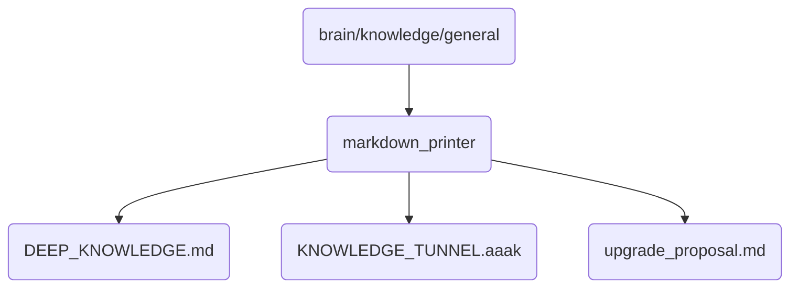

# Markdown Printer Identity

This directory contains the core knowledge and upgrade proposals for the markdown printer functionality in OmniClaw v5.0, which is crucial for document generation and formatting.

## Topological View

---
*OmniClaw V5.0 | Forged by AI Architect | Evaluated dynamically*
