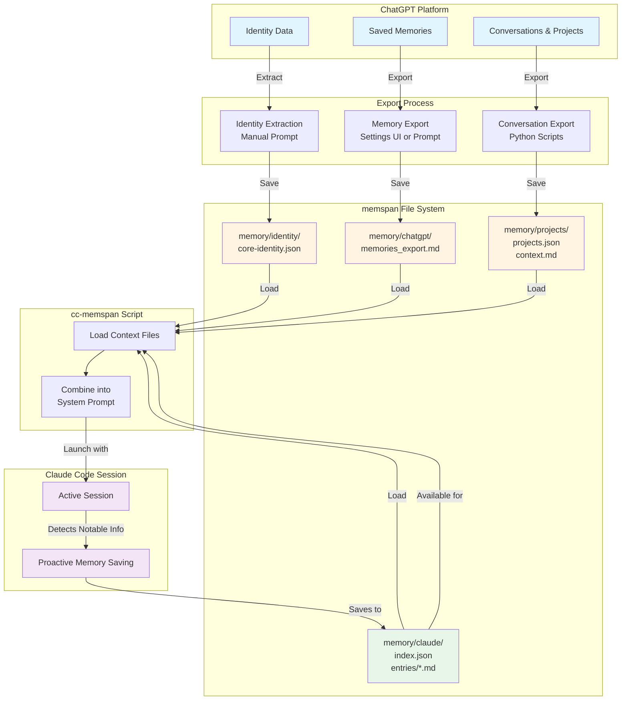

# KNOWLEDGE EXTRACT: memspan
> **Extracted on:** 2026-03-30 13:33:26
> **Source:** memspan

---

## File: `.gitignore`
```
# Python
__pycache__/
*.py[cod]
*$py.class
*.so
.Python
build/
develop-eggs/
dist/
downloads/
eggs/
.eggs/
lib/
lib64/
parts/
sdist/
var/
wheels/
share/python-wheels/
*.egg-info/
.installed.cfg
*.egg
MANIFEST

# Virtual Environments
venv/
env/
ENV/
env.bak/
venv.bak/
.venv/

# IDE - VSCode
.vscode/
*.code-workspace

# IDE - PyCharm
.idea/
*.iml
*.iws
*.ipr

# IDE - Other
*.swp
*.swo
*~
.project
.classpath
.settings/

# OS - macOS
.DS_Store
.AppleDouble
.LSOverride
Icon
._*
.DocumentRevisions-V100
.fseventsd
.Spotlight-V100
.TemporaryItems
.Trashes
.VolumeIcon.icns
.com.apple.timemachine.donotpresent

# OS - Linux
*~
.directory
.Trash-*

# OS - Windows
Thumbs.db
Thumbs.db:encryptable
ehthumbs.db
ehthumbs_vista.db
*.stackdump
[Dd]esktop.ini
$RECYCLE.BIN/
*.cab
*.msi
*.msix
*.msm
*.msp
*.lnk

# Personal Data Files
# JSON data files (keep .example files)
*.json
!*.json.example
!**/package.json
!**/package-lock.json

# cURL files (may contain auth tokens)
curl.txt
*.curl
curl_*.txt

# ChatGPT exports and personal data
chatgpt-history/
*.export
*.dump

# Logs
*.log
logs/
*.log.*

# Temporary files
*.tmp
*.temp
*.bak
*.backup
*.old
*.orig

# Environment variables
.env
.env.local
.env.*.local
*.env

# Jupyter Notebook
.ipynb_checkpoints
*.ipynb_checkpoints/

# pytest
.pytest_cache/
.coverage
htmlcov/
.tox/
.hypothesis/

# mypy
.mypy_cache/
.dmypy.json
dmypy.json

/docs/internal

# Memory/Archive directories (may contain personal data)
# Uncomment if you want to ignore these:
# claude-memory/memory/claude/entries/*
# claude-memory/memory/identity/*
# claude-memory/memory/projects/*

.claude

# Keep README files in memory directories
!**/README.md


```

## File: `LICENSE`
```
MIT License

Copyright (c) 2025 Eric Blue

Permission is hereby granted, free of charge, to any person obtaining a copy
of this software and associated documentation files (the "Software"), to deal
in the Software without restriction, including without limitation the rights
to use, copy, modify, merge, publish, distribute, sublicense, and/or sell
copies of the Software, and to permit persons to whom the Software is
furnished to do so, subject to the following conditions:

The above copyright notice and this permission notice shall be included in all
copies or substantial portions of the Software.

THE SOFTWARE IS PROVIDED "AS IS", WITHOUT WARRANTY OF ANY KIND, EXPRESS OR
IMPLIED, INCLUDING BUT NOT LIMITED TO THE WARRANTIES OF MERCHANTABILITY,
FITNESS FOR A PARTICULAR PURPOSE AND NONINFRINGEMENT. IN NO EVENT SHALL THE
AUTHORS OR COPYRIGHT HOLDERS BE LIABLE FOR ANY CLAIM, DAMAGES OR OTHER
LIABILITY, WHETHER IN AN ACTION OF CONTRACT, TORT OR OTHERWISE, ARISING FROM,
OUT OF OR IN CONNECTION WITH THE SOFTWARE OR THE USE OR OTHER DEALINGS IN THE
SOFTWARE.


```

## File: `Makefile`
```
.PHONY: help setup check status validate identity-prompt identity-check identity-validate memories-check projects-list memspan-identity memspan-identity-memories memspan-projects-index memspan-full memspan-check aliases-show aliases-install clean

# Variables
MEMSPAN_ROOT := $(shell pwd)
CLAUDE_MEMORY := $(MEMSPAN_ROOT)/claude-memory
MEMORY_ROOT := $(CLAUDE_MEMORY)/memory
IDENTITY_DIR := $(MEMORY_ROOT)/identity
MEMORIES_DIR := $(MEMORY_ROOT)/chatgpt
PROJECTS_DIR := $(MEMORY_ROOT)/projects
CC_MEMSPAN := $(CLAUDE_MEMORY)/bin/cc-memspan

# Colors for output
GREEN := \033[0;32m
YELLOW := \033[0;33m
RED := \033[0;31m
NC := \033[0m # No Color

help: ## Show this help message
	@echo "Memspan Makefile - Common Tasks"
	@echo ""
	@echo "Available targets:"
	@grep -E '^[a-zA-Z_-]+:.*?## .*$$' $(MAKEFILE_LIST) | awk 'BEGIN {FS = ":.*?## "}; {printf "  $(GREEN)%-20s$(NC) %s\n", $$1, $$2}'
	@echo ""
	@echo "Examples:"
	@echo "  make setup                        # Create directory structure"
	@echo "  make check                        # Check prerequisites"
	@echo "  make status                       # Show status of all memory files"
	@echo "  make memspan-identity             # Launch Claude with identity"
	@echo "  make memspan-identity-memories    # Launch with identity + memories (recommended)"
	@echo "  make memspan-projects-index       # Launch with identity + memories + projects index"
	@echo "  make memspan-full PROJECT=mindjot  # Launch with full context"

setup: ## Create directory structure for memory files (idempotent)
	@if [ ! -d $(IDENTITY_DIR) ] || [ ! -d $(MEMORIES_DIR) ] || [ ! -d $(PROJECTS_DIR) ] || [ ! -d $(MEMORY_ROOT)/claude/entries ]; then \
		echo "$(GREEN)Setting up Memspan directory structure...$(NC)"; \
		mkdir -p $(IDENTITY_DIR); \
		mkdir -p $(MEMORIES_DIR); \
		mkdir -p $(PROJECTS_DIR); \
		mkdir -p $(MEMORY_ROOT)/claude/entries; \
		echo "$(GREEN)✓ Directory structure created$(NC)"; \
	else \
		echo "$(GREEN)✓ Directory structure already exists$(NC)"; \
	fi
	@echo ""
	@echo "Next steps:"
	@echo "  1. Extract identity: make identity-prompt"
	@echo "  2. Export memories: See export-chatgpt-memories/README.md"
	@echo "  3. Check status: make status"

check: ## Check prerequisites (claude CLI, Python, etc.)
	@echo "$(GREEN)Checking prerequisites...$(NC)"
	@echo ""
	@which claude > /dev/null 2>&1 && echo "$(GREEN)✓ Claude CLI found$(NC)" || echo "$(RED)✗ Claude CLI not found - install Claude Code CLI$(NC)"
	@which python3 > /dev/null 2>&1 && echo "$(GREEN)✓ Python 3 found$(NC)" || echo "$(RED)✗ Python 3 not found$(NC)"
	@test -f $(CC_MEMSPAN) && echo "$(GREEN)✓ cc-memspan script found$(NC)" || echo "$(RED)✗ cc-memspan script not found$(NC)"
	@test -f $(CLAUDE_MEMORY)/CLAUDE.md && echo "$(GREEN)✓ CLAUDE.md found$(NC)" || echo "$(YELLOW)⚠ CLAUDE.md not found$(NC)"
	@echo ""

status: ## Show status of all memory files
	@echo "$(GREEN)Memspan Memory Status$(NC)"
	@echo "=========================="
	@echo ""
	@echo "$(YELLOW)Identity:$(NC)"
	@test -f $(IDENTITY_DIR)/core-identity.json && echo "  $(GREEN)✓$(NC) core-identity.json" || echo "  $(RED)✗$(NC) core-identity.json (missing)"
	@test -f $(IDENTITY_DIR)/core-identity.md && echo "  $(GREEN)✓$(NC) core-identity.md" || echo "  $(YELLOW)○$(NC) core-identity.md (optional)"
	@echo ""
	@echo "$(YELLOW)Memories:$(NC)"
	@test -f $(MEMORIES_DIR)/memories_export.md && echo "  $(GREEN)✓$(NC) memories_export.md" || echo "  $(RED)✗$(NC) memories_export.md (missing)"
	@test -f $(MEMORIES_DIR)/memories.md && echo "  $(GREEN)✓$(NC) memories.md" || echo "  $(YELLOW)○$(NC) memories.md (optional)"
	@echo ""
	@echo "$(YELLOW)Projects:$(NC)"
	@test -f $(PROJECTS_DIR)/projects.json && echo "  $(GREEN)✓$(NC) projects.json" || echo "  $(YELLOW)○$(NC) projects.json (optional)"
	@if [ -d $(PROJECTS_DIR) ] && [ -n "$$(find $(PROJECTS_DIR) -mindepth 1 -maxdepth 1 -type d 2>/dev/null)" ]; then \
		echo "  Projects found:"; \
		for dir in $(PROJECTS_DIR)/*/; do \
			project=$$(basename $$dir); \
			if [ -d "$$dir" ] && [ "$$project" != "README.md" ]; then \
				echo "    - $$project"; \
			fi; \
		done; \
	else \
		echo "  $(YELLOW)○$(NC) No projects configured"; \
	fi
	@echo ""

validate: identity-check memories-check ## Validate all required files exist
	@echo "$(GREEN)Validation complete$(NC)"

identity-prompt: ## Show location of identity extraction prompt
	@echo "$(GREEN)Identity Extraction Prompt$(NC)"
	@echo "================================"
	@echo ""
	@echo "Location: $(MEMSPAN_ROOT)/identity-archive/identity-archive-prompt.md"
	@echo ""
	@test -f $(MEMSPAN_ROOT)/identity-archive/identity-archive-prompt.md && \
		echo "$(GREEN)✓ Prompt file found$(NC)" || \
		echo "$(RED)✗ Prompt file not found$(NC)"
	@echo ""
	@echo "Instructions:"
	@echo "  1. Open ChatGPT web interface (chat.openai.com)"
	@echo "  2. Ensure memory is enabled in Settings → Personalization & Memory"
	@echo "  3. Copy the prompt from the file above"
	@echo "  4. Paste into a new ChatGPT conversation"
	@echo "  5. Save the JSON output to: $(IDENTITY_DIR)/core-identity.json"
	@echo ""
	@echo "See identity-archive/README.md for detailed instructions."

identity-check: ## Check if identity file exists
	@if test -f $(IDENTITY_DIR)/core-identity.json || test -f $(IDENTITY_DIR)/core-identity.md; then \
		echo "$(GREEN)✓ Identity file found$(NC)"; \
		test -f $(IDENTITY_DIR)/core-identity.json && echo "  Location: $(IDENTITY_DIR)/core-identity.json" || true; \
		test -f $(IDENTITY_DIR)/core-identity.md && echo "  Location: $(IDENTITY_DIR)/core-identity.md" || true; \
	else \
		echo "$(RED)✗ Identity file not found$(NC)"; \
		echo "  Expected: $(IDENTITY_DIR)/core-identity.json or .md"; \
		echo "  Run: make identity-prompt"; \
		exit 1; \
	fi

identity-validate: identity-check ## Validate identity JSON format
	@if test -f $(IDENTITY_DIR)/core-identity.json; then \
		echo "$(GREEN)Validating identity JSON...$(NC)"; \
		python3 -m json.tool $(IDENTITY_DIR)/core-identity.json > /dev/null 2>&1 && \
			echo "$(GREEN)✓ Valid JSON$(NC)" || \
			(echo "$(RED)✗ Invalid JSON$(NC)" && exit 1); \
	else \
		echo "$(YELLOW)⚠ No JSON file to validate (checking .md instead)$(NC)"; \
	fi

memories-check: ## Check if memories file exists
	@if test -f $(MEMORIES_DIR)/memories_export.md; then \
		echo "$(GREEN)✓ Memories file found$(NC)"; \
		echo "  Location: $(MEMORIES_DIR)/memories_export.md"; \
	else \
		echo "$(YELLOW)⚠ Memories file not found (optional)$(NC)"; \
		echo "  Expected: $(MEMORIES_DIR)/memories_export.md"; \
		echo "  See export-chatgpt-memories/README.md for instructions"; \
	fi

projects-list: ## List available projects
	@echo "$(GREEN)Available Projects$(NC)"
	@echo "==================="
	@echo ""
	@if [ -d $(PROJECTS_DIR) ] && [ -n "$$(find $(PROJECTS_DIR) -mindepth 1 -maxdepth 1 -type d 2>/dev/null)" ]; then \
		for dir in $(PROJECTS_DIR)/*/; do \
			project=$$(basename $$dir); \
			if [ -d "$$dir" ] && [ "$$project" != "README.md" ]; then \
				echo "  - $$project"; \
				test -f $$dir/context.md && echo "    $(GREEN)✓$(NC) context.md" || echo "    $(YELLOW)○$(NC) context.md"; \
				test -f $$dir/decisions.json && echo "    $(GREEN)✓$(NC) decisions.json" || echo "    $(YELLOW)○$(NC) decisions.json"; \
				test -f $$dir/conversations.json && echo "    $(GREEN)✓$(NC) conversations.json" || echo "    $(YELLOW)○$(NC) conversations.json"; \
			fi; \
		done; \
	else \
		echo "$(YELLOW)No projects found$(NC)"; \
		echo "  Create project directories in: $(PROJECTS_DIR)/"; \
	fi
	@echo ""

memspan-identity: identity-check ## Launch Claude with identity context
	@echo "$(GREEN)Launching Claude with identity...$(NC)"
	@bash $(CC_MEMSPAN) --identity

memspan-identity-memories: identity-check ## Launch Claude with identity and memories (recommended starting point)
	@echo "$(GREEN)Launching Claude with identity and memories...$(NC)"
	@bash $(CC_MEMSPAN) --identity --memories

memspan-projects-index: identity-check ## Launch Claude with identity, memories, and projects index (lightweight project awareness)
	@echo "$(GREEN)Launching Claude with identity, memories, and projects index...$(NC)"
	@bash $(CC_MEMSPAN) --identity --memories --projects-index

memspan-full: identity-check ## Launch Claude with full context (requires PROJECT=name)
	@if [ -z "$(PROJECT)" ]; then \
		echo "$(RED)Error: PROJECT not specified$(NC)"; \
		echo "Usage: make memspan-full PROJECT=project-name"; \
		echo ""; \
		echo "Available projects:"; \
		$(MAKE) projects-list; \
		exit 1; \
	fi
	@echo "$(GREEN)Launching Claude with full context for project: $(PROJECT)$(NC)"
	@bash $(CC_MEMSPAN) --full $(PROJECT)

memspan-check: ## Check what context files would be loaded
	@echo "$(GREEN)Memspan Context File Check$(NC)"
	@echo "=============================="
	@echo ""
	@echo "Files that would be loaded:"
	@bash $(CC_MEMSPAN) --identity --memories --dry-run 2>&1 | grep -E "(WARN|Context)" || true
	@echo ""
	@echo "Run with --dry-run to see full command:"
	@echo "  bash $(CC_MEMSPAN) --identity --memories --dry-run"

aliases-show: ## Show example shell aliases
	@echo "$(GREEN)Example Shell Aliases$(NC)"
	@echo "======================"
	@echo ""
	@echo "Add to ~/.bash_profile or ~/.zshrc:"
	@echo ""
	@echo "# Memspan aliases"
	@echo "alias cc-memspan='bash $(MEMSPAN_ROOT)/claude-memory/bin/cc-memspan'"
	@echo "alias cc='claude'"
	@echo "alias cc-me='cc-memspan --identity --memories'"
	@echo "alias cc-project='cc-memspan --identity --memories --projects-index'"
	@echo ""
	@echo "Then reload: source ~/.bash_profile  # or ~/.zshrc"

aliases-install: ## Help install aliases (interactive)
	@echo "$(GREEN)Installing Memspan Aliases$(NC)"
	@echo "============================"
	@echo ""
	@read -p "Which shell config file? (~/.bash_profile or ~/.zshrc) [~/.bash_profile]: " config_file; \
	config_file=$${config_file:-~/.bash_profile}; \
	if [ ! -f $$config_file ]; then \
		echo "Creating $$config_file..."; \
		touch $$config_file; \
	fi; \
	if grep -q "Memspan aliases" $$config_file; then \
		echo "$(YELLOW)Aliases already exist in $$config_file$(NC)"; \
	else \
		echo "" >> $$config_file; \
		echo "# Memspan aliases" >> $$config_file; \
		echo "alias cc-memspan='bash $(MEMSPAN_ROOT)/claude-memory/bin/cc-memspan'" >> $$config_file; \
		echo "alias cc='claude'" >> $$config_file; \
		echo "alias cc-me='cc-memspan --identity --memories'" >> $$config_file; \
		echo "alias cc-project='cc-memspan --identity --memories --projects-index'" >> $$config_file; \
		echo "$(GREEN)✓ Aliases added to $$config_file$(NC)"; \
		echo ""; \
		echo "Reload with: source $$config_file"; \
	fi

clean: ## Clean up temporary files (be careful!)
	@echo "$(YELLOW)Warning: This will not delete your memory files$(NC)"
	@echo "This target is reserved for future cleanup tasks."
	@echo "Your identity, memories, and projects are safe."

```

## File: `README.md`
```markdown
# Memspan.ai

<div align="center">
  
</div>


> A persistent span of identity, memory, and conversation for LLMs and agents

**Website:** [https://memspan.ai](https://memspan.ai)

**memspan** is a file-system based memory archive system that helps you extract, organize, and load your personal identity, saved memories, and conversation history into Claude Code and other LLM interfaces. It provides a portable, tool-agnostic approach to maintaining continuity across AI assistant sessions.

## Overview

Memspan addresses a fundamental challenge: **LLMs don't remember across sessions**. While platforms like ChatGPT offer memory features, they're platform-locked and don't easily transfer to other tools like Claude Code. memspan bridges this gap by:

- **Extracting** your identity, memories, and conversation history from platforms like OpenAI ChatGPT
- **Organizing** this data into a structured, portable format
- **Loading** it dynamically into Claude Code sessions when needed

The system is designed to be:
- **File-based**: No databases, no servers—just files you control
- **Portable**: Works across different LLM tools and platforms
- **Selective**: Load only what you need for each session
- **Independent**: Doesn't interfere with Claude Code's own memory system

## Current State

### What Works Today

memspan currently provides:

1. **Identity Extraction**: Scripts and prompts to extract your personal identity from ChatGPT conversations
2. **Memory Export**: Tools to export and structure ChatGPT saved memories
3. **Project Conversations**: Scripts to correlate ChatGPT Projects with conversation history (the default export doesn't include project metadata)
4. **Context Loading**: A wrapper script (`cc-memspan`) to dynamically load identity, memories, and project context into Claude Code sessions

### Architecture

The project follows a three-tier memory model:

1. **Core Identity** (~2-4KB): Always-available personal context
2. **Project/Framework Memory** (~10-50KB per domain): Session-selectable deep context
3. **Historical Archive**: Indexed, retrieved on-demand

### Memory Architecture



## Challenges & Limitations

### Data Extraction Challenges

There are **no automatic tools** to extract all this data. The process requires:

- **Manual prompting**: Using prompts to extract identity from conversations
- **Memory export**: Either through ChatGPT's memory UI or by prompting ChatGPT to export memories
- **Data correlation**: The default OpenAI data export doesn't include project metadata—you need separate scripts to correlate conversations with projects

### Current Limitations

- **No MCP servers**: This version uses file-based context loading, not custom MCP servers
- **No vector search**: No embeddings or semantic search—just file-based retrieval
- **No integration**: Doesn't integrate with other memory systems (though this is a possible near-term direction)
- **Manual process**: Requires manual steps to extract and organize data

## Quick Start

> **New to memspan?** Start with the **[Quick Start Guide](QUICKSTART.md)** for a comprehensive walkthrough.

### 1. Extract Your Identity

Use the prompts in `identity-archive/` to extract your identity from ChatGPT conversations. This creates a structured identity file.

### 2. Export ChatGPT Memories

Follow the instructions in `export-chatgpt-memories/README.md` to export your ChatGPT memories. You can either:
- Copy from ChatGPT Settings → Memory
- Use the export prompt to generate structured exports

### 3. Correlate Project Conversations

To export your conversations (and optionally correlate with projects), use the scripts in `export-chatgpt-conversations/`:

```bash
# Export projects metadata (if you use ChatGPT Projects)
python3 export-chatgpt-conversations/chatgpt_projects_dump.py --curl-file curl.txt

# Correlate conversations with projects
python3 export-chatgpt-conversations/chatgpt_project_conversations.py export
```

### 4. Load Context in Claude Code

Use the `cc-memspan` wrapper to load context into Claude Code. Here are the recommended usage patterns:

**Minimal Load (Identity + Memories):**
```bash
# Core identity and memories - recommended starting point
bash claude-memory/bin/cc-memspan --identity --memories
```

**Lightweight Project Awareness:**
```bash
# Add projects index (lightweight - just project names/metadata)
# Requires projects.json from export-chatgpt-conversations
bash claude-memory/bin/cc-memspan --identity --memories --projects-index
```

Or using the Makefile:
```bash
make memspan-projects-index
```

**Full Project Context (Higher Token Usage):**
```bash
# Load specific project with full context (context.md, conversations.json)
# Use ad-hoc for long-running projects with essential ChatGPT conversations
bash claude-memory/bin/cc-memspan --project project-name
```

**Note:** Loading full project context (`--project`) includes conversation history and can significantly increase token usage. Use `--projects-index` for lightweight project awareness, and reserve `--project` for when you need deep context from specific long-running projects.

See [`claude-memory/README.md`](../../../README.md) for detailed usage instructions.

### Using Make (Optional)

A `Makefile` is provided to simplify common tasks:

```bash
# Show all available commands
make help

# Check prerequisites and status
make check
make status

# Extract identity (shows instructions)
make identity-prompt

# Launch Claude with context
make memspan-identity
make memspan-full PROJECT=project-name

# Show and install shell aliases
make aliases-show
make aliases-install
```

See the `Makefile` for all available targets.

## Usage Examples

### Basic Session with Identity

```bash
# Load just your identity
bash claude-memory/bin/cc-memspan --identity
```

Claude will now know who you are, your preferences, and your communication style.

**Example:** After loading identity, you can ask "who am I?" and Claude will respond with a summary based on your identity context:

```
> who am I?

Based on the identity context loaded for this session, you are [Your Name]:
  
  Personal
  - [Age], born [Year] in [Location]
  - Currently based in [Location]
  
  Professional
  - [Professional identity]
  - [Companies/roles]
  
  Tech Stack
  - [Languages, frameworks, tools]
  
  Personality
  - [Personality traits, values]
  - [Work philosophy]
  
  Current Focus
  - [Active projects]
  
  This identity was loaded from memory/identity/core-identity.json.
```

### Project-Specific Work

```bash
# Load identity + memories + project context
bash claude-memory/bin/cc-memspan --full your_project_name
```

This loads everything Claude needs to work on a specific project with full context.

### Proactive Memory Saving

When you share notable information (goals, preferences, insights), Claude will proactively suggest saving it to your memory system:

```
> I have a goal of losing 10lbs next year

⏺ Good goal! That's a reasonable and achievable target - roughly 0.8-1 lb per month 
allows for sustainable progress without extreme measures.

Looking at your current profile, you already have a solid foundation with strength 
training 3x/week and cardio 2x/week. Weight loss would mainly come down to nutrition 
adjustments alongside your existing routine.

---
Would you like me to save this goal to your memories (memory/claude/)? Per your 
current settings, I'm in ask-first mode for memory saves.

> yes

⏺ Saved to memory/claude/entries/2025-12-15-weight-loss-goal.md
```

When you confirm, Claude:
1. Creates a new entry file in `memory/claude/entries/`
2. Adds the entry to `memory/claude/index.json` with metadata
3. Makes the memory available for future sessions

This works automatically—Claude recognizes goals, preferences, insights, and other notable information and offers to save them.

### Quick Questions

```bash
# No context—just ask a question
claude "What's the best way to structure a Python package?"
```

For generic questions, you don't need to load any context.

## How It Works

### Context Loading

The `cc-memspan` script:
1. Reads selected context files (identity, memories, projects)
2. Combines them into a system prompt
3. Launches Claude Code with `--append-system-prompt`

This means the context is sent with every message, so Claude has access to your identity and memories throughout the session.

### Memory Precedence

When information conflicts:
1. **Claude memories** (in `memory/claude/`) take precedence over ChatGPT memories
2. **Newer entries** take precedence over older entries
3. **Explicit corrections** take precedence over inferred information

### File Organization

- **Identity**: Condensed personal context (~2-4KB)
- **Memories**: Structured memories from ChatGPT and Claude sessions
- **Projects**: Project-specific context, decisions, and conversation history
- **Archive**: Historical conversations indexed for on-demand retrieval

## Documentation

- **[Quick Start Guide](QUICKSTART.md)**: Get up and running with memspan in minutes
- **[Identity Archive README](../../../README.md)**: How to extract identity from ChatGPT
- **[ChatGPT Memories README](../../../README.md)**: How to export and structure ChatGPT memories
- **[Conversation Export README](../../../README.md)**: How to export conversations and correlate with projects
- **[Claude Memory README](../../../README.md)**: Usage guide for the context loading system

## Future Directions

Potential enhancements (not yet implemented):

- **MCP Server**: Custom MCP server for on-demand memory retrieval (reduces token costs)
- **Vector Search**: Embeddings and semantic search over conversation history
- **Auto-extraction**: Automated memory extraction from conversations
- **Cross-platform Sync**: Sync memories between ChatGPT and Claude
- **Memory Summarization**: Automatic summarization of new conversations

These enhancements are planned for future releases as the system evolves.

## Contributing

Contributions and ideas are welcome! This is a personal project designed to be:
- **Portable**: Standard formats (JSON, Markdown) that work across platforms
- **Tool-agnostic**: Works with any LLM interface, not locked to specific vendors
- **Explicit**: User controls what gets loaded when—no hidden assumptions

### How to Contribute

- **Report Issues**: Found a bug or have a feature request? Open an issue on GitHub
- **Submit Pull Requests**: Improvements, bug fixes, or new features are welcome
- **Share Ideas**: Have suggestions for improving the system? We'd love to hear them
- **Documentation**: Help improve docs, add examples, or clarify instructions

This project is a work in progress. Your feedback and contributions help make memspan better for everyone.

## License

MIT License - see [LICENSE](LICENSE) file

## Version History

**0.1.0** - 2025-12-15 - Initial release
  - Identity extraction from ChatGPT conversations
  - ChatGPT memory export and structuring
  - Project conversation correlation and export
  - Context loading system (`cc-memspan`) for Claude Code
  - Proactive memory saving system for Claude sessions
  - File-based memory archive with portable formats
  - Example files and comprehensive documentation

## About

**Website:** [https://memspan.ai](https://memspan.ai)  
**Created by [Eric Blue](https://about.eric-blue.com)**

memspan is a file-system based memory archive system that helps you extract, organize, and load your personal identity, saved memories, and conversation history into Claude Code and other LLM interfaces. It provides a portable, tool-agnostic approach to maintaining continuity across AI assistant sessions.

This project addresses the challenge of platform-locked memory systems by providing a portable, user-controlled alternative that works across different LLM tools and platforms.

## Notes

- This system is independent of Claude Code's own memory features
- All context loading is opt-in—you choose what to load per session
- The `chatgpt-history/` directory contains personal data and is ignored in this documentation

```

## File: `claude-memory/CLAUDE.md`
```markdown
# Session Context Controls (Data-Free)

- This file carries **no identity or memory content**. It only describes what optional context files exist.
- Load it when you want Claude to know where identity, memories, and project context live; skip it when you want a clean session.

## Optional context files (add explicitly)

### Identity
- Identity (condensed): `memory/identity/core-identity.md` (or `.json`)

### Memories
- **Claude memories (active, evolving):** `memory/claude/index.json` and `memory/claude/entries/*.md`
- ChatGPT memories (static archive): `memory/chatgpt/memories_export.md`

### Projects
- Project context (optional): `memory/projects/<project>/context.md`
- Project conversations (optional): `memory/projects/<project>/conversations.json`
- Projects index (optional): `memory/projects/projects.json`

## Behavior instructions for Claude

### General
- Do **not** assume identity or memories unless the corresponding file is included.
- If asked about prior decisions/history without context, ask whether to load a specific file.

### Memory Precedence (when conflicts exist)
1. **Claude memories** (`memory/claude/`) take precedence over ChatGPT memories
2. **Newer entries** take precedence over older entries
3. **Explicit corrections** take precedence over inferred information
4. Overall priority: project context → Claude memories → identity → ChatGPT memories

### Memory Saving Behavior

Claude can proactively save memories during sessions. The current notification mode is defined in `memory/claude/index.json`.

| Mode | Behavior |
|------|----------|
| `ask-first` | Claude asks before saving **(current)** |
| `save-and-notify` | Claude saves and mentions it (planned) |
| `silent` | Claude saves without mention (planned) |

**What triggers memory saving:**
- New biographical facts or corrections
- Stated preferences or changes to preferences
- Significant insights or self-observations
- Goal updates or life context changes
- Decisions or commitments made during conversation
- Explicit user request ("remember this", "save this")

**When saving memories:**

1. **If `memory/claude/index.json` doesn't exist**, create it with this structure:
   ```json
   {
     "config": {
       "notification_mode": "ask-first",
       "notification_modes_available": ["ask-first", "save-and-notify", "silent"],
       "notes": "Initial setup"
     },
     "entries": []
   }
   ```

2. **If `memory/claude/entries/` directory doesn't exist**, create it.

3. **When creating a new memory entry:**
   - Create a markdown file: `memory/claude/entries/YYYY-MM-DD-slug.md`
   - Add entry to `index.json` with metadata:
     - `id`: "YYYY-MM-DD-slug"
     - `file`: "entries/YYYY-MM-DD-slug.md"
     - `created`: "YYYY-MM-DD"
     - `type`: One of `fact`, `insight`, `context`, `correction`, `preference`
     - `topics`: Array of relevant topic tags
     - `summary`: One-line summary
     - `source`: "conversation" (or "explicit-request" if user asked)
     - `supersedes`: null (or ID if replacing an entry)

4. **Read existing `index.json` first** to check for duplicates and get current config. If the file doesn't exist, use `ask-first` as the default mode.

See `memory/claude/README.md` for full documentation and `memory/claude/index-example.json` for a complete example.


```

## File: `claude-memory/README.md`
```markdown
# Claude Memory Starter (File-Only, No MCP/Vector)

This subdirectory is a minimal, opt-in setup for loading context into Claude (CLI or Claude Code) from any working directory. It keeps data out of the control file and uses a small wrapper script to attach the right files.

**Note:** This system is **independent** of Claude's built-in memory feature. It provides file-based, portable memory that you control and can use across different LLM systems.

## Layout
```
claude-memory/
  README.md                # This file
  CLAUDE.md                # Data-free control file (instructions only)
  bin/cc-memspan           # Wrapper script to launch claude with chosen contexts
  memory/
    identity/              # Put or symlink condensed identity here
    chatgpt/               # Structured ChatGPT memories here
    projects/              # Project contexts, conversations, projects index
```

## Quick start
1) Ensure `claude` CLI is installed and on PATH.  
2) Put or symlink your files:
   - Identity: `claude-memory/memory/identity/core-identity.md` (or `.json`). Fallback: `identity-archive/core-identity.json` (auto-loaded if present).
   - ChatGPT memories (structured only): `claude-memory/memory/chatgpt/memories_export.md`
   - Projects: `claude-memory/memory/projects/<project>/context.md` (optional), `conversations.json` (optional)
   - Projects index (global): `claude-memory/memory/projects/projects.json` (optional)
3) Run a session with the wrapper (examples below).

## Wrapper script: `bin/cc-memspan`
The script builds absolute paths so it works from any directory, then injects selected files into the Claude session via `--append-system-prompt` (the CLI does not support `--add-context`).

Common invocations:
- Minimal (control file only):  
  `bash claude-memory/bin/cc-memspan`
- Add identity:  
  `bash claude-memory/bin/cc-memspan --identity`
- Add structured memories:  
  `bash claude-memory/bin/cc-memspan --memories`
- Project bundle (context/conversations when present):  
  `bash claude-memory/bin/cc-memspan --project your_project_name`
- Everything for a project (identity + structured memories + project bundle):  
  `bash claude-memory/bin/cc-memspan --full your_project_name`
- Add projects index (global list):  
  `bash claude-memory/bin/cc-memspan --projects-index`
- Use a saved current project (optional file `memory/current-project`):  
  `echo mindjot > claude-memory/memory/current-project`  
  `bash claude-memory/bin/cc-memspan --use-current`

Pass extra args to claude after `--`, e.g. `... -- "help me refactor X"`.

## How it stays opt-in
- `CLAUDE.md` contains no identity or memory content—only instructions and pointers.
- You choose which files to attach per run (`--identity`, `--memories`, `--project`, `--projects-index`, `--full`). They are inlined into a system prompt block for the session.
- If a requested file is missing, the script warns and continues without it.

## Working inside other projects
- Because the script uses absolute paths anchored to this folder, it’s safe to run from any repo or subdirectory.
- If another project has its own `CLAUDE.md`, that doesn’t interfere; you are explicitly adding contexts from here.

## Files to supply (or symlink)
- `memory/identity/core-identity.md`: condensed identity (no secrets in repo unless you intend to).
- `memory/chatgpt/memories_export.md`: structured ChatGPT memories (only file expected here).
- `memory/projects/<project>/context.md`: optional per-project context.
- `memory/projects/<project>/conversations.json`: optional detailed history per project.
- `memory/projects/projects.json`: optional global projects list.

## How It Works

### Context Loading

The `cc-memspan` script:
1. Reads selected context files (identity, memories, projects)
2. Combines them into a system prompt block
3. Launches Claude with `--append-system-prompt`

Context is sent with every message, so Claude has access to your identity and memories throughout the session.

### CLAUDE.md Instructions

`CLAUDE.md` is a **data-free control file** that contains:
- Instructions for Claude about where context files live
- Memory precedence rules (Claude memories > ChatGPT memories > identity)
- Memory saving behavior configuration
- Instructions for loading historical data on-demand

**Key behaviors:**
- Claude does **not** assume identity or memories unless files are explicitly loaded
- If asked about prior decisions/history without context, Claude will ask whether to load specific files
- Historical conversations are loaded ad-hoc when needed (not automatically)

### Memory Saving Behavior

Claude can proactively save memories during sessions to `memory/claude/entries/`. The system supports:
- **`ask-first`** (current): Claude asks before saving
- **`save-and-notify`** (planned): Claude saves and mentions it
- **`silent`** (planned): Claude saves without mention

**What triggers memory saving:**
- New biographical facts or corrections
- Stated preferences or changes to preferences
- Significant insights or self-observations
- Goal updates or life context changes
- Decisions or commitments made during conversation
- Explicit user request ("remember this", "save this")

See `memory/claude/README.md` for full documentation on the memory system.

## How This Differs from Claude's Default Memory

**Claude's Built-in Memory:**
- Managed by Anthropic, stored on their servers
- Automatic and opaque (you don't see what's stored)
- Platform-locked to Claude/Anthropic
- Not portable to other LLMs or systems
- Limited control over what gets saved

**Memspan's File-Based Memory:**
- **You control everything** - files on your system
- **Transparent** - you can see and edit all memories
- **Portable** - standard formats (JSON, Markdown) work with any LLM
- **Selective** - you choose what to load per session
- **Extractable** - can migrate to other systems easily
- **Version-controlled** - can track changes in git
- **Independent** - doesn't interfere with Claude's built-in memory

## Advantages of This Approach

### 1. **Portability Across LLMs**
- Standard formats (JSON, Markdown) work with any LLM system
- Not locked to Claude or Anthropic
- Can migrate to GPT-4, local models, or future LLMs
- Your data stays with you

### 2. **Full Control & Transparency**
- See exactly what's in your memory files
- Edit, update, or remove memories directly
- No black-box storage
- Version control friendly

### 3. **Selective Loading**
- Load only what you need per session
- Control token usage by choosing context
- Lightweight sessions when you don't need full history
- Ad-hoc loading of historical data when needed

### 4. **Data Ownership**
- Files on your system, not in the cloud
- Export and backup easily
- No vendor lock-in
- Can be encrypted, synced, or archived as you choose

### 5. **Future-Proof**
- Works with current and future LLM systems
- Can be integrated into custom agents
- Compatible with MCP servers, vector databases, or other tools
- Foundation for digital twins or persistent AI assistants

### 6. **Extensibility**
- Add custom context files easily
- Integrate with other tools (notion, obsidian, etc.)
- Build on top of the file structure
- No API limitations

## Notes and Guidance

- If you prefer shorter commands, add an alias in your shell:  
  `alias ccms='bash YOUR_BASE_DIR/memspan/claude-memory/bin/cc-memspan'`
- Set `CLAUDE_CMD` env var if your CLI is named differently (default: `claude`).
- Dynamic conversation retrieval: without MCP, keep it manual. Attach `conversations.json` (project or global) when you need history; omit when you don't. If you want automatic retrieval later, we can add MCP-backed search, but stay file-only for this pilot.
- CLI context note: Files are injected as text via `--append-system-prompt`; large files increase prompt size—use selectively.


```

## File: `claude-memory/memory/chatgpt/README.md`
```markdown
# ChatGPT Memories

Place your structured memory export here as `memories_export.md` (or `memories_export.json`).

## Files

- **`memories_export.md`** - Structured memories (generated from raw memories using `export_prompt.md`)

## Guidelines

- Structured export only; this is the file loaded by `cc-memspan --memories`
- Only include content you're comfortable loading into Claude sessions
- Large files are fine; you control when to load them

## More Information

- **Extraction instructions**: See `export-chatgpt-memories/README.md`
- **Quick start guide**: See `docs/QUICKSTART.md`
- **Usage**: Load with `cc-memspan --memories` or `make memspan-identity-memories`


```

## File: `claude-memory/memory/claude/README.md`
```markdown
# Claude Memory System

This directory contains memories, observations, and insights captured during Claude sessions. It serves as Claude's evolving knowledge store about the user, complementing (and taking precedence over) the static ChatGPT memory export.

## Structure

```
memory/claude/
├── README.md          # This file
├── index.json         # Catalog of all entries with metadata
├── index-example.json # Example structure reference
└── entries/           # Individual memory files
    └── YYYY-MM-DD-slug.md
```

## How It Works

### Entry Types

Memories are categorized by `type` in the index:

| Type | Description |
|------|-------------|
| `fact` | Biographical info, preferences, things that are true |
| `insight` | Patterns, self-observations, reflections |
| `context` | Situational info that may change (projects, goals) |
| `correction` | Updates that supersede previous information |
| `preference` | Communication style, tool choices, how things should be done |

### Metadata Schema (index.json)

The `index.json` file has two main sections: `config` and `entries`.

**Full Structure:**

```json
{
  "config": {
    "notification_mode": "ask-first",
    "notification_modes_available": ["ask-first", "save-and-notify", "silent"],
    "notes": "Optional notes about the configuration"
  },
  "entries": [
    {
      "id": "2025-12-15-example-memory",
      "file": "entries/2025-12-15-example-memory.md",
      "created": "2025-12-15",
      "type": "insight",
      "topics": ["topic1", "topic2"],
      "summary": "One-line summary of the memory",
      "source": "conversation",
      "supersedes": null
    }
  ]
}
```

**Config Section:**
- `notification_mode`: Current mode for memory saving behavior (`ask-first`, `save-and-notify`, or `silent`)
- `notification_modes_available`: List of available modes
- `notes`: Optional notes about the configuration or system state

**Entry Fields:**
- `id`: Unique identifier (date + slug)
- `file`: Path to the entry file relative to `memory/claude/`
- `created`: Date created (YYYY-MM-DD)
- `type`: One of the entry types above (`fact`, `insight`, `context`, `correction`, `preference`)
- `topics`: Array of topic tags for filtering
- `summary`: Brief description for quick scanning
- `source`: Where this came from (`conversation`, `explicit-request`, `migration`)
- `supersedes`: ID of a previous entry this replaces (if applicable), or `null`

See `index-example.json` for a complete example with multiple entry types.

## Memory Behavior

### Notification Mode

Claude's memory saving behavior is configurable:

| Mode | Behavior |
|------|----------|
| `ask-first` | Claude asks before saving (current setting) |
| `save-and-notify` | Claude saves and mentions it (planned option) |
| `silent` | Claude saves without mention (planned option) |

**Current mode: `ask-first`**

> Future enhancement: Enable `save-and-notify` or `silent` modes once the system is tested and trusted.

### Precedence Rules

When information conflicts:
1. **Claude memories** take precedence over ChatGPT memories
2. **Newer entries** take precedence over older entries
3. **Explicit corrections** take precedence over inferred information

### What Gets Saved

Claude will proactively suggest saving:
- New biographical facts or corrections to existing ones
- Stated preferences or changes to preferences
- Significant insights or self-observations
- Goal updates or life context changes
- Decisions or commitments made during conversation

### Example: Proactive Memory Saving in Action

Here's how Claude proactively suggests saving a goal during a conversation:

```
> I have a goal to lose 10 pounds next year

⏺ Good goal! That's a reasonable and achievable target - roughly 0.8-1 lb per month 
allows for sustainable progress without extreme measures.

Looking at your current profile, you already have a solid foundation with strength 
training 3x/week and cardio 2x/week. Weight loss would mainly come down to nutrition 
adjustments alongside your existing routine.

---
Would you like me to save this goal to your memories (memory/claude/)? Per your 
current settings, I'm in ask-first mode for memory saves.
```

When you confirm, Claude will:
1. Create a new entry file in `entries/` (e.g., `2025-12-15-weight-loss-goal.md`)
2. Add the entry to `index.json` with appropriate metadata (type: `context`, topics: `["goals", "health"]`)
3. The memory will be available in future sessions when you load Claude memories

This demonstrates the **ask-first** mode: Claude recognizes the goal as memory-worthy and asks permission before saving.

## Usage

### Loading Context

To give Claude access to these memories, include in your context:
- `memory/claude/index.json` (for quick reference)
- Specific `entries/*.md` files as needed

### Manual Review

- Browse `entries/` to see all memories
- Check `index.json` to filter by type or topic
- Delete entries by removing the file and its index entry

### Example Files

- `index-example.json` - Complete example of the index structure with config and multiple entry types
- See the `entries/` directory for example entry files showing the markdown format

## Relationship to ChatGPT Memories

The `memory/chatgpt/` directory contains a static export from ChatGPT. It serves as historical reference but is not actively maintained. When ChatGPT memories need updating, the corrected version is saved here in `memory/claude/` with `supersedes` noted if applicable.

To re-sync with ChatGPT, re-export and replace `memory/chatgpt/memories_export.md`.
```

## File: `claude-memory/memory/identity/README.md`
```markdown
# Identity Files

Place your identity file here as `core-identity.json` (or `core-identity.md`).

## Files

- **`core-identity.json`** - Your identity profile (extracted from ChatGPT)
- **`core-identity-example.json`** - Example structure with placeholder data

## Guidelines

- Keep condensed version ~2–4KB for regular use
- Avoid secrets; this is loaded into Claude sessions
- See `core-identity-example.json` for expected structure

## More Information

- **Extraction instructions**: See `identity-archive/README.md`
- **Quick start guide**: See `docs/QUICKSTART.md`
- **Usage**: Load with `cc-memspan --identity` or `make memspan-identity`


```

## File: `claude-memory/memory/projects/README.md`
```markdown
# Project Contexts

Create a subfolder per project and drop context files there.

## Files Per Project

- **`context.md`** - **Primary project context** (lightweight, current state) - **Recommended for most sessions**
- **`conversations.json`** - Full conversation history (load ad-hoc when needed) - **Higher token usage**

## Global File

- **`projects.json`** - List of projects and metadata (generated from `export-chatgpt-conversations`)

## Example Layout

```
memory/projects/
├── projects.json                    ← From export-chatgpt-conversations
├── projects-example.json            ← Example format reference
├── README.md                        ← This file
└── your_project_name/               ← Project subdirectory (create as needed)
    ├── context.md                   ← Primary context (lightweight, ~2-5KB)
    └── conversations.json           ← Full history (load ad-hoc, can be large)
```

## Setting Up Project Files

### 1. Generate context.md (Recommended)

**`context.md` is the primary project context** - use it for most sessions to keep token usage low.

**Option A: Generate from conversations (recommended)**
1. Export project conversations:
   ```bash
   python3 export-chatgpt-conversations/chatgpt_project_conversations.py export-project "Project Name" -o temp.json
   ```
2. Use the prompt in `export-chatgpt-conversations/generate-context-prompt.md` with Claude to generate `context.md`
3. Save to `memory/projects/<project>/context.md`

**Option B: Create manually**
- Write a concise overview (2-5KB) covering:
  - Project purpose and current status
  - Architecture and design
  - Active goals and priorities
  - Key decisions
  - Current state and next steps

**Note:** Future release will automate context.md generation from conversations.

### 2. Export conversations.json (Optional, for ad-hoc use)

1. Export a project using `export-chatgpt-conversations`
2. Copy the output to `memory/projects/<project>/conversations.json`
3. **Use sparingly** - only load when you need to reference specific historical conversations

## Usage Pattern

- **Most sessions**: Load `context.md` only (via `--project`)
- **Deep historical work**: Load `conversations.json` ad-hoc when needed
- **Both together**: Only if you need current state + specific historical details

Keep `context.md` concise (2-5KB) and focused on current state. Update it as the project evolves.


```

## File: `docs/COMPARISON.md`
```markdown
# Memspan vs Other Memory Frameworks: Technical Comparison

Technical comparison of memspan.ai with other memory frameworks. Focus: architectural tradeoffs and use cases.

---

## Overview

**Memspan** is a file-first memory archive for **personal identity continuity and long-term context portability** across AI tools. Unlike frameworks built for agents and applications, memspan prioritizes:

- **Identity preservation** over isolated fact recall
- **File-first, user-owned** storage (Markdown/JSON)
- **Tool-agnostic design** (works with any LLM interface)
- **Explicit control** (no silent summarization or automatic injection)

Most AI memory systems (Letta, Mem0, BasicMemory) are optimized for **agents and applications**—they rely on infrastructure, embeddings, and retrieval layers. Memspan solves a different problem: **personal identity and long-term context portability across AI tools**.

---

## File-First, Not File-Only

**Memspan is file-first, not file-only.** The filesystem is the source of truth, but the architecture supports optional enhancements:

### Current: Filesystem-Only (Default)
- Pure file system: `memory/identity/`, `memory/claude/`, `memory/projects/`
- No database dependencies
- Human-readable formats (Markdown, JSON)
- Version control friendly (git-trackable)
- Portable across machines via file copy

### Future: Optional Enhancements (Planned)
- **MCP Server**: On-demand memory access via Model Context Protocol
- **Database Index**: Optional SQLite/Postgres index for fast search (files remain source of truth)
- **Knowledge Graph**: Optional relationship graph (Graphiti, Memgraph, FalkorDB adapters)
- **Vector Search**: Optional embeddings (LanceDB/ChromaDB) for semantic search

**Architecture Pattern:**
```
Filesystem (Source of Truth)
    ↓ (optional sync)
Database Index (Derived, can be rebuilt)
    ↓
MCP Server (Uses adapter interface)
    ↓
Storage Adapters (FilesystemAdapter, GraphitiAdapter, etc.)
```

**Key Design Principles:**
1. **Files remain source of truth** - Database/graph are derived indexes
2. **Adapter pattern** - Pluggable backends (filesystem, Graphiti, Memgraph, etc.)
3. **Progressive enhancement** - Start simple, add complexity when needed
4. **No lock-in** - Can delete database/graph and revert to filesystem-only
5. **Backward compatible** - Existing workflows unchanged

See `docs/internal/ARCHITECTURE_TRANSITION.md` for detailed architecture plans.

---

## Core Architectural Differences

### Storage Layer

| Framework | Storage | Format | Infrastructure Required |
|-----------|---------|--------|------------------------|
| **Memspan** | File system (default) | Markdown + JSON | None (optional: DB/graph) |
| **Letta/MemGPT** | Database + services | Structured records | Database server |
| **Mem0** | Database + vectors | Embeddings + metadata | Database + vector store |
| **BasicMemory** | Files + database | Markdown + SQLite/Postgres | Database (SQLite minimal) |

**Tradeoff:** Filesystem-only = transparency and portability, but no built-in query engine. Optional enhancements add search/graph capabilities when needed.

### Access Pattern

| Framework | Access Method | Token Efficiency | On-Demand Retrieval |
|-----------|---------------|------------------|---------------------|
| **Memspan** | System prompt injection | Lower (loads upfront) | Planned: MCP |
| **Letta/MemGPT** | Agent memory API | Higher (selective) | Yes |
| **Mem0** | SDK/API calls | Higher (selective) | Yes |
| **BasicMemory** | MCP server tools | Higher (selective) | Yes |

**Current (filesystem-only):**
```bash
cc-memspan --identity --memories --project mindjot
# → Reads files → Combines → --append-system-prompt
```

**Future (MCP + adapter):**
- On-demand retrieval via MCP tools (`get_identity`, `search_memories`)
- Works with any adapter (FilesystemAdapter, GraphitiAdapter, etc.)

### Integration Model

| Framework | Integration | Protocol | Setup Complexity |
|-----------|-------------|----------|------------------|
| **Memspan** | Wrapper script (MCP planned) | CLI flags | Low (file-based) |
| **Letta/MemGPT** | Agent framework | Python SDK | Medium |
| **Mem0** | SDK/API | REST/GraphQL | Medium |
| **BasicMemory** | MCP server | Model Context Protocol | Medium |

**Current:** Bash wrapper (`cc-memspan`) - no server, works immediately  
**Future:** MCP server via adapter interface - optional, backward compatible

---

## Framework Comparisons

### Memspan vs Letta/MemGPT

| Aspect | Memspan | Letta/MemGPT |
|--------|---------|--------------|
| **Target** | People (personal continuity) | Agents (application memory) |
| **Storage** | Files (default) | Database + services |
| **Infrastructure** | None (optional) | Required |
| **Use Case** | Personal identity across tools | Agent state management |

**Choose Memspan:** Personal identity continuity, file-first, zero infrastructure  
**Choose Letta:** Building AI agents, need automatic summarization, agent frameworks

### Memspan vs Mem0

| Aspect | Memspan | Mem0 |
|--------|---------|------|
| **Target** | People (identity continuity) | Apps & agents (memory layer) |
| **Storage** | Files (default) | Database + vectors |
| **Extraction** | Manual | Automatic |
| **Control** | Explicit | Automatic |

**Choose Memspan:** Explicit control, manual curation, portability  
**Choose Mem0:** Automatic extraction, vector search, multi-user systems

### Memspan vs BasicMemory

| Aspect | Memspan | BasicMemory |
|--------|---------|-------------|
| **Target** | People (identity continuity) | Knowledge workers (PKM) |
| **Storage** | Files (default) | Files + database |
| **Graph** | Planned (optional) | Yes (current) |
| **MCP** | Planned (optional) | Yes (current) |
| **Focus** | Identity + memories | Knowledge graph |

**Choose Memspan:** Identity continuity, file-first, maximum portability  
**Choose BasicMemory:** Knowledge graphs, semantic search, MCP now

---

## Memspan Architecture

### Three-Tier Memory Model

1. **Core Identity**: Always-available personal context
   - `memory/identity/core-identity.json`

2. **Project/Framework Memory**: Session-selectable
   - `memory/projects/<project>/context.md`

3. **Historical Archive**: Indexed, retrieved on-demand
   - `memory/chatgpt/memories_export.md` (static)
   - `memory/claude/entries/*.md` (active)

### Current Access (Filesystem-Only)

```bash
cc-memspan --identity --memories --project mindjot
# → Reads files → Combines → --append-system-prompt
```

### Future Access (MCP + Adapter)

```typescript
// MCP tools via adapter interface:
- get_identity(): Returns condensed identity
- search_memories(query): Returns relevant memories (filtered)
- search_history(query): Keyword/semantic search
- get_conversation(id): Fetch specific chunks
```

**Benefit:** On-demand loading (only what's needed per tool call)

### Memory Precedence

1. Claude memories > ChatGPT memories
2. Newer entries > Older entries
3. Explicit corrections > Inferred information
4. Project context > Global memories > Identity

---

## Use Cases

### When Memspan Is the Right Fit

- Personal identity continuity across multiple LLM tools
- File-first philosophy (see/edit all memories directly)
- Tool portability (works with any LLM interface)
- Explicit control (decide what loads per session)
- Zero infrastructure (works immediately, no setup)

### When Other Frameworks Are Better

- **Letta/MemGPT:** Building AI agents, need automatic summarization
- **Mem0:** Building applications, need automatic extraction, vector search
- **BasicMemory:** Need knowledge graphs, semantic search, MCP now

---

## Feature Comparison

| Feature | Memspan | Letta | Mem0 | BasicMemory |
|---------|---------|-------|------|-------------|
| **Built for** | People | Agents | Apps & agents | Knowledge workers |
| **Storage** | Files (default) | Database | Database + vectors | Files + database |
| **Infrastructure** | None (optional) | Required | Required | SQLite minimal |
| **Portability** | High | Medium | Medium | Medium |
| **Identity Focus** | ✅ Primary | ❌ | ❌ | ❌ |
| **Vector Search** | Planned (optional) | ✅ | ✅ | ✅ |
| **MCP Integration** | Planned (optional) | ❌ | ❌ | ✅ |
| **Knowledge Graph** | Planned (optional) | ❌ | ❌ | ✅ |
| **Search** | Planned (optional) | ✅ | ✅ | ✅ |
| **Auto Extraction** | ❌ | ✅ | ✅ | ❌ |
| **Explicit Control** | ✅ | Partial | Partial | ✅ |
| **Zero Setup** | ✅ | ❌ | ❌ | Partial |

---

## Portability

**File-based advantages:**
- Cross-platform (works on any OS)
- Version control (git-trackable)
- Simple backup (file copy)
- Human-readable (edit with any text editor)
- Long-term (files survive technology changes)

**Migration:** Export from ChatGPT/Claude/other frameworks → convert to memspan format → copy directory

---

## Future Enhancements (Optional)

**Planned:**
- **MCP Server:** On-demand memory access via adapter interface
- **Database Index:** Optional SQLite/Postgres for fast search (files remain source of truth)
- **Knowledge Graph:** Optional relationship graph (Graphiti, Memgraph, FalkorDB adapters)
- **Vector Search:** Optional embeddings (LanceDB/ChromaDB) for semantic search

**Key Principle:** Files remain the source of truth. All enhancements are optional layers via adapter pattern. See `docs/internal/ARCHITECTURE_TRANSITION.md` for details.

---

## Conclusion

**Memspan is different because:**

1. **Built for people, not agents** - Personal identity continuity across tools
2. **File-first, not file-only** - Files are source of truth, optional enhancements available
3. **Tool-agnostic** - Works with any LLM interface
4. **Explicit control** - You decide what context loads
5. **Zero infrastructure** - Works immediately (optional enhancements when needed)

**These approaches are complementary:**

- **Memspan:** Personal identity, cross-tool continuity, file-first
- **Letta/MemGPT:** Agent memory management
- **Mem0:** Application-level memory extraction
- **BasicMemory:** Knowledge graph and PKM systems

**Value proposition:** The memory you carry with you, across tools, across time, under your control—starting simple, scaling when needed.

---

## References

- **Memspan:** [https://memspan.ai](https://memspan.ai) | [GitHub](https://github.com/ericblue/memspan)
- **Letta/MemGPT:** [https://github.com/letta-ai/letta](https://github.com/letta-ai/letta)
- **Mem0:** [https://github.com/mem0ai/mem0](https://github.com/mem0ai/mem0)
- **BasicMemory:** [https://github.com/basicmachines-co/basic-memory](https://github.com/basicmachines-co/basic-memory)

---

*Last updated: 2025-12-15*

```

## File: `docs/QUICKSTART.md`
```markdown
# Memspan Quick Start Guide

> Get up and running with Memspan in minutes

This guide will help you extract your identity, memories, and conversations from ChatGPT and load them into Claude Code sessions.

## Table of Contents

1. [Overview](#overview)
2. [Data Types from Other LLMs](#data-types-from-other-llms)
3. [Extracting Data](#extracting-data)
4. [Using cc-memspan](#using-cc-memspan)
5. [Using the Makefile](#using-the-makefile)
6. [Creating Aliases](#creating-aliases)

---

## Overview

**Memspan** is a file-system based memory archive that helps you maintain continuity across AI assistant sessions. It solves a fundamental problem: **LLMs don't remember across sessions**, and platform-specific memory features (like ChatGPT's memory) don't transfer to other tools.

### How Memspan Works

Memspan uses a **three-tier memory model**:

1. **Core Identity** (~2-4KB): Always-available personal context
   - Who you are, your preferences, communication style
   - Stored in `claude-memory/memory/identity/core-identity.json`

2. **Project/Framework Memory** (~10-50KB per domain): Session-selectable deep context
   - Project-specific context, decisions, conversation history
   - Stored in `claude-memory/memory/projects/<project-name>/`

3. **Historical Archive**: Indexed, retrieved on-demand
   - Full conversation history, indexed for search
   - Stored in `claude-memory/memory/chatgpt/` and project directories

### Data Flow

```
ChatGPT (Web Interface)
    ↓ Extract
Identity, Memories, Conversations
    ↓ Organize
Memspan Memory Files
    ↓ Load
Claude Code Sessions
```

### Key Principles

- **File-based**: No databases, just files you control
- **Portable**: Works across different LLM tools
- **Selective**: Load only what you need per session
- **Opt-in**: You choose what context to load

---

## Data Types from Other LLMs

Memspan currently supports extracting three types of data from **OpenAI ChatGPT**:

### 1. Identity

**What it is:** A comprehensive personal profile including:
- Personal information (name, location, career)
- Personality traits and cognitive styles
- Communication preferences
- Technology stack and tools
- Professional context
- Goals and motivations
- Values and philosophy
- And much more (18 major sections total)

**Source:** ChatGPT's internal memory and conversation history

**Format:** Structured JSON with deeply nested sections

**Size:** Full archive can be large; condensed version ~2-4KB

### 2. Memories

**What it is:** Saved facts and preferences that ChatGPT remembers about you:
- Biographical facts
- Preferences (coding style, communication, tools)
- Important relationships
- Recurring themes and patterns

**Source:** ChatGPT Settings → Memory (web interface only)

**Format:** Markdown or structured JSON

**Size:** Varies based on how many memories you've saved

**Note:** The OpenAI API does **not** support memory features—this is only available through the web interface.

### 3. Conversations & Projects

**What it is:** 
- **Conversations**: Full chat history with messages
- **Projects**: ChatGPT Projects (organized conversation groups) with metadata

**Source:** 
- ChatGPT Data Export (conversations)
- ChatGPT API (project metadata—not included in standard export)

**Format:** JSON with conversation trees and project mappings

**Size:** Can be very large (thousands of conversations)

**Note:** The standard ChatGPT export doesn't include project metadata—you need separate tools to correlate conversations with projects.

---

## Extracting Data

This section covers how to extract each type of data and where it gets saved in Memspan.

### Extracting Identity

Identity extraction is a **manual process** using a specialized prompt in ChatGPT's web interface.

#### Why Manual?

- **No API Support**: The OpenAI API doesn't support memory features like the web interface
- **User Control**: You decide when and how to extract your identity
- **Quality Review**: You can review and refine the output before saving

#### Step-by-Step Process

1. **Enable ChatGPT Memory**:
   - Log in to ChatGPT (chat.openai.com)
   - Go to Settings → Personalization & Memory
   - Ensure memory is enabled

2. **Run the Identity Prompt**:
   - Open a new ChatGPT conversation
   - Copy the entire prompt from `identity-archive/identity-archive-prompt.md`
   - Paste it into ChatGPT and send

3. **Review the Output**:
   - ChatGPT will generate a comprehensive JSON profile
   - Review it for accuracy (hallucinations are possible)
   - The output includes 18 major sections with rich details
   - **Tip:** Compare with `core-identity-example.json` to see the expected structure

4. **Save to Memspan**:
   ```bash
   # Copy the JSON output and save it to:
   ./claude-memory/memory/identity/core-identity.json
   ```

#### What You Get

The identity JSON includes:
- `personal_info` - Name, location, career, companies, life events
- `personality_traits` - Cognitive style, creativity, leadership, ambition
- `communication_style` - Tone, collaboration preferences
- `technology_and_tools` - Programming languages, frameworks, projects
- `profession_and_work` - Career trajectory, work philosophy
- `goals_and_motivations` - Short-term and long-term goals
- `fitness_and_health` - Health metrics, training strategies
- `interests_and_learning` - Intellectual pursuits, learning methods
- `values_and_philosophy` - Privacy views, economic beliefs, ethics
- `emotional_and_cognitive_patterns` - Stress response, thinking styles
- `relationships_and_social_dynamics` - Team roles, collaboration beliefs
- `legacy_and_identity` - Long-term vision, desired impact
- `memories_and_stories` - Personal stories with emotional context
- `daily_routines_and_habits` - Morning/evening rituals, productivity practices
- `tools_and_systems_used` - Productivity tools, development environments
- `environmental_preferences` - Work settings, workspace setup
- `self_reflection_and_growth` - Introspection approaches, growth systems
- `personality_type_assessments` - MBTI, Big Five, CliftonStrengths

#### Output Quality

The quality depends on:
- **Interaction History**: More conversations = richer profile
- **Memory Enablement**: Memory must be enabled and active
- **Conversation Depth**: Detailed conversations lead to comprehensive profiles

**Important:** Always review the output for accuracy—hallucinations are possible.

#### File Location

```
claude-memory/
└── memory/
    └── identity/
        ├── core-identity.json         ← Save your identity here
        └── core-identity-example.json ← Example structure (fake data)
```

**Example File:** See `claude-memory/memory/identity/core-identity-example.json` for a complete example of the expected JSON structure with placeholder data. This can help you understand the format and depth of information to include.

### Extracting Memories

Memories are saved facts and preferences that ChatGPT remembers about you. The extraction process is simple: **cut & paste** from ChatGPT, then optionally structure them.

#### Step-by-Step Process

1. **Copy from ChatGPT**:
   - Log in to ChatGPT (chat.openai.com)
   - Go to Settings → Personalization & Memory
   - View your saved memories
   - **Copy all the text** and paste it into `export-chatgpt-memories/memories.md`

2. **Add Additional Memories** (Optional):
   - You can also manually add any additional memories you want to include
   - Just add them to the same `memories.md` file

3. **Structure the Memories** (Optional):
   - The `export_prompt.md` adds structure and metadata to your raw memories
   - Copy the prompt from `export-chatgpt-memories/export_prompt.md`
   - Paste your `memories.md` content into ChatGPT/Claude
   - Save the structured output

4. **Save to Memspan**:
   ```bash
   # Save the structured export to:
   ./claude-memory/memory/chatgpt/memories_export.md
   ```

#### What You Get

Raw memories (`memories.md`):
- Simple text format
- One memory per line or paragraph
- Can be used directly as context

Structured memories (`memories_export.md`):
- Organized with IDs and summaries
- Includes topics, entities, and dates
- Better organized for loading as context

#### Example File

See `export-chatgpt-memories/memories-example.md` for an example of what raw memories look like when copied from ChatGPT.

#### File Location

```
claude-memory/
└── memory/
    └── chatgpt/
        └── memories_export.md    ← Save structured memories here
```

**Note:** The OpenAI API does **not** support memory features—this is only available through the ChatGPT web interface.

### Extracting Conversations & Projects

This process exports your ChatGPT conversations and optionally correlates them with Projects (if you use ChatGPT Projects). The process has two parts:

1. **Export conversations** from ChatGPT (manual download)
2. **Extract project metadata** from Chrome DevTools (if you use Projects)
3. **Correlate** conversations with projects

#### Step 1: Export Conversations from ChatGPT

ChatGPT allows you to export all your data as a zip file:

1. Log in to ChatGPT (chat.openai.com)
2. Go to **Settings → Data Controls → Export Data**
3. Click **Request Data Export** or similar button
4. You'll receive an email with a download link (may take a few minutes)
5. Download and extract the zip file

**Important:** The zip file contains `conversations.json` - this is your complete conversation history. Extract this file and save it as `conversations.json` in your working directory.

**Note:** The official export does **not** include project metadata. If you use ChatGPT Projects, you'll need Step 2 to correlate conversations with projects.

#### Step 2: Extract Project Metadata (If You Use Projects)

If you use ChatGPT Projects, you need to extract project metadata separately because it's not included in the official export. This uses Chrome DevTools to capture an API call.

**Detailed Chrome DevTools Steps:**

1. **Open ChatGPT in Chrome**:
   - Log in to chat.openai.com
   - Make sure you're on the main chat interface

2. **Open Chrome DevTools**:
   - Press `F12` or `Cmd+Option+I` (Mac) / `Ctrl+Shift+I` (Windows/Linux)
   - Or right-click the page → **Inspect**

3. **Open the Network Tab**:
   - Click the **Network** tab in DevTools
   - Make sure the network log is recording (red circle should be active, or click the record button)

4. **Trigger the Projects API Call**:
   - Click on **Projects** in the ChatGPT sidebar (or refresh the page)
   - This will generate network requests

5. **Find the Projects Request**:
   - In the Network tab, look for a request to `/backend-api/gizmos/snorlax/sidebar`
   - You can filter by typing "gizmos" or "snorlax" in the filter box
   - The request should be a `GET` request

6. **Copy as cURL**:
   - Right-click on the `/gizmos/snorlax/sidebar` request
   - Select **Copy → Copy as cURL** (or **Copy → Copy as cURL (bash)**)
   - This copies the full cURL command with all headers and authentication

7. **Save the cURL Command**:
   - Paste the copied cURL command into a file: `export-chatgpt-conversations/curl.txt`
   - Or save it anywhere and reference it with `--curl-file`

**What This Does:**
- The cURL command contains your authentication cookies and headers
- The script replays this API call to get your projects list
- This is the same API call ChatGPT uses to populate the Projects sidebar

#### Step 3: Run the Export Scripts

**Extract Projects Metadata:**

```bash
cd export-chatgpt-conversations
python3 chatgpt_projects_dump.py --curl-file curl.txt
```

This creates:
- `projects.json` - Cleaned project metadata
- `projects_raw.json` - Full API responses (for debugging)

**Correlate Conversations with Projects:**

```bash
# Make sure conversations.json is in the same directory or specify the path
python3 chatgpt_project_conversations.py export
```

This correlates conversations with projects using the `gizmo_id` field and creates:
- Project-to-conversation mappings
- Categorized exports (project conversations, regular conversations, orphaned projects)

**Common Commands:**

```bash
# List all projects
python3 chatgpt_project_conversations.py list-projects

# Export all with full message content (warning: large files)
python3 chatgpt_project_conversations.py export --with-messages

# Export a specific project
python3 chatgpt_project_conversations.py export-project "Project Name"
```

#### What You Get

- **Project conversations**: Conversations linked to active projects
- **Regular conversations**: Standard ChatGPT chats without projects
- **Orphaned conversations**: Conversations from deleted projects
- **Project metadata**: Names, creation dates, memory settings

**Note:** The export scripts create `conversations.json` files, but you'll need to:
1. Copy exported project conversations to `memory/projects/<project>/conversations.json` if you want to use `--project`
2. Manually create `context.md` in each project directory (see project context section below)

#### File Locations

```
export-chatgpt-conversations/
├── conversations.json          ← From ChatGPT data export (.zip file)
├── projects.json               ← Generated from API call (save to memory/projects/)
└── project_conversations.json  ← Generated correlation output
```

**Important:** After generating `projects.json`, save it to `claude-memory/memory/projects/projects.json` to enable the lightweight `--projects-index` option in `cc-memspan`.

**Note:** If you don't use ChatGPT Projects, you can skip Step 2 and just use `conversations.json` directly. The correlation script will still work and categorize your conversations.

---

## Using cc-memspan

The `cc-memspan` script is a wrapper that loads your identity, memories, and project context into Claude Code sessions. It works from any directory and uses absolute paths. This is part of the memspan project for portable, file-based memory.

### Installation

Ensure the `claude` CLI is installed and on your PATH:

```bash
# Check if claude is available
which claude

# If not installed, install it (see Claude Code documentation)
```

### Basic Usage

```bash
# From any directory, use the full path:
bash ~/path/to/memspan/claude-memory/bin/cc-memspan [options]
```

### Options

| Option | Description |
|--------|-------------|
| `--identity` | Load identity from `memory/identity/core-identity.json` (or `.md`) |
| `--memories` | Load ChatGPT memories from `memory/chatgpt/memories_export.md` |
| `--project NAME` | Load project bundle (context.md, conversations.json) |
| `--projects-index` | Load global projects list from `memory/projects/projects.json` |
| `--full NAME` | Shorthand: `--identity --memories --project NAME` |
| `--use-current` | Use project from `memory/current-project` file |
| `--dry-run` | Print the command without running |
| `-h, --help` | Show help message |

### Common Patterns

#### Minimal Load (Recommended Starting Point)

```bash
bash claude-memory/bin/cc-memspan --identity --memories
```

**Recommended for most sessions.** Loads your core identity and saved ChatGPT memories. This is the essential context without project overhead.

#### Lightweight Project Awareness

```bash
bash claude-memory/bin/cc-memspan --identity --memories --projects-index
```

Or using the Makefile:
```bash
make memspan-projects-index
```

Adds project awareness by loading `projects.json` (generated by `export-chatgpt-conversations`). Claude knows about your projects (names, metadata) but **without** full conversation history—much lower token usage.

**Note:** This requires `projects.json` to be saved to `claude-memory/memory/projects/projects.json` from your conversation export.

#### Full Project Context

```bash
bash claude-memory/bin/cc-memspan --project mindjot
```

Loads project context from `memory/projects/<project>/`:
- **`context.md`** - **Primary context** (lightweight, ~2-5KB) - **Recommended for most sessions**
- **`conversations.json`** - Full conversation history (optional, load ad-hoc when needed)

**Setting up project files:**

1. **Generate context.md (Recommended)**:
   - Export project conversations using `export-chatgpt-conversations`
   - Use the prompt in `export-chatgpt-conversations/generate-context-prompt.md` with Claude to generate `context.md`
   - Or create manually with project overview, architecture, goals, and current state
   - Save to `memory/projects/<project>/context.md`
   - **Note:** Future release will automate this process

2. **Export conversations.json (Optional)**:
   - Use `export-chatgpt-conversations` to export a project
   - Copy to `memory/projects/<project>/conversations.json`
   - **Use sparingly** - only when you need to reference specific historical conversations

**Usage pattern:**
- **Most sessions**: Load `context.md` only (lightweight, current state)
- **Deep historical work**: Load `conversations.json` ad-hoc when needed
- **Note:** Loading `conversations.json` significantly increases token usage

#### Identity Only

```bash
bash claude-memory/bin/cc-memspan --identity
```

Loads just your identity—useful for quick questions where memories aren't needed.

#### Control File Only

```bash
bash claude-memory/bin/cc-memspan
```

Loads only `CLAUDE.md` (data-free control file with instructions). Minimal context.

#### Using Current Project

```bash
# Set current project
echo mindjot > claude-memory/memory/current-project

# Use it
bash claude-memory/bin/cc-memspan --use-current --identity
```

#### Passing Arguments to Claude

Use `--` to pass extra arguments to the `claude` command:

```bash
bash claude-memory/bin/cc-memspan --identity -- "help me refactor this code"
```

#### Dry Run

See what command would be executed:

```bash
bash claude-memory/bin/cc-memspan --identity --memories --dry-run
```

### How It Works

1. **Reads Context Files**: The script reads selected context files (identity, memories, projects)
2. **Combines into System Prompt**: Files are combined into a system prompt block
3. **Launches Claude**: Runs `claude` with `--append-system-prompt`

This means the context is sent with every message, so Claude has access to your identity and memories throughout the session.

### CLAUDE.md Instructions

`CLAUDE.md` is a **data-free control file** that provides instructions to Claude:

- **Where context files live** - Points to identity, memories, and project files
- **Memory precedence rules** - Claude memories > ChatGPT memories > identity
- **Memory saving behavior** - How Claude should save new memories during sessions
- **Historical data loading** - Instructions to ask before loading conversation history

**Key behaviors:**
- Claude does **not** assume identity or memories unless files are explicitly loaded via `cc-memspan`
- If asked about prior decisions/history without context, Claude will ask whether to load specific files
- Historical conversations are loaded **ad-hoc** when needed (not automatically)

### Memory Saving Behavior

Claude can proactively save memories during sessions to `memory/claude/entries/`. The system supports:

- **`ask-first`** (current): Claude asks before saving
- **`save-and-notify`** (planned): Claude saves and mentions it
- **`silent`** (planned): Claude saves without mention

**What triggers memory saving:**
- New biographical facts or corrections
- Stated preferences or changes to preferences
- Significant insights or self-observations
- Goal updates or life context changes
- Decisions or commitments made during conversation
- Explicit user request ("remember this", "save this")

**Example Files:**
- See `claude-memory/memory/claude/index-example.json` for the complete index structure with config and entry metadata
- See the `claude-memory/memory/claude/entries/` directory for example entry files showing the markdown format
- See `claude-memory/memory/claude/README.md` for full documentation on the memory system

### How This Differs from Claude's Default Memory

**Claude's Built-in Memory:**
- Managed by Anthropic, stored on their servers
- Automatic and opaque (you don't see what's stored)
- Platform-locked to Claude/Anthropic
- Not portable to other LLMs or systems

**Memspan's File-Based Memory:**
- **You control everything** - files on your system
- **Transparent** - you can see and edit all memories
- **Portable** - standard formats work with any LLM
- **Selective** - you choose what to load per session
- **Independent** - doesn't interfere with Claude's built-in memory

**Advantages:**
- **Portability**: Your data works with GPT-4, local models, or future LLMs
- **Control**: See, edit, and version-control your memories
- **Ownership**: Files on your system, not locked to a vendor
- **Future-proof**: Foundation for digital twins or custom AI agents

### File Resolution

The script looks for files in this order:

**Identity:**
1. `memory/identity/core-identity.md` (if present)
2. `memory/identity/core-identity.json` (primary format from export)
3. `../identity-archive/core-identity.json` (fallback)

**Memories:**
- `memory/chatgpt/memories_export.md`

**Projects:**
- `memory/projects/<project>/context.md`
- `memory/projects/<project>/conversations.json`

**Projects Index:**
- `memory/projects/projects.json`

Missing files are warned about but skipped (the script continues).

---

## Using the Makefile

The project includes a `Makefile` that provides convenient shortcuts for common tasks. This is especially useful if you prefer using `make` commands over typing full paths or remembering exact command syntax.

### Getting Started

From the project root directory, you can use `make` commands:

```bash
# Show all available commands
make help

# Check prerequisites (Claude CLI, Python, etc.)
make check

# Show status of all memory files
make status
```

### Setup and Validation

```bash
# Create directory structure (idempotent - safe to run multiple times)
make setup

# Validate all required files exist
make validate

# Check if identity file exists
make identity-check

# Validate identity JSON format
make identity-validate

# Check if memories file exists
make memories-check
```

### Identity Extraction

```bash
# Show location of identity extraction prompt and instructions
make identity-prompt
```

This will display:
- The location of the identity extraction prompt
- Step-by-step instructions for extracting your identity from ChatGPT
- Where to save the output file

### Launching Claude with Context

The Makefile provides convenient shortcuts for launching Claude with different context combinations:

```bash
# Launch with identity only
make memspan-identity

# Launch with identity + memories (recommended starting point)
make memspan-identity-memories

# Launch with identity + memories + projects index (lightweight project awareness)
make memspan-projects-index

# Launch with full context for a specific project
make memspan-full PROJECT=project-name

# Check what context files would be loaded (dry run)
make memspan-check
```

**Note:** The `memspan-full` target requires specifying a project name:
```bash
make memspan-full PROJECT=mindjot
```

If you don't specify a project, it will show available projects and exit.

### Project Management

```bash
# List all available projects
make projects-list
```

This shows:
- All projects in `memory/projects/`
- Which files exist for each project (context.md, conversations.json, decisions.json)
- Project status indicators

### Shell Aliases

The Makefile can help you set up shell aliases:

```bash
# Show example aliases (doesn't modify anything)
make aliases-show

# Interactive alias installation
make aliases-install
```

The `aliases-install` command will:
- Ask which shell config file to use (~/.bash_profile or ~/.zshrc)
- Add memspan aliases automatically
- Show you how to reload your shell configuration

### Common Workflows

**Initial Setup:**
```bash
# 1. Create directory structure
make setup

# 2. Check prerequisites
make check

# 3. Extract identity (shows instructions)
make identity-prompt

# 4. After extracting identity, validate it
make identity-validate

# 5. Check overall status
make status
```

**Daily Usage:**
```bash
# Quick check of what's available
make status

# Launch Claude with identity and memories (recommended)
make memspan-identity-memories

# Launch with lightweight project awareness (identity + memories + projects index)
make memspan-projects-index

# Work on a specific project with full context
make memspan-full PROJECT=my-project
```

**Troubleshooting:**
```bash
# Check if everything is set up correctly
make check
make validate

# See what would be loaded
make memspan-check

# List available projects
make projects-list
```

### Makefile Targets Reference

| Target | Description |
|--------|-------------|
| `help` | Show all available commands |
| `setup` | Create directory structure |
| `check` | Check prerequisites |
| `status` | Show status of all memory files |
| `validate` | Validate all required files exist |
| `identity-prompt` | Show identity extraction instructions |
| `identity-check` | Check if identity file exists |
| `identity-validate` | Validate identity JSON format |
| `memories-check` | Check if memories file exists |
| `projects-list` | List available projects |
| `memspan-identity` | Launch Claude with identity |
| `memspan-identity-memories` | Launch Claude with identity + memories |
| `memspan-projects-index` | Launch Claude with identity + memories + projects index (lightweight project awareness) |
| `memspan-full PROJECT=name` | Launch Claude with full context |
| `memspan-check` | Check what context files would be loaded |
| `aliases-show` | Show example shell aliases |
| `aliases-install` | Interactive alias installation |
| `clean` | Clean up temporary files |

### Advantages of Using Make

- **Consistent commands**: Same commands work regardless of your working directory
- **Less typing**: Short commands like `make status` vs full paths
- **Built-in help**: `make help` shows all available commands
- **Error checking**: Targets validate prerequisites before running
- **Documentation**: Each target has a description visible in `make help`

### When to Use Make vs Direct Commands

**Use Make when:**
- You're in the project root directory
- You want quick shortcuts for common tasks
- You prefer consistent, documented commands
- You want built-in validation and error checking

**Use direct commands when:**
- You're in a different directory and don't want to `cd` back
- You need to pass custom arguments to `cc-memspan`
- You're scripting or automating workflows
- You prefer explicit control over exact command syntax

Both approaches work equally well—choose what feels most comfortable for your workflow.

---

## Creating Aliases

To avoid typing the full path every time, create shell aliases. Here are examples for macOS/Linux using `~/.bash_profile` or `~/.zshrc`:

### Basic Alias

```bash
# Add to ~/.bash_profile or ~/.zshrc
alias cc-memspan='bash ~/path/to/memspan/claude-memory/bin/cc-memspan'
```

Now you can use:
```bash
cc-memspan --identity
```

### Convenience Aliases

Create shortcuts for common patterns:

```bash
# Add to ~/.bash_profile or ~/.zshrc

# Base alias
alias cc-memspan='bash ~/path/to/memspan/claude-memory/bin/cc-memspan'

# Claude CLI shortcut
alias cc='claude'

# Common patterns
alias cc-me='cc-memspan --identity --memories'
alias cc-project='cc-memspan --identity --memories --projects-index'
```

### Usage with Aliases

```bash
# Load identity and memories
cc-me

# Load identity, memories, and projects index (lightweight project awareness)
cc-project

# Load full context for a project (ad-hoc, higher token usage)
cc-memspan --project mindjot

# Just identity
cc-memspan --identity
```

### Applying Changes

After adding aliases, reload your shell configuration:

```bash
# For bash
source ~/.bash_profile

# For zsh
source ~/.zshrc
```

Or open a new terminal window.

### Example: Complete Setup

Here's a complete example for `~/.bash_profile`:

```bash
# Memspan aliases
alias cc-memspan='bash ~/path/to/memspan/claude-memory/bin/cc-memspan'
alias cc='claude'
alias cc-me='cc-memspan --identity --memories'
alias cc-project='cc-memspan --identity --memories --projects-index'
```

### Customizing the Path

If your Memspan directory is in a different location, adjust the path:

```bash
# Example: if memspan is in ~/Projects/memspan
alias cc-memspan='bash ~/Projects/memspan/claude-memory/bin/cc-memspan'
```

### Environment Variables

You can also set `CLAUDE_CMD` if your Claude CLI has a different name:

```bash
# In ~/.bash_profile or ~/.zshrc
export CLAUDE_CMD="claude"  # or whatever your CLI is named
```

---

## Next Steps

1. **Extract Your Identity**: Follow the [Identity Extraction](#extracting-identity) steps
2. **Set Up Aliases**: Create convenient aliases for `cc-memspan`
3. **Try It Out**: Run `cc-memspan --identity` and start a conversation
4. **Extract Memories**: See `export-chatgpt-memories/README.md` for memory export
5. **Export Conversations**: See `export-chatgpt-conversations/README.md` for conversation export and project correlation

## Additional Resources

- **[Main README](README.md)**: Complete project overview
- **[Main README](../../../README.md)**: Complete project overview and architecture
- **[Claude Memory README](../../../README.md)**: Detailed usage guide
- **[Identity Archive README](../../../README.md)**: Identity extraction details
- **[ChatGPT Memories README](../../../README.md)**: Memory export guide
- **[Conversation Export README](../../../README.md)**: Conversation export and project correlation guide

---

## Troubleshooting

### Claude CLI Not Found

```bash
# Check if claude is installed
which claude

# If not, install Claude Code CLI (see Claude documentation)
```

### Identity File Not Found

```bash
# Check if identity file exists
ls -la claude-memory/memory/identity/

# If missing, extract identity first (see Extracting Identity section)
```

### Script Permission Denied

```bash
# Make script executable
chmod +x claude-memory/bin/cc-memspan
```

### Alias Not Working

```bash
# Reload shell configuration
source ~/.bash_profile  # or ~/.zshrc

# Or check alias is defined
alias cc-memspan
```

---

## Summary

Memspan gives you:

✅ **Portable Memory**: Extract identity, memories, and conversations from ChatGPT  
✅ **Selective Loading**: Choose what context to load per session  
✅ **File-Based**: No databases, just files you control  
✅ **Tool-Agnostic**: Works with any LLM interface  

Start by extracting your identity, then use `cc-memspan` to load it into Claude Code sessions. Create aliases for convenience, and gradually add memories and project context as needed.

```

## File: `export-chatgpt-conversations/chatgpt_projects_dump.py`
```python
#!/usr/bin/env python3
"""
Dump ChatGPT Projects ("snorlax gizmos") using a DevTools "Copy as cURL" snippet.

Usage:
  1) In Chrome DevTools Network, right-click the request:
       /backend-api/gizmos/snorlax/sidebar?...
     -> Copy -> Copy as cURL
  2) Save it to curl.txt (or pass via --curl-file)
  3) Run:
       python3 chatgpt_projects_dump.py --curl-file curl.txt

Outputs:
  - projects_raw.json  (full API responses merged)
  - projects.json      (flattened list of projects + lightweight metadata)
"""

import argparse
import json
import re
import sys
from urllib.parse import urlparse, parse_qs, urlencode, urlunparse

import requests


def parse_curl(curl_text: str):
    """
    Very small parser for common "Copy as cURL" formats.
    Extracts:
      - url
      - headers dict
    """
    # Grab URL (first https://... or https://chatgpt.com/...)
    url_match = re.search(r"(https?://[^\s'\"\\]+)", curl_text)
    if not url_match:
        raise ValueError("Could not find a URL in the cURL text.")

    url = url_match.group(1)

    # Extract -H 'Header: value' and -H "Header: value"
    headers = {}
    for m in re.finditer(r"-H\s+(?:'([^']+)'|\"([^\"]+)\")", curl_text):
        header_line = m.group(1) or m.group(2)
        if ":" in header_line:
            k, v = header_line.split(":", 1)
            headers[k.strip()] = v.strip()

    return url, headers


def rebuild_url_with_params(original_url: str, params: dict):
    parsed = urlparse(original_url)
    q = parse_qs(parsed.query)

    # overwrite with given params (stringify)
    for k, v in params.items():
        if v is None:
            q.pop(k, None)
        else:
            q[k] = [str(v)]

    new_query = urlencode({k: v[0] for k, v in q.items()})
    return urlunparse((parsed.scheme, parsed.netloc, parsed.path, parsed.params, new_query, parsed.fragment))


def extract_projects_from_payload(payload: dict):
    items = payload.get("items", []) or []
    projects = []

    for it in items:
        # Your shape: it["gizmo"]["gizmo"] is the actual project object
        g = (it.get("gizmo") or {}).get("gizmo") or {}
        if not g:
            continue

        pid = g.get("id")                       # <-- g-p-...
        name = (g.get("display") or {}).get("name") or g.get("name") or g.get("title")

        projects.append(
            {
                "project_id": pid,
                "name": name,
                "short_url": g.get("short_url"),
                "created_at": g.get("created_at"),
                "updated_at": g.get("updated_at"),
                "last_interacted_at": g.get("last_interacted_at"),
                "num_interactions": g.get("num_interactions"),
                "memory_enabled": g.get("memory_enabled"),
                "memory_scope": g.get("memory_scope"),
                "organization_id": g.get("organization_id"),
                "author": (g.get("author") or {}).get("display_name"),
                # optional: include conversations summary already embedded in this response
                "conversations_preview": (it.get("conversations") or {}).get("items", []),
            }
        )

    return projects


def main():
    ap = argparse.ArgumentParser()
    ap.add_argument("--curl-file", default="curl.txt", help="Path to file containing 'Copy as cURL' text")
    ap.add_argument("--owned-only", action="store_true", help="Force owned_only=true")
    ap.add_argument("--conversations-per-project", type=int, default=0, help="Set conversations_per_gizmo (0 is smallest)")
    ap.add_argument("--max-pages", type=int, default=50, help="Safety limit for pagination pages")
    ap.add_argument("--out-prefix", default="projects", help="Output file prefix (default: projects)")
    args = ap.parse_args()

    curl_text = open(args.curl_file, "r", encoding="utf-8").read()
    base_url, headers = parse_curl(curl_text)

    # Ensure we are hitting the sidebar endpoint (you can still paste any URL from Network)
    if "/backend-api/" not in base_url:
        print("Warning: URL doesn't look like a /backend-api/ call. Make sure you copied the right request.", file=sys.stderr)

    # Build the first URL, overriding key params to reduce payload
    params = {
        "conversations_per_gizmo": args.conversations_per_project,
    }
    if args.owned_only:
        params["owned_only"] = "true"

    next_cursor = None
    all_payloads = []
    all_projects = []
    seen_project_ids = set()

    session = requests.Session()

    for page in range(1, args.max_pages + 1):
        page_params = dict(params)
        if next_cursor:
            page_params["cursor"] = next_cursor

        url = rebuild_url_with_params(base_url, page_params)

        resp = session.get(url, headers=headers, timeout=60)
        if resp.status_code != 200:
            print(f"Request failed: HTTP {resp.status_code}", file=sys.stderr)
            print(resp.text[:2000], file=sys.stderr)
            sys.exit(2)

        payload = resp.json()
        all_payloads.append(payload)

        projects = extract_projects_from_payload(payload)
        for p in projects:
            pid = p.get("project_id")
            if pid and pid not in seen_project_ids:
                seen_project_ids.add(pid)
                all_projects.append(p)

        # Cursor / pagination fields vary; try common possibilities
        next_cursor = (
            payload.get("next_cursor")
            or payload.get("cursor")
            or payload.get("pagination", {}).get("next_cursor")
            or payload.get("data", {}).get("next_cursor")
        )

        print(f"Page {page}: +{len(projects)} (unique total: {len(all_projects)}) cursor={bool(next_cursor)}")

        if not next_cursor:
            break

    # Save raw merged payloads
    with open(f"{args.out_prefix}_raw.json", "w", encoding="utf-8") as f:
        json.dump(all_payloads, f, indent=2)

    # Save flattened projects list (still keeps raw objects inside each entry)
    with open(f"{args.out_prefix}.json", "w", encoding="utf-8") as f:
        json.dump(all_projects, f, indent=2)

    # Print a small human summary
    print("\nProjects:")
    for p in all_projects:
        print(f"- {p.get('name') or '(no name)'}  [{p.get('project_id')}]")

    print(f"\nWrote: {args.out_prefix}_raw.json and {args.out_prefix}.json")


if __name__ == "__main__":
    main()
```

## File: `export-chatgpt-conversations/chatgpt_project_conversations.py`
```python
#!/usr/bin/env python3
"""
ChatGPT Project Conversations Tool

Correlates ChatGPT projects with their conversations from exported data.

Usage:
  # List conversations for a specific project (by name or ID)
  python3 chatgpt_project_conversations.py list "Health Research"
  python3 chatgpt_project_conversations.py list g-p-676875c6bb248191aeb9391bf6fc7fb3

  # List conversations with full message content
  python3 chatgpt_project_conversations.py list "Health Research" --with-messages

  # List all projects
  python3 chatgpt_project_conversations.py list-projects

  # Generate project_conversations.json with all mappings
  python3 chatgpt_project_conversations.py export

  # Export with full message content (large file!)
  python3 chatgpt_project_conversations.py export --with-messages

  # Export a single project with full messages
  python3 chatgpt_project_conversations.py export-project "Health Research"
  python3 chatgpt_project_conversations.py export-project "Health Research" -o health.json

  # Export all non-project conversations
  python3 chatgpt_project_conversations.py export-non-project
  python3 chatgpt_project_conversations.py export-non-project --with-messages -o all_non_project.json
"""

import argparse
import json
import sys
from pathlib import Path
from datetime import datetime
from collections import defaultdict


def load_projects(projects_path: str) -> list:
    """Load projects from projects.json"""
    with open(projects_path, 'r', encoding='utf-8') as f:
        return json.load(f)


def load_conversations(conversations_path: str) -> list:
    """Load conversations from conversations.json"""
    with open(conversations_path, 'r', encoding='utf-8') as f:
        return json.load(f)


def build_project_lookup(projects: list) -> dict:
    """Build lookup dicts for projects by ID and name"""
    by_id = {}
    by_name = {}
    for p in projects:
        pid = p.get('project_id')
        name = p.get('name', '').lower()
        if pid:
            by_id[pid] = p
        if name:
            by_name[name] = p
    return by_id, by_name


def group_conversations_by_project(conversations: list) -> dict:
    """Group conversations by their gizmo_id (project_id)"""
    grouped = defaultdict(list)
    for conv in conversations:
        gizmo_id = conv.get('gizmo_id')
        # Use None key for non-project conversations
        grouped[gizmo_id].append(conv)
    return grouped


def format_timestamp(ts) -> str:
    """Format a timestamp for display"""
    if ts is None:
        return "N/A"
    try:
        if isinstance(ts, (int, float)):
            return datetime.fromtimestamp(ts).strftime('%Y-%m-%d %H:%M')
        return str(ts)[:19]
    except:
        return str(ts)[:19] if ts else "N/A"


def format_date(ts) -> str:
    """Format a timestamp as date only (YYYY-MM-DD)"""
    if ts is None:
        return "N/A"
    try:
        if isinstance(ts, (int, float)):
            return datetime.fromtimestamp(ts).strftime('%Y-%m-%d')
        # Try to parse ISO format string
        return str(ts)[:10]
    except:
        return str(ts)[:10] if ts else "N/A"


def get_message_count(conv: dict) -> int:
    """Get count of messages/nodes in a conversation"""
    mapping = conv.get('mapping', {})
    return len(mapping) if mapping else 0


def extract_messages_from_mapping(mapping: dict) -> list:
    """
    Extract messages from conversation mapping in chronological order.

    The mapping is a tree structure where each node has:
    - id: node ID
    - parent: parent node ID
    - children: list of child node IDs
    - message: the actual message content (may be None for root nodes)
    """
    if not mapping:
        return []

    messages = []

    # Build parent->children lookup and find root
    children_map = defaultdict(list)
    root_id = None

    for node_id, node in mapping.items():
        parent_id = node.get('parent')
        if parent_id is None:
            root_id = node_id
        else:
            children_map[parent_id].append(node_id)

    # Traverse tree in order (DFS following first child path for linear conversation)
    def traverse(node_id):
        if node_id not in mapping:
            return

        node = mapping[node_id]
        msg = node.get('message')

        if msg and msg.get('content'):
            content = msg.get('content', {})
            parts = content.get('parts', [])

            # Extract text content
            text_parts = []
            for part in parts:
                if isinstance(part, str):
                    text_parts.append(part)
                elif isinstance(part, dict):
                    # Handle structured content (e.g., code blocks, images)
                    if 'text' in part:
                        text_parts.append(part['text'])

            text = '\n'.join(text_parts) if text_parts else ''

            if text.strip():  # Only include non-empty messages
                messages.append({
                    'id': msg.get('id'),
                    'role': (msg.get('author') or {}).get('role', 'unknown'),
                    'content': text,
                    'create_time': msg.get('create_time'),
                    'model': (msg.get('metadata') or {}).get('model_slug'),
                })

        # Follow children (for branching conversations, follow main path)
        children = children_map.get(node_id, [])
        for child_id in children:
            traverse(child_id)

    if root_id:
        traverse(root_id)

    return messages


def extract_conversation_summary(conv: dict, with_messages: bool = False) -> dict:
    """Extract summary of a conversation, optionally with full messages"""
    summary = {
        'id': conv.get('id'),
        'title': conv.get('title'),
        'create_time': conv.get('create_time'),
        'update_time': conv.get('update_time'),
        'message_count': get_message_count(conv),
        'model': conv.get('default_model_slug'),
        'is_archived': conv.get('is_archived', False),
        'memory_scope': conv.get('memory_scope'),
    }

    if with_messages:
        mapping = conv.get('mapping', {})
        summary['messages'] = extract_messages_from_mapping(mapping)

    return summary


def cmd_list_projects(projects: list, conversations_grouped: dict):
    """List all projects with conversation counts and date ranges"""
    print(f"{'Project Name':<35} {'Convs':>6} {'Interactions':>12} {'First':>12} {'Last':>12}")
    print("-" * 80)

    # Sort by conversation count descending
    project_data = []
    for p in projects:
        pid = p.get('project_id')
        convs = conversations_grouped.get(pid, [])
        conv_count = len(convs)
        
        # Find first and last conversation dates
        first_date = None
        last_date = None
        if convs:
            # First: earliest create_time (when first conversation started)
            # Last: latest update_time (when last conversation was updated)
            create_times = [c.get('create_time') for c in convs if c.get('create_time')]
            update_times = [c.get('update_time') for c in convs if c.get('update_time')]
            
            if create_times:
                first_date = min(create_times)
            if update_times:
                last_date = max(update_times)
        
        project_data.append((p, conv_count, first_date, last_date))

    project_data.sort(key=lambda x: x[1], reverse=True)

    for p, conv_count, first_date, last_date in project_data:
        name = p.get('name', '(unnamed)')[:33]
        interactions = p.get('num_interactions', 0)
        first_str = format_date(first_date) if first_date else "N/A"
        last_str = format_date(last_date) if last_date else "N/A"
        print(f"{name:<35} {conv_count:>6} {interactions:>12} {first_str:>12} {last_str:>12}")

    # Summary
    total_project_convs = sum(len(v) for k, v in conversations_grouped.items() if k is not None)
    non_project_convs = len(conversations_grouped.get(None, []))
    print("-" * 80)
    print(f"Total: {len(projects)} projects, {total_project_convs} project conversations, {non_project_convs} non-project conversations")


def find_project(project_query: str, projects: list):
    """Find a project by ID, name, or partial name match"""
    by_id, by_name = build_project_lookup(projects)

    # Find project by ID or name
    project = by_id.get(project_query) or by_name.get(project_query.lower())

    if not project:
        # Try partial name match
        for p in projects:
            if project_query.lower() in p.get('name', '').lower():
                project = p
                break

    return project


def cmd_list_conversations(project_query: str, projects: list, conversations_grouped: dict, with_messages: bool = False):
    """List conversations for a specific project"""
    project = find_project(project_query, projects)

    if not project:
        print(f"Error: Project '{project_query}' not found.", file=sys.stderr)
        print("\nAvailable projects:", file=sys.stderr)
        for p in projects[:10]:
            print(f"  - {p.get('name')} [{p.get('project_id')}]", file=sys.stderr)
        if len(projects) > 10:
            print(f"  ... and {len(projects) - 10} more", file=sys.stderr)
        sys.exit(1)

    pid = project.get('project_id')
    convs = conversations_grouped.get(pid, [])

    print(f"Project: {project.get('name')}")
    print(f"ID: {pid}")
    print(f"Created: {project.get('created_at', 'N/A')[:10]}")
    print(f"Interactions: {project.get('num_interactions', 0)}")
    print(f"Memory: {project.get('memory_scope', 'N/A')}")
    print()
    print(f"Conversations ({len(convs)}):")
    print("-" * 80)

    if not convs:
        print("  (no conversations found in export)")
        return

    # Sort by update time descending
    convs_sorted = sorted(convs, key=lambda c: c.get('update_time') or 0, reverse=True)

    for conv in convs_sorted:
        title = conv.get('title', '(untitled)')[:50]
        msg_count = get_message_count(conv)
        updated = format_timestamp(conv.get('update_time'))
        conv_id = conv.get('id', '')[:36]
        print(f"  {title:<50} {msg_count:>4} msgs  {updated}")
        print(f"    ID: {conv_id}")

        if with_messages:
            print()
            messages = extract_messages_from_mapping(conv.get('mapping', {}))
            for msg in messages:
                role = msg.get('role', 'unknown').upper()
                content = msg.get('content', '')
                # Truncate long messages for display
                if len(content) > 500:
                    content = content[:500] + '... [truncated]'
                # Indent message content
                content_lines = content.split('\n')
                print(f"      [{role}]")
                for line in content_lines[:20]:  # Limit lines shown
                    print(f"        {line}")
                if len(content_lines) > 20:
                    print(f"        ... [{len(content_lines) - 20} more lines]")
                print()
            print("-" * 80)


def cmd_export(projects: list, conversations: list, conversations_grouped: dict, output_path: str, with_messages: bool = False):
    """Export project_conversations.json with full mapping"""
    by_id, _ = build_project_lookup(projects)

    if with_messages:
        print("Exporting with full messages (this may take a while and produce a large file)...")

    result = {
        'generated_at': datetime.now().isoformat(),
        'summary': {
            'total_projects': len(projects),
            'total_conversations': len(conversations),
            'project_conversations': 0,
            'non_project_conversations': 0,
        },
        'projects': [],
        'non_project_conversations': [],
    }

    # Process each project
    for project in projects:
        pid = project.get('project_id')
        convs = conversations_grouped.get(pid, [])

        project_entry = {
            'project_id': pid,
            'name': project.get('name'),
            'short_url': project.get('short_url'),
            'created_at': project.get('created_at'),
            'updated_at': project.get('updated_at'),
            'last_interacted_at': project.get('last_interacted_at'),
            'num_interactions': project.get('num_interactions'),
            'memory_enabled': project.get('memory_enabled'),
            'memory_scope': project.get('memory_scope'),
            'conversation_count': len(convs),
            'conversations': [extract_conversation_summary(c, with_messages=with_messages) for c in convs],
        }
        result['projects'].append(project_entry)
        result['summary']['project_conversations'] += len(convs)

    # Sort projects by conversation count descending
    result['projects'].sort(key=lambda p: p['conversation_count'], reverse=True)

    # Handle non-project conversations
    non_project = conversations_grouped.get(None, [])
    result['summary']['non_project_conversations'] = len(non_project)

    # Group non-project conversations by gizmo_type (custom GPTs vs regular chats)
    gpt_convs = []
    regular_convs = []

    for conv in non_project:
        summary = extract_conversation_summary(conv, with_messages=with_messages)
        gizmo_type = conv.get('gizmo_type')
        if gizmo_type == 'gpt':
            summary['gizmo_id'] = conv.get('gizmo_id')
            gpt_convs.append(summary)
        else:
            regular_convs.append(summary)

    result['non_project_conversations'] = {
        'custom_gpt_conversations': {
            'count': len(gpt_convs),
            'description': 'Conversations with custom GPTs (not projects)',
            'conversations': gpt_convs,
        },
        'regular_conversations': {
            'count': len(regular_convs),
            'description': 'Regular ChatGPT conversations (no project or custom GPT)',
            'conversations': regular_convs,
        },
    }

    # Also capture orphaned project conversations (in history but project not in projects.json)
    orphaned = []
    for gizmo_id, convs in conversations_grouped.items():
        if gizmo_id is not None and gizmo_id not in by_id:
            # Check if it's a project ID pattern
            if gizmo_id.startswith('g-p-'):
                for conv in convs:
                    summary = extract_conversation_summary(conv, with_messages=with_messages)
                    summary['gizmo_id'] = gizmo_id
                    orphaned.append(summary)

    if orphaned:
        result['orphaned_project_conversations'] = {
            'count': len(orphaned),
            'description': 'Conversations linked to projects not in projects.json (possibly deleted)',
            'conversations': orphaned,
        }

    # Write output
    with open(output_path, 'w', encoding='utf-8') as f:
        json.dump(result, f, indent=2)

    print(f"Exported to: {output_path}")
    print()
    print("Summary:")
    print(f"  Projects: {result['summary']['total_projects']}")
    print(f"  Project conversations: {result['summary']['project_conversations']}")
    print(f"  Custom GPT conversations: {len(gpt_convs)}")
    print(f"  Regular conversations: {len(regular_convs)}")
    if orphaned:
        print(f"  Orphaned project conversations: {len(orphaned)}")

    if with_messages:
        # Calculate approximate file size
        import os
        file_size = os.path.getsize(output_path)
        if file_size > 1024 * 1024:
            print(f"  File size: {file_size / (1024 * 1024):.1f} MB")
        else:
            print(f"  File size: {file_size / 1024:.1f} KB")


def cmd_export_project(project_query: str, projects: list, conversations_grouped: dict, output_path: str = None):
    """Export a single project with full conversation messages"""
    project = find_project(project_query, projects)

    if not project:
        print(f"Error: Project '{project_query}' not found.", file=sys.stderr)
        print("\nAvailable projects:", file=sys.stderr)
        for p in projects[:10]:
            print(f"  - {p.get('name')} [{p.get('project_id')}]", file=sys.stderr)
        if len(projects) > 10:
            print(f"  ... and {len(projects) - 10} more", file=sys.stderr)
        sys.exit(1)

    pid = project.get('project_id')
    convs = conversations_grouped.get(pid, [])

    # Generate default output filename from project name
    if not output_path:
        safe_name = project.get('name', 'project').lower()
        safe_name = ''.join(c if c.isalnum() or c in '-_' else '_' for c in safe_name)
        output_path = f"{safe_name}_conversations.json"

    print(f"Exporting project: {project.get('name')}")
    print(f"Conversations: {len(convs)}")

    result = {
        'generated_at': datetime.now().isoformat(),
        'project': {
            'project_id': pid,
            'name': project.get('name'),
            'short_url': project.get('short_url'),
            'created_at': project.get('created_at'),
            'updated_at': project.get('updated_at'),
            'last_interacted_at': project.get('last_interacted_at'),
            'num_interactions': project.get('num_interactions'),
            'memory_enabled': project.get('memory_enabled'),
            'memory_scope': project.get('memory_scope'),
        },
        'conversation_count': len(convs),
        'conversations': [],
    }

    # Sort conversations by update time descending
    convs_sorted = sorted(convs, key=lambda c: c.get('update_time') or 0, reverse=True)

    for conv in convs_sorted:
        result['conversations'].append(extract_conversation_summary(conv, with_messages=True))

    # Write output
    with open(output_path, 'w', encoding='utf-8') as f:
        json.dump(result, f, indent=2)

    # Calculate file size
    import os
    file_size = os.path.getsize(output_path)
    if file_size > 1024 * 1024:
        size_str = f"{file_size / (1024 * 1024):.1f} MB"
    else:
        size_str = f"{file_size / 1024:.1f} KB"

    print(f"Exported to: {output_path} ({size_str})")


def cmd_export_non_project(conversations_grouped: dict, output_path: str = None, with_messages: bool = False):
    """Export all conversations that don't belong to any project"""
    non_project = conversations_grouped.get(None, [])
    
    if not output_path:
        output_path = 'non_project_conversations.json'
    
    if with_messages:
        print("Exporting non-project conversations with full messages (this may produce a large file)...")
    
    # Group non-project conversations by type
    gpt_convs = []
    regular_convs = []
    
    for conv in non_project:
        summary = extract_conversation_summary(conv, with_messages=with_messages)
        gizmo_type = conv.get('gizmo_type')
        if gizmo_type == 'gpt':
            summary['gizmo_id'] = conv.get('gizmo_id')
            gpt_convs.append(summary)
        else:
            regular_convs.append(summary)
    
    # Sort by update time descending
    gpt_convs.sort(key=lambda c: c.get('update_time') or 0, reverse=True)
    regular_convs.sort(key=lambda c: c.get('update_time') or 0, reverse=True)
    
    result = {
        'generated_at': datetime.now().isoformat(),
        'summary': {
            'total_non_project_conversations': len(non_project),
            'custom_gpt_conversations': len(gpt_convs),
            'regular_conversations': len(regular_convs),
        },
        'custom_gpt_conversations': {
            'count': len(gpt_convs),
            'description': 'Conversations with custom GPTs (not projects)',
            'conversations': gpt_convs,
        },
        'regular_conversations': {
            'count': len(regular_convs),
            'description': 'Regular ChatGPT conversations (no project or custom GPT)',
            'conversations': regular_convs,
        },
    }
    
    # Write output
    with open(output_path, 'w', encoding='utf-8') as f:
        json.dump(result, f, indent=2)
    
    # Calculate file size
    import os
    file_size = os.path.getsize(output_path)
    if file_size > 1024 * 1024:
        size_str = f"{file_size / (1024 * 1024):.1f} MB"
    else:
        size_str = f"{file_size / 1024:.1f} KB"
    
    print(f"Exported to: {output_path} ({size_str})")
    print()
    print("Summary:")
    print(f"  Custom GPT conversations: {len(gpt_convs)}")
    print(f"  Regular conversations: {len(regular_convs)}")
    print(f"  Total: {len(non_project)} non-project conversations")


def main():
    parser = argparse.ArgumentParser(
        description='ChatGPT Project Conversations Tool',
        formatter_class=argparse.RawDescriptionHelpFormatter,
        epilog=__doc__
    )

    parser.add_argument(
        '--projects-file',
        default='projects.json',
        help='Path to projects.json (default: export-chatgpt-conversations/projects.json)'
    )
    parser.add_argument(
        '--conversations-file',
        default='conversations.json',
        help='Path to conversations.json (default: conversations.json)'
    )

    subparsers = parser.add_subparsers(dest='command', help='Commands')

    # list-projects command
    subparsers.add_parser('list-projects', help='List all projects with conversation counts')

    # list command
    list_parser = subparsers.add_parser('list', help='List conversations for a project')
    list_parser.add_argument('project', help='Project name or ID')
    list_parser.add_argument(
        '--with-messages', '-m',
        action='store_true',
        help='Include full message content (truncated for display)'
    )

    # export command
    export_parser = subparsers.add_parser('export', help='Export project_conversations.json')
    export_parser.add_argument(
        '--output', '-o',
        default='project_conversations.json',
        help='Output file path (default: project_conversations.json)'
    )
    export_parser.add_argument(
        '--with-messages', '-m',
        action='store_true',
        help='Include full message content (warning: large output file)'
    )

    # export-project command
    export_project_parser = subparsers.add_parser('export-project', help='Export a single project with full messages')
    export_project_parser.add_argument('project', help='Project name or ID')
    export_project_parser.add_argument(
        '--output', '-o',
        default=None,
        help='Output file path (default: <project_name>_conversations.json)'
    )

    # export-non-project command
    export_non_project_parser = subparsers.add_parser('export-non-project', help='Export all conversations that don\'t belong to any project')
    export_non_project_parser.add_argument(
        '--output', '-o',
        default='non_project_conversations.json',
        help='Output file path (default: non_project_conversations.json)'
    )
    export_non_project_parser.add_argument(
        '--with-messages', '-m',
        action='store_true',
        help='Include full message content (warning: large output file)'
    )

    args = parser.parse_args()

    if not args.command:
        parser.print_help()
        sys.exit(1)

    # Load data
    try:
        projects = load_projects(args.projects_file)
        conversations = load_conversations(args.conversations_file)
    except FileNotFoundError as e:
        print(f"Error: {e}", file=sys.stderr)
        sys.exit(1)
    except json.JSONDecodeError as e:
        print(f"Error parsing JSON: {e}", file=sys.stderr)
        sys.exit(1)

    conversations_grouped = group_conversations_by_project(conversations)

    # Execute command
    if args.command == 'list-projects':
        cmd_list_projects(projects, conversations_grouped)
    elif args.command == 'list':
        cmd_list_conversations(args.project, projects, conversations_grouped, with_messages=args.with_messages)
    elif args.command == 'export':
        cmd_export(projects, conversations, conversations_grouped, args.output, with_messages=args.with_messages)
    elif args.command == 'export-project':
        cmd_export_project(args.project, projects, conversations_grouped, args.output)
    elif args.command == 'export-non-project':
        cmd_export_non_project(conversations_grouped, args.output, with_messages=args.with_messages)


if __name__ == '__main__':
    main()
```

## File: `export-chatgpt-conversations/conversations.json.example`
```
[
  {
    "id": "example-conversation-uuid-1234-5678-90ab-cdef",
    "title": "Example conversation about research methodology",
    "gizmo_id": "g-p-example123456789abcdef0123456789",
    "gizmo_type": null,
    "create_time": 1705315200.0,
    "update_time": 1705315800.0,
    "mapping": {
      "node-1": {
        "id": "node-1",
        "parent": null,
        "children": ["node-2"],
        "message": {
          "id": "msg-1",
          "author": {
            "role": "user"
          },
          "content": {
            "parts": ["What are the best practices for conducting user research?"]
          },
          "create_time": 1705315200.0,
          "metadata": {
            "model_slug": "gpt-4o"
          }
        }
      },
      "node-2": {
        "id": "node-2",
        "parent": "node-1",
        "children": [],
        "message": {
          "id": "msg-2",
          "author": {
            "role": "assistant"
          },
          "content": {
            "parts": ["Here are some best practices for user research:\n\n1. Start with clear research questions\n2. Use multiple methods (interviews, surveys, observation)\n3. Recruit diverse participants\n4. Document everything systematically\n5. Synthesize findings into actionable insights"]
          },
          "create_time": 1705315400.0,
          "metadata": {
            "model_slug": "gpt-4o"
          }
        }
      }
    },
    "default_model_slug": "gpt-4o",
    "is_archived": false,
    "memory_scope": "global"
  },
  {
    "id": "another-conversation-uuid-5678-90ab-cdef-1234",
    "title": "Regular chat without project",
    "gizmo_id": null,
    "gizmo_type": null,
    "create_time": 1705320000.0,
    "update_time": 1705320600.0,
    "mapping": {
      "node-3": {
        "id": "node-3",
        "parent": null,
        "children": ["node-4"],
        "message": {
          "id": "msg-3",
          "author": {
            "role": "user"
          },
          "content": {
            "parts": ["How do I set up a Python virtual environment?"]
          },
          "create_time": 1705320000.0,
          "metadata": {
            "model_slug": "gpt-4o"
          }
        }
      },
      "node-4": {
        "id": "node-4",
        "parent": "node-3",
        "children": [],
        "message": {
          "id": "msg-4",
          "author": {
            "role": "assistant"
          },
          "content": {
            "parts": ["To set up a Python virtual environment:\n\n1. Install venv: `python3 -m venv venv`\n2. Activate it: `source venv/bin/activate` (Mac/Linux) or `venv\\Scripts\\activate` (Windows)\n3. Install packages: `pip install package-name`\n4. Deactivate when done: `deactivate`"]
          },
          "create_time": 1705320200.0,
          "metadata": {
            "model_slug": "gpt-4o"
          }
        }
      }
    },
    "default_model_slug": "gpt-4o",
    "is_archived": false,
    "memory_scope": "global"
  }
]

```

## File: `export-chatgpt-conversations/generate-context-prompt.md`
```markdown
# Generate Project Context.md from Conversations

Use this prompt with Claude to generate a `context.md` file from exported project conversations.

## Usage

1. Export your project conversations:
   ```bash
   python3 export-chatgpt-conversations/chatgpt_project_conversations.py export-project "Project Name" -o temp.json
   ```

2. Load the exported conversations and use this prompt with Claude:

---

## Prompt

I have exported ChatGPT conversations for my project. Please analyze the conversations and create a `context.md` file that provides a concise, current-state overview.

**Requirements:**
- Keep it concise (2-5KB total)
- Focus on **current state**, not historical details
- Extract key information that would be useful for future sessions

**Include these sections:**

1. **Project Overview**
   - Purpose and goals
   - Current status
   - Key stakeholders or context

2. **Architecture & Design**
   - Current system architecture
   - Technology stack
   - Key design decisions
   - Important patterns or conventions

3. **Active Goals & Priorities**
   - Current objectives
   - In-progress work
   - Upcoming priorities

4. **Key Decisions**
   - Important architectural decisions
   - Technology choices and rationale
   - Process or workflow decisions

5. **Current State**
   - What's working well
   - Current blockers or challenges
   - Recent changes or updates

6. **Next Steps**
   - Immediate next actions
   - Short-term roadmap items

**Format:**
- Use clear markdown headings
- Be specific and actionable
- Focus on information that would help someone (or an AI assistant) understand the project quickly
- Avoid duplicating information that's already clear from conversation history

Please generate the `context.md` content now.

---

## Future Automation

**Note:** This process will be automated in a future release. A script will:
- Export project conversations
- Automatically generate `context.md` using Claude Code
- Save it to the correct location in `memory/projects/<project>/context.md`

For now, use this prompt manually with Claude.


```

## File: `export-chatgpt-conversations/projects.json.example`
```
[
  {
    "project_id": "g-p-example123456789abcdef0123456789",
    "name": "Example Research Project",
    "short_url": "g-p-example123456789abcdef0123456789-example-research-project",
    "created_at": "2024-01-15T10:30:00.000000+00:00",
    "updated_at": "2024-12-01T14:20:00.000000+00:00",
    "last_interacted_at": "2024-12-10T09:15:00.000000+00:00",
    "num_interactions": 42,
    "memory_enabled": true,
    "memory_scope": "global",
    "organization_id": "org-example123",
    "author": "Example User",
    "conversations_preview": []
  },
  {
    "project_id": "g-p-another456789abcdef0123456789012",
    "name": "Personal Development Notes",
    "short_url": "g-p-another456789abcdef0123456789012-personal-development-notes",
    "created_at": "2024-03-20T08:00:00.000000+00:00",
    "updated_at": "2024-11-28T16:45:00.000000+00:00",
    "last_interacted_at": "2024-11-28T16:45:00.000000+00:00",
    "num_interactions": 18,
    "memory_enabled": true,
    "memory_scope": "project",
    "organization_id": "org-example123",
    "author": "Example User",
    "conversations_preview": []
  }
]

```

## File: `export-chatgpt-conversations/project_conversations.json.example`
```
{
  "generated_at": "2024-12-15T10:30:00.000000",
  "summary": {
    "total_projects": 2,
    "total_conversations": 2,
    "project_conversations": 1,
    "non_project_conversations": 1
  },
  "projects": [
    {
      "project_id": "g-p-example123456789abcdef0123456789",
      "name": "Example Research Project",
      "short_url": "g-p-example123456789abcdef0123456789-example-research-project",
      "created_at": "2024-01-15T10:30:00.000000+00:00",
      "updated_at": "2024-12-01T14:20:00.000000+00:00",
      "last_interacted_at": "2024-12-10T09:15:00.000000+00:00",
      "num_interactions": 42,
      "memory_enabled": true,
      "memory_scope": "global",
      "conversation_count": 1,
      "conversations": [
        {
          "id": "example-conversation-uuid-1234-5678-90ab-cdef",
          "title": "Example conversation about research methodology",
          "create_time": 1705315200.0,
          "update_time": 1705315800.0,
          "message_count": 2,
          "model": "gpt-4o",
          "is_archived": false,
          "memory_scope": "global"
        }
      ]
    }
  ],
  "non_project_conversations": {
    "custom_gpt_conversations": {
      "count": 0,
      "description": "Conversations with custom GPTs (not projects)",
      "conversations": []
    },
    "regular_conversations": {
      "count": 1,
      "description": "Regular ChatGPT conversations (no project or custom GPT)",
      "conversations": [
        {
          "id": "another-conversation-uuid-5678-90ab-cdef-1234",
          "title": "Regular chat without project",
          "create_time": 1705320000.0,
          "update_time": 1705320600.0,
          "message_count": 2,
          "model": "gpt-4o",
          "is_archived": false,
          "memory_scope": "global"
        }
      ]
    }
  }
}

```

## File: `export-chatgpt-conversations/README.md`
```markdown
# ChatGPT Projects & Conversations Export Tools

A set of Python tools to export and correlate ChatGPT Projects with their conversation history.

## Why This Tool Exists

**The Problem:** ChatGPT's official data export does not include project information. When you export your conversation history, you get a flat list of conversations with no way to know which project (if any) each conversation belongs to.

This creates several challenges:

- **Data Portability**: You can't easily migrate your organized project structure to another platform
- **Historical Analysis**: It's difficult to analyze conversations by project context
- **Data Ownership**: Without project metadata, you lose the organizational structure you've built
- **Migration**: Moving to other GPT platforms (Claude, local models, etc.) requires manual correlation of conversations to projects

**The Solution:** This toolkit bridges the gap by:

1. Extracting project metadata from ChatGPT's API (which isn't included in the standard export)
2. Correlating conversations with their projects using the `gizmo_id` field
3. Providing a unified export format that preserves your project organization

## Overview

ChatGPT Projects (internally called "snorlax gizmos") organize conversations into folders with shared context and memory. This toolkit provides:

1. **Project Export Script** - Extracts project metadata from the ChatGPT API
2. **Project Conversations Script** - Correlates projects with your exported conversation history

High-level data relationship:

```text
Account
 └── Project (gizmo / snorlax)
       └── Conversations
```

**What You Get:**

- Complete project-to-conversation mappings
- Project metadata (names, creation dates, memory settings)
- Categorized exports (project conversations, regular conversations, orphaned projects)
- Full message content export (optional)

---

## Prerequisites

### Python

Python 3.6+ is required. No additional dependencies needed.

---

## Step 1: Export Your ChatGPT Data

ChatGPT allows you to export all your data as a zip file.

1. Go to **Settings → Data Controls → Export Data** in ChatGPT
2. Request your data export
3. You'll receive an email with a download link
4. Download and extract the zip file

The zip file contains several files, but the key one for this tool is:

- **`conversations.json`** - Your complete conversation history

Extract this file to: `conversations.json`

---

## Step 2: Export Your Projects List

**Important:** The ChatGPT data export does **not** include project metadata. This is a significant limitation of the official export—you get all your conversations, but no information about which projects they belong to.

To work around this limitation, we use the ChatGPT API to extract project information separately. The script replays the same API call the ChatGPT web UI uses to populate the sidebar.

### How It Works

The script replays the same API call the ChatGPT web UI uses to populate the sidebar:

```http
GET /backend-api/gizmos/snorlax/sidebar
```

### Authentication

The script reuses your browser credentials:

1. Open ChatGPT in your browser
2. Open DevTools → Network tab
3. Refresh the page or click on Projects in the sidebar
4. Find the request to `/gizmos/snorlax/sidebar`
5. Right-click → **Copy → Copy as cURL**
6. Paste into `export-chatgpt-conversations/curl.txt`

### Run the Export

```bash
cd export-chatgpt-conversations
python3 chatgpt_projects_dump.py --curl-file curl.txt
```

This creates:
- **`projects.json`** - Cleaned project metadata
- **`projects_raw.json`** - Full API responses (for debugging)

### Project Fields

| Field | Description |
|-------|-------------|
| `project_id` | Stable project identifier |
| `name` | Project name |
| `created_at` | Creation timestamp |
| `updated_at` | Last modification |
| `num_interactions` | Number of chats |
| `memory_enabled` | Memory on/off |
| `memory_scope` | Global vs project-scoped |

---

## Step 3: Correlate Projects with Conversations

Now use the main script to link projects with their conversations via the `gizmo_id` field.

### Commands

```bash
python3 export-chatgpt-conversations/chatgpt_project_conversations.py <command> [options]
```

| Command | Description |
|---------|-------------|
| `list-projects` | List all projects with conversation counts |
| `list <project>` | List conversations for a specific project |
| `export` | Export all project-conversation mappings to JSON |
| `export-project <project>` | Export a single project with full message content |
| `export-non-project` | Export all conversations that don't belong to any project |

### Global Options

```text
--projects-file PATH       Path to projects.json
                           (default: projects.json)

--conversations-file PATH  Path to conversations.json
                           (default: conversations.json)
```

---

## Usage Examples

### List All Projects

```bash
python3 export-chatgpt-conversations/chatgpt_project_conversations.py list-projects
```

Output:

```text
Project Name                              Conversations Interactions
----------------------------------------------------------------------
My Research Project                                  53          307
Work - Client A                                      26           61
Personal Notes                                       22          143
----------------------------------------------------------------------
Total: 39 projects, 398 project conversations, 3067 non-project conversations
```

### List Conversations for a Project

By name or partial match:
```bash
python3 export-chatgpt-conversations/chatgpt_project_conversations.py list "My Research Project"
python3 export-chatgpt-conversations/chatgpt_project_conversations.py list "Research"
```

By project ID:
```bash
python3 export-chatgpt-conversations/chatgpt_project_conversations.py list g-p-676875c6bb248191aeb9391bf6fc7fb3
```

### List with Message Content

```bash
python3 export-chatgpt-conversations/chatgpt_project_conversations.py list "Research" --with-messages
```

### Export All Projects

Metadata only:
```bash
python3 export-chatgpt-conversations/chatgpt_project_conversations.py export
```

With full messages (warning: large files):
```bash
python3 export-chatgpt-conversations/chatgpt_project_conversations.py export --with-messages
```

### Export a Single Project

```bash
python3 export-chatgpt-conversations/chatgpt_project_conversations.py export-project "My Research Project"
python3 export-chatgpt-conversations/chatgpt_project_conversations.py export-project "Research" -o research.json
```

**Use case:** Export project conversations to generate `context.md` or for ad-hoc loading in Claude sessions.

**Next steps:**
- Use `generate-context-prompt.md` with Claude to create a lightweight `context.md` from the exported conversations
- Copy the exported JSON to `memory/projects/<project>/conversations.json` if you need full conversation history

### Export Non-Project Conversations

Export all conversations that don't belong to any project (regular chats and custom GPT conversations):

```bash
# Metadata only
python3 export-chatgpt-conversations/chatgpt_project_conversations.py export-non-project

# With full message content
python3 export-chatgpt-conversations/chatgpt_project_conversations.py export-non-project --with-messages

# Custom output file
python3 export-chatgpt-conversations/chatgpt_project_conversations.py export-non-project -o my_regular_chats.json
```

This creates a JSON file with:
- **Custom GPT conversations**: Conversations with custom GPTs (not projects)
- **Regular conversations**: Standard ChatGPT chats without any project or custom GPT

---

## Output Format

### Metadata Export

```json
{
  "generated_at": "2025-12-14T18:31:51.331179",
  "summary": {
    "total_projects": 39,
    "total_conversations": 3465,
    "project_conversations": 242,
    "non_project_conversations": 3067
  },
  "projects": [
    {
      "project_id": "g-p-...",
      "name": "My Research Project",
      "created_at": "2024-12-22T20:25:42.731126+00:00",
      "num_interactions": 307,
      "conversation_count": 53,
      "conversations": [...]
    }
  ],
  "non_project_conversations": {...},
  "orphaned_project_conversations": {...}
}
```

### With Messages

```json
{
  "conversations": [
    {
      "id": "69026a31-...",
      "title": "Topic Analysis Discussion",
      "messages": [
        {
          "role": "user",
          "content": "Can you help me analyze this?",
          "create_time": 1761765938.749404
        },
        {
          "role": "assistant",
          "content": "I'd be happy to help...",
          "model": "gpt-4o"
        }
      ]
    }
  ]
}
```

---

## Backend Endpoints & Data Structures

### ChatGPT API Endpoints

This toolkit interacts with ChatGPT's internal API endpoints:

| Endpoint | Purpose | Method |
|----------|---------|--------|
| `/backend-api/gizmos/snorlax/sidebar` | Retrieve projects list | GET |
| Data Export (via ChatGPT UI) | Download conversation history | Manual export |

**Note:** These are internal endpoints used by the ChatGPT web interface. They are not part of the official OpenAI API and may change without notice.

### Project IDs & Gizmo IDs

ChatGPT uses a "gizmo" system internally to organize content. Projects are a specific type of gizmo called "snorlax gizmos":

| ID Type | Format | Example | Description |
|---------|--------|---------|-------------|
| **Project ID** | `g-p-{hex}` | `g-p-691113bac1f48191b162d92962b703f1` | Unique identifier for a ChatGPT Project |
| **Custom GPT ID** | `g-{hex}` | `g-67a18e2e94b881919c8c2ed76adc9ce9` | Identifier for custom GPTs (not projects) |
| **Conversation ID** | UUID | `693f2bb6-a914-8330-a5a1-aef63dd12647` | Unique identifier for a conversation |

**Key Relationships:**

- A conversation's `gizmo_id` field links it to a project (when `gizmo_id` matches a project's `project_id`)
- Project IDs always start with `g-p-`
- Custom GPT gizmo IDs start with `g-` but not `g-p-`
- Regular conversations have `gizmo_id: null`

### Project Data Structure

From the API, each project contains:

```json
{
  "project_id": "g-p-691113bac1f48191b162d92962b703f1",
  "name": "Health Research",
  "short_url": "g-p-691113bac1f48191b162d92962b703f1-health-research",
  "created_at": "2024-12-22T20:25:42.731126+00:00",
  "updated_at": "2025-09-04T18:52:33.696935+00:00",
  "last_interacted_at": "2025-10-29T19:25:54.247571+00:00",
  "num_interactions": 307,
  "memory_enabled": true,
  "memory_scope": "global",
  "organization_id": "org-...",
  "author": "Eric BLUE"
}
```

### Conversation Data Structure

From the export, each conversation contains:

```json
{
  "id": "693f2bb6-a914-8330-a5a1-aef63dd12647",
  "title": "Claude code vector db setup",
  "gizmo_id": "g-p-691113bac1f48191b162d92962b703f1",
  "gizmo_type": null,
  "create_time": 1761765938.749404,
  "update_time": 1761765955.241624,
  "mapping": { ... },
  "default_model_slug": "gpt-4o",
  "is_archived": false,
  "memory_scope": "global"
}
```

**Important Fields:**

- `gizmo_id`: Links to project (matches `project_id` when part of a project)
- `gizmo_type`: `null` (regular/project), `"gpt"` (custom GPT)
- `mapping`: Tree structure containing all messages (see below)

### Message Mapping Structure

Conversations store messages in a tree structure called `mapping`. Each node represents a point in the conversation:

```json
{
  "mapping": {
    "node-id-1": {
      "id": "node-id-1",
      "parent": null,
      "children": ["node-id-2"],
      "message": {
        "id": "msg-123",
        "author": { "role": "user" },
        "content": {
          "parts": ["Hello, how are you?"]
        },
        "create_time": 1761765938.749404,
        "metadata": { "model_slug": "gpt-4o" }
      }
    },
    "node-id-2": {
      "id": "node-id-2",
      "parent": "node-id-1",
      "children": [],
      "message": { ... }
    }
  }
}
```

**Tree Structure Notes:**

- Root nodes have `parent: null`
- Messages are linked via `parent` → `children` relationships
- Linear conversations follow a single path through the tree
- Branching conversations (regeneration, edits) create multiple child paths
- The tool extracts messages by traversing the tree in chronological order

---

## Data Model & Relationships

### Hierarchy Overview

```text
Account
 └── Projects (snorlax gizmos)
       ├── Project Metadata (from API)
       │     ├── project_id: "g-p-..."
       │     ├── name, created_at, memory settings
       │     └── num_interactions
       │
       └── Conversations (from export)
             ├── conversation.id: UUID
             ├── gizmo_id: "g-p-..." (links to project)
             ├── title, timestamps
             └── mapping: { ... }
                   └── Message Nodes
                         ├── node.id
                         ├── parent/children (tree links)
                         └── message: { role, content, model }
```

### Linking Projects to Conversations

The correlation works by matching:

1. **Project → Conversation**: `project.project_id` === `conversation.gizmo_id`
2. **Conversation → Messages**: Traverse `conversation.mapping` tree structure

### Example Flow

```text
1. API Call: GET /backend-api/gizmos/snorlax/sidebar
   → Returns: List of projects with project_id = "g-p-abc123"

2. Export: conversations.json
   → Contains: Conversation with gizmo_id = "g-p-abc123"

3. Correlation:
   project.project_id ("g-p-abc123") 
   === 
   conversation.gizmo_id ("g-p-abc123")
   → Match! This conversation belongs to this project

4. Message Extraction:
   conversation.mapping → Tree traversal → Chronological messages
```

### Conversation Categories Explained

Based on the data structure:

| Category | `gizmo_id` | `gizmo_type` | Description |
|----------|------------|--------------|-------------|
| **Project conversations** | `g-p-...` | `null` | Linked to active project |
| **Custom GPT conversations** | `g-...` (not `g-p-`) | `"gpt"` | Used with custom GPTs |
| **Regular conversations** | `null` | `null` | Standard ChatGPT chats |
| **Orphaned project conversations** | `g-p-...` | `null` | Project deleted but conversation remains |

**Why Orphaned Conversations Exist:**

- You delete a project in ChatGPT
- The conversation history still references the old `gizmo_id`
- The project no longer appears in the API response
- The conversation is "orphaned" (project metadata lost)

---

## Conversation Categories

The tool categorizes conversations into:

| Category | Description |
|----------|-------------|
| **Project conversations** | Linked to an active project via `gizmo_id` |
| **Custom GPT conversations** | Used with custom GPTs (not projects) |
| **Regular conversations** | Standard ChatGPT chats without project/GPT |
| **Orphaned project conversations** | Linked to deleted projects |

---

## Troubleshooting

| Issue | Cause | Solution |
|-------|-------|----------|
| No projects returned | Wrong JSON path or stale curl | Re-capture curl.txt |
| 401 errors | Expired cookies | Re-capture curl.txt from fresh session |
| Project not found | Typo in project name | Use `list-projects` to see names, or use project ID |
| Missing conversations | Old export | Request a new data export from ChatGPT |
| Large export files | Too much data | Use `export-project` for individual projects |

---

## Legal & Ethical Notes

- Access only your own data
- Do not share private API endpoints or credentials
- Do not scrape at scale
- Respect OpenAI terms of service
```

## File: `export-chatgpt-memories/export_prompt.md`
```markdown
## ChatGPT Memory Export Prompt

Use this prompt in ChatGPT (or any Claude-compatible model) with the full contents of `memories.md` as input. It will emit:
- A clean, machine-friendly JSON array of memories.
- A richer Markdown export that Claude code tools can consume.

Copy everything below as the system/instruction prompt, then paste the raw `memories.md` content as the user message.

---

You are a memory export assistant. Given the raw contents of `memories.md`, normalize them and return TWO outputs in order:

1) JSON (machine-readable)
- Return a single JSON object with key `memories` whose value is an array.
- Each item must include:
  - `id`: stable kebab-case slug derived from the memory text (short, no spaces).
  - `summary`: concise 1–2 sentence restatement.
  - `details`: slightly longer elaboration (2–4 sentences) capturing nuance/context.
  - `topics`: array of 3–7 high-level tags (e.g., `health`, `fitness`, `business`, `goals`, `tech`, `personal-history`, `politics`).
  - `entities`: array of notable proper nouns or product names (empty array if none).
  - `dates_or_ranges`: array of any dates, years, or ranges mentioned (strings; empty if none).
  - `source`: string literal `memories.md`.
- Keep text ASCII; do not include Markdown, quotes, or code fences inside fields.

2) MARKDOWN (human-readable, richer)
- Start with `# Saved Memories (Markdown Export)`.
- For each memory, output a section:
  - `## <id> — <short title>` where `<short title>` is a 3–6 word human-friendly label.
  - A bullet list:
    - `- Summary: <1–2 sentences>`
    - `- Details: <2–4 sentences>`
    - `- Topics: <comma-separated topics>`
    - `- Entities: <comma-separated or "None">`
    - `- Dates/Ranges: <comma-separated or "None">`
    - `- Source: memories.md`
- Keep Markdown plain (no tables), ASCII only.

OUTPUT FORMAT (must follow exactly; no extra prose):
```
JSON
<json object here>
---
MARKDOWN
<markdown export here>
```

Processing rules:
- Treat each line or paragraph in `memories.md` as an individual memory unless a line is blank; ignore empty lines.
- Trim whitespace; preserve meaning; avoid speculation.
- If a memory references multiple ideas, keep them together in one entry.
- Do not drop any memories; ensure counts match non-empty lines in input.
- Be concise but capture intent and context.

---

Paste the `memories.md` contents now.


```

## File: `export-chatgpt-memories/memories-example.md`
```markdown
# ChatGPT Memories (Example)

This is an example of what memories look like when copied directly from ChatGPT Settings → Memory. You can also add your own additional memories here.

---

Eric prefers direct, precise communication with high signal-to-noise ratio. He values clarity and context-rich responses.

Eric is a technologist and entrepreneur based in Southern California, with expertise in generative AI, LLM systems, and health-tech.

Eric uses Java, Python, Perl and TypeScript for development. He works with Spring Boot, LangChain, LlamaIndex, FastAPI, and cloud platforms like Azure and AWS.

Eric prefers remote work and values autonomy in his work environment. He uses tools like Claude Code, VS Code, Cursor, and Markdown for development.

Eric focuses on strength training with goals of 405 lbs bench press and 550 lbs deadlift. He follows a low-frequency, high-intensity training approach.

Eric prefers structured documentation and markdown formats for knowledge management. He uses vector search and AI tools for personal knowledge systems.

Eric is interested in cognitive systems, human-AI collaboration, and long-term memory architectures for digital assistants.

```

## File: `export-chatgpt-memories/README.md`
```markdown
# ChatGPT Saved Memories

This folder holds memories extracted from ChatGPT and structured for use in Memspan. Memories are essentially a **cut & paste** from ChatGPT Settings → Memory, but you can also add any additional memories you want to include.

## Overview

**Memories** are saved facts and preferences that ChatGPT remembers about you:
- Biographical facts
- Preferences (coding style, communication, tools)
- Important relationships
- Recurring themes and patterns

**Note:** The OpenAI API does **not** support memory features—this is only available through the ChatGPT web interface.

## Files

- **`memories.md`** - Raw memories copied from ChatGPT (or manually added). This is your source file.
- **`memories-example.md`** - Example showing the format of raw memories
- **`export_prompt.md`** - Prompt to structure and enrich memories with metadata
- **`memories_export.md`** / **`memories_export.json`** - Structured output (generated from `memories.md` using `export_prompt.md`)

## How It Works

### Step 1: Extract Raw Memories

1. Open ChatGPT Settings → Personalization & Memory
2. View your saved memories
3. **Copy all the text** and paste it into `memories.md`
4. You can also add any additional memories you want to include

### Step 2: Structure the Memories (Optional)

The `export_prompt.md` adds structure and metadata to your raw memories:

- Adds IDs, summaries, and details
- Extracts topics, entities, and dates
- Creates both JSON and Markdown formats

To use:

1. Copy the prompt from `export_prompt.md`
2. Paste your `memories.md` content into ChatGPT/Claude
3. Save the structured output as `memories_export.md` or `memories_export.json`

### Step 3: Save to Memspan

Save the structured export to:

```text
claude-memory/memory/chatgpt/memories_export.md
```

## Usage

- Load raw memories: Use `memories.md` directly as context
- Load structured memories: Use `memories_export.md` (recommended for better structure)
- Cherry-pick: Copy specific memories into project contexts

## Notes

- Keep sensitive content in mind; only include what you want Claude to see
- The raw `memories.md` can be simple text—one memory per line or paragraph
- The structured export adds organization but isn't required

```

## File: `identity-archive/identity-archive-prompt.md`
```markdown
# 🧠 Ultimate Prompt: Generate a Deeply Detailed Personal Profile in JSON Format

You are acting as a **cognitive archivist and personal knowledge compiler**. Your task is to generate a **deeply detailed, structured, and nested JSON file** that represents everything you know or can infer about an individual—including facts, personality traits, values, beliefs, behaviors, projects, interests, personal stories, and personality type assessments.

The resulting JSON will be used for:
- Recreating a persistent digital memory or personality within other LLM systems
- Feeding into long-term memory modules, knowledge graphs, or journaling tools
- Self-reflection, creative exploration, or interactive simulations

Include the following **17 top-level sections**. Each should be **richly structured**, contain **subfields**, **descriptive summaries**, **patterns**, **emotional context**, and **specific examples or quotes** where possible. Explicitly leverage prior interactions (if any) by:
- Identifying recurring themes or patterns.
- Using memorable quotes or examples from past interactions.
- Analyzing changes and evolutions over time.
- Offering predictive insights based on historical data.
- Including emotional and psychological analysis.
- Drawing contextual connections between historical and current interests.
- Reflecting on meta-cognitive interaction patterns.
- Providing alternative perspectives or identifying potential blind spots.

---

## 1. `personal_info`
- Full name, birth year or age, location history
- Career roles and professional identity
- Companies founded, affiliated with—purpose, size, focus
- Significant life events or turning points
- Childhood values or key influences

## 2. `personality_traits`
- Cognitive style (analytical, intuitive, systems thinker)
- Creativity style (problem-driven, artistic)
- Leadership style and team response
- Ambition (mastery, impact, legacy, recognition)
- Contradictions or evolving traits
- Emotional drivers (excitements, frustrations)

## 3. `communication_style`
- Tone and preferred mediums
- Collaboration and feedback styles
- Response behavior patterns

## 4. `technology_and_tools`
- Preferred programming languages, frameworks, stacks
- Development philosophies
- DevOps practices and cloud platforms
- Design, automation, vector databases tools
- Current projects (names, purposes, stacks, standout features)
- Open-source or community involvement

## 5. `profession_and_work`
- Career trajectory and milestones
- Work philosophy (problem-solving, leadership, innovation)
- Domains of expertise
- Team dynamics preferences
- Significant projects and challenges overcome
- Professional identity presentation

## 6. `goals_and_motivations`
- Short-term and long-term professional and personal goals
- Health or performance objectives
- Internal motivations (mastery, legacy, impact)
- Methods and approaches to pursuing goals
- Criteria for meaningful goals

## 7. `fitness_and_health`
- Strength metrics, health history, fitness tracking
- Training and recovery strategies
- Event preparation experiences
- Preferred and avoided movements
- Fitness milestones achieved

## 8. `interests_and_learning`
- Intellectual and creative pursuits
- Preferred learning methods and current goals
- Recurring curiosity themes

## 9. `values_and_philosophy`
- Privacy, equity, societal roles views
- Economic and political beliefs
- Leadership ethics and community involvement
- Decision-making values
- Meaning and responsibility beliefs

## 10. `emotional_and_cognitive_patterns`
- Stress response and resilience strategies
- Mood regulation and emotional patterns
- Processing and thinking styles
- Inner dialogue and self-motivation
- Beliefs on instinct vs. analytical thinking

## 11. `relationships_and_social_dynamics`
- Team roles and interaction preferences
- Beliefs about collaboration and loyalty
- Trust and leadership response behaviors
- Support and interaction style patterns

## 12. `legacy_and_identity`
- Long-term vision (creative/professional)
- Desired impact and reputation
- Meaning and self-definition reflections
- Quotes or themes tied to legacy

## 13. `memories_and_stories`
List of personal stories or memories:
- Title, summary, emotional tone, related traits, trigger

## 14. `daily_routines_and_habits`
- Morning/evening rituals
- Time management and productivity practices
- Use of calendars, reminders, journaling
- Fitness/food habits
- Contribution to focus/stress regulation

## 15. `tools_and_systems_used`
- Productivity and knowledge management tools
- Preferred development environments/editors
- Automation and workflow integration

## 16. `environmental_preferences`
- Preferred work settings (remote/hybrid/office)
- Workspace setup and aesthetics
- Sensory environment preferences
- Optimal conditions for creativity and focus

## 17. `self_reflection_and_growth`
- Approaches to introspection and growth
- Experiences with coaching, therapy, mindfulness
- Recurring self-reflection topics
- Systems/prompts for personal analysis

## 18. `personality_type_assessments`
Attempted assessments based on known traits and behaviors:
- Myers-Briggs Type Indicator (MBTI)
- The Big Five Personality Traits
- CliftonStrengths (Strengths Finder)
- Summarized insights, supporting examples, and inferred patterns

---

## 📦 Final Instructions
- Output valid nested JSON suitable for long-term memory or digital twin systems.
- Ensure each category is deeply detailed, structured, and contextualized.
- Include rich subfields, summaries, examples, emotional tones, and quotes.
- Format clearly and include inline documentation or comments where helpful.
```

## File: `identity-archive/README.md`
```markdown
# 🧠 Identity Archive

> Extract deeply detailed personal identity profiles from ChatGPT for use in memspan and other LLM systems

The **Identity Archive** provides a manual process to extract comprehensive personal identity information from OpenAI's ChatGPT web interface. This creates structured JSON profiles that can be used to establish persistent identity context in Claude Code and other LLM tools.

## Overview

This directory contains a specialized prompt designed to extract and structure personal insights from ChatGPT's internal memory and conversation history. The resulting JSON profile captures personality traits, values, communication styles, professional context, goals, and much more—creating a rich foundation for digital memory systems.

**Note:** This prompt was originally developed for the [gpt-identity-archive](https://github.com/ericblue/gpt-identity-archive) project and has been adapted for use in memspan.

## How It Works

### Manual Process

This is a **manual, user-driven process**:

1. **Open ChatGPT Web Interface**: Log in to ChatGPT (chat.openai.com)
2. **Enable Memory**: Ensure ChatGPT's memory feature is enabled in Settings → Personalization & Memory
3. **Run the Prompt**: Copy the prompt from `identity-archive-prompt.md` into a new ChatGPT conversation
4. **Receive JSON Output**: ChatGPT will generate a comprehensive JSON profile based on its stored memories and conversation history
5. **Save the Output**: Save the JSON output to `./claude-memory/memory/identity/core-identity.json`

### Why Manual?

- **No API Support**: The OpenAI API does not support memory features like the web interface does. Memory is only available through the ChatGPT web application.
- **User Control**: Manual extraction gives you full control over when and how your identity data is extracted
- **Quality Assurance**: You can review and refine the output before saving it to your memory system

## What You Get

The prompt generates a deeply nested JSON structure with **18 major sections**:

1. **`personal_info`** - Name, location, career, companies, life events
2. **`personality_traits`** - Cognitive style, creativity, leadership, ambition, contradictions
3. **`communication_style`** - Tone, collaboration preferences, response patterns
4. **`technology_and_tools`** - Programming languages, frameworks, current projects, open-source involvement
5. **`profession_and_work`** - Career trajectory, work philosophy, expertise domains, team dynamics
6. **`goals_and_motivations`** - Short-term and long-term goals, internal motivations, methods
7. **`fitness_and_health`** - Strength metrics, training strategies, health history
8. **`interests_and_learning`** - Intellectual pursuits, learning methods, curiosity themes
9. **`values_and_philosophy`** - Privacy views, economic beliefs, leadership ethics, decision-making values
10. **`emotional_and_cognitive_patterns`** - Stress response, mood regulation, thinking styles
11. **`relationships_and_social_dynamics`** - Team roles, collaboration beliefs, trust behaviors
12. **`legacy_and_identity`** - Long-term vision, desired impact, self-definition
13. **`memories_and_stories`** - Personal stories with emotional context and related traits
14. **`daily_routines_and_habits`** - Morning/evening rituals, time management, productivity practices
15. **`tools_and_systems_used`** - Productivity tools, development environments, automation
16. **`environmental_preferences`** - Work settings, workspace setup, sensory preferences
17. **`self_reflection_and_growth`** - Introspection approaches, coaching experiences, growth systems
18. **`personality_type_assessments`** - MBTI, Big Five, CliftonStrengths assessments with supporting examples

Each section includes:
- Rich subfields and nested structures
- Descriptive summaries
- Patterns and recurring themes
- Emotional context
- Specific examples and quotes
- Evolution over time (where applicable)

## Output Quality

The quality and richness of the output depends on:

- **Interaction History**: Extensive prior conversations with ChatGPT improve results significantly
- **Memory Enablement**: ChatGPT's memory feature must be enabled and actively storing information
- **Conversation Depth**: More detailed conversations lead to more comprehensive profiles

**Important Notes:**
- Results may vary based on your ChatGPT usage history
- The potential for hallucinations (inaccuracies or fabricated details) exists—review the output carefully
- ChatGPT may not have sufficient memory to populate all sections if interaction history is limited

## Usage in memspan

Once you've generated and saved your identity JSON:

1. **Save to Memory Directory**: Place the output at `./claude-memory/memory/identity/core-identity.json`
2. **Load in Claude Code**: Use the `cc-memspan` wrapper to load identity:
   ```bash
   bash claude-memory/bin/cc-memspan --identity
   ```
3. **Use in Sessions**: Your identity will be available as context in Claude Code sessions

The identity file serves as the **Core Identity** layer in memspan's three-tier memory model:
- **Tier 1**: Core Identity (~2-4KB) - Always-available personal context
- **Tier 2**: Project/Framework Memory (~10-50KB per domain) - Session-selectable deep context
- **Tier 3**: Historical Archive - Indexed, retrieved on-demand

## File Structure

```
identity-archive/
├── README.md                    # This file
└── identity-archive-prompt.md   # The prompt to use in ChatGPT
```

## Getting Started

1. **Check Memory Settings**:
   - Log in to ChatGPT (chat.openai.com)
   - Navigate to Settings → Personalization & Memory
   - Ensure memory is enabled

2. **Run the Prompt**:
   - Open a new ChatGPT conversation
   - Copy the entire prompt from `identity-archive-prompt.md`
   - Paste it into the conversation and send

3. **Review and Save**:
   - Review the generated JSON for accuracy
   - **Tip:** See `claude-memory/memory/identity/core-identity-example.json` for an example structure
   - Copy the JSON output
   - Save it to `./claude-memory/memory/identity/core-identity.json`

4. **Optional: Create Condensed Version**:
   - The full JSON may be quite large
   - You may want to create a condensed version for regular use
   - See `claude-memory/memory/identity/README.md` for guidelines

## Integration Examples

### Digital Twin Creation
Generate comprehensive personal profiles for digital twins and persistent AI assistants.

### Personal Journaling
Use structured insights to enhance personal journaling and self-reflection practices.

### Knowledge Graphs
Feed structured personal data into knowledge management systems like Obsidian or Notion.

### LLM Context Loading
Provide consistent identity context across different LLM tools and platforms.

## Ethical Considerations

- **Data Privacy**: This process relies on your personal data stored in ChatGPT's memory
- **Consent**: Ensure you're comfortable with enabling and using memory features
- **Review**: Always review the generated output for accuracy before saving
- **Control**: You maintain full control over when and how your identity is extracted

## Limitations

- **Manual Process**: Requires manual steps—no automation available
- **Web Interface Only**: Memory features are not available via OpenAI API
- **Quality Variance**: Output quality depends on ChatGPT interaction history
- **Potential Hallucinations**: Review output carefully for inaccuracies

## Related Documentation

- **[memspan README](../../../README.md)**: Overview of the memspan project
- **[Claude Memory README](../../../README.md)**: How to use identity in Claude Code
- **[Quick Start Guide](QUICKSTART.md)**: Get up and running with memspan
- **[Original Project](https://github.com/ericblue/gpt-identity-archive)**: Source of the identity extraction prompt

## License

Open-source; available for personal and community use and modification.

```

