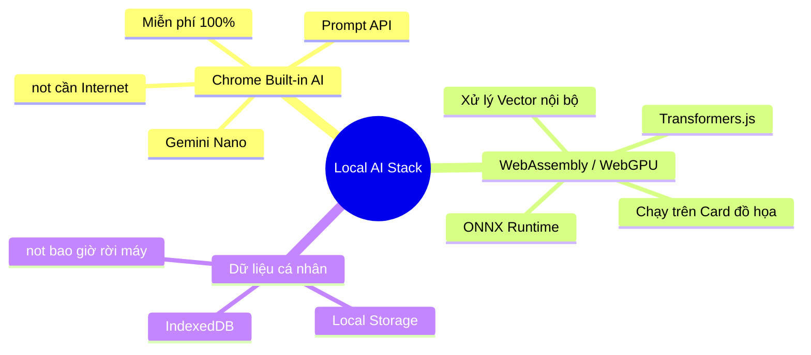

# 🤖 AI "not Tài khoản, not API": Cách chúng ta vận hành

Chào bạn, đây is phần giải thích về "phép màu" kỹ thuật giúp chúng ta sử dụng AI mà not cần to tài khoản hay mất phí Token.

## 🗺️ Hệ sinh thái AI Nội bộ (Mindmap)



---

## 🎠 Tại sao not cần Account/API? (Carousel)

````carousel
### 🏗️ 1. AI tích hợp sẵn in trình duyệt (Built-in)
**"Trình duyệt of bạn chính is bộ não"**
*   **Công nghệ:** Google đang tích hợp trực tiếp mô hình **Gemini Nano** vào nhân Chrome.
*   **Usage:** Chúng ta chỉ cần gọi lệnh `window.ai.createTextSession()` để bắt đầu.
*   **Lợi ích:** not cần ký danh, not cần API Key, not giới hạn token.
<!-- slide -->
### ⚙️ 2. Mô hình nén (Transformers.js)
**"Gói gọn sức mạnh AI vào a tệp nhỏ"**
*   **Công nghệ:** Chúng ta has thể tải the mô hình AI already successfully nén nhỏ (VGG, BERT, MobileNet) and chạy bằng WebAssembly.
*   **Usage:** Chạy trực tiếp trên CPU/GPU of máy tính thông qua trình duyệt.
*   **Lợi ích:** Hoàn toàn offline, bạn rút dây mạng AI vẫn hoạt động bình thường.
<!-- slide -->
### 💎 3. not tốn phí, not rò rỉ dữ liệu
**"Sức mạnh thuộc về phần cứng of bạn"**
*   **Chi phí:** Bạn already trả tiền for CPU/GPU khi mua máy, chúng ta chỉ tận dụng sức mạnh đó.
*   **Bảo mật:** Vì not has API gửi dữ liệu đi, nên not ai has thể xem successfully bookmark of bạn.
````

---

## ⚖️ So sánh Trải nghiệm

| Đặc điểm | AI truyền thống (ChatGPT/Gemini Web) | Local AI (Phase 10 of chúng ta) |
| :--- | :--- | :--- |
| **Tài khoản** | Bắt buộc (Google, OpenAI...) | **not CẦN** |
| **API Key / Token** | Tốn phí hoặc giới hạn | **MIỄN PHÍ VÔ TẬN** |
| **Internet** | must has | **OFFLINE HOÀN TOÀN** |
| **Thiết lập** | Phức tạp, đăng ký nhiều bước | **CÀI is CHẠY** |

---

**Bạn thấy điều this has tuyệt vời not?** Công nghệ hiện đại already for phép chúng ta sở hữu "Trí tuệ nhân tạo" ngay in tầm tay mà not bị phụ thuộc vào bất kỳ "ông lớn" nào.

Nếu bạn already hiểu and an tâm về cách vận hành this, hãy chọn giúp tôi: Chúng ta sẽ bắt đầu bằng **Tìm kiếm thông minh** hay **Tóm tắt nội dung** trước? 🚀🤖✨🏆🏁🛡️🔍 Bridge BRIDGE!
