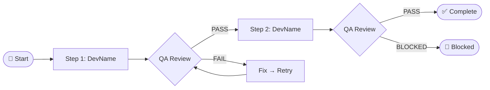

## Instructions

After reading blackboard.json + receipts from Claude Code,
Antigravity uses this template to generate a report for the user.
Language: VIETNAMESE. Send as a Mermaid walkthrough.

---
## Report Structure (Mandatory)

### Header
```
## Report: [Task name — from blackboard.json]
📅 Completed: [timestamp]
```

### Overview
[1-2 sentences summarizing the results: what was done, what was the outcome]

### Execution Flow


### Detailed Results

| Step | Role | Result | Modified Files |
|------|------|--------|----------------|
| 1 | DEVELOPER | ✅ PASS | path/to/file.ts |
| 2 | QA | ✅ PASS | — |
| 3 | DEVELOPER | ⚠️ PARTIAL | path/to/file2.ts |

### Key Learnings
[From cognitive_reflector — max 3 points]
- 💡 [lesson 1]
- 💡 [lesson 2]

### Next Steps
[Recommended actions — from open_items]
- [ ] [next task to do]

---
*Would you like to drill down into any specific step?*
