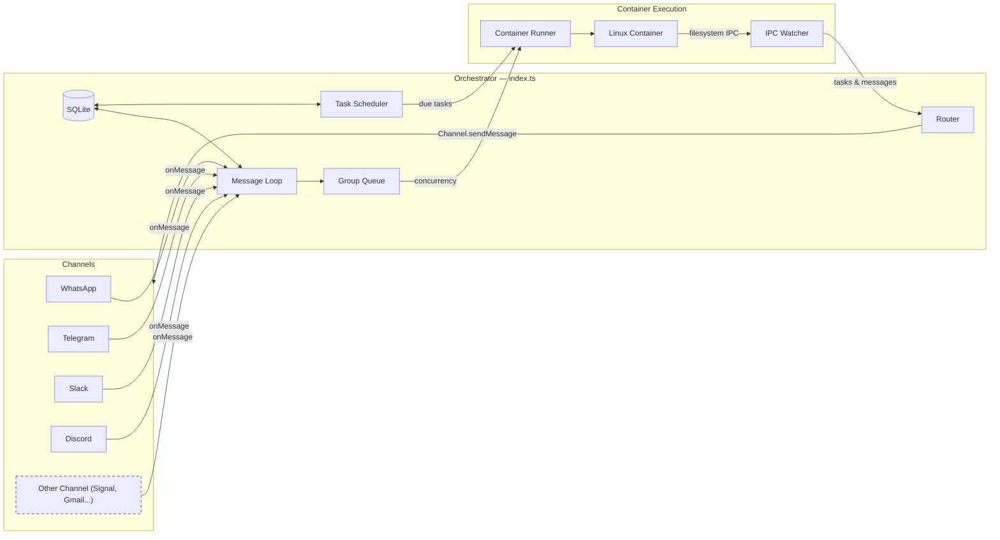

# KNOWLEDGE EXTRACT: nanoclaw
> **Extracted on:** 2026-03-30 13:19:40
> **Source:** nanoclaw

---

## File: `.gitignore`
```
# Dependencies
node_modules/
.npm-cache/
# Build output
dist/

# Local data & auth
store/
data/
logs/

# Groups - only track base structure and specific CLAUDE.md files
groups/*
!groups/main/
!groups/global/
groups/main/*
groups/global/*
!groups/main/CLAUDE.md
!groups/global/CLAUDE.md

# Secrets
*.keys.json
.env

# Temp files
.tmp-*

# OS
.DS_Store

# IDE
.idea/
.vscode/

# Skills system (local per-installation state)
.nanoclaw/

agents-sdk-docs
```

## File: `.mcp.json`
```json
{
  "mcpServers": {}
}
```

## File: `.nvmrc`
```
22
```

## File: `.prettierrc`
```
{
  "singleQuote": true
}
```

## File: `CHANGELOG.md`
```markdown
# Changelog

All notable changes to NanoClaw will be documented in this file.

For detailed release notes, see the [full changelog on the documentation site](https://docs.nanoclaw.dev/changelog).

## [1.2.35] - 2026-03-26

- [BREAKING] OneCLI Agent Vault replaces the built-in credential proxy. Existing `.env` credentials must be migrated to the vault. Run `/init-onecli` to install OneCLI and migrate credentials.

## [1.2.21] - 2026-03-22

- Added opt-in diagnostics via PostHog with explicit user consent (Yes / No / Never ask again)

## [1.2.20] - 2026-03-21

- Added ESLint configuration with error-handling rules

## [1.2.19] - 2026-03-19

- Reduced `docker stop` timeout for faster container restarts (`-t 1` flag)

## [1.2.18] - 2026-03-19

- User prompt content no longer logged on container errors — only input metadata
- Added Japanese README translation

## [1.2.17] - 2026-03-18

- Added `/capabilities` and `/status` container-agent skills

## [1.2.16] - 2026-03-18

- Tasks snapshot now refreshes immediately after IPC task mutations

## [1.2.15] - 2026-03-16

- Fixed remote-control prompt auto-accept to prevent immediate exit
- Added `KillMode=process` so remote-control survives service restarts

## [1.2.14] - 2026-03-14

- Added `/remote-control` command for host-level Claude Code access from within containers

## [1.2.13] - 2026-03-14

**Breaking:** Skills are now git branches, channels are separate fork repos.

- Skills live as `skill/*` git branches merged via `git merge`
- Added Docker Sandboxes support
- Fixed setup registration to use correct CLI commands

## [1.2.12] - 2026-03-08

- Added `/compact` skill for manual context compaction
- Enhanced container environment isolation via credential proxy

## [1.2.11] - 2026-03-08

- Added PDF reader, image vision, and WhatsApp reactions skills
- Fixed task container to close promptly when agent uses IPC-only messaging

## [1.2.10] - 2026-03-06

- Added `LIMIT` to unbounded message history queries for better performance

## [1.2.9] - 2026-03-06

- Agent prompts now include timezone context for accurate time references

## [1.2.8] - 2026-03-06

- Fixed misleading `send_message` tool description for scheduled tasks

## [1.2.7] - 2026-03-06

- Added `/add-ollama` skill for local model inference
- Added `update_task` tool and return task ID from `schedule_task`

## [1.2.6] - 2026-03-04

- Updated `claude-agent-sdk` to 0.2.68

## [1.2.5] - 2026-03-04

- CI formatting fix

## [1.2.4] - 2026-03-04

- Fixed `_chatJid` rename to `chatJid` in `onMessage` callback

## [1.2.3] - 2026-03-04

- Added sender allowlist for per-chat access control

## [1.2.2] - 2026-03-04

- Added `/use-local-whisper` skill for local voice transcription
- Atomic task claims prevent scheduled tasks from executing twice

## [1.2.1] - 2026-03-02

- Version bump (no functional changes)

## [1.2.0] - 2026-03-02

**Breaking:** WhatsApp removed from core, now a skill. Run `/add-whatsapp` to re-add.

- Channel registry: channels self-register at startup via `registerChannel()` factory pattern
- `isMain` flag replaces folder-name-based main group detection
- `ENABLED_CHANNELS` removed — channels detected by credential presence
- Prevent scheduled tasks from executing twice when container runtime exceeds poll interval

## [1.1.6] - 2026-03-01

- Added CJK font support for Chromium screenshots

## [1.1.5] - 2026-03-01

- Fixed wrapped WhatsApp message normalization

## [1.1.4] - 2026-03-01

- Added third-party model support
- Added `/update-nanoclaw` skill for syncing with upstream

## [1.1.3] - 2026-02-25

- Added `/add-slack` skill
- Restructured Gmail skill for new architecture

## [1.1.2] - 2026-02-24

- Improved error handling for WhatsApp Web version fetch

## [1.1.1] - 2026-02-24

- Added Qodo skills and codebase intelligence
- Fixed WhatsApp 405 connection failures

## [1.1.0] - 2026-02-23

- Added `/update` skill to pull upstream changes from within Claude Code
- Enhanced container environment isolation via credential proxy
```

## File: `CLAUDE.md`
```markdown
# NanoClaw

Personal Claude assistant. See [README.md](README.md) for philosophy and setup. See [docs/REQUIREMENTS.md](../../../core/security/QUARANTINE/vetted/repos/LobsterAI/spec/features/001_optimize_windows_startup/checklists/requirements.md) for architecture decisions.

## Quick Context

Single Node.js process with skill-based channel system. Channels (WhatsApp, Telegram, Slack, Discord, Gmail) are skills that self-register at startup. Messages route to Claude Agent SDK running in containers (Linux VMs). Each group has isolated filesystem and memory.

## Key Files

| File | Purpose |
|------|---------|
| `src/index.ts` | Orchestrator: state, message loop, agent invocation |
| `src/channels/registry.ts` | Channel registry (self-registration at startup) |
| `src/ipc.ts` | IPC watcher and task processing |
| `src/router.ts` | Message formatting and outbound routing |
| `src/config.ts` | Trigger pattern, paths, intervals |
| `src/container-runner.ts` | Spawns agent containers with mounts |
| `src/task-scheduler.ts` | Runs scheduled tasks |
| `src/db.ts` | SQLite operations |
| `groups/{name}/CLAUDE.md` | Per-group memory (isolated) |
| `container/skills/` | Skills loaded inside agent containers (browser, status, formatting) |

## Secrets / Credentials / Proxy (OneCLI)

API keys, secret keys, OAuth tokens, and auth credentials are managed by the OneCLI gateway — which handles secret injection into containers at request time, so no keys or tokens are ever passed to containers directly. Run `onecli --help`.

## Skills

Four types of skills exist in NanoClaw. See [CONTRIBUTING.md](CONTRIBUTING.md) for the full taxonomy and guidelines.

- **Feature skills** — merge a `skill/*` branch to add capabilities (e.g. `/add-telegram`, `/add-slack`)
- **Utility skills** — ship code files alongside SKILL.md (e.g. `/claw`)
- **Operational skills** — instruction-only workflows, always on `main` (e.g. `/setup`, `/debug`)
- **Container skills** — loaded inside agent containers at runtime (`container/skills/`)

| Skill | When to Use |
|-------|-------------|
| `/setup` | First-time installation, authentication, service configuration |
| `/customize` | Adding channels, integrations, changing behavior |
| `/debug` | Container issues, logs, troubleshooting |
| `/update-nanoclaw` | Bring upstream NanoClaw updates into a customized install |
| `/init-onecli` | Install OneCLI Agent Vault and migrate `.env` credentials to it |
| `/qodo-pr-resolver` | Fetch and fix Qodo PR review issues interactively or in batch |
| `/get-qodo-rules` | Load org- and repo-level coding rules from Qodo before code tasks |

## Contributing

Before creating a PR, adding a skill, or preparing any contribution, you MUST read [CONTRIBUTING.md](CONTRIBUTING.md). It covers accepted change types, the four skill types and their guidelines, SKILL.md format rules, PR requirements, and the pre-submission checklist (searching for existing PRs/issues, testing, description format).

## Development

Run commands directly—don't tell the user to run them.

```bash
npm run dev          # Run with hot reload
npm run build        # Compile TypeScript
./container/build.sh # Rebuild agent container
```

Service management:
```bash
# macOS (launchd)
launchctl load ~/Library/LaunchAgents/com.nanoclaw.plist
launchctl unload ~/Library/LaunchAgents/com.nanoclaw.plist
launchctl kickstart -k gui/$(id -u)/com.nanoclaw  # restart

# Linux (systemd)
systemctl --user start nanoclaw
systemctl --user stop nanoclaw
systemctl --user restart nanoclaw
```

## Troubleshooting

**WhatsApp not connecting after upgrade:** WhatsApp is now a separate skill, not bundled in core. Run `/add-whatsapp` (or `npx tsx scripts/apply-skill.ts .claude/skills/add-whatsapp && npm run build`) to install it. Existing auth credentials and groups are preserved.

## Container Build Cache

The container buildkit caches the build context aggressively. `--no-cache` alone does NOT invalidate COPY steps — the builder's volume retains stale files. To force a truly clean rebuild, prune the builder then re-run `./container/build.sh`.
```

## File: `CONTRIBUTING.md`
```markdown
# Contributing

## Before You Start

1. **Check for existing work.** Search open PRs and issues before starting:
   ```bash
   gh pr list --repo qwibitai/nanoclaw --search "<your feature>"
   gh issue list --repo qwibitai/nanoclaw --search "<your feature>"
   ```
   If a related PR or issue exists, build on it rather than duplicating effort.

2. **Check alignment.** Read the [Philosophy section in README.md](README.md#philosophy). Source code changes should only be things 90%+ of users need. Skills can be more niche, but should still be useful beyond a single person's setup.

3. **One thing per PR.** Each PR should do one thing — one bug fix, one skill, one simplification. Don't mix unrelated changes in a single PR.

## Source Code Changes

**Accepted:** Bug fixes, security fixes, simplifications, reducing code.

**Not accepted:** Features, capabilities, compatibility, enhancements. These should be skills.

## Skills

NanoClaw uses [Claude Code skills](https://code.claude.com/docs/en/skills) — markdown files with optional supporting files that teach Claude how to do something. There are four types of skills in NanoClaw, each serving a different purpose.

### Why skills?

Every user should have clean and minimal code that does exactly what they need. Skills let users selectively add features to their fork without inheriting code for features they don't want.

### Skill types

#### 1. Feature skills (branch-based)

Add capabilities to NanoClaw by merging a git branch. The SKILL.md contains setup instructions; the actual code lives on a `skill/*` branch.

**Location:** `.claude/skills/` on `main` (instructions only), code on `skill/*` branch

**Examples:** `/add-telegram`, `/add-slack`, `/add-discord`, `/add-gmail`

**How they work:**
1. User runs `/add-telegram`
2. Claude follows the SKILL.md: fetches and merges the `skill/telegram` branch
3. Claude walks through interactive setup (env vars, bot creation, etc.)

**Contributing a feature skill:**
1. Fork `qwibitai/nanoclaw` and branch from `main`
2. Make the code changes (new files, modified source, updated `package.json`, etc.)
3. Add a SKILL.md in `.claude/skills/<name>/` with setup instructions — step 1 should be merging the branch
4. Open a PR. We'll create the `skill/<name>` branch from your work

See `/add-telegram` for a good example. See [docs/skills-as-branches.md](docs/skills-as-branches.md) for the full system design.

#### 2. Utility skills (with code files)

Standalone tools that ship code files alongside the SKILL.md. The SKILL.md tells Claude how to install the tool; the code lives in the skill directory itself (e.g. in a `scripts/` subfolder).

**Location:** `.claude/skills/<name>/` with supporting files

**Examples:** `/claw` (Python CLI in `scripts/claw`)

**Key difference from feature skills:** No branch merge needed. The code is self-contained in the skill directory and gets copied into place during installation.

**Guidelines:**
- Put code in separate files, not inline in the SKILL.md
- Use `${CLAUDE_SKILL_DIR}` to reference files in the skill directory
- SKILL.md contains installation instructions, usage docs, and troubleshooting

#### 3. Operational skills (instruction-only)

Workflows and guides with no code changes. The SKILL.md is the entire skill — Claude follows the instructions to perform a task.

**Location:** `.claude/skills/` on `main`

**Examples:** `/setup`, `/debug`, `/customize`, `/update-nanoclaw`, `/update-skills`

**Guidelines:**
- Pure instructions — no code files, no branch merges
- Use `AskUserQuestion` for interactive prompts
- These stay on `main` and are always available to every user

#### 4. Container skills (agent runtime)

Skills that run inside the agent container, not on the host. These teach the container agent how to use tools, format output, or perform tasks. They are synced into each group's `.claude/skills/` directory when a container starts.

**Location:** `container/skills/<name>/`

**Examples:** `agent-browser` (web browsing), `capabilities` (/capabilities command), `status` (/status command), `slack-formatting` (Slack mrkdwn syntax)

**Key difference:** These are NOT invoked by the user on the host. They're loaded by Claude Code inside the container and influence how the agent behaves.

**Guidelines:**
- Follow the same SKILL.md + frontmatter format
- Use `allowed-tools` frontmatter to scope tool permissions
- Keep them focused — the agent's context window is shared across all container skills

### SKILL.md format

All skills use the [Claude Code skills standard](https://code.claude.com/docs/en/skills):

```markdown
---
name: my-skill
description: What this skill does and when to use it.
---

Instructions here...
```

**Rules:**
- Keep SKILL.md **under 500 lines** — move detail to separate reference files
- `name`: lowercase, alphanumeric + hyphens, max 64 chars
- `description`: required — Claude uses this to decide when to invoke the skill
- Put code in separate files, not inline in the markdown
- See the [skills standard](https://code.claude.com/docs/en/skills) for all available frontmatter fields

## Testing

Test your contribution on a fresh clone before submitting. For skills, run the skill end-to-end and verify it works.

## Pull Requests

### Before opening

1. **Link related issues.** If your PR resolves an open issue, include `Closes #123` in the description so it's auto-closed on merge.
2. **Test thoroughly.** Run the feature yourself. For skills, test on a fresh clone.
3. **Check the right box** in the PR template. Labels are auto-applied based on your selection:

| Checkbox | Label |
|----------|-------|
| Feature skill | `PR: Skill` + `PR: Feature` |
| Utility skill | `PR: Skill` |
| Operational/container skill | `PR: Skill` |
| Fix | `PR: Fix` |
| Simplification | `PR: Refactor` |
| Documentation | `PR: Docs` |

### PR description

Keep it concise. Remove any template sections that don't apply. The description should cover:

- **What** — what the PR adds or changes
- **Why** — the motivation
- **How it works** — brief explanation of the approach
- **How it was tested** — what you did to verify it works
- **Usage** — how the user invokes it (for skills)

Don't pad the description. A few clear sentences are better than lengthy paragraphs.
```

## File: `CONTRIBUTORS.md`
```markdown
# Contributors

Thanks to everyone who has contributed to NanoClaw!

- [Alakazam03](https://github.com/Alakazam03) — Vaibhav Aggarwal
- [tydev-new](https://github.com/tydev-new)
- [pottertech](https://github.com/pottertech) — Skip Potter
- [rgarcia](https://github.com/rgarcia) — Rafael
- [AmaxGuan](https://github.com/AmaxGuan) — Lingfeng Guan
- [happydog-intj](https://github.com/happydog-intj) — happy dog
- [bindoon](https://github.com/bindoon) — 潕量
- [taslim](https://github.com/taslim) — Taslim
- [baijunjie](https://github.com/baijunjie) — BaiJunjie
- [Michaelliv](https://github.com/Michaelliv) — Michael
- [kk17](https://github.com/kk17) — Kyle Zhike Chen
- [flobo3](https://github.com/flobo3) — Flo
- [edwinwzhe](https://github.com/edwinwzhe) — Edwin He
- [scottgl9](https://github.com/scottgl9) — Scott Glover
```

## File: `eslint.config.js`
```javascript
import globals from 'globals'
import pluginJs from '@eslint/js'
import tseslint from 'typescript-eslint'
import noCatchAll from 'eslint-plugin-no-catch-all'

export default [
  { ignores: ['node_modules/', 'dist/', 'container/', 'groups/'] },
  { files: ['src/**/*.{js,ts}'] },
  { languageOptions: { globals: globals.node } },
  pluginJs.configs.recommended,
  ...tseslint.configs.recommended,
  {
    plugins: { 'no-catch-all': noCatchAll },
    rules: {
      'preserve-caught-error': ['error', { requireCatchParameter: true }],
      '@typescript-eslint/no-unused-vars': [
        'error',
        {
          args: 'all',
          argsIgnorePattern: '^_',
          caughtErrors: 'all',
          caughtErrorsIgnorePattern: '^_',
          destructuredArrayIgnorePattern: '^_',
          varsIgnorePattern: '^_',
          ignoreRestSiblings: true,
        },
      ],
      'no-catch-all/no-catch-all': 'warn',
      '@typescript-eslint/no-explicit-any': 'warn',
    },
  },
]
```

## File: `LICENSE`
```
MIT License

Copyright (c) 2026 Gavriel

Permission is hereby granted, free of charge, to any person obtaining a copy
of this software and associated documentation files (the "Software"), to deal
in the Software without restriction, including without limitation the rights
to use, copy, modify, merge, publish, distribute, sublicense, and/or sell
copies of the Software, and to permit persons to whom the Software is
furnished to do so, subject to the following conditions:

The above copyright notice and this permission notice shall be included in all
copies or substantial portions of the Software.

THE SOFTWARE IS PROVIDED "AS IS", WITHOUT WARRANTY OF ANY KIND, EXPRESS OR
IMPLIED, INCLUDING BUT NOT LIMITED TO THE WARRANTIES OF MERCHANTABILITY,
FITNESS FOR A PARTICULAR PURPOSE AND NONINFRINGEMENT. IN NO EVENT SHALL THE
AUTHORS OR COPYRIGHT HOLDERS BE LIABLE FOR ANY CLAIM, DAMAGES OR OTHER
LIABILITY, WHETHER IN AN ACTION OF CONTRACT, TORT OR OTHERWISE, ARISING FROM,
OUT OF OR IN CONNECTION WITH THE SOFTWARE OR THE USE OR OTHER DEALINGS IN THE
SOFTWARE.
```

## File: `package.json`
```json
{
  "name": "nanoclaw",
  "version": "1.2.42",
  "description": "Personal Claude assistant. Lightweight, secure, customizable.",
  "type": "module",
  "main": "dist/index.js",
  "scripts": {
    "build": "tsc",
    "start": "node dist/index.js",
    "dev": "tsx src/index.ts",
    "typecheck": "tsc --noEmit",
    "format": "prettier --write \"src/**/*.ts\"",
    "format:fix": "prettier --write \"src/**/*.ts\"",
    "format:check": "prettier --check \"src/**/*.ts\"",
    "prepare": "husky",
    "setup": "tsx setup/index.ts",
    "auth": "tsx src/whatsapp-auth.ts",
    "lint": "eslint src/",
    "lint:fix": "eslint src/ --fix",
    "test": "vitest run",
    "test:watch": "vitest"
  },
  "dependencies": {
    "@onecli-sh/sdk": "^0.2.0",
    "better-sqlite3": "11.10.0",
    "cron-parser": "5.5.0"
  },
  "devDependencies": {
    "@eslint/js": "^9.35.0",
    "@types/better-sqlite3": "^7.6.12",
    "@types/node": "^22.10.0",
    "eslint": "^9.35.0",
    "eslint-plugin-no-catch-all": "^1.1.0",
    "globals": "^15.12.0",
    "husky": "^9.1.7",
    "prettier": "^3.8.1",
    "tsx": "^4.19.0",
    "typescript": "^5.7.0",
    "typescript-eslint": "^8.35.0",
    "vitest": "^4.0.18"
  },
  "engines": {
    "node": ">=20"
  }
}
```

## File: `README.md`
```markdown
<p align="center">
  
</p>

<p align="center">
  An AI assistant that runs agents securely in their own containers. Lightweight, built to be easily understood and completely customized for your needs.
</p>

<p align="center">
  <a href="https://nanoclaw.dev">nanoclaw.dev</a>&nbsp; • &nbsp;
  <a href="https://docs.nanoclaw.dev">docs</a>&nbsp; • &nbsp;
  <a href="README_zh.md">中文</a>&nbsp; • &nbsp;
  <a href="README_ja.md">日本語</a>&nbsp; • &nbsp;
  <a href="https://discord.gg/VDdww8qS42"></a>&nbsp; • &nbsp;
  <a href="repo-tokens"></a>
</p>

---

## Why I Built NanoClaw

[OpenClaw](https://github.com/openclaw/openclaw) is an impressive project, but I wouldn't have been able to sleep if I had given complex software I didn't understand full access to my life. OpenClaw has nearly half a million lines of code, 53 config files, and 70+ dependencies. Its security is at the application level (allowlists, pairing codes) rather than true OS-level isolation. Everything runs in one Node process with shared memory.

NanoClaw provides that same core functionality, but in a codebase small enough to understand: one process and a handful of files. Claude agents run in their own Linux containers with filesystem isolation, not merely behind permission checks.

## Quick Start

```bash
gh repo fork qwibitai/nanoclaw --clone
cd nanoclaw
claude
```

<details>
<summary>Without GitHub CLI</summary>

1. Fork [qwibitai/nanoclaw](https://github.com/qwibitai/nanoclaw) on GitHub (click the Fork button)
2. `git clone https://github.com/<your-username>/nanoclaw.git`
3. `cd nanoclaw`
4. `claude`

</details>

Then run `/setup`. Claude Code handles everything: dependencies, authentication, container setup and service configuration.

> **Note:** Commands prefixed with `/` (like `/setup`, `/add-whatsapp`) are [Claude Code skills](https://code.claude.com/docs/en/skills). Type them inside the `claude` CLI prompt, not in your regular terminal. If you don't have Claude Code installed, get it at [claude.com/product/claude-code](https://claude.com/product/claude-code).

## Philosophy

**Small enough to understand.** One process, a few source files and no microservices. If you want to understand the full NanoClaw codebase, just ask Claude Code to walk you through it.

**Secure by isolation.** Agents run in Linux containers (Apple Container on macOS, or Docker) and they can only see what's explicitly mounted. Bash access is safe because commands run inside the container, not on your host.

**Built for the individual user.** NanoClaw isn't a monolithic framework; it's software that fits each user's exact needs. Instead of becoming bloatware, NanoClaw is designed to be bespoke. You make your own fork and have Claude Code modify it to match your needs.

**Customization = code changes.** No configuration sprawl. Want different behavior? Modify the code. The codebase is small enough that it's safe to make changes.

**AI-native.**
- No installation wizard; Claude Code guides setup.
- No monitoring dashboard; ask Claude what's happening.
- No debugging tools; describe the problem and Claude fixes it.

**Skills over features.** Instead of adding features (e.g. support for Telegram) to the codebase, contributors submit [claude code skills](https://code.claude.com/docs/en/skills) like `/add-telegram` that transform your fork. You end up with clean code that does exactly what you need.

**Best harness, best model.** NanoClaw runs on the Claude Agent SDK, which means you're running Claude Code directly. Claude Code is highly capable and its coding and problem-solving capabilities allow it to modify and expand NanoClaw and tailor it to each user.

## What It Supports

- **Multi-channel messaging** - Talk to your assistant from WhatsApp, Telegram, Discord, Slack, or Gmail. Add channels with skills like `/add-whatsapp` or `/add-telegram`. Run one or many at the same time.
- **Isolated group context** - Each group has its own `CLAUDE.md` memory, isolated filesystem, and runs in its own container sandbox with only that filesystem mounted to it.
- **Main channel** - Your private channel (self-chat) for admin control; every group is completely isolated
- **Scheduled tasks** - Recurring jobs that run Claude and can message you back
- **Web access** - Search and fetch content from the Web
- **Container isolation** - Agents are sandboxed in Docker (macOS/Linux), [Docker Sandboxes](docs/docker-sandboxes.md) (micro VM isolation), or Apple Container (macOS)
- **Credential security** - Agents never hold raw API keys. Outbound requests route through [OneCLI's Agent Vault](https://github.com/onecli/onecli), which injects credentials at request time and enforces per-agent policies and rate limits.
- **Agent Swarms** - Spin up teams of specialized agents that collaborate on complex tasks
- **Optional integrations** - Add Gmail (`/add-gmail`) and more via skills

## Usage

Talk to your assistant with the trigger word (default: `@Andy`):

```
@Andy send an overview of the sales pipeline every weekday morning at 9am (has access to my Obsidian vault folder)
@Andy review the git history for the past week each Friday and update the README if there's drift
@Andy every Monday at 8am, compile news on AI developments from Hacker News and TechCrunch and message me a briefing
```

From the main channel (your self-chat), you can manage groups and tasks:
```
@Andy list all scheduled tasks across groups
@Andy pause the Monday briefing task
@Andy join the Family Chat group
```

## Customizing

NanoClaw doesn't use configuration files. To make changes, just tell Claude Code what you want:

- "Change the trigger word to @Bob"
- "Remember in the future to make responses shorter and more direct"
- "Add a custom greeting when I say good morning"
- "Store conversation summaries weekly"

Or run `/customize` for guided changes.

The codebase is small enough that Claude can safely modify it.

## Contributing

**Don't add features. Add skills.**

If you want to add Telegram support, don't create a PR that adds Telegram to the core codebase. Instead, fork NanoClaw, make the code changes on a branch, and open a PR. We'll create a `skill/telegram` branch from your PR that other users can merge into their fork.

Users then run `/add-telegram` on their fork and get clean code that does exactly what they need, not a bloated system trying to support every use case.

### RFS (Request for Skills)

Skills we'd like to see:

**Communication Channels**
- `/add-signal` - Add Signal as a channel

## Requirements

- macOS, Linux, or Windows (via WSL2)
- Node.js 20+
- [Claude Code](https://claude.ai/download)
- [Apple Container](https://github.com/apple/container) (macOS) or [Docker](https://docker.com/products/docker-desktop) (macOS/Linux)

## Architecture

```
Channels --> SQLite --> Polling loop --> Container (Claude Agent SDK) --> Response
```

Single Node.js process. Channels are added via skills and self-register at startup — the orchestrator connects whichever ones have credentials present. Agents execute in isolated Linux containers with filesystem isolation. Only mounted directories are accessible. Per-group message queue with concurrency control. IPC via filesystem.

For the full architecture details, see the [documentation site](https://docs.nanoclaw.dev/concepts/architecture).

Key files:
- `src/index.ts` - Orchestrator: state, message loop, agent invocation
- `src/channels/registry.ts` - Channel registry (self-registration at startup)
- `src/ipc.ts` - IPC watcher and task processing
- `src/router.ts` - Message formatting and outbound routing
- `src/group-queue.ts` - Per-group queue with global concurrency limit
- `src/container-runner.ts` - Spawns streaming agent containers
- `src/task-scheduler.ts` - Runs scheduled tasks
- `src/db.ts` - SQLite operations (messages, groups, sessions, state)
- `groups/*/CLAUDE.md` - Per-group memory

## FAQ

**Why Docker?**

Docker provides cross-platform support (macOS, Linux and even Windows via WSL2) and a mature ecosystem. On macOS, you can optionally switch to Apple Container via `/convert-to-apple-container` for a lighter-weight native runtime. For additional isolation, [Docker Sandboxes](docs/docker-sandboxes.md) run each container inside a micro VM.

**Can I run this on Linux or Windows?**

Yes. Docker is the default runtime and works on macOS, Linux, and Windows (via WSL2). Just run `/setup`.

**Is this secure?**

Agents run in containers, not behind application-level permission checks. They can only access explicitly mounted directories. Credentials never enter the container — outbound API requests route through [OneCLI's Agent Vault](https://github.com/onecli/onecli), which injects authentication at the proxy level and supports rate limits and access policies. You should still review what you're running, but the codebase is small enough that you actually can. See the [security documentation](https://docs.nanoclaw.dev/concepts/security) for the full security model.

**Why no configuration files?**

We don't want configuration sprawl. Every user should customize NanoClaw so that the code does exactly what they want, rather than configuring a generic system. If you prefer having config files, you can tell Claude to add them.

**Can I use third-party or open-source models?**

Yes. NanoClaw supports any Claude API-compatible model endpoint. Set these environment variables in your `.env` file:

```bash
ANTHROPIC_BASE_URL=https://your-api-endpoint.com
ANTHROPIC_AUTH_TOKEN=your-token-here
```

This allows you to use:
- Local models via [Ollama](https://ollama.ai) with an API proxy
- Open-source models hosted on [Together AI](https://together.ai), [Fireworks](https://fireworks.ai), etc.
- Custom model deployments with Anthropic-compatible APIs

Note: The model must support the Anthropic API format for best compatibility.

**How do I debug issues?**

Ask Claude Code. "Why isn't the scheduler running?" "What's in the recent logs?" "Why did this message not get a response?" That's the AI-native approach that underlies NanoClaw.

**Why isn't the setup working for me?**

If you have issues, during setup, Claude will try to dynamically fix them. If that doesn't work, run `claude`, then run `/debug`. If Claude finds an issue that is likely affecting other users, open a PR to modify the setup SKILL.md.

**What changes will be accepted into the codebase?**

Only security fixes, bug fixes, and clear improvements will be accepted to the base configuration. That's all.

Everything else (new capabilities, OS compatibility, hardware support, enhancements) should be contributed as skills.

This keeps the base system minimal and lets every user customize their installation without inheriting features they don't want.

## Community

Questions? Ideas? [Join the Discord](https://discord.gg/VDdww8qS42).

## Changelog

See [CHANGELOG.md](CHANGELOG.md) for breaking changes, or the [full release history](https://docs.nanoclaw.dev/changelog) on the documentation site.

## License

MIT
```

## File: `README_ja.md`
```markdown
<p align="center">
  
</p>

<p align="center">
  エージェントを専用コンテナで安全に実行するAIアシスタント。軽量で、理解しやすく、あなたのニーズに完全にカスタマイズできるように設計されています。
</p>

<p align="center">
  <a href="https://nanoclaw.dev">nanoclaw.dev</a>&nbsp; • &nbsp;
  <a href="README.md">English</a>&nbsp; • &nbsp;
  <a href="README_zh.md">中文</a>&nbsp; • &nbsp;
  <a href="https://discord.gg/VDdww8qS42"></a>&nbsp; • &nbsp;
  <a href="repo-tokens"></a>
</p>

---

<h2 align="center">🐳 Dockerサンドボックスで動作</h2>
<p align="center">各エージェントはマイクロVM内の独立したコンテナで実行されます。<br>ハイパーバイザーレベルの分離。ミリ秒で起動。複雑なセットアップ不要。</p>

**macOS (Apple Silicon)**
```bash
curl -fsSL https://nanoclaw.dev/install-docker-sandboxes.sh | bash
```

**Windows (WSL)**
```bash
curl -fsSL https://nanoclaw.dev/install-docker-sandboxes-windows.sh | bash
```

> 現在、macOS（Apple Silicon）とWindows（x86）に対応しています。Linux対応は近日公開予定。

<p align="center"><a href="https://nanoclaw.dev/blog/nanoclaw-docker-sandboxes">発表記事を読む →</a>&nbsp; · &nbsp;<a href="docs/docker-sandboxes.md">手動セットアップガイド →</a></p>

---

## NanoClawを作った理由

[OpenClaw](https://github.com/openclaw/openclaw)は素晴らしいプロジェクトですが、理解しきれない複雑なソフトウェアに自分の生活へのフルアクセスを与えたまま安心して眠れるとは思えませんでした。OpenClawは約50万行のコード、53の設定ファイル、70以上の依存関係を持っています。セキュリティはアプリケーションレベル（許可リスト、ペアリングコード）であり、真のOS レベルの分離ではありません。すべてが共有メモリを持つ1つのNodeプロセスで動作します。

NanoClawは同じコア機能を提供しますが、理解できる規模のコードベースで実現しています：1つのプロセスと少数のファイル。Claudeエージェントは単なるパーミッションチェックの背後ではなく、ファイルシステム分離された独自のLinuxコンテナで実行されます。

## クイックスタート

```bash
gh repo fork qwibitai/nanoclaw --clone
cd nanoclaw
claude
```

<details>
<summary>GitHub CLIなしの場合</summary>

1. GitHub上で[qwibitai/nanoclaw](https://github.com/qwibitai/nanoclaw)をフォーク（Forkボタンをクリック）
2. `git clone https://github.com/<あなたのユーザー名>/nanoclaw.git`
3. `cd nanoclaw`
4. `claude`

</details>

その後、`/setup`を実行します。Claude Codeがすべてを処理します：依存関係、認証、コンテナセットアップ、サービス設定。

> **注意:** `/`で始まるコマンド（`/setup`、`/add-whatsapp`など）は[Claude Codeスキル](https://code.claude.com/docs/en/skills)です。通常のターミナルではなく、`claude` CLIプロンプト内で入力してください。Claude Codeをインストールしていない場合は、[claude.com/product/claude-code](https://claude.com/product/claude-code)から入手してください。

## 設計思想

**理解できる規模。** 1つのプロセス、少数のソースファイル、マイクロサービスなし。NanoClawのコードベース全体を理解したい場合は、Claude Codeに説明を求めるだけです。

**分離によるセキュリティ。** エージェントはLinuxコンテナ（macOSではApple Container、またはDocker）で実行され、明示的にマウントされたものだけが見えます。コマンドはホストではなくコンテナ内で実行されるため、Bashアクセスは安全です。

**個人ユーザー向け。** NanoClawはモノリシックなフレームワークではなく、各ユーザーのニーズに正確にフィットするソフトウェアです。肥大化するのではなく、オーダーメイドになるよう設計されています。自分のフォークを作成し、Claude Codeにニーズに合わせて変更させます。

**カスタマイズ＝コード変更。** 設定ファイルの肥大化なし。動作を変えたい？コードを変更するだけ。コードベースは変更しても安全な規模です。

**AIネイティブ。**
- インストールウィザードなし — Claude Codeがセットアップを案内。
- モニタリングダッシュボードなし — Claudeに状況を聞くだけ。
- デバッグツールなし — 問題を説明すればClaudeが修正。

**機能追加ではなくスキル。** コードベースに機能（例：Telegram対応）を追加する代わりに、コントリビューターは`/add-telegram`のような[Claude Codeスキル](https://code.claude.com/docs/en/skills)を提出し、あなたのフォークを変換します。あなたが必要なものだけを正確に実行するクリーンなコードが手に入ります。

**最高のハーネス、最高のモデル。** NanoClawはClaude Agent SDK上で動作します。つまり、Claude Codeを直接実行しているということです。Claude Codeは高い能力を持ち、そのコーディングと問題解決能力によってNanoClawを変更・拡張し、各ユーザーに合わせてカスタマイズできます。

## サポート機能

- **マルチチャネルメッセージング** - WhatsApp、Telegram、Discord、Slack、Gmailからアシスタントと会話。`/add-whatsapp`や`/add-telegram`などのスキルでチャネルを追加。1つでも複数でも同時に実行可能。
- **グループごとの分離コンテキスト** - 各グループは独自の`CLAUDE.md`メモリ、分離されたファイルシステムを持ち、そのファイルシステムのみがマウントされた専用コンテナサンドボックスで実行。
- **メインチャネル** - 管理制御用のプライベートチャネル（セルフチャット）。各グループは完全に分離。
- **スケジュールタスク** - Claudeを実行し、メッセージを返せる定期ジョブ。
- **Webアクセス** - Webからのコンテンツ検索・取得。
- **コンテナ分離** - エージェントは[Dockerサンドボックス](https://nanoclaw.dev/blog/nanoclaw-docker-sandboxes)（マイクロVM分離）、Apple Container（macOS）、またはDocker（macOS/Linux）でサンドボックス化。
- **エージェントスウォーム** - 複雑なタスクで協力する専門エージェントチームを起動。
- **オプション連携** - Gmail（`/add-gmail`）などをスキルで追加。

## 使い方

トリガーワード（デフォルト：`@Andy`）でアシスタントに話しかけます：

```
@Andy 毎朝9時に営業パイプラインの概要を送って（Obsidian vaultフォルダにアクセス可能）
@Andy 毎週金曜に過去1週間のgit履歴をレビューして、差異があればREADMEを更新して
@Andy 毎週月曜の朝8時に、Hacker NewsとTechCrunchからAI関連のニュースをまとめてブリーフィングを送って
```

メインチャネル（セルフチャット）から、グループやタスクを管理できます：
```
@Andy 全グループのスケジュールタスクを一覧表示して
@Andy 月曜のブリーフィングタスクを一時停止して
@Andy Family Chatグループに参加して
```

## カスタマイズ

NanoClawは設定ファイルを使いません。変更するには、Claude Codeに伝えるだけです：

- 「トリガーワードを@Bobに変更して」
- 「今後はレスポンスをもっと短く直接的にして」
- 「おはようと言ったらカスタム挨拶を追加して」
- 「会話の要約を毎週保存して」

または`/customize`を実行してガイド付きの変更を行えます。

コードベースは十分に小さいため、Claudeが安全に変更できます。

## コントリビューション

**機能を追加するのではなく、スキルを追加してください。**

Telegram対応を追加したい場合、コアコードベースにTelegramを追加するPRを作成しないでください。代わりに、NanoClawをフォークし、ブランチでコード変更を行い、PRを開いてください。あなたのPRから`skill/telegram`ブランチを作成し、他のユーザーが自分のフォークにマージできるようにします。

ユーザーは自分のフォークで`/add-telegram`を実行するだけで、あらゆるユースケースに対応しようとする肥大化したシステムではなく、必要なものだけを正確に実行するクリーンなコードが手に入ります。

### RFS（スキル募集）

私たちが求めているスキル：

**コミュニケーションチャネル**
- `/add-signal` - Signalをチャネルとして追加

**セッション管理**
- `/clear` - 会話をコンパクト化する`/clear`コマンドの追加（同一セッション内で重要な情報を保持しながらコンテキストを要約）。Claude Agent SDKを通じてプログラム的にコンパクト化をトリガーする方法の解明が必要。

## 必要条件

- macOSまたはLinux
- Node.js 20以上
- [Claude Code](https://claude.ai/download)
- [Apple Container](https://github.com/apple/container)（macOS）または[Docker](https://docker.com/products/docker-desktop)（macOS/Linux）

## アーキテクチャ

```
チャネル --> SQLite --> ポーリングループ --> コンテナ（Claude Agent SDK） --> レスポンス
```

単一のNode.jsプロセス。チャネルはスキルで追加され、起動時に自己登録します — オーケストレーターは認証情報が存在するチャネルを接続します。エージェントはファイルシステム分離された独立したLinuxコンテナで実行されます。マウントされたディレクトリのみアクセス可能。グループごとのメッセージキューと同時実行制御。ファイルシステム経由のIPC。

詳細なアーキテクチャについては、[docs/SPEC.md](spec.md)を参照してください。

主要ファイル：
- `src/index.ts` - オーケストレーター：状態、メッセージループ、エージェント呼び出し
- `src/channels/registry.ts` - チャネルレジストリ（起動時の自己登録）
- `src/ipc.ts` - IPCウォッチャーとタスク処理
- `src/router.ts` - メッセージフォーマットとアウトバウンドルーティング
- `src/group-queue.ts` - グローバル同時実行制限付きのグループごとのキュー
- `src/container-runner.ts` - ストリーミングエージェントコンテナの起動
- `src/task-scheduler.ts` - スケジュールタスクの実行
- `src/db.ts` - SQLite操作（メッセージ、グループ、セッション、状態）
- `groups/*/CLAUDE.md` - グループごとのメモリ

## FAQ

**なぜDockerなのか？**

Dockerはクロスプラットフォーム対応（macOS、Linux、さらにWSL2経由のWindows）と成熟したエコシステムを提供します。macOSでは、`/convert-to-apple-container`でオプションとしてApple Containerに切り替え、より軽量なネイティブランタイムを使用できます。

**Linuxで実行できますか？**

はい。DockerがデフォルトのランタイムでmacOSとLinuxの両方で動作します。`/setup`を実行するだけです。

**セキュリティは大丈夫ですか？**

エージェントはアプリケーションレベルのパーミッションチェックの背後ではなく、コンテナで実行されます。明示的にマウントされたディレクトリのみアクセスできます。実行するものをレビューすべきですが、コードベースは十分に小さいため実際にレビュー可能です。完全なセキュリティモデルについては[docs/SECURITY.md](../bmad_repo/SECURITY.md)を参照してください。

**なぜ設定ファイルがないのか？**

設定の肥大化を避けたいからです。すべてのユーザーがNanoClawをカスタマイズし、汎用的なシステムを設定するのではなく、コードが必要なことを正確に実行するようにすべきです。設定ファイルが欲しい場合は、Claudeに追加するよう伝えることができます。

**サードパーティやオープンソースモデルを使えますか？**

はい。NanoClawはClaude API互換のモデルエンドポイントに対応しています。`.env`ファイルで以下の環境変数を設定してください：

```bash
ANTHROPIC_BASE_URL=https://your-api-endpoint.com
ANTHROPIC_AUTH_TOKEN=your-token-here
```

以下が使用可能です：
- [Ollama](https://ollama.ai)とAPIプロキシ経由のローカルモデル
- [Together AI](https://together.ai)、[Fireworks](https://fireworks.ai)等でホストされたオープンソースモデル
- Anthropic互換APIのカスタムモデルデプロイメント

注意：最高の互換性のため、モデルはAnthropic APIフォーマットに対応している必要があります。

**問題のデバッグ方法は？**

Claude Codeに聞いてください。「スケジューラーが動いていないのはなぜ？」「最近のログには何がある？」「このメッセージに返信がなかったのはなぜ？」これがNanoClawの基盤となるAIネイティブなアプローチです。

**セットアップがうまくいかない場合は？**

問題がある場合、セットアップ中にClaudeが動的に修正を試みます。それでもうまくいかない場合は、`claude`を実行してから`/debug`を実行してください。Claudeが他のユーザーにも影響する可能性のある問題を見つけた場合は、セットアップのSKILL.mdを修正するPRを開いてください。

**どのような変更がコードベースに受け入れられますか？**

セキュリティ修正、バグ修正、明確な改善のみが基本設定に受け入れられます。それだけです。

それ以外のすべて（新機能、OS互換性、ハードウェアサポート、機能拡張）はスキルとしてコントリビューションすべきです。

これにより、基本システムを最小限に保ち、すべてのユーザーが不要な機能を継承することなく、自分のインストールをカスタマイズできます。

## コミュニティ

質問やアイデアは？[Discordに参加](https://discord.gg/VDdww8qS42)してください。

## 変更履歴

破壊的変更と移行ノートについては[CHANGELOG.md](CHANGELOG.md)を参照してください。

## ライセンス

MIT
```

## File: `README_zh.md`
```markdown
<p align="center">
  
</p>

<p align="center">
  NanoClaw —— 您的专属 Claude 助手，在容器中安全运行。它轻巧易懂，并能根据您的个人需求灵活定制。
</p>

<p align="center">
  <a href="https://nanoclaw.dev">nanoclaw.dev</a>&nbsp; • &nbsp;
  <a href="README.md">English</a>&nbsp; • &nbsp;
  <a href="README_ja.md">日本語</a>&nbsp; • &nbsp;
  <a href="https://discord.gg/VDdww8qS42"></a>&nbsp; • &nbsp;
  <a href="repo-tokens"></a>
</p>
通过 Claude Code，NanoClaw 可以动态重写自身代码，根据您的需求定制功能。

**新功能：** 首个支持 [Agent Swarms（智能体集群）](https://code.claude.com/docs/en/agent-teams) 的 AI 助手。可轻松组建智能体团队，在您的聊天中高效协作。

## 我为什么创建这个项目

[OpenClaw](https://github.com/openclaw/openclaw) 是一个令人印象深刻的项目，但我无法安心使用一个我不了解却能访问我个人隐私的软件。OpenClaw 有近 50 万行代码、53 个配置文件和 70+ 个依赖项。其安全性是应用级别的（通过白名单、配对码实现），而非操作系统级别的隔离。所有东西都在一个共享内存的 Node 进程中运行。

NanoClaw 用一个您能快速理解的代码库，为您提供了同样的核心功能。只有一个进程，少数几个文件。智能体（Agent）运行在具有文件系统隔离的真实 Linux 容器中，而不是依赖于权限检查。

## 快速开始

```bash
git clone https://github.com/qwibitai/nanoclaw.git
cd nanoclaw
claude
```

然后运行 `/setup`。Claude Code 会处理一切：依赖安装、身份验证、容器设置、服务配置。

> **注意：** 以 `/` 开头的命令（如 `/setup`、`/add-whatsapp`）是 [Claude Code 技能](https://code.claude.com/docs/en/skills)。请在 `claude` CLI 提示符中输入，而非在普通终端中。

## 设计哲学

**小巧易懂：** 单一进程，少量源文件。无微服务、无消息队列、无复杂抽象层。让 Claude Code 引导您轻松上手。

**通过隔离保障安全:** 智能体运行在 Linux 容器（在 macOS 上是 Apple Container，或 Docker）中。它们只能看到被明确挂载的内容。即便通过 Bash 访问也十分安全，因为所有命令都在容器内执行，不会直接操作您的宿主机。

**为单一用户打造:** 这不是一个框架，是一个完全符合您个人需求的、可工作的软件。您可以 Fork 本项目，然后让 Claude Code 根据您的精确需求进行修改和适配。

**定制即代码修改:** 没有繁杂的配置文件。想要不同的行为？直接修改代码。代码库足够小，这样做是安全的。

**AI 原生:** 无安装向导（由 Claude Code 指导安装）。无需监控仪表盘，直接询问 Claude 即可了解系统状况。无调试工具（描述问题，Claude 会修复它）。

**技能（Skills）优于功能（Features）:** 贡献者不应该向代码库添加新功能（例如支持 Telegram）。相反，他们应该贡献像 `/add-telegram` 这样的 [Claude Code 技能](https://code.claude.com/docs/en/skills)，这些技能可以改造您的 fork。最终，您得到的是只做您需要事情的整洁代码。

**最好的工具套件，最好的模型:** 本项目运行在 Claude Agent SDK 之上，这意味着您直接运行的就是 Claude Code。Claude Code 高度强大，其编码和问题解决能力使其能够修改和扩展 NanoClaw，为每个用户量身定制。

## 功能支持

- **多渠道消息** - 通过 WhatsApp、Telegram、Discord、Slack 或 Gmail 与您的助手对话。使用 `/add-whatsapp` 或 `/add-telegram` 等技能添加渠道，可同时运行一个或多个。
- **隔离的群组上下文** - 每个群组都拥有独立的 `CLAUDE.md` 记忆和隔离的文件系统。它们在各自的容器沙箱中运行，且仅挂载所需的文件系统。
- **主频道** - 您的私有频道（self-chat），用于管理控制；其他所有群组都完全隔离
- **计划任务** - 运行 Claude 的周期性作业，并可以给您回发消息
- **网络访问** - 搜索和抓取网页内容
- **容器隔离** - 智能体在 Apple Container (macOS) 或 Docker (macOS/Linux) 的沙箱中运行
- **智能体集群（Agent Swarms）** - 启动多个专业智能体团队，协作完成复杂任务（首个支持此功能的个人 AI 助手）
- **可选集成** - 通过技能添加 Gmail (`/add-gmail`) 等更多功能

## 使用方法

使用触发词（默认为 `@Andy`）与您的助手对话：

```
@Andy 每周一到周五早上9点，给我发一份销售渠道的概览（需要访问我的 Obsidian vault 文件夹）
@Andy 每周五回顾过去一周的 git 历史，如果与 README 有出入，就更新它
@Andy 每周一早上8点，从 Hacker News 和 TechCrunch 收集关于 AI 发展的资讯，然后发给我一份简报
```

在主频道（您的self-chat）中，可以管理群组和任务：
```
@Andy 列出所有群组的计划任务
@Andy 暂停周一简报任务
@Andy 加入"家庭聊天"群组
```

## 定制

没有需要学习的配置文件。直接告诉 Claude Code 您想要什么：

- "把触发词改成 @Bob"
- "记住以后回答要更简短直接"
- "当我说早上好的时候，加一个自定义的问候"
- "每周存储一次对话摘要"

或者运行 `/customize` 进行引导式修改。

代码库足够小，Claude 可以安全地修改它。

## 贡献

**不要添加功能，而是添加技能。**

如果您想添加 Telegram 支持，不要创建一个 PR 同时添加 Telegram 和 WhatsApp。而是贡献一个技能文件 (`.claude/skills/add-telegram/SKILL.md`)，教 Claude Code 如何改造一个 NanoClaw 安装以使用 Telegram。

然后用户在自己的 fork 上运行 `/add-telegram`，就能得到只做他们需要事情的整洁代码，而不是一个试图支持所有用例的臃肿系统。

### RFS (技能征集)

我们希望看到的技能：

**通信渠道**
- `/add-signal` - 添加 Signal 作为渠道

**会话管理**
- `/clear` - 添加一个 `/clear` 命令，用于压缩会话（在同一会话中总结上下文，同时保留关键信息）。这需要研究如何通过 Claude Agent SDK 以编程方式触发压缩。

## 系统要求

- macOS 或 Linux
- Node.js 20+
- [Claude Code](https://claude.ai/download)
- [Apple Container](https://github.com/apple/container) (macOS) 或 [Docker](https://docker.com/products/docker-desktop) (macOS/Linux)

## 架构

```
渠道 --> SQLite --> 轮询循环 --> 容器 (Claude Agent SDK) --> 响应
```

单一 Node.js 进程。渠道通过技能添加，启动时自注册 — 编排器连接具有凭据的渠道。智能体在具有文件系统隔离的 Linux 容器中执行。每个群组的消息队列带有并发控制。通过文件系统进行 IPC。

完整架构详情请见 [docs/SPEC.md](spec.md)。

关键文件：
- `src/index.ts` - 编排器：状态管理、消息循环、智能体调用
- `src/channels/registry.ts` - 渠道注册表（启动时自注册）
- `src/ipc.ts` - IPC 监听与任务处理
- `src/router.ts` - 消息格式化与出站路由
- `src/group-queue.ts` - 带全局并发限制的群组队列
- `src/container-runner.ts` - 生成流式智能体容器
- `src/task-scheduler.ts` - 运行计划任务
- `src/db.ts` - SQLite 操作（消息、群组、会话、状态）
- `groups/*/CLAUDE.md` - 各群组的记忆

## FAQ

**为什么是 Docker？**

Docker 提供跨平台支持（macOS 和 Linux）和成熟的生态系统。在 macOS 上，您可以选择通过运行 `/convert-to-apple-container` 切换到 Apple Container，以获得更轻量级的原生运行时体验。

**我可以在 Linux 上运行吗？**

可以。Docker 是默认的容器运行时，在 macOS 和 Linux 上都可以使用。只需运行 `/setup`。

**这个项目安全吗？**

智能体在容器中运行，而不是在应用级别的权限检查之后。它们只能访问被明确挂载的目录。您仍然应该审查您运行的代码，但这个代码库小到您真的可以做到。完整的安全模型请见 [docs/SECURITY.md](../bmad_repo/SECURITY.md)。

**为什么没有配置文件？**

我们不希望配置泛滥。每个用户都应该定制它，让代码完全符合他们的需求，而不是去配置一个通用的系统。如果您喜欢用配置文件，告诉 Claude 让它加上。

**我可以使用第三方或开源模型吗？**

可以。NanoClaw 支持任何 API 兼容的模型端点。在 `.env` 文件中设置以下环境变量：

```bash
ANTHROPIC_BASE_URL=https://your-api-endpoint.com
ANTHROPIC_AUTH_TOKEN=your-token-here
```

这使您能够使用：
- 通过 [Ollama](https://ollama.ai) 配合 API 代理运行的本地模型
- 托管在 [Together AI](https://together.ai)、[Fireworks](https://fireworks.ai) 等平台上的开源模型
- 兼容 Anthropic API 格式的自定义模型部署

注意：为获得最佳兼容性，模型需支持 Anthropic API 格式。

**我该如何调试问题？**

问 Claude Code。"为什么计划任务没有运行？" "最近的日志里有什么？" "为什么这条消息没有得到回应？" 这就是 AI 原生的方法。

**为什么我的安装不成功？**

如果遇到问题，安装过程中 Claude 会尝试动态修复。如果问题仍然存在，运行 `claude`，然后运行 `/debug`。如果 Claude 发现一个可能影响其他用户的问题，请开一个 PR 来修改 setup SKILL.md。

**什么样的代码更改会被接受？**

安全修复、bug 修复，以及对基础配置的明确改进。仅此而已。

其他一切（新功能、操作系统兼容性、硬件支持、增强功能）都应该作为技能来贡献。

这使得基础系统保持最小化，并让每个用户可以定制他们的安装，而无需继承他们不想要的功能。

## 社区

有任何疑问或建议？欢迎[加入 Discord 社区](https://discord.gg/VDdww8qS42)与我们交流。

## 更新日志

破坏性变更和迁移说明请见 [CHANGELOG.md](CHANGELOG.md)。

## 许可证

MIT
```

## File: `setup.sh`
```bash
#!/bin/bash
set -euo pipefail

# setup.sh — Bootstrap script for NanoClaw
# Handles Node.js/npm setup, then hands off to the Node.js setup modules.
# This is the only bash script in the setup flow.

PROJECT_ROOT="$(cd "$(dirname "${BASH_SOURCE[0]}")" && pwd)"
LOG_FILE="$PROJECT_ROOT/logs/setup.log"

mkdir -p "$PROJECT_ROOT/logs"

log() { echo "[$(date '+%Y-%m-%d %H:%M:%S')] [bootstrap] $*" >> "$LOG_FILE"; }

# --- Platform detection ---

detect_platform() {
  local uname_s
  uname_s=$(uname -s)
  case "$uname_s" in
    Darwin*) PLATFORM="macos" ;;
    Linux*)  PLATFORM="linux" ;;
    *)       PLATFORM="unknown" ;;
  esac

  IS_WSL="false"
  if [ "$PLATFORM" = "linux" ] && [ -f /proc/version ]; then
    if grep -qi 'microsoft\|wsl' /proc/version 2>/dev/null; then
      IS_WSL="true"
    fi
  fi

  IS_ROOT="false"
  if [ "$(id -u)" -eq 0 ]; then
    IS_ROOT="true"
  fi

  log "Platform: $PLATFORM, WSL: $IS_WSL, Root: $IS_ROOT"
}

# --- Node.js check ---

check_node() {
  NODE_OK="false"
  NODE_VERSION="not_found"
  NODE_PATH_FOUND=""

  if command -v node >/dev/null 2>&1; then
    NODE_VERSION=$(node --version 2>/dev/null | sed 's/^v//')
    NODE_PATH_FOUND=$(command -v node)
    local major
    major=$(echo "$NODE_VERSION" | cut -d. -f1)
    if [ "$major" -ge 20 ] 2>/dev/null; then
      NODE_OK="true"
    fi
    log "Node $NODE_VERSION at $NODE_PATH_FOUND (major=$major, ok=$NODE_OK)"
  else
    log "Node not found"
  fi
}

# --- npm install ---

install_deps() {
  DEPS_OK="false"
  NATIVE_OK="false"

  if [ "$NODE_OK" = "false" ]; then
    log "Skipping npm install — Node not available"
    return
  fi

  cd "$PROJECT_ROOT"

  # npm install with --unsafe-perm if root (needed for native modules)
  local npm_flags=""
  if [ "$IS_ROOT" = "true" ]; then
    npm_flags="--unsafe-perm"
    log "Running as root, using --unsafe-perm"
  fi

  log "Running npm ci $npm_flags"
  if npm ci $npm_flags >> "$LOG_FILE" 2>&1; then
    DEPS_OK="true"
    log "npm install succeeded"
  else
    log "npm install failed"
    return
  fi

  # Verify native module (better-sqlite3)
  log "Verifying native modules"
  if node -e "require('better-sqlite3')" >> "$LOG_FILE" 2>&1; then
    NATIVE_OK="true"
    log "better-sqlite3 loads OK"
  else
    log "better-sqlite3 failed to load"
  fi
}

# --- Build tools check ---

check_build_tools() {
  HAS_BUILD_TOOLS="false"

  if [ "$PLATFORM" = "macos" ]; then
    if xcode-select -p >/dev/null 2>&1; then
      HAS_BUILD_TOOLS="true"
    fi
  elif [ "$PLATFORM" = "linux" ]; then
    if command -v gcc >/dev/null 2>&1 && command -v make >/dev/null 2>&1; then
      HAS_BUILD_TOOLS="true"
    fi
  fi

  log "Build tools: $HAS_BUILD_TOOLS"
}

# --- Main ---

log "=== Bootstrap started ==="

detect_platform
check_node
install_deps
check_build_tools

# Emit status block
STATUS="success"
if [ "$NODE_OK" = "false" ]; then
  STATUS="node_missing"
elif [ "$DEPS_OK" = "false" ]; then
  STATUS="deps_failed"
elif [ "$NATIVE_OK" = "false" ]; then
  STATUS="native_failed"
fi

cat <<EOF
=== NANOCLAW SETUP: BOOTSTRAP ===
PLATFORM: $PLATFORM
IS_WSL: $IS_WSL
IS_ROOT: $IS_ROOT
NODE_VERSION: $NODE_VERSION
NODE_OK: $NODE_OK
NODE_PATH: ${NODE_PATH_FOUND:-not_found}
DEPS_OK: $DEPS_OK
NATIVE_OK: $NATIVE_OK
HAS_BUILD_TOOLS: $HAS_BUILD_TOOLS
STATUS: $STATUS
LOG: logs/setup.log
=== END ===
EOF

log "=== Bootstrap completed: $STATUS ==="

if [ "$NODE_OK" = "false" ]; then
  exit 2
fi
if [ "$DEPS_OK" = "false" ] || [ "$NATIVE_OK" = "false" ]; then
  exit 1
fi
```

## File: `tsconfig.json`
```json
{
  "compilerOptions": {
    "target": "ES2022",
    "module": "NodeNext",
    "moduleResolution": "NodeNext",
    "lib": ["ES2022"],
    "outDir": "./dist",
    "rootDir": "./src",
    "strict": true,
    "esModuleInterop": true,
    "skipLibCheck": true,
    "forceConsistentCasingInFileNames": true,
    "resolveJsonModule": true,
    "declaration": true,
    "declarationMap": true,
    "sourceMap": true
  },
  "include": ["src/**/*"],
  "exclude": ["node_modules", "dist"]
}
```

## File: `vitest.config.ts`
```typescript
import { defineConfig } from 'vitest/config';

export default defineConfig({
  test: {
    include: ['src/**/*.test.ts', 'setup/**/*.test.ts'],
  },
});
```

## File: `vitest.skills.config.ts`
```typescript
import { defineConfig } from 'vitest/config';

export default defineConfig({
  test: {
    include: ['.claude/skills/**/tests/*.test.ts'],
  },
});
```

## File: `config-examples/mount-allowlist.json`
```json
{
  "allowedRoots": [
    {
      "path": "~/projects",
      "allowReadWrite": true,
      "description": "Development projects"
    },
    {
      "path": "~/repos",
      "allowReadWrite": true,
      "description": "Git repositories"
    },
    {
      "path": "~/Documents/work",
      "allowReadWrite": false,
      "description": "Work documents (read-only)"
    }
  ],
  "blockedPatterns": [
    "password",
    "secret",
    "token"
  ],
  "nonMainReadOnly": true
}
```

## File: `container/build.sh`
```bash
#!/bin/bash
# Build the NanoClaw agent container image

set -e

SCRIPT_DIR="$(cd "$(dirname "${BASH_SOURCE[0]}")" && pwd)"
cd "$SCRIPT_DIR"

IMAGE_NAME="nanoclaw-agent"
TAG="${1:-latest}"
CONTAINER_RUNTIME="${CONTAINER_RUNTIME:-docker}"

echo "Building NanoClaw agent container image..."
echo "Image: ${IMAGE_NAME}:${TAG}"

${CONTAINER_RUNTIME} build -t "${IMAGE_NAME}:${TAG}" .

echo ""
echo "Build complete!"
echo "Image: ${IMAGE_NAME}:${TAG}"
echo ""
echo "Test with:"
echo "  echo '{\"prompt\":\"What is 2+2?\",\"groupFolder\":\"test\",\"chatJid\":\"test@g.us\",\"isMain\":false}' | ${CONTAINER_RUNTIME} run -i ${IMAGE_NAME}:${TAG}"
```

## File: `container/Dockerfile`
```
# NanoClaw Agent Container
# Runs Claude Agent SDK in isolated Linux VM with browser automation

FROM node:22-slim

# Install system dependencies for Chromium
RUN apt-get update && apt-get install -y \
    chromium \
    fonts-liberation \
    fonts-noto-cjk \
    fonts-noto-color-emoji \
    libgbm1 \
    libnss3 \
    libatk-bridge2.0-0 \
    libgtk-3-0 \
    libx11-xcb1 \
    libxcomposite1 \
    libxdamage1 \
    libxrandr2 \
    libasound2 \
    libpangocairo-1.0-0 \
    libcups2 \
    libdrm2 \
    libxshmfence1 \
    curl \
    git \
    && rm -rf /var/lib/apt/lists/*

# Set Chromium path for agent-browser
ENV AGENT_BROWSER_EXECUTABLE_PATH=/usr/bin/chromium
ENV PLAYWRIGHT_CHROMIUM_EXECUTABLE_PATH=/usr/bin/chromium

# Install agent-browser and claude-code globally
RUN npm install -g agent-browser @anthropic-ai/claude-code

# Create app directory
WORKDIR /app

# Copy package files first for better caching
COPY agent-runner/package*.json ./

# Install dependencies
RUN npm install

# Copy source code
COPY agent-runner/ ./

# Build TypeScript
RUN npm run build

# Create workspace directories
RUN mkdir -p /workspace/group /workspace/global /workspace/extra /workspace/ipc/messages /workspace/ipc/tasks /workspace/ipc/input

# Create entrypoint script
# Container input (prompt, group info) is passed via stdin JSON.
# Credentials are injected by the host's credential proxy — never passed here.
# Follow-up messages arrive via IPC files in /workspace/ipc/input/
RUN printf '#!/bin/bash\nset -e\ncd /app && npx tsc --outDir /tmp/dist 2>&1 >&2\nln -s /app/node_modules /tmp/dist/node_modules\nchmod -R a-w /tmp/dist\ncat > /tmp/input.json\nnode /tmp/dist/index.js < /tmp/input.json\n' > /app/entrypoint.sh && chmod +x /app/entrypoint.sh

# Set ownership to node user (non-root) for writable directories
RUN chown -R node:node /workspace && chmod 777 /home/node

# Switch to non-root user (required for --dangerously-skip-permissions)
USER node

# Set working directory to group workspace
WORKDIR /workspace/group

# Entry point reads JSON from stdin, outputs JSON to stdout
ENTRYPOINT ["/app/entrypoint.sh"]
```

## File: `container/agent-runner/package.json`
```json
{
  "name": "nanoclaw-agent-runner",
  "version": "1.0.0",
  "type": "module",
  "description": "Container-side agent runner for NanoClaw",
  "main": "dist/index.js",
  "scripts": {
    "build": "tsc",
    "start": "node dist/index.js"
  },
  "dependencies": {
    "@anthropic-ai/claude-agent-sdk": "^0.2.76",
    "@modelcontextprotocol/sdk": "^1.12.1",
    "cron-parser": "^5.0.0",
    "zod": "^4.0.0"
  },
  "devDependencies": {
    "@types/node": "^22.10.7",
    "typescript": "^5.7.3"
  }
}
```

## File: `container/agent-runner/tsconfig.json`
```json
{
  "compilerOptions": {
    "target": "ES2022",
    "module": "NodeNext",
    "moduleResolution": "NodeNext",
    "outDir": "./dist",
    "rootDir": "./src",
    "strict": true,
    "esModuleInterop": true,
    "skipLibCheck": true,
    "declaration": true
  },
  "include": ["src/**/*"],
  "exclude": ["node_modules", "dist"]
}
```

## File: `container/agent-runner/src/index.ts`
```typescript
/**
 * NanoClaw Agent Runner
 * Runs inside a container, receives config via stdin, outputs result to stdout
 *
 * Input protocol:
 *   Stdin: Full ContainerInput JSON (read until EOF, like before)
 *   IPC:   Follow-up messages written as JSON files to /workspace/ipc/input/
 *          Files: {type:"message", text:"..."}.json — polled and consumed
 *          Sentinel: /workspace/ipc/input/_close — signals session end
 *
 * Stdout protocol:
 *   Each result is wrapped in OUTPUT_START_MARKER / OUTPUT_END_MARKER pairs.
 *   Multiple results may be emitted (one per agent teams result).
 *   Final marker after loop ends signals completion.
 */

import fs from 'fs';
import path from 'path';
import { execFile } from 'child_process';
import { query, HookCallback, PreCompactHookInput } from '@anthropic-ai/claude-agent-sdk';
import { fileURLToPath } from 'url';

interface ContainerInput {
  prompt: string;
  sessionId?: string;
  groupFolder: string;
  chatJid: string;
  isMain: boolean;
  isScheduledTask?: boolean;
  assistantName?: string;
  script?: string;
}

interface ContainerOutput {
  status: 'success' | 'error';
  result: string | null;
  newSessionId?: string;
  error?: string;
}

interface SessionEntry {
  sessionId: string;
  fullPath: string;
  summary: string;
  firstPrompt: string;
}

interface SessionsIndex {
  entries: SessionEntry[];
}

interface SDKUserMessage {
  type: 'user';
  message: { role: 'user'; content: string };
  parent_tool_use_id: null;
  session_id: string;
}

const IPC_INPUT_DIR = '/workspace/ipc/input';
const IPC_INPUT_CLOSE_SENTINEL = path.join(IPC_INPUT_DIR, '_close');
const IPC_POLL_MS = 500;

/**
 * Push-based async iterable for streaming user messages to the SDK.
 * Keeps the iterable alive until end() is called, preventing isSingleUserTurn.
 */
class MessageStream {
  private queue: SDKUserMessage[] = [];
  private waiting: (() => void) | null = null;
  private done = false;

  push(text: string): void {
    this.queue.push({
      type: 'user',
      message: { role: 'user', content: text },
      parent_tool_use_id: null,
      session_id: '',
    });
    this.waiting?.();
  }

  end(): void {
    this.done = true;
    this.waiting?.();
  }

  async *[Symbol.asyncIterator](): AsyncGenerator<SDKUserMessage> {
    while (true) {
      while (this.queue.length > 0) {
        yield this.queue.shift()!;
      }
      if (this.done) return;
      await new Promise<void>(r => { this.waiting = r; });
      this.waiting = null;
    }
  }
}

async function readStdin(): Promise<string> {
  return new Promise((resolve, reject) => {
    let data = '';
    process.stdin.setEncoding('utf8');
    process.stdin.on('data', chunk => { data += chunk; });
    process.stdin.on('end', () => resolve(data));
    process.stdin.on('error', reject);
  });
}

const OUTPUT_START_MARKER = '---NANOCLAW_OUTPUT_START---';
const OUTPUT_END_MARKER = '---NANOCLAW_OUTPUT_END---';

function writeOutput(output: ContainerOutput): void {
  console.log(OUTPUT_START_MARKER);
  console.log(JSON.stringify(output));
  console.log(OUTPUT_END_MARKER);
}

function log(message: string): void {
  console.error(`[agent-runner] ${message}`);
}

function getSessionSummary(sessionId: string, transcriptPath: string): string | null {
  const projectDir = path.dirname(transcriptPath);
  const indexPath = path.join(projectDir, 'sessions-index.json');

  if (!fs.existsSync(indexPath)) {
    log(`Sessions index not found at ${indexPath}`);
    return null;
  }

  try {
    const index: SessionsIndex = JSON.parse(fs.readFileSync(indexPath, 'utf-8'));
    const entry = index.entries.find(e => e.sessionId === sessionId);
    if (entry?.summary) {
      return entry.summary;
    }
  } catch (err) {
    log(`Failed to read sessions index: ${err instanceof Error ? err.message : String(err)}`);
  }

  return null;
}

/**
 * Archive the full transcript to conversations/ before compaction.
 */
function createPreCompactHook(assistantName?: string): HookCallback {
  return async (input, _toolUseId, _context) => {
    const preCompact = input as PreCompactHookInput;
    const transcriptPath = preCompact.transcript_path;
    const sessionId = preCompact.session_id;

    if (!transcriptPath || !fs.existsSync(transcriptPath)) {
      log('No transcript found for archiving');
      return {};
    }

    try {
      const content = fs.readFileSync(transcriptPath, 'utf-8');
      const messages = parseTranscript(content);

      if (messages.length === 0) {
        log('No messages to archive');
        return {};
      }

      const summary = getSessionSummary(sessionId, transcriptPath);
      const name = summary ? sanitizeFilename(summary) : generateFallbackName();

      const conversationsDir = '/workspace/group/conversations';
      fs.mkdirSync(conversationsDir, { recursive: true });

      const date = new Date().toISOString().split('T')[0];
      const filename = `${date}-${name}.md`;
      const filePath = path.join(conversationsDir, filename);

      const markdown = formatTranscriptMarkdown(messages, summary, assistantName);
      fs.writeFileSync(filePath, markdown);

      log(`Archived conversation to ${filePath}`);
    } catch (err) {
      log(`Failed to archive transcript: ${err instanceof Error ? err.message : String(err)}`);
    }

    return {};
  };
}

function sanitizeFilename(summary: string): string {
  return summary
    .toLowerCase()
    .replace(/[^a-z0-9]+/g, '-')
    .replace(/^-+|-+$/g, '')
    .slice(0, 50);
}

function generateFallbackName(): string {
  const time = new Date();
  return `conversation-${time.getHours().toString().padStart(2, '0')}${time.getMinutes().toString().padStart(2, '0')}`;
}

interface ParsedMessage {
  role: 'user' | 'assistant';
  content: string;
}

function parseTranscript(content: string): ParsedMessage[] {
  const messages: ParsedMessage[] = [];

  for (const line of content.split('\n')) {
    if (!line.trim()) continue;
    try {
      const entry = JSON.parse(line);
      if (entry.type === 'user' && entry.message?.content) {
        const text = typeof entry.message.content === 'string'
          ? entry.message.content
          : entry.message.content.map((c: { text?: string }) => c.text || '').join('');
        if (text) messages.push({ role: 'user', content: text });
      } else if (entry.type === 'assistant' && entry.message?.content) {
        const textParts = entry.message.content
          .filter((c: { type: string }) => c.type === 'text')
          .map((c: { text: string }) => c.text);
        const text = textParts.join('');
        if (text) messages.push({ role: 'assistant', content: text });
      }
    } catch {
    }
  }

  return messages;
}

function formatTranscriptMarkdown(messages: ParsedMessage[], title?: string | null, assistantName?: string): string {
  const now = new Date();
  const formatDateTime = (d: Date) => d.toLocaleString('en-US', {
    month: 'short',
    day: 'numeric',
    hour: 'numeric',
    minute: '2-digit',
    hour12: true
  });

  const lines: string[] = [];
  lines.push(`# ${title || 'Conversation'}`);
  lines.push('');
  lines.push(`Archived: ${formatDateTime(now)}`);
  lines.push('');
  lines.push('---');
  lines.push('');

  for (const msg of messages) {
    const sender = msg.role === 'user' ? 'User' : (assistantName || 'Assistant');
    const content = msg.content.length > 2000
      ? msg.content.slice(0, 2000) + '...'
      : msg.content;
    lines.push(`**${sender}**: ${content}`);
    lines.push('');
  }

  return lines.join('\n');
}

/**
 * Check for _close sentinel.
 */
function shouldClose(): boolean {
  if (fs.existsSync(IPC_INPUT_CLOSE_SENTINEL)) {
    try { fs.unlinkSync(IPC_INPUT_CLOSE_SENTINEL); } catch { /* ignore */ }
    return true;
  }
  return false;
}

/**
 * Drain all pending IPC input messages.
 * Returns messages found, or empty array.
 */
function drainIpcInput(): string[] {
  try {
    fs.mkdirSync(IPC_INPUT_DIR, { recursive: true });
    const files = fs.readdirSync(IPC_INPUT_DIR)
      .filter(f => f.endsWith('.json'))
      .sort();

    const messages: string[] = [];
    for (const file of files) {
      const filePath = path.join(IPC_INPUT_DIR, file);
      try {
        const data = JSON.parse(fs.readFileSync(filePath, 'utf-8'));
        fs.unlinkSync(filePath);
        if (data.type === 'message' && data.text) {
          messages.push(data.text);
        }
      } catch (err) {
        log(`Failed to process input file ${file}: ${err instanceof Error ? err.message : String(err)}`);
        try { fs.unlinkSync(filePath); } catch { /* ignore */ }
      }
    }
    return messages;
  } catch (err) {
    log(`IPC drain error: ${err instanceof Error ? err.message : String(err)}`);
    return [];
  }
}

/**
 * Wait for a new IPC message or _close sentinel.
 * Returns the messages as a single string, or null if _close.
 */
function waitForIpcMessage(): Promise<string | null> {
  return new Promise((resolve) => {
    const poll = () => {
      if (shouldClose()) {
        resolve(null);
        return;
      }
      const messages = drainIpcInput();
      if (messages.length > 0) {
        resolve(messages.join('\n'));
        return;
      }
      setTimeout(poll, IPC_POLL_MS);
    };
    poll();
  });
}

/**
 * Run a single query and stream results via writeOutput.
 * Uses MessageStream (AsyncIterable) to keep isSingleUserTurn=false,
 * allowing agent teams subagents to run to completion.
 * Also pipes IPC messages into the stream during the query.
 */
async function runQuery(
  prompt: string,
  sessionId: string | undefined,
  mcpServerPath: string,
  containerInput: ContainerInput,
  sdkEnv: Record<string, string | undefined>,
  resumeAt?: string,
): Promise<{ newSessionId?: string; lastAssistantUuid?: string; closedDuringQuery: boolean }> {
  const stream = new MessageStream();
  stream.push(prompt);

  // Poll IPC for follow-up messages and _close sentinel during the query
  let ipcPolling = true;
  let closedDuringQuery = false;
  const pollIpcDuringQuery = () => {
    if (!ipcPolling) return;
    if (shouldClose()) {
      log('Close sentinel detected during query, ending stream');
      closedDuringQuery = true;
      stream.end();
      ipcPolling = false;
      return;
    }
    const messages = drainIpcInput();
    for (const text of messages) {
      log(`Piping IPC message into active query (${text.length} chars)`);
      stream.push(text);
    }
    setTimeout(pollIpcDuringQuery, IPC_POLL_MS);
  };
  setTimeout(pollIpcDuringQuery, IPC_POLL_MS);

  let newSessionId: string | undefined;
  let lastAssistantUuid: string | undefined;
  let messageCount = 0;
  let resultCount = 0;

  // Load global CLAUDE.md as additional system context (shared across all groups)
  const globalClaudeMdPath = '/workspace/global/CLAUDE.md';
  let globalClaudeMd: string | undefined;
  if (!containerInput.isMain && fs.existsSync(globalClaudeMdPath)) {
    globalClaudeMd = fs.readFileSync(globalClaudeMdPath, 'utf-8');
  }

  // Discover additional directories mounted at /workspace/extra/*
  // These are passed to the SDK so their CLAUDE.md files are loaded automatically
  const extraDirs: string[] = [];
  const extraBase = '/workspace/extra';
  if (fs.existsSync(extraBase)) {
    for (const entry of fs.readdirSync(extraBase)) {
      const fullPath = path.join(extraBase, entry);
      if (fs.statSync(fullPath).isDirectory()) {
        extraDirs.push(fullPath);
      }
    }
  }
  if (extraDirs.length > 0) {
    log(`Additional directories: ${extraDirs.join(', ')}`);
  }

  for await (const message of query({
    prompt: stream,
    options: {
      cwd: '/workspace/group',
      additionalDirectories: extraDirs.length > 0 ? extraDirs : undefined,
      resume: sessionId,
      resumeSessionAt: resumeAt,
      systemPrompt: globalClaudeMd
        ? { type: 'preset' as const, preset: 'claude_code' as const, append: globalClaudeMd }
        : undefined,
      allowedTools: [
        'Bash',
        'Read', 'Write', 'Edit', 'Glob', 'Grep',
        'WebSearch', 'WebFetch',
        'Task', 'TaskOutput', 'TaskStop',
        'TeamCreate', 'TeamDelete', 'SendMessage',
        'TodoWrite', 'ToolSearch', 'Skill',
        'NotebookEdit',
        'mcp__nanoclaw__*'
      ],
      env: sdkEnv,
      permissionMode: 'bypassPermissions',
      allowDangerouslySkipPermissions: true,
      settingSources: ['project', 'user'],
      mcpServers: {
        nanoclaw: {
          command: 'node',
          args: [mcpServerPath],
          env: {
            NANOCLAW_CHAT_JID: containerInput.chatJid,
            NANOCLAW_GROUP_FOLDER: containerInput.groupFolder,
            NANOCLAW_IS_MAIN: containerInput.isMain ? '1' : '0',
          },
        },
      },
      hooks: {
        PreCompact: [{ hooks: [createPreCompactHook(containerInput.assistantName)] }],
      },
    }
  })) {
    messageCount++;
    const msgType = message.type === 'system' ? `system/${(message as { subtype?: string }).subtype}` : message.type;
    log(`[msg #${messageCount}] type=${msgType}`);

    if (message.type === 'assistant' && 'uuid' in message) {
      lastAssistantUuid = (message as { uuid: string }).uuid;
    }

    if (message.type === 'system' && message.subtype === 'init') {
      newSessionId = message.session_id;
      log(`Session initialized: ${newSessionId}`);
    }

    if (message.type === 'system' && (message as { subtype?: string }).subtype === 'task_notification') {
      const tn = message as { task_id: string; status: string; summary: string };
      log(`Task notification: task=${tn.task_id} status=${tn.status} summary=${tn.summary}`);
    }

    if (message.type === 'result') {
      resultCount++;
      const textResult = 'result' in message ? (message as { result?: string }).result : null;
      log(`Result #${resultCount}: subtype=${message.subtype}${textResult ? ` text=${textResult.slice(0, 200)}` : ''}`);
      writeOutput({
        status: 'success',
        result: textResult || null,
        newSessionId
      });
    }
  }

  ipcPolling = false;
  log(`Query done. Messages: ${messageCount}, results: ${resultCount}, lastAssistantUuid: ${lastAssistantUuid || 'none'}, closedDuringQuery: ${closedDuringQuery}`);
  return { newSessionId, lastAssistantUuid, closedDuringQuery };
}

interface ScriptResult {
  wakeAgent: boolean;
  data?: unknown;
}

const SCRIPT_TIMEOUT_MS = 30_000;

async function runScript(script: string): Promise<ScriptResult | null> {
  const scriptPath = '/tmp/task-script.sh';
  fs.writeFileSync(scriptPath, script, { mode: 0o755 });

  return new Promise((resolve) => {
    execFile('bash', [scriptPath], {
      timeout: SCRIPT_TIMEOUT_MS,
      maxBuffer: 1024 * 1024,
      env: process.env,
    }, (error, stdout, stderr) => {
      if (stderr) {
        log(`Script stderr: ${stderr.slice(0, 500)}`);
      }

      if (error) {
        log(`Script error: ${error.message}`);
        return resolve(null);
      }

      // Parse last non-empty line of stdout as JSON
      const lines = stdout.trim().split('\n');
      const lastLine = lines[lines.length - 1];
      if (!lastLine) {
        log('Script produced no output');
        return resolve(null);
      }

      try {
        const result = JSON.parse(lastLine);
        if (typeof result.wakeAgent !== 'boolean') {
          log(`Script output missing wakeAgent boolean: ${lastLine.slice(0, 200)}`);
          return resolve(null);
        }
        resolve(result as ScriptResult);
      } catch {
        log(`Script output is not valid JSON: ${lastLine.slice(0, 200)}`);
        resolve(null);
      }
    });
  });
}

async function main(): Promise<void> {
  let containerInput: ContainerInput;

  try {
    const stdinData = await readStdin();
    containerInput = JSON.parse(stdinData);
    try { fs.unlinkSync('/tmp/input.json'); } catch { /* may not exist */ }
    log(`Received input for group: ${containerInput.groupFolder}`);
  } catch (err) {
    writeOutput({
      status: 'error',
      result: null,
      error: `Failed to parse input: ${err instanceof Error ? err.message : String(err)}`
    });
    process.exit(1);
  }

  // Credentials are injected by the host's credential proxy via ANTHROPIC_BASE_URL.
  // No real secrets exist in the container environment.
  const sdkEnv: Record<string, string | undefined> = { ...process.env };

  const __dirname = path.dirname(fileURLToPath(import.meta.url));
  const mcpServerPath = path.join(__dirname, 'ipc-mcp-stdio.js');

  let sessionId = containerInput.sessionId;
  fs.mkdirSync(IPC_INPUT_DIR, { recursive: true });

  // Clean up stale _close sentinel from previous container runs
  try { fs.unlinkSync(IPC_INPUT_CLOSE_SENTINEL); } catch { /* ignore */ }

  // Build initial prompt (drain any pending IPC messages too)
  let prompt = containerInput.prompt;
  if (containerInput.isScheduledTask) {
    prompt = `[SCHEDULED TASK - The following message was sent automatically and is not coming directly from the user or group.]\n\n${prompt}`;
  }
  const pending = drainIpcInput();
  if (pending.length > 0) {
    log(`Draining ${pending.length} pending IPC messages into initial prompt`);
    prompt += '\n' + pending.join('\n');
  }

  // Script phase: run script before waking agent
  if (containerInput.script && containerInput.isScheduledTask) {
    log('Running task script...');
    const scriptResult = await runScript(containerInput.script);

    if (!scriptResult || !scriptResult.wakeAgent) {
      const reason = scriptResult ? 'wakeAgent=false' : 'script error/no output';
      log(`Script decided not to wake agent: ${reason}`);
      writeOutput({
        status: 'success',
        result: null,
      });
      return;
    }

    // Script says wake agent — enrich prompt with script data
    log(`Script wakeAgent=true, enriching prompt with data`);
    prompt = `[SCHEDULED TASK]\n\nScript output:\n${JSON.stringify(scriptResult.data, null, 2)}\n\nInstructions:\n${containerInput.prompt}`;
  }

  // Query loop: run query → wait for IPC message → run new query → repeat
  let resumeAt: string | undefined;
  try {
    while (true) {
      log(`Starting query (session: ${sessionId || 'new'}, resumeAt: ${resumeAt || 'latest'})...`);

      const queryResult = await runQuery(prompt, sessionId, mcpServerPath, containerInput, sdkEnv, resumeAt);
      if (queryResult.newSessionId) {
        sessionId = queryResult.newSessionId;
      }
      if (queryResult.lastAssistantUuid) {
        resumeAt = queryResult.lastAssistantUuid;
      }

      // If _close was consumed during the query, exit immediately.
      // Don't emit a session-update marker (it would reset the host's
      // idle timer and cause a 30-min delay before the next _close).
      if (queryResult.closedDuringQuery) {
        log('Close sentinel consumed during query, exiting');
        break;
      }

      // Emit session update so host can track it
      writeOutput({ status: 'success', result: null, newSessionId: sessionId });

      log('Query ended, waiting for next IPC message...');

      // Wait for the next message or _close sentinel
      const nextMessage = await waitForIpcMessage();
      if (nextMessage === null) {
        log('Close sentinel received, exiting');
        break;
      }

      log(`Got new message (${nextMessage.length} chars), starting new query`);
      prompt = nextMessage;
    }
  } catch (err) {
    const errorMessage = err instanceof Error ? err.message : String(err);
    log(`Agent error: ${errorMessage}`);
    writeOutput({
      status: 'error',
      result: null,
      newSessionId: sessionId,
      error: errorMessage
    });
    process.exit(1);
  }
}

main();
```

## File: `container/agent-runner/src/ipc-mcp-stdio.ts`
```typescript
/**
 * Stdio MCP Server for NanoClaw
 * Standalone process that agent teams subagents can inherit.
 * Reads context from environment variables, writes IPC files for the host.
 */

import { McpServer } from '@modelcontextprotocol/sdk/server/mcp.js';
import { StdioServerTransport } from '@modelcontextprotocol/sdk/server/stdio.js';
import { z } from 'zod';
import fs from 'fs';
import path from 'path';
import { CronExpressionParser } from 'cron-parser';

const IPC_DIR = '/workspace/ipc';
const MESSAGES_DIR = path.join(IPC_DIR, 'messages');
const TASKS_DIR = path.join(IPC_DIR, 'tasks');

// Context from environment variables (set by the agent runner)
const chatJid = process.env.NANOCLAW_CHAT_JID!;
const groupFolder = process.env.NANOCLAW_GROUP_FOLDER!;
const isMain = process.env.NANOCLAW_IS_MAIN === '1';

function writeIpcFile(dir: string, data: object): string {
  fs.mkdirSync(dir, { recursive: true });

  const filename = `${Date.now()}-${Math.random().toString(36).slice(2, 8)}.json`;
  const filepath = path.join(dir, filename);

  // Atomic write: temp file then rename
  const tempPath = `${filepath}.tmp`;
  fs.writeFileSync(tempPath, JSON.stringify(data, null, 2));
  fs.renameSync(tempPath, filepath);

  return filename;
}

const server = new McpServer({
  name: 'nanoclaw',
  version: '1.0.0',
});

server.tool(
  'send_message',
  "Send a message to the user or group immediately while you're still running. Use this for progress updates or to send multiple messages. You can call this multiple times.",
  {
    text: z.string().describe('The message text to send'),
    sender: z.string().optional().describe('Your role/identity name (e.g. "Researcher"). When set, messages appear from a dedicated bot in Telegram.'),
  },
  async (args) => {
    const data: Record<string, string | undefined> = {
      type: 'message',
      chatJid,
      text: args.text,
      sender: args.sender || undefined,
      groupFolder,
      timestamp: new Date().toISOString(),
    };

    writeIpcFile(MESSAGES_DIR, data);

    return { content: [{ type: 'text' as const, text: 'Message sent.' }] };
  },
);

server.tool(
  'schedule_task',
  `Schedule a recurring or one-time task. The task will run as a full agent with access to all tools. Returns the task ID for future reference. To modify an existing task, use update_task instead.

CONTEXT MODE - Choose based on task type:
\u2022 "group": Task runs in the group's conversation context, with access to chat history. Use for tasks that need context about ongoing discussions, user preferences, or recent interactions.
\u2022 "isolated": Task runs in a fresh session with no conversation history. Use for independent tasks that don't need prior context. When using isolated mode, include all necessary context in the prompt itself.

If unsure which mode to use, you can ask the user. Examples:
- "Remind me about our discussion" \u2192 group (needs conversation context)
- "Check the weather every morning" \u2192 isolated (self-contained task)
- "Follow up on my request" \u2192 group (needs to know what was requested)
- "Generate a daily report" \u2192 isolated (just needs instructions in prompt)

MESSAGING BEHAVIOR - The task agent's output is sent to the user or group. It can also use send_message for immediate delivery, or wrap output in <internal> tags to suppress it. Include guidance in the prompt about whether the agent should:
\u2022 Always send a message (e.g., reminders, daily briefings)
\u2022 Only send a message when there's something to report (e.g., "notify me if...")
\u2022 Never send a message (background maintenance tasks)

SCHEDULE VALUE FORMAT (all times are LOCAL timezone):
\u2022 cron: Standard cron expression (e.g., "*/5 * * * *" for every 5 minutes, "0 9 * * *" for daily at 9am LOCAL time)
\u2022 interval: Milliseconds between runs (e.g., "300000" for 5 minutes, "3600000" for 1 hour)
\u2022 once: Local time WITHOUT "Z" suffix (e.g., "2026-02-01T15:30:00"). Do NOT use UTC/Z suffix.`,
  {
    prompt: z.string().describe('What the agent should do when the task runs. For isolated mode, include all necessary context here.'),
    schedule_type: z.enum(['cron', 'interval', 'once']).describe('cron=recurring at specific times, interval=recurring every N ms, once=run once at specific time'),
    schedule_value: z.string().describe('cron: "*/5 * * * *" | interval: milliseconds like "300000" | once: local timestamp like "2026-02-01T15:30:00" (no Z suffix!)'),
    context_mode: z.enum(['group', 'isolated']).default('group').describe('group=runs with chat history and memory, isolated=fresh session (include context in prompt)'),
    target_group_jid: z.string().optional().describe('(Main group only) JID of the group to schedule the task for. Defaults to the current group.'),
    script: z.string().optional().describe('Optional bash script to run before waking the agent. Script must output JSON on the last line of stdout: { "wakeAgent": boolean, "data"?: any }. If wakeAgent is false, the agent is not called. Test your script with bash -c "..." before scheduling.'),
  },
  async (args) => {
    // Validate schedule_value before writing IPC
    if (args.schedule_type === 'cron') {
      try {
        CronExpressionParser.parse(args.schedule_value);
      } catch {
        return {
          content: [{ type: 'text' as const, text: `Invalid cron: "${args.schedule_value}". Use format like "0 9 * * *" (daily 9am) or "*/5 * * * *" (every 5 min).` }],
          isError: true,
        };
      }
    } else if (args.schedule_type === 'interval') {
      const ms = parseInt(args.schedule_value, 10);
      if (isNaN(ms) || ms <= 0) {
        return {
          content: [{ type: 'text' as const, text: `Invalid interval: "${args.schedule_value}". Must be positive milliseconds (e.g., "300000" for 5 min).` }],
          isError: true,
        };
      }
    } else if (args.schedule_type === 'once') {
      if (/[Zz]$/.test(args.schedule_value) || /[+-]\d{2}:\d{2}$/.test(args.schedule_value)) {
        return {
          content: [{ type: 'text' as const, text: `Timestamp must be local time without timezone suffix. Got "${args.schedule_value}" — use format like "2026-02-01T15:30:00".` }],
          isError: true,
        };
      }
      const date = new Date(args.schedule_value);
      if (isNaN(date.getTime())) {
        return {
          content: [{ type: 'text' as const, text: `Invalid timestamp: "${args.schedule_value}". Use local time format like "2026-02-01T15:30:00".` }],
          isError: true,
        };
      }
    }

    // Non-main groups can only schedule for themselves
    const targetJid = isMain && args.target_group_jid ? args.target_group_jid : chatJid;

    const taskId = `task-${Date.now()}-${Math.random().toString(36).slice(2, 8)}`;

    const data = {
      type: 'schedule_task',
      taskId,
      prompt: args.prompt,
      script: args.script || undefined,
      schedule_type: args.schedule_type,
      schedule_value: args.schedule_value,
      context_mode: args.context_mode || 'group',
      targetJid,
      createdBy: groupFolder,
      timestamp: new Date().toISOString(),
    };

    writeIpcFile(TASKS_DIR, data);

    return {
      content: [{ type: 'text' as const, text: `Task ${taskId} scheduled: ${args.schedule_type} - ${args.schedule_value}` }],
    };
  },
);

server.tool(
  'list_tasks',
  "List all scheduled tasks. From main: shows all tasks. From other groups: shows only that group's tasks.",
  {},
  async () => {
    const tasksFile = path.join(IPC_DIR, 'current_tasks.json');

    try {
      if (!fs.existsSync(tasksFile)) {
        return { content: [{ type: 'text' as const, text: 'No scheduled tasks found.' }] };
      }

      const allTasks = JSON.parse(fs.readFileSync(tasksFile, 'utf-8'));

      const tasks = isMain
        ? allTasks
        : allTasks.filter((t: { groupFolder: string }) => t.groupFolder === groupFolder);

      if (tasks.length === 0) {
        return { content: [{ type: 'text' as const, text: 'No scheduled tasks found.' }] };
      }

      const formatted = tasks
        .map(
          (t: { id: string; prompt: string; schedule_type: string; schedule_value: string; status: string; next_run: string }) =>
            `- [${t.id}] ${t.prompt.slice(0, 50)}... (${t.schedule_type}: ${t.schedule_value}) - ${t.status}, next: ${t.next_run || 'N/A'}`,
        )
        .join('\n');

      return { content: [{ type: 'text' as const, text: `Scheduled tasks:\n${formatted}` }] };
    } catch (err) {
      return {
        content: [{ type: 'text' as const, text: `Error reading tasks: ${err instanceof Error ? err.message : String(err)}` }],
      };
    }
  },
);

server.tool(
  'pause_task',
  'Pause a scheduled task. It will not run until resumed.',
  { task_id: z.string().describe('The task ID to pause') },
  async (args) => {
    const data = {
      type: 'pause_task',
      taskId: args.task_id,
      groupFolder,
      isMain,
      timestamp: new Date().toISOString(),
    };

    writeIpcFile(TASKS_DIR, data);

    return { content: [{ type: 'text' as const, text: `Task ${args.task_id} pause requested.` }] };
  },
);

server.tool(
  'resume_task',
  'Resume a paused task.',
  { task_id: z.string().describe('The task ID to resume') },
  async (args) => {
    const data = {
      type: 'resume_task',
      taskId: args.task_id,
      groupFolder,
      isMain,
      timestamp: new Date().toISOString(),
    };

    writeIpcFile(TASKS_DIR, data);

    return { content: [{ type: 'text' as const, text: `Task ${args.task_id} resume requested.` }] };
  },
);

server.tool(
  'cancel_task',
  'Cancel and delete a scheduled task.',
  { task_id: z.string().describe('The task ID to cancel') },
  async (args) => {
    const data = {
      type: 'cancel_task',
      taskId: args.task_id,
      groupFolder,
      isMain,
      timestamp: new Date().toISOString(),
    };

    writeIpcFile(TASKS_DIR, data);

    return { content: [{ type: 'text' as const, text: `Task ${args.task_id} cancellation requested.` }] };
  },
);

server.tool(
  'update_task',
  'Update an existing scheduled task. Only provided fields are changed; omitted fields stay the same.',
  {
    task_id: z.string().describe('The task ID to update'),
    prompt: z.string().optional().describe('New prompt for the task'),
    schedule_type: z.enum(['cron', 'interval', 'once']).optional().describe('New schedule type'),
    schedule_value: z.string().optional().describe('New schedule value (see schedule_task for format)'),
    script: z.string().optional().describe('New script for the task. Set to empty string to remove the script.'),
  },
  async (args) => {
    // Validate schedule_value if provided
    if (args.schedule_type === 'cron' || (!args.schedule_type && args.schedule_value)) {
      if (args.schedule_value) {
        try {
          CronExpressionParser.parse(args.schedule_value);
        } catch {
          return {
            content: [{ type: 'text' as const, text: `Invalid cron: "${args.schedule_value}".` }],
            isError: true,
          };
        }
      }
    }
    if (args.schedule_type === 'interval' && args.schedule_value) {
      const ms = parseInt(args.schedule_value, 10);
      if (isNaN(ms) || ms <= 0) {
        return {
          content: [{ type: 'text' as const, text: `Invalid interval: "${args.schedule_value}".` }],
          isError: true,
        };
      }
    }

    const data: Record<string, string | undefined> = {
      type: 'update_task',
      taskId: args.task_id,
      groupFolder,
      isMain: String(isMain),
      timestamp: new Date().toISOString(),
    };
    if (args.prompt !== undefined) data.prompt = args.prompt;
    if (args.script !== undefined) data.script = args.script;
    if (args.schedule_type !== undefined) data.schedule_type = args.schedule_type;
    if (args.schedule_value !== undefined) data.schedule_value = args.schedule_value;

    writeIpcFile(TASKS_DIR, data);

    return { content: [{ type: 'text' as const, text: `Task ${args.task_id} update requested.` }] };
  },
);

server.tool(
  'register_group',
  `Register a new chat/group so the agent can respond to messages there. Main group only.

Use available_groups.json to find the JID for a group. The folder name must be channel-prefixed: "{channel}_{group-name}" (e.g., "whatsapp_family-chat", "telegram_dev-team", "discord_general"). Use lowercase with hyphens for the group name part.`,
  {
    jid: z.string().describe('The chat JID (e.g., "120363336345536173@g.us", "tg:-1001234567890", "dc:1234567890123456")'),
    name: z.string().describe('Display name for the group'),
    folder: z.string().describe('Channel-prefixed folder name (e.g., "whatsapp_family-chat", "telegram_dev-team")'),
    trigger: z.string().describe('Trigger word (e.g., "@Andy")'),
  },
  async (args) => {
    if (!isMain) {
      return {
        content: [{ type: 'text' as const, text: 'Only the main group can register new groups.' }],
        isError: true,
      };
    }

    const data = {
      type: 'register_group',
      jid: args.jid,
      name: args.name,
      folder: args.folder,
      trigger: args.trigger,
      timestamp: new Date().toISOString(),
    };

    writeIpcFile(TASKS_DIR, data);

    return {
      content: [{ type: 'text' as const, text: `Group "${args.name}" registered. It will start receiving messages immediately.` }],
    };
  },
);

// Start the stdio transport
const transport = new StdioServerTransport();
await server.connect(transport);
```

## File: `container/skills/agent-browser/SKILL.md`
```markdown
---
name: agent-browser
description: Browse the web for any task — research topics, read articles, interact with web apps, fill forms, take screenshots, extract data, and test web pages. Use whenever a browser would be useful, not just when the user explicitly asks.
allowed-tools: Bash(agent-browser:*)
---

# Browser Automation with agent-browser

## Quick start

```bash
agent-browser open <url>        # Navigate to page
agent-browser snapshot -i       # Get interactive elements with refs
agent-browser click @e1         # Click element by ref
agent-browser fill @e2 "text"   # Fill input by ref
agent-browser close             # Close browser
```

## Core workflow

1. Navigate: `agent-browser open <url>`
2. Snapshot: `agent-browser snapshot -i` (returns elements with refs like `@e1`, `@e2`)
3. Interact using refs from the snapshot
4. Re-snapshot after navigation or significant DOM changes

## Commands

### Navigation

```bash
agent-browser open <url>      # Navigate to URL
agent-browser back            # Go back
agent-browser forward         # Go forward
agent-browser reload          # Reload page
agent-browser close           # Close browser
```

### Snapshot (page analysis)

```bash
agent-browser snapshot            # Full accessibility tree
agent-browser snapshot -i         # Interactive elements only (recommended)
agent-browser snapshot -c         # Compact output
agent-browser snapshot -d 3       # Limit depth to 3
agent-browser snapshot -s "#main" # Scope to CSS selector
```

### Interactions (use @refs from snapshot)

```bash
agent-browser click @e1           # Click
agent-browser dblclick @e1        # Double-click
agent-browser fill @e2 "text"     # Clear and type
agent-browser type @e2 "text"     # Type without clearing
agent-browser press Enter         # Press key
agent-browser hover @e1           # Hover
agent-browser check @e1           # Check checkbox
agent-browser uncheck @e1         # Uncheck checkbox
agent-browser select @e1 "value"  # Select dropdown option
agent-browser scroll down 500     # Scroll page
agent-browser upload @e1 file.pdf # Upload files
```

### Get information

```bash
agent-browser get text @e1        # Get element text
agent-browser get html @e1        # Get innerHTML
agent-browser get value @e1       # Get input value
agent-browser get attr @e1 href   # Get attribute
agent-browser get title           # Get page title
agent-browser get url             # Get current URL
agent-browser get count ".item"   # Count matching elements
```

### Screenshots & PDF

```bash
agent-browser screenshot          # Save to temp directory
agent-browser screenshot path.png # Save to specific path
agent-browser screenshot --full   # Full page
agent-browser pdf output.pdf      # Save as PDF
```

### Wait

```bash
agent-browser wait @e1                     # Wait for element
agent-browser wait 2000                    # Wait milliseconds
agent-browser wait --text "Success"        # Wait for text
agent-browser wait --url "**/dashboard"    # Wait for URL pattern
agent-browser wait --load networkidle      # Wait for network idle
```

### Semantic locators (alternative to refs)

```bash
agent-browser find role button click --name "Submit"
agent-browser find text "Sign In" click
agent-browser find label "Email" fill "user@test.com"
agent-browser find placeholder "Search" type "query"
```

### Authentication with saved state

```bash
# Login once
agent-browser open https://app.example.com/login
agent-browser snapshot -i
agent-browser fill @e1 "username"
agent-browser fill @e2 "password"
agent-browser click @e3
agent-browser wait --url "**/dashboard"
agent-browser state save auth.json

# Later: load saved state
agent-browser state load auth.json
agent-browser open https://app.example.com/dashboard
```

### Cookies & Storage

```bash
agent-browser cookies                     # Get all cookies
agent-browser cookies set name value      # Set cookie
agent-browser cookies clear               # Clear cookies
agent-browser storage local               # Get localStorage
agent-browser storage local set k v       # Set value
```

### JavaScript

```bash
agent-browser eval "document.title"   # Run JavaScript
```

## Example: Form submission

```bash
agent-browser open https://example.com/form
agent-browser snapshot -i
# Output shows: textbox "Email" [ref=e1], textbox "Password" [ref=e2], button "Submit" [ref=e3]

agent-browser fill @e1 "user@example.com"
agent-browser fill @e2 "password123"
agent-browser click @e3
agent-browser wait --load networkidle
agent-browser snapshot -i  # Check result
```

## Example: Data extraction

```bash
agent-browser open https://example.com/products
agent-browser snapshot -i
agent-browser get text @e1  # Get product title
agent-browser get attr @e2 href  # Get link URL
agent-browser screenshot products.png
```
```

## File: `container/skills/capabilities/SKILL.md`
```markdown
---
name: capabilities
description: Show what this NanoClaw instance can do — installed skills, available tools, and system info. Read-only. Use when the user asks what the bot can do, what's installed, or runs /capabilities.
---

# /capabilities — System Capabilities Report

Generate a structured read-only report of what this NanoClaw instance can do.

**Main-channel check:** Only the main channel has `/workspace/project` mounted. Run:

```bash
test -d /workspace/project && echo "MAIN" || echo "NOT_MAIN"
```

If `NOT_MAIN`, respond with:
> This command is available in your main chat only. Send `/capabilities` there to see what I can do.

Then stop — do not generate the report.

## How to gather the information

Run these commands and compile the results into the report format below.

### 1. Installed skills

List skill directories available to you:

```bash
ls -1 /home/node/.claude/skills/ 2>/dev/null || echo "No skills found"
```

Each directory is an installed skill. The directory name is the skill name (e.g., `agent-browser` → `/agent-browser`).

### 2. Available tools

Read the allowed tools from your SDK configuration. You always have access to:
- **Core:** Bash, Read, Write, Edit, Glob, Grep
- **Web:** WebSearch, WebFetch
- **Orchestration:** Task, TaskOutput, TaskStop, TeamCreate, TeamDelete, SendMessage
- **Other:** TodoWrite, ToolSearch, Skill, NotebookEdit
- **MCP:** mcp__nanoclaw__* (messaging, tasks, group management)

### 3. MCP server tools

The NanoClaw MCP server exposes these tools (via `mcp__nanoclaw__*` prefix):
- `send_message` — send a message to the user/group
- `schedule_task` — schedule a recurring or one-time task
- `list_tasks` — list scheduled tasks
- `pause_task` — pause a scheduled task
- `resume_task` — resume a paused task
- `cancel_task` — cancel and delete a task
- `update_task` — update an existing task
- `register_group` — register a new chat/group (main only)

### 4. Container skills (Bash tools)

Check for executable tools in the container:

```bash
which agent-browser 2>/dev/null && echo "agent-browser: available" || echo "agent-browser: not found"
```

### 5. Group info

```bash
ls /workspace/group/CLAUDE.md 2>/dev/null && echo "Group memory: yes" || echo "Group memory: no"
ls /workspace/extra/ 2>/dev/null && echo "Extra mounts: $(ls /workspace/extra/ 2>/dev/null | wc -l | tr -d ' ')" || echo "Extra mounts: none"
```

## Report format

Present the report as a clean, readable message. Example:

```
📋 *NanoClaw Capabilities*

*Installed Skills:*
• /agent-browser — Browse the web, fill forms, extract data
• /capabilities — This report
(list all found skills)

*Tools:*
• Core: Bash, Read, Write, Edit, Glob, Grep
• Web: WebSearch, WebFetch
• Orchestration: Task, TeamCreate, SendMessage
• MCP: send_message, schedule_task, list_tasks, pause/resume/cancel/update_task, register_group

*Container Tools:*
• agent-browser: ✓

*System:*
• Group memory: yes/no
• Extra mounts: N directories
• Main channel: yes
```

Adapt the output based on what you actually find — don't list things that aren't installed.

**See also:** `/status` for a quick health check of session, workspace, and tasks.
```

## File: `container/skills/slack-formatting/SKILL.md`
```markdown
---
name: slack-formatting
description: Format messages for Slack using mrkdwn syntax. Use when responding to Slack channels (folder starts with "slack_" or JID contains slack identifiers).
---

# Slack Message Formatting (mrkdwn)

When responding to Slack channels, use Slack's mrkdwn syntax instead of standard Markdown.

## How to detect Slack context

Check your group folder name or workspace path:
- Folder starts with `slack_` (e.g., `slack_engineering`, `slack_general`)
- Or check `/workspace/group/` path for `slack_` prefix

## Formatting reference

### Text styles

| Style | Syntax | Example |
|-------|--------|---------|
| Bold | `*text*` | *bold text* |
| Italic | `_text_` | _italic text_ |
| Strikethrough | `~text~` | ~strikethrough~ |
| Code (inline) | `` `code` `` | `inline code` |
| Code block | ` ```code``` ` | Multi-line code |

### Links and mentions

```
<https://example.com|Link text>     # Named link
<https://example.com>                # Auto-linked URL
<@U1234567890>                       # Mention user by ID
<#C1234567890>                       # Mention channel by ID
<!here>                              # @here
<!channel>                           # @channel
```

### Lists

Slack supports simple bullet lists but NOT numbered lists:

```
• First item
• Second item
• Third item
```

Use `•` (bullet character) or `- ` or `* ` for bullets.

### Block quotes

```
> This is a block quote
> It can span multiple lines
```

### Emoji

Use standard emoji shortcodes: `:white_check_mark:`, `:x:`, `:rocket:`, `:tada:`

## What NOT to use

- **NO** `##` headings (use `*Bold text*` for headers instead)
- **NO** `**double asterisks**` for bold (use `*single asterisks*`)
- **NO** `[text](url)` links (use `<url|text>` instead)
- **NO** `1.` numbered lists (use bullets with numbers: `• 1. First`)
- **NO** tables (use code blocks or plain text alignment)
- **NO** `---` horizontal rules

## Example message

```
*Daily Standup Summary*

_March 21, 2026_

• *Completed:* Fixed authentication bug in login flow
• *In Progress:* Building new dashboard widgets
• *Blocked:* Waiting on API access from DevOps

> Next sync: Monday 10am

:white_check_mark: All tests passing | <https://ci.example.com/builds/123|View Build>
```

## Quick rules

1. Use `*bold*` not `**bold**`
2. Use `<url|text>` not `[text](url)`
3. Use `•` bullets, avoid numbered lists
4. Use `:emoji:` shortcodes
5. Quote blocks with `>`
6. Skip headings — use bold text instead
```

## File: `container/skills/status/SKILL.md`
```markdown
---
name: status
description: Quick read-only health check — session context, workspace mounts, tool availability, and task snapshot. Use when the user asks for system status or runs /status.
---

# /status — System Status Check

Generate a quick read-only status report of the current agent environment.

**Main-channel check:** Only the main channel has `/workspace/project` mounted. Run:

```bash
test -d /workspace/project && echo "MAIN" || echo "NOT_MAIN"
```

If `NOT_MAIN`, respond with:
> This command is available in your main chat only. Send `/status` there to check system status.

Then stop — do not generate the report.

## How to gather the information

Run the checks below and compile results into the report format.

### 1. Session context

```bash
echo "Timestamp: $(date)"
echo "Working dir: $(pwd)"
echo "Channel: main"
```

### 2. Workspace and mount visibility

```bash
echo "=== Workspace ==="
ls /workspace/ 2>/dev/null
echo "=== Group folder ==="
ls /workspace/group/ 2>/dev/null | head -20
echo "=== Extra mounts ==="
ls /workspace/extra/ 2>/dev/null || echo "none"
echo "=== IPC ==="
ls /workspace/ipc/ 2>/dev/null
```

### 3. Tool availability

Confirm which tool families are available to you:

- **Core:** Bash, Read, Write, Edit, Glob, Grep
- **Web:** WebSearch, WebFetch
- **Orchestration:** Task, TaskOutput, TaskStop, TeamCreate, TeamDelete, SendMessage
- **MCP:** mcp__nanoclaw__* (send_message, schedule_task, list_tasks, pause_task, resume_task, cancel_task, update_task, register_group)

### 4. Container utilities

```bash
which agent-browser 2>/dev/null && echo "agent-browser: available" || echo "agent-browser: not installed"
node --version 2>/dev/null
claude --version 2>/dev/null
```

### 5. Task snapshot

Use the MCP tool to list tasks:

```
Call mcp__nanoclaw__list_tasks to get scheduled tasks.
```

If no tasks exist, report "No scheduled tasks."

## Report format

Present as a clean, readable message:

```
🔍 *NanoClaw Status*

*Session:*
• Channel: main
• Time: 2026-03-14 09:30 UTC
• Working dir: /workspace/group

*Workspace:*
• Group folder: ✓ (N files)
• Extra mounts: none / N directories
• IPC: ✓ (messages, tasks, input)

*Tools:*
• Core: ✓  Web: ✓  Orchestration: ✓  MCP: ✓

*Container:*
• agent-browser: ✓ / not installed
• Node: vXX.X.X
• Claude Code: vX.X.X

*Scheduled Tasks:*
• N active tasks / No scheduled tasks
```

Adapt based on what you actually find. Keep it concise — this is a quick health check, not a deep diagnostic.

**See also:** `/capabilities` for a full list of installed skills and tools.
```

## File: `docs/APPLE-CONTAINER-NETWORKING.md`
```markdown
# Apple Container Networking Setup (macOS 26)

Apple Container's vmnet networking requires manual configuration for containers to access the internet. Without this, containers can communicate with the host but cannot reach external services (DNS, HTTPS, APIs).

## Quick Setup

Run these two commands (requires `sudo`):

```bash
# 1. Enable IP forwarding so the host routes container traffic
sudo sysctl -w net.inet.ip.forwarding=1

# 2. Enable NAT so container traffic gets masqueraded through your internet interface
echo "nat on en0 from 192.168.64.0/24 to any -> (en0)" | sudo pfctl -ef -
```

> **Note:** Replace `en0` with your active internet interface. Check with: `route get 8.8.8.8 | grep interface`

## Making It Persistent

These settings reset on reboot. To make them permanent:

**IP Forwarding** — add to `/etc/sysctl.conf`:
```
net.inet.ip.forwarding=1
```

**NAT Rules** — add to `/etc/pf.conf` (before any existing rules):
```
nat on en0 from 192.168.64.0/24 to any -> (en0)
```

Then reload: `sudo pfctl -f /etc/pf.conf`

## IPv6 DNS Issue

By default, DNS resolvers return IPv6 (AAAA) records before IPv4 (A) records. Since our NAT only handles IPv4, Node.js applications inside containers will try IPv6 first and fail.

The container image and runner are configured to prefer IPv4 via:
```
NODE_OPTIONS=--dns-result-order=ipv4first
```

This is set both in the `Dockerfile` and passed via `-e` flag in `container-runner.ts`.

## Verification

```bash
# Check IP forwarding is enabled
sysctl net.inet.ip.forwarding
# Expected: net.inet.ip.forwarding: 1

# Test container internet access
container run --rm --entrypoint curl nanoclaw-agent:latest \
  -s4 --connect-timeout 5 -o /dev/null -w "%{http_code}" https://api.anthropic.com
# Expected: 404

# Check bridge interface (only exists when a container is running)
ifconfig bridge100
```

## Troubleshooting

| Symptom | Cause | Fix |
|---------|-------|-----|
| `curl: (28) Connection timed out` | IP forwarding disabled | `sudo sysctl -w net.inet.ip.forwarding=1` |
| HTTP works, HTTPS times out | IPv6 DNS resolution | Add `NODE_OPTIONS=--dns-result-order=ipv4first` |
| `Could not resolve host` | DNS not forwarded | Check bridge100 exists, verify pfctl NAT rules |
| Container hangs after output | Missing `process.exit(0)` in agent-runner | Rebuild container image |

## How It Works

```
Container VM (192.168.64.x)
    │
    ├── eth0 → gateway 192.168.64.1
    │
bridge100 (192.168.64.1) ← host bridge, created by vmnet when container runs
    │
    ├── IP forwarding (sysctl) routes packets from bridge100 → en0
    │
    ├── NAT (pfctl) masquerades 192.168.64.0/24 → en0's IP
    │
en0 (your WiFi/Ethernet) → Internet
```

## References

- [apple/container#469](https://github.com/apple/container/issues/469) — No network from container on macOS 26
- [apple/container#656](https://github.com/apple/container/issues/656) — Cannot access internet URLs during building
```

## File: `docs/BRANCH-FORK-MAINTENANCE.md`
```markdown
# Branch & Fork Maintenance Guidelines

## Structure

**`qwibitai/nanoclaw`** (upstream) — core engine with skill definitions (`.claude/skills/`). No channel code on `main`.

**Channel forks** (`nanoclaw-whatsapp`, `nanoclaw-telegram`, `nanoclaw-slack`, etc.) — each fork = upstream + one channel's code applied. Users clone upstream, then merge a fork into their clone to add a channel.

**`skill/*` and `feat/*` branches on upstream** — add features unrelated to channels (e.g. `skill/compact`, `skill/apple-container`). Users merge these into their clone to add capabilities. Channel-specific skill branches that duplicate the forks (e.g. `skill/whatsapp`, `skill/telegram`) are legacy.

## How users add capabilities

```
user clones upstream main
  ├── merges nanoclaw-whatsapp fork  → adds WhatsApp
  ├── merges skill/compact branch    → adds /compact command
  └── merges skill/apple-container   → switches to Apple Container
```

## Merge directions

```
upstream main ──→ channel forks     (forward merge to keep forks caught up)
upstream main ──→ skill branches    (forward merge to keep branches caught up)
```

Forks and skill branches carry applied code changes. Users merge them into their own clones/forks to add capabilities. They are never merged back into upstream `main`.

## Forward merge procedure

```bash
# In your local nanoclaw checkout
git checkout main && git pull

# For a fork:
git fetch nanoclaw-whatsapp
git checkout -B whatsapp-merge nanoclaw-whatsapp/main
git merge main
# Resolve conflicts (see below)
# Remove upstream-only workflows (re-added by every merge since main has them):
git rm .github/workflows/bump-version.yml .github/workflows/update-tokens.yml 2>/dev/null
git push nanoclaw-whatsapp HEAD:main
git checkout main && git branch -D whatsapp-merge

# For a skill branch:
git checkout -B skill/compact origin/skill/compact
git merge main
# Resolve conflicts (see below)
git push origin skill/compact
git checkout main && git branch -D skill/compact
```

## Conflict resolution

The same files conflict every time:

| File | Resolution |
|------|------------|
| `package.json` | Take main's version + keep fork/branch-specific deps |
| `package-lock.json` | `git checkout main -- package-lock.json && npm install` |
| `.env.example` | Combine: main's entries + fork/branch-specific entries |
| `repo-tokens/badge.svg` | Take main's version (auto-generated) |

Source code changes (e.g. `src/types.ts`, `src/index.ts`) usually auto-merge cleanly, but can conflict if both sides modify the same lines. **Always build and test after every forward merge** — auto-merged code can be silently wrong (e.g. referencing a renamed function or using a removed parameter) even when git reports no conflicts.

## When to merge forward

After any main change that touches shared files (`package.json`, `src/index.ts`, `CLAUDE.md`, etc.). Small frequent merges = trivial conflicts. Large infrequent merges = painful.

## Fork setup

When creating a new channel fork:

1. Fork `nanoclaw` to `nanoclaw-{channel}`
2. Remove upstream-only workflows: `bump-version.yml`, `update-tokens.yml`
3. Add channel code, deps, env vars
4. Forward-merge main immediately to establish a clean baseline

## Dependencies

Forks and branches add their own deps on top of upstream's. When upstream adds or removes a dependency, verify that forks/branches still build after the next forward merge — transitive dependency changes can break downstream code.
```

## File: `docs/DEBUG_CHECKLIST.md`
```markdown
# NanoClaw Debug Checklist

## Known Issues (2026-02-08)

### 1. [FIXED] Resume branches from stale tree position
When agent teams spawns subagent CLI processes, they write to the same session JSONL. On subsequent `query()` resumes, the CLI reads the JSONL but may pick a stale branch tip (from before the subagent activity), causing the agent's response to land on a branch the host never receives a `result` for. **Fix**: pass `resumeSessionAt` with the last assistant message UUID to explicitly anchor each resume.

### 2. IDLE_TIMEOUT == CONTAINER_TIMEOUT (both 30 min)
Both timers fire at the same time, so containers always exit via hard SIGKILL (code 137) instead of graceful `_close` sentinel shutdown. The idle timeout should be shorter (e.g., 5 min) so containers wind down between messages, while container timeout stays at 30 min as a safety net for stuck agents.

### 3. Cursor advanced before agent succeeds
`processGroupMessages` advances `lastAgentTimestamp` before the agent runs. If the container times out, retries find no messages (cursor already past them). Messages are permanently lost on timeout.

### 4. Kubernetes image garbage collection deletes nanoclaw-agent image

**Symptoms**: `Container exited with code 125: pull access denied for nanoclaw-agent` — the container image disappears overnight or after a few hours, even though you just built it.

**Cause**: If your container runtime has Kubernetes enabled (Rancher Desktop enables it by default), the kubelet runs image garbage collection when disk usage exceeds 85%. NanoClaw containers are ephemeral (run and exit), so `nanoclaw-agent:latest` is never protected by a running container. The kubelet sees it as unused and deletes it — often overnight when no messages are being processed. Other images (docker-compose services) survive because they have long-running containers referencing them.

**Fix**: Disable Kubernetes if you don't need it:
```bash
# Rancher Desktop
rdctl set --kubernetes-enabled=false

# Then rebuild the container image
./container/build.sh
```

**Diagnosis**: Check the k3s log for image GC activity:
```bash
grep -i "nanoclaw" ~/Library/Logs/rancher-desktop/k3s.log
# Look for: "Removing image to free bytes" with the nanoclaw-agent image ID
```

Check NanoClaw logs for image status:
```bash
grep -E "image found|image NOT found|image missing" logs/nanoclaw.log
```

If you need Kubernetes enabled, set `CONTAINER_IMAGE` to an image stored in a registry that the kubelet won't GC, or raise the GC thresholds.

## Quick Status Check

```bash
# 1. Is the service running?
launchctl list | grep nanoclaw
# Expected: PID  0  com.nanoclaw (PID = running, "-" = not running, non-zero exit = crashed)

# 2. Any running containers?
docker ps --format '{{.Names}} {{.Status}}' 2>/dev/null | grep nanoclaw

# 3. Any stopped/orphaned containers?
docker ps -a --format '{{.Names}} {{.Status}}' 2>/dev/null | grep nanoclaw

# 4. Recent errors in service log?
grep -E 'ERROR|WARN' logs/nanoclaw.log | tail -20

# 5. Are channels connected? (look for last connection event)
grep -E 'Connected|Connection closed|connection.*close|channel.*ready' logs/nanoclaw.log | tail -5

# 6. Are groups loaded?
grep 'groupCount' logs/nanoclaw.log | tail -3
```

## Session Transcript Branching

```bash
# Check for concurrent CLI processes in session debug logs
ls -la data/sessions/<group>/.claude/debug/

# Count unique SDK processes that handled messages
# Each .txt file = one CLI subprocess. Multiple = concurrent queries.

# Check parentUuid branching in transcript
python3 -c "
import json, sys
lines = open('data/sessions/<group>/.claude/projects/-workspace-group/<session>.jsonl').read().strip().split('\n')
for i, line in enumerate(lines):
  try:
    d = json.loads(line)
    if d.get('type') == 'user' and d.get('message'):
      parent = d.get('parentUuid', 'ROOT')[:8]
      content = str(d['message'].get('content', ''))[:60]
      print(f'L{i+1} parent={parent} {content}')
  except: pass
"
```

## Container Timeout Investigation

```bash
# Check for recent timeouts
grep -E 'Container timeout|timed out' logs/nanoclaw.log | tail -10

# Check container log files for the timed-out container
ls -lt groups/*/logs/container-*.log | head -10

# Read the most recent container log (replace path)
cat groups/<group>/logs/container-<timestamp>.log

# Check if retries were scheduled and what happened
grep -E 'Scheduling retry|retry|Max retries' logs/nanoclaw.log | tail -10
```

## Agent Not Responding

```bash
# Check if messages are being received from channels
grep 'New messages' logs/nanoclaw.log | tail -10

# Check if messages are being processed (container spawned)
grep -E 'Processing messages|Spawning container' logs/nanoclaw.log | tail -10

# Check if messages are being piped to active container
grep -E 'Piped messages|sendMessage' logs/nanoclaw.log | tail -10

# Check the queue state — any active containers?
grep -E 'Starting container|Container active|concurrency limit' logs/nanoclaw.log | tail -10

# Check lastAgentTimestamp vs latest message timestamp
sqlite3 store/messages.db "SELECT chat_jid, MAX(timestamp) as latest FROM messages GROUP BY chat_jid ORDER BY latest DESC LIMIT 5;"
```

## Container Mount Issues

```bash
# Check mount validation logs (shows on container spawn)
grep -E 'Mount validated|Mount.*REJECTED|mount' logs/nanoclaw.log | tail -10

# Verify the mount allowlist is readable
cat ~/.config/nanoclaw/mount-allowlist.json

# Check group's container_config in DB
sqlite3 store/messages.db "SELECT name, container_config FROM registered_groups;"

# Test-run a container to check mounts (dry run)
# Replace <group-folder> with the group's folder name
docker run -i --rm --entrypoint ls nanoclaw-agent:latest /workspace/extra/
```

## Channel Auth Issues

```bash
# Check if QR code was requested (means auth expired)
grep 'QR\|authentication required\|qr' logs/nanoclaw.log | tail -5

# Check auth files exist
ls -la store/auth/

# Re-authenticate if needed
npm run auth
```

## Service Management

```bash
# Restart the service
launchctl kickstart -k gui/$(id -u)/com.nanoclaw

# View live logs
tail -f logs/nanoclaw.log

# Stop the service (careful — running containers are detached, not killed)
launchctl bootout gui/$(id -u)/com.nanoclaw

# Start the service
launchctl bootstrap gui/$(id -u) ~/Library/LaunchAgents/com.nanoclaw.plist

# Rebuild after code changes
npm run build && launchctl kickstart -k gui/$(id -u)/com.nanoclaw
```
```

## File: `docs/docker-sandboxes.md`
```markdown
# Running NanoClaw in Docker Sandboxes (Manual Setup)

This guide walks through setting up NanoClaw inside a [Docker Sandbox](https://docs.docker.com/ai/sandboxes/) from scratch — no install script, no pre-built fork. You'll clone the upstream repo, apply the necessary patches, and have agents running in full hypervisor-level isolation.

## Architecture

```
Host (macOS / Windows WSL)
└── Docker Sandbox (micro VM with isolated kernel)
    ├── NanoClaw process (Node.js)
    │   ├── Channel adapters (WhatsApp, Telegram, etc.)
    │   └── Container spawner → nested Docker daemon
    └── Docker-in-Docker
        └── nanoclaw-agent containers
            └── Claude Agent SDK
```

Each agent runs in its own container, inside a micro VM that is fully isolated from your host. Two layers of isolation: per-agent containers + the VM boundary.

The sandbox provides a MITM proxy at `host.docker.internal:3128` that handles network access and injects your Anthropic API key automatically.

> **Note:** This guide is based on a validated setup running on macOS (Apple Silicon) with WhatsApp. Other channels (Telegram, Slack, etc.) and environments (Windows WSL) may require additional proxy patches for their specific HTTP/WebSocket clients. The core patches (container runner, credential proxy, Dockerfile) apply universally — channel-specific proxy configuration varies.

## Prerequisites

- **Docker Desktop v4.40+** with Sandbox support
- **Anthropic API key** (the sandbox proxy manages injection)
- For **Telegram**: a bot token from [@BotFather](https://t.me/BotFather) and your chat ID
- For **WhatsApp**: a phone with WhatsApp installed

Verify sandbox support:
```bash
docker sandbox version
```

## Step 1: Create the Sandbox

On your host machine:

```bash
# Create a workspace directory
mkdir -p ~/nanoclaw-workspace

# Create a shell sandbox with the workspace mounted
docker sandbox create shell ~/nanoclaw-workspace
```

If you're using WhatsApp, configure proxy bypass so WhatsApp's Noise protocol isn't MITM-inspected:

```bash
docker sandbox network proxy shell-nanoclaw-workspace \
  --bypass-host web.whatsapp.com \
  --bypass-host "*.whatsapp.com" \
  --bypass-host "*.whatsapp.net"
```

Telegram does not need proxy bypass.

Enter the sandbox:
```bash
docker sandbox run shell-nanoclaw-workspace
```

## Step 2: Install Prerequisites

Inside the sandbox:

```bash
sudo apt-get update && sudo apt-get install -y build-essential python3
npm config set strict-ssl false
```

## Step 3: Clone and Install NanoClaw

NanoClaw must live inside the workspace directory — Docker-in-Docker can only bind-mount from the shared workspace path.

```bash
# Clone to home first (virtiofs can corrupt git pack files during clone)
cd ~
git clone https://github.com/qwibitai/nanoclaw.git

# Replace with YOUR workspace path (the host path you passed to `docker sandbox create`)
WORKSPACE=/Users/you/nanoclaw-workspace

# Move into workspace so DinD mounts work
mv nanoclaw "$WORKSPACE/nanoclaw"
cd "$WORKSPACE/nanoclaw"

# Install dependencies
npm install
npm install https-proxy-agent
```

## Step 4: Apply Proxy and Sandbox Patches

NanoClaw needs several patches to work inside a Docker Sandbox. These handle proxy routing, CA certificates, and Docker-in-Docker mount restrictions.

### 4a. Dockerfile — proxy args for container image build

`npm install` inside `docker build` fails with `SELF_SIGNED_CERT_IN_CHAIN` because the sandbox's MITM proxy presents its own certificate. Add proxy build args to `container/Dockerfile`:

Add these lines after the `FROM` line:

```dockerfile
# Accept proxy build args
ARG http_proxy
ARG https_proxy
ARG no_proxy
ARG NODE_EXTRA_CA_CERTS
ARG npm_config_strict_ssl=true
RUN npm config set strict-ssl ${npm_config_strict_ssl}
```

And after the `RUN npm install` line:

```dockerfile
RUN npm config set strict-ssl true
```

### 4b. Build script — forward proxy args

Patch `container/build.sh` to pass proxy env vars to `docker build`:

Add these `--build-arg` flags to the `docker build` command:

```bash
--build-arg http_proxy="${http_proxy:-$HTTP_PROXY}" \
--build-arg https_proxy="${https_proxy:-$HTTPS_PROXY}" \
--build-arg no_proxy="${no_proxy:-$NO_PROXY}" \
--build-arg npm_config_strict_ssl=false \
```

### 4c. Container runner — proxy forwarding, CA cert mount, /dev/null fix

Three changes to `src/container-runner.ts`:

**Replace `/dev/null` shadow mount.** The sandbox rejects `/dev/null` bind mounts. Find where `.env` is shadow-mounted to `/dev/null` and replace it with an empty file:

```typescript
// Create an empty file to shadow .env (Docker Sandbox rejects /dev/null mounts)
const emptyEnvPath = path.join(DATA_DIR, 'empty-env');
if (!fs.existsSync(emptyEnvPath)) fs.writeFileSync(emptyEnvPath, '');
// Use emptyEnvPath instead of '/dev/null' in the mount
```

**Forward proxy env vars** to spawned agent containers. Add `-e` flags for `HTTP_PROXY`, `HTTPS_PROXY`, `NO_PROXY` and their lowercase variants.

**Mount CA certificate.** If `NODE_EXTRA_CA_CERTS` or `SSL_CERT_FILE` is set, copy the cert into the project directory and mount it into agent containers:

```typescript
const caCertSrc = process.env.NODE_EXTRA_CA_CERTS || process.env.SSL_CERT_FILE;
if (caCertSrc) {
  const certDir = path.join(DATA_DIR, 'ca-cert');
  fs.mkdirSync(certDir, { recursive: true });
  fs.copyFileSync(caCertSrc, path.join(certDir, 'proxy-ca.crt'));
  // Mount: certDir -> /workspace/ca-cert (read-only)
  // Set NODE_EXTRA_CA_CERTS=/workspace/ca-cert/proxy-ca.crt in the container
}
```

### 4d. Container runtime — prevent self-termination

In `src/container-runtime.ts`, the `cleanupOrphans()` function matches containers by the `nanoclaw-` prefix. Inside a sandbox, the sandbox container itself may match (e.g., `nanoclaw-docker-sandbox`). Filter out the current hostname:

```typescript
// In cleanupOrphans(), filter out os.hostname() from the list of containers to stop
```

### 4e. Credential proxy — route through MITM proxy

In `src/credential-proxy.ts`, upstream API requests need to go through the sandbox proxy. Add `HttpsProxyAgent` to outbound requests:

```typescript
import { HttpsProxyAgent } from 'https-proxy-agent';

const proxyUrl = process.env.HTTPS_PROXY || process.env.https_proxy;
const upstreamAgent = proxyUrl ? new HttpsProxyAgent(proxyUrl) : undefined;
// Pass upstreamAgent to https.request() options
```

### 4f. Setup script — proxy build args

Patch `setup/container.ts` to pass the same proxy `--build-arg` flags as `build.sh` (Step 4b).

## Step 5: Build

```bash
npm run build
bash container/build.sh
```

## Step 6: Add a Channel

### Telegram

```bash
# Apply the Telegram skill
npx tsx scripts/apply-skill.ts .claude/skills/add-telegram

# Rebuild after applying the skill
npm run build

# Configure .env
cat > .env << EOF
TELEGRAM_BOT_TOKEN=<your-token-from-botfather>
ASSISTANT_NAME=nanoclaw
ANTHROPIC_API_KEY=proxy-managed
EOF
mkdir -p data/env && cp .env data/env/env

# Register your chat
npx tsx setup/index.ts --step register \
  --jid "tg:<your-chat-id>" \
  --name "My Chat" \
  --trigger "@nanoclaw" \
  --folder "telegram_main" \
  --channel telegram \
  --assistant-name "nanoclaw" \
  --is-main \
  --no-trigger-required
```

**To find your chat ID:** Send any message to your bot, then:
```bash
curl -s --proxy $HTTPS_PROXY "https://api.telegram.org/bot<TOKEN>/getUpdates" | python3 -m json.tool
```

**Telegram in groups:** Disable Group Privacy in @BotFather (`/mybots` > Bot Settings > Group Privacy > Turn off), then remove and re-add the bot.

**Important:** If the Telegram skill creates `src/channels/telegram.ts`, you'll need to patch it for proxy support. Add an `HttpsProxyAgent` and pass it to grammy's `Bot` constructor via `baseFetchConfig.agent`. Then rebuild.

### WhatsApp

Make sure you configured proxy bypass in [Step 1](#step-1-create-the-sandbox) first.

```bash
# Apply the WhatsApp skill
npx tsx scripts/apply-skill.ts .claude/skills/add-whatsapp

# Rebuild
npm run build

# Configure .env
cat > .env << EOF
ASSISTANT_NAME=nanoclaw
ANTHROPIC_API_KEY=proxy-managed
EOF
mkdir -p data/env && cp .env data/env/env

# Authenticate (choose one):

# QR code — scan with WhatsApp camera:
npx tsx src/whatsapp-auth.ts

# OR pairing code — enter code in WhatsApp > Linked Devices > Link with phone number:
npx tsx src/whatsapp-auth.ts --pairing-code --phone <phone-number-no-plus>

# Register your chat (JID = your phone number + @s.whatsapp.net)
npx tsx setup/index.ts --step register \
  --jid "<phone>@s.whatsapp.net" \
  --name "My Chat" \
  --trigger "@nanoclaw" \
  --folder "whatsapp_main" \
  --channel whatsapp \
  --assistant-name "nanoclaw" \
  --is-main \
  --no-trigger-required
```

**Important:** The WhatsApp skill files (`src/channels/whatsapp.ts` and `src/whatsapp-auth.ts`) also need proxy patches — add `HttpsProxyAgent` for WebSocket connections and a proxy-aware version fetch. Then rebuild.

### Both Channels

Apply both skills, patch both for proxy support, combine the `.env` variables, and register each chat separately.

## Step 7: Run

```bash
npm start
```

You don't need to set `ANTHROPIC_API_KEY` manually. The sandbox proxy intercepts requests and replaces `proxy-managed` with your real key automatically.

## Networking Details

### How the proxy works

All traffic from the sandbox routes through the host proxy at `host.docker.internal:3128`:

```
Agent container → DinD bridge → Sandbox VM → host.docker.internal:3128 → Host proxy → api.anthropic.com
```

**"Bypass" does not mean traffic skips the proxy.** It means the proxy passes traffic through without MITM inspection. Node.js doesn't automatically use `HTTP_PROXY` env vars — you need explicit `HttpsProxyAgent` configuration in every HTTP/WebSocket client.

### Shared paths for DinD mounts

Only the workspace directory is available for Docker-in-Docker bind mounts. Paths outside the workspace fail with "path not shared":
- `/dev/null` → replace with an empty file in the project dir
- `/usr/local/share/ca-certificates/` → copy cert to project dir
- `/home/agent/` → clone to workspace instead

### Git clone and virtiofs

The workspace is mounted via virtiofs. Git's pack file handling can corrupt over virtiofs during clone. Workaround: clone to `/home/agent` first, then `mv` into the workspace.

## Troubleshooting

### npm install fails with SELF_SIGNED_CERT_IN_CHAIN
```bash
npm config set strict-ssl false
```

### Container build fails with proxy errors
```bash
docker build \
  --build-arg http_proxy=$http_proxy \
  --build-arg https_proxy=$https_proxy \
  -t nanoclaw-agent:latest container/
```

### Agent containers fail with "path not shared"
All bind-mounted paths must be under the workspace directory. Check:
- Is NanoClaw cloned into the workspace? (not `/home/agent/`)
- Is the CA cert copied to the project root?
- Has the empty `.env` shadow file been created?

### Agent containers can't reach Anthropic API
Verify proxy env vars are forwarded to agent containers. Check container logs for `HTTP_PROXY=http://host.docker.internal:3128`.

### WhatsApp error 405
The version fetch is returning a stale version. Make sure the proxy-aware `fetchWaVersionViaProxy` patch is applied — it fetches `sw.js` through `HttpsProxyAgent` and parses `client_revision`.

### WhatsApp "Connection failed" immediately
Proxy bypass not configured. From the **host**, run:
```bash
docker sandbox network proxy <sandbox-name> \
  --bypass-host web.whatsapp.com \
  --bypass-host "*.whatsapp.com" \
  --bypass-host "*.whatsapp.net"
```

### Telegram bot doesn't receive messages
1. Check the grammy proxy patch is applied (look for `HttpsProxyAgent` in `src/channels/telegram.ts`)
2. Check Group Privacy is disabled in @BotFather if using in groups

### Git clone fails with "inflate: data stream error"
Clone to a non-workspace path first, then move:
```bash
cd ~ && git clone https://github.com/qwibitai/nanoclaw.git && mv nanoclaw /path/to/workspace/nanoclaw
```

### WhatsApp QR code doesn't display
Run the auth command interactively inside the sandbox (not piped through `docker sandbox exec`):
```bash
docker sandbox run shell-nanoclaw-workspace
# Then inside:
npx tsx src/whatsapp-auth.ts
```
```

## File: `docs/README.md`
```markdown
# NanoClaw Documentation

The official documentation is at **[docs.nanoclaw.dev](https://docs.nanoclaw.dev)**.

The files in this directory are original design documents and developer references. For the most current and accurate information, use the documentation site.

| This directory | Documentation site |
|---|---|
| [SPEC.md](SPEC.md) | [Architecture](https://docs.nanoclaw.dev/concepts/architecture) |
| [SECURITY.md](SECURITY.md) | [Security model](https://docs.nanoclaw.dev/concepts/security) |
| [REQUIREMENTS.md](../../../core/security/QUARANTINE/vetted/repos/LobsterAI/spec/features/001_optimize_windows_startup/checklists/requirements.md) | [Introduction](https://docs.nanoclaw.dev/introduction) |
| [skills-as-branches.md](skills-as-branches.md) | [Skills system](https://docs.nanoclaw.dev/integrations/skills-system) |
| [DEBUG_CHECKLIST.md](DEBUG_CHECKLIST.md) | [Troubleshooting](https://docs.nanoclaw.dev/advanced/troubleshooting) |
| [docker-sandboxes.md](docker-sandboxes.md) | [Docker Sandboxes](https://docs.nanoclaw.dev/advanced/docker-sandboxes) |
| [APPLE-CONTAINER-NETWORKING.md](APPLE-CONTAINER-NETWORKING.md) | [Container runtime](https://docs.nanoclaw.dev/advanced/container-runtime) |
```

## File: `docs/REQUIREMENTS.md`
```markdown
# NanoClaw Requirements

Original requirements and design decisions from the project creator.

---

## Why This Exists

This is a lightweight, secure alternative to OpenClaw (formerly ClawBot). That project became a monstrosity - 4-5 different processes running different gateways, endless configuration files, endless integrations. It's a security nightmare where agents don't run in isolated processes; there's all kinds of leaky workarounds trying to prevent them from accessing parts of the system they shouldn't. It's impossible for anyone to realistically understand the whole codebase. When you run it you're kind of just yoloing it.

NanoClaw gives you the core functionality without that mess.

---

## Philosophy

### Small Enough to Understand

The entire codebase should be something you can read and understand. One Node.js process. A handful of source files. No microservices, no message queues, no abstraction layers.

### Security Through True Isolation

Instead of application-level permission systems trying to prevent agents from accessing things, agents run in actual Linux containers. The isolation is at the OS level. Agents can only see what's explicitly mounted. Bash access is safe because commands run inside the container, not on your Mac.

### Built for the Individual User

This isn't a framework or a platform. It's software that fits each user's exact needs. You fork the repo, add the channels you want (WhatsApp, Telegram, Discord, Slack, Gmail), and end up with clean code that does exactly what you need.

### Customization = Code Changes

No configuration sprawl. If you want different behavior, modify the code. The codebase is small enough that this is safe and practical. Very minimal things like the trigger word are in config. Everything else - just change the code to do what you want.

### AI-Native Development

I don't need an installation wizard - Claude Code guides the setup. I don't need a monitoring dashboard - I ask Claude Code what's happening. I don't need elaborate logging UIs - I ask Claude to read the logs. I don't need debugging tools - I describe the problem and Claude fixes it.

The codebase assumes you have an AI collaborator. It doesn't need to be excessively self-documenting or self-debugging because Claude is always there.

### Skills Over Features

When people contribute, they shouldn't add "Telegram support alongside WhatsApp." They should contribute a skill like `/add-telegram` that transforms the codebase. Users fork the repo, run skills to customize, and end up with clean code that does exactly what they need - not a bloated system trying to support everyone's use case simultaneously.

---

## RFS (Request for Skills)

Skills we'd like to see contributed:

### Communication Channels
- `/add-signal` - Add Signal as a channel
- `/add-matrix` - Add Matrix integration

> **Note:** Telegram, Slack, Discord, Gmail, and Apple Container skills already exist. See the [skills documentation](https://docs.nanoclaw.dev/integrations/skills-system) for the full list.

---

## Vision

A personal Claude assistant accessible via messaging, with minimal custom code.

**Core components:**
- **Claude Agent SDK** as the core agent
- **Containers** for isolated agent execution (Linux VMs)
- **Multi-channel messaging** (WhatsApp, Telegram, Discord, Slack, Gmail) — add exactly the channels you need
- **Persistent memory** per conversation and globally
- **Scheduled tasks** that run Claude and can message back
- **Web access** for search and browsing
- **Browser automation** via agent-browser

**Implementation approach:**
- Use existing tools (channel libraries, Claude Agent SDK, MCP servers)
- Minimal glue code
- File-based systems where possible (CLAUDE.md for memory, folders for groups)

---

## Architecture Decisions

### Message Routing
- A router listens to connected channels and routes messages based on configuration
- Only messages from registered groups are processed
- Trigger: `@Andy` prefix (case insensitive), configurable via `ASSISTANT_NAME` env var
- Unregistered groups are ignored completely

### Memory System
- **Per-group memory**: Each group has a folder with its own `CLAUDE.md`
- **Global memory**: Root `CLAUDE.md` is read by all groups, but only writable from "main" (self-chat)
- **Files**: Groups can create/read files in their folder and reference them
- Agent runs in the group's folder, automatically inherits both CLAUDE.md files

### Session Management
- Each group maintains a conversation session (via Claude Agent SDK)
- Sessions auto-compact when context gets too long, preserving critical information

### Container Isolation
- All agents run inside containers (lightweight Linux VMs)
- Each agent invocation spawns a container with mounted directories
- Containers provide filesystem isolation - agents can only see mounted paths
- Bash access is safe because commands run inside the container, not on the host
- Browser automation via agent-browser with Chromium in the container

### Scheduled Tasks
- Users can ask Claude to schedule recurring or one-time tasks from any group
- Tasks run as full agents in the context of the group that created them
- Tasks have access to all tools including Bash (safe in container)
- Tasks can optionally send messages to their group via `send_message` tool, or complete silently
- Task runs are logged to the database with duration and result
- Schedule types: cron expressions, intervals (ms), or one-time (ISO timestamp)
- From main: can schedule tasks for any group, view/manage all tasks
- From other groups: can only manage that group's tasks

### Group Management
- New groups are added explicitly via the main channel
- Groups are registered in SQLite (via the main channel or IPC `register_group` command)
- Each group gets a dedicated folder under `groups/`
- Groups can have additional directories mounted via `containerConfig`

### Main Channel Privileges
- Main channel is the admin/control group (typically self-chat)
- Can write to global memory (`groups/CLAUDE.md`)
- Can schedule tasks for any group
- Can view and manage tasks from all groups
- Can configure additional directory mounts for any group

---

## Integration Points

### Channels
- WhatsApp (baileys), Telegram (grammy), Discord (discord.js), Slack (@slack/bolt), Gmail (googleapis)
- Each channel lives in a separate fork repo and is added via skills (e.g., `/add-whatsapp`, `/add-telegram`)
- Messages stored in SQLite, polled by router
- Channels self-register at startup — unconfigured channels are skipped with a warning

### Scheduler
- Built-in scheduler runs on the host, spawns containers for task execution
- Custom `nanoclaw` MCP server (inside container) provides scheduling tools
- Tools: `schedule_task`, `list_tasks`, `pause_task`, `resume_task`, `cancel_task`, `send_message`
- Tasks stored in SQLite with run history
- Scheduler loop checks for due tasks every minute
- Tasks execute Claude Agent SDK in containerized group context

### Web Access
- Built-in WebSearch and WebFetch tools
- Standard Claude Agent SDK capabilities

### Browser Automation
- agent-browser CLI with Chromium in container
- Snapshot-based interaction with element references (@e1, @e2, etc.)
- Screenshots, PDFs, video recording
- Authentication state persistence

---

## Setup & Customization

### Philosophy
- Minimal configuration files
- Setup and customization done via Claude Code
- Users clone the repo and run Claude Code to configure
- Each user gets a custom setup matching their exact needs

### Skills
- `/setup` - Install dependencies, configure channels, start services
- `/customize` - General-purpose skill for adding capabilities
- `/update-nanoclaw` - Pull upstream changes, merge with customizations

### Deployment
- Runs on macOS (launchd), Linux (systemd), or Windows (WSL2)
- Single Node.js process handles everything

---

## Personal Configuration (Reference)

These are the creator's settings, stored here for reference:

- **Trigger**: `@Andy` (case insensitive)
- **Response prefix**: `Andy:`
- **Persona**: Default Claude (no custom personality)
- **Main channel**: Self-chat (messaging yourself in WhatsApp)

---

## Project Name

**NanoClaw** - A reference to Clawdbot (now OpenClaw).
```

## File: `docs/SDK_DEEP_DIVE.md`
```markdown
# Claude Agent SDK Deep Dive

Findings from reverse-engineering `@anthropic-ai/claude-agent-sdk` v0.2.29–0.2.34 to understand how `query()` works, why agent teams subagents were being killed, and how to fix it. Supplemented with official SDK reference docs.

## Architecture

```
Agent Runner (our code)
  └── query() → SDK (sdk.mjs)
        └── spawns CLI subprocess (cli.js)
              └── Claude API calls, tool execution
              └── Task tool → spawns subagent subprocesses
```

The SDK spawns `cli.js` as a child process with `--output-format stream-json --input-format stream-json --print --verbose` flags. Communication happens via JSON-lines on stdin/stdout.

`query()` returns a `Query` object extending `AsyncGenerator<SDKMessage, void>`. Internally:

- SDK spawns CLI as a child process, communicates via stdin/stdout JSON lines
- SDK's `readMessages()` reads from CLI stdout, enqueues into internal stream
- `readSdkMessages()` async generator yields from that stream
- `[Symbol.asyncIterator]` returns `readSdkMessages()`
- Iterator returns `done: true` only when CLI closes stdout

Both V1 (`query()`) and V2 (`createSession`/`send`/`stream`) use the exact same three-layer architecture:

```
SDK (sdk.mjs)           CLI Process (cli.js)
--------------          --------------------
XX Transport  ------>   stdin reader (bd1)
  (spawn cli.js)           |
$X Query      <------   stdout writer
  (JSON-lines)             |
                        EZ() recursive generator
                           |
                        Anthropic Messages API
```

## The Core Agent Loop (EZ)

Inside the CLI, the agentic loop is a **recursive async generator called `EZ()`**, not an iterative while loop:

```
EZ({ messages, systemPrompt, canUseTool, maxTurns, turnCount=1, ... })
```

Each invocation = one API call to Claude (one "turn").

### Flow per turn:

1. **Prepare messages** — trim context, run compaction if needed
2. **Call the Anthropic API** (via `mW1` streaming function)
3. **Extract tool_use blocks** from the response
4. **Branch:**
   - If **no tool_use blocks** → stop (run stop hooks, return)
   - If **tool_use blocks present** → execute tools, increment turnCount, recurse

All complex logic — the agent loop, tool execution, background tasks, teammate orchestration — runs inside the CLI subprocess. `query()` is a thin transport wrapper.

## query() Options

Full `Options` type from the official docs:

| Property | Type | Default | Description |
|----------|------|---------|-------------|
| `abortController` | `AbortController` | `new AbortController()` | Controller for cancelling operations |
| `additionalDirectories` | `string[]` | `[]` | Additional directories Claude can access |
| `agents` | `Record<string, AgentDefinition>` | `undefined` | Programmatically define subagents (not agent teams — no orchestration) |
| `allowDangerouslySkipPermissions` | `boolean` | `false` | Required when using `permissionMode: 'bypassPermissions'` |
| `allowedTools` | `string[]` | All tools | List of allowed tool names |
| `betas` | `SdkBeta[]` | `[]` | Beta features (e.g., `['context-1m-2025-08-07']` for 1M context) |
| `canUseTool` | `CanUseTool` | `undefined` | Custom permission function for tool usage |
| `continue` | `boolean` | `false` | Continue the most recent conversation |
| `cwd` | `string` | `process.cwd()` | Current working directory |
| `disallowedTools` | `string[]` | `[]` | List of disallowed tool names |
| `enableFileCheckpointing` | `boolean` | `false` | Enable file change tracking for rewinding |
| `env` | `Dict<string>` | `process.env` | Environment variables |
| `executable` | `'bun' \| 'deno' \| 'node'` | Auto-detected | JavaScript runtime |
| `fallbackModel` | `string` | `undefined` | Model to use if primary fails |
| `forkSession` | `boolean` | `false` | When resuming, fork to a new session ID instead of continuing original |
| `hooks` | `Partial<Record<HookEvent, HookCallbackMatcher[]>>` | `{}` | Hook callbacks for events |
| `includePartialMessages` | `boolean` | `false` | Include partial message events (streaming) |
| `maxBudgetUsd` | `number` | `undefined` | Maximum budget in USD for the query |
| `maxThinkingTokens` | `number` | `undefined` | Maximum tokens for thinking process |
| `maxTurns` | `number` | `undefined` | Maximum conversation turns |
| `mcpServers` | `Record<string, McpServerConfig>` | `{}` | MCP server configurations |
| `model` | `string` | Default from CLI | Claude model to use |
| `outputFormat` | `{ type: 'json_schema', schema: JSONSchema }` | `undefined` | Structured output format |
| `pathToClaudeCodeExecutable` | `string` | Uses built-in | Path to Claude Code executable |
| `permissionMode` | `PermissionMode` | `'default'` | Permission mode |
| `plugins` | `SdkPluginConfig[]` | `[]` | Load custom plugins from local paths |
| `resume` | `string` | `undefined` | Session ID to resume |
| `resumeSessionAt` | `string` | `undefined` | Resume session at a specific message UUID |
| `sandbox` | `SandboxSettings` | `undefined` | Sandbox behavior configuration |
| `settingSources` | `SettingSource[]` | `[]` (none) | Which filesystem settings to load. Must include `'project'` to load CLAUDE.md |
| `stderr` | `(data: string) => void` | `undefined` | Callback for stderr output |
| `systemPrompt` | `string \| { type: 'preset'; preset: 'claude_code'; append?: string }` | `undefined` | System prompt. Use preset to get Claude Code's prompt, with optional `append` |
| `tools` | `string[] \| { type: 'preset'; preset: 'claude_code' }` | `undefined` | Tool configuration |

### PermissionMode

```typescript
type PermissionMode = 'default' | 'acceptEdits' | 'bypassPermissions' | 'plan';
```

### SettingSource

```typescript
type SettingSource = 'user' | 'project' | 'local';
// 'user'    → ~/.claude/settings.json
// 'project' → .claude/settings.json (version controlled)
// 'local'   → .claude/settings.local.json (gitignored)
```

When omitted, SDK loads NO filesystem settings (isolation by default). Precedence: local > project > user. Programmatic options always override filesystem settings.

### AgentDefinition

Programmatic subagents (NOT agent teams — these are simpler, no inter-agent coordination):

```typescript
type AgentDefinition = {
  description: string;  // When to use this agent
  tools?: string[];     // Allowed tools (inherits all if omitted)
  prompt: string;       // Agent's system prompt
  model?: 'sonnet' | 'opus' | 'haiku' | 'inherit';
}
```

### McpServerConfig

```typescript
type McpServerConfig =
  | { type?: 'stdio'; command: string; args?: string[]; env?: Record<string, string> }
  | { type: 'sse'; url: string; headers?: Record<string, string> }
  | { type: 'http'; url: string; headers?: Record<string, string> }
  | { type: 'sdk'; name: string; instance: McpServer }  // in-process
```

### SdkBeta

```typescript
type SdkBeta = 'context-1m-2025-08-07';
// Enables 1M token context window for Opus 4.6, Sonnet 4.5, Sonnet 4
```

### CanUseTool

```typescript
type CanUseTool = (
  toolName: string,
  input: ToolInput,
  options: { signal: AbortSignal; suggestions?: PermissionUpdate[] }
) => Promise<PermissionResult>;

type PermissionResult =
  | { behavior: 'allow'; updatedInput: ToolInput; updatedPermissions?: PermissionUpdate[] }
  | { behavior: 'deny'; message: string; interrupt?: boolean };
```

## SDKMessage Types

`query()` can yield 16 message types. The official docs show a simplified union of 7, but `sdk.d.ts` has the full set:

| Type | Subtype | Purpose |
|------|---------|---------|
| `system` | `init` | Session initialized, contains session_id, tools, model |
| `system` | `task_notification` | Background agent completed/failed/stopped |
| `system` | `compact_boundary` | Conversation was compacted |
| `system` | `status` | Status change (e.g. compacting) |
| `system` | `hook_started` | Hook execution started |
| `system` | `hook_progress` | Hook progress output |
| `system` | `hook_response` | Hook completed |
| `system` | `files_persisted` | Files saved |
| `assistant` | — | Claude's response (text + tool calls) |
| `user` | — | User message (internal) |
| `user` (replay) | — | Replayed user message on resume |
| `result` | `success` / `error_*` | Final result of a prompt processing round |
| `stream_event` | — | Partial streaming (when includePartialMessages) |
| `tool_progress` | — | Long-running tool progress |
| `auth_status` | — | Authentication state changes |
| `tool_use_summary` | — | Summary of preceding tool uses |

### SDKTaskNotificationMessage (sdk.d.ts:1507)

```typescript
type SDKTaskNotificationMessage = {
  type: 'system';
  subtype: 'task_notification';
  task_id: string;
  status: 'completed' | 'failed' | 'stopped';
  output_file: string;
  summary: string;
  uuid: UUID;
  session_id: string;
};
```

### SDKResultMessage (sdk.d.ts:1375)

Two variants with shared fields:

```typescript
// Shared fields on both variants:
// uuid, session_id, duration_ms, duration_api_ms, is_error, num_turns,
// total_cost_usd, usage: NonNullableUsage, modelUsage, permission_denials

// Success:
type SDKResultSuccess = {
  type: 'result';
  subtype: 'success';
  result: string;
  structured_output?: unknown;
  // ...shared fields
};

// Error:
type SDKResultError = {
  type: 'result';
  subtype: 'error_during_execution' | 'error_max_turns' | 'error_max_budget_usd' | 'error_max_structured_output_retries';
  errors: string[];
  // ...shared fields
};
```

Useful fields on result: `total_cost_usd`, `duration_ms`, `num_turns`, `modelUsage` (per-model breakdown with `costUSD`, `inputTokens`, `outputTokens`, `contextWindow`).

### SDKAssistantMessage

```typescript
type SDKAssistantMessage = {
  type: 'assistant';
  uuid: UUID;
  session_id: string;
  message: APIAssistantMessage; // From Anthropic SDK
  parent_tool_use_id: string | null; // Non-null when from subagent
};
```

### SDKSystemMessage (init)

```typescript
type SDKSystemMessage = {
  type: 'system';
  subtype: 'init';
  uuid: UUID;
  session_id: string;
  apiKeySource: ApiKeySource;
  cwd: string;
  tools: string[];
  mcp_servers: { name: string; status: string }[];
  model: string;
  permissionMode: PermissionMode;
  slash_commands: string[];
  output_style: string;
};
```

## Turn Behavior: When the Agent Stops vs Continues

### When the Agent STOPS (no more API calls)

**1. No tool_use blocks in response (THE PRIMARY CASE)**

Claude responded with text only — it decided it has completed the task. The API's `stop_reason` will be `"end_turn"`. The SDK does NOT make this decision — it's entirely driven by Claude's model output.

**2. Max turns exceeded** — Results in `SDKResultError` with `subtype: "error_max_turns"`.

**3. Abort signal** — User interruption via `abortController`.

**4. Budget exceeded** — `totalCost >= maxBudgetUsd` → `"error_max_budget_usd"`.

**5. Stop hook prevents continuation** — Hook returns `{preventContinuation: true}`.

### When the Agent CONTINUES (makes another API call)

**1. Response contains tool_use blocks (THE PRIMARY CASE)** — Execute tools, increment turnCount, recurse into EZ.

**2. max_output_tokens recovery** — Up to 3 retries with a "break your work into smaller pieces" context message.

**3. Stop hook blocking errors** — Errors fed back as context messages, loop continues.

**4. Model fallback** — Retry with fallback model (one-time).

### Decision Table

| Condition | Action | Result Type |
|-----------|--------|-------------|
| Response has `tool_use` blocks | Execute tools, recurse into `EZ` | continues |
| Response has NO `tool_use` blocks | Run stop hooks, return | `success` |
| `turnCount > maxTurns` | Yield max_turns_reached | `error_max_turns` |
| `totalCost >= maxBudgetUsd` | Yield budget error | `error_max_budget_usd` |
| `abortController.signal.aborted` | Yield interrupted msg | depends on context |
| `stop_reason === "max_tokens"` (output) | Retry up to 3x with recovery prompt | continues |
| Stop hook `preventContinuation` | Return immediately | `success` |
| Stop hook blocking error | Feed error back, recurse | continues |
| Model fallback error | Retry with fallback model (one-time) | continues |

## Subagent Execution Modes

### Case 1: Synchronous Subagents (`run_in_background: false`) — BLOCKS

Parent agent calls Task tool → `VR()` runs `EZ()` for subagent → parent waits for full result → tool result returned to parent → parent continues.

The subagent runs the full recursive EZ loop. The parent's tool execution is suspended via `await`. There is a mid-execution "promotion" mechanism: a synchronous subagent can be promoted to background via `Promise.race()` against a `backgroundSignal` promise.

### Case 2: Background Tasks (`run_in_background: true`) — DOES NOT WAIT

- **Bash tool:** Command spawned, tool returns immediately with empty result + `backgroundTaskId`
- **Task/Agent tool:** Subagent launched in fire-and-forget wrapper (`g01()`), tool returns immediately with `status: "async_launched"` + `outputFile` path

Zero "wait for background tasks" logic before emitting the `type: "result"` message. When a background task completes, an `SDKTaskNotificationMessage` is emitted separately.

### Case 3: Agent Teams (TeammateTool / SendMessage) — RESULT FIRST, THEN POLLING

The team leader runs its normal EZ loop, which includes spawning teammates. When the leader's EZ loop finishes, `type: "result"` is emitted. Then the leader enters a post-result polling loop:

```javascript
while (true) {
    // Check if no active teammates AND no running tasks → break
    // Check for unread messages from teammates → re-inject as new prompt, restart EZ loop
    // If stdin closed with active teammates → inject shutdown prompt
    // Poll every 500ms
}
```

From the SDK consumer's perspective: you receive the initial `type: "result"`, but the AsyncGenerator may continue yielding more messages as the team leader processes teammate responses and re-enters the agent loop. The generator only truly finishes when all teammates have shut down.

## The isSingleUserTurn Problem

From sdk.mjs:

```javascript
QK = typeof X === "string"  // isSingleUserTurn = true when prompt is a string
```

When `isSingleUserTurn` is true and the first `result` message arrives:

```javascript
if (this.isSingleUserTurn) {
  this.transport.endInput();  // closes stdin to CLI
}
```

This triggers a chain reaction:

1. SDK closes CLI stdin
2. CLI detects stdin close
3. Polling loop sees `D = true` (stdin closed) with active teammates
4. Injects shutdown prompt → leader sends `shutdown_request` to all teammates
5. **Teammates get killed mid-research**

The shutdown prompt (found via `BGq` variable in minified cli.js):

```
You are running in non-interactive mode and cannot return a response
to the user until your team is shut down.

You MUST shut down your team before preparing your final response:
1. Use requestShutdown to ask each team member to shut down gracefully
2. Wait for shutdown approvals
3. Use the cleanup operation to clean up the team
4. Only then provide your final response to the user
```

### The practical problem

With V1 `query()` + string prompt + agent teams:

1. Leader spawns teammates, they start researching
2. Leader's EZ loop ends ("I've dispatched the team, they're working on it")
3. `type: "result"` emitted
4. SDK sees `isSingleUserTurn = true` → closes stdin immediately
5. Polling loop detects stdin closed + active teammates → injects shutdown prompt
6. Leader sends `shutdown_request` to all teammates
7. **Teammates could be 10 seconds into a 5-minute research task and they get told to stop**

## The Fix: Streaming Input Mode

Instead of passing a string prompt (which sets `isSingleUserTurn = true`), pass an `AsyncIterable<SDKUserMessage>`:

```typescript
// Before (broken for agent teams):
query({ prompt: "do something" })

// After (keeps CLI alive):
query({ prompt: asyncIterableOfMessages })
```

When prompt is an `AsyncIterable`:
- `isSingleUserTurn = false`
- SDK does NOT close stdin after first result
- CLI stays alive, continues processing
- Background agents keep running
- `task_notification` messages flow through the iterator
- We control when to end the iterable

### Additional Benefit: Streaming New Messages

With the async iterable approach, we can push new incoming WhatsApp messages into the iterable while the agent is still working. Instead of queuing messages until the container exits and spawning a new container, we stream them directly into the running session.

### Intended Lifecycle with Agent Teams

With the async iterable fix (`isSingleUserTurn = false`), stdin stays open so the CLI never hits the teammate check or shutdown prompt injection:

```
1. system/init          → session initialized
2. assistant/user       → Claude reasoning, tool calls, tool results
3. ...                  → more assistant/user turns (spawning subagents, etc.)
4. result #1            → lead agent's first response (capture)
5. task_notification(s) → background agents complete/fail/stop
6. assistant/user       → lead agent continues (processing subagent results)
7. result #2            → lead agent's follow-up response (capture)
8. [iterator done]      → CLI closed stdout, all done
```

All results are meaningful — capture every one, not just the first.

## V1 vs V2 API

### V1: `query()` — One-shot async generator

```typescript
const q = query({ prompt: "...", options: {...} });
for await (const msg of q) { /* process events */ }
```

- When `prompt` is a string: `isSingleUserTurn = true` → stdin auto-closes after first result
- For multi-turn: must pass an `AsyncIterable<SDKUserMessage>` and manage coordination yourself

### V2: `createSession()` + `send()` / `stream()` — Persistent session

```typescript
await using session = unstable_v2_createSession({ model: "..." });
await session.send("first message");
for await (const msg of session.stream()) { /* events */ }
await session.send("follow-up");
for await (const msg of session.stream()) { /* events */ }
```

- `isSingleUserTurn = false` always → stdin stays open
- `send()` enqueues into an async queue (`QX`)
- `stream()` yields from the same message generator, stopping on `result` type
- Multi-turn is natural — just alternate `send()` / `stream()`
- V2 does NOT call V1 `query()` internally — both independently create Transport + Query

### Comparison Table

| Aspect | V1 | V2 |
|--------|----|----|
| `isSingleUserTurn` | `true` for string prompt | always `false` |
| Multi-turn | Requires managing `AsyncIterable` | Just call `send()`/`stream()` |
| stdin lifecycle | Auto-closes after first result | Stays open until `close()` |
| Agentic loop | Identical `EZ()` | Identical `EZ()` |
| Stop conditions | Same | Same |
| Session persistence | Must pass `resume` to new `query()` | Built-in via session object |
| API stability | Stable | Unstable preview (`unstable_v2_*` prefix) |

**Key finding: Zero difference in turn behavior.** Both use the same CLI process, the same `EZ()` recursive generator, and the same decision logic.

## Hook Events

```typescript
type HookEvent =
  | 'PreToolUse'         // Before tool execution
  | 'PostToolUse'        // After successful tool execution
  | 'PostToolUseFailure' // After failed tool execution
  | 'Notification'       // Notification messages
  | 'UserPromptSubmit'   // User prompt submitted
  | 'SessionStart'       // Session started (startup/resume/clear/compact)
  | 'SessionEnd'         // Session ended
  | 'Stop'               // Agent stopping
  | 'SubagentStart'      // Subagent spawned
  | 'SubagentStop'       // Subagent stopped
  | 'PreCompact'         // Before conversation compaction
  | 'PermissionRequest'; // Permission being requested
```

### Hook Configuration

```typescript
interface HookCallbackMatcher {
  matcher?: string;      // Optional tool name matcher
  hooks: HookCallback[];
}

type HookCallback = (
  input: HookInput,
  toolUseID: string | undefined,
  options: { signal: AbortSignal }
) => Promise<HookJSONOutput>;
```

### Hook Return Values

```typescript
type HookJSONOutput = AsyncHookJSONOutput | SyncHookJSONOutput;

type AsyncHookJSONOutput = { async: true; asyncTimeout?: number };

type SyncHookJSONOutput = {
  continue?: boolean;
  suppressOutput?: boolean;
  stopReason?: string;
  decision?: 'approve' | 'block';
  systemMessage?: string;
  reason?: string;
  hookSpecificOutput?:
    | { hookEventName: 'PreToolUse'; permissionDecision?: 'allow' | 'deny' | 'ask'; updatedInput?: Record<string, unknown> }
    | { hookEventName: 'UserPromptSubmit'; additionalContext?: string }
    | { hookEventName: 'SessionStart'; additionalContext?: string }
    | { hookEventName: 'PostToolUse'; additionalContext?: string };
};
```

### Subagent Hooks (from sdk.d.ts)

```typescript
type SubagentStartHookInput = BaseHookInput & {
  hook_event_name: 'SubagentStart';
  agent_id: string;
  agent_type: string;
};

type SubagentStopHookInput = BaseHookInput & {
  hook_event_name: 'SubagentStop';
  stop_hook_active: boolean;
  agent_id: string;
  agent_transcript_path: string;
  agent_type: string;
};

// BaseHookInput = { session_id, transcript_path, cwd, permission_mode? }
```

## Query Interface Methods

The `Query` object (sdk.d.ts:931). Official docs list these public methods:

```typescript
interface Query extends AsyncGenerator<SDKMessage, void> {
  interrupt(): Promise<void>;                     // Stop current execution (streaming input mode only)
  rewindFiles(userMessageUuid: string): Promise<void>; // Restore files to state at message (needs enableFileCheckpointing)
  setPermissionMode(mode: PermissionMode): Promise<void>; // Change permissions (streaming input mode only)
  setModel(model?: string): Promise<void>;        // Change model (streaming input mode only)
  setMaxThinkingTokens(max: number | null): Promise<void>; // Change thinking tokens (streaming input mode only)
  supportedCommands(): Promise<SlashCommand[]>;   // Available slash commands
  supportedModels(): Promise<ModelInfo[]>;         // Available models
  mcpServerStatus(): Promise<McpServerStatus[]>;  // MCP server connection status
  accountInfo(): Promise<AccountInfo>;             // Authenticated user info
}
```

Found in sdk.d.ts but NOT in official docs (may be internal):
- `streamInput(stream)` — stream additional user messages
- `close()` — forcefully end the query
- `setMcpServers(servers)` — dynamically add/remove MCP servers

## Sandbox Configuration

```typescript
type SandboxSettings = {
  enabled?: boolean;
  autoAllowBashIfSandboxed?: boolean;
  excludedCommands?: string[];
  allowUnsandboxedCommands?: boolean;
  network?: {
    allowLocalBinding?: boolean;
    allowUnixSockets?: string[];
    allowAllUnixSockets?: boolean;
    httpProxyPort?: number;
    socksProxyPort?: number;
  };
  ignoreViolations?: {
    file?: string[];
    network?: string[];
  };
};
```

When `allowUnsandboxedCommands` is true, the model can set `dangerouslyDisableSandbox: true` in Bash tool input, which falls back to the `canUseTool` permission handler.

## MCP Server Helpers

### tool()

Creates type-safe MCP tool definitions with Zod schemas:

```typescript
function tool<Schema extends ZodRawShape>(
  name: string,
  description: string,
  inputSchema: Schema,
  handler: (args: z.infer<ZodObject<Schema>>, extra: unknown) => Promise<CallToolResult>
): SdkMcpToolDefinition<Schema>
```

### createSdkMcpServer()

Creates an in-process MCP server (we use stdio instead for subagent inheritance):

```typescript
function createSdkMcpServer(options: {
  name: string;
  version?: string;
  tools?: Array<SdkMcpToolDefinition<any>>;
}): McpSdkServerConfigWithInstance
```

## Internals Reference

### Key minified identifiers (sdk.mjs)

| Minified | Purpose |
|----------|---------|
| `s_` | V1 `query()` export |
| `e_` | `unstable_v2_createSession` |
| `Xx` | `unstable_v2_resumeSession` |
| `Qx` | `unstable_v2_prompt` |
| `U9` | V2 Session class (`send`/`stream`/`close`) |
| `XX` | ProcessTransport (spawns cli.js) |
| `$X` | Query class (JSON-line routing, async iterable) |
| `QX` | AsyncQueue (input stream buffer) |

### Key minified identifiers (cli.js)

| Minified | Purpose |
|----------|---------|
| `EZ` | Core recursive agentic loop (async generator) |
| `_t4` | Stop hook handler (runs when no tool_use blocks) |
| `PU1` | Streaming tool executor (parallel during API response) |
| `TP6` | Standard tool executor (after API response) |
| `GU1` | Individual tool executor |
| `lTq` | SDK session runner (calls EZ directly) |
| `bd1` | stdin reader (JSON-lines from transport) |
| `mW1` | Anthropic API streaming caller |

## Key Files

- `sdk.d.ts` — All type definitions (1777 lines)
- `sdk-tools.d.ts` — Tool input schemas
- `sdk.mjs` — SDK runtime (minified, 376KB)
- `cli.js` — CLI executable (minified, runs as subprocess)
```

## File: `docs/SECURITY.md`
```markdown
# NanoClaw Security Model

## Trust Model

| Entity | Trust Level | Rationale |
|--------|-------------|-----------|
| Main group | Trusted | Private self-chat, admin control |
| Non-main groups | Untrusted | Other users may be malicious |
| Container agents | Sandboxed | Isolated execution environment |
| Incoming messages | User input | Potential prompt injection |

## Security Boundaries

### 1. Container Isolation (Primary Boundary)

Agents execute in containers (lightweight Linux VMs), providing:
- **Process isolation** - Container processes cannot affect the host
- **Filesystem isolation** - Only explicitly mounted directories are visible
- **Non-root execution** - Runs as unprivileged `node` user (uid 1000)
- **Ephemeral containers** - Fresh environment per invocation (`--rm`)

This is the primary security boundary. Rather than relying on application-level permission checks, the attack surface is limited by what's mounted.

### 2. Mount Security

**External Allowlist** - Mount permissions stored at `~/.config/nanoclaw/mount-allowlist.json`, which is:
- Outside project root
- Never mounted into containers
- Cannot be modified by agents

**Default Blocked Patterns:**
```
.ssh, .gnupg, .aws, .azure, .gcloud, .kube, .docker,
credentials, .env, .netrc, .npmrc, id_rsa, id_ed25519,
private_key, .secret
```

**Protections:**
- Symlink resolution before validation (prevents traversal attacks)
- Container path validation (rejects `..` and absolute paths)
- `nonMainReadOnly` option forces read-only for non-main groups

**Read-Only Project Root:**

The main group's project root is mounted read-only. Writable paths the agent needs (group folder, IPC, `.claude/`) are mounted separately. This prevents the agent from modifying host application code (`src/`, `dist/`, `package.json`, etc.) which would bypass the sandbox entirely on next restart.

### 3. Session Isolation

Each group has isolated Claude sessions at `data/sessions/{group}/.claude/`:
- Groups cannot see other groups' conversation history
- Session data includes full message history and file contents read
- Prevents cross-group information disclosure

### 4. IPC Authorization

Messages and task operations are verified against group identity:

| Operation | Main Group | Non-Main Group |
|-----------|------------|----------------|
| Send message to own chat | ✓ | ✓ |
| Send message to other chats | ✓ | ✗ |
| Schedule task for self | ✓ | ✓ |
| Schedule task for others | ✓ | ✗ |
| View all tasks | ✓ | Own only |
| Manage other groups | ✓ | ✗ |

### 5. Credential Isolation (OneCLI Agent Vault)

Real API credentials **never enter containers**. NanoClaw uses [OneCLI's Agent Vault](https://github.com/onecli/onecli) to proxy outbound requests and inject credentials at the gateway level.

**How it works:**
1. Credentials are registered once with `onecli secrets create`, stored and managed by OneCLI
2. When NanoClaw spawns a container, it calls `applyContainerConfig()` to route outbound HTTPS through the OneCLI gateway
3. The gateway matches requests by host and path, injects the real credential, and forwards
4. Agents cannot discover real credentials — not in environment, stdin, files, or `/proc`

**Per-agent policies:**
Each NanoClaw group gets its own OneCLI agent identity. This allows different credential policies per group (e.g. your sales agent vs. support agent). OneCLI supports rate limits, and time-bound access and approval flows are on the roadmap.

**NOT Mounted:**
- Channel auth sessions (`store/auth/`) — host only
- Mount allowlist — external, never mounted
- Any credentials matching blocked patterns
- `.env` is shadowed with `/dev/null` in the project root mount

## Privilege Comparison

| Capability | Main Group | Non-Main Group |
|------------|------------|----------------|
| Project root access | `/workspace/project` (ro) | None |
| Group folder | `/workspace/group` (rw) | `/workspace/group` (rw) |
| Global memory | Implicit via project | `/workspace/global` (ro) |
| Additional mounts | Configurable | Read-only unless allowed |
| Network access | Unrestricted | Unrestricted |
| MCP tools | All | All |

## Security Architecture Diagram

```
┌──────────────────────────────────────────────────────────────────┐
│                        UNTRUSTED ZONE                             │
│  Incoming Messages (potentially malicious)                         │
└────────────────────────────────┬─────────────────────────────────┘
                                 │
                                 ▼ Trigger check, input escaping
┌──────────────────────────────────────────────────────────────────┐
│                     HOST PROCESS (TRUSTED)                        │
│  • Message routing                                                │
│  • IPC authorization                                              │
│  • Mount validation (external allowlist)                          │
│  • Container lifecycle                                            │
│  • OneCLI Agent Vault (injects credentials, enforces policies)   │
└────────────────────────────────┬─────────────────────────────────┘
                                 │
                                 ▼ Explicit mounts only, no secrets
┌──────────────────────────────────────────────────────────────────┐
│                CONTAINER (ISOLATED/SANDBOXED)                     │
│  • Agent execution                                                │
│  • Bash commands (sandboxed)                                      │
│  • File operations (limited to mounts)                            │
│  • API calls routed through OneCLI Agent Vault                   │
│  • No real credentials in environment or filesystem              │
└──────────────────────────────────────────────────────────────────┘
```
```

## File: `docs/skills-as-branches.md`
```markdown
# Skills as Branches

## Overview

This document covers **feature skills** — skills that add capabilities via git branch merges. This is the most complex skill type and the primary way NanoClaw is extended.

NanoClaw has four types of skills overall. See [CONTRIBUTING.md](../bmad_repo/CONTRIBUTING.md) for the full taxonomy:

| Type | Location | How it works |
|------|----------|-------------|
| **Feature** (this doc) | `.claude/skills/` + `skill/*` branch | SKILL.md has instructions; code lives on a branch, applied via `git merge` |
| **Utility** | `.claude/skills/<name>/` with code files | Self-contained tools; code in skill directory, copied into place on install |
| **Operational** | `.claude/skills/` on `main` | Instruction-only workflows (setup, debug, update) |
| **Container** | `container/skills/` | Loaded inside agent containers at runtime |

---

Feature skills are distributed as git branches on the upstream repository. Applying a skill is a `git merge`. Updating core is a `git merge`. Everything is standard git.

This replaces the previous `skills-engine/` system (three-way file merging, `.nanoclaw/` state, manifest files, replay, backup/restore) with plain git operations and Claude for conflict resolution.

## How It Works

### Repository structure

The upstream repo (`qwibitai/nanoclaw`) maintains:

- `main` — core NanoClaw (no skill code)
- `skill/discord` — main + Discord integration
- `skill/telegram` — main + Telegram integration
- `skill/slack` — main + Slack integration
- `skill/gmail` — main + Gmail integration
- etc.

Each skill branch contains all the code changes for that skill: new files, modified source files, updated `package.json` dependencies, `.env.example` additions — everything. No manifest, no structured operations, no separate `add/` and `modify/` directories.

### Skill discovery and installation

Skills are split into two categories:

**Operational skills** (on `main`, always available):
- `/setup`, `/debug`, `/update-nanoclaw`, `/customize`, `/update-skills`
- These are instruction-only SKILL.md files — no code changes, just workflows
- Live in `.claude/skills/` on `main`, immediately available to every user

**Feature skills** (in marketplace, installed on demand):
- `/add-discord`, `/add-telegram`, `/add-slack`, `/add-gmail`, etc.
- Each has a SKILL.md with setup instructions and a corresponding `skill/*` branch with code
- Live in the marketplace repo (`qwibitai/nanoclaw-skills`)

Users never interact with the marketplace directly. The operational skills `/setup` and `/customize` handle plugin installation transparently:

```bash
# Claude runs this behind the scenes — users don't see it
claude plugin install nanoclaw-skills@nanoclaw-skills --scope project
```

Skills are hot-loaded after `claude plugin install` — no restart needed. This means `/setup` can install the marketplace plugin, then immediately run any feature skill, all in one session.

### Selective skill installation

`/setup` asks users what channels they want, then only offers relevant skills:

1. "Which messaging channels do you want to use?" → Discord, Telegram, Slack, WhatsApp
2. User picks Telegram → Claude installs the plugin and runs `/add-telegram`
3. After Telegram is set up: "Want to add Agent Swarm support for Telegram?" → offers `/add-telegram-swarm`
4. "Want to enable community skills?" → installs community marketplace plugins

Dependent skills (e.g., `telegram-swarm` depends on `telegram`) are only offered after their parent is installed. `/customize` follows the same pattern for post-setup additions.

### Marketplace configuration

NanoClaw's `.claude/settings.json` registers the official marketplace:

```json
{
  "extraKnownMarketplaces": {
    "nanoclaw-skills": {
      "source": {
        "source": "github",
        "repo": "qwibitai/nanoclaw-skills"
      }
    }
  }
}
```

The marketplace repo uses Claude Code's plugin structure:

```
qwibitai/nanoclaw-skills/
  .claude-plugin/
    marketplace.json              # Plugin catalog
  plugins/
    nanoclaw-skills/              # Single plugin bundling all official skills
      .claude-plugin/
        plugin.json               # Plugin manifest
      skills/
        add-discord/
          SKILL.md                # Setup instructions; step 1 is "merge the branch"
        add-telegram/
          SKILL.md
        add-slack/
          SKILL.md
        ...
```

Multiple skills are bundled in one plugin — installing `nanoclaw-skills` makes all feature skills available at once. Individual skills don't need separate installation.

Each SKILL.md tells Claude to merge the corresponding skill branch as step 1, then walks through interactive setup (env vars, bot creation, etc.).

### Applying a skill

User runs `/add-discord` (discovered via marketplace). Claude follows the SKILL.md:

1. `git fetch upstream skill/discord`
2. `git merge upstream/skill/discord`
3. Interactive setup (create bot, get token, configure env vars, etc.)

Or manually:

```bash
git fetch upstream skill/discord
git merge upstream/skill/discord
```

### Applying multiple skills

```bash
git merge upstream/skill/discord
git merge upstream/skill/telegram
```

Git handles the composition. If both skills modify the same lines, it's a real conflict and Claude resolves it.

### Updating core

```bash
git fetch upstream main
git merge upstream/main
```

Since skill branches are kept merged-forward with main (see CI section), the user's merged-in skill changes and upstream changes have proper common ancestors.

### Checking for skill updates

Users who previously merged a skill branch can check for updates. For each `upstream/skill/*` branch, check whether the branch has commits that aren't in the user's HEAD:

```bash
git fetch upstream
for branch in $(git branch -r | grep 'upstream/skill/'); do
  # Check if user has merged this skill at some point
  merge_base=$(git merge-base HEAD "$branch" 2>/dev/null) || continue
  # Check if the skill branch has new commits beyond what the user has
  if ! git merge-base --is-ancestor "$branch" HEAD 2>/dev/null; then
    echo "$branch has updates available"
  fi
done
```

This requires no state — it uses git history to determine which skills were previously merged and whether they have new commits.

This logic is available in two ways:
- Built into `/update-nanoclaw` — after merging main, optionally check for skill updates
- Standalone `/update-skills` — check and merge skill updates independently

### Conflict resolution

At any merge step, conflicts may arise. Claude resolves them — reading the conflicted files, understanding the intent of both sides, and producing the correct result. This is what makes the branch approach viable at scale: conflict resolution that previously required human judgment is now automated.

### Skill dependencies

Some skills depend on other skills. E.g., `skill/telegram-swarm` requires `skill/telegram`. Dependent skill branches are branched from their parent skill branch, not from `main`.

This means `skill/telegram-swarm` includes all of telegram's changes plus its own additions. When a user merges `skill/telegram-swarm`, they get both — no need to merge telegram separately.

Dependencies are implicit in git history — `git merge-base --is-ancestor` determines whether one skill branch is an ancestor of another. No separate dependency file is needed.

### Uninstalling a skill

```bash
# Find the merge commit
git log --merges --oneline | grep discord

# Revert it
git revert -m 1 <merge-commit>
```

This creates a new commit that undoes the skill's changes. Claude can handle the whole flow.

If the user has modified the skill's code since merging (custom changes on top), the revert might conflict — Claude resolves it.

If the user later wants to re-apply the skill, they need to revert the revert first (git treats reverted changes as "already applied and undone"). Claude handles this too.

## CI: Keeping Skill Branches Current

A GitHub Action runs on every push to `main`:

1. List all `skill/*` branches
2. For each skill branch, merge `main` into it (merge-forward, not rebase)
3. Run build and tests on the merged result
4. If tests pass, push the updated skill branch
5. If a skill fails (conflict, build error, test failure), open a GitHub issue for manual resolution

**Why merge-forward instead of rebase:**
- No force-push — preserves history for users who already merged the skill
- Users can re-merge a skill branch to pick up skill updates (bug fixes, improvements)
- Git has proper common ancestors throughout the merge graph

**Why this scales:** With a few hundred skills and a few commits to main per day, the CI cost is trivial. Haiku is fast and cheap. The approach that wouldn't have been feasible a year or two ago is now practical because Claude can resolve conflicts at scale.

## Installation Flow

### New users (recommended)

1. Fork `qwibitai/nanoclaw` on GitHub (click the Fork button)
2. Clone your fork:
   ```bash
   git clone https://github.com/<you>/nanoclaw.git
   cd nanoclaw
   ```
3. Run Claude Code:
   ```bash
   claude
   ```
4. Run `/setup` — Claude handles dependencies, authentication, container setup, service configuration, and adds `upstream` remote if not present

Forking is recommended because it gives users a remote to push their customizations to. Clone-only works for trying things out but provides no remote backup.

### Existing users migrating from clone

Users who previously ran `git clone https://github.com/qwibitai/nanoclaw.git` and have local customizations:

1. Fork `qwibitai/nanoclaw` on GitHub
2. Reroute remotes:
   ```bash
   git remote rename origin upstream
   git remote add origin https://github.com/<you>/nanoclaw.git
   git push --force origin main
   ```
   The `--force` is needed because the fresh fork's main is at upstream's latest, but the user wants their (possibly behind) version. The fork was just created so there's nothing to lose.
3. From this point, `origin` = their fork, `upstream` = qwibitai/nanoclaw

### Existing users migrating from the old skills engine

Users who previously applied skills via the `skills-engine/` system have skill code in their tree but no merge commits linking to skill branches. Git doesn't know these changes came from a skill, so merging a skill branch on top would conflict or duplicate.

**For new skills going forward:** just merge skill branches as normal. No issue.

**For existing old-engine skills**, two migration paths:

**Option A: Per-skill reapply (keep your fork)**
1. For each old-engine skill: identify and revert the old changes, then merge the skill branch fresh
2. Claude assists with identifying what to revert and resolving any conflicts
3. Custom modifications (non-skill changes) are preserved

**Option B: Fresh start (cleanest)**
1. Create a new fork from upstream
2. Merge the skill branches you want
3. Manually re-apply your custom (non-skill) changes
4. Claude assists by diffing your old fork against the new one to identify custom changes

In both cases:
- Delete the `.nanoclaw/` directory (no longer needed)
- The `skills-engine/` code will be removed from upstream once all skills are migrated
- `/update-skills` only tracks skills applied via branch merge — old-engine skills won't appear in update checks

## User Workflows

### Custom changes

Users make custom changes directly on their main branch. This is the standard fork workflow — their `main` IS their customized version.

```bash
# Make changes
vim src/config.ts
git commit -am "change trigger word to @Bob"
git push origin main
```

Custom changes, skills, and core updates all coexist on their main branch. Git handles the three-way merging at each merge step because it can trace common ancestors through the merge history.

### Applying a skill

Run `/add-discord` in Claude Code (discovered via the marketplace plugin), or manually:

```bash
git fetch upstream skill/discord
git merge upstream/skill/discord
# Follow setup instructions for configuration
git push origin main
```

If the user is behind upstream's main when they merge a skill branch, the merge might bring in some core changes too (since skill branches are merged-forward with main). This is generally fine — they get a compatible version of everything.

### Updating core

```bash
git fetch upstream main
git merge upstream/main
git push origin main
```

This is the same as the existing `/update-nanoclaw` skill's merge path.

### Updating skills

Run `/update-skills` or let `/update-nanoclaw` check after a core update. For each previously-merged skill branch that has new commits, Claude offers to merge the updates.

### Contributing back to upstream

Users who want to submit a PR to upstream:

```bash
git fetch upstream main
git checkout -b my-fix upstream/main
# Make changes
git push origin my-fix
# Create PR from my-fix to qwibitai/nanoclaw:main
```

Standard fork contribution workflow. Their custom changes stay on their main and don't leak into the PR.

## Contributing a Skill

The flow below is for **feature skills** (branch-based). For utility skills (self-contained tools) and container skills, the contributor opens a PR that adds files directly to `.claude/skills/<name>/` or `container/skills/<name>/` — no branch extraction needed. See [CONTRIBUTING.md](../bmad_repo/CONTRIBUTING.md) for all skill types.

### Contributor flow (feature skills)

1. Fork `qwibitai/nanoclaw`
2. Branch from `main`
3. Make the code changes (new channel file, modified integration points, updated package.json, .env.example additions, etc.)
4. Open a PR to `main`

The contributor opens a normal PR — they don't need to know about skill branches or marketplace repos. They just make code changes and submit.

### Maintainer flow

When a skill PR is reviewed and approved:

1. Create a `skill/<name>` branch from the PR's commits:
   ```bash
   git fetch origin pull/<PR_NUMBER>/head:skill/<name>
   git push origin skill/<name>
   ```
2. Force-push to the contributor's PR branch, replacing it with a single commit that adds the contributor to `CONTRIBUTORS.md` (removing all code changes)
3. Merge the slimmed PR into `main` (just the contributor addition)
4. Add the skill's SKILL.md to the marketplace repo (`qwibitai/nanoclaw-skills`)

This way:
- The contributor gets merge credit (their PR is merged)
- They're added to CONTRIBUTORS.md automatically by the maintainer
- The skill branch is created from their work
- `main` stays clean (no skill code)
- The contributor only had to do one thing: open a PR with code changes

**Note:** GitHub PRs from forks have "Allow edits from maintainers" checked by default, so the maintainer can push to the contributor's PR branch.

### Skill SKILL.md

The contributor can optionally provide a SKILL.md (either in the PR or separately). This goes into the marketplace repo and contains:

1. Frontmatter (name, description, triggers)
2. Step 1: Merge the skill branch
3. Steps 2-N: Interactive setup (create bot, get token, configure env vars, verify)

If the contributor doesn't provide a SKILL.md, the maintainer writes one based on the PR.

## Community Marketplaces

Anyone can maintain their own fork with skill branches and their own marketplace repo. This enables a community-driven skill ecosystem without requiring write access to the upstream repo.

### How it works

A community contributor:

1. Maintains a fork of NanoClaw (e.g., `alice/nanoclaw`)
2. Creates `skill/*` branches on their fork with their custom skills
3. Creates a marketplace repo (e.g., `alice/nanoclaw-skills`) with a `.claude-plugin/marketplace.json` and plugin structure

### Adding a community marketplace

If the community contributor is trusted, they can open a PR to add their marketplace to NanoClaw's `.claude/settings.json`:

```json
{
  "extraKnownMarketplaces": {
    "nanoclaw-skills": {
      "source": {
        "source": "github",
        "repo": "qwibitai/nanoclaw-skills"
      }
    },
    "alice-nanoclaw-skills": {
      "source": {
        "source": "github",
        "repo": "alice/nanoclaw-skills"
      }
    }
  }
}
```

Once merged, all NanoClaw users automatically discover the community marketplace alongside the official one.

### Installing community skills

`/setup` and `/customize` ask users whether they want to enable community skills. If yes, Claude installs community marketplace plugins via `claude plugin install`:

```bash
claude plugin install alice-skills@alice-nanoclaw-skills --scope project
```

Community skills are hot-loaded and immediately available — no restart needed. Dependent skills are only offered after their prerequisites are met (e.g., community Telegram add-ons only after Telegram is installed).

Users can also browse and install community plugins manually via `/plugin`.

### Properties of this system

- **No gatekeeping required.** Anyone can create skills on their fork without permission. They only need approval to be listed in the auto-discovered marketplaces.
- **Multiple marketplaces coexist.** Users see skills from all trusted marketplaces in `/plugin`.
- **Community skills use the same merge pattern.** The SKILL.md just points to a different remote:
  ```bash
  git remote add alice https://github.com/alice/nanoclaw.git
  git fetch alice skill/my-cool-feature
  git merge alice/skill/my-cool-feature
  ```
- **Users can also add marketplaces manually.** Even without being listed in settings.json, users can run `/plugin marketplace add alice/nanoclaw-skills` to discover skills from any source.
- **CI is per-fork.** Each community maintainer runs their own CI to keep their skill branches merged-forward. They can use the same GitHub Action as the upstream repo.

## Flavors

A flavor is a curated fork of NanoClaw — a combination of skills, custom changes, and configuration tailored for a specific use case (e.g., "NanoClaw for Sales," "NanoClaw Minimal," "NanoClaw for Developers").

### Creating a flavor

1. Fork `qwibitai/nanoclaw`
2. Merge in the skills you want
3. Make custom changes (trigger word, prompts, integrations, etc.)
4. Your fork's `main` IS the flavor

### Installing a flavor

During `/setup`, users are offered a choice of flavors before any configuration happens. The setup skill reads `flavors.yaml` from the repo (shipped with upstream, always up to date) and presents options:

AskUserQuestion: "Start with a flavor or default NanoClaw?"
- Default NanoClaw
- NanoClaw for Sales — Gmail + Slack + CRM (maintained by alice)
- NanoClaw Minimal — Telegram-only, lightweight (maintained by bob)

If a flavor is chosen:

```bash
git remote add <flavor-name> https://github.com/alice/nanoclaw.git
git fetch <flavor-name> main
git merge <flavor-name>/main
```

Then setup continues normally (dependencies, auth, container, service).

**This choice is only offered on a fresh fork** — when the user's main matches or is close to upstream's main with no local commits. If `/setup` detects significant local changes (re-running setup on an existing install), it skips the flavor selection and goes straight to configuration.

After installation, the user's fork has three remotes:
- `origin` — their fork (push customizations here)
- `upstream` — `qwibitai/nanoclaw` (core updates)
- `<flavor-name>` — the flavor fork (flavor updates)

### Updating a flavor

```bash
git fetch <flavor-name> main
git merge <flavor-name>/main
```

The flavor maintainer keeps their fork updated (merging upstream, updating skills). Users pull flavor updates the same way they pull core updates.

### Flavors registry

`flavors.yaml` lives in the upstream repo:

```yaml
flavors:
  - name: NanoClaw for Sales
    repo: alice/nanoclaw
    description: Gmail + Slack + CRM integration, daily pipeline summaries
    maintainer: alice

  - name: NanoClaw Minimal
    repo: bob/nanoclaw
    description: Telegram-only, no container overhead
    maintainer: bob
```

Anyone can PR to add their flavor. The file is available locally when `/setup` runs since it's part of the cloned repo.

### Discoverability

- **During setup** — flavor selection is offered as part of the initial setup flow
- **`/browse-flavors` skill** — reads `flavors.yaml` and presents options at any time
- **GitHub topics** — flavor forks can tag themselves with `nanoclaw-flavor` for searchability
- **Discord / website** — community-curated lists

## Migration

Migration from the old skills engine to branches is complete. All feature skills now live on `skill/*` branches, and the skills engine has been removed.

### Skill branches

| Branch | Base | Description |
|--------|------|-------------|
| `skill/whatsapp` | `main` | WhatsApp channel |
| `skill/telegram` | `main` | Telegram channel |
| `skill/slack` | `main` | Slack channel |
| `skill/discord` | `main` | Discord channel |
| `skill/gmail` | `main` | Gmail channel |
| `skill/voice-transcription` | `skill/whatsapp` | OpenAI Whisper voice transcription |
| `skill/image-vision` | `skill/whatsapp` | Image attachment processing |
| `skill/pdf-reader` | `skill/whatsapp` | PDF attachment reading |
| `skill/local-whisper` | `skill/voice-transcription` | Local whisper.cpp transcription |
| `skill/ollama-tool` | `main` | Ollama MCP server for local models |
| `skill/apple-container` | `main` | Apple Container runtime |
| `skill/reactions` | `main` | WhatsApp emoji reactions |

### What was removed

- `skills-engine/` directory (entire engine)
- `scripts/apply-skill.ts`, `scripts/uninstall-skill.ts`, `scripts/rebase.ts`
- `scripts/fix-skill-drift.ts`, `scripts/validate-all-skills.ts`
- `.github/workflows/skill-drift.yml`, `.github/workflows/skill-pr.yml`
- All `add/`, `modify/`, `tests/`, and `manifest.yaml` from skill directories
- `.nanoclaw/` state directory

Operational skills (`setup`, `debug`, `update-nanoclaw`, `customize`, `update-skills`) remain on main in `.claude/skills/`.

## What Changes

### README Quick Start

Before:
```bash
git clone https://github.com/qwibitai/NanoClaw.git
cd NanoClaw
claude
```

After:
```
1. Fork qwibitai/nanoclaw on GitHub
2. git clone https://github.com/<you>/nanoclaw.git
3. cd nanoclaw
4. claude
5. /setup
```

### Setup skill (`/setup`)

Updates to the setup flow:

- Check if `upstream` remote exists; if not, add it: `git remote add upstream https://github.com/qwibitai/nanoclaw.git`
- Check if `origin` points to the user's fork (not qwibitai). If it points to qwibitai, guide them through the fork migration.
- **Install marketplace plugin:** `claude plugin install nanoclaw-skills@nanoclaw-skills --scope project` — makes all feature skills available (hot-loaded, no restart)
- **Ask which channels to add:** present channel options (Discord, Telegram, Slack, WhatsApp, Gmail), run corresponding `/add-*` skills for selected channels
- **Offer dependent skills:** after a channel is set up, offer relevant add-ons (e.g., Agent Swarm after Telegram, voice transcription after WhatsApp)
- **Optionally enable community marketplaces:** ask if the user wants community skills, install those marketplace plugins too

### `.claude/settings.json`

Marketplace configuration so the official marketplace is auto-registered:

```json
{
  "extraKnownMarketplaces": {
    "nanoclaw-skills": {
      "source": {
        "source": "github",
        "repo": "qwibitai/nanoclaw-skills"
      }
    }
  }
}
```

### Skills directory on main

The `.claude/skills/` directory on `main` retains only operational skills (setup, debug, update-nanoclaw, customize, update-skills). Feature skills (add-discord, add-telegram, etc.) live in the marketplace repo, installed via `claude plugin install` during `/setup` or `/customize`.

### Skills engine removal

The following can be removed:

- `skills-engine/` — entire directory (apply, merge, replay, state, backup, etc.)
- `scripts/apply-skill.ts`
- `scripts/uninstall-skill.ts`
- `scripts/fix-skill-drift.ts`
- `scripts/validate-all-skills.ts`
- `.nanoclaw/` — state directory
- `add/` and `modify/` subdirectories from all skill directories
- Feature skill SKILL.md files from `.claude/skills/` on main (they now live in the marketplace)

Operational skills (`setup`, `debug`, `update-nanoclaw`, `customize`, `update-skills`) remain on main in `.claude/skills/`.

### New infrastructure

- **Marketplace repo** (`qwibitai/nanoclaw-skills`) — single Claude Code plugin bundling SKILL.md files for all feature skills
- **CI GitHub Action** — merge-forward `main` into all `skill/*` branches on every push to `main`, using Claude (Haiku) for conflict resolution
- **`/update-skills` skill** — checks for and applies skill branch updates using git history
- **`CONTRIBUTORS.md`** — tracks skill contributors

### Update skill (`/update-nanoclaw`)

The update skill gets simpler with the branch-based approach. The old skills engine required replaying all applied skills after merging core updates — that entire step disappears. Skill changes are already in the user's git history, so `git merge upstream/main` just works.

**What stays the same:**
- Preflight (clean working tree, upstream remote)
- Backup branch + tag
- Preview (git log, git diff, file buckets)
- Merge/cherry-pick/rebase options
- Conflict preview (dry-run merge)
- Conflict resolution
- Build + test validation
- Rollback instructions

**What's removed:**
- Skill replay step (was needed by the old skills engine to re-apply skills after core update)
- Re-running structured operations (npm deps, env vars — these are part of git history now)

**What's added:**
- Optional step at the end: "Check for skill updates?" which runs the `/update-skills` logic
- This checks whether any previously-merged skill branches have new commits (bug fixes, improvements to the skill itself — not just merge-forwards from main)

**Why users don't need to re-merge skills after a core update:**
When the user merged a skill branch, those changes became part of their git history. When they later merge `upstream/main`, git performs a normal three-way merge — the skill changes in their tree are untouched, and only core changes are brought in. The merge-forward CI ensures skill branches stay compatible with latest main, but that's for new users applying the skill fresh. Existing users who already merged the skill don't need to do anything.

Users only need to re-merge a skill branch if the skill itself was updated (not just merged-forward with main). The `/update-skills` check detects this.

## Discord Announcement

### For existing users

> **Skills are now git branches**
>
> We've simplified how skills work in NanoClaw. Instead of a custom skills engine, skills are now git branches that you merge in.
>
> **What this means for you:**
> - Applying a skill: `git fetch upstream skill/discord && git merge upstream/skill/discord`
> - Updating core: `git fetch upstream main && git merge upstream/main`
> - Checking for skill updates: `/update-skills`
> - No more `.nanoclaw/` state directory or skills engine
>
> **We now recommend forking instead of cloning.** This gives you a remote to push your customizations to.
>
> **If you currently have a clone with local changes**, migrate to a fork:
> 1. Fork `qwibitai/nanoclaw` on GitHub
> 2. Run:
>    ```
>    git remote rename origin upstream
>    git remote add origin https://github.com/<you>/nanoclaw.git
>    git push --force origin main
>    ```
>    This works even if you're way behind — just push your current state.
>
> **If you previously applied skills via the old system**, your code changes are already in your working tree — nothing to redo. You can delete the `.nanoclaw/` directory. Future skills and updates use the branch-based approach.
>
> **Discovering skills:** Skills are now available through Claude Code's plugin marketplace. Run `/plugin` in Claude Code to browse and install available skills.

### For skill contributors

> **Contributing skills**
>
> To contribute a skill:
> 1. Fork `qwibitai/nanoclaw`
> 2. Branch from `main` and make your code changes
> 3. Open a regular PR
>
> That's it. We'll create a `skill/<name>` branch from your PR, add you to CONTRIBUTORS.md, and add the SKILL.md to the marketplace. CI automatically keeps skill branches merged-forward with `main` using Claude to resolve any conflicts.
>
> **Want to run your own skill marketplace?** Maintain skill branches on your fork and create a marketplace repo. Open a PR to add it to NanoClaw's auto-discovered marketplaces — or users can add it manually via `/plugin marketplace add`.
```

## File: `docs/SPEC.md`
```markdown
# NanoClaw Specification

A personal Claude assistant with multi-channel support, persistent memory per conversation, scheduled tasks, and container-isolated agent execution.

---

## Table of Contents

1. [Architecture](#architecture)
2. [Architecture: Channel System](#architecture-channel-system)
3. [Folder Structure](#folder-structure)
4. [Configuration](#configuration)
5. [Memory System](#memory-system)
6. [Session Management](#session-management)
7. [Message Flow](#message-flow)
8. [Commands](#commands)
9. [Scheduled Tasks](#scheduled-tasks)
10. [MCP Servers](#mcp-servers)
11. [Deployment](#deployment)
12. [Security Considerations](#security-considerations)

---

## Architecture

```
┌──────────────────────────────────────────────────────────────────────┐
│                        HOST (macOS / Linux)                           │
│                     (Main Node.js Process)                            │
├──────────────────────────────────────────────────────────────────────┤
│                                                                       │
│  ┌──────────────────┐                  ┌────────────────────┐        │
│  │ Channels         │─────────────────▶│   SQLite Database  │        │
│  │ (self-register   │◀────────────────│   (messages.db)    │        │
│  │  at startup)     │  store/send      └─────────┬──────────┘        │
│  └──────────────────┘                            │                   │
│                                                   │                   │
│         ┌─────────────────────────────────────────┘                   │
│         │                                                             │
│         ▼                                                             │
│  ┌──────────────────┐    ┌──────────────────┐    ┌───────────────┐   │
│  │  Message Loop    │    │  Scheduler Loop  │    │  IPC Watcher  │   │
│  │  (polls SQLite)  │    │  (checks tasks)  │    │  (file-based) │   │
│  └────────┬─────────┘    └────────┬─────────┘    └───────────────┘   │
│           │                       │                                   │
│           └───────────┬───────────┘                                   │
│                       │ spawns container                              │
│                       ▼                                               │
├──────────────────────────────────────────────────────────────────────┤
│                     CONTAINER (Linux VM)                               │
├──────────────────────────────────────────────────────────────────────┤
│  ┌──────────────────────────────────────────────────────────────┐    │
│  │                    AGENT RUNNER                               │    │
│  │                                                                │    │
│  │  Working directory: /workspace/group (mounted from host)       │    │
│  │  Volume mounts:                                                │    │
│  │    • groups/{name}/ → /workspace/group                         │    │
│  │    • groups/global/ → /workspace/global/ (non-main only)       │    │
│  │    • data/sessions/{group}/.claude/ → /home/node/.claude/      │    │
│  │    • Additional dirs → /workspace/extra/*                      │    │
│  │                                                                │    │
│  │  Tools (all groups):                                           │    │
│  │    • Bash (safe - sandboxed in container!)                     │    │
│  │    • Read, Write, Edit, Glob, Grep (file operations)           │    │
│  │    • WebSearch, WebFetch (internet access)                     │    │
│  │    • agent-browser (browser automation)                        │    │
│  │    • mcp__nanoclaw__* (scheduler tools via IPC)                │    │
│  │                                                                │    │
│  └──────────────────────────────────────────────────────────────┘    │
│                                                                       │
└───────────────────────────────────────────────────────────────────────┘
```

### Technology Stack

| Component | Technology | Purpose |
|-----------|------------|---------|
| Channel System | Channel registry (`src/channels/registry.ts`) | Channels self-register at startup |
| Message Storage | SQLite (better-sqlite3) | Store messages for polling |
| Container Runtime | Containers (Linux VMs) | Isolated environments for agent execution |
| Agent | @anthropic-ai/claude-agent-sdk (0.2.29) | Run Claude with tools and MCP servers |
| Browser Automation | agent-browser + Chromium | Web interaction and screenshots |
| Runtime | Node.js 20+ | Host process for routing and scheduling |

---

## Architecture: Channel System

The core ships with no channels built in — each channel (WhatsApp, Telegram, Slack, Discord, Gmail) is installed as a [Claude Code skill](https://code.claude.com/docs/en/skills) that adds the channel code to your fork. Channels self-register at startup; installed channels with missing credentials emit a WARN log and are skipped.

### System Diagram



### Channel Registry

The channel system is built on a factory registry in `src/channels/registry.ts`:

```typescript
export type ChannelFactory = (opts: ChannelOpts) => Channel | null;

const registry = new Map<string, ChannelFactory>();

export function registerChannel(name: string, factory: ChannelFactory): void {
  registry.set(name, factory);
}

export function getChannelFactory(name: string): ChannelFactory | undefined {
  return registry.get(name);
}

export function getRegisteredChannelNames(): string[] {
  return [...registry.keys()];
}
```

Each factory receives `ChannelOpts` (callbacks for `onMessage`, `onChatMetadata`, and `registeredGroups`) and returns either a `Channel` instance or `null` if that channel's credentials are not configured.

### Channel Interface

Every channel implements this interface (defined in `src/types.ts`):

```typescript
interface Channel {
  name: string;
  connect(): Promise<void>;
  sendMessage(jid: string, text: string): Promise<void>;
  isConnected(): boolean;
  ownsJid(jid: string): boolean;
  disconnect(): Promise<void>;
  setTyping?(jid: string, isTyping: boolean): Promise<void>;
  syncGroups?(force: boolean): Promise<void>;
}
```

### Self-Registration Pattern

Channels self-register using a barrel-import pattern:

1. Each channel skill adds a file to `src/channels/` (e.g. `whatsapp.ts`, `telegram.ts`) that calls `registerChannel()` at module load time:

   ```typescript
   // src/channels/whatsapp.ts
   import { registerChannel, ChannelOpts } from './registry.js';

   export class WhatsAppChannel implements Channel { /* ... */ }

   registerChannel('whatsapp', (opts: ChannelOpts) => {
     // Return null if credentials are missing
     if (!existsSync(authPath)) return null;
     return new WhatsAppChannel(opts);
   });
   ```

2. The barrel file `src/channels/index.ts` imports all channel modules, triggering registration:

   ```typescript
   import './whatsapp.js';
   import './telegram.js';
   // ... each skill adds its import here
   ```

3. At startup, the orchestrator (`src/index.ts`) loops through registered channels and connects whichever ones return a valid instance:

   ```typescript
   for (const name of getRegisteredChannelNames()) {
     const factory = getChannelFactory(name);
     const channel = factory?.(channelOpts);
     if (channel) {
       await channel.connect();
       channels.push(channel);
     }
   }
   ```

### Key Files

| File | Purpose |
|------|---------|
| `src/channels/registry.ts` | Channel factory registry |
| `src/channels/index.ts` | Barrel imports that trigger channel self-registration |
| `src/types.ts` | `Channel` interface, `ChannelOpts`, message types |
| `src/index.ts` | Orchestrator — instantiates channels, runs message loop |
| `src/router.ts` | Finds the owning channel for a JID, formats messages |

### Adding a New Channel

To add a new channel, contribute a skill to `.claude/skills/add-<name>/` that:

1. Adds a `src/channels/<name>.ts` file implementing the `Channel` interface
2. Calls `registerChannel(name, factory)` at module load
3. Returns `null` from the factory if credentials are missing
4. Adds an import line to `src/channels/index.ts`

See existing skills (`/add-whatsapp`, `/add-telegram`, `/add-slack`, `/add-discord`, `/add-gmail`) for the pattern.

---

## Folder Structure

```
nanoclaw/
├── CLAUDE.md                      # Project context for Claude Code
├── docs/
│   ├── SPEC.md                    # This specification document
│   ├── REQUIREMENTS.md            # Architecture decisions
│   └── SECURITY.md                # Security model
├── README.md                      # User documentation
├── package.json                   # Node.js dependencies
├── tsconfig.json                  # TypeScript configuration
├── .mcp.json                      # MCP server configuration (reference)
├── .gitignore
│
├── src/
│   ├── index.ts                   # Orchestrator: state, message loop, agent invocation
│   ├── channels/
│   │   ├── registry.ts            # Channel factory registry
│   │   └── index.ts               # Barrel imports for channel self-registration
│   ├── ipc.ts                     # IPC watcher and task processing
│   ├── router.ts                  # Message formatting and outbound routing
│   ├── config.ts                  # Configuration constants
│   ├── types.ts                   # TypeScript interfaces (includes Channel)
│   ├── logger.ts                  # Pino logger setup
│   ├── db.ts                      # SQLite database initialization and queries
│   ├── group-queue.ts             # Per-group queue with global concurrency limit
│   ├── mount-security.ts          # Mount allowlist validation for containers
│   ├── whatsapp-auth.ts           # Standalone WhatsApp authentication
│   ├── task-scheduler.ts          # Runs scheduled tasks when due
│   └── container-runner.ts        # Spawns agents in containers
│
├── container/
│   ├── Dockerfile                 # Container image (runs as 'node' user, includes Claude Code CLI)
│   ├── build.sh                   # Build script for container image
│   ├── agent-runner/              # Code that runs inside the container
│   │   ├── package.json
│   │   ├── tsconfig.json
│   │   └── src/
│   │       ├── index.ts           # Entry point (query loop, IPC polling, session resume)
│   │       └── ipc-mcp-stdio.ts   # Stdio-based MCP server for host communication
│   └── skills/
│       └── agent-browser.md       # Browser automation skill
│
├── dist/                          # Compiled JavaScript (gitignored)
│
├── .claude/
│   └── skills/
│       ├── setup/SKILL.md              # /setup - First-time installation
│       ├── customize/SKILL.md          # /customize - Add capabilities
│       ├── debug/SKILL.md              # /debug - Container debugging
│       ├── add-telegram/SKILL.md       # /add-telegram - Telegram channel
│       ├── add-gmail/SKILL.md          # /add-gmail - Gmail integration
│       ├── add-voice-transcription/    # /add-voice-transcription - Whisper
│       ├── x-integration/SKILL.md      # /x-integration - X/Twitter
│       ├── convert-to-apple-container/  # /convert-to-apple-container - Apple Container runtime
│       └── add-parallel/SKILL.md       # /add-parallel - Parallel agents
│
├── groups/
│   ├── CLAUDE.md                  # Global memory (all groups read this)
│   ├── {channel}_main/             # Main control channel (e.g., whatsapp_main/)
│   │   ├── CLAUDE.md              # Main channel memory
│   │   └── logs/                  # Task execution logs
│   └── {channel}_{group-name}/    # Per-group folders (created on registration)
│       ├── CLAUDE.md              # Group-specific memory
│       ├── logs/                  # Task logs for this group
│       └── *.md                   # Files created by the agent
│
├── store/                         # Local data (gitignored)
│   ├── auth/                      # WhatsApp authentication state
│   └── messages.db                # SQLite database (messages, chats, scheduled_tasks, task_run_logs, registered_groups, sessions, router_state)
│
├── data/                          # Application state (gitignored)
│   ├── sessions/                  # Per-group session data (.claude/ dirs with JSONL transcripts)
│   ├── env/env                    # Copy of .env for container mounting
│   └── ipc/                       # Container IPC (messages/, tasks/)
│
├── logs/                          # Runtime logs (gitignored)
│   ├── nanoclaw.log               # Host stdout
│   └── nanoclaw.error.log         # Host stderr
│   # Note: Per-container logs are in groups/{folder}/logs/container-*.log
│
└── launchd/
    └── com.nanoclaw.plist         # macOS service configuration
```

---

## Configuration

Configuration constants are in `src/config.ts`:

```typescript
import path from 'path';

export const ASSISTANT_NAME = process.env.ASSISTANT_NAME || 'Andy';
export const POLL_INTERVAL = 2000;
export const SCHEDULER_POLL_INTERVAL = 60000;

// Paths are absolute (required for container mounts)
const PROJECT_ROOT = process.cwd();
export const STORE_DIR = path.resolve(PROJECT_ROOT, 'store');
export const GROUPS_DIR = path.resolve(PROJECT_ROOT, 'groups');
export const DATA_DIR = path.resolve(PROJECT_ROOT, 'data');

// Container configuration
export const CONTAINER_IMAGE = process.env.CONTAINER_IMAGE || 'nanoclaw-agent:latest';
export const CONTAINER_TIMEOUT = parseInt(process.env.CONTAINER_TIMEOUT || '1800000', 10); // 30min default
export const IPC_POLL_INTERVAL = 1000;
export const IDLE_TIMEOUT = parseInt(process.env.IDLE_TIMEOUT || '1800000', 10); // 30min — keep container alive after last result
export const MAX_CONCURRENT_CONTAINERS = Math.max(1, parseInt(process.env.MAX_CONCURRENT_CONTAINERS || '5', 10) || 5);

export const TRIGGER_PATTERN = new RegExp(`^@${ASSISTANT_NAME}\\b`, 'i');
```

**Note:** Paths must be absolute for container volume mounts to work correctly.

### Container Configuration

Groups can have additional directories mounted via `containerConfig` in the SQLite `registered_groups` table (stored as JSON in the `container_config` column). Example registration:

```typescript
setRegisteredGroup("1234567890@g.us", {
  name: "Dev Team",
  folder: "whatsapp_dev-team",
  trigger: "@Andy",
  added_at: new Date().toISOString(),
  containerConfig: {
    additionalMounts: [
      {
        hostPath: "~/projects/webapp",
        containerPath: "webapp",
        readonly: false,
      },
    ],
    timeout: 600000,
  },
});
```

Folder names follow the convention `{channel}_{group-name}` (e.g., `whatsapp_family-chat`, `telegram_dev-team`). The main group has `isMain: true` set during registration.

Additional mounts appear at `/workspace/extra/{containerPath}` inside the container.

**Mount syntax note:** Read-write mounts use `-v host:container`, but readonly mounts require `--mount "type=bind,source=...,target=...,readonly"` (the `:ro` suffix may not work on all runtimes).

### Claude Authentication

Configure authentication in a `.env` file in the project root. Two options:

**Option 1: Claude Subscription (OAuth token)**
```bash
CLAUDE_CODE_OAUTH_TOKEN=sk-ant-oat01-...
```
The token can be extracted from `~/.claude/.credentials.json` if you're logged in to Claude Code.

**Option 2: Pay-per-use API Key**
```bash
ANTHROPIC_API_KEY=sk-ant-api03-...
```

Only the authentication variables (`CLAUDE_CODE_OAUTH_TOKEN` and `ANTHROPIC_API_KEY`) are extracted from `.env` and written to `data/env/env`, then mounted into the container at `/workspace/env-dir/env` and sourced by the entrypoint script. This ensures other environment variables in `.env` are not exposed to the agent. This workaround is needed because some container runtimes lose `-e` environment variables when using `-i` (interactive mode with piped stdin).

### Changing the Assistant Name

Set the `ASSISTANT_NAME` environment variable:

```bash
ASSISTANT_NAME=Bot npm start
```

Or edit the default in `src/config.ts`. This changes:
- The trigger pattern (messages must start with `@YourName`)
- The response prefix (`YourName:` added automatically)

### Placeholder Values in launchd

Files with `{{PLACEHOLDER}}` values need to be configured:
- `{{PROJECT_ROOT}}` - Absolute path to your nanoclaw installation
- `{{NODE_PATH}}` - Path to node binary (detected via `which node`)
- `{{HOME}}` - User's home directory

---

## Memory System

NanoClaw uses a hierarchical memory system based on CLAUDE.md files.

### Memory Hierarchy

| Level | Location | Read By | Written By | Purpose |
|-------|----------|---------|------------|---------|
| **Global** | `groups/CLAUDE.md` | All groups | Main only | Preferences, facts, context shared across all conversations |
| **Group** | `groups/{name}/CLAUDE.md` | That group | That group | Group-specific context, conversation memory |
| **Files** | `groups/{name}/*.md` | That group | That group | Notes, research, documents created during conversation |

### How Memory Works

1. **Agent Context Loading**
   - Agent runs with `cwd` set to `groups/{group-name}/`
   - Claude Agent SDK with `settingSources: ['project']` automatically loads:
     - `../CLAUDE.md` (parent directory = global memory)
     - `./CLAUDE.md` (current directory = group memory)

2. **Writing Memory**
   - When user says "remember this", agent writes to `./CLAUDE.md`
   - When user says "remember this globally" (main channel only), agent writes to `../CLAUDE.md`
   - Agent can create files like `notes.md`, `research.md` in the group folder

3. **Main Channel Privileges**
   - Only the "main" group (self-chat) can write to global memory
   - Main can manage registered groups and schedule tasks for any group
   - Main can configure additional directory mounts for any group
   - All groups have Bash access (safe because it runs inside container)

---

## Session Management

Sessions enable conversation continuity - Claude remembers what you talked about.

### How Sessions Work

1. Each group has a session ID stored in SQLite (`sessions` table, keyed by `group_folder`)
2. Session ID is passed to Claude Agent SDK's `resume` option
3. Claude continues the conversation with full context
4. Session transcripts are stored as JSONL files in `data/sessions/{group}/.claude/`

---

## Message Flow

### Incoming Message Flow

```
1. User sends a message via any connected channel
   │
   ▼
2. Channel receives message (e.g. Baileys for WhatsApp, Bot API for Telegram)
   │
   ▼
3. Message stored in SQLite (store/messages.db)
   │
   ▼
4. Message loop polls SQLite (every 2 seconds)
   │
   ▼
5. Router checks:
   ├── Is chat_jid in registered groups (SQLite)? → No: ignore
   └── Does message match trigger pattern? → No: store but don't process
   │
   ▼
6. Router catches up conversation:
   ├── Fetch all messages since last agent interaction
   ├── Format with timestamp and sender name
   └── Build prompt with full conversation context
   │
   ▼
7. Router invokes Claude Agent SDK:
   ├── cwd: groups/{group-name}/
   ├── prompt: conversation history + current message
   ├── resume: session_id (for continuity)
   └── mcpServers: nanoclaw (scheduler)
   │
   ▼
8. Claude processes message:
   ├── Reads CLAUDE.md files for context
   └── Uses tools as needed (search, email, etc.)
   │
   ▼
9. Router prefixes response with assistant name and sends via the owning channel
   │
   ▼
10. Router updates last agent timestamp and saves session ID
```

### Trigger Word Matching

Messages must start with the trigger pattern (default: `@Andy`):
- `@Andy what's the weather?` → ✅ Triggers Claude
- `@andy help me` → ✅ Triggers (case insensitive)
- `Hey @Andy` → ❌ Ignored (trigger not at start)
- `What's up?` → ❌ Ignored (no trigger)

### Conversation Catch-Up

When a triggered message arrives, the agent receives all messages since its last interaction in that chat. Each message is formatted with timestamp and sender name:

```
[Jan 31 2:32 PM] John: hey everyone, should we do pizza tonight?
[Jan 31 2:33 PM] Sarah: sounds good to me
[Jan 31 2:35 PM] John: @Andy what toppings do you recommend?
```

This allows the agent to understand the conversation context even if it wasn't mentioned in every message.

---

## Commands

### Commands Available in Any Group

| Command | Example | Effect |
|---------|---------|--------|
| `@Assistant [message]` | `@Andy what's the weather?` | Talk to Claude |

### Commands Available in Main Channel Only

| Command | Example | Effect |
|---------|---------|--------|
| `@Assistant add group "Name"` | `@Andy add group "Family Chat"` | Register a new group |
| `@Assistant remove group "Name"` | `@Andy remove group "Work Team"` | Unregister a group |
| `@Assistant list groups` | `@Andy list groups` | Show registered groups |
| `@Assistant remember [fact]` | `@Andy remember I prefer dark mode` | Add to global memory |

---

## Scheduled Tasks

NanoClaw has a built-in scheduler that runs tasks as full agents in their group's context.

### How Scheduling Works

1. **Group Context**: Tasks created in a group run with that group's working directory and memory
2. **Full Agent Capabilities**: Scheduled tasks have access to all tools (WebSearch, file operations, etc.)
3. **Optional Messaging**: Tasks can send messages to their group using the `send_message` tool, or complete silently
4. **Main Channel Privileges**: The main channel can schedule tasks for any group and view all tasks

### Schedule Types

| Type | Value Format | Example |
|------|--------------|---------|
| `cron` | Cron expression | `0 9 * * 1` (Mondays at 9am) |
| `interval` | Milliseconds | `3600000` (every hour) |
| `once` | ISO timestamp | `2024-12-25T09:00:00Z` |

### Creating a Task

```
User: @Andy remind me every Monday at 9am to review the weekly metrics

Claude: [calls mcp__nanoclaw__schedule_task]
        {
          "prompt": "Send a reminder to review weekly metrics. Be encouraging!",
          "schedule_type": "cron",
          "schedule_value": "0 9 * * 1"
        }

Claude: Done! I'll remind you every Monday at 9am.
```

### One-Time Tasks

```
User: @Andy at 5pm today, send me a summary of today's emails

Claude: [calls mcp__nanoclaw__schedule_task]
        {
          "prompt": "Search for today's emails, summarize the important ones, and send the summary to the group.",
          "schedule_type": "once",
          "schedule_value": "2024-01-31T17:00:00Z"
        }
```

### Managing Tasks

From any group:
- `@Andy list my scheduled tasks` - View tasks for this group
- `@Andy pause task [id]` - Pause a task
- `@Andy resume task [id]` - Resume a paused task
- `@Andy cancel task [id]` - Delete a task

From main channel:
- `@Andy list all tasks` - View tasks from all groups
- `@Andy schedule task for "Family Chat": [prompt]` - Schedule for another group

---

## MCP Servers

### NanoClaw MCP (built-in)

The `nanoclaw` MCP server is created dynamically per agent call with the current group's context.

**Available Tools:**
| Tool | Purpose |
|------|---------|
| `schedule_task` | Schedule a recurring or one-time task |
| `list_tasks` | Show tasks (group's tasks, or all if main) |
| `get_task` | Get task details and run history |
| `update_task` | Modify task prompt or schedule |
| `pause_task` | Pause a task |
| `resume_task` | Resume a paused task |
| `cancel_task` | Delete a task |
| `send_message` | Send a message to the group via its channel |

---

## Deployment

NanoClaw runs as a single macOS launchd service.

### Startup Sequence

When NanoClaw starts, it:
1. **Ensures container runtime is running** - Automatically starts it if needed; kills orphaned NanoClaw containers from previous runs
2. Initializes the SQLite database (migrates from JSON files if they exist)
3. Loads state from SQLite (registered groups, sessions, router state)
4. **Connects channels** — loops through registered channels, instantiates those with credentials, calls `connect()` on each
5. Once at least one channel is connected:
   - Starts the scheduler loop
   - Starts the IPC watcher for container messages
   - Sets up the per-group queue with `processGroupMessages`
   - Recovers any unprocessed messages from before shutdown
   - Starts the message polling loop

### Service: com.nanoclaw

**launchd/com.nanoclaw.plist:**
```xml
<?xml version="1.0" encoding="UTF-8"?>
<!DOCTYPE plist PUBLIC "-//Apple//DTD PLIST 1.0//EN" "...">
<plist version="1.0">
<dict>
    <key>Label</key>
    <string>com.nanoclaw</string>
    <key>ProgramArguments</key>
    <array>
        <string>{{NODE_PATH}}</string>
        <string>{{PROJECT_ROOT}}/dist/index.js</string>
    </array>
    <key>WorkingDirectory</key>
    <string>{{PROJECT_ROOT}}</string>
    <key>RunAtLoad</key>
    <true/>
    <key>KeepAlive</key>
    <true/>
    <key>EnvironmentVariables</key>
    <dict>
        <key>PATH</key>
        <string>{{HOME}}/.local/bin:/usr/local/bin:/usr/bin:/bin</string>
        <key>HOME</key>
        <string>{{HOME}}</string>
        <key>ASSISTANT_NAME</key>
        <string>Andy</string>
    </dict>
    <key>StandardOutPath</key>
    <string>{{PROJECT_ROOT}}/logs/nanoclaw.log</string>
    <key>StandardErrorPath</key>
    <string>{{PROJECT_ROOT}}/logs/nanoclaw.error.log</string>
</dict>
</plist>
```

### Managing the Service

```bash
# Install service
cp launchd/com.nanoclaw.plist ~/Library/LaunchAgents/

# Start service
launchctl load ~/Library/LaunchAgents/com.nanoclaw.plist

# Stop service
launchctl unload ~/Library/LaunchAgents/com.nanoclaw.plist

# Check status
launchctl list | grep nanoclaw

# View logs
tail -f logs/nanoclaw.log
```

---

## Security Considerations

### Container Isolation

All agents run inside containers (lightweight Linux VMs), providing:
- **Filesystem isolation**: Agents can only access mounted directories
- **Safe Bash access**: Commands run inside the container, not on your Mac
- **Network isolation**: Can be configured per-container if needed
- **Process isolation**: Container processes can't affect the host
- **Non-root user**: Container runs as unprivileged `node` user (uid 1000)

### Prompt Injection Risk

WhatsApp messages could contain malicious instructions attempting to manipulate Claude's behavior.

**Mitigations:**
- Container isolation limits blast radius
- Only registered groups are processed
- Trigger word required (reduces accidental processing)
- Agents can only access their group's mounted directories
- Main can configure additional directories per group
- Claude's built-in safety training

**Recommendations:**
- Only register trusted groups
- Review additional directory mounts carefully
- Review scheduled tasks periodically
- Monitor logs for unusual activity

### Credential Storage

| Credential | Storage Location | Notes |
|------------|------------------|-------|
| Claude CLI Auth | data/sessions/{group}/.claude/ | Per-group isolation, mounted to /home/node/.claude/ |
| WhatsApp Session | store/auth/ | Auto-created, persists ~20 days |

### File Permissions

The groups/ folder contains personal memory and should be protected:
```bash
chmod 700 groups/
```

---

## Troubleshooting

### Common Issues

| Issue | Cause | Solution |
|-------|-------|----------|
| No response to messages | Service not running | Check `launchctl list | grep nanoclaw` |
| "Claude Code process exited with code 1" | Container runtime failed to start | Check logs; NanoClaw auto-starts container runtime but may fail |
| "Claude Code process exited with code 1" | Session mount path wrong | Ensure mount is to `/home/node/.claude/` not `/root/.claude/` |
| Session not continuing | Session ID not saved | Check SQLite: `sqlite3 store/messages.db "SELECT * FROM sessions"` |
| Session not continuing | Mount path mismatch | Container user is `node` with HOME=/home/node; sessions must be at `/home/node/.claude/` |
| "QR code expired" | WhatsApp session expired | Delete store/auth/ and restart |
| "No groups registered" | Haven't added groups | Use `@Andy add group "Name"` in main |

### Log Location

- `logs/nanoclaw.log` - stdout
- `logs/nanoclaw.error.log` - stderr

### Debug Mode

Run manually for verbose output:
```bash
npm run dev
# or
node dist/index.js
```
```

## File: `groups/global/CLAUDE.md`
```markdown
# Andy

You are Andy, a personal assistant. You help with tasks, answer questions, and can schedule reminders.

## What You Can Do

- Answer questions and have conversations
- Search the web and fetch content from URLs
- **Browse the web** with `agent-browser` — open pages, click, fill forms, take screenshots, extract data (run `agent-browser open <url>` to start, then `agent-browser snapshot -i` to see interactive elements)
- Read and write files in your workspace
- Run bash commands in your sandbox
- Schedule tasks to run later or on a recurring basis
- Send messages back to the chat

## Communication

Your output is sent to the user or group.

You also have `mcp__nanoclaw__send_message` which sends a message immediately while you're still working. This is useful when you want to acknowledge a request before starting longer work.

### Internal thoughts

If part of your output is internal reasoning rather than something for the user, wrap it in `<internal>` tags:

```
<internal>Compiled all three reports, ready to summarize.</internal>

Here are the key findings from the research...
```

Text inside `<internal>` tags is logged but not sent to the user. If you've already sent the key information via `send_message`, you can wrap the recap in `<internal>` to avoid sending it again.

### Sub-agents and teammates

When working as a sub-agent or teammate, only use `send_message` if instructed to by the main agent.

## Your Workspace

Files you create are saved in `/workspace/group/`. Use this for notes, research, or anything that should persist.

## Memory

The `conversations/` folder contains searchable history of past conversations. Use this to recall context from previous sessions.

When you learn something important:
- Create files for structured data (e.g., `customers.md`, `preferences.md`)
- Split files larger than 500 lines into folders
- Keep an index in your memory for the files you create

## Message Formatting

Format messages based on the channel you're responding to. Check your group folder name:

### Slack channels (folder starts with `slack_`)

Use Slack mrkdwn syntax. Run `/slack-formatting` for the full reference. Key rules:
- `*bold*` (single asterisks)
- `_italic_` (underscores)
- `<https://url|link text>` for links (NOT `[text](url)`)
- `•` bullets (no numbered lists)
- `:emoji:` shortcodes
- `>` for block quotes
- No `##` headings — use `*Bold text*` instead

### WhatsApp/Telegram channels (folder starts with `whatsapp_` or `telegram_`)

- `*bold*` (single asterisks, NEVER **double**)
- `_italic_` (underscores)
- `•` bullet points
- ` ``` ` code blocks

No `##` headings. No `[links](url)`. No `**double stars**`.

### Discord channels (folder starts with `discord_`)

Standard Markdown works: `**bold**`, `*italic*`, `[links](url)`, `# headings`.

---

## Task Scripts

For any recurring task, use `schedule_task`. Frequent agent invocations — especially multiple times a day — consume API credits and can risk account restrictions. If a simple check can determine whether action is needed, add a `script` — it runs first, and the agent is only called when the check passes. This keeps invocations to a minimum.

### How it works

1. You provide a bash `script` alongside the `prompt` when scheduling
2. When the task fires, the script runs first (30-second timeout)
3. Script prints JSON to stdout: `{ "wakeAgent": true/false, "data": {...} }`
4. If `wakeAgent: false` — nothing happens, task waits for next run
5. If `wakeAgent: true` — you wake up and receive the script's data + prompt

### Always test your script first

Before scheduling, run the script in your sandbox to verify it works:

```bash
bash -c 'node --input-type=module -e "
  const r = await fetch(\"https://api.github.com/repos/owner/repo/pulls?state=open\");
  const prs = await r.json();
  console.log(JSON.stringify({ wakeAgent: prs.length > 0, data: prs.slice(0, 5) }));
"'
```

### When NOT to use scripts

If a task requires your judgment every time (daily briefings, reminders, reports), skip the script — just use a regular prompt.

### Frequent task guidance

If a user wants tasks running more than ~2x daily and a script can't reduce agent wake-ups:

- Explain that each wake-up uses API credits and risks rate limits
- Suggest restructuring with a script that checks the condition first
- If the user needs an LLM to evaluate data, suggest using an API key with direct Anthropic API calls inside the script
- Help the user find the minimum viable frequency
```

## File: `groups/main/CLAUDE.md`
```markdown
# Andy

You are Andy, a personal assistant. You help with tasks, answer questions, and can schedule reminders.

## What You Can Do

- Answer questions and have conversations
- Search the web and fetch content from URLs
- **Browse the web** with `agent-browser` — open pages, click, fill forms, take screenshots, extract data (run `agent-browser open <url>` to start, then `agent-browser snapshot -i` to see interactive elements)
- Read and write files in your workspace
- Run bash commands in your sandbox
- Schedule tasks to run later or on a recurring basis
- Send messages back to the chat

## Communication

Your output is sent to the user or group.

You also have `mcp__nanoclaw__send_message` which sends a message immediately while you're still working. This is useful when you want to acknowledge a request before starting longer work.

### Internal thoughts

If part of your output is internal reasoning rather than something for the user, wrap it in `<internal>` tags:

```
<internal>Compiled all three reports, ready to summarize.</internal>

Here are the key findings from the research...
```

Text inside `<internal>` tags is logged but not sent to the user. If you've already sent the key information via `send_message`, you can wrap the recap in `<internal>` to avoid sending it again.

### Sub-agents and teammates

When working as a sub-agent or teammate, only use `send_message` if instructed to by the main agent.

## Memory

The `conversations/` folder contains searchable history of past conversations. Use this to recall context from previous sessions.

When you learn something important:
- Create files for structured data (e.g., `customers.md`, `preferences.md`)
- Split files larger than 500 lines into folders
- Keep an index in your memory for the files you create

## Message Formatting

Format messages based on the channel. Check the group folder name prefix:

### Slack channels (folder starts with `slack_`)

Use Slack mrkdwn syntax. Run `/slack-formatting` for the full reference. Key rules:
- `*bold*` (single asterisks)
- `_italic_` (underscores)
- `<https://url|link text>` for links (NOT `[text](url)`)
- `•` bullets (no numbered lists)
- `:emoji:` shortcodes like `:white_check_mark:`, `:rocket:`
- `>` for block quotes
- No `##` headings — use `*Bold text*` instead

### WhatsApp/Telegram (folder starts with `whatsapp_` or `telegram_`)

- `*bold*` (single asterisks, NEVER **double**)
- `_italic_` (underscores)
- `•` bullet points
- ` ``` ` code blocks

No `##` headings. No `[links](url)`. No `**double stars**`.

### Discord (folder starts with `discord_`)

Standard Markdown: `**bold**`, `*italic*`, `[links](url)`, `# headings`.

---

## Admin Context

This is the **main channel**, which has elevated privileges.

## Authentication

Anthropic credentials must be either an API key from console.anthropic.com (`ANTHROPIC_API_KEY`) or a long-lived OAuth token from `claude setup-token` (`CLAUDE_CODE_OAUTH_TOKEN`). Short-lived tokens from the system keychain or `~/.claude/.credentials.json` expire within hours and can cause recurring container 401s. The `/setup` skill walks through this. OneCLI manages credentials (including Anthropic auth) — run `onecli --help`.

## Container Mounts

Main has read-only access to the project and read-write access to its group folder:

| Container Path | Host Path | Access |
|----------------|-----------|--------|
| `/workspace/project` | Project root | read-only |
| `/workspace/group` | `groups/main/` | read-write |

Key paths inside the container:
- `/workspace/project/store/messages.db` - SQLite database
- `/workspace/project/store/messages.db` (registered_groups table) - Group config
- `/workspace/project/groups/` - All group folders

---

## Managing Groups

### Finding Available Groups

Available groups are provided in `/workspace/ipc/available_groups.json`:

```json
{
  "groups": [
    {
      "jid": "120363336345536173@g.us",
      "name": "Family Chat",
      "lastActivity": "2026-01-31T12:00:00.000Z",
      "isRegistered": false
    }
  ],
  "lastSync": "2026-01-31T12:00:00.000Z"
}
```

Groups are ordered by most recent activity. The list is synced from WhatsApp daily.

If a group the user mentions isn't in the list, request a fresh sync:

```bash
echo '{"type": "refresh_groups"}' > /workspace/ipc/tasks/refresh_$(date +%s).json
```

Then wait a moment and re-read `available_groups.json`.

**Fallback**: Query the SQLite database directly:

```bash
sqlite3 /workspace/project/store/messages.db "
  SELECT jid, name, last_message_time
  FROM chats
  WHERE jid LIKE '%@g.us' AND jid != '__group_sync__'
  ORDER BY last_message_time DESC
  LIMIT 10;
"
```

### Registered Groups Config

Groups are registered in the SQLite `registered_groups` table:

```json
{
  "1234567890-1234567890@g.us": {
    "name": "Family Chat",
    "folder": "whatsapp_family-chat",
    "trigger": "@Andy",
    "added_at": "2024-01-31T12:00:00.000Z"
  }
}
```

Fields:
- **Key**: The chat JID (unique identifier — WhatsApp, Telegram, Slack, Discord, etc.)
- **name**: Display name for the group
- **folder**: Channel-prefixed folder name under `groups/` for this group's files and memory
- **trigger**: The trigger word (usually same as global, but could differ)
- **requiresTrigger**: Whether `@trigger` prefix is needed (default: `true`). Set to `false` for solo/personal chats where all messages should be processed
- **isMain**: Whether this is the main control group (elevated privileges, no trigger required)
- **added_at**: ISO timestamp when registered

### Trigger Behavior

- **Main group** (`isMain: true`): No trigger needed — all messages are processed automatically
- **Groups with `requiresTrigger: false`**: No trigger needed — all messages processed (use for 1-on-1 or solo chats)
- **Other groups** (default): Messages must start with `@AssistantName` to be processed

### Adding a Group

1. Query the database to find the group's JID
2. Use the `register_group` MCP tool with the JID, name, folder, and trigger
3. Optionally include `containerConfig` for additional mounts
4. The group folder is created automatically: `/workspace/project/groups/{folder-name}/`
5. Optionally create an initial `CLAUDE.md` for the group

Folder naming convention — channel prefix with underscore separator:
- WhatsApp "Family Chat" → `whatsapp_family-chat`
- Telegram "Dev Team" → `telegram_dev-team`
- Discord "General" → `discord_general`
- Slack "Engineering" → `slack_engineering`
- Use lowercase, hyphens for the group name part

#### Adding Additional Directories for a Group

Groups can have extra directories mounted. Add `containerConfig` to their entry:

```json
{
  "1234567890@g.us": {
    "name": "Dev Team",
    "folder": "dev-team",
    "trigger": "@Andy",
    "added_at": "2026-01-31T12:00:00Z",
    "containerConfig": {
      "additionalMounts": [
        {
          "hostPath": "~/projects/webapp",
          "containerPath": "webapp",
          "readonly": false
        }
      ]
    }
  }
}
```

The directory will appear at `/workspace/extra/webapp` in that group's container.

#### Sender Allowlist

After registering a group, explain the sender allowlist feature to the user:

> This group can be configured with a sender allowlist to control who can interact with me. There are two modes:
>
> - **Trigger mode** (default): Everyone's messages are stored for context, but only allowed senders can trigger me with @{AssistantName}.
> - **Drop mode**: Messages from non-allowed senders are not stored at all.
>
> For closed groups with trusted members, I recommend setting up an allow-only list so only specific people can trigger me. Want me to configure that?

If the user wants to set up an allowlist, edit `~/.config/nanoclaw/sender-allowlist.json` on the host:

```json
{
  "default": { "allow": "*", "mode": "trigger" },
  "chats": {
    "<chat-jid>": {
      "allow": ["sender-id-1", "sender-id-2"],
      "mode": "trigger"
    }
  },
  "logDenied": true
}
```

Notes:
- Your own messages (`is_from_me`) explicitly bypass the allowlist in trigger checks. Bot messages are filtered out by the database query before trigger evaluation, so they never reach the allowlist.
- If the config file doesn't exist or is invalid, all senders are allowed (fail-open)
- The config file is on the host at `~/.config/nanoclaw/sender-allowlist.json`, not inside the container

### Removing a Group

1. Read `/workspace/project/data/registered_groups.json`
2. Remove the entry for that group
3. Write the updated JSON back
4. The group folder and its files remain (don't delete them)

### Listing Groups

Read `/workspace/project/data/registered_groups.json` and format it nicely.

---

## Global Memory

You can read and write to `/workspace/project/groups/global/CLAUDE.md` for facts that should apply to all groups. Only update global memory when explicitly asked to "remember this globally" or similar.

---

## Scheduling for Other Groups

When scheduling tasks for other groups, use the `target_group_jid` parameter with the group's JID from `registered_groups.json`:
- `schedule_task(prompt: "...", schedule_type: "cron", schedule_value: "0 9 * * 1", target_group_jid: "120363336345536173@g.us")`

The task will run in that group's context with access to their files and memory.

---

## Task Scripts

For any recurring task, use `schedule_task`. Frequent agent invocations — especially multiple times a day — consume API credits and can risk account restrictions. If a simple check can determine whether action is needed, add a `script` — it runs first, and the agent is only called when the check passes. This keeps invocations to a minimum.

### How it works

1. You provide a bash `script` alongside the `prompt` when scheduling
2. When the task fires, the script runs first (30-second timeout)
3. Script prints JSON to stdout: `{ "wakeAgent": true/false, "data": {...} }`
4. If `wakeAgent: false` — nothing happens, task waits for next run
5. If `wakeAgent: true` — you wake up and receive the script's data + prompt

### Always test your script first

Before scheduling, run the script in your sandbox to verify it works:

```bash
bash -c 'node --input-type=module -e "
  const r = await fetch(\"https://api.github.com/repos/owner/repo/pulls?state=open\");
  const prs = await r.json();
  console.log(JSON.stringify({ wakeAgent: prs.length > 0, data: prs.slice(0, 5) }));
"'
```

### When NOT to use scripts

If a task requires your judgment every time (daily briefings, reminders, reports), skip the script — just use a regular prompt.

### Frequent task guidance

If a user wants tasks running more than ~2x daily and a script can't reduce agent wake-ups:

- Explain that each wake-up uses API credits and risks rate limits
- Suggest restructuring with a script that checks the condition first
- If the user needs an LLM to evaluate data, suggest using an API key with direct Anthropic API calls inside the script
- Help the user find the minimum viable frequency
```

## File: `launchd/com.nanoclaw.plist`
```
<?xml version="1.0" encoding="UTF-8"?>
<!DOCTYPE plist PUBLIC "-//Apple//DTD PLIST 1.0//EN" "http://www.apple.com/DTDs/PropertyList-1.0.dtd">
<plist version="1.0">
<dict>
    <key>Label</key>
    <string>com.nanoclaw</string>
    <key>ProgramArguments</key>
    <array>
        <string>{{NODE_PATH}}</string>
        <string>{{PROJECT_ROOT}}/dist/index.js</string>
    </array>
    <key>WorkingDirectory</key>
    <string>{{PROJECT_ROOT}}</string>
    <key>RunAtLoad</key>
    <true/>
    <key>KeepAlive</key>
    <true/>
    <key>EnvironmentVariables</key>
    <dict>
        <key>PATH</key>
        <string>{{HOME}}/.local/bin:/usr/local/bin:/usr/bin:/bin</string>
        <key>HOME</key>
        <string>{{HOME}}</string>
        <key>ASSISTANT_NAME</key>
        <string>Andy</string>
    </dict>
    <key>StandardOutPath</key>
    <string>{{PROJECT_ROOT}}/logs/nanoclaw.log</string>
    <key>StandardErrorPath</key>
    <string>{{PROJECT_ROOT}}/logs/nanoclaw.error.log</string>
</dict>
</plist>
```

## File: `repo-tokens/action.yml`
```yaml
name: Repo Tokens
description: Count codebase tokens with tiktoken and update a README badge

inputs:
  include:
    description: 'Glob patterns for files to count (space-separated)'
    required: true
  exclude:
    description: 'Glob patterns to exclude (space-separated)'
    required: false
    default: ''
  context-window:
    description: 'Context window size for percentage calculation'
    required: false
    default: '200000'
  readme:
    description: 'Path to README file'
    required: false
    default: 'README.md'
  encoding:
    description: 'Tiktoken encoding name'
    required: false
    default: 'cl100k_base'
  marker:
    description: 'HTML comment marker name'
    required: false
    default: 'token-count'
  badge-path:
    description: 'Path to write SVG badge (empty = no SVG)'
    required: false
    default: ''

outputs:
  tokens:
    description: 'Total token count'
    value: ${{ steps.count.outputs.tokens }}
  percentage:
    description: 'Percentage of context window'
    value: ${{ steps.count.outputs.percentage }}
  badge:
    description: 'Badge text that was inserted'
    value: ${{ steps.count.outputs.badge }}

runs:
  using: composite
  steps:
    - name: Install tiktoken
      shell: bash
      run: pip install tiktoken

    - name: Count tokens and update README
      id: count
      shell: python
      env:
        INPUT_INCLUDE: ${{ inputs.include }}
        INPUT_EXCLUDE: ${{ inputs.exclude }}
        INPUT_CONTEXT_WINDOW: ${{ inputs.context-window }}
        INPUT_README: ${{ inputs.readme }}
        INPUT_ENCODING: ${{ inputs.encoding }}
        INPUT_MARKER: ${{ inputs.marker }}
        INPUT_BADGE_PATH: ${{ inputs.badge-path }}
      run: |
        import glob, os, re, tiktoken

        include_patterns = os.environ["INPUT_INCLUDE"].split()
        exclude_patterns = os.environ["INPUT_EXCLUDE"].split()
        context_window = int(os.environ["INPUT_CONTEXT_WINDOW"])
        readme_path = os.environ["INPUT_README"]
        encoding_name = os.environ["INPUT_ENCODING"]
        marker = os.environ["INPUT_MARKER"]
        badge_path = os.environ.get("INPUT_BADGE_PATH", "").strip()

        # Expand globs
        included = set()
        for pattern in include_patterns:
            included.update(glob.glob(pattern, recursive=True))

        excluded = set()
        for pattern in exclude_patterns:
            excluded.update(glob.glob(pattern, recursive=True))

        files = sorted(included - excluded)
        files = [f for f in files if os.path.isfile(f)]

        # Count tokens
        enc = tiktoken.get_encoding(encoding_name)
        total = 0
        for path in files:
            try:
                with open(path, "r", encoding="utf-8", errors="ignore") as f:
                    total += len(enc.encode(f.read()))
            except Exception as e:
                print(f"Skipping {path}: {e}")

        # Format
        if total >= 100000:
            display = f"{round(total / 1000)}k"
        elif total >= 1000:
            display = f"{total / 1000:.1f}k"
        else:
            display = str(total)

        pct = round(total / context_window * 100)
        badge = f"{display} tokens \u00b7 {pct}% of context window"

        print(f"Files: {len(files)}, Tokens: {total}, Badge: {badge}")

        # Update README (text between markers)
        marker_re = re.compile(
            rf"(<!--\s*{re.escape(marker)}\s*-->).*?(<!--\s*/{re.escape(marker)}\s*-->)",
            re.DOTALL,
        )

        with open(readme_path, "r", encoding="utf-8") as f:
            content = f.read()

        repo_tokens_url = "https://github.com/qwibitai/nanoclaw/tree/main/repo-tokens"
        linked_badge = f'<a href="{repo_tokens_url}">{badge}</a>'
        new_content = marker_re.sub(rf"\1{linked_badge}\2", content)

        if new_content != content:
            with open(readme_path, "w", encoding="utf-8") as f:
                f.write(new_content)
            print("README updated")
        else:
            print("No change to README")

        # Generate SVG badge
        if badge_path:
            label_text = "tokens"
            value_text = display
            full_desc = f"{display} tokens, {pct}% of context window"

            cw = 7.0
            label_w = round(len(label_text) * cw) + 10
            value_w = round(len(value_text) * cw) + 10
            total_w = label_w + value_w

            if pct < 30:
                color = "#4c1"
            elif pct < 50:
                color = "#97ca00"
            elif pct < 70:
                color = "#dfb317"
            else:
                color = "#e05d44"

            lx = label_w // 2
            vx = label_w + value_w // 2

            repo_tokens_url = "https://github.com/qwibitai/nanoclaw/tree/main/repo-tokens"

            svg = f'''<svg xmlns="http://www.w3.org/2000/svg" xmlns:xlink="http://www.w3.org/1999/xlink" width="{total_w}" height="20" role="img" aria-label="{full_desc}">
          <title>{full_desc}</title>
          <linearGradient id="s" x2="0" y2="100%">
            <stop offset="0" stop-color="#bbb" stop-opacity=".1"/>
            <stop offset="1" stop-opacity=".1"/>
          </linearGradient>
          <clipPath id="r">
            <rect width="{total_w}" height="20" rx="3" fill="#fff"/>
          </clipPath>
          <a xlink:href="{repo_tokens_url}">
            <g clip-path="url(#r)">
              <rect width="{label_w}" height="20" fill="#555"/>
              <rect x="{label_w}" width="{value_w}" height="20" fill="{color}"/>
              <rect width="{total_w}" height="20" fill="url(#s)"/>
              <g fill="#fff" text-anchor="middle" font-family="Verdana,Geneva,DejaVu Sans,sans-serif" font-size="11">
                <text aria-hidden="true" x="{lx}" y="15" fill="#010101" fill-opacity=".3">{label_text}</text>
                <text x="{lx}" y="14">{label_text}</text>
                <text aria-hidden="true" x="{vx}" y="15" fill="#010101" fill-opacity=".3">{value_text}</text>
                <text x="{vx}" y="14">{value_text}</text>
              </g>
            </g>
          </a>
        </svg>'''

            os.makedirs(os.path.dirname(badge_path) or ".", exist_ok=True)
            with open(badge_path, "w", encoding="utf-8") as f:
                f.write(svg)
            print(f"Badge SVG written to {badge_path}")

        # Set outputs
        with open(os.environ["GITHUB_OUTPUT"], "a") as f:
            f.write(f"tokens={total}\n")
            f.write(f"percentage={pct}\n")
            f.write(f"badge={badge}\n")
```

## File: `repo-tokens/README.md`
```markdown
# Repo Tokens

A GitHub Action that calculates the size of your codebase in terms of tokens and updates a badge in your README.

<p>
  &nbsp;
  &nbsp;
  &nbsp;
  
</p>

## Usage

```yaml
- uses: qwibitai/nanoclaw/repo-tokens@v1
  with:
    include: 'src/**/*.ts'
    exclude: 'src/**/*.test.ts'
```

This counts tokens using [tiktoken](https://github.com/openai/tiktoken) and writes the result between HTML comment markers in your README:

The badge color reflects what percentage of an LLMs context window the codebase fills (context window size is configurable, defaults to 200k which is the size of Claude Opus). Green for under 30%, yellow-green for 30%-50%, yellow for 50%-70%, red for 70%+.

## Why

Small codebases were always a good thing. With coding agents, there's now a huge advantage to having a codebase small enough that an agent can hold the full thing in context.

This badge gives some indication of how easy it will be to work with an agent on the codebase, and will hopefully be a visual reminder to avoid bloat.

## Examples

Repos using repo-tokens:

| Repo | Badge |
|------|-------|
| [NanoClaw](https://github.com/qwibitai/NanoClaw) |  |

### Full workflow example

```yaml
name: Update token count

on:
  push:
    branches: [main]
    paths: ['src/**']

permissions:
  contents: write

jobs:
  update-tokens:
    runs-on: ubuntu-latest
    steps:
      - uses: actions/checkout@v4

      - uses: actions/setup-python@v5
        with:
          python-version: '3.12'

      - uses: qwibitai/nanoclaw/repo-tokens@v1
        id: tokens
        with:
          include: 'src/**/*.ts'
          exclude: 'src/**/*.test.ts'
          badge-path: '.github/badges/tokens.svg'

      - name: Commit if changed
        run: |
          git add README.md .github/badges/tokens.svg
          git diff --cached --quiet && exit 0
          git config user.name "github-actions[bot]"
          git config user.email "github-actions[bot]@users.noreply.github.com"
          git commit -m "docs: update token count to ${{ steps.tokens.outputs.badge }}"
          git push
```

### README setup

Add markers where you want the token count text to appear:

```html
<!-- token-count --><!-- /token-count -->
```

The action replaces everything between the markers with the token count.

## Inputs

| Input | Default | Description |
|-------|---------|-------------|
| `include` | *required* | Glob patterns for files to count (space-separated) |
| `exclude` | `''` | Glob patterns to exclude (space-separated) |
| `context-window` | `200000` | Context window size for percentage calculation |
| `readme` | `README.md` | Path to README file |
| `encoding` | `cl100k_base` | Tiktoken encoding name |
| `marker` | `token-count` | HTML comment marker name |
| `badge-path` | `''` | Path to write SVG badge (empty = no SVG) |

## Outputs

| Output | Description |
|--------|-------------|
| `tokens` | Total token count (e.g., `34940`) |
| `percentage` | Percentage of context window (e.g., `17`) |
| `badge` | The formatted text that was inserted (e.g., `34.9k tokens · 17% of context window`) |

## How it works

Composite GitHub Action. Installs tiktoken, runs ~60 lines of inline Python. Takes about 10 seconds.

The action counts tokens and updates the README but does not commit. Your workflow decides the git strategy.
```

## File: `scripts/run-migrations.ts`
```typescript
#!/usr/bin/env tsx
import { execFileSync, execSync } from 'child_process';
import fs from 'fs';
import path from 'path';

function compareSemver(a: string, b: string): number {
  const partsA = a.split('.').map(Number);
  const partsB = b.split('.').map(Number);
  for (let i = 0; i < Math.max(partsA.length, partsB.length); i++) {
    const diff = (partsA[i] || 0) - (partsB[i] || 0);
    if (diff !== 0) return diff;
  }
  return 0;
}

// Resolve tsx binary once to avoid npx race conditions across migrations
function resolveTsx(): string {
  // Check local node_modules first
  const local = path.resolve('node_modules/.bin/tsx');
  if (fs.existsSync(local)) return local;
  // Fall back to whichever tsx is in PATH
  try {
    return execSync('which tsx', { encoding: 'utf-8' }).trim();
  } catch {
    return 'npx'; // last resort
  }
}

const tsxBin = resolveTsx();

const fromVersion = process.argv[2];
const toVersion = process.argv[3];
const newCorePath = process.argv[4];

if (!fromVersion || !toVersion || !newCorePath) {
  console.error(
    'Usage: tsx scripts/run-migrations.ts <from-version> <to-version> <new-core-path>',
  );
  process.exit(1);
}

interface MigrationResult {
  version: string;
  success: boolean;
  error?: string;
}

const results: MigrationResult[] = [];

// Look for migrations in the new core
const migrationsDir = path.join(newCorePath, 'migrations');

if (!fs.existsSync(migrationsDir)) {
  console.log(JSON.stringify({ migrationsRun: 0, results: [] }, null, 2));
  process.exit(0);
}

// Discover migration directories (version-named)
const entries = fs.readdirSync(migrationsDir, { withFileTypes: true });
const migrationVersions = entries
  .filter((e) => e.isDirectory() && /^\d+\.\d+\.\d+$/.test(e.name))
  .map((e) => e.name)
  .filter(
    (v) =>
      compareSemver(v, fromVersion) > 0 && compareSemver(v, toVersion) <= 0,
  )
  .sort(compareSemver);

const projectRoot = process.cwd();

for (const version of migrationVersions) {
  const migrationIndex = path.join(migrationsDir, version, 'index.ts');
  if (!fs.existsSync(migrationIndex)) {
    results.push({
      version,
      success: false,
      error: `Migration ${version}/index.ts not found`,
    });
    continue;
  }

  try {
    const tsxArgs = tsxBin.endsWith('npx')
      ? ['tsx', migrationIndex, projectRoot]
      : [migrationIndex, projectRoot];
    execFileSync(tsxBin, tsxArgs, {
      stdio: 'pipe',
      cwd: projectRoot,
      timeout: 120_000,
    });
    results.push({ version, success: true });
  } catch (err) {
    const message = err instanceof Error ? err.message : String(err);
    results.push({ version, success: false, error: message });
  }
}

console.log(
  JSON.stringify({ migrationsRun: results.length, results }, null, 2),
);

// Exit with error if any migration failed
if (results.some((r) => !r.success)) {
  process.exit(1);
}
```

## File: `setup/container.ts`
```typescript
/**
 * Step: container — Build container image and verify with test run.
 * Replaces 03-setup-container.sh
 */
import { execSync } from 'child_process';
import path from 'path';

import { logger } from '../src/logger.js';
import { commandExists } from './platform.js';
import { emitStatus } from './status.js';

function parseArgs(args: string[]): { runtime: string } {
  let runtime = '';
  for (let i = 0; i < args.length; i++) {
    if (args[i] === '--runtime' && args[i + 1]) {
      runtime = args[i + 1];
      i++;
    }
  }
  return { runtime };
}

export async function run(args: string[]): Promise<void> {
  const projectRoot = process.cwd();
  const { runtime } = parseArgs(args);
  const image = 'nanoclaw-agent:latest';
  const logFile = path.join(projectRoot, 'logs', 'setup.log');

  if (!runtime) {
    emitStatus('SETUP_CONTAINER', {
      RUNTIME: 'unknown',
      IMAGE: image,
      BUILD_OK: false,
      TEST_OK: false,
      STATUS: 'failed',
      ERROR: 'missing_runtime_flag',
      LOG: 'logs/setup.log',
    });
    process.exit(4);
  }

  // Validate runtime availability
  if (runtime === 'apple-container' && !commandExists('container')) {
    emitStatus('SETUP_CONTAINER', {
      RUNTIME: runtime,
      IMAGE: image,
      BUILD_OK: false,
      TEST_OK: false,
      STATUS: 'failed',
      ERROR: 'runtime_not_available',
      LOG: 'logs/setup.log',
    });
    process.exit(2);
  }

  if (runtime === 'docker') {
    if (!commandExists('docker')) {
      emitStatus('SETUP_CONTAINER', {
        RUNTIME: runtime,
        IMAGE: image,
        BUILD_OK: false,
        TEST_OK: false,
        STATUS: 'failed',
        ERROR: 'runtime_not_available',
        LOG: 'logs/setup.log',
      });
      process.exit(2);
    }
    try {
      execSync('docker info', { stdio: 'ignore' });
    } catch {
      emitStatus('SETUP_CONTAINER', {
        RUNTIME: runtime,
        IMAGE: image,
        BUILD_OK: false,
        TEST_OK: false,
        STATUS: 'failed',
        ERROR: 'runtime_not_available',
        LOG: 'logs/setup.log',
      });
      process.exit(2);
    }
  }

  if (!['apple-container', 'docker'].includes(runtime)) {
    emitStatus('SETUP_CONTAINER', {
      RUNTIME: runtime,
      IMAGE: image,
      BUILD_OK: false,
      TEST_OK: false,
      STATUS: 'failed',
      ERROR: 'unknown_runtime',
      LOG: 'logs/setup.log',
    });
    process.exit(4);
  }

  const buildCmd =
    runtime === 'apple-container' ? 'container build' : 'docker build';
  const runCmd = runtime === 'apple-container' ? 'container' : 'docker';

  // Build
  let buildOk = false;
  logger.info({ runtime }, 'Building container');
  try {
    execSync(`${buildCmd} -t ${image} .`, {
      cwd: path.join(projectRoot, 'container'),
      stdio: ['ignore', 'pipe', 'pipe'],
    });
    buildOk = true;
    logger.info('Container build succeeded');
  } catch (err) {
    logger.error({ err }, 'Container build failed');
  }

  // Test
  let testOk = false;
  if (buildOk) {
    logger.info('Testing container');
    try {
      const output = execSync(
        `echo '{}' | ${runCmd} run -i --rm --entrypoint /bin/echo ${image} "Container OK"`,
        { encoding: 'utf-8', stdio: ['pipe', 'pipe', 'pipe'] },
      );
      testOk = output.includes('Container OK');
      logger.info({ testOk }, 'Container test result');
    } catch {
      logger.error('Container test failed');
    }
  }

  const status = buildOk && testOk ? 'success' : 'failed';

  emitStatus('SETUP_CONTAINER', {
    RUNTIME: runtime,
    IMAGE: image,
    BUILD_OK: buildOk,
    TEST_OK: testOk,
    STATUS: status,
    LOG: 'logs/setup.log',
  });

  if (status === 'failed') process.exit(1);
}
```

## File: `setup/environment.test.ts`
```typescript
import { describe, it, expect, beforeEach } from 'vitest';
import fs from 'fs';

import Database from 'better-sqlite3';

/**
 * Tests for the environment check step.
 *
 * Verifies: config detection, Docker/AC detection, DB queries.
 */

describe('environment detection', () => {
  it('detects platform correctly', async () => {
    const { getPlatform } = await import('./platform.js');
    const platform = getPlatform();
    expect(['macos', 'linux', 'unknown']).toContain(platform);
  });
});

describe('registered groups DB query', () => {
  let db: Database.Database;

  beforeEach(() => {
    db = new Database(':memory:');
    db.exec(`CREATE TABLE IF NOT EXISTS registered_groups (
      jid TEXT PRIMARY KEY,
      name TEXT NOT NULL,
      folder TEXT NOT NULL UNIQUE,
      trigger_pattern TEXT NOT NULL,
      added_at TEXT NOT NULL,
      container_config TEXT,
      requires_trigger INTEGER DEFAULT 1
    )`);
  });

  it('returns 0 for empty table', () => {
    const row = db
      .prepare('SELECT COUNT(*) as count FROM registered_groups')
      .get() as { count: number };
    expect(row.count).toBe(0);
  });

  it('returns correct count after inserts', () => {
    db.prepare(
      `INSERT INTO registered_groups (jid, name, folder, trigger_pattern, added_at, requires_trigger)
       VALUES (?, ?, ?, ?, ?, ?)`,
    ).run(
      '123@g.us',
      'Group 1',
      'group-1',
      '@Andy',
      '2024-01-01T00:00:00.000Z',
      1,
    );

    db.prepare(
      `INSERT INTO registered_groups (jid, name, folder, trigger_pattern, added_at, requires_trigger)
       VALUES (?, ?, ?, ?, ?, ?)`,
    ).run(
      '456@g.us',
      'Group 2',
      'group-2',
      '@Andy',
      '2024-01-01T00:00:00.000Z',
      1,
    );

    const row = db
      .prepare('SELECT COUNT(*) as count FROM registered_groups')
      .get() as { count: number };
    expect(row.count).toBe(2);
  });
});

describe('credentials detection', () => {
  it('detects ANTHROPIC_API_KEY in env content', () => {
    const content =
      'SOME_KEY=value\nANTHROPIC_API_KEY=sk-ant-test123\nOTHER=foo';
    const hasCredentials =
      /^(CLAUDE_CODE_OAUTH_TOKEN|ANTHROPIC_API_KEY)=/m.test(content);
    expect(hasCredentials).toBe(true);
  });

  it('detects CLAUDE_CODE_OAUTH_TOKEN in env content', () => {
    const content = 'CLAUDE_CODE_OAUTH_TOKEN=token123';
    const hasCredentials =
      /^(CLAUDE_CODE_OAUTH_TOKEN|ANTHROPIC_API_KEY)=/m.test(content);
    expect(hasCredentials).toBe(true);
  });

  it('returns false when no credentials', () => {
    const content = 'ASSISTANT_NAME="Andy"\nOTHER=foo';
    const hasCredentials =
      /^(CLAUDE_CODE_OAUTH_TOKEN|ANTHROPIC_API_KEY)=/m.test(content);
    expect(hasCredentials).toBe(false);
  });
});

describe('Docker detection logic', () => {
  it('commandExists returns boolean', async () => {
    const { commandExists } = await import('./platform.js');
    expect(typeof commandExists('docker')).toBe('boolean');
    expect(typeof commandExists('nonexistent_binary_xyz')).toBe('boolean');
  });
});

describe('channel auth detection', () => {
  it('detects non-empty auth directory', () => {
    const hasAuth = (authDir: string) => {
      try {
        return fs.existsSync(authDir) && fs.readdirSync(authDir).length > 0;
      } catch {
        return false;
      }
    };

    // Non-existent directory
    expect(hasAuth('/tmp/nonexistent_auth_dir_xyz')).toBe(false);
  });
});

```

## File: `setup/environment.ts`
```typescript
/**
 * Step: environment — Detect OS, Node, container runtimes, existing config.
 * Replaces 01-check-environment.sh
 */
import fs from 'fs';
import path from 'path';

import Database from 'better-sqlite3';

import { STORE_DIR } from '../src/config.js';
import { logger } from '../src/logger.js';
import { commandExists, getPlatform, isHeadless, isWSL } from './platform.js';
import { emitStatus } from './status.js';

export async function run(_args: string[]): Promise<void> {
  const projectRoot = process.cwd();

  logger.info('Starting environment check');

  const platform = getPlatform();
  const wsl = isWSL();
  const headless = isHeadless();

  // Check Apple Container
  let appleContainer: 'installed' | 'not_found' = 'not_found';
  if (commandExists('container')) {
    appleContainer = 'installed';
  }

  // Check Docker
  let docker: 'running' | 'installed_not_running' | 'not_found' = 'not_found';
  if (commandExists('docker')) {
    try {
      const { execSync } = await import('child_process');
      execSync('docker info', { stdio: 'ignore' });
      docker = 'running';
    } catch {
      docker = 'installed_not_running';
    }
  }

  // Check existing config
  const hasEnv = fs.existsSync(path.join(projectRoot, '.env'));

  const authDir = path.join(projectRoot, 'store', 'auth');
  const hasAuth = fs.existsSync(authDir) && fs.readdirSync(authDir).length > 0;

  let hasRegisteredGroups = false;
  // Check JSON file first (pre-migration)
  if (fs.existsSync(path.join(projectRoot, 'data', 'registered_groups.json'))) {
    hasRegisteredGroups = true;
  } else {
    // Check SQLite directly using better-sqlite3 (no sqlite3 CLI needed)
    const dbPath = path.join(STORE_DIR, 'messages.db');
    if (fs.existsSync(dbPath)) {
      try {
        const db = new Database(dbPath, { readonly: true });
        const row = db
          .prepare('SELECT COUNT(*) as count FROM registered_groups')
          .get() as { count: number };
        if (row.count > 0) hasRegisteredGroups = true;
        db.close();
      } catch {
        // Table might not exist yet
      }
    }
  }

  logger.info(
    {
      platform,
      wsl,
      appleContainer,
      docker,
      hasEnv,
      hasAuth,
      hasRegisteredGroups,
    },
    'Environment check complete',
  );

  emitStatus('CHECK_ENVIRONMENT', {
    PLATFORM: platform,
    IS_WSL: wsl,
    IS_HEADLESS: headless,
    APPLE_CONTAINER: appleContainer,
    DOCKER: docker,
    HAS_ENV: hasEnv,
    HAS_AUTH: hasAuth,
    HAS_REGISTERED_GROUPS: hasRegisteredGroups,
    STATUS: 'success',
    LOG: 'logs/setup.log',
  });
}
```

## File: `setup/groups.ts`
```typescript
/**
 * Step: groups — Fetch group metadata from messaging platforms, write to DB.
 * WhatsApp requires an upfront sync (Baileys groupFetchAllParticipating).
 * Other channels discover group names at runtime — this step auto-skips for them.
 * Replaces 05-sync-groups.sh + 05b-list-groups.sh
 */
import { execSync } from 'child_process';
import fs from 'fs';
import path from 'path';

import Database from 'better-sqlite3';

import { STORE_DIR } from '../src/config.js';
import { logger } from '../src/logger.js';
import { emitStatus } from './status.js';

function parseArgs(args: string[]): { list: boolean; limit: number } {
  let list = false;
  let limit = 30;
  for (let i = 0; i < args.length; i++) {
    if (args[i] === '--list') list = true;
    if (args[i] === '--limit' && args[i + 1]) {
      limit = parseInt(args[i + 1], 10);
      i++;
    }
  }
  return { list, limit };
}

export async function run(args: string[]): Promise<void> {
  const projectRoot = process.cwd();
  const { list, limit } = parseArgs(args);

  if (list) {
    await listGroups(limit);
    return;
  }

  await syncGroups(projectRoot);
}

async function listGroups(limit: number): Promise<void> {
  const dbPath = path.join(STORE_DIR, 'messages.db');

  if (!fs.existsSync(dbPath)) {
    console.error('ERROR: database not found');
    process.exit(1);
  }

  const db = new Database(dbPath, { readonly: true });
  const rows = db
    .prepare(
      `SELECT jid, name FROM chats
     WHERE jid LIKE '%@g.us' AND jid <> '__group_sync__' AND name <> jid
     ORDER BY last_message_time DESC
     LIMIT ?`,
    )
    .all(limit) as Array<{ jid: string; name: string }>;
  db.close();

  for (const row of rows) {
    console.log(`${row.jid}|${row.name}`);
  }
}

async function syncGroups(projectRoot: string): Promise<void> {
  // Only WhatsApp needs an upfront group sync; other channels resolve names at runtime.
  // Detect WhatsApp by checking for auth credentials on disk.
  const authDir = path.join(projectRoot, 'store', 'auth');
  const hasWhatsAppAuth =
    fs.existsSync(authDir) && fs.readdirSync(authDir).length > 0;

  if (!hasWhatsAppAuth) {
    logger.info('WhatsApp auth not found — skipping group sync');
    emitStatus('SYNC_GROUPS', {
      BUILD: 'skipped',
      SYNC: 'skipped',
      GROUPS_IN_DB: 0,
      REASON: 'whatsapp_not_configured',
      STATUS: 'success',
      LOG: 'logs/setup.log',
    });
    return;
  }

  // Build TypeScript first
  logger.info('Building TypeScript');
  let buildOk = false;
  try {
    execSync('npm run build', {
      cwd: projectRoot,
      stdio: ['ignore', 'pipe', 'pipe'],
    });
    buildOk = true;
    logger.info('Build succeeded');
  } catch {
    logger.error('Build failed');
    emitStatus('SYNC_GROUPS', {
      BUILD: 'failed',
      SYNC: 'skipped',
      GROUPS_IN_DB: 0,
      STATUS: 'failed',
      ERROR: 'build_failed',
      LOG: 'logs/setup.log',
    });
    process.exit(1);
  }

  // Run sync script via a temp file to avoid shell escaping issues with node -e
  logger.info('Fetching group metadata');
  let syncOk = false;
  try {
    const syncScript = `
import makeWASocket, { useMultiFileAuthState, makeCacheableSignalKeyStore, Browsers } from '@whiskeysockets/baileys';
import pino from 'pino';
import path from 'path';
import fs from 'fs';
import Database from 'better-sqlite3';

const logger = pino({ level: 'silent' });
const authDir = path.join('store', 'auth');
const dbPath = path.join('store', 'messages.db');

if (!fs.existsSync(authDir)) {
  console.error('NO_AUTH');
  process.exit(1);
}

const db = new Database(dbPath);
db.pragma('journal_mode = WAL');
db.exec('CREATE TABLE IF NOT EXISTS chats (jid TEXT PRIMARY KEY, name TEXT, last_message_time TEXT)');

const upsert = db.prepare(
  'INSERT INTO chats (jid, name, last_message_time) VALUES (?, ?, ?) ON CONFLICT(jid) DO UPDATE SET name = excluded.name'
);

const { state, saveCreds } = await useMultiFileAuthState(authDir);

const sock = makeWASocket({
  auth: { creds: state.creds, keys: makeCacheableSignalKeyStore(state.keys, logger) },
  printQRInTerminal: false,
  logger,
  browser: Browsers.macOS('Chrome'),
});

const timeout = setTimeout(() => {
  console.error('TIMEOUT');
  process.exit(1);
}, 30000);

sock.ev.on('creds.update', saveCreds);

sock.ev.on('connection.update', async (update) => {
  if (update.connection === 'open') {
    try {
      const groups = await sock.groupFetchAllParticipating();
      const now = new Date().toISOString();
      let count = 0;
      for (const [jid, metadata] of Object.entries(groups)) {
        if (metadata.subject) {
          upsert.run(jid, metadata.subject, now);
          count++;
        }
      }
      console.log('SYNCED:' + count);
    } catch (err) {
      console.error('FETCH_ERROR:' + err.message);
    } finally {
      clearTimeout(timeout);
      sock.end(undefined);
      db.close();
      process.exit(0);
    }
  } else if (update.connection === 'close') {
    clearTimeout(timeout);
    console.error('CONNECTION_CLOSED');
    process.exit(1);
  }
});
`;

    const tmpScript = path.join(projectRoot, '.tmp-group-sync.mjs');
    fs.writeFileSync(tmpScript, syncScript, 'utf-8');
    try {
      const output = execSync(`node ${tmpScript}`, {
        cwd: projectRoot,
        encoding: 'utf-8',
        timeout: 45000,
        stdio: ['ignore', 'pipe', 'pipe'],
      });
      syncOk = output.includes('SYNCED:');
      logger.info({ output: output.trim() }, 'Sync output');
    } finally {
      try { fs.unlinkSync(tmpScript); } catch { /* ignore cleanup errors */ }
    }
  } catch (err) {
    logger.error({ err }, 'Sync failed');
  }

  // Count groups in DB using better-sqlite3 (no sqlite3 CLI)
  let groupsInDb = 0;
  const dbPath = path.join(STORE_DIR, 'messages.db');
  if (fs.existsSync(dbPath)) {
    try {
      const db = new Database(dbPath, { readonly: true });
      const row = db
        .prepare(
          "SELECT COUNT(*) as count FROM chats WHERE jid LIKE '%@g.us' AND jid <> '__group_sync__'",
        )
        .get() as { count: number };
      groupsInDb = row.count;
      db.close();
    } catch {
      // DB may not exist yet
    }
  }

  const status = syncOk ? 'success' : 'failed';

  emitStatus('SYNC_GROUPS', {
    BUILD: buildOk ? 'success' : 'failed',
    SYNC: syncOk ? 'success' : 'failed',
    GROUPS_IN_DB: groupsInDb,
    STATUS: status,
    LOG: 'logs/setup.log',
  });

  if (status === 'failed') process.exit(1);
}
```

## File: `setup/index.ts`
```typescript
/**
 * Setup CLI entry point.
 * Usage: npx tsx setup/index.ts --step <name> [args...]
 */
import { logger } from '../src/logger.js';
import { emitStatus } from './status.js';

const STEPS: Record<
  string,
  () => Promise<{ run: (args: string[]) => Promise<void> }>
> = {
  timezone: () => import('./timezone.js'),
  environment: () => import('./environment.js'),
  container: () => import('./container.js'),
  groups: () => import('./groups.js'),
  register: () => import('./register.js'),
  mounts: () => import('./mounts.js'),
  service: () => import('./service.js'),
  verify: () => import('./verify.js'),
};

async function main(): Promise<void> {
  const args = process.argv.slice(2);
  const stepIdx = args.indexOf('--step');

  if (stepIdx === -1 || !args[stepIdx + 1]) {
    console.error(
      `Usage: npx tsx setup/index.ts --step <${Object.keys(STEPS).join('|')}> [args...]`,
    );
    process.exit(1);
  }

  const stepName = args[stepIdx + 1];
  const stepArgs = args.filter(
    (a, i) => i !== stepIdx && i !== stepIdx + 1 && a !== '--',
  );

  const loader = STEPS[stepName];
  if (!loader) {
    console.error(`Unknown step: ${stepName}`);
    console.error(`Available steps: ${Object.keys(STEPS).join(', ')}`);
    process.exit(1);
  }

  try {
    const mod = await loader();
    await mod.run(stepArgs);
  } catch (err) {
    const message = err instanceof Error ? err.message : String(err);
    logger.error({ err, step: stepName }, 'Setup step failed');
    emitStatus(stepName.toUpperCase(), {
      STATUS: 'failed',
      ERROR: message,
    });
    process.exit(1);
  }
}

main();
```

## File: `setup/mounts.ts`
```typescript
/**
 * Step: mounts — Write mount allowlist config file.
 * Replaces 07-configure-mounts.sh
 */
import fs from 'fs';
import path from 'path';
import os from 'os';

import { logger } from '../src/logger.js';
import { isRoot } from './platform.js';
import { emitStatus } from './status.js';

function parseArgs(args: string[]): { empty: boolean; json: string; force: boolean } {
  let empty = false;
  let json = '';
  let force = false;
  for (let i = 0; i < args.length; i++) {
    if (args[i] === '--empty') empty = true;
    if (args[i] === '--force') force = true;
    if (args[i] === '--json' && args[i + 1]) {
      json = args[i + 1];
      i++;
    }
  }
  return { empty, json, force };
}

export async function run(args: string[]): Promise<void> {
  const { empty, json, force } = parseArgs(args);
  const homeDir = os.homedir();
  const configDir = path.join(homeDir, '.config', 'nanoclaw');
  const configFile = path.join(configDir, 'mount-allowlist.json');

  if (isRoot()) {
    logger.warn(
      'Running as root — mount allowlist will be written to root home directory',
    );
  }

  fs.mkdirSync(configDir, { recursive: true });

  if (fs.existsSync(configFile) && !force) {
    logger.info(
      { configFile },
      'Mount allowlist already exists — skipping (use --force to overwrite)',
    );
    emitStatus('CONFIGURE_MOUNTS', {
      PATH: configFile,
      ALLOWED_ROOTS: 0,
      NON_MAIN_READ_ONLY: 'unknown',
      STATUS: 'skipped',
      LOG: 'logs/setup.log',
    });
    return;
  }

  let allowedRoots = 0;
  let nonMainReadOnly = 'true';

  if (empty) {
    logger.info('Writing empty mount allowlist');
    const emptyConfig = {
      allowedRoots: [],
      blockedPatterns: [],
      nonMainReadOnly: true,
    };
    fs.writeFileSync(configFile, JSON.stringify(emptyConfig, null, 2) + '\n');
  } else if (json) {
    // Validate JSON with JSON.parse (not piped through shell)
    let parsed: { allowedRoots?: unknown[]; nonMainReadOnly?: boolean };
    try {
      parsed = JSON.parse(json);
    } catch {
      logger.error('Invalid JSON input');
      emitStatus('CONFIGURE_MOUNTS', {
        PATH: configFile,
        ALLOWED_ROOTS: 0,
        NON_MAIN_READ_ONLY: 'unknown',
        STATUS: 'failed',
        ERROR: 'invalid_json',
        LOG: 'logs/setup.log',
      });
      process.exit(4);
      return; // unreachable but satisfies TS
    }

    fs.writeFileSync(configFile, JSON.stringify(parsed, null, 2) + '\n');
    allowedRoots = Array.isArray(parsed.allowedRoots)
      ? parsed.allowedRoots.length
      : 0;
    nonMainReadOnly = parsed.nonMainReadOnly === false ? 'false' : 'true';
  } else {
    // Read from stdin
    logger.info('Reading mount allowlist from stdin');
    const input = fs.readFileSync(0, 'utf-8');
    let parsed: { allowedRoots?: unknown[]; nonMainReadOnly?: boolean };
    try {
      parsed = JSON.parse(input);
    } catch {
      logger.error('Invalid JSON from stdin');
      emitStatus('CONFIGURE_MOUNTS', {
        PATH: configFile,
        ALLOWED_ROOTS: 0,
        NON_MAIN_READ_ONLY: 'unknown',
        STATUS: 'failed',
        ERROR: 'invalid_json',
        LOG: 'logs/setup.log',
      });
      process.exit(4);
      return;
    }

    fs.writeFileSync(configFile, JSON.stringify(parsed, null, 2) + '\n');
    allowedRoots = Array.isArray(parsed.allowedRoots)
      ? parsed.allowedRoots.length
      : 0;
    nonMainReadOnly = parsed.nonMainReadOnly === false ? 'false' : 'true';
  }

  logger.info(
    { configFile, allowedRoots, nonMainReadOnly },
    'Allowlist configured',
  );

  emitStatus('CONFIGURE_MOUNTS', {
    PATH: configFile,
    ALLOWED_ROOTS: allowedRoots,
    NON_MAIN_READ_ONLY: nonMainReadOnly,
    STATUS: 'success',
    LOG: 'logs/setup.log',
  });
}
```

## File: `setup/platform.test.ts`
```typescript
import { describe, it, expect } from 'vitest';

import {
  getPlatform,
  isWSL,
  isRoot,
  isHeadless,
  hasSystemd,
  getServiceManager,
  commandExists,
  getNodeVersion,
  getNodeMajorVersion,
} from './platform.js';

// --- getPlatform ---

describe('getPlatform', () => {
  it('returns a valid platform string', () => {
    const result = getPlatform();
    expect(['macos', 'linux', 'unknown']).toContain(result);
  });
});

// --- isWSL ---

describe('isWSL', () => {
  it('returns a boolean', () => {
    expect(typeof isWSL()).toBe('boolean');
  });

  it('checks /proc/version for WSL markers', () => {
    // On non-WSL Linux, should return false
    // On WSL, should return true
    // Just verify it doesn't throw
    const result = isWSL();
    expect(typeof result).toBe('boolean');
  });
});

// --- isRoot ---

describe('isRoot', () => {
  it('returns a boolean', () => {
    expect(typeof isRoot()).toBe('boolean');
  });
});

// --- isHeadless ---

describe('isHeadless', () => {
  it('returns a boolean', () => {
    expect(typeof isHeadless()).toBe('boolean');
  });
});

// --- hasSystemd ---

describe('hasSystemd', () => {
  it('returns a boolean', () => {
    expect(typeof hasSystemd()).toBe('boolean');
  });

  it('checks /proc/1/comm', () => {
    // On systemd systems, should return true
    // Just verify it doesn't throw
    const result = hasSystemd();
    expect(typeof result).toBe('boolean');
  });
});

// --- getServiceManager ---

describe('getServiceManager', () => {
  it('returns a valid service manager', () => {
    const result = getServiceManager();
    expect(['launchd', 'systemd', 'none']).toContain(result);
  });

  it('matches the detected platform', () => {
    const platform = getPlatform();
    const result = getServiceManager();
    if (platform === 'macos') {
      expect(result).toBe('launchd');
    } else {
      expect(['systemd', 'none']).toContain(result);
    }
  });
});

// --- commandExists ---

describe('commandExists', () => {
  it('returns true for node', () => {
    expect(commandExists('node')).toBe(true);
  });

  it('returns false for nonexistent command', () => {
    expect(commandExists('this_command_does_not_exist_xyz_123')).toBe(false);
  });
});

// --- getNodeVersion ---

describe('getNodeVersion', () => {
  it('returns a version string', () => {
    const version = getNodeVersion();
    expect(version).not.toBeNull();
    expect(version).toMatch(/^\d+\.\d+\.\d+/);
  });
});

// --- getNodeMajorVersion ---

describe('getNodeMajorVersion', () => {
  it('returns at least 20', () => {
    const major = getNodeMajorVersion();
    expect(major).not.toBeNull();
    expect(major!).toBeGreaterThanOrEqual(20);
  });
});
```

## File: `setup/platform.ts`
```typescript
/**
 * Cross-platform detection utilities for NanoClaw setup.
 */
import { execSync } from 'child_process';
import fs from 'fs';
import os from 'os';

export type Platform = 'macos' | 'linux' | 'unknown';
export type ServiceManager = 'launchd' | 'systemd' | 'none';

export function getPlatform(): Platform {
  const platform = os.platform();
  if (platform === 'darwin') return 'macos';
  if (platform === 'linux') return 'linux';
  return 'unknown';
}

export function isWSL(): boolean {
  if (os.platform() !== 'linux') return false;
  try {
    const release = fs.readFileSync('/proc/version', 'utf-8').toLowerCase();
    return release.includes('microsoft') || release.includes('wsl');
  } catch {
    return false;
  }
}

export function isRoot(): boolean {
  return process.getuid?.() === 0;
}

export function isHeadless(): boolean {
  // No display server available
  if (getPlatform() === 'linux') {
    return !process.env.DISPLAY && !process.env.WAYLAND_DISPLAY;
  }
  // macOS is never headless in practice (even SSH sessions can open URLs)
  return false;
}

export function hasSystemd(): boolean {
  if (getPlatform() !== 'linux') return false;
  try {
    // Check if systemd is PID 1
    const init = fs.readFileSync('/proc/1/comm', 'utf-8').trim();
    return init === 'systemd';
  } catch {
    return false;
  }
}

/**
 * Open a URL in the default browser, cross-platform.
 * Returns true if the command was attempted, false if no method available.
 */
export function openBrowser(url: string): boolean {
  try {
    const platform = getPlatform();
    if (platform === 'macos') {
      execSync(`open ${JSON.stringify(url)}`, { stdio: 'ignore' });
      return true;
    }
    if (platform === 'linux') {
      // Try xdg-open first, then wslview for WSL
      if (commandExists('xdg-open')) {
        execSync(`xdg-open ${JSON.stringify(url)}`, { stdio: 'ignore' });
        return true;
      }
      if (isWSL() && commandExists('wslview')) {
        execSync(`wslview ${JSON.stringify(url)}`, { stdio: 'ignore' });
        return true;
      }
      // WSL without wslview: try cmd.exe
      if (isWSL()) {
        try {
          execSync(`cmd.exe /c start "" ${JSON.stringify(url)}`, {
            stdio: 'ignore',
          });
          return true;
        } catch {
          // cmd.exe not available
        }
      }
    }
  } catch {
    // Command failed
  }
  return false;
}

export function getServiceManager(): ServiceManager {
  const platform = getPlatform();
  if (platform === 'macos') return 'launchd';
  if (platform === 'linux') {
    if (hasSystemd()) return 'systemd';
    return 'none';
  }
  return 'none';
}

export function getNodePath(): string {
  try {
    return execSync('command -v node', { encoding: 'utf-8' }).trim();
  } catch {
    return process.execPath;
  }
}

export function commandExists(name: string): boolean {
  try {
    execSync(`command -v ${name}`, { stdio: 'ignore' });
    return true;
  } catch {
    return false;
  }
}

export function getNodeVersion(): string | null {
  try {
    const version = execSync('node --version', { encoding: 'utf-8' }).trim();
    return version.replace(/^v/, '');
  } catch {
    return null;
  }
}

export function getNodeMajorVersion(): number | null {
  const version = getNodeVersion();
  if (!version) return null;
  const major = parseInt(version.split('.')[0], 10);
  return isNaN(major) ? null : major;
}
```

## File: `setup/register.test.ts`
```typescript
import fs from 'fs';
import os from 'os';
import path from 'path';
import { afterEach, describe, it, expect, beforeEach } from 'vitest';

import Database from 'better-sqlite3';

/**
 * Tests for the register step.
 *
 * Verifies: parameterized SQL (no injection), file templating,
 * apostrophe in names, .env updates, CLAUDE.md template copy.
 */

function createTestDb(): Database.Database {
  const db = new Database(':memory:');
  db.exec(`CREATE TABLE IF NOT EXISTS registered_groups (
    jid TEXT PRIMARY KEY,
    name TEXT NOT NULL,
    folder TEXT NOT NULL UNIQUE,
    trigger_pattern TEXT NOT NULL,
    added_at TEXT NOT NULL,
    container_config TEXT,
    requires_trigger INTEGER DEFAULT 1,
    is_main INTEGER DEFAULT 0
  )`);
  return db;
}

describe('parameterized SQL registration', () => {
  let db: Database.Database;

  beforeEach(() => {
    db = createTestDb();
  });

  it('registers a group with parameterized query', () => {
    db.prepare(
      `INSERT OR REPLACE INTO registered_groups
       (jid, name, folder, trigger_pattern, added_at, container_config, requires_trigger)
       VALUES (?, ?, ?, ?, ?, NULL, ?)`,
    ).run(
      '123@g.us',
      'Test Group',
      'test-group',
      '@Andy',
      '2024-01-01T00:00:00.000Z',
      1,
    );

    const row = db
      .prepare('SELECT * FROM registered_groups WHERE jid = ?')
      .get('123@g.us') as {
      jid: string;
      name: string;
      folder: string;
      trigger_pattern: string;
      requires_trigger: number;
    };

    expect(row.jid).toBe('123@g.us');
    expect(row.name).toBe('Test Group');
    expect(row.folder).toBe('test-group');
    expect(row.trigger_pattern).toBe('@Andy');
    expect(row.requires_trigger).toBe(1);
  });

  it('handles apostrophes in group names safely', () => {
    const name = "O'Brien's Group";

    db.prepare(
      `INSERT OR REPLACE INTO registered_groups
       (jid, name, folder, trigger_pattern, added_at, container_config, requires_trigger)
       VALUES (?, ?, ?, ?, ?, NULL, ?)`,
    ).run(
      '456@g.us',
      name,
      'obriens-group',
      '@Andy',
      '2024-01-01T00:00:00.000Z',
      0,
    );

    const row = db
      .prepare('SELECT name FROM registered_groups WHERE jid = ?')
      .get('456@g.us') as {
      name: string;
    };

    expect(row.name).toBe(name);
  });

  it('prevents SQL injection in JID field', () => {
    const maliciousJid = "'; DROP TABLE registered_groups; --";

    db.prepare(
      `INSERT OR REPLACE INTO registered_groups
       (jid, name, folder, trigger_pattern, added_at, container_config, requires_trigger)
       VALUES (?, ?, ?, ?, ?, NULL, ?)`,
    ).run(maliciousJid, 'Evil', 'evil', '@Andy', '2024-01-01T00:00:00.000Z', 1);

    // Table should still exist and have the row
    const count = db
      .prepare('SELECT COUNT(*) as count FROM registered_groups')
      .get() as {
      count: number;
    };
    expect(count.count).toBe(1);

    const row = db.prepare('SELECT jid FROM registered_groups').get() as {
      jid: string;
    };
    expect(row.jid).toBe(maliciousJid);
  });

  it('handles requiresTrigger=false', () => {
    db.prepare(
      `INSERT OR REPLACE INTO registered_groups
       (jid, name, folder, trigger_pattern, added_at, container_config, requires_trigger)
       VALUES (?, ?, ?, ?, ?, NULL, ?)`,
    ).run(
      '789@s.whatsapp.net',
      'Personal',
      'main',
      '@Andy',
      '2024-01-01T00:00:00.000Z',
      0,
    );

    const row = db
      .prepare('SELECT requires_trigger FROM registered_groups WHERE jid = ?')
      .get('789@s.whatsapp.net') as { requires_trigger: number };

    expect(row.requires_trigger).toBe(0);
  });

  it('stores is_main flag', () => {
    db.prepare(
      `INSERT OR REPLACE INTO registered_groups
       (jid, name, folder, trigger_pattern, added_at, container_config, requires_trigger, is_main)
       VALUES (?, ?, ?, ?, ?, NULL, ?, ?)`,
    ).run(
      '789@s.whatsapp.net',
      'Personal',
      'whatsapp_main',
      '@Andy',
      '2024-01-01T00:00:00.000Z',
      0,
      1,
    );

    const row = db
      .prepare('SELECT is_main FROM registered_groups WHERE jid = ?')
      .get('789@s.whatsapp.net') as { is_main: number };

    expect(row.is_main).toBe(1);
  });

  it('defaults is_main to 0', () => {
    db.prepare(
      `INSERT OR REPLACE INTO registered_groups
       (jid, name, folder, trigger_pattern, added_at, container_config, requires_trigger)
       VALUES (?, ?, ?, ?, ?, NULL, ?)`,
    ).run(
      '123@g.us',
      'Some Group',
      'whatsapp_some-group',
      '@Andy',
      '2024-01-01T00:00:00.000Z',
      1,
    );

    const row = db
      .prepare('SELECT is_main FROM registered_groups WHERE jid = ?')
      .get('123@g.us') as { is_main: number };

    expect(row.is_main).toBe(0);
  });

  it('upserts on conflict', () => {
    const stmt = db.prepare(
      `INSERT OR REPLACE INTO registered_groups
       (jid, name, folder, trigger_pattern, added_at, container_config, requires_trigger)
       VALUES (?, ?, ?, ?, ?, NULL, ?)`,
    );

    stmt.run(
      '123@g.us',
      'Original',
      'main',
      '@Andy',
      '2024-01-01T00:00:00.000Z',
      1,
    );
    stmt.run(
      '123@g.us',
      'Updated',
      'main',
      '@Bot',
      '2024-02-01T00:00:00.000Z',
      0,
    );

    const rows = db.prepare('SELECT * FROM registered_groups').all();
    expect(rows).toHaveLength(1);

    const row = rows[0] as {
      name: string;
      trigger_pattern: string;
      requires_trigger: number;
    };
    expect(row.name).toBe('Updated');
    expect(row.trigger_pattern).toBe('@Bot');
    expect(row.requires_trigger).toBe(0);
  });
});

describe('file templating', () => {
  it('replaces assistant name in CLAUDE.md content', () => {
    let content = '# Andy\n\nYou are Andy, a personal assistant.';

    content = content.replace(/^# Andy$/m, '# Nova');
    content = content.replace(/You are Andy/g, 'You are Nova');

    expect(content).toBe('# Nova\n\nYou are Nova, a personal assistant.');
  });

  it('handles names with special regex characters', () => {
    let content = '# Andy\n\nYou are Andy.';

    const newName = 'C.L.A.U.D.E';
    content = content.replace(/^# Andy$/m, `# ${newName}`);
    content = content.replace(/You are Andy/g, `You are ${newName}`);

    expect(content).toContain('# C.L.A.U.D.E');
    expect(content).toContain('You are C.L.A.U.D.E.');
  });

  it('updates .env ASSISTANT_NAME line', () => {
    let envContent = 'SOME_KEY=value\nASSISTANT_NAME="Andy"\nOTHER=test';

    envContent = envContent.replace(
      /^ASSISTANT_NAME=.*$/m,
      'ASSISTANT_NAME="Nova"',
    );

    expect(envContent).toContain('ASSISTANT_NAME="Nova"');
    expect(envContent).toContain('SOME_KEY=value');
  });

  it('appends ASSISTANT_NAME to .env if not present', () => {
    let envContent = 'SOME_KEY=value\n';

    if (!envContent.includes('ASSISTANT_NAME=')) {
      envContent += '\nASSISTANT_NAME="Nova"';
    }

    expect(envContent).toContain('ASSISTANT_NAME="Nova"');
  });
});

describe('CLAUDE.md template copy', () => {
  let tmpDir: string;
  let groupsDir: string;

  // Replicates register.ts template copy + name update logic
  function simulateRegister(
    folder: string,
    isMain: boolean,
    assistantName = 'Andy',
  ): void {
    const folderDir = path.join(groupsDir, folder);
    fs.mkdirSync(path.join(folderDir, 'logs'), { recursive: true });

    // Template copy — never overwrite existing (register.ts lines 119-135)
    const dest = path.join(folderDir, 'CLAUDE.md');
    if (!fs.existsSync(dest)) {
      const templatePath = isMain
        ? path.join(groupsDir, 'main', 'CLAUDE.md')
        : path.join(groupsDir, 'global', 'CLAUDE.md');
      if (fs.existsSync(templatePath)) {
        fs.copyFileSync(templatePath, dest);
      }
    }

    // Name update across all groups (register.ts lines 140-165)
    if (assistantName !== 'Andy') {
      const mdFiles = fs
        .readdirSync(groupsDir)
        .map((d) => path.join(groupsDir, d, 'CLAUDE.md'))
        .filter((f) => fs.existsSync(f));

      for (const mdFile of mdFiles) {
        let content = fs.readFileSync(mdFile, 'utf-8');
        content = content.replace(/^# Andy$/m, `# ${assistantName}`);
        content = content.replace(
          /You are Andy/g,
          `You are ${assistantName}`,
        );
        fs.writeFileSync(mdFile, content);
      }
    }
  }

  function readGroupMd(folder: string): string {
    return fs.readFileSync(
      path.join(groupsDir, folder, 'CLAUDE.md'),
      'utf-8',
    );
  }

  beforeEach(() => {
    tmpDir = fs.mkdtempSync(path.join(os.tmpdir(), 'nanoclaw-register-test-'));
    groupsDir = path.join(tmpDir, 'groups');
    fs.mkdirSync(path.join(groupsDir, 'main'), { recursive: true });
    fs.mkdirSync(path.join(groupsDir, 'global'), { recursive: true });
    fs.writeFileSync(
      path.join(groupsDir, 'main', 'CLAUDE.md'),
      '# Andy\n\nYou are Andy, a personal assistant.\n\n## Admin Context\n\nThis is the **main channel**.',
    );
    fs.writeFileSync(
      path.join(groupsDir, 'global', 'CLAUDE.md'),
      '# Andy\n\nYou are Andy, a personal assistant.',
    );
  });

  afterEach(() => {
    fs.rmSync(tmpDir, { recursive: true, force: true });
  });

  it('copies global template for non-main group', () => {
    simulateRegister('telegram_dev-team', false);

    const content = readGroupMd('telegram_dev-team');
    expect(content).toContain('You are Andy');
    expect(content).not.toContain('Admin Context');
  });

  it('copies main template for main group', () => {
    simulateRegister('whatsapp_main', true);

    expect(readGroupMd('whatsapp_main')).toContain('Admin Context');
  });

  it('each channel can have its own main with admin context', () => {
    simulateRegister('whatsapp_main', true);
    simulateRegister('telegram_main', true);
    simulateRegister('slack_main', true);
    simulateRegister('discord_main', true);

    for (const folder of [
      'whatsapp_main',
      'telegram_main',
      'slack_main',
      'discord_main',
    ]) {
      const content = readGroupMd(folder);
      expect(content).toContain('Admin Context');
      expect(content).toContain('You are Andy');
    }
  });

  it('non-main groups across channels get global template', () => {
    simulateRegister('whatsapp_main', true);
    simulateRegister('telegram_friends', false);
    simulateRegister('slack_engineering', false);
    simulateRegister('discord_general', false);

    expect(readGroupMd('whatsapp_main')).toContain('Admin Context');
    for (const folder of [
      'telegram_friends',
      'slack_engineering',
      'discord_general',
    ]) {
      const content = readGroupMd(folder);
      expect(content).toContain('You are Andy');
      expect(content).not.toContain('Admin Context');
    }
  });

  it('custom name propagates to all channels and groups', () => {
    // Register multiple channels, last one sets custom name
    simulateRegister('whatsapp_main', true);
    simulateRegister('telegram_main', true);
    simulateRegister('slack_devs', false);
    // Final registration triggers name update across all
    simulateRegister('discord_main', true, 'Luna');

    for (const folder of [
      'main',
      'global',
      'whatsapp_main',
      'telegram_main',
      'slack_devs',
      'discord_main',
    ]) {
      const content = readGroupMd(folder);
      expect(content).toContain('# Luna');
      expect(content).toContain('You are Luna');
      expect(content).not.toContain('Andy');
    }
  });

  it('never overwrites existing CLAUDE.md on re-registration', () => {
    simulateRegister('slack_main', true);
    // User customizes the file extensively (persona, workspace, rules)
    const mdPath = path.join(groupsDir, 'slack_main', 'CLAUDE.md');
    fs.writeFileSync(
      mdPath,
      '# Gambi\n\nCustom persona with workspace rules and family context.',
    );
    // Re-registering same folder (e.g. re-running /add-slack)
    simulateRegister('slack_main', true);

    const content = readGroupMd('slack_main');
    expect(content).toContain('Custom persona');
    expect(content).not.toContain('Admin Context');
  });

  it('never overwrites when non-main becomes main (isMain changes)', () => {
    // User registers a family group as non-main
    simulateRegister('whatsapp_casa', false);
    // User extensively customizes it (PARA system, task management, etc.)
    const mdPath = path.join(groupsDir, 'whatsapp_casa', 'CLAUDE.md');
    fs.writeFileSync(
      mdPath,
      '# Casa\n\nFamily group with PARA system, task management, shopping lists.',
    );
    // Later, user promotes to main (no trigger required) — CLAUDE.md must be preserved
    simulateRegister('whatsapp_casa', true);

    const content = readGroupMd('whatsapp_casa');
    expect(content).toContain('PARA system');
    expect(content).not.toContain('Admin Context');
  });

  it('preserves custom CLAUDE.md across channels when changing main', () => {
    // Real-world scenario: WhatsApp main + customized Discord research channel
    simulateRegister('whatsapp_main', true);
    simulateRegister('discord_main', false);
    const discordPath = path.join(groupsDir, 'discord_main', 'CLAUDE.md');
    fs.writeFileSync(
      discordPath,
      '# Gambi HQ — Research Assistant\n\nResearch workflows for Laura and Ethan.',
    );

    // Discord becomes main too — custom content must survive
    simulateRegister('discord_main', true);
    expect(readGroupMd('discord_main')).toContain('Research Assistant');
    // WhatsApp main also untouched
    expect(readGroupMd('whatsapp_main')).toContain('Admin Context');
  });

  it('handles missing templates gracefully', () => {
    fs.unlinkSync(path.join(groupsDir, 'global', 'CLAUDE.md'));
    fs.unlinkSync(path.join(groupsDir, 'main', 'CLAUDE.md'));

    simulateRegister('discord_general', false);

    expect(
      fs.existsSync(path.join(groupsDir, 'discord_general', 'CLAUDE.md')),
    ).toBe(false);
  });
});
```

## File: `setup/register.ts`
```typescript
/**
 * Step: register — Write channel registration config, create group folders.
 *
 * Accepts --channel to specify the messaging platform (whatsapp, telegram, slack, discord).
 * Uses parameterized SQL queries to prevent injection.
 */
import fs from 'fs';
import path from 'path';

import { STORE_DIR } from '../src/config.ts';
import { initDatabase, setRegisteredGroup } from '../src/db.ts';
import { isValidGroupFolder } from '../src/group-folder.ts';
import { logger } from '../src/logger.ts';
import { emitStatus } from './status.ts';

interface RegisterArgs {
  jid: string;
  name: string;
  trigger: string;
  folder: string;
  channel: string;
  requiresTrigger: boolean;
  isMain: boolean;
  assistantName: string;
}

function parseArgs(args: string[]): RegisterArgs {
  const result: RegisterArgs = {
    jid: '',
    name: '',
    trigger: '',
    folder: '',
    channel: 'whatsapp', // backward-compat: pre-refactor installs omit --channel
    requiresTrigger: true,
    isMain: false,
    assistantName: 'Andy',
  };

  for (let i = 0; i < args.length; i++) {
    switch (args[i]) {
      case '--jid':
        result.jid = args[++i] || '';
        break;
      case '--name':
        result.name = args[++i] || '';
        break;
      case '--trigger':
        result.trigger = args[++i] || '';
        break;
      case '--folder':
        result.folder = args[++i] || '';
        break;
      case '--channel':
        result.channel = (args[++i] || '').toLowerCase();
        break;
      case '--no-trigger-required':
        result.requiresTrigger = false;
        break;
      case '--is-main':
        result.isMain = true;
        break;
      case '--assistant-name':
        result.assistantName = args[++i] || 'Andy';
        break;
    }
  }

  return result;
}

export async function run(args: string[]): Promise<void> {
  const projectRoot = process.cwd();
  const parsed = parseArgs(args);

  if (!parsed.jid || !parsed.name || !parsed.trigger || !parsed.folder) {
    emitStatus('REGISTER_CHANNEL', {
      STATUS: 'failed',
      ERROR: 'missing_required_args',
      LOG: 'logs/setup.log',
    });
    process.exit(4);
  }

  if (!isValidGroupFolder(parsed.folder)) {
    emitStatus('REGISTER_CHANNEL', {
      STATUS: 'failed',
      ERROR: 'invalid_folder',
      LOG: 'logs/setup.log',
    });
    process.exit(4);
  }

  logger.info(parsed, 'Registering channel');

  // Ensure data and store directories exist (store/ may not exist on
  // fresh installs that skip WhatsApp auth, which normally creates it)
  fs.mkdirSync(path.join(projectRoot, 'data'), { recursive: true });
  fs.mkdirSync(STORE_DIR, { recursive: true });

  // Initialize database (creates schema + runs migrations)
  initDatabase();

  setRegisteredGroup(parsed.jid, {
    name: parsed.name,
    folder: parsed.folder,
    trigger: parsed.trigger,
    added_at: new Date().toISOString(),
    requiresTrigger: parsed.requiresTrigger,
    isMain: parsed.isMain,
  });

  logger.info('Wrote registration to SQLite');

  // Create group folders
  fs.mkdirSync(path.join(projectRoot, 'groups', parsed.folder, 'logs'), {
    recursive: true,
  });

  // Create CLAUDE.md in the new group folder from template if it doesn't exist.
  // The agent runs with CWD=/workspace/group and loads CLAUDE.md from there.
  // Never overwrite an existing CLAUDE.md — users customize these extensively
  // (persona, workspace structure, communication rules, family context, etc.)
  // and a stock template replacement would destroy that work.
  const groupClaudeMdPath = path.join(
    projectRoot,
    'groups',
    parsed.folder,
    'CLAUDE.md',
  );
  if (!fs.existsSync(groupClaudeMdPath)) {
    const templatePath = parsed.isMain
      ? path.join(projectRoot, 'groups', 'main', 'CLAUDE.md')
      : path.join(projectRoot, 'groups', 'global', 'CLAUDE.md');
    if (fs.existsSync(templatePath)) {
      fs.copyFileSync(templatePath, groupClaudeMdPath);
      logger.info(
        { file: groupClaudeMdPath, template: templatePath },
        'Created CLAUDE.md from template',
      );
    }
  }

  // Update assistant name in CLAUDE.md files if different from default
  let nameUpdated = false;
  if (parsed.assistantName !== 'Andy') {
    logger.info(
      { from: 'Andy', to: parsed.assistantName },
      'Updating assistant name',
    );

    const groupsDir = path.join(projectRoot, 'groups');
    const mdFiles = fs
      .readdirSync(groupsDir)
      .map((d) => path.join(groupsDir, d, 'CLAUDE.md'))
      .filter((f) => fs.existsSync(f));

    for (const mdFile of mdFiles) {
      if (fs.existsSync(mdFile)) {
        let content = fs.readFileSync(mdFile, 'utf-8');
        content = content.replace(/^# Andy$/m, `# ${parsed.assistantName}`);
        content = content.replace(
          /You are Andy/g,
          `You are ${parsed.assistantName}`,
        );
        fs.writeFileSync(mdFile, content);
        logger.info({ file: mdFile }, 'Updated CLAUDE.md');
      }
    }

    // Update .env
    const envFile = path.join(projectRoot, '.env');
    if (fs.existsSync(envFile)) {
      let envContent = fs.readFileSync(envFile, 'utf-8');
      if (envContent.includes('ASSISTANT_NAME=')) {
        envContent = envContent.replace(
          /^ASSISTANT_NAME=.*$/m,
          `ASSISTANT_NAME="${parsed.assistantName}"`,
        );
      } else {
        envContent += `\nASSISTANT_NAME="${parsed.assistantName}"`;
      }
      fs.writeFileSync(envFile, envContent);
    } else {
      fs.writeFileSync(envFile, `ASSISTANT_NAME="${parsed.assistantName}"\n`);
    }
    logger.info('Set ASSISTANT_NAME in .env');
    nameUpdated = true;
  }

  emitStatus('REGISTER_CHANNEL', {
    JID: parsed.jid,
    NAME: parsed.name,
    FOLDER: parsed.folder,
    CHANNEL: parsed.channel,
    TRIGGER: parsed.trigger,
    REQUIRES_TRIGGER: parsed.requiresTrigger,
    ASSISTANT_NAME: parsed.assistantName,
    NAME_UPDATED: nameUpdated,
    STATUS: 'success',
    LOG: 'logs/setup.log',
  });
}
```

## File: `setup/service.test.ts`
```typescript
import { describe, it, expect } from 'vitest';
import path from 'path';

/**
 * Tests for service configuration generation.
 *
 * These tests verify the generated content of plist/systemd/nohup configs
 * without actually loading services.
 */

// Helper: generate a plist string the same way service.ts does
function generatePlist(
  nodePath: string,
  projectRoot: string,
  homeDir: string,
): string {
  return `<?xml version="1.0" encoding="UTF-8"?>
<!DOCTYPE plist PUBLIC "-//Apple//DTD PLIST 1.0//EN" "http://www.apple.com/DTDs/PropertyList-1.0.dtd">
<plist version="1.0">
<dict>
    <key>Label</key>
    <string>com.nanoclaw</string>
    <key>ProgramArguments</key>
    <array>
        <string>${nodePath}</string>
        <string>${projectRoot}/dist/index.js</string>
    </array>
    <key>WorkingDirectory</key>
    <string>${projectRoot}</string>
    <key>RunAtLoad</key>
    <true/>
    <key>KeepAlive</key>
    <true/>
    <key>EnvironmentVariables</key>
    <dict>
        <key>PATH</key>
        <string>/usr/local/bin:/usr/bin:/bin:${homeDir}/.local/bin</string>
        <key>HOME</key>
        <string>${homeDir}</string>
    </dict>
    <key>StandardOutPath</key>
    <string>${projectRoot}/logs/nanoclaw.log</string>
    <key>StandardErrorPath</key>
    <string>${projectRoot}/logs/nanoclaw.error.log</string>
</dict>
</plist>`;
}

function generateSystemdUnit(
  nodePath: string,
  projectRoot: string,
  homeDir: string,
  isSystem: boolean,
): string {
  return `[Unit]
Description=NanoClaw Personal Assistant
After=network.target

[Service]
Type=simple
ExecStart=${nodePath} ${projectRoot}/dist/index.js
WorkingDirectory=${projectRoot}
Restart=always
RestartSec=5
KillMode=process
Environment=HOME=${homeDir}
Environment=PATH=/usr/local/bin:/usr/bin:/bin:${homeDir}/.local/bin
StandardOutput=append:${projectRoot}/logs/nanoclaw.log
StandardError=append:${projectRoot}/logs/nanoclaw.error.log

[Install]
WantedBy=${isSystem ? 'multi-user.target' : 'default.target'}`;
}

describe('plist generation', () => {
  it('contains the correct label', () => {
    const plist = generatePlist(
      '/usr/local/bin/node',
      '/home/user/nanoclaw',
      '/home/user',
    );
    expect(plist).toContain('<string>com.nanoclaw</string>');
  });

  it('uses the correct node path', () => {
    const plist = generatePlist(
      '/opt/node/bin/node',
      '/home/user/nanoclaw',
      '/home/user',
    );
    expect(plist).toContain('<string>/opt/node/bin/node</string>');
  });

  it('points to dist/index.js', () => {
    const plist = generatePlist(
      '/usr/local/bin/node',
      '/home/user/nanoclaw',
      '/home/user',
    );
    expect(plist).toContain('/home/user/nanoclaw/dist/index.js');
  });

  it('sets log paths', () => {
    const plist = generatePlist(
      '/usr/local/bin/node',
      '/home/user/nanoclaw',
      '/home/user',
    );
    expect(plist).toContain('nanoclaw.log');
    expect(plist).toContain('nanoclaw.error.log');
  });
});

describe('systemd unit generation', () => {
  it('user unit uses default.target', () => {
    const unit = generateSystemdUnit(
      '/usr/bin/node',
      '/home/user/nanoclaw',
      '/home/user',
      false,
    );
    expect(unit).toContain('WantedBy=default.target');
  });

  it('system unit uses multi-user.target', () => {
    const unit = generateSystemdUnit(
      '/usr/bin/node',
      '/home/user/nanoclaw',
      '/home/user',
      true,
    );
    expect(unit).toContain('WantedBy=multi-user.target');
  });

  it('contains restart policy', () => {
    const unit = generateSystemdUnit(
      '/usr/bin/node',
      '/home/user/nanoclaw',
      '/home/user',
      false,
    );
    expect(unit).toContain('Restart=always');
    expect(unit).toContain('RestartSec=5');
  });

  it('uses KillMode=process to preserve detached children', () => {
    const unit = generateSystemdUnit(
      '/usr/bin/node',
      '/home/user/nanoclaw',
      '/home/user',
      false,
    );
    expect(unit).toContain('KillMode=process');
  });

  it('sets correct ExecStart', () => {
    const unit = generateSystemdUnit(
      '/usr/bin/node',
      '/srv/nanoclaw',
      '/home/user',
      false,
    );
    expect(unit).toContain(
      'ExecStart=/usr/bin/node /srv/nanoclaw/dist/index.js',
    );
  });
});

describe('WSL nohup fallback', () => {
  it('generates a valid wrapper script', () => {
    const projectRoot = '/home/user/nanoclaw';
    const nodePath = '/usr/bin/node';
    const pidFile = path.join(projectRoot, 'nanoclaw.pid');

    // Simulate what service.ts generates
    const wrapper = `#!/bin/bash
set -euo pipefail
cd ${JSON.stringify(projectRoot)}
nohup ${JSON.stringify(nodePath)} ${JSON.stringify(projectRoot)}/dist/index.js >> ${JSON.stringify(projectRoot)}/logs/nanoclaw.log 2>> ${JSON.stringify(projectRoot)}/logs/nanoclaw.error.log &
echo $! > ${JSON.stringify(pidFile)}`;

    expect(wrapper).toContain('#!/bin/bash');
    expect(wrapper).toContain('nohup');
    expect(wrapper).toContain(nodePath);
    expect(wrapper).toContain('nanoclaw.pid');
  });
});
```

## File: `setup/service.ts`
```typescript
/**
 * Step: service — Generate and load service manager config.
 * Replaces 08-setup-service.sh
 *
 * Fixes: Root→system systemd, WSL nohup fallback, no `|| true` swallowing errors.
 */
import { execSync } from 'child_process';
import fs from 'fs';
import os from 'os';
import path from 'path';

import { logger } from '../src/logger.js';
import {
  getPlatform,
  getNodePath,
  getServiceManager,
  hasSystemd,
  isRoot,
  isWSL,
} from './platform.js';
import { emitStatus } from './status.js';

export async function run(_args: string[]): Promise<void> {
  const projectRoot = process.cwd();
  const platform = getPlatform();
  const nodePath = getNodePath();
  const homeDir = os.homedir();

  logger.info({ platform, nodePath, projectRoot }, 'Setting up service');

  // Build first
  logger.info('Building TypeScript');
  try {
    execSync('npm run build', {
      cwd: projectRoot,
      stdio: ['ignore', 'pipe', 'pipe'],
    });
    logger.info('Build succeeded');
  } catch {
    logger.error('Build failed');
    emitStatus('SETUP_SERVICE', {
      SERVICE_TYPE: 'unknown',
      NODE_PATH: nodePath,
      PROJECT_PATH: projectRoot,
      STATUS: 'failed',
      ERROR: 'build_failed',
      LOG: 'logs/setup.log',
    });
    process.exit(1);
  }

  fs.mkdirSync(path.join(projectRoot, 'logs'), { recursive: true });

  if (platform === 'macos') {
    setupLaunchd(projectRoot, nodePath, homeDir);
  } else if (platform === 'linux') {
    setupLinux(projectRoot, nodePath, homeDir);
  } else {
    emitStatus('SETUP_SERVICE', {
      SERVICE_TYPE: 'unknown',
      NODE_PATH: nodePath,
      PROJECT_PATH: projectRoot,
      STATUS: 'failed',
      ERROR: 'unsupported_platform',
      LOG: 'logs/setup.log',
    });
    process.exit(1);
  }
}

function setupLaunchd(
  projectRoot: string,
  nodePath: string,
  homeDir: string,
): void {
  const plistPath = path.join(
    homeDir,
    'Library',
    'LaunchAgents',
    'com.nanoclaw.plist',
  );
  fs.mkdirSync(path.dirname(plistPath), { recursive: true });

  const plist = `<?xml version="1.0" encoding="UTF-8"?>
<!DOCTYPE plist PUBLIC "-//Apple//DTD PLIST 1.0//EN" "http://www.apple.com/DTDs/PropertyList-1.0.dtd">
<plist version="1.0">
<dict>
    <key>Label</key>
    <string>com.nanoclaw</string>
    <key>ProgramArguments</key>
    <array>
        <string>${nodePath}</string>
        <string>${projectRoot}/dist/index.js</string>
    </array>
    <key>WorkingDirectory</key>
    <string>${projectRoot}</string>
    <key>RunAtLoad</key>
    <true/>
    <key>KeepAlive</key>
    <true/>
    <key>EnvironmentVariables</key>
    <dict>
        <key>PATH</key>
        <string>/usr/local/bin:/usr/bin:/bin:${homeDir}/.local/bin</string>
        <key>HOME</key>
        <string>${homeDir}</string>
    </dict>
    <key>StandardOutPath</key>
    <string>${projectRoot}/logs/nanoclaw.log</string>
    <key>StandardErrorPath</key>
    <string>${projectRoot}/logs/nanoclaw.error.log</string>
</dict>
</plist>`;

  fs.writeFileSync(plistPath, plist);
  logger.info({ plistPath }, 'Wrote launchd plist');

  try {
    execSync(`launchctl load ${JSON.stringify(plistPath)}`, {
      stdio: 'ignore',
    });
    logger.info('launchctl load succeeded');
  } catch {
    logger.warn('launchctl load failed (may already be loaded)');
  }

  // Verify
  let serviceLoaded = false;
  try {
    const output = execSync('launchctl list', { encoding: 'utf-8' });
    serviceLoaded = output.includes('com.nanoclaw');
  } catch {
    // launchctl list failed
  }

  emitStatus('SETUP_SERVICE', {
    SERVICE_TYPE: 'launchd',
    NODE_PATH: nodePath,
    PROJECT_PATH: projectRoot,
    PLIST_PATH: plistPath,
    SERVICE_LOADED: serviceLoaded,
    STATUS: 'success',
    LOG: 'logs/setup.log',
  });
}

function setupLinux(
  projectRoot: string,
  nodePath: string,
  homeDir: string,
): void {
  const serviceManager = getServiceManager();

  if (serviceManager === 'systemd') {
    setupSystemd(projectRoot, nodePath, homeDir);
  } else {
    // WSL without systemd or other Linux without systemd
    setupNohupFallback(projectRoot, nodePath, homeDir);
  }
}

/**
 * Kill any orphaned nanoclaw node processes left from previous runs or debugging.
 * Prevents connection conflicts when two instances connect to the same channel simultaneously.
 */
function killOrphanedProcesses(projectRoot: string): void {
  try {
    execSync(`pkill -f '${projectRoot}/dist/index\\.js' || true`, {
      stdio: 'ignore',
    });
    logger.info('Stopped any orphaned nanoclaw processes');
  } catch {
    // pkill not available or no orphans
  }
}

/**
 * Detect stale docker group membership in the user systemd session.
 *
 * When a user is added to the docker group mid-session, the user systemd
 * daemon (user@UID.service) keeps the old group list from login time.
 * Docker works in the terminal but not in the service context.
 *
 * Only relevant on Linux with user-level systemd (not root, not macOS, not WSL nohup).
 */
function checkDockerGroupStale(): boolean {
  try {
    execSync('systemd-run --user --pipe --wait docker info', {
      stdio: 'pipe',
      timeout: 10000,
    });
    return false; // Docker works from systemd session
  } catch {
    // Check if docker works from the current shell (to distinguish stale group vs broken docker)
    try {
      execSync('docker info', { stdio: 'pipe', timeout: 5000 });
      return true; // Works in shell but not systemd session → stale group
    } catch {
      return false; // Docker itself is not working, different issue
    }
  }
}

function setupSystemd(
  projectRoot: string,
  nodePath: string,
  homeDir: string,
): void {
  const runningAsRoot = isRoot();

  // Root uses system-level service, non-root uses user-level
  let unitPath: string;
  let systemctlPrefix: string;

  if (runningAsRoot) {
    unitPath = '/etc/systemd/system/nanoclaw.service';
    systemctlPrefix = 'systemctl';
    logger.info('Running as root — installing system-level systemd unit');
  } else {
    // Check if user-level systemd session is available
    try {
      execSync('systemctl --user daemon-reload', { stdio: 'pipe' });
    } catch {
      logger.warn(
        'systemd user session not available — falling back to nohup wrapper',
      );
      setupNohupFallback(projectRoot, nodePath, homeDir);
      return;
    }
    const unitDir = path.join(homeDir, '.config', 'systemd', 'user');
    fs.mkdirSync(unitDir, { recursive: true });
    unitPath = path.join(unitDir, 'nanoclaw.service');
    systemctlPrefix = 'systemctl --user';
  }

  const unit = `[Unit]
Description=NanoClaw Personal Assistant
After=network.target

[Service]
Type=simple
ExecStart=${nodePath} ${projectRoot}/dist/index.js
WorkingDirectory=${projectRoot}
Restart=always
RestartSec=5
KillMode=process
Environment=HOME=${homeDir}
Environment=PATH=/usr/local/bin:/usr/bin:/bin:${homeDir}/.local/bin
StandardOutput=append:${projectRoot}/logs/nanoclaw.log
StandardError=append:${projectRoot}/logs/nanoclaw.error.log

[Install]
WantedBy=${runningAsRoot ? 'multi-user.target' : 'default.target'}`;

  fs.writeFileSync(unitPath, unit);
  logger.info({ unitPath }, 'Wrote systemd unit');

  // Detect stale docker group before starting (user systemd only)
  const dockerGroupStale = !runningAsRoot && checkDockerGroupStale();
  if (dockerGroupStale) {
    logger.warn(
      'Docker group not active in systemd session — user was likely added to docker group mid-session',
    );
  }

  // Kill orphaned nanoclaw processes to avoid channel connection conflicts
  killOrphanedProcesses(projectRoot);

  // Enable lingering so the user service survives SSH logout.
  // Without linger, systemd terminates all user processes when the last session closes.
  if (!runningAsRoot) {
    try {
      execSync('loginctl enable-linger', { stdio: 'ignore' });
      logger.info('Enabled loginctl linger for current user');
    } catch (err) {
      logger.warn(
        { err },
        'loginctl enable-linger failed — service may stop on SSH logout',
      );
    }
  }

  // Enable and start
  try {
    execSync(`${systemctlPrefix} daemon-reload`, { stdio: 'ignore' });
  } catch (err) {
    logger.error({ err }, 'systemctl daemon-reload failed');
  }

  try {
    execSync(`${systemctlPrefix} enable nanoclaw`, { stdio: 'ignore' });
  } catch (err) {
    logger.error({ err }, 'systemctl enable failed');
  }

  try {
    execSync(`${systemctlPrefix} start nanoclaw`, { stdio: 'ignore' });
  } catch (err) {
    logger.error({ err }, 'systemctl start failed');
  }

  // Verify
  let serviceLoaded = false;
  try {
    execSync(`${systemctlPrefix} is-active nanoclaw`, { stdio: 'ignore' });
    serviceLoaded = true;
  } catch {
    // Not active
  }

  emitStatus('SETUP_SERVICE', {
    SERVICE_TYPE: runningAsRoot ? 'systemd-system' : 'systemd-user',
    NODE_PATH: nodePath,
    PROJECT_PATH: projectRoot,
    UNIT_PATH: unitPath,
    SERVICE_LOADED: serviceLoaded,
    ...(dockerGroupStale ? { DOCKER_GROUP_STALE: true } : {}),
    LINGER_ENABLED: !runningAsRoot,
    STATUS: 'success',
    LOG: 'logs/setup.log',
  });
}

function setupNohupFallback(
  projectRoot: string,
  nodePath: string,
  homeDir: string,
): void {
  logger.warn('No systemd detected — generating nohup wrapper script');

  const wrapperPath = path.join(projectRoot, 'start-nanoclaw.sh');
  const pidFile = path.join(projectRoot, 'nanoclaw.pid');

  const lines = [
    '#!/bin/bash',
    '# start-nanoclaw.sh — Start NanoClaw without systemd',
    `# To stop: kill \\$(cat ${pidFile})`,
    '',
    'set -euo pipefail',
    '',
    `cd ${JSON.stringify(projectRoot)}`,
    '',
    '# Stop existing instance if running',
    `if [ -f ${JSON.stringify(pidFile)} ]; then`,
    `  OLD_PID=$(cat ${JSON.stringify(pidFile)} 2>/dev/null || echo "")`,
    '  if [ -n "$OLD_PID" ] && kill -0 "$OLD_PID" 2>/dev/null; then',
    '    echo "Stopping existing NanoClaw (PID $OLD_PID)..."',
    '    kill "$OLD_PID" 2>/dev/null || true',
    '    sleep 2',
    '  fi',
    'fi',
    '',
    'echo "Starting NanoClaw..."',
    `nohup ${JSON.stringify(nodePath)} ${JSON.stringify(projectRoot + '/dist/index.js')} \\`,
    `  >> ${JSON.stringify(projectRoot + '/logs/nanoclaw.log')} \\`,
    `  2>> ${JSON.stringify(projectRoot + '/logs/nanoclaw.error.log')} &`,
    '',
    `echo $! > ${JSON.stringify(pidFile)}`,
    'echo "NanoClaw started (PID $!)"',
    `echo "Logs: tail -f ${projectRoot}/logs/nanoclaw.log"`,
  ];
  const wrapper = lines.join('\n') + '\n';

  fs.writeFileSync(wrapperPath, wrapper, { mode: 0o755 });
  logger.info({ wrapperPath }, 'Wrote nohup wrapper script');

  emitStatus('SETUP_SERVICE', {
    SERVICE_TYPE: 'nohup',
    NODE_PATH: nodePath,
    PROJECT_PATH: projectRoot,
    WRAPPER_PATH: wrapperPath,
    SERVICE_LOADED: false,
    FALLBACK: 'wsl_no_systemd',
    STATUS: 'success',
    LOG: 'logs/setup.log',
  });
}
```

## File: `setup/status.ts`
```typescript
/**
 * Structured status block output for setup steps.
 * Each step emits a block that the SKILL.md LLM can parse.
 */

export function emitStatus(
  step: string,
  fields: Record<string, string | number | boolean>,
): void {
  const lines = [`=== NANOCLAW SETUP: ${step} ===`];
  for (const [key, value] of Object.entries(fields)) {
    lines.push(`${key}: ${value}`);
  }
  lines.push('=== END ===');
  console.log(lines.join('\n'));
}
```

## File: `setup/timezone.ts`
```typescript
/**
 * Step: timezone — Detect, validate, and persist the user's timezone.
 * Writes TZ to .env if a valid IANA timezone is resolved.
 * Emits NEEDS_USER_INPUT=true when autodetection fails.
 */
import fs from 'fs';
import path from 'path';

import { isValidTimezone } from '../src/timezone.js';
import { logger } from '../src/logger.js';
import { emitStatus } from './status.js';

export async function run(args: string[]): Promise<void> {
  const projectRoot = process.cwd();
  const envFile = path.join(projectRoot, '.env');

  // Check what's already in .env
  let envFileTz: string | undefined;
  if (fs.existsSync(envFile)) {
    const content = fs.readFileSync(envFile, 'utf-8');
    const match = content.match(/^TZ=(.+)$/m);
    if (match) envFileTz = match[1].trim().replace(/^["']|["']$/g, '');
  }

  const systemTz = Intl.DateTimeFormat().resolvedOptions().timeZone;
  const envTz = process.env.TZ;

  // Accept --tz flag from CLI (used when setup skill collects from user)
  const tzFlagIdx = args.indexOf('--tz');
  const userTz = tzFlagIdx !== -1 ? args[tzFlagIdx + 1] : undefined;

  // Resolve: user-provided > .env > process.env > system autodetect
  let resolvedTz: string | undefined;
  for (const candidate of [userTz, envFileTz, envTz, systemTz]) {
    if (candidate && isValidTimezone(candidate)) {
      resolvedTz = candidate;
      break;
    }
  }

  const needsUserInput = !resolvedTz;

  if (resolvedTz && resolvedTz !== envFileTz) {
    // Write/update TZ in .env
    if (fs.existsSync(envFile)) {
      let content = fs.readFileSync(envFile, 'utf-8');
      if (/^TZ=/m.test(content)) {
        content = content.replace(/^TZ=.*$/m, `TZ=${resolvedTz}`);
      } else {
        content = content.trimEnd() + `\nTZ=${resolvedTz}\n`;
      }
      fs.writeFileSync(envFile, content);
    } else {
      fs.writeFileSync(envFile, `TZ=${resolvedTz}\n`);
    }
    logger.info({ timezone: resolvedTz }, 'Set TZ in .env');
  }

  emitStatus('TIMEZONE', {
    SYSTEM_TZ: systemTz || 'unknown',
    ENV_TZ: envTz || 'unset',
    ENV_FILE_TZ: envFileTz || 'unset',
    RESOLVED_TZ: resolvedTz || 'none',
    NEEDS_USER_INPUT: needsUserInput,
    STATUS: needsUserInput ? 'needs_input' : 'success',
  });
}
```

## File: `setup/verify.ts`
```typescript
/**
 * Step: verify — End-to-end health check of the full installation.
 * Replaces 09-verify.sh
 *
 * Uses better-sqlite3 directly (no sqlite3 CLI), platform-aware service checks.
 */
import { execSync } from 'child_process';
import fs from 'fs';
import os from 'os';
import path from 'path';

import Database from 'better-sqlite3';

import { STORE_DIR } from '../src/config.js';
import { readEnvFile } from '../src/env.js';
import { logger } from '../src/logger.js';
import {
  getPlatform,
  getServiceManager,
  hasSystemd,
  isRoot,
} from './platform.js';
import { emitStatus } from './status.js';

export async function run(_args: string[]): Promise<void> {
  const projectRoot = process.cwd();
  const platform = getPlatform();
  const homeDir = os.homedir();

  logger.info('Starting verification');

  // 1. Check service status
  let service = 'not_found';
  const mgr = getServiceManager();

  if (mgr === 'launchd') {
    try {
      const output = execSync('launchctl list', { encoding: 'utf-8' });
      if (output.includes('com.nanoclaw')) {
        // Check if it has a PID (actually running)
        const line = output.split('\n').find((l) => l.includes('com.nanoclaw'));
        if (line) {
          const pidField = line.trim().split(/\s+/)[0];
          service = pidField !== '-' && pidField ? 'running' : 'stopped';
        }
      }
    } catch {
      // launchctl not available
    }
  } else if (mgr === 'systemd') {
    const prefix = isRoot() ? 'systemctl' : 'systemctl --user';
    try {
      execSync(`${prefix} is-active nanoclaw`, { stdio: 'ignore' });
      service = 'running';
    } catch {
      try {
        const output = execSync(`${prefix} list-unit-files`, {
          encoding: 'utf-8',
        });
        if (output.includes('nanoclaw')) {
          service = 'stopped';
        }
      } catch {
        // systemctl not available
      }
    }
  } else {
    // Check for nohup PID file
    const pidFile = path.join(projectRoot, 'nanoclaw.pid');
    if (fs.existsSync(pidFile)) {
      try {
        const raw = fs.readFileSync(pidFile, 'utf-8').trim();
        const pid = Number(raw);
        if (raw && Number.isInteger(pid) && pid > 0) {
          process.kill(pid, 0);
          service = 'running';
        }
      } catch {
        service = 'stopped';
      }
    }
  }
  logger.info({ service }, 'Service status');

  // 2. Check container runtime
  let containerRuntime = 'none';
  try {
    execSync('command -v container', { stdio: 'ignore' });
    containerRuntime = 'apple-container';
  } catch {
    try {
      execSync('docker info', { stdio: 'ignore' });
      containerRuntime = 'docker';
    } catch {
      // No runtime
    }
  }

  // 3. Check credentials
  let credentials = 'missing';
  const envFile = path.join(projectRoot, '.env');
  if (fs.existsSync(envFile)) {
    const envContent = fs.readFileSync(envFile, 'utf-8');
    if (/^(CLAUDE_CODE_OAUTH_TOKEN|ANTHROPIC_API_KEY|ONECLI_URL)=/m.test(envContent)) {
      credentials = 'configured';
    }
  }

  // 4. Check channel auth (detect configured channels by credentials)
  const envVars = readEnvFile([
    'TELEGRAM_BOT_TOKEN',
    'SLACK_BOT_TOKEN',
    'SLACK_APP_TOKEN',
    'DISCORD_BOT_TOKEN',
  ]);

  const channelAuth: Record<string, string> = {};

  // WhatsApp: check for auth credentials on disk
  const authDir = path.join(projectRoot, 'store', 'auth');
  if (fs.existsSync(authDir) && fs.readdirSync(authDir).length > 0) {
    channelAuth.whatsapp = 'authenticated';
  }

  // Token-based channels: check .env
  if (process.env.TELEGRAM_BOT_TOKEN || envVars.TELEGRAM_BOT_TOKEN) {
    channelAuth.telegram = 'configured';
  }
  if (
    (process.env.SLACK_BOT_TOKEN || envVars.SLACK_BOT_TOKEN) &&
    (process.env.SLACK_APP_TOKEN || envVars.SLACK_APP_TOKEN)
  ) {
    channelAuth.slack = 'configured';
  }
  if (process.env.DISCORD_BOT_TOKEN || envVars.DISCORD_BOT_TOKEN) {
    channelAuth.discord = 'configured';
  }

  const configuredChannels = Object.keys(channelAuth);
  const anyChannelConfigured = configuredChannels.length > 0;

  // 5. Check registered groups (using better-sqlite3, not sqlite3 CLI)
  let registeredGroups = 0;
  const dbPath = path.join(STORE_DIR, 'messages.db');
  if (fs.existsSync(dbPath)) {
    try {
      const db = new Database(dbPath, { readonly: true });
      const row = db
        .prepare('SELECT COUNT(*) as count FROM registered_groups')
        .get() as { count: number };
      registeredGroups = row.count;
      db.close();
    } catch {
      // Table might not exist
    }
  }

  // 6. Check mount allowlist
  let mountAllowlist = 'missing';
  if (
    fs.existsSync(
      path.join(homeDir, '.config', 'nanoclaw', 'mount-allowlist.json'),
    )
  ) {
    mountAllowlist = 'configured';
  }

  // Determine overall status
  const status =
    service === 'running' &&
    credentials !== 'missing' &&
    anyChannelConfigured &&
    registeredGroups > 0
      ? 'success'
      : 'failed';

  logger.info({ status, channelAuth }, 'Verification complete');

  emitStatus('VERIFY', {
    SERVICE: service,
    CONTAINER_RUNTIME: containerRuntime,
    CREDENTIALS: credentials,
    CONFIGURED_CHANNELS: configuredChannels.join(','),
    CHANNEL_AUTH: JSON.stringify(channelAuth),
    REGISTERED_GROUPS: registeredGroups,
    MOUNT_ALLOWLIST: mountAllowlist,
    STATUS: status,
    LOG: 'logs/setup.log',
  });

  if (status === 'failed') process.exit(1);
}
```

## File: `src/config.ts`
```typescript
import os from 'os';
import path from 'path';

import { readEnvFile } from './env.js';
import { isValidTimezone } from './timezone.js';

// Read config values from .env (falls back to process.env).
const envConfig = readEnvFile([
  'ASSISTANT_NAME',
  'ASSISTANT_HAS_OWN_NUMBER',
  'ONECLI_URL',
  'TZ',
]);

export const ASSISTANT_NAME =
  process.env.ASSISTANT_NAME || envConfig.ASSISTANT_NAME || 'Andy';
export const ASSISTANT_HAS_OWN_NUMBER =
  (process.env.ASSISTANT_HAS_OWN_NUMBER ||
    envConfig.ASSISTANT_HAS_OWN_NUMBER) === 'true';
export const POLL_INTERVAL = 2000;
export const SCHEDULER_POLL_INTERVAL = 60000;

// Absolute paths needed for container mounts
const PROJECT_ROOT = process.cwd();
const HOME_DIR = process.env.HOME || os.homedir();

// Mount security: allowlist stored OUTSIDE project root, never mounted into containers
export const MOUNT_ALLOWLIST_PATH = path.join(
  HOME_DIR,
  '.config',
  'nanoclaw',
  'mount-allowlist.json',
);
export const SENDER_ALLOWLIST_PATH = path.join(
  HOME_DIR,
  '.config',
  'nanoclaw',
  'sender-allowlist.json',
);
export const STORE_DIR = path.resolve(PROJECT_ROOT, 'store');
export const GROUPS_DIR = path.resolve(PROJECT_ROOT, 'groups');
export const DATA_DIR = path.resolve(PROJECT_ROOT, 'data');

export const CONTAINER_IMAGE =
  process.env.CONTAINER_IMAGE || 'nanoclaw-agent:latest';
export const CONTAINER_TIMEOUT = parseInt(
  process.env.CONTAINER_TIMEOUT || '1800000',
  10,
);
export const CONTAINER_MAX_OUTPUT_SIZE = parseInt(
  process.env.CONTAINER_MAX_OUTPUT_SIZE || '10485760',
  10,
); // 10MB default
export const ONECLI_URL =
  process.env.ONECLI_URL || envConfig.ONECLI_URL || 'http://localhost:10254';
export const MAX_MESSAGES_PER_PROMPT = Math.max(
  1,
  parseInt(process.env.MAX_MESSAGES_PER_PROMPT || '10', 10) || 10,
);
export const IPC_POLL_INTERVAL = 1000;
export const IDLE_TIMEOUT = parseInt(process.env.IDLE_TIMEOUT || '1800000', 10); // 30min default — how long to keep container alive after last result
export const MAX_CONCURRENT_CONTAINERS = Math.max(
  1,
  parseInt(process.env.MAX_CONCURRENT_CONTAINERS || '5', 10) || 5,
);

function escapeRegex(str: string): string {
  return str.replace(/[.*+?^${}()|[\]\\]/g, '\\$&');
}

export function buildTriggerPattern(trigger: string): RegExp {
  return new RegExp(`^${escapeRegex(trigger.trim())}\\b`, 'i');
}

export const DEFAULT_TRIGGER = `@${ASSISTANT_NAME}`;

export function getTriggerPattern(trigger?: string): RegExp {
  const normalizedTrigger = trigger?.trim();
  return buildTriggerPattern(normalizedTrigger || DEFAULT_TRIGGER);
}

export const TRIGGER_PATTERN = buildTriggerPattern(DEFAULT_TRIGGER);

// Timezone for scheduled tasks, message formatting, etc.
// Validates each candidate is a real IANA identifier before accepting.
function resolveConfigTimezone(): string {
  const candidates = [
    process.env.TZ,
    envConfig.TZ,
    Intl.DateTimeFormat().resolvedOptions().timeZone,
  ];
  for (const tz of candidates) {
    if (tz && isValidTimezone(tz)) return tz;
  }
  return 'UTC';
}
export const TIMEZONE = resolveConfigTimezone();
```

## File: `src/container-runner.test.ts`
```typescript
import { describe, it, expect, beforeEach, vi, afterEach } from 'vitest';
import { EventEmitter } from 'events';
import { PassThrough } from 'stream';

// Sentinel markers must match container-runner.ts
const OUTPUT_START_MARKER = '---NANOCLAW_OUTPUT_START---';
const OUTPUT_END_MARKER = '---NANOCLAW_OUTPUT_END---';

// Mock config
vi.mock('./config.js', () => ({
  CONTAINER_IMAGE: 'nanoclaw-agent:latest',
  CONTAINER_MAX_OUTPUT_SIZE: 10485760,
  CONTAINER_TIMEOUT: 1800000, // 30min
  DATA_DIR: '/tmp/nanoclaw-test-data',
  GROUPS_DIR: '/tmp/nanoclaw-test-groups',
  IDLE_TIMEOUT: 1800000, // 30min
  ONECLI_URL: 'http://localhost:10254',
  TIMEZONE: 'America/Los_Angeles',
}));

// Mock logger
vi.mock('./logger.js', () => ({
  logger: {
    debug: vi.fn(),
    info: vi.fn(),
    warn: vi.fn(),
    error: vi.fn(),
  },
}));

// Mock fs
vi.mock('fs', async () => {
  const actual = await vi.importActual<typeof import('fs')>('fs');
  return {
    ...actual,
    default: {
      ...actual,
      existsSync: vi.fn(() => false),
      mkdirSync: vi.fn(),
      writeFileSync: vi.fn(),
      readFileSync: vi.fn(() => ''),
      readdirSync: vi.fn(() => []),
      statSync: vi.fn(() => ({ isDirectory: () => false })),
      copyFileSync: vi.fn(),
    },
  };
});

// Mock mount-security
vi.mock('./mount-security.js', () => ({
  validateAdditionalMounts: vi.fn(() => []),
}));

// Mock container-runtime
vi.mock('./container-runtime.js', () => ({
  CONTAINER_RUNTIME_BIN: 'docker',
  hostGatewayArgs: () => [],
  readonlyMountArgs: (h: string, c: string) => ['-v', `${h}:${c}:ro`],
  stopContainer: vi.fn(),
}));

// Mock OneCLI SDK
vi.mock('@onecli-sh/sdk', () => ({
  OneCLI: class {
    applyContainerConfig = vi.fn().mockResolvedValue(true);
    createAgent = vi.fn().mockResolvedValue({ id: 'test' });
    ensureAgent = vi
      .fn()
      .mockResolvedValue({ name: 'test', identifier: 'test', created: true });
  },
}));

// Create a controllable fake ChildProcess
function createFakeProcess() {
  const proc = new EventEmitter() as EventEmitter & {
    stdin: PassThrough;
    stdout: PassThrough;
    stderr: PassThrough;
    kill: ReturnType<typeof vi.fn>;
    pid: number;
  };
  proc.stdin = new PassThrough();
  proc.stdout = new PassThrough();
  proc.stderr = new PassThrough();
  proc.kill = vi.fn();
  proc.pid = 12345;
  return proc;
}

let fakeProc: ReturnType<typeof createFakeProcess>;

// Mock child_process.spawn
vi.mock('child_process', async () => {
  const actual =
    await vi.importActual<typeof import('child_process')>('child_process');
  return {
    ...actual,
    spawn: vi.fn(() => fakeProc),
    exec: vi.fn(
      (_cmd: string, _opts: unknown, cb?: (err: Error | null) => void) => {
        if (cb) cb(null);
        return new EventEmitter();
      },
    ),
  };
});

import { runContainerAgent, ContainerOutput } from './container-runner.js';
import type { RegisteredGroup } from './types.js';

const testGroup: RegisteredGroup = {
  name: 'Test Group',
  folder: 'test-group',
  trigger: '@Andy',
  added_at: new Date().toISOString(),
};

const testInput = {
  prompt: 'Hello',
  groupFolder: 'test-group',
  chatJid: 'test@g.us',
  isMain: false,
};

function emitOutputMarker(
  proc: ReturnType<typeof createFakeProcess>,
  output: ContainerOutput,
) {
  const json = JSON.stringify(output);
  proc.stdout.push(`${OUTPUT_START_MARKER}\n${json}\n${OUTPUT_END_MARKER}\n`);
}

describe('container-runner timeout behavior', () => {
  beforeEach(() => {
    vi.useFakeTimers();
    fakeProc = createFakeProcess();
  });

  afterEach(() => {
    vi.useRealTimers();
  });

  it('timeout after output resolves as success', async () => {
    const onOutput = vi.fn(async () => {});
    const resultPromise = runContainerAgent(
      testGroup,
      testInput,
      () => {},
      onOutput,
    );

    // Emit output with a result
    emitOutputMarker(fakeProc, {
      status: 'success',
      result: 'Here is my response',
      newSessionId: 'session-123',
    });

    // Let output processing settle
    await vi.advanceTimersByTimeAsync(10);

    // Fire the hard timeout (IDLE_TIMEOUT + 30s = 1830000ms)
    await vi.advanceTimersByTimeAsync(1830000);

    // Emit close event (as if container was stopped by the timeout)
    fakeProc.emit('close', 137);

    // Let the promise resolve
    await vi.advanceTimersByTimeAsync(10);

    const result = await resultPromise;
    expect(result.status).toBe('success');
    expect(result.newSessionId).toBe('session-123');
    expect(onOutput).toHaveBeenCalledWith(
      expect.objectContaining({ result: 'Here is my response' }),
    );
  });

  it('timeout with no output resolves as error', async () => {
    const onOutput = vi.fn(async () => {});
    const resultPromise = runContainerAgent(
      testGroup,
      testInput,
      () => {},
      onOutput,
    );

    // No output emitted — fire the hard timeout
    await vi.advanceTimersByTimeAsync(1830000);

    // Emit close event
    fakeProc.emit('close', 137);

    await vi.advanceTimersByTimeAsync(10);

    const result = await resultPromise;
    expect(result.status).toBe('error');
    expect(result.error).toContain('timed out');
    expect(onOutput).not.toHaveBeenCalled();
  });

  it('normal exit after output resolves as success', async () => {
    const onOutput = vi.fn(async () => {});
    const resultPromise = runContainerAgent(
      testGroup,
      testInput,
      () => {},
      onOutput,
    );

    // Emit output
    emitOutputMarker(fakeProc, {
      status: 'success',
      result: 'Done',
      newSessionId: 'session-456',
    });

    await vi.advanceTimersByTimeAsync(10);

    // Normal exit (no timeout)
    fakeProc.emit('close', 0);

    await vi.advanceTimersByTimeAsync(10);

    const result = await resultPromise;
    expect(result.status).toBe('success');
    expect(result.newSessionId).toBe('session-456');
  });
});
```

## File: `src/container-runner.ts`
```typescript
/**
 * Container Runner for NanoClaw
 * Spawns agent execution in containers and handles IPC
 */
import { ChildProcess, spawn } from 'child_process';
import fs from 'fs';
import path from 'path';

import {
  CONTAINER_IMAGE,
  CONTAINER_MAX_OUTPUT_SIZE,
  CONTAINER_TIMEOUT,
  DATA_DIR,
  GROUPS_DIR,
  IDLE_TIMEOUT,
  ONECLI_URL,
  TIMEZONE,
} from './config.js';
import { resolveGroupFolderPath, resolveGroupIpcPath } from './group-folder.js';
import { logger } from './logger.js';
import {
  CONTAINER_RUNTIME_BIN,
  hostGatewayArgs,
  readonlyMountArgs,
  stopContainer,
} from './container-runtime.js';
import { OneCLI } from '@onecli-sh/sdk';
import { validateAdditionalMounts } from './mount-security.js';
import { RegisteredGroup } from './types.js';

const onecli = new OneCLI({ url: ONECLI_URL });

// Sentinel markers for robust output parsing (must match agent-runner)
const OUTPUT_START_MARKER = '---NANOCLAW_OUTPUT_START---';
const OUTPUT_END_MARKER = '---NANOCLAW_OUTPUT_END---';

export interface ContainerInput {
  prompt: string;
  sessionId?: string;
  groupFolder: string;
  chatJid: string;
  isMain: boolean;
  isScheduledTask?: boolean;
  assistantName?: string;
  script?: string;
}

export interface ContainerOutput {
  status: 'success' | 'error';
  result: string | null;
  newSessionId?: string;
  error?: string;
}

interface VolumeMount {
  hostPath: string;
  containerPath: string;
  readonly: boolean;
}

function buildVolumeMounts(
  group: RegisteredGroup,
  isMain: boolean,
): VolumeMount[] {
  const mounts: VolumeMount[] = [];
  const projectRoot = process.cwd();
  const groupDir = resolveGroupFolderPath(group.folder);

  if (isMain) {
    // Main gets the project root read-only. Writable paths the agent needs
    // (group folder, IPC, .claude/) are mounted separately below.
    // Read-only prevents the agent from modifying host application code
    // (src/, dist/, package.json, etc.) which would bypass the sandbox
    // entirely on next restart.
    mounts.push({
      hostPath: projectRoot,
      containerPath: '/workspace/project',
      readonly: true,
    });

    // Shadow .env so the agent cannot read secrets from the mounted project root.
    // Credentials are injected by the OneCLI gateway, never exposed to containers.
    const envFile = path.join(projectRoot, '.env');
    if (fs.existsSync(envFile)) {
      mounts.push({
        hostPath: '/dev/null',
        containerPath: '/workspace/project/.env',
        readonly: true,
      });
    }

    // Main also gets its group folder as the working directory
    mounts.push({
      hostPath: groupDir,
      containerPath: '/workspace/group',
      readonly: false,
    });
  } else {
    // Other groups only get their own folder
    mounts.push({
      hostPath: groupDir,
      containerPath: '/workspace/group',
      readonly: false,
    });

    // Global memory directory (read-only for non-main)
    // Only directory mounts are supported, not file mounts
    const globalDir = path.join(GROUPS_DIR, 'global');
    if (fs.existsSync(globalDir)) {
      mounts.push({
        hostPath: globalDir,
        containerPath: '/workspace/global',
        readonly: true,
      });
    }
  }

  // Per-group Claude sessions directory (isolated from other groups)
  // Each group gets their own .claude/ to prevent cross-group session access
  const groupSessionsDir = path.join(
    DATA_DIR,
    'sessions',
    group.folder,
    '.claude',
  );
  fs.mkdirSync(groupSessionsDir, { recursive: true });
  const settingsFile = path.join(groupSessionsDir, 'settings.json');
  if (!fs.existsSync(settingsFile)) {
    fs.writeFileSync(
      settingsFile,
      JSON.stringify(
        {
          env: {
            // Enable agent swarms (subagent orchestration)
            // https://code.claude.com/docs/en/agent-teams#orchestrate-teams-of-claude-code-sessions
            CLAUDE_CODE_EXPERIMENTAL_AGENT_TEAMS: '1',
            // Load CLAUDE.md from additional mounted directories
            // https://code.claude.com/docs/en/memory#load-memory-from-additional-directories
            CLAUDE_CODE_ADDITIONAL_DIRECTORIES_CLAUDE_MD: '1',
            // Enable Claude's memory feature (persists user preferences between sessions)
            // https://code.claude.com/docs/en/memory#manage-auto-memory
            CLAUDE_CODE_DISABLE_AUTO_MEMORY: '0',
          },
        },
        null,
        2,
      ) + '\n',
    );
  }

  // Sync skills from container/skills/ into each group's .claude/skills/
  const skillsSrc = path.join(process.cwd(), 'container', 'skills');
  const skillsDst = path.join(groupSessionsDir, 'skills');
  if (fs.existsSync(skillsSrc)) {
    for (const skillDir of fs.readdirSync(skillsSrc)) {
      const srcDir = path.join(skillsSrc, skillDir);
      if (!fs.statSync(srcDir).isDirectory()) continue;
      const dstDir = path.join(skillsDst, skillDir);
      fs.cpSync(srcDir, dstDir, { recursive: true });
    }
  }
  mounts.push({
    hostPath: groupSessionsDir,
    containerPath: '/home/node/.claude',
    readonly: false,
  });

  // Per-group IPC namespace: each group gets its own IPC directory
  // This prevents cross-group privilege escalation via IPC
  const groupIpcDir = resolveGroupIpcPath(group.folder);
  fs.mkdirSync(path.join(groupIpcDir, 'messages'), { recursive: true });
  fs.mkdirSync(path.join(groupIpcDir, 'tasks'), { recursive: true });
  fs.mkdirSync(path.join(groupIpcDir, 'input'), { recursive: true });
  mounts.push({
    hostPath: groupIpcDir,
    containerPath: '/workspace/ipc',
    readonly: false,
  });

  // Copy agent-runner source into a per-group writable location so agents
  // can customize it (add tools, change behavior) without affecting other
  // groups. Recompiled on container startup via entrypoint.sh.
  const agentRunnerSrc = path.join(
    projectRoot,
    'container',
    'agent-runner',
    'src',
  );
  const groupAgentRunnerDir = path.join(
    DATA_DIR,
    'sessions',
    group.folder,
    'agent-runner-src',
  );
  if (fs.existsSync(agentRunnerSrc)) {
    const srcIndex = path.join(agentRunnerSrc, 'index.ts');
    const cachedIndex = path.join(groupAgentRunnerDir, 'index.ts');
    const needsCopy =
      !fs.existsSync(groupAgentRunnerDir) ||
      !fs.existsSync(cachedIndex) ||
      (fs.existsSync(srcIndex) &&
        fs.statSync(srcIndex).mtimeMs > fs.statSync(cachedIndex).mtimeMs);
    if (needsCopy) {
      fs.cpSync(agentRunnerSrc, groupAgentRunnerDir, { recursive: true });
    }
  }
  mounts.push({
    hostPath: groupAgentRunnerDir,
    containerPath: '/app/src',
    readonly: false,
  });

  // Additional mounts validated against external allowlist (tamper-proof from containers)
  if (group.containerConfig?.additionalMounts) {
    const validatedMounts = validateAdditionalMounts(
      group.containerConfig.additionalMounts,
      group.name,
      isMain,
    );
    mounts.push(...validatedMounts);
  }

  return mounts;
}

async function buildContainerArgs(
  mounts: VolumeMount[],
  containerName: string,
  agentIdentifier?: string,
): Promise<string[]> {
  const args: string[] = ['run', '-i', '--rm', '--name', containerName];

  // Pass host timezone so container's local time matches the user's
  args.push('-e', `TZ=${TIMEZONE}`);

  // OneCLI gateway handles credential injection — containers never see real secrets.
  // The gateway intercepts HTTPS traffic and injects API keys or OAuth tokens.
  const onecliApplied = await onecli.applyContainerConfig(args, {
    addHostMapping: false, // Nanoclaw already handles host gateway
    agent: agentIdentifier,
  });
  if (onecliApplied) {
    logger.info({ containerName }, 'OneCLI gateway config applied');
  } else {
    logger.warn(
      { containerName },
      'OneCLI gateway not reachable — container will have no credentials',
    );
  }

  // Runtime-specific args for host gateway resolution
  args.push(...hostGatewayArgs());

  // Run as host user so bind-mounted files are accessible.
  // Skip when running as root (uid 0), as the container's node user (uid 1000),
  // or when getuid is unavailable (native Windows without WSL).
  const hostUid = process.getuid?.();
  const hostGid = process.getgid?.();
  if (hostUid != null && hostUid !== 0 && hostUid !== 1000) {
    args.push('--user', `${hostUid}:${hostGid}`);
    args.push('-e', 'HOME=/home/node');
  }

  for (const mount of mounts) {
    if (mount.readonly) {
      args.push(...readonlyMountArgs(mount.hostPath, mount.containerPath));
    } else {
      args.push('-v', `${mount.hostPath}:${mount.containerPath}`);
    }
  }

  args.push(CONTAINER_IMAGE);

  return args;
}

export async function runContainerAgent(
  group: RegisteredGroup,
  input: ContainerInput,
  onProcess: (proc: ChildProcess, containerName: string) => void,
  onOutput?: (output: ContainerOutput) => Promise<void>,
): Promise<ContainerOutput> {
  const startTime = Date.now();

  const groupDir = resolveGroupFolderPath(group.folder);
  fs.mkdirSync(groupDir, { recursive: true });

  const mounts = buildVolumeMounts(group, input.isMain);
  const safeName = group.folder.replace(/[^a-zA-Z0-9-]/g, '-');
  const containerName = `nanoclaw-${safeName}-${Date.now()}`;
  // Main group uses the default OneCLI agent; others use their own agent.
  const agentIdentifier = input.isMain
    ? undefined
    : group.folder.toLowerCase().replace(/_/g, '-');
  const containerArgs = await buildContainerArgs(
    mounts,
    containerName,
    agentIdentifier,
  );

  logger.debug(
    {
      group: group.name,
      containerName,
      mounts: mounts.map(
        (m) =>
          `${m.hostPath} -> ${m.containerPath}${m.readonly ? ' (ro)' : ''}`,
      ),
      containerArgs: containerArgs.join(' '),
    },
    'Container mount configuration',
  );

  logger.info(
    {
      group: group.name,
      containerName,
      mountCount: mounts.length,
      isMain: input.isMain,
    },
    'Spawning container agent',
  );

  const logsDir = path.join(groupDir, 'logs');
  fs.mkdirSync(logsDir, { recursive: true });

  return new Promise((resolve) => {
    const container = spawn(CONTAINER_RUNTIME_BIN, containerArgs, {
      stdio: ['pipe', 'pipe', 'pipe'],
    });

    onProcess(container, containerName);

    let stdout = '';
    let stderr = '';
    let stdoutTruncated = false;
    let stderrTruncated = false;

    container.stdin.write(JSON.stringify(input));
    container.stdin.end();

    // Streaming output: parse OUTPUT_START/END marker pairs as they arrive
    let parseBuffer = '';
    let newSessionId: string | undefined;
    let outputChain = Promise.resolve();

    container.stdout.on('data', (data) => {
      const chunk = data.toString();

      // Always accumulate for logging
      if (!stdoutTruncated) {
        const remaining = CONTAINER_MAX_OUTPUT_SIZE - stdout.length;
        if (chunk.length > remaining) {
          stdout += chunk.slice(0, remaining);
          stdoutTruncated = true;
          logger.warn(
            { group: group.name, size: stdout.length },
            'Container stdout truncated due to size limit',
          );
        } else {
          stdout += chunk;
        }
      }

      // Stream-parse for output markers
      if (onOutput) {
        parseBuffer += chunk;
        let startIdx: number;
        while ((startIdx = parseBuffer.indexOf(OUTPUT_START_MARKER)) !== -1) {
          const endIdx = parseBuffer.indexOf(OUTPUT_END_MARKER, startIdx);
          if (endIdx === -1) break; // Incomplete pair, wait for more data

          const jsonStr = parseBuffer
            .slice(startIdx + OUTPUT_START_MARKER.length, endIdx)
            .trim();
          parseBuffer = parseBuffer.slice(endIdx + OUTPUT_END_MARKER.length);

          try {
            const parsed: ContainerOutput = JSON.parse(jsonStr);
            if (parsed.newSessionId) {
              newSessionId = parsed.newSessionId;
            }
            hadStreamingOutput = true;
            // Activity detected — reset the hard timeout
            resetTimeout();
            // Call onOutput for all markers (including null results)
            // so idle timers start even for "silent" query completions.
            outputChain = outputChain.then(() => onOutput(parsed));
          } catch (err) {
            logger.warn(
              { group: group.name, error: err },
              'Failed to parse streamed output chunk',
            );
          }
        }
      }
    });

    container.stderr.on('data', (data) => {
      const chunk = data.toString();
      const lines = chunk.trim().split('\n');
      for (const line of lines) {
        if (line) logger.debug({ container: group.folder }, line);
      }
      // Don't reset timeout on stderr — SDK writes debug logs continuously.
      // Timeout only resets on actual output (OUTPUT_MARKER in stdout).
      if (stderrTruncated) return;
      const remaining = CONTAINER_MAX_OUTPUT_SIZE - stderr.length;
      if (chunk.length > remaining) {
        stderr += chunk.slice(0, remaining);
        stderrTruncated = true;
        logger.warn(
          { group: group.name, size: stderr.length },
          'Container stderr truncated due to size limit',
        );
      } else {
        stderr += chunk;
      }
    });

    let timedOut = false;
    let hadStreamingOutput = false;
    const configTimeout = group.containerConfig?.timeout || CONTAINER_TIMEOUT;
    // Grace period: hard timeout must be at least IDLE_TIMEOUT + 30s so the
    // graceful _close sentinel has time to trigger before the hard kill fires.
    const timeoutMs = Math.max(configTimeout, IDLE_TIMEOUT + 30_000);

    const killOnTimeout = () => {
      timedOut = true;
      logger.error(
        { group: group.name, containerName },
        'Container timeout, stopping gracefully',
      );
      try {
        stopContainer(containerName);
      } catch (err) {
        logger.warn(
          { group: group.name, containerName, err },
          'Graceful stop failed, force killing',
        );
        container.kill('SIGKILL');
      }
    };

    let timeout = setTimeout(killOnTimeout, timeoutMs);

    // Reset the timeout whenever there's activity (streaming output)
    const resetTimeout = () => {
      clearTimeout(timeout);
      timeout = setTimeout(killOnTimeout, timeoutMs);
    };

    container.on('close', (code) => {
      clearTimeout(timeout);
      const duration = Date.now() - startTime;

      if (timedOut) {
        const ts = new Date().toISOString().replace(/[:.]/g, '-');
        const timeoutLog = path.join(logsDir, `container-${ts}.log`);
        fs.writeFileSync(
          timeoutLog,
          [
            `=== Container Run Log (TIMEOUT) ===`,
            `Timestamp: ${new Date().toISOString()}`,
            `Group: ${group.name}`,
            `Container: ${containerName}`,
            `Duration: ${duration}ms`,
            `Exit Code: ${code}`,
            `Had Streaming Output: ${hadStreamingOutput}`,
          ].join('\n'),
        );

        // Timeout after output = idle cleanup, not failure.
        // The agent already sent its response; this is just the
        // container being reaped after the idle period expired.
        if (hadStreamingOutput) {
          logger.info(
            { group: group.name, containerName, duration, code },
            'Container timed out after output (idle cleanup)',
          );
          outputChain.then(() => {
            resolve({
              status: 'success',
              result: null,
              newSessionId,
            });
          });
          return;
        }

        logger.error(
          { group: group.name, containerName, duration, code },
          'Container timed out with no output',
        );

        resolve({
          status: 'error',
          result: null,
          error: `Container timed out after ${configTimeout}ms`,
        });
        return;
      }

      const timestamp = new Date().toISOString().replace(/[:.]/g, '-');
      const logFile = path.join(logsDir, `container-${timestamp}.log`);
      const isVerbose =
        process.env.LOG_LEVEL === 'debug' || process.env.LOG_LEVEL === 'trace';

      const logLines = [
        `=== Container Run Log ===`,
        `Timestamp: ${new Date().toISOString()}`,
        `Group: ${group.name}`,
        `IsMain: ${input.isMain}`,
        `Duration: ${duration}ms`,
        `Exit Code: ${code}`,
        `Stdout Truncated: ${stdoutTruncated}`,
        `Stderr Truncated: ${stderrTruncated}`,
        ``,
      ];

      const isError = code !== 0;

      if (isVerbose || isError) {
        // On error, log input metadata only — not the full prompt.
        // Full input is only included at verbose level to avoid
        // persisting user conversation content on every non-zero exit.
        if (isVerbose) {
          logLines.push(`=== Input ===`, JSON.stringify(input, null, 2), ``);
        } else {
          logLines.push(
            `=== Input Summary ===`,
            `Prompt length: ${input.prompt.length} chars`,
            `Session ID: ${input.sessionId || 'new'}`,
            ``,
          );
        }
        logLines.push(
          `=== Container Args ===`,
          containerArgs.join(' '),
          ``,
          `=== Mounts ===`,
          mounts
            .map(
              (m) =>
                `${m.hostPath} -> ${m.containerPath}${m.readonly ? ' (ro)' : ''}`,
            )
            .join('\n'),
          ``,
          `=== Stderr${stderrTruncated ? ' (TRUNCATED)' : ''} ===`,
          stderr,
          ``,
          `=== Stdout${stdoutTruncated ? ' (TRUNCATED)' : ''} ===`,
          stdout,
        );
      } else {
        logLines.push(
          `=== Input Summary ===`,
          `Prompt length: ${input.prompt.length} chars`,
          `Session ID: ${input.sessionId || 'new'}`,
          ``,
          `=== Mounts ===`,
          mounts
            .map((m) => `${m.containerPath}${m.readonly ? ' (ro)' : ''}`)
            .join('\n'),
          ``,
        );
      }

      fs.writeFileSync(logFile, logLines.join('\n'));
      logger.debug({ logFile, verbose: isVerbose }, 'Container log written');

      if (code !== 0) {
        logger.error(
          {
            group: group.name,
            code,
            duration,
            stderr,
            stdout,
            logFile,
          },
          'Container exited with error',
        );

        resolve({
          status: 'error',
          result: null,
          error: `Container exited with code ${code}: ${stderr.slice(-200)}`,
        });
        return;
      }

      // Streaming mode: wait for output chain to settle, return completion marker
      if (onOutput) {
        outputChain.then(() => {
          logger.info(
            { group: group.name, duration, newSessionId },
            'Container completed (streaming mode)',
          );
          resolve({
            status: 'success',
            result: null,
            newSessionId,
          });
        });
        return;
      }

      // Legacy mode: parse the last output marker pair from accumulated stdout
      try {
        // Extract JSON between sentinel markers for robust parsing
        const startIdx = stdout.indexOf(OUTPUT_START_MARKER);
        const endIdx = stdout.indexOf(OUTPUT_END_MARKER);

        let jsonLine: string;
        if (startIdx !== -1 && endIdx !== -1 && endIdx > startIdx) {
          jsonLine = stdout
            .slice(startIdx + OUTPUT_START_MARKER.length, endIdx)
            .trim();
        } else {
          // Fallback: last non-empty line (backwards compatibility)
          const lines = stdout.trim().split('\n');
          jsonLine = lines[lines.length - 1];
        }

        const output: ContainerOutput = JSON.parse(jsonLine);

        logger.info(
          {
            group: group.name,
            duration,
            status: output.status,
            hasResult: !!output.result,
          },
          'Container completed',
        );

        resolve(output);
      } catch (err) {
        logger.error(
          {
            group: group.name,
            stdout,
            stderr,
            error: err,
          },
          'Failed to parse container output',
        );

        resolve({
          status: 'error',
          result: null,
          error: `Failed to parse container output: ${err instanceof Error ? err.message : String(err)}`,
        });
      }
    });

    container.on('error', (err) => {
      clearTimeout(timeout);
      logger.error(
        { group: group.name, containerName, error: err },
        'Container spawn error',
      );
      resolve({
        status: 'error',
        result: null,
        error: `Container spawn error: ${err.message}`,
      });
    });
  });
}

export function writeTasksSnapshot(
  groupFolder: string,
  isMain: boolean,
  tasks: Array<{
    id: string;
    groupFolder: string;
    prompt: string;
    script?: string | null;
    schedule_type: string;
    schedule_value: string;
    status: string;
    next_run: string | null;
  }>,
): void {
  // Write filtered tasks to the group's IPC directory
  const groupIpcDir = resolveGroupIpcPath(groupFolder);
  fs.mkdirSync(groupIpcDir, { recursive: true });

  // Main sees all tasks, others only see their own
  const filteredTasks = isMain
    ? tasks
    : tasks.filter((t) => t.groupFolder === groupFolder);

  const tasksFile = path.join(groupIpcDir, 'current_tasks.json');
  fs.writeFileSync(tasksFile, JSON.stringify(filteredTasks, null, 2));
}

export interface AvailableGroup {
  jid: string;
  name: string;
  lastActivity: string;
  isRegistered: boolean;
}

/**
 * Write available groups snapshot for the container to read.
 * Only main group can see all available groups (for activation).
 * Non-main groups only see their own registration status.
 */
export function writeGroupsSnapshot(
  groupFolder: string,
  isMain: boolean,
  groups: AvailableGroup[],
  _registeredJids: Set<string>,
): void {
  const groupIpcDir = resolveGroupIpcPath(groupFolder);
  fs.mkdirSync(groupIpcDir, { recursive: true });

  // Main sees all groups; others see nothing (they can't activate groups)
  const visibleGroups = isMain ? groups : [];

  const groupsFile = path.join(groupIpcDir, 'available_groups.json');
  fs.writeFileSync(
    groupsFile,
    JSON.stringify(
      {
        groups: visibleGroups,
        lastSync: new Date().toISOString(),
      },
      null,
      2,
    ),
  );
}
```

## File: `src/container-runtime.test.ts`
```typescript
import { describe, it, expect, vi, beforeEach } from 'vitest';

// Mock logger
vi.mock('./logger.js', () => ({
  logger: {
    debug: vi.fn(),
    info: vi.fn(),
    warn: vi.fn(),
    error: vi.fn(),
  },
}));

// Mock child_process — store the mock fn so tests can configure it
const mockExecSync = vi.fn();
vi.mock('child_process', () => ({
  execSync: (...args: unknown[]) => mockExecSync(...args),
}));

import {
  CONTAINER_RUNTIME_BIN,
  readonlyMountArgs,
  stopContainer,
  ensureContainerRuntimeRunning,
  cleanupOrphans,
} from './container-runtime.js';
import { logger } from './logger.js';

beforeEach(() => {
  vi.clearAllMocks();
});

// --- Pure functions ---

describe('readonlyMountArgs', () => {
  it('returns -v flag with :ro suffix', () => {
    const args = readonlyMountArgs('/host/path', '/container/path');
    expect(args).toEqual(['-v', '/host/path:/container/path:ro']);
  });
});

describe('stopContainer', () => {
  it('calls docker stop for valid container names', () => {
    stopContainer('nanoclaw-test-123');
    expect(mockExecSync).toHaveBeenCalledWith(
      `${CONTAINER_RUNTIME_BIN} stop -t 1 nanoclaw-test-123`,
      { stdio: 'pipe' },
    );
  });

  it('rejects names with shell metacharacters', () => {
    expect(() => stopContainer('foo; rm -rf /')).toThrow('Invalid container name');
    expect(() => stopContainer('foo$(whoami)')).toThrow('Invalid container name');
    expect(() => stopContainer('foo`id`')).toThrow('Invalid container name');
    expect(mockExecSync).not.toHaveBeenCalled();
  });
});

// --- ensureContainerRuntimeRunning ---

describe('ensureContainerRuntimeRunning', () => {
  it('does nothing when runtime is already running', () => {
    mockExecSync.mockReturnValueOnce('');

    ensureContainerRuntimeRunning();

    expect(mockExecSync).toHaveBeenCalledTimes(1);
    expect(mockExecSync).toHaveBeenCalledWith(`${CONTAINER_RUNTIME_BIN} info`, {
      stdio: 'pipe',
      timeout: 10000,
    });
    expect(logger.debug).toHaveBeenCalledWith(
      'Container runtime already running',
    );
  });

  it('throws when docker info fails', () => {
    mockExecSync.mockImplementationOnce(() => {
      throw new Error('Cannot connect to the Docker daemon');
    });

    expect(() => ensureContainerRuntimeRunning()).toThrow(
      'Container runtime is required but failed to start',
    );
    expect(logger.error).toHaveBeenCalled();
  });
});

// --- cleanupOrphans ---

describe('cleanupOrphans', () => {
  it('stops orphaned nanoclaw containers', () => {
    // docker ps returns container names, one per line
    mockExecSync.mockReturnValueOnce(
      'nanoclaw-group1-111\nnanoclaw-group2-222\n',
    );
    // stop calls succeed
    mockExecSync.mockReturnValue('');

    cleanupOrphans();

    // ps + 2 stop calls
    expect(mockExecSync).toHaveBeenCalledTimes(3);
    expect(mockExecSync).toHaveBeenNthCalledWith(
      2,
      `${CONTAINER_RUNTIME_BIN} stop -t 1 nanoclaw-group1-111`,
      { stdio: 'pipe' },
    );
    expect(mockExecSync).toHaveBeenNthCalledWith(
      3,
      `${CONTAINER_RUNTIME_BIN} stop -t 1 nanoclaw-group2-222`,
      { stdio: 'pipe' },
    );
    expect(logger.info).toHaveBeenCalledWith(
      { count: 2, names: ['nanoclaw-group1-111', 'nanoclaw-group2-222'] },
      'Stopped orphaned containers',
    );
  });

  it('does nothing when no orphans exist', () => {
    mockExecSync.mockReturnValueOnce('');

    cleanupOrphans();

    expect(mockExecSync).toHaveBeenCalledTimes(1);
    expect(logger.info).not.toHaveBeenCalled();
  });

  it('warns and continues when ps fails', () => {
    mockExecSync.mockImplementationOnce(() => {
      throw new Error('docker not available');
    });

    cleanupOrphans(); // should not throw

    expect(logger.warn).toHaveBeenCalledWith(
      expect.objectContaining({ err: expect.any(Error) }),
      'Failed to clean up orphaned containers',
    );
  });

  it('continues stopping remaining containers when one stop fails', () => {
    mockExecSync.mockReturnValueOnce('nanoclaw-a-1\nnanoclaw-b-2\n');
    // First stop fails
    mockExecSync.mockImplementationOnce(() => {
      throw new Error('already stopped');
    });
    // Second stop succeeds
    mockExecSync.mockReturnValueOnce('');

    cleanupOrphans(); // should not throw

    expect(mockExecSync).toHaveBeenCalledTimes(3);
    expect(logger.info).toHaveBeenCalledWith(
      { count: 2, names: ['nanoclaw-a-1', 'nanoclaw-b-2'] },
      'Stopped orphaned containers',
    );
  });
});
```

## File: `src/container-runtime.ts`
```typescript
/**
 * Container runtime abstraction for NanoClaw.
 * All runtime-specific logic lives here so swapping runtimes means changing one file.
 */
import { execSync } from 'child_process';
import os from 'os';

import { logger } from './logger.js';

/** The container runtime binary name. */
export const CONTAINER_RUNTIME_BIN = 'docker';

/** CLI args needed for the container to resolve the host gateway. */
export function hostGatewayArgs(): string[] {
  // On Linux, host.docker.internal isn't built-in — add it explicitly
  if (os.platform() === 'linux') {
    return ['--add-host=host.docker.internal:host-gateway'];
  }
  return [];
}

/** Returns CLI args for a readonly bind mount. */
export function readonlyMountArgs(
  hostPath: string,
  containerPath: string,
): string[] {
  return ['-v', `${hostPath}:${containerPath}:ro`];
}

/** Stop a container by name. Uses execFileSync to avoid shell injection. */
export function stopContainer(name: string): void {
  if (!/^[a-zA-Z0-9][a-zA-Z0-9_.-]*$/.test(name)) {
    throw new Error(`Invalid container name: ${name}`);
  }
  execSync(`${CONTAINER_RUNTIME_BIN} stop -t 1 ${name}`, { stdio: 'pipe' });
}

/** Ensure the container runtime is running, starting it if needed. */
export function ensureContainerRuntimeRunning(): void {
  try {
    execSync(`${CONTAINER_RUNTIME_BIN} info`, {
      stdio: 'pipe',
      timeout: 10000,
    });
    logger.debug('Container runtime already running');
  } catch (err) {
    logger.error({ err }, 'Failed to reach container runtime');
    console.error(
      '\n╔════════════════════════════════════════════════════════════════╗',
    );
    console.error(
      '║  FATAL: Container runtime failed to start                      ║',
    );
    console.error(
      '║                                                                ║',
    );
    console.error(
      '║  Agents cannot run without a container runtime. To fix:        ║',
    );
    console.error(
      '║  1. Ensure Docker is installed and running                     ║',
    );
    console.error(
      '║  2. Run: docker info                                           ║',
    );
    console.error(
      '║  3. Restart NanoClaw                                           ║',
    );
    console.error(
      '╚════════════════════════════════════════════════════════════════╝\n',
    );
    throw new Error('Container runtime is required but failed to start', {
      cause: err,
    });
  }
}

/** Kill orphaned NanoClaw containers from previous runs. */
export function cleanupOrphans(): void {
  try {
    const output = execSync(
      `${CONTAINER_RUNTIME_BIN} ps --filter name=nanoclaw- --format '{{.Names}}'`,
      { stdio: ['pipe', 'pipe', 'pipe'], encoding: 'utf-8' },
    );
    const orphans = output.trim().split('\n').filter(Boolean);
    for (const name of orphans) {
      try {
        stopContainer(name);
      } catch {
        /* already stopped */
      }
    }
    if (orphans.length > 0) {
      logger.info(
        { count: orphans.length, names: orphans },
        'Stopped orphaned containers',
      );
    }
  } catch (err) {
    logger.warn({ err }, 'Failed to clean up orphaned containers');
  }
}
```

## File: `src/db-migration.test.ts`
```typescript
import Database from 'better-sqlite3';
import fs from 'fs';
import os from 'os';
import path from 'path';
import { describe, expect, it, vi } from 'vitest';

describe('database migrations', () => {
  it('defaults Telegram backfill chats to direct messages', async () => {
    const repoRoot = process.cwd();
    const tempDir = fs.mkdtempSync(path.join(os.tmpdir(), 'nanoclaw-db-test-'));

    try {
      process.chdir(tempDir);
      fs.mkdirSync(path.join(tempDir, 'store'), { recursive: true });

      const dbPath = path.join(tempDir, 'store', 'messages.db');
      const legacyDb = new Database(dbPath);
      legacyDb.exec(`
        CREATE TABLE chats (
          jid TEXT PRIMARY KEY,
          name TEXT,
          last_message_time TEXT
        );
      `);
      legacyDb
        .prepare(
          `INSERT INTO chats (jid, name, last_message_time) VALUES (?, ?, ?)`,
        )
        .run('tg:12345', 'Telegram DM', '2024-01-01T00:00:00.000Z');
      legacyDb
        .prepare(
          `INSERT INTO chats (jid, name, last_message_time) VALUES (?, ?, ?)`,
        )
        .run('tg:-10012345', 'Telegram Group', '2024-01-01T00:00:01.000Z');
      legacyDb
        .prepare(
          `INSERT INTO chats (jid, name, last_message_time) VALUES (?, ?, ?)`,
        )
        .run('room@g.us', 'WhatsApp Group', '2024-01-01T00:00:02.000Z');
      legacyDb.close();

      vi.resetModules();
      const { initDatabase, getAllChats, _closeDatabase } =
        await import('./db.js');

      initDatabase();

      const chats = getAllChats();
      expect(chats.find((chat) => chat.jid === 'tg:12345')).toMatchObject({
        channel: 'telegram',
        is_group: 0,
      });
      expect(chats.find((chat) => chat.jid === 'tg:-10012345')).toMatchObject({
        channel: 'telegram',
        is_group: 0,
      });
      expect(chats.find((chat) => chat.jid === 'room@g.us')).toMatchObject({
        channel: 'whatsapp',
        is_group: 1,
      });

      _closeDatabase();
    } finally {
      process.chdir(repoRoot);
    }
  });
});
```

## File: `src/db.test.ts`
```typescript
import { describe, it, expect, beforeEach } from 'vitest';

import {
  _initTestDatabase,
  createTask,
  deleteTask,
  getAllChats,
  getAllRegisteredGroups,
  getLastBotMessageTimestamp,
  getMessagesSince,
  getNewMessages,
  getTaskById,
  setRegisteredGroup,
  storeChatMetadata,
  storeMessage,
  updateTask,
} from './db.js';
import { formatMessages } from './router.js';

beforeEach(() => {
  _initTestDatabase();
});

// Helper to store a message using the normalized NewMessage interface
function store(overrides: {
  id: string;
  chat_jid: string;
  sender: string;
  sender_name: string;
  content: string;
  timestamp: string;
  is_from_me?: boolean;
}) {
  storeMessage({
    id: overrides.id,
    chat_jid: overrides.chat_jid,
    sender: overrides.sender,
    sender_name: overrides.sender_name,
    content: overrides.content,
    timestamp: overrides.timestamp,
    is_from_me: overrides.is_from_me ?? false,
  });
}

// --- storeMessage (NewMessage format) ---

describe('storeMessage', () => {
  it('stores a message and retrieves it', () => {
    storeChatMetadata('group@g.us', '2024-01-01T00:00:00.000Z');

    store({
      id: 'msg-1',
      chat_jid: 'group@g.us',
      sender: '123@s.whatsapp.net',
      sender_name: 'Alice',
      content: 'hello world',
      timestamp: '2024-01-01T00:00:01.000Z',
    });

    const messages = getMessagesSince(
      'group@g.us',
      '2024-01-01T00:00:00.000Z',
      'Andy',
    );
    expect(messages).toHaveLength(1);
    expect(messages[0].id).toBe('msg-1');
    expect(messages[0].sender).toBe('123@s.whatsapp.net');
    expect(messages[0].sender_name).toBe('Alice');
    expect(messages[0].content).toBe('hello world');
  });

  it('filters out empty content', () => {
    storeChatMetadata('group@g.us', '2024-01-01T00:00:00.000Z');

    store({
      id: 'msg-2',
      chat_jid: 'group@g.us',
      sender: '111@s.whatsapp.net',
      sender_name: 'Dave',
      content: '',
      timestamp: '2024-01-01T00:00:04.000Z',
    });

    const messages = getMessagesSince(
      'group@g.us',
      '2024-01-01T00:00:00.000Z',
      'Andy',
    );
    expect(messages).toHaveLength(0);
  });

  it('stores is_from_me flag', () => {
    storeChatMetadata('group@g.us', '2024-01-01T00:00:00.000Z');

    store({
      id: 'msg-3',
      chat_jid: 'group@g.us',
      sender: 'me@s.whatsapp.net',
      sender_name: 'Me',
      content: 'my message',
      timestamp: '2024-01-01T00:00:05.000Z',
      is_from_me: true,
    });

    // Message is stored (we can retrieve it — is_from_me doesn't affect retrieval)
    const messages = getMessagesSince(
      'group@g.us',
      '2024-01-01T00:00:00.000Z',
      'Andy',
    );
    expect(messages).toHaveLength(1);
  });

  it('upserts on duplicate id+chat_jid', () => {
    storeChatMetadata('group@g.us', '2024-01-01T00:00:00.000Z');

    store({
      id: 'msg-dup',
      chat_jid: 'group@g.us',
      sender: '123@s.whatsapp.net',
      sender_name: 'Alice',
      content: 'original',
      timestamp: '2024-01-01T00:00:01.000Z',
    });

    store({
      id: 'msg-dup',
      chat_jid: 'group@g.us',
      sender: '123@s.whatsapp.net',
      sender_name: 'Alice',
      content: 'updated',
      timestamp: '2024-01-01T00:00:01.000Z',
    });

    const messages = getMessagesSince(
      'group@g.us',
      '2024-01-01T00:00:00.000Z',
      'Andy',
    );
    expect(messages).toHaveLength(1);
    expect(messages[0].content).toBe('updated');
  });
});

// --- getMessagesSince ---

describe('getMessagesSince', () => {
  beforeEach(() => {
    storeChatMetadata('group@g.us', '2024-01-01T00:00:00.000Z');

    store({
      id: 'm1',
      chat_jid: 'group@g.us',
      sender: 'Alice@s.whatsapp.net',
      sender_name: 'Alice',
      content: 'first',
      timestamp: '2024-01-01T00:00:01.000Z',
    });
    store({
      id: 'm2',
      chat_jid: 'group@g.us',
      sender: 'Bob@s.whatsapp.net',
      sender_name: 'Bob',
      content: 'second',
      timestamp: '2024-01-01T00:00:02.000Z',
    });
    storeMessage({
      id: 'm3',
      chat_jid: 'group@g.us',
      sender: 'Bot@s.whatsapp.net',
      sender_name: 'Bot',
      content: 'bot reply',
      timestamp: '2024-01-01T00:00:03.000Z',
      is_bot_message: true,
    });
    store({
      id: 'm4',
      chat_jid: 'group@g.us',
      sender: 'Carol@s.whatsapp.net',
      sender_name: 'Carol',
      content: 'third',
      timestamp: '2024-01-01T00:00:04.000Z',
    });
  });

  it('returns messages after the given timestamp', () => {
    const msgs = getMessagesSince(
      'group@g.us',
      '2024-01-01T00:00:02.000Z',
      'Andy',
    );
    // Should exclude m1, m2 (before/at timestamp), m3 (bot message)
    expect(msgs).toHaveLength(1);
    expect(msgs[0].content).toBe('third');
  });

  it('excludes bot messages via is_bot_message flag', () => {
    const msgs = getMessagesSince(
      'group@g.us',
      '2024-01-01T00:00:00.000Z',
      'Andy',
    );
    const botMsgs = msgs.filter((m) => m.content === 'bot reply');
    expect(botMsgs).toHaveLength(0);
  });

  it('returns all non-bot messages when sinceTimestamp is empty', () => {
    const msgs = getMessagesSince('group@g.us', '', 'Andy');
    // 3 user messages (bot message excluded)
    expect(msgs).toHaveLength(3);
  });

  it('recovers cursor from last bot reply when lastAgentTimestamp is missing', () => {
    // beforeEach already inserts m3 (bot reply at 00:00:03) and m4 (user at 00:00:04)
    // Add more old history before the bot reply
    for (let i = 1; i <= 50; i++) {
      store({
        id: `history-${i}`,
        chat_jid: 'group@g.us',
        sender: 'user@s.whatsapp.net',
        sender_name: 'User',
        content: `old message ${i}`,
        timestamp: `2023-06-${String(i).padStart(2, '0')}T12:00:00.000Z`,
      });
    }

    // New message after the bot reply (m3 at 00:00:03)
    store({
      id: 'new-1',
      chat_jid: 'group@g.us',
      sender: 'user@s.whatsapp.net',
      sender_name: 'User',
      content: 'new message after bot reply',
      timestamp: '2024-01-02T00:00:00.000Z',
    });

    // Recover cursor from the last bot message (m3 from beforeEach)
    const recovered = getLastBotMessageTimestamp('group@g.us', 'Andy');
    expect(recovered).toBe('2024-01-01T00:00:03.000Z');

    // Using recovered cursor: only gets messages after the bot reply
    const msgs = getMessagesSince('group@g.us', recovered!, 'Andy', 10);
    // m4 (third, 00:00:04) + new-1 — skips all 50 old messages and m1/m2
    expect(msgs).toHaveLength(2);
    expect(msgs[0].content).toBe('third');
    expect(msgs[1].content).toBe('new message after bot reply');
  });

  it('caps messages to configured limit even with recovered cursor', () => {
    // beforeEach inserts m3 (bot at 00:00:03). Add 30 messages after it.
    for (let i = 1; i <= 30; i++) {
      store({
        id: `pending-${i}`,
        chat_jid: 'group@g.us',
        sender: 'user@s.whatsapp.net',
        sender_name: 'User',
        content: `pending message ${i}`,
        timestamp: `2024-02-${String(i).padStart(2, '0')}T12:00:00.000Z`,
      });
    }

    const recovered = getLastBotMessageTimestamp('group@g.us', 'Andy');
    expect(recovered).toBe('2024-01-01T00:00:03.000Z');

    // With limit=10, only the 10 most recent are returned
    const msgs = getMessagesSince('group@g.us', recovered!, 'Andy', 10);
    expect(msgs).toHaveLength(10);
    // Most recent 10: pending-21 through pending-30
    expect(msgs[0].content).toBe('pending message 21');
    expect(msgs[9].content).toBe('pending message 30');
  });

  it('returns last N messages when no bot reply and no cursor exist', () => {
    // Use a fresh group with no bot messages
    storeChatMetadata('fresh@g.us', '2024-01-01T00:00:00.000Z');
    for (let i = 1; i <= 20; i++) {
      store({
        id: `fresh-${i}`,
        chat_jid: 'fresh@g.us',
        sender: 'user@s.whatsapp.net',
        sender_name: 'User',
        content: `message ${i}`,
        timestamp: `2024-02-${String(i).padStart(2, '0')}T12:00:00.000Z`,
      });
    }

    const recovered = getLastBotMessageTimestamp('fresh@g.us', 'Andy');
    expect(recovered).toBeUndefined();

    // No cursor → sinceTimestamp = '' but limit caps the result
    const msgs = getMessagesSince('fresh@g.us', '', 'Andy', 10);
    expect(msgs).toHaveLength(10);

    const prompt = formatMessages(msgs, 'Asia/Jerusalem');
    const messageTagCount = (prompt.match(/<message /g) || []).length;
    expect(messageTagCount).toBe(10);
  });

  it('filters pre-migration bot messages via content prefix backstop', () => {
    // Simulate a message written before migration: has prefix but is_bot_message = 0
    store({
      id: 'm5',
      chat_jid: 'group@g.us',
      sender: 'Bot@s.whatsapp.net',
      sender_name: 'Bot',
      content: 'Andy: old bot reply',
      timestamp: '2024-01-01T00:00:05.000Z',
    });
    const msgs = getMessagesSince(
      'group@g.us',
      '2024-01-01T00:00:04.000Z',
      'Andy',
    );
    expect(msgs).toHaveLength(0);
  });
});

// --- getNewMessages ---

describe('getNewMessages', () => {
  beforeEach(() => {
    storeChatMetadata('group1@g.us', '2024-01-01T00:00:00.000Z');
    storeChatMetadata('group2@g.us', '2024-01-01T00:00:00.000Z');

    store({
      id: 'a1',
      chat_jid: 'group1@g.us',
      sender: 'user@s.whatsapp.net',
      sender_name: 'User',
      content: 'g1 msg1',
      timestamp: '2024-01-01T00:00:01.000Z',
    });
    store({
      id: 'a2',
      chat_jid: 'group2@g.us',
      sender: 'user@s.whatsapp.net',
      sender_name: 'User',
      content: 'g2 msg1',
      timestamp: '2024-01-01T00:00:02.000Z',
    });
    storeMessage({
      id: 'a3',
      chat_jid: 'group1@g.us',
      sender: 'user@s.whatsapp.net',
      sender_name: 'User',
      content: 'bot reply',
      timestamp: '2024-01-01T00:00:03.000Z',
      is_bot_message: true,
    });
    store({
      id: 'a4',
      chat_jid: 'group1@g.us',
      sender: 'user@s.whatsapp.net',
      sender_name: 'User',
      content: 'g1 msg2',
      timestamp: '2024-01-01T00:00:04.000Z',
    });
  });

  it('returns new messages across multiple groups', () => {
    const { messages, newTimestamp } = getNewMessages(
      ['group1@g.us', 'group2@g.us'],
      '2024-01-01T00:00:00.000Z',
      'Andy',
    );
    // Excludes bot message, returns 3 user messages
    expect(messages).toHaveLength(3);
    expect(newTimestamp).toBe('2024-01-01T00:00:04.000Z');
  });

  it('filters by timestamp', () => {
    const { messages } = getNewMessages(
      ['group1@g.us', 'group2@g.us'],
      '2024-01-01T00:00:02.000Z',
      'Andy',
    );
    // Only g1 msg2 (after ts, not bot)
    expect(messages).toHaveLength(1);
    expect(messages[0].content).toBe('g1 msg2');
  });

  it('returns empty for no registered groups', () => {
    const { messages, newTimestamp } = getNewMessages([], '', 'Andy');
    expect(messages).toHaveLength(0);
    expect(newTimestamp).toBe('');
  });
});

// --- storeChatMetadata ---

describe('storeChatMetadata', () => {
  it('stores chat with JID as default name', () => {
    storeChatMetadata('group@g.us', '2024-01-01T00:00:00.000Z');
    const chats = getAllChats();
    expect(chats).toHaveLength(1);
    expect(chats[0].jid).toBe('group@g.us');
    expect(chats[0].name).toBe('group@g.us');
  });

  it('stores chat with explicit name', () => {
    storeChatMetadata('group@g.us', '2024-01-01T00:00:00.000Z', 'My Group');
    const chats = getAllChats();
    expect(chats[0].name).toBe('My Group');
  });

  it('updates name on subsequent call with name', () => {
    storeChatMetadata('group@g.us', '2024-01-01T00:00:00.000Z');
    storeChatMetadata('group@g.us', '2024-01-01T00:00:01.000Z', 'Updated Name');
    const chats = getAllChats();
    expect(chats).toHaveLength(1);
    expect(chats[0].name).toBe('Updated Name');
  });

  it('preserves newer timestamp on conflict', () => {
    storeChatMetadata('group@g.us', '2024-01-01T00:00:05.000Z');
    storeChatMetadata('group@g.us', '2024-01-01T00:00:01.000Z');
    const chats = getAllChats();
    expect(chats[0].last_message_time).toBe('2024-01-01T00:00:05.000Z');
  });
});

// --- Task CRUD ---

describe('task CRUD', () => {
  it('creates and retrieves a task', () => {
    createTask({
      id: 'task-1',
      group_folder: 'main',
      chat_jid: 'group@g.us',
      prompt: 'do something',
      schedule_type: 'once',
      schedule_value: '2024-06-01T00:00:00.000Z',
      context_mode: 'isolated',
      next_run: '2024-06-01T00:00:00.000Z',
      status: 'active',
      created_at: '2024-01-01T00:00:00.000Z',
    });

    const task = getTaskById('task-1');
    expect(task).toBeDefined();
    expect(task!.prompt).toBe('do something');
    expect(task!.status).toBe('active');
  });

  it('updates task status', () => {
    createTask({
      id: 'task-2',
      group_folder: 'main',
      chat_jid: 'group@g.us',
      prompt: 'test',
      schedule_type: 'once',
      schedule_value: '2024-06-01T00:00:00.000Z',
      context_mode: 'isolated',
      next_run: null,
      status: 'active',
      created_at: '2024-01-01T00:00:00.000Z',
    });

    updateTask('task-2', { status: 'paused' });
    expect(getTaskById('task-2')!.status).toBe('paused');
  });

  it('deletes a task and its run logs', () => {
    createTask({
      id: 'task-3',
      group_folder: 'main',
      chat_jid: 'group@g.us',
      prompt: 'delete me',
      schedule_type: 'once',
      schedule_value: '2024-06-01T00:00:00.000Z',
      context_mode: 'isolated',
      next_run: null,
      status: 'active',
      created_at: '2024-01-01T00:00:00.000Z',
    });

    deleteTask('task-3');
    expect(getTaskById('task-3')).toBeUndefined();
  });
});

// --- LIMIT behavior ---

describe('message query LIMIT', () => {
  beforeEach(() => {
    storeChatMetadata('group@g.us', '2024-01-01T00:00:00.000Z');

    for (let i = 1; i <= 10; i++) {
      store({
        id: `lim-${i}`,
        chat_jid: 'group@g.us',
        sender: 'user@s.whatsapp.net',
        sender_name: 'User',
        content: `message ${i}`,
        timestamp: `2024-01-01T00:00:${String(i).padStart(2, '0')}.000Z`,
      });
    }
  });

  it('getNewMessages caps to limit and returns most recent in chronological order', () => {
    const { messages, newTimestamp } = getNewMessages(
      ['group@g.us'],
      '2024-01-01T00:00:00.000Z',
      'Andy',
      3,
    );
    expect(messages).toHaveLength(3);
    expect(messages[0].content).toBe('message 8');
    expect(messages[2].content).toBe('message 10');
    // Chronological order preserved
    expect(messages[1].timestamp > messages[0].timestamp).toBe(true);
    // newTimestamp reflects latest returned row
    expect(newTimestamp).toBe('2024-01-01T00:00:10.000Z');
  });

  it('getMessagesSince caps to limit and returns most recent in chronological order', () => {
    const messages = getMessagesSince(
      'group@g.us',
      '2024-01-01T00:00:00.000Z',
      'Andy',
      3,
    );
    expect(messages).toHaveLength(3);
    expect(messages[0].content).toBe('message 8');
    expect(messages[2].content).toBe('message 10');
    expect(messages[1].timestamp > messages[0].timestamp).toBe(true);
  });

  it('returns all messages when count is under the limit', () => {
    const { messages } = getNewMessages(
      ['group@g.us'],
      '2024-01-01T00:00:00.000Z',
      'Andy',
      50,
    );
    expect(messages).toHaveLength(10);
  });
});

// --- RegisteredGroup isMain round-trip ---

describe('registered group isMain', () => {
  it('persists isMain=true through set/get round-trip', () => {
    setRegisteredGroup('main@s.whatsapp.net', {
      name: 'Main Chat',
      folder: 'whatsapp_main',
      trigger: '@Andy',
      added_at: '2024-01-01T00:00:00.000Z',
      isMain: true,
    });

    const groups = getAllRegisteredGroups();
    const group = groups['main@s.whatsapp.net'];
    expect(group).toBeDefined();
    expect(group.isMain).toBe(true);
    expect(group.folder).toBe('whatsapp_main');
  });

  it('omits isMain for non-main groups', () => {
    setRegisteredGroup('group@g.us', {
      name: 'Family Chat',
      folder: 'whatsapp_family-chat',
      trigger: '@Andy',
      added_at: '2024-01-01T00:00:00.000Z',
    });

    const groups = getAllRegisteredGroups();
    const group = groups['group@g.us'];
    expect(group).toBeDefined();
    expect(group.isMain).toBeUndefined();
  });
});
```

## File: `src/db.ts`
```typescript
import Database from 'better-sqlite3';
import fs from 'fs';
import path from 'path';

import { ASSISTANT_NAME, DATA_DIR, STORE_DIR } from './config.js';
import { isValidGroupFolder } from './group-folder.js';
import { logger } from './logger.js';
import {
  NewMessage,
  RegisteredGroup,
  ScheduledTask,
  TaskRunLog,
} from './types.js';

let db: Database.Database;

function createSchema(database: Database.Database): void {
  database.exec(`
    CREATE TABLE IF NOT EXISTS chats (
      jid TEXT PRIMARY KEY,
      name TEXT,
      last_message_time TEXT,
      channel TEXT,
      is_group INTEGER DEFAULT 0
    );
    CREATE TABLE IF NOT EXISTS messages (
      id TEXT,
      chat_jid TEXT,
      sender TEXT,
      sender_name TEXT,
      content TEXT,
      timestamp TEXT,
      is_from_me INTEGER,
      is_bot_message INTEGER DEFAULT 0,
      PRIMARY KEY (id, chat_jid),
      FOREIGN KEY (chat_jid) REFERENCES chats(jid)
    );
    CREATE INDEX IF NOT EXISTS idx_timestamp ON messages(timestamp);

    CREATE TABLE IF NOT EXISTS scheduled_tasks (
      id TEXT PRIMARY KEY,
      group_folder TEXT NOT NULL,
      chat_jid TEXT NOT NULL,
      prompt TEXT NOT NULL,
      schedule_type TEXT NOT NULL,
      schedule_value TEXT NOT NULL,
      next_run TEXT,
      last_run TEXT,
      last_result TEXT,
      status TEXT DEFAULT 'active',
      created_at TEXT NOT NULL
    );
    CREATE INDEX IF NOT EXISTS idx_next_run ON scheduled_tasks(next_run);
    CREATE INDEX IF NOT EXISTS idx_status ON scheduled_tasks(status);

    CREATE TABLE IF NOT EXISTS task_run_logs (
      id INTEGER PRIMARY KEY AUTOINCREMENT,
      task_id TEXT NOT NULL,
      run_at TEXT NOT NULL,
      duration_ms INTEGER NOT NULL,
      status TEXT NOT NULL,
      result TEXT,
      error TEXT,
      FOREIGN KEY (task_id) REFERENCES scheduled_tasks(id)
    );
    CREATE INDEX IF NOT EXISTS idx_task_run_logs ON task_run_logs(task_id, run_at);

    CREATE TABLE IF NOT EXISTS router_state (
      key TEXT PRIMARY KEY,
      value TEXT NOT NULL
    );
    CREATE TABLE IF NOT EXISTS sessions (
      group_folder TEXT PRIMARY KEY,
      session_id TEXT NOT NULL
    );
    CREATE TABLE IF NOT EXISTS registered_groups (
      jid TEXT PRIMARY KEY,
      name TEXT NOT NULL,
      folder TEXT NOT NULL UNIQUE,
      trigger_pattern TEXT NOT NULL,
      added_at TEXT NOT NULL,
      container_config TEXT,
      requires_trigger INTEGER DEFAULT 1
    );
  `);

  // Add context_mode column if it doesn't exist (migration for existing DBs)
  try {
    database.exec(
      `ALTER TABLE scheduled_tasks ADD COLUMN context_mode TEXT DEFAULT 'isolated'`,
    );
  } catch {
    /* column already exists */
  }

  // Add script column if it doesn't exist (migration for existing DBs)
  try {
    database.exec(`ALTER TABLE scheduled_tasks ADD COLUMN script TEXT`);
  } catch {
    /* column already exists */
  }

  // Add is_bot_message column if it doesn't exist (migration for existing DBs)
  try {
    database.exec(
      `ALTER TABLE messages ADD COLUMN is_bot_message INTEGER DEFAULT 0`,
    );
    // Backfill: mark existing bot messages that used the content prefix pattern
    database
      .prepare(`UPDATE messages SET is_bot_message = 1 WHERE content LIKE ?`)
      .run(`${ASSISTANT_NAME}:%`);
  } catch {
    /* column already exists */
  }

  // Add is_main column if it doesn't exist (migration for existing DBs)
  try {
    database.exec(
      `ALTER TABLE registered_groups ADD COLUMN is_main INTEGER DEFAULT 0`,
    );
    // Backfill: existing rows with folder = 'main' are the main group
    database.exec(
      `UPDATE registered_groups SET is_main = 1 WHERE folder = 'main'`,
    );
  } catch {
    /* column already exists */
  }

  // Add channel and is_group columns if they don't exist (migration for existing DBs)
  try {
    database.exec(`ALTER TABLE chats ADD COLUMN channel TEXT`);
    database.exec(`ALTER TABLE chats ADD COLUMN is_group INTEGER DEFAULT 0`);
    // Backfill from JID patterns
    database.exec(
      `UPDATE chats SET channel = 'whatsapp', is_group = 1 WHERE jid LIKE '%@g.us'`,
    );
    database.exec(
      `UPDATE chats SET channel = 'whatsapp', is_group = 0 WHERE jid LIKE '%@s.whatsapp.net'`,
    );
    database.exec(
      `UPDATE chats SET channel = 'discord', is_group = 1 WHERE jid LIKE 'dc:%'`,
    );
    database.exec(
      `UPDATE chats SET channel = 'telegram', is_group = 0 WHERE jid LIKE 'tg:%'`,
    );
  } catch {
    /* columns already exist */
  }
}

export function initDatabase(): void {
  const dbPath = path.join(STORE_DIR, 'messages.db');
  fs.mkdirSync(path.dirname(dbPath), { recursive: true });

  db = new Database(dbPath);
  createSchema(db);

  // Migrate from JSON files if they exist
  migrateJsonState();
}

/** @internal - for tests only. Creates a fresh in-memory database. */
export function _initTestDatabase(): void {
  db = new Database(':memory:');
  createSchema(db);
}

/** @internal - for tests only. */
export function _closeDatabase(): void {
  db.close();
}

/**
 * Store chat metadata only (no message content).
 * Used for all chats to enable group discovery without storing sensitive content.
 */
export function storeChatMetadata(
  chatJid: string,
  timestamp: string,
  name?: string,
  channel?: string,
  isGroup?: boolean,
): void {
  const ch = channel ?? null;
  const group = isGroup === undefined ? null : isGroup ? 1 : 0;

  if (name) {
    // Update with name, preserving existing timestamp if newer
    db.prepare(
      `
      INSERT INTO chats (jid, name, last_message_time, channel, is_group) VALUES (?, ?, ?, ?, ?)
      ON CONFLICT(jid) DO UPDATE SET
        name = excluded.name,
        last_message_time = MAX(last_message_time, excluded.last_message_time),
        channel = COALESCE(excluded.channel, channel),
        is_group = COALESCE(excluded.is_group, is_group)
    `,
    ).run(chatJid, name, timestamp, ch, group);
  } else {
    // Update timestamp only, preserve existing name if any
    db.prepare(
      `
      INSERT INTO chats (jid, name, last_message_time, channel, is_group) VALUES (?, ?, ?, ?, ?)
      ON CONFLICT(jid) DO UPDATE SET
        last_message_time = MAX(last_message_time, excluded.last_message_time),
        channel = COALESCE(excluded.channel, channel),
        is_group = COALESCE(excluded.is_group, is_group)
    `,
    ).run(chatJid, chatJid, timestamp, ch, group);
  }
}

/**
 * Update chat name without changing timestamp for existing chats.
 * New chats get the current time as their initial timestamp.
 * Used during group metadata sync.
 */
export function updateChatName(chatJid: string, name: string): void {
  db.prepare(
    `
    INSERT INTO chats (jid, name, last_message_time) VALUES (?, ?, ?)
    ON CONFLICT(jid) DO UPDATE SET name = excluded.name
  `,
  ).run(chatJid, name, new Date().toISOString());
}

export interface ChatInfo {
  jid: string;
  name: string;
  last_message_time: string;
  channel: string;
  is_group: number;
}

/**
 * Get all known chats, ordered by most recent activity.
 */
export function getAllChats(): ChatInfo[] {
  return db
    .prepare(
      `
    SELECT jid, name, last_message_time, channel, is_group
    FROM chats
    ORDER BY last_message_time DESC
  `,
    )
    .all() as ChatInfo[];
}

/**
 * Get timestamp of last group metadata sync.
 */
export function getLastGroupSync(): string | null {
  // Store sync time in a special chat entry
  const row = db
    .prepare(`SELECT last_message_time FROM chats WHERE jid = '__group_sync__'`)
    .get() as { last_message_time: string } | undefined;
  return row?.last_message_time || null;
}

/**
 * Record that group metadata was synced.
 */
export function setLastGroupSync(): void {
  const now = new Date().toISOString();
  db.prepare(
    `INSERT OR REPLACE INTO chats (jid, name, last_message_time) VALUES ('__group_sync__', '__group_sync__', ?)`,
  ).run(now);
}

/**
 * Store a message with full content.
 * Only call this for registered groups where message history is needed.
 */
export function storeMessage(msg: NewMessage): void {
  db.prepare(
    `INSERT OR REPLACE INTO messages (id, chat_jid, sender, sender_name, content, timestamp, is_from_me, is_bot_message) VALUES (?, ?, ?, ?, ?, ?, ?, ?)`,
  ).run(
    msg.id,
    msg.chat_jid,
    msg.sender,
    msg.sender_name,
    msg.content,
    msg.timestamp,
    msg.is_from_me ? 1 : 0,
    msg.is_bot_message ? 1 : 0,
  );
}

/**
 * Store a message directly.
 */
export function storeMessageDirect(msg: {
  id: string;
  chat_jid: string;
  sender: string;
  sender_name: string;
  content: string;
  timestamp: string;
  is_from_me: boolean;
  is_bot_message?: boolean;
}): void {
  db.prepare(
    `INSERT OR REPLACE INTO messages (id, chat_jid, sender, sender_name, content, timestamp, is_from_me, is_bot_message) VALUES (?, ?, ?, ?, ?, ?, ?, ?)`,
  ).run(
    msg.id,
    msg.chat_jid,
    msg.sender,
    msg.sender_name,
    msg.content,
    msg.timestamp,
    msg.is_from_me ? 1 : 0,
    msg.is_bot_message ? 1 : 0,
  );
}

export function getNewMessages(
  jids: string[],
  lastTimestamp: string,
  botPrefix: string,
  limit: number = 200,
): { messages: NewMessage[]; newTimestamp: string } {
  if (jids.length === 0) return { messages: [], newTimestamp: lastTimestamp };

  const placeholders = jids.map(() => '?').join(',');
  // Filter bot messages using both the is_bot_message flag AND the content
  // prefix as a backstop for messages written before the migration ran.
  // Subquery takes the N most recent, outer query re-sorts chronologically.
  const sql = `
    SELECT * FROM (
      SELECT id, chat_jid, sender, sender_name, content, timestamp, is_from_me
      FROM messages
      WHERE timestamp > ? AND chat_jid IN (${placeholders})
        AND is_bot_message = 0 AND content NOT LIKE ?
        AND content != '' AND content IS NOT NULL
      ORDER BY timestamp DESC
      LIMIT ?
    ) ORDER BY timestamp
  `;

  const rows = db
    .prepare(sql)
    .all(lastTimestamp, ...jids, `${botPrefix}:%`, limit) as NewMessage[];

  let newTimestamp = lastTimestamp;
  for (const row of rows) {
    if (row.timestamp > newTimestamp) newTimestamp = row.timestamp;
  }

  return { messages: rows, newTimestamp };
}

export function getMessagesSince(
  chatJid: string,
  sinceTimestamp: string,
  botPrefix: string,
  limit: number = 200,
): NewMessage[] {
  // Filter bot messages using both the is_bot_message flag AND the content
  // prefix as a backstop for messages written before the migration ran.
  // Subquery takes the N most recent, outer query re-sorts chronologically.
  const sql = `
    SELECT * FROM (
      SELECT id, chat_jid, sender, sender_name, content, timestamp, is_from_me
      FROM messages
      WHERE chat_jid = ? AND timestamp > ?
        AND is_bot_message = 0 AND content NOT LIKE ?
        AND content != '' AND content IS NOT NULL
      ORDER BY timestamp DESC
      LIMIT ?
    ) ORDER BY timestamp
  `;
  return db
    .prepare(sql)
    .all(chatJid, sinceTimestamp, `${botPrefix}:%`, limit) as NewMessage[];
}

export function getLastBotMessageTimestamp(
  chatJid: string,
  botPrefix: string,
): string | undefined {
  const row = db
    .prepare(
      `SELECT MAX(timestamp) as ts FROM messages
       WHERE chat_jid = ? AND (is_bot_message = 1 OR content LIKE ?)`,
    )
    .get(chatJid, `${botPrefix}:%`) as { ts: string | null } | undefined;
  return row?.ts ?? undefined;
}

export function createTask(
  task: Omit<ScheduledTask, 'last_run' | 'last_result'>,
): void {
  db.prepare(
    `
    INSERT INTO scheduled_tasks (id, group_folder, chat_jid, prompt, script, schedule_type, schedule_value, context_mode, next_run, status, created_at)
    VALUES (?, ?, ?, ?, ?, ?, ?, ?, ?, ?, ?)
  `,
  ).run(
    task.id,
    task.group_folder,
    task.chat_jid,
    task.prompt,
    task.script || null,
    task.schedule_type,
    task.schedule_value,
    task.context_mode || 'isolated',
    task.next_run,
    task.status,
    task.created_at,
  );
}

export function getTaskById(id: string): ScheduledTask | undefined {
  return db.prepare('SELECT * FROM scheduled_tasks WHERE id = ?').get(id) as
    | ScheduledTask
    | undefined;
}

export function getTasksForGroup(groupFolder: string): ScheduledTask[] {
  return db
    .prepare(
      'SELECT * FROM scheduled_tasks WHERE group_folder = ? ORDER BY created_at DESC',
    )
    .all(groupFolder) as ScheduledTask[];
}

export function getAllTasks(): ScheduledTask[] {
  return db
    .prepare('SELECT * FROM scheduled_tasks ORDER BY created_at DESC')
    .all() as ScheduledTask[];
}

export function updateTask(
  id: string,
  updates: Partial<
    Pick<
      ScheduledTask,
      | 'prompt'
      | 'script'
      | 'schedule_type'
      | 'schedule_value'
      | 'next_run'
      | 'status'
    >
  >,
): void {
  const fields: string[] = [];
  const values: unknown[] = [];

  if (updates.prompt !== undefined) {
    fields.push('prompt = ?');
    values.push(updates.prompt);
  }
  if (updates.script !== undefined) {
    fields.push('script = ?');
    values.push(updates.script || null);
  }
  if (updates.schedule_type !== undefined) {
    fields.push('schedule_type = ?');
    values.push(updates.schedule_type);
  }
  if (updates.schedule_value !== undefined) {
    fields.push('schedule_value = ?');
    values.push(updates.schedule_value);
  }
  if (updates.next_run !== undefined) {
    fields.push('next_run = ?');
    values.push(updates.next_run);
  }
  if (updates.status !== undefined) {
    fields.push('status = ?');
    values.push(updates.status);
  }

  if (fields.length === 0) return;

  values.push(id);
  db.prepare(
    `UPDATE scheduled_tasks SET ${fields.join(', ')} WHERE id = ?`,
  ).run(...values);
}

export function deleteTask(id: string): void {
  // Delete child records first (FK constraint)
  db.prepare('DELETE FROM task_run_logs WHERE task_id = ?').run(id);
  db.prepare('DELETE FROM scheduled_tasks WHERE id = ?').run(id);
}

export function getDueTasks(): ScheduledTask[] {
  const now = new Date().toISOString();
  return db
    .prepare(
      `
    SELECT * FROM scheduled_tasks
    WHERE status = 'active' AND next_run IS NOT NULL AND next_run <= ?
    ORDER BY next_run
  `,
    )
    .all(now) as ScheduledTask[];
}

export function updateTaskAfterRun(
  id: string,
  nextRun: string | null,
  lastResult: string,
): void {
  const now = new Date().toISOString();
  db.prepare(
    `
    UPDATE scheduled_tasks
    SET next_run = ?, last_run = ?, last_result = ?, status = CASE WHEN ? IS NULL THEN 'completed' ELSE status END
    WHERE id = ?
  `,
  ).run(nextRun, now, lastResult, nextRun, id);
}

export function logTaskRun(log: TaskRunLog): void {
  db.prepare(
    `
    INSERT INTO task_run_logs (task_id, run_at, duration_ms, status, result, error)
    VALUES (?, ?, ?, ?, ?, ?)
  `,
  ).run(
    log.task_id,
    log.run_at,
    log.duration_ms,
    log.status,
    log.result,
    log.error,
  );
}

// --- Router state accessors ---

export function getRouterState(key: string): string | undefined {
  const row = db
    .prepare('SELECT value FROM router_state WHERE key = ?')
    .get(key) as { value: string } | undefined;
  return row?.value;
}

export function setRouterState(key: string, value: string): void {
  db.prepare(
    'INSERT OR REPLACE INTO router_state (key, value) VALUES (?, ?)',
  ).run(key, value);
}

// --- Session accessors ---

export function getSession(groupFolder: string): string | undefined {
  const row = db
    .prepare('SELECT session_id FROM sessions WHERE group_folder = ?')
    .get(groupFolder) as { session_id: string } | undefined;
  return row?.session_id;
}

export function setSession(groupFolder: string, sessionId: string): void {
  db.prepare(
    'INSERT OR REPLACE INTO sessions (group_folder, session_id) VALUES (?, ?)',
  ).run(groupFolder, sessionId);
}

export function getAllSessions(): Record<string, string> {
  const rows = db
    .prepare('SELECT group_folder, session_id FROM sessions')
    .all() as Array<{ group_folder: string; session_id: string }>;
  const result: Record<string, string> = {};
  for (const row of rows) {
    result[row.group_folder] = row.session_id;
  }
  return result;
}

// --- Registered group accessors ---

export function getRegisteredGroup(
  jid: string,
): (RegisteredGroup & { jid: string }) | undefined {
  const row = db
    .prepare('SELECT * FROM registered_groups WHERE jid = ?')
    .get(jid) as
    | {
        jid: string;
        name: string;
        folder: string;
        trigger_pattern: string;
        added_at: string;
        container_config: string | null;
        requires_trigger: number | null;
        is_main: number | null;
      }
    | undefined;
  if (!row) return undefined;
  if (!isValidGroupFolder(row.folder)) {
    logger.warn(
      { jid: row.jid, folder: row.folder },
      'Skipping registered group with invalid folder',
    );
    return undefined;
  }
  return {
    jid: row.jid,
    name: row.name,
    folder: row.folder,
    trigger: row.trigger_pattern,
    added_at: row.added_at,
    containerConfig: row.container_config
      ? JSON.parse(row.container_config)
      : undefined,
    requiresTrigger:
      row.requires_trigger === null ? undefined : row.requires_trigger === 1,
    isMain: row.is_main === 1 ? true : undefined,
  };
}

export function setRegisteredGroup(jid: string, group: RegisteredGroup): void {
  if (!isValidGroupFolder(group.folder)) {
    throw new Error(`Invalid group folder "${group.folder}" for JID ${jid}`);
  }
  db.prepare(
    `INSERT OR REPLACE INTO registered_groups (jid, name, folder, trigger_pattern, added_at, container_config, requires_trigger, is_main)
     VALUES (?, ?, ?, ?, ?, ?, ?, ?)`,
  ).run(
    jid,
    group.name,
    group.folder,
    group.trigger,
    group.added_at,
    group.containerConfig ? JSON.stringify(group.containerConfig) : null,
    group.requiresTrigger === undefined ? 1 : group.requiresTrigger ? 1 : 0,
    group.isMain ? 1 : 0,
  );
}

export function getAllRegisteredGroups(): Record<string, RegisteredGroup> {
  const rows = db.prepare('SELECT * FROM registered_groups').all() as Array<{
    jid: string;
    name: string;
    folder: string;
    trigger_pattern: string;
    added_at: string;
    container_config: string | null;
    requires_trigger: number | null;
    is_main: number | null;
  }>;
  const result: Record<string, RegisteredGroup> = {};
  for (const row of rows) {
    if (!isValidGroupFolder(row.folder)) {
      logger.warn(
        { jid: row.jid, folder: row.folder },
        'Skipping registered group with invalid folder',
      );
      continue;
    }
    result[row.jid] = {
      name: row.name,
      folder: row.folder,
      trigger: row.trigger_pattern,
      added_at: row.added_at,
      containerConfig: row.container_config
        ? JSON.parse(row.container_config)
        : undefined,
      requiresTrigger:
        row.requires_trigger === null ? undefined : row.requires_trigger === 1,
      isMain: row.is_main === 1 ? true : undefined,
    };
  }
  return result;
}

// --- JSON migration ---

function migrateJsonState(): void {
  const migrateFile = (filename: string) => {
    const filePath = path.join(DATA_DIR, filename);
    if (!fs.existsSync(filePath)) return null;
    try {
      const data = JSON.parse(fs.readFileSync(filePath, 'utf-8'));
      fs.renameSync(filePath, `${filePath}.migrated`);
      return data;
    } catch {
      return null;
    }
  };

  // Migrate router_state.json
  const routerState = migrateFile('router_state.json') as {
    last_timestamp?: string;
    last_agent_timestamp?: Record<string, string>;
  } | null;
  if (routerState) {
    if (routerState.last_timestamp) {
      setRouterState('last_timestamp', routerState.last_timestamp);
    }
    if (routerState.last_agent_timestamp) {
      setRouterState(
        'last_agent_timestamp',
        JSON.stringify(routerState.last_agent_timestamp),
      );
    }
  }

  // Migrate sessions.json
  const sessions = migrateFile('sessions.json') as Record<
    string,
    string
  > | null;
  if (sessions) {
    for (const [folder, sessionId] of Object.entries(sessions)) {
      setSession(folder, sessionId);
    }
  }

  // Migrate registered_groups.json
  const groups = migrateFile('registered_groups.json') as Record<
    string,
    RegisteredGroup
  > | null;
  if (groups) {
    for (const [jid, group] of Object.entries(groups)) {
      try {
        setRegisteredGroup(jid, group);
      } catch (err) {
        logger.warn(
          { jid, folder: group.folder, err },
          'Skipping migrated registered group with invalid folder',
        );
      }
    }
  }
}
```

## File: `src/env.ts`
```typescript
import fs from 'fs';
import path from 'path';
import { logger } from './logger.js';

/**
 * Parse the .env file and return values for the requested keys.
 * Does NOT load anything into process.env — callers decide what to
 * do with the values. This keeps secrets out of the process environment
 * so they don't leak to child processes.
 */
export function readEnvFile(keys: string[]): Record<string, string> {
  const envFile = path.join(process.cwd(), '.env');
  let content: string;
  try {
    content = fs.readFileSync(envFile, 'utf-8');
  } catch (err) {
    logger.debug({ err }, '.env file not found, using defaults');
    return {};
  }

  const result: Record<string, string> = {};
  const wanted = new Set(keys);

  for (const line of content.split('\n')) {
    const trimmed = line.trim();
    if (!trimmed || trimmed.startsWith('#')) continue;
    const eqIdx = trimmed.indexOf('=');
    if (eqIdx === -1) continue;
    const key = trimmed.slice(0, eqIdx).trim();
    if (!wanted.has(key)) continue;
    let value = trimmed.slice(eqIdx + 1).trim();
    if (
      value.length >= 2 &&
      ((value.startsWith('"') && value.endsWith('"')) ||
        (value.startsWith("'") && value.endsWith("'")))
    ) {
      value = value.slice(1, -1);
    }
    if (value) result[key] = value;
  }

  return result;
}
```

## File: `src/formatting.test.ts`
```typescript
import { describe, it, expect } from 'vitest';

import {
  ASSISTANT_NAME,
  getTriggerPattern,
  TRIGGER_PATTERN,
} from './config.js';
import {
  escapeXml,
  formatMessages,
  formatOutbound,
  stripInternalTags,
} from './router.js';
import { NewMessage } from './types.js';

function makeMsg(overrides: Partial<NewMessage> = {}): NewMessage {
  return {
    id: '1',
    chat_jid: 'group@g.us',
    sender: '123@s.whatsapp.net',
    sender_name: 'Alice',
    content: 'hello',
    timestamp: '2024-01-01T00:00:00.000Z',
    ...overrides,
  };
}

// --- escapeXml ---

describe('escapeXml', () => {
  it('escapes ampersands', () => {
    expect(escapeXml('a & b')).toBe('a &amp; b');
  });

  it('escapes less-than', () => {
    expect(escapeXml('a < b')).toBe('a &lt; b');
  });

  it('escapes greater-than', () => {
    expect(escapeXml('a > b')).toBe('a &gt; b');
  });

  it('escapes double quotes', () => {
    expect(escapeXml('"hello"')).toBe('&quot;hello&quot;');
  });

  it('handles multiple special characters together', () => {
    expect(escapeXml('a & b < c > d "e"')).toBe(
      'a &amp; b &lt; c &gt; d &quot;e&quot;',
    );
  });

  it('passes through strings with no special chars', () => {
    expect(escapeXml('hello world')).toBe('hello world');
  });

  it('handles empty string', () => {
    expect(escapeXml('')).toBe('');
  });
});

// --- formatMessages ---

describe('formatMessages', () => {
  const TZ = 'UTC';

  it('formats a single message as XML with context header', () => {
    const result = formatMessages([makeMsg()], TZ);
    expect(result).toContain('<context timezone="UTC" />');
    expect(result).toContain('<message sender="Alice"');
    expect(result).toContain('>hello</message>');
    expect(result).toContain('Jan 1, 2024');
  });

  it('formats multiple messages', () => {
    const msgs = [
      makeMsg({
        id: '1',
        sender_name: 'Alice',
        content: 'hi',
        timestamp: '2024-01-01T00:00:00.000Z',
      }),
      makeMsg({
        id: '2',
        sender_name: 'Bob',
        content: 'hey',
        timestamp: '2024-01-01T01:00:00.000Z',
      }),
    ];
    const result = formatMessages(msgs, TZ);
    expect(result).toContain('sender="Alice"');
    expect(result).toContain('sender="Bob"');
    expect(result).toContain('>hi</message>');
    expect(result).toContain('>hey</message>');
  });

  it('escapes special characters in sender names', () => {
    const result = formatMessages([makeMsg({ sender_name: 'A & B <Co>' })], TZ);
    expect(result).toContain('sender="A &amp; B &lt;Co&gt;"');
  });

  it('escapes special characters in content', () => {
    const result = formatMessages(
      [makeMsg({ content: '<script>alert("xss")</script>' })],
      TZ,
    );
    expect(result).toContain(
      '&lt;script&gt;alert(&quot;xss&quot;)&lt;/script&gt;',
    );
  });

  it('handles empty array', () => {
    const result = formatMessages([], TZ);
    expect(result).toContain('<context timezone="UTC" />');
    expect(result).toContain('<messages>\n\n</messages>');
  });

  it('converts timestamps to local time for given timezone', () => {
    // 2024-01-01T18:30:00Z in America/New_York (EST) = 1:30 PM
    const result = formatMessages(
      [makeMsg({ timestamp: '2024-01-01T18:30:00.000Z' })],
      'America/New_York',
    );
    expect(result).toContain('1:30');
    expect(result).toContain('PM');
    expect(result).toContain('<context timezone="America/New_York" />');
  });
});

// --- TRIGGER_PATTERN ---

describe('TRIGGER_PATTERN', () => {
  const name = ASSISTANT_NAME;
  const lower = name.toLowerCase();
  const upper = name.toUpperCase();

  it('matches @name at start of message', () => {
    expect(TRIGGER_PATTERN.test(`@${name} hello`)).toBe(true);
  });

  it('matches case-insensitively', () => {
    expect(TRIGGER_PATTERN.test(`@${lower} hello`)).toBe(true);
    expect(TRIGGER_PATTERN.test(`@${upper} hello`)).toBe(true);
  });

  it('does not match when not at start of message', () => {
    expect(TRIGGER_PATTERN.test(`hello @${name}`)).toBe(false);
  });

  it('does not match partial name like @NameExtra (word boundary)', () => {
    expect(TRIGGER_PATTERN.test(`@${name}extra hello`)).toBe(false);
  });

  it('matches with word boundary before apostrophe', () => {
    expect(TRIGGER_PATTERN.test(`@${name}'s thing`)).toBe(true);
  });

  it('matches @name alone (end of string is a word boundary)', () => {
    expect(TRIGGER_PATTERN.test(`@${name}`)).toBe(true);
  });

  it('matches with leading whitespace after trim', () => {
    // The actual usage trims before testing: TRIGGER_PATTERN.test(m.content.trim())
    expect(TRIGGER_PATTERN.test(`@${name} hey`.trim())).toBe(true);
  });
});

describe('getTriggerPattern', () => {
  it('uses the configured per-group trigger when provided', () => {
    const pattern = getTriggerPattern('@Claw');

    expect(pattern.test('@Claw hello')).toBe(true);
    expect(pattern.test(`@${ASSISTANT_NAME} hello`)).toBe(false);
  });

  it('falls back to the default trigger when group trigger is missing', () => {
    const pattern = getTriggerPattern(undefined);

    expect(pattern.test(`@${ASSISTANT_NAME} hello`)).toBe(true);
  });

  it('treats regex characters in custom triggers literally', () => {
    const pattern = getTriggerPattern('@C.L.A.U.D.E');

    expect(pattern.test('@C.L.A.U.D.E hello')).toBe(true);
    expect(pattern.test('@CXLXAUXDXE hello')).toBe(false);
  });
});

// --- Outbound formatting (internal tag stripping + prefix) ---

describe('stripInternalTags', () => {
  it('strips single-line internal tags', () => {
    expect(stripInternalTags('hello <internal>secret</internal> world')).toBe(
      'hello  world',
    );
  });

  it('strips multi-line internal tags', () => {
    expect(
      stripInternalTags('hello <internal>\nsecret\nstuff\n</internal> world'),
    ).toBe('hello  world');
  });

  it('strips multiple internal tag blocks', () => {
    expect(
      stripInternalTags('<internal>a</internal>hello<internal>b</internal>'),
    ).toBe('hello');
  });

  it('returns empty string when text is only internal tags', () => {
    expect(stripInternalTags('<internal>only this</internal>')).toBe('');
  });
});

describe('formatOutbound', () => {
  it('returns text with internal tags stripped', () => {
    expect(formatOutbound('hello world')).toBe('hello world');
  });

  it('returns empty string when all text is internal', () => {
    expect(formatOutbound('<internal>hidden</internal>')).toBe('');
  });

  it('strips internal tags from remaining text', () => {
    expect(
      formatOutbound('<internal>thinking</internal>The answer is 42'),
    ).toBe('The answer is 42');
  });
});

// --- Trigger gating with requiresTrigger flag ---

describe('trigger gating (requiresTrigger interaction)', () => {
  // Replicates the exact logic from processGroupMessages and startMessageLoop:
  //   if (!isMainGroup && group.requiresTrigger !== false) { check group.trigger }
  function shouldRequireTrigger(
    isMainGroup: boolean,
    requiresTrigger: boolean | undefined,
  ): boolean {
    return !isMainGroup && requiresTrigger !== false;
  }

  function shouldProcess(
    isMainGroup: boolean,
    requiresTrigger: boolean | undefined,
    trigger: string | undefined,
    messages: NewMessage[],
  ): boolean {
    if (!shouldRequireTrigger(isMainGroup, requiresTrigger)) return true;
    const triggerPattern = getTriggerPattern(trigger);
    return messages.some((m) => triggerPattern.test(m.content.trim()));
  }

  it('main group always processes (no trigger needed)', () => {
    const msgs = [makeMsg({ content: 'hello no trigger' })];
    expect(shouldProcess(true, undefined, undefined, msgs)).toBe(true);
  });

  it('main group processes even with requiresTrigger=true', () => {
    const msgs = [makeMsg({ content: 'hello no trigger' })];
    expect(shouldProcess(true, true, undefined, msgs)).toBe(true);
  });

  it('non-main group with requiresTrigger=undefined requires trigger (defaults to true)', () => {
    const msgs = [makeMsg({ content: 'hello no trigger' })];
    expect(shouldProcess(false, undefined, undefined, msgs)).toBe(false);
  });

  it('non-main group with requiresTrigger=true requires trigger', () => {
    const msgs = [makeMsg({ content: 'hello no trigger' })];
    expect(shouldProcess(false, true, undefined, msgs)).toBe(false);
  });

  it('non-main group with requiresTrigger=true processes when trigger present', () => {
    const msgs = [makeMsg({ content: `@${ASSISTANT_NAME} do something` })];
    expect(shouldProcess(false, true, undefined, msgs)).toBe(true);
  });

  it('non-main group uses its per-group trigger instead of the default trigger', () => {
    const msgs = [makeMsg({ content: '@Claw do something' })];
    expect(shouldProcess(false, true, '@Claw', msgs)).toBe(true);
  });

  it('non-main group does not process when only the default trigger is present for a custom-trigger group', () => {
    const msgs = [makeMsg({ content: `@${ASSISTANT_NAME} do something` })];
    expect(shouldProcess(false, true, '@Claw', msgs)).toBe(false);
  });

  it('non-main group with requiresTrigger=false always processes (no trigger needed)', () => {
    const msgs = [makeMsg({ content: 'hello no trigger' })];
    expect(shouldProcess(false, false, undefined, msgs)).toBe(true);
  });
});
```

## File: `src/group-folder.test.ts`
```typescript
import path from 'path';

import { describe, expect, it } from 'vitest';

import {
  isValidGroupFolder,
  resolveGroupFolderPath,
  resolveGroupIpcPath,
} from './group-folder.js';

describe('group folder validation', () => {
  it('accepts normal group folder names', () => {
    expect(isValidGroupFolder('main')).toBe(true);
    expect(isValidGroupFolder('family-chat')).toBe(true);
    expect(isValidGroupFolder('Team_42')).toBe(true);
  });

  it('rejects traversal and reserved names', () => {
    expect(isValidGroupFolder('../../etc')).toBe(false);
    expect(isValidGroupFolder('/tmp')).toBe(false);
    expect(isValidGroupFolder('global')).toBe(false);
    expect(isValidGroupFolder('')).toBe(false);
  });

  it('resolves safe paths under groups directory', () => {
    const resolved = resolveGroupFolderPath('family-chat');
    expect(resolved.endsWith(`${path.sep}groups${path.sep}family-chat`)).toBe(
      true,
    );
  });

  it('resolves safe paths under data ipc directory', () => {
    const resolved = resolveGroupIpcPath('family-chat');
    expect(
      resolved.endsWith(`${path.sep}data${path.sep}ipc${path.sep}family-chat`),
    ).toBe(true);
  });

  it('throws for unsafe folder names', () => {
    expect(() => resolveGroupFolderPath('../../etc')).toThrow();
    expect(() => resolveGroupIpcPath('/tmp')).toThrow();
  });
});
```

## File: `src/group-folder.ts`
```typescript
import path from 'path';

import { DATA_DIR, GROUPS_DIR } from './config.js';

const GROUP_FOLDER_PATTERN = /^[A-Za-z0-9][A-Za-z0-9_-]{0,63}$/;
const RESERVED_FOLDERS = new Set(['global']);

export function isValidGroupFolder(folder: string): boolean {
  if (!folder) return false;
  if (folder !== folder.trim()) return false;
  if (!GROUP_FOLDER_PATTERN.test(folder)) return false;
  if (folder.includes('/') || folder.includes('\\')) return false;
  if (folder.includes('..')) return false;
  if (RESERVED_FOLDERS.has(folder.toLowerCase())) return false;
  return true;
}

export function assertValidGroupFolder(folder: string): void {
  if (!isValidGroupFolder(folder)) {
    throw new Error(`Invalid group folder "${folder}"`);
  }
}

function ensureWithinBase(baseDir: string, resolvedPath: string): void {
  const rel = path.relative(baseDir, resolvedPath);
  if (rel.startsWith('..') || path.isAbsolute(rel)) {
    throw new Error(`Path escapes base directory: ${resolvedPath}`);
  }
}

export function resolveGroupFolderPath(folder: string): string {
  assertValidGroupFolder(folder);
  const groupPath = path.resolve(GROUPS_DIR, folder);
  ensureWithinBase(GROUPS_DIR, groupPath);
  return groupPath;
}

export function resolveGroupIpcPath(folder: string): string {
  assertValidGroupFolder(folder);
  const ipcBaseDir = path.resolve(DATA_DIR, 'ipc');
  const ipcPath = path.resolve(ipcBaseDir, folder);
  ensureWithinBase(ipcBaseDir, ipcPath);
  return ipcPath;
}
```

## File: `src/group-queue.test.ts`
```typescript
import { describe, it, expect, beforeEach, vi, afterEach } from 'vitest';

import { GroupQueue } from './group-queue.js';

// Mock config to control concurrency limit
vi.mock('./config.js', () => ({
  DATA_DIR: '/tmp/nanoclaw-test-data',
  MAX_CONCURRENT_CONTAINERS: 2,
}));

// Mock fs operations used by sendMessage/closeStdin
vi.mock('fs', async () => {
  const actual = await vi.importActual<typeof import('fs')>('fs');
  return {
    ...actual,
    default: {
      ...actual,
      mkdirSync: vi.fn(),
      writeFileSync: vi.fn(),
      renameSync: vi.fn(),
    },
  };
});

describe('GroupQueue', () => {
  let queue: GroupQueue;

  beforeEach(() => {
    vi.useFakeTimers();
    queue = new GroupQueue();
  });

  afterEach(() => {
    vi.useRealTimers();
  });

  // --- Single group at a time ---

  it('only runs one container per group at a time', async () => {
    let concurrentCount = 0;
    let maxConcurrent = 0;

    const processMessages = vi.fn(async (_groupJid: string) => {
      concurrentCount++;
      maxConcurrent = Math.max(maxConcurrent, concurrentCount);
      // Simulate async work
      await new Promise((resolve) => setTimeout(resolve, 100));
      concurrentCount--;
      return true;
    });

    queue.setProcessMessagesFn(processMessages);

    // Enqueue two messages for the same group
    queue.enqueueMessageCheck('group1@g.us');
    queue.enqueueMessageCheck('group1@g.us');

    // Advance timers to let the first process complete
    await vi.advanceTimersByTimeAsync(200);

    // Second enqueue should have been queued, not concurrent
    expect(maxConcurrent).toBe(1);
  });

  // --- Global concurrency limit ---

  it('respects global concurrency limit', async () => {
    let activeCount = 0;
    let maxActive = 0;
    const completionCallbacks: Array<() => void> = [];

    const processMessages = vi.fn(async (_groupJid: string) => {
      activeCount++;
      maxActive = Math.max(maxActive, activeCount);
      await new Promise<void>((resolve) => completionCallbacks.push(resolve));
      activeCount--;
      return true;
    });

    queue.setProcessMessagesFn(processMessages);

    // Enqueue 3 groups (limit is 2)
    queue.enqueueMessageCheck('group1@g.us');
    queue.enqueueMessageCheck('group2@g.us');
    queue.enqueueMessageCheck('group3@g.us');

    // Let promises settle
    await vi.advanceTimersByTimeAsync(10);

    // Only 2 should be active (MAX_CONCURRENT_CONTAINERS = 2)
    expect(maxActive).toBe(2);
    expect(activeCount).toBe(2);

    // Complete one — third should start
    completionCallbacks[0]();
    await vi.advanceTimersByTimeAsync(10);

    expect(processMessages).toHaveBeenCalledTimes(3);
  });

  // --- Tasks prioritized over messages ---

  it('drains tasks before messages for same group', async () => {
    const executionOrder: string[] = [];
    let resolveFirst: () => void;

    const processMessages = vi.fn(async (_groupJid: string) => {
      if (executionOrder.length === 0) {
        // First call: block until we release it
        await new Promise<void>((resolve) => {
          resolveFirst = resolve;
        });
      }
      executionOrder.push('messages');
      return true;
    });

    queue.setProcessMessagesFn(processMessages);

    // Start processing messages (takes the active slot)
    queue.enqueueMessageCheck('group1@g.us');
    await vi.advanceTimersByTimeAsync(10);

    // While active, enqueue both a task and pending messages
    const taskFn = vi.fn(async () => {
      executionOrder.push('task');
    });
    queue.enqueueTask('group1@g.us', 'task-1', taskFn);
    queue.enqueueMessageCheck('group1@g.us');

    // Release the first processing
    resolveFirst!();
    await vi.advanceTimersByTimeAsync(10);

    // Task should have run before the second message check
    expect(executionOrder[0]).toBe('messages'); // first call
    expect(executionOrder[1]).toBe('task'); // task runs first in drain
    // Messages would run after task completes
  });

  // --- Retry with backoff on failure ---

  it('retries with exponential backoff on failure', async () => {
    let callCount = 0;

    const processMessages = vi.fn(async () => {
      callCount++;
      return false; // failure
    });

    queue.setProcessMessagesFn(processMessages);
    queue.enqueueMessageCheck('group1@g.us');

    // First call happens immediately
    await vi.advanceTimersByTimeAsync(10);
    expect(callCount).toBe(1);

    // First retry after 5000ms (BASE_RETRY_MS * 2^0)
    await vi.advanceTimersByTimeAsync(5000);
    await vi.advanceTimersByTimeAsync(10);
    expect(callCount).toBe(2);

    // Second retry after 10000ms (BASE_RETRY_MS * 2^1)
    await vi.advanceTimersByTimeAsync(10000);
    await vi.advanceTimersByTimeAsync(10);
    expect(callCount).toBe(3);
  });

  // --- Shutdown prevents new enqueues ---

  it('prevents new enqueues after shutdown', async () => {
    const processMessages = vi.fn(async () => true);
    queue.setProcessMessagesFn(processMessages);

    await queue.shutdown(1000);

    queue.enqueueMessageCheck('group1@g.us');
    await vi.advanceTimersByTimeAsync(100);

    expect(processMessages).not.toHaveBeenCalled();
  });

  // --- Max retries exceeded ---

  it('stops retrying after MAX_RETRIES and resets', async () => {
    let callCount = 0;

    const processMessages = vi.fn(async () => {
      callCount++;
      return false; // always fail
    });

    queue.setProcessMessagesFn(processMessages);
    queue.enqueueMessageCheck('group1@g.us');

    // Run through all 5 retries (MAX_RETRIES = 5)
    // Initial call
    await vi.advanceTimersByTimeAsync(10);
    expect(callCount).toBe(1);

    // Retry 1: 5000ms, Retry 2: 10000ms, Retry 3: 20000ms, Retry 4: 40000ms, Retry 5: 80000ms
    const retryDelays = [5000, 10000, 20000, 40000, 80000];
    for (let i = 0; i < retryDelays.length; i++) {
      await vi.advanceTimersByTimeAsync(retryDelays[i] + 10);
      expect(callCount).toBe(i + 2);
    }

    // After 5 retries (6 total calls), should stop — no more retries
    const countAfterMaxRetries = callCount;
    await vi.advanceTimersByTimeAsync(200000); // Wait a long time
    expect(callCount).toBe(countAfterMaxRetries);
  });

  // --- Waiting groups get drained when slots free up ---

  it('drains waiting groups when active slots free up', async () => {
    const processed: string[] = [];
    const completionCallbacks: Array<() => void> = [];

    const processMessages = vi.fn(async (groupJid: string) => {
      processed.push(groupJid);
      await new Promise<void>((resolve) => completionCallbacks.push(resolve));
      return true;
    });

    queue.setProcessMessagesFn(processMessages);

    // Fill both slots
    queue.enqueueMessageCheck('group1@g.us');
    queue.enqueueMessageCheck('group2@g.us');
    await vi.advanceTimersByTimeAsync(10);

    // Queue a third
    queue.enqueueMessageCheck('group3@g.us');
    await vi.advanceTimersByTimeAsync(10);

    expect(processed).toEqual(['group1@g.us', 'group2@g.us']);

    // Free up a slot
    completionCallbacks[0]();
    await vi.advanceTimersByTimeAsync(10);

    expect(processed).toContain('group3@g.us');
  });

  // --- Running task dedup (Issue #138) ---

  it('rejects duplicate enqueue of a currently-running task', async () => {
    let resolveTask: () => void;
    let taskCallCount = 0;

    const taskFn = vi.fn(async () => {
      taskCallCount++;
      await new Promise<void>((resolve) => {
        resolveTask = resolve;
      });
    });

    // Start the task (runs immediately — slot available)
    queue.enqueueTask('group1@g.us', 'task-1', taskFn);
    await vi.advanceTimersByTimeAsync(10);
    expect(taskCallCount).toBe(1);

    // Scheduler poll re-discovers the same task while it's running —
    // this must be silently dropped
    const dupFn = vi.fn(async () => {});
    queue.enqueueTask('group1@g.us', 'task-1', dupFn);
    await vi.advanceTimersByTimeAsync(10);

    // Duplicate was NOT queued
    expect(dupFn).not.toHaveBeenCalled();

    // Complete the original task
    resolveTask!();
    await vi.advanceTimersByTimeAsync(10);

    // Only one execution total
    expect(taskCallCount).toBe(1);
  });

  // --- Idle preemption ---

  it('does NOT preempt active container when not idle', async () => {
    const fs = await import('fs');
    let resolveProcess: () => void;

    const processMessages = vi.fn(async () => {
      await new Promise<void>((resolve) => {
        resolveProcess = resolve;
      });
      return true;
    });

    queue.setProcessMessagesFn(processMessages);

    // Start processing (takes the active slot)
    queue.enqueueMessageCheck('group1@g.us');
    await vi.advanceTimersByTimeAsync(10);

    // Register a process so closeStdin has a groupFolder
    queue.registerProcess(
      'group1@g.us',
      {} as any,
      'container-1',
      'test-group',
    );

    // Enqueue a task while container is active but NOT idle
    const taskFn = vi.fn(async () => {});
    queue.enqueueTask('group1@g.us', 'task-1', taskFn);

    // _close should NOT have been written (container is working, not idle)
    const writeFileSync = vi.mocked(fs.default.writeFileSync);
    const closeWrites = writeFileSync.mock.calls.filter(
      (call) => typeof call[0] === 'string' && call[0].endsWith('_close'),
    );
    expect(closeWrites).toHaveLength(0);

    resolveProcess!();
    await vi.advanceTimersByTimeAsync(10);
  });

  it('preempts idle container when task is enqueued', async () => {
    const fs = await import('fs');
    let resolveProcess: () => void;

    const processMessages = vi.fn(async () => {
      await new Promise<void>((resolve) => {
        resolveProcess = resolve;
      });
      return true;
    });

    queue.setProcessMessagesFn(processMessages);

    // Start processing
    queue.enqueueMessageCheck('group1@g.us');
    await vi.advanceTimersByTimeAsync(10);

    // Register process and mark idle
    queue.registerProcess(
      'group1@g.us',
      {} as any,
      'container-1',
      'test-group',
    );
    queue.notifyIdle('group1@g.us');

    // Clear previous writes, then enqueue a task
    const writeFileSync = vi.mocked(fs.default.writeFileSync);
    writeFileSync.mockClear();

    const taskFn = vi.fn(async () => {});
    queue.enqueueTask('group1@g.us', 'task-1', taskFn);

    // _close SHOULD have been written (container is idle)
    const closeWrites = writeFileSync.mock.calls.filter(
      (call) => typeof call[0] === 'string' && call[0].endsWith('_close'),
    );
    expect(closeWrites).toHaveLength(1);

    resolveProcess!();
    await vi.advanceTimersByTimeAsync(10);
  });

  it('sendMessage resets idleWaiting so a subsequent task enqueue does not preempt', async () => {
    const fs = await import('fs');
    let resolveProcess: () => void;

    const processMessages = vi.fn(async () => {
      await new Promise<void>((resolve) => {
        resolveProcess = resolve;
      });
      return true;
    });

    queue.setProcessMessagesFn(processMessages);
    queue.enqueueMessageCheck('group1@g.us');
    await vi.advanceTimersByTimeAsync(10);
    queue.registerProcess(
      'group1@g.us',
      {} as any,
      'container-1',
      'test-group',
    );

    // Container becomes idle
    queue.notifyIdle('group1@g.us');

    // A new user message arrives — resets idleWaiting
    queue.sendMessage('group1@g.us', 'hello');

    // Task enqueued after message reset — should NOT preempt (agent is working)
    const writeFileSync = vi.mocked(fs.default.writeFileSync);
    writeFileSync.mockClear();

    const taskFn = vi.fn(async () => {});
    queue.enqueueTask('group1@g.us', 'task-1', taskFn);

    const closeWrites = writeFileSync.mock.calls.filter(
      (call) => typeof call[0] === 'string' && call[0].endsWith('_close'),
    );
    expect(closeWrites).toHaveLength(0);

    resolveProcess!();
    await vi.advanceTimersByTimeAsync(10);
  });

  it('sendMessage returns false for task containers so user messages queue up', async () => {
    let resolveTask: () => void;

    const taskFn = vi.fn(async () => {
      await new Promise<void>((resolve) => {
        resolveTask = resolve;
      });
    });

    // Start a task (sets isTaskContainer = true)
    queue.enqueueTask('group1@g.us', 'task-1', taskFn);
    await vi.advanceTimersByTimeAsync(10);
    queue.registerProcess(
      'group1@g.us',
      {} as any,
      'container-1',
      'test-group',
    );

    // sendMessage should return false — user messages must not go to task containers
    const result = queue.sendMessage('group1@g.us', 'hello');
    expect(result).toBe(false);

    resolveTask!();
    await vi.advanceTimersByTimeAsync(10);
  });

  it('preempts when idle arrives with pending tasks', async () => {
    const fs = await import('fs');
    let resolveProcess: () => void;

    const processMessages = vi.fn(async () => {
      await new Promise<void>((resolve) => {
        resolveProcess = resolve;
      });
      return true;
    });

    queue.setProcessMessagesFn(processMessages);

    // Start processing
    queue.enqueueMessageCheck('group1@g.us');
    await vi.advanceTimersByTimeAsync(10);

    // Register process and enqueue a task (no idle yet — no preemption)
    queue.registerProcess(
      'group1@g.us',
      {} as any,
      'container-1',
      'test-group',
    );

    const writeFileSync = vi.mocked(fs.default.writeFileSync);
    writeFileSync.mockClear();

    const taskFn = vi.fn(async () => {});
    queue.enqueueTask('group1@g.us', 'task-1', taskFn);

    let closeWrites = writeFileSync.mock.calls.filter(
      (call) => typeof call[0] === 'string' && call[0].endsWith('_close'),
    );
    expect(closeWrites).toHaveLength(0);

    // Now container becomes idle — should preempt because task is pending
    writeFileSync.mockClear();
    queue.notifyIdle('group1@g.us');

    closeWrites = writeFileSync.mock.calls.filter(
      (call) => typeof call[0] === 'string' && call[0].endsWith('_close'),
    );
    expect(closeWrites).toHaveLength(1);

    resolveProcess!();
    await vi.advanceTimersByTimeAsync(10);
  });
});
```

## File: `src/group-queue.ts`
```typescript
import { ChildProcess } from 'child_process';
import fs from 'fs';
import path from 'path';

import { DATA_DIR, MAX_CONCURRENT_CONTAINERS } from './config.js';
import { logger } from './logger.js';

interface QueuedTask {
  id: string;
  groupJid: string;
  fn: () => Promise<void>;
}

const MAX_RETRIES = 5;
const BASE_RETRY_MS = 5000;

interface GroupState {
  active: boolean;
  idleWaiting: boolean;
  isTaskContainer: boolean;
  runningTaskId: string | null;
  pendingMessages: boolean;
  pendingTasks: QueuedTask[];
  process: ChildProcess | null;
  containerName: string | null;
  groupFolder: string | null;
  retryCount: number;
}

export class GroupQueue {
  private groups = new Map<string, GroupState>();
  private activeCount = 0;
  private waitingGroups: string[] = [];
  private processMessagesFn: ((groupJid: string) => Promise<boolean>) | null =
    null;
  private shuttingDown = false;

  private getGroup(groupJid: string): GroupState {
    let state = this.groups.get(groupJid);
    if (!state) {
      state = {
        active: false,
        idleWaiting: false,
        isTaskContainer: false,
        runningTaskId: null,
        pendingMessages: false,
        pendingTasks: [],
        process: null,
        containerName: null,
        groupFolder: null,
        retryCount: 0,
      };
      this.groups.set(groupJid, state);
    }
    return state;
  }

  setProcessMessagesFn(fn: (groupJid: string) => Promise<boolean>): void {
    this.processMessagesFn = fn;
  }

  enqueueMessageCheck(groupJid: string): void {
    if (this.shuttingDown) return;

    const state = this.getGroup(groupJid);

    if (state.active) {
      state.pendingMessages = true;
      logger.debug({ groupJid }, 'Container active, message queued');
      return;
    }

    if (this.activeCount >= MAX_CONCURRENT_CONTAINERS) {
      state.pendingMessages = true;
      if (!this.waitingGroups.includes(groupJid)) {
        this.waitingGroups.push(groupJid);
      }
      logger.debug(
        { groupJid, activeCount: this.activeCount },
        'At concurrency limit, message queued',
      );
      return;
    }

    this.runForGroup(groupJid, 'messages').catch((err) =>
      logger.error({ groupJid, err }, 'Unhandled error in runForGroup'),
    );
  }

  enqueueTask(groupJid: string, taskId: string, fn: () => Promise<void>): void {
    if (this.shuttingDown) return;

    const state = this.getGroup(groupJid);

    // Prevent double-queuing: check both pending and currently-running task
    if (state.runningTaskId === taskId) {
      logger.debug({ groupJid, taskId }, 'Task already running, skipping');
      return;
    }
    if (state.pendingTasks.some((t) => t.id === taskId)) {
      logger.debug({ groupJid, taskId }, 'Task already queued, skipping');
      return;
    }

    if (state.active) {
      state.pendingTasks.push({ id: taskId, groupJid, fn });
      if (state.idleWaiting) {
        this.closeStdin(groupJid);
      }
      logger.debug({ groupJid, taskId }, 'Container active, task queued');
      return;
    }

    if (this.activeCount >= MAX_CONCURRENT_CONTAINERS) {
      state.pendingTasks.push({ id: taskId, groupJid, fn });
      if (!this.waitingGroups.includes(groupJid)) {
        this.waitingGroups.push(groupJid);
      }
      logger.debug(
        { groupJid, taskId, activeCount: this.activeCount },
        'At concurrency limit, task queued',
      );
      return;
    }

    // Run immediately
    this.runTask(groupJid, { id: taskId, groupJid, fn }).catch((err) =>
      logger.error({ groupJid, taskId, err }, 'Unhandled error in runTask'),
    );
  }

  registerProcess(
    groupJid: string,
    proc: ChildProcess,
    containerName: string,
    groupFolder?: string,
  ): void {
    const state = this.getGroup(groupJid);
    state.process = proc;
    state.containerName = containerName;
    if (groupFolder) state.groupFolder = groupFolder;
  }

  /**
   * Mark the container as idle-waiting (finished work, waiting for IPC input).
   * If tasks are pending, preempt the idle container immediately.
   */
  notifyIdle(groupJid: string): void {
    const state = this.getGroup(groupJid);
    state.idleWaiting = true;
    if (state.pendingTasks.length > 0) {
      this.closeStdin(groupJid);
    }
  }

  /**
   * Send a follow-up message to the active container via IPC file.
   * Returns true if the message was written, false if no active container.
   */
  sendMessage(groupJid: string, text: string): boolean {
    const state = this.getGroup(groupJid);
    if (!state.active || !state.groupFolder || state.isTaskContainer)
      return false;
    state.idleWaiting = false; // Agent is about to receive work, no longer idle

    const inputDir = path.join(DATA_DIR, 'ipc', state.groupFolder, 'input');
    try {
      fs.mkdirSync(inputDir, { recursive: true });
      const filename = `${Date.now()}-${Math.random().toString(36).slice(2, 6)}.json`;
      const filepath = path.join(inputDir, filename);
      const tempPath = `${filepath}.tmp`;
      fs.writeFileSync(tempPath, JSON.stringify({ type: 'message', text }));
      fs.renameSync(tempPath, filepath);
      return true;
    } catch {
      return false;
    }
  }

  /**
   * Signal the active container to wind down by writing a close sentinel.
   */
  closeStdin(groupJid: string): void {
    const state = this.getGroup(groupJid);
    if (!state.active || !state.groupFolder) return;

    const inputDir = path.join(DATA_DIR, 'ipc', state.groupFolder, 'input');
    try {
      fs.mkdirSync(inputDir, { recursive: true });
      fs.writeFileSync(path.join(inputDir, '_close'), '');
    } catch {
      // ignore
    }
  }

  private async runForGroup(
    groupJid: string,
    reason: 'messages' | 'drain',
  ): Promise<void> {
    const state = this.getGroup(groupJid);
    state.active = true;
    state.idleWaiting = false;
    state.isTaskContainer = false;
    state.pendingMessages = false;
    this.activeCount++;

    logger.debug(
      { groupJid, reason, activeCount: this.activeCount },
      'Starting container for group',
    );

    try {
      if (this.processMessagesFn) {
        const success = await this.processMessagesFn(groupJid);
        if (success) {
          state.retryCount = 0;
        } else {
          this.scheduleRetry(groupJid, state);
        }
      }
    } catch (err) {
      logger.error({ groupJid, err }, 'Error processing messages for group');
      this.scheduleRetry(groupJid, state);
    } finally {
      state.active = false;
      state.process = null;
      state.containerName = null;
      state.groupFolder = null;
      this.activeCount--;
      this.drainGroup(groupJid);
    }
  }

  private async runTask(groupJid: string, task: QueuedTask): Promise<void> {
    const state = this.getGroup(groupJid);
    state.active = true;
    state.idleWaiting = false;
    state.isTaskContainer = true;
    state.runningTaskId = task.id;
    this.activeCount++;

    logger.debug(
      { groupJid, taskId: task.id, activeCount: this.activeCount },
      'Running queued task',
    );

    try {
      await task.fn();
    } catch (err) {
      logger.error({ groupJid, taskId: task.id, err }, 'Error running task');
    } finally {
      state.active = false;
      state.isTaskContainer = false;
      state.runningTaskId = null;
      state.process = null;
      state.containerName = null;
      state.groupFolder = null;
      this.activeCount--;
      this.drainGroup(groupJid);
    }
  }

  private scheduleRetry(groupJid: string, state: GroupState): void {
    state.retryCount++;
    if (state.retryCount > MAX_RETRIES) {
      logger.error(
        { groupJid, retryCount: state.retryCount },
        'Max retries exceeded, dropping messages (will retry on next incoming message)',
      );
      state.retryCount = 0;
      return;
    }

    const delayMs = BASE_RETRY_MS * Math.pow(2, state.retryCount - 1);
    logger.info(
      { groupJid, retryCount: state.retryCount, delayMs },
      'Scheduling retry with backoff',
    );
    setTimeout(() => {
      if (!this.shuttingDown) {
        this.enqueueMessageCheck(groupJid);
      }
    }, delayMs);
  }

  private drainGroup(groupJid: string): void {
    if (this.shuttingDown) return;

    const state = this.getGroup(groupJid);

    // Tasks first (they won't be re-discovered from SQLite like messages)
    if (state.pendingTasks.length > 0) {
      const task = state.pendingTasks.shift()!;
      this.runTask(groupJid, task).catch((err) =>
        logger.error(
          { groupJid, taskId: task.id, err },
          'Unhandled error in runTask (drain)',
        ),
      );
      return;
    }

    // Then pending messages
    if (state.pendingMessages) {
      this.runForGroup(groupJid, 'drain').catch((err) =>
        logger.error(
          { groupJid, err },
          'Unhandled error in runForGroup (drain)',
        ),
      );
      return;
    }

    // Nothing pending for this group; check if other groups are waiting for a slot
    this.drainWaiting();
  }

  private drainWaiting(): void {
    while (
      this.waitingGroups.length > 0 &&
      this.activeCount < MAX_CONCURRENT_CONTAINERS
    ) {
      const nextJid = this.waitingGroups.shift()!;
      const state = this.getGroup(nextJid);

      // Prioritize tasks over messages
      if (state.pendingTasks.length > 0) {
        const task = state.pendingTasks.shift()!;
        this.runTask(nextJid, task).catch((err) =>
          logger.error(
            { groupJid: nextJid, taskId: task.id, err },
            'Unhandled error in runTask (waiting)',
          ),
        );
      } else if (state.pendingMessages) {
        this.runForGroup(nextJid, 'drain').catch((err) =>
          logger.error(
            { groupJid: nextJid, err },
            'Unhandled error in runForGroup (waiting)',
          ),
        );
      }
      // If neither pending, skip this group
    }
  }

  async shutdown(_gracePeriodMs: number): Promise<void> {
    this.shuttingDown = true;

    // Count active containers but don't kill them — they'll finish on their own
    // via idle timeout or container timeout. The --rm flag cleans them up on exit.
    // This prevents WhatsApp reconnection restarts from killing working agents.
    const activeContainers: string[] = [];
    for (const [_jid, state] of this.groups) {
      if (state.process && !state.process.killed && state.containerName) {
        activeContainers.push(state.containerName);
      }
    }

    logger.info(
      { activeCount: this.activeCount, detachedContainers: activeContainers },
      'GroupQueue shutting down (containers detached, not killed)',
    );
  }
}
```

## File: `src/index.ts`
```typescript
import fs from 'fs';
import path from 'path';

import { OneCLI } from '@onecli-sh/sdk';

import {
  ASSISTANT_NAME,
  DEFAULT_TRIGGER,
  getTriggerPattern,
  GROUPS_DIR,
  IDLE_TIMEOUT,
  MAX_MESSAGES_PER_PROMPT,
  ONECLI_URL,
  POLL_INTERVAL,
  TIMEZONE,
} from './config.js';
import './channels/index.js';
import {
  getChannelFactory,
  getRegisteredChannelNames,
} from './channels/registry.js';
import {
  ContainerOutput,
  runContainerAgent,
  writeGroupsSnapshot,
  writeTasksSnapshot,
} from './container-runner.js';
import {
  cleanupOrphans,
  ensureContainerRuntimeRunning,
} from './container-runtime.js';
import {
  getAllChats,
  getAllRegisteredGroups,
  getAllSessions,
  getAllTasks,
  getLastBotMessageTimestamp,
  getMessagesSince,
  getNewMessages,
  getRouterState,
  initDatabase,
  setRegisteredGroup,
  setRouterState,
  setSession,
  storeChatMetadata,
  storeMessage,
} from './db.js';
import { GroupQueue } from './group-queue.js';
import { resolveGroupFolderPath } from './group-folder.js';
import { startIpcWatcher } from './ipc.js';
import { findChannel, formatMessages, formatOutbound } from './router.js';
import {
  restoreRemoteControl,
  startRemoteControl,
  stopRemoteControl,
} from './remote-control.js';
import {
  isSenderAllowed,
  isTriggerAllowed,
  loadSenderAllowlist,
  shouldDropMessage,
} from './sender-allowlist.js';
import { startSchedulerLoop } from './task-scheduler.js';
import { Channel, NewMessage, RegisteredGroup } from './types.js';
import { logger } from './logger.js';

// Re-export for backwards compatibility during refactor
export { escapeXml, formatMessages } from './router.js';

let lastTimestamp = '';
let sessions: Record<string, string> = {};
let registeredGroups: Record<string, RegisteredGroup> = {};
let lastAgentTimestamp: Record<string, string> = {};
let messageLoopRunning = false;

const channels: Channel[] = [];
const queue = new GroupQueue();

const onecli = new OneCLI({ url: ONECLI_URL });

function ensureOneCLIAgent(jid: string, group: RegisteredGroup): void {
  if (group.isMain) return;
  const identifier = group.folder.toLowerCase().replace(/_/g, '-');
  onecli.ensureAgent({ name: group.name, identifier }).then(
    (res) => {
      logger.info(
        { jid, identifier, created: res.created },
        'OneCLI agent ensured',
      );
    },
    (err) => {
      logger.debug(
        { jid, identifier, err: String(err) },
        'OneCLI agent ensure skipped',
      );
    },
  );
}

function loadState(): void {
  lastTimestamp = getRouterState('last_timestamp') || '';
  const agentTs = getRouterState('last_agent_timestamp');
  try {
    lastAgentTimestamp = agentTs ? JSON.parse(agentTs) : {};
  } catch {
    logger.warn('Corrupted last_agent_timestamp in DB, resetting');
    lastAgentTimestamp = {};
  }
  sessions = getAllSessions();
  registeredGroups = getAllRegisteredGroups();
  logger.info(
    { groupCount: Object.keys(registeredGroups).length },
    'State loaded',
  );
}

/**
 * Return the message cursor for a group, recovering from the last bot reply
 * if lastAgentTimestamp is missing (new group, corrupted state, restart).
 */
function getOrRecoverCursor(chatJid: string): string {
  const existing = lastAgentTimestamp[chatJid];
  if (existing) return existing;

  const botTs = getLastBotMessageTimestamp(chatJid, ASSISTANT_NAME);
  if (botTs) {
    logger.info(
      { chatJid, recoveredFrom: botTs },
      'Recovered message cursor from last bot reply',
    );
    lastAgentTimestamp[chatJid] = botTs;
    saveState();
    return botTs;
  }
  return '';
}

function saveState(): void {
  setRouterState('last_timestamp', lastTimestamp);
  setRouterState('last_agent_timestamp', JSON.stringify(lastAgentTimestamp));
}

function registerGroup(jid: string, group: RegisteredGroup): void {
  let groupDir: string;
  try {
    groupDir = resolveGroupFolderPath(group.folder);
  } catch (err) {
    logger.warn(
      { jid, folder: group.folder, err },
      'Rejecting group registration with invalid folder',
    );
    return;
  }

  registeredGroups[jid] = group;
  setRegisteredGroup(jid, group);

  // Create group folder
  fs.mkdirSync(path.join(groupDir, 'logs'), { recursive: true });

  // Copy CLAUDE.md template into the new group folder so agents have
  // identity and instructions from the first run.  (Fixes #1391)
  const groupMdFile = path.join(groupDir, 'CLAUDE.md');
  if (!fs.existsSync(groupMdFile)) {
    const templateFile = path.join(
      GROUPS_DIR,
      group.isMain ? 'main' : 'global',
      'CLAUDE.md',
    );
    if (fs.existsSync(templateFile)) {
      let content = fs.readFileSync(templateFile, 'utf-8');
      if (ASSISTANT_NAME !== 'Andy') {
        content = content.replace(/^# Andy$/m, `# ${ASSISTANT_NAME}`);
        content = content.replace(/You are Andy/g, `You are ${ASSISTANT_NAME}`);
      }
      fs.writeFileSync(groupMdFile, content);
      logger.info({ folder: group.folder }, 'Created CLAUDE.md from template');
    }
  }

  // Ensure a corresponding OneCLI agent exists (best-effort, non-blocking)
  ensureOneCLIAgent(jid, group);

  logger.info(
    { jid, name: group.name, folder: group.folder },
    'Group registered',
  );
}

/**
 * Get available groups list for the agent.
 * Returns groups ordered by most recent activity.
 */
export function getAvailableGroups(): import('./container-runner.js').AvailableGroup[] {
  const chats = getAllChats();
  const registeredJids = new Set(Object.keys(registeredGroups));

  return chats
    .filter((c) => c.jid !== '__group_sync__' && c.is_group)
    .map((c) => ({
      jid: c.jid,
      name: c.name,
      lastActivity: c.last_message_time,
      isRegistered: registeredJids.has(c.jid),
    }));
}

/** @internal - exported for testing */
export function _setRegisteredGroups(
  groups: Record<string, RegisteredGroup>,
): void {
  registeredGroups = groups;
}

/**
 * Process all pending messages for a group.
 * Called by the GroupQueue when it's this group's turn.
 */
async function processGroupMessages(chatJid: string): Promise<boolean> {
  const group = registeredGroups[chatJid];
  if (!group) return true;

  const channel = findChannel(channels, chatJid);
  if (!channel) {
    logger.warn({ chatJid }, 'No channel owns JID, skipping messages');
    return true;
  }

  const isMainGroup = group.isMain === true;

  const missedMessages = getMessagesSince(
    chatJid,
    getOrRecoverCursor(chatJid),
    ASSISTANT_NAME,
    MAX_MESSAGES_PER_PROMPT,
  );

  if (missedMessages.length === 0) return true;

  // For non-main groups, check if trigger is required and present
  if (!isMainGroup && group.requiresTrigger !== false) {
    const triggerPattern = getTriggerPattern(group.trigger);
    const allowlistCfg = loadSenderAllowlist();
    const hasTrigger = missedMessages.some(
      (m) =>
        triggerPattern.test(m.content.trim()) &&
        (m.is_from_me || isTriggerAllowed(chatJid, m.sender, allowlistCfg)),
    );
    if (!hasTrigger) return true;
  }

  const prompt = formatMessages(missedMessages, TIMEZONE);

  // Advance cursor so the piping path in startMessageLoop won't re-fetch
  // these messages. Save the old cursor so we can roll back on error.
  const previousCursor = lastAgentTimestamp[chatJid] || '';
  lastAgentTimestamp[chatJid] =
    missedMessages[missedMessages.length - 1].timestamp;
  saveState();

  logger.info(
    { group: group.name, messageCount: missedMessages.length },
    'Processing messages',
  );

  // Track idle timer for closing stdin when agent is idle
  let idleTimer: ReturnType<typeof setTimeout> | null = null;

  const resetIdleTimer = () => {
    if (idleTimer) clearTimeout(idleTimer);
    idleTimer = setTimeout(() => {
      logger.debug(
        { group: group.name },
        'Idle timeout, closing container stdin',
      );
      queue.closeStdin(chatJid);
    }, IDLE_TIMEOUT);
  };

  await channel.setTyping?.(chatJid, true);
  let hadError = false;
  let outputSentToUser = false;

  const output = await runAgent(group, prompt, chatJid, async (result) => {
    // Streaming output callback — called for each agent result
    if (result.result) {
      const raw =
        typeof result.result === 'string'
          ? result.result
          : JSON.stringify(result.result);
      // Strip <internal>...</internal> blocks — agent uses these for internal reasoning
      const text = raw.replace(/<internal>[\s\S]*?<\/internal>/g, '').trim();
      logger.info({ group: group.name }, `Agent output: ${raw.length} chars`);
      if (text) {
        await channel.sendMessage(chatJid, text);
        outputSentToUser = true;
      }
      // Only reset idle timer on actual results, not session-update markers (result: null)
      resetIdleTimer();
    }

    if (result.status === 'success') {
      queue.notifyIdle(chatJid);
    }

    if (result.status === 'error') {
      hadError = true;
    }
  });

  await channel.setTyping?.(chatJid, false);
  if (idleTimer) clearTimeout(idleTimer);

  if (output === 'error' || hadError) {
    // If we already sent output to the user, don't roll back the cursor —
    // the user got their response and re-processing would send duplicates.
    if (outputSentToUser) {
      logger.warn(
        { group: group.name },
        'Agent error after output was sent, skipping cursor rollback to prevent duplicates',
      );
      return true;
    }
    // Roll back cursor so retries can re-process these messages
    lastAgentTimestamp[chatJid] = previousCursor;
    saveState();
    logger.warn(
      { group: group.name },
      'Agent error, rolled back message cursor for retry',
    );
    return false;
  }

  return true;
}

async function runAgent(
  group: RegisteredGroup,
  prompt: string,
  chatJid: string,
  onOutput?: (output: ContainerOutput) => Promise<void>,
): Promise<'success' | 'error'> {
  const isMain = group.isMain === true;
  const sessionId = sessions[group.folder];

  // Update tasks snapshot for container to read (filtered by group)
  const tasks = getAllTasks();
  writeTasksSnapshot(
    group.folder,
    isMain,
    tasks.map((t) => ({
      id: t.id,
      groupFolder: t.group_folder,
      prompt: t.prompt,
      script: t.script || undefined,
      schedule_type: t.schedule_type,
      schedule_value: t.schedule_value,
      status: t.status,
      next_run: t.next_run,
    })),
  );

  // Update available groups snapshot (main group only can see all groups)
  const availableGroups = getAvailableGroups();
  writeGroupsSnapshot(
    group.folder,
    isMain,
    availableGroups,
    new Set(Object.keys(registeredGroups)),
  );

  // Wrap onOutput to track session ID from streamed results
  const wrappedOnOutput = onOutput
    ? async (output: ContainerOutput) => {
        if (output.newSessionId) {
          sessions[group.folder] = output.newSessionId;
          setSession(group.folder, output.newSessionId);
        }
        await onOutput(output);
      }
    : undefined;

  try {
    const output = await runContainerAgent(
      group,
      {
        prompt,
        sessionId,
        groupFolder: group.folder,
        chatJid,
        isMain,
        assistantName: ASSISTANT_NAME,
      },
      (proc, containerName) =>
        queue.registerProcess(chatJid, proc, containerName, group.folder),
      wrappedOnOutput,
    );

    if (output.newSessionId) {
      sessions[group.folder] = output.newSessionId;
      setSession(group.folder, output.newSessionId);
    }

    if (output.status === 'error') {
      logger.error(
        { group: group.name, error: output.error },
        'Container agent error',
      );
      return 'error';
    }

    return 'success';
  } catch (err) {
    logger.error({ group: group.name, err }, 'Agent error');
    return 'error';
  }
}

async function startMessageLoop(): Promise<void> {
  if (messageLoopRunning) {
    logger.debug('Message loop already running, skipping duplicate start');
    return;
  }
  messageLoopRunning = true;

  logger.info(`NanoClaw running (default trigger: ${DEFAULT_TRIGGER})`);

  while (true) {
    try {
      const jids = Object.keys(registeredGroups);
      const { messages, newTimestamp } = getNewMessages(
        jids,
        lastTimestamp,
        ASSISTANT_NAME,
      );

      if (messages.length > 0) {
        logger.info({ count: messages.length }, 'New messages');

        // Advance the "seen" cursor for all messages immediately
        lastTimestamp = newTimestamp;
        saveState();

        // Deduplicate by group
        const messagesByGroup = new Map<string, NewMessage[]>();
        for (const msg of messages) {
          const existing = messagesByGroup.get(msg.chat_jid);
          if (existing) {
            existing.push(msg);
          } else {
            messagesByGroup.set(msg.chat_jid, [msg]);
          }
        }

        for (const [chatJid, groupMessages] of messagesByGroup) {
          const group = registeredGroups[chatJid];
          if (!group) continue;

          const channel = findChannel(channels, chatJid);
          if (!channel) {
            logger.warn({ chatJid }, 'No channel owns JID, skipping messages');
            continue;
          }

          const isMainGroup = group.isMain === true;
          const needsTrigger = !isMainGroup && group.requiresTrigger !== false;

          // For non-main groups, only act on trigger messages.
          // Non-trigger messages accumulate in DB and get pulled as
          // context when a trigger eventually arrives.
          if (needsTrigger) {
            const triggerPattern = getTriggerPattern(group.trigger);
            const allowlistCfg = loadSenderAllowlist();
            const hasTrigger = groupMessages.some(
              (m) =>
                triggerPattern.test(m.content.trim()) &&
                (m.is_from_me ||
                  isTriggerAllowed(chatJid, m.sender, allowlistCfg)),
            );
            if (!hasTrigger) continue;
          }

          // Pull all messages since lastAgentTimestamp so non-trigger
          // context that accumulated between triggers is included.
          const allPending = getMessagesSince(
            chatJid,
            getOrRecoverCursor(chatJid),
            ASSISTANT_NAME,
            MAX_MESSAGES_PER_PROMPT,
          );
          const messagesToSend =
            allPending.length > 0 ? allPending : groupMessages;
          const formatted = formatMessages(messagesToSend, TIMEZONE);

          if (queue.sendMessage(chatJid, formatted)) {
            logger.debug(
              { chatJid, count: messagesToSend.length },
              'Piped messages to active container',
            );
            lastAgentTimestamp[chatJid] =
              messagesToSend[messagesToSend.length - 1].timestamp;
            saveState();
            // Show typing indicator while the container processes the piped message
            channel
              .setTyping?.(chatJid, true)
              ?.catch((err) =>
                logger.warn({ chatJid, err }, 'Failed to set typing indicator'),
              );
          } else {
            // No active container — enqueue for a new one
            queue.enqueueMessageCheck(chatJid);
          }
        }
      }
    } catch (err) {
      logger.error({ err }, 'Error in message loop');
    }
    await new Promise((resolve) => setTimeout(resolve, POLL_INTERVAL));
  }
}

/**
 * Startup recovery: check for unprocessed messages in registered groups.
 * Handles crash between advancing lastTimestamp and processing messages.
 */
function recoverPendingMessages(): void {
  for (const [chatJid, group] of Object.entries(registeredGroups)) {
    const pending = getMessagesSince(
      chatJid,
      getOrRecoverCursor(chatJid),
      ASSISTANT_NAME,
      MAX_MESSAGES_PER_PROMPT,
    );
    if (pending.length > 0) {
      logger.info(
        { group: group.name, pendingCount: pending.length },
        'Recovery: found unprocessed messages',
      );
      queue.enqueueMessageCheck(chatJid);
    }
  }
}

function ensureContainerSystemRunning(): void {
  ensureContainerRuntimeRunning();
  cleanupOrphans();
}

async function main(): Promise<void> {
  ensureContainerSystemRunning();
  initDatabase();
  logger.info('Database initialized');
  loadState();

  // Ensure OneCLI agents exist for all registered groups.
  // Recovers from missed creates (e.g. OneCLI was down at registration time).
  for (const [jid, group] of Object.entries(registeredGroups)) {
    ensureOneCLIAgent(jid, group);
  }

  restoreRemoteControl();

  // Graceful shutdown handlers
  const shutdown = async (signal: string) => {
    logger.info({ signal }, 'Shutdown signal received');
    await queue.shutdown(10000);
    for (const ch of channels) await ch.disconnect();
    process.exit(0);
  };
  process.on('SIGTERM', () => shutdown('SIGTERM'));
  process.on('SIGINT', () => shutdown('SIGINT'));

  // Handle /remote-control and /remote-control-end commands
  async function handleRemoteControl(
    command: string,
    chatJid: string,
    msg: NewMessage,
  ): Promise<void> {
    const group = registeredGroups[chatJid];
    if (!group?.isMain) {
      logger.warn(
        { chatJid, sender: msg.sender },
        'Remote control rejected: not main group',
      );
      return;
    }

    const channel = findChannel(channels, chatJid);
    if (!channel) return;

    if (command === '/remote-control') {
      const result = await startRemoteControl(
        msg.sender,
        chatJid,
        process.cwd(),
      );
      if (result.ok) {
        await channel.sendMessage(chatJid, result.url);
      } else {
        await channel.sendMessage(
          chatJid,
          `Remote Control failed: ${result.error}`,
        );
      }
    } else {
      const result = stopRemoteControl();
      if (result.ok) {
        await channel.sendMessage(chatJid, 'Remote Control session ended.');
      } else {
        await channel.sendMessage(chatJid, result.error);
      }
    }
  }

  // Channel callbacks (shared by all channels)
  const channelOpts = {
    onMessage: (chatJid: string, msg: NewMessage) => {
      // Remote control commands — intercept before storage
      const trimmed = msg.content.trim();
      if (trimmed === '/remote-control' || trimmed === '/remote-control-end') {
        handleRemoteControl(trimmed, chatJid, msg).catch((err) =>
          logger.error({ err, chatJid }, 'Remote control command error'),
        );
        return;
      }

      // Sender allowlist drop mode: discard messages from denied senders before storing
      if (!msg.is_from_me && !msg.is_bot_message && registeredGroups[chatJid]) {
        const cfg = loadSenderAllowlist();
        if (
          shouldDropMessage(chatJid, cfg) &&
          !isSenderAllowed(chatJid, msg.sender, cfg)
        ) {
          if (cfg.logDenied) {
            logger.debug(
              { chatJid, sender: msg.sender },
              'sender-allowlist: dropping message (drop mode)',
            );
          }
          return;
        }
      }
      storeMessage(msg);
    },
    onChatMetadata: (
      chatJid: string,
      timestamp: string,
      name?: string,
      channel?: string,
      isGroup?: boolean,
    ) => storeChatMetadata(chatJid, timestamp, name, channel, isGroup),
    registeredGroups: () => registeredGroups,
  };

  // Create and connect all registered channels.
  // Each channel self-registers via the barrel import above.
  // Factories return null when credentials are missing, so unconfigured channels are skipped.
  for (const channelName of getRegisteredChannelNames()) {
    const factory = getChannelFactory(channelName)!;
    const channel = factory(channelOpts);
    if (!channel) {
      logger.warn(
        { channel: channelName },
        'Channel installed but credentials missing — skipping. Check .env or re-run the channel skill.',
      );
      continue;
    }
    channels.push(channel);
    await channel.connect();
  }
  if (channels.length === 0) {
    logger.fatal('No channels connected');
    process.exit(1);
  }

  // Start subsystems (independently of connection handler)
  startSchedulerLoop({
    registeredGroups: () => registeredGroups,
    getSessions: () => sessions,
    queue,
    onProcess: (groupJid, proc, containerName, groupFolder) =>
      queue.registerProcess(groupJid, proc, containerName, groupFolder),
    sendMessage: async (jid, rawText) => {
      const channel = findChannel(channels, jid);
      if (!channel) {
        logger.warn({ jid }, 'No channel owns JID, cannot send message');
        return;
      }
      const text = formatOutbound(rawText);
      if (text) await channel.sendMessage(jid, text);
    },
  });
  startIpcWatcher({
    sendMessage: (jid, text) => {
      const channel = findChannel(channels, jid);
      if (!channel) throw new Error(`No channel for JID: ${jid}`);
      return channel.sendMessage(jid, text);
    },
    registeredGroups: () => registeredGroups,
    registerGroup,
    syncGroups: async (force: boolean) => {
      await Promise.all(
        channels
          .filter((ch) => ch.syncGroups)
          .map((ch) => ch.syncGroups!(force)),
      );
    },
    getAvailableGroups,
    writeGroupsSnapshot: (gf, im, ag, rj) =>
      writeGroupsSnapshot(gf, im, ag, rj),
    onTasksChanged: () => {
      const tasks = getAllTasks();
      const taskRows = tasks.map((t) => ({
        id: t.id,
        groupFolder: t.group_folder,
        prompt: t.prompt,
        script: t.script || undefined,
        schedule_type: t.schedule_type,
        schedule_value: t.schedule_value,
        status: t.status,
        next_run: t.next_run,
      }));
      for (const group of Object.values(registeredGroups)) {
        writeTasksSnapshot(group.folder, group.isMain === true, taskRows);
      }
    },
  });
  queue.setProcessMessagesFn(processGroupMessages);
  recoverPendingMessages();
  startMessageLoop().catch((err) => {
    logger.fatal({ err }, 'Message loop crashed unexpectedly');
    process.exit(1);
  });
}

// Guard: only run when executed directly, not when imported by tests
const isDirectRun =
  process.argv[1] &&
  new URL(import.meta.url).pathname ===
    new URL(`file://${process.argv[1]}`).pathname;

if (isDirectRun) {
  main().catch((err) => {
    logger.error({ err }, 'Failed to start NanoClaw');
    process.exit(1);
  });
}
```

## File: `src/ipc-auth.test.ts`
```typescript
import { describe, it, expect, beforeEach } from 'vitest';

import {
  _initTestDatabase,
  createTask,
  getAllTasks,
  getRegisteredGroup,
  getTaskById,
  setRegisteredGroup,
} from './db.js';
import { processTaskIpc, IpcDeps } from './ipc.js';
import { RegisteredGroup } from './types.js';

// Set up registered groups used across tests
const MAIN_GROUP: RegisteredGroup = {
  name: 'Main',
  folder: 'whatsapp_main',
  trigger: 'always',
  added_at: '2024-01-01T00:00:00.000Z',
  isMain: true,
};

const OTHER_GROUP: RegisteredGroup = {
  name: 'Other',
  folder: 'other-group',
  trigger: '@Andy',
  added_at: '2024-01-01T00:00:00.000Z',
};

const THIRD_GROUP: RegisteredGroup = {
  name: 'Third',
  folder: 'third-group',
  trigger: '@Andy',
  added_at: '2024-01-01T00:00:00.000Z',
};

let groups: Record<string, RegisteredGroup>;
let deps: IpcDeps;

beforeEach(() => {
  _initTestDatabase();

  groups = {
    'main@g.us': MAIN_GROUP,
    'other@g.us': OTHER_GROUP,
    'third@g.us': THIRD_GROUP,
  };

  // Populate DB as well
  setRegisteredGroup('main@g.us', MAIN_GROUP);
  setRegisteredGroup('other@g.us', OTHER_GROUP);
  setRegisteredGroup('third@g.us', THIRD_GROUP);

  deps = {
    sendMessage: async () => {},
    registeredGroups: () => groups,
    registerGroup: (jid, group) => {
      groups[jid] = group;
      setRegisteredGroup(jid, group);
      // Mock the fs.mkdirSync that registerGroup does
    },
    syncGroups: async () => {},
    getAvailableGroups: () => [],
    writeGroupsSnapshot: () => {},
    onTasksChanged: () => {},
  };
});

// --- schedule_task authorization ---

describe('schedule_task authorization', () => {
  it('main group can schedule for another group', async () => {
    await processTaskIpc(
      {
        type: 'schedule_task',
        prompt: 'do something',
        schedule_type: 'once',
        schedule_value: '2025-06-01T00:00:00',
        targetJid: 'other@g.us',
      },
      'whatsapp_main',
      true,
      deps,
    );

    // Verify task was created in DB for the other group
    const allTasks = getAllTasks();
    expect(allTasks.length).toBe(1);
    expect(allTasks[0].group_folder).toBe('other-group');
  });

  it('non-main group can schedule for itself', async () => {
    await processTaskIpc(
      {
        type: 'schedule_task',
        prompt: 'self task',
        schedule_type: 'once',
        schedule_value: '2025-06-01T00:00:00',
        targetJid: 'other@g.us',
      },
      'other-group',
      false,
      deps,
    );

    const allTasks = getAllTasks();
    expect(allTasks.length).toBe(1);
    expect(allTasks[0].group_folder).toBe('other-group');
  });

  it('non-main group cannot schedule for another group', async () => {
    await processTaskIpc(
      {
        type: 'schedule_task',
        prompt: 'unauthorized',
        schedule_type: 'once',
        schedule_value: '2025-06-01T00:00:00',
        targetJid: 'main@g.us',
      },
      'other-group',
      false,
      deps,
    );

    const allTasks = getAllTasks();
    expect(allTasks.length).toBe(0);
  });

  it('rejects schedule_task for unregistered target JID', async () => {
    await processTaskIpc(
      {
        type: 'schedule_task',
        prompt: 'no target',
        schedule_type: 'once',
        schedule_value: '2025-06-01T00:00:00',
        targetJid: 'unknown@g.us',
      },
      'whatsapp_main',
      true,
      deps,
    );

    const allTasks = getAllTasks();
    expect(allTasks.length).toBe(0);
  });
});

// --- pause_task authorization ---

describe('pause_task authorization', () => {
  beforeEach(() => {
    createTask({
      id: 'task-main',
      group_folder: 'whatsapp_main',
      chat_jid: 'main@g.us',
      prompt: 'main task',
      schedule_type: 'once',
      schedule_value: '2025-06-01T00:00:00',
      context_mode: 'isolated',
      next_run: '2025-06-01T00:00:00.000Z',
      status: 'active',
      created_at: '2024-01-01T00:00:00.000Z',
    });
    createTask({
      id: 'task-other',
      group_folder: 'other-group',
      chat_jid: 'other@g.us',
      prompt: 'other task',
      schedule_type: 'once',
      schedule_value: '2025-06-01T00:00:00',
      context_mode: 'isolated',
      next_run: '2025-06-01T00:00:00.000Z',
      status: 'active',
      created_at: '2024-01-01T00:00:00.000Z',
    });
  });

  it('main group can pause any task', async () => {
    await processTaskIpc(
      { type: 'pause_task', taskId: 'task-other' },
      'whatsapp_main',
      true,
      deps,
    );
    expect(getTaskById('task-other')!.status).toBe('paused');
  });

  it('non-main group can pause its own task', async () => {
    await processTaskIpc(
      { type: 'pause_task', taskId: 'task-other' },
      'other-group',
      false,
      deps,
    );
    expect(getTaskById('task-other')!.status).toBe('paused');
  });

  it('non-main group cannot pause another groups task', async () => {
    await processTaskIpc(
      { type: 'pause_task', taskId: 'task-main' },
      'other-group',
      false,
      deps,
    );
    expect(getTaskById('task-main')!.status).toBe('active');
  });
});

// --- resume_task authorization ---

describe('resume_task authorization', () => {
  beforeEach(() => {
    createTask({
      id: 'task-paused',
      group_folder: 'other-group',
      chat_jid: 'other@g.us',
      prompt: 'paused task',
      schedule_type: 'once',
      schedule_value: '2025-06-01T00:00:00',
      context_mode: 'isolated',
      next_run: '2025-06-01T00:00:00.000Z',
      status: 'paused',
      created_at: '2024-01-01T00:00:00.000Z',
    });
  });

  it('main group can resume any task', async () => {
    await processTaskIpc(
      { type: 'resume_task', taskId: 'task-paused' },
      'whatsapp_main',
      true,
      deps,
    );
    expect(getTaskById('task-paused')!.status).toBe('active');
  });

  it('non-main group can resume its own task', async () => {
    await processTaskIpc(
      { type: 'resume_task', taskId: 'task-paused' },
      'other-group',
      false,
      deps,
    );
    expect(getTaskById('task-paused')!.status).toBe('active');
  });

  it('non-main group cannot resume another groups task', async () => {
    await processTaskIpc(
      { type: 'resume_task', taskId: 'task-paused' },
      'third-group',
      false,
      deps,
    );
    expect(getTaskById('task-paused')!.status).toBe('paused');
  });
});

// --- cancel_task authorization ---

describe('cancel_task authorization', () => {
  it('main group can cancel any task', async () => {
    createTask({
      id: 'task-to-cancel',
      group_folder: 'other-group',
      chat_jid: 'other@g.us',
      prompt: 'cancel me',
      schedule_type: 'once',
      schedule_value: '2025-06-01T00:00:00',
      context_mode: 'isolated',
      next_run: null,
      status: 'active',
      created_at: '2024-01-01T00:00:00.000Z',
    });

    await processTaskIpc(
      { type: 'cancel_task', taskId: 'task-to-cancel' },
      'whatsapp_main',
      true,
      deps,
    );
    expect(getTaskById('task-to-cancel')).toBeUndefined();
  });

  it('non-main group can cancel its own task', async () => {
    createTask({
      id: 'task-own',
      group_folder: 'other-group',
      chat_jid: 'other@g.us',
      prompt: 'my task',
      schedule_type: 'once',
      schedule_value: '2025-06-01T00:00:00',
      context_mode: 'isolated',
      next_run: null,
      status: 'active',
      created_at: '2024-01-01T00:00:00.000Z',
    });

    await processTaskIpc(
      { type: 'cancel_task', taskId: 'task-own' },
      'other-group',
      false,
      deps,
    );
    expect(getTaskById('task-own')).toBeUndefined();
  });

  it('non-main group cannot cancel another groups task', async () => {
    createTask({
      id: 'task-foreign',
      group_folder: 'whatsapp_main',
      chat_jid: 'main@g.us',
      prompt: 'not yours',
      schedule_type: 'once',
      schedule_value: '2025-06-01T00:00:00',
      context_mode: 'isolated',
      next_run: null,
      status: 'active',
      created_at: '2024-01-01T00:00:00.000Z',
    });

    await processTaskIpc(
      { type: 'cancel_task', taskId: 'task-foreign' },
      'other-group',
      false,
      deps,
    );
    expect(getTaskById('task-foreign')).toBeDefined();
  });
});

// --- register_group authorization ---

describe('register_group authorization', () => {
  it('non-main group cannot register a group', async () => {
    await processTaskIpc(
      {
        type: 'register_group',
        jid: 'new@g.us',
        name: 'New Group',
        folder: 'new-group',
        trigger: '@Andy',
      },
      'other-group',
      false,
      deps,
    );

    // registeredGroups should not have changed
    expect(groups['new@g.us']).toBeUndefined();
  });

  it('main group cannot register with unsafe folder path', async () => {
    await processTaskIpc(
      {
        type: 'register_group',
        jid: 'new@g.us',
        name: 'New Group',
        folder: '../../outside',
        trigger: '@Andy',
      },
      'whatsapp_main',
      true,
      deps,
    );

    expect(groups['new@g.us']).toBeUndefined();
  });
});

// --- refresh_groups authorization ---

describe('refresh_groups authorization', () => {
  it('non-main group cannot trigger refresh', async () => {
    // This should be silently blocked (no crash, no effect)
    await processTaskIpc(
      { type: 'refresh_groups' },
      'other-group',
      false,
      deps,
    );
    // If we got here without error, the auth gate worked
  });
});

// --- IPC message authorization ---
// Tests the authorization pattern from startIpcWatcher (ipc.ts).
// The logic: isMain || (targetGroup && targetGroup.folder === sourceGroup)

describe('IPC message authorization', () => {
  // Replicate the exact check from the IPC watcher
  function isMessageAuthorized(
    sourceGroup: string,
    isMain: boolean,
    targetChatJid: string,
    registeredGroups: Record<string, RegisteredGroup>,
  ): boolean {
    const targetGroup = registeredGroups[targetChatJid];
    return isMain || (!!targetGroup && targetGroup.folder === sourceGroup);
  }

  it('main group can send to any group', () => {
    expect(
      isMessageAuthorized('whatsapp_main', true, 'other@g.us', groups),
    ).toBe(true);
    expect(
      isMessageAuthorized('whatsapp_main', true, 'third@g.us', groups),
    ).toBe(true);
  });

  it('non-main group can send to its own chat', () => {
    expect(
      isMessageAuthorized('other-group', false, 'other@g.us', groups),
    ).toBe(true);
  });

  it('non-main group cannot send to another groups chat', () => {
    expect(isMessageAuthorized('other-group', false, 'main@g.us', groups)).toBe(
      false,
    );
    expect(
      isMessageAuthorized('other-group', false, 'third@g.us', groups),
    ).toBe(false);
  });

  it('non-main group cannot send to unregistered JID', () => {
    expect(
      isMessageAuthorized('other-group', false, 'unknown@g.us', groups),
    ).toBe(false);
  });

  it('main group can send to unregistered JID', () => {
    // Main is always authorized regardless of target
    expect(
      isMessageAuthorized('whatsapp_main', true, 'unknown@g.us', groups),
    ).toBe(true);
  });
});

// --- schedule_task with cron and interval types ---

describe('schedule_task schedule types', () => {
  it('creates task with cron schedule and computes next_run', async () => {
    await processTaskIpc(
      {
        type: 'schedule_task',
        prompt: 'cron task',
        schedule_type: 'cron',
        schedule_value: '0 9 * * *', // every day at 9am
        targetJid: 'other@g.us',
      },
      'whatsapp_main',
      true,
      deps,
    );

    const tasks = getAllTasks();
    expect(tasks).toHaveLength(1);
    expect(tasks[0].schedule_type).toBe('cron');
    expect(tasks[0].next_run).toBeTruthy();
    // next_run should be a valid ISO date in the future
    expect(new Date(tasks[0].next_run!).getTime()).toBeGreaterThan(
      Date.now() - 60000,
    );
  });

  it('rejects invalid cron expression', async () => {
    await processTaskIpc(
      {
        type: 'schedule_task',
        prompt: 'bad cron',
        schedule_type: 'cron',
        schedule_value: 'not a cron',
        targetJid: 'other@g.us',
      },
      'whatsapp_main',
      true,
      deps,
    );

    expect(getAllTasks()).toHaveLength(0);
  });

  it('creates task with interval schedule', async () => {
    const before = Date.now();

    await processTaskIpc(
      {
        type: 'schedule_task',
        prompt: 'interval task',
        schedule_type: 'interval',
        schedule_value: '3600000', // 1 hour
        targetJid: 'other@g.us',
      },
      'whatsapp_main',
      true,
      deps,
    );

    const tasks = getAllTasks();
    expect(tasks).toHaveLength(1);
    expect(tasks[0].schedule_type).toBe('interval');
    // next_run should be ~1 hour from now
    const nextRun = new Date(tasks[0].next_run!).getTime();
    expect(nextRun).toBeGreaterThanOrEqual(before + 3600000 - 1000);
    expect(nextRun).toBeLessThanOrEqual(Date.now() + 3600000 + 1000);
  });

  it('rejects invalid interval (non-numeric)', async () => {
    await processTaskIpc(
      {
        type: 'schedule_task',
        prompt: 'bad interval',
        schedule_type: 'interval',
        schedule_value: 'abc',
        targetJid: 'other@g.us',
      },
      'whatsapp_main',
      true,
      deps,
    );

    expect(getAllTasks()).toHaveLength(0);
  });

  it('rejects invalid interval (zero)', async () => {
    await processTaskIpc(
      {
        type: 'schedule_task',
        prompt: 'zero interval',
        schedule_type: 'interval',
        schedule_value: '0',
        targetJid: 'other@g.us',
      },
      'whatsapp_main',
      true,
      deps,
    );

    expect(getAllTasks()).toHaveLength(0);
  });

  it('rejects invalid once timestamp', async () => {
    await processTaskIpc(
      {
        type: 'schedule_task',
        prompt: 'bad once',
        schedule_type: 'once',
        schedule_value: 'not-a-date',
        targetJid: 'other@g.us',
      },
      'whatsapp_main',
      true,
      deps,
    );

    expect(getAllTasks()).toHaveLength(0);
  });
});

// --- context_mode defaulting ---

describe('schedule_task context_mode', () => {
  it('accepts context_mode=group', async () => {
    await processTaskIpc(
      {
        type: 'schedule_task',
        prompt: 'group context',
        schedule_type: 'once',
        schedule_value: '2025-06-01T00:00:00',
        context_mode: 'group',
        targetJid: 'other@g.us',
      },
      'whatsapp_main',
      true,
      deps,
    );

    const tasks = getAllTasks();
    expect(tasks[0].context_mode).toBe('group');
  });

  it('accepts context_mode=isolated', async () => {
    await processTaskIpc(
      {
        type: 'schedule_task',
        prompt: 'isolated context',
        schedule_type: 'once',
        schedule_value: '2025-06-01T00:00:00',
        context_mode: 'isolated',
        targetJid: 'other@g.us',
      },
      'whatsapp_main',
      true,
      deps,
    );

    const tasks = getAllTasks();
    expect(tasks[0].context_mode).toBe('isolated');
  });

  it('defaults invalid context_mode to isolated', async () => {
    await processTaskIpc(
      {
        type: 'schedule_task',
        prompt: 'bad context',
        schedule_type: 'once',
        schedule_value: '2025-06-01T00:00:00',
        context_mode: 'bogus' as any,
        targetJid: 'other@g.us',
      },
      'whatsapp_main',
      true,
      deps,
    );

    const tasks = getAllTasks();
    expect(tasks[0].context_mode).toBe('isolated');
  });

  it('defaults missing context_mode to isolated', async () => {
    await processTaskIpc(
      {
        type: 'schedule_task',
        prompt: 'no context mode',
        schedule_type: 'once',
        schedule_value: '2025-06-01T00:00:00',
        targetJid: 'other@g.us',
      },
      'whatsapp_main',
      true,
      deps,
    );

    const tasks = getAllTasks();
    expect(tasks[0].context_mode).toBe('isolated');
  });
});

// --- register_group success path ---

describe('register_group success', () => {
  it('main group can register a new group', async () => {
    await processTaskIpc(
      {
        type: 'register_group',
        jid: 'new@g.us',
        name: 'New Group',
        folder: 'new-group',
        trigger: '@Andy',
      },
      'whatsapp_main',
      true,
      deps,
    );

    // Verify group was registered in DB
    const group = getRegisteredGroup('new@g.us');
    expect(group).toBeDefined();
    expect(group!.name).toBe('New Group');
    expect(group!.folder).toBe('new-group');
    expect(group!.trigger).toBe('@Andy');
  });

  it('register_group rejects request with missing fields', async () => {
    await processTaskIpc(
      {
        type: 'register_group',
        jid: 'partial@g.us',
        name: 'Partial',
        // missing folder and trigger
      },
      'whatsapp_main',
      true,
      deps,
    );

    expect(getRegisteredGroup('partial@g.us')).toBeUndefined();
  });
});
```

## File: `src/ipc.ts`
```typescript
import fs from 'fs';
import path from 'path';

import { CronExpressionParser } from 'cron-parser';

import { DATA_DIR, IPC_POLL_INTERVAL, TIMEZONE } from './config.js';
import { AvailableGroup } from './container-runner.js';
import { createTask, deleteTask, getTaskById, updateTask } from './db.js';
import { isValidGroupFolder } from './group-folder.js';
import { logger } from './logger.js';
import { RegisteredGroup } from './types.js';

export interface IpcDeps {
  sendMessage: (jid: string, text: string) => Promise<void>;
  registeredGroups: () => Record<string, RegisteredGroup>;
  registerGroup: (jid: string, group: RegisteredGroup) => void;
  syncGroups: (force: boolean) => Promise<void>;
  getAvailableGroups: () => AvailableGroup[];
  writeGroupsSnapshot: (
    groupFolder: string,
    isMain: boolean,
    availableGroups: AvailableGroup[],
    registeredJids: Set<string>,
  ) => void;
  onTasksChanged: () => void;
}

let ipcWatcherRunning = false;

export function startIpcWatcher(deps: IpcDeps): void {
  if (ipcWatcherRunning) {
    logger.debug('IPC watcher already running, skipping duplicate start');
    return;
  }
  ipcWatcherRunning = true;

  const ipcBaseDir = path.join(DATA_DIR, 'ipc');
  fs.mkdirSync(ipcBaseDir, { recursive: true });

  const processIpcFiles = async () => {
    // Scan all group IPC directories (identity determined by directory)
    let groupFolders: string[];
    try {
      groupFolders = fs.readdirSync(ipcBaseDir).filter((f) => {
        const stat = fs.statSync(path.join(ipcBaseDir, f));
        return stat.isDirectory() && f !== 'errors';
      });
    } catch (err) {
      logger.error({ err }, 'Error reading IPC base directory');
      setTimeout(processIpcFiles, IPC_POLL_INTERVAL);
      return;
    }

    const registeredGroups = deps.registeredGroups();

    // Build folder→isMain lookup from registered groups
    const folderIsMain = new Map<string, boolean>();
    for (const group of Object.values(registeredGroups)) {
      if (group.isMain) folderIsMain.set(group.folder, true);
    }

    for (const sourceGroup of groupFolders) {
      const isMain = folderIsMain.get(sourceGroup) === true;
      const messagesDir = path.join(ipcBaseDir, sourceGroup, 'messages');
      const tasksDir = path.join(ipcBaseDir, sourceGroup, 'tasks');

      // Process messages from this group's IPC directory
      try {
        if (fs.existsSync(messagesDir)) {
          const messageFiles = fs
            .readdirSync(messagesDir)
            .filter((f) => f.endsWith('.json'));
          for (const file of messageFiles) {
            const filePath = path.join(messagesDir, file);
            try {
              const data = JSON.parse(fs.readFileSync(filePath, 'utf-8'));
              if (data.type === 'message' && data.chatJid && data.text) {
                // Authorization: verify this group can send to this chatJid
                const targetGroup = registeredGroups[data.chatJid];
                if (
                  isMain ||
                  (targetGroup && targetGroup.folder === sourceGroup)
                ) {
                  await deps.sendMessage(data.chatJid, data.text);
                  logger.info(
                    { chatJid: data.chatJid, sourceGroup },
                    'IPC message sent',
                  );
                } else {
                  logger.warn(
                    { chatJid: data.chatJid, sourceGroup },
                    'Unauthorized IPC message attempt blocked',
                  );
                }
              }
              fs.unlinkSync(filePath);
            } catch (err) {
              logger.error(
                { file, sourceGroup, err },
                'Error processing IPC message',
              );
              const errorDir = path.join(ipcBaseDir, 'errors');
              fs.mkdirSync(errorDir, { recursive: true });
              fs.renameSync(
                filePath,
                path.join(errorDir, `${sourceGroup}-${file}`),
              );
            }
          }
        }
      } catch (err) {
        logger.error(
          { err, sourceGroup },
          'Error reading IPC messages directory',
        );
      }

      // Process tasks from this group's IPC directory
      try {
        if (fs.existsSync(tasksDir)) {
          const taskFiles = fs
            .readdirSync(tasksDir)
            .filter((f) => f.endsWith('.json'));
          for (const file of taskFiles) {
            const filePath = path.join(tasksDir, file);
            try {
              const data = JSON.parse(fs.readFileSync(filePath, 'utf-8'));
              // Pass source group identity to processTaskIpc for authorization
              await processTaskIpc(data, sourceGroup, isMain, deps);
              fs.unlinkSync(filePath);
            } catch (err) {
              logger.error(
                { file, sourceGroup, err },
                'Error processing IPC task',
              );
              const errorDir = path.join(ipcBaseDir, 'errors');
              fs.mkdirSync(errorDir, { recursive: true });
              fs.renameSync(
                filePath,
                path.join(errorDir, `${sourceGroup}-${file}`),
              );
            }
          }
        }
      } catch (err) {
        logger.error({ err, sourceGroup }, 'Error reading IPC tasks directory');
      }
    }

    setTimeout(processIpcFiles, IPC_POLL_INTERVAL);
  };

  processIpcFiles();
  logger.info('IPC watcher started (per-group namespaces)');
}

export async function processTaskIpc(
  data: {
    type: string;
    taskId?: string;
    prompt?: string;
    schedule_type?: string;
    schedule_value?: string;
    context_mode?: string;
    script?: string;
    groupFolder?: string;
    chatJid?: string;
    targetJid?: string;
    // For register_group
    jid?: string;
    name?: string;
    folder?: string;
    trigger?: string;
    requiresTrigger?: boolean;
    containerConfig?: RegisteredGroup['containerConfig'];
  },
  sourceGroup: string, // Verified identity from IPC directory
  isMain: boolean, // Verified from directory path
  deps: IpcDeps,
): Promise<void> {
  const registeredGroups = deps.registeredGroups();

  switch (data.type) {
    case 'schedule_task':
      if (
        data.prompt &&
        data.schedule_type &&
        data.schedule_value &&
        data.targetJid
      ) {
        // Resolve the target group from JID
        const targetJid = data.targetJid as string;
        const targetGroupEntry = registeredGroups[targetJid];

        if (!targetGroupEntry) {
          logger.warn(
            { targetJid },
            'Cannot schedule task: target group not registered',
          );
          break;
        }

        const targetFolder = targetGroupEntry.folder;

        // Authorization: non-main groups can only schedule for themselves
        if (!isMain && targetFolder !== sourceGroup) {
          logger.warn(
            { sourceGroup, targetFolder },
            'Unauthorized schedule_task attempt blocked',
          );
          break;
        }

        const scheduleType = data.schedule_type as 'cron' | 'interval' | 'once';

        let nextRun: string | null = null;
        if (scheduleType === 'cron') {
          try {
            const interval = CronExpressionParser.parse(data.schedule_value, {
              tz: TIMEZONE,
            });
            nextRun = interval.next().toISOString();
          } catch {
            logger.warn(
              { scheduleValue: data.schedule_value },
              'Invalid cron expression',
            );
            break;
          }
        } else if (scheduleType === 'interval') {
          const ms = parseInt(data.schedule_value, 10);
          if (isNaN(ms) || ms <= 0) {
            logger.warn(
              { scheduleValue: data.schedule_value },
              'Invalid interval',
            );
            break;
          }
          nextRun = new Date(Date.now() + ms).toISOString();
        } else if (scheduleType === 'once') {
          const date = new Date(data.schedule_value);
          if (isNaN(date.getTime())) {
            logger.warn(
              { scheduleValue: data.schedule_value },
              'Invalid timestamp',
            );
            break;
          }
          nextRun = date.toISOString();
        }

        const taskId =
          data.taskId ||
          `task-${Date.now()}-${Math.random().toString(36).slice(2, 8)}`;
        const contextMode =
          data.context_mode === 'group' || data.context_mode === 'isolated'
            ? data.context_mode
            : 'isolated';
        createTask({
          id: taskId,
          group_folder: targetFolder,
          chat_jid: targetJid,
          prompt: data.prompt,
          script: data.script || null,
          schedule_type: scheduleType,
          schedule_value: data.schedule_value,
          context_mode: contextMode,
          next_run: nextRun,
          status: 'active',
          created_at: new Date().toISOString(),
        });
        logger.info(
          { taskId, sourceGroup, targetFolder, contextMode },
          'Task created via IPC',
        );
        deps.onTasksChanged();
      }
      break;

    case 'pause_task':
      if (data.taskId) {
        const task = getTaskById(data.taskId);
        if (task && (isMain || task.group_folder === sourceGroup)) {
          updateTask(data.taskId, { status: 'paused' });
          logger.info(
            { taskId: data.taskId, sourceGroup },
            'Task paused via IPC',
          );
          deps.onTasksChanged();
        } else {
          logger.warn(
            { taskId: data.taskId, sourceGroup },
            'Unauthorized task pause attempt',
          );
        }
      }
      break;

    case 'resume_task':
      if (data.taskId) {
        const task = getTaskById(data.taskId);
        if (task && (isMain || task.group_folder === sourceGroup)) {
          updateTask(data.taskId, { status: 'active' });
          logger.info(
            { taskId: data.taskId, sourceGroup },
            'Task resumed via IPC',
          );
          deps.onTasksChanged();
        } else {
          logger.warn(
            { taskId: data.taskId, sourceGroup },
            'Unauthorized task resume attempt',
          );
        }
      }
      break;

    case 'cancel_task':
      if (data.taskId) {
        const task = getTaskById(data.taskId);
        if (task && (isMain || task.group_folder === sourceGroup)) {
          deleteTask(data.taskId);
          logger.info(
            { taskId: data.taskId, sourceGroup },
            'Task cancelled via IPC',
          );
          deps.onTasksChanged();
        } else {
          logger.warn(
            { taskId: data.taskId, sourceGroup },
            'Unauthorized task cancel attempt',
          );
        }
      }
      break;

    case 'update_task':
      if (data.taskId) {
        const task = getTaskById(data.taskId);
        if (!task) {
          logger.warn(
            { taskId: data.taskId, sourceGroup },
            'Task not found for update',
          );
          break;
        }
        if (!isMain && task.group_folder !== sourceGroup) {
          logger.warn(
            { taskId: data.taskId, sourceGroup },
            'Unauthorized task update attempt',
          );
          break;
        }

        const updates: Parameters<typeof updateTask>[1] = {};
        if (data.prompt !== undefined) updates.prompt = data.prompt;
        if (data.script !== undefined) updates.script = data.script || null;
        if (data.schedule_type !== undefined)
          updates.schedule_type = data.schedule_type as
            | 'cron'
            | 'interval'
            | 'once';
        if (data.schedule_value !== undefined)
          updates.schedule_value = data.schedule_value;

        // Recompute next_run if schedule changed
        if (data.schedule_type || data.schedule_value) {
          const updatedTask = {
            ...task,
            ...updates,
          };
          if (updatedTask.schedule_type === 'cron') {
            try {
              const interval = CronExpressionParser.parse(
                updatedTask.schedule_value,
                { tz: TIMEZONE },
              );
              updates.next_run = interval.next().toISOString();
            } catch {
              logger.warn(
                { taskId: data.taskId, value: updatedTask.schedule_value },
                'Invalid cron in task update',
              );
              break;
            }
          } else if (updatedTask.schedule_type === 'interval') {
            const ms = parseInt(updatedTask.schedule_value, 10);
            if (!isNaN(ms) && ms > 0) {
              updates.next_run = new Date(Date.now() + ms).toISOString();
            }
          }
        }

        updateTask(data.taskId, updates);
        logger.info(
          { taskId: data.taskId, sourceGroup, updates },
          'Task updated via IPC',
        );
        deps.onTasksChanged();
      }
      break;

    case 'refresh_groups':
      // Only main group can request a refresh
      if (isMain) {
        logger.info(
          { sourceGroup },
          'Group metadata refresh requested via IPC',
        );
        await deps.syncGroups(true);
        // Write updated snapshot immediately
        const availableGroups = deps.getAvailableGroups();
        deps.writeGroupsSnapshot(
          sourceGroup,
          true,
          availableGroups,
          new Set(Object.keys(registeredGroups)),
        );
      } else {
        logger.warn(
          { sourceGroup },
          'Unauthorized refresh_groups attempt blocked',
        );
      }
      break;

    case 'register_group':
      // Only main group can register new groups
      if (!isMain) {
        logger.warn(
          { sourceGroup },
          'Unauthorized register_group attempt blocked',
        );
        break;
      }
      if (data.jid && data.name && data.folder && data.trigger) {
        if (!isValidGroupFolder(data.folder)) {
          logger.warn(
            { sourceGroup, folder: data.folder },
            'Invalid register_group request - unsafe folder name',
          );
          break;
        }
        // Defense in depth: agent cannot set isMain via IPC.                                                                                                                                    
        // Preserve isMain from the existing registration so IPC config                                                                                                                          
        // updates (e.g. adding additionalMounts) don't strip the flag.                                                                                                                          
        const existingGroup = registeredGroups[data.jid];
        deps.registerGroup(data.jid, {
          name: data.name,
          folder: data.folder,
          trigger: data.trigger,
          added_at: new Date().toISOString(),
          containerConfig: data.containerConfig,
          requiresTrigger: data.requiresTrigger,
          isMain: existingGroup?.isMain,
        });
      } else {
        logger.warn(
          { data },
          'Invalid register_group request - missing required fields',
        );
      }
      break;

    default:
      logger.warn({ type: data.type }, 'Unknown IPC task type');
  }
}
```

## File: `src/logger.ts`
```typescript
const LEVELS = { debug: 20, info: 30, warn: 40, error: 50, fatal: 60 } as const;
type Level = keyof typeof LEVELS;

const COLORS: Record<Level, string> = {
  debug: '\x1b[34m',
  info: '\x1b[32m',
  warn: '\x1b[33m',
  error: '\x1b[31m',
  fatal: '\x1b[41m\x1b[37m',
};
const KEY_COLOR = '\x1b[35m';
const MSG_COLOR = '\x1b[36m';
const RESET = '\x1b[39m';
const FULL_RESET = '\x1b[0m';

const threshold =
  LEVELS[(process.env.LOG_LEVEL as Level) || 'info'] ?? LEVELS.info;

function formatErr(err: unknown): string {
  if (err instanceof Error) {
    return `{\n      "type": "${err.constructor.name}",\n      "message": "${err.message}",\n      "stack":\n          ${err.stack}\n    }`;
  }
  return JSON.stringify(err);
}

function formatData(data: Record<string, unknown>): string {
  let out = '';
  for (const [k, v] of Object.entries(data)) {
    if (k === 'err') {
      out += `\n    ${KEY_COLOR}err${RESET}: ${formatErr(v)}`;
    } else {
      out += `\n    ${KEY_COLOR}${k}${RESET}: ${JSON.stringify(v)}`;
    }
  }
  return out;
}

function ts(): string {
  const d = new Date();
  return `${String(d.getHours()).padStart(2, '0')}:${String(d.getMinutes()).padStart(2, '0')}:${String(d.getSeconds()).padStart(2, '0')}.${String(d.getMilliseconds()).padStart(3, '0')}`;
}

function log(
  level: Level,
  dataOrMsg: Record<string, unknown> | string,
  msg?: string,
): void {
  if (LEVELS[level] < threshold) return;
  const tag = `${COLORS[level]}${level.toUpperCase()}${level === 'fatal' ? FULL_RESET : RESET}`;
  const stream = LEVELS[level] >= LEVELS.warn ? process.stderr : process.stdout;
  if (typeof dataOrMsg === 'string') {
    stream.write(
      `[${ts()}] ${tag} (${process.pid}): ${MSG_COLOR}${dataOrMsg}${RESET}\n`,
    );
  } else {
    stream.write(
      `[${ts()}] ${tag} (${process.pid}): ${MSG_COLOR}${msg}${RESET}${formatData(dataOrMsg)}\n`,
    );
  }
}

export const logger = {
  debug: (dataOrMsg: Record<string, unknown> | string, msg?: string) =>
    log('debug', dataOrMsg, msg),
  info: (dataOrMsg: Record<string, unknown> | string, msg?: string) =>
    log('info', dataOrMsg, msg),
  warn: (dataOrMsg: Record<string, unknown> | string, msg?: string) =>
    log('warn', dataOrMsg, msg),
  error: (dataOrMsg: Record<string, unknown> | string, msg?: string) =>
    log('error', dataOrMsg, msg),
  fatal: (dataOrMsg: Record<string, unknown> | string, msg?: string) =>
    log('fatal', dataOrMsg, msg),
};

// Route uncaught errors through logger so they get timestamps in stderr
process.on('uncaughtException', (err) => {
  logger.fatal({ err }, 'Uncaught exception');
  process.exit(1);
});

process.on('unhandledRejection', (reason) => {
  logger.error({ err: reason }, 'Unhandled rejection');
});
```

## File: `src/mount-security.ts`
```typescript
/**
 * Mount Security Module for NanoClaw
 *
 * Validates additional mounts against an allowlist stored OUTSIDE the project root.
 * This prevents container agents from modifying security configuration.
 *
 * Allowlist location: ~/.config/nanoclaw/mount-allowlist.json
 */
import fs from 'fs';
import os from 'os';
import path from 'path';
import { MOUNT_ALLOWLIST_PATH } from './config.js';
import { logger } from './logger.js';
import { AdditionalMount, AllowedRoot, MountAllowlist } from './types.js';

// Cache the allowlist in memory - only reloads on process restart
let cachedAllowlist: MountAllowlist | null = null;
let allowlistLoadError: string | null = null;

/**
 * Default blocked patterns - paths that should never be mounted
 */
const DEFAULT_BLOCKED_PATTERNS = [
  '.ssh',
  '.gnupg',
  '.gpg',
  '.aws',
  '.azure',
  '.gcloud',
  '.kube',
  '.docker',
  'credentials',
  '.env',
  '.netrc',
  '.npmrc',
  '.pypirc',
  'id_rsa',
  'id_ed25519',
  'private_key',
  '.secret',
];

/**
 * Load the mount allowlist from the external config location.
 * Returns null if the file doesn't exist or is invalid.
 * Result is cached in memory for the lifetime of the process.
 */
export function loadMountAllowlist(): MountAllowlist | null {
  if (cachedAllowlist !== null) {
    return cachedAllowlist;
  }

  if (allowlistLoadError !== null) {
    // Already tried and failed, don't spam logs
    return null;
  }

  try {
    if (!fs.existsSync(MOUNT_ALLOWLIST_PATH)) {
      // Do NOT cache this as an error — file may be created later without restart.
      // Only parse/structural errors are permanently cached.
      logger.warn(
        { path: MOUNT_ALLOWLIST_PATH },
        'Mount allowlist not found - additional mounts will be BLOCKED. ' +
          'Create the file to enable additional mounts.',
      );
      return null;
    }

    const content = fs.readFileSync(MOUNT_ALLOWLIST_PATH, 'utf-8');
    const allowlist = JSON.parse(content) as MountAllowlist;

    // Validate structure
    if (!Array.isArray(allowlist.allowedRoots)) {
      throw new Error('allowedRoots must be an array');
    }

    if (!Array.isArray(allowlist.blockedPatterns)) {
      throw new Error('blockedPatterns must be an array');
    }

    if (typeof allowlist.nonMainReadOnly !== 'boolean') {
      throw new Error('nonMainReadOnly must be a boolean');
    }

    // Merge with default blocked patterns
    const mergedBlockedPatterns = [
      ...new Set([...DEFAULT_BLOCKED_PATTERNS, ...allowlist.blockedPatterns]),
    ];
    allowlist.blockedPatterns = mergedBlockedPatterns;

    cachedAllowlist = allowlist;
    logger.info(
      {
        path: MOUNT_ALLOWLIST_PATH,
        allowedRoots: allowlist.allowedRoots.length,
        blockedPatterns: allowlist.blockedPatterns.length,
      },
      'Mount allowlist loaded successfully',
    );

    return cachedAllowlist;
  } catch (err) {
    allowlistLoadError = err instanceof Error ? err.message : String(err);
    logger.error(
      {
        path: MOUNT_ALLOWLIST_PATH,
        error: allowlistLoadError,
      },
      'Failed to load mount allowlist - additional mounts will be BLOCKED',
    );
    return null;
  }
}

/**
 * Expand ~ to home directory and resolve to absolute path
 */
function expandPath(p: string): string {
  const homeDir = process.env.HOME || os.homedir();
  if (p.startsWith('~/')) {
    return path.join(homeDir, p.slice(2));
  }
  if (p === '~') {
    return homeDir;
  }
  return path.resolve(p);
}

/**
 * Get the real path, resolving symlinks.
 * Returns null if the path doesn't exist.
 */
function getRealPath(p: string): string | null {
  try {
    return fs.realpathSync(p);
  } catch {
    return null;
  }
}

/**
 * Check if a path matches any blocked pattern
 */
function matchesBlockedPattern(
  realPath: string,
  blockedPatterns: string[],
): string | null {
  const pathParts = realPath.split(path.sep);

  for (const pattern of blockedPatterns) {
    // Check if any path component matches the pattern
    for (const part of pathParts) {
      if (part === pattern || part.includes(pattern)) {
        return pattern;
      }
    }

    // Also check if the full path contains the pattern
    if (realPath.includes(pattern)) {
      return pattern;
    }
  }

  return null;
}

/**
 * Check if a real path is under an allowed root
 */
function findAllowedRoot(
  realPath: string,
  allowedRoots: AllowedRoot[],
): AllowedRoot | null {
  for (const root of allowedRoots) {
    const expandedRoot = expandPath(root.path);
    const realRoot = getRealPath(expandedRoot);

    if (realRoot === null) {
      // Allowed root doesn't exist, skip it
      continue;
    }

    // Check if realPath is under realRoot
    const relative = path.relative(realRoot, realPath);
    if (!relative.startsWith('..') && !path.isAbsolute(relative)) {
      return root;
    }
  }

  return null;
}

/**
 * Validate the container path to prevent escaping /workspace/extra/
 */
function isValidContainerPath(containerPath: string): boolean {
  // Must not contain .. to prevent path traversal
  if (containerPath.includes('..')) {
    return false;
  }

  // Must not be absolute (it will be prefixed with /workspace/extra/)
  if (containerPath.startsWith('/')) {
    return false;
  }

  // Must not be empty
  if (!containerPath || containerPath.trim() === '') {
    return false;
  }

  // Must not contain colons — prevents Docker -v option injection (e.g., "repo:rw")
  if (containerPath.includes(':')) {
    return false;
  }

  return true;
}

export interface MountValidationResult {
  allowed: boolean;
  reason: string;
  realHostPath?: string;
  resolvedContainerPath?: string;
  effectiveReadonly?: boolean;
}

/**
 * Validate a single additional mount against the allowlist.
 * Returns validation result with reason.
 */
export function validateMount(
  mount: AdditionalMount,
  isMain: boolean,
): MountValidationResult {
  const allowlist = loadMountAllowlist();

  // If no allowlist, block all additional mounts
  if (allowlist === null) {
    return {
      allowed: false,
      reason: `No mount allowlist configured at ${MOUNT_ALLOWLIST_PATH}`,
    };
  }

  // Derive containerPath from hostPath basename if not specified
  const containerPath = mount.containerPath || path.basename(mount.hostPath);

  // Validate container path (cheap check)
  if (!isValidContainerPath(containerPath)) {
    return {
      allowed: false,
      reason: `Invalid container path: "${containerPath}" - must be relative, non-empty, and not contain ".."`,
    };
  }

  // Expand and resolve the host path
  const expandedPath = expandPath(mount.hostPath);
  const realPath = getRealPath(expandedPath);

  if (realPath === null) {
    return {
      allowed: false,
      reason: `Host path does not exist: "${mount.hostPath}" (expanded: "${expandedPath}")`,
    };
  }

  // Check against blocked patterns
  const blockedMatch = matchesBlockedPattern(
    realPath,
    allowlist.blockedPatterns,
  );
  if (blockedMatch !== null) {
    return {
      allowed: false,
      reason: `Path matches blocked pattern "${blockedMatch}": "${realPath}"`,
    };
  }

  // Check if under an allowed root
  const allowedRoot = findAllowedRoot(realPath, allowlist.allowedRoots);
  if (allowedRoot === null) {
    return {
      allowed: false,
      reason: `Path "${realPath}" is not under any allowed root. Allowed roots: ${allowlist.allowedRoots
        .map((r) => expandPath(r.path))
        .join(', ')}`,
    };
  }

  // Determine effective readonly status
  const requestedReadWrite = mount.readonly === false;
  let effectiveReadonly = true; // Default to readonly

  if (requestedReadWrite) {
    if (!isMain && allowlist.nonMainReadOnly) {
      // Non-main groups forced to read-only
      effectiveReadonly = true;
      logger.info(
        {
          mount: mount.hostPath,
        },
        'Mount forced to read-only for non-main group',
      );
    } else if (!allowedRoot.allowReadWrite) {
      // Root doesn't allow read-write
      effectiveReadonly = true;
      logger.info(
        {
          mount: mount.hostPath,
          root: allowedRoot.path,
        },
        'Mount forced to read-only - root does not allow read-write',
      );
    } else {
      // Read-write allowed
      effectiveReadonly = false;
    }
  }

  return {
    allowed: true,
    reason: `Allowed under root "${allowedRoot.path}"${allowedRoot.description ? ` (${allowedRoot.description})` : ''}`,
    realHostPath: realPath,
    resolvedContainerPath: containerPath,
    effectiveReadonly,
  };
}

/**
 * Validate all additional mounts for a group.
 * Returns array of validated mounts (only those that passed validation).
 * Logs warnings for rejected mounts.
 */
export function validateAdditionalMounts(
  mounts: AdditionalMount[],
  groupName: string,
  isMain: boolean,
): Array<{
  hostPath: string;
  containerPath: string;
  readonly: boolean;
}> {
  const validatedMounts: Array<{
    hostPath: string;
    containerPath: string;
    readonly: boolean;
  }> = [];

  for (const mount of mounts) {
    const result = validateMount(mount, isMain);

    if (result.allowed) {
      validatedMounts.push({
        hostPath: result.realHostPath!,
        containerPath: `/workspace/extra/${result.resolvedContainerPath}`,
        readonly: result.effectiveReadonly!,
      });

      logger.debug(
        {
          group: groupName,
          hostPath: result.realHostPath,
          containerPath: result.resolvedContainerPath,
          readonly: result.effectiveReadonly,
          reason: result.reason,
        },
        'Mount validated successfully',
      );
    } else {
      logger.warn(
        {
          group: groupName,
          requestedPath: mount.hostPath,
          containerPath: mount.containerPath,
          reason: result.reason,
        },
        'Additional mount REJECTED',
      );
    }
  }

  return validatedMounts;
}

/**
 * Generate a template allowlist file for users to customize
 */
export function generateAllowlistTemplate(): string {
  const template: MountAllowlist = {
    allowedRoots: [
      {
        path: '~/projects',
        allowReadWrite: true,
        description: 'Development projects',
      },
      {
        path: '~/repos',
        allowReadWrite: true,
        description: 'Git repositories',
      },
      {
        path: '~/Documents/work',
        allowReadWrite: false,
        description: 'Work documents (read-only)',
      },
    ],
    blockedPatterns: [
      // Additional patterns beyond defaults
      'password',
      'secret',
      'token',
    ],
    nonMainReadOnly: true,
  };

  return JSON.stringify(template, null, 2);
}
```

## File: `src/remote-control.test.ts`
```typescript
import fs from 'fs';
import { describe, it, expect, beforeEach, afterEach, vi } from 'vitest';

// Mock config before importing the module under test
vi.mock('./config.js', () => ({
  DATA_DIR: '/tmp/nanoclaw-rc-test',
}));

// Mock child_process
const spawnMock = vi.fn();
vi.mock('child_process', () => ({
  spawn: (...args: any[]) => spawnMock(...args),
}));

import {
  startRemoteControl,
  stopRemoteControl,
  restoreRemoteControl,
  getActiveSession,
  _resetForTesting,
  _getStateFilePath,
} from './remote-control.js';

// --- Helpers ---

function createMockProcess(pid = 12345) {
  return {
    pid,
    unref: vi.fn(),
    kill: vi.fn(),
    stdin: { write: vi.fn(), end: vi.fn() },
  };
}

describe('remote-control', () => {
  const STATE_FILE = _getStateFilePath();
  let readFileSyncSpy: ReturnType<typeof vi.spyOn>;
  let writeFileSyncSpy: ReturnType<typeof vi.spyOn>;
  let unlinkSyncSpy: ReturnType<typeof vi.spyOn>;
  let _mkdirSyncSpy: ReturnType<typeof vi.spyOn>;
  let openSyncSpy: ReturnType<typeof vi.spyOn>;
  let closeSyncSpy: ReturnType<typeof vi.spyOn>;

  // Track what readFileSync should return for the stdout file
  let stdoutFileContent: string;

  beforeEach(() => {
    _resetForTesting();
    spawnMock.mockReset();
    stdoutFileContent = '';

    // Default fs mocks
    _mkdirSyncSpy = vi
      .spyOn(fs, 'mkdirSync')
      .mockImplementation(() => undefined as any);
    writeFileSyncSpy = vi
      .spyOn(fs, 'writeFileSync')
      .mockImplementation(() => {});
    unlinkSyncSpy = vi.spyOn(fs, 'unlinkSync').mockImplementation(() => {});
    openSyncSpy = vi.spyOn(fs, 'openSync').mockReturnValue(42 as any);
    closeSyncSpy = vi.spyOn(fs, 'closeSync').mockImplementation(() => {});

    // readFileSync: return stdoutFileContent for the stdout file, state file, etc.
    readFileSyncSpy = vi.spyOn(fs, 'readFileSync').mockImplementation(((
      p: string,
    ) => {
      if (p.endsWith('remote-control.stdout')) return stdoutFileContent;
      if (p.endsWith('remote-control.json')) {
        throw Object.assign(new Error('ENOENT'), { code: 'ENOENT' });
      }
      return '';
    }) as any);
  });

  afterEach(() => {
    _resetForTesting();
    vi.restoreAllMocks();
  });

  // --- startRemoteControl ---

  describe('startRemoteControl', () => {
    it('spawns claude remote-control and returns the URL', async () => {
      const proc = createMockProcess();
      spawnMock.mockReturnValue(proc);

      // Simulate URL appearing in stdout file on first poll
      stdoutFileContent =
        'Session URL: https://claude.ai/code?bridge=env_abc123\n';
      vi.spyOn(process, 'kill').mockImplementation((() => true) as any);

      const result = await startRemoteControl('user1', 'tg:123', '/project');

      expect(result).toEqual({
        ok: true,
        url: 'https://claude.ai/code?bridge=env_abc123',
      });
      expect(spawnMock).toHaveBeenCalledWith(
        'claude',
        ['remote-control', '--name', 'NanoClaw Remote'],
        expect.objectContaining({ cwd: '/project', detached: true }),
      );
      expect(proc.unref).toHaveBeenCalled();
    });

    it('uses file descriptors for stdout/stderr (not pipes)', async () => {
      const proc = createMockProcess();
      spawnMock.mockReturnValue(proc);
      stdoutFileContent = 'https://claude.ai/code?bridge=env_test\n';
      vi.spyOn(process, 'kill').mockImplementation((() => true) as any);

      await startRemoteControl('user1', 'tg:123', '/project');

      const spawnCall = spawnMock.mock.calls[0];
      const options = spawnCall[2];
      // stdio[0] is 'pipe' so we can write 'y' to accept the prompt
      expect(options.stdio[0]).toBe('pipe');
      expect(typeof options.stdio[1]).toBe('number');
      expect(typeof options.stdio[2]).toBe('number');
    });

    it('closes file descriptors in parent after spawn', async () => {
      const proc = createMockProcess();
      spawnMock.mockReturnValue(proc);
      stdoutFileContent = 'https://claude.ai/code?bridge=env_test\n';
      vi.spyOn(process, 'kill').mockImplementation((() => true) as any);

      await startRemoteControl('user1', 'tg:123', '/project');

      // Two openSync calls (stdout + stderr), two closeSync calls
      expect(openSyncSpy).toHaveBeenCalledTimes(2);
      expect(closeSyncSpy).toHaveBeenCalledTimes(2);
    });

    it('saves state to disk after capturing URL', async () => {
      const proc = createMockProcess(99999);
      spawnMock.mockReturnValue(proc);
      stdoutFileContent = 'https://claude.ai/code?bridge=env_save\n';
      vi.spyOn(process, 'kill').mockImplementation((() => true) as any);

      await startRemoteControl('user1', 'tg:123', '/project');

      expect(writeFileSyncSpy).toHaveBeenCalledWith(
        STATE_FILE,
        expect.stringContaining('"pid":99999'),
      );
    });

    it('returns existing URL if session is already active', async () => {
      const proc = createMockProcess();
      spawnMock.mockReturnValue(proc);
      stdoutFileContent = 'https://claude.ai/code?bridge=env_existing\n';
      vi.spyOn(process, 'kill').mockImplementation((() => true) as any);

      await startRemoteControl('user1', 'tg:123', '/project');

      // Second call should return existing URL without spawning
      const result = await startRemoteControl('user2', 'tg:456', '/project');
      expect(result).toEqual({
        ok: true,
        url: 'https://claude.ai/code?bridge=env_existing',
      });
      expect(spawnMock).toHaveBeenCalledTimes(1);
    });

    it('starts new session if existing process is dead', async () => {
      const proc1 = createMockProcess(11111);
      const proc2 = createMockProcess(22222);
      spawnMock.mockReturnValueOnce(proc1).mockReturnValueOnce(proc2);

      // First start: process alive, URL found
      const killSpy = vi
        .spyOn(process, 'kill')
        .mockImplementation((() => true) as any);
      stdoutFileContent = 'https://claude.ai/code?bridge=env_first\n';
      await startRemoteControl('user1', 'tg:123', '/project');

      // Old process (11111) is dead, new process (22222) is alive
      killSpy.mockImplementation(((pid: number, sig: any) => {
        if (pid === 11111 && (sig === 0 || sig === undefined)) {
          throw new Error('ESRCH');
        }
        return true;
      }) as any);

      stdoutFileContent = 'https://claude.ai/code?bridge=env_second\n';
      const result = await startRemoteControl('user1', 'tg:123', '/project');

      expect(result).toEqual({
        ok: true,
        url: 'https://claude.ai/code?bridge=env_second',
      });
      expect(spawnMock).toHaveBeenCalledTimes(2);
    });

    it('returns error if process exits before URL', async () => {
      const proc = createMockProcess(33333);
      spawnMock.mockReturnValue(proc);
      stdoutFileContent = '';

      // Process is dead (poll will detect this)
      vi.spyOn(process, 'kill').mockImplementation((() => {
        throw new Error('ESRCH');
      }) as any);

      const result = await startRemoteControl('user1', 'tg:123', '/project');
      expect(result).toEqual({
        ok: false,
        error: 'Process exited before producing URL',
      });
    });

    it('times out if URL never appears', async () => {
      vi.useFakeTimers();
      const proc = createMockProcess(44444);
      spawnMock.mockReturnValue(proc);
      stdoutFileContent = 'no url here';
      vi.spyOn(process, 'kill').mockImplementation((() => true) as any);

      const promise = startRemoteControl('user1', 'tg:123', '/project');

      // Advance past URL_TIMEOUT_MS (30s), with enough steps for polls
      for (let i = 0; i < 160; i++) {
        await vi.advanceTimersByTimeAsync(200);
      }

      const result = await promise;
      expect(result).toEqual({
        ok: false,
        error: 'Timed out waiting for Remote Control URL',
      });

      vi.useRealTimers();
    });

    it('returns error if spawn throws', async () => {
      spawnMock.mockImplementation(() => {
        throw new Error('ENOENT');
      });

      const result = await startRemoteControl('user1', 'tg:123', '/project');
      expect(result).toEqual({
        ok: false,
        error: 'Failed to start: ENOENT',
      });
    });
  });

  // --- stopRemoteControl ---

  describe('stopRemoteControl', () => {
    it('kills the process and clears state', async () => {
      const proc = createMockProcess(55555);
      spawnMock.mockReturnValue(proc);
      stdoutFileContent = 'https://claude.ai/code?bridge=env_stop\n';
      const killSpy = vi
        .spyOn(process, 'kill')
        .mockImplementation((() => true) as any);

      await startRemoteControl('user1', 'tg:123', '/project');

      const result = stopRemoteControl();
      expect(result).toEqual({ ok: true });
      expect(killSpy).toHaveBeenCalledWith(55555, 'SIGTERM');
      expect(unlinkSyncSpy).toHaveBeenCalledWith(STATE_FILE);
      expect(getActiveSession()).toBeNull();
    });

    it('returns error when no session is active', () => {
      const result = stopRemoteControl();
      expect(result).toEqual({
        ok: false,
        error: 'No active Remote Control session',
      });
    });
  });

  // --- restoreRemoteControl ---

  describe('restoreRemoteControl', () => {
    it('restores session if state file exists and process is alive', () => {
      const session = {
        pid: 77777,
        url: 'https://claude.ai/code?bridge=env_restored',
        startedBy: 'user1',
        startedInChat: 'tg:123',
        startedAt: '2026-01-01T00:00:00.000Z',
      };
      readFileSyncSpy.mockImplementation(((p: string) => {
        if (p.endsWith('remote-control.json')) return JSON.stringify(session);
        return '';
      }) as any);
      vi.spyOn(process, 'kill').mockImplementation((() => true) as any);

      restoreRemoteControl();

      const active = getActiveSession();
      expect(active).not.toBeNull();
      expect(active!.pid).toBe(77777);
      expect(active!.url).toBe('https://claude.ai/code?bridge=env_restored');
    });

    it('clears state if process is dead', () => {
      const session = {
        pid: 88888,
        url: 'https://claude.ai/code?bridge=env_dead',
        startedBy: 'user1',
        startedInChat: 'tg:123',
        startedAt: '2026-01-01T00:00:00.000Z',
      };
      readFileSyncSpy.mockImplementation(((p: string) => {
        if (p.endsWith('remote-control.json')) return JSON.stringify(session);
        return '';
      }) as any);
      vi.spyOn(process, 'kill').mockImplementation((() => {
        throw new Error('ESRCH');
      }) as any);

      restoreRemoteControl();

      expect(getActiveSession()).toBeNull();
      expect(unlinkSyncSpy).toHaveBeenCalled();
    });

    it('does nothing if no state file exists', () => {
      // readFileSyncSpy default throws ENOENT for .json
      restoreRemoteControl();
      expect(getActiveSession()).toBeNull();
    });

    it('clears state on corrupted JSON', () => {
      readFileSyncSpy.mockImplementation(((p: string) => {
        if (p.endsWith('remote-control.json')) return 'not json{{{';
        return '';
      }) as any);

      restoreRemoteControl();

      expect(getActiveSession()).toBeNull();
      expect(unlinkSyncSpy).toHaveBeenCalled();
    });

    // ** This is the key integration test: restore → stop must work **
    it('stopRemoteControl works after restoreRemoteControl', () => {
      const session = {
        pid: 77777,
        url: 'https://claude.ai/code?bridge=env_restored',
        startedBy: 'user1',
        startedInChat: 'tg:123',
        startedAt: '2026-01-01T00:00:00.000Z',
      };
      readFileSyncSpy.mockImplementation(((p: string) => {
        if (p.endsWith('remote-control.json')) return JSON.stringify(session);
        return '';
      }) as any);
      const killSpy = vi
        .spyOn(process, 'kill')
        .mockImplementation((() => true) as any);

      restoreRemoteControl();
      expect(getActiveSession()).not.toBeNull();

      const result = stopRemoteControl();
      expect(result).toEqual({ ok: true });
      expect(killSpy).toHaveBeenCalledWith(77777, 'SIGTERM');
      expect(unlinkSyncSpy).toHaveBeenCalled();
      expect(getActiveSession()).toBeNull();
    });

    it('startRemoteControl returns restored URL without spawning', () => {
      const session = {
        pid: 77777,
        url: 'https://claude.ai/code?bridge=env_restored',
        startedBy: 'user1',
        startedInChat: 'tg:123',
        startedAt: '2026-01-01T00:00:00.000Z',
      };
      readFileSyncSpy.mockImplementation(((p: string) => {
        if (p.endsWith('remote-control.json')) return JSON.stringify(session);
        return '';
      }) as any);
      vi.spyOn(process, 'kill').mockImplementation((() => true) as any);

      restoreRemoteControl();

      return startRemoteControl('user2', 'tg:456', '/project').then(
        (result) => {
          expect(result).toEqual({
            ok: true,
            url: 'https://claude.ai/code?bridge=env_restored',
          });
          expect(spawnMock).not.toHaveBeenCalled();
        },
      );
    });
  });
});
```

## File: `src/remote-control.ts`
```typescript
import { spawn } from 'child_process';
import fs from 'fs';
import path from 'path';

import { DATA_DIR } from './config.js';
import { logger } from './logger.js';

interface RemoteControlSession {
  pid: number;
  url: string;
  startedBy: string;
  startedInChat: string;
  startedAt: string;
}

let activeSession: RemoteControlSession | null = null;

const URL_REGEX = /https:\/\/claude\.ai\/code\S+/;
const URL_TIMEOUT_MS = 30_000;
const URL_POLL_MS = 200;
const STATE_FILE = path.join(DATA_DIR, 'remote-control.json');
const STDOUT_FILE = path.join(DATA_DIR, 'remote-control.stdout');
const STDERR_FILE = path.join(DATA_DIR, 'remote-control.stderr');

function saveState(session: RemoteControlSession): void {
  fs.mkdirSync(path.dirname(STATE_FILE), { recursive: true });
  fs.writeFileSync(STATE_FILE, JSON.stringify(session));
}

function clearState(): void {
  try {
    fs.unlinkSync(STATE_FILE);
  } catch {
    // ignore
  }
}

function isProcessAlive(pid: number): boolean {
  try {
    process.kill(pid, 0);
    return true;
  } catch {
    return false;
  }
}

/**
 * Restore session from disk on startup.
 * If the process is still alive, adopt it. Otherwise, clean up.
 */
export function restoreRemoteControl(): void {
  let data: string;
  try {
    data = fs.readFileSync(STATE_FILE, 'utf-8');
  } catch {
    return;
  }

  try {
    const session: RemoteControlSession = JSON.parse(data);
    if (session.pid && isProcessAlive(session.pid)) {
      activeSession = session;
      logger.info(
        { pid: session.pid, url: session.url },
        'Restored Remote Control session from previous run',
      );
    } else {
      clearState();
    }
  } catch {
    clearState();
  }
}

export function getActiveSession(): RemoteControlSession | null {
  return activeSession;
}

/** @internal — exported for testing only */
export function _resetForTesting(): void {
  activeSession = null;
}

/** @internal — exported for testing only */
export function _getStateFilePath(): string {
  return STATE_FILE;
}

export async function startRemoteControl(
  sender: string,
  chatJid: string,
  cwd: string,
): Promise<{ ok: true; url: string } | { ok: false; error: string }> {
  if (activeSession) {
    // Verify the process is still alive
    if (isProcessAlive(activeSession.pid)) {
      return { ok: true, url: activeSession.url };
    }
    // Process died — clean up and start a new one
    activeSession = null;
    clearState();
  }

  // Redirect stdout/stderr to files so the process has no pipes to the parent.
  // This prevents SIGPIPE when NanoClaw restarts.
  fs.mkdirSync(DATA_DIR, { recursive: true });
  const stdoutFd = fs.openSync(STDOUT_FILE, 'w');
  const stderrFd = fs.openSync(STDERR_FILE, 'w');

  let proc;
  try {
    proc = spawn('claude', ['remote-control', '--name', 'NanoClaw Remote'], {
      cwd,
      stdio: ['pipe', stdoutFd, stderrFd],
      detached: true,
    });
  } catch (err: any) {
    fs.closeSync(stdoutFd);
    fs.closeSync(stderrFd);
    return { ok: false, error: `Failed to start: ${err.message}` };
  }

  // Auto-accept the "Enable Remote Control?" prompt
  if (proc.stdin) {
    proc.stdin.write('y\n');
    proc.stdin.end();
  }

  // Close FDs in the parent — the child inherited copies
  fs.closeSync(stdoutFd);
  fs.closeSync(stderrFd);

  // Fully detach from parent
  proc.unref();

  const pid = proc.pid;
  if (!pid) {
    return { ok: false, error: 'Failed to get process PID' };
  }

  // Poll the stdout file for the URL
  return new Promise((resolve) => {
    const startTime = Date.now();

    const poll = () => {
      // Check if process died
      if (!isProcessAlive(pid)) {
        resolve({ ok: false, error: 'Process exited before producing URL' });
        return;
      }

      // Check for URL in stdout file
      let content = '';
      try {
        content = fs.readFileSync(STDOUT_FILE, 'utf-8');
      } catch {
        // File might not have content yet
      }

      const match = content.match(URL_REGEX);
      if (match) {
        const session: RemoteControlSession = {
          pid,
          url: match[0],
          startedBy: sender,
          startedInChat: chatJid,
          startedAt: new Date().toISOString(),
        };
        activeSession = session;
        saveState(session);

        logger.info(
          { url: match[0], pid, sender, chatJid },
          'Remote Control session started',
        );
        resolve({ ok: true, url: match[0] });
        return;
      }

      // Timeout check
      if (Date.now() - startTime >= URL_TIMEOUT_MS) {
        try {
          process.kill(-pid, 'SIGTERM');
        } catch {
          try {
            process.kill(pid, 'SIGTERM');
          } catch {
            // already dead
          }
        }
        resolve({
          ok: false,
          error: 'Timed out waiting for Remote Control URL',
        });
        return;
      }

      setTimeout(poll, URL_POLL_MS);
    };

    poll();
  });
}

export function stopRemoteControl():
  | {
      ok: true;
    }
  | { ok: false; error: string } {
  if (!activeSession) {
    return { ok: false, error: 'No active Remote Control session' };
  }

  const { pid } = activeSession;
  try {
    process.kill(pid, 'SIGTERM');
  } catch {
    // already dead
  }
  activeSession = null;
  clearState();
  logger.info({ pid }, 'Remote Control session stopped');
  return { ok: true };
}
```

## File: `src/router.ts`
```typescript
import { Channel, NewMessage } from './types.js';
import { formatLocalTime } from './timezone.js';

export function escapeXml(s: string): string {
  if (!s) return '';
  return s
    .replace(/&/g, '&amp;')
    .replace(/</g, '&lt;')
    .replace(/>/g, '&gt;')
    .replace(/"/g, '&quot;');
}

export function formatMessages(
  messages: NewMessage[],
  timezone: string,
): string {
  const lines = messages.map((m) => {
    const displayTime = formatLocalTime(m.timestamp, timezone);
    return `<message sender="${escapeXml(m.sender_name)}" time="${escapeXml(displayTime)}">${escapeXml(m.content)}</message>`;
  });

  const header = `<context timezone="${escapeXml(timezone)}" />\n`;

  return `${header}<messages>\n${lines.join('\n')}\n</messages>`;
}

export function stripInternalTags(text: string): string {
  return text.replace(/<internal>[\s\S]*?<\/internal>/g, '').trim();
}

export function formatOutbound(rawText: string): string {
  const text = stripInternalTags(rawText);
  if (!text) return '';
  return text;
}

export function routeOutbound(
  channels: Channel[],
  jid: string,
  text: string,
): Promise<void> {
  const channel = channels.find((c) => c.ownsJid(jid) && c.isConnected());
  if (!channel) throw new Error(`No channel for JID: ${jid}`);
  return channel.sendMessage(jid, text);
}

export function findChannel(
  channels: Channel[],
  jid: string,
): Channel | undefined {
  return channels.find((c) => c.ownsJid(jid));
}
```

## File: `src/routing.test.ts`
```typescript
import { describe, it, expect, beforeEach } from 'vitest';

import { _initTestDatabase, storeChatMetadata } from './db.js';
import { getAvailableGroups, _setRegisteredGroups } from './index.js';

beforeEach(() => {
  _initTestDatabase();
  _setRegisteredGroups({});
});

// --- JID ownership patterns ---

describe('JID ownership patterns', () => {
  // These test the patterns that will become ownsJid() on the Channel interface

  it('WhatsApp group JID: ends with @g.us', () => {
    const jid = '12345678@g.us';
    expect(jid.endsWith('@g.us')).toBe(true);
  });

  it('WhatsApp DM JID: ends with @s.whatsapp.net', () => {
    const jid = '12345678@s.whatsapp.net';
    expect(jid.endsWith('@s.whatsapp.net')).toBe(true);
  });
});

// --- getAvailableGroups ---

describe('getAvailableGroups', () => {
  it('returns only groups, excludes DMs', () => {
    storeChatMetadata(
      'group1@g.us',
      '2024-01-01T00:00:01.000Z',
      'Group 1',
      'whatsapp',
      true,
    );
    storeChatMetadata(
      'user@s.whatsapp.net',
      '2024-01-01T00:00:02.000Z',
      'User DM',
      'whatsapp',
      false,
    );
    storeChatMetadata(
      'group2@g.us',
      '2024-01-01T00:00:03.000Z',
      'Group 2',
      'whatsapp',
      true,
    );

    const groups = getAvailableGroups();
    expect(groups).toHaveLength(2);
    expect(groups.map((g) => g.jid)).toContain('group1@g.us');
    expect(groups.map((g) => g.jid)).toContain('group2@g.us');
    expect(groups.map((g) => g.jid)).not.toContain('user@s.whatsapp.net');
  });

  it('excludes __group_sync__ sentinel', () => {
    storeChatMetadata('__group_sync__', '2024-01-01T00:00:00.000Z');
    storeChatMetadata(
      'group@g.us',
      '2024-01-01T00:00:01.000Z',
      'Group',
      'whatsapp',
      true,
    );

    const groups = getAvailableGroups();
    expect(groups).toHaveLength(1);
    expect(groups[0].jid).toBe('group@g.us');
  });

  it('marks registered groups correctly', () => {
    storeChatMetadata(
      'reg@g.us',
      '2024-01-01T00:00:01.000Z',
      'Registered',
      'whatsapp',
      true,
    );
    storeChatMetadata(
      'unreg@g.us',
      '2024-01-01T00:00:02.000Z',
      'Unregistered',
      'whatsapp',
      true,
    );

    _setRegisteredGroups({
      'reg@g.us': {
        name: 'Registered',
        folder: 'registered',
        trigger: '@Andy',
        added_at: '2024-01-01T00:00:00.000Z',
      },
    });

    const groups = getAvailableGroups();
    const reg = groups.find((g) => g.jid === 'reg@g.us');
    const unreg = groups.find((g) => g.jid === 'unreg@g.us');

    expect(reg?.isRegistered).toBe(true);
    expect(unreg?.isRegistered).toBe(false);
  });

  it('returns groups ordered by most recent activity', () => {
    storeChatMetadata(
      'old@g.us',
      '2024-01-01T00:00:01.000Z',
      'Old',
      'whatsapp',
      true,
    );
    storeChatMetadata(
      'new@g.us',
      '2024-01-01T00:00:05.000Z',
      'New',
      'whatsapp',
      true,
    );
    storeChatMetadata(
      'mid@g.us',
      '2024-01-01T00:00:03.000Z',
      'Mid',
      'whatsapp',
      true,
    );

    const groups = getAvailableGroups();
    expect(groups[0].jid).toBe('new@g.us');
    expect(groups[1].jid).toBe('mid@g.us');
    expect(groups[2].jid).toBe('old@g.us');
  });

  it('excludes non-group chats regardless of JID format', () => {
    // Unknown JID format stored without is_group should not appear
    storeChatMetadata(
      'unknown-format-123',
      '2024-01-01T00:00:01.000Z',
      'Unknown',
    );
    // Explicitly non-group with unusual JID
    storeChatMetadata(
      'custom:abc',
      '2024-01-01T00:00:02.000Z',
      'Custom DM',
      'custom',
      false,
    );
    // A real group for contrast
    storeChatMetadata(
      'group@g.us',
      '2024-01-01T00:00:03.000Z',
      'Group',
      'whatsapp',
      true,
    );

    const groups = getAvailableGroups();
    expect(groups).toHaveLength(1);
    expect(groups[0].jid).toBe('group@g.us');
  });

  it('returns empty array when no chats exist', () => {
    const groups = getAvailableGroups();
    expect(groups).toHaveLength(0);
  });
});
```

## File: `src/sender-allowlist.test.ts`
```typescript
import fs from 'fs';
import os from 'os';
import path from 'path';
import { afterEach, beforeEach, describe, expect, it } from 'vitest';

import {
  isSenderAllowed,
  isTriggerAllowed,
  loadSenderAllowlist,
  SenderAllowlistConfig,
  shouldDropMessage,
} from './sender-allowlist.js';

let tmpDir: string;

function cfgPath(name = 'sender-allowlist.json'): string {
  return path.join(tmpDir, name);
}

function writeConfig(config: unknown, name?: string): string {
  const p = cfgPath(name);
  fs.writeFileSync(p, JSON.stringify(config));
  return p;
}

beforeEach(() => {
  tmpDir = fs.mkdtempSync(path.join(os.tmpdir(), 'allowlist-test-'));
});

afterEach(() => {
  fs.rmSync(tmpDir, { recursive: true, force: true });
});

describe('loadSenderAllowlist', () => {
  it('returns allow-all defaults when file is missing', () => {
    const cfg = loadSenderAllowlist(cfgPath());
    expect(cfg.default.allow).toBe('*');
    expect(cfg.default.mode).toBe('trigger');
    expect(cfg.logDenied).toBe(true);
  });

  it('loads allow=* config', () => {
    const p = writeConfig({
      default: { allow: '*', mode: 'trigger' },
      chats: {},
      logDenied: false,
    });
    const cfg = loadSenderAllowlist(p);
    expect(cfg.default.allow).toBe('*');
    expect(cfg.logDenied).toBe(false);
  });

  it('loads allow=[] (deny all)', () => {
    const p = writeConfig({
      default: { allow: [], mode: 'trigger' },
      chats: {},
    });
    const cfg = loadSenderAllowlist(p);
    expect(cfg.default.allow).toEqual([]);
  });

  it('loads allow=[list]', () => {
    const p = writeConfig({
      default: { allow: ['alice', 'bob'], mode: 'drop' },
      chats: {},
    });
    const cfg = loadSenderAllowlist(p);
    expect(cfg.default.allow).toEqual(['alice', 'bob']);
    expect(cfg.default.mode).toBe('drop');
  });

  it('per-chat override beats default', () => {
    const p = writeConfig({
      default: { allow: '*', mode: 'trigger' },
      chats: { 'group-a': { allow: ['alice'], mode: 'drop' } },
    });
    const cfg = loadSenderAllowlist(p);
    expect(cfg.chats['group-a'].allow).toEqual(['alice']);
    expect(cfg.chats['group-a'].mode).toBe('drop');
  });

  it('returns allow-all on invalid JSON', () => {
    const p = cfgPath();
    fs.writeFileSync(p, '{ not valid json }}}');
    const cfg = loadSenderAllowlist(p);
    expect(cfg.default.allow).toBe('*');
  });

  it('returns allow-all on invalid schema', () => {
    const p = writeConfig({ default: { oops: true } });
    const cfg = loadSenderAllowlist(p);
    expect(cfg.default.allow).toBe('*');
  });

  it('rejects non-string allow array items', () => {
    const p = writeConfig({
      default: { allow: [123, null, true], mode: 'trigger' },
      chats: {},
    });
    const cfg = loadSenderAllowlist(p);
    expect(cfg.default.allow).toBe('*'); // falls back to default
  });

  it('skips invalid per-chat entries', () => {
    const p = writeConfig({
      default: { allow: '*', mode: 'trigger' },
      chats: {
        good: { allow: ['alice'], mode: 'trigger' },
        bad: { allow: 123 },
      },
    });
    const cfg = loadSenderAllowlist(p);
    expect(cfg.chats['good']).toBeDefined();
    expect(cfg.chats['bad']).toBeUndefined();
  });
});

describe('isSenderAllowed', () => {
  it('allow=* allows any sender', () => {
    const cfg: SenderAllowlistConfig = {
      default: { allow: '*', mode: 'trigger' },
      chats: {},
      logDenied: true,
    };
    expect(isSenderAllowed('g1', 'anyone', cfg)).toBe(true);
  });

  it('allow=[] denies any sender', () => {
    const cfg: SenderAllowlistConfig = {
      default: { allow: [], mode: 'trigger' },
      chats: {},
      logDenied: true,
    };
    expect(isSenderAllowed('g1', 'anyone', cfg)).toBe(false);
  });

  it('allow=[list] allows exact match only', () => {
    const cfg: SenderAllowlistConfig = {
      default: { allow: ['alice', 'bob'], mode: 'trigger' },
      chats: {},
      logDenied: true,
    };
    expect(isSenderAllowed('g1', 'alice', cfg)).toBe(true);
    expect(isSenderAllowed('g1', 'eve', cfg)).toBe(false);
  });

  it('uses per-chat entry over default', () => {
    const cfg: SenderAllowlistConfig = {
      default: { allow: '*', mode: 'trigger' },
      chats: { g1: { allow: ['alice'], mode: 'trigger' } },
      logDenied: true,
    };
    expect(isSenderAllowed('g1', 'bob', cfg)).toBe(false);
    expect(isSenderAllowed('g2', 'bob', cfg)).toBe(true);
  });
});

describe('shouldDropMessage', () => {
  it('returns false for trigger mode', () => {
    const cfg: SenderAllowlistConfig = {
      default: { allow: '*', mode: 'trigger' },
      chats: {},
      logDenied: true,
    };
    expect(shouldDropMessage('g1', cfg)).toBe(false);
  });

  it('returns true for drop mode', () => {
    const cfg: SenderAllowlistConfig = {
      default: { allow: '*', mode: 'drop' },
      chats: {},
      logDenied: true,
    };
    expect(shouldDropMessage('g1', cfg)).toBe(true);
  });

  it('per-chat mode override', () => {
    const cfg: SenderAllowlistConfig = {
      default: { allow: '*', mode: 'trigger' },
      chats: { g1: { allow: '*', mode: 'drop' } },
      logDenied: true,
    };
    expect(shouldDropMessage('g1', cfg)).toBe(true);
    expect(shouldDropMessage('g2', cfg)).toBe(false);
  });
});

describe('isTriggerAllowed', () => {
  it('allows trigger for allowed sender', () => {
    const cfg: SenderAllowlistConfig = {
      default: { allow: ['alice'], mode: 'trigger' },
      chats: {},
      logDenied: false,
    };
    expect(isTriggerAllowed('g1', 'alice', cfg)).toBe(true);
  });

  it('denies trigger for disallowed sender', () => {
    const cfg: SenderAllowlistConfig = {
      default: { allow: ['alice'], mode: 'trigger' },
      chats: {},
      logDenied: false,
    };
    expect(isTriggerAllowed('g1', 'eve', cfg)).toBe(false);
  });

  it('logs when logDenied is true', () => {
    const cfg: SenderAllowlistConfig = {
      default: { allow: ['alice'], mode: 'trigger' },
      chats: {},
      logDenied: true,
    };
    isTriggerAllowed('g1', 'eve', cfg);
    // Logger.debug is called — we just verify no crash; logger is a real pino instance
  });
});
```

## File: `src/sender-allowlist.ts`
```typescript
import fs from 'fs';

import { SENDER_ALLOWLIST_PATH } from './config.js';
import { logger } from './logger.js';

export interface ChatAllowlistEntry {
  allow: '*' | string[];
  mode: 'trigger' | 'drop';
}

export interface SenderAllowlistConfig {
  default: ChatAllowlistEntry;
  chats: Record<string, ChatAllowlistEntry>;
  logDenied: boolean;
}

const DEFAULT_CONFIG: SenderAllowlistConfig = {
  default: { allow: '*', mode: 'trigger' },
  chats: {},
  logDenied: true,
};

function isValidEntry(entry: unknown): entry is ChatAllowlistEntry {
  if (!entry || typeof entry !== 'object') return false;
  const e = entry as Record<string, unknown>;
  const validAllow =
    e.allow === '*' ||
    (Array.isArray(e.allow) && e.allow.every((v) => typeof v === 'string'));
  const validMode = e.mode === 'trigger' || e.mode === 'drop';
  return validAllow && validMode;
}

export function loadSenderAllowlist(
  pathOverride?: string,
): SenderAllowlistConfig {
  const filePath = pathOverride ?? SENDER_ALLOWLIST_PATH;

  let raw: string;
  try {
    raw = fs.readFileSync(filePath, 'utf-8');
  } catch (err: unknown) {
    if ((err as NodeJS.ErrnoException).code === 'ENOENT') return DEFAULT_CONFIG;
    logger.warn(
      { err, path: filePath },
      'sender-allowlist: cannot read config',
    );
    return DEFAULT_CONFIG;
  }

  let parsed: unknown;
  try {
    parsed = JSON.parse(raw);
  } catch {
    logger.warn({ path: filePath }, 'sender-allowlist: invalid JSON');
    return DEFAULT_CONFIG;
  }

  const obj = parsed as Record<string, unknown>;

  if (!isValidEntry(obj.default)) {
    logger.warn(
      { path: filePath },
      'sender-allowlist: invalid or missing default entry',
    );
    return DEFAULT_CONFIG;
  }

  const chats: Record<string, ChatAllowlistEntry> = {};
  if (obj.chats && typeof obj.chats === 'object') {
    for (const [jid, entry] of Object.entries(
      obj.chats as Record<string, unknown>,
    )) {
      if (isValidEntry(entry)) {
        chats[jid] = entry;
      } else {
        logger.warn(
          { jid, path: filePath },
          'sender-allowlist: skipping invalid chat entry',
        );
      }
    }
  }

  return {
    default: obj.default as ChatAllowlistEntry,
    chats,
    logDenied: obj.logDenied !== false,
  };
}

function getEntry(
  chatJid: string,
  cfg: SenderAllowlistConfig,
): ChatAllowlistEntry {
  return cfg.chats[chatJid] ?? cfg.default;
}

export function isSenderAllowed(
  chatJid: string,
  sender: string,
  cfg: SenderAllowlistConfig,
): boolean {
  const entry = getEntry(chatJid, cfg);
  if (entry.allow === '*') return true;
  return entry.allow.includes(sender);
}

export function shouldDropMessage(
  chatJid: string,
  cfg: SenderAllowlistConfig,
): boolean {
  return getEntry(chatJid, cfg).mode === 'drop';
}

export function isTriggerAllowed(
  chatJid: string,
  sender: string,
  cfg: SenderAllowlistConfig,
): boolean {
  const allowed = isSenderAllowed(chatJid, sender, cfg);
  if (!allowed && cfg.logDenied) {
    logger.debug(
      { chatJid, sender },
      'sender-allowlist: trigger denied for sender',
    );
  }
  return allowed;
}
```

## File: `src/task-scheduler.test.ts`
```typescript
import { afterEach, beforeEach, describe, expect, it, vi } from 'vitest';

import { _initTestDatabase, createTask, getTaskById } from './db.js';
import {
  _resetSchedulerLoopForTests,
  computeNextRun,
  startSchedulerLoop,
} from './task-scheduler.js';

describe('task scheduler', () => {
  beforeEach(() => {
    _initTestDatabase();
    _resetSchedulerLoopForTests();
    vi.useFakeTimers();
  });

  afterEach(() => {
    vi.useRealTimers();
  });

  it('pauses due tasks with invalid group folders to prevent retry churn', async () => {
    createTask({
      id: 'task-invalid-folder',
      group_folder: '../../outside',
      chat_jid: 'bad@g.us',
      prompt: 'run',
      schedule_type: 'once',
      schedule_value: '2026-02-22T00:00:00.000Z',
      context_mode: 'isolated',
      next_run: new Date(Date.now() - 60_000).toISOString(),
      status: 'active',
      created_at: '2026-02-22T00:00:00.000Z',
    });

    const enqueueTask = vi.fn(
      (_groupJid: string, _taskId: string, fn: () => Promise<void>) => {
        void fn();
      },
    );

    startSchedulerLoop({
      registeredGroups: () => ({}),
      getSessions: () => ({}),
      queue: { enqueueTask } as any,
      onProcess: () => {},
      sendMessage: async () => {},
    });

    await vi.advanceTimersByTimeAsync(10);

    const task = getTaskById('task-invalid-folder');
    expect(task?.status).toBe('paused');
  });

  it('computeNextRun anchors interval tasks to scheduled time to prevent drift', () => {
    const scheduledTime = new Date(Date.now() - 2000).toISOString(); // 2s ago
    const task = {
      id: 'drift-test',
      group_folder: 'test',
      chat_jid: 'test@g.us',
      prompt: 'test',
      schedule_type: 'interval' as const,
      schedule_value: '60000', // 1 minute
      context_mode: 'isolated' as const,
      next_run: scheduledTime,
      last_run: null,
      last_result: null,
      status: 'active' as const,
      created_at: '2026-01-01T00:00:00.000Z',
    };

    const nextRun = computeNextRun(task);
    expect(nextRun).not.toBeNull();

    // Should be anchored to scheduledTime + 60s, NOT Date.now() + 60s
    const expected = new Date(scheduledTime).getTime() + 60000;
    expect(new Date(nextRun!).getTime()).toBe(expected);
  });

  it('computeNextRun returns null for once-tasks', () => {
    const task = {
      id: 'once-test',
      group_folder: 'test',
      chat_jid: 'test@g.us',
      prompt: 'test',
      schedule_type: 'once' as const,
      schedule_value: '2026-01-01T00:00:00.000Z',
      context_mode: 'isolated' as const,
      next_run: new Date(Date.now() - 1000).toISOString(),
      last_run: null,
      last_result: null,
      status: 'active' as const,
      created_at: '2026-01-01T00:00:00.000Z',
    };

    expect(computeNextRun(task)).toBeNull();
  });

  it('computeNextRun skips missed intervals without infinite loop', () => {
    // Task was due 10 intervals ago (missed)
    const ms = 60000;
    const missedBy = ms * 10;
    const scheduledTime = new Date(Date.now() - missedBy).toISOString();

    const task = {
      id: 'skip-test',
      group_folder: 'test',
      chat_jid: 'test@g.us',
      prompt: 'test',
      schedule_type: 'interval' as const,
      schedule_value: String(ms),
      context_mode: 'isolated' as const,
      next_run: scheduledTime,
      last_run: null,
      last_result: null,
      status: 'active' as const,
      created_at: '2026-01-01T00:00:00.000Z',
    };

    const nextRun = computeNextRun(task);
    expect(nextRun).not.toBeNull();
    // Must be in the future
    expect(new Date(nextRun!).getTime()).toBeGreaterThan(Date.now());
    // Must be aligned to the original schedule grid
    const offset =
      (new Date(nextRun!).getTime() - new Date(scheduledTime).getTime()) % ms;
    expect(offset).toBe(0);
  });
});
```

## File: `src/task-scheduler.ts`
```typescript
import { ChildProcess } from 'child_process';
import { CronExpressionParser } from 'cron-parser';
import fs from 'fs';

import { ASSISTANT_NAME, SCHEDULER_POLL_INTERVAL, TIMEZONE } from './config.js';
import {
  ContainerOutput,
  runContainerAgent,
  writeTasksSnapshot,
} from './container-runner.js';
import {
  getAllTasks,
  getDueTasks,
  getTaskById,
  logTaskRun,
  updateTask,
  updateTaskAfterRun,
} from './db.js';
import { GroupQueue } from './group-queue.js';
import { resolveGroupFolderPath } from './group-folder.js';
import { logger } from './logger.js';
import { RegisteredGroup, ScheduledTask } from './types.js';

/**
 * Compute the next run time for a recurring task, anchored to the
 * task's scheduled time rather than Date.now() to prevent cumulative
 * drift on interval-based tasks.
 *
 * Co-authored-by: @community-pr-601
 */
export function computeNextRun(task: ScheduledTask): string | null {
  if (task.schedule_type === 'once') return null;

  const now = Date.now();

  if (task.schedule_type === 'cron') {
    const interval = CronExpressionParser.parse(task.schedule_value, {
      tz: TIMEZONE,
    });
    return interval.next().toISOString();
  }

  if (task.schedule_type === 'interval') {
    const ms = parseInt(task.schedule_value, 10);
    if (!ms || ms <= 0) {
      // Guard against malformed interval that would cause an infinite loop
      logger.warn(
        { taskId: task.id, value: task.schedule_value },
        'Invalid interval value',
      );
      return new Date(now + 60_000).toISOString();
    }
    // Anchor to the scheduled time, not now, to prevent drift.
    // Skip past any missed intervals so we always land in the future.
    let next = new Date(task.next_run!).getTime() + ms;
    while (next <= now) {
      next += ms;
    }
    return new Date(next).toISOString();
  }

  return null;
}

export interface SchedulerDependencies {
  registeredGroups: () => Record<string, RegisteredGroup>;
  getSessions: () => Record<string, string>;
  queue: GroupQueue;
  onProcess: (
    groupJid: string,
    proc: ChildProcess,
    containerName: string,
    groupFolder: string,
  ) => void;
  sendMessage: (jid: string, text: string) => Promise<void>;
}

async function runTask(
  task: ScheduledTask,
  deps: SchedulerDependencies,
): Promise<void> {
  const startTime = Date.now();
  let groupDir: string;
  try {
    groupDir = resolveGroupFolderPath(task.group_folder);
  } catch (err) {
    const error = err instanceof Error ? err.message : String(err);
    // Stop retry churn for malformed legacy rows.
    updateTask(task.id, { status: 'paused' });
    logger.error(
      { taskId: task.id, groupFolder: task.group_folder, error },
      'Task has invalid group folder',
    );
    logTaskRun({
      task_id: task.id,
      run_at: new Date().toISOString(),
      duration_ms: Date.now() - startTime,
      status: 'error',
      result: null,
      error,
    });
    return;
  }
  fs.mkdirSync(groupDir, { recursive: true });

  logger.info(
    { taskId: task.id, group: task.group_folder },
    'Running scheduled task',
  );

  const groups = deps.registeredGroups();
  const group = Object.values(groups).find(
    (g) => g.folder === task.group_folder,
  );

  if (!group) {
    logger.error(
      { taskId: task.id, groupFolder: task.group_folder },
      'Group not found for task',
    );
    logTaskRun({
      task_id: task.id,
      run_at: new Date().toISOString(),
      duration_ms: Date.now() - startTime,
      status: 'error',
      result: null,
      error: `Group not found: ${task.group_folder}`,
    });
    return;
  }

  // Update tasks snapshot for container to read (filtered by group)
  const isMain = group.isMain === true;
  const tasks = getAllTasks();
  writeTasksSnapshot(
    task.group_folder,
    isMain,
    tasks.map((t) => ({
      id: t.id,
      groupFolder: t.group_folder,
      prompt: t.prompt,
      script: t.script,
      schedule_type: t.schedule_type,
      schedule_value: t.schedule_value,
      status: t.status,
      next_run: t.next_run,
    })),
  );

  let result: string | null = null;
  let error: string | null = null;

  // For group context mode, use the group's current session
  const sessions = deps.getSessions();
  const sessionId =
    task.context_mode === 'group' ? sessions[task.group_folder] : undefined;

  // After the task produces a result, close the container promptly.
  // Tasks are single-turn — no need to wait IDLE_TIMEOUT (30 min) for the
  // query loop to time out. A short delay handles any final MCP calls.
  const TASK_CLOSE_DELAY_MS = 10000;
  let closeTimer: ReturnType<typeof setTimeout> | null = null;

  const scheduleClose = () => {
    if (closeTimer) return; // already scheduled
    closeTimer = setTimeout(() => {
      logger.debug({ taskId: task.id }, 'Closing task container after result');
      deps.queue.closeStdin(task.chat_jid);
    }, TASK_CLOSE_DELAY_MS);
  };

  try {
    const output = await runContainerAgent(
      group,
      {
        prompt: task.prompt,
        sessionId,
        groupFolder: task.group_folder,
        chatJid: task.chat_jid,
        isMain,
        isScheduledTask: true,
        assistantName: ASSISTANT_NAME,
        script: task.script || undefined,
      },
      (proc, containerName) =>
        deps.onProcess(task.chat_jid, proc, containerName, task.group_folder),
      async (streamedOutput: ContainerOutput) => {
        if (streamedOutput.result) {
          result = streamedOutput.result;
          // Forward result to user (sendMessage handles formatting)
          await deps.sendMessage(task.chat_jid, streamedOutput.result);
          scheduleClose();
        }
        if (streamedOutput.status === 'success') {
          deps.queue.notifyIdle(task.chat_jid);
          scheduleClose(); // Close promptly even when result is null (e.g. IPC-only tasks)
        }
        if (streamedOutput.status === 'error') {
          error = streamedOutput.error || 'Unknown error';
        }
      },
    );

    if (closeTimer) clearTimeout(closeTimer);

    if (output.status === 'error') {
      error = output.error || 'Unknown error';
    } else if (output.result) {
      // Result was already forwarded to the user via the streaming callback above
      result = output.result;
    }

    logger.info(
      { taskId: task.id, durationMs: Date.now() - startTime },
      'Task completed',
    );
  } catch (err) {
    if (closeTimer) clearTimeout(closeTimer);
    error = err instanceof Error ? err.message : String(err);
    logger.error({ taskId: task.id, error }, 'Task failed');
  }

  const durationMs = Date.now() - startTime;

  logTaskRun({
    task_id: task.id,
    run_at: new Date().toISOString(),
    duration_ms: durationMs,
    status: error ? 'error' : 'success',
    result,
    error,
  });

  const nextRun = computeNextRun(task);
  const resultSummary = error
    ? `Error: ${error}`
    : result
      ? result.slice(0, 200)
      : 'Completed';
  updateTaskAfterRun(task.id, nextRun, resultSummary);
}

let schedulerRunning = false;

export function startSchedulerLoop(deps: SchedulerDependencies): void {
  if (schedulerRunning) {
    logger.debug('Scheduler loop already running, skipping duplicate start');
    return;
  }
  schedulerRunning = true;
  logger.info('Scheduler loop started');

  const loop = async () => {
    try {
      const dueTasks = getDueTasks();
      if (dueTasks.length > 0) {
        logger.info({ count: dueTasks.length }, 'Found due tasks');
      }

      for (const task of dueTasks) {
        // Re-check task status in case it was paused/cancelled
        const currentTask = getTaskById(task.id);
        if (!currentTask || currentTask.status !== 'active') {
          continue;
        }

        deps.queue.enqueueTask(currentTask.chat_jid, currentTask.id, () =>
          runTask(currentTask, deps),
        );
      }
    } catch (err) {
      logger.error({ err }, 'Error in scheduler loop');
    }

    setTimeout(loop, SCHEDULER_POLL_INTERVAL);
  };

  loop();
}

/** @internal - for tests only. */
export function _resetSchedulerLoopForTests(): void {
  schedulerRunning = false;
}
```

## File: `src/timezone.test.ts`
```typescript
import { describe, it, expect } from 'vitest';

import {
  formatLocalTime,
  isValidTimezone,
  resolveTimezone,
} from './timezone.js';

// --- formatLocalTime ---

describe('formatLocalTime', () => {
  it('converts UTC to local time display', () => {
    // 2026-02-04T18:30:00Z in America/New_York (EST, UTC-5) = 1:30 PM
    const result = formatLocalTime(
      '2026-02-04T18:30:00.000Z',
      'America/New_York',
    );
    expect(result).toContain('1:30');
    expect(result).toContain('PM');
    expect(result).toContain('Feb');
    expect(result).toContain('2026');
  });

  it('handles different timezones', () => {
    // Same UTC time should produce different local times
    const utc = '2026-06-15T12:00:00.000Z';
    const ny = formatLocalTime(utc, 'America/New_York');
    const tokyo = formatLocalTime(utc, 'Asia/Tokyo');
    // NY is UTC-4 in summer (EDT), Tokyo is UTC+9
    expect(ny).toContain('8:00');
    expect(tokyo).toContain('9:00');
  });

  it('does not throw on invalid timezone, falls back to UTC', () => {
    expect(() =>
      formatLocalTime('2026-01-01T00:00:00.000Z', 'IST-2'),
    ).not.toThrow();
    const result = formatLocalTime('2026-01-01T12:00:00.000Z', 'IST-2');
    // Should format as UTC (noon UTC = 12:00 PM)
    expect(result).toContain('12:00');
    expect(result).toContain('PM');
  });
});

describe('isValidTimezone', () => {
  it('accepts valid IANA identifiers', () => {
    expect(isValidTimezone('America/New_York')).toBe(true);
    expect(isValidTimezone('UTC')).toBe(true);
    expect(isValidTimezone('Asia/Tokyo')).toBe(true);
    expect(isValidTimezone('Asia/Jerusalem')).toBe(true);
  });

  it('rejects invalid timezone strings', () => {
    expect(isValidTimezone('IST-2')).toBe(false);
    expect(isValidTimezone('XYZ+3')).toBe(false);
  });

  it('rejects empty and garbage strings', () => {
    expect(isValidTimezone('')).toBe(false);
    expect(isValidTimezone('NotATimezone')).toBe(false);
  });
});

describe('resolveTimezone', () => {
  it('returns the timezone if valid', () => {
    expect(resolveTimezone('America/New_York')).toBe('America/New_York');
  });

  it('falls back to UTC for invalid timezone', () => {
    expect(resolveTimezone('IST-2')).toBe('UTC');
    expect(resolveTimezone('')).toBe('UTC');
  });
});
```

## File: `src/timezone.ts`
```typescript
/**
 * Check whether a timezone string is a valid IANA identifier
 * that Intl.DateTimeFormat can use.
 */
export function isValidTimezone(tz: string): boolean {
  try {
    Intl.DateTimeFormat(undefined, { timeZone: tz });
    return true;
  } catch {
    return false;
  }
}

/**
 * Return the given timezone if valid IANA, otherwise fall back to UTC.
 */
export function resolveTimezone(tz: string): string {
  return isValidTimezone(tz) ? tz : 'UTC';
}

/**
 * Convert a UTC ISO timestamp to a localized display string.
 * Uses the Intl API (no external dependencies).
 * Falls back to UTC if the timezone is invalid.
 */
export function formatLocalTime(utcIso: string, timezone: string): string {
  const date = new Date(utcIso);
  return date.toLocaleString('en-US', {
    timeZone: resolveTimezone(timezone),
    year: 'numeric',
    month: 'short',
    day: 'numeric',
    hour: 'numeric',
    minute: '2-digit',
    hour12: true,
  });
}
```

## File: `src/types.ts`
```typescript
export interface AdditionalMount {
  hostPath: string; // Absolute path on host (supports ~ for home)
  containerPath?: string; // Optional — defaults to basename of hostPath. Mounted at /workspace/extra/{value}
  readonly?: boolean; // Default: true for safety
}

/**
 * Mount Allowlist - Security configuration for additional mounts
 * This file should be stored at ~/.config/nanoclaw/mount-allowlist.json
 * and is NOT mounted into any container, making it tamper-proof from agents.
 */
export interface MountAllowlist {
  // Directories that can be mounted into containers
  allowedRoots: AllowedRoot[];
  // Glob patterns for paths that should never be mounted (e.g., ".ssh", ".gnupg")
  blockedPatterns: string[];
  // If true, non-main groups can only mount read-only regardless of config
  nonMainReadOnly: boolean;
}

export interface AllowedRoot {
  // Absolute path or ~ for home (e.g., "~/projects", "/var/repos")
  path: string;
  // Whether read-write mounts are allowed under this root
  allowReadWrite: boolean;
  // Optional description for documentation
  description?: string;
}

export interface ContainerConfig {
  additionalMounts?: AdditionalMount[];
  timeout?: number; // Default: 300000 (5 minutes)
}

export interface RegisteredGroup {
  name: string;
  folder: string;
  trigger: string;
  added_at: string;
  containerConfig?: ContainerConfig;
  requiresTrigger?: boolean; // Default: true for groups, false for solo chats
  isMain?: boolean; // True for the main control group (no trigger, elevated privileges)
}

export interface NewMessage {
  id: string;
  chat_jid: string;
  sender: string;
  sender_name: string;
  content: string;
  timestamp: string;
  is_from_me?: boolean;
  is_bot_message?: boolean;
}

export interface ScheduledTask {
  id: string;
  group_folder: string;
  chat_jid: string;
  prompt: string;
  script?: string | null;
  schedule_type: 'cron' | 'interval' | 'once';
  schedule_value: string;
  context_mode: 'group' | 'isolated';
  next_run: string | null;
  last_run: string | null;
  last_result: string | null;
  status: 'active' | 'paused' | 'completed';
  created_at: string;
}

export interface TaskRunLog {
  task_id: string;
  run_at: string;
  duration_ms: number;
  status: 'success' | 'error';
  result: string | null;
  error: string | null;
}

// --- Channel abstraction ---

export interface Channel {
  name: string;
  connect(): Promise<void>;
  sendMessage(jid: string, text: string): Promise<void>;
  isConnected(): boolean;
  ownsJid(jid: string): boolean;
  disconnect(): Promise<void>;
  // Optional: typing indicator. Channels that support it implement it.
  setTyping?(jid: string, isTyping: boolean): Promise<void>;
  // Optional: sync group/chat names from the platform.
  syncGroups?(force: boolean): Promise<void>;
}

// Callback type that channels use to deliver inbound messages
export type OnInboundMessage = (chatJid: string, message: NewMessage) => void;

// Callback for chat metadata discovery.
// name is optional — channels that deliver names inline (Telegram) pass it here;
// channels that sync names separately (via syncGroups) omit it.
export type OnChatMetadata = (
  chatJid: string,
  timestamp: string,
  name?: string,
  channel?: string,
  isGroup?: boolean,
) => void;
```

## File: `src/channels/index.ts`
```typescript
// Channel self-registration barrel file.
// Each import triggers the channel module's registerChannel() call.

// discord

// gmail

// slack

// telegram

// whatsapp
```

## File: `src/channels/registry.test.ts`
```typescript
import { describe, it, expect } from 'vitest';

import {
  registerChannel,
  getChannelFactory,
  getRegisteredChannelNames,
} from './registry.js';

// The registry is module-level state, so we need a fresh module per test.
// We use dynamic import with cache-busting to isolate tests.
// However, since vitest runs each file in its own context and we control
// registration order, we can test the public API directly.

describe('channel registry', () => {
  // Note: registry is shared module state across tests in this file.
  // Tests are ordered to account for cumulative registrations.

  it('getChannelFactory returns undefined for unknown channel', () => {
    expect(getChannelFactory('nonexistent')).toBeUndefined();
  });

  it('registerChannel and getChannelFactory round-trip', () => {
    const factory = () => null;
    registerChannel('test-channel', factory);
    expect(getChannelFactory('test-channel')).toBe(factory);
  });

  it('getRegisteredChannelNames includes registered channels', () => {
    registerChannel('another-channel', () => null);
    const names = getRegisteredChannelNames();
    expect(names).toContain('test-channel');
    expect(names).toContain('another-channel');
  });

  it('later registration overwrites earlier one', () => {
    const factory1 = () => null;
    const factory2 = () => null;
    registerChannel('overwrite-test', factory1);
    registerChannel('overwrite-test', factory2);
    expect(getChannelFactory('overwrite-test')).toBe(factory2);
  });
});
```

## File: `src/channels/registry.ts`
```typescript
import {
  Channel,
  OnInboundMessage,
  OnChatMetadata,
  RegisteredGroup,
} from '../types.js';

export interface ChannelOpts {
  onMessage: OnInboundMessage;
  onChatMetadata: OnChatMetadata;
  registeredGroups: () => Record<string, RegisteredGroup>;
}

export type ChannelFactory = (opts: ChannelOpts) => Channel | null;

const registry = new Map<string, ChannelFactory>();

export function registerChannel(name: string, factory: ChannelFactory): void {
  registry.set(name, factory);
}

export function getChannelFactory(name: string): ChannelFactory | undefined {
  return registry.get(name);
}

export function getRegisteredChannelNames(): string[] {
  return [...registry.keys()];
}
```

