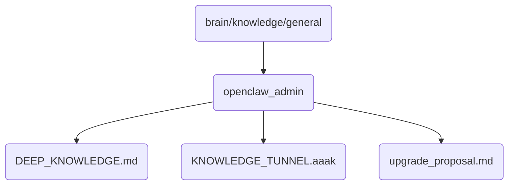

# Openclaw Admin Identity

This directory contains administrative tools and documentation for managing the OmniClaw v5.0 system.

## Topological View

---
*OmniClaw V5.0 | Forged by AI Architect | Evaluated dynamically*
