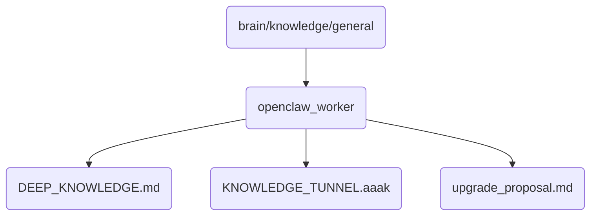

# Openclaw Worker Identity

Contains the core logic and operations for the OpenClaw worker nodes, crucial for managing tasks and resources.

## Topological View

---
*OmniClaw V5.0 | Forged by AI Architect | Evaluated dynamically*
