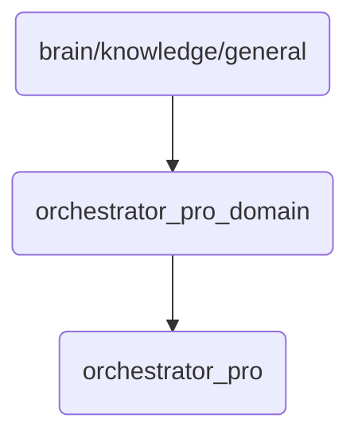

# Orchestrator Pro Domain Identity

This directory contains the orchestrator's professional domain knowledge, essential for managing and optimizing OmniClaw v5.0 operations.

## Topological View

---
*OmniClaw V5.0 | Forged by AI Architect | Evaluated dynamically*
