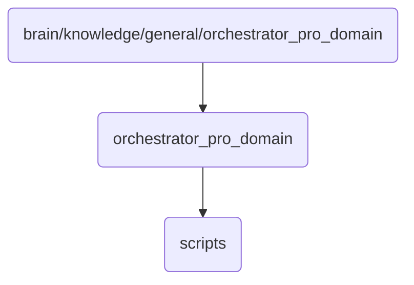

# Orchestrator Pro Identity

This directory contains the core orchestrator functionalities and scripts for OmniClaw v5.0, focusing on advanced automation and control mechanisms.

## Topological View

---
*OmniClaw V5.0 | Forged by AI Architect | Evaluated dynamically*
