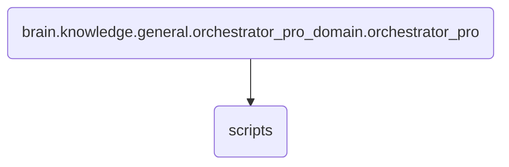

# Scripts Identity

This directory contains the scripts responsible for orchestrating and managing the general operations of OmniClaw v5.0, ensuring seamless execution across various components.

---

## Topological View

---
*OmniClaw V5.0 | Forged by OMA AI Architect | brain.knowledge.general.orchestrator_pro_domain.orchestrator_pro.scripts | 2026-04-10*
