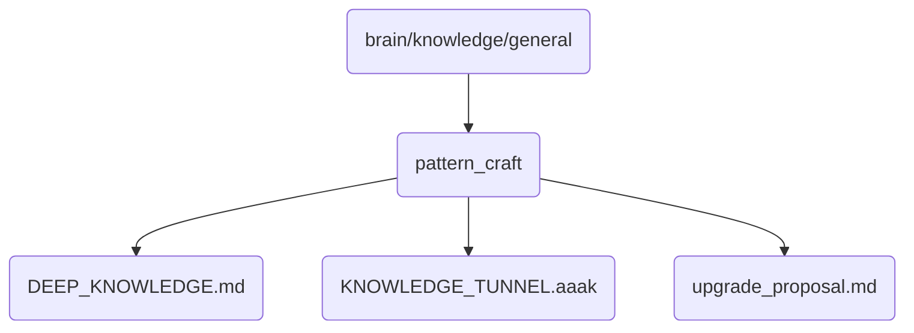

# Pattern Craft Identity

This directory contains deep knowledge and proposals related to pattern crafting for OmniClaw v5.0, focusing on advanced techniques and strategies.

## Topological View

---
*OmniClaw V5.0 | Forged by AI Architect | Evaluated dynamically*
