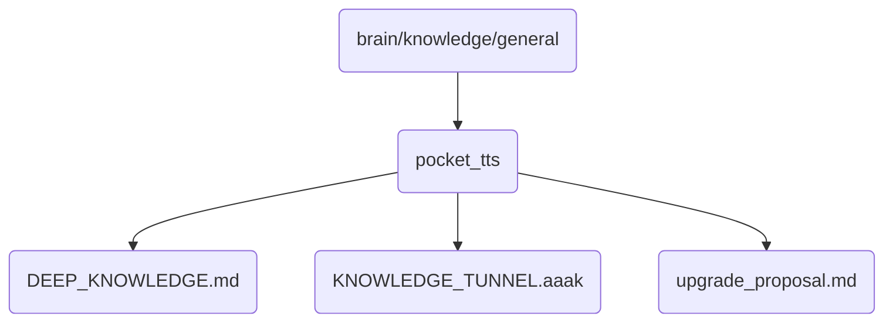

# Pocket Tts Identity

Contains deep knowledge and upgrade proposals for the Pocket TTS system, crucial for enhancing speech synthesis capabilities in OmniClaw v5.0.

## Topological View

---
*OmniClaw V5.0 | Forged by AI Architect | Evaluated dynamically*
