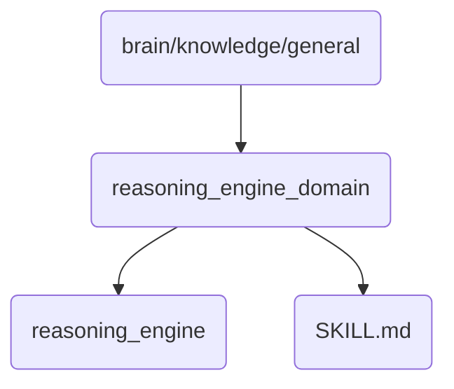

# Reasoning Engine Domain Identity

This directory contains the core components and skills related to reasoning engines, which are essential for OmniClaw's decision-making processes.

## Topological View

---
*OmniClaw V5.0 | Forged by AI Architect | Evaluated dynamically*
