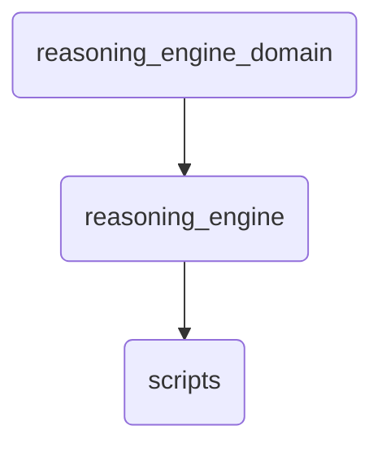

# Reasoning Engine Identity

This directory contains the core components and scripts for reasoning engine operations within OmniClaw v5.0, enabling complex decision-making processes.

---

## Topological View

---
*OmniClaw V5.0 | Forged by OMA AI Architect | brain.knowledge.general.reasoning_engine_domain.reasoning_engine | 2026-04-10*
