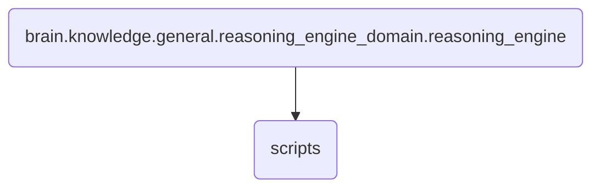

# Scripts Identity

This directory contains the scripts responsible for executing and managing various reasoning processes within the reasoning engine of OmniClaw.

---

## Topological View

---
*OmniClaw V5.0 | Forged by OMA AI Architect | brain.knowledge.general.reasoning_engine_domain.reasoning_engine.scripts | 2026-04-10*
