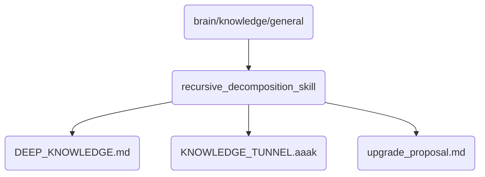

# Recursive Decomposition Skill Identity

This directory contains the core knowledge and proposals for implementing recursive decomposition in OmniClaw v5.0, enabling more efficient problem-solving and task management.

## Topological View

---
*OmniClaw V5.0 | Forged by AI Architect | Evaluated dynamically*
