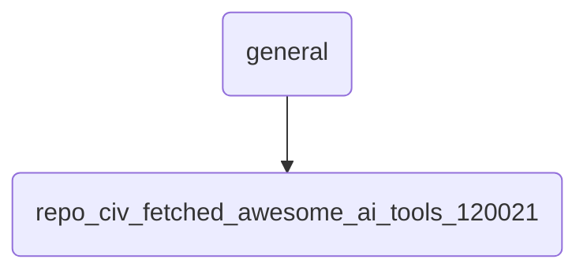

# Repo Civ Fetched Awesome Ai Tools 120021 Identity

This directory contains fetched and curated AI tools, serving as a knowledge repository for OmniClaw's general use cases.

---

## Topological View

---
*OmniClaw V5.0 | Forged by OMA AI Architect | brain.knowledge.general.repo_civ_fetched_awesome_ai_tools_120021 | 2026-04-10*
