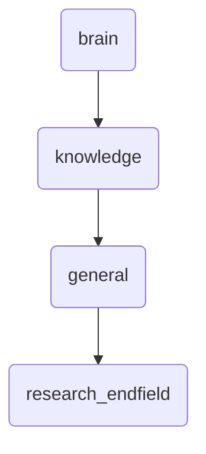

# Research Endfield Identity

This directory houses research and endfield studies related to deep knowledge and upgrade proposals, ensuring the continuous improvement of OmniClaw's cognitive capabilities.

---

## Topological View

---
*OmniClaw V5.0 | Forged by OMA AI Architect | brain.knowledge.general.research_endfield | 2026-04-10*
