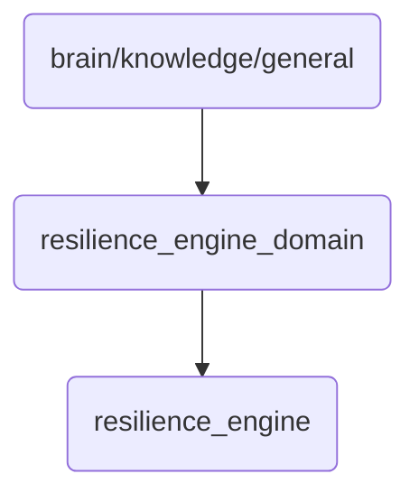

# Resilience Engine Domain Identity

This directory contains the core components and skills related to the resilience engine, ensuring robustness and fault tolerance in OmniClaw v5.0.

## Topological View

---
*OmniClaw V5.0 | Forged by AI Architect | Evaluated dynamically*
