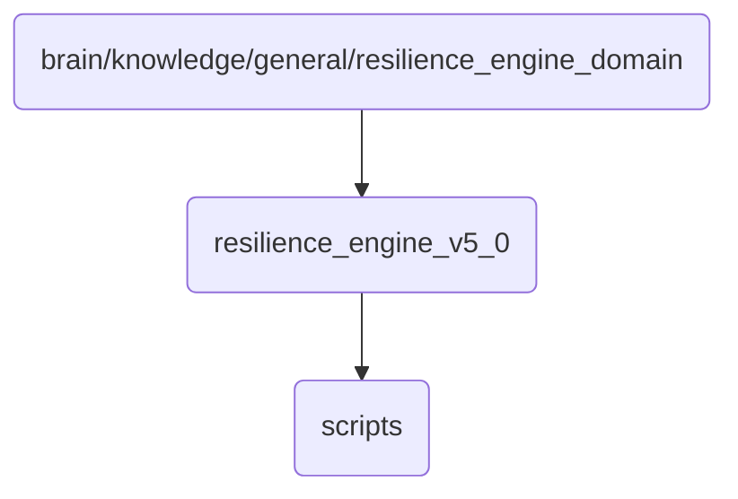

# Resilience Engine Identity

The resilience engine in OmniClaw v5.0 is designed to ensure high availability and fault tolerance of the system by dynamically managing resources and recovering from failures.

## Topological View

---
*OmniClaw V5.0 | Forged by AI Architect | Evaluated dynamically*
