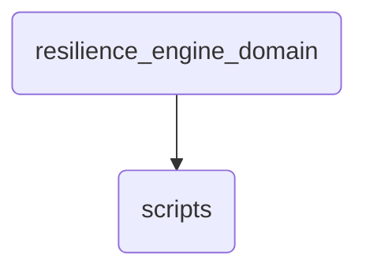

# Scripts Identity

This directory contains the scripts responsible for managing and executing various tasks within the resilience engine of OmniClaw v5.0.

---

## Topological View

---
*OmniClaw V5.0 | Forged by OMA AI Architect | brain.knowledge.general.resilience_engine_domain.resilience_engine.scripts | 2026-04-10*
