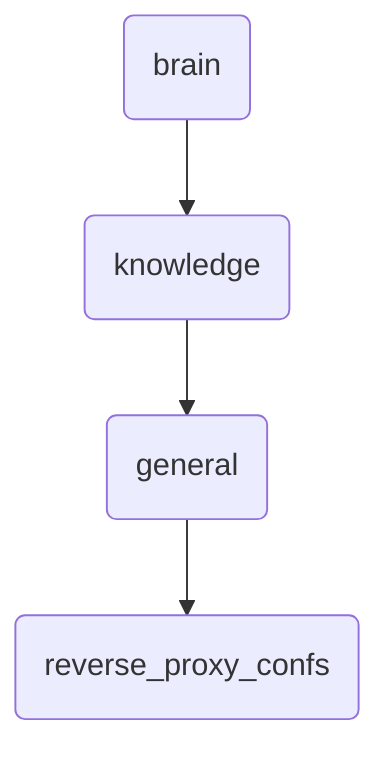

# Reverse Proxy Confs Identity

This directory contains configuration files for reverse proxies used in OmniClaw v5.0, including deep knowledge documents and upgrade proposals.

---

## Topological View

---
*OmniClaw V5.0 | Forged by OMA AI Architect | brain.knowledge.general.reverse_proxy_confs | 2026-04-10*
