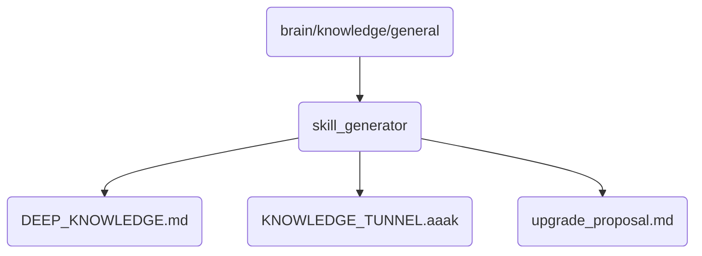

# Skill Generator Identity

The Skill Generator directory houses the core logic and knowledge tunnels necessary for OmniClaw v5.0 to dynamically generate and enhance its operational skills.

## Topological View

---
*OmniClaw V5.0 | Forged by AI Architect | Evaluated dynamically*
