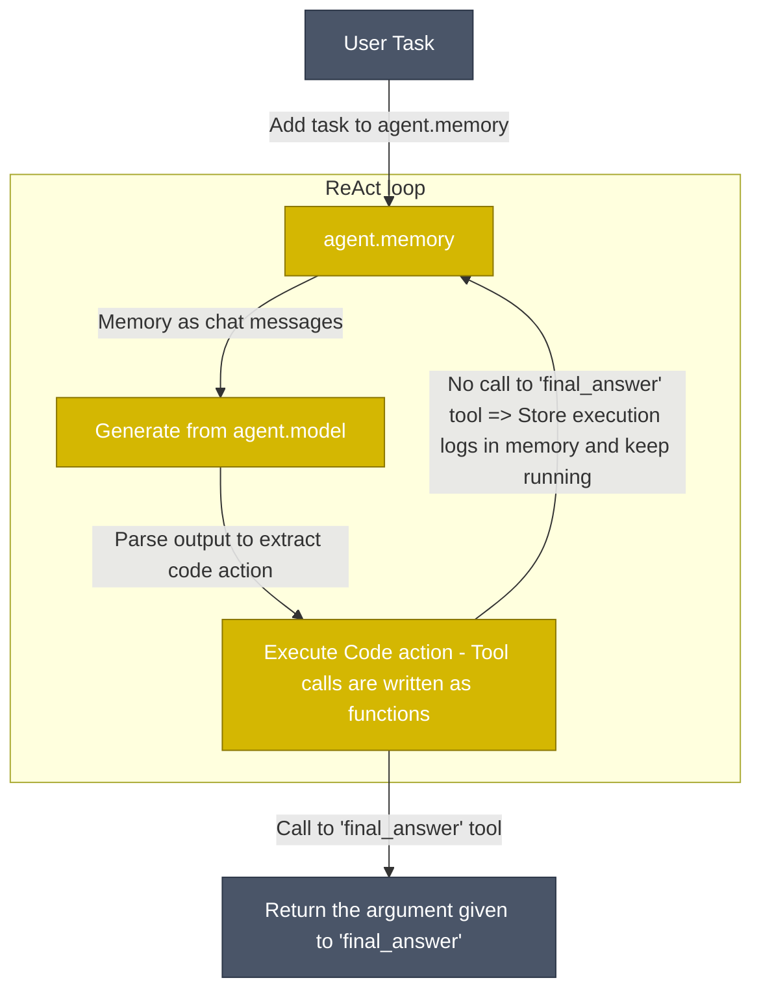

# KNOWLEDGE EXTRACT: smolagents
> **Extracted on:** 2026-03-30 17:53:52
> **Source:** smolagents

---

## File: `.gitignore`
```
# Logging
logs
tmp
wandb

# Data
data
outputs
data/

# Apple
.DS_Store

# VS Code
.vscode

# Byte-compiled / optimized / DLL files
__pycache__/
*.py[cod]
*$py.class

# C extensions
*.so

# Distribution / packaging
.Python
build/
develop-eggs/
dist/
downloads/
eggs/
.eggs/
lib/
lib64/
parts/
sdist/
var/
wheels/
share/python-wheels/
node_modules/
*.egg-info/
.installed.cfg
*.egg
MANIFEST

# PyInstaller
*.manifest
*.spec

# Installer logs
pip-log.txt
pip-delete-this-directory.txt

# Unit test / coverage reports
htmlcov/
.tox/
.nox/
.coverage
.coverage.*
.cache
nosetests.xml
coverage.xml
*.cover
*.py,cover
.hypothesis/
.pytest_cache/
cover/
uv.lock

# Translations
*.mo
*.pot

# Sphinx documentation
docs/_build/

# PyBuilder
.pybuilder/
target/

# Jupyter Notebook
.ipynb_checkpoints

# IPython
profile_default/
ipython_config.py

# pyenv
# .python-version

# pipenv
#Pipfile.lock

# poetry
#poetry.lock

# pdm
.pdm.toml
.pdm-python
.pdm-build/

# PEP 582
__pypackages__/

# Celery stuff
celerybeat-schedule
celerybeat.pid

# SageMath parsed files
*.sage.py

# Environments
.env
.venv
env/
venv/
ENV/
env.bak/
venv.bak/


# mkdocs documentation
/site

# mypy
.mypy_cache/
.dmypy.json
dmypy.json

# Pyre type checker
.pyre/

# pytype static type analyzer
.pytype/

# Cython debug symbols
cython_debug/

# PyCharm
.idea/

# Interpreter
interpreter_workspace/

# Archive
archive/
savedir/
output/
tool_output/

# Gradio runtime
.gradio/
```

## File: `.pre-commit-config.yaml`
```yaml
repos:
  - repo: https://github.com/astral-sh/ruff-pre-commit
    rev: v0.2.1
    hooks:
      - id: ruff
        args:
          - --fix
      - id: ruff-format
  - repo: https://github.com/pre-commit/pre-commit-hooks
    rev: v4.5.0
    hooks:
      - id: check-merge-conflict
      - id: check-yaml
```

## File: `AGENTS.md`
```markdown
# Contributor Guidelines
- Follow OOP principles
- Be Pythonic: follow Python best practices and idiomatic patterns
- Write unit tests for new functionality
```

## File: `CODE_OF_CONDUCT.md`
```markdown

# Contributor Covenant Code of Conduct

## Our Pledge

We as members, contributors, and leaders pledge to make participation in our
community a harassment-free experience for everyone, regardless of age, body
size, visible or invisible disability, ethnicity, sex characteristics, gender
identity and expression, level of experience, education, socio-economic status,
nationality, personal appearance, race, caste, color, religion, or sexual
identity and orientation.

We pledge to act and interact in ways that contribute to an open, welcoming,
diverse, inclusive, and healthy community.

## Our Standards

Examples of behavior that contributes to a positive environment for our
community include:

* Demonstrating empathy and kindness toward other people
* Being respectful of differing opinions, viewpoints, and experiences
* Giving and gracefully accepting constructive feedback
* Accepting responsibility and apologizing to those affected by our mistakes,
  and learning from the experience
* Focusing on what is best not just for us as individuals, but for the overall
  community

Examples of unacceptable behavior include:

* The use of sexualized language or imagery, and sexual attention or advances of
  any kind
* Trolling, insulting or derogatory comments, and personal or political attacks
* Public or private harassment
* Publishing others' private information, such as a physical or email address,
  without their explicit permission
* Other conduct which could reasonably be considered inappropriate in a
  professional setting

## Enforcement Responsibilities

Community leaders are responsible for clarifying and enforcing our standards of
acceptable behavior and will take appropriate and fair corrective action in
response to any behavior that they deem inappropriate, threatening, offensive,
or harmful.

Community leaders have the right and responsibility to remove, edit, or reject
comments, commits, code, wiki edits, issues, and other contributions that are
not aligned to this Code of Conduct, and will communicate reasons for moderation
decisions when appropriate.

## Scope

This Code of Conduct applies within all community spaces, and also applies when
an individual is officially representing the community in public spaces.
Examples of representing our community include using an official e-mail address,
posting via an official social media account, or acting as an appointed
representative at an online or offline event.

## Enforcement

Instances of abusive, harassing, or otherwise unacceptable behavior may be
reported to the community leaders responsible for enforcement at
feedback@huggingface.co.
All complaints will be reviewed and investigated promptly and fairly.

All community leaders are obligated to respect the privacy and security of the
reporter of any incident.

## Enforcement Guidelines

Community leaders will follow these Community Impact Guidelines in determining
the consequences for any action they deem in violation of this Code of Conduct:

### 1. Correction

**Community Impact**: Use of inappropriate language or other behavior deemed
unprofessional or unwelcome in the community.

**Consequence**: A private, written warning from community leaders, providing
clarity around the nature of the violation and an explanation of why the
behavior was inappropriate. A public apology may be requested.

### 2. Warning

**Community Impact**: A violation through a single incident or series of
actions.

**Consequence**: A warning with consequences for continued behavior. No
interaction with the people involved, including unsolicited interaction with
those enforcing the Code of Conduct, for a specified period of time. This
includes avoiding interactions in community spaces as well as external channels
like social media. Violating these terms may lead to a temporary or permanent
ban.

### 3. Temporary Ban

**Community Impact**: A serious violation of community standards, including
sustained inappropriate behavior.

**Consequence**: A temporary ban from any sort of interaction or public
communication with the community for a specified period of time. No public or
private interaction with the people involved, including unsolicited interaction
with those enforcing the Code of Conduct, is allowed during this period.
Violating these terms may lead to a permanent ban.

### 4. Permanent Ban

**Community Impact**: Demonstrating a pattern of violation of community
standards, including sustained inappropriate behavior, harassment of an
individual, or aggression toward or disparagement of classes of individuals.

**Consequence**: A permanent ban from any sort of public interaction within the
community.

## Attribution

This Code of Conduct is adapted from the [Contributor Covenant][homepage],
version 2.1, available at
[https://www.contributor-covenant.org/version/2/1/code_of_conduct.html][v2.1].

Community Impact Guidelines were inspired by
[Mozilla's code of conduct enforcement ladder][Mozilla CoC].

For answers to common questions about this code of conduct, see the FAQ at
[https://www.contributor-covenant.org/faq][FAQ]. Translations are available at
[https://www.contributor-covenant.org/translations][translations].

[homepage]: https://www.contributor-covenant.org
[v2.1]: https://www.contributor-covenant.org/version/2/1/code_of_conduct.html
[Mozilla CoC]: https://github.com/mozilla/diversity
[FAQ]: https://www.contributor-covenant.org/faq
[translations]: https://www.contributor-covenant.org/translations
```

## File: `CONTRIBUTING.md`
```markdown
<!---
Copyright 2025 The HuggingFace Team. All rights reserved.

Licensed under the Apache License, Version 2.0 (the "License");
you may not use this file except in compliance with the License.
You may obtain a copy of the License at

    http://www.apache.org/licenses/LICENSE-2.0

Unless required by applicable law or agreed to in writing, software
distributed under the License is distributed on an "AS IS" BASIS,
WITHOUT WARRANTIES OR CONDITIONS OF ANY KIND, either express or implied.
See the License for the specific language governing permissions and
limitations under the License.
-->

# Contribute to smolagents

Everyone is welcome to contribute, and we value everybody's contribution. Code
contributions are not the only way to help the community. Answering questions, helping
others, and improving the documentation are also immensely valuable.

It also helps us if you spread the word! Reference the library in blog posts
about the awesome projects it made possible, shout out on Twitter every time it has
helped you, or simply ⭐️ the repository to say thank you.

However you choose to contribute, please be mindful and respect our
[code of conduct](https://github.com/huggingface/smolagents/blob/main/CODE_OF_CONDUCT.md).

**This guide was heavily inspired by the awesome [scikit-learn guide to contributing](https://github.com/scikit-learn/scikit-learn/blob/main/CONTRIBUTING.md).**

## Ways to contribute

There are several ways you can contribute to smolagents.

* Submit issues related to bugs or desired new features.
* Contribute to the examples or to the documentation.
* Fix outstanding issues with the existing code.

> All contributions are equally valuable to the community. 🥰

## Submitting a bug-related issue or feature request

At any moment, feel welcome to open an issue, citing your exact error traces and package versions if it's a bug.
It's often even better to open a PR with your proposed fixes/changes!

Do your best to follow these guidelines when submitting a bug-related issue or a feature
request. It will make it easier for us to come back to you quickly and with good
feedback.

### Did you find a bug?

The smolagents library is robust and reliable thanks to users who report the problems they encounter.

Before you report an issue, we would really appreciate it if you could **make sure the bug was not
already reported** (use the search bar on GitHub under Issues). Your issue should also be related to bugs in the 
library itself, and not your code. 

Once you've confirmed the bug hasn't already been reported, please include the following information in your issue so 
we can quickly resolve it:

* Your **OS type and version**, as well as your environment versions (versions of rust, python, and dependencies).
* A short, self-contained, code snippet that allows us to reproduce the bug.
* The *full* traceback if an exception is raised.
* Attach any other additional information, like screenshots, you think may help.

### Do you want a new feature?

If there is a new feature you'd like to see in smolagents, please open an issue and describe:

1. What is the *motivation* behind this feature? Is it related to a problem or frustration with the library? Is it 
   a feature related to something you need for a project? Is it something you worked on and think it could benefit 
   the community?

   Whatever it is, we'd love to hear about it!

2. Describe your requested feature in as much detail as possible. The more you can tell us about it, the better 
   we'll be able to help you.
3. Provide a *code snippet* that demonstrates the feature's usage.
4. If the feature is related to a paper, please include a link.

If your issue is well written we're already 80% of the way there by the time you create it.

## Do you want to add documentation?

We're always looking for improvements to the documentation that make it more clear and accurate. Please let us know 
how the documentation can be improved such as typos and any content that is missing, unclear or inaccurate. We'll be 
happy to make the changes or help you make a contribution if you're interested!

## Fixing outstanding issues

If you notice an issue with the existing code and have a fix in mind, feel free to [start contributing](https://docs.github.com/en/pull-requests/collaborating-with-pull-requests/proposing-changes-to-your-work-with-pull-requests/creating-a-pull-request) and open
a Pull Request!

### Making code changes

To install dev dependencies, run:
<details>
<summary><strong>Using pip</strong></summary>

```
pip install -e ".[dev]"
```

</details>
<details>
<summary><strong>Using uv</strong></summary>

```
uv pip install -e "smolagents[dev] @ ."
```

</details>

When making changes to the codebase, please check that it follows the repo's code quality requirements by running:
To check code quality of the source code:
```
make quality
```

If the checks fail, you can run the formatter with:
```
make style
```

And commit the changes.

To run tests locally, run this command:
```bash
make test
```
</details>

## I want to become a maintainer of the project. How do I get there?

smolagents is a project led and managed by Hugging Face. We are more than
happy to have motivated individuals from other organizations join us as maintainers with the goal of helping smolagents
make a dent in the world of Agents.

If you are such an individual (or organization), please reach out to us and let's collaborate.
```

## File: `e2b.toml`
```
# This is a config for E2B sandbox template.
# You can use template ID (qywp2ctmu2q7jzprcf4j) to create a sandbox:

# Python SDK
# from e2b import Sandbox, AsyncSandbox
# sandbox = Sandbox("qywp2ctmu2q7jzprcf4j") # Sync sandbox
# sandbox = await AsyncSandbox.create("qywp2ctmu2q7jzprcf4j") # Async sandbox

# JS SDK
# import { Sandbox } from 'e2b'
# const sandbox = await Sandbox.create('qywp2ctmu2q7jzprcf4j')

team_id = "f8776d3a-df2f-4a1d-af48-68c2e13b3b87"
start_cmd = "/root/.jupyter/start-up.sh"
dockerfile = "e2b.Dockerfile"
template_id = "qywp2ctmu2q7jzprcf4j"
```

## File: `LICENSE`
```
                                 Apache License
                           Version 2.0, January 2004
                        http://www.apache.org/licenses/

   TERMS AND CONDITIONS FOR USE, REPRODUCTION, AND DISTRIBUTION

   1. Definitions.

      "License" shall mean the terms and conditions for use, reproduction,
      and distribution as defined by Sections 1 through 9 of this document.

      "Licensor" shall mean the copyright owner or entity authorized by
      the copyright owner that is granting the License.

      "Legal Entity" shall mean the union of the acting entity and all
      other entities that control, are controlled by, or are under common
      control with that entity. For the purposes of this definition,
      "control" means (i) the power, direct or indirect, to cause the
      direction or management of such entity, whether by contract or
      otherwise, or (ii) ownership of fifty percent (50%) or more of the
      outstanding shares, or (iii) beneficial ownership of such entity.

      "You" (or "Your") shall mean an individual or Legal Entity
      exercising permissions granted by this License.

      "Source" form shall mean the preferred form for making modifications,
      including but not limited to software source code, documentation
      source, and configuration files.

      "Object" form shall mean any form resulting from mechanical
      transformation or translation of a Source form, including but
      not limited to compiled object code, generated documentation,
      and conversions to other media types.

      "Work" shall mean the work of authorship, whether in Source or
      Object form, made available under the License, as indicated by a
      copyright notice that is included in or attached to the work
      (an example is provided in the Appendix below).

      "Derivative Works" shall mean any work, whether in Source or Object
      form, that is based on (or derived from) the Work and for which the
      editorial revisions, annotations, elaborations, or other modifications
      represent, as a whole, an original work of authorship. For the purposes
      of this License, Derivative Works shall not include works that remain
      separable from, or merely link (or bind by name) to the interfaces of,
      the Work and Derivative Works thereof.

      "Contribution" shall mean any work of authorship, including
      the original version of the Work and any modifications or additions
      to that Work or Derivative Works thereof, that is intentionally
      submitted to Licensor for inclusion in the Work by the copyright owner
      or by an individual or Legal Entity authorized to submit on behalf of
      the copyright owner. For the purposes of this definition, "submitted"
      means any form of electronic, verbal, or written communication sent
      to the Licensor or its representatives, including but not limited to
      communication on electronic mailing lists, source code control systems,
      and issue tracking systems that are managed by, or on behalf of, the
      Licensor for the purpose of discussing and improving the Work, but
      excluding communication that is conspicuously marked or otherwise
      designated in writing by the copyright owner as "Not a Contribution."

      "Contributor" shall mean Licensor and any individual or Legal Entity
      on behalf of whom a Contribution has been received by Licensor and
      subsequently incorporated within the Work.

   2. Grant of Copyright License. Subject to the terms and conditions of
      this License, each Contributor hereby grants to You a perpetual,
      worldwide, non-exclusive, no-charge, royalty-free, irrevocable
      copyright license to reproduce, prepare Derivative Works of,
      publicly display, publicly perform, sublicense, and distribute the
      Work and such Derivative Works in Source or Object form.

   3. Grant of Patent License. Subject to the terms and conditions of
      this License, each Contributor hereby grants to You a perpetual,
      worldwide, non-exclusive, no-charge, royalty-free, irrevocable
      (except as stated in this section) patent license to make, have made,
      use, offer to sell, sell, import, and otherwise transfer the Work,
      where such license applies only to those patent claims licensable
      by such Contributor that are necessarily infringed by their
      Contribution(s) alone or by combination of their Contribution(s)
      with the Work to which such Contribution(s) was submitted. If You
      institute patent litigation against any entity (including a
      cross-claim or counterclaim in a lawsuit) alleging that the Work
      or a Contribution incorporated within the Work constitutes direct
      or contributory patent infringement, then any patent licenses
      granted to You under this License for that Work shall terminate
      as of the date such litigation is filed.

   4. Redistribution. You may reproduce and distribute copies of the
      Work or Derivative Works thereof in any medium, with or without
      modifications, and in Source or Object form, provided that You
      meet the following conditions:

      (a) You must give any other recipients of the Work or
          Derivative Works a copy of this License; and

      (b) You must cause any modified files to carry prominent notices
          stating that You changed the files; and

      (c) You must retain, in the Source form of any Derivative Works
          that You distribute, all copyright, patent, trademark, and
          attribution notices from the Source form of the Work,
          excluding those notices that do not pertain to any part of
          the Derivative Works; and

      (d) If the Work includes a "NOTICE" text file as part of its
          distribution, then any Derivative Works that You distribute must
          include a readable copy of the attribution notices contained
          within such NOTICE file, excluding those notices that do not
          pertain to any part of the Derivative Works, in at least one
          of the following places: within a NOTICE text file distributed
          as part of the Derivative Works; within the Source form or
          documentation, if provided along with the Derivative Works; or,
          within a display generated by the Derivative Works, if and
          wherever such third-party notices normally appear. The contents
          of the NOTICE file are for informational purposes only and
          do not modify the License. You may add Your own attribution
          notices within Derivative Works that You distribute, alongside
          or as an addendum to the NOTICE text from the Work, provided
          that such additional attribution notices cannot be construed
          as modifying the License.

      You may add Your own copyright statement to Your modifications and
      may provide additional or different license terms and conditions
      for use, reproduction, or distribution of Your modifications, or
      for any such Derivative Works as a whole, provided Your use,
      reproduction, and distribution of the Work otherwise complies with
      the conditions stated in this License.

   5. Submission of Contributions. Unless You explicitly state otherwise,
      any Contribution intentionally submitted for inclusion in the Work
      by You to the Licensor shall be under the terms and conditions of
      this License, without any additional terms or conditions.
      Notwithstanding the above, nothing herein shall supersede or modify
      the terms of any separate license agreement you may have executed
      with Licensor regarding such Contributions.

   6. Trademarks. This License does not grant permission to use the trade
      names, trademarks, service marks, or product names of the Licensor,
      except as required for reasonable and customary use in describing the
      origin of the Work and reproducing the content of the NOTICE file.

   7. Disclaimer of Warranty. Unless required by applicable law or
      agreed to in writing, Licensor provides the Work (and each
      Contributor provides its Contributions) on an "AS IS" BASIS,
      WITHOUT WARRANTIES OR CONDITIONS OF ANY KIND, either express or
      implied, including, without limitation, any warranties or conditions
      of TITLE, NON-INFRINGEMENT, MERCHANTABILITY, or FITNESS FOR A
      PARTICULAR PURPOSE. You are solely responsible for determining the
      appropriateness of using or redistributing the Work and assume any
      risks associated with Your exercise of permissions under this License.

   8. Limitation of Liability. In no event and under no legal theory,
      whether in tort (including negligence), contract, or otherwise,
      unless required by applicable law (such as deliberate and grossly
      negligent acts) or agreed to in writing, shall any Contributor be
      liable to You for damages, including any direct, indirect, special,
      incidental, or consequential damages of any character arising as a
      result of this License or out of the use or inability to use the
      Work (including but not limited to damages for loss of goodwill,
      work stoppage, computer failure or malfunction, or any and all
      other commercial damages or losses), even if such Contributor
      has been advised of the possibility of such damages.

   9. Accepting Warranty or Additional Liability. While redistributing
      the Work or Derivative Works thereof, You may choose to offer,
      and charge a fee for, acceptance of support, warranty, indemnity,
      or other liability obligations and/or rights consistent with this
      License. However, in accepting such obligations, You may act only
      on Your own behalf and on Your sole responsibility, not on behalf
      of any other Contributor, and only if You agree to indemnify,
      defend, and hold each Contributor harmless for any liability
      incurred by, or claims asserted against, such Contributor by reason
      of your accepting any such warranty or additional liability.

   END OF TERMS AND CONDITIONS

   APPENDIX: How to apply the Apache License to your work.

      To apply the Apache License to your work, attach the following
      boilerplate notice, with the fields enclosed by brackets "[]"
      replaced with your own identifying information. (Don't include
      the brackets!)  The text should be enclosed in the appropriate
      comment syntax for the file format. We also recommend that a
      file or class name and description of purpose be included on the
      same "printed page" as the copyright notice for easier
      identification within third-party archives.

   Copyright [yyyy] [name of copyright owner]

   Licensed under the Apache License, Version 2.0 (the "License");
   you may not use this file except in compliance with the License.
   You may obtain a copy of the License at

       http://www.apache.org/licenses/LICENSE-2.0

   Unless required by applicable law or agreed to in writing, software
   distributed under the License is distributed on an "AS IS" BASIS,
   WITHOUT WARRANTIES OR CONDITIONS OF ANY KIND, either express or implied.
   See the License for the specific language governing permissions and
   limitations under the License.
```

## File: `Makefile`
```
.PHONY: quality style test docs

check_dirs := examples src tests

# Check code quality of the source code
quality:
	ruff check $(check_dirs)
	ruff format --check $(check_dirs)

# Format source code automatically
style:
	ruff check $(check_dirs) --fix
	ruff format $(check_dirs)
	
# Run smolagents tests
test:
	pytest ./tests/
```

## File: `pyproject.toml`
```
[build-system]
requires = ["setuptools"]
build-backend = "setuptools.build_meta"

[project]
name = "smolagents"
version = "1.25.0.dev0"
description = "🤗 smolagents: a barebones library for agents. Agents write python code to call tools or orchestrate other agents."
authors = [
  { name="Aymeric Roucher", email="aymeric@hf.co" },
]
readme = "README.md"
requires-python = ">=3.10"
dependencies = [
  "huggingface-hub>=0.31.2",
  "requests>=2.32.3",
  "rich>=13.9.4",
  "jinja2>=3.1.4",
  "pillow>=10.0.1",
  # Security fix for CVE-2023-4863: https://pillow.readthedocs.io/en/stable/releasenotes/10.0.1.html
  "python-dotenv",
]

[project.optional-dependencies]
bedrock = [
  "boto3>=1.36.18"
]
blaxel = [
  "blaxel>=0.2.19",
  "websocket-client",
]
torch = [
  "torch",
  "torchvision",
  "numpy>=1.21.2",
]
audio = [
  "soundfile",
  "smolagents[torch]",
]
docker = [
  "docker>=7.1.0",
  "websocket-client",
]
e2b = [
  "e2b-code-interpreter>=1.0.3",
  "python-dotenv>=1.0.1",
]
gradio = [
  "gradio>=5.14.0",  # Sidebar component GH-797
]
litellm = [
  "litellm>=1.60.2",
]
mcp = [
  "mcpadapt>=0.1.13",  # Support structured output
  "mcp",
]
mlx-lm = [
  "mlx-lm",
]
modal = [
  "modal>=1.1.3",
  "websocket-client",
]
openai = [
  "openai>=1.58.1"
]
telemetry = [
  "arize-phoenix",
  "opentelemetry-sdk",
  "opentelemetry-exporter-otlp",
  "openinference-instrumentation-smolagents>=0.1.15"  # Use new TokenUsage structure
]
toolkit = [
  "ddgs>=9.0.0",  # DuckDuckGoSearchTool
  "markdownify>=0.14.1",  # VisitWebpageTool
]
transformers = [
  "accelerate",
  "transformers>=4.0.0",
  "smolagents[torch]",
]
vision = [
  "helium",
  "selenium",
]
vllm = [
  "vllm>=0.10.2",
  "torch"
]
all = [
  "smolagents[audio,blaxel,docker,e2b,gradio,litellm,mcp,mlx-lm,modal,openai,telemetry,toolkit,transformers,vision,bedrock]",
]
quality = [
  "ruff>=0.9.0",
]
test = [
  "ipython>=8.31.0", # for interactive environment tests
  "pandas>=2.2.3",
  "pytest>=8.1.0",
  "pytest-datadir",
  "pytest-timeout",  # For test_all_docs: @pytest.mark.timeout
  "python-dotenv>=1.0.1", # For test_all_docs
  "smolagents[all]",
  "rank-bm25", # For test_all_docs
  "Wikipedia-API>=0.8.1",
  "mlx[cpu]",  # GH-1588
]
dev = [
  "smolagents[quality,test]",
  "sqlalchemy", # for ./examples
]

[tool.pytest.ini_options]
# Add the specified `OPTS` to the set of command line arguments as if they had been specified by the user.
addopts = "-sv --durations=0"

[tool.ruff]
line-length = 119
lint.ignore = [
  "F403", # undefined-local-with-import-star
  "E501", # line-too-long
]
lint.select = ["E", "F", "I", "W"]

[tool.ruff.lint.per-file-ignores]
"examples/*" = [
  "E402", # module-import-not-at-top-of-file
]

[tool.ruff.lint.isort]
known-first-party = ["smolagents"]
lines-after-imports = 2

[tool.setuptools.package-data]
"smolagents.prompts" = ["*.yaml"]

[project.scripts]
smolagent = "smolagents.cli:main"
webagent = "smolagents.vision_web_browser:main"
```

## File: `README.md`
```markdown
<!---
Copyright 2024 The HuggingFace Team. All rights reserved.

Licensed under the Apache License, Version 2.0 (the "License");
you may not use this file except in compliance with the License.
You may obtain a copy of the License at

    http://www.apache.org/licenses/LICENSE-2.0

Unless required by applicable law or agreed to in writing, software
distributed under the License is distributed on an "AS IS" BASIS,
WITHOUT WARRANTIES OR CONDITIONS OF ANY KIND, either express or implied.
See the License for the specific language governing permissions and
limitations under the License.
-->
<p align="center">
    <!-- Uncomment when CircleCI is set up
    <a href="https://circleci.com/gh/huggingface/accelerate"></a>
    -->
    <a href="https://github.com/huggingface/smolagents/blob/main/LICENSE"></a>
    <a href="https://huggingface.co/docs/smolagents"></a>
    <a href="https://github.com/huggingface/smolagents/releases"></a>
    <a href="https://github.com/huggingface/smolagents/blob/main/CODE_OF_CONDUCT.md"></a>
    <a href="https://deepwiki.com/huggingface/smolagents"></a>
</p>

<h3 align="center">
  <div style="display:flex;flex-direction:row;">
    
    <p>Agents that think in code!</p>
  </div>
</h3>

`smolagents` is a library that enables you to run powerful agents in a few lines of code. It offers:

✨ **Simplicity**: the logic for agents fits in ~1,000 lines of code (see [agents.py](https://github.com/huggingface/smolagents/blob/main/src/smolagents/agents.py)). We kept abstractions to their minimal shape above raw code!

🧑‍💻 **First-class support for Code Agents**. Our [`CodeAgent`](https://huggingface.co/docs/smolagents/reference/agents#smolagents.CodeAgent) writes its actions in code (as opposed to "agents being used to write code"). To make it secure, we support executing in sandboxed environments via [Blaxel](https://blaxel.ai), [E2B](https://e2b.dev/), [Modal](https://modal.com/), Docker, or Pyodide+Deno WebAssembly sandbox.

🤗 **Hub integrations**: you can [share/pull tools or agents to/from the Hub](https://huggingface.co/docs/smolagents/reference/tools#smolagents.Tool.from_hub) for instant sharing of the most efficient agents!

🌐 **Model-agnostic**: smolagents supports any LLM. It can be a local `transformers` or `ollama` model, one of [many providers on the Hub](https://huggingface.co/blog/inference-providers), or any model from OpenAI, Anthropic and many others via our [LiteLLM](https://www.litellm.ai/) integration.

👁️ **Modality-agnostic**: Agents support text, vision, video, even audio inputs! Cf [this tutorial](https://huggingface.co/docs/smolagents/examples/web_browser) for vision.

🛠️ **Tool-agnostic**: you can use tools from any [MCP server](https://huggingface.co/docs/smolagents/reference/tools#smolagents.ToolCollection.from_mcp), from [LangChain](https://huggingface.co/docs/smolagents/reference/tools#smolagents.Tool.from_langchain), you can even use a [Hub Space](https://huggingface.co/docs/smolagents/reference/tools#smolagents.Tool.from_space) as a tool.

Full documentation can be found [here](https://huggingface.co/docs/smolagents/index).

> [!NOTE]
> Check the our [launch blog post](https://huggingface.co/blog/smolagents) to learn more about `smolagents`!

## Quick demo

First install the package with a default set of tools:
```bash
pip install "smolagents[toolkit]"
```
Then define your agent, give it the tools it needs and run it!
```py
from smolagents import CodeAgent, WebSearchTool, InferenceClientModel

model = InferenceClientModel()
agent = CodeAgent(tools=[WebSearchTool()], model=model, stream_outputs=True)

agent.run("How many seconds would it take for a leopard at full speed to run through Pont des Arts?")
```

https://github.com/user-attachments/assets/84b149b4-246c-40c9-a48d-ba013b08e600

You can even share your agent to the Hub, as a Space repository:
```py
agent.push_to_hub("m-ric/my_agent")

# agent.from_hub("m-ric/my_agent") to load an agent from Hub
```

Our library is LLM-agnostic: you could switch the example above to any inference provider.

<details>
<summary> <b>InferenceClientModel, gateway for all <a href="https://huggingface.co/docs/inference-providers/index">inference providers</a> supported on HF</b></summary>

```py
from smolagents import InferenceClientModel

model = InferenceClientModel(
    model_id="deepseek-ai/DeepSeek-R1",
    provider="together",
)
```
</details>
<details>
<summary> <b>LiteLLM to access 100+ LLMs</b></summary>

```py
from smolagents import LiteLLMModel

model = LiteLLMModel(
    model_id="anthropic/claude-4-sonnet-latest",
    temperature=0.2,
    api_key=os.environ["ANTHROPIC_API_KEY"]
)
```
</details>
<details>
<summary> <b>OpenAI-compatible servers: Together AI</b></summary>

```py
import os
from smolagents import OpenAIModel

model = OpenAIModel(
    model_id="deepseek-ai/DeepSeek-R1",
    api_base="https://api.together.xyz/v1/", # Leave this blank to query OpenAI servers.
    api_key=os.environ["TOGETHER_API_KEY"], # Switch to the API key for the server you're targeting.
)
```
</details>
<details>
<summary> <b>OpenAI-compatible servers: OpenRouter</b></summary>

```py
import os
from smolagents import OpenAIModel

model = OpenAIModel(
    model_id="openai/gpt-4o",
    api_base="https://openrouter.ai/api/v1", # Leave this blank to query OpenAI servers.
    api_key=os.environ["OPENROUTER_API_KEY"], # Switch to the API key for the server you're targeting.
)
```

</details>
<details>
<summary> <b>Local `transformers` model</b></summary>

```py
from smolagents import TransformersModel

model = TransformersModel(
    model_id="Qwen/Qwen3-Next-80B-A3B-Thinking",
    max_new_tokens=4096,
    device_map="auto"
)
```
</details>
<details>
<summary> <b>Azure models</b></summary>

```py
import os
from smolagents import AzureOpenAIModel

model = AzureOpenAIModel(
    model_id = os.environ.get("AZURE_OPENAI_MODEL"),
    azure_endpoint=os.environ.get("AZURE_OPENAI_ENDPOINT"),
    api_key=os.environ.get("AZURE_OPENAI_API_KEY"),
    api_version=os.environ.get("OPENAI_API_VERSION")    
)
```
</details>
<details>
<summary> <b>Amazon Bedrock models</b></summary>

```py
import os
from smolagents import AmazonBedrockModel

model = AmazonBedrockModel(
    model_id = os.environ.get("AMAZON_BEDROCK_MODEL_ID") 
)
```
</details>

## CLI

You can run agents from CLI using two commands: `smolagent` and `webagent`.

`smolagent` is a generalist command to run a multi-step `CodeAgent` that can be equipped with various tools.

```bash
# Run with direct prompt and options
smolagent "Plan a trip to Tokyo, Kyoto and Osaka between Mar 28 and Apr 7."  --model-type "InferenceClientModel" --model-id "Qwen/Qwen3-Next-80B-A3B-Thinking" --imports pandas numpy --tools web_search

# Run in interactive mode (launches setup wizard when no prompt provided)
smolagent
```

Interactive mode guides you through:
- Agent type selection (CodeAgent vs ToolCallingAgent)  
- Tool selection from available toolbox
- Model configuration (type, ID, API settings)
- Advanced options like additional imports
- Task prompt input

Meanwhile `webagent` is a specific web-browsing agent using [helium](https://github.com/mherrmann/helium) (read more [here](https://github.com/huggingface/smolagents/blob/main/src/smolagents/vision_web_browser.py)).

For instance:
```bash
webagent "go to xyz.com/men, get to sale section, click the first clothing item you see. Get the product details, and the price, return them. note that I'm shopping from France" --model-type "LiteLLMModel" --model-id "gpt-5"
```

## How do Code agents work?

Our [`CodeAgent`](https://huggingface.co/docs/smolagents/reference/agents#smolagents.CodeAgent) works mostly like classical ReAct agents - the exception being that the LLM engine writes its actions as Python code snippets.



Actions are now Python code snippets. Hence, tool calls will be performed as Python function calls. For instance, here is how the agent can perform web search over several websites in one single action:
```py
requests_to_search = ["gulf of mexico america", "greenland denmark", "tariffs"]
for request in requests_to_search:
    print(f"Here are the search results for {request}:", web_search(request))
```

Writing actions as code snippets is demonstrated to work better than the current industry practice of letting the LLM output a dictionary of the tools it wants to call: [uses 30% fewer steps](https://huggingface.co/papers/2402.01030) (thus 30% fewer LLM calls) and [reaches higher performance on difficult benchmarks](https://huggingface.co/papers/2411.01747). Head to [our high-level intro to agents](https://huggingface.co/docs/smolagents/conceptual_guides/intro_agents) to learn more on that.

Since code execution can be a serious security concern (arbitrary code execution!), **you should run agent code in a sandbox**. We support several options:
  - [E2B](https://e2b.dev/), [Blaxel](https://blaxel.ai), [Modal](https://modal.com/) — managed cloud sandboxes, simplest to set up
  - [Docker](https://www.docker.com/) — self-hosted container isolation
  - Pyodide+Deno WebAssembly — lightweight sandbox for browser or edge environments

The built-in `LocalPythonExecutor` is **not a security sandbox**. It applies some restrictions but can be bypassed and must not be used as a security boundary.

Alongside [`CodeAgent`](https://huggingface.co/docs/smolagents/reference/agents#smolagents.CodeAgent), we also provide the standard [`ToolCallingAgent`](https://huggingface.co/docs/smolagents/reference/agents#smolagents.ToolCallingAgent) which writes actions as JSON/text blobs. You can pick whichever style best suits your use case.

## How smol is this library?

We strived to keep abstractions to a strict minimum: the main code in `agents.py` has <1,000 lines of code.
Still, we implement several types of agents: `CodeAgent` writes its actions as Python code snippets, and the more classic `ToolCallingAgent` leverages built-in tool calling methods. We also have multi-agent hierarchies, import from tool collections, remote code execution, vision models...

By the way, why use a framework at all? Well, because a big part of this stuff is non-trivial. For instance, the code agent has to keep a consistent format for code throughout its system prompt, its parser, the execution. So our framework handles this complexity for you. But of course we still encourage you to hack into the source code and use only the bits that you need, to the exclusion of everything else!

## How strong are open models for agentic workflows?

We've created [`CodeAgent`](https://huggingface.co/docs/smolagents/reference/agents#smolagents.CodeAgent) instances with some leading models, and compared them on [this benchmark](https://huggingface.co/datasets/m-ric/agents_medium_benchmark_2) that gathers questions from a few different benchmarks to propose a varied blend of challenges.

[Find the benchmarking code here](https://github.com/huggingface/smolagents/blob/main/examples/smolagents_benchmark/run.py) for more detail on the agentic setup used, and see a comparison of using LLMs code agents compared to vanilla (spoilers: code agents works better).

<p align="center">
    
</p>

This comparison shows that open-source models can now take on the best closed models!

## Security

Security is a critical consideration when working with code-executing agents. Ensure you are using one of the sandboxed execution options that provide isolation from untrusted code.

**Warning:** `LocalPythonExecutor` provides best-effort mitigations only and is **not a security boundary**. Do not use it to run untrusted code.

For security policies, vulnerability reporting, and more information on secure agent execution, please see our [Security Policy](SECURITY.md).

## Contribute

Everyone is welcome to contribute, get started with our [contribution guide](https://github.com/huggingface/smolagents/blob/main/CONTRIBUTING.md).

## Cite smolagents

If you use `smolagents` in your publication, please cite it by using the following BibTeX entry.

```bibtex
@Misc{smolagents,
  title =        {`smolagents`: a smol library to build great agentic systems.},
  author =       {Aymeric Roucher and Albert Villanova del Moral and Thomas Wolf and Leandro von Werra and Erik Kaunismäki},
  howpublished = {\url{https://github.com/huggingface/smolagents}},
  year =         {2025}
}
```
```

## File: `SECURITY.md`
```markdown
# Security Policy

## Reporting a Vulnerability

To report a security vulnerability, please contact: security@huggingface.co

## Learning More About Security

To learn more about running agents more securely, please see the [Secure Code Execution tutorial](docs/source/en/tutorials/secure_code_execution.mdx) which covers sandboxing with E2B, Docker, and WebAssembly.

### Secure Execution Options

`smolagents` provides several options for secure code execution:

1. **E2B Sandbox**: Uses [E2B](https://e2b.dev/) to run code in a secure, isolated environment.

2. **Modal Sandbox**: Uses [Modal](https://modal.com/) to run code in a secure, isolated environment.

3. **Docker Sandbox**: Runs code in an isolated Docker container.

4. **WebAssembly Sandbox**: Executes Python code securely in a sandboxed WebAssembly environment using Pyodide and Deno's secure runtime.

We recommend using one of these sandboxed execution options when running untrusted code.
```

## File: `docs/README.md`
```markdown
<!---
Copyright 2024 The HuggingFace Team. All rights reserved.

Licensed under the Apache License, Version 2.0 (the "License");
you may not use this file except in compliance with the License.
You may obtain a copy of the License at

    http://www.apache.org/licenses/LICENSE-2.0

Unless required by applicable law or agreed to in writing, software
distributed under the License is distributed on an "AS IS" BASIS,
WITHOUT WARRANTIES OR CONDITIONS OF ANY KIND, either express or implied.
See the License for the specific language governing permissions and
limitations under the License.
-->

# Generating the documentation

To generate the documentation, you have to build it. Several packages are necessary to build the doc.

First, you need to install the project itself by running the following command at the root of the code repository:

```bash
pip install -e .
```

You also need to install 2 extra packages:

```bash
# `hf-doc-builder` to build the docs
pip install git+https://github.com/huggingface/doc-builder@main
```

---
**NOTE**

You only need to generate the documentation to inspect it locally (if you're planning changes and want to
check how they look before committing for instance). You don't have to commit the built documentation.

---

## Building the documentation

Once you have setup the `doc-builder` and additional packages with the pip install command above,
you can generate the documentation by typing the following command:

```bash
doc-builder build smolagents docs/source/en/ --build_dir ~/tmp/test-build
```

You can adapt the `--build_dir` to set any temporary folder that you prefer. This command will create it and generate
the MDX files that will be rendered as the documentation on the main website. You can inspect them in your favorite
Markdown editor.

## Previewing the documentation

To preview the docs, run the following command:

```bash
doc-builder preview smolagents docs/source/en/
```

The docs will be viewable at [http://localhost:5173](http://localhost:5173). You can also preview the docs once you
have opened a PR. You will see a bot add a comment to a link where the documentation with your changes lives.

---
**NOTE**

The `preview` command only works with existing doc files. When you add a completely new file, you need to update
`_toctree.yml` & restart `preview` command (`ctrl-c` to stop it & call `doc-builder preview ...` again).

---

## Adding a new element to the navigation bar

Accepted files are Markdown (.md).

Create a file with its extension and put it in the source directory. You can then link it to the toc-tree by putting
the filename without the extension in the [`_toctree.yml`](https://github.com/huggingface/smolagents/blob/main/docs/source/_toctree.yml) file.

## Renaming section headers and moving sections

It helps to keep the old links working when renaming the section header and/or moving sections from one document to another. This is because the old links are likely to be used in Issues, Forums, and Social media and it'd make for a much more superior user experience if users reading those months later could still easily navigate to the originally intended information.

Therefore, we simply keep a little map of moved sections at the end of the document where the original section was. The key is to preserve the original anchor.

So if you renamed a section from: "Section A" to "Section B", then you can add at the end of the file:

```
Sections that were moved:

[ <a href="#section-b">Section A</a><a id="section-a"></a> ]
```
and of course, if you moved it to another file, then:

```
Sections that were moved:

[ <a href="../new-file#section-b">Section A</a><a id="section-a"></a> ]
```

Use the relative style to link to the new file so that the versioned docs continue to work.

For an example of a rich moved section set please see the very end of [the transformers Trainer doc](https://github.com/huggingface/transformers/blob/main/docs/source/en/main_classes/trainer.md).


## Writing Documentation - Specification

The `huggingface/smolagents` documentation follows the
[Google documentation](https://sphinxcontrib-napoleon.readthedocs.io/en/latest/example_google.html) style for docstrings,
although we can write them directly in Markdown.

### Adding a new tutorial

Adding a new tutorial or section is done in two steps:

- Add a new Markdown (.md) file under `./source`.
- Link that file in `./source/_toctree.yml` on the correct toc-tree.

Make sure to put your new file under the proper section. If you have a doubt, feel free to ask in a Github Issue or PR.

### Writing source documentation

Values that should be put in `code` should either be surrounded by backticks: \`like so\`. Note that argument names
and objects like True, None, or any strings should usually be put in `code`.

When mentioning a class, function, or method, it is recommended to use our syntax for internal links so that our tool
adds a link to its documentation with this syntax: \[\`XXXClass\`\] or \[\`function\`\]. This requires the class or
function to be in the main package.

If you want to create a link to some internal class or function, you need to
provide its path. For instance: \[\`utils.ModelOutput\`\]. This will be converted into a link with
`utils.ModelOutput` in the description. To get rid of the path and only keep the name of the object you are
linking to in the description, add a ~: \[\`~utils.ModelOutput\`\] will generate a link with `ModelOutput` in the description.

The same works for methods so you can either use \[\`XXXClass.method\`\] or \[~\`XXXClass.method\`\].

#### Defining arguments in a method

Arguments should be defined with the `Args:` (or `Arguments:` or `Parameters:`) prefix, followed by a line return and
an indentation. The argument should be followed by its type, with its shape if it is a tensor, a colon, and its
description:

```
    Args:
        n_layers (`int`): The number of layers of the model.
```

If the description is too long to fit in one line, another indentation is necessary before writing the description
after the argument.

Here's an example showcasing everything so far:

```
    Args:
        input_ids (`torch.LongTensor` of shape `(batch_size, sequence_length)`):
            Indices of input sequence tokens in the vocabulary.

            Indices can be obtained using [`AlbertTokenizer`]. See [`~PreTrainedTokenizer.encode`] and
            [`~PreTrainedTokenizer.__call__`] for details.

            [What are input IDs?](../glossary#input-ids)
```

For optional arguments or arguments with defaults we follow the following syntax: imagine we have a function with the
following signature:

```
def my_function(x: str = None, a: float = 1):
```

then its documentation should look like this:

```
    Args:
        x (`str`, *optional*):
            This argument controls ...
        a (`float`, *optional*, defaults to 1):
            This argument is used to ...
```

Note that we always omit the "defaults to \`None\`" when None is the default for any argument. Also note that even
if the first line describing your argument type and its default gets long, you can't break it on several lines. You can
however write as many lines as you want in the indented description (see the example above with `input_ids`).

#### Writing a multi-line code block

Multi-line code blocks can be useful for displaying examples. They are done between two lines of three backticks as usual in Markdown:


````
```
# first line of code
# second line
# etc
```
````

#### Writing a return block

The return block should be introduced with the `Returns:` prefix, followed by a line return and an indentation.
The first line should be the type of the return, followed by a line return. No need to indent further for the elements
building the return.

Here's an example of a single value return:

```
    Returns:
        `List[int]`: A list of integers in the range [0, 1] --- 1 for a special token, 0 for a sequence token.
```

Here's an example of a tuple return, comprising several objects:

```
    Returns:
        `tuple(torch.FloatTensor)` comprising various elements depending on the configuration ([`BertConfig`]) and inputs:
        - ** loss** (*optional*, returned when `masked_lm_labels` is provided) `torch.FloatTensor` of shape `(1,)` --
          Total loss is the sum of the masked language modeling loss and the next sequence prediction (classification) loss.
        - **prediction_scores** (`torch.FloatTensor` of shape `(batch_size, sequence_length, config.vocab_size)`) --
          Prediction scores of the language modeling head (scores for each vocabulary token before SoftMax).
```

#### Adding an image

Due to the rapidly growing repository, it is important to make sure that no files that would significantly weigh down the repository are added. This includes images, videos, and other non-text files. We prefer to leverage a hf.co hosted `dataset` like
the ones hosted on [`hf-internal-testing`](https://huggingface.co/hf-internal-testing) in which to place these files and reference
them by URL. We recommend putting them in the following dataset: [huggingface/documentation-images](https://huggingface.co/datasets/huggingface/documentation-images).
If an external contribution, feel free to add the images to your PR and ask a Hugging Face member to migrate your images
to this dataset.

#### Writing documentation examples

The syntax for Example docstrings can look as follows:

```
    Example:

    ```python
    >>> from transformers import Wav2Vec2Processor, Wav2Vec2ForCTC
    >>> from datasets import load_dataset
    >>> import torch

    >>> dataset = load_dataset("hf-internal-testing/librispeech_asr_demo", "clean", split="validation")
    >>> dataset = dataset.sort("id")
    >>> sampling_rate = dataset.features["audio"].sampling_rate

    >>> processor = Wav2Vec2Processor.from_pretrained("facebook/wav2vec2-base-960h")
    >>> model = Wav2Vec2ForCTC.from_pretrained("facebook/wav2vec2-base-960h")

    >>> # audio file is decoded on the fly
    >>> inputs = processor(dataset[0]["audio"]["array"], sampling_rate=sampling_rate, return_tensors="pt")
    >>> with torch.no_grad():
    ...     logits = model(**inputs).logits
    >>> predicted_ids = torch.argmax(logits, dim=-1)

    >>> # transcribe speech
    >>> transcription = processor.batch_decode(predicted_ids)
    >>> transcription[0]
    'MISTER QUILTER IS THE APOSTLE OF THE MIDDLE CLASSES AND WE ARE GLAD TO WELCOME HIS GOSPEL'
    ```
```

The docstring should give a minimal, clear example of how the respective model
is to be used in inference and also include the expected (ideally sensible)
output.
Often, readers will try out the example before even going through the function
or class definitions. Therefore, it is of utmost importance that the example
works as expected.

```

## File: `docs/source/en/guided_tour.md`
```markdown
# Agents - Guided tour

[[open-in-colab]]

In this guided visit, you will learn how to build an agent, how to run it, and how to customize it to make it work better for your use-case.

## Choosing an agent type: CodeAgent or ToolCallingAgent

`smolagents` comes with two agent classes: [`CodeAgent`] and [`ToolCallingAgent`], which represent two different paradigms for how agents interact with tools.
The key difference lies in how actions are specified and executed: code generation vs structured tool calling.

- [`CodeAgent`] generates tool calls as Python code snippets.
  - The code is executed either locally (potentially unsecure) or in a secure sandbox.
  - Tools are exposed as Python functions (via bindings).
  - Example of tool call:
    ```py
    result = search_docs("What is the capital of France?")
    print(result)
    ```
  - Strengths:
    - Highly expressive: Allows for complex logic and control flow and can combine tools, loop, transform, reason.
    - Flexible: No need to predefine every possible action, can dynamically generate new actions/tools.
    - Emergent reasoning: Ideal for multi-step problems or dynamic logic.
  - Limitations
    - Risk of errors: Must handle syntax errors, exceptions.
    - Less predictable: More prone to unexpected or unsafe outputs.
    - Requires secure execution environment.

- [`ToolCallingAgent`] writes tool calls as structured JSON.
  - This is the common format used in many frameworks (OpenAI API), allowing for structured tool interactions without code execution.
  - Tools are defined with a JSON schema: name, description, parameter types, etc.
  - Example of tool call:
    ```json
    {
      "tool_call": {
        "name": "search_docs",
        "arguments": {
          "query": "What is the capital of France?"
        }
      }
    }
    ```
  - Strengths:
    - Reliable: Less prone to hallucination, outputs are structured and validated.
    - Safe: Arguments are strictly validated, no risk of arbitrary code running.
    - Interoperable: Easy to map to external APIs or services.
  - Limitations:
    - Low expressivity: Can't easily combine or transform results dynamically, or perform complex logic or control flow.
    - Inflexible: Must define all possible actions in advance, limited to predefined tools.
    - No code synthesis: Limited to tool capabilities.

When to use which agent type:
- Use [`CodeAgent`] when:
  - You need reasoning, chaining, or dynamic composition.
  - Tools are functions that can be combined (e.g., parsing + math + querying).
  - Your agent is a problem solver or programmer.

- Use [`ToolCallingAgent`] when:
  - You have simple, atomic tools (e.g., call an API, fetch a document).
  - You want high reliability and clear validation.
  - Your agent is like a dispatcher or controller.

## CodeAgent

[`CodeAgent`] generates Python code snippets to perform actions and solve tasks.

By default, the Python code execution is done in your local environment.
This should be safe because the only functions that can be called are the tools you provided (especially if it's only tools by Hugging Face) and a set of predefined safe functions like `print` or functions from the `math` module, so you're already limited in what can be executed.

The Python interpreter also doesn't allow imports by default outside of a safe list, so all the most obvious attacks shouldn't be an issue.
You can authorize additional imports by passing the authorized modules as a list of strings in argument `additional_authorized_imports` upon initialization of your [`CodeAgent`]:

```py
model = InferenceClientModel()
agent = CodeAgent(tools=[], model=model, additional_authorized_imports=['requests', 'bs4'])
agent.run("Could you get me the title of the page at url 'https://huggingface.co/blog'?")
```

Additionally, as an extra security layer, access to submodule is forbidden by default, unless explicitly authorized within the import list.
For instance, to access the `numpy.random` submodule, you need to add `'numpy.random'` to the `additional_authorized_imports` list.
This could also be authorized by using `numpy.*`, which will allow `numpy` as well as any subpackage like `numpy.random` and its own subpackages.

> [!WARNING]
> The LLM can generate arbitrary code that will then be executed: do not add any unsafe imports!

The execution will stop at any code trying to perform an illegal operation or if there is a regular Python error with the code generated by the agent.

You can also use [Blaxel](https://blaxel.ai), [E2B](https://e2b.dev/docs#what-is-e2-b), or Docker instead of a local Python interpreter. For Blaxel, first [set the `BL_API_KEY` and `BL_WORKSPACE` environment variables](https://app.blaxel.ai/profile/security) and then pass `executor_type="blaxel"` upon agent initialization. For E2B, first [set the `E2B_API_KEY` environment variable](https://e2b.dev/dashboard?tab=keys) and then pass `executor_type="e2b"`. For Docker, pass `executor_type="docker"`.


> [!TIP]
> Learn more about code execution [in this tutorial](tutorials/secure_code_execution).

### ToolCallingAgent

[`ToolCallingAgent`] outputs JSON tool calls, which is the common format used in many frameworks (OpenAI API), allowing for structured tool interactions without code execution. We utilize the built-in WebSearchTool (from the smolagents toolkit extra, which will be described in more detail later) to enable our agent to perform web searches.   

It works much in the same way like [`CodeAgent`], of course without `additional_authorized_imports` since it doesn't execute code:

```py
from smolagents import ToolCallingAgent, WebSearchTool

agent = ToolCallingAgent(tools=[WebSearchTool()], model=model)
agent.run("Could you get me the title of the page at url 'https://huggingface.co/blog'?")
```

## Using the CLI

You can quickly get started with smolagents using the command line interface:

```bash
# Run with direct prompt and options
smolagent "Plan a trip to Tokyo, Kyoto and Osaka between Mar 28 and Apr 7."  --model-type "InferenceClientModel" --model-id "Qwen/Qwen2.5-Coder-32B-Instruct" --imports "pandas numpy" --tools "web_search"

# Run in interactive mode: launches when no prompt is provided, will guide you through argument selection
smolagent
```

## Building your agent

To initialize a minimal agent, you need at least these two arguments:

- `model`, a text-generation model to power your agent - because the agent is different from a simple LLM, it is a system that uses a LLM as its engine. You can use any of these options:
    - [`TransformersModel`] takes a pre-initialized `transformers` pipeline to run inference on your local machine using `transformers`.
    - [`InferenceClientModel`] leverages a `huggingface_hub.InferenceClient` under the hood and supports all Inference Providers on the Hub: Cerebras, Cohere, Fal, Fireworks, HF-Inference, Hyperbolic, Nebius, Novita, Replicate, SambaNova, Together, and more.
    - [`LiteLLMModel`] similarly lets you call 100+ different models and providers through [LiteLLM](https://docs.litellm.ai/)!
    - [`AzureOpenAIModel`] allows you to use OpenAI models deployed in [Azure](https://azure.microsoft.com/en-us/products/ai-services/openai-service).
    - [`AmazonBedrockModel`] allows you to use Amazon Bedrock in [AWS](https://aws.amazon.com/bedrock/?nc1=h_ls).
    - [`MLXModel`] creates a [mlx-lm](https://pypi.org/project/mlx-lm/) pipeline to run inference on your local machine.

- `tools`, a list of `Tools` that the agent can use to solve the task. It can be an empty list. You can also add the default toolbox on top of your `tools` list by defining the optional argument `add_base_tools=True`.

Once you have these two arguments, `tools` and `model`,  you can create an agent and run it. You can use any LLM you'd like, either through [Inference Providers](https://huggingface.co/blog/inference-providers), [transformers](https://github.com/huggingface/transformers/), [ollama](https://ollama.com/), [LiteLLM](https://www.litellm.ai/), [Azure OpenAI](https://azure.microsoft.com/en-us/products/ai-services/openai-service), [Amazon Bedrock](https://aws.amazon.com/bedrock/?nc1=h_ls), or [mlx-lm](https://pypi.org/project/mlx-lm/).

All model classes support passing additional keyword arguments (like `temperature`, `max_tokens`, `top_p`, etc.) directly at instantiation time.
These parameters are automatically forwarded to the underlying model's completion calls, allowing you to configure model behavior such as creativity, response length, and sampling strategies.

<hfoptions id="Pick a LLM">
<hfoption id="Inference Providers">

Inference Providers need a `HF_TOKEN` to authenticate, but a free HF account already comes with included credits. Upgrade to PRO to raise your included credits.

To access gated models or rise your rate limits with a PRO account, you need to set the environment variable `HF_TOKEN` or pass `token` variable upon initialization of `InferenceClientModel`. You can get your token from your [settings page](https://huggingface.co/settings/tokens)

```python
from smolagents import CodeAgent, InferenceClientModel

model_id = "meta-llama/Llama-3.3-70B-Instruct"

model = InferenceClientModel(model_id=model_id, token="<YOUR_HUGGINGFACEHUB_API_TOKEN>") # You can choose to not pass any model_id to InferenceClientModel to use a default model
# you can also specify a particular provider e.g. provider="together" or provider="sambanova"
agent = CodeAgent(tools=[], model=model, add_base_tools=True)

agent.run(
    "Could you give me the 118th number in the Fibonacci sequence?",
)
```
</hfoption>
<hfoption id="Local Transformers Model">

```python
# !pip install 'smolagents[transformers]'
from smolagents import CodeAgent, TransformersModel

model_id = "meta-llama/Llama-3.2-3B-Instruct"

model = TransformersModel(model_id=model_id)
agent = CodeAgent(tools=[], model=model, add_base_tools=True)

agent.run(
    "Could you give me the 118th number in the Fibonacci sequence?",
)
```
</hfoption>
<hfoption id="OpenAI or Anthropic API">

To use `LiteLLMModel`, you need to set the environment variable `ANTHROPIC_API_KEY` or `OPENAI_API_KEY`, or pass `api_key` variable upon initialization.

```python
# !pip install 'smolagents[litellm]'
from smolagents import CodeAgent, LiteLLMModel

model = LiteLLMModel(model_id="anthropic/claude-3-5-sonnet-latest", API_KEY='[REDACTED_API_KEY]') # Could use 'gpt-4o'
agent = CodeAgent(tools=[], model=model, add_base_tools=True)

agent.run(
    "Could you give me the 118th number in the Fibonacci sequence?",
)
```
</hfoption>
<hfoption id="Ollama">

```python
# !pip install 'smolagents[litellm]'
from smolagents import CodeAgent, LiteLLMModel

model = LiteLLMModel(
    model_id="ollama_chat/llama3.2", # This model is a bit weak for agentic behaviours though
    api_base="http://localhost:11434", # replace with 127.0.0.1:11434 or remote open-ai compatible server if necessary
    API_KEY='[REDACTED_API_KEY]', # replace with API key if necessary
    num_ctx=8192, # ollama default is 2048 which will fail horribly. 8192 works for easy tasks, more is better. Check https://huggingface.co/spaces/NyxKrage/LLM-Model-VRAM-Calculator to calculate how much VRAM this will need for the selected model.
)

agent = CodeAgent(tools=[], model=model, add_base_tools=True)

agent.run(
    "Could you give me the 118th number in the Fibonacci sequence?",
)
```
</hfoption>
<hfoption id="Azure OpenAI">

To connect to Azure OpenAI, you can either use `AzureOpenAIModel` directly, or use `LiteLLMModel` and configure it accordingly.

To initialize an instance of `AzureOpenAIModel`, you need to pass your model deployment name and then either pass the `azure_endpoint`, `api_key`, and `api_version` arguments, or set the environment variables `AZURE_OPENAI_ENDPOINT`, `AZURE_OPENAI_API_KEY`, and `OPENAI_API_VERSION`.

```python
# !pip install 'smolagents[openai]'
from smolagents import CodeAgent, AzureOpenAIModel

model = AzureOpenAIModel(model_id="gpt-4o-mini")
agent = CodeAgent(tools=[], model=model, add_base_tools=True)

agent.run(
    "Could you give me the 118th number in the Fibonacci sequence?",
)
```

Similarly, you can configure `LiteLLMModel` to connect to Azure OpenAI as follows:

- pass your model deployment name as `model_id`, and make sure to prefix it with `azure/`
- make sure to set the environment variable `AZURE_API_VERSION`
- either pass the `api_base` and `api_key` arguments, or set the environment variables `AZURE_API_KEY`, and `AZURE_API_BASE`

```python
import os
from smolagents import CodeAgent, LiteLLMModel

AZURE_OPENAI_CHAT_DEPLOYMENT_NAME="gpt-35-turbo-16k-deployment" # example of deployment name

os.environ["AZURE_API_KEY"] = "" # api_key
os.environ["AZURE_API_BASE"] = "" # "https://example-endpoint.openai.azure.com"
os.environ["AZURE_API_VERSION"] = "" # "2024-10-01-preview"

model = LiteLLMModel(model_id="azure/" + AZURE_OPENAI_CHAT_DEPLOYMENT_NAME)
agent = CodeAgent(tools=[], model=model, add_base_tools=True)

agent.run(
   "Could you give me the 118th number in the Fibonacci sequence?",
)
```

</hfoption>
<hfoption id="Amazon Bedrock">

The `AmazonBedrockModel` class provides native integration with Amazon Bedrock, allowing for direct API calls and comprehensive configuration.

Basic Usage:

```python
# !pip install 'smolagents[bedrock]'
from smolagents import CodeAgent, AmazonBedrockModel

model = AmazonBedrockModel(model_id="anthropic.claude-3-sonnet-20240229-v1:0")
agent = CodeAgent(tools=[], model=model, add_base_tools=True)

agent.run(
    "Could you give me the 118th number in the Fibonacci sequence?",
)
```

Advanced Configuration:

```python
import boto3
from smolagents import AmazonBedrockModel

# Create a custom Bedrock client
bedrock_client = boto3.client(
    'bedrock-runtime',
    region_name='us-east-1',
    aws_access_key_id='YOUR_ACCESS_KEY',
    aws_secret_access_key='YOUR_SECRET_KEY'
)

additional_api_config = {
    "inferenceConfig": {
        "maxTokens": 3000
    },
    "guardrailConfig": {
        "guardrailIdentifier": "identify1",
        "guardrailVersion": 'v1'
    },
}

# Initialize with comprehensive configuration
model = AmazonBedrockModel(
    model_id="us.amazon.nova-pro-v1:0",
    client=bedrock_client,  # Use custom client
    **additional_api_config
)

agent = CodeAgent(tools=[], model=model, add_base_tools=True)

agent.run(
    "Could you give me the 118th number in the Fibonacci sequence?",
)
```

Using LiteLLMModel:

Alternatively, you can use `LiteLLMModel` with Bedrock models:

```python
from smolagents import LiteLLMModel, CodeAgent

model = LiteLLMModel(model_name="bedrock/anthropic.claude-3-sonnet-20240229-v1:0")
agent = CodeAgent(tools=[], model=model)

agent.run("Explain the concept of quantum computing")
```

</hfoption>
<hfoption id="mlx-lm">

```python
# !pip install 'smolagents[mlx-lm]'
from smolagents import CodeAgent, MLXModel

mlx_model = MLXModel("mlx-community/Qwen2.5-Coder-32B-Instruct-4bit")
agent = CodeAgent(model=mlx_model, tools=[], add_base_tools=True)

agent.run("Could you give me the 118th number in the Fibonacci sequence?")
```

</hfoption>
</hfoptions>

### Model parameter management

When initializing models, you can pass keyword arguments that will be forwarded as completion parameters to the
underlying model API during inference.

For fine-grained control over parameter handling, the `REMOVE_PARAMETER` sentinel value allows you to explicitly exclude
parameters that might otherwise be set by default or passed through elsewhere:

```python
from smolagents import OpenAIModel, REMOVE_PARAMETER

# Remove "stop" parameter
model = OpenAIModel(
    model_id="gpt-5",
    stop=REMOVE_PARAMETER,  # Ensures "stop" is not included in API calls
    temperature=0.7
)

agent = CodeAgent(tools=[], model=model, add_base_tools=True)
```

This is particularly useful when:
- You want to override default parameters that might be applied automatically
- You need to ensure certain parameters are completely excluded from API calls
- You want to let the model provider use their own defaults for specific parameters

## Advanced agent configuration

### Customizing agent termination conditions

By default, an agent continues running until it calls the `final_answer` function or reaches the maximum number of steps.
The `final_answer_checks` parameter gives you more control over when and how an agent terminates its execution:

```python
from smolagents import CodeAgent, InferenceClientModel

# Define a custom final answer check function
def is_integer(final_answer: str, agent_memory=None) -> bool:
    """Return True if final_answer is an integer."""
    try:
        int(final_answer)
        return True
    except ValueError:
        return False

# Initialize agent with custom final answer check
agent = CodeAgent(
    tools=[],
    model=InferenceClientModel(),
    final_answer_checks=[is_integer]
)

agent.run("Calculate the least common multiple of 3 and 7")
```

The `final_answer_checks` parameter accepts a list of functions that each:
- Take the agent's final_answer and the agent itself as parameters
- Return a boolean indicating whether the final_answer is valid (True) or not (False)

If any function returns `False`, the agent will log the error message and continue the run.
This validation mechanism enables:
- Enforcing output format requirements (e.g., ensuring numeric answers for math problems)
- Implementing domain-specific validation rules
- Creating more robust agents that validate their own outputs

## Inspecting an agent run

Here are a few useful attributes to inspect what happened after a run:
- `agent.logs` stores the fine-grained logs of the agent. At every step of the agent's run, everything gets stored in a dictionary that then is appended to `agent.logs`.
- Running `agent.write_memory_to_messages()` writes the agent's memory as list of chat messages for the Model to view. This method goes over each step of the log and only stores what it's interested in as a message: for instance, it will save the system prompt and task in separate messages, then for each step it will store the LLM output as a message, and the tool call output as another message. Use this if you want a higher-level view of what has happened - but not every log will be transcripted by this method.

## Tools

A tool is an atomic function to be used by an agent. To be used by an LLM, it also needs a few attributes that constitute its API and will be used to describe to the LLM how to call this tool:
- A name
- A description
- Input types and descriptions
- An output type

You can for instance check the [`PythonInterpreterTool`]: it has a name, a description, input descriptions, an output type, and a `forward` method to perform the action.

When the agent is initialized, the tool attributes are used to generate a tool description which is baked into the agent's system prompt. This lets the agent know which tools it can use and why.

**Schema Information**: For tools that have an `output_schema` defined (such as MCP tools with structured output), the `CodeAgent` system prompt automatically includes the JSON schema information. This helps the agent understand the expected structure of tool outputs and access the data appropriately.

### Default toolbox

If you install `smolagents` with the "toolkit" extra, it comes with a default toolbox for empowering agents, that you can add to your agent upon initialization with argument `add_base_tools=True`:

- **DuckDuckGo web search***: performs a web search using DuckDuckGo browser.
- **Python code interpreter**: runs your LLM generated Python code in a secure environment. This tool will only be added to [`ToolCallingAgent`] if you initialize it with `add_base_tools=True`, since code-based agent can already natively execute Python code
- **Transcriber**: a speech-to-text pipeline built on Whisper-Turbo that transcribes an audio to text.

You can manually use a tool by calling it with its arguments.

```python
# !pip install 'smolagents[toolkit]'
from smolagents import WebSearchTool

search_tool = WebSearchTool()
print(search_tool("Who's the current president of Russia?"))
```

### Create a new tool

You can create your own tool for use cases not covered by the default tools from Hugging Face.
For example, let's create a tool that returns the most downloaded model for a given task from the Hub.

You'll start with the code below.

```python
from huggingface_hub import list_models

task = "text-classification"

most_downloaded_model = next(iter(list_models(filter=task, sort="downloads", direction=-1)))
print(most_downloaded_model.id)
```

This code can quickly be converted into a tool, just by wrapping it in a function and adding the `tool` decorator:
This is not the only way to build the tool: you can directly define it as a subclass of [`Tool`], which gives you more flexibility, for instance the possibility to initialize heavy class attributes.

Let's see how it works for both options:

<hfoptions id="build-a-tool">
<hfoption id="Decorate a function with @tool">

```py
from smolagents import tool

@tool
def model_download_tool(task: str) -> str:
    """
    This is a tool that returns the most downloaded model of a given task on the Hugging Face Hub.
    It returns the name of the checkpoint.

    Args:
        task: The task for which to get the download count.
    """
    most_downloaded_model = next(iter(list_models(filter=task, sort="downloads", direction=-1)))
    return most_downloaded_model.id
```

The function needs:
- A clear name. The name should be descriptive enough of what this tool does to help the LLM brain powering the agent. Since this tool returns the model with the most downloads for a task, let's name it `model_download_tool`.
- Type hints on both inputs and output
- A description, that includes an 'Args:' part where each argument is described (without a type indication this time, it will be pulled from the type hint). Same as for the tool name, this description is an instruction manual for the LLM powering your agent, so do not neglect it.

All these elements will be automatically baked into the agent's system prompt upon initialization: so strive to make them as clear as possible!

> [!TIP]
> This definition format is the same as tool schemas used in `apply_chat_template`, the only difference is the added `tool` decorator: read more on our tool use API [here](https://huggingface.co/blog/unified-tool-use#passing-tools-to-a-chat-template).


Then you can directly initialize your agent:
```py
from smolagents import CodeAgent, InferenceClientModel
agent = CodeAgent(tools=[model_download_tool], model=InferenceClientModel())
agent.run(
    "Can you give me the name of the model that has the most downloads in the 'text-to-video' task on the Hugging Face Hub?"
)
```
</hfoption>
<hfoption id="Subclass Tool">

```py
from smolagents import Tool

class ModelDownloadTool(Tool):
    name = "model_download_tool"
    description = "This is a tool that returns the most downloaded model of a given task on the Hugging Face Hub. It returns the name of the checkpoint."
    inputs = {"task": {"type": "string", "description": "The task for which to get the download count."}}
    output_type = "string"

    def forward(self, task: str) -> str:
        most_downloaded_model = next(iter(list_models(filter=task, sort="downloads", direction=-1)))
        return most_downloaded_model.id
```

The subclass needs the following attributes:
- A clear `name`. The name should be descriptive enough of what this tool does to help the LLM brain powering the agent. Since this tool returns the model with the most downloads for a task, let's name it `model_download_tool`.
- A `description`. Same as for the `name`, this description is an instruction manual for the LLM powering your agent, so do not neglect it.
- Input types and descriptions
- Output type
All these attributes will be automatically baked into the agent's system prompt upon initialization: so strive to make them as clear as possible!


Then you can directly initialize your agent:
```py
from smolagents import CodeAgent, InferenceClientModel
agent = CodeAgent(tools=[ModelDownloadTool()], model=InferenceClientModel())
agent.run(
    "Can you give me the name of the model that has the most downloads in the 'text-to-video' task on the Hugging Face Hub?"
)
```
</hfoption>
</hfoptions>

You get the following logs:
```text
╭──────────────────────────────────────── New run ─────────────────────────────────────────╮
│                                                                                          │
│ Can you give me the name of the model that has the most downloads in the 'text-to-video' │
│ task on the Hugging Face Hub?                                                            │
│                                                                                          │
╰─ InferenceClientModel - Qwen/Qwen2.5-Coder-32B-Instruct ───────────────────────────────────────────╯
━━━━━━━━━━━━━━━━━━━━━━━━━━━━━━━━━━━━━━━━━━ Step 0 ━━━━━━━━━━━━━━━━━━━━━━━━━━━━━━━━━━━━━━━━━━
╭─ Executing this code: ───────────────────────────────────────────────────────────────────╮
│   1 model_name = model_download_tool(task="text-to-video")                               │
│   2 print(model_name)                                                                    │
╰──────────────────────────────────────────────────────────────────────────────────────────╯
Execution logs:
ByteDance/AnimateDiff-Lightning

Out: None
[Step 0: Duration 0.27 seconds| Input tokens: 2,069 | Output tokens: 60]
━━━━━━━━━━━━━━━━━━━━━━━━━━━━━━━━━━━━━━━━━━ Step 1 ━━━━━━━━━━━━━━━━━━━━━━━━━━━━━━━━━━━━━━━━━━
╭─ Executing this code: ───────────────────────────────────────────────────────────────────╮
│   1 final_answer("ByteDance/AnimateDiff-Lightning")                                      │
╰──────────────────────────────────────────────────────────────────────────────────────────╯
Out - Final answer: ByteDance/AnimateDiff-Lightning
[Step 1: Duration 0.10 seconds| Input tokens: 4,288 | Output tokens: 148]
Out[20]: 'ByteDance/AnimateDiff-Lightning'
```

> [!TIP]
> Read more on tools in the [dedicated tutorial](./tutorials/tools#what-is-a-tool-and-how-to-build-one).

## Multi-agents

Multi-agent systems have been introduced with Microsoft's framework [Autogen](https://huggingface.co/papers/2308.08155).

In this type of framework, you have several agents working together to solve your task instead of only one.
It empirically yields better performance on most benchmarks. The reason for this better performance is conceptually simple: for many tasks, rather than using a do-it-all system, you would prefer to specialize units on sub-tasks. Here, having agents with separate tool sets and memories allows to achieve efficient specialization. For instance, why fill the memory of the code generating agent with all the content of webpages visited by the web search agent? It's better to keep them separate.

You can easily build hierarchical multi-agent systems with `smolagents`.

To do so, just ensure your agent has `name` and`description` attributes, which will then be embedded in the manager agent's system prompt to let it know how to call this managed agent, as we also do for tools.
Then you can pass this managed agent in the parameter managed_agents upon initialization of the manager agent.

Here's an example of making an agent that managed a specific web search agent using our native [`WebSearchTool`]:

```py
from smolagents import CodeAgent, InferenceClientModel, WebSearchTool

model = InferenceClientModel()

web_agent = CodeAgent(
    tools=[WebSearchTool()],
    model=model,
    name="web_search_agent",
    description="Runs web searches for you. Give it your query as an argument."
)

manager_agent = CodeAgent(
    tools=[], model=model, managed_agents=[web_agent]
)

manager_agent.run("Who is the CEO of Hugging Face?")
```

> [!TIP]
> For an in-depth example of an efficient multi-agent implementation, see [how we pushed our multi-agent system to the top of the GAIA leaderboard](https://huggingface.co/blog/beating-gaia).


## Talk with your agent and visualize its thoughts in a cool Gradio interface

You can use `GradioUI` to interactively submit tasks to your agent and observe its thought and execution process, here is an example:

```py
from smolagents import (
    load_tool,
    CodeAgent,
    InferenceClientModel,
    GradioUI
)

# Import tool from Hub
image_generation_tool = load_tool("m-ric/text-to-image", trust_remote_code=True)

model = InferenceClientModel(model_id=model_id)

# Initialize the agent with the image generation tool
agent = CodeAgent(tools=[image_generation_tool], model=model)

GradioUI(agent).launch()
```

Under the hood, when the user types a new answer, the agent is launched with `agent.run(user_request, reset=False)`.
The `reset=False` flag means the agent's memory is not flushed before launching this new task, which lets the conversation go on.

You can also use this `reset=False` argument to keep the conversation going in any other agentic application.

In gradio UIs, if you want to allow users to interrupt a running agent, you could do this with a button that triggers method `agent.interrupt()`.
This will stop the agent at the end of its current step, then raise an error.

## Next steps

Finally, when you've configured your agent to your needs, you can share it to the Hub!

```py
agent.push_to_hub("m-ric/my_agent")
```

Similarly, to load an agent that has been pushed to hub, if you trust the code from its tools, use:
```py
agent.from_hub("m-ric/my_agent", trust_remote_code=True)
```

For more in-depth usage, you will then want to check out our tutorials:
- [the explanation of how our code agents work](./tutorials/secure_code_execution)
- [this guide on how to build good agents](./tutorials/building_good_agents).
- [the in-depth guide for tool usage](./tutorials/building_good_agents).
```

## File: `docs/source/en/index.md`
```markdown
# `smolagents`

<div class="flex justify-center">
    
</div>

## What is smolagents?

`smolagents` is an open-source Python library designed to make it extremely easy to build and run agents using just a few lines of code.

Key features of `smolagents` include:

✨ **Simplicity**: The logic for agents fits in ~thousand lines of code. We kept abstractions to their minimal shape above raw code!

🧑‍💻 **First-class support for Code Agents**: [`CodeAgent`](reference/agents#smolagents.CodeAgent) writes its actions in code (as opposed to "agents being used to write code") to invoke tools or perform computations, enabling natural composability (function nesting, loops, conditionals). To make it secure, we support [executing in sandboxed environment](tutorials/secure_code_execution) via [Modal](https://modal.com/), [Blaxel](https://blaxel.ai), [E2B](https://e2b.dev/), or Docker.

📡 **Common Tool-Calling Agent Support**: In addition to CodeAgents, [`ToolCallingAgent`](reference/agents#smolagents.ToolCallingAgent) supports usual JSON/text-based tool-calling for scenarios where that paradigm is preferred.

🤗 **Hub integrations**: Seamlessly share and load agents and tools to/from the Hub as Gradio Spaces.

🌐 **Model-agnostic**: Easily integrate any large language model (LLM), whether it's hosted on the Hub via [Inference providers](https://huggingface.co/docs/inference-providers/index), accessed via APIs such as OpenAI, Anthropic, or many others via LiteLLM integration, or run locally using Transformers or Ollama. Powering an agent with your preferred LLM is straightforward and flexible.

👁️ **Modality-agnostic**: Beyond text, agents can handle vision, video, and audio inputs, broadening the range of possible applications. Check out [this tutorial](examples/web_browser) for vision.

🛠️ **Tool-agnostic**: You can use tools from any [MCP server](reference/tools#smolagents.ToolCollection.from_mcp), from [LangChain](reference/tools#smolagents.Tool.from_langchain), you can even use a [Hub Space](reference/tools#smolagents.Tool.from_space) as a tool.

💻 **CLI Tools**: Comes with command-line utilities (smolagent, webagent) for quickly running agents without writing boilerplate code.

## Quickstart

[[open-in-colab]]

Get started with smolagents in just a few minutes! This guide will show you how to create and run your first agent.

### Installation

Install smolagents with pip:

```bash
pip install 'smolagents[toolkit]'  # Includes default tools like web search
```

### Create Your First Agent

Here's a minimal example to create and run an agent:

```python
from smolagents import CodeAgent, InferenceClientModel

# Initialize a model (using Hugging Face Inference API)
model = InferenceClientModel()  # Uses a default model

# Create an agent with no tools
agent = CodeAgent(tools=[], model=model)

# Run the agent with a task
result = agent.run("Calculate the sum of numbers from 1 to 10")
print(result)
```

That's it! Your agent will use Python code to solve the task and return the result.

### Adding Tools

Let's make our agent more capable by adding some tools:

```python
from smolagents import CodeAgent, InferenceClientModel, DuckDuckGoSearchTool

model = InferenceClientModel()
agent = CodeAgent(
    tools=[DuckDuckGoSearchTool()],
    model=model,
)

# Now the agent can search the web!
result = agent.run("What is the current weather in Paris?")
print(result)
```

### Using Different Models

You can use various models with your agent:

```python
# Using a specific model from Hugging Face
model = InferenceClientModel(model_id="meta-llama/Llama-2-70b-chat-hf")

# Using OpenAI/Anthropic (requires 'smolagents[litellm]')
from smolagents import LiteLLMModel
model = LiteLLMModel(model_id="gpt-4")

# Using local models (requires 'smolagents[transformers]')
from smolagents import TransformersModel
model = TransformersModel(model_id="meta-llama/Llama-2-7b-chat-hf")
```

## Next Steps

- Learn how to set up smolagents with various models and tools in the [Installation Guide](installation)
- Check out the [Guided Tour](guided_tour) for more advanced features
- Learn about [building custom tools](tutorials/tools)
- Explore [secure code execution](tutorials/secure_code_execution)
- See how to create [multi-agent systems](tutorials/building_good_agents)

<div class="mt-10">
  <div class="w-full flex flex-col space-y-4 md:space-y-0 md:grid md:grid-cols-2 md:gap-y-4 md:gap-x-5">
    <a class="!no-underline border dark:border-gray-700 p-5 rounded-lg shadow hover:shadow-lg" href="./guided_tour"
      ><div class="w-full text-center bg-gradient-to-br from-blue-400 to-blue-500 rounded-lg py-1.5 font-semibold mb-5 text-white text-lg leading-relaxed">Guided tour</div>
      <p class="text-gray-700">Learn the basics and become familiar with using Agents. Start here if you are using Agents for the first time!</p>
    </a>
    <a class="!no-underline border dark:border-gray-700 p-5 rounded-lg shadow hover:shadow-lg" href="./examples/text_to_sql"
      ><div class="w-full text-center bg-gradient-to-br from-indigo-400 to-indigo-500 rounded-lg py-1.5 font-semibold mb-5 text-white text-lg leading-relaxed">How-to guides</div>
      <p class="text-gray-700">Practical guides to help you achieve a specific goal: create an agent to generate and test SQL queries!</p>
    </a>
    <a class="!no-underline border dark:border-gray-700 p-5 rounded-lg shadow hover:shadow-lg" href="./conceptual_guides/intro_agents"
      ><div class="w-full text-center bg-gradient-to-br from-pink-400 to-pink-500 rounded-lg py-1.5 font-semibold mb-5 text-white text-lg leading-relaxed">Conceptual guides</div>
      <p class="text-gray-700">High-level explanations for building a better understanding of important topics.</p>
   </a>
    <a class="!no-underline border dark:border-gray-700 p-5 rounded-lg shadow hover:shadow-lg" href="./tutorials/building_good_agents"
      ><div class="w-full text-center bg-gradient-to-br from-purple-400 to-purple-500 rounded-lg py-1.5 font-semibold mb-5 text-white text-lg leading-relaxed">Tutorials</div>
      <p class="text-gray-700">Horizontal tutorials that cover important aspects of building agents.</p>
    </a>
  </div>
</div>
```

## File: `docs/source/en/installation.md`
```markdown
# Installation Options

The `smolagents` library can be installed using pip. Here are the different installation methods and options available.

## Prerequisites
- Python 3.10 or newer
- Python package manager: [`pip`](https://pip.pypa.io/en/stable/) or [`uv`](https://docs.astral.sh/uv/)

## Virtual Environment

It's strongly recommended to install `smolagents` within a Python virtual environment.
Virtual environments isolate your project dependencies from other Python projects and your system Python installation,
preventing version conflicts and making package management more reliable.

<hfoptions id="virtual-environment">
<hfoption id="venv">

Using [`venv`](https://docs.python.org/3/library/venv.html):

```bash
python -m venv .venv
source .venv/bin/activate
```

</hfoption>
<hfoption id="uv">

Using [`uv`](https://docs.astral.sh/uv/):

```bash
uv venv .venv
source .venv/bin/activate
```

</hfoption>
</hfoptions>

## Basic Installation

Install `smolagents` core library with:

<hfoptions id="installation">
<hfoption id="pip">
```bash
pip install smolagents
```
</hfoption>
<hfoption id="uv">
```bash
uv pip install smolagents
```
</hfoption>
</hfoptions>

## Installation with Extras

`smolagents` provides several optional dependencies (extras) that can be installed based on your needs.
You can install these extras using the following syntax:
<hfoptions id="installation">
<hfoption id="pip">
```bash
pip install "smolagents[extra1,extra2]"
```
</hfoption>
<hfoption id="uv">
```bash
uv pip install "smolagents[extra1,extra2]"
```
</hfoption>
</hfoptions>

### Tools
These extras include various tools and integrations:
<hfoptions id="installation">
<hfoption id="pip">
- **toolkit**: Install a default set of tools for common tasks.
  ```bash
  pip install "smolagents[toolkit]"
  ```
- **mcp**: Add support for the Model Context Protocol (MCP) to integrate with external tools and services.
  ```bash
  pip install "smolagents[mcp]"
  ```
</hfoption>
<hfoption id="uv">
- **toolkit**: Install a default set of tools for common tasks.
  ```bash
  uv pip install "smolagents[toolkit]"
  ```
- **mcp**: Add support for the Model Context Protocol (MCP) to integrate with external tools and services.
  ```bash
  uv pip install "smolagents[mcp]"
  ```
</hfoption>
</hfoptions>

### Model Integration
These extras enable integration with various AI models and frameworks:
<hfoptions id="installation">
<hfoption id="pip">
- **openai**: Add support for OpenAI API models.
  ```bash
  pip install "smolagents[openai]"
  ```
- **transformers**: Enable Hugging Face Transformers models.
  ```bash
  pip install "smolagents[transformers]"
  ```
- **vllm**: Add VLLM support for efficient model inference.
  ```bash
  pip install "smolagents[vllm]"
  ```
- **mlx-lm**: Enable support for MLX-LM models.
  ```bash
  pip install "smolagents[mlx-lm]"
  ```
- **litellm**: Add LiteLLM support for lightweight model inference.
  ```bash
  pip install "smolagents[litellm]"
  ```
- **bedrock**: Enable support for AWS Bedrock models.
  ```bash
  pip install "smolagents[bedrock]"
  ```
</hfoption>
<hfoption id="uv">
- **openai**: Add support for OpenAI API models.
  ```bash
  uv pip install "smolagents[openai]"
  ```
- **transformers**: Enable Hugging Face Transformers models.
  ```bash
  uv pip install "smolagents[transformers]"
  ```
- **vllm**: Add VLLM support for efficient model inference.
  ```bash
  uv pip install "smolagents[vllm]"
  ```
- **mlx-lm**: Enable support for MLX-LM models.
  ```bash
  uv pip install "smolagents[mlx-lm]"
  ```
- **litellm**: Add LiteLLM support for lightweight model inference.
  ```bash
  uv pip install "smolagents[litellm]"
  ```
- **bedrock**: Enable support for AWS Bedrock models.
  ```bash
  uv pip install "smolagents[bedrock]"
  ```
</hfoption>
</hfoptions>

### Multimodal Capabilities
Extras for handling different types of media and input:
<hfoptions id="installation">
<hfoption id="pip">
- **vision**: Add support for image processing and computer vision tasks.
  ```bash
  pip install "smolagents[vision]"
  ```
- **audio**: Enable audio processing capabilities.
  ```bash
  pip install "smolagents[audio]"
  ```
</hfoption>
<hfoption id="uv">
- **vision**: Add support for image processing and computer vision tasks.
  ```bash
  uv pip install "smolagents[vision]"
  ```
- **audio**: Enable audio processing capabilities.
  ```bash
  uv pip install "smolagents[audio]"
  ```
</hfoption>
</hfoptions>

### Remote Execution
Extras for executing code remotely:
<hfoptions id="installation">
<hfoption id="pip">
- **blaxel**: Add support for Blaxel sandboxes - fast-launching VMs with hibernation (recommended).
  ```bash
  pip install "smolagents[blaxel]"
  ```
- **e2b**: Enable E2B support for remote execution.
  ```bash
  pip install "smolagents[e2b]"
  ```
- **docker**: Add support for executing code in Docker containers.
  ```bash
  pip install "smolagents[docker]"
  ```
</hfoption>
<hfoption id="uv">
- **blaxel**: Add support for Blaxel sandboxes - fast-launching VMs with hibernation (recommended).
  ```bash
  uv pip install "smolagents[blaxel]"
  ```
- **e2b**: Enable E2B support for remote execution.
  ```bash
  uv pip install "smolagents[e2b]"
  ```
- **docker**: Add support for executing code in Docker containers.
  ```bash
  uv pip install "smolagents[docker]"
  ```
</hfoption>
</hfoptions>

### Telemetry and User Interface
Extras for telemetry, monitoring and user interface components:
<hfoptions id="installation">
<hfoption id="pip">
- **telemetry**: Add support for monitoring and tracing.
  ```bash
  pip install "smolagents[telemetry]"
  ```
- **gradio**: Add support for interactive Gradio UI components.
  ```bash
  pip install "smolagents[gradio]"
  ```
</hfoption>
<hfoption id="uv">
- **telemetry**: Add support for monitoring and tracing.
  ```bash
  uv pip install "smolagents[telemetry]"
  ```
- **gradio**: Add support for interactive Gradio UI components.
  ```bash
  uv pip install "smolagents[gradio]"
  ```
</hfoption>
</hfoptions>

### Complete Installation
To install all available extras, you can use:
<hfoptions id="installation">
<hfoption id="pip">
```bash
pip install "smolagents[all]"
```
</hfoption>
<hfoption id="uv">
```bash
uv pip install "smolagents[all]"
```
</hfoption>
</hfoptions>

## Verifying Installation
After installation, you can verify that `smolagents` is installed correctly by running:
```python
import smolagents
print(smolagents.__version__)
```

## Next Steps
Once you have successfully installed `smolagents`, you can:
- Follow the [guided tour](./guided_tour) to learn the basics.
- Explore the [how-to guides](./examples/text_to_sql) for practical examples.
- Read the [conceptual guides](./conceptual_guides/intro_agents) for high-level explanations.
- Check out the [tutorials](./tutorials/building_good_agents) for in-depth tutorials on building agents.
- Explore the [API reference](./reference/index) for detailed information on classes and functions.
```

## File: `docs/source/en/_config.py`
```python
# docstyle-ignore
INSTALL_CONTENT = """
# Installation
! pip install smolagents
# To install from source instead of the last release, comment the command above and uncomment the following one.
# ! pip install git+https://github.com/huggingface/smolagents.git
"""

notebook_first_cells = [{"type": "code", "content": INSTALL_CONTENT}]
black_avoid_patterns = {
    "{processor_class}": "FakeProcessorClass",
    "{model_class}": "FakeModelClass",
    "{object_class}": "FakeObjectClass",
}
```

## File: `docs/source/en/_toctree.yml`
```yaml
- title: Get started
  sections:
  - local: index
    title: Introduction
  - local: installation
    title: Installation options
  - local: guided_tour
    title: Guided tour
- title: Tutorials
  sections:
  - local: tutorials/building_good_agents
    title: ✨ Building good agents
  - local: tutorials/inspect_runs
    title: 📊 Inspect your agent runs using telemetry
  - local: tutorials/tools
    title: 🛠️ Tools - in-depth guide
  - local: tutorials/secure_code_execution
    title: 🛡️ Secure code execution
  - local: tutorials/memory
    title: 📚 Manage your agent's memory
- title: Conceptual guides
  sections:
  - local: conceptual_guides/intro_agents
    title: 🤖 What are agents?
  - local: conceptual_guides/react
    title: 🤔 How do Multi-step agents work?
- title: Examples
  sections:
  - local: examples/text_to_sql
    title: Self-correcting Text-to-SQL
  - local: examples/rag
    title: Master your knowledge base with agentic RAG
  - local: examples/multiagents
    title: Orchestrate a multi-agent system
  - local: examples/web_browser
    title: Build a web browser agent using vision models
  - local: examples/using_different_models
    title: Using different models
  - local: examples/plan_customization
    title: "Human-in-the-Loop: Customize agent plan interactively"
  - local: examples/async_agent
    title: Async Applications with Agents
- title: Reference
  sections:
  - title: Agent-related objects
    sections:
    - title: Agents
      local: reference/agents
    - title: Python executors
      local: reference/python_executors
  - local: reference/models
    title: Model-related objects
  - title: Tools
    sections:
    - title: Tool-related objects
      local: reference/tools
    - title: Built-in Tools
      local: reference/default_tools
```

## File: `docs/source/en/conceptual_guides/intro_agents.md`
```markdown
# What are agents? 🤔

## An introduction to agentic systems.

Any efficient system using AI will need to provide LLMs some kind of access to the real world: for instance the possibility to call a search tool to get external information, or to act on certain programs in order to solve a task. In other words, LLMs should have ***agency***. Agentic programs are the gateway to the outside world for LLMs.

> [!TIP]
> AI Agents are **programs where LLM outputs control the workflow**.

Any system leveraging LLMs will integrate the LLM outputs into code. The influence of the LLM's input on the code workflow is the level of agency of LLMs in the system.

Note that with this definition, "agent" is not a discrete, 0 or 1 definition: instead, "agency" evolves on a continuous spectrum, as you give more or less power to the LLM on your workflow.

See in the table below how agency can vary across systems:

| Agency Level | Description                                                     | Short name       | Example Code                                       |
| ------------ | --------------------------------------------------------------- | ---------------- | -------------------------------------------------- |
| ☆☆☆          | LLM output has no impact on program flow                        | Simple processor | `process_llm_output(llm_response)`                 |
| ★☆☆          | LLM output controls an if/else switch                           | Router           | `if llm_decision(): path_a() else: path_b()`       |
| ★★☆          | LLM output controls function execution                          | Tool call        | `run_function(llm_chosen_tool, llm_chosen_args)`   |
| ★★☆          | LLM output controls iteration and program continuation          | Multi-step Agent | `while llm_should_continue(): execute_next_step()` |
| ★★★          | One agentic workflow can start another agentic workflow         | Multi-Agent      | `if llm_trigger(): execute_agent()`                |
| ★★★          | LLM acts in code, can define its own tools / start other agents | Code Agents      | `def custom_tool(args): ...`                       |

The multi-step agent has this code structure:

```python
memory = [user_defined_task]
while llm_should_continue(memory): # this loop is the multi-step part
    action = llm_get_next_action(memory) # this is the tool-calling part
    observations = execute_action(action)
    memory += [action, observations]
```

This agentic system runs in a loop, executing a new action at each step (the action can involve calling some pre-determined *tools* that are just functions), until its observations make it apparent that a satisfactory state has been reached to solve the given task. Here’s an example of how a multi-step agent can solve a simple math question:

<div class="flex justify-center">
    
</div>


## ✅ When to use agents / ⛔ when to avoid them

Agents are useful when you need an LLM to determine the workflow of an app. But they’re often overkill. The question is: do I really need flexibility in the workflow to efficiently solve the task at hand?
If the pre-determined workflow falls short too often, that means you need more flexibility.
Let's take an example: say you're making an app that handles customer requests on a surfing trip website.

You could know in advance that the requests will belong to either of 2 buckets (based on user choice), and you have a predefined workflow for each of these 2 cases.

1. Want some knowledge on the trips? ⇒ give them access to a search bar to search your knowledge base
2. Wants to talk to sales? ⇒ let them type in a contact form.

If that deterministic workflow fits all queries, by all means just code everything! This will give you a 100% reliable system with no risk of error introduced by letting unpredictable LLMs meddle in your workflow. For the sake of simplicity and robustness, it's advised to regularize towards not using any agentic behaviour. 

But what if the workflow can't be determined that well in advance? 

For instance, a user wants to ask: `"I can come on Monday, but I forgot my passport so risk being delayed to Wednesday, is it possible to take me and my stuff to surf on Tuesday morning, with a cancellation insurance?"` This question hinges on many factors, and probably none of the predetermined criteria above will suffice for this request.

If the pre-determined workflow falls short too often, that means you need more flexibility.

That is where an agentic setup helps.

In the above example, you could just make a multi-step agent that has access to a weather API for weather forecasts, Google Maps API to compute travel distance, an employee availability dashboard and a RAG system on your knowledge base.

Until recently, computer programs were restricted to pre-determined workflows, trying to handle complexity by piling up  if/else switches. They focused on extremely narrow tasks, like "compute the sum of these numbers" or "find the shortest path in this graph". But actually, most real-life tasks, like our trip example above, do not fit in pre-determined workflows. Agentic systems open up the vast world of real-world tasks to programs!

## Why `smolagents`?

For some low-level agentic use cases, like chains or routers, you can write all the code yourself. You'll be much better that way, since it will let you control and understand your system better.

But once you start going for more complicated behaviours like letting an LLM call a function (that's "tool calling") or letting an LLM run a while loop ("multi-step agent"), some abstractions become necessary:
- For tool calling, you need to parse the agent's output, so this output needs a predefined format like "Thought: I should call tool 'get_weather'. Action: get_weather(Paris).", that you parse with a predefined function, and system prompt given to the LLM should notify it about this format.
- For a multi-step agent where the LLM output determines the loop, you need to give a different prompt to the LLM based on what happened in the last loop iteration: so you need some kind of memory.

See? With these two examples, we already found the need for a few items to help us:

- Of course, an LLM that acts as the engine powering the system
- A list of tools that the agent can access
- A system prompt guiding the LLM on the agent logic: ReAct loop of Reflection -> Action -> Observation, available tools, tool calling format to use...
- A parser that extracts tool calls from the LLM output, in the format indicated by system prompt above.
- A memory

But wait, since we give room to LLMs in decisions, surely they will make mistakes: so we need error logging and retry mechanisms.

All these elements need tight coupling to make a well-functioning system. That's why we decided we needed to make basic building blocks to make all this stuff work together.

## Code agents

In a multi-step agent, at each step, the LLM can write an action, in the form of some calls to external tools. A common format (used by Anthropic, OpenAI, and many others) for writing these actions is generally different shades of "writing actions as a JSON of tools names and arguments to use, which you then parse to know which tool to execute and with which arguments".

[Multiple](https://huggingface.co/papers/2402.01030) [research](https://huggingface.co/papers/2411.01747) [papers](https://huggingface.co/papers/2401.00812) have shown that having the LLMs actions written as code snippets is a more natural and flexible way of writing them.

The reason for this simply that *we crafted our code languages specifically to express the actions performed by a computer*.
In other words, our agent is going to write programs in order to solve the user's issues : do you think their programming will be easier in blocks of Python or JSON?

The figure below, taken from [Executable Code Actions Elicit Better LLM Agents](https://huggingface.co/papers/2402.01030), illustrates some advantages of writing actions in code:


Writing actions in code rather than JSON-like snippets provides better:

- **Composability:** could you nest JSON actions within each other, or define a set of JSON actions to re-use later, the same way you could just define a python function?
- **Object management:** how do you store the output of an action like `generate_image` in JSON?
- **Generality:** code is built to express simply anything you can have a computer do.
- **Representation in LLM training data:** plenty of quality code actions are already included in LLMs’ training data which means they’re already trained for this!
```

## File: `docs/source/en/conceptual_guides/react.md`
```markdown
# How do multi-step agents work?

The ReAct framework ([Yao et al., 2022](https://huggingface.co/papers/2210.03629)) is currently the main approach to building agents.

The name is based on the concatenation of two words, "Reason" and "Act." Indeed, agents following this architecture will solve their task in as many steps as needed, each step consisting of a Reasoning step, then an Action step where it formulates tool calls that will bring it closer to solving the task at hand.

All agents in `smolagents` are based on singular `MultiStepAgent` class, which is an abstraction of ReAct framework.

On a basic level, this class performs actions on a cycle of following steps, where existing variables and knowledge is incorporated into the agent logs like below: 

Initialization: the system prompt is stored in a `SystemPromptStep`, and the user query is logged into a `TaskStep` .

While loop (ReAct loop):

- Use `agent.write_memory_to_messages()` to write the agent logs into a list of LLM-readable [chat messages](https://huggingface.co/docs/transformers/en/chat_templating).
- Send these messages to a `Model` object to get its completion. Parse the completion to get the action (a JSON blob for `ToolCallingAgent`, a code snippet for `CodeAgent`).
- Execute the action and logs result into memory (an `ActionStep`).
- At the end of each step, we run all callback functions defined in `agent.step_callbacks` .

Optionally, when planning is activated, a plan can be periodically revised and stored in a `PlanningStep` . This includes feeding facts about the task at hand to the memory.

For a `CodeAgent`, it looks like the figure below.

<div class="flex justify-center">
    
</div>

Here is a video overview of how that works:

<div class="flex justify-center">
    
    
</div>

We implement two versions of agents:
- [`CodeAgent`] generates its tool calls as Python code snippets.
- [`ToolCallingAgent`] writes its tool calls as JSON, as is common in many frameworks. Depending on your needs, either approach can be used. For instance, web browsing often requires waiting after each page interaction, so JSON tool calls can fit well.

> [!TIP]
> Read [Open-source LLMs as LangChain Agents](https://huggingface.co/blog/open-source-llms-as-agents) blog post to learn more about multi-step agents.
```

## File: `docs/source/en/examples/async_agent.md`
```markdown
# Async Applications with Agents

This guide demonstrates how to integrate a synchronous agent from the `smolagents` library into an asynchronous Python web application using Starlette.
The example is designed to help users new to async Python and agent integration understand best practices for combining synchronous agent logic with async web servers.

## Overview

- **Starlette**: A lightweight ASGI framework for building asynchronous web applications in Python.
- **anyio.to_thread.run_sync**: Utility to run blocking (synchronous) code in a background thread, preventing it from blocking the async event loop.
- **CodeAgent**: An agent from the `smolagents` library capable of programmatically solving tasks.

## Why Use a Background Thread?

`CodeAgent.run()` executes Python code synchronously. If called directly in an async endpoint, it would block Starlette's event loop, reducing performance and scalability. By offloading this operation to a background thread with `anyio.to_thread.run_sync`, you keep the app responsive and efficient, even under high concurrency.

## Example Workflow

- The Starlette app exposes a `/run-agent` endpoint that accepts a JSON payload with a `task` string.
- When a request is received, the agent is run in a background thread using `anyio.to_thread.run_sync`.
- The result is returned as a JSON response.

## Building a Starlette App with a CodeAgent

### 1. Install Dependencies

```bash
pip install smolagents starlette anyio uvicorn
```

### 2. Application Code (`main.py`)

```python
import anyio.to_thread
from starlette.applications import Starlette
from starlette.requests import Request
from starlette.responses import JSONResponse
from starlette.routing import Route

from smolagents import CodeAgent, InferenceClientModel

agent = CodeAgent(
    model=InferenceClientModel(model_id="Qwen/Qwen3-Next-80B-A3B-Thinking"),
    tools=[],
)

async def run_agent(request: Request):
    data = await request.json()
    task = data.get("task", "")
    # Run the agent synchronously in a background thread
    result = await anyio.to_thread.run_sync(agent.run, task)
    return JSONResponse({"result": result})

app = Starlette(routes=[
    Route("/run-agent", run_agent, methods=["POST"]),
])
```

### 3. Run the App

```bash
uvicorn async_agent.main:app --reload
```

### 4. Test the Endpoint

```bash
curl -X POST http://localhost:8000/run-agent -H 'Content-Type: application/json' -d '{"task": "What is 2+2?"}'
```

**Expected Response:**

```json
{"result": "4"}
```

## Further Reading

- [Starlette Documentation](https://www.starlette.io/)
- [anyio Documentation](https://anyio.readthedocs.io/)

---

For the full code, see [`examples/async_agent`](https://github.com/huggingface/smolagents/tree/main/examples/async_agent).
```

## File: `docs/source/en/examples/multiagents.md`
```markdown
# Orchestrate a multi-agent system 🤖🤝🤖

[[open-in-colab]]

In this notebook we will make a **multi-agent web browser: an agentic system with several agents collaborating to solve problems using the web!**

It will be a simple hierarchy:

```
              +----------------+
              | Manager agent  |
              +----------------+
                       |
        _______________|______________
       |                              |
Code Interpreter            +------------------+
    tool                    | Web Search agent |
                            +------------------+
                               |            |
                        Web Search tool     |
                                   Visit webpage tool
```
Let's set up this system. 

Run the line below to install the required dependencies:

```py
!pip install 'smolagents[toolkit]' --upgrade -q
```

Let's login to HF in order to call Inference Providers:

```py
from huggingface_hub import login

login()
```

⚡️ Our agent will be powered by [Qwen/Qwen3-Next-80B-A3B-Thinking](https://huggingface.co/Qwen/Qwen3-Next-80B-A3B-Thinking) using `InferenceClientModel` class that uses HF's Inference API: the Inference API allows to quickly and easily run any OS model.

> [!TIP]
> Inference Providers give access to hundreds of models, powered by serverless inference partners. A list of supported providers can be found [here](https://huggingface.co/docs/inference-providers/index).

```py
model_id = "Qwen/Qwen3-Next-80B-A3B-Thinking"
```

## 🔍 Create a web search tool

For web browsing, we can already use our native [`WebSearchTool`] tool to provide a Google search equivalent.

But then we will also need to be able to peak into the page found by the `WebSearchTool`.
To do so, we could import the library's built-in `VisitWebpageTool`, but we will build it again to see how it's done.

So let's create our `VisitWebpageTool` tool from scratch using `markdownify`.

```py
import re
import requests
from markdownify import markdownify
from requests.exceptions import RequestException
from smolagents import tool


@tool
def visit_webpage(url: str) -> str:
    """Visits a webpage at the given URL and returns its content as a markdown string.

    Args:
        url: The URL of the webpage to visit.

    Returns:
        The content of the webpage converted to Markdown, or an error message if the request fails.
    """
    try:
        # Send a GET request to the URL
        response = requests.get(url)
        response.raise_for_status()  # Raise an exception for bad status codes

        # Convert the HTML content to Markdown
        markdown_content = markdownify(response.text).strip()

        # Remove multiple line breaks
        markdown_content = re.sub(r"\n{3,}", "\n\n", markdown_content)

        return markdown_content

    except RequestException as e:
        return f"Error fetching the webpage: {str(e)}"
    except Exception as e:
        return f"An unexpected error occurred: {str(e)}"
```

Ok, now let's initialize and test our tool!

```py
print(visit_webpage("https://en.wikipedia.org/wiki/Hugging_Face")[:500])
```

## Build our multi-agent system 🤖🤝🤖

Now that we have all the tools `search` and `visit_webpage`, we can use them to create the web agent.

Which configuration to choose for this agent?
- Web browsing is a single-timeline task that does not require parallel tool calls, so JSON tool calling works well for that. We thus choose a `ToolCallingAgent`.
- Also, since sometimes web search requires exploring many pages before finding the correct answer, we prefer to increase the number of `max_steps` to 10.

```py
from smolagents import (
    CodeAgent,
    ToolCallingAgent,
    InferenceClientModel,
    WebSearchTool,
)

model = InferenceClientModel(model_id=model_id)

web_agent = ToolCallingAgent(
    tools=[WebSearchTool(), visit_webpage],
    model=model,
    max_steps=10,
    name="web_search_agent",
    description="Runs web searches for you.",
)
```

Note that we gave this agent attributes `name` and `description`, mandatory attributes to make this agent callable by its manager agent.

Then we create a manager agent, and upon initialization we pass our managed agent to it in its `managed_agents` argument.

Since this agent is the one tasked with the planning and thinking, advanced reasoning will be beneficial, so a `CodeAgent` will work well.

Also, we want to ask a question that involves the current year and does additional data calculations: so let us add `additional_authorized_imports=["time", "numpy", "pandas"]`, just in case the agent needs these packages.

```py
manager_agent = CodeAgent(
    tools=[],
    model=model,
    managed_agents=[web_agent],
    additional_authorized_imports=["time", "numpy", "pandas"],
)
```

That's all! Now let's run our system! We select a question that requires both some calculation and research:

```py
answer = manager_agent.run("If LLM training continues to scale up at the current rhythm until 2030, what would be the electric power in GW required to power the biggest training runs by 2030? What would that correspond to, compared to some countries? Please provide a source for any numbers used.")
```

We get this report as the answer:
```
Based on current growth projections and energy consumption estimates, if LLM trainings continue to scale up at the 
current rhythm until 2030:

1. The electric power required to power the biggest training runs by 2030 would be approximately 303.74 GW, which 
translates to about 2,660,762 GWh/year.

2. Comparing this to countries' electricity consumption:
   - It would be equivalent to about 34% of China's total electricity consumption.
   - It would exceed the total electricity consumption of India (184%), Russia (267%), and Japan (291%).
   - It would be nearly 9 times the electricity consumption of countries like Italy or Mexico.

3. Source of numbers:
   - The initial estimate of 5 GW for future LLM training comes from AWS CEO Matt Garman.
   - The growth projection used a CAGR of 79.80% from market research by Springs.
   - Country electricity consumption data is from the U.S. Energy Information Administration, primarily for the year 
2021.
```

Seems like we'll need some sizeable powerplants if the [scaling hypothesis](https://gwern.net/scaling-hypothesis) continues to hold true.

Our agents managed to efficiently collaborate towards solving the task! ✅

💡 You can easily extend this orchestration to more agents: one does the code execution, one the web search, one handles file loadings...
```

## File: `docs/source/en/examples/plan_customization.md`
```markdown
# Human-in-the-Loop: Customize Agent Plan Interactively

This page demonstrates advanced usage of the smolagents library, with a special focus on **Human-in-the-Loop (HITL)** approaches for interactive plan creation, user-driven plan modification, and memory preservation in agentic workflows.
The example is based on the code in `examples/plan_customization/plan_customization.py`.

## Overview

This example teaches you how to implement Human-in-the-Loop strategies to:

- Interrupt agent execution after a plan is created (using step callbacks)
- Allow users to review and modify the agent's plan before execution (Human-in-the-Loop)
- Resume execution while preserving the agent's memory
- Dynamically update plans based on user feedback, keeping the human in control

## Key Concepts

### Step Callbacks for Plan Interruption

The agent is configured to pause after creating a plan. This is achieved by registering a step callback for the `PlanningStep`:

```python
agent = CodeAgent(
    model=InferenceClientModel(),
    tools=[DuckDuckGoSearchTool()],
    planning_interval=5,  # Plan every 5 steps
    step_callbacks={PlanningStep: interrupt_after_plan},
    max_steps=10,
    verbosity_level=1
)
```

### Human-in-the-Loop: Interactive Plan Review and Modification

When the agent creates a plan, the callback displays it and prompts the human user to:

1. Approve the plan
2. Modify the plan
3. Cancel execution

Example interaction:

```
============================================================
🤖 AGENT PLAN CREATED
============================================================
1. Search for recent AI developments
2. Analyze the top results
3. Summarize the 3 most significant breakthroughs
4. Include sources for each breakthrough
============================================================

Choose an option:
1. Approve plan
2. Modify plan
3. Cancel
Your choice (1-3):
```

This Human-in-the-Loop step enables a human to intervene and review or modify the plan before execution continues, and ensures that the agent's actions align with human intent.

If the user chooses to modify, they can edit the plan directly. The updated plan is then used for subsequent execution steps.

### Memory Preservation and Resuming Execution

By running the agent with `reset=False`, all previous steps and memory are preserved. This allows you to resume execution after an interruption or plan modification:

```python
# First run (may be interrupted)
agent.run(task, reset=True)

# Resume with preserved memory
agent.run(task, reset=False)
```

### Inspecting Agent Memory

You can inspect the agent's memory to see all steps taken so far:

```python
print(f"Current memory contains {len(agent.memory.steps)} steps:")
for i, step in enumerate(agent.memory.steps):
    step_type = type(step).__name__
    print(f"  {i+1}. {step_type}")
```

## Example Human-in-the-Loop Workflow

1. Agent starts with a complex task
2. Planning step is created and execution pauses for human review
3. Human reviews and optionally modifies the plan (Human-in-the-Loop)
4. Execution resumes with the approved/modified plan
5. All steps are preserved for future runs, maintaining transparency and control

## Error Handling

The example includes error handling for:
- User cancellation
- Plan modification errors
- Resume execution failures

## Requirements

- smolagents library
- DuckDuckGoSearchTool (included with smolagents)
- InferenceClientModel (requires HuggingFace API token)

## Educational Value

This example demonstrates:
- Step callback implementation for custom agent behavior
- Memory management in multi-step agents
- User interaction patterns in agentic systems
- Plan modification techniques for dynamic agent control
- Error handling in interactive agent systems

---

For the full code, see [`examples/plan_customization`](https://github.com/huggingface/smolagents/tree/main/examples/plan_customization).
```

## File: `docs/source/en/examples/rag.md`
```markdown
# Agentic RAG

[[open-in-colab]]

## Introduction to Retrieval-Augmented Generation (RAG)

Retrieval-Augmented Generation (RAG) combines the power of large language models with external knowledge retrieval to produce more accurate, factual, and contextually relevant responses. At its core, RAG is about "using an LLM to answer a user query, but basing the answer on information retrieved from a knowledge base."

### Why Use RAG?

RAG offers several significant advantages over using vanilla or fine-tuned LLMs:

1. **Factual Grounding**: Reduces hallucinations by anchoring responses in retrieved facts
2. **Domain Specialization**: Provides domain-specific knowledge without model retraining
3. **Knowledge Recency**: Allows access to information beyond the model's training cutoff
4. **Transparency**: Enables citation of sources for generated content
5. **Control**: Offers fine-grained control over what information the model can access

### Limitations of Traditional RAG

Despite its benefits, traditional RAG approaches face several challenges:

- **Single Retrieval Step**: If the initial retrieval results are poor, the final generation will suffer
- **Query-Document Mismatch**: User queries (often questions) may not match well with documents containing answers (often statements)
- **Limited Reasoning**: Simple RAG pipelines don't allow for multi-step reasoning or query refinement
- **Context Window Constraints**: Retrieved documents must fit within the model's context window

## Agentic RAG: A More Powerful Approach

We can overcome these limitations by implementing an **Agentic RAG** system - essentially an agent equipped with retrieval capabilities. This approach transforms RAG from a rigid pipeline into an interactive, reasoning-driven process.

### Key Benefits of Agentic RAG

An agent with retrieval tools can:

1. ✅ **Formulate optimized queries**: The agent can transform user questions into retrieval-friendly queries
2. ✅ **Perform multiple retrievals**: The agent can retrieve information iteratively as needed
3. ✅ **Reason over retrieved content**: The agent can analyze, synthesize, and draw conclusions from multiple sources
4. ✅ **Self-critique and refine**: The agent can evaluate retrieval results and adjust its approach

This approach naturally implements advanced RAG techniques:
- **Hypothetical Document Embedding (HyDE)**: Instead of using the user query directly, the agent formulates retrieval-optimized queries ([paper reference](https://huggingface.co/papers/2212.10496))
- **Self-Query Refinement**: The agent can analyze initial results and perform follow-up retrievals with refined queries ([technique reference](https://docs.llamaindex.ai/en/stable/examples/evaluation/RetryQuery/))

## Building an Agentic RAG System

Let's build a complete Agentic RAG system step by step. We'll create an agent that can answer questions about the Hugging Face Transformers library by retrieving information from its documentation.

You can follow along with the code snippets below, or check out the full example in the smolagents GitHub repository: [examples/rag.py](https://github.com/huggingface/smolagents/blob/main/examples/rag.py).

### Step 1: Install Required Dependencies

First, we need to install the necessary packages:

```bash
pip install smolagents pandas langchain langchain-community sentence-transformers datasets python-dotenv rank_bm25 --upgrade
```

If you plan to use Hugging Face's Inference API, you'll need to set up your API token:

```python
# Load environment variables (including HF_TOKEN)
from dotenv import load_dotenv
load_dotenv()
```

### Step 2: Prepare the Knowledge Base

We'll use a dataset containing Hugging Face documentation and prepare it for retrieval:

```python
import datasets
from langchain.docstore.document import Document
from langchain.text_splitter import RecursiveCharacterTextSplitter
from langchain_community.retrievers import BM25Retriever

# Load the Hugging Face documentation dataset
knowledge_base = datasets.load_dataset("m-ric/huggingface_doc", split="train")

# Filter to include only Transformers documentation
knowledge_base = knowledge_base.filter(lambda row: row["source"].startswith("huggingface/transformers"))

# Convert dataset entries to Document objects with metadata
source_docs = [
    Document(page_content=doc["text"], metadata={"source": doc["source"].split("/")[1]})
    for doc in knowledge_base
]

# Split documents into smaller chunks for better retrieval
text_splitter = RecursiveCharacterTextSplitter(
    chunk_size=500,  # Characters per chunk
    chunk_overlap=50,  # Overlap between chunks to maintain context
    add_start_index=True,
    strip_whitespace=True,
    separators=["\n\n", "\n", ".", " ", ""],  # Priority order for splitting
)
docs_processed = text_splitter.split_documents(source_docs)

print(f"Knowledge base prepared with {len(docs_processed)} document chunks")
```

### Step 3: Create a Retriever Tool

Now we'll create a custom tool that our agent can use to retrieve information from the knowledge base:

```python
from smolagents import Tool

class RetrieverTool(Tool):
    name = "retriever"
    description = "Uses semantic search to retrieve the parts of transformers documentation that could be most relevant to answer your query."
    inputs = {
        "query": {
            "type": "string",
            "description": "The query to perform. This should be semantically close to your target documents. Use the affirmative form rather than a question.",
        }
    }
    output_type = "string"

    def __init__(self, docs, **kwargs):
        super().__init__(**kwargs)
        # Initialize the retriever with our processed documents
        self.retriever = BM25Retriever.from_documents(
            docs, k=10  # Return top 10 most relevant documents
        )

    def forward(self, query: str) -> str:
        """Execute the retrieval based on the provided query."""
        assert isinstance(query, str), "Your search query must be a string"

        # Retrieve relevant documents
        docs = self.retriever.invoke(query)

        # Format the retrieved documents for readability
        return "\nRetrieved documents:\n" + "".join(
            [
                f"\n\n===== Document {str(i)} =====\n" + doc.page_content
                for i, doc in enumerate(docs)
            ]
        )

# Initialize our retriever tool with the processed documents
retriever_tool = RetrieverTool(docs_processed)
```

> [!TIP]
> We're using BM25, a lexical retrieval method, for simplicity and speed. For production systems, you might want to use semantic search with embeddings for better retrieval quality. Check the [MTEB Leaderboard](https://huggingface.co/spaces/mteb/leaderboard) for high-quality embedding models.

### Step 4: Create an Advanced Retrieval Agent

Now we'll create an agent that can use our retriever tool to answer questions:

```python
from smolagents import InferenceClientModel, CodeAgent

# Initialize the agent with our retriever tool
agent = CodeAgent(
    tools=[retriever_tool],  # List of tools available to the agent
    model=InferenceClientModel(),  # Default model "Qwen/Qwen3-Next-80B-A3B-Thinking"
    max_steps=4,  # Limit the number of reasoning steps
    verbosity_level=2,  # Show detailed agent reasoning
)

# To use a specific model, you can specify it like this:
# model=InferenceClientModel(model_id="meta-llama/Llama-3.3-70B-Instruct")
```

> [!TIP]
> Inference Providers give access to hundreds of models, powered by serverless inference partners. A list of supported providers can be found [here](https://huggingface.co/docs/inference-providers/index).

### Step 5: Run the Agent to Answer Questions

Let's use our agent to answer a question about Transformers:

```python
# Ask a question that requires retrieving information
question = "For a transformers model training, which is slower, the forward or the backward pass?"

# Run the agent to get an answer
agent_output = agent.run(question)

# Display the final answer
print("\nFinal answer:")
print(agent_output)
```

## Practical Applications of Agentic RAG

Agentic RAG systems can be applied to various use cases:

1. **Technical Documentation Assistance**: Help users navigate complex technical documentation
2. **Research Paper Analysis**: Extract and synthesize information from scientific papers
3. **Legal Document Review**: Find relevant precedents and clauses in legal documents
4. **Customer Support**: Answer questions based on product documentation and knowledge bases
5. **Educational Tutoring**: Provide explanations based on textbooks and learning materials

## Conclusion

Agentic RAG represents a significant advancement over traditional RAG pipelines. By combining the reasoning capabilities of LLM agents with the factual grounding of retrieval systems, we can build more powerful, flexible, and accurate information systems.

The approach we've demonstrated:
- Overcomes the limitations of single-step retrieval
- Enables more natural interactions with knowledge bases
- Provides a framework for continuous improvement through self-critique and query refinement

As you build your own Agentic RAG systems, consider experimenting with different retrieval methods, agent architectures, and knowledge sources to find the optimal configuration for your specific use case.
```

## File: `docs/source/en/examples/text_to_sql.md`
```markdown
# Text-to-SQL

[[open-in-colab]]

In this tutorial, we’ll see how to implement an agent that leverages SQL using `smolagents`.

> Let's start with the golden question: why not keep it simple and use a standard text-to-SQL pipeline?

A standard text-to-sql pipeline is brittle, since the generated SQL query can be incorrect. Even worse, the query could be incorrect, but not raise an error, instead giving some incorrect/useless outputs without raising an alarm.

👉 Instead, an agent system is able to critically inspect outputs and decide if the query needs to be changed or not, thus giving it a huge performance boost.

Let’s build this agent! 💪

Run the line below to install required dependencies:
```bash
!pip install smolagents python-dotenv sqlalchemy --upgrade -q
```
To call Inference Providers, you will need a valid token as your environment variable `HF_TOKEN`.
We use python-dotenv to load it.
```py
from dotenv import load_dotenv
load_dotenv()
```

Then, we setup the SQL environment:
```py
from sqlalchemy import (
    create_engine,
    MetaData,
    Table,
    Column,
    String,
    Integer,
    Float,
    insert,
    inspect,
    text,
)

engine = create_engine("sqlite:///:memory:")
metadata_obj = MetaData()

def insert_rows_into_table(rows, table, engine=engine):
    for row in rows:
        stmt = insert(table).values(**row)
        with engine.begin() as connection:
            connection.execute(stmt)

table_name = "receipts"
receipts = Table(
    table_name,
    metadata_obj,
    Column("receipt_id", Integer, primary_key=True),
    Column("customer_name", String(16), primary_key=True),
    Column("price", Float),
    Column("tip", Float),
)
metadata_obj.create_all(engine)

rows = [
    {"receipt_id": 1, "customer_name": "Alan Payne", "price": 12.06, "tip": 1.20},
    {"receipt_id": 2, "customer_name": "Alex Mason", "price": 23.86, "tip": 0.24},
    {"receipt_id": 3, "customer_name": "Woodrow Wilson", "price": 53.43, "tip": 5.43},
    {"receipt_id": 4, "customer_name": "Margaret James", "price": 21.11, "tip": 1.00},
]
insert_rows_into_table(rows, receipts)
```

### Build our agent

Now let’s make our SQL table retrievable by a tool.

The tool’s description attribute will be embedded in the LLM’s prompt by the agent system: it gives the LLM information about how to use the tool. This is where we want to describe the SQL table.

```py
inspector = inspect(engine)
columns_info = [(col["name"], col["type"]) for col in inspector.get_columns("receipts")]

table_description = "Columns:\n" + "\n".join([f"  - {name}: {col_type}" for name, col_type in columns_info])
print(table_description)
```

```text
Columns:
  - receipt_id: INTEGER
  - customer_name: VARCHAR(16)
  - price: FLOAT
  - tip: FLOAT
```

Now let’s build our tool. It needs the following: (read [the tool doc](../tutorials/tools) for more detail)
- A docstring with an `Args:` part listing arguments.
- Type hints on both inputs and output.

```py
from smolagents import tool

@tool
def sql_engine(query: str) -> str:
    """
    Allows you to perform SQL queries on the table. Returns a string representation of the result.
    The table is named 'receipts'. Its description is as follows:
        Columns:
        - receipt_id: INTEGER
        - customer_name: VARCHAR(16)
        - price: FLOAT
        - tip: FLOAT

    Args:
        query: The query to perform. This should be correct SQL.
    """
    output = ""
    with engine.connect() as con:
        rows = con.execute(text(query))
        for row in rows:
            output += "\n" + str(row)
    return output
```

Now let us create an agent that leverages this tool.

We use the `CodeAgent`, which is smolagents’ main agent class: an agent that writes actions in code and can iterate on previous output according to the ReAct framework.

The model is the LLM that powers the agent system. `InferenceClientModel` allows you to call LLMs using HF’s Inference API, either via Serverless or Dedicated endpoint, but you could also use any proprietary API.

```py
from smolagents import CodeAgent, InferenceClientModel

agent = CodeAgent(
    tools=[sql_engine],
    model=InferenceClientModel(model_id="meta-llama/Llama-3.1-8B-Instruct"),
)
agent.run("Can you give me the name of the client who got the most expensive receipt?")
```

### Level 2: Table joins

Now let’s make it more challenging! We want our agent to handle joins across multiple tables.

So let’s make a second table recording the names of waiters for each receipt_id!

```py
table_name = "waiters"
waiters = Table(
    table_name,
    metadata_obj,
    Column("receipt_id", Integer, primary_key=True),
    Column("waiter_name", String(16), primary_key=True),
)
metadata_obj.create_all(engine)

rows = [
    {"receipt_id": 1, "waiter_name": "Corey Johnson"},
    {"receipt_id": 2, "waiter_name": "Michael Watts"},
    {"receipt_id": 3, "waiter_name": "Michael Watts"},
    {"receipt_id": 4, "waiter_name": "Margaret James"},
]
insert_rows_into_table(rows, waiters)
```
Since we changed the table, we update the `SQLExecutorTool` with this table’s description to let the LLM properly leverage information from this table.

```py
updated_description = """Allows you to perform SQL queries on the table. Beware that this tool's output is a string representation of the execution output.
It can use the following tables:"""

inspector = inspect(engine)
for table in ["receipts", "waiters"]:
    columns_info = [(col["name"], col["type"]) for col in inspector.get_columns(table)]

    table_description = f"Table '{table}':\n"

    table_description += "Columns:\n" + "\n".join([f"  - {name}: {col_type}" for name, col_type in columns_info])
    updated_description += "\n\n" + table_description

print(updated_description)
```
Since this request is a bit harder than the previous one, we’ll switch the LLM engine to use the more powerful [Qwen/Qwen3-Next-80B-A3B-Thinking](https://huggingface.co/Qwen/Qwen3-Next-80B-A3B-Thinking)!

```py
sql_engine.description = updated_description

agent = CodeAgent(
    tools=[sql_engine],
    model=InferenceClientModel(model_id="Qwen/Qwen3-Next-80B-A3B-Thinking"),
)

agent.run("Which waiter got more total money from tips?")
```
It directly works! The setup was surprisingly simple, wasn’t it?

This example is done! We've touched upon these concepts:
- Building new tools.
- Updating a tool's description.
- Switching to a stronger LLM helps agent reasoning.

✅ Now you can go build this text-to-SQL system you’ve always dreamt of! ✨
```

## File: `docs/source/en/examples/using_different_models.md`
```markdown
# Using different models

[[open-in-colab]]

`smolagents` provides a flexible framework that allows you to use various language models from different providers.
This guide will show you how to use different model types with your agents.

## Available model types

`smolagents` supports several model types out of the box:
1. [`InferenceClientModel`]: Uses Hugging Face's Inference API to access models
2. [`TransformersModel`]: Runs models locally using the Transformers library
3. [`VLLMModel`]: Uses vLLM for fast inference with optimized serving
4. [`MLXModel`]: Optimized for Apple Silicon devices using MLX
5. [`LiteLLMModel`]: Provides access to hundreds of LLMs through LiteLLM
6. [`LiteLLMRouterModel`]: Distributes requests among multiple models
7. [`OpenAIModel`]: Provides access to any provider that implements an OpenAI-compatible API
8. [`AzureOpenAIModel`]: Uses Azure's OpenAI service
9. [`AmazonBedrockModel`]: Connects to AWS Bedrock's API

All model classes support passing additional keyword arguments (like `temperature`, `max_tokens`, `top_p`, etc.) directly at instantiation time.
These parameters are automatically forwarded to the underlying model's completion calls, allowing you to configure model behavior such as creativity, response length, and sampling strategies.

## Using Google Gemini Models

As explained in the Google Gemini API documentation (https://ai.google.dev/gemini-api/docs/openai),
Google provides an OpenAI-compatible API for Gemini models, allowing you to use the [`OpenAIModel`]
with Gemini models by setting the appropriate base URL.

First, install the required dependencies:
```bash
pip install 'smolagents[openai]'
```

Then, [get a Gemini API key](https://ai.google.dev/gemini-api/docs/api-key) and set it in your code:
```python
GEMINI_API_KEY = <YOUR-GEMINI-API-KEY>
```

Now, you can initialize the Gemini model using the `OpenAIModel` class
and setting the `api_base` parameter to the Gemini API base URL:
```python
from smolagents import OpenAIModel

model = OpenAIModel(
    model_id="gemini-2.0-flash",
    # Google Gemini OpenAI-compatible API base URL
    api_base="https://generativelanguage.googleapis.com/v1beta/openai/",
    api_key=GEMINI_API_KEY,
)
```

## Using OpenRouter Models

OpenRouter provides access to a wide variety of language models through a unified OpenAI-compatible API.
You can use the [`OpenAIModel`] to connect to OpenRouter by setting the appropriate base URL.

First, install the required dependencies:
```bash
pip install 'smolagents[openai]'
```

Then, [get an OpenRouter API key](https://openrouter.ai/keys) and set it in your code:
```python
OPENROUTER_API_KEY = <YOUR-OPENROUTER-API-KEY>
```

Now, you can initialize any model available on OpenRouter using the `OpenAIModel` class:
```python
from smolagents import OpenAIModel

model = OpenAIModel(
    # You can use any model ID available on OpenRouter
    model_id="openai/gpt-4o",
    # OpenRouter API base URL
    api_base="https://openrouter.ai/api/v1",
    api_key=OPENROUTER_API_KEY,
)
```

## Using xAI's Grok Models

xAI's Grok models can be accessed through [`LiteLLMModel`].

Some models (such as "grok-4" and "grok-3-mini") don't support the `stop` parameter, so you'll need to use
`REMOVE_PARAMETER` to exclude it from API calls.

First, install the required dependencies:
```bash
pip install smolagents[litellm]
```

Then, [get an xAI API key](https://console.x.ai/) and set it in your code:
```python
XAI_API_KEY = <YOUR-XAI-API-KEY>
```

Now, you can initialize Grok models using the `LiteLLMModel` class and remove the `stop` parameter if applicable:
```python
from smolagents import LiteLLMModel, REMOVE_PARAMETER

# Using Grok-4
model = LiteLLMModel(
    model_id="xai/grok-4",
    api_key=XAI_API_KEY,
    stop=REMOVE_PARAMETER,  # Remove stop parameter as grok-4 model doesn't support it
    temperature=0.7
)

# Or using Grok-3-mini
model_mini = LiteLLMModel(
    model_id="xai/grok-3-mini",
    api_key=XAI_API_KEY,
    stop=REMOVE_PARAMETER,  # Remove stop parameter as grok-3-mini model doesn't support it
    max_tokens=1000
)
```
```

## File: `docs/source/en/examples/web_browser.md`
```markdown
# Web Browser Automation with Agents 🤖🌐

[[open-in-colab]]

In this notebook, we'll create an **agent-powered web browser automation system**! This system can navigate websites, interact with elements, and extract information automatically.

The agent will be able to:

- [x] Navigate to web pages
- [x] Click on elements
- [x] Search within pages
- [x] Handle popups and modals
- [x] Extract information

Let's set up this system step by step!

First, run these lines to install the required dependencies:

```bash
pip install smolagents selenium helium pillow -q
```

Let's import our required libraries and set up environment variables:

```python
from io import BytesIO
from time import sleep

import helium
from dotenv import load_dotenv
from PIL import Image
from selenium import webdriver
from selenium.webdriver.common.by import By
from selenium.webdriver.common.keys import Keys

from smolagents import CodeAgent, tool
from smolagents.agents import ActionStep

# Load environment variables
load_dotenv()
```

Now let's create our core browser interaction tools that will allow our agent to navigate and interact with web pages:

```python
@tool
def search_item_ctrl_f(text: str, nth_result: int = 1) -> str:
    """
    Searches for text on the current page via Ctrl + F and jumps to the nth occurrence.
    Args:
        text: The text to search for
        nth_result: Which occurrence to jump to (default: 1)
    """
    elements = driver.find_elements(By.XPATH, f"//*[contains(text(), '{text}')]")
    if nth_result > len(elements):
        raise Exception(f"Match n°{nth_result} not found (only {len(elements)} matches found)")
    result = f"Found {len(elements)} matches for '{text}'."
    elem = elements[nth_result - 1]
    driver.execute_script("arguments[0].scrollIntoView(true);", elem)
    result += f"Focused on element {nth_result} of {len(elements)}"
    return result

@tool
def go_back() -> None:
    """Goes back to previous page."""
    driver.back()

@tool
def close_popups() -> str:
    """
    Closes any visible modal or pop-up on the page. Use this to dismiss pop-up windows!
    This does not work on cookie consent banners.
    """
    webdriver.ActionChains(driver).send_keys(Keys.ESCAPE).perform()
```

Let's set up our browser with Chrome and configure screenshot capabilities:

```python
# Configure Chrome options
chrome_options = webdriver.ChromeOptions()
chrome_options.add_argument("--force-device-scale-factor=1")
chrome_options.add_argument("--window-size=1000,1350")
chrome_options.add_argument("--disable-pdf-viewer")
chrome_options.add_argument("--window-position=0,0")

# Initialize the browser
driver = helium.start_chrome(headless=False, options=chrome_options)

# Set up screenshot callback
def save_screenshot(memory_step: ActionStep, agent: CodeAgent) -> None:
    sleep(1.0)  # Let JavaScript animations happen before taking the screenshot
    driver = helium.get_driver()
    current_step = memory_step.step_number
    if driver is not None:
        for previous_memory_step in agent.memory.steps:  # Remove previous screenshots for lean processing
            if isinstance(previous_memory_step, ActionStep) and previous_memory_step.step_number <= current_step - 2:
                previous_memory_step.observations_images = None
        png_bytes = driver.get_screenshot_as_png()
        image = Image.open(BytesIO(png_bytes))
        print(f"Captured a browser screenshot: {image.size} pixels")
        memory_step.observations_images = [image.copy()]  # Create a copy to ensure it persists

    # Update observations with current URL
    url_info = f"Current url: {driver.current_url}"
    memory_step.observations = (
        url_info if memory_step.observations is None else memory_step.observations + "\n" + url_info
    )
```

Now let's create our web automation agent:

```python
from smolagents import InferenceClientModel

# Initialize the model
model_id = "Qwen/Qwen2-VL-72B-Instruct"  # You can change this to your preferred VLM model
model = InferenceClientModel(model_id=model_id)

# Create the agent
agent = CodeAgent(
    tools=[go_back, close_popups, search_item_ctrl_f],
    model=model,
    additional_authorized_imports=["helium"],
    step_callbacks=[save_screenshot],
    max_steps=20,
    verbosity_level=2,
)

# Import helium for the agent
agent.python_executor("from helium import *", agent.state)
```

The agent needs instructions on how to use Helium for web automation. Here are the instructions we'll provide:

```python
helium_instructions = """
You can use helium to access websites. Don't bother about the helium driver, it's already managed.
We've already ran "from helium import *"
Then you can go to pages!
Code:
```py
go_to('github.com/trending')
```<end_code>

You can directly click clickable elements by inputting the text that appears on them.
Code:
```py
click("Top products")
```<end_code>

If it's a link:
Code:
```py
click(Link("Top products"))
```<end_code>

If you try to interact with an element and it's not found, you'll get a LookupError.
In general stop your action after each button click to see what happens on your screenshot.
Never try to login in a page.

To scroll up or down, use scroll_down or scroll_up with as an argument the number of pixels to scroll from.
Code:
```py
scroll_down(num_pixels=1200) # This will scroll one viewport down
```<end_code>

When you have pop-ups with a cross icon to close, don't try to click the close icon by finding its element or targeting an 'X' element (this most often fails).
Just use your built-in tool `close_popups` to close them:
Code:
```py
close_popups()
```<end_code>

You can use .exists() to check for the existence of an element. For example:
Code:
```py
if Text('Accept cookies?').exists():
    click('I accept')
```<end_code>
"""
```

Now we can run our agent with a task! Let's try finding information on Wikipedia:

```python
search_request = """
Please navigate to https://en.wikipedia.org/wiki/Chicago and give me a sentence containing the word "1992" that mentions a construction accident.
"""

agent_output = agent.run(search_request + helium_instructions)
print("Final output:")
print(agent_output)
```

You can run different tasks by modifying the request. For example, here's for me to know if I should work harder:

```python
github_request = """
I'm trying to find how hard I have to work to get a repo in github.com/trending.
Can you navigate to the profile for the top author of the top trending repo, and give me their total number of commits over the last year?
"""

agent_output = agent.run(github_request + helium_instructions)
print("Final output:")
print(agent_output)
```

The system is particularly effective for tasks like:
- Data extraction from websites
- Web research automation
- UI testing and verification
- Content monitoring
```

## File: `docs/source/en/reference/agents.md`
```markdown
# Agents

<Tip warning={true}>

Smolagents is an experimental API which is subject to change at any time. Results returned by the agents
can vary as the APIs or underlying models are prone to change.

</Tip>

To learn more about agents and tools make sure to read the [introductory guide](../index). This page
contains the API docs for the underlying classes.

## Agents

Our agents inherit from [`MultiStepAgent`], which means they can act in multiple steps, each step consisting of one thought, then one tool call and execution. Read more in [this conceptual guide](../conceptual_guides/react).

We provide two types of agents, based on the main [`Agent`] class.
  - [`CodeAgent`] writes its tool calls in Python code (this is the default).
  - [`ToolCallingAgent`] writes its tool calls in JSON.

Both require arguments `model` and list of tools `tools` at initialization.

### Classes of agents

[[autodoc]] MultiStepAgent

[[autodoc]] CodeAgent

[[autodoc]] ToolCallingAgent

### stream_to_gradio

[[autodoc]] stream_to_gradio

### GradioUI

> [!TIP]
> You must have `gradio` installed to use the UI. Please run `pip install 'smolagents[gradio]'` if it's not the case.

[[autodoc]] GradioUI

## Prompts

[[autodoc]] smolagents.agents.PromptTemplates

[[autodoc]] smolagents.agents.PlanningPromptTemplate

[[autodoc]] smolagents.agents.ManagedAgentPromptTemplate

[[autodoc]] smolagents.agents.FinalAnswerPromptTemplate

## Memory

Smolagents use memory to store information across multiple steps.

[[autodoc]] smolagents.memory.AgentMemory
```

## File: `docs/source/en/reference/default_tools.md`
```markdown
# Built-in Tools

Ready-to-use tool implementations provided by the `smolagents` library.

These built-in tools are concrete implementations of the [`Tool`] base class, each designed for specific tasks such as web searching, Python code execution, webpage retrieval, and user interaction.
You can use these tools directly in your agents without having to implement the underlying functionality yourself.
Each tool handles a particular capability and follows a consistent interface, making it easy to compose them into powerful agent workflows.

The built-in tools can be categorized by their primary functions:
- **Information Retrieval**: Search and retrieve information from the web and specific knowledge sources.
  - [`ApiWebSearchTool`]
  - [`DuckDuckGoSearchTool`]
  - [`GoogleSearchTool`]
  - [`WebSearchTool`]
  - [`WikipediaSearchTool`]
- **Web Interaction**: Fetch and process content from specific web pages.
  - [`VisitWebpageTool`]
- **Code Execution**: Dynamic execution of Python code for computational tasks.
  - [`PythonInterpreterTool`]
- **User Interaction**: Enable Human-in-the-Loop collaboration between agents and users.
  - [`UserInputTool`]: Collect input from users.
- **Speech Processing**: Convert audio to textual data.
  - [`SpeechToTextTool`]
- **Workflow Control**: Manage and direct the flow of agent operations.
  - [`FinalAnswerTool`]: Conclude agent workflow with final response.

## ApiWebSearchTool

[[autodoc]] smolagents.default_tools.ApiWebSearchTool

## DuckDuckGoSearchTool

[[autodoc]] smolagents.default_tools.DuckDuckGoSearchTool

## FinalAnswerTool

[[autodoc]] smolagents.default_tools.FinalAnswerTool

## GoogleSearchTool

[[autodoc]] smolagents.default_tools.GoogleSearchTool

## PythonInterpreterTool

[[autodoc]] smolagents.default_tools.PythonInterpreterTool

## SpeechToTextTool

[[autodoc]] smolagents.default_tools.SpeechToTextTool

## UserInputTool

[[autodoc]] smolagents.default_tools.UserInputTool

## VisitWebpageTool

[[autodoc]] smolagents.default_tools.VisitWebpageTool

## WebSearchTool

[[autodoc]] smolagents.default_tools.WebSearchTool

## WikipediaSearchTool

[[autodoc]] smolagents.default_tools.WikipediaSearchTool
```

## File: `docs/source/en/reference/models.md`
```markdown
# Models

<Tip warning={true}>

Smolagents is an experimental API which is subject to change at any time. Results returned by the agents
can vary as the APIs or underlying models are prone to change.

</Tip>

To learn more about agents and tools make sure to read the [introductory guide](../index). This page
contains the API docs for the underlying classes.

## Models

All model classes in smolagents support passing additional keyword arguments (like `temperature`, `max_tokens`, `top_p`, etc.) directly at instantiation time.
These parameters are automatically forwarded to the underlying model's completion calls, allowing you to configure model behavior such as creativity, response length, and sampling strategies.

### Base Model

The `Model` class serves as the foundation for all model implementations, providing the core interface that custom models must implement to work with agents.

[[autodoc]] Model

### API Model

The `ApiModel` class serves as the foundation for all API-based model implementations, providing common functionality for external API interactions, rate limiting, and client management that API-specific models inherit.

[[autodoc]] ApiModel

### TransformersModel

For convenience, we have added a `TransformersModel` that implements the points above by building a local `transformers` pipeline for the model_id given at initialization.

```python
from smolagents import TransformersModel

model = TransformersModel(model_id="HuggingFaceTB/SmolLM-135M-Instruct")

print(model([{"role": "user", "content": [{"type": "text", "text": "Ok!"}]}], stop_sequences=["great"]))
```
```text
>>> What a
```

You can pass any keyword arguments supported by the underlying model (such as `temperature`, `max_new_tokens`, `top_p`, etc.) directly at instantiation time. These are forwarded to the model completion call:

```python
model = TransformersModel(
    model_id="HuggingFaceTB/SmolLM-135M-Instruct",
    temperature=0.7,
    max_new_tokens=1000
)
```

> [!TIP]
> You must have `transformers` and `torch` installed on your machine. Please run `pip install 'smolagents[transformers]'` if it's not the case.

[[autodoc]] TransformersModel

### InferenceClientModel

The `InferenceClientModel` wraps huggingface_hub's [InferenceClient](https://huggingface.co/docs/huggingface_hub/main/en/guides/inference) for the execution of the LLM. It supports all [Inference Providers](https://huggingface.co/docs/inference-providers/index) available on the Hub: Cerebras, Cohere, Fal, Fireworks, HF-Inference, Hyperbolic, Nebius, Novita, Replicate, SambaNova, Together, and more.

You can also set a rate limit in requests per minute by using the `requests_per_minute` argument:

```python
from smolagents import InferenceClientModel

messages = [
  {"role": "user", "content": [{"type": "text", "text": "Hello, how are you?"}]}
]

model = InferenceClientModel(provider="novita", requests_per_minute=60)
print(model(messages))
```
```text
>>> Of course! If you change your mind, feel free to reach out. Take care!
```

You can pass any keyword arguments supported by the underlying model (such as `temperature`, `max_tokens`, `top_p`, etc.) directly at instantiation time. These are forwarded to the model completion call:

```python
model = InferenceClientModel(
    provider="novita",
    requests_per_minute=60,
    temperature=0.8,
    max_tokens=500
)
```

[[autodoc]] InferenceClientModel

### LiteLLMModel

The `LiteLLMModel` leverages [LiteLLM](https://www.litellm.ai/) to support 100+ LLMs from various providers.
You can pass kwargs upon model initialization that will then be used whenever using the model, for instance below we pass `temperature`. You can also set a rate limit in requests per minute by using the `requests_per_minute` argument.

```python
from smolagents import LiteLLMModel

messages = [
  {"role": "user", "content": [{"type": "text", "text": "Hello, how are you?"}]}
]

model = LiteLLMModel(model_id="anthropic/claude-3-5-sonnet-latest", temperature=0.2, max_tokens=10, requests_per_minute=60)
print(model(messages))
```

[[autodoc]] LiteLLMModel

### LiteLLMRouterModel

The `LiteLLMRouterModel` is a wrapper around the [LiteLLM Router](https://docs.litellm.ai/docs/routing) that leverages
advanced routing strategies: load-balancing across multiple deployments, prioritizing critical requests via queueing,
and implementing basic reliability measures such as cooldowns, fallbacks, and exponential backoff retries.

```python
from smolagents import LiteLLMRouterModel

messages = [
  {"role": "user", "content": [{"type": "text", "text": "Hello, how are you?"}]}
]

model = LiteLLMRouterModel(
    model_id="llama-3.3-70b",
    model_list=[
        {
            "model_name": "llama-3.3-70b",
            "litellm_params": {"model": "groq/llama-3.3-70b", "api_key": os.getenv("GROQ_API_KEY")},
        },
        {
            "model_name": "llama-3.3-70b",
            "litellm_params": {"model": "cerebras/llama-3.3-70b", "api_key": os.getenv("CEREBRAS_API_KEY")},
        },
    ],
    client_kwargs={
        "routing_strategy": "simple-shuffle",
    },
)
print(model(messages))
```

[[autodoc]] LiteLLMRouterModel

### OpenAIModel

This class lets you call any OpenAIServer compatible model.
Here's how you can set it (you can customise the `api_base` url to point to another server):
```py
import os
from smolagents import OpenAIModel

model = OpenAIModel(
    model_id="gpt-4o",
    api_base="https://api.openai.com/v1",
    api_key=os.environ["OPENAI_API_KEY"],
)
```

You can pass any keyword arguments supported by the underlying model (such as `temperature`, `max_tokens`, `top_p`, etc.) directly at instantiation time. These are forwarded to the model completion call:

```py
model = OpenAIModel(
    model_id="gpt-4o",
    api_base="https://api.openai.com/v1",
    api_key=os.environ["OPENAI_API_KEY"],
    temperature=0.7,
    max_tokens=1000,
    top_p=0.9,
)
```

[[autodoc]] OpenAIModel

### AzureOpenAIModel

`AzureOpenAIModel` allows you to connect to any Azure OpenAI deployment. 

Below you can find an example of how to set it up, note that you can omit the `azure_endpoint`, `api_key`, and `api_version` arguments, provided you've set the corresponding environment variables -- `AZURE_OPENAI_ENDPOINT`, `AZURE_OPENAI_API_KEY`, and `OPENAI_API_VERSION`.

Pay attention to the lack of an `AZURE_` prefix for `OPENAI_API_VERSION`, this is due to the way the underlying [openai](https://github.com/openai/openai-python) package is designed. 

```py
import os

from smolagents import AzureOpenAIModel

model = AzureOpenAIModel(
    model_id = os.environ.get("AZURE_OPENAI_MODEL"),
    azure_endpoint=os.environ.get("AZURE_OPENAI_ENDPOINT"),
    api_key=os.environ.get("AZURE_OPENAI_API_KEY"),
    api_version=os.environ.get("OPENAI_API_VERSION")    
)
```

[[autodoc]] AzureOpenAIModel

### AmazonBedrockModel

`AmazonBedrockModel` helps you connect to Amazon Bedrock and run your agent with any available models.

Below is an example setup. This class also offers additional options for customization.

```py
import os

from smolagents import AmazonBedrockModel

model = AmazonBedrockModel(
    model_id = os.environ.get("AMAZON_BEDROCK_MODEL_ID"),
)
```

[[autodoc]] AmazonBedrockModel

### MLXModel


```python
from smolagents import MLXModel

model = MLXModel(model_id="HuggingFaceTB/SmolLM-135M-Instruct")

print(model([{"role": "user", "content": "Ok!"}], stop_sequences=["great"]))
```
```text
>>> What a
```

> [!TIP]
> You must have `mlx-lm` installed on your machine. Please run `pip install 'smolagents[mlx-lm]'` if it's not the case.

[[autodoc]] MLXModel

### VLLMModel

Model to use [vLLM](https://docs.vllm.ai/) for fast LLM inference and serving.

```python
from smolagents import VLLMModel

model = VLLMModel(model_id="HuggingFaceTB/SmolLM-135M-Instruct")

print(model([{"role": "user", "content": "Ok!"}], stop_sequences=["great"]))
```

> [!TIP]
> You must have `vllm` installed on your machine. Please run `pip install 'smolagents[vllm]'` if it's not the case.

[[autodoc]] VLLMModel

### Custom Model

You're free to create and use your own models to power your agent.

You could subclass the base `Model` class to create a model for your agent.
The main criteria is to subclass the `generate` method, with these two criteria:
1. It follows the [messages format](./chat_templating) (`List[Dict[str, str]]`) for its input `messages`, and it returns an object with a `.content` attribute.
2. It stops generating outputs at the sequences passed in the argument `stop_sequences`.

For defining your LLM, you can make a `CustomModel` class that inherits from the base `Model` class.
It should have a generate method that takes a list of [messages](./chat_templating) and returns an object with a .content attribute containing the text. The `generate` method also needs to accept a `stop_sequences` argument that indicates when to stop generating.

```python
from huggingface_hub import login, InferenceClient

from smolagents import Model

login("<YOUR_HUGGINGFACEHUB_API_TOKEN>")

model_id = "meta-llama/Llama-3.3-70B-Instruct"

client = InferenceClient(model=model_id)

class CustomModel(Model):
    def generate(messages, stop_sequences=["Task"]):
        response = client.chat_completion(messages, stop=stop_sequences, max_tokens=1024)
        answer = response.choices[0].message
        return answer

custom_model = CustomModel()
```

Additionally, `generate` can also take a `grammar` argument to allow [constrained generation](https://huggingface.co/docs/text-generation-inference/conceptual/guidance) in order to force properly-formatted agent outputs.
```

## File: `docs/source/en/reference/python_executors.md`
```markdown
# Python code executors

Python executors are responsible for running the code generated by code agents in a controlled environment.
Since agents dynamically generate and execute Python code to accomplish tasks, choosing the right executor is critical
for both functionality and security.

To learn more about code execution and its risks, make sure to read the [Secure code execution](../tutorials/secure_code_execution)
tutorial. This reference contains the API docs for the underlying classes: the base `PythonExecutor` interface and all 
available executor implementations.

## Python executor

[[autodoc]] smolagents.local_python_executor.PythonExecutor

## Local Python executor

[[autodoc]] smolagents.local_python_executor.LocalPythonExecutor

## Remote Python executors

[[autodoc]] smolagents.remote_executors.RemotePythonExecutor

### BlaxelExecutor

[[autodoc]] smolagents.remote_executors.BlaxelExecutor

### E2BExecutor

[[autodoc]] smolagents.remote_executors.E2BExecutor

### ModalExecutor

[[autodoc]] smolagents.remote_executors.ModalExecutor

### DockerExecutor

[[autodoc]] smolagents.remote_executors.DockerExecutor

### WasmExecutor

[[autodoc]] smolagents.remote_executors.WasmExecutor
```

## File: `docs/source/en/reference/tools.md`
```markdown
# Tools

<Tip warning={true}>

Smolagents is an experimental API which is subject to change at any time. Results returned by the agents
can vary as the APIs or underlying models are prone to change.

</Tip>

To learn more about agents and tools make sure to read the [introductory guide](../index). This page
contains the API docs for the underlying classes.

## Tool Base Classes

### load_tool

[[autodoc]] load_tool

### tool

[[autodoc]] tool

### Tool

[[autodoc]] Tool

### launch_gradio_demo

[[autodoc]] launch_gradio_demo

## ToolCollection

[[autodoc]] ToolCollection

## MCP Client

[[autodoc]] smolagents.mcp_client.MCPClient

## Agent Types

Agents can handle any type of object in-between tools; tools, being completely multimodal, can accept and return
text, image, audio, video, among other types. In order to increase compatibility between tools, as well as to
correctly render these returns in ipython (jupyter, colab, ipython notebooks, ...), we implement wrapper classes
around these types.

The wrapped objects should continue behaving as initially; a text object should still behave as a string, an image
object should still behave as a `PIL.Image`.

These types have three specific purposes:

- Calling `to_raw` on the type should return the underlying object
- Calling `to_string` on the type should return the object as a string: that can be the string in case of an `AgentText`
  but will be the path of the serialized version of the object in other instances
- Displaying it in an ipython kernel should display the object correctly

### AgentText

[[autodoc]] smolagents.agent_types.AgentText

### AgentImage

[[autodoc]] smolagents.agent_types.AgentImage

### AgentAudio

[[autodoc]] smolagents.agent_types.AgentAudio
```

## File: `docs/source/en/tutorials/building_good_agents.md`
```markdown
# Building good agents

[[open-in-colab]]

There's a world of difference between building an agent that works and one that doesn't.
How can we build agents that fall into the former category?
In this guide, we're going to talk about best practices for building agents.

> [!TIP]
> If you're new to building agents, make sure to first read the [intro to agents](../conceptual_guides/intro_agents) and the [guided tour of smolagents](../guided_tour).

### The best agentic systems are the simplest: simplify the workflow as much as you can

Giving an LLM some agency in your workflow introduces some risk of errors.

Well-programmed agentic systems have good error logging and retry mechanisms anyway, so the LLM engine has a chance to self-correct their mistake. But to reduce the risk of LLM error to the maximum, you should simplify your workflow!

Let's revisit the example from the [intro to agents](../conceptual_guides/intro_agents): a bot that answers user queries for a surf trip company.
Instead of letting the agent do 2 different calls for "travel distance API" and "weather API" each time they are asked about a new surf spot, you could just make one unified tool "return_spot_information", a function that calls both APIs at once and returns their concatenated outputs to the user.

This will reduce costs, latency, and error risk!

The main guideline is: Reduce the number of LLM calls as much as you can.

This leads to a few takeaways:
- Whenever possible, group 2 tools in one, like in our example of the two APIs.
- Whenever possible, logic should be based on deterministic functions rather than agentic decisions.

### Improve the information flow to the LLM engine

Remember that your LLM engine is like an *intelligent* robot, trapped into a room with the only communication with the outside world being notes passed under a door.

It won't know of anything that happened if you don't explicitly put that into its prompt.

So first start with making your task very clear!
Since an agent is powered by an LLM, minor variations in your task formulation might yield completely different results.

Then, improve the information flow towards your agent in tool use.

Particular guidelines to follow:
- Each tool should log (by simply using `print` statements inside the tool's `forward` method) everything that could be useful for the LLM engine.
  - In particular, logging detail on tool execution errors would help a lot!

For instance, here's a tool that retrieves weather data based on location and date-time:

First, here's a poor version:
```python
import datetime
from smolagents import tool

def get_weather_report_at_coordinates(coordinates, date_time):
    # Dummy function, returns a list of [temperature in °C, risk of rain on a scale 0-1, wave height in m]
    return [28.0, 0.35, 0.85]

def convert_location_to_coordinates(location):
    # Returns dummy coordinates
    return [3.3, -42.0]

@tool
def get_weather_api(location: str, date_time: str) -> str:
    """
    Returns the weather report.

    Args:
        location: the name of the place that you want the weather for.
        date_time: the date and time for which you want the report.
    """
    lon, lat = convert_location_to_coordinates(location)
    date_time = datetime.strptime(date_time)
    return str(get_weather_report_at_coordinates((lon, lat), date_time))
```

Why is it bad?
- there's no precision of the format that should be used for `date_time`
- there's no detail on how location should be specified.
- there's no logging mechanism trying to make explicit failure cases like location not being in a proper format, or date_time not being properly formatted.
- the output format is hard to understand

If the tool call fails, the error trace logged in memory can help the LLM reverse engineer the tool to fix the errors. But why leave it with so much heavy lifting to do?

A better way to build this tool would have been the following:
```python
@tool
def get_weather_api(location: str, date_time: str) -> str:
    """
    Returns the weather report.

    Args:
        location: the name of the place that you want the weather for. Should be a place name, followed by possibly a city name, then a country, like "Anchor Point, Taghazout, Morocco".
        date_time: the date and time for which you want the report, formatted as '%m/%d/%y %H:%M:%S'.
    """
    lon, lat = convert_location_to_coordinates(location)
    try:
        date_time = datetime.strptime(date_time)
    except Exception as e:
        raise ValueError("Conversion of `date_time` to datetime format failed, make sure to provide a string in format '%m/%d/%y %H:%M:%S'. Full trace:" + str(e))
    temperature_celsius, risk_of_rain, wave_height = get_weather_report_at_coordinates((lon, lat), date_time)
    return f"Weather report for {location}, {date_time}: Temperature will be {temperature_celsius}°C, risk of rain is {risk_of_rain*100:.0f}%, wave height is {wave_height}m."
```

In general, to ease the load on your LLM, the good question to ask yourself is: "How easy would it be for me, if I was dumb and using this tool for the first time ever, to program with this tool and correct my own errors?".

### Give more arguments to the agent

To pass some additional objects to your agent beyond the simple string describing the task, you can use the `additional_args` argument to pass any type of object:

```py
from smolagents import CodeAgent, InferenceClientModel

model_id = "meta-llama/Llama-3.3-70B-Instruct"

agent = CodeAgent(tools=[], model=InferenceClientModel(model_id=model_id), add_base_tools=True)

agent.run(
    "Why does Mike not know many people in New York?",
    additional_args={"mp3_sound_file_url":'https://huggingface.co/datasets/huggingface/documentation-images/resolve/main/transformers/recording.mp3'}
)
```
For instance, you can use this `additional_args` argument to pass images or strings that you want your agent to leverage.


## How to debug your agent

### 1. Use a stronger LLM

In an agentic workflows, some of the errors are actual errors, some other are the fault of your LLM engine not reasoning properly.
For instance, consider this trace for an `CodeAgent` that I asked to create a car picture:
```
==================================================================================================== New task ====================================================================================================
Make me a cool car picture
──────────────────────────────────────────────────────────────────────────────────────────────────── New step ────────────────────────────────────────────────────────────────────────────────────────────────────
Agent is executing the code below: ───────────────────────────────────────────────────────────────────────────────────────────────────────────────────────────────────────────────────────────────────────────────
image_generator(prompt="A cool, futuristic sports car with LED headlights, aerodynamic design, and vibrant color, high-res, photorealistic")
──────────────────────────────────────────────────────────────────────────────────────────────────────────────────────────────────────────────────────────────────────────────────────────────────────────────────

Last output from code snippet: ───────────────────────────────────────────────────────────────────────────────────────────────────────────────────────────────────────────────────────────────────────────────────
/var/folders/6m/9b1tts6d5w960j80wbw9tx3m0000gn/T/tmpx09qfsdd/652f0007-3ee9-44e2-94ac-90dae6bb89a4.png
Step 1:

- Time taken: 16.35 seconds
- Input tokens: 1,383
- Output tokens: 77
──────────────────────────────────────────────────────────────────────────────────────────────────── New step ────────────────────────────────────────────────────────────────────────────────────────────────────
Agent is executing the code below: ───────────────────────────────────────────────────────────────────────────────────────────────────────────────────────────────────────────────────────────────────────────────
final_answer("/var/folders/6m/9b1tts6d5w960j80wbw9tx3m0000gn/T/tmpx09qfsdd/652f0007-3ee9-44e2-94ac-90dae6bb89a4.png")
──────────────────────────────────────────────────────────────────────────────────────────────────────────────────────────────────────────────────────────────────────────────────────────────────────────────────
Print outputs:

Last output from code snippet: ───────────────────────────────────────────────────────────────────────────────────────────────────────────────────────────────────────────────────────────────────────────────────
/var/folders/6m/9b1tts6d5w960j80wbw9tx3m0000gn/T/tmpx09qfsdd/652f0007-3ee9-44e2-94ac-90dae6bb89a4.png
Final answer:
/var/folders/6m/9b1tts6d5w960j80wbw9tx3m0000gn/T/tmpx09qfsdd/652f0007-3ee9-44e2-94ac-90dae6bb89a4.png
```
The user sees, instead of an image being returned, a path being returned to them.
It could look like a bug from the system, but actually the agentic system didn't cause the error: it's just that the LLM brain did the mistake of not saving the image output into a variable.
Thus it cannot access the image again except by leveraging the path that was logged while saving the image, so it returns the path instead of an image.

The first step to debugging your agent is thus "Use a more powerful LLM". Alternatives like `Qwen2/5-72B-Instruct` wouldn't have made that mistake.

### 2. Provide more information or specific instructions

You can also use less powerful models, provided you guide them more effectively.

Put yourself in the shoes of your model: if you were the model solving the task, would you struggle with the information available to you (from the system prompt + task formulation + tool description) ?

Would you need detailed instructions?

- If the instruction is to always be given to the agent (as we generally understand a system prompt to work): you can pass it as a string under argument `instructions` upon agent initialization. *(Note: instructions are appended to the system prompt, not replacing it.)*
- If it's about a specific task to solve: add all these details to the task. The task could be very long, like dozens of pages.
- If it's about how to use specific tools: include it in the `description` attribute of these tools.


### 3. Change the prompt templates (generally not advised)

If above clarifications are not sufficient, you can change the agent's prompt templates.

Let's see how it works. For example, let us check the default prompt templates for the [`CodeAgent`] (below version is shortened by skipping zero-shot examples).

```python
print(agent.prompt_templates["system_prompt"])
```
Here is what you get:
```text
You are an expert assistant who can solve any task using code blobs. You will be given a task to solve as best you can.
To do so, you have been given access to a list of tools: these tools are basically Python functions which you can call with code.
To solve the task, you must plan forward to proceed in a series of steps, in a cycle of Thought, Code, and Observation sequences.

At each step, in the 'Thought:' sequence, you should first explain your reasoning towards solving the task and the tools that you want to use.
Then in the Code sequence you should write the code in simple Python. The code sequence must be opened with '{{code_block_opening_tag}}', and closed with '{{code_block_closing_tag}}'.
During each intermediate step, you can use 'print()' to save whatever important information you will then need.
These print outputs will then appear in the 'Observation:' field, which will be available as input for the next step.
In the end you have to return a final answer using the `final_answer` tool.

Here are a few examples using notional tools:
---
Task: "Generate an image of the oldest person in this document."

Thought: I will proceed step by step and use the following tools: `document_qa` to find the oldest person in the document, then `image_generator` to generate an image according to the answer.
{{code_block_opening_tag}}
answer = document_qa(document=document, question="Who is the oldest person mentioned?")
print(answer)
{{code_block_closing_tag}}
Observation: "The oldest person in the document is John Doe, a 55 year old lumberjack living in Newfoundland."

Thought: I will now generate an image showcasing the oldest person.
{{code_block_opening_tag}}
image = image_generator("A portrait of John Doe, a 55-year-old man living in Canada.")
final_answer(image)
{{code_block_closing_tag}}

---
Task: "What is the result of the following operation: 5 + 3 + 1294.678?"

Thought: I will use python code to compute the result of the operation and then return the final answer using the `final_answer` tool
{{code_block_opening_tag}}
result = 5 + 3 + 1294.678
final_answer(result)
{{code_block_closing_tag}}

---
Task:
"Answer the question in the variable `question` about the image stored in the variable `image`. The question is in French.
You have been provided with these additional arguments, that you can access using the keys as variables in your python code:
{'question': 'Quel est l'animal sur l'image?', 'image': 'path/to/image.jpg'}"

Thought: I will use the following tools: `translator` to translate the question into English and then `image_qa` to answer the question on the input image.
{{code_block_opening_tag}}
translated_question = translator(question=question, src_lang="French", tgt_lang="English")
print(f"The translated question is {translated_question}.")
answer = image_qa(image=image, question=translated_question)
final_answer(f"The answer is {answer}")
{{code_block_closing_tag}}

---
Task:
In a 1979 interview, Stanislaus Ulam discusses with Martin Sherwin about other great physicists of his time, including Oppenheimer.
What does he say was the consequence of Einstein learning too much math on his creativity, in one word?

Thought: I need to find and read the 1979 interview of Stanislaus Ulam with Martin Sherwin.
{{code_block_opening_tag}}
pages = web_search(query="1979 interview Stanislaus Ulam Martin Sherwin physicists Einstein")
print(pages)
{{code_block_closing_tag}}
Observation:
No result found for query "1979 interview Stanislaus Ulam Martin Sherwin physicists Einstein".

Thought: The query was maybe too restrictive and did not find any results. Let's try again with a broader query.
{{code_block_opening_tag}}
pages = web_search(query="1979 interview Stanislaus Ulam")
print(pages)
{{code_block_closing_tag}}
Observation:
Found 6 pages:
[Stanislaus Ulam 1979 interview](https://ahf.nuclearmuseum.org/voices/oral-histories/stanislaus-ulams-interview-1979/)

[Ulam discusses Manhattan Project](https://ahf.nuclearmuseum.org/manhattan-project/ulam-manhattan-project/)

(truncated)

Thought: I will read the first 2 pages to know more.
{{code_block_opening_tag}}
for url in ["https://ahf.nuclearmuseum.org/voices/oral-histories/stanislaus-ulams-interview-1979/", "https://ahf.nuclearmuseum.org/manhattan-project/ulam-manhattan-project/"]:
    whole_page = visit_webpage(url)
    print(whole_page)
    print("\n" + "="*80 + "\n")  # Print separator between pages
{{code_block_closing_tag}}
Observation:
Manhattan Project Locations:
Los Alamos, NM
Stanislaus Ulam was a Polish-American mathematician. He worked on the Manhattan Project at Los Alamos and later helped design the hydrogen bomb. In this interview, he discusses his work at
(truncated)

Thought: I now have the final answer: from the webpages visited, Stanislaus Ulam says of Einstein: "He learned too much mathematics and sort of diminished, it seems to me personally, it seems to me his purely physics creativity." Let's answer in one word.
{{code_block_opening_tag}}
final_answer("diminished")
{{code_block_closing_tag}}

---
Task: "Which city has the highest population: Guangzhou or Shanghai?"

Thought: I need to get the populations for both cities and compare them: I will use the tool `web_search` to get the population of both cities.
{{code_block_opening_tag}}
for city in ["Guangzhou", "Shanghai"]:
    print(f"Population {city}:", web_search(f"{city} population")
{{code_block_closing_tag}}
Observation:
Population Guangzhou: ['Guangzhou has a population of 15 million inhabitants as of 2021.']
Population Shanghai: '26 million (2019)'

Thought: Now I know that Shanghai has the highest population.
{{code_block_opening_tag}}
final_answer("Shanghai")
{{code_block_closing_tag}}

---
Task: "What is the current age of the pope, raised to the power 0.36?"

Thought: I will use the tool `wikipedia_search` to get the age of the pope, and confirm that with a web search.
{{code_block_opening_tag}}
pope_age_wiki = wikipedia_search(query="current pope age")
print("Pope age as per wikipedia:", pope_age_wiki)
pope_age_search = web_search(query="current pope age")
print("Pope age as per google search:", pope_age_search)
{{code_block_closing_tag}}
Observation:
Pope age: "The pope Francis is currently 88 years old."

Thought: I know that the pope is 88 years old. Let's compute the result using python code.
{{code_block_opening_tag}}
pope_current_age = 88 ** 0.36
final_answer(pope_current_age)
{{code_block_closing_tag}}

Above example were using notional tools that might not exist for you. On top of performing computations in the Python code snippets that you create, you only have access to these tools, behaving like regular python functions:
{{code_block_opening_tag}}

{{ tool.to_code_prompt() }}

{{code_block_closing_tag}}


You can also give tasks to team members.
Calling a team member works similarly to calling a tool: provide the task description as the 'task' argument. Since this team member is a real human, be as detailed and verbose as necessary in your task description.
You can also include any relevant variables or context using the 'additional_args' argument.
Here is a list of the team members that you can call:
{{code_block_opening_tag}}

def {{ agent.name }}(task: str, additional_args: dict[str, Any]) -> str:
    """{{ agent.description }}

    Args:
        task: Long detailed description of the task.
        additional_args: Dictionary of extra inputs to pass to the managed agent, e.g. images, dataframes, or any other contextual data it may need.
    """

{{code_block_closing_tag}}


Here are the rules you should always follow to solve your task:
1. Always provide a 'Thought:' sequence, and a '{{code_block_opening_tag}}' sequence ending with '{{code_block_closing_tag}}', else you will fail.
2. Use only variables that you have defined!
3. Always use the right arguments for the tools. DO NOT pass the arguments as a dict as in 'answer = wikipedia_search({'query': "What is the place where James Bond lives?"})', but use the arguments directly as in 'answer = wikipedia_search(query="What is the place where James Bond lives?")'.
4. For tools WITHOUT JSON output schema: Take care to not chain too many sequential tool calls in the same code block, as their output format is unpredictable. For instance, a call to wikipedia_search without a JSON output schema has an unpredictable return format, so do not have another tool call that depends on its output in the same block: rather output results with print() to use them in the next block.
5. For tools WITH JSON output schema: You can confidently chain multiple tool calls and directly access structured output fields in the same code block! When a tool has a JSON output schema, you know exactly what fields and data types to expect, allowing you to write robust code that directly accesses the structured response (e.g., result['field_name']) without needing intermediate print() statements.
6. Call a tool only when needed, and never re-do a tool call that you previously did with the exact same parameters.
7. Don't name any new variable with the same name as a tool: for instance don't name a variable 'final_answer'.
8. Never create any notional variables in our code, as having these in your logs will derail you from the true variables.
9. You can use imports in your code, but only from the following list of modules: {{authorized_imports}}
10. The state persists between code executions: so if in one step you've created variables or imported modules, these will all persist.
11. Don't give up! You're in charge of solving the task, not providing directions to solve it.


{{custom_instructions}}


Now Begin!
```

As you can see, there are placeholders like `"{{ tool.description }}"`: these will be used upon agent initialization to insert certain automatically generated descriptions of tools or managed agents.

So while you can overwrite this system prompt template by passing your custom prompt as an argument to the `system_prompt` parameter, your new system prompt can contain the following placeholders:
- To insert tool descriptions:
  ```
  
  - {{ tool.to_tool_calling_prompt() }}
  
  ```
- To insert the descriptions for managed agents if there are any:
  ```
  
  You can also give tasks to team members.
  Calling a team member works similarly to calling a tool: provide the task description as the 'task' argument. Since this team member is a real human, be as detailed and verbose as necessary in your task description.
  You can also include any relevant variables or context using the 'additional_args' argument.
  Here is a list of the team members that you can call:
  
  - {{ agent.name }}: {{ agent.description }}
  
  
  ```
- For `CodeAgent` only, to insert the list of authorized imports: `"{{authorized_imports}}"`

Then you can change the system prompt as follows:

```py
agent.prompt_templates["system_prompt"] = agent.prompt_templates["system_prompt"] + "\nHere you go!"
```

This also works with the [`ToolCallingAgent`].

But generally it's just simpler to pass argument `instructions` upon agent initalization, like:
```py
agent = CodeAgent(tools=[], model=InferenceClientModel(model_id=model_id), instructions="Always talk like a 5 year old.")
```

Note that `instructions` are appended to the system prompt, not replacing it.


### 4. Extra planning

We provide a model for a supplementary planning step, that an agent can run regularly in-between normal action steps. In this step, there is no tool call, the LLM is simply asked to update a list of facts it knows and to reflect on what steps it should take next based on those facts.

```py
from smolagents import load_tool, CodeAgent, InferenceClientModel, WebSearchTool
from dotenv import load_dotenv

load_dotenv()

# Import tool from Hub
image_generation_tool = load_tool("m-ric/text-to-image", trust_remote_code=True)

search_tool = WebSearchTool()

agent = CodeAgent(
    tools=[search_tool, image_generation_tool],
    model=InferenceClientModel(model_id="Qwen/Qwen2.5-72B-Instruct"),
    planning_interval=3 # This is where you activate planning!
)

# Run it!
result = agent.run(
    "How long would a cheetah at full speed take to run the length of Pont Alexandre III?",
)
```
```

## File: `docs/source/en/tutorials/inspect_runs.md`
```markdown
# Inspecting runs with OpenTelemetry

[[open-in-colab]]

> [!TIP]
> If you're new to building agents, make sure to first read the [intro to agents](../conceptual_guides/intro_agents) and the [guided tour of smolagents](../guided_tour).

## Why log your agent runs?

Agent runs are complicated to debug.

Validating that a run went properly is hard, since agent workflows are [unpredictable by design](../conceptual_guides/intro_agents) (if they were predictable, you'd just be using good old code). 

And inspecting a run is hard as well: multi-step agents tend to quickly fill a console with logs, and most of the errors are just "LLM dumb" kind of errors, from which the LLM auto-corrects in the next step by writing better code or tool calls.

So using instrumentation to record agent runs is necessary in production for later inspection and monitoring!

We've adopted the [OpenTelemetry](https://opentelemetry.io/) standard for instrumenting agent runs.

This means that you can just run some instrumentation code, then run your agents normally, and everything gets logged into your platform. Below are some examples of how to do this with different OpenTelemetry backends.

Here's how it then looks like on the platform:

<div class="flex justify-center">
    
</div>


## Setting up telemetry with Arize AI Phoenix
First install the required packages. Here we install [Phoenix by Arize AI](https://github.com/Arize-ai/phoenix) because that's a good solution to collect and inspect the logs, but there are other OpenTelemetry-compatible platforms that you could use for this collection & inspection part.

```shell
pip install 'smolagents[telemetry,toolkit]'
```

Then run the collector in the background.

```shell
python -m phoenix.server.main serve
```

Finally, set up `SmolagentsInstrumentor` to trace your agents and send the traces to Phoenix default endpoint.

```python
from phoenix.otel import register
from openinference.instrumentation.smolagents import SmolagentsInstrumentor

register()
SmolagentsInstrumentor().instrument()
```
Then you can run your agents!

```py
from smolagents import (
    CodeAgent,
    ToolCallingAgent,
    WebSearchTool,
    VisitWebpageTool,
    InferenceClientModel,
)

model = InferenceClientModel()

search_agent = ToolCallingAgent(
    tools=[WebSearchTool(), VisitWebpageTool()],
    model=model,
    name="search_agent",
    description="This is an agent that can do web search.",
)

manager_agent = CodeAgent(
    tools=[],
    model=model,
    managed_agents=[search_agent],
)
manager_agent.run(
    "If the US keeps its 2024 growth rate, how many years will it take for the GDP to double?"
)
```
Voilà!
You can then navigate to `http://0.0.0.0:6006/projects/` to inspect your run!


You can see that the CodeAgent called its managed ToolCallingAgent (by the way, the managed agent could have been a CodeAgent as well) to ask it to run the web search for the U.S. 2024 growth rate. Then the managed agent returned its report and the manager agent acted upon it to calculate the economy doubling time! Sweet, isn't it?

## Setting up telemetry with MLflow

MLflow has one-line autologging for Smolagents: it tracks runs, spans, inputs/outputs, and token usage in the MLflow UI.

Install MLflow, enable autologging, then run your agent with a couple of tools:

```python
%pip install mlflow smolagents

import mlflow
from smolagents import CodeAgent, ToolCallingAgent, WebSearchTool, VisitWebpageTool, InferenceClientModel

mlflow.smolagents.autolog()  # start tracing everything below

model = InferenceClientModel()
browser = ToolCallingAgent(
    tools=[WebSearchTool(), VisitWebpageTool()],
    model=model,
    name="search_agent",
    description="Web search helper",
)
manager = CodeAgent(model=model, managed_agents=[browser])
manager.run("Find the latest US GDP growth rate and estimate when it would double.")
```

Start the UI to inspect traces, then open the Traces view in your browser:

```shell
mlflow server --port 5000
```

## Setting up telemetry with 🪢 Langfuse

This part shows how to monitor and debug your Hugging Face **smolagents** with **Langfuse** using the `SmolagentsInstrumentor`.

> **What is Langfuse?** [Langfuse](https://langfuse.com) is an open-source platform for LLM engineering. It provides tracing and monitoring capabilities for AI agents, helping developers debug, analyze, and optimize their products. Langfuse integrates with various tools and frameworks via native integrations, OpenTelemetry, and SDKs.

### Step 1: Install Dependencies

```python
%pip install langfuse 'smolagents[telemetry]' openinference-instrumentation-smolagents
```

### Step 2: Set Up Environment Variables

Set your Langfuse API keys and configure the OpenTelemetry endpoint to send traces to Langfuse. Get your Langfuse API keys by signing up for [Langfuse Cloud](https://cloud.langfuse.com) or [self-hosting Langfuse](https://langfuse.com/self-hosting).

Also, add your [Hugging Face token](https://huggingface.co/settings/tokens) (`HF_TOKEN`) as an environment variable.

```python
import os
# Get keys for your project from the project settings page: https://cloud.langfuse.com
os.environ["LANGFUSE_PUBLIC_KEY"] = "pk-lf-..." 
os.environ["LANGFUSE_SECRET_KEY"] = "sk-lf-..." 
os.environ["LANGFUSE_HOST"] = "https://cloud.langfuse.com" # 🇪🇺 EU region
# os.environ["LANGFUSE_HOST"] = "https://us.cloud.langfuse.com" # 🇺🇸 US region
 
# your Hugging Face token
os.environ["HF_TOKEN"] = "hf_..."
```

With the environment variables set, we can now initialize the Langfuse client. `get_client()` initializes the Langfuse client using the credentials provided in the environment variables.

```python
from langfuse import get_client
 
langfuse = get_client()
 
# Verify connection
if langfuse.auth_check():
    print("Langfuse client is authenticated and ready!")
else:
    print("Authentication failed. Please check your credentials and host.")
```

### Step 3: Initialize the `SmolagentsInstrumentor`

Initialize the `SmolagentsInstrumentor` before your application code. 


```python
from openinference.instrumentation.smolagents import SmolagentsInstrumentor
 
SmolagentsInstrumentor().instrument()
```

### Step 4: Run your smolagent

```python
from smolagents import (
    CodeAgent,
    ToolCallingAgent,
    WebSearchTool,
    VisitWebpageTool,
    InferenceClientModel,
)

model = InferenceClientModel(
    model_id="deepseek-ai/DeepSeek-R1-Distill-Qwen-32B"
)

search_agent = ToolCallingAgent(
    tools=[WebSearchTool(), VisitWebpageTool()],
    model=model,
    name="search_agent",
    description="This is an agent that can do web search.",
)

manager_agent = CodeAgent(
    tools=[],
    model=model,
    managed_agents=[search_agent],
)
manager_agent.run(
    "How can Langfuse be used to monitor and improve the reasoning and decision-making of smolagents when they execute multi-step tasks, like dynamically adjusting a recipe based on user feedback or available ingredients?"
)
```

### Step 5: View Traces in Langfuse

After running the agent, you can view the traces generated by your smolagents application in [Langfuse](https://cloud.langfuse.com). You should see detailed steps of the LLM interactions, which can help you debug and optimize your AI agent.


_[Public example trace in Langfuse](https://cloud.langfuse.com/project/cloramnkj0002jz088vzn1ja4/traces/ce5160f9bfd5a6cd63b07d2bfcec6f54?timestamp=2025-02-11T09%3A25%3A45.163Z&display=details)_
```

## File: `docs/source/en/tutorials/memory.md`
```markdown
# 📚 Manage your agent's memory

[[open-in-colab]]

In the end, an agent can be defined by simple components: it has tools, prompts.
And most importantly, it has a memory of past steps, drawing a history of planning, execution, and errors.

### Replay your agent's memory

We propose several features to inspect a past agent run.

You can instrument the agent's run to display it in a great UI that lets you zoom in/out on specific steps, as highlighted in the [instrumentation guide](./inspect_runs).

You can also use `agent.replay()`, as follows:

After the agent has run:
```py
from smolagents import InferenceClientModel, CodeAgent

agent = CodeAgent(tools=[], model=InferenceClientModel(), verbosity_level=0)

result = agent.run("What's the 20th Fibonacci number?")
```

If you want to replay this last run, just use:
```py
agent.replay()
```

### Dynamically change the agent's memory

Many advanced use cases require dynamic modification of the agent's memory.

You can access the agent's memory using:

```py
from smolagents import ActionStep

system_prompt_step = agent.memory.system_prompt
print("The system prompt given to the agent was:")
print(system_prompt_step.system_prompt)

task_step = agent.memory.steps[0]
print("\n\nThe first task step was:")
print(task_step.task)

for step in agent.memory.steps:
    if isinstance(step, ActionStep):
        if step.error is not None:
            print(f"\nStep {step.step_number} got this error:\n{step.error}\n")
        else:
            print(f"\nStep {step.step_number} got these observations:\n{step.observations}\n")
```

Use `agent.memory.get_full_steps()` to get full steps as dictionaries.

You can also use step callbacks to dynamically change the agent's memory.

Step callbacks can access the `agent` itself in their arguments, so they can access any memory step as highlighted above, and change it if needed. For instance, let's say you are observing screenshots of each step performed by a web browser agent. You want to log the newest screenshot, and remove the images from ancient steps to save on token costs.

You could run something like the following.
_Note: this code is incomplete, some imports and object definitions have been removed for the sake of concision, visit [the original script](https://github.com/huggingface/smolagents/blob/main/src/smolagents/vision_web_browser.py) to get the full working code._

```py
import helium
from PIL import Image
from io import BytesIO
from time import sleep

def update_screenshot(memory_step: ActionStep, agent: CodeAgent) -> None:
    sleep(1.0)  # Let JavaScript animations happen before taking the screenshot
    driver = helium.get_driver()
    latest_step = memory_step.step_number
    for previous_memory_step in agent.memory.steps:  # Remove previous screenshots from logs for lean processing
        if isinstance(previous_memory_step, ActionStep) and previous_memory_step.step_number <= latest_step - 2:
            previous_memory_step.observations_images = None
    png_bytes = driver.get_screenshot_as_png()
    image = Image.open(BytesIO(png_bytes))
    memory_step.observations_images = [image.copy()]
```

Then you should pass this function in the `step_callbacks` argument upon initialization of your agent:

```py
CodeAgent(
    tools=[WebSearchTool(), go_back, close_popups, search_item_ctrl_f],
    model=model,
    additional_authorized_imports=["helium"],
    step_callbacks=[update_screenshot],
    max_steps=20,
    verbosity_level=2,
)
```

Head to our [vision web browser code](https://github.com/huggingface/smolagents/blob/main/src/smolagents/vision_web_browser.py) to see the full working example.

### Run agents one step at a time

This can be useful in case you have tool calls that take days: you can just run your agents step by step.
This will also let you update the memory on each step.

```py
from smolagents import InferenceClientModel, CodeAgent, ActionStep, TaskStep

agent = CodeAgent(tools=[], model=InferenceClientModel(), verbosity_level=1)
agent.python_executor.send_tools({**agent.tools})
print(agent.memory.system_prompt)

task = "What is the 20th Fibonacci number?"

# You could modify the memory as needed here by inputting the memory of another agent.
# agent.memory.steps = previous_agent.memory.steps

# Let's start a new task!
agent.memory.steps.append(TaskStep(task=task, task_images=[]))

final_answer = None
step_number = 1
while final_answer is None and step_number <= 10:
    memory_step = ActionStep(
        step_number=step_number,
        observations_images=[],
    )
    # Run one step.
    final_answer = agent.step(memory_step)
    agent.memory.steps.append(memory_step)
    step_number += 1

    # Change the memory as you please!
    # For instance to update the latest step:
    # agent.memory.steps[-1] = ...

print("The final answer is:", final_answer)
```
```

## File: `docs/source/en/tutorials/secure_code_execution.md`
```markdown
# Secure code execution

[[open-in-colab]]

> [!TIP]
> If you're new to building agents, make sure to first read the [intro to agents](../conceptual_guides/intro_agents) and the [guided tour of smolagents](../guided_tour).

### Code agents

[Multiple](https://huggingface.co/papers/2402.01030) [research](https://huggingface.co/papers/2411.01747) [papers](https://huggingface.co/papers/2401.00812) have shown that having the LLM write its actions (the tool calls) in code is much better than the current standard format for tool calling, which is across the industry different shades of "writing actions as a JSON of tools names and arguments to use".

Why is code better? Well, because we crafted our code languages specifically to be great at expressing actions performed by a computer. If JSON snippets were a better way, this package would have been written in JSON snippets and the devil would be laughing at us.

Code is just a better way to express actions on a computer. It has better:
- **Composability:** could you nest JSON actions within each other, or define a set of JSON actions to re-use later, the same way you could just define a python function?
- **Object management:** how do you store the output of an action like `generate_image` in JSON?
- **Generality:** code is built to express simply anything you can have a computer do.
- **Representation in LLM training corpus:** why not leverage this benediction of the sky that plenty of quality actions have already been included in LLM training corpus?

This is illustrated on the figure below, taken from [Executable Code Actions Elicit Better LLM Agents](https://huggingface.co/papers/2402.01030).


This is why we put emphasis on proposing code agents, in this case python agents, which meant putting higher effort on building secure python interpreters.

### Local code execution??

By default, the `CodeAgent` runs LLM-generated code in your environment.

This is inherently risky, LLM-generated code could be harmful to your environment.

Malicious code execution can occur in several ways:
- **Plain LLM error:** LLMs are still far from perfect and may unintentionally generate harmful commands while attempting to be helpful. While this risk is low, instances have been observed where an LLM attempted to execute potentially dangerous code.  
- **Supply chain attack:** Running an untrusted or compromised LLM could expose a system to harmful code generation. While this risk is extremely low when using well-known models on secure inference infrastructure, it remains a theoretical possibility.  
- **Prompt injection:** an agent browsing the web could arrive on a malicious website that contains harmful instructions, thus injecting an attack into the agent's memory
- **Exploitation of publicly accessible agents:** Agents exposed to the public can be misused by malicious actors to execute harmful code. Attackers may craft adversarial inputs to exploit the agent's execution capabilities, leading to unintended consequences.
Once malicious code is executed, whether accidentally or intentionally, it can damage the file system, exploit local or cloud-based resources, abuse API services, and even compromise network security.

One could argue that on the [spectrum of agency](../conceptual_guides/intro_agents), code agents give much higher agency to the LLM on your system than other less agentic setups: this goes hand-in-hand with higher risk.

So you need to be very mindful of security.

To improve safety, we propose a range of measures that propose elevated levels of security, at a higher setup cost.

We advise you to keep in mind that no solution will be 100% safe.


### Our local Python executor

To add a first layer of security, code execution in `smolagents` is not performed by the vanilla Python interpreter.
We have re-built a more secure `LocalPythonExecutor` from the ground up.

To be precise, this interpreter works by loading the Abstract Syntax Tree (AST) from your Code and executes it operation by operation, making sure to always follow certain rules:
- By default, imports are disallowed unless they have been explicitly added to an authorization list by the user.
- Furthermore, access to submodules is disabled by default, and each must be explicitly authorized in the import list as well, or you can pass for instance `numpy.*` to allow both `numpy` and all its subpackags, like `numpy.random` or `numpy.a.b`.
   - Note that some seemingly innocuous packages like `random` can give access to potentially harmful submodules, as in `random._os`.
- The total count of elementary operations processed is capped to prevent infinite loops and resource bloating.
- Any operation that has not been explicitly defined in our custom interpreter will raise an error.

You could try these safeguards as follows:

```py
from smolagents.local_python_executor import LocalPythonExecutor

# Set up custom executor, authorize package "numpy"
custom_executor = LocalPythonExecutor(["numpy"])

# Utility for pretty printing errors
def run_capture_exception(command: str):
    try:
        custom_executor(harmful_command)
    except Exception as e:
        print("ERROR:\n", e)

# Undefined command just do not work
harmful_command="!echo Bad command"
run_capture_exception(harmful_command)
# >>> ERROR: invalid syntax (<unknown>, line 1)


# Imports like os will not be performed unless explicitly added to `additional_authorized_imports`
harmful_command="import os; exit_code = os.system('echo Bad command')"
run_capture_exception(harmful_command)
# >>> ERROR: Code execution failed at line 'import os' due to: InterpreterError: Import of os is not allowed. Authorized imports are: ['statistics', 'numpy', 'itertools', 'time', 'queue', 'collections', 'math', 'random', 're', 'datetime', 'stat', 'unicodedata']

# Even in authorized imports, potentially harmful packages will not be imported
harmful_command="import random; random._os.system('echo Bad command')"
run_capture_exception(harmful_command)
# >>> ERROR: Code execution failed at line 'random._os.system('echo Bad command')' due to: InterpreterError: Forbidden access to module: os

# Infinite loop are interrupted after N operations
harmful_command="""
while True:
    pass
"""
run_capture_exception(harmful_command)
# >>> ERROR: Code execution failed at line 'while True: pass' due to: InterpreterError: Maximum number of 1000000 iterations in While loop exceeded
```

These safeguards make out interpreter is safer.
We have used it on a diversity of use cases, without ever observing any damage to the environment.

> [!WARNING]
> It's important to understand that no local python sandbox can ever be completely secure. While our interpreter provides significant safety improvements over the standard Python interpreter, it is still possible for a determined attacker or a fine-tuned malicious LLM to find vulnerabilities and potentially harm your environment. 
> 
> For example, if you've allowed packages like `Pillow` to process images, the LLM could generate code that creates thousands of large image files to fill your hard drive. Other advanced escape techniques might exploit deeper vulnerabilities in authorized packages.
> 
> Running LLM-generated code in your local environment always carries some inherent risk. The only way to run LLM-generated code with truly robust security isolation is to use remote execution options like E2B or Docker, as detailed below.

The risk of a malicious attack is low when using well-known LLMs from trusted inference providers, but it is not zero.
For high-security applications or when using less trusted models, you should consider using a remote execution sandbox.

## Sandbox approaches for secure code execution

When working with AI agents that execute code, security is paramount. There are two main approaches to sandboxing code execution in smolagents, each with different security properties and capabilities:


1. **Running individual code snippets in a sandbox**: This approach (left side of diagram) only executes the agent-generated Python code snippets in a sandbox while keeping the rest of the agentic system in your local environment. It's simpler to set up using `executor_type="blaxel"`, `executor_type="e2b"`, `executor_type="modal"`, or
`executor_type="docker"`, but it doesn't support multi-agents and still requires passing state data between your environment and the sandbox.

2. **Running the entire agentic system in a sandbox**: This approach (right side of diagram) runs the entire agentic system, including the agent, model, and tools, within a sandbox environment. This provides better isolation but requires more manual setup and may require passing sensitive credentials (like API keys) to the sandbox environment.

This guide describes how to set up and use both types of sandbox approaches for your agent applications.

### Blaxel setup

#### Installation

1. Create a Blaxel account at [blaxel.ai](https://blaxel.ai)
2. Install the required packages:
```bash
pip install 'smolagents[blaxel]'
```

#### Running your agent with Blaxel: quick start

We provide a simple way to use a Blaxel Sandbox: simply add `executor_type="blaxel"` to the agent initialization, as follows:

```py
from smolagents import InferenceClientModel, CodeAgent

with CodeAgent(model=InferenceClientModel(), tools=[], executor_type="blaxel") as agent:
    agent.run("Can you give me the 100th Fibonacci number?")
```

> [!TIP]
> Using the agent as a context manager (with the `with` statement) ensures that the Blaxel sandbox is cleaned up immediately after the agent completes its task.
> Alternatively, you can manually call the agent's `cleanup()` method.

This solution sends the agent state to the server at the start of each `agent.run()`.
Then the models are called from the local environment, but the generated code will be sent to the sandbox for execution, and only the output will be returned.

Blaxel provides fast-launching virtual machines that start from hibernation in under 25ms and scale back to zero after inactivity while maintaining memory state, making it an excellent choice for agent applications that require quick, secure code execution.

> [!TIP]
> For even stronger security isolation, you can host your entire agent remotely on Blaxel. This provides complete sandboxing of the agent, model, and tools. See the [Blaxel agent hosting documentation](https://docs.blaxel.ai/Agents/Develop-an-agent-py) for details.

### E2B setup

#### Installation

1. Create an E2B account at [e2b.dev](https://e2b.dev)
2. Install the required packages:
```bash
pip install 'smolagents[e2b]'
```

#### Running your agent in E2B: quick start

We provide a simple way to use an E2B Sandbox: simply add `executor_type="e2b"` to the agent initialization, as follows:

```py
from smolagents import InferenceClientModel, CodeAgent

with CodeAgent(model=InferenceClientModel(), tools=[], executor_type="e2b") as agent:
    agent.run("Can you give me the 100th Fibonacci number?")
```

> [!TIP]
> Using the agent as a context manager (with the `with` statement) ensures that the E2B sandbox is cleaned up immediately after the agent completes its task.
> Alternatively, you can manually call the agent's `cleanup()` method.

This solution send the agent state to the server at the start of each `agent.run()`.
Then the models are called from the local environment, but the generated code will be sent to the sandbox for execution, and only the output will be returned.

This is illustrated in the figure below.

<p align="center">
    
</p>

However, since any call to a [managed agent](../examples/multiagents) would require model calls, since we do not transfer secrets to the remote sandbox, the model call would lack credentials.
Hence this solution does not work (yet) with more complicated multi-agent setups.

#### Running your agent in E2B: multi-agents

To use multi-agents in an E2B sandbox, you need to run your agents completely from within E2B.

Here is how to do it:

```python
from e2b_code_interpreter import Sandbox
import os

# Create the sandbox
sandbox = Sandbox()

# Install required packages
sandbox.commands.run("pip install smolagents")

def run_code_raise_errors(sandbox, code: str, verbose: bool = False) -> str:
    execution = sandbox.run_code(
        code,
        envs={'HF_TOKEN': os.getenv('HF_TOKEN')}
    )
    if execution.error:
        execution_logs = "\n".join([str(log) for log in execution.logs.stdout])
        logs = execution_logs
        logs += execution.error.traceback
        raise ValueError(logs)
    return "\n".join([str(log) for log in execution.logs.stdout])

# Define your agent application
agent_code = """
import os
from smolagents import CodeAgent, InferenceClientModel

# Initialize the agents
agent = CodeAgent(
    model=InferenceClientModel(token=os.getenv("HF_TOKEN"), provider="together"),
    tools=[],
    name="coder_agent",
    description="This agent takes care of your difficult algorithmic problems using code."
)

manager_agent = CodeAgent(
    model=InferenceClientModel(token=os.getenv("HF_TOKEN"), provider="together"),
    tools=[],
    managed_agents=[agent],
)

# Run the agent
response = manager_agent.run("What's the 20th Fibonacci number?")
print(response)
"""

# Run the agent code in the sandbox
execution_logs = run_code_raise_errors(sandbox, agent_code)
print(execution_logs)
```

### Modal setup

#### Installation

1. Create a Modal account at [modal.com](https://modal.com/signup)
2. Install the required packages:
```bash
pip install 'smolagents[modal]'
```

#### Running your agent in Modal: quick start

We provide a simple way to use a Modal Sandbox: simply add `executor_type="modal"` to the agent initialization, as follows:

```py
from smolagents import InferenceClientModel, CodeAgent

with CodeAgent(model=InferenceClientModel(), tools=[], executor_type="modal") as agent:
    agent.run("What is the 42th Fibonacci number?")
```

> [!TIP]
> Using the agent as a context manager (with the `with` statement) ensures that the Modal sandbox is cleaned immediately after the agent completes its task.
> Alternatively, you can manually call the agent's `cleanup()` method.

The agent state and generated code from the `InferenceClientModel` are sent to a Modal sandbox, which can securely execute code inside them.

### Docker setup

#### Installation

1. [Install Docker on your system](https://docs.docker.com/get-started/get-docker/)
2. Install the required packages:
```bash
pip install 'smolagents[docker]'
```

#### Running your agent in Docker: quick start

Similar to the E2B Sandbox above, to quickly get started with Docker, simply add `executor_type="docker"` to the agent initialization, like:

```py
from smolagents import InferenceClientModel, CodeAgent

with CodeAgent(model=InferenceClientModel(), tools=[], executor_type="docker") as agent:
    agent.run("Can you give me the 100th Fibonacci number?")
```

> [!TIP]
> Using the agent as a context manager (with the `with` statement) ensures that the Docker container is cleaned immediately after the agent completes its task.
> Alternatively, you can manually call the agent's `cleanup()` method.

#### Advanced docker usage

If you want to run multi-agent systems in Docker, you'll need to setup a custom interpreter in a sandbox.

Here is how to setup the a Dockerfile:

```dockerfile
FROM python:3.10-bullseye

# Install build dependencies
RUN apt-get update && \
    apt-get install -y --no-install-recommends \
        build-essential \
        python3-dev && \
    pip install --no-cache-dir --upgrade pip && \
    pip install --no-cache-dir smolagents && \
    apt-get clean && \
    rm -rf /var/lib/apt/lists/*

# Set working directory
WORKDIR /app

# Run with limited privileges
USER nobody

# Default command
CMD ["python", "-c", "print('Container ready')"]
```

Create a sandbox manager to run code:

```python
import docker
import os
from typing import Optional

class DockerSandbox:
    def __init__(self):
        self.client = docker.from_env()
        self.container = None

    def create_container(self):
        try:
            image, build_logs = self.client.images.build(
                path=".",
                tag="agent-sandbox",
                rm=True,
                forcerm=True,
                buildargs={},
                # decode=True
            )
        except docker.errors.BuildError as e:
            print("Build error logs:")
            for log in e.build_log:
                if 'stream' in log:
                    print(log['stream'].strip())
            raise

        # Create container with security constraints and proper logging
        self.container = self.client.containers.run(
            "agent-sandbox",
            command="tail -f /dev/null",  # Keep container running
            detach=True,
            tty=True,
            mem_limit="512m",
            cpu_quota=50000,
            pids_limit=100,
            security_opt=["no-new-privileges"],
            cap_drop=["ALL"],
            environment={
                "HF_TOKEN": os.getenv("HF_TOKEN")
            },
        )

    def run_code(self, code: str) -> Optional[str]:
        if not self.container:
            self.create_container()

        # Execute code in container
        exec_result = self.container.exec_run(
            cmd=["python", "-c", code],
            user="nobody"
        )

        # Collect all output
        return exec_result.output.decode() if exec_result.output else None


    def cleanup(self):
        if self.container:
            try:
                self.container.stop()
            except docker.errors.NotFound:
                # Container already removed, this is expected
                pass
            except Exception as e:
                print(f"Error during cleanup: {e}")
            finally:
                self.container = None  # Clear the reference

# Example usage:
sandbox = DockerSandbox()

try:
    # Define your agent code
    agent_code = """
import os
from smolagents import CodeAgent, InferenceClientModel

# Initialize the agent
agent = CodeAgent(
    model=InferenceClientModel(token=os.getenv("HF_TOKEN"), provider="together"),
    tools=[]
)

# Run the agent
response = agent.run("What's the 20th Fibonacci number?")
print(response)
"""

    # Run the code in the sandbox
    output = sandbox.run_code(agent_code)
    print(output)

finally:
    sandbox.cleanup()
```

### WebAssembly setup

WebAssembly (Wasm) is a binary instruction format that allows code to be run in a safe, sandboxed environment.
It is designed to be fast, efficient, and secure, making it an excellent choice for executing potentially untrusted code.

The `WasmExecutor` uses [Pyodide](https://pyodide.org/) and [Deno](https://docs.deno.com/).

#### Installation

1. [Install Deno on your system](https://docs.deno.com/runtime/getting_started/installation/)

#### Running your agent in WebAssembly: quick start

Simply pass `executor_type="wasm"` to the agent initialization, like:
```py
from smolagents import InferenceClientModel, CodeAgent

agent = CodeAgent(model=InferenceClientModel(), tools=[], executor_type="wasm")

agent.run("Can you give me the 100th Fibonacci number?")
```

### Best practices for sandboxes

These key practices apply to Blaxel, E2B, and Docker sandboxes:

- Resource management
  - Set memory and CPU limits
  - Implement execution timeouts
  - Monitor resource usage
- Security
  - Run with minimal privileges
  - Disable unnecessary network access
  - Use environment variables for secrets
- Environment
  - Keep dependencies minimal
  - Use fixed package versions
  - If you use base images, update them regularly

- Cleanup
  - Always ensure proper cleanup of resources, especially for Docker containers, to avoid having dangling containers eating up resources.

✨ By following these practices and implementing proper cleanup procedures, you can ensure your agent runs safely and efficiently in a sandboxed environment.

## Comparing security approaches

As illustrated in the diagram earlier, both sandboxing approaches have different security implications:

### Approach 1: Running just the code snippets in a sandbox
- **Pros**: 
  - Easier to set up with a simple parameter (`executor_type="blaxel"`, `executor_type="e2b"`, or `executor_type="docker"`)
  - No need to transfer API keys to the sandbox
  - Better protection for your local environment
  - Fast execution with Blaxel's hibernation technology (<25ms startup)
- **Cons**:
  - Doesn't support multi-agents (managed agents)
  - Still requires transferring state between your environment and the sandbox
  - Limited to specific code execution

### Approach 2: Running the entire agentic system in a sandbox
- **Pros**:
  - Supports multi-agents
  - Complete isolation of the entire agent system
  - More flexible for complex agent architectures
- **Cons**:
  - Requires more manual setup
  - May require transferring sensitive API keys to the sandbox
  - Potentially higher latency due to more complex operations

Choose the approach that best balances your security needs with your application's requirements. For most applications with simpler agent architectures, Approach 1 provides a good balance of security and ease of use. For more complex multi-agent systems where you need full isolation, Approach 2, while more involved to set up, offers better security guarantees.
```

## File: `docs/source/en/tutorials/tools.md`
```markdown
# Tools

[[open-in-colab]]

Here, we're going to see advanced tool usage.

> [!TIP]
> If you're new to building agents, make sure to first read the [intro to agents](../conceptual_guides/intro_agents) and the [guided tour of smolagents](../guided_tour).


### What is a tool, and how to build one?

A tool is mostly a function that an LLM can use in an agentic system.

But to use it, the LLM will need to be given an API: name, tool description, input types and descriptions, output type.

So it cannot be only a function. It should be a class.

So at core, the tool is a class that wraps a function with metadata that helps the LLM understand how to use it.

Here's how it looks:

```python
from smolagents import Tool

class HFModelDownloadsTool(Tool):
    name = "model_download_counter"
    description = """
    This is a tool that returns the most downloaded model of a given task on the Hugging Face Hub.
    It returns the name of the checkpoint."""
    inputs = {
        "task": {
            "type": "string",
            "description": "the task category (such as text-classification, depth-estimation, etc)",
        }
    }
    output_type = "string"

    def forward(self, task: str):
        from huggingface_hub import list_models

        model = next(iter(list_models(filter=task, sort="downloads", direction=-1)))
        return model.id

model_downloads_tool = HFModelDownloadsTool()
```

The custom tool subclasses [`Tool`] to inherit useful methods. The child class also defines:
- An attribute `name`, which corresponds to the name of the tool itself. The name usually describes what the tool does. Since the code returns the model with the most downloads for a task, let's name it `model_download_counter`.
- An attribute `description` is used to populate the agent's system prompt.
- An `inputs` attribute, which is a dictionary with keys `"type"` and `"description"`. It contains information that helps the Python interpreter make educated choices about the input.
- An `output_type` attribute, which specifies the output type. The types for both `inputs` and `output_type` should be [Pydantic formats](https://docs.pydantic.dev/latest/concepts/json_schema/#generating-json-schema), they can be either of these: `["string", "boolean","integer", "number", "image", "audio", "array", "object", "any", "null"]`.
- A `forward` method which contains the inference code to be executed.

And that's all it needs to be used in an agent!

There's another way to build a tool. In the [guided_tour](../guided_tour), we implemented a tool using the `@tool` decorator. The [`tool`] decorator is the recommended way to define simple tools, but sometimes you need more than this: using several methods in a class for more clarity, or using additional class attributes.

In this case, you can build your tool by subclassing [`Tool`] as described above.

### Share your tool to the Hub

You can share your custom tool to the Hub as a Space repository by calling [`~Tool.push_to_hub`] on the tool. Make sure you've created a repository for it on the Hub and are using a token with read access.

```python
model_downloads_tool.push_to_hub("{your_username}/hf-model-downloads", token="<YOUR_HUGGINGFACEHUB_API_TOKEN>")
```

For the push to Hub to work, your tool will need to respect some rules:
- All methods are self-contained, e.g. use variables that come either from their args.
- As per the above point, **all imports should be defined directly within the tool's functions**, else you will get an error when trying to call [`~Tool.save`] or [`~Tool.push_to_hub`] with your custom tool.
- If you subclass the `__init__` method, you can give it no other argument than `self`. This is because arguments set during a specific tool instance's initialization are hard to track, which prevents from sharing them properly to the hub. And anyway, the idea of making a specific class is that you can already set class attributes for anything you need to hard-code (just set `your_variable=(...)` directly under the `class YourTool(Tool):` line). And of course you can still create a class attribute anywhere in your code by assigning stuff to `self.your_variable`.


Once your tool is pushed to Hub, you can visualize it. [Here](https://huggingface.co/spaces/m-ric/hf-model-downloads) is the `model_downloads_tool` that I've pushed. It has a nice gradio interface.

When diving into the tool files, you can find that all the tool's logic is under [tool.py](https://huggingface.co/spaces/m-ric/hf-model-downloads/blob/main/tool.py). That is where you can inspect a tool shared by someone else.

Then you can load the tool with [`load_tool`] or create it with [`~Tool.from_hub`] and pass it to the `tools` parameter in your agent.
Since running tools means running custom code, you need to make sure you trust the repository, thus we require to pass `trust_remote_code=True` to load a tool from the Hub.

```python
from smolagents import load_tool, CodeAgent

model_download_tool = load_tool(
    "{your_username}/hf-model-downloads",
    trust_remote_code=True
)
```

### Use tools from an MCP server

Our `MCPClient` allows you to load tools from an MCP server, and gives you full control over the connection and tool management:

For stdio-based MCP servers:
```python
from smolagents import MCPClient, CodeAgent
from mcp import StdioServerParameters
import os

server_parameters = StdioServerParameters(
    command="uvx",  # Using uvx ensures dependencies are available
    args=["--quiet", "pubmedmcp@0.1.3"],
    env={"UV_PYTHON": "3.12", **os.environ},
)

with MCPClient(server_parameters) as tools:
    agent = CodeAgent(tools=tools, model=model, add_base_tools=True)
    agent.run("Please find the latest research on COVID-19 treatment.")
```

For Streamable HTTP-based MCP servers:
```python
from smolagents import MCPClient, CodeAgent

with MCPClient({"url": "http://127.0.0.1:8000/mcp", "transport": "streamable-http"}) as tools:
    agent = CodeAgent(tools=tools, model=model, add_base_tools=True)
    agent.run("Please find a remedy for hangover.")
```

You can also manually manage the connection lifecycle with the try...finally pattern:

```python
from smolagents import MCPClient, CodeAgent
from mcp import StdioServerParameters
import os

# Initialize server parameters
server_parameters = StdioServerParameters(
    command="uvx",
    args=["--quiet", "pubmedmcp@0.1.3"],
    env={"UV_PYTHON": "3.12", **os.environ},
)

# Manually manage the connection
try:
    mcp_client = MCPClient(server_parameters)
    tools = mcp_client.get_tools()

    # Use the tools with your agent
    agent = CodeAgent(tools=tools, model=model, add_base_tools=True)
    result = agent.run("What are the recent therapeutic approaches for Alzheimer's disease?")

    # Process the result as needed
    print(f"Agent response: {result}")
finally:
    # Always ensure the connection is properly closed
    mcp_client.disconnect()
```

You can also connect to multiple MCP servers at once by passing a list of server parameters:
```python
from smolagents import MCPClient, CodeAgent
from mcp import StdioServerParameters
import os

server_params1 = StdioServerParameters(
    command="uvx",
    args=["--quiet", "pubmedmcp@0.1.3"],
    env={"UV_PYTHON": "3.12", **os.environ},
)

server_params2 = {"url": "http://127.0.0.1:8000/sse"}

with MCPClient([server_params1, server_params2]) as tools:
    agent = CodeAgent(tools=tools, model=model, add_base_tools=True)
    agent.run("Please analyze the latest research and suggest remedies for headaches.")
```

> [!WARNING]
> **Security Warning:** Always verify the source and integrity of any MCP server before connecting to it, especially for production environments.
> Using MCP servers comes with security risks:
> - **Trust is essential:** Only use MCP servers from trusted sources. Malicious servers can execute harmful code on your machine.
> - **Stdio-based MCP servers** will always execute code on your machine (that's their intended functionality).
> - **Streamable HTTP-based MCP servers:** While remote MCP servers will not execute code on your machine, still proceed with caution.

#### Structured Output and Output Schema Support

The latest [MCP specifications (2025-06-18+)](https://modelcontextprotocol.io/specification/2025-06-18/server/tools#structured-content) include support for `outputSchema`, which enables tools to return structured data with defined schemas. `smolagents` takes advantage of these structured output capabilities, allowing agents to work with tools that return complex data structures, JSON objects, and other structured formats. With this feature, the agent's LLMs can "see" the structure of the tool output before calling a tool, enabling more intelligent and context-aware interactions.

To enable structured output support, pass `structured_output=True` when initializing the `MCPClient`:

```python
from smolagents import MCPClient, CodeAgent

# Enable structured output support
with MCPClient(server_parameters, structured_output=True) as tools:
    agent = CodeAgent(tools=tools, model=model, add_base_tools=True)
    agent.run("Get weather information for Paris")
```

When `structured_output=True`, the following features are enabled:
- **Output Schema Support**: Tools can define JSON schemas for their outputs
- **Structured Content Handling**: Support for `structuredContent` in MCP responses
- **JSON Parsing**: Automatic parsing of structured data from tool responses

Here's an example using a weather MCP server with structured output:

```python
# demo/weather.py - Example MCP server with structured output
from pydantic import BaseModel, Field
from mcp.server.fastmcp import FastMCP

mcp = FastMCP("Weather Service")

class WeatherInfo(BaseModel):
    location: str = Field(description="The location name")
    temperature: float = Field(description="Temperature in Celsius")
    conditions: str = Field(description="Weather conditions")
    humidity: int = Field(description="Humidity percentage", ge=0, le=100)

@mcp.tool(
    name="get_weather_info",
    description="Get weather information for a location as structured data.",
    # structured_output=True is enabled by default in FastMCP
)
def get_weather_info(city: str) -> WeatherInfo:
    """Get weather information for a city."""
    return WeatherInfo(
        location=city,
        temperature=22.5,
        conditions="partly cloudy",
        humidity=65
    )
```

Agent using output schema and structured output:

```python
from smolagents import MCPClient, CodeAgent

# Using the weather server with structured output
from mcp import StdioServerParameters

server_parameters = StdioServerParameters(
    command="python",
    args=["demo/weather.py"]
)

with MCPClient(server_parameters, structured_output=True) as tools:
    agent = CodeAgent(tools=tools, model=model)
    result = agent.run("What is the temperature in Tokyo in Fahrenheit?")
    print(result)
```

When structured output is enabled, the `CodeAgent` system prompt is enhanced to include JSON schema information for tools, helping the agent understand the expected structure of tool outputs and access the data appropriately.

**Backwards Compatibility**: The `structured_output` parameter currently defaults to `False` to maintain backwards compatibility. Existing code will continue to work without changes, receiving simple text outputs as before.

**Future Change**: In a future release, the default value of `structured_output` will change from `False` to `True`. It is recommended to explicitly set `structured_output=True` to opt into the enhanced functionality, which provides better tool output handling and improved agent performance. Use `structured_output=False` only if you specifically need to maintain the current text-only behavior.

### Import a Space as a tool

You can directly import a Gradio Space from the Hub as a tool using the [`Tool.from_space`] method!

You only need to provide the id of the Space on the Hub, its name, and a description that will help your agent understand what the tool does. Under the hood, this will use [`gradio-client`](https://pypi.org/project/gradio-client/) library to call the Space.

For instance, let's import the [FLUX.1-dev](https://huggingface.co/black-forest-labs/FLUX.1-dev) Space from the Hub and use it to generate an image.

```python
image_generation_tool = Tool.from_space(
    "black-forest-labs/FLUX.1-schnell",
    name="image_generator",
    description="Generate an image from a prompt"
)

image_generation_tool("A sunny beach")
```
And voilà, here's your image! 🏖️


Then you can use this tool just like any other tool.  For example, let's improve the prompt `a rabbit wearing a space suit` and generate an image of it. This example also shows how you can pass additional arguments to the agent.

```python
from smolagents import CodeAgent, InferenceClientModel

model = InferenceClientModel(model_id="Qwen/Qwen3-Next-80B-A3B-Thinking")
agent = CodeAgent(tools=[image_generation_tool], model=model)

agent.run(
    "Improve this prompt, then generate an image of it.", additional_args={'user_prompt': 'A rabbit wearing a space suit'}
)
```

```text
=== Agent thoughts:
improved_prompt could be "A bright blue space suit wearing rabbit, on the surface of the moon, under a bright orange sunset, with the Earth visible in the background"

Now that I have improved the prompt, I can use the image generator tool to generate an image based on this prompt.
>>> Agent is executing the code below:
image = image_generator(prompt="A bright blue space suit wearing rabbit, on the surface of the moon, under a bright orange sunset, with the Earth visible in the background")
final_answer(image)
```


How cool is this? 🤩

### Use LangChain tools

We love Langchain and think it has a very compelling suite of tools.
To import a tool from LangChain, use the `from_langchain()` method.

Here is how you can use it to recreate the intro's search result using a LangChain web search tool.
This tool will need `pip install langchain google-search-results -q` to work properly.
```python
from langchain.agents import load_tools

search_tool = Tool.from_langchain(load_tools(["serpapi"])[0])

agent = CodeAgent(tools=[search_tool], model=model)

agent.run("How many more blocks (also denoted as layers) are in BERT base encoder compared to the encoder from the architecture proposed in Attention is All You Need?")
```

### Manage your agent's toolbox

You can manage an agent's toolbox by adding or replacing a tool in attribute `agent.tools`, since it is a standard dictionary.

Let's add the `model_download_tool` to an existing agent initialized with only the default toolbox.

```python
from smolagents import InferenceClientModel

model = InferenceClientModel(model_id="Qwen/Qwen3-Next-80B-A3B-Thinking")

agent = CodeAgent(tools=[], model=model, add_base_tools=True)
agent.tools[model_download_tool.name] = model_download_tool
```
Now we can leverage the new tool:

```python
agent.run(
    "Can you give me the name of the model that has the most downloads in the 'text-to-video' task on the Hugging Face Hub but reverse the letters?"
)
```


> [!TIP]
> Beware of not adding too many tools to an agent: this can overwhelm weaker LLM engines.


### Use a collection of tools

You can leverage tool collections by using [`ToolCollection`]. It supports loading either a collection from the Hub or an MCP server tools.


#### Tool Collection from any MCP server

Leverage tools from the hundreds of MCP servers available on [glama.ai](https://glama.ai/mcp/servers) or [smithery.ai](https://smithery.ai/).

The MCP servers tools can be loaded with [`ToolCollection.from_mcp`].

> [!WARNING]
> **Security Warning:** Always verify the source and integrity of any MCP server before connecting to it, especially for production environments.
> Using MCP servers comes with security risks:
> - **Trust is essential:** Only use MCP servers from trusted sources. Malicious servers can execute harmful code on your machine.
> - **Stdio-based MCP servers** will always execute code on your machine (that's their intended functionality).
> - **Streamable HTTP-based MCP servers:** While remote MCP servers will not execute code on your machine, still proceed with caution.

For stdio-based MCP servers, pass the server parameters as an instance of `mcp.StdioServerParameters`:
```py
from smolagents import ToolCollection, CodeAgent
from mcp import StdioServerParameters

server_parameters = StdioServerParameters(
    command="uvx",
    args=["--quiet", "pubmedmcp@0.1.3"],
    env={"UV_PYTHON": "3.12", **os.environ},
)

with ToolCollection.from_mcp(server_parameters, trust_remote_code=True) as tool_collection:
    agent = CodeAgent(tools=[*tool_collection.tools], model=model, add_base_tools=True)
    agent.run("Please find a remedy for hangover.")
```

To enable structured output support with ToolCollection, add the `structured_output=True` parameter:
```py
with ToolCollection.from_mcp(server_parameters, trust_remote_code=True, structured_output=True) as tool_collection:
    agent = CodeAgent(tools=[*tool_collection.tools], model=model, add_base_tools=True)
    agent.run("Please find a remedy for hangover.")
```

For Streamable HTTP-based MCP servers, simply pass a dict with parameters to `mcp.client.streamable_http.streamablehttp_client` and add the key `transport` with the value `"streamable-http"`:
```py
from smolagents import ToolCollection, CodeAgent

with ToolCollection.from_mcp({"url": "http://127.0.0.1:8000/mcp", "transport": "streamable-http"}, trust_remote_code=True) as tool_collection:
    agent = CodeAgent(tools=[*tool_collection.tools], add_base_tools=True)
    agent.run("Please find a remedy for hangover.")
```

#### Tool Collection from a collection in the Hub

You can leverage it with the slug of the collection you want to use.
Then pass them as a list to initialize your agent, and start using them!

```py
from smolagents import ToolCollection, CodeAgent

image_tool_collection = ToolCollection.from_hub(
    collection_slug="huggingface-tools/diffusion-tools-6630bb19a942c2306a2cdb6f",
    token="<YOUR_HUGGINGFACEHUB_API_TOKEN>"
)
agent = CodeAgent(tools=[*image_tool_collection.tools], model=model, add_base_tools=True)

agent.run("Please draw me a picture of rivers and lakes.")
```

To speed up the start, tools are loaded only if called by the agent.

```

## File: `docs/source/es/index.md`
```markdown
# `smolagents`

<div class="flex justify-center">
    
</div>

## ¿Qué es smolagents?

`smolagents` es una biblioteca de código abierto en Python, diseñada para facilitar al máximo la construcción y ejecución de agentes con solo unas pocas líneas de código.

Algunos aspectos clave de `smolagents` incluyen:

✨ **Simplicidad**: La lógica de los agentes se implementa en aproximadamente unas mil líneas de código. ¡Lo hemos mantenido simple, sin agregar complejidad innecesaria!

🧑‍💻 **Soporte avanzado para Agentes de Código**: [`CodeAgent`](reference/agents#smolagents.CodeAgent) ejecuta acciones directamente en código (en lugar de que los agentes generen código), lo que permite usar varias herramientas o realizar cálculos de manera flexible. Esto hace posible combinar de manera sencilla funciones anidadas, bucles, condicionales y mucho más. Para garantizar la seguridad, el agente puede [ejecutarse en un entorno aislado](tutorials/secure_code_execution) usando [E2B](https://e2b.dev/) o Docker.

📡 **Integración nativa con agentes de herramientas**: además de los CodeAgent,  [`ToolCallingAgent`](reference/agents#smolagents.ToolCallingAgent) es compatible con el esquema tradicional basado en JSON/texto para casos en los que se prefiera este formato.

🤗 **Integraciones con el Hub**: mediante Gradio Spaces es posible compartir y cargar múltiples agentes junto con herramientas desde o hacia el Hub de manera sencilla.

🌐 **Independencia respecto al modelo**: integra fácilmente grandes modelos de lenguaje (LLM) alojados en el Hub mediante los [proveedores de inferencia](https://huggingface.co/docs/inference-providers/index), APIs externas como OpenAI, Anthropic y muchos otros a través de la integración con LiteLLM. Además, es posible ejecutar localmente estos sistemas utilizando Transformers u Ollama. Es sencillo y flexible potenciar un agente con tu LLM preferido.

👁️ **Independencia respecto a la modalidad**: los agentes pueden procesar diferentes tipos de entrada (_inputs_) como texto, visión, video y audio, ampliando considerablemente el rango de aplicaciones posibles. Consulta este [tutorial](https://huggingface.co/docs/smolagents/v1.21.0/en/examples/web_browser) sobre el área de visión.

🛠️ **Independencia respecto a las herramientas**: existe una gran variedad de herramientas en cualquier [Servidor MCP](reference/tools#smolagents.ToolCollection.from_mcp), marcos de orquestación como [LangChain](reference/tools#smolagents.Tool.from_langchain) e incluso existe la posibilidad de usar el [Hub Space](reference/tools#smolagents.Tool.from_space) como herramienta.

💻 **Herramientas de CLI**: incluye utilidades en línea de comandos (smolagent, webagent) para ejecutar agentes rápidamente sin código repetitivo.

## Inicio Rápido

[[open-in-colab]]

¡Comienza a usar smolagents en solo unos minutos! Esta guía te mostrará cómo crear y ejecutar tu primer agente.

### Instalación

Instala smolagents usando pip:

```bash
pip install smolagents[toolkit]  # Incluye herramientas básicas como búsqueda web.
```

### Crea tu Primer Agente

A continuación se detalla un ejemplo básico para crear y ejecutar un agente:


```python
from smolagents import CodeAgent, InferenceClientModel

# Iniciar el modelo (utilizando la API de Hugging Face Inference)
model = InferenceClientModel()  # Utiliza el modelo por defecto

# Crear un agente sin herramientas
agent = CodeAgent(tools=[], model=model)

# Ejecuta el agente con una tarea específica
result = agent.run("Calculate the sum of numbers from 1 to 10")
print(result)
```
¡Eso es todo! El agente usará Python para completar la tarea y entregar el resultado.

### Agregar Herramientas

Mejoremos las capacidades de nuestro agente añadiendo algunas herramientas:

```python
from smolagents import CodeAgent, InferenceClientModel, DuckDuckGoSearchTool

model = InferenceClientModel()
agent = CodeAgent(
    tools=[DuckDuckGoSearchTool()],
    model=model,
)

# ¡Ahora el agente puede buscar información en Internet!
result = agent.run("What is the current weather in Paris?")
print(result)
```

### Usar Modelos Diferentes

Puedes usar diferentes modelos con los agentes:

```python
# Usar un modelo específico de Hugging Face
model = InferenceClientModel(model_id="meta-llama/Llama-2-70b-chat-hf")

# Usar la API de OpenAI/Anthropic (requiere smolagents[litellm])
from smolagents import LiteLLMModel
model = LiteLLMModel(model_id="gpt-4")

# Utilizar modelos locales (requiere smolagents[transformers])
from smolagents import TransformersModel
model = TransformersModel(model_id="meta-llama/Llama-2-7b-chat-hf")
```

## Próximos Pasos

- Aprende a configurar smolagents con diferentes modelos y herramientas en la [Guía de Instalación](installation).
- Revisa el [Tutorial Guiado](guided_tour) y aprende a usar funciones más avanzadas.
- Aprende a construir [herramientas personalizadas](tutorials/tools).
- Conoce más sobre la [ejecución segura de código](tutorials/secure_code_execution).
- Explora el desarrollo de [sistemas multiagente](tutorials/building_good_agents).

<div class="mt-10">
  <div class="w-full flex flex-col space-y-4 md:space-y-0 md:grid md:grid-cols-2 md:gap-y-4 md:gap-x-5">
    <a class="!no-underline border dark:border-gray-700 p-5 rounded-lg shadow hover:shadow-lg" href="./guided_tour"
      ><div class="w-full text-center bg-gradient-to-br from-blue-400 to-blue-500 rounded-lg py-1.5 font-semibold mb-5 text-white text-lg leading-relaxed">Tutorial Guiado</div>
      <p class="text-gray-700">Domina los conceptos básicos y aprende a manejar agentes. Empieza aquí si nunca los has utilizado.</p>
    </a>
    <a class="!no-underline border dark:border-gray-700 p-5 rounded-lg shadow hover:shadow-lg" href="./examples/text_to_sql"
      ><div class="w-full text-center bg-gradient-to-br from-indigo-400 to-indigo-500 rounded-lg py-1.5 font-semibold mb-5 text-white text-lg leading-relaxed">Guías prácticas</div>
      <p class="text-gray-700">Ejemplos prácticos para guiarte en diferentes proyectos. ¡Desarrolla un agente que genere y valide consultas SQL!</p>
    </a>
    <a class="!no-underline border dark:border-gray-700 p-5 rounded-lg shadow hover:shadow-lg" href="./conceptual_guides/intro_agents"
      ><div class="w-full text-center bg-gradient-to-br from-pink-400 to-pink-500 rounded-lg py-1.5 font-semibold mb-5 text-white text-lg leading-relaxed">Guías Conceptuales</div>
      <p class="text-gray-700">Conceptos avanzados para profundizar en la comprensión de temas clave.</p>
   </a>
    <a class="!no-underline border dark:border-gray-700 p-5 rounded-lg shadow hover:shadow-lg" href="./tutorials/building_good_agents"
      ><div class="w-full text-center bg-gradient-to-br from-purple-400 to-purple-500 rounded-lg py-1.5 font-semibold mb-5 text-white text-lg leading-relaxed">Tutoriales</div>
      <p class="text-gray-700">Tutoriales completos que cubren aspectos clave para el desarrollo de agentes.</p>
    </a>
  </div>
</div>
```

## File: `docs/source/es/installation.md`
```markdown
# Opciones de instalación

La biblioteca `smolagents` se puede instalar usando pip. Existen varias formas y opciones disponibles para realizar la instalación.

## Requisitos Previos
- Python 3.10 o una versión más reciente
- Gestor de paquetes para Python: [`pip`](https://pip.pypa.io/en/stable/) o [`uv`](https://docs.astral.sh/uv/)

## Entorno Virtual

Instalar `smolagents` en un entorno virtual de Python es altamente recomendable. Los entornos virtuales permiten mantener las dependencias 
de tu proyecto aisladas tanto de otros proyectos como de Python en el sistema, evitando conflictos de versiones y simplificando la administración de paquetes.

<hfoptions id="virtual-environment">
<hfoption id="venv">
Usando [`venv`](https://docs.python.org/3/library/venv.html):
```bash
python -m venv .venv
source .venv/bin/activate
```
</hfoption>
<hfoption id="uv">

Usando [`uv`](https://docs.astral.sh/uv/):
```bash
uv venv .venv
source .venv/bin/activate
```
</hfoption>
</hfoptions>

## Instalación Básica

Para instalar la biblioteca principal (core) de smolagents, usa:

<hfoptions id="installation">
<hfoption id="pip">
```bash
pip install smolagents
```
</hfoption>
<hfoption id="uv">
```bash
uv pip install smolagents
```
</hfoption>
</hfoptions>

## Instalación con Complementos

Existen dependencias adicionales (extras) en `smolagents` que puedes instalar conforme a tus necesidades.
La instalación de estos extras se realiza con la siguiente sintaxis:

<hfoptions id="installation">
<hfoption id="pip">
```bash
pip install "smolagents[extra1,extra2]"
```
</hfoption>
<hfoption id="uv">
```bash
uv pip install "smolagents[extra1,extra2]"
```
</hfoption>
</hfoptions>

### Herramientas

Estos complementos incluyen diversas herramientas e integraciones:

<hfoptions id="installation">
<hfoption id="pip">
- **toolkit**: Instala un paquete estándar de herramientas para tareas habituales.
  ```bash
  pip install "smolagents[toolkit]"
  ```
- **mcp**: Incorpora el Protocolo de Contexto de Modelo (MCP) para facilitar la integración de herramientas y servicios externos.
  ```bash
  pip install "smolagents[mcp]"
  ```
</hfoption>
<hfoption id="uv">
- **toolkit**: Instala un paquete estándar de herramientas para tareas habituales.
  ```bash
  uv pip install "smolagents[toolkit]"
  ```
- **mcp**: Incorpora el Protocolo de Contexto de Modelo (MCP) para facilitar la integración de herramientas y servicios externos.
  ```bash
  uv pip install "smolagents[mcp]"
  ```
</hfoption>
</hfoptions>

### Integración de Modelos

Las funcionalidades adicionales facilitan la conexión con diversos modelos y frameworks de inteligencia artificial.

<hfoptions id="installation">
<hfoption id="pip">
- **openai**: Integración para los modelos de OpenAI a través de API.
  ```bash
  pip install "smolagents[openai]"
  ```
- **transformers**: Permite el uso de modelos Transformers de Hugging Face.
  ```bash
  pip install "smolagents[transformers]"
  ```
- **vllm**: Agrega compatibilidad con vLLM para una inferencia de modelos más eficiente.
  ```bash
  pip install "smolagents[vllm]"
  ```
- **mlx-lm**: Incorpora funcionalidades específicas para MLX-LM.
  ```bash
  pip install "smolagents[mlx-lm]"
  ```
- **litellm**: Habilita el uso de LiteLLM en tareas de inferencia con modelos optimizados.
  ```bash
  pip install "smolagents[litellm]"
  ```
- **bedrock**:  Amplía la compatibilidad con servicios de modelos alojados en AWS Bedrock.
  ```bash
  pip install "smolagents[bedrock]"
  ```
</hfoption>
<hfoption id="uv">
- **openai**: Integración para los modelos de OpenAI a través de API.
  ```bash
  uv pip install "smolagents[openai]"
  ```
- **transformers**: Permite el uso de modelos Transformers de Hugging Face.
  ```bash
  uv pip install "smolagents[transformers]"
  ```
- **vllm**: Agrega compatibilidad con vLLM para una inferencia de modelos más eficiente.
  ```bash
  uv pip install "smolagents[vllm]"
  ```
- **mlx-lm**: Incorpora funcionalidades específicas para MLX-LM.
  ```bash
  uv pip install "smolagents[mlx-lm]"
  ```
- **litellm**: Habilita el uso de LiteLLM en tareas de inferencia con modelos optimizados.
  ```bash
  uv pip install "smolagents[litellm]"
  ```
- **bedrock**: Amplía la compatibilidad con servicios de modelos alojados en AWS Bedrock.
  ```bash
  uv pip install "smolagents[bedrock]"
  ```
</hfoption>
</hfoptions>

### Capacidades Multimodales

Funciones adicionales para procesar varios tipos de datos:

<hfoptions id="installation">
<hfoption id="pip">
- **vision**: Despliega funciones avanzadas para el procesamiento de imágenes y visión por computadora.
  ```bash
  pip install "smolagents[vision]"
  ```
- **audio**: Incorpora soporte para tareas de procesamiento de audio.
  ```bash
  pip install "smolagents[audio]"
  ```
</hfoption>
<hfoption id="uv">
- **vision**: Despliega funciones avanzadas para el procesamiento de imágenes y visión por computadora.
  ```bash
  uv pip install "smolagents[vision]"
  ```
- **audio**: Incorpora soporte para tareas de procesamiento de audio.
  ```bash
  uv pip install "smolagents[audio]"
  ```
</hfoption>
</hfoptions>

### Ejecución Remota

Extensiones para ejecutar código a distancia:

<hfoptions id="installation">
<hfoption id="pip">
- **docker**: Funcionalidad para ejecutar scripts en entornos Docker.
  ```bash
  pip install "smolagents[docker]"
  ```
- **e2b**: Facilita la ejecución remota mediante soporte E2B.
  ```bash
  pip install "smolagents[e2b]"
  ```
</hfoption>
<hfoption id="uv">
- **docker**: Funcionalidad para ejecutar scripts en entornos Docker.
  ```bash
  uv pip install "smolagents[docker]"
  ```
- **e2b**: Facilita la ejecución remota mediante soporte E2B.
  ```bash
  uv pip install "smolagents[e2b]"
  ```
</hfoption>
</hfoptions>

### Telemetría e Interfaz de Usuario

Módulos complementarios para telemetría, monitoreo y diseño de interfaz:

<hfoptions id="installation">
<hfoption id="pip">
- **telemetry**: Agrega funcionalidades para actividades de monitoreo y trazabilidad.
  ```bash
  pip install "smolagents[telemetry]"
  ```
- **gradio**: Permite la utilización de componentes interactivos en Gradio UI.
  ```bash
  pip install "smolagents[gradio]"
  ```
</hfoption>
<hfoption id="uv">
- **telemetry**: Agrega funcionalidades para actividades de monitoreo y trazabilidad.
  ```bash
  uv pip install "smolagents[telemetry]"
  ```
- **gradio**: Permite la utilización de componentes interactivos en Gradio UI.
  ```bash
  uv pip install "smolagents[gradio]"
  ```
</hfoption>
</hfoptions>

### Instalación Completa

Para instalar todos los complementos disponibles, puedes usar:

<hfoptions id="installation">
<hfoption id="pip">
```bash
pip install "smolagents[all]"
```
</hfoption>
<hfoption id="uv">
```bash
uv pip install "smolagents[all]"
```
</hfoption>
</hfoptions>

## Verificación de la Instalación

Después de la instalación, puedes verificar que `smolagents` esté instalado correctamente ejecutando:

```python
import smolagents
print(smolagents.__version__)
```

## Próximos Pasos

Una vez que `smolagents` esté instalado correctamente, puedes:

- Aprende los conceptos básicos revisando el [Tutorial Guiado](guided_tour).
- Explora los ejemplos prácticos y aplicaciones en las [Guías Prácticas](examples/text_to_sql).
- Profundiza en los conceptos avanzados mediante las [Guías Conceptuales](conceptual_guides/intro_agents).
- Revisa los [Tutoriales](tutorials/building_good_agents) para el desarrollo de agentes.
- Consulta la [Documentación API](./reference/index) para obtener información detallada sobre clases y funciones.
```

## File: `docs/source/es/_config.py`
```python
# docstyle-ignore
INSTALL_CONTENT = """
# Installation
! pip install smolagents
# To install from source instead of the last release, comment the command above and uncomment the following one.
# ! pip install git+https://github.com/huggingface/smolagents.git
"""

notebook_first_cells = [{"type": "code", "content": INSTALL_CONTENT}]
black_avoid_patterns = {
    "{processor_class}": "FakeProcessorClass",
    "{model_class}": "FakeModelClass",
    "{object_class}": "FakeObjectClass",
}
```

## File: `docs/source/es/_toctree.yml`
```yaml
- title: Primeros Pasos
  sections:
  - local: index
    title: Introducción
  - local: installation
    title: Opciones de instalación
#   - local: guided_tour
#     title: Guided tour
# - title: Tutorials
#   sections:
#   - local: tutorials/building_good_agents
#     title: ✨ Building good agents
#   - local: tutorials/inspect_runs
#     title: 📊 Inspect your agent runs using telemetry
#   - local: tutorials/tools
#     title: 🛠️ Tools - in-depth guide
#   - local: tutorials/secure_code_execution
#     title: 🛡️ Secure code execution
#   - local: tutorials/memory
#     title: 📚 Manage your agent's memory
# - title: Conceptual guides
#   sections:
#   - local: conceptual_guides/intro_agents
#     title: 🤖 What are agents?
#   - local: conceptual_guides/react
#     title: 🤔 How do Multi-step agents work?
# - title: Examples
#   sections:
#   - local: examples/text_to_sql
#     title: Self-correcting Text-to-SQL
#   - local: examples/rag
#     title: Master your knowledge base with agentic RAG
#   - local: examples/multiagents
#     title: Orchestrate a multi-agent system
#   - local: examples/web_browser
#     title: Build a web browser agent using vision models
#   - local: examples/using_different_models
#     title: Using different models
#   - local: examples/plan_customization
#     title: "Human-in-the-Loop: Customize agent plan interactively"
#   - local: examples/async_agent
#     title: Async Applications with Agents
# - title: Reference
#   sections:
#   - local: reference/agents
#     title: Agent-related objects
#   - local: reference/models
#     title: Model-related objects
#   - title: Tools
#     sections:
#     - title: Tool-related objects
#       local: reference/tools
#     - title: Built-in Tools
#       local: reference/default_tools
```

## File: `docs/source/hi/guided_tour.md`
```markdown
# Agents - गाइडेड टूर

[[open-in-colab]]

इस गाइडेड विजिट में, आप सीखेंगे कि एक एजेंट कैसे बनाएं, इसे कैसे चलाएं, और अपने यूज-केस के लिए बेहतर काम करने के लिए इसे कैसे कस्टमाइज़ करें।

### अपना Agent बनाना

एक मिनिमल एजेंट को इनिशियलाइज़ करने के लिए, आपको कम से कम इन दो आर्ग्यूमेंट्स की आवश्यकता है:

- `model`, आपके एजेंट को पावर देने के लिए एक टेक्स्ट-जनरेशन मॉडल - क्योंकि एजेंट एक सिंपल LLM से अलग है, यह एक सिस्टम है जो LLM को अपने इंजन के रूप में उपयोग करता है। आप इनमें से कोई भी विकल्प उपयोग कर सकते हैं:
    - [`TransformersModel`] `transformers` पाइपलाइन को पहले से इनिशियलाइज़ करता है जो `transformers` का उपयोग करके आपकी लोकल मशीन पर इन्फरेंस चलाने के लिए होता है।
    - [`InferenceClientModel`] अंदर से `huggingface_hub.InferenceClient` का लाभ उठाता है।
    - [`LiteLLMModel`] आपको [LiteLLM](https://docs.litellm.ai/) के माध्यम से 100+ अलग-अलग मॉडल्स को कॉल करने देता है!

- `tools`, `Tools` की एक लिस्ट जिसे एजेंट टास्क को हल करने के लिए उपयोग कर सकता है। यह एक खाली लिस्ट हो सकती है। आप ऑप्शनल आर्ग्यूमेंट `add_base_tools=True` को परिभाषित करके अपनी `tools` लिस्ट के ऊपर डिफ़ॉल्ट टूलबॉक्स भी जोड़ सकते हैं।

एक बार जब आपके पास ये दो आर्ग्यूमेंट्स, `tools` और `model` हैं, तो आप एक एजेंट बना सकते हैं और इसे चला सकते हैं। आप कोई भी LLM उपयोग कर सकते हैं, या तो [Hugging Face API](https://huggingface.co/docs/api-inference/en/index), [transformers](https://github.com/huggingface/transformers/), [ollama](https://ollama.com/), या [LiteLLM](https://www.litellm.ai/) के माध्यम से।

<hfoptions id="एक LLM चुनें">
<hfoption id="Hugging Face API">

Hugging Face API टोकन के बिना उपयोग करने के लिए मुफ्त है, लेकिन फिर इसमें रेट लिमिटेशन होगी।

गेटेड मॉडल्स तक पहुंचने या PRO अकाउंट के साथ अपनी रेट लिमिट्स बढ़ाने के लिए, आपको एनवायरनमेंट वेरिएबल `HF_TOKEN` सेट करना होगा या `InferenceClientModel` के इनिशियलाइजेशन पर `token` वेरिएबल पास करना होगा।

```python
from smolagents import CodeAgent, InferenceClientModel

model_id = "meta-llama/Llama-3.3-70B-Instruct"

model = InferenceClientModel(model_id=model_id, token="<YOUR_HUGGINGFACEHUB_API_TOKEN>")
agent = CodeAgent(tools=[], model=model, add_base_tools=True)

agent.run(
    "Could you give me the 118th number in the Fibonacci sequence?",
)
```
</hfoption>
<hfoption id="Local Transformers Model">

```python
from smolagents import CodeAgent, TransformersModel

model_id = "meta-llama/Llama-3.2-3B-Instruct"

model = TransformersModel(model_id=model_id)
agent = CodeAgent(tools=[], model=model, add_base_tools=True)

agent.run(
    "Could you give me the 118th number in the Fibonacci sequence?",
)
```
</hfoption>
<hfoption id="OpenAI या Anthropic API">

`LiteLLMModel` का उपयोग करने के लिए, आपको एनवायरनमेंट वेरिएबल `ANTHROPIC_API_KEY` या `OPENAI_API_KEY` सेट करना होगा, या इनिशियलाइजेशन पर `api_key` वेरिएबल पास करना होगा।

```python
from smolagents import CodeAgent, LiteLLMModel

model = LiteLLMModel(model_id="anthropic/claude-3-5-sonnet-latest", API_KEY='[REDACTED_API_KEY]') # Could use 'gpt-4o'
agent = CodeAgent(tools=[], model=model, add_base_tools=True)

agent.run(
    "Could you give me the 118th number in the Fibonacci sequence?",
)
```
</hfoption>
<hfoption id="Ollama">

```python
from smolagents import CodeAgent, LiteLLMModel

model = LiteLLMModel(
    model_id="ollama_chat/llama3.2", # This model is a bit weak for agentic behaviours though
    api_base="http://localhost:11434", # replace with 127.0.0.1:11434 or remote open-ai compatible server if necessary
    API_KEY='[REDACTED_API_KEY]' # replace with API key if necessary
    num_ctx=8192 # ollama default is 2048 which will fail horribly. 8192 works for easy tasks, more is better. Check https://huggingface.co/spaces/NyxKrage/LLM-Model-VRAM-Calculator to calculate how much VRAM this will need for the selected model.
)

agent = CodeAgent(tools=[], model=model, add_base_tools=True)

agent.run(
    "Could you give me the 118th number in the Fibonacci sequence?",
)
```
</hfoption>
</hfoptions>

#### CodeAgent और ToolCallingAgent

[`CodeAgent`] हमारा डिफ़ॉल्ट एजेंट है। यह हर स्टेप पर पायथन कोड स्निपेट्स लिखेगा और एक्जीक्यूट करेगा।

डिफ़ॉल्ट रूप से, एक्जीक्यूशन आपके लोकल एनवायरनमेंट में किया जाता है।
यह सुरक्षित होना चाहिए क्योंकि केवल वही फ़ंक्शंस कॉल किए जा सकते हैं जो आपने प्रदान किए हैं (विशेष रूप से यदि यह केवल Hugging Face टूल्स हैं) और पूर्व-परिभाषित सुरक्षित फ़ंक्शंस जैसे `print` या `math` मॉड्यूल से फ़ंक्शंस, इसलिए आप पहले से ही सीमित हैं कि क्या एक्जीक्यूट किया जा सकता है।

पायथन इंटरप्रेटर डिफ़ॉल्ट रूप से सेफ लिस्ट के बाहर इम्पोर्ट की अनुमति नहीं देता है, इसलिए सबसे स्पष्ट अटैक समस्या नहीं होनी चाहिए।
आप अपने [`CodeAgent`] के इनिशियलाइजेशन पर आर्ग्यूमेंट `additional_authorized_imports` में स्ट्रिंग्स की लिस्ट के रूप में अतिरिक्त मॉड्यूल्स को अधिकृत कर सकते हैं।

```py
model = InferenceClientModel()
agent = CodeAgent(tools=[], model=model, additional_authorized_imports=['requests', 'bs4'])
agent.run("Could you get me the title of the page at url 'https://huggingface.co/blog'?")
```

> [!WARNING]
> LLM आर्बिट्ररी कोड जनरेट कर सकता है जो फिर एक्जीक्यूट किया जाएगा: कोई असुरक्षित इम्पोर्ट न जोड़ें!

एक्जीक्यूशन किसी भी कोड पर रुक जाएगा जो एक अवैध ऑपरेशन करने का प्रयास करता है या यदि एजेंट द्वारा जनरेट किए गए कोड में एक रेगुलर पायथन एरर है।

आप [E2B कोड एक्जीक्यूटर](https://e2b.dev/docs#what-is-e2-b) या Docker का उपयोग लोकल पायथन इंटरप्रेटर के बजाय कर सकते हैं। E2B के लिए, पहले [`E2B_API_KEY` एनवायरनमेंट वेरिएबल सेट करें](https://e2b.dev/dashboard?tab=keys) और फिर एजेंट इनिशियलाइजेशन पर `executor_type="e2b"` पास करें। Docker के लिए, इनिशियलाइजेशन के दौरान `executor_type="docker"` पास करें।

> [!TIP]
> कोड एक्जीक्यूशन के बारे में और जानें [इस ट्यूटोरियल में](tutorials/secure_code_execution)।

हम JSON-जैसे ब्लॉब्स के रूप में एक्शन लिखने के व्यापक रूप से उपयोग किए जाने वाले तरीके का भी समर्थन करते हैं: यह [`ToolCallingAgent`] है, यह बहुत कुछ [`CodeAgent`] की तरह ही काम करता है, बेशक `additional_authorized_imports` के बिना क्योंकि यह कोड एक्जीक्यूट नहीं करता।

```py
from smolagents import ToolCallingAgent, WebSearchTool

agent = ToolCallingAgent(tools=[WebSearchTool()], model=model)
agent.run("Could you get me the title of the page at url 'https://huggingface.co/blog'?")
```

### एजेंट रन का निरीक्षण

रन के बाद क्या हुआ यह जांचने के लिए यहाँ कुछ उपयोगी एट्रिब्यूट्स हैं:
- `agent.logs` एजेंट के फाइन-ग्रेन्ड लॉग्स को स्टोर करता है। एजेंट के रन के हर स्टेप पर, सब कुछ एक डिक्शनरी में स्टोर किया जाता है जो फिर `agent.logs` में जोड़ा जाता है।
- `agent.write_memory_to_messages()` चलाने से LLM के लिए एजेंट के लॉग्स की एक इनर मेमोरी बनती है, चैट मैसेज की लिस्ट के रूप में। यह मेथड लॉग के प्रत्येक स्टेप पर जाता है और केवल वही स्टोर करता है जिसमें यह एक मैसेज के रूप में रुचि रखता है: उदाहरण के लिए, यह सिस्टम प्रॉम्प्ट और टास्क को अलग-अलग मैसेज के रूप में सेव करेगा, फिर प्रत्येक स्टेप के लिए यह LLM आउटपुट को एक मैसेज के रूप में और टूल कॉल आउटपुट को दूसरे मैसेज के रूप में स्टोर करेगा।

## टूल्स

टूल एक एटॉमिक फ़ंक्शन है जिसे एजेंट द्वारा उपयोग किया जाता है। LLM द्वारा उपयोग किए जाने के लिए, इसे कुछ एट्रिब्यूट्स की भी आवश्यकता होती है जो इसकी API बनाते हैं और LLM को यह बताने के लिए उपयोग किए जाएंगे कि इस टूल को कैसे कॉल करें:
- एक नाम
- एक विवरण
- इनपुट प्रकार और विवरण
- एक आउटपुट प्रकार

आप उदाहरण के लिए [`PythonInterpreterTool`] को चेक कर सकते हैं: इसमें एक नाम, विवरण, इनपुट विवरण, एक आउटपुट प्रकार, और एक्शन करने के लिए एक `forward` मेथड है।

जब एजेंट इनिशियलाइज़ किया जाता है, टूल एट्रिब्यूट्स का उपयोग एक टूल विवरण जनरेट करने के लिए किया जाता है जो एजेंट के सिस्टम प्रॉम्प्ट में बेक किया जाता है। यह एजेंट को बताता है कि वह कौन से टूल्स उपयोग कर सकता है और क्यों।

### डिफ़ॉल्ट टूलबॉक्स

`smolagents` एजेंट्स को सशक्त बनाने के लिए एक डिफ़ॉल्ट टूलबॉक्स के साथ आता है, जिसे आप आर्ग्यूमेंट `add_base_tools=True` के साथ अपने एजेंट में इनिशियलाइजेशन पर जोड़ सकते हैं:

- **DuckDuckGo वेब सर्च**: DuckDuckGo ब्राउज़र का उपयोग करके वेब सर्च करता है।
- **पायथन कोड इंटरप्रेटर**: आपका LLM जनरेटेड पायथन कोड एक सुरक्षित एनवायरनमेंट में चलाता है। यह टूल [`ToolCallingAgent`] में केवल तभी जोड़ा जाएगा जब आप इसे `add_base_tools=True` के साथ इनिशियलाइज़ करते हैं, क्योंकि कोड-बेस्ड एजेंट पहले से ही नेटिव रूप से पायथन कोड एक्जीक्यूट कर सकता है
- **ट्रांसक्राइबर**: Whisper-Turbo पर बनाया गया एक स्पीच-टू-टेक्स्ट पाइपलाइन जो ऑडियो को टेक्स्ट में ट्रांसक्राइब करता है।

आप मैन्युअल रूप से एक टूल का उपयोग उसके आर्ग्यूमेंट्स के साथ कॉल करके कर सकते हैं।

```python
from smolagents import WebSearchTool

search_tool = WebSearchTool()
print(search_tool("Who's the current president of Russia?"))
```

### अपने कस्टम टूल बनाएं  

आप ऐसे उपयोग के मामलों के लिए अपने खुद के टूल बना सकते हैं जो Hugging Face के डिफ़ॉल्ट टूल्स द्वारा कवर नहीं किए गए हैं।  
उदाहरण के लिए, चलिए एक टूल बनाते हैं जो दिए गए कार्य (task) के लिए हब से सबसे अधिक डाउनलोड किए गए मॉडल को रिटर्न करता है।  

आप नीचे दिए गए कोड से शुरुआत करेंगे। 

```python
from huggingface_hub import list_models

task = "text-classification"

most_downloaded_model = next(iter(list_models(filter=task, sort="downloads", direction=-1)))
print(most_downloaded_model.id)
```

यह कोड आसानी से टूल में बदला जा सकता है, बस इसे एक फ़ंक्शन में रैप करें और `tool` डेकोरेटर जोड़ें:  
यह टूल बनाने का एकमात्र तरीका नहीं है: आप इसे सीधे [`Tool`] का सबक्लास बनाकर भी परिभाषित कर सकते हैं, जो आपको अधिक लचीलापन प्रदान करता है, जैसे भारी क्लास एट्रिब्यूट्स को इनिशियलाइज़ करने की संभावना।  

चलो देखते हैं कि यह दोनों विकल्पों के लिए कैसे काम करता है:

<hfoptions id="build-a-tool">
<hfoption id="@tool के साथ एक फ़ंक्शन को डेकोरेट करें">

```py
from smolagents import tool

@tool
def model_download_tool(task: str) -> str:
    """
    This is a tool that returns the most downloaded model of a given task on the Hugging Face Hub.
    It returns the name of the checkpoint.

    Args:
        task: The task for which to get the download count.
    """
    most_downloaded_model = next(iter(list_models(filter=task, sort="downloads", direction=-1)))
    return most_downloaded_model.id
```

फ़ंक्शन को चाहिए:  
- एक स्पष्ट नाम: नाम टूल के कार्य को स्पष्ट रूप से बताने वाला होना चाहिए ताकि इसे चलाने वाले LLM को आसानी हो। चूंकि यह टूल कार्य के लिए सबसे अधिक डाउनलोड किए गए मॉडल को लौटाता है, इसका नाम `model_download_tool` रखा गया है।  
- इनपुट और आउटपुट पर टाइप हिंट्स।
- एक विवरण: इसमें 'Args:' भाग शामिल होना चाहिए, जिसमें प्रत्येक आर्ग्युमेंट का वर्णन (बिना टाइप संकेत के) किया गया हो। यह विवरण एक निर्देश मैनुअल की तरह होता है जो LLM को टूल चलाने में मदद करता है। इसे अनदेखा न करें।  
इन सभी तत्वों को एजेंट की सिस्टम प्रॉम्प्ट में स्वचालित रूप से शामिल किया जाएगा: इसलिए इन्हें यथासंभव स्पष्ट बनाने का प्रयास करें!  

> [!TIP]  
> यह परिभाषा प्रारूप `apply_chat_template` में उपयोग की गई टूल स्कीमा जैसा ही है, केवल अतिरिक्त `tool` डेकोरेटर जोड़ा गया है: हमारे टूल उपयोग API के बारे में अधिक पढ़ें [यहाँ](https://huggingface.co/blog/unified-tool-use#passing-tools-to-a-chat-template)।  


आप सीधे अपने एजेंट को इनिशियलाइज़ कर सकते हैं:  
```py
from smolagents import CodeAgent, InferenceClientModel
agent = CodeAgent(tools=[model_download_tool], model=InferenceClientModel())
agent.run(
    "Can you give me the name of the model that has the most downloads in the 'text-to-video' task on the Hugging Face Hub?"
)
```
</hfoption>
<hfoption id="सबक्लास टूल">

```py
from smolagents import Tool

class ModelDownloadTool(Tool):
    name = "model_download_tool"
    description = "This is a tool that returns the most downloaded model of a given task on the Hugging Face Hub. It returns the name of the checkpoint."
    inputs = {"task": {"type": "string", "description": "The task for which to get the download count."}}
    output_type = "string"

    def forward(self, task: str) -> str:
        most_downloaded_model = next(iter(list_models(filter=task, sort="downloads", direction=-1)))
        return most_downloaded_model.id
```

सबक्लास को निम्नलिखित एट्रिब्यूट्स की आवश्यकता होती है:  
- एक स्पष्ट `name`: नाम टूल के कार्य को स्पष्ट रूप से बताने वाला होना चाहिए।  
- एक `description`: यह भी LLM के लिए निर्देश मैनुअल की तरह काम करता है।  
- इनपुट प्रकार और उनके विवरण।  
- आउटपुट प्रकार।  
इन सभी एट्रिब्यूट्स को एजेंट की सिस्टम प्रॉम्प्ट में स्वचालित रूप से शामिल किया जाएगा, इन्हें स्पष्ट और विस्तृत बनाएं।  


आप सीधे अपने एजेंट को इनिशियलाइज़ कर सकते हैं:  
```py
from smolagents import CodeAgent, InferenceClientModel
agent = CodeAgent(tools=[ModelDownloadTool()], model=InferenceClientModel())
agent.run(
    "Can you give me the name of the model that has the most downloads in the 'text-to-video' task on the Hugging Face Hub?"
)
```
</hfoption>
</hfoptions>

लॉग्स इस प्रकार होंगे:  
```text
╭──────────────────────────────────────── New run ─────────────────────────────────────────╮
│                                                                                          │
│ Can you give me the name of the model that has the most downloads in the 'text-to-video' │
│ task on the Hugging Face Hub?                                                            │
│                                                                                          │
╰─ InferenceClientModel - Qwen/Qwen2.5-Coder-32B-Instruct ───────────────────────────────────────────╯
━━━━━━━━━━━━━━━━━━━━━━━━━━━━━━━━━━━━━━━━━━ Step 0 ━━━━━━━━━━━━━━━━━━━━━━━━━━━━━━━━━━━━━━━━━━
╭─ Executing this code: ───────────────────────────────────────────────────────────────────╮
│   1 model_name = model_download_tool(task="text-to-video")                               │
│   2 print(model_name)                                                                    │
╰──────────────────────────────────────────────────────────────────────────────────────────╯
Execution logs:
ByteDance/AnimateDiff-Lightning

Out: None
[Step 0: Duration 0.27 seconds| Input tokens: 2,069 | Output tokens: 60]
━━━━━━━━━━━━━━━━━━━━━━━━━━━━━━━━━━━━━━━━━━ Step 1 ━━━━━━━━━━━━━━━━━━━━━━━━━━━━━━━━━━━━━━━━━━
╭─ Executing this code: ───────────────────────────────────────────────────────────────────╮
│   1 final_answer("ByteDance/AnimateDiff-Lightning")                                      │
╰──────────────────────────────────────────────────────────────────────────────────────────╯
Out - Final answer: ByteDance/AnimateDiff-Lightning
[Step 1: Duration 0.10 seconds| Input tokens: 4,288 | Output tokens: 148]
Out[20]: 'ByteDance/AnimateDiff-Lightning'
```

 [!TIP]  
> टूल्स के बारे में अधिक पढ़ें [dedicated tutorial](./tutorials/tools#टूल-क्या-है-और-इसे-कैसे-बनाएं) में।  

## मल्टी-एजेंट्स  

Microsoft के फ्रेमवर्क [Autogen](https://huggingface.co/papers/2308.08155) के साथ मल्टी-एजेंट सिस्टम्स की शुरुआत हुई।  

इस प्रकार के फ्रेमवर्क में, आपके कार्य को हल करने के लिए कई एजेंट्स एक साथ काम करते हैं, न कि केवल एक।  
यह अधिकांश बेंचमार्क्स पर बेहतर प्रदर्शन देता है। इसका कारण यह है कि कई कार्यों के लिए, एक सर्व-समावेशी प्रणाली के बजाय, आप उप-कार्यों पर विशेषज्ञता रखने वाली इकाइयों को पसंद करेंगे।  इस तरह, अलग-अलग टूल सेट्स और मेमोरी वाले एजेंट्स के पास विशेषकरण की अधिक कुशलता होती है। उदाहरण के लिए, कोड उत्पन्न करने वाले एजेंट की मेमोरी को वेब सर्च एजेंट द्वारा देखे गए वेबपेजों की सभी सामग्री से क्यों भरें? इन्हें अलग रखना बेहतर है।  

आप `smolagents` का उपयोग करके आसानी से श्रेणीबद्ध मल्टी-एजेंट सिस्टम्स बना सकते हैं।  

ऐसा करने के लिए, एजेंट को [`ManagedAgent`] ऑब्जेक्ट में समाहित करें। यह ऑब्जेक्ट `agent`, `name`, और एक `description` जैसे तर्कों की आवश्यकता होती है, जो फिर मैनेजर एजेंट की सिस्टम प्रॉम्प्ट में एम्बेड किया जाता है  

यहां एक एजेंट बनाने का उदाहरण दिया गया है जो हमारे [`WebSearchTool`] का उपयोग करके एक विशिष्ट वेब खोज एजेंट को प्रबंधित करता है।

```py
from smolagents import CodeAgent, InferenceClientModel, WebSearchTool, ManagedAgent

model = InferenceClientModel()

web_agent = CodeAgent(tools=[WebSearchTool()], model=model)

managed_web_agent = ManagedAgent(
    agent=web_agent,
    name="web_search",
    description="Runs web searches for you. Give it your query as an argument."
)

manager_agent = CodeAgent(
    tools=[], model=model, managed_agents=[managed_web_agent]
)

manager_agent.run("Who is the CEO of Hugging Face?")
```

> [!TIP]
> कुशल मल्टी-एजेंट इंप्लीमेंटेशन का एक विस्तृत उदाहरण देखने के लिए, [कैसे हमने अपने मल्टी-एजेंट सिस्टम को GAIA लीडरबोर्ड के शीर्ष पर पहुंचाया](https://huggingface.co/blog/beating-gaia) पर जाएं।  


## अपने एजेंट से बात करें और उसके विचारों को एक शानदार Gradio इंटरफेस में विज़ुअलाइज़ करें  

आप `GradioUI` का उपयोग करके अपने एजेंट को इंटरैक्टिव तरीके से कार्य सौंप सकते हैं और उसके सोचने और निष्पादन की प्रक्रिया को देख सकते हैं। नीचे एक उदाहरण दिया गया है:

```py
from smolagents import (
    load_tool,
    CodeAgent,
    InferenceClientModel,
    GradioUI
)

# Import tool from Hub
image_generation_tool = load_tool("m-ric/text-to-image", trust_remote_code=True)

model = InferenceClientModel(model_id=model_id)

# Initialize the agent with the image generation tool
agent = CodeAgent(tools=[image_generation_tool], model=model)

GradioUI(agent).launch()
```

अंदरूनी तौर पर, जब यूजर एक नया उत्तर टाइप करता है, तो एजेंट को `agent.run(user_request, reset=False)` के साथ लॉन्च किया जाता है।  
यहाँ `reset=False` फ्लैग का मतलब है कि एजेंट की मेमोरी इस नए कार्य को लॉन्च करने से पहले क्लियर नहीं होती, जिससे बातचीत जारी रहती है।  

आप इस `reset=False` आर्ग्युमेंट का उपयोग किसी भी अन्य एजेंटिक एप्लिकेशन में बातचीत जारी रखने के लिए कर सकते हैं।  

## अगले कदम  

अधिक गहन उपयोग के लिए, आप हमारे ट्यूटोरियल्स देख सकते हैं:  
- [हमारे कोड एजेंट्स कैसे काम करते हैं इसका विवरण](./tutorials/secure_code_execution)  
- [अच्छे एजेंट्स बनाने के लिए यह गाइड](./tutorials/building_good_agents)  
- [टूल उपयोग के लिए इन-डेप्थ गाइड ](./tutorials/building_good_agents)।  
```

## File: `docs/source/hi/index.md`
```markdown
# `smolagents`

<div class="flex justify-center">
    
</div>

यह लाइब्रेरी पावरफुल एजेंट्स बनाने के लिए सबसे सरल फ्रेमवर्क है! वैसे, "एजेंट्स" हैं क्या? हम अपनी परिभाषा [इस पेज पर](conceptual_guides/intro_agents) प्रदान करते हैं, जहाँ आपको यह भी पता चलेगा कि इन्हें कब उपयोग करें या न करें (स्पॉइलर: आप अक्सर एजेंट्स के बिना बेहतर काम कर सकते हैं)।

यह लाइब्रेरी प्रदान करती है:

✨ **सरलता**: Agents का लॉजिक लगभग एक हजार लाइन्स ऑफ़ कोड में समाहित है। हमने रॉ कोड के ऊपर एब्स्ट्रैक्शन को न्यूनतम आकार में रखा है!

🌐 **सभी LLM के लिए सपोर्ट**: यह हब पर होस्ट किए गए मॉडल्स को उनके `transformers` वर्जन में या हमारे इन्फरेंस API के माध्यम से सपोर्ट करता है, साथ ही OpenAI, Anthropic से भी... किसी भी LLM से एजेंट को पावर करना वास्तव में आसान है।

🧑‍💻 **कोड Agents के लिए फर्स्ट-क्लास सपोर्ट**, यानी ऐसे एजेंट्स जो अपनी एक्शन्स को कोड में लिखते हैं (कोड लिखने के लिए उपयोग किए जाने वाले एजेंट्स के विपरीत), [यहाँ और पढ़ें](tutorials/secure_code_execution)।

🤗 **हब इंटीग्रेशन**: आप टूल्स को हब पर शेयर और लोड कर सकते हैं, और आगे और भी बहुत कुछ आने वाला है!
!

<div class="mt-10">
  <div class="w-full flex flex-col space-y-4 md:space-y-0 md:grid md:grid-cols-2 md:gap-y-4 md:gap-x-5">
    <a class="!no-underline border dark:border-gray-700 p-5 rounded-lg shadow hover:shadow-lg" href="./guided_tour"
      ><div class="w-full text-center bg-gradient-to-br from-blue-400 to-blue-500 rounded-lg py-1.5 font-semibold mb-5 text-white text-lg leading-relaxed">गाइडेड टूर</div>
      <p class="text-gray-700">बेसिक्स सीखें और एजेंट्स का उपयोग करने में परिचित हों। यदि आप पहली बार एजेंट्स का उपयोग कर रहे हैं तो यहाँ से शुरू करें!</p>
    </a>
    <a class="!no-underline border dark:border-gray-700 p-5 rounded-lg shadow hover:shadow-lg" href="./examples/text_to_sql"
      ><div class="w-full text-center bg-gradient-to-br from-indigo-400 to-indigo-500 rounded-lg py-1.5 font-semibold mb-5 text-white text-lg leading-relaxed">हाउ-टू गाइड्स</div>
      <p class="text-gray-700">एक विशिष्ट लक्ष्य प्राप्त करने में मदद के लिए गाइड: SQL क्वेरी जनरेट और टेस्ट करने के लिए एजेंट बनाएं!</p>
    </a>
    <a class="!no-underline border dark:border-gray-700 p-5 rounded-lg shadow hover:shadow-lg" href="./conceptual_guides/intro_agents"
      ><div class="w-full text-center bg-gradient-to-br from-pink-400 to-pink-500 rounded-lg py-1.5 font-semibold mb-5 text-white text-lg leading-relaxed">कॉन्सेप्चुअल गाइड्स</div>
      <p class="text-gray-700">महत्वपूर्ण विषयों की बेहतर समझ बनाने के लिए उच्च-स्तरीय व्याख्याएं।</p>
   </a>
    <a class="!no-underline border dark:border-gray-700 p-5 rounded-lg shadow hover:shadow-lg" href="./tutorials/building_good_agents"
      ><div class="w-full text-center bg-gradient-to-br from-purple-400 to-purple-500 rounded-lg py-1.5 font-semibold mb-5 text-white text-lg leading-relaxed">ट्यूटोरियल्स</div>
      <p class="text-gray-700">एजेंट्स बनाने के महत्वपूर्ण पहलुओं को कवर करने वाले क्ट्यूटोरियल्स।</p>
    </a>
  </div>
</div>
```

## File: `docs/source/hi/_config.py`
```python
# docstyle-ignore
INSTALL_CONTENT = """
# Installation
! pip install smolagents
# To install from source instead of the last release, comment the command above and uncomment the following one.
# ! pip install git+https://github.com/huggingface/smolagents.git
"""

notebook_first_cells = [{"type": "code", "content": INSTALL_CONTENT}]
black_avoid_patterns = {
    "{processor_class}": "FakeProcessorClass",
    "{model_class}": "FakeModelClass",
    "{object_class}": "FakeObjectClass",
}
```

## File: `docs/source/hi/_toctree.yml`
```yaml
- title: Get started
  sections:
  - local: index
    title: 🤗 Agents
  - local: guided_tour
    title: गाइडेड टूर
- title: Tutorials
  sections:
  - local: tutorials/building_good_agents
    title: ✨ अच्छे Agents का निर्माण
  - local: tutorials/inspect_runs
    title: 📊 OpenTelemetry के साथ runs का निरीक्षण
  - local: tutorials/tools
    title: 🛠️ Tools - in-depth guide
  - local: tutorials/secure_code_execution
    title: 🛡️ E2B के साथ अपने कोड एक्जीक्यूशन को सुरक्षित करें
- title: Conceptual guides
  sections:
  - local: conceptual_guides/intro_agents
    title: 🤖 Agentic सिस्टम का परिचय
  - local: conceptual_guides/react
    title: 🤔 मल्टी-स्टेप एजेंट कैसे काम करते हैं?
- title: Examples
  sections:
  - local: examples/text_to_sql
    title: सेल्फ करेक्टिंग Text-to-SQL
  - local: examples/rag
    title: एजेंटिक RAG के साथ अपनी ज्ञान आधारित को मास्टर करें
  - local: examples/multiagents
    title: एक बहु-एजेंट प्रणाली का आयोजन करें
- title: Reference
  sections:
  - local: reference/agents
    title: एजेंट से संबंधित ऑब्जेक्ट्स
  - local: reference/tools
    title: टूल्स से संबंधित ऑब्जेक्ट्स
```

## File: `docs/source/hi/conceptual_guides/intro_agents.md`
```markdown
# Agents का परिचय

## 🤔 Agents क्या हैं?

AI का उपयोग करने वाली किसी भी कुशल प्रणाली को LLM को वास्तविक दुनिया तक किसी प्रकार की पहुंच प्रदान करने की आवश्यकता होगी: उदाहरण के लिए बाहरी जानकारी प्राप्त करने के लिए एक खोज टूल को कॉल करने की संभावना, या किसी कार्य को हल करने के लिए कुछ प्रोग्राम पर कार्य करने की। दूसरे शब्दों में, LLM में ***agency*** होनी चाहिए। एजेंटिक प्रोग्राम LLM के लिए बाहरी दुनिया का प्रवेश द्वार हैं।

> [!TIP]
> AI Agents वे **प्रोग्राम हैं जहां LLM आउटपुट वर्कफ़्लो को नियंत्रित करते हैं**।

LLM का उपयोग करने वाली कोई भी प्रणाली LLM आउटपुट को कोड में एकीकृत करेगी। कोड वर्कफ़्लो पर LLM के इनपुट का प्रभाव सिस्टम में LLM की एजेंसी का स्तर है।

ध्यान दें कि इस परिभाषा के साथ, "agent" एक अलग, 0 या 1 परिभाषा नहीं है: इसके बजाय, "agency" एक निरंतर स्पेक्ट्रम पर विकसित होती है, जैसे-जैसे आप अपने वर्कफ़्लो पर LLM को अधिक या कम शक्ति देते हैं।

नीचे दी गई तालिका में देखें कि कैसे एजेंसी विभिन्न प्रणालियों में भिन्न हो सकती है:

| एजेंसी स्तर | विवरण | इसे क्या कहा जाता है | उदाहरण पैटर्न |
|------------|---------|-------------------|----------------|
| ☆☆☆ | LLM आउटपुट का प्रोग्राम प्रवाह पर कोई प्रभाव नहीं | सरल प्रोसेसर | `process_llm_output(llm_response)` |
| ★☆☆ | LLM आउटपुट if/else स्विच निर्धारित करता है | राउटर | `if llm_decision(): path_a() else: path_b()` |
| ★★☆ | LLM आउटपुट फंक्शन एक्जीक्यूशन निर्धारित करता है | टूल कॉलर | `run_function(llm_chosen_tool, llm_chosen_args)` |
| ★★★ | LLM आउटपुट पुनरावृत्ति और प्रोग्राम की निरंतरता को नियंत्रित करता है | मल्टी-स्टेप एजेंट | `while llm_should_continue(): execute_next_step()` |
| ★★★ | एक एजेंटिक वर्कफ़्लो दूसरे एजेंटिक वर्कफ़्लो को शुरू कर सकता है | मल्टी-एजेंट | `if llm_trigger(): execute_agent()` |

मल्टी-स्टेप agent की यह कोड संरचना है:

```python
memory = [user_defined_task]
while llm_should_continue(memory): # यह लूप मल्टी-स्टेप भाग है
    action = llm_get_next_action(memory) # यह टूल-कॉलिंग भाग है
    observations = execute_action(action)
    memory += [action, observations]
```

यह एजेंटिक सिस्टम एक लूप में चलता है, प्रत्येक चरण में एक नई क्रिया को शुरू करता है (क्रिया में कुछ पूर्व-निर्धारित *tools* को कॉल करना शामिल हो सकता है जो केवल फंक्शंस हैं), जब तक कि उसके अवलोकन से यह स्पष्ट न हो जाए कि दिए गए कार्य को हल करने के लिए एक संतोषजनक स्थिति प्राप्त कर ली गई है।

## ✅ Agents का उपयोग कब करें / ⛔ कब उनसे बचें

Agents तब उपयोगी होते हैं जब आपको किसी ऐप के वर्कफ़्लो को निर्धारित करने के लिए LLM की आवश्यकता होती है। लेकिन वे अक्सर जरूरत से ज्यादा होते हैं। सवाल यह है कि, क्या मुझे वास्तव में दिए गए कार्य को कुशलतापूर्वक हल करने के लिए वर्कफ़्लो में लचीलेपन की आवश्यकता है?
यदि पूर्व-निर्धारित वर्कफ़्लो बहुत बार विफल होता है, तो इसका मतलब है कि आपको अधिक लचीलेपन की आवश्यकता है।

आइए एक उदाहरण लेते हैं: मान लीजिए आप एक ऐप बना रहे हैं जो एक सर्फिंग ट्रिप वेबसाइट पर ग्राहक अनुरोधों को संभालता है।

आप पहले से जान सकते हैं कि अनुरोध 2 में से किसी एक श्रेणी में आएंगे (उपयोगकर्ता की पसंद के आधार पर), और आपके पास इन 2 मामलों में से प्रत्येक के लिए एक पूर्व-निर्धारित वर्कफ़्लो है।

1. ट्रिप के बारे में कुछ जानकारी चाहिए? ⇒ उन्हें अपने नॉलेज बेस में खोज करने के लिए एक सर्च बार तक पहुंच दें
2. सेल्स टीम से बात करना चाहते हैं? ⇒ उन्हें एक संपर्क फॉर्म में टाइप करने दें।

यदि वह निर्धारणात्मक वर्कफ़्लो सभी प्रश्नों के लिए फिट बैठता है, तो बेशक बस सब कुछ कोड करें! यह आपको एक 100% विश्वसनीय सिस्टम देगा और एलएलएम द्वारा अनपेक्षित कार्यप्रवाह में हस्तक्षेप करने से त्रुटियों का कोई जोखिम नहीं होगा। साधारणता और मजबूती के लिए, सलाह दी जाती है कि एजेंटिक व्यवहार का उपयोग न किया जाए।

लेकिन क्या होगा अगर वर्कफ़्लो को पहले से इतनी अच्छी तरह से निर्धारित नहीं किया जा सकता?

उदाहरण के लिए, एक उपयोगकर्ता पूछना चाहता है: `"मैं सोमवार को आ सकता हूं, लेकिन मैं अपना पासपोर्ट भूल गया जिससे मुझे बुधवार तक देर हो सकती है, क्या आप मुझे और मेरी चीजों को मंगलवार सुबह सर्फ करने ले जा सकते हैं, क्या मुझे कैंसलेशन इंश्योरेंस मिल सकता है?"` यह प्रश्न कई कारकों पर निर्भर करता है, और शायद ऊपर दिए गए पूर्व-निर्धारित मानदंडों में से कोई भी इस अनुरोध के लिए पर्याप्त नहीं होगा।

यदि पूर्व-निर्धारित वर्कफ़्लो बहुत बार विफल होता है, तो इसका मतलब है कि आपको अधिक लचीलेपन की आवश्यकता है।

यहीं पर एक एजेंटिक सेटअप मदद करता है।

ऊपर दिए गए उदाहरण में, आप बस एक मल्टी-स्टेप agent बना सकते हैं जिसके पास मौसम पूर्वानुमान के लिए एक मौसम API, यात्रा की दूरी जानने के लिए के लिए Google Maps API, एक कर्मचारी उपलब्धता डैशबोर्ड और आपके नॉलेज बेस पर एक RAG सिस्टम तक पहुंच है।

हाल ही तक, कंप्यूटर प्रोग्राम पूर्व-निर्धारित वर्कफ़्लो तक सीमित थे, if/else स्विच का
ढेर लगाकार जटिलता को संभालने का प्रयास कर रहे थे। वे बेहद संकीर्ण कार्यों पर केंद्रित थे, जैसे "इन संख्याओं का योग निकालें" या "इस ग्राफ़ में सबसे छोटा रास्ता खोजें"। लेकिन वास्तव में, अधिकांश वास्तविक जीवन के कार्य, जैसे ऊपर दिया गया हमारा यात्रा उदाहरण, पूर्व-निर्धारित वर्कफ़्लो में फिट नहीं होते हैं। एजेंटिक सिस्टम प्रोग्राम के लिए वास्तविक दुनिया के कार्यों की विशाल दुनिया खोलते हैं!

## क्यों `smolagents`?

कुछ लो-लेवल एजेंटिक उपयोग के मामलों के लिए, जैसे चेन या राउटर, आप सभी कोड खुद लिख सकते हैं। आप इस तरह से बहुत बेहतर होंगे, क्योंकि यह आपको अपने सिस्टम को बेहतर ढंग से नियंत्रित और समझने की अनुमति देगा।

लेकिन जैसे ही आप अधिक जटिल व्यवहारों की ओर बढ़ते हैं जैसे कि LLM को एक फ़ंक्शन कॉल करने देना (यह "tool calling" है) या LLM को एक while लूप चलाने देना ("multi-step agent"), कुछ एब्सट्रैक्शन्स की आवश्यकता होती है:
- टूल कॉलिंग के लिए, आपको एजेंट के आउटपुट को पार्स करने की आवश्यकता होती है, इसलिए इस आउटपुट को एक पूर्व-निर्धारित प्रारूप की आवश्यकता होती है जैसे "विचार: मुझे 'get_weather' टूल कॉल करना चाहिए। क्रिया: get_weather(Paris)।", जिसे आप एक पूर्व-निर्धारित फ़ंक्शन के साथ पार्स करते हैं, और LLM को दिए गए सिस्टम प्रॉम्प्ट को इस प्रारूप के बारे में सूचित करना चाहिए।
- एक मल्टी-स्टेप एजेंट के लिए जहां LLM आउटपुट लूप को निर्धारित करता है, आपको पिछले लूप इटरेशन में क्या हुआ इसके आधार पर LLM को एक अलग प्रॉम्प्ट देने की आवश्यकता होती है: इसलिए आपको किसी प्रकार की मेमोरी की आवश्यकता होती है।

इन दो उदाहरणों के साथ, हमने पहले ही कुछ चीजों की आवश्यकता का पता लगा लिया:

- बेशक, एक LLM जो सिस्टम को पावर देने वाले इंजन के रूप में कार्य करता है
- एजेंट द्वारा एक्सेस किए जा सकने वाले टूल्स की एक सूची
- एक पार्सर जो LLM आउटपुट से टूल कॉल को निकालता है
- एक सिस्टम प्रोम्प्ट जो पार्सर के साथ सिंक्रनाइज़ होता है
- एक मेमोरी

लेकिन रुकिए, चूंकि हम निर्णयों में LLM को जगह देते हैं, निश्चित रूप से वे गलतियां करेंगे: इसलिए हमें एरर लॉगिंग और पुनः प्रयास तंत्र की आवश्यकता है।

ये सभी तत्व एक अच्छे कामकाजी सिस्टम बनाने के लिए एक-दूसरे से घनिष्ठ रूप से जुड़े हुए हैं। यही कारण है कि हमने तय किया कि इन सभी चीजों को एक साथ काम करने के लिए बुनियादी निर्माण ब्लॉक्स की आवश्यकता है।

## कोड Agents

एक मल्टी-स्टेप एजेंट में, प्रत्येक चरण पर, LLM बाहरी टूल्स को कुछ कॉल के रूप में एक क्रिया लिख सकता है। इन क्रियाओं को लिखने के लिए एक सामान्य स्वरूप (Anthropic, OpenAI और कई अन्य द्वारा उपयोग किया जाता है) आमतौर पर "टूल्स के नाम और उपयोग करने के लिए तर्कों के JSON के रूप में क्रियाएं लिखने" के विभिन्न रूप होते हैं, जिन्हें आप फिर पार्स करते हैं यह जानने के लिए कि कौन सा टूल किन तर्कों के साथ निष्पादित करना है"।

[कई](https://huggingface.co/papers/2402.01030) [शोध](https://huggingface.co/papers/2411.01747) [पत्रों](https://huggingface.co/papers/2401.00812) ने दिखाया है कि कोड में टूल कॉलिंग LLM का होना बहुत बेहतर है।

इसका कारण बस यह है कि *हमने अपनी कोड भाषाओं को विशेष रूप से कंप्यूटर द्वारा किए गए कार्यों को व्यक्त करने का सर्वोत्तम संभव तरीका बनाने के लिए तैयार किया*। यदि JSON स्निपेट्स बेहतर अभिव्यक्ति होते, तो JSON शीर्ष प्रोग्रामिंग भाषा होती और प्रोग्रामिंग नरक में होती।

नीचे दी गई छवि, [Executable Code Actions Elicit Better LLM Agents](https://huggingface.co/papers/2402.01030) से ली गई है, जो कोड में क्रियाएं लिखने के कुछ फायदे दर्शाती है:


JSON जैसे स्निपेट्स की बजाय कोड में क्रियाएं लिखने से बेहतर प्राप्त होता है:

- **कम्पोजेबिलिटी:** क्या आप JSON क्रियाओं को एक-दूसरे के भीतर नेस्ट कर सकते हैं, या बाद में पुन: उपयोग करने के लिए JSON क्रियाओं का एक सेट परिभाषित कर सकते हैं, उसी तरह जैसे आप बस एक पायथन फंक्शन परिभाषित कर सकते हैं?
- **ऑब्जेक्ट प्रबंधन:** आप `generate_image` जैसी क्रिया के आउटपुट को JSON में कैसे स्टोर करते हैं?
- **सामान्यता:** कोड को सरल रूप से कुछ भी व्यक्त करने के लिए बनाया गया है जो आप कंप्यूटर से करवा सकते हैं।
- **LLM प्रशिक्षण डेटा में प्रतिनिधित्व:** बहुत सारी गुणवत्तापूर्ण कोड क्रियाएं पहले से ही LLM के ट्रेनिंग डेटा में शामिल हैं जिसका मतलब है कि वे इसके लिए पहले से ही प्रशिक्षित हैं!
```

## File: `docs/source/hi/conceptual_guides/react.md`
```markdown
# मल्टी-स्टेप एजेंट्स कैसे काम करते हैं?

ReAct फ्रेमवर्क ([Yao et al., 2022](https://huggingface.co/papers/2210.03629)) वर्तमान में एजेंट्स बनाने का मुख्य दृष्टिकोण है।

नाम दो शब्दों, "Reason" (तर्क) और "Act" (क्रिया) के संयोजन पर आधारित है। वास्तव में, इस आर्किटेक्चर का पालन करने वाले एजेंट अपने कार्य को उतने चरणों में हल करेंगे जितने आवश्यक हों, प्रत्येक चरण में एक Reasoning कदम होगा, फिर एक Action कदम होगा, जहाँ यह टूल कॉल्स तैयार करेगा जो उसे कार्य को हल करने के करीब ले जाएंगे।

ReAct प्रक्रिया में पिछले चरणों की मेमोरी रखना शामिल है।

> [!TIP]
> मल्टी-स्टेप एजेंट्स के बारे में अधिक जानने के लिए [Open-source LLMs as LangChain Agents](https://huggingface.co/blog/open-source-llms-as-agents) ब्लॉग पोस्ट पढ़ें।

यहाँ एक वीडियो ओवरव्यू है कि यह कैसे काम करता है:

<div class="flex justify-center">
    
    
</div>


हम दो प्रकार के ToolCallingAgent को लागू करते हैं:
- [`ToolCallingAgent`] अपने आउटपुट में टूल कॉल को JSON के रूप में जनरेट करता है।
- [`CodeAgent`] ToolCallingAgent का एक नया प्रकार है जो अपने टूल कॉल को कोड के ब्लॉब्स के रूप में जनरेट करता है, जो उन LLM के लिए वास्तव में अच्छी तरह काम करता है जिनका कोडिंग प्रदर्शन मजबूत है।
```

## File: `docs/source/hi/examples/multiagents.md`
```markdown
# मल्टी-एजेंट सिस्टम का आयोजन करें 🤖🤝🤖

[[open-in-colab]]

इस नोटबुक में हम एक **मल्टी-एजेंट वेब ब्राउज़र बनाएंगे: एक एजेंटिक सिस्टम जिसमें कई एजेंट वेब का उपयोग करके समस्याओं को हल करने के लिए सहयोग करते हैं!**

यह एक सरल संरचना होगी, जो प्रबंधित वेब खोज एजेंट को रैप करने के लिए `ManagedAgent` ऑब्जेक्ट का उपयोग करता है:

```
              +----------------+
              | Manager agent  |
              +----------------+
                       |
        _______________|______________
       |                              |
  Code interpreter   +--------------------------------+
       tool          |         Managed agent          |
                     |      +------------------+      |
                     |      | Web Search agent |      |
                     |      +------------------+      |
                     |         |            |         |
                     |  Web Search tool     |         |
                     |             Visit webpage tool |
                     +--------------------------------+
```
आइए इस सिस्टम को सेट करें।

आवश्यक डिपेंडेंसी इंस्टॉल करने के लिए नीचे दी गई लाइन चलाएं:

```
!pip install 'smolagents[toolkit]' --upgrade -q
```

HF Inference API को कॉल करने के लिए लॉगिन करें:

```
from huggingface_hub import login

login()
```

⚡️ हमारा एजेंट [Qwen/Qwen3-Next-80B-A3B-Thinking](https://huggingface.co/Qwen/Qwen3-Next-80B-A3B-Thinking) द्वारा संचालित होगा जो `InferenceClientModel` क्लास का उपयोग करता है जो HF के Inference API का उपयोग करता है: Inference API किसी भी OS मॉडल को जल्दी और आसानी से चलाने की अनुमति देता है।

_नोट:_ The Inference API विभिन्न मानदंडों के आधार पर मॉडल होस्ट करता है, और डिप्लॉय किए गए मॉडल बिना पूर्व सूचना के अपडेट या बदले जा सकते हैं। इसके बारे में अधिक जानें [यहां](https://huggingface.co/docs/api-inference/supported-models)।

```py
model_id = "Qwen/Qwen3-Next-80B-A3B-Thinking"
```

## 🔍 एक वेब सर्च टूल बनाएं

वेब ब्राउज़िंग के लिए, हम पहले से मौजूद [`WebSearchTool`] टूल का उपयोग कर सकते हैं जो Google search के समान सुविधा प्रदान करता है।

लेकिन फिर हमें `WebSearchTool` द्वारा खोजे गए पेज को देखने में भी सक्षम होने की आवश्यकता होगी।
ऐसा करने के लिए, हम लाइब्रेरी के बिल्ट-इन `VisitWebpageTool` को इम्पोर्ट कर सकते हैं, लेकिन हम इसे फिर से बनाएंगे यह देखने के लिए कि यह कैसे किया जाता है।

तो आइए `markdownify` का उपयोग करके शुरू से अपना `VisitWebpageTool` टूल बनाएं।

```py
import re
import requests
from markdownify import markdownify
from requests.exceptions import RequestException
from smolagents import tool


@tool
def visit_webpage(url: str) -> str:
    """Visits a webpage at the given URL and returns its content as a markdown string.

    Args:
        url: The URL of the webpage to visit.

    Returns:
        The content of the webpage converted to Markdown, or an error message if the request fails.
    """
    try:
        # Send a GET request to the URL
        response = requests.get(url)
        response.raise_for_status()  # Raise an exception for bad status codes

        # Convert the HTML content to Markdown
        markdown_content = markdownify(response.text).strip()

        # Remove multiple line breaks
        markdown_content = re.sub(r"\n{3,}", "\n\n", markdown_content)

        return markdown_content

    except RequestException as e:
        return f"Error fetching the webpage: {str(e)}"
    except Exception as e:
        return f"An unexpected error occurred: {str(e)}"
```

ठीक है, अब चलिए हमारे टूल को टेस्ट करें!

```py
print(visit_webpage("https://en.wikipedia.org/wiki/Hugging_Face")[:500])
```

## हमारी मल्टी-एजेंट सिस्टम का निर्माण करें 🤖🤝🤖

अब जब हमारे पास सभी टूल्स `search` और `visit_webpage` हैं, हम उनका उपयोग वेब एजेंट बनाने के लिए कर सकते हैं।

इस एजेंट के लिए कौन सा कॉन्फ़िगरेशन चुनें?
- वेब ब्राउज़िंग एक सिंगल-टाइमलाइन टास्क है जिसे समानांतर टूल कॉल की आवश्यकता नहीं है, इसलिए JSON टूल कॉलिंग इसके लिए अच्छी तरह काम करती है। इसलिए हम `ToolCallingAgent` चुनते हैं।
- साथ ही, चूंकि कभी-कभी वेब सर्च में सही उत्तर खोजने से पहले कई पेजों की सर्च करने की आवश्यकता होती है, हम `max_steps` को बढ़ाकर 10 करना पसंद करते हैं।

```py
from smolagents import (
    CodeAgent,
    ToolCallingAgent,
    InferenceClientModel,
    ManagedAgent,
    WebSearchTool,
)

model = InferenceClientModel(model_id=model_id)

web_agent = ToolCallingAgent(
    tools=[WebSearchTool(), visit_webpage],
    model=model,
    max_steps=10,
)
```

फिर हम इस एजेंट को एक `ManagedAgent` में रैप करते हैं जो इसे इसके मैनेजर एजेंट द्वारा कॉल करने योग्य बनाएगा।

```py
managed_web_agent = ManagedAgent(
    agent=web_agent,
    name="search",
    description="Runs web searches for you. Give it your query as an argument.",
)
```

अंत में हम एक मैनेजर एजेंट बनाते हैं, और इनिशियलाइजेशन पर हम अपने मैनेज्ड एजेंट को इसके `managed_agents` आर्गुमेंट में पास करते हैं।

चूंकि यह एजेंट योजना बनाने और सोचने का काम करता है, उन्नत तर्क लाभदायक होगा, इसलिए `CodeAgent` सबसे अच्छा विकल्प होगा।

साथ ही, हम एक ऐसा प्रश्न पूछना चाहते हैं जिसमें वर्तमान वर्ष और अतिरिक्त डेटा गणना शामिल है: इसलिए आइए `additional_authorized_imports=["time", "numpy", "pandas"]` जोड़ें, यदि एजेंट को इन पैकेजों की आवश्यकता हो।

```py
manager_agent = CodeAgent(
    tools=[],
    model=model,
    managed_agents=[managed_web_agent],
    additional_authorized_imports=["time", "numpy", "pandas"],
)
```

बस इतना ही! अब चलिए हमारे सिस्टम को चलाते हैं! हम एक ऐसा प्रश्न चुनते हैं जिसमें गणना और शोध दोनों की आवश्यकता है।

```py
answer = manager_agent.run("If LLM training continues to scale up at the current rhythm until 2030, what would be the electric power in GW required to power the biggest training runs by 2030? What would that correspond to, compared to some countries? Please provide a source for any numbers used.")
```

We get this report as the answer:
```
Based on current growth projections and energy consumption estimates, if LLM trainings continue to scale up at the 
current rhythm until 2030:

1. The electric power required to power the biggest training runs by 2030 would be approximately 303.74 GW, which 
translates to about 2,660,762 GWh/year.

2. Comparing this to countries' electricity consumption:
   - It would be equivalent to about 34% of China's total electricity consumption.
   - It would exceed the total electricity consumption of India (184%), Russia (267%), and Japan (291%).
   - It would be nearly 9 times the electricity consumption of countries like Italy or Mexico.

3. Source of numbers:
   - The initial estimate of 5 GW for future LLM training comes from AWS CEO Matt Garman.
   - The growth projection used a CAGR of 79.80% from market research by Springs.
   - Country electricity consumption data is from the U.S. Energy Information Administration, primarily for the year 
2021.
```

लगता है कि यदि [स्केलिंग हाइपोथिसिस](https://gwern.net/scaling-hypothesis) सत्य बनी रहती है तो हमें कुछ बड़े पावरप्लांट्स की आवश्यकता होगी।

हमारे एजेंट्स ने कार्य को हल करने के लिए कुशलतापूर्वक सहयोग किया! ✅

💡 आप इस ऑर्केस्ट्रेशन को आसानी से अधिक एजेंट्स में विस्तारित कर सकते हैं: एक कोड एक्जीक्यूशन करता है, एक वेब सर्च करता है, एक फाइल लोडिंग को संभालता है।
```

## File: `docs/source/hi/examples/rag.md`
```markdown
# एजेंटिक RAG

[[open-in-colab]]

रिट्रीवल-ऑगमेंटेड-जनरेशन (RAG) है "एक यूजर के प्रश्न का उत्तर देने के लिए LLM का उपयोग करना, लेकिन उत्तर को एक नॉलेज बेस से प्राप्त जानकारी पर आधारित करना"। इसमें वैनिला या फाइन-ट्यून्ड LLM का उपयोग करने की तुलना में कई फायदे हैं: कुछ नाम लेने के लिए, यह उत्तर को सत्य तथ्यों पर आधारित करने और काल्पनिक बातों को कम करने की अनुमति देता है, यह LLM को डोमेन-विशिष्ट ज्ञान प्रदान करने की अनुमति देता है, और यह नॉलेज बेस से जानकारी तक पहुंच का सूक्ष्म नियंत्रण प्रदान करता है।

लेकिन वैनिला RAG की सीमाएं हैं, सबसे महत्वपूर्ण ये दो:
- यह केवल एक रिट्रीवल स्टेप करता है: यदि परिणाम खराब हैं, तो जनरेशन भी बदले में खराब होगा।
- सिमेंटिक समानता की गणना यूजर के प्रश्न को संदर्भ के रूप में करके की जाती है, जो अनुकूल नहीं हो सकती: उदाहरण के लिए, यूजर का प्रश्न अक्सर एक सवाल होगा, जबकि सही उत्तर देने वाला डॉक्यूमेंट सकारात्मक स्वर में हो सकता है, और इसका समानता स्कोर अन्य स्रोत दस्तावेज़ों की तुलना में कम हो सकता है, जो प्रश्नवाचक स्वर में हो सकते हैं। इससे संबंधित जानकारी को चूकने का जोखिम होता है।

हम एक RAG एजेंट बनाकर इन समस्याओं को कम कर सकते हैं: बहुत सरल तरीके से, एक रिट्रीवर टूल से लैस एजेंट!

यह एजेंट करेगा: ✅ स्वयं क्वेरी तैयार करेगा और ✅ आवश्यकता पड़ने पर पुनः-प्राप्ति के लिए समीक्षा करेगा।

इसलिए यह सहज रूप से कुछ उन्नत RAG तकनीकों को प्राप्त कर लेना चाहिए!
- सिमेंटिक खोज में सीधे यूजर क्वेरी का संदर्भ के रूप में उपयोग करने के बजाय, एजेंट स्वयं एक संदर्भ वाक्य तैयार करता है जो लक्षित डॉक्यूमेंट्स के करीब हो सकता है, जैसा कि [HyDE](https://huggingface.co/papers/2212.10496) में किया गया है।
एजेंट जनरेट किए गए स्निपेट्स का उपयोग कर सकता है और आवश्यकता पड़ने पर पुनः-प्राप्ति कर सकता है, जैसा कि [Self-Query](https://docs.llamaindex.ai/en/stable/examples/evaluation/RetryQuery/) में किया गया है।

चलिए इस सिस्टम को बनाते हैं। 🛠️

आवश्यक डिपेंडेंसी इंस्टॉल करने के लिए नीचे दी गई लाइन चलाएं।
```bash
!pip install smolagents pandas langchain langchain-community sentence-transformers rank_bm25 --upgrade -q
```
HF Inference API को कॉल करने के लिए, आपको अपने एनवायरनमेंट वेरिएबल `HF_TOKEN` के रूप में एक वैध टोकन की आवश्यकता होगी।
हम इसे लोड करने के लिए python-dotenv का उपयोग करते हैं।
```py
from dotenv import load_dotenv
load_dotenv()
```

हम पहले एक नॉलेज बेस लोड करते हैं जिस पर हम RAG को लागू करना चाहते हैं: यह डेटा सेट Hugging Face के कई लाइब्रेरी के डॉक्यूमेंट पृष्ठों का संकलन है, जिन्हें Markdown में स्टोर किया गया है। हम केवल `transformers` लाइब्रेरी के दस्तावेज़ों को रखेंगे।

फिर डेटासेट को प्रोसेस करके और इसे एक वेक्टर डेटाबेस में स्टोर करके नॉलेज बेस तैयार करें जिसे रिट्रीवर द्वारा उपयोग किया जाएगा।

हम [LangChain](https://python.langchain.com/docs/introduction/) का उपयोग करते हैं क्योंकि इसमें उत्कृष्ट वेक्टर डेटाबेस उपयोगिताएं हैं।

```py
import datasets
from langchain.docstore.document import Document
from langchain.text_splitter import RecursiveCharacterTextSplitter
from langchain_community.retrievers import BM25Retriever

knowledge_base = datasets.load_dataset("m-ric/huggingface_doc", split="train")
knowledge_base = knowledge_base.filter(lambda row: row["source"].startswith("huggingface/transformers"))

source_docs = [
    Document(page_content=doc["text"], metadata={"source": doc["source"].split("/")[1]})
    for doc in knowledge_base
]

text_splitter = RecursiveCharacterTextSplitter(
    chunk_size=500,
    chunk_overlap=50,
    add_start_index=True,
    strip_whitespace=True,
    separators=["\n\n", "\n", ".", " ", ""],
)
docs_processed = text_splitter.split_documents(source_docs)
```

अब डॉक्यूमेंट्स तैयार हैं।

तो चलिए अपना एजेंटिक RAG सिस्टम बनाएं!

👉 हमें केवल एक RetrieverTool की आवश्यकता है जिसका उपयोग हमारा एजेंट नॉलेज बेस से जानकारी प्राप्त करने के लिए कर सकता है।

चूंकि हमें टूल के एट्रीब्यूट के रूप में एक vectordb जोड़ने की आवश्यकता है, हम सरल टूल कंस्ट्रक्टर को `@tool` डेकोरेटर के साथ सीधे उपयोग नहीं कर सकते: इसलिए हम [tools tutorial](../tutorials/tools) में हाइलाइट किए गए सेटअप का पालन करेंगे।

```py
from smolagents import Tool

class RetrieverTool(Tool):
    name = "retriever"
    description = "Uses semantic search to retrieve the parts of transformers documentation that could be most relevant to answer your query."
    inputs = {
        "query": {
            "type": "string",
            "description": "The query to perform. This should be semantically close to your target documents. Use the affirmative form rather than a question.",
        }
    }
    output_type = "string"

    def __init__(self, docs, **kwargs):
        super().__init__(**kwargs)
        self.retriever = BM25Retriever.from_documents(
            docs, k=10
        )

    def forward(self, query: str) -> str:
        assert isinstance(query, str), "Your search query must be a string"

        docs = self.retriever.invoke(
            query,
        )
        return "\nRetrieved documents:\n" + "".join(
            [
                f"\n\n===== Document {str(i)} =====\n" + doc.page_content
                for i, doc in enumerate(docs)
            ]
        )

retriever_tool = RetrieverTool(docs_processed)
```
हमने BM25 का उपयोग किया है, जो एक क्लासिक रिट्रीवल विधि है,  क्योंकि इसे सेटअप करना बहुत आसान है।
रिट्रीवल सटीकता में सुधार करने के लिए, आप BM25 को डॉक्यूमेंट्स के लिए वेक्टर प्रतिनिधित्व का उपयोग करके सिमेंटिक खोज से बदल सकते हैं: इस प्रकार आप एक अच्छा एम्बेडिंग मॉडल चुनने के लिए [MTEB Leaderboard](https://huggingface.co/spaces/mteb/leaderboard) पर जा सकते हैं।

अब यह सीधा है कि एक एजेंट बनाया जाए जो इस `retriever_tool` का उपयोग करेगा!


एजेंट को इनिशियलाइजेशन पर इन आर्गुमेंट्स की आवश्यकता होगी:
- `tools`: टूल्स की एक सूची जिन्हें एजेंट कॉल कर सकेगा।
- `model`: LLM जो एजेंट को पावर देता है।
हमारा `model` एक कॉलेबल होना चाहिए जो इनपुट के रूप में संदेशों की एक सूची लेता है और टेक्स्ट लौटाता है। इसे एक stop_sequences आर्गुमेंट भी स्वीकार करने की आवश्यकता है जो बताता है कि जनरेशन कब रोकनी है। सुविधा के लिए, हम सीधे पैकेज में प्रदान की गई HfEngine क्लास का उपयोग करते हैं ताकि एक LLM इंजन मिल सके जो Hugging Face के Inference API को कॉल करता है।

और हम [meta-llama/Llama-3.3-70B-Instruct](meta-llama/Llama-3.3-70B-Instruct) का उपयोग llm इंजन के रूप में करते हैं क्योंकि:
- इसमें लंबा 128k कॉन्टेक्स्ट है, जो लंबे स्रोत दस्तावेजों को प्रोसेस करने में मददगार है
- यह हर समय HF के Inference API पर मुफ्त में उपलब्ध है!

_नोट:_ Inference API विभिन्न मानदंडों के आधार पर मॉडल होस्ट करता है, और डिप्लॉय किए गए मॉडल बिना पूर्व सूचना के अपडेट या बदले जा सकते हैं। इसके बारे में अधिक जानें [यहां](https://huggingface.co/docs/api-inference/supported-models) पढ़ें।

```py
from smolagents import InferenceClientModel, CodeAgent

agent = CodeAgent(
    tools=[retriever_tool], model=InferenceClientModel(model_id="meta-llama/Llama-3.3-70B-Instruct"), max_steps=4, verbosity_level=2
)
```

CodeAgent को इनिशियलाइज करने पर, इसे स्वचालित रूप से एक डिफ़ॉल्ट सिस्टम प्रॉम्प्ट दिया गया है जो LLM इंजन को चरण-दर-चरण प्रोसेस करने और कोड स्निपेट्स के रूप में टूल कॉल जनरेट करने के लिए कहता है, लेकिन आप आवश्यकतानुसार इस प्रॉम्प्ट टेम्पलेट को अपने से बदल सकते हैं।

जब CodeAgent का `.run()` मेथड लॉन्च किया जाता है, तो एजेंट LLM इंजन को कॉल करने का कार्य करता है, और टूल कॉल्स को निष्पादित करता है, यह सब एक लूप में होता है, जो तब तक चलता है जब तक टूल final_answer के साथ अंतिम उत्तर के रूप में नहीं बुलाया जाता।

```py
agent_output = agent.run("For a transformers model training, which is slower, the forward or the backward pass?")

print("Final output:")
print(agent_output)
```


```

## File: `docs/source/hi/examples/text_to_sql.md`
```markdown
# Text-to-SQL

[[open-in-colab]]

इस ट्यूटोरियल में, हम देखेंगे कि कैसे `smolagents` का उपयोग करके एक एजेंट को SQL का उपयोग करने के लिए लागू किया जा सकता है।

> आइए सबसे महत्वपूर्ण प्रश्न से शुरू करें: इसे साधारण क्यों नहीं रखें और एक सामान्य text-to-SQL पाइपलाइन का उपयोग करें?

एक सामान्य text-to-SQL पाइपलाइन कमजोर होती है, क्योंकि उत्पन्न SQL क्वेरी गलत हो सकती है। इससे भी बुरी बात यह है कि क्वेरी गलत हो सकती है, लेकिन कोई एरर नहीं दिखाएगी, बल्कि बिना किसी अलार्म के गलत/बेकार आउटपुट दे सकती है।


👉 इसके बजाय, एक एजेंट सिस्टम आउटपुट का गंभीरता से निरीक्षण कर सकता है और तय कर सकता है कि क्वेरी को बदलने की जरूरत है या नहीं, इस प्रकार इसे बेहतर प्रदर्शन में मदद मिलती है।

आइए इस एजेंट को बनाएं! 💪

पहले, हम SQL एनवायरनमेंट सेटअप करते हैं:
```py
from sqlalchemy import (
    create_engine,
    MetaData,
    Table,
    Column,
    String,
    Integer,
    Float,
    insert,
    inspect,
    text,
)

engine = create_engine("sqlite:///:memory:")
metadata_obj = MetaData()

# create city SQL table
table_name = "receipts"
receipts = Table(
    table_name,
    metadata_obj,
    Column("receipt_id", Integer, primary_key=True),
    Column("customer_name", String(16), primary_key=True),
    Column("price", Float),
    Column("tip", Float),
)
metadata_obj.create_all(engine)

rows = [
    {"receipt_id": 1, "customer_name": "Alan Payne", "price": 12.06, "tip": 1.20},
    {"receipt_id": 2, "customer_name": "Alex Mason", "price": 23.86, "tip": 0.24},
    {"receipt_id": 3, "customer_name": "Woodrow Wilson", "price": 53.43, "tip": 5.43},
    {"receipt_id": 4, "customer_name": "Margaret James", "price": 21.11, "tip": 1.00},
]
for row in rows:
    stmt = insert(receipts).values(**row)
    with engine.begin() as connection:
        cursor = connection.execute(stmt)
```

### Agent बनाएं

अब आइए हमारी SQL टेबल को एक टूल द्वारा पुनर्प्राप्त करने योग्य बनाएं। 

टूल का विवरण विशेषता एजेंट सिस्टम द्वारा LLM के prompt में एम्बेड किया जाएगा: यह LLM को टूल का उपयोग करने के बारे में जानकारी देता है। यहीं पर हम SQL टेबल का वर्णन करना चाहते हैं।

```py
inspector = inspect(engine)
columns_info = [(col["name"], col["type"]) for col in inspector.get_columns("receipts")]

table_description = "Columns:\n" + "\n".join([f"  - {name}: {col_type}" for name, col_type in columns_info])
print(table_description)
```

```text
Columns:
  - receipt_id: INTEGER
  - customer_name: VARCHAR(16)
  - price: FLOAT
  - tip: FLOAT
```

अब आइए हमारा टूल बनाएं। इसे निम्नलिखित की आवश्यकता है: (अधिक जानकारी के लिए [टूल doc](../tutorials/tools) पढ़ें)
- एक डॉकस्ट्रिंग जिसमें आर्ग्युमेंट्स की सूची वाला `Args:` भाग हो।
- इनपुट और आउटपुट दोनों पर टाइप हिंट्स।

```py
from smolagents import tool

@tool
def sql_engine(query: str) -> str:
    """
    Allows you to perform SQL queries on the table. Returns a string representation of the result.
    The table is named 'receipts'. Its description is as follows:
        Columns:
        - receipt_id: INTEGER
        - customer_name: VARCHAR(16)
        - price: FLOAT
        - tip: FLOAT

    Args:
        query: The query to perform. This should be correct SQL.
    """
    output = ""
    with engine.connect() as con:
        rows = con.execute(text(query))
        for row in rows:
            output += "\n" + str(row)
    return output
```

अब आइए एक एजेंट बनाएं जो इस टूल का लाभ उठाता है।

हम `CodeAgent` का उपयोग करते हैं, जो smolagents का मुख्य एजेंट क्लास है: एक एजेंट जो कोड में एक्शन लिखता है और ReAct फ्रेमवर्क के अनुसार पिछले आउटपुट पर पुनरावृत्ति कर सकता है।

मॉडल वह LLM है जो एजेंट सिस्टम को संचालित करता है। `InferenceClientModel` आपको HF के Inference API का उपयोग करके LLM को कॉल करने की अनुमति देता है, या तो सर्वरलेस या डेडिकेटेड एंडपॉइंट के माध्यम से, लेकिन आप किसी भी प्रोप्राइटरी API का भी उपयोग कर सकते हैं।

```py
from smolagents import CodeAgent, InferenceClientModel

agent = CodeAgent(
    tools=[sql_engine],
    model=InferenceClientModel(model_id="meta-llama/Meta-Llama-3.1-8B-Instruct"),
)
agent.run("Can you give me the name of the client who got the most expensive receipt?")
```

### लेवल 2: टेबल जॉइन्स

अब आइए इसे और चुनौतीपूर्ण बनाएं! हम चाहते हैं कि हमारा एजेंट कई टेबल्स के बीच जॉइन को संभाल सके। 

तो आइए हम प्रत्येक receipt_id के लिए वेटर्स के नाम रिकॉर्ड करने वाली एक दूसरी टेबल बनाते हैं!

```py
table_name = "waiters"
receipts = Table(
    table_name,
    metadata_obj,
    Column("receipt_id", Integer, primary_key=True),
    Column("waiter_name", String(16), primary_key=True),
)
metadata_obj.create_all(engine)

rows = [
    {"receipt_id": 1, "waiter_name": "Corey Johnson"},
    {"receipt_id": 2, "waiter_name": "Michael Watts"},
    {"receipt_id": 3, "waiter_name": "Michael Watts"},
    {"receipt_id": 4, "waiter_name": "Margaret James"},
]
for row in rows:
    stmt = insert(receipts).values(**row)
    with engine.begin() as connection:
        cursor = connection.execute(stmt)
```
चूंकि हमने टेबल को बदल दिया है, हम LLM को इस टेबल की जानकारी का उचित उपयोग करने देने के लिए इस टेबल के विवरण के साथ `SQLExecutorTool` को अपडेट करते हैं।

```py
updated_description = """Allows you to perform SQL queries on the table. Beware that this tool's output is a string representation of the execution output.
It can use the following tables:"""

inspector = inspect(engine)
for table in ["receipts", "waiters"]:
    columns_info = [(col["name"], col["type"]) for col in inspector.get_columns(table)]

    table_description = f"Table '{table}':\n"

    table_description += "Columns:\n" + "\n".join([f"  - {name}: {col_type}" for name, col_type in columns_info])
    updated_description += "\n\n" + table_description

print(updated_description)
```
चूंकि यह रिक्वेस्ट पिछले वाले से थोड़ी कठिन है, हम LLM इंजन को अधिक शक्तिशाली [Qwen/Qwen3-Next-80B-A3B-Thinking](https://huggingface.co/Qwen/Qwen3-Next-80B-A3B-Thinking) का उपयोग करने के लिए स्विच करेंगे!

```py
sql_engine.description = updated_description

agent = CodeAgent(
    tools=[sql_engine],
    model=InferenceClientModel(model_id="Qwen/Qwen3-Next-80B-A3B-Thinking"),
)

agent.run("Which waiter got more total money from tips?")
```
यह सीधे काम करता है! सेटअप आश्चर्यजनक रूप से सरल था, है ना?

यह उदाहरण पूरा हो गया! हमने इन अवधारणाओं को छुआ है:
- नए टूल्स का निर्माण।
- टूल के विवरण को अपडेट करना।
- एक मजबूत LLM में स्विच करने से एजेंट की तर्कशक्ति में मदद मिलती है।

✅ अब आप वह text-to-SQL सिस्टम बना सकते हैं जिसका आपने हमेशा सपना देखा है! ✨
```

## File: `docs/source/hi/reference/agents.md`
```markdown
# Agents

<Tip warning={true}>

Smolagents एक experimental API है जो किसी भी समय बदल सकता है। एजेंट्स द्वारा लौटाए गए परिणाम भिन्न हो सकते हैं क्योंकि APIs या underlying मॉडल बदलने की संभावना रखते हैं।

</Tip>

Agents और tools के बारे में अधिक जानने के लिए [introductory guide](../index) पढ़ना सुनिश्चित करें। 
यह पेज underlying क्लासेज के लिए API docs को शामिल करता है।

## Agents

हमारे एजेंट्स [`MultiStepAgent`] से इनहेरिट करते हैं, जिसका अर्थ है कि वे कई चरणों में कार्य कर सकते हैं, प्रत्येक चरण में एक विचार, फिर एक टूल कॉल और एक्जीक्यूशन शामिल होता है। [इस कॉन्सेप्चुअल गाइड](../conceptual_guides/react) में अधिक पढ़ें।

हम मुख्य [`Agent`] क्लास पर आधारित दो प्रकार के एजेंट्स प्रदान करते हैं।
  - [`CodeAgent`] डिफ़ॉल्ट एजेंट है, यह अपने टूल कॉल्स को Python कोड में लिखता है।
  - [`ToolCallingAgent`] अपने टूल कॉल्स को JSON में लिखता है।

दोनों को इनिशियलाइजेशन पर `model` और टूल्स की सूची `tools` आर्गुमेंट्स की आवश्यकता होती है।

### Agents की क्लासेज

[[autodoc]] MultiStepAgent

[[autodoc]] CodeAgent

[[autodoc]] ToolCallingAgent

### stream_to_gradio

[[autodoc]] stream_to_gradio

### GradioUI

[[autodoc]] GradioUI

## मॉडल्स

आप स्वतंत्र रूप से अपने स्वयं के मॉडल बना सकते हैं और उनका उपयोग कर सकते हैं।

आप अपने एजेंट के लिए कोई भी `model` कॉल करने योग्य उपयोग कर सकते हैं, जब तक कि:
1. यह अपने इनपुट `messages` के लिए [messages format](./chat_templating) (`List[Dict[str, str]]`) का पालन करता है, और यह एक `str` लौटाता है।
2. यह आर्गुमेंट `stop_sequences` में पास किए गए सीक्वेंस से *पहले* आउटपुट जनरेट करना बंद कर देता है।

अपने LLM को परिभाषित करने के लिए, आप एक `custom_model` मेथड बना सकते हैं जो [messages](./chat_templating) की एक सूची स्वीकार करता है और टेक्स्ट युक्त .content विशेषता वाला एक ऑब्जेक्ट लौटाता है। इस कॉलेबल को एक `stop_sequences` आर्गुमेंट भी स्वीकार करने की आवश्यकता होती है जो बताता है कि कब जनरेट करना और बंद करना है।

```python
from huggingface_hub import login, InferenceClient

login("<YOUR_HUGGINGFACEHUB_API_TOKEN>")

model_id = "meta-llama/Llama-3.3-70B-Instruct"

client = InferenceClient(model=model_id)

def custom_model(messages, stop_sequences=["Task"]):
    response = client.chat_completion(messages, stop=stop_sequences, max_tokens=1000)
    answer = response.choices[0].message
    return answer
```

इसके अतिरिक्त, `custom_model` एक `grammar` आर्गुमेंट भी ले सकता है। जिस स्थिति में आप एजेंट इनिशियलाइजेशन पर एक `grammar` निर्दिष्ट करते हैं, यह आर्गुमेंट मॉडल के कॉल्स को आपके द्वारा इनिशियलाइजेशन पर परिभाषित `grammar` के साथ पास किया जाएगा, ताकि [constrained generation](https://huggingface.co/docs/text-generation-inference/conceptual/guidance) की अनुमति मिल सके जिससे उचित-फॉर्मेटेड एजेंट आउटपुट को फोर्स किया जा सके।

### TransformersModel

सुविधा के लिए, हमने एक `TransformersModel` जोड़ा है जो इनिशियलाइजेशन पर दिए गए model_id के लिए एक लोकल `transformers` पाइपलाइन बनाकर ऊपर के बिंदुओं को लागू करता है।

```python
from smolagents import TransformersModel

model = TransformersModel(model_id="HuggingFaceTB/SmolLM-135M-Instruct")

print(model([{"role": "user", "content": "Ok!"}], stop_sequences=["great"]))
```
```text
>>> What a
```

[[autodoc]] TransformersModel

### InferenceClientModel

`InferenceClientModel` LLM के एक्जीक्यूशन के लिए [HF Inference API](https://huggingface.co/docs/api-inference/index) क्लाइंट को रैप करता है।

```python
from smolagents import InferenceClientModel

messages = [
  {"role": "user", "content": "Hello, how are you?"},
  {"role": "assistant", "content": "I'm doing great. How can I help you today?"},
  {"role": "user", "content": "No need to help, take it easy."},
]

model = InferenceClientModel()
print(model(messages))
```
```text
>>> Of course! If you change your mind, feel free to reach out. Take care!
```
[[autodoc]] InferenceClientModel

### LiteLLMModel

`LiteLLMModel` विभिन्न प्रदाताओं से 100+ LLMs को सपोर्ट करने के लिए [LiteLLM](https://www.litellm.ai/) का लाभ उठाता है।
आप मॉडल इनिशियलाइजेशन पर kwargs पास कर सकते हैं जो तब मॉडल का उपयोग करते समय प्रयोग किए जाएंगे, उदाहरण के लिए नीचे हम `temperature` पास करते हैं।

```python
from smolagents import LiteLLMModel

messages = [
  {"role": "user", "content": "Hello, how are you?"},
  {"role": "assistant", "content": "I'm doing great. How can I help you today?"},
  {"role": "user", "content": "No need to help, take it easy."},
]

model = LiteLLMModel(model_id="anthropic/claude-3-5-sonnet-latest", temperature=0.2, max_tokens=10)
print(model(messages))
```

[[autodoc]] LiteLLMModel

### OpenAiModel


यह क्लास आपको किसी भी OpenAIServer कम्पैटिबल मॉडल को कॉल करने देती है।
यहाँ बताया गया है कि आप इसे कैसे सेट कर सकते हैं (आप दूसरे सर्वर को पॉइंट करने के लिए `api_base` url को कस्टमाइज़ कर सकते हैं):
```py
import os
from smolagents import OpenAIModel

model = OpenAIModel(
    model_id="gpt-4o",
    api_base="https://api.openai.com/v1",
    api_key=os.environ["OPENAI_API_KEY"],
)
```

## Prompts

[[autodoc]] smolagents.agents.PromptTemplates

[[autodoc]] smolagents.agents.PlanningPromptTemplate

[[autodoc]] smolagents.agents.ManagedAgentPromptTemplate

[[autodoc]] smolagents.agents.FinalAnswerPromptTemplate
```

## File: `docs/source/hi/reference/tools.md`
```markdown
# Tools

<Tip warning={true}>

Smolagents एक experimental API है जो किसी भी समय बदल सकता है। एजेंट्स द्वारा लौटाए गए परिणाम भिन्न हो सकते हैं क्योंकि APIs या underlying मॉडल बदलने की संभावना रखते हैं।

</Tip>

एजेंट्स और टूल्स के बारे में अधिक जानने के लिए [introductory guide](../index) पढ़ना सुनिश्चित करें। 
यह पेज underlying क्लासेज के लिए API docs को शामिल करता है।

## Tools

### load_tool

[[autodoc]] load_tool

### tool

[[autodoc]] tool

### Tool

[[autodoc]] Tool

### launch_gradio_demo

[[autodoc]] launch_gradio_demo

## Default Tools

### PythonInterpreterTool

[[autodoc]] PythonInterpreterTool

### DuckDuckGoSearchTool

[[autodoc]] DuckDuckGoSearchTool

### VisitWebpageTool

[[autodoc]] VisitWebpageTool

### UserInputTool

[[autodoc]] UserInputTool

## ToolCollection

[[autodoc]] ToolCollection

## Agent टाइप्स

एजेंट्स टूल्स के बीच किसी भी प्रकार की ऑब्जेक्ट को संभाल सकते हैं; टूल्स, पूरी तरह से मल्टीमोडल होने के कारण, टेक्स्ट, इमेज, ऑडियो, वीडियो सहित अन्य प्रकारों को स्वीकार और रिटर्न कर सकते हैं। 
टूल्स के बीच अनुकूलता बढ़ाने के साथ-साथ इन रिटर्न्स को ipython (jupyter, colab, ipython notebooks, ...) में सही ढंग से रेंडर करने के लिए, हम इन टाइप्स के आसपास रैपर क्लासेज को लागू करते हैं।

रैप किए गए ऑब्जेक्ट्स को प्रारंभ में जैसा व्यवहार करना चाहिए वैसा ही करना जारी रखना चाहिए; एक टेक्स्ट ऑब्जेक्ट को अभी भी स्ट्रिंग की तरह व्यवहार करना चाहिए|
एक इमेज ऑब्जेक्ट को अभी भी `PIL.Image` की तरह व्यवहार करना चाहिए।

इन टाइप्स के तीन विशिष्ट उद्देश्य हैं:

- टाइप पर `to_raw` को कॉल करने से अंतर्निहित ऑब्जेक्ट रिटर्न होना चाहिए
- टाइप पर `to_string` को कॉल करने से ऑब्जेक्ट को स्ट्रिंग के रूप में रिटर्न होना चाहिए: वह `AgentText` के मामले में स्ट्रिंग हो सकती है लेकिन अन्य उदाहरणों में ऑब्जेक्ट के सीरियलाइज्ड वर्जन का पाथ होगा
- इसे एक ipython kernel में प्रदर्शित करने पर ऑब्जेक्ट को सही ढंग से प्रदर्शित करना चाहिए

### AgentText

[[autodoc]] smolagents.agent_types.AgentText

### AgentImage

[[autodoc]] smolagents.agent_types.AgentImage

### AgentAudio

[[autodoc]] smolagents.agent_types.AgentAudio
```

## File: `docs/source/hi/tutorials/building_good_agents.md`
```markdown
# अच्छे Agents का निर्माण

[[open-in-colab]]

एक ऐसा एजेंट बनाने में जो काम करता है और जो काम नहीं करता है, इसमें ज़मीन-आसमान का अंतर है।
हम कैसे ऐसे एजेंट्स बना सकते हैं जो बाद वाली श्रेणी में आते हैं?
इस गाइड में, हम एजेंट्स बनाने के लिए सर्वोत्तम प्रक्रियाएँ के बारे में बात करेंगे।

> [!TIP]
> यदि आप एजेंट्स बनाने में नए हैं, तो पहले [एजेंट्स का परिचय](../conceptual_guides/intro_agents) और [smolagents की गाइडेड टूर](../guided_tour) पढ़ना सुनिश्चित करें।

### सर्वश्रेष्ठ एजेंटिक सिस्टम सबसे सरल होते हैं: वर्कफ़्लो को जितना हो सके उतना सरल बनाएं

अपने वर्कफ़्लो में एक LLM को कुछ एजेंसी देने से त्रुटियों का जोखिम होता है।

अच्छी तरह से प्रोग्राम किए गए एजेंटिक सिस्टम में वैसे भी अच्छी एरर लॉगिंग और रीट्राई मैकेनिज्म होते हैं, जिससे LLM इंजन अपनी गलतियों को सुधारने का मौका मिलता है। लेकिन LLM त्रुटि के जोखिम को अधिकतम कम करने के लिए, आपको अपना वर्कफ़्लो सरल बनाना चाहिए!

आइए [एजेंट्स का परिचय](../conceptual_guides/intro_agents) से उदाहरण पर फिर से विचार करें: एक सर्फ ट्रिप कंपनी के लिए उपयोगकर्ता प्रश्नों का उत्तर देने वाला बॉट।
एजेंट को हर बार जब एक नए सर्फ स्पॉट के बारे में पूछा जाता है तो "travel distance API" और "weather API" के लिए 2 अलग-अलग कॉल करने देने के बजाय, आप केवल एक एकीकृत टूल "return_spot_information" बना सकते हैं, एक फंक्शन जो दोनों APIs को एक साथ कॉल करता है और उनके संयोजित आउटपुट को उपयोगकर्ता को वापस करता है।

यह लागत, देरी और त्रुटि जोखिम को कम करेगा!

मुख्य दिशानिर्देश है: LLM कॉल्स की संख्या को जितना हो सके उतना कम करें।

इससे कुछ निष्कर्ष निकलते हैं:
- जब भी संभव हो, दो APIs के हमारे उदाहरण की तरह 2 टूल्स को एक में समूहित करें।
- जब भी संभव हो, लॉजिक एजेंटिक निर्णयों के बजाय डिटरमिनिस्टिक फंक्शंस पर आधारित होनी चाहिए।

### LLM इंजन को जानकारी के प्रवाह में सुधार करें

याद रखें कि आपका LLM इंजन एक *बुद्धिमान* रोबोट की तरह है, जो एक कमरे में बंद है, और बाहरी दुनिया के साथ इसका एकमात्र संचार दरवाजे के नीचे से नोट्स पास करना है।

यह किसी भी ऐसी चीज के बारे में नहीं जानेगा जिसे आप स्पष्ट रूप से अपने प्रॉम्प्ट में नहीं डालते हैं।

इसलिए पहले अपने कार्य को बहुत स्पष्ट बनाने से शुरू करें!
चूंकि एक एजेंट LLM द्वारा संचालित होता है, आपके कार्य के निर्माण में छोटे बदलाव भी पूरी तरह से अलग परिणाम दे सकते हैं।

फिर, टूल के उपयोग में अपने एजेंट की ओर जानकारी के प्रवाह में सुधार करें।

पालन करने के लिए विशेष दिशानिर्देश:
- प्रत्येक टूल को वह सब कुछ लॉग करना चाहिए (टूल की `forward` मेथड के अंदर केवल `print` स्टेटमेंट्स का उपयोग करके) जो LLM इंजन के लिए उपयोगी हो सकता है।
  - विशेष रूप से, टूल एक्जीक्यूशन गलतियों पर विस्तृत लॉगिंग बहुत मदद करेगी!

उदाहरण के लिए, यहाँ एक टूल है जो लोकेशन और डेट-टाइम के आधार पर मौसम डेटा प्राप्त करता है:

पहले, यहाँ एक खराब रूप है:
```python
import datetime
from smolagents import tool

def get_weather_report_at_coordinates(coordinates, date_time):
    # Dummy function, returns a list of [temperature in °C, risk of rain on a scale 0-1, wave height in m]
    return [28.0, 0.35, 0.85]

def convert_location_to_coordinates(location):
    # Returns dummy coordinates
    return [3.3, -42.0]

@tool
def get_weather_api(location: str, date_time: str) -> str:
    """
    Returns the weather report.

    Args:
        location: the name of the place that you want the weather for.
        date_time: the date and time for which you want the report.
    """
    lon, lat = convert_location_to_coordinates(location)
    date_time = datetime.strptime(date_time)
    return str(get_weather_report_at_coordinates((lon, lat), date_time))
```

# यह खराब क्यों है?
- `date_time` के लिए उपयोग किए जाने वाले फॉर्मेट की सटीकता का कोई उल्लेख नहीं है।  
- यह स्पष्ट नहीं है कि स्थान (location) को किस प्रकार निर्दिष्ट किया जाना चाहिए।  
- त्रुटियों को स्पष्ट रूप से इंगित करने के लिए कोई लॉगिंग मेकैनिज्म मौजूद नहीं है, जैसे कि स्थान गलत फॉर्मेट में होना या `date_time` का सही ढंग से फॉर्मेट न होना।  
- आउटपुट फॉर्मेट समझने में कठिन है।  

यदि टूल कॉल विफल हो जाती है, तो मेमोरी में लॉग की गई एरर ट्रेस LLM को टूल की समस्याओं को ठीक करने के लिए रिवर्स इंजीनियरिंग में मदद कर सकती है। लेकिन इतना सारा काम LLM को ही क्यों करने देना?

इस टूल को बेहतर तरीके से बनाने का एक उदाहरण इस प्रकार हो सकता है:

```python
@tool
def get_weather_api(location: str, date_time: str) -> str:
    """
    Returns the weather report.

    Args:
        location: the name of the place that you want the weather for. Should be a place name, followed by possibly a city name, then a country, like "Anchor Point, Taghazout, Morocco".
        date_time: the date and time for which you want the report, formatted as '%m/%d/%y %H:%M:%S'.
    """
    lon, lat = convert_location_to_coordinates(location)
    try:
        date_time = datetime.strptime(date_time)
    except Exception as e:
        raise ValueError("Conversion of `date_time` to datetime format failed, make sure to provide a string in format '%m/%d/%y %H:%M:%S'. Full trace:" + str(e))
    temperature_celsius, risk_of_rain, wave_height = get_weather_report_at_coordinates((lon, lat), date_time)
    return f"Weather report for {location}, {date_time}: Temperature will be {temperature_celsius}°C, risk of rain is {risk_of_rain*100:.0f}%, wave height is {wave_height}m."
```

सामान्य तौर पर, अपने LLM का बोझ को कम करने के लिए, खुद से यह अच्छा सवाल पूछें: "यदि मैं नया और अनुभवहीन हूं और इस टूल का पहली बार उपयोग कर रहा हूं, तो इस टूल के साथ प्रोग्रामिंग करना और अपनी गलतियों को ठीक करना मेरे लिए कितना आसान होगा?"

### एजेंट को अधिक तर्क (arguments) दें

अपने एजेंट को कार्य का वर्णन करने वाले साधारण स्ट्रिंग से आगे बढ़कर कुछ अतिरिक्त ऑब्जेक्ट्स देने के लिए, आप `additional_args` का उपयोग कर सकते हैं। यह आपको किसी भी प्रकार का ऑब्जेक्ट पास करने की सुविधा देता है:


```py
from smolagents import CodeAgent, InferenceClientModel

model_id = "meta-llama/Llama-3.3-70B-Instruct"

agent = CodeAgent(tools=[], model=InferenceClientModel(model_id=model_id), add_base_tools=True)

agent.run(
    "Why does Mike not know many people in New York?",
    additional_args={"mp3_sound_file_url":'https://huggingface.co/datasets/huggingface/documentation-images/resolve/main/transformers/recording.mp3'}
)
```
उदाहरण के लिए, आप इस `additional_args` आर्ग्यूमेंट का उपयोग उन इमेजेज़ या स्ट्रिंग्स को पास करने के लिए कर सकते हैं जिन्हें आप चाहते हैं कि आपका एजेंट उपयोग करे।


## अपने एजेंट को डिबग कैसे करें

### 1. एक अधिक शक्तिशाली LLM का उपयोग करें

एजेंटिक वर्कफ़्लो में, कुछ त्रुटियां वास्तविक होती हैं, जबकि कुछ अन्य त्रुटियां आपके LLM इंजन के सही तरीके से तर्क न कर पाने की वजह से होती हैं।  
उदाहरण के लिए, इस ट्रेस को देखें, जहां मैंने एक `CodeAgent` से एक कार की तस्वीर बनाने के लिए कहा:
```
==================================================================================================== New task ====================================================================================================
Make me a cool car picture
──────────────────────────────────────────────────────────────────────────────────────────────────── New step ────────────────────────────────────────────────────────────────────────────────────────────────────
Agent is executing the code below: ───────────────────────────────────────────────────────────────────────────────────────────────────────────────────────────────────────────────────────────────────────────────
image_generator(prompt="A cool, futuristic sports car with LED headlights, aerodynamic design, and vibrant color, high-res, photorealistic")
──────────────────────────────────────────────────────────────────────────────────────────────────────────────────────────────────────────────────────────────────────────────────────────────────────────────────

Last output from code snippet: ───────────────────────────────────────────────────────────────────────────────────────────────────────────────────────────────────────────────────────────────────────────────────
/var/folders/6m/9b1tts6d5w960j80wbw9tx3m0000gn/T/tmpx09qfsdd/652f0007-3ee9-44e2-94ac-90dae6bb89a4.png
Step 1:

- Time taken: 16.35 seconds
- Input tokens: 1,383
- Output tokens: 77
──────────────────────────────────────────────────────────────────────────────────────────────────── New step ────────────────────────────────────────────────────────────────────────────────────────────────────
Agent is executing the code below: ───────────────────────────────────────────────────────────────────────────────────────────────────────────────────────────────────────────────────────────────────────────────
final_answer("/var/folders/6m/9b1tts6d5w960j80wbw9tx3m0000gn/T/tmpx09qfsdd/652f0007-3ee9-44e2-94ac-90dae6bb89a4.png")
──────────────────────────────────────────────────────────────────────────────────────────────────────────────────────────────────────────────────────────────────────────────────────────────────────────────────
Print outputs:

Last output from code snippet: ───────────────────────────────────────────────────────────────────────────────────────────────────────────────────────────────────────────────────────────────────────────────────
/var/folders/6m/9b1tts6d5w960j80wbw9tx3m0000gn/T/tmpx09qfsdd/652f0007-3ee9-44e2-94ac-90dae6bb89a4.png
Final answer:
/var/folders/6m/9b1tts6d5w960j80wbw9tx3m0000gn/T/tmpx09qfsdd/652f0007-3ee9-44e2-94ac-90dae6bb89a4.png
```
उपयोगकर्ता को, एक इमेज लौटाए जाने के बजाय, उन्हें एक पाथ लौटाया जाता है।
यह सिस्टम से एक बग की तरह दिख सकता है, लेकिन वास्तव में एजेंटिक सिस्टम ने त्रुटि नहीं की: यह केवल इसलिए है कि LLM ब्रेन ने इमेज आउटपुट को एक वेरिएबल में सेव करने की गलती की।
इस प्रकार यह इमेज को फिर से एक्सेस नहीं कर सकता है सिवाय इमेज को सेव करते समय लॉग किए गए पाथ का उपयोग करके, इसलिए यह इमेज के बजाय पाथ लौटाता है।

अपने एजेंट को डीबग करने का पहला कदम इस प्रकार है "एक अधिक शक्तिशाली LLM का उपयोग करें"। `Qwen2/5-72B-Instruct` जैसे विकल्प वह गलती नहीं करते।

### 2. अधिक मार्गदर्शन / अधिक जानकारी प्रदान करें

आप कम शक्तिशाली मॉडल्स का भी उपयोग कर सकते हैं, बशर्ते आप उन्हें अधिक प्रभावी ढंग से मार्गदर्शन करें।

अपने आप को अपने मॉडल की जगह रखें: यदि आप कार्य को हल करने वाला मॉडल होते, तो क्या आप उपलब्ध जानकारी (सिस्टम प्रॉम्प्ट + कार्य निर्माण + टूल विवरण से) के साथ संघर्ष करते?

क्या आपको कुछ अतिरिक्त स्पष्टीकरण की आवश्यकता होती?

अतिरिक्त जानकारी प्रदान करने के लिए, हम तुरंत सिस्टम प्रॉम्प्ट को बदलने की सलाह नहीं देते हैं: डिफ़ॉल्ट सिस्टम प्रॉम्प्ट में कई समायोजन हैं जिन्हें आप तब तक नहीं बिगाड़ना चाहते जब तक आप प्रॉम्प्ट को बहुत अच्छी तरह से नहीं समझते।
अपने LLM इंजन को मार्गदर्शन करने के बेहतर तरीके हैं:
- यदि यह कार्य को हल करने के बारे में है: इन सभी विवरणों को कार्य में जोड़ें। यह कार्य 100 पेज लंबा हो सकता है
- यदि यह टूल्स के उपयोग के बारे में है: आपके टूल्स की विवरण विशेषता।

### 3. सिस्टम प्रॉम्प्ट बदलें (आमतौर पर यह सलाह नहीं दी जाती)

यदि उपरोक्त स्पष्टीकरण पर्याप्त नहीं हैं, तो आप सिस्टम प्रॉम्प्ट बदल सकते हैं।

आइए देखें कि यह कैसे काम करता है। उदाहरण के लिए, आइए [`CodeAgent`] के लिए डिफ़ॉल्ट सिस्टम प्रॉम्प्ट की जाँच करें (नीचे दिया गया वर्जन जीरो-शॉट उदाहरणों को छोड़कर छोटा किया गया है)।

```python
print(agent.prompt_templates["system_prompt"])
```
Here is what you get:
```text
You are an expert assistant who can solve any task using code blobs. You will be given a task to solve as best you can.
To do so, you have been given access to a list of tools: these tools are basically Python functions which you can call with code.
To solve the task, you must plan forward to proceed in a series of steps, in a cycle of 'Thought:', 'Code:', and 'Observation:' sequences.

At each step, in the 'Thought:' sequence, you should first explain your reasoning towards solving the task and the tools that you want to use.
Then in the 'Code:' sequence, you should write the code in simple Python. The code sequence must end with '<end_code>' sequence.
During each intermediate step, you can use 'print()' to save whatever important information you will then need.
These print outputs will then appear in the 'Observation:' field, which will be available as input for the next step.
In the end you have to return a final answer using the `final_answer` tool.

Here are a few examples using notional tools:
---
Task: "Generate an image of the oldest person in this document."

Thought: I will proceed step by step and use the following tools: `document_qa` to find the oldest person in the document, then `image_generator` to generate an image according to the answer.
Code:
```py
answer = document_qa(document=document, question="Who is the oldest person mentioned?")
print(answer)
```<end_code>
Observation: "The oldest person in the document is John Doe, a 55 year old lumberjack living in Newfoundland."

Thought: I will now generate an image showcasing the oldest person.
Code:
```py
image = image_generator("A portrait of John Doe, a 55-year-old man living in Canada.")
final_answer(image)
```<end_code>

---
Task: "What is the result of the following operation: 5 + 3 + 1294.678?"

Thought: I will use python code to compute the result of the operation and then return the final answer using the `final_answer` tool
Code:
```py
result = 5 + 3 + 1294.678
final_answer(result)
```<end_code>

---
Task:
"Answer the question in the variable `question` about the image stored in the variable `image`. The question is in French.
You have been provided with these additional arguments, that you can access using the keys as variables in your python code:
{'question': 'Quel est l'animal sur l'image?', 'image': 'path/to/image.jpg'}"

Thought: I will use the following tools: `translator` to translate the question into English and then `image_qa` to answer the question on the input image.
Code:
```py
translated_question = translator(question=question, src_lang="French", tgt_lang="English")
print(f"The translated question is {translated_question}.")
answer = image_qa(image=image, question=translated_question)
final_answer(f"The answer is {answer}")
```<end_code>

---
Task:
In a 1979 interview, Stanislaus Ulam discusses with Martin Sherwin about other great physicists of his time, including Oppenheimer.
What does he say was the consequence of Einstein learning too much math on his creativity, in one word?

Thought: I need to find and read the 1979 interview of Stanislaus Ulam with Martin Sherwin.
Code:
```py
pages = search(query="1979 interview Stanislaus Ulam Martin Sherwin physicists Einstein")
print(pages)
```<end_code>
Observation:
No result found for query "1979 interview Stanislaus Ulam Martin Sherwin physicists Einstein".

Thought: The query was maybe too restrictive and did not find any results. Let's try again with a broader query.
Code:
```py
pages = search(query="1979 interview Stanislaus Ulam")
print(pages)
```<end_code>
Observation:
Found 6 pages:
[Stanislaus Ulam 1979 interview](https://ahf.nuclearmuseum.org/voices/oral-histories/stanislaus-ulams-interview-1979/)

[Ulam discusses Manhattan Project](https://ahf.nuclearmuseum.org/manhattan-project/ulam-manhattan-project/)

(truncated)

Thought: I will read the first 2 pages to know more.
Code:
```py
for url in ["https://ahf.nuclearmuseum.org/voices/oral-histories/stanislaus-ulams-interview-1979/", "https://ahf.nuclearmuseum.org/manhattan-project/ulam-manhattan-project/"]:
    whole_page = visit_webpage(url)
    print(whole_page)
    print("\n" + "="*80 + "\n")  # Print separator between pages
```<end_code>
Observation:
Manhattan Project Locations:
Los Alamos, NM
Stanislaus Ulam was a Polish-American mathematician. He worked on the Manhattan Project at Los Alamos and later helped design the hydrogen bomb. In this interview, he discusses his work at
(truncated)

Thought: I now have the final answer: from the webpages visited, Stanislaus Ulam says of Einstein: "He learned too much mathematics and sort of diminished, it seems to me personally, it seems to me his purely physics creativity." Let's answer in one word.
Code:
```py
final_answer("diminished")
```<end_code>

---
Task: "Which city has the highest population: Guangzhou or Shanghai?"

Thought: I need to get the populations for both cities and compare them: I will use the tool `search` to get the population of both cities.
Code:
```py
for city in ["Guangzhou", "Shanghai"]:
    print(f"Population {city}:", search(f"{city} population")
```<end_code>
Observation:
Population Guangzhou: ['Guangzhou has a population of 15 million inhabitants as of 2021.']
Population Shanghai: '26 million (2019)'

Thought: Now I know that Shanghai has the highest population.
Code:
```py
final_answer("Shanghai")
```<end_code>

---
Task: "What is the current age of the pope, raised to the power 0.36?"

Thought: I will use the tool `wiki` to get the age of the pope, and confirm that with a web search.
Code:
```py
pope_age_wiki = wiki(query="current pope age")
print("Pope age as per wikipedia:", pope_age_wiki)
pope_age_search = web_search(query="current pope age")
print("Pope age as per google search:", pope_age_search)
```<end_code>
Observation:
Pope age: "The pope Francis is currently 88 years old."

Thought: I know that the pope is 88 years old. Let's compute the result using python code.
Code:
```py
pope_current_age = 88 ** 0.36
final_answer(pope_current_age)
```<end_code>

Above example were using notional tools that might not exist for you. On top of performing computations in the Python code snippets that you create, you only have access to these tools:

- {{ tool.to_tool_calling_prompt() }}



You can also give tasks to team members.
Calling a team member works similarly to calling a tool: provide the task description as the 'task' argument. Since this team member is a real human, be as detailed and verbose as necessary in your task description.
You can also include any relevant variables or context using the 'additional_args' argument.
Here is a list of the team members that you can call:

- {{ agent.name }}: {{ agent.description }}



Here are the rules you should always follow to solve your task:
1. Always provide a 'Thought:' sequence, and a 'Code:\n```py' sequence ending with '```<end_code>' sequence, else you will fail.
2. Use only variables that you have defined!
3. Always use the right arguments for the tools. DO NOT pass the arguments as a dict as in 'answer = wiki({'query': "What is the place where James Bond lives?"})', but use the arguments directly as in 'answer = wiki(query="What is the place where James Bond lives?")'.
4. Take care to not chain too many sequential tool calls in the same code block, especially when the output format is unpredictable. For instance, a call to search has an unpredictable return format, so do not have another tool call that depends on its output in the same block: rather output results with print() to use them in the next block.
5. Call a tool only when needed, and never re-do a tool call that you previously did with the exact same parameters.
6. Don't name any new variable with the same name as a tool: for instance don't name a variable 'final_answer'.
7. Never create any notional variables in our code, as having these in your logs will derail you from the true variables.
8. You can use imports in your code, but only from the following list of modules: {{authorized_imports}}
9. The state persists between code executions: so if in one step you've created variables or imported modules, these will all persist.
10. Don't give up! You're in charge of solving the task, not providing directions to solve it.

Now Begin! If you solve the task correctly, you will receive a reward of $1,000,000.
```

जैसा कि आप देख सकते हैं, `"{{ tool.description }}"` जैसे प्लेसहोल्डर्स हैं: इनका उपयोग एजेंट इनिशियलाइजेशन के समय टूल्स या मैनेज्ड एजेंट्स के कुछ स्वचालित रूप से जनरेट किए गए विवरणों को डालने के लिए किया जाएगा।

इसलिए जबकि आप `system_prompt` पैरामीटर में अपने कस्टम प्रॉम्प्ट को आर्गुमेंट के रूप में पास करके इस सिस्टम प्रॉम्प्ट टेम्पलेट को ओवरराइट कर सकते हैं, आपके नए सिस्टम प्रॉम्प्ट में निम्नलिखित प्लेसहोल्डर्स होने चाहिए:
- टूल विवरण डालने के लिए।
  ```
  
  - {{ tool.to_tool_calling_prompt() }}
  
  ```
- यदि कोई मैनेज्ड एजेंट्स हैं तो उनके लिए विवरण डालने के लिए।
  ```
  
  You can also give tasks to team members.
  Calling a team member works similarly to calling a tool: provide the task description as the 'task' argument. Since this team member is a real human, be as detailed and verbose as necessary in your task description.
  You can also include any relevant variables or context using the 'additional_args' argument.
  Here is a list of the team members that you can call:
  
  - {{ agent.name }}: {{ agent.description }}
  
  
  ```
- केवल `CodeAgent` के लिए: अधिकृत इम्पोर्ट्स की सूची डालने के लिए `"{{authorized_imports}}"`।

फिर आप सिस्टम प्रॉम्प्ट को निम्नानुसार बदल सकते हैं:

```py
agent.prompt_templates["system_prompt"] = agent.prompt_templates["system_prompt"] + "\nHere you go!"
```

This also works with the [`ToolCallingAgent`].


### 4. अतिरिक्त योजना

हम पूरक योजना चरण के लिए एक मॉडल प्रदान करते हैं, जिसे एजेंट सामान्य क्रियाओं के चरणों के बीच नियमित रूप से चला सकता है। इस चरण में कोई टूल कॉल नहीं होती है, LLM से केवल उन तथ्यों की सूची को अपडेट करने के लिए कहा जाता है जो उसे ज्ञात हैं और इन तथ्यों के आधार पर उसे अगले कदमों के बारे में विचार करना होता है।

```py
from smolagents import load_tool, CodeAgent, InferenceClientModel, WebSearchTool
from dotenv import load_dotenv

load_dotenv()

# Import tool from Hub
image_generation_tool = load_tool("m-ric/text-to-image", trust_remote_code=True)

search_tool = WebSearchTool()

agent = CodeAgent(
    tools=[search_tool],
    model=InferenceClientModel(model_id="Qwen/Qwen2.5-72B-Instruct"),
    planning_interval=3 # This is where you activate planning!
)

# Run it!
result = agent.run(
    "How long would a cheetah at full speed take to run the length of Pont Alexandre III?",
)
```
```

## File: `docs/source/hi/tutorials/inspect_runs.md`
```markdown
# OpenTelemetry के साथ runs का निरीक्षण

[[open-in-colab]]

> [!TIP]
> यदि आप एजेंट्स बनाने में नए हैं, तो पहले [एजेंट्स का परिचय](../conceptual_guides/intro_agents) और [smolagents की गाइडेड टूर](../guided_tour) पढ़ना सुनिश्चित करें।

### Agents runs को लॉग क्यों करें?

Agent runs को डीबग करना जटिल होता है।

यह सत्यापित करना कठिन है कि एक रन ठीक से चला या नहीं, क्योंकि एजेंट वर्कफ़्लो [डिज़ाइन के अनुसार अप्रत्याशित](../conceptual_guides/intro_agents) होते हैं (यदि वे प्रत्याशित होते, तो आप पुराने अच्छे कोड का ही उपयोग कर रहे होते)।

और रन का निरीक्षण करना भी कठिन है: मल्टी-स्टेप एजेंट्स जल्दी ही कंसोल को लॉग से भर देते हैं, और अधिकांश त्रुटियां केवल "LLM dumb" प्रकार की त्रुटियां होती हैं, जिनसे LLM अगले चरण में बेहतर कोड या टूल कॉल लिखकर स्वयं को सुधार लेता है।

इसलिए बाद के निरीक्षण और मॉनिटरिंग के लिए प्रोडक्शन में agent runs को रिकॉर्ड करने के लिए इंस्ट्रुमेंटेशन का उपयोग करना आवश्यक है!

हमने agent runs को इंस्ट्रुमेंट करने के लिए [OpenTelemetry](https://opentelemetry.io/) मानक को अपनाया है।

इसका मतलब है कि आप बस कुछ इंस्ट्रुमेंटेशन कोड चला सकते हैं, फिर अपने एजेंट्स को सामान्य रूप से चला सकते हैं, और सब कुछ आपके प्लेटफॉर्म में लॉग हो जाता है।

यह इस प्रकार होता है:
पहले आवश्यक पैकेज इंस्टॉल करें। यहां हम [Phoenix by Arize AI](https://github.com/Arize-ai/phoenix) इंस्टॉल करते हैं क्योंकि यह लॉग्स को एकत्र और निरीक्षण करने का एक अच्छा समाधान है, लेकिन इस संग्रह और निरीक्षण भाग के लिए आप अन्य OpenTelemetry-कम्पैटिबल प्लेटफॉर्म्स का उपयोग कर सकते हैं।

```shell
pip install smolagents
pip install arize-phoenix opentelemetry-sdk opentelemetry-exporter-otlp openinference-instrumentation-smolagents
```

फिर कलेक्टर को बैकग्राउंड में चलाएं।

```shell
python -m phoenix.server.main serve
```

अंत में, अपने एजेंट्स को ट्रेस करने और ट्रेस को नीचे परिभाषित एंडपॉइंट पर Phoenix को भेजने के लिए `SmolagentsInstrumentor` को सेट करें।

```python
from opentelemetry import trace
from opentelemetry.sdk.trace import TracerProvider
from opentelemetry.sdk.trace.export import BatchSpanProcessor

from openinference.instrumentation.smolagents import SmolagentsInstrumentor
from opentelemetry.exporter.otlp.proto.http.trace_exporter import OTLPSpanExporter
from opentelemetry.sdk.trace.export import ConsoleSpanExporter, SimpleSpanProcessor

endpoint = "http://0.0.0.0:6006/v1/traces"
trace_provider = TracerProvider()
trace_provider.add_span_processor(SimpleSpanProcessor(OTLPSpanExporter(endpoint)))

SmolagentsInstrumentor().instrument(tracer_provider=trace_provider)
```
तब आप अपने एजेंट चला सकते हैं!

```py
from smolagents import (
    CodeAgent,
    ToolCallingAgent,
    WebSearchTool,
    VisitWebpageTool,
    InferenceClientModel,
)

model = InferenceClientModel()

managed_agent = ToolCallingAgent(
    tools=[WebSearchTool(), VisitWebpageTool()],
    model=model,
    name="managed_agent",
    description="This is an agent that can do web search.",
)

manager_agent = CodeAgent(
    tools=[],
    model=model,
    managed_agents=[managed_agent],
)
manager_agent.run(
    "If the US keeps its 2024 growth rate, how many years will it take for the GDP to double?"
)
```
और फिर आप अपने रन का निरीक्षण करने के लिए `http://0.0.0.0:6006/projects/` पर जा सकते हैं!


आप देख सकते हैं कि CodeAgent ने अपने मैनेज्ड ToolCallingAgent को (वैसे, मैनेज्ड एजेंट एक CodeAgent भी हो सकता था) U.S. 2024 ग्रोथ रेट के लिए वेब सर्च चलाने के लिए कॉल किया। फिर मैनेज्ड एजेंट ने अपनी रिपोर्ट लौटाई और मैनेजर एजेंट ने अर्थव्यवस्था के दोगुना होने का समय गणना करने के लिए उस पर कार्य किया! अच्छा है, है ना?
```

## File: `docs/source/hi/tutorials/secure_code_execution.md`
```markdown
# सुरक्षित कोड एक्जीक्यूशन

[[open-in-colab]]

> [!TIP]
> यदि आप एजेंट्स बनाने में नए हैं, तो सबसे पहले [एजेंट्स का परिचय](../conceptual_guides/intro_agents) और [smolagents की गाइडेड टूर](../guided_tour) पढ़ना सुनिश्चित करें।

### कोड Agents

[कई](https://huggingface.co/papers/2402.01030) [शोध](https://huggingface.co/papers/2411.01747) [पत्रों](https://huggingface.co/papers/2401.00812) ने दिखाया है कि LLM द्वारा अपनी क्रियाओं (टूल कॉल्स) को कोड में लिखना, टूल कॉलिंग के वर्तमान मानक प्रारूप से बहुत बेहतर है, जो industry में "टूल्स नेम्स और आर्ग्यूमेंट्स को JSON के रूप में लिखने" के विभिन्न रूप हैं।

कोड बेहतर क्यों है? क्योंकि हमने अपनी कोड भाषाओं को विशेष रूप से कंप्यूटर द्वारा की जाने वाली क्रियाओं को व्यक्त करने के लिए तैयार किया है। यदि JSON स्निपेट्स एक बेहतर तरीका होता, तो यह पैकेज JSON स्निपेट्स में लिखा गया होता और शैतान हम पर हंस रहा होता।

कोड कंप्यूटर पर क्रियाएँ व्यक्त करने का बेहतर तरीका है। इसमें बेहतर है:
- **कंपोज़ेबिलिटी:** क्या आप JSON क्रियाओं को एक-दूसरे के भीतर नेस्ट कर सकते हैं, या बाद में पुन: उपयोग करने के लिए JSON क्रियाओं का एक सेट परिभाषित कर सकते हैं, जैसे आप बस एक पायथन फ़ंक्शन परिभाषित कर सकते हैं?
- **ऑब्जेक्ट प्रबंधन:** JSON में `generate_image` जैसी क्रिया का आउटपुट कैसे स्टोर करें?
- **सामान्यता:** कोड किसी भी कंप्यूटर कार्य को व्यक्त करने के लिए बनाया गया है।
- **LLM प्रशिक्षण कॉर्पस में प्रतिनिधित्व:** क्यों न इस आशीर्वाद का लाभ उठाएं कि उच्च गुणवत्ता वाले कोड उदाहरण पहले से ही LLM प्रशिक्षण डेटा में शामिल हैं?

यह नीचे दी गई छवि में दर्शाया गया है, जो [Executable Code Actions Elicit Better LLM Agents](https://huggingface.co/papers/2402.01030) से ली गई है।


यही कारण है कि हमने कोड एजेंट्स, इस मामले में पायथन एजेंट्स पर जोर दिया, जिसका मतलब सुरक्षित पायथन इंटरप्रेटर बनाने पर अधिक प्रयास करना था।

### लोकल पायथन इंटरप्रेटर

डिफ़ॉल्ट रूप से, `CodeAgent` LLM-जनरेटेड कोड को आपके एनवायरनमेंट में चलाता है।
यह एक्जीक्यूशन वैनिला पायथन इंटरप्रेटर द्वारा नहीं किया जाता: हमने एक अधिक सुरक्षित `LocalPythonExecutor` को शुरू से फिर से बनाया है।
यह इंटरप्रेटर सुरक्षा के लिए डिज़ाइन किया गया है:
 - इम्पोर्ट्स को उपयोगकर्ता द्वारा स्पष्ट रूप से पास की गई सूची तक सीमित करना
 - इनफिनिट लूप्स और रिसोर्स ब्लोटिंग को रोकने के लिए ऑपरेशंस की संख्या को कैप करना
 - कोई भी ऐसा ऑपरेशन नहीं करेगा जो पूर्व-परिभाषित नहीं है

हमने इसे कई उपयोग मामलों में इस्तेमाल किया है, और कभी भी एनवायरनमेंट को कोई नुकसान नहीं देखा। 

हालांकि यह समाधान पूरी तरह से सुरक्षित नहीं है: कोई ऐसे अवसरों की कल्पना कर सकता है जहां दुर्भावनापूर्ण कार्यों के लिए फाइन-ट्यून किए गए LLM अभी भी आपके एनवायरनमेंट को नुकसान पहुंचा सकते हैं। उदाहरण के लिए यदि आपने छवियों को प्रोसेस करने के लिए `Pillow` जैसे मासूम पैकेज की अनुमति दी है, तो LLM आपकी हार्ड ड्राइव को ब्लोट करने के लिए हजारों छवियों को सेव कर सकता है।
यदि आपने खुद LLM इंजन चुना है तो यह निश्चित रूप से संभावित नहीं है, लेकिन यह हो सकता है।

तो यदि आप अतिरिक्त सावधानी बरतना चाहते हैं, तो आप नीचे वर्णित रिमोट कोड एक्जीक्यूशन विकल्प का उपयोग कर सकते हैं।

### E2B कोड एक्जीक्यूटर

अधिकतम सुरक्षा के लिए, आप कोड को सैंडबॉक्स्ड एनवायरनमेंट में चलाने के लिए E2B के साथ हमारे एकीकरण का उपयोग कर सकते हैं। यह एक रिमोट एक्जीक्यूशन सेवा है जो आपके कोड को एक आइसोलेटेड कंटेनर में चलाती है, जिससे कोड का आपके स्थानीय एनवायरनमेंट को प्रभावित करना असंभव हो जाता है।

इसके लिए, आपको अपना E2B अकाउंट सेटअप करने और अपने एनवायरनमेंट वेरिएबल्स में अपना `E2B_API_KEY` सेट करने की आवश्यकता होगी। अधिक जानकारी के लिए [E2B की क्विकस्टार्ट डॉक्यूमेंटेशन](https://e2b.dev/docs/quickstart) पर जाएं।

फिर आप इसे `pip install e2b-code-interpreter python-dotenv` के साथ इंस्टॉल कर सकते हैं।

अब आप तैयार हैं!

कोड एक्जीक्यूटर को E2B पर सेट करने के लिए, बस अपने `CodeAgent` को इनिशियलाइज़ करते समय `executor_type="e2b"` फ्लैग पास करें।
ध्यान दें कि आपको `additional_authorized_imports` में सभी टूल की डिपेंडेंसीज़ जोड़नी चाहिए, ताकि एक्जीक्यूटर उन्हें इंस्टॉल करे।

```py
from smolagents import CodeAgent, VisitWebpageTool, InferenceClientModel
agent = CodeAgent(
    tools = [VisitWebpageTool()],
    model=InferenceClientModel(),
    additional_authorized_imports=["requests", "markdownify"],
    executor_type="e2b"
)

agent.run("What was Abraham Lincoln's preferred pet?")
```

E2B कोड एक्जीक्यूशन वर्तमान में मल्टी-एजेंट्स के साथ काम नहीं करता है - क्योंकि कोड ब्लॉब में एक एजेंट कॉल करना जो रिमोटली एक्जीक्यूट किया जाना चाहिए, यह एक गड़बड़ है। लेकिन हम इसे जोड़ने पर काम कर रहे हैं!
```

## File: `docs/source/hi/tutorials/tools.md`
```markdown
# Tools

[[open-in-colab]]

यहाँ, हम एडवांस्ड tools उपयोग देखेंगे।

> [!TIP]
> यदि आप एजेंट्स बनाने में नए हैं, तो सबसे पहले [एजेंट्स का परिचय](../conceptual_guides/intro_agents) और [smolagents की गाइडेड टूर](../guided_tour) पढ़ना सुनिश्चित करें।

- [Tools](#tools)
    - [टूल क्या है, और इसे कैसे बनाएं?](#टूल-क्या-है-और-इसे-कैसे-बनाएं)
    - [अपना टूल हब पर शेयर करें](#अपना-टूल-हब-पर-शेयर-करें)
    - [स्पेस को टूल के रूप में इम्पोर्ट करें](#स्पेस-को-टूल-के-रूप-में-इम्पोर्ट-करें)
    - [LangChain टूल्स का उपयोग करें](#LangChain-टूल्स-का-उपयोग-करें)
    - [अपने एजेंट के टूलबॉक्स को मैनेज करें](#अपने-एजेंट-के-टूलबॉक्स-को-मैनेज-करें)
    - [टूल्स का कलेक्शन उपयोग करें](#टूल्स-का-कलेक्शन-उपयोग-करें)

### टूल क्या है और इसे कैसे बनाएं

टूल मुख्य रूप से एक फ़ंक्शन है जिसे एक LLM एजेंटिक सिस्टम में उपयोग कर सकता है।

लेकिन इसका उपयोग करने के लिए, LLM को एक API दी जाएगी: नाम, टूल विवरण, इनपुट प्रकार और विवरण, आउटपुट प्रकार।

इसलिए यह केवल एक फ़ंक्शन नहीं हो सकता। यह एक क्लास होनी चाहिए।

तो मूल रूप से, टूल एक क्लास है जो एक फ़ंक्शन को मेटाडेटा के साथ रैप करती है जो LLM को समझने में मदद करती है कि इसका उपयोग कैसे करें।

यह कैसा दिखता है:

```python
from smolagents import Tool

class HFModelDownloadsTool(Tool):
    name = "model_download_counter"
    description = """
    This is a tool that returns the most downloaded model of a given task on the Hugging Face Hub.
    It returns the name of the checkpoint."""
    inputs = {
        "task": {
            "type": "string",
            "description": "the task category (such as text-classification, depth-estimation, etc)",
        }
    }
    output_type = "string"

    def forward(self, task: str):
        from huggingface_hub import list_models

        model = next(iter(list_models(filter=task, sort="downloads", direction=-1)))
        return model.id

model_downloads_tool = HFModelDownloadsTool()
```

कस्टम टूल `Tool` को सबक्लास करता है उपयोगी मेथड्स को इनहेरिट करने के लिए। चाइल्ड क्लास भी परिभाषित करती है:
- एक `name` एट्रिब्यूट, जो टूल के नाम से संबंधित है। नाम आमतौर पर बताता है कि टूल क्या करता है। चूंकि कोड एक टास्क के लिए सबसे अधिक डाउनलोड वाले मॉडल को रिटर्न करता है, इसलिए इसे `model_download_counter` नाम दें।
- एक `description` एट्रिब्यूट एजेंट के सिस्टम प्रॉम्प्ट को पॉपुलेट करने के लिए उपयोग किया जाता है।
- एक `inputs` एट्रिब्यूट, जो `"type"` और `"description"` keys वाला डिक्शनरी है। इसमें जानकारी होती है जो पायथन इंटरप्रेटर को इनपुट के बारे में शिक्षित विकल्प चुनने में मदद करती है।
- एक `output_type` एट्रिब्यूट, जो आउटपुट टाइप को निर्दिष्ट करता है। `inputs` और `output_type` दोनों के लिए टाइप [Pydantic formats](https://docs.pydantic.dev/latest/concepts/json_schema/#generating-json-schema) होने चाहिए, वे इनमें से कोई भी हो सकते हैं: `["string", "boolean","integer", "number", "image", "audio", "array", "object", "any", "null"]`।
- एक `forward` मेथड जिसमें एक्जीक्यूट किया जाने वाला इन्फरेंस कोड होता है।

एजेंट में उपयोग किए जाने के लिए इतना ही चाहिए!

टूल बनाने का एक और तरीका है। [guided_tour](../guided_tour) में, हमने `@tool` डेकोरेटर का उपयोग करके एक टूल को लागू किया। [`tool`] डेकोरेटर सरल टूल्स को परिभाषित करने का अनुशंसित तरीका है, लेकिन कभी-कभी आपको इससे अधिक की आवश्यकता होती है: अधिक स्पष्टता के लिए एक क्लास में कई मेथड्स का उपयोग करना, या अतिरिक्त क्लास एट्रिब्यूट्स का उपयोग करना।

इस स्थिति में, आप ऊपर बताए अनुसार [`Tool`] को सबक्लास करके अपना टूल बना सकते हैं।

### अपना टूल हब पर शेयर करें

आप टूल पर [`~Tool.push_to_hub`] को कॉल करके अपना कस्टम टूल हब पर शेयर कर सकते हैं। सुनिश्चित करें कि आपने हब पर इसके लिए एक रिपॉजिटरी बनाई है और आप रीड एक्सेस वाला टोकन उपयोग कर रहे हैं।

```python
model_downloads_tool.push_to_hub("{your_username}/hf-model-downloads", token="<YOUR_HUGGINGFACEHUB_API_TOKEN>")
```

हब पर पुश करने के लिए काम करने के लिए, आपके टूल को कुछ नियमों का पालन करना होगा:
- सभी मेथड्स सेल्फ-कंटेन्ड हैं, यानी उनके आर्ग्स से आने वाले वेरिएबल्स का उपयोग करें।
- उपरोक्त बिंदु के अनुसार, **सभी इम्पोर्ट्स को सीधे टूल के फ़ंक्शंस के भीतर परिभाषित किया जाना चाहिए**, अन्यथा आपको अपने कस्टम टूल के साथ [`~Tool.save`] या [`~Tool.push_to_hub`] को कॉल करने का प्रयास करते समय एरर मिलेगा।
- यदि आप `__init__` विधि को सबक्लास करते हैं, तो आप इसे `self` के अलावा कोई अन्य आर्ग्यूमेंट नहीं दे सकते। ऐसा इसलिए है क्योंकि किसी विशिष्ट टूल इंस्टेंस के इनिशियलाइजेशन के दौरान सेट किए गए तर्कों को आर्ग्यूमेंट्स करना कठिन होता है, जो उन्हें हब पर ठीक से साझा करने से रोकता है। और वैसे भी, एक विशिष्ट क्लास बनाने का विचार यह है कि आप हार्ड-कोड के लिए आवश्यक किसी भी चीज़ के लिए क्लास विशेषताएँ पहले से ही सेट कर सकते हैं (बस `your_variable=(...)` को सीधे `class YourTool(Tool):` पंक्ति के अंतर्गत सेट करें ). और निश्चित रूप से आप अभी भी `self.your_variable` को असाइन करके अपने कोड में कहीं भी एक क्लास विशेषता बना सकते हैं।


एक बार जब आपका टूल हब पर पुश हो जाता है, तो आप इसे विज़ुअलाइज़ कर सकते हैं। [यहाँ](https://huggingface.co/spaces/m-ric/hf-model-downloads) `model_downloads_tool` है जिसे मैंने पुश किया है। इसमें एक अच्छा ग्रेडियो इंटरफ़ेस है।

टूल फ़ाइलों में गहराई से जाने पर, आप पा सकते हैं कि सारी टूल लॉजिक [tool.py](https://huggingface.co/spaces/m-ric/hf-model-downloads/blob/main/tool.py) के अंतर्गत है। यहीं आप किसी और द्वारा शेयर किए गए टूल का निरीक्षण कर सकते हैं।

फिर आप टूल को [`load_tool`] के साथ लोड कर सकते हैं या [`~Tool.from_hub`] के साथ बना सकते हैं और इसे अपने एजेंट में `tools` पैरामीटर में पास कर सकते हैं।
चूंकि टूल्स को चलाने का मतलब कस्टम कोड चलाना है, आपको यह सुनिश्चित करना होगा कि आप रिपॉजिटरी पर भरोसा करते हैं, इसलिए हम हब से टूल लोड करने के लिए `trust_remote_code=True` पास करने की आवश्यकता रखते हैं।

```python
from smolagents import load_tool, CodeAgent

model_download_tool = load_tool(
    "{your_username}/hf-model-downloads",
    trust_remote_code=True
)
```

### स्पेस को टूल के रूप में इम्पोर्ट करें

आप [`Tool.from_space`] मेथड का उपयोग करके हब से एक स्पेस को सीधे टूल के रूप में इम्पोर्ट कर सकते हैं!

आपको केवल हब पर स्पेस की ID, इसका नाम, और एक विवरण प्रदान करने की आवश्यकता है जो आपके एजेंट को समझने में मदद करेगा कि टूल क्या करता है। अंदर से, यह स्पेस को कॉल करने के लिए [`gradio-client`](https://pypi.org/project/gradio-client/) लाइब्रेरी का उपयोग करेगा।

उदाहरण के लिए, चलिए हब से [FLUX.1-dev](https://huggingface.co/black-forest-labs/FLUX.1-dev) स्पेस को इम्पोर्ट करें और इसका उपयोग एक इमेज जनरेट करने के लिए करें।

```python
image_generation_tool = Tool.from_space(
    "black-forest-labs/FLUX.1-schnell",
    name="image_generator",
    description="Generate an image from a prompt"
)

image_generation_tool("A sunny beach")
```
और देखो, यह तुम्हारी छवि है! 🏖️


फिर आप इस टूल का उपयोग किसी अन्य टूल की तरह कर सकते हैं। उदाहरण के लिए, चलिए प्रॉम्प्ट `a rabbit wearing a space suit` को सुधारें और इसकी एक इमेज जनरेट करें। यह उदाहरण यह भी दिखाता है कि आप एजेंट को अतिरिक्त आर्ग्यूमेंट्स कैसे पास कर सकते हैं।

```python
from smolagents import CodeAgent, InferenceClientModel

model = InferenceClientModel(model_id="Qwen/Qwen3-Next-80B-A3B-Thinking")
agent = CodeAgent(tools=[image_generation_tool], model=model)

agent.run(
    "Improve this prompt, then generate an image of it.", additional_args={'user_prompt': 'A rabbit wearing a space suit'}
)
```

```text
=== Agent thoughts:
improved_prompt could be "A bright blue space suit wearing rabbit, on the surface of the moon, under a bright orange sunset, with the Earth visible in the background"

Now that I have improved the prompt, I can use the image generator tool to generate an image based on this prompt.
>>> Agent is executing the code below:
image = image_generator(prompt="A bright blue space suit wearing rabbit, on the surface of the moon, under a bright orange sunset, with the Earth visible in the background")
final_answer(image)
```


यह कितना कूल है? 🤩

### LangChain टूल्स का उपयोग करें

हम LangChain को पसंद करते हैं और मानते हैं कि इसके पास टूल्स का एक बहुत आकर्षक संग्रह है।
LangChain से एक टूल इम्पोर्ट करने के लिए, `from_langchain()` मेथड का उपयोग करें।

यहाँ बताया गया है कि आप LangChain वेब सर्च टूल का उपयोग करके परिचय के सर्च रिजल्ट को कैसे फिर से बना सकते हैं।
इस टूल को काम करने के लिए `pip install langchain google-search-results -q` की आवश्यकता होगी।
```python
from langchain.agents import load_tools

search_tool = Tool.from_langchain(load_tools(["serpapi"])[0])

agent = CodeAgent(tools=[search_tool], model=model)

agent.run("How many more blocks (also denoted as layers) are in BERT base encoder compared to the encoder from the architecture proposed in Attention is All You Need?")
```

### अपने एजेंट के टूलबॉक्स को मैनेज करें

आप एजेंट के टूलबॉक्स को `agent.tools` एट्रिब्यूट में एक टूल जोड़कर या बदलकर मैनेज कर सकते हैं, क्योंकि यह एक स्टैंडर्ड डिक्शनरी है।

चलिए केवल डिफ़ॉल्ट टूलबॉक्स के साथ इनिशियलाइज़ किए गए मौजूदा एजेंट में `model_download_tool` जोड़ें।

```python
from smolagents import InferenceClientModel

model = InferenceClientModel(model_id="Qwen/Qwen3-Next-80B-A3B-Thinking")

agent = CodeAgent(tools=[], model=model, add_base_tools=True)
agent.tools[model_download_tool.name] = model_download_tool
```
अब हम नए टूल का लाभ उठा सकते हैं।

```python
agent.run(
    "Can you give me the name of the model that has the most downloads in the 'text-to-video' task on the Hugging Face Hub but reverse the letters?"
)
```


> [!TIP]
> एजेंट में बहुत अधिक टूल्स न जोड़ने से सावधान रहें: यह कमजोर LLM इंजन को ओवरव्हेल्म कर सकता है।


### टूल्स का कलेक्शन उपयोग करें

आप `ToolCollection` ऑब्जेक्ट का उपयोग करके टूल कलेक्शंस का लाभ उठा सकते हैं। यह या तो हब से एक कलेक्शन या MCP सर्वर टूल्स को लोड करने का समर्थन करता है।

#### हब में कलेक्शन से टूल कलेक्शन

आप उस कलेक्शन के स्लग के साथ इसका लाभ उठा सकते हैं जिसका आप उपयोग करना चाहते हैं।
फिर उन्हें अपने एजेंट को इनिशियलाइज़ करने के लिए एक लिस्ट के रूप में पास करें, और उनका उपयोग शुरू करें!

```py
from smolagents import ToolCollection, CodeAgent

image_tool_collection = ToolCollection.from_hub(
    collection_slug="huggingface-tools/diffusion-tools-6630bb19a942c2306a2cdb6f",
    token="<YOUR_HUGGINGFACEHUB_API_TOKEN>"
)
agent = CodeAgent(tools=[*image_tool_collection.tools], model=model, add_base_tools=True)

agent.run("Please draw me a picture of rivers and lakes.")
```

स्टार्ट को तेज करने के लिए, टूल्स केवल तभी लोड होते हैं जब एजेंट द्वारा कॉल किए जाते हैं।

#### किसी भी MCP सर्वर से टूल कलेक्शन

[glama.ai](https://glama.ai/mcp/servers) या [smithery.ai](https://smithery.ai/) पर उपलब्ध सैकड़ों MCP सर्वर्स से टूल्स का लाभ उठाएं।

MCP सर्वर्स टूल्स को निम्नानुसार `ToolCollection` ऑब्जेक्ट में लोड किया जा सकता है:

```py
from smolagents import ToolCollection, CodeAgent
from mcp import StdioServerParameters

server_parameters = StdioServerParameters(
    command="uv",
    args=["--quiet", "pubmedmcp@0.1.3"],
    env={"UV_PYTHON": "3.12", **os.environ},
)

with ToolCollection.from_mcp(server_parameters, trust_remote_code=True) as tool_collection:
    agent = CodeAgent(tools=[*tool_collection.tools], add_base_tools=True)
    agent.run("Please find a remedy for hangover.")
```
```

## File: `docs/source/ko/guided_tour.md`
```markdown
# 에이전트 안내서[[agents---guided-tour]]

[[open-in-colab]]

이 안내서에서는 에이전트를 구축하는 방법, 실행하는 방법, 그리고 사용 사례에 맞게 더 잘 작동하도록 맞춤 설정하는 방법을 학습합니다.

## 에이전트 유형 선택: CodeAgent 또는 ToolCallingAgent[[choosing-an-agent-type:-codeagent-or-toolcallingagent]]

`smolagents`는 [`CodeAgent`]와 [`ToolCallingAgent`] 두 가지 에이전트 클래스를 제공하는데, 이 두 클래스는 각각 에이전트가 도구와 상호작용하는 방법이 다릅니다.
두 방식의 핵심 차이점은 '액션을 지정하고 실행'하는 방식에 있습니다: 코드 생성 vs 구조화된 도구 호출.

- [`CodeAgent`]는 도구 호출을 Python 코드 스니펫으로 생성합니다.
  - 코드는 로컬에서 실행되거나(잠재적으로 불안전) 보안 샌드박스에서 실행됩니다.
  - 도구는 Python 함수로 노출됩니다(바인딩을 통해).
  - 도구 호출 예시:
    ```py
    result = search_docs("What is the capital of France?")
    print(result)
    ```
  - 장점:
    - 높은 표현력: 복잡한 로직과 제어 흐름을 허용하고 도구를 결합하고, 반복하고, 변환하고, 추론할 수 있습니다.
    - 유연성: 모든 가능한 액션을 미리 정의할 필요가 없으며, 동적으로 새로운 액션/도구를 생성할 수 있습니다.
    - 창발적 추론: 다단계 문제나 동적 로직에 이상적입니다.
  - 제한사항
    - 오류 위험: 구문 오류, 예외를 처리해야 합니다.
    - 예측성 부족: 예상치 못한 또는 안전하지 않은 출력에 더 취약합니다.
    - 보안 실행 환경이 필요합니다.

- [`ToolCallingAgent`]는 도구 호출을 구조화된 JSON으로 작성합니다.
  - 이는 많은 프레임워크(OpenAI API)에서 사용되는 일반적인 형식으로, 코드 실행 없이 구조화된 도구 상호작용을 가능하게 합니다.
  - 도구는 JSON 스키마로 정의됩니다: 이름, 설명, 매개변수 타입 등.
  - 도구 호출 예시:
    ```json
    {
      "tool_call": {
        "name": "search_docs",
        "arguments": {
          "query": "What is the capital of France?"
        }
      }
    }
    ```
  - 장점:
    - 안정성: 환각이 적고, 출력이 구조화되고 검증됩니다.
    - 안전성: 인수가 엄격하게 검증되고, 임의의 코드가 실행될 위험이 없습니다.
    - 상호 운용성: 외부 API나 서비스에 쉽게 매핑됩니다.
  - 제한사항:
    - 낮은 표현력: 결과를 동적으로 쉽게 결합하거나 변환할 수 없고, 복잡한 로직이나 제어 흐름을 수행할 수 없습니다.
    - 유연성 부족: 모든 가능한 액션을 미리 정의해야 하고, 사전 정의된 도구로 제한됩니다.
    - 코드 합성 없음: 도구 기능으로 제한됩니다.

어떤 에이전트 유형을 사용할지:
- [`CodeAgent`]를 사용하는 경우:
  - 추론, 연결 또는 동적 구성이 필요한 경우.
  - 도구가 결합할 수 있는 함수인 경우(예: 구문 분석 + 수학 + 쿼리).
  - 에이전트가 문제 해결자 또는 프로그래머인 경우.

- [`ToolCallingAgent`]를 사용하는 경우:
  - 단순하고 독립적인 도구가 있는 경우(예: API 호출, 문서 가져오기).
  - 높은 안정성과 명확한 검증을 원하는 경우.
  - 에이전트가 디스패처나 컨트롤러 같은 역할인 경우.

## CodeAgent[[codeagent]]

[`CodeAgent`]는 액션을 수행하고 작업을 해결하기 위해 Python 코드 스니펫을 생성합니다.

기본적으로 Python 코드 실행은 로컬 환경에서 수행됩니다.
사용자가 제공한 도구들(특히 Hugging Face 도구만 있는 경우)과 `print`나 `math` 모듈 함수 같은 사전 정의된 안전한 함수들만 호출할 수 있도록 제한되어 있어 안전합니다.

Python 인터프리터는 기본적으로 안전 목록에 포함된 모듈만 import를 허용하므로, 대부분의 명백한 보안 공격을 방지할 수 있습니다.
[`CodeAgent`]를 초기화할 때 `additional_authorized_imports` 인수에 문자열 목록으로 승인된 모듈을 전달하여 추가 import를 승인할 수 있습니다:

```py
model = InferenceClientModel()
agent = CodeAgent(tools=[], model=model, additional_authorized_imports=['requests', 'bs4'])
agent.run("Could you get me the title of the page at url 'https://huggingface.co/blog'?")
```

또한 추가 보안 계층으로, import 목록에서 명시적으로 승인되지 않는 한 서브모듈에 대한 접근은 기본적으로 금지됩니다.
예를 들어, `numpy.random` 서브모듈에 접근하려면 `additional_authorized_imports` 목록에 `'numpy.random'`을 추가해야 합니다.
이는 `numpy`와 `numpy.random` 같은 모든 서브패키지 및 자체 서브패키지를 허용하는 `numpy.*`를 사용하여 승인할 수도 있습니다.

> [!WARNING]
> LLM은 실행될 임의의 코드를 생성할 수 있습니다: 안전하지 않은 import는 추가하지 마세요!

불법적인 작업을 수행하려고 시도하는 코드나 에이전트가 생성한 코드에 일반적인 Python 오류가 있는 경우 실행이 중단됩니다.

로컬 Python 인터프리터 대신 [E2B code executor](https://e2b.dev/docs#what-is-e2-b)나 Docker를 사용할 수도 있습니다. E2B의 경우, 먼저 [`E2B_API_KEY` 환경 변수를 설정](https://e2b.dev/dashboard?tab=keys)한 다음 에이전트 초기화 시 `executor_type="e2b"`를 전달하세요. Docker의 경우, 초기화 중에 `executor_type="docker"`를 전달하세요.

> [!TIP]
> 코드 실행에 대해 더 자세히 알아보려면 [이 튜토리얼](tutorials/secure_code_execution)을 확인하세요.

### ToolCallingAgent[[toolcallingagent]]

[`ToolCallingAgent`]는 많은 프레임워크(OpenAI API)에서 사용되는 일반적인 형식인 JSON 도구 호출을 출력하여, 코드 실행 없이 구조화된 도구 상호작용을 가능하게 합니다.

코드를 실행하지 않으므로 `additional_authorized_imports` 없이도 [`CodeAgent`]와 거의 동일한 방식으로 작동합니다:

```py
from smolagents import ToolCallingAgent, WebSearchTool

agent = ToolCallingAgent(tools=[WebSearchTool()], model=model)
agent.run("Could you get me the title of the page at url 'https://huggingface.co/blog'?")
```

## 에이전트 구축[[building-your-agent]]

최소한의 에이전트를 초기화하려면 최소한 다음 두 인수가 필요합니다:

- `model`, 에이전트를 구동하는 텍스트 생성 모델 - 에이전트는 단순한 LLM과 다르며, LLM을 엔진으로 사용하는 시스템입니다. 다음 옵션 중 하나를 사용할 수 있습니다:
    - [`TransformersModel`]은 사전 초기화된 `transformers` 파이프라인을 가져와 `transformers`를 사용하여 로컬 머신에서 추론을 실행합니다.
    - [`InferenceClientModel`]은 내부적으로 `huggingface_hub.InferenceClient`를 활용하며 Hub의 모든 추론 제공자를 지원합니다: Cerebras, Cohere, Fal, Fireworks, HF-Inference, Hyperbolic, Nebius, Novita, Replicate, SambaNova, Together 등.
    - [`LiteLLMModel`]은 마찬가지로 [LiteLLM](https://docs.litellm.ai/)을 통해 100개 이상의 다양한 모델과 제공자를 호출할 수 있습니다!
    - [`AzureOpenAIModel`]은 [Azure](https://azure.microsoft.com/en-us/products/ai-services/openai-service)에 배포된 OpenAI 모델을 사용할 수 있게 해줍니다.
    - [`AmazonBedrockModel`]은 [AWS](https://aws.amazon.com/bedrock/?nc1=h_ls)의 Amazon Bedrock을 사용할 수 있게 해줍니다.
    - [`MLXModel`]은 로컬 머신에서 추론을 실행하기 위한 [mlx-lm](https://pypi.org/project/mlx-lm/) 파이프라인을 생성합니다.

- `tools`, 에이전트가 작업 해결에 사용할 수 있는 도구 목록입니다. 빈 목록으로 설정할 수도 있습니다. add_base_tools=True 옵션을 사용하면 기본 제공되는 도구들(웹 검색, 코드 실행, 음성 인식 등)을 `tools` 목록에 추가할 수 있습니다.

`tools`와 `model` 두 인수를 설정하면 에이전트를 생성하고 실행할 수 있습니다. [추론 제공자](https://huggingface.co/blog/inference-providers), [transformers](https://github.com/huggingface/transformers/), [ollama](https://ollama.com/), [LiteLLM](https://www.litellm.ai/), [Azure OpenAI](https://azure.microsoft.com/en-us/products/ai-services/openai-service), [Amazon Bedrock](https://aws.amazon.com/bedrock/?nc1=h_ls), 또는 [mlx-lm](https://pypi.org/project/mlx-lm/)을 통해 원하는 LLM을 사용할 수 있습니다.

모든 모델 클래스는 인스턴스화 시점에 추가 키워드 인수(예: `temperature`, `max_tokens`, `top_p` 등)를 직접 전달하는 것을 지원합니다.
이러한 매개변수는 기본 모델의 완성 호출에 자동으로 전달되어 창의성, 응답 길이, 샘플링 전략 등의 모델 동작을 구성할 수 있습니다.

<hfoptions id="Pick a LLM">
<hfoption id="Inference Providers">

추론 제공자는 인증을 위해 `HF_TOKEN`이 필요하지만, 무료 HF 계정에는 이미 포함된 크레딧이 제공됩니다. PRO로 업그레이드하여 포함된 크레딧을 늘리세요.

제한된 모델에 접근하거나 PRO 계정으로 속도 제한을 높이려면 환경 변수 `HF_TOKEN`을 설정하거나 `InferenceClientModel` 초기화 시 `token` 변수를 전달해야 합니다. [설정 페이지](https://huggingface.co/settings/tokens)에서 토큰을 얻을 수 있습니다.

```python
from smolagents import CodeAgent, InferenceClientModel

model_id = "meta-llama/Llama-3.3-70B-Instruct"

model = InferenceClientModel(model_id=model_id, token="<YOUR_HUGGINGFACEHUB_API_TOKEN>") # You can choose to not pass any model_id to InferenceClientModel to use a default model
# you can also specify a particular provider e.g. provider="together" or provider="sambanova"
agent = CodeAgent(tools=[], model=model, add_base_tools=True)

agent.run(
    "Could you give me the 118th number in the Fibonacci sequence?",
)
```
</hfoption>
<hfoption id="Local Transformers Model">

```python
# !pip install smolagents[transformers]
from smolagents import CodeAgent, TransformersModel

model_id = "meta-llama/Llama-3.2-3B-Instruct"

model = TransformersModel(model_id=model_id)
agent = CodeAgent(tools=[], model=model, add_base_tools=True)

agent.run(
    "Could you give me the 118th number in the Fibonacci sequence?",
)
```
</hfoption>
<hfoption id="OpenAI or Anthropic API">

`LiteLLMModel`을 사용하려면 환경 변수 `ANTHROPIC_API_KEY` 또는 `OPENAI_API_KEY`를 설정하거나 초기화 시 `api_key` 변수를 전달해야 합니다.

```python
# !pip install smolagents[litellm]
from smolagents import CodeAgent, LiteLLMModel

model = LiteLLMModel(model_id="anthropic/claude-3-5-sonnet-latest", API_KEY='[REDACTED_API_KEY]') # Could use 'gpt-4o'
agent = CodeAgent(tools=[], model=model, add_base_tools=True)

agent.run(
    "Could you give me the 118th number in the Fibonacci sequence?",
)
```
</hfoption>
<hfoption id="Ollama">

```python
# !pip install smolagents[litellm]
from smolagents import CodeAgent, LiteLLMModel

model = LiteLLMModel(
    model_id="ollama_chat/llama3.2", # This model is a bit weak for agentic behaviours though
    api_base="http://localhost:11434", # replace with 127.0.0.1:11434 or remote open-ai compatible server if necessary
    API_KEY='[REDACTED_API_KEY]', # replace with API key if necessary
    num_ctx=8192, # ollama default is 2048 which will fail horribly. 8192 works for easy tasks, more is better. Check https://huggingface.co/spaces/NyxKrage/LLM-Model-VRAM-Calculator to calculate how much VRAM this will need for the selected model.
)

agent = CodeAgent(tools=[], model=model, add_base_tools=True)

agent.run(
    "Could you give me the 118th number in the Fibonacci sequence?",
)
```
</hfoption>
<hfoption id="Azure OpenAI">

Azure OpenAI에 연결하려면 `AzureOpenAIModel`을 직접 사용하거나 `LiteLLMModel`을 사용하여 적절히 구성할 수 있습니다.

`AzureOpenAIModel`의 인스턴스를 초기화하려면 모델 배포 이름을 전달한 다음 `azure_endpoint`, `api_key`, `api_version` 인수를 전달하거나 환경 변수 `AZURE_OPENAI_ENDPOINT`, `AZURE_OPENAI_API_KEY`, `OPENAI_API_VERSION`을 설정해야 합니다.

```python
# !pip install smolagents[openai]
from smolagents import CodeAgent, AzureOpenAIModel

model = AzureOpenAIModel(model_id="gpt-4o-mini")
agent = CodeAgent(tools=[], model=model, add_base_tools=True)

agent.run(
    "Could you give me the 118th number in the Fibonacci sequence?",
)
```

마찬가지로 다음과 같이 `LiteLLMModel`을 구성하여 Azure OpenAI에 연결할 수 있습니다:

- 모델 배포 이름을 `model_id`로 전달하고, 앞에 `azure/`를 붙여야 합니다.
- 환경 변수 `AZURE_API_VERSION`을 설정해야 합니다.
- `api_base`와 `api_key` 인수를 전달하거나 환경 변수 `AZURE_API_KEY`, `AZURE_API_BASE`를 설정합니다.

```python
import os
from smolagents import CodeAgent, LiteLLMModel

AZURE_OPENAI_CHAT_DEPLOYMENT_NAME="gpt-35-turbo-16k-deployment" # example of deployment name

os.environ["AZURE_API_KEY"] = "" # api_key
os.environ["AZURE_API_BASE"] = "" # "https://example-endpoint.openai.azure.com"
os.environ["AZURE_API_VERSION"] = "" # "2024-10-01-preview"

model = LiteLLMModel(model_id="azure/" + AZURE_OPENAI_CHAT_DEPLOYMENT_NAME)
agent = CodeAgent(tools=[], model=model, add_base_tools=True)

agent.run(
   "Could you give me the 118th number in the Fibonacci sequence?",
)
```

</hfoption>
<hfoption id="Amazon Bedrock">

`AmazonBedrockModel` 클래스는 Amazon Bedrock과 직접 연동되어 API 호출과 세부 구성을 지원합니다.

기본 사용법:

```python
# !pip install smolagents[aws_sdk]
from smolagents import CodeAgent, AmazonBedrockModel

model = AmazonBedrockModel(model_id="anthropic.claude-3-sonnet-20240229-v1:0")
agent = CodeAgent(tools=[], model=model, add_base_tools=True)

agent.run(
    "Could you give me the 118th number in the Fibonacci sequence?",
)
```

고급 구성:

```python
import boto3
from smolagents import AmazonBedrockModel

# Create a custom Bedrock client
bedrock_client = boto3.client(
    'bedrock-runtime',
    region_name='us-east-1',
    aws_access_key_id='YOUR_ACCESS_KEY',
    aws_secret_access_key='YOUR_SECRET_KEY'
)

additional_api_config = {
    "inferenceConfig": {
        "maxTokens": 3000
    },
    "guardrailConfig": {
        "guardrailIdentifier": "identify1",
        "guardrailVersion": 'v1'
    },
}

# Initialize with comprehensive configuration
model = AmazonBedrockModel(
    model_id="us.amazon.nova-pro-v1:0",
    client=bedrock_client,  # Use custom client
    **additional_api_config
)

agent = CodeAgent(tools=[], model=model, add_base_tools=True)

agent.run(
    "Could you give me the 118th number in the Fibonacci sequence?",
)
```

LiteLLMModel 사용:

또는 Bedrock 모델과 함께 `LiteLLMModel`을 사용할 수 있습니다:

```python
from smolagents import LiteLLMModel, CodeAgent

model = LiteLLMModel(model_name="bedrock/anthropic.claude-3-sonnet-20240229-v1:0")
agent = CodeAgent(tools=[], model=model)

agent.run("Explain the concept of quantum computing")
```

</hfoption>
<hfoption id="mlx-lm">

```python
# !pip install smolagents[mlx-lm]
from smolagents import CodeAgent, MLXModel

mlx_model = MLXModel("mlx-community/Qwen2.5-Coder-32B-Instruct-4bit")
agent = CodeAgent(model=mlx_model, tools=[], add_base_tools=True)

agent.run("Could you give me the 118th number in the Fibonacci sequence?")
```

</hfoption>
</hfoptions>

## 고급 에이전트 구성[[advanced-agent-configuration]]

### 에이전트 종료 조건 맞춤 설정[[customizing-agent-termination-conditions]]

기본적으로 에이전트는 `final_answer` 함수를 호출하거나 최대 단계 수에 도달할 때까지 계속 실행됩니다.
`final_answer_checks` 매개변수는 에이전트가 실행을 종료하는 시점과 방법을 더 세밀하게 제어할 수 있게 해줍니다:

```python
from smolagents import CodeAgent, InferenceClientModel

# Define a custom final answer check function
def is_integer(final_answer: str, agent_memory=None) -> bool:
    """Return True if final_answer is an integer."""
    try:
        int(final_answer)
        return True
    except ValueError:
        return False

# Initialize agent with custom final answer check
agent = CodeAgent(
    tools=[],
    model=InferenceClientModel(),
    final_answer_checks=[is_integer]
)

agent.run("Calculate the least common multiple of 3 and 7")
```

`final_answer_checks` 매개변수는 각각 다음과 같은 함수들의 목록을 받습니다:
- 에이전트의 final_answer 문자열과 에이전트의 메모리를 매개변수로 받습니다
- final_answer가 유효한지(True) 아닌지(False)를 나타내는 불리언을 반환합니다

함수 중 하나라도 `False`를 반환하면 에이전트는 오류 메시지를 로그에 기록하고 실행을 계속합니다.
이 검증 메커니즘은 다음을 가능하게 합니다:
- 출력 형식 요구사항 강제(예: 수학 문제에 대한 숫자 답변 보장)
- 도메인별 검증 규칙 구현
- 자체 출력을 검증하는 더 견고한 에이전트 생성

## 에이전트 실행 검사[[inspecting-an-agent-run]]

실행 후 무슨 일이 일어났는지 확인하는 데 유용한 몇 가지 속성이 있습니다:

- `agent.logs`는 에이전트의 상세한 실행 로그를 저장합니다. 에이전트 실행의 각 단계마다 모든 정보가 딕셔너리 형태로 저장되어 `agent.logs`에 추가됩니다.
- `agent.write_memory_to_messages()`는 에이전트의 메모리를 모델이 볼 수 있는 채팅 메시지 목록으로 변환합니다. 이 메소드는 로그의 각 단계를 살펴보고 중요한 내용만 메시지로 저장합니다. 예를 들어, 시스템 프롬프트와 작업을 각각 별도 메시지로 저장하고, 각 단계의 LLM 출력과 도구 호출 결과를 개별 메시지로 저장합니다. 전체적인 흐름 파악이 필요할 때 권장드립니다. 단, 모든 로그가 이 메소드를 통해 기록되는 것은 아닙니다.

## 도구[[tools]]

도구는 에이전트가 사용할 수 있는 독립적인 함수입니다. LLM이 도구를 사용하기 위해서는 먼저 API를 구성해야하며, 또한 LLM에게 해당 도구 호출하는 방법을 설명해주어야합니다 :
- 이름
- 설명
- 입력 타입과 설명
- 출력 타입

예를 들어 [`PythonInterpreterTool`]을 확인할 수 있습니다: 이름, 설명, 입력 설명, 출력 타입, 그리고 액션을 수행하는 `forward` 메소드가 있습니다.

에이전트가 초기화될 때 도구 속성이 에이전트의 시스템 프롬프트에 포함되는 도구 설명을 생성하는 데 사용됩니다. 이를 통해 에이전트는 사용할 수 있는 도구와 그 이유를 알 수 있습니다.

**스키마 정보**: `output_schema`가 정의된 도구(구조화된 출력을 가진 MCP 도구 등)의 경우, `CodeAgent` 시스템 프롬프트에 자동으로 JSON 스키마 정보가 포함됩니다. 이는 에이전트가 도구 출력의 예상 구조를 이해하고 데이터에 적절히 접근할 수 있도록 도와줍니다.

### 기본 툴박스[[default-toolbox]]

"toolkit" extra와 함께 `smolagents`를 설치하면 에이전트를 강화하는 기본 툴박스가 함께 제공되며, `add_base_tools=True` 인수로 초기화 시 에이전트에 추가할 수 있습니다:

- **DuckDuckGo 웹 검색***: DuckDuckGo 브라우저를 사용하여 웹 검색을 수행합니다.
- **Python 코드 인터프리터**: 보안 환경에서 LLM이 생성한 Python 코드를 실행합니다. 이 도구는 코드 기반 에이전트가 이미 기본적으로 Python 코드를 실행할 수 있으므로 `add_base_tools=True`로 초기화할 때만 [`ToolCallingAgent`]에 추가됩니다.
- **Transcriber**: 오디오를 텍스트로 변환하는 Whisper-Turbo 기반의 음성-텍스트 파이프라인입니다.

인수와 함께 호출하여 도구를 수동으로 사용할 수 있습니다.

```python
# !pip install smolagents[toolkit]
from smolagents import WebSearchTool

search_tool = WebSearchTool()
print(search_tool("Who's the current president of Russia?"))
```

### 새로운 도구 생성[[create-a-new-tool]]

Hugging Face의 기본 도구가 다루지 않는 사용 사례를 위해 자신만의 도구를 만들 수 있습니다.
예를 들어, Hub에서 주어진 작업에 대해 가장 많이 다운로드된 모델을 반환하는 도구를 만들어보겠습니다.

아래 코드부터 시작하겠습니다.

```python
from huggingface_hub import list_models

task = "text-classification"

most_downloaded_model = next(iter(list_models(filter=task, sort="downloads", direction=-1)))
print(most_downloaded_model.id)
```

이 코드는 함수로 만들고 `tool` 데코레이터를 추가하여 간단히 도구로 변환할 수 있습니다.
하지만 이것이 도구를 만드는 유일한 방법은 아닙니다. [Tool]의 하위 클래스로 직접 정의하는 방법도 있으며, 이 방식은 더 많은 유연성을 제공합니다. 예를 들어 리소스 집약적인 클래스 속성을 초기화할 때 유용합니다.

두 옵션 모두에서 어떻게 작동하는지 살펴보겠습니다:

<hfoptions id="build-a-tool">
<hfoption id="Decorate a function with @tool">

```py
from smolagents import tool

@tool
def model_download_tool(task: str) -> str:
    """
    This is a tool that returns the most downloaded model of a given task on the Hugging Face Hub.
    It returns the name of the checkpoint.

    Args:
        task: The task for which to get the download count.
    """
    most_downloaded_model = next(iter(list_models(filter=task, sort="downloads", direction=-1)))
    return most_downloaded_model.id
```

함수에는 다음이 필요합니다:
- 명확한 이름. 이름은 에이전트를 구동하는 LLM이 이해할 수 있도록 이 도구가 무엇을 하는지 충분히 설명적이어야 합니다. 이 도구는 작업에 대해 가장 많이 다운로드된 모델을 반환하므로 `model_download_tool`이라고 명명하겠습니다.
- 입력과 출력 모두에 대한 타입 힌트
- 각 인수가 설명되는 'Args:' 부분을 포함하는 설명(이번에는 타입 표시 없이, 타입 힌트에서 가져옵니다). 도구 이름과 마찬가지로, 이 설명은 에이전트를 구동하는 LLM을 위한 설명서이므로 소홀히 하지 마세요.

이 모든 요소는 초기화 시 에이전트의 시스템 프롬프트에 자동으로 포함됩니다: 따라서 최대한 명확하게 만들도록 노력하세요!

> [!TIP]
> 이 정의 형식은 `apply_chat_template`에서 사용되는 도구 스키마와 동일하며, 유일한 차이점은 추가된 `tool` 데코레이터입니다: 도구 사용 API에 대해 더 자세히 알아보려면 [여기](https://huggingface.co/blog/unified-tool-use#passing-tools-to-a-chat-template)를 읽어보세요.


그런 다음 에이전트를 직접 초기화할 수 있습니다:
```py
from smolagents import CodeAgent, InferenceClientModel
agent = CodeAgent(tools=[model_download_tool], model=InferenceClientModel())
agent.run(
    "Can you give me the name of the model that has the most downloads in the 'text-to-video' task on the Hugging Face Hub?"
)
```
</hfoption>
<hfoption id="Subclass Tool">

```py
from smolagents import Tool

class ModelDownloadTool(Tool):
    name = "model_download_tool"
    description = "This is a tool that returns the most downloaded model of a given task on the Hugging Face Hub. It returns the name of the checkpoint."
    inputs = {"task": {"type": "string", "description": "The task for which to get the download count."}}
    output_type = "string"

    def forward(self, task: str) -> str:
        most_downloaded_model = next(iter(list_models(filter=task, sort="downloads", direction=-1)))
        return most_downloaded_model.id
```

하위 클래스에는 다음 속성이 필요합니다:
- 명확한 `name` (이름). 에이전트를 구동하는 LLM이 도구의 기능을 이해할 수 있도록 이름에 대해 충분히 설명해야 합니다. 이 도구는 작업에 대해 가장 많이 다운로드된 모델을 반환하므로 `model_download_tool`이라고 명명하겠습니다.
- `description`. `name`과 마찬가지로, 이 설명은 에이전트를 구동하는 LLM을 위한 설명서이므로 소홀히 하지 마세요.
- 입력 타입과 설명
- 출력 타입
이 모든 속성은 초기화 시 에이전트의 시스템 프롬프트에 자동으로 포함됩니다: 따라서 최대한 명확하게 만들도록 노력하세요!


그런 다음 에이전트를 직접 초기화할 수 있습니다:
```py
from smolagents import CodeAgent, InferenceClientModel
agent = CodeAgent(tools=[ModelDownloadTool()], model=InferenceClientModel())
agent.run(
    "Can you give me the name of the model that has the most downloads in the 'text-to-video' task on the Hugging Face Hub?"
)
```
</hfoption>
</hfoptions>

다음 로그를 얻습니다:
```text
╭──────────────────────────────────────── New run ─────────────────────────────────────────╮
│                                                                                          │
│ Can you give me the name of the model that has the most downloads in the 'text-to-video' │
│ task on the Hugging Face Hub?                                                            │
│                                                                                          │
╰─ InferenceClientModel - Qwen/Qwen2.5-Coder-32B-Instruct ───────────────────────────────────────────╯
━━━━━━━━━━━━━━━━━━━━━━━━━━━━━━━━━━━━━━━━━━ Step 0 ━━━━━━━━━━━━━━━━━━━━━━━━━━━━━━━━━━━━━━━━━━
╭─ Executing this code: ───────────────────────────────────────────────────────────────────╮
│   1 model_name = model_download_tool(task="text-to-video")                               │
│   2 print(model_name)                                                                    │
╰──────────────────────────────────────────────────────────────────────────────────────────╯
Execution logs:
ByteDance/AnimateDiff-Lightning

Out: None
[Step 0: Duration 0.27 seconds| Input tokens: 2,069 | Output tokens: 60]
━━━━━━━━━━━━━━━━━━━━━━━━━━━━━━━━━━━━━━━━━━ Step 1 ━━━━━━━━━━━━━━━━━━━━━━━━━━━━━━━━━━━━━━━━━━
╭─ Executing this code: ───────────────────────────────────────────────────────────────────╮
│   1 final_answer("ByteDance/AnimateDiff-Lightning")                                      │
╰──────────────────────────────────────────────────────────────────────────────────────────╯
Out - Final answer: ByteDance/AnimateDiff-Lightning
[Step 1: Duration 0.10 seconds| Input tokens: 4,288 | Output tokens: 148]
Out[20]: 'ByteDance/AnimateDiff-Lightning'
```

> [!TIP]
> 도구에 대해 더 자세히 알아보려면 [전용 튜토리얼](./tutorials/tools#what-is-a-tool-and-how-to-build-one)을 읽어보세요.

## 멀티 에이전트[[multi-agents]]

멀티 에이전트 시스템은 Microsoft의 프레임워크 [Autogen](https://huggingface.co/papers/2308.08155)과 함께 도입되었습니다.

이러한 프레임워크에서는 단일 에이전트 대신 여러 에이전트가 협력하여 작업을 해결합니다.
실제로 대부분의 벤치마크에서 더 우수한 성능을 보여줍니다. 성능이 향상되는 이유는 개념적으로 단순합니다. 많은 작업에서 모든 기능을 담당하는 범용 시스템보다는 특정 하위 작업에 특화된 전문 단위를 사용하는 것이 더 효과적이기 때문입니다. 서로 다른 도구와 메모리를 가진 에이전트들을 활용하면 효율적인 역할 분담이 가능합니다. 예를 들어, 웹 검색 에이전트가 수집한 모든 웹페이지 내용을 코드 생성 에이전트의 메모리에까지 저장할 필요가 있을까요? 각자의 역할에 맞게 분리해서 운영하는 것이 훨씬 효율적입니다.

`smolagents`로 계층적 멀티 에이전트 시스템을 쉽게 구축할 수 있습니다.

이를 위해서는 에이전트에 `name`과 `description` 속성만 있으면 되며, 이는 도구와 마찬가지로 관리자 에이전트의 시스템 프롬프트에 포함되어 관리되는 에이전트를 호출하는 방법을 알려줍니다.
그런 다음 관리자 에이전트를 초기화할 때 `managed_agents` 매개변수에 이 관리되는 에이전트를 전달할 수 있습니다.

다음은 네이티브 [`WebSearchTool`]을 사용하여 특정 웹 검색 에이전트를 관리하는 에이전트를 만드는 예시입니다:

```py
from smolagents import CodeAgent, InferenceClientModel, WebSearchTool

model = InferenceClientModel()

web_agent = CodeAgent(
    tools=[WebSearchTool()],
    model=model,
    name="web_search_agent",
    description="Runs web searches for you. Give it your query as an argument."
)

manager_agent = CodeAgent(
    tools=[], model=model, managed_agents=[web_agent]
)

manager_agent.run("Who is the CEO of Hugging Face?")
```

> [!TIP]
> 효율적인 멀티 에이전트 구현의 심화 예제를 보려면 [멀티 에이전트 시스템을 GAIA 리더보드 상위권으로 끌어올린 방법](https://huggingface.co/blog/beating-gaia)을 확인하세요.

## 에이전트와 대화하고 멋진 Gradio 인터페이스에서 그 사고 과정을 시각화하기[[talk-with-your-agent-and-visualize-its-thoughts-in-a-cool-gradio-interface]]

`GradioUI`를 사용하여 에이전트에 대화형으로 작업을 제출하고 그 사고와 실행 과정을 관찰할 수 있습니다. 다음은 예시입니다:

```py
from smolagents import (
    load_tool,
    CodeAgent,
    InferenceClientModel,
    GradioUI
)

# Import tool from Hub
image_generation_tool = load_tool("m-ric/text-to-image", trust_remote_code=True)

model = InferenceClientModel(model_id=model_id)

# Initialize the agent with the image generation tool
agent = CodeAgent(tools=[image_generation_tool], model=model)

GradioUI(agent).launch()
```

내부적으로 사용자가 새로운 요청을 입력하면 에이전트는 `agent.run(user_request, reset=False)`로 실행됩니다.
`reset=False` 플래그는 이 새로운 작업을 실행하기 전에 에이전트의 메모리가 플러시되지 않음을 의미하며, 이를 통해 대화가 계속될 수 있습니다.

다른 에이전트 애플리케이션에서도 이 `reset=False` 인수를 사용하여 대화를 계속할 수 있습니다.

Gradio UI에서 사용자가 실행 중인 에이전트를 중단할 수 있도록 하려면 `agent.interrupt()` 메소드를 트리거하는 버튼으로 이를 수행할 수 있습니다.
이렇게 하면 현재 단계가 끝날 때 에이전트가 중지되고 오류가 발생합니다.

## 다음 단계[[next-steps]]

마지막으로 에이전트를 필요에 맞게 구성했다면 Hub에 공유할 수 있습니다!

```py
agent.push_to_hub("m-ric/my_agent")
```

마찬가지로, 도구의 코드를 신뢰한다면 Hub에 업로드된 에이전트를 불러오려면 다음을 사용하세요:
```py
agent.from_hub("m-ric/my_agent", trust_remote_code=True)
```

더 자세한 활용법을 원한다면 다음 튜토리얼들을 참고하세요:
- [코드 에이전트가 작동하는 방법에 대한 설명](./tutorials/secure_code_execution)
- [좋은 에이전트를 구축하는 방법에 대한 가이드](./tutorials/building_good_agents).
- [도구 사용에 대한 상세 가이드](./tutorials/building_good_agents).
```

## File: `docs/source/ko/index.md`
```markdown
# `smolagents`[[smolagents]]

<div class="flex justify-center">
    
</div>

## smolagents란 무엇인가요?[[what-is-smolagents]]

`smolagents`는 단 몇 줄의 코드만으로 에이전트를 구축하고 실행할 수 있도록 설계된 오픈소스 Python 라이브러리입니다.

`smolagents`의 주요 특징:

✨ **단순함**: 에이전트 로직이 약 천 줄의 코드로 구현되어 있습니다. 코드 위에 불필요한 복잡한 구조를 추가하지 않고 단순하게 만들었습니다!

🧑‍💻 **코드 에이전트의 완전한 지원**: [`CodeAgent`](reference/agents#smolagents.CodeAgent)는 도구 호출이나 계산 수행을 위해 직접 코드를 작성합니다 ("코드 작성용 에이전트"와는 반대 개념). 이를 통해 함수 중첩, 루프, 조건문 등을 자연스럽게 조합할 수 있습니다. 보안을 위해 [E2B](https://e2b.dev/)나 Docker를 통한 [샌드박스 환경 실행](tutorials/secure_code_execution)을 지원합니다.

📡 **기본 도구 호출 에이전트 지원**: CodeAgent 외에도 [`ToolCallingAgent`](reference/agents#smolagents.ToolCallingAgent)는 일반적인 JSON/텍스트 기반 도구 호출 방식이 필요한 경우를 위해 지원됩니다.

🤗 **Hub 통합**: Gradio Spaces로 에이전트와 도구를 Hub에서 원활하게 공유하고 로드할 수 있습니다.

🌐 **모델 독립적**: Hub의 [Inference providers](https://huggingface.co/docs/inference-providers/index)나 OpenAI, Anthropic 등의 API를 통해 접근하거나, LiteLLM 통합으로 다양한 LLM을 쉽게 연결할 수 있습니다. Transformers나 Ollama를 사용한 로컬 실행도 가능합니다. 원하는 LLM으로 에이전트를 구동하는 것이 간단하고 유연합니다.

👁️ **모달리티 독립적**: 텍스트뿐만 아니라 비전, 비디오, 오디오 입력도 처리할 수 있어 활용 가능한 애플리케이션 범위가 확장됩니다. 비전 관련 [튜토리얼](examples/web_browser)을 확인해보세요.

🛠️ **도구 독립적**: [MCP 서버](reference/tools#smolagents.ToolCollection.from_mcp)의 도구나 [LangChain](reference/tools#smolagents.Tool.from_langchain)의 도구를 사용할 수 있고, [Hub Space](reference/tools#smolagents.Tool.from_space)도 도구로 활용할 수 있습니다.

💻 **CLI 도구**: 보일러플레이트 코드 작성 없이 에이전트를 빠르게 실행할 수 있는 명령줄 유틸리티(smolagent, webagent)가 포함되어 있습니다.

## 빠른 시작[[quickstart]]

[[open-in-colab]]

smolagents를 단 몇 분 만에 시작해보세요! 이 가이드는 첫 번째 에이전트를 생성하고 실행하는 방법을 보여줍니다.

### 설치[[installation]]

pip으로 smolagents를 설치하세요:

```bash
pip install 'smolagents[toolkit]'  # 웹 검색과 같은 기본 도구 포함
```

### 첫 에이전트 만들기[[create-your-first-agent]]

다음은 에이전트를 생성하고 실행하는 최소한의 예제입니다:

```python
from smolagents import CodeAgent, InferenceClientModel

# 모델 초기화 (Hugging Face Inference API 사용)
model = InferenceClientModel()  # 기본 모델 사용

# 도구 없이 에이전트 생성
agent = CodeAgent(tools=[], model=model)

# 작업으로 에이전트 실행
result = agent.run("Calculate the sum of numbers from 1 to 10")
print(result)
```

끝입니다! 에이전트가 Python 코드를 사용하여 작업을 해결하고 결과를 반환합니다.

### 도구 추가[[adding-tools]]

몇 가지 도구를 추가하여 에이전트를 더 강력하게 만들어보겠습니다:

```python
from smolagents import CodeAgent, InferenceClientModel, DuckDuckGoSearchTool

model = InferenceClientModel()
agent = CodeAgent(
    tools=[DuckDuckGoSearchTool()],
    model=model,
)

# 이제 에이전트가 웹을 검색할 수 있습니다!
result = agent.run("What is the current weather in Paris?")
print(result)
```

### 다른 모델 사용하기[[using-different-models]]

에이전트와 함께 다양한 모델을 사용할 수 있습니다:

```python
# Hugging Face의 특정 모델 사용
model = InferenceClientModel(model_id="meta-llama/Llama-2-70b-chat-hf")

# OpenAI/Anthropic 사용 ('smolagents[litellm]' 필요)
from smolagents import LiteLLMModel
model = LiteLLMModel(model_id="gpt-4")

# 로컬 모델 사용 ('smolagents[transformers]' 필요)
from smolagents import TransformersModel
model = TransformersModel(model_id="meta-llama/Llama-2-7b-chat-hf")
```

## 다음 단계[[next-steps]]

- [설치 가이드](installation)에서 다양한 모델과 도구로 smolagents를 설정하는 방법을 알아보세요
- 더 고급 기능은 [안내서](guided_tour)를 확인하세요
- [커스텀 도구 구축](tutorials/tools)에 대해 알아보세요
- [안전한 코드 실행](tutorials/secure_code_execution)을 살펴보세요
- [멀티 에이전트 시스템](tutorials/building_good_agents) 생성 방법을 확인하세요

<div class="mt-10">
  <div class="w-full flex flex-col space-y-4 md:space-y-0 md:grid md:grid-cols-2 md:gap-y-4 md:gap-x-5">
    <a class="!no-underline border dark:border-gray-700 p-5 rounded-lg shadow hover:shadow-lg" href="./guided_tour"
      ><div class="w-full text-center bg-gradient-to-br from-blue-400 to-blue-500 rounded-lg py-1.5 font-semibold mb-5 text-white text-lg leading-relaxed">안내서</div>
      <p class="text-gray-700">기본 사항을 배우고 에이전트 사용에 익숙해지세요. 에이전트를 처음 사용하는 경우 여기서 시작하세요!</p>
    </a>
    <a class="!no-underline border dark:border-gray-700 p-5 rounded-lg shadow hover:shadow-lg" href="./examples/text_to_sql"
      ><div class="w-full text-center bg-gradient-to-br from-indigo-400 to-indigo-500 rounded-lg py-1.5 font-semibold mb-5 text-white text-lg leading-relaxed">실습 가이드</div>
      <p class="text-gray-700">특정 목표를 달성하는 데 도움이 되는 실용적인 가이드: SQL 쿼리를 생성하고 테스트하는 에이전트를 만들어보세요!</p>
    </a>
    <a class="!no-underline border dark:border-gray-700 p-5 rounded-lg shadow hover:shadow-lg" href="./conceptual_guides/intro_agents"
      ><div class="w-full text-center bg-gradient-to-br from-pink-400 to-pink-500 rounded-lg py-1.5 font-semibold mb-5 text-white text-lg leading-relaxed">개념 가이드</div>
      <p class="text-gray-700">중요한 주제에 대한 전체적인 이해를 돕는 설명입니다.</p>
   </a>
    <a class="!no-underline border dark:border-gray-700 p-5 rounded-lg shadow hover:shadow-lg" href="./tutorials/building_good_agents"
      ><div class="w-full text-center bg-gradient-to-br from-purple-400 to-purple-500 rounded-lg py-1.5 font-semibold mb-5 text-white text-lg leading-relaxed">튜토리얼</div>
      <p class="text-gray-700">에이전트 구축의 중요한 측면을 다루는 포괄적인 튜토리얼입니다.</p>
    </a>
  </div>
</div>
```

## File: `docs/source/ko/installation.md`
```markdown
# 설치 옵션[[installation-options]]

`smolagents` 라이브러리는 pip를 사용하여 설치할 수 있습니다. 사용 가능한 다양한 설치 방법과 옵션을 소개합니다.

## 사전 요구사항[[prerequisites]]
- Python 3.10 이상
- Python 패키지 관리자: [`pip`](https://pip.pypa.io/en/stable/) 또는 [`uv`](https://docs.astral.sh/uv/)

## 가상 환경[[virtual-environment]]

`smolagents`를 Python 가상 환경 내에서 설치하는 것을 강력히 권장합니다.
가상 환경은 프로젝트의 의존성을 다른 Python 프로젝트와 시스템 Python 설치로부터 격리하여
버전 충돌을 방지하고 패키지 관리를 더욱 안정적으로 만들어줍니다.

<hfoptions id="virtual-environment">
<hfoption id="venv">

[`venv`](https://docs.python.org/3/library/venv.html) 사용:

```bash
python -m venv .venv
source .venv/bin/activate
```

</hfoption>
<hfoption id="uv">

[`uv`](https://docs.astral.sh/uv/) 사용:

```bash
uv venv .venv
source .venv/bin/activate
```

</hfoption>
</hfoptions>

## 기본 설치[[basic-installation]]

`smolagents` 핵심 라이브러리를 설치합니다:

<hfoptions id="installation">
<hfoption id="pip">
```bash
pip install smolagents
```
</hfoption>
<hfoption id="uv">
```bash
uv pip install smolagents
```
</hfoption>
</hfoptions>

## 추가 기능과 함께 설치[[installation-with-extras]]

`smolagents`는 필요에 따라 설치할 수 있는 여러 선택적 의존성(extras)을 제공합니다.
다음 구문을 사용하여 이러한 추가 기능을 설치할 수 있습니다:
<hfoptions id="installation">
<hfoption id="pip">
```bash
pip install "smolagents[extra1,extra2]"
```
</hfoption>
<hfoption id="uv">
```bash
uv pip install "smolagents[extra1,extra2]"
```
</hfoption>
</hfoptions>

### 도구[[tools]]
다음 추가 기능은 다양한 도구와 통합을 포함합니다:
<hfoptions id="installation">
<hfoption id="pip">
- **toolkit**: 일반적인 작업을 위한 기본 도구 세트를 설치합니다.
  ```bash
  pip install "smolagents[toolkit]"
  ```
- **mcp**: 외부 도구 및 서비스와 통합하기 위한 Model Context Protocol (MCP) 지원을 추가합니다.
  ```bash
  pip install "smolagents[mcp]"
  ```
</hfoption>
<hfoption id="uv">
- **toolkit**: 일반적인 작업을 위한 기본 도구 세트를 설치합니다.
  ```bash
  uv pip install "smolagents[toolkit]"
  ```
- **mcp**: 외부 도구 및 서비스와 통합하기 위한 Model Context Protocol (MCP) 지원을 추가합니다.
  ```bash
  uv pip install "smolagents[mcp]"
  ```
</hfoption>
</hfoptions>

### 모델 통합[[model-integration]]
다음 추가 기능은 다양한 AI 모델 및 프레임워크와의 통합을 가능하게 합니다:
<hfoptions id="installation">
<hfoption id="pip">
- **openai**: OpenAI API 모델 지원을 추가합니다.
  ```bash
  pip install "smolagents[openai]"
  ```
- **transformers**: Hugging Face 트랜스포머 모델을 활성화합니다.
  ```bash
  pip install "smolagents[transformers]"
  ```
- **vllm**: 효율적인 모델 추론을 위한 VLLM 지원을 추가합니다.
  ```bash
  pip install "smolagents[vllm]"
  ```
- **mlx-lm**: MLX-LM 모델 지원을 활성화합니다.
  ```bash
  pip install "smolagents[mlx-lm]"
  ```
- **litellm**: 경량 모델 추론을 위한 LiteLLM 지원을 추가합니다.
  ```bash
  pip install "smolagents[litellm]"
  ```
- **bedrock**: AWS Bedrock 모델 지원을 활성화합니다.
  ```bash
  pip install "smolagents[bedrock]"
  ```
</hfoption>
<hfoption id="uv">
- **openai**: OpenAI API 모델 지원을 추가합니다.
  ```bash
  uv pip install "smolagents[openai]"
  ```
- **transformers**: Hugging Face 트랜스포머 모델을 활성화합니다.
  ```bash
  uv pip install "smolagents[transformers]"
  ```
- **vllm**: 효율적인 모델 추론을 위한 VLLM 지원을 추가합니다.
  ```bash
  uv pip install "smolagents[vllm]"
  ```
- **mlx-lm**: MLX-LM 모델 지원을 활성화합니다.
  ```bash
  uv pip install "smolagents[mlx-lm]"
  ```
- **litellm**: 경량 모델 추론을 위한 LiteLLM 지원을 추가합니다.
  ```bash
  uv pip install "smolagents[litellm]"
  ```
- **bedrock**: AWS Bedrock 모델 지원을 활성화합니다.
  ```bash
  uv pip install "smolagents[bedrock]"
  ```
</hfoption>
</hfoptions>

### 멀티모달 기능[[multimodal-capabilities]]
다양한 미디어 유형 및 입력 처리를 위한 추가 기능:
<hfoptions id="installation">
<hfoption id="pip">
- **vision**: 이미지 처리 및 컴퓨터 비전 작업 지원을 추가합니다.
  ```bash
  pip install "smolagents[vision]"
  ```
- **audio**: 오디오 처리 기능을 활성화합니다.
  ```bash
  pip install "smolagents[audio]"
  ```
</hfoption>
<hfoption id="uv">
- **vision**: 이미지 처리 및 컴퓨터 비전 작업 지원을 추가합니다.
  ```bash
  uv pip install "smolagents[vision]"
  ```
- **audio**: 오디오 처리 기능을 활성화합니다.
  ```bash
  uv pip install "smolagents[audio]"
  ```
</hfoption>
</hfoptions>

### 원격 실행[[remote-execution]]
코드를 원격으로 실행하기 위한 추가 기능:
<hfoptions id="installation">
<hfoption id="pip">
- **docker**: Docker 컨테이너에서 코드를 실행하는 지원을 추가합니다.
  ```bash
  pip install "smolagents[docker]"
  ```
- **e2b**: 원격 실행을 위한 E2B 지원을 활성화합니다.
  ```bash
  pip install "smolagents[e2b]"
  ```
</hfoption>
<hfoption id="uv">
- **docker**: Docker 컨테이너에서 코드를 실행하는 지원을 추가합니다.
  ```bash
  uv pip install "smolagents[docker]"
  ```
- **e2b**: 원격 실행을 위한 E2B 지원을 활성화합니다.
  ```bash
  uv pip install "smolagents[e2b]"
  ```
</hfoption>
</hfoptions>

### 텔레메트리 및 사용자 인터페이스[[telemetry-and-user-interface]]
텔레메트리, 모니터링 및 사용자 인터페이스 구성 요소를 위한 추가 기능:
<hfoptions id="installation">
<hfoption id="pip">
- **telemetry**: 모니터링 및 추적 지원을 추가합니다.
  ```bash
  pip install "smolagents[telemetry]"
  ```
- **gradio**: 대화형 Gradio UI 구성 요소 지원을 추가합니다.
  ```bash
  pip install "smolagents[gradio]"
  ```
</hfoption>
<hfoption id="uv">
- **telemetry**: 모니터링 및 추적 지원을 추가합니다.
  ```bash
  uv pip install "smolagents[telemetry]"
  ```
- **gradio**: 대화형 Gradio UI 구성 요소 지원을 추가합니다.
  ```bash
  uv pip install "smolagents[gradio]"
  ```
</hfoption>
</hfoptions>

### 전체 설치[[complete-installation]]
사용 가능한 모든 추가 기능을 설치하려면 다음을 사용할 수 있습니다:
<hfoptions id="installation">
<hfoption id="pip">
```bash
pip install "smolagents[all]"
```
</hfoption>
<hfoption id="uv">
```bash
uv pip install "smolagents[all]"
```
</hfoption>
</hfoptions>

## 설치 확인[[verifying-installation]]
설치 후, 다음 코드를 실행해 `smolagents`가 올바르게 설치되었는지 확인할 수 있습니다:
```python
import smolagents
print(smolagents.__version__)
```

## 다음 단계[[next-steps]]
`smolagents`를 성공적으로 설치했다면 다음을 수행할 수 있습니다:
- [안내서](./guided_tour)를 따라 기본 개념을 배워보세요.
- 실용적인 예제를 보고 싶다면 [사용법 가이드](./examples/text_to_sql)를 살펴보세요.
- 고수준 설명을 보려면 [개념 가이드](./conceptual_guides/intro_agents)를 읽어보세요.
- 에이전트 구축에 대한 심화 튜토리얼은 [튜토리얼](./tutorials/building_good_agents)를 확인해보세요.
- 클래스와 함수에 대한 자세한 정보를 확인하고 싶으시면 [API 레퍼런스](./reference/index)를 살펴보세요.
```

## File: `docs/source/ko/_config.py`
```python
# docstyle-ignore
INSTALL_CONTENT = """
# Installation
! pip install smolagents
# To install from source instead of the last release, comment the command above and uncomment the following one.
# ! pip install git+https://github.com/huggingface/smolagents.git
"""

notebook_first_cells = [{"type": "code", "content": INSTALL_CONTENT}]
black_avoid_patterns = {
    "{processor_class}": "FakeProcessorClass",
    "{model_class}": "FakeModelClass",
    "{object_class}": "FakeObjectClass",
}
```

## File: `docs/source/ko/_toctree.yml`
```yaml
- title: Get started
  sections:
  - local: index
    title: 소개
  - local: installation
    title: 설치 옵션
  - local: guided_tour
    title: 안내서
- title: 튜토리얼
  sections:
  - local: tutorials/building_good_agents
    title: 좋은 에이전트 구축하기
  - local: tutorials/inspect_runs
    title: 📊 텔레메트리로 에이전트 실행 검사하기
#  - local: tutorials/tools
#    title: 🛠️ Tools - in-depth guide
#  - local: tutorials/secure_code_execution
#    title: 🛡️ Secure code execution
  - local: tutorials/memory
    title: 📚 에이전트 메모리 관리
- title: Conceptual guides
  sections:
#  - local: conceptual_guides/intro_agents
#    title: 🤖 What are agents?
  - local: conceptual_guides/react
    title: 🤔 멀티스텝 에이전트는 어떻게 동작하나요?
- title: 예제
  sections:
  - local: examples/text_to_sql
    title: 스스로 오류를 수정하는 Text-to-SQL
  - local: examples/rag
    title: Agentic RAG로 지식 베이스 완전 정복하기
  - local: examples/multiagents
    title: 멀티 에이전트 시스템 오케스트레이션
  - local: examples/web_browser
    title: 비전 모델을 활용한 웹 브라우저 에이전트 만들기
  - local: examples/using_different_models
    title: 다양한 모델 사용하기
  - local: examples/plan_customization
    title: "Human-in-the-Loop: 사용자와 상호작용하며 에이전트 계획 수정하기"
  - local: examples/async_agent
    title: 에이전트를 활용한 비동기 애플리케이션
- title: Reference
  sections:
  - local: reference/agents
    title: 에이전트 관련 객체
  - local: reference/models
    title: 모델 관련 클래스
    sections:
    - title: 도구 관련 클래스
      local: reference/tools
#    - title: Built-in Tools
#      local: reference/default_tools
```

## File: `docs/source/ko/conceptual_guides/react.md`
```markdown
# 멀티스텝 에이전트는 어떻게 동작하나요?[[how-do-multi-step-agents-work]]

ReAct 프레임워크([Yao et al., 2022](https://huggingface.co/papers/2210.03629))는 현재 에이전트 구축하는 가장 일반적인 접근 방식입니다.

ReAct라는 이름은 "추론(Reason)"과 "행동(Act)"을 결합한 것입니다. 실제로 이 구조를 따르는 에이전트는 주어진 작업을 해결하기 위해 필요한 만큼 여러 단계를 거칩니다. 각 단계는 추론 단계와 행동 단계로 이루어져 있으며, 행동 단계에서는 작업 해결에 가까워지도록 다양한 도구를 호출합니다.

`smolagents`가 제공하는 모든 에이전트는 ReAct 프레임워크를 추상화한 단일 `MultiStepAgent` 클래스를 기반으로 합니다.

이 클래스는 기본적으로 아래와 같은 루프로 동작하며, 기존 변수와 지식도 에이전트 로그에 함께 반영됩니다.

초기화: 시스템 프롬프트는 `SystemPromptStep`에 저장되고, 사용자가 입력한 쿼리는 `TaskStep`에 기록됩니다.

While 루프 (ReAct 루프):

- `agent.write_memory_to_messages()`를 사용하여 에이전트 로그를 LLM이 읽을 수 있는 [채팅 메시지](https://huggingface.co/docs/transformers/en/chat_templating) 목록에 작성합니다.
- 이 메시지를 `Model` 객체에 전송하여 응답을 받습니다. 에이전트는 응답을 파싱하여 액션(`ToolCallingAgent`의 경우 JSON blob, `CodeAgent`의 경우 코드 스니펫)을 추출합니다.
- 액션을 실행하고 결과를 메모리에 기록합니다(`ActionStep`).
- 각 단계가 끝날 때마다 `agent.step_callbacks`에 정의된 모든 콜백 함수를 실행합니다.

**계획(planning)**이 활성화된 경우에는 주기적으로 계획을 수정하고 이를 `PlanningStep`에 저장할 수 있습니다. 이 과정에는 현재 작업과 관련된 사실을 메모리에 기록하는 것도 포함됩니다.

`CodeAgent`의 경우, 이 과정은 아래 그림과 같이 나타납니다.

<div class="flex justify-center">
    
</div>

비디오를 통해 동작 과정을 확인해보세요.

<div class="flex justify-center">
    
    
</div>

`smolagents` 라이브러리는 두 가지 버전의 에이전트를 제공합니다.
- 도구 호출을 Python 코드 스니펫 형태로 생성하는 [`CodeAgent`]
- 많은 프레임워크에서 일반적으로 사용하는 방식처럼 도구 호출을 JSON 형태로 작성하는 [`ToolCallingAgent`]

필요에 따라 두 방식 중 어느 것이든 사용할 수 있습니다. 예를 들어, 웹 브라우징처럼 각 페이지 상호작용 후 대기 시간이 필요한 경우 JSON 기반 도구 호출이 잘 맞을 수 있습니다.

> [!TIP]
> 멀티스텝 에이전트에 대해 더 알고 싶다면 허깅페이스 블로그의 [Open-source LLMs as LangChain Agents](https://huggingface.co/blog/open-source-llms-as-agents) 포스트를 읽어보세요.
```

## File: `docs/source/ko/examples/async_agent.md`
```markdown
# 에이전트를 활용한 비동기 애플리케이션[[async-applications-with-agents]]

이 가이드는 smolagents 라이브러리의 동기 에이전트를 Starlette 기반의 비동기 Python 웹 애플리케이션에 통합하는 방법을 설명합니다.
비동기 Python과 에이전트 통합을 처음 접하는 사용자들이 동기 에이전트 로직과 비동기 웹 서버를 효과적으로 결합하는 모범 사례를 익힐 수 있도록 구성했습니다.

## 개요[[overview]]

- **Starlette**: Python에서 비동기 웹 애플리케이션을 구축하기 위한 경량 ASGI 프레임워크입니다.
- **anyio.to_thread.run_sync**: 블로킹(동기) 코드를 백그라운드 스레드에서 실행하여 비동기 이벤트 루프를 차단하지 않도록 하는 유틸리티입니다.
- **CodeAgent**: 프로그래밍 방식으로 작업을 해결할 수 있는 `smolagents` 라이브러리의 에이전트입니다.

## 백그라운드 스레드를 사용하는 이유는?[[why-use-a-background-thread?]]

`CodeAgent.run()`은 Python 코드를 동기적으로 실행합니다. 비동기 엔드포인트에서 직접 호출하면 Starlette의 이벤트 루프를 차단하여 성능과 확장성이 저하됩니다. `anyio.to_thread.run_sync`로 이 작업을 백그라운드 스레드로 위임하면 높은 동시성에서도 앱의 응답성과 효율성을 유지할 수 있습니다.

## 예시 워크플로우[[example-workflow]]

- Starlette 앱은 `task` 문자열이 포함된 JSON 페이로드를 받는 `/run-agent` 엔드포인트를 노출합니다.
- 요청이 수신되면 `anyio.to_thread.run_sync`를 사용하여 백그라운드 스레드에서 에이전트가 실행됩니다.
- 결과는 JSON 응답으로 반환됩니다.

## CodeAgent를 활용한 Starlette 앱 구축[[building-a-starlette-app-with-a-codeagent]]

### 1. 의존성 설치[[1.-install-dependencies]]

```bash
pip install smolagents starlette anyio uvicorn
```

### 2. 애플리케이션 코드 (`main.py`)[[2.-application-code-(`main.py`)]]

```python
import anyio.to_thread
from starlette.applications import Starlette
from starlette.requests import Request
from starlette.responses import JSONResponse
from starlette.routing import Route

from smolagents import CodeAgent, InferenceClientModel

agent = CodeAgent(
    model=InferenceClientModel(model_id="Qwen/Qwen3-Next-80B-A3B-Thinking"),
    tools=[],
)

async def run_agent(request: Request):
    data = await request.json()
    task = data.get("task", "")
    # Run the agent synchronously in a background thread
    result = await anyio.to_thread.run_sync(agent.run, task)
    return JSONResponse({"result": result})

app = Starlette(routes=[
    Route("/run-agent", run_agent, methods=["POST"]),
])
```

### 3. 앱 실행[[3.-run-the-app]]

```bash
uvicorn async_agent.main:app --reload
```

### 4. 엔드포인트 테스트[[4.-test-the-endpoint]]

```bash
curl -X POST http://localhost:8000/run-agent -H 'Content-Type: application/json' -d '{"task": "What is 2+2?"}'
```

**예상 응답:**

```json
{"result": "4"}
```

## 추가 자료[[further-reading]]

- [Starlette 문서](https://www.starlette.io/)
- [anyio 문서](https://anyio.readthedocs.io/)

---

전체 코드는 [`examples/async_agent`](https://github.com/huggingface/smolagents/tree/main/examples/async_agent)를 참고하세요.
```

## File: `docs/source/ko/examples/multiagents.md`
```markdown
# 멀티 에이전트 시스템 오케스트레이션 🤖🤝🤖

[[Colab에서 열기]]

이 노트북에서는 **멀티 에이전트 웹 브라우저**를 만들어보겠습니다. 이는 웹을 사용하여 문제를 해결하기 위해 여러 에이전트가 협력하는 에이전트 시스템입니다!

멀티 에이전트는 간단한 계층 구조로 구성됩니다.

```
              +----------------+
              | Manager agent  |
              +----------------+
                       |
        _______________|______________
       |                              |
Code Interpreter            +------------------+
    tool                    | Web Search agent |
                            +------------------+
                               |            |
                        Web Search tool     |
                                   Visit webpage tool
```
이 시스템을 설정해보겠습니다. 

다음 명령어를 실행하여 필요한 종속성을 설치합니다.

```py
!pip install smolagents[toolkit] --upgrade -q
```

Inference Providers를 사용하기 위해 Hugging Face에 로그인합니다:

```py
from huggingface_hub import login

login()
```

⚡️ 에이전트는 Hugging Face의 Inference API를 사용하는 `InferenceClientModel` 클래스를 통해 [Qwen/Qwen3-Next-80B-A3B-Thinking](https://huggingface.co/Qwen/Qwen3-Next-80B-A3B-Thinking)로 구동됩니다. Inference API를 사용하면 모든 오픈소스 모델을 빠르고 쉽게 실행할 수 있습니다.

> [!TIP]
> Inference Providers는 서버리스 추론 파트너가 지원하는 수백 개의 모델에 대한 액세스를 제공합니다. 지원되는 프로바이더 목록은 [여기](https://huggingface.co/docs/inference-providers/index)에서 확인할 수 있습니다.

```py
model_id = "Qwen/Qwen3-Next-80B-A3B-Thinking"
```

## 🔍 웹 검색 도구 생성

웹 브라우징을 위해 Google 검색과 동등한 기능을 제공하는 기본 [`WebSearchTool`] 도구를 이미 사용할 수 있습니다.

하지만 `WebSearchTool`에서 찾은 페이지를 확인할 수 있는 기능도 필요합니다.
이를 위해 라이브러리에 내장된 `VisitWebpageTool`을 사용할 수도 있지만, 작동 원리를 이해하기 위해 직접 구현해보겠습니다.

`markdownify`를 사용하여 `VisitWebpageTool` 도구를 처음부터 만들어보겠습니다.

```py
import re
import requests
from markdownify import markdownify
from requests.exceptions import RequestException
from smolagents import tool


@tool
def visit_webpage(url: str) -> str:
    """주어진 URL의 웹페이지에 접속하여 그 내용을 마크다운 형식의 반환합니다.

    매개변수:
        url: 방문할 웹페이지의 URL.

    반환값:
        마크다운으로 변환된 웹페이지 내용, 또는 요청이 실패할 경우 오류 메시지.
    """
    try:
        # URL에 GET 요청 전송
        response = requests.get(url)
        response.raise_for_status()  # 잘못된 상태 코드에 대해 예외 발생

        # HTML 내용을 마크다운으로 변환
        markdown_content = markdownify(response.text).strip()

        # 여러 줄 바꿈 제거
        markdown_content = re.sub(r"\n{3,}", "\n\n", markdown_content)

        return markdown_content

    except RequestException as e:
        return f"Error fetching the webpage: {str(e)}"
    except Exception as e:
        return f"An unexpected error occurred: {str(e)}"
```

이제 도구를 초기화하고 테스트해보겠습니다!

```py
print(visit_webpage("https://en.wikipedia.org/wiki/Hugging_Face")[:500])
```

## 멀티 에이전트 시스템 구축 🤖🤝🤖

이제 `search`와 `visit_webpage` 도구가 모두 준비되었으므로, 이를 사용하여 웹 에이전트를 생성할 수 있습니다.

이 에이전트에 어떤 구성을 선택할까요?
- 웹 브라우징은 병렬 도구 호출이 필요없는 단일 타임라인 작업이므로, JSON 도구 호출 방식이 적합합니다. 따라서 `ToolCallingAgent`를 선택합니다.
- 또한 웹 검색은 올바른 답을 찾기 전에 많은 페이지를 탐색해야 하는 경우가 있으므로, `max_steps`를 10으로 늘리는 것이 좋습니다.

```py
from smolagents import (
    CodeAgent,
    ToolCallingAgent,
    InferenceClientModel,
    WebSearchTool,
)

model = InferenceClientModel(model_id=model_id)

web_agent = ToolCallingAgent(
    tools=[WebSearchTool(), visit_webpage],
    model=model,
    max_steps=10,
    name="web_search_agent",
    description="Runs web searches for you.",
)
```

이 에이전트에 `name`과 `description` 속성을 부여했습니다. 이는 이 에이전트가 매니저 에이전트에 의해 호출될 수 있도록 하는 필수 속성입니다.

그 다음 매니저 에이전트를 생성하고, 초기화 시 `managed_agents` 인수에 관리되는 에이전트를 전달합니다.

이 에이전트는 계획과 사고를 담당하므로, 고급 추론이 유용할 것입니다. 따라서 `CodeAgent`가 잘 작동할 것입니다.

또한 현재 연도를 포함하고 추가 데이터 계산을 수행하는 질문을 하고 싶으므로, 에이전트가 이러한 패키지를 필요로 할 경우에 대비해 `additional_authorized_imports=["time", "numpy", "pandas"]`를 추가해보겠습니다.

```py
manager_agent = CodeAgent(
    tools=[],
    model=model,
    managed_agents=[web_agent],
    additional_authorized_imports=["time", "numpy", "pandas"],
)
```

이게 전부입니다! 이제 시스템을 실행해보겠습니다! 계산과 연구가 모두 필요한 질문을 선택합니다.

```py
answer = manager_agent.run("LLM 훈련이 현재 속도로 2030년까지 계속 확장된다면, 2030년까지 가장 큰 훈련 실행에 전력을 공급하는 데 필요한 전력량은 GW 단위로 얼마가 될까요? 이는 일부 국가들과 비교했을 때 무엇에 해당할까요? 사용된 모든 수치에 대한 출처를 제공해주세요.")
```

답변으로 이런 보고서를 받습니다.
```
현재 성장 전망과 에너지 소비량 추정에 따르면,
2030년까지 LLM 교육이 현재 속도로 계속 확장된다면 다음과 같이 예상됩니다.

1. 2030년까지 가장 큰 훈련 실행에 전력을 공급하는 데 필요한 전력량은 약 303.74 GW가 될 것이며, 
이는 연간 약 2,660,762 GWh로 환산됩니다.

2. 국가별 전력 소비량 비교
   - 중국 총 전력 소비량의 약 34%에 해당합니다.
   - 인도(184%), 러시아(267%), 일본(291%)의 총 전력 소비량을 초과할 것입니다.
   - 이탈리아나 멕시코 같은 국가들의 전력 소비량의 거의 9배가 됩니다.

3. 수치 출처
   - 미래 LLM 훈련을 위한 5 GW의 초기 추정치는 AWS CEO Matt Garman에서 나온 것입니다.
   - 성장 예측은 Springs의 시장 조사에서 79.80%의 CAGR을 사용했습니다.
   - 국가 전력 소비 데이터는 주로 2021년 기준으로 미국 에너지 정보 관리청에서 나온 것입니다.
```

[스케일링 가설](https://gwern.net/scaling-hypothesis)이 계속 참이라면 상당히 큰 발전소가 필요할 것 같습니다.

에이전트들이 작업을 해결하기 위해 효율적으로 협력했습니다! ✅

💡 이 오케스트레이션을 더 많은 에이전트로 쉽게 확장할 수 있습니다: 하나는 코드 실행을, 다른 하나는 웹 검색을,  또 다른 하나는 파일 처리를 담당하는 식으로...
```

## File: `docs/source/ko/examples/plan_customization.md`
```markdown
# Human-in-the-Loop: 사용자와 상호작용하며 에이전트 계획 수정하기 [[humanintheloop-customize-agent-plan-interactively]]

이 페이지에서는 smolagents 라이브러리의 고급 사용법을 소개합니다. 특히 사용자와의 상호작용을 통한 계획 생성, 계획 수정, 그리고 에이전트 워크플로에서의 메모리 보존을 위한 Human-in-the-Loop (HITL) 접근 방식을 중점적으로 설명합니다.
예제는 `examples/plan_customization/plan_customization.py`의 코드를 기반으로 합니다.

## 개요 [[overview]]

이 예제는 다음과 같은 Human-in-the-Loop 전략을 구현하는 방법을 안내합니다.

- 단계 콜백(step callback)을 사용하여 계획 생성 후 에이전트 실행 중단하기
- 사용자가 실행 전에 에이전트의 계획을 검토하고 수정할 수 있도록 지원 (Human-in-the-Loop)
- 에이전트의 메모리를 보존하면서 실행 재개하기
- 사용자 피드백을 기반으로 계획을 동적으로 업데이트하여 사용자가 제어권을 유지하도록 지원

## 핵심 개념 [[key-concepts]]

### 단계 콜백을 이용한 계획 중단 [[step-callbacks-for-plan-interruption]]

에이전트가 계획을 생성한 후 일시 중지하도록 설정할 수 있습니다. 이는 PlanningStep에 단계 콜백을 등록하여 구현합니다.

```python
agent = CodeAgent(
    model=InferenceClientModel(),
    tools=[DuckDuckGoSearchTool()],
    planning_interval=5,  # 5단계마다 계획
    step_callbacks={PlanningStep: interrupt_after_plan},
    max_steps=10,
    verbosity_level=1
)
```

### Human-in-the-Loop: 대화형 계획 검토 및 수정 [[humanintheloop-interactive-plan-review-and-modification]]

에이전트가 계획을 생성하면, 콜백 함수가 해당 계획을 사용자에게 보여주고 다음 옵션 중 하나를 선택하도록 안내합니다.

1. 계획 승인
2. 계획 수정
3. 실행 취소

예제 상호작용:

```
============================================================
🤖 에이전트 계획 생성됨
============================================================
1. 최근 AI 발전 사항 검색
2. 상위 결과 분석
3. 가장 중요한 3가지 돌파구 요약
4. 각 돌파구에 대한 소스 포함
============================================================

옵션을 선택하세요.
1. 계획 승인
2. 계획 수정
3. 취소
선택 (1-3):
```

이 Human-in-the-Loop 단계를 통해 사용자는 실행이 계속되기 전에 개입하여 계획을 검토하고 수정할 수 있으며, 이를 통해 에이전트의 행동이 사용자의 의도와 일치하도록 보장할 수 있습니다.

사용자가 수정을 선택하면 계획을 직접 편집할 수 있으며, 업데이트된 계획은 이후 실행 단계에서 사용됩니다.

### 메모리 보존 및 실행 재개 [[memory-preservation-and-resuming-execution]]

`reset=False` 옵션으로 에이전트를 실행하면 이전의 모든 단계와 메모리가 보존됩니다. 이를 통해 중단 또는 계획 수정 후에도 실행을 이어서 진행할 수 있습니다.

```python
# 첫 번째 실행 (중단될 수 있음)
agent.run(task, reset=True)

# 보존된 메모리로 재개
agent.run(task, reset=False)
```

### 에이전트 메모리 검사 [[inspecting-agent-memory]]

에이전트의 메모리를 검사하여 지금까지 수행된 모든 단계를 확인할 수 있습니다.

```python
print(f"현재 메모리에 {len(agent.memory.steps)}개의 단계가 포함되어 있습니다.")
for i, step in enumerate(agent.memory.steps):
    step_type = type(step).__name__
    print(f"  {i+1}. {step_type}")
```

## Human-in-the-Loop 워크플로우 예시 [[example-humanintheloop-workflow]]

1. 에이전트가 복잡한 작업을 받아 실행을 시작합니다.
2. 계획 단계가 생성되고, 사용자 검토를 위해 실행이 일시 중지됩니다.
3. 사용자가 계획을 검토하고 필요에 따라 수정합니다 (Human-in-the-Loop).
4. 승인되거나 수정된 계획으로 실행을 재개합니다.
5. 모든 단계는 향후 실행을 위해 보존되어 투명성과 제어권을 보장합니다.

## 오류 처리 [[error-handling]]

예제는 다음에 대한 오류 처리를 포함합니다.
- 사용자 취소
- 계획 수정 오류
- 실행 재개 실패

## 요구사항 [[requirements]]

- smolagents 라이브러리
- DuckDuckGoSearchTool (smolagents에 포함)
- InferenceClientModel (🤗 Hugging Face API 토큰 필요)

## 교육적 가치 [[educational-value]]

이 예제는 다음을 시연합니다.
- 사용자 정의 에이전트 동작을 위한 단계 콜백 구현 방법
- 다중 단계 에이전트의 메모리 관리 기법
- 에이전트 시스템의 사용자 상호작용 패턴
- 동적 에이전트 제어를 위한 계획 수정 기법
- 대화형 에이전트 시스템의 오류 처리 방법

---

전체 코드는 [`examples/plan_customization`](https://github.com/huggingface/smolagents/tree/main/examples/plan_customization)에서 확인하세요.
```

## File: `docs/source/ko/examples/rag.md`
```markdown
# Agentic RAG[[agentic-rag]]

[[open-in-colab]]

## RAG(검색 증강 생성) 소개[[introduction-to-retrieval-augmented-generation-rag]]

검색 증강 생성(Retrieval-Augmented Generation, RAG)은 대규모 언어 모델의 능력과 외부 지식 검색을 결합하여 더 정확하고 사실에 기반을 두며 문맥에 맞는 응답을 생성합니다. RAG의 핵심은 "대규모 언어 모델을 사용해 사용자 쿼리에 답변을 제공하되, 지식 베이스에서 검색된 정보에 기반하여 답변하는 것"입니다.

### RAG를 사용하는 이유[[why-use-rag]]

RAG는 기본 대규모 언어 모델이나 미세 조정된 모델을 사용하는 것에 비해 다음과 같은 몇 가지 중요한 장점을 제공합니다.

1. **사실 기반 생성**: 답변의 근거를 검색 결과에 두어 환각 현상을 줄입니다.
2. **도메인 특화**: 모델을 다시 훈련시키지 않고도 특정 도메인의 지식을 제공합니다.
3. **최신 지식 반영**: 모델의 훈련 시점 이후의 정보에도 접근할 수 있습니다.
4. **투명성**: 생성된 콘텐츠의 출처를 인용할 수 있습니다.
5. **제어**: 모델이 접근할 수 있는 정보를 세밀하게 제어할 수 있습니다.

### 전통적인 RAG의 한계[[limitations-of-traditional-rag]]

이러한 장점에도 불구하고, 전통적인 RAG 접근 방식은 다음과 같은 몇 가지 문제가 있습니다.

- **단일 검색 단계**: 초기 검색 결과가 좋지 않으면 최종 생성 결과의 품질이 저하됩니다.
- **쿼리-문서 불일치**: 사용자 쿼리(주로 질문)가 답변을 포함하는 문서(주로 서술문)와 잘 일치하지 않을 수 있습니다.
- **제한된 추론**: 단순한 RAG 파이프라인은 다단계 논리적 추론이나 쿼리 정제를 허용하지 않습니다.
- **컨텍스트 윈도우 제약**: 검색된 문서는 모델의 컨텍스트 윈도우 크기에 맞춰야 합니다.

## Agentic RAG: 더 강력한 접근 방식[[agentic-rag-a-more-powerful-approach]]

**Agentic RAG** 시스템, 즉 검색 능력을 갖춘 에이전트를 구현함으로써 이러한 한계를 극복할 수 있습니다. 이 접근 방식은 RAG를 경직된 파이프라인에서 논리적 추론 중심의 상호작용적 프로세스로 탈바꿈시키는 방식입니다.

### Agentic RAG의 주요 장점[[key-benefits-of-agentic-rag]]

검색 도구를 갖춘 에이전트는 다음을 수행할 수 있습니다.

1. ✅ **최적화된 쿼리 생성**: 에이전트는 사용자 질문을 검색에 적합한 쿼리로 변환할 수 있습니다.
2. ✅ **다중 검색 수행**: 에이전트는 필요에 따라 반복적으로 정보를 검색할 수 있습니다.
3. ✅ **검색 결과 기반 논리적 추론**: 에이전트는 여러 소스의 정보를 분석, 종합하고 결론을 도출할 수 있습니다.
4. ✅ **자체 평가 및 개선**: 에이전트는 검색 결과를 평가하고 접근 방식을 조정할 수 있습니다.

이 접근 방식은 다음과 같은 Agentic RAG 기술을 자연스럽게 구현합니다.
- **가상 문서 임베딩(HyDE)**: 사용자 쿼리를 직접 사용하는 대신, 에이전트가 검색에 최적화된 쿼리를 생성합니다 ([논문 참조](https://huggingface.co/papers/2212.10496))
- **자가 쿼리 정제**: 에이전트가 초기 결과를 분석하고 정제된 쿼리로 후속 검색을 수행할 수 있습니다 ([기술 참조](https://docs.llamaindex.ai/en/stable/examples/evaluation/RetryQuery/))

## Agentic RAG 시스템 구축하기[[building-an-agentic-rag-system]]

이제 단계별로 Agentic RAG 시스템을 구축해 보겠습니다. 이 예제에서는 허깅 페이스 Transformers 라이브러리 설명서를 검색해 질문에 답할 수 있는 에이전트를 만들어 보겠습니다.

아래 코드 스니펫을 따라 하거나, smolagents GitHub 리포지토리에서 전체 예제를 확인할 수 있습니다: [examples/rag.py](https://github.com/huggingface/smolagents/blob/main/examples/rag.py).

### 1단계: 필요한 의존성 설치하기[[step-1-install-required-dependencies]]

먼저, 필요한 패키지를 설치해야 합니다.

```bash
pip install smolagents pandas langchain langchain-community sentence-transformers datasets python-dotenv rank_bm25 --upgrade
```

허깅 페이스의 추론 API를 사용하려면 API 토큰을 설정해야 합니다.

```python
# 환경 변수 로드 (HF_TOKEN 포함)
from dotenv import load_dotenv
load_dotenv()
```

### 2단계: 지식 베이스 준비하기[[step-2-prepare-the-knowledge-base]]

허깅 페이스 설명서가 포함된 데이터 세트를 불러와 검색에 사용할 준비를 해보겠습니다.

```python
import datasets
from langchain.docstore.document import Document
from langchain.text_splitter import RecursiveCharacterTextSplitter
from langchain_community.retrievers import BM25Retriever

# 허깅 페이스 설명서 데이터 세트 로드
knowledge_base = datasets.load_dataset("m-ric/huggingface_doc", split="train")

# Transformers 라이브러리 설명서만 포함하도록 필터링
knowledge_base = knowledge_base.filter(lambda row: row["source"].startswith("huggingface/transformers"))

# 데이터 세트 항목을 메타데이터가 있는 Document 객체로 변환
source_docs = [
    Document(page_content=doc["text"], metadata={"source": doc["source"].split("/")[1]})
    for doc in knowledge_base
]

# 더 나은 검색을 위해 문서를 작은 청크로 분할
text_splitter = RecursiveCharacterTextSplitter(
    chunk_size=500,  # 청크당 문자 수
    chunk_overlap=50,  # 컨텍스트 유지를 위한 청크 간 중첩
    add_start_index=True,
    strip_whitespace=True,
    separators=["\n\n", "\n", ".", " ", ""],  # 분할 우선순위
)
docs_processed = text_splitter.split_documents(source_docs)

print(f"Knowledge base prepared with {len(docs_processed)} document chunks")
```

### 3단계: 검색 도구 만들기[[step-3-create-a-retriever-tool]]

이제 에이전트가 지식 베이스에서 정보를 검색하는 데 사용할 수 있는 사용자 정의 도구를 만들어 보겠습니다.

```python
from smolagents import Tool

class RetrieverTool(Tool):
    name = "retriever"
    description = "의미 기반 검색을 사용하여 쿼리에 답변하는 데 가장 관련성이 높은 transformers 설명서 부분을 검색합니다."
    inputs = {
        "query": {
            "type": "string",
            "description": "수행할 쿼리입니다. 대상 문서와 의미적으로 가까워야 합니다. 질문보다는 긍정문을 사용하세요.",
        }
    }
    output_type = "string"

    def __init__(self, docs, **kwargs):
        super().__init__(**kwargs)
        # 처리된 문서로 검색기 초기화
        self.retriever = BM25Retriever.from_documents(
            docs, k=10  # 가장 관련성 높은 상위 10개 문서 반환
        )

    def forward(self, query: str) -> str:
        """제공된 쿼리를 기반으로 검색을 실행합니다."""
        assert isinstance(query, str), "Your search query must be a string"

        # 관련 문서 검색
        docs = self.retriever.invoke(query)

        # 가독성을 위해 검색된 문서 형식 지정
        return "\nRetrieved documents:\n" + "".join(
            [
                f"\n\n===== Document {str(i)} =====\n" + doc.page_content
                for i, doc in enumerate(docs)
            ]
        )

# 처리된 문서로 검색 도구 초기화
retriever_tool = RetrieverTool(docs_processed)
```

> [!TIP]
> 단순성과 속도를 위해 어휘 검색 방식인 BM25를 사용하고 있습니다. 실제 서비스 환경에서는 검색 품질을 높이기 위해 임베딩을 활용한 의미 기반 검색을 사용하는 것이 좋습니다. 고품질 임베딩 모델은 [MTEB 리더보드](https://huggingface.co/spaces/mteb/leaderboard)에서 확인하세요.

### 4단계: 고급 검색 에이전트 만들기[[step-4-create-an-advanced-retrieval-agent]]

다음으로 앞서 만든 검색 도구를 활용해 질문에 답할 수 있는 에이전트를 구성해 봅시다.

```python
from smolagents import InferenceClientModel, CodeAgent

# 검색 도구로 에이전트 초기화
agent = CodeAgent(
    tools=[retriever_tool],  # 에이전트가 사용할 수 있는 도구 목록
    model=InferenceClientModel(),  # 기본 모델 "Qwen/Qwen2.5-Coder-32B-Instruct"
    max_steps=4,  # 논리적 추론 단계 수 제한
    verbosity_level=2,  # 에이전트의 상세한 논리적 추론 과정 표시
)

# 특정 모델을 사용하려면 다음과 같이 지정할 수 있습니다:
# model=InferenceClientModel(model_id="meta-llama/Llama-3.3-70B-Instruct")
```

> [!TIP]
> Inference Provider는 서버리스 추론 파트너가 제공하는 수백 개의 모델에 대한 액세스를 제공합니다. 지원되는 제공업체 목록은 [여기](https://huggingface.co/docs/inference-providers/index)에서 찾을 수 있습니다.

### 5단계: 에이전트를 실행하여 질문에 답하기[[step-5-run-the-agent-to-answer-questions]]

마지막으로 에이전트를 실행해 Transformers 관련 질문에 답해 보겠습니다.

```python
# 정보 검색이 필요한 질문하기
question = "For a transformers model training, which is slower, the forward or the backward pass?"

# 에이전트를 실행하여 답변 얻기
agent_output = agent.run(question)

# 최종 답변 표시
print("\nFinal answer:")
print(agent_output)
```

## Agentic RAG의 실제 적용 사례[[practical-applications-of-agentic-rag]]

Agentic RAG 시스템은 다양한 사용 사례에 적용될 수 있습니다.

1. **기술 문서 지원**: 사용자가 복잡한 기술 문서를 탐색하는 데 도움을 줍니다.
2. **연구 논문 분석**: 과학 논문에서 정보를 추출하고 종합합니다.
3. **법률 문서 검토**: 법률 문서에서 관련 판례와 조항을 찾습니다.
4. **고객 지원**: 제품 설명서와 지식 베이스를 기반으로 질문에 답변합니다.
5. **교육 튜터링**: 교과서와 학습 자료를 기반으로 설명을 제공합니다.

## 결론[[conclusion]]

Agentic RAG는 전통적인 RAG 파이프라인을 뛰어넘는 중요한 발전을 의미합니다. 대형 언어 모델 에이전트의 추론 능력과 검색 시스템의 사실 기반을 결합함으로써, 우리는 더 강력하고 유연하며 정확한 정보 시스템을 구축할 수 있습니다.

저희가 보여드린 접근 방식은 다음과 같은 특징이 있습니다:
- 단일 단계 검색의 한계를 극복합니다.
- 지식 베이스와의 상호작용이 더 자연스러워집니다.
- 자체 평가와 쿼리 정제를 통해 지속해서 개선할 수 있는 프레임워크를 제공합니다.

자신만의 Agentic RAG 시스템을 구축할 때에는, 다양한 검색 방법과 에이전트 아키텍처, 지식 소스를 실험하며 사용 사례에 최적화된 구성을 찾아보세요.
```

## File: `docs/source/ko/examples/text_to_sql.md`
```markdown
# Text-to-SQL[[text-to-sql]]

[[open-in-colab]]

이 튜토리얼에서는 `smolagents`를 사용해 SQL을 다루는 에이전트를 구현해보겠습니다.

> 먼저 중요한 질문 하나로 시작하겠습니다. 그냥 간단하게 일반적인 text-to-SQL 파이프라인을 쓰면 안 될까요?

표준 text-to-SQL 파이프라인은 안정성이 떨어지는 경우가 많습니다. 쿼리가 잘못 생성될 수 있고, 심지어는 오류 없이 틀리거나 쓸모없는 결과를 반환할 수도 있습니다.

👉 반면, 에이전트 시스템은 출력 결과를 비판적으로 점검할 수 있고 쿼리를 수정할 필요가 있는지 스스로 결정할 수 있이 성능이 크게 향상됩니다.

이제 이 에이전트를 직접 만들어봅시다! 💪

아래 명령어를 실행해 필요한 의존성을 설치하세요:
```bash
!pip install smolagents python-dotenv sqlalchemy --upgrade -q
```

추론 프로바이더를 호출하려면 환경 변수 `HF_TOKEN`에 유효한 토큰이 설정되어 있어야 합니다.
python-dotenv를 이용해 환경 변수를 불러오겠습니다.
```py
from dotenv import load_dotenv
load_dotenv()
```

다음으로, SQL 환경을 구성하겠습니다:
```py
from sqlalchemy import (
    create_engine,
    MetaData,
    Table,
    Column,
    String,
    Integer,
    Float,
    insert,
    inspect,
    text,
)

engine = create_engine("sqlite:///:memory:")
metadata_obj = MetaData()

def insert_rows_into_table(rows, table, engine=engine):
    for row in rows:
        stmt = insert(table).values(**row)
        with engine.begin() as connection:
            connection.execute(stmt)

table_name = "receipts"
receipts = Table(
    table_name,
    metadata_obj,
    Column("receipt_id", Integer, primary_key=True),
    Column("customer_name", String(16), primary_key=True),
    Column("price", Float),
    Column("tip", Float),
)
metadata_obj.create_all(engine)

rows = [
    {"receipt_id": 1, "customer_name": "Alan Payne", "price": 12.06, "tip": 1.20},
    {"receipt_id": 2, "customer_name": "Alex Mason", "price": 23.86, "tip": 0.24},
    {"receipt_id": 3, "customer_name": "Woodrow Wilson", "price": 53.43, "tip": 5.43},
    {"receipt_id": 4, "customer_name": "Margaret James", "price": 21.11, "tip": 1.00},
]
insert_rows_into_table(rows, receipts)
```

### 에이전트 만들기[[build-our-agent]]

이제 도구를 활용해 SQL 테이블을 조회할 수 있도록 만들어봅시다.

툴의 설명 속성은 에이전트 시스템에 의해 LLM 프롬프트에 포함되는 부분으로, LLM이 해당 도구를 어떻게 사용할 수 있는지에 대한 정보를 제공합니다. 바로 이 부분에 우리가 정의한 SQL 테이블의 설명을 작성하면 됩니다.

```py
inspector = inspect(engine)
columns_info = [(col["name"], col["type"]) for col in inspector.get_columns("receipts")]

table_description = "Columns:\n" + "\n".join([f"  - {name}: {col_type}" for name, col_type in columns_info])
print(table_description)
```

```text
Columns:
  - receipt_id: INTEGER
  - customer_name: VARCHAR(16)
  - price: FLOAT
  - tip: FLOAT
```

이제 우리만의 툴을 만들어봅시다. 도구은 아래와 같은 요소를 필요로 합니다. (자세한 내용은 [도구 문서](../tutorials/tools)를 참고하세요)
- 인자(`Args:`) 목록이 포함된 docstring
- 입력과 출력에 대한 타입 힌트

```py
from smolagents import tool

@tool
def sql_engine(query: str) -> str:
    """
    테이블에 SQL 쿼리를 수행할 수 있습니다. 결과를 문자열로 반환합니다.
    테이블 이름은 'receipts'이며, 설명은 다음과 같습니다:
        Columns:
        - receipt_id: INTEGER
        - customer_name: VARCHAR(16)
        - price: FLOAT
        - tip: FLOAT

    Args:
        query: 수행할 쿼리입니다. 올바른 SQL이어야 합니다.
    """
    output = ""
    with engine.connect() as con:
        rows = con.execute(text(query))
        for row in rows:
            output += "\n" + str(row)
    return output
```

이제 이 도구를 사용하는 에이전트를 만들어보겠습니다.

여기서는 smolagent의 메인 에이전트 클래스인 `CodeAgent`를 사용합니다. `CodeAgent`는 코드로 액션을 작성하고 ReAct 프레임워크에 따라 이전 출력 결과를 반복적으로 개선할 수 있습니다.

모델은 에이전트 시스템을 구동하는 LLM을 의미합니다. `InferenceClientModel`을 사용하면 허깅페이스의 Inference API를 통해 서버리스 또는 Dedicated 엔드포인트 방식으로 LLM을 호출할 수 있으며, 필요에 따라 다른 사설 API를 사용할 수도 있습니다.

```py
from smolagents import CodeAgent, InferenceClientModel

agent = CodeAgent(
    tools=[sql_engine],
    model=InferenceClientModel(model_id="meta-llama/Llama-3.1-8B-Instruct"),
)
agent.run("Can you give me the name of the client who got the most expensive receipt?")
```

### 레벨 업: 테이블 조인[[level-2-table-joins]]

이제 좀 더 어려운 과제를 해결해 볼까요? 에이전트가 여러 테이블에 걸친 조인을 처리하도록 만들어 보겠습니다.

이를 위해 각 `receipt_id`에 해당하는 웨이터의 이름을 기록하는 두 번째 테이블을 만들어 보겠습니다.

```py
table_name = "waiters"
waiters = Table(
    table_name,
    metadata_obj,
    Column("receipt_id", Integer, primary_key=True),
    Column("waiter_name", String(16), primary_key=True),
)
metadata_obj.create_all(engine)

rows = [
    {"receipt_id": 1, "waiter_name": "Corey Johnson"},
    {"receipt_id": 2, "waiter_name": "Michael Watts"},
    {"receipt_id": 3, "waiter_name": "Michael Watts"},
    {"receipt_id": 4, "waiter_name": "Margaret James"},
]
insert_rows_into_table(rows, waiters)
```
테이블이 변경되었기 때문에 LLM이 테이블 정보를 올바르게 활용할 수 있도록 `sql_engine`의 설명을 업데이트하겠습니다.

```py
updated_description = """Allows you to perform SQL queries on the table. Beware that this tool's output is a string representation of the execution output.
It can use the following tables:"""

inspector = inspect(engine)
for table in ["receipts", "waiters"]:
    columns_info = [(col["name"], col["type"]) for col in inspector.get_columns(table)]

    table_description = f"Table '{table}':\n"

    table_description += "Columns:\n" + "\n".join([f"  - {name}: {col_type}" for name, col_type in columns_info])
    updated_description += "\n\n" + table_description

print(updated_description)
```
이번 요청은 이전보다 조금 더 어려우므로, 더 강력한 [Qwen/Qwen3-Next-80B-A3B-Thinking](https://huggingface.co/Qwen/Qwen3-Next-80B-A3B-Thinking) 모델을 사용하도록 LLM 엔진을 바꾸겠습니다!

```py
sql_engine.description = updated_description

agent = CodeAgent(
    tools=[sql_engine],
    model=InferenceClientModel(model_id="Qwen/Qwen3-Next-80B-A3B-Thinking"),
)

agent.run("Which waiter got more total money from tips?")
```
바로 성공입니다! 놀라울 만큼 간단하게 설정되지 않았나요?

이번 예제는 여기까지입니다! 지금까지 다음과 같은 개념들을 살펴보았습니다.
- 새로운 도구 만들기
- 도구 설명 업데이트하기
- 더 강력한 LLM으로 에이전트 추론 능력 향상시키기

✅ 이제 여러분이 꿈꿔왔던 text-to-SQL 시스템을 직접 만들어 보세요! ✨
```

## File: `docs/source/ko/examples/using_different_models.md`
```markdown
# 다양한 모델 사용하기 [[using-different-models]]

[[open-in-colab]]

`smolagents`는 다양한 프로바이더의 여러 언어 모델을 사용할 수 있는 유연한 프레임워크를 제공합니다.
이 가이드는 에이전트와 함께 다양한 모델 유형을 사용하는 방법을 보여줍니다.

## 사용 가능한 모델 유형 [[available-model-types]]

`smolagents`는 기본적으로 여러 모델 유형을 지원합니다:
1. [`InferenceClientModel`]: Hugging Face의 추론 API를 사용하여 모델에 접근
2. [`TransformersModel`]: 🤗 Transformers 라이브러리를 사용하여 로컬에서 모델 실행
3. [`VLLMModel`]: 최적화된 서빙으로 빠른 추론을 위해 vLLM 사용
4. [`MLXModel`]: MLX를 사용하여 Apple Silicon 디바이스에 최적화
5. [`LiteLLMModel`]: LiteLLM을 통해 수백 개의 대규모 언어 모델에 접근 제공
6. [`LiteLLMRouterModel`]: 여러 모델 간에 요청을 분산
7. [`OpenAIModel`]: OpenAI 호환 API를 구현하는 모든 프로바이더에 접근 제공
8. [`AzureOpenAIModel`]: Azure의 OpenAI 서비스 사용
9. [`AmazonBedrockModel`]: AWS Bedrock의 API에 연결

모든 모델 클래스는 인스턴스화 시점에 추가 키워드 인수들(`temperature`, `max_tokens`, `top_p` 등)을 직접 전달하는 것을 지원합니다.
이러한 매개변수들은 자동으로 기본 모델의 완성 호출로 전달되어, 창의성, 응답 길이, 샘플링 전략과 같은 모델 동작을 구성할 수 있게 해줍니다.

## Google Gemini 모델 사용하기 [[using-google-gemini-models]]

Google Gemini API 문서(https://ai.google.dev/gemini-api/docs/openai)에서 설명한 바와 같이,
Google은 Gemini 모델에 대해 OpenAI 호환 API를 제공하므로, 적절한 베이스 URL을 설정하여
[`OpenAIModel`]을 Gemini 모델과 함께 사용할 수 있습니다.

먼저, 필요한 의존성을 설치합니다:
```bash
pip install 'smolagents[openai]'
```

그다음, [Gemini API 키를 얻고](https://ai.google.dev/gemini-api/docs/api-key) 코드에서 설정합니다:
```python
GEMINI_API_KEY = <YOUR-GEMINI-API-KEY>
```

이제 `OpenAIModel` 클래스를 사용하고 `api_base` 매개변수를 Gemini API 베이스 URL로 설정하여
Gemini 모델을 초기화할 수 있습니다:
```python
from smolagents import OpenAIModel

model = OpenAIModel(
    model_id="gemini-2.0-flash",
    # Google Gemini OpenAI 호환 API 베이스 URL
    api_base="https://generativelanguage.googleapis.com/v1beta/openai/",
    api_key=GEMINI_API_KEY,
)
```

## OpenRouter 모델 사용하기 [[using-openrouter-models]]

OpenRouter는 통합된 OpenAI 호환 API를 통해 다양한 언어 모델에 대한 접근을 제공합니다.
적절한 베이스 URL을 설정하여 [`OpenAIModel`]을 사용해 OpenRouter에 연결할 수 있습니다.

먼저, 필요한 의존성을 설치합니다:
```bash
pip install 'smolagents[openai]'
```

그다음, [OpenRouter API 키를 얻고](https://openrouter.ai/keys) 코드에서 설정합니다:
```python
OPENROUTER_API_KEY = <YOUR-OPENROUTER-API-KEY>
```

이제 `OpenAIModel` 클래스를 사용하여 OpenRouter에서 사용 가능한 모든 모델을 초기화할 수 있습니다:
```python
from smolagents import OpenAIModel

model = OpenAIModel(
    # OpenRouter에서 사용 가능한 모든 모델 ID를 사용할 수 있습니다
    model_id="openai/gpt-4o",
    # OpenRouter API 베이스 URL
    api_base="https://openrouter.ai/api/v1",
    api_key=OPENROUTER_API_KEY,
)
```

## xAI의 Grok 모델 사용하기 [[using-xais-grok-models]]

xAI의 Grok 모델은 [`LiteLLMModel`]을 통해 접근할 수 있습니다.

일부 모델("grok-4" 및 "grok-3-mini" 등)은 `stop` 매개변수를 지원하지 않으므로,
API 호출에서 이를 제외하기 위해 `REMOVE_PARAMETER`를 사용해야 합니다.

먼저, 필요한 의존성을 설치합니다:
```bash
pip install smolagents[litellm]
```

그다음, [xAI API 키를 얻고](https://console.x.ai/) 코드에서 설정합니다:
```python
XAI_API_KEY = <YOUR-XAI-API-KEY>
```

이제 `LiteLLMModel` 클래스를 사용하여 Grok 모델을 초기화하고 해당되는 경우 `stop` 매개변수를 제거할 수 있습니다:
```python
from smolagents import LiteLLMModel, REMOVE_PARAMETER

# Grok-4 사용
model = LiteLLMModel(
    model_id="xai/grok-4",
    api_key=XAI_API_KEY,
    stop=REMOVE_PARAMETER,  # grok-4 모델이 이를 지원하지 않으므로 stop 매개변수 제거
    temperature=0.7
)

# 또는 Grok-3-mini 사용
model_mini = LiteLLMModel(
    model_id="xai/grok-3-mini",
    api_key=XAI_API_KEY,
    stop=REMOVE_PARAMETER,  # grok-3-mini 모델이 이를 지원하지 않으므로 stop 매개변수 제거
    max_tokens=1000
)
```
```

## File: `docs/source/ko/examples/web_browser.md`
```markdown
# 에이전트를 활용한 웹 브라우저 자동화 🤖🌐[[web-browser-automation-with-agents-🤖🌐]]

[[open-in-colab]]

이 노트북에서는 **에이전트 기반 웹 브라우저 자동화 시스템**을 구축해보겠습니다! 이 시스템은 웹사이트 탐색, 요소 상호작용, 정보 자동 추출이 가능합니다.

에이전트는 다음과 같은 기능을 수행할 수 있습니다.

- [x] 웹 페이지 탐색
- [x] 요소 클릭
- [x] 페이지 내 검색
- [x] 팝업 및 모달 처리
- [x] 정보 추출

단계별로 이 시스템을 구축해보겠습니다!

먼저 필요한 의존성을 설치하기 위해 다음을 실행하세요.

```bash
pip install smolagents selenium helium pillow -q
```

필요한 라이브러리를 가져오고 환경 변수를 설정해보겠습니다.

```python
from io import BytesIO
from time import sleep

import helium
from dotenv import load_dotenv
from PIL import Image
from selenium import webdriver
from selenium.webdriver.common.by import By
from selenium.webdriver.common.keys import Keys

from smolagents import CodeAgent, tool
from smolagents.agents import ActionStep

# 환경 변수를 불러옵니다.
load_dotenv()
```

이제 에이전트가 웹 페이지를 탐색하고 상호작용할 수 있도록 하는 핵심 브라우저 상호작용 도구들을 만들어보겠습니다.

```python
@tool
def search_item_ctrl_f(text: str, nth_result: int = 1) -> str:
    """
    현재 페이지에서 Ctrl + F를 사용해 지정된 텍스트를 검색하고, n번째로 등장하는 위치로 이동합니다.
    인자:
        text: 검색할 텍스트
        nth_result: 이동할 n번째 검색 결과 (기본값: 1)
    """
    elements = driver.find_elements(By.XPATH, f"//*[contains(text(), '{text}')]")
    if nth_result > len(elements):
        raise Exception(f"Match n°{nth_result} not found (only {len(elements)} matches found)")
    result = f"Found {len(elements)} matches for '{text}'."
    elem = elements[nth_result - 1]
    driver.execute_script("arguments[0].scrollIntoView(true);", elem)
    result += f"Focused on element {nth_result} of {len(elements)}"
    return result

@tool
def go_back() -> None:
    """이전 페이지로 돌아갑니다."""
    driver.back()

@tool
def close_popups() -> str:
    """
    Closes any visible modal or pop-up on the page. Use this to dismiss pop-up windows!
    This does not work on cookie consent banners.
    """
    webdriver.ActionChains(driver).send_keys(Keys.ESCAPE).perform()
```

Chrome으로 브라우저를 설정하고 스크린샷 기능을 구성해보겠습니다.

```python
# Configure Chrome options
chrome_options = webdriver.ChromeOptions()
chrome_options.add_argument("--force-device-scale-factor=1")
chrome_options.add_argument("--window-size=1000,1350")
chrome_options.add_argument("--disable-pdf-viewer")
chrome_options.add_argument("--window-position=0,0")

# Initialize the browser
driver = helium.start_chrome(headless=False, options=chrome_options)

# Set up screenshot callback
def save_screenshot(memory_step: ActionStep, agent: CodeAgent) -> None:
    sleep(1.0)  # Let JavaScript animations happen before taking the screenshot
    driver = helium.get_driver()
    current_step = memory_step.step_number
    if driver is not None:
        for previous_memory_step in agent.memory.steps:  # Remove previous screenshots for lean processing
            if isinstance(previous_memory_step, ActionStep) and previous_memory_step.step_number <= current_step - 2:
                previous_memory_step.observations_images = None
        png_bytes = driver.get_screenshot_as_png()
        image = Image.open(BytesIO(png_bytes))
        print(f"Captured a browser screenshot: {image.size} pixels")
        memory_step.observations_images = [image.copy()]  # Create a copy to ensure it persists

    # Update observations with current URL
    url_info = f"Current url: {driver.current_url}"
    memory_step.observations = (
        url_info if memory_step.observations is None else memory_step.observations + "\n" + url_info
    )
```

이제 웹 자동화 에이전트를 만들어보겠습니다.

```python
from smolagents import InferenceClientModel

# Initialize the model
model_id = "Qwen/Qwen2-VL-72B-Instruct"  # You can change this to your preferred VLM model
model = InferenceClientModel(model_id=model_id)

# Create the agent
agent = CodeAgent(
    tools=[go_back, close_popups, search_item_ctrl_f],
    model=model,
    additional_authorized_imports=["helium"],
    step_callbacks=[save_screenshot],
    max_steps=20,
    verbosity_level=2,
)

# Import helium for the agent
agent.python_executor("from helium import *", agent.state)
```

에이전트가 웹 자동화를 위해 Helium을 사용하려면 지침이 필요합니다. 다음은 제공할 지침입니다.

```python
helium_instructions = """
You can use helium to access websites. Don't bother about the helium driver, it's already managed.
We've already ran "from helium import *"
Then you can go to pages!
Code:
```py
go_to('github.com/trending')
```<end_code>

You can directly click clickable elements by inputting the text that appears on them.
Code:
```py
click("Top products")
```<end_code>

If it's a link:
Code:
```py
click(Link("Top products"))
```<end_code>

If you try to interact with an element and it's not found, you'll get a LookupError.
In general stop your action after each button click to see what happens on your screenshot.
Never try to login in a page.

To scroll up or down, use scroll_down or scroll_up with as an argument the number of pixels to scroll from.
Code:
```py
scroll_down(num_pixels=1200) # This will scroll one viewport down
```<end_code>

When you have pop-ups with a cross icon to close, don't try to click the close icon by finding its element or targeting an 'X' element (this most often fails).
Just use your built-in tool `close_popups` to close them:
Code:
```py
close_popups()
```<end_code>

You can use .exists() to check for the existence of an element. For example:
Code:
```py
if Text('Accept cookies?').exists():
    click('I accept')
```<end_code>
"""
```

이제 작업과 함께 에이전트를 실행할 수 있습니다! Wikipedia에서 정보를 찾는 것을 시도해보겠습니다.

```python
search_request = """
Please navigate to https://en.wikipedia.org/wiki/Chicago and give me a sentence containing the word "1992" that mentions a construction accident.
"""

agent_output = agent.run(search_request + helium_instructions)
print("Final output:")
print(agent_output)
```

요청을 수정하여 다른 작업을 실행할 수 있습니다. 예를 들어, 제가 얼마나 열심히 일해야 하는지 알아보는 작업입니다.

```python
github_request = """
I'm trying to find how hard I have to work to get a repo in github.com/trending.
Can you navigate to the profile for the top author of the top trending repo, and give me their total number of commits over the last year?
"""

agent_output = agent.run(github_request + helium_instructions)
print("Final output:")
print(agent_output)
```

이 시스템은 특히 다음과 같은 작업에 효과적입니다.
- 웹사이트에서 데이터 추출
- 웹 리서치 자동화
- UI 테스트 및 검증
- 콘텐츠 모니터링
```

## File: `docs/source/ko/reference/agents.md`
```markdown
# 에이전트[[agents]]

<Tip warning={true}>

Smolagents는 실험적인 API로 언제든지 변경될 수 있습니다. API나 사용되는 모델이 변경될 수 있기 때문에 에이전트가 반환하는 결과도 달라질 수 있습니다.

</Tip>

에이전트와 도구에 대해 더 자세히 알아보려면 [소개 가이드](../index)를 꼭 읽어보세요. 이 페이지에는 기본 클래스에 대한 API 문서가 포함되어 있습니다.

## 에이전트[[agents]]

저희 에이전트는 [`MultiStepAgent`]를 상속받으며, 이는 하나의 생각과 하나의 도구 호출 및 실행으로 구성된 여러 단계를 수행할 수 있음을 의미합니다. 이 [개념 가이드](../conceptual_guides/react)에서 더 자세히 알아보세요.

저희는 메인 [`Agent`] 클래스를 기반으로 두 가지 유형의 에이전트를 제공합니다.
  - [`CodeAgent`]는 Python 코드로 도구 호출을 작성합니다.(이것이 기본값입니다.)
  - [`ToolCallingAgent`]는 JSON 형식으로 도구 호출을 작성합니다.

두 경우 모두 초기화 시 `model`과 도구 목록인 `tools`를 인수로 요구합니다.

### 에이전트 클래스[[smolagents.MultiStepAgent]]

[[autodoc]] MultiStepAgent

[[autodoc]] CodeAgent

[[autodoc]] ToolCallingAgent

### stream_to_gradio[[smolagents.stream_to_gradio]]

[[autodoc]] stream_to_gradio

### GradioUI[[smolagents.GradioUI]]

> [!TIP]
> UI를 사용하려면 `gradio`가 설치되어 있어야 합니다. 설치되어 있지 않다면 `pip install 'smolagents[gradio]'`를 실행해주세요.

[[autodoc]] GradioUI

## 프롬프트[[smolagents.PromptTemplates]]

[[autodoc]] smolagents.agents.PromptTemplates

[[autodoc]] smolagents.agents.PlanningPromptTemplate

[[autodoc]] smolagents.agents.ManagedAgentPromptTemplate

[[autodoc]] smolagents.agents.FinalAnswerPromptTemplate

## 메모리[[smolagents.AgentMemory]]

Smolagents는 여러 단계에 걸쳐 정보를 저장하기 위해 메모리를 사용합니다.

[[autodoc]] smolagents.memory.AgentMemory

## Python 코드 실행기[[smolagents.PythonExecutor]]

[[autodoc]] smolagents.local_python_executor.PythonExecutor

### 로컬 Python 실행기[[smolagents.LocalPythonExecutor]]

[[autodoc]] smolagents.local_python_executor.LocalPythonExecutor

### 원격 Python 실행기[[smolagents.remote_executors.RemotePythonExecutor]]

[[autodoc]] smolagents.remote_executors.RemotePythonExecutor

#### E2BExecutor[[smolagents.E2BExecutor]]

[[autodoc]] smolagents.remote_executors.E2BExecutor

#### DockerExecutor[[smolagents.DockerExecutor]]

[[autodoc]] smolagents.remote_executors.DockerExecutor

#### WasmExecutor[[smolagents.WasmExecutor]]

[[autodoc]] smolagents.remote_executors.WasmExecutor
```

## File: `docs/source/ko/reference/models.md`
```markdown
# 모델[[models]]

<Tip warning={true}>

Smolagents는 언제든지 변경될 수 있는 실험적인 API입니다. API 또는 기반 모델이 바뀌면 에이전트가 반환하는 결과도 달라질 수 있습니다.

</Tip>

에이전트와 도구에 대한 자세한 내용은 꼭 [소개 가이드](../index)를 읽어보시기 바랍니다. 이 페이지는 기반 클래스에 대한 API 문서를 포함하고 있습니다.

## 모델[[models]]

smolagents의 모든 모델 클래스는 추가 키워드 인수(`temperature`, `max_tokens`, `top_p` 등)를 인스턴스화 시점에 바로 전달할 수 있습니다.
이 파라미터들은 기반 모델의 생성 호출에 자동으로 전달되어, 창의성, 응답 길이, 샘플링 전략과 같은 모델의 동작을 설정할 수 있습니다.

### 기본 모델[[smolagents.Model]]

`Model` 클래스는 모든 모델 구현의 기반이 되는 클래스이며, 사용자 정의 모델이 에이전트와 함께 작동하기 위해 구현해야 하는 핵심 인터페이스를 제공합니다.

[[autodoc]] Model

### API 모델[[smolagents.ApiModel]]

`ApiModel` 클래스는 모든 API 기반 모델 구현의 토대가 되며, 외부 API 상호 작용, 속도 제한, 클라이언트 관리 등 모델이 상속하는 공통 기능을 제공합니다.

[[autodoc]] ApiModel

### TransformersModel[[smolagents.TransformersModel]]

편의를 위해, 초기화 시 주어진 model_id에 대한 로컬 `transformers` 파이프라인을 구축하여 위 사항들을 구현하는 `TransformersModel`을 추가했습니다.

```python
from smolagents import TransformersModel

model = TransformersModel(model_id="HuggingFaceTB/SmolLM2-360M-Instruct")

print(model([{"role": "user", "content": [{"type": "text", "text": "좋아!"}]}], stop_sequences=["이"]))
```
```text
>>> 좋아! 아래와 같
```

기반 모델에서 지원하는 모든 키워드 인수(`temperature`, `max_new_tokens`, `top_p` 등)를 인스턴스화 시점에 직접 전달할 수 있습니다. 이들은 모델 생성 호출로 전달됩니다:

```python
model = TransformersModel(
    model_id="HuggingFaceTB/SmolLM2-360M-Instruct",
    temperature=0.7,
    max_new_tokens=1000
)
```

> [!TIP]
> 사용자의 컴퓨터에 `transformers`와 `torch`가 설치되어 있어야 합니다. 설치되지 않은 경우 `pip install 'smolagents[transformers]'`를 실행하십시오.

[[autodoc]] TransformersModel

### InferenceClientModel[[smolagents.InferenceClientModel]]

`InferenceClientModel`은 LLM 실행을 위해 huggingface_hub의 [InferenceClient](https://huggingface.co/docs/huggingface_hub/main/en/guides/inference)를 래핑합니다. 이는 Hub에서 사용할 수 있는 모든 [Inference Providers](https://huggingface.co/docs/inference-providers/index)를 지원합니다. Cerebras, Cohere, Fal, Fireworks, HF-Inference, Hyperbolic, Nebius, Novita, Replicate, SambaNova, Together 등이 있습니다.

또한 `requests_per_minute` 인수를 사용하여 분당 요청 수로 속도 제한을 설정할 수 있습니다:

```python
from smolagents import InferenceClientModel

messages = [
  {"role": "user", "content": [{"type": "text", "text": "안녕하세요, 잘 지내고 계신가요?"}]}
]

model = InferenceClientModel(provider="novita", requests_per_minute=60)
print(model(messages))
```
```text
>>> 안녕하세요. 덕분에 잘 지내고 있습니다.
```

기반 모델에서 지원하는 모든 키워드 인수(`temperature`, `max_tokens`, `top_p` 등)를 인스턴스화 시점에 직접 전달할 수 있습니다. 이들은 모델 생성 호출로 전달됩니다:

```python
model = InferenceClientModel(
    provider="novita",
    requests_per_minute=60,
    temperature=0.8,
    max_tokens=500
)
```

[[autodoc]] InferenceClientModel

### LiteLLMModel[[smolagents.LiteLLMModel]]

`LiteLLMModel`은 [LiteLLM](https://www.litellm.ai/)을 활용하여 다양한 제공업체의 100개 이상의 LLM을 지원합니다.
모델 초기화 시 키워드 인수를 전달하면, 이후 모델을 사용할 때마다 해당 설정이 적용됩니다. 예를 들어 아래에서는 `temperature`를 전달합니다. 또한 `requests_per_minute` 인수를 통해 분당 요청 수를 제한할 수도 있습니다.

```python
from smolagents import LiteLLMModel

messages = [
  {"role": "user", "content": [{"type": "text", "text": "안녕하세요, 잘 지내고 계신가요?"}]}
]

model = LiteLLMModel(model_id="anthropic/claude-3-5-sonnet-latest", temperature=0.2, max_tokens=10, requests_per_minute=60)
print(model(messages))
```

[[autodoc]] LiteLLMModel

### LiteLLMRouterModel[[smolagents.LiteLLMRouterModel]]

`LiteLLMRouterModel`은 [LiteLLM Router](https://docs.litellm.ai/docs/routing)를 감싼 래퍼로, 다양한 고급 라우팅 전략을 지원합니다. 예를 들어, 여러 배포 환경 간 로드 밸런싱, 큐 기반의 중요 요청 우선 처리, 쿨다운, 폴백, 지수적 백오프 재시도 같은 기본 신뢰성 조치 구현 기능을 제공합니다.

```python
from smolagents import LiteLLMRouterModel

messages = [
  {"role": "user", "content": [{"type": "text", "text": "안녕하세요, 잘 지내고 계신가요?"}]}
]

model = LiteLLMRouterModel(
    model_id="llama-3.3-70b",
    model_list=[
        {
            "model_name": "llama-3.3-70b",
            "litellm_params": {"model": "groq/llama-3.3-70b", "api_key": os.getenv("GROQ_API_KEY")},
        },
        {
            "model_name": "llama-3.3-70b",
            "litellm_params": {"model": "cerebras/llama-3.3-70b", "api_key": os.getenv("CEREBRAS_API_KEY")},
        },
    ],
    client_kwargs={
        "routing_strategy": "simple-shuffle",
    },
)
print(model(messages))
```

[[autodoc]] LiteLLMRouterModel

### OpenAIModel[[smolagents.OpenAIModel]]

이 클래스를 사용하면 OpenAIServer와 호환되는 모든 모델을 호출할 수 있습니다. 설정 방법은 다음과 같습니다 (`api_base` url을 다른 서버를 가리키도록 사용자 정의할 수 있습니다):
```py
import os
from smolagents import OpenAIModel

model = OpenAIModel(
    model_id="gpt-4o",
    api_base="https://api.openai.com/v1",
    api_key=os.environ["OPENAI_API_KEY"],
)
```

기반 모델에서 지원하는 모든 키워드 인수(`temperature`, `max_tokens`, `top_p` 등)를 인스턴스화 시점에 직접 전달할 수 있습니다. 이들은 모델 생성 호출로 전달됩니다:

```py
model = OpenAIModel(
    model_id="gpt-4o",
    api_base="https://api.openai.com/v1",
    api_key=os.environ["OPENAI_API_KEY"],
    temperature=0.7,
    max_tokens=1000,
    top_p=0.9,
)
```

[[autodoc]] OpenAIModel

### AzureOpenAIModel[[smolagents.AzureOpenAIModel]]

`AzureOpenAIModel`을 사용하면 모든 Azure OpenAI 배포에 연결할 수 있습니다.

아래에서 설정 예시를 확인할 수 있습니다. `azure_endpoint`, `api_key`, `api_version` 인수는 환경 변수(`AZURE_OPENAI_ENDPOINT`, `AZURE_OPENAI_API_KEY`, `OPENAI_API_VERSION`)를 설정해 두면 생략할 수 있습니다.

`OPENAI_API_VERSION`에 `AZURE_` 접두사가 포함되지 않는다는 점을 주의하시기 바랍니다. 이는 기반이 되는 [openai](https://github.com/openai/openai-python) 패키지의 설계 방식 때문입니다.

```py
import os

from smolagents import AzureOpenAIModel

model = AzureOpenAIModel(
    model_id = os.environ.get("AZURE_OPENAI_MODEL"),
    azure_endpoint=os.environ.get("AZURE_OPENAI_ENDPOINT"),
    api_key=os.environ.get("AZURE_OPENAI_API_KEY"),
    api_version=os.environ.get("OPENAI_API_VERSION")    
)
```

[[autodoc]] AzureOpenAIModel

### AmazonBedrockModel[[smolagents.AmazonBedrockModel]]

`AmazonBedrockModel`은 Amazon Bedrock에 연결하고, 사용할 수 있는 모든 모델에서 에이전트를 실행할 수 있도록 지원합니다.

아래는 설정 예시입니다. 이 클래스는 사용자 정의를 위한 추가 옵션도 제공합니다.

```py
import os

from smolagents import AmazonBedrockModel

model = AmazonBedrockModel(
    model_id = os.environ.get("AMAZON_BEDROCK_MODEL_ID"),
)
```

[[autodoc]] AmazonBedrockModel

### MLXModel[[smolagents.MLXModel]]


```python
from smolagents import MLXModel

model = MLXModel(model_id="HuggingFaceTB/SmolLM-135M-Instruct")

print(model([{"role": "user", "content": "좋아!"}], stop_sequences=["이"]))
```
```text
>>> 좋아! 아래와 같
```

> [!TIP]
> 사용자의 컴퓨터에 `mlx-lm`이 설치되어 있어야 합니다. 설치되지 않은 경우 `pip install 'smolagents[mlx-lm]'`를 실행해 설치합니다.

[[autodoc]] MLXModel

### VLLMModel[[smolagents.VLLMModel]]

빠른 LLM 추론 및 서빙을 위해 [vLLM](https://docs.vllm.ai/)을 사용하는 모델입니다.

```python
from smolagents import VLLMModel

model = VLLMModel(model_id="HuggingFaceTB/SmolLM2-360M-Instruct")

print(model([{"role": "user", "content": "좋아!"}], stop_sequences=["이"]))
```

> [!TIP]
> 사용자의 컴퓨터에 `vllm`이 설치되어 있어야 합니다. 설치되지 않은 경우 `pip install 'smolagents[vllm]'`를 실행하세요.

[[autodoc]] VLLMModel

### 사용자 정의 모델[[custom-model]]

자유롭게 자신만의 모델을 만들어 에이전트를 구동하는 데 사용할 수 있습니다.

기본 `Model` 클래스를 상속받아 에이전트를 위한 모델을 만들 수 있습니다.
주요 기준은 `generate` 메소드를 오버라이드하는 것이며, 다음 두 가지 기준을 따릅니다:
1. 입력으로 전달되는 `messages`는 [메시지 형식](./chat_templating)(`List[Dict[str, str]]`)을 따라야 하며 `.content` 속성을 가진 객체를 반환합니다.
2. `stop_sequences` 인수로 전달된 시퀀스에서 출력을 중단합니다.

LLM을 정의하기 위해, 기본 `Model` 클래스를 상속하는 `CustomModel` 클래스를 만들 수 있습니다.
이 클래스는 [메시지](./chat_templating) 리스트를 받아 텍스트를 포함하는 `.content` 속성을 가진 객체를 반환하는 `generate` 메소드를 가져야 합니다. `generate` 메소드는 또한 생성을 중단할 시점을 나타내는 `stop_sequences` 인수를 받아들여야 합니다.

```python
from huggingface_hub import login, InferenceClient

from smolagents import Model

login("<YOUR_HUGGINGFACEHUB_API_TOKEN>")

model_id = "meta-llama/Llama-3.3-70B-Instruct"

client = InferenceClient(model=model_id)

class CustomModel(Model):
    def generate(messages, stop_sequences=["Task"]):
        response = client.chat_completion(messages, stop=stop_sequences, max_tokens=1024)
        answer = response.choices[0].message
        return answer

custom_model = CustomModel()
```

또한, `generate` 메소드는 `grammar` 인수를 받아 [제약된 생성](https://huggingface.co/docs/text-generation-inference/conceptual/guidance)을 허용하여 올바른 형식의 에이전트 출력을 강제할 수 있습니다.
```

## File: `docs/source/ko/reference/tools.md`
```markdown
# 도구[[tools]]

<Tip warning={true}>

Smolagents는 언제든지 변경될 수 있는 실험적인 API입니다. API나 사용되는 모델이 변경될 수 있기 때문에 에이전트가 반환하는 결과도 달라질 수 있습니다.

</Tip>

에이전트와 도구에 대해 더 자세히 알아보려면 [소개 가이드](../index)를 꼭 읽어보세요. 이 페이지에는 기본 클래스에 대한 API 문서가 포함되어 있습니다.

## 도구 기본 클래스[[tool-base-classes]]

### load_tool[[smolagents.load_tool]]

[[autodoc]] load_tool

### tool[[smolagents.tool]]

[[autodoc]] tool

### Tool[[smolagents.Tool]]

[[autodoc]] Tool

### launch_gradio_demo[[smolagents.launch_gradio_demo]]

[[autodoc]] launch_gradio_demo

## ToolCollection[[smolagents.ToolCollection]]

[[autodoc]] ToolCollection

## MCP 클라이언트[[smolagents.MCPClient]]

[[autodoc]] smolagents.mcp_client.MCPClient

## 에이전트 타입[[agent-types]]

에이전트는 도구 간에 모든 유형의 객체를 처리할 수 있습니다. 각 도구는 완전한 멀티모달을 지원하므로 텍스트, 이미지, 오디오, 비디오 등 다양한 형태의 데이터를 입력받거나 반환할 수 있습니다. 도구 간의 호환성을 높이고, ipython(jupyter, colab, ipython 노트북 등)에서 이러한 반환값을 올바르게 렌더링되록 하기 위해 래퍼 클래스를 구현하여 이러한 타입들을 감쌉니다.

래퍼 객체는 본래의 동작을 유지해야 합니다. 예를 들어, 텍스트 객체는 여전히 문자열처럼 동작해야 하고, 이미지 객체는 여전히 `PIL.Image`처럼 동작해야 합니다.

이러한 타입들은 세 가지 특정 목적을 가집니다:

- 타입에 `to_raw`를 호출하면 기본 객체를 반환해야 합니다.
- 타입에 `to_string`을 호출하면 객체를 문자열로 반환해야 합니다. `AgentText`의 경우에는 해당 문자열이 될 수 있지만, 그 외의 다른 인스턴스에서는 객체의 직렬화된 버전의 경로가 반환됩니다.
- ipython 커널에 표시할 때 객체가 올바르게 표시되어야 합니다.

### AgentText[[smolagents.AgentText]]

[[autodoc]] smolagents.agent_types.AgentText

### AgentImage[[smolagents.AgentImage]]

[[autodoc]] smolagents.agent_types.AgentImage

### AgentAudio[[smolagents.AgentAudio]]

[[autodoc]] smolagents.agent_types.AgentAudio
```

## File: `docs/source/ko/tutorials/building_good_agents.md`
```markdown
# 좋은 에이전트 구축하기[[building-good-agents]]

[[open-in-colab]]

성공하는 에이전트와 실패하는 에이전트 사이에는 큰 차이가 있습니다.
성공하는 에이전트는 어떻게 만들 수 있을까요?
이 가이드에서 에이전트 구축의 핵심 원칙들을 소개하겠습니다.

> [!TIP]
> 에이전트 구축이 처음이라면 먼저 [에이전트 소개](../conceptual_guides/intro_agents)와 [안내서](../guided_tour)를 읽어보세요.

### 최고의 에이전트 시스템은 가장 단순합니다: 워크플로우를 최대한 단순하게 만드세요[[the-best-agentic-systems-are-the-simplest:-simplify-the-workflow-as-much-as-you-can]]

워크플로우에 LLM에게 어느 정도의 자율성을 부여하는 것은 오류가 발생할 위험이 있습니다.

잘 설계된 에이전트 시스템은 오류를 기록하고 다시 시도하는 기능을 통해 LLM이 자신의 실수를 교정할 수 있게 해줍니다. 그렇다고 해도 처음부터 LLM이 실수하지 않도록 워크플로우를 간단하게 만드는 것이 훨씬 효과적입니다.

[에이전트 소개](../conceptual_guides/intro_agents)의 예시를 다시 살펴보겠습니다: 서핑 여행사 이용자들의 문의에 대응하는 봇입니다.
새로운 서핑 스팟에 대해 질문을 받을 때마다 에이전트가 "여행 거리 API"와 "날씨 API"에 각각 2번의 서로 다른 호출을 하도록 하는 대신, 두 API를 한 번에 호출하고 연결된 출력을 사용자에게 반환하는 함수인 "return_spot_information"이라는 하나의 통합된 도구를 만들 수 있습니다.

이렇게 하면 비용, 지연 시간, 오류 위험을 줄일 수 있습니다!

주요 지침은 다음과 같습니다: LLM 호출 횟수를 최대한 줄이세요.

이것은 몇 가지 결론으로 이어집니다:
- 가능하면 언제든지 두 개의 API 예시처럼 2개의 도구를 하나로 그룹화하세요.
- 가능하면 언제든지 로직은 에이전트의 결정보다는 결정론적 함수로 처리해야 합니다.

### LLM 엔진으로의 정보 흐름을 개선하세요[[improve-the-information-flow-to-the-llm-engine]]

LLM은 쪽지를 통해서만 소통할 수 있는 밀폐된 방 안의 *똑똑한* 로봇이라고 생각하면 됩니다.

프롬프트에 명시하지 않으면 무슨 일이 일어났는지 전혀 알 수 없습니다.

그러니까 일단 작업을 아주 명확하게 정의하는 것부터 시작하세요!
에이전트는 LLM으로 작동하기 때문에, 작업을 설명하는 방식이 조금만 달라져도 결과가 완전히 바뀔 수 있습니다.

그 다음엔 도구에서 에이전트로 정보가 잘 전달되도록 개선해야 합니다.

구체적으로는 이렇게 하세요:
- 각 도구는 LLM에게 도움이 될 만한 정보를 모두 기록해야 합니다.(도구의 `forward` 메서드 안에서 `print`문을 쓰기만 하면 됩니다.)
  - 특히 도구 실행 오류에 대한 자세한 정보를 기록하면 큰 도움이 됩니다!

예를 들어 위치와 날짜-시간을 받아서 날씨 데이터를 가져오는 도구를 보겠습니다:

먼저 좋지 않은 버전입니다:
```python
import datetime
from smolagents import tool

def get_weather_report_at_coordinates(coordinates, date_time):
    # 더미 함수, [섭씨 온도, 0-1 척도의 비 올 확률, 미터 단위 파도 높이] 리스트를 반환
    return [28.0, 0.35, 0.85]

def convert_location_to_coordinates(location):
    # 더미 좌표를 반환
    return [3.3, -42.0]

@tool
def get_weather_api(location: str, date_time: str) -> str:
    """
    Returns the weather report.

    Args:
        location: the name of the place that you want the weather for.
        date_time: the date and time for which you want the report.
    """
    lon, lat = convert_location_to_coordinates(location)
    date_time = datetime.strptime(date_time)
    return str(get_weather_report_at_coordinates((lon, lat), date_time))
```

문제점은 무엇일까요?
- `date_time`에 사용해야 하는 형식에 대한 정확한 설명이 없습니다.
- 위치를 어떻게 지정해야 하는지에 대한 세부 정보가 없습니다.
- 위치가 적절한 형식이 아니거나 `date_time`이 제대로 형식화되지 않은 경우와 같은 실패 사례를 명시적으로 기록할 수 있는 로깅 메커니즘이 없습니다.
- 출력 형식을 이해하기 어렵습니다.

도구 호출이 실패하면 메모리에 로깅된 오류 추적이 LLM이 도구를 역설계하여 오류를 수정하는 데 도움이 될 수 있습니다. 하지만 왜 그렇게 많은 무거운 작업을 맡겨야 할까요?

이 도구를 구축하는 더 나은 방법은 다음과 같습니다:
```python
@tool
def get_weather_api(location: str, date_time: str) -> str:
    """
    Returns the weather report.

    Args:
        location: the name of the place that you want the weather for. Should be a place name, followed by possibly a city name, then a country, like "Anchor Point, Taghazout, Morocco".
        date_time: the date and time for which you want the report, formatted as '%m/%d/%y %H:%M:%S'.
    """
    lon, lat = convert_location_to_coordinates(location)
    try:
        date_time = datetime.strptime(date_time)
    except Exception as e:
        raise ValueError("Conversion of `date_time` to datetime format failed, make sure to provide a string in format '%m/%d/%y %H:%M:%S'. Full trace:" + str(e))
    temperature_celsius, risk_of_rain, wave_height = get_weather_report_at_coordinates((lon, lat), date_time)
    return f"Weather report for {location}, {date_time}: Temperature will be {temperature_celsius}°C, risk of rain is {risk_of_rain*100:.0f}%, wave height is {wave_height}m."
```

LLM의 부담을 덜어주려면 이런 질문을 해보세요: "만약 내가 아무것도 모르는 상태에서 이 도구를 처음 사용한다면, 실수했을 때 스스로 고치기가 얼마나 쉬울까?"

### 에이전트에 더 많은 매개변수 제공[[give-more-arguments-to-the-agent]]

작업을 설명하는 단순한 문자열 외에 에이전트에 추가 객체를 전달하려면 `additional_args` 매개변수를 사용하여 모든 유형의 객체를 전달할 수 있습니다:

```py
from smolagents import CodeAgent, InferenceClientModel

model_id = "meta-llama/Llama-3.3-70B-Instruct"

agent = CodeAgent(tools=[], model=InferenceClientModel(model_id=model_id), add_base_tools=True)

agent.run(
    "Why does Mike not know many people in New York?",
    additional_args={"mp3_sound_file_url":'https://huggingface.co/datasets/huggingface/documentation-images/resolve/main/transformers/recording.mp3'}
)
```
예를 들어, `additional_args` 매개변수를 통해 에이전트가 활용할 수 있도록 원하는 이미지나 문자열을 전달할 수 있습니다.

## 에이전트 디버깅 방법[[how-to-debug-your-agent]]

### 1. 더 강력한 LLM 사용[[use-a-stronger-llm]]

에이전트 워크플로우에서 발생하는 오류 중 일부는 실제 오류이고, 다른 일부는 LLM 엔진이 제대로 추론하지 못한 탓입니다.
예를 들어, 자동차 그림을 만들어 달라고 요청한 `CodeAgent`에 대한 다음 추적을 고려해보세요:
```
==================================================================================================== New task ====================================================================================================
Make me a cool car picture
──────────────────────────────────────────────────────────────────────────────────────────────────── New step ────────────────────────────────────────────────────────────────────────────────────────────────────
Agent is executing the code below: ───────────────────────────────────────────────────────────────────────────────────────────────────────────────────────────────────────────────────────────────────────────────
image_generator(prompt="A cool, futuristic sports car with LED headlights, aerodynamic design, and vibrant color, high-res, photorealistic")
──────────────────────────────────────────────────────────────────────────────────────────────────────────────────────────────────────────────────────────────────────────────────────────────────────────────────

Last output from code snippet: ───────────────────────────────────────────────────────────────────────────────────────────────────────────────────────────────────────────────────────────────────────────────────
/var/folders/6m/9b1tts6d5w960j80wbw9tx3m0000gn/T/tmpx09qfsdd/652f0007-3ee9-44e2-94ac-90dae6bb89a4.png
Step 1:

- Time taken: 16.35 seconds
- Input tokens: 1,383
- Output tokens: 77
──────────────────────────────────────────────────────────────────────────────────────────────────── New step ────────────────────────────────────────────────────────────────────────────────────────────────────
Agent is executing the code below: ───────────────────────────────────────────────────────────────────────────────────────────────────────────────────────────────────────────────────────────────────────────────
final_answer("/var/folders/6m/9b1tts6d5w960j80wbw9tx3m0000gn/T/tmpx09qfsdd/652f0007-3ee9-44e2-94ac-90dae6bb89a4.png")
──────────────────────────────────────────────────────────────────────────────────────────────────────────────────────────────────────────────────────────────────────────────────────────────────────────────────
Print outputs:

Last output from code snippet: ───────────────────────────────────────────────────────────────────────────────────────────────────────────────────────────────────────────────────────────────────────────────────
/var/folders/6m/9b1tts6d5w960j80wbw9tx3m0000gn/T/tmpx09qfsdd/652f0007-3ee9-44e2-94ac-90dae6bb89a4.png
Final answer:
/var/folders/6m/9b1tts6d5w960j80wbw9tx3m0000gn/T/tmpx09qfsdd/652f0007-3ee9-44e2-94ac-90dae6bb89a4.png
```
사용자는 이미지가 반환되는 대신 경로가 반환되는 것을 보게 됩니다.
시스템의 버그처럼 보일 수 있지만, 실제로는 에이전트 시스템이 오류를 일으킨 것이 아닙니다: 단지 LLM이 이미지 출력을 변수에 저장하지 않는 실수를 했을 뿐입니다.
따라서 이미지를 저장하면서 로깅된 경로를 활용하는 것 외에는 이미지에 다시 접근할 수 없으므로 이미지 대신 경로를 반환합니다.

따라서 에이전트를 디버깅하는 첫 번째 단계는 "더 강력한 LLM을 사용하는 것"입니다. `Qwen2/5-72B-Instruct`와 같은 대안은 그런 실수를 하지 않았을 것입니다.

### 2. 더 많은 정보나 구체적인 지침 제공[[provide-more-information-or-specific-instructions]]

더 자세하게 안내해준다면 성능이 낮은 모델도 충분히 사용할 수 있습니다.

모델의 관점에서 생각해보세요: 내가 모델이 되어서 이 작업을 해결해야 한다면, 지금 주어진 정보(시스템 프롬프트 + 작업 설명 + 도구 설명)만으로도 충분할까요?

더 구체적인 안내가 필요할까요?

- 지침이 항상 에이전트에게 주어져야 하는 경우(일반적으로 시스템 프롬프트가 작동한다고 이해하는 것처럼): 에이전트 초기화 시 `instructions` 매개변수 아래에 문자열로 전달할 수 있습니다.
- 해결할 특정 작업에 관한 것이라면: 이 모든 세부 사항을 작업에 추가하세요. 작업은 수십 페이지처럼 매우 길 수 있습니다.
- 특정 도구 사용 방법에 관한 것이라면: 해당 도구의 `description` 속성에 포함시키세요.

### 3. 프롬프트 템플릿 변경 (일반적으로 권장되지 않음)[[change-the-prompt-templates-(generally-not-advised)]]

위의 방법들로도 부족하다면 에이전트의 프롬프트 템플릿을 직접 수정할 수 있습니다.

작동 원리를 살펴보겠습니다. [CodeAgent]의 기본 프롬프트 템플릿을 예로 들어보겠습니다(제로샷 예제는 생략하고 간단히 정리했습니다).

```python
print(agent.prompt_templates["system_prompt"])
```
Here is what you get:
```text
You are an expert assistant who can solve any task using code blobs. You will be given a task to solve as best you can.
To do so, you have been given access to a list of tools: these tools are basically Python functions which you can call with code.
To solve the task, you must plan forward to proceed in a series of steps, in a cycle of Thought, Code, and Observation sequences.

At each step, in the 'Thought:' sequence, you should first explain your reasoning towards solving the task and the tools that you want to use.
Then in the Code sequence you should write the code in simple Python. The code sequence must be opened with '{{code_block_opening_tag}}', and closed with '{{code_block_closing_tag}}'.
During each intermediate step, you can use 'print()' to save whatever important information you will then need.
These print outputs will then appear in the 'Observation:' field, which will be available as input for the next step.
In the end you have to return a final answer using the `final_answer` tool.

Here are a few examples using notional tools:
---
Task: "Generate an image of the oldest person in this document."

Thought: I will proceed step by step and use the following tools: `document_qa` to find the oldest person in the document, then `image_generator` to generate an image according to the answer.
{{code_block_opening_tag}}
answer = document_qa(document=document, question="Who is the oldest person mentioned?")
print(answer)
{{code_block_closing_tag}}
Observation: "The oldest person in the document is John Doe, a 55 year old lumberjack living in Newfoundland."

Thought: I will now generate an image showcasing the oldest person.
{{code_block_opening_tag}}
image = image_generator("A portrait of John Doe, a 55-year-old man living in Canada.")
final_answer(image)
{{code_block_closing_tag}}

---
Task: "What is the result of the following operation: 5 + 3 + 1294.678?"

Thought: I will use python code to compute the result of the operation and then return the final answer using the `final_answer` tool
{{code_block_opening_tag}}
result = 5 + 3 + 1294.678
final_answer(result)
{{code_block_closing_tag}}

---
Task:
"Answer the question in the variable `question` about the image stored in the variable `image`. The question is in French.
You have been provided with these additional arguments, that you can access using the keys as variables in your python code:
{'question': 'Quel est l'animal sur l'image?', 'image': 'path/to/image.jpg'}"

Thought: I will use the following tools: `translator` to translate the question into English and then `image_qa` to answer the question on the input image.
{{code_block_opening_tag}}
translated_question = translator(question=question, src_lang="French", tgt_lang="English")
print(f"The translated question is {translated_question}.")
answer = image_qa(image=image, question=translated_question)
final_answer(f"The answer is {answer}")
{{code_block_closing_tag}}

---
Task:
In a 1979 interview, Stanislaus Ulam discusses with Martin Sherwin about other great physicists of his time, including Oppenheimer.
What does he say was the consequence of Einstein learning too much math on his creativity, in one word?

Thought: I need to find and read the 1979 interview of Stanislaus Ulam with Martin Sherwin.
{{code_block_opening_tag}}
pages = web_search(query="1979 interview Stanislaus Ulam Martin Sherwin physicists Einstein")
print(pages)
{{code_block_closing_tag}}
Observation:
No result found for query "1979 interview Stanislaus Ulam Martin Sherwin physicists Einstein".

Thought: The query was maybe too restrictive and did not find any results. Let's try again with a broader query.
{{code_block_opening_tag}}
pages = web_search(query="1979 interview Stanislaus Ulam")
print(pages)
{{code_block_closing_tag}}
Observation:
Found 6 pages:
[Stanislaus Ulam 1979 interview](https://ahf.nuclearmuseum.org/voices/oral-histories/stanislaus-ulams-interview-1979/)

[Ulam discusses Manhattan Project](https://ahf.nuclearmuseum.org/manhattan-project/ulam-manhattan-project/)

(truncated)

Thought: I will read the first 2 pages to know more.
{{code_block_opening_tag}}
for url in ["https://ahf.nuclearmuseum.org/voices/oral-histories/stanislaus-ulams-interview-1979/", "https://ahf.nuclearmuseum.org/manhattan-project/ulam-manhattan-project/"]:
    whole_page = visit_webpage(url)
    print(whole_page)
    print("\n" + "="*80 + "\n")  # Print separator between pages
{{code_block_closing_tag}}
Observation:
Manhattan Project Locations:
Los Alamos, NM
Stanislaus Ulam was a Polish-American mathematician. He worked on the Manhattan Project at Los Alamos and later helped design the hydrogen bomb. In this interview, he discusses his work at
(truncated)

Thought: I now have the final answer: from the webpages visited, Stanislaus Ulam says of Einstein: "He learned too much mathematics and sort of diminished, it seems to me personally, it seems to me his purely physics creativity." Let's answer in one word.
{{code_block_opening_tag}}
final_answer("diminished")
{{code_block_closing_tag}}

---
Task: "Which city has the highest population: Guangzhou or Shanghai?"

Thought: I need to get the populations for both cities and compare them: I will use the tool `web_search` to get the population of both cities.
{{code_block_opening_tag}}
for city in ["Guangzhou", "Shanghai"]:
    print(f"Population {city}:", web_search(f"{city} population")
{{code_block_closing_tag}}
Observation:
Population Guangzhou: ['Guangzhou has a population of 15 million inhabitants as of 2021.']
Population Shanghai: '26 million (2019)'

Thought: Now I know that Shanghai has the highest population.
{{code_block_opening_tag}}
final_answer("Shanghai")
{{code_block_closing_tag}}

---
Task: "What is the current age of the pope, raised to the power 0.36?"

Thought: I will use the tool `wikipedia_search` to get the age of the pope, and confirm that with a web search.
{{code_block_opening_tag}}
pope_age_wiki = wikipedia_search(query="current pope age")
print("Pope age as per wikipedia:", pope_age_wiki)
pope_age_search = web_search(query="current pope age")
print("Pope age as per google search:", pope_age_search)
{{code_block_closing_tag}}
Observation:
Pope age: "The pope Francis is currently 88 years old."

Thought: I know that the pope is 88 years old. Let's compute the result using python code.
{{code_block_opening_tag}}
pope_current_age = 88 ** 0.36
final_answer(pope_current_age)
{{code_block_closing_tag}}

Above example were using notional tools that might not exist for you. On top of performing computations in the Python code snippets that you create, you only have access to these tools, behaving like regular python functions:
{{code_block_opening_tag}}

{{ tool.to_code_prompt() }}

{{code_block_closing_tag}}


You can also give tasks to team members.
Calling a team member works similarly to calling a tool: provide the task description as the 'task' argument. Since this team member is a real human, be as detailed and verbose as necessary in your task description.
You can also include any relevant variables or context using the 'additional_args' argument.
Here is a list of the team members that you can call:
{{code_block_opening_tag}}

def {{ agent.name }}(task: str, additional_args: dict[str, Any]) -> str:
    """{{ agent.description }}

    Args:
        task: Long detailed description of the task.
        additional_args: Dictionary of extra inputs to pass to the managed agent, e.g. images, dataframes, or any other contextual data it may need.
    """

{{code_block_closing_tag}}


Here are the rules you should always follow to solve your task:
1. Always provide a 'Thought:' sequence, and a '{{code_block_opening_tag}}' sequence ending with '{{code_block_closing_tag}}', else you will fail.
2. Use only variables that you have defined!
3. Always use the right arguments for the tools. DO NOT pass the arguments as a dict as in 'answer = wikipedia_search({'query': "What is the place where James Bond lives?"})', but use the arguments directly as in 'answer = wikipedia_search(query="What is the place where James Bond lives?")'.
4. For tools WITHOUT JSON output schema: Take care to not chain too many sequential tool calls in the same code block, as their output format is unpredictable. For instance, a call to wikipedia_search without a JSON output schema has an unpredictable return format, so do not have another tool call that depends on its output in the same block: rather output results with print() to use them in the next block.
5. For tools WITH JSON output schema: You can confidently chain multiple tool calls and directly access structured output fields in the same code block! When a tool has a JSON output schema, you know exactly what fields and data types to expect, allowing you to write robust code that directly accesses the structured response (e.g., result['field_name']) without needing intermediate print() statements.
6. Call a tool only when needed, and never re-do a tool call that you previously did with the exact same parameters.
7. Don't name any new variable with the same name as a tool: for instance don't name a variable 'final_answer'.
8. Never create any notional variables in our code, as having these in your logs will derail you from the true variables.
9. You can use imports in your code, but only from the following list of modules: {{authorized_imports}}
10. The state persists between code executions: so if in one step you've created variables or imported modules, these will all persist.
11. Don't give up! You're in charge of solving the task, not providing directions to solve it.


{{custom_instructions}}


Now Begin!
```

보시다시피 `"{{ tool.description }}"`와 같은 플레이스홀더들이 있습니다. 이것들은 에이전트를 초기화할 때 도구나 관리 에이전트에 대한 설명을 자동으로 넣어주는 역할을 합니다.

따라서 `system_prompt` 매개변수에 커스텀 프롬프트를 넣어서 기본 시스템 프롬프트 템플릿을 덮어쓸 수 있습니다. 새로운 시스템 프롬프트에는 이런 플레이스홀더들을 포함할 수 있습니다:
- 도구 설명을 삽입하려면:
  ```
  
  - {{ tool.to_tool_calling_prompt() }}
  
  ```
- 관리되는 에이전트가 있는 경우 해당 설명을 삽입하려면:
  ```
  
  You can also give tasks to team members.
  Calling a team member works similarly to calling a tool: provide the task description as the 'task' argument. Since this team member is a real human, be as detailed and verbose as necessary in your task description.
  You can also include any relevant variables or context using the 'additional_args' argument.
  Here is a list of the team members that you can call:
  
  - {{ agent.name }}: {{ agent.description }}
  
  
  ```
- `CodeAgent`에만 해당하며, 승인된 import 목록을 삽입하려면: `"{{authorized_imports}}"`

그런 다음 다음과 같이 시스템 프롬프트를 변경할 수 있습니다:

```py
agent.prompt_templates["system_prompt"] = agent.prompt_templates["system_prompt"] + "\nHere you go!"
```

이는 [`ToolCallingAgent`]에서도 작동합니다.

하지만 일반적으로 다음과 같이 에이전트 초기화 시 `instructions` 매개변수를 전달하는 것이 더 간단합니다:
```py
agent = CodeAgent(tools=[], model=InferenceClientModel(model_id=model_id), instructions="Always talk like a 5 year old.")
```

### 4. 추가 계획[[extra-planning]]

일반적인 작업 단계들 중간중간에 에이전트가 추가로 계획을 세우는 단계를 넣을 수 있습니다. 이때는 도구를 사용하지 않고, LLM이 현재까지 파악한 정보를 정리하고 그 정보를 토대로 앞으로의 계획을 다시 점검하게 됩니다.

```py
from smolagents import load_tool, CodeAgent, InferenceClientModel, WebSearchTool
from dotenv import load_dotenv

load_dotenv()

# Import tool from Hub
image_generation_tool = load_tool("m-ric/text-to-image", trust_remote_code=True)

search_tool = WebSearchTool()

agent = CodeAgent(
    tools=[search_tool, image_generation_tool],
    model=InferenceClientModel(model_id="Qwen/Qwen2.5-72B-Instruct"),
    planning_interval=3 # This is where you activate planning!
)

# Run it!
result = agent.run(
    "How long would a cheetah at full speed take to run the length of Pont Alexandre III?",
)
```
```

## File: `docs/source/ko/tutorials/inspect_runs.md`
```markdown
# OpenTelemetry로 실행 검사하기[[inspecting-runs-with-opentelemetry]]

[[open-in-colab]]

> [!TIP]
> 에이전트 구축이 처음이라면 먼저 [에이전트 소개](../conceptual_guides/intro_agents)와 [안내서](../guided_tour)를 읽어보세요.

## 에이전트 실행을 로깅하는 이유는?[[why-log-your-agent-runs?]]

에이전트 실행을 디버깅하는 것은 복잡한 작업입니다.

실행이 제대로 진행되었는지 확인하기 어렵습니다. 에이전트 워크플로우는 설계상 예측 불가능하기 때문입니다(만약 예측 가능했다면 일반적인 코드를 사용했을 것입니다).

실행 과정을 살펴보는 것도 쉽지 않습니다. 다단계 에이전트는 콘솔을 로그로 빠르게 채우는 경향이 있으며, 대부분의 오류는 단순한 "LLM의 실수" 유형으로, LLM이 다음 단계에서 더 나은 코드나 도구 호출을 작성하여 스스로 교정합니다.

따라서 나중에 검사하고 모니터링할 수 있도록 계측을 통해 에이전트 실행을 기록하는 것이 프로덕션 환경에서는 필수입니다!

에이전트 실행을 계측하기 위해 [OpenTelemetry](https://opentelemetry.io/) 표준을 도입했습니다.

즉, 계측 코드를 실행한 후 에이전트를 평소처럼 실행하면 모든 내용이 플랫폼에 자동으로 로깅됩니다. 다양한 OpenTelemetry 백엔드에서 이를 구현하는 방법의 예시를 아래에 제시합니다.

플랫폼에서의 실제 모습은 다음과 같습니다.

<div class="flex justify-center">
    
</div>

## Arize AI Phoenix로 텔레메트리 설정[[setting-up-telemetry-with-arize-ai-phoenix]]

먼저 필요한 패키지를 설치합니다. 여기서는 로그를 수집하고 검사하기에 좋은 솔루션인 [Arize AI의 Phoenix](https://github.com/Arize-ai/phoenix)를 설치하지만, 이 과정에는 다른 OpenTelemetry 호환 플랫폼을 활용할 수도 있습니다.

```shell
pip install 'smolagents[telemetry,toolkit]'
```

다음 단계로 수집기를 백그라운드에서 실행합니다.

```shell
python -m phoenix.server.main serve
```

마지막으로 `SmolagentsInstrumentor`를 설정하여 에이전트를 추적하고 Phoenix 기본 엔드포인트로 해당 추적 데이터를 전송합니다.

```python
from phoenix.otel import register
from openinference.instrumentation.smolagents import SmolagentsInstrumentor

register()
SmolagentsInstrumentor().instrument()
```
이제 에이전트를 실행할 수 있습니다!

```py
from smolagents import (
    CodeAgent,
    ToolCallingAgent,
    WebSearchTool,
    VisitWebpageTool,
    InferenceClientModel,
)

model = InferenceClientModel()

search_agent = ToolCallingAgent(
    tools=[WebSearchTool(), VisitWebpageTool()],
    model=model,
    name="search_agent",
    description="This is an agent that can do web search.",
)

manager_agent = CodeAgent(
    tools=[],
    model=model,
    managed_agents=[search_agent],
)
manager_agent.run(
    "If the US keeps its 2024 growth rate, how many years will it take for the GDP to double?"
)
```
끝입니다!
이제 `http://0.0.0.0:6006/projects/`로 이동하여 실행 결과를 확인할 수 있습니다!


CodeAgent가 관리하는 ToolCallingAgent를 호출하여(참고로 관리되는 에이전트는 CodeAgent가 될 수도 있습니다) 미국 2024년 성장률을 웹에서 검색하도록 요청한 것을 확인할 수 있습니다. 이후 관리되는 에이전트가 결과를 보고하면, 관리자 에이전트가 이 정보를 활용하여 경제 배증 시간을 계산했습니다! 흥미롭죠?

## 🪢 Langfuse로 텔레메트리 설정[[setting-up-telemetry-with-🪢-langfuse]]

이 부분은 `SmolagentsInstrumentor`를 사용하여 **Langfuse**로 Hugging Face **smolagents**를 모니터링하고 디버깅하는 방법을 보여줍니다.

> **Langfuse란?** [Langfuse](https://langfuse.com)는 LLM 엔지니어링을 위한 오픈소스 플랫폼입니다. AI 에이전트를 위한 추적 및 모니터링 기능을 제공하여 개발자가 제품을 디버깅하고, 분석하고, 최적화할 수 있도록 도와줍니다. Langfuse는 네이티브 통합, OpenTelemetry, SDK를 통해 다양한 도구와 프레임워크와 통합됩니다.

### 1단계: 의존성 설치[[step-1:-install-dependencies]]

```python
%pip install langfuse 'smolagents[telemetry]' openinference-instrumentation-smolagents
```

### 2단계: 환경 변수 설정[[step-2:-set-up-environment-variables]]

Langfuse API 키를 설정하고 Langfuse로 추적을 보내도록 OpenTelemetry 엔드포인트를 구성하세요. [Langfuse Cloud](https://cloud.langfuse.com)에 가입하거나 [Langfuse를 자체 호스팅](https://langfuse.com/self-hosting)하여 Langfuse API 키를 얻으세요.

또한 [Hugging Face 토큰](https://huggingface.co/settings/tokens) (`HF_TOKEN`)을 환경 변수로 추가하세요.

```python
import os
# 프로젝트 설정 페이지(https://cloud.langfuse.com)에서 프로젝트 키를 가져옵니다. 
os.environ["LANGFUSE_PUBLIC_KEY"] = "pk-lf-..." 
os.environ["LANGFUSE_SECRET_KEY"] = "sk-lf-..." 
os.environ["LANGFUSE_HOST"] = "https://cloud.langfuse.com" # 🇪🇺 유럽 지역
# os.environ["LANGFUSE_HOST"] = "https://us.cloud.langfuse.com" # 🇺🇸 미국 지역
 
# Hugging Face 토큰을 입력합니다.
os.environ["HF_TOKEN"] = "hf_..."
```

환경 변수가 설정되면 이제 Langfuse 클라이언트를 초기화할 수 있습니다. `get_client()`는 환경 변수에 제공된 자격 증명을 사용하여 Langfuse 클라이언트를 초기화합니다.

```python
from langfuse import get_client
 
langfuse = get_client()
 
# 연결을 확인합니다.
if langfuse.auth_check():
    print("Langfuse client is authenticated and ready!")
else:
    print("Authentication failed. Please check your credentials and host.")
```

### 3단계: `SmolagentsInstrumentor` 초기화[[step-3:-initialize-the-`smolagentsinstrumentor`]]

애플리케이션 코드를 실행하기 전에 `SmolagentsInstrumentor`를 초기화하세요.

```python
from openinference.instrumentation.smolagents import SmolagentsInstrumentor
 
SmolagentsInstrumentor().instrument()
```

### 4단계: smolagent 실행[[step-4:-run-your-smolagent]]

```python
from smolagents import (
    CodeAgent,
    ToolCallingAgent,
    WebSearchTool,
    VisitWebpageTool,
    InferenceClientModel,
)

model = InferenceClientModel(
    model_id="deepseek-ai/DeepSeek-R1-Distill-Qwen-32B"
)

search_agent = ToolCallingAgent(
    tools=[WebSearchTool(), VisitWebpageTool()],
    model=model,
    name="search_agent",
    description="This is an agent that can do web search.",
)

manager_agent = CodeAgent(
    tools=[],
    model=model,
    managed_agents=[search_agent],
)
manager_agent.run(
    "How can Langfuse be used to monitor and improve the reasoning and decision-making of smolagents when they execute multi-step tasks, like dynamically adjusting a recipe based on user feedback or available ingredients?"
)
```

### 5단계: Langfuse에서 추적 보기[[step-5:-view-traces-in-langfuse]]

에이전트를 실행한 후, Langfuse의 smolagents 애플리케이션에서 생성된 추적 정보를 확인할 수 있습니다. AI 에이전트의 디버깅과 최적화에 도움이 되는 LLM 상호작용의 상세한 세부 과정을 살펴볼 수 있습니다.


_[Langfuse의 추적 예시](https://cloud.langfuse.com/project/cloramnkj0002jz088vzn1ja4/traces/ce5160f9bfd5a6cd63b07d2bfcec6f54?timestamp=2025-02-11T09%3A25%3A45.163Z&display=details)_
```

## File: `docs/source/ko/tutorials/memory.md`
```markdown
# 📚 에이전트 메모리 관리[[-manage-your-agents-memory]]

[[open-in-colab]]

결국 에이전트는 도구와 프롬프트로 이루어진 단순한 구성요소로 정의됩니다.
그리고 무엇보다 중요한 것은 에이전트가 과거 단계의 메모리를 가지고 있어 계획, 실행, 오류의 이력을 추적한다는 점입니다.

### 에이전트 메모리 재생[[replay-your-agents-memory]]

과거 실행된 에이전트를 확인하기 위한 몇 가지 기능을 제공합니다.

[계측 가이드](./inspect_runs)에서 언급한 바와 같이, 에이전트 실행을 계측하여 특정 단계를 확대하거나 축소할 수 있는 우수한 UI로 시각화할 수 있습니다.

또한 다음과 같이 `agent.replay()`를 사용할 수도 있습니다.

에이전트를 실행한 후,
```py
from smolagents import InferenceClientModel, CodeAgent

agent = CodeAgent(tools=[], model=InferenceClientModel(), verbosity_level=0)

result = agent.run("What's the 20th Fibonacci number?")
```

이 마지막 실행을 다시 재생하고 싶다면, 다음 코드를 사용하면 됩니다.
```py
agent.replay()
```

### 에이전트 메모리 동적 변경[[dynamically-change-the-agents-memory]]

많은 고급 사용 사례에서는 에이전트의 메모리를 동적으로 수정해야 합니다.

에이전트의 메모리는 다음과 같이 접근할 수 있습니다.


```py
from smolagents import ActionStep

system_prompt_step = agent.memory.system_prompt
print("The system prompt given to the agent was:")
print(system_prompt_step.system_prompt)

task_step = agent.memory.steps[0]
print("\n\nThe first task step was:")
print(task_step.task)

for step in agent.memory.steps:
    if isinstance(step, ActionStep):
        if step.error is not None:
            print(f"\nStep {step.step_number} got this error:\n{step.error}\n")
        else:
            print(f"\nStep {step.step_number} got these observations:\n{step.observations}\n")
```

`agent.memory.get_full_steps()`를 사용하여 전체 단계를 딕셔너리 형태로 가져올 수 있습니다.

또한 단계 콜백을 사용하여 에이전트의 메모리를 동적으로 변경할 수도 있습니다.

단계 콜백은 인자로 `agent` 객체 자체에 접근할 수 있으므로, 위에서 설명한 것처럼 모든 메모리 단계에 접근하여 필요한 경우 수정할 수 있습니다. 예를 들어, 웹 브라우저 에이전트가 수행하는 각 단계의 스크린샷을 관찰하고 있다고 가정해 보겠습니다. 이 경우 최신 스크린샷은 유지하면서 토큰 비용을 절약하기 위해 이전 단계의 이미지를 메모리에서 제거할 수 있습니다.

이 경우 다음과 같은 코드를 사용할 수 있습니다.
_주의: 이 코드는 간결함을 위해 일부 임포트 및 객체 정의가 생략된 불완전한 예시입니다. 전체 작동 버전의 코드는 [원본 스크립트](https://github.com/huggingface/smolagents/blob/main/src/smolagents/vision_web_browser.py)에서 확인하세요._

```py
import helium
from PIL import Image
from io import BytesIO
from time import sleep

def update_screenshot(memory_step: ActionStep, agent: CodeAgent) -> None:
    sleep(1.0)  # JavaScript 애니메이션이 완료된 후에 스크린샷을 찍도록 합니다.
    driver = helium.get_driver()
    latest_step = memory_step.step_number
    for previous_memory_step in agent.memory.steps:  # 이전 스크린샷을 로그에서 제거하여 처리 과정을 간소화합니다.
        if isinstance(previous_memory_step, ActionStep) and previous_memory_step.step_number <= latest_step - 2:
            previous_memory_step.observations_images = None
    png_bytes = driver.get_screenshot_as_png()
    image = Image.open(BytesIO(png_bytes))
    memory_step.observations_images = [image.copy()]
```

그 다음 에이전트를 초기화할 때 이 함수를 다음과 같이 `step_callbacks` 인수에 전달해야 합니다.

```py
CodeAgent(
    tools=[WebSearchTool(), go_back, close_popups, search_item_ctrl_f],
    model=model,
    additional_authorized_imports=["helium"],
    step_callbacks=[update_screenshot],
    max_steps=20,
    verbosity_level=2,
)
```

전체 작동 예시는 [비전 웹 브라우저 코드](https://github.com/huggingface/smolagents/blob/main/src/smolagents/vision_web_browser.py)에서 확인할 수 있습니다.

### 에이전트를 단계별로 실행[[run-agents-one-step-at-a-time]]

이 기능은 도구 호출에 오랜 시간이 걸리는 경우에 유용합니다.
에이전트를 한 단계씩 실행하면서 각 단계에서 메모리를 업데이트할 수 있습니다.

```py
from smolagents import InferenceClientModel, CodeAgent, ActionStep, TaskStep

agent = CodeAgent(tools=[], model=InferenceClientModel(), verbosity_level=1)
agent.python_executor.send_tools({**agent.tools})
print(agent.memory.system_prompt)

task = "What is the 20th Fibonacci number?"

# 필요에 따라 다른 에이전트의 메모리를 불러와 메모리를 수정할 수 있습니다.
# agent.memory.steps = previous_agent.memory.steps

# 새로운 작업을 시작합니다!
agent.memory.steps.append(TaskStep(task=task, task_images=[]))

final_answer = None
step_number = 1
while final_answer is None and step_number <= 10:
    memory_step = ActionStep(
        step_number=step_number,
        observations_images=[],
    )
    # 한 단계를 실행합니다.
    final_answer = agent.step(memory_step)
    agent.memory.steps.append(memory_step)
    step_number += 1

    # 필요한 경우 메모리를 수정할 수도 있습니다
    # 예를 들어 최신 단계를 업데이트 하려면 다음과 같이 처리합니다:
    # agent.memory.steps[-1] = ...

print("The final answer is:", final_answer)
```
```

## File: `docs/source/zh/guided_tour.md`
```markdown
# Agents - 导览

[[open-in-colab]]

在本导览中，您将学习如何构建一个 agent（智能体），如何运行它，以及如何自定义它以使其更好地适应您的使用场景。

> [!TIP]
> 译者注：Agent 的业内术语是“智能体”。本译文将保留 agent，不作翻译，以带来更高效的阅读体验。(在中文为主的文章中，It's easier to 注意到英文。Attention Is All You Need!)

> [!TIP]
> 中文社区发布了关于 smolagents 的介绍和实践讲解视频(来源：[Issue#80](https://github.com/huggingface/smolagents/issues/80))，你可以访问[这里](https://www.youtube.com/watch?v=wwN3oAugc4c)进行观看！

### 构建您的 agent

要初始化一个最小化的 agent，您至少需要以下两个参数：

- `model`，一个为您的 agent 提供动力的文本生成模型 - 因为 agent 与简单的 LLM 不同，它是一个使用 LLM 作为引擎的系统。您可以使用以下任一选项：
    - [`TransformersModel`] 使用预初始化的 `transformers` 管道在本地机器上运行推理
    - [`InferenceClientModel`] 在底层使用 `huggingface_hub.InferenceClient`
    - [`LiteLLMModel`] 让您通过 [LiteLLM](https://docs.litellm.ai/) 调用 100+ 不同的模型！
    - [`AzureOpenAIModel`] 允许您使用部署在 [Azure](https://azure.microsoft.com/en-us/products/ai-services/openai-service) 中的 OpenAI 模型。
    - [`MLXModel`] 可创建 [mlx-lm](https://pypi.org/project/mlx-lm/) 流水线，以便在本地机器上运行推理。

- `tools`，agent 可以用来解决任务的 `Tools` 列表。它可以是一个空列表。您还可以通过定义可选参数 `add_base_tools=True` 在您的 `tools` 列表之上添加默认工具箱。

一旦有了这两个参数 `tools` 和 `model`，您就可以创建一个 agent 并运行它。您可以使用任何您喜欢的 LLM，无论是通过 [Hugging Face API](https://huggingface.co/docs/api-inference/en/index)、[transformers](https://github.com/huggingface/transformers/)、[ollama](https://ollama.com/)、[LiteLLM](https://www.litellm.ai/)、[Azure OpenAI](https://azure.microsoft.com/en-us/products/ai-services/openai-service)，还是[mlx-lm](https://pypi.org/project/mlx-lm/).。

<hfoptions id="选择一个LLM">
<hfoption id="Hugging Face API">

Hugging Face API 可以免费使用而无需 token，但会有速率限制。

要访问受限模型或使用 PRO 账户提高速率限制，您需要设置环境变量 `HF_TOKEN` 或在初始化 `InferenceClientModel` 时传递 `token` 变量。

```python
from smolagents import CodeAgent, InferenceClientModel

model_id = "meta-llama/Llama-3.3-70B-Instruct"

model = InferenceClientModel(model_id=model_id, token="<YOUR_HUGGINGFACEHUB_API_TOKEN>")
agent = CodeAgent(tools=[], model=model, add_base_tools=True)

agent.run(
    "Could you give me the 118th number in the Fibonacci sequence?",
)
```
</hfoption>
<hfoption id="本地Transformers模型">

```python
# !pip install 'smolagents[transformers]'
from smolagents import CodeAgent, TransformersModel

model_id = "meta-llama/Llama-3.2-3B-Instruct"

model = TransformersModel(model_id=model_id)
agent = CodeAgent(tools=[], model=model, add_base_tools=True)

agent.run(
    "Could you give me the 118th number in the Fibonacci sequence?",
)
```
</hfoption>
<hfoption id="OpenAI或Anthropic API">

要使用 `LiteLLMModel`，您需要设置环境变量 `ANTHROPIC_API_KEY` 或 `OPENAI_API_KEY`，或者在初始化时传递 `api_key` 变量。

```python
# !pip install 'smolagents[litellm]'
from smolagents import CodeAgent, LiteLLMModel

model = LiteLLMModel(model_id="anthropic/claude-3-5-sonnet-latest", API_KEY='[REDACTED_API_KEY]') # 也可以使用 'gpt-4o'
agent = CodeAgent(tools=[], model=model, add_base_tools=True)

agent.run(
    "Could you give me the 118th number in the Fibonacci sequence?",
)
```
</hfoption>
<hfoption id="Ollama">

```python
# !pip install 'smolagents[litellm]'
from smolagents import CodeAgent, LiteLLMModel

model = LiteLLMModel(
    model_id="ollama_chat/llama3.2", # 这个模型对于 agent 行为来说有点弱
    api_base="http://localhost:11434", # 如果需要可以替换为远程 open-ai 兼容服务器
    API_KEY='[REDACTED_API_KEY]' # 如果需要可以替换为 API key
    num_ctx=8192 # https://huggingface.co/spaces/NyxKrage/LLM-Model-VRAM-Calculator
)

agent = CodeAgent(tools=[], model=model, add_base_tools=True)

agent.run(
    "Could you give me the 118th number in the Fibonacci sequence?",
)
```
</hfoption>
<hfoption id="Azure OpenAI">

要连接到 Azure OpenAI，您可以直接使用 `AzureOpenAIModel`，或使用 `LiteLLMModel` 并进行相应配置。

初始化 `AzureOpenAIModel` 实例时，需要传递模型部署名称，可选择以下任一种方式：1.传递 `azure_endpoint`、`api_key` 和 `api_version` 参数；2.设置环境变量 `AZURE_OPENAI_ENDPOINT`、`AZURE_OPENAI_API_KEY` 和 `OPENAI_API_VERSION`

```python
# !pip install 'smolagents[openai]'
from smolagents import CodeAgent, AzureOpenAIModel

model = AzureOpenAIModel(model_id="gpt-4o-mini")
agent = CodeAgent(tools=[], model=model, add_base_tools=True)

agent.run(
    "Could you give me the 118th number in the Fibonacci sequence?",
)
```

也可按如下方式配置 `LiteLLMModel` 连接 Azure OpenAI：

- 将模型部署名称作为 `model_id` 参数传递，并确保其前缀为 `azure/`
- 确保设置环境变量 `AZURE_API_VERSION`
- 任选其一：1.传递 `api_base` 和 `api_key` 参数；2.设置环境变量 `AZURE_API_KEY` 和 `AZURE_API_BASE`

```python
import os
from smolagents import CodeAgent, LiteLLMModel

AZURE_OPENAI_CHAT_DEPLOYMENT_NAME="gpt-35-turbo-16k-deployment" # example of deployment name

os.environ["AZURE_API_KEY"] = "" # api_key
os.environ["AZURE_API_BASE"] = "" # "https://example-endpoint.openai.azure.com"
os.environ["AZURE_API_VERSION"] = "" # "2024-10-01-preview"

model = LiteLLMModel(model_id="azure/" + AZURE_OPENAI_CHAT_DEPLOYMENT_NAME)
agent = CodeAgent(tools=[], model=model, add_base_tools=True)

agent.run(
   "Could you give me the 118th number in the Fibonacci sequence?",
)
```

</hfoption>
<hfoption id="mlx-lm">

```python
# !pip install 'smolagents[mlx-lm]'
from smolagents import CodeAgent, MLXModel

mlx_model = MLXModel("mlx-community/Qwen2.5-Coder-32B-Instruct-4bit")
agent = CodeAgent(model=mlx_model, tools=[], add_base_tools=True)

agent.run("Could you give me the 118th number in the Fibonacci sequence?")
```

</hfoption>
</hfoptions>

#### CodeAgent 和 ToolCallingAgent

[`CodeAgent`] 是我们的默认 agent。它将在每一步编写并执行 Python 代码片段。

默认情况下，执行是在您的本地环境中完成的。
这应该是安全的，因为唯一可以调用的函数是您提供的工具（特别是如果只有 Hugging Face 的工具）和一组预定义的安全函数，如 `print` 或 `math` 模块中的函数，所以您已经限制了可以执行的内容。

Python 解释器默认也不允许在安全列表之外导入，所以所有最明显的攻击都不应该成为问题。
您可以通过在初始化 [`CodeAgent`] 时将授权模块作为字符串列表传递给参数 `additional_authorized_imports` 来授权额外的导入：

```py
from smolagents import CodeAgent

model = InferenceClientModel()
agent = CodeAgent(tools=[], model=model, additional_authorized_imports=['requests', 'bs4'])
agent.run("Could you get me the title of the page at url 'https://huggingface.co/blog'?")
```

> [!WARNING]
> LLM 可以生成任意代码然后执行：不要添加任何不安全的导入！

如果生成的代码尝试执行非法操作或出现常规 Python 错误，执行将停止。

您也可以使用 [E2B 代码执行器](https://e2b.dev/docs#what-is-e2-b) 或 Docker 而不是本地 Python 解释器。对于 E2B，首先 [设置 `E2B_API_KEY` 环境变量](https://e2b.dev/dashboard?tab=keys)，然后在初始化 agent 时传递 `executor_type="e2b"`。对于 Docker，在初始化时传递 `executor_type="docker"`。

> [!TIP]
> 在 [该教程中](tutorials/secure_code_execution) 了解更多关于代码执行的内容。

我们还支持广泛使用的将动作编写为 JSON-like 块的方式：[`ToolCallingAgent`]，它的工作方式与 [`CodeAgent`] 非常相似，当然没有 `additional_authorized_imports`，因为它不执行代码：

```py
from smolagents import ToolCallingAgent, WebSearchTool

agent = ToolCallingAgent(tools=[WebSearchTool()], model=model)
agent.run("Could you get me the title of the page at url 'https://huggingface.co/blog'?")
```

### 检查 agent 运行

以下是一些有用的属性，用于检查运行后发生了什么：
- `agent.logs` 存储 agent 的细粒度日志。在 agent 运行的每一步，所有内容都会存储在一个字典中，然后附加到 `agent.logs` 中。
- 运行 `agent.write_memory_to_messages()` 会为 LLM 创建一个 agent 日志的内部内存，作为聊天消息列表。此方法会遍历日志的每一步，并仅存储它感兴趣的内容作为消息：例如，它会将系统提示和任务存储为单独的消息，然后对于每一步，它会将 LLM 输出存储为一条消息，工具调用输出存储为另一条消息。如果您想要更高级别的视图 - 但不是每个日志都会被此方法转录。

## 工具

工具是 agent 使用的原子函数。为了被 LLM 使用，它还需要一些构成其 API 的属性，这些属性将用于向 LLM 描述如何调用此工具：
- 名称
- 描述
- 输入类型和描述
- 输出类型

例如，您可以查看 [`PythonInterpreterTool`]：它有一个名称、描述、输入描述、输出类型和一个执行操作的 `forward` 方法。

当 agent 初始化时，工具属性用于生成工具描述，该描述被嵌入到 agent 的系统提示中。这让 agent 知道它可以使用哪些工具以及为什么。

### 默认工具箱

`smolagents` 附带了一个用于增强 agent 的默认工具箱，您可以在初始化时通过参数 `add_base_tools=True` 将其添加到您的 agent 中：

- **DuckDuckGo 网页搜索**：使用 DuckDuckGo 浏览器执行网页搜索。
- **Python 代码解释器**：在安全环境中运行 LLM 生成的 Python 代码。只有在使用 `add_base_tools=True` 初始化 [`ToolCallingAgent`] 时才会添加此工具，因为基于代码的 agent 已经可以原生执行 Python 代码
- **转录器**：基于 Whisper-Turbo 构建的语音转文本管道，将音频转录为文本。

您可以通过调用 [`load_tool`] 函数和要执行的任务手动使用工具。

```python
from smolagents import WebSearchTool

search_tool = WebSearchTool()
print(search_tool("Who's the current president of Russia?"))
```

### 创建一个新工具

您可以创建自己的工具，用于 Hugging Face 默认工具未涵盖的用例。
例如，让我们创建一个工具，返回 Hub 上给定任务下载量最多的模型。

您将从以下代码开始。

```python
from huggingface_hub import list_models

task = "text-classification"

most_downloaded_model = next(iter(list_models(filter=task, sort="downloads", direction=-1)))
print(most_downloaded_model.id)
```

这段代码可以通过将其包装在一个函数中并添加 `tool` 装饰器快速转换为工具：
这不是构建工具的唯一方法：您可以直接将其定义为 [`Tool`] 的子类，这为您提供了更多的灵活性，例如初始化重型类属性的可能性。

让我们看看这两种选项的工作原理：

<hfoptions id="构建工具">
<hfoption id="使用@tool装饰一个函数">

```py
from smolagents import tool

@tool
def model_download_tool(task: str) -> str:
    """
    This is a tool that returns the most downloaded model of a given task on the Hugging Face Hub.
    It returns the name of the checkpoint.

    Args:
        task: The task for which to get the download count.
    """
    most_downloaded_model = next(iter(list_models(filter=task, sort="downloads", direction=-1)))
    return most_downloaded_model.id
```

该函数需要：
- 一个清晰的名称。名称应该足够描述此工具的功能，以帮助为 agent 提供动力的 LLM。由于此工具返回任务下载量最多的模型，我们将其命名为 `model_download_tool`。
- 输入和输出的类型提示
- 一个描述，其中包括一个 'Args:' 部分，其中每个参数都被描述（这次没有类型指示，它将从类型提示中提取）。与工具名称一样，此描述是为您的 agent 提供动力的 LLM 的说明书，所以不要忽视它。
所有这些元素将在初始化时自动嵌入到 agent 的系统提示中：因此要努力使它们尽可能清晰！

> [!TIP]
> 此定义格式与 `apply_chat_template` 中使用的工具模式相同，唯一的区别是添加了 `tool` 装饰器：[这里](https://huggingface.co/blog/unified-tool-use#passing-tools-to-a-chat-template) 了解更多关于我们的工具使用 API。


然后您可以直接初始化您的 agent：
```py
from smolagents import CodeAgent, InferenceClientModel
agent = CodeAgent(tools=[model_download_tool], model=InferenceClientModel())
agent.run(
    "Can you give me the name of the model that has the most downloads in the 'text-to-video' task on the Hugging Face Hub?"
)
```
</hfoption>
<hfoption id="子类化Tool">

```py
from smolagents import Tool

class ModelDownloadTool(Tool):
    name = "model_download_tool"
    description = "This is a tool that returns the most downloaded model of a given task on the Hugging Face Hub. It returns the name of the checkpoint."
    inputs = {"task": {"type": "string", "description": "The task for which to get the download count."}}
    output_type = "string"

    def forward(self, task: str) -> str:
        most_downloaded_model = next(iter(list_models(filter=task, sort="downloads", direction=-1)))
        return most_downloaded_model.id
```

子类需要以下属性：
- 一个清晰的 `name`。名称应该足够描述此工具的功能，以帮助为 agent 提供动力的 LLM。由于此工具返回任务下载量最多的模型，我们将其命名为 `model_download_tool`。
- 一个 `description`。与 `name` 一样，此描述是为您的 agent 提供动力的 LLM 的说明书，所以不要忽视它。
- 输入类型和描述
- 输出类型


然后您可以直接初始化您的 agent：
```py
from smolagents import CodeAgent, InferenceClientModel
agent = CodeAgent(tools=[ModelDownloadTool()], model=InferenceClientModel())
agent.run(
    "Can you give me the name of the model that has the most downloads in the 'text-to-video' task on the Hugging Face Hub?"
)
```
所有这些属性将在初始化时自动嵌入到 agent 的系统提示中：因此要努力使它们尽可能清晰！
</hfoption>
</hfoptions>

您将获得以下日志：
```text
╭──────────────────────────────────────── New run ─────────────────────────────────────────╮
│                                                                                          │
│ Can you give me the name of the model that has the most downloads in the 'text-to-video' │
│ task on the Hugging Face Hub?                                                            │
│                                                                                          │
╰─ InferenceClientModel - Qwen/Qwen2.5-Coder-32B-Instruct ───────────────────────────────────────────╯
━━━━━━━━━━━━━━━━━━━━━━━━━━━━━━━━━━━━━━━━ Step 0 ━━━━━━━━━━━━━━━━━━━━━━━━━━━━━━━━━━━━━━━━━━
╭─ Executing this code: ───────────────────────────────────────────────────────────────────╮
│   1 model_name = model_download_tool(task="text-to-video")                               │
│   2 print(model_name)                                                                    │
╰──────────────────────────────────────────────────────────────────────────────────────────╯
Execution logs:
ByteDance/AnimateDiff-Lightning

Out: None
[Step 0: Duration 0.27 seconds| Input tokens: 2,069 | Output tokens: 60]
━━━━━━━━━━━━━━━━━━━━━━━━━━━━━━━━━━━━━━━━ Step 1 ━━━━━━━━━━━━━━━━━━━━━━━━━━━━━━━━━━━━━━━━━━
╭─ Executing this code: ───────────────────────────────────────────────────────────────────╮
│   1 final_answer("ByteDance/AnimateDiff-Lightning")                                      │
╰──────────────────────────────────────────────────────────────────────────────────────────╯
Out - Final answer: ByteDance/AnimateDiff-Lightning
[Step 1: Duration 0.10 seconds| Input tokens: 4,288 | Output tokens: 148]
Out[20]: 'ByteDance/AnimateDiff-Lightning'
```

> [!TIP]
> 在 [专用教程](./tutorials/tools#what-is-a-tool-and-how-to-build-one) 中了解更多关于工具的内容。

## 多 agent

多 agent 系统是随着微软的框架 [Autogen](https://huggingface.co/papers/2308.08155) 引入的。

在这种类型的框架中，您有多个 agent 一起工作来解决您的任务，而不是只有一个。
经验表明，这在大多数基准测试中表现更好。这种更好表现的原因在概念上很简单：对于许多任务，与其使用一个全能系统，您更愿意将单元专门用于子任务。在这里，拥有具有单独工具集和内存的 agent 可以实现高效的专业化。例如，为什么要用网页搜索 agent 访问的所有网页内容填充代码生成 agent 的内存？最好将它们分开。

您可以使用 `smolagents` 轻松构建分层多 agent 系统。

为此，将 agent 封装在 [`ManagedAgent`] 对象中。此对象需要参数 `agent`、`name` 和 `description`，这些参数将嵌入到管理 agent 的系统提示中，以让它知道如何调用此托管 agent，就像我们对工具所做的那样。

以下是一个使用我们的 [`WebSearchTool`] 制作一个管理特定网页搜索 agent 的 agent 的示例：

```py
from smolagents import CodeAgent, InferenceClientModel, WebSearchTool, ManagedAgent

model = InferenceClientModel()

web_agent = CodeAgent(tools=[WebSearchTool()], model=model)

managed_web_agent = ManagedAgent(
    agent=web_agent,
    name="web_search",
    description="Runs web searches for you. Give it your query as an argument."
)

manager_agent = CodeAgent(
    tools=[], model=model, managed_agents=[managed_web_agent]
)

manager_agent.run("Who is the CEO of Hugging Face?")
```

> [!TIP]
> 有关高效多 agent 实现的深入示例，请参阅 [我们如何将多 agent 系统推向 GAIA 排行榜的顶部](https://huggingface.co/blog/beating-gaia)。


## 与您的 agent 交谈并在酷炫的 Gradio 界面中可视化其思考过程

您可以使用 `GradioUI` 交互式地向您的 agent 提交任务并观察其思考和执行过程，以下是一个示例：

```py
from smolagents import (
    load_tool,
    CodeAgent,
    InferenceClientModel,
    GradioUI
)

# 从 Hub 导入工具
image_generation_tool = load_tool("m-ric/text-to-image")

model = InferenceClientModel(model_id=model_id)

# 使用图像生成工具初始化 agent
agent = CodeAgent(tools=[image_generation_tool], model=model)

GradioUI(agent).launch()
```

在底层，当用户输入新答案时，agent 会以 `agent.run(user_request, reset=False)` 启动。
`reset=False` 标志意味着在启动此新任务之前不会刷新 agent 的内存，这使得对话可以继续。

您也可以在其他 agent 化应用程序中使用此 `reset=False` 参数来保持对话继续。

## 下一步

最后，当您按需配置好agent后，即可将其分享至 Hub！

```py
agent.push_to_hub("m-ric/my_agent")
```

类似地，若要加载已推送至 Hub 的agent，在信任其工具代码的前提下，可使用：

```py
agent.from_hub("m-ric/my_agent", trust_remote_code=True)
```

要更深入地使用，您将需要查看我们的教程：
- [我们的代码 agent 如何工作的解释](./tutorials/secure_code_execution)
- [本指南关于如何构建好的 agent](./tutorials/building_good_agents)。
- [工具使用的深入指南](./tutorials/tools)。
```

## File: `docs/source/zh/index.md`
```markdown
# `smolagents`

这是构建强大 agent 的最简单框架！顺便问一下，什么是 "agent"？我们在[此页面](conceptual_guides/intro_agents)提供了我们的定义，您还可以找到关于何时使用或不使用它们的建议（剧透：通常不使用 agent 会更好）。

> [!TIP]
> 译者注：Agent 的业内术语是“智能体”。本译文将保留 agent，不作翻译，以带来更高效的阅读体验。(在中文为主的文章中，It's easier to 注意到英文。Attention Is All You Need!)

本库提供：

✨ **简洁性**：Agent 逻辑仅需约千行代码。我们将抽象保持在原始代码之上的最小形态！

🌐 **支持任何 LLM**：支持通过 Hub 托管的模型，使用其 `transformers` 版本或通过我们的推理 API 加载，也支持 OpenAI、Anthropic 等模型。使用任何 LLM 为 agent 提供动力都非常容易。

🧑‍💻 **一流的代码 agent 支持**，即编写代码作为其操作的 agent（与"用于编写代码的 agent"相对），[在此了解更多](tutorials/secure_code_execution)。

🤗 **Hub 集成**：您可以在 Hub 上共享和加载工具，更多功能即将推出！

<div class="mt-10">
  <div class="w-full flex flex-col space-y-4 md:space-y-0 md:grid md:grid-cols-2 md:gap-y-4 md:gap-x-5">
    <a class="!no-underline border dark:border-gray-700 p-5 rounded-lg shadow hover:shadow-lg" href="./guided_tour"
      ><div class="w-full text-center bg-gradient-to-br from-blue-400 to-blue-500 rounded-lg py-1.5 font-semibold mb-5 text-white text-lg leading-relaxed">导览</div>
      <p class="text-gray-700">学习基础知识并熟悉使用 agent。如果您是第一次使用 agent，请从这里开始！</p>
    </a>
    <a class="!no-underline border dark:border-gray-700 p-5 rounded-lg shadow hover:shadow-lg" href="./examples/text_to_sql"
      ><div class="w-full text-center bg-gradient-to-br from-indigo-400 to-indigo-500 rounded-lg py-1.5 font-semibold mb-5 text-white text-lg leading-relaxed">操作指南</div>
      <p class="text-gray-700">实用指南，帮助您实现特定目标：创建一个生成和测试 SQL 查询的 agent！</p>
    </a>
    <a class="!no-underline border dark:border-gray-700 p-5 rounded-lg shadow hover:shadow-lg" href="./conceptual_guides/intro_agents"
      ><div class="w-full text-center bg-gradient-to-br from-pink-400 to-pink-500 rounded-lg py-1.5 font-semibold mb-5 text-white text-lg leading-relaxed">概念指南</div>
      <p class="text-gray-700">高级解释，帮助您更好地理解重要主题。</p>
   </a>
    <a class="!no-underline border dark:border-gray-700 p-5 rounded-lg shadow hover:shadow-lg" href="./tutorials/building_good_agents"
      ><div class="w-full text-center bg-gradient-to-br from-purple-400 to-purple-500 rounded-lg py-1.5 font-semibold mb-5 text-white text-lg leading-relaxed">教程</div>
      <p class="text-gray-700">涵盖构建 agent 重要方面的横向教程。</p>
    </a>
  </div>
</div>
```

## File: `docs/source/zh/_config.py`
```python
# docstyle-ignore
INSTALL_CONTENT = """
# Installation
! pip install smolagents
# To install from source instead of the last release, comment the command above and uncomment the following one.
# ! pip install git+https://github.com/huggingface/smolagents.git
"""

notebook_first_cells = [{"type": "code", "content": INSTALL_CONTENT}]
black_avoid_patterns = {
    "{processor_class}": "FakeProcessorClass",
    "{model_class}": "FakeModelClass",
    "{object_class}": "FakeObjectClass",
}
```

## File: `docs/source/zh/_toctree.yml`
```yaml
- title: 起步
  sections:
  - local: index
    title: 🤗 Agents
  - local: guided_tour
    title: 导览
- title: Tutorials
  sections:
  - local: tutorials/building_good_agents
    title: ✨ 构建好用的 agents
  - local: tutorials/inspect_runs
    title: 📊 监控 Agent 的运行
  - local: tutorials/tools
    title: 🛠️ 工具 - 深度指南
  - local: tutorials/secure_code_execution
    title: 🛡️ 使用 E2B 保护你的代码执行
  - local: tutorials/memory
    title: 📚 管理 Agent 的记忆
- title: Conceptual guides
  sections:
  - local: conceptual_guides/intro_agents
    title: 🤖 Agent 化系统介绍
  - local: conceptual_guides/react
    title: 🤔 多步骤 Agent 是如何工作的？
- title: Examples
  sections:
  - local: examples/text_to_sql
    title: 自我修正 Text-to-SQL
  - local: examples/rag
    title: 借助 agentic RAG 掌控知识库
  - local: examples/multiagents
    title: 编排 multi-agent 系统
  - local: examples/web_browser
    title: 基于视觉模型构建能够浏览网页的agent
- title: Reference
  sections:
  - local: reference/agents
    title: Agent-related objects
  - local: reference/models
    title: Model-related objects
  - local: reference/tools
    title: Tool-related objects
```

## File: `docs/source/zh/conceptual_guides/intro_agents.md`
```markdown
# Agent 简介

> [!TIP]
> 译者注：Agent 的业内术语是“智能体”。本译文将保留 agent，不作翻译，以带来更高效的阅读体验。(在中文为主的文章中，It's easier to 注意到英文。Attention Is All You Need!)

## 🤔 什么是 agent？

任何使用 AI 的高效系统都需要为 LLM 提供某种访问现实世界的方式：例如调用搜索工具获取外部信息，或者操作某些程序以完成任务。换句话说，LLM 应该具有 **_Agent 能力_**。Agent 程序是 LLM 通往外部世界的门户。

> [!TIP]
> AI agent 是 **LLM 输出控制工作流的程序**。

任何利用 LLM 的系统都会将 LLM 输出集成到代码中。LLM 输入对代码工作流的影响程度就是 LLM 在系统中的 agent 能力级别。

请注意，根据这个定义，"Agent" 不是一个离散的、非 0 即 1 的定义：相反，"Agent 能力" 是一个连续谱系，随着你在工作流中给予 LLM 更多或更少的权力而变化。

请参见下表中 agent 能力在不同系统中的变化：

| Agent 能力级别 | 描述                                           | 名称       | 示例模式                                           |
| ------------ | ---------------------------------------------- | ---------- | -------------------------------------------------- |
| ☆☆☆          | LLM 输出对程序流程没有影响                     | 简单处理器 | `process_llm_output(llm_response)`                 |
| ★☆☆          | LLM 输出决定 if/else 分支                      | 路由       | `if llm_decision(): path_a() else: path_b()`       |
| ★★☆          | LLM 输出决定函数执行                           | 工具调用者 | `run_function(llm_chosen_tool, llm_chosen_args)`   |
| ★★★          | LLM 输出控制迭代和程序继续                     | 多步 Agent | `while llm_should_continue(): execute_next_step()` |
| ★★★          | 一个 agent 工作流可以启动另一个 agent 工作流 | 多 Agent   | `if llm_trigger(): execute_agent()`                |

多步 agent 具有以下代码结构：

```python
memory = [user_defined_task]
while llm_should_continue(memory): # 这个循环是多步部分
    action = llm_get_next_action(memory) # 这是工具调用部分
    observations = execute_action(action)
    memory += [action, observations]
```

这个 agent 系统在一个循环中运行，每一步执行一个新动作（该动作可能涉及调用一些预定义的 *工具*，这些工具只是函数），直到其观察结果表明已达到解决给定任务的满意状态。以下是一个多步 agent 如何解决简单数学问题的示例：

<div class="flex justify-center">
    
</div>

## ✅ 何时使用 agent / ⛔ 何时避免使用

当你需要 LLM 确定应用程序的工作流时，agent 很有用。但它们通常有些过度。问题是：我真的需要工作流的灵活性来有效解决手头的任务吗？
如果预定义的工作流经常不足，这意味着你需要更多的灵活性。
让我们举个例子：假设你正在开发一个处理冲浪旅行网站客户请求的应用程序。

你可以提前知道请求将属于 2 个类别之一（基于用户选择），并且你为这 2 种情况都有预定义的工作流。

1. 想要了解旅行信息？⇒ 给他们访问搜索栏以搜索你的知识库
2. 想与销售交谈？⇒ 让他们填写联系表单。

如果这个确定性工作流适合所有查询，那就直接编码吧！这将为你提供一个 100% 可靠的系统，没有让不可预测的 LLM 干扰你的工作流而引入错误的风险。为了简单和稳健起见，建议规范化不使用任何 agent 行为。

但如果工作流不能提前确定得那么好呢？

例如，用户想问：`"I can come on Monday, but I forgot my passport so risk being delayed to Wednesday, is it possible to take me and my stuff to surf on Tuesday morning, with a cancellation insurance?"` 这个问题涉及许多因素，可能上述预定的标准都不足以满足这个请求。

如果预定义的工作流经常不足，这意味着你需要更多的灵活性。

这就是 agent 设置发挥作用的地方。

在上面的例子中，你可以创建一个多步 agent，它可以访问天气 API 获取天气预报，Google Maps API 计算旅行距离，员工在线仪表板和你的知识库上的 RAG 系统。

直到最近，计算机程序还局限于预定义的工作流，试图通过堆积 if/else 分支来处理复杂性。它们专注于极其狭窄的任务，如"计算这些数字的总和"或"找到这个图中的最短路径"。但实际上，大多数现实生活中的任务，如我们上面的旅行示例，都不适合预定义的工作流。agent 系统为程序打开了现实世界任务的大门！

## 为什么选择 `smolagents`？

对于一些低级的 agent 用例，如链或路由器，你可以自己编写所有代码。这样会更好，因为它可以让你更好地控制和理解你的系统。

但一旦你开始追求更复杂的行为，比如让 LLM 调用函数（即"工具调用"）或让 LLM 运行 while 循环（"多步 agent"），一些抽象就变得必要：

- 对于工具调用，你需要解析 agent 的输出，因此这个输出需要一个预定义的格式，如"Thought: I should call tool 'get_weather'. Action: get_weather(Paris)."，你用预定义的函数解析它，并且给 LLM 的系统提示应该通知它这个格式。
- 对于 LLM 输出决定循环的多步 agent，你需要根据上次循环迭代中发生的情况给 LLM 不同的提示：所以你需要某种记忆能力。

看到了吗？通过这两个例子，我们已经发现需要一些项目来帮助我们：

- 当然，一个作为系统引擎的 LLM
- agent 可以访问的工具列表
- 从 LLM 输出中提取工具调用的解析器
- 与解析器同步的系统提示
- 记忆能力

但是等等，既然我们给 LLM 在决策中留出了空间，它们肯定会犯错误：所以我们需要错误日志记录和重试机制。

所有这些元素都需要紧密耦合才能形成一个功能良好的系统。这就是为什么我们决定需要制作基本构建块来让所有这些东西协同工作。

## 代码 agent

在多步 agent 中，每一步 LLM 都可以编写一个动作，形式为调用外部工具。编写这些动作的常见格式（由 Anthropic、OpenAI 等使用）通常是"将动作编写为工具名称和要使用的参数的 JSON，然后解析以知道要执行哪个工具以及使用哪些参数"的不同变体。

[多项](https://huggingface.co/papers/2402.01030) [研究](https://huggingface.co/papers/2411.01747) [论文](https://huggingface.co/papers/2401.00812) 表明，在代码中进行工具调用的 LLM 要好得多。

原因很简单，_我们专门设计了我们的代码语言，使其成为表达计算机执行动作的最佳方式_。如果 JSON 片段是更好的表达方式，JSON 将成为顶级编程语言，编程将变得非常困难。

下图取自 [Executable Code Actions Elicit Better LLM Agents](https://huggingface.co/papers/2402.01030)，说明了用代码编写动作的一些优势：


与 JSON 片段相比，用代码编写动作提供了更好的：

- **可组合性：** 你能像定义 python 函数一样，将 JSON 动作嵌套在一起，或定义一组 JSON 动作以供重用吗？
- **对象管理：** 你如何在 JSON 中存储像 `generate_image` 这样的动作的输出？
- **通用性：** 代码被构建为简单地表达任何你可以让计算机做的事情。
- **LLM 训练数据中的表示：** 大量高质量的代码动作已经包含在 LLM 的训练数据中，这意味着它们已经为此进行了训练！
```

## File: `docs/source/zh/conceptual_guides/react.md`
```markdown
# 多步骤 agent 是如何工作的？

ReAct 框架（[Yao et al., 2022](https://huggingface.co/papers/2210.03629)）是目前构建 agent 的主要方法。

该名称基于两个词的组合："Reason" （推理）和 "Act" （行动）。实际上，遵循此架构的 agent 将根据需要尽可能多的步骤来解决其任务，每个步骤包括一个推理步骤，然后是一个行动步骤，在该步骤中，它制定工具调用，使其更接近解决手头的任务。

ReAct 过程涉及保留过去步骤的记忆。

> [!TIP]
> 阅读 [Open-source LLMs as LangChain Agents](https://huggingface.co/blog/open-source-llms-as-agents) 博客文章以了解更多关于多步 agent 的信息。

以下是其工作原理的视频概述：

<div class="flex justify-center">
    
    
</div>


我们实现了两个版本的 ToolCallingAgent：
- [`ToolCallingAgent`] 在其输出中生成 JSON 格式的工具调用。
- [`CodeAgent`] 是一种新型的 ToolCallingAgent，它生成代码块形式的工具调用，这对于具有强大编码性能的 LLM 非常有效。
```

## File: `docs/source/zh/examples/multiagents.md`
```markdown
# 编排 multi-agent 系统 🤖🤝🤖

[[open-in-colab]]

此notebook将构建一个 **multi-agent 网络浏览器：一个有多个代理协作，使用网络进行搜索解决问题的代理系统**

`ManagedAgent` 对象将封装这些管理网络搜索的agent，形成一个简单的层次结构：

```
              +----------------+
              | Manager agent  |
              +----------------+
                       |
        _______________|______________
       |                              |
  Code interpreter   +--------------------------------+
       tool          |         Managed agent          |
                     |      +------------------+      |
                     |      | Web Search agent |      |
                     |      +------------------+      |
                     |         |            |         |
                     |  Web Search tool     |         |
                     |             Visit webpage tool |
                     +--------------------------------+
```
我们来一起构建这个系统。运行下列代码以安装依赖包：

```
!pip install 'smolagents[toolkit]' --upgrade -q
```

我们需要登录Hugging Face Hub以调用HF的Inference API：

```
from huggingface_hub import login

login()
```

⚡️ HF的Inference API 可以快速轻松地运行任何开源模型，因此我们的agent将使用HF的Inference API
中的`InferenceClientModel`类来调用
[Qwen/Qwen3-Next-80B-A3B-Thinking](https://huggingface.co/Qwen/Qwen3-Next-80B-A3B-Thinking)模型。

_Note:_ 基于多参数和部署模型的 Inference API 可能在没有预先通知的情况下更新或替换模型。了解更多信息，请参阅[这里](https://huggingface.co/docs/api-inference/supported-models)。

```py
model_id = "Qwen/Qwen3-Next-80B-A3B-Thinking"
```

## 🔍 创建网络搜索工具

虽然我们可以使用已经存在的
[`WebSearchTool`]
工具作为谷歌搜索的平替进行网页浏览，然后我们也需要能够查看`WebSearchTool`找到的页面。为此，我
们可以直接导入库的内置
`VisitWebpageTool`。但是我们将重新构建它以了解其工作原理。

我们将使用`markdownify` 来从头构建我们的`VisitWebpageTool`工具。

```py
import re
import requests
from markdownify import markdownify
from requests.exceptions import RequestException
from smolagents import tool


@tool
def visit_webpage(url: str) -> str:
    """Visits a webpage at the given URL and returns its content as a markdown string.

    Args:
        url: The URL of the webpage to visit.

    Returns:
        The content of the webpage converted to Markdown, or an error message if the request fails.
    """
    try:
        # Send a GET request to the URL
        response = requests.get(url)
        response.raise_for_status()  # Raise an exception for bad status codes

        # Convert the HTML content to Markdown
        markdown_content = markdownify(response.text).strip()

        # Remove multiple line breaks
        markdown_content = re.sub(r"\n{3,}", "\n\n", markdown_content)

        return markdown_content

    except RequestException as e:
        return f"Error fetching the webpage: {str(e)}"
    except Exception as e:
        return f"An unexpected error occurred: {str(e)}"
```

现在我们初始化这个工具并测试它！

```py
print(visit_webpage("https://en.wikipedia.org/wiki/Hugging_Face")[:500])
```

## 构建我们的 multi-agent 系统 🤖🤝🤖

现在我们有了所有工具`search`和`visit_webpage`，我们可以使用它们来创建web agent。

我们该选取什么样的配置来构建这个agent呢？
- 网页浏览是一个单线程任务，不需要并行工具调用，因此JSON工具调用对于这个任务非常有效。因此我们选择`ToolCallingAgent`。
- 有时候网页搜索需要探索许多页面才能找到正确答案，所以我们更喜欢将 `max_steps` 增加到10。

```py
from smolagents import (
    CodeAgent,
    ToolCallingAgent,
    InferenceClientModel,
    ManagedAgent,
    WebSearchTool,
)

model = InferenceClientModel(model_id=model_id)

web_agent = ToolCallingAgent(
    tools=[WebSearchTool(), visit_webpage],
    model=model,
    max_steps=10,
    name="search",
    description="Runs web searches for you. Give it your query as an argument.",
)
```

请注意，我们为这个代理赋予了 name（名称）和 description（描述）属性，这些是必需属性，以便让管理代理能够调用此代理。

然后，我们创建一个管理代理，在初始化时，将受管代理作为 managed_agents 参数传递给它。

由于这个代理的任务是进行规划和思考，高级推理能力会很有帮助，因此 CodeAgent（代码代理）将是最佳选择。

此外，我们要提出一个涉及当前年份并需要进行额外数据计算的问题：所以让我们添加 additional_authorized_imports=["time", "numpy", "pandas"]，以防代理需要用到这些包。

```py
manager_agent = CodeAgent(
    tools=[],
    model=model,
    managed_agents=[web_agent],
    additional_authorized_imports=["time", "numpy", "pandas"],
)
```

可以了！现在让我们运行我们的系统！我们选择一个需要一些计算和研究的问题：

```py
answer = manager_agent.run("If LLM training continues to scale up at the current rhythm until 2030, what would be the electric power in GW required to power the biggest training runs by 2030? What would that correspond to, compared to some countries? Please provide a source for any numbers used.")
```

我们用这个report 来回答这个问题：
```
Based on current growth projections and energy consumption estimates, if LLM trainings continue to scale up at the
current rhythm until 2030:

1. The electric power required to power the biggest training runs by 2030 would be approximately 303.74 GW, which
translates to about 2,660,762 GWh/year.

1. Comparing this to countries' electricity consumption:
   - It would be equivalent to about 34% of China's total electricity consumption.
   - It would exceed the total electricity consumption of India (184%), Russia (267%), and Japan (291%).
   - It would be nearly 9 times the electricity consumption of countries like Italy or Mexico.

2. Source of numbers:
   - The initial estimate of 5 GW for future LLM training comes from AWS CEO Matt Garman.
   - The growth projection used a CAGR of 79.80% from market research by Springs.
   - Country electricity consumption data is from the U.S. Energy Information Administration, primarily for the year
2021.
```

如果[scaling hypothesis](https://gwern.net/scaling-hypothesis)持续成立的话，我们需要一些庞大的动力配置。我们的agent成功地协作解决了这个任务！✅

💡 你可以轻松地将这个编排扩展到更多的agent：一个执行代码，一个进行网页搜索，一个处理文件加载⋯⋯
```

## File: `docs/source/zh/examples/rag.md`
```markdown
# Agentic RAG

[[open-in-colab]]

Retrieval-Augmented-Generation (RAG) 是“使用大语言模型（LLM）来回答用户查询，但基于从知识库中检索的信息”。它比使用普通或微调的 LLM 具有许多优势：举几个例子，它允许将答案基于真实事实并减少虚构；它允许提供 LLM 领域特定的知识；并允许对知识库中的信息访问进行精细控制。

但是，普通的 RAG 存在一些局限性，以下两点尤为突出：

- 它只执行一次检索步骤：如果结果不好，生成的内容也会不好。
- 语义相似性是以用户查询为参考计算的，这可能不是最优的：例如，用户查询通常是一个问题，而包含真实答案的文档通常是肯定语态，因此其相似性得分会比其他以疑问形式呈现的源文档低，从而导致错失相关信息的风险。

我们可以通过制作一个 RAG  agent来缓解这些问题：非常简单，一个配备了检索工具的agent！这个 agent 将
会：✅ 自己构建查询和检索，✅ 如果需要的话会重新检索。

因此，它将比普通 RAG 更智能，因为它可以自己构建查询，而不是直接使用用户查询作为参考。这样，它可以更
接近目标文档，从而提高检索的准确性， [HyDE](https://huggingface.co/papers/2212.10496)。此 agent 可以
使用生成的片段，并在需要时重新检索，就像 [Self-Query](https://docs.llamaindex.ai/en/stable/examples/evaluation/RetryQuery/)。

我们现在开始构建这个系统. 🛠️

运行以下代码以安装所需的依赖包：
```bash
!pip install smolagents pandas langchain langchain-community sentence-transformers rank_bm25 --upgrade -q
```

你需要一个有效的 token 作为环境变量 `HF_TOKEN` 来调用 Inference Providers。我们使用 python-dotenv 来加载它。
```py
from dotenv import load_dotenv
load_dotenv()
```

我们首先加载一个知识库以在其上执行 RAG：此数据集是许多 Hugging Face 库的文档页面的汇编，存储为 markdown 格式。我们将仅保留 `transformers` 库的文档。然后通过处理数据集并将其存储到向量数据库中，为检索器准备知识库。我们将使用 [LangChain](https://python.langchain.com/docs/introduction/) 来利用其出色的向量数据库工具。
```py
import datasets
from langchain.docstore.document import Document
from langchain.text_splitter import RecursiveCharacterTextSplitter
from langchain_community.retrievers import BM25Retriever

knowledge_base = datasets.load_dataset("m-ric/huggingface_doc", split="train")
knowledge_base = knowledge_base.filter(lambda row: row["source"].startswith("huggingface/transformers"))

source_docs = [
    Document(page_content=doc["text"], metadata={"source": doc["source"].split("/")[1]})
    for doc in knowledge_base
]

text_splitter = RecursiveCharacterTextSplitter(
    chunk_size=500,
    chunk_overlap=50,
    add_start_index=True,
    strip_whitespace=True,
    separators=["\n\n", "\n", ".", " ", ""],
)
docs_processed = text_splitter.split_documents(source_docs)
```

现在文档已准备好。我们来一起构建我们的 agent RAG 系统！
👉 我们只需要一个 RetrieverTool，我们的 agent 可以利用它从知识库中检索信息。

由于我们需要将 vectordb 添加为工具的属性，我们不能简单地使用带有 `@tool` 装饰器的简单工具构造函数：因此我们将遵循 [tools 教程](../tutorials/tools) 中突出显示的高级设置。

```py
from smolagents import Tool

class RetrieverTool(Tool):
    name = "retriever"
    description = "Uses semantic search to retrieve the parts of transformers documentation that could be most relevant to answer your query."
    inputs = {
        "query": {
            "type": "string",
            "description": "The query to perform. This should be semantically close to your target documents. Use the affirmative form rather than a question.",
        }
    }
    output_type = "string"

    def __init__(self, docs, **kwargs):
        super().__init__(**kwargs)
        self.retriever = BM25Retriever.from_documents(
            docs, k=10
        )

    def forward(self, query: str) -> str:
        assert isinstance(query, str), "Your search query must be a string"

        docs = self.retriever.invoke(
            query,
        )
        return "\nRetrieved documents:\n" + "".join(
            [
                f"\n\n===== Document {str(i)} =====\n" + doc.page_content
                for i, doc in enumerate(docs)
            ]
        )

retriever_tool = RetrieverTool(docs_processed)
```
BM25 检索方法是一个经典的检索方法，因为它的设置速度非常快。为了提高检索准确性，你可以使用语义搜索，使用文档的向量表示替换 BM25：因此你可以前往 [MTEB Leaderboard](https://huggingface.co/spaces/mteb/leaderboard) 选择一个好的嵌入模型。

现在我们已经创建了一个可以从知识库中检索信息的工具，现在我们可以很容易地创建一个利用这个
`retriever_tool` 的 agent！此 agent 将使用如下参数初始化：
- `tools`：代理将能够调用的工具列表。
- `model`：为代理提供动力的 LLM。

我们的 `model` 必须是一个可调用对象，它接受一个消息的 list 作为输入，并返回文本。它还需要接受一个 stop_sequences 参数，指示何时停止生成。为了方便起见，我们直接使用包中提供的 `HfEngine` 类来获取调用 Hugging Face 的 Inference API 的 LLM 引擎。

接着，我们将使用 [meta-llama/Llama-3.3-70B-Instruct](meta-llama/Llama-3.3-70B-Instruct) 作为 llm 引
擎，因为：
- 它有一个长 128k 上下文，这对处理长源文档很有用。
- 它在 HF 的 Inference API 上始终免费提供！

_Note:_ 此 Inference API 托管基于各种标准的模型，部署的模型可能会在没有事先通知的情况下进行更新或替换。了解更多信息，请点击[这里](https://huggingface.co/docs/api-inference/supported-models)。

```py
from smolagents import InferenceClientModel, CodeAgent

agent = CodeAgent(
    tools=[retriever_tool], model=InferenceClientModel(model_id="meta-llama/Llama-3.3-70B-Instruct"), max_steps=4, verbose=True
)
```

当我们初始化 CodeAgent 时，它已经自动获得了一个默认的系统提示，告诉 LLM 引擎按步骤处理并生成工具调用作为代码片段，但你可以根据需要替换此提示模板。接着，当其 `.run()` 方法被调用时，代理将负责调用 LLM 引擎，并在循环中执行工具调用，直到工具 `final_answer` 被调用，而其参数为最终答案。

```py
agent_output = agent.run("For a transformers model training, which is slower, the forward or the backward pass?")

print("Final output:")
print(agent_output)
```
```

## File: `docs/source/zh/examples/text_to_sql.md`
```markdown
# Text-to-SQL

[[open-in-colab]]

在此教程中，我们将看到如何使用 `smolagents` 实现一个利用 SQL 的 agent。

> 让我们从经典问题开始：为什么不简单地使用标准的 text-to-SQL pipeline 呢？

标准的 text-to-SQL pipeline 很脆弱，因为生成的 SQL 查询可能会出错。更糟糕的是，查询可能出错却不引发错误警报，从而返回一些不正确或无用的结果。

👉 相反，agent 系统则可以检视输出结果并决定查询是否需要被更改，因此带来巨大的性能提升。

让我们来一起构建这个 agent! 💪

首先，我们构建一个 SQL 的环境：
```py
from sqlalchemy import (
    create_engine,
    MetaData,
    Table,
    Column,
    String,
    Integer,
    Float,
    insert,
    inspect,
    text,
)

engine = create_engine("sqlite:///:memory:")
metadata_obj = MetaData()

# create city SQL table
table_name = "receipts"
receipts = Table(
    table_name,
    metadata_obj,
    Column("receipt_id", Integer, primary_key=True),
    Column("customer_name", String(16), primary_key=True),
    Column("price", Float),
    Column("tip", Float),
)
metadata_obj.create_all(engine)

rows = [
    {"receipt_id": 1, "customer_name": "Alan Payne", "price": 12.06, "tip": 1.20},
    {"receipt_id": 2, "customer_name": "Alex Mason", "price": 23.86, "tip": 0.24},
    {"receipt_id": 3, "customer_name": "Woodrow Wilson", "price": 53.43, "tip": 5.43},
    {"receipt_id": 4, "customer_name": "Margaret James", "price": 21.11, "tip": 1.00},
]
for row in rows:
    stmt = insert(receipts).values(**row)
    with engine.begin() as connection:
        cursor = connection.execute(stmt)
```

### 构建 agent

现在，我们构建一个 agent，它将使用 SQL 查询来回答问题。工具的 description 属性将被 agent 系统嵌入到 LLM 的提示中：它为 LLM 提供有关如何使用该工具的信息。这正是我们描述 SQL 表的地方。

```py
inspector = inspect(engine)
columns_info = [(col["name"], col["type"]) for col in inspector.get_columns("receipts")]

table_description = "Columns:\n" + "\n".join([f"  - {name}: {col_type}" for name, col_type in columns_info])
print(table_description)
```

```text
Columns:
  - receipt_id: INTEGER
  - customer_name: VARCHAR(16)
  - price: FLOAT
  - tip: FLOAT
```

现在让我们构建我们的工具。它需要以下内容：（更多细节请参阅[工具文档](../tutorials/tools)）

- 一个带有 `Args:` 部分列出参数的 docstring。
- 输入和输出的type hints。

```py
from smolagents import tool

@tool
def sql_engine(query: str) -> str:
    """
    Allows you to perform SQL queries on the table. Returns a string representation of the result.
    The table is named 'receipts'. Its description is as follows:
        Columns:
        - receipt_id: INTEGER
        - customer_name: VARCHAR(16)
        - price: FLOAT
        - tip: FLOAT

    Args:
        query: The query to perform. This should be correct SQL.
    """
    output = ""
    with engine.connect() as con:
        rows = con.execute(text(query))
        for row in rows:
            output += "\n" + str(row)
    return output
```

我们现在使用这个工具来创建一个 agent。我们使用 `CodeAgent`，这是 smolagent 的主要 agent 类：一个在代码中编写操作并根据 ReAct 框架迭代先前输出的 agent。

这个模型是驱动 agent 系统的 LLM。`InferenceClientModel` 允许你使用 HF  Inference API 调用 LLM，无论是通过 Serverless 还是 Dedicated endpoint，但你也可以使用任何专有 API。

```py
from smolagents import CodeAgent, InferenceClientModel

agent = CodeAgent(
    tools=[sql_engine],
    model=InferenceClientModel(model_id="meta-llama/Meta-Llama-3.1-8B-Instruct"),
)
agent.run("Can you give me the name of the client who got the most expensive receipt?")
```

### Level 2: 表连接

现在让我们增加一些挑战！我们希望我们的 agent 能够处理跨多个表的连接。因此，我们创建一个新表，记录每个 receipt_id 的服务员名字！

```py
table_name = "waiters"
receipts = Table(
    table_name,
    metadata_obj,
    Column("receipt_id", Integer, primary_key=True),
    Column("waiter_name", String(16), primary_key=True),
)
metadata_obj.create_all(engine)

rows = [
    {"receipt_id": 1, "waiter_name": "Corey Johnson"},
    {"receipt_id": 2, "waiter_name": "Michael Watts"},
    {"receipt_id": 3, "waiter_name": "Michael Watts"},
    {"receipt_id": 4, "waiter_name": "Margaret James"},
]
for row in rows:
    stmt = insert(receipts).values(**row)
    with engine.begin() as connection:
        cursor = connection.execute(stmt)
```

因为我们改变了表，我们需要更新 `SQLExecutorTool`，让 LLM 能够正确利用这个表的信息。

```py
updated_description = """Allows you to perform SQL queries on the table. Beware that this tool's output is a string representation of the execution output.
It can use the following tables:"""

inspector = inspect(engine)
for table in ["receipts", "waiters"]:
    columns_info = [(col["name"], col["type"]) for col in inspector.get_columns(table)]

    table_description = f"Table '{table}':\n"

    table_description += "Columns:\n" + "\n".join([f"  - {name}: {col_type}" for name, col_type in columns_info])
    updated_description += "\n\n" + table_description

print(updated_description)
```

因为这个request 比之前的要难一些，我们将 LLM 引擎切换到更强大的 [Qwen/Qwen3-Next-80B-A3B-Thinking](https://huggingface.co/Qwen/Qwen3-Next-80B-A3B-Thinking)！

```py
sql_engine.description = updated_description

agent = CodeAgent(
    tools=[sql_engine],
    model=InferenceClientModel(model_id="Qwen/Qwen3-Next-80B-A3B-Thinking"),
)

agent.run("Which waiter got more total money from tips?")
```

它直接就能工作！设置过程非常简单，难道不是吗？

这个例子到此结束！我们涵盖了这些概念：

- 构建新工具。
- 更新工具的描述。
- 切换到更强大的 LLM 有助于 agent 推理。

✅ 现在你可以构建你一直梦寐以求的 text-to-SQL 系统了！✨
```

## File: `docs/source/zh/examples/web_browser.md`
```markdown
# 使用Agent实现网页浏览器自动化 🤖🌐

[[open-in-colab]]

在本notebook中，我们将创建一个**基于Agent的网页浏览器自动化系统**！该系统可以自动导航网站、与网页元素交互并提取信息。

该Agent将能够：

- [x] 导航到网页
- [x] 点击元素
- [x] 在页面内搜索
- [x] 处理弹出窗口和模态框
- [x] 提取信息

让我们一步步搭建这个系统！

首先运行以下命令安装所需依赖：

```bash
pip install smolagents selenium helium pillow -q
```

让我们导入所需的库并设置环境变量：

```python
from io import BytesIO
from time import sleep

import helium
from dotenv import load_dotenv
from PIL import Image
from selenium import webdriver
from selenium.webdriver.common.by import By
from selenium.webdriver.common.keys import Keys

from smolagents import CodeAgent, tool
from smolagents.agents import ActionStep

# Load environment variables
load_dotenv()
```

现在我们来创建核心的浏览器交互工具，使我们的Agent能够导航并与网页交互：

```python
@tool
def search_item_ctrl_f(text: str, nth_result: int = 1) -> str:
    """
    Searches for text on the current page via Ctrl + F and jumps to the nth occurrence.
    Args:
        text: The text to search for
        nth_result: Which occurrence to jump to (default: 1)
    """
    elements = driver.find_elements(By.XPATH, f"//*[contains(text(), '{text}')]")
    if nth_result > len(elements):
        raise Exception(f"Match n°{nth_result} not found (only {len(elements)} matches found)")
    result = f"Found {len(elements)} matches for '{text}'."
    elem = elements[nth_result - 1]
    driver.execute_script("arguments[0].scrollIntoView(true);", elem)
    result += f"Focused on element {nth_result} of {len(elements)}"
    return result

@tool
def go_back() -> None:
    """Goes back to previous page."""
    driver.back()

@tool
def close_popups() -> str:
    """
    Closes any visible modal or pop-up on the page. Use this to dismiss pop-up windows!
    This does not work on cookie consent banners.
    """
    webdriver.ActionChains(driver).send_keys(Keys.ESCAPE).perform()
```

让我们配置使用Chrome浏览器并设置截图功能：

```python
# Configure Chrome options
chrome_options = webdriver.ChromeOptions()
chrome_options.add_argument("--force-device-scale-factor=1")
chrome_options.add_argument("--window-size=1000,1350")
chrome_options.add_argument("--disable-pdf-viewer")
chrome_options.add_argument("--window-position=0,0")

# Initialize the browser
driver = helium.start_chrome(headless=False, options=chrome_options)

# Set up screenshot callback
def save_screenshot(memory_step: ActionStep, agent: CodeAgent) -> None:
    sleep(1.0)  # Let JavaScript animations happen before taking the screenshot
    driver = helium.get_driver()
    current_step = memory_step.step_number
    if driver is not None:
        for previous_memory_step in agent.memory.steps:  # Remove previous screenshots for lean processing
            if isinstance(previous_memory_step, ActionStep) and previous_memory_step.step_number <= current_step - 2:
                previous_memory_step.observations_images = None
        png_bytes = driver.get_screenshot_as_png()
        image = Image.open(BytesIO(png_bytes))
        print(f"Captured a browser screenshot: {image.size} pixels")
        memory_step.observations_images = [image.copy()]  # Create a copy to ensure it persists

    # Update observations with current URL
    url_info = f"Current url: {driver.current_url}"
    memory_step.observations = (
        url_info if memory_step.observations is None else memory_step.observations + "\n" + url_info
    )
```

现在我们来创建网页自动化Agent：

```python
from smolagents import InferenceClientModel

# Initialize the model
model_id = "meta-llama/Llama-3.3-70B-Instruct"  # You can change this to your preferred model
model = InferenceClientModel(model_id=model_id)

# Create the agent
agent = CodeAgent(
    tools=[go_back, close_popups, search_item_ctrl_f],
    model=model,
    additional_authorized_imports=["helium"],
    step_callbacks=[save_screenshot],
    max_steps=20,
    verbosity_level=2,
)

# Import helium for the agent
agent.python_executor("from helium import *", agent.state)
```

Agent需要获得关于如何使用Helium进行网页自动化的指导。以下是我们将提供的操作说明：

```python
helium_instructions = """
You can use helium to access websites. Don't bother about the helium driver, it's already managed.
We've already ran "from helium import *"
Then you can go to pages!
Code:
```py
go_to('github.com/trending')
```<end_code>

You can directly click clickable elements by inputting the text that appears on them.
Code:
```py
click("Top products")
```<end_code>

If it's a link:
Code:
```py
click(Link("Top products"))
```<end_code>

If you try to interact with an element and it's not found, you'll get a LookupError.
In general stop your action after each button click to see what happens on your screenshot.
Never try to login in a page.

To scroll up or down, use scroll_down or scroll_up with as an argument the number of pixels to scroll from.
Code:
```py
scroll_down(num_pixels=1200) # This will scroll one viewport down
```<end_code>

When you have pop-ups with a cross icon to close, don't try to click the close icon by finding its element or targeting an 'X' element (this most often fails).
Just use your built-in tool `close_popups` to close them:
Code:
```py
close_popups()
```<end_code>

You can use .exists() to check for the existence of an element. For example:
Code:
```py
if Text('Accept cookies?').exists():
    click('I accept')
```<end_code>
"""
```

现在我们可以运行Agent执行任务了！让我们尝试在维基百科上查找信息：

```python
search_request = """
Please navigate to https://en.wikipedia.org/wiki/Chicago and give me a sentence containing the word "1992" that mentions a construction accident.
"""

agent_output = agent.run(search_request + helium_instructions)
print("Final output:")
print(agent_output)
```

您可以通过修改请求参数执行不同任务。例如，以下请求可帮助我判断是否需要更加努力工作：

```python
github_request = """
I'm trying to find how hard I have to work to get a repo in github.com/trending.
Can you navigate to the profile for the top author of the top trending repo, and give me their total number of commits over the last year?
"""

agent_output = agent.run(github_request + helium_instructions)
print("Final output:")
print(agent_output)
```

该系统在以下任务中尤为有效：

- 从网站提取数据
- 网页研究自动化
- 用户界面测试与验证
- 内容监控
```

## File: `docs/source/zh/reference/agents.md`
```markdown
# Agents（智能体）

<Tip warning={true}>

Smolagents 是一个实验性的 API，可能会随时发生变化。由于 API 或底层模型可能发生变化，代理返回的结果也可能有所不同。

</Tip>

要了解有关智能体和工具的更多信息，请务必阅读[入门指南](../index)。本页面包含基础类的 API 文档。

## 智能体（Agents）

我们的智能体继承自 [`MultiStepAgent`]，这意味着它们可以执行多步操作，每一步包含一个思考（thought），然后是一个工具调用和执行。请阅读[概念指南](../conceptual_guides/react)以了解更多信息。

我们提供两种类型的代理，它们基于主要的 [`Agent`] 类：
  - [`CodeAgent`] 是默认代理，它以 Python 代码编写工具调用。
  - [`ToolCallingAgent`] 以 JSON 编写工具调用。

两者在初始化时都需要提供参数 `model` 和工具列表 `tools`。

### 智能体类

[[autodoc]] MultiStepAgent

[[autodoc]] CodeAgent

[[autodoc]] ToolCallingAgent

### stream_to_gradio

[[autodoc]] stream_to_gradio

### GradioUI

> [!TIP]
> 您必须安装 `gradio` 才能使用 UI。如果尚未安装，请运行 `pip install 'smolagents[gradio]'`。

[[autodoc]] GradioUI

## 提示（Prompts）

[[autodoc]] smolagents.agents.PromptTemplates

[[autodoc]] smolagents.agents.PlanningPromptTemplate

[[autodoc]] smolagents.agents.ManagedAgentPromptTemplate

[[autodoc]] smolagents.agents.FinalAnswerPromptTemplate
```

## File: `docs/source/zh/reference/models.md`
```markdown
# 模型

<Tip warning={true}>

Smolagents 是一个实验性 API，其可能会随时发生更改。由于 API 或底层模型可能会变化，智能体返回的结果可能会有所不同。

</Tip>

要了解有关智能体和工具的更多信息，请务必阅读[入门指南](../index)。此页面包含底层类的 API 文档。

## 模型

您可以自由创建和使用自己的模型为智能体提供支持。

您可以使用任何 `model` 可调用对象作为智能体的模型，只要满足以下条件：
1. 它遵循[消息格式](./chat_templating)（`List[Dict[str, str]]`），将其作为输入 `messages`，并返回一个 `str`。
2. 它在生成的序列到达 `stop_sequences` 参数中指定的内容之前停止生成输出。

要定义您的 LLM，可以创建一个 `custom_model` 方法，该方法接受一个 [messages](./chat_templating) 列表，并返回一个包含 `.content` 属性的对象，其中包含生成的文本。此可调用对象还需要接受一个 `stop_sequences` 参数，用于指示何时停止生成。

```python
from huggingface_hub import login, InferenceClient

login("<YOUR_HUGGINGFACEHUB_API_TOKEN>")

model_id = "meta-llama/Llama-3.3-70B-Instruct"

client = InferenceClient(model=model_id)

def custom_model(messages, stop_sequences=["Task"]):
    response = client.chat_completion(messages, stop=stop_sequences, max_tokens=1000)
    answer = response.choices[0].message
    return answer
```

此外，`custom_model` 还可以接受一个 `grammar` 参数。如果在智能体初始化时指定了 `grammar`，则此参数将在调用模型时传递，以便进行[约束生成](https://huggingface.co/docs/text-generation-inference/conceptual/guidance)，从而强制生成格式正确的智能体输出。

### TransformersModel

为了方便起见，我们添加了一个 `TransformersModel`，该模型通过为初始化时指定的 `model_id` 构建一个本地 `transformers` pipeline 来实现上述功能。

```python
from smolagents import TransformersModel

model = TransformersModel(model_id="HuggingFaceTB/SmolLM-135M-Instruct")

print(model([{"role": "user", "content": [{"type": "text", "text": "Ok!"}]}], stop_sequences=["great"]))
```
```text
>>> What a
```

> [!TIP]
> 您必须在机器上安装 `transformers` 和 `torch`。如果尚未安装，请运行 `pip install 'smolagents[transformers]'`。

[[autodoc]] TransformersModel

### InferenceClientModel

`InferenceClientModel` 封装了 huggingface_hub 的 [InferenceClient](https://huggingface.co/docs/huggingface_hub/main/en/guides/inference)，用于执行 LLM。它支持 HF 的 [Inference API](https://huggingface.co/docs/api-inference/index) 以及 Hub 上所有可用的[Inference Providers](https://huggingface.co/blog/inference-providers)。

```python
from smolagents import InferenceClientModel

messages = [
  {"role": "user", "content": [{"type": "text", "text": "Hello, how are you?"}]}
]

model = InferenceClientModel()
print(model(messages))
```
```text
>>> Of course! If you change your mind, feel free to reach out. Take care!
```
[[autodoc]] InferenceClientModel

### LiteLLMModel

`LiteLLMModel` 利用 [LiteLLM](https://www.litellm.ai/) 支持来自不同提供商的 100+ 个 LLM。您可以在模型初始化时传递 `kwargs`，这些参数将在每次使用模型时被使用，例如下面的示例中传递了 `temperature`。

```python
from smolagents import LiteLLMModel

messages = [
  {"role": "user", "content": [{"type": "text", "text": "Hello, how are you?"}]}
]

model = LiteLLMModel(model_id="anthropic/claude-3-5-sonnet-latest", temperature=0.2, max_tokens=10)
print(model(messages))
```

[[autodoc]] LiteLLMModel

### OpenAIModel

此类允许您调用任何 OpenAIServer 兼容模型。
以下是设置方法（您可以自定义 `api_base` URL 指向其他服务器）：
```py
import os
from smolagents import OpenAIModel

model = OpenAIModel(
    model_id="gpt-4o",
    api_base="https://api.openai.com/v1",
    api_key=os.environ["OPENAI_API_KEY"],
)
```

[[autodoc]] OpenAIModel

### AzureOpenAIModel

`AzureOpenAIModel` 允许您连接到任何 Azure OpenAI 部署。

下面是设置示例，请注意，如果已经设置了相应的环境变量，您可以省略 `azure_endpoint`、`api_key` 和 `api_version` 参数——环境变量包括 `AZURE_OPENAI_ENDPOINT`、`AZURE_OPENAI_API_KEY` 和 `OPENAI_API_VERSION`。

请注意，`OPENAI_API_VERSION` 没有 `AZURE_` 前缀，这是由于底层 [openai](https://github.com/openai/openai-python) 包的设计所致。

```py
import os

from smolagents import AzureOpenAIModel

model = AzureOpenAIModel(
    model_id = os.environ.get("AZURE_OPENAI_MODEL"),
    azure_endpoint=os.environ.get("AZURE_OPENAI_ENDPOINT"),
    api_key=os.environ.get("AZURE_OPENAI_API_KEY"),
    api_version=os.environ.get("OPENAI_API_VERSION")    
)
```

[[autodoc]] AzureOpenAIModel

### MLXModel

```python
from smolagents import MLXModel

model = MLXModel(model_id="HuggingFaceTB/SmolLM-135M-Instruct")

print(model([{"role": "user", "content": "Ok!"}], stop_sequences=["great"]))
```
```text
>>> What a
```

> [!TIP]
> 您必须在机器上安装 `mlx-lm`。如果尚未安装，请运行 `pip install 'smolagents[mlx-lm]'`。

[[autodoc]] MLXModel
```

## File: `docs/source/zh/reference/tools.md`
```markdown
# 工具

<Tip warning={true}>

Smolagents 是一个实验性 API，可能会随时更改。由于 API 或底层模型可能发生变化，代理返回的结果可能会有所不同。

</Tip>

要了解更多关于智能体和工具的信息，请务必阅读[入门指南](../index)。本页面包含底层类的 API 文档。

## 工具

### load_tool

[[autodoc]] load_tool

### tool

[[autodoc]] tool

### Tool

[[autodoc]] Tool

### launch_gradio_demo

[[autodoc]] launch_gradio_demo

## 默认工具

### PythonInterpreterTool

[[autodoc]] PythonInterpreterTool

### FinalAnswerTool

[[autodoc]] FinalAnswerTool

### UserInputTool

[[autodoc]] UserInputTool

### DuckDuckGoSearchTool

[[autodoc]] DuckDuckGoSearchTool

### GoogleSearchTool

[[autodoc]] GoogleSearchTool

### VisitWebpageTool

[[autodoc]] VisitWebpageTool

### SpeechToTextTool

[[autodoc]] SpeechToTextTool

## 工具集合

[[autodoc]] ToolCollection

## 智能体类型

智能体可以处理工具之间的任何类型的对象；工具是完全多模态的，可以接受和返回文本、图像、音频、视频以及其他类型的对象。为了增加工具之间的兼容性，以及正确呈现在 ipython（jupyter、colab、ipython notebooks 等）中的返回结果，我们为这些类型实现了包装类。

被包装的对象应该继续保持其初始行为；例如，一个文本对象应继续表现为字符串，一个图像对象应继续表现为 `PIL.Image`。

这些类型有三个特定的用途：

- 调用 `to_raw` 方法时，应返回底层对象
- 调用 `to_string` 方法时，应将对象转换为字符串：对于 `AgentText` 类型，可以直接返回字符串；对于其他实例，则返回对象序列化版本的路径
- 在 ipython 内核中显示时，应正确显示对象

### AgentText

[[autodoc]] smolagents.agent_types.AgentText

### AgentImage

[[autodoc]] smolagents.agent_types.AgentImage

### AgentAudio

[[autodoc]] smolagents.agent_types.AgentAudio
```

## File: `docs/source/zh/tutorials/building_good_agents.md`
```markdown
# 构建好用的 agent

[[open-in-colab]]

能良好工作的 agent 和不能工作的 agent 之间，有天壤之别。
我们怎么样才能构建出属于前者的 agent 呢？
在本指南中，我们将看到构建 agent 的最佳实践。

> [!TIP]
> 如果你是 agent 构建的新手，请确保首先阅读 [agent 介绍](../conceptual_guides/intro_agents) 和 [smolagents 导览](../guided_tour)。

### 最好的 agent 系统是最简单的：尽可能简化工作流

在你的工作流中赋予 LLM 一些自主权，会引入一些错误风险。

经过良好编程的 agent 系统，通常具有良好的错误日志记录和重试机制，因此 LLM 引擎有机会自我纠错。但为了最大限度地降低 LLM 错误的风险，你应该简化你的工作流！

让我们回顾一下 [agent 介绍](../conceptual_guides/intro_agents) 中的例子：一个为冲浪旅行公司回答用户咨询的机器人。
与其让 agent 每次被问及新的冲浪地点时，都分别调用 "旅行距离 API" 和 "天气 API"，你可以只创建一个统一的工具 "return_spot_information"，一个同时调用这两个 API，并返回它们连接输出的函数。

这可以降低成本、延迟和错误风险！

主要的指导原则是：尽可能减少 LLM 调用的次数。

这可以带来一些启发：
- 尽可能把两个工具合并为一个，就像我们两个 API 的例子。
- 尽可能基于确定性函数，而不是 agent 决策，来实现逻辑。

### 改善流向 LLM 引擎的信息流

记住，你的 LLM 引擎就像一个 ~智能~ 机器人，被关在一个房间里，与外界唯一的交流方式是通过门缝传递的纸条。

如果你没有明确地将信息放入其提示中，它将不知道发生的任何事情。

所以首先要让你的任务非常清晰！
由于 agent 由 LLM 驱动，任务表述的微小变化可能会产生完全不同的结果。

然后，改善工具使用中流向 agent 的信息流。

需要遵循的具体指南：
- 每个工具都应该记录（只需在工具的 `forward` 方法中使用 `print` 语句）对 LLM 引擎可能有用的所有信息。
  - 特别是，记录工具执行错误的详细信息会很有帮助！

例如，这里有一个根据位置和日期时间检索天气数据的工具：

首先，这是一个糟糕的版本：
```python
import datetime
from smolagents import tool

def get_weather_report_at_coordinates(coordinates, date_time):
    # 虚拟函数，返回 [温度（°C），降雨风险（0-1），浪高（m）]
    return [28.0, 0.35, 0.85]

def get_coordinates_from_location(location):
    # 返回虚拟坐标
    return [3.3, -42.0]

@tool
def get_weather_api(location: str, date_time: str) -> str:
    """
    Returns the weather report.

    Args:
        location: the name of the place that you want the weather for.
        date_time: the date and time for which you want the report.
    """
    lon, lat = convert_location_to_coordinates(location)
    date_time = datetime.strptime(date_time)
    return str(get_weather_report_at_coordinates((lon, lat), date_time))
```

为什么它不好？
- 没有说明 `date_time` 应该使用的格式
- 没有说明位置应该如何指定
- 没有记录机制来处理明确的报错情况，如位置格式不正确或 date_time 格式不正确
- 输出格式难以理解

如果工具调用失败，内存中记录的错误跟踪，可以帮助 LLM 逆向工程工具来修复错误。但为什么要让它做这么多繁重的工作呢？

构建这个工具的更好方式如下：
```python
@tool
def get_weather_api(location: str, date_time: str) -> str:
    """
    Returns the weather report.

    Args:
        location: the name of the place that you want the weather for. Should be a place name, followed by possibly a city name, then a country, like "Anchor Point, Taghazout, Morocco".
        date_time: the date and time for which you want the report, formatted as '%m/%d/%y %H:%M:%S'.
    """
    lon, lat = convert_location_to_coordinates(location)
    try:
        date_time = datetime.strptime(date_time)
    except Exception as e:
        raise ValueError("Conversion of `date_time` to datetime format failed, make sure to provide a string in format '%m/%d/%y %H:%M:%S'. Full trace:" + str(e))
    temperature_celsius, risk_of_rain, wave_height = get_weather_report_at_coordinates((lon, lat), date_time)
    return f"Weather report for {location}, {date_time}: Temperature will be {temperature_celsius}°C, risk of rain is {risk_of_rain*100:.0f}%, wave height is {wave_height}m."
```

一般来说，为了减轻 LLM 的负担，要问自己的好问题是："如果我是一个第一次使用这个工具的傻瓜，使用这个工具编程并纠正自己的错误有多容易？"。

### 给 agent 更多参数

除了简单的任务描述字符串外，你还可以使用 `additional_args` 参数传递任何类型的对象：

```py
from smolagents import CodeAgent, InferenceClientModel

model_id = "meta-llama/Llama-3.3-70B-Instruct"

agent = CodeAgent(tools=[], model=InferenceClientModel(model_id=model_id), add_base_tools=True)

agent.run(
    "Why does Mike not know many people in New York?",
    additional_args={"mp3_sound_file_url":'https://huggingface.co/datasets/huggingface/documentation-images/resolve/main/transformers/recording.mp3'}
)
```
例如，你可以使用这个 `additional_args` 参数传递你希望 agent 利用的图像或字符串。


## 如何调试你的 agent

### 1. 使用更强大的 LLM

在 agent 工作流中，有些错误是实际错误，有些则是你的 LLM 引擎没有正确推理的结果。
例如，参考这个我要求创建一个汽车图片的 `CodeAgent` 的运行记录：
```text
==================================================================================================== New task ====================================================================================================
Make me a cool car picture
──────────────────────────────────────────────────────────────────────────────────────────────────── New step ─────────────────────────────────────────────────────────────────────────────────────────────────────
Agent is executing the code below: ───────────────────────────────────────────────────────────────────────────────────────────────────────────────────────────────────────────────────────────────────────────────
image_generator(prompt="A cool, futuristic sports car with LED headlights, aerodynamic design, and vibrant color, high-res, photorealistic")
──────────────────────────────────────────────────────────────────────────────────────────────────────────────────────────────────────────────────────────────────────────────────────────────────────────────────

Last output from code snippet: ───────────────────────────────────────────────────────────────────────────────────────────────────────────────────────────────────────────────────────────────────────────────────
/var/folders/6m/9b1tts6d5w960j80wbw9tx3m0000gn/T/tmpx09qfsdd/652f0007-3ee9-44e2-94ac-90dae6bb89a4.png
Step 1:

- Time taken: 16.35 seconds
- Input tokens: 1,383
- Output tokens: 77
──────────────────────────────────────────────────────────────────────────────────────────────────── New step ─────────────────────────────────────────────────────────────────────────────────────────────────────
Agent is executing the code below: ───────────────────────────────────────────────────────────────────────────────────────────────────────────────────────────────────────────────────────────────────────────────
final_answer("/var/folders/6m/9b1tts6d5w960j80wbw9tx3m0000gn/T/tmpx09qfsdd/652f0007-3ee9-44e2-94ac-90dae6bb89a4.png")
──────────────────────────────────────────────────────────────────────────────────────────────────────────────────────────────────────────────────────────────────────────────────────────────────────────────────
Print outputs:

Last output from code snippet: ───────────────────────────────────────────────────────────────────────────────────────────────────────────────────────────────────────────────────────────────────────────────────
/var/folders/6m/9b1tts6d5w960j80wbw9tx3m0000gn/T/tmpx09qfsdd/652f0007-3ee9-44e2-94ac-90dae6bb89a4.png
Final answer:
/var/folders/6m/9b1tts6d5w960j80wbw9tx3m0000gn/T/tmpx09qfsdd/652f0007-3ee9-44e2-94ac-90dae6bb89a4.png
```
用户看到的是返回了一个路径，而不是图像。
这看起来像是系统的错误，但实际上 agent 系统并没有导致错误：只是 LLM 大脑犯了一个错误，没有把图像输出，保存到变量中。
因此，它无法再次访问图像，只能利用保存图像时记录的路径，所以它返回的是路径，而不是图像。

调试 agent 的第一步是"使用更强大的 LLM"。像 `Qwen2.5-72B-Instruct` 这样的替代方案不会犯这种错误。

### 2. 提供更多指导/更多信息

你也可以使用不太强大的模型，只要你更有效地指导它们。

站在模型的角度思考：如果你是模型在解决任务，你会因为系统提示+任务表述+工具描述中提供的信息而挣扎吗？

你需要一些额外的说明吗？

为了提供额外信息，我们不建议立即更改系统提示：默认系统提示有许多调整，除非你非常了解提示，否则你很容易翻车。
更好的指导 LLM 引擎的方法是：
- 如果是关于要解决的任务：把所有细节添加到任务中。任务可以有几百页长。
- 如果是关于如何使用工具：你的工具的 description 属性。


### 3. 更改系统提示（通常不建议）

如果上述说明不够，你可以更改系统提示。

让我们看看它是如何工作的。例如，让我们检查 [`CodeAgent`] 的默认系统提示（下面的版本通过跳过零样本示例进行了缩短）。

```python
print(agent.prompt_templates["system_prompt"])
```
你会得到：
```text
You are an expert assistant who can solve any task using code blobs. You will be given a task to solve as best you can.
To do so, you have been given access to a list of tools: these tools are basically Python functions which you can call with code.
To solve the task, you must plan forward to proceed in a series of steps, in a cycle of 'Thought:', 'Code:', and 'Observation:' sequences.

At each step, in the 'Thought:' sequence, you should first explain your reasoning towards solving the task and the tools that you want to use.
Then in the 'Code:' sequence, you should write the code in simple Python. The code sequence must end with '<end_code>' sequence.
During each intermediate step, you can use 'print()' to save whatever important information you will then need.
These print outputs will then appear in the 'Observation:' field, which will be available as input for the next step.
In the end you have to return a final answer using the `final_answer` tool.

Here are a few examples using notional tools:
---
Task: "Generate an image of the oldest person in this document."

Thought: I will proceed step by step and use the following tools: `document_qa` to find the oldest person in the document, then `image_generator` to generate an image according to the answer.
Code:
```py
answer = document_qa(document=document, question="Who is the oldest person mentioned?")
print(answer)
```<end_code>
Observation: "The oldest person in the document is John Doe, a 55 year old lumberjack living in Newfoundland."

Thought: I will now generate an image showcasing the oldest person.
Code:
```py
image = image_generator("A portrait of John Doe, a 55-year-old man living in Canada.")
final_answer(image)
```<end_code>

---
Task: "What is the result of the following operation: 5 + 3 + 1294.678?"

Thought: I will use python code to compute the result of the operation and then return the final answer using the `final_answer` tool
Code:
```py
result = 5 + 3 + 1294.678
final_answer(result)
```<end_code>

---
Task:
"Answer the question in the variable `question` about the image stored in the variable `image`. The question is in French.
You have been provided with these additional arguments, that you can access using the keys as variables in your python code:
{'question': 'Quel est l'animal sur l'image?', 'image': 'path/to/image.jpg'}"

Thought: I will use the following tools: `translator` to translate the question into English and then `image_qa` to answer the question on the input image.
Code:
```py
translated_question = translator(question=question, src_lang="French", tgt_lang="English")
print(f"The translated question is {translated_question}.")
answer = image_qa(image=image, question=translated_question)
final_answer(f"The answer is {answer}")
```<end_code>

---
Task:
In a 1979 interview, Stanislaus Ulam discusses with Martin Sherwin about other great physicists of his time, including Oppenheimer.
What does he say was the consequence of Einstein learning too much math on his creativity, in one word?

Thought: I need to find and read the 1979 interview of Stanislaus Ulam with Martin Sherwin.
Code:
```py
pages = search(query="1979 interview Stanislaus Ulam Martin Sherwin physicists Einstein")
print(pages)
```<end_code>
Observation:
No result found for query "1979 interview Stanislaus Ulam Martin Sherwin physicists Einstein".

Thought: The query was maybe too restrictive and did not find any results. Let's try again with a broader query.
Code:
```py
pages = search(query="1979 interview Stanislaus Ulam")
print(pages)
```<end_code>
Observation:
Found 6 pages:
[Stanislaus Ulam 1979 interview](https://ahf.nuclearmuseum.org/voices/oral-histories/stanislaus-ulams-interview-1979/)

[Ulam discusses Manhattan Project](https://ahf.nuclearmuseum.org/manhattan-project/ulam-manhattan-project/)

(truncated)

Thought: I will read the first 2 pages to know more.
Code:
```py
for url in ["https://ahf.nuclearmuseum.org/voices/oral-histories/stanislaus-ulams-interview-1979/", "https://ahf.nuclearmuseum.org/manhattan-project/ulam-manhattan-project/"]:
    whole_page = visit_webpage(url)
    print(whole_page)
    print("\n" + "="*80 + "\n")  # Print separator between pages
```<end_code>
Observation:
Manhattan Project Locations:
Los Alamos, NM
Stanislaus Ulam was a Polish-American mathematician. He worked on the Manhattan Project at Los Alamos and later helped design the hydrogen bomb. In this interview, he discusses his work at
(truncated)

Thought: I now have the final answer: from the webpages visited, Stanislaus Ulam says of Einstein: "He learned too much mathematics and sort of diminished, it seems to me personally, it seems to me his purely physics creativity." Let's answer in one word.
Code:
```py
final_answer("diminished")
```<end_code>

---
Task: "Which city has the highest population: Guangzhou or Shanghai?"

Thought: I need to get the populations for both cities and compare them: I will use the tool `search` to get the population of both cities.
Code:
```py
for city in ["Guangzhou", "Shanghai"]:
    print(f"Population {city}:", search(f"{city} population")
```<end_code>
Observation:
Population Guangzhou: ['Guangzhou has a population of 15 million inhabitants as of 2021.']
Population Shanghai: '26 million (2019)'

Thought: Now I know that Shanghai has the highest population.
Code:
```py
final_answer("Shanghai")
```<end_code>

---
Task: "What is the current age of the pope, raised to the power 0.36?"

Thought: I will use the tool `wiki` to get the age of the pope, and confirm that with a web search.
Code:
```py
pope_age_wiki = wiki(query="current pope age")
print("Pope age as per wikipedia:", pope_age_wiki)
pope_age_search = web_search(query="current pope age")
print("Pope age as per google search:", pope_age_search)
```<end_code>
Observation:
Pope age: "The pope Francis is currently 88 years old."

Thought: I know that the pope is 88 years old. Let's compute the result using python code.
Code:
```py
pope_current_age = 88 ** 0.36
final_answer(pope_current_age)
```<end_code>

Above example were using notional tools that might not exist for you. On top of performing computations in the Python code snippets that you create, you only have access to these tools:

- {{ tool.to_tool_calling_prompt() }}



You can also give tasks to team members.
Calling a team member works similarly to calling a tool: provide the task description as the 'task' argument. Since this team member is a real human, be as detailed and verbose as necessary in your task description.
You can also include any relevant variables or context using the 'additional_args' argument.
Here is a list of the team members that you can call:

- {{ agent.name }}: {{ agent.description }}



Here are the rules you should always follow to solve your task:
1. Always provide a 'Thought:' sequence, and a 'Code:\n```py' sequence ending with '```<end_code>' sequence, else you will fail.
2. Use only variables that you have defined!
3. Always use the right arguments for the tools. DO NOT pass the arguments as a dict as in 'answer = wiki({'query': "What is the place where James Bond lives?"})', but use the arguments directly as in 'answer = wiki(query="What is the place where James Bond lives?")'.
4. Take care to not chain too many sequential tool calls in the same code block, especially when the output format is unpredictable. For instance, a call to search has an unpredictable return format, so do not have another tool call that depends on its output in the same block: rather output results with print() to use them in the next block.
5. Call a tool only when needed, and never re-do a tool call that you previously did with the exact same parameters.
6. Don't name any new variable with the same name as a tool: for instance don't name a variable 'final_answer'.
7. Never create any notional variables in our code, as having these in your logs will derail you from the true variables.
8. You can use imports in your code, but only from the following list of modules: {{authorized_imports}}
9. The state persists between code executions: so if in one step you've created variables or imported modules, these will all persist.
10. Don't give up! You're in charge of solving the task, not providing directions to solve it.

Now Begin! If you solve the task correctly, you will receive a reward of $1,000,000.
```

如你所见，有一些占位符，如 `"{{ tool.description }}"`：这些将在 agent 初始化时用于插入某些自动生成的工具或管理 agent 的描述。

因此，虽然你可以通过将自定义提示作为参数传递给 `system_prompt` 参数来覆盖此系统提示模板，但你的新系统提示必须包含以下占位符：
- 用于插入工具描述。
  ```
  
  - {{ tool.to_tool_calling_prompt() }}
  
  ```
- 用于插入 managed agent 的描述（如果有）。
  ```
  
  You can also give tasks to team members.
  Calling a team member works similarly to calling a tool: provide the task description as the 'task' argument. Since this team member is a real human, be as detailed and verbose as necessary in your task description.
  You can also include any relevant variables or context using the 'additional_args' argument.
  Here is a list of the team members that you can call:
  
  - {{ agent.name }}: {{ agent.description }}
  
  
  ```
- 仅限 `CodeAgent`：`"{{authorized_imports}}"` 用于插入授权导入列表。

然后你可以根据如下，更改系统提示：

```py
agent.prompt_templates["system_prompt"] = agent.prompt_templates["system_prompt"] + "\nHere you go!"
```

这也适用于 [`ToolCallingAgent`]。


### 4. 额外规划

我们提供了一个用于补充规划步骤的模型，agent 可以在正常操作步骤之间定期运行。在此步骤中，没有工具调用，LLM 只是被要求更新它知道的事实列表，并根据这些事实反推它应该采取的下一步。

```py
from smolagents import load_tool, CodeAgent, InferenceClientModel, WebSearchTool
from dotenv import load_dotenv

load_dotenv()

# 从 Hub 导入工具
image_generation_tool = load_tool("m-ric/text-to-image", trust_remote_code=True)

search_tool = WebSearchTool()

agent = CodeAgent(
    tools=[search_tool],
    model=InferenceClientModel(model_id="Qwen/Qwen2.5-72B-Instruct"),
    planning_interval=3 # 这是你激活规划的地方！
)

# 运行它！
result = agent.run(
    "How long would a cheetah at full speed take to run the length of Pont Alexandre III?",
)
```
```

## File: `docs/source/zh/tutorials/inspect_runs.md`
```markdown
# 使用 OpenTelemetry 检查运行记录

[[open-in-colab]]

> [!TIP]
> 如果您是初次构建Agent，建议先阅读 [Agent 入门指南](../conceptual_guides/intro_agents) 和 [smolagents 导览](../guided_tour)。

## 为什么需要记录Agent运行？

调试Agent运行过程具有挑战性。

验证运行是否正常进行很困难，因为Agent的工作流程本身具有 [设计上的不可预测性](../conceptual_guides/intro_agents)（如果可预测，直接使用传统代码即可）。

检查运行记录同样困难：多步骤的Agent往往会快速在控制台生成大量日志，而大多数错误只是"LLM 低级错误"类型的问题，通常LLM会在后续步骤中通过生成更好的代码或工具调用来自我修正。

因此，在生产环境中使用监控工具记录Agent运行过程，对于后续检查和分析至关重要！

我们采用 [OpenTelemetry](https://opentelemetry.io/) 标准来实现Agent运行监控。

这意味着您只需添加少量监控代码，即可在正常运行Agent时自动记录所有信息到监控平台。以下是在不同OpenTelemetry后端实现此功能的示例：

在监控平台上的展示效果如下：

<div class="flex justify-center">
    
</div>


## 使用 Arize AI Phoenix 配置遥测

首先安装必要的软件包。这里我们选择安装 [Arize AI 的 Phoenix](https://github.com/Arize-ai/phoenix) 作为日志收集和检查方案，您也可以使用其他兼容 OpenTelemetry 的平台来完成收集与检查工作。

```shell
pip install 'smolagents[telemetry]'
```

接着在后台运行日志收集器：

```shell
python -m phoenix.server.main serve
```

最后配置 `SmolagentsInstrumentor` 来追踪Agent活动，并将追踪数据发送至 Phoenix 默认端点：

```python
from phoenix.otel import register
from openinference.instrumentation.smolagents import SmolagentsInstrumentor

register()
SmolagentsInstrumentor().instrument()
```

完成上述配置后，即可正常运行您的Agent！

```py
from smolagents import (
    CodeAgent,
    ToolCallingAgent,
    WebSearchTool,
    VisitWebpageTool,
    InferenceClientModel,
)

model = InferenceClientModel()

search_agent = ToolCallingAgent(
    tools=[WebSearchTool(), VisitWebpageTool()],
    model=model,
    name="search_agent",
    description="This is an agent that can do web search.",
)

manager_agent = CodeAgent(
    tools=[],
    model=model,
    managed_agents=[search_agent],
)
manager_agent.run(
    "If the US keeps its 2024 growth rate, how many years will it take for the GDP to double?"
)
```
Voilà!

此时访问 `http://0.0.0.0:6006/projects/` 即可查看运行记录：


如图所示，CodeAgent 调用了其托管的 ToolCallingAgent（注：托管Agent也可以是另一个 CodeAgent）执行美国2024年经济增长率的网络搜索。托管Agent返回报告后，管理Agent根据结果计算出经济翻倍周期！是不是很智能？

## 使用 🪢 Langfuse 配置遥测

本部分演示如何通过 `SmolagentsInstrumentor` 使用 **Langfuse** 监控和调试 Hugging Face **smolagents**。

> **Langfuse 是什么？** [Langfuse](https://langfuse.com) 是面向LLM工程的开源平台，提供AI Agent的追踪与监控功能，帮助开发者调试、分析和优化产品。该平台通过原生集成、OpenTelemetry 和 SDKs 与各类工具框架对接。

### 步骤 1: 安装依赖

```python
%pip install langfuse 'smolagents[telemetry]' openinference-instrumentation-smolagents
```

### 步骤 2: 配置环境变量

设置 Langfuse API 密钥，并配置 OpenTelemetry 端点将追踪数据发送至 Langfuse。通过注册 [Langfuse Cloud](https://cloud.langfuse.com) 或 [自托管 Langfuse](https://langfuse.com/self-hosting) 获取 API 密钥。

同时需添加 [Hugging Face 令牌](https://huggingface.co/settings/tokens) (`HF_TOKEN`) 作为环境变量：
```python
import os
# Get keys for your project from the project settings page: https://cloud.langfuse.com
os.environ["LANGFUSE_PUBLIC_KEY"] = "pk-lf-..." 
os.environ["LANGFUSE_SECRET_KEY"] = "sk-lf-..." 
os.environ["LANGFUSE_HOST"] = "https://cloud.langfuse.com" # 🇪🇺 EU region
# os.environ["LANGFUSE_HOST"] = "https://us.cloud.langfuse.com" # 🇺🇸 US region
 
# your Hugging Face token
os.environ["HF_TOKEN"] = "hf_..."
```

```python
from langfuse import get_client
 
langfuse = get_client()
 
# Verify connection
if langfuse.auth_check():
    print("Langfuse client is authenticated and ready!")
else:
    print("Authentication failed. Please check your credentials and host.")
```

### 步骤 3: 初始化 `SmolagentsInstrumentor`

在应用程序代码执行前初始化 `SmolagentsInstrumentor`。


```python
from openinference.instrumentation.smolagents import SmolagentsInstrumentor
 
SmolagentsInstrumentor().instrument()
```

### 步骤 4: 运行 smolagent

```python
from smolagents import (
    CodeAgent,
    ToolCallingAgent,
    WebSearchTool,
    VisitWebpageTool,
    InferenceClientModel,
)

model = InferenceClientModel(
    model_id="deepseek-ai/DeepSeek-R1-Distill-Qwen-32B"
)

search_agent = ToolCallingAgent(
    tools=[WebSearchTool(), VisitWebpageTool()],
    model=model,
    name="search_agent",
    description="This is an agent that can do web search.",
)

manager_agent = CodeAgent(
    tools=[],
    model=model,
    managed_agents=[search_agent],
)
manager_agent.run(
    "How can Langfuse be used to monitor and improve the reasoning and decision-making of smolagents when they execute multi-step tasks, like dynamically adjusting a recipe based on user feedback or available ingredients?"
)
```

### 步骤 5: 在 Langfuse 中查看追踪记录

运行Agent后，您可以在 [Langfuse](https://cloud.langfuse.com) 平台查看 smolagents 应用生成的追踪记录。这些记录会详细展示LLM的交互步骤，帮助您调试和优化AI代理。


_[Langfuse 公开示例追踪](https://cloud.langfuse.com/project/cloramnkj0002jz088vzn1ja4/traces/ce5160f9bfd5a6cd63b07d2bfcec6f54?timestamp=2025-02-11T09%3A25%3A45.163Z&display=details)_
```

## File: `docs/source/zh/tutorials/memory.md`
```markdown
# 📚 管理Agent的记忆

[[open-in-colab]]

归根结底，Agent可以定义为由几个简单组件构成：它拥有工具、提示词。最重要的是，它具备对过往步骤的记忆，能够追溯完整的规划、执行和错误历史。

### 回放Agent的记忆

我们提供了多项功能来审查Agent的过往运行记录。

您可以通过插装（instrumentation）在可视化界面中查看Agent的运行过程，该界面支持对特定步骤进行缩放操作，具体方法参见[插装指南](./inspect_runs)。

您也可以使用`agent.replay()`方法实现回放：

当Agent完成运行后：
```py
from smolagents import InferenceClientModel, CodeAgent

agent = CodeAgent(tools=[], model=InferenceClientModel(), verbosity_level=0)

result = agent.run("What's the 20th Fibonacci number?")
```

若要回放最近一次运行，只需使用：
```py
agent.replay()
```

### 动态修改Agent的记忆

许多高级应用场景需要对Agent的记忆进行动态修改。

您可以通过以下方式访问Agent的记忆：

```py
from smolagents import ActionStep

system_prompt_step = agent.memory.system_prompt
print("The system prompt given to the agent was:")
print(system_prompt_step.system_prompt)

task_step = agent.memory.steps[0]
print("\n\nThe first task step was:")
print(task_step.task)

for step in agent.memory.steps:
    if isinstance(step, ActionStep):
        if step.error is not None:
            print(f"\nStep {step.step_number} got this error:\n{step.error}\n")
        else:
            print(f"\nStep {step.step_number} got these observations:\n{step.observations}\n")
```

使用`agent.memory.get_full_steps()`可获取完整步骤字典数据。

您还可以通过步骤回调（step callbacks）实现记忆的动态修改。

步骤回调函数可通过参数直接访问`agent`对象，因此能够访问所有记忆步骤并根据需要进行修改。例如，假设您正在监控网页浏览Agent每个步骤的屏幕截图，希望保留最新截图同时删除旧步骤的图片以节省token消耗。

可参考以下代码示例：
_注：此代码片段不完整，部分导入语句和对象定义已精简，完整代码请访问[原始脚本](https://github.com/huggingface/smolagents/blob/main/src/smolagents/vision_web_browser.py)_

```py
import helium
from PIL import Image
from io import BytesIO
from time import sleep

def update_screenshot(memory_step: ActionStep, agent: CodeAgent) -> None:
    sleep(1.0)  # Let JavaScript animations happen before taking the screenshot
    driver = helium.get_driver()
    latest_step = memory_step.step_number
    for previous_memory_step in agent.memory.steps:  # Remove previous screenshots from logs for lean processing
        if isinstance(previous_memory_step, ActionStep) and previous_memory_step.step_number <= latest_step - 2:
            previous_memory_step.observations_images = None
    png_bytes = driver.get_screenshot_as_png()
    image = Image.open(BytesIO(png_bytes))
    memory_step.observations_images = [image.copy()]
```

最后在初始化Agent时，将此函数传入`step_callbacks`参数：

```py
CodeAgent(
    tools=[WebSearchTool(), go_back, close_popups, search_item_ctrl_f],
    model=model,
    additional_authorized_imports=["helium"],
    step_callbacks=[update_screenshot],
    max_steps=20,
    verbosity_level=2,
)
```

请访问我们的 [vision web browser code](https://github.com/huggingface/smolagents/blob/main/src/smolagents/vision_web_browser.py) 查看完整可运行示例。

### 分步运行 Agents

当您需要处理耗时数天的工具调用时，这种方式特别有用：您可以逐步执行Agents。这还允许您在每一步更新记忆。

```py
from smolagents import InferenceClientModel, CodeAgent, ActionStep, TaskStep

agent = CodeAgent(tools=[], model=InferenceClientModel(), verbosity_level=1)
print(agent.memory.system_prompt)

task = "What is the 20th Fibonacci number?"

# You could modify the memory as needed here by inputting the memory of another agent.
# agent.memory.steps = previous_agent.memory.steps

# Let's start a new task!
agent.memory.steps.append(TaskStep(task=task, task_images=[]))

final_answer = None
step_number = 1
while final_answer is None and step_number <= 10:
    memory_step = ActionStep(
        step_number=step_number,
        observations_images=[],
    )
    # Run one step.
    final_answer = agent.step(memory_step)
    agent.memory.steps.append(memory_step)
    step_number += 1

    # Change the memory as you please!
    # For instance to update the latest step:
    # agent.memory.steps[-1] = ...

print("The final answer is:", final_answer)
```
```

## File: `docs/source/zh/tutorials/secure_code_execution.md`
```markdown
# 安全代码执行

[[open-in-colab]]

> [!TIP]
> 如果你是第一次构建 agent，请先阅读 [agent 介绍](../conceptual_guides/intro_agents) 和 [smolagents 导览](../guided_tour)。

### 代码智能体

[多项](https://huggingface.co/papers/2402.01030) [研究](https://huggingface.co/papers/2411.01747) [表明](https://huggingface.co/papers/2401.00812)，让大语言模型用代码编写其动作（工具调用）比当前标准的工具调用格式要好得多，目前行业标准是 "将动作写成包含工具名称和参数的 JSON" 的各种变体。

为什么代码更好？因为我们专门为计算机执行的动作而设计编程语言。如果 JSON 片段是更好的方式，那么这个工具包就应该是用 JSON 片段编写的，魔鬼就会嘲笑我们。

代码就是表达计算机动作的更好方式。它具有更好的：
- **组合性**：你能像定义 Python 函数那样，在 JSON 动作中嵌套其他 JSON 动作，或者定义一组 JSON 动作以便以后重用吗？
- **对象管理**：你如何在 JSON 中存储像 `generate_image` 这样的动作的输出？
- **通用性**：代码是为了简单地表达任何可以让计算机做的事情而构建的。
- **在 LLM 训练语料库中的表示**：天赐良机，为什么不利用已经包含在 LLM 训练语料库中的大量高质量动作呢？

下图展示了这一点，取自 [可执行代码动作引出更好的 LLM 智能体](https://huggingface.co/papers/2402.01030)。


这就是为什么我们强调提出代码智能体，在本例中是 Python 智能体，这意味着我们要在构建安全的 Python 解释器上投入更多精力。

### 本地 Python 解释器

默认情况下，`CodeAgent` 会在你的环境中运行 LLM 生成的代码。
这个执行不是由普通的 Python 解释器完成的：我们从零开始重新构建了一个更安全的 `LocalPythonExecutor`。
这个解释器通过以下方式设计以确保安全：
  - 将导入限制为用户显式传递的列表
  - 限制操作次数以防止无限循环和资源膨胀
  - 不会执行任何未预定义的操作

我们已经在许多用例中使用了这个解释器，从未观察到对环境造成任何损害。

然而，这个解决方案并不是万无一失的：可以想象，如果 LLM 被微调用于恶意操作，仍然可能损害你的环境。例如，如果你允许像 `Pillow` 这样无害的包处理图像，LLM 可能会生成数千张图像保存以膨胀你的硬盘。
如果你自己选择了 LLM 引擎，这当然不太可能，但它可能会发生。

所以如果你想格外谨慎，可以使用下面描述的远程代码执行选项。

### E2B 代码执行器

为了最大程度的安全性，你可以使用我们与 E2B 的集成在沙盒环境中运行代码。这是一个远程执行服务，可以在隔离的容器中运行你的代码，使代码无法影响你的本地环境。

为此，你需要设置你的 E2B 账户并在环境变量中设置 `E2B_API_KEY`。请前往 [E2B 快速入门文档](https://e2b.dev/docs/quickstart) 了解更多信息。

然后你可以通过 `pip install e2b-code-interpreter python-dotenv` 安装它。

现在你已经准备好了！

要将代码执行器设置为 E2B，只需在初始化 `CodeAgent` 时传递标志 `executor_type="e2b"`。
请注意，你应该将所有工具的依赖项添加到 `additional_authorized_imports` 中，以便执行器安装它们。

```py
from smolagents import CodeAgent, VisitWebpageTool, InferenceClientModel
agent = CodeAgent(
    tools = [VisitWebpageTool()],
    model=InferenceClientModel(),
    additional_authorized_imports=["requests", "markdownify"],
    executor_type="e2b"
)

agent.run("What was Abraham Lincoln's preferred pet?")
```

目前 E2B 代码执行暂不兼容多 agent——因为把 agent 调用放在应该在远程执行的代码块里，是非常混乱的。但我们正在努力做到这件事！
```

## File: `docs/source/zh/tutorials/tools.md`
```markdown
# 工具

[[open-in-colab]]

在这里，我们将学习高级工具的使用。

> [!TIP]
> 如果你是构建 agent 的新手，请确保先阅读 [agent 介绍](../conceptual_guides/intro_agents) 和 [smolagents 导览](../guided_tour)。

- [工具](#工具)
    - [什么是工具，如何构建一个工具？](#什么是工具如何构建一个工具)
    - [将你的工具分享到 Hub](#将你的工具分享到-hub)
    - [将 Space 导入为工具](#将-space-导入为工具)
    - [使用 LangChain 工具](#使用-langchain-工具)
    - [管理你的 agent 工具箱](#管理你的-agent-工具箱)
    - [使用工具集合](#使用工具集合)

### 什么是工具，如何构建一个工具？

工具主要是 LLM 可以在 agent 系统中使用的函数。

但要使用它，LLM 需要被提供一个 API：名称、工具描述、输入类型和描述、输出类型。

所以它不能仅仅是一个函数。它应该是一个类。

因此，核心上，工具是一个类，它包装了一个函数，并带有帮助 LLM 理解如何使用它的元数据。

以下是它的结构：

```python
from smolagents import Tool

class HFModelDownloadsTool(Tool):
    name = "model_download_counter"
    description = """
    This is a tool that returns the most downloaded model of a given task on the Hugging Face Hub.
    It returns the name of the checkpoint."""
    inputs = {
        "task": {
            "type": "string",
            "description": "the task category (such as text-classification, depth-estimation, etc)",
        }
    }
    output_type = "string"

    def forward(self, task: str):
        from huggingface_hub import list_models

        model = next(iter(list_models(filter=task, sort="downloads", direction=-1)))
        return model.id

model_downloads_tool = HFModelDownloadsTool()
```

自定义工具继承 [`Tool`] 以继承有用的方法。子类还定义了：
- 一个属性 `name`，对应于工具本身的名称。名称通常描述工具的功能。由于代码返回任务中下载量最多的模型，我们将其命名为 `model_download_counter`。
- 一个属性 `description`，用于填充 agent 的系统提示。
- 一个 `inputs` 属性，它是一个带有键 `"type"` 和 `"description"` 的字典。它包含帮助 Python 解释器对输入做出明智选择的信息。
- 一个 `output_type` 属性，指定输出类型。`inputs` 和 `output_type` 的类型应为 [Pydantic 格式](https://docs.pydantic.dev/latest/concepts/json_schema/#generating-json-schema)，它们可以是以下之一：`["string", "boolean","integer", "number", "image", "audio", "array", "object", "any", "null"]`。
- 一个 `forward` 方法，包含要执行的推理代码。

这就是它在 agent 中使用所需的全部内容！

还有另一种构建工具的方法。在 [guided_tour](../guided_tour) 中，我们使用 `@tool` 装饰器实现了一个工具。[`tool`] 装饰器是定义简单工具的推荐方式，但有时你需要更多：在类中使用多个方法以获得更清晰的代码，或使用额外的类属性。

在这种情况下，你可以通过如上所述继承 [`Tool`] 来构建你的工具。

### 将你的工具分享到 Hub

你可以通过调用 [`~Tool.push_to_hub`] 将你的自定义工具分享到 Hub。确保你已经在 Hub 上为其创建了一个仓库，并且使用的是具有读取权限的 token。

```python
model_downloads_tool.push_to_hub("{your_username}/hf-model-downloads", token="<YOUR_HUGGINGFACEHUB_API_TOKEN>")
```

为了使推送到 Hub 正常工作，你的工具需要遵守一些规则：
- 所有方法都是自包含的，例如使用来自其参数中的变量。
- 根据上述要点，**所有导入应直接在工具的函数中定义**，否则在尝试使用 [`~Tool.save`] 或 [`~Tool.push_to_hub`] 调用你的自定义工具时会出现错误。
- 如果你继承了 `__init__` 方法，除了 `self` 之外，你不能给它任何其他参数。这是因为在特定工具实例初始化期间设置的参数很难跟踪，这阻碍了将它们正确分享到 Hub。无论如何，创建特定类的想法是你已经可以为任何需要硬编码的内容设置类属性（只需在 `class YourTool(Tool):` 行下直接设置 `your_variable=(...)`）。当然，你仍然可以通过将内容分配给 `self.your_variable` 在代码中的任何地方创建类属性。

一旦你的工具被推送到 Hub，你就可以查看它。[这里](https://huggingface.co/spaces/m-ric/hf-model-downloads) 是我推送的 `model_downloads_tool`。它有一个漂亮的 gradio 界面。

在深入工具文件时，你可以发现所有工具的逻辑都在 [tool.py](https://huggingface.co/spaces/m-ric/hf-model-downloads/blob/main/tool.py) 下。这是你可以检查其他人分享的工具的地方。

然后你可以使用 [`load_tool`] 加载工具或使用 [`~Tool.from_hub`] 创建它，并将其传递给 agent 中的 `tools` 参数。
由于运行工具意味着运行自定义代码，你需要确保你信任该仓库，因此我们需要传递 `trust_remote_code=True` 来从 Hub 加载工具。

```python
from smolagents import load_tool, CodeAgent

model_download_tool = load_tool(
    "{your_username}/hf-model-downloads",
    trust_remote_code=True
)
```

### 将 Space 导入为工具

你可以使用 [`Tool.from_space`] 方法直接从 Hub 导入一个 Space 作为工具！

你只需要提供 Hub 上 Space 的 id、它的名称和一个帮助你的 agent 理解工具功能的描述。在底层，这将使用 [`gradio-client`](https://pypi.org/project/gradio-client/) 库来调用 Space。

例如，让我们从 Hub 导入 [FLUX.1-dev](https://huggingface.co/black-forest-labs/FLUX.1-dev) Space 并使用它生成一张图片。

```python
image_generation_tool = Tool.from_space(
    "black-forest-labs/FLUX.1-schnell",
    name="image_generator",
    description="Generate an image from a prompt"
)

image_generation_tool("A sunny beach")
```
瞧，这是你的图片！🏖️


然后你可以像使用任何其他工具一样使用这个工具。例如，让我们改进提示 `A rabbit wearing a space suit` 并生成它的图片。

```python
from smolagents import CodeAgent, InferenceClientModel

model = InferenceClientModel(model_id="Qwen/Qwen3-Next-80B-A3B-Thinking")
agent = CodeAgent(tools=[image_generation_tool], model=model)

agent.run(
    "Improve this prompt, then generate an image of it.", additional_args={'user_prompt': 'A rabbit wearing a space suit'}
)
```

```text
=== Agent thoughts:
improved_prompt could be "A bright blue space suit wearing rabbit, on the surface of the moon, under a bright orange sunset, with the Earth visible in the background"

Now that I have improved the prompt, I can use the image generator tool to generate an image based on this prompt.
>>> Agent is executing the code below:
image = image_generator(prompt="A bright blue space suit wearing rabbit, on the surface of the moon, under a bright orange sunset, with the Earth visible in the background")
final_answer(image)
```


这得有多酷？🤩

### 使用 LangChain 工具

我们喜欢 Langchain，并认为它有一套非常吸引人的工具。
要从 LangChain 导入工具，请使用 `from_langchain()` 方法。

以下是如何使用它来重现介绍中的搜索结果，使用 LangChain 的 web 搜索工具。
这个工具需要 `pip install langchain google-search-results -q` 才能正常工作。
```python
from langchain.agents import load_tools

search_tool = Tool.from_langchain(load_tools(["serpapi"])[0])

agent = CodeAgent(tools=[search_tool], model=model)

agent.run("How many more blocks (also denoted as layers) are in BERT base encoder compared to the encoder from the architecture proposed in Attention is All You Need?")
```

### 管理你的 agent 工具箱

你可以通过添加或替换工具来管理 agent 的工具箱。

让我们将 `model_download_tool` 添加到一个仅使用默认工具箱初始化的现有 agent 中。

```python
from smolagents import InferenceClientModel

model = InferenceClientModel(model_id="Qwen/Qwen3-Next-80B-A3B-Thinking")

agent = CodeAgent(tools=[], model=model, add_base_tools=True)
agent.tools[model_download_tool.name] = model_download_tool
```
现在我们可以利用新工具：

```python
agent.run(
    "Can you give me the name of the model that has the most downloads in the 'text-to-video' task on the Hugging Face Hub but reverse the letters?"
)
```


> [!TIP]
> 注意不要向 agent 添加太多工具：这可能会让较弱的 LLM 引擎不堪重负。


### 使用工具集合

你可以通过使用 ToolCollection 对象来利用工具集合，使用你想要使用的集合的 slug。
然后将它们作为列表传递给 agent 初始化，并开始使用它们！

```py
from smolagents import ToolCollection, CodeAgent

image_tool_collection = ToolCollection.from_hub(
    collection_slug="huggingface-tools/diffusion-tools-6630bb19a942c2306a2cdb6f",
    token="<YOUR_HUGGINGFACEHUB_API_TOKEN>"
)
agent = CodeAgent(tools=[*image_tool_collection.tools], model=model, add_base_tools=True)

agent.run("Please draw me a picture of rivers and lakes.")
```

为了加快启动速度，工具仅在 agent 调用时加载。
```

## File: `examples/agent_from_any_llm.py`
```python
from smolagents import (
    CodeAgent,
    InferenceClientModel,
    LiteLLMModel,
    OpenAIModel,
    ToolCallingAgent,
    TransformersModel,
    tool,
)


# Choose which inference type to use!

available_inferences = ["inference_client", "transformers", "ollama", "litellm", "openai"]
chosen_inference = "inference_client"

print(f"Chose model: '{chosen_inference}'")

if chosen_inference == "inference_client":
    model = InferenceClientModel(model_id="meta-llama/Llama-3.3-70B-Instruct", provider="nebius")

elif chosen_inference == "transformers":
    model = TransformersModel(model_id="HuggingFaceTB/SmolLM2-1.7B-Instruct", device_map="auto", max_new_tokens=1000)

elif chosen_inference == "ollama":
    model = LiteLLMModel(
        model_id="ollama_chat/llama3.2",
        api_base="http://localhost:11434",  # replace with remote open-ai compatible server if necessary
        API_KEY='[REDACTED_API_KEY]',  # replace with API key if necessary
        num_ctx=8192,  # ollama default is 2048 which will often fail horribly. 8192 works for easy tasks, more is better. Check https://huggingface.co/spaces/NyxKrage/LLM-Model-VRAM-Calculator to calculate how much VRAM this will need for the selected model.
    )

elif chosen_inference == "litellm":
    # For anthropic: change model_id below to 'anthropic/claude-3-5-sonnet-latest'
    model = LiteLLMModel(model_id="gpt-4o")

elif chosen_inference == "openai":
    # For anthropic: change model_id below to 'anthropic/claude-3-5-sonnet-latest'
    model = OpenAIModel(model_id="gpt-4o")


@tool
def get_weather(location: str, celsius: bool | None = False) -> str:
    """
    Get weather in the next days at given location.
    Secretly this tool does not care about the location, it hates the weather everywhere.

    Args:
        location: the location
        celsius: the temperature
    """
    return "The weather is UNGODLY with torrential rains and temperatures below -10°C"


agent = ToolCallingAgent(tools=[get_weather], model=model, verbosity_level=2)

print("ToolCallingAgent:", agent.run("What's the weather like in Paris?"))

agent = CodeAgent(tools=[get_weather], model=model, verbosity_level=2, stream_outputs=True)

print("CodeAgent:", agent.run("What's the weather like in Paris?"))
```

## File: `examples/gradio_ui.py`
```python
from smolagents import CodeAgent, GradioUI, InferenceClientModel, WebSearchTool


agent = CodeAgent(
    tools=[WebSearchTool()],
    model=InferenceClientModel(model_id="meta-llama/Llama-3.3-70B-Instruct", provider="fireworks-ai"),
    verbosity_level=1,
    planning_interval=3,
    name="example_agent",
    description="This is an example agent.",
    step_callbacks=[],
    stream_outputs=True,
    # use_structured_outputs_internally=True,
)

GradioUI(agent, file_upload_folder="./data").launch()
```

## File: `examples/inspect_multiagent_run.py`
```python
from openinference.instrumentation.smolagents import SmolagentsInstrumentor
from phoenix.otel import register


register()
SmolagentsInstrumentor().instrument(skip_dep_check=True)


from smolagents import (
    CodeAgent,
    InferenceClientModel,
    ToolCallingAgent,
    VisitWebpageTool,
    WebSearchTool,
)


# Then we run the agentic part!
model = InferenceClientModel(provider="nebius")

search_agent = ToolCallingAgent(
    tools=[WebSearchTool(), VisitWebpageTool()],
    model=model,
    name="search_agent",
    description="This is an agent that can do web search.",
    return_full_result=True,
)

manager_agent = CodeAgent(
    tools=[],
    model=model,
    managed_agents=[search_agent],
    return_full_result=True,
)
run_result = manager_agent.run(
    "If the US keeps it 2024 growth rate, how many years would it take for the GDP to double?"
)
print("Here is the token usage for the manager agent", run_result.token_usage)
print("Here are the timing informations for the manager agent:", run_result.timing)
```

## File: `examples/multiple_tools.py`
```python
import requests

# from smolagents.agents import ToolCallingAgent
from smolagents import CodeAgent, InferenceClientModel, tool


# Choose which LLM engine to use!
model = InferenceClientModel()
# model = TransformersModel(model_id="meta-llama/Llama-3.2-2B-Instruct")

# For anthropic: change model_id below to 'anthropic/claude-3-5-sonnet-20240620'
# model = LiteLLMModel(model_id="gpt-5")


@tool
def get_weather(location: str, celsius: bool | None = False) -> str:
    """
    Get the current weather at the given location using the WeatherStack API.

    Args:
        location: The location (city name).
        celsius: Whether to return the temperature in Celsius (default is False, which returns Fahrenheit).

    Returns:
        A string describing the current weather at the location.
    """
    API_KEY='[REDACTED_API_KEY]'  # Replace with your API key from https://weatherstack.com/
    units = "m" if celsius else "f"  # 'm' for Celsius, 'f' for Fahrenheit

    url = f"http://api.weatherstack.com/current?access_key={api_key}&query={location}&units={units}"

    try:
        response = requests.get(url)
        response.raise_for_status()  # Raise an exception for HTTP errors

        data = response.json()

        if data.get("error"):  # Check if there's an error in the response
            return f"Error: {data['error'].get('info', 'Unable to fetch weather data.')}"

        weather = data["current"]["weather_descriptions"][0]
        temp = data["current"]["temperature"]
        temp_unit = "°C" if celsius else "°F"

        return f"The current weather in {location} is {weather} with a temperature of {temp} {temp_unit}."

    except requests.exceptions.RequestException as e:
        return f"Error fetching weather data: {str(e)}"


@tool
def convert_currency(amount: float, from_currency: str, to_currency: str) -> str:
    """
    Converts a specified amount from one currency to another using the ExchangeRate-API.

    Args:
        amount: The amount of money to convert.
        from_currency: The currency code of the currency to convert from (e.g., 'USD').
        to_currency: The currency code of the currency to convert to (e.g., 'EUR').

    Returns:
        str: A string describing the converted amount in the target currency, or an error message if the conversion fails.

    Raises:
        requests.exceptions.RequestException: If there is an issue with the HTTP request to the ExchangeRate-API.
    """
    API_KEY='[REDACTED_API_KEY]'  # Replace with your actual API key from https://www.exchangerate-api.com/
    url = f"https://v6.exchangerate-api.com/v6/{api_key}/latest/{from_currency}"

    try:
        response = requests.get(url)
        response.raise_for_status()

        data = response.json()
        exchange_rate = data["conversion_rates"].get(to_currency)

        if not exchange_rate:
            return f"Error: Unable to find exchange rate for {from_currency} to {to_currency}."

        converted_amount = amount * exchange_rate
        return f"{amount} {from_currency} is equal to {converted_amount} {to_currency}."

    except requests.exceptions.RequestException as e:
        return f"Error fetching conversion data: {str(e)}"


@tool
def get_news_headlines() -> str:
    """
    Fetches the top news headlines from the News API for the United States.
    This function makes a GET request to the News API to retrieve the top news headlines
    for the United States. It returns the titles and sources of the top 5 articles as a
    formatted string. If no articles are available, it returns a message indicating that
    no news is available. In case of a request error, it returns an error message.
    Returns:
        str: A string containing the top 5 news headlines and their sources, or an error message.
    """
    API_KEY='[REDACTED_API_KEY]'  # Replace with your actual API key from https://newsapi.org/
    url = f"https://newsapi.org/v2/top-headlines?country=us&apiKey={api_key}"

    try:
        response = requests.get(url)
        response.raise_for_status()

        data = response.json()
        articles = data["articles"]

        if not articles:
            return "No news available at the moment."

        headlines = [f"{article['title']} - {article['source']['name']}" for article in articles[:5]]
        return "\n".join(headlines)

    except requests.exceptions.RequestException as e:
        return f"Error fetching news data: {str(e)}"


@tool
def get_joke() -> str:
    """
    Fetches a random joke from the JokeAPI.
    This function sends a GET request to the JokeAPI to retrieve a random joke.
    It handles both single jokes and two-part jokes (setup and delivery).
    If the request fails or the response does not contain a joke, an error message is returned.
    Returns:
        str: The joke as a string, or an error message if the joke could not be fetched.
    """
    url = "https://v2.jokeapi.dev/joke/Any?type=single"

    try:
        response = requests.get(url)
        response.raise_for_status()

        data = response.json()

        if "joke" in data:
            return data["joke"]
        elif "setup" in data and "delivery" in data:
            return f"{data['setup']} - {data['delivery']}"
        else:
            return "Error: Unable to fetch joke."

    except requests.exceptions.RequestException as e:
        return f"Error fetching joke: {str(e)}"


@tool
def get_time_in_timezone(location: str) -> str:
    """
    Fetches the current time for a given location using the World Time API.
    Args:
        location: The location for which to fetch the current time, formatted as 'Region/City'.
    Returns:
        str: A string indicating the current time in the specified location, or an error message if the request fails.
    Raises:
        requests.exceptions.RequestException: If there is an issue with the HTTP request.
    """
    url = f"http://worldtimeapi.org/api/timezone/{location}.json"

    try:
        response = requests.get(url)
        response.raise_for_status()

        data = response.json()
        current_time = data["datetime"]

        return f"The current time in {location} is {current_time}."

    except requests.exceptions.RequestException as e:
        return f"Error fetching time data: {str(e)}"


@tool
def get_random_fact() -> str:
    """
    Fetches a random fact from the "uselessfacts.jsph.pl" API.
    Returns:
        str: A string containing the random fact or an error message if the request fails.
    """
    url = "https://uselessfacts.jsph.pl/random.json?language=en"

    try:
        response = requests.get(url)
        response.raise_for_status()

        data = response.json()

        return f"Random Fact: {data['text']}"

    except requests.exceptions.RequestException as e:
        return f"Error fetching random fact: {str(e)}"


@tool
def search_wikipedia(query: str) -> str:
    """
    Fetches a summary of a Wikipedia page for a given query.
    Args:
        query: The search term to look up on Wikipedia.
    Returns:
        str: A summary of the Wikipedia page if successful, or an error message if the request fails.
    Raises:
        requests.exceptions.RequestException: If there is an issue with the HTTP request.
    """
    url = f"https://en.wikipedia.org/api/rest_v1/page/summary/{query}"

    try:
        response = requests.get(url)
        response.raise_for_status()

        data = response.json()
        title = data["title"]
        extract = data["extract"]

        return f"Summary for {title}: {extract}"

    except requests.exceptions.RequestException as e:
        return f"Error fetching Wikipedia data: {str(e)}"


# If you want to use the ToolCallingAgent instead, uncomment the following lines as they both will work

# agent = ToolCallingAgent(
#     tools=[
#         convert_currency,
#         get_weather,
#         get_news_headlines,
#         get_joke,
#         get_random_fact,
#         search_wikipedia,
#     ],
#     model=model,
# )


agent = CodeAgent(
    tools=[
        convert_currency,
        get_weather,
        get_news_headlines,
        get_joke,
        get_random_fact,
        search_wikipedia,
    ],
    model=model,
    stream_outputs=True,
)

# Uncomment the line below to run the agent with a specific query

agent.run("Convert 5000 dollars to Euros")
# agent.run("What is the weather in New York?")
# agent.run("Give me the top news headlines")
# agent.run("Tell me a joke")
# agent.run("Tell me a Random Fact")
# agent.run("who is Elon Musk?")
```

## File: `examples/multi_llm_agent.py`
```python
import os

from smolagents import CodeAgent, LiteLLMRouterModel, WebSearchTool


# Make sure to setup the necessary environment variables!

llm_loadbalancer_model_list = [
    {
        "model_name": "model-group-1",
        "litellm_params": {
            "model": "gpt-4o-mini",
            "api_key": os.getenv("OPENAI_API_KEY"),
        },
    },
    {
        "model_name": "model-group-1",
        "litellm_params": {
            "model": "bedrock/anthropic.claude-3-sonnet-20240229-v1:0",
            "aws_access_key_id": os.getenv("AWS_ACCESS_KEY_ID"),
            "aws_secret_access_key": os.getenv("AWS_SECRET_ACCESS_KEY"),
            "aws_region_name": os.getenv("AWS_REGION"),
        },
    },
    # {
    #     "model_name": "model-group-2",
    #     "litellm_params": {
    #         "model": "bedrock/anthropic.claude-3-sonnet-20240229-v1:0",
    #         "aws_access_key_id": os.getenv("AWS_ACCESS_KEY_ID"),
    #         "aws_secret_access_key": os.getenv("AWS_SECRET_ACCESS_KEY"),
    #         "aws_region_name": os.getenv("AWS_REGION"),
    #     },
    # },
]


model = LiteLLMRouterModel(
    model_id="model-group-1",
    model_list=llm_loadbalancer_model_list,
    client_kwargs={"routing_strategy": "simple-shuffle"},
)
agent = CodeAgent(tools=[WebSearchTool()], model=model, stream_outputs=True, return_full_result=True)

full_result = agent.run("How many seconds would it take for a leopard at full speed to run through Pont des Arts?")

print(full_result)
```

## File: `examples/rag.py`
```python
# from huggingface_hub import login

# login()
import datasets
from langchain.docstore.document import Document
from langchain.text_splitter import RecursiveCharacterTextSplitter
from langchain_community.retrievers import BM25Retriever


knowledge_base = datasets.load_dataset("m-ric/huggingface_doc", split="train")
knowledge_base = knowledge_base.filter(lambda row: row["source"].startswith("huggingface/transformers"))

source_docs = [
    Document(page_content=doc["text"], metadata={"source": doc["source"].split("/")[1]}) for doc in knowledge_base
]

text_splitter = RecursiveCharacterTextSplitter(
    chunk_size=500,
    chunk_overlap=50,
    add_start_index=True,
    strip_whitespace=True,
    separators=["\n\n", "\n", ".", " ", ""],
)
docs_processed = text_splitter.split_documents(source_docs)

from smolagents import Tool


class RetrieverTool(Tool):
    name = "retriever"
    description = "Uses lexical search to retrieve the parts of transformers documentation that could be most relevant to answer your query."
    inputs = {
        "query": {
            "type": "string",
            "description": "The query to perform. This should be lexically close to your target documents. Use the affirmative form rather than a question.",
        }
    }
    output_type = "string"

    def __init__(self, docs, **kwargs):
        super().__init__(**kwargs)
        self.retriever = BM25Retriever.from_documents(docs, k=10)

    def forward(self, query: str) -> str:
        assert isinstance(query, str), "Your search query must be a string"

        docs = self.retriever.invoke(
            query,
        )
        return "\nRetrieved documents:\n" + "".join(
            [f"\n\n===== Document {str(i)} =====\n" + doc.page_content for i, doc in enumerate(docs)]
        )


from smolagents import CodeAgent, InferenceClientModel


retriever_tool = RetrieverTool(docs_processed)
agent = CodeAgent(
    tools=[retriever_tool],
    model=InferenceClientModel(model_id="Qwen/Qwen3-Next-80B-A3B-Thinking"),
    max_steps=4,
    verbosity_level=2,
    stream_outputs=True,
)

agent_output = agent.run("For a transformers model training, which is slower, the forward or the backward pass?")

print("Final output:")
print(agent_output)
```

## File: `examples/rag_using_chromadb.py`
```python
import os

import datasets
from langchain.docstore.document import Document
from langchain.text_splitter import RecursiveCharacterTextSplitter
from langchain_chroma import Chroma

# from langchain_community.document_loaders import PyPDFLoader
from langchain_huggingface import HuggingFaceEmbeddings
from tqdm import tqdm
from transformers import AutoTokenizer

# from langchain_openai import OpenAIEmbeddings
from smolagents import LiteLLMModel, Tool
from smolagents.agents import CodeAgent


# from smolagents.agents import ToolCallingAgent


knowledge_base = datasets.load_dataset("m-ric/huggingface_doc", split="train")

source_docs = [
    Document(page_content=doc["text"], metadata={"source": doc["source"].split("/")[1]}) for doc in knowledge_base
]

## For your own PDFs, you can use the following code to load them into source_docs
# pdf_directory = "pdfs"
# pdf_files = [
#     os.path.join(pdf_directory, f)
#     for f in os.listdir(pdf_directory)
#     if f.endswith(".pdf")
# ]
# source_docs = []

# for file_path in pdf_files:
#     loader = PyPDFLoader(file_path)
#     docs.extend(loader.load())

text_splitter = RecursiveCharacterTextSplitter.from_huggingface_tokenizer(
    AutoTokenizer.from_pretrained("thenlper/gte-small"),
    chunk_size=200,
    chunk_overlap=20,
    add_start_index=True,
    strip_whitespace=True,
    separators=["\n\n", "\n", ".", " ", ""],
)

# Split docs and keep only unique ones
print("Splitting documents...")
docs_processed = []
unique_texts = {}
for doc in tqdm(source_docs):
    new_docs = text_splitter.split_documents([doc])
    for new_doc in new_docs:
        if new_doc.page_content not in unique_texts:
            unique_texts[new_doc.page_content] = True
            docs_processed.append(new_doc)


print("Embedding documents... This should take a few minutes (5 minutes on MacBook with M1 Pro)")
# Initialize embeddings and ChromaDB vector store
embeddings = HuggingFaceEmbeddings(model_name="sentence-transformers/all-MiniLM-L6-v2")


# embeddings = OpenAIEmbeddings(model="text-embedding-3-small")

vector_store = Chroma.from_documents(docs_processed, embeddings, persist_directory="./chroma_db")


class RetrieverTool(Tool):
    name = "retriever"
    description = (
        "Uses semantic search to retrieve the parts of documentation that could be most relevant to answer your query."
    )
    inputs = {
        "query": {
            "type": "string",
            "description": "The query to perform. This should be semantically close to your target documents. Use the affirmative form rather than a question.",
        }
    }
    output_type = "string"

    def __init__(self, vector_store, **kwargs):
        super().__init__(**kwargs)
        self.vector_store = vector_store

    def forward(self, query: str) -> str:
        assert isinstance(query, str), "Your search query must be a string"
        docs = self.vector_store.similarity_search(query, k=3)
        return "\nRetrieved documents:\n" + "".join(
            [f"\n\n===== Document {str(i)} =====\n" + doc.page_content for i, doc in enumerate(docs)]
        )


retriever_tool = RetrieverTool(vector_store)

# Choose which LLM engine to use!

# from smolagents import InferenceClientModel
# model = InferenceClientModel(model_id="Qwen/Qwen3-Next-80B-A3B-Thinking")

# from smolagents import TransformersModel
# model = TransformersModel(model_id="Qwen/Qwen3-4B-Instruct-2507")

# For anthropic: change model_id below to 'anthropic/claude-4-sonnet-latest' and also change 'os.environ.get("ANTHROPIC_API_KEY")'
model = LiteLLMModel(
    model_id="groq/openai/gpt-oss-120b",
    api_key=os.environ.get("GROQ_API_KEY"),
)

# # You can also use the ToolCallingAgent class
# agent = ToolCallingAgent(
#     tools=[retriever_tool],
#     model=model,
#     verbose=True,
# )

agent = CodeAgent(
    tools=[retriever_tool],
    model=model,
    max_steps=4,
    verbosity_level=2,
    stream_outputs=True,
)

agent_output = agent.run("How can I push a model to the Hub?")


print("Final output:")
print(agent_output)
```

## File: `examples/sandboxed_execution.py`
```python
from smolagents import CodeAgent, InferenceClientModel, WebSearchTool


model = InferenceClientModel()

# Blaxel executor example
with CodeAgent(tools=[WebSearchTool()], model=model, executor_type="blaxel") as agent:
    output = agent.run("How many seconds would it take for a leopard at full speed to run through Pont des Arts?")
print("Blaxel executor result:", output)

# Docker executor example
with CodeAgent(tools=[WebSearchTool()], model=model, executor_type="docker") as agent:
    output = agent.run("How many seconds would it take for a leopard at full speed to run through Pont des Arts?")
print("Docker executor result:", output)

# E2B executor example
with CodeAgent(tools=[WebSearchTool()], model=model, executor_type="e2b") as agent:
    output = agent.run("How many seconds would it take for a leopard at full speed to run through Pont des Arts?")
print("E2B executor result:", output)

# Modal executor example
with CodeAgent(tools=[WebSearchTool()], model=model, executor_type="modal") as agent:
    output = agent.run("How many seconds would it take for a leopard at full speed to run through Pont des Arts?")
print("Modal executor result:", output)

# WebAssembly executor example
with CodeAgent(tools=[], model=model, executor_type="wasm") as agent:
    output = agent.run("Calculate the square root of 125.")
print("Wasm executor result:", output)
# TODO: Support tools
# with CodeAgent(tools=[VisitWebpageTool()], model=model, executor_type="wasm") as agent:
#     output = agent.run("What is the content of the Wikipedia page at https://en.wikipedia.org/wiki/Intelligent_agent?")
```

## File: `examples/structured_output_tool.py`
```python
# How to run with uv:
#   uv run structured_output_tool.py
#
# Modify the smolagents dependency to point to the local smolagents repo or
# remove `@ file:///<path-to-smolagents>`
#
# /// script
# requires-python = ">=3.10"
# dependencies = [
#   "smolagents[mcp,litellm] @ file:///<path-to-smolagents>",
#   "pydantic",
# ]
# ///

from textwrap import dedent

from mcp import StdioServerParameters

from smolagents import CodeAgent, InferenceClientModel, LiteLLMModel, MCPClient  # noqa: F401


def weather_server_script() -> str:
    """Return an inline MCP server script that exposes a weather tool."""
    return dedent(
        '''
        from pydantic import BaseModel, Field
        from mcp.server.fastmcp import FastMCP

        mcp = FastMCP("Weather Service")

        class WeatherInfo(BaseModel):
            location: str = Field(description="The location name")
            temperature: float = Field(description="Temperature in Celsius")
            conditions: str = Field(description="Weather conditions")
            humidity: int = Field(description="Humidity percentage", ge=0, le=100)

        @mcp.tool(
            name="get_weather_info",
            description="Get weather information for a location as structured data.",
        )
        def get_weather_info(city: str) -> WeatherInfo:
            """Get weather information for a city."""
            return WeatherInfo(
                location=city,
                temperature=22.5,
                conditions="partly cloudy",
                humidity=65
            )

        mcp.run()
        '''
    )


def main() -> None:
    # Configure your inference model
    # model = InferenceClientModel()
    model = LiteLLMModel(
        model_id="mistral/mistral-small-latest",
        # model_id="openai/gpt-4o-mini",
    )

    # Start the Weather MCP server from an inline script in this same file
    serverparams = StdioServerParameters(command="python", args=["-c", weather_server_script()])

    # Bridge MCP tools into SmolAgents with structured outputs enabled
    with MCPClient(
        serverparams,
        structured_output=True,
    ) as tools:
        agent = CodeAgent(tools=tools, model=model)
        # Example query that encourages tool use and unit conversion
        agent.run("What is the temperature in Tokyo in Fahrenheit?")


if __name__ == "__main__":
    main()
```

## File: `examples/text_to_sql.py`
```python
from sqlalchemy import (
    Column,
    Float,
    Integer,
    MetaData,
    String,
    Table,
    create_engine,
    insert,
    inspect,
    text,
)


engine = create_engine("sqlite:///:memory:")
metadata_obj = MetaData()

# create city SQL table
table_name = "receipts"
receipts = Table(
    table_name,
    metadata_obj,
    Column("receipt_id", Integer, primary_key=True),
    Column("customer_name", String(16), primary_key=True),
    Column("price", Float),
    Column("tip", Float),
)
metadata_obj.create_all(engine)

rows = [
    {"receipt_id": 1, "customer_name": "Alan Payne", "price": 12.06, "tip": 1.20},
    {"receipt_id": 2, "customer_name": "Alex Mason", "price": 23.86, "tip": 0.24},
    {"receipt_id": 3, "customer_name": "Woodrow Wilson", "price": 53.43, "tip": 5.43},
    {"receipt_id": 4, "customer_name": "Margaret James", "price": 21.11, "tip": 1.00},
]
for row in rows:
    stmt = insert(receipts).values(**row)
    with engine.begin() as connection:
        cursor = connection.execute(stmt)

inspector = inspect(engine)
columns_info = [(col["name"], col["type"]) for col in inspector.get_columns("receipts")]

table_description = "Columns:\n" + "\n".join([f"  - {name}: {col_type}" for name, col_type in columns_info])
print(table_description)

from smolagents import tool


@tool
def sql_engine(query: str) -> str:
    """
    Allows you to perform SQL queries on the table. Returns a string representation of the result.
    The table is named 'receipts'. Its description is as follows:
        Columns:
        - receipt_id: INTEGER
        - customer_name: VARCHAR(16)
        - price: FLOAT
        - tip: FLOAT

    Args:
        query: The query to perform. This should be correct SQL.
    """
    output = ""
    with engine.connect() as con:
        rows = con.execute(text(query))
        for row in rows:
            output += "\n" + str(row)
    return output


from smolagents import CodeAgent, InferenceClientModel


agent = CodeAgent(
    tools=[sql_engine],
    model=InferenceClientModel(model_id="meta-llama/Meta-Llama-3.1-8B-Instruct"),
)
agent.run("Can you give me the name of the client who got the most expensive receipt?")
```

## File: `examples/async_agent/main.py`
```python
"""
Async CodeAgent Example with Starlette

This example demonstrates how to use a CodeAgent in an async Starlette app,
running the agent in a background thread using anyio.to_thread.run_sync.
"""

import anyio.to_thread
from starlette.applications import Starlette
from starlette.requests import Request
from starlette.responses import JSONResponse
from starlette.routing import Route

from smolagents import CodeAgent, InferenceClientModel


# Create a simple agent instance (customize as needed)
def get_agent():
    # You can set custom model, or tools as needed
    return CodeAgent(
        model=InferenceClientModel(model_id="Qwen/Qwen3-Next-80B-A3B-Thinking"),
        tools=[],
    )


async def run_agent_in_thread(task: str):
    agent = get_agent()
    # The agent's run method is synchronous
    result = await anyio.to_thread.run_sync(agent.run, task)
    return result


async def run_agent_endpoint(request: Request):
    data = await request.json()
    task = data.get("task")
    if not task:
        return JSONResponse({"error": 'Missing "task" in request body.'}, status_code=400)
    try:
        result = await run_agent_in_thread(task)
        return JSONResponse({"result": result})
    except Exception as e:
        return JSONResponse({"error": str(e)}, status_code=500)


routes = [
    Route("/run-agent", run_agent_endpoint, methods=["POST"]),
]

app = Starlette(debug=True, routes=routes)
```

## File: `examples/async_agent/README.md`
```markdown
# Async Applications with Agents

This example demonstrates how to use a `CodeAgent` from the `smolagents` library in an asynchronous Starlette web application.
The agent is executed in a background thread using `anyio.to_thread.run_sync`, allowing you to integrate synchronous agent logic into an async web server.

## Key Concepts

- **Starlette**: A lightweight ASGI framework for building async web apps.
- **anyio.to_thread.run_sync**: Runs blocking (sync) code in a thread, so it doesn't block the async event loop.
- **CodeAgent**: An agent from the `smolagents` library that can be used to solve tasks programmatically.

## How it works

- The Starlette app exposes a `/run-agent` endpoint that accepts a JSON payload with a `task` string.
- When a request is received, the agent is run in a background thread using `anyio.to_thread.run_sync`.
- The result is returned as a JSON response.

## Implementation Note

**Why use a background thread?** 

`CodeAgent.run()` executes Python code synchronously, which would block Starlette's async event loop if called directly. By offloading this synchronous operation to a separate thread with `anyio.to_thread.run_sync`, we maintain the application's responsiveness while the agent processes requests, ensuring optimal performance in high-concurrency scenarios.

## Usage

1. **Install dependencies**:
   ```bash
   pip install smolagents starlette anyio uvicorn
   ```

2. **Run the app**:
   ```bash
   uvicorn async_codeagent_starlette.main:app --reload
   ```

3. **Test the endpoint**:
   ```bash
   curl -X POST http://localhost:8000/run-agent -H 'Content-Type: application/json' -d '{"task": "What is 2+2?"}'
   ```

## Files

- `main.py`: Main Starlette application with async endpoint using CodeAgent.
- `README.md`: This file.

---
This example is designed to be clear and didactic for users new to async Python and agent integration.
```

## File: `examples/async_agent/requirements.txt`
```
smolagents
starlette
anyio
uvicorn
```

## File: `examples/open_deep_research/analysis.ipynb`
```
{
 "cells": [
  {
   "cell_type": "code",
   "execution_count": null,
   "metadata": {},
   "outputs": [],
   "source": [
    "!pip install plotly kaleido datasets nbformat -U -q"
   ]
  },
  {
   "cell_type": "code",
   "execution_count": null,
   "metadata": {},
   "outputs": [],
   "source": [
    "import os\n",
    "\n",
    "import datasets\n",
    "import pandas as pd\n",
    "from dotenv import load_dotenv\n",
    "from huggingface_hub import login\n",
    "\n",
    "\n",
    "load_dotenv(override=True)\n",
    "login(os.getenv(\"HF_TOKEN\"))\n",
    "\n",
    "pd.set_option(\"max_colwidth\", None)\n",
    "\n",
    "OUTPUT_DIR = \"output\""
   ]
  },
  {
   "cell_type": "code",
   "execution_count": null,
   "metadata": {},
   "outputs": [],
   "source": [
    "eval_ds = datasets.load_dataset(\"gaia-benchmark/GAIA\", \"2023_all\")[\"validation\"]\n",
    "eval_ds = eval_ds.rename_columns({\"Question\": \"question\", \"Final answer\": \"true_answer\", \"Level\": \"task\"})\n",
    "eval_df = pd.DataFrame(eval_ds)"
   ]
  },
  {
   "cell_type": "markdown",
   "metadata": {},
   "source": [
    "# 1. Load all results"
   ]
  },
  {
   "cell_type": "code",
   "execution_count": 88,
   "metadata": {},
   "outputs": [],
   "source": [
    "import glob\n",
    "\n",
    "\n",
    "results = []\n",
    "for f in glob.glob(f\"{OUTPUT_DIR}/validation/*.jsonl\"):\n",
    "    df = pd.read_json(f, lines=True)\n",
    "    df[\"agent_name\"] = f.split(\"/\")[-1].split(\".\")[0]\n",
    "    results.append(df)\n",
    "\n",
    "result_df = pd.concat(results)\n",
    "result_df[\"prediction\"] = result_df[\"prediction\"].fillna(\"No prediction\")"
   ]
  },
  {
   "cell_type": "code",
   "execution_count": null,
   "metadata": {},
   "outputs": [],
   "source": [
    "import re\n",
    "from collections import Counter\n",
    "\n",
    "from scripts.gaia_scorer import check_close_call, question_scorer\n",
    "\n",
    "\n",
    "result_df[\"is_correct\"] = result_df.apply(lambda x: question_scorer(x[\"prediction\"], x[\"true_answer\"]), axis=1)\n",
    "result_df[\"is_near_correct\"] = result_df.apply(\n",
    "    lambda x: check_close_call(x[\"prediction\"], x[\"true_answer\"], x[\"is_correct\"]),\n",
    "    axis=1,\n",
    ")\n",
    "\n",
    "result_df[\"count_steps\"] = result_df[\"intermediate_steps\"].apply(len)\n",
    "\n",
    "\n",
    "def find_attachment(question):\n",
    "    matches = eval_df.loc[eval_df[\"question\"].apply(lambda x: x in question), \"file_name\"]\n",
    "\n",
    "    if len(matches) == 0:\n",
    "        return \"Not found\"\n",
    "    file_path = matches.values[0]\n",
    "\n",
    "    if isinstance(file_path, str) and len(file_path) > 0:\n",
    "        return file_path.split(\".\")[-1]\n",
    "    else:\n",
    "        return \"None\"\n",
    "\n",
    "\n",
    "result_df[\"attachment_type\"] = result_df[\"question\"].apply(find_attachment)\n",
    "\n",
    "\n",
    "def extract_tool_calls(code):\n",
    "    regex = r\"\\b(\\w+)\\(\"\n",
    "    function_calls = [el for el in re.findall(regex, code) if el.islower()]\n",
    "\n",
    "    function_call_counter = Counter(function_calls)\n",
    "    return function_call_counter\n",
    "\n",
    "\n",
    "def sum_tool_calls(steps):\n",
    "    total_count = Counter()\n",
    "    for step in steps:\n",
    "        if \"llm_output\" in step:\n",
    "            total_count += extract_tool_calls(step[\"llm_output\"])\n",
    "\n",
    "    return total_count\n",
    "\n",
    "\n",
    "def get_durations(row):\n",
    "    # start_datetime = datetime.strptime(row['start_time'], \"%Y-%m-%d %H:%M:%S\")\n",
    "    # end_datetime = datetime.strptime(row['end_time'], \"%Y-%m-%d %H:%M:%S\")\n",
    "\n",
    "    duration_timedelta = row[\"end_time\"] - row[\"start_time\"]\n",
    "    return int(duration_timedelta.total_seconds())\n",
    "\n",
    "\n",
    "result_df[\"duration\"] = result_df.apply(get_durations, axis=1)\n",
    "# result_df[\"tool_calls\"] = result_df[\"intermediate_steps\"].apply(sum_tool_calls)"
   ]
  },
  {
   "cell_type": "code",
   "execution_count": null,
   "metadata": {},
   "outputs": [],
   "source": [
    "result_df[\"agent_name\"].value_counts()"
   ]
  },
  {
   "cell_type": "markdown",
   "metadata": {},
   "source": [
    "# 2. Inspect specific runs"
   ]
  },
  {
   "cell_type": "code",
   "execution_count": null,
   "metadata": {},
   "outputs": [],
   "source": [
    "sel_df = result_df\n",
    "# sel_df = sel_df.loc[\n",
    "#     (result_df[\"agent_name\"].isin(list_versions))\n",
    "# ]\n",
    "sel_df = sel_df.reset_index(drop=True)\n",
    "display(sel_df[\"agent_name\"].value_counts())\n",
    "sel_df = sel_df.drop_duplicates(subset=[\"agent_name\", \"question\"])\n",
    "display(sel_df.groupby(\"agent_name\")[[\"task\"]].value_counts())\n",
    "print(\"Total length:\", len(sel_df), \"- is complete:\", len(sel_df) == 165)"
   ]
  },
  {
   "cell_type": "code",
   "execution_count": null,
   "metadata": {},
   "outputs": [],
   "source": [
    "display(\"Average score:\", sel_df.groupby(\"agent_name\")[[\"is_correct\"]].mean().round(3))\n",
    "display(\n",
    "    sel_df.groupby([\"agent_name\", \"task\"])[[\"is_correct\", \"is_near_correct\", \"count_steps\", \"question\", \"duration\"]]\n",
    "    .agg(\n",
    "        {\n",
    "            \"is_correct\": \"mean\",\n",
    "            \"is_near_correct\": \"mean\",\n",
    "            \"count_steps\": \"mean\",\n",
    "            \"question\": \"count\",\n",
    "            \"duration\": \"mean\",\n",
    "        }\n",
    "    )\n",
    "    .rename(columns={\"question\": \"count\"})\n",
    ")"
   ]
  },
  {
   "cell_type": "code",
   "execution_count": null,
   "metadata": {},
   "outputs": [],
   "source": [
    "import plotly.express as px\n",
    "\n",
    "\n",
    "cumulative_df = (\n",
    "    (\n",
    "        sel_df.groupby(\"agent_name\")[[\"is_correct\", \"is_near_correct\"]]\n",
    "        .expanding(min_periods=1, axis=0, method=\"single\")\n",
    "        .agg({\"is_correct\": \"mean\", \"is_near_correct\": \"count\"})\n",
    "        .reset_index()\n",
    "    )\n",
    "    .copy()\n",
    "    .rename(columns={\"is_near_correct\": \"index\"})\n",
    ")\n",
    "cumulative_df[\"index\"] = cumulative_df[\"index\"].astype(int) - 1\n",
    "\n",
    "\n",
    "def find_question(row):\n",
    "    try:\n",
    "        res = sel_df.loc[sel_df[\"agent_name\"] == row[\"agent_name\"], \"question\"].iloc[row[\"index\"]][:50]\n",
    "        return res\n",
    "    except Exception:\n",
    "        return \"\"\n",
    "\n",
    "\n",
    "cumulative_df[\"question\"] = cumulative_df.apply(find_question, axis=1)\n",
    "\n",
    "px.line(\n",
    "    cumulative_df,\n",
    "    color=\"agent_name\",\n",
    "    x=\"index\",\n",
    "    y=\"is_correct\",\n",
    "    hover_data=\"question\",\n",
    ")"
   ]
  },
  {
   "cell_type": "markdown",
   "metadata": {},
   "source": [
    "# 3. Dive deeper into one run"
   ]
  },
  {
   "cell_type": "code",
   "execution_count": null,
   "metadata": {},
   "outputs": [],
   "source": [
    "sel_df = result_df.loc[result_df[\"agent_name\"] == \"o1\"]\n",
    "print(len(sel_df))"
   ]
  },
  {
   "cell_type": "markdown",
   "metadata": {},
   "source": [
    "### Count errors"
   ]
  },
  {
   "cell_type": "code",
   "execution_count": null,
   "metadata": {},
   "outputs": [],
   "source": [
    "import numpy as np\n",
    "\n",
    "\n",
    "error_types = [\n",
    "    \"AgentParsingError\",\n",
    "    \"AgentExecutionError\",\n",
    "    \"AgentMaxIterationsError\",\n",
    "    \"AgentGenerationError\",\n",
    "]\n",
    "sel_df[error_types] = 0\n",
    "sel_df[\"Count steps\"] = np.nan\n",
    "\n",
    "\n",
    "def count_errors(row):\n",
    "    if isinstance(row[\"intermediate_steps\"], list):\n",
    "        row[\"Count steps\"] = len(row[\"intermediate_steps\"])\n",
    "        for step in row[\"intermediate_steps\"]:\n",
    "            if isinstance(step, dict) and \"error\" in step:\n",
    "                try:\n",
    "                    row[str(step[\"error\"][\"error_type\"])] += 1\n",
    "                except Exception:\n",
    "                    pass\n",
    "    return row\n",
    "\n",
    "\n",
    "sel_df = sel_df.apply(count_errors, axis=1)"
   ]
  },
  {
   "cell_type": "code",
   "execution_count": null,
   "metadata": {},
   "outputs": [],
   "source": [
    "import plotly.express as px\n",
    "\n",
    "\n",
    "aggregate_errors = (\n",
    "    sel_df.groupby([\"is_correct\"])[error_types + [\"Count steps\"]].mean().reset_index().melt(id_vars=[\"is_correct\"])\n",
    ")\n",
    "\n",
    "fig = px.bar(\n",
    "    aggregate_errors,\n",
    "    y=\"value\",\n",
    "    x=\"variable\",\n",
    "    color=\"is_correct\",\n",
    "    labels={\n",
    "        \"agent_name\": \"<b>Model</b>\",\n",
    "        \"task\": \"<b>Level</b>\",\n",
    "        \"aggregate_score\": \"<b>Performance</b>\",\n",
    "        \"value\": \"<b>Average count</b>\",\n",
    "        \"eval_score_GPT4\": \"<b>Score</b>\",\n",
    "    },\n",
    ")\n",
    "fig.update_layout(\n",
    "    height=500,\n",
    "    width=800,\n",
    "    barmode=\"group\",\n",
    "    bargroupgap=0.0,\n",
    ")\n",
    "fig.update_traces(textposition=\"outside\")\n",
    "fig.write_image(\"aggregate_errors.png\", scale=3)\n",
    "fig.show()"
   ]
  },
  {
   "cell_type": "markdown",
   "metadata": {},
   "source": [
    "### Inspect result by file extension type"
   ]
  },
  {
   "cell_type": "code",
   "execution_count": null,
   "metadata": {},
   "outputs": [],
   "source": [
    "display(\n",
    "    result_df.groupby([\"attachment_type\"])[[\"is_correct\", \"count_steps\", \"question\"]].agg(\n",
    "        {\"is_correct\": \"mean\", \"count_steps\": \"mean\", \"question\": \"count\"}\n",
    "    )\n",
    ")"
   ]
  },
  {
   "cell_type": "markdown",
   "metadata": {},
   "source": [
    "# 4. Ensembling methods"
   ]
  },
  {
   "cell_type": "code",
   "execution_count": null,
   "metadata": {},
   "outputs": [],
   "source": [
    "counts = result_df[\"agent_name\"].value_counts()\n",
    "long_series = result_df.loc[result_df[\"agent_name\"].isin(counts[counts > 140].index)]"
   ]
  },
  {
   "cell_type": "code",
   "execution_count": null,
   "metadata": {},
   "outputs": [],
   "source": [
    "def majority_vote(df):\n",
    "    df = df[(df[\"prediction\"] != \"Unable to determine\") & (~df[\"prediction\"].isna()) & (df[\"prediction\"] != \"None\")]\n",
    "\n",
    "    answer_modes = df.groupby(\"question\")[\"prediction\"].agg(lambda x: x.mode()[0]).reset_index()\n",
    "    first_occurrences = (\n",
    "        df.groupby([\"question\", \"prediction\"]).agg({\"task\": \"first\", \"is_correct\": \"first\"}).reset_index()\n",
    "    )\n",
    "    result = answer_modes.merge(first_occurrences, on=[\"question\", \"prediction\"], how=\"left\")\n",
    "\n",
    "    return result\n",
    "\n",
    "\n",
    "def oracle(df):\n",
    "    def get_first_correct_or_first_wrong(group):\n",
    "        correct_answers = group[group[\"is_correct\"]]\n",
    "        if len(correct_answers) > 0:\n",
    "            return correct_answers.iloc[0]\n",
    "        return group.iloc[0]\n",
    "\n",
    "    result = df.groupby(\"question\").apply(get_first_correct_or_first_wrong)\n",
    "\n",
    "    return result.reset_index(drop=True)\n",
    "\n",
    "\n",
    "display((long_series.groupby(\"agent_name\")[\"is_correct\"].mean() * 100).round(2))\n",
    "print(f\"Majority score: {majority_vote(long_series)['is_correct'].mean() * 100:.2f}\")\n",
    "print(f\"Oracle score: {oracle(long_series)['is_correct'].mean() * 100:.2f}\")"
   ]
  },
  {
   "cell_type": "markdown",
   "metadata": {},
   "source": [
    "### Submit"
   ]
  },
  {
   "cell_type": "code",
   "execution_count": null,
   "metadata": {},
   "outputs": [],
   "source": [
    "agent_run = \"code_o1_04_february_submission5.jsonl\"\n",
    "df = pd.read_json(f\"output/validation/{agent_run}\", lines=True)\n",
    "df = df[[\"task_id\", \"prediction\", \"intermediate_steps\"]]\n",
    "df = df.rename(columns={\"prediction\": \"model_answer\", \"intermediate_steps\": \"reasoning_trace\"})"
   ]
  },
  {
   "cell_type": "code",
   "execution_count": null,
   "metadata": {},
   "outputs": [],
   "source": [
    "df.to_json(\"submission.jsonl\", orient=\"records\", lines=True)"
   ]
  },
  {
   "cell_type": "code",
   "execution_count": null,
   "metadata": {},
   "outputs": [],
   "source": []
  }
 ],
 "metadata": {
  "kernelspec": {
   "display_name": "agents",
   "language": "python",
   "name": "python3"
  },
  "language_info": {
   "codemirror_mode": {
    "name": "ipython",
    "version": 3
   },
   "file_extension": ".py",
   "mimetype": "text/x-python",
   "name": "python",
   "nbconvert_exporter": "python",
   "pygments_lexer": "ipython3",
   "version": "3.12.0"
  }
 },
 "nbformat": 4,
 "nbformat_minor": 2
}
```

## File: `examples/open_deep_research/app.py`
```python
from run import create_agent

from smolagents.gradio_ui import GradioUI


agent = create_agent()

demo = GradioUI(agent)

if __name__ == "__main__":
    demo.launch()
```

## File: `examples/open_deep_research/README.md`
```markdown
# Open Deep Research

Welcome to this open replication of [OpenAI's Deep Research](https://openai.com/index/introducing-deep-research/)! This agent attempts to replicate OpenAI's model and achieve similar performance on research tasks.

Read more about this implementation's goal and methods in our [blog post](https://huggingface.co/blog/open-deep-research).


This agent achieves **55% pass@1** on the GAIA validation set, compared to **67%** for the original Deep Research.

## Setup

To get started, follow the steps below:

### Clone the repository

```bash
git clone https://github.com/huggingface/smolagents.git
cd smolagents/examples/open_deep_research
```

### Install dependencies

Run the following command to install the required dependencies from the `requirements.txt` file:

```bash
pip install -r requirements.txt
```

### Install the development version of `smolagents`

```bash
pip install -e ../../.[dev]
```

### Set up environment variables

The agent uses the `GoogleSearchTool` for web search, which requires an environment variable with the corresponding API key, based on the selected provider:
- `SERPAPI_API_KEY` for SerpApi: [Sign up here to get a key](https://serpapi.com/users/sign_up)
- `SERPER_API_KEY` for Serper: [Sign up here to get a key](https://serper.dev/signup)

Depending on the model you want to use, you may need to set environment variables.
For example, to use the default `o1` model, you need to set the `OPENAI_API_KEY` environment variable.
[Sign up here to get a key](https://platform.openai.com/signup).

> [!WARNING]
> The use of the default `o1` model is restricted to tier-3 access: https://help.openai.com/en/articles/10362446-api-access-to-o1-and-o3-mini


## Usage

Then you're good to go! Run the run.py script, as in:
```bash
python run.py --model-id "o1" "Your question here!"
```

## Full reproducibility of results

The data used in our submissions to GAIA was augmented in this way:
 -  For each single-page .pdf or .xls file, it was opened in a file reader (MacOS Sonoma Numbers or Preview), and a ".png" screenshot was taken and added to the folder.
- Then for any file used in a question, the file loading system checks if there is a ".png" extension version of the file, and loads it instead of the original if it exists.

This process was done manually but could be automatized.

After processing, the annotated was uploaded to a [new dataset](https://huggingface.co/datasets/smolagents/GAIA-annotated). You need to request access (granted instantly).
```

## File: `examples/open_deep_research/requirements.txt`
```
anthropic>=0.37.1
audioop-lts<1.0; python_version >= "3.13" # required to use pydub in Python >=3.13; LTS port of the removed Python builtin module audioop
beautifulsoup4>=4.12.3
datasets>=2.21.0
google_search_results>=2.4.2
huggingface_hub>=0.23.4
mammoth>=1.8.0
markdownify>=0.13.1
numexpr>=2.10.1
numpy>=2.1.2
openai>=1.52.2
openpyxl
pandas>=2.2.3
pathvalidate>=3.2.1
pdfminer>=20191125
pdfminer.six>=20240706
Pillow>=11.0.0
puremagic>=1.28
pypdf>=5.1.0
python-dotenv>=1.0.1
python_pptx>=1.0.2
Requests>=2.32.3
tqdm>=4.66.4
torch>=2.2.2
torchvision>=0.17.2
transformers>=4.46.0
youtube_transcript_api>=0.6.2
chess
sympy
pubchempy
Bio
scikit-learn
scipy
pydub
PyPDF2
python-pptx
torch
xlrd
SpeechRecognition
```

## File: `examples/open_deep_research/run.py`
```python
import argparse
import os
import threading

from dotenv import load_dotenv
from huggingface_hub import login
from scripts.text_inspector_tool import TextInspectorTool
from scripts.text_web_browser import (
    ArchiveSearchTool,
    FinderTool,
    FindNextTool,
    PageDownTool,
    PageUpTool,
    SimpleTextBrowser,
    VisitTool,
)
from scripts.visual_qa import visualizer

from smolagents import (
    CodeAgent,
    GoogleSearchTool,
    # InferenceClientModel,
    LiteLLMModel,
    ToolCallingAgent,
)


load_dotenv(override=True)
login(os.getenv("HF_TOKEN"))

append_answer_lock = threading.Lock()


def parse_args():
    parser = argparse.ArgumentParser()
    parser.add_argument(
        "question", type=str, help="for example: 'How many studio albums did Mercedes Sosa release before 2007?'"
    )
    parser.add_argument("--model-id", type=str, default="o1")
    return parser.parse_args()


custom_role_conversions = {"tool-call": "assistant", "tool-response": "user"}

user_agent = "Mozilla/5.0 (Windows NT 10.0; Win64; x64) AppleWebKit/537.36 (KHTML, like Gecko) Chrome/119.0.0.0 Safari/537.36 Edg/119.0.0.0"

BROWSER_CONFIG = {
    "viewport_size": 1024 * 5,
    "downloads_folder": "downloads_folder",
    "request_kwargs": {
        "headers": {"User-Agent": user_agent},
        "timeout": 300,
    },
    "serpapi_key": os.getenv("SERPAPI_API_KEY"),
}

os.makedirs(f"./{BROWSER_CONFIG['downloads_folder']}", exist_ok=True)


def create_agent(model_id="o1"):
    model_params = {
        "model_id": model_id,
        "custom_role_conversions": custom_role_conversions,
        "max_completion_tokens": 8192,
    }
    if model_id == "o1":
        model_params["reasoning_effort"] = "high"
    model = LiteLLMModel(**model_params)

    text_limit = 100000
    browser = SimpleTextBrowser(**BROWSER_CONFIG)
    WEB_TOOLS = [
        GoogleSearchTool(provider="serper"),
        VisitTool(browser),
        PageUpTool(browser),
        PageDownTool(browser),
        FinderTool(browser),
        FindNextTool(browser),
        ArchiveSearchTool(browser),
        TextInspectorTool(model, text_limit),
    ]
    text_webbrowser_agent = ToolCallingAgent(
        model=model,
        tools=WEB_TOOLS,
        max_steps=20,
        verbosity_level=2,
        planning_interval=4,
        name="search_agent",
        description="""A team member that will search the internet to answer your question.
    Ask him for all your questions that require browsing the web.
    Provide him as much context as possible, in particular if you need to search on a specific timeframe!
    And don't hesitate to provide him with a complex search task, like finding a difference between two webpages.
    Your request must be a real sentence, not a google search! Like "Find me this information (...)" rather than a few keywords.
    """,
        provide_run_summary=True,
    )
    text_webbrowser_agent.prompt_templates["managed_agent"]["task"] += """You can navigate to .txt online files.
    If a non-html page is in another format, especially .pdf or a Youtube video, use tool 'inspect_file_as_text' to inspect it.
    Additionally, if after some searching you find out that you need more information to answer the question, you can use `final_answer` with your request for clarification as argument to request for more information."""

    manager_agent = CodeAgent(
        model=model,
        tools=[visualizer, TextInspectorTool(model, text_limit)],
        max_steps=12,
        verbosity_level=2,
        additional_authorized_imports=["*"],
        planning_interval=4,
        managed_agents=[text_webbrowser_agent],
    )

    return manager_agent


def main():
    args = parse_args()

    agent = create_agent(model_id=args.model_id)

    answer = agent.run(args.question)

    print(f"Got this answer: {answer}")


if __name__ == "__main__":
    main()
```

## File: `examples/open_deep_research/run_gaia.py`
```python
# EXAMPLE COMMAND: from folder examples/open_deep_research, run: python run_gaia.py --concurrency 32 --run-name generate-traces-03-apr-noplanning --model-id gpt-4o
import argparse
import json
import os
import threading
from concurrent.futures import ThreadPoolExecutor, as_completed
from datetime import datetime
from pathlib import Path
from typing import Any

import datasets
import pandas as pd
from dotenv import load_dotenv
from huggingface_hub import login, snapshot_download
from scripts.reformulator import prepare_response
from scripts.run_agents import (
    get_single_file_description,
    get_zip_description,
)
from scripts.text_inspector_tool import TextInspectorTool
from scripts.text_web_browser import (
    ArchiveSearchTool,
    FinderTool,
    FindNextTool,
    PageDownTool,
    PageUpTool,
    SimpleTextBrowser,
    VisitTool,
)
from scripts.visual_qa import visualizer
from tqdm import tqdm

from smolagents import (
    CodeAgent,
    GoogleSearchTool,
    LiteLLMModel,
    Model,
    TokenUsage,
    ToolCallingAgent,
)


load_dotenv(override=True)
login(os.getenv("HF_TOKEN"))

append_answer_lock = threading.Lock()


def parse_args():
    parser = argparse.ArgumentParser()
    parser.add_argument("--concurrency", type=int, default=8)
    parser.add_argument("--model-id", type=str, default="o1")
    parser.add_argument("--run-name", type=str, required=True)
    parser.add_argument("--set-to-run", type=str, default="validation")
    parser.add_argument("--use-open-models", type=bool, default=False)
    parser.add_argument("--use-raw-dataset", action="store_true")
    return parser.parse_args()


### IMPORTANT: EVALUATION SWITCHES

print("Make sure you deactivated any VPN like Tailscale, else some URLs will be blocked!")

custom_role_conversions = {"tool-call": "assistant", "tool-response": "user"}


user_agent = "Mozilla/5.0 (Windows NT 10.0; Win64; x64) AppleWebKit/537.36 (KHTML, like Gecko) Chrome/119.0.0.0 Safari/537.36 Edg/119.0.0.0"

BROWSER_CONFIG = {
    "viewport_size": 1024 * 5,
    "downloads_folder": "downloads_folder",
    "request_kwargs": {
        "headers": {"User-Agent": user_agent},
        "timeout": 300,
    },
    "serpapi_key": os.getenv("SERPAPI_API_KEY"),
}

os.makedirs(f"./{BROWSER_CONFIG['downloads_folder']}", exist_ok=True)


def create_agent_team(model: Model, token_counts: TokenUsage):
    text_limit = 100000
    ti_tool = TextInspectorTool(model, text_limit)

    browser = SimpleTextBrowser(**BROWSER_CONFIG)

    WEB_TOOLS = [
        GoogleSearchTool(provider="serper"),
        VisitTool(browser),
        PageUpTool(browser),
        PageDownTool(browser),
        FinderTool(browser),
        FindNextTool(browser),
        ArchiveSearchTool(browser),
        TextInspectorTool(model, text_limit),
    ]

    def increment_web_agent_token_counts(final_answer, memory_step, agent):
        token_counts_web = agent.monitor.get_total_token_counts()
        token_counts.input_tokens += token_counts_web["input"]
        token_counts.output_tokens += token_counts_web["output"]
        return True

    text_webbrowser_agent = ToolCallingAgent(
        model=model,
        tools=WEB_TOOLS,
        max_steps=20,
        verbosity_level=2,
        planning_interval=4,
        name="search_agent",
        description="""A team member that will search the internet to answer your question.
    Ask him for all your questions that require browsing the web.
    Provide him as much context as possible, in particular if you need to search on a specific timeframe!
    And don't hesitate to provide him with a complex search task, like finding a difference between two webpages.
    Your request must be a real sentence, not a google search! Like "Find me this information (...)" rather than a few keywords.
    """,
        provide_run_summary=True,
        final_answer_checks=[increment_web_agent_token_counts],
    )
    text_webbrowser_agent.prompt_templates["managed_agent"]["task"] += """You can navigate to .txt online files.
    If a non-html page is in another format, especially .pdf or a Youtube video, use tool 'inspect_file_as_text' to inspect it.
    Additionally, if after some searching you find out that you need more information to answer the question, you can use `final_answer` with your request for clarification as argument to request for more information."""

    manager_agent = CodeAgent(
        model=model,
        tools=[visualizer, ti_tool],
        max_steps=12,
        verbosity_level=2,
        additional_authorized_imports=["*"],
        planning_interval=4,
        managed_agents=[text_webbrowser_agent],
    )
    return manager_agent


def load_gaia_dataset(use_raw_dataset: bool, set_to_run: str) -> datasets.Dataset:
    if not os.path.exists("data/gaia"):
        if use_raw_dataset:
            snapshot_download(
                repo_id="gaia-benchmark/GAIA",
                repo_type="dataset",
                local_dir="data/gaia",
                ignore_patterns=[".gitattributes", "README.md"],
            )
        else:
            # WARNING: this dataset is gated: make sure you visit the repo to require access.
            snapshot_download(
                repo_id="smolagents/GAIA-annotated",
                repo_type="dataset",
                local_dir="data/gaia",
                ignore_patterns=[".gitattributes", "README.md"],
            )

    def preprocess_file_paths(row):
        if len(row["file_name"]) > 0:
            row["file_name"] = f"data/gaia/{set_to_run}/" + row["file_name"]
        return row

    eval_ds = datasets.load_dataset(
        "data/gaia/GAIA.py",
        name="2023_all",
        split=set_to_run,
        # data_files={"validation": "validation/metadata.jsonl", "test": "test/metadata.jsonl"},
    )

    eval_ds = eval_ds.rename_columns({"Question": "question", "Final answer": "true_answer", "Level": "task"})
    eval_ds = eval_ds.map(preprocess_file_paths)
    return eval_ds


def append_answer(entry: dict, jsonl_file: str) -> None:
    jsonl_path = Path(jsonl_file)
    jsonl_path.parent.mkdir(parents=True, exist_ok=True)
    with append_answer_lock, open(jsonl_file, "a", encoding="utf-8") as fp:
        fp.write(json.dumps(entry) + "\n")
    assert jsonl_path.exists(), "File not found!"
    print("Answer exported to file:", jsonl_path.resolve())


def answer_single_question(
    example: dict, model_id: str, answers_file: str, visual_inspection_tool: TextInspectorTool
) -> None:
    model_params: dict[str, Any] = {
        "model_id": model_id,
        "custom_role_conversions": custom_role_conversions,
    }
    if model_id == "o1":
        model_params["reasoning_effort"] = "high"
        model_params["max_completion_tokens"] = 8192
    else:
        model_params["max_tokens"] = 4096
    model = LiteLLMModel(**model_params)
    # model = InferenceClientModel(model_id="Qwen/Qwen3-32B", provider="novita", max_tokens=4096)
    document_inspection_tool = TextInspectorTool(model, 100000)

    total_token_counts: TokenUsage = {
        "input": 0,
        "output": 0,
    }
    agent = create_agent_team(model, total_token_counts)

    augmented_question = """You have one question to answer. It is paramount that you provide a correct answer.
Give it all you can: I know for a fact that you have access to all the relevant tools to solve it and find the correct answer (the answer does exist).
Failure or 'I cannot answer' or 'None found' will not be tolerated, success will be rewarded.
Run verification steps if that's needed, you must make sure you find the correct answer! Here is the task:

""" + example["question"]

    if example["file_name"]:
        if ".zip" in example["file_name"]:
            prompt_use_files = "\n\nTo solve the task above, you will have to use these attached files:\n"
            prompt_use_files += get_zip_description(
                example["file_name"], example["question"], visual_inspection_tool, document_inspection_tool
            )
        else:
            prompt_use_files = "\n\nTo solve the task above, you will have to use this attached file:\n"
            prompt_use_files += get_single_file_description(
                example["file_name"], example["question"], visual_inspection_tool, document_inspection_tool
            )
        augmented_question += prompt_use_files

    start_time = datetime.now().strftime("%Y-%m-%d %H:%M:%S")
    try:
        # Run agent 🚀
        final_result = agent.run(augmented_question)

        agent_memory = agent.write_memory_to_messages()

        final_result = prepare_response(augmented_question, agent_memory, reformulation_model=model)

        output = str(final_result)
        for memory_step in agent.memory.steps:
            memory_step.model_input_messages = None
        intermediate_steps = agent_memory

        # Check for parsing errors which indicate the LLM failed to follow the required format
        parsing_error = True if any(["AgentParsingError" in step for step in intermediate_steps]) else False

        # check if iteration limit exceeded
        iteration_limit_exceeded = True if "Agent stopped due to iteration limit or time limit." in output else False
        raised_exception = False

    except Exception as e:
        print("Error on ", augmented_question, e)
        output = None
        intermediate_steps = []
        parsing_error = False
        iteration_limit_exceeded = False
        exception = e
        raised_exception = True
    end_time = datetime.now().strftime("%Y-%m-%d %H:%M:%S")
    token_counts_manager = agent.monitor.get_total_token_counts()
    total_token_counts.input_tokens += token_counts_manager["input"]
    total_token_counts.output_tokens += token_counts_manager["output"]
    annotated_example = {
        "agent_name": model.model_id,
        "question": example["question"],
        "augmented_question": augmented_question,
        "prediction": output,
        "intermediate_steps": intermediate_steps,
        "parsing_error": parsing_error,
        "iteration_limit_exceeded": iteration_limit_exceeded,
        "agent_error": str(exception) if raised_exception else None,
        "task": example["task"],
        "task_id": example["task_id"],
        "true_answer": example["true_answer"],
        "start_time": start_time,
        "end_time": end_time,
        "token_counts": total_token_counts,
    }
    append_answer(annotated_example, answers_file)


def get_examples_to_answer(answers_file: str, eval_ds: datasets.Dataset) -> list[dict]:
    print(f"Loading answers from {answers_file}...")
    try:
        done_questions = pd.read_json(answers_file, lines=True)["question"].tolist()
        print(f"Found {len(done_questions)} previous results!")
    except Exception as e:
        print("Error when loading records: ", e)
        print("No usable records! ▶️ Starting new.")
        done_questions = []
    return [line for line in eval_ds.to_list() if line["question"] not in done_questions and line["file_name"]]


def main():
    args = parse_args()
    print(f"Starting run with arguments: {args}")

    eval_ds = load_gaia_dataset(args.use_raw_dataset, args.set_to_run)
    print("Loaded evaluation dataset:")
    print(pd.DataFrame(eval_ds)["task"].value_counts())

    answers_file = f"output/{args.set_to_run}/{args.run_name}.jsonl"
    tasks_to_run = get_examples_to_answer(answers_file, eval_ds)

    with ThreadPoolExecutor(max_workers=args.concurrency) as exe:
        futures = [
            exe.submit(answer_single_question, example, args.model_id, answers_file, visualizer)
            for example in tasks_to_run
        ]
        for f in tqdm(as_completed(futures), total=len(tasks_to_run), desc="Processing tasks"):
            f.result()

    # for example in tasks_to_run:
    #     answer_single_question(example, args.model_id, answers_file, visualizer)
    print("All tasks processed.")


if __name__ == "__main__":
    main()
```

## File: `examples/open_deep_research/visual_vs_text_browser.ipynb`
```
{
 "cells": [
  {
   "cell_type": "markdown",
   "metadata": {},
   "source": [
    "# Compare a text-based vs a vision-based browser\n",
    "\n",
    "Warning: this notebook is experimental, it probably won't work out of the box!"
   ]
  },
  {
   "cell_type": "code",
   "execution_count": null,
   "metadata": {},
   "outputs": [],
   "source": [
    "!pip install \"smolagents[litellm,toolkit]\" -q"
   ]
  },
  {
   "cell_type": "code",
   "execution_count": null,
   "metadata": {},
   "outputs": [],
   "source": [
    "import datasets\n",
    "\n",
    "\n",
    "eval_ds = datasets.load_dataset(\"gaia-benchmark/GAIA\", \"2023_all\")[\"validation\"]"
   ]
  },
  {
   "cell_type": "code",
   "execution_count": 3,
   "metadata": {},
   "outputs": [],
   "source": [
    "to_keep = [\n",
    "    \"What's the last line of the rhyme under the flavor\",\n",
    "    'Of the authors (First M. Last) that worked on the paper \"Pie Menus or Linear Menus',\n",
    "    \"In Series 9, Episode 11 of Doctor Who, the Doctor is trapped inside an ever-shifting maze. What is this location called in the official script for the episode? Give the setting exactly as it appears in the first scene heading.\",\n",
    "    \"Which contributor to the version of OpenCV where support was added for the Mask-RCNN model has the same name as a former Chinese head of government when the names are transliterated to the Latin alphabet?\",\n",
    "    \"The photograph in the Whitney Museum of American Art's collection with accession number 2022.128 shows a person holding a book. Which military unit did the author of this book join in 1813? Answer without using articles.\",\n",
    "    \"I went to Virtue restaurant & bar in Chicago for my birthday on March 22, 2021 and the main course I had was delicious! Unfortunately, when I went back about a month later on April 21, it was no longer on the dinner menu.\",\n",
    "    \"In Emily Midkiff's June 2014 article in a journal named for the one of Hreidmar's \",\n",
    "    \"Under DDC 633 on Bielefeld University Library's BASE, as of 2020\",\n",
    "    \"In the 2018 VSCode blog post on replit.com, what was the command they clicked on in the last video to remove extra lines?\",\n",
    "    \"The Metropolitan Museum of Art has a portrait in its collection with an accession number of 29.100.5. Of the consecrators and co-consecrators\",\n",
    "    \"In Nature journal's Scientific Reports conference proceedings from 2012, in the article that did not mention plasmons or plasmonics, what nano-compound is studied?\",\n",
    "    'In the year 2022, and before December, what does \"R\" stand for in the three core policies of the type of content',\n",
    "    \"Who nominated the only Featured Article on English Wikipedia about a dinosaur that was promoted in November 2016?\",\n",
    "]\n",
    "eval_ds = eval_ds.filter(lambda row: any([el in row[\"Question\"] for el in to_keep]))\n",
    "eval_ds = eval_ds.rename_columns({\"Question\": \"question\", \"Final answer\": \"true_answer\", \"Level\": \"task\"})"
   ]
  },
  {
   "cell_type": "code",
   "execution_count": null,
   "metadata": {},
   "outputs": [],
   "source": [
    "import os\n",
    "\n",
    "from dotenv import load_dotenv\n",
    "from huggingface_hub import login\n",
    "\n",
    "\n",
    "load_dotenv(override=True)\n",
    "\n",
    "login(os.getenv(\"HF_TOKEN\"))"
   ]
  },
  {
   "cell_type": "markdown",
   "metadata": {},
   "source": [
    "### Text browser"
   ]
  },
  {
   "cell_type": "code",
   "execution_count": null,
   "metadata": {},
   "outputs": [],
   "source": [
    "from scripts.run_agents import answer_questions\n",
    "from scripts.text_inspector_tool import TextInspectorTool\n",
    "from scripts.text_web_browser import (\n",
    "    ArchiveSearchTool,\n",
    "    FinderTool,\n",
    "    FindNextTool,\n",
    "    NavigationalSearchTool,\n",
    "    PageDownTool,\n",
    "    PageUpTool,\n",
    "    SearchInformationTool,\n",
    "    VisitTool,\n",
    ")\n",
    "from scripts.visual_qa import VisualQAGPT4Tool\n",
    "\n",
    "from smolagents import CodeAgent, LiteLLMModel\n",
    "\n",
    "\n",
    "proprietary_model = LiteLLMModel(model_id=\"gpt-4o\")"
   ]
  },
  {
   "cell_type": "code",
   "execution_count": null,
   "metadata": {},
   "outputs": [],
   "source": [
    "### BUILD AGENTS & TOOLS\n",
    "\n",
    "WEB_TOOLS = [\n",
    "    SearchInformationTool(),\n",
    "    NavigationalSearchTool(),\n",
    "    VisitTool(),\n",
    "    PageUpTool(),\n",
    "    PageDownTool(),\n",
    "    FinderTool(),\n",
    "    FindNextTool(),\n",
    "    ArchiveSearchTool(),\n",
    "]\n",
    "\n",
    "\n",
    "surfer_agent = CodeAgent(\n",
    "    model=proprietary_model,\n",
    "    tools=WEB_TOOLS,\n",
    "    max_steps=20,\n",
    "    verbosity_level=2,\n",
    ")\n",
    "\n",
    "results_text = answer_questions(\n",
    "    eval_ds,\n",
    "    surfer_agent,\n",
    "    \"code_gpt4o_27-01_text\",\n",
    "    reformulation_model=proprietary_model,\n",
    "    output_folder=\"output_browsers\",\n",
    "    visual_inspection_tool=VisualQAGPT4Tool(),\n",
    "    text_inspector_tool=TextInspectorTool(proprietary_model, 40000),\n",
    ")"
   ]
  },
  {
   "cell_type": "markdown",
   "metadata": {},
   "source": [
    "### Vision browser"
   ]
  },
  {
   "cell_type": "code",
   "execution_count": null,
   "metadata": {},
   "outputs": [],
   "source": [
    "!pip install helium -q"
   ]
  },
  {
   "cell_type": "code",
   "execution_count": null,
   "metadata": {},
   "outputs": [],
   "source": [
    "from scripts.visual_qa import VisualQAGPT4Tool\n",
    "\n",
    "from smolagents import CodeAgent, LiteLLMModel, WebSearchTool\n",
    "from smolagents.vision_web_browser import (\n",
    "    close_popups,\n",
    "    go_back,\n",
    "    helium_instructions,\n",
    "    initialize_agent,\n",
    "    save_screenshot,\n",
    "    search_item_ctrl_f,\n",
    ")\n",
    "\n",
    "\n",
    "proprietary_model = LiteLLMModel(model_id=\"gpt-4o\")\n",
    "vision_browser_agent = initialize_agent(proprietary_model)\n",
    "### BUILD AGENTS & TOOLS\n",
    "\n",
    "CodeAgent(\n",
    "    tools=[WebSearchTool(), go_back, close_popups, search_item_ctrl_f],\n",
    "    model=proprietary_model,\n",
    "    additional_authorized_imports=[\"helium\"],\n",
    "    step_callbacks=[save_screenshot],\n",
    "    max_steps=20,\n",
    "    verbosity_level=2,\n",
    ")\n",
    "\n",
    "results_vision = answer_questions(\n",
    "    eval_ds,\n",
    "    vision_browser_agent,\n",
    "    \"code_gpt4o_27-01_vision\",\n",
    "    reformulation_model=proprietary_model,\n",
    "    output_folder=\"output_browsers\",\n",
    "    visual_inspection_tool=VisualQAGPT4Tool(),\n",
    "    text_inspector_tool=TextInspectorTool(proprietary_model, 40000),\n",
    "    postprompt=helium_instructions\n",
    "    + \"Any web browser controls won't work on .pdf urls, rather use the tool 'inspect_file_as_text' to read them\",\n",
    ")"
   ]
  },
  {
   "cell_type": "markdown",
   "metadata": {},
   "source": [
    "### Browser-use browser"
   ]
  },
  {
   "cell_type": "code",
   "execution_count": null,
   "metadata": {},
   "outputs": [],
   "source": [
    "!pip install browser-use lxml_html_clean -q\n",
    "!playwright install"
   ]
  },
  {
   "cell_type": "code",
   "execution_count": null,
   "metadata": {},
   "outputs": [],
   "source": [
    "import asyncio\n",
    "\n",
    "import nest_asyncio\n",
    "\n",
    "\n",
    "nest_asyncio.apply()\n",
    "\n",
    "from browser_use import Agent\n",
    "from dotenv import load_dotenv\n",
    "from langchain_openai import ChatOpenAI\n",
    "\n",
    "\n",
    "load_dotenv()\n",
    "\n",
    "\n",
    "class BrowserUseAgent:\n",
    "    logs = []\n",
    "\n",
    "    def write_inner_memory_from_logs(self, summary_mode):\n",
    "        return self.results\n",
    "\n",
    "    def run(self, task, **kwargs):\n",
    "        agent = Agent(\n",
    "            task=task,\n",
    "            llm=ChatOpenAI(model=\"gpt-4o\"),\n",
    "        )\n",
    "        self.results = asyncio.get_event_loop().run_until_complete(agent.run())\n",
    "        return self.results.history[-1].result[0].extracted_content\n",
    "\n",
    "\n",
    "browser_use_agent = BrowserUseAgent()\n",
    "\n",
    "results_browseruse = answer_questions(\n",
    "    eval_ds,\n",
    "    browser_use_agent,\n",
    "    \"gpt-4o_27-01_browseruse\",\n",
    "    reformulation_model=proprietary_model,\n",
    "    output_folder=\"output_browsers\",\n",
    "    visual_inspection_tool=VisualQAGPT4Tool(),\n",
    "    text_inspector_tool=TextInspectorTool(proprietary_model, 40000),\n",
    "    postprompt=\"\",\n",
    "    run_simple=True,\n",
    ")"
   ]
  },
  {
   "cell_type": "markdown",
   "metadata": {},
   "source": [
    "### Get results"
   ]
  },
  {
   "cell_type": "code",
   "execution_count": null,
   "metadata": {},
   "outputs": [],
   "source": [
    "import pandas as pd\n",
    "from scripts.gaia_scorer import question_scorer\n",
    "\n",
    "\n",
    "results_vision, results_text, results_browseruse = (\n",
    "    pd.DataFrame(results_vision),\n",
    "    pd.DataFrame(results_text),\n",
    "    pd.DataFrame(results_browseruse),\n",
    ")\n",
    "\n",
    "results_vision[\"is_correct\"] = results_vision.apply(\n",
    "    lambda x: question_scorer(x[\"prediction\"], x[\"true_answer\"]), axis=1\n",
    ")\n",
    "results_text[\"is_correct\"] = results_text.apply(lambda x: question_scorer(x[\"prediction\"], x[\"true_answer\"]), axis=1)\n",
    "results_browseruse[\"is_correct\"] = results_browseruse.apply(\n",
    "    lambda x: question_scorer(x[\"prediction\"], x[\"true_answer\"]), axis=1\n",
    ")"
   ]
  },
  {
   "cell_type": "code",
   "execution_count": null,
   "metadata": {},
   "outputs": [],
   "source": [
    "results = pd.concat([results_vision, results_text, results_browseruse])\n",
    "results.groupby(\"agent_name\")[\"is_correct\"].mean()"
   ]
  },
  {
   "cell_type": "code",
   "execution_count": null,
   "metadata": {},
   "outputs": [],
   "source": [
    "correct_vision_results = results_vision.loc[results_vision[\"is_correct\"]]\n",
    "correct_vision_results"
   ]
  },
  {
   "cell_type": "code",
   "execution_count": null,
   "metadata": {},
   "outputs": [],
   "source": [
    "false_text_results = results_text.loc[~results_text[\"is_correct\"]]\n",
    "false_text_results"
   ]
  }
 ],
 "metadata": {
  "kernelspec": {
   "display_name": "gaia",
   "language": "python",
   "name": "python3"
  },
  "language_info": {
   "codemirror_mode": {
    "name": "ipython",
    "version": 3
   },
   "file_extension": ".py",
   "mimetype": "text/x-python",
   "name": "python",
   "nbconvert_exporter": "python",
   "pygments_lexer": "ipython3",
   "version": "3.12.0"
  }
 },
 "nbformat": 4,
 "nbformat_minor": 2
}
```

## File: `examples/open_deep_research/scripts/cookies.py`
```python
from requests.cookies import RequestsCookieJar


COOKIES_LIST = [
    {
        "domain": ".youtube.com",
        "expirationDate": 1718884961,
        "hostOnly": False,
        "httpOnly": False,
        "name": "ST-xuwub9",
        "path": "/",
        "sameSite": None,
        "secure": False,
        "session": False,
        "storeId": None,
        "value": "session_logininfo=AFmmF2swRAIgf4gadACOuWOcipI1anW-dakEjtidNLkufnOC8uml7EECIDh2YisqWELDBJPTGUysCucJ3I0wjXxYjVHro1LHrdW0%3AQUQ3MjNmd2Jiajl3OWZYRnpFNnZlWWV5ZGJWZ0hpcmp4LVVPU280bk4zOS03Z0ozZG9fOFhWZ0dXaVo3NG1wTEg1b3hGaG10TFBlaFBnTlJfbER5bEp0aFhoNS1OLVhYNFRZT2F6ajgzOFpDbGhlUjZpMWRETlFFRjFfTTRiM0RnNTROSkdmMTFMVjFic1VuZ2trbGp4aktDa0JJUC1BWDh3",
    },
    {
        "domain": ".youtube.com",
        "expirationDate": 1753004444.745411,
        "hostOnly": False,
        "httpOnly": True,
        "name": "__Secure-YEC",
        "path": "/",
        "sameSite": "lax",
        "secure": True,
        "session": False,
        "storeId": None,
        "value": "CgtRVnI5LW1zRHlQVSjbtNCzBjIhCgJGUhIbEhcSFRMLFBUWFwwYGRobHB0eHw4PIBAREiAk",
    },
    {
        "domain": ".youtube.com",
        "expirationDate": 1753434620.050824,
        "hostOnly": False,
        "httpOnly": True,
        "name": "__Secure-3PSID",
        "path": "/",
        "sameSite": "no_restriction",
        "secure": True,
        "session": False,
        "storeId": None,
        "value": "g.a000kwibeLUu8Ea9Y-vLun7u3kU5VNJVuMAZl_jdfJaNm50JyDBB4ezJ_bdWu46a7YwObVn44wACgYKAakSARQSFQHGX2MicJcTzecTKH6bHzqU6TMbTxoVAUF8yKqQYK-MoI6Ql3vI2oYTB3E-0076",
    },
    {
        "domain": ".youtube.com",
        "expirationDate": 1750420959.974642,
        "hostOnly": False,
        "httpOnly": False,
        "name": "SIDCC",
        "path": "/",
        "sameSite": None,
        "secure": False,
        "session": False,
        "storeId": None,
        "value": "AKEyXzWQZauHKOo8t87zoEcjaVNIYUX54ohoWXT-tX4aAhEuZzIIptxZAcNkHuG2oDXYL6t-lw",
    },
    {
        "domain": ".youtube.com",
        "expirationDate": 1753434620.050652,
        "hostOnly": False,
        "httpOnly": False,
        "name": "SID",
        "path": "/",
        "sameSite": None,
        "secure": False,
        "session": False,
        "storeId": None,
        "value": "g.a000kwibeLUu8Ea9Y-vLun7u3kU5VNJVuMAZl_jdfJaNm50JyDBB6VHrZcC3gBAsFPbCQ0gF5AACgYKAYkSARQSFQHGX2Mi9kt0gHg5CxCYSkLQGHWaeBoVAUF8yKre_V6r3jZVak6JV4o2Q0FL0076",
    },
    {
        "domain": ".youtube.com",
        "expirationDate": 1750420958.397534,
        "hostOnly": False,
        "httpOnly": True,
        "name": "__Secure-1PSIDTS",
        "path": "/",
        "sameSite": None,
        "secure": True,
        "session": False,
        "storeId": None,
        "value": "sidts-CjIB3EgAEkYL2L-GfrEzW5Dfy62S9oefGNLgst78S_986htCnGcfkxECch_9oz-qytSsZBAA",
    },
    {
        "domain": ".youtube.com",
        "expirationDate": 1753433494.44729,
        "hostOnly": False,
        "httpOnly": False,
        "name": "_ga_M0180HEFCY",
        "path": "/",
        "sameSite": None,
        "secure": False,
        "session": False,
        "storeId": None,
        "value": "GS1.1.1718871908.1.0.1718873494.0.0.0",
    },
    {
        "domain": ".youtube.com",
        "expirationDate": 1753434620.050933,
        "hostOnly": False,
        "httpOnly": False,
        "name": "SAPISID",
        "path": "/",
        "sameSite": None,
        "secure": True,
        "session": False,
        "storeId": None,
        "value": "mfeuiC-HraNJ-A03/ASXvCPNJSw7yTFgd6",
    },
    {
        "domain": ".youtube.com",
        "expirationDate": 1750420959.974764,
        "hostOnly": False,
        "httpOnly": True,
        "name": "__Secure-1PSIDCC",
        "path": "/",
        "sameSite": None,
        "secure": True,
        "session": False,
        "storeId": None,
        "value": "AKEyXzWHDSoXGCZpZhPxRrnC7B1s8zGIUjeMVyvgtQfsm1fs92lXPtFEI_td9LBUyqVUe0xK",
    },
    {
        "domain": ".youtube.com",
        "expirationDate": 1753434620.050881,
        "hostOnly": False,
        "httpOnly": True,
        "name": "SSID",
        "path": "/",
        "sameSite": None,
        "secure": True,
        "session": False,
        "storeId": None,
        "value": "AmlwXHnQvOQ10LVd-",
    },
    {
        "domain": ".youtube.com",
        "expirationDate": 1753434620.050959,
        "hostOnly": False,
        "httpOnly": False,
        "name": "__Secure-1PAPISID",
        "path": "/",
        "sameSite": None,
        "secure": True,
        "session": False,
        "storeId": None,
        "value": "mfeuiC-HraNJ-A03/ASXvCPNJSw7yTFgd6",
    },
    {
        "domain": ".youtube.com",
        "expirationDate": 1753434620.050795,
        "hostOnly": False,
        "httpOnly": True,
        "name": "__Secure-1PSID",
        "path": "/",
        "sameSite": None,
        "secure": True,
        "session": False,
        "storeId": None,
        "value": "g.a000kwibeLUu8Ea9Y-vLun7u3kU5VNJVuMAZl_jdfJaNm50JyDBBrlk7lRpKQGywAHEon7WGQAACgYKAQsSARQSFQHGX2MirAmnSRdZl6GPG6KLd4hOihoVAUF8yKoV17Tcj1a_OenIOkf2wBjO0076",
    },
    {
        "domain": ".youtube.com",
        "expirationDate": 1753434620.050993,
        "hostOnly": False,
        "httpOnly": False,
        "name": "__Secure-3PAPISID",
        "path": "/",
        "sameSite": "no_restriction",
        "secure": True,
        "session": False,
        "storeId": None,
        "value": "mfeuiC-HraNJ-A03/ASXvCPNJSw7yTFgd6",
    },
    {
        "domain": ".youtube.com",
        "expirationDate": 1750420959.974815,
        "hostOnly": False,
        "httpOnly": True,
        "name": "__Secure-3PSIDCC",
        "path": "/",
        "sameSite": "no_restriction",
        "secure": True,
        "session": False,
        "storeId": None,
        "value": "AKEyXzXM5UjKUEXwSHVmRAIo6hGHA4G63adj3EE1VdNriD0f38jZQbsUKiD4LQbA3BValmTFDg",
    },
    {
        "domain": ".youtube.com",
        "expirationDate": 1750420958.397647,
        "hostOnly": False,
        "httpOnly": True,
        "name": "__Secure-3PSIDTS",
        "path": "/",
        "sameSite": "no_restriction",
        "secure": True,
        "session": False,
        "storeId": None,
        "value": "sidts-CjIB3EgAEkYL2L-GfrEzW5Dfy62S9oefGNLgst78S_986htCnGcfkxECch_9oz-qytSsZBAA",
    },
    {
        "domain": ".youtube.com",
        "expirationDate": 1753434620.050908,
        "hostOnly": False,
        "httpOnly": False,
        "name": "APISID",
        "path": "/",
        "sameSite": None,
        "secure": False,
        "session": False,
        "storeId": None,
        "value": "IlQWLPjdNqziwCrV/ANG7Z4x5FF-IBxbZk",
    },
    {
        "domain": ".youtube.com",
        "expirationDate": 1753434620.050855,
        "hostOnly": False,
        "httpOnly": True,
        "name": "HSID",
        "path": "/",
        "sameSite": None,
        "secure": False,
        "session": False,
        "storeId": None,
        "value": "AasA7hmRuTFv7vjoq",
    },
    {
        "domain": ".youtube.com",
        "expirationDate": 1753435873.577793,
        "hostOnly": False,
        "httpOnly": True,
        "name": "LOGIN_INFO",
        "path": "/",
        "sameSite": "no_restriction",
        "secure": True,
        "session": False,
        "storeId": None,
        "value": "AFmmF2swRAIgf4gadACOuWOcipI1anW-dakEjtidNLkufnOC8uml7EECIDh2YisqWELDBJPTGUysCucJ3I0wjXxYjVHro1LHrdW0:QUQ3MjNmd2Jiajl3OWZYRnpFNnZlWWV5ZGJWZ0hpcmp4LVVPU280bk4zOS03Z0ozZG9fOFhWZ0dXaVo3NG1wTEg1b3hGaG10TFBlaFBnTlJfbER5bEp0aFhoNS1OLVhYNFRZT2F6ajgzOFpDbGhlUjZpMWRETlFFRjFfTTRiM0RnNTROSkdmMTFMVjFic1VuZ2trbGp4aktDa0JJUC1BWDh3",
    },
    {
        "domain": ".youtube.com",
        "expirationDate": 1753444956.555608,
        "hostOnly": False,
        "httpOnly": False,
        "name": "PREF",
        "path": "/",
        "sameSite": None,
        "secure": True,
        "session": False,
        "storeId": None,
        "value": "f4=4000000&f6=40000000&tz=Europe.Paris&f5=30000&f7=100",
    },
]

COOKIES_LIST += [
    {
        "domain": ".www.researchgate.net",
        "hostOnly": False,
        "httpOnly": True,
        "name": "isInstIp",
        "path": "/",
        "sameSite": None,
        "secure": True,
        "session": True,
        "storeId": None,
        "value": "False",
    },
    {
        "domain": ".researchgate.net",
        "expirationDate": 1734423981,
        "hostOnly": False,
        "httpOnly": False,
        "name": "__eoi",
        "path": "/",
        "sameSite": None,
        "secure": False,
        "session": False,
        "storeId": None,
        "value": "ID=c26f752377373146:T=1718871981:RT=1718884914:S=AA-AfjZw-T_OOX2kW2LLaFzXImgc",
    },
    {
        "domain": ".www.researchgate.net",
        "expirationDate": 1753444909.646103,
        "hostOnly": False,
        "httpOnly": True,
        "name": "ptc",
        "path": "/",
        "sameSite": None,
        "secure": True,
        "session": False,
        "storeId": None,
        "value": "RG1.8947708639250500550.1718872043",
    },
    {
        "domain": ".researchgate.net",
        "expirationDate": 1750507578,
        "hostOnly": False,
        "httpOnly": False,
        "name": "euconsent-v2-didomi",
        "path": "/",
        "sameSite": "lax",
        "secure": True,
        "session": False,
        "storeId": None,
        "value": "CQAgmoAQAgmoAAHABBENA5EsAP_gAEPgAAYgJ2pB5G5UTWlBIG53YMskIAUFhFBoQEAgAACAAwIBSBIAIIwEAGAAIAgAICACAAIAIBIAIABAGAAAAAAAYIAAIAAIAAAQIAAKIAAAAAAAAgBQAAgIAgggEAAAgEBEABAAgAAAEIIAQNgACgAAACCAAAAAAAABAAAAAAAAQAAAAAAAYCQAAAJIAAAAACAIABAIAAAAAAAAAAAAAAAABBAAIJ2wPIAFAAXABQAFQALgAcAA8ACAAEgALwAZAA0ACIAEcAJgAUgAqgBcADEAGgAPQAfgBEACOAE4AMMAZYA0QBsgDkAHOAO4AfsBBwEIAItARwBHQC6gHUAO2Ae0A_4CHQEXgJ2AUOAo8BT4CpQFqALYAXmAwQBkgDLAGXANjAhCBG8CbAE3gJ1gTtAA.f_wACHwAAAAA",
    },
    {
        "domain": ".researchgate.net",
        "expirationDate": 1718885236,
        "hostOnly": False,
        "httpOnly": False,
        "name": "_gat",
        "path": "/",
        "sameSite": None,
        "secure": False,
        "session": False,
        "storeId": None,
        "value": "1",
    },
    {
        "domain": "www.researchgate.net",
        "expirationDate": 1721477183,
        "hostOnly": True,
        "httpOnly": False,
        "name": "_pbjs_userid_consent_data",
        "path": "/",
        "sameSite": "lax",
        "secure": False,
        "session": False,
        "storeId": None,
        "value": "3524755945110770",
    },
    {
        "domain": ".researchgate.net",
        "expirationDate": 1752567981,
        "hostOnly": False,
        "httpOnly": False,
        "name": "__gads",
        "path": "/",
        "sameSite": None,
        "secure": False,
        "session": False,
        "storeId": None,
        "value": "ID=eca2adb88969c830:T=1718871981:RT=1718884914:S=ALNI_MY2qZchynrhWX6hWMlaI87Pcj9riQ",
    },
    {
        "domain": ".researchgate.net",
        "expirationDate": 1718886709.646173,
        "hostOnly": False,
        "httpOnly": True,
        "name": "__cf_bm",
        "path": "/",
        "sameSite": "no_restriction",
        "secure": True,
        "session": False,
        "storeId": None,
        "value": "IkQ_J4ciBzKQduRvjqsfSmQu8UygDWbHeROO5JVccfo-1718884909-1.0.1.1-qvNGEdbfI0HfhFP6kwe7R7mkTqODNhFuKhs72lLly6K2BOPMG3kbahpQFGvPK0U8FUfkznkq65gngd1sWj7sDA",
    },
    {
        "domain": ".researchgate.net",
        "expirationDate": 1752567981,
        "hostOnly": False,
        "httpOnly": False,
        "name": "__gpi",
        "path": "/",
        "sameSite": None,
        "secure": False,
        "session": False,
        "storeId": None,
        "value": "UID=00000e4e9aa2e6f2:T=1718871981:RT=1718884914:S=ALNI_MYFNrgzkKn7K6Bd2y8hC6GJCvDiSg",
    },
    {
        "domain": ".researchgate.net",
        "hostOnly": False,
        "httpOnly": True,
        "name": "_cfuvid",
        "path": "/",
        "sameSite": "no_restriction",
        "secure": True,
        "session": True,
        "storeId": None,
        "value": "_GPmGZkBymiH3UiqTqzakEpi98br3nfFUWC2_u_wqkc-1718884909785-0.0.1.1-604800000",
    },
    {
        "domain": ".researchgate.net",
        "expirationDate": 1753445177.271667,
        "hostOnly": False,
        "httpOnly": False,
        "name": "_ga",
        "path": "/",
        "sameSite": None,
        "secure": False,
        "session": False,
        "storeId": None,
        "value": "GA1.1.1525244793.1718885177",
    },
    {
        "domain": ".researchgate.net",
        "expirationDate": 1753445177.271482,
        "hostOnly": False,
        "httpOnly": False,
        "name": "_ga_4P31SJ70EJ",
        "path": "/",
        "sameSite": None,
        "secure": False,
        "session": False,
        "storeId": None,
        "value": "GS1.1.1718885177.1.0.1718885177.0.0.0",
    },
    {
        "domain": ".researchgate.net",
        "expirationDate": 1718971576,
        "hostOnly": False,
        "httpOnly": False,
        "name": "_gid",
        "path": "/",
        "sameSite": None,
        "secure": False,
        "session": False,
        "storeId": None,
        "value": "GA1.2.854907463.1718885177",
    },
    {
        "domain": ".www.researchgate.net",
        "expirationDate": 1750407982.506505,
        "hostOnly": False,
        "httpOnly": True,
        "name": "did",
        "path": "/",
        "sameSite": None,
        "secure": True,
        "session": False,
        "storeId": None,
        "value": "1dWLO3C6am8l667Q4VUlBo0O1LI49Qi2Vw21SJEXHavBDYT56DI9007W5rYGVFVH",
    },
    {
        "domain": ".researchgate.net",
        "expirationDate": 1750507578,
        "hostOnly": False,
        "httpOnly": False,
        "name": "didomi_token",
        "path": "/",
        "sameSite": "lax",
        "secure": True,
        "session": False,
        "storeId": None,
        "value": "eyJ1c2VyX2lkIjoiMTkwMzU4YTUtNWU2My02Y2UzLWJlNzAtZGFjNzVmYjdiY2ExIiwiY3JlYXRlZCI6IjIwMjQtMDYtMjBUMTI6MDY6MTYuODA2WiIsInVwZGF0ZWQiOiIyMDI0LTA2LTIwVDEyOjA2OjE4Ljc4MVoiLCJ2ZW5kb3JzIjp7ImVuYWJsZWQiOlsidHdpdHRlciIsImdvb2dsZSIsImM6bGlua2VkaW4tbWFya2V0aW5nLXNvbHV0aW9ucyIsImM6b3duZXJpcSIsImM6b21uaXR1cmUtYWRvYmUtYW5hbHl0aWNzIiwiYzp0ZWNobm9yYXRpLW1lZGlhIiwiYzppbnRlcmNvbSIsImM6aW50ZW50LWlxIiwiYzppcHJvbSIsImM6bGlua2VkaW4iLCJjOmFtYXpvbmFkdi16Y1hGTEI2WCIsImM6bWVkaWFuZXQtY1V3YUtFNnoiLCJjOmluZGV4ZXhjaC1OWkNRTTY4UCIsImM6emVvdGFwZ21iLWQ3YndtdGp3IiwiYzp0cmlwbGVsaWYtZGRKSDM0clkiLCJjOnJ0YmhvdXNlLWI4Y2RIOHRNIiwiYzptZHByaW1pcy1lYU4yOVdjUCIsImM6bG9vcG1lbGktVGRhWXRCUHEiLCJjOm1hZ25pdGVpbi05d1RZTHFSRCIsImM6Ymlkc3dpdGNoLWQ2N0V3N1c5IiwiYzpvcmFjbGVhZHYtcUhlREptQUwiLCJjOmdvb2dsZWFuYS00VFhuSmlnUiIsImM6bG90YW1lc29sLURIaTdMUmpNIiwiYzpuZXh0bWlsbGUtR0pyZlg4VWMiLCJjOm5yaWNodGVjLXFVVlEyUlFxIiwiYzpicml0ZXBvb2wtQldWeVdHeVUiLCJjOnRhcGFkaW5jLXFxY2tVN1BXIiwiYzppZDV0ZWNobi16Tk1KNGR3ZiIsImM6bWljcm9zb2Z0IiwiYzpwZXJtdXRpdmUtSjdpaHJlTWsiLCJjOm9wZXJhc29mdC1CY1hjRFZKTSIsImM6cG9zdGhvZy1Cakp4RmRGOSJdfSwicHVycG9zZXMiOnsiZW5hYmxlZCI6WyJnZW9sb2NhdGlvbl9kYXRhIiwiZGV2aWNlX2NoYXJhY3RlcmlzdGljcyJdfSwidmVuZG9yc19saSI6eyJlbmFibGVkIjpbImdvb2dsZSIsImM6b3BlcmFzb2Z0LUJjWGNEVkpNIl19LCJ2ZXJzaW9uIjoyLCJhYyI6IkRIU0FvQUZrQWNnQTVnSHFnUUhBeGdCNndEMTRJR0FRTkFqMEJJd0NTY0VyQUtCd1YtZ3MxQmgwREc0R09nQUEuREhTQW9BRmtBY2dBNWdIcWdRSEF4Z0I2d0QxNElHQVFOQWowQkl3Q1NjRXJBS0J3Vi1nczFCaDBERzRHT2dBQSJ9",
    },
    {
        "domain": ".www.researchgate.net",
        "hostOnly": False,
        "httpOnly": True,
        "name": "hasPdpNext",
        "path": "/",
        "sameSite": None,
        "secure": True,
        "session": True,
        "storeId": None,
        "value": "False",
    },
    {
        "domain": ".researchgate.net",
        "expirationDate": 1750421183,
        "hostOnly": False,
        "httpOnly": False,
        "name": "ph_phc_ma1XTQyee96N1GML6qUTgLQRiDifnRcE9STiHTZ0CfZ_posthog",
        "path": "/",
        "sameSite": "lax",
        "secure": True,
        "session": False,
        "storeId": None,
        "value": "%7B%22distinct_id%22%3A%220190358a-56a1-7313-83b0-d13dddeac787%22%2C%22%24sesid%22%3A%5B1718885183223%2C%220190358a-56a1-7313-83b0-d13b2b87778d%22%2C1718885176993%5D%2C%22%24session_is_sampled%22%3Atrue%7D",
    },
    {
        "domain": ".www.researchgate.net",
        "hostOnly": False,
        "httpOnly": True,
        "name": "sid",
        "path": "/",
        "sameSite": None,
        "secure": True,
        "session": True,
        "storeId": None,
        "value": "qmH5Lc4f0CUJ3zeaxORcV0S8I8V1MuCFZtcIQqPYtv1XPejrbSLAQRbT50PL40TqeKQ1XsQDWt9gtYVzuL80bRmPjw6jn3cQ0ikNqW40maHcQ3JL2Vfa8ZZf0j7p35eJ",
    },
]

COOKIES_LIST += [
    {
        "domain": "github.com",
        "hostOnly": True,
        "httpOnly": True,
        "name": "_gh_sess",
        "path": "/",
        "sameSite": "lax",
        "secure": True,
        "session": True,
        "storeId": None,
        "value": "P%2Fmof1avuqwHaUQUIJR%2FZYn7jqbT7lgGuTGjp1BGAFIG5UpNDusEE3b8dRjz0eATE5xPdPjLYFqMs%2FI9AOalKX4YuYfSEEnxCMawU01099b4o9Xzzcv%2BmecrmO0Q8q%2Bdq1h8SIv6nvPP7HzlFesl8ysafb9b%2F0q6dTArKdSOurasza8UgLSYD08ofA50Pcm0IG7CTzF8ZCizrGgGTMi%2F%2B7L3E17jav5PM1Sf2vQKg15Gbg1QIOppJJHzlufgQoZigqFv%2BWznaws0Tt7Y2lSFCw%3D%3D--CJRhqMXJnwOaJgk4--DhUErlL4GdROikEjKD4O9g%3D%3D",
    },
    {
        "domain": ".github.com",
        "expirationDate": 1750408875.763785,
        "hostOnly": False,
        "httpOnly": False,
        "name": "_octo",
        "path": "/",
        "sameSite": "lax",
        "secure": True,
        "session": False,
        "storeId": None,
        "value": "GH1.1.728652011.1718872875",
    },
    {
        "domain": ".github.com",
        "expirationDate": 1750408875.763926,
        "hostOnly": False,
        "httpOnly": True,
        "name": "logged_in",
        "path": "/",
        "sameSite": "lax",
        "secure": True,
        "session": False,
        "storeId": None,
        "value": "no",
    },
    {
        "domain": ".github.com",
        "hostOnly": False,
        "httpOnly": False,
        "name": "preferred_color_mode",
        "path": "/",
        "sameSite": "lax",
        "secure": True,
        "session": True,
        "storeId": None,
        "value": "dark",
    },
    {
        "domain": ".github.com",
        "hostOnly": False,
        "httpOnly": False,
        "name": "tz",
        "path": "/",
        "sameSite": "lax",
        "secure": True,
        "session": True,
        "storeId": None,
        "value": "Europe%2FParis",
    },
]

COOKIES_LIST += [
    {
        "domain": ".web.archive.org",
        "expirationDate": 1718886430,
        "hostOnly": False,
        "httpOnly": False,
        "name": "_gat",
        "path": "/web/20201123221659/http://orcid.org/",
        "sameSite": None,
        "secure": False,
        "session": False,
        "storeId": None,
        "value": "1",
    },
    {
        "domain": ".web.archive.org",
        "expirationDate": 1718972770,
        "hostOnly": False,
        "httpOnly": False,
        "name": "_gid",
        "path": "/web/20201123221659/http://orcid.org/",
        "sameSite": None,
        "secure": False,
        "session": False,
        "storeId": None,
        "value": "GA1.2.402246368.1606169825",
    },
    {
        "domain": ".web.archive.org",
        "expirationDate": 1753446370.315621,
        "hostOnly": False,
        "httpOnly": False,
        "name": "_ga",
        "path": "/web/20201123221659/http://orcid.org/",
        "sameSite": None,
        "secure": False,
        "session": False,
        "storeId": None,
        "value": "GA1.2.1301409987.1606169825",
    },
    {
        "domain": ".web.archive.org",
        "expirationDate": 1750422367,
        "hostOnly": False,
        "httpOnly": False,
        "name": "_hjid",
        "path": "/web/20201123221659/http://orcid.org/",
        "sameSite": "lax",
        "secure": False,
        "session": False,
        "storeId": None,
        "value": "07f80263-a631-4bf4-8ffd-8fc8912085e2",
    },
    {
        "domain": ".web.archive.org",
        "expirationDate": 1718888167,
        "hostOnly": False,
        "httpOnly": False,
        "name": "_hjFirstSeen",
        "path": "/web/20201123221659/http://orcid.org/",
        "sameSite": "lax",
        "secure": False,
        "session": False,
        "storeId": None,
        "value": "1",
    },
]
COOKIES_LIST += [
    {
        "domain": "orcid.org",
        "hostOnly": True,
        "httpOnly": False,
        "name": "AWSELBCORS",
        "path": "/",
        "sameSite": "no_restriction",
        "secure": True,
        "session": True,
        "storeId": None,
        "value": "CBD1D7FF1216388FA48838CBCA4774FD22800B8FB548A40EF92BB0994D5B77A8410307CDEAA69C52236663F2BF89B252C17BC0FCDF790FD59771BDDF6EA8CA4CFD29D8733F",
    },
    {
        "domain": ".orcid.org",
        "expirationDate": 1753452454.637671,
        "hostOnly": False,
        "httpOnly": False,
        "name": "_ga_9R61FWK9H5",
        "path": "/",
        "sameSite": None,
        "secure": False,
        "session": False,
        "storeId": None,
        "value": "GS1.1.1718892454.1.0.1718892454.0.0.0",
    },
    {
        "domain": ".orcid.org",
        "expirationDate": 1753452454.63421,
        "hostOnly": False,
        "httpOnly": False,
        "name": "_ga",
        "path": "/",
        "sameSite": None,
        "secure": False,
        "session": False,
        "storeId": None,
        "value": "GA1.1.2021310691.1718892455",
    },
    {
        "domain": "orcid.org",
        "hostOnly": True,
        "httpOnly": False,
        "name": "AWSELB",
        "path": "/",
        "sameSite": None,
        "secure": False,
        "session": True,
        "storeId": None,
        "value": "CBD1D7FF1216388FA48838CBCA4774FD22800B8FB548A40EF92BB0994D5B77A8410307CDEAA69C52236663F2BF89B252C17BC0FCDF790FD59771BDDF6EA8CA4CFD29D8733F",
    },
    {
        "domain": ".orcid.org",
        "expirationDate": 1750428454,
        "hostOnly": False,
        "httpOnly": False,
        "name": "OptanonAlertBoxClosed",
        "path": "/",
        "sameSite": "lax",
        "secure": False,
        "session": False,
        "storeId": None,
        "value": "2024-06-20T14:07:34.583Z",
    },
    {
        "domain": ".orcid.org",
        "expirationDate": 1750428454,
        "hostOnly": False,
        "httpOnly": False,
        "name": "OptanonConsent",
        "path": "/",
        "sameSite": "lax",
        "secure": False,
        "session": False,
        "storeId": None,
        "value": "isGpcEnabled=0&datestamp=Thu+Jun+20+2024+16%3A07%3A34+GMT%2B0200+(heure+d%E2%80%99%C3%A9t%C3%A9+d%E2%80%99Europe+centrale)&version=202310.2.0&browserGpcFlag=0&isIABGlobal=False&hosts=&landingPath=NotLandingPage&groups=C0001%3A1%2CC0003%3A1%2CC0002%3A1%2CC0004%3A1",
    },
    {
        "domain": "orcid.org",
        "hostOnly": True,
        "httpOnly": False,
        "name": "XSRF-TOKEN",
        "path": "/",
        "sameSite": None,
        "secure": True,
        "session": True,
        "storeId": None,
        "value": "6957be7a-bcb4-4d59-a522-ea9b6b210ed9",
    },
]

# Create a RequestsCookieJar instance
COOKIES = RequestsCookieJar()

# Add cookies to the jar
for cookie in COOKIES_LIST:
    COOKIES.set(cookie["name"], cookie["value"], domain=cookie["domain"], path=cookie["path"])
```

## File: `examples/open_deep_research/scripts/gaia_scorer.py`
```python
import re
import string
import warnings


def normalize_number_str(number_str: str) -> float:
    # we replace these common units and commas to allow
    # conversion to float
    for char in ["$", "%", ","]:
        number_str = number_str.replace(char, "")
    try:
        return float(number_str)
    except ValueError:
        print(f"String {number_str} cannot be normalized to number str.")
        return float("inf")


def split_string(
    s: str,
    char_list: list[str] = [",", ";"],
) -> list[str]:
    pattern = f"[{''.join(char_list)}]"
    return re.split(pattern, s)


def is_float(element: any) -> bool:
    try:
        float(element)
        return True
    except ValueError:
        return False


def question_scorer(
    model_answer: str,
    ground_truth: str,
) -> bool:
    # if gt is a number
    if is_float(ground_truth):
        normalized_answer = normalize_number_str(str(model_answer))
        return normalized_answer == float(ground_truth)

    # if gt is a list
    elif any(char in ground_truth for char in [",", ";"]):
        # question with the fish: normalization removes punct

        gt_elems = split_string(ground_truth)
        ma_elems = split_string(model_answer)

        # check length is the same
        if len(gt_elems) != len(ma_elems):
            warnings.warn("Answer lists have different lengths, returning False.", UserWarning)
            return False

        # compare each element as float or str
        comparisons = []
        for ma_elem, gt_elem in zip(ma_elems, gt_elems):
            if is_float(gt_elem):
                normalized_ma_elem = normalize_number_str(ma_elem)
                comparisons.append(normalized_ma_elem == float(gt_elem))
            else:
                # we do not remove punct since comparisons can include punct
                comparisons.append(
                    normalize_str(ma_elem, remove_punct=False) == normalize_str(gt_elem, remove_punct=False)
                )
        return all(comparisons)

    # if gt is a str
    else:
        return normalize_str(model_answer) == normalize_str(ground_truth)


def check_prediction_contains_answer_letters_in_order(prediction, true_answer):
    prediction = prediction.lower()
    true_answer = true_answer.lower()
    if len(prediction) > len(true_answer) * 3:
        return False
    i = 0
    for letter in true_answer:
        if letter in prediction[i:]:
            i += prediction[i:].index(letter)
        else:
            return False
    return True


def check_close_call(prediction, true_answer, is_correct):
    if is_correct:
        return True
    else:
        if is_float(true_answer):
            return is_correct
        else:
            if (
                check_prediction_contains_answer_letters_in_order(str(prediction), str(true_answer))
                and len(str(true_answer)) * 0.5 <= len(str(prediction)) <= len(str(true_answer)) * 2
            ):
                print(f"Close call: {prediction} vs {true_answer}")
                return True
            else:
                return False


def normalize_str(input_str, remove_punct=True) -> str:
    """
    Normalize a string by:
    - Removing all white spaces
    - Optionally removing punctuation (if remove_punct is True)
    - Converting to lowercase
    Parameters:
    - input_str: str, the string to normalize
    - remove_punct: bool, whether to remove punctuation (default: True)
    Returns:
    - str, the normalized string
    """
    # Remove all white spaces. Required e.g for seagull vs. sea gull
    no_spaces = re.sub(r"\s", "", input_str)

    # Remove punctuation, if specified.
    if remove_punct:
        translator = str.maketrans("", "", string.punctuation)
        return no_spaces.lower().translate(translator)
    else:
        return no_spaces.lower()
```

## File: `examples/open_deep_research/scripts/mdconvert.py`
```python
# This is copied from Magentic-one's great repo: https://github.com/microsoft/autogen/blob/v0.4.4/python/packages/autogen-magentic-one/src/autogen_magentic_one/markdown_browser/mdconvert.py
# Thanks to Microsoft researchers for open-sourcing this!
# type: ignore
import base64
import copy
import html
import json
import mimetypes
import os
import re
import shutil
import subprocess
import sys
import tempfile
import traceback
import zipfile
from typing import Any
from urllib.parse import parse_qs, quote, unquote, urlparse, urlunparse

import mammoth
import markdownify
import pandas as pd
import pdfminer
import pdfminer.high_level
import pptx

# File-format detection
import puremagic
import pydub
import requests
import speech_recognition as sr
from bs4 import BeautifulSoup
from youtube_transcript_api import YouTubeTranscriptApi
from youtube_transcript_api.formatters import SRTFormatter


class _CustomMarkdownify(markdownify.MarkdownConverter):
    """
    A custom version of markdownify's MarkdownConverter. Changes include:

    - Altering the default heading style to use '#', '##', etc.
    - Removing javascript hyperlinks.
    - Truncating images with large data:uri sources.
    - Ensuring URIs are properly escaped, and do not conflict with Markdown syntax
    """

    def __init__(self, **options: Any):
        options["heading_style"] = options.get("heading_style", markdownify.ATX)
        # Explicitly cast options to the expected type if necessary
        super().__init__(**options)

    def convert_hn(self, n: int, el: Any, text: str, convert_as_inline: bool) -> str:
        """Same as usual, but be sure to start with a new line"""
        if not convert_as_inline:
            if not re.search(r"^\n", text):
                return "\n" + super().convert_hn(n, el, text, convert_as_inline)  # type: ignore

        return super().convert_hn(n, el, text, convert_as_inline)  # type: ignore

    def convert_a(self, el: Any, text: str, convert_as_inline: bool):
        """Same as usual converter, but removes Javascript links and escapes URIs."""
        prefix, suffix, text = markdownify.chomp(text)  # type: ignore
        if not text:
            return ""
        href = el.get("href")
        title = el.get("title")

        # Escape URIs and skip non-http or file schemes
        if href:
            try:
                parsed_url = urlparse(href)  # type: ignore
                if parsed_url.scheme and parsed_url.scheme.lower() not in ["http", "https", "file"]:  # type: ignore
                    return "%s%s%s" % (prefix, text, suffix)
                href = urlunparse(parsed_url._replace(path=quote(unquote(parsed_url.path))))  # type: ignore
            except ValueError:  # It's not clear if this ever gets thrown
                return "%s%s%s" % (prefix, text, suffix)

        # For the replacement see #29: text nodes underscores are escaped
        if (
            self.options["autolinks"]
            and text.replace(r"\_", "_") == href
            and not title
            and not self.options["default_title"]
        ):
            # Shortcut syntax
            return "<%s>" % href
        if self.options["default_title"] and not title:
            title = href
        title_part = ' "%s"' % title.replace('"', r"\"") if title else ""
        return "%s[%s](%s%s)%s" % (prefix, text, href, title_part, suffix) if href else text

    def convert_img(self, el: Any, text: str, convert_as_inline: bool) -> str:
        """Same as usual converter, but removes data URIs"""

        alt = el.attrs.get("alt", None) or ""
        src = el.attrs.get("src", None) or ""
        title = el.attrs.get("title", None) or ""
        title_part = ' "%s"' % title.replace('"', r"\"") if title else ""
        if convert_as_inline and el.parent.name not in self.options["keep_inline_images_in"]:
            return alt

        # Remove dataURIs
        if src.startswith("data:"):
            src = src.split(",")[0] + "..."

        return "" % (alt, src, title_part)

    def convert_soup(self, soup: Any) -> str:
        return super().convert_soup(soup)  # type: ignore


class DocumentConverterResult:
    """The result of converting a document to text."""

    def __init__(self, title: str | None = None, text_content: str = ""):
        self.title: str | None = title
        self.text_content: str = text_content


class DocumentConverter:
    """Abstract superclass of all DocumentConverters."""

    def convert(self, local_path: str, **kwargs: Any) -> None | DocumentConverterResult:
        raise NotImplementedError()


class PlainTextConverter(DocumentConverter):
    """Anything with content type text/plain"""

    def convert(self, local_path: str, **kwargs: Any) -> None | DocumentConverterResult:
        # Guess the content type from any file extension that might be around
        content_type, _ = mimetypes.guess_type("__placeholder" + kwargs.get("file_extension", ""))

        # Only accept text files
        if content_type is None:
            return None
        # elif "text/" not in content_type.lower():
        #     return None

        text_content = ""
        with open(local_path, "rt", encoding="utf-8") as fh:
            text_content = fh.read()
        return DocumentConverterResult(
            title=None,
            text_content=text_content,
        )


class HtmlConverter(DocumentConverter):
    """Anything with content type text/html"""

    def convert(self, local_path: str, **kwargs: Any) -> None | DocumentConverterResult:
        # Bail if not html
        extension = kwargs.get("file_extension", "")
        if extension.lower() not in [".html", ".htm"]:
            return None

        result = None
        with open(local_path, "rt", encoding="utf-8") as fh:
            result = self._convert(fh.read())

        return result

    def _convert(self, html_content: str) -> None | DocumentConverterResult:
        """Helper function that converts and HTML string."""

        # Parse the string
        soup = BeautifulSoup(html_content, "html.parser")

        # Remove javascript and style blocks
        for script in soup(["script", "style"]):
            script.extract()

        # Print only the main content
        body_elm = soup.find("body")
        webpage_text = ""
        if body_elm:
            webpage_text = _CustomMarkdownify().convert_soup(body_elm)
        else:
            webpage_text = _CustomMarkdownify().convert_soup(soup)

        assert isinstance(webpage_text, str)

        return DocumentConverterResult(
            title=None if soup.title is None else soup.title.string, text_content=webpage_text
        )


class WikipediaConverter(DocumentConverter):
    """Handle Wikipedia pages separately, focusing only on the main document content."""

    def convert(self, local_path: str, **kwargs: Any) -> None | DocumentConverterResult:
        # Bail if not Wikipedia
        extension = kwargs.get("file_extension", "")
        if extension.lower() not in [".html", ".htm"]:
            return None
        url = kwargs.get("url", "")
        if not re.search(r"^https?:\/\/[a-zA-Z]{2,3}\.wikipedia.org\/", url):
            return None

        # Parse the file
        soup = None
        with open(local_path, "rt", encoding="utf-8") as fh:
            soup = BeautifulSoup(fh.read(), "html.parser")

        # Remove javascript and style blocks
        for script in soup(["script", "style"]):
            script.extract()

        # Print only the main content
        body_elm = soup.find("div", {"id": "mw-content-text"})
        title_elm = soup.find("span", {"class": "mw-page-title-main"})

        webpage_text = ""
        main_title = None if soup.title is None else soup.title.string

        if body_elm:
            # What's the title
            if title_elm and len(title_elm) > 0:
                main_title = title_elm.string  # type: ignore
                assert isinstance(main_title, str)

            # Convert the page
            webpage_text = f"# {main_title}\n\n" + _CustomMarkdownify().convert_soup(body_elm)
        else:
            webpage_text = _CustomMarkdownify().convert_soup(soup)

        return DocumentConverterResult(
            title=main_title,
            text_content=webpage_text,
        )


class YouTubeConverter(DocumentConverter):
    """Handle YouTube specially, focusing on the video title, description, and transcript."""

    def convert(self, local_path: str, **kwargs: Any) -> None | DocumentConverterResult:
        # Bail if not YouTube
        extension = kwargs.get("file_extension", "")
        if extension.lower() not in [".html", ".htm"]:
            return None
        url = kwargs.get("url", "")
        if not url.startswith("https://www.youtube.com/watch?"):
            return None

        # Parse the file
        soup = None
        with open(local_path, "rt", encoding="utf-8") as fh:
            soup = BeautifulSoup(fh.read(), "html.parser")

        # Read the meta tags
        assert soup.title is not None and soup.title.string is not None
        metadata: dict[str, str] = {"title": soup.title.string}
        for meta in soup(["meta"]):
            for a in meta.attrs:
                if a in ["itemprop", "property", "name"]:
                    metadata[meta[a]] = meta.get("content", "")
                    break

        # We can also try to read the full description. This is more prone to breaking, since it reaches into the page implementation
        try:
            for script in soup(["script"]):
                content = script.text
                if "ytInitialData" in content:
                    lines = re.split(r"\r?\n", content)
                    obj_start = lines[0].find("{")
                    obj_end = lines[0].rfind("}")
                    if obj_start >= 0 and obj_end >= 0:
                        data = json.loads(lines[0][obj_start : obj_end + 1])
                        attrdesc = self._findKey(data, "attributedDescriptionBodyText")  # type: ignore
                        if attrdesc:
                            metadata["description"] = str(attrdesc["content"])
                    break
        except Exception:
            pass

        # Start preparing the page
        webpage_text = "# YouTube\n"

        title = self._get(metadata, ["title", "og:title", "name"])  # type: ignore
        assert isinstance(title, str)

        if title:
            webpage_text += f"\n## {title}\n"

        stats = ""
        views = self._get(metadata, ["interactionCount"])  # type: ignore
        if views:
            stats += f"- **Views:** {views}\n"

        keywords = self._get(metadata, ["keywords"])  # type: ignore
        if keywords:
            stats += f"- **Keywords:** {keywords}\n"

        runtime = self._get(metadata, ["duration"])  # type: ignore
        if runtime:
            stats += f"- **Runtime:** {runtime}\n"

        if len(stats) > 0:
            webpage_text += f"\n### Video Metadata\n{stats}\n"

        description = self._get(metadata, ["description", "og:description"])  # type: ignore
        if description:
            webpage_text += f"\n### Description\n{description}\n"

        transcript_text = ""
        parsed_url = urlparse(url)  # type: ignore
        params = parse_qs(parsed_url.query)  # type: ignore
        if "v" in params:
            assert isinstance(params["v"][0], str)
            video_id = str(params["v"][0])
            try:
                # Must be a single transcript.
                transcript = YouTubeTranscriptApi.get_transcript(video_id)  # type: ignore
                # transcript_text = " ".join([part["text"] for part in transcript])  # type: ignore
                # Alternative formatting:
                transcript_text = SRTFormatter().format_transcript(transcript)
            except Exception:
                pass
        if transcript_text:
            webpage_text += f"\n### Transcript\n{transcript_text}\n"

        title = title if title else soup.title.string
        assert isinstance(title, str)

        return DocumentConverterResult(
            title=title,
            text_content=webpage_text,
        )

    def _get(self, metadata: dict[str, str], keys: list[str], default: str | None = None) -> str | None:
        for k in keys:
            if k in metadata:
                return metadata[k]
        return default

    def _findKey(self, json: Any, key: str) -> str | None:  # TODO: Fix json type
        if isinstance(json, list):
            for elm in json:
                ret = self._findKey(elm, key)
                if ret is not None:
                    return ret
        elif isinstance(json, dict):
            for k in json:
                if k == key:
                    return json[k]
                else:
                    ret = self._findKey(json[k], key)
                    if ret is not None:
                        return ret
        return None


class PdfConverter(DocumentConverter):
    """
    Converts PDFs to Markdown. Most style information is ignored, so the results are essentially plain-text.
    """

    def convert(self, local_path, **kwargs) -> None | DocumentConverterResult:
        # Bail if not a PDF
        extension = kwargs.get("file_extension", "")
        if extension.lower() != ".pdf":
            return None

        return DocumentConverterResult(
            title=None,
            text_content=pdfminer.high_level.extract_text(local_path),
        )


class DocxConverter(HtmlConverter):
    """
    Converts DOCX files to Markdown. Style information (e.g.m headings) and tables are preserved where possible.
    """

    def convert(self, local_path, **kwargs) -> None | DocumentConverterResult:
        # Bail if not a DOCX
        extension = kwargs.get("file_extension", "")
        if extension.lower() != ".docx":
            return None

        result = None
        with open(local_path, "rb") as docx_file:
            result = mammoth.convert_to_html(docx_file)
            html_content = result.value
            result = self._convert(html_content)

        return result


class XlsxConverter(HtmlConverter):
    """
    Converts XLSX files to Markdown, with each sheet presented as a separate Markdown table.
    """

    def convert(self, local_path, **kwargs) -> None | DocumentConverterResult:
        # Bail if not a XLSX
        extension = kwargs.get("file_extension", "")
        if extension.lower() not in [".xlsx", ".xls"]:
            return None

        sheets = pd.read_excel(local_path, sheet_name=None)
        md_content = ""
        for s in sheets:
            md_content += f"## {s}\n"
            html_content = sheets[s].to_html(index=False)
            md_content += self._convert(html_content).text_content.strip() + "\n\n"

        return DocumentConverterResult(
            title=None,
            text_content=md_content.strip(),
        )


class PptxConverter(HtmlConverter):
    """
    Converts PPTX files to Markdown. Supports heading, tables and images with alt text.
    """

    def convert(self, local_path, **kwargs) -> None | DocumentConverterResult:
        # Bail if not a PPTX
        extension = kwargs.get("file_extension", "")
        if extension.lower() != ".pptx":
            return None

        md_content = ""

        presentation = pptx.Presentation(local_path)
        slide_num = 0
        for slide in presentation.slides:
            slide_num += 1

            md_content += f"\n\n<!-- Slide number: {slide_num} -->\n"

            title = slide.shapes.title
            for shape in slide.shapes:
                # Pictures
                if self._is_picture(shape):
                    # https://github.com/scanny/python-pptx/pull/512#issuecomment-1713100069
                    alt_text = ""
                    try:
                        alt_text = shape._element._nvXxPr.cNvPr.attrib.get("descr", "")
                    except Exception:
                        pass

                    # A placeholder name
                    filename = re.sub(r"\W", "", shape.name) + ".jpg"
                    md_content += "\n\n"

                # Tables
                if self._is_table(shape):
                    html_table = "<html><body><table>"
                    first_row = True
                    for row in shape.table.rows:
                        html_table += "<tr>"
                        for cell in row.cells:
                            if first_row:
                                html_table += "<th>" + html.escape(cell.text) + "</th>"
                            else:
                                html_table += "<td>" + html.escape(cell.text) + "</td>"
                        html_table += "</tr>"
                        first_row = False
                    html_table += "</table></body></html>"
                    md_content += "\n" + self._convert(html_table).text_content.strip() + "\n"

                # Text areas
                elif shape.has_text_frame:
                    if shape == title:
                        md_content += "# " + shape.text.lstrip() + "\n"
                    else:
                        md_content += shape.text + "\n"

            md_content = md_content.strip()

            if slide.has_notes_slide:
                md_content += "\n\n### Notes:\n"
                notes_frame = slide.notes_slide.notes_text_frame
                if notes_frame is not None:
                    md_content += notes_frame.text
                md_content = md_content.strip()

        return DocumentConverterResult(
            title=None,
            text_content=md_content.strip(),
        )

    def _is_picture(self, shape):
        if shape.shape_type == pptx.enum.shapes.MSO_SHAPE_TYPE.PICTURE:
            return True
        if shape.shape_type == pptx.enum.shapes.MSO_SHAPE_TYPE.PLACEHOLDER:
            if hasattr(shape, "image"):
                return True
        return False

    def _is_table(self, shape):
        if shape.shape_type == pptx.enum.shapes.MSO_SHAPE_TYPE.TABLE:
            return True
        return False


class MediaConverter(DocumentConverter):
    """
    Abstract class for multi-modal media (e.g., images and audio)
    """

    def _get_metadata(self, local_path):
        exiftool = shutil.which("exiftool")
        if not exiftool:
            return None
        else:
            try:
                result = subprocess.run([exiftool, "-json", local_path], capture_output=True, text=True).stdout
                return json.loads(result)[0]
            except Exception:
                return None


class WavConverter(MediaConverter):
    """
    Converts WAV files to markdown via extraction of metadata (if `exiftool` is installed), and speech transcription (if `speech_recognition` is installed).
    """

    def convert(self, local_path, **kwargs) -> None | DocumentConverterResult:
        # Bail if not a XLSX
        extension = kwargs.get("file_extension", "")
        if extension.lower() != ".wav":
            return None

        md_content = ""

        # Add metadata
        metadata = self._get_metadata(local_path)
        if metadata:
            for f in [
                "Title",
                "Artist",
                "Author",
                "Band",
                "Album",
                "Genre",
                "Track",
                "DateTimeOriginal",
                "CreateDate",
                "Duration",
            ]:
                if f in metadata:
                    md_content += f"{f}: {metadata[f]}\n"

        # Transcribe
        try:
            transcript = self._transcribe_audio(local_path)
            md_content += "\n\n### Audio Transcript:\n" + ("[No speech detected]" if transcript == "" else transcript)
        except Exception:
            md_content += "\n\n### Audio Transcript:\nError. Could not transcribe this audio."

        return DocumentConverterResult(
            title=None,
            text_content=md_content.strip(),
        )

    def _transcribe_audio(self, local_path) -> str:
        recognizer = sr.Recognizer()
        with sr.AudioFile(local_path) as source:
            audio = recognizer.record(source)
            return recognizer.recognize_google(audio).strip()


class Mp3Converter(WavConverter):
    """
    Converts MP3 and M4A files to markdown via extraction of metadata (if `exiftool` is installed), and speech transcription (if `speech_recognition` AND `pydub` are installed).
    """

    def convert(self, local_path, **kwargs) -> None | DocumentConverterResult:
        # Bail if not a MP3
        extension = kwargs.get("file_extension", "")
        if extension.lower() not in [".mp3", ".m4a"]:
            return None

        md_content = ""

        # Add metadata
        metadata = self._get_metadata(local_path)
        if metadata:
            for f in [
                "Title",
                "Artist",
                "Author",
                "Band",
                "Album",
                "Genre",
                "Track",
                "DateTimeOriginal",
                "CreateDate",
                "Duration",
            ]:
                if f in metadata:
                    md_content += f"{f}: {metadata[f]}\n"

        # Transcribe
        handle, temp_path = tempfile.mkstemp(suffix=".wav")
        os.close(handle)
        try:
            if extension.lower() == ".mp3":
                sound = pydub.AudioSegment.from_mp3(local_path)
            else:
                sound = pydub.AudioSegment.from_file(local_path, format="m4a")
            sound.export(temp_path, format="wav")

            _args = dict()
            _args.update(kwargs)
            _args["file_extension"] = ".wav"

            try:
                transcript = super()._transcribe_audio(temp_path).strip()
                md_content += "\n\n### Audio Transcript:\n" + (
                    "[No speech detected]" if transcript == "" else transcript
                )
            except Exception:
                md_content += "\n\n### Audio Transcript:\nError. Could not transcribe this audio."

        finally:
            os.unlink(temp_path)

        # Return the result
        return DocumentConverterResult(
            title=None,
            text_content=md_content.strip(),
        )


class ZipConverter(DocumentConverter):
    """
    Extracts ZIP files to a permanent local directory and returns a listing of extracted files.
    """

    def __init__(self, extract_dir: str = "downloads"):
        """
        Initialize with path to extraction directory.

        Args:
            extract_dir: The directory where files will be extracted. Defaults to "downloads"
        """
        self.extract_dir = extract_dir
        # Create the extraction directory if it doesn't exist
        os.makedirs(self.extract_dir, exist_ok=True)

    def convert(self, local_path: str, **kwargs: Any) -> None | DocumentConverterResult:
        # Bail if not a ZIP file
        extension = kwargs.get("file_extension", "")
        if extension.lower() != ".zip":
            return None

        # Verify it's actually a ZIP file
        if not zipfile.is_zipfile(local_path):
            return None

        # Extract all files and build list
        extracted_files = []
        with zipfile.ZipFile(local_path, "r") as zip_ref:
            # Extract all files
            zip_ref.extractall(self.extract_dir)
            # Get list of all files
            for file_path in zip_ref.namelist():
                # Skip directories
                if not file_path.endswith("/"):
                    extracted_files.append(self.extract_dir + "/" + file_path)

        # Sort files for consistent output
        extracted_files.sort()

        # Build the markdown content
        md_content = "Downloaded the following files:\n"
        for file in extracted_files:
            md_content += f"* {file}\n"

        return DocumentConverterResult(title="Extracted Files", text_content=md_content.strip())


class ImageConverter(MediaConverter):
    """
    Converts images to markdown via extraction of metadata (if `exiftool` is installed), OCR (if `easyocr` is installed), and description via a multimodal LLM (if an mlm_client is configured).
    """

    def convert(self, local_path, **kwargs) -> None | DocumentConverterResult:
        # Bail if not a XLSX
        extension = kwargs.get("file_extension", "")
        if extension.lower() not in [".jpg", ".jpeg", ".png"]:
            return None

        md_content = ""

        # Add metadata
        metadata = self._get_metadata(local_path)
        if metadata:
            for f in [
                "ImageSize",
                "Title",
                "Caption",
                "Description",
                "Keywords",
                "Artist",
                "Author",
                "DateTimeOriginal",
                "CreateDate",
                "GPSPosition",
            ]:
                if f in metadata:
                    md_content += f"{f}: {metadata[f]}\n"

        # Try describing the image with GPTV
        mlm_client = kwargs.get("mlm_client")
        mlm_model = kwargs.get("mlm_model")
        if mlm_client is not None and mlm_model is not None:
            md_content += (
                "\n# Description:\n"
                + self._get_mlm_description(
                    local_path, extension, mlm_client, mlm_model, prompt=kwargs.get("mlm_prompt")
                ).strip()
                + "\n"
            )

        return DocumentConverterResult(
            title=None,
            text_content=md_content,
        )

    def _get_mlm_description(self, local_path, extension, client, model, prompt=None):
        if prompt is None or prompt.strip() == "":
            prompt = "Write a detailed caption for this image."

        sys.stderr.write(f"MLM Prompt:\n{prompt}\n")

        data_uri = ""
        with open(local_path, "rb") as image_file:
            content_type, encoding = mimetypes.guess_type("_dummy" + extension)
            if content_type is None:
                content_type = "image/jpeg"
            image_base64 = base64.b64encode(image_file.read()).decode("utf-8")
            data_uri = f"data:{content_type};base64,{image_base64}"

        messages = [
            {
                "role": "user",
                "content": [
                    {"type": "text", "text": prompt},
                    {
                        "type": "image_url",
                        "image_url": {
                            "url": data_uri,
                        },
                    },
                ],
            }
        ]

        response = client.chat.completions.create(model=model, messages=messages)
        return response.choices[0].message.content


class FileConversionException(Exception):
    pass


class UnsupportedFormatException(Exception):
    pass


class MarkdownConverter:
    """(In preview) An extremely simple text-based document reader, suitable for LLM use.
    This reader will convert common file-types or webpages to Markdown."""

    def __init__(
        self,
        requests_session: requests.Session | None = None,
        mlm_client: Any | None = None,
        mlm_model: Any | None = None,
    ):
        if requests_session is None:
            self._requests_session = requests.Session()
        else:
            self._requests_session = requests_session

        self._mlm_client = mlm_client
        self._mlm_model = mlm_model

        self._page_converters: list[DocumentConverter] = []

        # Register converters for successful browsing operations
        # Later registrations are tried first / take higher priority than earlier registrations
        # To this end, the most specific converters should appear below the most generic converters
        self.register_page_converter(PlainTextConverter())
        self.register_page_converter(HtmlConverter())
        self.register_page_converter(WikipediaConverter())
        self.register_page_converter(YouTubeConverter())
        self.register_page_converter(DocxConverter())
        self.register_page_converter(XlsxConverter())
        self.register_page_converter(PptxConverter())
        self.register_page_converter(WavConverter())
        self.register_page_converter(Mp3Converter())
        self.register_page_converter(ImageConverter())
        self.register_page_converter(ZipConverter())
        self.register_page_converter(PdfConverter())

    def convert(
        self, source: str | requests.Response, **kwargs: Any
    ) -> DocumentConverterResult:  # TODO: deal with kwargs
        """
        Args:
            - source: can be a string representing a path or url, or a requests.response object
            - extension: specifies the file extension to use when interpreting the file. If None, infer from source (path, uri, content-type, etc.)
        """

        # Local path or url
        if isinstance(source, str):
            if source.startswith("http://") or source.startswith("https://") or source.startswith("file://"):
                return self.convert_url(source, **kwargs)
            else:
                return self.convert_local(source, **kwargs)
        # Request response
        elif isinstance(source, requests.Response):
            return self.convert_response(source, **kwargs)

    def convert_local(self, path: str, **kwargs: Any) -> DocumentConverterResult:  # TODO: deal with kwargs
        # Prepare a list of extensions to try (in order of priority)
        ext = kwargs.get("file_extension")
        extensions = [ext] if ext is not None else []

        # Get extension alternatives from the path and puremagic
        base, ext = os.path.splitext(path)
        self._append_ext(extensions, ext)
        self._append_ext(extensions, self._guess_ext_magic(path))

        # Convert
        return self._convert(path, extensions, **kwargs)

    # TODO what should stream's type be?
    def convert_stream(self, stream: Any, **kwargs: Any) -> DocumentConverterResult:  # TODO: deal with kwargs
        # Prepare a list of extensions to try (in order of priority)
        ext = kwargs.get("file_extension")
        extensions = [ext] if ext is not None else []

        # Save the file locally to a temporary file. It will be deleted before this method exits
        handle, temp_path = tempfile.mkstemp()
        fh = os.fdopen(handle, "wb")
        result = None
        try:
            # Write to the temporary file
            content = stream.read()
            if isinstance(content, str):
                fh.write(content.encode("utf-8"))
            else:
                fh.write(content)
            fh.close()

            # Use puremagic to check for more extension options
            self._append_ext(extensions, self._guess_ext_magic(temp_path))

            # Convert
            result = self._convert(temp_path, extensions, **kwargs)
        # Clean up
        finally:
            try:
                fh.close()
            except Exception:
                pass
            os.unlink(temp_path)

        return result

    def convert_url(self, url: str, **kwargs: Any) -> DocumentConverterResult:  # TODO: fix kwargs type
        # Send a HTTP request to the URL
        user_agent = "Mozilla/5.0 (Windows NT 10.0; Win64; x64) AppleWebKit/537.36 (KHTML, like Gecko) Chrome/119.0.0.0 Safari/537.36 Edg/119.0.0.0"
        response = self._requests_session.get(url, stream=True, headers={"User-Agent": user_agent})
        response.raise_for_status()
        return self.convert_response(response, **kwargs)

    def convert_response(
        self, response: requests.Response, **kwargs: Any
    ) -> DocumentConverterResult:  # TODO fix kwargs type
        # Prepare a list of extensions to try (in order of priority)
        ext = kwargs.get("file_extension")
        extensions = [ext] if ext is not None else []

        # Guess from the mimetype
        content_type = response.headers.get("content-type", "").split(";")[0]
        self._append_ext(extensions, mimetypes.guess_extension(content_type))

        # Read the content disposition if there is one
        content_disposition = response.headers.get("content-disposition", "")
        m = re.search(r"filename=([^;]+)", content_disposition)
        if m:
            base, ext = os.path.splitext(m.group(1).strip("\"'"))
            self._append_ext(extensions, ext)

        # Read from the extension from the path
        base, ext = os.path.splitext(urlparse(response.url).path)
        self._append_ext(extensions, ext)

        # Save the file locally to a temporary file. It will be deleted before this method exits
        handle, temp_path = tempfile.mkstemp()
        fh = os.fdopen(handle, "wb")
        result = None
        try:
            # Download the file
            for chunk in response.iter_content(chunk_size=512):
                fh.write(chunk)
            fh.close()

            # Use puremagic to check for more extension options
            self._append_ext(extensions, self._guess_ext_magic(temp_path))

            # Convert
            result = self._convert(temp_path, extensions, url=response.url)
        except Exception as e:
            print(f"Error in converting: {e}")

        # Clean up
        finally:
            try:
                fh.close()
            except Exception:
                pass
            os.unlink(temp_path)

        return result

    def _convert(self, local_path: str, extensions: list[str | None], **kwargs) -> DocumentConverterResult:
        error_trace = ""
        for ext in extensions + [None]:  # Try last with no extension
            for converter in self._page_converters:
                _kwargs = copy.deepcopy(kwargs)

                # Overwrite file_extension appropriately
                if ext is None:
                    if "file_extension" in _kwargs:
                        del _kwargs["file_extension"]
                else:
                    _kwargs.update({"file_extension": ext})

                # Copy any additional global options
                if "mlm_client" not in _kwargs and self._mlm_client is not None:
                    _kwargs["mlm_client"] = self._mlm_client

                if "mlm_model" not in _kwargs and self._mlm_model is not None:
                    _kwargs["mlm_model"] = self._mlm_model

                # If we hit an error log it and keep trying
                try:
                    res = converter.convert(local_path, **_kwargs)
                except Exception:
                    error_trace = ("\n\n" + traceback.format_exc()).strip()

                if res is not None:
                    # Normalize the content
                    res.text_content = "\n".join([line.rstrip() for line in re.split(r"\r?\n", res.text_content)])
                    res.text_content = re.sub(r"\n{3,}", "\n\n", res.text_content)

                    # Todo
                    return res

        # If we got this far without success, report any exceptions
        if len(error_trace) > 0:
            raise FileConversionException(
                f"Could not convert '{local_path}' to Markdown. File type was recognized as {extensions}. While converting the file, the following error was encountered:\n\n{error_trace}"
            )

        # Nothing can handle it!
        raise UnsupportedFormatException(
            f"Could not convert '{local_path}' to Markdown. The formats {extensions} are not supported."
        )

    def _append_ext(self, extensions, ext):
        """Append a unique non-None, non-empty extension to a list of extensions."""
        if ext is None:
            return
        ext = ext.strip()
        if ext == "":
            return
        # if ext not in extensions:
        if True:
            extensions.append(ext)

    def _guess_ext_magic(self, path):
        """Use puremagic (a Python implementation of libmagic) to guess a file's extension based on the first few bytes."""
        # Use puremagic to guess
        try:
            guesses = puremagic.magic_file(path)
            if len(guesses) > 0:
                ext = guesses[0].extension.strip()
                if len(ext) > 0:
                    return ext
        except FileNotFoundError:
            pass
        except IsADirectoryError:
            pass
        except PermissionError:
            pass
        return None

    def register_page_converter(self, converter: DocumentConverter) -> None:
        """Register a page text converter."""
        self._page_converters.insert(0, converter)
```

## File: `examples/open_deep_research/scripts/reformulator.py`
```python
# Shamelessly stolen from Microsoft Autogen team: thanks to them for this great resource!
# https://github.com/microsoft/autogen/blob/gaia_multiagent_v01_march_1st/autogen/browser_utils.py
import copy

from smolagents.models import MessageRole, Model


def prepare_response(original_task: str, inner_messages, reformulation_model: Model) -> str:
    messages = [
        {
            "role": MessageRole.SYSTEM,
            "content": [
                {
                    "type": "text",
                    "text": f"""Earlier you were asked the following:

{original_task}

Your team then worked diligently to address that request. Read below a transcript of that conversation:""",
                }
            ],
        }
    ]

    # The first message just repeats the question, so remove it
    # if len(inner_messages) > 1:
    #    del inner_messages[0]

    # copy them to this context
    try:
        for message in inner_messages:
            if not message.content:
                continue
            message = copy.deepcopy(message)
            message.role = MessageRole.USER
            messages.append(message)
    except Exception:
        messages += [{"role": MessageRole.ASSISTANT, "content": str(inner_messages)}]

    # ask for the final answer
    messages.append(
        {
            "role": MessageRole.USER,
            "content": [
                {
                    "type": "text",
                    "text": f"""
Read the above conversation and output a FINAL ANSWER to the question. The question is repeated here for convenience:

{original_task}

To output the final answer, use the following template: FINAL ANSWER: [YOUR FINAL ANSWER]
Your FINAL ANSWER should be a number OR as few words as possible OR a comma separated list of numbers and/or strings.
ADDITIONALLY, your FINAL ANSWER MUST adhere to any formatting instructions specified in the original question (e.g., alphabetization, sequencing, units, rounding, decimal places, etc.)
If you are asked for a number, express it numerically (i.e., with digits rather than words), don't use commas, and DO NOT INCLUDE UNITS such as $ or USD or percent signs unless specified otherwise.
If you are asked for a string, don't use articles or abbreviations (e.g. for cities), unless specified otherwise. Don't output any final sentence punctuation such as '.', '!', or '?'.
If you are asked for a comma separated list, apply the above rules depending on whether the elements are numbers or strings.
If you are unable to determine the final answer, output 'FINAL ANSWER: Unable to determine'
""",
                }
            ],
        }
    )

    response = reformulation_model(messages).content

    final_answer = response.split("FINAL ANSWER: ")[-1].strip()
    print("> Reformulated answer: ", final_answer)

    #     if "unable to determine" in final_answer.lower():
    #         messages.append({"role": MessageRole.ASSISTANT, "content": response })
    #         messages.append({"role": MessageRole.USER, "content": [{"type": "text", "text": """
    # I understand that a definitive answer could not be determined. Please make a well-informed EDUCATED GUESS based on the conversation.

    # To output the educated guess, use the following template: EDUCATED GUESS: [YOUR EDUCATED GUESS]
    # Your EDUCATED GUESS should be a number OR as few words as possible OR a comma separated list of numbers and/or strings. DO NOT OUTPUT 'I don't know', 'Unable to determine', etc.
    # ADDITIONALLY, your EDUCATED GUESS MUST adhere to any formatting instructions specified in the original question (e.g., alphabetization, sequencing, units, rounding, decimal places, etc.)
    # If you are asked for a number, express it numerically (i.e., with digits rather than words), don't use commas, and don't include units such as $ or percent signs unless specified otherwise.
    # If you are asked for a string, don't use articles or abbreviations (e.g. cit for cities), unless specified otherwise. Don't output any final sentence punctuation such as '.', '!', or '?'.
    # If you are asked for a comma separated list, apply the above rules depending on whether the elements are numbers or strings.
    # """.strip()}]})

    #         response = model(messages).content
    #         print("\n>>>Making an educated guess.\n", response)
    #         final_answer = response.split("EDUCATED GUESS: ")[-1].strip()
    return final_answer
```

## File: `examples/open_deep_research/scripts/run_agents.py`
```python
import json
import os
import shutil
import textwrap
from pathlib import Path

# import tqdm.asyncio
from smolagents.utils import AgentError


def serialize_agent_error(obj):
    if isinstance(obj, AgentError):
        return {"error_type": obj.__class__.__name__, "message": obj.message}
    else:
        return str(obj)


def get_image_description(file_name: str, question: str, visual_inspection_tool) -> str:
    prompt = f"""Write a caption of 5 sentences for this image. Pay special attention to any details that might be useful for someone answering the following question:
{question}. But do not try to answer the question directly!
Do not add any information that is not present in the image."""
    return visual_inspection_tool(image_path=file_name, question=prompt)


def get_document_description(file_path: str, question: str, document_inspection_tool) -> str:
    prompt = f"""Write a caption of 5 sentences for this document. Pay special attention to any details that might be useful for someone answering the following question:
{question}. But do not try to answer the question directly!
Do not add any information that is not present in the document."""
    return document_inspection_tool.forward_initial_exam_mode(file_path=file_path, question=prompt)


def get_single_file_description(file_path: str, question: str, visual_inspection_tool, document_inspection_tool):
    file_extension = file_path.split(".")[-1]
    if file_extension in ["png", "jpg", "jpeg"]:
        file_description = f" - Attached image: {file_path}"
        file_description += (
            f"\n     -> Image description: {get_image_description(file_path, question, visual_inspection_tool)}"
        )
        return file_description
    elif file_extension in ["pdf", "xls", "xlsx", "docx", "doc", "xml"]:
        image_path = file_path.split(".")[0] + ".png"
        if os.path.exists(image_path):
            description = get_image_description(image_path, question, visual_inspection_tool)
            file_path = image_path
        else:
            description = get_document_description(file_path, question, document_inspection_tool)
        file_description = f" - Attached document: {file_path}"
        file_description += f"\n     -> File description: {description}"
        return file_description
    elif file_extension in ["mp3", "m4a", "wav"]:
        return f" - Attached audio: {file_path}"
    else:
        return f" - Attached file: {file_path}"


def get_zip_description(file_path: str, question: str, visual_inspection_tool, document_inspection_tool):
    folder_path = file_path.replace(".zip", "")
    os.makedirs(folder_path, exist_ok=True)
    shutil.unpack_archive(file_path, folder_path)

    prompt_use_files = ""
    for root, dirs, files in os.walk(folder_path):
        for file in files:
            file_path = os.path.join(root, file)
            prompt_use_files += "\n" + textwrap.indent(
                get_single_file_description(file_path, question, visual_inspection_tool, document_inspection_tool),
                prefix="    ",
            )
    return prompt_use_files


def get_tasks_to_run(data, total: int, base_filename: Path, tasks_ids: list[int]):
    f = base_filename.parent / f"{base_filename.stem}_answers.jsonl"
    done = set()
    if f.exists():
        with open(f, encoding="utf-8") as fh:
            done = {json.loads(line)["task_id"] for line in fh if line.strip()}

    tasks = []
    for i in range(total):
        task_id = int(data[i]["task_id"])
        if task_id not in done:
            if tasks_ids is not None:
                if task_id in tasks_ids:
                    tasks.append(data[i])
            else:
                tasks.append(data[i])
    return tasks
```

## File: `examples/open_deep_research/scripts/text_inspector_tool.py`
```python
from smolagents import Tool
from smolagents.models import Model


class TextInspectorTool(Tool):
    name = "inspect_file_as_text"
    description = """
You cannot load files yourself: instead call this tool to read a file as markdown text and ask questions about it.
This tool handles the following file extensions: [".html", ".htm", ".xlsx", ".pptx", ".wav", ".mp3", ".m4a", ".flac", ".pdf", ".docx"], and all other types of text files. IT DOES NOT HANDLE IMAGES."""

    inputs = {
        "file_path": {
            "description": "The path to the file you want to read as text. Must be a '.something' file, like '.pdf'. If it is an image, use the visualizer tool instead! DO NOT use this tool for an HTML webpage: use the web_search tool instead!",
            "type": "string",
        },
        "question": {
            "description": "[Optional]: Your question, as a natural language sentence. Provide as much context as possible. Do not pass this parameter if you just want to directly return the content of the file.",
            "type": "string",
            "nullable": True,
        },
    }
    output_type = "string"

    def __init__(self, model: Model = None, text_limit: int = 100000):
        super().__init__()
        self.model = model
        self.text_limit = text_limit
        from .mdconvert import MarkdownConverter

        self.md_converter = MarkdownConverter()

    def forward_initial_exam_mode(self, file_path, question):
        from smolagents.models import MessageRole

        result = self.md_converter.convert(file_path)

        if file_path[-4:] in [".png", ".jpg"]:
            raise Exception("Cannot use inspect_file_as_text tool with images: use visualizer instead!")

        if ".zip" in file_path:
            return result.text_content

        if not question:
            return result.text_content

        if len(result.text_content) < 4000:
            return "Document content: " + result.text_content

        messages = [
            {
                "role": MessageRole.SYSTEM,
                "content": [
                    {
                        "type": "text",
                        "text": "Here is a file:\n### "
                        + str(result.title)
                        + "\n\n"
                        + result.text_content[: self.text_limit],
                    }
                ],
            },
            {
                "role": MessageRole.USER,
                "content": [
                    {
                        "type": "text",
                        "text": "Now please write a short, 5 sentence caption for this document, that could help someone asking this question: "
                        + question
                        + "\n\nDon't answer the question yourself! Just provide useful notes on the document",
                    }
                ],
            },
        ]
        return self.model(messages).content

    def forward(self, file_path, question: str | None = None) -> str:
        from smolagents.models import MessageRole

        result = self.md_converter.convert(file_path)

        if file_path[-4:] in [".png", ".jpg"]:
            raise Exception("Cannot use inspect_file_as_text tool with images: use visualizer instead!")

        if ".zip" in file_path:
            return result.text_content

        if not question:
            return result.text_content

        messages = [
            {
                "role": MessageRole.SYSTEM,
                "content": [
                    {
                        "type": "text",
                        "text": "You will have to write a short caption for this file, then answer this question:"
                        + question,
                    }
                ],
            },
            {
                "role": MessageRole.USER,
                "content": [
                    {
                        "type": "text",
                        "text": "Here is the complete file:\n### "
                        + str(result.title)
                        + "\n\n"
                        + result.text_content[: self.text_limit],
                    }
                ],
            },
            {
                "role": MessageRole.USER,
                "content": [
                    {
                        "type": "text",
                        "text": "Now answer the question below. Use these three headings: '1. Short answer', '2. Extremely detailed answer', '3. Additional Context on the document and question asked'."
                        + question,
                    }
                ],
            },
        ]
        return self.model(messages).content
```

## File: `examples/open_deep_research/scripts/text_web_browser.py`
```python
# Shamelessly stolen from Microsoft Autogen team: thanks to them for this great resource!
# https://github.com/microsoft/autogen/blob/gaia_multiagent_v01_march_1st/autogen/browser_utils.py
import mimetypes
import os
import pathlib
import re
import time
import uuid
from typing import Any
from urllib.parse import unquote, urljoin, urlparse

import pathvalidate
import requests
from serpapi import GoogleSearch

from smolagents import Tool

from .cookies import COOKIES
from .mdconvert import FileConversionException, MarkdownConverter, UnsupportedFormatException


class SimpleTextBrowser:
    """(In preview) An extremely simple text-based web browser comparable to Lynx. Suitable for Agentic use."""

    def __init__(
        self,
        start_page: str | None = None,
        viewport_size: int | None = 1024 * 8,
        downloads_folder: str | None | None = None,
        serpapi_key: str | None | None = None,
        request_kwargs: dict[str, Any] | None | None = None,
    ):
        self.start_page: str = start_page if start_page else "about:blank"
        self.viewport_size = viewport_size  # Applies only to the standard uri types
        self.downloads_folder = downloads_folder
        self.history: list[tuple[str, float]] = list()
        self.page_title: str | None = None
        self.viewport_current_page = 0
        self.viewport_pages: list[tuple[int, int]] = list()
        self.set_address(self.start_page)
        self.serpapi_key = serpapi_key
        self.request_kwargs = request_kwargs
        self.request_kwargs["cookies"] = COOKIES
        self._mdconvert = MarkdownConverter()
        self._page_content: str = ""

        self._find_on_page_query: str | None = None
        self._find_on_page_last_result: int | None = None  # Location of the last result

    @property
    def address(self) -> str:
        """Return the address of the current page."""
        return self.history[-1][0]

    def set_address(self, uri_or_path: str, filter_year: int | None = None) -> None:
        # TODO: Handle anchors
        self.history.append((uri_or_path, time.time()))

        # Handle special URIs
        if uri_or_path == "about:blank":
            self._set_page_content("")
        elif uri_or_path.startswith("google:"):
            self._serpapi_search(uri_or_path[len("google:") :].strip(), filter_year=filter_year)
        else:
            if (
                not uri_or_path.startswith("http:")
                and not uri_or_path.startswith("https:")
                and not uri_or_path.startswith("file:")
            ):
                if len(self.history) > 1:
                    prior_address = self.history[-2][0]
                    uri_or_path = urljoin(prior_address, uri_or_path)
                    # Update the address with the fully-qualified path
                    self.history[-1] = (uri_or_path, self.history[-1][1])
            self._fetch_page(uri_or_path)

        self.viewport_current_page = 0
        self.find_on_page_query = None
        self.find_on_page_viewport = None

    @property
    def viewport(self) -> str:
        """Return the content of the current viewport."""
        bounds = self.viewport_pages[self.viewport_current_page]
        return self.page_content[bounds[0] : bounds[1]]

    @property
    def page_content(self) -> str:
        """Return the full contents of the current page."""
        return self._page_content

    def _set_page_content(self, content: str) -> None:
        """Sets the text content of the current page."""
        self._page_content = content
        self._split_pages()
        if self.viewport_current_page >= len(self.viewport_pages):
            self.viewport_current_page = len(self.viewport_pages) - 1

    def page_down(self) -> None:
        self.viewport_current_page = min(self.viewport_current_page + 1, len(self.viewport_pages) - 1)

    def page_up(self) -> None:
        self.viewport_current_page = max(self.viewport_current_page - 1, 0)

    def find_on_page(self, query: str) -> str | None:
        """Searches for the query from the current viewport forward, looping back to the start if necessary."""

        # Did we get here via a previous find_on_page search with the same query?
        # If so, map to find_next
        if query == self._find_on_page_query and self.viewport_current_page == self._find_on_page_last_result:
            return self.find_next()

        # Ok it's a new search start from the current viewport
        self._find_on_page_query = query
        viewport_match = self._find_next_viewport(query, self.viewport_current_page)
        if viewport_match is None:
            self._find_on_page_last_result = None
            return None
        else:
            self.viewport_current_page = viewport_match
            self._find_on_page_last_result = viewport_match
            return self.viewport

    def find_next(self) -> str | None:
        """Scroll to the next viewport that matches the query"""

        if self._find_on_page_query is None:
            return None

        starting_viewport = self._find_on_page_last_result
        if starting_viewport is None:
            starting_viewport = 0
        else:
            starting_viewport += 1
            if starting_viewport >= len(self.viewport_pages):
                starting_viewport = 0

        viewport_match = self._find_next_viewport(self._find_on_page_query, starting_viewport)
        if viewport_match is None:
            self._find_on_page_last_result = None
            return None
        else:
            self.viewport_current_page = viewport_match
            self._find_on_page_last_result = viewport_match
            return self.viewport

    def _find_next_viewport(self, query: str, starting_viewport: int) -> int | None:
        """Search for matches between the starting viewport looping when reaching the end."""

        if query is None:
            return None

        # Normalize the query, and convert to a regular expression
        nquery = re.sub(r"\*", "__STAR__", query)
        nquery = " " + (" ".join(re.split(r"\W+", nquery))).strip() + " "
        nquery = nquery.replace(" __STAR__ ", "__STAR__ ")  # Merge isolated stars with prior word
        nquery = nquery.replace("__STAR__", ".*").lower()

        if nquery.strip() == "":
            return None

        idxs = list()
        idxs.extend(range(starting_viewport, len(self.viewport_pages)))
        idxs.extend(range(0, starting_viewport))

        for i in idxs:
            bounds = self.viewport_pages[i]
            content = self.page_content[bounds[0] : bounds[1]]

            # TODO: Remove markdown links and images
            ncontent = " " + (" ".join(re.split(r"\W+", content))).strip().lower() + " "
            if re.search(nquery, ncontent):
                return i

        return None

    def visit_page(self, path_or_uri: str, filter_year: int | None = None) -> str:
        """Update the address, visit the page, and return the content of the viewport."""
        self.set_address(path_or_uri, filter_year=filter_year)
        return self.viewport

    def _split_pages(self) -> None:
        # Do not split search results
        if self.address.startswith("google:"):
            self.viewport_pages = [(0, len(self._page_content))]
            return

        # Handle empty pages
        if len(self._page_content) == 0:
            self.viewport_pages = [(0, 0)]
            return

        # Break the viewport into pages
        self.viewport_pages = []
        start_idx = 0
        while start_idx < len(self._page_content):
            end_idx = min(start_idx + self.viewport_size, len(self._page_content))  # type: ignore[operator]
            # Adjust to end on a space
            while end_idx < len(self._page_content) and self._page_content[end_idx - 1] not in [" ", "\t", "\r", "\n"]:
                end_idx += 1
            self.viewport_pages.append((start_idx, end_idx))
            start_idx = end_idx

    def _serpapi_search(self, query: str, filter_year: int | None = None) -> None:
        if self.serpapi_key is None:
            raise ValueError("Missing SerpAPI key.")

        params = {
            "engine": "google",
            "q": query,
            "api_key": self.serpapi_key,
        }
        if filter_year is not None:
            params["tbs"] = f"cdr:1,cd_min:01/01/{filter_year},cd_max:12/31/{filter_year}"

        search = GoogleSearch(params)
        results = search.get_dict()
        self.page_title = f"{query} - Search"
        if "organic_results" not in results.keys():
            raise Exception(f"No results found for query: '{query}'. Use a less specific query.")
        if len(results["organic_results"]) == 0:
            year_filter_message = f" with filter year={filter_year}" if filter_year is not None else ""
            self._set_page_content(
                f"No results found for '{query}'{year_filter_message}. Try with a more general query, or remove the year filter."
            )
            return

        def _prev_visit(url):
            for i in range(len(self.history) - 1, -1, -1):
                if self.history[i][0] == url:
                    return f"You previously visited this page {round(time.time() - self.history[i][1])} seconds ago.\n"
            return ""

        web_snippets: list[str] = list()
        idx = 0
        if "organic_results" in results:
            for page in results["organic_results"]:
                idx += 1
                date_published = ""
                if "date" in page:
                    date_published = "\nDate published: " + page["date"]

                source = ""
                if "source" in page:
                    source = "\nSource: " + page["source"]

                snippet = ""
                if "snippet" in page:
                    snippet = "\n" + page["snippet"]

                redacted_version = f"{idx}. [{page['title']}]({page['link']}){date_published}{source}\n{_prev_visit(page['link'])}{snippet}"

                redacted_version = redacted_version.replace("Your browser can't play this video.", "")
                web_snippets.append(redacted_version)

        content = (
            f"A Google search for '{query}' found {len(web_snippets)} results:\n\n## Web Results\n"
            + "\n\n".join(web_snippets)
        )

        self._set_page_content(content)

    def _fetch_page(self, url: str) -> None:
        download_path = ""
        try:
            if url.startswith("file://"):
                download_path = os.path.normcase(os.path.normpath(unquote(url[7:])))
                res = self._mdconvert.convert_local(download_path)
                self.page_title = res.title
                self._set_page_content(res.text_content)
            else:
                # Prepare the request parameters
                request_kwargs = self.request_kwargs.copy() if self.request_kwargs is not None else {}
                request_kwargs["stream"] = True

                # Send a HTTP request to the URL
                response = requests.get(url, **request_kwargs)
                response.raise_for_status()

                # If the HTTP request was successful
                content_type = response.headers.get("content-type", "")

                # Text or HTML
                if "text/" in content_type.lower():
                    res = self._mdconvert.convert_response(response)
                    self.page_title = res.title
                    self._set_page_content(res.text_content)
                # A download
                else:
                    # Try producing a safe filename
                    fname = None
                    download_path = None
                    try:
                        fname = pathvalidate.sanitize_filename(os.path.basename(urlparse(url).path)).strip()
                        download_path = os.path.abspath(os.path.join(self.downloads_folder, fname))

                        suffix = 0
                        while os.path.exists(download_path) and suffix < 1000:
                            suffix += 1
                            base, ext = os.path.splitext(fname)
                            new_fname = f"{base}__{suffix}{ext}"
                            download_path = os.path.abspath(os.path.join(self.downloads_folder, new_fname))

                    except NameError:
                        pass

                    # No suitable name, so make one
                    if fname is None:
                        extension = mimetypes.guess_extension(content_type)
                        if extension is None:
                            extension = ".download"
                        fname = str(uuid.uuid4()) + extension
                        download_path = os.path.abspath(os.path.join(self.downloads_folder, fname))

                    # Open a file for writing
                    with open(download_path, "wb") as fh:
                        for chunk in response.iter_content(chunk_size=512):
                            fh.write(chunk)

                    # Render it
                    local_uri = pathlib.Path(download_path).as_uri()
                    self.set_address(local_uri)

        except UnsupportedFormatException as e:
            print(e)
            self.page_title = ("Download complete.",)
            self._set_page_content(f"# Download complete\n\nSaved file to '{download_path}'")
        except FileConversionException as e:
            print(e)
            self.page_title = ("Download complete.",)
            self._set_page_content(f"# Download complete\n\nSaved file to '{download_path}'")
        except FileNotFoundError:
            self.page_title = "Error 404"
            self._set_page_content(f"## Error 404\n\nFile not found: {download_path}")
        except requests.exceptions.RequestException as request_exception:
            try:
                self.page_title = f"Error {response.status_code}"

                # If the error was rendered in HTML we might as well render it
                content_type = response.headers.get("content-type", "")
                if content_type is not None and "text/html" in content_type.lower():
                    res = self._mdconvert.convert(response)
                    self.page_title = f"Error {response.status_code}"
                    self._set_page_content(f"## Error {response.status_code}\n\n{res.text_content}")
                else:
                    text = ""
                    for chunk in response.iter_content(chunk_size=512, decode_unicode=True):
                        text += chunk
                    self.page_title = f"Error {response.status_code}"
                    self._set_page_content(f"## Error {response.status_code}\n\n{text}")
            except NameError:
                self.page_title = "Error"
                self._set_page_content(f"## Error\n\n{str(request_exception)}")

    def _state(self) -> tuple[str, str]:
        header = f"Address: {self.address}\n"
        if self.page_title is not None:
            header += f"Title: {self.page_title}\n"

        current_page = self.viewport_current_page
        total_pages = len(self.viewport_pages)

        address = self.address
        for i in range(len(self.history) - 2, -1, -1):  # Start from the second last
            if self.history[i][0] == address:
                header += f"You previously visited this page {round(time.time() - self.history[i][1])} seconds ago.\n"
                break

        header += f"Viewport position: Showing page {current_page + 1} of {total_pages}.\n"
        return (header, self.viewport)


class SearchInformationTool(Tool):
    name = "web_search"
    description = "Perform a web search query (think a google search) and returns the search results."
    inputs = {"query": {"type": "string", "description": "The web search query to perform."}}
    inputs["filter_year"] = {
        "type": "string",
        "description": "[Optional parameter]: filter the search results to only include pages from a specific year. For example, '2020' will only include pages from 2020. Make sure to use this parameter if you're trying to search for articles from a specific date!",
        "nullable": True,
    }
    output_type = "string"

    def __init__(self, browser):
        super().__init__()
        self.browser = browser

    def forward(self, query: str, filter_year: int | None = None) -> str:
        self.browser.visit_page(f"google: {query}", filter_year=filter_year)
        header, content = self.browser._state()
        return header.strip() + "\n=======================\n" + content


class VisitTool(Tool):
    name = "visit_page"
    description = "Visit a webpage at a given URL and return its text. Given a url to a YouTube video, this returns the transcript."
    inputs = {"url": {"type": "string", "description": "The relative or absolute url of the webpage to visit."}}
    output_type = "string"

    def __init__(self, browser=None):
        super().__init__()
        self.browser = browser

    def forward(self, url: str) -> str:
        self.browser.visit_page(url)
        header, content = self.browser._state()
        return header.strip() + "\n=======================\n" + content


class DownloadTool(Tool):
    name = "download_file"
    description = """
Download a file at a given URL. The file should be of this format: [".xlsx", ".pptx", ".wav", ".mp3", ".m4a", ".png", ".docx"]
After using this tool, for further inspection of this page you should return the download path to your manager via final_answer, and they will be able to inspect it.
DO NOT use this tool for .pdf or .txt or .htm files: for these types of files use visit_page with the file url instead."""
    inputs = {"url": {"type": "string", "description": "The relative or absolute url of the file to be downloaded."}}
    output_type = "string"

    def __init__(self, browser):
        super().__init__()
        self.browser = browser

    def forward(self, url: str) -> str:
        import requests

        if "arxiv" in url:
            url = url.replace("abs", "pdf")
        response = requests.get(url)
        content_type = response.headers.get("content-type", "")
        extension = mimetypes.guess_extension(content_type)
        if extension and isinstance(extension, str):
            new_path = f"./downloads/file{extension}"
        else:
            new_path = "./downloads/file.object"

        with open(new_path, "wb") as f:
            f.write(response.content)

        if "pdf" in extension or "txt" in extension or "htm" in extension:
            raise Exception("Do not use this tool for pdf or txt or html files: use visit_page instead.")

        return f"File was downloaded and saved under path {new_path}."


class ArchiveSearchTool(Tool):
    name = "find_archived_url"
    description = "Given a url, searches the Wayback Machine and returns the archived version of the url that's closest in time to the desired date."
    inputs = {
        "url": {"type": "string", "description": "The url you need the archive for."},
        "date": {
            "type": "string",
            "description": "The date that you want to find the archive for. Give this date in the format 'YYYYMMDD', for instance '27 June 2008' is written as '20080627'.",
        },
    }
    output_type = "string"

    def __init__(self, browser=None):
        super().__init__()
        self.browser = browser

    def forward(self, url, date) -> str:
        import requests

        no_timestamp_url = f"https://archive.org/wayback/available?url={url}"
        archive_url = no_timestamp_url + f"&timestamp={date}"
        response = requests.get(archive_url).json()
        response_notimestamp = requests.get(no_timestamp_url).json()
        if "archived_snapshots" in response and "closest" in response["archived_snapshots"]:
            closest = response["archived_snapshots"]["closest"]
            print("Archive found!", closest)

        elif "archived_snapshots" in response_notimestamp and "closest" in response_notimestamp["archived_snapshots"]:
            closest = response_notimestamp["archived_snapshots"]["closest"]
            print("Archive found!", closest)
        else:
            raise Exception(f"Your {url=} was not archived on Wayback Machine, try a different url.")
        target_url = closest["url"]
        self.browser.visit_page(target_url)
        header, content = self.browser._state()
        return (
            f"Web archive for url {url}, snapshot taken at date {closest['timestamp'][:8]}:\n"
            + header.strip()
            + "\n=======================\n"
            + content
        )


class PageUpTool(Tool):
    name = "page_up"
    description = "Scroll the viewport UP one page-length in the current webpage and return the new viewport content."
    inputs = {}
    output_type = "string"

    def __init__(self, browser=None):
        super().__init__()
        self.browser = browser

    def forward(self) -> str:
        self.browser.page_up()
        header, content = self.browser._state()
        return header.strip() + "\n=======================\n" + content


class PageDownTool(Tool):
    name = "page_down"
    description = (
        "Scroll the viewport DOWN one page-length in the current webpage and return the new viewport content."
    )
    inputs = {}
    output_type = "string"

    def __init__(self, browser=None):
        super().__init__()
        self.browser = browser

    def forward(self) -> str:
        self.browser.page_down()
        header, content = self.browser._state()
        return header.strip() + "\n=======================\n" + content


class FinderTool(Tool):
    name = "find_on_page_ctrl_f"
    description = "Scroll the viewport to the first occurrence of the search string. This is equivalent to Ctrl+F."
    inputs = {
        "search_string": {
            "type": "string",
            "description": "The string to search for on the page. This search string supports wildcards like '*'",
        }
    }
    output_type = "string"

    def __init__(self, browser=None):
        super().__init__()
        self.browser = browser

    def forward(self, search_string: str) -> str:
        find_result = self.browser.find_on_page(search_string)
        header, content = self.browser._state()

        if find_result is None:
            return (
                header.strip()
                + f"\n=======================\nThe search string '{search_string}' was not found on this page."
            )
        else:
            return header.strip() + "\n=======================\n" + content


class FindNextTool(Tool):
    name = "find_next"
    description = "Scroll the viewport to next occurrence of the search string. This is equivalent to finding the next match in a Ctrl+F search."
    inputs = {}
    output_type = "string"

    def __init__(self, browser=None):
        super().__init__()
        self.browser = browser

    def forward(self) -> str:
        find_result = self.browser.find_next()
        header, content = self.browser._state()

        if find_result is None:
            return header.strip() + "\n=======================\nThe search string was not found on this page."
        else:
            return header.strip() + "\n=======================\n" + content
```

## File: `examples/open_deep_research/scripts/visual_qa.py`
```python
import base64
import json
import mimetypes
import os
import uuid
from io import BytesIO

import PIL.Image
import requests
from dotenv import load_dotenv
from huggingface_hub import InferenceClient

from smolagents import Tool, tool


load_dotenv(override=True)


def process_images_and_text(image_path, query, client):
    from transformers import AutoProcessor

    messages = [
        {
            "role": "user",
            "content": [
                {"type": "image"},
                {"type": "text", "text": query},
            ],
        },
    ]
    idefics_processor = AutoProcessor.from_pretrained("HuggingFaceM4/idefics2-8b-chatty")
    prompt_with_template = idefics_processor.apply_chat_template(messages, add_generation_prompt=True)

    # load images from local directory

    # encode images to strings which can be sent to the endpoint
    def encode_local_image(image_path):
        # load image
        image = PIL.Image.open(image_path).convert("RGB")

        # Convert the image to a base64 string
        buffer = BytesIO()
        image.save(buffer, format="JPEG")  # Use the appropriate format (e.g., JPEG, PNG)
        base64_image = base64.b64encode(buffer.getvalue()).decode("utf-8")

        # add string formatting required by the endpoint
        image_string = f"data:image/jpeg;base64,{base64_image}"

        return image_string

    image_string = encode_local_image(image_path)
    prompt_with_images = prompt_with_template.replace("<image>", " ").format(image_string)

    payload = {
        "inputs": prompt_with_images,
        "parameters": {
            "return_full_text": False,
            "max_new_tokens": 200,
        },
    }

    return json.loads(client.post(json=payload).decode())[0]


# Function to encode the image
def encode_image(image_path):
    if image_path.startswith("http"):
        user_agent = "Mozilla/5.0 (Windows NT 10.0; Win64; x64) AppleWebKit/537.36 (KHTML, like Gecko) Chrome/119.0.0.0 Safari/537.36 Edg/119.0.0.0"
        request_kwargs = {
            "headers": {"User-Agent": user_agent},
            "stream": True,
        }

        # Send a HTTP request to the URL
        response = requests.get(image_path, **request_kwargs)
        response.raise_for_status()
        content_type = response.headers.get("content-type", "")

        extension = mimetypes.guess_extension(content_type)
        if extension is None:
            extension = ".download"

        fname = str(uuid.uuid4()) + extension
        download_path = os.path.abspath(os.path.join("downloads", fname))

        with open(download_path, "wb") as fh:
            for chunk in response.iter_content(chunk_size=512):
                fh.write(chunk)

        image_path = download_path

    with open(image_path, "rb") as image_file:
        return base64.b64encode(image_file.read()).decode("utf-8")


def resize_image(image_path):
    img = PIL.Image.open(image_path)
    width, height = img.size
    img = img.resize((int(width / 2), int(height / 2)))
    new_image_path = f"resized_{image_path}"
    img.save(new_image_path)
    return new_image_path


class VisualQATool(Tool):
    name = "visualizer"
    description = "A tool that can answer questions about attached images."
    inputs = {
        "image_path": {
            "description": "The path to the image on which to answer the question",
            "type": "string",
        },
        "question": {"description": "the question to answer", "type": "string", "nullable": True},
    }
    output_type = "string"

    client = InferenceClient("HuggingFaceM4/idefics2-8b-chatty")

    def forward(self, image_path: str, question: str | None = None) -> str:
        output = ""
        add_note = False
        if not question:
            add_note = True
            question = "Please write a detailed caption for this image."
        try:
            output = process_images_and_text(image_path, question, self.client)
        except Exception as e:
            print(e)
            if "Payload Too Large" in str(e):
                new_image_path = resize_image(image_path)
                output = process_images_and_text(new_image_path, question, self.client)

        if add_note:
            output = (
                f"You did not provide a particular question, so here is a detailed caption for the image: {output}"
            )

        return output


@tool
def visualizer(image_path: str, question: str | None = None) -> str:
    """A tool that can answer questions about attached images.

    Args:
        image_path: The path to the image on which to answer the question. This should be a local path to downloaded image.
        question: The question to answer.
    """
    import mimetypes
    import os

    import requests

    from .visual_qa import encode_image

    add_note = False
    if not question:
        add_note = True
        question = "Please write a detailed caption for this image."
    if not isinstance(image_path, str):
        raise Exception("You should provide at least `image_path` string argument to this tool!")

    mime_type, _ = mimetypes.guess_type(image_path)
    base64_image = encode_image(image_path)

    payload = {
        "model": "gpt-4o",
        "messages": [
            {
                "role": "user",
                "content": [
                    {"type": "text", "text": question},
                    {"type": "image_url", "image_url": {"url": f"data:{mime_type};base64,{base64_image}"}},
                ],
            }
        ],
        "max_tokens": 1000,
    }
    headers = {"Content-Type": "application/json", "Authorization": f"Bearer {os.getenv('OPENAI_API_KEY')}"}
    response = requests.post("https://api.openai.com/v1/chat/completions", headers=headers, json=payload)
    try:
        output = response.json()["choices"][0]["message"]["content"]
    except Exception:
        raise Exception(f"Response format unexpected: {response.json()}")

    if add_note:
        output = f"You did not provide a particular question, so here is a detailed caption for the image: {output}"

    return output
```

## File: `examples/plan_customization/plan_customization.py`
```python
"""
Plan Customization Example

This example demonstrates how to use step callbacks to interrupt the agent after
plan creation, allow user interaction to approve or modify the plan, and then
resume execution while preserving agent memory.

Key concepts demonstrated:
1. Step callbacks to interrupt after PlanningStep
2. Extracting and modifying the current plan
3. Resuming execution with reset=False to preserve memory
4. User interaction for plan approval/modification
"""

from smolagents import CodeAgent, DuckDuckGoSearchTool, InferenceClientModel, PlanningStep


def display_plan(plan_content):
    """Display the plan in a formatted way"""
    print("\n" + "=" * 60)
    print("🤖 AGENT PLAN CREATED")
    print("=" * 60)
    print(plan_content)
    print("=" * 60)


def get_user_choice():
    """Get user's choice for plan approval"""
    while True:
        choice = input("\nChoose an option:\n1. Approve plan\n2. Modify plan\n3. Cancel\nYour choice (1-3): ").strip()
        if choice in ["1", "2", "3"]:
            return int(choice)
        print("Invalid choice. Please enter 1, 2, or 3.")


def get_modified_plan(original_plan):
    """Allow user to modify the plan"""
    print("\n" + "-" * 40)
    print("MODIFY PLAN")
    print("-" * 40)
    print("Current plan:")
    print(original_plan)
    print("-" * 40)
    print("Enter your modified plan (press Enter twice to finish):")

    lines = []
    empty_line_count = 0

    while empty_line_count < 2:
        line = input()
        if line.strip() == "":
            empty_line_count += 1
        else:
            empty_line_count = 0
        lines.append(line)

    # Remove the last two empty lines
    modified_plan = "\n".join(lines[:-2])
    return modified_plan if modified_plan.strip() else original_plan


def interrupt_after_plan(memory_step, agent):
    """
    Step callback that interrupts the agent after a planning step is created.
    This allows for user interaction to review and potentially modify the plan.
    """
    if isinstance(memory_step, PlanningStep):
        print("\n🛑 Agent interrupted after plan creation...")

        # Display the created plan
        display_plan(memory_step.plan)

        # Get user choice
        choice = get_user_choice()

        if choice == 1:  # Approve plan
            print("✅ Plan approved! Continuing execution...")
            # Don't interrupt - let the agent continue
            return

        elif choice == 2:  # Modify plan
            # Get modified plan from user
            modified_plan = get_modified_plan(memory_step.plan)

            # Update the plan in the memory step
            memory_step.plan = modified_plan

            print("\nPlan updated!")
            display_plan(modified_plan)
            print("✅ Continuing with modified plan...")
            # Don't interrupt - let the agent continue with modified plan
            return

        elif choice == 3:  # Cancel
            print("❌ Execution cancelled by user.")
            agent.interrupt()
            return


def main():
    """Run the complete plan customization example"""
    print("🚀 Starting Plan Customization Example")
    print("=" * 60)

    # Create agent with planning enabled and step callback
    agent = CodeAgent(
        model=InferenceClientModel(),
        tools=[DuckDuckGoSearchTool()],  # Add a search tool for more interesting plans
        planning_interval=5,  # Plan every 5 steps for demonstration
        step_callbacks={PlanningStep: interrupt_after_plan},
        max_steps=10,
        verbosity_level=1,  # Show agent thoughts
    )

    # Define a task that will benefit from planning
    task = """Search for recent developments in artificial intelligence and provide a summary
    of the top 3 most significant breakthroughs in 2024. Include the source of each breakthrough."""

    try:
        print(f"\n📋 Task: {task}")
        print("\n🤖 Agent starting execution...")

        # First run - will create plan and potentially get interrupted
        result = agent.run(task)

        # If we get here, the plan was approved or execution completed
        print("\n✅ Task completed successfully!")
        print("\n📄 Final Result:")
        print("-" * 40)
        print(result)

    except Exception as e:
        if "interrupted" in str(e).lower():
            print("\n🛑 Agent execution was cancelled by user.")
            print("\nTo resume execution later, you could call:")
            print("agent.run(task, reset=False)  # This preserves the agent's memory")

            # Demonstrate resuming with reset=False
            print("\n" + "=" * 60)
            print("DEMONSTRATION: Resuming with reset=False")
            print("=" * 60)

            # Show current memory state
            print(f"\n📚 Current memory contains {len(agent.memory.steps)} steps:")
            for i, step in enumerate(agent.memory.steps):
                step_type = type(step).__name__
                print(f"  {i + 1}. {step_type}")

            # Ask if user wants to see resume demonstration
            resume_choice = input("\nWould you like to see resume demonstration? (y/n): ").strip().lower()
            if resume_choice == "y":
                print("\n🔄 Resuming execution...")
                try:
                    # Resume without resetting - preserves memory
                    agent.run(task, reset=False)
                    print("\n✅ Task completed after resume!")
                    print("\n📄 Final Result:")
                    print("-" * 40)
                except Exception as resume_error:
                    print(f"\n❌ Error during resume: {resume_error}")
                else:
                    print(f"\n❌ An error occurred: {e}")


if __name__ == "__main__":
    # Run the main example
    main()
```

## File: `examples/plan_customization/README.md`
```markdown
# Human-in-the-Loop: Customize Agent Plan Interactively

This example demonstrates advanced usage of the smolagents library, specifically showing how to implement Human-in-the-Loop strategies to:

1. **Interrupt agent execution after plan creation** using step callbacks
2. **Allow user interaction** to review and modify plans (Human-in-the-Loop)
3. **Resume execution** while preserving agent memory
4. **Modify plans in real-time** based on user feedback, keeping the human in control

## Human-in-the-Loop Key Features

### Interactive Plan Review
- The agent creates a plan and pauses execution
- Users can view the complete plan before execution begins
- Options to approve, modify, or cancel the plan

### Plan Modification
- Users can edit the agent's plan in real-time
- Modified plans are applied to the agent's memory
- Execution continues with the updated plan

### Memory Preservation
- Using `reset=False` preserves the agent's memory between runs
- Demonstrates how to build on previous interactions
- Shows memory state management across multiple executions
- Maintains transparency and control

## Usage

### Basic Usage
```python
python plan_customization.py
```

### Key Components

#### Step Callback Function
```python
def interrupt_after_plan(memory_step, agent):
    if isinstance(memory_step, PlanningStep):
        # Display plan and get user input
        # Modify plan if requested
        # Continue or interrupt based on user choice
```

#### Agent Configuration
```python
agent = CodeAgent(
    model=InferenceClientModel(),
    tools=[DuckDuckGoSearchTool()],
    planning_interval=5,  # Plan every 5 steps
    step_callbacks={PlanningStep: interrupt_after_plan},  # Register callback for PlanningStep
    max_steps=10,
    verbosity_level=1
)
```

#### Resuming Execution
```python
# First run - may be interrupted
agent.run(task, reset=True)

# Resume with preserved memory
agent.run(task, reset=False)  # Keeps all previous steps
```

## Example Human-in-the-Loop Workflow

1. **Agent starts** with a complex task
2. **Planning step** is created automatically
3. **Execution pauses** for human review - step callback triggers
4. **Human-in-the-Loop**:
   1. **User reviews the plan** in a formatted display
   2. **User decides** to approve, modify, or cancel the plan
   3. **User modifies the plan** (if requested) - user can edit the plan
5. **Execution resumes** with approved/modified plan
6. **Memory preservation** - all steps are maintained for future runs, maintaining transparency and control

## Interactive Elements

### Plan Display
```
============================================================
🤖 AGENT PLAN CREATED
============================================================
1. Search for recent AI developments
2. Analyze the top results
3. Summarize the 3 most significant breakthroughs
4. Include sources for each breakthrough
============================================================
```

### User Choices
```
Choose an option:
1. Approve plan
2. Modify plan
3. Cancel
Your choice (1-3):
```

### Plan Modification Interface
```
----------------------------------------
MODIFY PLAN
----------------------------------------
Current plan: [displays current plan]
----------------------------------------
Enter your modified plan (press Enter twice to finish):
```

## Advanced Features

### Memory State Inspection
The example shows how to inspect the agent's memory:
```python
print(f"Current memory contains {len(agent.memory.steps)} steps:")
for i, step in enumerate(agent.memory.steps):
    step_type = type(step).__name__
    print(f"  {i+1}. {step_type}")
```

### Error Handling
Proper error handling for:
- User cancellation
- Plan modification errors
- Resume execution failures

## Requirements

- smolagents library
- DuckDuckGoSearchTool (included with smolagents)
- Access to InferenceClientModel (requires HuggingFace API token)

## Educational Value

This example teaches:
- **Step callback implementation** for custom agent behavior
- **Memory management** in multi-step agents
- **User interaction patterns** in agentic systems
- **Plan modification techniques** for dynamic agent control
- **Error handling** in interactive agent systems

Perfect for understanding how to build interactive, user-controlled AI agents that can adapt their behavior based on human feedback.
```

## File: `examples/server/main.py`
```python
from anyio import to_thread
from starlette.applications import Starlette
from starlette.responses import HTMLResponse, JSONResponse
from starlette.routing import Route

from smolagents import CodeAgent, InferenceClientModel, MCPClient


# Create an MCP client to connect to the MCP server
mcp_server_parameters = {
    "url": "https://evalstate-hf-mcp-server.hf.space/mcp",
    "transport": "streamable-http",
}
mcp_client = MCPClient(server_parameters=mcp_server_parameters)

# Create a CodeAgent with a specific model and the tools from the MCP client
agent = CodeAgent(
    model=InferenceClientModel(model_id="Qwen/Qwen3-Next-80B-A3B-Thinking"),
    tools=mcp_client.get_tools(),
)


# Define the shutdown handler to disconnect the MCP client
async def shutdown():
    mcp_client.disconnect()


async def homepage(request):
    return HTMLResponse(
        r"""
<!DOCTYPE html>
<html lang="en">
<head>
    <meta charset="UTF-8">
    <meta name="viewport" content="width=device-width, initial-scale=1.0">
    <title>Smolagents Demo</title>
    <style>
        body {
            font-family: -apple-system, BlinkMacSystemFont, 'Segoe UI', Roboto, sans-serif;
            max-width: 800px;
            margin: 0 auto;
            padding: 20px;
            background-color: #f5f5f5;
        }
        .container {
            background: white;
            border-radius: 12px;
            padding: 30px;
            box-shadow: 0 2px 10px rgba(0,0,0,0.1);
        }
        h1 {
            color: #333;
            text-align: center;
            margin-bottom: 30px;
        }
        .chat-container {
            border: 1px solid #ddd;
            border-radius: 8px;
            height: 400px;
            overflow-y: auto;
            padding: 15px;
            margin-bottom: 20px;
            background-color: #fafafa;
        }
        .message {
            margin-bottom: 15px;
            padding: 10px;
            border-radius: 6px;
        }
        .user-message {
            background-color: #007bff;
            color: white;
            margin-left: 50px;
        }
        .agent-message {
            background-color: #e9ecef;
            color: #333;
            margin-right: 50px;
        }
        .input-container {
            display: flex;
            gap: 10px;
        }
        input[type="text"] {
            flex: 1;
            padding: 12px;
            border: 1px solid #ddd;
            border-radius: 6px;
            font-size: 16px;
        }
        button {
            padding: 12px 24px;
            background-color: #007bff;
            color: white;
            border: none;
            border-radius: 6px;
            cursor: pointer;
            font-size: 16px;
        }
        button:hover {
            background-color: #0056b3;
        }
        button:disabled {
            background-color: #ccc;
            cursor: not-allowed;
        }
        .loading {
            color: #666;
            font-style: italic;
        }
    </style>
</head>
<body>
    <div class="container">
        <h1>🤖 Smolagents Demo</h1>
        <div class="chat-container" id="chat-container">
            <div class="message agent-message">
                Hello! I'm a code agent with access to MCP tools. Ask me anything!
            </div>
        </div>
        <div class="input-container">
            <input type="text" id="message-input" placeholder="Ask me anything..." autofocus>
            <button onclick="sendMessage()" id="send-button">Send</button>
        </div>
    </div>

    <script>
        const chatContainer = document.getElementById('chat-container');
        const messageInput = document.getElementById('message-input');
        const sendButton = document.getElementById('send-button');

        function addMessage(content, isUser = false) {
            const messageDiv = document.createElement('div');
            messageDiv.className = `message ${isUser ? 'user-message' : 'agent-message'}`;
            messageDiv.textContent = content;
            chatContainer.appendChild(messageDiv);
            chatContainer.scrollTop = chatContainer.scrollHeight;
        }

        async function sendMessage() {
            const message = messageInput.value.trim();
            if (!message) return;

            // Add user message
            addMessage(message, true);
            messageInput.value = '';
            sendButton.disabled = true;
            sendButton.textContent = 'Sending...';

            // Add loading indicator
            const loadingDiv = document.createElement('div');
            loadingDiv.className = 'message agent-message loading';
            loadingDiv.textContent = 'Thinking...';
            chatContainer.appendChild(loadingDiv);
            chatContainer.scrollTop = chatContainer.scrollHeight;

            try {
                const response = await fetch('/chat', {
                    method: 'POST',
                    headers: {
                        'Content-Type': 'application/json',
                    },
                    body: JSON.stringify({ message }),
                });

                const data = await response.json();

                // Remove loading indicator
                chatContainer.removeChild(loadingDiv);

                // Add agent response
                addMessage(data.reply);
            } catch (error) {
                // Remove loading indicator
                chatContainer.removeChild(loadingDiv);
                addMessage(`Error: ${error.message}`);
            } finally {
                sendButton.disabled = false;
                sendButton.textContent = 'Send';
                messageInput.focus();
            }
        }

        // Send message on Enter key
        messageInput.addEventListener('keypress', function(e) {
            if (e.key === 'Enter') {
                sendMessage();
            }
        });
    </script>
</body>
</html>
"""
    )


async def chat(request):
    data = await request.json()
    message = data.get("message", "").strip()
    # Run in a thread to avoid blocking the event loop
    result = await to_thread.run_sync(agent.run, message)
    # Format the result if it's a complex data structure
    reply = str(result)
    return JSONResponse({"reply": reply})


app = Starlette(
    debug=True,
    routes=[
        Route("/", homepage),
        Route("/chat", chat, methods=["POST"]),
    ],
    on_shutdown=[shutdown],  # Register the shutdown handler: disconnect the MCP client
)
```

## File: `examples/server/README.md`
```markdown
# Smolagents Chat Server Demo

This is a simple web server that provides a chat interface for interacting with an AI code agent powered by `smolagents` and the Qwen3-Next-80B-A3B-Thinking model, enhanced with MCP (Model Control Protocol) tools.

## Features

- Web-based chat interface
- AI code agent powered by Qwen2.5-Coder
- Integration with MCP tools through MCPClient
- Asynchronous request handling
- Clean, responsive UI
- Graceful shutdown handling

## Requirements

- Python 3.8+
- Starlette
- AnyIO
- Smolagents with MCP support

## Installation

1. Install the required packages:

```bash
pip install starlette anyio 'smolagents[mcp]' uvicorn
```

2. Optional: If you want to use a specific model, you may need additional dependencies.

## Usage

1. Run the server:

```bash
uvicorn examples.server.main:app --reload
```

2. Open your browser and navigate to `http://localhost:8000`

3. Interact with the AI code agent through the chat interface

## How It Works

The server consists of two main routes:
- `/` - Serves the HTML page with the chat interface
- `/chat` - API endpoint that processes messages and returns responses

The server integrates with MCP tools through the following components:

1. MCPClient Configuration:
```python
mcp_server_parameters = {
    "url": "https://evalstate-hf-mcp-server.hf.space/mcp",
    "transport": "streamable-http",
}
mcp_client = MCPClient(server_parameters=mcp_server_parameters)
```

2. CodeAgent with MCP Tools:
```python
agent = CodeAgent(
    model=InferenceClientModel(model_id="Qwen/Qwen3-Next-80B-A3B-Thinking"),
    tools=mcp_client.get_tools(),
)
```

When a user sends a message:
1. The message is sent to the `/chat` endpoint
2. The server runs the AI code agent in a separate thread
3. The agent processes the message using MCP tools
4. The agent's response is returned to the client and displayed in the chat

The server also includes a shutdown handler that properly disconnects the MCP client when the server stops:
```python
async def shutdown():
    mcp_client.disconnect()
```

## Customization

You can modify the `CodeAgent` configuration by changing the model or MCP server parameters. For example:

```python
# Custom MCP server
mcp_server_parameters = {
    "url": "your-mcp-server-url",
    "transport": "your-transport-method",
}

# Custom agent configuration
agent = CodeAgent(
    model=InferenceClientModel(model_id="your-preferred-model"),
    tools=mcp_client.get_tools(),
)
```
```

## File: `examples/smolagents_benchmark/run.py`
```python
import argparse
import datetime
import json
import os
import threading
import time
from concurrent.futures import ThreadPoolExecutor, as_completed
from pathlib import Path

import datasets
import pandas as pd
from dotenv import load_dotenv
from tqdm import tqdm

from smolagents import (
    AgentError,
    CodeAgent,
    GoogleSearchTool,
    InferenceClientModel,
    LiteLLMModel,
    PythonInterpreterTool,
    ToolCallingAgent,
    VisitWebpageTool,
)


load_dotenv()
os.makedirs("output", exist_ok=True)

APPEND_ANSWER_LOCK = threading.Lock()


def parse_arguments():
    parser = argparse.ArgumentParser(description="Runs an agent powered by the given model on smolagent benchmark.")
    parser.add_argument(
        "--date",
        type=str,
        default=None,
        help="The date for the evaluation.",
    )
    parser.add_argument(
        "--eval-dataset",
        type=str,
        default="smolagents/benchmark-v1",
    )
    # The eval dataset is gated, so you must first visit its page to request access: https://huggingface.co/datasets/smolagents-benchmark/benchmark-v1
    parser.add_argument(
        "--model-type",
        type=str,
        default="InferenceClientModel",
        choices=["LiteLLMModel", "InferenceClientModel"],
        help="The model type to use (LiteLLMModel or InferenceClientModel)",
    )
    parser.add_argument(
        "--model-id",
        type=str,
        required=True,
        help="The model ID to use for the specified model type",
    )
    parser.add_argument(
        "--provider",
        type=str,
        help="The provider for InferenceClientModel - will not be used for LiteLLMModel",
    )
    parser.add_argument(
        "--agent-action-type",
        type=str,
        default="code",
        choices=["code", "tool-calling", "vanilla"],
        help="The agent action type: 'code', 'tool-calling', or 'vanilla' to use the vanilla llm",
    )
    parser.add_argument(
        "--parallel-workers",
        type=int,
        default=8,
        help="The number of processes to run in parallel",
    )
    parser.add_argument(
        "--push-answers-to-hub",
        action="store_true",
        help="Push the answers to the hub",
    )
    parser.add_argument(
        "--answers-dataset",
        type=str,
        default="smolagents/answers",
    )
    return parser.parse_args()


def load_eval_dataset(eval_dataset):
    # Choose the tasks to evaluate on:
    # tasks = ["gaia"]
    # or evaluate on all tasks: ["gaia", "math", "simpleqa"]
    tasks = datasets.get_dataset_config_names(eval_dataset)
    print(tasks)

    eval_ds = {task: datasets.load_dataset(eval_dataset, task, split="test") for task in tasks}
    print(pd.DataFrame(eval_ds["simpleqa"]).head())
    return eval_ds


def serialize_agent_error(obj):
    if isinstance(obj, AgentError):
        return {"error_type": obj.__class__.__name__, "message": obj.message}
    else:
        return str(obj)


def append_answer(entry: dict, jsonl_file: str) -> None:
    jsonl_file = Path(jsonl_file)
    jsonl_file.parent.mkdir(parents=True, exist_ok=True)

    def convert_to_serializable(obj):
        if hasattr(obj, "dict"):
            return obj.dict()
        else:
            raise TypeError(f"Object of type {type(obj)} is not JSON serializable")

    with APPEND_ANSWER_LOCK, open(jsonl_file, "a", encoding="utf-8") as fp:
        fp.write(json.dumps(entry, default=convert_to_serializable) + "\n")
    assert os.path.exists(jsonl_file), "File not found!"


def answer_single_question(example, model, answers_file, action_type):
    if action_type == "vanilla":
        agent = model
    elif action_type == "code":
        agent = CodeAgent(
            tools=[GoogleSearchTool(provider="serper"), VisitWebpageTool()],
            model=model,
            additional_authorized_imports=["numpy", "sympy"],
            max_steps=10,
        )
    elif action_type == "tool-calling":
        agent = ToolCallingAgent(
            tools=[
                GoogleSearchTool(provider="serper"),
                VisitWebpageTool(),
                PythonInterpreterTool(authorized_imports=["numpy", "sympy"]),
            ],
            model=model,
            max_steps=10,
        )

    augmented_question = example["question"]
    if example["source"] == "SimpleQA":
        augmented_question += " Answer with only the final number."
    if example["source"] == "MATH":
        augmented_question += " Write code, not latex."

    start_time = time.time()

    try:
        if action_type == "vanilla":
            answer = agent([{"role": "user", "content": augmented_question}]).content
            token_counts = agent.monitor.get_total_token_counts()
            intermediate_steps = answer
        else:
            # Run agent 🚀
            answer = str(agent.run(augmented_question))
            token_counts = agent.monitor.get_total_token_counts()
            intermediate_steps = [message.dict() for message in agent.write_memory_to_messages()]

        end_time = time.time()
    except Exception as e:
        print("Error on ", augmented_question, e)
        intermediate_steps = []
        token_counts = {"input": 0, "output": 0}
        answer = str(e)
    end_time = datetime.datetime.now().strftime("%Y-%m-%d %H:%M:%S")
    annotated_example = {
        "model_id": model.model_id,
        "agent_action_type": action_type,
        "question": augmented_question,
        "original_question": example["question"],
        "answer": answer,
        "true_answer": example["true_answer"],
        "source": example["source"],
        "intermediate_steps": intermediate_steps,
        "start_time": start_time,
        "end_time": end_time,
        "token_counts": token_counts,
    }
    append_answer(annotated_example, answers_file)


def answer_questions(
    eval_ds,
    model,
    date,
    action_type: str = "code",
    output_dir: str = "output",
    answers_dataset: str = None,
    push_answers_to_hub: bool = False,
    parallel_workers: int = 32,
):
    date = date or datetime.date.today().isoformat()
    model_id = model.model_id

    for task in eval_ds:
        file_name = f"{output_dir}/{model_id.replace('/', '__')}__{action_type}__{task}__{date}.jsonl"
        print(f"Starting processing and writing output to '{file_name}'")
        answered_questions = []
        if os.path.exists(file_name):
            with open(file_name, "r") as f:
                for line in f:
                    answered_questions.append(json.loads(line)["original_question"])

        examples_todo = [example for example in eval_ds[task] if example["question"] not in answered_questions]
        print(f"Launching {parallel_workers} parallel workers.")

        with ThreadPoolExecutor(max_workers=parallel_workers) as exe:
            futures = [
                exe.submit(answer_single_question, example, model, file_name, action_type) for example in examples_todo
            ]
            for f in tqdm(as_completed(futures), total=len(examples_todo), desc="Processing tasks"):
                f.result()

        print("All tasks processed.")

        if push_answers_to_hub and answers_dataset:
            print("Pushing answers to hub...")
            ds = datasets.Dataset.from_pandas(pd.read_json(file_name, lines=True), split="test", preserve_index=False)
            config = f"{model_id.replace('/', '__')}__{action_type}__{task}"
            data_dir = f"{model_id}/{action_type}/{task}/{date}"
            ds.push_to_hub(
                answers_dataset,
                config_name=config,
                data_dir=data_dir,
                split="test",
                commit_message=f"Upload {config}",
            )


if __name__ == "__main__":
    args = parse_arguments()

    eval_ds = load_eval_dataset(args.eval_dataset)

    if args.model_type == "LiteLLMModel":
        model = LiteLLMModel(
            model_id=args.model_id,
            max_completion_tokens=8192,
        )
    else:
        model = InferenceClientModel(model_id=args.model_id, provider=args.provider, max_tokens=8192)

    answer_questions(
        eval_ds,
        model,
        args.date,
        action_type=args.agent_action_type,
        answers_dataset=args.answers_dataset,
        push_answers_to_hub=args.push_answers_to_hub,
        parallel_workers=args.parallel_workers,
    )
```

## File: `examples/smolagents_benchmark/score.ipynb`
```
{
 "cells": [
  {
   "cell_type": "code",
   "execution_count": null,
   "metadata": {},
   "outputs": [],
   "source": [
    "!pip install -e .. datasets sympy numpy matplotlib seaborn -q  # Install dev version of smolagents + some packages"
   ]
  },
  {
   "cell_type": "code",
   "execution_count": 17,
   "metadata": {},
   "outputs": [],
   "source": [
    "# Benchmark date\n",
    "# - set a concrete date:\n",
    "DATE = \"2024-12-26\"\n",
    "# - or use default: today\n",
    "# DATE = None\n",
    "\n",
    "# Evaluation dataset\n",
    "# - the dataset is gated, so you must first visit its page to request access: https://huggingface.co/datasets/smolagents-benchmark/benchmark-v1\n",
    "EVAL_DATASET = \"smolagents/benchmark-v1\"\n",
    "\n",
    "# Answers dataset: it must be a gated dataset; required to score the answers\n",
    "ANSWERS_DATASET = \"smolagents/answers\"\n",
    "# Whether to push the answers dataset to the Hub\n",
    "PUSH_ANSWERS_DATASET_TO_HUB = True\n",
    "\n",
    "# Results dataset\n",
    "RESULTS_DATASET = \"smolagents/results\"\n",
    "# Whether to push the results dataset to the Hub\n",
    "PUSH_RESULTS_DATASET_TO_HUB = True"
   ]
  },
  {
   "cell_type": "markdown",
   "metadata": {},
   "source": [
    "## Constants and utilities/tools"
   ]
  },
  {
   "cell_type": "code",
   "execution_count": null,
   "metadata": {},
   "outputs": [],
   "source": [
    "import datetime\n",
    "import re\n",
    "import string\n",
    "import warnings\n",
    "from concurrent.futures import ThreadPoolExecutor, as_completed\n",
    "\n",
    "import numpy as np\n",
    "from tqdm import tqdm\n",
    "\n",
    "\n",
    "def normalize_number_str(number_str: str) -> float:\n",
    "    # we replace these common units and commas to allow\n",
    "    # conversion to float\n",
    "    for char in [\"$\", \"%\", \",\"]:\n",
    "        number_str = number_str.replace(char, \"\")\n",
    "    try:\n",
    "        return float(number_str)\n",
    "    except ValueError:\n",
    "        return float(\"inf\")\n",
    "\n",
    "\n",
    "def split_string(\n",
    "    s: str,\n",
    "    char_list: list[str] = [\",\", \";\"],\n",
    ") -> list[str]:\n",
    "    pattern = f\"[{''.join(char_list)}]\"\n",
    "    return re.split(pattern, s)\n",
    "\n",
    "\n",
    "def is_float(element: any) -> bool:\n",
    "    try:\n",
    "        float(element)\n",
    "        return True\n",
    "    except ValueError:\n",
    "        return False\n",
    "\n",
    "\n",
    "def normalize_str(input_str, remove_punct=True) -> str:\n",
    "    \"\"\"\n",
    "    Normalize a string by:\n",
    "    - Removing all white spaces\n",
    "    - Optionally removing punctuation (if remove_punct is True)\n",
    "    - Converting to lowercase\n",
    "    Parameters:\n",
    "    - input_str: str, the string to normalize\n",
    "    - remove_punct: bool, whether to remove punctuation (default: True)\n",
    "    Returns:\n",
    "    - str, the normalized string\n",
    "    \"\"\"\n",
    "    # Remove all white spaces. Required e.g for seagull vs. sea gull\n",
    "    no_spaces = re.sub(r\"\\s\", \"\", input_str)\n",
    "\n",
    "    # Remove punctuation, if specified.\n",
    "    if remove_punct:\n",
    "        translator = str.maketrans(\"\", \"\", string.punctuation)\n",
    "        return no_spaces.lower().translate(translator)\n",
    "    else:\n",
    "        return no_spaces.lower()\n",
    "\n",
    "\n",
    "def extract_numbers(text: str) -> list[str]:\n",
    "    \"\"\"This pattern matches:\n",
    "    - Optional negative sign\n",
    "    - Numbers with optional comma thousand separators\n",
    "    - Optional decimal points with decimal numbers\n",
    "    \"\"\"\n",
    "    pattern = r\"-?(?:\\d{1,3}(?:,\\d{3})+|\\d+)(?:\\.\\d+)?\"\n",
    "\n",
    "    return [el.replace(\",\", \"\") for el in re.findall(pattern, text)]\n",
    "\n",
    "\n",
    "def get_question_score_gaia(\n",
    "    model_answer: str,\n",
    "    ground_truth: str,\n",
    ") -> bool:\n",
    "    \"\"\"Scoring function used to score functions from the GAIA benchmark\"\"\"\n",
    "    if is_float(ground_truth):\n",
    "        normalized_answer = normalize_number_str(str(model_answer))\n",
    "        return normalized_answer == float(ground_truth)\n",
    "\n",
    "    elif any(char in ground_truth for char in [\",\", \";\"]):  # if gt is a list\n",
    "        # question with the fish: normalization removes punct\n",
    "        gt_elems = split_string(ground_truth)\n",
    "        ma_elems = split_string(model_answer)\n",
    "\n",
    "        if len(gt_elems) != len(ma_elems):  # check length is the same\n",
    "            warnings.warn(\"Answer lists have different lengths, returning False.\", UserWarning)\n",
    "            return False\n",
    "\n",
    "        comparisons = []\n",
    "        for ma_elem, gt_elem in zip(ma_elems, gt_elems):  # compare each element as float or str\n",
    "            if is_float(gt_elem):\n",
    "                normalized_ma_elem = normalize_number_str(ma_elem)\n",
    "                comparisons.append(normalized_ma_elem == float(gt_elem))\n",
    "            else:\n",
    "                # we do not remove punct since comparisons can include punct\n",
    "                comparisons.append(\n",
    "                    normalize_str(ma_elem, remove_punct=False) == normalize_str(gt_elem, remove_punct=False)\n",
    "                )\n",
    "        return all(comparisons)\n",
    "\n",
    "    else:  # if gt is a str\n",
    "        return normalize_str(model_answer) == normalize_str(ground_truth)\n",
    "\n",
    "\n",
    "def get_correct(row):\n",
    "    if row[\"source\"] == \"MATH\":  # Checks the last number in answer\n",
    "        numbers_answer = extract_numbers(str(row[\"answer\"]))\n",
    "        if len(numbers_answer) == 0:\n",
    "            return False\n",
    "        return np.isclose(float(numbers_answer[-1]), float(row[\"true_answer\"]), rtol=1e-5, atol=1e-7)\n",
    "    else:\n",
    "        return get_question_score_gaia(str(row[\"answer\"]), str(row[\"true_answer\"]))\n",
    "\n",
    "\n",
    "def score_answers_subset(answers_dataset, answers_subset):\n",
    "    try:\n",
    "        print(answers_dataset, answers_subset)\n",
    "        *model_id, action_type, task = answers_subset.split(\"__\")\n",
    "        model_id = \"/\".join(model_id)\n",
    "        ds = datasets.load_dataset(answers_dataset, answers_subset, split=\"test\")\n",
    "        df = ds.to_pandas()\n",
    "        df[\"correct\"] = df.apply(get_correct, axis=1)\n",
    "        assert df[\"correct\"].notnull().sum() > 30, \"Missing answers\"\n",
    "        acc = df[\"correct\"].mean().item()\n",
    "        result = df.loc[0, [\"model_id\", \"agent_action_type\", \"source\"]].to_dict()\n",
    "        result[\"acc\"] = acc\n",
    "        return result\n",
    "    except Exception as e:\n",
    "        print(f\"Error with {answers_subset}: {e}\")\n",
    "        return None\n",
    "\n",
    "\n",
    "def score_answers(\n",
    "    answers_subsets,\n",
    "    answers_dataset=ANSWERS_DATASET,\n",
    "    date=DATE,\n",
    "    push_to_hub_dataset=RESULTS_DATASET if PUSH_RESULTS_DATASET_TO_HUB else None,\n",
    "    set_default=True,\n",
    "):\n",
    "    \"\"\"\n",
    "    Score answers from the given dataset subsets.\n",
    "\n",
    "    Parameters:\n",
    "        answers_subsets: List of dataset subsets to score\n",
    "        answers_dataset: Dataset containing the answers\n",
    "        date: Date to use for the config name\n",
    "        push_to_hub_dataset: Dataset ID to push results to, or None to skip pushing\n",
    "        set_default: If True, sets this config as the default config in the Hugging Face Hub dataset.\n",
    "                     This means when users load the dataset without specifying a config,\n",
    "                     this version will be loaded by default.\n",
    "    \"\"\"\n",
    "    if not answers_dataset:\n",
    "        raise ValueError(\"Pass 'answers_dataset' to load the answers from it\")\n",
    "    date = date or datetime.date.today().isoformat()\n",
    "    results = []\n",
    "    with ThreadPoolExecutor(max_workers=16) as exe:\n",
    "        futures = [\n",
    "            exe.submit(score_answers_subset, answers_dataset, answers_subset) for answers_subset in answers_subsets\n",
    "        ]\n",
    "        for f in tqdm(as_completed(futures), total=len(answers_subsets), desc=\"Processing tasks\"):\n",
    "            result = f.result()\n",
    "            if result:\n",
    "                results.append(result)\n",
    "    df = pd.DataFrame(results)\n",
    "\n",
    "    if push_to_hub_dataset:\n",
    "        ds = datasets.Dataset.from_pandas(df)\n",
    "        config = date\n",
    "        ds.push_to_hub(push_to_hub_dataset, config_name=config, commit_message=f\"Upload {config} results\")\n",
    "    return df"
   ]
  },
  {
   "cell_type": "markdown",
   "metadata": {},
   "source": [
    "## Score answers"
   ]
  },
  {
   "cell_type": "code",
   "execution_count": null,
   "metadata": {},
   "outputs": [],
   "source": [
    "import datasets\n",
    "import pandas as pd\n",
    "\n",
    "\n",
    "# Choose the answers subsets to score:\n",
    "# answers_subsets = [\"meta-llama__Llama-3.1-8B-Instruct__code__gaia\"]\n",
    "# or get all the answers subsets present in the ANSWERS_DATASET\n",
    "answers_subsets = datasets.get_dataset_config_names(ANSWERS_DATASET)\n",
    "print(\"Number of answers_subsets\", len(answers_subsets))\n",
    "print(\"Example of answers_subset\", answers_subsets[0])\n",
    "\n",
    "result_df = score_answers(answers_subsets)\n",
    "result_df[\"acc\"] = (result_df[\"acc\"] * 100).round(2)\n",
    "result_df.head()"
   ]
  },
  {
   "cell_type": "code",
   "execution_count": 12,
   "metadata": {},
   "outputs": [],
   "source": [
    "pivot_df = result_df.pivot_table(\n",
    "    index=[\"model_id\", \"source\"],\n",
    "    columns=[\"agent_action_type\"],\n",
    "    values=\"acc\",\n",
    "    fill_value=float(\"nan\"),\n",
    ").reset_index()"
   ]
  },
  {
   "cell_type": "markdown",
   "metadata": {},
   "source": [
    "### Display results"
   ]
  },
  {
   "cell_type": "code",
   "execution_count": null,
   "metadata": {},
   "outputs": [],
   "source": [
    "display(pivot_df)"
   ]
  },
  {
   "cell_type": "code",
   "execution_count": null,
   "metadata": {},
   "outputs": [],
   "source": [
    "import matplotlib.pyplot as plt\n",
    "from matplotlib.legend_handler import HandlerTuple  # Added import\n",
    "\n",
    "\n",
    "# Assuming pivot_df is your original dataframe\n",
    "models = pivot_df[\"model_id\"].unique()\n",
    "sources = pivot_df[\"source\"].unique()\n",
    "\n",
    "# Create figure and axis\n",
    "plt.style.use(\"seaborn-v0_8-white\")\n",
    "fig, ax = plt.subplots(figsize=(15, 6))\n",
    "\n",
    "# Set the width of each bar group and positions of the bars\n",
    "width = 0.15  # width of each bar\n",
    "spacing = 0.02  # space between bars within a group\n",
    "group_spacing = 0.2  # space between model groups\n",
    "\n",
    "# Calculate positions for the bars\n",
    "num_sources = len(sources)\n",
    "total_width_per_group = (width + spacing) * num_sources * 2  # *2 for agent and vanilla\n",
    "x = np.arange(len(models)) * (total_width_per_group + group_spacing)\n",
    "\n",
    "# Plot bars for each source\n",
    "for i, source in enumerate(sources):\n",
    "    source_data = pivot_df[pivot_df[\"source\"] == source]\n",
    "    agent_scores = [\n",
    "        source_data[source_data[\"model_id\"] == model][\"code\"].values[0]\n",
    "        if len(source_data[source_data[\"model_id\"] == model]) > 0\n",
    "        else np.nan\n",
    "        for model in models\n",
    "    ]\n",
    "    vanilla_scores = [\n",
    "        source_data[source_data[\"model_id\"] == model][\"vanilla\"].values[0]\n",
    "        if len(source_data[source_data[\"model_id\"] == model]) > 0\n",
    "        else np.nan\n",
    "        for model in models\n",
    "    ]\n",
    "\n",
    "    # Position calculation for each pair of bars\n",
    "    pos = x + i * (width * 2 + spacing)\n",
    "\n",
    "    agent_bars = ax.bar(pos, agent_scores, width, label=f\"{source} (Agent)\", alpha=0.8)\n",
    "    vanilla_bars = ax.bar(\n",
    "        pos + width * 0.6,\n",
    "        vanilla_scores,\n",
    "        width,\n",
    "        hatch=\"////\",\n",
    "        alpha=0.5,\n",
    "        hatch_linewidth=2,\n",
    "        label=f\"{source} (Vanilla)\",\n",
    "        color=\"white\",\n",
    "        edgecolor=agent_bars[0].get_facecolor(),\n",
    "    )\n",
    "\n",
    "# Customize the plot\n",
    "ax.set_ylabel(\"Score\")\n",
    "ax.set_title(\"Model Performance Comparison\")\n",
    "\n",
    "# Set x-axis ticks in the middle of each group\n",
    "group_centers = x + (total_width_per_group - spacing) / 2\n",
    "ax.set_xticks(group_centers)\n",
    "\n",
    "# Wrap long model names to prevent overlap\n",
    "wrapped_labels = [\"\\n\".join(model.split(\"/\")) for model in models]\n",
    "ax.set_xticklabels(wrapped_labels, rotation=0, ha=\"center\")\n",
    "\n",
    "# Modify legend to combine agent and vanilla entries\n",
    "handles, labels = ax.get_legend_handles_labels()\n",
    "unique_sources = sources\n",
    "legend_elements = [\n",
    "    (handles[i * 2], handles[i * 2 + 1], labels[i * 2].replace(\" (Agent)\", \"\")) for i in range(len(unique_sources))\n",
    "]\n",
    "custom_legend = ax.legend(\n",
    "    [(agent_handle, vanilla_handle) for agent_handle, vanilla_handle, _ in legend_elements],\n",
    "    [label for _, _, label in legend_elements],\n",
    "    handler_map={tuple: HandlerTuple(ndivide=None)},\n",
    "    bbox_to_anchor=(1.05, 1),\n",
    "    loc=\"upper left\",\n",
    ")\n",
    "\n",
    "ax.yaxis.grid(True, linestyle=\"--\", alpha=0.3)\n",
    "ax.set_ylim(bottom=0)\n",
    "plt.tight_layout()\n",
    "ax.spines[\"top\"].set_visible(False)\n",
    "ax.spines[\"right\"].set_visible(False)\n",
    "\n",
    "plt.show()"
   ]
  }
 ],
 "metadata": {
  "kernelspec": {
   "display_name": "agents",
   "language": "python",
   "name": "python3"
  },
  "language_info": {
   "codemirror_mode": {
    "name": "ipython",
    "version": 3
   },
   "file_extension": ".py",
   "mimetype": "text/x-python",
   "name": "python",
   "nbconvert_exporter": "python",
   "pygments_lexer": "ipython3",
   "version": "3.12.0"
  }
 },
 "nbformat": 4,
 "nbformat_minor": 2
}
```

## File: `src/smolagents/agents.py`
```python
#!/usr/bin/env python
# coding=utf-8

# Copyright 2024 The HuggingFace Inc. team. All rights reserved.
#
# Licensed under the Apache License, Version 2.0 (the "License");
# you may not use this file except in compliance with the License.
# You may obtain a copy of the License at
#
#     http://www.apache.org/licenses/LICENSE-2.0
#
# Unless required by applicable law or agreed to in writing, software
# distributed under the License is distributed on an "AS IS" BASIS,
# WITHOUT WARRANTIES OR CONDITIONS OF ANY KIND, either express or implied.
# See the License for the specific language governing permissions and
# limitations under the License.
import importlib
import json
import os
import tempfile
import textwrap
import time
import warnings
from abc import ABC, abstractmethod
from collections.abc import Callable, Generator
from concurrent.futures import ThreadPoolExecutor, as_completed
from contextvars import copy_context
from dataclasses import dataclass
from logging import getLogger
from pathlib import Path
from typing import TYPE_CHECKING, Any, Literal, Type, TypeAlias, TypedDict, Union

import yaml
from huggingface_hub import create_repo, metadata_update, snapshot_download, upload_folder
from jinja2 import StrictUndefined, Template
from rich.console import Group
from rich.live import Live
from rich.markdown import Markdown
from rich.panel import Panel
from rich.rule import Rule
from rich.text import Text


if TYPE_CHECKING:
    import PIL.Image

from .agent_types import AgentAudio, AgentImage, handle_agent_output_types
from .default_tools import TOOL_MAPPING, FinalAnswerTool
from .local_python_executor import BASE_BUILTIN_MODULES, LocalPythonExecutor, PythonExecutor, fix_final_answer_code
from .memory import (
    ActionStep,
    AgentMemory,
    CallbackRegistry,
    FinalAnswerStep,
    MemoryStep,
    PlanningStep,
    SystemPromptStep,
    TaskStep,
    Timing,
    ToolCall,
)
from .models import (
    CODEAGENT_RESPONSE_FORMAT,
    MODEL_REGISTRY,
    ChatMessage,
    ChatMessageStreamDelta,
    ChatMessageToolCall,
    MessageRole,
    Model,
    agglomerate_stream_deltas,
    parse_json_if_needed,
)
from .monitoring import (
    YELLOW_HEX,
    AgentLogger,
    LogLevel,
    Monitor,
    TokenUsage,
)
from .remote_executors import BlaxelExecutor, DockerExecutor, E2BExecutor, ModalExecutor, WasmExecutor
from .tools import BaseTool, Tool, validate_tool_arguments
from .utils import (
    AgentError,
    AgentExecutionError,
    AgentGenerationError,
    AgentMaxStepsError,
    AgentParsingError,
    AgentToolCallError,
    AgentToolExecutionError,
    create_agent_gradio_app_template,
    extract_code_from_text,
    is_valid_name,
    make_init_file,
    parse_code_blobs,
    truncate_content,
)


logger = getLogger(__name__)


def populate_template(template: str, variables: dict[str, Any]) -> str:
    compiled_template = Template(template, undefined=StrictUndefined)
    try:
        return compiled_template.render(**variables)
    except Exception as e:
        raise Exception(f"Error during jinja template rendering: {type(e).__name__}: {e}")


@dataclass
class ActionOutput:
    output: Any
    is_final_answer: bool


@dataclass
class ToolOutput:
    id: str
    output: Any
    is_final_answer: bool
    observation: str
    tool_call: ToolCall


class PlanningPromptTemplate(TypedDict):
    """
    Prompt templates for the planning step.

    Args:
        plan (`str`): Initial plan prompt.
        update_plan_pre_messages (`str`): Update plan pre-messages prompt.
        update_plan_post_messages (`str`): Update plan post-messages prompt.
    """

    initial_plan: str
    update_plan_pre_messages: str
    update_plan_post_messages: str


class ManagedAgentPromptTemplate(TypedDict):
    """
    Prompt templates for the managed agent.

    Args:
        task (`str`): Task prompt.
        report (`str`): Report prompt.
    """

    task: str
    report: str


class FinalAnswerPromptTemplate(TypedDict):
    """
    Prompt templates for the final answer.

    Args:
        pre_messages (`str`): Pre-messages prompt.
        post_messages (`str`): Post-messages prompt.
    """

    pre_messages: str
    post_messages: str


class PromptTemplates(TypedDict):
    """
    Prompt templates for the agent.

    Args:
        system_prompt (`str`): System prompt.
        planning ([`~agents.PlanningPromptTemplate`]): Planning prompt templates.
        managed_agent ([`~agents.ManagedAgentPromptTemplate`]): Managed agent prompt templates.
        final_answer ([`~agents.FinalAnswerPromptTemplate`]): Final answer prompt templates.
    """

    system_prompt: str
    planning: PlanningPromptTemplate
    managed_agent: ManagedAgentPromptTemplate
    final_answer: FinalAnswerPromptTemplate


EMPTY_PROMPT_TEMPLATES = PromptTemplates(
    system_prompt="",
    planning=PlanningPromptTemplate(
        initial_plan="",
        update_plan_pre_messages="",
        update_plan_post_messages="",
    ),
    managed_agent=ManagedAgentPromptTemplate(task="", report=""),
    final_answer=FinalAnswerPromptTemplate(pre_messages="", post_messages=""),
)


@dataclass
class RunResult:
    """Holds extended information about an agent run.

    Attributes:
        output (Any | None): The final output of the agent run, if available.
        state (Literal["success", "max_steps_error"]): The final state of the agent after the run.
        steps (list[dict]): The agent's memory, as a list of steps.
        token_usage (TokenUsage | None): Count of tokens used during the run.
        timing (Timing): Timing details of the agent run: start time, end time, duration.
        messages (list[dict]): The agent's memory, as a list of messages.
            <Deprecated version="1.22.0">
            Parameter 'messages' is deprecated and will be removed in version 1.25. Please use 'steps' instead.
            </Deprecated>
    """

    output: Any | None
    state: Literal["success", "max_steps_error"]
    steps: list[dict]
    token_usage: TokenUsage | None
    timing: Timing

    def __init__(self, output=None, state=None, steps=None, token_usage=None, timing=None, messages=None):
        # Handle deprecated 'messages' parameter
        if messages is not None:
            if steps is not None:
                raise ValueError("Cannot specify both 'messages' and 'steps' parameters. Use 'steps' instead.")
            warnings.warn(
                "Parameter 'messages' is deprecated and will be removed in version 1.25. Please use 'steps' instead.",
                FutureWarning,
                stacklevel=2,
            )
            steps = messages

        # Initialize with dataclass fields
        self.output = output
        self.state = state
        self.steps = steps
        self.token_usage = token_usage
        self.timing = timing

    @property
    def messages(self):
        """Backward compatibility property that returns steps."""
        warnings.warn(
            "Parameter 'messages' is deprecated and will be removed in version 1.25. Please use 'steps' instead.",
            FutureWarning,
            stacklevel=2,
        )
        return self.steps

    def dict(self):
        return {
            "output": self.output,
            "state": self.state,
            "steps": self.steps,
            "token_usage": self.token_usage.dict() if self.token_usage is not None else None,
            "timing": self.timing.dict(),
        }


StreamEvent: TypeAlias = Union[
    ChatMessageStreamDelta,
    ChatMessageToolCall,
    ActionOutput,
    ToolCall,
    ToolOutput,
    PlanningStep,
    ActionStep,
    FinalAnswerStep,
]


class MultiStepAgent(ABC):
    """
    Agent class that solves the given task step by step, using the ReAct framework:
    While the objective is not reached, the agent will perform a cycle of action (given by the LLM) and observation (obtained from the environment).

    Args:
        tools (`list[Tool]`): [`Tool`]s that the agent can use.
        model (`Callable[[list[dict[str, str]]], ChatMessage]`): Model that will generate the agent's actions.
        prompt_templates ([`~agents.PromptTemplates`], *optional*): Prompt templates.
        instructions (`str`, *optional*): Custom instructions for the agent, will be inserted in the system prompt.
        max_steps (`int`, default `20`): Maximum number of steps the agent can take to solve the task.
        add_base_tools (`bool`, default `False`): Whether to add the base tools to the agent's tools.
        verbosity_level (`LogLevel`, default `LogLevel.INFO`): Level of verbosity of the agent's logs.
        managed_agents (`list`, *optional*): Managed agents that the agent can call.
        step_callbacks (`list[Callable]` | `dict[Type[MemoryStep], Callable | list[Callable]]`, *optional*): Callbacks that will be called at each step.
        planning_interval (`int`, *optional*): Interval at which the agent will run a planning step.
        name (`str`, *optional*): Necessary for a managed agent only - the name by which this agent can be called.
        description (`str`, *optional*): Necessary for a managed agent only - the description of this agent.
        provide_run_summary (`bool`, *optional*): Whether to provide a run summary when called as a managed agent.
        final_answer_checks (`list[Callable]`, *optional*): List of validation functions to run before accepting a final answer.
            Each function should:
            - Take the final answer, the agent's memory, and the agent itself as arguments.
            - Return a boolean indicating whether the final answer is valid.
        return_full_result (`bool`, default `False`): Whether to return the full [`RunResult`] object or just the final answer output from the agent run.
    """

    def __init__(
        self,
        tools: list[Tool],
        model: Model,
        prompt_templates: PromptTemplates | None = None,
        instructions: str | None = None,
        max_steps: int = 20,
        add_base_tools: bool = False,
        verbosity_level: LogLevel = LogLevel.INFO,
        managed_agents: list | None = None,
        step_callbacks: list[Callable] | dict[Type[MemoryStep], Callable | list[Callable]] | None = None,
        planning_interval: int | None = None,
        name: str | None = None,
        description: str | None = None,
        provide_run_summary: bool = False,
        final_answer_checks: list[Callable] | None = None,
        return_full_result: bool = False,
        logger: AgentLogger | None = None,
    ):
        self.agent_name = self.__class__.__name__
        self.model = model
        self.prompt_templates = prompt_templates or EMPTY_PROMPT_TEMPLATES
        if prompt_templates is not None:
            missing_keys = set(EMPTY_PROMPT_TEMPLATES.keys()) - set(prompt_templates.keys())
            assert not missing_keys, (
                f"Some prompt templates are missing from your custom `prompt_templates`: {missing_keys}"
            )
            for key, value in EMPTY_PROMPT_TEMPLATES.items():
                if isinstance(value, dict):
                    for subkey in value.keys():
                        assert key in prompt_templates.keys() and (subkey in prompt_templates[key].keys()), (
                            f"Some prompt templates are missing from your custom `prompt_templates`: {subkey} under {key}"
                        )

        self.max_steps = max_steps
        self.step_number = 0
        self.planning_interval = planning_interval
        self.state: dict[str, Any] = {}
        self.name = self._validate_name(name)
        self.description = description
        self.provide_run_summary = provide_run_summary
        self.final_answer_checks = final_answer_checks if final_answer_checks is not None else []
        self.return_full_result = return_full_result
        self.instructions = instructions
        self._setup_managed_agents(managed_agents)
        self._setup_tools(tools, add_base_tools)
        self._validate_tools_and_managed_agents(tools, managed_agents)

        self.task: str | None = None
        self.memory = AgentMemory(self.system_prompt)

        if logger is None:
            self.logger = AgentLogger(level=verbosity_level)
        else:
            self.logger = logger

        self.monitor = Monitor(self.model, self.logger)
        self._setup_step_callbacks(step_callbacks)
        self.stream_outputs = False

    @property
    def system_prompt(self) -> str:
        return self.initialize_system_prompt()

    @system_prompt.setter
    def system_prompt(self, value: str):
        raise AttributeError(
            """The 'system_prompt' property is read-only. Use 'self.prompt_templates["system_prompt"]' instead."""
        )

    def _validate_name(self, name: str | None) -> str | None:
        if name is not None and not is_valid_name(name):
            raise ValueError(f"Agent name '{name}' must be a valid Python identifier and not a reserved keyword.")
        return name

    def _setup_managed_agents(self, managed_agents: list | None = None) -> None:
        """Setup managed agents with proper logging."""
        self.managed_agents = {}
        if managed_agents:
            assert all(agent.name and agent.description for agent in managed_agents), (
                "All managed agents need both a name and a description!"
            )
            self.managed_agents = {agent.name: agent for agent in managed_agents}
            # Ensure managed agents can be called as tools by the model: set their inputs and output_type
            for agent in self.managed_agents.values():
                agent.inputs = {
                    "task": {"type": "string", "description": "Long detailed description of the task."},
                    "additional_args": {
                        "type": "object",
                        "description": "Dictionary of extra inputs to pass to the managed agent, e.g. images, dataframes, or any other contextual data it may need.",
                        "nullable": True,
                    },
                }
                agent.output_type = "string"

    def _setup_tools(self, tools, add_base_tools):
        assert all(isinstance(tool, BaseTool) for tool in tools), (
            "All elements must be instance of BaseTool (or a subclass)"
        )
        self.tools = {tool.name: tool for tool in tools}
        if add_base_tools:
            self.tools.update(
                {
                    name: cls()
                    for name, cls in TOOL_MAPPING.items()
                    if name != "python_interpreter" or self.__class__.__name__ == "ToolCallingAgent"
                }
            )
        self.tools.setdefault("final_answer", FinalAnswerTool())

    def _validate_tools_and_managed_agents(self, tools, managed_agents):
        tool_and_managed_agent_names = [tool.name for tool in tools]
        if managed_agents is not None:
            tool_and_managed_agent_names += [agent.name for agent in managed_agents]
        if self.name:
            tool_and_managed_agent_names.append(self.name)
        if len(tool_and_managed_agent_names) != len(set(tool_and_managed_agent_names)):
            raise ValueError(
                "Each tool or managed_agent should have a unique name! You passed these duplicate names: "
                f"{[name for name in tool_and_managed_agent_names if tool_and_managed_agent_names.count(name) > 1]}"
            )

    def _setup_step_callbacks(self, step_callbacks):
        # Initialize step callbacks registry
        self.step_callbacks = CallbackRegistry()
        if step_callbacks:
            # Register callbacks list only for ActionStep for backward compatibility
            if isinstance(step_callbacks, list):
                for callback in step_callbacks:
                    self.step_callbacks.register(ActionStep, callback)
            # Register callbacks dict for specific step classes
            elif isinstance(step_callbacks, dict):
                for step_cls, callbacks in step_callbacks.items():
                    if not isinstance(callbacks, list):
                        callbacks = [callbacks]
                    for callback in callbacks:
                        self.step_callbacks.register(step_cls, callback)
            else:
                raise ValueError("step_callbacks must be a list or a dict")
        # Register monitor update_metrics only for ActionStep for backward compatibility
        self.step_callbacks.register(ActionStep, self.monitor.update_metrics)

    def run(
        self,
        task: str,
        stream: bool = False,
        reset: bool = True,
        images: list["PIL.Image.Image"] | None = None,
        additional_args: dict | None = None,
        max_steps: int | None = None,
        return_full_result: bool | None = None,
    ) -> Any | RunResult:
        """
        Run the agent for the given task.

        Args:
            task (`str`): Task to perform.
            stream (`bool`): Whether to run in streaming mode.
                If `True`, returns a generator that yields each step as it is executed. You must iterate over this generator to process the individual steps (e.g., using a for loop or `next()`).
                If `False`, executes all steps internally and returns only the final answer after completion.
            reset (`bool`): Whether to reset the conversation or keep it going from previous run.
            images (`list[PIL.Image.Image]`, *optional*): Image(s) objects.
            additional_args (`dict`, *optional*): Any other variables that you want to pass to the agent run, for instance images or dataframes. Give them clear names!
            max_steps (`int`, *optional*): Maximum number of steps the agent can take to solve the task. if not provided, will use the agent's default value.
            return_full_result (`bool`, *optional*): Whether to return the full [`RunResult`] object or just the final answer output.
                If `None` (default), the agent's `self.return_full_result` setting is used.

        Example:
        ```py
        from smolagents import CodeAgent
        agent = CodeAgent(tools=[])
        agent.run("What is the result of 2 power 3.7384?")
        ```
        """
        max_steps = max_steps or self.max_steps
        self.task = task
        self.interrupt_switch = False
        if additional_args:
            self.state.update(additional_args)
            self.task += f"""
You have been provided with these additional arguments, that you can access directly using the keys as variables:
{str(additional_args)}."""

        self.memory.system_prompt = SystemPromptStep(system_prompt=self.system_prompt)
        if reset:
            self.memory.reset()
            self.monitor.reset()

        self.logger.log_task(
            content=self.task.strip(),
            subtitle=f"{type(self.model).__name__} - {(self.model.model_id if hasattr(self.model, 'model_id') else '')}",
            level=LogLevel.INFO,
            title=self.name if hasattr(self, "name") else None,
        )
        self.memory.steps.append(TaskStep(task=self.task, task_images=images))

        if getattr(self, "python_executor", None):
            self.python_executor.send_variables(variables=self.state)
            self.python_executor.send_tools({**self.tools, **self.managed_agents})

        if stream:
            # The steps are returned as they are executed through a generator to iterate on.
            return self._run_stream(task=self.task, max_steps=max_steps, images=images)

        run_start_time = time.time()
        steps = list(self._run_stream(task=self.task, max_steps=max_steps, images=images))

        # Outputs are returned only at the end. We only look at the last step.
        assert isinstance(steps[-1], FinalAnswerStep)
        output = steps[-1].output

        return_full_result = return_full_result if return_full_result is not None else self.return_full_result
        if return_full_result:
            total_input_tokens = 0
            total_output_tokens = 0
            correct_token_usage = True
            for step in self.memory.steps:
                if isinstance(step, (ActionStep, PlanningStep)):
                    if step.token_usage is None:
                        correct_token_usage = False
                        break
                    else:
                        total_input_tokens += step.token_usage.input_tokens
                        total_output_tokens += step.token_usage.output_tokens
            if correct_token_usage:
                token_usage = TokenUsage(input_tokens=total_input_tokens, output_tokens=total_output_tokens)
            else:
                token_usage = None

            if self.memory.steps and isinstance(getattr(self.memory.steps[-1], "error", None), AgentMaxStepsError):
                state = "max_steps_error"
            else:
                state = "success"

            step_dicts = self.memory.get_full_steps()

            return RunResult(
                output=output,
                token_usage=token_usage,
                steps=step_dicts,
                timing=Timing(start_time=run_start_time, end_time=time.time()),
                state=state,
            )

        return output

    def _run_stream(
        self, task: str, max_steps: int, images: list["PIL.Image.Image"] | None = None
    ) -> Generator[ActionStep | PlanningStep | FinalAnswerStep | ChatMessageStreamDelta]:
        self.step_number = 1
        returned_final_answer = False
        while not returned_final_answer and self.step_number <= max_steps:
            if self.interrupt_switch:
                raise AgentError("Agent interrupted.", self.logger)

            # Run a planning step if scheduled
            if self.planning_interval is not None and (
                self.step_number == 1 or (self.step_number - 1) % self.planning_interval == 0
            ):
                planning_start_time = time.time()
                planning_step = None
                for element in self._generate_planning_step(
                    task, is_first_step=len(self.memory.steps) == 1, step=self.step_number
                ):  # Don't use the attribute step_number here, because there can be steps from previous runs
                    yield element
                    planning_step = element
                assert isinstance(planning_step, PlanningStep)  # Last yielded element should be a PlanningStep
                planning_end_time = time.time()
                planning_step.timing = Timing(
                    start_time=planning_start_time,
                    end_time=planning_end_time,
                )
                self._finalize_step(planning_step)
                self.memory.steps.append(planning_step)

            # Start action step!
            action_step_start_time = time.time()
            action_step = ActionStep(
                step_number=self.step_number,
                timing=Timing(start_time=action_step_start_time),
                observations_images=images,
            )
            self.logger.log_rule(f"Step {self.step_number}", level=LogLevel.INFO)
            try:
                for output in self._step_stream(action_step):
                    # Yield all
                    yield output

                    if isinstance(output, ActionOutput) and output.is_final_answer:
                        final_answer = output.output
                        self.logger.log(
                            Text(f"Final answer: {final_answer}", style=f"bold {YELLOW_HEX}"),
                            level=LogLevel.INFO,
                        )

                        if self.final_answer_checks:
                            self._validate_final_answer(final_answer)
                        returned_final_answer = True
                        action_step.is_final_answer = True

            except AgentGenerationError as e:
                # Agent generation errors are not caused by a Model error but an implementation error: so we should raise them and exit.
                raise e
            except AgentError as e:
                # Other AgentError types are caused by the Model, so we should log them and iterate.
                action_step.error = e
            finally:
                self._finalize_step(action_step)
                self.memory.steps.append(action_step)
                yield action_step
                self.step_number += 1

        if not returned_final_answer and self.step_number == max_steps + 1:
            final_answer = self._handle_max_steps_reached(task)
            yield action_step
        final_answer_step = FinalAnswerStep(handle_agent_output_types(final_answer))
        self._finalize_step(final_answer_step)
        yield final_answer_step

    def _validate_final_answer(self, final_answer: Any):
        for check_function in self.final_answer_checks:
            try:
                assert check_function(final_answer, self.memory, agent=self)
            except Exception as e:
                raise AgentError(f"Check {check_function.__name__} failed with error: {e}", self.logger)

    def _finalize_step(self, memory_step: ActionStep | PlanningStep | FinalAnswerStep):
        if not isinstance(memory_step, FinalAnswerStep):
            memory_step.timing.end_time = time.time()
        self.step_callbacks.callback(memory_step, agent=self)

    def _handle_max_steps_reached(self, task: str) -> Any:
        action_step_start_time = time.time()
        final_answer = self.provide_final_answer(task)
        final_memory_step = ActionStep(
            step_number=self.step_number,
            error=AgentMaxStepsError("Reached max steps.", self.logger),
            timing=Timing(start_time=action_step_start_time, end_time=time.time()),
            token_usage=final_answer.token_usage,
        )
        final_memory_step.action_output = final_answer.content
        self._finalize_step(final_memory_step)
        self.memory.steps.append(final_memory_step)
        return final_answer.content

    def _generate_planning_step(
        self, task, is_first_step: bool, step: int
    ) -> Generator[ChatMessageStreamDelta | PlanningStep]:
        start_time = time.time()
        if is_first_step:
            input_messages = [
                ChatMessage(
                    role=MessageRole.USER,
                    content=[
                        {
                            "type": "text",
                            "text": populate_template(
                                self.prompt_templates["planning"]["initial_plan"],
                                variables={"task": task, "tools": self.tools, "managed_agents": self.managed_agents},
                            ),
                        }
                    ],
                )
            ]
            if self.stream_outputs and hasattr(self.model, "generate_stream"):
                plan_message_content = ""
                output_stream = self.model.generate_stream(input_messages, stop_sequences=["<end_plan>"])  # type: ignore
                input_tokens, output_tokens = 0, 0
                with Live("", console=self.logger.console, vertical_overflow="visible") as live:
                    for event in output_stream:
                        if event.content is not None:
                            plan_message_content += event.content
                            live.update(Markdown(plan_message_content))
                            if event.token_usage:
                                input_tokens = event.token_usage.input_tokens
                                output_tokens += event.token_usage.output_tokens
                        yield event
            else:
                plan_message = self.model.generate(input_messages, stop_sequences=["<end_plan>"])
                plan_message_content = plan_message.content
                input_tokens, output_tokens = 0, 0
                if plan_message.token_usage:
                    input_tokens = plan_message.token_usage.input_tokens
                    output_tokens = plan_message.token_usage.output_tokens
            plan = textwrap.dedent(
                f"""Here are the facts I know and the plan of action that I will follow to solve the task:\n```\n{plan_message_content}\n```"""
            )
        else:
            # Summary mode removes the system prompt and previous planning messages output by the model.
            # Removing previous planning messages avoids influencing too much the new plan.
            memory_messages = self.write_memory_to_messages(summary_mode=True)
            plan_update_pre = ChatMessage(
                role=MessageRole.SYSTEM,
                content=[
                    {
                        "type": "text",
                        "text": populate_template(
                            self.prompt_templates["planning"]["update_plan_pre_messages"], variables={"task": task}
                        ),
                    }
                ],
            )
            plan_update_post = ChatMessage(
                role=MessageRole.USER,
                content=[
                    {
                        "type": "text",
                        "text": populate_template(
                            self.prompt_templates["planning"]["update_plan_post_messages"],
                            variables={
                                "task": task,
                                "tools": self.tools,
                                "managed_agents": self.managed_agents,
                                "remaining_steps": (self.max_steps - step),
                            },
                        ),
                    }
                ],
            )
            input_messages = [plan_update_pre] + memory_messages + [plan_update_post]
            if self.stream_outputs and hasattr(self.model, "generate_stream"):
                plan_message_content = ""
                input_tokens, output_tokens = 0, 0
                with Live("", console=self.logger.console, vertical_overflow="visible") as live:
                    for event in self.model.generate_stream(
                        input_messages,
                        stop_sequences=["<end_plan>"],
                    ):  # type: ignore
                        if event.content is not None:
                            plan_message_content += event.content
                            live.update(Markdown(plan_message_content))
                            if event.token_usage:
                                input_tokens = event.token_usage.input_tokens
                                output_tokens += event.token_usage.output_tokens
                        yield event
            else:
                plan_message = self.model.generate(input_messages, stop_sequences=["<end_plan>"])
                plan_message_content = plan_message.content
                input_tokens, output_tokens = 0, 0
                if plan_message.token_usage:
                    input_tokens = plan_message.token_usage.input_tokens
                    output_tokens = plan_message.token_usage.output_tokens
            plan = textwrap.dedent(
                f"""I still need to solve the task I was given:\n```\n{self.task}\n```\n\nHere are the facts I know and my new/updated plan of action to solve the task:\n```\n{plan_message_content}\n```"""
            )
        log_headline = "Initial plan" if is_first_step else "Updated plan"
        self.logger.log(Rule(f"[bold]{log_headline}", style="orange"), Text(plan), level=LogLevel.INFO)
        yield PlanningStep(
            model_input_messages=input_messages,
            plan=plan,
            model_output_message=ChatMessage(role=MessageRole.ASSISTANT, content=plan_message_content),
            token_usage=TokenUsage(input_tokens=input_tokens, output_tokens=output_tokens),
            timing=Timing(start_time=start_time, end_time=time.time()),
        )

    @abstractmethod
    def initialize_system_prompt(self) -> str:
        """To be implemented in child classes"""
        ...

    def interrupt(self):
        """Interrupts the agent execution."""
        self.interrupt_switch = True

    def write_memory_to_messages(
        self,
        summary_mode: bool = False,
    ) -> list[ChatMessage]:
        """
        Reads past llm_outputs, actions, and observations or errors from the memory into a series of messages
        that can be used as input to the LLM. Adds a number of keywords (such as PLAN, error, etc) to help
        the LLM.
        """
        messages = self.memory.system_prompt.to_messages(summary_mode=summary_mode)
        for memory_step in self.memory.steps:
            messages.extend(memory_step.to_messages(summary_mode=summary_mode))
        return messages

    def _step_stream(
        self, memory_step: ActionStep
    ) -> Generator[ChatMessageStreamDelta | ToolCall | ToolOutput | ActionOutput]:
        """
        Perform one step in the ReAct framework: the agent thinks, acts, and observes the result.
        Yields ChatMessageStreamDelta during the run if streaming is enabled.
        At the end, yields either None if the step is not final, or the final answer.
        """
        raise NotImplementedError("This method should be implemented in child classes")

    def step(self, memory_step: ActionStep) -> Any:
        """
        Perform one step in the ReAct framework: the agent thinks, acts, and observes the result.
        Returns either None if the step is not final, or the final answer.
        """
        return list(self._step_stream(memory_step))[-1]

    def extract_action(self, model_output: str, split_token: str) -> tuple[str, str]:
        """
        Parse action from the LLM output

        Args:
            model_output (`str`): Output of the LLM
            split_token (`str`): Separator for the action. Should match the example in the system prompt.
        """
        try:
            split = model_output.split(split_token)
            rationale, action = (
                split[-2],
                split[-1],
            )  # NOTE: using indexes starting from the end solves for when you have more than one split_token in the output
        except Exception:
            raise AgentParsingError(
                f"No '{split_token}' token provided in your output.\nYour output:\n{model_output}\n. Be sure to include an action, prefaced with '{split_token}'!",
                self.logger,
            )
        return rationale.strip(), action.strip()

    def provide_final_answer(self, task: str) -> ChatMessage:
        """
        Provide the final answer to the task, based on the logs of the agent's interactions.

        Args:
            task (`str`): Task to perform.
            images (`list[PIL.Image.Image]`, *optional*): Image(s) objects.

        Returns:
            `str`: Final answer to the task.
        """
        messages = [
            ChatMessage(
                role=MessageRole.SYSTEM,
                content=[
                    {
                        "type": "text",
                        "text": self.prompt_templates["final_answer"]["pre_messages"],
                    }
                ],
            )
        ]
        messages += self.write_memory_to_messages()[1:]
        messages.append(
            ChatMessage(
                role=MessageRole.USER,
                content=[
                    {
                        "type": "text",
                        "text": populate_template(
                            self.prompt_templates["final_answer"]["post_messages"], variables={"task": task}
                        ),
                    }
                ],
            )
        )
        try:
            chat_message: ChatMessage = self.model.generate(messages)
            return chat_message
        except Exception as e:
            return ChatMessage(
                role=MessageRole.ASSISTANT,
                content=[{"type": "text", "text": f"Error in generating final LLM output: {e}"}],
            )

    def visualize(self):
        """Creates a rich tree visualization of the agent's structure."""
        self.logger.visualize_agent_tree(self)

    def replay(self, detailed: bool = False):
        """Prints a pretty replay of the agent's steps.

        Args:
            detailed (bool, optional): If True, also displays the memory at each step. Defaults to False.
                Careful: will increase log length exponentially. Use only for debugging.
        """
        self.memory.replay(self.logger, detailed=detailed)

    def __call__(self, task: str, **kwargs):
        """Adds additional prompting for the managed agent, runs it, and wraps the output.
        This method is called only by a managed agent.
        """
        full_task = populate_template(
            self.prompt_templates["managed_agent"]["task"],
            variables=dict(name=self.name, task=task),
        )
        result = self.run(full_task, **kwargs)
        if isinstance(result, RunResult):
            report = result.output
        else:
            report = result
        answer = populate_template(
            self.prompt_templates["managed_agent"]["report"], variables=dict(name=self.name, final_answer=report)
        )
        if self.provide_run_summary:
            answer += "\n\nFor more detail, find below a summary of this agent's work:\n<summary_of_work>\n"
            for message in self.write_memory_to_messages(summary_mode=True):
                content = message.content
                answer += "\n" + truncate_content(str(content)) + "\n---"
            answer += "\n</summary_of_work>"
        return answer

    def save(self, output_dir: str | Path, relative_path: str | None = None):
        """
        Saves the relevant code files for your agent. This will copy the code of your agent in `output_dir` as well as autogenerate:

        - a `tools` folder containing the logic for each of the tools under `tools/{tool_name}.py`.
        - a `managed_agents` folder containing the logic for each of the managed agents.
        - an `agent.json` file containing a dictionary representing your agent.
        - a `prompt.yaml` file containing the prompt templates used by your agent.
        - an `app.py` file providing a UI for your agent when it is exported to a Space with `agent.push_to_hub()`
        - a `requirements.txt` containing the names of the modules used by your tool (as detected when inspecting its
          code)

        Args:
            output_dir (`str` or `Path`): The folder in which you want to save your agent.
        """
        make_init_file(output_dir)

        # Recursively save managed agents
        if self.managed_agents:
            make_init_file(os.path.join(output_dir, "managed_agents"))
            for agent_name, agent in self.managed_agents.items():
                agent_suffix = f"managed_agents.{agent_name}"
                if relative_path:
                    agent_suffix = relative_path + "." + agent_suffix
                agent.save(os.path.join(output_dir, "managed_agents", agent_name), relative_path=agent_suffix)

        class_name = self.__class__.__name__

        # Save tools to different .py files
        for tool in self.tools.values():
            make_init_file(os.path.join(output_dir, "tools"))
            tool.save(os.path.join(output_dir, "tools"), tool_file_name=tool.name, make_gradio_app=False)

        # Save prompts to yaml
        yaml_prompts = yaml.safe_dump(
            self.prompt_templates,
            default_style="|",  # This forces block literals for all strings
            default_flow_style=False,
            width=float("inf"),
            sort_keys=False,
            allow_unicode=True,
            indent=2,
        )

        with open(os.path.join(output_dir, "prompts.yaml"), "w", encoding="utf-8") as f:
            f.write(yaml_prompts)

        # Save agent dictionary to json
        agent_dict = self.to_dict()
        agent_dict["tools"] = [tool.name for tool in self.tools.values()]
        agent_dict["managed_agents"] = {agent.name: agent.__class__.__name__ for agent in self.managed_agents.values()}
        with open(os.path.join(output_dir, "agent.json"), "w", encoding="utf-8") as f:
            json.dump(agent_dict, f, indent=4)

        # Save requirements
        with open(os.path.join(output_dir, "requirements.txt"), "w", encoding="utf-8") as f:
            f.writelines(f"{r}\n" for r in agent_dict["requirements"])

        # Make agent.py file with Gradio UI
        agent_name = f"agent_{self.name}" if getattr(self, "name", None) else "agent"
        managed_agent_relative_path = relative_path + "." if relative_path is not None else ""
        app_template = create_agent_gradio_app_template()

        # Render the app.py file from Jinja2 template
        app_text = app_template.render(
            {
                "agent_name": agent_name,
                "class_name": class_name,
                "agent_dict": agent_dict,
                "tools": self.tools,
                "managed_agents": self.managed_agents,
                "managed_agent_relative_path": managed_agent_relative_path,
            }
        )

        with open(os.path.join(output_dir, "app.py"), "w", encoding="utf-8") as f:
            f.write(app_text + "\n")  # Append newline at the end

    def to_dict(self) -> dict[str, Any]:
        """Convert the agent to a dictionary representation.

        Returns:
            `dict`: Dictionary representation of the agent.
        """
        # TODO: handle serializing step_callbacks and final_answer_checks
        for attr in ["final_answer_checks", "step_callbacks"]:
            if getattr(self, attr, None):
                self.logger.log(f"This agent has {attr}: they will be ignored by this method.", LogLevel.INFO)

        tool_dicts = [tool.to_dict() for tool in self.tools.values()]
        tool_requirements = {req for tool in self.tools.values() for req in tool.to_dict()["requirements"]}
        managed_agents_requirements = {
            req for managed_agent in self.managed_agents.values() for req in managed_agent.to_dict()["requirements"]
        }
        requirements = tool_requirements | managed_agents_requirements
        if hasattr(self, "authorized_imports"):
            requirements.update(
                {package.split(".")[0] for package in self.authorized_imports if package not in BASE_BUILTIN_MODULES}
            )

        agent_dict = {
            "class": self.__class__.__name__,
            "tools": tool_dicts,
            "model": {
                "class": self.model.__class__.__name__,
                "data": self.model.to_dict(),
            },
            "managed_agents": [managed_agent.to_dict() for managed_agent in self.managed_agents.values()],
            "prompt_templates": self.prompt_templates,
            "max_steps": self.max_steps,
            "verbosity_level": int(self.logger.level),
            "planning_interval": self.planning_interval,
            "name": self.name,
            "description": self.description,
            "requirements": sorted(requirements),
        }
        return agent_dict

    @classmethod
    def from_dict(cls, agent_dict: dict[str, Any], **kwargs) -> "MultiStepAgent":
        """Create agent from a dictionary representation.

        Args:
            agent_dict (`dict[str, Any]`): Dictionary representation of the agent.
            **kwargs: Additional keyword arguments that will override agent_dict values.

        Returns:
            `MultiStepAgent`: Instance of the agent class.
        """
        # Load model
        model_info = agent_dict["model"]
        model_class = MODEL_REGISTRY.get(model_info["class"])
        if model_class is None:
            raise ValueError(
                f"Unknown model class '{model_info['class']}'. "
                f"Supported models: {', '.join(sorted(MODEL_REGISTRY.keys()))}"
            )
        model = model_class.from_dict(model_info["data"])
        # Load tools
        tools = []
        for tool_info in agent_dict["tools"]:
            tools.append(Tool.from_code(tool_info["code"]))
        # Load managed agents
        managed_agents = []
        for managed_agent_dict in agent_dict["managed_agents"]:
            agent_class = AGENT_REGISTRY.get(managed_agent_dict["class"])
            if agent_class is None:
                raise ValueError(
                    f"Unknown agent class '{managed_agent_dict['class']}'. "
                    f"Supported agents: {', '.join(sorted(AGENT_REGISTRY.keys()))}"
                )
            managed_agent = agent_class.from_dict(managed_agent_dict, **kwargs)
            managed_agents.append(managed_agent)
        # Extract base agent parameters
        agent_args = {
            "model": model,
            "tools": tools,
            "managed_agents": managed_agents,
            "prompt_templates": agent_dict.get("prompt_templates"),
            "max_steps": agent_dict.get("max_steps"),
            "verbosity_level": agent_dict.get("verbosity_level"),
            "planning_interval": agent_dict.get("planning_interval"),
            "name": agent_dict.get("name"),
            "description": agent_dict.get("description"),
        }
        # Filter out None values to use defaults from __init__
        agent_args = {k: v for k, v in agent_args.items() if v is not None}
        # Update with any additional kwargs
        agent_args.update(kwargs)
        # Create agent instance
        return cls(**agent_args)

    @classmethod
    def from_hub(
        cls,
        repo_id: str,
        token: str | None = None,
        trust_remote_code: bool = False,
        **kwargs,
    ):
        """
        Loads an agent defined on the Hub.

        <Tip warning={true}>

        Loading a tool from the Hub means that you'll download the tool and execute it locally.
        ALWAYS inspect the tool you're downloading before loading it within your runtime, as you would do when
        installing a package using pip/npm/apt.

        </Tip>

        Args:
            repo_id (`str`):
                The name of the repo on the Hub where your tool is defined.
            token (`str`, *optional*):
                The token to identify you on hf.co. If unset, will use the token generated when running
                `huggingface-cli login` (stored in `~/.huggingface`).
            trust_remote_code(`bool`, *optional*, defaults to False):
                This flags marks that you understand the risk of running remote code and that you trust this tool.
                If not setting this to True, loading the tool from Hub will fail.
            kwargs (additional keyword arguments, *optional*):
                Additional keyword arguments that will be split in two: all arguments relevant to the Hub (such as
                `cache_dir`, `revision`, `subfolder`) will be used when downloading the files for your agent, and the
                others will be passed along to its init.
        """
        if not trust_remote_code:
            raise ValueError(
                "Loading an agent from Hub requires to acknowledge you trust its code: to do so, pass `trust_remote_code=True`."
            )

        # Get the agent's Hub folder.
        download_kwargs = {"token": token, "repo_type": "space"} | {
            key: kwargs.pop(key)
            for key in [
                "cache_dir",
                "force_download",
                "proxies",
                "revision",
                "local_files_only",
            ]
            if key in kwargs
        }

        download_folder = Path(snapshot_download(repo_id=repo_id, **download_kwargs))
        return cls.from_folder(download_folder, **kwargs)

    @classmethod
    def from_folder(cls, folder: str | Path, **kwargs):
        """Loads an agent from a local folder.

        Args:
            folder (`str` or `Path`): The folder where the agent is saved.
            **kwargs: Additional keyword arguments that will be passed to the agent's init.
        """
        # Load agent.json
        folder = Path(folder)
        agent_dict = json.loads((folder / "agent.json").read_text())
        # Handle HfApiModel -> InferenceClientModel rename for old agents
        if agent_dict.get("model", {}).get("class") == "HfApiModel":
            agent_dict["model"]["class"] = "InferenceClientModel"
            logger.warning(
                "The agent you're loading uses the deprecated 'HfApiModel' class: it was automatically updated to 'InferenceClientModel'."
            )
        # Load managed agents from their respective folders, recursively
        managed_agents = []
        for managed_agent_name, managed_agent_class_name in agent_dict["managed_agents"].items():
            agent_cls = AGENT_REGISTRY.get(managed_agent_class_name)
            if agent_cls is None:
                raise ValueError(
                    f"Unknown agent class '{managed_agent_class_name}'. "
                    f"Supported agents: {', '.join(sorted(AGENT_REGISTRY.keys()))}"
                )
            managed_agents.append(agent_cls.from_folder(folder / "managed_agents" / managed_agent_name))
        agent_dict["managed_agents"] = {}

        # Load tools
        tools = []
        for tool_name in agent_dict["tools"]:
            tool_code = (folder / "tools" / f"{tool_name}.py").read_text()
            tools.append({"name": tool_name, "code": tool_code})
        agent_dict["tools"] = tools

        # Add managed agents to kwargs to override the empty list in from_dict
        if managed_agents:
            kwargs["managed_agents"] = managed_agents

        return cls.from_dict(agent_dict, **kwargs)

    def push_to_hub(
        self,
        repo_id: str,
        commit_message: str = "Upload agent",
        private: bool | None = None,
        token: bool | str | None = None,
        create_pr: bool = False,
    ) -> str:
        """
        Upload the agent to the Hub.

        Parameters:
            repo_id (`str`):
                The name of the repository you want to push to. It should contain your organization name when
                pushing to a given organization.
            commit_message (`str`, *optional*, defaults to `"Upload agent"`):
                Message to commit while pushing.
            private (`bool`, *optional*, defaults to `None`):
                Whether to make the repo private. If `None`, the repo will be public unless the organization's default is private. This value is ignored if the repo already exists.
            token (`bool` or `str`, *optional*):
                The token to use as HTTP bearer authorization for remote files. If unset, will use the token generated
                when running `huggingface-cli login` (stored in `~/.huggingface`).
            create_pr (`bool`, *optional*, defaults to `False`):
                Whether to create a PR with the uploaded files or directly commit.
        """
        repo_url = create_repo(
            repo_id=repo_id,
            token=token,
            private=private,
            exist_ok=True,
            repo_type="space",
            space_sdk="gradio",
        )
        repo_id = repo_url.repo_id
        metadata_update(
            repo_id,
            {"tags": ["smolagents", "agent"]},
            repo_type="space",
            token=token,
            overwrite=True,
        )

        with tempfile.TemporaryDirectory() as work_dir:
            self.save(work_dir)
            logger.info(f"Uploading the following files to {repo_id}: {','.join(os.listdir(work_dir))}")
            return upload_folder(
                repo_id=repo_id,
                commit_message=commit_message,
                folder_path=work_dir,
                token=token,
                create_pr=create_pr,
                repo_type="space",
            )


class ToolCallingAgent(MultiStepAgent):
    """
    This agent uses JSON-like tool calls, using method `model.get_tool_call` to leverage the LLM engine's tool calling capabilities.

    Args:
        tools (`list[Tool]`): [`Tool`]s that the agent can use.
        model (`Model`): Model that will generate the agent's actions.
        prompt_templates ([`~agents.PromptTemplates`], *optional*): Prompt templates.
        planning_interval (`int`, *optional*): Interval at which the agent will run a planning step.
        stream_outputs (`bool`, *optional*, default `False`): Whether to stream outputs during execution.
        max_tool_threads (`int`, *optional*): Maximum number of threads for parallel tool calls.
            Higher values increase concurrency but resource usage as well.
            Defaults to `ThreadPoolExecutor`'s default.
        **kwargs: Additional keyword arguments.
    """

    def __init__(
        self,
        tools: list[Tool],
        model: Model,
        prompt_templates: PromptTemplates | None = None,
        planning_interval: int | None = None,
        stream_outputs: bool = False,
        max_tool_threads: int | None = None,
        **kwargs,
    ):
        prompt_templates = prompt_templates or yaml.safe_load(
            importlib.resources.files("smolagents.prompts").joinpath("toolcalling_agent.yaml").read_text()
        )
        super().__init__(
            tools=tools,
            model=model,
            prompt_templates=prompt_templates,
            planning_interval=planning_interval,
            **kwargs,
        )
        # Streaming setup
        self.stream_outputs = stream_outputs
        if self.stream_outputs and not hasattr(self.model, "generate_stream"):
            raise ValueError(
                "`stream_outputs` is set to True, but the model class implements no `generate_stream` method."
            )
        # Tool calling setup
        self.max_tool_threads = max_tool_threads

    @property
    def tools_and_managed_agents(self):
        """Returns a combined list of tools and managed agents."""
        return list(self.tools.values()) + list(self.managed_agents.values())

    def initialize_system_prompt(self) -> str:
        system_prompt = populate_template(
            self.prompt_templates["system_prompt"],
            variables={
                "tools": self.tools,
                "managed_agents": self.managed_agents,
                "custom_instructions": self.instructions,
            },
        )
        return system_prompt

    def _step_stream(
        self, memory_step: ActionStep
    ) -> Generator[ChatMessageStreamDelta | ToolCall | ToolOutput | ActionOutput]:
        """
        Perform one step in the ReAct framework: the agent thinks, acts, and observes the result.
        Yields ChatMessageStreamDelta during the run if streaming is enabled.
        At the end, yields either None if the step is not final, or the final answer.
        """
        memory_messages = self.write_memory_to_messages()

        input_messages = memory_messages.copy()

        # Add new step in logs
        memory_step.model_input_messages = input_messages

        try:
            if self.stream_outputs and hasattr(self.model, "generate_stream"):
                output_stream = self.model.generate_stream(
                    input_messages,
                    stop_sequences=["Observation:", "Calling tools:"],
                    tools_to_call_from=self.tools_and_managed_agents,
                )

                chat_message_stream_deltas: list[ChatMessageStreamDelta] = []
                with Live("", console=self.logger.console, vertical_overflow="visible") as live:
                    for event in output_stream:
                        chat_message_stream_deltas.append(event)
                        live.update(
                            Markdown(agglomerate_stream_deltas(chat_message_stream_deltas).render_as_markdown())
                        )
                        yield event
                chat_message = agglomerate_stream_deltas(chat_message_stream_deltas)
            else:
                chat_message: ChatMessage = self.model.generate(
                    input_messages,
                    stop_sequences=["Observation:", "Calling tools:"],
                    tools_to_call_from=self.tools_and_managed_agents,
                )
                self.logger.log_markdown(
                    content=str(chat_message.content or chat_message.raw or ""),
                    title="Output message of the LLM:",
                    level=LogLevel.DEBUG,
                )

            # Record model output
            memory_step.model_output_message = chat_message
            memory_step.model_output = chat_message.content
            memory_step.token_usage = chat_message.token_usage
        except Exception as e:
            raise AgentGenerationError(f"Error while generating output:\n{e}", self.logger) from e

        if chat_message.tool_calls is None or len(chat_message.tool_calls) == 0:
            try:
                chat_message = self.model.parse_tool_calls(chat_message)
            except Exception as e:
                raise AgentParsingError(f"Error while parsing tool call from model output: {e}", self.logger)
        else:
            for tool_call in chat_message.tool_calls:
                tool_call.function.arguments = parse_json_if_needed(tool_call.function.arguments)
        final_answer, got_final_answer = None, False
        for output in self.process_tool_calls(chat_message, memory_step):
            yield output
            if isinstance(output, ToolOutput):
                if output.is_final_answer:
                    if len(chat_message.tool_calls) > 1:
                        raise AgentExecutionError(
                            "If you want to return an answer, please do not perform any other tool calls than the final answer tool call!",
                            self.logger,
                        )
                    if got_final_answer:
                        raise AgentToolExecutionError(
                            "You returned multiple final answers. Please return only one single final answer!",
                            self.logger,
                        )
                    final_answer = output.output
                    got_final_answer = True

                    # Manage state variables
                    if isinstance(final_answer, str) and final_answer in self.state.keys():
                        final_answer = self.state[final_answer]
        yield ActionOutput(
            output=final_answer,
            is_final_answer=got_final_answer,
        )

    def process_tool_calls(
        self, chat_message: ChatMessage, memory_step: ActionStep
    ) -> Generator[ToolCall | ToolOutput]:
        """Process tool calls from the model output and update agent memory.

        Args:
            chat_message (`ChatMessage`): Chat message containing tool calls from the model.
            memory_step (`ActionStep)`: Memory ActionStep to update with results.

        Yields:
            `ToolCall | ToolOutput`: The tool call or tool output.
        """
        parallel_calls: dict[str, ToolCall] = {}
        assert chat_message.tool_calls is not None
        for chat_tool_call in chat_message.tool_calls:
            tool_call = ToolCall(
                name=chat_tool_call.function.name, arguments=chat_tool_call.function.arguments, id=chat_tool_call.id
            )
            yield tool_call
            parallel_calls[tool_call.id] = tool_call

        # Helper function to process a single tool call
        def process_single_tool_call(tool_call: ToolCall) -> ToolOutput:
            tool_name = tool_call.name
            tool_arguments = tool_call.arguments or {}
            self.logger.log(
                Panel(Text(f"Calling tool: '{tool_name}' with arguments: {tool_arguments}")),
                level=LogLevel.INFO,
            )
            tool_call_result = self.execute_tool_call(tool_name, tool_arguments)
            tool_call_result_type = type(tool_call_result)
            if tool_call_result_type in [AgentImage, AgentAudio]:
                if tool_call_result_type == AgentImage:
                    observation_name = "image.png"
                elif tool_call_result_type == AgentAudio:
                    observation_name = "audio.mp3"
                # TODO: tool_call_result naming could allow for different names of same type
                self.state[observation_name] = tool_call_result
                observation = f"Stored '{observation_name}' in memory."
            else:
                observation = str(tool_call_result).strip()
            self.logger.log(
                f"Observations: {observation.replace('[', '|')}",  # escape potential rich-tag-like components
                level=LogLevel.INFO,
            )
            is_final_answer = tool_name == "final_answer"

            return ToolOutput(
                id=tool_call.id,
                output=tool_call_result,
                is_final_answer=is_final_answer,
                observation=observation,
                tool_call=tool_call,
            )

        # Process tool calls in parallel
        outputs = {}
        if len(parallel_calls) == 1:
            # If there's only one call, process it directly
            tool_call = list(parallel_calls.values())[0]
            tool_output = process_single_tool_call(tool_call)
            outputs[tool_output.id] = tool_output
            yield tool_output
        else:
            # If multiple tool calls, process them in parallel
            with ThreadPoolExecutor(self.max_tool_threads) as executor:
                futures = []
                for tool_call in parallel_calls.values():
                    ctx = copy_context()
                    futures.append(executor.submit(ctx.run, process_single_tool_call, tool_call))
                for future in as_completed(futures):
                    tool_output = future.result()
                    outputs[tool_output.id] = tool_output
                    yield tool_output

        memory_step.tool_calls = [parallel_calls[k] for k in sorted(parallel_calls.keys())]
        memory_step.observations = memory_step.observations or ""
        for tool_output in [outputs[k] for k in sorted(outputs.keys())]:
            memory_step.observations += tool_output.observation + "\n"
        memory_step.observations = (
            memory_step.observations.rstrip("\n") if memory_step.observations else memory_step.observations
        )

    def _substitute_state_variables(self, arguments: dict[str, str] | str) -> dict[str, Any] | str:
        """Replace string values in arguments with their corresponding state values if they exist."""
        if isinstance(arguments, dict):
            return {
                key: self.state.get(value, value) if isinstance(value, str) else value
                for key, value in arguments.items()
            }
        return arguments

    def execute_tool_call(self, tool_name: str, arguments: dict[str, str] | str) -> Any:
        """
        Execute a tool or managed agent with the provided arguments.

        The arguments are replaced with the actual values from the state if they refer to state variables.

        Args:
            tool_name (`str`): Name of the tool or managed agent to execute.
            arguments (dict[str, str] | str): Arguments passed to the tool call.
        """
        # Check if the tool exists
        available_tools = {**self.tools, **self.managed_agents}
        if tool_name not in available_tools:
            raise AgentToolExecutionError(
                f"Unknown tool {tool_name}, should be one of: {', '.join(available_tools)}.", self.logger
            )

        # Get the tool and substitute state variables in arguments
        tool = available_tools[tool_name]
        arguments = self._substitute_state_variables(arguments)
        is_managed_agent = tool_name in self.managed_agents

        try:
            validate_tool_arguments(tool, arguments)
        except (ValueError, TypeError) as e:
            raise AgentToolCallError(str(e), self.logger) from e
        except Exception as e:
            error_msg = f"Error executing tool '{tool_name}' with arguments {str(arguments)}: {type(e).__name__}: {e}"
            raise AgentToolExecutionError(error_msg, self.logger) from e

        try:
            # Call tool with appropriate arguments
            if isinstance(arguments, dict):
                return tool(**arguments) if is_managed_agent else tool(**arguments, sanitize_inputs_outputs=True)
            else:
                return tool(arguments) if is_managed_agent else tool(arguments, sanitize_inputs_outputs=True)

        except Exception as e:
            # Handle execution errors
            if is_managed_agent:
                error_msg = (
                    f"Error executing request to team member '{tool_name}' with arguments {str(arguments)}: {e}\n"
                    "Please try again or request to another team member"
                )
            else:
                error_msg = (
                    f"Error executing tool '{tool_name}' with arguments {str(arguments)}: {type(e).__name__}: {e}\n"
                    "Please try again or use another tool"
                )
            raise AgentToolExecutionError(error_msg, self.logger) from e


class CodeAgent(MultiStepAgent):
    """
    In this agent, the tool calls will be formulated by the LLM in code format, then parsed and executed.

    Args:
        tools (`list[Tool]`): [`Tool`]s that the agent can use.
        model (`Model`): Model that will generate the agent's actions.
        prompt_templates ([`~agents.PromptTemplates`], *optional*): Prompt templates.
        additional_authorized_imports (`list[str]`, *optional*): Additional authorized imports for the agent.
        planning_interval (`int`, *optional*): Interval at which the agent will run a planning step.
        executor ([`PythonExecutor`], *optional*): Custom Python code executor. If not provided, a default executor will be created based on `executor_type`.
        executor_type (`Literal["local", "blaxel", "e2b", "modal", "docker", "wasm"]`, default `"local"`): Type of code executor.
        executor_kwargs (`dict`, *optional*): Additional arguments to pass to initialize the executor.
        max_print_outputs_length (`int`, *optional*): Maximum length of the print outputs.
        stream_outputs (`bool`, *optional*, default `False`): Whether to stream outputs during execution.
        use_structured_outputs_internally (`bool`, default `False`): Whether to use structured generation at each action step: improves performance for many models.

            <Added version="1.17.0"/>
        code_block_tags (`tuple[str, str]` | `Literal["markdown"]`, *optional*): Opening and closing tags for code blocks (regex strings). Pass a custom tuple, or pass 'markdown' to use ("```(?:python|py)", "\\n```"), leave empty to use ("<code>", "</code>").
        **kwargs: Additional keyword arguments.
    """

    def __init__(
        self,
        tools: list[Tool],
        model: Model,
        prompt_templates: PromptTemplates | None = None,
        additional_authorized_imports: list[str] | None = None,
        planning_interval: int | None = None,
        executor: PythonExecutor = None,
        executor_type: Literal["local", "blaxel", "e2b", "modal", "docker", "wasm"] = "local",
        executor_kwargs: dict[str, Any] | None = None,
        max_print_outputs_length: int | None = None,
        stream_outputs: bool = False,
        use_structured_outputs_internally: bool = False,
        code_block_tags: str | tuple[str, str] | None = None,
        **kwargs,
    ):
        self.additional_authorized_imports = additional_authorized_imports if additional_authorized_imports else []
        self.authorized_imports = sorted(set(BASE_BUILTIN_MODULES) | set(self.additional_authorized_imports))
        self.max_print_outputs_length = max_print_outputs_length
        self._use_structured_outputs_internally = use_structured_outputs_internally
        if self._use_structured_outputs_internally:
            prompt_templates = prompt_templates or yaml.safe_load(
                importlib.resources.files("smolagents.prompts").joinpath("structured_code_agent.yaml").read_text()
            )
        else:
            prompt_templates = prompt_templates or yaml.safe_load(
                importlib.resources.files("smolagents.prompts").joinpath("code_agent.yaml").read_text()
            )

        if isinstance(code_block_tags, str) and not code_block_tags == "markdown":
            raise ValueError("Only 'markdown' is supported for a string argument to `code_block_tags`.")
        self.code_block_tags = (
            code_block_tags
            if isinstance(code_block_tags, tuple)
            else ("```python", "```")
            if code_block_tags == "markdown"
            else ("<code>", "</code>")
        )

        super().__init__(
            tools=tools,
            model=model,
            prompt_templates=prompt_templates,
            planning_interval=planning_interval,
            **kwargs,
        )
        self.stream_outputs = stream_outputs
        if self.stream_outputs and not hasattr(self.model, "generate_stream"):
            raise ValueError(
                "`stream_outputs` is set to True, but the model class implements no `generate_stream` method."
            )
        if "*" in self.additional_authorized_imports:
            self.logger.log(
                "Caution: you set an authorization for all imports, meaning your agent can decide to import any package it deems necessary. This might raise issues if the package is not installed in your environment.",
                level=LogLevel.INFO,
            )
        self.executor_type = executor_type
        self.executor_kwargs: dict[str, Any] = executor_kwargs or {}
        self.python_executor = executor or self.create_python_executor()

    def __enter__(self):
        return self

    def __exit__(self, exc_type, exc_value, traceback):
        self.cleanup()

    def cleanup(self):
        """Clean up resources used by the agent, such as the remote Python executor."""
        if hasattr(self.python_executor, "cleanup"):
            self.python_executor.cleanup()

    def create_python_executor(self) -> PythonExecutor:
        if self.executor_type not in {"local", "blaxel", "e2b", "modal", "docker", "wasm"}:
            raise ValueError(f"Unsupported executor type: {self.executor_type}")

        if self.executor_type == "local":
            return LocalPythonExecutor(
                self.additional_authorized_imports,
                **{"max_print_outputs_length": self.max_print_outputs_length} | self.executor_kwargs,
            )
        else:
            if self.managed_agents:
                raise Exception("Managed agents are not yet supported with remote code execution.")
            remote_executors = {
                "blaxel": BlaxelExecutor,
                "e2b": E2BExecutor,
                "docker": DockerExecutor,
                "wasm": WasmExecutor,
                "modal": ModalExecutor,
            }
            return remote_executors[self.executor_type](
                self.additional_authorized_imports, self.logger, **self.executor_kwargs
            )

    def initialize_system_prompt(self) -> str:
        system_prompt = populate_template(
            self.prompt_templates["system_prompt"],
            variables={
                "tools": self.tools,
                "managed_agents": self.managed_agents,
                "authorized_imports": (
                    "You can import from any package you want."
                    if "*" in self.authorized_imports
                    else str(self.authorized_imports)
                ),
                "custom_instructions": self.instructions,
                "code_block_opening_tag": self.code_block_tags[0],
                "code_block_closing_tag": self.code_block_tags[1],
            },
        )
        return system_prompt

    def _step_stream(
        self, memory_step: ActionStep
    ) -> Generator[ChatMessageStreamDelta | ToolCall | ToolOutput | ActionOutput]:
        """
        Perform one step in the ReAct framework: the agent thinks, acts, and observes the result.
        Yields ChatMessageStreamDelta during the run if streaming is enabled.
        At the end, yields either None if the step is not final, or the final answer.
        """
        memory_messages = self.write_memory_to_messages()

        input_messages = memory_messages.copy()
        ### Generate model output ###
        memory_step.model_input_messages = input_messages
        stop_sequences = ["Observation:", "Calling tools:"]
        if self.code_block_tags[1] not in self.code_block_tags[0]:
            # If the closing tag is contained in the opening tag, adding it as a stop sequence would cut short any code generation
            stop_sequences.append(self.code_block_tags[1])
        try:
            additional_args: dict[str, Any] = {}
            if self._use_structured_outputs_internally:
                additional_args["response_format"] = CODEAGENT_RESPONSE_FORMAT
            if self.stream_outputs:
                output_stream = self.model.generate_stream(
                    input_messages,
                    stop_sequences=stop_sequences,
                    **additional_args,
                )
                chat_message_stream_deltas: list[ChatMessageStreamDelta] = []
                with Live("", console=self.logger.console, vertical_overflow="visible") as live:
                    for event in output_stream:
                        chat_message_stream_deltas.append(event)
                        live.update(
                            Markdown(agglomerate_stream_deltas(chat_message_stream_deltas).render_as_markdown())
                        )
                        yield event
                chat_message = agglomerate_stream_deltas(chat_message_stream_deltas)
                memory_step.model_output_message = chat_message
                output_text = chat_message.content
            else:
                chat_message: ChatMessage = self.model.generate(
                    input_messages,
                    stop_sequences=stop_sequences,
                    **additional_args,
                )
                memory_step.model_output_message = chat_message
                output_text = chat_message.content
                self.logger.log_markdown(
                    content=output_text or "",
                    title="Output message of the LLM:",
                    level=LogLevel.DEBUG,
                )

            if not self._use_structured_outputs_internally:
                # This adds the end code sequence (i.e. the closing code block tag) to the history.
                # This will nudge subsequent LLM calls to finish with this end code sequence, thus efficiently stopping generation.
                if output_text and not output_text.strip().endswith(self.code_block_tags[1]):
                    output_text += self.code_block_tags[1]
                    memory_step.model_output_message.content = output_text

            memory_step.token_usage = chat_message.token_usage
            memory_step.model_output = output_text
        except Exception as e:
            raise AgentGenerationError(f"Error in generating model output:\n{e}", self.logger) from e

        ### Parse output ###
        try:
            if self._use_structured_outputs_internally:
                code_action = json.loads(output_text)["code"]
                code_action = extract_code_from_text(code_action, self.code_block_tags) or code_action
            else:
                code_action = parse_code_blobs(output_text, self.code_block_tags)
            code_action = fix_final_answer_code(code_action)
            memory_step.code_action = code_action
        except Exception as e:
            error_msg = f"Error in code parsing:\n{e}\nMake sure to provide correct code blobs."
            raise AgentParsingError(error_msg, self.logger)

        tool_call = ToolCall(
            name="python_interpreter",
            arguments=code_action,
            id=f"call_{len(self.memory.steps)}",
        )
        yield tool_call
        memory_step.tool_calls = [tool_call]

        ### Execute action ###
        self.logger.log_code(title="Executing parsed code:", content=code_action, level=LogLevel.INFO)
        try:
            code_output = self.python_executor(code_action)
            execution_outputs_console = []
            if len(code_output.logs) > 0:
                execution_outputs_console += [
                    Text("Execution logs:", style="bold"),
                    Text(code_output.logs),
                ]
            observation = "Execution logs:\n" + code_output.logs
        except Exception as e:
            if hasattr(self.python_executor, "state") and "_print_outputs" in self.python_executor.state:
                execution_logs = str(self.python_executor.state["_print_outputs"])
                if len(execution_logs) > 0:
                    execution_outputs_console = [
                        Text("Execution logs:", style="bold"),
                        Text(execution_logs),
                    ]
                    memory_step.observations = "Execution logs:\n" + execution_logs
                    self.logger.log(Group(*execution_outputs_console), level=LogLevel.INFO)
            error_msg = str(e)
            if "Import of " in error_msg and " is not allowed" in error_msg:
                self.logger.log(
                    "[bold red]Warning to user: Code execution failed due to an unauthorized import - Consider passing said import under `additional_authorized_imports` when initializing your CodeAgent.",
                    level=LogLevel.INFO,
                )
            raise AgentExecutionError(error_msg, self.logger)

        truncated_output = truncate_content(str(code_output.output))
        observation += "Last output from code snippet:\n" + truncated_output
        memory_step.observations = observation

        if not code_output.is_final_answer:
            execution_outputs_console += [
                Text(
                    f"Out: {truncated_output}",
                ),
            ]
        self.logger.log(Group(*execution_outputs_console), level=LogLevel.INFO)
        memory_step.action_output = code_output.output
        yield ActionOutput(output=code_output.output, is_final_answer=code_output.is_final_answer)

    def to_dict(self) -> dict[str, Any]:
        """Convert the agent to a dictionary representation.

        Returns:
            `dict`: Dictionary representation of the agent.
        """
        agent_dict = super().to_dict()
        agent_dict["authorized_imports"] = self.authorized_imports
        agent_dict["executor_type"] = self.executor_type
        agent_dict["executor_kwargs"] = self.executor_kwargs
        agent_dict["max_print_outputs_length"] = self.max_print_outputs_length
        return agent_dict

    @classmethod
    def from_dict(cls, agent_dict: dict[str, Any], **kwargs) -> "CodeAgent":
        """Create CodeAgent from a dictionary representation.

        Args:
            agent_dict (`dict[str, Any]`): Dictionary representation of the agent.
            **kwargs: Additional keyword arguments that will override agent_dict values.

        Returns:
            `CodeAgent`: Instance of the CodeAgent class.
        """
        # Add CodeAgent-specific parameters to kwargs
        code_agent_kwargs = {
            "additional_authorized_imports": agent_dict.get("authorized_imports"),
            "executor_type": agent_dict.get("executor_type"),
            "executor_kwargs": agent_dict.get("executor_kwargs"),
            "max_print_outputs_length": agent_dict.get("max_print_outputs_length"),
            "code_block_tags": agent_dict.get("code_block_tags"),
        }
        # Filter out None values
        code_agent_kwargs = {k: v for k, v in code_agent_kwargs.items() if v is not None}
        # Update with any additional kwargs
        code_agent_kwargs.update(kwargs)
        # Call the parent class's from_dict method
        return super().from_dict(agent_dict, **code_agent_kwargs)


# Agent Registry for secure deserialization
# This registry maps agent class names to their actual classes.
# Only classes listed here can be instantiated during deserialization (from_dict/from_folder).
# This prevents arbitrary code execution via importlib-based dynamic loading.
AGENT_REGISTRY = {
    "ToolCallingAgent": ToolCallingAgent,
    "CodeAgent": CodeAgent,
}
```

## File: `src/smolagents/agent_types.py`
```python
# coding=utf-8
# Copyright 2024 HuggingFace Inc.
#
# Licensed under the Apache License, Version 2.0 (the "License");
# you may not use this file except in compliance with the License.
# You may obtain a copy of the License at
#
#     http://www.apache.org/licenses/LICENSE-2.0
#
# Unless required by applicable law or agreed to in writing, software
# distributed under the License is distributed on an "AS IS" BASIS,
# WITHOUT WARRANTIES OR CONDITIONS OF ANY KIND, either express or implied.
# See the License for the specific language governing permissions and
# limitations under the License.
import logging
import os
import pathlib
import tempfile
import uuid
from io import BytesIO
from typing import Any

import PIL.Image
import requests

from .utils import _is_package_available


logger = logging.getLogger(__name__)


class AgentType:
    """
    Abstract class to be reimplemented to define types that can be returned by agents.

    These objects serve three purposes:

    - They behave as they were the type they're meant to be, e.g., a string for text, a PIL.Image.Image for images
    - They can be stringified: str(object) in order to return a string defining the object
    - They should be displayed correctly in ipython notebooks/colab/jupyter
    """

    def __init__(self, value):
        self._value = value

    def __str__(self):
        return self.to_string()

    def to_raw(self):
        logger.error(
            "This is a raw AgentType of unknown type. Display in notebooks and string conversion will be unreliable"
        )
        return self._value

    def to_string(self) -> str:
        logger.error(
            "This is a raw AgentType of unknown type. Display in notebooks and string conversion will be unreliable"
        )
        return str(self._value)


class AgentText(AgentType, str):
    """
    Text type returned by the agent. Behaves as a string.
    """

    def to_raw(self):
        return self._value

    def to_string(self):
        return str(self._value)


class AgentImage(AgentType, PIL.Image.Image):
    """
    Image type returned by the agent. Behaves as a PIL.Image.Image.
    """

    def __init__(self, value):
        AgentType.__init__(self, value)
        PIL.Image.Image.__init__(self)

        self._path = None
        self._raw = None
        self._tensor = None

        if isinstance(value, AgentImage):
            self._raw, self._path, self._tensor = value._raw, value._path, value._tensor
        elif isinstance(value, PIL.Image.Image):
            self._raw = value
        elif isinstance(value, bytes):
            self._raw = PIL.Image.open(BytesIO(value))
        elif isinstance(value, (str, pathlib.Path)):
            self._path = value
        else:
            try:
                import torch

                if isinstance(value, torch.Tensor):
                    self._tensor = value
                import numpy as np

                if isinstance(value, np.ndarray):
                    self._tensor = torch.from_numpy(value)
            except ModuleNotFoundError:
                pass

        if self._path is None and self._raw is None and self._tensor is None:
            raise TypeError(f"Unsupported type for {self.__class__.__name__}: {type(value)}")

    def _ipython_display_(self, include=None, exclude=None):
        """
        Displays correctly this type in an ipython notebook (ipython, colab, jupyter, ...)
        """
        from IPython.display import Image, display

        display(Image(self.to_string()))

    def to_raw(self):
        """
        Returns the "raw" version of that object. In the case of an AgentImage, it is a PIL.Image.Image.
        """
        if self._raw is not None:
            return self._raw

        if self._path is not None:
            self._raw = PIL.Image.open(self._path)
            return self._raw

        if self._tensor is not None:
            import numpy as np

            array = self._tensor.cpu().detach().numpy()
            return PIL.Image.fromarray((255 - array * 255).astype(np.uint8))

    def to_string(self):
        """
        Returns the stringified version of that object. In the case of an AgentImage, it is a path to the serialized
        version of the image.
        """
        if self._path is not None:
            return self._path

        if self._raw is not None:
            directory = tempfile.mkdtemp()
            self._path = os.path.join(directory, str(uuid.uuid4()) + ".png")
            self._raw.save(self._path, format="png")
            return self._path

        if self._tensor is not None:
            import numpy as np

            array = self._tensor.cpu().detach().numpy()

            # There is likely simpler than load into image into save
            img = PIL.Image.fromarray((255 - array * 255).astype(np.uint8))

            directory = tempfile.mkdtemp()
            self._path = os.path.join(directory, str(uuid.uuid4()) + ".png")
            img.save(self._path, format="png")

            return self._path

    def save(self, output_bytes, format: str = None, **params):
        """
        Saves the image to a file.
        Args:
            output_bytes (bytes): The output bytes to save the image to.
            format (str): The format to use for the output image. The format is the same as in PIL.Image.save.
            **params: Additional parameters to pass to PIL.Image.save.
        """
        img = self.to_raw()
        img.save(output_bytes, format=format, **params)


class AgentAudio(AgentType, str):
    """
    Audio type returned by the agent.
    """

    def __init__(self, value, samplerate=16_000):
        if not _is_package_available("soundfile") or not _is_package_available("torch"):
            raise ModuleNotFoundError(
                "Please install 'audio' extra to use AgentAudio: `pip install 'smolagents[audio]'`"
            )
        import numpy as np
        import torch

        super().__init__(value)

        self._path = None
        self._tensor = None

        self.samplerate = samplerate
        if isinstance(value, (str, pathlib.Path)):
            self._path = value
        elif isinstance(value, torch.Tensor):
            self._tensor = value
        elif isinstance(value, tuple):
            self.samplerate = value[0]
            if isinstance(value[1], np.ndarray):
                self._tensor = torch.from_numpy(value[1])
            else:
                self._tensor = torch.tensor(value[1])
        else:
            raise ValueError(f"Unsupported audio type: {type(value)}")

    def _ipython_display_(self, include=None, exclude=None):
        """
        Displays correctly this type in an ipython notebook (ipython, colab, jupyter, ...)
        """
        from IPython.display import Audio, display

        display(Audio(self.to_string(), rate=self.samplerate))

    def to_raw(self):
        """
        Returns the "raw" version of that object. It is a `torch.Tensor` object.
        """
        import soundfile as sf

        if self._tensor is not None:
            return self._tensor

        import torch

        if self._path is not None:
            if "://" in str(self._path):
                response = requests.get(self._path)
                response.raise_for_status()
                tensor, self.samplerate = sf.read(BytesIO(response.content))
            else:
                tensor, self.samplerate = sf.read(self._path)
            self._tensor = torch.tensor(tensor)
            return self._tensor

    def to_string(self):
        """
        Returns the stringified version of that object. In the case of an AgentAudio, it is a path to the serialized
        version of the audio.
        """
        import soundfile as sf

        if self._path is not None:
            return self._path

        if self._tensor is not None:
            directory = tempfile.mkdtemp()
            self._path = os.path.join(directory, str(uuid.uuid4()) + ".wav")
            sf.write(self._path, self._tensor, samplerate=self.samplerate)
            return self._path


_AGENT_TYPE_MAPPING = {"string": AgentText, "image": AgentImage, "audio": AgentAudio}


def handle_agent_input_types(*args, **kwargs):
    args = [(arg.to_raw() if isinstance(arg, AgentType) else arg) for arg in args]
    kwargs = {k: (v.to_raw() if isinstance(v, AgentType) else v) for k, v in kwargs.items()}
    return args, kwargs


def handle_agent_output_types(output: Any, output_type: str | None = None) -> Any:
    if output_type in _AGENT_TYPE_MAPPING:
        # If the class has defined outputs, we can map directly according to the class definition
        decoded_outputs = _AGENT_TYPE_MAPPING[output_type](output)
        return decoded_outputs

    # If the class does not have defined output, then we map according to the type
    if isinstance(output, str):
        return AgentText(output)
    if isinstance(output, PIL.Image.Image):
        return AgentImage(output)
    try:
        import torch

        if isinstance(output, torch.Tensor):
            return AgentAudio(output)
    except ModuleNotFoundError:
        pass
    return output


__all__ = ["AgentType", "AgentImage", "AgentText", "AgentAudio"]
```

## File: `src/smolagents/cli.py`
```python
#!/usr/bin/env python
# coding=utf-8

# Copyright 2025 The HuggingFace Inc. team. All rights reserved.
#
# Licensed under the Apache License, Version 2.0 (the "License");
# you may not use this file except in compliance with the License.
# You may obtain a copy of the License at
#
#     http://www.apache.org/licenses/LICENSE-2.0
#
# Unless required by applicable law or agreed to in writing, software
# distributed under the License is distributed on an "AS IS" BASIS,
# WITHOUT WARRANTIES OR CONDITIONS OF ANY KIND, either express or implied.
# See the License for the specific language governing permissions and
# limitations under the License.
import argparse
import os

from dotenv import load_dotenv
from rich.console import Console
from rich.panel import Panel
from rich.prompt import Confirm, Prompt
from rich.rule import Rule
from rich.table import Table

from smolagents import (
    CodeAgent,
    InferenceClientModel,
    LiteLLMModel,
    Model,
    OpenAIModel,
    Tool,
    ToolCallingAgent,
    TransformersModel,
)
from smolagents.default_tools import TOOL_MAPPING


console = Console()

leopard_prompt = "How many seconds would it take for a leopard at full speed to run through Pont des Arts?"


def parse_arguments():
    parser = argparse.ArgumentParser(description="Run a CodeAgent with all specified parameters")
    parser.add_argument(
        "prompt",
        type=str,
        nargs="?",
        default=None,
        help="The prompt to run with the agent. If no prompt is provided, interactive mode will be launched to guide user through agent setup",
    )
    parser.add_argument(
        "--model-type",
        type=str,
        default="InferenceClientModel",
        help="The model type to use (e.g., InferenceClientModel, OpenAIModel, LiteLLMModel, TransformersModel)",
    )
    parser.add_argument(
        "--action-type",
        type=str,
        default="code",
        help="The action type to use (e.g., code, tool_calling)",
    )
    parser.add_argument(
        "--model-id",
        type=str,
        default="Qwen/Qwen3-Next-80B-A3B-Thinking",
        help="The model ID to use for the specified model type",
    )
    parser.add_argument(
        "--imports",
        nargs="*",  # accepts zero or more arguments
        default=[],
        help="Space-separated list of imports to authorize (e.g., 'numpy pandas')",
    )
    parser.add_argument(
        "--tools",
        nargs="*",
        default=["web_search"],
        help="Space-separated list of tools that the agent can use (e.g., 'tool1 tool2 tool3')",
    )
    parser.add_argument(
        "--verbosity-level",
        type=int,
        default=1,
        help="The verbosity level, as an int in [0, 1, 2].",
    )
    group = parser.add_argument_group("api options", "Options for API-based model types")
    group.add_argument(
        "--provider",
        type=str,
        default=None,
        help="The inference provider to use for the model",
    )
    group.add_argument(
        "--api-base",
        type=str,
        help="The base URL for the model",
    )
    group.add_argument(
        "--api-key",
        type=str,
        help="The API key for the model",
    )
    return parser.parse_args()


def interactive_mode():
    """Run the CLI in interactive mode"""
    console.print(
        Panel.fit(
            "[bold magenta]🤖 SmolaGents CLI[/]\n[dim]Intelligent agents at your service[/]", border_style="magenta"
        )
    )

    console.print("\n[bold yellow]Welcome to smolagents![/] Let's set up your agent step by step.\n")

    # Get user input step by step
    console.print(Rule("[bold yellow]⚙️  Configuration", style="bold yellow"))

    # Get agent action type
    action_type = Prompt.ask(
        "[bold white]What action type would you like to use? 'code' or 'tool_calling'?[/]",
        default="code",
        choices=["code", "tool_calling"],
    )

    # Show available tools
    tools_table = Table(title="[bold yellow]🛠️  Available Tools", show_header=True, header_style="bold yellow")
    tools_table.add_column("Tool Name", style="bold yellow")
    tools_table.add_column("Description", style="white")

    for tool_name, tool_class in TOOL_MAPPING.items():
        # Get description from the tool class if available
        try:
            tool_instance = tool_class()
            description = getattr(tool_instance, "description", "No description available")
        except Exception:
            description = "Built-in tool"
        tools_table.add_row(tool_name, description)

    console.print(tools_table)
    console.print(
        "\n[dim]You can also use HuggingFace Spaces by providing the full path (e.g., 'username/spacename')[/]"
    )

    console.print("[dim]Enter tool names separated by spaces (e.g., 'web_search python_interpreter')[/]")
    tools_input = Prompt.ask("[bold white]Select tools for your agent[/]", default="web_search")
    tools = tools_input.split()

    # Get model configuration
    console.print("\n[bold yellow]Model Configuration:[/]")
    model_type = Prompt.ask(
        "[bold]Model type[/]",
        default="InferenceClientModel",
        choices=["InferenceClientModel", "OpenAIServerModel", "LiteLLMModel", "TransformersModel"],
    )

    model_id = Prompt.ask("[bold white]Model ID[/]", default="Qwen/Qwen2.5-Coder-32B-Instruct")

    # Optional configurations
    provider = None
    api_base = None
    api_key = None
    imports = []
    action_type = "code"

    if Confirm.ask("\n[bold white]Configure advanced options?[/]", default=False):
        if model_type in ["InferenceClientModel", "OpenAIServerModel", "LiteLLMModel"]:
            provider = Prompt.ask("[bold white]Provider[/]", default="")
            api_base = Prompt.ask("[bold white]API Base URL[/]", default="")
            api_key = Prompt.ask("[bold white]API Key[/]", default="", password=True)

        imports_input = Prompt.ask("[bold white]Additional imports (space-separated)[/]", default="")
        if imports_input:
            imports = imports_input.split()

    # Get prompt
    prompt = Prompt.ask(
        "[bold white]Now the final step; what task would you like the agent to perform?[/]", default=leopard_prompt
    )

    return prompt, tools, model_type, model_id, provider, api_base, api_key, imports, action_type


def load_model(
    model_type: str,
    model_id: str,
    api_base: str | None = None,
    api_key: str | None = None,
    provider: str | None = None,
) -> Model:
    if model_type == "OpenAIModel":
        return OpenAIModel(
            api_key=api_key or os.getenv("FIREWORKS_API_KEY"),
            api_base=api_base or "https://api.fireworks.ai/inference/v1",
            model_id=model_id,
        )
    elif model_type == "LiteLLMModel":
        return LiteLLMModel(
            model_id=model_id,
            api_key=api_key,
            api_base=api_base,
        )
    elif model_type == "TransformersModel":
        return TransformersModel(model_id=model_id, device_map="auto")
    elif model_type == "InferenceClientModel":
        return InferenceClientModel(
            model_id=model_id,
            token=api_key or os.getenv("HF_API_KEY"),
            provider=provider,
        )
    else:
        raise ValueError(f"Unsupported model type: {model_type}")


def run_smolagent(
    prompt: str,
    tools: list[str],
    model_type: str,
    model_id: str,
    api_base: str | None = None,
    api_key: str | None = None,
    imports: list[str] | None = None,
    provider: str | None = None,
    action_type: str = "code",
) -> None:
    load_dotenv()

    model = load_model(model_type, model_id, api_base=api_base, api_key=api_key, provider=provider)

    available_tools = []

    for tool_name in tools:
        if "/" in tool_name:
            space_name = tool_name.split("/")[-1].lower().replace("-", "_").replace(".", "_")
            description = f"Tool loaded from Hugging Face Space: {tool_name}"
            available_tools.append(Tool.from_space(space_id=tool_name, name=space_name, description=description))
        else:
            if tool_name in TOOL_MAPPING:
                available_tools.append(TOOL_MAPPING[tool_name]())
            else:
                raise ValueError(f"Tool {tool_name} is not recognized either as a default tool or a Space.")

    if action_type == "code":
        agent = CodeAgent(
            tools=available_tools,
            model=model,
            additional_authorized_imports=imports,
            stream_outputs=True,
        )
    elif action_type == "tool_calling":
        agent = ToolCallingAgent(tools=available_tools, model=model, stream_outputs=True)
    else:
        raise ValueError(f"Unsupported action type: {action_type}")

    agent.run(prompt)


def main() -> None:
    args = parse_arguments()

    # Check if we should run in interactive mode
    # Interactive mode is triggered when no prompt is provided
    if args.prompt is None:
        prompt, tools, model_type, model_id, provider, api_base, api_key, imports, action_type = interactive_mode()
    else:
        prompt = args.prompt
        tools = args.tools
        model_type = args.model_type
        model_id = args.model_id
        provider = args.provider
        api_base = args.api_base
        api_key = args.api_key
        imports = args.imports
        action_type = args.action_type

    run_smolagent(
        prompt,
        tools,
        model_type,
        model_id,
        provider=provider,
        api_base=api_base,
        api_key=api_key,
        imports=imports,
        action_type=action_type,
    )


if __name__ == "__main__":
    main()
```

## File: `src/smolagents/default_tools.py`
```python
#!/usr/bin/env python
# coding=utf-8

# Copyright 2024 The HuggingFace Inc. team. All rights reserved.
#
# Licensed under the Apache License, Version 2.0 (the "License");
# you may not use this file except in compliance with the License.
# You may obtain a copy of the License at
#
#     http://www.apache.org/licenses/LICENSE-2.0
#
# Unless required by applicable law or agreed to in writing, software
# distributed under the License is distributed on an "AS IS" BASIS,
# WITHOUT WARRANTIES OR CONDITIONS OF ANY KIND, either express or implied.
# See the License for the specific language governing permissions and
# limitations under the License.
from dataclasses import dataclass
from typing import Any

from .local_python_executor import (
    BASE_BUILTIN_MODULES,
    BASE_PYTHON_TOOLS,
    MAX_EXECUTION_TIME_SECONDS,
    evaluate_python_code,
)
from .tools import PipelineTool, Tool


@dataclass
class PreTool:
    name: str
    inputs: dict[str, str]
    output_type: type
    task: str
    description: str
    repo_id: str


class PythonInterpreterTool(Tool):
    name = "python_interpreter"
    description = "This is a tool that evaluates python code. It can be used to perform calculations."
    inputs = {
        "code": {
            "type": "string",
            "description": "The python code to run in interpreter",
        }
    }
    output_type = "string"

    def __init__(self, *args, authorized_imports=None, timeout_seconds=MAX_EXECUTION_TIME_SECONDS, **kwargs):
        if authorized_imports is None:
            self.authorized_imports = list(set(BASE_BUILTIN_MODULES))
        else:
            self.authorized_imports = list(set(BASE_BUILTIN_MODULES) | set(authorized_imports))
        self.inputs = {
            "code": {
                "type": "string",
                "description": (
                    "The code snippet to evaluate. All variables used in this snippet must be defined in this same snippet, "
                    f"else you will get an error. This code can only import the following python libraries: {self.authorized_imports}."
                ),
            }
        }
        self.base_python_tools = BASE_PYTHON_TOOLS
        self.python_evaluator = evaluate_python_code
        self.timeout_seconds = timeout_seconds
        super().__init__(*args, **kwargs)

    def forward(self, code: str) -> str:
        state = {}
        output = str(
            self.python_evaluator(
                code,
                state=state,
                static_tools=self.base_python_tools,
                authorized_imports=self.authorized_imports,
                timeout_seconds=self.timeout_seconds,
            )[0]  # The second element is boolean is_final_answer
        )
        return f"Stdout:\n{str(state['_print_outputs'])}\nOutput: {output}"


class FinalAnswerTool(Tool):
    name = "final_answer"
    description = "Provides a final answer to the given problem."
    inputs = {"answer": {"type": "any", "description": "The final answer to the problem"}}
    output_type = "any"

    def forward(self, answer: Any) -> Any:
        return answer


class UserInputTool(Tool):
    name = "user_input"
    description = "Asks for user's input on a specific question"
    inputs = {"question": {"type": "string", "description": "The question to ask the user"}}
    output_type = "string"

    def forward(self, question):
        user_input = input(f"{question} => Type your answer here:")
        return user_input


class DuckDuckGoSearchTool(Tool):
    """Web search tool that performs searches using the DuckDuckGo search engine.

    Args:
        max_results (`int`, default `10`): Maximum number of search results to return.
        rate_limit (`float`, default `1.0`): Maximum queries per second. Set to `None` to disable rate limiting.
        **kwargs: Additional keyword arguments for the `DDGS` client.

    Examples:
        ```python
        >>> from smolagents import DuckDuckGoSearchTool
        >>> web_search_tool = DuckDuckGoSearchTool(max_results=5, rate_limit=2.0)
        >>> results = web_search_tool("Hugging Face")
        >>> print(results)
        ```
    """

    name = "web_search"
    description = """Performs a duckduckgo web search based on your query (think a Google search) then returns the top search results."""
    inputs = {"query": {"type": "string", "description": "The search query to perform."}}
    output_type = "string"

    def __init__(self, max_results: int = 10, rate_limit: float | None = 1.0, **kwargs):
        super().__init__()
        self.max_results = max_results
        self.rate_limit = rate_limit
        self._min_interval = 1.0 / rate_limit if rate_limit else 0.0
        self._last_request_time = 0.0
        try:
            from ddgs import DDGS
        except ImportError as e:
            raise ImportError(
                "You must install package `ddgs` to run this tool: for instance run `pip install ddgs`."
            ) from e
        self.ddgs = DDGS(**kwargs)

    def forward(self, query: str) -> str:
        self._enforce_rate_limit()
        results = self.ddgs.text(query, max_results=self.max_results)
        if len(results) == 0:
            raise Exception("No results found! Try a less restrictive/shorter query.")
        postprocessed_results = [f"[{result['title']}]({result['href']})\n{result['body']}" for result in results]
        return "## Search Results\n\n" + "\n\n".join(postprocessed_results)

    def _enforce_rate_limit(self) -> None:
        import time

        # No rate limit enforced
        if not self.rate_limit:
            return

        now = time.time()
        elapsed = now - self._last_request_time
        if elapsed < self._min_interval:
            time.sleep(self._min_interval - elapsed)
        self._last_request_time = time.time()


class GoogleSearchTool(Tool):
    name = "web_search"
    description = """Performs a google web search for your query then returns a string of the top search results."""
    inputs = {
        "query": {"type": "string", "description": "The search query to perform."},
        "filter_year": {
            "type": "integer",
            "description": "Optionally restrict results to a certain year",
            "nullable": True,
        },
    }
    output_type = "string"

    def __init__(self, provider: str = "serpapi"):
        super().__init__()
        import os

        self.provider = provider
        if provider == "serpapi":
            self.organic_key = "organic_results"
            api_key_env_name = "SERPAPI_API_KEY"
        else:
            self.organic_key = "organic"
            api_key_env_name = "SERPER_API_KEY"
        self.api_key = os.getenv(api_key_env_name)
        if self.api_key is None:
            raise ValueError(f"Missing API key. Make sure you have '{api_key_env_name}' in your env variables.")

    def forward(self, query: str, filter_year: int | None = None) -> str:
        import requests

        if self.provider == "serpapi":
            params = {
                "q": query,
                "api_key": self.api_key,
                "engine": "google",
                "google_domain": "google.com",
            }
            base_url = "https://serpapi.com/search.json"
        else:
            params = {
                "q": query,
                "api_key": self.api_key,
            }
            base_url = "https://google.serper.dev/search"
        if filter_year is not None:
            params["tbs"] = f"cdr:1,cd_min:01/01/{filter_year},cd_max:12/31/{filter_year}"

        response = requests.get(base_url, params=params)

        if response.status_code == 200:
            results = response.json()
        else:
            raise ValueError(response.json())

        if self.organic_key not in results.keys():
            if filter_year is not None:
                raise Exception(
                    f"No results found for query: '{query}' with filtering on year={filter_year}. Use a less restrictive query or do not filter on year."
                )
            else:
                raise Exception(f"No results found for query: '{query}'. Use a less restrictive query.")
        if len(results[self.organic_key]) == 0:
            year_filter_message = f" with filter year={filter_year}" if filter_year is not None else ""
            return f"No results found for '{query}'{year_filter_message}. Try with a more general query, or remove the year filter."

        web_snippets = []
        if self.organic_key in results:
            for idx, page in enumerate(results[self.organic_key]):
                date_published = ""
                if "date" in page:
                    date_published = "\nDate published: " + page["date"]

                source = ""
                if "source" in page:
                    source = "\nSource: " + page["source"]

                snippet = ""
                if "snippet" in page:
                    snippet = "\n" + page["snippet"]

                redacted_version = f"{idx}. [{page['title']}]({page['link']}){date_published}{source}\n{snippet}"
                web_snippets.append(redacted_version)

        return "## Search Results\n" + "\n\n".join(web_snippets)


class ApiWebSearchTool(Tool):
    """Web search tool that performs API-based searches.
    By default, it uses the Brave Search API.

    This tool implements a rate limiting mechanism to ensure compliance with API usage policies.
    By default, it limits requests to 1 query per second.

    Args:
        endpoint (`str`): API endpoint URL. Defaults to Brave Search API.
        api_key (`str`): API key for authentication.
        api_key_name (`str`): Environment variable name containing the API key. Defaults to "BRAVE_API_KEY".
        headers (`dict`, *optional*): Headers for API requests.
        params (`dict`, *optional*): Parameters for API requests.
        rate_limit (`float`, default `1.0`): Maximum queries per second. Set to `None` to disable rate limiting.

    Examples:
        ```python
        >>> from smolagents import ApiWebSearchTool
        >>> web_search_tool = ApiWebSearchTool(rate_limit=50.0)
        >>> results = web_search_tool("Hugging Face")
        >>> print(results)
        ```
    """

    name = "web_search"
    description = "Performs a web search for a query and returns a string of the top search results formatted as markdown with titles, URLs, and descriptions."
    inputs = {"query": {"type": "string", "description": "The search query to perform."}}
    output_type = "string"

    def __init__(
        self,
        endpoint: str = "",
        api_key: str = "",
        api_key_name: str = "",
        headers: dict = None,
        params: dict = None,
        rate_limit: float | None = 1.0,
    ):
        import os

        super().__init__()
        self.endpoint = endpoint or "https://api.search.brave.com/res/v1/web/search"
        self.api_key_name = api_key_name or "BRAVE_API_KEY"
        self.api_key = api_key or os.getenv(self.api_key_name)
        self.headers = headers or {"X-Subscription-Token": self.api_key}
        self.params = params or {"count": 10}
        self.rate_limit = rate_limit
        self._min_interval = 1.0 / rate_limit if rate_limit else 0.0
        self._last_request_time = 0.0

    def _enforce_rate_limit(self) -> None:
        import time

        # No rate limit enforced
        if not self.rate_limit:
            return

        now = time.time()
        elapsed = now - self._last_request_time
        if elapsed < self._min_interval:
            time.sleep(self._min_interval - elapsed)
        self._last_request_time = time.time()

    def forward(self, query: str) -> str:
        import requests

        self._enforce_rate_limit()
        params = {**self.params, "q": query}
        response = requests.get(self.endpoint, headers=self.headers, params=params)
        response.raise_for_status()
        data = response.json()
        results = self.extract_results(data)
        return self.format_markdown(results)

    def extract_results(self, data: dict) -> list:
        results = []
        for result in data.get("web", {}).get("results", []):
            results.append(
                {"title": result["title"], "url": result["url"], "description": result.get("description", "")}
            )
        return results

    def format_markdown(self, results: list) -> str:
        if not results:
            return "No results found."
        return "## Search Results\n\n" + "\n\n".join(
            [
                f"{idx}. [{result['title']}]({result['url']})\n{result['description']}"
                for idx, result in enumerate(results, start=1)
            ]
        )


class WebSearchTool(Tool):
    name = "web_search"
    description = "Performs a web search for a query and returns a string of the top search results formatted as markdown with titles, links, and descriptions."
    inputs = {"query": {"type": "string", "description": "The search query to perform."}}
    output_type = "string"

    def __init__(self, max_results: int = 10, engine: str = "duckduckgo"):
        super().__init__()
        self.max_results = max_results
        self.engine = engine

    def forward(self, query: str) -> str:
        results = self.search(query)
        if len(results) == 0:
            raise Exception("No results found! Try a less restrictive/shorter query.")
        return self.parse_results(results)

    def search(self, query: str) -> list:
        if self.engine == "duckduckgo":
            return self.search_duckduckgo(query)
        elif self.engine == "bing":
            return self.search_bing(query)
        else:
            raise ValueError(f"Unsupported engine: {self.engine}")

    def parse_results(self, results: list) -> str:
        return "## Search Results\n\n" + "\n\n".join(
            [f"[{result['title']}]({result['link']})\n{result['description']}" for result in results]
        )

    def search_duckduckgo(self, query: str) -> list:
        import requests

        response = requests.get(
            "https://lite.duckduckgo.com/lite/",
            params={"q": query},
            headers={"User-Agent": "Mozilla/5.0"},
        )
        response.raise_for_status()
        parser = self._create_duckduckgo_parser()
        parser.feed(response.text)
        return parser.results

    def _create_duckduckgo_parser(self):
        from html.parser import HTMLParser

        class SimpleResultParser(HTMLParser):
            def __init__(self):
                super().__init__()
                self.results = []
                self.current = {}
                self.capture_title = False
                self.capture_description = False
                self.capture_link = False

            def handle_starttag(self, tag, attrs):
                attrs = dict(attrs)
                if tag == "a" and attrs.get("class") == "result-link":
                    self.capture_title = True
                elif tag == "td" and attrs.get("class") == "result-snippet":
                    self.capture_description = True
                elif tag == "span" and attrs.get("class") == "link-text":
                    self.capture_link = True

            def handle_endtag(self, tag):
                if tag == "a" and self.capture_title:
                    self.capture_title = False
                elif tag == "td" and self.capture_description:
                    self.capture_description = False
                elif tag == "span" and self.capture_link:
                    self.capture_link = False
                elif tag == "tr":
                    # Store current result if all parts are present
                    if {"title", "description", "link"} <= self.current.keys():
                        self.current["description"] = " ".join(self.current["description"])
                        self.results.append(self.current)
                        self.current = {}

            def handle_data(self, data):
                if self.capture_title:
                    self.current["title"] = data.strip()
                elif self.capture_description:
                    self.current.setdefault("description", [])
                    self.current["description"].append(data.strip())
                elif self.capture_link:
                    self.current["link"] = "https://" + data.strip()

        return SimpleResultParser()

    def search_bing(self, query: str) -> list:
        import xml.etree.ElementTree as ET

        import requests

        response = requests.get(
            "https://www.bing.com/search",
            params={"q": query, "format": "rss"},
        )
        response.raise_for_status()
        root = ET.fromstring(response.text)
        items = root.findall(".//item")
        results = [
            {
                "title": item.findtext("title"),
                "link": item.findtext("link"),
                "description": item.findtext("description"),
            }
            for item in items[: self.max_results]
        ]
        return results


class VisitWebpageTool(Tool):
    name = "visit_webpage"
    description = (
        "Visits a webpage at the given url and reads its content as a markdown string. Use this to browse webpages."
    )
    inputs = {
        "url": {
            "type": "string",
            "description": "The url of the webpage to visit.",
        }
    }
    output_type = "string"

    def __init__(self, max_output_length: int = 40000):
        super().__init__()
        self.max_output_length = max_output_length

    def _truncate_content(self, content: str, max_length: int) -> str:
        if len(content) <= max_length:
            return content
        return (
            content[:max_length] + f"\n..._This content has been truncated to stay below {max_length} characters_...\n"
        )

    def forward(self, url: str) -> str:
        try:
            import re

            import requests
            from markdownify import markdownify
            from requests.exceptions import RequestException
        except ImportError as e:
            raise ImportError(
                "You must install packages `markdownify` and `requests` to run this tool: for instance run `pip install markdownify requests`."
            ) from e
        try:
            # Send a GET request to the URL with a 20-second timeout
            response = requests.get(url, timeout=20)
            response.raise_for_status()  # Raise an exception for bad status codes

            # Convert the HTML content to Markdown
            markdown_content = markdownify(response.text).strip()

            # Remove multiple line breaks
            markdown_content = re.sub(r"\n{3,}", "\n\n", markdown_content)

            return self._truncate_content(markdown_content, self.max_output_length)

        except requests.exceptions.Timeout:
            return "The request timed out. Please try again later or check the URL."
        except RequestException as e:
            return f"Error fetching the webpage: {str(e)}"
        except Exception as e:
            return f"An unexpected error occurred: {str(e)}"


class WikipediaSearchTool(Tool):
    """
    Search Wikipedia and return the summary or full text of the requested article, along with the page URL.

    Attributes:
        user_agent (`str`): Custom user-agent string to identify the project. This is required as per Wikipedia API policies.
            See: https://foundation.wikimedia.org/wiki/Policy:Wikimedia_Foundation_User-Agent_Policy
        language (`str`, default `"en"`): Language in which to retrieve Wikipedia article.
            See: http://meta.wikimedia.org/wiki/List_of_Wikipedias
        content_type (`Literal["summary", "text"]`, default `"text"`): Type of content to fetch. Can be "summary" for a short summary or "text" for the full article.
        extract_format (`Literal["HTML", "WIKI"]`, default `"WIKI"`): Extraction format of the output. Can be `"WIKI"` or `"HTML"`.

    Example:
        ```python
        >>> from smolagents import CodeAgent, InferenceClientModel, WikipediaSearchTool
        >>> agent = CodeAgent(
        >>>     tools=[
        >>>            WikipediaSearchTool(
        >>>                user_agent="MyResearchBot (myemail@example.com)",
        >>>                language="en",
        >>>                content_type="summary",  # or "text"
        >>>                extract_format="WIKI",
        >>>            )
        >>>        ],
        >>>     model=InferenceClientModel(),
        >>> )
        >>> agent.run("Python_(programming_language)")
        ```
    """

    name = "wikipedia_search"
    description = "Searches Wikipedia and returns a summary or full text of the given topic, along with the page URL."
    inputs = {
        "query": {
            "type": "string",
            "description": "The topic to search on Wikipedia.",
        }
    }
    output_type = "string"

    def __init__(
        self,
        user_agent: str = "Smolagents (myemail@example.com)",
        language: str = "en",
        content_type: str = "text",
        extract_format: str = "WIKI",
    ):
        super().__init__()
        try:
            import wikipediaapi
        except ImportError as e:
            raise ImportError(
                "You must install `wikipedia-api` to run this tool: for instance run `pip install wikipedia-api`"
            ) from e
        if not user_agent:
            raise ValueError("User-agent is required. Provide a meaningful identifier for your project.")

        self.user_agent = user_agent
        self.language = language
        self.content_type = content_type

        # Map string format to wikipediaapi.ExtractFormat
        extract_format_map = {
            "WIKI": wikipediaapi.ExtractFormat.WIKI,
            "HTML": wikipediaapi.ExtractFormat.HTML,
        }

        if extract_format not in extract_format_map:
            raise ValueError("Invalid extract_format. Choose between 'WIKI' or 'HTML'.")

        self.extract_format = extract_format_map[extract_format]

        self.wiki = wikipediaapi.Wikipedia(
            user_agent=self.user_agent, language=self.language, extract_format=self.extract_format
        )

    def forward(self, query: str) -> str:
        try:
            page = self.wiki.page(query)

            if not page.exists():
                return f"No Wikipedia page found for '{query}'. Try a different query."

            title = page.title
            url = page.fullurl

            if self.content_type == "summary":
                text = page.summary
            elif self.content_type == "text":
                text = page.text
            else:
                return "⚠️ Invalid `content_type`. Use either 'summary' or 'text'."

            return f"✅ **Wikipedia Page:** {title}\n\n**Content:** {text}\n\n🔗 **Read more:** {url}"

        except Exception as e:
            return f"Error fetching Wikipedia summary: {str(e)}"


class SpeechToTextTool(PipelineTool):
    default_checkpoint = "openai/whisper-large-v3-turbo"
    description = "This is a tool that transcribes an audio into text. It returns the transcribed text."
    name = "transcriber"
    inputs = {
        "audio": {
            "type": "audio",
            "description": "The audio to transcribe. Can be a local path, an url, or a tensor.",
        }
    }
    output_type = "string"

    def __new__(cls, *args, **kwargs):
        from transformers.models.whisper import WhisperForConditionalGeneration, WhisperProcessor

        cls.pre_processor_class = WhisperProcessor
        cls.model_class = WhisperForConditionalGeneration
        return super().__new__(cls)

    def encode(self, audio):
        from .agent_types import AgentAudio

        audio = AgentAudio(audio).to_raw()
        return self.pre_processor(audio, return_tensors="pt")

    def forward(self, inputs):
        return self.model.generate(inputs["input_features"])

    def decode(self, outputs):
        return self.pre_processor.batch_decode(outputs, skip_special_tokens=True)[0]


TOOL_MAPPING = {
    tool_class.name: tool_class
    for tool_class in [
        PythonInterpreterTool,
        DuckDuckGoSearchTool,
        VisitWebpageTool,
    ]
}

__all__ = [
    "ApiWebSearchTool",
    "PythonInterpreterTool",
    "FinalAnswerTool",
    "UserInputTool",
    "WebSearchTool",
    "DuckDuckGoSearchTool",
    "GoogleSearchTool",
    "VisitWebpageTool",
    "WikipediaSearchTool",
    "SpeechToTextTool",
]
```

## File: `src/smolagents/gradio_ui.py`
```python
#!/usr/bin/env python
# coding=utf-8
# Copyright 2024 The HuggingFace Inc. team. All rights reserved.
#
# Licensed under the Apache License, Version 2.0 (the "License");
# you may not use this file except in compliance with the License.
# You may obtain a copy of the License at
#
#     http://www.apache.org/licenses/LICENSE-2.0
#
# Unless required by applicable law or agreed to in writing, software
# distributed under the License is distributed on an "AS IS" BASIS,
# WITHOUT WARRANTIES OR CONDITIONS OF ANY KIND, either express or implied.
# See the License for the specific language governing permissions and
# limitations under the License.
import os
import re
import shutil
from pathlib import Path
from typing import Generator

from smolagents.agent_types import AgentAudio, AgentImage, AgentText
from smolagents.agents import MultiStepAgent, PlanningStep
from smolagents.memory import ActionStep, FinalAnswerStep
from smolagents.models import ChatMessageStreamDelta, MessageRole, agglomerate_stream_deltas
from smolagents.utils import _is_package_available


def get_step_footnote_content(step_log: ActionStep | PlanningStep, step_name: str) -> str:
    """Get a footnote string for a step log with duration and token information"""
    step_footnote = f"**{step_name}**"
    if step_log.token_usage is not None:
        step_footnote += f" | Input tokens: {step_log.token_usage.input_tokens:,} | Output tokens: {step_log.token_usage.output_tokens:,}"
    step_footnote += f" | Duration: {round(float(step_log.timing.duration), 2)}s" if step_log.timing.duration else ""
    step_footnote_content = f"""<span style="color: #bbbbc2; font-size: 12px;">{step_footnote}</span> """
    return step_footnote_content


def _clean_model_output(model_output: str) -> str:
    """
    Clean up model output by removing trailing tags and extra backticks.

    Args:
        model_output (`str`): Raw model output.

    Returns:
        `str`: Cleaned model output.
    """
    if not model_output:
        return ""
    model_output = model_output.strip()
    # Remove any trailing <end_code> and extra backticks, handling multiple possible formats
    model_output = re.sub(r"```\s*<end_code>", "```", model_output)  # handles ```<end_code>
    model_output = re.sub(r"<end_code>\s*```", "```", model_output)  # handles <end_code>```
    model_output = re.sub(r"```\s*\n\s*<end_code>", "```", model_output)  # handles ```\n<end_code>
    return model_output.strip()


def _format_code_content(content: str) -> str:
    """
    Format code content as Python code block if it's not already formatted.

    Args:
        content (`str`): Code content to format.

    Returns:
        `str`: Code content formatted as a Python code block.
    """
    content = content.strip()
    # Remove existing code blocks and end_code tags
    content = re.sub(r"```.*?\n", "", content)
    content = re.sub(r"\s*<end_code>\s*", "", content)
    content = content.strip()
    # Add Python code block formatting if not already present
    if not content.startswith("```python"):
        content = f"```python\n{content}\n```"
    return content


def _process_action_step(step_log: ActionStep, skip_model_outputs: bool = False) -> Generator:
    """
    Process an [`ActionStep`] and yield appropriate Gradio ChatMessage objects.

    Args:
        step_log ([`ActionStep`]): ActionStep to process.
        skip_model_outputs (`bool`): Whether to skip model outputs.

    Yields:
        `gradio.ChatMessage`: Gradio ChatMessages representing the action step.
    """
    import gradio as gr

    # Output the step number
    step_number = f"Step {step_log.step_number}"
    if not skip_model_outputs:
        yield gr.ChatMessage(role=MessageRole.ASSISTANT, content=f"**{step_number}**", metadata={"status": "done"})

    # First yield the thought/reasoning from the LLM
    if not skip_model_outputs and getattr(step_log, "model_output", ""):
        model_output = _clean_model_output(step_log.model_output)
        yield gr.ChatMessage(role=MessageRole.ASSISTANT, content=model_output, metadata={"status": "done"})

    # For tool calls, create a parent message
    if getattr(step_log, "tool_calls", []):
        first_tool_call = step_log.tool_calls[0]
        used_code = first_tool_call.name == "python_interpreter"

        # Process arguments based on type
        args = first_tool_call.arguments
        if isinstance(args, dict):
            content = str(args.get("answer", str(args)))
        else:
            content = str(args).strip()

        # Format code content if needed
        if used_code:
            content = _format_code_content(content)

        # Create the tool call message
        parent_message_tool = gr.ChatMessage(
            role=MessageRole.ASSISTANT,
            content=content,
            metadata={
                "title": f"🛠️ Used tool {first_tool_call.name}",
                "status": "done",
            },
        )
        yield parent_message_tool

    # Display execution logs if they exist
    if getattr(step_log, "observations", "") and step_log.observations.strip():
        log_content = step_log.observations.strip()
        if log_content:
            log_content = re.sub(r"^Execution logs:\s*", "", log_content)
            yield gr.ChatMessage(
                role=MessageRole.ASSISTANT,
                content=f"```bash\n{log_content}\n",
                metadata={"title": "📝 Execution Logs", "status": "done"},
            )

    # Display any images in observations
    if getattr(step_log, "observations_images", []):
        for image in step_log.observations_images:
            path_image = AgentImage(image).to_string()
            yield gr.ChatMessage(
                role=MessageRole.ASSISTANT,
                content={"path": path_image, "mime_type": f"image/{path_image.split('.')[-1]}"},
                metadata={"title": "🖼️ Output Image", "status": "done"},
            )

    # Handle errors
    if getattr(step_log, "error", None):
        yield gr.ChatMessage(
            role=MessageRole.ASSISTANT, content=str(step_log.error), metadata={"title": "💥 Error", "status": "done"}
        )

    # Add step footnote and separator
    yield gr.ChatMessage(
        role=MessageRole.ASSISTANT,
        content=get_step_footnote_content(step_log, step_number),
        metadata={"status": "done"},
    )
    yield gr.ChatMessage(role=MessageRole.ASSISTANT, content="-----", metadata={"status": "done"})


def _process_planning_step(step_log: PlanningStep, skip_model_outputs: bool = False) -> Generator:
    """
    Process a [`PlanningStep`] and yield appropriate gradio.ChatMessage objects.

    Args:
        step_log ([`PlanningStep`]): PlanningStep to process.

    Yields:
        `gradio.ChatMessage`: Gradio ChatMessages representing the planning step.
    """
    import gradio as gr

    if not skip_model_outputs:
        yield gr.ChatMessage(role=MessageRole.ASSISTANT, content="**Planning step**", metadata={"status": "done"})
        yield gr.ChatMessage(role=MessageRole.ASSISTANT, content=step_log.plan, metadata={"status": "done"})
    yield gr.ChatMessage(
        role=MessageRole.ASSISTANT,
        content=get_step_footnote_content(step_log, "Planning step"),
        metadata={"status": "done"},
    )
    yield gr.ChatMessage(role=MessageRole.ASSISTANT, content="-----", metadata={"status": "done"})


def _process_final_answer_step(step_log: FinalAnswerStep) -> Generator:
    """
    Process a [`FinalAnswerStep`] and yield appropriate gradio.ChatMessage objects.

    Args:
        step_log ([`FinalAnswerStep`]): FinalAnswerStep to process.

    Yields:
        `gradio.ChatMessage`: Gradio ChatMessages representing the final answer.
    """
    import gradio as gr

    final_answer = step_log.output
    if isinstance(final_answer, AgentText):
        yield gr.ChatMessage(
            role=MessageRole.ASSISTANT,
            content=f"**Final answer:**\n{final_answer.to_string()}\n",
            metadata={"status": "done"},
        )
    elif isinstance(final_answer, AgentImage):
        yield gr.ChatMessage(
            role=MessageRole.ASSISTANT,
            content={"path": final_answer.to_string(), "mime_type": "image/png"},
            metadata={"status": "done"},
        )
    elif isinstance(final_answer, AgentAudio):
        yield gr.ChatMessage(
            role=MessageRole.ASSISTANT,
            content={"path": final_answer.to_string(), "mime_type": "audio/wav"},
            metadata={"status": "done"},
        )
    else:
        yield gr.ChatMessage(
            role=MessageRole.ASSISTANT, content=f"**Final answer:** {str(final_answer)}", metadata={"status": "done"}
        )


def pull_messages_from_step(step_log: ActionStep | PlanningStep | FinalAnswerStep, skip_model_outputs: bool = False):
    """Extract Gradio ChatMessage objects from agent steps with proper nesting.

    Args:
        step_log: The step log to display as gr.ChatMessage objects.
        skip_model_outputs: If True, skip the model outputs when creating the gr.ChatMessage objects:
            This is used for instance when streaming model outputs have already been displayed.
    """
    if not _is_package_available("gradio"):
        raise ModuleNotFoundError(
            "Please install 'gradio' extra to use the GradioUI: `pip install 'smolagents[gradio]'`"
        )
    if isinstance(step_log, ActionStep):
        yield from _process_action_step(step_log, skip_model_outputs)
    elif isinstance(step_log, PlanningStep):
        yield from _process_planning_step(step_log, skip_model_outputs)
    elif isinstance(step_log, FinalAnswerStep):
        yield from _process_final_answer_step(step_log)
    else:
        raise ValueError(f"Unsupported step type: {type(step_log)}")


def stream_to_gradio(
    agent,
    task: str,
    task_images: list | None = None,
    reset_agent_memory: bool = False,
    additional_args: dict | None = None,
) -> Generator:
    """Runs an agent with the given task and streams the messages from the agent as gradio ChatMessages."""

    if not _is_package_available("gradio"):
        raise ModuleNotFoundError(
            "Please install 'gradio' extra to use the GradioUI: `pip install 'smolagents[gradio]'`"
        )
    accumulated_events: list[ChatMessageStreamDelta] = []
    for event in agent.run(
        task, images=task_images, stream=True, reset=reset_agent_memory, additional_args=additional_args
    ):
        if isinstance(event, ActionStep | PlanningStep | FinalAnswerStep):
            for message in pull_messages_from_step(
                event,
                # If we're streaming model outputs, no need to display them twice
                skip_model_outputs=getattr(agent, "stream_outputs", False),
            ):
                yield message
            accumulated_events = []
        elif isinstance(event, ChatMessageStreamDelta):
            accumulated_events.append(event)
            text = agglomerate_stream_deltas(accumulated_events).render_as_markdown()
            yield text


class GradioUI:
    """
    Gradio interface for interacting with a [`MultiStepAgent`].

    This class provides a web interface to interact with the agent in real-time, allowing users to submit prompts, upload files, and receive responses in a chat-like format.
    It uses the modern [`gradio.ChatInterface`] component for a native chatbot experience.
    It can reset the agent's memory at the start of each interaction if desired.
    It supports file uploads via multimodal input.
    This class requires the `gradio` extra to be installed: `pip install 'smolagents[gradio]'`.

    Args:
        agent ([`MultiStepAgent`]): The agent to interact with.
        file_upload_folder (`str`, *optional*): The folder where uploaded files will be saved.
            If not provided, file uploads are disabled.
        reset_agent_memory (`bool`, *optional*, defaults to `False`): Whether to reset the agent's memory at the start of each interaction.
            If `True`, the agent will not remember previous interactions.

    Raises:
        ModuleNotFoundError: If the `gradio` extra is not installed.

    Example:
        ```python
        from smolagents import CodeAgent, GradioUI, InferenceClientModel

        model = InferenceClientModel(model_id="meta-llama/Meta-Llama-3.1-8B-Instruct")
        agent = CodeAgent(tools=[], model=model)
        gradio_ui = GradioUI(agent, file_upload_folder="uploads", reset_agent_memory=True)
        gradio_ui.launch()
        ```
    """

    def __init__(self, agent: MultiStepAgent, file_upload_folder: str | None = None, reset_agent_memory: bool = False):
        if not _is_package_available("gradio"):
            raise ModuleNotFoundError(
                "Please install 'gradio' extra to use the GradioUI: `pip install 'smolagents[gradio]'`"
            )
        self.agent = agent
        self.file_upload_folder = Path(file_upload_folder) if file_upload_folder is not None else None
        self.reset_agent_memory = reset_agent_memory
        self.name = getattr(agent, "name") or "Agent interface"
        self.description = getattr(agent, "description", None)
        if self.file_upload_folder is not None:
            if not self.file_upload_folder.exists():
                self.file_upload_folder.mkdir(parents=True, exist_ok=True)

    def _save_uploaded_file(self, file_path: str) -> str:
        """Save an uploaded file to the upload folder and return the new path."""
        if self.file_upload_folder is None:
            return file_path

        original_name = os.path.basename(file_path)
        sanitized_name = re.sub(r"[^\w\-.]", "_", original_name)
        dest_path = os.path.join(self.file_upload_folder, sanitized_name)
        shutil.copy(file_path, dest_path)
        return dest_path

    def upload_file(self, file, file_uploads_log: list, allowed_file_types: list | None = None):
        """
        Handle file upload with validation.

        Args:
            file: The uploaded file object.
            file_uploads_log: List to track uploaded files.
            allowed_file_types: List of allowed extensions. Defaults to [".pdf", ".docx", ".txt"].

        Returns:
            Tuple of (status textbox, updated file log).
        """
        import gradio as gr

        if file is None:
            return gr.Textbox(value="No file uploaded", visible=True), file_uploads_log

        if allowed_file_types is None:
            allowed_file_types = [".pdf", ".docx", ".txt"]

        file_ext = os.path.splitext(file.name)[1].lower()
        if file_ext not in allowed_file_types:
            return gr.Textbox(value="File type disallowed", visible=True), file_uploads_log

        file_path = self._save_uploaded_file(file.name)
        return gr.Textbox(value=f"File uploaded: {file_path}", visible=True), file_uploads_log + [file_path]

    def _process_message(self, message: str | dict) -> tuple[str, list[str] | None]:
        """Process incoming message and extract text and files."""
        if isinstance(message, str):
            return message, None

        text = message.get("text", "")
        files = message.get("files", [])

        if files and self.file_upload_folder:
            saved_files = [self._save_uploaded_file(f) for f in files]
            if saved_files:
                text += f"\nYou have been provided with these files: {saved_files}"
            return text, saved_files

        return text, files if files else None

    def _stream_response(self, message: str | dict, history: list[dict]) -> Generator:  # noqa: ARG002
        """Stream agent responses for ChatInterface."""
        import gradio as gr

        task, task_files = self._process_message(message)

        all_messages: list[gr.ChatMessage] = []
        accumulated_events: list[ChatMessageStreamDelta] = []
        streaming_msg_idx: int | None = None

        for event in self.agent.run(
            task, images=task_files, stream=True, reset=self.reset_agent_memory, additional_args=None
        ):
            if isinstance(event, ActionStep | PlanningStep | FinalAnswerStep):
                # Remove streaming message if present
                if streaming_msg_idx is not None:
                    all_messages.pop(streaming_msg_idx)
                    streaming_msg_idx = None

                for msg in pull_messages_from_step(
                    event,
                    skip_model_outputs=getattr(self.agent, "stream_outputs", False),
                ):
                    all_messages.append(
                        gr.ChatMessage(
                            role=msg.role,
                            content=msg.content,
                            metadata=msg.metadata,
                        )
                    )
                    yield all_messages
                accumulated_events = []
            elif isinstance(event, ChatMessageStreamDelta):
                accumulated_events.append(event)
                text = agglomerate_stream_deltas(accumulated_events).render_as_markdown()
                text = text.replace("<", r"\<").replace(">", r"\>")
                msg = gr.ChatMessage(role="assistant", content=text)
                if streaming_msg_idx is None:
                    streaming_msg_idx = len(all_messages)
                    all_messages.append(msg)
                else:
                    all_messages[streaming_msg_idx] = msg
                yield all_messages

    def launch(self, share: bool = True, **kwargs):
        """
        Launch the Gradio app with the agent interface.

        Args:
            share (`bool`, defaults to `True`): Whether to share the app publicly.
            **kwargs: Additional keyword arguments to pass to the Gradio launch method.
        """
        self.create_app().launch(debug=True, share=share, **kwargs)

    def create_app(self):
        import gradio as gr

        # Gradio 5.x requires type="messages", but Gradio 6 removed this parameter
        type_messages_kwarg = {"type": "messages"} if gr.__version__.startswith("5") else {}

        chatbot = gr.Chatbot(
            label="Agent",
            avatar_images=(
                None,
                "https://huggingface.co/datasets/huggingface/documentation-images/resolve/main/smolagents/mascot_smol.png",
            ),
            latex_delimiters=[
                {"left": r"$$", "right": r"$$", "display": True},
                {"left": r"$", "right": r"$", "display": False},
                {"left": r"\[", "right": r"\]", "display": True},
                {"left": r"\(", "right": r"\)", "display": False},
            ],
            **type_messages_kwarg,
        )

        demo = gr.ChatInterface(
            fn=self._stream_response,
            chatbot=chatbot,
            title=self.name.replace("_", " ").capitalize(),
            multimodal=self.file_upload_folder is not None,
            save_history=True,
            **type_messages_kwarg,
        )
        return demo


__all__ = ["stream_to_gradio", "GradioUI"]
```

## File: `src/smolagents/local_python_executor.py`
```python
#!/usr/bin/env python
# coding=utf-8

# Copyright 2024 The HuggingFace Inc. team. All rights reserved.
#
# Licensed under the Apache License, Version 2.0 (the "License");
# you may not use this file except in compliance with the License.
# You may obtain a copy of the License at
#
#     http://www.apache.org/licenses/LICENSE-2.0
#
# Unless required by applicable law or agreed to in writing, software
# distributed under the License is distributed on an "AS IS" BASIS,
# WITHOUT WARRANTIES OR CONDITIONS OF ANY KIND, either express or implied.
# See the License for the specific language governing permissions and
# limitations under the License.
import ast
import builtins
import difflib
import inspect
import logging
import math
import re
from abc import ABC, abstractmethod
from collections.abc import Callable, Generator, Mapping
from concurrent.futures import ThreadPoolExecutor
from concurrent.futures import TimeoutError as FuturesTimeoutError
from dataclasses import dataclass
from functools import wraps
from importlib import import_module
from importlib.util import find_spec
from types import BuiltinFunctionType, FunctionType, ModuleType
from typing import Any

from .tools import Tool
from .utils import BASE_BUILTIN_MODULES, truncate_content


logger = logging.getLogger(__name__)


class InterpreterError(ValueError):
    """
    An error raised when the interpreter cannot evaluate a Python expression, due to syntax error or unsupported
    operations.
    """

    pass


ERRORS = {
    name: getattr(builtins, name)
    for name in dir(builtins)
    if isinstance(getattr(builtins, name), type) and issubclass(getattr(builtins, name), BaseException)
}

DEFAULT_MAX_LEN_OUTPUT = 50000
MAX_OPERATIONS = 10000000
MAX_WHILE_ITERATIONS = 1000000
MAX_EXECUTION_TIME_SECONDS = 30
ALLOWED_DUNDER_METHODS = ["__init__", "__str__", "__repr__"]


def custom_print(*args):
    return None


def nodunder_getattr(obj, name, default=None):
    if name.startswith("__") and name.endswith("__"):
        raise InterpreterError(f"Forbidden access to dunder attribute: {name}")
    return getattr(obj, name, default)


BASE_PYTHON_TOOLS = {
    "print": custom_print,
    "isinstance": isinstance,
    "range": range,
    "float": float,
    "int": int,
    "bool": bool,
    "str": str,
    "set": set,
    "list": list,
    "dict": dict,
    "tuple": tuple,
    "round": round,
    "ceil": math.ceil,
    "floor": math.floor,
    "log": math.log,
    "exp": math.exp,
    "sin": math.sin,
    "cos": math.cos,
    "tan": math.tan,
    "asin": math.asin,
    "acos": math.acos,
    "atan": math.atan,
    "atan2": math.atan2,
    "degrees": math.degrees,
    "radians": math.radians,
    "pow": pow,
    "sqrt": math.sqrt,
    "len": len,
    "sum": sum,
    "max": max,
    "min": min,
    "abs": abs,
    "enumerate": enumerate,
    "zip": zip,
    "reversed": reversed,
    "sorted": sorted,
    "all": all,
    "any": any,
    "map": map,
    "filter": filter,
    "ord": ord,
    "chr": chr,
    "next": next,
    "iter": iter,
    "divmod": divmod,
    "callable": callable,
    "getattr": nodunder_getattr,
    "hasattr": hasattr,
    "setattr": setattr,
    "issubclass": issubclass,
    "type": type,
    "complex": complex,
}

# Non-exhaustive list of dangerous modules that should not be imported
DANGEROUS_MODULES = [
    "builtins",
    "io",
    "multiprocessing",
    "os",
    "pathlib",
    "pty",
    "shutil",
    "socket",
    "subprocess",
    "sys",
]

DANGEROUS_FUNCTIONS = [
    "builtins.compile",
    "builtins.eval",
    "builtins.exec",
    "builtins.globals",
    "builtins.locals",
    "builtins.__import__",
    "os.popen",
    "os.system",
    "posix.system",
]


def check_safer_result(result: Any, static_tools: dict[str, Callable] = None, authorized_imports: list[str] = None):
    """
    Checks if a result is safer according to authorized imports and static tools.

    Args:
        result (Any): The result to check.
        static_tools (dict[str, Callable]): Dictionary of static tools.
        authorized_imports (list[str]): List of authorized imports.

    Raises:
        InterpreterError: If the result is not safe
    """
    if isinstance(result, ModuleType):
        if not check_import_authorized(result.__name__, authorized_imports):
            raise InterpreterError(f"Forbidden access to module: {result.__name__}")
    elif isinstance(result, dict) and result.get("__spec__"):
        if not check_import_authorized(result["__name__"], authorized_imports):
            raise InterpreterError(f"Forbidden access to module: {result['__name__']}")
    elif isinstance(result, (FunctionType, BuiltinFunctionType)):
        for qualified_function_name in DANGEROUS_FUNCTIONS:
            module_name, function_name = qualified_function_name.rsplit(".", 1)
            if (
                (static_tools is None or function_name not in static_tools)
                and result.__name__ == function_name
                and result.__module__ == module_name
            ):
                raise InterpreterError(f"Forbidden access to function: {function_name}")


def safer_eval(func: Callable):
    """
    Decorator to enhance the security of an evaluation function by checking its return value.

    Args:
        func (Callable): Evaluation function to be made safer.

    Returns:
        Callable: Safer evaluation function with return value check.
    """

    @wraps(func)
    def _check_return(
        expression,
        state,
        static_tools,
        custom_tools,
        authorized_imports=BASE_BUILTIN_MODULES,
    ):
        result = func(expression, state, static_tools, custom_tools, authorized_imports=authorized_imports)
        check_safer_result(result, static_tools, authorized_imports)
        return result

    return _check_return


def safer_func(
    func: Callable,
    static_tools: dict[str, Callable] = BASE_PYTHON_TOOLS,
    authorized_imports: list[str] = BASE_BUILTIN_MODULES,
):
    """
    Decorator to enhance the security of a function call by checking its return value.

    Args:
        func (Callable): Function to be made safer.
        static_tools (dict[str, Callable]): Dictionary of static tools.
        authorized_imports (list[str]): List of authorized imports.

    Returns:
        Callable: Safer function with return value check.
    """
    # If the function is a type, return it directly without wrapping
    if isinstance(func, type):
        return func

    @wraps(func)
    def _check_return(*args, **kwargs):
        result = func(*args, **kwargs)
        check_safer_result(result, static_tools, authorized_imports)
        return result

    return _check_return


class PrintContainer:
    def __init__(self):
        self.value = ""

    def append(self, text):
        self.value += text
        return self

    def __iadd__(self, other):
        """Implements the += operator"""
        self.value += str(other)
        return self

    def __str__(self):
        """String representation"""
        return self.value

    def __repr__(self):
        """Representation for debugging"""
        return f"PrintContainer({self.value})"

    def __len__(self):
        """Implements len() function support"""
        return len(self.value)


class BreakException(Exception):
    pass


class ContinueException(Exception):
    pass


class ReturnException(Exception):
    def __init__(self, value):
        self.value = value


class ExecutionTimeoutError(Exception):
    """Exception raised when code execution exceeds the maximum allowed time."""

    pass


def timeout(timeout_seconds: int):
    """
    Decorator to limit the execution time of a function using threading.

    This implementation is cross-platform (works on Windows) and thread-safe (works when
    called from any thread, not just the main thread), unlike signal-based approaches.

    Args:
        timeout_seconds (`int`): Maximum time in seconds allowed for function execution.

    Raises:
        ExecutionTimeoutError: If the function execution exceeds the timeout period.

    Note:
        If a timeout occurs, the thread running the function cannot be forcefully killed
        in Python, so it will continue running in the background until completion. However,
        the caller will receive a TimeoutError and can continue execution.
    """

    def decorator(func):
        @wraps(func)
        def wrapper(*args, **kwargs):
            # Create a new ThreadPoolExecutor for each call to avoid threading issues
            with ThreadPoolExecutor(max_workers=1) as executor:
                future = executor.submit(func, *args, **kwargs)
                try:
                    result = future.result(timeout=timeout_seconds)
                    return result
                except FuturesTimeoutError:
                    raise ExecutionTimeoutError(
                        f"Code execution exceeded the maximum execution time of {timeout_seconds} seconds"
                    )

        return wrapper

    return decorator


def get_iterable(obj):
    if isinstance(obj, list):
        return obj
    elif hasattr(obj, "__iter__"):
        return list(obj)
    else:
        raise InterpreterError("Object is not iterable")


def fix_final_answer_code(code: str) -> str:
    """
    Sometimes an LLM can try to assign a variable to final_answer, which would break the final_answer() tool.
    This function fixes this behaviour by replacing variable assignments to final_answer with final_answer_variable,
    while preserving function calls to final_answer().
    """
    # First, find if there's a direct assignment to final_answer
    # Use word boundary and negative lookbehind to ensure it's not an object attribute
    assignment_pattern = r"(?<!\.)(?<!\w)\bfinal_answer\s*="
    if "final_answer(" not in code or not re.search(assignment_pattern, code):
        # If final_answer tool is not called in this blob, then doing the replacement is hazardous because it could false the model's memory for next steps.
        # Let's not modify the code and leave the subsequent assignment error happen.
        return code

    # Pattern for replacing variable assignments
    # Looks for 'final_answer' followed by '=' with optional whitespace
    # Negative lookbehind ensures we don't match object attributes
    assignment_regex = r"(?<!\.)(?<!\w)(\bfinal_answer)(\s*=)"
    code = re.sub(assignment_regex, r"final_answer_variable\2", code)

    # Pattern for replacing variable usage but not function calls
    # Negative lookahead (?!\s*\() ensures we don't match function calls
    # Negative lookbehind (?<!\.|\w) ensures we don't match object methods or other variables
    variable_regex = r"(?<!\.)(?<!\w)(\bfinal_answer\b)(?!\s*\()"
    code = re.sub(variable_regex, "final_answer_variable", code)
    return code


def build_import_tree(authorized_imports: list[str]) -> dict[str, Any]:
    tree = {}
    for import_path in authorized_imports:
        parts = import_path.split(".")
        current = tree
        for part in parts:
            if part not in current:
                current[part] = {}
            current = current[part]
    return tree


def check_import_authorized(import_to_check: str, authorized_imports: list[str]) -> bool:
    current_node = build_import_tree(authorized_imports)
    for part in import_to_check.split("."):
        if "*" in current_node:
            return True
        if part not in current_node:
            return False
        current_node = current_node[part]
    return True


def evaluate_attribute(
    expression: ast.Attribute,
    state: dict[str, Any],
    static_tools: dict[str, Callable],
    custom_tools: dict[str, Callable],
    authorized_imports: list[str],
) -> Any:
    if expression.attr.startswith("__") and expression.attr.endswith("__"):
        raise InterpreterError(f"Forbidden access to dunder attribute: {expression.attr}")
    value = evaluate_ast(expression.value, state, static_tools, custom_tools, authorized_imports)
    return getattr(value, expression.attr)


def evaluate_unaryop(
    expression: ast.UnaryOp,
    state: dict[str, Any],
    static_tools: dict[str, Callable],
    custom_tools: dict[str, Callable],
    authorized_imports: list[str],
) -> Any:
    operand = evaluate_ast(expression.operand, state, static_tools, custom_tools, authorized_imports)
    if isinstance(expression.op, ast.USub):
        return -operand
    elif isinstance(expression.op, ast.UAdd):
        return operand
    elif isinstance(expression.op, ast.Not):
        return not operand
    elif isinstance(expression.op, ast.Invert):
        return ~operand
    else:
        raise InterpreterError(f"Unary operation {expression.op.__class__.__name__} is not supported.")


def evaluate_lambda(
    lambda_expression: ast.Lambda,
    state: dict[str, Any],
    static_tools: dict[str, Callable],
    custom_tools: dict[str, Callable],
    authorized_imports: list[str],
) -> Callable:
    args = [arg.arg for arg in lambda_expression.args.args]

    def lambda_func(*values: Any) -> Any:
        new_state = state.copy()
        for arg, value in zip(args, values):
            new_state[arg] = value
        return evaluate_ast(
            lambda_expression.body,
            new_state,
            static_tools,
            custom_tools,
            authorized_imports,
        )

    return lambda_func


def evaluate_while(
    while_loop: ast.While,
    state: dict[str, Any],
    static_tools: dict[str, Callable],
    custom_tools: dict[str, Callable],
    authorized_imports: list[str],
) -> None:
    iterations = 0
    while evaluate_ast(while_loop.test, state, static_tools, custom_tools, authorized_imports):
        for node in while_loop.body:
            try:
                evaluate_ast(node, state, static_tools, custom_tools, authorized_imports)
            except BreakException:
                return None
            except ContinueException:
                break
        iterations += 1
        if iterations > MAX_WHILE_ITERATIONS:
            raise InterpreterError(f"Maximum number of {MAX_WHILE_ITERATIONS} iterations in While loop exceeded")
    return None


def create_function(
    func_def: ast.FunctionDef,
    state: dict[str, Any],
    static_tools: dict[str, Callable],
    custom_tools: dict[str, Callable],
    authorized_imports: list[str],
) -> Callable:
    source_code = ast.unparse(func_def)

    def new_func(*args: Any, **kwargs: Any) -> Any:
        func_state = state.copy()
        arg_names = [arg.arg for arg in func_def.args.args]
        default_values = [
            evaluate_ast(d, state, static_tools, custom_tools, authorized_imports) for d in func_def.args.defaults
        ]

        # Apply default values
        defaults = dict(zip(arg_names[-len(default_values) :], default_values))

        # Set positional arguments
        for name, value in zip(arg_names, args):
            func_state[name] = value

        # Set keyword arguments
        for name, value in kwargs.items():
            func_state[name] = value

        # Handle variable arguments
        if func_def.args.vararg:
            vararg_name = func_def.args.vararg.arg
            func_state[vararg_name] = args

        if func_def.args.kwarg:
            kwarg_name = func_def.args.kwarg.arg
            func_state[kwarg_name] = kwargs

        # Set default values for arguments that were not provided
        for name, value in defaults.items():
            if name not in func_state:
                func_state[name] = value

        # Update function state with self and __class__
        if func_def.args.args and func_def.args.args[0].arg == "self":
            if args:
                func_state["self"] = args[0]
                func_state["__class__"] = args[0].__class__

        result = None
        try:
            for stmt in func_def.body:
                result = evaluate_ast(stmt, func_state, static_tools, custom_tools, authorized_imports)
        except ReturnException as e:
            result = e.value

        if func_def.name == "__init__":
            return None

        return result

    # Store original AST, source code, and name
    new_func.__ast__ = func_def
    new_func.__source__ = source_code
    new_func.__name__ = func_def.name

    return new_func


def evaluate_function_def(
    func_def: ast.FunctionDef,
    state: dict[str, Any],
    static_tools: dict[str, Callable],
    custom_tools: dict[str, Callable],
    authorized_imports: list[str],
) -> Callable:
    custom_tools[func_def.name] = create_function(func_def, state, static_tools, custom_tools, authorized_imports)
    return custom_tools[func_def.name]


def evaluate_class_def(
    class_def: ast.ClassDef,
    state: dict[str, Any],
    static_tools: dict[str, Callable],
    custom_tools: dict[str, Callable],
    authorized_imports: list[str],
) -> type:
    class_name = class_def.name
    bases = [evaluate_ast(base, state, static_tools, custom_tools, authorized_imports) for base in class_def.bases]

    # Determine the metaclass to use
    # If any base class has a custom metaclass, use it
    metaclass = type
    for base in bases:
        base_metaclass = type(base)
        if base_metaclass is not type:
            metaclass = base_metaclass
            break

    # Use __prepare__ if the metaclass provides it (e.g., Enum uses _EnumDict)
    if hasattr(metaclass, "__prepare__"):
        class_dict = metaclass.__prepare__(class_name, bases)
    else:
        class_dict = {}

    for stmt in class_def.body:
        if isinstance(stmt, ast.FunctionDef):
            class_dict[stmt.name] = evaluate_ast(stmt, state, static_tools, custom_tools, authorized_imports)
        elif isinstance(stmt, ast.AnnAssign):
            if stmt.value:
                value = evaluate_ast(stmt.value, state, static_tools, custom_tools, authorized_imports)
            target = stmt.target
            # Handle target types for annotation
            if isinstance(target, ast.Name):
                # Simple variable annotation like "x: int"
                annotation = evaluate_ast(stmt.annotation, state, static_tools, custom_tools, authorized_imports)
                class_dict.setdefault("__annotations__", {})[target.id] = annotation
                # Assign value if provided
                if stmt.value:
                    class_dict[target.id] = value
            elif isinstance(target, ast.Attribute):
                # Attribute annotation like "obj.attr: int"
                obj = evaluate_ast(target.value, class_dict, static_tools, custom_tools, authorized_imports)
                # If there's a value assignment, set the attribute
                if stmt.value:
                    setattr(obj, target.attr, value)
            elif isinstance(target, ast.Subscript):
                # Subscript annotation like "dict[key]: int"
                container = evaluate_ast(target.value, class_dict, static_tools, custom_tools, authorized_imports)
                index = evaluate_ast(target.slice, state, static_tools, custom_tools, authorized_imports)
                # If there's a value assignment, set the item
                if stmt.value:
                    container[index] = value
            else:
                raise InterpreterError(f"Unsupported AnnAssign target in class body: {type(target).__name__}")
        elif isinstance(stmt, ast.Assign):
            value = evaluate_ast(stmt.value, state, static_tools, custom_tools, authorized_imports)
            for target in stmt.targets:
                if isinstance(target, ast.Name):
                    class_dict[target.id] = value
                elif isinstance(target, ast.Attribute):
                    obj = evaluate_ast(target.value, class_dict, static_tools, custom_tools, authorized_imports)
                    setattr(obj, target.attr, value)
        elif isinstance(stmt, ast.Pass):
            pass
        elif (
            isinstance(stmt, ast.Expr)
            and stmt == class_def.body[0]
            and isinstance(stmt.value, ast.Constant)
            and isinstance(stmt.value.value, str)
        ):
            # Check if it is a docstring: first statement in class body which is a string literal expression
            class_dict["__doc__"] = stmt.value.value
        else:
            raise InterpreterError(f"Unsupported statement in class body: {stmt.__class__.__name__}")

    new_class = metaclass(class_name, tuple(bases), class_dict)
    state[class_name] = new_class
    return new_class


def evaluate_annassign(
    annassign: ast.AnnAssign,
    state: dict[str, Any],
    static_tools: dict[str, Callable],
    custom_tools: dict[str, Callable],
    authorized_imports: list[str],
) -> Any:
    # If there's a value to assign, evaluate it
    if annassign.value:
        value = evaluate_ast(annassign.value, state, static_tools, custom_tools, authorized_imports)
        # Set the value for the target
        set_value(annassign.target, value, state, static_tools, custom_tools, authorized_imports)
        return value
    # For declarations without values (x: int), just return None
    return None


def evaluate_augassign(
    expression: ast.AugAssign,
    state: dict[str, Any],
    static_tools: dict[str, Callable],
    custom_tools: dict[str, Callable],
    authorized_imports: list[str],
) -> Any:
    def get_current_value(target: ast.AST) -> Any:
        if isinstance(target, ast.Name):
            return state.get(target.id, 0)
        elif isinstance(target, ast.Subscript):
            obj = evaluate_ast(target.value, state, static_tools, custom_tools, authorized_imports)
            key = evaluate_ast(target.slice, state, static_tools, custom_tools, authorized_imports)
            return obj[key]
        elif isinstance(target, ast.Attribute):
            obj = evaluate_ast(target.value, state, static_tools, custom_tools, authorized_imports)
            return getattr(obj, target.attr)
        elif isinstance(target, ast.Tuple):
            return tuple(get_current_value(elt) for elt in target.elts)
        elif isinstance(target, ast.List):
            return [get_current_value(elt) for elt in target.elts]
        else:
            raise InterpreterError("AugAssign not supported for {type(target)} targets.")

    current_value = get_current_value(expression.target)
    value_to_add = evaluate_ast(expression.value, state, static_tools, custom_tools, authorized_imports)

    if isinstance(expression.op, ast.Add):
        if isinstance(current_value, list):
            if not isinstance(value_to_add, list):
                raise InterpreterError(f"Cannot add non-list value {value_to_add} to a list.")
            current_value += value_to_add
        else:
            current_value += value_to_add
    elif isinstance(expression.op, ast.Sub):
        current_value -= value_to_add
    elif isinstance(expression.op, ast.Mult):
        current_value *= value_to_add
    elif isinstance(expression.op, ast.Div):
        current_value /= value_to_add
    elif isinstance(expression.op, ast.Mod):
        current_value %= value_to_add
    elif isinstance(expression.op, ast.Pow):
        current_value **= value_to_add
    elif isinstance(expression.op, ast.FloorDiv):
        current_value //= value_to_add
    elif isinstance(expression.op, ast.BitAnd):
        current_value &= value_to_add
    elif isinstance(expression.op, ast.BitOr):
        current_value |= value_to_add
    elif isinstance(expression.op, ast.BitXor):
        current_value ^= value_to_add
    elif isinstance(expression.op, ast.LShift):
        current_value <<= value_to_add
    elif isinstance(expression.op, ast.RShift):
        current_value >>= value_to_add
    else:
        raise InterpreterError(f"Operation {type(expression.op).__name__} is not supported.")

    # Update the state: current_value has been updated in-place
    set_value(
        expression.target,
        current_value,
        state,
        static_tools,
        custom_tools,
        authorized_imports,
    )

    return current_value


def evaluate_boolop(
    node: ast.BoolOp,
    state: dict[str, Any],
    static_tools: dict[str, Callable],
    custom_tools: dict[str, Callable],
    authorized_imports: list[str],
) -> Any:
    # Determine which value should trigger short-circuit based on operation type:
    # - 'and' returns the first falsy value encountered (or the last value if all are truthy)
    # - 'or' returns the first truthy value encountered (or the last value if all are falsy)
    is_short_circuit_value = (lambda x: not x) if isinstance(node.op, ast.And) else (lambda x: bool(x))
    for value in node.values:
        result = evaluate_ast(value, state, static_tools, custom_tools, authorized_imports)
        # Short-circuit: return immediately if the condition is met
        if is_short_circuit_value(result):
            return result
    # If no short-circuit occurred, return the last evaluated value
    return result


def evaluate_binop(
    binop: ast.BinOp,
    state: dict[str, Any],
    static_tools: dict[str, Callable],
    custom_tools: dict[str, Callable],
    authorized_imports: list[str],
) -> Any:
    # Recursively evaluate the left and right operands
    left_val = evaluate_ast(binop.left, state, static_tools, custom_tools, authorized_imports)
    right_val = evaluate_ast(binop.right, state, static_tools, custom_tools, authorized_imports)

    # Determine the operation based on the type of the operator in the BinOp
    if isinstance(binop.op, ast.Add):
        return left_val + right_val
    elif isinstance(binop.op, ast.Sub):
        return left_val - right_val
    elif isinstance(binop.op, ast.Mult):
        return left_val * right_val
    elif isinstance(binop.op, ast.Div):
        return left_val / right_val
    elif isinstance(binop.op, ast.Mod):
        return left_val % right_val
    elif isinstance(binop.op, ast.Pow):
        return left_val**right_val
    elif isinstance(binop.op, ast.FloorDiv):
        return left_val // right_val
    elif isinstance(binop.op, ast.BitAnd):
        return left_val & right_val
    elif isinstance(binop.op, ast.BitOr):
        return left_val | right_val
    elif isinstance(binop.op, ast.BitXor):
        return left_val ^ right_val
    elif isinstance(binop.op, ast.LShift):
        return left_val << right_val
    elif isinstance(binop.op, ast.RShift):
        return left_val >> right_val
    else:
        raise NotImplementedError(f"Binary operation {type(binop.op).__name__} is not implemented.")


def evaluate_assign(
    assign: ast.Assign,
    state: dict[str, Any],
    static_tools: dict[str, Callable],
    custom_tools: dict[str, Callable],
    authorized_imports: list[str],
) -> Any:
    result = evaluate_ast(assign.value, state, static_tools, custom_tools, authorized_imports)
    if len(assign.targets) == 1:
        target = assign.targets[0]
        set_value(target, result, state, static_tools, custom_tools, authorized_imports)
    else:
        expanded_values = []
        for tgt in assign.targets:
            if isinstance(tgt, ast.Starred):
                expanded_values.extend(result)
            else:
                expanded_values.append(result)

        for tgt, val in zip(assign.targets, expanded_values):
            set_value(tgt, val, state, static_tools, custom_tools, authorized_imports)
    return result


def set_value(
    target: ast.AST,
    value: Any,
    state: dict[str, Any],
    static_tools: dict[str, Callable],
    custom_tools: dict[str, Callable],
    authorized_imports: list[str],
) -> None:
    if isinstance(target, ast.Name):
        if target.id in static_tools:
            raise InterpreterError(f"Cannot assign to name '{target.id}': doing this would erase the existing tool!")
        state[target.id] = value
    elif isinstance(target, ast.Tuple):
        if not isinstance(value, tuple):
            if hasattr(value, "__iter__") and not isinstance(value, (str, bytes)):
                value = tuple(value)
            else:
                raise InterpreterError("Cannot unpack non-tuple value")
        if len(target.elts) != len(value):
            raise InterpreterError("Cannot unpack tuple of wrong size")
        for i, elem in enumerate(target.elts):
            set_value(elem, value[i], state, static_tools, custom_tools, authorized_imports)
    elif isinstance(target, ast.Subscript):
        obj = evaluate_ast(target.value, state, static_tools, custom_tools, authorized_imports)
        key = evaluate_ast(target.slice, state, static_tools, custom_tools, authorized_imports)
        obj[key] = value
    elif isinstance(target, ast.Attribute):
        obj = evaluate_ast(target.value, state, static_tools, custom_tools, authorized_imports)
        setattr(obj, target.attr, value)


def evaluate_call(
    call: ast.Call,
    state: dict[str, Any],
    static_tools: dict[str, Callable],
    custom_tools: dict[str, Callable],
    authorized_imports: list[str],
) -> Any:
    if not isinstance(call.func, (ast.Call, ast.Lambda, ast.Attribute, ast.Name, ast.Subscript)):
        raise InterpreterError(f"This is not a correct function: {call.func}).")

    func, func_name = None, None

    if isinstance(call.func, ast.Call):
        func = evaluate_ast(call.func, state, static_tools, custom_tools, authorized_imports)
    elif isinstance(call.func, ast.Lambda):
        func = evaluate_ast(call.func, state, static_tools, custom_tools, authorized_imports)
    elif isinstance(call.func, ast.Attribute):
        obj = evaluate_ast(call.func.value, state, static_tools, custom_tools, authorized_imports)
        func_name = call.func.attr
        if not hasattr(obj, func_name):
            raise InterpreterError(f"Object {obj} has no attribute {func_name}")
        func = getattr(obj, func_name)
    elif isinstance(call.func, ast.Name):
        func_name = call.func.id
        if func_name in state:
            func = state[func_name]
        elif func_name in static_tools:
            func = static_tools[func_name]
        elif func_name in custom_tools:
            func = custom_tools[func_name]
        elif func_name in ERRORS:
            func = ERRORS[func_name]
        else:
            raise InterpreterError(
                f"Forbidden function evaluation: '{call.func.id}' is not among the explicitly allowed tools or defined/imported in the preceding code"
            )
    elif isinstance(call.func, ast.Subscript):
        func = evaluate_ast(call.func, state, static_tools, custom_tools, authorized_imports)
        if not callable(func):
            raise InterpreterError(f"This is not a correct function: {call.func}).")
        func_name = None

    args = []
    for arg in call.args:
        if isinstance(arg, ast.Starred):
            args.extend(evaluate_ast(arg.value, state, static_tools, custom_tools, authorized_imports))
        else:
            args.append(evaluate_ast(arg, state, static_tools, custom_tools, authorized_imports))

    kwargs = {}
    for keyword in call.keywords:
        if keyword.arg is None:
            # **kwargs unpacking
            starred_dict = evaluate_ast(keyword.value, state, static_tools, custom_tools, authorized_imports)
            if not isinstance(starred_dict, dict):
                raise InterpreterError(f"Cannot unpack non-dict value in **kwargs: {type(starred_dict).__name__}")
            kwargs.update(starred_dict)
        else:
            # Normal keyword argument
            kwargs[keyword.arg] = evaluate_ast(keyword.value, state, static_tools, custom_tools, authorized_imports)

    if func_name == "super":
        if not args:
            if "__class__" in state and "self" in state:
                return super(state["__class__"], state["self"])
            else:
                raise InterpreterError("super() needs at least one argument")
        cls = args[0]
        if not isinstance(cls, type):
            raise InterpreterError("super() argument 1 must be type")
        if len(args) == 1:
            return super(cls)
        elif len(args) == 2:
            instance = args[1]
            return super(cls, instance)
        else:
            raise InterpreterError("super() takes at most 2 arguments")
    elif func_name == "print":
        state["_print_outputs"] += " ".join(map(str, args)) + "\n"
        return None
    else:  # Assume it's a callable object
        if (inspect.getmodule(func) == builtins) and inspect.isbuiltin(func) and (func not in static_tools.values()):
            raise InterpreterError(
                f"Invoking a builtin function that has not been explicitly added as a tool is not allowed ({func_name})."
            )
        if (
            hasattr(func, "__name__")
            and func.__name__.startswith("__")
            and func.__name__.endswith("__")
            and (func.__name__ not in static_tools)
            and (func.__name__ not in ALLOWED_DUNDER_METHODS)
        ):
            raise InterpreterError(f"Forbidden call to dunder function: {func.__name__}")
        return func(*args, **kwargs)


def evaluate_subscript(
    subscript: ast.Subscript,
    state: dict[str, Any],
    static_tools: dict[str, Callable],
    custom_tools: dict[str, Callable],
    authorized_imports: list[str],
) -> Any:
    index = evaluate_ast(subscript.slice, state, static_tools, custom_tools, authorized_imports)
    value = evaluate_ast(subscript.value, state, static_tools, custom_tools, authorized_imports)
    try:
        return value[index]
    except (KeyError, IndexError, TypeError) as e:
        error_message = f"Could not index {value} with '{index}': {type(e).__name__}: {e}"
        if isinstance(index, str) and isinstance(value, Mapping):
            close_matches = difflib.get_close_matches(index, list(value.keys()))
            if len(close_matches) > 0:
                error_message += f". Maybe you meant one of these indexes instead: {str(close_matches)}"
        raise InterpreterError(error_message) from e


def evaluate_name(
    name: ast.Name,
    state: dict[str, Any],
    static_tools: dict[str, Callable],
    custom_tools: dict[str, Callable],
    authorized_imports: list[str],
) -> Any:
    if name.id in state:
        return state[name.id]
    elif name.id in static_tools:
        return safer_func(static_tools[name.id], static_tools=static_tools, authorized_imports=authorized_imports)
    elif name.id in custom_tools:
        return custom_tools[name.id]
    elif name.id in ERRORS:
        return ERRORS[name.id]
    close_matches = difflib.get_close_matches(name.id, list(state.keys()))
    if len(close_matches) > 0:
        return state[close_matches[0]]
    raise InterpreterError(f"The variable `{name.id}` is not defined.")


def evaluate_condition(
    condition: ast.Compare,
    state: dict[str, Any],
    static_tools: dict[str, Callable],
    custom_tools: dict[str, Callable],
    authorized_imports: list[str],
) -> bool | object:
    result = True
    left = evaluate_ast(condition.left, state, static_tools, custom_tools, authorized_imports)
    for i, (op, comparator) in enumerate(zip(condition.ops, condition.comparators)):
        op = type(op)
        right = evaluate_ast(comparator, state, static_tools, custom_tools, authorized_imports)
        if op == ast.Eq:
            current_result = left == right
        elif op == ast.NotEq:
            current_result = left != right
        elif op == ast.Lt:
            current_result = left < right
        elif op == ast.LtE:
            current_result = left <= right
        elif op == ast.Gt:
            current_result = left > right
        elif op == ast.GtE:
            current_result = left >= right
        elif op == ast.Is:
            current_result = left is right
        elif op == ast.IsNot:
            current_result = left is not right
        elif op == ast.In:
            current_result = left in right
        elif op == ast.NotIn:
            current_result = left not in right
        else:
            raise InterpreterError(f"Unsupported comparison operator: {op}")

        if current_result is False:
            return False
        result = current_result if i == 0 else (result and current_result)
        left = right
    return result


def evaluate_if(
    if_statement: ast.If,
    state: dict[str, Any],
    static_tools: dict[str, Callable],
    custom_tools: dict[str, Callable],
    authorized_imports: list[str],
) -> Any:
    result = None
    test_result = evaluate_ast(if_statement.test, state, static_tools, custom_tools, authorized_imports)
    if test_result:
        for line in if_statement.body:
            line_result = evaluate_ast(line, state, static_tools, custom_tools, authorized_imports)
            if line_result is not None:
                result = line_result
    else:
        for line in if_statement.orelse:
            line_result = evaluate_ast(line, state, static_tools, custom_tools, authorized_imports)
            if line_result is not None:
                result = line_result
    return result


def evaluate_for(
    for_loop: ast.For,
    state: dict[str, Any],
    static_tools: dict[str, Callable],
    custom_tools: dict[str, Callable],
    authorized_imports: list[str],
) -> Any:
    result = None
    iterator = evaluate_ast(for_loop.iter, state, static_tools, custom_tools, authorized_imports)
    for counter in iterator:
        set_value(
            for_loop.target,
            counter,
            state,
            static_tools,
            custom_tools,
            authorized_imports,
        )
        for node in for_loop.body:
            try:
                line_result = evaluate_ast(node, state, static_tools, custom_tools, authorized_imports)
                if line_result is not None:
                    result = line_result
            except BreakException:
                return result
            except ContinueException:
                break
    return result


def _evaluate_comprehensions(
    comprehensions: list[ast.comprehension],
    evaluate_element: Callable[[dict[str, Any]], Any],
    state: dict[str, Any],
    static_tools: dict[str, Callable],
    custom_tools: dict[str, Callable],
    authorized_imports: list[str],
) -> Generator[Any, None, None]:
    """
    Recursively evaluate nested comprehensions and yields elements.

    Args:
        comprehensions (`list[ast.comprehension]`): Comprehensions to evaluate.
        evaluate_element (`Callable`): Function that evaluates the final element when comprehensions are exhausted.
        state (`dict[str, Any]`): Current evaluation state.
        static_tools (`dict[str, Callable]`): Static tools.
        custom_tools (`dict[str, Callable]`): Custom tools.
        authorized_imports (`list[str]`): Authorized imports.

    Yields:
        `Any`: Individual elements produced by the comprehension
    """
    # Base case: no more comprehensions
    if not comprehensions:
        yield evaluate_element(state)
        return
    # Evaluate first comprehension
    comprehension = comprehensions[0]
    iter_value = evaluate_ast(comprehension.iter, state, static_tools, custom_tools, authorized_imports)
    for value in iter_value:
        new_state = state.copy()
        set_value(comprehension.target, value, new_state, static_tools, custom_tools, authorized_imports)
        # Check all filter conditions
        if all(
            evaluate_ast(if_clause, new_state, static_tools, custom_tools, authorized_imports)
            for if_clause in comprehension.ifs
        ):
            # Recurse with remaining comprehensions
            yield from _evaluate_comprehensions(
                comprehensions[1:], evaluate_element, new_state, static_tools, custom_tools, authorized_imports
            )


def evaluate_listcomp(
    listcomp: ast.ListComp,
    state: dict[str, Any],
    static_tools: dict[str, Callable],
    custom_tools: dict[str, Callable],
    authorized_imports: list[str],
) -> list[Any]:
    return list(
        _evaluate_comprehensions(
            listcomp.generators,
            lambda comp_state: evaluate_ast(listcomp.elt, comp_state, static_tools, custom_tools, authorized_imports),
            state,
            static_tools,
            custom_tools,
            authorized_imports,
        )
    )


def evaluate_setcomp(
    setcomp: ast.SetComp,
    state: dict[str, Any],
    static_tools: dict[str, Callable],
    custom_tools: dict[str, Callable],
    authorized_imports: list[str],
) -> set[Any]:
    return set(
        _evaluate_comprehensions(
            setcomp.generators,
            lambda comp_state: evaluate_ast(setcomp.elt, comp_state, static_tools, custom_tools, authorized_imports),
            state,
            static_tools,
            custom_tools,
            authorized_imports,
        )
    )


def evaluate_dictcomp(
    dictcomp: ast.DictComp,
    state: dict[str, Any],
    static_tools: dict[str, Callable],
    custom_tools: dict[str, Callable],
    authorized_imports: list[str],
) -> dict[Any, Any]:
    return dict(
        _evaluate_comprehensions(
            dictcomp.generators,
            lambda comp_state: (
                evaluate_ast(dictcomp.key, comp_state, static_tools, custom_tools, authorized_imports),
                evaluate_ast(dictcomp.value, comp_state, static_tools, custom_tools, authorized_imports),
            ),
            state,
            static_tools,
            custom_tools,
            authorized_imports,
        )
    )


def evaluate_try(
    try_node: ast.Try,
    state: dict[str, Any],
    static_tools: dict[str, Callable],
    custom_tools: dict[str, Callable],
    authorized_imports: list[str],
) -> None:
    try:
        for stmt in try_node.body:
            evaluate_ast(stmt, state, static_tools, custom_tools, authorized_imports)
    except Exception as e:
        matched = False
        for handler in try_node.handlers:
            if handler.type is None or isinstance(
                e,
                evaluate_ast(handler.type, state, static_tools, custom_tools, authorized_imports),
            ):
                matched = True
                if handler.name:
                    state[handler.name] = e
                for stmt in handler.body:
                    evaluate_ast(stmt, state, static_tools, custom_tools, authorized_imports)
                break
        if not matched:
            raise e
    else:
        if try_node.orelse:
            for stmt in try_node.orelse:
                evaluate_ast(stmt, state, static_tools, custom_tools, authorized_imports)
    finally:
        if try_node.finalbody:
            for stmt in try_node.finalbody:
                evaluate_ast(stmt, state, static_tools, custom_tools, authorized_imports)


def evaluate_raise(
    raise_node: ast.Raise,
    state: dict[str, Any],
    static_tools: dict[str, Callable],
    custom_tools: dict[str, Callable],
    authorized_imports: list[str],
) -> None:
    if raise_node.exc is not None:
        exc = evaluate_ast(raise_node.exc, state, static_tools, custom_tools, authorized_imports)
    else:
        exc = None
    if raise_node.cause is not None:
        cause = evaluate_ast(raise_node.cause, state, static_tools, custom_tools, authorized_imports)
    else:
        cause = None
    if exc is not None:
        if cause is not None:
            raise exc from cause
        else:
            raise exc
    else:
        raise InterpreterError("Re-raise is not supported without an active exception")


def evaluate_assert(
    assert_node: ast.Assert,
    state: dict[str, Any],
    static_tools: dict[str, Callable],
    custom_tools: dict[str, Callable],
    authorized_imports: list[str],
) -> None:
    test_result = evaluate_ast(assert_node.test, state, static_tools, custom_tools, authorized_imports)
    if not test_result:
        if assert_node.msg:
            msg = evaluate_ast(assert_node.msg, state, static_tools, custom_tools, authorized_imports)
            raise AssertionError(msg)
        else:
            # Include the failing condition in the assertion message
            test_code = ast.unparse(assert_node.test)
            raise AssertionError(f"Assertion failed: {test_code}")


def evaluate_with(
    with_node: ast.With,
    state: dict[str, Any],
    static_tools: dict[str, Callable],
    custom_tools: dict[str, Callable],
    authorized_imports: list[str],
) -> None:
    contexts = []
    for item in with_node.items:
        context_expr = evaluate_ast(item.context_expr, state, static_tools, custom_tools, authorized_imports)
        enter_result = context_expr.__enter__()
        contexts.append(context_expr)
        if item.optional_vars:
            state[item.optional_vars.id] = enter_result

    try:
        for stmt in with_node.body:
            evaluate_ast(stmt, state, static_tools, custom_tools, authorized_imports)
    except Exception as e:
        # exc_info tracks the active exception as we unwind (from innermost context manager)
        # Resetting it to (None, None, None) signals suppression to the remaining outer managers
        exc_info = (type(e), e, e.__traceback__)
        for context in reversed(contexts):
            try:
                if context.__exit__(*exc_info):
                    exc_info = (None, None, None)  # suppressed; outer CMs see no exception
            except Exception as exit_exc:
                exc_info = (type(exit_exc), exit_exc, exit_exc.__traceback__)  # new exc replaces active
        if exc_info[1] is not None:
            raise exc_info[1].with_traceback(exc_info[2])
    else:
        for context in reversed(contexts):
            context.__exit__(None, None, None)


def get_safe_module(raw_module, authorized_imports, visited=None):
    """Creates a safe copy of a module or returns the original if it's a function"""
    # If it's a function or non-module object, return it directly
    if not isinstance(raw_module, ModuleType):
        return raw_module

    # Handle circular references: Initialize visited set for the first call
    if visited is None:
        visited = set()

    module_id = id(raw_module)
    if module_id in visited:
        return raw_module  # Return original for circular refs

    visited.add(module_id)

    # Create new module for actual modules
    safe_module = ModuleType(raw_module.__name__)

    # Copy all attributes by reference, recursively checking modules
    for attr_name in dir(raw_module):
        try:
            attr_value = getattr(raw_module, attr_name)
        except (ImportError, AttributeError) as e:
            # lazy / dynamic loading module -> INFO log and skip
            logger.info(
                f"Skipping import error while copying {raw_module.__name__}.{attr_name}: {type(e).__name__} - {e}"
            )
            continue
        # Recursively process nested modules, passing visited set
        if isinstance(attr_value, ModuleType):
            attr_value = get_safe_module(attr_value, authorized_imports, visited=visited)

        setattr(safe_module, attr_name, attr_value)

    return safe_module


def evaluate_import(expression, state, authorized_imports):
    if isinstance(expression, ast.Import):
        for alias in expression.names:
            if check_import_authorized(alias.name, authorized_imports):
                raw_module = import_module(alias.name)
                state[alias.asname or alias.name] = get_safe_module(raw_module, authorized_imports)
            else:
                raise InterpreterError(
                    f"Import of {alias.name} is not allowed. Authorized imports are: {str(authorized_imports)}"
                )
        return None
    elif isinstance(expression, ast.ImportFrom):
        if check_import_authorized(expression.module, authorized_imports):
            raw_module = __import__(expression.module, fromlist=[alias.name for alias in expression.names])
            module = get_safe_module(raw_module, authorized_imports)
            if expression.names[0].name == "*":  # Handle "from module import *"
                if hasattr(module, "__all__"):  # If module has __all__, import only those names
                    for name in module.__all__:
                        state[name] = getattr(module, name)
                else:  # If no __all__, import all public names (those not starting with '_')
                    for name in dir(module):
                        if not name.startswith("_"):
                            state[name] = getattr(module, name)
            else:  # regular from imports
                for alias in expression.names:
                    if hasattr(module, alias.name):
                        state[alias.asname or alias.name] = getattr(module, alias.name)
                    else:
                        raise InterpreterError(f"Module {expression.module} has no attribute {alias.name}")
        else:
            raise InterpreterError(
                f"Import from {expression.module} is not allowed. Authorized imports are: {str(authorized_imports)}"
            )
        return None


def evaluate_generatorexp(
    genexp: ast.GeneratorExp,
    state: dict[str, Any],
    static_tools: dict[str, Callable],
    custom_tools: dict[str, Callable],
    authorized_imports: list[str],
) -> Generator[Any]:
    def generator():
        for gen in genexp.generators:
            iter_value = evaluate_ast(gen.iter, state, static_tools, custom_tools, authorized_imports)
            for value in iter_value:
                new_state = state.copy()
                set_value(
                    gen.target,
                    value,
                    new_state,
                    static_tools,
                    custom_tools,
                    authorized_imports,
                )
                if all(
                    evaluate_ast(if_clause, new_state, static_tools, custom_tools, authorized_imports)
                    for if_clause in gen.ifs
                ):
                    yield evaluate_ast(
                        genexp.elt,
                        new_state,
                        static_tools,
                        custom_tools,
                        authorized_imports,
                    )

    return generator()


def evaluate_delete(
    delete_node: ast.Delete,
    state: dict[str, Any],
    static_tools: dict[str, Callable],
    custom_tools: dict[str, Callable],
    authorized_imports: list[str],
) -> None:
    """
    Evaluate a delete statement (del x, del x[y]).

    Args:
        delete_node: The AST Delete node to evaluate
        state: The current state dictionary
        static_tools: Dictionary of static tools
        custom_tools: Dictionary of custom tools
        authorized_imports: List of authorized imports
    """
    for target in delete_node.targets:
        if isinstance(target, ast.Name):
            # Handle simple variable deletion (del x)
            if target.id in state:
                del state[target.id]
            else:
                raise InterpreterError(f"Cannot delete name '{target.id}': name is not defined")
        elif isinstance(target, ast.Subscript):
            # Handle index/key deletion (del x[y])
            obj = evaluate_ast(target.value, state, static_tools, custom_tools, authorized_imports)
            index = evaluate_ast(target.slice, state, static_tools, custom_tools, authorized_imports)
            try:
                del obj[index]
            except (TypeError, KeyError, IndexError) as e:
                raise InterpreterError(f"Cannot delete index/key: {str(e)}")
        else:
            raise InterpreterError(f"Deletion of {type(target).__name__} targets is not supported")


@safer_eval
def evaluate_ast(
    expression: ast.AST,
    state: dict[str, Any],
    static_tools: dict[str, Callable],
    custom_tools: dict[str, Callable],
    authorized_imports: list[str] = BASE_BUILTIN_MODULES,
):
    """
    Evaluate an abstract syntax tree using the content of the variables stored in a state and only evaluating a given
    set of functions.

    This function will recurse through the nodes of the tree provided.

    Args:
        expression (`ast.AST`):
            The code to evaluate, as an abstract syntax tree.
        state (`Dict[str, Any]`):
            A dictionary mapping variable names to values. The `state` is updated if need be when the evaluation
            encounters assignments.
        static_tools (`Dict[str, Callable]`):
            Functions that may be called during the evaluation. Trying to change one of these static_tools will raise an error.
        custom_tools (`Dict[str, Callable]`):
            Functions that may be called during the evaluation. These custom_tools can be overwritten.
        authorized_imports (`List[str]`):
            The list of modules that can be imported by the code. By default, only a few safe modules are allowed.
            If it contains "*", it will authorize any import. Use this at your own risk!
    """
    if state.setdefault("_operations_count", {"counter": 0})["counter"] >= MAX_OPERATIONS:
        raise InterpreterError(
            f"Reached the max number of operations of {MAX_OPERATIONS}. Maybe there is an infinite loop somewhere in the code, or you're just asking too many calculations."
        )
    state["_operations_count"]["counter"] += 1
    common_params = (state, static_tools, custom_tools, authorized_imports)
    if isinstance(expression, ast.Assign):
        # Assignment -> we evaluate the assignment which should update the state
        # We return the variable assigned as it may be used to determine the final result.
        return evaluate_assign(expression, *common_params)
    elif isinstance(expression, ast.AnnAssign):
        return evaluate_annassign(expression, *common_params)
    elif isinstance(expression, ast.AugAssign):
        return evaluate_augassign(expression, *common_params)
    elif isinstance(expression, ast.Call):
        # Function call -> we return the value of the function call
        return evaluate_call(expression, *common_params)
    elif isinstance(expression, ast.Constant):
        # Constant -> just return the value
        return expression.value
    elif isinstance(expression, ast.Tuple):
        return tuple((evaluate_ast(elt, *common_params) for elt in expression.elts))
    elif isinstance(expression, ast.GeneratorExp):
        return evaluate_generatorexp(expression, *common_params)
    elif isinstance(expression, ast.ListComp):
        return evaluate_listcomp(expression, *common_params)
    elif isinstance(expression, ast.DictComp):
        return evaluate_dictcomp(expression, *common_params)
    elif isinstance(expression, ast.SetComp):
        return evaluate_setcomp(expression, *common_params)
    elif isinstance(expression, ast.UnaryOp):
        return evaluate_unaryop(expression, *common_params)
    elif isinstance(expression, ast.Starred):
        return evaluate_ast(expression.value, *common_params)
    elif isinstance(expression, ast.BoolOp):
        # Boolean operation -> evaluate the operation
        return evaluate_boolop(expression, *common_params)
    elif isinstance(expression, ast.Break):
        raise BreakException()
    elif isinstance(expression, ast.Continue):
        raise ContinueException()
    elif isinstance(expression, ast.BinOp):
        # Binary operation -> execute operation
        return evaluate_binop(expression, *common_params)
    elif isinstance(expression, ast.Compare):
        # Comparison -> evaluate the comparison
        return evaluate_condition(expression, *common_params)
    elif isinstance(expression, ast.Lambda):
        return evaluate_lambda(expression, *common_params)
    elif isinstance(expression, ast.FunctionDef):
        return evaluate_function_def(expression, *common_params)
    elif isinstance(expression, ast.Dict):
        # Dict -> evaluate all keys and values
        keys = (evaluate_ast(k, *common_params) for k in expression.keys)
        values = (evaluate_ast(v, *common_params) for v in expression.values)
        return dict(zip(keys, values))
    elif isinstance(expression, ast.Expr):
        # Expression -> evaluate the content
        return evaluate_ast(expression.value, *common_params)
    elif isinstance(expression, ast.For):
        # For loop -> execute the loop
        return evaluate_for(expression, *common_params)
    elif isinstance(expression, ast.FormattedValue):
        # Formatted value (part of f-string) -> evaluate the content and format it
        value = evaluate_ast(expression.value, *common_params)
        # Early return if no format spec
        if not expression.format_spec:
            return value
        # Apply format specification
        format_spec = evaluate_ast(expression.format_spec, *common_params)
        return format(value, format_spec)
    elif isinstance(expression, ast.If):
        # If -> execute the right branch
        return evaluate_if(expression, *common_params)
    elif hasattr(ast, "Index") and isinstance(expression, ast.Index):
        return evaluate_ast(expression.value, *common_params)
    elif isinstance(expression, ast.JoinedStr):
        return "".join([str(evaluate_ast(v, *common_params)) for v in expression.values])
    elif isinstance(expression, ast.List):
        # List -> evaluate all elements
        return [evaluate_ast(elt, *common_params) for elt in expression.elts]
    elif isinstance(expression, ast.Name):
        # Name -> pick up the value in the state
        return evaluate_name(expression, *common_params)
    elif isinstance(expression, ast.Subscript):
        # Subscript -> return the value of the indexing
        return evaluate_subscript(expression, *common_params)
    elif isinstance(expression, ast.IfExp):
        test_val = evaluate_ast(expression.test, *common_params)
        if test_val:
            return evaluate_ast(expression.body, *common_params)
        else:
            return evaluate_ast(expression.orelse, *common_params)
    elif isinstance(expression, ast.Attribute):
        return evaluate_attribute(expression, *common_params)
    elif isinstance(expression, ast.Slice):
        return slice(
            evaluate_ast(expression.lower, *common_params) if expression.lower is not None else None,
            evaluate_ast(expression.upper, *common_params) if expression.upper is not None else None,
            evaluate_ast(expression.step, *common_params) if expression.step is not None else None,
        )
    elif isinstance(expression, ast.While):
        return evaluate_while(expression, *common_params)
    elif isinstance(expression, (ast.Import, ast.ImportFrom)):
        return evaluate_import(expression, state, authorized_imports)
    elif isinstance(expression, ast.ClassDef):
        return evaluate_class_def(expression, *common_params)
    elif isinstance(expression, ast.Try):
        return evaluate_try(expression, *common_params)
    elif isinstance(expression, ast.Raise):
        return evaluate_raise(expression, *common_params)
    elif isinstance(expression, ast.Assert):
        return evaluate_assert(expression, *common_params)
    elif isinstance(expression, ast.With):
        return evaluate_with(expression, *common_params)
    elif isinstance(expression, ast.Set):
        return set((evaluate_ast(elt, *common_params) for elt in expression.elts))
    elif isinstance(expression, ast.Return):
        raise ReturnException(evaluate_ast(expression.value, *common_params) if expression.value else None)
    elif isinstance(expression, ast.Pass):
        return None
    elif isinstance(expression, ast.Delete):
        return evaluate_delete(expression, *common_params)
    else:
        # For now we refuse anything else. Let's add things as we need them.
        raise InterpreterError(f"{expression.__class__.__name__} is not supported.")


class FinalAnswerException(BaseException):
    """Exception raised when final_answer is called.

    Inherits from BaseException instead of Exception to prevent being caught
    by generic `except Exception` clauses in agent-generated code.
    """

    def __init__(self, value):
        self.value = value


def evaluate_python_code(
    code: str,
    static_tools: dict[str, Callable] | None = None,
    custom_tools: dict[str, Callable] | None = None,
    state: dict[str, Any] | None = None,
    authorized_imports: list[str] = BASE_BUILTIN_MODULES,
    max_print_outputs_length: int = DEFAULT_MAX_LEN_OUTPUT,
    timeout_seconds: int | None = MAX_EXECUTION_TIME_SECONDS,
):
    """
    Evaluate a python expression using the content of the variables stored in a state and only evaluating a given set
    of functions.

    This function will recurse through the nodes of the tree provided.

    Args:
        code (`str`):
            The code to evaluate.
        static_tools (`Dict[str, Callable]`):
            The functions that may be called during the evaluation. These can also be agents in a multiagent setting.
            These tools cannot be overwritten in the code: any assignment to their name will raise an error.
        custom_tools (`Dict[str, Callable]`):
            The functions that may be called during the evaluation.
            These tools can be overwritten in the code: any assignment to their name will overwrite them.
        state (`Dict[str, Any]`):
            A dictionary mapping variable names to values. The `state` should contain the initial inputs but will be
            updated by this function to contain all variables as they are evaluated.
            The print outputs will be stored in the state under the key "_print_outputs".
        timeout_seconds (`int`, *optional*, defaults to `MAX_EXECUTION_TIME_SECONDS`):
            Maximum time in seconds allowed for code execution. Set to `None` to disable timeout.
    """
    try:
        expression = ast.parse(code)
    except SyntaxError as e:
        raise InterpreterError(
            f"Code parsing failed on line {e.lineno} due to: {type(e).__name__}: {str(e)}\n"
            f"{e.text}"
            f"{' ' * (e.offset or 0)}^"
        )

    if state is None:
        state = {}
    static_tools = static_tools.copy() if static_tools is not None else {}
    custom_tools = custom_tools if custom_tools is not None else {}
    state["_print_outputs"] = PrintContainer()
    state["_operations_count"] = {"counter": 0}

    if "final_answer" in static_tools:
        previous_final_answer = static_tools["final_answer"]

        def final_answer(*args, **kwargs):  # Allow arbitrary arguments to be passed
            raise FinalAnswerException(previous_final_answer(*args, **kwargs))

        static_tools["final_answer"] = final_answer

    # Define the actual execution logic
    def _execute_code():
        result = None
        try:
            for node in expression.body:
                result = evaluate_ast(node, state, static_tools, custom_tools, authorized_imports)
            state["_print_outputs"].value = truncate_content(
                str(state["_print_outputs"]), max_length=max_print_outputs_length
            )
            is_final_answer = False
            return result, is_final_answer
        except FinalAnswerException as e:
            state["_print_outputs"].value = truncate_content(
                str(state["_print_outputs"]), max_length=max_print_outputs_length
            )
            is_final_answer = True
            return e.value, is_final_answer
        except Exception as e:
            state["_print_outputs"].value = truncate_content(
                str(state["_print_outputs"]), max_length=max_print_outputs_length
            )
            raise InterpreterError(
                f"Code execution failed at line '{ast.get_source_segment(code, node)}' due to: {type(e).__name__}: {e}"
            )

    # Apply timeout if specified
    if timeout_seconds is not None:
        _execute_code = timeout(timeout_seconds)(_execute_code)

    return _execute_code()


@dataclass
class CodeOutput:
    output: Any
    logs: str
    is_final_answer: bool


class PythonExecutor(ABC):
    @abstractmethod
    def send_tools(self, tools: dict[str, Tool]) -> None: ...

    @abstractmethod
    def send_variables(self, variables: dict[str, Any]) -> None: ...

    @abstractmethod
    def __call__(self, code_action: str) -> CodeOutput: ...


class LocalPythonExecutor(PythonExecutor):
    """
    Executor of Python code in a local environment.

    This executor evaluates Python code with restricted access to imports and built-in functions,
    making it suitable for running untrusted code. It maintains state between executions,
    allows for custom tools and functions to be made available to the code, and captures
    print outputs separately from return values.

    Args:
        additional_authorized_imports (`list[str]`):
            Additional authorized imports for the executor.
        max_print_outputs_length (`int`, defaults to `DEFAULT_MAX_LEN_OUTPUT=50_000`):
            Maximum length of the print outputs.
        additional_functions (`dict[str, Callable]`, *optional*):
            Additional Python functions to be added to the executor.
        timeout_seconds (`int`, *optional*, defaults to `MAX_EXECUTION_TIME_SECONDS`):
            Maximum time in seconds allowed for code execution. Set to `None` to disable timeout.
    """

    def __init__(
        self,
        additional_authorized_imports: list[str],
        max_print_outputs_length: int | None = None,
        additional_functions: dict[str, Callable] | None = None,
        timeout_seconds: int | None = MAX_EXECUTION_TIME_SECONDS,
    ):
        self.custom_tools = {}
        self.state = {"__name__": "__main__"}
        self.max_print_outputs_length = max_print_outputs_length
        if max_print_outputs_length is None:
            self.max_print_outputs_length = DEFAULT_MAX_LEN_OUTPUT
        self.additional_authorized_imports = additional_authorized_imports
        self.authorized_imports = list(set(BASE_BUILTIN_MODULES) | set(self.additional_authorized_imports))
        self._check_authorized_imports_are_installed()
        self.static_tools = None
        self.additional_functions = additional_functions or {}
        self.timeout_seconds = timeout_seconds

    def _check_authorized_imports_are_installed(self):
        """
        Check that all authorized imports are installed on the system.

        Handles wildcard imports ("*") and partial star-pattern imports (e.g., "os.*").

        Raises:
            InterpreterError: If any of the authorized modules are not installed.
        """
        missing_modules = [
            base_module
            for imp in self.authorized_imports
            if imp != "*" and find_spec(base_module := imp.split(".")[0]) is None
        ]
        if missing_modules:
            raise InterpreterError(
                f"Non-installed authorized modules: {', '.join(missing_modules)}. "
                f"Please install these modules or remove them from the authorized imports list."
            )

    def __call__(self, code_action: str) -> CodeOutput:
        output, is_final_answer = evaluate_python_code(
            code_action,
            static_tools=self.static_tools,
            custom_tools=self.custom_tools,
            state=self.state,
            authorized_imports=self.authorized_imports,
            max_print_outputs_length=self.max_print_outputs_length,
            timeout_seconds=self.timeout_seconds,
        )
        logs = str(self.state["_print_outputs"])
        return CodeOutput(output=output, logs=logs, is_final_answer=is_final_answer)

    def send_variables(self, variables: dict[str, Any]):
        self.state.update(variables)

    def send_tools(self, tools: dict[str, Tool]):
        # Combine agent tools, base Python tools, and additional Python functions
        self.static_tools = {**tools, **BASE_PYTHON_TOOLS.copy(), **self.additional_functions}


__all__ = ["evaluate_python_code", "LocalPythonExecutor"]
```

## File: `src/smolagents/mcp_client.py`
```python
#!/usr/bin/env python
# coding=utf-8

# Copyright 2025 The HuggingFace Inc. team. All rights reserved.
#
# Licensed under the Apache License, Version 2.0 (the "License");
# you may not use this file except in compliance with the License.
# You may obtain a copy of the License at
#
#     http://www.apache.org/licenses/LICENSE-2.0
#
# Unless required by applicable law or agreed to in writing, software
# distributed under the License is distributed on an "AS IS" BASIS,
# WITHOUT WARRANTIES OR CONDITIONS OF ANY KIND, either express or implied.
# See the License for the specific language governing permissions and
# limitations under the License.

from __future__ import annotations

import warnings
from types import TracebackType
from typing import TYPE_CHECKING, Any

from smolagents.tools import Tool


__all__ = ["MCPClient"]

if TYPE_CHECKING:
    from mcpadapt.core import StdioServerParameters


class MCPClient:
    """Manages the connection to an MCP server and make its tools available to SmolAgents.

    Note: tools can only be accessed after the connection has been started with the
        `connect()` method, done during the init. If you don't use the context manager
        we strongly encourage to use "try ... finally" to ensure the connection is cleaned up.

    Args:
        server_parameters (StdioServerParameters | dict[str, Any] | list[StdioServerParameters | dict[str, Any]]):
            Configuration parameters to connect to the MCP server. Can be a list if you want to connect multiple MCPs at once.

            - An instance of `mcp.StdioServerParameters` for connecting a Stdio MCP server via standard input/output using a subprocess.

            - A `dict` with at least:
              - "url": URL of the server.
              - "transport": Transport protocol to use, one of:
                - "streamable-http": Streamable HTTP transport (default).
                - "sse": Legacy HTTP+SSE transport (deprecated).
        adapter_kwargs (dict[str, Any], optional):
            Additional keyword arguments to be passed directly to `MCPAdapt`.
        structured_output (bool, optional, defaults to False):
            Whether to enable structured output features for MCP tools. If True, enables:
            - Support for outputSchema in MCP tools
            - Structured content handling (structuredContent from MCP responses)
            - JSON parsing fallback for structured data
            If False, uses the original simple text-only behavior for backwards compatibility.

    Example:
        ```python
        # fully managed context manager + stdio
        with MCPClient(...) as tools:
            # tools are now available

        # context manager + Streamable HTTP transport:
        with MCPClient({"url": "http://localhost:8000/mcp", "transport": "streamable-http"}) as tools:
            # tools are now available

        # Enable structured output for advanced MCP tools:
        with MCPClient(server_parameters, structured_output=True) as tools:
            # tools with structured output support are now available

        # manually manage the connection via the mcp_client object:
        try:
            mcp_client = MCPClient(...)
            tools = mcp_client.get_tools()

            # use your tools here.
        finally:
            mcp_client.disconnect()
        ```
    """

    def __init__(
        self,
        server_parameters: "StdioServerParameters" | dict[str, Any] | list["StdioServerParameters" | dict[str, Any]],
        adapter_kwargs: dict[str, Any] | None = None,
        structured_output: bool | None = None,
    ):
        # Handle future warning for structured_output default value change
        if structured_output is None:
            warnings.warn(
                "Parameter 'structured_output' was not specified. "
                "Currently it defaults to False, but in version 1.25, the default will change to True. "
                "To suppress this warning, explicitly set structured_output=True (new behavior) or structured_output=False (legacy behavior). "
                "See documentation at https://huggingface.co/docs/smolagents/tutorials/tools#structured-output-and-output-schema-support for more details.",
                FutureWarning,
                stacklevel=2,
            )
            structured_output = False

        try:
            from mcpadapt.core import MCPAdapt
            from mcpadapt.smolagents_adapter import SmolAgentsAdapter
        except ModuleNotFoundError:
            raise ModuleNotFoundError("Please install 'mcp' extra to use MCPClient: `pip install 'smolagents[mcp]'`")
        if isinstance(server_parameters, dict):
            transport = server_parameters.get("transport")
            if transport is None:
                transport = "streamable-http"
                server_parameters["transport"] = transport
            if transport not in {"sse", "streamable-http"}:
                raise ValueError(
                    f"Unsupported transport: {transport}. Supported transports are 'streamable-http' and 'sse'."
                )
        adapter_kwargs = adapter_kwargs or {}
        self._adapter = MCPAdapt(
            server_parameters, SmolAgentsAdapter(structured_output=structured_output), **adapter_kwargs
        )
        self._tools: list[Tool] | None = None
        self.connect()

    def connect(self):
        """Connect to the MCP server and initialize the tools."""
        self._tools: list[Tool] = self._adapter.__enter__()

    def disconnect(
        self,
        exc_type: type[BaseException] | None = None,
        exc_value: BaseException | None = None,
        exc_traceback: TracebackType | None = None,
    ):
        """Disconnect from the MCP server"""
        self._adapter.__exit__(exc_type, exc_value, exc_traceback)

    def get_tools(self) -> list[Tool]:
        """The SmolAgents tools available from the MCP server.

        Note: for now, this always returns the tools available at the creation of the session,
        but it will in a future release return also new tools available from the MCP server if
        any at call time.

        Raises:
            ValueError: If the MCP server tools is None (usually assuming the server is not started).

        Returns:
            list[Tool]: The SmolAgents tools available from the MCP server.
        """
        if self._tools is None:
            raise ValueError(
                "Couldn't retrieve tools from MCP server, run `mcp_client.connect()` first before accessing `tools`"
            )
        return self._tools

    def __enter__(self) -> list[Tool]:
        """Connect to the MCP server and return the tools directly.

        Note that because of the `.connect` in the init, the mcp_client
        is already connected at this point.
        """
        return self._tools

    def __exit__(
        self,
        exc_type: type[BaseException] | None,
        exc_value: BaseException | None,
        exc_traceback: TracebackType | None,
    ):
        """Disconnect from the MCP server."""
        self.disconnect(exc_type, exc_value, exc_traceback)
```

## File: `src/smolagents/memory.py`
```python
import inspect
from dataclasses import asdict, dataclass
from logging import getLogger
from typing import TYPE_CHECKING, Any, Callable, Type

from smolagents.models import ChatMessage, MessageRole, get_dict_from_nested_dataclasses
from smolagents.monitoring import AgentLogger, LogLevel, Timing, TokenUsage
from smolagents.utils import AgentError, make_json_serializable


if TYPE_CHECKING:
    import PIL.Image

    from smolagents.models import ChatMessage
    from smolagents.monitoring import AgentLogger


__all__ = ["AgentMemory"]


logger = getLogger(__name__)


@dataclass
class ToolCall:
    name: str
    arguments: Any
    id: str

    def dict(self):
        return {
            "id": self.id,
            "type": "function",
            "function": {
                "name": self.name,
                "arguments": make_json_serializable(self.arguments),
            },
        }


@dataclass
class MemoryStep:
    def dict(self):
        return asdict(self)

    def to_messages(self, summary_mode: bool = False) -> list[ChatMessage]:
        raise NotImplementedError


@dataclass
class ActionStep(MemoryStep):
    step_number: int
    timing: Timing
    model_input_messages: list[ChatMessage] | None = None
    tool_calls: list[ToolCall] | None = None
    error: AgentError | None = None
    model_output_message: ChatMessage | None = None
    model_output: str | list[dict[str, Any]] | None = None
    code_action: str | None = None
    observations: str | None = None
    observations_images: list["PIL.Image.Image"] | None = None
    action_output: Any = None
    token_usage: TokenUsage | None = None
    is_final_answer: bool = False

    def dict(self):
        # We overwrite the method to parse the tool_calls and action_output manually
        return {
            "step_number": self.step_number,
            "timing": self.timing.dict(),
            "model_input_messages": [
                make_json_serializable(get_dict_from_nested_dataclasses(msg)) for msg in self.model_input_messages
            ]
            if self.model_input_messages
            else None,
            "tool_calls": [tc.dict() for tc in self.tool_calls] if self.tool_calls else [],
            "error": self.error.dict() if self.error else None,
            "model_output_message": make_json_serializable(get_dict_from_nested_dataclasses(self.model_output_message))
            if self.model_output_message
            else None,
            "model_output": self.model_output,
            "code_action": self.code_action,
            "observations": self.observations,
            "observations_images": [image.tobytes() for image in self.observations_images]
            if self.observations_images
            else None,
            "action_output": make_json_serializable(self.action_output),
            "token_usage": asdict(self.token_usage) if self.token_usage else None,
            "is_final_answer": self.is_final_answer,
        }

    def to_messages(self, summary_mode: bool = False) -> list[ChatMessage]:
        messages = []
        if self.model_output is not None and not summary_mode:
            messages.append(
                ChatMessage(role=MessageRole.ASSISTANT, content=[{"type": "text", "text": self.model_output.strip()}])
            )

        if self.tool_calls is not None:
            messages.append(
                ChatMessage(
                    role=MessageRole.TOOL_CALL,
                    content=[
                        {
                            "type": "text",
                            "text": "Calling tools:\n" + str([tc.dict() for tc in self.tool_calls]),
                        }
                    ],
                )
            )

        if self.observations_images:
            messages.append(
                ChatMessage(
                    role=MessageRole.USER,
                    content=[
                        {
                            "type": "image",
                            "image": image,
                        }
                        for image in self.observations_images
                    ],
                )
            )

        if self.observations is not None:
            messages.append(
                ChatMessage(
                    role=MessageRole.TOOL_RESPONSE,
                    content=[
                        {
                            "type": "text",
                            "text": f"Observation:\n{self.observations}",
                        }
                    ],
                )
            )
        if self.error is not None:
            error_message = (
                "Error:\n"
                + str(self.error)
                + "\nNow let's retry: take care not to repeat previous errors! If you have retried several times, try a completely different approach.\n"
            )
            message_content = f"Call id: {self.tool_calls[0].id}\n" if self.tool_calls else ""
            message_content += error_message
            messages.append(
                ChatMessage(role=MessageRole.TOOL_RESPONSE, content=[{"type": "text", "text": message_content}])
            )

        return messages


@dataclass
class PlanningStep(MemoryStep):
    model_input_messages: list[ChatMessage]
    model_output_message: ChatMessage
    plan: str
    timing: Timing
    token_usage: TokenUsage | None = None

    def dict(self):
        return {
            "model_input_messages": [
                make_json_serializable(get_dict_from_nested_dataclasses(msg)) for msg in self.model_input_messages
            ],
            "model_output_message": make_json_serializable(
                get_dict_from_nested_dataclasses(self.model_output_message)
            ),
            "plan": self.plan,
            "timing": self.timing.dict(),
            "token_usage": asdict(self.token_usage) if self.token_usage else None,
        }

    def to_messages(self, summary_mode: bool = False) -> list[ChatMessage]:
        if summary_mode:
            return []
        return [
            ChatMessage(role=MessageRole.ASSISTANT, content=[{"type": "text", "text": self.plan.strip()}]),
            ChatMessage(
                role=MessageRole.USER, content=[{"type": "text", "text": "Now proceed and carry out this plan."}]
            ),
            # This second message creates a role change to prevent models models from simply continuing the plan message
        ]


@dataclass
class TaskStep(MemoryStep):
    task: str
    task_images: list["PIL.Image.Image"] | None = None

    def to_messages(self, summary_mode: bool = False) -> list[ChatMessage]:
        content = [{"type": "text", "text": f"New task:\n{self.task}"}]
        if self.task_images:
            content.extend([{"type": "image", "image": image} for image in self.task_images])

        return [ChatMessage(role=MessageRole.USER, content=content)]


@dataclass
class SystemPromptStep(MemoryStep):
    system_prompt: str

    def to_messages(self, summary_mode: bool = False) -> list[ChatMessage]:
        if summary_mode:
            return []
        return [ChatMessage(role=MessageRole.SYSTEM, content=[{"type": "text", "text": self.system_prompt}])]


@dataclass
class FinalAnswerStep(MemoryStep):
    output: Any


class AgentMemory:
    """Memory for the agent, containing the system prompt and all steps taken by the agent.

    This class is used to store the agent's steps, including tasks, actions, and planning steps.
    It allows for resetting the memory, retrieving succinct or full step information, and replaying the agent's steps.

    Args:
        system_prompt (`str`): System prompt for the agent, which sets the context and instructions for the agent's behavior.

    **Attributes**:
        - **system_prompt** (`SystemPromptStep`) -- System prompt step for the agent.
        - **steps** (`list[TaskStep | ActionStep | PlanningStep]`) -- List of steps taken by the agent, which can include tasks, actions, and planning steps.
    """

    def __init__(self, system_prompt: str):
        self.system_prompt: SystemPromptStep = SystemPromptStep(system_prompt=system_prompt)
        self.steps: list[TaskStep | ActionStep | PlanningStep] = []

    def reset(self):
        """Reset the agent's memory, clearing all steps and keeping the system prompt."""
        self.steps = []

    def get_succinct_steps(self) -> list[dict]:
        """Return a succinct representation of the agent's steps, excluding model input messages."""
        return [
            {key: value for key, value in step.dict().items() if key != "model_input_messages"} for step in self.steps
        ]

    def get_full_steps(self) -> list[dict]:
        """Return a full representation of the agent's steps, including model input messages."""
        if len(self.steps) == 0:
            return []
        return [step.dict() for step in self.steps]

    def replay(self, logger: AgentLogger, detailed: bool = False):
        """Prints a pretty replay of the agent's steps.

        Args:
            logger (`AgentLogger`): The logger to print replay logs to.
            detailed (`bool`, default `False`): If True, also displays the memory at each step. Defaults to False.
                Careful: will increase log length exponentially. Use only for debugging.
        """
        logger.console.log("Replaying the agent's steps:")
        logger.log_markdown(title="System prompt", content=self.system_prompt.system_prompt, level=LogLevel.ERROR)
        for step in self.steps:
            if isinstance(step, TaskStep):
                logger.log_task(step.task, "", level=LogLevel.ERROR)
            elif isinstance(step, ActionStep):
                logger.log_rule(f"Step {step.step_number}", level=LogLevel.ERROR)
                if detailed and step.model_input_messages is not None:
                    logger.log_messages(step.model_input_messages, level=LogLevel.ERROR)
                if step.model_output is not None:
                    logger.log_markdown(title="Agent output:", content=step.model_output, level=LogLevel.ERROR)
            elif isinstance(step, PlanningStep):
                logger.log_rule("Planning step", level=LogLevel.ERROR)
                if detailed and step.model_input_messages is not None:
                    logger.log_messages(step.model_input_messages, level=LogLevel.ERROR)
                logger.log_markdown(title="Agent output:", content=step.plan, level=LogLevel.ERROR)

    def return_full_code(self) -> str:
        """Returns all code actions from the agent's steps, concatenated as a single script."""
        return "\n\n".join(
            [step.code_action for step in self.steps if isinstance(step, ActionStep) and step.code_action is not None]
        )


class CallbackRegistry:
    """Registry for callbacks that are called at each step of the agent's execution.

    Callbacks are registered by passing a step class and a callback function.
    """

    def __init__(self):
        self._callbacks: dict[Type[MemoryStep], list[Callable]] = {}

    def register(self, step_cls: Type[MemoryStep], callback: Callable):
        """Register a callback for a step class.

        Args:
            step_cls (Type[MemoryStep]): Step class to register the callback for.
            callback (Callable): Callback function to register.
        """
        if step_cls not in self._callbacks:
            self._callbacks[step_cls] = []
        self._callbacks[step_cls].append(callback)

    def callback(self, memory_step, **kwargs):
        """Call callbacks registered for a step type.

        Args:
            memory_step (MemoryStep): Step to call the callbacks for.
            **kwargs: Additional arguments to pass to callbacks that accept them.
                Typically, includes the agent instance.

        Notes:
            For backwards compatibility, callbacks with a single parameter signature
            receive only the memory_step, while callbacks with multiple parameters
            receive both the memory_step and any additional kwargs.
        """
        # For compatibility with old callbacks that only take the step as an argument
        for cls in memory_step.__class__.__mro__:
            for cb in self._callbacks.get(cls, []):
                cb(memory_step) if len(inspect.signature(cb).parameters) == 1 else cb(memory_step, **kwargs)
```

## File: `src/smolagents/models.py`
```python
# Copyright 2024 The HuggingFace Inc. team. All rights reserved.
#
# Licensed under the Apache License, Version 2.0 (the "License");
# you may not use this file except in compliance with the License.
# You may obtain a copy of the License at
#
#     http://www.apache.org/licenses/LICENSE-2.0
#
# Unless required by applicable law or agreed to in writing, software
# distributed under the License is distributed on an "AS IS" BASIS,
# WITHOUT WARRANTIES OR CONDITIONS OF ANY KIND, either express or implied.
# See the License for the specific language governing permissions and
# limitations under the License.
import json
import logging
import os
import re
import uuid
import warnings
from collections.abc import Generator
from copy import deepcopy
from dataclasses import asdict, dataclass
from enum import Enum
from threading import Thread
from typing import TYPE_CHECKING, Any

from .monitoring import TokenUsage
from .tools import Tool
from .utils import RateLimiter, Retrying, _is_package_available, encode_image_base64, make_image_url, parse_json_blob


if TYPE_CHECKING:
    from transformers import StoppingCriteriaList


logger = logging.getLogger(__name__)

RETRY_WAIT = 60
RETRY_MAX_ATTEMPTS = 3
RETRY_EXPONENTIAL_BASE = 2
RETRY_JITTER = True
STRUCTURED_GENERATION_PROVIDERS = ["cerebras", "fireworks-ai"]
CODEAGENT_RESPONSE_FORMAT = {
    "type": "json_schema",
    "json_schema": {
        "schema": {
            "additionalProperties": False,
            "properties": {
                "thought": {
                    "description": "A free form text description of the thought process.",
                    "title": "Thought",
                    "type": "string",
                },
                "code": {
                    "description": "Valid Python code snippet implementing the thought.",
                    "title": "Code",
                    "type": "string",
                },
            },
            "required": ["thought", "code"],
            "title": "ThoughtAndCodeAnswer",
            "type": "object",
        },
        "name": "ThoughtAndCodeAnswer",
        "strict": True,
    },
}


def get_dict_from_nested_dataclasses(obj, ignore_key=None):
    def convert(obj):
        if hasattr(obj, "__dataclass_fields__"):
            return {k: convert(v) for k, v in asdict(obj).items() if k != ignore_key}
        return obj

    return convert(obj)


def remove_content_after_stop_sequences(content: str | None, stop_sequences: list[str] | None) -> str | None:
    """Remove content after any stop sequence is encountered.

    Some providers may return ``None`` content (for example when responding purely with tool calls),
    so we skip processing in that case.
    """
    if content is None or not stop_sequences:
        return content

    for stop_seq in stop_sequences:
        split = content.split(stop_seq)
        content = split[0]
    return content


@dataclass
class ChatMessageToolCallFunction:
    arguments: Any
    name: str
    description: str | None = None


@dataclass
class ChatMessageToolCall:
    function: ChatMessageToolCallFunction
    id: str
    type: str

    def __str__(self) -> str:
        return f"Call: {self.id}: Calling {str(self.function.name)} with arguments: {str(self.function.arguments)}"


class MessageRole(str, Enum):
    USER = "user"
    ASSISTANT = "assistant"
    SYSTEM = "system"
    TOOL_CALL = "tool-call"
    TOOL_RESPONSE = "tool-response"

    @classmethod
    def roles(cls):
        return [r.value for r in cls]


@dataclass
class ChatMessage:
    role: MessageRole
    content: str | list[dict[str, Any]] | None = None
    tool_calls: list[ChatMessageToolCall] | None = None
    raw: Any | None = None  # Stores the raw output from the API
    token_usage: TokenUsage | None = None

    def __post_init__(self) -> None:
        if self.tool_calls is None:
            return
        self.tool_calls = [_coerce_tool_call(tool_call) for tool_call in self.tool_calls]

    def model_dump_json(self):
        return json.dumps(get_dict_from_nested_dataclasses(self, ignore_key="raw"))

    @classmethod
    def from_dict(cls, data: dict, raw: Any | None = None, token_usage: TokenUsage | None = None) -> "ChatMessage":
        if data.get("tool_calls"):
            tool_calls = [
                ChatMessageToolCall(
                    function=ChatMessageToolCallFunction(**tc["function"]), id=tc["id"], type=tc["type"]
                )
                for tc in data["tool_calls"]
            ]
            data["tool_calls"] = tool_calls
        return cls(
            role=MessageRole(data["role"]),
            content=data.get("content"),
            tool_calls=data.get("tool_calls"),
            raw=raw,
            token_usage=token_usage,
        )

    def dict(self):
        return get_dict_from_nested_dataclasses(self)

    def render_as_markdown(self) -> str:
        rendered = str(self.content) or ""
        if self.tool_calls:
            rendered += "\n".join(
                [
                    json.dumps({"tool": tool.function.name, "arguments": tool.function.arguments})
                    for tool in self.tool_calls
                ]
            )
        return rendered


def _coerce_tool_call(tool_call: Any) -> ChatMessageToolCall:
    if isinstance(tool_call, ChatMessageToolCall):
        return tool_call

    if isinstance(tool_call, dict):
        tool_call_dict = tool_call
    elif hasattr(tool_call, "model_dump"):
        tool_call_dict = tool_call.model_dump()
    elif hasattr(tool_call, "dict") and callable(tool_call.dict):
        tool_call_dict = tool_call.dict()

    return ChatMessageToolCall(
        function=ChatMessageToolCallFunction(
            arguments=tool_call_dict["function"]["arguments"],
            name=tool_call_dict["function"]["name"],
        ),
        id=tool_call_dict["id"],
        type=tool_call_dict["type"],
    )


def parse_json_if_needed(arguments: str | dict) -> str | dict:
    if isinstance(arguments, dict):
        return arguments
    else:
        try:
            return json.loads(arguments)
        except Exception:
            return arguments


@dataclass
class ChatMessageToolCallStreamDelta:
    """Represents a streaming delta for tool calls during generation."""

    index: int | None = None
    id: str | None = None
    type: str | None = None
    function: ChatMessageToolCallFunction | None = None


@dataclass
class ChatMessageStreamDelta:
    content: str | None = None
    tool_calls: list[ChatMessageToolCallStreamDelta] | None = None
    token_usage: TokenUsage | None = None


def agglomerate_stream_deltas(
    stream_deltas: list[ChatMessageStreamDelta], role: MessageRole = MessageRole.ASSISTANT
) -> ChatMessage:
    """
    Agglomerate a list of stream deltas into a single stream delta.
    """
    accumulated_tool_calls: dict[int, ChatMessageToolCallStreamDelta] = {}
    accumulated_content = ""
    total_input_tokens = 0
    total_output_tokens = 0
    for stream_delta in stream_deltas:
        if stream_delta.token_usage:
            total_input_tokens += stream_delta.token_usage.input_tokens
            total_output_tokens += stream_delta.token_usage.output_tokens
        if stream_delta.content:
            accumulated_content += stream_delta.content
        if stream_delta.tool_calls:
            for tool_call_delta in stream_delta.tool_calls:  # ?ormally there should be only one call at a time
                # Extend accumulated_tool_calls list to accommodate the new tool call if needed
                if tool_call_delta.index is not None:
                    if tool_call_delta.index not in accumulated_tool_calls:
                        accumulated_tool_calls[tool_call_delta.index] = ChatMessageToolCallStreamDelta(
                            id=tool_call_delta.id,
                            type=tool_call_delta.type,
                            function=ChatMessageToolCallFunction(name="", arguments=""),
                        )
                    # Update the tool call at the specific index
                    tool_call = accumulated_tool_calls[tool_call_delta.index]
                    if tool_call_delta.id:
                        tool_call.id = tool_call_delta.id
                    if tool_call_delta.type:
                        tool_call.type = tool_call_delta.type
                    if tool_call_delta.function:
                        if tool_call_delta.function.name and len(tool_call_delta.function.name) > 0:
                            tool_call.function.name = tool_call_delta.function.name
                        if tool_call_delta.function.arguments:
                            tool_call.function.arguments += tool_call_delta.function.arguments
                else:
                    raise ValueError(f"Tool call index is not provided in tool delta: {tool_call_delta}")

    return ChatMessage(
        role=role,
        content=accumulated_content,
        tool_calls=[
            ChatMessageToolCall(
                function=ChatMessageToolCallFunction(
                    name=tool_call_stream_delta.function.name,
                    arguments=tool_call_stream_delta.function.arguments,
                ),
                id=tool_call_stream_delta.id or "",
                type="function",
            )
            for tool_call_stream_delta in accumulated_tool_calls.values()
            if tool_call_stream_delta.function
        ],
        token_usage=TokenUsage(
            input_tokens=total_input_tokens,
            output_tokens=total_output_tokens,
        ),
    )


tool_role_conversions = {
    MessageRole.TOOL_CALL: MessageRole.ASSISTANT,
    MessageRole.TOOL_RESPONSE: MessageRole.USER,
}


def get_tool_json_schema(tool: Tool) -> dict:
    properties = deepcopy(tool.inputs)
    required = []
    for key, value in properties.items():
        if value["type"] == "any":
            value["type"] = "string"
        if not ("nullable" in value and value["nullable"]):
            required.append(key)

        # parse anyOf
        if "anyOf" in value:
            types = []
            enum = None
            for t in value["anyOf"]:
                if t["type"] == "null":
                    value["nullable"] = True
                    continue
                if t["type"] == "any":
                    types.append("string")
                else:
                    types.append(t["type"])
                if "enum" in t:  # assuming there is only one enum in anyOf
                    enum = t["enum"]

            value["type"] = types if len(types) > 1 else types[0]
            if enum is not None:
                value["enum"] = enum

            value.pop("anyOf")

    return {
        "type": "function",
        "function": {
            "name": tool.name,
            "description": tool.description,
            "parameters": {
                "type": "object",
                "properties": properties,
                "required": required,
            },
        },
    }


def get_clean_message_list(
    message_list: list[ChatMessage | dict],
    role_conversions: dict[MessageRole, MessageRole] | dict[str, str] = {},
    convert_images_to_image_urls: bool = False,
    flatten_messages_as_text: bool = False,
) -> list[dict[str, Any]]:
    """
    Creates a list of messages to give as input to the LLM. These messages are dictionaries and chat template compatible with transformers LLM chat template.
    Subsequent messages with the same role will be concatenated to a single message.

    Args:
        message_list (`list[ChatMessage | dict]`): List of chat messages. Mixed types are allowed.
        role_conversions (`dict[MessageRole, MessageRole]`, *optional* ): Mapping to convert roles.
        convert_images_to_image_urls (`bool`, default `False`): Whether to convert images to image URLs.
        flatten_messages_as_text (`bool`, default `False`): Whether to flatten messages as text.
    """
    output_message_list: list[dict[str, Any]] = []
    message_list = deepcopy(message_list)  # Avoid modifying the original list
    for message in message_list:
        if isinstance(message, dict):
            message = ChatMessage.from_dict(message)
        role = message.role
        if role not in MessageRole.roles():
            raise ValueError(f"Incorrect role {role}, only {MessageRole.roles()} are supported for now.")

        if role in role_conversions:
            message.role = role_conversions[role]  # type: ignore
        # encode images if needed
        if isinstance(message.content, list):
            for element in message.content:
                assert isinstance(element, dict), "Error: this element should be a dict:" + str(element)
                if element["type"] == "image":
                    assert not flatten_messages_as_text, f"Cannot use images with {flatten_messages_as_text=}"
                    if convert_images_to_image_urls:
                        element.update(
                            {
                                "type": "image_url",
                                "image_url": {"url": make_image_url(encode_image_base64(element.pop("image")))},
                            }
                        )
                    else:
                        element["image"] = encode_image_base64(element["image"])

        if len(output_message_list) > 0 and message.role == output_message_list[-1]["role"]:
            assert isinstance(message.content, list), "Error: wrong content:" + str(message.content)
            if flatten_messages_as_text:
                output_message_list[-1]["content"] += "\n" + message.content[0]["text"]
            else:
                for el in message.content:
                    if el["type"] == "text" and output_message_list[-1]["content"][-1]["type"] == "text":
                        # Merge consecutive text messages rather than creating new ones
                        output_message_list[-1]["content"][-1]["text"] += "\n" + el["text"]
                    else:
                        output_message_list[-1]["content"].append(el)
        else:
            if flatten_messages_as_text:
                content = message.content[0]["text"]
            else:
                content = message.content
            output_message_list.append(
                {
                    "role": message.role,
                    "content": content,
                }
            )
    return output_message_list


def get_tool_call_from_text(text: str, tool_name_key: str, tool_arguments_key: str) -> ChatMessageToolCall:
    tool_call_dictionary, _ = parse_json_blob(text)
    try:
        tool_name = tool_call_dictionary[tool_name_key]
    except Exception as e:
        raise ValueError(
            f"Tool call needs to have a key '{tool_name_key}'. Got keys: {list(tool_call_dictionary.keys())} instead"
        ) from e
    tool_arguments = tool_call_dictionary.get(tool_arguments_key, None)
    if isinstance(tool_arguments, str):
        tool_arguments = parse_json_if_needed(tool_arguments)
    return ChatMessageToolCall(
        id=str(uuid.uuid4()),
        type="function",
        function=ChatMessageToolCallFunction(name=tool_name, arguments=tool_arguments),
    )


def supports_stop_parameter(model_id: str) -> bool:
    """
    Check if the model supports the `stop` parameter.

    Not supported with reasoning models openai/o3, openai/o4-mini, and the openai/gpt-5 series (and their versioned variants).

    Args:
        model_id (`str`): Model identifier (e.g. "openai/o3", "o4-mini-2025-04-16")

    Returns:
        bool: True if the model supports the stop parameter, False otherwise
    """
    model_name = model_id.split("/")[-1]
    if model_name == "o3-mini":
        return True
    # o3* (except mini), o4*, all grok-* models, and the gpt-5* family (including versioned variants) don't support stop parameter
    openai_model_pattern = r"(o3(?:$|[-.].*)|o4(?:$|[-.].*)|gpt-5.*)"
    grok_model_pattern = r"([A-Za-z][A-Za-z0-9_-]*\.)?grok-[A-Za-z0-9][A-Za-z0-9_.-]*"
    pattern = rf"^({openai_model_pattern}|{grok_model_pattern})$"

    return not re.match(pattern, model_name)


class _ParameterRemove:
    """Sentinel value to indicate a parameter should be removed."""

    def __repr__(self):
        return "REMOVE_PARAMETER"


# Singleton instance for removing parameters
REMOVE_PARAMETER = _ParameterRemove()


class Model:
    """Base class for all language model implementations.

    This abstract class defines the core interface that all model implementations must follow
    to work with agents. It provides common functionality for message handling, tool integration,
    and model configuration while allowing subclasses to implement their specific generation logic.

    Parameters:
        flatten_messages_as_text (`bool`, default `False`):
            Whether to flatten complex message content into plain text format.
        tool_name_key (`str`, default `"name"`):
            The key used to extract tool names from model responses.
        tool_arguments_key (`str`, default `"arguments"`):
            The key used to extract tool arguments from model responses.
        model_id (`str`, *optional*):
            Identifier for the specific model being used.
        **kwargs:
            Additional keyword arguments to forward to the underlying model completion call.

    Note:
        This is an abstract base class. Subclasses must implement the `generate()` method
        to provide actual model inference capabilities.

    Example:
        ```python
        class CustomModel(Model):
            def generate(self, messages, **kwargs):
                # Implementation specific to your model
                pass
        ```
    """

    def __init__(
        self,
        flatten_messages_as_text: bool = False,
        tool_name_key: str = "name",
        tool_arguments_key: str = "arguments",
        model_id: str | None = None,
        **kwargs,
    ):
        self.flatten_messages_as_text = flatten_messages_as_text
        self.tool_name_key = tool_name_key
        self.tool_arguments_key = tool_arguments_key
        self.kwargs = kwargs
        self.model_id: str | None = model_id

    @property
    def supports_stop_parameter(self) -> bool:
        return supports_stop_parameter(self.model_id or "")

    def _prepare_completion_kwargs(
        self,
        messages: list[ChatMessage | dict],
        stop_sequences: list[str] | None = None,
        response_format: dict[str, str] | None = None,
        tools_to_call_from: list[Tool] | None = None,
        custom_role_conversions: dict[str, str] | None = None,
        convert_images_to_image_urls: bool = False,
        tool_choice: str | dict | None = "required",  # Configurable tool_choice parameter
        **kwargs,
    ) -> dict[str, Any]:
        """
        Prepare parameters required for model invocation.

        Parameter priority (highest to lowest):
        1. self.kwargs (model defaults)
        2. Explicitly passed kwargs
        3. Specific parameters (stop_sequences, response_format, etc.)
        """
        # Clean and standardize the message list
        flatten_messages_as_text = kwargs.pop("flatten_messages_as_text", self.flatten_messages_as_text)
        messages_as_dicts = get_clean_message_list(
            messages,
            role_conversions=custom_role_conversions or tool_role_conversions,
            convert_images_to_image_urls=convert_images_to_image_urls,
            flatten_messages_as_text=flatten_messages_as_text,
        )
        # Start with messages
        completion_kwargs = {
            "messages": messages_as_dicts,
        }
        # Override with specific parameters
        if stop_sequences is not None and self.supports_stop_parameter:
            # Some models do not support stop parameter
            completion_kwargs["stop"] = stop_sequences
        if response_format is not None:
            completion_kwargs["response_format"] = response_format
        if tools_to_call_from:
            completion_kwargs["tools"] = [get_tool_json_schema(tool) for tool in tools_to_call_from]
            if tool_choice is not None:
                completion_kwargs["tool_choice"] = tool_choice
        # Override with passed-in kwargs
        completion_kwargs.update(kwargs)
        # Override with self.kwargs
        for kwarg_name, kwarg_value in self.kwargs.items():
            if kwarg_value is REMOVE_PARAMETER:
                completion_kwargs.pop(kwarg_name, None)  # Remove parameter if present
            else:
                completion_kwargs[kwarg_name] = kwarg_value  # Set/override parameter
        return completion_kwargs

    def generate(
        self,
        messages: list[ChatMessage],
        stop_sequences: list[str] | None = None,
        response_format: dict[str, str] | None = None,
        tools_to_call_from: list[Tool] | None = None,
        **kwargs,
    ) -> ChatMessage:
        """Process the input messages and return the model's response.

        Parameters:
            messages (`list[dict[str, str | list[dict]]] | list[ChatMessage]`):
                A list of message dictionaries to be processed. Each dictionary should have the structure `{"role": "user/system", "content": "message content"}`.
            stop_sequences (`List[str]`, *optional*):
                A list of strings that will stop the generation if encountered in the model's output.
            response_format (`dict[str, str]`, *optional*):
                The response format to use in the model's response.
            tools_to_call_from (`List[Tool]`, *optional*):
                A list of tools that the model can use to generate responses.
            **kwargs:
                Additional keyword arguments to be passed to the underlying model.

        Returns:
            `ChatMessage`: A chat message object containing the model's response.
        """
        raise NotImplementedError("This method must be implemented in child classes")

    def __call__(self, *args, **kwargs):
        return self.generate(*args, **kwargs)

    def parse_tool_calls(self, message: ChatMessage) -> ChatMessage:
        """Sometimes APIs do not return the tool call as a specific object, so we need to parse it."""
        message.role = MessageRole.ASSISTANT  # Overwrite role if needed
        if not message.tool_calls:
            assert message.content is not None, "Message contains no content and no tool calls"
            message.tool_calls = [
                get_tool_call_from_text(message.content, self.tool_name_key, self.tool_arguments_key)
            ]
        assert len(message.tool_calls) > 0, "No tool call was found in the model output"
        for tool_call in message.tool_calls:
            tool_call.function.arguments = parse_json_if_needed(tool_call.function.arguments)
        return message

    def to_dict(self) -> dict:
        """
        Converts the model into a JSON-compatible dictionary.
        """
        model_dictionary = {
            **self.kwargs,
            "model_id": self.model_id,
        }
        for attribute in [
            "custom_role_conversion",
            "temperature",
            "max_tokens",
            "provider",
            "timeout",
            "api_base",
            "torch_dtype",
            "device_map",
            "organization",
            "project",
            "azure_endpoint",
        ]:
            if hasattr(self, attribute):
                model_dictionary[attribute] = getattr(self, attribute)

        dangerous_attributes = ["token", "api_key"]
        for attribute_name in dangerous_attributes:
            if hasattr(self, attribute_name):
                print(
                    f"For security reasons, we do not export the `{attribute_name}` attribute of your model. Please export it manually."
                )
        return model_dictionary

    @classmethod
    def from_dict(cls, model_dictionary: dict[str, Any]) -> "Model":
        return cls(**{k: v for k, v in model_dictionary.items()})


class VLLMModel(Model):
    """Model to use [vLLM](https://docs.vllm.ai/) for fast LLM inference and serving.

    Parameters:
        model_id (`str`):
            The Hugging Face model ID to be used for inference.
            This can be a path or model identifier from the Hugging Face model hub.
        model_kwargs (`dict[str, Any]`, *optional*):
            Additional keyword arguments to forward to the vLLM LLM instantiation, such as `revision`, `max_model_len`, etc.
        apply_chat_template_kwargs (dict, *optional*):
            Additional keyword arguments to pass to the `apply_chat_template` method of the tokenizer.
        **kwargs:
            Additional keyword arguments to forward to the underlying vLLM model generate call.
    """

    def __init__(
        self,
        model_id,
        model_kwargs: dict[str, Any] | None = None,
        apply_chat_template_kwargs: dict[str, Any] | None = None,
        **kwargs,
    ):
        if not _is_package_available("vllm"):
            raise ModuleNotFoundError("Please install 'vllm' extra to use VLLMModel: `pip install 'smolagents[vllm]'`")

        from vllm import LLM  # type: ignore
        from vllm.transformers_utils.tokenizer import get_tokenizer  # type: ignore

        self.model_kwargs = model_kwargs or {}
        self.apply_chat_template_kwargs = apply_chat_template_kwargs or {}
        super().__init__(**kwargs)
        self.model_id = model_id
        self.model = LLM(model=model_id, **self.model_kwargs)
        assert self.model is not None
        self.tokenizer = get_tokenizer(model_id)
        self._is_vlm = False  # VLLMModel does not support vision models yet.

    def cleanup(self):
        import gc

        import torch
        from vllm.distributed.parallel_state import (  # type: ignore
            destroy_distributed_environment,
            destroy_model_parallel,
        )

        destroy_model_parallel()
        if self.model is not None:
            # taken from https://github.com/vllm-project/vllm/issues/1908#issuecomment-2076870351
            del self.model.llm_engine.model_executor.driver_worker
        gc.collect()
        destroy_distributed_environment()
        torch.cuda.empty_cache()

    def generate(
        self,
        messages: list[ChatMessage | dict],
        stop_sequences: list[str] | None = None,
        response_format: dict[str, str] | None = None,
        tools_to_call_from: list[Tool] | None = None,
        **kwargs,
    ) -> ChatMessage:
        from vllm import SamplingParams  # type: ignore
        from vllm.sampling_params import StructuredOutputsParams  # type: ignore

        completion_kwargs = self._prepare_completion_kwargs(
            messages=messages,
            flatten_messages_as_text=(not self._is_vlm),
            stop_sequences=stop_sequences,
            tools_to_call_from=tools_to_call_from,
            **kwargs,
        )
        # Override the OpenAI schema for VLLM compatibility
        structured_outputs = (
            StructuredOutputsParams(json=response_format["json_schema"]["schema"]) if response_format else None
        )

        messages = completion_kwargs.pop("messages")
        prepared_stop_sequences = completion_kwargs.pop("stop", [])
        tools = completion_kwargs.pop("tools", None)
        completion_kwargs.pop("tool_choice", None)

        prompt = self.tokenizer.apply_chat_template(
            messages,
            tools=tools,
            add_generation_prompt=True,
            tokenize=False,
            **self.apply_chat_template_kwargs,
        )

        sampling_params = SamplingParams(
            n=kwargs.get("n", 1),
            temperature=kwargs.get("temperature", 0.0),
            max_tokens=kwargs.get("max_tokens", 2048),
            stop=prepared_stop_sequences,
            structured_outputs=structured_outputs,
        )

        out = self.model.generate(
            prompt,
            sampling_params=sampling_params,
            **completion_kwargs,
        )

        output_text = out[0].outputs[0].text
        if stop_sequences is not None and not self.supports_stop_parameter:
            output_text = remove_content_after_stop_sequences(output_text, stop_sequences)
        return ChatMessage(
            role=MessageRole.ASSISTANT,
            content=output_text,
            raw={"out": output_text, "completion_kwargs": completion_kwargs},
            token_usage=TokenUsage(
                input_tokens=len(out[0].prompt_token_ids),
                output_tokens=len(out[0].outputs[0].token_ids),
            ),
        )


class MLXModel(Model):
    """A class to interact with models loaded using MLX on Apple silicon.

    > [!TIP]
    > You must have `mlx-lm` installed on your machine. Please run `pip install 'smolagents[mlx-lm]'` if it's not the case.

    Parameters:
        model_id (str):
            The Hugging Face model ID to be used for inference. This can be a path or model identifier from the Hugging Face model hub.
        tool_name_key (str):
            The key, which can usually be found in the model's chat template, for retrieving a tool name.
        tool_arguments_key (str):
            The key, which can usually be found in the model's chat template, for retrieving tool arguments.
        trust_remote_code (bool, default `False`):
            Some models on the Hub require running remote code: for this model, you would have to set this flag to True.
        load_kwargs (dict[str, Any], *optional*):
            Additional keyword arguments to pass to the `mlx.lm.load` method when loading the model and tokenizer.
        apply_chat_template_kwargs (dict, *optional*):
            Additional keyword arguments to pass to the `apply_chat_template` method of the tokenizer.
        **kwargs:
            Additional keyword arguments to forward to the underlying MLX model stream_generate call, for instance `max_tokens`.

    Example:
    ```python
    >>> engine = MLXModel(
    ...     model_id="mlx-community/Qwen2.5-Coder-32B-Instruct-4bit",
    ...     max_tokens=10000,
    ... )
    >>> messages = [
    ...     {
    ...         "role": "user",
    ...         "content": "Explain quantum mechanics in simple terms."
    ...     }
    ... ]
    >>> response = engine(messages, stop_sequences=["END"])
    >>> print(response)
    "Quantum mechanics is the branch of physics that studies..."
    ```
    """

    def __init__(
        self,
        model_id: str,
        trust_remote_code: bool = False,
        load_kwargs: dict[str, Any] | None = None,
        apply_chat_template_kwargs: dict[str, Any] | None = None,
        **kwargs,
    ):
        if not _is_package_available("mlx_lm"):
            raise ModuleNotFoundError(
                "Please install 'mlx-lm' extra to use 'MLXModel': `pip install 'smolagents[mlx-lm]'`"
            )
        import mlx_lm

        self.load_kwargs = load_kwargs or {}
        self.load_kwargs.setdefault("tokenizer_config", {}).setdefault("trust_remote_code", trust_remote_code)
        self.apply_chat_template_kwargs = apply_chat_template_kwargs or {}
        self.apply_chat_template_kwargs.setdefault("add_generation_prompt", True)
        # mlx-lm doesn't support vision models: flatten_messages_as_text=True
        super().__init__(model_id=model_id, flatten_messages_as_text=True, **kwargs)

        self.model, self.tokenizer = mlx_lm.load(self.model_id, **self.load_kwargs)
        self.stream_generate = mlx_lm.stream_generate
        self.is_vlm = False  # mlx-lm doesn't support vision models

    def generate(
        self,
        messages: list[ChatMessage | dict],
        stop_sequences: list[str] | None = None,
        response_format: dict[str, str] | None = None,
        tools_to_call_from: list[Tool] | None = None,
        **kwargs,
    ) -> ChatMessage:
        if response_format is not None:
            raise ValueError("MLX does not support structured outputs.")
        completion_kwargs = self._prepare_completion_kwargs(
            messages=messages,
            stop_sequences=stop_sequences,
            tools_to_call_from=tools_to_call_from,
            **kwargs,
        )
        messages = completion_kwargs.pop("messages")
        stops = completion_kwargs.pop("stop", [])
        tools = completion_kwargs.pop("tools", None)
        completion_kwargs.pop("tool_choice", None)

        prompt_ids = self.tokenizer.apply_chat_template(messages, tools=tools, **self.apply_chat_template_kwargs)

        output_tokens = 0
        text = ""
        for response in self.stream_generate(self.model, self.tokenizer, prompt=prompt_ids, **completion_kwargs):
            output_tokens += 1
            text += response.text
            if any((stop_index := text.rfind(stop)) != -1 for stop in stops):
                text = text[:stop_index]
                break
        if stop_sequences is not None and not self.supports_stop_parameter:
            text = remove_content_after_stop_sequences(text, stop_sequences)
        return ChatMessage(
            role=MessageRole.ASSISTANT,
            content=text,
            raw={"out": text, "completion_kwargs": completion_kwargs},
            token_usage=TokenUsage(
                input_tokens=len(prompt_ids),
                output_tokens=output_tokens,
            ),
        )


class TransformersModel(Model):
    """A class that uses Hugging Face's Transformers library for language model interaction.

    This model allows you to load and use Hugging Face's models locally using the Transformers library. It supports features like stop sequences and grammar customization.

    > [!TIP]
    > You must have `transformers` and `torch` installed on your machine. Please run `pip install 'smolagents[transformers]'` if it's not the case.

    Parameters:
        model_id (`str`):
            The Hugging Face model ID to be used for inference. This can be a path or model identifier from the Hugging Face model hub.
            For example, `"Qwen/Qwen3-Next-80B-A3B-Thinking"`.
        device_map (`str`, *optional*):
            The device_map to initialize your model with.
        torch_dtype (`str`, *optional*):
            The torch_dtype to initialize your model with.
        trust_remote_code (bool, default `False`):
            Some models on the Hub require running remote code: for this model, you would have to set this flag to True.
        model_kwargs (`dict[str, Any]`, *optional*):
            Additional keyword arguments to pass to `AutoModel.from_pretrained` (like revision, model_args, config, etc.).
        max_new_tokens (`int`, default `4096`):
            Maximum number of new tokens to generate, ignoring the number of tokens in the prompt.
        max_tokens (`int`, *optional*):
            Alias for `max_new_tokens`. If provided, this value takes precedence.
        apply_chat_template_kwargs (dict, *optional*):
            Additional keyword arguments to pass to the `apply_chat_template` method of the tokenizer.
        **kwargs:
            Additional keyword arguments to forward to the underlying Transformers model generate call, such as `device`.
    Raises:
        ValueError:
            If the model name is not provided.

    Example:
    ```python
    >>> engine = TransformersModel(
    ...     model_id="Qwen/Qwen3-Next-80B-A3B-Thinking",
    ...     device="cuda",
    ...     max_new_tokens=5000,
    ... )
    >>> messages = [{"role": "user", "content": "Explain quantum mechanics in simple terms."}]
    >>> response = engine(messages, stop_sequences=["END"])
    >>> print(response)
    "Quantum mechanics is the branch of physics that studies..."
    ```
    """

    def __init__(
        self,
        model_id: str | None = None,
        device_map: str | None = None,
        torch_dtype: str | None = None,
        trust_remote_code: bool = False,
        model_kwargs: dict[str, Any] | None = None,
        max_new_tokens: int = 4096,
        max_tokens: int | None = None,
        apply_chat_template_kwargs: dict[str, Any] | None = None,
        **kwargs,
    ):
        try:
            import torch
            from transformers import (
                AutoModelForCausalLM,
                AutoModelForImageTextToText,
                AutoProcessor,
                AutoTokenizer,
                TextIteratorStreamer,
            )
        except ModuleNotFoundError:
            raise ModuleNotFoundError(
                "Please install 'transformers' extra to use 'TransformersModel': `pip install 'smolagents[transformers]'`"
            )

        if not model_id:
            warnings.warn(
                "The 'model_id' parameter will be required in version 2.0.0. "
                "Please update your code to pass this parameter to avoid future errors. "
                "For now, it defaults to 'HuggingFaceTB/SmolLM2-1.7B-Instruct'.",
                FutureWarning,
            )
            model_id = "HuggingFaceTB/SmolLM2-1.7B-Instruct"

        max_new_tokens = max_tokens if max_tokens is not None else max_new_tokens

        if device_map is None:
            device_map = "cuda" if torch.cuda.is_available() else "cpu"
        logger.info(f"Using device: {device_map}")
        self._is_vlm = False
        self.model_kwargs = model_kwargs or {}
        self.apply_chat_template_kwargs = apply_chat_template_kwargs or {}
        try:
            self.model = AutoModelForImageTextToText.from_pretrained(
                model_id,
                device_map=device_map,
                torch_dtype=torch_dtype,
                trust_remote_code=trust_remote_code,
                **self.model_kwargs,
            )
            self.processor = AutoProcessor.from_pretrained(model_id, trust_remote_code=trust_remote_code)
            self._is_vlm = True
            self.streamer = TextIteratorStreamer(self.processor.tokenizer, skip_prompt=True, skip_special_tokens=True)  # type: ignore

        except ValueError as e:
            if "Unrecognized configuration class" in str(e):
                self.model = AutoModelForCausalLM.from_pretrained(
                    model_id,
                    device_map=device_map,
                    torch_dtype=torch_dtype,
                    trust_remote_code=trust_remote_code,
                    **self.model_kwargs,
                )
                self.tokenizer = AutoTokenizer.from_pretrained(model_id, trust_remote_code=trust_remote_code)
                self.streamer = TextIteratorStreamer(self.tokenizer, skip_prompt=True, skip_special_tokens=True)  # type: ignore
            else:
                raise e
        except Exception as e:
            raise ValueError(f"Failed to load tokenizer and model for {model_id=}: {e}") from e
        super().__init__(
            flatten_messages_as_text=not self._is_vlm, model_id=model_id, max_new_tokens=max_new_tokens, **kwargs
        )

    def make_stopping_criteria(self, stop_sequences: list[str], tokenizer) -> "StoppingCriteriaList":
        from transformers import StoppingCriteria, StoppingCriteriaList

        class StopOnStrings(StoppingCriteria):
            def __init__(self, stop_strings: list[str], tokenizer):
                self.stop_strings = stop_strings
                self.tokenizer = tokenizer
                self.stream = ""

            def reset(self):
                self.stream = ""

            def __call__(self, input_ids, scores, **kwargs):
                generated = self.tokenizer.decode(input_ids[0][-1], skip_special_tokens=True)
                self.stream += generated
                if any([self.stream.endswith(stop_string) for stop_string in self.stop_strings]):
                    return True
                return False

        return StoppingCriteriaList([StopOnStrings(stop_sequences, tokenizer)])

    def _prepare_completion_args(
        self,
        messages: list[ChatMessage | dict],
        stop_sequences: list[str] | None = None,
        tools_to_call_from: list[Tool] | None = None,
        **kwargs,
    ) -> dict[str, Any]:
        completion_kwargs = self._prepare_completion_kwargs(
            messages=messages,
            stop_sequences=stop_sequences,
            tools_to_call_from=tools_to_call_from,
            tool_choice=None,
            **kwargs,
        )

        messages = completion_kwargs.pop("messages")
        stop_sequences = completion_kwargs.pop("stop", None)
        tools = completion_kwargs.pop("tools", None)

        max_new_tokens = (
            kwargs.get("max_new_tokens")
            or kwargs.get("max_tokens")
            or self.kwargs.get("max_new_tokens")
            or self.kwargs.get("max_tokens")
            or 1024
        )
        prompt_tensor = (self.processor if hasattr(self, "processor") else self.tokenizer).apply_chat_template(
            messages,
            tools=tools,
            return_tensors="pt",
            add_generation_prompt=True,
            tokenize=True,
            return_dict=True,
            **self.apply_chat_template_kwargs,
        )
        prompt_tensor = prompt_tensor.to(self.model.device)  # type: ignore
        if hasattr(prompt_tensor, "input_ids"):
            prompt_tensor = prompt_tensor["input_ids"]

        model_tokenizer = self.processor.tokenizer if hasattr(self, "processor") else self.tokenizer
        stopping_criteria = (
            self.make_stopping_criteria(stop_sequences, tokenizer=model_tokenizer) if stop_sequences else None
        )
        completion_kwargs["max_new_tokens"] = max_new_tokens
        return dict(
            inputs=prompt_tensor,
            use_cache=True,
            stopping_criteria=stopping_criteria,
            **completion_kwargs,
        )

    def generate(
        self,
        messages: list[ChatMessage | dict],
        stop_sequences: list[str] | None = None,
        response_format: dict[str, str] | None = None,
        tools_to_call_from: list[Tool] | None = None,
        **kwargs,
    ) -> ChatMessage:
        if response_format is not None:
            raise ValueError("Transformers does not support structured outputs, use VLLMModel for this.")
        generation_kwargs = self._prepare_completion_args(
            messages=messages,
            stop_sequences=stop_sequences,
            tools_to_call_from=tools_to_call_from,
            **kwargs,
        )
        count_prompt_tokens = generation_kwargs["inputs"].shape[1]  # type: ignore
        out = self.model.generate(
            **generation_kwargs,
        )
        generated_tokens = out[0, count_prompt_tokens:]
        if hasattr(self, "processor"):
            output_text = self.processor.decode(generated_tokens, skip_special_tokens=True)
        else:
            output_text = self.tokenizer.decode(generated_tokens, skip_special_tokens=True)

        if stop_sequences is not None:
            output_text = remove_content_after_stop_sequences(output_text, stop_sequences)
        return ChatMessage(
            role=MessageRole.ASSISTANT,
            content=output_text,
            raw={
                "out": output_text,
                "completion_kwargs": {key: value for key, value in generation_kwargs.items() if key != "inputs"},
            },
            token_usage=TokenUsage(
                input_tokens=count_prompt_tokens,
                output_tokens=len(generated_tokens),
            ),
        )

    def generate_stream(
        self,
        messages: list[ChatMessage | dict],
        stop_sequences: list[str] | None = None,
        response_format: dict[str, str] | None = None,
        tools_to_call_from: list[Tool] | None = None,
        **kwargs,
    ) -> Generator[ChatMessageStreamDelta]:
        if response_format is not None:
            raise ValueError("Transformers does not support structured outputs, use VLLMModel for this.")
        generation_kwargs = self._prepare_completion_args(
            messages=messages,
            stop_sequences=stop_sequences,
            response_format=response_format,
            tools_to_call_from=tools_to_call_from,
            **kwargs,
        )

        # Get prompt token count once
        count_prompt_tokens = generation_kwargs["inputs"].shape[1]  # type: ignore

        # Start generation in a separate thread
        thread = Thread(target=self.model.generate, kwargs={"streamer": self.streamer, **generation_kwargs})
        thread.start()

        # Process streaming output
        is_first_token = True
        count_generated_tokens = 0
        for new_text in self.streamer:
            count_generated_tokens += 1
            # Only include input tokens in the first yielded token
            input_tokens = count_prompt_tokens if is_first_token else 0
            is_first_token = False
            yield ChatMessageStreamDelta(
                content=new_text,
                tool_calls=None,
                token_usage=TokenUsage(input_tokens=input_tokens, output_tokens=1),
            )
            count_prompt_tokens = 0
        thread.join()

        # Update final output token count
        self._last_output_token_count = count_generated_tokens


class ApiModel(Model):
    """
    Base class for API-based language models.

    This class serves as a foundation for implementing models that interact with
    external APIs. It handles the common functionality for managing model IDs,
    custom role mappings, and API client connections.

    Parameters:
        model_id (`str`):
            The identifier for the model to be used with the API.
        custom_role_conversions (`dict[str, str`], **optional**):
            Mapping to convert  between internal role names and API-specific role names. Defaults to None.
        client (`Any`, **optional**):
            Pre-configured API client instance. If not provided, a default client will be created. Defaults to None.
        requests_per_minute (`float`, **optional**):
            Rate limit in requests per minute.
        retry (`bool`, **optional**):
            Wether to retry on rate limit errors, up to RETRY_MAX_ATTEMPTS times. Defaults to True.
        **kwargs:
            Additional keyword arguments to forward to the underlying model completion call.
    """

    def __init__(
        self,
        model_id: str,
        custom_role_conversions: dict[str, str] | None = None,
        client: Any | None = None,
        requests_per_minute: float | None = None,
        retry: bool = True,
        **kwargs,
    ):
        super().__init__(model_id=model_id, **kwargs)
        self.custom_role_conversions = custom_role_conversions or {}
        self.client = client or self.create_client()
        self.rate_limiter = RateLimiter(requests_per_minute)
        self.retryer = Retrying(
            max_attempts=RETRY_MAX_ATTEMPTS if retry else 1,
            wait_seconds=RETRY_WAIT,
            exponential_base=RETRY_EXPONENTIAL_BASE,
            jitter=RETRY_JITTER,
            retry_predicate=is_rate_limit_error,
            reraise=True,
            before_sleep_logger=(logger, logging.INFO),
            after_logger=(logger, logging.INFO),
        )

    def create_client(self):
        """Create the API client for the specific service."""
        raise NotImplementedError("Subclasses must implement this method to create a client")

    def _apply_rate_limit(self):
        """Apply rate limiting before making API calls."""
        self.rate_limiter.throttle()


def is_rate_limit_error(exception: BaseException) -> bool:
    """Check if the exception is a rate limit error."""
    error_str = str(exception).lower()
    return (
        "429" in error_str
        or "rate limit" in error_str
        or "too many requests" in error_str
        or "rate_limit" in error_str
    )


class LiteLLMModel(ApiModel):
    """Model to use [LiteLLM Python SDK](https://docs.litellm.ai/docs/#litellm-python-sdk) to access hundreds of LLMs.

    Parameters:
        model_id (`str`):
            The model identifier to use on the server (e.g. "gpt-3.5-turbo").
        api_base (`str`, *optional*):
            The base URL of the provider API to call the model.
        api_key (`str`, *optional*):
            The API key to use for authentication.
        custom_role_conversions (`dict[str, str]`, *optional*):
            Custom role conversion mapping to convert message roles in others.
            Useful for specific models that do not support specific message roles like "system".
        flatten_messages_as_text (`bool`, *optional*): Whether to flatten messages as text.
            Defaults to `True` for models that start with "ollama", "groq", "cerebras".
        **kwargs:
            Additional keyword arguments to forward to the underlying LiteLLM completion call.
    """

    def __init__(
        self,
        model_id: str | None = None,
        api_base: str | None = None,
        api_key: str | None = None,
        custom_role_conversions: dict[str, str] | None = None,
        flatten_messages_as_text: bool | None = None,
        **kwargs,
    ):
        if not model_id:
            warnings.warn(
                "The 'model_id' parameter will be required in version 2.0.0. "
                "Please update your code to pass this parameter to avoid future errors. "
                "For now, it defaults to 'anthropic/claude-3-5-sonnet-20240620'.",
                FutureWarning,
            )
            model_id = "anthropic/claude-3-5-sonnet-20240620"
        self.api_base = api_base
        self.api_key = api_key
        flatten_messages_as_text = (
            flatten_messages_as_text
            if flatten_messages_as_text is not None
            else model_id.startswith(("ollama", "groq", "cerebras"))
        )
        super().__init__(
            model_id=model_id,
            custom_role_conversions=custom_role_conversions,
            flatten_messages_as_text=flatten_messages_as_text,
            **kwargs,
        )

    def create_client(self):
        """Create the LiteLLM client."""
        try:
            import litellm
        except ModuleNotFoundError as e:
            raise ModuleNotFoundError(
                "Please install 'litellm' extra to use LiteLLMModel: `pip install 'smolagents[litellm]'`"
            ) from e

        return litellm

    def generate(
        self,
        messages: list[ChatMessage | dict],
        stop_sequences: list[str] | None = None,
        response_format: dict[str, str] | None = None,
        tools_to_call_from: list[Tool] | None = None,
        **kwargs,
    ) -> ChatMessage:
        completion_kwargs = self._prepare_completion_kwargs(
            messages=messages,
            stop_sequences=stop_sequences,
            response_format=response_format,
            tools_to_call_from=tools_to_call_from,
            model=self.model_id,
            api_base=self.api_base,
            api_key=self.api_key,
            convert_images_to_image_urls=True,
            custom_role_conversions=self.custom_role_conversions,
            **kwargs,
        )
        self._apply_rate_limit()
        response = self.retryer(self.client.completion, **completion_kwargs)

        if not response.choices:
            raise RuntimeError(
                f"Unexpected API response: model '{self.model_id}' returned no choices. "
                " This may indicate a possible API or upstream issue. "
                f"Response details: {response.model_dump()}"
            )
        content = response.choices[0].message.content
        if stop_sequences is not None and not self.supports_stop_parameter:
            content = remove_content_after_stop_sequences(content, stop_sequences)
        return ChatMessage(
            role=response.choices[0].message.role,
            content=content,
            tool_calls=response.choices[0].message.tool_calls,
            raw=response,
            token_usage=TokenUsage(
                input_tokens=response.usage.prompt_tokens,
                output_tokens=response.usage.completion_tokens,
            ),
        )

    def generate_stream(
        self,
        messages: list[ChatMessage | dict],
        stop_sequences: list[str] | None = None,
        response_format: dict[str, str] | None = None,
        tools_to_call_from: list[Tool] | None = None,
        **kwargs,
    ) -> Generator[ChatMessageStreamDelta]:
        completion_kwargs = self._prepare_completion_kwargs(
            messages=messages,
            stop_sequences=stop_sequences,
            response_format=response_format,
            tools_to_call_from=tools_to_call_from,
            model=self.model_id,
            api_base=self.api_base,
            api_key=self.api_key,
            custom_role_conversions=self.custom_role_conversions,
            convert_images_to_image_urls=True,
            **kwargs,
        )
        self._apply_rate_limit()
        for event in self.retryer(
            self.client.completion, **completion_kwargs, stream=True, stream_options={"include_usage": True}
        ):
            if getattr(event, "usage", None):
                yield ChatMessageStreamDelta(
                    content="",
                    token_usage=TokenUsage(
                        input_tokens=event.usage.prompt_tokens,
                        output_tokens=event.usage.completion_tokens,
                    ),
                )
            if event.choices:
                choice = event.choices[0]
                if choice.delta:
                    yield ChatMessageStreamDelta(
                        content=choice.delta.content,
                        tool_calls=[
                            ChatMessageToolCallStreamDelta(
                                index=delta.index,
                                id=delta.id,
                                type=delta.type,
                                function=delta.function,
                            )
                            for delta in choice.delta.tool_calls
                        ]
                        if choice.delta.tool_calls
                        else None,
                    )
                else:
                    if not getattr(choice, "finish_reason", None):
                        raise ValueError(f"No content or tool calls in event: {event}")


class LiteLLMRouterModel(LiteLLMModel):
    """Router‑based client for interacting with the [LiteLLM Python SDK Router](https://docs.litellm.ai/docs/routing).

    This class provides a high-level interface for distributing requests among multiple language models using
    the LiteLLM SDK's routing capabilities. It is responsible for initializing and configuring the router client,
    applying custom role conversions, and managing message formatting to ensure seamless integration with various LLMs.

    Parameters:
        model_id (`str`):
            Identifier for the model group to use from the model list (e.g., "model-group-1").
        model_list (`list[dict[str, Any]]`):
            Model configurations to be used for routing.
            Each configuration should include the model group name and any necessary parameters.
            For more details, refer to the [LiteLLM Routing](https://docs.litellm.ai/docs/routing#quick-start) documentation.
        client_kwargs (`dict[str, Any]`, *optional*):
            Additional configuration parameters for the Router client. For more details, see the
            [LiteLLM Routing Configurations](https://docs.litellm.ai/docs/routing).
        custom_role_conversions (`dict[str, str]`, *optional*):
            Custom role conversion mapping to convert message roles in others.
            Useful for specific models that do not support specific message roles like "system".
        flatten_messages_as_text (`bool`, *optional*): Whether to flatten messages as text.
            Defaults to `True` for models that start with "ollama", "groq", "cerebras".
        **kwargs:
            Additional keyword arguments to forward to the underlying LiteLLM Router completion call.

    Example:
    ```python
    >>> import os
    >>> from smolagents import CodeAgent, WebSearchTool, LiteLLMRouterModel
    >>> os.environ["OPENAI_API_KEY"] = ""
    >>> os.environ["AWS_ACCESS_KEY_ID"] = ""
    >>> os.environ["AWS_SECRET_ACCESS_KEY"] = ""
    >>> os.environ["AWS_REGION"] = ""
    >>> llm_loadbalancer_model_list = [
    ...     {
    ...         "model_name": "model-group-1",
    ...         "litellm_params": {
    ...             "model": "gpt-4o-mini",
    ...             "api_key": os.getenv("OPENAI_API_KEY"),
    ...         },
    ...     },
    ...     {
    ...         "model_name": "model-group-1",
    ...         "litellm_params": {
    ...             "model": "bedrock/anthropic.claude-3-sonnet-20240229-v1:0",
    ...             "aws_access_key_id": os.getenv("AWS_ACCESS_KEY_ID"),
    ...             "aws_secret_access_key": os.getenv("AWS_SECRET_ACCESS_KEY"),
    ...             "aws_region_name": os.getenv("AWS_REGION"),
    ...         },
    ...     },
    >>> ]
    >>> model = LiteLLMRouterModel(
    ...    model_id="model-group-1",
    ...    model_list=llm_loadbalancer_model_list,
    ...    client_kwargs={
    ...        "routing_strategy":"simple-shuffle"
    ...    }
    >>> )
    >>> agent = CodeAgent(tools=[WebSearchTool()], model=model)
    >>> agent.run("How many seconds would it take for a leopard at full speed to run through Pont des Arts?")
    ```
    """

    def __init__(
        self,
        model_id: str,
        model_list: list[dict[str, Any]],
        client_kwargs: dict[str, Any] | None = None,
        custom_role_conversions: dict[str, str] | None = None,
        flatten_messages_as_text: bool | None = None,
        **kwargs,
    ):
        self.client_kwargs = {
            "model_list": model_list,
            **(client_kwargs or {}),
        }
        super().__init__(
            model_id=model_id,
            custom_role_conversions=custom_role_conversions,
            flatten_messages_as_text=flatten_messages_as_text,
            **kwargs,
        )

    def create_client(self):
        try:
            from litellm.router import Router
        except ModuleNotFoundError as e:
            raise ModuleNotFoundError(
                "Please install 'litellm' extra to use LiteLLMRouterModel: `pip install 'smolagents[litellm]'`"
            ) from e
        return Router(**self.client_kwargs)


class InferenceClientModel(ApiModel):
    """A class to interact with Hugging Face's Inference Providers for language model interaction.

    This model allows you to communicate with Hugging Face's models using Inference Providers. It can be used in both serverless mode, with a dedicated endpoint, or even with a local URL, supporting features like stop sequences and grammar customization.

    Providers include Cerebras, Cohere, Fal, Fireworks, HF-Inference, Hyperbolic, Nebius, Novita, Replicate, SambaNova, Together, and more.

    Parameters:
        model_id (`str`, *optional*, default `"Qwen/Qwen3-Next-80B-A3B-Thinking"`):
            The Hugging Face model ID to be used for inference.
            This can be a model identifier from the Hugging Face model hub or a URL to a deployed Inference Endpoint.
            Currently, it defaults to `"Qwen/Qwen3-Next-80B-A3B-Thinking"`, but this may change in the future.
        provider (`str`, *optional*):
            Name of the provider to use for inference. A list of supported providers can be found in the [Inference Providers documentation](https://huggingface.co/docs/inference-providers/index#partners).
            Defaults to "auto" i.e. the first of the providers available for the model, sorted by the user's order [here](https://hf.co/settings/inference-providers).
            If `base_url` is passed, then `provider` is not used.
        token (`str`, *optional*):
            Token used by the Hugging Face API for authentication. This token need to be authorized 'Make calls to the serverless Inference Providers'.
            If the model is gated (like Llama-3 models), the token also needs 'Read access to contents of all public gated repos you can access'.
            If not provided, the class will try to use environment variable 'HF_TOKEN', else use the token stored in the Hugging Face CLI configuration.
        timeout (`int`, *optional*, defaults to 120):
            Timeout for the API request, in seconds.
        client_kwargs (`dict[str, Any]`, *optional*):
            Additional keyword arguments to pass to the Hugging Face InferenceClient.
        custom_role_conversions (`dict[str, str]`, *optional*):
            Custom role conversion mapping to convert message roles in others.
            Useful for specific models that do not support specific message roles like "system".
        api_key (`str`, *optional*):
            Token to use for authentication. This is a duplicated argument from `token` to make [`InferenceClientModel`]
            follow the same pattern as `openai.OpenAI` client. Cannot be used if `token` is set. Defaults to None.
        bill_to (`str`, *optional*):
            The billing account to use for the requests. By default the requests are billed on the user's account. Requests can only be billed to
            an organization the user is a member of, and which has subscribed to Enterprise Hub.
        base_url (`str`, `optional`):
            Base URL to run inference. This is a duplicated argument from `model` to make [`InferenceClientModel`]
            follow the same pattern as `openai.OpenAI` client. Cannot be used if `model` is set. Defaults to None.
        **kwargs:
            Additional keyword arguments to forward to the underlying Hugging Face InferenceClient completion call.

    Raises:
        ValueError:
            If the model name is not provided.

    Example:
    ```python
    >>> engine = InferenceClientModel(
    ...     model_id="Qwen/Qwen3-Next-80B-A3B-Thinking",
    ...     provider="hyperbolic",
    ...     token="your_hf_token_here",
    ...     max_tokens=5000,
    ... )
    >>> messages = [{"role": "user", "content": "Explain quantum mechanics in simple terms."}]
    >>> response = engine(messages, stop_sequences=["END"])
    >>> print(response)
    "Quantum mechanics is the branch of physics that studies..."
    ```
    """

    def __init__(
        self,
        model_id: str = "Qwen/Qwen3-Next-80B-A3B-Thinking",
        provider: str | None = None,
        token: str | None = None,
        timeout: int = 120,
        client_kwargs: dict[str, Any] | None = None,
        custom_role_conversions: dict[str, str] | None = None,
        api_key: str | None = None,
        bill_to: str | None = None,
        base_url: str | None = None,
        **kwargs,
    ):
        if token is not None and api_key is not None:
            raise ValueError(
                "Received both `token` and `api_key` arguments. Please provide only one of them."
                " `api_key` is an alias for `token` to make the API compatible with OpenAI's client."
                " It has the exact same behavior as `token`."
            )
        token = token if token is not None else api_key
        if token is None:
            token = os.getenv("HF_TOKEN")
        self.client_kwargs = {
            **(client_kwargs or {}),
            "model": model_id,
            "provider": provider,
            "token": token,
            "timeout": timeout,
            "bill_to": bill_to,
            "base_url": base_url,
        }
        super().__init__(model_id=model_id, custom_role_conversions=custom_role_conversions, **kwargs)

    def create_client(self):
        """Create the Hugging Face client."""
        from huggingface_hub import InferenceClient

        return InferenceClient(**self.client_kwargs)

    def generate(
        self,
        messages: list[ChatMessage | dict],
        stop_sequences: list[str] | None = None,
        response_format: dict[str, str] | None = None,
        tools_to_call_from: list[Tool] | None = None,
        **kwargs,
    ) -> ChatMessage:
        if response_format is not None and self.client_kwargs["provider"] not in STRUCTURED_GENERATION_PROVIDERS:
            raise ValueError(
                "InferenceClientModel only supports structured outputs with these providers:"
                + ", ".join(STRUCTURED_GENERATION_PROVIDERS)
            )
        completion_kwargs = self._prepare_completion_kwargs(
            messages=messages,
            stop_sequences=stop_sequences,
            tools_to_call_from=tools_to_call_from,
            # response_format=response_format,
            convert_images_to_image_urls=True,
            custom_role_conversions=self.custom_role_conversions,
            **kwargs,
        )
        self._apply_rate_limit()
        response = self.retryer(self.client.chat_completion, **completion_kwargs)
        content = response.choices[0].message.content
        if stop_sequences is not None and not self.supports_stop_parameter:
            content = remove_content_after_stop_sequences(content, stop_sequences)
        return ChatMessage(
            role=response.choices[0].message.role,
            content=content,
            tool_calls=response.choices[0].message.tool_calls,
            raw=response,
            token_usage=TokenUsage(
                input_tokens=response.usage.prompt_tokens,
                output_tokens=response.usage.completion_tokens,
            ),
        )

    def generate_stream(
        self,
        messages: list[ChatMessage | dict],
        stop_sequences: list[str] | None = None,
        response_format: dict[str, str] | None = None,
        tools_to_call_from: list[Tool] | None = None,
        **kwargs,
    ) -> Generator[ChatMessageStreamDelta]:
        completion_kwargs = self._prepare_completion_kwargs(
            messages=messages,
            stop_sequences=stop_sequences,
            response_format=response_format,
            tools_to_call_from=tools_to_call_from,
            model=self.model_id,
            custom_role_conversions=self.custom_role_conversions,
            convert_images_to_image_urls=True,
            **kwargs,
        )
        self._apply_rate_limit()
        for event in self.retryer(
            self.client.chat.completions.create,
            **completion_kwargs,
            stream=True,
            stream_options={"include_usage": True},
        ):
            if getattr(event, "usage", None):
                yield ChatMessageStreamDelta(
                    content="",
                    token_usage=TokenUsage(
                        input_tokens=event.usage.prompt_tokens,
                        output_tokens=event.usage.completion_tokens,
                    ),
                )
            if event.choices:
                choice = event.choices[0]
                if choice.delta:
                    yield ChatMessageStreamDelta(
                        content=choice.delta.content,
                        tool_calls=[
                            ChatMessageToolCallStreamDelta(
                                index=delta.index,
                                id=delta.id,
                                type=delta.type,
                                function=delta.function,
                            )
                            for delta in choice.delta.tool_calls
                        ]
                        if choice.delta.tool_calls
                        else None,
                    )
                else:
                    if not getattr(choice, "finish_reason", None):
                        raise ValueError(f"No content or tool calls in event: {event}")


class OpenAIModel(ApiModel):
    """This model connects to an OpenAI-compatible API server.

    Parameters:
        model_id (`str`):
            The model identifier to use on the server (e.g. "gpt-5").
        api_base (`str`, *optional*):
            The base URL of the OpenAI-compatible API server.
        api_key (`str`, *optional*):
            The API key to use for authentication.
        organization (`str`, *optional*):
            The organization to use for the API request.
        project (`str`, *optional*):
            The project to use for the API request.
        client_kwargs (`dict[str, Any]`, *optional*):
            Additional keyword arguments to pass to the OpenAI client (like organization, project, max_retries etc.).
        custom_role_conversions (`dict[str, str]`, *optional*):
            Custom role conversion mapping to convert message roles in others.
            Useful for specific models that do not support specific message roles like "system".
        flatten_messages_as_text (`bool`, default `False`):
            Whether to flatten messages as text.
        **kwargs:
            Additional keyword arguments to forward to the underlying OpenAI API completion call, for instance `temperature`.
    """

    def __init__(
        self,
        model_id: str,
        api_base: str | None = None,
        api_key: str | None = None,
        organization: str | None = None,
        project: str | None = None,
        client_kwargs: dict[str, Any] | None = None,
        custom_role_conversions: dict[str, str] | None = None,
        flatten_messages_as_text: bool = False,
        **kwargs,
    ):
        self.client_kwargs = {
            **(client_kwargs or {}),
            "api_key": api_key,
            "base_url": api_base,
            "organization": organization,
            "project": project,
        }
        super().__init__(
            model_id=model_id,
            custom_role_conversions=custom_role_conversions,
            flatten_messages_as_text=flatten_messages_as_text,
            **kwargs,
        )

    def create_client(self):
        try:
            import openai
        except ModuleNotFoundError as e:
            raise ModuleNotFoundError(
                "Please install 'openai' extra to use OpenAIModel: `pip install 'smolagents[openai]'`"
            ) from e

        return openai.OpenAI(**self.client_kwargs)

    def generate_stream(
        self,
        messages: list[ChatMessage | dict],
        stop_sequences: list[str] | None = None,
        response_format: dict[str, str] | None = None,
        tools_to_call_from: list[Tool] | None = None,
        **kwargs,
    ) -> Generator[ChatMessageStreamDelta]:
        completion_kwargs = self._prepare_completion_kwargs(
            messages=messages,
            stop_sequences=stop_sequences,
            response_format=response_format,
            tools_to_call_from=tools_to_call_from,
            model=self.model_id,
            custom_role_conversions=self.custom_role_conversions,
            convert_images_to_image_urls=True,
            **kwargs,
        )
        self._apply_rate_limit()
        for event in self.retryer(
            self.client.chat.completions.create,
            **completion_kwargs,
            stream=True,
            stream_options={"include_usage": True},
        ):
            if event.usage:
                yield ChatMessageStreamDelta(
                    content="",
                    token_usage=TokenUsage(
                        input_tokens=event.usage.prompt_tokens,
                        output_tokens=event.usage.completion_tokens,
                    ),
                )
            if event.choices:
                choice = event.choices[0]
                if choice.delta:
                    yield ChatMessageStreamDelta(
                        content=choice.delta.content,
                        tool_calls=[
                            ChatMessageToolCallStreamDelta(
                                index=delta.index,
                                id=delta.id,
                                type=delta.type,
                                function=delta.function,
                            )
                            for delta in choice.delta.tool_calls
                        ]
                        if choice.delta.tool_calls
                        else None,
                    )
                else:
                    if not getattr(choice, "finish_reason", None):
                        raise ValueError(f"No content or tool calls in event: {event}")

    def generate(
        self,
        messages: list[ChatMessage | dict],
        stop_sequences: list[str] | None = None,
        response_format: dict[str, str] | None = None,
        tools_to_call_from: list[Tool] | None = None,
        **kwargs,
    ) -> ChatMessage:
        completion_kwargs = self._prepare_completion_kwargs(
            messages=messages,
            stop_sequences=stop_sequences,
            response_format=response_format,
            tools_to_call_from=tools_to_call_from,
            model=self.model_id,
            custom_role_conversions=self.custom_role_conversions,
            convert_images_to_image_urls=True,
            **kwargs,
        )
        self._apply_rate_limit()
        response = self.retryer(self.client.chat.completions.create, **completion_kwargs)
        content = response.choices[0].message.content
        if stop_sequences is not None and not self.supports_stop_parameter:
            content = remove_content_after_stop_sequences(content, stop_sequences)
        return ChatMessage(
            role=response.choices[0].message.role,
            content=content,
            tool_calls=response.choices[0].message.tool_calls,
            raw=response,
            token_usage=TokenUsage(
                input_tokens=response.usage.prompt_tokens,
                output_tokens=response.usage.completion_tokens,
            ),
        )


OpenAIServerModel = OpenAIModel


class AzureOpenAIModel(OpenAIModel):
    """This model connects to an Azure OpenAI deployment.

    Parameters:
        model_id (`str`):
            The model deployment name to use when connecting (e.g. "gpt-4o-mini").
        azure_endpoint (`str`, *optional*):
            The Azure endpoint, including the resource, e.g. `https://example-resource.azure.openai.com/`. If not provided, it will be inferred from the `AZURE_OPENAI_ENDPOINT` environment variable.
        api_key (`str`, *optional*):
            The API key to use for authentication. If not provided, it will be inferred from the `AZURE_OPENAI_API_KEY` environment variable.
        api_version (`str`, *optional*):
            The API version to use. If not provided, it will be inferred from the `OPENAI_API_VERSION` environment variable.
        client_kwargs (`dict[str, Any]`, *optional*):
            Additional keyword arguments to pass to the AzureOpenAI client (like organization, project, max_retries etc.).
        custom_role_conversions (`dict[str, str]`, *optional*):
            Custom role conversion mapping to convert message roles in others.
            Useful for specific models that do not support specific message roles like "system".
        **kwargs:
            Additional keyword arguments to forward to the underlying Azure OpenAI API completion call.
    """

    def __init__(
        self,
        model_id: str,
        azure_endpoint: str | None = None,
        api_key: str | None = None,
        api_version: str | None = None,
        client_kwargs: dict[str, Any] | None = None,
        custom_role_conversions: dict[str, str] | None = None,
        **kwargs,
    ):
        client_kwargs = client_kwargs or {}
        client_kwargs.update(
            {
                "api_version": api_version,
                "azure_endpoint": azure_endpoint,
            }
        )
        super().__init__(
            model_id=model_id,
            api_key=api_key,
            client_kwargs=client_kwargs,
            custom_role_conversions=custom_role_conversions,
            **kwargs,
        )

    def create_client(self):
        try:
            import openai
        except ModuleNotFoundError as e:
            raise ModuleNotFoundError(
                "Please install 'openai' extra to use AzureOpenAIModel: `pip install 'smolagents[openai]'`"
            ) from e

        return openai.AzureOpenAI(**self.client_kwargs)


AzureOpenAIServerModel = AzureOpenAIModel


class AmazonBedrockModel(ApiModel):
    """
    A model class for interacting with Amazon Bedrock Server models through the Bedrock API.

    This class provides an interface to interact with various Bedrock language models,
    allowing for customized model inference, guardrail configuration, message handling,
    and other parameters allowed by boto3 API.

    Authentication:

    Amazon Bedrock supports multiple authentication methods:
    - Default AWS credentials:
       Use the default AWS credential chain (e.g., IAM roles, IAM users).
    - API Key Authentication (requires `boto3 >= 1.39.0`):
       Set the API key using the `AWS_BEARER_TOKEN_BEDROCK` environment variable.

    > [!TIP]
    > API key support requires `boto3 >= 1.39.0`.
    > For users not relying on API key authentication, the minimum supported version is `boto3 >= 1.36.18`.

    Parameters:
        model_id (`str`):
            The model identifier to use on Bedrock (e.g. "us.amazon.nova-pro-v1:0").
        client (`boto3.client`, *optional*):
            A custom boto3 client for AWS interactions. If not provided, a default client will be created.
        client_kwargs (dict[str, Any], *optional*):
            Keyword arguments used to configure the boto3 client if it needs to be created internally.
            Examples include `region_name`, `config`, or `endpoint_url`.
        custom_role_conversions (`dict[str, str]`, *optional*):
            Custom role conversion mapping to convert message roles in others.
            Useful for specific models that do not support specific message roles like "system".
            Defaults to converting all roles to "user" role to enable using all the Bedrock models.
        flatten_messages_as_text (`bool`, default `False`):
            Whether to flatten messages as text.
        **kwargs:
            Additional keyword arguments to forward to the underlying Amazon Bedrock model converse call.

    Examples:
        Creating a model instance with default settings:
        ```python
        >>> bedrock_model = AmazonBedrockModel(
        ...     model_id='us.amazon.nova-pro-v1:0'
        ... )
        ```

        Creating a model instance with a custom boto3 client:
        ```python
        >>> import boto3
        >>> client = boto3.client('bedrock-runtime', region_name='us-west-2')
        >>> bedrock_model = AmazonBedrockModel(
        ...     model_id='us.amazon.nova-pro-v1:0',
        ...     client=client
        ... )
        ```

        Creating a model instance with client_kwargs for internal client creation:
        ```python
        >>> bedrock_model = AmazonBedrockModel(
        ...     model_id='us.amazon.nova-pro-v1:0',
        ...     client_kwargs={'region_name': 'us-west-2', 'endpoint_url': 'https://custom-endpoint.com'}
        ... )
        ```

        Creating a model instance with inference and guardrail configurations:
        ```python
        >>> additional_api_config = {
        ...     "inferenceConfig": {
        ...         "maxTokens": 3000
        ...     },
        ...     "guardrailConfig": {
        ...         "guardrailIdentifier": "identify1",
        ...         "guardrailVersion": 'v1'
        ...     },
        ... }
        >>> bedrock_model = AmazonBedrockModel(
        ...     model_id='anthropic.claude-3-haiku-20240307-v1:0',
        ...     **additional_api_config
        ... )
        ```
    """

    def __init__(
        self,
        model_id: str,
        client=None,
        client_kwargs: dict[str, Any] | None = None,
        custom_role_conversions: dict[str, str] | None = None,
        **kwargs,
    ):
        self.client_kwargs = client_kwargs or {}

        # Bedrock only supports `assistant` and `user` roles.
        # Many Bedrock models do not allow conversations to start with the `assistant` role, so the default is set to `user/user`.
        # This parameter is retained for future model implementations and extended support.
        custom_role_conversions = custom_role_conversions or {
            MessageRole.SYSTEM: MessageRole.USER,
            MessageRole.ASSISTANT: MessageRole.USER,
            MessageRole.TOOL_CALL: MessageRole.USER,
            MessageRole.TOOL_RESPONSE: MessageRole.USER,
        }

        super().__init__(
            model_id=model_id,
            custom_role_conversions=custom_role_conversions,
            flatten_messages_as_text=False,  # Bedrock API doesn't support flatten messages, must be a list of messages
            client=client,
            **kwargs,
        )

    def _prepare_completion_kwargs(
        self,
        messages: list[ChatMessage | dict],
        stop_sequences: list[str] | None = None,
        response_format: dict[str, str] | None = None,
        tools_to_call_from: list[Tool] | None = None,
        custom_role_conversions: dict[str, str] | None = None,
        convert_images_to_image_urls: bool = False,
        tool_choice: str | dict[Any, Any] | None = None,
        **kwargs,
    ) -> dict:
        """
        Overrides the base method to handle Bedrock-specific configurations.

        This implementation adapts the completion keyword arguments to align with
        Bedrock's requirements, ensuring compatibility with its unique setup and
        constraints.
        """
        completion_kwargs = super()._prepare_completion_kwargs(
            messages=messages,
            stop_sequences=None,  # Bedrock support stop_sequence using Inference Config
            tools_to_call_from=tools_to_call_from,
            custom_role_conversions=custom_role_conversions,
            convert_images_to_image_urls=convert_images_to_image_urls,
            **kwargs,
        )
        # Not all models in Bedrock support `toolConfig`. Also, smolagents already include the tool call in the prompt,
        # so adding `toolConfig` could cause conflicts. We remove it to avoid issues.
        completion_kwargs.pop("toolConfig", None)

        # The Bedrock API does not support the `type` key in requests.
        # This block of code modifies the object to meet Bedrock's requirements.
        for message in completion_kwargs.get("messages", []):
            for content in message.get("content", []):
                if "type" in content:
                    del content["type"]

        return {
            "modelId": self.model_id,
            **completion_kwargs,
        }

    def create_client(self):
        try:
            import boto3  # type: ignore
        except ModuleNotFoundError as e:
            raise ModuleNotFoundError(
                "Please install 'bedrock' extra to use AmazonBedrockServerModel: `pip install 'smolagents[bedrock]'`"
            ) from e

        return boto3.client("bedrock-runtime", **self.client_kwargs)

    def generate(
        self,
        messages: list[ChatMessage | dict],
        stop_sequences: list[str] | None = None,
        response_format: dict[str, str] | None = None,
        tools_to_call_from: list[Tool] | None = None,
        **kwargs,
    ) -> ChatMessage:
        if response_format is not None:
            raise ValueError("Amazon Bedrock does not support response_format")
        completion_kwargs: dict = self._prepare_completion_kwargs(
            messages=messages,
            tools_to_call_from=tools_to_call_from,
            custom_role_conversions=self.custom_role_conversions,
            convert_images_to_image_urls=True,
            **kwargs,
        )
        self._apply_rate_limit()
        # self.client is created in ApiModel class
        response = self.retryer(self.client.converse, **completion_kwargs)

        # Get content blocks with "text" key: in case thinking blocks are present, discard them
        message_content_blocks_with_text = [
            block for block in response["output"]["message"]["content"] if "text" in block
        ]
        if not message_content_blocks_with_text:
            raise KeyError("No message content blocks with 'text' key found in response")
        # Keep the last one
        content = message_content_blocks_with_text[-1]["text"]
        if stop_sequences is not None and not self.supports_stop_parameter:
            content = remove_content_after_stop_sequences(content, stop_sequences)
        return ChatMessage(
            role=response["output"]["message"]["role"],
            content=content,
            tool_calls=response["output"]["message"]["tool_calls"],
            raw=response,
            token_usage=TokenUsage(
                input_tokens=response["usage"]["inputTokens"],
                output_tokens=response["usage"]["outputTokens"],
            ),
        )


AmazonBedrockServerModel = AmazonBedrockModel


# Model Registry for secure deserialization
# This registry maps model class names to their actual classes.
# Only classes listed here can be instantiated during deserialization (from_dict).
# This prevents arbitrary code execution via importlib-based dynamic loading.
MODEL_REGISTRY = {
    "VLLMModel": VLLMModel,
    "MLXModel": MLXModel,
    "TransformersModel": TransformersModel,
    "LiteLLMModel": LiteLLMModel,
    "LiteLLMRouterModel": LiteLLMRouterModel,
    "InferenceClientModel": InferenceClientModel,
    "OpenAIModel": OpenAIModel,
    "AzureOpenAIModel": AzureOpenAIModel,
    "AmazonBedrockModel": AmazonBedrockModel,
}

__all__ = [
    "REMOVE_PARAMETER",
    "MessageRole",
    "tool_role_conversions",
    "get_clean_message_list",
    "Model",
    "MLXModel",
    "TransformersModel",
    "ApiModel",
    "InferenceClientModel",
    "LiteLLMModel",
    "LiteLLMRouterModel",
    "OpenAIServerModel",
    "OpenAIModel",
    "VLLMModel",
    "AzureOpenAIServerModel",
    "AzureOpenAIModel",
    "AmazonBedrockServerModel",
    "AmazonBedrockModel",
    "ChatMessage",
]
```

## File: `src/smolagents/monitoring.py`
```python
#!/usr/bin/env python
# coding=utf-8

# Copyright 2024 The HuggingFace Inc. team. All rights reserved.
#
# Licensed under the Apache License, Version 2.0 (the "License");
# you may not use this file except in compliance with the License.
# You may obtain a copy of the License at
#
#     http://www.apache.org/licenses/LICENSE-2.0
#
# Unless required by applicable law or agreed to in writing, software
# distributed under the License is distributed on an "AS IS" BASIS,
# WITHOUT WARRANTIES OR CONDITIONS OF ANY KIND, either express or implied.
# See the License for the specific language governing permissions and
# limitations under the License.
import json
from dataclasses import dataclass, field
from enum import IntEnum

from rich import box
from rich.console import Console, Group
from rich.panel import Panel
from rich.rule import Rule
from rich.syntax import Syntax
from rich.table import Table
from rich.text import Text
from rich.tree import Tree

from smolagents.utils import sanitize_for_rich


__all__ = ["AgentLogger", "LogLevel", "Monitor", "TokenUsage", "Timing"]


@dataclass
class TokenUsage:
    """
    Contains the token usage information for a given step or run.
    """

    input_tokens: int
    output_tokens: int
    total_tokens: int = field(init=False)

    def __post_init__(self):
        self.total_tokens = self.input_tokens + self.output_tokens

    def dict(self):
        return {
            "input_tokens": self.input_tokens,
            "output_tokens": self.output_tokens,
            "total_tokens": self.total_tokens,
        }


@dataclass
class Timing:
    """
    Contains the timing information for a given step or run.
    """

    start_time: float
    end_time: float | None = None

    @property
    def duration(self):
        return None if self.end_time is None else self.end_time - self.start_time

    def dict(self):
        return {
            "start_time": self.start_time,
            "end_time": self.end_time,
            "duration": self.duration,
        }

    def __repr__(self) -> str:
        return f"Timing(start_time={self.start_time}, end_time={self.end_time}, duration={self.duration})"


class Monitor:
    def __init__(self, tracked_model, logger):
        self.step_durations = []
        self.tracked_model = tracked_model
        self.logger = logger
        self.total_input_token_count = 0
        self.total_output_token_count = 0

    def get_total_token_counts(self) -> TokenUsage:
        return TokenUsage(
            input_tokens=self.total_input_token_count,
            output_tokens=self.total_output_token_count,
        )

    def reset(self):
        self.step_durations = []
        self.total_input_token_count = 0
        self.total_output_token_count = 0

    def update_metrics(self, step_log):
        """Update the metrics of the monitor.

        Args:
            step_log ([`MemoryStep`]): Step log to update the monitor with.
        """
        step_duration = step_log.timing.duration
        self.step_durations.append(step_duration)
        console_outputs = f"[Step {len(self.step_durations)}: Duration {step_duration:.2f} seconds"

        if step_log.token_usage is not None:
            self.total_input_token_count += step_log.token_usage.input_tokens
            self.total_output_token_count += step_log.token_usage.output_tokens
            console_outputs += (
                f"| Input tokens: {self.total_input_token_count:,} | Output tokens: {self.total_output_token_count:,}"
            )
        console_outputs += "]"
        self.logger.log(Text(console_outputs, style="dim"), level=1)


class LogLevel(IntEnum):
    OFF = -1  # No output
    ERROR = 0  # Only errors
    INFO = 1  # Normal output (default)
    DEBUG = 2  # Detailed output


YELLOW_HEX = "#d4b702"


class AgentLogger:
    def __init__(self, level: LogLevel = LogLevel.INFO, console: Console | None = None):
        self.level = level
        if console is None:
            self.console = Console(highlight=False)
        else:
            self.console = console

    def log(self, *args, level: int | str | LogLevel = LogLevel.INFO, **kwargs) -> None:
        """Logs a message to the console.

        Args:
            level (LogLevel, optional): Defaults to LogLevel.INFO.
        """
        if isinstance(level, str):
            level = LogLevel[level.upper()]
        if level <= self.level:
            self.console.print(*args, **kwargs)

    def log_error(self, error_message: str) -> None:
        self.log(Text(sanitize_for_rich(error_message), style="bold red"), level=LogLevel.ERROR)

    def log_markdown(self, content: str, title: str | None = None, level=LogLevel.INFO, style=YELLOW_HEX) -> None:
        markdown_content = Syntax(
            content,
            lexer="markdown",
            theme="github-dark",
            word_wrap=True,
        )
        if title:
            self.log(
                Group(
                    Rule(
                        "[bold italic]" + title,
                        align="left",
                        style=style,
                    ),
                    markdown_content,
                ),
                level=level,
            )
        else:
            self.log(markdown_content, level=level)

    def log_code(self, title: str, content: str, level: int = LogLevel.INFO) -> None:
        self.log(
            Panel(
                Syntax(
                    content,
                    lexer="python",
                    theme="monokai",
                    word_wrap=True,
                ),
                title="[bold]" + title,
                title_align="left",
                box=box.HORIZONTALS,
            ),
            level=level,
        )

    def log_rule(self, title: str, level: int = LogLevel.INFO) -> None:
        self.log(
            Rule(
                "[bold white]" + title,
                characters="━",
                style=YELLOW_HEX,
            ),
            level=LogLevel.INFO,
        )

    def log_task(self, content: str, subtitle: str, title: str | None = None, level: LogLevel = LogLevel.INFO) -> None:
        # Important: `content` can contain arbitrary tool logs / payloads. If we embed it
        # inside Rich markup (e.g. f"[bold]{content}"), any stray "[/...]" sequences or
        # binary-ish characters can crash Rich's markup parser. Render the content as
        # `Text` instead, and apply styling via Text/style, not markup.
        safe_content = sanitize_for_rich(content)
        safe_subtitle = sanitize_for_rich(subtitle)
        content_text = Text("\n") + Text(safe_content, style="bold") + Text("\n")
        subtitle_text = Text(safe_subtitle)
        self.log(
            Panel(
                content_text,
                title="[bold]New run" + (f" - {title}" if title else ""),
                subtitle=subtitle_text,
                border_style=YELLOW_HEX,
                subtitle_align="left",
            ),
            level=level,
        )

    def log_messages(self, messages: list[dict], level: LogLevel = LogLevel.DEBUG) -> None:
        messages_as_string = "\n".join([json.dumps(message.dict(), indent=4) for message in messages])
        self.log(
            Syntax(
                messages_as_string,
                lexer="markdown",
                theme="github-dark",
                word_wrap=True,
            ),
            level=level,
        )

    def visualize_agent_tree(self, agent):
        def create_tools_section(tools_dict):
            table = Table(show_header=True, header_style="bold")
            table.add_column("Name", style="#1E90FF")
            table.add_column("Description")
            table.add_column("Arguments")

            for name, tool in tools_dict.items():
                args = [
                    f"{arg_name} (`{info.get('type', 'Any')}`{', optional' if info.get('optional') else ''}): {info.get('description', '')}"
                    for arg_name, info in getattr(tool, "inputs", {}).items()
                ]
                table.add_row(name, getattr(tool, "description", str(tool)), "\n".join(args))

            return Group("🛠️ [italic #1E90FF]Tools:[/italic #1E90FF]", table)

        def get_agent_headline(agent, name: str | None = None):
            name_headline = f"{name} | " if name else ""
            return f"[bold {YELLOW_HEX}]{name_headline}{agent.__class__.__name__} | {agent.model.model_id}"

        def build_agent_tree(parent_tree, agent_obj):
            """Recursively builds the agent tree."""
            parent_tree.add(create_tools_section(agent_obj.tools))

            if agent_obj.managed_agents:
                agents_branch = parent_tree.add("🤖 [italic #1E90FF]Managed agents:")
                for name, managed_agent in agent_obj.managed_agents.items():
                    agent_tree = agents_branch.add(get_agent_headline(managed_agent, name))
                    if managed_agent.__class__.__name__ == "CodeAgent":
                        agent_tree.add(
                            f"✅ [italic #1E90FF]Authorized imports:[/italic #1E90FF] {managed_agent.additional_authorized_imports}"
                        )
                    agent_tree.add(f"📝 [italic #1E90FF]Description:[/italic #1E90FF] {managed_agent.description}")
                    build_agent_tree(agent_tree, managed_agent)

        main_tree = Tree(get_agent_headline(agent))
        if agent.__class__.__name__ == "CodeAgent":
            main_tree.add(
                f"✅ [italic #1E90FF]Authorized imports:[/italic #1E90FF] {agent.additional_authorized_imports}"
            )
        build_agent_tree(main_tree, agent)
        self.console.print(main_tree)
```

## File: `src/smolagents/remote_executors.py`
```python
#!/usr/bin/env python
# coding=utf-8

# Copyright 2024 The HuggingFace Inc. team. All rights reserved.
#
# Licensed under the Apache License, Version 2.0 (the "License");
# you may not use this file except in compliance with the License.
# You may obtain a copy of the License at
#
#     http://www.apache.org/licenses/LICENSE-2.0
#
# Unless required by applicable law or agreed to in writing, software
# distributed under the License is distributed on an "AS IS" BASIS,
# WITHOUT WARRANTIES OR CONDITIONS OF ANY KIND, either express or implied.
# See the License for the specific language governing permissions and
# limitations under the License.
import base64
import inspect
import json
import os
import pickle
import re
import secrets
import subprocess
import tempfile
import time
import uuid
from contextlib import closing
from io import BytesIO
from textwrap import dedent
from typing import Any, Optional

import PIL.Image
import requests
from requests.exceptions import RequestException

from .default_tools import FinalAnswerTool
from .local_python_executor import CodeOutput, PythonExecutor
from .monitoring import LogLevel
from .serialization import SafeSerializer, SerializationError
from .tools import Tool, get_tools_definition_code
from .utils import AgentError


__all__ = ["BlaxelExecutor", "E2BExecutor", "ModalExecutor", "DockerExecutor", "WasmExecutor"]


try:
    from dotenv import load_dotenv

    load_dotenv()
except ModuleNotFoundError:
    pass


class RemotePythonExecutor(PythonExecutor):
    """
    Executor of Python code in a remote environment.

    Args:
        additional_imports (`list[str]`): Additional Python packages to install.
        logger (`Logger`): Logger to use for output and errors.
        allow_pickle (`bool`, default `False`): Whether to allow pickle serialization for objects that cannot be safely serialized to JSON.
            - `False` (default, recommended): Only safe JSON serialization is used. Raises error if object cannot be safely serialized.
            - `True` (legacy mode): Tries safe JSON serialization first, falls back to pickle with warning if needed.

            **Security Warning:** Pickle deserialization can execute arbitrary code. Only set `allow_pickle=True`
            if you fully trust the execution environment and need backward compatibility with custom types.
    """

    FINAL_ANSWER_EXCEPTION = "FinalAnswerException"

    def __init__(
        self,
        additional_imports: list[str],
        logger,
        allow_pickle: bool = False,
    ):
        self.additional_imports = additional_imports
        self.logger = logger
        self.allow_pickle = allow_pickle
        self.logger.log("Initializing executor, hold on...")
        self.installed_packages = []

    def run_code_raise_errors(self, code: str) -> CodeOutput:
        """
        Execute Python code in the remote environment and return the result.

        Args:
            code (`str`): Python code to execute.

        Returns:
            `CodeOutput`: Code output containing the result, logs, and whether it is the final answer.
        """
        raise NotImplementedError

    def send_tools(self, tools: dict[str, Tool]):
        if "final_answer" in tools:
            self._patch_final_answer_with_exception(tools["final_answer"])
        # Install tool packages
        packages_to_install = {
            pkg
            for tool in tools.values()
            for pkg in tool.to_dict()["requirements"]
            if pkg not in self.installed_packages + ["smolagents"]
        }
        if "PIL" in packages_to_install:
            packages_to_install.discard("PIL")
            packages_to_install.add("pillow")
        if packages_to_install:
            self.installed_packages += self.install_packages(list(packages_to_install))
        # Get tool definitions
        code = get_tools_definition_code(tools)
        if code:
            code_output = self.run_code_raise_errors(code)
            self.logger.log(code_output.logs)

    def send_variables(self, variables: dict[str, Any]):
        """Send variables to the kernel namespace using SafeSerializer.

        Uses prefix-based format ("safe:..." or "pickle:...").
        When allow_pickle=False, only safe JSON serialization is allowed.
        When allow_pickle=True, pickle fallback is enabled for complex types.
        """
        if not variables:
            return

        serialized = SafeSerializer.dumps(variables, allow_pickle=self.allow_pickle)
        code = f"""
{SafeSerializer.get_deserializer_code(self.allow_pickle)}
vars_dict = _deserialize({repr(serialized)})
locals().update(vars_dict)
"""
        self.run_code_raise_errors(code)

    def __call__(self, code_action: str) -> CodeOutput:
        """Run the code and determine if it is the final answer."""
        return self.run_code_raise_errors(code_action)

    def install_packages(self, additional_imports: list[str]):
        if additional_imports:
            code_output = self.run_code_raise_errors(f"!pip install {' '.join(additional_imports)}")
            self.logger.log(code_output.logs)
        return additional_imports

    def _patch_final_answer_with_exception(self, final_answer_tool: FinalAnswerTool):
        """Patch the FinalAnswerTool to raise an exception.

        This is necessary because the remote executors
        rely on the FinalAnswerTool to detect the final answer.
        It modifies the `forward` method of the FinalAnswerTool to raise
        a `FinalAnswerException` with the final answer as a serialized value.
        This allows the executor to catch this exception and return the final answer.

        Uses prefix-based format ("safe:" or "pickle:") for serialization.

        Args:
            final_answer_tool (`FinalAnswerTool`): FinalAnswerTool instance to patch.
        """

        # Create a new class that inherits from the original FinalAnswerTool
        class _FinalAnswerTool(final_answer_tool.__class__):
            pass

        # Add a new forward method that raises the FinalAnswerException
        # NOTE: Serialization logic is inlined here because this method's source code
        # is extracted and sent to remote environments where external references don't exist
        # Capture settings via closure
        allow_pickle_setting = self.allow_pickle

        def forward(self, *args, **kwargs) -> Any:
            import base64
            import json
            from io import BytesIO

            # Baked in from closure at patch time
            ALLOW_PICKLE = allow_pickle_setting

            class SerializationError(Exception):
                pass

            def _to_json_safe(obj):
                if isinstance(obj, (str, int, float, bool, type(None))):
                    return obj
                elif isinstance(obj, dict):
                    # Check if all keys are strings (JSON-compatible)
                    if all(isinstance(k, str) for k in obj.keys()):
                        return {k: _to_json_safe(v) for k, v in obj.items()}
                    else:
                        return {
                            "__type__": "dict_with_complex_keys",
                            "data": [[_to_json_safe(k), _to_json_safe(v)] for k, v in obj.items()],
                        }
                elif isinstance(obj, list):
                    return [_to_json_safe(item) for item in obj]
                elif isinstance(obj, tuple):
                    return {"__type__": "tuple", "data": [_to_json_safe(item) for item in obj]}
                elif isinstance(obj, set):
                    return {"__type__": "set", "data": [_to_json_safe(item) for item in obj]}
                elif isinstance(obj, bytes):
                    return {"__type__": "bytes", "data": base64.b64encode(obj).decode()}
                elif isinstance(obj, complex):
                    return {"__type__": "complex", "real": obj.real, "imag": obj.imag}
                elif isinstance(obj, frozenset):
                    return {"__type__": "frozenset", "data": [_to_json_safe(item) for item in obj]}

                # Try PIL Image
                try:
                    import PIL.Image

                    if isinstance(obj, PIL.Image.Image):
                        buffer = BytesIO()
                        obj.save(buffer, format="PNG")
                        return {"__type__": "PIL.Image", "data": base64.b64encode(buffer.getvalue()).decode()}
                except ImportError:
                    pass

                # Lazy imports for less common types
                from datetime import date, datetime, time, timedelta
                from decimal import Decimal
                from pathlib import Path

                if isinstance(obj, datetime):
                    return {"__type__": "datetime", "data": obj.isoformat()}
                elif isinstance(obj, date):
                    return {"__type__": "date", "data": obj.isoformat()}
                elif isinstance(obj, time):
                    return {"__type__": "time", "data": obj.isoformat()}
                elif isinstance(obj, timedelta):
                    return {"__type__": "timedelta", "total_seconds": obj.total_seconds()}
                elif isinstance(obj, Decimal):
                    return {"__type__": "Decimal", "data": str(obj)}
                elif isinstance(obj, Path):
                    return {"__type__": "Path", "data": str(obj)}

                # Try numpy if available
                try:
                    import numpy as np

                    if isinstance(obj, np.ndarray):
                        return {"__type__": "ndarray", "data": obj.tolist(), "dtype": str(obj.dtype)}
                    elif isinstance(obj, (np.integer, np.floating)):
                        return obj.item()
                except ImportError:
                    pass

                # Try dataclass
                import dataclasses

                if dataclasses.is_dataclass(obj) and not isinstance(obj, type):
                    return {
                        "__type__": "dataclass",
                        "class_name": type(obj).__name__,
                        "module": type(obj).__module__,
                        "data": {f.name: _to_json_safe(getattr(obj, f.name)) for f in dataclasses.fields(obj)},
                    }

                # Cannot safely serialize - raise error for safe mode
                raise SerializationError(f"Cannot safely serialize object of type {type(obj).__name__}")

            def _serialize_with_fallback(obj):
                """Serialize with safe method, fallback to pickle if allowed."""
                import pickle

                if not ALLOW_PICKLE:
                    # Safe ONLY mode - NO pickle fallback, raise error if can't serialize
                    json_safe = _to_json_safe(obj)  # Will raise SerializationError if fails
                    return "safe:" + json.dumps(json_safe)
                else:
                    # Try safe first, fallback to pickle if allowed
                    try:
                        json_safe = _to_json_safe(obj)
                        return "safe:" + json.dumps(json_safe)
                    except SerializationError:
                        # Fallback to pickle
                        try:
                            return "pickle:" + base64.b64encode(pickle.dumps(obj)).decode()
                        except (pickle.PicklingError, TypeError, AttributeError):
                            # Last resort: string representation
                            return "safe:" + json.dumps(str(obj))

            class FinalAnswerException(BaseException):
                def __init__(self, value):
                    self.value = value

            raise FinalAnswerException(_serialize_with_fallback(self._forward(*args, **kwargs)))

        # - Set the new forward method function to the _FinalAnswerTool class
        _FinalAnswerTool.forward = forward

        # Set __source__ with the actual values baked in (closures don't survive source extraction)
        source = inspect.getsource(forward)
        source = source.replace("ALLOW_PICKLE = allow_pickle_setting", f"ALLOW_PICKLE = {allow_pickle_setting}")
        forward.__source__ = source

        # Rename the original forward method to _forward
        # - Get the original forward method function from the final_answer_tool instance
        original_forward_function = final_answer_tool.forward.__func__
        # - Set the new _forward method function to the _FinalAnswerTool class
        _FinalAnswerTool._forward = original_forward_function
        # - Update the source code of the new forward method to match the original but with the new name
        _FinalAnswerTool._forward.__source__ = inspect.getsource(original_forward_function).replace(
            "def forward(", "def _forward("
        )

        # Set the new class as the class of the final_answer_tool instance
        final_answer_tool.__class__ = _FinalAnswerTool

    @staticmethod
    def _deserialize_final_answer(encoded_value: str, allow_pickle: bool = True) -> Any:
        """Deserialize final answer with format detection.

        Accepts explicit prefix-based formats only:
        - "safe:" for JSON-safe payloads
        - "pickle:" for pickle payloads (only when allow_pickle=True)

        Args:
            encoded_value: Serialized string from FinalAnswerException.
            allow_pickle: Whether to allow pickle deserialization.

        Returns:
            Deserialized Python object.

        Raises:
            SerializationError: If pickle data is rejected.
        """
        if encoded_value.startswith("safe:"):
            json_data = json.loads(encoded_value[5:])
            return SafeSerializer.from_json_safe(json_data)
        elif encoded_value.startswith("pickle:"):
            if not allow_pickle:
                raise SerializationError("Pickle data rejected: allow_pickle=False")
            return pickle.loads(base64.b64decode(encoded_value[7:]))
        else:
            raise SerializationError("Unknown final answer format: expected 'safe:' or 'pickle:' prefix")


class E2BExecutor(RemotePythonExecutor):
    """
    Remote Python code executor in an E2B sandbox.

    Args:
        additional_imports (`list[str]`): Additional Python packages to install.
        logger (`Logger`): Logger to use for output and errors.
        allow_pickle (`bool`, default `False`): Whether to allow pickle serialization for objects that cannot be safely serialized to JSON.
            - `False` (default, recommended): Only safe JSON serialization is used. Raises error if object cannot be safely serialized.
            - `True` (legacy mode): Tries safe JSON serialization first, falls back to pickle with warning if needed.

            **Security Warning:** Pickle deserialization can execute arbitrary code. Only set `allow_pickle=True`
            if you fully trust the execution environment and need backward compatibility with custom types.
        **kwargs: Additional keyword arguments to pass to the E2B Sandbox instantiation.
    """

    def __init__(
        self,
        additional_imports: list[str],
        logger,
        allow_pickle: bool = False,
        **kwargs,
    ):
        super().__init__(additional_imports, logger, allow_pickle)
        try:
            from e2b_code_interpreter import Sandbox
        except ModuleNotFoundError:
            raise ModuleNotFoundError(
                """Please install 'e2b' extra to use E2BExecutor: `pip install 'smolagents[e2b]'`"""
            )
        # Support both e2b v1 and v2 constructors
        # v2 exposes Sandbox.create(...), while v1 uses Sandbox(...)
        if hasattr(Sandbox, "create"):
            self.sandbox = Sandbox.create(**kwargs)
        else:
            self.sandbox = Sandbox(**kwargs)
        self.installed_packages = self.install_packages(additional_imports)
        self.logger.log("E2B is running", level=LogLevel.INFO)

    def run_code_raise_errors(self, code: str) -> CodeOutput:
        """
        Execute Python code in the E2B sandbox and return the result.

        Args:
            code (`str`): Python code to execute.

        Returns:
            `CodeOutput`: Code output containing the result, logs, and whether it is the final answer.
        """
        execution = self.sandbox.run_code(code)
        execution_logs = "\n".join([str(log) for log in execution.logs.stdout])

        # Handle errors
        if execution.error:
            # Check if the error is a FinalAnswerException
            if execution.error.name == RemotePythonExecutor.FINAL_ANSWER_EXCEPTION:
                final_answer = self._deserialize_final_answer(execution.error.value, self.allow_pickle)
                return CodeOutput(output=final_answer, logs=execution_logs, is_final_answer=True)

            # Construct error message
            error_message = (
                f"{execution_logs}\n"
                f"Executing code yielded an error:\n"
                f"{execution.error.name}\n"
                f"{execution.error.value}\n"
                f"{execution.error.traceback}"
            )
            raise AgentError(error_message, self.logger)

        # Handle results
        if not execution.results:
            return CodeOutput(output=None, logs=execution_logs, is_final_answer=False)

        for result in execution.results:
            if not result.is_main_result:
                continue
            # Handle image outputs
            for attribute_name in ["jpeg", "png"]:
                img_data = getattr(result, attribute_name, None)
                if img_data is not None:
                    decoded_bytes = base64.b64decode(img_data.encode("utf-8"))
                    return CodeOutput(
                        output=PIL.Image.open(BytesIO(decoded_bytes)), logs=execution_logs, is_final_answer=False
                    )
            # Handle other data formats
            for attribute_name in [
                "chart",
                "data",
                "html",
                "javascript",
                "json",
                "latex",
                "markdown",
                "pdf",
                "svg",
                "text",
            ]:
                data = getattr(result, attribute_name, None)
                if data is not None:
                    return CodeOutput(output=data, logs=execution_logs, is_final_answer=False)
        # If no main result found, return None
        return CodeOutput(output=None, logs=execution_logs, is_final_answer=False)

    def cleanup(self):
        """Clean up the E2B sandbox and resources."""
        try:
            if hasattr(self, "sandbox"):
                self.logger.log("Shutting down sandbox...", level=LogLevel.INFO)
                self.sandbox.kill()
                self.logger.log("Sandbox cleanup completed", level=LogLevel.INFO)
                del self.sandbox
        except Exception as e:
            self.logger.log_error(f"Error during cleanup: {e}")


def _websocket_send_execute_request(code: str, ws) -> str:
    """Send code execution request to kernel."""
    import uuid

    # Generate a unique message ID
    msg_id = str(uuid.uuid4())

    # Create execute request
    execute_request = {
        "header": {
            "msg_id": msg_id,
            "username": "anonymous",
            "session": str(uuid.uuid4()),
            "msg_type": "execute_request",
            "version": "5.0",
        },
        "parent_header": {},
        "metadata": {},
        "content": {
            "code": code,
            "silent": False,
            "store_history": True,
            "user_expressions": {},
            "allow_stdin": False,
        },
    }

    ws.send(json.dumps(execute_request))
    return msg_id


def _websocket_run_code_raise_errors(
    code: str, ws, logger, allow_pickle: bool = True, safe_serialization: bool = False
) -> CodeOutput:
    """Run code over a websocket."""
    try:
        # Send execute request
        msg_id = _websocket_send_execute_request(code, ws)

        # Collect output and results
        outputs = []
        result = None
        is_final_answer = False

        while True:
            msg = json.loads(ws.recv())
            parent_msg_id = msg.get("parent_header", {}).get("msg_id")
            # Skip unrelated messages
            if parent_msg_id != msg_id:
                continue
            msg_type = msg.get("msg_type", "")
            msg_content = msg.get("content", {})
            if msg_type == "stream":
                outputs.append(msg_content["text"])
            elif msg_type == "execute_result":
                result = msg_content["data"].get("text/plain", None)
            elif msg_type == "error":
                if msg_content.get("ename", "") == RemotePythonExecutor.FINAL_ANSWER_EXCEPTION:
                    result = RemotePythonExecutor._deserialize_final_answer(
                        msg_content.get("evalue", ""), allow_pickle
                    )
                    is_final_answer = True
                else:
                    raise AgentError("\n".join(msg_content.get("traceback", [])), logger)
            elif msg_type == "status" and msg_content["execution_state"] == "idle":
                break

        return CodeOutput(output=result, logs="".join(outputs), is_final_answer=is_final_answer)

    except Exception as e:
        logger.log_error(f"Code execution failed: {e}")
        raise


def _create_kernel_http(crate_kernel_endpoint: str, logger, headers: Optional[dict] = None) -> str:
    """Create kernel using http."""

    r = requests.post(crate_kernel_endpoint, headers=headers)
    if r.status_code != 201:
        error_details = {
            "status_code": r.status_code,
            "headers": dict(r.headers),
            "url": r.url,
            "body": r.text,
            "request_method": r.request.method,
            "request_headers": dict(r.request.headers),
            "request_body": r.request.body,
        }
        logger.log_error(f"Failed to create kernel. Details: {json.dumps(error_details, indent=2)}")
        raise RuntimeError(f"Failed to create kernel: Status {r.status_code}\nResponse: {r.text}") from None
    return r.json()["id"]


class DockerExecutor(RemotePythonExecutor):
    """
    Remote Python code executor using Jupyter Kernel Gateway in a Docker container.

    Args:
        additional_imports (`list[str]`): Additional Python packages to install.
        logger (`Logger`): Logger to use for output and errors.
        allow_pickle (`bool`, default `False`): Whether to allow pickle serialization for objects that cannot be safely serialized to JSON.
            - `False` (default, recommended): Only safe JSON serialization is used. Raises error if object cannot be safely serialized.
            - `True` (legacy mode): Tries safe JSON serialization first, falls back to pickle with warning if needed.

            **Security Warning:** Pickle deserialization can execute arbitrary code. Only set `allow_pickle=True`
            if you fully trust the execution environment and need backward compatibility with custom types.
        host (`str`, default `"127.0.0.1"`): Host to bind to.
        port (`int`, default `8888`): Port to bind to.
        image_name (`str`, default `"jupyter-kernel"`): Name of the Docker image to use. If the image doesn't exist, it will be built.
        build_new_image (`bool`, default `True`): Whether to rebuild a new image even if it already exists.
        container_run_kwargs (`dict`, *optional*): Additional keyword arguments to pass to the Docker container run command.
        dockerfile_content (`str`, *optional*): Custom Dockerfile content. If `None`, uses default.
    """

    def __init__(
        self,
        additional_imports: list[str],
        logger,
        allow_pickle: bool = False,
        host: str = "127.0.0.1",
        port: int = 8888,
        image_name: str = "jupyter-kernel",
        build_new_image: bool = True,
        container_run_kwargs: dict[str, Any] | None = None,
        dockerfile_content: str | None = None,
    ):
        super().__init__(additional_imports, logger, allow_pickle)
        try:
            import docker
        except ModuleNotFoundError:
            raise ModuleNotFoundError(
                "Please install 'docker' extra to use DockerExecutor: `pip install 'smolagents[docker]'`"
            )
        self.host = host
        self.port = port
        self.image_name = image_name

        self.dockerfile_content = dockerfile_content or dedent(
            """\
            FROM python:3.12-bullseye

            RUN pip install jupyter_kernel_gateway jupyter_client ipykernel

            EXPOSE 8888
            CMD ["jupyter", "kernelgateway", "--KernelGatewayApp.ip=0.0.0.0", "--KernelGatewayApp.port=8888"]
            """
        )

        # Initialize Docker
        try:
            self.client = docker.from_env()
        except docker.errors.DockerException as e:
            raise RuntimeError("Could not connect to Docker daemon: make sure Docker is running.") from e

        # Build and start container
        try:
            # Check if image exists, unless forced to rebuild
            if not build_new_image:
                try:
                    self.client.images.get(self.image_name)
                    self.logger.log(f"Using existing Docker image: {self.image_name}", level=LogLevel.INFO)
                except docker.errors.ImageNotFound:
                    self.logger.log(f"Image {self.image_name} not found, building...", level=LogLevel.INFO)
                    build_new_image = True

            if build_new_image:
                self.logger.log(f"Building Docker image {self.image_name}...", level=LogLevel.INFO)
                dockerfile_obj = BytesIO(self.dockerfile_content.encode("utf-8"))
                _, build_logs = self.client.images.build(fileobj=dockerfile_obj, tag=self.image_name)
                for log_chunk in build_logs:
                    # Only log non-empty messages
                    if log_message := log_chunk.get("stream", "").rstrip():
                        self.logger.log(log_message, level=LogLevel.DEBUG)

            self.logger.log(f"Starting container on {host}:{port}...", level=LogLevel.INFO)
            # Create base container parameters
            container_kwargs = {}
            if container_run_kwargs:
                container_kwargs.update(container_run_kwargs)

            # Ensure required port mapping and background running
            if not isinstance(container_kwargs.get("ports"), dict):
                container_kwargs["ports"] = {}
            container_kwargs["ports"]["8888/tcp"] = (host, port)
            container_kwargs["detach"] = True

            # Generate auth token and pass it to the kernel gateway via the standard KG_AUTH_TOKEN env var
            token = secrets.token_urlsafe(16)
            env = container_kwargs.get("environment") or {}
            if isinstance(env, list):
                env = dict(kv.split("=", 1) for kv in env if "=" in kv)
            env["KG_AUTH_TOKEN"] = token
            container_kwargs["environment"] = env

            self.container = self.client.containers.run(self.image_name, **container_kwargs)

            retries = 0
            while self.container.status != "running" and retries < 5:
                self.logger.log(f"Container status: {self.container.status}, waiting...", level=LogLevel.INFO)
                time.sleep(1)
                self.container.reload()
                retries += 1

            self.base_url = f"http://{host}:{port}"

            # Wait for Jupyter to start
            self._wait_for_server(token)

            # Create new kernel via HTTP
            self.kernel_id = _create_kernel_http(f"{self.base_url}/api/kernels?token={token}", self.logger)
            self.ws_url = f"ws://{host}:{port}/api/kernels/{self.kernel_id}/channels?token={token}"

            self.installed_packages = self.install_packages(additional_imports)
            self.logger.log(
                f"Container {self.container.short_id} is running with kernel {self.kernel_id}", level=LogLevel.INFO
            )

        except Exception as e:
            self.cleanup()
            raise RuntimeError(f"Failed to initialize Jupyter kernel: {e}") from e

    def run_code_raise_errors(self, code: str) -> CodeOutput:
        """
        Execute Python code in the Docker container and return the result.

        Args:
            code (`str`): Python code to execute.

        Returns:
            `CodeOutput`: Code output containing the result, logs, and whether it is the final answer.
        """
        from websocket import create_connection

        with closing(create_connection(self.ws_url)) as ws:
            return _websocket_run_code_raise_errors(code, ws, self.logger, self.allow_pickle)

    def cleanup(self):
        """Clean up the Docker container and resources."""
        try:
            if hasattr(self, "container"):
                self.logger.log(f"Stopping and removing container {self.container.short_id}...", level=LogLevel.INFO)
                self.container.stop()
                self.container.remove()
                self.logger.log("Container cleanup completed", level=LogLevel.INFO)
                del self.container
        except Exception as e:
            self.logger.log_error(f"Error during cleanup: {e}")

    def delete(self):
        """Ensure cleanup on deletion."""
        self.cleanup()

    def _wait_for_server(self, token: str):
        retries = 0
        jupyter_ready = False
        while not jupyter_ready and retries < 10:
            try:
                if requests.get(f"{self.base_url}/api/kernelspecs?token={token}", timeout=2).status_code == 200:
                    jupyter_ready = True
                else:
                    self.logger.log("Jupyter not ready, waiting...", level=LogLevel.INFO)
            except requests.RequestException:
                self.logger.log("Jupyter not ready, waiting...", level=LogLevel.INFO)
            if not jupyter_ready:
                time.sleep(1)
                retries += 1


class ModalExecutor(RemotePythonExecutor):
    """
    Remote Python code executor in a Modal sandbox.

    Args:
        additional_imports (`list[str]`): Additional Python packages to install.
        logger (`Logger`): Logger to use for output and errors.
        allow_pickle (`bool`, default `False`): Whether to allow pickle serialization for objects that cannot be safely serialized to JSON.
            - `False` (default, recommended): Only safe JSON serialization is used. Raises error if object cannot be safely serialized.
            - `True` (legacy mode): Tries safe JSON serialization first, falls back to pickle with warning if needed.

            **Security Warning:** Pickle deserialization can execute arbitrary code. Only set `allow_pickle=True`
            if you fully trust the execution environment and need backward compatibility with custom types.
        app_name (`str`, default `"smolagent-executor"`): App name.
        port (`int`, default `8888`): Port for jupyter to bind to.
        create_kwargs (`dict`, *optional*): Additional keyword arguments to pass to the Modal Sandbox create command. See
            `modal.Sandbox.create` [docs](https://modal.com/docs/reference/modal.Sandbox#create) for all the
            keyword arguments.
    """

    _ANSI_ESCAPE = re.compile(r"\x1B(?:[@-Z\\-_]|\[[0-?]*[ -/]*[@-~])")

    def __init__(
        self,
        additional_imports: list[str],
        logger,
        allow_pickle: bool = False,
        app_name: str = "smolagent-executor",
        port: int = 8888,
        create_kwargs: Optional[dict] = None,
    ):
        super().__init__(additional_imports, logger, allow_pickle)
        self.port = port
        try:
            import modal
        except ModuleNotFoundError:
            raise ModuleNotFoundError(
                """Please install 'modal' extra to use ModalExecutor: `pip install 'smolagents[modal]'`"""
            )

        if create_kwargs is None:
            create_kwargs = {}

        create_kwargs = {
            "image": modal.Image.debian_slim().uv_pip_install("jupyter_kernel_gateway", "ipykernel"),
            "timeout": 60 * 5,
            **create_kwargs,
        }

        if "app" not in create_kwargs:
            create_kwargs["app"] = modal.App.lookup(app_name, create_if_missing=True)

        if "encrypted_ports" not in create_kwargs:
            create_kwargs["encrypted_ports"] = [port]
        else:
            create_kwargs["encrypted_ports"] = create_kwargs["encrypted_ports"] + [port]

        token = secrets.token_urlsafe(16)
        default_secrets = [modal.Secret.from_dict({"KG_AUTH_TOKEN": token})]

        if "secrets" not in create_kwargs:
            create_kwargs["secrets"] = default_secrets
        else:
            create_kwargs["secrets"] = create_kwargs["secrets"] + default_secrets

        entrypoint = [
            "jupyter",
            "kernelgateway",
            "--KernelGatewayApp.ip=0.0.0.0",
            f"--KernelGatewayApp.port={port}",
        ]

        self.logger.log("Starting Modal sandbox", level=LogLevel.INFO)
        self.sandbox = modal.Sandbox.create(
            *entrypoint,
            **create_kwargs,
        )

        tunnel = self.sandbox.tunnels()[port]
        self.logger.log(f"Waiting for Modal sandbox on {tunnel.host}:{port}", level=LogLevel.INFO)
        self._wait_for_server(tunnel.host, token)

        self.logger.log("Starting Jupyter kernel", level=LogLevel.INFO)
        kernel_id = _create_kernel_http(f"https://{tunnel.host}/api/kernels?token={token}", logger)
        self.ws_url = f"wss://{tunnel.host}/api/kernels/{kernel_id}/channels?token={token}"
        self.installed_packages = self.install_packages(additional_imports)

    def run_code_raise_errors(self, code: str) -> CodeOutput:
        """
        Execute Python code in the Modal sandbox and return the result.

        Args:
            code (`str`): Python code to execute.

        Returns:
            `CodeOutput`: Code output containing the result, logs, and whether it is the final answer.
        """
        from websocket import create_connection

        with closing(create_connection(self.ws_url)) as ws:
            return _websocket_run_code_raise_errors(code, ws, self.logger, self.allow_pickle)

    def cleanup(self):
        """Clean up the Modal sandbox by terminating it."""
        if hasattr(self, "sandbox"):
            self.sandbox.terminate()

    def delete(self):
        """Ensure cleanup on deletion."""
        self.cleanup()

    def _wait_for_server(self, host: str, token: str):
        """Wait for server to start up."""
        n_retries = 0
        while True:
            try:
                resp = requests.get(f"https://{host}/api/kernelspecs?token={token}")
                if resp.status_code == 200:
                    break
            except RequestException:
                n_retries += 1
                if n_retries % 10 == 0:
                    self.logger.log("Waiting for server to startup, retrying...", level=LogLevel.INFO)
                if n_retries > 60:
                    raise RuntimeError("Unable to connect to sandbox")
                time.sleep(1.0)

    @classmethod
    def _strip_ansi_colors(cls, text: str) -> str:
        """Remove ansi colors from text."""
        return cls._ANSI_ESCAPE.sub("", text)


class BlaxelExecutor(RemotePythonExecutor):
    """
    Remote Python code executor in a Blaxel sandbox.

    Blaxel provides fast-launching virtual machines that start from hibernation in under 25ms
    and scale back to zero after inactivity while maintaining memory state.

    Args:
        additional_imports (`list[str]`): Additional Python packages to install.
        logger (`Logger`): Logger to use for output and errors.
        allow_pickle (`bool`, default `False`): Whether to allow pickle serialization for objects that cannot be safely serialized to JSON.
            - `False` (default, recommended): Only safe JSON serialization is used. Raises error if object cannot be safely serialized.
            - `True` (legacy mode): Tries safe JSON serialization first, falls back to pickle with warning if needed.

            **Security Warning:** Pickle deserialization can execute arbitrary code. Only set `allow_pickle=True`
            if you fully trust the execution environment and need backward compatibility with custom types.
        sandbox_name (`str`, *optional*): Name for the sandbox. Defaults to "smolagent-executor".
        image (`str`, default `"blaxel/jupyter-notebook"`): Docker image to use.
        memory (`int`, default `4096`): Memory allocation in MB.
        ttl (`str`, *optional*): Time to live in seconds.
        region (`str`, *optional*): Deployment region. If not specified, Blaxel chooses default.
    """

    def __init__(
        self,
        additional_imports: list[str],
        logger,
        allow_pickle: bool = False,
        sandbox_name: str | None = None,
        image: str = "blaxel/jupyter-notebook",
        memory: int = 4096,
        ttl: str | None = None,
        region: Optional[str] = None,
    ):
        super().__init__(additional_imports, logger, allow_pickle=allow_pickle)

        try:
            import blaxel  # noqa: F401
        except ModuleNotFoundError:
            raise ModuleNotFoundError(
                "Please install 'blaxel' extra to use BlaxelExecutor: `pip install 'smolagents[blaxel]'`"
            )

        self.sandbox_name = sandbox_name or f"smolagent-executor-{uuid.uuid4().hex[:8]}"
        self.image = image
        self.memory = memory
        self.region = region
        self.port = 8888
        self._cleaned_up = False  # Flag to prevent double cleanup

        # Prepare sandbox creation parameters
        token = secrets.token_urlsafe(16)
        sandbox_config = {
            "metadata": {
                "name": self.sandbox_name,
            },
            "spec": {
                "runtime": {"image": image, "memory": memory, "ports": [{"target": self.port}]},
            },
        }

        if region:
            sandbox_config["spec"]["region"] = region

        if ttl:
            sandbox_config["spec"]["runtime"]["ttl"] = ttl

        # Create the sandbox
        try:
            # Create sandbox environment on Blaxel
            self.sandbox = BlaxelExecutor._create_sandbox(sandbox_config)

            # Create kernel via HTTP
            from blaxel.core import settings

            kernel_id = _create_kernel_http(
                f"{self.sandbox.metadata.url}/port/{self.port}/api/kernels?token={token}",
                self.logger,
                headers=settings.headers,
            )

            # Set up websocket URL
            # Convert http/https to ws/wss
            ws_scheme = "wss" if self.sandbox.metadata.url.startswith("https") else "ws"
            ws_base = self.sandbox.metadata.url.replace("https://", "").replace("http://", "")
            self.ws_url = f"{ws_scheme}://{ws_base}/port/{self.port}/api/kernels/{kernel_id}/channels?token={token}"

            # Install additional packages
            self.installed_packages = self.install_packages(additional_imports)
            self.logger.log("Blaxel is running", level=LogLevel.INFO)
        except Exception as e:
            self.cleanup()
            raise RuntimeError(f"Failed to initialize Blaxel sandbox: {e}") from e

    @staticmethod
    def _create_sandbox(config):
        """Helper method to create sandbox asynchronously."""
        from blaxel.core import SandboxInstance
        from blaxel.core.client import client
        from blaxel.core.client.api.compute import create_sandbox

        response = create_sandbox.sync(client=client, body=config)
        return SandboxInstance(response)

    def run_code_raise_errors(self, code: str) -> CodeOutput:
        """
        Execute Python code in the Blaxel sandbox and return the result.

        Args:
            code (`str`): Python code to execute.

        Returns:
            `CodeOutput`: Code output containing the result, logs, and whether it is the final answer.
        """
        from blaxel.core import settings
        from websocket import create_connection

        headers = []
        for key, value in settings.headers.items():
            headers.append(f"{key}: {value}")
        with closing(create_connection(self.ws_url, header=headers)) as ws:
            return _websocket_run_code_raise_errors(code, ws, self.logger, self.allow_pickle)

    def install_packages(self, additional_imports: list[str]) -> list[str]:
        """Helper method to install packages asynchronously."""
        if not additional_imports:
            return []

        from blaxel.core import settings
        from blaxel.core.sandbox.client import client
        from blaxel.core.sandbox.client.api.process import get_process_identifier, post_process
        from blaxel.core.sandbox.client.models import ErrorResponse, ProcessResponse

        try:
            client.with_base_url(self.sandbox.metadata.url)
            client.with_headers(settings.headers)

            # Install packages using pip via run_code
            self.logger.log(f"Installing packages: {', '.join(additional_imports)}", level=LogLevel.INFO)
            pip_install_code = f"pip install --root-user-action=ignore {' '.join(additional_imports)}"

            identifier = "install-packages"
            body = {
                "name": identifier,
                "command": pip_install_code,
            }
            post_process.sync(client=client, body=body)

            status = "running"
            interval = 1000
            max_wait = 600000
            start_time = time.time() * 1000
            logs = ""
            exit_code = 0

            while status == "running":
                if (time.time() * 1000) - start_time > max_wait:
                    raise Exception("Process did not finish in time")
                data = get_process_identifier.sync(identifier, client=client)
                if isinstance(data, ProcessResponse):
                    status = data.status or "running"
                    exit_code = data.exit_code
                    logs = data.logs
                elif isinstance(data, ErrorResponse):
                    raise Exception(f"Failed to install packages: {data.message}")
                else:
                    raise Exception(f"Unknown response: {data}")

                if status == "running":
                    time.sleep(interval / 1000)  # Convert to seconds

            if exit_code != 0:
                self.logger.log_error(f"Failed to install packages (exit code {exit_code}): {logs}")
                return []

            self.logger.log(f"Successfully installed packages: {', '.join(additional_imports)}", level=LogLevel.INFO)
            return additional_imports

        except Exception as e:
            self.logger.log_error(f"Error installing packages: {e}")
            return []

    def _delete_sandbox(self):
        """Delete sandbox using Blaxel's sync API and wait for completion."""
        from blaxel.core.client import client
        from blaxel.core.client.api.compute import delete_sandbox

        self.logger.log(f"Requesting sandbox {self.sandbox_name} deletion...", level=LogLevel.INFO)
        delete_sandbox.sync(client=client, sandbox_name=self.sandbox_name)

    def cleanup(self):
        """Sync wrapper to clean up sandbox and resources."""
        # Prevent double cleanup
        if self._cleaned_up:
            return
        self.logger.log("Shutting down sandbox...", level=LogLevel.INFO)
        self._cleaned_up = True
        try:
            self._delete_sandbox()
        except Exception as e:
            # Log cleanup errors but don't raise - cleanup should be best-effort
            self.logger.log(f"Error during cleanup: : {e}", level=LogLevel.INFO)
        finally:
            # Always clean up local references
            if hasattr(self, "sandbox"):
                del self.sandbox
            self.logger.log("Sandbox cleanup completed", level=LogLevel.INFO)

    def delete(self):
        """Ensure cleanup on deletion."""
        self.cleanup()

    def __del__(self):
        """Ensure cleanup on deletion."""
        try:
            self.cleanup()
        except Exception:
            pass  # Silently ignore errors during cleanup


class WasmExecutor(RemotePythonExecutor):
    """
    Remote Python code executor in a sandboxed WebAssembly environment powered by Pyodide and Deno.

    This executor combines Deno's secure runtime with Pyodide's WebAssembly‑compiled Python interpreter to deliver s
    trong isolation guarantees while enabling full Python execution.

    Args:
        additional_imports (`list[str]`): Additional Python packages to install in the Pyodide environment.
        logger (`Logger`): Logger to use for output and errors.
        allow_pickle (`bool`, default `False`): Whether to allow pickle serialization for objects that cannot be safely serialized to JSON.
            - `False` (default, recommended): Only safe JSON serialization is used. Raises error if object cannot be safely serialized.
            - `True` (legacy mode): Tries safe JSON serialization first, falls back to pickle with warning if needed.

            **Security Warning:** Pickle deserialization can execute arbitrary code. Only set `allow_pickle=True`
            if you fully trust the execution environment and need backward compatibility with custom types.
        deno_path (`str`, default `"deno"`): Path to the Deno executable. If not provided, will use "deno" from PATH.
        deno_permissions (`list[str]`, *optional*): List of permissions to grant to the Deno runtime.
            Default is minimal permissions needed for execution.
        timeout (`int`, default `60`): Timeout in seconds for code execution
    """

    DEFAULT_SERVER_HOST = "127.0.0.1"
    DEFAULT_SERVER_PORT = 8000

    def __init__(
        self,
        additional_imports: list[str],
        logger,
        allow_pickle: bool = False,
        deno_path: str = "deno",
        deno_permissions: list[str] | None = None,
        timeout: int = 60,
    ):
        super().__init__(additional_imports, logger, allow_pickle=allow_pickle)

        # Check if Deno is installed
        try:
            subprocess.run([deno_path, "--version"], capture_output=True, check=True)
        except (subprocess.SubprocessError, FileNotFoundError):
            raise RuntimeError(
                "Deno is not installed or not found in PATH. Please install Deno from https://deno.land/"
            )

        self.deno_path = deno_path
        self.timeout = timeout
        self.token = secrets.token_urlsafe(16)
        self.session = requests.Session()
        self.session.headers["Authorization"] = f"Bearer {self.token}"
        self.server_host = self.DEFAULT_SERVER_HOST
        self.server_port = self.DEFAULT_SERVER_PORT

        # Create the Deno JavaScript runner file
        self._create_deno_runner()

        # Default minimal permissions needed
        if deno_permissions is None:
            deno_permissions = [
                "allow-net="
                + ",".join(
                    [
                        f"{self.server_host}:{self.server_port}",  # allow requests to the local server
                        "cdn.jsdelivr.net:443",  # allow loading pyodide packages
                        "pypi.org:443,files.pythonhosted.org:443",  # allow pyodide install packages from PyPI
                    ]
                ),
                # FS permissions are always scoped to deno_cache_dir (the per-instance temp dir
                # that cleanup() removes). This replaces the original global ~/.cache/deno
                # permissions, bounding any write from attacker code to a short-lived
                # directory that never affects other Deno processes or persists past teardown.
                # --allow-read: required for Deno to load npm package assets at runtime
                #               (e.g. pyodide.asm.wasm is read via Deno file APIs).
                # --allow-write: required for pyodide's loadPackage() to cache downloaded
                #                Python packages (e.g. micropip) to the Deno-backed FS.
                f"allow-read={self.deno_cache_dir}",
                f"allow-write={self.deno_cache_dir}",
            ]
        self.deno_permissions = [f"--{perm}" for perm in deno_permissions]

        # Start the Deno server
        self._start_deno_server()

        # Install additional packages
        self.installed_packages = self.install_packages(additional_imports)
        self.logger.log("WasmExecutor is running", level=LogLevel.INFO)

    def _create_deno_runner(self):
        """Create the Deno JavaScript file that will run Pyodide and execute Python code."""
        # Create an isolated per-executor runtime directory to avoid sharing mutable Deno state
        self.runner_dir = tempfile.mkdtemp(prefix="pyodide_deno_")
        self.runner_path = os.path.join(self.runner_dir, "pyodide_runner.js")

        # Create the JavaScript runner file
        with open(self.runner_path, "w") as f:
            f.write(self._build_js_code())

        # Isolate Deno's module cache inside the per-instance temp directory so it
        # cannot affect other Deno processes and is removed when cleanup() runs.
        self.deno_cache_dir = os.path.join(self.runner_dir, "deno_cache")

    def _build_js_code(self) -> str:
        """Render JavaScript runner with injected auth token and with configured server host and port."""
        return (
            self.JS_CODE_TEMPLATE.replace("__AUTH_TOKEN__", self.token)
            .replace("__SERVER_HOST__", self.server_host)
            .replace("__SERVER_PORT__", str(self.server_port))
        )

    def _start_deno_server(self):
        """Start the Deno server that will run our JavaScript code."""
        cmd = [self.deno_path, "run"] + self.deno_permissions + [self.runner_path]

        # Start the server process
        self.server_process = subprocess.Popen(
            cmd,
            stdout=subprocess.PIPE,
            stderr=subprocess.PIPE,
            text=True,
            env={**os.environ, "DENO_DIR": self.deno_cache_dir},
        )

        # Wait for the server to start
        time.sleep(2)  # Give the server time to start

        # Check if the server started successfully
        if self.server_process.poll() is not None:
            stderr = self.server_process.stderr.read()
            raise RuntimeError(f"Failed to start Deno server: {stderr}")

        self.server_url = f"http://{self.server_host}:{self.server_port}"

        # Test the connection
        try:
            response = self.session.get(self.server_url)
            if response.status_code != 200:
                raise RuntimeError(f"Server responded with status code {response.status_code}: {response.text}")
        except requests.RequestException as e:
            raise RuntimeError(f"Failed to connect to Deno server: {e}")

    def run_code_raise_errors(self, code: str) -> CodeOutput:
        """
        Execute Python code in the Pyodide environment and return the result.

        Args:
            code (`str`): Python code to execute.

        Returns:
            `CodeOutput`: Code output containing the result, logs, and whether it is the final answer.
        """
        try:
            # Prepare the request payload
            payload = {
                "code": code,
                "packages": self.installed_packages,
            }

            # Send the request to the Deno server
            response = self.session.post(self.server_url, json=payload, timeout=self.timeout)

            if response.status_code != 200:
                raise AgentError(f"Server error: {response.text}", self.logger)

            result = None
            is_final_answer = False

            # Parse the response
            result_data = response.json()

            # Process the result
            if result_data.get("result"):
                result = result_data.get("result")
            # Check for execution errors
            elif result_data.get("error"):
                error = result_data["error"]
                if (
                    error.get("pythonExceptionType") == RemotePythonExecutor.FINAL_ANSWER_EXCEPTION
                    and "pythonExceptionValue" in error
                ):
                    result = self._deserialize_final_answer(error["pythonExceptionValue"], self.allow_pickle)
                    is_final_answer = True
                else:
                    error_message = f"{error.get('name', 'Error')}: {error.get('message', 'Unknown error')}"
                    if "stack" in error:
                        error_message += f"\n{error['stack']}"
                    raise AgentError(error_message, self.logger)

            # Get the execution logs
            execution_logs = result_data.get("stdout", "")

            # Handle image results
            if isinstance(result, dict) and result.get("type") == "image":
                image_data = result.get("data", "")
                decoded_bytes = base64.b64decode(image_data.encode("utf-8"))
                return PIL.Image.open(BytesIO(decoded_bytes)), execution_logs

            return CodeOutput(output=result, logs=execution_logs, is_final_answer=is_final_answer)

        except requests.RequestException as e:
            raise AgentError(f"Failed to communicate with Deno server: {e}", self.logger)

    def install_packages(self, additional_imports: list[str]) -> list[str]:
        """
        Install additional Python packages in the Pyodide environment.

        Args:
            additional_imports (`list[str]`): Package names to install.

        Returns:
            list[str]: Installed packages.
        """
        # In Pyodide, we don't actually install packages here, but we keep track of them
        # to load them when executing code
        # TODO: Install  here instead?
        self.logger.log(f"Adding packages to load: {', '.join(additional_imports)}", level=LogLevel.INFO)
        return additional_imports

    def cleanup(self):
        """Clean up resources used by the executor."""
        if hasattr(self, "session"):
            self.session.close()

        if hasattr(self, "server_process") and self.server_process:
            self.logger.log("Stopping Deno server...", level=LogLevel.INFO)
            self.server_process.terminate()
            try:
                self.server_process.wait(timeout=5)
            except subprocess.TimeoutExpired:
                self.server_process.kill()

        # Remove the temporary directory
        if hasattr(self, "runner_dir") and os.path.exists(self.runner_dir):
            import shutil

            shutil.rmtree(self.runner_dir)

    def delete(self):
        """Ensure cleanup on deletion."""
        self.cleanup()

    JS_CODE_TEMPLATE = dedent("""\
        // pyodide_runner.js - Runs Python code in Pyodide within Deno
        import { serve } from "https://deno.land/std/http/server.ts";
        import { loadPyodide } from "npm:pyodide";

        const AUTH_TOKEN = "__AUTH_TOKEN__";

        // Initialize Pyodide instance
        const pyodidePromise = loadPyodide();

        // Function to execute Python code and return the result
        async function executePythonCode(code) {
          const pyodide = await pyodidePromise;

          // Create a capture for stdout
          pyodide.runPython(`
            import sys
            import io
            sys.stdout = io.StringIO()
          `);

          // Execute the code and capture any errors
          let result = null;
          let error = null;
          let stdout = "";

          try {
            // Execute the code
            result = await pyodide.runPythonAsync(code);

            // Get captured stdout
            stdout = pyodide.runPython("sys.stdout.getvalue()");
          } catch (e) {
            error = {
              name: e.constructor.name,
              message: e.message,
              stack: e.stack
            };

            // Extract Python exception details
            if (e.constructor.name === "PythonError") {
              // Get the Python exception type from the error message: at the end of the traceback
              const errorMatch = e.message.match(/\\n([^:]+Exception): /);
              if (errorMatch) {
                error.pythonExceptionType = errorMatch[1].split(".").pop();
              }

              // If the error is a FinalAnswerException, extract its the encoded value
              if (error.pythonExceptionType === "FinalAnswerException") {
                // Extract the base64 encoded value from the error message
                const valueMatch = e.message.match(/FinalAnswerException: (.*?)(?:\\n|$)/);
                if (valueMatch) {
                  error.pythonExceptionValue = valueMatch[1];
                }
              }
            }
          }

          return {
            result,
            stdout,
            error
          };
        }

        // Start a simple HTTP server to receive code execution requests

        serve(async (req) => {
          const authHeader = req.headers.get("Authorization");
          if (!authHeader || authHeader !== `Bearer ${AUTH_TOKEN}`) {
            return new Response("Unauthorized", { status: 401 });
          }

          if (req.method === "POST") {
            try {
              const body = await req.json();
              const { code, packages = [] } = body;

              // Load any requested packages
              if (packages && packages.length > 0) {
                const pyodide = await pyodidePromise;
                //await pyodide.loadPackagesFromImports(code);
                await pyodide.loadPackage("micropip");
                const micropip = pyodide.pyimport("micropip");
                try {
                  await micropip.install(packages);
                } catch (e) {
                  console.error(`Failed to load package ${packages}: ${e.message}`);
                }
              }

              const result = await executePythonCode(code);
              return new Response(JSON.stringify(result), {
                headers: { "Content-Type": "application/json" }
              });
            } catch (e) {
              return new Response(JSON.stringify({ error: e.message }), {
                status: 500,
                headers: { "Content-Type": "application/json" }
              });
            }
          }

          return new Response("Pyodide-Deno Executor is running. Send POST requests with code to execute.", {
            headers: { "Content-Type": "text/plain" }
          });
        }, { hostname: "__SERVER_HOST__", port: __SERVER_PORT__ });
        """)
```

## File: `src/smolagents/serialization.py`
```python
#!/usr/bin/env python
# coding=utf-8

# Copyright 2024 The HuggingFace Inc. team. All rights reserved.
#
# Licensed under the Apache License, Version 2.0 (the "License");
# you may not use this file except in compliance with the License.
# You may obtain a copy of the License at
#
#     http://www.apache.org/licenses/LICENSE-2.0
#
# Unless required by applicable law or agreed to in writing, software
# distributed under the License is distributed on an "AS IS" BASIS,
# WITHOUT WARRANTIES OR CONDITIONS OF ANY KIND, either express or implied.
# See the License for the specific language governing permissions and
# limitations under the License.

"""
Safe serialization module for remote executor communication.

Provides JSON-based serialization with optional pickle fallback for types
that cannot be safely serialized.

**Security Note:** Pickle deserialization can execute arbitrary code. This module
defaults to safe JSON-only serialization. Only enable pickle fallback
(allow_insecure_serializer=True) if you fully trust the execution environment.
"""

import base64
import json
import pickle
from io import BytesIO
from typing import Any


__all__ = ["SerializationError", "SafeSerializer"]


class SerializationError(Exception):
    """Raised when a type cannot be safely serialized."""

    pass


class SafeSerializer:
    """JSON-based serializer with type markers for safe serialization.

    Supports:
    - Basic: str, int, float, bool, None, list, dict
    - Extended: tuple, set, frozenset, bytes, complex, datetime/date/time/timedelta
    - Optional: numpy.ndarray, PIL.Image, dataclasses, Decimal, Path

    The serializer uses a prefix system to distinguish between formats:
    - "safe:" prefix for JSON-serialized data
    - "pickle:" prefix for pickle-serialized data (when allowed)
    """

    SAFE_PREFIX = "safe:"

    # Cache for optional type classes (avoids repeated import attempts)
    _optional_types_cache: dict = {}

    @classmethod
    def _get_optional_type(cls, module: str, attr: str):
        """Get optional type class with caching to avoid repeated imports."""
        key = f"{module}.{attr}"
        if key not in cls._optional_types_cache:
            try:
                mod = __import__(module, fromlist=[attr])
                cls._optional_types_cache[key] = getattr(mod, attr)
            except (ImportError, AttributeError):
                cls._optional_types_cache[key] = None
        return cls._optional_types_cache[key]

    @staticmethod
    def to_json_safe(obj: Any) -> Any:
        """Convert Python objects to JSON-serializable format with type markers.

        Args:
            obj: Object to convert.

        Returns:
            JSON-serializable representation.

        Raises:
            SerializationError: If the object cannot be safely serialized.
        """
        # Fast path: use exact type check for primitives (most common case)
        obj_type = type(obj)
        if obj_type is str or obj_type is int or obj_type is float or obj_type is bool or obj is None:
            return obj

        # Fast path: list (very common for return values)
        if obj_type is list:
            return [SafeSerializer.to_json_safe(item) for item in obj]

        # Fast path: tuple (common for multiple return values)
        if obj_type is tuple:
            return {"__type__": "tuple", "data": [SafeSerializer.to_json_safe(item) for item in obj]}

        # Fast path: dict (common, check string keys)
        if obj_type is dict:
            if all(type(k) is str for k in obj):
                return {k: SafeSerializer.to_json_safe(v) for k, v in obj.items()}
            return {
                "__type__": "dict_with_complex_keys",
                "data": [[SafeSerializer.to_json_safe(k), SafeSerializer.to_json_safe(v)] for k, v in obj.items()],
            }

        # Other builtin types - exact type checks
        if obj_type is set:
            return {"__type__": "set", "data": [SafeSerializer.to_json_safe(item) for item in obj]}
        if obj_type is frozenset:
            return {"__type__": "frozenset", "data": [SafeSerializer.to_json_safe(item) for item in obj]}
        if obj_type is bytes:
            return {"__type__": "bytes", "data": base64.b64encode(obj).decode()}
        if obj_type is complex:
            return {"__type__": "complex", "real": obj.real, "imag": obj.imag}

        # Use type module/name for lazy-loaded types (avoids import until needed)
        type_module = getattr(obj_type, "__module__", "")
        type_name = obj_type.__name__

        # datetime module types (check module first to skip unrelated types quickly)
        if type_module == "datetime":
            if type_name == "datetime":
                return {"__type__": "datetime", "data": obj.isoformat()}
            if type_name == "date":
                return {"__type__": "date", "data": obj.isoformat()}
            if type_name == "time":
                return {"__type__": "time", "data": obj.isoformat()}
            if type_name == "timedelta":
                return {"__type__": "timedelta", "total_seconds": obj.total_seconds()}

        # decimal.Decimal
        if type_module == "decimal" and type_name == "Decimal":
            return {"__type__": "Decimal", "data": str(obj)}

        # pathlib.Path (and subclasses like PosixPath, WindowsPath)
        if type_module.startswith("pathlib") and "Path" in type_name:
            return {"__type__": "Path", "data": str(obj)}

        # PIL.Image - use cached import
        pil_image_cls = SafeSerializer._get_optional_type("PIL.Image", "Image")
        if pil_image_cls is not None and isinstance(obj, pil_image_cls):
            buffer = BytesIO()
            obj.save(buffer, format="PNG")
            return {"__type__": "PIL.Image", "data": base64.b64encode(buffer.getvalue()).decode()}

        # numpy types - use cached import
        if type_module == "numpy" or type_module.startswith("numpy."):
            np_ndarray = SafeSerializer._get_optional_type("numpy", "ndarray")
            if np_ndarray is not None and obj_type is np_ndarray:
                return {"__type__": "ndarray", "data": obj.tolist(), "dtype": str(obj.dtype)}
            np_integer = SafeSerializer._get_optional_type("numpy", "integer")
            np_floating = SafeSerializer._get_optional_type("numpy", "floating")
            if (np_integer and isinstance(obj, np_integer)) or (np_floating and isinstance(obj, np_floating)):
                return obj.item()

        # dataclass - check last as is_dataclass() has overhead
        import dataclasses

        if dataclasses.is_dataclass(obj) and not isinstance(obj, type):
            return {
                "__type__": "dataclass",
                "class_name": type_name,
                "module": type_module,
                "data": {f.name: SafeSerializer.to_json_safe(getattr(obj, f.name)) for f in dataclasses.fields(obj)},
            }

        raise SerializationError(f"Cannot safely serialize object of type {type_name}")

    @staticmethod
    def from_json_safe(obj: Any) -> Any:
        """
        Convert JSON-safe format back to Python objects.

        Args:
            obj: JSON-safe representation

        Returns:
            Original Python object
        """
        if isinstance(obj, dict):
            if "__type__" in obj:
                obj_type = obj["__type__"]
                if obj_type == "bytes":
                    return base64.b64decode(obj["data"])
                elif obj_type == "PIL.Image":
                    try:
                        import PIL.Image

                        img_bytes = base64.b64decode(obj["data"])
                        return PIL.Image.open(BytesIO(img_bytes))
                    except ImportError:
                        return {"__type__": "PIL.Image", "data": obj["data"]}
                elif obj_type == "set":
                    return set(SafeSerializer.from_json_safe(item) for item in obj["data"])
                elif obj_type == "tuple":
                    return tuple(SafeSerializer.from_json_safe(item) for item in obj["data"])
                elif obj_type == "complex":
                    return complex(obj["real"], obj["imag"])
                elif obj_type == "frozenset":
                    return frozenset(SafeSerializer.from_json_safe(item) for item in obj["data"])
                elif obj_type == "dict_with_complex_keys":
                    return {SafeSerializer.from_json_safe(k): SafeSerializer.from_json_safe(v) for k, v in obj["data"]}
                elif obj_type == "datetime":
                    from datetime import datetime

                    return datetime.fromisoformat(obj["data"])
                elif obj_type == "date":
                    from datetime import date

                    return date.fromisoformat(obj["data"])
                elif obj_type == "time":
                    from datetime import time

                    return time.fromisoformat(obj["data"])
                elif obj_type == "timedelta":
                    from datetime import timedelta

                    return timedelta(seconds=obj["total_seconds"])
                elif obj_type == "Decimal":
                    from decimal import Decimal

                    return Decimal(obj["data"])
                elif obj_type == "Path":
                    from pathlib import Path

                    return Path(obj["data"])
                elif obj_type == "ndarray":
                    try:
                        import numpy as np

                        return np.array(obj["data"], dtype=obj["dtype"])
                    except ImportError:
                        return obj["data"]  # Return as list if numpy not available
                elif obj_type == "dataclass":
                    # For dataclasses, we return a dict representation
                    # since we can't reconstruct the actual class without access to it
                    return {
                        "__dataclass__": obj["class_name"],
                        "__module__": obj["module"],
                        **{k: SafeSerializer.from_json_safe(v) for k, v in obj["data"].items()},
                    }
            return {k: SafeSerializer.from_json_safe(v) for k, v in obj.items()}
        elif isinstance(obj, list):
            return [SafeSerializer.from_json_safe(item) for item in obj]
        return obj

    @staticmethod
    def dumps(obj: Any, allow_pickle: bool = False) -> str:
        """
        Serialize object to string.

        Args:
            obj: Object to serialize
            allow_pickle: If False (default), use ONLY safe JSON serialization (error if fails).
                         If True, try safe first, fallback to pickle with warning.

        Returns:
            str: Serialized string ("safe:..." for JSON, "pickle:..." for pickle)

        Raises:
            SerializationError: If allow_pickle=False and object cannot be safely serialized
        """
        if not allow_pickle:
            # Safe ONLY mode - no pickle fallback
            json_safe = SafeSerializer.to_json_safe(obj)  # Raises SerializationError if fails
            return SafeSerializer.SAFE_PREFIX + json.dumps(json_safe)
        else:
            # Try safe first, fallback to pickle
            try:
                json_safe = SafeSerializer.to_json_safe(obj)
                return SafeSerializer.SAFE_PREFIX + json.dumps(json_safe)
            except SerializationError:
                # Warn about insecure pickle usage
                import warnings

                warnings.warn(
                    "Falling back to insecure pickle serialization. "
                    "This is a security risk and will be removed in a future version. "
                    "Consider using only safe serializable types (primitives, lists, dicts, "
                    "numpy arrays, PIL images, datetime objects, dataclasses).",
                    FutureWarning,
                    stacklevel=2,
                )
                # Fallback to pickle (with prefix)
                try:
                    return "pickle:" + base64.b64encode(pickle.dumps(obj)).decode()
                except (pickle.PicklingError, TypeError, AttributeError) as e:
                    raise SerializationError(f"Cannot serialize object: {e}") from e

    @staticmethod
    def loads(data: str, allow_pickle: bool = False) -> Any:
        """
        Deserialize string with format detection.

        Args:
            data: Serialized string (with "safe:" or "pickle:" prefix)
            allow_pickle: If False (default), reject pickle data (strict safe mode).
                         If True, accept both safe and pickle formats.

        Returns:
            Deserialized object

        Raises:
            SerializationError: If pickle data received but allow_pickle=False
        """
        if data.startswith(SafeSerializer.SAFE_PREFIX):
            json_data = json.loads(data[len(SafeSerializer.SAFE_PREFIX) :])
            return SafeSerializer.from_json_safe(json_data)
        elif data.startswith("pickle:"):
            # Explicit pickle prefix
            if not allow_pickle:
                raise SerializationError(
                    "Pickle data rejected: allow_pickle=False requires safe-only data. "
                    "This data is pickle-serialized. To deserialize it, set "
                    "allow_pickle=True (not recommended for untrusted data)."
                )
            # Warn about insecure pickle deserialization
            import warnings

            warnings.warn(
                "Deserializing pickle data. This is a security risk if the data is untrusted.",
                FutureWarning,
                stacklevel=2,
            )
            return pickle.loads(base64.b64decode(data[7:]))
        else:
            # No prefix - legacy format, assume pickle
            if not allow_pickle:
                raise SerializationError(
                    "Pickle data rejected: allow_pickle=False requires safe-only data. "
                    "This data appears to be pickle-serialized (legacy format). To deserialize it, set "
                    "allow_pickle=True (not recommended for untrusted data)."
                )
            # Warn about insecure pickle deserialization
            import warnings

            warnings.warn(
                "Deserializing pickle data. This is a security risk if the data is untrusted.",
                FutureWarning,
                stacklevel=2,
            )
            return pickle.loads(base64.b64decode(data))

    @staticmethod
    def _extract_method_body(method) -> str:
        """Extract method body without the def line and dedent it."""
        import inspect
        import textwrap

        source = inspect.getsource(method)
        lines = source.split("\n")
        # Skip the def line and docstring
        body_start = 0
        for i, line in enumerate(lines):
            if '"""' in line and i > 0:
                # Find end of docstring
                if line.count('"""') == 2:
                    body_start = i + 1
                    break
                for j in range(i + 1, len(lines)):
                    if '"""' in lines[j]:
                        body_start = j + 1
                        break
                break
            elif line.strip() and not line.strip().startswith("def ") and not line.strip().startswith("@"):
                body_start = i
                break

        body = "\n".join(lines[body_start:])
        return textwrap.dedent(body)

    @staticmethod
    def get_safe_serializer_code() -> str:
        """
        Returns the SafeSerializer class definition as string for injection into sandbox.

        This generates a standalone version from the actual implementation to avoid duplication.
        """
        import inspect

        # Generate to_json_safe from actual implementation
        to_json_safe_source = inspect.getsource(SafeSerializer.to_json_safe)
        # Make it standalone (remove @staticmethod, change self references)
        to_json_safe_source = to_json_safe_source.replace("@staticmethod\n    ", "")
        to_json_safe_source = to_json_safe_source.replace("SafeSerializer.to_json_safe", "to_json_safe")

        # Generate from_json_safe from actual implementation
        from_json_safe_source = inspect.getsource(SafeSerializer.from_json_safe)
        from_json_safe_source = from_json_safe_source.replace("@staticmethod\n    ", "")
        from_json_safe_source = from_json_safe_source.replace("SafeSerializer.from_json_safe", "from_json_safe")

        return f'''
class SerializationError(Exception):
    """Raised when a type cannot be safely serialized."""
    pass

class SafeSerializer:
    """Safe JSON-based serializer for sandbox use."""

    SAFE_PREFIX = "safe:"

    {to_json_safe_source}

    {from_json_safe_source}

    @staticmethod
    def dumps(obj, allow_pickle=False):
        import json
        import base64
        import pickle

        if not allow_pickle:
            # Safe ONLY - no pickle fallback
            json_safe = to_json_safe(obj)  # Raises SerializationError if fails
            return SafeSerializer.SAFE_PREFIX + json.dumps(json_safe)
        else:
            # Try safe first, fallback to pickle if allowed
            try:
                json_safe = to_json_safe(obj)
                return SafeSerializer.SAFE_PREFIX + json.dumps(json_safe)
            except SerializationError:
                try:
                    return "pickle:" + base64.b64encode(pickle.dumps(obj)).decode()
                except (pickle.PicklingError, TypeError, AttributeError) as e:
                    raise SerializationError(f"Cannot serialize object: {{e}}") from e

    @staticmethod
    def loads(data, allow_pickle=False):
        import json
        import base64
        import pickle

        if data.startswith(SafeSerializer.SAFE_PREFIX):
            json_data = json.loads(data[len(SafeSerializer.SAFE_PREFIX):])
            return from_json_safe(json_data)
        elif data.startswith("pickle:"):
            if not allow_pickle:
                raise SerializationError("Pickle data rejected: allow_pickle=False")
            return pickle.loads(base64.b64decode(data[7:]))
        else:
            # Legacy format (no prefix) - assume pickle
            if not allow_pickle:
                raise SerializationError("Pickle data rejected: allow_pickle=False")
            return pickle.loads(base64.b64decode(data))
'''

    @staticmethod
    def get_deserializer_code(allow_pickle: bool) -> str:
        """
        Generate deserializer function for remote execution with setting baked in.

        This generates code from the actual implementation to avoid duplication.

        Args:
            allow_pickle: Whether to allow pickle deserialization

        Returns:
            Python code string with _deserialize function
        """
        import inspect
        import textwrap

        # Build a standalone _from_json_safe function from the source of from_json_safe.
        from_json_safe_source = inspect.getsource(SafeSerializer.from_json_safe)
        from_json_safe_source = textwrap.dedent(from_json_safe_source)
        if from_json_safe_source.startswith("@staticmethod\n"):
            from_json_safe_source = from_json_safe_source[len("@staticmethod\n") :]
        from_json_safe_source = from_json_safe_source.replace("def from_json_safe(", "def _from_json_safe(")
        from_json_safe_source = from_json_safe_source.replace("SafeSerializer.from_json_safe", "_from_json_safe")

        if allow_pickle:
            prefixed_pickle_branch = [
                "        import pickle",
                "        return pickle.loads(base64.b64decode(data[7:]))",
            ]
            legacy_pickle_branch = [
                "        import pickle",
                "        return pickle.loads(base64.b64decode(data))",
            ]
        else:
            prefixed_pickle_branch = [
                '        raise SerializationError("Pickle data rejected: allow_pickle=False")',
            ]
            legacy_pickle_branch = [
                '        raise SerializationError("Pickle data rejected: allow_pickle=False")',
            ]

        lines = [
            "import base64",
            "from io import BytesIO",
            "from typing import Any",
            "",
            "class SerializationError(Exception):",
            "    pass",
            "",
            from_json_safe_source.rstrip(),
            "",
            "def _deserialize(data):",
            "    import json",
            '    if isinstance(data, str) and data.startswith("safe:"):',
            "        json_data = json.loads(data[5:])",
            "        return _from_json_safe(json_data)",
            '    elif isinstance(data, str) and data.startswith("pickle:"):',
            *prefixed_pickle_branch,
            "    else:",
            "        # No safe prefix - legacy format, assume pickle",
            *legacy_pickle_branch,
            "",
        ]
        return "\n".join(lines)
```

## File: `src/smolagents/tools.py`
```python
#!/usr/bin/env python
# coding=utf-8

# Copyright 2024 The HuggingFace Inc. team. All rights reserved.
#
# Licensed under the Apache License, Version 2.0 (the "License");
# you may not use this file except in compliance with the License.
# You may obtain a copy of the License at
#
#     http://www.apache.org/licenses/LICENSE-2.0
#
# Unless required by applicable law or agreed to in writing, software
# distributed under the License is distributed on an "AS IS" BASIS,
# WITHOUT WARRANTIES OR CONDITIONS OF ANY KIND, either express or implied.
# See the License for the specific language governing permissions and
# limitations under the License.
from __future__ import annotations

import ast
import inspect
import json
import logging
import os
import sys
import tempfile
import textwrap
import types
import warnings
from abc import ABC, abstractmethod
from collections.abc import Callable
from contextlib import contextmanager
from functools import wraps
from pathlib import Path
from typing import TYPE_CHECKING, Any

from huggingface_hub import (
    CommitOperationAdd,
    create_commit,
    create_repo,
    get_collection,
    hf_hub_download,
    metadata_update,
)

from ._function_type_hints_utils import (
    TypeHintParsingException,
    _convert_type_hints_to_json_schema,
    _get_json_schema_type,
    get_imports,
    get_json_schema,
)
from .agent_types import AgentAudio, AgentImage, handle_agent_input_types, handle_agent_output_types
from .tool_validation import MethodChecker, validate_tool_attributes
from .utils import (
    BASE_BUILTIN_MODULES,
    _is_package_available,
    get_source,
    instance_to_source,
    is_valid_name,
)


if TYPE_CHECKING:
    import mcp


logger = logging.getLogger(__name__)


def validate_after_init(cls):
    original_init = cls.__init__

    @wraps(original_init)
    def new_init(self, *args, **kwargs):
        original_init(self, *args, **kwargs)
        self.validate_arguments()

    cls.__init__ = new_init
    return cls


AUTHORIZED_TYPES = [
    "string",
    "boolean",
    "integer",
    "number",
    "image",
    "audio",
    "array",
    "object",
    "any",
    "null",
]

CONVERSION_DICT = {"str": "string", "int": "integer", "float": "number"}


class BaseTool(ABC):
    name: str

    @abstractmethod
    def __call__(self, *args, **kwargs) -> Any:
        pass


class Tool(BaseTool):
    """
    A base class for the functions used by the agent. Subclass this and implement the `forward` method as well as the
    following class attributes:

    - **description** (`str`) -- A short description of what your tool does, the inputs it expects and the output(s) it
      will return. For instance 'This is a tool that downloads a file from a `url`. It takes the `url` as input, and
      returns the text contained in the file'.
    - **name** (`str`) -- A performative name that will be used for your tool in the prompt to the agent. For instance
      `"text-classifier"` or `"image_generator"`.
    - **inputs** (`Dict[str, Dict[str, Union[str, type, bool]]]`) -- The dict of modalities expected for the inputs.
      It has one `type`key and a `description`key.
      This is used by `launch_gradio_demo` or to make a nice space from your tool, and also can be used in the generated
      description for your tool.
    - **output_type** (`type`) -- The type of the tool output. This is used by `launch_gradio_demo`
      or to make a nice space from your tool, and also can be used in the generated description for your tool.
    - **output_schema** (`Dict[str, Any]`, *optional*) -- The JSON schema defining the expected structure of the tool output.
      This can be included in system prompts to help agents understand the expected output format. Note: This is currently
      used for informational purposes only and does not perform actual output validation.

    You can also override the method [`~Tool.setup`] if your tool has an expensive operation to perform before being
    usable (such as loading a model). [`~Tool.setup`] will be called the first time you use your tool, but not at
    instantiation.
    """

    name: str
    description: str
    inputs: dict[str, dict[str, str | type | bool]]
    output_type: str
    output_schema: dict[str, Any] | None = None

    def __init__(self, *args, **kwargs):
        self.is_initialized = False

    def __init_subclass__(cls, **kwargs):
        super().__init_subclass__(**kwargs)
        validate_after_init(cls)

    def validate_arguments(self):
        required_attributes = {
            "description": str,
            "name": str,
            "inputs": dict,
            "output_type": str,
        }
        # Validate class attributes
        for attr, expected_type in required_attributes.items():
            attr_value = getattr(self, attr, None)
            if attr_value is None:
                raise TypeError(f"You must set an attribute {attr}.")
            if not isinstance(attr_value, expected_type):
                raise TypeError(
                    f"Attribute {attr} should have type {expected_type.__name__}, got {type(attr_value)} instead."
                )

        # Validate optional output_schema attribute
        output_schema = getattr(self, "output_schema", None)
        if output_schema is not None and not isinstance(output_schema, dict):
            raise TypeError(f"Attribute output_schema should have type dict, got {type(output_schema)} instead.")

        # - Validate name
        if not is_valid_name(self.name):
            raise Exception(
                f"Invalid Tool name '{self.name}': must be a valid Python identifier and not a reserved keyword"
            )
        # Validate inputs
        for input_name, input_content in self.inputs.items():
            assert isinstance(input_content, dict), f"Input '{input_name}' should be a dictionary."
            assert "type" in input_content and "description" in input_content, (
                f"Input '{input_name}' should have keys 'type' and 'description', has only {list(input_content.keys())}."
            )
            # Get input_types as a list, whether from a string or list
            if isinstance(input_content["type"], str):
                input_types = [input_content["type"]]
            elif isinstance(input_content["type"], list):
                input_types = input_content["type"]
                # Check if all elements are strings
                if not all(isinstance(t, str) for t in input_types):
                    raise TypeError(
                        f"Input '{input_name}': when type is a list, all elements must be strings, got {input_content['type']}"
                    )
            else:
                raise TypeError(
                    f"Input '{input_name}': type must be a string or list of strings, got {type(input_content['type']).__name__}"
                )
            # Check all types are authorized
            invalid_types = [t for t in input_types if t not in AUTHORIZED_TYPES]
            if invalid_types:
                raise ValueError(f"Input '{input_name}': types {invalid_types} must be one of {AUTHORIZED_TYPES}")
        # Validate output type
        assert getattr(self, "output_type", None) in AUTHORIZED_TYPES

        # Validate forward function signature, except for Tools that use a "generic" signature (PipelineTool, SpaceToolWrapper, LangChainToolWrapper)
        if not (
            hasattr(self, "skip_forward_signature_validation")
            and getattr(self, "skip_forward_signature_validation") is True
        ):
            signature = inspect.signature(self.forward)
            actual_keys = set(key for key in signature.parameters.keys() if key != "self")
            expected_keys = set(self.inputs.keys())
            if actual_keys != expected_keys:
                raise Exception(
                    f"In tool '{self.name}', 'forward' method parameters were {actual_keys}, but expected {expected_keys}. "
                    f"It should take 'self' as its first argument, then its next arguments should match the keys of tool attribute 'inputs'."
                )

            json_schema = _convert_type_hints_to_json_schema(self.forward, error_on_missing_type_hints=False)[
                "properties"
            ]  # This function will not raise an error on missing docstrings, contrary to get_json_schema
            for key, value in self.inputs.items():
                assert key in json_schema, (
                    f"Input '{key}' should be present in function signature, found only {json_schema.keys()}"
                )
                if "nullable" in value:
                    assert "nullable" in json_schema[key], (
                        f"Nullable argument '{key}' in inputs should have key 'nullable' set to True in function signature."
                    )
                if key in json_schema and "nullable" in json_schema[key]:
                    assert "nullable" in value, (
                        f"Nullable argument '{key}' in function signature should have key 'nullable' set to True in inputs."
                    )

    def forward(self, *args, **kwargs):
        raise NotImplementedError("Write this method in your subclass of `Tool`.")

    def __call__(self, *args, sanitize_inputs_outputs: bool = False, **kwargs):
        if not self.is_initialized:
            self.setup()

        # Handle the arguments might be passed as a single dictionary
        if len(args) == 1 and len(kwargs) == 0 and isinstance(args[0], dict):
            potential_kwargs = args[0]

            # If the dictionary keys match our input parameters, convert it to kwargs
            if all(key in self.inputs for key in potential_kwargs):
                args = ()
                kwargs = potential_kwargs

        if sanitize_inputs_outputs:
            args, kwargs = handle_agent_input_types(*args, **kwargs)
        outputs = self.forward(*args, **kwargs)
        if sanitize_inputs_outputs:
            outputs = handle_agent_output_types(outputs, self.output_type)
        return outputs

    def setup(self):
        """
        Overwrite this method here for any operation that is expensive and needs to be executed before you start using
        your tool. Such as loading a big model.
        """
        self.is_initialized = True

    def to_code_prompt(self) -> str:
        args_signature = ", ".join(f"{arg_name}: {arg_schema['type']}" for arg_name, arg_schema in self.inputs.items())

        # Use dict type for tools with output schema to indicate structured return
        has_schema = hasattr(self, "output_schema") and self.output_schema is not None
        output_type = "dict" if has_schema else self.output_type
        tool_signature = f"({args_signature}) -> {output_type}"
        tool_doc = self.description

        # Add an important note for smaller models (e.g. Mistral Small, Gemma 3, etc.) to properly handle structured output.
        if has_schema:
            tool_doc += "\n\nImportant: This tool returns structured output! Use the JSON schema below to directly access fields like result['field_name']. NO print() statements needed to inspect the output!"

        # Add arguments documentation
        if self.inputs:
            args_descriptions = "\n".join(
                f"{arg_name}: {arg_schema['description']}" for arg_name, arg_schema in self.inputs.items()
            )
            args_doc = f"Args:\n{textwrap.indent(args_descriptions, '    ')}"
            tool_doc += f"\n\n{args_doc}"

        # Add returns documentation with output schema if it exists
        if has_schema:
            formatted_schema = json.dumps(self.output_schema, indent=4)
            indented_schema = textwrap.indent(formatted_schema, "        ")
            returns_doc = f"\nReturns:\n    dict (structured output): This tool ALWAYS returns a dictionary that strictly adheres to the following JSON schema:\n{indented_schema}"
            tool_doc += f"\n{returns_doc}"

        tool_doc = f'"""{tool_doc}\n"""'
        return f"def {self.name}{tool_signature}:\n{textwrap.indent(tool_doc, '    ')}"

    def to_tool_calling_prompt(self) -> str:
        return f"{self.name}: {self.description}\n    Takes inputs: {self.inputs}\n    Returns an output of type: {self.output_type}"

    def to_dict(self) -> dict:
        """Returns a dictionary representing the tool"""
        class_name = self.__class__.__name__
        if type(self).__name__ == "SimpleTool":
            # Check that imports are self-contained
            source_code = get_source(self.forward).replace("@tool", "")
            forward_node = ast.parse(source_code)
            # If tool was created using '@tool' decorator, it has only a forward pass, so it's simpler to just get its code
            method_checker = MethodChecker(set())
            method_checker.visit(forward_node)

            if len(method_checker.errors) > 0:
                errors = [f"- {error}" for error in method_checker.errors]
                raise (ValueError(f"SimpleTool validation failed for {self.name}:\n" + "\n".join(errors)))

            forward_source_code = get_source(self.forward)
            tool_code = textwrap.dedent(
                f"""
            from smolagents import Tool
            from typing import Any, Optional

            class {class_name}(Tool):
                name = "{self.name}"
                description = {json.dumps(textwrap.dedent(self.description).strip())}
                inputs = {repr(self.inputs)}
                output_type = "{self.output_type}"
            """
            ).strip()

            # Add output_schema if it exists
            if hasattr(self, "output_schema") and self.output_schema is not None:
                tool_code += f"\n                output_schema = {repr(self.output_schema)}"
            import re

            def add_self_argument(source_code: str) -> str:
                """Add 'self' as first argument to a function definition if not present."""
                pattern = r"def forward\(((?!self)[^)]*)\)"

                def replacement(match):
                    args = match.group(1).strip()
                    if args:  # If there are other arguments
                        return f"def forward(self, {args})"
                    return "def forward(self)"

                return re.sub(pattern, replacement, source_code)

            forward_source_code = forward_source_code.replace(self.name, "forward")
            forward_source_code = add_self_argument(forward_source_code)
            forward_source_code = forward_source_code.replace("@tool", "").strip()
            tool_code += "\n\n" + textwrap.indent(forward_source_code, "    ")

        else:  # If the tool was not created by the @tool decorator, it was made by subclassing Tool
            if type(self).__name__ in [
                "SpaceToolWrapper",
                "LangChainToolWrapper",
                "GradioToolWrapper",
            ]:
                raise ValueError(
                    "Cannot save objects created with from_space, from_langchain or from_gradio, as this would create errors."
                )

            validate_tool_attributes(self.__class__)

            tool_code = "from typing import Any, Optional\n" + instance_to_source(self, base_cls=Tool)

        requirements = {el for el in get_imports(tool_code) if el not in sys.stdlib_module_names} | {"smolagents"}

        tool_dict = {"name": self.name, "code": tool_code, "requirements": sorted(requirements)}

        # Add output_schema if it exists
        if hasattr(self, "output_schema") and self.output_schema is not None:
            tool_dict["output_schema"] = self.output_schema

        return tool_dict

    @classmethod
    def from_dict(cls, tool_dict: dict[str, Any], **kwargs) -> "Tool":
        """
        Create tool from a dictionary representation.

        Args:
            tool_dict (`dict[str, Any]`): Dictionary representation of the tool.
            **kwargs: Additional keyword arguments to pass to the tool's constructor.

        Returns:
            `Tool`: Tool object.
        """
        if "code" not in tool_dict:
            raise ValueError("Tool dictionary must contain 'code' key with the tool source code")

        tool = cls.from_code(tool_dict["code"], **kwargs)

        # Set output_schema if it exists in the dictionary
        if "output_schema" in tool_dict:
            tool.output_schema = tool_dict["output_schema"]

        return tool

    def save(self, output_dir: str | Path, tool_file_name: str = "tool", make_gradio_app: bool = True):
        """
        Saves the relevant code files for your tool so it can be pushed to the Hub. This will copy the code of your
        tool in `output_dir` as well as autogenerate:

        - a `{tool_file_name}.py` file containing the logic for your tool.
        If you pass `make_gradio_app=True`, this will also write:
        - an `app.py` file providing a UI for your tool when it is exported to a Space with `tool.push_to_hub()`
        - a `requirements.txt` containing the names of the modules used by your tool (as detected when inspecting its
          code)

        Args:
            output_dir (`str` or `Path`): The folder in which you want to save your tool.
            tool_file_name (`str`, *optional*): The file name in which you want to save your tool.
            make_gradio_app (`bool`, *optional*, defaults to True): Whether to also export a `requirements.txt` file and Gradio UI.
        """
        # Ensure output directory exists
        output_path = Path(output_dir)
        output_path.mkdir(parents=True, exist_ok=True)
        # Save tool file
        self._write_file(output_path / f"{tool_file_name}.py", self._get_tool_code())
        if make_gradio_app:
            #  Save app file
            self._write_file(output_path / "app.py", self._get_gradio_app_code(tool_module_name=tool_file_name))
            # Save requirements file
            self._write_file(output_path / "requirements.txt", self._get_requirements())

    def _write_file(self, file_path: Path, content: str) -> None:
        """Writes content to a file with UTF-8 encoding."""
        file_path.write_text(content, encoding="utf-8")

    def push_to_hub(
        self,
        repo_id: str,
        commit_message: str = "Upload tool",
        private: bool | None = None,
        token: bool | str | None = None,
        create_pr: bool = False,
    ) -> str:
        """
        Upload the tool to the Hub.

        Parameters:
            repo_id (`str`):
                The name of the repository you want to push your tool to. It should contain your organization name when
                pushing to a given organization.
            commit_message (`str`, *optional*, defaults to `"Upload tool"`):
                Message to commit while pushing.
            private (`bool`, *optional*):
                Whether to make the repo private. If `None` (default), the repo will be public unless the organization's default is private. This value is ignored if the repo already exists.
            token (`bool` or `str`, *optional*):
                The token to use as HTTP bearer authorization for remote files. If unset, will use the token generated
                when running `huggingface-cli login` (stored in `~/.huggingface`).
            create_pr (`bool`, *optional*, defaults to `False`):
                Whether to create a PR with the uploaded files or directly commit.
        """
        # Initialize repository
        repo_id = self._initialize_hub_repo(repo_id, token, private)
        # Prepare files for commit
        additions = self._prepare_hub_files()
        # Create commit
        return create_commit(
            repo_id=repo_id,
            operations=additions,
            commit_message=commit_message,
            token=token,
            create_pr=create_pr,
            repo_type="space",
        )

    @staticmethod
    def _initialize_hub_repo(repo_id: str, token: bool | str | None, private: bool | None) -> str:
        """Initialize repository on Hugging Face Hub."""
        repo_url = create_repo(
            repo_id=repo_id,
            token=token,
            private=private,
            exist_ok=True,
            repo_type="space",
            space_sdk="gradio",
        )
        metadata_update(repo_url.repo_id, {"tags": ["smolagents", "tool"]}, repo_type="space", token=token)
        return repo_url.repo_id

    def _prepare_hub_files(self) -> list:
        """Prepare files for Hub commit."""
        additions = [
            # Add tool code
            CommitOperationAdd(
                path_in_repo="tool.py",
                path_or_fileobj=self._get_tool_code().encode(),
            ),
            # Add Gradio app
            CommitOperationAdd(
                path_in_repo="app.py",
                path_or_fileobj=self._get_gradio_app_code().encode(),
            ),
            # Add requirements
            CommitOperationAdd(
                path_in_repo="requirements.txt",
                path_or_fileobj=self._get_requirements().encode(),
            ),
        ]
        return additions

    def _get_tool_code(self) -> str:
        """Get the tool's code."""
        return self.to_dict()["code"]

    def _get_gradio_app_code(self, tool_module_name: str = "tool") -> str:
        """Get the Gradio app code."""
        class_name = self.__class__.__name__
        return textwrap.dedent(
            f"""\
            from smolagents import launch_gradio_demo
            from {tool_module_name} import {class_name}

            tool = {class_name}()
            launch_gradio_demo(tool)
            """
        )

    def _get_requirements(self) -> str:
        """Get the requirements."""
        return "\n".join(self.to_dict()["requirements"])

    @classmethod
    def from_hub(
        cls,
        repo_id: str,
        token: str | None = None,
        trust_remote_code: bool = False,
        **kwargs,
    ):
        """
        Loads a tool defined on the Hub.

        <Tip warning={true}>

        Loading a tool from the Hub means that you'll download the tool and execute it locally.
        ALWAYS inspect the tool you're downloading before loading it within your runtime, as you would do when
        installing a package using pip/npm/apt.

        </Tip>

        Args:
            repo_id (`str`):
                The name of the Space repo on the Hub where your tool is defined.
            token (`str`, *optional*):
                The token to identify you on hf.co. If unset, will use the token generated when running
                `huggingface-cli login` (stored in `~/.huggingface`).
            trust_remote_code(`str`, *optional*, defaults to False):
                This flags marks that you understand the risk of running remote code and that you trust this tool.
                If not setting this to True, loading the tool from Hub will fail.
            kwargs (additional keyword arguments, *optional*):
                Additional keyword arguments that will be split in two: all arguments relevant to the Hub (such as
                `cache_dir`, `revision`, `subfolder`) will be used when downloading the files for your tool, and the
                others will be passed along to its init.
        """
        if not trust_remote_code:
            raise ValueError(
                "Loading a tool from Hub requires to acknowledge you trust its code: to do so, pass `trust_remote_code=True`."
            )

        # Get the tool's tool.py file.
        tool_file = hf_hub_download(
            repo_id,
            "tool.py",
            token=token,
            repo_type="space",
            cache_dir=kwargs.get("cache_dir"),
            force_download=kwargs.get("force_download"),
            proxies=kwargs.get("proxies"),
            revision=kwargs.get("revision"),
            subfolder=kwargs.get("subfolder"),
            local_files_only=kwargs.get("local_files_only"),
        )

        tool_code = Path(tool_file).read_text()
        return Tool.from_code(tool_code, **kwargs)

    @classmethod
    def from_code(cls, tool_code: str, **kwargs):
        module = types.ModuleType("dynamic_tool")

        exec(tool_code, module.__dict__)

        # Find the Tool subclass
        tool_class = next(
            (
                obj
                for _, obj in inspect.getmembers(module, inspect.isclass)
                if issubclass(obj, Tool) and obj is not Tool
            ),
            None,
        )

        if tool_class is None:
            raise ValueError("No Tool subclass found in the code.")

        if not isinstance(tool_class.inputs, dict):
            tool_class.inputs = ast.literal_eval(tool_class.inputs)

        # Handle output_schema if it exists and is a string representation
        if hasattr(tool_class, "output_schema") and isinstance(tool_class.output_schema, str):
            tool_class.output_schema = ast.literal_eval(tool_class.output_schema)

        return tool_class(**kwargs)

    @staticmethod
    def from_space(
        space_id: str,
        name: str,
        description: str = "",
        api_name: str | None = None,
        token: str | None = None,
    ):
        """
        Creates a [`Tool`] from a Space given its id on the Hub.

        Args:
            space_id (`str`):
                The id of the Space on the Hub.
            name (`str`):
                The name of the tool.
            description (`str`):
                The description of the tool.
            api_name (`str`, *optional*):
                The specific api_name to use, if the space has several tabs. If not precised, will default to the first available api.
            token (`str`, *optional*):
                Add your token to access private spaces or increase your GPU quotas.
        Returns:
            [`Tool`]:
                The Space, as a tool.

        Examples:
        ```py
        >>> image_generator = Tool.from_space(
        ...     space_id="black-forest-labs/FLUX.1-schnell",
        ...     name="image-generator",
        ...     description="Generate an image from a prompt"
        ... )
        >>> image = image_generator("Generate an image of a cool surfer in Tahiti")
        ```
        ```py
        >>> face_swapper = Tool.from_space(
        ...     "tuan2308/face-swap",
        ...     "face_swapper",
        ...     "Tool that puts the face shown on the first image on the second image. You can give it paths to images.",
        ... )
        >>> image = face_swapper('./aymeric.jpeg', './ruth.jpg')
        ```
        """
        from gradio_client import Client, handle_file

        class SpaceToolWrapper(Tool):
            skip_forward_signature_validation = True

            def __init__(
                self,
                space_id: str,
                name: str,
                description: str = "",
                api_name: str | None = None,
                token: str | None = None,
            ):
                self.name = name
                self.description = description
                self.client = Client(space_id, hf_token=token)
                space_api = self.client.view_api(return_format="dict", print_info=False)
                assert isinstance(space_api, dict)
                space_description = space_api["named_endpoints"]

                # If api_name is not defined, take the first of the available APIs for this space
                if api_name is None:
                    api_name = list(space_description.keys())[0]
                    warnings.warn(
                        f"Since `api_name` was not defined, it was automatically set to the first available API: `{api_name}`."
                    )
                self.api_name = api_name

                try:
                    space_description_api = space_description[api_name]
                except KeyError:
                    raise KeyError(f"Could not find specified {api_name=} among available api names.")
                self.inputs = {}
                for parameter in space_description_api["parameters"]:
                    parameter_type = parameter["type"]["type"]
                    if parameter_type == "object":
                        parameter_type = "any"
                    self.inputs[parameter["parameter_name"]] = {
                        "type": parameter_type,
                        "description": parameter["python_type"]["description"],
                        "nullable": parameter["parameter_has_default"],
                    }
                output_component = space_description_api["returns"][0]["component"]
                if output_component == "Image":
                    self.output_type = "image"
                elif output_component == "Audio":
                    self.output_type = "audio"
                else:
                    self.output_type = "any"
                self.is_initialized = True

            def sanitize_argument_for_prediction(self, arg):
                from gradio_client.utils import is_http_url_like
                from PIL.Image import Image

                if isinstance(arg, Image):
                    temp_file = tempfile.NamedTemporaryFile(suffix=".png", delete=False)
                    arg.save(temp_file.name)
                    arg = temp_file.name
                if (
                    (isinstance(arg, str) and os.path.isfile(arg))
                    or (isinstance(arg, Path) and arg.exists() and arg.is_file())
                    or is_http_url_like(arg)
                ):
                    arg = handle_file(arg)
                return arg

            def forward(self, *args, **kwargs):
                # Preprocess args and kwargs:
                args = list(args)
                for i, arg in enumerate(args):
                    args[i] = self.sanitize_argument_for_prediction(arg)
                for arg_name, arg in kwargs.items():
                    kwargs[arg_name] = self.sanitize_argument_for_prediction(arg)

                output = self.client.predict(*args, api_name=self.api_name, **kwargs)
                if isinstance(output, tuple) or isinstance(output, list):
                    if isinstance(output[1], str):
                        raise ValueError("The space returned this message: " + output[1])
                    output = output[
                        0
                    ]  # Sometime the space also returns the generation seed, in which case the result is at index 0
                IMAGE_EXTENTIONS = [".png", ".jpg", ".jpeg", ".gif", ".webp"]
                AUDIO_EXTENTIONS = [".mp3", ".wav", ".ogg", ".m4a", ".flac"]
                if isinstance(output, str) and any([output.endswith(ext) for ext in IMAGE_EXTENTIONS]):
                    output = AgentImage(output)
                elif isinstance(output, str) and any([output.endswith(ext) for ext in AUDIO_EXTENTIONS]):
                    output = AgentAudio(output)
                return output

        return SpaceToolWrapper(
            space_id=space_id,
            name=name,
            description=description,
            api_name=api_name,
            token=token,
        )

    @staticmethod
    def from_gradio(gradio_tool):
        """
        Creates a [`Tool`] from a gradio tool.
        """
        import inspect

        class GradioToolWrapper(Tool):
            def __init__(self, _gradio_tool):
                self.name = _gradio_tool.name
                self.description = _gradio_tool.description
                self.output_type = "string"
                self._gradio_tool = _gradio_tool
                func_args = list(inspect.signature(_gradio_tool.run).parameters.items())
                self.inputs = {
                    key: {"type": CONVERSION_DICT[value.annotation], "description": ""} for key, value in func_args
                }
                self.forward = self._gradio_tool.run

        return GradioToolWrapper(gradio_tool)

    @staticmethod
    def from_langchain(langchain_tool):
        """
        Creates a [`Tool`] from a langchain tool.
        """

        class LangChainToolWrapper(Tool):
            skip_forward_signature_validation = True

            def __init__(self, _langchain_tool):
                self.name = _langchain_tool.name.lower()
                self.description = _langchain_tool.description
                self.inputs = _langchain_tool.args.copy()
                for input_content in self.inputs.values():
                    if "title" in input_content:
                        input_content.pop("title")
                    input_content["description"] = ""
                self.output_type = "string"
                self.langchain_tool = _langchain_tool
                self.is_initialized = True

            def forward(self, *args, **kwargs):
                tool_input = kwargs.copy()
                for index, argument in enumerate(args):
                    if index < len(self.inputs):
                        input_key = next(iter(self.inputs))
                        tool_input[input_key] = argument
                return self.langchain_tool.run(tool_input)

        return LangChainToolWrapper(langchain_tool)


def launch_gradio_demo(tool: Tool):
    """
    Launches a gradio demo for a tool. The corresponding tool class needs to properly implement the class attributes
    `inputs` and `output_type`.

    Args:
        tool (`Tool`): The tool for which to launch the demo.
    """
    try:
        import gradio as gr
    except ImportError:
        raise ImportError("Gradio should be installed in order to launch a gradio demo.")

    TYPE_TO_COMPONENT_CLASS_MAPPING = {
        "boolean": gr.Checkbox,
        "image": gr.Image,
        "audio": gr.Audio,
        "string": gr.Textbox,
        "integer": gr.Number,
        "number": gr.Number,
    }

    def tool_forward(*args, **kwargs):
        return tool(*args, sanitize_inputs_outputs=True, **kwargs)

    tool_forward.__signature__ = inspect.signature(tool.forward)

    gradio_inputs = []
    for input_name, input_details in tool.inputs.items():
        input_gradio_component_class = TYPE_TO_COMPONENT_CLASS_MAPPING[input_details["type"]]
        new_component = input_gradio_component_class(label=input_name)
        gradio_inputs.append(new_component)

    output_gradio_component_class = TYPE_TO_COMPONENT_CLASS_MAPPING[tool.output_type]
    gradio_output = output_gradio_component_class(label="Output")

    gr.Interface(
        fn=tool_forward,
        inputs=gradio_inputs,
        outputs=gradio_output,
        title=tool.name,
        description=tool.description,
        api_name=tool.name,
    ).launch()


def load_tool(
    repo_id,
    model_repo_id: str | None = None,
    token: str | None = None,
    trust_remote_code: bool = False,
    **kwargs,
):
    """
    Main function to quickly load a tool from the Hub.

    <Tip warning={true}>

    Loading a tool means that you'll download the tool and execute it locally.
    ALWAYS inspect the tool you're downloading before loading it within your runtime, as you would do when
    installing a package using pip/npm/apt.

    </Tip>

    Args:
        repo_id (`str`):
            Space repo ID of a tool on the Hub.
        model_repo_id (`str`, *optional*):
            Use this argument to use a different model than the default one for the tool you selected.
        token (`str`, *optional*):
            The token to identify you on hf.co. If unset, will use the token generated when running `huggingface-cli
            login` (stored in `~/.huggingface`).
        trust_remote_code (`bool`, *optional*, defaults to False):
            This needs to be accepted in order to load a tool from Hub.
        kwargs (additional keyword arguments, *optional*):
            Additional keyword arguments that will be split in two: all arguments relevant to the Hub (such as
            `cache_dir`, `revision`, `subfolder`) will be used when downloading the files for your tool, and the others
            will be passed along to its init.
    """
    return Tool.from_hub(
        repo_id,
        model_repo_id=model_repo_id,
        token=token,
        trust_remote_code=trust_remote_code,
        **kwargs,
    )


def add_description(description):
    """
    A decorator that adds a description to a function.
    """

    def inner(func):
        func.description = description
        func.name = func.__name__
        return func

    return inner


class ToolCollection:
    """
    Tool collections enable loading a collection of tools in the agent's toolbox.

    Collections can be loaded from a collection in the Hub or from an MCP server, see:
    - [`ToolCollection.from_hub`]
    - [`ToolCollection.from_mcp`]

    For example and usage, see: [`ToolCollection.from_hub`] and [`ToolCollection.from_mcp`]
    """

    def __init__(self, tools: list[Tool]):
        self.tools = tools

    @classmethod
    def from_hub(
        cls,
        collection_slug: str,
        token: str | None = None,
        trust_remote_code: bool = False,
    ) -> "ToolCollection":
        """Loads a tool collection from the Hub.

        it adds a collection of tools from all Spaces in the collection to the agent's toolbox

        > [!NOTE]
        > Only Spaces will be fetched, so you can feel free to add models and datasets to your collection if you'd
        > like for this collection to showcase them.

        Args:
            collection_slug (str): The collection slug referencing the collection.
            token (str, *optional*): The authentication token if the collection is private.
            trust_remote_code (bool, *optional*, defaults to False): Whether to trust the remote code.

        Returns:
            ToolCollection: A tool collection instance loaded with the tools.

        Example:
        ```py
        >>> from smolagents import ToolCollection, CodeAgent

        >>> image_tool_collection = ToolCollection.from_hub("huggingface-tools/diffusion-tools-6630bb19a942c2306a2cdb6f")
        >>> agent = CodeAgent(tools=[*image_tool_collection.tools], add_base_tools=True)

        >>> agent.run("Please draw me a picture of rivers and lakes.")
        ```
        """
        _collection = get_collection(collection_slug, token=token)
        _hub_repo_ids = {item.item_id for item in _collection.items if item.item_type == "space"}

        tools = [Tool.from_hub(repo_id, token, trust_remote_code) for repo_id in _hub_repo_ids]

        return cls(tools)

    @classmethod
    @contextmanager
    def from_mcp(
        cls,
        server_parameters: "mcp.StdioServerParameters" | dict,
        trust_remote_code: bool = False,
        structured_output: bool | None = None,
    ) -> "ToolCollection":
        """Automatically load a tool collection from an MCP server.

        This method supports Stdio, Streamable HTTP, and legacy HTTP+SSE MCP servers. Look at the `server_parameters`
        argument for more details on how to connect to each MCP server.

        Note: a separate thread will be spawned to run an asyncio event loop handling
        the MCP server.

        Args:
            server_parameters (`mcp.StdioServerParameters` or `dict`):
                Configuration parameters to connect to the MCP server. This can be:

                - An instance of `mcp.StdioServerParameters` for connecting a Stdio MCP server via standard input/output using a subprocess.

                - A `dict` with at least:
                  - "url": URL of the server.
                  - "transport": Transport protocol to use, one of:
                    - "streamable-http": Streamable HTTP transport (default).
                    - "sse": Legacy HTTP+SSE transport (deprecated).
            trust_remote_code (`bool`, *optional*, defaults to `False`):
                Whether to trust the execution of code from tools defined on the MCP server.
                This option should only be set to `True` if you trust the MCP server,
                and undertand the risks associated with running remote code on your local machine.
                If set to `False`, loading tools from MCP will fail.
            structured_output (`bool`, *optional*, defaults to `False`):
                Whether to enable structured output features for MCP tools. If True, enables:
                - Support for outputSchema in MCP tools
                - Structured content handling (structuredContent from MCP responses)
                - JSON parsing fallback for structured data
                If False, uses the original simple text-only behavior for backwards compatibility.

        Returns:
            ToolCollection: A tool collection instance.

        Example with a Stdio MCP server:
        ```py
        >>> import os
        >>> from smolagents import ToolCollection, CodeAgent, InferenceClientModel
        >>> from mcp import StdioServerParameters

        >>> model = InferenceClientModel()

        >>> server_parameters = StdioServerParameters(
        >>>     command="uvx",
        >>>     args=["--quiet", "pubmedmcp@0.1.3"],
        >>>     env={"UV_PYTHON": "3.12", **os.environ},
        >>> )

        >>> with ToolCollection.from_mcp(server_parameters, trust_remote_code=True) as tool_collection:
        >>>     agent = CodeAgent(tools=[*tool_collection.tools], add_base_tools=True, model=model)
        >>>     agent.run("Please find a remedy for hangover.")
        ```

        Example with structured output enabled:
        ```py
        >>> with ToolCollection.from_mcp(server_parameters, trust_remote_code=True, structured_output=True) as tool_collection:
        >>>     agent = CodeAgent(tools=[*tool_collection.tools], add_base_tools=True, model=model)
        >>>     agent.run("Please find a remedy for hangover.")
        ```

        Example with a Streamable HTTP MCP server:
        ```py
        >>> with ToolCollection.from_mcp({"url": "http://127.0.0.1:8000/mcp", "transport": "streamable-http"}, trust_remote_code=True) as tool_collection:
        >>>     agent = CodeAgent(tools=[*tool_collection.tools], add_base_tools=True, model=model)
        >>>     agent.run("Please find a remedy for hangover.")
        ```
        """
        # Handle future warning for structured_output default value change
        if structured_output is None:
            warnings.warn(
                "Parameter 'structured_output' was not specified. "
                "Currently it defaults to False, but in version 1.25, the default will change to True. "
                "To suppress this warning, explicitly set structured_output=True (new behavior) or structured_output=False (legacy behavior). "
                "See documentation at https://huggingface.co/docs/smolagents/tutorials/tools#structured-output-and-output-schema-support for more details.",
                FutureWarning,
                stacklevel=2,
            )
            structured_output = False

        try:
            from mcpadapt.core import MCPAdapt
            from mcpadapt.smolagents_adapter import SmolAgentsAdapter
        except ImportError:
            raise ImportError(
                """Please install 'mcp' extra to use ToolCollection.from_mcp: `pip install 'smolagents[mcp]'`."""
            )
        if isinstance(server_parameters, dict):
            transport = server_parameters.get("transport")
            if transport is None:
                transport = "streamable-http"
                server_parameters["transport"] = transport
            if transport not in {"sse", "streamable-http"}:
                raise ValueError(
                    f"Unsupported transport: {transport}. Supported transports are 'streamable-http' and 'sse'."
                )
        if not trust_remote_code:
            raise ValueError(
                "Loading tools from MCP requires you to acknowledge you trust the MCP server, "
                "as it will execute code on your local machine: pass `trust_remote_code=True`."
            )
        with MCPAdapt(server_parameters, SmolAgentsAdapter(structured_output=structured_output)) as tools:
            yield cls(tools)


def tool(tool_function: Callable) -> Tool:
    """
    Convert a function into an instance of a dynamically created Tool subclass.

    Args:
        tool_function (`Callable`): Function to convert into a Tool subclass.
            Should have type hints for each input and a type hint for the output.
            Should also have a docstring including the description of the function
            and an 'Args:' part where each argument is described.
    """
    tool_json_schema = get_json_schema(tool_function)["function"]
    if "return" not in tool_json_schema:
        if len(tool_json_schema["parameters"]["properties"]) == 0:
            tool_json_schema["return"] = {"type": "null"}
        else:
            raise TypeHintParsingException(
                "Tool return type not found: make sure your function has a return type hint!"
            )

    class SimpleTool(Tool):
        def __init__(self):
            self.is_initialized = True

    # Set the class attributes
    SimpleTool.name = tool_json_schema["name"]
    SimpleTool.description = tool_json_schema["description"]
    SimpleTool.inputs = tool_json_schema["parameters"]["properties"]
    SimpleTool.output_type = tool_json_schema["return"]["type"]

    # Set output_schema if it exists in the JSON schema
    if "output_schema" in tool_json_schema:
        SimpleTool.output_schema = tool_json_schema["output_schema"]
    elif "return" in tool_json_schema and "schema" in tool_json_schema["return"]:
        SimpleTool.output_schema = tool_json_schema["return"]["schema"]

    @wraps(tool_function)
    def wrapped_function(*args, **kwargs):
        return tool_function(*args, **kwargs)

    # Bind the copied function to the forward method
    SimpleTool.forward = staticmethod(wrapped_function)

    # Get the signature parameters of the tool function
    sig = inspect.signature(tool_function)
    # - Add "self" as first parameter to tool_function signature
    new_sig = sig.replace(
        parameters=[inspect.Parameter("self", inspect.Parameter.POSITIONAL_OR_KEYWORD)] + list(sig.parameters.values())
    )
    # - Set the signature of the forward method
    SimpleTool.forward.__signature__ = new_sig

    # Create and attach the source code of the dynamically created tool class and forward method
    # - Get the source code of tool_function
    tool_source = textwrap.dedent(inspect.getsource(tool_function))
    # - Remove the tool decorator and function definition line
    lines = tool_source.splitlines()
    tree = ast.parse(tool_source)
    #   - Find function definition
    func_node = next((node for node in ast.walk(tree) if isinstance(node, ast.FunctionDef)), None)
    if not func_node:
        raise ValueError(
            f"No function definition found in the provided source of {tool_function.__name__}. "
            "Ensure the input is a standard function."
        )
    #   - Extract decorator lines
    decorator_lines = ""
    if func_node.decorator_list:
        tool_decorators = [d for d in func_node.decorator_list if isinstance(d, ast.Name) and d.id == "tool"]
        if len(tool_decorators) > 1:
            raise ValueError(
                f"Multiple @tool decorators found on function '{func_node.name}'. Only one @tool decorator is allowed."
            )
        if len(tool_decorators) < len(func_node.decorator_list):
            warnings.warn(
                f"Function '{func_node.name}' has decorators other than @tool. "
                "This may cause issues with serialization in the remote executor. See issue #1626."
            )
        decorator_start = tool_decorators[0].end_lineno if tool_decorators else 0
        decorator_end = func_node.decorator_list[-1].end_lineno
        decorator_lines = "\n".join(lines[decorator_start:decorator_end])
    #   - Extract tool source body
    body_start = func_node.body[0].lineno - 1  # AST lineno starts at 1
    tool_source_body = "\n".join(lines[body_start:])
    # - Create the forward method source, including def line and indentation
    forward_method_source = f"def forward{new_sig}:\n{tool_source_body}"
    # - Create the class source
    indent = " " * 4  # for class method
    class_source = (
        textwrap.dedent(f"""
        class SimpleTool(Tool):
            name: str = "{tool_json_schema["name"]}"
            description: str = {json.dumps(textwrap.dedent(tool_json_schema["description"]).strip())}
            inputs: dict[str, dict[str, str]] = {tool_json_schema["parameters"]["properties"]}
            output_type: str = "{tool_json_schema["return"]["type"]}"

            def __init__(self):
                self.is_initialized = True

        """)
        + textwrap.indent(decorator_lines, indent)
        + textwrap.indent(forward_method_source, indent)
    )
    # - Store the source code on both class and method for inspection
    SimpleTool.__source__ = class_source
    SimpleTool.forward.__source__ = forward_method_source

    simple_tool = SimpleTool()
    return simple_tool


class PipelineTool(Tool):
    """
    A [`Tool`] tailored towards Transformer models. On top of the class attributes of the base class [`Tool`], you will
    need to specify:

    - **model_class** (`type`) -- The class to use to load the model in this tool.
    - **default_checkpoint** (`str`) -- The default checkpoint that should be used when the user doesn't specify one.
    - **pre_processor_class** (`type`, *optional*, defaults to [`transformers.AutoProcessor`]) -- The class to use to load the
      pre-processor
    - **post_processor_class** (`type`, *optional*, defaults to [`transformers.AutoProcessor`]) -- The class to use to load the
      post-processor (when different from the pre-processor).

    Args:
        model (`str` or [`transformers.PreTrainedModel`], *optional*):
            The name of the checkpoint to use for the model, or the instantiated model. If unset, will default to the
            value of the class attribute `default_checkpoint`.
        pre_processor (`str` or `Any`, *optional*):
            The name of the checkpoint to use for the pre-processor, or the instantiated pre-processor (can be a
            tokenizer, an image processor, a feature extractor or a processor). Will default to the value of `model` if
            unset.
        post_processor (`str` or `Any`, *optional*):
            The name of the checkpoint to use for the post-processor, or the instantiated pre-processor (can be a
            tokenizer, an image processor, a feature extractor or a processor). Will default to the `pre_processor` if
            unset.
        device (`int`, `str` or `torch.device`, *optional*):
            The device on which to execute the model. Will default to any accelerator available (GPU, MPS etc...), the
            CPU otherwise.
        device_map (`str` or `dict`, *optional*):
            If passed along, will be used to instantiate the model.
        model_kwargs (`dict`, *optional*):
            Any keyword argument to send to the model instantiation.
        token (`str`, *optional*):
            The token to use as HTTP bearer authorization for remote files. If unset, will use the token generated when
            running `huggingface-cli login` (stored in `~/.huggingface`).
        hub_kwargs (additional keyword arguments, *optional*):
            Any additional keyword argument to send to the methods that will load the data from the Hub.
    """

    pre_processor_class = None
    model_class = None
    post_processor_class = None
    default_checkpoint = None
    description = "This is a pipeline tool"
    name = "pipeline"
    inputs = {"prompt": str}
    output_type = str
    skip_forward_signature_validation = True

    def __init__(
        self,
        model=None,
        pre_processor=None,
        post_processor=None,
        device=None,
        device_map=None,
        model_kwargs=None,
        token=None,
        **hub_kwargs,
    ):
        if not _is_package_available("accelerate") or not _is_package_available("torch"):
            raise ModuleNotFoundError(
                "Please install 'transformers' extra to use a PipelineTool: `pip install 'smolagents[transformers]'`"
            )

        if model is None:
            if self.default_checkpoint is None:
                raise ValueError("This tool does not implement a default checkpoint, you need to pass one.")
            model = self.default_checkpoint
        if pre_processor is None:
            pre_processor = model

        self.model = model
        self.pre_processor = pre_processor
        self.post_processor = post_processor
        self.device = device
        self.device_map = device_map
        self.model_kwargs = {} if model_kwargs is None else model_kwargs
        if device_map is not None:
            self.model_kwargs["device_map"] = device_map
        self.hub_kwargs = hub_kwargs
        self.hub_kwargs["token"] = token

        super().__init__()

    def setup(self):
        """
        Instantiates the `pre_processor`, `model` and `post_processor` if necessary.
        """
        if isinstance(self.pre_processor, str):
            if self.pre_processor_class is None:
                from transformers import AutoProcessor

                self.pre_processor_class = AutoProcessor
            self.pre_processor = self.pre_processor_class.from_pretrained(self.pre_processor, **self.hub_kwargs)

        if isinstance(self.model, str):
            self.model = self.model_class.from_pretrained(self.model, **self.model_kwargs, **self.hub_kwargs)

        if self.post_processor is None:
            self.post_processor = self.pre_processor
        elif isinstance(self.post_processor, str):
            if self.post_processor_class is None:
                from transformers import AutoProcessor

                self.post_processor_class = AutoProcessor
            self.post_processor = self.post_processor_class.from_pretrained(self.post_processor, **self.hub_kwargs)

        if self.device is None:
            if self.device_map is not None:
                self.device = list(self.model.hf_device_map.values())[0]
            else:
                from accelerate import PartialState

                self.device = PartialState().default_device

        if self.device_map is None:
            self.model.to(self.device)

        super().setup()

    def encode(self, raw_inputs):
        """
        Uses the `pre_processor` to prepare the inputs for the `model`.
        """
        return self.pre_processor(raw_inputs)

    def forward(self, inputs):
        """
        Sends the inputs through the `model`.
        """
        import torch

        with torch.no_grad():
            return self.model(**inputs)

    def decode(self, outputs):
        """
        Uses the `post_processor` to decode the model output.
        """
        return self.post_processor(outputs)

    def __call__(self, *args, sanitize_inputs_outputs: bool = False, **kwargs):
        import torch
        from accelerate.utils import send_to_device

        if not self.is_initialized:
            self.setup()

        if sanitize_inputs_outputs:
            args, kwargs = handle_agent_input_types(*args, **kwargs)
        encoded_inputs = self.encode(*args, **kwargs)

        tensor_inputs = {k: v for k, v in encoded_inputs.items() if isinstance(v, torch.Tensor)}
        non_tensor_inputs = {k: v for k, v in encoded_inputs.items() if not isinstance(v, torch.Tensor)}

        encoded_inputs = send_to_device(tensor_inputs, self.device)
        outputs = self.forward({**encoded_inputs, **non_tensor_inputs})
        outputs = send_to_device(outputs, "cpu")
        decoded_outputs = self.decode(outputs)
        if sanitize_inputs_outputs:
            decoded_outputs = handle_agent_output_types(decoded_outputs, self.output_type)
        return decoded_outputs


def get_tools_definition_code(tools: dict[str, Tool]) -> str:
    tool_codes = []
    for tool in tools.values():
        validate_tool_attributes(tool.__class__, check_imports=False)
        tool_code = instance_to_source(tool, base_cls=Tool)
        tool_code = tool_code.replace("from smolagents.tools import Tool", "")
        tool_code += f"\n\n{tool.name} = {tool.__class__.__name__}()\n"
        tool_codes.append(tool_code)

    tool_definition_code = "\n".join([f"import {module}" for module in BASE_BUILTIN_MODULES])
    tool_definition_code += textwrap.dedent(
        """
    from typing import Any

    class Tool:
        def __call__(self, *args, **kwargs):
            return self.forward(*args, **kwargs)

        def forward(self, *args, **kwargs):
            pass # to be implemented in child class
    """
    )
    tool_definition_code += "\n\n".join(tool_codes)
    return tool_definition_code


def validate_tool_arguments(tool: Tool, arguments: Any) -> None:
    """Validate tool arguments against tool's input schema.

    Checks that all provided arguments match the tool's expected input types and that
    all required arguments are present. Supports both dictionary arguments and single
    value arguments for tools with one input parameter.

    Args:
        tool (`Tool`): Tool whose input schema will be used for validation.
        arguments (`Any`): Arguments to validate. Can be a dictionary mapping
            argument names to values, or a single value for tools with one input.


    Raises:
        ValueError: If an argument is not in the tool's input schema, if a required
            argument is missing, or if the argument value doesn't match the expected type.
        TypeError: If an argument has an incorrect type that cannot be converted
            (e.g., string instead of number, excluding integer to number conversion).

    Note:
        - Supports type coercion from integer to number
        - Handles nullable parameters when explicitly marked in the schema
        - Accepts "any" type as a wildcard that matches all types
    """
    if isinstance(arguments, dict):
        for key, value in arguments.items():
            if key not in tool.inputs:
                raise ValueError(f"Argument {key} is not in the tool's input schema")

            actual_type = _get_json_schema_type(type(value))["type"]
            expected_type = tool.inputs[key]["type"]
            expected_type_is_nullable = tool.inputs[key].get("nullable", False)

            # Type is valid if it matches, is "any", or is null for nullable parameters
            if (
                (actual_type != expected_type if isinstance(expected_type, str) else actual_type not in expected_type)
                and expected_type != "any"
                and not (actual_type == "null" and expected_type_is_nullable)
            ):
                if actual_type == "integer" and expected_type == "number":
                    continue
                raise TypeError(f"Argument {key} has type '{actual_type}' but should be '{tool.inputs[key]['type']}'")

        for key, schema in tool.inputs.items():
            key_is_nullable = schema.get("nullable", False)
            if key not in arguments and not key_is_nullable:
                raise ValueError(f"Argument {key} is required")
        return None
    else:
        expected_type = list(tool.inputs.values())[0]["type"]
        if _get_json_schema_type(type(arguments))["type"] != expected_type and not expected_type == "any":
            raise TypeError(f"Argument has type '{type(arguments).__name__}' but should be '{expected_type}'")


__all__ = [
    "AUTHORIZED_TYPES",
    "Tool",
    "tool",
    "load_tool",
    "launch_gradio_demo",
    "ToolCollection",
]
```

## File: `src/smolagents/tool_validation.py`
```python
import ast
import builtins
from itertools import zip_longest

from .utils import BASE_BUILTIN_MODULES, get_source, is_valid_name


_BUILTIN_NAMES = set(vars(builtins))


class MethodChecker(ast.NodeVisitor):
    """
    Checks that a method
    - only uses defined names
    - contains no local imports (e.g. numpy is ok but local_script is not)
    """

    def __init__(self, class_attributes: set[str], check_imports: bool = True):
        self.undefined_names = set()
        self.imports = {}
        self.from_imports = {}
        self.assigned_names = set()
        self.arg_names = set()
        self.class_attributes = class_attributes
        self.errors = []
        self.check_imports = check_imports
        self.typing_names = {"Any"}
        self.defined_classes = set()

    def visit_arguments(self, node):
        """Collect function arguments"""
        self.arg_names = {arg.arg for arg in node.args}
        if node.kwarg:
            self.arg_names.add(node.kwarg.arg)
        if node.vararg:
            self.arg_names.add(node.vararg.arg)

    def visit_Import(self, node):
        for name in node.names:
            actual_name = name.asname or name.name
            self.imports[actual_name] = name.name

    def visit_ImportFrom(self, node):
        module = node.module or ""
        for name in node.names:
            actual_name = name.asname or name.name
            self.from_imports[actual_name] = (module, name.name)

    def visit_Assign(self, node):
        for target in node.targets:
            if isinstance(target, ast.Name):
                self.assigned_names.add(target.id)
            elif isinstance(target, (ast.Tuple, ast.List)):
                for elt in target.elts:
                    if isinstance(elt, ast.Name):
                        self.assigned_names.add(elt.id)
        self.visit(node.value)

    def visit_With(self, node):
        """Track aliases in 'with' statements (the 'y' in 'with X as y')"""
        for item in node.items:
            if item.optional_vars:  # This is the 'y' in 'with X as y'
                if isinstance(item.optional_vars, ast.Name):
                    self.assigned_names.add(item.optional_vars.id)
        self.generic_visit(node)

    def visit_ExceptHandler(self, node):
        """Track exception aliases (the 'e' in 'except Exception as e')"""
        if node.name:  # This is the 'e' in 'except Exception as e'
            self.assigned_names.add(node.name)
        self.generic_visit(node)

    def visit_AnnAssign(self, node):
        """Track annotated assignments."""
        if isinstance(node.target, ast.Name):
            self.assigned_names.add(node.target.id)
        if node.value:
            self.visit(node.value)

    def visit_For(self, node):
        target = node.target
        if isinstance(target, ast.Name):
            self.assigned_names.add(target.id)
        elif isinstance(target, ast.Tuple):
            for elt in target.elts:
                if isinstance(elt, ast.Name):
                    self.assigned_names.add(elt.id)
        self.generic_visit(node)

    def _handle_comprehension_generators(self, generators):
        """Helper method to handle generators in all types of comprehensions"""
        for generator in generators:
            if isinstance(generator.target, ast.Name):
                self.assigned_names.add(generator.target.id)
            elif isinstance(generator.target, ast.Tuple):
                for elt in generator.target.elts:
                    if isinstance(elt, ast.Name):
                        self.assigned_names.add(elt.id)

    def visit_ListComp(self, node):
        """Track variables in list comprehensions"""
        self._handle_comprehension_generators(node.generators)
        self.generic_visit(node)

    def visit_DictComp(self, node):
        """Track variables in dictionary comprehensions"""
        self._handle_comprehension_generators(node.generators)
        self.generic_visit(node)

    def visit_SetComp(self, node):
        """Track variables in set comprehensions"""
        self._handle_comprehension_generators(node.generators)
        self.generic_visit(node)

    def visit_Attribute(self, node):
        if not (isinstance(node.value, ast.Name) and node.value.id == "self"):
            self.generic_visit(node)

    def visit_ClassDef(self, node):
        """Track class definitions"""
        self.defined_classes.add(node.name)
        self.generic_visit(node)

    def visit_Name(self, node):
        if isinstance(node.ctx, ast.Load):
            if not (
                node.id in _BUILTIN_NAMES
                or node.id in BASE_BUILTIN_MODULES
                or node.id in self.arg_names
                or node.id == "self"
                or node.id in self.class_attributes
                or node.id in self.imports
                or node.id in self.from_imports
                or node.id in self.assigned_names
                or node.id in self.typing_names
                or node.id in self.defined_classes
            ):
                self.errors.append(f"Name '{node.id}' is undefined.")

    def visit_Call(self, node):
        if isinstance(node.func, ast.Name):
            if not (
                node.func.id in _BUILTIN_NAMES
                or node.func.id in BASE_BUILTIN_MODULES
                or node.func.id in self.arg_names
                or node.func.id == "self"
                or node.func.id in self.class_attributes
                or node.func.id in self.imports
                or node.func.id in self.from_imports
                or node.func.id in self.assigned_names
                or node.func.id in self.defined_classes
            ):
                self.errors.append(f"Name '{node.func.id}' is undefined.")
        self.generic_visit(node)


def validate_tool_attributes(cls, check_imports: bool = True) -> None:
    """
    Validates that a Tool class follows the proper patterns:
    0. Any argument of __init__ should have a default.
    Args chosen at init are not traceable, so we cannot rebuild the source code for them, thus any important arg should be defined as a class attribute.
    1. About the class:
        - Class attributes should only be strings or dicts
        - Class attributes cannot be complex attributes
    2. About all class methods:
        - Imports must be from packages, not local files
        - All methods must be self-contained

    Raises all errors encountered, if no error returns None.
    """

    class ClassLevelChecker(ast.NodeVisitor):
        def __init__(self):
            self.imported_names = set()
            self.complex_attributes = set()
            self.class_attributes = set()
            self.non_defaults = set()
            self.non_literal_defaults = set()
            self.in_method = False
            self.invalid_attributes = []

        def visit_FunctionDef(self, node):
            if node.name == "__init__":
                self._check_init_function_parameters(node)
            old_context = self.in_method
            self.in_method = True
            self.generic_visit(node)
            self.in_method = old_context

        def visit_Assign(self, node):
            if self.in_method:
                return
            # Track class attributes
            for target in node.targets:
                if isinstance(target, ast.Name):
                    self.class_attributes.add(target.id)

            # Check if the assignment is more complex than simple literals
            if not all(isinstance(val, (ast.Constant, ast.Dict, ast.List, ast.Set)) for val in ast.walk(node.value)):
                for target in node.targets:
                    if isinstance(target, ast.Name):
                        self.complex_attributes.add(target.id)

            # Check specific class attributes
            if getattr(node.targets[0], "id", "") == "name":
                if not isinstance(node.value, ast.Constant):
                    self.invalid_attributes.append(f"Class attribute 'name' must be a constant, found '{node.value}'")
                elif not isinstance(node.value.value, str):
                    self.invalid_attributes.append(
                        f"Class attribute 'name' must be a string, found '{node.value.value}'"
                    )
                elif not is_valid_name(node.value.value):
                    self.invalid_attributes.append(
                        f"Class attribute 'name' must be a valid Python identifier and not a reserved keyword, found '{node.value.value}'"
                    )

        def _check_init_function_parameters(self, node):
            # Check defaults in parameters
            for arg, default in reversed(list(zip_longest(reversed(node.args.args), reversed(node.args.defaults)))):
                if default is None:
                    if arg.arg != "self":
                        self.non_defaults.add(arg.arg)
                elif not isinstance(default, (ast.Constant, ast.Dict, ast.List, ast.Set)):
                    self.non_literal_defaults.add(arg.arg)

    class_level_checker = ClassLevelChecker()
    source = get_source(cls)
    tree = ast.parse(source)
    class_node = tree.body[0]
    if not isinstance(class_node, ast.ClassDef):
        raise ValueError("Source code must define a class")
    class_level_checker.visit(class_node)

    errors = []
    # Check invalid class attributes
    if class_level_checker.invalid_attributes:
        errors += class_level_checker.invalid_attributes
    if class_level_checker.complex_attributes:
        errors.append(
            f"Complex attributes should be defined in __init__, not as class attributes: "
            f"{', '.join(class_level_checker.complex_attributes)}"
        )
    if class_level_checker.non_defaults:
        errors.append(
            f"Parameters in __init__ must have default values, found required parameters: "
            f"{', '.join(class_level_checker.non_defaults)}"
        )
    if class_level_checker.non_literal_defaults:
        errors.append(
            f"Parameters in __init__ must have literal default values, found non-literal defaults: "
            f"{', '.join(class_level_checker.non_literal_defaults)}"
        )

    # Run checks on all methods
    for node in class_node.body:
        if isinstance(node, ast.FunctionDef):
            method_checker = MethodChecker(class_level_checker.class_attributes, check_imports=check_imports)
            method_checker.visit(node)
            errors += [f"- {node.name}: {error}" for error in method_checker.errors]

    if errors:
        raise ValueError(f"Tool validation failed for {cls.__name__}:\n" + "\n".join(errors))
    return
```

## File: `src/smolagents/utils.py`
```python
#!/usr/bin/env python
# coding=utf-8

# Copyright 2024 The HuggingFace Inc. team. All rights reserved.
#
# Licensed under the Apache License, Version 2.0 (the "License");
# you may not use this file except in compliance with the License.
# You may obtain a copy of the License at
#
#     http://www.apache.org/licenses/LICENSE-2.0
#
# Unless required by applicable law or agreed to in writing, software
# distributed under the License is distributed on an "AS IS" BASIS,
# WITHOUT WARRANTIES OR CONDITIONS OF ANY KIND, either express or implied.
# See the License for the specific language governing permissions and
# limitations under the License.
import ast
import base64
import importlib.util
import inspect
import json
import keyword
import os
import random
import re
import time
from functools import lru_cache
from io import BytesIO
from logging import Logger
from pathlib import Path
from textwrap import dedent
from typing import TYPE_CHECKING, Any, Callable

import jinja2


if TYPE_CHECKING:
    from smolagents.memory import AgentLogger


__all__ = ["AgentError"]


@lru_cache
def _is_package_available(package_name: str) -> bool:
    return importlib.util.find_spec(package_name) is not None


BASE_BUILTIN_MODULES = [
    "collections",
    "datetime",
    "itertools",
    "math",
    "queue",
    "random",
    "re",
    "stat",
    "statistics",
    "time",
    "unicodedata",
]


def sanitize_for_rich(value) -> str:
    """
    Convert arbitrary values (including bytes / control characters) into a safe string for Rich.
    - Decodes bytes-like inputs using UTF-8 with replacement.
    - Escapes bracket sequences that could be interpreted as markup while preserving valid Rich tags.
    - Replaces ASCII control characters (except common whitespace) with visible escape sequences.
    """
    if value is None:
        s = ""
    elif isinstance(value, str):
        s = value
    elif isinstance(value, (bytes, bytearray, memoryview)):
        s = bytes(value).decode("utf-8", errors="replace")
    else:
        s = str(value)

    out: list[str] = []
    for ch in s:
        code = ord(ch)
        if ch in ("\n", "\t", "\r"):
            out.append(ch)
        elif code < 32 or code == 127:
            out.append(f"\\x{code:02x}")
        else:
            out.append(ch)
    return "".join(out)


class AgentError(Exception):
    """Base class for other agent-related exceptions"""

    def __init__(self, message, logger: "AgentLogger"):
        super().__init__(message)
        self.message = message
        logger.log_error(message)

    def dict(self) -> dict[str, str]:
        return {"type": self.__class__.__name__, "message": str(self.message)}


class AgentParsingError(AgentError):
    """Exception raised for errors in parsing in the agent"""

    pass


class AgentExecutionError(AgentError):
    """Exception raised for errors in execution in the agent"""

    pass


class AgentMaxStepsError(AgentError):
    """Exception raised for errors in execution in the agent"""

    pass


class AgentToolCallError(AgentExecutionError):
    """Exception raised for errors when incorrect arguments are passed to the tool"""

    pass


class AgentToolExecutionError(AgentExecutionError):
    """Exception raised for errors when executing a tool"""

    pass


class AgentGenerationError(AgentError):
    """Exception raised for errors in generation in the agent"""

    pass


def make_json_serializable(obj: Any) -> Any:
    """Recursive function to make objects JSON serializable"""
    if obj is None:
        return None
    elif isinstance(obj, (str, int, float, bool)):
        # Try to parse string as JSON if it looks like a JSON object/array
        if isinstance(obj, str):
            try:
                if (obj.startswith("{") and obj.endswith("}")) or (obj.startswith("[") and obj.endswith("]")):
                    parsed = json.loads(obj)
                    return make_json_serializable(parsed)
            except json.JSONDecodeError:
                pass
        return obj
    elif isinstance(obj, (list, tuple)):
        return [make_json_serializable(item) for item in obj]
    elif isinstance(obj, dict):
        return {str(k): make_json_serializable(v) for k, v in obj.items()}
    elif hasattr(obj, "__dict__"):
        # For custom objects, convert their __dict__ to a serializable format
        return {"_type": obj.__class__.__name__, **{k: make_json_serializable(v) for k, v in obj.__dict__.items()}}
    else:
        # For any other type, convert to string
        return str(obj)


def parse_json_blob(json_blob: str) -> tuple[dict[str, str], str]:
    "Extracts the JSON blob from the input and returns the JSON data and the rest of the input."
    try:
        first_accolade_index = json_blob.find("{")
        last_accolade_index = [a.start() for a in list(re.finditer("}", json_blob))][-1]
        json_str = json_blob[first_accolade_index : last_accolade_index + 1]
        json_data = json.loads(json_str, strict=False)
        return json_data, json_blob[:first_accolade_index]
    except IndexError:
        raise ValueError("The model output does not contain any JSON blob.")
    except json.JSONDecodeError as e:
        place = e.pos
        if json_blob[place - 1 : place + 2] == "},\n":
            raise ValueError(
                "JSON is invalid: you probably tried to provide multiple tool calls in one action. PROVIDE ONLY ONE TOOL CALL."
            )
        raise ValueError(
            f"The JSON blob you used is invalid due to the following error: {e}.\n"
            f"JSON blob was: {json_blob}, decoding failed on that specific part of the blob:\n"
            f"'{json_blob[place - 4 : place + 5]}'."
        )


def extract_code_from_text(text: str, code_block_tags: tuple[str, str]) -> str | None:
    """Extract code from the LLM's output."""
    pattern = rf"{code_block_tags[0]}(.*?){code_block_tags[1]}"
    matches = re.findall(pattern, text, re.DOTALL)
    if matches:
        return "\n\n".join(match.strip() for match in matches)
    return None


def parse_code_blobs(text: str, code_block_tags: tuple[str, str]) -> str:
    """Extract code blocs from the LLM's output.

    If a valid code block is passed, it returns it directly.

    Args:
        text (`str`): LLM's output text to parse.

    Returns:
        `str`: Extracted code block.

    Raises:
        ValueError: If no valid code block is found in the text.
    """
    matches = extract_code_from_text(text, code_block_tags)
    if not matches:  # Fallback to markdown pattern
        matches = extract_code_from_text(text, ("```(?:python|py)", "\n```"))
    if matches:
        return matches
    # Maybe the LLM outputted a code blob directly
    try:
        ast.parse(text)
        return text
    except SyntaxError:
        pass

    if "final" in text and "answer" in text:
        raise ValueError(
            dedent(
                f"""
                Your code snippet is invalid, because the regex pattern {code_block_tags[0]}(.*?){code_block_tags[1]} was not found in it.
                Here is your code snippet:
                {text}
                It seems like you're trying to return the final answer, you can do it as follows:
                {code_block_tags[0]}
                final_answer("YOUR FINAL ANSWER HERE")
                {code_block_tags[1]}
                """
            ).strip()
        )
    raise ValueError(
        dedent(
            f"""
            Your code snippet is invalid, because the regex pattern {code_block_tags[0]}(.*?){code_block_tags[1]} was not found in it.
            Here is your code snippet:
            {text}
            Make sure to include code with the correct pattern, for instance:
            Thoughts: Your thoughts
            {code_block_tags[0]}
            # Your python code here
            {code_block_tags[1]}
            """
        ).strip()
    )


MAX_LENGTH_TRUNCATE_CONTENT = 20000


def truncate_content(content: str, max_length: int = MAX_LENGTH_TRUNCATE_CONTENT) -> str:
    if len(content) <= max_length:
        return content
    else:
        return (
            content[: max_length // 2]
            + f"\n..._This content has been truncated to stay below {max_length} characters_...\n"
            + content[-max_length // 2 :]
        )


class ImportFinder(ast.NodeVisitor):
    def __init__(self):
        self.packages = set()

    def visit_Import(self, node):
        for alias in node.names:
            # Get the base package name (before any dots)
            base_package = alias.name.split(".")[0]
            self.packages.add(base_package)

    def visit_ImportFrom(self, node):
        if node.module:  # for "from x import y" statements
            # Get the base package name (before any dots)
            base_package = node.module.split(".")[0]
            self.packages.add(base_package)


def instance_to_source(instance, base_cls=None):
    """Convert an instance to its class source code representation."""
    cls = instance.__class__
    class_name = cls.__name__

    # Start building class lines
    class_lines = []
    if base_cls:
        class_lines.append(f"class {class_name}({base_cls.__name__}):")
    else:
        class_lines.append(f"class {class_name}:")

    # Add docstring if it exists and differs from base
    if cls.__doc__ and (not base_cls or cls.__doc__ != base_cls.__doc__):
        class_lines.append(f'    """{cls.__doc__}"""')

    # Add class-level attributes
    class_attrs = {
        name: value
        for name, value in cls.__dict__.items()
        if not name.startswith("__")
        and not name == "_abc_impl"
        and not callable(value)
        and not (base_cls and hasattr(base_cls, name) and getattr(base_cls, name) == value)
    }

    for name, value in class_attrs.items():
        if isinstance(value, str):
            # multiline value
            if "\n" in value:
                escaped_value = value.replace('"""', r"\"\"\"")  # Escape triple quotes
                class_lines.append(f'    {name} = """{escaped_value}"""')
            else:
                class_lines.append(f"    {name} = {json.dumps(value)}")
        else:
            class_lines.append(f"    {name} = {repr(value)}")

    if class_attrs:
        class_lines.append("")

    # Add methods
    methods = {
        name: func.__wrapped__ if hasattr(func, "__wrapped__") else func
        for name, func in cls.__dict__.items()
        if callable(func)
        and (
            not base_cls
            or not hasattr(base_cls, name)
            or (
                isinstance(func, (staticmethod, classmethod))
                or (getattr(base_cls, name).__code__.co_code != func.__code__.co_code)
            )
        )
    }

    for name, method in methods.items():
        method_source = get_source(method)
        # Clean up the indentation
        method_lines = method_source.split("\n")
        first_line = method_lines[0]
        indent = len(first_line) - len(first_line.lstrip())
        method_lines = [line[indent:] for line in method_lines]
        method_source = "\n".join(["    " + line if line.strip() else line for line in method_lines])
        class_lines.append(method_source)
        class_lines.append("")

    # Find required imports using ImportFinder
    import_finder = ImportFinder()
    import_finder.visit(ast.parse("\n".join(class_lines)))
    required_imports = import_finder.packages

    # Build final code with imports
    final_lines = []

    # Add base class import if needed
    if base_cls:
        final_lines.append(f"from {base_cls.__module__} import {base_cls.__name__}")

    # Add discovered imports
    for package in required_imports:
        final_lines.append(f"import {package}")

    if final_lines:  # Add empty line after imports
        final_lines.append("")

    # Add the class code
    final_lines.extend(class_lines)

    return "\n".join(final_lines)


def get_source(obj) -> str:
    """Get the source code of a class or callable object (e.g.: function, method).
    First attempts to get the source code using `inspect.getsource`.
    In a dynamic environment (e.g.: Jupyter, IPython), if this fails,
    falls back to retrieving the source code from the current interactive shell session.

    Args:
        obj: A class or callable object (e.g.: function, method)

    Returns:
        str: The source code of the object, dedented and stripped

    Raises:
        TypeError: If object is not a class or callable
        OSError: If source code cannot be retrieved from any source
        ValueError: If source cannot be found in IPython history

    Note:
        TODO: handle Python standard REPL
    """
    if not (isinstance(obj, type) or callable(obj)):
        raise TypeError(f"Expected class or callable, got {type(obj)}")

    inspect_error = None
    try:
        # Handle dynamically created classes
        source = getattr(obj, "__source__", None) or inspect.getsource(obj)
        return dedent(source).strip()
    except OSError as e:
        # let's keep track of the exception to raise it if all further methods fail
        inspect_error = e
    try:
        import IPython

        shell = IPython.get_ipython()
        if not shell:
            raise ImportError("No active IPython shell found")
        all_cells = "\n".join(shell.user_ns.get("In", [])).strip()
        if not all_cells:
            raise ValueError("No code cells found in IPython session")

        tree = ast.parse(all_cells)
        for node in ast.walk(tree):
            if isinstance(node, (ast.ClassDef, ast.FunctionDef)) and node.name == obj.__name__:
                return dedent("\n".join(all_cells.split("\n")[node.lineno - 1 : node.end_lineno])).strip()
        raise ValueError(f"Could not find source code for {obj.__name__} in IPython history")
    except ImportError:
        # IPython is not available, let's just raise the original inspect error
        raise inspect_error
    except ValueError as e:
        # IPython is available but we couldn't find the source code, let's raise the error
        raise e from inspect_error


def encode_image_base64(image):
    buffered = BytesIO()
    image.save(buffered, format="PNG")
    return base64.b64encode(buffered.getvalue()).decode("utf-8")


def make_image_url(base64_image):
    return f"data:image/png;base64,{base64_image}"


def make_init_file(folder: str | Path):
    os.makedirs(folder, exist_ok=True)
    # Create __init__
    with open(os.path.join(folder, "__init__.py"), "w"):
        pass


def is_valid_name(name: str) -> bool:
    return name.isidentifier() and not keyword.iskeyword(name) if isinstance(name, str) else False


AGENT_GRADIO_APP_TEMPLATE = """import yaml
import os
from smolagents import GradioUI, {{ class_name }}, {{ agent_dict['model']['class'] }}

# Get current directory path
CURRENT_DIR = os.path.dirname(os.path.abspath(__file__))


from {{managed_agent_relative_path}}tools.{{ tool.name }} import {{ tool.__class__.__name__ }} as {{ tool.name | camelcase }}


from {{managed_agent_relative_path}}managed_agents.{{ managed_agent.name }}.app import agent_{{ managed_agent.name }}


model = {{ agent_dict['model']['class'] }}(

    {{ key }}={{ agent_dict['model']['data'][key]|repr }},
)


{{ tool.name }} = {{ tool.name | camelcase }}()


with open(os.path.join(CURRENT_DIR, "prompts.yaml"), 'r') as stream:
    prompt_templates = yaml.safe_load(stream)

{{ agent_name }} = {{ class_name }}(
    model=model,
    tools=[{{ tool_name }}, ],
    managed_agents=[agent_{{ subagent_name }}, ],
    
    {{ attribute_name }}={{ value|repr }},
    prompt_templates=prompt_templates
)
if __name__ == "__main__":
    GradioUI({{ agent_name }}).launch()
""".strip()


def create_agent_gradio_app_template():
    env = jinja2.Environment(loader=jinja2.BaseLoader(), undefined=jinja2.StrictUndefined)
    env.filters["repr"] = repr
    env.filters["camelcase"] = lambda value: "".join(word.capitalize() for word in value.split("_"))
    return env.from_string(AGENT_GRADIO_APP_TEMPLATE)


class RateLimiter:
    """Simple rate limiter that enforces a minimum delay between consecutive requests.

    This class is useful for limiting the rate of operations such as API requests,
    by ensuring that calls to `throttle()` are spaced out by at least a given interval
    based on the desired requests per minute.

    If no rate is specified (i.e., `requests_per_minute` is None), rate limiting
    is disabled and `throttle()` becomes a no-op.

    Args:
        requests_per_minute (`float | None`): Maximum number of allowed requests per minute.
            Use `None` to disable rate limiting.
    """

    def __init__(self, requests_per_minute: float | None = None):
        self._enabled = requests_per_minute is not None
        self._interval = 60.0 / requests_per_minute if self._enabled else 0.0
        self._last_call = 0.0

    def throttle(self):
        """Pause execution to respect the rate limit, if enabled."""
        if not self._enabled:
            return
        now = time.time()
        elapsed = now - self._last_call
        if elapsed < self._interval:
            time.sleep(self._interval - elapsed)
        self._last_call = time.time()


class Retrying:
    """Simple retrying controller. Inspired from library [tenacity](https://github.com/jd/tenacity/)."""

    def __init__(
        self,
        max_attempts: int = 1,
        wait_seconds: float = 0.0,
        exponential_base: float = 2.0,
        jitter: bool = True,
        retry_predicate: Callable[[BaseException], bool] | None = None,
        reraise: bool = False,
        before_sleep_logger: tuple[Logger, int] | None = None,
        after_logger: tuple[Logger, int] | None = None,
    ):
        self.max_attempts = max_attempts
        self.wait_seconds = wait_seconds
        self.exponential_base = exponential_base
        self.jitter = jitter
        self.retry_predicate = retry_predicate
        self.reraise = reraise
        self.before_sleep_logger = before_sleep_logger
        self.after_logger = after_logger

    def __call__(self, fn, *args: Any, **kwargs: Any) -> Any:
        start_time = time.time()
        delay = self.wait_seconds

        for attempt_number in range(1, self.max_attempts + 1):
            try:
                result = fn(*args, **kwargs)

                # Log after successful call if we had retries
                if self.after_logger and attempt_number > 1:
                    logger, log_level = self.after_logger
                    seconds = time.time() - start_time
                    fn_name = getattr(fn, "__name__", repr(fn))
                    logger.log(
                        log_level,
                        f"Finished call to '{fn_name}' after {seconds:.3f}(s), this was attempt n°{attempt_number}/{self.max_attempts}.",
                    )

                return result

            except BaseException as e:
                # Check if we should retry
                should_retry = self.retry_predicate(e) if self.retry_predicate else False

                # If this is the last attempt or we shouldn't retry, raise
                if not should_retry or attempt_number >= self.max_attempts:
                    if self.reraise:
                        raise
                    raise

                # Log after failed attempt
                if self.after_logger:
                    logger, log_level = self.after_logger
                    seconds = time.time() - start_time
                    fn_name = getattr(fn, "__name__", repr(fn))
                    logger.log(
                        log_level,
                        f"Finished call to '{fn_name}' after {seconds:.3f}(s), this was attempt n°{attempt_number}/{self.max_attempts}.",
                    )

                # Exponential backoff with jitter
                # https://cookbook.openai.com/examples/how_to_handle_rate_limits#example-3-manual-backoff-implementation
                delay *= self.exponential_base * (1 + self.jitter * random.random())

                # Log before sleeping
                if self.before_sleep_logger:
                    logger, log_level = self.before_sleep_logger
                    fn_name = getattr(fn, "__name__", repr(fn))
                    logger.log(
                        log_level,
                        f"Retrying {fn_name} in {delay} seconds as it raised {e.__class__.__name__}: {e}.",
                    )

                # Sleep before next attempt
                if delay > 0:
                    time.sleep(delay)
```

## File: `src/smolagents/vision_web_browser.py`
```python
import argparse
from io import BytesIO
from time import sleep

import helium
import PIL.Image
from dotenv import load_dotenv
from selenium import webdriver
from selenium.webdriver.common.by import By
from selenium.webdriver.common.keys import Keys

from smolagents import CodeAgent, WebSearchTool, tool
from smolagents.agents import ActionStep
from smolagents.cli import load_model


github_request = """
I'm trying to find how hard I have to work to get a repo in github.com/trending.
Can you navigate to the profile for the top author of the top trending repo, and give me their total number of commits over the last year?
"""  # The agent is able to achieve this request only when powered by GPT-4o or Claude-3.5-sonnet.

search_request = """
Please navigate to https://en.wikipedia.org/wiki/Chicago and give me a sentence containing the word "1992" that mentions a construction accident.
"""


def parse_arguments():
    parser = argparse.ArgumentParser(description="Run a web browser automation script with a specified model.")
    parser.add_argument(
        "prompt",
        type=str,
        nargs="?",  # Makes it optional
        default=search_request,
        help="The prompt to run with the agent",
    )
    parser.add_argument(
        "--model-type",
        type=str,
        default="LiteLLMModel",
        help="The model type to use (e.g., OpenAIModel, LiteLLMModel, TransformersModel, InferenceClientModel)",
    )
    parser.add_argument(
        "--model-id",
        type=str,
        default="gpt-4o",
        help="The model ID to use for the specified model type",
    )
    parser.add_argument(
        "--provider",
        type=str,
        help="The inference provider to use for the model",
    )
    parser.add_argument(
        "--api-base",
        type=str,
        help="The API base to use for the model",
    )
    parser.add_argument(
        "--api-key",
        type=str,
        help="The API key to use for the model",
    )
    return parser.parse_args()


def save_screenshot(memory_step: ActionStep, agent: CodeAgent) -> None:
    sleep(1.0)  # Let JavaScript animations happen before taking the screenshot
    driver = helium.get_driver()
    current_step = memory_step.step_number
    if driver is not None:
        for previous_memory_step in agent.memory.steps:  # Remove previous screenshots from logs for lean processing
            if isinstance(previous_memory_step, ActionStep) and previous_memory_step.step_number <= current_step - 2:
                previous_memory_step.observations_images = None
        png_bytes = driver.get_screenshot_as_png()
        image = PIL.Image.open(BytesIO(png_bytes))
        print(f"Captured a browser screenshot: {image.size} pixels")
        memory_step.observations_images = [image.copy()]  # Create a copy to ensure it persists, important!

    # Update observations with current URL
    url_info = f"Current url: {driver.current_url}"
    memory_step.observations = (
        url_info if memory_step.observations is None else memory_step.observations + "\n" + url_info
    )
    return


def _escape_xpath_string(s: str) -> str:
    """
    Escapes a string for safe use in an XPath expression.

    Args:
        s (`str`): Arbitrary input string to escape.

    Returns:
        `str`: Valid XPath expression representing the literal value of `s`.
    """
    if "'" not in s:
        return f"'{s}'"
    if '"' not in s:
        return f'"{s}"'
    parts = s.split("'")
    return "concat(" + ', "\'", '.join(f"'{p}'" for p in parts) + ")"


@tool
def search_item_ctrl_f(text: str, nth_result: int = 1) -> str:
    """
    Searches for text on the current page via Ctrl + F and jumps to the nth occurrence.
    Args:
        text: The text to search for
        nth_result: Which occurrence to jump to (default: 1)
    """
    escaped_text = _escape_xpath_string(text)
    elements = driver.find_elements(By.XPATH, f"//*[contains(text(), {escaped_text})]")
    if nth_result > len(elements):
        raise Exception(f"Match n°{nth_result} not found (only {len(elements)} matches found)")
    result = f"Found {len(elements)} matches for '{text}'."
    elem = elements[nth_result - 1]
    driver.execute_script("arguments[0].scrollIntoView(true);", elem)
    result += f"Focused on element {nth_result} of {len(elements)}"
    return result


@tool
def go_back() -> None:
    """Goes back to previous page."""
    driver.back()


@tool
def close_popups() -> str:
    """
    Closes any visible modal or pop-up on the page. Use this to dismiss pop-up windows! This does not work on cookie consent banners.
    """
    webdriver.ActionChains(driver).send_keys(Keys.ESCAPE).perform()


def initialize_driver():
    """Initialize the Selenium WebDriver."""
    chrome_options = webdriver.ChromeOptions()
    chrome_options.add_argument("--force-device-scale-factor=1")
    chrome_options.add_argument("--window-size=1000,1350")
    chrome_options.add_argument("--disable-pdf-viewer")
    chrome_options.add_argument("--window-position=0,0")
    return helium.start_chrome(headless=False, options=chrome_options)


def initialize_agent(model):
    """Initialize the CodeAgent with the specified model."""
    return CodeAgent(
        tools=[WebSearchTool(), go_back, close_popups, search_item_ctrl_f],
        model=model,
        additional_authorized_imports=["helium"],
        step_callbacks=[save_screenshot],
        max_steps=20,
        verbosity_level=2,
    )


helium_instructions = """
Use your web_search tool when you want to get Google search results.
Then you can use helium to access websites. Don't use helium for Google search, only for navigating websites!
Don't bother about the helium driver, it's already managed.
We've already ran "from helium import *"
Then you can go to pages!
<code>
go_to('github.com/trending')
</code>

You can directly click clickable elements by inputting the text that appears on them.
<code>
click("Top products")
</code>

If it's a link:
<code>
click(Link("Top products"))
</code>

If you try to interact with an element and it's not found, you'll get a LookupError.
In general stop your action after each button click to see what happens on your screenshot.
Never try to login in a page.

To scroll up or down, use scroll_down or scroll_up with as an argument the number of pixels to scroll from.
<code>
scroll_down(num_pixels=1200) # This will scroll one viewport down
</code>

When you have pop-ups with a cross icon to close, don't try to click the close icon by finding its element or targeting an 'X' element (this most often fails).
Just use your built-in tool `close_popups` to close them:
<code>
close_popups()
</code>

You can use .exists() to check for the existence of an element. For example:
<code>
if Text('Accept cookies?').exists():
    click('I accept')
</code>

Proceed in several steps rather than trying to solve the task in one shot.
And at the end, only when you have your answer, return your final answer.
<code>
final_answer("YOUR_ANSWER_HERE")
</code>

If pages seem stuck on loading, you might have to wait, for instance `import time` and run `time.sleep(5.0)`. But don't overuse this!
To list elements on page, DO NOT try code-based element searches like 'contributors = find_all(S("ol > li"))': just look at the latest screenshot you have and read it visually, or use your tool search_item_ctrl_f.
Of course, you can act on buttons like a user would do when navigating.
After each code blob you write, you will be automatically provided with an updated screenshot of the browser and the current browser url.
But beware that the screenshot will only be taken at the end of the whole action, it won't see intermediate states.
Don't kill the browser.
When you have modals or cookie banners on screen, you should get rid of them before you can click anything else.
"""


def run_webagent(
    prompt: str,
    model_type: str,
    model_id: str,
    provider: str | None = None,
    api_base: str | None = None,
    api_key: str | None = None,
) -> None:
    # Load environment variables
    load_dotenv()

    # Initialize the model based on the provided arguments
    model = load_model(model_type, model_id, provider=provider, api_base=api_base, api_key=api_key)

    global driver
    driver = initialize_driver()
    agent = initialize_agent(model)

    # Run the agent with the provided prompt
    agent.python_executor("from helium import *")
    agent.run(prompt + helium_instructions)


def main() -> None:
    # Parse command line arguments
    args = parse_arguments()
    run_webagent(args.prompt, args.model_type, args.model_id, args.provider, args.api_base, args.api_key)


if __name__ == "__main__":
    main()
```

## File: `src/smolagents/_function_type_hints_utils.py`
```python
#!/usr/bin/env python
# coding=utf-8

# Copyright 2025 The HuggingFace Inc. team. All rights reserved.
#
# Licensed under the Apache License, Version 2.0 (the "License");
# you may not use this file except in compliance with the License.
# You may obtain a copy of the License at
#
#     http://www.apache.org/licenses/LICENSE-2.0
#
# Unless required by applicable law or agreed to in writing, software
# distributed under the License is distributed on an "AS IS" BASIS,
# WITHOUT WARRANTIES OR CONDITIONS OF ANY KIND, either express or implied.
# See the License for the specific language governing permissions and
# limitations under the License.
"""This module contains utilities exclusively taken from `transformers` repository.

Since they are not specific to `transformers` and that `transformers` is an heavy dependencies, those helpers have
been duplicated.

TODO: move them to `huggingface_hub` to avoid code duplication.
"""

import inspect
import json
import re
import types
from collections.abc import Callable
from copy import copy
from typing import (
    Any,
    Literal,
    Union,
    get_args,
    get_origin,
    get_type_hints,
)


IMPORT_TO_PACKAGE_MAPPING = {
    "wikipediaapi": "wikipedia-api",
}


def get_package_name(import_name: str) -> str:
    """
    Return the package name for a given import name.

    Args:
        import_name (`str`): Import name to get the package name for.

    Returns:
        `str`: Package name for the given import name.
    """
    return IMPORT_TO_PACKAGE_MAPPING.get(import_name, import_name)


def get_imports(code: str) -> list[str]:
    """
    Extracts all the libraries (not relative imports) that are imported in a code.

    Args:
        code (`str`): Code text to inspect.

    Returns:
        `list[str]`: List of all packages required to use the input code.
    """
    # filter out try/except block so in custom code we can have try/except imports
    code = re.sub(r"\s*try\s*:.*?except.*?:", "", code, flags=re.DOTALL)

    # filter out imports under is_flash_attn_2_available block for avoid import issues in cpu only environment
    code = re.sub(
        r"if is_flash_attn[a-zA-Z0-9_]+available\(\):\s*(from flash_attn\s*.*\s*)+",
        "",
        code,
        flags=re.MULTILINE,
    )

    # Imports of the form `import xxx` or `import xxx as yyy`
    imports = re.findall(r"^\s*import\s+(\S+?)(?:\s+as\s+\S+)?\s*$", code, flags=re.MULTILINE)
    # Imports of the form `from xxx import yyy`
    imports += re.findall(r"^\s*from\s+(\S+)\s+import", code, flags=re.MULTILINE)
    # Only keep the top-level module
    imports = [imp.split(".")[0] for imp in imports if not imp.startswith(".")]
    return [get_package_name(import_name) for import_name in set(imports)]


class TypeHintParsingException(Exception):
    """Exception raised for errors in parsing type hints to generate JSON schemas"""


class DocstringParsingException(Exception):
    """Exception raised for errors in parsing docstrings to generate JSON schemas"""


def get_json_schema(func: Callable) -> dict:
    """
    This function generates a JSON schema for a given function, based on its docstring and type hints. This is
    mostly used for passing lists of tools to a chat template. The JSON schema contains the name and description of
    the function, as well as the names, types and descriptions for each of its arguments. `get_json_schema()` requires
    that the function has a docstring, and that each argument has a description in the docstring, in the standard
    Google docstring format shown below. It also requires that all the function arguments have a valid Python type hint.

    Although it is not required, a `Returns` block can also be added, which will be included in the schema. This is
    optional because most chat templates ignore the return value of the function.

    Args:
        func: The function to generate a JSON schema for.

    Returns:
        A dictionary containing the JSON schema for the function.

    Examples:
    ```python
    >>> def multiply(x: float, y: float):
    >>>    '''
    >>>    A function that multiplies two numbers
    >>>
    >>>    Args:
    >>>        x: The first number to multiply
    >>>        y: The second number to multiply
    >>>    '''
    >>>    return x * y
    >>>
    >>> print(get_json_schema(multiply))
    {
        "name": "multiply",
        "description": "A function that multiplies two numbers",
        "parameters": {
            "type": "object",
            "properties": {
                "x": {"type": "number", "description": "The first number to multiply"},
                "y": {"type": "number", "description": "The second number to multiply"}
            },
            "required": ["x", "y"]
        }
    }
    ```

    The general use for these schemas is that they are used to generate tool descriptions for chat templates that
    support them, like so:

    ```python
    >>> from transformers import AutoTokenizer
    >>> from transformers.utils import get_json_schema
    >>>
    >>> def multiply(x: float, y: float):
    >>>    '''
    >>>    A function that multiplies two numbers
    >>>
    >>>    Args:
    >>>        x: The first number to multiply
    >>>        y: The second number to multiply
    >>>    return x * y
    >>>    '''
    >>>
    >>> multiply_schema = get_json_schema(multiply)
    >>> tokenizer = AutoTokenizer.from_pretrained("CohereLabs/c4ai-command-r-v01")
    >>> messages = [{"role": "user", "content": "What is 179 x 4571?"}]
    >>> formatted_chat = tokenizer.apply_chat_template(
    >>>     messages,
    >>>     tools=[multiply_schema],
    >>>     chat_template="tool_use",
    >>>     return_dict=True,
    >>>     return_tensors="pt",
    >>>     add_generation_prompt=True
    >>> )
    >>> # The formatted chat can now be passed to model.generate()
    ```

    Each argument description can also have an optional `(choices: ...)` block at the end, such as
    `(choices: ["tea", "coffee"])`, which will be parsed into an `enum` field in the schema. Note that this will
    only be parsed correctly if it is at the end of the line:

    ```python
    >>> def drink_beverage(beverage: str):
    >>>    '''
    >>>    A function that drinks a beverage
    >>>
    >>>    Args:
    >>>        beverage: The beverage to drink (choices: ["tea", "coffee"])
    >>>    '''
    >>>    pass
    >>>
    >>> print(get_json_schema(drink_beverage))
    ```
    {
        'name': 'drink_beverage',
        'description': 'A function that drinks a beverage',
        'parameters': {
            'type': 'object',
            'properties': {
                'beverage': {
                    'type': 'string',
                    'enum': ['tea', 'coffee'],
                    'description': 'The beverage to drink'
                    }
                },
            'required': ['beverage']
        }
    }
    """
    doc = inspect.getdoc(func)
    if not doc:
        raise DocstringParsingException(
            f"Cannot generate JSON schema for {func.__name__} because it has no docstring!"
        )
    doc = doc.strip()
    main_doc, param_descriptions, return_doc = _parse_google_format_docstring(doc)

    json_schema = _convert_type_hints_to_json_schema(func)
    if (return_dict := json_schema["properties"].pop("return", None)) is not None:
        if return_doc is not None:  # We allow a missing return docstring since most templates ignore it
            return_dict["description"] = return_doc
    for arg, schema in json_schema["properties"].items():
        if arg not in param_descriptions:
            raise DocstringParsingException(
                f"Cannot generate JSON schema for {func.__name__} because the docstring has no description for the argument '{arg}'"
            )
        desc = param_descriptions[arg]
        enum_choices = re.search(r"\(choices:\s*(.*?)\)\s*$", desc, flags=re.IGNORECASE)
        if enum_choices:
            schema["enum"] = [c.strip() for c in json.loads(enum_choices.group(1))]
            desc = enum_choices.string[: enum_choices.start()].strip()
        schema["description"] = desc

    output = {"name": func.__name__, "description": main_doc, "parameters": json_schema}
    if return_dict is not None:
        output["return"] = return_dict
    return {"type": "function", "function": output}


# Extracts the initial segment of the docstring, containing the function description
description_re = re.compile(r"^(.*?)(?=\n\s*(Args:|Returns:|Raises:)|\Z)", re.DOTALL)
# Extracts the Args: block from the docstring
args_re = re.compile(r"\n\s*Args:\n\s*(.*?)[\n\s]*(Returns:|Raises:|\Z)", re.DOTALL)
# Splits the Args: block into individual arguments
args_split_re = re.compile(
    r"(?:^|\n)"  # Match the start of the args block, or a newline
    r"\s*(\w+)\s*(?:\([^)]*?\))?:\s*"  # Capture the argument name (ignore the type) and strip spacing
    r"(.*?)\s*"  # Capture the argument description, which can span multiple lines, and strip trailing spacing
    r"(?=\n\s*\w+\s*(?:\([^)]*?\))?:|\Z)",  # Stop when you hit the next argument (with or without type) or the end of the block
    re.DOTALL | re.VERBOSE,
)
# Extracts the Returns: block from the docstring, if present. Note that most chat templates ignore the return type/doc!
returns_re = re.compile(
    r"\n\s*Returns:\n\s*"
    r"(?:[^)]*?:\s*)?"  # Ignore the return type if present
    r"(.*?)"  # Capture the return description
    r"[\n\s]*(Raises:|\Z)",
    re.DOTALL,
)


def _parse_google_format_docstring(
    docstring: str,
) -> tuple[str | None, dict | None, str | None]:
    """
    Parses a Google-style docstring to extract the function description,
    argument descriptions, and return description.

    Args:
        docstring (str): The docstring to parse.

    Returns:
        The function description, arguments, and return description.
    """

    # Extract the sections
    description_match = description_re.search(docstring)
    args_match = args_re.search(docstring)
    returns_match = returns_re.search(docstring)

    # Clean and store the sections
    description = description_match.group(1).strip() if description_match else None
    docstring_args = args_match.group(1).strip() if args_match else None
    returns = returns_match.group(1).strip() if returns_match else None

    # Parsing the arguments into a dictionary
    if docstring_args is not None:
        docstring_args = "\n".join([line for line in docstring_args.split("\n") if line.strip()])  # Remove blank lines
        matches = args_split_re.findall(docstring_args)
        args_dict = {match[0]: re.sub(r"\s*\n+\s*", " ", match[1].strip()) for match in matches}
    else:
        args_dict = {}

    return description, args_dict, returns


def _convert_type_hints_to_json_schema(func: Callable, error_on_missing_type_hints: bool = True) -> dict:
    type_hints = get_type_hints(func)
    signature = inspect.signature(func)

    properties = {}
    for param_name, param_type in type_hints.items():
        properties[param_name] = _parse_type_hint(param_type)

    required = []
    for param_name, param in signature.parameters.items():
        if param.annotation == inspect.Parameter.empty and error_on_missing_type_hints:
            raise TypeHintParsingException(f"Argument {param.name} is missing a type hint in function {func.__name__}")
        if param_name not in properties:
            properties[param_name] = {}

        if param.default == inspect.Parameter.empty:
            required.append(param_name)
        else:
            properties[param_name]["nullable"] = True

    # Return: multi‐type union -> treat as any
    if (
        "return" in properties
        and (return_type := properties["return"].get("type"))
        and not isinstance(return_type, str)
    ):
        properties["return"]["type"] = "any"

    schema = {"type": "object", "properties": properties}
    if required:
        schema["required"] = required

    return schema


def _parse_type_hint(hint: type) -> dict:
    origin = get_origin(hint)
    args = get_args(hint)

    if origin is None:
        try:
            return _get_json_schema_type(hint)
        except KeyError:
            raise TypeHintParsingException(
                "Couldn't parse this type hint, likely due to a custom class or object: ",
                hint,
            )

    elif origin is Union or (hasattr(types, "UnionType") and origin is types.UnionType):
        return _parse_union_type(args)

    elif origin is list:
        if not args:
            return {"type": "array"}
        else:
            # Lists can only have a single type argument, so recurse into it
            return {"type": "array", "items": _parse_type_hint(args[0])}

    elif origin is tuple:
        if not args:
            return {"type": "array"}
        if len(args) == 1:
            raise TypeHintParsingException(
                f"The type hint {str(hint).replace('typing.', '')} is a Tuple with a single element, which "
                "we do not automatically convert to JSON schema as it is rarely necessary. If this input can contain "
                "more than one element, we recommend "
                "using a List[] type instead, or if it really is a single element, remove the Tuple[] wrapper and just "
                "pass the element directly."
            )
        if ... in args:
            raise TypeHintParsingException(
                "Conversion of '...' is not supported in Tuple type hints. "
                "Use List[] types for variable-length"
                " inputs instead."
            )
        return {"type": "array", "prefixItems": [_parse_type_hint(t) for t in args]}

    elif origin is dict:
        # The JSON equivalent to a dict is 'object', which mandates that all keys are strings
        # However, we can specify the type of the dict values with "additionalProperties"
        out = {"type": "object"}
        if len(args) == 2:
            out["additionalProperties"] = _parse_type_hint(args[1])
        return out

    elif origin is Literal:
        literal_types = set(type(arg) for arg in args)
        final_type = _parse_union_type(literal_types)

        # None literal value is represented by 'nullable' field set by _parse_union_type
        final_type.update({"enum": [arg for arg in args if arg is not None]})
        return final_type

    raise TypeHintParsingException("Couldn't parse this type hint, likely due to a custom class or object: ", hint)


def _parse_union_type(args: tuple[Any, ...]) -> dict:
    subtypes = [_parse_type_hint(t) for t in args if t is not type(None)]
    if len(subtypes) == 1:
        # A single non-null type can be expressed directly
        return_dict = subtypes[0]
    elif all(isinstance(subtype["type"], str) for subtype in subtypes):
        # A union of basic types can be expressed as a list in the schema
        return_dict = {"type": sorted([subtype["type"] for subtype in subtypes])}
    else:
        # A union of more complex types requires "anyOf"
        return_dict = {"anyOf": subtypes}
    if type(None) in args:
        return_dict["nullable"] = True
    return return_dict


_BASE_TYPE_MAPPING = {
    int: {"type": "integer"},
    float: {"type": "number"},
    str: {"type": "string"},
    bool: {"type": "boolean"},
    list: {"type": "array"},
    dict: {"type": "object"},
    Any: {"type": "any"},
    types.NoneType: {"type": "null"},
}


def _get_json_schema_type(param_type: type) -> dict[str, str]:
    if param_type in _BASE_TYPE_MAPPING:
        return copy(_BASE_TYPE_MAPPING[param_type])
    if str(param_type) == "Image":
        from PIL.Image import Image

        if param_type == Image:
            return {"type": "image"}
    if str(param_type) == "Tensor":
        try:
            from torch import Tensor

            if param_type == Tensor:
                return {"type": "audio"}
        except ModuleNotFoundError:
            pass
    return {"type": "object"}
```

## File: `src/smolagents/__init__.py`
```python
#!/usr/bin/env python
# coding=utf-8

# Copyright 2024 The HuggingFace Inc. team. All rights reserved.
#
# Licensed under the Apache License, Version 2.0 (the "License");
# you may not use this file except in compliance with the License.
# You may obtain a copy of the License at
#
#     http://www.apache.org/licenses/LICENSE-2.0
#
# Unless required by applicable law or agreed to in writing, software
# distributed under the License is distributed on an "AS IS" BASIS,
# WITHOUT WARRANTIES OR CONDITIONS OF ANY KIND, either express or implied.
# See the License for the specific language governing permissions and
# limitations under the License.
__version__ = "1.25.0.dev0"

from .agent_types import *  # noqa: I001
from .agents import *  # Above noqa avoids a circular dependency due to cli.py
from .default_tools import *
from .gradio_ui import *
from .local_python_executor import *
from .mcp_client import *
from .memory import *
from .models import *
from .monitoring import *
from .remote_executors import *
from .serialization import *
from .tools import *
from .utils import *
from .cli import *
```

## File: `src/smolagents/prompts/code_agent.yaml`
```yaml
system_prompt: |-
  You are an expert assistant who can solve any task using code blobs. You will be given a task to solve as best you can.
  To do so, you have been given access to a list of tools: these tools are basically Python functions which you can call with code.
  To solve the task, you must plan forward to proceed in a series of steps, in a cycle of Thought, Code, and Observation sequences.

  At each step, in the 'Thought:' sequence, you should first explain your reasoning towards solving the task and the tools that you want to use.
  Then in the Code sequence you should write the code in simple Python. The code sequence must be opened with '{{code_block_opening_tag}}', and closed with '{{code_block_closing_tag}}'.
  During each intermediate step, you can use 'print()' to save whatever important information you will then need.
  These print outputs will then appear in the 'Observation:' field, which will be available as input for the next step.
  In the end you have to return a final answer using the `final_answer` tool.

  Here are a few examples using notional tools:
  ---
  Task: "Generate an image of the oldest person in this document."

  Thought: I will proceed step by step and use the following tools: `document_qa` to find the oldest person in the document, then `image_generator` to generate an image according to the answer.
  {{code_block_opening_tag}}
  answer = document_qa(document=document, question="Who is the oldest person mentioned?")
  print(answer)
  {{code_block_closing_tag}}
  Observation: "The oldest person in the document is John Doe, a 55 year old lumberjack living in Newfoundland."

  Thought: I will now generate an image showcasing the oldest person.
  {{code_block_opening_tag}}
  image = image_generator("A portrait of John Doe, a 55-year-old man living in Canada.")
  final_answer(image)
  {{code_block_closing_tag}}

  ---
  Task: "What is the result of the following operation: 5 + 3 + 1294.678?"

  Thought: I will use Python code to compute the result of the operation and then return the final answer using the `final_answer` tool.
  {{code_block_opening_tag}}
  result = 5 + 3 + 1294.678
  final_answer(result)
  {{code_block_closing_tag}}

  ---
  Task:
  "Answer the question in the variable `question` about the image stored in the variable `image`. The question is in French.
  You have been provided with these additional arguments, that you can access using the keys as variables in your Python code:
  {'question': 'Quel est l'animal sur l'image?', 'image': 'path/to/image.jpg'}"

  Thought: I will use the following tools: `translator` to translate the question into English and then `image_qa` to answer the question on the input image.
  {{code_block_opening_tag}}
  translated_question = translator(question=question, src_lang="French", tgt_lang="English")
  print(f"The translated question is {translated_question}.")
  answer = image_qa(image=image, question=translated_question)
  final_answer(f"The answer is {answer}")
  {{code_block_closing_tag}}

  ---
  Task:
  In a 1979 interview, Stanislaus Ulam discusses with Martin Sherwin about other great physicists of his time, including Oppenheimer.
  What does he say was the consequence of Einstein learning too much math on his creativity, in one word?

  Thought: I need to find and read the 1979 interview of Stanislaus Ulam with Martin Sherwin.
  {{code_block_opening_tag}}
  pages = web_search(query="1979 interview Stanislaus Ulam Martin Sherwin physicists Einstein")
  print(pages)
  {{code_block_closing_tag}}
  Observation:
  No result found for query "1979 interview Stanislaus Ulam Martin Sherwin physicists Einstein".

  Thought: The query was maybe too restrictive and did not find any results. Let's try again with a broader query.
  {{code_block_opening_tag}}
  pages = web_search(query="1979 interview Stanislaus Ulam")
  print(pages)
  {{code_block_closing_tag}}
  Observation:
  Found 6 pages:
  [Stanislaus Ulam 1979 interview](https://ahf.nuclearmuseum.org/voices/oral-histories/stanislaus-ulams-interview-1979/)

  [Ulam discusses Manhattan Project](https://ahf.nuclearmuseum.org/manhattan-project/ulam-manhattan-project/)

  (truncated)

  Thought: I will read the first 2 pages to know more.
  {{code_block_opening_tag}}
  for url in ["https://ahf.nuclearmuseum.org/voices/oral-histories/stanislaus-ulams-interview-1979/", "https://ahf.nuclearmuseum.org/manhattan-project/ulam-manhattan-project/"]:
      whole_page = visit_webpage(url)
      print(whole_page)
      print("\n" + "="*80 + "\n")  # Print separator between pages
  {{code_block_closing_tag}}
  Observation:
  Manhattan Project Locations:
  Los Alamos, NM
  Stanislaus Ulam was a Polish-American mathematician. He worked on the Manhattan Project at Los Alamos and later helped design the hydrogen bomb. In this interview, he discusses his work at
  (truncated)

  Thought: I now have the final answer: from the webpages visited, Stanislaus Ulam says of Einstein: "He learned too much mathematics and sort of diminished, it seems to me personally, it seems to me his purely physics creativity." Let's answer in one word.
  {{code_block_opening_tag}}
  final_answer("diminished")
  {{code_block_closing_tag}}

  ---
  Task: "Which city has the highest population: Guangzhou or Shanghai?"

  Thought: I need to get the populations for both cities and compare them: I will use the tool `web_search` to get the population of both cities.
  {{code_block_opening_tag}}
  for city in ["Guangzhou", "Shanghai"]:
      print(f"Population {city}:", web_search(f"{city} population"))
  {{code_block_closing_tag}}
  Observation:
  Population Guangzhou: ['Guangzhou has a population of 15 million inhabitants as of 2021.']
  Population Shanghai: '26 million (2019)'

  Thought: Now I know that Shanghai has the highest population.
  {{code_block_opening_tag}}
  final_answer("Shanghai")
  {{code_block_closing_tag}}

  ---
  Task: "What is the current age of the pope, raised to the power 0.36?"

  Thought: I will use the tool `wikipedia_search` to get the age of the pope, and confirm that with a web search.
  {{code_block_opening_tag}}
  pope_age_wiki = wikipedia_search(query="current pope age")
  print("Pope age as per wikipedia:", pope_age_wiki)
  pope_age_search = web_search(query="current pope age")
  print("Pope age as per google search:", pope_age_search)
  {{code_block_closing_tag}}
  Observation:
  Pope age: "The pope Francis is currently 88 years old."

  Thought: I know that the pope is 88 years old. Let's compute the result using Python code.
  {{code_block_opening_tag}}
  pope_current_age = 88 ** 0.36
  final_answer(pope_current_age)
  {{code_block_closing_tag}}

  Above examples were using notional tools that might not exist for you. On top of performing computations in the Python code snippets that you create, you only have access to these tools, behaving like regular python functions:
  {{code_block_opening_tag}}
  
  {{ tool.to_code_prompt() }}
  
  {{code_block_closing_tag}}

  
  You can also give tasks to team members.
  Calling a team member works similarly to calling a tool: provide the task description as the 'task' argument. Since this team member is a real human, be as detailed and verbose as necessary in your task description.
  You can also include any relevant variables or context using the 'additional_args' argument.
  Here is a list of the team members that you can call:
  {{code_block_opening_tag}}
  
  def {{ agent.name }}(task: str, additional_args: dict[str, Any]) -> str:
      """{{ agent.description }}

      Args:
          task: Long detailed description of the task.
          additional_args: Dictionary of extra inputs to pass to the managed agent, e.g. images, dataframes, or any other contextual data it may need.
      """
  
  {{code_block_closing_tag}}
  

  Here are the rules you should always follow to solve your task:
  1. Always provide a 'Thought:' sequence, and a '{{code_block_opening_tag}}' sequence ending with '{{code_block_closing_tag}}', else you will fail.
  2. Use only variables that you have defined!
  3. Always use the right arguments for the tools. DO NOT pass the arguments as a dict as in 'answer = wikipedia_search({'query': "What is the place where James Bond lives?"})', but use the arguments directly as in 'answer = wikipedia_search(query="What is the place where James Bond lives?")'.
  4. For tools WITHOUT JSON output schema: Take care to not chain too many sequential tool calls in the same code block, as their output format is unpredictable. For instance, a call to wikipedia_search without a JSON output schema has an unpredictable return format, so do not have another tool call that depends on its output in the same block: rather output results with print() to use them in the next block.
  5. For tools WITH JSON output schema: You can confidently chain multiple tool calls and directly access structured output fields in the same code block! When a tool has a JSON output schema, you know exactly what fields and data types to expect, allowing you to write robust code that directly accesses the structured response (e.g., result['field_name']) without needing intermediate print() statements.
  6. Call a tool only when needed, and never re-do a tool call that you previously did with the exact same parameters.
  7. Don't name any new variable with the same name as a tool: for instance don't name a variable 'final_answer'.
  8. Never create any notional variables in our code, as having these in your logs will derail you from the true variables.
  9. You can use imports in your code, but only from the following list of modules: {{authorized_imports}}
  10. The state persists between code executions: so if in one step you've created variables or imported modules, these will all persist.
  11. Don't give up! You're in charge of solving the task, not providing directions to solve it.

  
  {{custom_instructions}}
  

  Now Begin!
planning:
  initial_plan : |-
    You are a world expert at analyzing a situation to derive facts, and plan accordingly towards solving a task.
    Below I will present you a task. You will need to 1. build a survey of facts known or needed to solve the task, then 2. make a plan of action to solve the task.

    ## 1. Facts survey
    You will build a comprehensive preparatory survey of which facts we have at our disposal and which ones we still need.
    These "facts" will typically be specific names, dates, values, etc. Your answer should use the below headings:
    ### 1.1. Facts given in the task
    List here the specific facts given in the task that could help you (there might be nothing here).

    ### 1.2. Facts to look up
    List here any facts that we may need to look up.
    Also list where to find each of these, for instance a website, a file... - maybe the task contains some sources that you should re-use here.

    ### 1.3. Facts to derive
    List here anything that we want to derive from the above by logical reasoning, for instance computation or simulation.

    Don't make any assumptions. For each item, provide a thorough reasoning. Do not add anything else on top of three headings above.

    ## 2. Plan
    Then for the given task, develop a step-by-step high-level plan taking into account the above inputs and list of facts.
    This plan should involve individual tasks based on the available tools, that if executed correctly will yield the correct answer.
    Do not skip steps, do not add any superfluous steps. Only write the high-level plan, DO NOT DETAIL INDIVIDUAL TOOL CALLS.
    After writing the final step of the plan, write the '<end_plan>' tag and stop there.

    You can leverage these tools, behaving like regular python functions:
    ```python
    
    {{ tool.to_code_prompt() }}
    
    ```

    
    You can also give tasks to team members.
    Calling a team member works similarly to calling a tool: provide the task description as the 'task' argument. Since this team member is a real human, be as detailed and verbose as necessary in your task description.
    You can also include any relevant variables or context using the 'additional_args' argument.
    Here is a list of the team members that you can call:
    ```python
    
    def {{ agent.name }}(task: str, additional_args: dict[str, Any]) -> str:
        """{{ agent.description }}

        Args:
            task: Long detailed description of the task.
            additional_args: Dictionary of extra inputs to pass to the managed agent, e.g. images, dataframes, or any other contextual data it may need.
        """
    
    ```
    

    ---
    Now begin! Here is your task:
    ```
    {{task}}
    ```
    First in part 1, write the facts survey, then in part 2, write your plan.
  update_plan_pre_messages: |-
    You are a world expert at analyzing a situation, and plan accordingly towards solving a task.
    You have been given the following task:
    ```
    {{task}}
    ```

    Below you will find a history of attempts made to solve this task.
    You will first have to produce a survey of known and unknown facts, then propose a step-by-step high-level plan to solve the task.
    If the previous tries so far have met some success, your updated plan can build on these results.
    If you are stalled, you can make a completely new plan starting from scratch.

    Find the task and history below:
  update_plan_post_messages: |-
    Now write your updated facts below, taking into account the above history:
    ## 1. Updated facts survey
    ### 1.1. Facts given in the task
    ### 1.2. Facts that we have learned
    ### 1.3. Facts still to look up
    ### 1.4. Facts still to derive

    Then write a step-by-step high-level plan to solve the task above.
    ## 2. Plan
    ### 2. 1. ...
    Etc.
    This plan should involve individual tasks based on the available tools, that if executed correctly will yield the correct answer.
    Beware that you have {remaining_steps} steps remaining.
    Do not skip steps, do not add any superfluous steps. Only write the high-level plan, DO NOT DETAIL INDIVIDUAL TOOL CALLS.
    After writing the final step of the plan, write the '<end_plan>' tag and stop there.

    You can leverage these tools, behaving like regular python functions:
    ```python
    
    {{ tool.to_code_prompt() }}
    
    ```

    
    You can also give tasks to team members.
    Calling a team member works similarly to calling a tool: provide the task description as the 'task' argument. Since this team member is a real human, be as detailed and verbose as necessary in your task description.
    You can also include any relevant variables or context using the 'additional_args' argument.
    Here is a list of the team members that you can call:
    ```python
    
    def {{ agent.name }}(task: str, additional_args: dict[str, Any]) -> str:
        """{{ agent.description }}

        Args:
            task: Long detailed description of the task.
            additional_args: Dictionary of extra inputs to pass to the managed agent, e.g. images, dataframes, or any other contextual data it may need.
        """
    
    ```
    

    Now write your updated facts survey below, then your new plan.
managed_agent:
  task: |-
      You're a helpful agent named '{{name}}'.
      You have been submitted this task by your manager.
      ---
      Task:
      {{task}}
      ---
      You're helping your manager solve a wider task: so make sure to not provide a one-line answer, but give as much information as possible to give them a clear understanding of the answer.

      Your final_answer WILL HAVE to contain these parts:
      ### 1. Task outcome (short version):
      ### 2. Task outcome (extremely detailed version):
      ### 3. Additional context (if relevant):

      Put all these in your final_answer tool, everything that you do not pass as an argument to final_answer will be lost.
      And even if your task resolution is not successful, please return as much context as possible, so that your manager can act upon this feedback.
  report: |-
      Here is the final answer from your managed agent '{{name}}':
      {{final_answer}}
final_answer:
  pre_messages: |-
    An agent tried to answer a user query but it got stuck and failed to do so. You are tasked with providing an answer instead. Here is the agent's memory:
  post_messages: |-
    Based on the above, please provide an answer to the following user task:
    {{task}}
```

## File: `src/smolagents/prompts/structured_code_agent.yaml`
```yaml
system_prompt: |-
  You are an expert assistant who can solve any task using code blobs. You will be given a task to solve as best you can.
  To do so, you have been given access to a list of tools: these tools are basically Python functions which you can call with code.
  To solve the task, you must plan forward to proceed in a series of steps, in a cycle of 'Thought:', 'Code:', and 'Observation:' sequences.

  At each step, in the 'Thought:' attribute, you should first explain your reasoning towards solving the task and the tools that you want to use.
  Then in the 'Code' attribute, you should write the code in simple Python.
  During each intermediate step, you can use 'print()' to save whatever important information you will then need.
  These print outputs will then appear in the 'Observation:' field, which will be available as input for the next step.
  In the end you have to return a final answer using the `final_answer` tool. You will be generating a JSON object with the following structure:
  ```json
  {
    "thought": "...",
    "code": "..."
  }
  ```

  Here are a few examples using notional tools:
  ---
  Task: "Generate an image of the oldest person in this document."

  {"thought": "I will proceed step by step and use the following tools: `document_qa` to find the oldest person in the document, then `image_generator` to generate an image according to the answer.", "code": "answer = document_qa(document=document, question=\"Who is the oldest person mentioned?\")\nprint(answer)\n"}
  Observation: "The oldest person in the document is John Doe, a 55 year old lumberjack living in Newfoundland."

  {"thought": "I will now generate an image showcasing the oldest person.", "code": "image = image_generator(\"A portrait of John Doe, a 55-year-old man living in Canada.\")\nfinal_answer(image)\n"}
  ---
  Task: "What is the result of the following operation: 5 + 3 + 1294.678?"

  {"thought": "I will use python code to compute the result of the operation and then return the final answer using the `final_answer` tool", "code": "result = 5 + 3 + 1294.678\nfinal_answer(result)\n"}

  ---
  Task:
  In a 1979 interview, Stanislaus Ulam discusses with Martin Sherwin about other great physicists of his time, including Oppenheimer.
  What does he say was the consequence of Einstein learning too much math on his creativity, in one word?

  {"thought": "I need to find and read the 1979 interview of Stanislaus Ulam with Martin Sherwin.", "code": "pages = web_search(query=\"1979 interview Stanislaus Ulam Martin Sherwin physicists Einstein\")\nprint(pages)\n"}
  Observation:
  No result found for query "1979 interview Stanislaus Ulam Martin Sherwin physicists Einstein".

  {"thought": "The query was maybe too restrictive and did not find any results. Let's try again with a broader query.", "code": "pages = web_search(query=\"1979 interview Stanislaus Ulam\")\nprint(pages)\n"}
  Observation:
  Found 6 pages:
  [Stanislaus Ulam 1979 interview](https://ahf.nuclearmuseum.org/voices/oral-histories/stanislaus-ulams-interview-1979/)

  [Ulam discusses Manhattan Project](https://ahf.nuclearmuseum.org/manhattan-project/ulam-manhattan-project/)

  (truncated)

  {"thought": "I will read the first 2 pages to know more.", "code": "for url in [\"https://ahf.nuclearmuseum.org/voices/oral-histories/stanislaus-ulams-interview-1979/\", \"https://ahf.nuclearmuseum.org/manhattan-project/ulam-manhattan-project/\"]:\n      whole_page = visit_webpage(url)\n      print(whole_page)\n      print(\"\n\" + \"=\"*80 + \"\n\")  # Print separator between pages"}

  Observation:
  Manhattan Project Locations:
  Los Alamos, NM
  Stanislaus Ulam was a Polish-American mathematician. He worked on the Manhattan Project at Los Alamos and later helped design the hydrogen bomb. In this interview, he discusses his work at
  (truncated)

  {"thought": "I now have the final answer: from the webpages visited, Stanislaus Ulam says of Einstein: \"He learned too much mathematics and sort of diminished, it seems to me personally, it seems to me his purely physics creativity.\" Let's answer in one word.", "code": "final_answer(\"diminished\")"}

  ---
  Task: "Which city has the highest population: Guangzhou or Shanghai?"

  {"thought": "I need to get the populations for both cities and compare them: I will use the tool `web_search` to get the population of both cities.", "code": "for city in [\"Guangzhou\", \"Shanghai\"]:\n      print(f\"Population {city}:\", web_search(f\"{city} population\")"}
  Observation:
  Population Guangzhou: ['Guangzhou has a population of 15 million inhabitants as of 2021.']
  Population Shanghai: '26 million (2019)'

  {"thought": "Now I know that Shanghai has the highest population.", "code": "final_answer(\"Shanghai\")"}

  ---
  Task: "What is the current age of the pope, raised to the power 0.36?"

  {"thought": "I will use the tool `wikipedia_search` to get the age of the pope, and confirm that with a web search.", "code": "pope_age_wiki = wikipedia_search(query=\"current pope age\")\nprint(\"Pope age as per wikipedia:\", pope_age_wiki)\npope_age_search = web_search(query=\"current pope age\")\nprint(\"Pope age as per google search:\", pope_age_search)"}
  Observation:
  Pope age: "The pope Francis is currently 88 years old."

  {"thought": "I know that the pope is 88 years old. Let's compute the result using python code.", "code": "pope_current_age = 88 ** 0.36\nfinal_answer(pope_current_age)"}

  Above example were using notional tools that might not exist for you. On top of performing computations in the Python code snippets that you create, you only have access to these tools, behaving like regular python functions:
  ```python
  
  {{ tool.to_code_prompt() }}
  
  ```

  
  You can also give tasks to team members.
  Calling a team member works similarly to calling a tool: provide the task description as the 'task' argument. Since this team member is a real human, be as detailed and verbose as necessary in your task description.
  You can also include any relevant variables or context using the 'additional_args' argument.
  Here is a list of the team members that you can call:
  ```python
  
  def {{ agent.name }}(task: str, additional_args: dict[str, Any]) -> str:
      """{{ agent.description }}

      Args:
          task: Long detailed description of the task.
          additional_args: Dictionary of extra inputs to pass to the managed agent, e.g. images, dataframes, or any other contextual data it may need.
      """
  
  ```
  

  
  {{custom_instructions}}
  

  Here are the rules you should always follow to solve your task:
  1. Use only variables that you have defined!
  2. Always use the right arguments for the tools. DO NOT pass the arguments as a dict as in 'answer = wikipedia_search({'query': "What is the place where James Bond lives?"})', but use the arguments directly as in 'answer = wikipedia_search(query="What is the place where James Bond lives?")'.
  3. Take care to not chain too many sequential tool calls in the same code block, especially when the output format is unpredictable. For instance, a call to wikipedia_search has an unpredictable return format, so do not have another tool call that depends on its output in the same block: rather output results with print() to use them in the next block.
  4. Call a tool only when needed, and never re-do a tool call that you previously did with the exact same parameters.
  5. Don't name any new variable with the same name as a tool: for instance don't name a variable 'final_answer'.
  6. Never create any notional variables in our code, as having these in your logs will derail you from the true variables.
  7. You can use imports in your code, but only from the following list of modules: {{authorized_imports}}
  8. The state persists between code executions: so if in one step you've created variables or imported modules, these will all persist.
  9. Don't give up! You're in charge of solving the task, not providing directions to solve it.

  Now Begin!
planning:
  initial_plan: |-
    You are a world expert at analyzing a situation to derive facts, and plan accordingly towards solving a task.
    Below I will present you a task. You will need to 1. build a survey of facts known or needed to solve the task, then 2. make a plan of action to solve the task.

    ## 1. Facts survey
    You will build a comprehensive preparatory survey of which facts we have at our disposal and which ones we still need.
    These "facts" will typically be specific names, dates, values, etc. Your answer should use the below headings:
    ### 1.1. Facts given in the task
    List here the specific facts given in the task that could help you (there might be nothing here).

    ### 1.2. Facts to look up
    List here any facts that we may need to look up.
    Also list where to find each of these, for instance a website, a file... - maybe the task contains some sources that you should re-use here.

    ### 1.3. Facts to derive
    List here anything that we want to derive from the above by logical reasoning, for instance computation or simulation.

    Don't make any assumptions. For each item, provide a thorough reasoning. Do not add anything else on top of three headings above.

    ## 2. Plan
    Then for the given task, develop a step-by-step high-level plan taking into account the above inputs and list of facts.
    This plan should involve individual tasks based on the available tools, that if executed correctly will yield the correct answer.
    Do not skip steps, do not add any superfluous steps. Only write the high-level plan, DO NOT DETAIL INDIVIDUAL TOOL CALLS.
    After writing the final step of the plan, write the '<end_plan>' tag and stop there.

    You can leverage these tools, behaving like regular python functions:
    ```python
    
    {{ tool.to_code_prompt() }}
    
    ```

    
    You can also give tasks to team members.
    Calling a team member works similarly to calling a tool: provide the task description as the 'task' argument. Since this team member is a real human, be as detailed and verbose as necessary in your task description.
    You can also include any relevant variables or context using the 'additional_args' argument.
    Here is a list of the team members that you can call:
    ```python
    
    def {{ agent.name }}(task: str, additional_args: dict[str, Any]) -> str:
        """{{ agent.description }}

        Args:
            task: Long detailed description of the task.
            additional_args: Dictionary of extra inputs to pass to the managed agent, e.g. images, dataframes, or any other contextual data it may need.
        """
    
    ```
    

    ---
    Now begin! Here is your task:
    ```
    {{task}}
    ```
    First in part 1, write the facts survey, then in part 2, write your plan.
  update_plan_pre_messages: |-
    You are a world expert at analyzing a situation, and plan accordingly towards solving a task.
    You have been given the following task:
    ```
    {{task}}
    ```

    Below you will find a history of attempts made to solve this task.
    You will first have to produce a survey of known and unknown facts, then propose a step-by-step high-level plan to solve the task.
    If the previous tries so far have met some success, your updated plan can build on these results.
    If you are stalled, you can make a completely new plan starting from scratch.

    Find the task and history below:
  update_plan_post_messages: |-
    Now write your updated facts below, taking into account the above history:
    ## 1. Updated facts survey
    ### 1.1. Facts given in the task
    ### 1.2. Facts that we have learned
    ### 1.3. Facts still to look up
    ### 1.4. Facts still to derive

    Then write a step-by-step high-level plan to solve the task above.
    ## 2. Plan
    ### 2. 1. ...
    Etc.
    This plan should involve individual tasks based on the available tools, that if executed correctly will yield the correct answer.
    Beware that you have {remaining_steps} steps remaining.
    Do not skip steps, do not add any superfluous steps. Only write the high-level plan, DO NOT DETAIL INDIVIDUAL TOOL CALLS.
    After writing the final step of the plan, write the '<end_plan>' tag and stop there.

    You can leverage these tools, behaving like regular python functions:
    ```python
    
    {{ tool.to_code_prompt() }}
    
    ```

    
    You can also give tasks to team members.
    Calling a team member works similarly to calling a tool: provide the task description as the 'task' argument. Since this team member is a real human, be as detailed and verbose as necessary in your task description.
    You can also include any relevant variables or context using the 'additional_args' argument.
    Here is a list of the team members that you can call:
    ```python
    
    def {{ agent.name }}(task: str, additional_args: dict[str, Any]) -> str:
        """{{ agent.description }}

        Args:
            task: Long detailed description of the task.
            additional_args: Dictionary of extra inputs to pass to the managed agent, e.g. images, dataframes, or any other contextual data it may need.
        """
    
    ```
    

    Now write your updated facts survey below, then your new plan.
managed_agent:
  task: |-
    You're a helpful agent named '{{name}}'.
    You have been submitted this task by your manager.
    ---
    Task:
    {{task}}
    ---
    You're helping your manager solve a wider task: so make sure to not provide a one-line answer, but give as much information as possible to give them a clear understanding of the answer.

    Your final_answer WILL HAVE to contain these parts:
    ### 1. Task outcome (short version):
    ### 2. Task outcome (extremely detailed version):
    ### 3. Additional context (if relevant):

    Put all these in your final_answer tool, everything that you do not pass as an argument to final_answer will be lost.
    And even if your task resolution is not successful, please return as much context as possible, so that your manager can act upon this feedback.
  report: |-
    Here is the final answer from your managed agent '{{name}}':
    {{final_answer}}
final_answer:
  pre_messages: |-
    An agent tried to answer a user query but it got stuck and failed to do so. You are tasked with providing an answer instead. Here is the agent's memory:
  post_messages: |-
    Based on the above, please provide an answer to the following user task:
    {{task}}
```

## File: `src/smolagents/prompts/toolcalling_agent.yaml`
```yaml
system_prompt: |-
  You are an expert assistant who can solve any task using tool calls. You will be given a task to solve as best you can.
  To do so, you have been given access to some tools.

  The tool call you write is an action: after the tool is executed, you will get the result of the tool call as an "observation".
  This Action/Observation can repeat N times, you should take several steps when needed.

  You can use the result of the previous action as input for the next action.
  The observation will always be a string: it can represent a file, like "image_1.jpg".
  Then you can use it as input for the next action. You can do it for instance as follows:

  Observation: "image_1.jpg"

  Action:
  {
    "name": "image_transformer",
    "arguments": {"image": "image_1.jpg"}
  }

  To provide the final answer to the task, use an action blob with "name": "final_answer" tool. It is the only way to complete the task, else you will be stuck on a loop. So your final output should look like this:
  Action:
  {
    "name": "final_answer",
    "arguments": {"answer": "insert your final answer here"}
  }


  Here are a few examples using notional tools:
  ---
  Task: "Generate an image of the oldest person in this document."

  Action:
  {
    "name": "document_qa",
    "arguments": {"document": "document.pdf", "question": "Who is the oldest person mentioned?"}
  }
  Observation: "The oldest person in the document is John Doe, a 55 year old lumberjack living in Newfoundland."

  Action:
  {
    "name": "image_generator",
    "arguments": {"prompt": "A portrait of John Doe, a 55-year-old man living in Canada."}
  }
  Observation: "image.png"

  Action:
  {
    "name": "final_answer",
    "arguments": "image.png"
  }

  ---
  Task: "What is the result of the following operation: 5 + 3 + 1294.678?"

  Action:
  {
      "name": "python_interpreter",
      "arguments": {"code": "5 + 3 + 1294.678"}
  }
  Observation: 1302.678

  Action:
  {
    "name": "final_answer",
    "arguments": "1302.678"
  }

  ---
  Task: "Which city has the highest population , Guangzhou or Shanghai?"

  Action:
  {
      "name": "web_search",
      "arguments": "Population Guangzhou"
  }
  Observation: ['Guangzhou has a population of 15 million inhabitants as of 2021.']


  Action:
  {
      "name": "web_search",
      "arguments": "Population Shanghai"
  }
  Observation: '26 million (2019)'

  Action:
  {
    "name": "final_answer",
    "arguments": "Shanghai"
  }

  Above example were using notional tools that might not exist for you. You only have access to these tools:
  
  - {{ tool.to_tool_calling_prompt() }}
  

  
  You can also give tasks to team members.
  Calling a team member works similarly to calling a tool: provide the task description as the 'task' argument. Since this team member is a real human, be as detailed and verbose as necessary in your task description.
  You can also include any relevant variables or context using the 'additional_args' argument.
  Here is a list of the team members that you can call:
  
  - {{ agent.name }}: {{ agent.description }}
    - Takes inputs: {{agent.inputs}}
    - Returns an output of type: {{agent.output_type}}
  
  

  
  {{custom_instructions}}
  

  Here are the rules you should always follow to solve your task:
  1. ALWAYS provide a tool call, else you will fail.
  2. Always use the right arguments for the tools. Never use variable names as the action arguments, use the value instead.
  3. Call a tool only when needed: do not call the search agent if you do not need information, try to solve the task yourself. If no tool call is needed, use final_answer tool to return your answer.
  4. Never re-do a tool call that you previously did with the exact same parameters.

  Now Begin!
planning:
  initial_plan : |-
    You are a world expert at analyzing a situation to derive facts, and plan accordingly towards solving a task.
    Below I will present you a task. You will need to 1. build a survey of facts known or needed to solve the task, then 2. make a plan of action to solve the task.

    ## 1. Facts survey
    You will build a comprehensive preparatory survey of which facts we have at our disposal and which ones we still need.
    These "facts" will typically be specific names, dates, values, etc. Your answer should use the below headings:
    ### 1.1. Facts given in the task
    List here the specific facts given in the task that could help you (there might be nothing here).

    ### 1.2. Facts to look up
    List here any facts that we may need to look up.
    Also list where to find each of these, for instance a website, a file... - maybe the task contains some sources that you should re-use here.

    ### 1.3. Facts to derive
    List here anything that we want to derive from the above by logical reasoning, for instance computation or simulation.

    Don't make any assumptions. For each item, provide a thorough reasoning. Do not add anything else on top of three headings above.

    ## 2. Plan
    Then for the given task, develop a step-by-step high-level plan taking into account the above inputs and list of facts.
    This plan should involve individual tasks based on the available tools, that if executed correctly will yield the correct answer.
    Do not skip steps, do not add any superfluous steps. Only write the high-level plan, DO NOT DETAIL INDIVIDUAL TOOL CALLS.
    After writing the final step of the plan, write the '<end_plan>' tag and stop there.

    You can leverage these tools:
    
    - {{ tool.to_tool_calling_prompt() }}
    

    
    You can also give tasks to team members.
    Calling a team member works similarly to calling a tool: provide the task description as the 'task' argument. Since this team member is a real human, be as detailed and verbose as necessary in your task description.
    You can also include any relevant variables or context using the 'additional_args' argument.
    Here is a list of the team members that you can call:
    
    - {{ agent.name }}: {{ agent.description }}
      - Takes inputs: {{agent.inputs}}
      - Returns an output of type: {{agent.output_type}}
    
    

    ---
    Now begin! Here is your task:
    ```
    {{task}}
    ```
    First in part 1, write the facts survey, then in part 2, write your plan.
  update_plan_pre_messages: |-
    You are a world expert at analyzing a situation, and plan accordingly towards solving a task.
    You have been given the following task:
    ```
    {{task}}
    ```
  
    Below you will find a history of attempts made to solve this task.
    You will first have to produce a survey of known and unknown facts, then propose a step-by-step high-level plan to solve the task.
    If the previous tries so far have met some success, your updated plan can build on these results.
    If you are stalled, you can make a completely new plan starting from scratch.

    Find the task and history below:
  update_plan_post_messages: |-
    Now write your updated facts below, taking into account the above history:
    ## 1. Updated facts survey
    ### 1.1. Facts given in the task
    ### 1.2. Facts that we have learned
    ### 1.3. Facts still to look up
    ### 1.4. Facts still to derive
  
    Then write a step-by-step high-level plan to solve the task above.
    ## 2. Plan
    ### 2. 1. ...
    Etc.
    This plan should involve individual tasks based on the available tools, that if executed correctly will yield the correct answer.
    Beware that you have {remaining_steps} steps remaining.
    Do not skip steps, do not add any superfluous steps. Only write the high-level plan, DO NOT DETAIL INDIVIDUAL TOOL CALLS.
    After writing the final step of the plan, write the '<end_plan>' tag and stop there.

    You can leverage these tools:
    
    - {{ tool.to_tool_calling_prompt() }}
    

    
    You can also give tasks to team members.
    Calling a team member works similarly to calling a tool: provide the task description as the 'task' argument. Since this team member is a real human, be as detailed and verbose as necessary in your task description.
    You can also include any relevant variables or context using the 'additional_args' argument.
    Here is a list of the team members that you can call:
    
    - {{ agent.name }}: {{ agent.description }}
      - Takes inputs: {{agent.inputs}}
      - Returns an output of type: {{agent.output_type}}
    
    

    Now write your new plan below.
managed_agent:
  task: |-
      You're a helpful agent named '{{name}}'.
      You have been submitted this task by your manager.
      ---
      Task:
      {{task}}
      ---
      You're helping your manager solve a wider task: so make sure to not provide a one-line answer, but give as much information as possible to give them a clear understanding of the answer.

      Your final_answer WILL HAVE to contain these parts:
      ### 1. Task outcome (short version):
      ### 2. Task outcome (extremely detailed version):
      ### 3. Additional context (if relevant):

      Put all these in your final_answer tool, everything that you do not pass as an argument to final_answer will be lost.
      And even if your task resolution is not successful, please return as much context as possible, so that your manager can act upon this feedback.
  report: |-
      Here is the final answer from your managed agent '{{name}}':
      {{final_answer}}
final_answer:
  pre_messages: |-
    An agent tried to answer a user query but it got stuck and failed to do so. You are tasked with providing an answer instead. Here is the agent's memory:
  post_messages: |-
    Based on the above, please provide an answer to the following user task:
    {{task}}
```

## File: `tests/conftest.py`
```python
from unittest.mock import patch

import pytest

from smolagents.agents import MultiStepAgent
from smolagents.monitoring import LogLevel


# Import fixture modules as plugins
pytest_plugins = ["tests.fixtures.agents", "tests.fixtures.tools"]

original_multi_step_agent_init = MultiStepAgent.__init__


@pytest.fixture(autouse=True)
def patch_multi_step_agent_with_suppressed_logging():
    with patch.object(MultiStepAgent, "__init__", autospec=True) as mock_init:

        def init_with_suppressed_logging(self, *args, verbosity_level=LogLevel.OFF, **kwargs):
            original_multi_step_agent_init(self, *args, verbosity_level=verbosity_level, **kwargs)

        mock_init.side_effect = init_with_suppressed_logging
        yield
```

## File: `tests/test_agents.py`
```python
# coding=utf-8
# Copyright 2024 HuggingFace Inc.
#
# Licensed under the Apache License, Version 2.0 (the "License");
# you may not use this file except in compliance with the License.
# You may obtain a copy of the License at
#
#     http://www.apache.org/licenses/LICENSE-2.0
#
# Unless required by applicable law or agreed to in writing, software
# distributed under the License is distributed on an "AS IS" BASIS,
# WITHOUT WARRANTIES OR CONDITIONS OF ANY KIND, either express or implied.
# See the License for the specific language governing permissions and
# limitations under the License.
import io
import json
import os
import re
import tempfile
import uuid
from collections.abc import Generator
from contextlib import nullcontext as does_not_raise
from dataclasses import dataclass
from pathlib import Path
from textwrap import dedent
from typing import Optional
from unittest.mock import MagicMock, patch

import pytest
from huggingface_hub import (
    ChatCompletionOutputFunctionDefinition,
    ChatCompletionOutputMessage,
    ChatCompletionOutputToolCall,
)
from rich.console import Console

from smolagents import EMPTY_PROMPT_TEMPLATES
from smolagents.agent_types import AgentImage, AgentText
from smolagents.agents import (
    AgentError,
    AgentMaxStepsError,
    AgentToolCallError,
    CodeAgent,
    MultiStepAgent,
    RunResult,
    ToolCall,
    ToolCallingAgent,
    ToolOutput,
    populate_template,
)
from smolagents.default_tools import DuckDuckGoSearchTool, FinalAnswerTool, PythonInterpreterTool, VisitWebpageTool
from smolagents.memory import (
    ActionStep,
    CallbackRegistry,
    FinalAnswerStep,
    MemoryStep,
    PlanningStep,
    SystemPromptStep,
    TaskStep,
)
from smolagents.models import (
    ChatMessage,
    ChatMessageToolCall,
    ChatMessageToolCallFunction,
    InferenceClientModel,
    MessageRole,
    Model,
    TransformersModel,
)
from smolagents.monitoring import AgentLogger, LogLevel, Timing, TokenUsage
from smolagents.tools import Tool, tool
from smolagents.utils import (
    BASE_BUILTIN_MODULES,
    AgentExecutionError,
    AgentGenerationError,
    AgentToolExecutionError,
)


@dataclass
class ChoiceDeltaToolCallFunction:
    arguments: Optional[str] = None
    name: Optional[str] = None


@dataclass
class ChoiceDeltaToolCall:
    index: Optional[int] = None
    id: Optional[str] = None
    function: Optional[ChoiceDeltaToolCallFunction] = None
    type: Optional[str] = None


@dataclass
class ChoiceDelta:
    content: Optional[str] = None
    function_call: Optional[str] = None
    refusal: Optional[str] = None
    role: Optional[str] = None
    tool_calls: Optional[list] = None


def get_new_path(suffix="") -> str:
    directory = tempfile.mkdtemp()
    return os.path.join(directory, str(uuid.uuid4()) + suffix)


@pytest.fixture
def agent_logger():
    return AgentLogger(
        LogLevel.DEBUG, console=Console(record=True, no_color=True, force_terminal=False, file=io.StringIO())
    )


class FakeToolCallModel(Model):
    def generate(self, messages, tools_to_call_from=None, stop_sequences=None):
        if len(messages) < 3:
            return ChatMessage(
                role=MessageRole.ASSISTANT,
                content="I will call the python interpreter.",
                tool_calls=[
                    ChatMessageToolCall(
                        id="call_0",
                        type="function",
                        function=ChatMessageToolCallFunction(
                            name="python_interpreter", arguments={"code": "2*3.6452"}
                        ),
                    )
                ],
            )
        else:
            return ChatMessage(
                role=MessageRole.ASSISTANT,
                content="I will return the final answer.",
                tool_calls=[
                    ChatMessageToolCall(
                        id="call_1",
                        type="function",
                        function=ChatMessageToolCallFunction(name="final_answer", arguments={"answer": "7.2904"}),
                    )
                ],
            )


class FakeToolCallModelImage(Model):
    def generate(self, messages, tools_to_call_from=None, stop_sequences=None):
        if len(messages) < 3:
            return ChatMessage(
                role=MessageRole.ASSISTANT,
                content="",
                tool_calls=[
                    ChatMessageToolCall(
                        id="call_0",
                        type="function",
                        function=ChatMessageToolCallFunction(
                            name="fake_image_generation_tool",
                            arguments={"prompt": "An image of a cat"},
                        ),
                    )
                ],
            )
        else:
            return ChatMessage(
                role=MessageRole.ASSISTANT,
                content="",
                tool_calls=[
                    ChatMessageToolCall(
                        id="call_1",
                        type="function",
                        function=ChatMessageToolCallFunction(name="final_answer", arguments="image.png"),
                    )
                ],
            )


class FakeToolCallModelVL(Model):
    def generate(self, messages, tools_to_call_from=None, stop_sequences=None):
        if len(messages) < 3:
            return ChatMessage(
                role=MessageRole.ASSISTANT,
                content="",
                tool_calls=[
                    ChatMessageToolCall(
                        id="call_0",
                        type="function",
                        function=ChatMessageToolCallFunction(
                            name="fake_image_understanding_tool",
                            arguments={
                                "prompt": "What is in this image?",
                                "image": "image.png",
                            },
                        ),
                    )
                ],
            )
        else:
            return ChatMessage(
                role=MessageRole.ASSISTANT,
                content="",
                tool_calls=[
                    ChatMessageToolCall(
                        id="call_1",
                        type="function",
                        function=ChatMessageToolCallFunction(name="final_answer", arguments="The image is a cat."),
                    )
                ],
            )


class FakeCodeModel(Model):
    def generate(self, messages, stop_sequences=None):
        prompt = str(messages)
        if "special_marker" not in prompt:
            return ChatMessage(
                role=MessageRole.ASSISTANT,
                content="""
Thought: I should multiply 2 by 3.6452. special_marker
<code>
result = 2**3.6452
</code>
""",
            )
        else:  # We're at step 2
            return ChatMessage(
                role=MessageRole.ASSISTANT,
                content="""
Thought: I can now answer the initial question
<code>
final_answer(7.2904)
</code>
""",
            )


class FakeCodeModelImageGeneration(Model):
    def generate(self, messages, stop_sequences=None):
        prompt = str(messages)
        if "special_marker" not in prompt:
            return ChatMessage(
                role=MessageRole.ASSISTANT,
                content="""
Thought: I should generate an image. special_marker
<code>
image = image_generation_tool()
</code>
""",
            )
        else:  # We're at step 2
            return ChatMessage(
                role=MessageRole.ASSISTANT,
                content="""
Thought: I can now answer the initial question
<code>
final_answer(image)
</code>
""",
            )


class FakeCodeModelPlanning(Model):
    def generate(self, messages, stop_sequences=None):
        prompt = str(messages)
        if "planning_marker" not in prompt:
            return ChatMessage(
                role=MessageRole.ASSISTANT,
                content="llm plan update planning_marker",
                token_usage=TokenUsage(input_tokens=10, output_tokens=10),
            )
        elif "action_marker" not in prompt:
            return ChatMessage(
                role=MessageRole.ASSISTANT,
                content="""
Thought: I should multiply 2 by 3.6452. action_marker
<code>
result = 2**3.6452
</code>
""",
                token_usage=TokenUsage(input_tokens=10, output_tokens=10),
            )
        else:
            return ChatMessage(
                role=MessageRole.ASSISTANT,
                content="llm plan again",
                token_usage=TokenUsage(input_tokens=10, output_tokens=10),
            )


class FakeCodeModelError(Model):
    def generate(self, messages, stop_sequences=None):
        prompt = str(messages)
        if "special_marker" not in prompt:
            return ChatMessage(
                role=MessageRole.ASSISTANT,
                content="""
Thought: I should multiply 2 by 3.6452. special_marker
<code>
print("Flag!")
def error_function():
    raise ValueError("error")

error_function()
</code>
""",
            )
        else:  # We're at step 2
            return ChatMessage(
                role=MessageRole.ASSISTANT,
                content="""
Thought: I faced an error in the previous step.
<code>
final_answer("got an error")
</code>
""",
            )


class FakeCodeModelSyntaxError(Model):
    def generate(self, messages, stop_sequences=None):
        prompt = str(messages)
        if "special_marker" not in prompt:
            return ChatMessage(
                role=MessageRole.ASSISTANT,
                content="""
Thought: I should multiply 2 by 3.6452. special_marker
<code>
a = 2
b = a * 2
    print("Failing due to unexpected indent")
print("Ok, calculation done!")
</code>
""",
            )
        else:  # We're at step 2
            return ChatMessage(
                role=MessageRole.ASSISTANT,
                content="""
Thought: I can now answer the initial question
<code>
final_answer("got an error")
</code>
""",
            )


class FakeCodeModelImport(Model):
    def generate(self, messages, stop_sequences=None):
        return ChatMessage(
            role=MessageRole.ASSISTANT,
            content="""
Thought: I can answer the question
<code>
import numpy as np
final_answer("got an error")
</code>
""",
        )


class FakeCodeModelFunctionDef(Model):
    def generate(self, messages, stop_sequences=None):
        prompt = str(messages)
        if "special_marker" not in prompt:
            return ChatMessage(
                role=MessageRole.ASSISTANT,
                content="""
Thought: Let's define the function. special_marker
<code>
import numpy as np

def moving_average(x, w):
    return np.convolve(x, np.ones(w), 'valid') / w
</code>
    """,
            )
        else:  # We're at step 2
            return ChatMessage(
                role=MessageRole.ASSISTANT,
                content="""
Thought: I can now answer the initial question
<code>
x, w = [0, 1, 2, 3, 4, 5], 2
res = moving_average(x, w)
final_answer(res)
</code>
""",
            )


class FakeCodeModelSingleStep(Model):
    def generate(self, messages, stop_sequences=None):
        return ChatMessage(
            role=MessageRole.ASSISTANT,
            content="""
Thought: I should multiply 2 by 3.6452. special_marker
<code>
result = python_interpreter(code="2*3.6452")
final_answer(result)
```
""",
        )


class FakeCodeModelNoReturn(Model):
    def generate(self, messages, stop_sequences=None):
        return ChatMessage(
            role=MessageRole.ASSISTANT,
            content="""
Thought: I should multiply 2 by 3.6452. special_marker
<code>
result = python_interpreter(code="2*3.6452")
print(result)
```
""",
        )


class TestAgent:
    def test_fake_toolcalling_agent(self):
        agent = ToolCallingAgent(tools=[PythonInterpreterTool()], model=FakeToolCallModel())
        output = agent.run("What is 2 multiplied by 3.6452?")
        assert isinstance(output, str)
        assert "7.2904" in output
        assert agent.memory.steps[0].task == "What is 2 multiplied by 3.6452?"
        assert "7.2904" in agent.memory.steps[1].observations
        assert agent.memory.steps[2].model_output == "I will return the final answer."

    def test_toolcalling_agent_handles_image_tool_outputs(self, shared_datadir):
        import PIL.Image

        @tool
        def fake_image_generation_tool(prompt: str) -> PIL.Image.Image:
            """Tool that generates an image.

            Args:
                prompt: The prompt
            """

            import PIL.Image

            return PIL.Image.open(shared_datadir / "000000039769.png")

        agent = ToolCallingAgent(tools=[fake_image_generation_tool], model=FakeToolCallModelImage())
        output = agent.run("Make me an image.")
        assert isinstance(output, AgentImage)
        assert isinstance(agent.state["image.png"], PIL.Image.Image)

    def test_toolcalling_agent_handles_image_inputs(self, shared_datadir):
        import PIL.Image

        image = PIL.Image.open(shared_datadir / "000000039769.png")  # dummy input

        @tool
        def fake_image_understanding_tool(prompt: str, image: PIL.Image.Image) -> str:
            """Tool that creates a caption for an image.

            Args:
                prompt: The prompt
                image: The image
            """
            return "The image is a cat."

        agent = ToolCallingAgent(tools=[fake_image_understanding_tool], model=FakeToolCallModelVL())
        output = agent.run("Caption this image.", images=[image])
        assert output == "The image is a cat."

    def test_fake_code_agent(self):
        agent = CodeAgent(tools=[PythonInterpreterTool()], model=FakeCodeModel(), verbosity_level=10)
        output = agent.run("What is 2 multiplied by 3.6452?")
        assert isinstance(output, float)
        assert output == 7.2904
        assert agent.memory.steps[0].task == "What is 2 multiplied by 3.6452?"
        assert agent.memory.steps[2].tool_calls == [
            ToolCall(name="python_interpreter", arguments="final_answer(7.2904)", id="call_2")
        ]

    def test_additional_args_added_to_task(self):
        agent = CodeAgent(tools=[], model=FakeCodeModel())
        agent.run(
            "What is 2 multiplied by 3.6452?",
            additional_args={"instruction": "Remember this."},
        )
        assert "Remember this" in agent.task

    def test_reset_conversations(self):
        agent = CodeAgent(tools=[PythonInterpreterTool()], model=FakeCodeModel())
        output = agent.run("What is 2 multiplied by 3.6452?", reset=True)
        assert output == 7.2904
        assert len(agent.memory.steps) == 3

        output = agent.run("What is 2 multiplied by 3.6452?", reset=False)
        assert output == 7.2904
        assert len(agent.memory.steps) == 5

        output = agent.run("What is 2 multiplied by 3.6452?", reset=True)
        assert output == 7.2904
        assert len(agent.memory.steps) == 3

    def test_setup_agent_with_empty_toolbox(self):
        ToolCallingAgent(model=FakeToolCallModel(), tools=[])

    def test_fails_max_steps(self):
        agent = CodeAgent(
            tools=[PythonInterpreterTool()],
            model=FakeCodeModelNoReturn(),  # use this callable because it never ends
            max_steps=5,
        )
        answer = agent.run("What is 2 multiplied by 3.6452?")
        assert len(agent.memory.steps) == 7  # Task step + 5 action steps + Final answer
        assert type(agent.memory.steps[-1].error) is AgentMaxStepsError
        assert isinstance(answer, str)

        agent = CodeAgent(
            tools=[PythonInterpreterTool()],
            model=FakeCodeModelNoReturn(),  # use this callable because it never ends
            max_steps=5,
        )
        answer = agent.run("What is 2 multiplied by 3.6452?", max_steps=3)
        assert len(agent.memory.steps) == 5  # Task step + 3 action steps + Final answer
        assert type(agent.memory.steps[-1].error) is AgentMaxStepsError
        assert isinstance(answer, str)

    def test_tool_descriptions_get_baked_in_system_prompt(self):
        tool = PythonInterpreterTool()
        tool.name = "fake_tool_name"
        tool.description = "fake_tool_description"
        agent = CodeAgent(tools=[tool], model=FakeCodeModel())
        agent.run("Empty task")
        assert agent.system_prompt is not None
        assert f"def {tool.name}(" in agent.system_prompt
        assert f'"""{tool.description}' in agent.system_prompt

    def test_module_imports_get_baked_in_system_prompt(self):
        agent = CodeAgent(tools=[], model=FakeCodeModel())
        agent.run("Empty task")
        for module in BASE_BUILTIN_MODULES:
            assert module in agent.system_prompt

    def test_init_agent_with_different_toolsets(self):
        toolset_1 = []
        agent = CodeAgent(tools=toolset_1, model=FakeCodeModel())
        assert len(agent.tools) == 1  # when no tools are provided, only the final_answer tool is added by default

        toolset_2 = [PythonInterpreterTool(), PythonInterpreterTool()]
        with pytest.raises(ValueError) as e:
            agent = CodeAgent(tools=toolset_2, model=FakeCodeModel())
        assert "Each tool or managed_agent should have a unique name!" in str(e)

        with pytest.raises(ValueError) as e:
            agent.name = "python_interpreter"
            agent.description = "empty"
            CodeAgent(tools=[PythonInterpreterTool()], model=FakeCodeModel(), managed_agents=[agent])
        assert "Each tool or managed_agent should have a unique name!" in str(e)

        # check that python_interpreter base tool does not get added to CodeAgent
        agent = CodeAgent(tools=[], model=FakeCodeModel(), add_base_tools=True)
        assert len(agent.tools) == 3  # added final_answer tool + search + visit_webpage

        # check that python_interpreter base tool gets added to ToolCallingAgent
        agent = ToolCallingAgent(tools=[], model=FakeCodeModel(), add_base_tools=True)
        assert len(agent.tools) == 4  # added final_answer tool + search + visit_webpage

    def test_function_persistence_across_steps(self):
        agent = CodeAgent(
            tools=[],
            model=FakeCodeModelFunctionDef(),
            max_steps=2,
            additional_authorized_imports=["numpy"],
        )
        res = agent.run("ok")
        assert res[0] == 0.5

    def test_init_managed_agent(self):
        agent = CodeAgent(tools=[], model=FakeCodeModelFunctionDef(), name="managed_agent", description="Empty")
        assert agent.name == "managed_agent"
        assert agent.description == "Empty"

    def test_agent_description_gets_correctly_inserted_in_system_prompt(self):
        managed_agent = CodeAgent(
            tools=[], model=FakeCodeModelFunctionDef(), name="managed_agent", description="Empty"
        )
        manager_agent = CodeAgent(
            tools=[],
            model=FakeCodeModelFunctionDef(),
            managed_agents=[managed_agent],
        )
        assert "You can also give tasks to team members." not in managed_agent.system_prompt
        assert "{{managed_agents_descriptions}}" not in managed_agent.system_prompt
        assert "You can also give tasks to team members." in manager_agent.system_prompt

    def test_replay_shows_logs(self, agent_logger):
        agent = CodeAgent(
            tools=[],
            model=FakeCodeModelImport(),
            verbosity_level=0,
            additional_authorized_imports=["numpy"],
            logger=agent_logger,
        )
        agent.run("Count to 3")

        str_output = agent_logger.console.export_text()

        assert "New run" in str_output
        assert 'final_answer("got' in str_output
        assert "</code>" in str_output

        agent = ToolCallingAgent(tools=[PythonInterpreterTool()], model=FakeToolCallModel(), verbosity_level=0)
        agent.logger = agent_logger

        agent.run("What is 2 multiplied by 3.6452?")
        agent.replay()

        str_output = agent_logger.console.export_text()
        assert "arguments" in str_output

    def test_code_nontrivial_final_answer_works(self):
        class FakeCodeModelFinalAnswer(Model):
            def generate(self, messages, stop_sequences=None):
                return ChatMessage(
                    role=MessageRole.ASSISTANT,
                    content="""<code>
def nested_answer():
    final_answer("Correct!")

nested_answer()
</code>""",
                )

        agent = CodeAgent(tools=[], model=FakeCodeModelFinalAnswer())

        output = agent.run("Count to 3")
        assert output == "Correct!"

    def test_transformers_toolcalling_agent(self):
        @tool
        def weather_api(location: str, celsius: str = "") -> str:
            """
            Gets the weather in the next days at given location.
            Secretly this tool does not care about the location, it hates the weather everywhere.

            Args:
                location: the location
                celsius: the temperature type
            """
            return "The weather is UNGODLY with torrential rains and temperatures below -10°C"

        model = TransformersModel(
            model_id="HuggingFaceTB/SmolLM2-360M-Instruct",
            max_new_tokens=100,
            device_map="auto",
            do_sample=False,
        )
        agent = ToolCallingAgent(model=model, tools=[weather_api], max_steps=1)
        task = "What is the weather in Paris? "
        agent.run(task)
        assert agent.memory.steps[0].task == task
        assert agent.memory.steps[1].tool_calls[0].name == "weather_api"
        step_memory_dict = agent.memory.get_succinct_steps()[1]
        assert step_memory_dict["model_output_message"]["tool_calls"][0]["function"]["name"] == "weather_api"
        assert step_memory_dict["model_output_message"]["raw"]["completion_kwargs"]["max_new_tokens"] == 100
        assert "model_input_messages" in agent.memory.get_full_steps()[1]
        assert step_memory_dict["token_usage"]["total_tokens"] > 100
        assert step_memory_dict["timing"]["duration"] > 0.1

    def test_final_answer_checks(self):
        error_string = "failed with error"

        def check_always_fails(final_answer, memory, agent):
            assert False, "Error raised in check"

        agent = CodeAgent(model=FakeCodeModel(), tools=[], final_answer_checks=[check_always_fails])
        agent.run("Dummy task.")
        assert error_string in str(agent.write_memory_to_messages())
        assert "Error raised in check" in str(agent.write_memory_to_messages())

        agent = CodeAgent(
            model=FakeCodeModel(),
            tools=[],
            final_answer_checks=[lambda x, memory, agent: x == 7.2904],
            verbosity_level=1000,
        )
        output = agent.run("Dummy task.")
        assert output == 7.2904  # Check that output is correct
        assert len([step for step in agent.memory.steps if isinstance(step, ActionStep)]) == 2
        assert error_string not in str(agent.write_memory_to_messages())

    def test_final_answer_checks_with_agent_access(self):
        """Test that final answer checks can access agent properties."""

        def check_uses_agent_properties(final_answer, memory, agent):
            # Access agent properties to validate the final answer
            assert hasattr(agent, "memory"), "Agent should have memory attribute"
            assert hasattr(agent, "state"), "Agent should have state attribute"
            assert hasattr(agent, "task"), "Agent should have task attribute"

            # Check that the final answer is related to the task
            if isinstance(final_answer, str):
                return len(final_answer) > 0
            return True

        def check_uses_agent_state(final_answer, memory, agent):
            # Use agent state to validate the answer
            if "expected_answer" in agent.state:
                return final_answer == agent.state["expected_answer"]
            return True

        # Test with a check that uses agent properties
        agent = CodeAgent(model=FakeCodeModel(), tools=[], final_answer_checks=[check_uses_agent_properties])
        output = agent.run("Dummy task.")
        assert output == 7.2904  # Should pass the check

        # Test with a check that uses agent state
        agent = CodeAgent(model=FakeCodeModel(), tools=[], final_answer_checks=[check_uses_agent_state])
        agent.state["expected_answer"] = 7.2904
        output = agent.run("Dummy task.")
        assert output == 7.2904  # Should pass the check

        # Test with a check that fails due to state mismatch
        agent = CodeAgent(
            model=FakeCodeModel(),
            tools=[],
            final_answer_checks=[check_uses_agent_state],
            max_steps=3,  # Limit steps to avoid long test run
        )
        agent.state["expected_answer"] = "wrong answer"
        output = agent.run("Dummy task.")

        # The agent should have reached max steps and provided a final answer anyway
        assert output is not None
        # Check that there were failed validation attempts in the memory
        failed_steps = [step for step in agent.memory.steps if hasattr(step, "error") and step.error is not None]
        assert len(failed_steps) > 0, "Expected some steps to have validation errors"

        # Check that at least one error message contains our check function name
        error_messages = [str(step.error) for step in failed_steps if step.error is not None]
        assert any("check_uses_agent_state failed" in msg for msg in error_messages), (
            "Expected to find validation error message"
        )

    def test_generation_errors_are_raised(self):
        class FakeCodeModel(Model):
            def generate(self, messages, stop_sequences=None):
                assert False, "Generation failed"

        agent = CodeAgent(model=FakeCodeModel(), tools=[])
        with pytest.raises(AgentGenerationError) as e:
            agent.run("Dummy task.")
        assert len(agent.memory.steps) == 2
        assert "Generation failed" in str(e)

    def test_planning_step_with_injected_memory(self):
        """Test that agent properly uses update plan prompts when memory is injected before a run.

        This test verifies:
        1. Planning steps are created with the correct frequency
        2. Injected memory is included in planning context
        3. Messages are properly formatted with expected roles and content
        """
        planning_interval = 1
        max_steps = 4
        task = "Continuous task"
        previous_task = "Previous user request"

        # Create agent with planning capability
        agent = CodeAgent(
            tools=[],
            planning_interval=planning_interval,
            model=FakeCodeModelPlanning(),
            max_steps=max_steps,
        )

        # Inject memory before run to simulate existing conversation history
        previous_step = TaskStep(task=previous_task)
        agent.memory.steps.append(previous_step)

        # Run the agent
        agent.run(task, reset=False)

        # Extract and validate planning steps
        planning_steps = [step for step in agent.memory.steps if isinstance(step, PlanningStep)]
        assert len(planning_steps) > 2, "Expected multiple planning steps to be generated"

        # Verify first planning step incorporates injected memory
        first_planning_step = planning_steps[0]
        input_messages = first_planning_step.model_input_messages

        # Check message structure and content
        assert len(input_messages) == 4, (
            "First planning step should have 4 messages: system-plan-pre-update + memory + task + user-plan-post-update"
        )

        # Verify system message contains current task
        system_message = input_messages[0]
        assert system_message.role == "system", "First message should have system role"
        assert task in system_message.content[0]["text"], f"System message should contain the current task: '{task}'"

        # Verify memory message contains previous task
        memory_message = input_messages[1]
        assert previous_task in memory_message.content[0]["text"], (
            f"Memory message should contain previous task: '{previous_task}'"
        )

        # Verify task message contains current task
        task_message = input_messages[2]
        assert task in task_message.content[0]["text"], f"Task message should contain current task: '{task}'"

        # Verify user message for planning
        user_message = input_messages[3]
        assert user_message.role == "user", "Fourth message should have user role"

        # Verify second planning step has more context from first agent actions
        second_planning_step = planning_steps[1]
        second_messages = second_planning_step.model_input_messages

        # Check that conversation history is growing appropriately
        assert len(second_messages) == 6, "Second planning step should have 6 messages including tool interactions"

        # Verify all conversation elements are present
        conversation_text = "".join([msg.content[0]["text"] for msg in second_messages if hasattr(msg, "content")])
        assert previous_task in conversation_text, "Previous task should be included in the conversation history"
        assert task in conversation_text, "Current task should be included in the conversation history"
        assert "tools" in conversation_text, "Tool interactions should be included in the conversation history"


class CustomFinalAnswerTool(FinalAnswerTool):
    def forward(self, answer) -> str:
        return answer + "CUSTOM"


class MockTool(Tool):
    def __init__(self, name):
        self.name = name
        self.description = "Mock tool description"
        self.inputs = {}
        self.output_type = "string"

    def forward(self):
        return "Mock tool output"


class MockAgent:
    def __init__(self, name, tools, description="Mock agent description"):
        self.name = name
        self.tools = {t.name: t for t in tools}
        self.description = description


class DummyMultiStepAgent(MultiStepAgent):
    def step(self, memory_step: ActionStep) -> Generator[None]:
        yield None

    def initialize_system_prompt(self):
        pass


class FakeLLMModel(Model):
    def __init__(self, give_token_usage: bool = True):
        self.give_token_usage = give_token_usage

    def generate(self, prompt, tools_to_call_from=None, **kwargs):
        if tools_to_call_from is not None:
            return ChatMessage(
                role=MessageRole.ASSISTANT,
                content="I will call the final_answer tool.",
                tool_calls=[
                    ChatMessageToolCall(
                        id="fake_id",
                        type="function",
                        function=ChatMessageToolCallFunction(
                            name="final_answer", arguments={"answer": "This is the final answer."}
                        ),
                    )
                ],
                token_usage=TokenUsage(input_tokens=10, output_tokens=20) if self.give_token_usage else None,
            )
        else:
            return ChatMessage(
                role=MessageRole.ASSISTANT,
                content="""<code>
final_answer('This is the final answer.')
</code>""",
                token_usage=TokenUsage(input_tokens=10, output_tokens=20) if self.give_token_usage else None,
            )


class TestRunResult:
    def test_backward_compatibility(self):
        """Test that RunResult handles deprecated 'messages' parameter correctly."""

        # Test 1: Using new 'steps' parameter (should work without warning)
        result1 = RunResult(
            output="test output",
            state="success",
            steps=[{"type": "test", "content": "step1"}],
            token_usage=None,
            timing=Timing(start_time=0.0, end_time=1.0),
        )
        assert result1.steps == [{"type": "test", "content": "step1"}]

        # Test property access warning
        with pytest.warns(FutureWarning, match="deprecated"):
            messages = result1.messages
        assert messages == [{"type": "test", "content": "step1"}]

        # Test 2: Using deprecated 'messages' parameter (should show deprecation warning)
        with pytest.warns(FutureWarning, match="deprecated"):
            result2 = RunResult(
                output="test output",
                state="success",
                messages=[{"type": "test", "content": "message1"}],
                token_usage=None,
                timing=Timing(start_time=0.0, end_time=1.0),
            )
        assert result2.steps == [{"type": "test", "content": "message1"}]

        # Test 3: Using both 'steps' and 'messages' (should raise ValueError)
        with pytest.raises(ValueError, match="Cannot specify both"):
            RunResult(
                output="test output",
                state="success",
                steps=[{"type": "test", "content": "step1"}],
                messages=[{"type": "test", "content": "message1"}],
                token_usage=None,
                timing=Timing(start_time=0.0, end_time=1.0),
            )

    @pytest.mark.parametrize("agent_class", [CodeAgent, ToolCallingAgent])
    def test_no_token_usage(self, agent_class):
        agent = agent_class(
            tools=[],
            model=FakeLLMModel(give_token_usage=False),
            max_steps=1,
            return_full_result=True,
        )

        result = agent.run("Fake task")

        assert isinstance(result, RunResult)
        assert result.output == "This is the final answer."
        assert result.state == "success"
        assert result.token_usage is None
        assert isinstance(result.steps, list)
        assert result.timing.duration > 0

    @pytest.mark.parametrize(
        "init_return_full_result,run_return_full_result,expect_runresult",
        [
            (True, None, True),
            (False, None, False),
            (True, False, False),
            (False, True, True),
        ],
    )
    def test_full_result(self, init_return_full_result, run_return_full_result, expect_runresult):
        agent = ToolCallingAgent(
            tools=[],
            model=FakeLLMModel(),
            max_steps=1,
            return_full_result=init_return_full_result,
        )
        result = agent.run("Fake task", return_full_result=run_return_full_result)

        if expect_runresult:
            assert isinstance(result, RunResult)
            assert result.output == "This is the final answer."
            assert result.state == "success"
            assert result.token_usage == TokenUsage(input_tokens=10, output_tokens=20)
            assert isinstance(result.steps, list)
            assert result.timing.duration > 0
        else:
            assert isinstance(result, str)


class TestMultiStepAgent:
    def test_instantiation_disables_logging_to_terminal(self):
        fake_model = MagicMock()
        agent = DummyMultiStepAgent(tools=[], model=fake_model)
        assert agent.logger.level == -1, "logging to terminal should be disabled for testing using a fixture"

    def test_instantiation_with_prompt_templates(self, prompt_templates):
        agent = DummyMultiStepAgent(tools=[], model=MagicMock(), prompt_templates=prompt_templates)
        assert agent.prompt_templates == prompt_templates
        assert agent.prompt_templates["system_prompt"] == "This is a test system prompt."
        assert "managed_agent" in agent.prompt_templates
        assert agent.prompt_templates["managed_agent"]["task"] == "Task for {{name}}: {{task}}"
        assert agent.prompt_templates["managed_agent"]["report"] == "Report for {{name}}: {{final_answer}}"

    @pytest.mark.parametrize(
        "tools, expected_final_answer_tool",
        [([], FinalAnswerTool), ([CustomFinalAnswerTool()], CustomFinalAnswerTool)],
    )
    def test_instantiation_with_final_answer_tool(self, tools, expected_final_answer_tool):
        agent = DummyMultiStepAgent(tools=tools, model=MagicMock())
        assert "final_answer" in agent.tools
        assert isinstance(agent.tools["final_answer"], expected_final_answer_tool)

    def test_system_prompt_property(self):
        """Test that system_prompt property is read-only and calls initialize_system_prompt."""

        class SimpleAgent(MultiStepAgent):
            def initialize_system_prompt(self) -> str:
                return "Test system prompt"

            def step(self, memory_step: ActionStep) -> Generator[None]:
                yield None

        # Create a simple agent with mocked model
        model = MagicMock()
        agent = SimpleAgent(tools=[], model=model)

        # Test reading the property works and calls initialize_system_prompt
        assert agent.system_prompt == "Test system prompt"

        # Test setting the property raises AttributeError with correct message
        with pytest.raises(
            AttributeError,
            match=re.escape(
                """The 'system_prompt' property is read-only. Use 'self.prompt_templates["system_prompt"]' instead."""
            ),
        ):
            agent.system_prompt = "New system prompt"

        # assert "read-only" in str(exc_info.value)
        # assert "Use 'self.prompt_templates[\"system_prompt\"]' instead" in str(exc_info.value)

    @pytest.mark.parametrize(
        "step_callbacks, expected_registry_state",
        [
            # Case 0: None as input (initializes empty registry)
            (
                None,
                {
                    "MemoryStep": 0,
                    "ActionStep": 1,
                    "PlanningStep": 0,
                    "TaskStep": 0,
                    "SystemPromptStep": 0,
                    "FinalAnswerStep": 0,
                },  # Only monitor.update_metrics is registered for ActionStep
            ),
            # Case 1: List of callbacks (registers only for ActionStep: backward compatibility)
            (
                [MagicMock(), MagicMock()],
                {
                    "MemoryStep": 0,
                    "ActionStep": 3,
                    "PlanningStep": 0,
                    "TaskStep": 0,
                    "SystemPromptStep": 0,
                    "FinalAnswerStep": 0,
                },
            ),
            # Case 2: Dict mapping specific step types to callbacks
            (
                {ActionStep: MagicMock(), PlanningStep: MagicMock()},
                {
                    "MemoryStep": 0,
                    "ActionStep": 2,
                    "PlanningStep": 1,
                    "TaskStep": 0,
                    "SystemPromptStep": 0,
                    "FinalAnswerStep": 0,
                },
            ),
            # Case 3: Dict with list of callbacks for a step type
            (
                {ActionStep: [MagicMock(), MagicMock()]},
                {
                    "MemoryStep": 0,
                    "ActionStep": 3,
                    "PlanningStep": 0,
                    "TaskStep": 0,
                    "SystemPromptStep": 0,
                    "FinalAnswerStep": 0,
                },
            ),
            # Case 4: Dict with mixed single and list callbacks
            (
                {ActionStep: MagicMock(), MemoryStep: [MagicMock(), MagicMock()]},
                {
                    "MemoryStep": 2,
                    "ActionStep": 2,
                    "PlanningStep": 0,
                    "TaskStep": 0,
                    "SystemPromptStep": 0,
                    "FinalAnswerStep": 0,
                },
            ),
        ],
    )
    def test_setup_step_callbacks(self, step_callbacks, expected_registry_state):
        """Test that _setup_step_callbacks correctly sets up the callback registry."""
        # Create a dummy agent
        agent = DummyMultiStepAgent(tools=[], model=MagicMock())
        # Mock the monitor
        agent.monitor = MagicMock()

        # Call the method
        agent._setup_step_callbacks(step_callbacks)

        # Check that step_callbacks is a CallbackRegistry
        assert isinstance(agent.step_callbacks, CallbackRegistry)

        # Count callbacks for each step type
        actual_registry_state = {}
        for step_type in [MemoryStep, ActionStep, PlanningStep, TaskStep, SystemPromptStep, FinalAnswerStep]:
            callbacks = agent.step_callbacks._callbacks.get(step_type, [])
            actual_registry_state[step_type.__name__] = len(callbacks)

        # Verify registry state matches expected
        assert actual_registry_state == expected_registry_state

    def test_finalize_step_callbacks_with_list(self):
        # Create mock callbacks
        callback1 = MagicMock()
        callback2 = MagicMock()

        # Create a test agent with a list of callbacks
        agent = DummyMultiStepAgent(tools=[], model=MagicMock(), step_callbacks=[callback1, callback2])

        # Create steps of different types
        action_step = ActionStep(step_number=1, timing=Timing(start_time=0.0))
        planning_step = PlanningStep(
            timing=Timing(start_time=1.0),
            model_input_messages=[],
            model_output_message=ChatMessage(role="assistant", content="Test plan"),
            plan="Test planning step",
        )

        # Test with ActionStep
        agent._finalize_step(action_step)

        # Verify all callbacks were called
        callback1.assert_called_once_with(action_step, agent=agent)
        callback2.assert_called_once_with(action_step, agent=agent)

        # Reset mocks
        callback1.reset_mock()
        callback2.reset_mock()

        # Test with PlanningStep
        agent._finalize_step(planning_step)

        # Verify all callbacks were called again with the planning step
        callback1.assert_not_called()
        callback2.assert_not_called()

    def test_finalize_step_callbacks_by_type(self):
        # Create mock callbacks for different step types
        action_step_callback = MagicMock()
        action_step_callback_2 = MagicMock()
        planning_step_callback = MagicMock()
        step_callback = MagicMock()
        final_answer_step_callback = MagicMock()

        # Register callbacks for different step types
        step_callbacks = {
            ActionStep: [action_step_callback, action_step_callback_2],
            PlanningStep: planning_step_callback,
            MemoryStep: step_callback,
            FinalAnswerStep: final_answer_step_callback,
        }
        agent = DummyMultiStepAgent(tools=[], model=MagicMock(), step_callbacks=step_callbacks)

        # Create steps of different types
        action_step = ActionStep(step_number=1, timing=Timing(start_time=0.0))
        planning_step = PlanningStep(
            timing=Timing(start_time=1.0),
            model_input_messages=[],
            model_output_message=ChatMessage(role="assistant", content="Test plan"),
            plan="Test planning step",
        )
        final_answer_step = FinalAnswerStep(output="Sample output")

        # Test with ActionStep
        agent._finalize_step(action_step)

        # Verify correct callbacks were called
        action_step_callback.assert_called_once_with(action_step, agent=agent)
        action_step_callback_2.assert_called_once_with(action_step, agent=agent)
        step_callback.assert_called_once_with(action_step, agent=agent)
        planning_step_callback.assert_not_called()
        final_answer_step_callback.assert_not_called()

        # Reset mocks
        action_step_callback.reset_mock()
        action_step_callback_2.reset_mock()
        planning_step_callback.reset_mock()
        step_callback.reset_mock()
        final_answer_step_callback.reset_mock()

        # Test with PlanningStep
        agent._finalize_step(planning_step)

        # Verify correct callbacks were called
        planning_step_callback.assert_called_once_with(planning_step, agent=agent)
        step_callback.assert_called_once_with(planning_step, agent=agent)
        action_step_callback.assert_not_called()
        action_step_callback_2.assert_not_called()
        final_answer_step_callback.assert_not_called()

        # Reset mocks
        action_step_callback.reset_mock()
        action_step_callback_2.reset_mock()
        planning_step_callback.reset_mock()
        step_callback.reset_mock()
        final_answer_step_callback.reset_mock()

        # Test with PlanningStep
        agent._finalize_step(final_answer_step)

        # Verify correct callbacks were called
        planning_step_callback.assert_not_called()
        step_callback.assert_called_once_with(final_answer_step, agent=agent)
        action_step_callback.assert_not_called()
        action_step_callback_2.assert_not_called()
        final_answer_step_callback.assert_called_once_with(final_answer_step, agent=agent)

    def test_logs_display_thoughts_even_if_error(self):
        class FakeJsonModelNoCall(Model):
            def generate(self, messages, stop_sequences=None, tools_to_call_from=None):
                return ChatMessage(
                    role=MessageRole.ASSISTANT,
                    content="""I don't want to call tools today""",
                    tool_calls=None,
                    raw="""I don't want to call tools today""",
                )

        agent_toolcalling = ToolCallingAgent(model=FakeJsonModelNoCall(), tools=[], max_steps=1, verbosity_level=10)
        with agent_toolcalling.logger.console.capture() as capture:
            agent_toolcalling.run("Dummy task")
        assert "don't" in capture.get() and "want" in capture.get()

        class FakeCodeModelNoCall(Model):
            def generate(self, messages, stop_sequences=None):
                return ChatMessage(
                    role=MessageRole.ASSISTANT,
                    content="""I don't want to write an action today""",
                )

        agent_code = CodeAgent(model=FakeCodeModelNoCall(), tools=[], max_steps=1, verbosity_level=10)
        with agent_code.logger.console.capture() as capture:
            agent_code.run("Dummy task")
        assert "don't" in capture.get() and "want" in capture.get()

    def test_step_number(self):
        fake_model = MagicMock()
        fake_model.generate.return_value = ChatMessage(
            role=MessageRole.ASSISTANT,
            content="Model output.",
            tool_calls=None,
            raw="Model output.",
            token_usage=None,
        )
        max_steps = 2
        agent = CodeAgent(tools=[], model=fake_model, max_steps=max_steps)
        assert hasattr(agent, "step_number"), "step_number attribute should be defined"
        assert agent.step_number == 0, "step_number should be initialized to 0"
        agent.run("Test task")
        assert hasattr(agent, "step_number"), "step_number attribute should be defined"
        assert agent.step_number == max_steps + 1, "step_number should be max_steps + 1 after run method is called"

    @pytest.mark.parametrize(
        "step, expected_messages_list",
        [
            (
                1,
                [
                    [
                        ChatMessage(
                            role=MessageRole.USER, content=[{"type": "text", "text": "INITIAL_PLAN_USER_PROMPT"}]
                        ),
                    ],
                ],
            ),
            (
                2,
                [
                    [
                        ChatMessage(
                            role=MessageRole.SYSTEM,
                            content=[{"type": "text", "text": "UPDATE_PLAN_SYSTEM_PROMPT"}],
                        ),
                        ChatMessage(
                            role=MessageRole.USER,
                            content=[{"type": "text", "text": "UPDATE_PLAN_USER_PROMPT"}],
                        ),
                    ],
                ],
            ),
        ],
    )
    def test_planning_step(self, step, expected_messages_list):
        fake_model = MagicMock()
        agent = CodeAgent(
            tools=[],
            model=fake_model,
        )
        task = "Test task"

        planning_step = list(agent._generate_planning_step(task, is_first_step=(step == 1), step=step))[-1]
        expected_message_texts = {
            "INITIAL_PLAN_USER_PROMPT": populate_template(
                agent.prompt_templates["planning"]["initial_plan"],
                variables=dict(
                    task=task,
                    tools=agent.tools,
                    managed_agents=agent.managed_agents,
                    answer_facts=planning_step.model_output_message.content,
                ),
            ),
            "UPDATE_PLAN_SYSTEM_PROMPT": populate_template(
                agent.prompt_templates["planning"]["update_plan_pre_messages"], variables=dict(task=task)
            ),
            "UPDATE_PLAN_USER_PROMPT": populate_template(
                agent.prompt_templates["planning"]["update_plan_post_messages"],
                variables=dict(
                    task=task,
                    tools=agent.tools,
                    managed_agents=agent.managed_agents,
                    facts_update=planning_step.model_output_message.content,
                    remaining_steps=agent.max_steps - step,
                ),
            ),
        }
        for expected_messages in expected_messages_list:
            for expected_message in expected_messages:
                expected_message.content[0]["text"] = expected_message_texts[expected_message.content[0]["text"]]
        assert isinstance(planning_step, PlanningStep)
        expected_model_input_messages = expected_messages_list[0]
        model_input_messages = planning_step.model_input_messages
        assert isinstance(model_input_messages, list)
        assert len(model_input_messages) == len(expected_model_input_messages)  # 2
        for message, expected_message in zip(model_input_messages, expected_model_input_messages):
            assert isinstance(message, ChatMessage)
            assert message.role in MessageRole.__members__.values()
            assert message.role == expected_message.role
            assert isinstance(message.content, list)
            for content, expected_content in zip(message.content, expected_message.content):
                assert content == expected_content
        # Test calls to model
        assert len(fake_model.generate.call_args_list) == 1
        for call_args, expected_messages in zip(fake_model.generate.call_args_list, expected_messages_list):
            assert len(call_args.args) == 1
            messages = call_args.args[0]
            assert isinstance(messages, list)
            assert len(messages) == len(expected_messages)
            for message, expected_message in zip(messages, expected_messages):
                assert isinstance(message, ChatMessage)
                assert message.role in MessageRole.__members__.values()
                assert message.role == expected_message.role
                assert isinstance(message.content, list)
                for content, expected_content in zip(message.content, expected_message.content):
                    assert content == expected_content

    @pytest.mark.parametrize(
        "expected_messages_list",
        [
            [
                [
                    ChatMessage(
                        role=MessageRole.SYSTEM,
                        content=[{"type": "text", "text": "FINAL_ANSWER_SYSTEM_PROMPT"}],
                    ),
                    ChatMessage(
                        role=MessageRole.USER,
                        content=[{"type": "text", "text": "FINAL_ANSWER_USER_PROMPT"}],
                    ),
                ]
            ],
            [
                [
                    ChatMessage(
                        role=MessageRole.SYSTEM,
                        content=[
                            {"type": "text", "text": "FINAL_ANSWER_SYSTEM_PROMPT"},
                            {"type": "image", "image": "image1.png"},
                        ],
                    ),
                    ChatMessage(
                        role=MessageRole.USER,
                        content=[{"type": "text", "text": "FINAL_ANSWER_USER_PROMPT"}],
                    ),
                ]
            ],
        ],
    )
    def test_provide_final_answer(self, expected_messages_list):
        fake_model = MagicMock()
        fake_model.generate.return_value = ChatMessage(
            role=MessageRole.ASSISTANT,
            content="Final answer.",
            tool_calls=None,
            raw="Final answer.",
            token_usage=None,
        )
        agent = CodeAgent(
            tools=[],
            model=fake_model,
        )
        task = "Test task"
        final_answer = agent.provide_final_answer(task).content
        expected_message_texts = {
            "FINAL_ANSWER_SYSTEM_PROMPT": agent.prompt_templates["final_answer"]["pre_messages"],
            "FINAL_ANSWER_USER_PROMPT": populate_template(
                agent.prompt_templates["final_answer"]["post_messages"], variables=dict(task=task)
            ),
        }
        for expected_messages in expected_messages_list:
            for expected_message in expected_messages:
                for expected_content in expected_message.content:
                    if "text" in expected_content:
                        expected_content["text"] = expected_message_texts[expected_content["text"]]
        assert final_answer == "Final answer."
        # Test calls to model
        assert len(fake_model.generate.call_args_list) == 1
        for call_args, expected_messages in zip(fake_model.generate.call_args_list, expected_messages_list):
            assert len(call_args.args) == 1
            messages = call_args.args[0]
            assert isinstance(messages, list)
            assert len(messages) == len(expected_messages)
            for message, expected_message in zip(messages, expected_messages):
                assert isinstance(message, ChatMessage)
                assert message.role in MessageRole.__members__.values()
                assert message.role == expected_message.role
                assert isinstance(message.content, list)
                for content, expected_content in zip(message.content, expected_message.content):
                    assert content == expected_content

    def test_interrupt(self):
        fake_model = MagicMock()
        fake_model.generate.return_value = ChatMessage(
            role=MessageRole.ASSISTANT,
            content="Model output.",
            tool_calls=None,
            raw="Model output.",
            token_usage=None,
        )

        def interrupt_callback(memory_step, agent):
            agent.interrupt()

        agent = CodeAgent(
            tools=[],
            model=fake_model,
            step_callbacks=[interrupt_callback],
        )
        with pytest.raises(AgentError) as e:
            agent.run("Test task")
        assert "Agent interrupted" in str(e)

    @pytest.mark.parametrize(
        "tools, managed_agents, name, expectation",
        [
            # Valid case: no duplicates
            (
                [MockTool("tool1"), MockTool("tool2")],
                [MockAgent("agent1", [MockTool("tool3")])],
                "test_agent",
                does_not_raise(),
            ),
            # Invalid case: duplicate tool names
            ([MockTool("tool1"), MockTool("tool1")], [], "test_agent", pytest.raises(ValueError)),
            # Invalid case: tool name same as managed agent name
            (
                [MockTool("tool1")],
                [MockAgent("tool1", [MockTool("final_answer")])],
                "test_agent",
                pytest.raises(ValueError),
            ),
            # Valid case: tool name same as managed agent's tool name
            ([MockTool("tool1")], [MockAgent("agent1", [MockTool("tool1")])], "test_agent", does_not_raise()),
            # Invalid case: duplicate managed agent name and managed agent tool name
            ([MockTool("tool1")], [], "tool1", pytest.raises(ValueError)),
            # Valid case: duplicate tool names across managed agents
            (
                [MockTool("tool1")],
                [
                    MockAgent("agent1", [MockTool("tool2"), MockTool("final_answer")]),
                    MockAgent("agent2", [MockTool("tool2"), MockTool("final_answer")]),
                ],
                "test_agent",
                does_not_raise(),
            ),
        ],
    )
    def test_validate_tools_and_managed_agents(self, tools, managed_agents, name, expectation):
        fake_model = MagicMock()
        with expectation:
            DummyMultiStepAgent(
                tools=tools,
                model=fake_model,
                name=name,
                managed_agents=managed_agents,
            )

    def test_from_dict(self):
        # Create a test agent dictionary
        agent_dict = {
            "model": {"class": "TransformersModel", "data": {"model_id": "test/model"}},
            "tools": [
                {
                    "name": "valid_tool_function",
                    "code": 'from smolagents import Tool\nfrom typing import Any, Optional\n\nclass SimpleTool(Tool):\n    name = "valid_tool_function"\n    description = "A valid tool function."\n    inputs = {"input":{"type":"string","description":"Input string."}}\n    output_type = "string"\n\n    def forward(self, input: str) -> str:\n        """A valid tool function.\n\n        Args:\n            input (str): Input string.\n        """\n        return input.upper()',
                    "requirements": {"smolagents"},
                }
            ],
            "managed_agents": {},
            "prompt_templates": EMPTY_PROMPT_TEMPLATES,
            "max_steps": 15,
            "verbosity_level": 2,
            "planning_interval": 3,
            "name": "test_agent",
            "description": "Test agent description",
        }

        # Call from_dict: mock the MODEL_REGISTRY to return a mock model class
        mock_model_class = MagicMock()
        mock_model_instance = MagicMock()
        mock_model_class.from_dict.return_value = mock_model_instance

        with patch.dict("smolagents.models.MODEL_REGISTRY", {"TransformersModel": mock_model_class}):
            agent = DummyMultiStepAgent.from_dict(agent_dict)

        # Verify the agent was created correctly
        assert agent.model == mock_model_instance
        assert mock_model_class.from_dict.call_args.args[0] == {"model_id": "test/model"}
        assert agent.max_steps == 15
        assert agent.logger.level == 2
        assert agent.planning_interval == 3
        assert agent.name == "test_agent"
        assert agent.description == "Test agent description"
        # Verify the tool was created correctly
        assert sorted(agent.tools.keys()) == ["final_answer", "valid_tool_function"]
        assert agent.tools["valid_tool_function"].name == "valid_tool_function"
        assert agent.tools["valid_tool_function"].description == "A valid tool function."
        assert agent.tools["valid_tool_function"].inputs == {
            "input": {"type": "string", "description": "Input string."}
        }
        assert agent.tools["valid_tool_function"]("test") == "TEST"

        # Test overriding with kwargs
        with patch.dict("smolagents.models.MODEL_REGISTRY", {"TransformersModel": mock_model_class}):
            agent = DummyMultiStepAgent.from_dict(agent_dict, max_steps=30)
        assert agent.max_steps == 30

    def test_multiagent_to_dict_from_dict_roundtrip(self):
        """Test that to_dict() and from_dict() work correctly for agents with managed agents."""
        # Create a managed agent
        managed_agent = CodeAgent(
            tools=[], model=MagicMock(), name="managed_agent", description="A managed agent for testing", max_steps=5
        )

        # Create a main agent with the managed agent
        main_agent = ToolCallingAgent(
            tools=[],
            managed_agents=[managed_agent],
            model=MagicMock(),
            name="main_agent",
            description="Main agent with managed agents",
            max_steps=10,
        )

        # Convert to dict
        agent_dict = main_agent.to_dict()

        # Verify managed_agents structure in dict
        assert "managed_agents" in agent_dict
        assert isinstance(agent_dict["managed_agents"], list)
        assert len(agent_dict["managed_agents"]) == 1

        managed_agent_dict = agent_dict["managed_agents"][0]
        assert managed_agent_dict["name"] == "managed_agent"
        assert managed_agent_dict["class"] == "CodeAgent"
        assert managed_agent_dict["description"] == "A managed agent for testing"
        assert managed_agent_dict["max_steps"] == 5

        # Test round-trip: from_dict should recreate the agent
        # Mock the model class for the test
        mock_model_class = MagicMock()
        mock_model_instance = MagicMock()
        mock_model_class.from_dict.return_value = mock_model_instance

        with patch.dict("smolagents.models.MODEL_REGISTRY", {"MagicMock": mock_model_class}):
            recreated_agent = ToolCallingAgent.from_dict(agent_dict)

        # Verify the recreated agent has the same structure
        assert recreated_agent.name == "main_agent"
        assert recreated_agent.description == "Main agent with managed agents"
        assert recreated_agent.max_steps == 10
        assert len(recreated_agent.managed_agents) == 1

        recreated_managed_agent = list(recreated_agent.managed_agents.values())[0]
        assert recreated_managed_agent.name == "managed_agent"
        assert recreated_managed_agent.description == "A managed agent for testing"
        assert recreated_managed_agent.max_steps == 5

    def test_from_dict_invalid_model_class(self):
        """Test that from_dict raises ValueError with helpful message for invalid model class."""
        agent_dict = {
            "class": "CodeAgent",
            "model": {"class": "InvalidModelClass", "data": {}},
            "tools": [],
            "managed_agents": [],
        }

        with pytest.raises(ValueError) as exc_info:
            CodeAgent.from_dict(agent_dict)

        error_message = str(exc_info.value)
        assert "InvalidModelClass" in error_message
        assert "Unknown model class" in error_message
        assert "Supported models:" in error_message

    def test_from_dict_invalid_agent_class(self):
        """Test that from_dict raises ValueError with helpful message for invalid agent class."""
        # Create a valid agent first
        agent = CodeAgent(tools=[], model=MagicMock(), name="test_agent")
        agent_dict = agent.to_dict()

        # Add a managed agent with invalid class
        agent_dict["managed_agents"] = [
            {
                "class": "InvalidAgentClass",
                "model": {"class": "MagicMock", "data": {}},
                "tools": [],
                "managed_agents": [],
            }
        ]

        # Mock the model registry to allow the main agent's model and managed agent's model
        mock_model_class = MagicMock()
        mock_model_instance = MagicMock()
        mock_model_class.from_dict.return_value = mock_model_instance

        with patch.dict("smolagents.models.MODEL_REGISTRY", {"MagicMock": mock_model_class}):
            with pytest.raises(ValueError) as exc_info:
                CodeAgent.from_dict(agent_dict)

            error_message = str(exc_info.value)
            assert "InvalidAgentClass" in error_message
            assert "Unknown agent class" in error_message
            assert "Supported agents:" in error_message


class TestToolCallingAgent:
    def test_toolcalling_agent_instructions(self):
        agent = ToolCallingAgent(tools=[], model=MagicMock(), instructions="Test instructions")
        assert agent.instructions == "Test instructions"
        assert "Test instructions" in agent.system_prompt

    def test_toolcalling_agent_passes_both_tools_and_managed_agents(self, test_tool):
        """Test that both tools and managed agents are passed to the model."""
        managed_agent = MagicMock()
        managed_agent.name = "managed_agent"
        model = MagicMock()
        model.generate.return_value = ChatMessage(
            role=MessageRole.ASSISTANT,
            content="",
            tool_calls=[
                ChatMessageToolCall(
                    id="call_0",
                    type="function",
                    function=ChatMessageToolCallFunction(name="test_tool", arguments={"input": "test_value"}),
                )
            ],
        )
        agent = ToolCallingAgent(tools=[test_tool], managed_agents=[managed_agent], model=model)
        # Run the agent one step to trigger the model call
        next(agent.run("Test task", stream=True))
        # Check that the model was called with both tools and managed agents:
        # - Get all tool_to_call_from names passed to the model
        tools_to_call_from_names = [tool.name for tool in model.generate.call_args.kwargs["tools_to_call_from"]]
        # - Verify both regular tools and managed agents are included
        assert "test_tool" in tools_to_call_from_names  # The regular tool
        assert "managed_agent" in tools_to_call_from_names  # The managed agent
        assert "final_answer" in tools_to_call_from_names  # The final_answer tool (added by default)

    @patch("huggingface_hub.InferenceClient")
    def test_toolcalling_agent_api(self, mock_inference_client):
        mock_client = mock_inference_client.return_value
        mock_response = mock_client.chat_completion.return_value
        mock_response.choices[0].message = ChatCompletionOutputMessage(
            role=MessageRole.ASSISTANT,
            content='{"name": "weather_api", "arguments": {"location": "Paris", "date": "today"}}',
        )
        mock_response.usage.prompt_tokens = 10
        mock_response.usage.completion_tokens = 20

        model = InferenceClientModel(model_id="test-model")

        from smolagents import tool

        @tool
        def weather_api(location: str, date: str) -> str:
            """
            Gets the weather in the next days at given location.
            Args:
                location: the location
                date: the date
            """
            return f"The weather in {location} on date:{date} is sunny."

        agent = ToolCallingAgent(model=model, tools=[weather_api], max_steps=1)
        agent.run("What's the weather in Paris?")
        assert agent.memory.steps[0].task == "What's the weather in Paris?"
        assert agent.memory.steps[1].tool_calls[0].name == "weather_api"
        assert agent.memory.steps[1].tool_calls[0].arguments == {"location": "Paris", "date": "today"}
        assert agent.memory.steps[1].observations == "The weather in Paris on date:today is sunny."

        mock_response.choices[0].message = ChatCompletionOutputMessage(
            role=MessageRole.ASSISTANT,
            content=None,
            tool_calls=[
                ChatCompletionOutputToolCall(
                    function=ChatCompletionOutputFunctionDefinition(
                        name="weather_api", arguments='{"location": "Paris", "date": "today"}'
                    ),
                    id="call_0",
                    type="function",
                )
            ],
        )

        agent.run("What's the weather in Paris?")
        assert agent.memory.steps[0].task == "What's the weather in Paris?"
        assert agent.memory.steps[1].tool_calls[0].name == "weather_api"
        assert agent.memory.steps[1].tool_calls[0].arguments == {"location": "Paris", "date": "today"}
        assert agent.memory.steps[1].observations == "The weather in Paris on date:today is sunny."

    @patch("openai.OpenAI")
    def test_toolcalling_agent_stream_logs_multiple_tool_calls_observations(self, mock_openai_client, test_tool):
        """Test that ToolCallingAgent with stream_outputs=True logs the observations of all tool calls when multiple are called."""
        mock_client = mock_openai_client.return_value
        from smolagents import OpenAIModel

        # Mock streaming response with multiple tool calls
        mock_deltas = [
            ChoiceDelta(role=MessageRole.ASSISTANT),
            ChoiceDelta(
                tool_calls=[
                    ChoiceDeltaToolCall(
                        index=0,
                        id="call_1",
                        function=ChoiceDeltaToolCallFunction(name="test_tool"),
                        type="function",
                    )
                ]
            ),
            ChoiceDelta(
                tool_calls=[ChoiceDeltaToolCall(index=0, function=ChoiceDeltaToolCallFunction(arguments='{"in'))]
            ),
            ChoiceDelta(
                tool_calls=[ChoiceDeltaToolCall(index=0, function=ChoiceDeltaToolCallFunction(arguments='put"'))]
            ),
            ChoiceDelta(
                tool_calls=[ChoiceDeltaToolCall(index=0, function=ChoiceDeltaToolCallFunction(arguments=': "out'))]
            ),
            ChoiceDelta(
                tool_calls=[ChoiceDeltaToolCall(index=0, function=ChoiceDeltaToolCallFunction(arguments="put1"))]
            ),
            ChoiceDelta(
                tool_calls=[ChoiceDeltaToolCall(index=0, function=ChoiceDeltaToolCallFunction(arguments='"}'))]
            ),
            ChoiceDelta(
                tool_calls=[
                    ChoiceDeltaToolCall(
                        index=1,
                        id="call_2",
                        function=ChoiceDeltaToolCallFunction(name="test_tool"),
                        type="function",
                    )
                ]
            ),
            ChoiceDelta(
                tool_calls=[ChoiceDeltaToolCall(index=1, function=ChoiceDeltaToolCallFunction(arguments='{"in'))]
            ),
            ChoiceDelta(
                tool_calls=[ChoiceDeltaToolCall(index=1, function=ChoiceDeltaToolCallFunction(arguments='put"'))]
            ),
            ChoiceDelta(
                tool_calls=[ChoiceDeltaToolCall(index=1, function=ChoiceDeltaToolCallFunction(arguments=': "out'))]
            ),
            ChoiceDelta(
                tool_calls=[ChoiceDeltaToolCall(index=1, function=ChoiceDeltaToolCallFunction(arguments="put2"))]
            ),
            ChoiceDelta(
                tool_calls=[ChoiceDeltaToolCall(index=1, function=ChoiceDeltaToolCallFunction(arguments='"}'))]
            ),
        ]

        class MockChoice:
            def __init__(self, delta):
                self.delta = delta

        class MockChunk:
            def __init__(self, delta):
                self.choices = [MockChoice(delta)]
                self.usage = None

        mock_client.chat.completions.create.return_value = (MockChunk(delta) for delta in mock_deltas)

        # Mock usage for non-streaming fallback
        mock_usage = MagicMock()
        mock_usage.prompt_tokens = 10
        mock_usage.completion_tokens = 20

        model = OpenAIModel(model_id="fakemodel")

        agent = ToolCallingAgent(model=model, tools=[test_tool], max_steps=1, stream_outputs=True)
        agent.run("Dummy task")
        assert agent.memory.steps[1].model_output_message.tool_calls[0].function.name == "test_tool"
        assert agent.memory.steps[1].model_output_message.tool_calls[1].function.name == "test_tool"
        assert agent.memory.steps[1].observations == "Processed: output1\nProcessed: output2"

    @patch("openai.OpenAI")
    def test_toolcalling_agent_final_answer_cannot_be_called_with_parallel_tool_calls(
        self, mock_openai_client, test_tool
    ):
        """Test that ToolCallingAgent with stream_outputs=True returns the all tool calls when multiple are called."""
        mock_client = mock_openai_client.return_value

        from smolagents import OpenAIModel

        class ExtendedChatMessage(ChatMessage):
            def __init__(self, *args, usage, **kwargs):
                super().__init__(*args, **kwargs)

            def model_dump(self, include=None):
                return super().model_dump_json()

        class MockChoice:
            def __init__(self, chat_message):
                self.message = chat_message

        class MockChatCompletion:
            def __init__(self, chat_message):
                self.choices = [MockChoice(chat_message)]
                self.usage = MockTokenUsage(prompt_tokens=10, completion_tokens=20)

        class MockTokenUsage:
            def __init__(self, prompt_tokens, completion_tokens):
                self.prompt_tokens = prompt_tokens
                self.completion_tokens = completion_tokens

        from dataclasses import asdict

        class ExtendedChatCompletionOutputMessage(ChatCompletionOutputMessage):
            def __init__(self, *args, usage, **kwargs):
                super().__init__(*args, **kwargs)
                self.usage = usage

            def model_dump(self, include=None):
                print("TOOL CALLS", self.tool_calls)
                return {
                    "role": self.role,
                    "content": self.content,
                    "tool_calls": [asdict(tc) for tc in self.tool_calls],
                }

        mock_client.chat.completions.create.return_value = MockChatCompletion(
            ExtendedChatCompletionOutputMessage(
                role=MessageRole.ASSISTANT,
                content=None,
                tool_calls=[
                    ChatMessageToolCall(
                        id="call_0",
                        type="function",
                        function=ChatMessageToolCallFunction(name="test_tool", arguments={"input": "out1"}),
                    ),
                    ChatMessageToolCall(
                        id="1",
                        type="function",
                        function=ChatMessageToolCallFunction(name="final_answer", arguments={"answer": "out1"}),
                    ),
                ],
                usage=MockTokenUsage(prompt_tokens=10, completion_tokens=20),
            )
        )

        model = OpenAIModel(model_id="fakemodel")

        agent = ToolCallingAgent(model=model, tools=[test_tool], max_steps=1)
        agent.run("Dummy task")
        assert agent.memory.steps[1].error is not None
        assert (
            "do not perform any other tool calls than the final answer tool call!"
            in agent.memory.steps[1].error.message
        )

    @patch("huggingface_hub.InferenceClient")
    def test_toolcalling_agent_api_misformatted_output(self, mock_inference_client):
        """Test that even misformatted json blobs don't interrupt the run for a ToolCallingAgent."""
        mock_client = mock_inference_client.return_value
        mock_response = mock_client.chat_completion.return_value
        mock_response.choices[0].message = ChatCompletionOutputMessage(
            role=MessageRole.ASSISTANT,
            content='{"name": weather_api", "arguments": {"location": "Paris", "date": "today"}}',
        )

        mock_response.usage.prompt_tokens = 10
        mock_response.usage.completion_tokens = 20

        model = InferenceClientModel(model_id="test-model")

        logger = AgentLogger(console=Console(markup=False, no_color=True))

        agent = ToolCallingAgent(model=model, tools=[], max_steps=2, verbosity_level=1, logger=logger)
        with agent.logger.console.capture() as capture:
            agent.run("What's the weather in Paris?")
        assert agent.memory.steps[0].task == "What's the weather in Paris?"
        assert agent.memory.steps[1].tool_calls is None
        assert "The JSON blob you used is invalid" in agent.memory.steps[1].error.message
        assert "Error while parsing" in capture.get()
        assert len(agent.memory.steps) == 4

    @pytest.mark.skip(
        reason="Test is not properly implemented (GH-1255) because fake_tools should have the same name. "
        "Additionally, it uses CodeAgent instead of ToolCallingAgent (GH-1409)"
    )
    def test_change_tools_after_init(self):
        from smolagents import tool

        @tool
        def fake_tool_1() -> str:
            """Fake tool"""
            return "1"

        @tool
        def fake_tool_2() -> str:
            """Fake tool"""
            return "2"

        class FakeCodeModel(Model):
            def generate(self, messages, stop_sequences=None):
                return ChatMessage(role=MessageRole.ASSISTANT, content="<code>\nfinal_answer(fake_tool_1())\n</code>")

        agent = CodeAgent(tools=[fake_tool_1], model=FakeCodeModel())

        agent.tools["final_answer"] = CustomFinalAnswerTool()
        agent.tools["fake_tool_1"] = fake_tool_2

        answer = agent.run("Fake task.")
        assert answer == "2CUSTOM"

    def test_custom_final_answer_with_custom_inputs(self, test_tool):
        class CustomFinalAnswerToolWithCustomInputs(FinalAnswerTool):
            inputs = {
                "answer1": {"type": "string", "description": "First part of the answer."},
                "answer2": {"type": "string", "description": "Second part of the answer."},
            }

            def forward(self, answer1: str, answer2: str) -> str:
                return answer1 + " and " + answer2

        model = MagicMock()
        model.generate.return_value = ChatMessage(
            role=MessageRole.ASSISTANT,
            content=None,
            tool_calls=[
                ChatMessageToolCall(
                    id="call_0",
                    type="function",
                    function=ChatMessageToolCallFunction(
                        name="final_answer", arguments={"answer1": "1", "answer2": "2"}
                    ),
                ),
            ],
        )
        agent = ToolCallingAgent(tools=[test_tool, CustomFinalAnswerToolWithCustomInputs()], model=model)
        answer = agent.run("Fake task.")
        assert answer == "1 and 2"
        assert agent.memory.steps[-1].model_output_message.tool_calls[0].function.name == "final_answer"

    @pytest.mark.parametrize(
        "test_case",
        [
            # Case 0: Single valid tool call
            {
                "tool_calls": [
                    ChatMessageToolCall(
                        id="call_1",
                        type="function",
                        function=ChatMessageToolCallFunction(name="test_tool", arguments={"input": "test_value"}),
                    )
                ],
                "expected_observations": "Processed: test_value",
                "expected_final_outputs": ["Processed: test_value"],
                "expected_error": None,
            },
            # Case 1: Multiple tool calls
            {
                "tool_calls": [
                    ChatMessageToolCall(
                        id="call_1",
                        type="function",
                        function=ChatMessageToolCallFunction(name="test_tool", arguments={"input": "value1"}),
                    ),
                    ChatMessageToolCall(
                        id="call_2",
                        type="function",
                        function=ChatMessageToolCallFunction(name="test_tool", arguments={"input": "value2"}),
                    ),
                ],
                "expected_observations": "Processed: value1\nProcessed: value2",
                "expected_final_outputs": ["Processed: value1", "Processed: value2"],
                "expected_error": None,
            },
            # Case 2: Invalid tool name
            {
                "tool_calls": [
                    ChatMessageToolCall(
                        id="call_1",
                        type="function",
                        function=ChatMessageToolCallFunction(name="nonexistent_tool", arguments={"input": "test"}),
                    )
                ],
                "expected_error": AgentToolExecutionError,
            },
            # Case 3: Tool execution error
            {
                "tool_calls": [
                    ChatMessageToolCall(
                        id="call_1",
                        type="function",
                        function=ChatMessageToolCallFunction(name="test_tool", arguments={"input": "error"}),
                    )
                ],
                "expected_error": AgentToolExecutionError,
            },
            # Case 4: Empty tool calls list
            {
                "tool_calls": [],
                "expected_observations": "",
                "expected_final_outputs": [],
                "expected_error": None,
            },
            # Case 5: Final answer call
            {
                "tool_calls": [
                    ChatMessageToolCall(
                        id="call_1",
                        type="function",
                        function=ChatMessageToolCallFunction(
                            name="final_answer", arguments={"answer": "This is the final answer"}
                        ),
                    )
                ],
                "expected_observations": "This is the final answer",
                "expected_final_outputs": ["This is the final answer"],
                "expected_error": None,
            },
            # Case 6: Invalid arguments
            {
                "tool_calls": [
                    ChatMessageToolCall(
                        id="call_1",
                        type="function",
                        function=ChatMessageToolCallFunction(name="test_tool", arguments={"wrong_param": "value"}),
                    )
                ],
                "expected_error": AgentToolCallError,
            },
        ],
    )
    def test_process_tool_calls(self, test_case, test_tool):
        # Create a ToolCallingAgent instance with the test tool
        agent = ToolCallingAgent(tools=[test_tool], model=MagicMock())
        # Create chat message with the specified tool calls for process_tool_calls
        chat_message = ChatMessage(role=MessageRole.ASSISTANT, content="", tool_calls=test_case["tool_calls"])
        # Create a memory step for process_tool_calls
        memory_step = ActionStep(step_number=10, timing="mock_timing", model_output="")

        # Process tool calls
        if test_case["expected_error"]:
            with pytest.raises(test_case["expected_error"]):
                list(agent.process_tool_calls(chat_message, memory_step))
        else:
            final_outputs = list(agent.process_tool_calls(chat_message, memory_step))
            assert memory_step.model_output == ""
            assert memory_step.observations == test_case["expected_observations"]
            assert [
                final_output.output for final_output in final_outputs if isinstance(final_output, ToolOutput)
            ] == test_case["expected_final_outputs"]
            # Verify memory step tool calls were updated correctly
            if test_case["tool_calls"]:
                assert memory_step.tool_calls == [
                    ToolCall(name=tool_call.function.name, arguments=tool_call.function.arguments, id=tool_call.id)
                    for tool_call in test_case["tool_calls"]
                ]


class TestCodeAgent:
    def test_code_agent_instructions(self):
        agent = CodeAgent(tools=[], model=MagicMock(), instructions="Test instructions")
        assert agent.instructions == "Test instructions"
        assert "Test instructions" in agent.system_prompt

        agent = CodeAgent(
            tools=[], model=MagicMock(), instructions="Test instructions", use_structured_outputs_internally=True
        )
        assert agent.instructions == "Test instructions"
        assert "Test instructions" in agent.system_prompt

    @pytest.mark.parametrize("provide_run_summary", [False, True])
    def test_call_with_provide_run_summary(self, provide_run_summary):
        agent = CodeAgent(tools=[], model=MagicMock(), provide_run_summary=provide_run_summary)
        assert agent.provide_run_summary is provide_run_summary
        agent.name = "test_agent"
        agent.run = MagicMock(return_value="Test output")
        agent.write_memory_to_messages = MagicMock(
            return_value=[ChatMessage(role=MessageRole.ASSISTANT, content="Test summary")]
        )

        result = agent("Test request")
        expected_summary = "Here is the final answer from your managed agent 'test_agent':\nTest output"
        if provide_run_summary:
            expected_summary += (
                "\n\nFor more detail, find below a summary of this agent's work:\n"
                "<summary_of_work>\n\nTest summary\n---\n</summary_of_work>"
            )
        assert result == expected_summary

    def test_code_agent_image_output(self):
        from PIL import Image

        from smolagents import tool

        @tool
        def image_generation_tool():
            """Generate an image"""
            return Image.new("RGB", (100, 100), color="red")

        agent = CodeAgent(tools=[image_generation_tool], model=FakeCodeModelImageGeneration(), verbosity_level=1)
        output = agent.run("Make me an image from the latest trend on google trends.")
        assert isinstance(output, Image.Image)

    def test_errors_logging(self):
        class FakeCodeModel(Model):
            def generate(self, messages, stop_sequences=None):
                return ChatMessage(role=MessageRole.ASSISTANT, content="<code>\nsecret=3;['1', '2'][secret]\n</code>")

        agent = CodeAgent(tools=[], model=FakeCodeModel(), verbosity_level=1)

        with agent.logger.console.capture() as capture:
            agent.run("Test request")
        # Verify [secret] is rendered literally, not interpreted as Rich markup (which would
        # inject ANSI reset/re-apply codes like \x1b[0m\x1b[1;31m in place of the brackets).
        assert "[secret]" in capture.get()

    def test_missing_import_triggers_advice_in_error_log(self):
        # Set explicit verbosity level to 1 to override the default verbosity level of -1 set in CI fixture
        agent = CodeAgent(tools=[], model=FakeCodeModelImport(), verbosity_level=1)

        with agent.logger.console.capture() as capture:
            agent.run("Count to 3")
        str_output = capture.get()
        assert "`additional_authorized_imports`" in str_output.replace("\n", "")

    def test_errors_show_offending_line_and_error(self):
        agent = CodeAgent(tools=[PythonInterpreterTool()], model=FakeCodeModelError())
        output = agent.run("What is 2 multiplied by 3.6452?")
        assert isinstance(output, AgentText)
        assert output == "got an error"
        assert "Code execution failed at line 'error_function()'" in str(agent.memory.steps[1].error)
        assert "ValueError" in str(agent.memory.steps)

    def test_error_saves_previous_print_outputs(self):
        agent = CodeAgent(tools=[PythonInterpreterTool()], model=FakeCodeModelError())
        agent.run("What is 2 multiplied by 3.6452?")
        assert "Flag!" in str(agent.memory.steps[1].observations)

    def test_syntax_error_show_offending_lines(self):
        agent = CodeAgent(tools=[PythonInterpreterTool()], model=FakeCodeModelSyntaxError())
        output = agent.run("What is 2 multiplied by 3.6452?")
        assert isinstance(output, AgentText)
        assert output == "got an error"
        assert '    print("Failing due to unexpected indent")' in str(agent.memory.steps)
        assert isinstance(agent.memory.steps[-2], ActionStep)
        assert agent.memory.steps[-2].code_action == dedent("""a = 2
b = a * 2
    print("Failing due to unexpected indent")
print("Ok, calculation done!")""")

    def test_end_code_appending(self):
        # Checking original output message
        orig_output = FakeCodeModelNoReturn().generate([])
        assert not orig_output.content.endswith("<end_code>")

        # Checking the step output
        agent = CodeAgent(
            tools=[PythonInterpreterTool()],
            model=FakeCodeModelNoReturn(),
            max_steps=1,
        )
        answer = agent.run("What is 2 multiplied by 3.6452?")
        assert answer

        memory_steps = agent.memory.steps
        actions_steps = [s for s in memory_steps if isinstance(s, ActionStep)]

        outputs = [s.model_output for s in actions_steps if s.model_output]
        assert outputs
        assert all(o.endswith("</code>") for o in outputs)

        messages = [s.model_output_message for s in actions_steps if s.model_output_message]
        assert messages
        assert all(m.content.endswith("</code>") for m in messages)

    @pytest.mark.skip(
        reason="Test is not properly implemented (GH-1255) because fake_tools should have the same name. "
    )
    def test_change_tools_after_init(self):
        from smolagents import tool

        @tool
        def fake_tool_1() -> str:
            """Fake tool"""
            return "1"

        @tool
        def fake_tool_2() -> str:
            """Fake tool"""
            return "2"

        class FakeCodeModel(Model):
            def generate(self, messages, stop_sequences=None):
                return ChatMessage(role=MessageRole.ASSISTANT, content="<code>\nfinal_answer(fake_tool_1())\n</code>")

        agent = CodeAgent(tools=[fake_tool_1], model=FakeCodeModel())

        agent.tools["final_answer"] = CustomFinalAnswerTool()
        agent.tools["fake_tool_1"] = fake_tool_2

        answer = agent.run("Fake task.")
        assert answer == "2CUSTOM"

    def test_local_python_executor_with_custom_functions(self):
        model = MagicMock()
        model.generate.return_value = ChatMessage(
            role=MessageRole.ASSISTANT,
            content="",
            tool_calls=None,
            raw="",
            token_usage=None,
        )
        agent = CodeAgent(tools=[], model=model, executor_kwargs={"additional_functions": {"open": open}})
        agent.run("Test run")
        assert "open" in agent.python_executor.static_tools

    @pytest.mark.parametrize("agent_dict_version", ["v1.9", "v1.10", "v1.20"])
    def test_from_folder(self, agent_dict_version, get_agent_dict):
        agent_dict = get_agent_dict(agent_dict_version)
        mock_model_class = MagicMock()
        mock_model_instance = MagicMock()
        mock_model_instance.model_id = "Qwen/Qwen2.5-Coder-32B-Instruct"
        mock_model_class.from_dict.return_value = mock_model_instance

        with (
            patch("smolagents.agents.Path") as mock_path,
            patch.dict("smolagents.models.MODEL_REGISTRY", {"InferenceClientModel": mock_model_class}),
        ):
            import json

            mock_path.return_value.__truediv__.return_value.read_text.return_value = json.dumps(agent_dict)
            agent = CodeAgent.from_folder("ignored_dummy_folder")
        assert isinstance(agent, CodeAgent)
        assert agent.name == "test_agent"
        assert agent.description == "dummy description"
        assert agent.max_steps == 10
        assert agent.planning_interval == 2
        assert agent.additional_authorized_imports == ["pandas"]
        assert "pandas" in agent.authorized_imports
        assert agent.executor_type == "local"
        assert agent.executor_kwargs == {}
        assert agent.max_print_outputs_length is None
        assert agent.managed_agents == {}
        assert set(agent.tools.keys()) == {"final_answer"}
        assert agent.model == mock_model_instance
        assert mock_model_class.from_dict.call_args.args[0]["model_id"] == "Qwen/Qwen2.5-Coder-32B-Instruct"
        assert agent.model.model_id == "Qwen/Qwen2.5-Coder-32B-Instruct"
        assert agent.logger.level == 2
        assert agent.prompt_templates["system_prompt"] == "dummy system prompt"

    def test_from_dict(self):
        # Create a test agent dictionary
        agent_dict = {
            "model": {"class": "InferenceClientModel", "data": {"model_id": "Qwen/Qwen2.5-Coder-32B-Instruct"}},
            "tools": [
                {
                    "name": "valid_tool_function",
                    "code": 'from smolagents import Tool\nfrom typing import Any, Optional\n\nclass SimpleTool(Tool):\n    name = "valid_tool_function"\n    description = "A valid tool function."\n    inputs = {"input":{"type":"string","description":"Input string."}}\n    output_type = "string"\n\n    def forward(self, input: str) -> str:\n        """A valid tool function.\n\n        Args:\n            input (str): Input string.\n        """\n        return input.upper()',
                    "requirements": {"smolagents"},
                }
            ],
            "managed_agents": {},
            "prompt_templates": EMPTY_PROMPT_TEMPLATES,
            "max_steps": 15,
            "verbosity_level": 2,
            "use_structured_output": False,
            "planning_interval": 3,
            "name": "test_code_agent",
            "description": "Test code agent description",
            "authorized_imports": ["pandas", "numpy"],
            "executor_type": "local",
            "executor_kwargs": {"max_print_outputs_length": 10_000},
            "max_print_outputs_length": 1000,
        }

        # Call from_dict
        mock_model_class = MagicMock()
        mock_model_instance = MagicMock()
        mock_model_class.from_dict.return_value = mock_model_instance

        with patch.dict("smolagents.models.MODEL_REGISTRY", {"InferenceClientModel": mock_model_class}):
            agent = CodeAgent.from_dict(agent_dict)

        # Verify the agent was created correctly with CodeAgent-specific parameters
        assert agent.model == mock_model_instance
        assert agent.additional_authorized_imports == ["pandas", "numpy"]
        assert agent.executor_type == "local"
        assert agent.executor_kwargs == {"max_print_outputs_length": 10_000}
        assert agent.max_print_outputs_length == 1000

        # Test with missing optional parameters
        minimal_agent_dict = {
            "model": {"class": "InferenceClientModel", "data": {"model_id": "Qwen/Qwen2.5-Coder-32B-Instruct"}},
            "tools": [],
            "managed_agents": {},
        }

        with patch.dict("smolagents.models.MODEL_REGISTRY", {"InferenceClientModel": mock_model_class}):
            agent = CodeAgent.from_dict(minimal_agent_dict)
        # Verify defaults are used
        assert agent.max_steps == 20  # default from MultiStepAgent.__init__

        # Test overriding with kwargs
        with patch.dict("smolagents.models.MODEL_REGISTRY", {"InferenceClientModel": mock_model_class}):
            agent = CodeAgent.from_dict(
                agent_dict,
                additional_authorized_imports=["requests"],
                executor_kwargs={"max_print_outputs_length": 5_000},
            )
        assert agent.additional_authorized_imports == ["requests"]
        assert agent.executor_kwargs == {"max_print_outputs_length": 5_000}

    def test_custom_final_answer_with_custom_inputs(self):
        class CustomFinalAnswerToolWithCustomInputs(FinalAnswerTool):
            inputs = {
                "answer1": {"type": "string", "description": "First part of the answer."},
                "answer2": {"type": "string", "description": "Second part of the answer."},
            }

            def forward(self, answer1: str, answer2: str) -> str:
                return answer1 + "CUSTOM" + answer2

        model = MagicMock()
        model.generate.return_value = ChatMessage(
            role=MessageRole.ASSISTANT, content="<code>\nfinal_answer(answer1='1', answer2='2')\n</code>"
        )
        agent = CodeAgent(tools=[CustomFinalAnswerToolWithCustomInputs()], model=model)
        answer = agent.run("Fake task.")
        assert answer == "1CUSTOM2"

    def test_use_structured_outputs_internally(self):
        expected_code = "print('Hello, world!')"
        model = MagicMock()
        # mock structured output generation
        model.generate.return_value = ChatMessage(
            role=MessageRole.ASSISTANT,
            content=json.dumps({"thought": "LLM-generated thought", "code": expected_code}),
        )
        agent = CodeAgent(
            tools=[], model=model, use_structured_outputs_internally=True
        )  # Use structured outputs internally
        tool_call: ToolCall = next(
            agent._step_stream(ActionStep(step_number=1, timing="mock_timing", model_output=""))
        )
        assert tool_call.arguments == expected_code


class TestMultiAgents:
    def test_multiagents_save(self, tmp_path):
        model = InferenceClientModel(model_id="Qwen/Qwen2.5-Coder-32B-Instruct", max_tokens=2096, temperature=0.5)

        web_agent = ToolCallingAgent(
            model=model,
            tools=[DuckDuckGoSearchTool(max_results=2), VisitWebpageTool()],
            name="web_agent",
            description="does web searches",
        )
        code_agent = CodeAgent(model=model, tools=[], name="useless", description="does nothing in particular")

        agent = CodeAgent(
            model=model,
            tools=[],
            additional_authorized_imports=["pandas", "datetime"],
            managed_agents=[web_agent, code_agent],
            max_print_outputs_length=1000,
            executor_type="local",
            executor_kwargs={"max_print_outputs_length": 10_000},
        )
        agent.save(tmp_path)

        expected_structure = {
            "managed_agents": {
                "useless": {"tools": {"files": ["final_answer.py"]}, "files": ["agent.json", "prompts.yaml"]},
                "web_agent": {
                    "tools": {"files": ["final_answer.py", "visit_webpage.py", "web_search.py"]},
                    "files": ["agent.json", "prompts.yaml"],
                },
            },
            "tools": {"files": ["final_answer.py"]},
            "files": ["app.py", "requirements.txt", "agent.json", "prompts.yaml"],
        }

        def verify_structure(current_path: Path, structure: dict):
            for dir_name, contents in structure.items():
                if dir_name != "files":
                    # For directories, verify they exist and recurse into them
                    dir_path = current_path / dir_name
                    assert dir_path.exists(), f"Directory {dir_path} does not exist"
                    assert dir_path.is_dir(), f"{dir_path} is not a directory"
                    verify_structure(dir_path, contents)
                else:
                    # For files, verify each exists in the current path
                    for file_name in contents:
                        file_path = current_path / file_name
                        assert file_path.exists(), f"File {file_path} does not exist"
                        assert file_path.is_file(), f"{file_path} is not a file"

        verify_structure(tmp_path, expected_structure)

        # Test that re-loaded agents work as expected.
        agent2 = CodeAgent.from_folder(tmp_path, planning_interval=5)
        assert agent2.planning_interval == 5  # Check that kwargs are used
        assert set(agent2.authorized_imports) == set(["pandas", "datetime"] + BASE_BUILTIN_MODULES)
        assert agent2.max_print_outputs_length == 1000
        assert agent2.executor_type == "local"
        assert agent2.executor_kwargs == {"max_print_outputs_length": 10_000}
        assert (
            agent2.managed_agents["web_agent"].tools["web_search"].max_results == 10
        )  # For now tool init parameters are forgotten
        assert agent2.model.kwargs["temperature"] == pytest.approx(0.5)

    def test_multiagents(self):
        class FakeModelMultiagentsManagerAgent(Model):
            model_id = "fake_model"

            def generate(
                self,
                messages,
                stop_sequences=None,
                tools_to_call_from=None,
            ):
                if tools_to_call_from is not None:
                    if len(messages) < 3:
                        return ChatMessage(
                            role=MessageRole.ASSISTANT,
                            content="",
                            tool_calls=[
                                ChatMessageToolCall(
                                    id="call_0",
                                    type="function",
                                    function=ChatMessageToolCallFunction(
                                        name="search_agent",
                                        arguments="Who is the current US president?",
                                    ),
                                )
                            ],
                        )
                    else:
                        assert "Report on the current US president" in str(messages)
                        return ChatMessage(
                            role=MessageRole.ASSISTANT,
                            content="",
                            tool_calls=[
                                ChatMessageToolCall(
                                    id="call_0",
                                    type="function",
                                    function=ChatMessageToolCallFunction(
                                        name="final_answer", arguments="Final report."
                                    ),
                                )
                            ],
                        )
                else:
                    if len(messages) < 3:
                        return ChatMessage(
                            role=MessageRole.ASSISTANT,
                            content="""
Thought: Let's call our search agent.
<code>
result = search_agent("Who is the current US president?")
</code>
""",
                        )
                    else:
                        assert "Report on the current US president" in str(messages)
                        return ChatMessage(
                            role=MessageRole.ASSISTANT,
                            content="""
Thought: Let's return the report.
<code>
final_answer("Final report.")
</code>
""",
                        )

        manager_model = FakeModelMultiagentsManagerAgent()

        class FakeModelMultiagentsManagedAgent(Model):
            model_id = "fake_model"

            def generate(
                self,
                messages,
                tools_to_call_from=None,
                stop_sequences=None,
            ):
                return ChatMessage(
                    role=MessageRole.ASSISTANT,
                    content="Here is the secret content: FLAG1",
                    tool_calls=[
                        ChatMessageToolCall(
                            id="call_0",
                            type="function",
                            function=ChatMessageToolCallFunction(
                                name="final_answer",
                                arguments="Report on the current US president",
                            ),
                        )
                    ],
                )

        managed_model = FakeModelMultiagentsManagedAgent()

        web_agent = ToolCallingAgent(
            tools=[],
            model=managed_model,
            max_steps=10,
            name="search_agent",
            description="Runs web searches for you. Give it your request as an argument. Make the request as detailed as needed, you can ask for thorough reports",
            verbosity_level=2,
        )

        manager_code_agent = CodeAgent(
            tools=[],
            model=manager_model,
            managed_agents=[web_agent],
            additional_authorized_imports=["time", "numpy", "pandas"],
        )

        report = manager_code_agent.run("Fake question.")
        assert report == "Final report."

        manager_toolcalling_agent = ToolCallingAgent(
            tools=[],
            model=manager_model,
            managed_agents=[web_agent],
        )

        with web_agent.logger.console.capture() as capture:
            report = manager_toolcalling_agent.run("Fake question.")
        assert report == "Final report."
        assert "FLAG1" in capture.get()  # Check that managed agent's output is properly logged

        # Test that visualization works
        with manager_toolcalling_agent.logger.console.capture() as capture:
            manager_toolcalling_agent.visualize()
        assert "├──" in capture.get()


@pytest.fixture
def prompt_templates():
    return {
        "system_prompt": "This is a test system prompt.",
        "managed_agent": {"task": "Task for {{name}}: {{task}}", "report": "Report for {{name}}: {{final_answer}}"},
        "planning": {
            "initial_plan": "The plan.",
            "update_plan_pre_messages": "custom",
            "update_plan_post_messages": "custom",
        },
        "final_answer": {"pre_messages": "custom", "post_messages": "custom"},
    }


@pytest.mark.parametrize(
    "arguments",
    [
        {},
        {"arg": "bar"},
        {None: None},
        [1, 2, 3],
    ],
)
def test_tool_calling_agents_raises_tool_call_error_being_invoked_with_wrong_arguments(arguments):
    @tool
    def _sample_tool(prompt: str) -> str:
        """Tool that returns same string
        Args:
            prompt: The string to return
        Returns:
            The same string
        """

        return prompt

    agent = ToolCallingAgent(model=FakeToolCallModel(), tools=[_sample_tool])
    with pytest.raises(AgentToolCallError):
        agent.execute_tool_call(_sample_tool.name, arguments)


def test_tool_calling_agents_raises_agent_execution_error_when_tool_raises():
    @tool
    def _sample_tool(_: str) -> float:
        """Tool that fails

        Args:
            _: The pointless string
        Returns:
            Some number
        """

        return 1 / 0

    agent = ToolCallingAgent(model=FakeToolCallModel(), tools=[_sample_tool])
    with pytest.raises(AgentExecutionError):
        agent.execute_tool_call(_sample_tool.name, "sample")
```

## File: `tests/test_all_docs.py`
```python
# coding=utf-8
# Copyright 2024 HuggingFace Inc.
#
# Licensed under the Apache License, Version 2.0 (the "License");
# you may not use this file except in compliance with the License.
# You may obtain a copy of the License at
#
#     http://www.apache.org/licenses/LICENSE-2.0
#
# Unless required by applicable law or agreed to in writing, software
# distributed under the License is distributed on an "AS IS" BASIS,
# WITHOUT WARRANTIES OR CONDITIONS OF ANY KIND, either express or implied.
# See the License for the specific language governing permissions and
# limitations under the License.

import ast
import os
import re
import shutil
import subprocess
import tempfile
import traceback
from pathlib import Path

import pytest
from dotenv import load_dotenv

from .utils.markers import require_run_all


class SubprocessCallException(Exception):
    pass


def run_command(command: list[str], return_stdout=False, env=None):
    """
    Runs command with subprocess.check_output and returns stdout if requested.
    Properly captures and handles errors during command execution.
    """
    for i, c in enumerate(command):
        if isinstance(c, Path):
            command[i] = str(c)

    if env is None:
        env = os.environ.copy()

    try:
        output = subprocess.check_output(command, stderr=subprocess.STDOUT, env=env)
        if return_stdout:
            if hasattr(output, "decode"):
                output = output.decode("utf-8")
            return output
    except subprocess.CalledProcessError as e:
        raise SubprocessCallException(
            f"Command `{' '.join(command)}` failed with the following error:\n\n{e.output.decode()}"
        ) from e


class DocCodeExtractor:
    """Handles extraction and validation of Python code from markdown files."""

    @staticmethod
    def extract_python_code(content: str) -> list[str]:
        """Extract Python code blocks from markdown content."""
        pattern = r"```(?:python|py)\n(.*?)\n```"
        matches = re.finditer(pattern, content, re.DOTALL)
        return [match.group(1).strip() for match in matches]

    @staticmethod
    def create_test_script(code_blocks: list[str], tmp_dir: str) -> Path:
        """Create a temporary Python script from code blocks."""
        combined_code = "\n\n".join(code_blocks)
        assert len(combined_code) > 0, "Code is empty!"
        tmp_file = Path(tmp_dir) / "test_script.py"

        with open(tmp_file, "w", encoding="utf-8") as f:
            f.write(combined_code)

        return tmp_file


# Skip: slow tests + require API keys
@require_run_all
class TestDocs:
    """Test case for documentation code testing."""

    @classmethod
    def setup_class(cls):
        cls._tmpdir = tempfile.mkdtemp()
        cls.launch_args = ["python3"]
        cls.docs_dir = Path(__file__).parent.parent / "docs" / "source" / "en"
        cls.extractor = DocCodeExtractor()

        if not cls.docs_dir.exists():
            raise ValueError(f"Docs directory not found at {cls.docs_dir}")

        load_dotenv()

        cls.md_files = list(cls.docs_dir.rglob("*.md")) + list(cls.docs_dir.rglob("*.mdx"))
        if not cls.md_files:
            raise ValueError(f"No markdown files found in {cls.docs_dir}")

    @classmethod
    def teardown_class(cls):
        shutil.rmtree(cls._tmpdir)

    @pytest.mark.timeout(100)
    def test_single_doc(self, doc_path: Path):
        """Test a single documentation file."""
        with open(doc_path, "r", encoding="utf-8") as f:
            content = f.read()

        code_blocks = self.extractor.extract_python_code(content)
        excluded_snippets = [
            "ToolCollection",
            "image_generation_tool",  # We don't want to run this expensive operation
            "from_langchain",  # Langchain is not a dependency
            "while llm_should_continue(memory):",  # This is pseudo code
            "ollama_chat/llama3.2",  # Exclude ollama building in guided tour
            "model = TransformersModel(model_id=model_id)",  # Exclude testing with transformers model
            "SmolagentsInstrumentor",  # Exclude telemetry since it needs additional installs
        ]
        code_blocks = [
            block
            for block in code_blocks
            if not any(
                [snippet in block for snippet in excluded_snippets]
            )  # Exclude these tools that take longer to run and add dependencies
        ]
        if len(code_blocks) == 0:
            pytest.skip(f"No Python code blocks found in {doc_path.name}")

        # Validate syntax of each block individually by parsing it
        for i, block in enumerate(code_blocks, 1):
            ast.parse(block)

        # Create and execute test script
        print("\n\nCollected code block:==========\n".join(code_blocks))
        try:
            code_blocks = [
                (
                    block.replace("<YOUR_HUGGINGFACEHUB_API_TOKEN>", os.getenv("HF_TOKEN"))
                    .replace("YOUR_ANTHROPIC_API_KEY", os.getenv("ANTHROPIC_API_KEY"))
                    .replace("{your_username}", "m-ric")
                )
                for block in code_blocks
            ]
            test_script = self.extractor.create_test_script(code_blocks, self._tmpdir)
            run_command(self.launch_args + [str(test_script)])

        except SubprocessCallException as e:
            pytest.fail(f"\nError while testing {doc_path.name}:\n{str(e)}")
        except Exception:
            pytest.fail(f"\nUnexpected error while testing {doc_path.name}:\n{traceback.format_exc()}")

    @pytest.fixture(autouse=True)
    def _setup(self):
        """Fixture to ensure temporary directory exists for each test."""
        os.makedirs(self._tmpdir, exist_ok=True)
        yield
        # Clean up test files after each test
        for file in Path(self._tmpdir).glob("*"):
            file.unlink()


def pytest_generate_tests(metafunc):
    """Generate test cases for each markdown file."""
    if "doc_path" in metafunc.fixturenames:
        test_class = metafunc.cls

        # Initialize the class if needed
        if not hasattr(test_class, "md_files"):
            test_class.setup_class()

        # Parameterize with the markdown files
        metafunc.parametrize("doc_path", test_class.md_files, ids=[f.stem for f in test_class.md_files])
```

## File: `tests/test_cli.py`
```python
from unittest.mock import patch

import pytest

from smolagents.cli import load_model
from smolagents.local_python_executor import CodeOutput, LocalPythonExecutor
from smolagents.models import InferenceClientModel, LiteLLMModel, OpenAIModel, TransformersModel


@pytest.fixture
def set_env_vars(monkeypatch):
    monkeypatch.setenv("FIREWORKS_API_KEY", "test_fireworks_api_key")
    monkeypatch.setenv("HF_TOKEN", "test_hf_api_key")


def test_load_model_openai_model(set_env_vars):
    with patch("openai.OpenAI") as MockOpenAI:
        model = load_model("OpenAIModel", "test_model_id")
    assert isinstance(model, OpenAIModel)
    assert model.model_id == "test_model_id"
    assert MockOpenAI.call_count == 1
    assert MockOpenAI.call_args.kwargs["base_url"] == "https://api.fireworks.ai/inference/v1"
    assert MockOpenAI.call_args.kwargs["api_key"] == "test_fireworks_api_key"


def test_load_model_litellm_model():
    model = load_model("LiteLLMModel", "test_model_id", API_KEY='[REDACTED_API_KEY]', api_base="https://api.test.com")
    assert isinstance(model, LiteLLMModel)
    assert model.api_key == "test_api_key"
    assert model.api_base == "https://api.test.com"
    assert model.model_id == "test_model_id"


def test_load_model_transformers_model():
    with (
        patch(
            "transformers.AutoModelForImageTextToText.from_pretrained",
            side_effect=ValueError("Unrecognized configuration class"),
        ),
        patch("transformers.AutoModelForCausalLM.from_pretrained"),
        patch("transformers.AutoTokenizer.from_pretrained"),
    ):
        model = load_model("TransformersModel", "test_model_id")
    assert isinstance(model, TransformersModel)
    assert model.model_id == "test_model_id"


def test_load_model_hf_api_model(set_env_vars):
    with patch("huggingface_hub.InferenceClient") as huggingface_hub_InferenceClient:
        model = load_model("InferenceClientModel", "test_model_id")
    assert isinstance(model, InferenceClientModel)
    assert model.model_id == "test_model_id"
    assert huggingface_hub_InferenceClient.call_count == 1
    assert huggingface_hub_InferenceClient.call_args.kwargs["token"] == "test_hf_api_key"


def test_load_model_invalid_model_type():
    with pytest.raises(ValueError, match="Unsupported model type: InvalidModel"):
        load_model("InvalidModel", "test_model_id")


def test_cli_main(capsys):
    with patch("smolagents.cli.load_model") as mock_load_model:
        mock_load_model.return_value = "mock_model"
        with patch("smolagents.cli.CodeAgent") as mock_code_agent:
            from smolagents.cli import run_smolagent

            run_smolagent("test_prompt", [], "InferenceClientModel", "test_model_id", provider="hf-inference")
    # load_model
    assert len(mock_load_model.call_args_list) == 1
    assert mock_load_model.call_args.args == ("InferenceClientModel", "test_model_id")
    assert mock_load_model.call_args.kwargs == {"api_base": None, "api_key": None, "provider": "hf-inference"}
    # CodeAgent
    assert len(mock_code_agent.call_args_list) == 1
    assert mock_code_agent.call_args.args == ()
    assert mock_code_agent.call_args.kwargs == {
        "tools": [],
        "model": "mock_model",
        "additional_authorized_imports": None,
        "stream_outputs": True,
    }
    # agent.run
    assert len(mock_code_agent.return_value.run.call_args_list) == 1
    assert mock_code_agent.return_value.run.call_args.args == ("test_prompt",)


def test_vision_web_browser_main():
    with patch("smolagents.vision_web_browser.helium"):
        with patch("smolagents.vision_web_browser.load_model") as mock_load_model:
            mock_load_model.return_value = "mock_model"
            with patch("smolagents.vision_web_browser.CodeAgent") as mock_code_agent:
                from smolagents.vision_web_browser import helium_instructions, run_webagent

                run_webagent("test_prompt", "InferenceClientModel", "test_model_id", provider="hf-inference")
    # load_model
    assert len(mock_load_model.call_args_list) == 1
    assert mock_load_model.call_args.args == ("InferenceClientModel", "test_model_id")
    # CodeAgent
    assert len(mock_code_agent.call_args_list) == 1
    assert mock_code_agent.call_args.args == ()
    assert len(mock_code_agent.call_args.kwargs["tools"]) == 4
    assert mock_code_agent.call_args.kwargs["model"] == "mock_model"
    assert mock_code_agent.call_args.kwargs["additional_authorized_imports"] == ["helium"]
    # agent.python_executor
    assert len(mock_code_agent.return_value.python_executor.call_args_list) == 1
    assert mock_code_agent.return_value.python_executor.call_args.args == ("from helium import *",)
    assert LocalPythonExecutor(["helium"])("from helium import *") == CodeOutput(
        output=None, logs="", is_final_answer=False
    )
    # agent.run
    assert len(mock_code_agent.return_value.run.call_args_list) == 1
    assert mock_code_agent.return_value.run.call_args.args == ("test_prompt" + helium_instructions,)
```

## File: `tests/test_default_tools.py`
```python
# coding=utf-8
# Copyright 2024 HuggingFace Inc.
#
# Licensed under the Apache License, Version 2.0 (the "License");
# you may not use this file except in compliance with the License.
# You may obtain a copy of the License at
#
#     http://www.apache.org/licenses/LICENSE-2.0
#
# Unless required by applicable law or agreed to in writing, software
# distributed under the License is distributed on an "AS IS" BASIS,
# WITHOUT WARRANTIES OR CONDITIONS OF ANY KIND, either express or implied.
# See the License for the specific language governing permissions and
# limitations under the License.
import unittest

import pytest

from smolagents.agent_types import _AGENT_TYPE_MAPPING
from smolagents.default_tools import (
    DuckDuckGoSearchTool,
    PythonInterpreterTool,
    SpeechToTextTool,
    VisitWebpageTool,
    WikipediaSearchTool,
)
from smolagents.local_python_executor import ExecutionTimeoutError

from .test_tools import ToolTesterMixin
from .utils.markers import require_run_all


class DefaultToolTests(unittest.TestCase):
    def test_visit_webpage(self):
        arguments = {"url": "https://huggingface.co/"}
        result = VisitWebpageTool()(arguments)
        assert isinstance(result, str)
        assert "Hugging Face – The AI community building the future" in result

    @require_run_all
    def test_ddgs_with_kwargs(self):
        result = DuckDuckGoSearchTool(timeout=20)("DeepSeek parent company")
        assert isinstance(result, str)


class TestPythonInterpreterTool(ToolTesterMixin):
    def setup_method(self):
        self.tool = PythonInterpreterTool(authorized_imports=["numpy"])
        self.tool.setup()

    def test_exact_match_arg(self):
        result = self.tool("(2 / 2) * 4")
        assert result == "Stdout:\n\nOutput: 4.0"

    def test_exact_match_kwarg(self):
        result = self.tool(code="(2 / 2) * 4")
        assert result == "Stdout:\n\nOutput: 4.0"

    def test_agent_type_output(self):
        inputs = ["2 * 2"]
        output = self.tool(*inputs, sanitize_inputs_outputs=True)
        output_type = _AGENT_TYPE_MAPPING[self.tool.output_type]
        assert isinstance(output, output_type)

    def test_agent_types_inputs(self):
        inputs = ["2 * 2"]
        _inputs = []

        for _input, expected_input in zip(inputs, self.tool.inputs.values()):
            input_type = expected_input["type"]
            if isinstance(input_type, list):
                _inputs.append([_AGENT_TYPE_MAPPING[_input_type](_input) for _input_type in input_type])
            else:
                _inputs.append(_AGENT_TYPE_MAPPING[input_type](_input))

        # Should not raise an error
        output = self.tool(*inputs, sanitize_inputs_outputs=True)
        output_type = _AGENT_TYPE_MAPPING[self.tool.output_type]
        assert isinstance(output, output_type)

    def test_imports_work(self):
        result = self.tool("import numpy as np")
        assert "import from numpy is not allowed" not in result.lower()

    def test_unauthorized_imports_fail(self):
        with pytest.raises(Exception) as e:
            self.tool("import sympy as sp")
        assert "sympy" in str(e).lower()

    def test_custom_timeout(self):
        """Test that PythonInterpreterTool respects custom timeout."""
        tool = PythonInterpreterTool(authorized_imports=["time"], timeout_seconds=1)
        tool.setup()

        # Code that sleeps for 2 seconds should timeout with 1-second limit
        code = """
import time
time.sleep(2)
"""
        with pytest.raises(ExecutionTimeoutError, match="Code execution exceeded the maximum execution time"):
            tool(code)

    def test_disabled_timeout(self):
        """Test that PythonInterpreterTool can disable timeout."""
        tool = PythonInterpreterTool(authorized_imports=["time"], timeout_seconds=None)
        tool.setup()

        # Code should complete even without timeout
        code = """
import time
time.sleep(0.5)
result = "completed"
"""
        result = tool(code)
        assert "completed" in result


class TestSpeechToTextTool:
    def test_new_instance(self):
        from transformers.models.whisper import WhisperForConditionalGeneration, WhisperProcessor

        tool = SpeechToTextTool()
        assert tool is not None
        assert tool.pre_processor_class == WhisperProcessor
        assert tool.model_class == WhisperForConditionalGeneration

    def test_initialization(self):
        from transformers.models.whisper import WhisperForConditionalGeneration, WhisperProcessor

        tool = SpeechToTextTool(model="dummy_model_id")
        assert tool is not None
        assert tool.pre_processor_class == WhisperProcessor
        assert tool.model_class == WhisperForConditionalGeneration


@pytest.mark.parametrize(
    "language, content_type, extract_format, query",
    [
        ("en", "summary", "HTML", "Python_(programming_language)"),  # English, Summary Mode, HTML format
        ("en", "text", "WIKI", "Python_(programming_language)"),  # English, Full Text Mode, WIKI format
        ("es", "summary", "HTML", "Python_(lenguaje_de_programación)"),  # Spanish, Summary Mode, HTML format
        ("es", "text", "WIKI", "Python_(lenguaje_de_programación)"),  # Spanish, Full Text Mode, WIKI format
    ],
)
def test_wikipedia_search(language, content_type, extract_format, query):
    tool = WikipediaSearchTool(
        user_agent="TestAgent (test@example.com)",
        language=language,
        content_type=content_type,
        extract_format=extract_format,
    )

    result = tool.forward(query)

    assert isinstance(result, str), "Output should be a string"
    assert "✅ **Wikipedia Page:**" in result, "Response should contain Wikipedia page title"
    assert "🔗 **Read more:**" in result, "Response should contain Wikipedia page URL"

    if content_type == "summary":
        assert len(result.split()) < 1000, "Summary mode should return a shorter text"
    if content_type == "text":
        assert len(result.split()) > 1000, "Full text mode should return a longer text"
```

## File: `tests/test_final_answer.py`
```python
# coding=utf-8
# Copyright 2024 HuggingFace Inc.
#
# Licensed under the Apache License, Version 2.0 (the "License");
# you may not use this file except in compliance with the License.
# You may obtain a copy of the License at
#
#     http://www.apache.org/licenses/LICENSE-2.0
#
# Unless required by applicable law or agreed to in writing, software
# distributed under the License is distributed on an "AS IS" BASIS,
# WITHOUT WARRANTIES OR CONDITIONS OF ANY KIND, either express or implied.
# See the License for the specific language governing permissions and
# limitations under the License.


import numpy as np
import PIL.Image
import pytest

from smolagents.agent_types import _AGENT_TYPE_MAPPING
from smolagents.default_tools import FinalAnswerTool

from .test_tools import ToolTesterMixin
from .utils.markers import require_torch


class TestFinalAnswerTool(ToolTesterMixin):
    def setup_method(self):
        self.inputs = {"answer": "Final answer"}
        self.tool = FinalAnswerTool()

    def test_exact_match_arg(self):
        result = self.tool("Final answer")
        assert result == "Final answer"

    def test_exact_match_kwarg(self):
        result = self.tool(answer=self.inputs["answer"])
        assert result == "Final answer"

    @require_torch
    def test_agent_type_output(self, inputs):
        for input_type, input in inputs.items():
            output = self.tool(**input, sanitize_inputs_outputs=True)
            agent_type = _AGENT_TYPE_MAPPING[input_type]
            assert isinstance(output, agent_type)

    @pytest.fixture
    def inputs(self, shared_datadir):
        import torch

        return {
            "string": {"answer": "Text input"},
            "image": {"answer": PIL.Image.open(shared_datadir / "000000039769.png").resize((512, 512))},
            "audio": {"answer": torch.Tensor(np.ones(3000))},
        }
```

## File: `tests/test_function_type_hints_utils.py`
```python
# coding=utf-8
# Copyright 2024 HuggingFace Inc.
#
# Licensed under the Apache License, Version 2.0 (the "License");
# you may not use this file except in compliance with the License.
# You may obtain a copy of the License at
#
#     http://www.apache.org/licenses/LICENSE-2.0
#
# Unless required by applicable law or agreed to in writing, software
# distributed under the License is distributed on an "AS IS" BASIS,
# WITHOUT WARRANTIES OR CONDITIONS OF ANY KIND, either express or implied.
# See the License for the specific language governing permissions and
# limitations under the License.
from typing import Any

import pytest

from smolagents._function_type_hints_utils import DocstringParsingException, get_imports, get_json_schema


@pytest.fixture
def valid_func():
    """A well-formed function with docstring, type hints, and return block."""

    def multiply(x: int, y: float) -> float:
        """
        Multiplies two numbers.

        Args:
            x: The first number.
            y: The second number.
        Returns:
            Product of x and y.
        """
        return x * y

    return multiply


@pytest.fixture
def no_docstring_func():
    """Function with no docstring."""

    def sample(x: int):
        return x

    return sample


@pytest.fixture
def missing_arg_doc_func():
    """Function with docstring but missing an argument description."""

    def add(x: int, y: int):
        """
        Adds two numbers.

        Args:
            x: The first number.
        """
        return x + y

    return add


@pytest.fixture
def bad_return_func():
    """Function docstring with missing return description (allowed)."""

    def do_nothing(x: str | None = None):
        """
        Does nothing.

        Args:
            x: Some optional string.
        """
        pass

    return do_nothing


@pytest.fixture
def complex_types_func():
    def process_data(items: list[str], config: dict[str, float], point: tuple[int, int]) -> dict:
        """
        Process some data.

        Args:
            items: List of items to process.
            config: Configuration parameters.
            point: A position as (x,y).

        Returns:
            Processed data result.
        """
        return {"result": True}

    return process_data


@pytest.fixture
def optional_types_func():
    def process_with_optional(required_arg: str, optional_arg: int | None = None) -> str:
        """
        Process with optional argument.

        Args:
            required_arg: A required string argument.
            optional_arg: An optional integer argument.

        Returns:
            Processing result.
        """
        return "processed"

    return process_with_optional


@pytest.fixture
def enum_choices_func():
    def select_color(color: str) -> str:
        """
        Select a color.

        Args:
            color: The color to select (choices: ["red", "green", "blue"])

        Returns:
            Selected color.
        """
        return color

    return select_color


@pytest.fixture
def union_types_func():
    def process_union(value: int | str) -> bool | str:
        """
        Process a value that can be either int or string.

        Args:
            value: An integer or string value.

        Returns:
            Processing result.
        """
        return True if isinstance(value, int) else "string result"

    return process_union


@pytest.fixture
def nested_types_func():
    def process_nested_data(data: list[dict[str, Any]]) -> list[str]:
        """
        Process nested data structure.

        Args:
            data: List of dictionaries to process.

        Returns:
            List of processed results.
        """
        return ["result"]

    return process_nested_data


@pytest.fixture
def typed_docstring_func():
    def calculate(x: int, y: float) -> float:
        """
        Calculate something.

        Args:
            x (int): An integer parameter with type in docstring.
            y (float): A float parameter with type in docstring.

        Returns:
            float: The calculated result.
        """
        return x * y

    return calculate


@pytest.fixture
def mismatched_types_func():
    def convert(value: int) -> str:
        """
        Convert a value.

        Args:
            value (str): A string value (type mismatch with hint).

        Returns:
            int: Converted value (type mismatch with hint).
        """
        return str(value)

    return convert


@pytest.fixture
def complex_docstring_types_func():
    def process(data: dict[str, list[int]]) -> list[dict[str, Any]]:
        """
        Process complex data.

        Args:
            data (Dict[str, List[int]]): Nested structure with types.

        Returns:
            List[Dict[str, Any]]: Processed results with types.
        """
        return [{"result": sum(v) for k, v in data.items()}]

    return process


@pytest.fixture
def keywords_in_description_func():
    def process(value: str) -> str:
        """
        Function with Args: or Returns: keywords in its description.

        Args:
            value: A string value.

        Returns:
            str: Processed value.
        """
        return value.upper()

    return process


class TestGetJsonSchema:
    def test_get_json_schema_example(self):
        def fn(x: int, y: tuple[str, str, float] | None = None) -> None:
            """
            Test function
            Args:
                x: The first input
                y: The second input
            """
            pass

        schema = get_json_schema(fn)
        expected_schema = {
            "name": "fn",
            "description": "Test function",
            "parameters": {
                "type": "object",
                "properties": {
                    "x": {"type": "integer", "description": "The first input"},
                    "y": {
                        "type": "array",
                        "description": "The second input",
                        "nullable": True,
                        "prefixItems": [{"type": "string"}, {"type": "string"}, {"type": "number"}],
                    },
                },
                "required": ["x"],
            },
            "return": {"type": "null"},
        }
        assert schema["function"]["parameters"]["properties"]["y"] == expected_schema["parameters"]["properties"]["y"]
        assert schema["function"] == expected_schema

    @pytest.mark.parametrize(
        "fixture_name,should_fail",
        [
            ("valid_func", False),
            # ('no_docstring_func', True),
            # ('missing_arg_doc_func', True),
            ("bad_return_func", False),
        ],
    )
    def test_get_json_schema(self, request, fixture_name, should_fail):
        func = request.getfixturevalue(fixture_name)
        schema = get_json_schema(func)
        assert schema["type"] == "function"
        assert "function" in schema
        assert "parameters" in schema["function"]

    @pytest.mark.parametrize(
        "fixture_name,should_fail",
        [
            # ('valid_func', False),
            ("no_docstring_func", True),
            ("missing_arg_doc_func", True),
            # ('bad_return_func', False),
        ],
    )
    def test_get_json_schema_raises(self, request, fixture_name, should_fail):
        func = request.getfixturevalue(fixture_name)
        with pytest.raises(DocstringParsingException):
            get_json_schema(func)

    @pytest.mark.parametrize(
        "fixture_name,expected_properties",
        [
            ("valid_func", {"x": "integer", "y": "number"}),
            ("bad_return_func", {"x": "string"}),
        ],
    )
    def test_property_types(self, request, fixture_name, expected_properties):
        """Test that property types are correctly mapped."""
        func = request.getfixturevalue(fixture_name)
        schema = get_json_schema(func)

        properties = schema["function"]["parameters"]["properties"]
        for prop_name, expected_type in expected_properties.items():
            assert properties[prop_name]["type"] == expected_type

    def test_schema_basic_structure(self, valid_func):
        """Test that basic schema structure is correct."""
        schema = get_json_schema(valid_func)
        # Check schema type
        assert schema["type"] == "function"
        assert "function" in schema
        # Check function schema
        function_schema = schema["function"]
        assert function_schema["name"] == "multiply"
        assert "description" in function_schema
        assert function_schema["description"] == "Multiplies two numbers."
        # Check parameters schema
        assert "parameters" in function_schema
        params = function_schema["parameters"]
        assert params["type"] == "object"
        assert "properties" in params
        assert "required" in params
        assert set(params["required"]) == {"x", "y"}
        properties = params["properties"]
        assert properties["x"]["type"] == "integer"
        assert properties["y"]["type"] == "number"
        # Check return schema
        assert "return" in function_schema
        return_schema = function_schema["return"]
        assert return_schema["type"] == "number"
        assert return_schema["description"] == "Product of x and y."

    def test_complex_types(self, complex_types_func):
        """Test schema generation for complex types."""
        schema = get_json_schema(complex_types_func)
        properties = schema["function"]["parameters"]["properties"]
        # Check list type
        assert properties["items"]["type"] == "array"
        # Check dict type
        assert properties["config"]["type"] == "object"
        # Check tuple type
        assert properties["point"]["type"] == "array"
        assert len(properties["point"]["prefixItems"]) == 2
        assert properties["point"]["prefixItems"][0]["type"] == "integer"
        assert properties["point"]["prefixItems"][1]["type"] == "integer"

    def test_optional_types(self, optional_types_func):
        """Test schema generation for optional arguments."""
        schema = get_json_schema(optional_types_func)
        params = schema["function"]["parameters"]
        # Required argument should be in required list
        assert "required_arg" in params["required"]
        # Optional argument should not be in required list
        assert "optional_arg" not in params["required"]
        # Optional argument should be nullable
        assert params["properties"]["optional_arg"]["nullable"] is True
        assert params["properties"]["optional_arg"]["type"] == "integer"

    def test_enum_choices(self, enum_choices_func):
        """Test schema generation for enum choices in docstring."""
        schema = get_json_schema(enum_choices_func)
        color_prop = schema["function"]["parameters"]["properties"]["color"]
        assert "enum" in color_prop
        assert color_prop["enum"] == ["red", "green", "blue"]

    def test_union_types(self, union_types_func):
        """Test schema generation for union types."""
        schema = get_json_schema(union_types_func)
        value_prop = schema["function"]["parameters"]["properties"]["value"]
        return_prop = schema["function"]["return"]
        # Check union in parameter
        assert len(value_prop["type"]) == 2
        # Check union in return type: should be converted to "any"
        assert return_prop["type"] == "any"

    def test_nested_types(self, nested_types_func):
        """Test schema generation for nested complex types."""
        schema = get_json_schema(nested_types_func)
        data_prop = schema["function"]["parameters"]["properties"]["data"]
        assert data_prop["type"] == "array"

    def test_typed_docstring_parsing(self, typed_docstring_func):
        """Test parsing of docstrings with type annotations."""
        schema = get_json_schema(typed_docstring_func)
        # Type hints should take precedence over docstring types
        assert schema["function"]["parameters"]["properties"]["x"]["type"] == "integer"
        assert schema["function"]["parameters"]["properties"]["y"]["type"] == "number"
        # Description should be extracted correctly
        assert (
            schema["function"]["parameters"]["properties"]["x"]["description"]
            == "An integer parameter with type in docstring."
        )
        assert (
            schema["function"]["parameters"]["properties"]["y"]["description"]
            == "A float parameter with type in docstring."
        )
        # Return type and description should be correct
        assert schema["function"]["return"]["type"] == "number"
        assert schema["function"]["return"]["description"] == "The calculated result."

    def test_mismatched_docstring_types(self, mismatched_types_func):
        """Test that type hints take precedence over docstring types when they conflict."""
        schema = get_json_schema(mismatched_types_func)
        # Type hints should take precedence over docstring types
        assert schema["function"]["parameters"]["properties"]["value"]["type"] == "integer"
        # Return type from type hint should be used, not docstring
        assert schema["function"]["return"]["type"] == "string"

    def test_complex_docstring_types(self, complex_docstring_types_func):
        """Test parsing of complex type annotations in docstrings."""
        schema = get_json_schema(complex_docstring_types_func)
        # Check that complex nested type is parsed correctly from type hints
        data_prop = schema["function"]["parameters"]["properties"]["data"]
        assert data_prop["type"] == "object"
        # Check return type
        return_prop = schema["function"]["return"]
        assert return_prop["type"] == "array"
        # Description should include the type information from docstring
        assert data_prop["description"] == "Nested structure with types."
        assert return_prop["description"] == "Processed results with types."

    @pytest.mark.parametrize(
        "fixture_name,expected_description",
        [
            ("typed_docstring_func", "An integer parameter with type in docstring."),
            ("complex_docstring_types_func", "Nested structure with types."),
        ],
    )
    def test_type_in_description_handling(self, request, fixture_name, expected_description):
        """Test that type information in docstrings is preserved in description."""
        func = request.getfixturevalue(fixture_name)
        schema = get_json_schema(func)
        # First parameter description should contain the expected text
        first_param_name = list(schema["function"]["parameters"]["properties"].keys())[0]
        assert schema["function"]["parameters"]["properties"][first_param_name]["description"] == expected_description

    def test_with_special_words_in_description_func(self, keywords_in_description_func):
        schema = get_json_schema(keywords_in_description_func)
        assert schema["function"]["description"] == "Function with Args: or Returns: keywords in its description."


class TestGetCode:
    @pytest.mark.parametrize(
        "code, expected",
        [
            (
                """
        import numpy
        import pandas
        """,
                ["numpy", "pandas"],
            ),
            # From imports
            (
                """
        from torch import nn
        from transformers import AutoModel
        """,
                ["torch", "transformers"],
            ),
            # Mixed case with nested imports
            (
                """
        import numpy as np
        from torch.nn import Linear
        import os.path
        """,
                ["numpy", "torch", "os"],
            ),
            # Try/except block (should be filtered)
            (
                """
        try:
            import torch
        except ImportError:
            pass
        import numpy
        """,
                ["numpy"],
            ),
            # Flash attention block (should be filtered)
            (
                """
        if is_flash_attn_2_available():
            from flash_attn import flash_attn_func
        import transformers
        """,
                ["transformers"],
            ),
            # Relative imports (should be excluded)
            (
                """
        from .utils import helper
        from ..models import transformer
        """,
                [],
            ),
        ],
    )
    def test_get_imports(self, code: str, expected: list[str]):
        assert sorted(get_imports(code)) == sorted(expected)
```

## File: `tests/test_gradio_ui.py`
```python
# coding=utf-8
# Copyright 2024 HuggingFace Inc.
#
# Licensed under the Apache License, Version 2.0 (the "License");
# you may not use this file except in compliance with the License.
# You may obtain a copy of the License at
#
#     http://www.apache.org/licenses/LICENSE-2.0
#
# Unless required by applicable law or agreed to in writing, software
# distributed under the License is distributed on an "AS IS" BASIS,
# WITHOUT WARRANTIES OR CONDITIONS OF ANY KIND, either express or implied.
# See the License for the specific language governing permissions and
# limitations under the License.

import os
import shutil
import tempfile
import unittest
from unittest.mock import Mock, patch

import pytest

from smolagents.agent_types import AgentAudio, AgentImage, AgentText
from smolagents.gradio_ui import GradioUI, pull_messages_from_step, stream_to_gradio
from smolagents.memory import ActionStep, FinalAnswerStep, PlanningStep, ToolCall
from smolagents.models import ChatMessageStreamDelta
from smolagents.monitoring import Timing, TokenUsage


class GradioUITester(unittest.TestCase):
    def setUp(self):
        """Initialize test environment"""
        self.temp_dir = tempfile.mkdtemp()
        self.mock_agent = Mock()
        self.ui = GradioUI(agent=self.mock_agent, file_upload_folder=self.temp_dir)
        self.allowed_types = [".pdf", ".docx", ".txt"]

    def tearDown(self):
        """Clean up test environment"""
        shutil.rmtree(self.temp_dir)

    def test_upload_file_default_types(self):
        """Test default allowed file types"""
        default_types = [".pdf", ".docx", ".txt"]
        for file_type in default_types:
            with tempfile.NamedTemporaryFile(suffix=file_type) as temp_file:
                mock_file = Mock()
                mock_file.name = temp_file.name

                textbox, uploads_log = self.ui.upload_file(mock_file, [])

                self.assertIn("File uploaded:", textbox.value)
                self.assertEqual(len(uploads_log), 1)
                self.assertTrue(os.path.exists(os.path.join(self.temp_dir, os.path.basename(temp_file.name))))

    def test_upload_file_default_types_disallowed(self):
        """Test default disallowed file types"""
        disallowed_types = [".exe", ".sh", ".py", ".jpg"]
        for file_type in disallowed_types:
            with tempfile.NamedTemporaryFile(suffix=file_type) as temp_file:
                mock_file = Mock()
                mock_file.name = temp_file.name

                textbox, uploads_log = self.ui.upload_file(mock_file, [])

                self.assertEqual(textbox.value, "File type disallowed")
                self.assertEqual(len(uploads_log), 0)

    def test_upload_file_success(self):
        """Test successful file upload scenario"""
        with tempfile.NamedTemporaryFile(suffix=".txt") as temp_file:
            mock_file = Mock()
            mock_file.name = temp_file.name

            textbox, uploads_log = self.ui.upload_file(mock_file, [])

            self.assertIn("File uploaded:", textbox.value)
            self.assertEqual(len(uploads_log), 1)
            self.assertTrue(os.path.exists(os.path.join(self.temp_dir, os.path.basename(temp_file.name))))
            self.assertEqual(uploads_log[0], os.path.join(self.temp_dir, os.path.basename(temp_file.name)))

    def test_upload_file_none(self):
        """Test scenario when no file is selected"""
        textbox, uploads_log = self.ui.upload_file(None, [])

        self.assertEqual(textbox.value, "No file uploaded")
        self.assertEqual(len(uploads_log), 0)

    def test_upload_file_invalid_type(self):
        """Test disallowed file type"""
        with tempfile.NamedTemporaryFile(suffix=".exe") as temp_file:
            mock_file = Mock()
            mock_file.name = temp_file.name

            textbox, uploads_log = self.ui.upload_file(mock_file, [])

            self.assertEqual(textbox.value, "File type disallowed")
            self.assertEqual(len(uploads_log), 0)

    def test_upload_file_special_chars(self):
        """Test scenario with special characters in filename"""
        with tempfile.NamedTemporaryFile(suffix=".txt") as temp_file:
            # Create a new temporary file with special characters
            special_char_name = os.path.join(os.path.dirname(temp_file.name), "test@#$%^&*.txt")
            shutil.copy(temp_file.name, special_char_name)
            try:
                mock_file = Mock()
                mock_file.name = special_char_name

                with patch("shutil.copy"):
                    textbox, uploads_log = self.ui.upload_file(mock_file, [])

                    self.assertIn("File uploaded:", textbox.value)
                    self.assertEqual(len(uploads_log), 1)
                    self.assertIn("test_____", uploads_log[0])
            finally:
                # Clean up the special character file
                if os.path.exists(special_char_name):
                    os.remove(special_char_name)

    def test_upload_file_custom_types(self):
        """Test custom allowed file types"""
        with tempfile.NamedTemporaryFile(suffix=".csv") as temp_file:
            mock_file = Mock()
            mock_file.name = temp_file.name

            textbox, uploads_log = self.ui.upload_file(mock_file, [], allowed_file_types=[".csv"])

            self.assertIn("File uploaded:", textbox.value)
            self.assertEqual(len(uploads_log), 1)


class TestStreamToGradio:
    """Tests for the stream_to_gradio function."""

    @patch("smolagents.gradio_ui.pull_messages_from_step")
    def test_stream_to_gradio_memory_step(self, mock_pull_messages):
        """Test streaming a memory step"""
        # Create mock agent and memory step
        mock_agent = Mock()
        mock_agent.run = Mock(return_value=[Mock(spec=ActionStep)])
        mock_agent.model = Mock()
        # Mock the pull_messages_from_step function to return some messages
        mock_message = Mock()
        mock_pull_messages.return_value = [mock_message]
        # Call stream_to_gradio
        result = list(stream_to_gradio(mock_agent, "test task"))
        # Verify that pull_messages_from_step was called and the message was yielded
        mock_pull_messages.assert_called_once()
        assert result == [mock_message]

    def test_stream_to_gradio_stream_delta(self):
        """Test streaming a ChatMessageStreamDelta"""
        # Create mock agent and stream delta
        mock_agent = Mock()
        mock_delta = ChatMessageStreamDelta(content="Hello")
        mock_agent.run = Mock(return_value=[mock_delta])
        mock_agent.model = Mock()
        # Call stream_to_gradio
        result = list(stream_to_gradio(mock_agent, "test task"))
        # Verify that the content was yielded
        assert result == ["Hello"]

    def test_stream_to_gradio_multiple_deltas(self):
        """Test streaming multiple ChatMessageStreamDeltas"""
        # Create mock agent and stream deltas
        mock_agent = Mock()
        mock_delta1 = ChatMessageStreamDelta(content="Hello")
        mock_delta2 = ChatMessageStreamDelta(content=" world")
        mock_agent.run = Mock(return_value=[mock_delta1, mock_delta2])
        mock_agent.model = Mock()
        # Call stream_to_gradio
        result = list(stream_to_gradio(mock_agent, "test task"))
        # Verify that the content was accumulated and yielded
        assert result == ["Hello", "Hello world"]

    @pytest.mark.parametrize(
        "task,task_images,reset_memory,additional_args",
        [
            ("simple task", None, False, None),
            ("task with images", ["image1.png", "image2.png"], False, None),
            ("task with reset", None, True, None),
            ("task with args", None, False, {"arg1": "value1"}),
            ("complex task", ["image.png"], True, {"arg1": "value1", "arg2": "value2"}),
        ],
    )
    def test_stream_to_gradio_parameters(self, task, task_images, reset_memory, additional_args):
        """Test that stream_to_gradio passes parameters correctly to agent.run"""
        # Create mock agent
        mock_agent = Mock()
        mock_agent.run = Mock(return_value=[])
        # Call stream_to_gradio
        list(
            stream_to_gradio(
                mock_agent,
                task=task,
                task_images=task_images,
                reset_agent_memory=reset_memory,
                additional_args=additional_args,
            )
        )
        # Verify that agent.run was called with the right parameters
        mock_agent.run.assert_called_once_with(
            task, images=task_images, stream=True, reset=reset_memory, additional_args=additional_args
        )


class TestPullMessagesFromStep:
    def test_action_step_basic(
        self,
    ):
        """Test basic ActionStep processing."""
        step = ActionStep(
            step_number=1,
            model_output="This is the model output",
            observations="Some execution logs",
            error=None,
            timing=Timing(start_time=1.0, end_time=3.5),
            token_usage=TokenUsage(input_tokens=100, output_tokens=50),
        )
        messages = list(pull_messages_from_step(step))
        assert len(messages) == 5  # step number, model_output, logs, footnote, divider
        for message, expected_content in zip(
            messages,
            [
                "**Step 1**",
                "This is the model output",
                "execution logs",
                "Input tokens: 100 | Output tokens: 50 | Duration: 2.5",
                "-----",
            ],
        ):
            assert expected_content in message.content

    def test_action_step_with_tool_calls(self):
        """Test ActionStep with tool calls."""
        step = ActionStep(
            step_number=2,
            tool_calls=[ToolCall(name="test_tool", arguments={"answer": "Test answer"}, id="tool_call_1")],
            observations="Tool execution logs",
            timing=Timing(start_time=1.0, end_time=2.5),
            token_usage=TokenUsage(input_tokens=100, output_tokens=50),
        )
        messages = list(pull_messages_from_step(step))
        assert len(messages) == 5  # step, tool call, logs, footnote, divider
        assert messages[1].content == "Test answer"
        assert "Used tool test_tool" in messages[1].metadata["title"]

    @pytest.mark.parametrize(
        "tool_name, args, expected",
        [
            ("python_interpreter", "print('Hello')", "```python\nprint('Hello')\n```"),
            ("regular_tool", {"key": "value"}, "{'key': 'value'}"),
            ("string_args_tool", "simple string", "simple string"),
        ],
    )
    def test_action_step_tool_call_formats(self, tool_name, args, expected):
        """Test different formats of tool calls."""
        tool_call = Mock()
        tool_call.name = tool_name
        tool_call.arguments = args
        step = ActionStep(
            step_number=1,
            tool_calls=[tool_call],
            timing=Timing(start_time=1.0, end_time=2.5),
            token_usage=TokenUsage(input_tokens=100, output_tokens=50),
        )
        messages = list(pull_messages_from_step(step))
        tool_message = next(
            msg
            for msg in messages
            if msg.role == "assistant" and msg.metadata and msg.metadata.get("title", "").startswith("🛠️")
        )
        assert expected in tool_message.content

    def test_action_step_with_error(self):
        """Test ActionStep with error."""
        step = ActionStep(
            step_number=3,
            error="This is an error message",
            timing=Timing(start_time=1.0, end_time=2.0),
            token_usage=TokenUsage(input_tokens=100, output_tokens=200),
        )
        messages = list(pull_messages_from_step(step))
        error_message = next((m for m in messages if "error" in str(m.content).lower()), None)
        assert error_message is not None
        assert "This is an error message" in error_message.content

    def test_action_step_with_images(self):
        """Test ActionStep with observation images."""
        step = ActionStep(
            step_number=4,
            observations_images=["image1.png", "image2.jpg"],
            token_usage=TokenUsage(input_tokens=100, output_tokens=200),
            timing=Timing(start_time=1.0, end_time=2.0),
        )
        with patch("smolagents.gradio_ui.AgentImage") as mock_agent_image:
            mock_agent_image.return_value.to_string.side_effect = lambda: "path/to/image.png"
            messages = list(pull_messages_from_step(step))
            image_messages = [m for m in messages if "image" in str(m).lower()]
            assert len(image_messages) == 2
            assert "path/to/image.png" in str(image_messages[0])

    @pytest.mark.parametrize(
        "skip_model_outputs, expected_messages_length, token_usage",
        [(False, 4, TokenUsage(input_tokens=80, output_tokens=30)), (True, 2, None)],
    )
    def test_planning_step(self, skip_model_outputs, expected_messages_length, token_usage):
        """Test PlanningStep processing."""
        step = PlanningStep(
            plan="1. First step\n2. Second step",
            model_input_messages=Mock(),
            model_output_message=Mock(),
            token_usage=token_usage,
            timing=Timing(start_time=1.0, end_time=2.0),
        )
        messages = list(pull_messages_from_step(step, skip_model_outputs=skip_model_outputs))
        assert len(messages) == expected_messages_length  # [header, plan,] footnote, divider
        expected_contents = [
            "**Planning step**",
            "1. First step\n2. Second step",
            "Input tokens: 80 | Output tokens: 30" if token_usage else "",
            "-----",
        ]
        for message, expected_content in zip(messages, expected_contents[-expected_messages_length:]):
            assert expected_content in message.content

        if not token_usage:
            assert "Input tokens: 80 | Output tokens: 30" not in message.content

    @pytest.mark.parametrize(
        "answer_type, answer_value, expected_content",
        [
            (AgentText, "This is a text answer", "**Final answer:**\nThis is a text answer\n"),
            (lambda: "Plain string", "Plain string", "**Final answer:** Plain string"),
        ],
    )
    def test_final_answer_step(self, answer_type, answer_value, expected_content):
        """Test FinalAnswerStep with different answer types."""
        try:
            final_answer = answer_type()
        except TypeError:
            with patch.object(answer_type, "to_string", return_value=answer_value):
                final_answer = answer_type(answer_value)
        step = FinalAnswerStep(
            output=final_answer,
        )
        messages = list(pull_messages_from_step(step))
        assert len(messages) == 1
        assert messages[0].content == expected_content

    def test_final_answer_step_image(self):
        """Test FinalAnswerStep with image answer."""
        with patch.object(AgentImage, "to_string", return_value="path/to/image.png"):
            step = FinalAnswerStep(output=AgentImage("path/to/image.png"))
            messages = list(pull_messages_from_step(step))
            assert len(messages) == 1
            assert messages[0].content["path"] == "path/to/image.png"
            assert messages[0].content["mime_type"] == "image/png"

    def test_final_answer_step_audio(self):
        """Test FinalAnswerStep with audio answer."""
        with patch.object(AgentAudio, "to_string", return_value="path/to/audio.wav"):
            step = FinalAnswerStep(output=AgentAudio("path/to/audio.wav"))
            messages = list(pull_messages_from_step(step))
            assert len(messages) == 1
            assert messages[0].content["path"] == "path/to/audio.wav"
            assert messages[0].content["mime_type"] == "audio/wav"

    def test_unsupported_step_type(self):
        """Test handling of unsupported step types."""

        class UnsupportedStep(Mock):
            pass

        step = UnsupportedStep()
        with pytest.raises(ValueError, match="Unsupported step type"):
            list(pull_messages_from_step(step))
```

## File: `tests/test_import.py`
```python
import os
import subprocess
import tempfile


def test_import_smolagents_without_extras(monkeypatch):
    monkeypatch.delenv("VIRTUAL_ENV", raising=False)
    with tempfile.TemporaryDirectory() as temp_dir:
        # Create a virtual environment
        venv_dir = os.path.join(temp_dir, "venv")
        subprocess.run(["uv", "venv", venv_dir], check=True)

        # Install smolagents in the virtual environment
        subprocess.run(
            ["uv", "pip", "install", "--python", os.path.join(venv_dir, "bin", "python"), "smolagents @ ."], check=True
        )

        # Run the import test in the virtual environment
        result = subprocess.run(
            [os.path.join(venv_dir, "bin", "python"), "-c", "import smolagents"],
            capture_output=True,
            text=True,
        )

    # Check if the import was successful
    assert result.returncode == 0, (
        "Import failed with error: "
        + (result.stderr.splitlines()[-1] if result.stderr else "No error message")
        + "\n"
        + result.stderr
    )
```

## File: `tests/test_local_python_executor.py`
```python
# coding=utf-8
# Copyright 2024 HuggingFace Inc.
#
# Licensed under the Apache License, Version 2.0 (the "License");
# you may not use this file except in compliance with the License.
# You may obtain a copy of the License at
#
#     http://www.apache.org/licenses/LICENSE-2.0
#
# Unless required by applicable law or agreed to in writing, software
# distributed under the License is distributed on an "AS IS" BASIS,
# WITHOUT WARRANTIES OR CONDITIONS OF ANY KIND, either express or implied.
# See the License for the specific language governing permissions and
# limitations under the License.

import ast
import time
import types
from contextlib import nullcontext as does_not_raise
from textwrap import dedent
from unittest.mock import patch

import numpy as np
import pandas as pd
import pytest

from smolagents.default_tools import BASE_PYTHON_TOOLS, FinalAnswerTool
from smolagents.local_python_executor import (
    DANGEROUS_FUNCTIONS,
    DANGEROUS_MODULES,
    ExecutionTimeoutError,
    InterpreterError,
    LocalPythonExecutor,
    PrintContainer,
    check_import_authorized,
    evaluate_boolop,
    evaluate_condition,
    evaluate_delete,
    evaluate_python_code,
    evaluate_subscript,
    fix_final_answer_code,
    get_safe_module,
    timeout,
)


# Fake function we will use as tool
def add_two(x):
    return x + 2


class TestEvaluatePythonCode:
    def assertDictEqualNoPrint(self, dict1, dict2):
        assert {k: v for k, v in dict1.items() if k != "_print_outputs"} == {
            k: v for k, v in dict2.items() if k != "_print_outputs"
        }

    def test_evaluate_assign(self):
        code = "x = 3"
        state = {}
        result, _ = evaluate_python_code(code, {}, state=state)
        assert result == 3
        self.assertDictEqualNoPrint(state, {"x": 3, "_operations_count": {"counter": 2}})

        code = "x = y"
        state = {"y": 5}
        result, _ = evaluate_python_code(code, {}, state=state)
        # evaluate returns the value of the last assignment.
        assert result == 5
        self.assertDictEqualNoPrint(state, {"x": 5, "y": 5, "_operations_count": {"counter": 2}})

        code = "a=1;b=None"
        result, _ = evaluate_python_code(code, {}, state={})
        # evaluate returns the value of the last assignment.
        assert result is None

    def test_assignment_cannot_overwrite_tool(self):
        code = "print = '3'"
        with pytest.raises(InterpreterError) as e:
            evaluate_python_code(code, {"print": print}, state={})
        assert "Cannot assign to name 'print': doing this would erase the existing tool!" in str(e)

    def test_subscript_call(self):
        code = """def foo(x,y):return x*y\n\ndef boo(y):\n\treturn y**3\nfun = [foo, boo]\nresult_foo = fun[0](4,2)\nresult_boo = fun[1](4)"""
        state = {}
        result, _ = evaluate_python_code(code, BASE_PYTHON_TOOLS, state=state)
        assert result == 64
        assert state["result_foo"] == 8
        assert state["result_boo"] == 64

    def test_evaluate_call(self):
        code = "y = add_two(x)"
        state = {"x": 3}
        result, _ = evaluate_python_code(code, {"add_two": add_two}, state=state)
        assert result == 5
        self.assertDictEqualNoPrint(state, {"x": 3, "y": 5, "_operations_count": {"counter": 3}})

        # Should not work without the tool
        with pytest.raises(InterpreterError, match="Forbidden function evaluation: 'add_two'"):
            evaluate_python_code(code, {}, state=state)

    @pytest.mark.parametrize(
        "code, expected_result",
        [
            # Basic **kwargs unpacking
            (
                """
def test_func(a, b=10, **kwargs):
    return a + b + sum(kwargs.values())

kwargs_dict = {'x': 5, 'y': 15}
test_func(1, **kwargs_dict)
""",
                31,  # 1 + 10 + 5 + 15
            ),
            # **kwargs with regular kwargs
            (
                """
def test_func(a, **kwargs):
    return a + sum(kwargs.values())

kwargs_dict = {'x': 5, 'y': 15}
test_func(1, b=20, **kwargs_dict)
""",
                41,  # 1 + 20 + 5 + 15
            ),
            # Multiple **kwargs unpacking
            (
                """
def test_func(**kwargs):
    return sum(kwargs.values())

dict1 = {'a': 1, 'b': 2}
dict2 = {'c': 3, 'd': 4}
test_func(**dict1, **dict2)
""",
                10,  # 1 + 2 + 3 + 4
            ),
            # **kwargs with positional args
            (
                """
def test_func(x, y, **kwargs):
    return x * y + sum(kwargs.values())

params = {'factor': 2, 'offset': 5}
test_func(3, 4, **params)
""",
                19,  # 3 * 4 + 2 + 5
            ),
            # Empty **kwargs dict
            (
                """
def test_func(a, **kwargs):
    return a + len(kwargs)

empty_dict = {}
test_func(10, **empty_dict)
""",
                10,  # 10 + 0
            ),
        ],
    )
    def test_evaluate_call_starred_kwargs(self, code, expected_result):
        result, _ = evaluate_python_code(code, {"sum": sum, "len": len}, state={})
        assert result == expected_result

    @pytest.mark.parametrize(
        "code, expected_error_message",
        [
            # Non-dict value in **kwargs
            (
                """
def test_func(**kwargs):
    return sum(kwargs.values())

not_a_dict = [1, 2, 3]
test_func(**not_a_dict)
""",
                "Cannot unpack non-dict value in **kwargs: list",
            ),
            # **kwargs with non-dict variable
            (
                """
def test_func(**kwargs):
    return kwargs

test_func(**42)
""",
                "Cannot unpack non-dict value in **kwargs: int",
            ),
            # **kwargs with None
            (
                """
def test_func(**kwargs):
    return kwargs

test_func(**None)
""",
                "Cannot unpack non-dict value in **kwargs: NoneType",
            ),
        ],
    )
    def test_evaluate_call_starred_kwargs_errors(self, code, expected_error_message):
        """Test that **kwargs unpacking raises appropriate errors for non-dict values."""
        with pytest.raises(InterpreterError) as exception_info:
            evaluate_python_code(code, {"sum": sum}, state={})
        assert expected_error_message in str(exception_info.value)

    def test_evaluate_class_def(self):
        code = dedent('''\
            class MyClass:
                """A class with a value."""

                def __init__(self, value):
                    self.value = value

                def get_value(self):
                    return self.value

            instance = MyClass(42)
            result = instance.get_value()
        ''')
        state = {}
        result, _ = evaluate_python_code(code, {}, state=state)
        assert result == 42
        assert state["instance"].__doc__ == "A class with a value."

    def test_evaluate_class_def_with_assign_attribute_target(self):
        """
        Test evaluate_class_def function when stmt is an instance of ast.Assign with ast.Attribute target.
        """
        code = dedent("""
        class TestSubClass:
            attr1 = 1
        class TestClass:
            data = TestSubClass()
            data.attr1 = "value1"
            data.attr2 = "value2"
        result = (TestClass.data.attr1, TestClass.data.attr2)
        """)

        state = {}
        result, _ = evaluate_python_code(code, BASE_PYTHON_TOOLS, state=state)

        assert result == ("value1", "value2")
        assert isinstance(state["TestClass"], type)
        assert state["TestClass"].data.attr1 == "value1"
        assert state["TestClass"].data.attr2 == "value2"

    def test_evaluate_constant(self):
        code = "x = 3"
        state = {}
        result, _ = evaluate_python_code(code, {}, state=state)
        assert result == 3
        self.assertDictEqualNoPrint(state, {"x": 3, "_operations_count": {"counter": 2}})

    def test_evaluate_dict(self):
        code = "test_dict = {'x': x, 'y': add_two(x)}"
        state = {"x": 3}
        result, _ = evaluate_python_code(code, {"add_two": add_two}, state=state)
        assert result == {"x": 3, "y": 5}
        self.assertDictEqualNoPrint(
            state, {"x": 3, "test_dict": {"x": 3, "y": 5}, "_operations_count": {"counter": 7}}
        )

    def test_evaluate_expression(self):
        code = "x = 3\ny = 5"
        state = {}
        result, _ = evaluate_python_code(code, {}, state=state)
        # evaluate returns the value of the last assignment.
        assert result == 5
        self.assertDictEqualNoPrint(state, {"x": 3, "y": 5, "_operations_count": {"counter": 4}})

    def test_evaluate_f_string(self):
        code = "text = f'This is x: {x}.'"
        state = {"x": 3}
        result, _ = evaluate_python_code(code, {}, state=state)
        # evaluate returns the value of the last assignment.
        assert result == "This is x: 3."
        self.assertDictEqualNoPrint(state, {"x": 3, "text": "This is x: 3.", "_operations_count": {"counter": 6}})

    def test_evaluate_f_string_with_format(self):
        code = "text = f'This is x: {x:.2f}.'"
        state = {"x": 3.336}
        result, _ = evaluate_python_code(code, {}, state=state)
        assert result == "This is x: 3.34."
        self.assertDictEqualNoPrint(
            state, {"x": 3.336, "text": "This is x: 3.34.", "_operations_count": {"counter": 8}}
        )

    def test_evaluate_f_string_with_complex_format(self):
        code = "text = f'This is x: {x:>{width}.{precision}f}.'"
        state = {"x": 3.336, "width": 10, "precision": 2}
        result, _ = evaluate_python_code(code, {}, state=state)
        assert result == "This is x:       3.34."
        self.assertDictEqualNoPrint(
            state,
            {
                "x": 3.336,
                "width": 10,
                "precision": 2,
                "text": "This is x:       3.34.",
                "_operations_count": {"counter": 14},
            },
        )

    def test_evaluate_if(self):
        code = "if x <= 3:\n    y = 2\nelse:\n    y = 5"
        state = {"x": 3}
        result, _ = evaluate_python_code(code, {}, state=state)
        # evaluate returns the value of the last assignment.
        assert result == 2
        self.assertDictEqualNoPrint(state, {"x": 3, "y": 2, "_operations_count": {"counter": 6}})

        state = {"x": 8}
        result, _ = evaluate_python_code(code, {}, state=state)
        # evaluate returns the value of the last assignment.
        assert result == 5
        self.assertDictEqualNoPrint(state, {"x": 8, "y": 5, "_operations_count": {"counter": 6}})

    def test_evaluate_list(self):
        code = "test_list = [x, add_two(x)]"
        state = {"x": 3}
        result, _ = evaluate_python_code(code, {"add_two": add_two}, state=state)
        assert result == [3, 5]
        self.assertDictEqualNoPrint(state, {"x": 3, "test_list": [3, 5], "_operations_count": {"counter": 5}})

    def test_evaluate_name(self):
        code = "y = x"
        state = {"x": 3}
        result, _ = evaluate_python_code(code, {}, state=state)
        assert result == 3
        self.assertDictEqualNoPrint(state, {"x": 3, "y": 3, "_operations_count": {"counter": 2}})

    def test_evaluate_subscript(self):
        code = "test_list = [x, add_two(x)]\ntest_list[1]"
        state = {"x": 3}
        result, _ = evaluate_python_code(code, {"add_two": add_two}, state=state)
        assert result == 5
        self.assertDictEqualNoPrint(state, {"x": 3, "test_list": [3, 5], "_operations_count": {"counter": 9}})

        code = "test_dict = {'x': x, 'y': add_two(x)}\ntest_dict['y']"
        state = {"x": 3}
        result, _ = evaluate_python_code(code, {"add_two": add_two}, state=state)
        assert result == 5
        self.assertDictEqualNoPrint(
            state, {"x": 3, "test_dict": {"x": 3, "y": 5}, "_operations_count": {"counter": 11}}
        )

        code = "vendor = {'revenue': 31000, 'rent': 50312}; vendor['ratio'] = round(vendor['revenue'] / vendor['rent'], 2)"
        state = {}
        evaluate_python_code(code, {"min": min, "print": print, "round": round}, state=state)
        assert state["vendor"] == {"revenue": 31000, "rent": 50312, "ratio": 0.62}

    def test_subscript_string_with_string_index_raises_appropriate_error(self):
        code = """
search_results = "[{'title': 'Paris, Ville de Paris, France Weather Forecast | AccuWeather', 'href': 'https://www.accuweather.com/en/fr/paris/623/weather-forecast/623', 'body': 'Get the latest weather forecast for Paris, Ville de Paris, France , including hourly, daily, and 10-day outlooks. AccuWeather provides you with reliable and accurate information on temperature ...'}]"
for result in search_results:
    if 'current' in result['title'].lower() or 'temperature' in result['title'].lower():
        current_weather_url = result['href']
        print(current_weather_url)
        break"""
        with pytest.raises(InterpreterError) as e:
            evaluate_python_code(code, BASE_PYTHON_TOOLS, state={})
            assert "You're trying to subscript a string with a string index" in e

    def test_evaluate_for(self):
        code = "x = 0\nfor i in range(3):\n    x = i"
        state = {}
        result, _ = evaluate_python_code(code, {"range": range}, state=state)
        assert result == 2
        self.assertDictEqualNoPrint(state, {"x": 2, "i": 2, "_operations_count": {"counter": 11}})

    def test_evaluate_binop(self):
        code = "y + x"
        state = {"x": 3, "y": 6}
        result, _ = evaluate_python_code(code, {}, state=state)
        assert result == 9
        self.assertDictEqualNoPrint(state, {"x": 3, "y": 6, "_operations_count": {"counter": 4}})

    def test_recursive_function(self):
        code = """
def recur_fibo(n):
    if n <= 1:
        return n
    else:
        return(recur_fibo(n-1) + recur_fibo(n-2))
recur_fibo(6)"""
        result, _ = evaluate_python_code(code, {}, state={})
        assert result == 8

    def test_max_operations(self):
        # Check that operation counter is not reset in functions
        code = dedent(
            """
            def func(a):
                for j in range(10):
                    a += j
                return a

            for i in range(5):
                func(i)
            """
        )
        with patch("smolagents.local_python_executor.MAX_OPERATIONS", 100):
            with pytest.raises(InterpreterError) as exception_info:
                evaluate_python_code(code, {"range": range}, state={})
        assert "Reached the max number of operations" in str(exception_info.value)

    def test_operations_count(self):
        # Check that operation counter is not reset in functions
        code = dedent(
            """
            def func():
                return 0

            func()
            """
        )
        state = {}
        evaluate_python_code(code, {"range": range}, state=state)
        assert state["_operations_count"]["counter"] == 5

    def test_evaluate_string_methods(self):
        code = "'hello'.replace('h', 'o').split('e')"
        result, _ = evaluate_python_code(code, {}, state={})
        assert result == ["o", "llo"]

    def test_evaluate_slicing(self):
        code = "'hello'[1:3][::-1]"
        result, _ = evaluate_python_code(code, {}, state={})
        assert result == "le"

    def test_access_attributes(self):
        class A:
            attr = 2

        code = "A.attr"
        result, _ = evaluate_python_code(code, {}, state={"A": A})
        assert result == 2

    def test_list_comprehension(self):
        code = "sentence = 'THESEAGULL43'\nmeaningful_sentence = '-'.join([char.lower() for char in sentence if char.isalpha()])"
        result, _ = evaluate_python_code(code, {}, state={})
        assert result == "t-h-e-s-e-a-g-u-l-l"

    def test_string_indexing(self):
        code = """text_block = [
    "THESE",
    "AGULL"
]
sentence = ""
for block in text_block:
    for col in range(len(text_block[0])):
        sentence += block[col]
        """
        result, _ = evaluate_python_code(code, {"len": len, "range": range}, state={})
        assert result == "THESEAGULL"

    def test_tuples(self):
        code = "x = (1, 2, 3)\nx[1]"
        result, _ = evaluate_python_code(code, {}, state={})
        assert result == 2

        code = """
digits, i = [1, 2, 3], 1
digits[i], digits[i + 1] = digits[i + 1], digits[i]"""
        evaluate_python_code(code, {"range": range, "print": print, "int": int}, {})

        code = """
def calculate_isbn_10_check_digit(number):
    total = sum((10 - i) * int(digit) for i, digit in enumerate(number))
    remainder = total % 11
    check_digit = 11 - remainder
    if check_digit == 10:
        return 'X'
    elif check_digit == 11:
        return '0'
    else:
        return str(check_digit)

# Given 9-digit numbers
numbers = [
    "478225952",
    "643485613",
    "739394228",
    "291726859",
    "875262394",
    "542617795",
    "031810713",
    "957007669",
    "871467426"
]

# Calculate check digits for each number
check_digits = [calculate_isbn_10_check_digit(number) for number in numbers]
print(check_digits)
"""
        state = {}
        evaluate_python_code(
            code,
            {
                "range": range,
                "print": print,
                "sum": sum,
                "enumerate": enumerate,
                "int": int,
                "str": str,
            },
            state,
        )

    def test_dictcomp(self):
        code = "x = {i: i**2 for i in range(3)}"
        result, _ = evaluate_python_code(code, {"range": range}, state={})
        assert result == {0: 0, 1: 1, 2: 4}

        code = "{num: name for num, name in {101: 'a', 102: 'b'}.items() if name not in ['a']}"
        result, _ = evaluate_python_code(code, {"print": print}, state={}, authorized_imports=["pandas"])
        assert result == {102: "b"}

        code = """
shifts = {'A': ('6:45', '8:00'), 'B': ('10:00', '11:45')}
shift_minutes = {worker: ('a', 'b') for worker, (start, end) in shifts.items()}
"""
        result, _ = evaluate_python_code(code, {}, state={})
        assert result == {"A": ("a", "b"), "B": ("a", "b")}

    def test_dictcomp_nested(self):
        code = """
simple_map = {
    (x, y): f"key_{x}_{y}"
    for x in [1, 2]
    for y in ['a', 'b']
}
"""
        result, _ = evaluate_python_code(code, {}, state={})
        assert result == {(1, "a"): "key_1_a", (1, "b"): "key_1_b", (2, "a"): "key_2_a", (2, "b"): "key_2_b"}

    def test_listcomp(self):
        code = "x = [i for i in range(3)]"
        result, _ = evaluate_python_code(code, {"range": range}, state={})
        assert result == [0, 1, 2]

    def test_listcomp_nested(self):
        code = """
simple_list = [
    (x, y)
    for x in [1, 2, 1]
    for y in ['a', 'b']
]
"""
        result, _ = evaluate_python_code(code, {}, state={})
        assert result == [(1, "a"), (1, "b"), (2, "a"), (2, "b"), (1, "a"), (1, "b")]

    def test_setcomp(self):
        code = "batman_times = {entry['time'] for entry in [{'time': 10}, {'time': 19}, {'time': 20}]}"
        result, _ = evaluate_python_code(code, {}, state={})
        assert result == {10, 19, 20}

    def test_setcomp_nested(self):
        code = """
simple_set = {
    (x, y)
    for x in [1, 2, 1]
    for y in ['a', 'b']
}
"""
        result, _ = evaluate_python_code(code, {}, state={})
        assert result == {(1, "a"), (1, "b"), (2, "a"), (2, "b")}

    def test_generatorexp(self):
        code = "x = (i for i in range(3))"
        result, _ = evaluate_python_code(code, {"range": range}, state={})
        # assert not isinstance(result, list)
        assert isinstance(result, types.GeneratorType)
        assert list(result) == [0, 1, 2]

    def test_generatorexp_with_infinite_sequence(self):
        """Test that generator expressions handle infinite sequences correctly without hanging."""
        code = dedent(
            """\
            import itertools

            def infinite_counter():
                return itertools.count()

            # Create a generator expression that filters an infinite sequence
            even_numbers = (x for x in infinite_counter() if x % 2 == 0)

            # Get just the first 3 even numbers
            first_three = []
            gen_iter = iter(even_numbers)
            for _ in range(3):
                first_three.append(next(gen_iter))

            result = first_three
            """
        )

        state = {}
        result, _ = evaluate_python_code(code, {"int": int, "iter": iter, "next": next, "range": range}, state=state)

        # Verify we got the expected values
        assert result == [0, 2, 4]

        # Verify it's actually a generator
        even_numbers = state["even_numbers"]
        assert isinstance(even_numbers, types.GeneratorType)

        # If this were a list, the code would hang indefinitely trying to
        # evaluate the entire infinite sequence upfront

    def test_break(self):
        code = "for i in range(10):\n    if i == 5:\n        break\ni"
        result, _ = evaluate_python_code(code, {"range": range}, state={})
        assert result == 5

    def test_pass(self):
        code = "for i in range(10):\n    if i == 5:\n        pass\ni"
        result, _ = evaluate_python_code(code, {"range": range}, state={})
        assert result == 9

    def test_continue(self):
        code = "cnt = 0\nfor i in range(10):\n    continue\n    cnt += 1\ncnt"
        result, _ = evaluate_python_code(code, {"range": range}, state={})
        assert result == 0

        code = "cnt = 0\nfor i in range(3):\n    if i == 1:\n        continue\n    cnt += 1\ncnt"
        result, _ = evaluate_python_code(code, {"range": range}, state={})
        assert result == 2

    def test_call_int(self):
        code = "import math\nstr(math.ceil(149))"
        result, _ = evaluate_python_code(code, {"str": lambda x: str(x)}, state={})
        assert result == "149"

    def test_lambda(self):
        code = "f = lambda x: x + 2\nf(3)"
        result, _ = evaluate_python_code(code, {}, state={})
        assert result == 5

    def test_tuple_assignment(self):
        code = "a, b = 0, 1\nb"
        result, _ = evaluate_python_code(code, BASE_PYTHON_TOOLS, state={})
        assert result == 1

    def test_while(self):
        code = "i = 0\nwhile i < 3:\n    i += 1\ni"
        result, _ = evaluate_python_code(code, BASE_PYTHON_TOOLS, state={})
        assert result == 3

        # test infinite loop
        code = "i = 0\nwhile i < 3:\n    i -= 1\ni"
        with patch("smolagents.local_python_executor.MAX_WHILE_ITERATIONS", 100):
            with pytest.raises(InterpreterError, match=".*Maximum number of 100 iterations in While loop exceeded"):
                evaluate_python_code(code, BASE_PYTHON_TOOLS, state={})

        # test lazy evaluation
        code = dedent(
            """
            house_positions = [0, 7, 10, 15, 18, 22, 22]
            i, n, loc = 0, 7, 30
            while i < n and house_positions[i] <= loc:
                i += 1
            """
        )
        state = {}
        evaluate_python_code(code, BASE_PYTHON_TOOLS, state=state)

    def test_generator(self):
        code = "a = [1, 2, 3, 4, 5]; b = (i**2 for i in a); list(b)"
        result, _ = evaluate_python_code(code, BASE_PYTHON_TOOLS, state={})
        assert result == [1, 4, 9, 16, 25]

    def test_boolops(self):
        code = """if (not (a > b and a > c)) or d > e:
    best_city = "Brooklyn"
else:
    best_city = "Manhattan"
    best_city
    """
        result, _ = evaluate_python_code(code, BASE_PYTHON_TOOLS, state={"a": 1, "b": 2, "c": 3, "d": 4, "e": 5})
        assert result == "Brooklyn"

        code = """if d > e and a < b:
    best_city = "Brooklyn"
elif d < e and a < b:
    best_city = "Sacramento"
else:
    best_city = "Manhattan"
    best_city
    """
        result, _ = evaluate_python_code(code, BASE_PYTHON_TOOLS, state={"a": 1, "b": 2, "c": 3, "d": 4, "e": 5})
        assert result == "Sacramento"

        # Short-circuit evaluation:
        # (T and 0) or (T and T) => 0 or True => True
        code = "result = (x > 3 and y) or (z == 10 and not y)\nresult"
        result, _ = evaluate_python_code(code, BASE_PYTHON_TOOLS, state={"x": 5, "y": 0, "z": 10})
        assert result

        # (None or "") or "Found" => "" or "Found" => "Found"
        code = "result = (a or c) or b\nresult"
        result, _ = evaluate_python_code(code, BASE_PYTHON_TOOLS, state={"a": None, "b": "Found", "c": ""})
        assert result == "Found"

        # ("First" and "") or "Third" => "" or "Third" -> "Third"
        code = "result = (a and b) or c\nresult"
        result, _ = evaluate_python_code(code, BASE_PYTHON_TOOLS, state={"a": "First", "b": "", "c": "Third"})
        assert result == "Third"

    def test_if_conditions(self):
        code = """char='a'
if char.isalpha():
    print('2')"""
        state = {}
        evaluate_python_code(code, BASE_PYTHON_TOOLS, state=state)
        assert state["_print_outputs"].value == "2\n"

    def test_imports(self):
        code = "import math\nmath.sqrt(4)"
        result, _ = evaluate_python_code(code, BASE_PYTHON_TOOLS, state={})
        assert result == 2.0

        code = "from random import choice, seed\nseed(12)\nchoice(['win', 'lose', 'draw'])"
        result, _ = evaluate_python_code(code, BASE_PYTHON_TOOLS, state={})
        assert result == "lose"

        code = "import time, re\ntime.sleep(0.1)"
        result, _ = evaluate_python_code(code, BASE_PYTHON_TOOLS, state={})
        assert result is None

        code = "from queue import Queue\nq = Queue()\nq.put(1)\nq.get()"
        result, _ = evaluate_python_code(code, BASE_PYTHON_TOOLS, state={})
        assert result == 1

        code = "import itertools\nlist(itertools.islice(range(10), 3))"
        result, _ = evaluate_python_code(code, BASE_PYTHON_TOOLS, state={})
        assert result == [0, 1, 2]

        code = "import re\nre.search('a', 'abc').group()"
        result, _ = evaluate_python_code(code, BASE_PYTHON_TOOLS, state={})
        assert result == "a"

        code = "import stat\nstat.S_ISREG(0o100644)"
        result, _ = evaluate_python_code(code, BASE_PYTHON_TOOLS, state={})
        assert result

        code = "import statistics\nstatistics.mean([1, 2, 3, 4, 4])"
        result, _ = evaluate_python_code(code, BASE_PYTHON_TOOLS, state={})
        assert result == 2.8

        code = "import unicodedata\nunicodedata.name('A')"
        result, _ = evaluate_python_code(code, BASE_PYTHON_TOOLS, state={})
        assert result == "LATIN CAPITAL LETTER A"

        # Test submodules are handled properly, thus not raising error
        code = "import numpy.random as rd\nrng = rd.default_rng(12345)\nrng.random()"
        result, _ = evaluate_python_code(code, BASE_PYTHON_TOOLS, state={}, authorized_imports=["numpy.random"])

        code = "from numpy.random import default_rng as d_rng\nrng = d_rng(12345)\nrng.random()"
        result, _ = evaluate_python_code(code, BASE_PYTHON_TOOLS, state={}, authorized_imports=["numpy.random"])

    def test_additional_imports(self):
        code = "import numpy as np"
        evaluate_python_code(code, authorized_imports=["numpy"], state={})

        # Test that allowing 'numpy.*' allows numpy root package and its submodules
        code = "import numpy as np\nnp.random.default_rng(123)\nnp.array([1, 2])"
        result, _ = evaluate_python_code(code, BASE_PYTHON_TOOLS, state={}, authorized_imports=["numpy.*"])

        # Test that allowing 'numpy.*' allows importing a submodule
        code = "import numpy.random as rd\nrd.default_rng(12345)"
        result, _ = evaluate_python_code(code, BASE_PYTHON_TOOLS, state={}, authorized_imports=["numpy.*"])

        code = "import numpy.random as rd"
        evaluate_python_code(code, authorized_imports=["numpy.random"], state={})
        evaluate_python_code(code, authorized_imports=["numpy.*"], state={})
        evaluate_python_code(code, authorized_imports=["*"], state={})
        with pytest.raises(InterpreterError):
            evaluate_python_code(code, authorized_imports=["random"], state={})

        with pytest.raises(InterpreterError):
            evaluate_python_code(code, authorized_imports=["numpy.a"], state={})
        with pytest.raises(InterpreterError):
            evaluate_python_code(code, authorized_imports=["numpy.a.*"], state={})

    def test_multiple_comparators(self):
        code = "0 <= -1 < 4 and 0 <= -5 < 4"
        result, _ = evaluate_python_code(code, BASE_PYTHON_TOOLS, state={})
        assert not result

        code = "0 <= 1 < 4 and 0 <= -5 < 4"
        result, _ = evaluate_python_code(code, BASE_PYTHON_TOOLS, state={})
        assert not result

        code = "0 <= 4 < 4 and 0 <= 3 < 4"
        result, _ = evaluate_python_code(code, BASE_PYTHON_TOOLS, state={})
        assert not result

        code = "0 <= 3 < 4 and 0 <= 3 < 4"
        result, _ = evaluate_python_code(code, BASE_PYTHON_TOOLS, state={})
        assert result

    def test_print_output(self):
        code = "print('Hello world!')\nprint('Ok no one cares')"
        state = {}
        result, _ = evaluate_python_code(code, BASE_PYTHON_TOOLS, state=state)
        assert result is None
        assert state["_print_outputs"].value == "Hello world!\nOk no one cares\n"

        # Test print in function (state copy)
        code = """
print("1")
def function():
    print("2")
function()"""
        state = {}
        evaluate_python_code(code, {"print": print}, state=state)
        assert state["_print_outputs"].value == "1\n2\n"

        # Test print in list comprehension (state copy)
        code = """
print("1")
def function():
    print("2")
[function() for i in range(10)]"""
        state = {}
        evaluate_python_code(code, {"print": print, "range": range}, state=state)
        assert state["_print_outputs"].value == "1\n2\n2\n2\n2\n2\n2\n2\n2\n2\n2\n"

    def test_tuple_target_in_iterator(self):
        code = "for a, b in [('Ralf Weikert', 'Austria'), ('Samuel Seungwon Lee', 'South Korea')]:res = a.split()[0]"
        result, _ = evaluate_python_code(code, BASE_PYTHON_TOOLS, state={})
        assert result == "Samuel"

    def test_classes(self):
        code = """
class Animal:
    species = "Generic Animal"

    def __init__(self, name, age):
        self.name = name
        self.age = age

    def sound(self):
        return "The animal makes a sound."

    def __str__(self):
        return f"{self.name}, {self.age} years old"

class Dog(Animal):
    species = "Canine"

    def __init__(self, name, age, breed):
        super().__init__(name, age)
        self.breed = breed

    def sound(self):
        return "The dog barks."

    def __str__(self):
        return f"{self.name}, {self.age} years old, {self.breed}"

class Cat(Animal):
    def sound(self):
        return "The cat meows."

    def __str__(self):
        return f"{self.name}, {self.age} years old, {self.species}"


# Testing multiple instances
dog1 = Dog("Fido", 3, "Labrador")
dog2 = Dog("Buddy", 5, "Golden Retriever")

# Testing method with built-in function
animals = [dog1, dog2, Cat("Whiskers", 2)]
num_animals = len(animals)

# Testing exceptions in methods
class ExceptionTest:
    def method_that_raises(self):
        raise ValueError("An error occurred")

try:
    exc_test = ExceptionTest()
    exc_test.method_that_raises()
except ValueError as e:
    exception_message = str(e)


# Collecting results
dog1_sound = dog1.sound()
dog1_str = str(dog1)
dog2_sound = dog2.sound()
dog2_str = str(dog2)
cat = Cat("Whiskers", 2)
cat_sound = cat.sound()
cat_str = str(cat)
    """
        state = {}
        evaluate_python_code(
            code,
            {"print": print, "len": len, "super": super, "str": str, "sum": sum},
            state=state,
        )

        # Assert results
        assert state["dog1_sound"] == "The dog barks."
        assert state["dog1_str"] == "Fido, 3 years old, Labrador"
        assert state["dog2_sound"] == "The dog barks."
        assert state["dog2_str"] == "Buddy, 5 years old, Golden Retriever"
        assert state["cat_sound"] == "The cat meows."
        assert state["cat_str"] == "Whiskers, 2 years old, Generic Animal"
        assert state["num_animals"] == 3
        assert state["exception_message"] == "An error occurred"

    def test_variable_args(self):
        code = """
def var_args_method(self, *args, **kwargs):
    return sum(args) + sum(kwargs.values())

var_args_method(1, 2, 3, x=4, y=5)
"""
        state = {}
        result, _ = evaluate_python_code(code, {"sum": sum}, state=state)
        assert result == 15

    def test_exceptions(self):
        code = """
def method_that_raises(self):
    raise ValueError("An error occurred")

try:
    method_that_raises()
except ValueError as e:
    exception_message = str(e)
    """
        state = {}
        evaluate_python_code(
            code,
            {"print": print, "len": len, "super": super, "str": str, "sum": sum},
            state=state,
        )
        assert state["exception_message"] == "An error occurred"

    def test_print(self):
        code = "print(min([1, 2, 3]))"
        state = {}
        evaluate_python_code(code, {"min": min, "print": print}, state=state)
        assert state["_print_outputs"].value == "1\n"

    def test_types_as_objects(self):
        code = "type_a = float(2); type_b = str; type_c = int"
        state = {}
        result, is_final_answer = evaluate_python_code(code, {"float": float, "str": str, "int": int}, state=state)
        # Type objects are not wrapped by safer_func
        assert not hasattr(result, "__wrapped__")
        assert result is int

    def test_tuple_id(self):
        code = """
food_items = {"apple": 2, "banana": 3, "orange": 1, "pear": 1}
unique_food_items = [item for item, count in food_item_counts.items() if count == 1]
"""
        state = {}
        result, is_final_answer = evaluate_python_code(code, {}, state=state)
        assert result == ["orange", "pear"]

    def test_nonsimple_augassign(self):
        code = """
counts_dict = {'a': 0}
counts_dict['a'] += 1
counts_list = [1, 2, 3]
counts_list += [4, 5, 6]

class Counter:
    def __init__(self):
        self.count = 0

a = Counter()
a.count += 1
"""
        state = {}
        evaluate_python_code(code, {}, state=state)
        assert state["counts_dict"] == {"a": 1}
        assert state["counts_list"] == [1, 2, 3, 4, 5, 6]
        assert state["a"].count == 1

    def test_adding_int_to_list_raises_error(self):
        code = """
counts = [1, 2, 3]
counts += 1"""
        with pytest.raises(InterpreterError) as e:
            evaluate_python_code(code, BASE_PYTHON_TOOLS, state={})
        assert "Cannot add non-list value 1 to a list." in str(e)

    def test_error_highlights_correct_line_of_code(self):
        code = """a = 1
b = 2

counts = [1, 2, 3]
counts += 1
b += 1"""
        with pytest.raises(InterpreterError) as e:
            evaluate_python_code(code, BASE_PYTHON_TOOLS, state={})
        assert "Code execution failed at line 'counts += 1" in str(e)

    def test_error_type_returned_in_function_call(self):
        code = """def error_function():
    raise ValueError("error")

error_function()"""
        with pytest.raises(InterpreterError) as e:
            evaluate_python_code(code)
        assert "error" in str(e)
        assert "ValueError" in str(e)

    def test_assert(self):
        code = """
assert 1 == 1
assert 1 == 2
"""
        with pytest.raises(InterpreterError) as e:
            evaluate_python_code(code, BASE_PYTHON_TOOLS, state={})
        assert "1 == 2" in str(e) and "1 == 1" not in str(e)

    def test_with_context_manager(self):
        code = """
class SimpleLock:
    def __init__(self):
        self.locked = False

    def __enter__(self):
        self.locked = True
        return self

    def __exit__(self, exc_type, exc_value, traceback):
        self.locked = False

lock = SimpleLock()

with lock as l:
    assert l.locked == True

assert lock.locked == False
    """
        state = {}
        tools = {}
        evaluate_python_code(code, tools, state=state)

    def test_with_context_manager_enter_returns_different_object(self):
        """Test that __exit__ is called on the context manager, not the __enter__ return value."""
        code = """
class MyContextManager:
    def __init__(self):
        self.entered = False
        self.exited = False

    def __enter__(self):
        self.entered = True
        return "I am NOT the context manager"

    def __exit__(self, exc_type, exc_val, exc_tb):
        self.exited = True
        return False

cm = MyContextManager()
with cm as val:
    assert val == "I am NOT the context manager"
    assert cm.entered == True

assert cm.exited == True
    """
        evaluate_python_code(code, {}, state={})

    def test_with_context_manager_no_as_clause_exit_called(self):
        """Test that __exit__ is called on context managers used without 'as' clause."""
        code = """
class MyContextManager:
    def __init__(self):
        self.exited = False

    def __enter__(self):
        return "not self"

    def __exit__(self, exc_type, exc_val, exc_tb):
        self.exited = True
        return False

cm = MyContextManager()
with cm:
    pass

assert cm.exited == True
    """
        evaluate_python_code(code, {}, state={})

    def test_with_exception_suppressed_by_exit(self):
        """Test that __exit__ returning True suppresses the exception."""
        code = """
class Suppressor:
    def __init__(self):
        self.exit_called = False
    def __enter__(self):
        return self
    def __exit__(self, exc_type, exc_val, exc_tb):
        self.exit_called = True
        return True  # suppress

cm = Suppressor()
with cm:
    raise ValueError("should be suppressed")

assert cm.exit_called == True
        """
        evaluate_python_code(code, {}, state={})

    def test_with_exception_not_suppressed_by_exit(self):
        """Test that __exit__ returning False re-raises the original exception."""
        code = """
class NonSuppressor:
    def __enter__(self):
        return self
    def __exit__(self, exc_type, exc_val, exc_tb):
        return False

with NonSuppressor():
    raise ValueError("should propagate")
        """
        with pytest.raises(ValueError, match="should propagate"):
            evaluate_python_code(code, {}, state={})

    def test_with_multiple_cms_inner_suppresses_outer_sees_no_exception(self):
        """Test that when the inner CM suppresses, the outer CM's __exit__ gets (None, None, None)."""
        code = """
calls = []

class Outer:
    def __enter__(self): return self
    def __exit__(self, exc_type, exc_val, exc_tb):
        calls.append(("outer", exc_type))
        return False

class Inner:
    def __enter__(self): return self
    def __exit__(self, exc_type, exc_val, exc_tb):
        calls.append(("inner", exc_type))
        return True  # suppress

with Outer(), Inner():
    raise ValueError("suppressed by inner")

assert calls[0] == ("inner", ValueError), calls
assert calls[1] == ("outer", None), calls
        """
        evaluate_python_code(code, {}, state={})

    def test_with_multiple_cms_neither_suppresses(self):
        """Test that when no CM suppresses, the original exception propagates."""
        code = """
calls = []

class Recorder:
    def __init__(self, name):
        self.name = name
    def __enter__(self): return self
    def __exit__(self, exc_type, exc_val, exc_tb):
        calls.append((self.name, exc_type))
        return False

with Recorder("outer"), Recorder("inner"):
    raise RuntimeError("should propagate")
        """
        with pytest.raises(InterpreterError, match="should propagate"):
            evaluate_python_code(code, {}, state={})

    def test_with_multiple_cms_outer_suppresses(self):
        """Test that the outer CM can suppress after the inner CM does not."""
        code = """
calls = []

class Outer:
    def __enter__(self): return self
    def __exit__(self, exc_type, exc_val, exc_tb):
        calls.append(("outer", exc_type))
        return True  # suppress

class Inner:
    def __enter__(self): return self
    def __exit__(self, exc_type, exc_val, exc_tb):
        calls.append(("inner", exc_type))
        return False  # don't suppress

with Outer(), Inner():
    raise ValueError("suppressed by outer")

assert calls[0] == ("inner", ValueError), calls
assert calls[1] == ("outer", ValueError), calls
        """
        evaluate_python_code(code, {}, state={})

    def test_with_exit_raising_replaces_original_exception(self):
        """Test that an exception raised inside __exit__ replaces the original."""
        code = """
class RaisingExit:
    def __enter__(self): return self
    def __exit__(self, exc_type, exc_val, exc_tb):
        raise RuntimeError("from __exit__")

with RaisingExit():
    raise ValueError("original")
        """
        with pytest.raises(InterpreterError, match="from __exit__"):
            evaluate_python_code(code, {}, state={})

    def test_default_arg_in_function(self):
        code = """
def f(a, b=333, n=1000):
    return b + n
n = f(1, n=667)
"""
        res, is_final_answer = evaluate_python_code(code, {}, {})
        assert res == 1000
        assert not is_final_answer

    def test_set(self):
        code = """
S1 = {'a', 'b', 'c'}
S2 = {'b', 'c', 'd'}
S3 = S1.difference(S2)
S4 = S1.intersection(S2)
"""
        state = {}
        evaluate_python_code(code, {}, state=state)
        assert state["S3"] == {"a"}
        assert state["S4"] == {"b", "c"}

    def test_return(self):
        # test early returns
        code = """
def add_one(n, shift):
    if True:
        return n + shift
    return n

add_one(1, 1)
"""
        state = {}
        result, is_final_answer = evaluate_python_code(
            code, {"print": print, "range": range, "ord": ord, "chr": chr}, state=state
        )
        assert result == 2

        # test returning None
        code = """
def returns_none(a):
    return

returns_none(1)
"""
        state = {}
        result, is_final_answer = evaluate_python_code(
            code, {"print": print, "range": range, "ord": ord, "chr": chr}, state=state
        )
        assert result is None

    def test_nested_for_loop(self):
        code = """
all_res = []
for i in range(10):
    subres = []
    for j in range(i):
        subres.append(j)
    all_res.append(subres)

out = [i for sublist in all_res for i in sublist]
out[:10]
"""
        state = {}
        result, is_final_answer = evaluate_python_code(code, {"print": print, "range": range}, state=state)
        assert result == [0, 0, 1, 0, 1, 2, 0, 1, 2, 3]

    def test_pandas(self):
        code = """
import pandas as pd

df = pd.DataFrame.from_dict({'SetCount': ['5', '4', '5'], 'Quantity': [1, 0, -1]})

df['SetCount'] = pd.to_numeric(df['SetCount'], errors='coerce')

parts_with_5_set_count = df[df['SetCount'] == 5.0]
parts_with_5_set_count[['Quantity', 'SetCount']].values[1]
"""
        state = {}
        result, _ = evaluate_python_code(code, {}, state=state, authorized_imports=["pandas"])
        assert np.array_equal(result, [-1, 5])

        code = """
import pandas as pd

df = pd.DataFrame.from_dict({"AtomicNumber": [111, 104, 105], "ok": [0, 1, 2]})

# Filter the DataFrame to get only the rows with outdated atomic numbers
filtered_df = df.loc[df['AtomicNumber'].isin([104])]
"""
        result, _ = evaluate_python_code(code, {"print": print}, state={}, authorized_imports=["pandas"])
        assert np.array_equal(result.values[0], [104, 1])

        # Test groupby
        code = """import pandas as pd
data = pd.DataFrame.from_dict([
    {"Pclass": 1, "Survived": 1},
    {"Pclass": 2, "Survived": 0},
    {"Pclass": 2, "Survived": 1}
])
survival_rate_by_class = data.groupby('Pclass')['Survived'].mean()
"""
        result, _ = evaluate_python_code(code, {}, state={}, authorized_imports=["pandas"])
        assert result.values[1] == 0.5

        # Test loc and iloc
        code = """import pandas as pd
data = pd.DataFrame.from_dict([
    {"Pclass": 1, "Survived": 1},
    {"Pclass": 2, "Survived": 0},
    {"Pclass": 2, "Survived": 1}
])
survival_rate_biased = data.loc[data['Survived']==1]['Survived'].mean()
survival_rate_biased = data.loc[data['Survived']==1]['Survived'].mean()
survival_rate_sorted = data.sort_values(by='Survived', ascending=False).iloc[0]
"""
        result, _ = evaluate_python_code(code, {}, state={}, authorized_imports=["pandas"])

    def test_starred(self):
        code = """
from math import radians, sin, cos, sqrt, atan2

def haversine(lat1, lon1, lat2, lon2):
    R = 6371000  # Radius of the Earth in meters
    lat1, lon1, lat2, lon2 = map(radians, [lat1, lon1, lat2, lon2])
    dlat = lat2 - lat1
    dlon = lon2 - lon1
    a = sin(dlat / 2) ** 2 + cos(lat1) * cos(lat2) * sin(dlon / 2) ** 2
    c = 2 * atan2(sqrt(a), sqrt(1 - a))
    distance = R * c
    return distance

coords_geneva = (46.1978, 6.1342)
coords_barcelona = (41.3869, 2.1660)

distance_geneva_barcelona = haversine(*coords_geneva, *coords_barcelona)
"""
        result, _ = evaluate_python_code(code, {"print": print, "map": map}, state={}, authorized_imports=["math"])
        assert round(result, 1) == 622395.4

    def test_for(self):
        code = """
shifts = {
    "Worker A": ("6:45 pm", "8:00 pm"),
    "Worker B": ("10:00 am", "11:45 am")
}

shift_intervals = {}
for worker, (start, end) in shifts.items():
    shift_intervals[worker] = end
shift_intervals
"""
        result, _ = evaluate_python_code(code, {"print": print, "map": map}, state={})
        assert result == {"Worker A": "8:00 pm", "Worker B": "11:45 am"}

    def test_syntax_error_points_error(self):
        code = "a = ;"
        with pytest.raises(InterpreterError) as e:
            evaluate_python_code(code)
        assert "SyntaxError" in str(e)
        assert "     ^" in str(e)

    def test_close_matches_subscript(self):
        code = 'capitals = {"Czech Republic": "Prague", "Monaco": "Monaco", "Bhutan": "Thimphu"};capitals["Butan"]'
        with pytest.raises(Exception) as e:
            evaluate_python_code(code)
        assert "Maybe you meant one of these indexes instead" in str(e) and "['Bhutan']" in str(e).replace("\\", "")

    def test_dangerous_builtins_calls_are_blocked(self):
        unsafe_code = "import os"
        dangerous_code = f"""
exec = callable.__self__.exec
compile = callable.__self__.compile
exec(compile('{unsafe_code}', 'no filename', 'exec'))
"""

        with pytest.raises(InterpreterError):
            evaluate_python_code(unsafe_code, static_tools=BASE_PYTHON_TOOLS)

        with pytest.raises(InterpreterError):
            evaluate_python_code(dangerous_code, static_tools=BASE_PYTHON_TOOLS)

    def test_final_answer_accepts_kwarg_answer(self):
        code = "final_answer(answer=2)"
        result, _ = evaluate_python_code(code, {"final_answer": (lambda answer: 2 * answer)}, state={})
        assert result == 4

    def test_final_answer_not_caught_by_except_exception(self):
        """Test that final_answer is not caught by generic 'except Exception' clauses.

        This test reproduces the issue from GitHub issue #1905 where agent-generated
        code with try/except Exception blocks would incorrectly catch FinalAnswerException.
        """
        code = dedent("""
            try:
                final_answer(1)
            except Exception as e:
                final_answer(2)
        """)
        result, is_final_answer = evaluate_python_code(code, {"final_answer": (lambda answer: answer)}, state={})
        # The result should be 1 (from the first final_answer call),
        # not 2 (which would happen if FinalAnswerException was caught)
        assert result == 1
        assert is_final_answer is True

    def test_dangerous_builtins_are_callable_if_explicitly_added(self):
        dangerous_code = dedent("""
            eval("1 + 1")
            exec(compile("1 + 1", "no filename", "exec"))
        """)
        evaluate_python_code(
            dangerous_code, static_tools={"compile": compile, "eval": eval, "exec": exec} | BASE_PYTHON_TOOLS
        )

    def test_can_import_os_if_explicitly_authorized(self):
        dangerous_code = "import os; os.listdir('./')"
        evaluate_python_code(dangerous_code, authorized_imports=["os"])

    def test_can_import_os_if_all_imports_authorized(self):
        dangerous_code = "import os; os.listdir('./')"
        evaluate_python_code(dangerous_code, authorized_imports=["*"])

    @pytest.mark.filterwarnings("ignore::DeprecationWarning")
    def test_can_import_scipy_if_explicitly_authorized(self):
        code = "import scipy"
        evaluate_python_code(code, authorized_imports=["scipy"])

    @pytest.mark.filterwarnings("ignore::DeprecationWarning")
    def test_can_import_sklearn_if_explicitly_authorized(self):
        code = "import sklearn"
        evaluate_python_code(code, authorized_imports=["sklearn"])

    def test_function_def_recovers_source_code(self):
        executor = LocalPythonExecutor([])

        executor.send_tools({"final_answer": FinalAnswerTool()})

        res = executor(
            dedent(
                """
                def target_function():
                    return "Hello world"

                final_answer(target_function)
                """
            )
        ).output
        assert res.__name__ == "target_function"
        assert res.__source__ == "def target_function():\n    return 'Hello world'"

    def test_evaluate_class_def_with_pass(self):
        code = dedent("""
            class TestClass:
                pass

            instance = TestClass()
            instance.attr = "value"
            result = instance.attr
        """)
        state = {}
        result, _ = evaluate_python_code(code, BASE_PYTHON_TOOLS, state=state)
        assert result == "value"

    def test_evaluate_class_def_with_ann_assign_name(self):
        """
        Test evaluate_class_def function when stmt is an instance of ast.AnnAssign with ast.Name target.

        This test verifies that annotated assignments within a class definition are correctly evaluated.
        """
        code = dedent("""
            class TestClass:
                x: int = 5
                y: str = "test"

            instance = TestClass()
            result = (instance.x, instance.y)
        """)

        state = {}
        result, _ = evaluate_python_code(code, BASE_PYTHON_TOOLS, state=state)

        assert result == (5, "test")
        assert isinstance(state["TestClass"], type)
        # Type objects are not wrapped by safer_func
        for value in state["TestClass"].__annotations__.values():
            assert not hasattr(value, "__wrapped__")
        assert state["TestClass"].__annotations__ == {"x": int, "y": str}
        assert state["TestClass"].x == 5
        assert state["TestClass"].y == "test"
        assert isinstance(state["instance"], state["TestClass"])
        assert state["instance"].x == 5
        assert state["instance"].y == "test"

    def test_evaluate_class_def_with_ann_assign_attribute(self):
        """
        Test evaluate_class_def function when stmt is an instance of ast.AnnAssign with ast.Attribute target.

        This test ensures that class attributes using attribute notation are correctly handled.
        """
        code = dedent("""
        class TestSubClass:
            attr = 1
        class TestClass:
            data: TestSubClass = TestSubClass()
            data.attr: str = "value"

        result = TestClass.data.attr
        """)

        state = {}
        result, _ = evaluate_python_code(code, BASE_PYTHON_TOOLS, state=state)

        assert result == "value"
        assert isinstance(state["TestClass"], type)
        assert state["TestClass"].__annotations__.keys() == {"data"}
        assert isinstance(state["TestClass"].__annotations__["data"], type)
        assert state["TestClass"].__annotations__["data"].__name__ == "TestSubClass"
        assert state["TestClass"].data.attr == "value"

    def test_evaluate_class_def_with_ann_assign_subscript(self):
        """
        Test evaluate_class_def function when stmt is an instance of ast.AnnAssign with ast.Subscript target.

        This test ensures that class attributes using subscript notation are correctly handled.
        """
        code = dedent("""
        class TestClass:
            key_data: dict = {}
            key_data["key"]: str = "value"
            index_data: list = [10, 20, 30]
            index_data[0:2]: list[str] = ["a", "b"]

        result = (TestClass.key_data['key'], TestClass.index_data[1:])
        """)

        state = {}
        result, _ = evaluate_python_code(code, BASE_PYTHON_TOOLS, state=state)

        assert result == ("value", ["b", 30])
        assert isinstance(state["TestClass"], type)
        # Type objects are not wrapped by safer_func
        for value in state["TestClass"].__annotations__.values():
            assert not hasattr(value, "__wrapped__")
        assert state["TestClass"].__annotations__ == {"key_data": dict, "index_data": list}
        assert state["TestClass"].key_data == {"key": "value"}
        assert state["TestClass"].index_data == ["a", "b", 30]

    def test_evaluate_class_def_with_enum(self):
        """
        Test evaluate_class_def function with Enum classes.

        This test ensures that Enum classes are correctly handled by using the
        appropriate metaclass and __prepare__ method.
        """
        code = dedent("""
        from enum import Enum

        class Status(Enum):
            SUCCESS = "Success"
            FAILURE = "Failure"
            PENDING = "Pending"
            ERROR = "Error"

        status_value = Status.SUCCESS.value
        status_name = Status.SUCCESS.name
        """)

        state = {}
        result, _ = evaluate_python_code(code, BASE_PYTHON_TOOLS, state=state, authorized_imports=["enum"])

        assert state["status_value"] == "Success"
        assert state["status_name"] == "SUCCESS"
        assert isinstance(state["Status"], type)
        assert hasattr(state["Status"], "SUCCESS")
        assert state["Status"].SUCCESS.value == "Success"
        assert state["Status"].FAILURE.value == "Failure"
        assert state["Status"].PENDING.value == "Pending"
        assert state["Status"].ERROR.value == "Error"

    def test_evaluate_annassign(self):
        code = dedent("""\
            # Basic annotated assignment
            x: int = 42

            # Type annotations with expressions
            y: float = x / 2

            # Type annotation without assignment
            z: list

            # Type annotation with complex value
            names: list = ["Alice", "Bob", "Charlie"]

            # Type hint shouldn't restrict values at runtime
            s: str = 123  # Would be a type error in static checking, but valid at runtime

            # Access the values
            result = (x, y, names, s)
        """)
        state = {}
        evaluate_python_code(code, BASE_PYTHON_TOOLS, state=state)
        assert state["x"] == 42
        assert state["y"] == 21.0
        assert "z" not in state  # z should be not be defined
        assert state["names"] == ["Alice", "Bob", "Charlie"]
        assert state["s"] == 123  # Type hints don't restrict at runtime
        assert state["result"] == (42, 21.0, ["Alice", "Bob", "Charlie"], 123)

    @pytest.mark.parametrize(
        "code, expected_result",
        [
            (
                dedent("""\
                    x = 1
                    x += 2
                """),
                3,
            ),
            (
                dedent("""\
                    x = "a"
                    x += "b"
                """),
                "ab",
            ),
            (
                dedent("""\
                    class Custom:
                        def __init__(self, value):
                            self.value = value
                        def __iadd__(self, other):
                            self.value += other * 10
                            return self

                    x = Custom(1)
                    x += 2
                    x.value
                """),
                21,
            ),
        ],
    )
    def test_evaluate_augassign(self, code, expected_result):
        state = {}
        result, _ = evaluate_python_code(code, {}, state=state)
        assert result == expected_result

    @pytest.mark.parametrize(
        "operator, expected_result",
        [
            ("+=", 7),
            ("-=", 3),
            ("*=", 10),
            ("/=", 2.5),
            ("//=", 2),
            ("%=", 1),
            ("**=", 25),
            ("&=", 0),
            ("|=", 7),
            ("^=", 7),
            (">>=", 1),
            ("<<=", 20),
        ],
    )
    def test_evaluate_augassign_number(self, operator, expected_result):
        code = dedent("""\
            x = 5
            x {operator} 2
        """).format(operator=operator)
        state = {}
        result, _ = evaluate_python_code(code, {}, state=state)
        assert result == expected_result

    @pytest.mark.parametrize(
        "operator, expected_result",
        [
            ("+=", 7),
            ("-=", 3),
            ("*=", 10),
            ("/=", 2.5),
            ("//=", 2),
            ("%=", 1),
            ("**=", 25),
            ("&=", 0),
            ("|=", 7),
            ("^=", 7),
            (">>=", 1),
            ("<<=", 20),
        ],
    )
    def test_evaluate_augassign_custom(self, operator, expected_result):
        operator_names = {
            "+=": "iadd",
            "-=": "isub",
            "*=": "imul",
            "/=": "itruediv",
            "//=": "ifloordiv",
            "%=": "imod",
            "**=": "ipow",
            "&=": "iand",
            "|=": "ior",
            "^=": "ixor",
            ">>=": "irshift",
            "<<=": "ilshift",
        }
        code = dedent("""\
            class Custom:
                def __init__(self, value):
                    self.value = value
                def __{operator_name}__(self, other):
                    self.value {operator} other
                    return self

            x = Custom(5)
            x {operator} 2
            x.value
        """).format(operator=operator, operator_name=operator_names[operator])
        state = {}
        result, _ = evaluate_python_code(code, {}, state=state)
        assert result == expected_result

    @pytest.mark.parametrize(
        "code, expected_error_message",
        [
            (
                dedent("""\
                    x = 5
                    del x
                    x
                """),
                "The variable `x` is not defined",
            ),
            (
                dedent("""\
                    x = [1, 2, 3]
                    del x[2]
                    x[2]
                """),
                "IndexError: list index out of range",
            ),
            (
                dedent("""\
                    x = {"key": "value"}
                    del x["key"]
                    x["key"]
                """),
                "Could not index {} with 'key'",
            ),
            (
                dedent("""\
                    del x
                """),
                "Cannot delete name 'x': name is not defined",
            ),
        ],
    )
    def test_evaluate_delete(self, code, expected_error_message):
        state = {}
        with pytest.raises(InterpreterError) as exception_info:
            evaluate_python_code(code, {}, state=state)
        assert expected_error_message in str(exception_info.value)

    def test_non_standard_comparisons(self):
        code = dedent("""\
            class NonStdEqualsResult:
                def __init__(self, left:object, right:object):
                    self._left = left
                    self._right = right
                def __str__(self) -> str:
                    return f'{self._left} == {self._right}'

            class NonStdComparisonClass:
                def __init__(self, value: str ):
                    self._value = value
                def __str__(self):
                    return self._value
                def __eq__(self, other):
                    return NonStdEqualsResult(self, other)
            a = NonStdComparisonClass("a")
            b = NonStdComparisonClass("b")
            result = a == b
            """)
        result, _ = evaluate_python_code(code, state={})
        assert not isinstance(result, bool)
        assert str(result) == "a == b"


class TestEvaluateBoolop:
    @pytest.mark.parametrize("a", [1, 0])
    @pytest.mark.parametrize("b", [2, 0])
    @pytest.mark.parametrize("c", [3, 0])
    def test_evaluate_boolop_and(self, a, b, c):
        boolop_ast = ast.parse("a and b and c").body[0].value
        state = {"a": a, "b": b, "c": c}
        result = evaluate_boolop(boolop_ast, state, {}, {}, [])
        assert result == (a and b and c)

    @pytest.mark.parametrize("a", [1, 0])
    @pytest.mark.parametrize("b", [2, 0])
    @pytest.mark.parametrize("c", [3, 0])
    def test_evaluate_boolop_or(self, a, b, c):
        boolop_ast = ast.parse("a or b or c").body[0].value
        state = {"a": a, "b": b, "c": c}
        result = evaluate_boolop(boolop_ast, state, {}, {}, [])
        assert result == (a or b or c)


class TestEvaluateDelete:
    @pytest.mark.parametrize(
        "code, state, expectation",
        [
            ("del x", {"x": 1}, {}),
            ("del x[1]", {"x": [1, 2, 3]}, {"x": [1, 3]}),
            ("del x['key']", {"x": {"key": "value"}}, {"x": {}}),
            ("del x", {}, InterpreterError("Cannot delete name 'x': name is not defined")),
        ],
    )
    def test_evaluate_delete(self, code, state, expectation):
        delete_node = ast.parse(code).body[0]
        if isinstance(expectation, Exception):
            with pytest.raises(type(expectation)) as exception_info:
                evaluate_delete(delete_node, state, {}, {}, [])
            assert str(expectation) in str(exception_info.value)
        else:
            evaluate_delete(delete_node, state, {}, {}, [])
            _ = state.pop("_operations_count", None)
            assert state == expectation


class TestEvaluateCondition:
    @pytest.mark.parametrize(
        "condition, state, expected_result",
        [
            ("a == b", {"a": 1, "b": 1}, True),
            ("a == b", {"a": 1, "b": 2}, False),
            ("a != b", {"a": 1, "b": 1}, False),
            ("a != b", {"a": 1, "b": 2}, True),
            ("a < b", {"a": 1, "b": 1}, False),
            ("a < b", {"a": 1, "b": 2}, True),
            ("a < b", {"a": 2, "b": 1}, False),
            ("a <= b", {"a": 1, "b": 1}, True),
            ("a <= b", {"a": 1, "b": 2}, True),
            ("a <= b", {"a": 2, "b": 1}, False),
            ("a > b", {"a": 1, "b": 1}, False),
            ("a > b", {"a": 1, "b": 2}, False),
            ("a > b", {"a": 2, "b": 1}, True),
            ("a >= b", {"a": 1, "b": 1}, True),
            ("a >= b", {"a": 1, "b": 2}, False),
            ("a >= b", {"a": 2, "b": 1}, True),
            ("a is b", {"a": 1, "b": 1}, True),
            ("a is b", {"a": 1, "b": 2}, False),
            ("a is not b", {"a": 1, "b": 1}, False),
            ("a is not b", {"a": 1, "b": 2}, True),
            ("a in b", {"a": 1, "b": [1, 2, 3]}, True),
            ("a in b", {"a": 4, "b": [1, 2, 3]}, False),
            ("a not in b", {"a": 1, "b": [1, 2, 3]}, False),
            ("a not in b", {"a": 4, "b": [1, 2, 3]}, True),
            # Chained conditions:
            ("a == b == c", {"a": 1, "b": 1, "c": 1}, True),
            ("a == b == c", {"a": 1, "b": 2, "c": 1}, False),
            ("a == b < c", {"a": 2, "b": 2, "c": 2}, False),
            ("a == b < c", {"a": 0, "b": 0, "c": 1}, True),
        ],
    )
    def test_evaluate_condition(self, condition, state, expected_result):
        condition_ast = ast.parse(condition, mode="eval").body
        result = evaluate_condition(condition_ast, state, {}, {}, [])
        assert result == expected_result

    @pytest.mark.parametrize(
        "condition, state, expected_result",
        [
            ("a == b", {"a": pd.Series([1, 2, 3]), "b": pd.Series([2, 2, 2])}, pd.Series([False, True, False])),
            ("a != b", {"a": pd.Series([1, 2, 3]), "b": pd.Series([2, 2, 2])}, pd.Series([True, False, True])),
            ("a < b", {"a": pd.Series([1, 2, 3]), "b": pd.Series([2, 2, 2])}, pd.Series([True, False, False])),
            ("a <= b", {"a": pd.Series([1, 2, 3]), "b": pd.Series([2, 2, 2])}, pd.Series([True, True, False])),
            ("a > b", {"a": pd.Series([1, 2, 3]), "b": pd.Series([2, 2, 2])}, pd.Series([False, False, True])),
            ("a >= b", {"a": pd.Series([1, 2, 3]), "b": pd.Series([2, 2, 2])}, pd.Series([False, True, True])),
            (
                "a == b",
                {"a": pd.DataFrame({"x": [1, 2], "y": [3, 4]}), "b": pd.DataFrame({"x": [1, 2], "y": [3, 5]})},
                pd.DataFrame({"x": [True, True], "y": [True, False]}),
            ),
            (
                "a != b",
                {"a": pd.DataFrame({"x": [1, 2], "y": [3, 4]}), "b": pd.DataFrame({"x": [1, 2], "y": [3, 5]})},
                pd.DataFrame({"x": [False, False], "y": [False, True]}),
            ),
            (
                "a < b",
                {"a": pd.DataFrame({"x": [1, 2], "y": [3, 4]}), "b": pd.DataFrame({"x": [2, 2], "y": [2, 2]})},
                pd.DataFrame({"x": [True, False], "y": [False, False]}),
            ),
            (
                "a <= b",
                {"a": pd.DataFrame({"x": [1, 2], "y": [3, 4]}), "b": pd.DataFrame({"x": [2, 2], "y": [2, 2]})},
                pd.DataFrame({"x": [True, True], "y": [False, False]}),
            ),
            (
                "a > b",
                {"a": pd.DataFrame({"x": [1, 2], "y": [3, 4]}), "b": pd.DataFrame({"x": [2, 2], "y": [2, 2]})},
                pd.DataFrame({"x": [False, False], "y": [True, True]}),
            ),
            (
                "a >= b",
                {"a": pd.DataFrame({"x": [1, 2], "y": [3, 4]}), "b": pd.DataFrame({"x": [2, 2], "y": [2, 2]})},
                pd.DataFrame({"x": [False, True], "y": [True, True]}),
            ),
        ],
    )
    def test_evaluate_condition_with_pandas(self, condition, state, expected_result):
        condition_ast = ast.parse(condition, mode="eval").body
        result = evaluate_condition(condition_ast, state, {}, {}, [])
        if isinstance(result, pd.Series):
            pd.testing.assert_series_equal(result, expected_result)
        else:
            pd.testing.assert_frame_equal(result, expected_result)

    @pytest.mark.parametrize(
        "condition, state, expected_exception",
        [
            # Chained conditions:
            (
                "a == b == c",
                {
                    "a": pd.Series([1, 2, 3]),
                    "b": pd.Series([2, 2, 2]),
                    "c": pd.Series([3, 3, 3]),
                },
                ValueError(
                    "The truth value of a Series is ambiguous. Use a.empty, a.bool(), a.item(), a.any() or a.all()."
                ),
            ),
            (
                "a == b == c",
                {
                    "a": pd.DataFrame({"x": [1, 2], "y": [3, 4]}),
                    "b": pd.DataFrame({"x": [2, 2], "y": [2, 2]}),
                    "c": pd.DataFrame({"x": [3, 3], "y": [3, 3]}),
                },
                ValueError(
                    "The truth value of a DataFrame is ambiguous. Use a.empty, a.bool(), a.item(), a.any() or a.all()."
                ),
            ),
        ],
    )
    def test_evaluate_condition_with_pandas_exceptions(self, condition, state, expected_exception):
        condition_ast = ast.parse(condition, mode="eval").body
        with pytest.raises(type(expected_exception)) as exception_info:
            _ = evaluate_condition(condition_ast, state, {}, {}, [])
        assert str(expected_exception) in str(exception_info.value)


class TestEvaluateSubscript:
    @pytest.mark.parametrize(
        "subscript, state, expected_result",
        [
            ("dct[1]", {"dct": {1: 11, 2: 22}}, 11),
            ("dct[2]", {"dct": {1: "a", 2: "b"}}, "b"),
            ("dct['b']", {"dct": {"a": 1, "b": 2}}, 2),
            ("dct['a']", {"dct": {"a": "aa", "b": "bb"}}, "aa"),
            ("dct[1, 2]", {"dct": {(1, 2): 3}}, 3),  # tuple-index
            ("dct['a']['b']", {"dct": {"a": {"b": 1}}}, 1),  # nested
            ("lst[0]", {"lst": [1, 2, 3]}, 1),
            ("lst[-1]", {"lst": [1, 2, 3]}, 3),
            ("lst[1:3]", {"lst": [1, 2, 3, 4]}, [2, 3]),
            ("lst[:]", {"lst": [1, 2, 3]}, [1, 2, 3]),
            ("lst[::2]", {"lst": [1, 2, 3, 4]}, [1, 3]),
            ("lst[::-1]", {"lst": [1, 2, 3]}, [3, 2, 1]),
            ("tup[1]", {"tup": (1, 2, 3)}, 2),
            ("tup[-1]", {"tup": (1, 2, 3)}, 3),
            ("tup[1:3]", {"tup": (1, 2, 3, 4)}, (2, 3)),
            ("tup[:]", {"tup": (1, 2, 3)}, (1, 2, 3)),
            ("tup[::2]", {"tup": (1, 2, 3, 4)}, (1, 3)),
            ("tup[::-1]", {"tup": (1, 2, 3)}, (3, 2, 1)),
            ("st[1]", {"str": "abc"}, "b"),
            ("st[-1]", {"str": "abc"}, "c"),
            ("st[1:3]", {"str": "abcd"}, "bc"),
            ("st[:]", {"str": "abc"}, "abc"),
            ("st[::2]", {"str": "abcd"}, "ac"),
            ("st[::-1]", {"str": "abc"}, "cba"),
            ("arr[1]", {"arr": np.array([1, 2, 3])}, 2),
            ("arr[1:3]", {"arr": np.array([1, 2, 3, 4])}, np.array([2, 3])),
            ("arr[:]", {"arr": np.array([1, 2, 3])}, np.array([1, 2, 3])),
            ("arr[::2]", {"arr": np.array([1, 2, 3, 4])}, np.array([1, 3])),
            ("arr[::-1]", {"arr": np.array([1, 2, 3])}, np.array([3, 2, 1])),
            ("arr[1, 2]", {"arr": np.array([[1, 2, 3], [4, 5, 6]])}, 6),
            ("ser[1]", {"ser": pd.Series([1, 2, 3])}, 2),
            ("ser.loc[1]", {"ser": pd.Series([1, 2, 3])}, 2),
            ("ser.loc[1]", {"ser": pd.Series([1, 2, 3], index=[2, 3, 1])}, 3),
            ("ser.iloc[1]", {"ser": pd.Series([1, 2, 3])}, 2),
            ("ser.iloc[1]", {"ser": pd.Series([1, 2, 3], index=[2, 3, 1])}, 2),
            ("ser.at[1]", {"ser": pd.Series([1, 2, 3])}, 2),
            ("ser.at[1]", {"ser": pd.Series([1, 2, 3], index=[2, 3, 1])}, 3),
            ("ser.iat[1]", {"ser": pd.Series([1, 2, 3])}, 2),
            ("ser.iat[1]", {"ser": pd.Series([1, 2, 3], index=[2, 3, 1])}, 2),
            ("ser[1:3]", {"ser": pd.Series([1, 2, 3, 4])}, pd.Series([2, 3], index=[1, 2])),
            ("ser[:]", {"ser": pd.Series([1, 2, 3])}, pd.Series([1, 2, 3])),
            ("ser[::2]", {"ser": pd.Series([1, 2, 3, 4])}, pd.Series([1, 3], index=[0, 2])),
            ("ser[::-1]", {"ser": pd.Series([1, 2, 3])}, pd.Series([3, 2, 1], index=[2, 1, 0])),
            ("df['y'][1]", {"df": pd.DataFrame({"x": [1, 2], "y": [3, 4]})}, 4),
            ("df['y'][5]", {"df": pd.DataFrame({"x": [1, 2], "y": [3, 4]}, index=[5, 6])}, 3),
            ("df.loc[1, 'y']", {"df": pd.DataFrame({"x": [1, 2], "y": [3, 4]})}, 4),
            ("df.loc[5, 'y']", {"df": pd.DataFrame({"x": [1, 2], "y": [3, 4]}, index=[5, 6])}, 3),
            ("df.iloc[1, 1]", {"df": pd.DataFrame({"x": [1, 2], "y": [3, 4]})}, 4),
            ("df.iloc[1, 1]", {"df": pd.DataFrame({"x": [1, 2], "y": [3, 4]}, index=[5, 6])}, 4),
            ("df.at[1, 'y']", {"df": pd.DataFrame({"x": [1, 2], "y": [3, 4]})}, 4),
            ("df.at[5, 'y']", {"df": pd.DataFrame({"x": [1, 2], "y": [3, 4]}, index=[5, 6])}, 3),
            ("df.iat[1, 1]", {"df": pd.DataFrame({"x": [1, 2], "y": [3, 4]})}, 4),
            ("df.iat[1, 1]", {"df": pd.DataFrame({"x": [1, 2], "y": [3, 4]}, index=[5, 6])}, 4),
        ],
    )
    def test_evaluate_subscript(self, subscript, state, expected_result):
        subscript_ast = ast.parse(subscript).body[0].value
        result = evaluate_subscript(subscript_ast, state, {}, {}, [])
        try:
            assert result == expected_result
        except ValueError:
            assert (result == expected_result).all()

    @pytest.mark.parametrize(
        "subscript, state, expected_error_message",
        [
            ("dct['a']", {"dct": {}}, "KeyError: 'a'"),
            ("dct[0]", {"dct": {}}, "KeyError: 0"),
            ("dct['c']", {"dct": {"a": 1, "b": 2}}, "KeyError: 'c'"),
            ("dct[1, 2, 3]", {"dct": {(1, 2): 3}}, "KeyError: (1, 2, 3)"),
            ("lst[0]", {"lst": []}, "IndexError: list index out of range"),
            ("lst[3]", {"lst": [1, 2, 3]}, "IndexError: list index out of range"),
            ("lst[-4]", {"lst": [1, 2, 3]}, "IndexError: list index out of range"),
            ("value[0]", {"value": 1}, "TypeError: 'int' object is not subscriptable"),
        ],
    )
    def test_evaluate_subscript_error(self, subscript, state, expected_error_message):
        subscript_ast = ast.parse(subscript).body[0].value
        with pytest.raises(InterpreterError, match="Could not index") as exception_info:
            _ = evaluate_subscript(subscript_ast, state, {}, {}, [])
        assert expected_error_message in str(exception_info.value)

    @pytest.mark.parametrize(
        "subscriptable_class, expectation",
        [
            (True, 20),
            (False, InterpreterError("TypeError: 'Custom' object is not subscriptable")),
        ],
    )
    def test_evaluate_subscript_with_custom_class(self, subscriptable_class, expectation):
        if subscriptable_class:

            class Custom:
                def __getitem__(self, key):
                    return key * 10
        else:

            class Custom:
                pass

        state = {"obj": Custom()}
        subscript = "obj[2]"
        subscript_ast = ast.parse(subscript).body[0].value
        if isinstance(expectation, Exception):
            with pytest.raises(type(expectation), match="Could not index") as exception_info:
                evaluate_subscript(subscript_ast, state, {}, {}, [])
            assert "TypeError: 'Custom' object is not subscriptable" in str(exception_info.value)
        else:
            result = evaluate_subscript(subscript_ast, state, {}, {}, [])
            assert result == expectation


def test_get_safe_module_handle_lazy_imports():
    class FakeModule(types.ModuleType):
        def __init__(self, name):
            super().__init__(name)
            self.non_lazy_attribute = "ok"

        def __getattr__(self, name):
            if name == "lazy_attribute":
                raise ImportError("lazy import failure")
            return super().__getattr__(name)

        def __dir__(self):
            return super().__dir__() + ["lazy_attribute"]

    fake_module = FakeModule("fake_module")
    safe_module = get_safe_module(fake_module, authorized_imports=set())
    assert not hasattr(safe_module, "lazy_attribute")
    assert getattr(safe_module, "non_lazy_attribute") == "ok"


class TestPrintContainer:
    def test_initial_value(self):
        pc = PrintContainer()
        assert pc.value == ""

    def test_append(self):
        pc = PrintContainer()
        pc.append("Hello")
        assert pc.value == "Hello"

    def test_iadd(self):
        pc = PrintContainer()
        pc += "World"
        assert pc.value == "World"

    def test_str(self):
        pc = PrintContainer()
        pc.append("Hello")
        assert str(pc) == "Hello"

    def test_repr(self):
        pc = PrintContainer()
        pc.append("Hello")
        assert repr(pc) == "PrintContainer(Hello)"

    def test_len(self):
        pc = PrintContainer()
        pc.append("Hello")
        assert len(pc) == 5


def test_fix_final_answer_code():
    test_cases = [
        (
            "final_answer = 3.21\nfinal_answer(final_answer)",
            "final_answer_variable = 3.21\nfinal_answer(final_answer_variable)",
        ),
        (
            "x = final_answer(5)\nfinal_answer = x + 1\nfinal_answer(final_answer)",
            "x = final_answer(5)\nfinal_answer_variable = x + 1\nfinal_answer(final_answer_variable)",
        ),
        (
            "def func():\n    final_answer = 42\n    return final_answer(final_answer)",
            "def func():\n    final_answer_variable = 42\n    return final_answer(final_answer_variable)",
        ),
        (
            "final_answer(5)  # Should not change function calls",
            "final_answer(5)  # Should not change function calls",
        ),
        (
            "obj.final_answer = 5  # Should not change object attributes",
            "obj.final_answer = 5  # Should not change object attributes",
        ),
        (
            "final_answer=3.21;final_answer(final_answer)",
            "final_answer_variable=3.21;final_answer(final_answer_variable)",
        ),
    ]

    for i, (input_code, expected) in enumerate(test_cases, 1):
        result = fix_final_answer_code(input_code)
        assert result == expected, f"""
Test case {i} failed:
Input:    {input_code}
Expected: {expected}
Got:      {result}
"""


class TestTimeout:
    """Test the timeout mechanism for code execution."""

    def test_timeout_decorator_completes_within_limit(self):
        """Test that code completing within the timeout limit works correctly."""

        @timeout(2)
        def short_task():
            time.sleep(0.1)
            return "completed"

        assert short_task() == "completed"

    def test_timeout_decorator_raises_error_when_exceeded(self):
        """Test that code exceeding the timeout limit raises ExecutionTimeoutError."""

        @timeout(1)
        def long_task():
            time.sleep(2)
            return "should not complete"

        with pytest.raises(ExecutionTimeoutError, match="Code execution exceeded the maximum execution time"):
            long_task()

    def test_evaluate_python_code_with_timeout_completes(self):
        """Test that evaluate_python_code completes within timeout for quick code."""
        code = "result = 2 + 2"
        result, is_final = evaluate_python_code(code)
        assert result == 4

    def test_evaluate_python_code_with_timeout_raises(self):
        """Test that evaluate_python_code raises timeout error for long-running code."""
        # Use a short custom timeout (2 seconds) with longer sleep (3 seconds) to test quickly
        code = """
import time
time.sleep(3)
result = "should not complete"
"""
        with pytest.raises(ExecutionTimeoutError, match="Code execution exceeded the maximum execution time"):
            evaluate_python_code(code, authorized_imports=["time"], timeout_seconds=2)

    def test_timeout_works_in_thread(self):
        """Test that timeout mechanism works when called from a non-main thread.

        This verifies the fix for the issue where signal-based timeouts failed
        in threads (signals only work in the main thread).
        """
        import threading

        result = {"success": False, "error": None}

        def run_in_thread():
            try:
                # Quick code should work
                code = "result = 42"
                res, _ = evaluate_python_code(code)
                assert res == 42

                # Timeout should still work in thread - use short timeout for fast test
                timeout_code = """
import time
time.sleep(3)
"""
                try:
                    evaluate_python_code(timeout_code, authorized_imports=["time"], timeout_seconds=2)
                    result["error"] = "Code should have timed out but didn't"
                except ExecutionTimeoutError:
                    result["success"] = True
            except Exception as e:
                result["error"] = f"{type(e).__name__}: {e}"

        thread = threading.Thread(target=run_in_thread)
        thread.start()
        thread.join(timeout=10)

        assert not thread.is_alive(), "Thread should have completed"
        assert result["error"] is None, f"Error in thread: {result['error']}"
        assert result["success"], "Timeout should have been raised in thread"

    def test_custom_timeout_value(self):
        """Test that a custom timeout value can be specified."""
        # Code that sleeps for 2 seconds should timeout with 1-second limit
        code = """
import time
time.sleep(2)
"""
        with pytest.raises(ExecutionTimeoutError, match="Code execution exceeded the maximum execution time of 1"):
            evaluate_python_code(code, authorized_imports=["time"], timeout_seconds=1)

    def test_longer_timeout_value(self):
        """Test that a longer custom timeout value allows longer execution."""
        # Code that sleeps for 2 seconds should complete with 5-second limit
        code = """
import time
time.sleep(2)
result = "completed"
"""
        result, is_final = evaluate_python_code(code, authorized_imports=["time"], timeout_seconds=5)
        assert result == "completed"

    def test_disabled_timeout(self):
        """Test that timeout can be disabled by setting it to None."""
        # Even slow code should complete when timeout is disabled
        # Using a shorter sleep to keep test fast, but demonstrating None works
        code = """
import time
time.sleep(0.5)
result = "completed without timeout"
"""
        result, is_final = evaluate_python_code(code, authorized_imports=["time"], timeout_seconds=None)
        assert result == "completed without timeout"

    def test_local_executor_custom_timeout(self):
        """Test that LocalPythonExecutor respects custom timeout."""
        executor = LocalPythonExecutor(additional_authorized_imports=["time"], timeout_seconds=1)
        executor.send_tools({})

        # Code that sleeps for 2 seconds should timeout with 1-second executor limit
        code = """
import time
time.sleep(2)
"""
        with pytest.raises(ExecutionTimeoutError, match="Code execution exceeded the maximum execution time of 1"):
            executor(code)

    def test_local_executor_disabled_timeout(self):
        """Test that LocalPythonExecutor can disable timeout."""
        executor = LocalPythonExecutor(additional_authorized_imports=["time"], timeout_seconds=None)
        executor.send_tools({})

        # Code should complete even without timeout
        code = """
import time
time.sleep(0.5)
result = "completed"
"""
        output = executor(code)
        assert output.output == "completed"


@pytest.mark.parametrize(
    "module,authorized_imports,expected",
    [
        ("os", ["other", "*"], True),
        ("AnyModule", ["*"], True),
        ("os", ["os"], True),
        ("AnyModule", ["AnyModule"], True),
        ("Module.os", ["Module"], False),
        ("Module.os", ["Module", "Module.os"], True),
        ("os.path", ["os.*"], True),
        ("os", ["os.path"], True),
    ],
)
def test_check_import_authorized(module: str, authorized_imports: list[str], expected: bool):
    assert check_import_authorized(module, authorized_imports) == expected


class TestLocalPythonExecutor:
    @pytest.mark.parametrize(
        "additional_authorized_imports, should_raise",
        [
            # Valid imports
            (["math"], None),
            (["math", "os"], None),  # Multiple valid imports
            ([], None),  # Empty list of imports
            (["*"], None),  # Wildcard allows all imports
            (["os.*"], None),  # Submodule wildcard
            # Invalid imports
            (["i_do_not_exist"], True),  # Non-existent module
            (["math", "i_do_not_exist"], True),  # Mix of valid and invalid
            (["i_do_not_exist.*"], True),  # Non-existent module with wildcard
        ],
    )
    def test_additional_authorized_imports_are_installed(self, additional_authorized_imports, should_raise):
        expectation = (
            pytest.raises(InterpreterError, match="Non-installed authorized modules")
            if should_raise
            else does_not_raise()
        )
        with expectation:
            LocalPythonExecutor(additional_authorized_imports=additional_authorized_imports)

    def test_state_name(self):
        executor = LocalPythonExecutor(additional_authorized_imports=[])
        assert executor.state.get("__name__") == "__main__"

    @pytest.mark.parametrize(
        "code",
        [
            "d = {'func': lambda x: x + 10}; func = d['func']; func(1)",
            "d = {'func': lambda x: x + 10}; d['func'](1)",
        ],
    )
    def test_call_from_dict(self, code):
        executor = LocalPythonExecutor([])
        result = executor(code).output
        assert result == 11

    @pytest.mark.parametrize(
        "code",
        [
            "a = b = 1; a",
            "a = b = 1; b",
            "a, b = c, d = 1, 1; a",
            "a, b = c, d = 1, 1; b",
            "a, b = c, d = 1, 1; c",
            "a, b = c, d = {1, 2}; a",
            "a, b = c, d = {1, 2}; c",
            "a, b = c, d = {1: 10, 2: 20}; a",
            "a, b = c, d = {1: 10, 2: 20}; c",
            "a = b = (lambda: 1)(); b",
            "a = b = (lambda: 1)(); lambda x: 10; b",
            "a = b = (lambda x: lambda y: x + y)(0)(1); b",
            dedent("""
            def foo():
                return 1;
            a = b = foo(); b"""),
            dedent("""
            def foo(*args, **kwargs):
                return sum(args)
            a = b = foo(1,-1,1); b"""),
            "a, b = 1, 2; a, b = b, a; b",
        ],
    )
    def test_chained_assignments(self, code):
        executor = LocalPythonExecutor([])
        executor.send_tools({})
        result = executor(code).output
        assert result == 1

    def test_evaluate_assign_error(self):
        code = "a, b = 1, 2, 3; a"
        executor = LocalPythonExecutor([])
        with pytest.raises(InterpreterError, match=".*Cannot unpack tuple of wrong size"):
            executor(code)

    def test_function_def_recovers_source_code(self):
        executor = LocalPythonExecutor([])
        executor.send_tools({"final_answer": FinalAnswerTool()})
        res = executor(
            dedent(
                """
                def target_function():
                    return "Hello world"

                final_answer(target_function)
                """
            )
        ).output
        assert res.__name__ == "target_function"
        assert res.__source__ == "def target_function():\n    return 'Hello world'"

    @pytest.mark.parametrize(
        "code, expected_result",
        [("isinstance(5, int)", True), ("isinstance('foo', str)", True), ("isinstance(5, str)", False)],
    )
    def test_isinstance_builtin_type(self, code, expected_result):
        executor = LocalPythonExecutor([])
        executor.send_tools({})
        result = executor(code).output
        assert result is expected_result


class TestLocalPythonExecutorSecurity:
    @pytest.mark.parametrize(
        "additional_authorized_imports, expected_error",
        [([], InterpreterError("Import of os is not allowed")), (["os"], None)],
    )
    def test_vulnerability_import(self, additional_authorized_imports, expected_error):
        executor = LocalPythonExecutor(additional_authorized_imports)
        with (
            pytest.raises(type(expected_error), match=f".*{expected_error}")
            if isinstance(expected_error, Exception)
            else does_not_raise()
        ):
            executor("import os")

    @pytest.mark.parametrize(
        "additional_authorized_imports, expected_error",
        [([], InterpreterError("Import of builtins is not allowed")), (["builtins"], None)],
    )
    def test_vulnerability_builtins(self, additional_authorized_imports, expected_error):
        executor = LocalPythonExecutor(additional_authorized_imports)
        with (
            pytest.raises(type(expected_error), match=f".*{expected_error}")
            if isinstance(expected_error, Exception)
            else does_not_raise()
        ):
            executor("import builtins")

    @pytest.mark.parametrize(
        "additional_authorized_imports, expected_error",
        [([], InterpreterError("Import of builtins is not allowed")), (["builtins"], None)],
    )
    def test_vulnerability_builtins_safe_functions(self, additional_authorized_imports, expected_error):
        executor = LocalPythonExecutor(additional_authorized_imports)
        with (
            pytest.raises(type(expected_error), match=f".*{expected_error}")
            if isinstance(expected_error, Exception)
            else does_not_raise()
        ):
            executor("import builtins; builtins.print(1)")

    @pytest.mark.parametrize(
        "additional_authorized_imports, additional_tools, expected_error",
        [
            ([], [], InterpreterError("Import of builtins is not allowed")),
            (["builtins"], [], InterpreterError("Forbidden access to function: exec")),
            (["builtins"], ["exec"], None),
        ],
    )
    def test_vulnerability_builtins_dangerous_functions(
        self, additional_authorized_imports, additional_tools, expected_error
    ):
        executor = LocalPythonExecutor(additional_authorized_imports)
        if additional_tools:
            from builtins import exec

            executor.send_tools({"exec": exec})
        with (
            pytest.raises(type(expected_error), match=f".*{expected_error}")
            if isinstance(expected_error, Exception)
            else does_not_raise()
        ):
            executor("import builtins; builtins.exec")

    @pytest.mark.parametrize(
        "additional_authorized_imports, additional_tools, expected_error",
        [
            ([], [], InterpreterError("Import of os is not allowed")),
            (["os"], [], InterpreterError("Forbidden access to function: popen")),
            (["os"], ["popen"], None),
        ],
    )
    def test_vulnerability_dangerous_functions(self, additional_authorized_imports, additional_tools, expected_error):
        executor = LocalPythonExecutor(additional_authorized_imports)
        if additional_tools:
            from os import popen

            executor.send_tools({"popen": popen})
        with (
            pytest.raises(type(expected_error), match=f".*{expected_error}")
            if isinstance(expected_error, Exception)
            else does_not_raise()
        ):
            executor("import os; os.popen")

    @pytest.mark.parametrize("dangerous_function", DANGEROUS_FUNCTIONS)
    def test_vulnerability_for_all_dangerous_functions(self, dangerous_function):
        dangerous_module_name, dangerous_function_name = dangerous_function.rsplit(".", 1)
        # Skip test if module is not installed: posix module is not installed on Windows
        pytest.importorskip(dangerous_module_name)
        executor = LocalPythonExecutor([dangerous_module_name])
        if "__" in dangerous_function_name:
            error_match = f".*Forbidden access to dunder attribute: {dangerous_function_name}"
        else:
            error_match = f".*Forbidden access to function: {dangerous_function_name}.*"
        with pytest.raises(InterpreterError, match=error_match):
            executor(f"import {dangerous_module_name}; {dangerous_function}")

    @pytest.mark.parametrize(
        "additional_authorized_imports, expected_error",
        [
            ([], InterpreterError("Import of sys is not allowed")),
            (["sys"], InterpreterError("Forbidden access to module: os")),
            (["sys", "os"], None),
        ],
    )
    def test_vulnerability_via_sys(self, additional_authorized_imports, expected_error):
        executor = LocalPythonExecutor(additional_authorized_imports)
        with (
            pytest.raises(type(expected_error), match=f".*{expected_error}")
            if isinstance(expected_error, Exception)
            else does_not_raise()
        ):
            executor(
                dedent(
                    """
                    import sys
                    sys.modules["os"].system(":")
                    """
                )
            )

    @pytest.mark.parametrize("dangerous_module", DANGEROUS_MODULES)
    def test_vulnerability_via_sys_for_all_dangerous_modules(self, dangerous_module):
        import sys

        if dangerous_module not in sys.modules or dangerous_module == "sys":
            pytest.skip("module not present in sys.modules")
        executor = LocalPythonExecutor(["sys"])
        with pytest.raises(InterpreterError) as exception_info:
            executor(
                dedent(
                    f"""
                    import sys
                    sys.modules["{dangerous_module}"]
                    """
                )
            )
        assert f"Forbidden access to module: {dangerous_module}" in str(exception_info.value)

    @pytest.mark.parametrize(
        "additional_authorized_imports, expected_error",
        [(["importlib"], InterpreterError("Forbidden access to module: os")), (["importlib", "os"], None)],
    )
    def test_vulnerability_via_importlib(self, additional_authorized_imports, expected_error):
        executor = LocalPythonExecutor(additional_authorized_imports)
        with (
            pytest.raises(type(expected_error), match=f".*{expected_error}")
            if isinstance(expected_error, Exception)
            else does_not_raise()
        ):
            executor(
                dedent(
                    """
                    import importlib
                    importlib.import_module("os").system(":")
                    """
                )
            )

    @pytest.mark.parametrize(
        "code, additional_authorized_imports, expected_error",
        [
            # os submodule
            (
                "import queue; queue.threading._os.system(':')",
                [],
                InterpreterError("Forbidden access to module: threading"),
            ),
            (
                "import queue; queue.threading._os.system(':')",
                ["threading"],
                InterpreterError("Forbidden access to module: os"),
            ),
            ("import random; random._os.system(':')", [], InterpreterError("Forbidden access to module: os")),
            (
                "import random; random.__dict__['_os'].system(':')",
                [],
                InterpreterError("Forbidden access to dunder attribute: __dict__"),
            ),
            (
                "import doctest; doctest.inspect.os.system(':')",
                ["doctest"],
                InterpreterError("Forbidden access to module: inspect"),
            ),
            (
                "import doctest; doctest.inspect.os.system(':')",
                ["doctest", "inspect"],
                InterpreterError("Forbidden access to module: os"),
            ),
            # subprocess submodule
            (
                "import asyncio; asyncio.base_events.events.subprocess",
                ["asyncio"],
                InterpreterError("Forbidden access to module: asyncio.base_events"),
            ),
            (
                "import asyncio; asyncio.base_events.events.subprocess",
                ["asyncio", "asyncio.base_events"],
                InterpreterError("Forbidden access to module: asyncio.events"),
            ),
            (
                "import asyncio; asyncio.base_events.events.subprocess",
                ["asyncio", "asyncio.base_events", "asyncio.base_events.events"],
                InterpreterError("Forbidden access to module: asyncio.events"),
            ),
            # sys submodule
            (
                "import queue; queue.threading._sys.modules['os'].system(':')",
                [],
                InterpreterError("Forbidden access to module: threading"),
            ),
            (
                "import queue; queue.threading._sys.modules['os'].system(':')",
                ["threading"],
                InterpreterError("Forbidden access to module: sys"),
            ),
            ("import warnings; warnings.sys", ["warnings"], InterpreterError("Forbidden access to module: sys")),
            # Allowed
            ("import pandas; pandas.io", ["pandas", "pandas.io"], None),
        ],
    )
    def test_vulnerability_via_submodules(self, code, additional_authorized_imports, expected_error):
        executor = LocalPythonExecutor(additional_authorized_imports)
        with (
            pytest.raises(type(expected_error), match=f".*{expected_error}")
            if isinstance(expected_error, Exception)
            else does_not_raise()
        ):
            executor(code)

    @pytest.mark.parametrize(
        "code, additional_authorized_imports, expected_error",
        [
            # Using filter with functools.partial
            (
                dedent(
                    """
                    import functools
                    import warnings
                    list(filter(functools.partial(getattr, warnings), ["sys"]))
                    """
                ),
                ["warnings", "functools"],
                InterpreterError("Forbidden access to module: sys"),
            ),
            # Using map
            (
                dedent(
                    """
                    import warnings
                    list(map(getattr, [warnings], ["sys"]))
                    """
                ),
                ["warnings"],
                InterpreterError("Forbidden access to module: sys"),
            ),
            # Using map with functools.partial
            (
                dedent(
                    """
                    import functools
                    import warnings
                    list(map(functools.partial(getattr, warnings), ["sys"]))
                    """
                ),
                ["warnings", "functools"],
                InterpreterError("Forbidden access to module: sys"),
            ),
        ],
    )
    def test_vulnerability_via_submodules_through_indirect_attribute_access(
        self, code, additional_authorized_imports, expected_error
    ):
        # warnings.sys
        executor = LocalPythonExecutor(additional_authorized_imports)
        executor.send_tools({})
        with pytest.raises(type(expected_error), match=f".*{expected_error}"):
            executor(code)

    @pytest.mark.parametrize(
        "additional_authorized_imports, additional_tools, expected_error",
        [
            ([], [], InterpreterError("Import of sys is not allowed")),
            (["sys"], [], InterpreterError("Forbidden access to module: builtins")),
            (
                ["sys", "builtins"],
                [],
                InterpreterError("Forbidden access to function: __import__"),
            ),
            (["sys", "builtins"], ["__import__"], InterpreterError("Forbidden access to module: os")),
            (["sys", "builtins", "os"], ["__import__"], None),
        ],
    )
    def test_vulnerability_builtins_via_sys(self, additional_authorized_imports, additional_tools, expected_error):
        executor = LocalPythonExecutor(additional_authorized_imports)
        if additional_tools:
            from builtins import __import__

            executor.send_tools({"__import__": __import__})
        with (
            pytest.raises(type(expected_error), match=f".*{expected_error}")
            if isinstance(expected_error, Exception)
            else does_not_raise()
        ):
            executor(
                dedent(
                    """
                    import sys
                    builtins = sys._getframe().f_builtins
                    builtins_import = builtins["__import__"]
                    os_module = builtins_import("os")
                    os_module.system(":")
                    """
                )
            )

    @pytest.mark.parametrize("patch_builtin_import_module", [False, True])  # builtins_import.__module__ = None
    @pytest.mark.parametrize(
        "additional_authorized_imports, additional_tools, expected_error",
        [
            ([], [], InterpreterError("Forbidden access to dunder attribute: __traceback__")),
            (
                ["builtins", "os"],
                ["__import__"],
                InterpreterError("Forbidden access to dunder attribute: __traceback__"),
            ),
        ],
    )
    def test_vulnerability_builtins_via_traceback(
        self, patch_builtin_import_module, additional_authorized_imports, additional_tools, expected_error, monkeypatch
    ):
        if patch_builtin_import_module:
            monkeypatch.setattr("builtins.__import__.__module__", None)  # inspect.getmodule(func) = None
        executor = LocalPythonExecutor(additional_authorized_imports)
        if additional_tools:
            from builtins import __import__

            executor.send_tools({"__import__": __import__})
        with (
            pytest.raises(type(expected_error), match=f".*{expected_error}")
            if isinstance(expected_error, Exception)
            else does_not_raise()
        ):
            executor(
                dedent(
                    """
                    try:
                        1 / 0
                    except Exception as e:
                        builtins = e.__traceback__.tb_frame.f_back.f_globals["__builtins__"]
                        builtins_import = builtins["__import__"]
                        os_module = builtins_import("os")
                        os_module.system(":")
                    """
                )
            )

    @pytest.mark.parametrize("patch_builtin_import_module", [False, True])  # builtins_import.__module__ = None
    @pytest.mark.parametrize(
        "additional_authorized_imports, additional_tools, expected_error",
        [
            ([], [], InterpreterError("Forbidden access to dunder attribute: __base__")),
            (["warnings"], [], InterpreterError("Forbidden access to dunder attribute: __base__")),
            (
                ["warnings", "builtins"],
                [],
                InterpreterError("Forbidden access to dunder attribute: __base__"),
            ),
            (["warnings", "builtins", "os"], [], InterpreterError("Forbidden access to dunder attribute: __base__")),
            (
                ["warnings", "builtins", "os"],
                ["__import__"],
                InterpreterError("Forbidden access to dunder attribute: __base__"),
            ),
        ],
    )
    def test_vulnerability_builtins_via_class_catch_warnings(
        self, patch_builtin_import_module, additional_authorized_imports, additional_tools, expected_error, monkeypatch
    ):
        if patch_builtin_import_module:
            monkeypatch.setattr("builtins.__import__.__module__", None)  # inspect.getmodule(func) = None
        executor = LocalPythonExecutor(additional_authorized_imports)
        if additional_tools:
            from builtins import __import__

            executor.send_tools({"__import__": __import__})
        if isinstance(expected_error, tuple):  # different error depending on patch status
            expected_error = expected_error[patch_builtin_import_module]
        if isinstance(expected_error, Exception):
            expectation = pytest.raises(type(expected_error), match=f".*{expected_error}")
        elif expected_error is None:
            expectation = does_not_raise()
        with expectation:
            executor(
                dedent(
                    """
                    classes = {}.__class__.__base__.__subclasses__()
                    for cls in classes:
                        if cls.__name__ == "catch_warnings":
                            break
                    builtins = cls()._module.__builtins__
                    builtins_import = builtins["__import__"]
                    os_module = builtins_import('os')
                    os_module.system(":")
                    """
                )
            )

    @pytest.mark.filterwarnings("ignore::DeprecationWarning")
    @pytest.mark.parametrize(
        "additional_authorized_imports, expected_error",
        [
            ([], InterpreterError("Forbidden access to dunder attribute: __base__")),
            (["os"], InterpreterError("Forbidden access to dunder attribute: __base__")),
        ],
    )
    def test_vulnerability_load_module_via_builtin_importer(self, additional_authorized_imports, expected_error):
        executor = LocalPythonExecutor(additional_authorized_imports)
        with (
            pytest.raises(type(expected_error), match=f".*{expected_error}")
            if isinstance(expected_error, Exception)
            else does_not_raise()
        ):
            executor(
                dedent(
                    """
                    classes = {}.__class__.__base__.__subclasses__()
                    for cls in classes:
                        if cls.__name__ == "BuiltinImporter":
                            break
                    os_module = cls().load_module("os")
                    os_module.system(":")
                    """
                )
            )

    def test_vulnerability_class_via_subclasses(self):
        # Subclass: subprocess.Popen
        executor = LocalPythonExecutor([])
        code = dedent(
            """
            for cls in ().__class__.__base__.__subclasses__():
                if 'Popen' in cls.__class__.__repr__(cls):
                    break
            cls(["sh", "-c", ":"]).wait()
            """
        )
        with pytest.raises(InterpreterError, match="Forbidden access to dunder attribute: __base__"):
            executor(code)

        code = dedent(
            """
            [c for c in ().__class__.__base__.__subclasses__() if "Popen" in c.__class__.__repr__(c)][0](
                ["sh", "-c", ":"]
            ).wait()
            """
        )
        with pytest.raises(InterpreterError, match="Forbidden access to dunder attribute: __base__"):
            executor(code)

    @pytest.mark.parametrize(
        "code, dunder_attribute",
        [("a = (); b = a.__class__", "__class__"), ("class A:\n    attr=1\nx = A()\nx_dict = x.__dict__", "__dict__")],
    )
    def test_vulnerability_via_dunder_access(self, code, dunder_attribute):
        executor = LocalPythonExecutor([])
        with pytest.raises(InterpreterError, match=f"Forbidden access to dunder attribute: {dunder_attribute}"):
            executor(code)

    def test_vulnerability_via_dunder_indirect_access(self):
        executor = LocalPythonExecutor([])
        code = "a = (); b = getattr(a, '__class__')"
        with pytest.raises(InterpreterError, match="Forbidden function evaluation: 'getattr'"):
            executor(code)

    @pytest.mark.parametrize(
        "code, additional_allowed_dunder_methods, expected_dunder_function_error",
        [
            ("'string'.__dir__()", [], "__dir__"),
            ("'string'.__dir__()", ["__dir__"], None),
            (
                dedent(
                    """
                    def func():
                        pass
                    function_class = func.__getattribute__("__class__")
                    object_class = type.__getattribute__(function_class, '__bases__')[0]
                    for i, subclass in enumerate(object_class.__subclasses__()):
                        if 'subprocess.Popen' in str(subclass):
                            break
                    subclass(["sh", "-c", ":"]).wait()
                    """
                ),
                [],
                "__getattribute__",
            ),
            (
                dedent(
                    """
                    def func():
                        pass
                    function_class = func.__getattribute__("__class__")
                    object_class = type.__getattribute__(function_class, '__bases__')[0]
                    for i, subclass in enumerate(object_class.__subclasses__()):
                        if 'subprocess.Popen' in str(subclass):
                            break
                    subclass(["sh", "-c", ":"]).wait()
                    """
                ),
                ["__getattribute__"],
                "__subclasses__",
            ),
            (
                dedent(
                    """
                    def func():
                        pass
                    function_class = func.__getattribute__("__class__")
                    object_class = type.__getattribute__(function_class, '__bases__')[0]
                    for i, subclass in enumerate(object_class.__subclasses__()):
                        if 'subprocess.Popen' in str(subclass):
                            break
                    subclass(["sh", "-c", ":"]).wait()
                    """
                ),
                ["__getattribute__", "__subclasses__"],
                None,
            ),
        ],
    )
    def test_vulnerability_via_dunder_call(
        self, code, additional_allowed_dunder_methods, expected_dunder_function_error, monkeypatch
    ):
        import smolagents.local_python_executor

        monkeypatch.setattr(
            "smolagents.local_python_executor.ALLOWED_DUNDER_METHODS",
            smolagents.local_python_executor.ALLOWED_DUNDER_METHODS + additional_allowed_dunder_methods,
        )
        executor = LocalPythonExecutor([])
        executor.send_tools({})
        expectation = (
            pytest.raises(
                InterpreterError, match=f"Forbidden call to dunder function: {expected_dunder_function_error}"
            )
            if expected_dunder_function_error
            else does_not_raise()
        )
        with expectation:
            executor(code)
```

## File: `tests/test_mcp_client.py`
```python
import json
from textwrap import dedent

import pytest
from mcp import StdioServerParameters

from smolagents.mcp_client import MCPClient


@pytest.fixture
def echo_server_script():
    return dedent(
        '''
        from mcp.server.fastmcp import FastMCP

        mcp = FastMCP("Echo Server")

        @mcp.tool()
        def echo_tool(text: str) -> str:
            """Echo the input text"""
            return f"Echo: {text}"

        mcp.run()
        '''
    )


@pytest.fixture
def structured_output_server_script():
    return dedent(
        '''
        from mcp.server.fastmcp import FastMCP
        from typing import Any

        mcp = FastMCP("Structured Output Server")

        @mcp.tool()
        def user_info_tool(name: str) -> dict[str, Any]:
            """Get user information as structured data"""
            user_data = {
                "name": name,
                "age": 25,
                "email": f"{name.lower()}@example.com",
                "active": True
            }
            return user_data

        mcp.run()
        '''
    )


# Ignore FutureWarning about structured_output default value change: this test intentionally uses default behavior
@pytest.mark.filterwarnings("ignore:.*structured_output:FutureWarning")
def test_mcp_client_with_syntax(echo_server_script: str):
    """Test the MCPClient with the context manager syntax."""
    server_parameters = StdioServerParameters(command="python", args=["-c", echo_server_script])
    with MCPClient(server_parameters) as tools:
        assert len(tools) == 1
        assert tools[0].name == "echo_tool"
        assert tools[0].forward(**{"text": "Hello, world!"}) == "Echo: Hello, world!"


def test_mcp_client_with_structured_output(structured_output_server_script: str):
    """Test the MCPClient with structured_output=True parameter."""
    server_parameters = StdioServerParameters(command="python", args=["-c", structured_output_server_script])
    with MCPClient(server_parameters, structured_output=True) as tools:
        assert len(tools) == 1
        assert tools[0].name == "user_info_tool"
        assert tools[0].output_type == "object"  # Should be object due to outputSchema

        # Check the output schema {'additionalProperties': True, 'title': 'user_info_toolDictOutput', 'type': 'object'}
        assert tools[0].output_schema is not None
        schema = tools[0].output_schema
        assert isinstance(schema, dict)
        assert schema.get("type") == "object"

        # Test that structured output is properly parsed
        result = tools[0].forward(**{"name": "Alice"})
        assert isinstance(result, dict)
        assert result["name"] == "Alice"
        assert result["age"] == 25
        assert result["email"] == "alice@example.com"
        assert result["active"] is True


def test_mcp_client_without_structured_output(structured_output_server_script: str):
    """Test the MCPClient with structured_output=False (default) for comparison."""
    server_parameters = StdioServerParameters(command="python", args=["-c", structured_output_server_script])
    with MCPClient(server_parameters, structured_output=False) as tools:
        assert len(tools) == 1
        assert tools[0].name == "user_info_tool"
        assert tools[0].output_type == "object"

        # Test that output is returned as raw text
        result = tools[0].forward(**{"name": "Alice"})
        assert isinstance(result, str)
        # Should be JSON string, not parsed object
        parsed_result = json.loads(result)
        assert parsed_result["name"] == "Alice"


# Ignore FutureWarning about structured_output default value change: this test intentionally uses default behavior
@pytest.mark.filterwarnings("ignore:.*structured_output:FutureWarning")
def test_mcp_client_try_finally_syntax(echo_server_script: str):
    """Test the MCPClient with the try ... finally syntax."""
    server_parameters = StdioServerParameters(command="python", args=["-c", echo_server_script])
    mcp_client = MCPClient(server_parameters)
    try:
        tools = mcp_client.get_tools()
        assert len(tools) == 1
        assert tools[0].name == "echo_tool"
        assert tools[0].forward(**{"text": "Hello, world!"}) == "Echo: Hello, world!"
    finally:
        mcp_client.disconnect()


# Ignore FutureWarning about structured_output default value change: this test intentionally uses default behavior
@pytest.mark.filterwarnings("ignore:.*structured_output:FutureWarning")
def test_multiple_servers(echo_server_script: str):
    """Test the MCPClient with multiple servers."""
    server_parameters = [
        StdioServerParameters(command="python", args=["-c", echo_server_script]),
        StdioServerParameters(command="python", args=["-c", echo_server_script]),
    ]
    with MCPClient(server_parameters) as tools:
        assert len(tools) == 2
        assert tools[0].name == "echo_tool"
        assert tools[1].name == "echo_tool"
        assert tools[0].forward(**{"text": "Hello, world!"}) == "Echo: Hello, world!"
        assert tools[1].forward(**{"text": "Hello, world!"}) == "Echo: Hello, world!"
```

## File: `tests/test_memory.py`
```python
import json

import pytest
from PIL import Image

from smolagents.agents import ToolCall
from smolagents.memory import (
    ActionStep,
    AgentMemory,
    ChatMessage,
    MemoryStep,
    MessageRole,
    PlanningStep,
    SystemPromptStep,
    TaskStep,
)
from smolagents.monitoring import Timing, TokenUsage


class TestAgentMemory:
    def test_initialization(self):
        system_prompt = "This is a system prompt."
        memory = AgentMemory(system_prompt=system_prompt)
        assert memory.system_prompt.system_prompt == system_prompt
        assert memory.steps == []

    def test_return_all_code_actions(self):
        memory = AgentMemory(system_prompt="This is a system prompt.")
        memory.steps = [
            ActionStep(step_number=1, timing=Timing(start_time=0.0, end_time=1.0), code_action="print('Hello')"),
            ActionStep(step_number=2, timing=Timing(start_time=0.0, end_time=1.0), code_action=None),
            ActionStep(step_number=3, timing=Timing(start_time=0.0, end_time=1.0), code_action="print('World')"),
        ]  # type: ignore
        assert memory.return_full_code() == "print('Hello')\n\nprint('World')"


class TestMemoryStep:
    def test_initialization(self):
        step = MemoryStep()
        assert isinstance(step, MemoryStep)

    def test_dict(self):
        step = MemoryStep()
        assert step.dict() == {}

    def test_to_messages(self):
        step = MemoryStep()
        with pytest.raises(NotImplementedError):
            step.to_messages()


def test_action_step_dict():
    action_step = ActionStep(
        model_input_messages=[ChatMessage(role=MessageRole.USER, content="Hello")],
        tool_calls=[
            ToolCall(id="id", name="get_weather", arguments={"location": "Paris"}),
        ],
        timing=Timing(start_time=0.0, end_time=1.0),
        step_number=1,
        error=None,
        model_output_message=ChatMessage(role=MessageRole.ASSISTANT, content="Hi"),
        model_output="Hi",
        observations="This is a nice observation",
        observations_images=[Image.new("RGB", (100, 100))],
        action_output="Output",
        token_usage=TokenUsage(input_tokens=10, output_tokens=20),
    )
    action_step_dict = action_step.dict()
    # Check each key individually for better test failure messages
    assert "model_input_messages" in action_step_dict
    assert action_step_dict["model_input_messages"] == [
        {"role": MessageRole.USER, "content": "Hello", "tool_calls": None, "raw": None, "token_usage": None}
    ]

    assert "tool_calls" in action_step_dict
    assert len(action_step_dict["tool_calls"]) == 1
    assert action_step_dict["tool_calls"][0] == {
        "id": "id",
        "type": "function",
        "function": {
            "name": "get_weather",
            "arguments": {"location": "Paris"},
        },
    }

    assert "timing" in action_step_dict
    assert action_step_dict["timing"] == {"start_time": 0.0, "end_time": 1.0, "duration": 1.0}

    assert "token_usage" in action_step_dict
    assert action_step_dict["token_usage"] == {"input_tokens": 10, "output_tokens": 20, "total_tokens": 30}

    assert "step_number" in action_step_dict
    assert action_step_dict["step_number"] == 1

    assert "error" in action_step_dict
    assert action_step_dict["error"] is None

    assert "model_output_message" in action_step_dict
    assert action_step_dict["model_output_message"] == {
        "role": "assistant",
        "content": "Hi",
        "tool_calls": None,
        "raw": None,
        "token_usage": None,
    }

    assert "model_output" in action_step_dict
    assert action_step_dict["model_output"] == "Hi"

    assert "observations" in action_step_dict
    assert action_step_dict["observations"] == "This is a nice observation"

    assert "observations_images" in action_step_dict

    assert "action_output" in action_step_dict
    assert action_step_dict["action_output"] == "Output"


def test_action_step_to_messages():
    action_step = ActionStep(
        model_input_messages=[ChatMessage(role=MessageRole.USER, content="Hello")],
        tool_calls=[
            ToolCall(id="id", name="get_weather", arguments={"location": "Paris"}),
        ],
        timing=Timing(start_time=0.0, end_time=1.0),
        step_number=1,
        error=None,
        model_output_message=ChatMessage(role=MessageRole.ASSISTANT, content="Hi"),
        model_output="Hi",
        observations="This is a nice observation",
        observations_images=[Image.new("RGB", (100, 100))],
        action_output="Output",
        token_usage=TokenUsage(input_tokens=10, output_tokens=20),
    )
    messages = action_step.to_messages()
    assert len(messages) == 4
    for message in messages:
        assert isinstance(message, ChatMessage)
    assistant_message = messages[0]
    assert assistant_message.role == MessageRole.ASSISTANT
    assert len(assistant_message.content) == 1
    assert assistant_message.content[0]["type"] == "text"
    assert assistant_message.content[0]["text"] == "Hi"
    message = messages[1]
    assert message.role == MessageRole.TOOL_CALL

    assert len(message.content) == 1
    assert message.content[0]["type"] == "text"
    assert "Calling tools:" in message.content[0]["text"]

    image_message = messages[2]
    assert image_message.content[0]["type"] == "image"  # type: ignore

    observation_message = messages[3]
    assert observation_message.role == MessageRole.TOOL_RESPONSE
    assert "Observation:\nThis is a nice observation" in observation_message.content[0]["text"]


def test_action_step_to_messages_no_tool_calls_with_observations():
    action_step = ActionStep(
        model_input_messages=None,
        tool_calls=None,
        timing=Timing(start_time=0.0, end_time=1.0),
        step_number=1,
        error=None,
        model_output_message=None,
        model_output=None,
        observations="This is an observation.",
        observations_images=None,
        action_output=None,
        token_usage=TokenUsage(input_tokens=10, output_tokens=20),
    )
    messages = action_step.to_messages()
    assert len(messages) == 1
    observation_message = messages[0]
    assert observation_message.role == MessageRole.TOOL_RESPONSE
    assert "Observation:\nThis is an observation." in observation_message.content[0]["text"]


def test_planning_step_to_messages():
    planning_step = PlanningStep(
        model_input_messages=[ChatMessage(role=MessageRole.USER, content="Hello")],
        model_output_message=ChatMessage(role=MessageRole.ASSISTANT, content="Plan"),
        plan="This is a plan.",
        timing=Timing(start_time=0.0, end_time=1.0),
    )
    messages = planning_step.to_messages(summary_mode=False)
    assert len(messages) == 2
    for message in messages:
        assert isinstance(message, ChatMessage)
        assert isinstance(message.content, list)
        assert len(message.content) == 1
        for content in message.content:
            assert isinstance(content, dict)
            assert "type" in content
            assert "text" in content
    assert messages[0].role == MessageRole.ASSISTANT
    assert messages[1].role == MessageRole.USER


def test_task_step_to_messages():
    task_step = TaskStep(task="This is a task.", task_images=[Image.new("RGB", (100, 100))])
    messages = task_step.to_messages(summary_mode=False)
    assert len(messages) == 1
    for message in messages:
        assert isinstance(message, ChatMessage)
        assert message.role == MessageRole.USER
        assert isinstance(message.content, list)
        assert len(message.content) == 2
        text_content = message.content[0]
        assert isinstance(text_content, dict)
        assert "type" in text_content
        assert "text" in text_content
        for image_content in message.content[1:]:
            assert isinstance(image_content, dict)
            assert "type" in image_content
            assert "image" in image_content


def test_system_prompt_step_to_messages():
    system_prompt_step = SystemPromptStep(system_prompt="This is a system prompt.")
    messages = system_prompt_step.to_messages(summary_mode=False)
    assert len(messages) == 1
    for message in messages:
        assert isinstance(message, ChatMessage)
        assert message.role == MessageRole.SYSTEM
        assert isinstance(message.content, list)
        assert len(message.content) == 1
        for content in message.content:
            assert isinstance(content, dict)
            assert "type" in content
            assert "text" in content


def test_memory_step_json_serialization():
    """Test that memory steps can be JSON serialized without raw fields."""

    # Create a mock ChatCompletion-like object (this is what was causing the error)
    class MockChatCompletion:
        def __init__(self):
            self.id = "chatcmpl-test"
            self.choices = []

    # Create a ChatMessage with raw field containing the non-serializable object
    chat_message = ChatMessage(role=MessageRole.ASSISTANT, content="Test response", raw=MockChatCompletion())

    # Test ActionStep serialization
    action_step = ActionStep(
        step_number=1,
        timing=Timing(start_time=123456, end_time=123457),
        model_output_message=chat_message,
        model_input_messages=[chat_message],
    )

    step_dict = action_step.dict()
    json_str = json.dumps(step_dict)
    # Raw field should be present but serializable
    assert "raw" in json_str
    assert "MockChatCompletion" in json_str

    # Test PlanningStep serialization
    planning_step = PlanningStep(
        model_input_messages=[chat_message],
        model_output_message=chat_message,
        plan="Test plan",
        timing=Timing(start_time=123456, end_time=123457),
    )

    planning_dict = planning_step.dict()
    json_str = json.dumps(planning_dict)
    # Raw field should be present but serializable
    assert "raw" in json_str
    assert "MockChatCompletion" in json_str
```

## File: `tests/test_models.py`
```python
# coding=utf-8
# Copyright 2024 HuggingFace Inc.
#
# Licensed under the Apache License, Version 2.0 (the "License");
# you may not use this file except in compliance with the License.
# You may obtain a copy of the License at
#
#     http://www.apache.org/licenses/LICENSE-2.0
#
# Unless required by applicable law or agreed to in writing, software
# distributed under the License is distributed on an "AS IS" BASIS,
# WITHOUT WARRANTIES OR CONDITIONS OF ANY KIND, either express or implied.
# See the License for the specific language governing permissions and
# limitations under the License.
import json
import sys
from contextlib import ExitStack
from unittest.mock import MagicMock, patch

import pytest
from huggingface_hub import ChatCompletionOutputMessage

from smolagents.default_tools import FinalAnswerTool
from smolagents.models import (
    AmazonBedrockModel,
    AzureOpenAIModel,
    ChatMessage,
    ChatMessageToolCall,
    InferenceClientModel,
    LiteLLMModel,
    LiteLLMRouterModel,
    MessageRole,
    MLXModel,
    Model,
    OpenAIModel,
    TransformersModel,
    get_clean_message_list,
    get_tool_call_from_text,
    get_tool_json_schema,
    parse_json_if_needed,
    remove_content_after_stop_sequences,
    supports_stop_parameter,
)
from smolagents.tools import tool

from .utils.markers import require_run_all


class TestModel:
    def test_prepare_completion_kwargs_parameter_precedence(self):
        """Test that self.kwargs have highest precedence and REMOVE_PARAMETER works correctly"""
        from smolagents.models import REMOVE_PARAMETER

        # Test with self.kwargs having highest precedence
        model = Model(max_tokens=100, temperature=0.5)
        completion_kwargs = model._prepare_completion_kwargs(
            messages=[ChatMessage(role=MessageRole.USER, content=[{"type": "text", "text": "Hello"}])],
            max_tokens=50,  # This should be overridden by self.kwargs
            top_p=0.9,  # This should remain from kwargs
        )

        # self.kwargs should have highest precedence
        assert completion_kwargs["max_tokens"] == 100
        assert completion_kwargs["temperature"] == 0.5
        assert completion_kwargs["top_p"] == 0.9

        # Test REMOVE_PARAMETER functionality
        model_with_removal = Model(max_tokens=REMOVE_PARAMETER, temperature=0.7)
        completion_kwargs = model_with_removal._prepare_completion_kwargs(
            messages=[ChatMessage(role=MessageRole.USER, content=[{"type": "text", "text": "Hello"}])],
            max_tokens=200,  # This should be removed by REMOVE_PARAMETER
            top_p=0.8,
        )

        # max_tokens should be removed, temperature should be set
        assert "max_tokens" not in completion_kwargs
        assert completion_kwargs["temperature"] == 0.7
        assert completion_kwargs["top_p"] == 0.8

    def test_agglomerate_stream_deltas(self):
        from smolagents.models import (
            ChatMessageStreamDelta,
            ChatMessageToolCallFunction,
            ChatMessageToolCallStreamDelta,
            agglomerate_stream_deltas,
        )
        from smolagents.monitoring import TokenUsage

        stream_deltas = [
            ChatMessageStreamDelta(
                content="Hi",
                tool_calls=[
                    ChatMessageToolCallStreamDelta(
                        index=0,
                        type="function",
                        function=ChatMessageToolCallFunction(arguments="", name="web_search", description=None),
                    )
                ],
                token_usage=None,
            ),
            ChatMessageStreamDelta(
                content=" everyone",
                tool_calls=[
                    ChatMessageToolCallStreamDelta(
                        index=0,
                        type="function",
                        function=ChatMessageToolCallFunction(arguments=' {"', name="web_search", description=None),
                    )
                ],
                token_usage=None,
            ),
            ChatMessageStreamDelta(
                content=", it's",
                tool_calls=[
                    ChatMessageToolCallStreamDelta(
                        index=0,
                        type="function",
                        function=ChatMessageToolCallFunction(
                            arguments='query": "current pope name and date of birth"}',
                            name="web_search",
                            description=None,
                        ),
                    )
                ],
                token_usage=None,
            ),
            ChatMessageStreamDelta(
                content="",
                tool_calls=None,
                token_usage=TokenUsage(input_tokens=1348, output_tokens=24),
            ),
        ]
        agglomerated_stream_delta = agglomerate_stream_deltas(stream_deltas)
        assert agglomerated_stream_delta.content == "Hi everyone, it's"
        assert (
            agglomerated_stream_delta.tool_calls[0].function.arguments
            == ' {"query": "current pope name and date of birth"}'
        )
        assert agglomerated_stream_delta.token_usage.total_tokens == 1372

    @pytest.mark.parametrize(
        "model_id, stop_sequences, should_contain_stop",
        [
            ("regular-model", ["stop1", "stop2"], True),  # Regular model should include stop
            ("openai/o3", ["stop1", "stop2"], False),  # o3 model should not include stop
            ("openai/o4-mini", ["stop1", "stop2"], False),  # o4-mini model should not include stop
            ("something/else/o3", ["stop1", "stop2"], False),  # Path ending with o3 should not include stop
            ("something/else/o4-mini", ["stop1", "stop2"], False),  # Path ending with o4-mini should not include stop
            ("o3", ["stop1", "stop2"], False),  # Exact o3 model should not include stop
            ("o4-mini", ["stop1", "stop2"], False),  # Exact o4-mini model should not include stop
            ("regular-model", None, False),  # None stop_sequences should not add stop parameter
        ],
    )
    def test_prepare_completion_kwargs_stop_sequences(self, model_id, stop_sequences, should_contain_stop):
        model = Model()
        model.model_id = model_id
        completion_kwargs = model._prepare_completion_kwargs(
            messages=[
                ChatMessage(role=MessageRole.USER, content=[{"type": "text", "text": "Hello"}]),
            ],
            stop_sequences=stop_sequences,
        )
        # Verify that the stop parameter is only included when appropriate
        if should_contain_stop:
            assert "stop" in completion_kwargs
            assert completion_kwargs["stop"] == stop_sequences
        else:
            assert "stop" not in completion_kwargs

    @pytest.mark.parametrize(
        "with_tools, tool_choice, expected_result",
        [
            # Default behavior: With tools but no explicit tool_choice, should default to "required"
            (True, ..., {"has_tool_choice": True, "value": "required"}),
            # Custom value: With tools and explicit tool_choice="auto"
            (True, "auto", {"has_tool_choice": True, "value": "auto"}),
            # Tool name as string
            (True, "valid_tool_function", {"has_tool_choice": True, "value": "valid_tool_function"}),
            # Tool choice as dictionary
            (
                True,
                {"type": "function", "function": {"name": "valid_tool_function"}},
                {"has_tool_choice": True, "value": {"type": "function", "function": {"name": "valid_tool_function"}}},
            ),
            # With tools but explicit None tool_choice: should exclude tool_choice
            (True, None, {"has_tool_choice": False, "value": None}),
            # Without tools: tool_choice should never be included
            (False, "required", {"has_tool_choice": False, "value": None}),
            (False, "auto", {"has_tool_choice": False, "value": None}),
            (False, None, {"has_tool_choice": False, "value": None}),
            (False, ..., {"has_tool_choice": False, "value": None}),
        ],
    )
    def test_prepare_completion_kwargs_tool_choice(self, with_tools, tool_choice, expected_result, example_tool):
        model = Model()
        kwargs = {"messages": [ChatMessage(role=MessageRole.USER, content=[{"type": "text", "text": "Hello"}])]}
        if with_tools:
            kwargs["tools_to_call_from"] = [example_tool]
        if tool_choice is not ...:
            kwargs["tool_choice"] = tool_choice

        completion_kwargs = model._prepare_completion_kwargs(**kwargs)

        if expected_result["has_tool_choice"]:
            assert "tool_choice" in completion_kwargs
            assert completion_kwargs["tool_choice"] == expected_result["value"]
        else:
            assert "tool_choice" not in completion_kwargs

    def test_get_json_schema_has_nullable_args(self):
        @tool
        def get_weather(location: str, celsius: bool | None = False) -> str:
            """
            Get weather in the next days at given location.
            Secretly this tool does not care about the location, it hates the weather everywhere.

            Args:
                location: the location
                celsius: the temperature type
            """
            return "The weather is UNGODLY with torrential rains and temperatures below -10°C"

        assert "nullable" in get_tool_json_schema(get_weather)["function"]["parameters"]["properties"]["celsius"]

    def test_chatmessage_has_model_dumps_json(self):
        message = ChatMessage("user", [{"type": "text", "text": "Hello!"}])
        data = json.loads(message.model_dump_json())
        assert data["content"] == [{"type": "text", "text": "Hello!"}]

    def test_chatmessage_from_dict_role_conversion(self):
        message_data = {
            "role": "user",
            "content": [{"type": "text", "text": "Hello!"}],
        }
        message = ChatMessage.from_dict(message_data)
        assert isinstance(message.role, MessageRole)
        assert message.role == MessageRole.USER
        assert message.role.value == "user"
        assert message.content == [{"type": "text", "text": "Hello!"}]

        message_data["role"] = MessageRole.ASSISTANT
        message2 = ChatMessage.from_dict(message_data)
        assert isinstance(message2.role, MessageRole)
        assert message2.role == MessageRole.ASSISTANT

    @pytest.mark.skipif(not sys.platform.startswith("darwin"), reason="requires macOS")
    def test_get_mlx_message_no_tool(self):
        model = MLXModel(model_id="HuggingFaceTB/SmolLM2-135M-Instruct", max_tokens=10)
        messages = [ChatMessage(role=MessageRole.USER, content=[{"type": "text", "text": "Hello!"}])]
        output = model(messages, stop_sequences=["great"]).content
        assert output.startswith("Hello")

    @pytest.mark.skipif(not sys.platform.startswith("darwin"), reason="requires macOS")
    def test_get_mlx_message_tricky_stop_sequence(self):
        # In this test HuggingFaceTB/SmolLM2-135M-Instruct generates the token ">'"
        # which is required to test capturing stop_sequences that have extra chars at the end.
        model = MLXModel(model_id="HuggingFaceTB/SmolLM2-135M-Instruct", max_tokens=100)
        stop_sequence = " print '>"
        messages = [
            ChatMessage(role=MessageRole.USER, content=[{"type": "text", "text": f"Please{stop_sequence}'"}]),
        ]
        # check our assumption that that ">" is followed by "'"
        assert model.tokenizer.vocab[">'"]
        assert model(messages, stop_sequences=[]).content == f"I'm ready to help you{stop_sequence}'"
        # check stop_sequence capture when output has trailing chars
        assert model(messages, stop_sequences=[stop_sequence]).content == "I'm ready to help you"

    def test_transformers_message_no_tool(self, monkeypatch):
        monkeypatch.setattr("huggingface_hub.constants.HF_HUB_DOWNLOAD_TIMEOUT", 30)  # instead of 10
        model = TransformersModel(
            model_id="HuggingFaceTB/SmolLM2-135M-Instruct",
            max_new_tokens=5,
            device_map="cpu",
            do_sample=False,
        )
        messages = [ChatMessage(role=MessageRole.USER, content=[{"type": "text", "text": "Hello!"}])]
        output = model.generate(messages).content
        assert output == "Hello! I'm here"

        output = model.generate_stream(messages, stop_sequences=["great"])
        output_str = ""
        for el in output:
            output_str += el.content
        assert output_str == "Hello! I'm here"

    def test_transformers_message_vl_no_tool(self, shared_datadir, monkeypatch):
        monkeypatch.setattr("huggingface_hub.constants.HF_HUB_DOWNLOAD_TIMEOUT", 30)  # instead of 10
        import PIL.Image

        img = PIL.Image.open(shared_datadir / "000000039769.png")
        model = TransformersModel(
            model_id="llava-hf/llava-interleave-qwen-0.5b-hf",
            max_new_tokens=4,
            device_map="cpu",
            do_sample=False,
        )
        messages = [
            ChatMessage(
                role=MessageRole.USER,
                content=[{"type": "text", "text": "What is this?"}, {"type": "image", "image": img}],
            )
        ]
        output = model.generate(messages).content
        assert output == "I am a very"  # TODO: Investigate possible regression; see #1416

        output = model.generate_stream(messages, stop_sequences=["great"])
        output_str = ""
        for el in output:
            output_str += el.content
        assert output_str == "I am a very"  # TODO: Investigate possible regression; see #1416

    def test_parse_json_if_needed(self):
        args = "abc"
        parsed_args = parse_json_if_needed(args)
        assert parsed_args == "abc"

        args = '{"a": 3}'
        parsed_args = parse_json_if_needed(args)
        assert parsed_args == {"a": 3}

        args = "3"
        parsed_args = parse_json_if_needed(args)
        assert parsed_args == 3

        args = 3
        parsed_args = parse_json_if_needed(args)
        assert parsed_args == 3


class TestInferenceClientModel:
    def test_call_with_custom_role_conversions(self):
        custom_role_conversions = {MessageRole.USER: MessageRole.SYSTEM}
        model = InferenceClientModel(model_id="test-model", custom_role_conversions=custom_role_conversions)
        model.client = MagicMock()
        mock_response = model.client.chat_completion.return_value
        mock_response.choices[0].message = ChatCompletionOutputMessage(role=MessageRole.ASSISTANT)
        messages = [ChatMessage(role=MessageRole.USER, content="Test message")]
        _ = model(messages)
        # Verify that the role conversion was applied
        assert model.client.chat_completion.call_args.kwargs["messages"][0]["role"] == "system", (
            "role conversion should be applied"
        )

    def test_init_model_with_tokens(self):
        model = InferenceClientModel(model_id="test-model", token="abc")
        assert model.client.token == "abc"

        model = InferenceClientModel(model_id="test-model", API_KEY='[REDACTED_API_KEY]')
        assert model.client.token == "abc"

        with pytest.raises(ValueError, match="Received both `token` and `api_key` arguments."):
            InferenceClientModel(model_id="test-model", token="abc", API_KEY='[REDACTED_API_KEY]')

    def test_structured_outputs_with_unsupported_provider(self):
        with pytest.raises(
            ValueError, match="InferenceClientModel only supports structured outputs with these providers:"
        ):
            model = InferenceClientModel(model_id="test-model", token="abc", provider="some_provider")
            model.generate(
                messages=[ChatMessage(role=MessageRole.USER, content="Hello!")],
                response_format={"type": "json_object"},
            )

    @require_run_all
    def test_get_hfapi_message_no_tool(self):
        model = InferenceClientModel(model_id="Qwen/Qwen2.5-Coder-32B-Instruct", max_tokens=10)
        messages = [ChatMessage(role=MessageRole.USER, content=[{"type": "text", "text": "Hello!"}])]
        model(messages, stop_sequences=["great"])

    @require_run_all
    def test_get_hfapi_message_no_tool_external_provider(self):
        model = InferenceClientModel(model_id="Qwen/Qwen2.5-Coder-32B-Instruct", provider="together", max_tokens=10)
        messages = [ChatMessage(role=MessageRole.USER, content=[{"type": "text", "text": "Hello!"}])]
        model(messages, stop_sequences=["great"])

    @require_run_all
    def test_get_hfapi_message_stream_no_tool(self):
        model = InferenceClientModel(model_id="Qwen/Qwen2.5-Coder-32B-Instruct", max_tokens=10)
        messages = [ChatMessage(role=MessageRole.USER, content=[{"type": "text", "text": "Hello!"}])]
        for el in model.generate_stream(messages, stop_sequences=["great"]):
            assert el.content is not None

    @require_run_all
    def test_get_hfapi_message_stream_no_tool_external_provider(self):
        model = InferenceClientModel(model_id="Qwen/Qwen2.5-Coder-32B-Instruct", provider="together", max_tokens=10)
        messages = [ChatMessage(role=MessageRole.USER, content=[{"type": "text", "text": "Hello!"}])]
        for el in model.generate_stream(messages, stop_sequences=["great"]):
            assert el.content is not None


class TestLiteLLMModel:
    @pytest.mark.parametrize(
        "model_id",
        [
            "groq/llama-3.3-70b",
            "cerebras/llama-3.3-70b",
            "mistral/mistral-tiny",
        ],
    )
    def test_call_different_providers_without_key(self, model_id):
        # Different litellm versions produce different error messages for missing API keys
        # This test checks for the presence of any common authentication-related error phrases
        possible_error_messages = [
            "Missing API Key",
            "Wrong API Key",
            "Invalid API Key",
            "The api_key client option must be set",
            "AuthenticationError",
            "Unauthorized",
        ]
        model = LiteLLMModel(model_id=model_id)
        messages = [ChatMessage(role=MessageRole.USER, content=[{"type": "text", "text": "Test message"}])]
        # Test generate method
        with pytest.raises(Exception) as e:
            model.generate(messages)
        error_message = str(e)
        assert any(possible_error_message in error_message for possible_error_message in possible_error_messages), (
            f"Error message '{error_message}' does not contain any expected phrases"
        )
        # Test generate_stream method
        with pytest.raises(Exception) as e:
            for el in model.generate_stream(messages):
                assert el.content is not None
        error_message = str(e)
        assert any(possible_error_message in error_message for possible_error_message in possible_error_messages), (
            f"Error message '{error_message}' does not contain any expected phrases"
        )

    def test_retry_on_rate_limit_error(self):
        """Test that the retry mechanism does trigger on 429 rate limit errors"""
        import time

        # Patch RETRY_WAIT to 1 second for faster testing
        mock_litellm = MagicMock()

        with (
            patch("smolagents.models.RETRY_WAIT", 0.1),
            patch("smolagents.utils.random.random", side_effect=[0.1, 0.1]),
            patch("smolagents.models.LiteLLMModel.create_client", return_value=mock_litellm),
        ):
            model = LiteLLMModel(model_id="test-model")
            messages = [ChatMessage(role=MessageRole.USER, content=[{"type": "text", "text": "Test message"}])]

            # Create a mock response for successful call
            mock_success_response = MagicMock()
            mock_success_response.choices = [MagicMock()]
            # Set content directly (not through model_dump)
            mock_success_response.choices[0].message.content = "Success response"
            mock_success_response.choices[0].message.role = "assistant"
            mock_success_response.choices[0].message.tool_calls = None
            mock_success_response.usage.prompt_tokens = 10
            mock_success_response.usage.completion_tokens = 20

            # Create a 429 rate limit error
            rate_limit_error = Exception("Error code: 429 - Rate limit exceeded")

            # Mock the litellm client to raise an error twice, and then succeed
            model.client.completion.side_effect = [rate_limit_error, rate_limit_error, mock_success_response]

            # Measure time to verify retry wait time
            start_time = time.time()
            result = model.generate(messages)
            elapsed_time = time.time() - start_time

            # Verify that completion was called thrice (twice failed, once succeeded)
            assert model.client.completion.call_count == 3
            assert result.content == "Success response"
            assert result.token_usage.input_tokens == 10
            assert result.token_usage.output_tokens == 20

            # Verify that the wait time was around
            # 0.22s (1st retry) [0.1 * 2.0 * (1 + 1 * 0.1)]
            # + 0.48s (2nd retry) [0.22 * 2.0 * (1 + 1 * 0.1)]
            # = 0.704s (allow some tolerance)
            assert 0.67 <= elapsed_time <= 0.73

    def test_passing_flatten_messages(self):
        model = LiteLLMModel(model_id="groq/llama-3.3-70b", flatten_messages_as_text=False)
        assert not model.flatten_messages_as_text

        model = LiteLLMModel(model_id="fal/llama-3.3-70b", flatten_messages_as_text=True)
        assert model.flatten_messages_as_text


class TestLiteLLMRouterModel:
    @pytest.mark.parametrize(
        "model_id, expected",
        [
            ("llama-3.3-70b", False),
            ("llama-3.3-70b", True),
            ("mistral-tiny", True),
        ],
    )
    def test_flatten_messages_as_text(self, model_id, expected):
        model_list = [
            {"model_name": "llama-3.3-70b", "litellm_params": {"model": "groq/llama-3.3-70b"}},
            {"model_name": "llama-3.3-70b", "litellm_params": {"model": "cerebras/llama-3.3-70b"}},
            {"model_name": "mistral-tiny", "litellm_params": {"model": "mistral/mistral-tiny"}},
        ]
        model = LiteLLMRouterModel(model_id=model_id, model_list=model_list, flatten_messages_as_text=expected)
        assert model.flatten_messages_as_text is expected

    def test_create_client(self):
        model_list = [
            {"model_name": "llama-3.3-70b", "litellm_params": {"model": "groq/llama-3.3-70b"}},
            {"model_name": "llama-3.3-70b", "litellm_params": {"model": "cerebras/llama-3.3-70b"}},
        ]
        with patch("litellm.router.Router") as mock_router:
            router_model = LiteLLMRouterModel(
                model_id="model-group-1", model_list=model_list, client_kwargs={"routing_strategy": "simple-shuffle"}
            )
            # Ensure that the Router constructor was called with the expected keyword arguments
            mock_router.assert_called_once()
            assert mock_router.call_count == 1
            assert mock_router.call_args.kwargs["model_list"] == model_list
            assert mock_router.call_args.kwargs["routing_strategy"] == "simple-shuffle"
            assert router_model.client == mock_router.return_value


class TestOpenAIModel:
    def test_client_kwargs_passed_correctly(self):
        model_id = "gpt-3.5-turbo"
        api_base = "https://api.openai.com/v1"
        API_KEY='[REDACTED_API_KEY]'
        organization = "test_org"
        project = "test_project"
        client_kwargs = {"max_retries": 5}

        with patch("openai.OpenAI") as MockOpenAI:
            model = OpenAIModel(
                model_id=model_id,
                api_base=api_base,
                api_key=api_key,
                organization=organization,
                project=project,
                client_kwargs=client_kwargs,
            )
        MockOpenAI.assert_called_once_with(
            base_url=api_base, api_key=api_key, organization=organization, project=project, max_retries=5
        )
        assert model.client == MockOpenAI.return_value

    @require_run_all
    def test_streaming_tool_calls(self):
        model = OpenAIModel(model_id="gpt-4o-mini")
        messages = [
            ChatMessage(
                role=MessageRole.USER,
                content=[
                    {
                        "type": "text",
                        "text": "Hello! Please return the final answer 'blob' and the final answer 'blob2' in two parallel tool calls",
                    }
                ],
            ),
        ]
        for el in model.generate_stream(messages, tools_to_call_from=[FinalAnswerTool()]):
            if el.tool_calls:
                assert el.tool_calls[0].function.name == "final_answer"
                args = el.tool_calls[0].function.arguments
                if len(el.tool_calls) > 1:
                    assert el.tool_calls[1].function.name == "final_answer"
                    args2 = el.tool_calls[1].function.arguments
        assert args == '{"answer": "blob"}'
        assert args2 == '{"answer": "blob2"}'

    def test_stop_sequence_cutting_for_o4_mini(self):
        """Test that stop sequences are cut a posteriori for models that don't support stop parameter"""
        # Create a mock response that contains a stop sequence in the middle
        mock_response = MagicMock()
        mock_response.choices = [MagicMock()]
        mock_response.choices[0].message.role = "assistant"
        mock_response.choices[0].message.content = "This is some text<STOP>and this should be removed"
        mock_response.choices[0].message.tool_calls = None
        mock_response.usage.prompt_tokens = 10
        mock_response.usage.completion_tokens = 20

        with patch("openai.OpenAI") as MockOpenAI:
            mock_client = MagicMock()
            MockOpenAI.return_value = mock_client
            mock_client.chat.completions.create.return_value = mock_response

            model = OpenAIModel(model_id="o4-mini")
            messages = [ChatMessage(role=MessageRole.USER, content=[{"type": "text", "text": "Hello"}])]
            result = model.generate(messages, stop_sequences=["<STOP>"])

            # Verify the stop sequence was removed
            assert result.content == "This is some text"
            assert "<STOP>" not in result.content
            assert "and this should be removed" not in result.content


class TestAmazonBedrockModel:
    def test_client_for_bedrock(self):
        model_id = "us.amazon.nova-pro-v1:0"

        with patch("boto3.client") as MockBoto3:
            model = AmazonBedrockModel(
                model_id=model_id,
            )

        assert model.client == MockBoto3.return_value


class TestAzureOpenAIModel:
    def test_client_kwargs_passed_correctly(self):
        model_id = "gpt-3.5-turbo"
        API_KEY='[REDACTED_API_KEY]'
        api_version = "2023-12-01-preview"
        azure_endpoint = "https://example-resource.azure.openai.com/"
        organization = "test_org"
        project = "test_project"
        client_kwargs = {"max_retries": 5}

        with patch("openai.OpenAI") as MockOpenAI, patch("openai.AzureOpenAI") as MockAzureOpenAI:
            model = AzureOpenAIModel(
                model_id=model_id,
                api_key=api_key,
                api_version=api_version,
                azure_endpoint=azure_endpoint,
                organization=organization,
                project=project,
                client_kwargs=client_kwargs,
            )
        assert MockOpenAI.call_count == 0
        MockAzureOpenAI.assert_called_once_with(
            base_url=None,
            api_key=api_key,
            api_version=api_version,
            azure_endpoint=azure_endpoint,
            organization=organization,
            project=project,
            max_retries=5,
        )
        assert model.client == MockAzureOpenAI.return_value


class TestTransformersModel:
    @pytest.mark.parametrize(
        "patching",
        [
            [
                (
                    "transformers.AutoModelForImageTextToText.from_pretrained",
                    {"side_effect": ValueError("Unrecognized configuration class")},
                ),
                ("transformers.AutoModelForCausalLM.from_pretrained", {}),
                ("transformers.AutoTokenizer.from_pretrained", {}),
            ],
            [
                ("transformers.AutoModelForImageTextToText.from_pretrained", {}),
                ("transformers.AutoProcessor.from_pretrained", {}),
            ],
        ],
    )
    def test_init(self, patching):
        with ExitStack() as stack:
            mocks = {target: stack.enter_context(patch(target, **kwargs)) for target, kwargs in patching}
            model = TransformersModel(
                model_id="test-model", device_map="cpu", torch_dtype="float16", trust_remote_code=True
            )
        assert model.model_id == "test-model"
        if "transformers.AutoTokenizer.from_pretrained" in mocks:
            assert model.model == mocks["transformers.AutoModelForCausalLM.from_pretrained"].return_value
            assert mocks["transformers.AutoModelForCausalLM.from_pretrained"].call_args.kwargs == {
                "device_map": "cpu",
                "torch_dtype": "float16",
                "trust_remote_code": True,
            }
            assert model.tokenizer == mocks["transformers.AutoTokenizer.from_pretrained"].return_value
            assert mocks["transformers.AutoTokenizer.from_pretrained"].call_args.args == ("test-model",)
            assert mocks["transformers.AutoTokenizer.from_pretrained"].call_args.kwargs == {"trust_remote_code": True}
        elif "transformers.AutoProcessor.from_pretrained" in mocks:
            assert model.model == mocks["transformers.AutoModelForImageTextToText.from_pretrained"].return_value
            assert mocks["transformers.AutoModelForImageTextToText.from_pretrained"].call_args.kwargs == {
                "device_map": "cpu",
                "torch_dtype": "float16",
                "trust_remote_code": True,
            }
            assert model.processor == mocks["transformers.AutoProcessor.from_pretrained"].return_value
            assert mocks["transformers.AutoProcessor.from_pretrained"].call_args.args == ("test-model",)
            assert mocks["transformers.AutoProcessor.from_pretrained"].call_args.kwargs == {"trust_remote_code": True}


def test_get_clean_message_list_basic():
    messages = [
        ChatMessage(role=MessageRole.USER, content=[{"type": "text", "text": "Hello!"}]),
        ChatMessage(role=MessageRole.ASSISTANT, content=[{"type": "text", "text": "Hi there!"}]),
    ]
    result = get_clean_message_list(messages)
    assert len(result) == 2
    assert result[0]["role"] == "user"
    assert result[0]["content"][0]["text"] == "Hello!"
    assert result[1]["role"] == "assistant"
    assert result[1]["content"][0]["text"] == "Hi there!"


@pytest.mark.parametrize(
    "messages,expected_roles,expected_texts",
    [
        (
            [
                {"role": "user", "content": [{"type": "text", "text": "Hello!"}]},
                {"role": "assistant", "content": [{"type": "text", "text": "Hi there!"}]},
            ],
            ["user", "assistant"],
            ["Hello!", "Hi there!"],
        ),
        (
            [
                {"role": "user", "content": [{"type": "text", "text": "How are you?"}]},
            ],
            ["user"],
            ["How are you?"],
        ),
    ],
)
def test_get_clean_message_list_with_dicts(messages, expected_roles, expected_texts):
    result = get_clean_message_list(messages)
    assert len(result) == len(messages)
    for i, msg in enumerate(result):
        assert msg["role"] == expected_roles[i]
        assert msg["content"][0]["text"] == expected_texts[i]


def test_get_clean_message_list_role_conversions():
    messages = [
        ChatMessage(role=MessageRole.TOOL_CALL, content=[{"type": "text", "text": "Calling tool..."}]),
        ChatMessage(role=MessageRole.TOOL_RESPONSE, content=[{"type": "text", "text": "Tool response"}]),
    ]
    result = get_clean_message_list(messages, role_conversions={"tool-call": "assistant", "tool-response": "user"})
    assert len(result) == 2
    assert result[0]["role"] == "assistant"
    assert result[0]["content"][0]["text"] == "Calling tool..."
    assert result[1]["role"] == "user"
    assert result[1]["content"][0]["text"] == "Tool response"


def test_remove_content_after_stop_sequences():
    content = "Hello<code>world!"
    stop_sequences = ["<code>"]
    removed_content = remove_content_after_stop_sequences(content, stop_sequences)
    assert removed_content == "Hello"


def test_remove_content_after_stop_sequences_handles_none():
    # Test with None stop sequence
    content = "Hello world!"
    removed_content = remove_content_after_stop_sequences(content, None)
    assert removed_content == content

    # Test with None content
    removed_content = remove_content_after_stop_sequences(None, ["<code>"])
    assert removed_content is None


@pytest.mark.parametrize(
    "convert_images_to_image_urls, expected_clean_message",
    [
        (
            False,
            dict(
                role=MessageRole.USER,
                content=[
                    {"type": "image", "image": "encoded_image"},
                    {"type": "image", "image": "second_encoded_image"},
                ],
            ),
        ),
        (
            True,
            dict(
                role=MessageRole.USER,
                content=[
                    {"type": "image_url", "image_url": {"url": "data:image/png;base64,encoded_image"}},
                    {"type": "image_url", "image_url": {"url": "data:image/png;base64,second_encoded_image"}},
                ],
            ),
        ),
    ],
)
def test_get_clean_message_list_image_encoding(convert_images_to_image_urls, expected_clean_message):
    message = ChatMessage(
        role=MessageRole.USER,
        content=[{"type": "image", "image": b"image_data"}, {"type": "image", "image": b"second_image_data"}],
    )
    with patch("smolagents.models.encode_image_base64") as mock_encode:
        mock_encode.side_effect = ["encoded_image", "second_encoded_image"]
        result = get_clean_message_list([message], convert_images_to_image_urls=convert_images_to_image_urls)
        mock_encode.assert_any_call(b"image_data")
        mock_encode.assert_any_call(b"second_image_data")
        assert len(result) == 1
        assert result[0] == expected_clean_message


def test_get_clean_message_list_flatten_messages_as_text():
    messages = [
        ChatMessage(role=MessageRole.USER, content=[{"type": "text", "text": "Hello!"}]),
        ChatMessage(role=MessageRole.USER, content=[{"type": "text", "text": "How are you?"}]),
    ]
    result = get_clean_message_list(messages, flatten_messages_as_text=True)
    assert len(result) == 1
    assert result[0]["role"] == "user"
    assert result[0]["content"] == "Hello!\nHow are you?"


@pytest.mark.parametrize(
    "model_class, model_kwargs, patching, expected_flatten_messages_as_text",
    [
        (AzureOpenAIModel, {}, ("openai.AzureOpenAI", {}), False),
        (InferenceClientModel, {}, ("huggingface_hub.InferenceClient", {}), False),
        (LiteLLMModel, {}, None, False),
        (LiteLLMModel, {"model_id": "ollama"}, None, True),
        (LiteLLMModel, {"model_id": "groq"}, None, True),
        (LiteLLMModel, {"model_id": "cerebras"}, None, True),
        (MLXModel, {}, ("mlx_lm.load", {"return_value": (MagicMock(), MagicMock())}), True),
        (OpenAIModel, {}, ("openai.OpenAI", {}), False),
        (OpenAIModel, {"flatten_messages_as_text": True}, ("openai.OpenAI", {}), True),
        (
            TransformersModel,
            {},
            [
                (
                    "transformers.AutoModelForImageTextToText.from_pretrained",
                    {"side_effect": ValueError("Unrecognized configuration class")},
                ),
                ("transformers.AutoModelForCausalLM.from_pretrained", {}),
                ("transformers.AutoTokenizer.from_pretrained", {}),
            ],
            True,
        ),
        (
            TransformersModel,
            {},
            [
                ("transformers.AutoModelForImageTextToText.from_pretrained", {}),
                ("transformers.AutoProcessor.from_pretrained", {}),
            ],
            False,
        ),
    ],
)
def test_flatten_messages_as_text_for_all_models(
    model_class, model_kwargs, patching, expected_flatten_messages_as_text
):
    with ExitStack() as stack:
        if isinstance(patching, list):
            for target, kwargs in patching:
                stack.enter_context(patch(target, **kwargs))
        elif patching:
            target, kwargs = patching
            stack.enter_context(patch(target, **kwargs))

        model = model_class(**{"model_id": "test-model", **model_kwargs})
    assert model.flatten_messages_as_text is expected_flatten_messages_as_text, f"{model_class.__name__} failed"


@pytest.mark.parametrize(
    "model_id,expected",
    [
        # Unsupported base models
        ("o3", False),
        ("o4-mini", False),
        ("gpt-5.1", False),
        ("gpt-5.2", False),
        ("gpt-5", False),
        ("gpt-5-mini", False),
        ("gpt-5-nano", False),
        ("gpt-5-turbo", False),
        ("gpt-5.2-mini", False),
        ("grok-4", False),
        ("grok-4-latest", False),
        ("grok-4.1", False),
        ("grok-3", False),
        ("grok-3-mini", False),
        ("grok-code-fast-1", False),
        # Unsupported versioned models
        ("o4-mini-2025-04-16", False),
        ("gpt-5-2025-01-01", False),
        # Unsupported models with path prefixes
        ("openai/o3", False),
        ("openai/o4-mini", False),
        ("openai/o3-2025-04-16", False),
        ("openai/o4-mini-2025-04-16", False),
        ("openai/gpt-5.2", False),
        ("openai/gpt-5.2-mini", False),
        ("openai/gpt-5.2-2025-01-01", False),
        ("oci/xai.grok-4", False),
        ("oci/xai.grok-3-mini", False),
        # Supported models
        ("o3-mini", True),
        ("gpt-4", True),
        ("claude-3-5-sonnet", True),
        ("mistral-large", True),
        # Supported models with path prefixes
        ("openai/gpt-4", True),
        ("anthropic/claude-3-5-sonnet", True),
        ("anthropic/claude-opus-4-5", True),
        ("mistralai/mistral-large", True),
        # Edge cases
        ("", True),  # Empty string doesn't match pattern
        ("o3x", True),  # Not exactly o3
        ("o4x", True),  # Not exactly o4
        ("gpt-5x", False),
        ("gpt-50", False),
        ("o3_mini", True),  # Not o3-mini format
        ("prefix-o3", True),  # o3 not at start
    ],
)
def test_supports_stop_parameter(model_id, expected):
    """Test the supports_stop_parameter function with various model IDs"""
    assert supports_stop_parameter(model_id) == expected, f"Failed for model_id: {model_id}"


class TestGetToolCallFromText:
    @pytest.fixture(autouse=True)
    def mock_uuid4(self):
        with patch("uuid.uuid4", return_value="test-uuid"):
            yield

    def test_get_tool_call_from_text_basic(self):
        text = '{"name": "weather_tool", "arguments": "New York"}'
        result = get_tool_call_from_text(text, "name", "arguments")
        assert isinstance(result, ChatMessageToolCall)
        assert result.id == "test-uuid"
        assert result.type == "function"
        assert result.function.name == "weather_tool"
        assert result.function.arguments == "New York"

    def test_get_tool_call_from_text_name_key_missing(self):
        text = '{"action": "weather_tool", "arguments": "New York"}'
        with pytest.raises(ValueError) as exc_info:
            get_tool_call_from_text(text, "name", "arguments")
        error_msg = str(exc_info.value)
        assert "Tool call needs to have a key 'name'" in error_msg
        assert "'action', 'arguments'" in error_msg

    def test_get_tool_call_from_text_json_object_args(self):
        text = '{"name": "weather_tool", "arguments": {"city": "New York"}}'
        result = get_tool_call_from_text(text, "name", "arguments")
        assert result.function.arguments == {"city": "New York"}

    def test_get_tool_call_from_text_json_string_args(self):
        text = '{"name": "weather_tool", "arguments": "{\\"city\\": \\"New York\\"}"}'
        result = get_tool_call_from_text(text, "name", "arguments")
        assert result.function.arguments == {"city": "New York"}

    def test_get_tool_call_from_text_missing_args(self):
        text = '{"name": "weather_tool"}'
        result = get_tool_call_from_text(text, "name", "arguments")
        assert result.function.arguments is None

    def test_get_tool_call_from_text_custom_keys(self):
        text = '{"tool": "weather_tool", "params": "New York"}'
        result = get_tool_call_from_text(text, "tool", "params")
        assert result.function.name == "weather_tool"
        assert result.function.arguments == "New York"

    def test_get_tool_call_from_text_numeric_args(self):
        text = '{"name": "calculator", "arguments": 42}'
        result = get_tool_call_from_text(text, "name", "arguments")
        assert result.function.name == "calculator"
        assert result.function.arguments == 42


@pytest.mark.parametrize(
    "model_class,model_id",
    [
        (LiteLLMModel, "gpt-4o-mini"),
        (OpenAIModel, "gpt-4o-mini"),
    ],
)
def test_tool_calls_json_serialization(model_class, model_id):
    """Test that tool_calls from various API models (Pydantic, dataclass, dict) are properly converted to dataclasses and can be JSON serialized.
    This tests the horizontal fix that ensures all models (LiteLLM, OpenAI, InferenceClient, AmazonBedrock)
    properly convert tool_calls to dataclasses regardless of the source format (Pydantic models, dataclasses, or dicts).
    """
    tool_arguments = "test_result"
    messages = [
        ChatMessage(
            role=MessageRole.USER,
            content=[
                {
                    "type": "text",
                    "text": "Hello! Please return the final answer 'hi there' in a tool call",
                }
            ],
        ),
    ]

    if model_class == OpenAIModel:
        from openai.types.chat.chat_completion import ChatCompletion, Choice
        from openai.types.chat.chat_completion_message import ChatCompletionMessage
        from openai.types.chat.chat_completion_message_tool_call import ChatCompletionMessageToolCall, Function
        from openai.types.completion_usage import CompletionUsage

        response = ChatCompletion(
            id="chatcmpl-test",
            created=0,
            model="gpt-4o-mini-2024-07-18",
            object="chat.completion",
            choices=[
                Choice(
                    finish_reason="tool_calls",
                    index=0,
                    logprobs=None,
                    message=ChatCompletionMessage(
                        role="assistant",
                        content=None,
                        tool_calls=[
                            ChatCompletionMessageToolCall(
                                id="call_test",
                                type="function",
                                function=Function(name="final_answer", arguments=tool_arguments),
                            )
                        ],
                    ),
                )
            ],
            usage=CompletionUsage(prompt_tokens=69, completion_tokens=15, total_tokens=84),
        )
        client = MagicMock()
        client.chat.completions.create.return_value = response
        create_call = client.chat.completions.create
        patch_target = "smolagents.models.OpenAIModel.create_client"
    elif model_class == LiteLLMModel:
        from litellm.types.utils import ChatCompletionMessageToolCall, Choices, Function, Message, ModelResponse, Usage

        response = ModelResponse(
            id="chatcmpl-test",
            created=0,
            object="chat.completion",
            choices=[
                Choices(
                    finish_reason="tool_calls",
                    index=0,
                    message=Message(
                        role="assistant",
                        content=None,
                        tool_calls=[
                            ChatCompletionMessageToolCall(
                                id="call_test",
                                type="function",
                                function=Function(name="final_answer", arguments=tool_arguments),
                            )
                        ],
                        function_call=None,
                        provider_specific_fields={"refusal": None, "annotations": []},
                    ),
                )
            ],
            usage=Usage(prompt_tokens=69, completion_tokens=15, total_tokens=84),
            model="gpt-4o-mini-2024-07-18",
        )
        client = MagicMock()
        client.completion.return_value = response
        create_call = client.completion
        patch_target = "smolagents.models.LiteLLMModel.create_client"
    else:
        raise ValueError(f"Unexpected model class: {model_class}")

    with patch(patch_target, return_value=client):
        model = model_class(model_id=model_id)
        result = model.generate(messages, tools_to_call_from=[FinalAnswerTool()])

    assert create_call.call_count == 1

    # Verify tool_calls are converted to dataclasses
    assert result.tool_calls is not None
    assert len(result.tool_calls) > 0
    assert isinstance(result.tool_calls[0], ChatMessageToolCall)

    # The critical test: verify JSON serialization works
    json_str = result.model_dump_json()
    data = json.loads(json_str)
    assert "tool_calls" in data
    assert len(data["tool_calls"]) > 0
    assert data["tool_calls"][0]["function"]["name"] == "final_answer"
    assert data["tool_calls"][0]["function"]["arguments"] == "test_result"
```

## File: `tests/test_monitoring.py`
```python
# coding=utf-8
# Copyright 2024 HuggingFace Inc.
#
# Licensed under the Apache License, Version 2.0 (the "License");
# you may not use this file except in compliance with the License.
# You may obtain a copy of the License at
#
#     http://www.apache.org/licenses/LICENSE-2.0
#
# Unless required by applicable law or agreed to in writing, software
# distributed under the License is distributed on an "AS IS" BASIS,
# WITHOUT WARRANTIES OR CONDITIONS OF ANY KIND, either express or implied.
# See the License for the specific language governing permissions and
# limitations under the License.

import unittest

import PIL.Image
import pytest
from rich.console import Console

from smolagents import (
    CodeAgent,
    ToolCallingAgent,
    stream_to_gradio,
)
from smolagents.memory import ActionStep, AgentMemory
from smolagents.models import (
    ChatMessage,
    ChatMessageToolCall,
    ChatMessageToolCallFunction,
    MessageRole,
    Model,
)
from smolagents.monitoring import AgentLogger, TokenUsage


class FakeLLMModel(Model):
    def generate(self, prompt, tools_to_call_from=None, **kwargs):
        if tools_to_call_from is not None:
            return ChatMessage(
                role=MessageRole.ASSISTANT,
                content="I will call the final_answer tool.",
                tool_calls=[
                    ChatMessageToolCall(
                        id="fake_id",
                        type="function",
                        function=ChatMessageToolCallFunction(
                            name="final_answer", arguments={"answer": "This is the final answer."}
                        ),
                    )
                ],
                token_usage=TokenUsage(input_tokens=10, output_tokens=20),
            )
        else:
            return ChatMessage(
                role=MessageRole.ASSISTANT,
                content="""<code>
final_answer('This is the final answer.')
</code>""",
                token_usage=TokenUsage(input_tokens=10, output_tokens=20),
            )


class MonitoringTester(unittest.TestCase):
    def test_code_agent_metrics_max_steps(self):
        class FakeLLMModelMalformedAnswer(Model):
            def generate(self, prompt, **kwargs):
                return ChatMessage(
                    role=MessageRole.ASSISTANT,
                    content="Malformed answer",
                    token_usage=TokenUsage(input_tokens=10, output_tokens=20),
                )

        agent = CodeAgent(
            tools=[],
            model=FakeLLMModelMalformedAnswer(),
            max_steps=1,
        )

        agent.run("Fake task")

        self.assertEqual(agent.monitor.total_input_token_count, 20)
        self.assertEqual(agent.monitor.total_output_token_count, 40)

    def test_code_agent_metrics_generation_error(self):
        class FakeLLMModelGenerationException(Model):
            def generate(self, prompt, **kwargs):
                raise Exception("Cannot generate")

        agent = CodeAgent(
            tools=[],
            model=FakeLLMModelGenerationException(),
            max_steps=1,
        )
        with pytest.raises(Exception) as e:
            agent.run("Fake task")
        assert "Cannot generate" in str(e.value)

    def test_streaming_agent_text_output(self):
        agent = CodeAgent(
            tools=[],
            model=FakeLLMModel(),
            max_steps=1,
            planning_interval=2,
        )

        # Use stream_to_gradio to capture the output
        outputs = list(stream_to_gradio(agent, task="Test task"))

        self.assertEqual(len(outputs), 11)
        plan_message = outputs[1]
        self.assertEqual(plan_message.role, "assistant")
        self.assertIn("<code>", plan_message.content)
        final_message = outputs[-1]
        self.assertEqual(final_message.role, "assistant")
        self.assertIn("This is the final answer.", final_message.content)

    def test_streaming_agent_image_output(self):
        class FakeLLMModelImage(Model):
            def generate(self, prompt, **kwargs):
                return ChatMessage(
                    role=MessageRole.ASSISTANT,
                    content="I will call the final_answer tool.",
                    tool_calls=[
                        ChatMessageToolCall(
                            id="fake_id",
                            type="function",
                            function=ChatMessageToolCallFunction(name="final_answer", arguments={"answer": "image"}),
                        )
                    ],
                )

        agent = ToolCallingAgent(
            tools=[],
            model=FakeLLMModelImage(),
            max_steps=1,
            verbosity_level=100,
        )

        # Use stream_to_gradio to capture the output
        outputs = list(
            stream_to_gradio(
                agent,
                task="Test task",
                additional_args=dict(image=PIL.Image.new("RGB", (100, 100))),
            )
        )

        self.assertEqual(len(outputs), 7)
        final_message = outputs[-1]
        self.assertEqual(final_message.role, "assistant")
        self.assertIsInstance(final_message.content, dict)
        self.assertEqual(final_message.content["mime_type"], "image/png")

    def test_streaming_with_agent_error(self):
        class DummyModel(Model):
            def generate(self, prompt, **kwargs):
                return ChatMessage(role=MessageRole.ASSISTANT, content="Malformed call")

        agent = CodeAgent(
            tools=[],
            model=DummyModel(),
            max_steps=1,
        )

        # Use stream_to_gradio to capture the output
        outputs = list(stream_to_gradio(agent, task="Test task"))

        self.assertEqual(len(outputs), 11)
        final_message = outputs[-1]
        self.assertEqual(final_message.role, "assistant")
        self.assertIn("Malformed call", final_message.content)


@pytest.mark.parametrize("agent_class", [CodeAgent, ToolCallingAgent])
def test_code_agent_metrics(agent_class):
    agent = agent_class(
        tools=[],
        model=FakeLLMModel(),
        max_steps=1,
    )
    agent.run("Fake task")

    assert agent.monitor.total_input_token_count == 10
    assert agent.monitor.total_output_token_count == 20


class ReplayTester(unittest.TestCase):
    def test_replay_with_chatmessage(self):
        """Regression test for dict(message) to message.dict() fix"""
        logger = AgentLogger()
        memory = AgentMemory(system_prompt="test")
        step = ActionStep(step_number=1, timing=0)
        step.model_input_messages = [ChatMessage(role=MessageRole.USER, content="Hello")]
        memory.steps.append(step)

        try:
            memory.replay(logger, detailed=True)
        except TypeError as e:
            self.fail(f"Replay raised an error: {e}")


class AgentLoggerLogTaskTester(unittest.TestCase):
    def test_logger_log_task_does_not_crash_on_stray_markup_or_control_chars(self):
        """
        Rich Panels parse `title`/`subtitle` as markup when passed as strings.
        `AgentLogger.log_task()` must be resilient to arbitrary content/subtitle strings
        (e.g. tool logs, binary-ish payloads, or stray bracket sequences).
        """
        console = Console(record=True, width=120, highlight=False)
        logger = AgentLogger(console=console)

        # These inputs would crash Rich markup parsing if passed through as markup strings.
        content = b"hello [/bad]\x00\x1b world [bold]bold[/bold]"
        subtitle = "sub[/bad]title"

        logger.log_task(content=content, subtitle=subtitle, title=None)

        rendered = console.export_text()
        self.assertIn("hello [/bad]", rendered)
        # Control chars are made visible as escape sequences.
        self.assertIn("\\x00", rendered)
        self.assertIn("\\x1b", rendered)
        self.assertIn("sub[/bad]title", rendered)
        self.assertIn("bold", rendered)

    def test_logger_log_task_accepts_non_string_payloads(self):
        console = Console(record=True, width=120, highlight=False)
        logger = AgentLogger(console=console)

        logger.log_task(content={"k": ["v", 1]}, subtitle={"also": "dict"}, title="Run")
        rendered = console.export_text()
        self.assertIn("k", rendered)
        self.assertIn("also", rendered)
```

## File: `tests/test_remote_executors.py`
```python
import importlib
import io
from textwrap import dedent
from unittest.mock import MagicMock, patch

import docker
import PIL.Image
import pytest
from rich.console import Console

from smolagents.default_tools import FinalAnswerTool, WikipediaSearchTool
from smolagents.local_python_executor import CodeOutput
from smolagents.monitoring import AgentLogger, LogLevel
from smolagents.remote_executors import (
    BlaxelExecutor,
    DockerExecutor,
    E2BExecutor,
    ModalExecutor,
    RemotePythonExecutor,
    WasmExecutor,
)
from smolagents.serialization import SerializationError
from smolagents.utils import AgentError

from .utils.markers import require_run_all


class TestRemotePythonExecutor:
    def test_send_tools_empty_tools(self):
        executor = RemotePythonExecutor(additional_imports=[], logger=MagicMock())
        executor.run_code_raise_errors = MagicMock()
        executor.send_tools({})
        assert executor.run_code_raise_errors.call_count == 1
        # No new packages should be installed
        assert "!pip install" not in executor.run_code_raise_errors.call_args.args[0]

    def test_send_variables_with_empty_dict_is_noop(self):
        executor = RemotePythonExecutor(additional_imports=[], logger=MagicMock())
        executor.run_code_raise_errors = MagicMock()
        executor.send_variables({})
        assert executor.run_code_raise_errors.call_count == 0

    def test_send_variables_non_empty_generates_executable_deserializer_code(self):
        executor = RemotePythonExecutor(additional_imports=[], logger=MagicMock(), allow_pickle=False)
        executor.run_code_raise_errors = MagicMock()

        variables = {
            "counter": 1,
            "tags": ("a", "b"),
            "blob": b"binary",
        }
        executor.send_variables(variables)

        sent_code = executor.run_code_raise_errors.call_args.args[0]
        remote_scope = {}
        exec(sent_code, remote_scope, remote_scope)

        assert remote_scope["counter"] == 1
        assert remote_scope["tags"] == ("a", "b")
        assert remote_scope["blob"] == b"binary"

    def test_send_variables_allow_pickle_handles_prefixed_payload(self):
        executor = RemotePythonExecutor(additional_imports=[], logger=MagicMock(), allow_pickle=True)
        executor.run_code_raise_errors = MagicMock()

        variables = {"error": ValueError("boom")}
        executor.send_variables(variables)

        sent_code = executor.run_code_raise_errors.call_args.args[0]
        remote_scope = {}
        exec(sent_code, remote_scope, remote_scope)

        assert isinstance(remote_scope["error"], ValueError)
        assert str(remote_scope["error"]) == "boom"

    def test_deserialize_final_answer_rejects_unprefixed_payload(self):
        with pytest.raises(SerializationError, match="Unknown final answer format"):
            RemotePythonExecutor._deserialize_final_answer("legacy-unprefixed-payload", allow_pickle=True)

    @require_run_all
    def test_send_tools_with_default_wikipedia_search_tool(self):
        tool = WikipediaSearchTool()
        executor = RemotePythonExecutor(additional_imports=[], logger=MagicMock())
        executor.run_code_raise_errors = MagicMock()
        executor.send_tools({"wikipedia_search": tool})
        assert executor.run_code_raise_errors.call_count == 2
        assert "!pip install wikipedia-api" == executor.run_code_raise_errors.call_args_list[0].args[0]
        assert "class WikipediaSearchTool(Tool)" in executor.run_code_raise_errors.call_args_list[1].args[0]


class TestE2BExecutorUnit:
    def test_e2b_executor_instantiation(self):
        logger = MagicMock()
        with patch("e2b_code_interpreter.Sandbox") as mock_sandbox:
            mock_sandbox.return_value.commands.run.return_value.error = None
            mock_sandbox.return_value.run_code.return_value.error = None
            # Also set up v2 path in case Sandbox.create is used
            mock_sandbox.create.return_value.commands.run.return_value.error = None
            mock_sandbox.create.return_value.run_code.return_value.error = None
            executor = E2BExecutor(
                additional_imports=[], logger=logger, API_KEY='[REDACTED_API_KEY]', template="dummy-template-id", timeout=60
            )
        assert isinstance(executor, E2BExecutor)
        assert executor.logger == logger
        # Support both e2b v1 (Sandbox(...)) and v2 (Sandbox.create(...))
        if mock_sandbox.create.called:
            sandbox_obj = mock_sandbox.create.return_value
            called_ctor = mock_sandbox.create
        else:
            sandbox_obj = mock_sandbox.return_value
            called_ctor = mock_sandbox
        assert executor.sandbox == sandbox_obj
        assert called_ctor.call_count == 1
        assert called_ctor.call_args.kwargs == {
            "api_key": "dummy-api-key",
            "template": "dummy-template-id",
            "timeout": 60,
        }

    def test_cleanup(self):
        """Test that the cleanup method properly shuts down the sandbox"""
        logger = MagicMock()
        with patch("e2b_code_interpreter.Sandbox") as mock_sandbox:
            # Setup mock
            mock_sandbox.return_value.kill = MagicMock()
            # Also set up v2 path in case Sandbox.create is used
            mock_sandbox.create.return_value.kill = MagicMock()

            # Create executor
            executor = E2BExecutor(additional_imports=[], logger=logger, API_KEY='[REDACTED_API_KEY]')

            # Call cleanup
            executor.cleanup()

            # Verify sandbox was killed
            if mock_sandbox.create.called:
                mock_sandbox.create.return_value.kill.assert_called_once()
            else:
                mock_sandbox.return_value.kill.assert_called_once()
            assert logger.log.call_count >= 2  # Should log start and completion messages


@pytest.fixture
def e2b_executor():
    executor = E2BExecutor(
        additional_imports=["pillow", "numpy"],
        logger=AgentLogger(LogLevel.INFO, Console(force_terminal=False, file=io.StringIO())),
    )
    yield executor
    executor.cleanup()


@require_run_all
class TestE2BExecutorIntegration:
    @pytest.fixture(autouse=True)
    def set_executor(self, e2b_executor):
        self.executor = e2b_executor

    @pytest.mark.parametrize(
        "code_action, expected_result",
        [
            (
                dedent('''
                    final_answer("""This is
                    a multiline
                    final answer""")
                '''),
                "This is\na multiline\nfinal answer",
            ),
            (
                dedent("""
                    text = '''Text containing
                    final_answer(5)
                    '''
                    final_answer(text)
                """),
                "Text containing\nfinal_answer(5)\n",
            ),
            (
                dedent("""
                    num = 2
                    if num == 1:
                        final_answer("One")
                    elif num == 2:
                        final_answer("Two")
                """),
                "Two",
            ),
        ],
    )
    def test_final_answer_patterns(self, code_action, expected_result):
        self.executor.send_tools({"final_answer": FinalAnswerTool()})
        code_output = self.executor(code_action)
        assert code_output.is_final_answer is True
        assert code_output.output == expected_result

    def test_custom_final_answer(self):
        class CustomFinalAnswerTool(FinalAnswerTool):
            def forward(self, answer: str) -> str:
                return "CUSTOM" + answer

        self.executor.send_tools({"final_answer": CustomFinalAnswerTool()})
        code_action = dedent("""
            final_answer(answer="_answer")
        """)
        code_output = self.executor(code_action)
        assert code_output.is_final_answer is True
        assert code_output.output == "CUSTOM_answer"

    def test_custom_final_answer_with_custom_inputs(self):
        class CustomFinalAnswerToolWithCustomInputs(FinalAnswerTool):
            inputs = {
                "answer1": {"type": "string", "description": "First part of the answer."},
                "answer2": {"type": "string", "description": "Second part of the answer."},
            }

            def forward(self, answer1: str, answer2: str) -> str:
                return answer1 + "CUSTOM" + answer2

        self.executor.send_tools({"final_answer": CustomFinalAnswerToolWithCustomInputs()})
        code_action = dedent("""
            final_answer(
                answer1="answer1_",
                answer2="_answer2"
            )
        """)
        code_output = self.executor(code_action)
        assert code_output.is_final_answer is True
        assert code_output.output == "answer1_CUSTOM_answer2"


class TestDockerExecutorUnit:
    def test_cleanup(self):
        """Test that cleanup properly stops and removes the container"""
        logger = MagicMock()
        with (
            patch("docker.from_env") as mock_docker_client,
            patch("requests.get") as mock_get,
            patch("requests.post") as mock_post,
            patch("websocket.create_connection"),
        ):
            # Setup mocks
            mock_container = MagicMock()
            mock_container.status = "running"
            mock_container.short_id = "test123"

            mock_docker_client.return_value.containers.run.return_value = mock_container
            mock_docker_client.return_value.images.get.return_value = MagicMock()

            mock_get.return_value.status_code = 200
            mock_post.return_value.status_code = 201
            mock_post.return_value.json.return_value = {"id": "test-kernel-id"}

            # Create executor
            executor = DockerExecutor(additional_imports=[], logger=logger, build_new_image=False)

            # Call cleanup
            executor.cleanup()

            # Verify container was stopped and removed
            mock_container.stop.assert_called_once()
            mock_container.remove.assert_called_once()


class CommonDockerExecutorIntegration:
    @pytest.fixture(autouse=True)
    def set_executor(self, custom_executor):
        self.executor = custom_executor

    def test_state_persistence(self):
        """Test that variables and imports form one snippet persist in the next"""
        code_action = "import numpy as np; a = 2"
        self.executor(code_action)

        code_action = "print(np.sqrt(a))"
        code_output = self.executor(code_action)
        assert "1.41421" in code_output.logs

    def test_execute_output(self):
        """Test execution that returns a string"""
        self.executor.send_tools({"final_answer": FinalAnswerTool()})
        code_action = 'final_answer("This is the final answer")'
        code_output = self.executor(code_action)
        assert code_output.output == "This is the final answer", "Result should be 'This is the final answer'"

    def test_execute_multiline_output(self):
        """Test execution that returns a string"""
        self.executor.send_tools({"final_answer": FinalAnswerTool()})
        code_action = 'result = "This is the final answer"\nfinal_answer(result)'
        code_output = self.executor(code_action)
        assert code_output.output == "This is the final answer", "Result should be 'This is the final answer'"

    def test_execute_image_output(self):
        """Test execution that returns a base64 image"""
        self.executor.send_tools({"final_answer": FinalAnswerTool()})
        code_action = dedent("""
            import base64
            from PIL import Image
            from io import BytesIO
            image = Image.new("RGB", (10, 10), (255, 0, 0))
            final_answer(image)
        """)
        code_output = self.executor(code_action)
        assert isinstance(code_output.output, PIL.Image.Image), "Result should be a PIL Image"

    def test_syntax_error_handling(self):
        """Test handling of syntax errors"""
        code_action = 'print("Missing Parenthesis'  # Syntax error
        with pytest.raises(AgentError) as exception_info:
            self.executor(code_action)
        assert "SyntaxError" in str(exception_info.value), "Should raise a syntax error"

    @pytest.mark.parametrize(
        "code_action, expected_result",
        [
            (
                dedent('''
                    final_answer("""This is
                    a multiline
                    final answer""")
                '''),
                "This is\na multiline\nfinal answer",
            ),
            (
                dedent("""
                    text = '''Text containing
                    final_answer(5)
                    '''
                    final_answer(text)
                """),
                "Text containing\nfinal_answer(5)\n",
            ),
            (
                dedent("""
                    num = 2
                    if num == 1:
                        final_answer("One")
                    elif num == 2:
                        final_answer("Two")
                """),
                "Two",
            ),
        ],
    )
    def test_final_answer_patterns(self, code_action, expected_result):
        self.executor.send_tools({"final_answer": FinalAnswerTool()})
        code_output = self.executor(code_action)
        assert code_output.is_final_answer is True
        assert code_output.output == expected_result

    def test_custom_final_answer(self):
        class CustomFinalAnswerTool(FinalAnswerTool):
            def forward(self, answer: str) -> str:
                return "CUSTOM" + answer

        self.executor.send_tools({"final_answer": CustomFinalAnswerTool()})
        code_action = dedent("""
            final_answer(answer="_answer")
        """)
        code_output = self.executor(code_action)
        assert code_output.is_final_answer is True
        assert code_output.output == "CUSTOM_answer"

    def test_custom_final_answer_with_custom_inputs(self):
        class CustomFinalAnswerToolWithCustomInputs(FinalAnswerTool):
            inputs = {
                "answer1": {"type": "string", "description": "First part of the answer."},
                "answer2": {"type": "string", "description": "Second part of the answer."},
            }

            def forward(self, answer1: str, answer2: str) -> str:
                return answer1 + "CUSTOM" + answer2

        self.executor.send_tools({"final_answer": CustomFinalAnswerToolWithCustomInputs()})
        code_action = dedent("""
            final_answer(
                answer1="answer1_",
                answer2="_answer2"
            )
        """)
        code_output = self.executor(code_action)
        assert code_output.is_final_answer is True
        assert code_output.output == "answer1_CUSTOM_answer2"


@require_run_all
class TestDockerExecutorIntegration(CommonDockerExecutorIntegration):
    @pytest.fixture
    def custom_executor(self):
        executor = DockerExecutor(
            additional_imports=["pillow", "numpy"],
            logger=AgentLogger(LogLevel.INFO, Console(force_terminal=False, file=io.StringIO())),
        )
        yield executor
        executor.delete()

    def test_initialization(self):
        """Check if DockerExecutor initializes without errors"""
        assert self.executor.container is not None, "Container should be initialized"

    def test_cleanup_on_deletion(self):
        """Test if Docker container stops and removes on deletion"""
        container_id = self.executor.container.id
        self.executor.delete()  # Trigger cleanup

        client = docker.from_env()
        containers = [c.id for c in client.containers.list(all=True)]
        assert container_id not in containers, "Container should be removed"


@require_run_all
class TestModalExecutorIntegration(CommonDockerExecutorIntegration):
    @pytest.fixture
    def custom_executor(self):
        executor = ModalExecutor(
            additional_imports=["pillow", "numpy"],
            logger=AgentLogger(LogLevel.INFO, Console(force_terminal=False, file=io.StringIO())),
        )
        yield executor
        executor.delete()


class TestModalExecutorUnit:
    @patch("smolagents.remote_executors._websocket_run_code_raise_errors")
    @patch("requests.post")
    @patch("requests.get")
    @patch("websocket.create_connection")
    @patch("modal.App.lookup")
    @patch("modal.Sandbox.create")
    def test_sandbox_lifecycle(
        self, mock_sandbox_create, mock_app_lookup, mock_create_connection, mock_get, mock_post, mock_run_code_raises
    ):
        """Test that sandbox is created with the correct kwargs and cleaned up correctly."""
        modal = pytest.importorskip("modal")
        port = 8889

        logger = MagicMock()
        mock_sandbox = MagicMock()
        tunnel_mock = MagicMock()
        tunnel_mock.host = "r4234.modal.host"
        mock_sandbox.tunnels.return_value = {port: tunnel_mock}

        mock_get.return_value.status_code = 200
        mock_post.return_value.status_code = 201
        mock_post.return_value.json.return_value = {"id": "test-kernel-id"}
        mock_run_code_raises.return_value = CodeOutput(output="3", logs="", is_final_answer=False)
        mock_sandbox_create.return_value = mock_sandbox

        executor = ModalExecutor(
            additional_imports=[],
            logger=logger,
            app_name="my-custom-app-name",
            port=port,
            create_kwargs={
                "secrets": [modal.Secret.from_dict({"MY_SECRET": "ABC"})],
                "timeout": 100,
                "cpu": 2,
            },
        )

        create_call = mock_sandbox_create.mock_calls[0]
        assert create_call.args == (
            "jupyter",
            "kernelgateway",
            "--KernelGatewayApp.ip=0.0.0.0",
            f"--KernelGatewayApp.port={port}",
        )
        assert create_call.kwargs["timeout"] == 100
        assert create_call.kwargs["cpu"] == 2
        assert len(create_call.kwargs["secrets"]) == 2
        mock_app_lookup.assert_called_with("my-custom-app-name", create_if_missing=True)

        executor.run_code_raise_errors("1 + 2")
        executor.cleanup()
        mock_sandbox.terminate.assert_called()


class TestWasmExecutorUnit:
    def test_wasm_executor_instantiation(self):
        logger = MagicMock()

        # Mock subprocess.run to simulate Deno being installed
        with (
            patch("subprocess.run") as mock_run,
            patch("subprocess.Popen") as mock_popen,
            patch("smolagents.remote_executors.requests.Session") as mock_session_cls,
            patch("time.sleep"),
        ):
            # Configure mocks
            mock_run.return_value.returncode = 0
            mock_process = MagicMock()
            mock_process.poll.return_value = None
            mock_popen.return_value = mock_process
            mock_session = MagicMock()
            mock_session.get.return_value.status_code = 200
            mock_session_cls.return_value = mock_session

            # Create the executor
            executor = WasmExecutor(additional_imports=["numpy", "pandas"], logger=logger, timeout=30)

            # Verify the executor was created correctly
            assert isinstance(executor, WasmExecutor)
            assert executor.logger == logger
            assert executor.timeout == 30
            assert "numpy" in executor.installed_packages
            assert "pandas" in executor.installed_packages

            # Verify Deno was checked
            assert mock_run.call_count == 1
            assert mock_run.call_args.args[0][0] == "deno"
            assert mock_run.call_args.args[0][1] == "--version"

            # Verify server was started
            assert mock_popen.call_count == 1
            assert mock_popen.call_args.args[0][0] == "deno"
            assert mock_popen.call_args.args[0][1] == "run"
            assert (
                "--allow-net=127.0.0.1:8000,cdn.jsdelivr.net:443,pypi.org:443,files.pythonhosted.org:443"
                in (mock_popen.call_args.args[0])
            )

            # Clean up
            with patch("shutil.rmtree"):
                executor.cleanup()


@require_run_all
class TestWasmExecutorIntegration:
    """
    Integration tests for WasmExecutor.

    These tests require Deno to be installed on the system.
    Skip these tests if you don't have Deno installed.
    """

    @pytest.fixture(autouse=True)
    def setup_and_teardown(self):
        """Setup and teardown for each test."""
        try:
            # Check if Deno is installed
            import subprocess

            subprocess.run(["deno", "--version"], capture_output=True, check=True)

            # Create the executor
            self.executor = WasmExecutor(
                additional_imports=["numpy", "pandas"],
                logger=AgentLogger(LogLevel.INFO, Console(force_terminal=False, file=io.StringIO())),
                timeout=60,
            )
            yield
            # Clean up
            self.executor.cleanup()
        except (subprocess.SubprocessError, FileNotFoundError):
            pytest.skip("Deno is not installed, skipping integration tests")

    def test_basic_execution(self):
        """Test basic code execution."""
        code = "a = 2 + 2; print(f'Result: {a}')"
        code_output = self.executor(code)
        assert "Result: 4" in code_output.logs

    def test_state_persistence(self):
        """Test that variables persist between executions."""
        # Define a variable
        self.executor("x = 42")

        # Use the variable in a subsequent execution
        code_output = self.executor("print(x)")
        assert "42" in code_output.logs

    def test_final_answer(self):
        """Test returning a final answer."""
        self.executor.send_tools({"final_answer": FinalAnswerTool()})
        code = 'final_answer("This is the final answer")'
        code_output = self.executor(code)
        assert code_output.output == "This is the final answer"
        assert code_output.is_final_answer is True

    def test_numpy_execution(self):
        """Test execution with NumPy."""
        code = """
        import numpy as np
        arr = np.array([1, 2, 3, 4, 5])
        print(f"Mean: {np.mean(arr)}")
        """
        code_output = self.executor(code)
        assert "Mean: 3.0" in code_output.logs

    def test_error_handling(self):
        """Test handling of Python errors."""
        code = "1/0"  # Division by zero
        with pytest.raises(AgentError) as excinfo:
            self.executor(code)
        assert "ZeroDivisionError" in str(excinfo.value)

    def test_syntax_error_handling(self):
        """Test handling of syntax errors."""
        code = "print('Missing parenthesis"  # Missing closing parenthesis
        with pytest.raises(AgentError) as excinfo:
            self.executor(code)
        assert "SyntaxError" in str(excinfo.value)


class TestBlaxelExecutorUnit:
    def test_blaxel_executor_instantiation_without_blaxel_sdk(self):
        """Test that BlaxelExecutor raises appropriate error when blaxel SDK is not installed."""
        logger = MagicMock()
        with patch.dict("sys.modules", {"blaxel.core": None}):
            with pytest.raises(ModuleNotFoundError) as excinfo:
                BlaxelExecutor(additional_imports=[], logger=logger)
            assert "Please install 'blaxel' extra" in str(excinfo.value)

    @patch("smolagents.remote_executors._create_kernel_http")
    @patch("blaxel.core.SandboxInstance")
    @patch("blaxel.core.settings")
    def test_blaxel_executor_instantiation_with_blaxel_sdk(
        self, mock_settings, mock_sandbox_instance, mock_create_kernel
    ):
        """Test BlaxelExecutor instantiation with mocked Blaxel SDK."""

        # patch manually for Python 3.10 compatibility
        from unittest.mock import patch

        mod = importlib.import_module("blaxel.core.client.api.compute")
        patcher = patch.object(mod, "create_sandbox")
        mock_create_sandbox = patcher.start()

        logger = MagicMock()
        mock_settings.headers = {}

        # Mock sandbox response
        mock_response = MagicMock()
        mock_create_sandbox.sync.return_value = mock_response

        # Mock SandboxInstance
        mock_sandbox = MagicMock()
        mock_metadata = MagicMock()
        mock_metadata.url = "https://test-sandbox.bl.run"
        mock_sandbox.metadata = mock_metadata
        mock_sandbox_instance.return_value = mock_sandbox

        # Mock kernel creation
        mock_create_kernel.return_value = "kernel-123"

        executor = BlaxelExecutor(additional_imports=[], logger=logger)

        patcher.stop()

        assert executor.sandbox_name.startswith("smolagent-executor-")
        assert executor.image == "blaxel/jupyter-notebook"
        assert executor.memory == 4096
        assert executor.region is None

    @patch("smolagents.remote_executors.BlaxelExecutor.install_packages")
    @patch("smolagents.remote_executors._create_kernel_http")
    @patch("blaxel.core.SandboxInstance")
    @patch("blaxel.core.settings")
    def test_blaxel_executor_custom_parameters(
        self, mock_settings, mock_sandbox_instance, mock_create_kernel, mock_install_packages
    ):
        """Test BlaxelExecutor with custom parameters."""
        logger = MagicMock()
        mock_settings.headers = {}
        mock_install_packages.return_value = ["numpy"]

        # Mock sandbox response
        mock_response = MagicMock()

        # patch manually for Python 3.10 compatibility
        mod = importlib.import_module("blaxel.core.client.api.compute")
        create_sandbox_patcher = patch.object(mod, "create_sandbox")
        mock_create_sandbox = create_sandbox_patcher.start()
        mock_create_sandbox.sync.return_value = mock_response

        # Mock SandboxInstance
        mock_sandbox = MagicMock()
        mock_metadata = MagicMock()
        mock_metadata.url = "https://test-sandbox.us-was-1.bl.run"
        mock_sandbox.metadata = mock_metadata
        mock_sandbox_instance.return_value = mock_sandbox

        # Mock kernel creation
        mock_create_kernel.return_value = "kernel-123"

        executor = BlaxelExecutor(
            additional_imports=["numpy"],
            logger=logger,
            sandbox_name="test-sandbox",
            image="custom-image:latest",
            memory=8192,
            region="us-was-1",
        )

        create_sandbox_patcher.stop()

        assert executor.sandbox_name == "test-sandbox"
        assert executor.image == "custom-image:latest"
        assert executor.memory == 8192
        assert executor.region == "us-was-1"
        assert mock_install_packages.called

    @patch("smolagents.remote_executors._create_kernel_http")
    @patch("blaxel.core.SandboxInstance")
    @patch("blaxel.core.settings")
    def test_blaxel_executor_cleanup(self, mock_settings, mock_sandbox_instance, mock_create_kernel):
        """Test BlaxelExecutor cleanup method."""

        # patch manually for Python 3.10 compatibility
        from unittest.mock import patch

        mod = importlib.import_module("blaxel.core.client.api.compute")
        create_sandbox_patcher = patch.object(mod, "create_sandbox")
        mock_create_sandbox = create_sandbox_patcher.start()
        delete_sandbox_patcher = patch.object(mod, "delete_sandbox")
        mock_delete_sandbox = delete_sandbox_patcher.start()

        logger = MagicMock()
        mock_settings.headers = {}

        # Mock sandbox response
        mock_response = MagicMock()
        mock_create_sandbox.sync.return_value = mock_response

        # Mock SandboxInstance
        mock_sandbox = MagicMock()
        mock_metadata = MagicMock()
        mock_metadata.url = "https://test-sandbox.bl.run"
        mock_sandbox.metadata = mock_metadata
        mock_sandbox_instance.return_value = mock_sandbox

        # Mock kernel creation
        mock_create_kernel.return_value = "kernel-123"

        executor = BlaxelExecutor(additional_imports=[], logger=logger)

        # Test cleanup
        executor.cleanup()
        create_sandbox_patcher.stop()
        delete_sandbox_patcher.stop()

        # Verify that delete_sandbox.sync was called
        assert mock_delete_sandbox.sync.called
        # Verify sandbox reference was cleaned up
        assert not hasattr(executor, "sandbox")
```

## File: `tests/test_search.py`
```python
# coding=utf-8
# Copyright 2024 HuggingFace Inc.
#
# Licensed under the Apache License, Version 2.0 (the "License");
# you may not use this file except in compliance with the License.
# You may obtain a copy of the License at
#
#     http://www.apache.org/licenses/LICENSE-2.0
#
# Unless required by applicable law or agreed to in writing, software
# distributed under the License is distributed on an "AS IS" BASIS,
# WITHOUT WARRANTIES OR CONDITIONS OF ANY KIND, either express or implied.
# See the License for the specific language governing permissions and
# limitations under the License.


from smolagents import DuckDuckGoSearchTool

from .test_tools import ToolTesterMixin
from .utils.markers import require_run_all


class TestDuckDuckGoSearchTool(ToolTesterMixin):
    def setup_method(self):
        self.tool = DuckDuckGoSearchTool()
        self.tool.setup()

    @require_run_all
    def test_exact_match_arg(self):
        result = self.tool("Agents")
        assert isinstance(result, str)

    @require_run_all
    def test_agent_type_output(self):
        super().test_agent_type_output()
```

## File: `tests/test_serialization.py`
```python
#!/usr/bin/env python
# coding=utf-8

# Copyright 2024 The HuggingFace Inc. team. All rights reserved.
#
# Licensed under the Apache License, Version 2.0 (the "License");
# you may not use this file except in compliance with the License.
# You may obtain a copy of the License at
#
#     http://www.apache.org/licenses/LICENSE-2.0
#
# Unless required by applicable law or agreed to in writing, software
# distributed under the License is distributed on an "AS IS" BASIS,
# WITHOUT WARRANTIES OR CONDITIONS OF ANY KIND, either express or implied.
# See the License for the specific language governing permissions and
# limitations under the License.

"""
Comprehensive tests for SafeSerializer covering edge cases, error handling,
performance, and integration scenarios.
"""

import base64
import json
import pickle
import warnings
from datetime import datetime, timedelta
from decimal import Decimal
from pathlib import Path

import pytest

from smolagents.serialization import SafeSerializer, SerializationError


# Module-level class for pickle tests (local classes can't be pickled)
class PicklableCustomClass:
    """A simple class that can be pickled."""

    def __init__(self):
        self.value = 42


class TestSafeSerializationSecurity:
    """Test that safe mode properly blocks pickle."""

    def test_safe_mode_blocks_custom_classes(self):
        """Verify custom classes cannot be serialized in safe mode."""

        class CustomClass:
            def __init__(self):
                self.value = 42

        obj = CustomClass()

        # Should raise SerializationError in safe mode
        with pytest.raises(SerializationError, match="Cannot safely serialize"):
            SafeSerializer.dumps(obj, allow_pickle=False)

    def test_safe_mode_blocks_pickle_deserialization(self):
        """Verify pickle data is rejected in safe mode."""

        # Create pickle data (no "safe:" prefix)
        pickle_data = base64.b64encode(pickle.dumps({"test": "data"})).decode()

        # Should raise error in safe mode
        with pytest.raises(SerializationError, match="Pickle data rejected"):
            SafeSerializer.loads(pickle_data, allow_pickle=False)

    def test_pickle_fallback_with_warning(self):
        """Verify pickle fallback works but warns in legacy mode."""

        obj = PicklableCustomClass()

        # Should work but emit warning
        with warnings.catch_warnings(record=True) as w:
            warnings.simplefilter("always")
            serialized = SafeSerializer.dumps(obj, allow_pickle=True)

            # Check warning was raised
            assert len(w) == 1
            assert issubclass(w[0].category, FutureWarning)
            assert "insecure pickle" in str(w[0].message).lower()

        # Should deserialize successfully (with warning)
        with warnings.catch_warnings(record=True) as w:
            warnings.simplefilter("always")
            result = SafeSerializer.loads(serialized, allow_pickle=True)

            assert result.value == 42
            assert len(w) == 1
            assert "pickle data" in str(w[0].message).lower()


class TestSafeSerializationRoundtrip:
    """Test that safe types serialize and deserialize correctly."""

    def test_primitives(self):
        """Test basic Python types."""
        test_cases = [
            None,
            True,
            False,
            42,
            3.14,
            "hello",
            b"bytes",
            complex(1, 2),
        ]

        for obj in test_cases:
            serialized = SafeSerializer.dumps(obj, allow_pickle=False)
            assert serialized.startswith("safe:")
            result = SafeSerializer.loads(serialized, allow_pickle=False)
            assert result == obj

    def test_collections(self):
        """Test collections."""
        test_cases = [
            [1, 2, 3],
            {"key": "value", "nested": {"a": 1}},
            (1, 2, 3),
            {1, 2, 3},
            frozenset([1, 2, 3]),
        ]

        for obj in test_cases:
            serialized = SafeSerializer.dumps(obj, allow_pickle=False)
            result = SafeSerializer.loads(serialized, allow_pickle=False)
            assert result == obj

    def test_datetime_types(self):
        """Test datetime module types."""
        now = datetime.now()
        test_cases = [
            now,
            now.date(),
            now.time(),
            timedelta(days=1, hours=2, minutes=3),
        ]

        for obj in test_cases:
            serialized = SafeSerializer.dumps(obj, allow_pickle=False)
            result = SafeSerializer.loads(serialized, allow_pickle=False)
            assert result == obj

    def test_special_types(self):
        """Test Decimal and Path."""
        test_cases = [
            Decimal("3.14159"),
            Path("/tmp/test.txt"),
        ]

        for obj in test_cases:
            serialized = SafeSerializer.dumps(obj, allow_pickle=False)
            result = SafeSerializer.loads(serialized, allow_pickle=False)
            assert result == obj

    def test_complex_nested_structure(self):
        """Test deeply nested structures."""
        obj = {
            "primitives": [1, 2.5, "string", None, True],
            "collections": {
                "list": [1, 2, 3],
                "tuple": (4, 5, 6),
                "set": {7, 8, 9},
            },
            "datetime": datetime.now(),
            "path": Path("/tmp"),
            "bytes": b"binary data",
        }

        serialized = SafeSerializer.dumps(obj, allow_pickle=False)
        assert serialized.startswith("safe:")
        result = SafeSerializer.loads(serialized, allow_pickle=False)

        # Check structure is preserved
        assert result["primitives"] == obj["primitives"]
        assert result["collections"]["list"] == obj["collections"]["list"]
        assert result["datetime"] == obj["datetime"]
        assert result["path"] == obj["path"]
        assert result["bytes"] == obj["bytes"]


class TestBackwardCompatibility:
    """Test that legacy pickle data can still be read when explicitly allowed."""

    def test_read_legacy_pickle_data(self):
        """Verify we can read old pickle data when allow_insecure=True."""

        # Simulate legacy pickle data (no "safe:" prefix)
        legacy_data = {"key": "value", "number": 42}
        pickle_encoded = base64.b64encode(pickle.dumps(legacy_data)).decode()

        # Should work with allow_pickle=True
        with warnings.catch_warnings(record=True) as w:
            warnings.simplefilter("always")
            result = SafeSerializer.loads(pickle_encoded, allow_pickle=True)

            assert result == legacy_data
            assert len(w) == 1  # Warning emitted
            assert "pickle data" in str(w[0].message).lower()

    def test_safe_data_is_preferred(self):
        """Verify safe serialization is used even when pickle is allowed."""

        # Basic dict should use safe serialization
        obj = {"key": [1, 2, 3]}

        with warnings.catch_warnings(record=True) as w:
            warnings.simplefilter("always")
            serialized = SafeSerializer.dumps(obj, allow_pickle=True)

            # Should use safe format (no warning)
            assert serialized.startswith("safe:")
            assert len(w) == 0  # No warning because safe was used


class TestDefaultBehavior:
    """Test that defaults are secure."""

    def test_dumps_defaults_to_safe(self):
        """Verify dumps defaults to safe mode."""
        obj = {"key": "value"}

        # Call without safe_serialization parameter - should default to True
        serialized = SafeSerializer.dumps(obj)
        assert serialized.startswith("safe:")

        # Should be deserializable in safe mode
        result = SafeSerializer.loads(serialized)
        assert result == obj

    def test_loads_defaults_to_safe(self):
        """Verify loads defaults to safe mode."""
        # Create safe data
        obj = {"key": "value"}
        serialized = SafeSerializer.dumps(obj, allow_pickle=False)

        # Call without safe_serialization parameter - should default to True
        result = SafeSerializer.loads(serialized)
        assert result == obj

        # Create pickle data
        pickle_data = base64.b64encode(pickle.dumps(obj)).decode()

        # Should reject pickle data by default
        with pytest.raises(SerializationError, match="Pickle data rejected"):
            SafeSerializer.loads(pickle_data)


class TestEdgeCases:
    """Test edge cases and boundary conditions."""

    def test_empty_data(self):
        """Test serialization of empty collections."""
        test_cases = [
            [],
            {},
            (),
            set(),
            frozenset(),
            "",
            b"",
        ]

        for obj in test_cases:
            serialized = SafeSerializer.dumps(obj, allow_pickle=False)
            result = SafeSerializer.loads(serialized, allow_pickle=False)
            assert result == obj

    def test_nested_empty_structures(self):
        """Test deeply nested empty structures."""
        obj = {
            "empty_list": [],
            "empty_dict": {},
            "nested": {
                "empty_tuple": (),
                "empty_set": set(),
                "deeply_nested": {"still_empty": []},
            },
        }

        serialized = SafeSerializer.dumps(obj, allow_pickle=False)
        result = SafeSerializer.loads(serialized, allow_pickle=False)
        assert result == obj

    def test_very_large_numbers(self):
        """Test handling of very large integers and floats."""
        test_cases = [
            10**100,  # Very large int
            -(10**100),  # Very large negative int
            1.7976931348623157e308,  # Near max float
            2.2250738585072014e-308,  # Near min positive float
        ]

        for obj in test_cases:
            serialized = SafeSerializer.dumps(obj, allow_pickle=False)
            result = SafeSerializer.loads(serialized, allow_pickle=False)
            assert result == obj

    def test_special_float_values(self):
        """Test special float values (infinity, nan)."""
        import math

        # Note: NaN != NaN, so we handle it specially
        test_cases = [
            (float("inf"), float("inf")),
            (float("-inf"), float("-inf")),
        ]

        for obj, expected in test_cases:
            serialized = SafeSerializer.dumps(obj, allow_pickle=False)
            result = SafeSerializer.loads(serialized, allow_pickle=False)
            assert result == expected

        # NaN special case
        nan_obj = float("nan")
        serialized = SafeSerializer.dumps(nan_obj, allow_pickle=False)
        result = SafeSerializer.loads(serialized, allow_pickle=False)
        assert math.isnan(result)

    def test_unicode_strings(self):
        """Test handling of various unicode strings."""
        test_cases = [
            "Hello 世界",  # Mixed ASCII and Chinese
            "🚀🎉💎",  # Emojis
            "Ñoño",  # Accented characters
            "\u0000",  # Null character
            "Line1\nLine2\tTabbed",  # Escape sequences
        ]

        for obj in test_cases:
            serialized = SafeSerializer.dumps(obj, allow_pickle=False)
            result = SafeSerializer.loads(serialized, allow_pickle=False)
            assert result == obj

    def test_very_long_strings(self):
        """Test handling of very long strings."""
        long_string = "a" * 1_000_000  # 1MB string

        serialized = SafeSerializer.dumps(long_string, allow_pickle=False)
        result = SafeSerializer.loads(serialized, allow_pickle=False)
        assert result == long_string

    def test_deeply_nested_structures(self):
        """Test deeply nested data structures."""
        # Create nested structure
        obj = {"level": 0}
        current = obj
        for i in range(1, 100):  # 100 levels deep
            current["nested"] = {"level": i}
            current = current["nested"]

        serialized = SafeSerializer.dumps(obj, allow_pickle=False)
        result = SafeSerializer.loads(serialized, allow_pickle=False)
        assert result == obj

    def test_dict_with_tuple_keys(self):
        """Test dictionaries with tuple keys."""
        obj = {
            (1, 2): "tuple_key",
            (3, 4, 5): "longer_tuple",
            ("a", "b"): "string_tuple",
        }

        serialized = SafeSerializer.dumps(obj, allow_pickle=False)
        result = SafeSerializer.loads(serialized, allow_pickle=False)
        assert result == obj

    def test_dict_with_integer_keys(self):
        """Test dictionaries with non-string keys."""
        obj = {
            1: "one",
            2: "two",
            100: "hundred",
        }

        serialized = SafeSerializer.dumps(obj, allow_pickle=False)
        result = SafeSerializer.loads(serialized, allow_pickle=False)
        assert result == obj

    def test_mixed_collection_types(self):
        """Test mixed collection types in one structure."""
        obj = {
            "list": [1, 2, 3],
            "tuple": (4, 5, 6),
            "set": {7, 8, 9},
            "frozenset": frozenset([10, 11, 12]),
            "nested_list": [[1, 2], [3, 4]],
            "list_of_tuples": [(1, 2), (3, 4)],
        }

        serialized = SafeSerializer.dumps(obj, allow_pickle=False)
        result = SafeSerializer.loads(serialized, allow_pickle=False)

        # Compare each field
        assert result["list"] == obj["list"]
        assert result["tuple"] == obj["tuple"]
        assert result["set"] == obj["set"]
        assert result["frozenset"] == obj["frozenset"]
        assert result["nested_list"] == obj["nested_list"]
        assert result["list_of_tuples"] == obj["list_of_tuples"]


class TestErrorHandling:
    """Test error handling and malformed data."""

    def test_invalid_json_data(self):
        """Test handling of invalid JSON data."""
        with pytest.raises((json.JSONDecodeError, SerializationError)):
            SafeSerializer.loads("safe:invalid json", allow_pickle=False)

    def test_corrupted_safe_prefix(self):
        """Test handling of data with safe prefix but invalid JSON."""
        with pytest.raises((json.JSONDecodeError, SerializationError)):
            SafeSerializer.loads("safe:{broken", allow_pickle=False)

    def test_missing_type_field(self):
        """Test handling of malformed type markers."""
        # Valid JSON but missing required fields
        malformed = "safe:" + json.dumps({"data": [1, 2, 3]})  # Missing __type__

        # Should still work as regular dict
        result = SafeSerializer.loads(malformed, allow_pickle=False)
        assert result == {"data": [1, 2, 3]}

    def test_unknown_type_marker(self):
        """Test handling of unknown type markers."""
        unknown_type = "safe:" + json.dumps({"__type__": "unknown_type", "data": "something"})

        # Should return as dict with type marker
        result = SafeSerializer.loads(unknown_type, allow_pickle=False)
        assert "__type__" in result

    def test_invalid_base64_in_bytes(self):
        """Test handling of invalid base64 in bytes type."""
        invalid_bytes = "safe:" + json.dumps({"__type__": "bytes", "data": "not-valid-base64!!!"})

        with pytest.raises(Exception):  # Will raise base64 decode error
            SafeSerializer.loads(invalid_bytes, allow_pickle=False)

    def test_serialization_of_none_type(self):
        """Test that None type is handled correctly."""
        obj = None
        serialized = SafeSerializer.dumps(obj, allow_pickle=False)
        result = SafeSerializer.loads(serialized, allow_pickle=False)
        assert result is None

    def test_serialization_of_function(self):
        """Test that functions cannot be serialized safely."""

        def my_function():
            pass

        with pytest.raises(SerializationError):
            SafeSerializer.dumps(my_function, allow_pickle=False)

    def test_serialization_of_class(self):
        """Test that classes cannot be serialized safely."""

        class MyClass:
            pass

        with pytest.raises(SerializationError):
            SafeSerializer.dumps(MyClass, allow_pickle=False)

    def test_serialization_of_module(self):
        """Test that modules cannot be serialized safely."""
        import os

        with pytest.raises(SerializationError):
            SafeSerializer.dumps(os, allow_pickle=False)


class TestTypeCoverage:
    """Test all supported types comprehensively."""

    def test_all_datetime_types(self):
        """Test all datetime module types."""
        from datetime import date, datetime, time

        test_cases = [
            datetime(2024, 1, 1, 12, 30, 45),
            date(2024, 1, 1),
            time(12, 30, 45),
            timedelta(days=5, hours=3, minutes=30, seconds=15),
            datetime.min,
            datetime.max,
            date.min,
            date.max,
        ]

        for obj in test_cases:
            serialized = SafeSerializer.dumps(obj, allow_pickle=False)
            result = SafeSerializer.loads(serialized, allow_pickle=False)
            assert result == obj

    def test_decimal_precision(self):
        """Test Decimal type with various precisions."""
        from decimal import getcontext

        # Set high precision
        getcontext().prec = 50

        test_cases = [
            Decimal("3.14159265358979323846264338327950288419716939937510"),
            Decimal("0.1") + Decimal("0.2"),  # Famous float precision issue
            Decimal("1e-100"),
            Decimal("1e100"),
        ]

        for obj in test_cases:
            serialized = SafeSerializer.dumps(obj, allow_pickle=False)
            result = SafeSerializer.loads(serialized, allow_pickle=False)
            assert result == obj

    def test_pathlib_types(self):
        """Test various Path types."""

        test_cases = [
            Path("/tmp/test.txt"),
            Path("relative/path/file.py"),
            Path("/"),
            Path("."),
            Path(".."),
            Path("/path/with spaces/file.txt"),
        ]

        for obj in test_cases:
            serialized = SafeSerializer.dumps(obj, allow_pickle=False)
            result = SafeSerializer.loads(serialized, allow_pickle=False)
            assert result == obj

    def test_complex_numbers(self):
        """Test complex number handling."""
        test_cases = [
            complex(1, 2),
            complex(0, 0),
            complex(-5, 10),
            complex(3.14, 2.71),
            1 + 2j,
            -5 + 10j,
        ]

        for obj in test_cases:
            serialized = SafeSerializer.dumps(obj, allow_pickle=False)
            result = SafeSerializer.loads(serialized, allow_pickle=False)
            assert result == obj

    def test_bytes_types(self):
        """Test various bytes objects."""
        test_cases = [
            b"hello",
            b"\x00\x01\x02\x03",
            b"Binary\xff\xfe\xfd",
            bytes(range(256)),  # All byte values
            b"",  # Empty bytes
        ]

        for obj in test_cases:
            serialized = SafeSerializer.dumps(obj, allow_pickle=False)
            result = SafeSerializer.loads(serialized, allow_pickle=False)
            assert result == obj


class TestNumpySupport:
    """Test numpy array serialization (optional, skip if not installed)."""

    def test_numpy_array(self):
        """Test numpy array roundtrip."""
        pytest.importorskip("numpy")
        import numpy as np

        arr = np.array([[1, 2], [3, 4]], dtype=np.float32)

        serialized = SafeSerializer.dumps(arr, allow_pickle=False)
        result = SafeSerializer.loads(serialized, allow_pickle=False)

        np.testing.assert_array_equal(result, arr)
        assert result.dtype == arr.dtype

    def test_numpy_scalars(self):
        """Test numpy scalar types."""
        pytest.importorskip("numpy")
        import numpy as np

        test_cases = [
            np.int32(42),
            np.float64(3.14),
        ]

        for obj in test_cases:
            serialized = SafeSerializer.dumps(obj, allow_pickle=False)
            result = SafeSerializer.loads(serialized, allow_pickle=False)
            assert result == obj.item()

    def test_numpy_various_dtypes(self):
        """Test numpy arrays with various dtypes."""
        pytest.importorskip("numpy")
        import numpy as np

        # Test numeric dtypes (non-complex)
        dtypes = [
            np.int8,
            np.int16,
            np.int32,
            np.int64,
            np.uint8,
            np.uint16,
            np.uint32,
            np.uint64,
            np.float16,
            np.float32,
            np.float64,
            np.bool_,
        ]

        for dtype in dtypes:
            arr = np.array([1, 2, 3], dtype=dtype)
            serialized = SafeSerializer.dumps(arr, allow_pickle=False)
            result = SafeSerializer.loads(serialized, allow_pickle=False)
            np.testing.assert_array_equal(result, arr)
            assert result.dtype == arr.dtype

        # Complex dtypes need special handling - test separately
        # Note: numpy complex arrays are not fully supported in safe mode
        # as they require custom complex number serialization

    def test_numpy_multidimensional(self):
        """Test multidimensional numpy arrays."""
        pytest.importorskip("numpy")
        import numpy as np

        test_cases = [
            np.array([[1, 2], [3, 4]]),  # 2D
            np.array([[[1, 2], [3, 4]], [[5, 6], [7, 8]]]),  # 3D
            np.zeros((10, 10, 10)),  # Large 3D
            np.ones((5, 5)),  # 2D ones
        ]

        for arr in test_cases:
            serialized = SafeSerializer.dumps(arr, allow_pickle=False)
            result = SafeSerializer.loads(serialized, allow_pickle=False)
            np.testing.assert_array_equal(result, arr)

    def test_numpy_empty_array(self):
        """Test empty numpy array."""
        pytest.importorskip("numpy")
        import numpy as np

        arr = np.array([])
        serialized = SafeSerializer.dumps(arr, allow_pickle=False)
        result = SafeSerializer.loads(serialized, allow_pickle=False)
        np.testing.assert_array_equal(result, arr)


class TestPILSupport:
    """Test PIL Image serialization (optional, skip if not installed)."""

    def test_pil_image(self):
        """Test PIL Image roundtrip."""
        pytest.importorskip("PIL")
        from PIL import Image

        # Create a simple test image
        img = Image.new("RGB", (10, 10), color="red")

        serialized = SafeSerializer.dumps(img, allow_pickle=False)
        result = SafeSerializer.loads(serialized, allow_pickle=False)

        assert isinstance(result, Image.Image)
        assert result.size == img.size
        assert result.mode == img.mode

    def test_pil_various_modes(self):
        """Test PIL images in various modes."""
        pytest.importorskip("PIL")
        from PIL import Image

        modes = ["RGB", "RGBA", "L", "1"]  # Color, Alpha, Grayscale, Binary

        for mode in modes:
            img = Image.new(mode, (10, 10), color="red" if mode != "1" else 1)
            serialized = SafeSerializer.dumps(img, allow_pickle=False)
            result = SafeSerializer.loads(serialized, allow_pickle=False)

            assert isinstance(result, Image.Image)
            assert result.mode == img.mode
            assert result.size == img.size

    def test_pil_various_sizes(self):
        """Test PIL images of various sizes."""
        pytest.importorskip("PIL")
        from PIL import Image

        sizes = [(1, 1), (100, 100), (500, 300)]

        for size in sizes:
            img = Image.new("RGB", size, color="blue")
            serialized = SafeSerializer.dumps(img, allow_pickle=False)
            result = SafeSerializer.loads(serialized, allow_pickle=False)

            assert result.size == img.size


class TestDataclasses:
    """Test dataclass serialization."""

    def test_simple_dataclass(self):
        """Test simple dataclass."""
        from dataclasses import dataclass

        @dataclass
        class Person:
            name: str
            age: int

        person = Person(name="Alice", age=30)
        serialized = SafeSerializer.dumps(person, allow_pickle=False)
        result = SafeSerializer.loads(serialized, allow_pickle=False)

        # Result is a dict representation
        assert result["__dataclass__"] == "Person"
        assert result["name"] == "Alice"
        assert result["age"] == 30

    def test_nested_dataclass(self):
        """Test nested dataclasses."""
        from dataclasses import dataclass

        @dataclass
        class Address:
            street: str
            city: str

        @dataclass
        class Person:
            name: str
            address: Address

        person = Person(name="Bob", address=Address(street="123 Main St", city="NYC"))
        serialized = SafeSerializer.dumps(person, allow_pickle=False)
        result = SafeSerializer.loads(serialized, allow_pickle=False)

        assert result["name"] == "Bob"
        assert result["address"]["street"] == "123 Main St"


class TestPerformance:
    """Performance tests for large data."""

    def test_large_list(self):
        """Test serialization of large list."""
        large_list = list(range(100_000))

        serialized = SafeSerializer.dumps(large_list, allow_pickle=False)
        result = SafeSerializer.loads(serialized, allow_pickle=False)

        assert result == large_list

    def test_large_dict(self):
        """Test serialization of large dictionary."""
        large_dict = {f"key_{i}": i for i in range(10_000)}

        serialized = SafeSerializer.dumps(large_dict, allow_pickle=False)
        result = SafeSerializer.loads(serialized, allow_pickle=False)

        assert result == large_dict

    def test_deeply_nested_performance(self):
        """Test performance with deeply nested structures."""
        obj = {"level": 0}
        current = obj
        for i in range(1, 100):  # 100 levels (avoid recursion limit)
            current["nested"] = {"level": i}
            current = current["nested"]

        serialized = SafeSerializer.dumps(obj, allow_pickle=False)
        result = SafeSerializer.loads(serialized, allow_pickle=False)

        assert result == obj


class TestPrefixHandling:
    """Test handling of different prefix formats."""

    def test_safe_prefix_detection(self):
        """Test detection of safe: prefix."""
        obj = {"test": "data"}
        serialized = SafeSerializer.dumps(obj, allow_pickle=False)

        assert serialized.startswith("safe:")
        result = SafeSerializer.loads(serialized, allow_pickle=False)
        assert result == obj

    def test_pickle_prefix_with_allow_pickle(self):
        """Test pickle: prefix when pickle is allowed."""
        # Create an object that needs pickle
        obj = PicklableCustomClass()
        serialized = SafeSerializer.dumps(obj, allow_pickle=True)

        # Should have pickle prefix
        assert serialized.startswith("pickle:")

        result = SafeSerializer.loads(serialized, allow_pickle=True)
        assert result.value == 42

    def test_legacy_format_detection(self):
        """Test detection and handling of legacy format (no prefix)."""
        # Simulate legacy pickle data (no prefix)
        legacy_data = {"key": "value"}
        legacy_encoded = base64.b64encode(pickle.dumps(legacy_data)).decode()

        # Should work with allow_pickle=True
        result = SafeSerializer.loads(legacy_encoded, allow_pickle=True)
        assert result == legacy_data


class TestRealWorldScenarios:
    """Test real-world usage scenarios."""

    def test_agent_variables_scenario(self):
        """Test typical agent variables scenario."""
        import numpy as np
        from PIL import Image

        # Typical variables an agent might use
        variables = {
            "search_results": ["result1", "result2", "result3"],
            "config": {
                "temperature": 0.7,
                "max_tokens": 100,
                "model": "gpt-4",
            },
            "data_array": np.array([1.0, 2.0, 3.0]),
            "image": Image.new("RGB", (50, 50)),
            "timestamp": datetime.now(),
            "status": "running",
            "counter": 42,
        }

        serialized = SafeSerializer.dumps(variables, allow_pickle=False)
        result = SafeSerializer.loads(serialized, allow_pickle=False)

        assert result["search_results"] == variables["search_results"]
        assert result["config"] == variables["config"]
        assert result["status"] == variables["status"]
        assert result["counter"] == variables["counter"]

    def test_final_answer_scenario(self):
        """Test typical final answer serialization."""
        final_answers = [
            "Simple string answer",
            {"answer": "structured", "confidence": 0.95},
            ["multiple", "results", "returned"],
            42,
            3.14159,
            True,
        ]

        for answer in final_answers:
            serialized = SafeSerializer.dumps(answer, allow_pickle=False)
            result = SafeSerializer.loads(serialized, allow_pickle=False)
            assert result == answer


class TestGeneratedDeserializerCode:
    """Regression tests for generated deserializer code used by remote executors."""

    def test_generated_deserializer_executes_for_safe_payload(self):
        code = SafeSerializer.get_deserializer_code(allow_pickle=False)
        namespace = {}
        exec(code, namespace, namespace)

        payload = SafeSerializer.dumps(
            {
                "count": 3,
                "items": (1, 2, 3),
                "raw": b"bytes",
            },
            allow_pickle=False,
        )
        result = namespace["_deserialize"](payload)
        assert result == {"count": 3, "items": (1, 2, 3), "raw": b"bytes"}

    def test_generated_deserializer_handles_pickle_prefix_when_enabled(self):
        code = SafeSerializer.get_deserializer_code(allow_pickle=True)
        namespace = {}
        exec(code, namespace, namespace)

        payload = "pickle:" + base64.b64encode(pickle.dumps({"hello": "world"})).decode()
        result = namespace["_deserialize"](payload)
        assert result == {"hello": "world"}


class TestConcurrency:
    """Test thread safety and concurrent access."""

    def test_concurrent_serialization(self):
        """Test concurrent serialization operations."""
        import threading

        results = []
        errors = []

        def serialize_data(data, index):
            try:
                serialized = SafeSerializer.dumps(data, allow_pickle=False)
                deserialized = SafeSerializer.loads(serialized, allow_pickle=False)
                results.append((index, deserialized == data))
            except Exception as e:
                errors.append((index, e))

        threads = []
        test_data = [{"thread": i, "data": list(range(100))} for i in range(10)]

        for i, data in enumerate(test_data):
            thread = threading.Thread(target=serialize_data, args=(data, i))
            threads.append(thread)
            thread.start()

        for thread in threads:
            thread.join()

        assert len(errors) == 0, f"Errors occurred: {errors}"
        assert len(results) == 10
        assert all(success for _, success in results)
```

## File: `tests/test_telemetry.py`
```python
# coding=utf-8
# Copyright 2025 HuggingFace Inc.
#
# Licensed under the Apache License, Version 2.0 (the "License");
# you may not use this file except in compliance with the License.
# You may obtain a copy of the License at
#
#     http://www.apache.org/licenses/LICENSE-2.0
#
# Unless required by applicable law or agreed to in writing, software
# distributed under the License is distributed on an "AS IS" BASIS,
# WITHOUT WARRANTIES OR CONDITIONS OF ANY KIND, either express or implied.
# See the License for the specific language governing permissions and
# limitations under the License.

# Source: https://github.com/Arize-ai/openinference/blob/main/python/instrumentation/openinference-instrumentation-smolagents/tests/openinference/instrumentation/smolagents/test_instrumentor.py

from typing import Generator

import pytest

from .utils.markers import require_run_all


# Add this at the module level to skip all tests if OpenTelemetry is not available
pytest.importorskip("opentelemetry", reason="requires opentelemetry")
pytest.importorskip(
    "openinference.instrumentation.smolagents", reason="requires openinference.instrumentation.smolagents"
)

from openinference.instrumentation.smolagents import SmolagentsInstrumentor
from opentelemetry import trace as trace_api
from opentelemetry.sdk import trace as trace_sdk
from opentelemetry.sdk.resources import Resource
from opentelemetry.sdk.trace.export import SimpleSpanProcessor
from opentelemetry.sdk.trace.export.in_memory_span_exporter import InMemorySpanExporter

from smolagents.models import InferenceClientModel


@pytest.fixture
def in_memory_span_exporter() -> InMemorySpanExporter:
    return InMemorySpanExporter()


@pytest.fixture
def tracer_provider(in_memory_span_exporter: InMemorySpanExporter) -> trace_api.TracerProvider:
    resource = Resource(attributes={})
    tracer_provider = trace_sdk.TracerProvider(resource=resource)
    span_processor = SimpleSpanProcessor(span_exporter=in_memory_span_exporter)
    tracer_provider.add_span_processor(span_processor=span_processor)
    return tracer_provider


@pytest.fixture(autouse=True)
def instrument(
    tracer_provider: trace_api.TracerProvider,
    in_memory_span_exporter: InMemorySpanExporter,
) -> Generator[None, None, None]:
    SmolagentsInstrumentor().instrument(tracer_provider=tracer_provider, skip_dep_check=True)
    yield
    SmolagentsInstrumentor().uninstrument()
    in_memory_span_exporter.clear()


@require_run_all
class TestOpenTelemetry:
    def test_model(self, in_memory_span_exporter: InMemorySpanExporter):
        model = InferenceClientModel()
        _ = model(
            messages=[
                {
                    "role": "user",
                    "content": [
                        {
                            "type": "text",
                            "text": "Who won the World Cup in 2018? Answer in one word with no punctuation.",
                        }
                    ],
                }
            ]
        )
        spans = in_memory_span_exporter.get_finished_spans()
        assert len(spans) == 1
        span = spans[0]
        assert span.name == "InferenceClientModel.generate"
        assert span.status.is_ok
        assert span.attributes
```

## File: `tests/test_tools.py`
```python
# coding=utf-8
# Copyright 2024 HuggingFace Inc.
#
# Licensed under the Apache License, Version 2.0 (the "License");
# you may not use this file except in compliance with the License.
# You may obtain a copy of the License at
#
#     http://www.apache.org/licenses/LICENSE-2.0
#
# Unless required by applicable law or agreed to in writing, software
# distributed under the License is distributed on an "AS IS" BASIS,
# WITHOUT WARRANTIES OR CONDITIONS OF ANY KIND, either express or implied.
# See the License for the specific language governing permissions and
# limitations under the License.
import inspect
import os
import warnings
from textwrap import dedent
from typing import Any, Literal
from unittest.mock import MagicMock, patch

import mcp
import numpy as np
import PIL.Image
import pytest

from smolagents.agent_types import _AGENT_TYPE_MAPPING
from smolagents.tools import AUTHORIZED_TYPES, Tool, ToolCollection, launch_gradio_demo, tool, validate_tool_arguments

from .utils.markers import require_run_all


class ToolTesterMixin:
    def test_inputs_output(self):
        assert hasattr(self.tool, "inputs")
        assert hasattr(self.tool, "output_type")

        inputs = self.tool.inputs
        assert isinstance(inputs, dict)

        for _, input_spec in inputs.items():
            assert "type" in input_spec
            assert "description" in input_spec
            assert input_spec["type"] in AUTHORIZED_TYPES
            assert isinstance(input_spec["description"], str)

        output_type = self.tool.output_type
        assert output_type in AUTHORIZED_TYPES

    def test_common_attributes(self):
        assert hasattr(self.tool, "description")
        assert hasattr(self.tool, "name")
        assert hasattr(self.tool, "inputs")
        assert hasattr(self.tool, "output_type")

    def test_agent_type_output(self, create_inputs):
        inputs = create_inputs(self.tool.inputs)
        output = self.tool(**inputs, sanitize_inputs_outputs=True)
        if self.tool.output_type != "any":
            agent_type = _AGENT_TYPE_MAPPING[self.tool.output_type]
            assert isinstance(output, agent_type)

    @pytest.fixture
    def create_inputs(self, shared_datadir):
        def _create_inputs(tool_inputs: dict[str, dict[str | type, str]]) -> dict[str, Any]:
            inputs = {}

            for input_name, input_desc in tool_inputs.items():
                input_type = input_desc["type"]

                if input_type == "string":
                    inputs[input_name] = "Text input"
                elif input_type == "image":
                    inputs[input_name] = PIL.Image.open(shared_datadir / "000000039769.png").resize((512, 512))
                elif input_type == "audio":
                    inputs[input_name] = np.ones(3000)
                else:
                    raise ValueError(f"Invalid type requested: {input_type}")

            return inputs

        return _create_inputs


class TestTool:
    @pytest.mark.parametrize(
        "type_value, should_raise_error, error_contains",
        [
            # Valid cases
            ("string", False, None),
            (["string", "number"], False, None),
            # Invalid cases
            ("invalid_type", ValueError, "must be one of"),
            (["string", "invalid_type"], ValueError, "must be one of"),
            ([123, "string"], TypeError, "when type is a list, all elements must be strings"),
            (123, TypeError, "must be a string or list of strings"),
        ],
    )
    def test_tool_input_type_validation(self, type_value, should_raise_error, error_contains):
        """Test the validation of the type property in tool inputs."""

        # Define a tool class with the test type value
        def create_tool():
            class TestTool(Tool):
                name = "test_tool"
                description = "A tool for testing type validation"
                inputs = {"text": {"type": type_value, "description": "Some input"}}
                output_type = "string"

                def forward(self, text) -> str:
                    return text

            return TestTool()

        # Check if we expect this to raise an exception
        if should_raise_error:
            with pytest.raises(should_raise_error) as exc_info:
                create_tool()
            # Verify the error message contains expected text
            assert error_contains in str(exc_info.value)
        else:
            # Should not raise an exception
            tool = create_tool()
            assert isinstance(tool, Tool)

    @pytest.mark.parametrize(
        "tool_fixture, expected_output",
        [
            ("no_input_tool", 'def no_input_tool() -> string:\n    """Tool with no inputs\n    """'),
            (
                "single_input_tool",
                'def single_input_tool(text: string) -> string:\n    """Tool with one input\n\n    Args:\n        text: Input text\n    """',
            ),
            (
                "multi_input_tool",
                'def multi_input_tool(text: string, count: integer) -> object:\n    """Tool with multiple inputs\n\n    Args:\n        text: Text input\n        count: Number count\n    """',
            ),
            (
                "multiline_description_tool",
                'def multiline_description_tool(input: string) -> string:\n    """This is a tool with\n    multiple lines\n    in the description\n\n    Args:\n        input: Some input\n    """',
            ),
        ],
    )
    def test_tool_to_code_prompt_output_format(self, tool_fixture, expected_output, request):
        """Test that to_code_prompt generates properly formatted and indented output."""
        tool = request.getfixturevalue(tool_fixture)
        code_prompt = tool.to_code_prompt()
        assert code_prompt == expected_output

    @pytest.mark.parametrize(
        "tool_fixture, expected_output",
        [
            (
                "no_input_tool",
                "no_input_tool: Tool with no inputs\n    Takes inputs: {}\n    Returns an output of type: string",
            ),
            (
                "single_input_tool",
                "single_input_tool: Tool with one input\n    Takes inputs: {'text': {'type': 'string', 'description': 'Input text'}}\n    Returns an output of type: string",
            ),
            (
                "multi_input_tool",
                "multi_input_tool: Tool with multiple inputs\n    Takes inputs: {'text': {'type': 'string', 'description': 'Text input'}, 'count': {'type': 'integer', 'description': 'Number count'}}\n    Returns an output of type: object",
            ),
            (
                "multiline_description_tool",
                "multiline_description_tool: This is a tool with\nmultiple lines\nin the description\n    Takes inputs: {'input': {'type': 'string', 'description': 'Some input'}}\n    Returns an output of type: string",
            ),
        ],
    )
    def test_tool_to_tool_calling_prompt_output_format(self, tool_fixture, expected_output, request):
        """Test that to_tool_calling_prompt generates properly formatted output."""
        tool = request.getfixturevalue(tool_fixture)
        tool_calling_prompt = tool.to_tool_calling_prompt()
        assert tool_calling_prompt == expected_output

    def test_tool_init_with_decorator(self):
        @tool
        def coolfunc(a: str, b: int) -> float:
            """Cool function

            Args:
                a: The first argument
                b: The second one
            """
            return b + 2, a

        assert coolfunc.output_type == "number"

    def test_tool_init_vanilla(self):
        class HFModelDownloadsTool(Tool):
            name = "model_download_counter"
            description = """
            This is a tool that returns the most downloaded model of a given task on the Hugging Face Hub.
            It returns the name of the checkpoint."""

            inputs = {
                "task": {
                    "type": "string",
                    "description": "the task category (such as text-classification, depth-estimation, etc)",
                }
            }
            output_type = "string"

            def forward(self, task: str) -> str:
                return "best model"

        tool = HFModelDownloadsTool()
        assert list(tool.inputs.keys())[0] == "task"

    def test_tool_init_decorator_raises_issues(self):
        with pytest.raises(Exception) as e:

            @tool
            def coolfunc(a: str, b: int):
                """Cool function

                Args:
                    a: The first argument
                    b: The second one
                """
                return a + b

            assert coolfunc.output_type == "number"
        assert "Tool return type not found" in str(e)

        with pytest.raises(Exception) as e:

            @tool
            def coolfunc(a: str, b: int) -> int:
                """Cool function

                Args:
                    a: The first argument
                """
                return b + a

            assert coolfunc.output_type == "number"
        assert "docstring has no description for the argument" in str(e)

    def test_saving_tool_raises_error_imports_outside_function(self, tmp_path):
        with pytest.raises(Exception) as e:
            import numpy as np

            @tool
            def get_current_time() -> str:
                """
                Gets the current time.
                """
                return str(np.random.random())

            get_current_time.save(tmp_path)

        assert "np" in str(e)

        # Also test with classic definition
        with pytest.raises(Exception) as e:

            class GetCurrentTimeTool(Tool):
                name = "get_current_time_tool"
                description = "Gets the current time"
                inputs = {}
                output_type = "string"

                def forward(self):
                    return str(np.random.random())

            get_current_time = GetCurrentTimeTool()
            get_current_time.save(tmp_path)

        assert "np" in str(e)

    def test_tool_definition_raises_no_error_imports_in_function(self):
        @tool
        def get_current_time() -> str:
            """
            Gets the current time.
            """
            from datetime import datetime

            return str(datetime.now())

        class GetCurrentTimeTool(Tool):
            name = "get_current_time_tool"
            description = "Gets the current time"
            inputs = {}
            output_type = "string"

            def forward(self):
                from datetime import datetime

                return str(datetime.now())

    def test_tool_to_dict_allows_no_arg_in_init(self):
        """Test that a tool cannot be saved with required args in init"""

        class FailTool(Tool):
            name = "specific"
            description = "test description"
            inputs = {"string_input": {"type": "string", "description": "input description"}}
            output_type = "string"

            def __init__(self, url):
                super().__init__(self)
                self.url = url

            def forward(self, string_input: str) -> str:
                return self.url + string_input

        fail_tool = FailTool("dummy_url")
        with pytest.raises(Exception) as e:
            fail_tool.to_dict()
        assert "Parameters in __init__ must have default values, found required parameters" in str(e)

        class PassTool(Tool):
            name = "specific"
            description = "test description"
            inputs = {"string_input": {"type": "string", "description": "input description"}}
            output_type = "string"

            def __init__(self, url: str | None = "none"):
                super().__init__(self)
                self.url = url

            def forward(self, string_input: str) -> str:
                return self.url + string_input

        fail_tool = PassTool()
        fail_tool.to_dict()

    def test_saving_tool_allows_no_imports_from_outside_methods(self, tmp_path):
        # Test that using imports from outside functions fails
        import numpy as np

        class FailTool(Tool):
            name = "specific"
            description = "test description"
            inputs = {"string_input": {"type": "string", "description": "input description"}}
            output_type = "string"

            def useless_method(self):
                self.client = np.random.random()
                return ""

            def forward(self, string_input):
                return self.useless_method() + string_input

        fail_tool = FailTool()
        with pytest.raises(Exception) as e:
            fail_tool.save(tmp_path)
        assert "'np' is undefined" in str(e)

        # Test that putting these imports inside functions works
        class SuccessTool(Tool):
            name = "specific"
            description = "test description"
            inputs = {"string_input": {"type": "string", "description": "input description"}}
            output_type = "string"

            def useless_method(self):
                import numpy as np

                self.client = np.random.random()
                return ""

            def forward(self, string_input):
                return self.useless_method() + string_input

        success_tool = SuccessTool()
        success_tool.save(tmp_path)

    def test_tool_missing_class_attributes_raises_error(self):
        with pytest.raises(Exception) as e:

            class GetWeatherTool(Tool):
                name = "get_weather"
                description = "Get weather in the next days at given location."
                inputs = {
                    "location": {"type": "string", "description": "the location"},
                    "celsius": {
                        "type": "string",
                        "description": "the temperature type",
                    },
                }

                def forward(self, location: str, celsius: bool | None = False) -> str:
                    return "The weather is UNGODLY with torrential rains and temperatures below -10°C"

            GetWeatherTool()
        assert "You must set an attribute output_type" in str(e)

    def test_tool_from_decorator_optional_args(self):
        @tool
        def get_weather(location: str, celsius: bool | None = False) -> str:
            """
            Get weather in the next days at given location.
            Secretly this tool does not care about the location, it hates the weather everywhere.

            Args:
                location: the location
                celsius: the temperature type
            """
            return "The weather is UNGODLY with torrential rains and temperatures below -10°C"

        assert "nullable" in get_weather.inputs["celsius"]
        assert get_weather.inputs["celsius"]["nullable"]
        assert "nullable" not in get_weather.inputs["location"]

    def test_tool_mismatching_nullable_args_raises_error(self):
        with pytest.raises(Exception) as e:

            class GetWeatherTool(Tool):
                name = "get_weather"
                description = "Get weather in the next days at given location."
                inputs = {
                    "location": {"type": "string", "description": "the location"},
                    "celsius": {
                        "type": "string",
                        "description": "the temperature type",
                    },
                }
                output_type = "string"

                def forward(self, location: str, celsius: bool | None = False) -> str:
                    return "The weather is UNGODLY with torrential rains and temperatures below -10°C"

            GetWeatherTool()
        assert "Nullable" in str(e)

        with pytest.raises(Exception) as e:

            class GetWeatherTool2(Tool):
                name = "get_weather"
                description = "Get weather in the next days at given location."
                inputs = {
                    "location": {"type": "string", "description": "the location"},
                    "celsius": {
                        "type": "string",
                        "description": "the temperature type",
                    },
                }
                output_type = "string"

                def forward(self, location: str, celsius: bool = False) -> str:
                    return "The weather is UNGODLY with torrential rains and temperatures below -10°C"

            GetWeatherTool2()
        assert "Nullable" in str(e)

        with pytest.raises(Exception) as e:

            class GetWeatherTool3(Tool):
                name = "get_weather"
                description = "Get weather in the next days at given location."
                inputs = {
                    "location": {"type": "string", "description": "the location"},
                    "celsius": {
                        "type": "string",
                        "description": "the temperature type",
                        "nullable": True,
                    },
                }
                output_type = "string"

                def forward(self, location, celsius: str) -> str:
                    return "The weather is UNGODLY with torrential rains and temperatures below -10°C"

            GetWeatherTool3()
        assert "Nullable" in str(e)

    def test_tool_default_parameters_is_nullable(self):
        @tool
        def get_weather(location: str, celsius: bool = False) -> str:
            """
            Get weather in the next days at given location.

            Args:
                location: The location to get the weather for.
                celsius: is the temperature given in celsius?
            """
            return "The weather is UNGODLY with torrential rains and temperatures below -10°C"

        assert get_weather.inputs["celsius"]["nullable"]

    def test_tool_supports_any_none(self, tmp_path):
        @tool
        def get_weather(location: Any) -> None:
            """
            Get weather in the next days at given location.

            Args:
                location: The location to get the weather for.
            """
            return

        get_weather.save(tmp_path)
        assert get_weather.inputs["location"]["type"] == "any"
        assert get_weather.output_type == "null"

    def test_tool_supports_array(self):
        @tool
        def get_weather(locations: list[str], months: tuple[str, str] | None = None) -> dict[str, float]:
            """
            Get weather in the next days at given locations.

            Args:
                locations: The locations to get the weather for.
                months: The months to get the weather for
            """
            return

        assert get_weather.inputs["locations"]["type"] == "array"
        assert get_weather.inputs["months"]["type"] == "array"

    def test_tool_supports_string_literal(self):
        @tool
        def get_weather(unit: Literal["celsius", "fahrenheit"] = "celsius") -> None:
            """
            Get weather in the next days at given location.

            Args:
                unit: The unit of temperature
            """
            return

        assert get_weather.inputs["unit"]["type"] == "string"
        assert get_weather.inputs["unit"]["enum"] == ["celsius", "fahrenheit"]

    def test_tool_supports_numeric_literal(self):
        @tool
        def get_choice(choice: Literal[1, 2, 3]) -> None:
            """
            Get choice based on the provided numeric literal.

            Args:
                choice: The numeric choice to be made.
            """
            return

        assert get_choice.inputs["choice"]["type"] == "integer"
        assert get_choice.inputs["choice"]["enum"] == [1, 2, 3]

    def test_tool_supports_nullable_literal(self):
        @tool
        def get_choice(choice: Literal[1, 2, 3, None]) -> None:
            """
            Get choice based on the provided value.

            Args:
                choice: The numeric choice to be made.
            """
            return

        assert get_choice.inputs["choice"]["type"] == "integer"
        assert get_choice.inputs["choice"]["nullable"] is True
        assert get_choice.inputs["choice"]["enum"] == [1, 2, 3]

    def test_saving_tool_produces_valid_pyhon_code_with_multiline_description(self, tmp_path):
        @tool
        def get_weather(location: Any) -> None:
            """
            Get weather in the next days at given location.
            And works pretty well.

            Args:
                location: The location to get the weather for.
            """
            return

        get_weather.save(tmp_path)
        with open(os.path.join(tmp_path, "tool.py"), "r", encoding="utf-8") as f:
            source_code = f.read()
            compile(source_code, f.name, "exec")

    @pytest.mark.parametrize("fixture_name", ["boolean_default_tool_class", "boolean_default_tool_function"])
    def test_to_dict_boolean_default_input(self, fixture_name, request):
        """Test that boolean input parameter with default value is correctly represented in to_dict output"""
        tool = request.getfixturevalue(fixture_name)
        result = tool.to_dict()
        # Check that the boolean default annotation is preserved
        assert "flag: bool = False" in result["code"]
        # Check nullable attribute is set for the parameter with default value
        assert "'nullable': True" in result["code"]

    @pytest.mark.parametrize("fixture_name", ["optional_input_tool_class", "optional_input_tool_function"])
    def test_to_dict_optional_input(self, fixture_name, request):
        """Test that Optional/nullable input parameter is correctly represented in to_dict output"""
        tool = request.getfixturevalue(fixture_name)
        result = tool.to_dict()
        # Check the Optional type annotation is preserved
        assert "optional_text: str | None = None" in result["code"]
        # Check that the input is marked as nullable in the code
        assert "'nullable': True" in result["code"]

    def test_from_dict_roundtrip(self, example_tool):
        # Convert to dict
        tool_dict = example_tool.to_dict()
        # Create from dict
        recreated_tool = Tool.from_dict(tool_dict)
        # Verify properties
        assert recreated_tool.name == example_tool.name
        assert recreated_tool.description == example_tool.description
        assert recreated_tool.inputs == example_tool.inputs
        assert recreated_tool.output_type == example_tool.output_type
        # Verify functionality
        test_input = "Hello, world!"
        assert recreated_tool(test_input) == test_input.upper()

    def test_tool_from_dict_invalid(self):
        # Missing code key
        with pytest.raises(ValueError) as e:
            Tool.from_dict({"name": "invalid_tool"})
        assert "must contain 'code' key" in str(e)

    def test_tool_decorator_preserves_original_function(self):
        # Define a test function with type hints and docstring
        def test_function(items: list[str]) -> str:
            """Join a list of strings.
            Args:
                items: A list of strings to join
            Returns:
                The joined string
            """
            return ", ".join(items)

        # Store original function signature, name, and source
        original_signature = inspect.signature(test_function)
        original_name = test_function.__name__
        original_docstring = test_function.__doc__

        # Create a tool from the function
        test_tool = tool(test_function)

        # Check that the original function is unchanged
        assert original_signature == inspect.signature(test_function)
        assert original_name == test_function.__name__
        assert original_docstring == test_function.__doc__

        # Verify that the tool's forward method has a different signature (it has 'self')
        tool_forward_sig = inspect.signature(test_tool.forward)
        assert list(tool_forward_sig.parameters.keys())[0] == "self"

        # Original function should not have 'self' parameter
        assert "self" not in original_signature.parameters

    def test_tool_with_union_type_return(self):
        @tool
        def union_type_return_tool_function(param: int) -> str | bool:
            """
            Tool with output union type.

            Args:
                param: Input parameter.
            """
            return str(param) if param > 0 else False

        assert isinstance(union_type_return_tool_function, Tool)
        assert union_type_return_tool_function.output_type == "any"


class TestToolDecorator:
    def test_tool_decorator_source_extraction_with_multiple_decorators(self):
        """Test that @tool correctly extracts source code with multiple decorators."""

        def dummy_decorator(func):
            return func

        with pytest.warns(UserWarning, match="has decorators other than @tool"):

            @tool
            @dummy_decorator
            def multi_decorator_tool(text: str) -> str:
                """Tool with multiple decorators.

                Args:
                    text: Input text
                """
                return text.upper()

        # Verify the tool works
        assert isinstance(multi_decorator_tool, Tool)
        assert multi_decorator_tool.name == "multi_decorator_tool"
        assert multi_decorator_tool("hello") == "HELLO"

        # Verify the source code extraction is correct
        forward_source = multi_decorator_tool.forward.__source__
        assert "def forward(self, text: str) -> str:" in forward_source
        assert "return text.upper()" in forward_source
        # Should not contain decorator lines
        assert "@tool" not in forward_source
        assert "@dummy_decorator" not in forward_source
        # Should not contain definition line
        assert "def multi_decorator_tool" not in forward_source

    def test_tool_decorator_source_extraction_with_multiline_signature(self):
        """Test that @tool correctly extracts source code with multiline function signatures."""

        with warnings.catch_warnings():
            warnings.simplefilter("error")

            @tool
            def multiline_signature_tool(
                text: str,
                count: int = 1,
                uppercase: bool = False,
                multiline_parameter_1: int = 1_000,
                multiline_parameter_2: int = 2_000,
            ) -> str:
                """Tool with multiline signature.

                Args:
                    text: Input text
                    count: Number of repetitions
                    uppercase: Whether to convert to uppercase
                    multiline_parameter_1: Dummy parameter
                    multiline_parameter_2: Dummy parameter
                """
                result = text * count
                return result.upper() if uppercase else result

        # Verify the tool works
        assert isinstance(multiline_signature_tool, Tool)
        assert multiline_signature_tool.name == "multiline_signature_tool"
        assert multiline_signature_tool("hello", 2, True) == "HELLOHELLO"

        # Verify the source code extraction is correct
        forward_source = multiline_signature_tool.forward.__source__
        assert (
            "def forward(self, text: str, count: int=1, uppercase: bool=False, multiline_parameter_1: int=1000, multiline_parameter_2: int=2000) -> str:"
            in forward_source
            or "def forward(self, text: str, count: int = 1, uppercase: bool = False, multiline_parameter_1: int = 1000, multiline_parameter_2: int = 2000) -> str:"
            in forward_source
        )
        assert "result = text * count" in forward_source
        assert "return result.upper() if uppercase else result" in forward_source
        # Should not contain the original multiline function definition
        assert "def multiline_signature_tool(" not in forward_source
        # Should not contain leftover lines from the original multiline function definition
        assert "            count: int = 1," not in forward_source
        assert "            count: int=1," not in forward_source

    def test_tool_decorator_source_extraction_with_multiple_decorators_and_multiline(self):
        """Test that @tool works with both multiple decorators and multiline signatures."""

        def dummy_decorator_1(func):
            return func

        def dummy_decorator_2(func):
            return func

        with pytest.warns(UserWarning, match="has decorators other than @tool"):

            @tool
            @dummy_decorator_1
            @dummy_decorator_2
            def complex_tool(
                text: str,
                multiplier: int = 2,
                separator: str = " ",
                multiline_parameter_1: int = 1_000,
                multiline_parameter_2: int = 2_000,
            ) -> str:
                """Complex tool with multiple decorators and multiline signature.

                Args:
                    text: Input text
                    multiplier: How many times to repeat
                    separator: What to use between repetitions
                    multiline_parameter_1: Dummy parameter
                    multiline_parameter_2: Dummy parameter
                """
                parts = [text] * multiplier
                return separator.join(parts)

        # Verify the tool works
        assert isinstance(complex_tool, Tool)
        assert complex_tool.name == "complex_tool"
        assert complex_tool("hello", 3, "-") == "hello-hello-hello"

        # Verify the source code extraction is correct
        forward_source = complex_tool.forward.__source__
        assert (
            "def forward(self, text: str, multiplier: int=2, separator: str=' ', multiline_parameter_1: int=1000, multiline_parameter_2: int=2000) -> str:"
            in forward_source
            or "def forward(self, text: str, multiplier: int = 2, separator: str = ' ', multiline_parameter_1: int = 1000, multiline_parameter_2: int = 2000) -> str:"
            in forward_source
        )
        assert "parts = [text] * multiplier" in forward_source
        assert "return separator.join(parts)" in forward_source
        # Should not contain any decorator lines
        assert "@tool" not in forward_source
        assert "@dummy_decorator_1" not in forward_source
        assert "@dummy_decorator_2" not in forward_source
        # Should not contain leftover lines from the original multiline function definition
        assert "            multiplier: int = 2," not in forward_source
        assert "            multiplier: int=2," not in forward_source


@pytest.fixture
def mock_server_parameters():
    return MagicMock()


@pytest.fixture
def mock_mcp_adapt():
    with patch("mcpadapt.core.MCPAdapt") as mock:
        mock.return_value.__enter__.return_value = ["tool1", "tool2"]
        mock.return_value.__exit__.return_value = None
        yield mock


@pytest.fixture
def mock_smolagents_adapter():
    with patch("mcpadapt.smolagents_adapter.SmolAgentsAdapter") as mock:
        yield mock


# Ignore FutureWarning about structured_output default value change: this test intentionally uses default behavior
@pytest.mark.filterwarnings("ignore:.*structured_output:FutureWarning")
class TestToolCollection:
    def test_from_mcp(self, mock_server_parameters, mock_mcp_adapt, mock_smolagents_adapter):
        with ToolCollection.from_mcp(mock_server_parameters, trust_remote_code=True) as tool_collection:
            assert isinstance(tool_collection, ToolCollection)
            assert len(tool_collection.tools) == 2
            assert "tool1" in tool_collection.tools
            assert "tool2" in tool_collection.tools

    @require_run_all
    def test_integration_from_mcp(self):
        # define the most simple mcp server with one tool that echoes the input text
        mcp_server_script = dedent("""\
            from mcp.server.fastmcp import FastMCP

            mcp = FastMCP("Echo Server")

            @mcp.tool()
            def echo_tool(text: str) -> str:
                return text

            mcp.run()
        """).strip()

        mcp_server_params = mcp.StdioServerParameters(
            command="python",
            args=["-c", mcp_server_script],
        )

        with ToolCollection.from_mcp(mcp_server_params, trust_remote_code=True) as tool_collection:
            assert len(tool_collection.tools) == 1, "Expected 1 tool"
            assert tool_collection.tools[0].name == "echo_tool", "Expected tool name to be 'echo_tool'"
            assert tool_collection.tools[0](text="Hello") == "Hello", "Expected tool to echo the input text"

    def test_integration_from_mcp_with_streamable_http(self):
        import subprocess
        import time

        # define the most simple mcp server with one tool that echoes the input text
        mcp_server_script = dedent("""\
            from mcp.server.fastmcp import FastMCP

            mcp = FastMCP("Echo Server", host="127.0.0.1", port=8000)

            @mcp.tool()
            def echo_tool(text: str) -> str:
                return text

            mcp.run(transport="streamable-http")
        """).strip()

        # start the SSE mcp server in a subprocess
        server_process = subprocess.Popen(
            ["python", "-c", mcp_server_script],
        )

        # wait for the server to start
        time.sleep(1)

        try:
            with ToolCollection.from_mcp(
                {"url": "http://127.0.0.1:8000/mcp", "transport": "streamable-http"}, trust_remote_code=True
            ) as tool_collection:
                assert len(tool_collection.tools) == 1, "Expected 1 tool"
                assert tool_collection.tools[0].name == "echo_tool", "Expected tool name to be 'echo_tool'"
                assert tool_collection.tools[0](text="Hello") == "Hello", "Expected tool to echo the input text"
        finally:
            # clean up the process when test is done
            server_process.kill()
            server_process.wait()

    def test_integration_from_mcp_with_sse(self):
        import subprocess
        import time

        # define the most simple mcp server with one tool that echoes the input text
        mcp_server_script = dedent("""\
            from mcp.server.fastmcp import FastMCP

            mcp = FastMCP("Echo Server", host="127.0.0.1", port=8000)

            @mcp.tool()
            def echo_tool(text: str) -> str:
                return text

            mcp.run("sse")
        """).strip()

        # start the SSE mcp server in a subprocess
        server_process = subprocess.Popen(
            ["python", "-c", mcp_server_script],
        )

        # wait for the server to start
        time.sleep(1)

        try:
            with ToolCollection.from_mcp(
                {"url": "http://127.0.0.1:8000/sse", "transport": "sse"}, trust_remote_code=True
            ) as tool_collection:
                assert len(tool_collection.tools) == 1, "Expected 1 tool"
                assert tool_collection.tools[0].name == "echo_tool", "Expected tool name to be 'echo_tool'"
                assert tool_collection.tools[0](text="Hello") == "Hello", "Expected tool to echo the input text"
        finally:
            # clean up the process when test is done
            server_process.kill()
            server_process.wait()


@pytest.mark.parametrize("tool_fixture_name", ["boolean_default_tool_class"])
def test_launch_gradio_demo_does_not_raise(tool_fixture_name, request):
    tool = request.getfixturevalue(tool_fixture_name)
    with patch("gradio.Interface.launch") as mock_launch:
        launch_gradio_demo(tool)
    assert mock_launch.call_count == 1


@pytest.mark.parametrize(
    "tool_input_type, expected_input, expects_error",
    [
        (bool, True, False),
        (str, "b", False),
        (int, 1, False),
        (float, 1, False),
        (list, ["a", "b"], False),
        (list[str], ["a", "b"], False),
        (dict[str, str], {"a": "b"}, False),
        (dict[str, str], "b", True),
        (bool, "b", True),
        (str | int, "a", False),
        (str | int, 1, False),
        (str | int, None, True),
        (str | int, True, True),
    ],
)
def test_validate_tool_arguments(tool_input_type, expected_input, expects_error):
    @tool
    def test_tool(argument_a: tool_input_type) -> str:
        """Fake tool

        Args:
            argument_a: The input
        """
        return argument_a

    if expects_error:
        with pytest.raises((ValueError, TypeError)):
            validate_tool_arguments(test_tool, {"argument_a": expected_input})

    else:
        # Should not raise any exception
        validate_tool_arguments(test_tool, {"argument_a": expected_input})


@pytest.mark.parametrize(
    "scenario, type_hint, default, input_value, expected_error_message",
    [
        # Required parameters (no default)
        # - Valid input
        ("required_unsupported_none", str, ..., "text", None),
        # - None not allowed
        ("required_unsupported_none", str, ..., None, "Argument param has type 'null' but should be 'string'"),
        # - Missing required parameter is not allowed
        ("required_unsupported_none", str, ..., ..., "Argument param is required"),
        #
        # Required parameters but supports None
        # - Valid input
        ("required_supported_none", str | None, ..., "text", None),
        # - None allowed
        ("required_supported_none", str | None, ..., None, None),
        # - Missing required parameter is not allowed
        # TODO: Fix this test case: property is marked as nullable because it can be None, but it can't be missing because it is required
        # ("required_supported_none", str | None, ..., ..., "Argument param is required"),
        pytest.param(
            "required_supported_none",
            str | None,
            ...,
            ...,
            "Argument param is required",
            marks=pytest.mark.skip(reason="TODO: Fix this test case"),
        ),
        #
        # Optional parameters (has default, doesn't support None)
        # - Valid input
        ("optional_unsupported_none", str, "default", "text", None),
        # - None not allowed
        # TODO: Fix this test case: property is marked as nullable because it has a default value, but it can't be None
        # ("optional_unsupported_none", str, "default", None, "Argument param has type 'null' but should be 'string'"),
        pytest.param(
            "optional_unsupported_none",
            str,
            "default",
            None,
            "Argument param has type 'null' but should be 'string'",
            marks=pytest.mark.skip(reason="TODO: Fix this test case"),
        ),
        # - Missing optional parameter is allowed
        ("optional_unsupported_none", str, "default", ..., None),
        #
        # Optional and supports None parameters with string default
        # - Valid input
        ("optional_supported_none_str_default", str | None, "default", "text", None),
        # - None allowed
        ("optional_supported_none_str_default", str | None, "default", None, None),
        # - Missing optional parameter is allowed
        ("optional_supported_none_str_default", str | None, "default", ..., None),
        #
        # Optional and supports None parameters with None default
        # - Valid input
        ("optional_supported_none_none_default", str | None, None, "text", None),
        # - None allowed
        ("optional_supported_none_none_default", str | None, None, None, None),
        # - Missing optional parameter is allowed
        ("optional_supported_none_none_default", str | None, None, ..., None),
    ],
)
def test_validate_tool_arguments_nullable(scenario, type_hint, default, input_value, expected_error_message):
    """Test validation of tool arguments with focus on nullable properties: optional (with default value) and supporting None value."""

    # Create a tool with the appropriate signature
    if default is ...:  # Using Ellipsis to indicate no default value

        @tool
        def test_tool(param: type_hint) -> str:
            """Test tool.

            Args:
                param: Input param
            """
            return str(param) if param is not None else "NULL"
    else:

        @tool
        def test_tool(param: type_hint = default) -> str:
            """Test tool.

            Args:
                param: Input param.
            """
            return str(param) if param is not None else "NULL"

    # Test with the input dictionary
    input_dict = {"param": input_value} if input_value is not ... else {}

    if expected_error_message:
        with pytest.raises((ValueError, TypeError), match=expected_error_message):
            validate_tool_arguments(test_tool, input_dict)
    else:
        # Should not raise any exception
        validate_tool_arguments(test_tool, input_dict)
```

## File: `tests/test_tool_validation.py`
```python
import ast
from textwrap import dedent

import pytest

from smolagents.default_tools import (
    DuckDuckGoSearchTool,
    GoogleSearchTool,
    SpeechToTextTool,
    VisitWebpageTool,
    WebSearchTool,
)
from smolagents.tool_validation import MethodChecker, validate_tool_attributes
from smolagents.tools import Tool, tool


UNDEFINED_VARIABLE = "undefined_variable"


@pytest.mark.parametrize(
    "tool_class", [DuckDuckGoSearchTool, GoogleSearchTool, SpeechToTextTool, VisitWebpageTool, WebSearchTool]
)
def test_validate_tool_attributes_with_default_tools(tool_class):
    assert validate_tool_attributes(tool_class) is None, f"failed for {tool_class.name} tool"


class ValidTool(Tool):
    name = "valid_tool"
    description = "A valid tool"
    inputs = {"input": {"type": "string", "description": "input"}}
    output_type = "string"
    simple_attr = "string"
    dict_attr = {"key": "value"}

    def __init__(self, optional_param="default"):
        super().__init__()
        self.param = optional_param

    def forward(self, input: str) -> str:
        return input.upper()


@tool
def valid_tool_function(input: str) -> str:
    """A valid tool function.

    Args:
        input (str): Input string.
    """
    return input.upper()


@pytest.mark.parametrize("tool_class", [ValidTool, valid_tool_function.__class__])
def test_validate_tool_attributes_valid(tool_class):
    assert validate_tool_attributes(tool_class) is None


class InvalidToolName(Tool):
    name = "invalid tool name"
    description = "Tool with invalid name"
    inputs = {"input": {"type": "string", "description": "input"}}
    output_type = "string"

    def __init__(self):
        super().__init__()

    def forward(self, input: str) -> str:
        return input


class InvalidToolComplexAttrs(Tool):
    name = "invalid_tool"
    description = "Tool with complex class attributes"
    inputs = {"input": {"type": "string", "description": "input"}}
    output_type = "string"
    complex_attr = [x for x in range(3)]  # Complex class attribute

    def __init__(self):
        super().__init__()

    def forward(self, input: str) -> str:
        return input


class InvalidToolRequiredParams(Tool):
    name = "invalid_tool"
    description = "Tool with required params"
    inputs = {"input": {"type": "string", "description": "input"}}
    output_type = "string"

    def __init__(self, required_param, kwarg1=1):  # No default value
        super().__init__()
        self.param = required_param

    def forward(self, input: str) -> str:
        return input


class InvalidToolNonLiteralDefaultParam(Tool):
    name = "invalid_tool"
    description = "Tool with non-literal default parameter value"
    inputs = {"input": {"type": "string", "description": "input"}}
    output_type = "string"

    def __init__(self, default_param=UNDEFINED_VARIABLE):  # UNDEFINED_VARIABLE as default is non-literal
        super().__init__()
        self.default_param = default_param

    def forward(self, input: str) -> str:
        return input


class InvalidToolUndefinedNames(Tool):
    name = "invalid_tool"
    description = "Tool with undefined names"
    inputs = {"input": {"type": "string", "description": "input"}}
    output_type = "string"

    def forward(self, input: str) -> str:
        return UNDEFINED_VARIABLE  # Undefined name


@pytest.mark.parametrize(
    "tool_class, expected_error",
    [
        (
            InvalidToolName,
            "Class attribute 'name' must be a valid Python identifier and not a reserved keyword, found 'invalid tool name'",
        ),
        (InvalidToolComplexAttrs, "Complex attributes should be defined in __init__, not as class attributes"),
        (InvalidToolRequiredParams, "Parameters in __init__ must have default values, found required parameters"),
        (
            InvalidToolNonLiteralDefaultParam,
            "Parameters in __init__ must have literal default values, found non-literal defaults",
        ),
        (InvalidToolUndefinedNames, "Name 'UNDEFINED_VARIABLE' is undefined"),
    ],
)
def test_validate_tool_attributes_exceptions(tool_class, expected_error):
    with pytest.raises(ValueError, match=expected_error):
        validate_tool_attributes(tool_class)


class MultipleAssignmentsTool(Tool):
    name = "multiple_assignments_tool"
    description = "Tool with multiple assignments"
    inputs = {"input": {"type": "string", "description": "input"}}
    output_type = "string"

    def __init__(self):
        super().__init__()

    def forward(self, input: str) -> str:
        a, b = "1", "2"
        return a + b


def test_validate_tool_attributes_multiple_assignments():
    validate_tool_attributes(MultipleAssignmentsTool)


@tool
def tool_function_with_multiple_assignments(input: str) -> str:
    """A valid tool function.

    Args:
        input (str): Input string.
    """
    a, b = "1", "2"
    return input.upper() + a + b


@pytest.mark.parametrize("tool_instance", [MultipleAssignmentsTool(), tool_function_with_multiple_assignments])
def test_tool_to_dict_validation_with_multiple_assignments(tool_instance):
    tool_instance.to_dict()


class TestMethodChecker:
    def test_multiple_assignments(self):
        source_code = dedent(
            """
            def forward(self) -> str:
                a, b = "1", "2"
                return a + b
            """
        )
        method_checker = MethodChecker(set())
        method_checker.visit(ast.parse(source_code))
        assert method_checker.errors == []
```

## File: `tests/test_types.py`
```python
# coding=utf-8
# Copyright 2024 HuggingFace Inc.
#
# Licensed under the Apache License, Version 2.0 (the "License");
# you may not use this file except in compliance with the License.
# You may obtain a copy of the License at
#
#     http://www.apache.org/licenses/LICENSE-2.0
#
# Unless required by applicable law or agreed to in writing, software
# distributed under the License is distributed on an "AS IS" BASIS,
# WITHOUT WARRANTIES OR CONDITIONS OF ANY KIND, either express or implied.
# See the License for the specific language governing permissions and
# limitations under the License.
import os
import tempfile
import unittest
import uuid

import PIL.Image

from smolagents.agent_types import AgentAudio, AgentImage, AgentText

from .utils.markers import require_soundfile, require_torch


def get_new_path(suffix="") -> str:
    directory = tempfile.mkdtemp()
    return os.path.join(directory, str(uuid.uuid4()) + suffix)


@require_soundfile
@require_torch
class AgentAudioTests(unittest.TestCase):
    def test_from_tensor(self):
        import soundfile as sf
        import torch

        tensor = torch.rand(12, dtype=torch.float64) - 0.5
        agent_type = AgentAudio(tensor)
        path = str(agent_type.to_string())

        # Ensure that the tensor and the agent_type's tensor are the same
        self.assertTrue(torch.allclose(tensor, agent_type.to_raw(), atol=1e-4))

        del agent_type

        # Ensure the path remains even after the object deletion
        self.assertTrue(os.path.exists(path))

        # Ensure that the file contains the same value as the original tensor
        new_tensor, _ = sf.read(path)
        self.assertTrue(torch.allclose(tensor, torch.tensor(new_tensor), atol=1e-4))

    def test_from_string(self):
        import soundfile as sf
        import torch

        tensor = torch.rand(12, dtype=torch.float64) - 0.5
        path = get_new_path(suffix=".wav")
        sf.write(path, tensor, 16000)

        agent_type = AgentAudio(path)

        self.assertTrue(torch.allclose(tensor, agent_type.to_raw(), atol=1e-4))
        self.assertEqual(agent_type.to_string(), path)


@require_torch
class TestAgentImage:
    def test_from_tensor(self):
        import torch

        tensor = torch.randint(0, 256, (64, 64, 3))
        agent_type = AgentImage(tensor)
        path = str(agent_type.to_string())

        # Ensure that the tensor and the agent_type's tensor are the same
        assert torch.allclose(tensor, agent_type._tensor, atol=1e-4)

        assert isinstance(agent_type.to_raw(), PIL.Image.Image)

        # Ensure the path remains even after the object deletion
        del agent_type
        assert os.path.exists(path)

    def test_from_string(self, shared_datadir):
        path = shared_datadir / "000000039769.png"
        image = PIL.Image.open(path)
        agent_type = AgentImage(path)

        assert path.samefile(agent_type.to_string())
        assert image == agent_type.to_raw()

        # Ensure the path remains even after the object deletion
        del agent_type
        assert os.path.exists(path)

    def test_from_image(self, shared_datadir):
        path = shared_datadir / "000000039769.png"
        image = PIL.Image.open(path)
        agent_type = AgentImage(image)

        assert not path.samefile(agent_type.to_string())
        assert image == agent_type.to_raw()

        # Ensure the path remains even after the object deletion
        del agent_type
        assert os.path.exists(path)


class AgentTextTests(unittest.TestCase):
    def test_from_string(self):
        string = "Hey!"
        agent_type = AgentText(string)

        self.assertEqual(string, agent_type.to_string())
        self.assertEqual(string, agent_type.to_raw())
```

## File: `tests/test_utils.py`
```python
# coding=utf-8
# Copyright 2024 HuggingFace Inc.
#
# Licensed under the Apache License, Version 2.0 (the "License");
# you may not use this file except in compliance with the License.
# You may obtain a copy of the License at
#
#     http://www.apache.org/licenses/LICENSE-2.0
#
# Unless required by applicable law or agreed to in writing, software
# distributed under the License is distributed on an "AS IS" BASIS,
# WITHOUT WARRANTIES OR CONDITIONS OF ANY KIND, either express or implied.
# See the License for the specific language governing permissions and
# limitations under the License.
import inspect
import os
import textwrap
import unittest

import pytest
from IPython.core.interactiveshell import InteractiveShell

from smolagents import Tool
from smolagents.tools import tool
from smolagents.utils import (
    create_agent_gradio_app_template,
    get_source,
    instance_to_source,
    is_valid_name,
    parse_code_blobs,
    parse_json_blob,
)


class ValidTool(Tool):
    name = "valid_tool"
    description = "A valid tool"
    inputs = {"input": {"type": "string", "description": "input"}}
    output_type = "string"
    simple_attr = "string"
    dict_attr = {"key": "value"}

    def __init__(self, optional_param="default"):
        super().__init__()
        self.param = optional_param

    def forward(self, input: str) -> str:
        return input.upper()


@tool
def valid_tool_function(input: str) -> str:
    """A valid tool function.

    Args:
        input (str): Input string.
    """
    return input.upper()


VALID_TOOL_SOURCE = """\
from smolagents.tools import Tool

class ValidTool(Tool):
    name = "valid_tool"
    description = "A valid tool"
    inputs = {'input': {'type': 'string', 'description': 'input'}}
    output_type = "string"
    simple_attr = "string"
    dict_attr = {'key': 'value'}

    def __init__(self, optional_param="default"):
        super().__init__()
        self.param = optional_param

    def forward(self, input: str) -> str:
        return input.upper()
"""

VALID_TOOL_FUNCTION_SOURCE = '''\
from smolagents.tools import Tool

class SimpleTool(Tool):
    name = "valid_tool_function"
    description = "A valid tool function."
    inputs = {'input': {'type': 'string', 'description': 'Input string.'}}
    output_type = "string"

    def __init__(self):
        self.is_initialized = True

    def forward(self, input: str) -> str:
        """A valid tool function.

        Args:
            input (str): Input string.
        """
        return input.upper()
'''


class AgentTextTests(unittest.TestCase):
    def test_parse_code_blobs(self):
        with pytest.raises(ValueError):
            parse_code_blobs("Wrong blob!", ("<code>", "</code>"))

        # Parsing mardkwon with code blobs should work
        output = parse_code_blobs(
            """
Here is how to solve the problem:
<code>
import numpy as np
</code>
""",
            ("<code>", "</code>"),
        )
        assert output == "import numpy as np"

        # Parsing pure python code blobs should work
        code_blob = "import numpy as np"
        output = parse_code_blobs(code_blob, ("```python", "```"))
        assert output == code_blob

        # Allow whitespaces after header
        output = parse_code_blobs("<code>    \ncode_a\n</code>", ("<code>", "</code>"))
        assert output == "code_a"

        # Parsing markdown with code blobs should work
        output = parse_code_blobs(
            """
Here is how to solve the problem:
```python
import numpy as np
```
""",
            ("<code>", "</code>"),
        )
        assert output == "import numpy as np"

    def test_multiple_code_blobs(self):
        test_input = "<code>\nFoo\n</code>\n\n<code>\ncode_a\n</code>\n\n<code>\ncode_b\n</code>"
        result = parse_code_blobs(test_input, ("<code>", "</code>"))
        assert result == "Foo\n\ncode_a\n\ncode_b"


@pytest.fixture(scope="function")
def ipython_shell():
    """Reset IPython shell before and after each test."""
    shell = InteractiveShell.instance()
    shell.reset()  # Clean before test
    yield shell
    shell.reset()  # Clean after test


@pytest.mark.parametrize(
    "obj_name, code_blob",
    [
        ("test_func", "def test_func():\n    return 42"),
        ("TestClass", "class TestClass:\n    ..."),
    ],
)
def test_get_source_ipython(ipython_shell, obj_name, code_blob):
    ipython_shell.run_cell(code_blob, store_history=True)
    obj = ipython_shell.user_ns[obj_name]
    assert get_source(obj) == code_blob


def test_get_source_standard_class():
    class TestClass: ...

    source = get_source(TestClass)
    assert source == "class TestClass: ..."
    assert source == textwrap.dedent(inspect.getsource(TestClass)).strip()


def test_get_source_standard_function():
    def test_func(): ...

    source = get_source(test_func)
    assert source == "def test_func(): ..."
    assert source == textwrap.dedent(inspect.getsource(test_func)).strip()


def test_get_source_ipython_errors_empty_cells(ipython_shell):
    test_code = textwrap.dedent("""class TestClass:\n    ...""").strip()
    ipython_shell.user_ns["In"] = [""]
    ipython_shell.run_cell(test_code, store_history=True)
    with pytest.raises(ValueError, match="No code cells found in IPython session"):
        get_source(ipython_shell.user_ns["TestClass"])


def test_get_source_ipython_errors_definition_not_found(ipython_shell):
    test_code = textwrap.dedent("""class TestClass:\n    ...""").strip()
    ipython_shell.user_ns["In"] = ["", "print('No class definition here')"]
    ipython_shell.run_cell(test_code, store_history=True)
    with pytest.raises(ValueError, match="Could not find source code for TestClass in IPython history"):
        get_source(ipython_shell.user_ns["TestClass"])


def test_get_source_ipython_errors_type_error():
    with pytest.raises(TypeError, match="Expected class or callable"):
        get_source(None)


@pytest.mark.parametrize(
    "tool, expected_tool_source", [(ValidTool(), VALID_TOOL_SOURCE), (valid_tool_function, VALID_TOOL_FUNCTION_SOURCE)]
)
def test_instance_to_source(tool, expected_tool_source):
    tool_source = instance_to_source(tool, base_cls=Tool)
    assert tool_source == expected_tool_source


def test_e2e_class_tool_save(tmp_path):
    class TestTool(Tool):
        name = "test_tool"
        description = "Test tool description"
        inputs = {
            "task": {
                "type": "string",
                "description": "tool input",
            }
        }
        output_type = "string"

        def forward(self, task: str):
            import IPython  # noqa: F401

            return task

    test_tool = TestTool()
    test_tool.save(tmp_path, make_gradio_app=True)
    assert set(os.listdir(tmp_path)) == {"requirements.txt", "app.py", "tool.py"}
    assert (tmp_path / "tool.py").read_text() == textwrap.dedent(
        """\
        from typing import Any, Optional
        from smolagents.tools import Tool
        import IPython

        class TestTool(Tool):
            name = "test_tool"
            description = "Test tool description"
            inputs = {'task': {'type': 'string', 'description': 'tool input'}}
            output_type = "string"

            def forward(self, task: str):
                import IPython  # noqa: F401

                return task

            def __init__(self, *args, **kwargs):
                self.is_initialized = False
        """
    )
    requirements = set((tmp_path / "requirements.txt").read_text().split())
    assert requirements == {"IPython", "smolagents"}
    assert (tmp_path / "app.py").read_text() == textwrap.dedent(
        """\
        from smolagents import launch_gradio_demo
        from tool import TestTool

        tool = TestTool()
        launch_gradio_demo(tool)
        """
    )


def test_e2e_ipython_class_tool_save(tmp_path):
    shell = InteractiveShell.instance()
    code_blob = textwrap.dedent(
        f"""\
        from smolagents.tools import Tool
        class TestTool(Tool):
            name = "test_tool"
            description = "Test tool description"
            inputs = {{"task": {{"type": "string",
                    "description": "tool input",
                }}
            }}
            output_type = "string"

            def forward(self, task: str):
                import IPython  # noqa: F401

                return task
        TestTool().save("{tmp_path}", make_gradio_app=True)
        """
    )
    assert shell.run_cell(code_blob, store_history=True).success
    assert set(os.listdir(tmp_path)) == {"requirements.txt", "app.py", "tool.py"}
    assert (tmp_path / "tool.py").read_text() == textwrap.dedent(
        """\
        from typing import Any, Optional
        from smolagents.tools import Tool
        import IPython

        class TestTool(Tool):
            name = "test_tool"
            description = "Test tool description"
            inputs = {'task': {'type': 'string', 'description': 'tool input'}}
            output_type = "string"

            def forward(self, task: str):
                import IPython  # noqa: F401

                return task

            def __init__(self, *args, **kwargs):
                self.is_initialized = False
        """
    )
    requirements = set((tmp_path / "requirements.txt").read_text().split())
    assert requirements == {"IPython", "smolagents"}
    assert (tmp_path / "app.py").read_text() == textwrap.dedent(
        """\
        from smolagents import launch_gradio_demo
        from tool import TestTool

        tool = TestTool()
        launch_gradio_demo(tool)
        """
    )


def test_e2e_function_tool_save(tmp_path):
    @tool
    def test_tool(task: str) -> str:
        """
        Test tool description

        Args:
            task: tool input
        """
        import IPython  # noqa: F401

        return task

    test_tool.save(tmp_path, make_gradio_app=True)
    assert set(os.listdir(tmp_path)) == {"requirements.txt", "app.py", "tool.py"}
    assert (tmp_path / "tool.py").read_text() == textwrap.dedent(
        """\
        from smolagents import Tool
        from typing import Any, Optional

        class SimpleTool(Tool):
            name = "test_tool"
            description = "Test tool description"
            inputs = {'task': {'type': 'string', 'description': 'tool input'}}
            output_type = "string"

            def forward(self, task: str) -> str:
                \"""
                Test tool description

                Args:
                    task: tool input
                \"""
                import IPython  # noqa: F401

                return task"""
    )
    requirements = set((tmp_path / "requirements.txt").read_text().split())
    assert requirements == {"smolagents"}  # FIXME: IPython should be in the requirements
    assert (tmp_path / "app.py").read_text() == textwrap.dedent(
        """\
        from smolagents import launch_gradio_demo
        from tool import SimpleTool

        tool = SimpleTool()
        launch_gradio_demo(tool)
        """
    )


def test_e2e_ipython_function_tool_save(tmp_path):
    shell = InteractiveShell.instance()
    code_blob = textwrap.dedent(
        f"""
        from smolagents import tool

        @tool
        def test_tool(task: str) -> str:
            \"""
            Test tool description

            Args:
                task: tool input
            \"""
            import IPython  # noqa: F401

            return task

        test_tool.save("{tmp_path}", make_gradio_app=True)
        """
    )
    assert shell.run_cell(code_blob, store_history=True).success
    assert set(os.listdir(tmp_path)) == {"requirements.txt", "app.py", "tool.py"}
    assert (tmp_path / "tool.py").read_text() == textwrap.dedent(
        """\
        from smolagents import Tool
        from typing import Any, Optional

        class SimpleTool(Tool):
            name = "test_tool"
            description = "Test tool description"
            inputs = {'task': {'type': 'string', 'description': 'tool input'}}
            output_type = "string"

            def forward(self, task: str) -> str:
                \"""
                Test tool description

                Args:
                    task: tool input
                \"""
                import IPython  # noqa: F401

                return task"""
    )
    requirements = set((tmp_path / "requirements.txt").read_text().split())
    assert requirements == {"smolagents"}  # FIXME: IPython should be in the requirements
    assert (tmp_path / "app.py").read_text() == textwrap.dedent(
        """\
        from smolagents import launch_gradio_demo
        from tool import SimpleTool

        tool = SimpleTool()
        launch_gradio_demo(tool)
        """
    )


@pytest.mark.parametrize(
    "raw_json, expected_data, expected_blob",
    [
        (
            """{}""",
            {},
            "",
        ),
        (
            """Text{}""",
            {},
            "Text",
        ),
        (
            """{"simple": "json"}""",
            {"simple": "json"},
            "",
        ),
        (
            """With text here{"simple": "json"}""",
            {"simple": "json"},
            "With text here",
        ),
        (
            """{"simple": "json"}With text after""",
            {"simple": "json"},
            "",
        ),
        (
            """With text before{"simple": "json"}And text after""",
            {"simple": "json"},
            "With text before",
        ),
    ],
)
def test_parse_json_blob_with_valid_json(raw_json, expected_data, expected_blob):
    data, blob = parse_json_blob(raw_json)

    assert data == expected_data
    assert blob == expected_blob


@pytest.mark.parametrize(
    "raw_json",
    [
        """simple": "json"}""",
        """With text here"simple": "json"}""",
        """{"simple": ""json"}With text after""",
        """{"simple": "json"With text after""",
        "}}",
    ],
)
def test_parse_json_blob_with_invalid_json(raw_json):
    with pytest.raises(Exception):
        parse_json_blob(raw_json)


@pytest.mark.parametrize(
    "name,expected",
    [
        # Valid identifiers
        ("valid_name", True),
        ("ValidName", True),
        ("valid123", True),
        ("_private", True),
        # Invalid identifiers
        ("", False),
        ("123invalid", False),
        ("invalid-name", False),
        ("invalid name", False),
        ("invalid.name", False),
        # Python keywords
        ("if", False),
        ("for", False),
        ("class", False),
        ("return", False),
        # Non-string inputs
        (123, False),
        (None, False),
        ([], False),
        ({}, False),
    ],
)
def test_is_valid_name(name, expected):
    """Test the is_valid_name function with various inputs."""
    assert is_valid_name(name) is expected


def test_agent_gradio_app_template_excludes_class_keyword():
    """Test that the AGENT_GRADIO_APP_TEMPLATE excludes 'class' from agent kwargs."""

    # Mock agent_dict with 'class' key that should be excluded
    agent_dict = {
        "model": {"class": "CodeAgent", "data": {}},
        "class": "CodeAgent",  # This should be excluded to prevent SyntaxError
        "some_valid_attr": "value",
        "tools": [],
        "managed_agents": {},
        "requirements": [],
        "prompt_templates": {},
    }

    template = create_agent_gradio_app_template()
    result = template.render(
        agent_name="test_agent",
        class_name="CodeAgent",
        agent_dict=agent_dict,
        tools={},
        managed_agents={},
        managed_agent_relative_path="",
    )

    # Should contain valid attribute but not 'class='  as a keyword argument
    assert "some_valid_attr='value'," in result
    assert "class=" not in result

    # Verify the generated code is syntactically valid Python
    import ast

    try:
        ast.parse(result)
    except SyntaxError as e:
        pytest.fail(f"Generated app.py contains syntax error: {e}")
```

## File: `tests/test_vision_web_browser.py`
```python
"""Test XPath injection vulnerability fix in vision_web_browser.py"""

from unittest.mock import Mock, patch

import pytest

from smolagents.vision_web_browser import _escape_xpath_string, search_item_ctrl_f


@pytest.fixture
def mock_driver():
    """Mock Selenium WebDriver"""
    driver = Mock()
    driver.find_elements.return_value = [Mock()]  # Mock found elements
    driver.execute_script.return_value = None
    return driver


class TestXPathEscaping:
    """Test XPath string escaping functionality"""

    @pytest.mark.parametrize(
        "input_text,expected_pattern",
        [
            ("normal text", "'normal text'"),
            ("text with 'quote'", "\"text with 'quote'\""),
            ('text with "quote"', "'text with \"quote\"'"),
            ("text with one single'quote", '"text with one single\'quote"'),
            ('text with one double"quote', "'text with one double\"quote'"),
            (
                "text with both 'single' and \"double\" quotes",
                "concat('text with both ', \"'\", 'single', \"'\", ' and \"double\" quotes')",
            ),
            ("", "''"),
            ("'", '"\'"'),
            ('"', "'\"'"),
        ],
    )
    def test_escape_xpath_string_basic(self, input_text, expected_pattern):
        """Test basic XPath escaping cases"""
        result = _escape_xpath_string(input_text)
        assert result == expected_pattern

    @pytest.mark.parametrize(
        "input_text",
        [
            "text with both 'single' and \"double\" quotes",
            'it\'s a "test" case',
            "'mixed\" quotes'",
        ],
    )
    def test_escape_xpath_string_mixed_quotes(self, input_text):
        """Test XPath escaping with mixed quotes uses concat()"""
        result = _escape_xpath_string(input_text)
        assert result.startswith("concat(")
        assert result.endswith(")")

    @pytest.mark.parametrize(
        "malicious_input",
        [
            "')] | //script[@src='evil.js'] | foo[contains(text(), '",
            "') or 1=1 or ('",
            "')] | //user[contains(@role,'admin')] | foo[contains(text(), '",
            "') and substring(//user[1]/password,1,1)='a",
        ],
    )
    def test_escape_prevents_injection(self, malicious_input):
        """Test that malicious XPath injection attempts are safely escaped"""
        result = _escape_xpath_string(malicious_input)
        # Should either be wrapped in quotes or use concat()
        assert (
            (result.startswith("'") and result.endswith("'"))
            or (result.startswith('"') and result.endswith('"'))
            or result.startswith("concat(")
        )


class TestSearchItemCtrlF:
    """Test the search_item_ctrl_f function with XPath injection protection"""

    @pytest.mark.parametrize(
        "search_text",
        [
            "normal search",
            "search with 'quotes'",
            'search with "quotes"',
            "')] | //script[@src='evil.js'] | foo[contains(text(), '",
            "') or 1=1 or ('",
        ],
    )
    def test_search_item_prevents_injection(self, search_text, mock_driver):
        """Test that search_item_ctrl_f prevents XPath injection"""
        with patch("smolagents.vision_web_browser.driver", mock_driver, create=True):
            # Call the function
            result = search_item_ctrl_f(search_text)

            # Verify driver.find_elements was called
            mock_driver.find_elements.assert_called_once()

            # Get the actual XPath query that was generated
            call_args = mock_driver.find_elements.call_args
            xpath_query = call_args[0][1]  # Second positional argument

            # Verify the query doesn't contain unescaped injection
            if "')] | //" in search_text:
                # For injection attempts, verify they're properly escaped
                # The query should either use concat() or be properly quoted
                is_concat = "concat(" in xpath_query
                is_properly_quoted = xpath_query.count('"') >= 2 or xpath_query.count("'") >= 2
                assert is_concat or is_properly_quoted, f"XPath injection not prevented: {xpath_query}"

            # Verify we got a result
            assert "Found" in result

    def test_search_item_nth_result(self, mock_driver):
        """Test nth_result parameter works correctly"""
        mock_driver.find_elements.return_value = [Mock(), Mock(), Mock()]  # 3 elements

        with patch("smolagents.vision_web_browser.driver", mock_driver, create=True):
            result = search_item_ctrl_f("test", nth_result=2)

            # Should find 3 matches and focus on element 2
            assert "Found 3 matches" in result
            assert "Focused on element 2 of 3" in result

    def test_search_item_not_found(self, mock_driver):
        """Test exception when nth_result exceeds available matches"""
        mock_driver.find_elements.return_value = [Mock()]  # Only 1 element

        with patch("smolagents.vision_web_browser.driver", mock_driver, create=True):
            with pytest.raises(Exception, match="Match n°3 not found"):
                search_item_ctrl_f("test", nth_result=3)
```

## File: `tests/fixtures/agents.py`
```python
import pytest


AGENT_DICTS = {
    "v1.9": {
        "tools": [],
        "model": {
            "class": "InferenceClientModel",
            "data": {
                "last_input_token_count": None,
                "last_output_token_count": None,
                "model_id": "Qwen/Qwen2.5-Coder-32B-Instruct",
                "provider": None,
            },
        },
        "managed_agents": {},
        "prompt_templates": {
            "system_prompt": "dummy system prompt",
            "planning": {
                "initial_facts": "dummy planning initial facts",
                "initial_plan": "dummy planning initial plan",
                "update_facts_pre_messages": "dummy planning update facts pre messages",
                "update_facts_post_messages": "dummy planning update facts post messages",
                "update_plan_pre_messages": "dummy planning update plan pre messages",
                "update_plan_post_messages": "dummy planning update plan post messages",
            },
            "managed_agent": {
                "task": "dummy managed agent task",
                "report": "dummy managed agent report",
            },
            "final_answer": {
                "pre_messages": "dummy final answer pre messages",
                "post_messages": "dummy final answer post messages",
            },
        },
        "max_steps": 10,
        "verbosity_level": 2,
        "grammar": None,
        "planning_interval": 2,
        "name": "test_agent",
        "description": "dummy description",
        "requirements": ["smolagents"],
        "authorized_imports": ["pandas"],
    },
    # Added: executor_type, executor_kwargs, max_print_outputs_length
    "v1.10": {
        "tools": [],
        "model": {
            "class": "InferenceClientModel",
            "data": {
                "last_input_token_count": None,
                "last_output_token_count": None,
                "model_id": "Qwen/Qwen2.5-Coder-32B-Instruct",
                "provider": None,
            },
        },
        "managed_agents": {},
        "prompt_templates": {
            "system_prompt": "dummy system prompt",
            "planning": {
                "initial_facts": "dummy planning initial facts",
                "initial_plan": "dummy planning initial plan",
                "update_facts_pre_messages": "dummy planning update facts pre messages",
                "update_facts_post_messages": "dummy planning update facts post messages",
                "update_plan_pre_messages": "dummy planning update plan pre messages",
                "update_plan_post_messages": "dummy planning update plan post messages",
            },
            "managed_agent": {
                "task": "dummy managed agent task",
                "report": "dummy managed agent report",
            },
            "final_answer": {
                "pre_messages": "dummy final answer pre messages",
                "post_messages": "dummy final answer post messages",
            },
        },
        "max_steps": 10,
        "verbosity_level": 2,
        "grammar": None,
        "planning_interval": 2,
        "name": "test_agent",
        "description": "dummy description",
        "requirements": ["smolagents"],
        "authorized_imports": ["pandas"],
        "executor_type": "local",
        "executor_kwargs": {},
        "max_print_outputs_length": None,
    },
    # Removed: grammar, last_input_token_count, last_output_token_count
    "v1.20": {
        "tools": [],
        "model": {
            "class": "InferenceClientModel",
            "data": {
                "model_id": "Qwen/Qwen2.5-Coder-32B-Instruct",
                "provider": None,
            },
        },
        "managed_agents": {},
        "prompt_templates": {
            "system_prompt": "dummy system prompt",
            "planning": {
                "initial_facts": "dummy planning initial facts",
                "initial_plan": "dummy planning initial plan",
                "update_facts_pre_messages": "dummy planning update facts pre messages",
                "update_facts_post_messages": "dummy planning update facts post messages",
                "update_plan_pre_messages": "dummy planning update plan pre messages",
                "update_plan_post_messages": "dummy planning update plan post messages",
            },
            "managed_agent": {
                "task": "dummy managed agent task",
                "report": "dummy managed agent report",
            },
            "final_answer": {
                "pre_messages": "dummy final answer pre messages",
                "post_messages": "dummy final answer post messages",
            },
        },
        "max_steps": 10,
        "verbosity_level": 2,
        "planning_interval": 2,
        "name": "test_agent",
        "description": "dummy description",
        "requirements": ["smolagents"],
        "authorized_imports": ["pandas"],
        "executor_type": "local",
        "executor_kwargs": {},
        "max_print_outputs_length": None,
    },
}


@pytest.fixture
def get_agent_dict():
    def _get_agent_dict(agent_dict_key):
        return AGENT_DICTS[agent_dict_key]

    return _get_agent_dict
```

## File: `tests/fixtures/tools.py`
```python
import pytest

from smolagents.tools import Tool, tool


@pytest.fixture
def test_tool():
    class TestTool(Tool):
        name = "test_tool"
        description = "A test tool"
        inputs = {"input": {"type": "string", "description": "Input value"}}
        output_type = "string"

        def forward(self, input):
            if input == "error":
                raise ValueError("Tool execution error")
            return f"Processed: {input}"

    return TestTool()


@pytest.fixture
def no_input_tool():
    class NoInputTool(Tool):
        name = "no_input_tool"
        description = "Tool with no inputs"
        inputs = {}
        output_type = "string"

        def forward(self):
            return "test"

    return NoInputTool()


@pytest.fixture
def single_input_tool():
    class SingleInputTool(Tool):
        name = "single_input_tool"
        description = "Tool with one input"
        inputs = {"text": {"type": "string", "description": "Input text"}}
        output_type = "string"

        def forward(self, text):
            return "test"

    return SingleInputTool()


@pytest.fixture
def multi_input_tool():
    class MultiInputTool(Tool):
        name = "multi_input_tool"
        description = "Tool with multiple inputs"
        inputs = {
            "text": {"type": "string", "description": "Text input"},
            "count": {"type": "integer", "description": "Number count"},
        }
        output_type = "object"

        def forward(self, text, count):
            return "test"

    return MultiInputTool()


@pytest.fixture
def multiline_description_tool():
    class MultilineDescriptionTool(Tool):
        name = "multiline_description_tool"
        description = "This is a tool with\nmultiple lines\nin the description"
        inputs = {"input": {"type": "string", "description": "Some input"}}
        output_type = "string"

        def forward(self, input):
            return "test"

    return MultilineDescriptionTool()


@pytest.fixture
def example_tool():
    @tool
    def valid_tool_function(input: str) -> str:
        """A valid tool function.

        Args:
            input (str): Input string.
        """
        return input.upper()

    return valid_tool_function


@pytest.fixture
def boolean_default_tool_class():
    class BooleanDefaultTool(Tool):
        name = "boolean_default_tool"
        description = "A tool with a boolean default parameter"
        inputs = {
            "text": {"type": "string", "description": "Input text"},
            "flag": {"type": "boolean", "description": "Boolean flag with default value", "nullable": True},
        }
        output_type = "string"

        def forward(self, text: str, flag: bool = False) -> str:
            return f"Text: {text}, Flag: {flag}"

    return BooleanDefaultTool()


@pytest.fixture
def boolean_default_tool_function():
    @tool
    def boolean_default_tool(text: str, flag: bool = False) -> str:
        """
        A tool with a boolean default parameter.

        Args:
            text: Input text
            flag: Boolean flag with default value
        """
        return f"Text: {text}, Flag: {flag}"

    return boolean_default_tool


@pytest.fixture
def optional_input_tool_class():
    class OptionalInputTool(Tool):
        name = "optional_input_tool"
        description = "A tool with an optional input parameter"
        inputs = {
            "required_text": {"type": "string", "description": "Required input text"},
            "optional_text": {"type": "string", "description": "Optional input text", "nullable": True},
        }
        output_type = "string"

        def forward(self, required_text: str, optional_text: str | None = None) -> str:
            if optional_text:
                return f"{required_text} + {optional_text}"
            return required_text

    return OptionalInputTool()


@pytest.fixture
def optional_input_tool_function():
    @tool
    def optional_input_tool(required_text: str, optional_text: str | None = None) -> str:
        """
        A tool with an optional input parameter.

        Args:
            required_text: Required input text
            optional_text: Optional input text
        """
        if optional_text:
            return f"{required_text} + {optional_text}"
        return required_text

    return optional_input_tool
```

## File: `tests/utils/markers.py`
```python
# coding=utf-8
# Copyright 2024 HuggingFace Inc.
#
# Licensed under the Apache License, Version 2.0 (the "License");
# you may not use this file except in compliance with the License.
# You may obtain a copy of the License at
#
#     http://www.apache.org/licenses/LICENSE-2.0
#
# Unless required by applicable law or agreed to in writing, software
# distributed under the License is distributed on an "AS IS" BASIS,
# WITHOUT WARRANTIES OR CONDITIONS OF ANY KIND, either express or implied.
# See the License for the specific language governing permissions and
# limitations under the License.
"""Markers for tests ."""

import os
from importlib.util import find_spec

import pytest


require_run_all = pytest.mark.skipif(not os.getenv("RUN_ALL"), reason="requires RUN_ALL environment variable")
require_soundfile = pytest.mark.skipif(find_spec("soundfile") is None, reason="requires soundfile")
require_torch = pytest.mark.skipif(find_spec("torch") is None, reason="requires torch")
```

