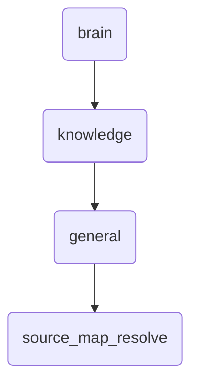

# Source Map Resolve Identity

This directory is responsible for resolving and managing source maps within OmniClaw, ensuring accurate data mapping and retrieval.

---

## Topological View

---
*OmniClaw V5.0 | Forged by OMA AI Architect | brain.knowledge.general.source_map_resolve | 2026-04-10*
