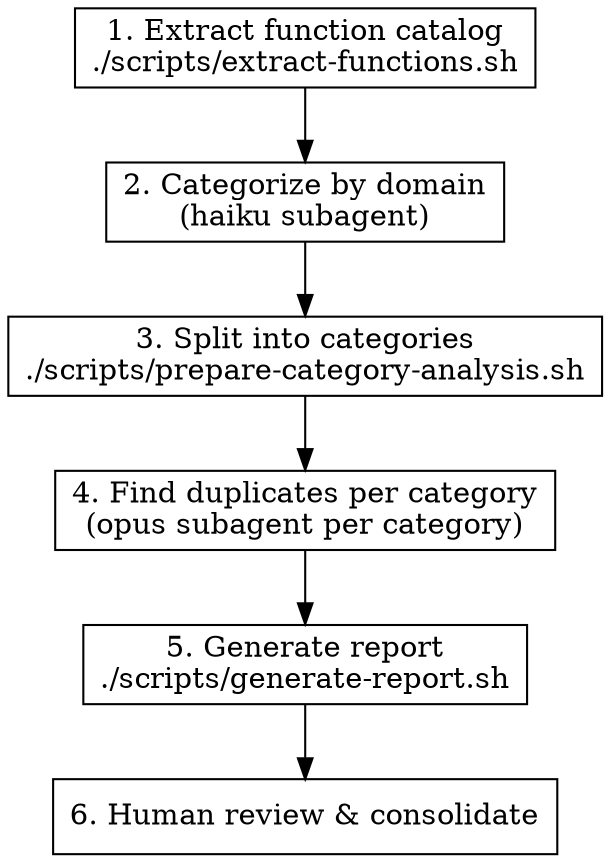

# KNOWLEDGE EXTRACT: superpowers-lab
> **Extracted on:** 2026-03-30 13:42:04
> **Source:** superpowers-lab

---

## File: `.gitignore`
```
.DS_Store
*.swp
*.swo
*~
.vscode/
.idea/
```

## File: `CHANGELOG.md`
```markdown
# Changelog

All notable changes to this project will be documented in this file.

The format is based on [Keep a Changelog](https://keepachangelog.com/en/1.0.0/),
and this project adheres to [Semantic Versioning](https://semver.org/spec/v2.0.0.html).

## [0.4.0] - 2026-03-23

### Added

- **windows-vm** skill: Create, manage, and connect to a headless Windows 11 VM running in Docker with KVM acceleration and SSH access. Supports full lifecycle management (create, start, stop, restart, ssh, status) with automated OpenSSH, Node.js, and Claude Code setup.

## [0.3.0] - 2025-01-31

### Added

- **slack-messaging** skill: Send and read Slack messages from the command line using slackcli. Supports multiple workspaces with browser token authentication. Includes helper script for token extraction.

## [0.2.0] - 2025-01-11

### Added

- **finding-duplicate-functions** skill: Detect semantic code duplication in LLM-generated codebases using a two-phase approach (classical extraction + LLM-powered intent clustering). Includes shell scripts for function extraction, category splitting, and report generation.

## [0.1.0] - 2024-11-10

### Added

- Initial release with experimental skills
- **using-tmux-for-interactive-commands** skill: Control interactive CLI tools through tmux sessions
- **mcp-cli** skill: On-demand MCP server usage via the mcp CLI tool
```

## File: `LICENSE`
```
MIT License

Copyright (c) 2025 Jesse Vincent

Permission is hereby granted, free of charge, to any person obtaining a copy
of this software and associated documentation files (the "Software"), to deal
in the Software without restriction, including without limitation the rights
to use, copy, modify, merge, publish, distribute, sublicense, and/or sell
copies of the Software, and to permit persons to whom the Software is
furnished to do so, subject to the following conditions:

The above copyright notice and this permission notice shall be included in all
copies or substantial portions of the Software.

THE SOFTWARE IS PROVIDED "AS IS", WITHOUT WARRANTY OF ANY KIND, EXPRESS OR
IMPLIED, INCLUDING BUT NOT LIMITED TO THE WARRANTIES OF MERCHANTABILITY,
FITNESS FOR A PARTICULAR PURPOSE AND NONINFRINGEMENT. IN NO EVENT SHALL THE
AUTHORS OR COPYRIGHT HOLDERS BE LIABLE FOR ANY CLAIM, DAMAGES OR OTHER
LIABILITY, WHETHER IN AN ACTION OF CONTRACT, TORT OR OTHERWISE, ARISING FROM,
OUT OF OR IN CONNECTION WITH THE SOFTWARE OR THE USE OR OTHER DEALINGS IN THE
SOFTWARE.
```

## File: `README.md`
```markdown
# Superpowers Lab

Experimental skills for [Claude Code Superpowers](https://github.com/obra/superpowers) - new techniques and tools under active development.

## What is this?

This plugin contains experimental skills that extend Claude Code's capabilities with new techniques that are still being refined and tested. These skills are functional but may evolve based on real-world usage and feedback.

## Current Skills

### finding-duplicate-functions

Detect semantic code duplication in LLM-generated codebases. Unlike traditional copy-paste detectors that find syntactic duplicates, this skill identifies functions with the same intent but different implementations.

**Use cases:**
- Audit codebases that have grown organically with multiple contributors
- Identify utility functions that have been reimplemented multiple times
- Find consolidation opportunities before major refactoring
- Complement jscpd after syntactic duplicates are handled

**How it works:** Two-phase approach using classical function extraction followed by LLM-powered intent clustering. Haiku categorizes functions by domain, then Opus analyzes each category to find semantic duplicates.

See [skills/finding-duplicate-functions/SKILL.md](skills/finding-duplicate-functions/SKILL.md) for full documentation.

### mcp-cli

Use MCP servers on-demand via the `mcp` CLI tool. Discover and invoke tools, resources, and prompts without polluting context with pre-loaded MCP integrations.

**Use cases:**
- Query MCP servers without permanent configuration
- Explore available tools before deciding to integrate
- One-off MCP tool invocations

See [skills/mcp-cli/SKILL.md](skills/mcp-cli/SKILL.md) for full documentation.

### using-tmux-for-interactive-commands

Enables Claude Code to control interactive CLI tools (vim, git rebase -i, menuconfig, REPLs, etc.) through tmux sessions.

**Use cases:**
- Interactive text editors (vim, nano)
- Terminal UI tools (menuconfig, htop)
- Interactive REPLs (Python, Node, etc.)
- Interactive git operations (rebase -i, add -p)
- Any tool requiring keyboard navigation and real-time interaction

**How it works:** Creates detached tmux sessions, sends keystrokes programmatically, and captures terminal output to enable automation of traditionally manual workflows.

See [skills/using-tmux-for-interactive-commands/SKILL.md](skills/using-tmux-for-interactive-commands/SKILL.md) for full documentation.

### windows-vm

Create, manage, or connect to a headless Windows 11 VM running in Docker with KVM acceleration and SSH access — no RDP or GUI required.

**Use cases:**
- Spin up a Windows environment for testing or development
- Run Claude Code on Windows via SSH
- Test cross-platform behavior without leaving the terminal

**How it works:** Uses [dockur/windows](https://github.com/dockur/windows) to run Windows 11 in a Docker container with KVM acceleration. Manages the full lifecycle: create, start, stop, restart, SSH, and status checks. Includes automated setup of OpenSSH Server, Node.js, and Claude Code inside the VM.

See [skills/windows-vm/SKILL.md](skills/windows-vm/SKILL.md) for full documentation.

## Installation

```bash
# Install the plugin
claude-code plugin install https://github.com/obra/superpowers-lab

# Or add to your claude.json
{
  "plugins": [
    "https://github.com/obra/superpowers-lab"
  ]
}
```

## Requirements

- tmux must be installed on your system
- Skills are tested on Linux/macOS (tmux required)

## Experimental Status

Skills in this plugin are:
- ✅ Functional and tested
- 🧪 Under active refinement
- 📝 May evolve based on usage
- 🔬 Open to feedback and improvements

## Contributing

Found a bug or have an improvement? Please open an issue or PR!

## Related Projects

- [superpowers](https://github.com/obra/superpowers) - Core skills library for Claude Code
- [superpowers-chrome](https://github.com/obra/superpowers-chrome) - Browser automation skills

## License

MIT License - see [LICENSE](LICENSE) for details
```

## File: `skills/finding-duplicate-functions/SKILL.md`
```markdown
---
name: finding-duplicate-functions
description: Use when auditing a codebase for semantic duplication - functions that do the same thing but have different names or implementations. Especially useful for LLM-generated codebases where new functions are often created rather than reusing existing ones.
---

# Finding Duplicate-Intent Functions

## Overview

LLM-generated codebases accumulate semantic duplicates: functions that serve the same purpose but were implemented independently. Classical copy-paste detectors (jscpd) find syntactic duplicates but miss "same intent, different implementation."

This skill uses a two-phase approach: classical extraction followed by LLM-powered intent clustering.

## When to Use

- Codebase has grown organically with multiple contributors (human or LLM)
- You suspect utility functions have been reimplemented multiple times
- Before major refactoring to identify consolidation opportunities
- After jscpd has been run and syntactic duplicates are already handled

## Quick Reference

| Phase | Tool | Model | Output |
|-------|------|-------|--------|
| 1. Extract | `scripts/extract-functions.sh` | - | `catalog.json` |
| 2. Categorize | `scripts/categorize-prompt.md` | haiku | `categorized.json` |
| 3. Split | `scripts/prepare-category-analysis.sh` | - | `categories/*.json` |
| 4. Detect | `scripts/find-duplicates-prompt.md` | opus | `duplicates/*.json` |
| 5. Report | `scripts/generate-report.sh` | - | `report.md` |

## Process



### Phase 1: Extract Function Catalog

```bash
./scripts/extract-functions.sh src/ -o catalog.json
```

Options:
- `-o FILE`: Output file (default: stdout)
- `-c N`: Lines of context to capture (default: 15)
- `-t GLOB`: File types (default: `*.ts,*.tsx,*.js,*.jsx`)
- `--include-tests`: Include test files (excluded by default)

Test files (`*.test.*`, `*.spec.*`, `__tests__/**`) are excluded by default since test utilities are less likely to be consolidation candidates.

### Phase 2: Categorize by Domain

Dispatch a **haiku** subagent using the prompt in `scripts/categorize-prompt.md`.

Insert the contents of `catalog.json` where indicated in the prompt template. Save output as `categorized.json`.

### Phase 3: Split into Categories

```bash
./scripts/prepare-category-analysis.sh categorized.json ./categories
```

Creates one JSON file per category. Only categories with 3+ functions are worth analyzing.

### Phase 4: Find Duplicates (Per Category)

For each category file in `./categories/`, dispatch an **opus** subagent using the prompt in `scripts/find-duplicates-prompt.md`.

Save each output as `./duplicates/{category}.json`.

### Phase 5: Generate Report

```bash
./scripts/generate-report.sh ./duplicates ./duplicates-report.md
```

Produces a prioritized markdown report grouped by confidence level.

### Phase 6: Human Review

Review the report. For HIGH confidence duplicates:
1. Verify the recommended survivor has tests
2. Update callers to use the survivor
3. Delete the duplicates
4. Run tests

## High-Risk Duplicate Zones

Focus extraction on these areas first - they accumulate duplicates fastest:

| Zone | Common Duplicates |
|------|-------------------|
| `utils/`, `helpers/`, `lib/` | General utilities reimplemented |
| Validation code | Same checks written multiple ways |
| Error formatting | Error-to-string conversions |
| Path manipulation | Joining, resolving, normalizing paths |
| String formatting | Case conversion, truncation, escaping |
| Date formatting | Same formats implemented repeatedly |
| API response shaping | Similar transformations for different endpoints |

## Common Mistakes

**Extracting too much**: Focus on exported functions and public methods. Internal helpers are less likely to be duplicated across files.

**Skipping the categorization step**: Going straight to duplicate detection on the full catalog produces noise. Categories focus the comparison.

**Using haiku for duplicate detection**: Haiku is cost-effective for categorization but misses subtle semantic duplicates. Use Opus for the actual duplicate analysis.

**Consolidating without tests**: Before deleting duplicates, ensure the survivor has tests covering all use cases of the deleted functions.
```

## File: `skills/finding-duplicate-functions/scripts/categorize-prompt.md`
```markdown
# Function Categorization Prompt

Use this prompt with a **haiku** subagent for cost-effective categorization.

## Prompt Template

```
Read the function catalog at <CATALOG_PATH> and categorize each function.

Assign each function to exactly ONE category based on its primary purpose.

## Categories

- **file-ops**: Reading, writing, path manipulation, directory operations
- **string-utils**: Formatting, parsing, sanitization, case conversion, truncation
- **validation**: Input checking, schema validation, type guards, assertions
- **error-handling**: Error creation, wrapping, formatting, logging helpers
- **http-api**: Request building, response parsing, URL construction, headers
- **date-time**: Date formatting, parsing, comparison, timezone handling
- **data-transform**: Mapping, filtering, normalization, serialization
- **database**: Query building, connection management, migrations
- **logging**: Log formatting, debug helpers, telemetry
- **config**: Configuration loading, environment variables, settings
- **async-utils**: Promise helpers, retry logic, debounce, throttle
- **testing**: Test utilities, mocks, fixtures, assertions
- **ui-helpers**: DOM manipulation, event handling, component utilities
- **crypto**: Hashing, encryption, token generation
- **provider-impl**: AI provider interface implementations (createResponse, etc.)
- **tool-impl**: Tool interface implementations (executeValidated, etc.)
- **event-handling**: Event creation, emission, processing, subscription
- **session-management**: Session/thread/conversation lifecycle
- **compaction**: Message compaction, summarization, token management
- **other**: Doesn't fit above categories (note subcategory in purpose)

## Output Format

For each function, output:
{"file": "...", "name": "...", "line": N, "category": "...", "purpose": "one sentence"}

## Guidelines

1. Focus on WHAT the function does, not HOW it's implemented
2. If a function could fit multiple categories, choose the primary purpose
3. Constructors: categorize based on what the class does
4. Interface implementations: use provider-impl or tool-impl as appropriate
5. Keep purpose descriptions concise but specific

## IMPORTANT

Use the Write tool to save the complete JSON array to <OUTPUT_PATH>.
Do NOT truncate or summarize - write ALL entries.
```

## Usage

1. Run extraction: `./extract-functions.sh src/ -o catalog.json`
2. Dispatch haiku subagent with the prompt above, replacing:
   - `<CATALOG_PATH>` with path to catalog.json
   - `<OUTPUT_PATH>` with desired output path (e.g., `categorized.json`)
3. Verify output file was created with all entries

**Critical:** The subagent must use the Write tool to save output. If it only returns a summary, re-prompt with explicit file write instructions.
```

## File: `skills/finding-duplicate-functions/scripts/extract-functions.sh`
```bash
#!/usr/bin/env bash
# ABOUTME: Extracts function/method definitions from TypeScript/JavaScript codebase
# Outputs JSON catalog for duplicate detection analysis

set -euo pipefail

usage() {
    cat <<EOF
Usage: $(basename "$0") [OPTIONS] <source-directory>

Extract function catalog from TypeScript/JavaScript codebase.

OPTIONS:
    -o, --output FILE    Output file (default: stdout)
    -c, --context N      Lines of implementation to capture (default: 15)
    -t, --types GLOB     File types to scan (default: "*.ts,*.tsx,*.js,*.jsx")
    --include-tests      Include test files (excluded by default)
    -h, --help           Show this help

Test files excluded by default:
    *.test.*, *.spec.*, __tests__/**, test/**, tests/**

EXAMPLES:
    $(basename "$0") src/
    $(basename "$0") -o catalog.json -c 3 packages/
    $(basename "$0") --types "*.ts" src/
    $(basename "$0") --include-tests src/   # Include test files

OUTPUT FORMAT:
    JSON array of objects with: file, name, signature, context, exportType
EOF
    exit 0
}

# Defaults
OUTPUT="/dev/stdout"
CONTEXT_LINES=15
FILE_TYPES="*.ts,*.tsx,*.js,*.jsx"
INCLUDE_TESTS=false

# Parse args
while [[ $# -gt 0 ]]; do
    case $1 in
        -o|--output) OUTPUT="$2"; shift 2 ;;
        -c|--context) CONTEXT_LINES="$2"; shift 2 ;;
        -t|--types) FILE_TYPES="$2"; shift 2 ;;
        --include-tests) INCLUDE_TESTS=true; shift ;;
        -h|--help) usage ;;
        -*) echo "Unknown option: $1" >&2; exit 1 ;;
        *) SRC_DIR="$1"; shift ;;
    esac
done

if [[ -z "${SRC_DIR:-}" ]]; then
    echo "Error: source directory required" >&2
    usage
fi

if [[ ! -d "$SRC_DIR" ]]; then
    echo "Error: directory not found: $SRC_DIR" >&2
    exit 1
fi

# Build glob pattern for ripgrep (use array to avoid glob expansion)
GLOB_ARGS=()
IFS=',' read -ra TYPES <<< "$FILE_TYPES"
for type in "${TYPES[@]}"; do
    GLOB_ARGS+=(--glob "$type")
done

# Exclude test files by default
if [[ "$INCLUDE_TESTS" == "false" ]]; then
    GLOB_ARGS+=(--glob '!*.test.*' --glob '!*.spec.*')
    GLOB_ARGS+=(--glob '!**/__tests__/**' --glob '!**/test/**' --glob '!**/tests/**')
fi

# Patterns to match function definitions
# Pattern 1: export function name(
# Pattern 2: export const name = (async)? (
# Pattern 3: export const name = (async)? function
# Pattern 4: export default function
# Pattern 5: class methods (public/private/protected/async)
# Pattern 6: standalone function declarations

extract_functions() {
    local dir="$1"
    local ctx="$2"

    # Use ripgrep to find function definitions with context
    # Note: Class method pattern requires visibility/async/static to avoid matching if/for/while
    rg --json \
        -e '^export (async )?function \w+' \
        -e '^export const \w+ = (async )?\(' \
        -e '^export const \w+ = (async )?function' \
        -e '^export default (async )?function' \
        -e '^  (public |private |protected )(async |static )*(get |set )?\w+\s*\(' \
        -e '^  (async |static )(async |static )*(get |set )?\w+\s*\(' \
        -e '^  (get |set )\w+\s*\(' \
        -e '^  constructor\s*\(' \
        -e '^(async )?function \w+\s*\(' \
        "${GLOB_ARGS[@]}" \
        -A "$ctx" \
        "$dir" 2>/dev/null || true
}

# Process ripgrep JSON output into our catalog format
process_output() {
    jq -s '
        # Group by match (each match has type "begin", "match", "context", "end")
        reduce .[] as $item (
            {current: null, results: []};
            if $item.type == "begin" then
                .current = {file: $item.data.path.text, lines: []}
            elif $item.type == "match" then
                .current.lines += [{
                    line_number: $item.data.line_number,
                    text: $item.data.lines.text,
                    is_match: true
                }]
            elif $item.type == "context" then
                .current.lines += [{
                    line_number: $item.data.line_number,
                    text: $item.data.lines.text,
                    is_match: false
                }]
            elif $item.type == "end" then
                if .current.lines | length > 0 then
                    .results += [.current]
                else . end
            else . end
        ) | .results

        # Transform into catalog entries - group each match with its following context
        | map(
            .file as $file |
            .lines |
            # Find indices of match lines
            to_entries |
            reduce .[] as $entry (
                {matches: [], current_match: null, entries: []};
                if $entry.value.is_match then
                    # Save previous match group if exists
                    (if .current_match then
                        .entries += [{
                            file: $file,
                            line: .current_match.line_number,
                            match_line: .current_match.text,
                            context_lines: .context
                        }]
                    else . end) |
                    # Start new match group
                    .current_match = $entry.value |
                    .context = []
                else
                    # Add to current context if we have a match
                    if .current_match then
                        .context += [$entry.value.text]
                    else . end
                end
            ) |
            # Dont forget last match group
            (if .current_match then
                .entries += [{
                    file: $file,
                    line: .current_match.line_number,
                    match_line: .current_match.text,
                    context_lines: .context
                }]
            else . end) |
            .entries |
            map(. + {context: ((.match_line // "") + ((.context_lines // []) | join("")))})
        ) | flatten

        # Extract function name and classify export type
        | map(
            . + {
                name: (
                    .match_line |
                    capture("(?:export )?(?:async )?(?:function |const )(?<name>\\w+)") //
                    capture("(?:public |private |protected )?(?:async |static )*(?:get |set )?(?<name>\\w+)\\s*\\(") //
                    {name: "unknown"}
                ).name,
                exportType: (
                    if .match_line | test("^export default") then "default"
                    elif .match_line | test("^export ") then "named"
                    elif .match_line | test("^  ") then "method"
                    else "internal"
                    end
                )
            }
        )

        # Filter out keywords, invalid entries, and common loop variables
        | map(select(
            .name != "unknown" and
            .name != "if" and
            .name != "else" and
            .name != "for" and
            .name != "while" and
            .name != "switch" and
            .name != "try" and
            .name != "catch" and
            .name != "return" and
            .name != "throw" and
            .name != "new" and
            .name != "typeof" and
            .name != "await" and
            .name != "const" and
            .name != "let" and
            .name != "var" and
            # Common loop variables that get false-positive matched
            .name != "line" and
            .name != "item" and
            .name != "entry" and
            .name != "element" and
            .name != "key" and
            .name != "value" and
            .name != "i" and
            .name != "j" and
            .name != "k"
        ))

        # Clean up and format output
        | map({
            file: .file,
            name: .name,
            line: .line,
            exportType: .exportType,
            context: (.context | gsub("\\n+$"; ""))
        })
        | sort_by(.file, .line)
    '
}

# Main
extract_functions "$SRC_DIR" "$CONTEXT_LINES" | process_output > "$OUTPUT"

# Report stats to stderr
if [[ "$OUTPUT" != "/dev/stdout" ]]; then
    count=$(jq 'length' "$OUTPUT")
    echo "Extracted $count function definitions to $OUTPUT" >&2
fi
```

## File: `skills/finding-duplicate-functions/scripts/find-duplicates-prompt.md`
```markdown
# Duplicate Detection Prompt

Use this prompt with an **opus** subagent for thorough semantic analysis.

Run this prompt **once per category** that has 3+ functions.

## Prompt Template

```
You are analyzing functions in the "{CATEGORY}" category for semantic duplicates.

Semantic duplicates are functions that serve the SAME PURPOSE even if:
- They have different names
- They use different implementations
- They have slightly different signatures
- One is more general than another

## Your Task

1. Compare all functions in this category
2. Identify groups of functions that do the same thing
3. For each duplicate group, assess confidence and recommend action

## Output Format

Return a JSON array of duplicate groups:

```json
[
  {
    "intent": "<what these functions all do>",
    "confidence": "HIGH|MEDIUM|LOW",
    "functions": [
      {
        "file": "<file path>",
        "name": "<function name>",
        "line": <line number>,
        "notes": "<implementation specifics>"
      }
    ],
    "differences": "<how implementations differ, if at all>",
    "recommendation": {
      "action": "CONSOLIDATE|INVESTIGATE|KEEP_SEPARATE",
      "survivor": "<which function to keep, if CONSOLIDATE>",
      "reason": "<why this recommendation>"
    }
  }
]
```

## Confidence Levels

- **HIGH**: Definitely the same thing. Same input→output semantics.
  Example: `formatDate(d)` and `dateToString(d)` both format dates identically

- **MEDIUM**: Likely the same thing with minor differences.
  Example: `validateEmail(s)` uses regex, `checkEmail(s)` uses library, but same purpose

- **LOW**: Possibly related, worth investigating.
  Example: `sanitizeInput(s)` and `escapeHtml(s)` - related but maybe distinct purposes

## Recommendations

- **CONSOLIDATE**: Functions are duplicates. Keep the one with better name/implementation/tests.
- **INVESTIGATE**: Need to read full implementations to decide. Flag for human review.
- **KEEP_SEPARATE**: Functions look similar but serve distinct purposes.

## Guidelines

1. Read the context/implementation snippets carefully
2. Consider edge case handling - two functions might differ in how they handle nulls
3. If functions are in test files, they're less likely to be true duplicates
4. Generic utilities (identity, noop, constant) are often intentionally duplicated
5. When in doubt, recommend INVESTIGATE rather than CONSOLIDATE

## Functions in "{CATEGORY}" Category

<INSERT_CATEGORY_FUNCTIONS_HERE>
```

## Usage

1. First run categorization (see categorize-prompt.md)
2. Filter categorized.json to get functions for one category:
   ```bash
   jq '[.[] | select(.category == "validation")]' categorized.json > validation-functions.json
   ```
3. Replace `{CATEGORY}` with the category name
4. Replace `<INSERT_CATEGORY_FUNCTIONS_HERE>` with the filtered JSON
5. Dispatch opus subagent with the prompt
6. Repeat for each category with 3+ functions
7. Combine outputs into final report
```

## File: `skills/finding-duplicate-functions/scripts/generate-report.sh`
```bash
#!/usr/bin/env bash
# ABOUTME: Generates human-readable duplicate detection report from Opus analysis output
# Combines per-category duplicate findings into a prioritized markdown report

set -euo pipefail

usage() {
    cat <<EOF
Usage: $(basename "$0") <duplicates-dir> [output-file]

Generate markdown report from duplicate detection results.

ARGUMENTS:
    duplicates-dir    Directory containing per-category duplicate JSON files
    output-file       Output markdown file (default: duplicates-report.md)

INPUT FORMAT:
    Each JSON file should contain array of duplicate groups from Opus analysis.

EXAMPLE:
    $(basename "$0") ./duplicates ./duplicates-report.md
EOF
    exit 0
}

if [[ "${1:-}" == "-h" || "${1:-}" == "--help" ]]; then
    usage
fi

if [[ -z "${1:-}" ]]; then
    echo "Error: duplicates directory required" >&2
    usage
fi

DUPLICATES_DIR="$1"
OUTPUT="${2:-duplicates-report.md}"

if [[ ! -d "$DUPLICATES_DIR" ]]; then
    echo "Error: directory not found: $DUPLICATES_DIR" >&2
    exit 1
fi

# Generate the report
{
    echo "# Duplicate Functions Report"
    echo ""
    echo "Generated: $(date '+%Y-%m-%d %H:%M')"
    echo ""

    # Count totals
    high_count=0
    medium_count=0
    low_count=0

    for f in "$DUPLICATES_DIR"/*.json; do
        [[ -f "$f" ]] || continue
        h=$(jq '[.[] | select(.confidence == "HIGH")] | length' "$f")
        m=$(jq '[.[] | select(.confidence == "MEDIUM")] | length' "$f")
        l=$(jq '[.[] | select(.confidence == "LOW")] | length' "$f")
        high_count=$((high_count + h))
        medium_count=$((medium_count + m))
        low_count=$((low_count + l))
    done

    echo "## Summary"
    echo ""
    echo "| Confidence | Count | Action |"
    echo "|------------|-------|--------|"
    echo "| HIGH | $high_count | Consolidate immediately |"
    echo "| MEDIUM | $medium_count | Investigate further |"
    echo "| LOW | $low_count | Review if time permits |"
    echo ""

    # HIGH confidence section
    echo "---"
    echo ""
    echo "## HIGH Confidence Duplicates"
    echo ""
    echo "These functions are definitely duplicates. Consolidate them."
    echo ""

    for f in "$DUPLICATES_DIR"/*.json; do
        [[ -f "$f" ]] || continue
        category=$(basename "$f" .json)

        jq -r --arg cat "$category" '
            .[] | select(.confidence == "HIGH") |
            "### \(.intent)\n\n" +
            "**Category:** \($cat)\n\n" +
            "**Functions:**\n" +
            (.functions | map("- `\(.name)` in `\(.file):\(.line)`" + if .notes then " - \(.notes)" else "" end) | join("\n")) +
            "\n\n" +
            "**Differences:** \(.differences // "None - identical implementations")\n\n" +
            "**Recommendation:** Keep `\(.recommendation.survivor)` - \(.recommendation.reason)\n\n" +
            "---\n"
        ' "$f" 2>/dev/null || true
    done

    # MEDIUM confidence section
    echo ""
    echo "## MEDIUM Confidence Duplicates"
    echo ""
    echo "These functions likely do the same thing. Investigate before consolidating."
    echo ""

    for f in "$DUPLICATES_DIR"/*.json; do
        [[ -f "$f" ]] || continue
        category=$(basename "$f" .json)

        jq -r --arg cat "$category" '
            .[] | select(.confidence == "MEDIUM") |
            "### \(.intent)\n\n" +
            "**Category:** \($cat)\n\n" +
            "**Functions:**\n" +
            (.functions | map("- `\(.name)` in `\(.file):\(.line)`" + if .notes then " - \(.notes)" else "" end) | join("\n")) +
            "\n\n" +
            "**Differences:** \(.differences)\n\n" +
            "**Recommendation:** \(.recommendation.action) - \(.recommendation.reason)\n\n" +
            "---\n"
        ' "$f" 2>/dev/null || true
    done

    # LOW confidence section
    echo ""
    echo "## LOW Confidence (Possibly Related)"
    echo ""
    echo "These functions might be related. Review if time permits."
    echo ""

    for f in "$DUPLICATES_DIR"/*.json; do
        [[ -f "$f" ]] || continue
        category=$(basename "$f" .json)

        jq -r --arg cat "$category" '
            .[] | select(.confidence == "LOW") |
            "### \(.intent)\n\n" +
            "**Category:** \($cat)\n\n" +
            "**Functions:**\n" +
            (.functions | map("- `\(.name)` in `\(.file):\(.line)`") | join("\n")) +
            "\n\n" +
            "**Notes:** \(.differences)\n\n" +
            "---\n"
        ' "$f" 2>/dev/null || true
    done

} > "$OUTPUT"

echo "Report generated: $OUTPUT" >&2
echo "  HIGH confidence: $high_count groups" >&2
echo "  MEDIUM confidence: $medium_count groups" >&2
echo "  LOW confidence: $low_count groups" >&2
```

## File: `skills/finding-duplicate-functions/scripts/prepare-category-analysis.sh`
```bash
#!/usr/bin/env bash
# ABOUTME: Prepares category-specific function lists for duplicate detection
# Takes categorized output and splits into per-category files for Opus analysis

set -euo pipefail

usage() {
    cat <<EOF
Usage: $(basename "$0") <categorized.json> [output-dir]

Split categorized function catalog into per-category files for duplicate analysis.

ARGUMENTS:
    categorized.json    Output from categorization phase
    output-dir          Directory for category files (default: ./categories)

OUTPUT:
    Creates one JSON file per category (e.g., validation.json, string-utils.json)
    Only creates files for categories with 3+ functions (worth analyzing)

EXAMPLE:
    $(basename "$0") categorized.json ./analysis
    # Creates: ./analysis/validation.json, ./analysis/file-ops.json, etc.
EOF
    exit 0
}

if [[ "${1:-}" == "-h" || "${1:-}" == "--help" ]]; then
    usage
fi

if [[ -z "${1:-}" ]]; then
    echo "Error: categorized.json required" >&2
    usage
fi

CATEGORIZED="$1"
OUTPUT_DIR="${2:-./categories}"

if [[ ! -f "$CATEGORIZED" ]]; then
    echo "Error: file not found: $CATEGORIZED" >&2
    exit 1
fi

mkdir -p "$OUTPUT_DIR"

# Get category counts and filter to those with 3+ functions
echo "Analyzing categories..." >&2

jq -r '
    group_by(.category) |
    map({
        category: .[0].category,
        count: length,
        functions: .
    }) |
    sort_by(-.count) |
    .[] |
    "\(.category)\t\(.count)"
' "$CATEGORIZED" | while IFS=$'\t' read -r category count; do
    if [[ "$count" -ge 3 ]]; then
        outfile="$OUTPUT_DIR/${category}.json"
        jq --arg cat "$category" '[.[] | select(.category == $cat)]' "$CATEGORIZED" > "$outfile"
        echo "  $category: $count functions -> $outfile" >&2
    else
        echo "  $category: $count functions (skipped, < 3)" >&2
    fi
done

echo "" >&2
echo "Category files created in $OUTPUT_DIR" >&2
echo "Run Opus duplicate detection on each file with 3+ functions" >&2
```

## File: `skills/mcp-cli/SKILL.md`
```markdown
---
name: mcp-cli
description: Use MCP servers on-demand via the mcp CLI tool - discover tools, resources, and prompts without polluting context with pre-loaded MCP integrations
---

# MCP CLI: On-Demand MCP Server Usage

Use the `mcp` CLI tool to dynamically discover and invoke MCP server capabilities without pre-configuring them as permanent integrations.

## When to Use This Skill

Use this skill when you need to:
- Explore an MCP server's capabilities before deciding to use it
- Make one-off calls to an MCP server without permanent integration
- Access MCP functionality without polluting the context window
- Test or debug MCP servers
- Use MCP servers that aren't pre-configured

## Prerequisites

The `mcp` CLI must be installed at `~/.local/bin/mcp`. If not present:

```bash
# Clone and build
cd /tmp && git clone --depth 1 https://github.com/f/mcptools.git
cd mcptools && CGO_ENABLED=0 go build -o ~/.local/bin/mcp ./cmd/mcptools
```

Always ensure PATH includes the binary:
```bash
export PATH="$HOME/.local/bin:$PATH"
```

## Discovery Workflow

### Step 1: Discover Available Tools

```bash
mcp tools <server-command>
```

**Examples:**
```bash
# Filesystem server
mcp tools npx -y @modelcontextprotocol/server-filesystem /path/to/allow

# Memory/knowledge graph server
mcp tools npx -y @modelcontextprotocol/server-memory

# GitHub server (requires token)
mcp tools docker run -i --rm -e GITHUB_PERSONAL_ACCESS_TOKEN ghcr.io/github/github-mcp-server

# HTTP-based server
mcp tools https://example.com/mcp
```

### Step 2: Discover Resources (if supported)

```bash
mcp resources <server-command>
```

Resources are data sources the server exposes (files, database entries, etc.).

### Step 3: Discover Prompts (if supported)

```bash
mcp prompts <server-command>
```

Prompts are pre-defined prompt templates the server provides.

### Step 4: Get Detailed Info (JSON format)

```bash
# For full schema details including parameter types
mcp tools --format json <server-command>
mcp tools --format pretty <server-command>
```

## Making Tool Calls

### Basic Syntax

```bash
mcp call <tool_name> --params '<json>' <server-command>
```

### Examples

**Read a file:**
```bash
mcp call read_file --params '{"path": "/tmp/example.txt"}' \
  npx -y @modelcontextprotocol/server-filesystem /tmp
```

**Write a file:**
```bash
mcp call write_file --params '{"path": "/tmp/test.txt", "content": "Hello world"}' \
  npx -y @modelcontextprotocol/server-filesystem /tmp
```

**List directory:**
```bash
mcp call list_directory --params '{"path": "/tmp"}' \
  npx -y @modelcontextprotocol/server-filesystem /tmp
```

**Create entities (memory server):**
```bash
mcp call create_entities --params '{"entities": [{"name": "Project", "entityType": "Software", "observations": ["Uses TypeScript"]}]}' \
  npx -y @modelcontextprotocol/server-memory
```

**Search (memory server):**
```bash
mcp call search_nodes --params '{"query": "TypeScript"}' \
  npx -y @modelcontextprotocol/server-memory
```

### Complex Parameters

For nested objects and arrays, ensure valid JSON:

```bash
mcp call edit_file --params '{
  "path": "/tmp/file.txt",
  "edits": [
    {"oldText": "foo", "newText": "bar"},
    {"oldText": "baz", "newText": "qux"}
  ]
}' npx -y @modelcontextprotocol/server-filesystem /tmp
```

### Output Formats

```bash
# Table (default, human-readable)
mcp call <tool> --params '{}' <server>

# JSON (for parsing)
mcp call <tool> --params '{}' -f json <server>

# Pretty JSON (readable JSON)
mcp call <tool> --params '{}' -f pretty <server>
```

## Reading Resources

```bash
# List available resources
mcp resources <server-command>

# Read a specific resource
mcp read-resource <resource-uri> <server-command>

# Alternative syntax
mcp call resource:<resource-uri> <server-command>
```

## Using Prompts

```bash
# List available prompts
mcp prompts <server-command>

# Get a prompt (may require arguments)
mcp get-prompt <prompt-name> <server-command>

# With parameters
mcp get-prompt <prompt-name> --params '{"arg": "value"}' <server-command>
```

## Server Aliases (for repeated use)

If using a server frequently during a session:

```bash
# Create alias
mcp alias add fs npx -y @modelcontextprotocol/server-filesystem /home/user

# Use alias
mcp tools fs
mcp call read_file --params '{"path": "README.md"}' fs

# List aliases
mcp alias list

# Remove when done
mcp alias remove fs
```

Aliases are stored in `~/.mcpt/aliases.json`.

## Authentication

### HTTP Basic Auth
```bash
mcp tools --auth-user "username:password" https://api.example.com/mcp
```

### Bearer Token
```bash
mcp tools --auth-header "Bearer your-token-here" https://api.example.com/mcp
```

### Environment Variables (for Docker-based servers)
```bash
mcp tools docker run -i --rm \
  -e GITHUB_PERSONAL_ACCESS_TOKEN="$GITHUB_TOKEN" \
  ghcr.io/github/github-mcp-server
```

## Transport Types

### Stdio (default for npx/node commands)
```bash
mcp tools npx -y @modelcontextprotocol/server-filesystem /tmp
```

### HTTP (auto-detected for http/https URLs)
```bash
mcp tools https://example.com/mcp
```

### SSE (Server-Sent Events)
```bash
mcp tools http://localhost:3001/sse
# Or explicitly:
mcp tools --transport sse http://localhost:3001
```

## Common MCP Servers

### Filesystem
```bash
# Allow access to specific directory
mcp tools npx -y @modelcontextprotocol/server-filesystem /path/to/allow
```

### Memory (Knowledge Graph)
```bash
mcp tools npx -y @modelcontextprotocol/server-memory
```

### GitHub
```bash
export GITHUB_PERSONAL_ACCESS_TOKEN="your-token"
mcp tools docker run -i --rm -e GITHUB_PERSONAL_ACCESS_TOKEN ghcr.io/github/github-mcp-server
```

### Brave Search
```bash
export BRAVE_API_KEY="your-key"
mcp tools npx -y @anthropic/mcp-server-brave-search
```

### Puppeteer (Browser Automation)
```bash
mcp tools npx -y @anthropic/mcp-server-puppeteer
```

## Best Practices

### 1. Always Discover First
Before calling tools, run `mcp tools` to understand what's available and the exact parameter schema.

### 2. Use JSON Format for Parsing
When you need to process results programmatically:
```bash
mcp call <tool> --params '{}' -f json <server> | jq '.field'
```

### 3. Validate Parameters
The table output shows parameter signatures. Match them exactly:
- `param:str` = string
- `param:num` = number
- `param:bool` = boolean
- `param:str[]` = array of strings
- `[param:str]` = optional parameter

### 4. Handle Errors Gracefully
Tool calls may fail. Check exit codes and stderr:
```bash
if ! result=$(mcp call tool --params '{}' server 2>&1); then
  echo "Error: $result"
fi
```

### 5. Use Aliases for Multi-Step Operations
If making several calls to the same server:
```bash
mcp alias add tmp-server npx -y @modelcontextprotocol/server-filesystem /tmp
mcp call list_directory --params '{"path": "/tmp"}' tmp-server
mcp call read_file --params '{"path": "/tmp/file.txt"}' tmp-server
mcp alias remove tmp-server
```

### 6. Restrict Capabilities with Guard
For safety, limit what tools are accessible:
```bash
# Only allow read operations
mcp guard --allow 'tools:read_*,list_*' --deny 'tools:write_*,delete_*' \
  npx -y @modelcontextprotocol/server-filesystem /home
```

## Debugging

### View Server Logs
```bash
mcp tools --server-logs <server-command>
```

### Check Alias Configuration
```bash
cat ~/.mcpt/aliases.json
```

### Verbose Output
Use `--format pretty` for detailed JSON output to debug parameter issues.

## Quick Reference

| Action | Command |
|--------|---------|
| List tools | `mcp tools <server>` |
| List resources | `mcp resources <server>` |
| List prompts | `mcp prompts <server>` |
| Call tool | `mcp call <tool> --params '<json>' <server>` |
| Read resource | `mcp read-resource <uri> <server>` |
| Get prompt | `mcp get-prompt <name> <server>` |
| Add alias | `mcp alias add <name> <server-command>` |
| Remove alias | `mcp alias remove <name>` |
| JSON output | Add `-f json` or `-f pretty` |

## Example: Complete Workflow

```bash
# 1. Discover what's available
mcp tools npx -y @modelcontextprotocol/server-filesystem /home/user/project

# 2. Check for resources
mcp resources npx -y @modelcontextprotocol/server-filesystem /home/user/project

# 3. Create alias for convenience
mcp alias add proj npx -y @modelcontextprotocol/server-filesystem /home/user/project

# 4. Explore directory structure
mcp call directory_tree --params '{"path": "/home/user/project"}' proj

# 5. Read specific files
mcp call read_file --params '{"path": "/home/user/project/README.md"}' proj

# 6. Search for patterns
mcp call search_files --params '{"path": "/home/user/project", "pattern": "**/*.ts"}' proj

# 7. Clean up alias
mcp alias remove proj
```

## Troubleshooting

### "command not found: mcp"
Ensure PATH is set: `export PATH="$HOME/.local/bin:$PATH"`

### JSON parse errors
- Escape special characters properly
- Avoid shell expansion issues by using single quotes around JSON
- For complex JSON, write to a temp file and use `--params "$(cat params.json)"`

### Server timeout
Some servers take time to start. The mcp CLI waits for initialization automatically.

### Permission denied
For filesystem server, ensure the allowed directory path is correct and accessible.
```

## File: `skills/slack-messaging/SKILL.md`
```markdown
---
name: slack-messaging
description: Use when asked to send or read Slack messages, check Slack channels, test Slack integrations, or interact with a Slack workspace from the command line.
user-invocable: false
allowed-tools: Bash(slackcli:*, curl:*)
---

# Slack Messaging via slackcli

Send and read Slack messages from the command line using `slackcli` (shaharia-lab/slackcli).

## Installation

Download the binary:

```bash
curl -sL -o /usr/local/bin/slackcli \
  "https://github.com/shaharia-lab/slackcli/releases/download/v0.1.1/slackcli-linux"
chmod +x /usr/local/bin/slackcli
```

macOS (Intel): replace `slackcli-linux` with `slackcli-macos`
macOS (Apple Silicon): replace with `slackcli-macos-arm64`

## Authentication

slackcli uses browser session tokens (xoxc + xoxd) - no Slack app creation required.

### Interactive Setup

```bash
./scripts/extract-tokens <workspace-url>
```

This walks the user through extracting tokens from browser DevTools.

### Manual Setup

```bash
slackcli auth login-browser \
  --xoxd="xoxd-..." \
  --xoxc="xoxc-..." \
  --workspace-url=https://your-workspace.slack.com
```

### Verify Auth

```bash
slackcli auth list
```

## Finding Channels

Use `slackcli conversations list` to discover channels and their IDs:

```bash
# List all channels
slackcli conversations list

# Filter output
slackcli conversations list | grep -i "channel-name"
```

## Sending Messages

```bash
# Send to a channel (use channel ID from conversations list)
slackcli messages send --recipient-id=C0XXXXXXXX --message="Hello from CLI"

# Send to a DM (use user's DM channel ID)
slackcli messages send --recipient-id=D0XXXXXXXX --message="Hey"

# Reply in a thread
slackcli messages send --recipient-id=C0XXXXXXXX --message="Thread reply" --thread-ts=1769756026.624319
```

The `--recipient-id` is always a channel ID (C...) or DM channel ID (D...).

## Reading Messages

```bash
# Read last N messages from a channel
slackcli conversations read C0XXXXXXXX --limit=10

# Read as JSON (for parsing)
slackcli conversations read C0XXXXXXXX --limit=10 --json

# Read a thread
slackcli conversations read C0XXXXXXXX --thread-ts=1769756026.624319
```

## Listing Channels

```bash
slackcli conversations list
```

Returns all public channels, private channels, and DMs with their IDs.

## Testing Slack Integrations

To verify a bot or integration posted a message correctly:

```bash
# Read the channel, check for the expected message
slackcli conversations read CHANNEL_ID --limit=5 --json | jq '.messages[] | select(.text | contains("expected text"))'
```

To send a test message and verify the round-trip:

```bash
# Send
slackcli messages send --recipient-id=CHANNEL_ID --message="integration test $(date +%s)"

# Read back
slackcli conversations read CHANNEL_ID --limit=1 --json
```

## Multiple Workspaces

slackcli supports multiple workspaces. Run the auth flow for each workspace you need:

```bash
# Add first workspace
./scripts/extract-tokens https://workspace-one.slack.com

# Add second workspace
./scripts/extract-tokens https://workspace-two.slack.com

# List all authenticated workspaces
slackcli auth list
```

When sending messages, slackcli automatically routes to the correct workspace based on the channel ID.

## Token Notes

- Browser tokens (xoxc/xoxd) act as the logged-in user, not a bot
- Messages sent appear as the user, not an app
- Tokens expire when the user logs out of the browser session
- To refresh: re-extract tokens from a logged-in browser session
- All workspace credentials are stored at `~/.config/slackcli/workspaces.json`
```

## File: `skills/slack-messaging/scripts/extract-tokens`
```
#!/usr/bin/env bash
# Extract Slack browser tokens (xoxc + xoxd) for slackcli authentication.
# Opens the Slack workspace in a browser and guides the user through extraction.
set -euo pipefail

if [[ $# -lt 1 ]]; then
  echo "Usage: $0 <workspace-url>" >&2
  echo "  Example: $0 https://your-workspace.slack.com" >&2
  exit 1
fi

WORKSPACE_URL="$1"

echo "=== Slack Browser Token Extraction ==="
echo ""
echo "This script helps you extract browser tokens for slackcli."
echo "These tokens let you use Slack from the CLI without creating a Slack app."
echo ""
echo "Step 1: Open your Slack workspace in a browser:"
echo "  $WORKSPACE_URL"
echo ""
echo "Step 2: Open DevTools (F12) -> Network tab"
echo ""
echo "Step 3: Refresh the page or send a message"
echo ""
echo "Step 4: Click any request to api.slack.com (e.g., client.boot, conversations.list)"
echo ""
echo "Step 5: From the Request Headers, find the Cookie header."
echo "  Look for: d=xoxd-..."
echo "  Copy the full xoxd value (starts with 'xoxd-', ends before the next ';')"
echo ""
echo "Step 6: From the Request Body (or Form Data), find:"
echo "  token=xoxc-..."
echo "  Copy the full xoxc value"
echo ""

read -rp "Paste your xoxc token: " XOXC
if [[ ! "$XOXC" =~ ^xoxc- ]]; then
  echo "Error: Token must start with 'xoxc-'" >&2
  exit 1
fi

read -rp "Paste your xoxd token (URL-encoded is fine): " XOXD
if [[ ! "$XOXD" =~ ^xoxd- ]]; then
  echo "Error: Token must start with 'xoxd-'" >&2
  exit 1
fi

echo ""
echo "Authenticating with slackcli..."
slackcli auth login-browser \
  --xoxd="$XOXD" \
  --xoxc="$XOXC" \
  --workspace-url="$WORKSPACE_URL"

echo ""
echo "Verifying..."
slackcli auth list
```

## File: `skills/using-tmux-for-interactive-commands/SKILL.md`
```markdown
---
name: using-tmux-for-interactive-commands
description: Use when you need to run interactive CLI tools (vim, git rebase -i, Python REPL, etc.) that require real-time input/output - provides tmux-based approach for controlling interactive sessions through detached sessions and send-keys
---

# Using tmux for Interactive Commands

## Overview

Interactive CLI tools (vim, interactive git rebase, REPLs, etc.) cannot be controlled through standard bash because they require a real terminal. tmux provides detached sessions that can be controlled programmatically via `send-keys` and `capture-pane`.

## When to Use

**Use tmux when:**
- Running vim, nano, or other text editors programmatically
- Controlling interactive REPLs (Python, Node, etc.)
- Handling interactive git commands (`git rebase -i`, `git add -p`)
- Working with full-screen terminal apps (htop, etc.)
- Commands that require terminal control codes or readline

**Don't use for:**
- Simple non-interactive commands (use regular Bash tool)
- Commands that accept input via stdin redirection
- One-shot commands that don't need interaction

## Quick Reference

| Task | Command |
|------|---------|
| Start session | `tmux new-session -d -s <name> <command>` |
| Send input | `tmux send-keys -t <name> 'text' Enter` |
| Capture output | `tmux capture-pane -t <name> -p` |
| Stop session | `tmux kill-session -t <name>` |
| List sessions | `tmux list-sessions` |

## Core Pattern

### Before (Won't Work)
```bash
# This hangs because vim expects interactive terminal
bash -c "vim file.txt"
```

### After (Works)
```bash
# Create detached tmux session
tmux new-session -d -s edit_session vim file.txt

# Send commands (Enter, Escape are tmux key names)
tmux send-keys -t edit_session 'i' 'Hello World' Escape ':wq' Enter

# Capture what's on screen
tmux capture-pane -t edit_session -p

# Clean up
tmux kill-session -t edit_session
```

## Implementation

### Basic Workflow

1. **Create detached session** with the interactive command
2. **Wait briefly** for initialization (100-500ms depending on command)
3. **Send input** using `send-keys` (can send special keys like Enter, Escape)
4. **Capture output** using `capture-pane -p` to see current screen state
5. **Repeat** steps 3-4 as needed
6. **Terminate** session when done

### Special Keys

Common tmux key names:
- `Enter` - Return/newline
- `Escape` - ESC key
- `C-c` - Ctrl+C
- `C-x` - Ctrl+X
- `Up`, `Down`, `Left`, `Right` - Arrow keys
- `Space` - Space bar
- `BSpace` - Backspace

### Working Directory

Specify working directory when creating session:
```bash
tmux new-session -d -s git_session -c /path/to/repo git rebase -i HEAD~3
```

### Helper Wrapper

For easier use, see `/home/jesse/git/interactive-command/tmux-wrapper.sh`:
```bash
# Start session
/path/to/tmux-wrapper.sh start <session-name> <command> [args...]

# Send input
/path/to/tmux-wrapper.sh send <session-name> 'text' Enter

# Capture current state
/path/to/tmux-wrapper.sh capture <session-name>

# Stop
/path/to/tmux-wrapper.sh stop <session-name>
```

## Common Patterns

### Python REPL
```bash
tmux new-session -d -s python python3 -i
tmux send-keys -t python 'import math' Enter
tmux send-keys -t python 'print(math.pi)' Enter
tmux capture-pane -t python -p  # See output
tmux kill-session -t python
```

### Vim Editing
```bash
tmux new-session -d -s vim vim /tmp/file.txt
sleep 0.3  # Wait for vim to start
tmux send-keys -t vim 'i' 'New content' Escape ':wq' Enter
# File is now saved
```

### Interactive Git Rebase
```bash
tmux new-session -d -s rebase -c /repo/path git rebase -i HEAD~3
sleep 0.5
tmux capture-pane -t rebase -p  # See rebase editor
# Send commands to modify rebase instructions
tmux send-keys -t rebase 'Down' 'Home' 'squash' Escape
tmux send-keys -t rebase ':wq' Enter
```

## Common Mistakes

### Not Waiting After Session Start
**Problem:** Capturing immediately after `new-session` shows blank screen

**Fix:** Add brief sleep (100-500ms) before first capture
```bash
tmux new-session -d -s sess command
sleep 0.3  # Let command initialize
tmux capture-pane -t sess -p
```

### Forgetting Enter Key
**Problem:** Commands typed but not executed

**Fix:** Explicitly send Enter
```bash
tmux send-keys -t sess 'print("hello")' Enter  # Note: Enter is separate argument
```

### Using Wrong Key Names
**Problem:** `tmux send-keys -t sess '\n'` doesn't work

**Fix:** Use tmux key names: `Enter`, not `\n`
```bash
tmux send-keys -t sess 'text' Enter  # ✓
tmux send-keys -t sess 'text\n'      # ✗
```

### Not Cleaning Up Sessions
**Problem:** Orphaned tmux sessions accumulate

**Fix:** Always kill sessions when done
```bash
tmux kill-session -t session_name
# Or check for existing: tmux has-session -t name 2>/dev/null
```

## Real-World Impact

- Enables programmatic control of vim/nano for file editing
- Allows automation of interactive git workflows (rebase, add -p)
- Makes REPL-based testing/debugging possible
- Unblocks any tool that requires terminal interaction
- No need to build custom PTY management - tmux handles it all
```

## File: `skills/using-tmux-for-interactive-commands/tmux-wrapper.sh`
```bash
#!/bin/bash
# Simple wrapper around tmux for Claude Code to interact with interactive programs

set -euo pipefail

ACTION="${1:-}"
SESSION_NAME="${2:-}"

case "$ACTION" in
  start)
    COMMAND="${3:-bash}"
    shift 3 || true
    ARGS="$*"

    # Create new detached session
    if [ -n "$ARGS" ]; then
      tmux new-session -d -s "$SESSION_NAME" "$COMMAND" "$@"
    else
      tmux new-session -d -s "$SESSION_NAME" "$COMMAND"
    fi

    # Wait for initial output
    sleep 0.3

    # Capture and display initial state
    echo "Session: $SESSION_NAME"
    echo "---"
    tmux capture-pane -t "$SESSION_NAME" -p
    ;;

  send)
    shift 2
    if [ $# -eq 0 ]; then
      echo "Error: No input provided" >&2
      exit 1
    fi

    # Send all arguments as separate keys (allows "Enter", "Escape", etc.)
    tmux send-keys -t "$SESSION_NAME" "$@"

    # Wait a moment for output
    sleep 0.2

    # Capture and display updated state
    echo "Session: $SESSION_NAME"
    echo "---"
    tmux capture-pane -t "$SESSION_NAME" -p
    ;;

  capture)
    echo "Session: $SESSION_NAME"
    echo "---"
    tmux capture-pane -t "$SESSION_NAME" -p
    ;;

  stop)
    tmux kill-session -t "$SESSION_NAME"
    echo "Session $SESSION_NAME terminated"
    ;;

  list)
    tmux list-sessions
    ;;

  *)
    cat <<EOF
Usage: $0 <action> <session-name> [args...]

Actions:
  start <session-name> <command> [args...]  - Start a new interactive session
  send <session-name> <input>               - Send input to session (use Enter for newline)
  capture <session-name>                    - Capture current pane output
  stop <session-name>                       - Terminate session
  list                                      - List all sessions

Examples:
  $0 start python_session python3 -i
  $0 send python_session 'print("hello")' Enter
  $0 capture python_session
  $0 stop python_session
EOF
    exit 1
    ;;
esac
```

## File: `skills/windows-vm/SKILL.md`
```markdown
---
name: windows-vm
description: Create, manage, or connect to a headless Windows 11 VM running in Docker with SSH access. Use when the user wants to spin up, stop, restart, or SSH into a Windows VM.
argument-hint: "[create|start|stop|restart|ssh|status]"
allowed-tools: Bash, Read, Write
---

# Headless Windows 11 VM

Manage a headless Windows 11 VM running via [dockur/windows](https://github.com/dockur/windows) in Docker with KVM acceleration. The VM is accessible via SSH only — no RDP or GUI required.

## Host prerequisites

- Docker
- KVM support (`/dev/kvm` must exist — check with `ls /dev/kvm`)
- `sshpass` (`sudo apt install sshpass`)
- `imagemagick` (optional, for screenshot debugging: `sudo apt install imagemagick`)

## Configuration

- **Container name**: `windows11`
- **VM directory**: `$HOME/windows-vm/`
  - `storage/` — VM disk image (managed by dockur, wiped on recreate)
  - `iso/win11x64.iso` — cached Windows ISO (7.3GB, persists across recreates)
  - `oem/install.bat` — post-install script (installs OpenSSH Server)
- **Credentials**: user / password
- **SSH**: `localhost:2222` (bound to 127.0.0.1 only)
- **RDP**: `localhost:3389` (bound to 127.0.0.1 only, fallback)
- **Web console**: `localhost:8006` (VNC in browser, for debugging)
- **Resources**: 8GB RAM, 4 CPU cores, 64GB disk

## Actions

### create — First-time setup or full recreate

1. Ensure directories exist:
   ```bash
   mkdir -p "$HOME/windows-vm/oem" "$HOME/windows-vm/storage" "$HOME/windows-vm/iso"
   ```

2. Ensure `$HOME/windows-vm/oem/install.bat` exists with OpenSSH setup:
   ```bat
   @echo off
   echo Installing OpenSSH Server...
   powershell -Command "Add-WindowsCapability -Online -Name OpenSSH.Server~~~~0.0.1.0" 2>nul
   powershell -Command "Get-WindowsCapability -Online -Name OpenSSH.Server* | Add-WindowsCapability -Online" 2>nul
   dism /Online /Add-Capability /CapabilityName:OpenSSH.Server~~~~0.0.1.0 2>nul
   powershell -Command "Start-Service sshd" 2>nul
   powershell -Command "Set-Service -Name sshd -StartupType Automatic"
   powershell -Command "New-ItemProperty -Path 'HKLM:\SOFTWARE\OpenSSH' -Name DefaultShell -Value 'C:\Windows\System32\WindowsPowerShell\v1.0\powershell.exe' -PropertyType String -Force"
   powershell -Command "New-NetFirewallRule -Name 'OpenSSH-Server' -DisplayName 'OpenSSH Server' -Enabled True -Direction Inbound -Protocol TCP -Action Allow -LocalPort 22"
   powershell -Command "Get-Service sshd" 2>nul
   echo Done.
   ```

3. If recreating, remove the old container and disk:
   ```bash
   docker stop windows11 && docker rm windows11
   rm -f "$HOME/windows-vm/storage/data.img"
   ```

4. Launch the container. There are two cases:

   **If cached ISO exists** (`$HOME/windows-vm/iso/win11x64.iso`):
   ```bash
   docker run -d \
     --name windows11 \
     -p 127.0.0.1:3389:3389 \
     -p 127.0.0.1:2222:22 \
     -p 127.0.0.1:8006:8006 \
     -e RAM_SIZE="8G" \
     -e CPU_CORES="4" \
     -e DISK_SIZE="64G" \
     -e USERNAME="user" \
     -e PASSWORD="password" \
     --cap-add NET_ADMIN \
     --device /dev/kvm \
     -v "$HOME/windows-vm/storage:/storage" \
     -v "$HOME/windows-vm/oem:/oem" \
     -v "$HOME/windows-vm/iso/win11x64.iso:/boot.iso" \
     dockurr/windows
   ```

   **First time (no cached ISO)** — omit the `/boot.iso` mount and add `VERSION`:
   ```bash
   docker run -d \
     --name windows11 \
     -p 127.0.0.1:3389:3389 \
     -p 127.0.0.1:2222:22 \
     -p 127.0.0.1:8006:8006 \
     -e RAM_SIZE="8G" \
     -e CPU_CORES="4" \
     -e DISK_SIZE="64G" \
     -e VERSION="win11" \
     -e USERNAME="user" \
     -e PASSWORD="password" \
     --cap-add NET_ADMIN \
     --device /dev/kvm \
     -v "$HOME/windows-vm/storage:/storage" \
     -v "$HOME/windows-vm/oem:/oem" \
     dockurr/windows
   ```
   After the ISO downloads and Windows boots, **immediately** copy the ISO out before
   the container is ever stopped (dockur wipes `/storage` on recreate):
   ```bash
   cp "$HOME/windows-vm/storage/win11x64.iso" "$HOME/windows-vm/iso/win11x64.iso"
   ```

5. Wait for Windows install + OpenSSH setup to complete. This takes **20-30 minutes** for a
   fresh install (the OEM install.bat runs at the end of Windows OOBE and downloads OpenSSH
   from Microsoft, which is slow). Monitor with:
   ```bash
   docker logs -f windows11
   ```
   You can also watch the VM screen via the web console at `http://localhost:8006`.

   To check if SSH is up:
   ```bash
   sshpass -p 'password' ssh -o StrictHostKeyChecking=no -o ConnectTimeout=5 -p 2222 user@localhost "whoami"
   ```

6. Once SSH is responding, install Node.js and Claude Code by piping a setup script via stdin
   (avoids PowerShell escaping hell over SSH):
   ```bash
   cat << 'PS' | sshpass -p 'password' ssh -o StrictHostKeyChecking=no -p 2222 user@localhost "powershell -ExecutionPolicy Bypass -Command -"
   # Download and install Node.js silently
   Invoke-WebRequest -Uri 'https://nodejs.org/dist/v22.14.0/node-v22.14.0-x64.msi' -OutFile 'C:\Users\user\node-install.msi'
   Start-Process msiexec.exe -ArgumentList '/i C:\Users\user\node-install.msi /qn /norestart' -Wait -Verb RunAs
   Write-Host "Node.js installed"

   # Install Claude Code globally
   & 'C:\Program Files\nodejs\npm.cmd' install -g @anthropic-ai/claude-code
   Write-Host "Claude Code installed"

   # Add npm global bin to SYSTEM PATH (user PATH is not read by sshd)
   $systemPath = [Environment]::GetEnvironmentVariable('Path', 'Machine')
   $additions = @()
   if ($systemPath -notlike '*AppData*npm*') { $additions += 'C:\Users\user\AppData\Roaming\npm' }
   if ($systemPath -notlike '*Git\cmd*') { $additions += 'C:\Program Files\Git\cmd' }
   if ($additions.Count -gt 0) {
       [Environment]::SetEnvironmentVariable('Path', $systemPath + ';' + ($additions -join ';'), 'Machine')
       Write-Host "Added to system PATH: $($additions -join ', ')"
   }

   # Set execution policy machine-wide (required for claude.ps1)
   Set-ExecutionPolicy RemoteSigned -Scope LocalMachine -Force -ErrorAction SilentlyContinue

   # Create system-wide PowerShell profile that rebuilds PATH from registry on login.
   # Without this, interactive SSH sessions don't pick up the full system PATH.
   $profileDir = Split-Path $PROFILE.AllUsersAllHosts
   if (-not (Test-Path $profileDir)) { New-Item -ItemType Directory -Path $profileDir -Force }
   @'
   $machinePath = [Environment]::GetEnvironmentVariable('Path', 'Machine')
   $userPath = [Environment]::GetEnvironmentVariable('Path', 'User')
   $env:Path = "$machinePath;$userPath"
   '@ | Set-Content -Path $PROFILE.AllUsersAllHosts -Force
   Write-Host "PowerShell profile created"

   # Restart sshd so it picks up the new PATH
   Restart-Service sshd -Force
   PS
   ```
   Note: the connection will drop when sshd restarts — that's expected.

7. Clear the stale host key (new VM = new host key) and verify:
   ```bash
   ssh-keygen -f ~/.ssh/known_hosts -R '[localhost]:2222'
   sshpass -p 'password' ssh -o StrictHostKeyChecking=no -p 2222 user@localhost "claude --version"
   ```

### start — Start a stopped VM
```bash
docker start windows11
```

### stop — Stop the VM
```bash
docker stop windows11
```

### restart — Restart the VM
```bash
docker restart windows11
```

### status — Check VM status
```bash
docker ps -f name=windows11 --format "table {{.Status}}\t{{.Ports}}"
docker logs windows11 2>&1 | tail -5
```

### ssh — Connect to the VM
```bash
ssh -p 2222 user@localhost
```

### screenshot — See what's on the VM screen (for debugging)
```bash
docker exec windows11 bash -c "echo 'screendump /tmp/screen.ppm' | nc -w 2 localhost 7100" > /dev/null 2>&1
sleep 1
docker cp windows11:/tmp/screen.ppm /tmp/screen.ppm
convert /tmp/screen.ppm /tmp/screen.png
```

## Important Notes

- **ISO caching**: The `/storage` volume is managed by dockur and gets wiped on recreate. Store the ISO separately in `$HOME/windows-vm/iso/` and mount it as `/boot.iso` to skip the 7.3GB download.
- **`--cap-add NET_ADMIN`** is required for port forwarding to work. Without it, QEMU falls back to user-mode networking and port forwarding silently fails.
- **`--device /dev/kvm`** is required for hardware acceleration.
- **Boot time**: Fresh install takes 20-30 min (Windows install + OpenSSH download from Microsoft). Subsequent boots from existing `data.img` are fast (~2 min).
- Ports are bound to `127.0.0.1` only — not exposed to the network.
- Do NOT use `-e VERSION="win11"` when mounting `/boot.iso` — the version is auto-detected from the ISO.

## Post-install gotchas

- **Node.js is not pre-installed** — the Claude Code install script (`irm https://claude.ai/install.ps1 | iex`) will report success but `claude` won't work without Node. Install Node.js via MSI first.
- **npm global bin not in PATH** — Node's MSI adds `C:\Program Files\nodejs` to PATH but not `C:\Users\user\AppData\Roaming\npm` (where `npm install -g` puts binaries). Must add it to the **system** PATH (not user PATH) because OpenSSH's sshd only reads system PATH. After changing system PATH, restart sshd.
- **PowerShell execution policy** — Default policy is `Restricted`, which blocks `claude.ps1`. Must set to `RemoteSigned` at **LocalMachine** scope (not CurrentUser) for it to take effect in SSH sessions.
- **Escaping hell** — Running PowerShell commands over SSH with nested quotes is unreliable. Pipe scripts via stdin using `powershell -ExecutionPolicy Bypass -Command -` instead.
- **Interactive SSH sessions don't get full PATH** — Windows OpenSSH sshd doesn't properly propagate the system PATH to interactive PowerShell sessions. Fix: create a system-wide PowerShell profile (`$PROFILE.AllUsersAllHosts`) that rebuilds `$env:Path` from the registry on every login.
- **winget may not work** — The Microsoft Store certificate can fail in a VM. Use direct MSI/installer downloads instead.
- **Host key changes** — Each recreated VM gets new SSH host keys. Run `ssh-keygen -R '[localhost]:2222'` to clear the old one.
```

