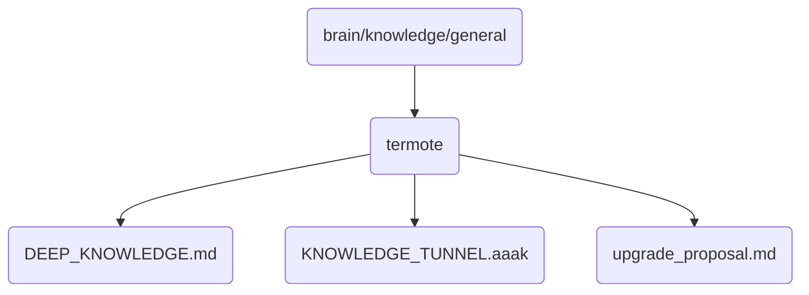

# Termote Identity

The termote directory contains deep knowledge and proposals related to the OmniClaw v5.0 system, focusing on its cognitive and operational aspects.

## Topological View

---
*OmniClaw V5.0 | Forged by AI Architect | Evaluated dynamically*
