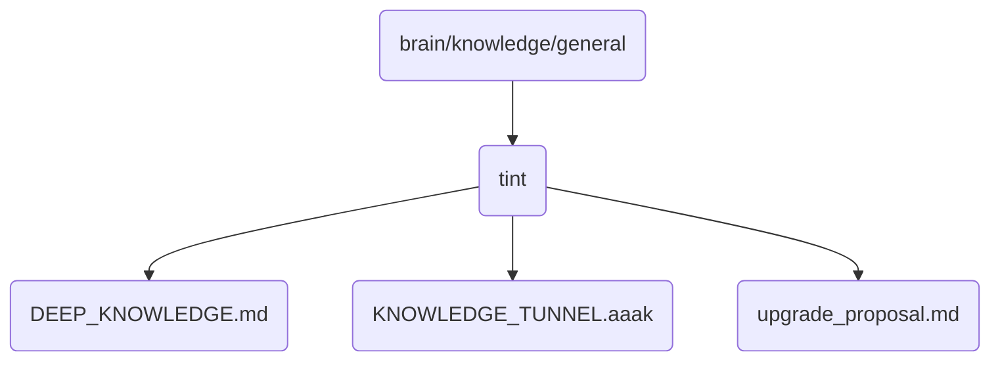

# Tint Identity

This directory contains deep knowledge and proposals related to tinting in OmniClaw v5.0.

## Topological View

---
*OmniClaw V5.0 | Forged by AI Architect | Evaluated dynamically*
